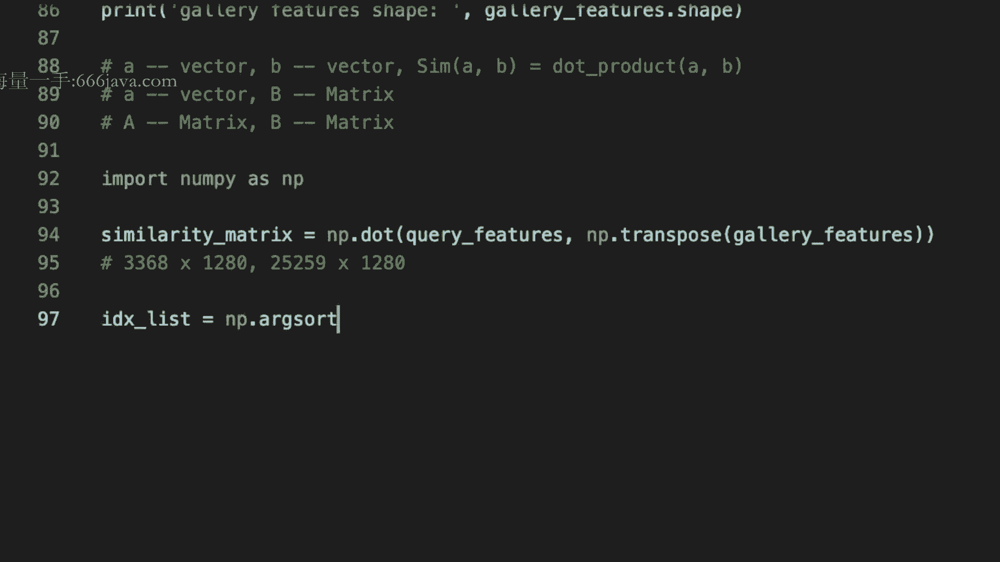
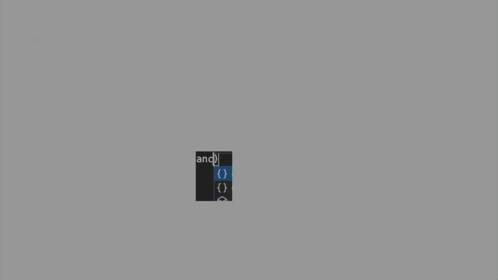
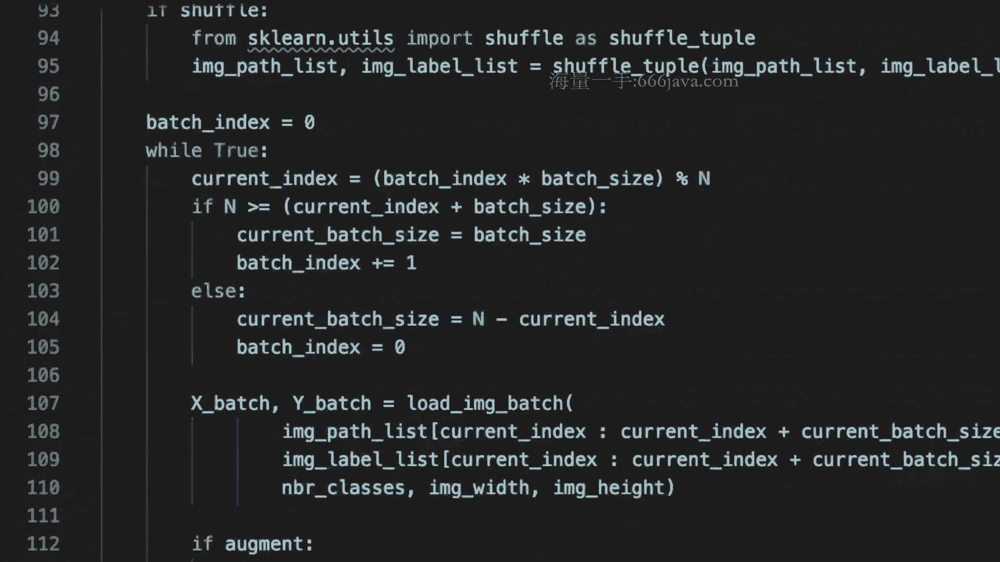
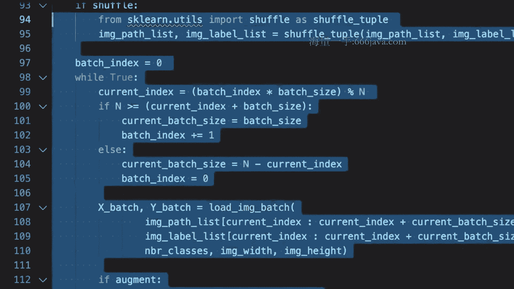
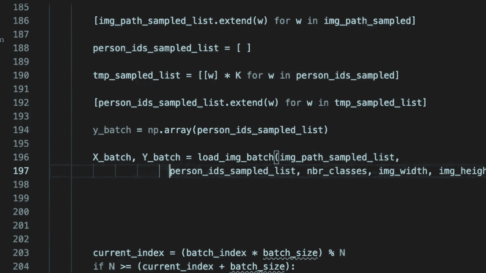
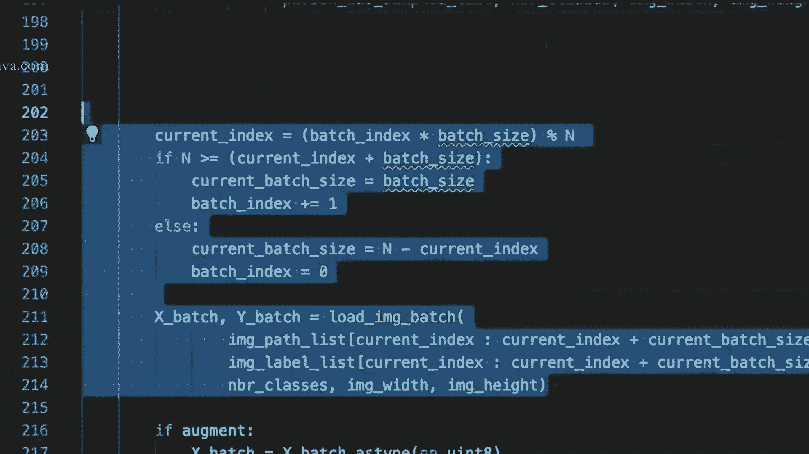
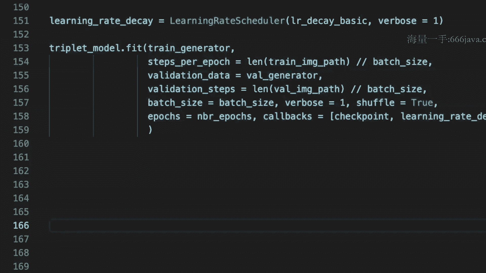

# 1447-七月在线-机器学习集训营15期 - P8：04-CV-4-行人重识别项目（ReID）模型优化迭代及总结 - 程序员技术手札 - BV1ASste6EuZ

那时间到了，各位同学，我们开始我们今天内容了，然后对啊，大概三个小时之后可能就是双11对吧，那我们跟直播的同学，我们再稍微这个呃聚精会神来听两小时的课，然后迎接双11，正好嗯。

那今天我们就是进入第四次的我们的项目的啊，课程就是我们的raid，那在前面三次课程，我们分别从我们的项目的背景，还要我们去建立一个训练的一个CNN的一个呃，Baseline model。

然后包括我们的data loader怎么来写啊，每一行，然后以及昨天啊，前天晚上我们进入到了evaluation的这个阶段对吧，然后我们再来回顾一下evaluation的整套的代码。

然后我们接着今天的讲啊，原来UTION我们写了不少了啊，啊对然后这个我们说从前面的这些啊，query和evaluation的这个数据的这样一个解析，没什么好说的，这个跟我们第一次课的内容啊啊比较相似。

对吧啊，读到GARY和我们的query的图像，只不过在这里我们的再次强调，就是我们的query的image id，和我们的训练数据集的啊，image i id是啊不重合的啊，这个我们之前解释过好几次了。

我们不再说了，然后我们就要load我们的model，就是我们在训练好的那个模型啊，那load我们的model的时候呢，那load model的时候呢，我们是不是说嗯。

嗯对于啊loss函数的这样一个构建啊，我们可能有两块，一块是我们使用内置的loss函数的构建，所以我们直接load model就结束了，还有一个呢就是呃。

如果说我们使用了一些customize定制的一些model，那么我们的模型的其实就会有这个cross呃，就需要去这个custom的objects，作为一个字典加进来。

就是我们的CROSSROY的label smoothie啊，这么一个东西，然后对于嗯接下去之后我们就是会啊，load完了模型那给了一个输入，是不是我们就可以拿到这个feature的输出，我们说啊。

我们model点summary这么一个东西是非常有必要的，因为有了它之后呃，我们就可以通过get layer的这样一个方式，去拿到什么呢，中间任何一个啊信息啊，这里我们是通过name的方式去拿到的。

某一个layer的啊输出，那这个name怎么来呢，其实就是通过model点summary你就可以看到，然后当然这里举了一个例子，只是拿到某一个啊。

这个最后一个global max pulling之后的结果，那你拿到中间的任何一层也OK，比如说啊com1多少，什么样的这样一个啊，雷尔的名字好吧，然后呢我们就会构建一个新的模型。

也不是构建一个新的模型了，其实就是我们在定义一个新的模型，这个模型呢就是做特征提取的，因为在原来我们road那个模型，我们的输入是一张图片，输出是他的feature id对吧。

但是我们现在我要求我的输出，其实不需要去feh i id，没有用呀，我们希望什么呢，我们希望我们的输出是一个这个这个这个呃，feature啊，所以其实就是输出是dance feature就OK了。

所以我们就会新建这么一个model，OK啊，新建这么一个model啧，然后依然就是在我们的机制里面，为了使用它，我们需要去啊啊，我们需要去对它进行一次这个compile。

所以我们依然会要定义一个optimizer，当然这个optimizer其实就给他一个面子，走走过场对吧，那也不会用到它，然后我们的compile一下啊，那就OK了。

然后我们直接就可以用这个模型去predict了，那呃我们可以复用我们之前说过的啊，我们的这个generator，只不过在那generator那个里面呢，我们稍稍做了一些小的修改，本来是yo的X和Y对吧。

那在这里我们只有yo的X了，因为我们要去预测那个Y1撇好，所以这样的话我们就啊可以得到我们的啊，query的generator，OK然后根据刚才我们定义好的那个model呢，我们就会把这个啊。

query的generator为进来做输入，然后我就会得到query的features，Ok，然后啊，我们对我们的这个query features，做一次normalize。

OK然后呢GARY的generator以及GARY的feature啊，一样啊，如法炮制，以此类推，然后normalize一下啊，然后这个GARY的这个feature好，Ok，然后一样啊。

好那这样的话我们就已经啊基本上基本上已经，啊这个前置的这个条件，我们基本上完成的差不多了对吧，差不多了，然后如何啊，往后面走，那其实就只剩几行代码，我们就可以把它写完了啊，你可以看啊。

就是我现在上次是说了，就是我们可以得到一个similarity的一个矩阵，对不对，那这个similarity矩阵其实是通过我们的query，feature和gary feature来进行product。

对吧啊，当然我们是通过矩阵的方式product，然后我们通过transpose一下，我们就可以得到，所以我们可以把这个定义成什么呢，定义成，similarity的这样一个matrix吧对吧。

就可以得到这玩意，对不对，对然后我们对其中的每一行呢，我们其实都可以通过啊，这个排序我可以得到一个arg max，对不对，那这个arg max呢其实就是我的识别的那个id嘛，所以很简单啊。

你就可以得到这个index的这样一个list，当然这个list其实是每一行组成了一个矩阵对吧，所以我们依然可以用，啊AI g salt来进行salt。

它。

然后这样的话是从小到大来进行排序，对吧啊，从小到大来进行排序，那你可能需要来反向来，就是啊这个就是把它逆序一下，当然这个操作也没问题，但你还可以这么操作，就是为了简单啊，你从小到大也没问题。

你就定义一个distance matrix呗，不就是一减去这个similarity的matrix吗，对吧，这样你就不用去那个倒一倒倒那一首对吧，好，然后这样是不是其实你就能做evaluation了。

对吧啊，接下来代码我们就交给大家自己了啊，啊接下来的逻辑呢非常的清楚了，这个逻辑是不是就是，each吃肉，In i d x，Is a prediction，对不对，并且呢，IDX的。

每一行的第一列大家说的是什么，想想看每一行的第一列是什么，每一行的第一列其实就是我那一个sample，就是我的那一个预测，Query，他预测出来相似度最大的那么一个id是什么，对不对，当然。

这里的id啊应该是他的123456的这个id，对吧啊，这个是没有问题的，所以其实它是is the index of the pre，id对吧，所以你要通过这个id呢去找到什么呢。

找到额这gallery的gt，这个很简单吧，这个之前我们就已经有了，所以其实你就可以算一个top one accuracy对吧，比如说，对吧，然后你可以写，对每一个query区来进行一个处理对吧。

比如说啊，好吧，那这个query的id是什么呢，就他实际上这个id你是不是能够取到这个gt，很简单吧，你可以通过parate name，这样你是不是就能去到了，我们去之前说过了对吧，好，然后很简单吧。

在某个时刻你肯定要对这个啊，给一个判断对吧，他到底是比如说零，还是一对吧，然后跟你的top，AACC你需要有一个交互对吧，就可能要加这个predict，然后最后呢你的top one。

AACC可能你要除以整个什么呢，宽长度对吧，你所有的测试的样本的数量，OK大概就这么一个思路啊，那接下来几行大家自己完成啊，这个就跟我们任何机器学习，深度学习没什么关系了对吧，这几行的逻辑的代码。

给大家布置一个小小的啊作业，OK接下来就是我们的evaluation的过程，好大家看看有没有问题，我再拉一遍啊，大家看有没有问题，对总体来说其实很简单，就是把你整个流程串起来。

也就是说你有了训练的模型O，然后啊你有了测试的样本的数据，因为这个时候你有testing的query的贝塔啊，并且我们说了testing那个data的时候，它的query的名字它其实就蕴含了它的id好。

所以你其实这个已经有了，然后在你的GARRY的那个部分呢，它其实会有对应的啊，就是跟这个id相同的那个样本，但它肯定有嘛，不然你无法检测啊，检索出来你其实就是希望什么呢。

通过检索SENIARITY相似度比对，然后把你在GARY的那个图片跟你做testing data，做query的时候，同样一个id的那个图像把它的相似度很大，把它给检索出来，对不对。

这个其实就是你本来预期啊，预期的这样一个目标嘛，所以你自然而然会有啊，所以就在他给的这个材料就是数据里面呢，你是可以这样去做解析的，OK没有问题啊，然后就是啊有了模型，然后载进来啊，载进来的时候。

你其实就要注意到底你是用这个内置的模型呢，还是用了那个呃这个自己个性化定义啊，定义的那个模型，我们前面说了该怎么处理，在进来了之后就比较简单了。

其实就是啊你用那两个prediction阶段的generator，然后去读你的数据，然后得到那个dance feature，但这个dance feature你可能需要啊建立一个啊，就是输入式image。

然后输出是feature的这么一个model，然后这样就可以读出来了，然后就得到了两组feature，一组呢是你query的feature，一组是你carry的feature。

然后这两做feature去做相似度的比对，所谓的比对就把这两个向量啊，这两个呃这两组feature，然后做一次啊，矩阵的乘法，你就得到了一个similarity的这样一个matrix。

那这个matrix自然而然你希望什么呢，你肯定是希望什么呢，肯定是希望那个真实的就是那个id啊，他的similarity最大嘛啊，所以就是你这样按照你的distance倒排啊，这个一下从这个排序一下。

从小到大或者similarity从大到小来，这么按行的这么一个维度排序，然后取最大的那个similarity作为你的预测的id，然后呢你就要去拿这个id跟什么呢。

跟刚才你从query的那个name解析出来的那个id，你做一下比对，如果是一样的，OK那说明你对了，看理解这个意思了吧，嗯再给大家半分钟的时间理解一下，如果没有同学提出异议问题的话，我们就讲下去，好啊。

那看起来大家对evaluation，这个阶段没有啥太大的问题，那我们就走下去啊，走下去嗯，那接下来呢就是我们整个流程都已经串完了，对吧，那啊，其实我们的一个这个模型就已经完整地做完了。

那我们在想有什么样的方法能够去做一些，improvement呢，就可以去提升我们整个模型的这个方法，那今天我们要给大家介绍一个叫做啊triplet loss，一个东西，这个true loss呢。

也有时候有时候人们把它叫做deep brain，对就是深度排序啊，那这一些技术就是TRIBULOSS也好，deep franking也好，你从他的名字ranking，也可以知道它是用来解决什么呢。

啊他需要解决啊image retrial的问题啊，那举个例子，大家今天就要用到的淘宝上的拍立淘啊，好就是这个拍立淘的这样一个想法呢，就是你在你的淘宝的那个手淘主页上。

是不是其实就是啊有一个那个search by一个框框，把那个框框里面你拍一张图，好，街上拍一张图，然后他就返回给你，识别的这样一个结果对吧，这个就是拍立淘的这么一个啊，典型的一个应用啊。

所以就是跟图像检索相关的这个技术呢，TRIBLOSS会用的非常的多好，那这个chocolate是什么意思呢，triplet在我们英文里面啊，其实是三元的啊，这么意思啊，三元组啊，三元组，那，哪三元组呢。

在我们的这个啊算法里面呢，我们把这三个对象啊，这三元组的对象我们把它称之为这三个东西，比如说anchor，然后positive和negative啊，注意它们是相对的关系啊，就是啊。

我们这里的anchor，并不是指的是目标检测里面的那个anchor啊，不是那个anchor box啊，啊跟那个没关系，大家千万不要搞混了，我们这里指的anchor啊，是指的是我们选取的一个啊。

相对的一个参照物啊，然后这个positive呢跟这个参照物呢是啊，正样本的关系啊，然后positive呢，an negative呢跟它是负样本的关系啊，换句话说我们啊更加的啊通俗易懂的话呢。

其实就是啊我的positive和anchor，我要在某种程度上去share，一定的正相关的语义的关联度，而negative呢是具有反负面的这样一个相关度啊，是这么一个意思，我举个例子啊。

比如说我现在有一张狗的图像啊，那么狗的这张图像呢，嗯比如说是一个金毛对吧，金毛那positive呢是什么呢，positive呢其实就是嗯，比如说我可能也是一个狗的图片，比如说是一个边牧或者是一个柴犬。

然后negative呢就显然它不是一个狗的图片，比如说他是一个，好猪的图片或者羊的图片啊，或者呢是一个汽车的图片，或者是一个什么呢，这个飞机的图片，就总而言之它不是狗的图片。

所以它是一个negative啊，所以就是啊大概它的这样一个意含义就在这，就是positive是跟我的anchor share一定程度上的啊，有语义的关联度的这样一个东西啊。

negative呢是有负向的这个啊关联度好，那我们的目标是什么呢，啊就是我们的target或者loss函数是什么呢，啊，啊他给的目标啊是什么呢，是希望什么呢，在我们的特征空间里面啊。

在我们要去学习的这样一个特征空间里面，positive和anchor之间的距离，要小于，negative和anchor的距离啊，这里我们稍微停一下，大家可能要消化一下，大家能明白这个含义吗。

注意我们说这是我的目标预期，就我希望是这样啊，就是我的lost的函数的形式，我们要把它设置成这样的目标啊，就这是我们的优化的目标，就是我们positive和enter之间的距离。

要小于negative和ANK之间距离，大家想想看，有道理吗，你现在的要做的事情是什么呢，就我们在做raid这件事情对吧，那REID这件事情是不是，其实我们本质上是一个图像检索的子任务。

它其实也是这么一个问题，所以我希望什么呢，在我选出来的anchor和positive，还有negative，那么在我的语义空间space上，也就是我的那个dance feature的那个特征的维度上。

我可以满足这样的条件，那这样的话其实就说明什么呢，说明我的这个embedding的这样一个space，就fish space是训练的足够好的，大家想想看能不能接受这样一个说法啊，也把它扩展到什么呢。

扩展到这个呃image retrial的这样一个领域，好如果大家能够听明白这样一个点呢，那我需要再加一个变化啊，大家想想看啊，在你们学SBM的那个损失函数的时候，我们有做一些什么样的变化吗。

其实我们当时是说哦，我们要去learn那么一个margin对吧，认那么一个margin啊，论那么一个决策边界，那事实上我们是不是需要什么呢，我们是不是为了使这个决策边界，是有一定的鲁棒性。

我是不是需要让我们的那个support vector的那个margin，我们需要让它拉的足够开，大家回忆一下是不是这样的一个预期，大家回忆一下你们在学SBM的时候，我们是不是有一个正负样本的分类。

然后support vector，然后我希望什么呢，我希望那个margin是足够的，鲁棒的，对不对，就是那个角色边界，所以我要看正负样本是有一定的margin存在对吧，不然的话。

如果我的正负样本都在那个角色边界附近好了，那完了，那稍微动一动，那我的决策边界就挂了对吧，所以呢在我们现在的这个约束条件里面，也是一样，我也会加一个约束条件，大家想想看怎么加，这是我希望。

positive和ANK的距离，其实要远小于anchor和negative呃，anchor和negative之间的距离，对不对，但是这个远小于它不是一个量化的一个约束呀，它只是我们国人。

或者说我们的人类的一种描述的语言对吧，远小于那什么叫远小于嘛，你给我定义一下什么叫远小于，在数学上远小于指的是什么呢，指的是不是我可能会加一个margin啊。

然后这个margin呢比如说一啊或者二或者三，或者0。1或者0。20。3对吧，然后呢他小于我们的另外一个是吧，如果加上了它，我都还小于你，那说明嗯我足够小了，这个大家能理解吗，这个能理解吗。

好这个如果能理解的话，那就很好了，就是你基本上就已经摸透了啊，tribute loss的这样一个精髓啊，精华所在好，但是在这里举的这个例子呢，我需要把它再往深了去，让大家去啊思考啊，什么意思呢。

我们前面是说啊，我们举的这个例子是说哦，假设你有一个边牧啊，有一个鞭毛，哎呦sorry，有一个金毛，然后你有一个边牧对吧，是你的positive，然后你的negative样本是一辆汽车对吧。

比如说奥迪好，大家想想看，我们这么去取我们的positive，negative和anchor，有没有太大的意义，有没有太大意义，那首先呢就是，我们想想，刚才我们举的这三样物体。

是不是其实本身我的区分度就会比较高对吧，就是我的positive和我的negative区分度比较高，我的猫和狗哦，我的猫和那个汽车，也就是说我本身通过一个常规的分类的，损失函数训练。

得到一个CN的一个feature space，可能这个fish space就已经满足这样的条件了，大家承认吗，认不认可这件事情，很合理啊对吧，我要做分类啊，我们说了。

我们在train这么一个CNN的时候，我顺便就会得到那个feature space，那我做一个KN的话，可能我就已经能够搞定这件事情了对吧，如果我用TIFFANY啊。

任何一种降维或者PCA的这样一个手段，去画我的那个啊embedding space，去投影在二维空间上的一个平面图，那可能我就已经满足了，刚才我们想要达到那个效果对吧，就是我们的dog可能聚在一起。

然后啊car这一类也聚在一起，这两个其实是拉的比较开的好，但是今天我换一个任务，假设我让你做细粒度图像分类，翻grade image classification，那想想怎么办。

好所谓的细粒度图图像分类分类，其实就是指的是，当class和class之间的相似度没有那么高，比较有模糊的时候，比如说植物动物这种生物特性的这个分类，对吧啊，有些同学也搞不清楚什么是水芹，什么是芹菜。

对吧啊，什么是香菜，对不对啊，也有可能搞不清楚啊啊，所以这个就是啊问题的所在，所以当你要区分出狗里面的边牧金毛，德国牧羊犬哈士奇对吧，这些的时候，那可能我们刚才采取的那种sample就不够了，对不对。

所以针对这样的一种问题的处理，你要去让你的损失函数的优化，其实就是说哦，金毛和金毛之间的这个啊距离，要来得比金毛和哈士奇要来的高，R1要来的更小，对不对，然后同一个品种的之间的距离需要来的更小。

所以这个时候你的额优化的这个空间啊，目标其实就会采样什么呢，比如说你养了一个哈士奇，我养了一个哈士奇，那我们两个把图像给，啊分别做anchor和positive，然后在另外一个选一个嘛，金毛对吧。

这样的话我才能够去啊，合理的希望我的结果会更好，所以刚才说怎么选取啊，我们的anchor positive是很重要的，所以呢，选取这件事情其实就是采样，Anchor，Positive negative。

是非常重要的，对不对，是非常重要的，就如何去sampling我们的这样一组data，好，那如果我们把我们的视线拉回到我们的person，REID这样一个领域里面，你们认为，如何去采用我们的数据呢。

大家想想看，如果在我们的person reid这样一个领域里面，我们怎么去sample我们的data，大家有没有思路，如何去选，最好的方式呢，我觉得anchor。

和positive可能没有什么太大的问题，最好的方式呢就是anchor，anchor和positive是同样的，ID的，这个就没有疑问，对不对，而negative呢是不同的id。

这个就叫做present raid里面的something，这个很合理吧，很合理啊，啊我跟自己的这个图像比，要比其他的是接近的嘛，如果你能听明白这一点的话，啊如果你能听明白这一点的话。

那么你就能够想想看，我怎么能够让我的模型啊，让我的这个采样变得更加的什么呢，有难度，因为你现在应该能够预期到，其实模型啊他怎么去学，完全是取决于你喂给他什么样的数据的样本，对吧，当然这个样本是要合理的。

是可收敛的对吧，你不能让它喂给你，不能啊，让他喂给他一些错误的一些这个样本，他的就得不到合理的结果吗，那么是不是有一种这个大家的这样一个想法，就是我让他喂给他，越有难度，区分度的一些数据。

他可能会学的更加的什么呢，特征学的更加好诶，如果你是这么想的话，我觉得是有点开窍了啊，是合理的一个推测，当然了，你可能要考虑到就是你不能一上来就给喂给它，很难的这样一个样本。

就好比我们的自己来学我们的知识啊，我们也是循序渐进的对吧，小学初中高中大学一上来，你小学让你直接去学微积分，你懂吗，你肯定也不懂嘛，所以一样的这个含义，所以这个你要去把握这样一个比例。

所以呢有一种叫做这个，Hard triply dogs，啊这个是什么意思呢，这个其实就是说我要选一些困难的一些样本啊，啊我们要去选取一些困难的训练的样本啊，让我们的模型来train，比如说啊举个例子啊。

本来在上面我们其实选了一个，比如说hard negative在上面，是不是我们随机选了一个不同的id，作为我的negative，而事实上呢事实上呢我们是不是可以去选，我容易错分的那个贝塔。

最我的negative，我这么说是不是能够理解，就是对于我的training而言，我选择那些容易区分错误的data作为我的negative，是很合理的，为什么这么说呢，因为大家在读书的时候。

老师都会让你准备一本，错误的习题集的顶正本，对不对，考前多去看看容易犯过的错误啊，其实也是这样一个道理，那么怎么来做这件事情呢，嗯那我举一个例子呢，可能大家是能够很好的理解了。

就是说假设你今天穿了一件蓝颜色的夹克衫，然后呢蓝颜色的牛仔裤，浅蓝色牛仔裤，你说我们的模型是更容易错判那些，比如说穿穿这个碎花裙子的美女，还是说诶我有一个蓝领的工人啊，不是不一定是蓝领的工人吧。

就是我们的一些啊，这个就是换句话说其实就是防疫工作人员对吧，我可能会穿这个蓝颜色的这个这个大褂啊，就是我们的这个防护服啊，你们说哪两个是容易去错分的呀，那是不是后者容易错分，因为都是蓝色的嘛对吧。

然后这个夏威夷碎花裙子那么鲜艳，跟这个蓝色完全不一样的，你当然不容易区分错了，所以此时此刻，你们觉得哪个是我们的hard negative的sample，是不是去采样我们的防疫服的这样一个人的。

这样一个id的图像，去作为你的hard的negative sample要远远比什么呢，比碎花裙子来的更有价值对吧，很有可能在你的cn baseline的那样一个，分类的损失函数里面，你通过。

分类的这样一个好soft max的损失函数，其实你就已经能够区分做区分了，你还根本都不用去其他的，对不对，大家能明白我的这样一个含义吧，好如果能明白这件事情的话，那就好办了啊，那就好办了。

那我们来尝试啊，就是来定义一下这个jb loss，我们说我们的这个写任何一个损失函数，它的参数呢很固定啊，Y true y predict，还有我们的那个margin对吧。

比如说我们这个margin就叫阿尔法，比如说我们阿尔法就用0。3啊，好然后这里我们做一个说明啊，所以这里的y predict是什么呢，while predict其实就是啊在我们做这个呃。

因为我们会有这个anchor positive connective，未进来嘛，三步进来，所以我就会得到这三张图像的embedding，对我们假设这三张图像的embedding都是。

比如说2048维度的，我们就会把它给啊CONCAT在一起，就是啊把它这个stack在一起，就是啊这个2048，比如说乘以三啊，就是这么一个东西，所以这是我们的prediction。

然后我们会对它来进行解析啊，就是我们做这么一个小小的这么一个假设，所以它已经会变成我的prediction了，对不对啊，啊这个我们稍微要import一个东西啊。

然后我们会用这个l to normalize，我们先对这个embedding做一下规划，这个很合理，对不对，然后呢我们可以得到我的batch size啊，这样的话很简单吧。

我的白痴size其实就那玩意要除以三，因为我会有三倍的啊，这个这个anchor positivity，还有negative对吧，在这，然后具体而言呢我们会把这个ship as list一下。

然后呢我们会把这些东西去解析一下，就是anchor positive和negative，分别来进行解析，这样的话，我就把这三个东西分别从can cat的这个呃，状态里面，我把它解析出来了。

然后还记得我们刚才说了，我们要去算那个positive，distance和negative之间distance对吧，所以我们要去算一个什么呢，对吧，然后我们还需要算一个，是不是要算这俩玩意。

那其实就是K，对吧，这样我就把它distance啊给算出来了，然后我们还要用那个阿尔法那个东西，对吧啊，这也很简单，其实你的loss就是什么呢，大家想想还是什么，你的loss肯定不会小于零，对不对。

因为我们的loss啊，所以你其实可以用那个我们说之前这个margin，这样这种函数损失函数，在我们讲那个折页损失，hinge loss里面是不是讲过了啊，是不是我们用那个RO那个函数。

就可以把它实现了啊，RO那个函数大家还记得吧，其实就是，零对吧这么一个玩意儿，这样我们就把TRIPLOSE给实现了，大家来看一看，有没有什么问题，大家看看有没有什么问题，two bloss的实现。

好那如果这块没问题的话，我们就往下面走了啊，就是，那我们接下来就要来谈怎么应用对吧，怎么应用，好我们在这边啊，training的这个里面来来改，切那就像我们的snl model，好在这吧。

那global pool已经有了，然后因为我们要使用这loss嘛，我们可以先假设我们在这里，要不我们就直接干脆做一个这个normalize，得了啊，尽管后面去block可能我们也会做。

但是我们可以为了保险起见，我们也可以做一个，然后这里做normalize，在雷欧里面做呢，我们可以用类似于呃，这个Python里面的lambda表达式来做这件事情，啊栏目的layer。

然后一样拉姆达的表达式，好那这里还有一个小技巧，就是如果你想为了后面再model点summary，看得清楚一点，那你这里也可以给它定义一个名字，比如说你的name叫TRILATE，啊也OK的啊啊啊。

这里K我们需要import一下，啊就OK了，然后这个dance呢呃我们依然可以这样去加啊，小狗，然后source max output没问题对吧，然后对于model而言。

我们是不是这里可以选一个triply model，那CN点value input好，这个时候我们给大家介绍一个新的一个想法，就是之前我们其实都是单分支的对吧，一张图像进来，然后一个分支输出。

那其实我们的神经网络也可以多分支的输出，多分支的输出，这种东西呢也称之为叫multitask learning，就是多任务的一个学习的方式，这个多任务的学习方式的这个想法，其实就是利用什么呢。

就是利用这个啊，多个任务和多个loss函数的约束的条件，使得我的模型的优化呢是来的更加的好啊，比如说呃在我们这里，一方面我们通过损失函数的优化，另外一方面我们通啊，通过这个啊两个损失函数的优化。

一个是我们的COSENTI比损失函数，一方面是我们的TRILOSS损失函数，所以这样的话我其实就可以，啊给这俩玩意就是一方面是输出啊，给那个tribe loss。

还有一方面是输出给我们的soft max ok啊，所以是这两个东西可以输出啊，这我们可以改一下，好，那我们休息10分钟，然后我们继续啊，好嗯，那我们接下来就进入到我们的loss函数的，这个阶段。

好那在这里呢我给大家这个更新一个点啊，就是啊有同学可能会觉得哎，老师你自己写一个去BLOS麻烦吗，就好像你自己写co30ING麻烦吗，啊我有没有一些可以调用的一些简单的一些啊。

API能够帮我们去cover这个事啊，OK那我们说是有的啊，就是你可以这样去cover啊，首先你要pip install一下这个东西，啊好，然后呢，那这里面有一个TRILOSE。

OK我们就可以import这样一个tribute tr，这样一个loss，然后我们就可以改一下tribute model啊，你要compile这个东西好，那关键的就来了啊，关键就来了。

你有几个分支的输出，其实就对应有几个任务，这个很好理解吧，啊有几个分支的输出就对应有几个任务，我相信就不用啊，没有什么疑问的，那有几个任务其实就应该对应几个损失函数，唉这个大家OK吧。

啊我不觉得可能这个有太大的问题啊，有几个任务，你就应该有几个对应的损失函数对吧，你你损失函数是用来去引导和约束任务的吗，所以这个时候看到没有，前面我们写的分支的输出是有几个两个呀。

一个是trip loss，一个是什么呢，soft max的output对吧，那在我们这个loss这里呢，在我们这个loss这里呢，是不是也应该有两个损失函数来去约束它呀，所以肯定是这个样子的，对不对。

所以肯定是要对应什么呢，你的那个loss对吧，所以前面他tribe lose放在前面，那OK那你的tribe lost，这应该放在前面，是吧，你就应该这样写，下面一个也是一样。

这应该放在前面应该是很合理的吧，好这样的话呢你就把tribe loss就应用一下，当然前面你要改一下这几个model对吧，放回这里，好来大家看看有没有问题好，那如果这块没有问题的话啊。

就需要大家思考一个问题，我们现在模型能够乱通吗，能转起来吗，注意我提的这个问题啊，我问的是大家这个我们模型能不能乱通，能run的起来，我们说是不能run起来的，为什么呢。

看这里这里的generator用的是哪里的generator，是不是用这里的generator，这generator generate是什么，是什么，是不是x batch和y batch。

而y batch呢又是一个one hoencoding好了，可是我现在的损失函数或者我的输出是两个呀，所以如果你不改你的generator，你一定在这里会报错，对不对，这个是不是很合理的推测。

这个分析能听明白吧，所以这个真的rate我们要改啊，我们要改啊，只有改完了之后，我们前面那个模型才能乱起来，才能跑通，不然你肯定跑不通的啊，你想想看是不是这个道理好。

我们把它复制100，然后我们尝试来改一改。

好我们把它假设叫这个啊，triplet好了啊，然后这里有我们可能会稍微做一些小小的变动，对于输入的这个啊采样的这个形式，前面不变啊，然后这个batch size呢我们稍微对它进行一些改动。

我们定义两个东西，一个是P，一个是K好，我们来解释一下，这个P呢其实就代表person id的个数，然后这个K呢就是四啊，为什么我们这么定义，我们有原因的是，因为啊我们现在要做这个TRIPLETE。

hard的这样一个mining，所以我要知道哪些的就是同样的一个呃id，我需要保证有一有一定的这个量的图片，不然我怎么去做positive connective的sampling，对不对，所以很合理。

也就是说我会随机采16个，也就这里的P个人，然后每个人呢我随机在采K张图像啊，所以我的h size其实就P乘以K啊，这个能理解吧，这很合理吧，很合理啊，很合理，那这个时候呢大家想想看啊。

我是不是很想知道，就是给定的一个这个person id，我是不是很快的可以去找到它对应的这个额，有多少张图像，所以我要建立一个字典对吧，而这个字典的建立呢，其实啊就是我们的一个哈希表嘛。

就是我们的那个Python里面的一个字典，我就可以去建这样的一个key和value，的一个这么一个东西，好，所以我很快我就能够额这个建这么一个哈，希表啊，比如说，好我们会用一个这个这么一个函数啊。

帮助我们快速来建立这个函数的意思，其实就是啊如果这个key在这个里面呢，我们就把它的value取出来，如果没有在呢，我会给它复制一个新的一个key，然后它对应的value呢。

就是我们的一个啊空的一个list，这很合理对吧，然后不管怎么样，我就把它append嘛，就把不断的image pass把它判断到这里面，这样的话给任任意一个呃，这个id我就能知道它的对应的那些。

好对应的那些那些，就image the pass，好，啊这里我们做一个小小的约束啊，就是，那想想看是不是所有的id我其实我都能用呢，其实不是对吧啊，我其实要大于等于我们的K1张图像好，我可能才会能用。

好我要true，来我们先踩P个人对吧，这个很合理，对不对，然后呢我从这个踩的这个人里面，我是不是，要去踩没，我是不是要去踩他的呃，这个image pass对吧，这也合理吧，这个我们前面说过了啊。

我们要这么改，然后啊这个时候呢我们其实就啊需要什么呢，呃它们对应的这个，person的ID，就是他其实是有一定的重复的对吧，因为我们说我采样了K个人过来，然后他采样它对应的这个。

就相当于我要去建立一个list，这个list跟我们的image，pass sample的这样一个维度是一样的，就大家能够明白吗，因为这样的话我就能够得到什么呢，得到啊得到我的label啊。

这个label呢是为了后面我们可以去做那个啊，这个数据的迭代，就是我去做我的啊YEL的啊也好，或者这个输出也好，我我很方便的，所以是这么一个啊想法。

原因为呢我在image pass sample的这样一个情况里面，我其实是list里面还有list，但是我其实要什么呢，其实我要把这个list给flatten出来。

就是所有的我不能在这个里面还有list，对不对，因为哦我要拉长到一起啊，所以为了做这件事情，我要把它flatten起来，我其实就干的这个，现在这几行代码是有点偏这个工程啊。

如果大家如果现在一下子反应不过来，就去命令行里敲敲，你就大概知道他在干什么了，因为我所有的id都一样的嘛，所以我就可以乘用这个来乘，啊一样，啊依旧，这里小Y和大Y其实就是差在。

是不是往后ding encoding对吧，哦来换一行。

好那这样的话我们就写完了，我们这个list啊，注意这个小y batch为什么是用小Y，而不是用大Y呢，是因为这两个东西，这两玩意大家想想要对应什么，是不是要对应这俩玩意儿，213行的。

是不是要对应我们刚才写的这个loss啊，是不是要对应这个loss，就这两个，大家想想看，就是你的data的generator的这么一个输出，是要对应什么呢，你要是要对应我们的啊，lost这两个的定义。

这两个要定义什么呢，又要对应什么呢，model的输出对吧，这三个东西是要一一去对应好的，不知道大家能不能消化，好我再帮大家理一下思路啊，就为什么我们要修改这个generator啊，才能够乱通。

是因为首先我们动了模型的结构啊，我们说我们要把我们的trip loss来进行，融合进来啊，所以就是我们使用的方式是multi task learning的方式，就多任务学习方式啊，多任务学方学习方式。

其实就是我们用了两个分支输出啊，我们有两个分支输出，我们用了两个分支的输出，又对应什么呢，两个分支的输出，又对应了我们的loss函数来进行修改，要跟它来进行对应对吧，然后此时这个又对应什么呢。

又对应我们后面要应用这个loss的话，我们要去做FX对吧，就是model点fit，那如果我们的模型没有啊，就是我们的generator data没有跟前两个来进行对应，上头显然我会报错对吧。

所以我要去动物的模型啊，动物的generator啊，就是改改成这三个是一一来进行对应适配的，它才可能是能够通过，那不然一定会报错报错，大家对这个有没有问题啊，想想看，好如果是这样的话。

就大家把刚才这个generate这个batch呢，就可以改成刚才我们的，这个，啊这里的batch size就改成那个P，就好了，好，看看看有没有问题，好如果大家对这个没问题的话呢。

我们最后一点时间我给大家介绍一个呃，learning weight的一个修改的一个策略的一个方法啊，然后这个方法呢主要也是用在我们的call backs，就是回调函数里面可以去进行参照的啊。

好我们来定义一下，就是因为我们在learning rate的时候，通常来说来现在我们大家都是手动来进行下降，比如说我调一半对吧，或者调啊1/3啊，那假设我们可以这样去调的。

假设我们的learning rate在一共要训100轮对吧，可能获得120轮，然后在第40或者第70的时候，我们让他去乘上0。1的系数，这样我们就不用手动去动了，然后我们的这个回调函数大概长这样。

OK然后在最后我们的model checkpoint这里面，我们可以同时import一个叫做learning rate schedule，这么一个东西，好除了我们初始化一个checkpoint。

我们还可以，然后在这个checkpoint这个里面呢，后面我们可以跟一个，好这样我们就完成了checkpoint的后面的，啊回调函数更新好，大家对今天的内容还有问题吗，好希望大家还是能够在课后的时间。

能够自己去手敲一下我们课上讲的这些啊，cod和这个想法，然后会离得更加顺，然后帮助大家更好的去更快速的去理解，啊尤其是今天我们讲过的啊，为什么要改那个generator啊，这么一个逻辑关系啊。

这样你能理解的话，你就对整个通盘的这个理解，就会更加的通透了啊，就不不会只是说哦老师说要改就改啊，然后你预期不改会报什么样的错，这些都一切尽在你的掌握之中，那就是你来控制code。

而不是code来控制你，好如果没有其他问题的话，我们今天的内容就先到这里，然后后面的安排就请听孙老师的安排好吗。

