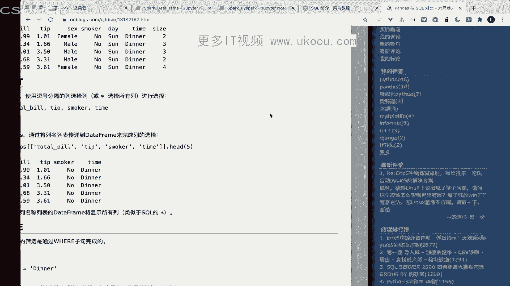
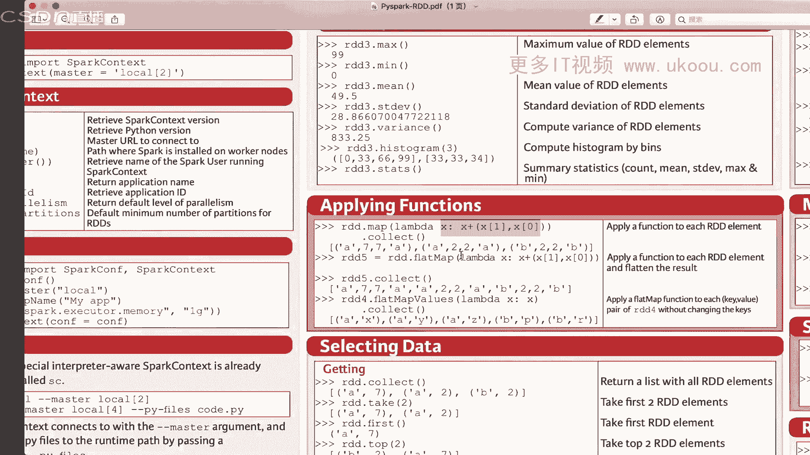
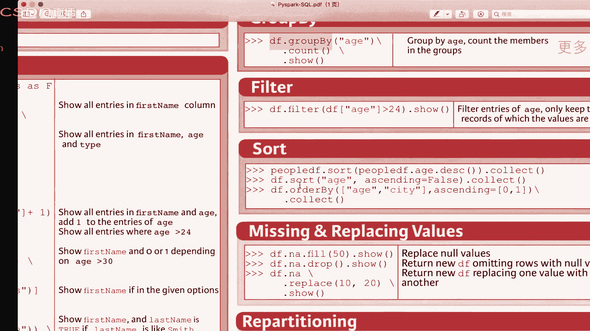

# 1447-七月在线-机器学习集训营15期 - P9：04-基于SQL的机器学习流程和实践 - 程序员技术手札 - BV1ASste6EuZ

嗯哦行行好，那我们就稍等一会，那就开始，大家之前学习过circle吗，有学习过，有之前已经学习过，有基础对circle有基础的同学吗，有没有同学，我看群里面已经有有同学在问circle的。

其实嗯如果大家之前对SQL有一定基础的，可能这节课会稍微好一点，学过啊，哦那好看来还是有同学学过的，大家对我们之前的课程有问题吗，或者说有什么问题吗，我们就是我们每次留给大家一个实训的一个。

这就是说作业并不是特别难，主要是考虑到有些同学他的基础啊不太好对，如果大家觉得实训太简单了，也可以在群里面艾特我，然后我也会给一些更加深入的一些资料，给到大家，那么有没有同学之前学过spark的。

或者说学过大数据相关的，应该是有应该有同学学过，嗯好我们再看我们再等12分钟，因为还有同学没进来，只知道大数据的概念好，那么我们今天就给大家介绍一下啊，这这些特别是spark的。

那么我们就开始我们今天的内容啊，我们今天的内容呢是基于SQL的一个，机器学习流程，那么我们在之前的课程呢，其实都是讲解Python环境下的一个机器学习流程，但是呢其实circle也是非常重要的概念。

非常重要的概念啊，就是说其实也是呃很重要的，那么我们今天的一个课程内容呢，其实偏向于具体的一些案例和工具的一个语法。

语法讲解，我们呢今天的一个就是说课表是课程呢，就是第一个是circle的一个基础和大数据开发，我们在会在这部分的讲解，SQL的一个基础和大数据开发这个岗位嗯。

第二部分呢我们会讲解spark的一个介绍和使用啊，第三部分呢我们会讲解spark socl的使用案例，第四部分呢我们会看这个spark的机器学习的案例，好的，那么我们就开始我们今天的一个内容啊。

首先呢是第一部分我们的一个SQL与大数据开发，那么SQL呢可能之前大家已经学习过一点，我们就简单介绍一下SQL呢，它是用于访问我们数据库的标准的计算机语言，它能够完成我们的数据插入查询更新和删除。

而且能够完成所有的跟数据库相关的控制，那么呢我们现在的一些常见的一些数据库软件，比如说MYSQL这个server或者说oracle，他们的一个交互呢都是说是SQL语言的，所以说大家在学习数据库的时候呢。

其实也是就是说学习这个SQL的语法，那么SQL呢有同学在群里问了，说是不是我们这个消防工程知识，或者说是不是大家需要掌握的，其实是这样的，SQL呢是其实可以视为一个额，就是说计算机的一个基础。

因为数据库也是，基本上所有的计算机专业的同学呢都会学，所以说呢也是需要大家掌握的，也是我们大数据开发的一个必备的技能，那么这个图呢就画的是我们的所有的编程语言，其实呢它的一个交互呢。

都是通过一个circle的一个语言对吧，我们这个A在这个地方的HTTP，通过我们的HTP发送我们的具体SQL语言，跟我们的啊，再通过我们的circle的一个软件，再跟我们具体的一个数据库进行交互。

那么这个呢就是说我们其实每一种，我其实说这个circle的一个语言呢，它其实是独立于所有的编程语言，它其实是跟数据库强强相关的啊，强相关的，那么这个地方呢就是说呃我们嗯还是建议大家。

如果之前没有学习过SQL的，是需要学一下，它是对所有数据库管理的一个语言，而且SQL并不是很难，就是说它是非常简单易懂，确实成本低的数据库呢，我们对吧，如果大家是转行的，我稍微介绍一下，数据库。

是用来查管理和查询数据的一个关系系统，那么常见的关系型数据库呢有MYSQL，Sex server，那么还有一些非关系型的数据库，那么数据库呢可以用来帮助我们，很简单的进行一个数据的一个插入修改查询。

而且呢数据库的一个存储结构是非常稳定的，能够保证我们的数据进行一个有效的存储，数据库呢它还是这种，它是多用户的啊，就是说我们那个用户的权限是隔离的，是可以支持并发操作的。

而且数据库是可以支持回滚和保持时间的，原则性啊，呃这个地方呢就是说我们呃，如果大家就是对数据库没有一一定的了解啊，可以稍微就是说记一下，就是说数据库其实我们它是现有的，有生活中我们一般的嗯这种订单啊。

密码用户密码，或者说嗯这种比较重要的一些信息啊，都是存在数据库里面的，那么我们有在前面的课程呢，其实已经讲解了pandas对吧，其实在或多或少用到了pandas，那么有同学说老师这个地方呢啊。

ANDAS和我们的circle其实是不是一样的，其实不不能说完全不同啊，他们其实是有很多相似之处，那我们pandas的一个本质操作呢，和circle的一个操作其实是相同的。

只是一有就是说有一个具体的一个实现，是就是说不同的，比如说我们的pandas as可以完成数据筛选，pandas as可以完成数据展示，pandas as可以做一个数据删除。

那么pandas也可以做数据的分组聚合，分组统计也可以做多表聚合对吧，这也是我在我们的pandas里面都可以用的，那么circle能不能用这些呢，其实circle也可以完成这么多对吧。

额那么有同学说SQL只知道增删改查，不知道实际工作中怎么用的啊，我举一个例子，就是大家嗯就是说嗯举一个很简单的例子啊，就是说电商电商，你就是说最开始我们在登录这个账号的时候，他会做一个校验对吧。

我们的用户名和这个密码进行校验对吧，一般情况下呢就是说这些公司呢，他会把这个用户名对吧，相当于是大家登登录的账号和具体的密码，密码可能是加密后之后的啊，把它存在数据库里面，然后呢通过这个数据库对吧。

我们能查询出来这个用户的一个用户名和密码，是不是匹配的对吧，这就是说是根据查询来找到，就是说具体具体的逻辑，那么在电商里面还可以这样做，就是说我们统计这个用户，他这一个月来或者这一年来。

这个所有的订单的一个总金额，就开销总金额对吧，大家的支付宝账单对吧，呃年度支付宝账单，年度京东账单对吧，其实他也是用到数据库的，就是说select，就是说查询我们2020年的这一年度的。

所有的订单的一个消费的金额对吧，所以说呢呃circle，如果大家只知道这个具体的一个增删改查，其实只知道就是说基本上知道这个语法，但是呢其实在我们的实际过程，实际业务中呢。

其实就是说它存在一个从业务的一个逻辑，到我们实际数据查询的逻辑的一个落差，这是有一个落差的啊，那么我们其实作为一个程序员对吧，程序员其实嗯有人说他是一个circle boy。

circle boy就是天天写circle的人，那么circle boy，就是说，我们其实很多时候都是在做数据的一个查询，那么这个查询就是说我们要理解程序员，理解理解这个产品经理的需求。

然后把这个具体查查询的逻辑呢，用SQL的语法来完成，就说实现出来，那么我们首先来看一看pandas，as和这个SQL的一个语法的区别，那么右边这个啊在SQL里面呢，这个它的一个具体的就说。

我们用用逗号来分隔我们的列来进行选择，比如说我们用心呢表示的是选择我们所有的脸，那我们来看这个语法啊，Snack total beer tips，Tip smoker time。

这是呢四列我们选择的四列，然后呢from tips，这是我们的表明表明，然后limit5，就是说我们只要就是说从这个tips表格里面，选择这四列，然后只选，就是说只展示前面五行好。

这是circle的一个写法，那么在pandas里面是怎么样的，pandas就是说tips选择我们这个四点啊，它是用于我们的一个索引的方法，索引出来之后呢，然后head5他是这样的啊，他是这样的。

那么这样呢，就是说其实pandas本质和circle实现是差不多的，本质就是说实现跟SQL实现差不多的，而且这些语法上其实都是很相似的，那么我们再来看一看，其实有同学说老师我为什么要学习SQL。

其实是这样的，Circle，第一个是这个基础的一个技能，第二个呢其实在很多的一些面试里面，非就是经常会会被问到啊，就是面试题，不管是当面试题还是当一个技能，很很可能会问到，而且呢我们的大公司。

一般的这种就是说互联网的一些公司呢，他们招的算法工程师，并不是说纯的Python环境下的，他很有可能就是说是一个具体的一个呃，就是说就是大数据平台下面，这个是很正常的，据我了解就是说叫阿里。

阿里基本上就是说他们的开发，基本上都是写circle的，没有没没有环境给你写Python，没有环境给你写牌子，就是说在大公司里面，单机的开发其实是很少的，就单机可能就只是用用来训练很小的模型，很小很小。

一般情况下，就是要不就是在我们的一些大数据平台上，写SQL的语法，然后再做一个具体部署，所以说大家去找一些上网工程师的岗位啊，你去看这些招聘简历，其实很多都是要求这个大数据开发。

不管是spark flink等等相关的一些大数据工具啊，这是很现实的，那么大数据开发呢，我这个地方列举的就是它有三类岗位啊，第一个是大数据开发的一个平台和管理，这个呢主要是数据仓库的工程师。

比如说数据运维储藏工程师，那么第二个呢就是大数据平台的一个数据分析，挖掘，机器学习等相关技能，这个呢可能是大家比较感兴趣或者想应聘的，就是说是这个数据开发工程师，那么这个呢其实也是在大公司里面。

又可以称为叫做算法工程师，第三个呢就是大数据分析的一个结果及展示啊，这个呢主要是一个数据分析式的，那么我们还是希望大家能够关注一下，第二个技能，第二个方向啊，就是大数据平台下面的一个。

机器学习和数据应用的技能对，那么其实呢就是说大大部分的大公司啊，特别是BAT级别的大公司，或者说呃就是拥有海量数据的一个大公司，其实他们的一个上网工程师，也是数据开发工程师。

那么circle的技能和spark的技能也是需要掌握的，那么就是说大基本上大数据开发，它的一个整体的一个薪资也是偏高的啊，比这个软开是高一些的。

那么在我们进行具体讲解spark之前呢，我们首首先带着大家稍微稍微熟悉一下，我们的一个circle的一个和PENAS的一个。

具体的一个对比，那么我们来看一看啊，circle呢，其实我非常建议大家，基本上花一天的时间就可以把它完整的学习完，就是SQL它用到的一些语语法基本上很简单啊，基本上很简单。

就是说基基本上就是一些简单的名词，简单的名词呃，就是说大家可以按根据这个教程，基本上刷一遍就行了，刷一遍你就可以把大致能记住啊。

基本上一天就能刷一遍，一天一天就能刷一遍，那么我们就看一看circle。

它和pandas as对吧，pandas as大家都熟悉，那么我们看一看circle和pandas as，它具体的一个对比对吧好，那么额我们如果把这个数据集对吧，这是这个就是说我们方块。

这个是在IPYTHON环境下的，那么我们看一看这个pi Python环境下的一个数据集，其实它读取完成这个pandas之后，就是个data frame对吧，那么我们再来看一看呢，具体的对比。

其实我们刚才也对比了对吧，这是select，这是circle select，这是pandas的一个数据选择，circle的一个语法，就是说我从里面选择什么列，从，然后具体的表格是什么。

然后最终那个显示的一个结果是什么，这是很简单的，就是说select from limit，然后呢如果我们想加逻辑筛选，其实也是可以加的，在SQL里面都是可以加的，select新新式表示我们筛选所有的列。

From tips，where time等于dealer，就是说我们从这个tips表格里面筛选得到time，等于dinner的行，然后呢我们只选择前面五行，那么在pandas里面是这样写的。

这个是我们的一个逻辑对吧，这是我们的筛选逻辑，然后这个tips是我们表格，然后进行索引，然后head5大家可以看到就是说这个circle，它这个这个最终的一个展示，其实它也是在最后来进行的。

就是说limit最终进最后进行的对，那么a circle呢它这个语法也可以完成多个啊，就是说逻辑的操作，比如说time等于jinner and tip等于大于五，就是说我用两列来完成筛选。

一个time等于deer n n的T不大于五，这是两列来进行逻辑筛选，好我们往下翻，那么哦circle呢，其实也是可以支持数据的一个什么空值查询的，这也是可以的，这也是可以的。

那么SQL也可以做一个分组聚合，那么这个地方是需要注意的，就是说而我们的一个分组聚合，其实grop by对吧，那么它的一个操作逻辑，其实就是说把我们的数据集进行分组。

然后八就是说统计每个组里面的一个平均值，或者说求和，那么在circle里面它也叫GRPB对吧，其实这个地方你看到，其实在circle里面的很多的一些单词，和我们在一个呃pandas里面。

用的这些单词都是一样的，只不过它就是一个具体的语法不一样，那么在这个地方其实它的一个就是说操作，但是他这个语法有点有点不一样，我们来看一看啊，我们对tips这个表，Grop by sex。

按照这个sex这一列来分组统计，分每个分组下面的一个大小好，他是这样写的，那么我们看一看circle select sex，逗号count新tips from tips group basics。

那么这个地方大家可能看着就有点迷糊，这个操作就是说这个到底是什么含义，我们其实在大家我们前前面这个地方，网上最最上面啊，嗯我们这个地方select新，就是表示的是我们选择所有的列出来对吧。

那么我们假如说想要选择我们想要的列，那么我们就就是说把这个想要的列名，把它写出来，那么在这个地方我们的group by对吧，那么这个地方是什么含义呢，第一列是我们的sex，就是我们的分组的取值。

第二个能力就是count型，count型就是说我们分组之后，它每个分组下面的一个取值的一个个数，是这样的啊，就是所以所以呢在这个地方，他的一个可额每列的一个，就是说计算得到的逻辑呢。

可能还跟我们的GRP外跟跟他有关系好，那么我们的一个呃就是说呃grp band呢，我们分组之后呢，还可以统计这些，具体的就说我们group by smoker，grp bad day这两列。

然后统计它这两列对吧，其实你可以看到如果把它们做grp ban，其实他就是当我们的一个音，在pandas里面加一个index对吧，通过这个index来进行一个分组聚合，那么就是写这是一个独立的。

就是它是一个独立的，然后后面的呢就是说是这个分组里面的，聚合的情况对，那么这就是说select，按照我们smoker和day这两这两列，对其他的值进行一个分组聚合做统计好。

那么呃呃就是说呃在circle里面呢，还可以做这种聚合，我们假如说用这个呃pandas做句号，那就是merge对吧，我把这个第一个表和第二个表，用这个key这一键用K这一列来做一个呃，就是说内内联聚合。

那么我们就是说在这个circle里面怎么写呢，Select 7from d f d f1，Inner join def2，然后on这个呢就是说设置，我们具体的就是说它的聚合的一个呃。

就是嗯它的一个就是列名它怎么相等的，这个地方呢，就是说我们相当于是嗯简写了，就相当于是DF1的额，第一个表格的key和第二个表格的key是相等的啊，既然是缩写的，那么当然我们也可以就是说做复杂的。

比如说我们到底是左边连接还是右边连接，还是呃就是说外连接，都是可以用这个SQL来进行实现的好，那么大家呃课后呢，可以把这个基本上你你可以把这个Python的一个。

pandas的语法和这个SQL的语法大致你对比一下，你就知道其实呃circle和pandas有很多，基本上pandas就是用这个一个函数来实现，circle的一个语句，那么呃有同学可能会问到老师。

这个circle和这个具体pandas它到底有什么啊，区别呢，或者说SQL它具体的一个场景它到底是什么呢，就是pandas啊，我们现在大家学习的这个pandas。

我们在切到PPT，其实说我们学习到的这个pandas呢。

其实大部分都是一个单机开发，那么circle呢它可能是涉及到了一个多机开发，就是说有可能是分布式的啊，我们的一些数据库呢它是支持分布式的，那么而且是支持支持这种远程连接的，也就是也就是说。

我们可以把一个circle的一个语句，就是我们数据库部部署在远端，然后我们在客户端查这个，用这个SQL语句去连接数据库，那么pandas其实对吧，我们其实它是默认不支持这些操作的。

而且SQL它是比较安全的，比较安全的好，那么我们就来开始我们的一个spark，那么首先呢需要注意的是啊，就是spark可能大家学习起来是有点困难的，spark我们首先给大家进行一个简单的介绍。

是spark它是大数据的一个，就是说啊，就是说现在比较流行的大数据的计算框架，斯spark呢它是我们的加州伯克利大学啊，伯克利是大家应该也知道，就是嗯美国呃，美国的一个非常出名的。

非常牛逼的一个计算机的学校，然后呢，他是嗯基于这个内存的一个并行计算框架，那么spark它的一个优点主要有以下几点啊，它的一个运行速度是非常快的，由于它是基于内存的啊，它的一个速度呢。

基本上是哈杜普的一个十倍以上，SPARKK呢它的一个易用性比较好，它支持的语言有SCALA，有java有Python有R就是说我们用多种语言都可以，就说调用spark这个引擎都是可以的。

而且spark它的一个生态比较完善，就是说它可以支持spark circle，spark streaming这种牛市的一个计算，也可以支持这种我们的spark的机器学习库ml lib。

或者说spark的一个graph x就是我们的呃，就是说图的一个机嗯，机器学习的库，这都是可以支持的，i e spark呢它可以支持，就是说数据来源有很多，我们可以从CSV里面读取。

也可以从我们的一个呃，呃就是说MYSQL或者说从have里面读取数据呃，这是非常非常方便的，那么如果大家之前没有学过18，可能稍微给大家解释一下，就说呃我们spark其实是这种第二代的一个。

就是说计算框架了，第三代应该是FLINK的呃，spark它的一个操作是把中间数据放在内存里面，效率会更高，那么spark它底层的一个实现呢，其实还是跟参考的好多部分参考好多好都不。

那么斯spark他的一个就是说，他怎么就是说他这里面就有可能会涉及，涉及到一些面试题，那么就是说spark和哈德夫的对比，那么斯spark它就是第一个，它的一个计算呢是把中间数据放在内存里面。

效率会更高，第二个呢就是spark它这个容错性更好，它是引入了这种RDD的一个概念，那么第三个呢就是spark它的一个操作会更多，而是支持这种复杂的操作函数，比如说map filter。

flat map嗯，Grp key group group by，然后union join salt这种，就是说spark这些操作都是可以支持的，那么在HODP里面呢。

可能你要自己写这种map reduce来完成好，那么我们这是他的一个对比啊，这个可能就是说嗯，是需要大家下去看一下一些具体的资料，那么spark它的一个适用的场景是什么呢。

spark它是适用于复杂这个地方，我们先把这个具体的一个概念，给大家快速的过完啊，然后看一些基础的操作，spark呢是支持三种场景，比较正支持三种场景，第一个呢是负担的一个批处理，就是说时间跨度比较长。

就是通常是呃就是数10分钟到几个小时，这种是离线的一个查询，离线的一个处理，那么这种呢，一般在我们做这个数据报表的情况情况下呢，是非常非常常见的，斯spark呢还支持这种基于历史数据的交互的查询。

就是说它可以spark是支持这种，像IPATHON那种运行环境一样，就是跟Python环境下这种可交互的一种这种查询啊，这也是支持的，那么他的一个时间呢，通常是在这个呃十秒到数10分钟之间。

spark呢还支持这种流流失的一个数据处理，流式数据处理，就是说我们的数据它有可能是源源不断的来的，就说我们的数据集它有可能是源源不断来的，那么我们也可以根据这个流失的数据处理，来进行一个具体的操作。

那么这个呢可能spark它是用这个spark streaming的一个，操作来做做的啊，这个速度呢有可能是呃，就是说从几百毫秒到数秒之间，那么呃这个呢，就是说我们现在在大公司里面用到的呢。

嗯主要是第一种和第三种比较多，第一种主要是这种离线任务，那么spark的第三种场景呢，就是说这种实时的任务，那么有同学可能不太理解我们的第三种，这种数据流失的任务啊，我给大家举个例子。

就是我们的一些用户他的一个购买行为，比如说我们在这个淘宝上的一个额用户，点击用户点击对吧，基本上大家可以体验一下，就是我点击了某个商品之后，基本上10分钟以内，或者说几秒钟以内。

我再打开另一个商品的时候，其实他已经马上就给我推荐相似的商品对吧，那么这个呢其实它背后也肯定会用到这种spark的，流失的数据处理的操作啊，就是说流失呢就是说我们的数据流，这个数据呢它是源源不断的来的。

就相当于我们这个淘宝的用户行为数据，他的训练就是说他这个测预测集呢，或者说这个用户的行为是源源不断来的，不是说我们只把这个数据集导成这个CSV文件，然后进行预测，不是这样的啊，就是说它是源源不断来的。

这个呢现在也是有很大的应用场景啊，现在第三代的这个呃大数据与框架就是FLINK啊，也是基于这种流失的一个处理，那么需要注意的是就是spark的这种流式处理呢，基本上也是基于B期处理的。

也基于批量的一个处理的，那么spark呢我们再看一看啊，把这页PPT讲完，我们就看一看它的一个代码，spark呢它有就是说我们现在一般情况下呢，说的是他的一个比较建议学习，他的一个就是2。0的版本。

就是比较高的版本啊，那么这个地方呢就需要注意的一个点，就是我们的一些概念额，那么spark呢从2。0就是说或者更高的版本呢，就是支持这个叫spark session的一个嗯操作。

spark session呢它是呃就是说是各种不同，就是说context这个组合，那么通过spark session呢，我们可以就是说操作一下的啊，比如说创建和操作RDD的。

我们如果原始的呢是用这个spark spark context，那么我们用spark session也可以操作啊，比如说我们操作streaming的，或者说我们操使用circle的。

或者使用have的啊，这些呢我们都是可以从spark session里面进行，一一起操作啊，一起操操作，那么这个spark session呢它怎么进行一个，就是说呃一个定义呢，就是说我们直接把。

如果把这个这个下面的代码是这个py s spark啊，就是Python就是spark的Python接口啊，那么我们如果把这个spark给它安装好了之后。

我们直接从这个用这个语法里面from py s spark，The circle，Import sps，Sparks session，或者说你创建了一个PYSPARK的一个环境呢。

它会默认就是说引入这个spark session啊，那么通过这个spark session呢，我们可以构建我们的具体的一个嗯，就是说这个具体的一个实例环境，你怎么构建的呢。

smc session点BDERBEARDER，就相当于是我把它创建一个环境，然后我们设置一下我们这个环境的一个app name，以及我们的一个CONFIG，CONFIG呢，就是这个app name呢。

是我们这个相当于是这个APP的一个名字啊，你这个应用程序的名字，然后呢我们就是说具体做一些配置，比如说这个地方是，其实是一个KV的一个配置啊，然后呢go or create相当于是创建一个好。

那么我们来实践一下啊。

来实践一下，我们再切一下屏幕，好拖上去的啊，额大家看一看，我这个地方我有一个notebook啊，这个notebook呢我们其实我已经在我这个本地环境，已经把他的一个呃就是说spark环境给它安装好了。

大家如果自己安装了，直接是额就是说应该是这个呃，就是派app in install e呃，install e spark就行了啊，如果他在安，就是说安装等你安装之后呢，遇到什么问题呢。

可以就是说咨询一下注销，或者说网上查一下，都有一些解决方案好，那么我们这个地方呢，spark session它到底是它的的功能是什么呢，我们在PPT里面给大家讲了，spark session呢。

基本上就是说我们上，就是说他能够操作很多事情对吧，比如说我们的一个have查询RDD的，或者说streaming的都可以做，那么我们在创建它之后怎么创建呢，我们上面讲解的代码对吧。

然后这个呢就是创建了我们的一个具体的一个，呃就是说呃spark session，然后呢我们当然这个spark session呢我们创建之后呢，也可以就是说用我们这个原生的一个spark context。

这个呢就是说我们先操作啊，先实操，那么我这个呢就是创建一下啊，比如说我们把这个代码运行一下，他这个第一步可能还稍微有点慢啊，三秒钟三秒钟创建完成之后呢。

我们接下来需要注意的一需要讲一个点的，叫一个RDD，RDD呢，我们其实是我们spark里面非常重要的一个概念啊，但是呢它是偏概念的啊，我首先就是说给大家把这个讲清楚，RDD呢是spark里面基础的一个。

基于内存的一个操作啊，基于内存的操作，那么呃就是说我们如果大家之前没有学过，这个rd d呢，可能第一次接触是稍微有点复杂，稍微有点复杂的，那么RDD呢，也是这个spark里面的一个核心的一个特性啊。

核心的特性特性，那么这个RDD，你就是说，其实它它其实基本上就是，把我们的一些基础的操作，或者说数据转换的操作，我称为RGD，然后呢spark他还把这些具体的操作呢，用一个叫DV啊。

这个DAG就是说是一个有效无环图的，这个操作呢，把一些RDD把它那个就是说串起来了，比如说我们从一个数据，把它从最开始的创建到筛选到map到这个呃，就是说具体的操作，然后到最终的把它做聚合等等等。

等到再到最终的我们的最终的数据，就是说我们从最开始的数据，到我们的最终的数据，其实我们的代码，其实就是说这些变量的一个变化，我们或者说这些操作，我们可以把它构建得到一个有向无环图吧对吧。

那么我们这个数据它应该是没有环的，如果有环，那就有问题了对吧，有环境有问题了，那么这个通过这个呃，这种就是说我们的这种嗯DAG呢，其实能把我们的一个数据的操作呢，把它进行一个串联起来。

那么我们的spark呢，会根据我们的这个RDD的一个他的一个操作，能来把我们这个具体的一个哦，就是我们的操作在我们内存里面进行优化，而且呢它会告诉我们的具体的数据，怎么进行分片，怎么进行优化。

那么这个地方呢，我们大家再回过头来这个地方看这个叫spark session，swag session呢，其实大家之后如果学习这个TENSORFLOW。

那么你就会发现TENSORFLOW里面也有叫session in p，那么这个地方这个地方我们通过第一句。

可以把这些数据把它串联起来之后，有什么优点呢，那么这个第一个优点就是说，我我这个可以一起来进行优化我们的一个流程，而且呢假如说我们的流程啊，就是说他有这种跳接，或者说中间有这种嗯。

就是说我们的可以优化的点啊。

我们的模型可以帮我们来进行优化的，那么哦我们就是说这个IDD怎么进行创建呢，其实在这个spark里面它都可以帮我们创，就是说直接写这个函数就行了啊。

比如说我们这个地方用我们这个地方创建的spark。

Context，然后创建我们的一个range，一个14，这个14呢就相当于是我们创建一个额，0~13的一个列表，然后呢我们让他分组啊，相当于是分成四片。

然后我们这个地方呢我们它RDD呢就叫partition，partition呢相当于是一个分片的概念，然后呢我们就可以直接得到这样的一个呃，就是说一个RDD，那么这样一个数据呢，其实在spark里面呢。

我们还直接对它进行操作就行了，这个地方我们比如说把这个原始的数据，从0~13的对吧，我们想让它进行一个平方，进行一个平方，然后就是说从零对吧，零的平方，零一的平方，一二的平方，二三的平方三。

那么一直到13的平方169，那么需要注意的是，就是说这个这个操作到这，并不是说我们一下就计算的，并不是说一下就计算的，它是就是说我们的spark其实是一个lazy的，就是相当于是一个懒加载的一个概念。

或者说它并不是说我们这一行就直接计算的，它是到最终我们假如说你的result有康有收集，或者说显示的得到我们的一个结果的时候，他才会把我们的这个操作所执行。

也就是说，我们在定义我们这些RDD的一个流程之后呢，这个DAG并不是说马上就把，我就是说完成这个计算，它会根据我们记得到的这个有向有向无环图呢，来进行一个得到我们的一个额。

就是说这个计算逻辑，然后并不是说马上计算的啊，就是有可能就是说到你需要进行计算的时候，才进行计算好，这是一个RDD的操作，待会我们也会演示更多的操作啊，演示更多的操作。

那么我们再来回到我们的一个PPT啊，这个这节课呢主要的是一个实操。

我们再回到PPT。

那么我们刚才讲的这个RDD这个概念呢，它其实就是对于我们spark的最底层的一个，内存的一个封装，那么呃有可能有同学说老师这个地方嗯，我们假如说学习rd d，还需不需要学习一些其他的一些东西。

其实在spark里面啊，就是说我们现在你如果想要学的比较底层，或者说比较深入呢，那么RDD是需要的是需要的，那么我们在学习sparkle这种circle的时候呢，其实嗯还是比较常见的。

就是直接这种data frame，data frame呢其实在spark里面呢，它也是这种表格形式的啊，表格形式的，那么嗯表格就是一个二维的数据表，二维的数据表，那么二维的数据表，它本身提供的。

我们每一列带有一个单独的名称，和具体的一个类型，那么这个地方呢，就是说我们就相当于是我们创建了一个表格啊，得到一个表格，那么这个地方我们就多了一个信息，叫一个schema信息。

这个schema呢你可以理解，就是我们这个列名的名称和具体类型，这具体类型，这个呢有同学可能之前就就觉得，这个data frame和我们的一个列表就没什么关系，其实很有关系啊，大家可以设想一下。

我们在使用pandas的时候，其实这data frame它的每一列都是有一个类型的，d tab d tape对吧，所以说我们的一个data frame呢，其实是我们所有的表格的每一列。

它的一个取值或者它的类型都是固定的啊，固定的，那么呢我们的，但是呢data frame，它底层其实是用RDD为基础的一个呃，进行操作的，而且data frame底层的一个操作其实是基于好。

data frame的底层操作其实是基于RDD啊，那么其实是对RDD进行一个封装的，那么这是我们的一个data frame和RDD，那么我们就开始我们的具体的一个实操啊。

具体的实操，那么就跟着我们的一个notebook啊。

这个notebook我们待会儿课后就会分享给大家，那么呃在我们的一个呃RDD的操作的时候呢，其实很多就是你直接这个呢就是直接是拍嗯，这个嗯就是说spark的一个语法了，py s spark的语法。

比如说我们想得到这个RDD这个呃data的，它的一个所有的一个取值，这个地方呢，如果你如果啊我给大家执行一下，我执行的这样一行啊，好，我在执行这个RDD，大家可以看一下，他其实并没有。

直接把我们的一个数据给展示出来，这个地方，它只就是说只是展示了我们的RCDD，一个具体的一个信息对吧，具体信息，那么你如果想要把它一个取值给它取出来，其实就是RDD点connect i d d的可能。

那么这样呢才是把我们的所有的一个取值给他，数据给他取出来，那么如果我们想要把我们的一个这个数据的，一个首个的元素来取出来，那么我们就是说first first，如果我们想要取这个头部的五个，头部的五个。

那么我们就take5，那么我们如果你想要取值，这个相当于是最大的三个对吧，那么我们就top top3，当然你如果想要就是说把我们的一个呃，就是说take order，就是说用一个某一个次序来进行一个取。

比如说我们把它进行一个拉姆达变换，然后再做一个降序的一个取值，这也是可以的，然后呢，这个IDD不仅仅是支持这些基础的操作，还可以支持这种，就是说这个IDD还可以做一些统计，比如说我们做一个基础的统计。

就是说STATES对吧，比如说统计这个数据里面有多少个count，比如总共取值的个数，它的平均值方差最大最小，这个其实就是我们在pandas里面的一个，describe函数对吧。

那么比如说这个下面我们的count sumin对吧，这些都是跟我们的差不多的，跟我们的Python的语法差不多的对吧，然后呢我们假如说RDD想就是说取这种啊，就是说分桶或者分组啊对吧，这也是可以的。

这也是可以的好，那么RDD呢，其实它创建呢就是说我们创建，就是说直接从这个是Python的一个list对吧，我们就是说用它啊，这个嗯spark的一个context的一个PANONIZE。

就是从这个list把它转成一个RDD，那么RDD呢其实它可以作证，我们上面这个地方讲解的是RDD，它一个具体的一个呃，就是说统计操作，那么RED，其实它也可以做这种逻辑的一个筛选，那么怎么做呢。

比如说我们这个地方创建的一个list是额，这个data是从1~5对吧，那么我们首先对这个RDD做一个map map呢，就是说我们让他就是乘二，就是说这个地方原始是12345，就变成了2468十对吧。

那么我们把它作为一个转换之后，乘二之后呢，我们再做一个筛选，筛选呢，我们就是用匿名的一个函数，那么达嗯，如果看这个，就是看这个元素是不是大于五的对吧，然后我们数据它大于五的对吧。

好我们看一看就是说他是六八十对吧，那么当然这个就是spark呢，这个RDD其实也是支持，就是我们的一个字符串啊，字符串也是可以的，那么如果你是字符串呢，其实上面讲解的有一些函数。

它就有可能是就是说不能执行的，因为字符串其实没办法统计一些嗯，什么平均值等等对吧，那么嗯其实这个呃spark呢，它其实还支持一些高阶的操作啊，比如说我们这个地方的一个呃，呃字符串是一个list对吧。

Hello back，Hello world，hello world对吧，那么我们把它转成RDD之后呢，这个地方有一个叫flat map，flat map呢其实是呃非常非常重要的一个概念。

在我们的呃spark里面，那么它的一个操作是怎么样的呢，他的一个操作是怎么样呢，就是说我们的，我把这个每个元素把它进行一个，按照空格来分隔开，空格来进行分隔开，然后把它拼接到一起，比如说这个hello。

它最终转变成了hello spark，Hello，Hello，Hello world，Hello hello world，他是把每个元素把它分隔开，然后把它拼接到一起，然后其实这个操作就是说。

我把每个元素把它拆分，然后把它拼接到一起，是这样的啊，有同学问到这个这里的数，这里的数据0123也是可以，一个文件还是数据流吗，是可以的，我待会会演示他怎么读取文件的啊，怎么读取文件的好。

那么我们再看一看一个高阶的例子，高阶的例子，那么比如说我们还是用这个data，data还是这个字这这些字符串，然后然后呢我们把它用PANIZE呢，把它转成这个RTD，然后呢我们还是看着啊。

这个其实我们的一个RDD的这些，这些这些函数呢其实是可以进行一个，相当于是直接在后面点，然后直接继续增加的操作也是可以的啊，就是说我们把它换成两行也可以的，就是说我们再点一下，然后继续操作也是可以的。

这个RDD这个flamaflat map呢，我们上面已经讲了，上面已经讲了，就是说他得到的是这样的，然后呢我们把它做一个map操作，map呢就是说我们把map其实是一个KV的操作，对吧。

我们在之前已经嗯就是说可能看到过一些例子，map呢就是一个KV的操作，我们把每个X把它转成一个top x，比如说hello变成变成了hello1对吧，那么我们看一看它转变变成了什么。

变成了我们原始的是hello spark，Hello world，Hello world，那我们变成这样的，Hello one，Hello，1spark，1hello，一word1hello。

1word，一对吧，好他转变成这样，那么我们转变成这样的呢，我们还可以做一个操作，我们就是说我们把它做一个呃，就是说reduce by key，reduce呢就是说它也是我们spark里面的一个概念。

它其实是可以把我们的元素进行一个，累加累加的，那么我们这个地方我们是按照我们的一个，就是说，我们统计我们所所有单词的一个出现的个数啊，其实本质是这样的，那么我们就reduce by key，然后呢。

我们by，我们就是说相当于是根据我们的一个单词，进行一个分组，然后统计它出现的次数，那么我们最终统计的结果就是hello，出现了三次，spark是一次，word是二两次啊，当你大家可以看。

就是说他其实定义的操作其实是非常非常，就是说可能跟之前大家接触到的一些嗯，就是说操作不太一样，但是它其实是非常有效的，这个地方其实本质就是统计的一个word count对吧。

统计的所有单词的一个出现的次数，那么如果但如果我们想要做这个具体的一个，就是说这种集合在我们的一个spark里面，RDDE其实也是可以的，A这个I额data和B的data。

我们求这个具体的一个就是它的一个并集对吧，我们unit a u n b connect对吧，这也是可以的，然后呢我们假如说想他抢，就是说求并集之后呢，再取它就取它它的独立元素的个数。

那么distinct对吧，其实我们在这个嗯SQL里面，其实也是这种distinct的一个语法对吧，好对吧，我们就得到了1234，把这个重复的元素给它剔除了，那么这个呢就是我们的一些RE。

D的一些基础操作啊，当然这个只是带着大家简单的过了一遍，那么如果大家自己掌握呢，从头学起呢，还是需要有一定时间的，需要有一定时间的好，那么如果我们上面呢，其实这是RGE的基础操作。

那么我们其实这些操作呢也可以用这个呃，就是说其实我们这个地方其实本质对吧，我们这些语句，本质就是说对这个数据进行最原始的一个操作，比如说对它求对吧，求这些统计啊，求最大最小，或者或者说把它求转化。

那么我们接下来呢就是说我们基于这个呃，spark的一个data frame来进行讲，那么我们在创建这个spark session之后呢，我们就可以从这个应用程序里面，从从一个已已有的RDD。

或者说从已有的表格，或者说从文件里面读取一个我们的一个data frame，那么这个地方呢，我们读取的是一个我们本地的一个JSON文件啊，在我们本地放好的，在我们本地这个呃目录下面呢。

我放了一个叫people点JSON啊，那么这个文件里面就是这样的啊，是一个JSON文件啊，是个JSON文件呃，那么这个JSON文件呢，也不是说完完全全是一个合法的JSON文件。

这其实每一行就是一个KV的一个对吧，那么我们用这个spark read点JASON就是读取这个JSON文件，我们把它读取一下，读取完成之后呢，我们就不一样，这个地方就是它是data frame呢。

那么它的一个语法点show，我们就把这个表格给他展示出来，好就是长的这样的，那么大家可以看一下这个地方，我们的一个数据集，他其实有的地方还是缺失了对吧，我们的第一个人他没有A级，这就是没有A级字段对吧。

我们这个地方是缺失的是吧，那其他的我们的这些字段，其实读取的都是很正常好，那么data frame呢，其实它的这些语法其实在呃scanner，或者说嗯java或者说R语言或者Python语言。

都是可以一起操作的，就是说这些函数都差不多，那么这个地方的data frame，和我们的pandas的data frame其实是非常类似的，其实非常类似的。

我们可以根据这个地方的data frame的一些语法，其实可以参参照的，你实现一下我们的呃pandas里面的data，data frame的语法，比如说我们在Python里面可以通过这个DF点edge。

对吧，我们ten pandas there就是DF这个表格，DF是一个表格，A级是一列对吧，我们可以通过DF点A级，这个是啊pandas或者说DF括号A级，这样来选择pandas的对吧。

就是说这样呢其实是我们的一个具体的操作，但是呢在我们的一个嗯就是说嗯，sparkle py spark里面呢，其实也是嗯可以这样做的好，那么我们来看一看，在嗯就是说这个py s spunk里面。

怎么进行操作，那么首先注意一下，就是说我们就是创建一个具体的一个data frame，之后呢，其实就是创建了一个SK嘛，那么有同学还是不理解，这个schema是什么含义啊。

这个schema呢其实就是表明了，就是说我们这个表格的具体的格式，店名，及他是不是缺失，或者说我们这个呃这些列，它到底是怎么按照什么形式来进行存储的，这些呢都是我们这个data frame来。

就是说需要需要，就是说在创建这个表格的时候呢，需要进行操作的，那么我们如果用这个PYSPARK的prince schema呢，就可以把这个schema的一个把它打印出来，那么我们就看一看。

就是说edge呢是用none，然后冒号，然后呢我们name呢是一个string对吧，然后呢在我们的p s bk里面呢，我们其实选择某一列的某一列的进行展示，它是这样的点select，他不是说是我们的。

在嗯跟pandas as语法不一样啊，跟pandas as语法不一样，其实你看着差不多，它语法就是语法的差不差别，点select点show好，这是选择这一列，当然我们如果选择多列对吧。

d f d d select输入输入一个列表，然后点show好，那么我们这个地方在这个地方大家可以看一下，这个就跟我们的一个circle有点类似。

select我嗯D嗯DF点select df name以及DFH加一，那么这个地方就是说，我们在筛选这个列的时候呢，还把这个A级给他加上一呢，加上一了啊，加上，那么这两种就是说DF呃。

就是说select和DF和这个具体的name啊，这这两者都是可以通用的，你可以都进行通用的，那么在我们的一个具体的一个呃，PYSSPG的操作呢，它其实这些操作都是根据我们的一个呃。

就是说首先加了这个函数啊，比如说我们的具体逻辑选择，就是说DF点FA filter呢，我们的就是说具体的一个筛选逻辑，然后点show对吧，然后呢，我们假如说想要根据我们的A级来进行分组，来进行统计对吧。

我们的grop by it，然后点count点show，就是说这个具体的一个，它只是在一个具体的一个语法上不一样啊，其他的情况上呢都是相同或者相似的，DFGIE可以不更改列名吗，可以的，这个可以的。

这个可以不更改列名的，这个只是在这个地方，他是把我们的嗯，就是说就是它默认把这个操作逻辑，就把它匿名改一下，可以不更改命名的对，那么我们也给大家准备了一个具体的一个呃，PDF啊。

我不知道就是大家能不能看清楚啊。

我把再把它涂一下屏，我投一下屏啊，稍等今天准备的一个内容，主要是各个文分布在各个文件里面啊。

大家可以看到这个这个这个PDF吧，那么这个P其实很在spark学习的时候呢，就是很多的一些这个呢是一个呃RDD的一个，就是嗯一个操作，那么这个操作呢，就是你基本上我们常见的一些操作。

就是基本上我们这个PDF里面展示的，比如说我们创建我们的数据，创建我们的数据，我们可以从这个具体的一些呃，就是我们的list里面进行创建，也可以从range里面进行创建，然后呢。

我们也可以从我们的具体的文件里面进行创建，这也是可以的，我们从text file，或者说我们的一个，就是说具体的一个路径进行创建也是可以的，那么这个RDD创建之后呢。

我们就可以把它作为一个具体的进行一个统计，或者说基础的一个信息对吧，我们的count control value，然后我们的求some，然后比如说我们判断它的一个，最大最小平均值对吧。

这是基础的一些统计，然后呢我们这IDD也可以做一些，那就是说这种函数，比如说我们前面讲的这种拉姆达函数对吧，然后我们的一个就是说flat map对。

然后这个具体的一个采样筛选，或者说我们的一个就是说，我们这个IDD也可以写函数啊，写函数也可以具体操作的对，然后就是说嗯我们这些RDD的操作呢。

基本上就是涵盖了这些基础的一个数据的操作，比如说把它求和做分组，做统计等等等等啊。

一直到最后我们的一个输出输出，这个地方呢你可以输出到一些文件。

这都是可以的啊，这都是可以的，好，那么就是说我们这个R这个。

这个只是把RDRDD这个语法给大家介绍啊，RDD语法就给大家介绍，然后呢我们待会还有还有一些其他的，我们待刚才讲的这个呃py s spark的这些语法呢，我们待会还有一个PDF给到大家好，这是这个啊。

我们就继续我们的一个PPT，也就是我们的一个实操的内容。

看一下我的网页，在这。

好那么接下来呢我们就到我们的一个这个，其实我们前面这部分其实是一个data friend的操作，那么我们接下来呢可以就是说用一个嗯spark circle，Spark circle。

其实这个里面就细节非常多呢，就是说呃很容易遇到一些女同学，就说老师这个spark circle和就是说我们的data frame，它具体有什么区别。

或者说我们它这个spark circle和具体的一些circle，有什么区别，这个呢就里面有很多的一些细节和很多的内容，那么呃就是说spark呢现在大地学习啊，就是说如果要学好，可能要去花个spark。

要学好，他可能要花个至少两三个月才能完全从头学好，那么我们只能说，把这个基础知识和一些常见的用法给大家较好，然后呢，有同学可能说，老师为什么spark不就这么这么多函数，本来都记住不就行了吗。

嗯不是这样的啊，我们写spark并不是说把它写完就OK了，有时候我们还需要就是说把它写快，把它写快啊，好那么我们接下来就看一下spark circle啊，呃那么这个circle呢。

其实这个spark session呢也可以支持这种circle的，spark circle的这种方式来进行数据的查询，那么首先呢我们把原始的，我们这个people这个数据集呢。

把它转变成一个我们的一个tempo view，然后相当于是把它转成一个，就是说能spark circle能够查询的形式，然后我们来看一看，其实在这个地方下面，我们的spark circle就可以执行了。

Select circle，select新from people，然后点show，这个地方就和我们前面就是筛选得到的edge和name，这两列同时筛选得到的是一样的，是一样的好，那么下面呢我们就讲。

就是说这个这个下面呢是讲这个从RDD，怎么把它转成这个data frame啊，我们先把他留住啊，先把他留住，先讲一些更多的例子啊，可能大家听的还不过瘾，那么这个spark呢。

其实大家自己如果把这个环境安装好之后呢，学习起来其实是非常简单的，非常简单的，比如说我们还看一些更多的例子，就是说我们假如说创建一个更呃，就是说复杂的一个呃表格对吧。

我们有l class language mass啊对吧，就这这些列都是一些数字啊，这些数字，然后呢我们如果把它创建之后呢，这个是没有显示好啊，这个最后这个数据集呢，我们设置了他的一个数据。

还有他一个列名，然后呢，这个地方，我们这个地方上面也是创建了一个spark session啊，Spark session，当然这个你取自己的一个名字就行了，或者是不取也是可以的啊。

我们的CONFIG文件你可以取，也可以不取，把它创建好之后呢，我们也这个地方也支持DETEMPS，或者说你用这个print schema，也可以看这些列名的一个类型好，那么我们这个这些逻辑。

大家我们前面已经讲了啊，就select select的逻辑好，往下翻，讲了的，我就我就是说跳过啊，刚才讲了的我就跳过，那么我们刚刚才不是就是说有同学问这个，具体的一个就是说列名吗，对吧。

我们其实是可以把这个列名，就是说把它在circle里面叫alliance对吧，circle里面叫alliance，在我们的py s spark里面也是可以类似的啊，把它取的，把它取做一个别名也是可以的。

也是可以的，就是说我们的py s spark呢，它其实这也是支持这种，就是说类似，就是说这个地方其实跟我们的circle执，执行差不多的操作，比如说class等于一的线线得出来。

或者说我们的class like like呢，就是说让它是一开头的一开头的好，我们接下来就看一看sparkle一个circle啊，主要是看这个就是这个地方呢，我们其实是创建了一个临时的一个表啊。

从这个就是原始的这个test data frame0，把它创建得了一个test df，这个地方呢我们把它创建了一个临时表，然后可以用SSQL来进行查询对吧，我们sparks circle它是这样写的啊。

Spark circle，然后这个后面是我们的一个执行的语句，select是count新number count from test df，那么大家可以看到。

其实这个和普我们前面讲的这个circle的语法，其实是非常类似的，非常类似的，只不过它有一些细微的不一样啊，细微的不一样对吧，我们这个地方假如说count就是说心，就是说我们的心。

然后我们number count from我们的DF，其实就是得出我们的这样一个data frame，它是返回的是一个data frame，然后假如说我们想要把我们的数据，把它做一个排序也是可以的。

也是可以的好，那么spark呢也是支持这种缺失值的处理啊，缺失值处处理，我们就直接spark我们创建了一个呃，就是说我们这个地方呢，我们其实是从pandas data frame。

把它就是说转成了inspect data frame，然后这个地方就是说，我们首先创建了一个pandas的data frame啊。

然后把它从spark create data frame把它进行一个转换，然后呢我们转换之后呢，这个数据集原始的是有这种缺失值的，我们其实就直接把，就是说其实直接把它，尤其是值进行一个删除就行了。

删除就行了，然后呢spark的这些语法，它其实也是跟我们的一个circle也是差不多的，circle的也差不多的，就是说但是跟那个pandas的一个操作，其实是不一样的。

跟pandas as的操作可能还有点不一样，比如说我们group by我们的key，然后求每个分组下面的一个统计，或者说我们想要求更加复杂的，就是说我们group by某个key，然后求这每个分组下面。

比如说这个分组下面那个language的这个最大，以及我们的这个分组下面的一个language的平均，这也是可以的，其实这个我们用这个circle也是很方便，可以写的好啊，我们先休休息10分钟吧。

休息休息10分钟，我们继续，我们休息到九九点钟，继续啊，休息一会儿，我这个地方主要是嗯演示一些基础的一个语法，没有，就是说查数据库，查数据库也是直接在我们创建数据的时候嗯，连接数据库就行了。

就是说后面的语法是一样的，我这个机器上没有装数据库啊，对好那么我们继续啊继续，那么呃对于spark呢，它不仅仅是支持我们的一个数据的一个呃，就是说嗯一个操作还支持这种数据的一个转换。

嗯spark的一个转换，就是说数据转换呢主要就是需要大家知道，一，就是说我们从RDD怎么把它转成一个data frame，或者说这两者之间的一个交互，第一种方法呢，就是说我们通过就是它有两种方法。

第一种呢就是说通过一个反射推断来去推断，我们的包含类型的RED的EXCEA，这个地方呢，就是说是在我们创建这个具体RD1的时候，还需要指定它这个类型，让我们的代码，我们就是说知道我们的SK码的类型。

第二个呢，就是说我们是显示的去构建一个scheme，这个呢就是相当于是我们第二个例子啊，就是说显示的构建一个scheme，然后从我们的IDD数据来进行一个编码，然后呢这种情况呢它是呃会繁琐一点。

因为我们这个CHEMA是你手动要编写的，那么常见的就是说一般情况下呢，可能第一种就是说这种反射推断，可能会更加方便一些，更加方便一些，那么首先呢我们看一看我们的数据集。

我们数据集呢是这个本地文件的这个people，我们catch一下它，也是跟我们原始刚才那个JS文件差不多啊，只不过这个地方是个TXT，那么我们从spark里面呢把它读取出来，读取出来，然后呢。

我们把它这个读取的出来的，是一个RDD的类型的啊，那么我们把它做一个map，这个地方呢map我们就把它做一个分隔啊，就相当于是用客户进行分隔，然后呢，这个地方我们就说接下来我们是显示的指定的。

用一个肉肉呢，其实也是就是说对RDD的一个，就是说一个封装，只不过这个地方的封装呢，它是呃没有data frame那种，就是说表格的形式肉一般只是一个向量，或者说一个类似一个list存类型的。

那么如果我们把这个把它转成正一，一个就是说呃把我们的一个pass呢，把它转成两个肉组合的一种形式呢，那么我们再从这个people里面把它，就是说从我们的people这个2DD。

把它转成Mark的一个data frame呢，他会做一个就是说类型的一个推，就是说反射推断，反射推断，它会根据我们的原始的这个两两列里面的，一个取值的取值去推断它到底是什么类型的，来创建它的一个列名。

和他具体的一个列的类型好，那么我们再看一看在这个地方，我们的一个转换之后呢，我们的一个好听，就是说这个地方已经转成我们的data frame之后，然后我们再从这个地方来进行查啊，来进行查。

然后我们你可以看一下这个地方，我们往下翻啊，他会把我们的一个就是说这个D1D0列，也就是说我们的name面会比，会解析成我们的一个string类型，第二类呢会把它转解析成int类型。

就是它是会自动解析的，解析完成之后呢，我们就可以从中进行一个查询文件进行查询啊，这个地方我们的这个spark circle呢，它执行的返回的也是一个data frame，也是个data分。

这是第一种方法，就是说根据我们的一个类型进行一个反射推断，第二种方法呢就是我们这个地方说的，我们显示的构造一个schema，那么在这我们在构建一，我从我们的RDD数据把它转，手动把它转成一个呃。

就是说data frame的时候呢，我们可以就是传递一个呃就是说strut time，然后哦这个struck tap呢，其实嗯就是呃就是显示定义了，我们这个schema的一个类型。

就是说嗯我们每一列到底是什么类型的，比如说我们的一个在就在这儿啊，我们的呃就是说具体的列名是什么，然后我们通过这列名，通过它进行一个解析，解析之后呢，我们就可以把它的一个具体的一个就是说呃。

P结构把它做一个显示的定义，这样呢就是他没有进行一个反射的推算，他就直接是从我们的一个呃，就是说定义的一个struct tape里面进行一个呃，就是说这样转换的，我们还把这个schema把它转换进去。

把它传入进去，对这是两种转换方法啊，比如我们的一个pandas呃，这些呢其实也是呃，就是说空位可以从我们的IDD进行转换的好，那么这是一个数据的一个处理，那么我们接下来呢就讲这个具体的一些。

就是说在spark里面的一些呃机器学习的案例，那其实spark它的一个优点呢，不仅仅是它集成了这些很高效的数据操作啊，它还有这种很广泛的用途，非常广泛的这种嗯机器学习的。

不就是说支持了这种机器学习的算法，那其实spark的它支持的一些机器学习算法，基本上嗯它没有它支持的一些机机器学习算法，没有SKN里面全啊，但是呢它也是基本上是在这种分布式的呃。

就是说大数据框架里面支持的比较好的，支持比较好的，那么我们就来看一看啊，我们首先呢是看一看用spark，如何用它来完成一个文本分类的一个案例，文本分类的案例啊。

然后我们首先呢创建一个spark session啊，需要注意的是啊，我们这个地方你一个spark呢你可以创建，就是说我们这个地方是多个notebook同时运行的啊，我好几个LOTUBOOK同时运行。

这都是可以的，他跟GP这个地方呢它主要是受限于你的一个，就是说我们的一个嗯具体的内存啊，就是说它不是说我们只能创建单独的一个session啊，好，那么我们已经把数据集给大家，传到我们的网上啊。

大家直接w git下载下来好，首先呢我们这个原始的数据集长的什么样的呢，长什么样呢，我们从这个spark csv把它读取进来，这个原始的是一个TXT啊，原始的一个TXT，我们呢让我们的spark呢。

它是自动去推断我们的一个scheme，推断我的类型，然后设置一下我们的一个分隔符，其实这个和我们的一个pandas的那个呃，具体的语法差不多对吧，那四点，额有两列，第一列呢是我们的一个邮件的一个。

就是到底是不是垃圾邮件的一个类别，第二列呢是我们的具体的这个呃词不上啊，就是邮件的，那么我们对于这个呃data frame呢，其实我们可以把它那个列名做一个转换。

这个呢就是说with column relam，就是说把这个C0把它转成，就是取另取个名字叫class，把他名字转一下啊，然后我们把这个C1把它转成那个叫ticket好，转成完成之后呢。

我们的数据集长这样的啊，好，那么接下来呢，我们需要可以把我们的数据集做一个，具体的一些处理，那么这个地方啊，其实斯巴克嗯，对我现在卡了吗，有没通，我刚才卡了一下嗯，大家能听到声音，能看到屏幕吗。

我现在哎喂，大家能看到声音好听到屏幕吗，OK是吧，我刚才这个地方显示它连接断了啊，真的没问题是吧，刚才应该是卡了一下，刚才应该是卡了一下好，那么我们首先呢把我们的数据集，做一个具体的处理，做一个处理。

那么其实这个地方啊，我们这些我们首先呢好统计一下我们这个字符，这个字符的具体的一个长度，我们就是这样这样写的啊，其实这个地方大家可以看一下，我们这个地方不是select啊，这个地方不是select不。

我们直接取一个名，取一列名字叫对吧，with conn就是新增一列，这里新增一列呢叫length，他是怎么得来的呢，就是说求我们这个TXT这一列的，具体的就是说它的一个长度，具体长度。

那么求出它长度之后呢，就是我们把它原始的一个data frame给它覆盖了啊，覆盖了，那么我们就新增了一列，新增了一列，那么新增一列之后呢，其实我们接下来就可以算一算对吧，我们其实也是可以统计一下对吧。

我们grp by class，然后算新增页的内，具体的呃，就是说不同类别的下面的一个平均的一个，就是说我们的一个字符的一个个数对吧，arrangements grp by mean对吧。

其实这个语法跟pandas其实是一样的好，那么接下来呢就是我们TFIDF的吧，这个其实在我们前面的课程已经给大家讲了，但是呢在这个地方其实它是基于spark下面的，可能他的一个语法上有点不一样啊。

那么其实但是呢它的一个基础的流程，也是一样的，首先做我们的token，然后或者说做分词对吧，做完分词之后呢，然后做我们的一个具体去数形容词，然后我们的CONTROVECTOR对吧。

然后算我们的一个TFIDF，然后就是说做我们的这个地方啊，string index其实就是一个嗯label encoder的操作，就是把我们的一个，而class呢把它转成一个具体的一个呃。

就是说原始的是一个字符串，两个字符串我们把它转成一个数值好，那么我其实我们其实它其实非常简单非常简单，那么这个地方就是我们把我们这个地方，我们其实在这个地方其实是没有操作的啊，在这个地方其实没有操作的。

看一看他在哪啊，他其实是在我们这个地方前面值定义的，这些具体的操作，具体token就是我们input的列名，以及我们output列名，然后他这个地方是没有具体操作的，在哪呢。

在这个地方这个地方大家看起来有，是不是有点熟悉，在我们的SK里面也有叫pipeline的，在我们这个地方也也也有叫pipeline对吧，我们首先把我们的这个我们的HMHPAM。

这个地方是就我们这个地方定义的，上面所定义的对吧，我们的一个label encoder就是把我们的类别，我们类别把它转成一个具体的编码好，转完之后呢，我们做一个分词分词，分词分词之后呢，我们去除提容词。

然后统计做一个CONTROVECTOR，然后做我们的一个IDF，然后再做一个clean up对，然后clean up呢，就是相当于是我们具体选择的是哪些列好，这个呢我们定义呢我们的一个嗯。

流水线或者pine之后呢，它可以直接就是说整体的对我们的数据集进行，FE条transform，这个其实和我们的s kn其实本质差不多的，流程差不多的，那么在我们的spark里面呢。

其实也是支持常见的机器，常见的一些机器学习算法啊，常见常见的一些机器学习算法，就是说我就是说他的一些，基础的一些机器学习算法，就是说包括什么普兹贝叶斯逻辑回归树模型，随机森林这些他都是支持的啊。

这些他都是支持的，比如说我们这个地方把这个PSBUKM2classification，里面的嗯，普斯贝叶斯把它input就行了，然后我们直接使用的是默认的这些嗯，就是说配置默认的配置。

那么我们把我们的数据集把它转换好之后呢，我们选择我们想要的列，那么我们的列就转成这样的啊，这个就是我们去就是得到的这个列the列，然后就是说这两列，然后label已经把它装好了。

features也把它装好了，然后我们就送这个地方呢，我们把数据集把它按照hold out的方法，就是70%的数据集，当做我们的一个训练集，30%的呢当做我们的测试集好，然后呢。

把我们的训练集送入到普斯普斯贝叶斯里面，进行一个训练，然后我们这个地方把我们的一个呃，就是说测测试型把它就是说做一个打分，然后受大家可以看，基本上就是说得到了我们最终的概率，一个情况。

以及我们最终的一个概率值对吧，那么基本上就是说，这个这个普斯贝斯得到的算法，这个算法呢并不是说很准确啊，并不是很准确，但有一些还是没有预测得到的，比如说真实的内部是这个地方应该预测错了。

但是呢这个notebook基本上是演示了这个，py s spark的一个基础啊，p s bk的技术，就是说我们怎么从原始的文件里面把它，一步一步的把它进行一个转换，然后输入到训练里面的。

然后有同学可能说老师，我们这个地方就是说我能不能我我不用pipeline，不用这种pipeline的操作，我直接就是说一步一步把它转化，就是相当于是我们用这个嗯，就是说你用嗯spark circle。

或者说psl spark内置的这些函数来进行转换，然后再送入到我们模型来训练，其实这两者都是一样的啊，两者是一样的，然后我给大家解释一下，为什么这种PAPINE其实是非常有优势的啊。

在SQUN里面呢也有这种pipeline是吧，在py spark里面也有这种排pine，pipeline的一个优点，就是说其实他是就是说我们的这个pipeline呢。

它是基本上是它的pipeline原生的一个含义，就是说是一个流水线，流水线流水线的翻译翻译是吧，那么sparks里面的pipeline，和这个SKN里面的pipeline，其实在实线上啊有点类似。

有点类似，因为我们的这个原声的这个呃，就是说我们的具体的一个操作呢，就是说他其实是有可能是有这种间隔的，那么如果用pipeline呢，它可以就是说我们的一个4spark的排布呢。

它可以帮助我们来优化这个具体的一个操作啊，优化的具体的操作对，而且呢我们的一个spark pipeline呢，它可以就是说我们定义好了这个pipeline之后，我们就不需要洗。

就是说相当于是定义了一个函数啊，定义了一个管道，一个函数，那其实可以帮助我们，就是说直接对我们的数据进行一个处理，直接对我们的数据进行处理，那么这个地方呢，嗯pipeline。

它不仅仅是支持了我们这个地方的，fit和transform啊，他假如说我们在这个PAPINE里面，加入了我们的一个评估器，就是说加入到我们的一个额，就是说你在这个PAPON里面，也可以加入我们的模型。

在后面把我们的模型加入进去，也是可以的，也是可以的，pipeline的一个管道，就是说我们可以把这些具体的操作传入到我们，pipeline里面，然后这个这个呢，可能也不是说所有的操作都能传输进去啊。

也不是说所有的操作都能传输进去，这是这样一个知识点好，那么在我们工业界里面，其实弄到PAYPINE的一个情况也是非常多的，也是非常多的，因为你假如我们从头就是说把这些token哪个呃。

就是说具体的操作做分词，然后写代码呢可能会写的非常多，就是说可能嗯就是说写的，就是说代码行数非常多，如果用PELINE也会更加整整洁一点，然后有同学可能会问到，就是说我们这个地方我们这些具体的一个操作。

就是说我们到底是为什么不能用SQL来实现呢，就是我们刚才不是用这个p spark circle，ark SQL也能实现，就是说就是说这些数据处理啊等等等等对吧，其实是这样的啊。

就是py s spark呢，它spark它是提供了，就是说你可以用嗯，就是说SQL来进行具体的数据处理，也可以用这些函数来操作也是可以的，就是说看哪种更方便啊，哪种更方便嗯。

就是说也是看它内置了有哪哪哪一种，有具体的这种我们想要的功能，然后我们再去进行继续的具体的选择好，那么这是一个文本分类的案例，那么我们接下来呢看我们还是讲这些，就是之前讲过的这个泰坦尼克号的一个案例。

泰坦尼克号对吧，大家还记不记得，就是说是预测，根据这个乘客的一个信，就是基本信息来预测这个乘客是不是幸存，我们已经帮大家把数据集已经给他下载好了啊，然后我们就来看一看这样，那么在spark里面呢。

其实如果我们想要手动，对我们的数据集进行处理，当然也是可以的啊，也是可以的，比如说我们就是说这个我们首先得到，我们把我们的数据集读取进来，然后呢我们得到我们的第一行，第一行得到之后呢。

假如说我们不想读第一行对吧，我们把第一行给它剔除掉是吧，把它剔除掉好，然后呢，如果我们想要手写这种什么字符串的一个转，换的一个映射，这都是可以的，就是说我们这种就是手写的，这个把我们的mail映射成一。

然后把FMMAIL映射成零对吧，这living encoder其实你手写也是可以的，也是可以的对，然后呢我们也可以把这些具体的我们的额，就是嗯这个数据呢把它进行一个拼接，然后把它进行一个转换。

在我们的ex spark里面，也是可以具体的用这些函数来进行实现，执行完成之后呢，我们还是用我们的windows split把它进行一个分割，分割成70%的呃，去年节30%的一个测试期喝一点水。

然后呢我们这个地方是就是说从这个m l lip，也是p y s spark内置的机器学习的模块，然后import我们的随机森林，当然在我们的随机森林这里面呢，其实这些设置的一个超参数。

和我们SKN里面的一个超参数是可以供，就是通用的啊，只不过他的一个取名不一样而已，然后呢我们把它定义好之后，然后就可以进行一个具体的一个训练和预测了，预测完成之后呢，我们就可以把我们的预测结果用嗯。

它里面的一些评估函数，比如说这个地方呢，我们是定义这个二分类的一个准确率对吧，然后我们就可以看一看弹里啊，这个地方不是二分之主曲率，这个地方它应该是可以计算更加清楚的，比如说这个地方的一个PR。

以及它的具体的AUC都可以计算出来对，那么这个的操作呢，基本上如果是在我这个机器上呢，是12核的一个情况下呢，训练起来是非常快的，训练起来是非常快的对，那么我们嗯就是说这些数据处理呢。

我们也可以从就是说用这个具体的，不用我们上面这些操作，也可以用这个具体的呃，这些我们刚才讲的这个select语法来操作，这也是可以的，比如说我们把数据集读取进来，然后筛选我们想要的列。

然后把我们的具体的这个地方的cast，其实是做一个类型转换，把它转换成一个我们的一个float类型的，然后呢把我们的一个数据集，把它就是说剔除我们的一个缺失值，缺失值剔除完之后呢，把我们的数据集。

按照我们的一个比例来进行一个具体的拆分，然后呢我们这个地方啊，就是说你如果不想就是说从pipeline写，其实也是可以的，这个地方的一个string index呢。

就是说把我们的这一列把它做一个label encoder，就是说把它从这个字符串，把它转成一个我们的一个数值，然后在n spark里面呢也是支持这种常见的这个网，就是数据处理。

比如说one hot encoder也是可以的，也是可以的，那么如果我们把我们的数据集转换好之后呢，我们还是可以用这个额，我们的一个额Z40来进行一个训练，然后训练好之后。

然后把我们的一个就是这个地方transform呢，其实是把我们的训练集的一个，就是说做一个预测啊，把我们的训练集做一个预测，然后可以看一下他的一个预测结果呢，其实和我们的真实标签其实是嗯差不多的。

这种写法呢其实是没有pipeline的一个方法，那么我们也可以把PAPINE加上，Pamine，加上呢，就是我们把这些操作并不是说直接来完成，只不过是在这个pipeline这个地方，就是说来完成的。

我们能用pipeline来进行fit，用它来进行transform，那么如果是在这个地方呢，大家可以看一下，是在每一行每一行后面来进行一个操作的，如果说pipeline呢，其实就写的更加简洁一些。

直接在最后啊，直接在我们最后这个地方来进行一个，Fit transform，这是一个pipeline，好那么我们py s spark呢，就是说还是需要大家自己下去进行一个练习啊。

当然就是说如果大家之前没有接触过的呢，可能稍微了解起来会有一点就是说懵逼。

或者说不熟悉啊，我们再给大家看一个，就是说我们的一个准备的一个PDF，就是说我们的一个spark circle的啊，切一下屏，找一下好，大家能看到屏幕吧，哎没拖上去好。

拖上去了，那么我们还给大家准备了一个，具体的一个速查表，这个速查表呢就是展示了我们这个呃，就是说p s spark和spark circle，它具体的一个就是说操作。

首先呢就是创建spark session啊，就是说大家我非常建议大家自己来试验一下啊，就是说自己跑一遍这些代码都可以直接跑的，直接直接就跑了，就是说我们首先呢创建一个spark session。

然后呢我们从spark session，然后就是set他的app name以及他的CONFIG，然后呢我们这个spark呢其实它是可以自己的，就是说做一个我们前面讲的就是做一个音。

我们的一个类型的一个反向推断，这是可以的，就是从我们的具体的一个字，字段的一个类型来做一个转换，或者说做一个我们的显示的一个类型的定义，就是我们定义好，我们的一个具体的一个schema。

具体的SCHE码呃。

就是说我们从那个struck，struck field里面定定义我们的一个CHEMA的，它的一个操作，然后呢我们的一个呃spark呢，它是可以从就是说常见的呢。

主要是从这个就是说从JASON或者说从TXT里读取，也可以从我们的数据库读取啊，我们在周五的课程呢给大家演示一下，从数据库读取，因为我本地是没有数据库的，我本地因为我自己在家里面啊，不是在公司里面。

所以说本地没有数据库，那么如果从spark呢，我们其实就可以从它里面读粤语的点CSV，也可以从spark里面点read，点JASON都是可以的，都是可以的，或者说从TXT都是可以读取的。

那么spark呢它这个语法就是这个语法呢，其实和SQL的语法其实是很类似，很类似的，那么只不过呢他这些操作啊，就是说有可能同学说老师这些操作，他跟那个circle相比，它的效率哪一个高，其实两者差不多。

两者差不多，就是看你自己写的一个逻辑，就是说就是说可能啊就是说你写的高不高效呢，有可能你是Mark写的不好的情况下呢，可能就是会比较慢对，那么比如说我们想要选择某一列对吧，select某一列嗯。

select是两列对吧，Select first name is last name，比如说我们想要选择对吧，我们的额多列，然后呢或者说做某列的一个具体运算对吧，我们前面也给大家演示了。

或者说根据我们的具体的一个逻辑，来进行一个筛选，我们的列以及我们的行都是可以的对，然后呢这些具体的逻辑操作，其实是可以进行一个呃就是说并联的啊，具体具体并联的对。

那么这个地方就是说spark呢其实也是支持，就是说写一些常见的，比如说like这个呢NIKE就是说我们它是用嗯，这个last name呢是以史密斯开头的，或者说他是呃就是说first呃。

或者说以什么什么结尾的啊，就是说start with或者说end with都是都是可以的，都是可以的，或者说我们取取这个first name的，就是说从中间那个字符或者嗯中间字符之后呢。

我们再把它叫一个单独的名字对吧，这些在spark里面都是可以的，都是可以做的，那么有同学就是还是可能会有疑问，就是说这个地方我们用这些操作来写，和我们用circle写哪一个更加就是说方便。

或者说为什么我在这个地方是这样写的啊，其实是这样的啊，就是说如果是用circle呢，我是建议就是说circle它不太嗯，就是说怎么说呢，circle也可以用circle，也可以用这种语法也都是可以的。

就看你自己的一个习惯，看你自己的习惯，那么如果是用这种呢，其实我们是可以把中间结果给它保存下来，而且你可以随时点show，可以把它啊，就是说呃就是说上传一下啊，嗯有同学说可以把这个课后上传一下吗。

可以的，我上完课马上就把我们的课件上传一下，对就是说有同学有同学就可能会有疑问，就是我们这个用这种语法和我们的一个呃，就是circle，其实它的一个具体的就是说我们哪种比较优，其实是都是可以的。

都是可以的，只不过我们用这种函数式的一个写法呢，vs bug技法呢，我们可以随时把中间中间变量把它打印出来，这样呢是非常方便调试的，你如果是用circle呢，其实就不太方便了，不太方便了对好。

那么如果我们想要增加一些列对吧，我们就用vs color vs color，如果我们想要更改这个列名对吧。

更改命名，我们就是呃这个地方呢，它其实是呃with column relame，就是我们更改我们的列名对。

然后呢如果我们想就是说drop啊，drop就是说相当于是我们删除我们的细节。

这都是可以的对，然后大家可以看发现这个地方我们的一对吧，我们上面讲的讲了一个叫lance，这个地方其实是一个在SQL里面叫个取别名啊，取别名它跟我们下面这个不一样啊。

这个呢相当于是永久性的，就是说改改变这个alliance呢。

相当于是我们的一个取的一个别名，就是临时性的，临时性的好。

那么我们的这个PYSSPK呢，我们刚才也讲了，他是支持这种grp by分组，然后做聚合的，这也是可以支持的啊，其实它跟就是说你可以理解它就是一个data frame，然后做这些具体的操作。

然后呢呃我们如果是做这种逻辑呢，你可以在这个嗯select里面就是说做也可以，先我们做FTER里面做也是可以的。

然后呢，我们这个py s spark也是支持这种排序的啊，就是说按照某个某种方式做排序。

然后呢，p s spark也是支持我们的一个缺失值的填充，和我们的缺失值的一个具体的一个操作，那么需要注意的是啊，它默认可能只是支持这种常见的缺失值，填充方法，你如果想要比较复杂的，确实是填充方法呢。

可能就需要有一些其他的操作，可能就需要一些其他的操作了，对，那么这些其他的操作呢，就是需要就是你可以写函数来做啊，就是你可以写这种具体的一个函数来做的，我们的这个缺失值填充。

就是说我们这个也是可以写函数的。

也可以写函数的好，那么我们假如说用这个，就是说把它注册成我们的临时表，然后从SQL里面进行查询对吧，我们把它呃就是说转转变成临时表，然后呢从我们的circle里面进行查询好。

这个呢都是可以的，然后假如说我们把它具体的数据，就是说我们把我们的data frame，把它转成RDD对吧，或者说把我们的data frame，把它转成我们的pandas啊，就是说转成我们的panda。

就是说嗯Python下面的pandas，的一个data fra码都是可以的，或者说把它嗯to jason to我们的TXT都是可以的。

而且呢就这种情况，这种啊并不是说只能写文件啊，当然也可以写数据库，你可以写数据库的，就是说我们把它就是说就是按照我们的MYSQL，或者说某种搜，就是数据库这个逻辑，把它写到我们数据库里面也是可以的，对。

那么需要注意的是，就是说大家可以在自己自己的一个机器上，或者说在我们的给定的这个环境上面，就是说试试验一下这个嗯，就是说我们的一个呃，spark的这些语法基本上都不难，而且我们给的这些例子啊。

都是可以直接跑通的，可以直接跑通的好，那么我我们再嗯继续我们的PPT的一个内容。

PPT的内容，那么我们这节课呢，基本上就是嗯想让大家了解这些spark的一个，它的一个特性啊，一些基础操作，就是说理论上呢并不是想要让大家掌握很多，因为一节课其实讲不了很多理论啊。

主要是想把我们这些实操的一部分呢，给大家讲完，那么我们其实刚才也讲了两个，具体的一个机器学习案例，当然spark里面还支持一些其他的，比如说我们的spark里面也，现在spark高级高版本呢。

也是在慢慢把这个GPU的集成里面，也可以加进去啊，GPU集成也可以加进去，就是说也可以使用GPU的嗯，那么spark也可以支持聚类的好。

那么我们接下来呢还有一个表格，其实就是呃就是说我们如果是额，就是说不想用spark，那么我们其实在现实生活中呢，还有这种have have呢，其实他其实跟spark长得有点类似。

就是跟spark的circle长得有点类似。

但是呢他跟我们的一个嗯，其实have呢其实是跟我们的一个circle长得差不多，但是呢它其实是一个have的一个查询语言，那么have呢它其实一般情况下，我们不是说是一个数据库啊。

不是就说很简单的库数据库，它是一种分布式的一个存储，那么我们的一个就是我们其实是可以，用我们的一个呃，spark这个环境去查have里面的数据的，当然也可以直接从我们的一个嗯。

have的一个web ui去做具体的一个查询，具体查询好，那么我们看一看他这个基基础语法，其实其实have的语法和我们的一个SQL的语法，其实大体上差不多，大体上差不多，只是有细微的一些差别。

那么就是说你学习这个SQL，基本上记住这样一个逻辑，或者说这个SQL的一个次序，这个啊就是说这是我们的一个，就是我们的一些标，就是说关键的一个语法单词对吧，Select from where grp。

Grp by heaven cluster，或者说我们的一个SBY，然后limit，然后呢大家在我们写have的时候呢，或者说写SQL的时候呢，就需要把我们的具体的一些，这个这个次序不能乱啊。

有同学说老师我们这个地方是，其实是是不是我们这些单词的一个次序是嗯，不能乱，就是说能不能乱续写，就是说把我们的select和from from把它换换个位置，其实不能的啊，其实是不能的。

就是说呃我们这个就是这些单词的一个次序，就是要按照这个次序写，不能把它按一个，不能把他的一个次序把它一个转换，不能把这次序做一个转换啊，那么我们的select呢其实是主。

主要就是给出我们想要选择的哪些列名和哪些，我们的数据集，就是说我们的列名，然后我们的from呢主要是我们的，就是说具体的这个数据的来源，where呢是我们做这个VR这个地方。

其实是可以做我们的具体的一个逻辑，而且呢也可以做具体我们表格做聚合的时候，对吧，这个表格的某个键和另一个表格的某个键，做一个连接，grove band呢其实是做我们的一个分组，就是我们从哪一列来做分组。

heaven呢，就是说我们在这个地方就是说heaven，我其实前面没有讲到例子，就是说heaven，其实是在做完我们的分组聚合之后再做一个呃，就是说逻辑的操作，就是我们这个地方。

其实where其实是对原始的表格，做我们的逻辑的操作，heaven呢其实是对group by之后的数据，做一个逻辑操作，然后这个下面呢是我们具体的具体操作，完成之后，然后做一个具体排序啊等等。

然后这些都执行完成之后，再再才到了我们的limit，这个limit就是最终我们展示的时候，它默认是多少，默认是多少，就是说默认是五个默认五行，或者说默认十行对，那么其实是这样的。

就是说我们的一个呃have的语法，其实或者说secret语法其实是这样的，就是说这个关键词不能乱，关键词不能乱好，那么嗯have呢其实在这里面呢其实也是可以做，我们有同学说的这个地点啊。

其实也是可以做的，嗯但是呢但是其实一般情况下，我们在呃公司里面这些DDI的权限会帮我们，就是说他是会帮我们的一个做回收啊，他会把我们的一些权限做回收，我们就是说在我们通过web ui。

或者说py s spark这些呃写这些代码的时候呢，他其实会就是原始的表格，一般情况下都不都不能让我们操作的，我们一般情况下呢是把我们的数据数据集，把这个数据集把它进行操作，然后写到一个临时表。

或者说把它做一个输出，我们一般情况下我在做上班的时候，其实没有直接改原始的表格，这个其实很危险，而且我一般情况下，也没有原始表格的一个权限啊，没有也没有原始表格的权限。

一般情况下就是做一个数据的一个ETL，对于数据的疑点，当然啊这个地方嗯就是说有同学说老师嗯，我我们自己能不能做这个，具体的就是数据的一个定义啊，其实我不建议你去学这个，我们怎么创建这些表格。

或者说你学习一下第一范式，第二范式，第三范式或者说数据库这些方式，其实你不建不建议你去，因为我们现在大家主要还是找这个，数据开发相关的哦，就是说我们算法工程师相关的，或者说想在大数据平台下。

掌握这些具体数据和算法，或者数据处理的一个工作的岗位啊，所以说这些数据数仓的这个呃知识点呢，其实可以跳过，我还是建议你就是说做一些，比如我们前面讲的这个spark的一些操作。

或者说这些have它这里面怎么做数据查询，怎么做聚合，怎么做group by这些操作才是大家需要掌握的啊，对那么这个我们的一个我们的notebook，这个PDF呢也会发给大家，也会发给大家对。

那么就是说我们在现实生活中，就是说在大公司里面啊，就是我现在在公司里面，其实have和我们的一个呃spark呢，都用have a spark都会用到，但就说看个人的一个习惯啊，就是说我现在比较习惯是用。

那就是说我们的spark，spark里面提供的一些机器学习算法可能会多一些，对，那么我们今天的一个就是说是提供了，再回过头来看一下，就是说一个是我们的spark的一个呃，基础的一个rd d的一个操作。

这个RDD，大家现在可就是说应该是有一点认知的，我们其实是个RDD，他根据我们的一个操作呢是构建了一个有无，就是说有向无环图啊，这个具体的操作，可能这些RDD之间的连接，是根据具体的一个我们的一个函数。

来进行连接的，对，然后呢，这个我我们就是说这个RDD的一个操作呢，其实也是影响了很多的一些机器学习框架啊，就是说影响了很多的机器学习框架，我们讲了这个IDD之后呢，还把我们的一个具体的一个嗯。

data frame的一个语法进行了一个讲解，以及我们的一个就是说我们的spark circle的一个，具体的操作，以及我们RDD和这个具体data frame的一个交互，对这些进行讲解。

然后呢给大家讲了两个，我们的一个嗯，4spark的一个具体的一个机器学习的案例，当然这个地方我们两个这个机器学习的案例啊，并不是说只有这两个啊，并不是说只有这两个，我们还有一些其他的。

都是就是说可以给大家可以给大家演示，但是呢由于时间原因，我们没办法把所有的东西给大家展示，那么我们在实际的工作过程中呢，其实我们这个地方，他其实就是说我们在工作过程过程中呢，其实这个原始的输入呢。

很有可能是我们从数据库，或者说我们从对吧，这个地方其实是读取的是CCV，其实也是可以从我们的一个数据库，或者说从一个呃临时表进行读取的，呃现在我自己做的一些呃模型的训练呢，一般都是离线的啊，离线的居多。

呃线上的呢可能是这种嗯，就是说线上的呃，就是说使用这种嗯线上的预测，牛市预测嗯也会很多，就是说是离线的训练和在线的预测，是这样是组合的，所以说呢大家就是学习一下spark的一个基础语法。

然后能够把这个跑通啊就够了，因为我们大家之前如果没有学习过我们的circle，可能学习这个可能会有点困难，对，那么我们再就是说我回到我们的一个PPT啊，就说最后一页啊。

就是进行了稍微的一个总结啊，今天主要是一个实操啊，讲完了就没有了。

讲完了就没有了，就业就是说其实circle呢是我们的一个基础，不管是学不学计算机的啊，就是说你如果之后想就业，跟计算机就业相关的啊，都是需要掌握SQL的，而且呢也是大数据开发的基础啊。

SQL呢不仅仅是就是说数据库主管理，管理的这种SQL have里面呢也有这种SQL的语法，而且呢其实我们刚才讲的这个pandas circle home spark，它其实本质对数据的一些操作。

比如说统计聚合分组以及他的比如说这种map啊，或者说匿名函数啊，其实本质操作都有很多语法都是差不多的啊，只是在我们的函数的名称里面，或者说有一些区别，第嗯这是第二点，第三点呢就是说spark。

它是我们比较成熟的一个，大数据的处理和训练框架，是建议大家掌握的，但是如果大家是嗯就是说想找这种，就是说我们纯算法开发的啊，就是说可能这部分就是说稍微欠缺一点，是可以的。

但是如果大家想找跟这种ETAL相关的啊，这部分是非常建议大家掌握的，那么有同学说，就是说我们学习的今天这部分内容，其实是不是就够了，我跟你这样说啊，今天这个只是一个引子啊，抛砖引玉。

只是还有很多的一个内容，是需要大家进行学习的，我们在spark里面呢，这个我们的RDD，它里面有具体的一个操作逻辑对吧，那么RDD里面怎么做，我们我们算计算的一个优化，以及我们RDD怎么做。

我们的一个就是说我们的网络优化，和我们的计算优化，这里面有很多细节和很多内容啊，我而且呢我们也嗯也没办法给大家讲，所谓的例子，这个地方有一个链接，就是spark的一个头推二，它里面讲解的所嗯。

基本上一些高阶的IDD的一个操作，嗯如果大家感兴趣呢，也可以看一下嗯好的，那么我们今天的一个内容呢就这么多，同学们有什么问题，额同学有同学说老师是不是三种数据处理工具，只掌握一两个就够了。

我再给你举个例子啊，为什么circle有，so为什么要有有circle之后还要要有spark呢，其实是这样的，spark里面的RDD它可以实现复杂的操作，就是说RDD我们其实是可以实现复杂的操作。

但是SQL呢其实是没办法实现这种复杂的操作，这个就是看这个不同工具它的一个场景不一样，不同工具的场景不一样，然后嗯就是我们需要用到的工具不一样，然后你说是不是要掌握一两个结构，这个我不敢保证。

就是说你具体要掌握多少个，这个你要找的一个工作，其实也就是说你找的工作的岗位，其实也跟我们具体学的技能也是相关的，你可以假如说你想找哪个公司的岗位，你去看一下他们的岗位里面，假如说要有bug的话。

其实很有可能就需要你掌握spark，其实这种情况不是说我只掌握一两种就可以了，对嗯pandas我建议大家应该是掌握的差不多了，SQL和spark呢我建议还是掌握一下，非常容易考到啊。

这个也是常见的一些面试题，还有没有同学有问题，那么我们下节课呢就讲这些基于pandas的这种，或者说Python环境下的哦，这种高阶的机器学习的案例啊，可能在之前的过程过程中呢。

给大家讲的这种是这种简单的经济学家案例，对，还有同学有问题吗，那么我们待会会把这些所有的课件和PDF，马上就上传到我们的QQ群啊，我们今天呢就理论讲的很少啊，主要是讲一些实操啊，因为就是应该怎么练习呢。

我们我们明天的实训，明天的实训就是把我们的一个给了一个没，就是说大家的一个环境啊，就是说应该可以安装spark，你可以直接在上面，我们明天的就是明天的实训内容，就是有一个spark的很很简单的一些例子。

然后看大家掌掌没掌握这些具体的一个呃，就是说这些函数对我们有实训的一个作业嘛，对，然后其实其实有同学还是对这个斯spark，不不够重视，其实我觉得因为我们的课程安排，只安排了一节课啊，我没办法讲很多。

因为之前我讲个例子，就说我一同学在在阿里，他其实每天都是在写4spark，就是说算法工程师每天都在写4spark，其实基本上都是这样，所以你不是说不是说spark不重要啊，可能你骗被骗进去之后。

你就没办法了，对好嗯，明天的一个就是实训是spark的一个基础啊，基础的一些例子，看大家有没有掌握，还有同学有问题吗，好那么如果没有问题，我们今天的课程就到此结束了。

