# 1447-七月在线-机器学习集训营15期 - P13：07-NLP-3-智能问答机器人中的闲聊 - 程序员技术手札 - BV1ASste6EuZ

开始今天的内容好。

我们还是一样啊，先来看一下，今天要给大家讲的一个内容是什么啊，今天的话主要有三个部分啊，三个部分啊，第一个部分的话是我们的这个文本相似度，的一个计算模型啊，计算模型也就是说这一个部分呢。

我们是要对这个检索那一块啊做一个补充，做一个补充啊，之前的话我们只是简单的用这个word vector，去算一下它的余弦相似度对吧，那我们算出来余弦相似度之后呢，我们就会选这个相似度最大的这个答案。

返回出来，那这个时候呢，其实有时候就会出现一些不准确的一些情况，对吧，那这个时候我们要进一步啊，进一步我们先使用word vector召回一部分答案，再使用一个文本相似度的一个模型啊。

来判断我们最终的答案是什么，好这是我们今天要给大家讲的第一部分啊，文本相似度计算的一个模型啊，第二部分的话，我们要给上节课的这个transformer啊，再做一系列的一个这样的一个补充，补充完之后呢。

我们这边会给大家简单介绍一下啊，基于这个BT这个模型的一个，embedding的一个生成啊，就我们之前更多是使用的是这个word vector对吧，但是word vector这个其实是啊。

很多年前的这样的一个技术了，那目前比较火热的这个预训练模型，讲bird这样的一个模型，如何来生成这样的一个embedding呢，这就是我们第三部分要给大家讲的一个内容啊。

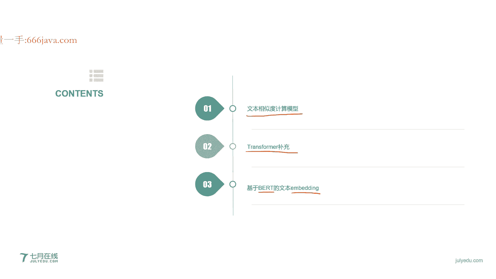

好那我们就先来看我们的第一部分啊。

关于这个文本相似度计算的这个模型啊，我们可以先回顾一下之前的一个内容啊。

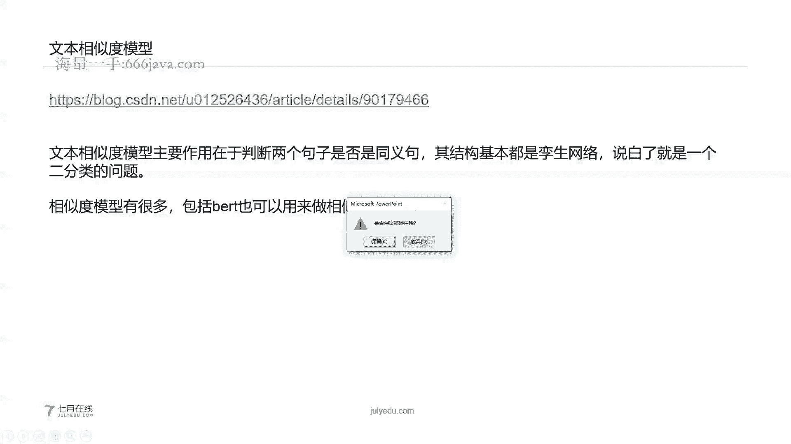

我们简单回顾一下。

哎我们的结构图呢啊这个地方啊好，那我们之前的话给大家讲了，这个意图识别这一块对吧，然后也在第一次课当中也讲了，这个检索式模型啊，检索式模型，那举个例子啊，假如我们现在用户来了一个问题。

那我们库当中假设有1万个问题，那1万个问题，这个时候呢，用户的问题会和这1万个问题，进行一个相速度的计算，找到这个像素最高的，然后把答案返回出来对吧，那现在呢我们要换一种思路啊。

比如说当用户的问题来了之后，我们会先和这1万个问题进行一个召回，一部分之前的话，我们是直接把最相似的给进行返回对吧，那这一次呢我们可能会返回top k好，OK那可能是十个对吧，也可能是20个。

我们就把这个基于word vector，最先是四的top k个，把它给返回，返回回来之后呢，我们这边会使用这样的一个，文本相似度的一个模型，再用这个模型来算一下，用户的这个问题和这top k个问题。

哪一个是最相似的，那前面找到top k的这个过程就叫做召回召回，那我们把用户的这个问题，和我们召回的这个问题再进行一个模型的使用，模型来进行相似的计算，这个过程呢我们称为金牌。

也就是说我们先要把这个范围给缩小，再使用模型来进行这样更细的一个运算，那可能有同学会问，为什么我不一开始就使用这个模型来进行，这个相似度的一个计算呢，也是可以的，但是各位同学可以考虑一下啊。

如果我们一开始就使用模型来计算，这个比较精细的相似度，那这里我需要让这个模型计算1万次，那这个是其实是比较耗时的对吧，比较耗时的，所以呢我们就先采用之前的这样word vector，一个方式。

把这个范围给缩小，有1万个问题啊，变成top k个问题可能是十个，可能是20个，再把这十个问题或者20个问题，给到我们的相似度模型，这样的话其实只需要计算十次或者20次，就能拿到我们最终的一个结果了啊。

这就是我们的这个相似度模型的一个意思啊，好那有了这样的一个概念之后呢，我们再回过头来啊，我们回过头来啊，我们继续回到今天的这个PPT，那这边的话我们会给大家先看几个啊，相似度模型啊。

啊我们先简单说一下啊，那相似度模型是在干什么呢，那文本相似度模型啊，主要是用来判断两个句子，它是否是同义句，那它的结构呢一般都是这样的一个孪生网络啊，什么是孪生网络呢，什么是网孪生网络呢。

它其实是这样子啊，就是我这边有一个mode1，然后这边有一个mod2，那这里这两个模型它其实是相等的啊，是相等的，这个权重也是共享的，说白了它就是一个模型，只是说我每次这边输入的是第一条文本text1。

这边呢我输入的是这个text2，然后啊，M1这边呢会输出它对应的这样的一个vector，这个t text1这个这样的一个vector对吧，那对于L2这边呢。

它其实也会输出一个针对于text2的这样的一个，Vector v2，然后呢我们再把这里这个V1，而这里这个VR进行一系列的这样的一些，相关的一些运算，再把这个的一个输出结果啊，给到我们这样的一个分类层。

一个分类层，最后来输出一个0~1之间的一个值，所以呢其实这里啊，我们通常都是这样的一个二分类的一个层，或者是一个SIG格MOID的层，最终把这个值输出出来，这就是我们的一个孪生网络啊，孪生网络。

它这个孪生的意思就是说我有两个部分，但是这两个部分呢它是一模一样的啊，那我们在构建模型的时候，实际上啊只需要构建一部分啊，也就是说我只需要构建一个，只需要做构建一个，构建完之后呢。

我把这两条文本分别给到这个模型，我要给两次，给两次啊，给两次，这样分别就能得到我们的V1和V2，好吧，这就是我们的一个暖生网络的一个结构啊，那孪生网络结构的内部，它的这个内部又是什么样子呢。

我们可以看一下啊，这个是我很久之前写的这样的一篇博客啊，一篇博客呃，大家可以，啊大家可以自己来这边看一下啊，我这边其实介绍了很多这样的一个，文本相似度的一个模型，我看啊，2461共有七个这样的一个。

文本相似度的一个模型啊，包括它的一个输入其实也是有区别的，你看有输入这个字向量的，有输入这个词向量的对吧，又分这个静态词向量和动态词向量的，其实这些东西我在这个上上次课的时候，也给大家讲过。

什么是动态词向量，什么是静态词向量对吧，还有最后这个模型它不但有静态的，还有这个动态的，甚至还有一个额外的这样的一个经验，特征对吧，这也是上次课给大家讲过的，是否有相同的一个词啊，相同的词。

而这边呢我使用这些模型啊，使用这些模型在这个啊有一个数据集上啊，这个在这个cure covers上面，进行了一个这样的一个测试啊，这边也是有这样的一个结果的，有这样的一个结果的。

那我们今天呢主要会拎出其中的一个模型啊，ESIM这个模型来给大家进行一个，详细的一个介绍啊，那其他模型我这边呢都会有对应的一个解析，还有这个论文的一个地址，大家假如对于这个AABCN比较感兴趣对吧。

那你可以去看一下我这边写的这个啊，博客其实都基本上讲的很清楚了啊，讲的很清楚了，那你也可以点进去去看一下他的这个原论文，好吧，原论文，然后我们这边课堂当中呢，我们会详细给大家介绍一下。

这个ESIM这个模型啊，ESIM这个模型，那为什么要给大家介绍这个模型呢，首先呢这个模型相比于其他几个模型来说，它会稍下面这几个模型啊，它会稍微简单一点点啊，其次呢这个模型因为会涉及到咱们的这个。

L s t f，然后之前的内容当中呢，我们给大家讲的是这个CN对吧，并没有涉及到这个LSTM，所以呢这次课的话我们就基于这个模型啊，顺便给大家去看一下，我使用这个PYTORCH去如何编写这样的一个啊。

LSTM的一个模型啊，其次啊对于ESIM这个模型来说，它其实整体结构呢它不会很复杂啊，不会很复杂，效果也还不错，那如果像对于啊这边的这个，像BIMPM这样的一个模型，它其实结构是还是挺复杂的啊。

各位同学写起来的时候也会比较费劲，并且这个模型它收敛的话会稍微有一点慢啊，所以呢，我们更多会去使用一些比较简洁的一些模型，并且效果还不错的一些模型给到大家，其次对于BIMPM这样的一个模型。

因为它本身结构简单，所以呢更适合在线上使用啊，所以大家对于工业场景来说，你也可以直接去上这样的一个模型好吧，完全没问题啊，完全没问题，要考虑到有些同学可能啊也没有GPU对吧，然后就一直用的笔记本。

那你用自己的笔记本，用CPU的话也是可以跑这样的一个模型的好吧，这就是我们这样的一个啊，ESIM这个模型的这样的一个优势啊，优势，好那我们再回到PPT当中，那接下来的话我们就来详细看一下。

这个ESIM这个模型，它的一个结构是什么样子啊，啊那今天的内容还是和之前的内容是一样啊，我们先来讲原理，讲完原理之后呢，我们再带着大家来写代码好吧，好啊，我们就先来看我们的这个ESIM这个模型啊。

那ECM这个模型的话，它本身的一个结构比较简单，速度也挺快的，我们来详细看一下这个图啊，那ESIM的话它其实分为两个部分啊，可以看到左边这个部分和右边这个部分，那左边这个部分呢它是基于这个啊。

B i l i s t m，也就是这样的一个双向的LISTM，那右边这个呢，它基于的是这样的一个TRISTM，也就是说它是一个树结构的一个LSTM，那我们先简单给大家说一下这个TRLSTM啊。

那这个TRLSTM是什么意思呢，就是说首先啊如果我们要使用这个TRASTM，我们需要对我们的句子去做这个句号分析，依存句法分析，然后得到这样的一个啊依存数啊，得到这样的一个预存数。

例如我现在有个句子叫做猴子喜欢吃香蕉，那我需要需要去做这样的一个句法分析，然后把它生成出这样的一颗啊依存树啊，预存数，然后我再以这样的一个，其实这个时候他已经成为了这样的一个，竖的一个结构对吧。

然后呢我再把这样的一个数据结构啊，给到我们的这个TRLST，那这个TRLSTM，其实啊它你本质上它是一个STM，只有他的一个输入的一个形式啊，我们要以这样的一个数结构来进行一个输入。

但其实这种情况其实就很麻烦对吧，首先呢你需要保证，你这个聚宝分析是没有什么误差的，如果有误差的话，就假如你这个构建你的这个依存数的时候，你有一些错误，那最终其实对你的结果会造成一定的一个影响，对吧。

所以呢我们在自己我们这边写代码的时候，我们更多还是以这个啊双向LSTM为主好吧，双向的LSTM为主，那这个LSTM它的它是什么样的一个模型呢，它其实也是RN的一种变体啊，只是说他对RN进行了一些优化。

那RN这个模型又是什么样子呢，它其实是一个创新的一个结构啊，进行这样的一个输入，而这里可能是我们的第一个X1好，这是我们的X2，然后一直这样的一个创新的一个输入啊，到我们的这个XN。

那它每个节点呢其实都会有这样的一个啊，输出值啊，我们用O吧，用O来表示O1来表示表示output，同时呢它这边也会有一个这样的一个hidden state啊，要给到下一个节点。

那下一个节点呢它会有两个输入，首先是咱们的X1个输入，还有上一个节点的hidden seit，这最后进行一个输出，这就是我们的一个RN的一个结构啊，那这里拿到的就是HN减一对吧，在这里输出的就是ON好。

这是我们的一个RN的一个结构，但是对于RN的这个模型来说，它最大的问题在于什么地方呢，它容易出现一些就当你的序列比较长的时候啊，啊那咱们这个序列X这个序列比较长的时候呢。

它就容易出现一些梯度消失的一些情况，那出现梯度消失的话就会出现一个问题啊，那首先是咱们模型更新不充分嘛，那你就会导致当你的序列过长的时候，你前面这些信息其实在对于后面的节点来说，它是补充不到的啊。

也就是说这种长距离依赖的效果是比较差的，好这是RN，那LSTM呢，就在RN的基础上去添加了一些，所谓的一些门的一些机制，来，尽可能来缓解这个所谓的一个梯度消失的，一个问题啊。

大家可以简单的把这个STM就看成这样的一，个RN的一个结构好吧，然后LSTM里面，具体的一个结构是什么样子呢，那就各位同学自己花点时间下来看一下好吧，如果我们这边再来详细讲LISTM的结构呢。

我们这边可能课程内容就有点讲不完了好吧，那各位同学呢就自己下来就花点时间，把这个AISTM的一个内部结构，自己看一下好吧，那这个BRISTM又是什么呢，它其实啊也就是在我们这个RN的一个基础上。

那我们RN是单向的吧对吧，那如果是一个双向的，他是什么样子呢，其实就是他有一个这样的一个，反向的一个结果啊，就正常我们是从左往右对吧，如果是双向的话，它还添加了一个从右往左的一个，这样的一个情况啊。

最终的话我们的一个输出值，其实就有两个部分对吧，一个前向的一个反向的那一个前项和一个反向，我们最终拿到结果的时候，就需要把这个前项的结果和这个反向的结果啊，要给拼接在一起。

其次啊我们可以从这个图当中可以看到啊，他这里这个结构其实是两层的对吧，它是两层的，那这个两层的结构我们又该怎么处理呢，就假如这个是第一层，我往下面画啊，我往下面画，那第二层的话。

它其实就是说这里咱们会有一个alt值对吧，接下来呢我们这边还会有一层，还会有一层，也就是说我们把这里这个O作为了这个节点，第二层的一个节点的一个输入值啊，输入值本来我们之前输入的是X1对吧。

那现在只是说从咱们的这个X1，变成了咱们的这个OE，然后再进行一个输出，就这个意思啊，就这样的一个意思好，这样的话我们就构建出了一个所谓的一个哦，这里也是一样啊，都是双向的双向的。

这样的话我们就构建出了一个所谓的一个，双向的YASTM好吧，双向的双向的两层的这样的一个LISTM，咱们就构建好了啊，构建好了，好，这就是我们的这个啊，双线的ASTM和我们的这个TRAE，ISTM好。

我们更多还是以这个啊双向的AICM来好吧好，那我们继续往下啊，啊往下的话我们就分别来看一下它的这四个词，这四层好吧，这四层我们先简单这里看一下啊，它第一层是这个input encoding层。

然后第二层的话是这个local influence modeling层，第三层的话是influence composition层，最后的话是一个预测层啊，这就是他们的一个分类层。

好我们还是先看我们的第一层input encoding层，啊啊这个就很简单了对吧，输入的话首先呢我们还是这样的一个下标，然后经过我们的这个embedding embedding层。

然后就给到我们的这个啊input in co顶层，那input in co顶层的话，就是刚才说的这个双向的LSTM，双向的两层的LSTM好，这是我们的这个input encoding层啊。

input encoding层啊，然后我们继续看下面啊，下面这个是我们的这个啊local influence modern层啊，那这一层是在干什么的呢，它其实啊是在对我们的两个句子哦。

我们假设那现在输入了两个句子，一个是咱们的一个P，一个是咱们的一个Q，因为我们是一个孪生网络嘛对吧，我们是孪生网络，对于这边的话我们可以拿到一个这样的一个P，那对于这边的话。

我们也我们可以拿到这样的一个Q啊，这是我们的暖生网络对吧，所以我们这边是假设拿到的是P和Q好，那对于这个local influence modeling，这一层是在做什么呢。

它其实啊他会做这样的一个attention的一个处理，attention的一个处理，大家可以就把这一层啊，理解为他做了一个attention的处理，得到了这样的一个权重，那得到这个权重之后呢。

就可以对咱们的P和Q去进行这样的一个，加权的一个处理对吧，加权之后呢，我们就可以得到我们新的这个P1撇，和咱们的一个Q1撇啊，这个TENTION的时候，我们在上一节课的时候。

给大家简单介绍过这个self tention对吧，Cf tention，咱们这个CR和TENTION，那这个cf tention的话，其实啊和这里这个TENTION是比较类似的，比较类似的啊。

这个我们待会说啊，那既然我们对这个P和Q做了腾讯之后，拿到了我们的P撇和QQ撇对吧，这个时候我们实际上就会有四个值，一个P1个Q有个P1撇，还有个Q撇，接下来呢我们会对这四个值啊，做一系列的一些处理。

第一个处理就是我会用P来减掉pp，第二个处理是用P乘以P撇，那第三个是Q减掉PQ撇，最后一个是Q乘以Q撇，以这样的一个形式啊，我们就会得到一些这样的一些交互值，大家就可以把这个部分啊。

看成这个所谓的一个交互值，好吧，这样的一个交互值，最后呢我们再把这个斜PQ还有P撇，Q撇和这些所谓的一些交互值啊，再把它拼接在一起，拼接在一起，这样的话我们就成了这样的一个。

我们最终需要达到的这样的一个结果，好这就是我们的这个local influence mode0层啊，而接下来的话，我们简单看一下这一层的这个attention啊，这边的话我们可以把这里。

这里这个所谓的一个AB，看成我们刚才的这个啊这个P和Q好吧，P和Q我们看成P和Q，OK那他的思路和我们上次课讲的那个cf attention，是很类似的啊，计算我们的权重的时候呢。

他是直接把这个P和Q进行了相乘，也就是这里这个A和B啊，他直接进行一个相乘，A和B直接进行相乘，还记得是什么意思吗，上节课给大家讲C或TENTION的时候，给大家讲过对吧。

它实际上就是得到这样的一个所谓的，一个权重的一个矩阵，那这个矩阵呢，它可以理解为就是A和B它的一个相关性，或者说它的一个相似程度对吧，或者说它的一个依赖程度，所以这样的话我们就可以得到AB之间的。

这样的一个权重矩阵，但是我们要做SALA，做这个所谓的TENTION之前，肯定是要对他去取这个soft max的对吧，来取这个soft max，那取soft max的时候呢。

啊我们就是以这样的一个形式啊，来取我们的一个soft max，但是这里大家需要去注意一下啊，如果我们要得到A的这样的一个值，那我们就需要去对B进行一个加权对吧，那这个时候我们选下标的时候。

就需要注意一下啊，这边可以看一下啊，这里下标是取的是J的一个下标，这边这个下标取的是I的一个下标，这个下标千万不要弄错了好吧，分别这边就对应的是B和，这边对应的是IA，那我们对B进行一个加权之后。

才能得到A的一个结果，对A进行一个加权之后呢，才能得到B的一个结果，这里大家需要注意一下好吧，这个下标不要弄错了啊，不要弄错了好，这就是我们这个attention的一个过程啊，啊腾审的一个过程。

其实只要理解了上节课讲的这个self a tension，那这里的这个TENTION理解起来应该是啊，很简单的啊，很简单的好，这是我们的这个local influence modeling这一层啊。

那呃下一层的话就很简单了啊，influence concomposition层，那这一层的话，就是把我们刚才的那一层的一个输出值，再给到我们这样的一个双向的，双层的这样的一个LISTM好吧。

所以说还是一个LSTM嘛，还是一个LSTM，最终我们就拿拿到我们的这样的一个输出值啊，输出值好，这是我们的influence conversation层，很简单啊，和刚才的我们的那个第一层是很类似的啊。

我们这边就不再说了，最后我们来看我们的最后这一层啊，那这一个预测层呢会把上一层的一个输出值，作为一个所谓的一个ping操作，那一个ping操作是什么意思呢，ping操作，其实啊就是你可以简单理解为。

它就是在去取它的均值或者是最大值最大值，那为什么我们要做这样的一个ping操作呢，我们各位同学可以考虑一下啊，其实对于最后一个分类层来说，我们实际上输入给我们最终的这个，分类层的时候。

理论上来说应该是一维的对吧，那那是对于我们的LSTM来说，因为它有很多这样的一个节点嘛对吧，他这个时候可能会有很多个这样的一个输出值，有O1有O2，有O3，它有很多这样的一个输出值。

那这个时候我们到底应该用哪一个尺来作为，我们最终的一个句子的一个最终的向量呢对吧，那通常的话我们可能会使用这样的，average的方法取平均，那这个取平均的方法的话，就叫做这个平均池化层啊。

那如果你取最大值的话，那就叫做最大池化层，就这样的一个意思啊，好那这里的话就等于说我们要取这个最大值，然后取这个均值之后，最后把这个结构啊，然后再把它给拼接起来。

送入我们的这个全连接层和我们的这个soft max啊，这就是我们的这个predict层，predict层好吧，非常简单啊非常简单啊，这个是我们整个ESIM这个模型啊，ESIM这个模型，Ok。

那我们接下来就带着大家一起来，把这一块的这个代码给过一下。

好吧，啊，不知道各位同学对于上节课的代码，有没有什么问题啊，大家如果对之前的代码如果有什么问题的话，也可以及时提出来好吧，然后我们也可以给大家啊，简单的讲一下，咱们的这个上节课的一个代码的一个情况啊。

大家有问题就及时提出来好吧，好，那接下来的话，我们就带着大家来把这个ESIM，这个代码给复现一下啊，复现一下啊，我们这边把先把这个代码给删了，还是一样啊，我们先把我们的这个touch给导入进来啊。

啊然后我们可以把那个，把NN也导入一下，OK还记得我们构建这个PYTORCH的模型的时候，第一步是怎么做呢，是实现这样的一个类对吧，然后这个类呢需要继承于NN导锚点是吧，嗯那么就这个类好。

那接下来呢我们来学我们的这个构造方法啊，构造方法构造方法还记得是在做什么呢，是不是去初始化一些必要的一些参数，还有初始化一些我们需要用到的这样的一些层，对吧好。

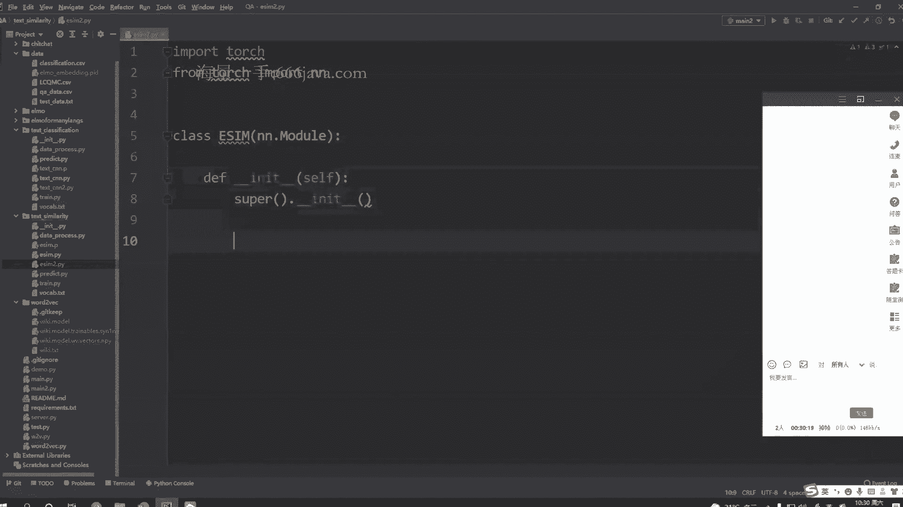

我们就简单回顾一下PPT我们有哪些层了啊，这个我先关了，好我们一层一层来看，首先是我们的input encoding层啊，那对于这一层来说。

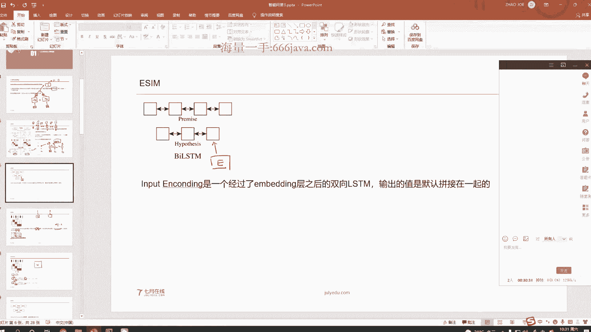

我们首先会有一个embedding对吧，那我们就先来构建我们的embedding层啊，呃先构建1BEI层，好，而embedding层第一个参数还记得是什么吗，我们的一个词典大小对吧。

这个东西我们上一节课的时候也给大家说过啊，说过，那既然要词典大小的话，我们这边就可以定义一下啊，我们的这个词典大小啊，VOCABUL好，那第二个参数的话是我们的这个啊，embedding的一个维度对吧。

我们又叫做embedding size，嗯嗯bein size好，我们给一下我们的这个词典的一个长度，还有我们的这个binding size，Ok，这样的话我们就构建好了。

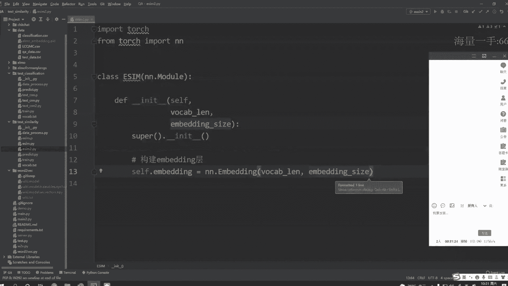

我们的这个embedding层啊，embedding层好，我们接下来看一下这个input encoding层的话，它是一个双向的双层的LICM对吧。

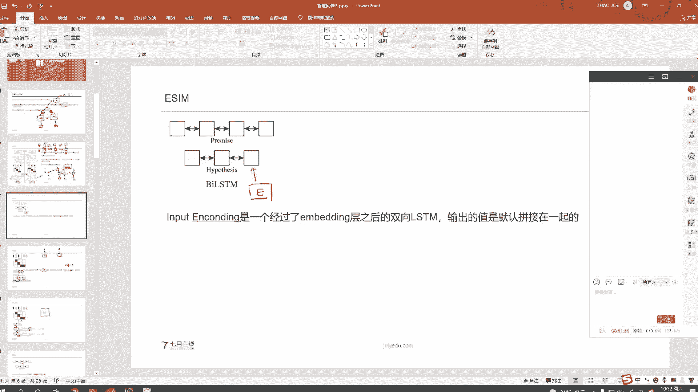

好啊，我们构建这个，双层双向的LSTM，我来看一下啊，Input encoding，这个叫做input encoding层，OK那我们还是一样啊，我们就来叫做我们的input in input点SK。

这个也很简单啊，还有一个我们要构建STM层，怎么构建呢，直接执行这个NN导LSTM就OK了啊，好我们来看一下对于这个ASTM来说，它有什么样的一些参数啊，我们可以嗯。

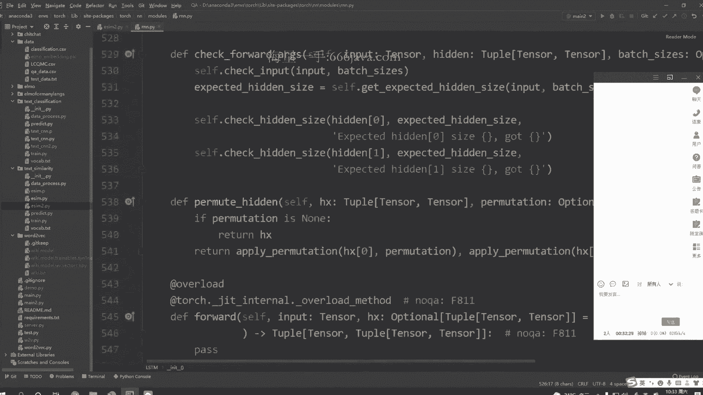

我看上面这里啊，好他有一个这样的一个呃input size，Input size，这个input size，就是说我们的一个输入值的这样的一个维度啊，输入值的一个维度。

然后第二个参数是这个hidden size，这个hidden size什么意思呢，就是当刚才给大家这里介绍的这个咱们每一层，咱们每一个这样的一个ISTM，结果这个节点他都会输出这个这样的一个。

hidden state对吧，那这个hidden state它维度是什么样子呢。

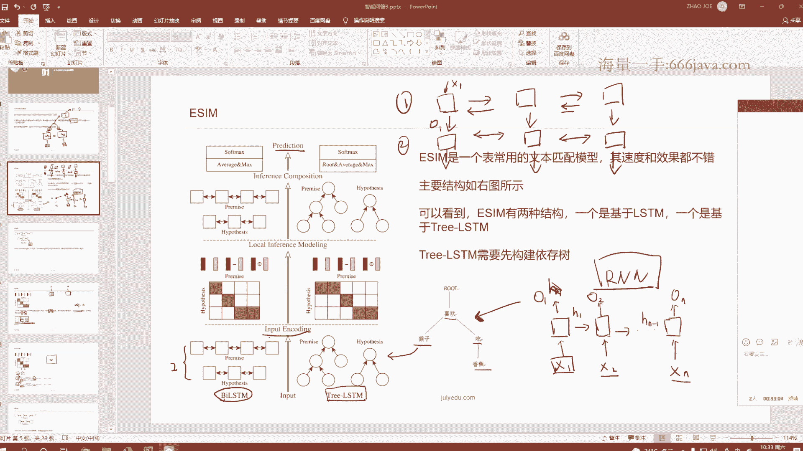

就是这里的这个een size来决定的，好吧啊，然后这个呢是我们的一个层数啊，就是说啊你需要去构建哦，占dog dog层啊，保存，好这里是他的一个vs，就是说你是否需需需要添加这样的一个啊WIS。

然后这里它还自带了这样的一个drop pod啊，Drap，然后最后这里有一个这样的一个啊，Be reactional，就如果我们把这个参数设置为true，那它就是一个双向的AISTM。

否则的话它就是一个单向的，那对于我们这里来说，我们肯定是需要一个双向的对吧，那我们就需要把我们的这个video action这个参数啊，设置为true。

然后最后的话我们再给大家说一下这个bitch first，这个参数啊，那如果我们把这个参数设置为false和true，那它的一个输入值和输出值的维度就是一个，第一个维度就是BESIZE。

第二个维度是序列长度，第三个维度的话，就是我们的一个特征的一个维度，但是啊这个参数它默认是false，所以说如果如果大家想保持，我们比较常规的这样的一个维度啊，那我们就要把这个参数设置为false。

如啊这个true如果在大家默认使用的false的话，那他的这个维度是序列长度是摆在这个维度的，BESIZE是摆在第二个维度的，好吧，这里大家需要注意一下啊，注意一下，那我们为了方便一些的话。

我们就把这个参数就改为这样的一个true，好吧好，那我们来写一下啊，首先是我们的input size啊，Input size，Input size，因为我们要从我们的这个embedding层。

去拿到我们这样的一个值对吧，所以呢我们这边就是embedding size，没问题吧，好然后是我们的这个hidden size，hidden size啊，hidden size的话，我们这边可以啊。

也它其实也是这样的一个参数对吧，参数那我们可以在边把它定义成一个超参数啊，啊我们就叫做uh input pen size a等于三思好，啊，也就是我们的这个第一个LSTM的一个，Eden size。

OK那这个我们再来看一下我们的这个number layers。

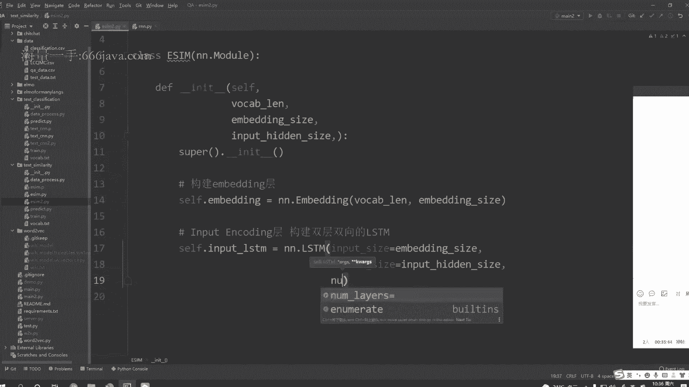

这个时候我们应该是要去再看一眼啊，number of recurrent layers等于二的话，Which means taking two ls s tm together to form a stated。

L s t m，那默认的话它是一对吧，那对于我们这个来说其实是一个两层的啊，两层的哎，不对不对不对，呃，我这里好像弄错了哦，我们这里实际上是一层的啊，一层的啊，这里我要解释一下，我刚才可能弄错了啊。

我把这里看成两层了，实际上它实际上他这里是一层的，只是说这里是P1，这里是输入的是H对吧，也就是我们的这个孪生网络啊，孪生网络啊，这个是我的失误，我的失误啊，这里并不是两层，并不是两层。

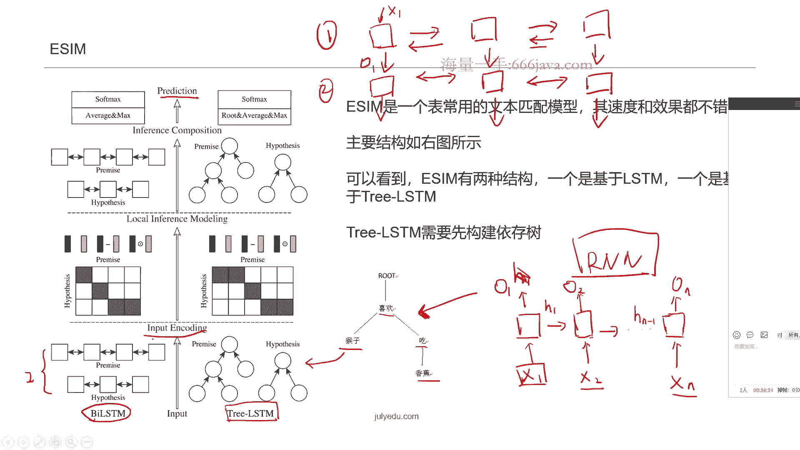

这里就一层好吧，这里就一层啊，既然一层的话，那我们这边就是一就OK了对吧，一就OK了，好那这边这个参数的话是是否是一个双向的，然后我们把这个参数设置为true。

然后最后一个是咱们的一个batch first对吧，我们把这个参数设置为true，OK这样的话我们就啊，拿到了我们这样的一个输出值啊，拿到了我们的一个输出值，好我们这边可以简单看一下啊。

首先我们的输入值它的一个维度是什么样子，第一个维度是BESIZE，第二个维度是序列长度对吧，然后第三个维度的话，就是我们这里这个embedding size，那经过我们的这个ISTM之后呢。

我们的维度变成了什么样子呢，首先第一个维度还是我们的BESIZE，第二个维度还是我们的序列长度对吧，但是第三个维度这里大家需要注意一下啊，就变成了我们的这里这个T这里的这个hidden size。

但是但是因为我们是这样的一个嗯双向的对吧，双向的那双向的话，它默认会在最后面进行这样的一个拼接，最后这里是维度就会乘以二啊，乘以二，待会我们来详细看一下这里这个维度变化好。

这就是我们的这个input encoding层。

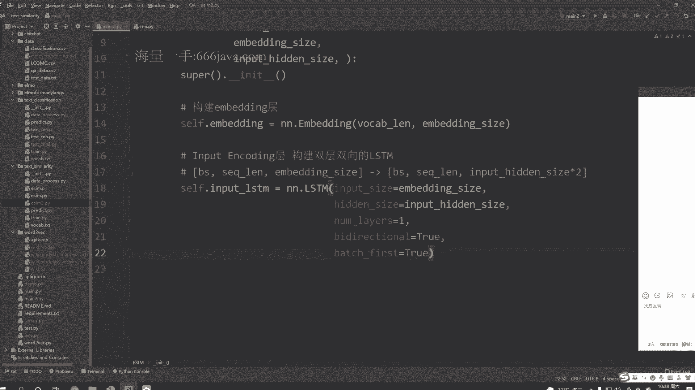

input encoding层，那input encoding层做完之后呢，好我们再来看一下还有什么啊，接下来是这个local influence modern1层，那这一层的话看一下啊。

好像没有涉及到什么参数对吧，只是来计算这样的一个权重矩阵，那这一层的话是不需要用到任何的这些，初始化的层的啊，然后最后就是我们的第三层，这个influence composition层，那这一层的话。

其实也是我们的这个ISTM对吧。

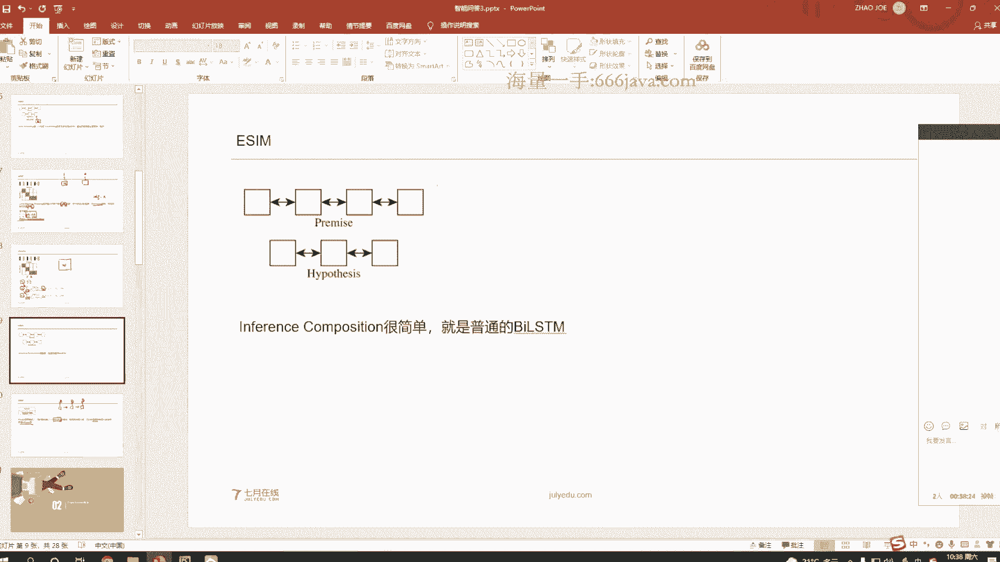

好我们来构建我们这一层嗯，叫做influence com，什么来着，Conversation，CONSTATION层好，这一层也是我们的双向的LISTM啊啊，我们叫做influence a s t m。

还是一样啊，首先是我们的这个啊input size，input size好，那这里这个input size是多少呢，各位同学觉得这里这个input size应该是多少，来直播间的小伙伴嗯。

大家觉得这里这个input size是多少，有同学知道吗，好我们可以回过来看一下PPT啊。

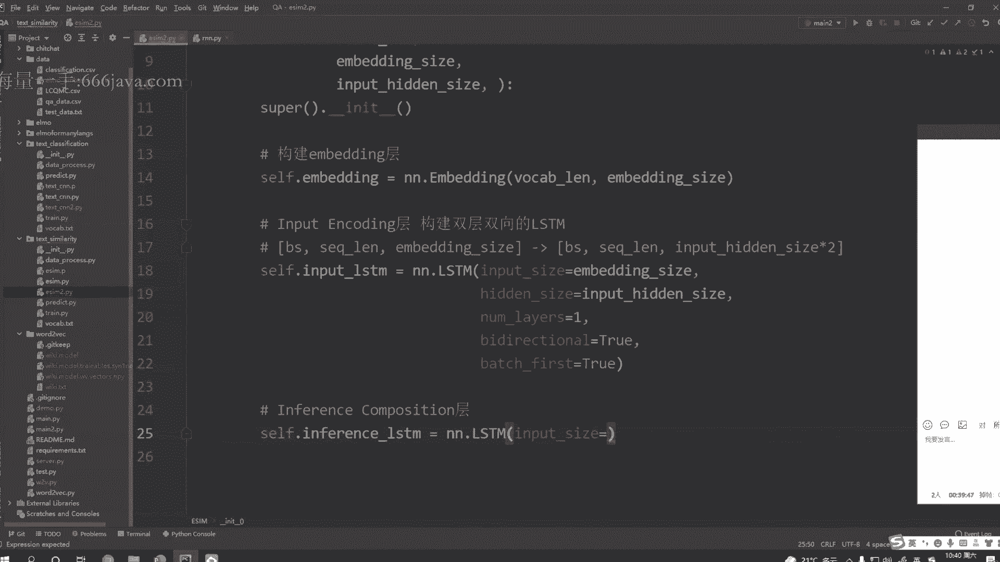

在我们的这个input encoding层之后呢，我们会到这个local influence modering这一层，这一层的话，我们去做了一系列的这样的一个，attention的一个处理。

然后最终我们得到了P1P撇对吧，还有这个Q和Q撇，然后呢，我们会对这个P和Q进行一系列的一些，这样的一些处理对吧，比如用P减掉P撇，P乘以P撇，然后最后再把这个加工之后的值和原来的值啊。

进行这样的一个拼接，所以最终拼接在一起的值，它实际上是有八部分的对吧，它实际上是有八部分的对的，我们最终的一个输入值，实际上就是在每一个这样的一个维度上，再乘以八，那每一个这样的一个值，它的维度是多少。

是不是这一层的这个LSTM的pen size对吧。

Pen size，所以这里啊也就是咱们的这个啊input hidden size，再乘以我们的八好吧，乘以八好，这里比较重要啊，这里比较重要，嗯这里简单注释一下啊，啊因为我们有P与Q并且，得到了。

经过一系列的，啊八个值啊，所以我们这里要乘以八啊，然后是我们的这个hidden size啊，Hidden size，那hidden size的话啊，我们也可以从外面传递一下啊。

哦我们这叫做influence hidden size，好下一个的话是我们的啊，还是我们的number雷影，我们还是一层一层就OK了啊，然后是双向的，把birth face first改成true，好。

这样的话我们的这个influence conversation层呢，就构建好了啊，构建好了好，那接下来我们再来考虑一下啊，那除了这个啊，我们的这个这一层之化。

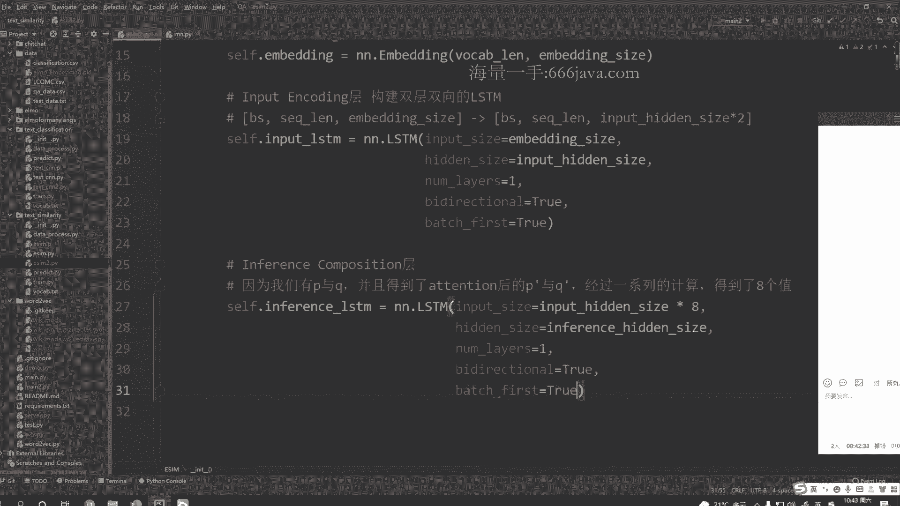

我们还有些什么东西呢，看一下啊，下一层的话就是我们的这个池化层。

和我们的这个soft max和一些全连接层了。

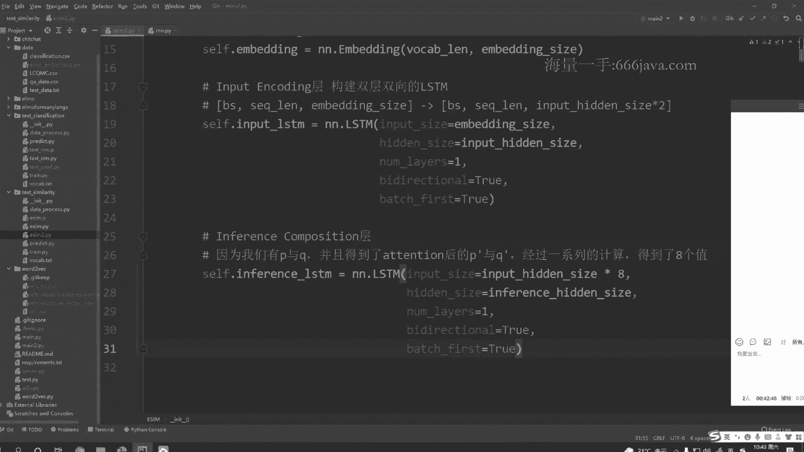

对吧好，那我们这边可以来定义一，个这样的一个池化层啊，我们叫做predict层。

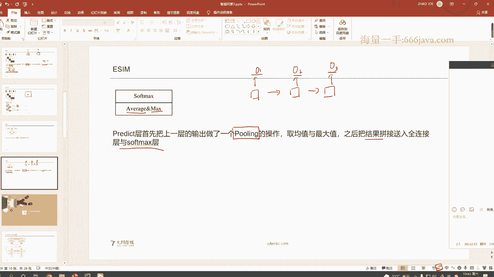

predict层，这边是self点next to，啊我们还是用二维的啊，还是用二维的，那对于这一层来说的话，我们可以考虑一下啊，那这个池化层，我们的一个他的一个kernel的一个大小是什么呢。

那实不实际上啊，就是我们的一个序列长度嘛对吧，那我们这边可以考虑，把这个序列长度也传递进来啊，max word n好，我们可以进来看一下它的这个，还有一个参数是我们的一个kernel size对吧。

kernel size好，我们实际上就是要给这个quernel size，进行复制啊，好那我们给这个corona fes估值，也就是我们的MAXINE，那第二个维度的话就是一就OK了啊。

啊这是我们的这个最大池化层啊，最大池化层好，接下来的话，我们来定义一下我们的这个全连接层啊，全连接层啊，dc1呃，叫NN导LINUX层，LINUX层，那这一层的话。

我们又得考虑一下他的这个输入的这个size了，我们这个输入的EXSIZE是什么呢，实际上还是我们的这个input hidden size对吧，然后乘以咱们的一个八。

然后第二个的话我们可以给他一个输出维度，输出维度的话，那我们就给他一个，呃和这个保持一致吧，influence1等size啊，这是我们的这个啊，第一层的这样的一个LINUX层对吧，LINU层好。

然后我们是第二层，我们在我们可以考虑再加一层啊，再加一层，然后这边的话，第一个维度的话肯定就是这个嘛对吧，那第二个维度的话我们就给一啊，给一最后还是老样子啊，我们加个dropout层，嗯给个0。

2的一个这样的一个，drop的一个值好，这样的话我们基本上就哦准备好了啊，准备好了，这就是我们需要准备的一些内容啊，那接下来我们就来写我们这个for word方法啊，for word方法。

for word方法还是一样啊，首先呢我们要把我们的输入值给进来，但这个时候其实和上节课的内容还不太一样啊，这里的话因为我们是孪生网络对吧，孪生网络，所以呢我们这边会有两个这样的一个输入值。

一个是我们的一个P，一个是我们的一个Q，一个是P，一个是Q，好吧，好那我们先来看我们的第一层，肯定是embedding层，那啊我们用用这样吧，吸引该领，好，把这个皮写前面好一些。

好我们用我们的embedding层，把我们的这个P给进去，然后是我们的q embedding，把我们的Q给进来，OK这样的话就得到了我们的这个P的embedding，和Q的embedding。

各位同学可以看一下啊，我们这里虽然是这样的一个，孪生网络的一个结构，但实际上我们调用的层是一样的对吧，我们这里只定义了一层一层啊，并没有说它是孪生网络，我们要去定义两层。

所以这就达到了一个所谓的一个权重共享的，一个目的啊，好接下来的话我们就经过我们的这个啊，LSTMLSTM啊，这个叫做叫啥来着，input AI s t m啊，好input l s t。

然后把我们的这个啊p embedding给进去啊，给进去，这样就会拿到我们的啊，这样的一个输出值输出值，但我们可以这里来看一下啊，他这个输出值它是什么样子啊。

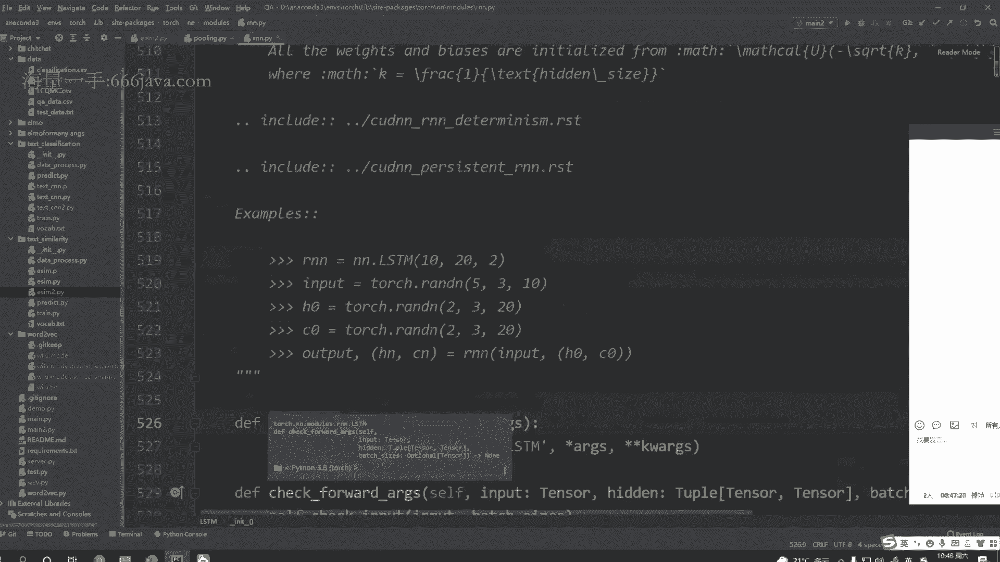

好他这里有个输出值啊，他这个输出值它其实是什么样子呢，它其实有一个所谓的一个啊output，还有一个HN和一个CN，那这里这个output，就指的是我们这里占的一个输出值，这里这个输出值。

那这里HN表示的是一个hidden state，因为它会有一些中间值嘛对吧，hidden state也就是这里有个值。

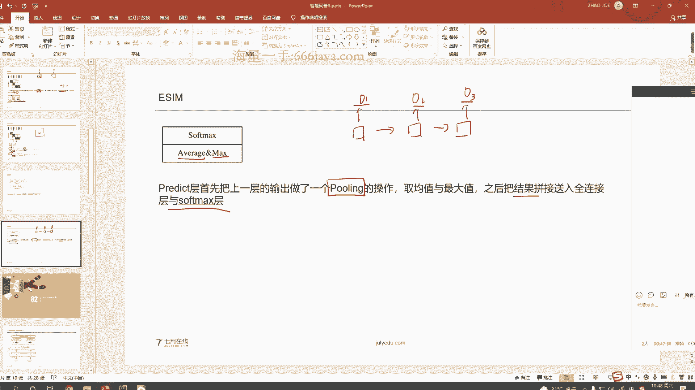

它还有一个CNCN表示的是sales state，大家可以简单的理解为，这个sales state和这个hidden state是类似的一个东西，好吧，更多细节的话。

大家下来自己去看一下LSTM内部的结构，看完之后你就知道这个cl state是什么东西了好吧，那我们更多的话是使用这个所谓的一个输出值，对吧，输出值，所以我们这边就给他一个输出值就OK了。

然后第二个我们再看一下啊，我们再看一下这边这个它有两个返回值对吧，两个返回值，我们只要前面的后面这个我们是不需要的啊，那么后面这个就用一个下划线来表示就OK了啊，好就以这样的一个形式。

我们就能拿到我们的这个经过input a s t m的，这样的一个输出值好吧，好接下来的话我们再来给我们的第二个啊，Q embedding，好，这样的话就拿到了我们的Q的这样的一个值啊，这样的一个值。

然后我们这边可以做一个drop out一个处理啊，但实际上我们可以在这个里面对吧，它自带了一个，我们看一下啊，刚才有看到他这里有一个自带的啊，如果设置为呢introduce a drop out哦。

如果设置为非零，它就会有一个这样的一个drop out on the output of，Each h l s t m layer，除了最后一层对吧。

With drop up for our or two，默认是零，就是说如果你把这个drop out，设置为非零的一个数值啊，它就会在它的一个输出层去做这个所谓的一个，Drop out。

那但是啊它是除了这样的一个最后一层了，那我们可以使用这个参数，然后我们这边因为这边我们有自己去定义，这样的一个dropout层对吧，那我们也可以，也可以用我们自定义的这样的一个转炮的好吧。

我们就用我们自己自己定义的啊，我们用我们自己定义的额，这个圆就是以P对P做了一个这样的抓part，让我们再对Q来做这样的一个状ORT好吧好，这样的话我们就能得到我们的这个P和Q好吧，P和Q好。

接下来的话，我们来做我们的这个attention的。

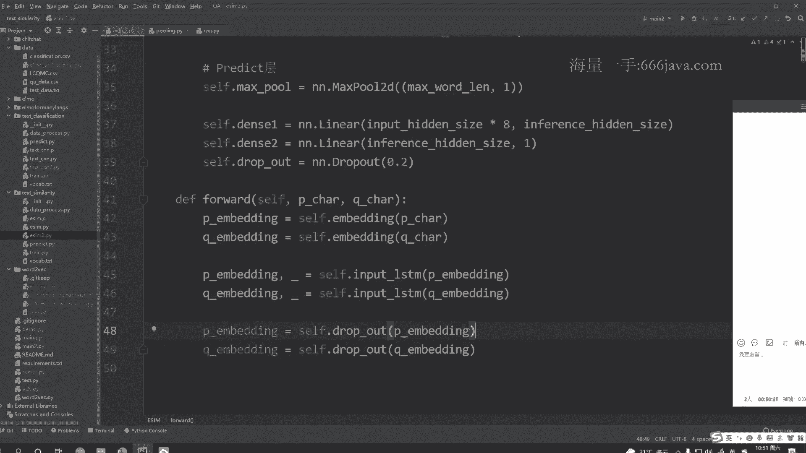

这样的一个处理啊，也就是我们的下一层咱们的这个，local influence modeling这一层啊，主要关键就在于咱们的这个attention，这里的一个计算对吧好。

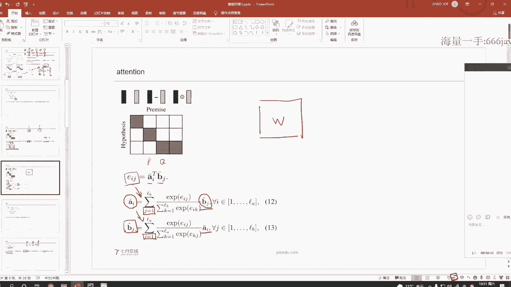

那我们就直接来算我们的这个一，我们来算一下我们这里这个一啊，一，那一的话，其实就是来做这样的一个矩阵乘法对吧，那左边的话就是我们的p in白点啊，右边的话啊，我们要对我们的这个q embedding。

去作为一个这样的一个转制的一个处理啊，那这里的话我们可以用有一个这样的一个，transpose方法，我们把我们的q in bin传递进来，然后我们是要对我们的第一个维度，和第二个维度进行一个交换对吧。

那qq embedding它的一个维度是什么样子，是这个样子吗，那我们要对它的这个维度和这个维度，进行一个交换对吧，我们base size这个维度是保持不变的啊，所以我们是把第一个维度和第二个维度。

进行这样的一个交换，这样的话，我们就可以进行一个矩阵的一个乘法了。

好最终就拿到了我们的这这里这个权重啊，这个一这个权重有了这个权重之后呢。

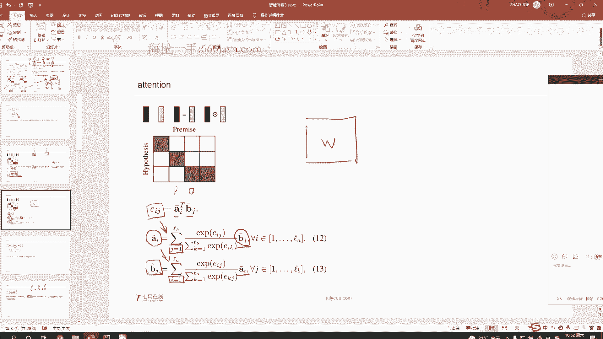

我们再把这个权重和我们的这个分别，和我们的这个啊，P和Q进行一些加权的一些计算，对吧好，那我们接下来就把这个啊咱们的所谓。

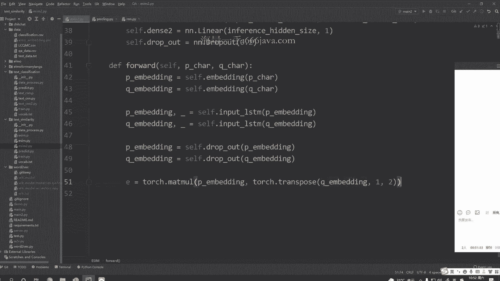

咱们这边的这个所谓的一个。

加权之后有一个结果去拿到一下啊，我们首先去求我们的P，我们用cat吧啊还是一样啊，这边肯定是做这样的一个矩阵的一个乘法啊，好那相乘的时候呢，我们可以考虑一下，我们是不是，首先第一步。

我们要去要去做这个所谓的一个soft max对吧，soft max好，这是一，那对于我们的P来说，我们应该考虑的是他的一个第二个维度对吧好，然后这边的话我们和我们的一个P的话。

是要和Q进行一个相乘嘛对吧，P和Q进行一个相乘，OK然后是我们的这个QQ啊，Q也是一样啊，我们，这边也是取soft max，但是围度的话就是一这个维度，然后适合P进行一个相乘。

这样的话我们就分别拿到了我们加权之后的P，和我们加权之后的这样的一个Q好吧，嗯然后我们这边可以简单的把这个我一对，待会再说吧，待会再说，Ok，那接下来的话，我们就可以。

根据我们刚才PPT里面的一个内容啊。

我们这边会去做这样的一些呃处理之后。

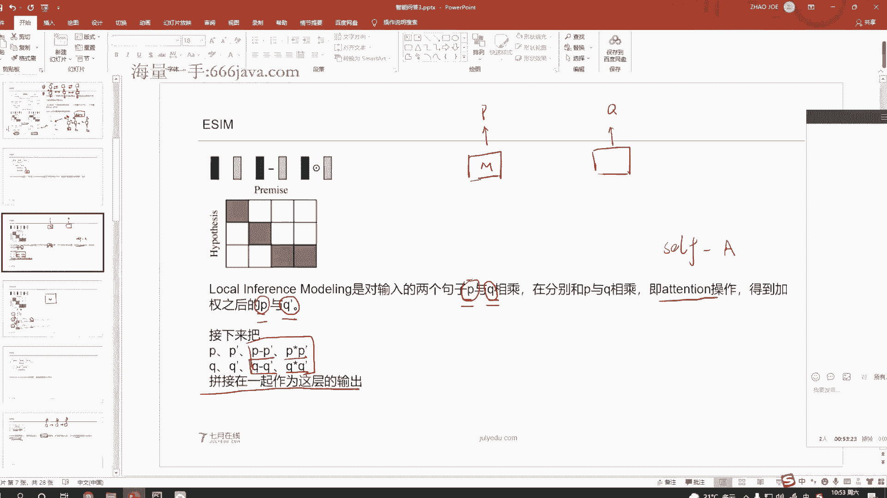

再把它拼接起来对吧好，那我们就做这样的一个处理啊，我们叫做cat吧，嗯touch到cat好，我们首先会把我们的这个p in bedding拼接起来，然后p hat对吧，P hat。

然后是我们的相减的一个处理，相减的一个处理，还有咱们的一个相乘的一个处理对吧，相乘的一个处理，然后我们这边呢，是需要把最后一个维度拼接起来啊，我们根据最后一个维度进行拼接就OK了，好这样的话我们就。

得到了我们拼接之后的一个值，然后呢，我们再把这个Q的一个拼接值也是一样啊，我们进行这样的一个拼接，那就是QUEMBEDDINGKHEAD，然后q embedding减掉QHD。

然后q embedding乘以q head对吧，啊，这样的话我们就P和Q的一个拼接值就OK了啊。

OK了，最后我们再来看一下啊，我们下一层，下一层是我们的influence conversation层对吧，influence conversation啊。

也是一样啊，我们来调用一下我们的这个influence influence，I s t m，然后把我们的这个P给进去啊，p cat去给进去给进去，这样的话我们就能得到我们的这个，PD的一个输出值对吧。

呃Q也是一样啊，我们这边就是q HQ cat，好，这样我们就分别得到了我们的，我们的这个P和Q啊，P和Q呃，P和Q我们这里可以做一个DP out啊，我们可以在这里做个DP out哦，我们等会再做吧。

我们可以先把它处理完之后再做好，那接下来的话我们来取一下我们的这个均值啊，我们来取一下我们的应该说下一层了。

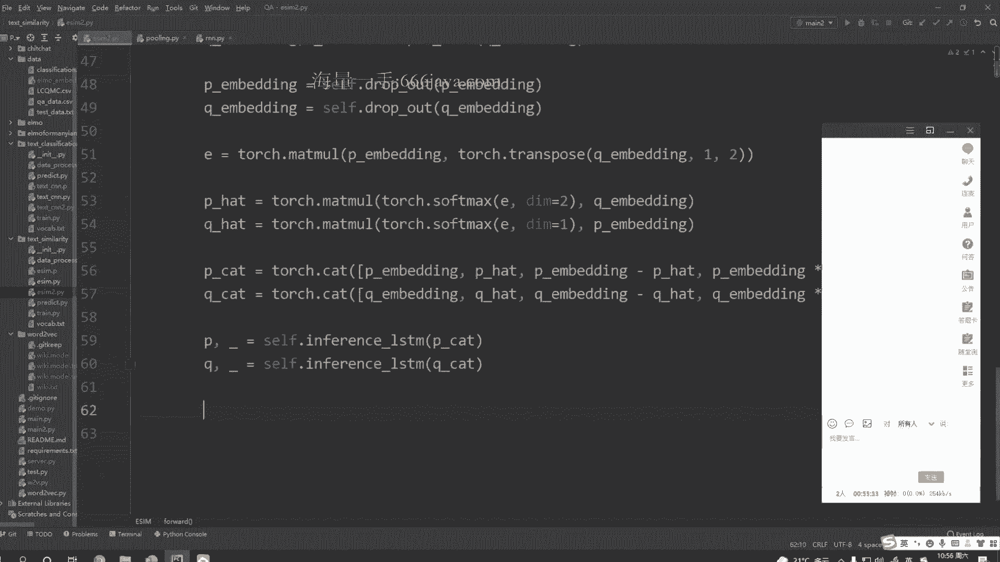

这一层已经结束了对吧，那下一层就是我们的predict，有池化层和我们的这个平均池化层，和我们的最大池化层对吧。

好我们来做我们的石化石化操作，那首先我们就拿到我们的提命吧，那我们就直接取个均值就OK了，直接取个均值，然后我们再，第一个维度也就是序列长度，这个维度我们去取个均值，那对于Q来说也是一样的啊。

我们要取这样的一个均值，然后这是我们的平均池化层，然后我们再来看我们的最大尺化层，最大值的话，那我们就直接调用我们的max po，这个最大触化层啊，然后把我们的P给进来。

还是在这个序列长度这个维度来做对吧，然后是我们的gill max，还是一样啊，调用我们的最大池化层Q维度，是我们的序列长度，这个维度啊，大家一定要注意一下啊，虽然我们是孪生网络。

但是我们所有的这个模型只定义了一层，一遍对吧，并不是说你要定义两遍，只定义了一遍啊，只定义了一遍，不管是石化层LISTM对吧，都是定义了一遍啊，都是定义了一遍，这个大家千万不要弄错了，千万不要弄错了好。

那有了这些值之后呢，我们再把这些值去做这个所谓的一个拼接啊，我们把我们的啊pmp Max-Q max好，我们先把T的拼进来吧，拼命，然后q Max-Q me，好，这样的话我们就拿到了。

我们最终的这样的一个值，我们用X来表示吧，我们再把这个值去做一个所谓的一个drop out，叫跑，好OK那到这里之后呢，我们就可以去做下面的这个，给到咱们的一个分类层啊，或者什么之类的啊。

甚至你可以也可以去引入一些所谓的一些，激活函数对吧，比如我可以在这里去加个ten h，这样的激活函数，加个ten h的一个聚合函数啊，哦我们先经过LINUX层吧，好吧，我们刚才有定义这个dance好。

我们先经过dance吧，这样点dance1，我们把我们的X给进来，然后得到我们的这样的一个值，再给到我们的这个激活函数这一层，然后再调用一下我们的dance2这个层，把它转换成一个维度的啊。

好最后我们可以执行一下我们的这个SIGMOID，Sigmoid，然后让他输出一个零一之间的一个值对吧，然后最后啊我们可以把X进行一个输出啊，输出呃，我看一下啊，这里应该是要降个降个位，好我们这样讲过。

把最后一个维度给去了啊，好整个我们的模型的一个构建啊，就OK了好吧OK了，好我们来训练一下我们的这个模型，哦哦对我这里都没有说啊，那对于这样的一个模型，我们的一个输入数据应该是什么样子呢。

我们那个输入数据其实这边也给大家准备好了，有这样的一份数据集啊，这个LCKMC这份数据集是干什么的呢，它其实就是用来判断两句话它是不是同一句，如果两句话它是同一句，那他这个标签就是一。

如果这两句话它不是同一句，那他这个标签啊就是零，我们可以看一下啊，这里有两句话它是同一句，那他标签就是一，这两句话哎不是同一句，它标签就是零，好吧，这是这样的一个数据集啊。

那我们给到我们的模型也是一样啊，我们把这份数据集给到我们的这个模型。

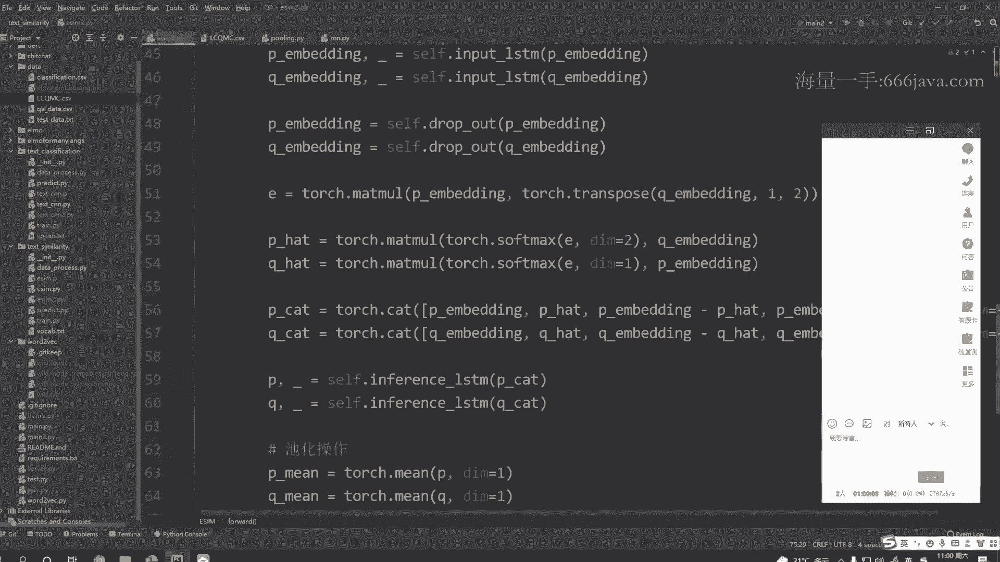

给到我们的模型，然后最终我们的标签就是这里的这个零和一，好吧，零和一这样的一个数据集很多啊，像我这边的这个博客里面，其实就是用的这个QACOPUS好吧。

但这个数据结合这份数据和这个AI is，这个LCTMC都是这个哈工大开源的啊，OK好那我们知道了数据集的一个结构之后呢，我们就来把这个代码给跑一下啊，TRA呃，我们可以看一下啊，Ec，BC啊。

这边参数可能名字要改一下啊，因为这个名字不太一样嗯，我看下叫啥啊，首先是词典大小，词典大小，然后是embedding size，Embedding size，Input，Hidden size，这个。

应该是这个吧，Input hidden size，然后是influence hidden size，hidden size好，OK我们把参数给改过来啊，要是词典大小这边的话。

我们可以看一下这个词典有多大啊，这个是做了一个这样的一个分字的一个处理啊。

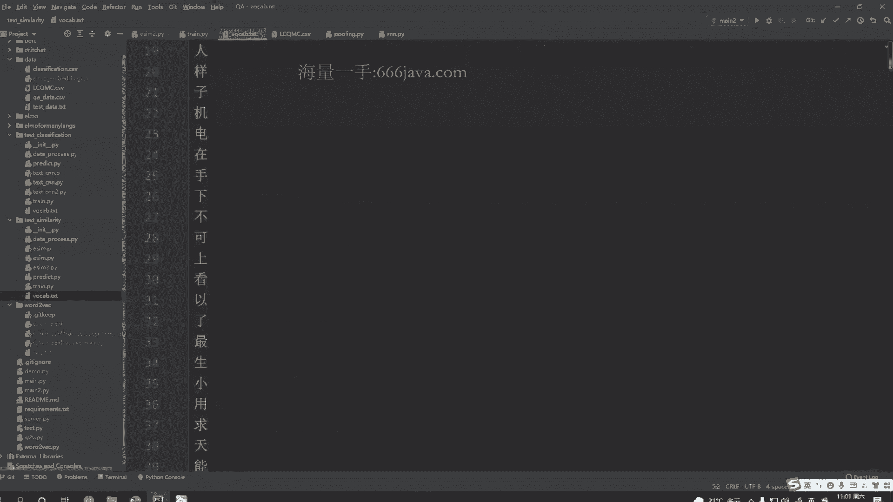

因为我们这边嗯这篇我们去看一下这边啊，我们的ESIM它是论文当中是做的分字好吧。

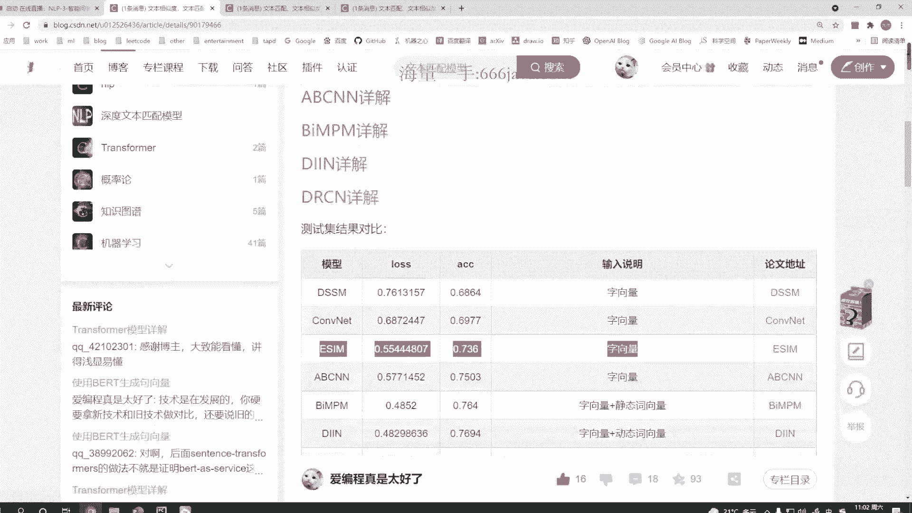

那我们这边也就分字啊，我们这边也分字，我们这边也分字，然后我们可以看一下这个词典的一个大小啊，一共是3966对吧，3966，那我们这边就是3966，然后我们这个embedding size的话。

我们就取个100维的，然后hidden size的话用128，Influence，Hidden size，我们也用128，然后序列的最大长度我们设置为十好吧，设置为十。

也就是说这个句子的最大长度我们设置为十啊，设置为十，行，那接下来的话我们就先把这个代码给跑一下，看一下我们的模型有没有什么问题，好吧，看一下能不能一次成功啊，这个模型可以明显的发现。

是比咱们上次课讲的模型会稍微复杂一点点，对吧，嗯这边是有报错啊，我们看一下是哪里报的错，嗯没有这个DIEM这个参数吗，这个是我们的，看一下啊max po，应该是没有这个参数的啊，没有这个参数。

嗯我看啊我们这里应该是有哦，这里是二维的，我们已经指定了这个E了是吧，OK行呃，我们可以看一下这里这个维度是什么样子啊，打拉拉进来进来看一下啊，OK我们先看一下我们石化这个平均池化层。

这里应该是没有什么问题的对吧，这个应该是没有什么问题的，然后这里之后得到的是一个啊，500以上好，我想想啊，这里应该进行拼接的时候有没有问题呢，啊我们这边也是没有维度的，理论上来说。

我们应该给它加上一个维度才对，我们应该给它加上一个维度，我们先看下上面啊，这里直接是512，我们拿的是我们最终的一个输出值，好我们再看看上面啊，嗯看上面有没有什么问题啊，我们可以刚好吧。

我们就带着大家一起来看一下这个维度上面啊，有没有什么问题，好我们先看我们的这个这里啊这里啊，这里一共是512的十对吧，我们看一下我们的这边load date，我们这边设的是512，还挺大的啊。

RESI维赛多改成了512，我们这边可以稍微设小一点，改小一点吧对吧，28，which which size没有设置，没有必要设置这么大啊，稍微改小一点点，然后也方便各位同学跑起来啊，有些可能。

稍微改小一点点好，稍等一下，好那这边的话我们先看一下啊，那他的维度就是一个128的一个十，这里是没有问题的对吧，128的十，然后经过我们的这个embedding层之后。

我们这个embedding它是100维的对吧，那就是128的100对吧，啊一百二十八十的100对，因为我们每个他的每一个位置，它都有一个词嘛对吧，我们一开始输入的是128的十。

而经过embedding层之后，是128的十的100啊，没问题没问题好，那我们继续往下啊，经过了我们的这个LSTM层，LSTM我们的这个中间的这个可以看一下啊，这边这个是我们刚刚输的是也是128吧。

也就是说我们从十变成了128对吧啊，从100变成了128，好我们看一下，好哎，那这里为什么是256呢，不应该是128吗，双向的对吧，所以这里就是256好吧，这就是R6好。

这里经过咱们的一个drop out，这里经过drop out是不会变的啊，我们继续往下要到了这个位置啊，这个位置的话，我们首先呢会把我们的这个ky embedding，把这个256的换到十十。

这个维度和256进行一个交换对吧，最后就可以得到一个which size，然后序列长度的序列长度，也就是128的十的十，没问题啊，没问题好，那接下来我们再把这里进行这样的一个啊，加权的一个处理对吧。

看一下我们的P啊，P的话还是t heat就变回来了嘛，还是原来的一百二十八十的W56对吧，然后q hat应该也是一样啊，一样的，OK接下来的话我们进行进阶进阶啊，我们是根据最后一个维度进行拼接啊。

那它的序列长度是不会变的，最后就变成了128的十的1024对吧，1024，好那接下来的话我们就是influence这一层，那influence这一层，我们可以看到我们这里就是input。

hidden size乘以八对吧，也就是这里的128×8，也就是等，也就是我们咱们这里的这个1024是吧，这里的1024好，那就经过我们的这个influence层，好拿到我们的一个输出值。

我们再看一下这里有个输出值啊，就是一百二十八十的256，没问题吧，256为什么是256，因为这里也是双向的嘛，所以是256对吧好，大家有什么问题及时提出来好吧。

OK接下来的话我们是在序列长度这个维度上面，去做池化层对吧，那我们就等于序列长度那个维度就没了，就变成128的256啊，没问题，而这里做我们的一个石化处理，石化完之后呢，我们看一下啊。

一百二十八一到W不，哎那这里没有办法去进行这样的一个拼接，维度不一样对吧，那所以这里我们得把那个维度啊给去了，别去了，我们把第一个维度给去了啊，把第一个维度给去了，那下面这里也是一样的。

我们把第一个维度给去掉，我们继先继续往下面跑啊，这里肯定会报错啊，这就报错了嘛，因为它维度不一样对吧，那就说这里维度不一样啊，一个是二，一个是三好，那我们重新跑一下，好OK那我们到这里之后呢。

我们看一下啊，我们先让他走到这好，把它进行一个拼接，拼接完之后呢，就变成了一个128的1024啊，1024，把这四个值的拼接在一起了吗，没问题吧，没问题，好做个drop out。

然后这里就是第一个全连接层，然后得到了128的128，如果没记错的话对吧，第二个维度是128嘛，我们这边输出值是influence hidden size，也就是128对吧。

好在经过我们的ta h之后呢，经过dance第二层，经过sign moid来进进行输出，好没有没有问题啊，整个我们模型就跑起来了跑起来了，好这边已经在进行一个训练了啊，进行训练了，我们可以简单看一下。

啊这个模型的话肯定会比上节课，这个模型慢一些啊，慢一些，可以稍微等一下啊，然后大家就到时候就自己下来，就自己去跑一下这个代码好吧，我们需要到时候需要用到这个模型，需要用到这个模型啊，可以看到啊。

模型是正在收敛的，正在收敛的，啊这个整个代码就是咱们的这个ECM，这个模型了，那模型构建好之后呢，下一步的话就是把我们的这个模型给应用到，我们的这个主流程当中了对吧，好我们这边再跑一小会啊。

再跑一小会啊，这样吧，我们也刚好就稍微休息一会儿好吧，我们稍微休息一会儿，我们休息5分钟，现在11点是我们啊11。107108的样子，然后我们上课好吧，休息5分钟，刚好这边模型也要跑一会。

然后大家有什么问题的话，就把问题打在公屏上，我们统一解答啊，统一解答，好我们继续上课啊，继续上课，诶，哦没有往下拉，我还以为卡住了，那差不多最好的效果就是0。85左右了啊，0。85左右。

好我们这边先停啊，我先先停，呃大家也可以自己下来去，把这个模型给优化一下啊，包括这些超参数的一些调整对吧，你也可以把它换成这个词向量，理论上来说词向量应该效果也挺好的好吧，好那这个模型构建好了之后呢。

呃我们回顾一下啊，我们刚才说的是，我们先会对原始的数据做这样的一个召回，而再去做这样的一个金牌，那这里这个代码到底该怎么写，各位同学也可以考虑一下好吧，考虑一下，好，那我们这个文本匹配模型就给大家。

先讲到这里啊，讲到这里，然后接下来的话我们啊回到PPT啊。

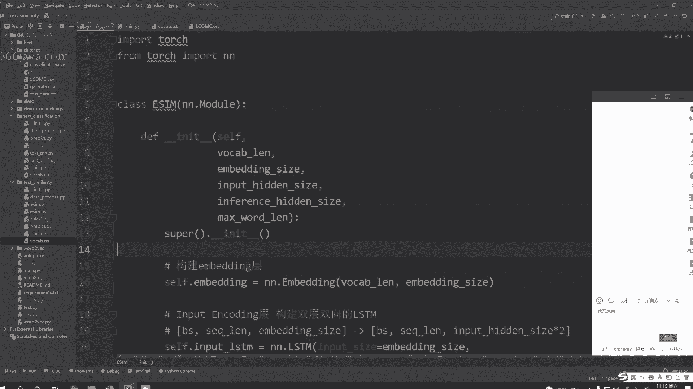

回到PPT，然后我们接下来还有一些其他的内容。

今天要给大家讲啊，然后今天的话大家就下来，自己把这个文本匹配的模型给自己实现一下，好吧，然后其他内容，我们明天上午的课程再继续给大家讲，好啊，我们来进入到我们的第二部分啊。

关于transformer的这样的一个补充，那上周的时候，上周最后一节课，我们是给大家讲了一下transform的encoder部分。

对吧，encode部分当然除了encode部分的话，其他地方我们是没有讲的啊，没有讲到，所以今天要把这个transformer后面的一些部分，给大家补充一下，那为什么要去讲这个transformer呢。

那如果不讲transformer的话，那对于BT的一个内容，还有咱们最后一节课使用这个来生成，闲聊的时候，那它的一个网络结构啊，都是和这个传送门有关系的啊，所以这个东西需要给大家进行这样的一个补充。

好啊，那我们就先来详细的看一下，他关于这个encoder部分，它的一个内部结构的一个详细构造啊，那上次课的话，我们主要给大家说的是这一块嘛对吧，cf for tention这一块。

然后其他地方是没有说的啊，好那我们就接下来就来看一下啊，嗯好首先呢我们先说一下输入啊，输入除了咱们这个embedding，它其实还会有就这个这个所谓的一个position，Encoding。

就是一个所谓的一个位置编码，那为什么需要这样的一个位置编码呢，那对于我们普通的这个RN模型来说，它实际上是一个创新的一个结构对吧，它是一个创新的一个结构，那我是一个创新的结构。

那我是按顺序进行一个输入的，所以呢它就会有一个所谓的一个，自带位置属性的这样的一个情况对吧，自带了一个所谓的位置信息，那对于我们transformer这个模型来说。

它并不是这样按顺序进行一个一个的一个输入，所以说他在进行和腾审的时候，大家也可以看到吧，在进行和腾审的时候，假这是A这是B啊，这是这也是A，因为是self乘什么对吧，我们用Q来表示啊，用QKV来表示。

我们这Q和K进行矩阵去运算的时候，它实际上它所有的位置都是，这这个值是可以计算出来的对吧，所以它是一个并行的一个处理啊，并行的一个处理，那既然是个变性的处理，那我们就应该考虑一下。

我们是否应该把他的这个位置信息给加进去，毕竟每一个词它的一个位它在的位置不一样，那可能这个语语句的这个意思是不一样的对吧，所以呢我们就要把这个位置信息给考虑进去啊，这个位置信息它是怎么做的呢。

就是和和咱们这个embedding啊相加在一起，相加在一起，就能得得得到我们这样的一个给到encoder层的，这样的一个输入值啊，输入值好，那这个输入值呢再给到我们这个self attention。

The potension，这个上节课给大家讲过啊，给到sela tension之后呢，就拿到了我们加权之后的这样的一个值对吧，这两个啊，这里这个Z1和这里这个Z2。

就是咱们经过了self attention之后，加权之后的一个结果，OK那接下来呢他还会做所谓的一个layer，Normalization，和我们的这里这个所谓的相加的一个操作。

那这个相加的操作又被称为这个残差模块，残差模块，也就是说他首先经过这个残差的一个处理，然后呢再经过这个layer NO alization啊，好那经过完之后呢，再给到这个fade for word层。

这个fade for word层，大家就简单看成全连接层就OK了啊，那这层经过完之后呢，还会再经过这个所谓的参差，和这个layer normalization，Ok，接下来我们就详细看一下。

这里这个残差模块和这个layer normalization，是干什么的啊，好我们先来看我们的残差啊，就凭我们自己的一个直觉来说啊，如果一个网络层数比较深的网络，理论上来说。

应该会比较比这种层数比较浅的网络，效果会更好对吧，这是我们的一个理论上的一个感觉啊，但实际上呢，呃实际上就是当网络层数特别深的时候，它实际上会出现一个所谓的，一个退化的一个问题，一个退化问题啊。

我们可以看一下这边这个图啊，这个红色的这根线是一个56层的，这样的一个啊，基于CN的一个网络，有黄色这根线的话，黄绿色这根线的话是一个20层的啊，20层的可以看到啊，随着我这个啊迭代的一个过程啊。

那对于这个56层人来说，他的这个训练的这个训练集的这个错误率，它实际上是比这个黄色的这个要高一些的对吧，高一些的，包括右边这个图啊，这是测试局的一个错误率，也可以看到他这个56层的。

反而他这个错误率会更高一些，那这就是所谓的一个退化问题啊，那实际上，就当我们的这个网络变得特别深的时候，它靠后的这些网，这些，即使啊我们这个网络就等于变的，训练难度变大了，那训练难度变大之后。

有些层可能训练的就不够好，那特别是当我们网络层数比较深的时候，就很容易出现一些所谓梯度可能传递的不够好，或者说出现一些梯度消失，梯度爆炸的一些这样的一些情况，那只要你出现梯度消失的一个情况。

那你网络其实更新的时候，就会出现一定的这样的一个效果，不理想的一个情况吧，对吧好，那既然会有这样的一个情况发生，就有人提出了这样所谓的一个残差网络啊，残差网络，那这个残差网络呢。

就能一定程度去解决这个所谓的一个，退化问题啊，那这个残差到底是怎么做的呢，我们来看一下啊，残差其实就是让我们的训练变得更加简单，我们可以看一下这边这个图啊，呃首先呢我们这边有个输入值。

这个X这样的一个输入值，而会经过我们这边这样这样这个weight layer，这一层，然后又经过我们REU层，又经过这样的一个weight layer这一层，大家就可以简单的理解为。

它就经过了这样的一个网络层啊，我们用这个FX来表示好，那正常情况也就是说我们输入X，我们最好拿到我们的FX对吧，那这个时候其实如果我们这个网络很深的话，它最终这个值就会出现一些所谓，梯度消失的一些情况。

对吧，那我们这里会怎么做呢，也就是说我一方面啊我得到了这个FX，其次啊，我会把这里这个X的一个输入值直接给过来，直接给过来直接给过来，也就是说我这边的一个输出值，我不单单只要你这个经过FX的一个值。

我还需要你的原始值，也就是说我最终的一个输出值，一方面有经过网络的一个结构的一个值，还有一方面是保留了原来的一个值，那我在进行BP的过程当中，实际上啊，我们这个梯度就会变得更加顺滑流畅一些啊。

从而缓解这个所谓的一个梯度消失的一个问题，这就是我们所谓的一个残差模块啊，残差模块，那在我们的这个transformer当中也是一样嘛，理论上来说啊，他标准的一个transformer啊。

他的这个encoder部分是有六层，进行了这样的一个叠加，那对于我们的一个bird，这样的一个预训练语言模型，它有12层的这样的一个叠加啊，它是这个encoder内部是叠加了12层，那所以呢。

他这边就引入了这样的一些残差模块啊，你看我这里有一个这样的一个X对吧，我经过了这个self a tension之后呢，我会把这个啊Z1，这个Z1的话就可以看成刚才的这个FX对吧，FX然后呢。

我就会把这几个Z1，和我们一开始输入的这个X啊，进行这样的一个相加，进行一个相加，这里就是我们的一个残差模块啊，残差模块好，那经过了残差模块之后呢。

会去做这个所谓的一个layer normalization好，接下来我们就来看一下这个normalization啊，那layer normalization到底是个什么东西呢。

它其实属于normalization的一种啊，这个name normalization呢，它其实又有很多种，但normalization的目的啊，实际上就是把它转换成这个均值为零。

方差为一的这样的一个数据分布对吧，因为那为什么要把它转换，为什么会说，为什么要去做这样的一个归一化的一个处理呢，我们考虑一下啊，通常我们都会把这个其实这一层，我们的一个输出值去给到这样的一个激活函数。

去引入了一些这样的一个非线性的变换对吧，但是啊我们的这个激活函数我们举个例子啊，就拿我们的这个SIGNIMOY的激活函数来看，它实际上当我们这个值过大或者过小的时候啊，它的这个梯度实际上都会特别小对吧。

会特别小啊，那这种情况就会出现一些所谓的一个，梯度消失的一个情况啊，那这下面这个图就是我们的这个啊，SIGMOID的它的一个那个啊梯度的一个图啊，我们可以看一下啊，只要我们的这个值大于5。0。

要小于负的，就大于五或者小于五的时候，他这个梯度就会变得越来越趋近于零对吧，到十的时候你看已经基本上就等于零了，这个梯度这边也是啊，到十的时候基本上已经等于零了，而这边这个是ten h的这个。

激活函数的一个梯度啊，所以说如果我们不去做这个归一化，那我们最终的这个值就可能会在十，甚至大于十的这些位置，这些位置啊就会落在这些位置，那你落在这些位置的话，就会让我们的梯度变得特别小对吧。

我们的梯度就会变得特别小，梯度特别小，那就会容易出现一个梯度消失的一个情况，那我们网络更新的时候，可能更新的就不够好对吧，所以说这个时候呢，我们就会采用一些normalization的一些方法啊。

做一些规划，把它的均值尽可能控制在均值为零，方差为一的一个数据情况上，就控制在这一个部分对吧，控制在这个部分，控制在这一个部分，这样的话我们就可以拿到一个梯度比较大的，这样的一个值啊，总结一下啊。

目的就是为了让我们的一个数据不要落在，这些所谓的激活函数的这个饱和区域，好吧，好那normalization呢我们常用的啊，又分为这个beta normalization。

和这个LANORMALIZATION啊，还有一些其他的normalization，这里就我不展开说了啊，我们主要说一下这个BHOMALIZATION，和这个LAMALIZATION的一个区别啊。

RHONALIZATION呢，它不太适合使用这个处理文本啊，然后batch normalization呢，也不适合那个batch size太小的一个情况，那LIONALIZATION的话。

还有BATIONALIZATION，最大的区别就在于bh normalization，它是在BH那个维度上进行一个处理的，而layer normalization，是在每一条数据上进行一个处理的啊。

我们可以简单给大家介绍一下啊，假如我们现在有这样的一条数据，这是啊，假如我们叫X1，嗯X11吧，X11X12X一三好，这是我们的一条数据，那接下来我们还有一条数据，这是我们的这个X21X22X二三好。

我们现在还有个X31X32X33X34好，这是我们的三条数据啊，三条输入数据，那这三条数据它的一个长度是不一样的啊，前两条的长度是三，那最后一条数据它的长度是四，我们考虑一下啊。

这个batch normalization它是怎么做的，batch normalization它是在这个维度啊，我们换个颜色，它是在这个这个维度上面做的，他是在这个维度上面去做这样的一个。

所谓的一个which honalization的，那我们考虑一下啊，如果对于文本来说，如果我们现在要做一个补偿的一个处理，那这里就是零，这里就是零对吧。

然后我们按这个维度来做BH的h normalization，做过异化的一个处理，那归一化我们需要去求均值，求方差，那这个时候这些地方都是零对吧，那我求出来这个均值和方差实际上是不准的，不准的。

而且啊如果我们bt size比较小，就拿这里举例啊，我们这个BH3是三，那这个时候我们求出来的均值和方差，其实是也是比较不合适的对吧，所以rationalization啊。

更适合使用在这个文本和那个图像领域啊，并不适合我们这样的一个NLP的一个领域，那layer normalization它是怎么做的呢，layer normalization是在这个维度啊，是在这个维度。

是在这个维度，它是以这样的一个句子的维度，来做这样的一个所谓的一个求均值求方差，你看这个维度的话，我们就无所谓啊，你管你有几条这个序列长度对吧，我都可以方便来求我的均值和方差，就这样的一个思想啊。

这就是lo normalization和rh normalization，好，最后我们再来看一下这两个计算方法啊，那正常的一个归一化的方法的话，可能就就减掉均值，然后除以方差就OK了对吧。

但这里呢他bch normalization和这个layer，Normalization，它引入了两个超参数啊，一个是咱们的一个阿尔法，还有咱们这样的一个贝塔啊，其次呢他会这在这里加上这样一个FC龙。

那就是为了防止你的这个方差是零啊，方差是零，所以这里会加上一个FFC6，这个值的话是一个非常小啊，接近于零的这样的一个值，OK那这一块我相信各位同学都能理解啊，也就是减掉它的一个均值除以一个方差。

这一块，各位同学肯定是理解能理解的，那为什么要去又添加了两个超参数，一个是阿尔法，一个是贝塔呢，这两个参数大家可以简单的看成，就是两个权重啊，我们在BP的过程中会去更新这两个参数啊。

那这两个参数的作用是什么呢，是这样子啊，就我们做了这样的一个规划的一个处理之后呢，我们的一个数据啊，可能会改变原始的这样的一个分布，就唉我现在已经学出来了这样的一个分布了，你强行去卷均值，去除以方差。

把我的这个分布也改变了对吧，那我模型岂不是白学了，所以这个时候呢我们又会额外引入两个参数啊，让我们这两个参数再把它给拉回，我们原来学出来的那个数据分布上啊，这就是这两个参数的一个作用，好吧好。

这就是layer normalization，和我们的bash normalization，那对于我们的这个transformer来说，因为我们基本上都是处理的这个文本信息嘛，对吧。

所以我们这里属于使用的啊，是我们的这个雷音normalization，好吧，雷诺MALIZATION好，这就是我们的这个transformer啊，那下面这里也是一样啊，对于这一块的这个参差模块来说。

和这个LAOMALIZATION来说，就和刚才是一模一样的了好吧，一模一样的啊，这就是我们这个transformer的encoder，一个补充啊补充，那接下来的话我们就来给大家再简单介绍一下。

这个BT这个模型，那这个模型的话注意啊，这个模型它是transformer的encoder层，它不是transformer，它只是transformer的encoder层，我再说一遍啊。

BT这个模型它的结构是transformer的encoder层，encoder层好吧，encoder层，好，然后这边的话给了大家，BERT这篇论文的一个啊地址啊，大家可以去看一下，好。

那我们知道了BT这个模型，它的模型结构就是transformer的encoder层，那它这个encoder是什么样子呢，实际上啊他就是base版本的一个BT呢。

它实际上就是transformer的encoder，堆叠了12个好吧，堆叠了12个，堆叠了12个，OK然后呢我们来说一下BT这个模型，它的一个预训练的一个阶段啊，那BT这个模型呢被称为预训练模型。

预训练模型的意思就是说，我会把这个模型，在这样的一个海量的一个数据上，先作为一个这样的一个预训练预训练，然后各位同学在使用的过程中呢，直接把这个模型拿过来，做一个所谓的一个微调微调。

也就是说这个模型啊已经训练好了，已经训练好了，你只需要在自己的场景上去进行，这样所谓的一个针对你自己的一个数据集，进行微调就OK了，好吧，那BERT这个模型呢，它会包含两个这样的一个预训练任务啊。

一个是叫做musk language model，另外一个是叫做next cellence prediction，好，我们来分别看一下这个mask language model。

这个预训练语言任务是在干什么，因为我们是在海量的数据上去进行一个训练，对吧，这个时候我们实际上就等于是没有标签的，所以通常我们需要去找到一个所谓的一个啊，非监督的一个训练的一个过程对吧。

那或者说他一个自监督的一个这样的一个训练，余额构成，那对于BT这个模型来说，它的这个musket language model，实际上就是一个非监督的啊，他是在做什么呢，大家可以简单的理解为。

它就是在做一个所谓的一个完形填空啊，例如我现在有这样的一个句子，X 1x2 x 3x4，那我就可能把X3这个词给遮住，我mask住，然后呢我再用X1X2和X4这三个词啊，我来预测一下X3这个词是什么。

就以这样的一个形式啊，来进行我们的一个预训练，那他这个预训练的一个过程呢，是随机mask了15%的一个词啊，15%的一个词，例如这里有一个句子啊。

my dog is henry让他把这个HENRY给mask住了，然后用my dog is来预测这个词是什么啊，这就是我们的这个mask language model啊，但是这个预训练任务啊。

它实际上是有一定的缺点的，就是说他会mask15%的词，也就是说100个词，你会mask15个对吧，100万的话，mask了15万，他这个数量其实是非常高的，那就会出现一个问题啊，那如果我在预训练阶段。

把这15%的词给mask住了，那这些词可能就得不到训练对吧，这些词你被你mask住了呀，我们永远不会去看到这些词，它到底是什么东西，那这些词可能训练的就不够充分，就会导致我们训练阶段和微调阶段。

其实看到的东西是不一样的，那我们微调阶段有些东西就等于是不知道的，像这个词我们被mask住了，那我们可能微调阶段根本就没有拿到这个词，很好的这样的一个训练好的一个权重对吧，所以呢BERT这篇论文当中呢。

就提出了一些优化方式啊，首先这15%mask的词，其中80%采用的是mask，然后10%呢是随机取一个词来代替mask，因为我把这里这个harry换成了apple，还有是10%，它是保持不变的啊。

保持不变的，然后这里也再给大家解释一下啊，有些同学可能会说啊，你这里10%随机替换一个词，来代替mask的词，那这里会不会引入一些负面的一些噪音呢，确实会，但是呢论文当中认为啊，因为是15%。

然后你又取了10%，那最终就是1。5%的概率，这个概率很低，他就把他给忽略不计了啊，忽略不计了，但实际上这种方法，其实我自己觉得并不是一种比较优雅的方式，好吧啊，Mask language model。

mask language model好，我们再来看他的第二个预训练任务啊，叫做next sentence prediction，实际上啊，就是他的意思就是说我现在有两个句子，一个A1个B。

如果这个A和B这个两个句子，它是一个上下文的一个关系，也就是说B这个句子，它是跟在A这个句子后面的，那它就是一，如果B这个句子它没有跟在A这个句子后面，那就是零，那我们构建这样的一个训练样本也很简单嘛。

我们要从我们海量的一个这样的一个，文本数据当中，去抽抽这样的一个上下文的一个句子，然后标为一，然后我再随便抽一个句子，然后再随机采样一个句子，这样的一个情况我标为零就OK了对吧。

然后我就以这样的一个形式啊，去再做一个所谓的一个二分类，二分类，这就是BT的一个预训练的一个任务啊，两个预训练任务，然后呢这里大家需要注意一下啊，在输入给模型的时候，如果是两个句子。

中间会以这样的一个SEP这样的一个分隔符，然后分割一下啊，这是第一个句子，这是第二个句子，好吧，会有这样的一个句分隔符，有起始符啊，它也会有一个所谓的起始符，用CLS来cl s来表示起始符。

而最后终止符的话也是用这个SEP来表示，啊这就是我们的这个BT一个预训练任务啊，接下来的话我们来简单看一下BT一个输入啊，输入，BT一个输入的话是包括三个部分啊。

一个是这个token embedding，一个是segment embedding，还有一个叫做opposition embedding，token embedding的话。

就是咱们的word vector这样的一个值啊，这个就不说了，the position embedding的话，刚才在讲transformer的时候也给大家讲过对吧，就是这样所谓的一个位置编码啊。

位置编码呃，最后要说一下这个segment embedding，Segment embedding，那这个segment embedding是什么东西呢，就是这里这个啊，因为我们有两个句子嘛对吧。

我们有两个这样的一个句子，那如何去区分这两个句子呢，我怎么知道哪个句子是第一个句子，哪个句子是第二个句子呢，这就是我们的这个segment embedding啊，那对于第一个句子来说。

对于第一个句子来说啊，他会有这样的一个segment in be，第二个句子有一个这样的一个segment embedding，那这个sigement embedding是怎么计算出来的。

它其实也会有这样的一个SIGNMENT，embedding的一个embedding metrics，那对于我们第一个句子啊，我们就会数以零来表示，就是对于第一个句子的segment，我们用零来表示。

然后给到我们的embedding，然后对于第二个段落啊，我们用E来表示，然后再给到我们的这个segment embedding matrix，说白了啊，就是就等于我现在这个词典只有两个值，一个是零。

一个是一，那对于第一个句子，那我就把它全部转换成一个one hot的一个形式，就是零对吧，然后那对于第二个句子，我转成one hot的形式的时候，就是对应的是一就以这样一个形式啊。

来去训练我们的这个segment embedding matrix，最终拿到我们segment embedding，好吧，就是这样的一个思路，然后最后我们再来说一下关于这个position。

Embedding，这个position embedding，在BT当中和transformer当中还不太一样啊，transformer当中的一个位置编码呢，它是去计算了这样的一个正余弦的一个函数。

而来得到它的一个位置编码，但是在BT当中呢，它并不是以这样的一个形式啊，它也是更新出来的啊，它也会有这样的一个所谓的一个position，Embedding metrics。

也是这样的一个embedding matrix啊，然后呢在BT当中啊，因为我们序列的最大长度是512，也就是说你不管你这个序列怎么查，你最多只支持512，然后呢，我们会把每一个位置都会转换成这样对应的。

512的一个下标嘛对吧，这里是零，这是一，这是二，这是三，然后把这个东西给到我们的position embedding matrix，就可以得到我们最终的position embedding，好吧好。

就以这样的一个形式啊，我们就能拿到我们的token embedding，Segment，embedding和position embedding，最后再把这三个部分的内容给加在一起。

再给到我们后面的encoder层，好吧，encoder参数，这就是我们的一个BT，一个输入好吧，BERT一个输入，嗯最后的话给大家啊，罗列了一些这个关于BT的一个使用啊，bot一个使用，然后首先是这个。

啊首先是harking face这个transformers啊，然后这也是我最推荐大家使用的啊，这个是啊封装的比较好的一个，那这个库的话也是GITHUB上面这个star，增长最快的一个库啊。

然后我很推荐大家去使用这个transformers好吧，推荐大家去使用这个东西，R可以同时支持这个TENSORFLOW和这个PYTORCH，那TENSORFLOW的话只支持2。0的一个版本啊。

啊然后然后是谷歌官方这一套，谷歌官方这一套的话是基于这个TENSORFLOW，1。0写的啊，这也是最原始的版本的，然后我这边的话也有两个版本啊，第一个版本的话是对谷歌官方1。0。

这一套的一个封装就是个BLIOTEARS，然后第二套的话，我这里还有一个写了一个TENSORFLOW，2。0版本的一个vert啊，然后我现在自己的话其实也不怎么使用啊，TENSORFLOW这一套的。

我现在也基本使用的是这个PYTORCH，基于transformers的这个PYTORCH啊，我现在更多使用的还是好in face提供的这一套啊，然后大家也可以根据自己的一个需求去选择。

想看哪一块的一个代码好吧，大家可以自己去看一下啊，嗯然后这就是这个TRANSFORMANCE这一块啊，很推荐大家来看一下啊，推荐大家来看一下，好他现在还出了一个简体中文的一个这样的，Read me。

可以啊，好详细就详细的一个内容，就大家就自己来看好吧，就关于怎么使用它，其实这里已经讲的很清楚了，然后大家如果啊有什么问题的话，到时候也可以在群里面和我沟通，好吧好这是关于BT的一些原理和一些使用啊。

那接下来我们来讲我们的第三部分啊，讲我们的第三部分，就关于这个基于BERT的一个文本embedding啊。

我们先看一下我们的这幅图啊，啊这里有一个，这样的一个对比图啊，啊这里有这样的一些数据集，这个数据集的话。

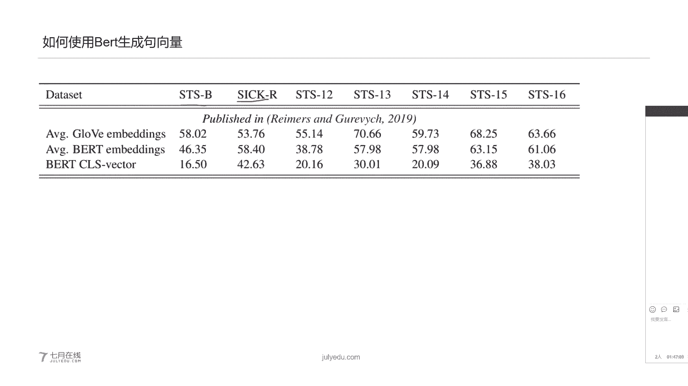

大家可以把它理解为，就是我们刚才代码当中的这个ARCQMC。

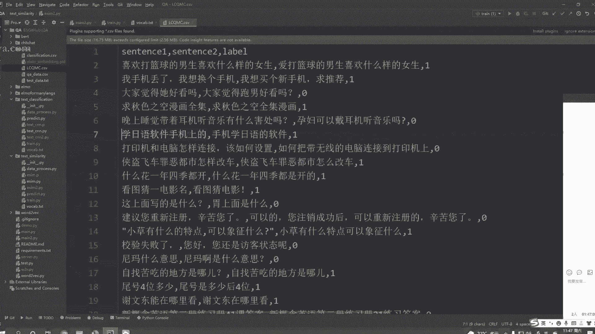

这样的一个数据集类型是差不多的啊，只不过它是英文版的，我们可以看一下啊，他这里对比了一下这个globe这个词向量，这个东西大家可以简单理解为就是what vector啊。

他对比了这个glob vert取平均，这是GLB取平均，然后bird取平均，然后还有一个BTCLS，这个CLS什么意思呢，就是我们的这个bird输入的时候。

不是会输入一个c i is的这样的一个标记位吗，他用这个CIS来表示我们的一个具向量，局向量好，要做到对比了一下效果啊，发现如果我用这个BTCIS来作为具向量的话，其实效果特别差，就16。5对吧，16。

5，那对于这里这个glob的话是58，然后BT取平均的时候效果也也没那么理想，甚至不如这个blob的一个词向量对吧，毕竟这种东西它是一个静态的，理论上来说，你一个静态的词向量效果。

应该没有所谓的一个语言模型生成的效果，好啊对吧，那为什么会出现一个这样所谓的一个，效果不理想的一个情况呢，这是为什么，这就是值得我们思考的一个问题啊，好我们就来看一下，我们考虑一个问题啊，考虑一个问题。

那通常呢我们去计算一个两个向量的一个，相似度的时候呢，我们通常都是计算的，这个所谓的一个余弦相似度对吧，那这个所谓的一个余弦相似度，就是说我们在计算这个余弦相似度之前，有没有什么假设呢。

或者说满足什么样的一个条件，我们才能去计算这个余弦相似度，那这个余弦相似度，计算出来的值才是有意义的呢，我们可以考虑一下啊，那对于我们计算与余弦相似度的时候，我们首先第一步。

需要去计算两个向量的一个内积对吧，那他这个内积是怎么算的，实际上就是各自的一个模长，乘以它们的一个夹角的余弦值对吧，那余弦相似度就是两个向量的内积，然后还要除以咱们的这样的一个模长对吧，模长。

那这是我们的一个余弦相似的一个计算公式啊，但是啊我们在计算这个余弦相似度的时候，必须是标准的一个正交机，必须是标准的一个正交集啊，标准的一个正交集，也就是说咱们这个夹角的余弦本身。

是有非常鲜明的这样的一个几何意义的对吧，也就是说如果我们要去计算我们与心相似度，必须在我们的这个标准的一个正交基上面，但是对于我们BT生成的这样的一个embedding。

它是在所谓的一个标准正交基上面吗，不一定啊对吧，这个谁知道呢，哎他是他是一个760这个bird啊，它默认bird它生成的这个向量，它是768位的啊，768位的，那么问题来了，我们并不知道BT。

它到底符不符合这个所谓的一个标准成交机，对吧，那这样我们来算出我们这个余弦相似度之后，得到的这个指标肯定是会有一些问题的对吧，那效果可能就不好，效果就不好，那这个时候怎么办呢，我们是不是可以考虑一下。

能不能把BD生成的这个具向量，把它转换到一个所谓的一个标准正交基上，对吧好，这是一种思路啊，然后接下来的话我们再，啊这是一个所谓的一个定性的分析啊，我们在定量的一个分析来看一下啊。

啊这边有这样的一个表格，这个表格我们先看第一行啊，第一行表示的是一个词瓶，就是说我这个bird当中，这些词它出现了一个频频次啊，他的这个是一个是一个等级啊等级。

所以这个0~100表示他等级就是0~100，这个等级里面啊，这个表示表示表示的意思是啊，持平比较高啊，磁频比较高，然后越往右边的话，他这个磁平是越低的好吧，越低的啊，这个时候我们来看一下这个表格啊。

这个表格首先看这一行，这一行的意思就是说，如果在BT生成的这个向量空间内的，每一个词的一个词向量，它距离原点的一个距离，一个L2距离啊，我们可以看一下啊，那对于一些词平比较高的一些词。

它其实距离原点距离会比较近，会比较近，那对于一些词频率比较低的一些词，它距离原点是比较远的，也就是说越接近原点的词，它的这个词频是越高的啊，越高的，然后我们再来看一下下面下面的这些值啊。

下面这个意思就是说，也就是说每三个词，每三个词它之间的一个相互这样的一个距离，然后取了一个均值，取了个均值可以看一下啊，那对于距离原点就是它磁平比较高的一些词，它这个词的一个间距趋势是会稍微小一点点。

如果持平比较稀疏，那这些词相互之间的一个间距是会比较大的啊，比较大的，这是一个L2的一个距离啊，下面是一个点乘的一个一个值，点乘的话你就可以看成一个相似度嘛对吧，然后最后就会我们就可以得出一个结论啊。

那越远离原点的词呢，它分布的就会越松散对吧，这是距离原点比较近的，也就是说磁平比较高的，那磁平高的就是距离原点近嘛对吧，因为也就是说磁平越高，它距离原点越近，然后它会分布的越紧密，磁平越低。

它的距离远点就会越远，它会分布的越松散，嗯我们这边简单画个图啊，他大概就是这个样子的，它可能距离这是一个三维的啊，那持平比较高的磁就距离在原点附近，并且磁和磁的一个间距啊，它会比较小。

对于磁瓶比较大的一些词啊，它就会远离原点，并且这些词的词，这些词的间距啊会比较大，大概就是这样的一个分布的一个情况啊，分布的一个情况好，那我们我们考虑一下啊，那对于这样的一个分布情况来说。

假如我们现在取的是一个，这个词啊它有些词它可能封他词频比较低对吧，这个词词频比较低，我可能选到了这样这里这个词，然后其他词呢我可能子平比较高，它可能在这个位置，然后最后我去取它的一个均值。

那最后均值求出来，可能这个值是在这个位置，那这个位置它实际上对于这一块来说啊，它有很多这个所谓的一个空洞，那这一块这些空间它其实因为分布的很散，那你并不能用这一点就说这一点的这个值啊。

它并不能很完美的表示出，你的这个值到底有什么样的一个意义啊，好这就是这样的一个，这是为什么BD生成的这个计算量，效果不好的一个原因啊，好我们这边进行了一个这样的一个啊，定性的一个分析。

觉得他可能不是一个标准的正交集，而这边呢又做了一个定性定量的一个分析，觉得他可能会出现一些所谓的一个，像磁平持平的一个关系，会引起它的这个效果不好的一个情况是吧，那有了这两点的一个分析之后呢。

我们这边就来看一下有什么样的一些解决方案，首先第一个解决方案呢是这篇论文啊，叫做word flow这样的一个模型，它的一个思路是什么呢，就是说既然如此啊，那我就把BT生成的这样的一个embedding。

转换到这样的一个所谓的一个，高斯分布的这样的一个空间，那我之之前你的那个BT那个分布，我不知道是什么样子嘛对吧，那我就转嘛，转换成这样的一个高斯分布的这样一个空间内，要从而能满足我们所谓的一个标准。

正交基的一个情况啊，呃具体的一个情况我们这边就不详细说了，各位同学可以去看一下这篇论文，好吧好，论文当中也有开源的代码可以给大家看好，我们继续往下啊，除了这个所谓的一个bird flow这个模型呢。

我们这边还有一种方法啊，就是一种基于监督学习的一个方法，监督学习的一个方法，那基于监督学习的一个方法，肯定会对于bird flow这样的一个方法来说的话，它是一个非监督的一个方法，那监督学习的方法的话。

相比于这种非监督的方法的话，肯定效果会有一定的一个提升，好吧好，那我们来看一下这个这种方法啊，这篇呢这个方法的话叫做sentence bt啊，他的思路是什么呢，那既然我们现在要计算这个余弦相似度对吧。

那我们不如在微调的时候，我们直接把我们的损失函数，就朝着咱们的这个余弦相似度来嘛对吧，也就是说我们这里这个思路啊，和我们给大家介绍的这个文本匹配模型，的一个结构会很类似。

也就是这样的一个孪生网络的一个结构啊，然后我们这边输入一个句子，经过咱们的一个bird，而这边是另外一个句子啊，经过咱们的一个bird，最后拿到了我们的两个句子的一个向量对吧。

我直接去计算这两个句子的一个余弦相似度，那这个余弦相似度，最终它的这个值是在-1~1之间对吧，那我们其实际上啊是有我们的真实标签的，我们真实标签有一和零，我们可以把零映射为咱们的一个一真实数据。

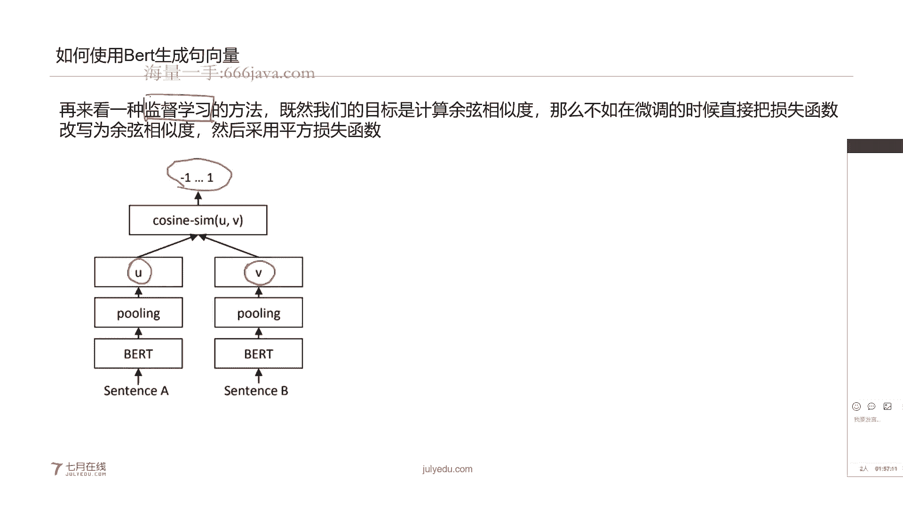

就是这个嘛这本数据对吧，这本数据，然后呢我们再把这个数据啊，这是我们的真实的Y标嘛对吧。

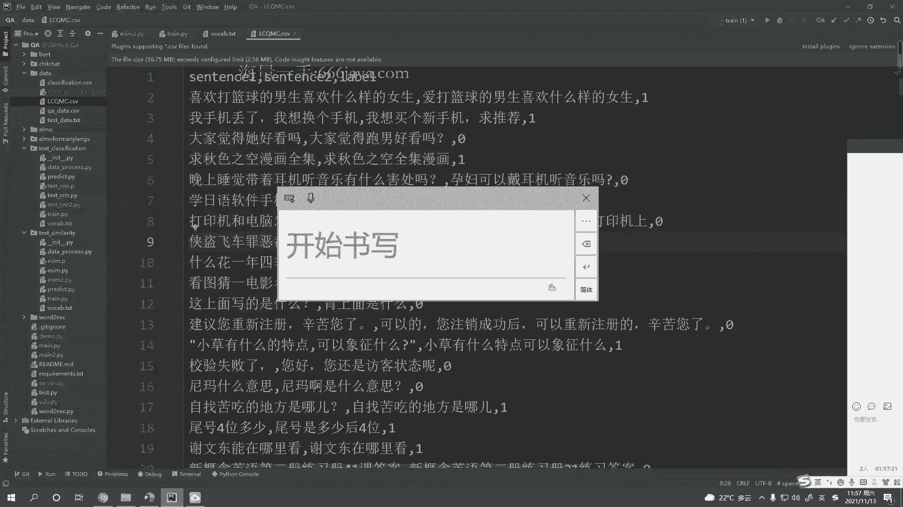

这是我们真实的Y标，这是我们的一个输出值，我们再把经过余弦相似度拿到的一个结果，和我们的真实外标，计算，我们的平方损失函数，来作为我们最终的一个损失值，就以这样的一个形式啊来进行我们的微调。

最终我们微调出来的这个这里，这个U和这里这个V实际上就可以用来，表示这样的一个真实的一个具象量了啊，好，这个就是今天要给大家讲解的，这个BT生成具向量这一块的一些内容了，好吧，然后啊这边我也说一下啊。

那对于BT生成具向量这一块的话，实际上也属于一些进阶的一些内容，然后我希望各位同学下来呢啊，就能把BT这一块就自己再去花点时间，再把课堂上我讲的这些东西对吧，自己再去看一下，多花点时间把它深入理解。

其次呢你再去了解一下，如何去使用这个sentence bt对吧，Sentence bt，再去看一下啊，如何去做咱们这个sentence bt，那如果你这一块做好了呢。

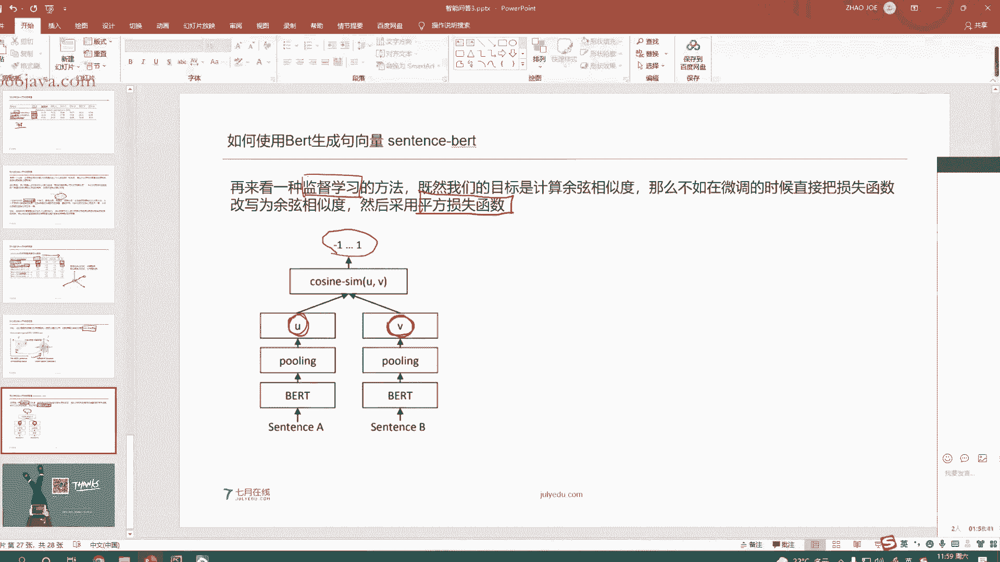

你就可以把我们代码当中的这个啊，我们代码当中不是有一个这一块吗，sentence vector对吧，我们之前是用的，我们的这个JENSM生成的一个词向量，那你可以用BT那个BT的具向量。

把这一块给替换了好吧。

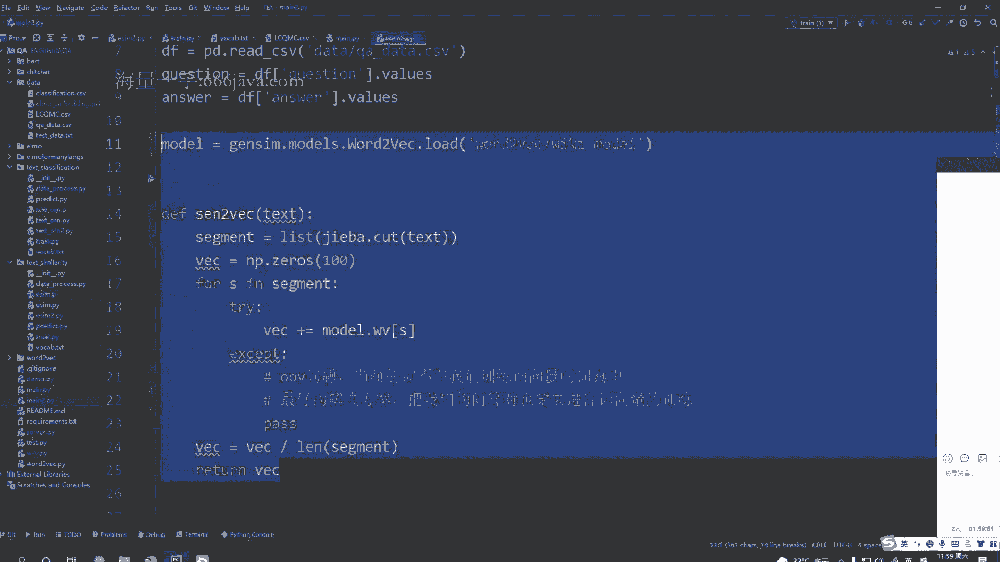

可以把这一列这一块给替换了，其次啊，咱们今天不是还给大家讲了这个匹配模型吗。

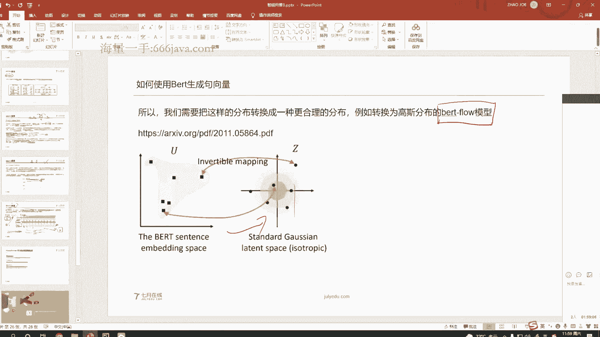

对吧，匹配模型，那匹配模型我们现在构建好了。

但是我们还没有加到主流程当中对吧，主流程这边还是把那个相似度最高的，给返回回来，那我们现在可以考虑一下，我把相似度前十的或者说前20的给返回出来，再用我们的匹配模型对吧，我们的这个匹配模型去算一下。

这找回的20个或者十个，哪一个相似度是最高的，再把那个相似度最高的答案给返回出来好吧，这是我们希望大家自己去实现的啊。

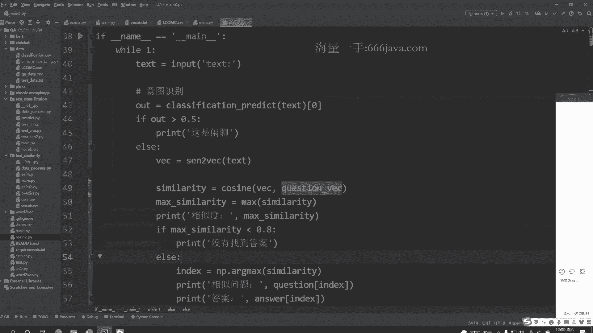

然后BT这一块的话，就属于这个进阶的一个作业啊，进阶的作业大家可以不做，但是还是建议大家去做，然后相似度模型这一块的话，一定要自己下来去动手，把这个模型给实现好吧，给实现好，这就是今天的一些内容了啊。

一些内容了，然后大家还有一点我要说明一下啊，因为咱们这个是机器学习班嘛。

所以我们有些BT方面的东西，可能没有花那么多时间去讲的那么深入啊，但各位同学，如果今后想去从事NLP方面的一些工作的话。

BD这一块还是要去掌握的好吧，一定要花时间去掌握，一定要花时间去掌握啊，这是非常非常重要的啊，非常重要的，包括这个文本的这个embedding，也要花时间去把它给掌握了，好吧好行。

那咱们今天的内容基本上就到这边了啊，最后看各位同学有没有什么问题，有问题吗，各位同学，没什么问题的话，咱们今天的这个课程就到这边了，好吧，LSTM结构就是sell，为什么要这样子构造。

嗯这样子构造的原因，就是他引入这个所谓的一个门的，这样的一个机制，啊啊这样子吧，我可以看一下我们之前写的这个，好我们看这个图啊，我们看这个图，我们可以看一下这个图，看这个图，那对于这个图来说。

我们可以简单理解一下啊，这首先，好我们看一下这个，首先呢这边它会有这样的一个SIGMOID的，那这个SIGMOID的啊，就是说哎我这里进入输入值对吧，我进行一个SIG格MOID的，我做一个判断啊。

这边会输出一个0~1之间的一个值嘛对吧，0~1之间的一个值，这里其实就是所谓的一个门一个门，然后呢这是上一轮给过来的这个sales sit对吧，我会因为这里是个0~1之间的一个值嘛。

我会把这个0~1真的值，和上一层的这个值进行一个相乘，这里的意思就是我会判断一下到底有多少的值，就是上一轮有多少的值会保留上保留下来，就假如我这里是一个0。7，也就是说，我会把上一轮70%的值保留下来。

如果这里值是零，也就是上面上一轮的值，我觉得没有什么用，那我就全部丢弃了，那这里我相乘之后，这个值就是零，就是这这里就是这个意思啊，这里是这个意思，然后我们再来看下面啊，下面这里是一个所谓的一个嗯。

也是一个门的机制啊，也是输入输出一个0~1之间的一个值，然后这边呢我会把当前的一个值进行一个，非线性的一个变换，然后这里这个门，其实和这一个门的一个思路是一样的，我就是要告诉我当前这个模型。

我接下来要进行一个输入了对吧，那我输入的时候，我应该保留当前的这个XT，经过的这个ten h之后多少的值，假如我这里是0。7，那就等于是把经过ten h，70%的值留下来，然后和上一轮保留下来的值。

进行一个相加的一个处理好，那相加之后呢，我们再往后面往后面之后，这边又进行了先进性，先经过这个ta h处理，经经过tan h之后呢，这边又有一个门，这个门呢又输出一个0~1之间的一个值。

这个值再和这里这个值进行一个相乘，也就是告诉模型，我当前应该输出百分之多少的一个值，如果这里是0。4对吧，也就等于我接下来的一个输出值，我只保留我这一部分的40%，就是这个意思啊，就是这个意思。

那为什么会以这样的一个形式来弄，我们考虑一下啊，那假如我们之前的内容意义不大，那意义不大，那对于第一个门来说，它可能就输出的一个0。1或者0。2对吧，那我上一轮的这个值可能就只有0。1的一个。

结果进行了一个保留，那我们接下来给到后面的时候，可能觉得啊，我这一这个时间节点这个词比较重要对吧，那这个时候可能我这里这个输出门的时候，可能就是一个0。8或者0。9，就保留更多的一个内容给到后面。

就是这样的一个思路，好吧啊，我有说明白吗，这位同学，其实你只需要把这个门的这个机制弄清楚了，你整个结构就很清楚了，额有理论上的一个证明其实是这样子啊，我们可以额，这个我在N2P小班的时候给大家讲过。

就主要那为RN是这样子啊，RN它的这个计算过程呢它容易是这样子啊，我这边也简单说一下啊，RN的一个计算过程是这个样子嘛对吧，那这边会有最终的一个输出值，我用o on来表示啊。

那如果这个o on要对这个节点的这个啊权重，进行求梯度的话，那这个时候如果序列长度太长，那就会容易出现梯度的梯度消失的一个情况，为什么呢，因为你去看他的那个求梯度的一个公式。

你会发现它是一个累成的一个情况，并且他这个累乘的每一项啊，每一项他都是一个0~1之间的一个值，那假如这这个序列长度特别长，假如有100的一个序列长度，那这个梯度就是一个0~1之间的一个值。

然后的100次方对吧，那这个值实际上是趋近于零的，就会容易出现一个所谓的梯度消失的一个情况，那对于LSTM来说，它并不是一个累成的一个情况啊，这个求解梯度的一个过程，并不是一个累成的一个情况。

它最终会有一些累加的，像累加的话，那就让他尽可能不会出现这个所谓累乘100次，趋近于零的一个情况，因为他有些累加的价，从而就防不能说繁殖啊，应该说缓解了这个所谓的一个梯度消失好吧，因为你缓解了梯度消失。

所以你这个长期记忆就是有效的，你这个RN的话，你这个很容易梯度消失嘛，所以你这个尺就没有办法做到，这个所谓的一个长期记忆，而LSTM的话就有这样的一个优势好吧，但是LSTM并不是说。

它就完全不会出现梯度消失，它只能缓解，OK吗，这位同学，是的是的，改善了只能说改善啊，只能说改善就是改善，改善或者说缓解啊，其他还有什么问题吗，你说的经验是指什么，你是想问什么经验，工作经验呢，还是。

学习方法，那就是其实这个东西怎么怎么说呢，其实对于新人来说还不太一样，新人的话可能啊也不太适合去看一些paper吧对吧，那你就去看一些比较基础的一些内容，那对于啊像我们这种工作很多年的来说。

可能就是每天去看这些新的paper，然后去总结一些新的一些方法，一些优化的一些方法好吧，还是不一样的啊，对于你们这些初学者来说，更多还是去学习一些基础的内容，那对于我们来说。

可能就是去啊追踪一些前沿的一些技术，去学习一些新的新的一些paper，LSTM的cell的初始值是隐藏层H0吗，啊初始的时候这里还会有这样的一个值啊，就这里假设是第一个节点啊。

他这边假如假如这个是第一个节点啊，那实际上这里还会有一个HT减二嘛，那这个值它是随机初始化的啊，好还有问题吗，好行，那咱们今天的内容就到这边好吧，如果还有什么问题的话，到时候在群里面找我就OK了，好行。

那咱们今天的内容就到这边。

我们就明天再见啊，明天再见。

