# 1447-七月在线-机器学习集训营15期 - P15：08-NLP-4-智能问答机器人项目的部署、总结 - 程序员技术手札 - BV1ASste6EuZ

啊，今天的话是我们这个智能问答的这个，第四次课啊，第四次课也是我们的这个最后一次课啊。

那我们先来看一下，我们今天要给大家讲的一个内容啊，呃按照我们之前的这个流程来说的话，今天主要是要会涉及到这个闲聊这一块对吧，所以说呢今天首先第一点啊，会带着大家一起来看一下啊。

关于什么是这个sequence sequence这样的一个模型，那我们要做闲聊对吧，我们这个闲聊是生成式的，那生成式的闲聊呢。

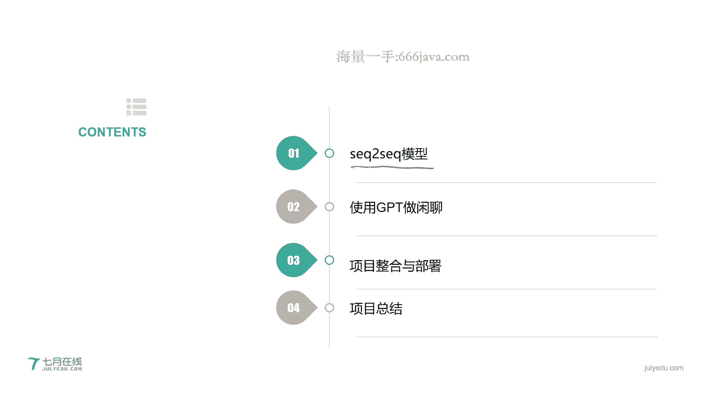

都要采用这个所谓这个sequence，sequence这样的一个模型来做，那这样的一个模型到底是什么样的一个结构呢。

所以说第一部分啊，我们要给大家详细讲一下这个sequence，sequence的一个模型，然后第二部分呢我们一起来看一下这个啊，基于GBT这样的一个闲聊模型，那GBT这个模型呢。

虽然和这个sequence sequence不太一样啊，但是他的这个思路大致是一样的，到时候也会和大家简单说一下啊，他的一个区别，然后第三个部分的话，我们来看一下我们整个项目把它整合在一起。

到底是什么样子的，然后最后呢再一起带着大家来看一下啊，我们会怎么去简单的做一个这样的一个部署，然后第四部分的话是我们的这样的一个总结，好吧，项目总结好，那我们就先进入我们的这个第一部分啊。

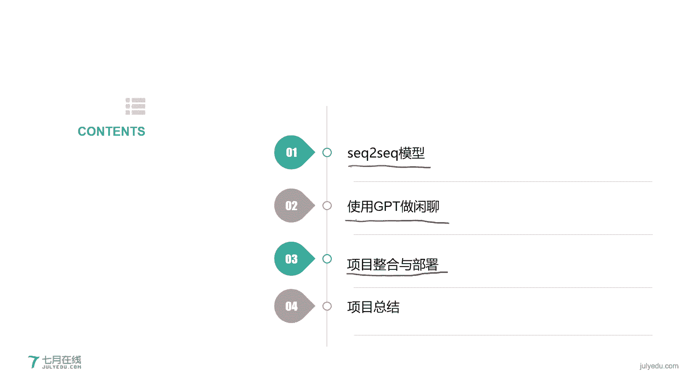

就关于这个sequence，sequence这个模型。

好那这边呢首先呢给大家罗列了两篇论文啊，那这两篇paper呢其实是sequence，sequence这个模型才提出来之后呢，就去应用在了这个神经那个机器翻译上，那那个时候应用在机器翻译上面呢。

其实取得了一个非常好的这样的一个效果啊，那sequence sequence这样的一个模型，它到底是在做什么呢，它实际上啊是对序列的一个item，在做这样的一个建模，这里大家需要注意一下啊。

是对序列的item建模，举个例子啊，例如我们的这样的一些文本数据，它实际上是由一个一个的这样的一个词，或者说这个啊字组成的对吧，那这里的这个所谓的一个字或者词，就被称为这个所谓的一个这样的一个ITE。

那我们的输出的一个过程，其实也是对应的这样的一个item，我们举个例子啊，假如我现在想去做这个所谓的一个新闻的，这个标题自动生成，那我给定一篇新闻对吧，然后给到咱们这个模型，那输入给模型的。

实际上就是我们的新闻的诊断内容，一个一个的这样的一个字对吧，我们给到了模型，最后我们的模型呢，再一个字一个字的把我们的标题啊，进行这样的一个输出，这就是对我们的这个item来进行一个建模啊。

因为我们下面这里这个动图我们看一下啊，左边是我们的一个输入啊，我们这个输入我们再回退一下，一共是有三个item对吧，一个一个的进行一个输入，然后给到了我们这样一个sequence。

sequence这样的一个模型，最后呢我们这个模型再一个一个的啊，进行这样的一个输出好，这就是我们这样的一个sequence，Sequence，这个模型的一个啊整体的这样的一个结构啊。

这里大家需要注意一点啊，就是咱们这个sequence sequence的模型，并不是说你的输入和输出它是一个等长的，不一定啊，像我们刚才说的这个啊，生成标题的这样的一个情况。

它实际上输入文本肯定是很长的对吧，然后我们的输出文本实际上是很短的啊，那对于我们这个啊动图来说也是啊，你看输入的其实就三个item，那输出的话是四个items对吧，好就是这样的一个形式啊。

好我们继续往后面看啊，那sequence这个sequence这个模型呢，它的内部结构到底是什么样子呢，我们来看一下啊，它的内部结构啊，其实分为了两个部分，例如下面这里这个图。

它这个绿色的这个部分呢被称为这个encoder，那紫色这个部分呢被称为咱们的这个decoder，那这个encoder和decoder是用来干什么的呢，首先呢我们这个encoder是用来处理。

每一个时刻的一个输入序列的，就是说我们会把我们的一个输入值，先给到我们的这个encoder，那encoder经过它一系列的这样的一些特征提取，就会得到一个这样的一个所谓的，上下文的一个context。

这样的一个值，或者说这样的一个vector，那这样的一个vector得到之后呢，我们又会把这个vector，或者说这个context，给到我们紫色这个部分的这个decoder。

那decoder呢在一个接一个生成一些新的，输出的一个序列，我们可以看一下这个动图啊，首先输入值给到我们encoder好，encoder这个时候输出了这样的一个context context。

这个时候呢context再给到我们的decoder，给到decoder，然后decoder再进行这样的一个输出，好这里大家需要注意一下啊，啊这里我们刚刚可以看到啊，这里有这样的一个context对吧。

Context，那这里这个context呢就是咱们输入序列的一个，你可以理解为就是它的一个啊，如果是句子的话，你可以理解为它就是这样的一个具向量，只是说经过了一系列的这样的一些，提取的一些特征。

其实这种趋向量可能不是太合理啊，就是一些啊上下文的一些提取出来的，一些综合特征啊，综合特征，那这个vector或者说这个context，它的一个维度呢就取决于你的encoder输出结果。

它如果你的这个encoder使用的是RN这样的，一个结构，那就会存在一个所谓的hidden state对吧，那这个hidden state它的一个维度啊，就和这个context的维度是一样的啊，一样的。

所以说如果你希望你这个context的维度，是512维，那你的这个encoder部分的一个模型啊，你这个hidden state，你就需要把它设置为512位好吧。

所以说对于这里这个context的一个维度啊，取决于你的这个encoder，他这个啊隐变量的这个，或者说中间输出的这个值，hidden state它的一个维度，好吧好，这是我们的这个啊context。

我们继续往下啊，那对于sequence，sequence这个这样的一个模型来说呢，它实际上啊是属于这样的一个啊，所谓的一个多模态的一个模型啊，多模态的一个模型什么，那什么是一个多模态的模型呢。

啊我们可以给大家简单的解释一下啊，那对于我们的刚才的这个，这里给大家介绍的来说，实际上就是序列到序列，你可以简单的理解为它就是一个text，到站的一个text，那对于这样的一个情况的话。

他是从文本到文本对吧，那如果我们的一个输入是一张image呢，是一张图片呢，然后我的输出是这样的一个text，那这个就变成了什么，从图片信息到了我们的文本信息，也就是说我们的输入内容和输出内容。

实际上是两个方向的，是不同的一个方向，那这样的一个场景，实际上就是咱们那个看图说话对吧，看图说话，这就是我们所谓的一个多模态啊，多模态也就是说我们处理的一个数据，不单单是一种类型的，也可能是多种类型的。

你甚至我可以把这里变成左边，我的输入是这样的一个声音对吧，然后我输出是这样的一个文本，那这个过程实际上就是一个音频识别的一，个过程吧对吧，把语音转换成了一个文字，这就是咱们的一个所谓的一个多模态啊。

多模态，那其实多模态的一个应用场景是比较多的啊，像我刚才这里说的，看图说话啊，还有这个语音转文字啊对吧，还有刚假如我们再把这里反过来啊，如果我们从文本到图片，其实就是啊我给了你一段文本对吧。

给了这样的一段文本的一个描述，让你生成这样的一张图片也是OK的对吧，所以说这种多模态的场景啊，应用还是比较广泛的好，这就是我们的这个所谓的一个多模态模型啊，多模态模型嗯，那接下来我们就来详细看一个啊。

再简简单解释一下啊，我们从一个例子来看一下，那咱们这个这个sequence second，这个模型在训练的一个过程，和咱们那个预测的一个过程，有什么样的一个区别呢，啊我们这边举个例子啊。

就是我们以这个翻译来作为这样的一个例子啊，我们的翻译的话，就是从我们的这个文本到我们的一个文本对吧，那对于SENCESENCE这样的一个模型来说，它到底是在做什么呢，我举个简单的例子啊。

啊首先呢我们这边是有这样的一个中文啊，中文这是我们的一个中文，这个里面呢可能有一个单词，有一个单词啊，假如是你这个单词啊，表示你这个单词，然后呢我们这这个是我们的中文啊。

这个呢是咱们的一个context，这是我们的context啊，那我们首先第一步呢是把我们的这个数据啊，映射到这个context空间当中的某一个分布上对吧，或者说context是个分布的某一个位置当中。

假如我们现在做的是这个中英翻译，那接下来呢我们就会把这个context啊，映射到咱们的英文上啊，英文上，假如我们这边的英英文是U对吧，U那我们就会把这个点啊对应到这里啊，对应到这里。

如果我们现在又有了另外一种语言，比如咱们这边又有一种啊叫日语，好吧，我们这边也有个日语，那日语这边也有一个点，那这个点对应的也是你这个字，那这个sequence sequence会怎么做呢。

它其实就是把这个context啊，映射到日语这个分布当中的这个点上，所以说second second模型啊，实际上啊就会包括了两个部分，第一个部分的话就是咱们刚才说的encoder。

先从我们的原始输入数据，映射到咱们context这个空间，那第二部分的话就是从我们的context啊，在映射到我们的这个目标语言的这个空间对吧，那接下来我们就来啊，详细看一下这个模型。

在训练过程和咱们的这个测试过程，它的一个整体的一个流程大概是什么样子的，嗯我们这边就与这个这个句子啊来举个例子，例如我现在有一个叫做今天天气很好，这个句子啊，我会把它翻译成英文。

那就是today that is good，对吧，假如我们现在的这个encoder，和咱们的一个decoder，都是这样的一个嗯类RN的一个结构，那我们的一个输入是什么样子呢，好这是我们的一个输入啊。

那对于第一部分的话，我们肯定输入就是今天对吧，今天好，给到我们的第一个节点，那第一个节点，经过咱们一系列的一些处理之后呢，然后给到我们的第二个节点，给到我们第二节点，然后继后继续啊，继续就给到了我们的。

咱们的一个第三个节点，给到了咱们的一个第三个节点，那这一个部分呢就是咱们的一个encoder啊，这个部分就是咱们的encoder，那这个encoder最终会得到这样的一个context对吧。

context得到这样的一个context，那我们会把这个context啊，再给到我们的这个decoder，Decoder，好那这个点就是一个比较关键的点了啊。

那首先是我们decoder第一个节点的一个输入值，那我们抵扣的第一个节点到底应该输入什么呢，这就是一个比较关键的问题了对吧，我们并不知道我们第一个节点该输入什么不。

而且我们该如何告诉我们的decoder，这是我们第一个节点呢对吧，这些都是一个问题啊，所以呢通常啊在第一个节点，我们通常都会输入一个所谓的一个，起始符的东西，起始符这个东西就有点像。

我们在第一次课给大家讲的时候，我们需要去构建词典对吧，可能会涉及到一些比较特殊的一些标记位，例如咱们的这个padding补充位，比如我们的这个UNK未知词的这样一个，替代服对吧。

那这里这个S表示就是star啊，star就是开始符，就是告诉我们的这个decoder，哎你现在是第一个位置，是咱们的一个起始符，OK那有了起始符之后呢，我们这边就会进行一个输出啊输出。

那这里输出的实际上就是咱们的today's对吧，Today's，Place place，Ok，那我们继续往下啊，继续往下，对于我们先看我们训练阶段好吧，我们先看训练阶段，那训练阶段的时候。

我们理论上来说就应该有两个输入，第一个输入的话是我们encoder一个输入，第二个输入的话就是我们的decoder的一个输入，最后我们的输出的话就是decoder的输出对吧。

那我们encoder的一个输入，就像刚才说的，首先呢我们会有一个起始符，其次啊我们会把这些值啊按顺序给添加进去，Todays，这里是TODAYS啊，那这里输出的就是weather对吧。

那咱们这里啊输入的就是weather，这里输出的话就是is，我们继续往下啊，那这里输入的是is，那这里输出的话就是咱们的一个good对吧，好到这里的话，实际上我们这边的decoder的一个输出。

已经输出完了，但是啊我们的一个输入实际上还没有输入完嘛，对吧，我们这里还需要去添加进去，这里就是咱们的good，而最终呢，我们输出的就是一个所谓的一个结束符，好吧，结束符好，我们在啊回过头来再看一下啊。

首先是我们的encoder，encoder的话，我们的一个输入是今天天气很好，并且按顺序进行一个输出的和输入的对吧，这是咱们RN的一个结构啊，RN的结构，然后得到我们的context。

那就然后呢是我们的decoder decoder的一个输入，看先看一下输入啊，输入我们需要在我们的原始句子，上面添加一个起始符，一个起始符，然后呢我们在预测的一个过程中啊。

我们起始符预测输出的是today's，然后在下一个节点的时候，我们输入还是today's嘛，然后呢这个时候再来预测我们的weather好，再下个节点输入的是weather，要输出的是is。

直到我们最后一个节点啊，我们输入是good，当我们的模型输出一个and符号的时候，我们整个流程啊就结束了，也就是说我们必须让我们的模型输出，当前是咱们的一个结束符，那在预测的时候呢。

这个啊就是我们的一个label啊，这这个句子，这个句子就是我们的这个label，这就是咱们的一个label，好吧，这个句子就是咱们的一个label，包括我们这里这个起始符。

也是我们最终的一个label啊，那下面这个这是终止符，说错了啊，最终这个终止符也是我们的一个label，那我们的这个起始符加上原始的这句话啊，就是我们的一个输入值，这里各位同学就可以发现一个问题。

我们实际上在训练的一个过程中，我们的输入decoder的输入和输出，实际上啊就等于是差了一个位置对吧，我们这边的这个输出值和输入值，实际上就是相差了一个位置，相差了一个位置啊，咱们这个是输出吗。

这是输入，那输入和输出只是相差了一个位置，那这个位置就等于是填充了一个所谓的一个，起始起始符，让他错开了一个位置呃，最后预测的时候啊，预测的是咱们的这个结束符，结束符，这是咱们的一个训练过程啊。

训练过程，那预测过程又是什么样子呢，预测过程我们考虑一下啊，一开始我们只有encoder部分对吧，然后呢在预测的阶段，我们是没有任何输入的对吧，decoder阶段是没有输入的，那这个时候。

如果我们想让我们decoder进行一个输出，该怎么做呢，还是一样啊，我们先给它一个起始符，这个时候啊模型预测出来today's，接下来需要把这个today's作为输入，给到我们的第二个节点。

我再说一遍啊，第一步我们会给decode一个起始符，并且我们会得到context，这个时候呢我们输出了today's，那到了第二个节点，我们会把输出的这个TODAYS，作为第二个节点的一个输入。

然后来进行预测，得到我们的weather，再把weather作为下一个节点的一个输入，预测出is，再把这里这个is呢作为下一个节点的输入，最后good也是一样啊，作为下一个节点的一个输入。

最终模型如果输出了这个and，那我们整个预测过程就结束了好吧，整个预测过程就结束了，这就是我们整个这个sequence，sequence这样的一个过程啊，这样的一个过程。

好看看这边有大家有没有什么问题啊，看各位同学有没有什么问题，大家有问有问题就及时提出来好吧，有问题就及时提出来，其实这里的难点啊，就在于咱们的这个训练过程，和我们的这个预测过程。

训练过程和我们的这个预测过程，它实际上是不一样的啊，不一样的，这里是非常重要的，大家一定要把这个训练过程和预测过程，给区分开，那训练过程的话，我们是已知有这个输入和输出的对吧，这个是输入。

这个是咱们的一个输出都是已知的，所以呢我们需要错一位，如果不错一位的话，例如我这里直接输入一个TODA，我们在第一个位置就输入TODA，然输出TODA，这个时候实际上模型已经看到TODA了对吧。

那就没有意义嘛，所以呢我们这边训练的过程中啊，需要添加这样的一个起始符，然后输出的时候呢输出值啊，添加一个这样的一个结束符，结束符，以这样一个错开一个位的一个形式，来得到我们的一个输出值，好吧。

这就是我们的一个训练过程，那对于我们的这个预测过程来说啊，就只输入一个起始符，然后把当前节点的一个输出值，作为下一个节点的一个输入值，然后以这样的一个循环的一个方式啊，进行一个预测。

直到我们得到一个这样的一个终止符，那我们整个的这个预测过程啊就结束了好吧，遇到终止符预测过程就结束了就结束了，这就是我们整个这样的一个sequence to sequence，这样的一个结构啊。

那这里的话我是以这样的一个RN的一个结构，来给大家画的啊，那对于LSTM啊，其实也是比较类似的对吧，也是比较类似的，那对于这个啊唯一区，唯一它和这个transformer的一个区别呢。

就在于transformer啊，他这里就不是这样的一个串行的了，他这里是一个这样的一个并行的对吧，那并行的他又是怎么处理呢，待会我们再啊，下面的部分会再给到大家讲，好吧好，这就是我们今天要给大家讲的。

这个第一部分的内容啊，sequence sequence嗯，核心点就是咱们的这个这一块啊，大家一定要注意啊，它是分了encoder和decoder，encoder输出context点到decoder。

然后decode再按顺序进行输出，好吧啊，但是有一点是需要注意的啊，你不管是这个类RN结构，还是transformer的这样的一个结构，在预测阶段还是得这样的一个一个词，一个词的进行一个输入输出好吧。

毕竟预测阶段，transformer也是没有办法达到，你所谓的一个并行的一个处理好吧。

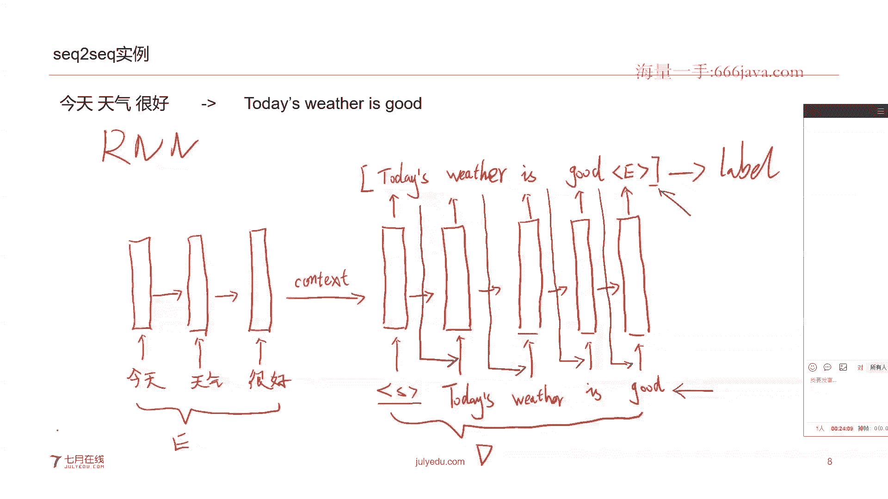

这里大家需要注意一下啊，需要注意一下好，那接下来的话，我们就来进入到我们的这个第二部分啊，就是说使用咱们的这个GBT，来做咱们的这个闲聊啊。

OK那在我们之前课程当中呢，我们给大家讲过了这个transformer，encoder部分对吧，这一个部分啊，它的核心内容就是在这个mari had腾省对吧，Money，I had tention。

那他的decoder和这个encoder它有什么区别呢，它最大的区别就在于这个部分啊，Musket mari had attention，在于这个部分，你看其实这一部分都是一样的嘛，这一部分对吧。

这一部分它都是一样的，只是这一部分啊，多了一个这个所谓的musket muli head tension，那这里这个musket money，i head attention到底又是什么东西呢。

好我们就一起来看一下啊，一起来看一下，嗯我们接下来考虑一下啊，对于我们的transformer来说，它最重要的一个部分实际上就是咱们的一个啊，腾省这里对吧啊腾省，那在attention的时候呢。

我们需要把这个Q和K进行一个相乘对吧，我们会把Q和K进行一个相乘，然后得到这样的一个所谓的一个attention matrix，Attention matrix，那我们考虑一个问题啊。

那对于我们这样的一个序列，生成的一个模型来说，我直接让我们的Q和K进行相乘，举个例子啊，假如我们现在这里这个句子，人工智能我要输出人工智能这个句子，那首先第一步我们输入的是起始符对吧，输入提示符。

然后呢我想输出的是咱们的人这个字，但是啊但是如果按照我们之前的逻辑来说，我们的这个attention，会让我们的这边的Q和K进行一个相乘对吧，那相乘的一个过程中，我们看一下啊，这里的这个人。

这里的这个人实际上啊是可以得到这句话，所有的相关的词的一些权重的，例如这里的起始符，包括这边的人工智能这四个字对吧，对于人这个字来说，它实际上都是可以得到对应的一个权重的对吧，这些权重都是可以得到的。

都是可以得到的，那理论上来说啊，我们的人这个字他只应该拿到起始符S的权重，那对于人工智能来说。

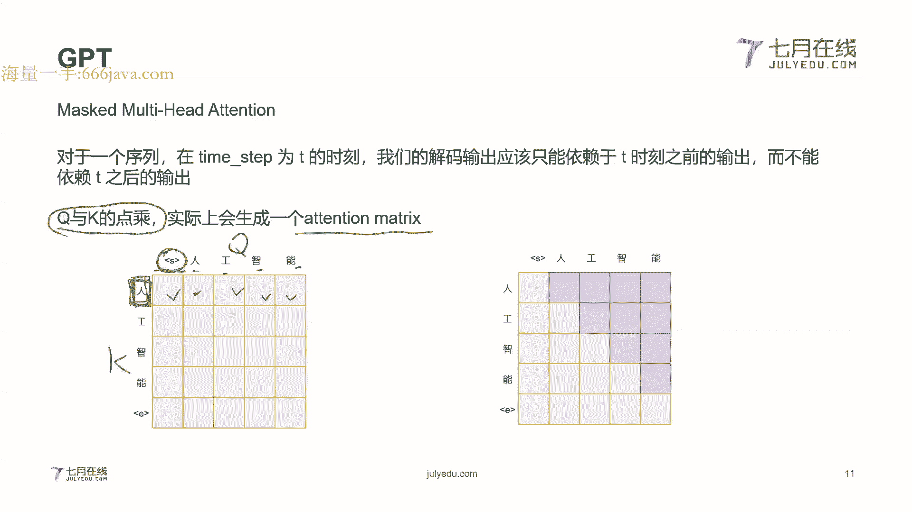

这些权重应该给它为零才对对吧，就像我们刚才的这个sequence。

sequence这边来说，我们的一个模型在decoder阶段，一开始只能看到我们的起始符对吧，看不到其他信息，看不到其他信息，那我们的一个数第一个节点的一个输出值，理论上来说只应该和我们的上文。

和我们的这个起始符有关系啊，你不能让前面这个节点看到，后面节点的这些内容对吧，但是在我们的这个transformer的这个，attention部分啊，attention部分，我这个人字实质上啊。

是可以关注到所有的这些字的，那肯定是不行的嘛对吧，那包括弓这个字，你看我们做腾审的时候，这些地方也是全都可以关注到，理论上来说，对于公这个字啊，它不应，他应该把后面这三个字的一个权重置为零，才对对吧。

如果啊如果我们这些权重都不是零，如果都是有权重的，那就存在了一个所谓的一个标签泄漏的，一个情况了啊，举个例子啊，假如质这个字对吧，我看到质的时候，我应该啊只能看到前面的这个起始符，人和工。

然后让模型来输出质这个字对吧，但是现在我输出质的时候，我已经提前能看到人工智能整句话了，那你输出这个质实际上意义就已经不大了对吧，意义就已经不大了，所以说归根结底啊，就说我们在解码这个过程中啊。

我们只能依赖于当前节点之前的一些内容，不能依赖于之后的一些内容对吧，那如何解决这个问题呢，这就是我们的一个mask mask mask，那既然如此，我们就把这些地方啊权重应该是零的。

这些地方我们搞一个mask把它给遮住嘛，然后把这些地方的一个权重全部置零，也就是右边这个图，我们把紫色这些地方啊，紫色这些地方的权重啊全部改为零就OK了啊，就OK了。

那这个呢就是咱们所谓的一个musket，Musket，Money head attention，好吧，这就是我们的一个mask，这就是我们的一个mask，其实思路还是比较简单的啊，思路还是比较简单的。

只要我们把这个部分全部遮住，也就是说我们只需要生成一个全是零的，这样的一个，然后其他位置是一，我们只需要生成这样的一个矩阵，然后呢我们再把这个矩阵啊。

和我们的这个attention matrix进行对位相乘对吧，相乘之后啊，是零的这些位置的值就全部变成零了吗，是一的位置的这些值，还是原来的这个所谓的一个权重对吧，就以这样的一个形式啊。

来达到了我们的这个，防止我们的所谓的这个标签泄漏的，一个情况发生啊，这就是咱们的这个decoder部分好吧，decoder部分好，那抵扣的部分的话，我们这边呢简单看一下啊。

首先呢抵扣的部分的一个输输入啊，就是咱们的一个啊，你可以假设我们现在在做一个这个翻译啊，从中文翻译到英文，那这个decode一个输入就是咱们的一个英文啊。

把这个英文做咱们的QKV的CALATENTION，然后呢继续往下啊，往下之后这里也有一点点的一个区别啊，那这个时候我们得到的值是V好吧，然后这边呢还有一个Q和K，那这里这个Q和K呢。

实际上啊是从咱们的encoder这部分给过来的，encoder部分给过来的啊，这里是大家需要啊注意一下的，这里是大家需要注意一下的，诶这里好像有点不太对啊，这里有点不太对嗯，我们的这个这个Q和K啊。

这里这个Q和K，首先呢我们QK是去计算这样的一个权重的，对吧，去计算这样的一个权重的，所以呢我们应该把这边写成，把这个写成可以吧，然后把这个写成，也就是说其实这个箭头不应该这么画啊。

啊把这把这个写成T可以，这个写成V这样子会比较合适啊，这样子会比较合适，也就是说我把encoder阶段的这个Q，和咱们decoder阶段的这个K进行相乘，拿到了一个权重对吧。

然后再对我们的这个输入值的V，进行这样的一个加权，然后得到了我们加权之后的这样的一个值，然后继续给到我们的，咱们的这个后面的模型结构啊，进行进一步的这样所谓的一个特征提取，好吧。

这就是我们整个这个decoder阶段，decoder阶段，好看一下啊，有没有什么问题，各位同学看一下有没有问题啊，啊有问题就及时提出来好吧，有问题就及时提出来呃，其实对于这里来说。

可能会理解起来有一定的一个难度啊，这里理解起来可能会有一定的一个难度嗯，也就这个mask，这里mask这部分啊，可能理解起来会有一定的一个难度啊，我这边也简单再重复一遍啊。

因为这个东西其实每次我在讲这部分的时候，都会讲很多遍啊，有些同学会觉得理解起来比较困难啊，比较困难，我们这边再简单重复一遍啊，还是这句话啊，人工智能那，人工智能，我们假设啊我们输出的是人工智能结束符。

我们要输出这句话啊，我们要把这句话进行输出，就是人工智能结束符进行输出，那我们通常该怎么做呢，在我们的sequence sequence模型来说，就是输入一个起始符对吧，输入这样的一个起始符。

OK那输入起始符那行吧，那我就有这样的一个起始符，然后接上人工智能，但是这边是没有终止符的对吧，没有终止符的，那这个东西的话，大家可以简单的看成就是咱们的一个输入啊，这是咱们的一个输出。

OK接下来呢我们考虑一下啊，在我们的这个，transformer当中啊，我们主要的核心是咱们的attention，我们需要把我们的Q和K进行一个相乘对吧，我们可以把这边看成1Q。

这边可以看成咱们的一个K，那Q和K进行相乘的一个过程中的时候，假设我们现在要输出人这个字，那输出人理论上来说只依赖于起始符，不依赖于后面的人工智能，如果输出人的时候，你已经看到了人，然后你来输出人。

那其实意义已经不大了对吧，存在了所谓的一个标签泄漏，标签泄漏，所以呢你就要把相应的人，还有工智能这四个字的一个权重全部置零啊，全部置零，我现在只考虑起始符的一个权重，只考虑起始符的权重。

那对于弓这个字来说也是一样啊，我只考虑我的起始符和人，那对于弓智能这三个字，那我权重不需要智力，那对于质这个字来说也是一样啊，那就考虑前面三个字的权重，后面至零能一样啊，前面四个字的权重考虑进去。

最后一个字的权重指零，那对于结束服务来说，那就是会看到所有内容嘛对吧，看到所有内容，那我们就不需要把权重置零了，我们再回到这边的sequence sequence来看一下，那是不是这样的一个情况呢。

对于预测我们的第一个词对吧，只需要看到起始符，那对应到刚才就说我只要起始符的一个权重，好预测，第二个咱们预测我们的第二个词weather的时候，我实际上只有起始符符和第一个词的一个权重。

也就是骑士服和today's对吧，对于预测is的时候呢，就是起始服，Today's weather，然后最后一个终止符的时候，我们可以看到啊，就可以看到整个句子，包括我们的解释符对吧，好。

这就是我们的这个啊GBT的这个mask的monty head，tension的一个核心内容啊，核心内容实现的话就是生成这样的一个矩阵啊，紫色部分是零，其他部分是一。

然后和咱们的这个attention matrix进行对位相乘，进行对位相乘，就能得到我们最终的这个所谓的被mask过的，这样的一个attention matrix，好吧。

这就是我们的transformer的一个decoder啊，Decoder，啊，那理解了这里这个GBT这样的一，个思想之后呢，或者说理解了咱们transformer的这个。

decoder的一个切思想之后呢，我们就简单来说一下这个GPT这个模型啊，那GBT这个模型，相比于昨天给大家讲的这个BT来说，它最大的区别就在于BT呢。

它实际上是transformer的这个encoder部分对吧，encoder部分，那GBT来说它是什么呢，GBT其实，严谨一点说啊，它应该是它也属于transformer的encoder，但是啊。

但是他的这里这个attention换成了所谓的这个，Musket mari had a tension，好吧，他换成了这个所谓的musket mari had a tention。

那这个GBT这个模型它相比于BT来说，它最大的区别在于什么，BT我们昨天给大家讲过吗，就根据上下文来预测我们被mask这样的一个词，就是完全和我们这里给大家介绍的，是一模一样的了啊。

就是直接按序列啊进行序列的一个输入，输出的一个预测，好简单画一下啊，这是咱们那个BT模型，那我这里可能输入的是X1，这里假设是MAMASK，然后这里输入的是X3，然后这里我们输出mask中的X2。

那对于GBT模型来说呢，GBT模型它输入X1嗯，X2，我应该用起始符表示啊，我这里再加个起始对起始符，那这里呢就输出X1，这里输出X2，这里输出咱们的一个N负，它是以这样的一个思路来的啊。

以这样的一个思路来的，所以说对于GBT模型来说，它实际上它是一个所谓的一个纯正的啊，这样的一个能进行文本生成，这样的一个语言模型，那我只需要给定一个这样的一个起始符对吧，我就能生成这样的一句话。

或者说我给你这样的一句话，你帮我继续进行一个续写啊续写，所以现在啊，市面上很多这样所谓的一个续写小说啊，或者说去对对联啊，很多都可能是用这个基于GBT来做的啊，根据GPT来做的。

好那接下来我们就来一起来看一下啊，那假如我们现在想使用这个GBT这个模型，来生成我们的这个闲聊，我们该怎么做呢，好接下来就给大家简单介绍一下这个dialog，G b t。

dialog b t这篇啊paper啊，他的思路其实也很简单啊，也很简单，就是刚才我们这样的一个输入啊，刚才我们这样的一个思路啊，就我给定这样的一个上文嘛，然后那我不停的输出下一个词。

不停的输出下一个词，只不过我们的输入会稍微变一下啊，那我们看一下它到底是怎么变的啊，首先呢我们呢这边会有一些所谓的一个，历史对话数据啊，历史对话数据我们用S来表示，然后我们用T来表示生成的一个回答。

比如啊这边有个句子叫做今天好点了吗，然后有人回答啊，一天比一天严重，这个时候你就需要生成一句话，那生成这句话就是吃药不管用，去打一针，别拖着对吧，那我们就会把这两句话啊，一起作为输入给到我们的模型。

然后让模型来预测下一句话，就是这样的一个思路啊，就是这样的一个思路，那假如我们现在有很多这样的一些，闲聊的一些语句对吧，那我可能有S1，那一直到SN，那我把这些就作为我们的一个输入对吧。

给到我们的一个WLGBT这个模型，然后最后输出了咱们的这个T也就是这句话啊，这句话，那当我这句话输出之后呢，这个时候呢实际上啊就有了S一一直到SN，然后加上T这个时候用户又会输入菊花对吧。

假如我用这个表示T1啊T1，那这个时候呢用户又会输入一句话，那用户输入的话，假如我们用T2来表示啊，T2表示用户输入这句话之后呢，我们又会把这个整体啊给到我们的GBT，然后GBT来输出咱们的一个T3。

然后呢再把T3啊放到整个句子里，再给到我们的这个啊模型啊，最后呢好这里不对啊，应该是这是T3，这是我们的输出的，那还有一句是用户的对吧，T4然后给到我们的GBT，最后来输出咱们的一个T5。

这就是我们整个模型的一个，预测的这样的一个过程好吧，预测的这样的一个过程好，这就是咱们的这个大家LGBT啊，其实啊，大家只需要理解了GBT这个模型的一个思想，就OK了啊。

那DIOGBT关键就在于它的一个输入和输出，需要做一定的这样的一些优化对吧，一定的些优化，那我们训练过程其实也很简单啊，训练过程，你只需要去找大量的这样一些对话数据，然后把它组合在一起，随机组。

然后给到我们的模型进行一个训练就OK了啊，就OK了，OK这是这就是我们的一个啊DLGBT，DOULGBT好，然后这边呢也给到大家了一些啊，如何方便使用这个DIOGBT的一些方法。

然后这边的话有一个开源的一个项目，哎可能有点慢啊，这个GITHUB有时候会打开的会有点慢啊，我们稍微等一会儿，我们稍微等一会，那对于这个模型来说，在2LGBT来说，如果大家自己去训练的话。

可能资源各方面的话可能有不太够啊，这个东西肯定是需要大家使用GPU来训练，训练的啊，首先呢你需要使用这样的原始的一个GBT，然后呢你要去去寻找大量的这样的一些语料啊，所以说这个过程实际上还是一个比比较。

耗时耗力的一个过程，那还好是网上，实际上是有这样的一些开源的一些模型的啊，开源的一些这样的一些闲聊的一些模型啊，可以看一下啊，有这个的话，就是完全基于这个咱们说的这个DLGBT，来做的这样的一个开源的。

并且呢，他已经在这些他提供出来的这些闲聊语料上啊，已经进行了一轮训练，我们可以看一下啊，他这里有一些例子啊，谢谢你所做的一切，然后机器人回答啊，你开心就好，他又问了一句开心嗯，因为你的心里只有学习。

就是以这样的一个形式啊，就进行一个输出，好这里是一些生成的一些样例啊，生成的一些样例，这些都是一个咱们的一个模型进行生成的啊，模型进行生成的，嗯那我们使用的时候该怎么使用呢，很简单啊，我们使用的时候。

不需要大家直接去训练这样的一个模型，只需要去嗯，大家可以来这里啊，把他的这个模型给下载下来，然后把这个代码啊，首先是要把这个代码给拉下来啊，这个代码给拉下来，然后去把这个他的这个模型这一块啊。

模型这一块给下载下来，然后我们也可以看一下我们这块代码啊。

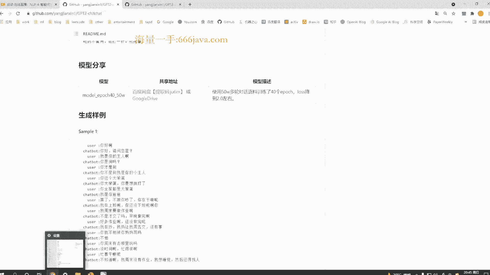

我们这块代码，实际上已经把他这个模型给集成进去了，我们简单看一下，啊这里就是它的一个代码，我已经把他这个代码给拉下来了啊，已经给他拉下来了，然后大家第一步呢，是需要去把这个模型给下载下来啊。

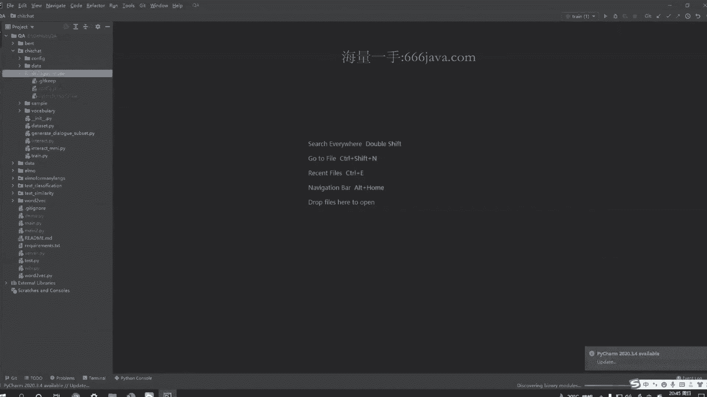

也就是说他这里有这样的一个链接，大家需要去这个链接当中把模型给下载下来。

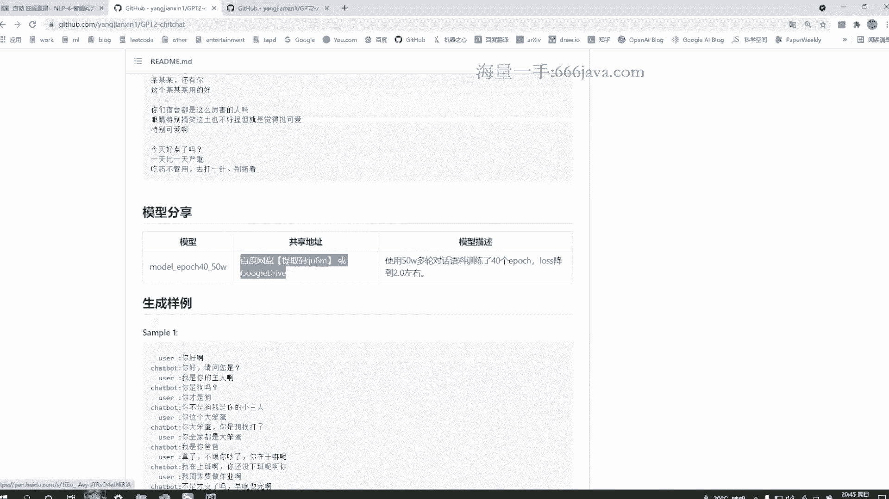

然后放到我们的这个目录下，好吧，放到我们这个目录下，啊打，然后这边，到时候大家直接用我这个代码就OK了啊，我这都是帮大家准备好了，大家唯一要做的就是把模型下载下来，然后把模型给放进去好吧。

从这里下载下来，然后把它给放进去啊。

放进去好，那接下来的话要再和大家说一个内容啊，要给大家讲一个内容，那大家有什么问题就打到公屏上好吧，我们这个统一进行解答，好接下来再给大家说另外一个内容，啊啊等这个内容讲完了，我们再来看我们的这个代码。

也就是咱们的一个所谓的一个解码解码，刚才我们的模型就是这样一个一个的词，进行一个输出的对吧，那问题是我在输出的一个过程中，到底是怎么输出的呢，这个东西实际上是需要我们进行一个思考的。

我们这边有一个这样的一个起始符对吧，用模型进行一个输出，然得到了这样的一个这样的一个词，然后给到下一个节点，那下一个节点再进行下一个词的进行一个输出，那这里这个输出到底是怎么输出的呢。

可能各位同学都知道啊，实际上啊，这里就是针对于我们的词典，做了一个所谓的soft max，Soft max，比如我们词典啊，假如有1万个1万个词啊，假如我们这词典有1万个词，那就等于我们在这里啊。

做了一个所谓的1万分类遗忘分类啊，然后呢我们去找这个概率值最高的那个词，然后再把它给输出，这是一种解码方式啊，这种解码方式呢被称为grade search，也就是说我每次输出的时候啊。

我都去找我们的这个概率最大的这个词，但是对于这样的一个解码方式来说，有什么样的一个缺点呢，大家觉得，实际上我们考虑一下啊，如果我们当前这个节点，输出的是咱们的这个W1。

然后我们把we1作为下一个节点的一个输入，然后输出了W2对吧，要得到我们W2W2，再给到下一个节点啊，作为咱们的一个输入，得到W3，但问题来了，这里这个序列啊，我们输出的W1W2W三这个序列。

它最终它的这个是全局最优解吗，这个不好说对吧，因为我们每次考虑的都是当前的这个最优解，那假如我现在这里输出的是W撇一，我把这个W撇一给到我们的第二个节点，可能输出的就不是W2了对吧。

我输出的可能就是W2撇，那可能W2撇会对于整个序列来说，输出序列来说，它可能是更合适的这样的一个解对吧，所以说对bem search这个解码方法来说啊，它并不是比较好的一种方式啊。

并不是比较好的一个方式，他可能没有办法得到一个所谓的一个，全局最优的一个解啊，那这个时候可能有同学就会说啊，既然如此，那我就把所有的一些情况都考虑进去，对吧啊，假如我现在词典有1万个词。

那我先把1万个词的一个概率值，对应的一个概率值对吧，得到好，我再把这1万个词分别给到我们的第二个节点，然后再针对这1万个词，再分别输出这样的一个结果，然后最后再去看我们的全局最优解，哎这样也是OK的。

这样也是OK的啊，但是这样的一个情况呢，就会导致我们的时间复杂度特别高对吧，时间复杂度特别高，这个我们是没有办法接受的啊，时间复杂度实在是太高了啊，太高了，那为了，能尽可能达到我们所谓的一个全局最优。

并且啊我们也要保证我们的速度不会太慢，那这个时候呢，我们就可以尝试使用我们所谓的一个beam search，这样的一个方法，这个beam sir是什么意思呢，就是说我每次在每个节点的时候。

都选择概率值top k的一些词出来，例如在第一个节点，如果是grad search，我选择一个词，如果我要考虑全局的话，我可能要要把1万个词都考虑一遍对吧，那OK啊，我折中一下，我选前K1个词。

例如我选前三个词，然后再把前三个词的一个概率值，给到我们下一个节点，由下一个节点啊，在针对这三个词，再分别输出它的一个概率值对吧，再分别输出这样的一个概率值，好这就是我们的一个beam search啊。

Be search，接下来我们就来详细看一下啊，我们详细看一下这样的一个啊，beam search这样的一个解码，这个过程到底是什么样子的啊，哦我们还是以刚才的那个例子为例，好吧。

就是那个today's weather is good啊，啊那首先是我们的一个输入是起始符嘛对吧，起始符，那我们的起始符的话，假如我们现在beam search有个top k，假如我们让这个K等于三。

好吧，我们让K等于三，OK3的话，也就是说我们在第一个节点，我们会输出三个词啊，我们会输出三个词，我们先啊我随便写啊，随便写，假如我是第一个词，输出的是the呃，第二个输出的是weather。

呃第三个可能输出的是today's，不对吧，pk那，啊我这边再随便写写啊，随便写写，那假如说对于the来说，它可能这边又会输出三个词对吧，我们把这个the给到下一个节点。

那这个对应这个the就会输出其他的三个词，好下面可能又是，Today，然后有可能也是good，那针对于weather这个词来说，它也会生成三个词对吧，可能有good啊，可能有BD。

可能还有些什么其他的today，好那对于最后这个today的话，它也会生成三个词，对应的可能是whether，I go，还有些although，好吧，有可能这样的一些词，OK那接下来我们会怎么做呢。

好啊，我们接下来啊，就来看一下它对应每一个词的，这样的一个概率值啊，概率值啊，我们可以这么做一个计算啊，理论上来说，如果我们要算一个序列，他肯定是是这样子啊，我们假如有X一一直到XN。

那如果我们要算这个序列，这样的一个概率值的话，实际上是需要把每一个词出现的一个概率值，也就是呃PX一一直乘乘到PXN对吧，也就是它是一个累成的一个过程呃，下1PXIPXI是这样的一个过程啊。

这样的一个过程，那实际上我们可以取个log嘛对吧，取个log的话，那最终啊这里这个累乘就变成了这样的一个，累加的一个形式了啊，累加的一个形式就变成这样的一个形式啊，我们可以取个log，取个log。

主log就变成累加的一个形式，那我们就可以把每一个这样的一个概率值啊，我们都取一个log，取个log，取个log，假如啊取完logo之后呢，假如the weather和today's。

它对它就会有一些对应的一些分数值嘛对吧，假如这个是负的1。3，这个是假如负的1。2，然后假如这个是负的一点一好，那我们首先肯定是要去啊，再去算一下好这个词到下一个节点之后，对应的一些分数值。

假如这个是负的0。7，这个是负的0。5，这是负的1。7，哦还有1。7，好这是假的，就是我们的一个分数值，OK那下一步我们会怎么做呢，我们要把这个分数和这个分数给加在一起嘛，对吧。

因为我们取了一个log log之后呢，就取加和就OK了，好那这里就变成了一个二，这是负的2。1，这是负的2。9，我们再看下面啊，哦这里错了，这里错了啊，这是三，这是负的2。9，这是负的2。4，是负的2。

1，然后我们再看一下啊，这个是负的1。9，这是负的2。2，最后这个是负的2。3对吧，2。3，OK那接下来呢我们就应该去找一下啊，哪些分数是最大的对吧，哪些分数是最大的，因为我们是要取概率最大吧。

概率最大好，我们就去找哪些概率是最大的，我们找一下啊，呃首先是这个吧对吧，这个1。9，这个这是第，这是第一大的，这是第一大的啊，然后这是第二大的，然后还有个2。1的啊，这里有两个啊，这里有两个。

那我就随我随我随便选一个好吧，这种情况就随便选一个好，假如这里我们就选出了三个，然后呢我们就会把这三个词，也就是today，这里这个weather，还有这里个weather要继续给到下一个节点啊。

继续给到下一个节点，然后呢下一个节点啊，这是我们的一个输入对吧，下一个节点呢又会针对于这三个词，又会有分别的三个词对吧，又会有分别的三个词，我们再去算这个分数，看哪一个分数是最大的。

再找出我们所谓的这个top k的这个词，再继续往后面进行这样的一个解码啊，继续解码，那最后可能解码下去，然后这里啊这里可能是有一个is对吧，这个is可能又有三个词。

然后这里可能生成了一个这样的一个good，那最终的话我们的一个输出结果就是，Today weather is good，这就是我们整个想要的这样的一个结果啊，好这就是我们的这个beam search。

好吧，我们的一个beam search，呃那been策这一块是需要大家掌握的好吧，因为对于解码这一块啊，我们大部分使用的都会是这样的一个，beam search的一个方法好吧。

那相比于这个啊grad search来说，他可能嗯速度会稍微慢一些，但是效果肯定会比这个grad search稍微好一些，好吧好，这是我们的一个beam search啊。

beam search嗯啊这边简单提一点啊，啊之前是会有同学问啊，就是为什么这里是负数啊，这里大家需要注意一下，咱们那个啊log函数这个样子嘛，这是一对吧，那么概率值是0~1之间嘛，那就是落在这些地方。

那这些地方对应的指的是负数吧对吧，这个大家需要注意啊，注意好，这个是我们的这个beam search啊，Beam search，那除了beam search呢，其实还有一些其他的一些采样的一些方法啊。

例如啊咱们这里一些所谓的一些采样机制，Top k top，那为什么会需要涉及到一些采样呢，最关键的点就在于啊，beam search其实他最大他也有一定的缺点，他的缺点就在于他回答问题的时候。

有时候会会过于严谨啊，这样会出现一些问题，就是特别是对于闲聊领域来说，实际上我们希望模型能回答出一些，花样比较多的一些语句对吧，不希望它太死板，而且每次回答的内容是一样的嘛。

我们beam search永远输出的一个内容是一样的对吧，那对于闲聊来说，我实际上是想要，你每次输出的内容是不一样的啊，并且啊beam search就是由于这样的一个情况。

他可能会容易出现一些所谓的一些，重复的字和词，如果大家做过这样的一个序列生成任务的话，嗯肯定也遇到过这样的情况啊，就是生成一些重复的一些内容，例如啊举个例子，假如我现在生成了X1。

然后理论上来说我应该继续生成X2X3，但是它可能会生成X1X2，X2X2这样一些重复出现的一些字和词好，那就是因为这样的一个原因啊，我们就会采取一些所谓的一些采样机制。

采样机制也就是咱们top k和top p，那这里这个top k是什么意思呢，还是一样啊，就假如我们现在词典是有1万个词，那假如我们这个K是等于假如等于五，也就是说我会把当前节点啊。

当前节点对应的top k也就是top5的词也选出来，那这五个词会对应五个概率值吗，对吧，就分别对应P1P2P3P4P五，它会对应五个这样的一个概率值，那对应这五个概率值呢，我就会先把这五个概率值啊。

去经过一个所谓的一个soft max，再经过一次soft max啊，那经过这个soft max之后呢，那这五个词它的一个概率值相加就是一对吧，然后呢我再从这五个词当中。

去进行这样的一个所谓的一个根据你的，你可以根据你的这个所谓的一个概率大小啊，对吧，你就可以去进行这样的一个抽样啊，抽样那对于概率越大的刺的话，他被抽象拿到的概率就越大嘛，对吧好，然后呢是top p。

Top，top k的话是根据这个数量来决定，我保留多少次来进行抽样，那top p的话是基于这个概率值啊，假如这个我们这个top p设置是0。9，那假如哎我的第一个词概率最大的这个词啊。

他的这个概率可能对应的是一个啊0。6，然后这个对应的是一个0。2，然后这个对应的是0。1，那这里相加起来就是0。9对吧，那就等于说我会把这三个词给保留下来，然后把这三个词对应的一个概率值啊。

再去做一个所谓的一个soft max，再把它进行一个让他把P1P2P三，它的一个概率值相加在一的这个范围内，最后再对这三个词进行这样所谓的一个采样，拿到其中的这样的一个词，作为我们的一个输出结果啊。

好这就是我们的一个采样机制好吧，采样机制其实说白了啊，就是想去增加我们这样的一个啊，回答的一个多样性啊，多样性可变性，那top k的话就是限制数量嘛，top p的话就是我们去限制概率对吧。

我只保留概率最大的这些词，top k的话就是前几个词啊，前几个词好，这就是我们需要给到大家介绍的一些啊，解码的一些机制啊，不管是这里提到的这个beam search，还是这里的这个解码方式。

这个随机采样的嗯，这个采样的这个top k，或者说top p都是非常重要的，解码方式，大家都需要把它给掌握好吧，都需要掌握，好看各位同学有没有什么问题啊，嗯大家有什么问题就提出来好吧。

大家有什么问题就提出来好，那我们就稍微休息一会啊，我们稍微休息5分钟，休息5分钟，然后待会的话我们就一起来看代码这一块好吧，看代码这一块好，我们稍微休息一会，好我们啊，准备继续上课啊，准备继续上课。

哎今天大家都没有什么问题是吧，嗯大家有什么问题就及时提出来好吧，大家有什么问题就及时提出来，呃问题的话还是尽量在这个啊，课程当中就把它解决啊，好吧。

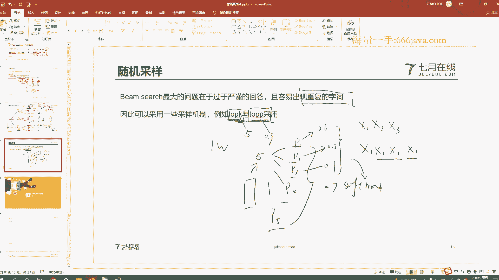

好那我们就先来看我们的这个代码部分啊，代码部分，啊我们的代码主要是这个部分啊，这个部分啊，这边的话会有一个这样的一个cheat chat，这个方法，然后这边呢有一个啊interact这样的一个脚本啊。

这个脚本，然后这个脚本当中呢有一个chat，chat这样的一个方法啊，有这样的一个全方法，那我们就主要是要看一下这个方法当中，是怎么做的啊，怎么做的，其实我们这边已经给大家写了很多注释了啊。

写了很多注释了，那还是简单看一下好吧，来简单看一下啊，因为这个代码比较多啊，比较多，我们这边就不会带着大家这样去写了好吧，主要是看一下这个代码，好我们来看一下这个代码嗯，首先呢是我们的一个输入对吧。

输入的话就是用户的这样的一个问题嘛，那我当用户输入了这样的一个问题的时候，好我们首先呢会去做这样的一个分词对吧，然后把分词这样的一个结果被存储在这个history，这样的一个数组里啊，存在这个数组里。

然后呢这边会去构建这样的一个输入值，那输入的话我们肯定啊，我们会以这个cii is作为这样的一个开头啊，作为这样的一个开头，那我们这里的话就保持与那个BT那一套啊，BT那一套我们就还是以这样的一个。

还是以这几个标志符好吧，这是CIS啊，作为咱们的一个开头，CR作为咱们的开头，Ok，那接下来的话，我们这边就会进行这样的一个便利啊，便利那便利的时候呢，这边其实可以看一下啊。

啊他会去取这个最大的一个历史长度，这个最大的历史长度是什么意思，就是说我要在我的这个history当中，保留多长的这个历史的这个对话数据，因为我们不可能一直保留嘛对吧，你可以去选择一个最大程度啊。

选择一个最大程度的一个历史记录，来进行一个保存好，那接下来的话我们就会把咱们的这个，history的这个值啊给这样进行一个取出来，然后取出来之后呢，啊这是我们的这个这是我们的一个下标啊。

这是我们的这样的一个真实值，对吧好，那我们主要用的是这个真实值啊，这个具体的一个值，就把这个值呢就放到我们的这个input d当中，然后还要把咱们这个SEP给加进去啊，SEP给加进去。

那这个SEP其实在上节课的时候给讲，BT的时候给大家讲过嘛对吧，就是这个符号啊，这个符号就是用来区别两句话的嘛对吧，用来区别两句话的，那也就是说我们这个输入啊，首先呢我们是把这个CLS标记位给放进去了。

做我们的开头嘛对吧，然后呢把历史数据给放进去了，历史数据给放进去了，然后呢我们需要一个分隔符，把两句话给分开嘛对吧，分隔符好，OK了，之后呢，我们再把这个input啊转换成我们这个tensor。

转换成tens，OK我们继续往下，接下来的话就到了，我们的这个迭代的一个过程啊，首先呢对外面也是有一个这样的一个变量啊，啊generated用来记录我们这个生成的一个内容。

然后呢这边会去迭代最大长度次啊，就假如这个最大长度是50，那就我我就会去迭代50次，OK接下来的话我们就把我们的一个输入啊，这个输入给到我们的这个模型，给到我们模型。

那我们这个模型就是咱们的一个GBT嘛对吧，GBT这个模型啊，GBT这个模型好，这个东西我们待会再说啊，我们先继续回到这边模型，我们待会再说好，给到我们的模型，然后拿到我们的一个输出值。

然后呢我们要把我们的这个输出值给取出来啊，取的时候大家这里是需要注意一下啊，我们取的是啊，这边这边是零是什么意思呢，零因为我们这里这个输出值啊，里面会有很多这样的一个内容，我们可以进去看一下啊。

我们简单看一下啊，G b t，好我们可以看一下啊，我们直接看他的for word方法，它的for word方法，这里实际上会输出输出很多内容，对吧啊，有他的一个如果没有lost，如果有lost的话。

他会输出这样的部分啊，没有lost的话，那输出上面这个部分，也就是说它第一个位置输出的，就是每一个词的站对应的个log词对吧，所以呢我们这边就是需要取它的一个零，取它的一个零，然后呢我们这边是他的啊。

一啊，也就是他的最后一个位置啊，因为我们永远取的都是最后一个位置的。

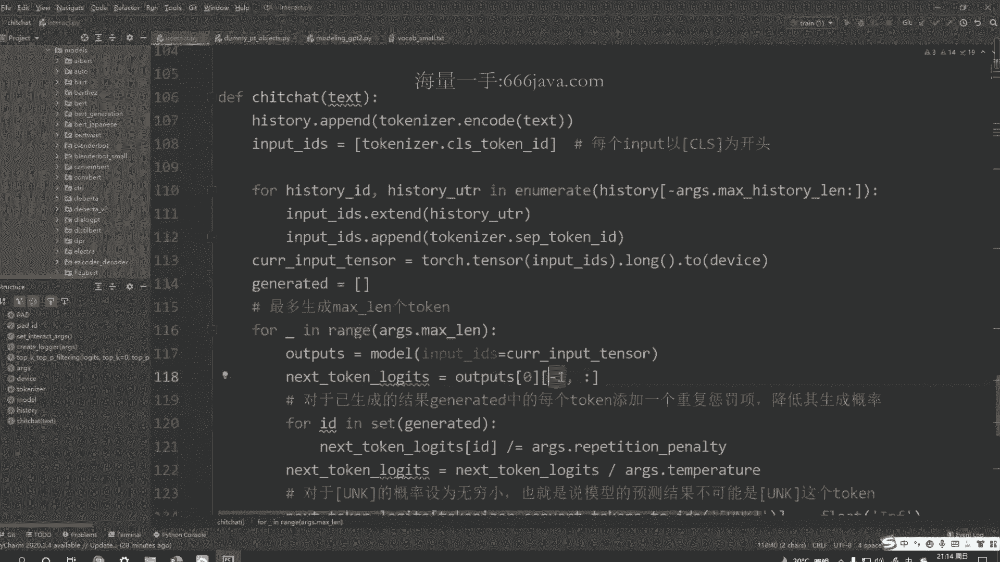

一个值嘛对吧，就像我们的这个模型这边一样，我们取得实际上是这边这个输出值吗，那假如啊我们看最后一个位置啊，最后一个位置的时候，我们是这个位置的一个值对吧，所以我们要拿一的这个结果的一个值啊。

要拿最后一个位置的一个值，前面这些是我们已经输出的嘛。

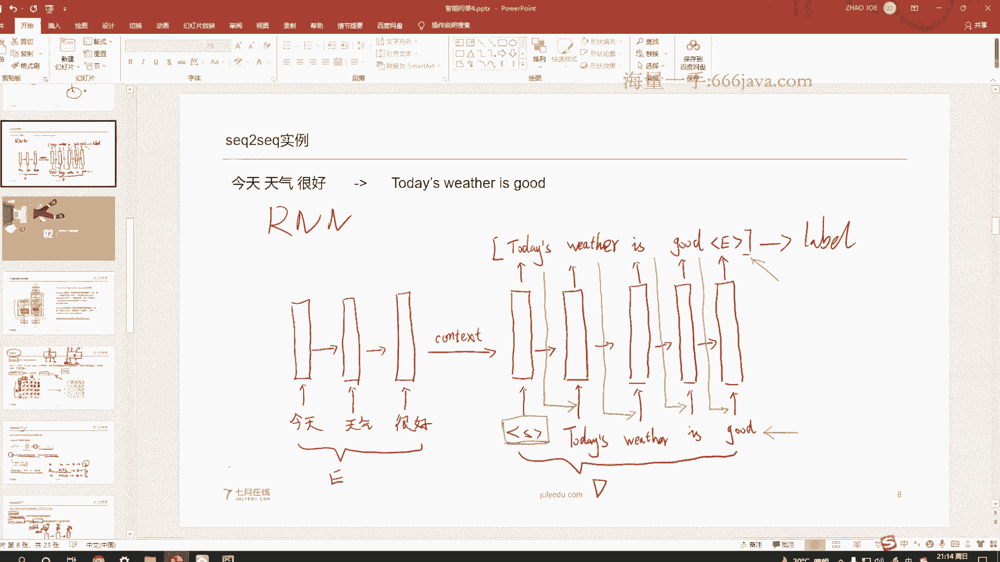

所以我们要我们要拿最后一个位置的值，所以这也是一表示的是最后一个位置，对吧好，这就是我们最后这就是我们生成的这个token的，这样的一个捞几次啊，老几次，然后这边呢是做了这样的一个小的。

一个trick啊，就是说如果啊，如果这个词它已经啊，就已经在我们的这个生成的一个结果当中了，我们为了防止它重复生成嘛，刚才也有说，我们其实会容易出现这种所谓的一个，重复生成的一个情况对吧。

那我们就会把这个权重啊除以这样的一个值，把他这个LOGIES啊，或者说这个分数值把它变的稍微小一点点啊，变得稍微小一点点，啊就是这样的一个意思啊，就这样的一个意思，啊然后我们继续往下啊。

然后这边呢还有一个对于一些UNK，其实是做了一些处理啊，也就是说我们不希望让我们的模型去输出，这个所谓的一个UNK啊，那我们就把这个咱们的UNK，他的这个概率值，就把它直接改为这样的一个最小的一个值啊。

那这样的话模型实际上就不会去选择到这个，UNK的一个情况好吧，OK接下来呢这边会有一个这样的一个，所谓的一个top k，top p的这样的一个啊采样的一个方法啊。

也就是刚刚给大家介绍的这个top k和top p，那这边的话我们也不再给大家赘述了，好吧，就根据这里可以输入咱们这个top k和top，P站的两个参数啊，就可以去做这样的一个啊采样啊。

就能拿到我们的这个采样之后的，这样的一个结果，那采样之后，我们刚才有说还要去做这样的一个所谓的soft max，对吧，Soft max，那做了这个soft max之后呢，我们会执行这个函数。

那这个函数是干什么的，它表示的是从候选集中不放回地进行抽取，N个这样的一个元素，权重越高，被抽到的概率就越高啊，然后最后返回元素的这样的一个下标，那这边的话实际上我们只需要抽一个嘛对吧。

只需要抽一个关键点在于啊他权重越高，抽到的这个几率就越高啊，就以这样一个形式呢，我们就生成了我们最终的这样的一个词，然后这里的话会有一个小trick啊，就说如果我们生成的这个词，它是SEPSEP的话。

实际上对应到我们这边就是咱们的一个结束符，也就是说如果咱们生成了SEP了对吧，咱们就直接break了break了，然后我们可以再看一下这里这个循环啊，这里这个循环是如果我们循环了最大长度次。

我们也结束了，所以说对于我们生成的过程中，会有两种结束的一个情况啊，第一种情况就是说，达到了我们生成的最大的序列长度，我们就结束了，还有一种是遇到了我们的结束符，我们就结束了，两种情况好吧。

两种情况OK那如果不是结束符呢，那我们就会把这个next token啊，放到我们的这个generated里面，放到generated里面，好最后的话我们再把这个输入的这个input啊，做一个更新。

把当前的这个next token把它给拼接进去嘛，拼接进去对吧，那拼接进去之后呢，这个东西啊在下一轮循环的时候呢，就会作为新的一个输入对吧，你可以看一下啊，这里是一样的，作为新的输入啊。

给到我们的模型在不停的进行这样的一个迭代，的一个循环的一个生成，其实过程就和这里是一样的啊，一样的，只不过这也是GBT嘛对吧，这是GBT好，最后我们再看一下这里啊，那生成完了之后呢。

我们会把咱们生成的一个内容啊，放到我们的history当中，也就是放到我们的这个历史缓存当中啊，放到历史缓存当中，当我们下一次用户再进行询问的时候对吧，我们这个历史记录里面，就会有之前的一些历史数据啊。

历史数据，好这里的话是把我们生成的这句话啊，把它进行了一个转码啊，把咱们从这这个下标的一个形式啊，转换成了一个文本的形式，最后进行这样的一个输出，好吧，我们可以执行一下这个代码啊。

啊这个这个就是咱们整个解码的一个过程，好吧，解码的一个过程，大家可以自己再来看一下啊，这是报了个错啊，我们看一下这里是没有找到那个啊，我们可以从那边啊，这个没关系啊，我们可以从我们的main函数来看。

稍等一下啊，稍等一下，我们简单看一下这个限量的效果啊，啊就假如这边输入了一个晚上好，啊他问你是啊啊我我就是我啊，我是我是，好啊，我这边竖着，晚上好对吧，让他回了一句，你是，然后我说我是一名老师。

他说哦好巧，我也是一个老师，啊我再来给你教什么的，啊他就说他教数学的啊，就这个意思，好他最后又回答了这这样的一句话，这句话其实是回答的就不够理想了，对吧啊，那我们也可以去重复去问这样相同的一些内容。

啊你可以看可以看一下啊，因为这是我们采用的是这样的，一个采样的一个算法对吧，并且呢我们那个输入会有一些history，所以他每次输出的这个结果是不一样的啊，不一样的，你看我们输入一样。

它这个结果也是不一样的啊对吧，不一样啊，这就是我们整个这样的一个闲聊的一个效果啊，闲聊的一个效果，当然各位同学也可以在自己的，你们自己的这个闲聊的一个数据集上面啊，再去进行进一步的这样的一个训练好吧。

进一步的一个训练好，这就是我们整个啊闲聊的一个部分啊，最后说一下模型加载这里啊，那对于模型加载这里的话，我们使用的是这个transformers啊，在之前的课程当昨天的课程当中啊，给大家说过啊。

transformers这个库的话是目前使用预训练语言，模型比较火热的一个库啊，你可以去它可以支持这个PYTORCH，也可以支持这样的一个特色flow啊，特色flow，那使用的过程怎么使用呢，很简单啊。

直接调用它的这个啊from portrait这个方法，然后把这个模型路径给传递进来就OK了，好吧很简单啊，很简单就可以使用它的一个模型了，好这就是我们的模型的使用这一块啊。

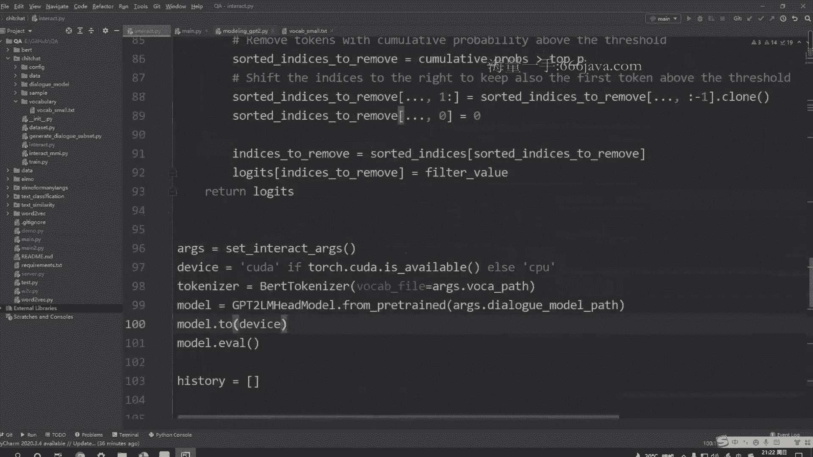

模型的使用这一块，OK那接下来我们回到我们的PPT啊。

回到PPT，那接下来第三部分啊，是我们的整个的这个，项目的一个整合和这样的一个步数啊，项目的一个整合和步数，那之前的课程当中呢，啊我们有去把这个分类模型给加进去了，然后匹配模型和闲聊都还没有加进去对吧。

那我们就，哦我们先关了啊，我们从我们这个里面啊去看一下，好这是闲聊，OK我们就直接从这里进行啊，进一步的一个完善好吧，我们把我们整个流程给再完善一下啊，再完善一下，如果这里是闲聊。

那我们就需要去调用我们的这个chat chat方法，对吧，这个里面的cheat chat方法，OK那我们就导入一下啊，啊就from chechat到这interpret import，看下那方法叫啥啊。

这里有一个cheat cheat方法是吧，好，那我们就import一下这个方法啊，import一下这个方法，然后呢检测到这里是闲聊，那我们就把用户的一个数据对吧，给到我们这个chat chat这个方法。

然后这里呢就会返回我们这样的一个question，question啊，然后我们把这个question给打印出来啊，然后呢我们就可以结束我们的方法了，好break我们用break好吧。

我们用break break的话会结束我们的结束我们的，哦我们不用不用，我们不停加break啊，不停加break，我们要继续让我们的这个循环继续下去啊，继续下去，Ok。

那这里的话我们就如果检测到是大于0。5的，那说明这是闲聊对吧，就调用我们闲聊的一些方法，然后把闲聊的答案给打印出来，然后继续走我们下面的一个循环就OK了，然后闲聊这一块我们就集成好了。

接下来我们看一下这个这一块啊，这一块这是我们上节课啊写的这个啊，但我们上节课讲完这个匹配模型之后，并没有把它给集成进去啊，并没有把它集成进去，那我们接下来就看一下，如何去进行这样的一个集成啊。

我们先看一下，这里是去计算我们的一个相似度对吧，简单注释一下计算相似度啊，这里是去找概率的那个最大，找到我们相似度最大的这个值对吧，然后我们这边做了一个判断，如果这个最大的这个相似度它是小于0。8的。

我们就认为他是没有找到这个答案的啊，没有找到这个答案的好，那如果没有找到答案的话，我们就continue好吧，啊也不需要CTRL，他这边不会执行下面的内容，OK我们继续往下啊。

啊这里的话我们可能就需要改一下了啊，我们这里需要稍微改一下，OK那如果相似度是大于0。8的，那首先呢我们就先去对我们的这个，做一个排序啊，我们取个top10好吧，我们取个top10好。

我们可以调用一下啊，有个叫做OXFORT一个方法啊，调用一下OXFOR个方法，然后呢我们把我们的这个相似度给传递进来，传递进来，这个它是从小到大进行排序的啊，我们可以在前面加个负号。

它就会从大到小进行排序嘛对吧，然后我们就取前十大的，我们把top10给取出来啊，也就是前十大，注意啊，这里返回的是这样的一个下标，概率最概率前十的下标，好这是我们的一个下标。

然后呢我们这边就等于会得到这样的一个啊，咱们的一个候选集嘛对吧，咱们那个候选机候选机啊，直接写中，我写中文啊，那这边的话我们就可以把候选区给取出来啊，Question。

然后这边就是top ten option，这样的话，我们就可以把我们的候选集的，十个问题给选出来，选出来，Ok，那接下来我们就去调用我们的这个相似度模型，相似度模型啊，那，导入一下啊。

Similarity，点predict import，看下叫啥嗯，predict方法啊，我们要去调用一下我们的predict方法，好OK接下来的话，首先呢我们要把用户输入的一个问题啊，我们可以这样子啊。

我们可以循环十遍，然后把我们的这个问题给改进去啊，就等于哦我们组成了这样的一个一个BACH嘛，对吧，这个BH这个BH的size是十，然后我们得到我们的这个啊，ESIM这个模型的一个结果啊。

EC这个模型的一个结果，好OK啊，然后接下来呢，我们就可以把这个结果给打印出来看一下啊，我们可以这样子嗯，好我们可以把它给打印出来看一下，好吧啊，我们可以先看一下这个对应的它的一个值是啥。

然后我们再看一下它的这个相似度，相似度是啥，看一下啊，这是真实，下表这是顺序，OK没问题，然后我们再看一下，ESIM输出的一个结果是什么样子的，好好这是我们top ten它这个候选举的一个句子。

然后它的相似度，还有ESIM模型输出的一个相似度对吧，哦我打一下，哎余弦相似度，然后这个输出的是模型相似度好，Ok，啊我们可以这样啊，我们可以这里简单作为一个这样的一个映射啊。

嗯可以再这样输出一下候选题后，选题结果，好我们这边做个简单的这样的一个映射啊，后面方便用，也就是这个是我们的一个顺序的一个下标，对应它的一个真实的一个下标，好吧好。

那接下来的话我们就可以去取我们的那个嗯，arg max啊，Arg max，也就是我们e c in theme的一个，最大的一个下标啊，叫1same index吧，好，这是我们模型的这个对应的。

最大值的一个下标啊，最大值的一个下标，Ok，接下来的话，我们就可以把我们的结果进行一个输出，呃我们可以先把答案输出一下啊，最相似最相似的问题，那这个就是咱们的一个question啊。

里面有一个这样的index，对里面对应的是index对吧，好，咱们1sim的index，1same index，好，我们再把我们的答案输出答案，这就是咱们那个answer要对应的index stick。

这边是ESIM的index，对吧好，下面我们直接就不要了啊，就不要了行，这样的话我们整个这个就写完了啊，写完了我们来执行一下，好啊，我们这边先输入一句，你好，把它检测到，这是闲聊对吧，你好你好我好。

大家好，才是真的好好再来一句啊，晚上好，晚上好啊，他又回了一句晚安，OK那我们在问一点专业领域的一些问题啊，OK我们把那个我们的之前的一个数据集给打开，啊我们先随便找一点原句来问一下好吧，原句。

诶好像有好像有问题啊，这边有问题，我们看一下，我们看一下这个question是啥，我们看一下啊，哦这里是，那么是不是弄错了，我这里应该是answer，这里写错了，啊其实不应该用，应该应该这么讲啊。

他其实把后面那个覆盖了啊，cheat chat chat chat answer啊，我应该这样子啊，因为我这里用question的话，就等于把它覆盖了，那下面就找不到了答案了对吧，可以跑一下。

好还是一样啊，先来一句闲聊，晚上好，好他回了一句，晚上好，OK来一句专业问题，好我们看一下啊，呃我输入这句话之后，它会有一个这样，我们会这里会打印一个候选机的一个结果啊，我们看一下啊。

计算余弦相似度的时候，他和这句话匹配出来余弦相似度是很高的，对吧啊，计算出来是1。0，然后呢其他这些话的话，这些也有一些啊，但是都挺大的，这句话都是0。9的这样的一个相似度对吧，都是0。9的好。

然后呢这边又会算一个模型相似度啊，算出来这个是0。99啊，0。99，他最后返回的是啊这句话的一个答案啊，所以返回最相似的问题就是这个东西对吧，然后答案是这个东西啊，这个东西。

然后我们这边还有一些测试数据啊，我们去找了一些户外拓展，买什么保险好，我们看一下这个啊，好，啊我们这里说的是户外拓展什么保险好对吧，然后他这边首先是去找这个，我们看一下啊。

额首先是我们根据余弦相似度计算出来，是这个比较高啊，这个比较高，这是按顺序来的，然后我们再去看一下模型的一个相似度，模型相似度是0。2017呃，好像也是这个最高对吧，也是这个最高，真因人寿户外保险好吗。

有什么好处啊，他是这个答案，让我们再看一个相似的啊，好我这个问题是四五十岁，有没有什么重疾险推荐啊，然后我们看一下啊，如果使用余弦相似度计算出来的话，第一句话是这个儿童重疾怎么选。

余弦相似度是最高的对吧，是0。8，然后往下的话是越来越低的，然后我们再看一下模型相似度啊，模型相似度的话，第一句话实际上它相似度并不高，是0。04是吧，然后最要高的话是这句话啊。

她是我妈四五十岁有没有合适的重疾产品，然后最后呢啊，我们是根据模型的相似度来选择最高的对吧，所以最后他这边模型找到的最相似的问题是，我妈四五十岁有没有合适的重疾险产品对吧，所以说我们输入这个问题啊。

如果我们使用的是普通的word vector的一弦相似度，那他找到的是这句话，那如果我们再加上了我们的金牌模型之后呢，他实际上找到的是这个问题对吧，那最后答案返回的是这个好，我们这边再看两句啊。

20岁买什么保险，好我们又看一下啊，就是20岁买什么保险，然后余弦相似度最高的是这句话啊，18岁怎么买保险对吧，然后模型计算出来的相似度是0。3，然后模型计算出来相似度最高的，我看啊应该是是这个啊。

23岁买什么保险号，然后最后他匹配到的也是23岁买什么保险，好对吧，可以看到啊，如果加上了我们的这个匹配模型，整体效果的确是会有这样的一个提升的啊，哦这个是原句啊，这是原句。

OK基本上我们整体的一个效果就是这个样子啊，就是这个样子，然后呢我们整个流程完了之后呢，啊其实你也可以再切换过来，去问一些闲聊的问题对吧，例如啊今天天气不错啊，嗯他又说这是闲聊啊，你在干什么。

他就说这样的一些闲聊啊，回复的就是闲聊语句好，这个就是我们整个这样的一个啊，集成进来的一个流程啊，好吧，嗯整体来说我们的整个流程，代码量也是非常小的是吧，就六七十行代码的样子啊，很少很少。

关键还是模型这一块啊，我们需要把我们所有的模型对吧，给串起来，还有这里的这个what vector模型，所以整个项目实际上是用到了四个模型啊，啊一个word vector模型。

一个这个这个金牌的一个模型对吧，文本相似度的金牌模型，然后是一个分类模型，还有一个是这样的一个闲聊模型啊，一共四个模型，四个模型，那我们整个流程跑通了之后呢，我们再来看后面的一个内容啊。

那假如我们现在要进行这样的一个部署。

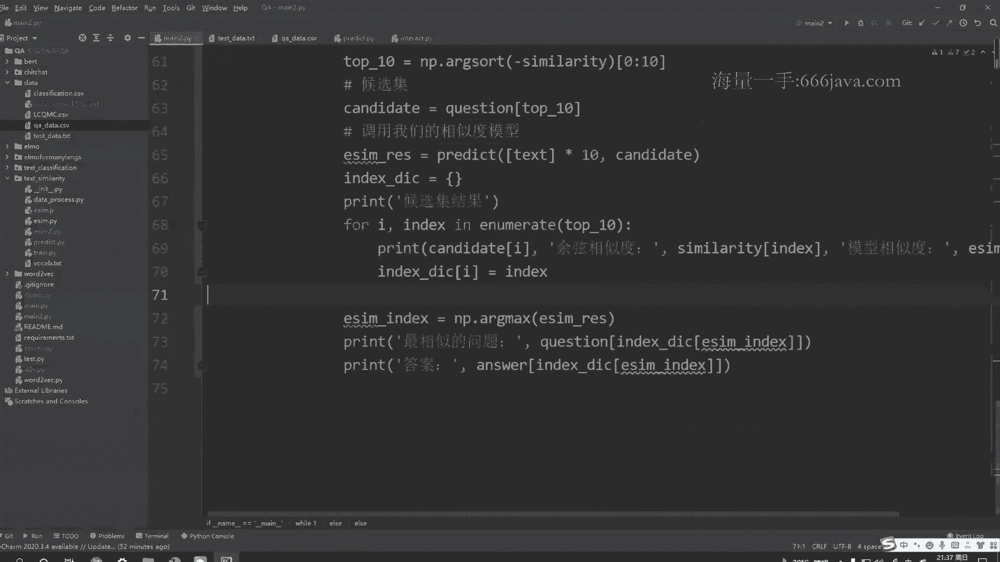

我们通常会该怎么做呢，我们看一下啊，这边的话，如果大家使用的是这样的一个Python，来进行一个部署的话，我这边啊简单给大家说一下啊，部署这一块我们不会讲特别多，因为每个公司其实部署的方法会很多好吧。

我这边就简单说一下，那比较简单的一个方法的话，就是这个flask加GUI corn，加这个BER这样的一个形式，那flask在做什么呢，flask其实就是Python当中，就是提供这样的一个啊。

服务的这样的一个框架啊，这样一个框架，也就是说我们只需要使用flask，这样的一个框架，我们就可以去构建这样的一个接口，提供出来给到咱们的一个调用方好吧，啊然后是GUI call啊，GOI扣固定扣。

这个主要是用来取这个多进程的，那举个简单的例子啊，那假如我们现在要去做这样的一条问答对吧，他可能耗时是20ms，20ms，然后是20ms，那20ms我们现在这里就有一个服务对吧，一个服务。

那假如现在用户来了一个问题，那你这一个服务啊，你返回需要20ms，那假如这个时候同时来了很多个用户，那你是不是需要进行一个排队，一句一句的来进行返回对吧，那这个时候实际上就会耗时比较高。

那GUI co的作用呢，是我可以去取多个这样的一个进程啊，我可以去取多个这样的一个进程，那用户假设现在有三个用户对吧，那三个用户一起访问的时候，就会分别返回这三个进程，然后分别进行一个返回。

那每个的话都只需要20ms，那如果你只有一个进程的话，那你这边就需要等待，那最后一个用户的话，可能就是需要60ms对吧，才能得到我们最终的一个结果啊，结果这就会变得很慢啊很慢。

所以我们可以使用固定扣来取这样的一个，多进程多进程，OK最后再说一下docker这个东西啊，啊docker这个东西的话怎么说呢，是这样子啊，就假如，你现在有很多台机器对吧。

通常我们这个服务可能会部署在多台，这个机器上面，一台机器可能会撑不住，假如你这个并发很高，我这里可能才三个用户，那假如你同时有100个用户，1000个用户，1万个用户来请求这个接口。

那你一台服务器肯定是顶不住的，你就需要多台这样的一个服务器对吧，多台服务器，那你多台服务器你考虑一个问题啊，我假如说，我现在先在第一台服务器上进行一个部署，那你需要去安装一些依赖包对吧。

PIP安装一堆依赖包很麻烦吗，那可能你第一台机器部署你可能需要10分钟，你第二台机器你部署你又需要20分钟，那就20分钟了，那假设你有十台机器，那你这个是不是就特别麻烦对吧。

那这个时候实际上我们就需要docker，这样的一个东西啊，这个docker是干什么的呢，它实际上就是你可以理解为，他把你所有的这些工程，还有这些依赖包给打包，成了这个所谓的一个镜像的一个东西啊。

这是咱们的一个工程project，我们的工程，然后还有我们的一些相关的一些啊依赖包，依赖包，然后呢我们会把这些工程，然后还有这些依赖包嗯，pip安装的这些依赖包，全部打包到这样的一个镜像当中啊。

镜像当中嗯，这个docker这样的一个镜像当中啊，然后呢再把这个镜像啊，分别放到这三台服务器上面，然后一键启动起来就OK了，你不需要去考虑任何的那些所谓的一些环境啊，或者其他这些乱七八糟的。

这样的话你就能很快速的在多台服务器上面啊，进行这样的一个部署，好吧，这是我们整个这个部署的一个流程啊，那我们这边呢就给大家简单介绍一下flask。

关于这个GUI call和docker更多的一些内容的话，就大家就自己下来去了解一下好吧，然后部署这一块呢，其实并不是啊，所有的算法工程师都会需要去做的，因为有时候得去看你这个公司的一个情况啊。

如果你们公司本身也是一个比较小的公司，那可能你需要考虑的东西比较多，你需要去开发模型，你需要去做这样的一个部署，那如果你是在大公司的话，那可能你会啊，把这个精力全部放在这个开发模型这一方面啊。

要部署这一块的话，肯定会有一些专门的去做这个服务端的，一些同事来帮你做一些相关的一些部署好吧，但是如果你能掌握像这些什么docker啊，green cow啊，flask这些东西。

对于你面试来说肯定是会加分的好吧，然后最后的话这边是这个PYTORCH官方的这个，关于flask的这样的一个使用的一个教程啊。

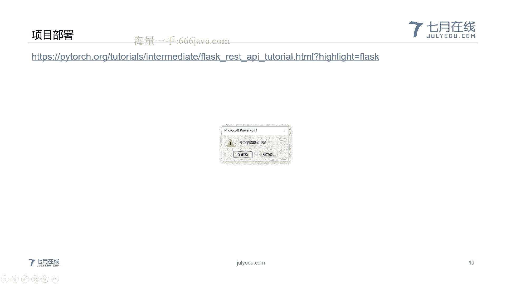

然后呢，我们这边的话就从我们自己的这个角度啊，带着大家去简单啊，去写一下这样的一个构建这个接口的一个过程，好吧，我们就简单带着大家简单写一下啊，简单写一下好，我们啊快速写一下啊。

首先呢把这个flask给导入啊，然后我们需要实例化一个这样的一个flask，这样的一个等下啊好，那接下来呢，记错了啊，OK接下来呢我们就需要去啊，定义这样的一个接口啊。

你这个函数名你随便取一个就OK了啊，然后呢你就去调用我们的这个方法就OK了，那具体的这个接口，它的一个名字该怎么调用呢，我们就执行一下app到这个root，好然后你给它一个这样的一个路径啊。

假如我们就要QA啊，Q a ok，接下来呢我们就把这个，啊我们可以先这样子啊，我们直接把这里进行一个输出，例如我们就输出一个嗯NLP，好吧好，然后我们这边挤一下啊，我们直接调用一下app到run方法。

OK接下来呢我们就执行一下这个，好他这边的话就会啊把这个地址给打印出来啊。

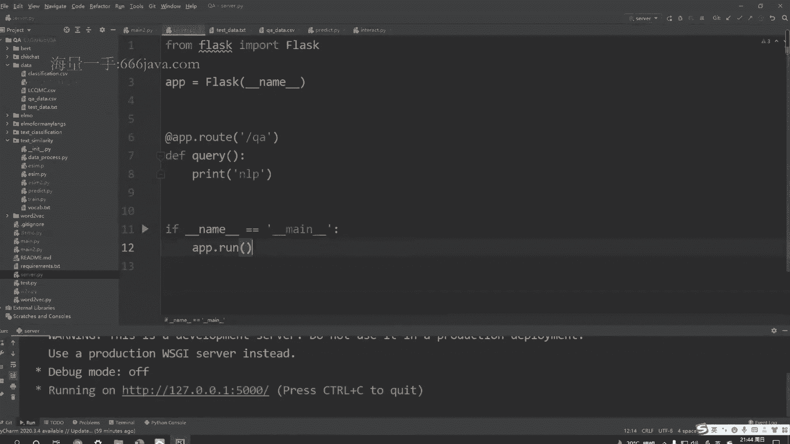

然后我们把这个启动一下，然后这边有一个我们输入一下QA，输入一下QA哎。

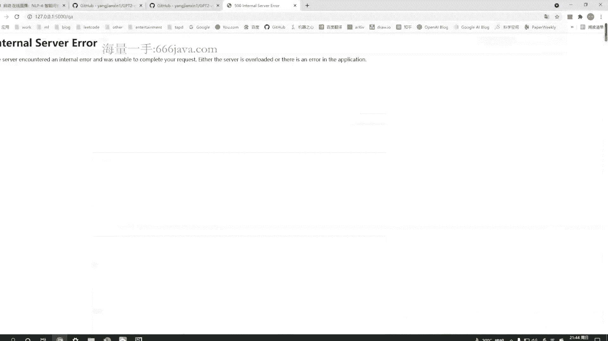

这是弄错了吗，哦这里没有弄错啊，它这里实际上是返回了，打印出了这个NLP了对吧，这里是打印出了NLP了啊，他这里说的是没有返回什么的，没有返回内容啊，没有返回内容，所以这边就是报错了啊。

因为我们没有返回内容任何的一个内容对吧，那我们这边也可以把这个NLP给返回，好我们重新执行一下。

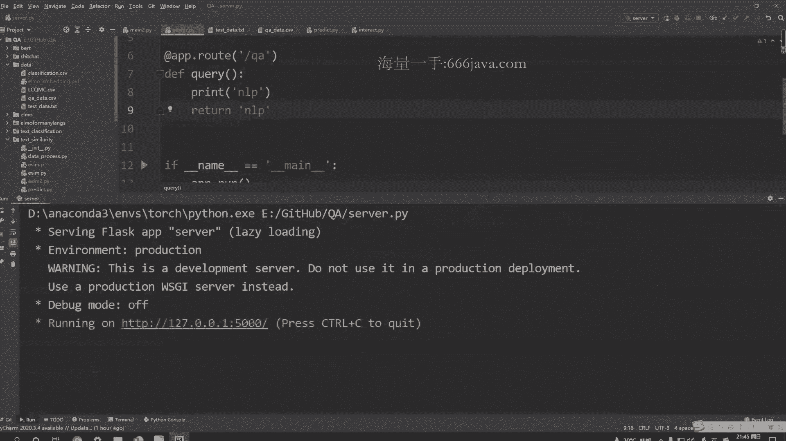

OK然后我们刷新一下啊，我们返回的是访问的是QA这个接口对吧，QA这个接口好，这个时候他就把这个NLP给打印出来了啊，打印出来了好，接下来我们考虑一下啊，那对于我们的问答来说。

实际上我们是需要去接收用户的一个数据的，对吧，我们需要接收用户的一个数据的，那我们该怎么接收呢，它其实有一个这样的一个request，我们可以把用户的一个数据给接收一下啊，就调用这个request。

它有一个哎ox，然后它有一个叫做get的方法，那，我们去获取一下这个text，然后我们再把这个text给返回好吧，好然后我们再重新执行一下这个代码。

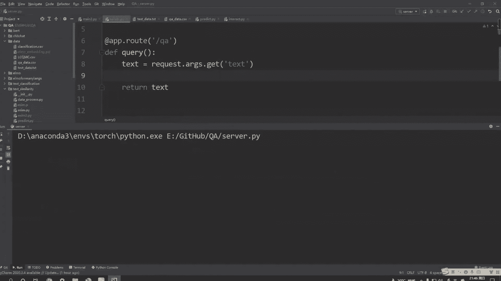

然后这边呢我们就可以以这样的一个，get请求的方式啊，例例如我输入N2P，你看就等于是我这里接收到了NLP，就等于接收到了用户的一个输入，然后最后把答案给返回出来，就返回出来了啊。

例如我这里输入的是一个晚上号，好我们这边接收到的就是晚上好，然后最后我们返回的这个就是晚上好。

OK那学会了如何使用之后呢，我们就考虑一下啊，那接下来我们就可以去在我们的这个位置啊，去调用我们这边定义好的这样的一个方法，对吧嗯好我们看一下啊，那我们这边就需要把我们这个东西，进行一个封装啊，封装。

我们把这整个都挪进来啊，挪进来挪到这个地方啊，挪到这个地方，然后这是text好，然后下面这里就直接调用我们的这个QA就行，好但是我们代码就需要改一下啊，因为我们需要有返回值对吧。

那我们这里return一下，好然后嗯这里也return一下return，啊这里也是一样啊，那这里return我们就直接把答案return好吧，我们直接把答案return行，那我们这样的话。

我们就可以从我们的这个地方啊，From m i a i n two，Import q a，方法好，我们在这里就调用一下用户的这个QA，方法好，就能得到我们的answer。

然后我们把answer返回就OK了啊，OK我们再执行一下我们的代码，好稍等一下啊，可能有一点点慢。

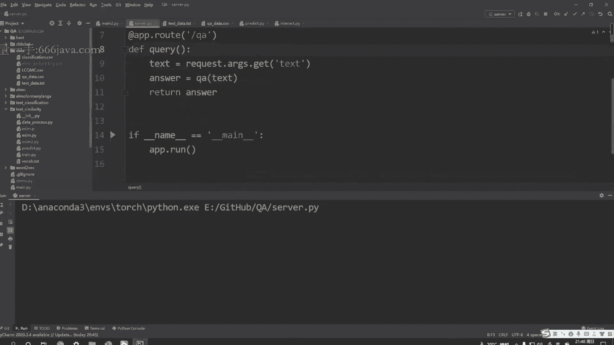

要去加载加载这些模型什么的，OK好我们这边就OK了，然后我们再同时执行一下啊，啊我这边十上11闲聊嘛，晚上好对吧，好我又问了一句，晚上好，我再来一遍，我再来一遍，OK接下来啊，我这边输入一个问题，好。

呃户外拓展什么保险好，哎他这个输出了每个保险公司有哪个好与不好。

哎，看一下啊。

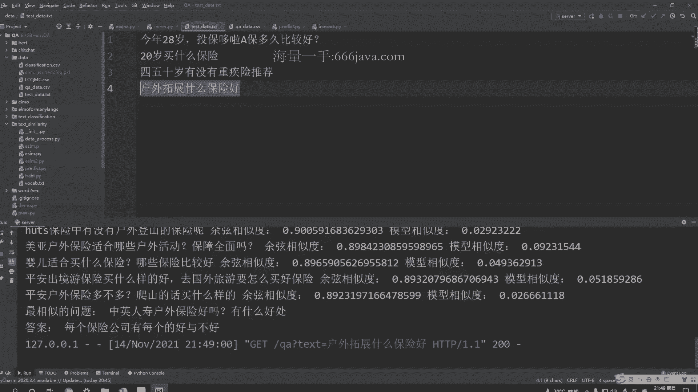

哦这个好像不太对对吧好，我们再问另外一个问题啊，这个是需要进行一些调整的，四五十的有什么重极推荐，然后他输出的是这样的一个答案对吧，然后再看下这个，好输出的是这个东西啊，输出这个东西啊。

然后我们再问一个他找不到的一个答案对吧，我们再随便输一个啊，啊如何，如ed如何构建模型。

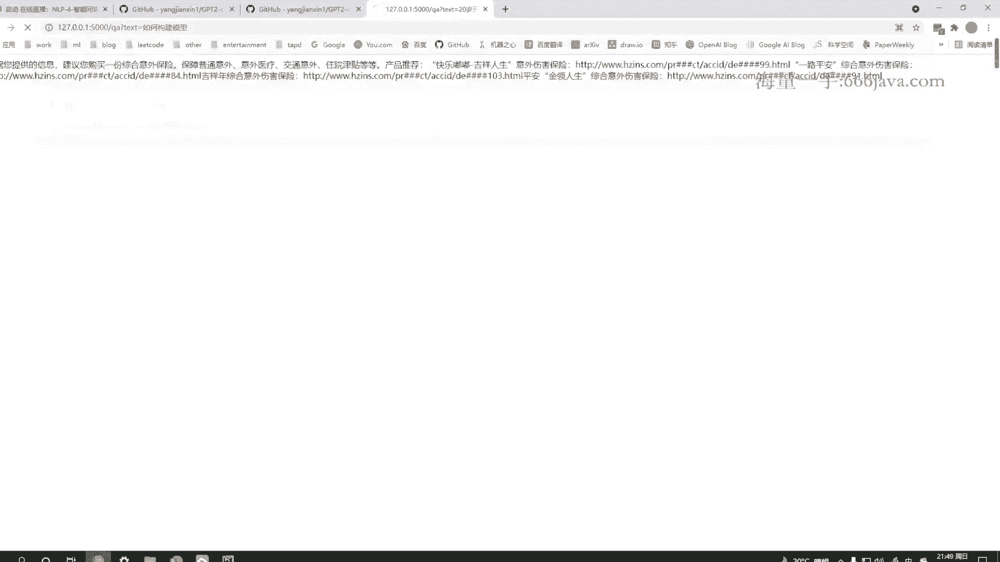

哎它是哦，它识别为这是闲聊的是吧。

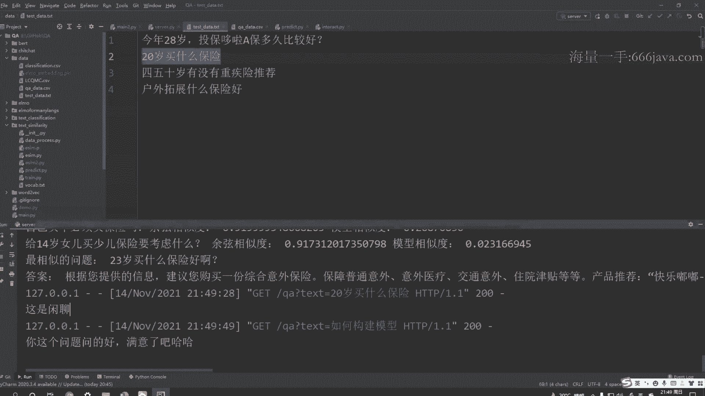

那个，如何学好嗯继续学习。

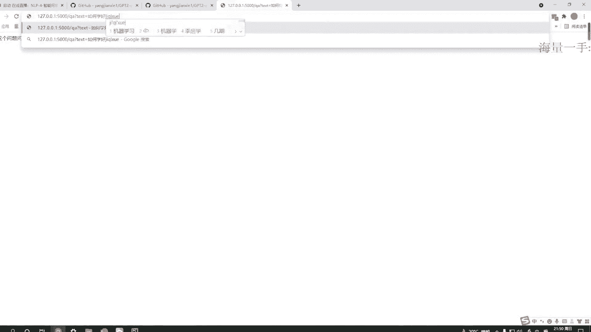

哎这个又识别成了这样的一个闲聊了啊，又识别成这个闲聊了，那我们去问一句，他答不出来的。

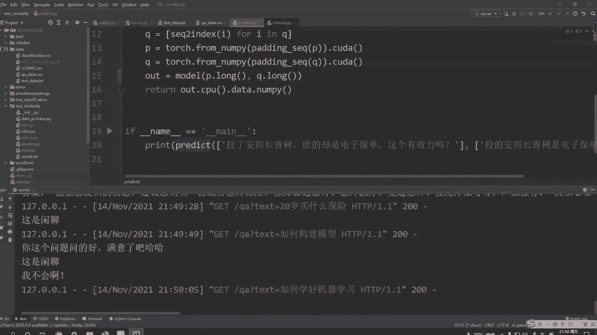

该怎么问呢，如何用模型嗯识别保险方面的问题。

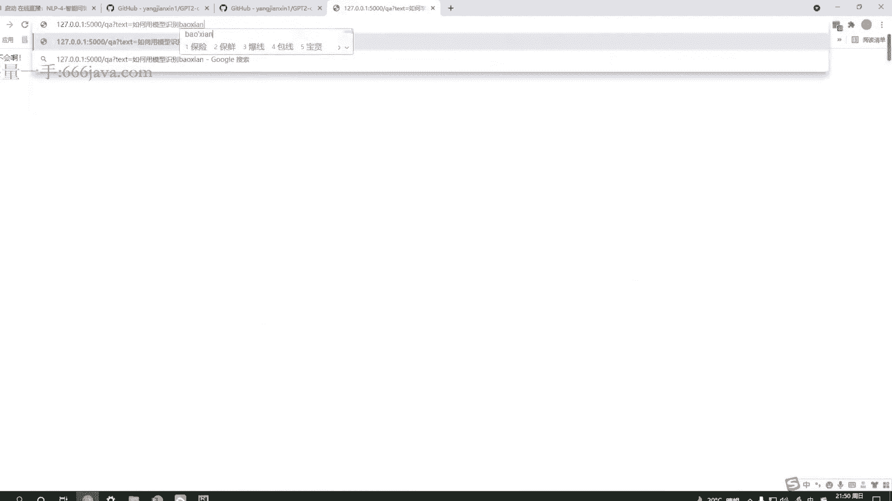

哎这也能答，找到答案吗，看一下啊，哦他这个像素居然达到了0。9是吧，这个应该是会存在一些比较多的，OV的一些词啊，但实际上我们可以看一下啊，这边这个相似度找出来实际上是非常低的啊，非常低的。

哎总之如果这边是出现那种找不到答案的啊，他应该是会返回这句话啊，叫做没有找到答案，其实我们可以把这个调高一点啊，我们调到0。95再试一下，好稍等一下。

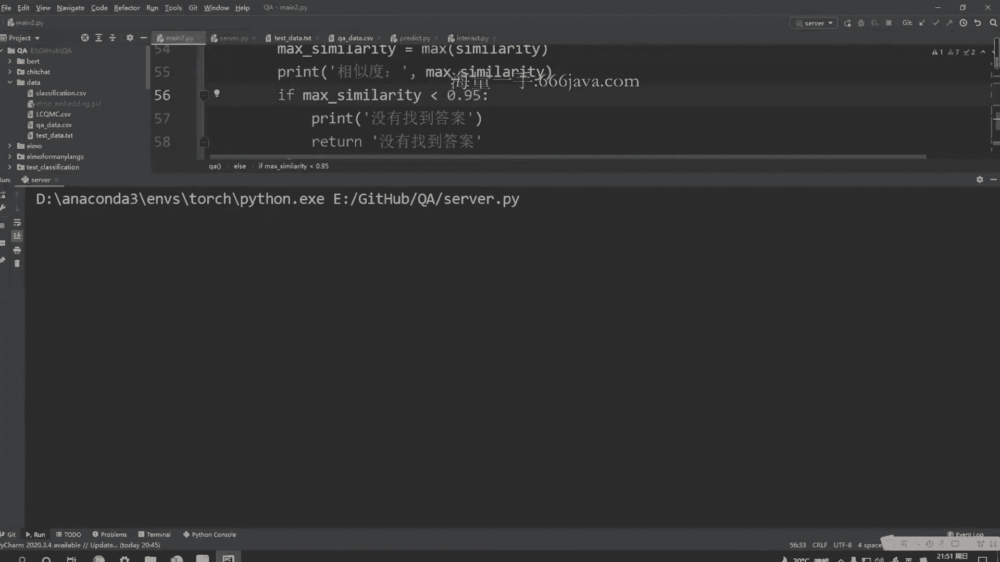

刷新一下好。

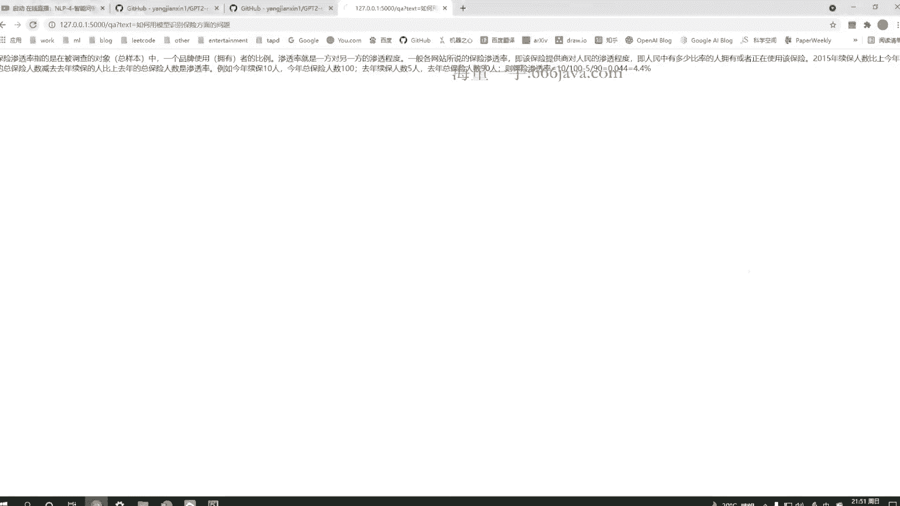

他对于这种概率比较低的对吧，那0。9啊，低于我们的0。95，它就会返回，没有找到答案好，整个流程就是这样子的啊，就是这样子，OK其实这个服务这一块也是比较简单的对吧，也是比较简单的，好行。

那咱们整个啊项目这一块啊。

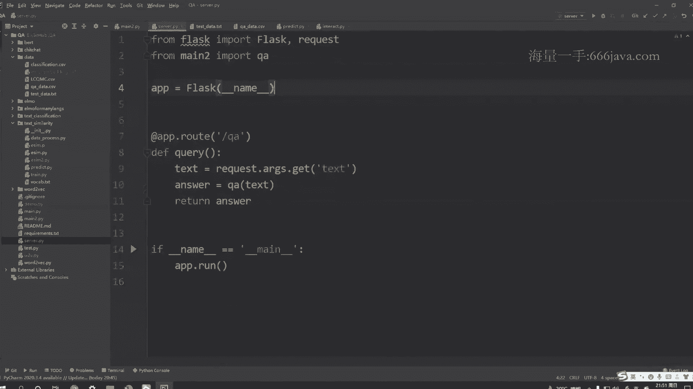

基本上也就已经整合完成了，然后对于部署这一块的话，也给大家做了一些简单的介绍好吧，那咱们第三部分基本上就到这里了。

到这里了，然后最后的话我们再来进行一个比较简单的。

这样的一个项目总结好吧，项目总结好，我们先看一下整个流程啊，先看一下整个流程额，这一部分的话我就稍微改一改啊，好，我们简单回顾一下，我们整个项目的这样的一个结构啊，首先呢是来了这样的一个问题对吧。

用户的一个问题来了之后呢，我们会去做这样的一个所谓的一个意图识别啊，啊我把它放到下面，这放到这里更合适一些啊，好用户的问题来了之后呢，我们首先会去采用这样的一个分类模型对吧。

去做一个所谓的这样的一个意图识别啊，意图识别要去判断一下用户的这个问题，他到底是这样的一个闲聊呢，还是这样的一个封闭域的一个问题，那如果是这个闲聊的话，那就会去走，我们今天给大家介绍的这个所谓的一个。

生成式的一个模型，DIOGBT对吧，Dio g b t，然后去采用一些基于采样的一些方式，top k top p来生成这样的闲聊语句，那如果大家平时在使用这个生成模型的时候啊。

如果你是涉及到一些摘要啊之类的一些场景，你不想让你生成的文本随机性这么大的话，那你可以去使用这个beam search好吧，Beam search，然后我们的意图识别啊，如果是封闭域的问题。

也就是说如果是专业领域的问题，例如我们的这个保险行业业的这样的一个问题，对吧，那我们就会先去啊走到这个检索式的模型，那检索式的模型这块呢我们又分两步啊，第一步呢，我们会把我们的数据转换成这样的一个。

word vector的一个形式，然后使用what to vector来计算它的这个余弦相似度，然后召回top k的这样的一个句子对吧，那除了word to vector的话，我昨天也给大家介绍了。

基于BERT这样的一个句子的一个embedding啊，句子的embedding，那基于BT这个embedding，效果，肯定会比这个word vector这一块会更好一些对吧，更好一些好。

那召回完之后呢，例如我们这边召回了十个问题，那我们会把这十个问题啊，再给到我们的这样的一个相似度匹配的ESIM，这样的一个模型，让这个ESIM啊，再来找出咱们的这个相似度最大的，这样的一个问题。

再把对应的这个问题的答案给返回出来啊，这个就是我们的这整个流程啊，整个流程，那在这整个流程当中呢，其实还有很多可以优化的地方对吧，包括我们的这个啊分类模型，分类模型，那你可以去替换成其他的。

那如果在你自己的场景当中，你觉得TXN这个模型有点效果不够理想对吧，那你可以去换成其他的一些分类模型，如果你的文本本身是啊比较长的，你甚至可以用我之前给大家介绍的这个，HN这样的一个模型。

不过对于对话领域来说的话，基本上应该都是短文本对吧，短文本啊，如果你这里意图是意图特别多啊，特别多，那你可能啊就不单单是我这里，这个闲聊和封闭域，你可能还会去做更多的一些优化，那你就可以考虑去上一些。

比这个TAXN效果更加好的一些模型，例如咱们之前提到的LSTM叫tension，或者说你直接把它换成一个bird，这样的一个模型都是OK的好吧，那对于闲聊这一块呢，除了这里介绍的dialog bt。

你也可以去使用一些其他的一些生成模型啊，例如基于完全基于transformer的，这样的一个part啊，或者T5这样的一些模型都是OK的好吧，那对于检索式这一块呢，像word vector。

你可以把它升级成BT的一个具象量对吧，对于相似度模型，我其实也提出了过很多，那大家如果对ECM这个模型觉得想去了解更多，你不想使用ECM这个模型，你觉得太简单了，或者怎么地。

你都可以去再换一个这样的一个匹配模型对吧，甚至你也可以用BT来做咱们的这个啊，相似度匹配的这样的一个计算对吧好，这就是我们整个的这个项目啊，他的一个整体的这样的一个流程。

然后最后的话再和大家简单聊一聊啊，就关于算法工程师这一块，就不管你啊，今后是去从事这个啊这个CV方向，还是去从事这个NLP方向，或者说你就是去做这个机器学习这一块，你去做了一些这样的一些风控领域的。

一些方面的一些啊模型算法都是OK的，但是呢有一点比较重要啊，就是对于一名合格的算法工程师来说，大家一定要具备，就是这个所谓复现一篇论文的一个能力，就可能啊我们可能不需要你去说。

你去自创了什么样的一个比较牛的，一个什么样一个技术，或者说你去发了一篇这样的一个paper，其实这个都是后话了啊，关键点在于如果给你这样的一篇paper，你能否根据这篇paper把这个给复现出来。

这样的一个能力是非常重要的啊，非常重要的，当然啊各位同学可能在初期阶段会啊，会有一定难度啊，觉得复习啊比较困难，那也没关系啊，其实我们也可以啊，站在巨人的肩膀上，大家拿到一些一拼新的一些paper。

你觉得这篇paper有必要去尝试一下，你可以去看一下他这边paper有没有去开源，它的一个源码对吧，你可以去GITHUB上面去找一下，如果开源了的话，你可以把他的代码给拉下来，结合他的这个paper看。

然后再把这个paper里原理看明白了，再去看他的这个代码到底是怎么写的对吧，然后呢，你再去根据你自己的需求去进行一些定制的，一些开发，或者说一些改进都是OK的啊，都是OK的，但是paper这一块呢。

就是尽量啊，大家要去选一些这个比较有名的一些机构，推出的一些paper啊，不然有些paper他可能真的很水，你这可能花了很多时间去复现，最后没有效果也是有可能的好吧。

那AI的技术实际上发展真的是非常快的啊，就大概34年前，我们那个时候还使用的是这个，基于word vector的这样的一个检索式的一个模型，那到目前为止呢，实际上有很多这样的一些优化方法了。

包括咱们刚才提到的这些，基于BT的这样的一些具体具向量对吧，所以说在AI这个领域啊，我们实际上要关注的东西会特别多，因为AI这一块技术发展实在是太快了啊，实在太快了，那我们就需要不停的去关注这些前沿的。

这些技术，然后追踪这些技术，把这些技术应用到我们自己的这个业务场景中，这对于大家来说才是一个比较大的这样的，一个竞争力好吧，然后呢，我也希望各位同学，在今后的一个学习和工作的一个过程中呢。

要持续去保持这样的一颗好奇的心，你要去对这些新的一些内容，新的一些技术要有这样的一些兴趣好吧，一定要掌握这样的一个自主学习的一个能力啊，那对于我们企业来说呢，其实并不是说啊。

只想教会大家去如何使用这些模型，其实更多啊是希望让大家，或者说教会大家一种自主学习的一些能力，这样的话就各位同学啊，从我们7月出去之后呢，你自己才能花一些啊精力啊，自己去实现这样的一些模型，好吧好。

基本上我要说的就是这些内容了啊，那这个的话就是整个我们这样的一个啊，智能问答的一个项目了好吧，最后的话也是祝大家能顺利找到自己，满意的一个工作啊，好那咱们今天的这个直播就到这边了。

如果大家有什么问题的话，到时候再那个群里面去找我好吧，那咱们就这样啊。

