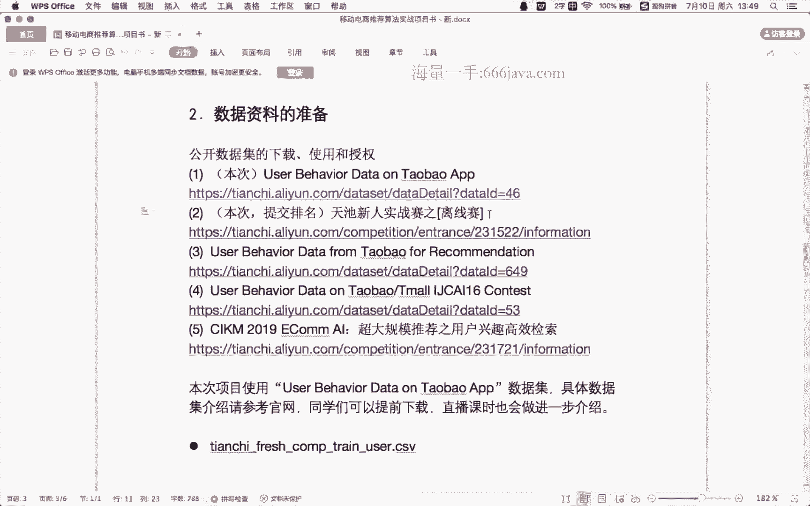
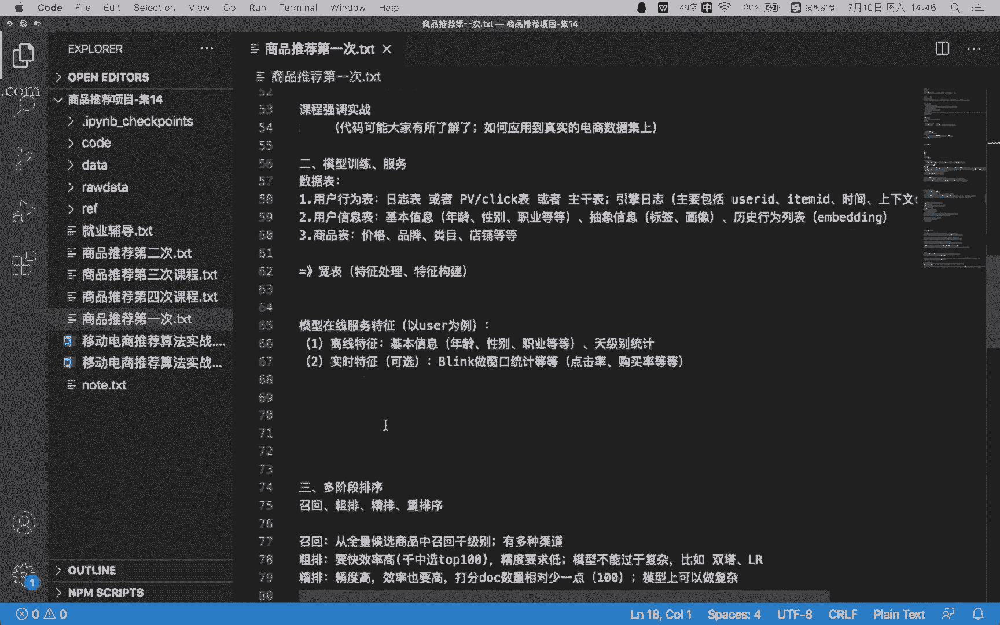

# 1447-七月在线-机器学习集训营15期 - P16：09-推荐-1-商品推荐系统介绍和环境搭建 - 程序员技术手札 - BV1ASste6EuZ

好行，那我们先开始吧，然后我让那个助教老师跟那个群里面问一下，就是问一下同学们进一下直播，我们就先先开始咱们这节这节课，这个项目呢，其实是移动电商的商品推荐算法的实战啊，然后先跟大家介绍一下。

就是什么是额，咱们这个事情要做一个什么样的任务啊，就也就是移动电商的商品推荐，比如说推推荐系统啊，对用户推荐商品的质量好坏啊，可以说是直接影响了巨头们的股价，这里所谓的巨头就是像那个阿里巴巴嗯，京东啊。

拼多多啊，这些电商平台对于他们来说，这种个性化的流量的分发，也其实也就是我们所谓的推荐系统是绝对的啊，公司各大算法团队的一个绝对的一个，核心的一个团队啊，也就是说在那个公司内部呢也是有一个比较啊。

比较有有有优势的这样一个地位，那推荐算法的好坏，直接就会影响到嗯这些消费者，就这些用户会不会在平台里面下单，会不会在平台里面买东西，也就是影影响到了平台的一个总的一个成交额，这样的话也就是说呃。

间接也就是影响到了整个电商平台的一个发展，所以说对于这种电商平台来说，这种推荐算法是非常重要的一件事情，通常会花费啊很大的人力啊，去去做这个推荐算法的模型，整个链路的一些优化，那在咱们这个项目里面呢。

我们是用阿里巴巴，淘宝电商的真实的公开数据集啊，来根据用户在商品全集上的移动端的行为数据，以及百万级别的商品信息，去构建一个推荐模型啊，预估用户接下来一天对商品子集的购买。

就说我们这个项目要做的是什么事情，就是用一个真实的公开的数据集呃，建立一个预估模型啊，根据用户的这些历史行为来去预估，用户在接下来一天他会买嗯，商品子集的哪些东西，就是他第二天他会买什么东西。

这是我们要做的任务，那在我们这个课程里面，可能会涉及到的这些模型，就包括啊协同过滤啊，逻辑回归啊，FM和GBDT以及DNA的神经网络的这种模型啊，这些模型大家如果之前没有啊特别的了解过，也没有关系。

后面会跟大家去啊，一起去回顾一下啊，他的一些啊算法的一些原理，它的公式啊，以及它的一些代码的实现，都会跟大家讲到，嗯在那个在讲那个具体任务之前啊。

嗯再讲哎我看应该只剩一个同学了行。

那就这个同学吧，就说嗯我这里列了三种啊，同学的这种背景情况，一个是呃跨行，还有一个是跨方向，还有一个是啊原来就是做算法工作的，然后无论是做推荐还是做ALP还是做图像，就是你如果原来是嗯原来是跨行的。

就比如说原来是做一些传统行业，然后这次想转到啊，想转到就是互联网啊，这属于跨行啊，第二种呢是跨方向，就是说你原来是做互联网相关的工作，但是说比比如说原来是做啊做那个呃一些，比如说前端或者后台的开发。

然后现在转成算法，这属于跨方向，然后第三种呢，就是你原来就是做一些比如图像处理啊，LP啊相关的一些工作的，这种属于原来原来就是做算法相关的工作的，那这样的话你可以根据自己的情况。

在直播间里面打个一或者打个二，打个三啊，然后我也是了解一下啊。

同学的一个背景。

啊跨行的跨行的其实嗯就要多花点功夫了啊。

这个同学是跨方向的。

但这两个就是同学们，可能我感觉就是一个是跨行，一个是跨方向，其实都是得得在那个基础知识上多做一些，多下一些功夫，就后面的话，比如说你想转成啊，互联网相关的算法工作的话啊，就是包括不管不管是推荐算法。

还是后面是做CV还是做LLP，其实这些基础知识很多情况下都是互相互通的，然后这样的话就是我们后面讲的这个过程啊，会尽量的把节奏稍微放慢一点，就是跟大家一起再去呃，比较详细的去回顾一些基础的知识啊。

这也是跟大家一起去把握一下，这个讲课的节奏啊，行就是特别是这个跨行的同学啊，就是呃就就是自己，比如说你真的是下了决心要去呃，做互联网相关的工作，你还是要多花一些功夫的啊，还是要多花一些功夫的。

好那我们就继续我们的这个项目吧，就是后面讲的过程中会考虑到大家情况，我们会额稍微把节奏放慢一点，然后多讲一些基础的一些相对基础的一些知识，好吧，嗯比如说这里啊列出了我们这节课，就是不如我们这节课吧。

就是这这一个项目里面，这个项目里面可能会用到的模型啊，协同过滤，逻辑回归啊，FM和GBTT啊，大家就是看到这些东西不用担心，就后面都会详细的去展展开去讲一讲，他他们都是用来干嘛的，就不用太担心啊。

行那回到我们呃这个项目本身啊，先这节课呢主要是啊了解一下大家大家的背景，然后跟大家去做一个任务的一个介绍，就是说我们这个项目要做什么任务啊，去做一个比较详细的一个介绍，然后去做一些环境的配置和安装啊。

啊就是第一节课的内容其实还是相对比较啊，比较那个简单的，就是说这节课大家可以稍微轻松一点嗯，然后我们这个整个项目主要包含哪些东西呢，就包含一个就是刚才提到的，我们这个电商的商品推荐任务的介绍。

以及数据集和评估指标的一些介绍啊，然后环境的配置，安装特征的处理，这个特征的处理和特征的构建啊，为什么要做特征的处理和特征构建，其实是后为了后面去做那个模型预估，先做一些数据的预处理。

然后基于规则的啊预估方法，然后基于这种k means逻辑回归，逻辑回归也是LR啊，GBDTGBDT这种树模型的模型的实战啊，这个会大家大家一起去写一写代码啊，然后DNA呢神经网络推荐算法。

就包括啊WDL和NFM啊，这些这些名词呢大家如果是比较陌生，也不用担心，后面我们都会啊详细的去展开，就相信大家，如果是你完整的把这个项目跟下来之后啊，不敢说就是你达到多高的这种算法能力。

至少就是可以算是入了门，就是说对于这种电商的推荐嗯，无论是推荐推荐系统本身，还是电商的领域的那种推荐来说，都会比较熟悉啊，因为我们这里会带着大家一起去看一下代码啊，到代码层面的一些实验。

好这是我们主要内容，然后具体到下下面，我们每一个阶段的一个任务的安排呢，就是说第一阶段我们会啊，主要是跟大家去看一下这个项目的任务书，然后介绍一下，我们嗯用的这个淘宝的app的数据集。

就淘宝他们公开了一部分啊用户的行为数据啊，当然这个数据比较老，而且是加密过的啊，我们就要用这些数据去做我们的商品推荐任务，然后过程中呢，我们需要使用到这个天池大数据比赛平台，这个待会还会跟大家讲一下。

这个平台是做什么的，然后包括我们这个赛题的介绍和评估，指标的一个理解，这是第一阶段，然后第二阶段呢，会主要去和大家一起去做一些啊，这个环境的配置安装，其实在第二阶段之前，大家都应该已经完成了。

也是这节课之后，然后任务对我们这个推荐任务的一个分析，理解啊，然后我们的特征的处理和特征的构建啊，然后训练数据测试样本的一个处理，然后然后基于我们对这种，电商平台的业务的理解。

我们可以做一版基于规则的预估方法嗯，然后在第二节课就开始啊，大家就可以去跑代码，然后去啊在那个天池平台去做一个提交了，这是第二阶段，然后第三阶段呢会会着重给大家介绍嗯，四个算法吧，一个是协同过滤啊。

协同过滤是很经典的啊，推荐系统的算法咳，第二个是k means做聚类和采样，第三个是那个嗯逻辑回归模型的介绍，以及它的代码实现，然后第四个是GBDT啊，这种树模型，树的集成模型的介绍和实战。

然后在第三阶段的时候，就要求大家去做一版基于模型的啊，这种预估结果的一个提交评测了，然后第四阶段呢，就就是呃来到了这种DNA的神经网络的推荐算法，然后这里主要是介绍两种。

一种是WDL就y and deep啊，网络，还有一个是NFM这个对FM的一个升级啊，然后这两个模型呢，也会跟大家一起去去做一做咳，这是我们呃前四节课，然后第五节课呢会跟大家扩展一下，就是推荐系统啊。

本身的一个整体的一个架构啊，从那个工程的角度就给大家看一看，推荐系统的架构，咳咳，然后我在介绍的过程中，都就是大家有什么问题都可以嗯，随时在这个直播间里面来问啊。

就是说包括无论是就是我们课程本身的这些啊，这些那个题目啊，这些任务，这些数据或者说是代码的这个理解啊，还是说你自己本身的个人的一些，比如说职业发展的一些什么问题。

其实我都可以用自己比较有限的这个啊经历吧，可以跟大家做一些分享，就是无论是你什么样的问题，包括你职业发展的一些困惑，其实都可以嗯简单聊一聊，大家就是如果有问题的话，都可以在直播间里面提问。

就是还是希望是可以针对大家本身的这个特点，然后然后跟大家做一些辅导吧，特别是我们现在人比较呃，不是那么多的情况，其实是更其实对大家其实是更好的，就是你可以提出自己更适合自己的这些问题，然后可以。

我可以帮你针对性的去做一个分析好吧，行前面啊，前面就是说去跟大家介绍了我们后面的呃，课程的一个安排，然后到我们具体的这个任务本身，就说我们这节这个项目会使用到哪些数据集，然后我这里列出了很多啊。

就是说前两个其实是同一个啊，一个是数据集，一个是任务介绍，然后第三个，第四个和第五个分别就是另外三个嗯，更大规模的数据集，比如说第四个是那个IJCR16年的啊，这个其实就是一个IJCI。

是我们嗯计算机领域比较好的一个会议啊，然后他经常会也会举办一些比赛，比如说他这里是第四个，其实是他在举办比赛的过程中使用到的啊，淘宝和天猫的一些用户行为数据，然后做了一个公开，然后第五个呢。

3km大家就是也是我们计算机领域比较啊，有名的这种会议啊，学术会议，然后他呢也会举办一些呃举办一些比赛，比如说这里是啊做的这种咳，嗯用户用户兴趣的这种这种建模，其实也是一样的。

跟我们这个我们这届我们这个项目想做的事情，其实一样的，都是根据用户的历史行为据，预估他未来的点击或者购买，这个的话就是嗯我们这节课呢，就我们这次项目呢主要会介绍的是第二个啊，第二个就是前两个。

前两个这个数据，就为什么选择这个天池新人实战赛呢，就因为他这个比赛它是一直在线的，待会儿会和大家一起去看一下，就一直是可以，大家一直是可以提交的，而其他几个它是有时间限制的。

就是说已经嗯基本上都已经结束了，大家都提交不了，不方便大家去评测，所以说我们选择了啊前两个这个数据集去去做，但是呢我们这个过程中产出的这些代码啊，都是可以很方便的，迁移到其他的数据集上面去的。

好我们现在就一起去看一下啊，这里给大家留的这个链接，大家打开之后会发现他是一个天池平台，这个天池平台是个什么东西，其实就是大家如果是了解过算法相关的工作，都会知道。

我们嗯算法工程师除了基本的基础知识之外，有可能会呃做一些能力上的一些扩展，比如说有的同学会去打一些比赛啊，有的同学会发一些学术论文，然后这些呢然后我们看到这个天气平台，它就是一个比赛的一个平台。

就做一些呃做一些数据相关的，或者或数据挖掘相关的，或者说是呃这种推荐啊，CV和NLP这种相关的这些啊比赛，然后这时候的话啊，我们就是使用这个平台，然后方便大家去理解啊，方便大家去理解这些啊，任务。

让大家打开之后，就是后面嗯需要去去下载一下这个数据集，下载一下数据集，然后这个这个下载方法其实很简单，大家首先要注册一下，注册完事之后再回到这个页面去报名参赛，然后当你注册完了，注册登录之后。

然后报名参赛之后，你这些数据集都是可以下载的啦，嗯嗯啧，那我们具体看一下，就是我们这个移动电商推荐的这个任务，主要是在做什么样的事情啊，我们可以看一下他这个啊任务的一个描述。

就说在那个真实的真实的业务场景中啊，也就是比如说淘宝的，或者说是京东的这种电商的推荐任务里面啊，电商的这个平台的商品的推荐里面，我们往往需要对所有的商品的一个子集，去构建一个个性化推荐模型啊。

然后在完成这些任务的过程中，我们不仅需要利用用户在这个商品，子集上的行为数据，往往还需要用利用更丰富的用户行为数据啊，他什么意思呢，就是说比如说今天对这个用户，我们只需要给他推荐一一些商品啊。

然后一些商品这些，但是做推荐的过程中呢，我们不能说比如说我们有啊有1万个商品候选，这时候我们实际我们商品库里面有100万，那这时候呃我们去构建推荐模型的时候，不是说只用用户在这1万个商品上的一。

些行为去做，而是说我们可以利用到啊，全网的商品和全网的用户，他们之间的一些共性关系，来去构建一个推荐模型，帮助啊当前的用户去做预估，比如说这里定义了一些符号呃，U呢就是用户啊。

user i就是商品item，然后这个P呢就是商品的子集，然后这个D就是商用户对商品全集的行为，数据集合，那么我们的目标就是利用D啊，也是用户的行为数据来去构造user uu中的用户。

对P中的商品的推荐模型，这就是我们要做的事情啊，具体当然这个这个描述上比较抽象啊，大家不用担心，就后面我们会看一下，具体就是到底要是要干嘛，然后这里提到了，就是说啊这个任务会提供两份数据啊，两份数据啊。

然后主要是包括了2万个用户的，完整的行为数据，以及百万级别的商品信息啊，然后数据呢就分成两部分，第一部分是用户在商品全集上的，移动端的行为数据啊，然后这个这个这个表名，而这个表的话。

大家在前面这个下载下载解压缩之后，就会啊就会看到这个数据表了，然后这里的话这个数据表，主要是有这么几个字段，第一个字段是啊，user id就是用户的唯一标识，就是标识啊。

你这个用户类似于你QQ号的一个东西，然后这个它是经过了一些抽样和脱敏的，所谓的脱敏，就是说他这里不是直接就是淘宝的用户id，而是做了一些数据的一些映射转换啊，防止就是做一些数据泄密嘛。

所以说做了一些脱敏啊，但是这个呢不影响我们去做我们推荐系统啊，第二个是字段是那个item id，也是商品的标识，就是你这个商品每一个商品，比如说可口可乐，一瓶汽水儿啊，这家店铺卖的这瓶汽水。

然后然后哪个女装店卖了一件女装，每一件商品它都也是有一个id的啊，然后这个的话就是item id商品的标识，然后这个字段呢也同样是啊，经过了脱敏的，第三个字段就是behavior type。

就用户对商品的行为类型，这个就包括啊浏览收藏加购物车购买啊，四种行为分别对应的取值是1234，就什么意思呢，就是说啊这一一条数据，一一条数据可以是，一个用户浏览了啊。

behavior type浏览了某一个商品，也可以是一个用户啊，把一个商品放到了购物车，也可以是一个用户把一个上收藏了一件商品，也可以是一个用户购买了一个商品，也就是说这个数据表它每一行就代表着啊。

我们用户的每一次行为啊，每一个用户的每一次行为，或者说是就是在线在线的引擎给记录下来的，请求日志，请求请求和行为日志啊，这个就是用户的这种行为类型，然后这个行为的话，他具体就跟这个电商平台比较强相关了。

就包括了浏览收藏，加购和购买四种行为嗯，然后再往下是那个用户的空间空间标识啊，用户位置的空间标识可以为空嗯，他说是由那个经纬度通过保密算法生成，这个字段呢就是标识用户的位置的这个字段。

因为他做了啊做了这种加密，然后我们后面去用的时候不是很方便去用，而且是啊空值率很高，所以说这个字段到后面，我们基本上也不会去用的啊，这个大家可以不用去管，然后再往下面是item category啊。

这个就是当前这个商品所属的这个分类，所属的分类，比如说啊比如说可口可乐饮料，它是属于食品的一个分类，那那一件连衣裙它可能是属于女装的分类，然后一个手机它可能是属于啊3C数码。

就是说他这里会给这里的item id啊，他所属的分类，然后也给我们列了出来，那这个的话其实是会帮助我们，后面去做一个推荐的，然后再往下个字段是time，就是行为的时间，就是这个这一条日志啊。

具体发生的时间，然后他这里的数据是精确到小时级别的，精确到小时级别好，我们再回头看一下这些，这个数据表的一些内容啊，就包括了嗯用户的标识，然后商品的标识，这次行为的类型就浏览浏览收藏。

加购和购买四种行为，然后商品所属的分类啊，时间时间是精确到小时级别，然后这个表呢就是用户在商品全集上的，移动端的行为数据表啊，移动端行为数据表，而这个表也是我们后面去做推荐模型中啊。

包括我们去做特征处理和数据集的划分的时候，重点最重点会用到的表，去做用户的建模的时候是最重点会用到的，因为这里就包含了用户和商品的这种交互信息，这是第一个表，第二个表其实就比较简单了。

第二个表其实就是啊商品的子集，其其实也就是一些商品的id，和商品所属的分类啊，可以看一下他这里的字段啊，第一个字段是item id，也是商品的标识，和前面我们提到的那个item id其实是是一个东西。

它是可以相互的关联的啊，第二个字段是item的空间标识啊，位置的空间标识和前面我们提到的一样，他这里是，对这个地理位置做了加密，而且空置率很高，所以说这个空间位置的这一这一个字段，我们后面其实也不会用。

可以不去管它，然后然后下一个是那个item的category，就是商品分类的标识，就是你这个商品所属的类别啊，这个也是和前面的这个item category是可以关联的，那我们要预估的呢。

其实就是啊在第二天啊，也是在最后一天，未来的一天里面，用户啊，某一个用户，他会买这个商品子集里面的哪一件东西，这是我们的预估任务，然后总体来看，这个训练数据就包含了抽象出来的，一定量的用户。

在一个月的时间，也就是11月18号到12月18号之内的啊，移动端的行为数据，然后评分的数据呢，就是这些用户在接下来一一个月之后的一天，也就是12月19号对商品子集的购买啊，大家注意这这段话。

就是说我们要做的事情是什么，就是给你这些用户在一个月之内的，他们的行为啊，就是就是给你这些用户在一个月之内，他们在手机淘宝上，他们做了哪些浏览，做了哪些购买，他们买了什么东西啊，他们收藏了什么东西。

他们把那些东西加到了购物车，给你一个月的这种用户的行为数据，然后去预估啊，每一个用户他们在接下来一天嗯，他会买哪些东西，然后具体的时间呢，就是说会给你11月18号到12月18号。

这一个月的一个月的数据来去预估，12月19号这些用户他会买那些东西，然后回到我们通讯系统，就是说我们为什么要做这么一个任务呢，就是说我们为什么要去预估用户，在12月19号的这个购买啊。

其实这个原因背后的原因也是很简单的，就是说如果我们能准确的预估到用户在啊，12月19号他愿意买什么东西，那我们就把这些东西推荐给他啊，自然而然的就可以提升我们这个手机淘宝。

或者说京东这种电商平台的营收了啊，比如说我知道你想买什么东西，想要什么东西，我就把它给推荐给你，那这样的话肯定是有利于呃消费者的一个购买，有利于这种啊交易的成交的嗯，那我们要做的就是使用这些训练数据。

去构建推荐模型，输出用户在接下来一天，对商品子集的购买的预测结果啊，这就是我们要做的事情，就是需要使用前面提到的这两个数据表，然后去做一个推荐模型，然后去输出用户在12月19号。

他会买这个商品子集的哪些东西嗯，大家有什么问题都可以随时提啊，就包括啊无论是这个载体本身呢，还是说是啊，大家平时遇到的这些问题都可以随时提好，这是呃任务的一个介绍，那对于我们来说，我们产出这个。

比如说我们已经预估知道了，哪个用户会买什么商品的时候啊，我们怎么去提交这个数据呢，提交的话他需要满足一个格式，数据格式啊，分别是两列，第一列是user id，第二列是item id啊。

分别表示表示的含义，这一行数据表示的含义，就是，某一个用户在12月19号会买某一个商品，这是啊我们要提交的数据格式，而这个数据格式的生成到后面啊，我们代码里面啊会跟大家去看一下。

就是怎么去产出这种嗯可以提交的数据，然后我们的评估指标是什么呢，就怎么去评价你的预估结果的好坏，怎么去评价预估结果的好坏，然后这里采用的是经典的精确度。

也是precision召回率record以及F1值，就F1score作为评估指标啊，这三个指标分别是什么意思，大家一定要非常清楚，这是我们啊，大家后面做那个互联网这种算法，相关的工作的时候。

就是最基础的知识啊，就是精确度，召回率和F1值，这个大家一定要知道它是什么含义啊，然后具体的呢就是说precision，precision就是精确度的含义，就是你的prediction set。

就是你的预估集合和你的reference set，其实就是真实的集合之间的交集嗯，交集的数量除以你预估的集合的数量，这个这是公式，是长这样，那我们直观的理解一下，这是什么意思呢。

比如说你现在预估了啊100行数据，然后其中只有十行是猜对的，那你的precision就是10%啊，其实就是你猜对了多少，就你预估准了多少，就是你的精确度是多少，就是说你预估了100个。

然后其中有多少个是对的，那你的比例，你就可以算出来它的一个精确度的一个比例，嗯然后与之相对的就是这个record record，就是召回率，召回率的含义就是你的预估的集合。

同样也是你的预估集合和真实集合的一个交，集的数量除以大家注意他这个分母变了分母，这里变成了真实集合的数量，所以说他这里叫record record，就是说你能召回出来多少真实的集合，真实的数据。

比如说真实的啊，原来比如说我们回到我们这个任务，是预估用户接下来会买哪些东西，比如真实的在12月19号啊，有有1万个东西，有1万个1万次购买，这时候你提交了呃，提交了五千五千个购买。

然后5000个购买里面只有2000个是是猜对了，两间个是预估对了，那这时候你的召回率是多少呢，其实就是他俩之间的交集也要升到2000，然后除以总共的真实的成交数量也就是1万。

所以说你的record就是200010000，然后这个例子呢我们也同样可以算一个precision，precision的话就是啊他俩的交集除以预估的集合，表示2000÷5000。

这是你的precision，然后这两个指标就为什么我们要有两个指标呢，啧就因为大家想一下，你咳如果我们只用精确度去评估你的模型，预估结果的话啊，这个其实是啊非常片面的，就比如说举个最极端的例子。

我可以让我的精确度做到百分百，怎么做到呢，就是说我只估一个，就虽然说有1万个成交，但是我只提交一个，只提交一行，我认为非常非常自信的，而这个呢也恰好就啊猜就预估对了，预估对了之后。

我的精确度就是百分百了啊，精确度百分百，但显然这个啊是是不够的嘛，就是说你虽然精确度百分百，但说你的啊你的召回率啊就非常非常低，就不够，然同样对于召回率也是召回率，比如说现在有1万个成交的真实的成交。

那我想去猜这1万个成真实成交的时候，我提交啊1000万个这种用户和商品的购买，那可能我会覆盖到很多这种真实的啊，就真实的成交的数据，这样的话我可以把我的record做到90%多，也是非常高。

但是说你的precision，就是你提交的这个精确度就会变得非常低，所以说这个精确度和召回率之间，他俩之间是一个try off，就是一个高了，另外一个可能会低，另外一个低了，然后另外一个可能会变高。

就他俩之间会有一个平衡，那怎么去同时去考虑精确度和召回率呢，所以说这里就用F1值这个指标，F1值F1值这个指标它就是用二乘以啊，精确度，再乘以召回率，然后再除以精确度加召回率啊。

这个这个公式大家稍微理解一下，其实就会发现，就是说它对啊精确度和召回率的要求，就是你们两个都不能太低，太低之后，因为他做乘法吗，乘法之后会造成这个分子会变得非常小，也就是你F1值会变得比较小。

只有当你的精确度和召回率啊，都比较好的情况下，你的F1值才会比较高啊，所以说F1值是啊融合了精确度和召回率，所以说对于这个比赛来讲，他们就把这个F1值，F1值作为作为这个评估指标。

那这个公式里面就是说这个prediction set，就是算法预测的购买数据结合，reference set就是真实的答案啊，购买数据集合，然后我们以F1值作为最终的唯一评测标准啊，这是评估指标。

就就你理解了评估指标之后，你才可以针对性的去做这种优化嘛，就是后面嗯后面大家看到这个，这个平台之后，大家登登录之后会看到这里会有一个排行榜，会有一个排行榜，就是每个人可以跟大家一起看一下。

这排行榜里面就会有你的排名，然后参与的人，然后组织你的分值是多少，然后提交日期是多少，可以看到现在已经有1万3000多个队伍，1万3000多个队伍在嗯再提交了，然后这时候的话。

你如果能在这1万多个呃队伍里面，比如说排到前前100名，或者说前200名，其实都是一个很不错的一个成绩啊，然后后面的话我们也会跟大家去介绍，就是说怎么去解他这个推荐任务的这个题。

要是我们的一些代码的一些实现啊，这些东西，然后它这里的score其实就是F1值，F1值它是从高到低去排的啊，从高到低去排的，就说你在这种嗯赛题里面拿到了，比如说前5%，前2%，前1%的这种啊排名。

其实对于你后面的啊简历啊，对你的找工作其实都是呃比较有优势的，比较有优势的，就很多面试官，其他就看你这个东西，好我们再简单回顾一下我们要做的事情，就是他会给给到我们2万个用户的行为数据。

以及百万级别的商品信息啊，然后这里数据就包含了两个数据表，其中一个最重要的数据表就是记录了用户啊，在什么时间，然后是浏览收藏还是加购，还是购买了某一些商品啊，这样一个表，这是这块表里面就记录了啊。

移动用户在商品全集上的移动端类型和数据，我们要做的事情呢，就是根据用户在11月18号到12月18号，一个月内的用户的这种行为数据，来去预估用户在接下来一天，也就是12月19号对这个商品子集的购买。

他会买那些东西，然后我们要使用这个推荐，现在数据去构建一个推荐模型啊，据预估他在这个记下来一天他会买什么东西，然后我们评估的指标就是用F1score，F1值作为唯一的评测标准。

然后这里的F1值就融合融合，考虑了精确度和召回率啊，然后这个F1值，大家这是我们额这个项目里面的，第一个需要大家去牢记的一个概念，就是这个F1值是怎么算的，然后这个精确度和召回率啊是什么含义。

这是一个非常基础的这个概念，好那我们看完我们这个数据集之后，然后我们嗯可以和大家一起去，就是说因为我们这个就是说是一个啊，可以持续提交的，也是这个天池的新13赛就可以持续提交的。

那其实一些更更就是正规的一些比赛，它其实是有一个时间限制，就现在已经提交不了了，其实这些数据集我们去可以啊，一起去看一看他们的数据集就长什么样子，然后和我们可以直接产生一个对比，然后看完之后。

大家可能就会发现，说这些题目其实都大同小异的，就是说大家在我们这个项目里面做的这些代码，做这些特征提取的代码，数据集的划分的代码啊，包括后面模型的代码啊，做完之后呢。

都是可以很容易的用到其他的比赛中去的，比如说我们现在，还这一个这个其实就是也是user behavior，data from淘宝，For recommendation，也是做推荐的。

淘宝的用户行为数据嗯，然后这里的数据呢，同样也是包含了用户的行为数据表，然后它这里是包含了2017年12月，11月25到12月3号啊，这个大概是个一周的时间吧，就是有100万个用户，他这个用户量比较多。

然后主要的包含的数据字段就包括用户的id啊，用户的id，然后商品的id，然后商品的类目的id行为类型，行为类型同样它这里也是包含了啊，浏览也是pv by，也就是购买heart就是加购物车。

five就是呃收藏就是浏览购买，加购和收藏，和我们前面前面我们那个数据集，其实是一样的嘛，然后这里的时间戳，也就是具体这个行为发生的时间啊，嗯所以大家可以看到这个性。

他这个比赛的这个数据和我们啊刚才讲到的，我们那个项目中啊，会首先用到的这个数据其实是几乎是一样的啊，区别在哪里呢，就它这里的数据量啊更大一些，比如这里的用户的数据量达到了百万级别，达到百万级别。

然后商品呢达到了400万级别，就是它这个数据量更大，但是说对于我们算法来说啊，数据量多少啊，当然会影响到我们推荐效果，但是说不影响我们在处理这个任务的，本身的一些嗯，本身的这些基本的特征提取。

然后数据划分和模型训练，这整个流程都是可以共通的啊，这是啊这个数据集啊，这个的话就是后面大家如果我们重要，还是在第二个第二个数据集上去做，包括后面的项目里面，我们用到的这些代码都在第二个数据上去跑。

所以后面如果是大家跑完了之后，发现唉还有一些时间精力，那可以去拿到其他数据上去跑一跑，但是其他数据一样，就不太能去做一个提交了，因为他们已经结束了嗯，比如我们再看这个剩下两个，一个是啊IJCIRE6啊。

这个比赛的一个，啊这样一个数据集，它这个是英文的，咱不不过不用关心，我们直接去看他这个数据表，它这里包含的数据字段也是同样的user id啊，就是淘宝的用户id ser id，然后这个是我们没有的。

这个是卖家的id，就是你这个商品所属的店铺，他这个店铺的卖家是谁，这里这有一个id，然后这个是我们没有的，然后这里同样的有item id，也是商品的id，然后category id就是商品所属的类目啊。

这个我们也是有的，然后online online action id其实就是我们那个呃行为类型，只不过他这里行为只有两种，一个是零，一个是一零，表示点击一表示购买啊，零表示点击一表示购买。

所以说他这里就更纯粹啊，就是做一个啊，就只有点击和购买的数据来去做一个预估，然后我们那边呢是有四种行为，分别是浏览收藏加购和购买四种行为，然后再往下是这个时间戳嗯，这是再往下是时间戳，然后大家可以就。

所以说从这里就可以看到他这里的额，数据表的这个格式啊，也就是我们数据集的这种形式，和我们那个项目其实是大同小异的，额外的这里又多了一个卖家的id，也是塞拉id，好再回到这里。

就我们在看这个CICIKM这个数据集，这个数据集可以看到，他这里是其实是已经结束了，状态是已经结束，就是大家在这儿就提交不了了，这也是我们为什么选择那个还在阵型中，的一个原因啊。

啊他这里这个描述我们就不管它了，我们就直接看他的数据集是个什么样的东西，让大家可以看到它，这里就包含了啊用户的id啊，商品的id行为类型，行为类型也是啊浏览购买啊，加购物车和收藏四种。

然后时间戳呢就是一个行为发生的时间，这个主的这个用户行为为行为，这个数据表和我们那个几乎是一样的，然后他这里额外多了一些什么东西呢，他这里主要多了一些啊用户的信息，用户的信息。

比如说你当前这个用户他的性别是什么啊，他是男的还是女的，她年龄是一个什么样的层级，他的购买力是一个什么样的水平啊，这些用户的属性啊是我们在我们那边是没有的，那对于商品呢也一样。

商品在这里多了一些属性信息，比如说商品所属的类目啊，这个我们是有的，而商品所属的店铺啊，这个是我们没有商品所属的品牌啊，这个也是没有可以看到这个这个啊数据集，它和我们这个前面我们那个项目里面的。

数据集的一个主要区别，就在我们那个项目数据集的基础上，额外扩充了用户的这种信息以及商品的信息啊，其实这个呢其实也是啊，确实就是大家后面在嗯工作的时候，比如你后面做推荐算法的时候啊。

这种用户的信息和商品的信息，也确实是非常重要的，而且比他这个数据集列的还要丰富，比如用户的特征可能有个啊好几十个商品特征，也有好几十个这种，不过呢就是万变不离其宗，就是说整体的这个特征处理啊。

包括数据集划分，包括模型的训练，这些东西就是都是可以很容易地扩展的，都是可以很容易扩展，比如在我们这个项目的数据集上面，做的这些代码啊，也是可以同样的，虽然说它是扩充了一些属性。

但是也是可以很方便地迁移过来的，好吧，行，这样的话其实我们就啊和大家一起去看了一下，我们这个预估任务啊，我们在回顾一下，就是说我们要做的事情就是要去啊，根据用户在11月18号到12月18号。

一个月的行移动端行为数据，来去预估12月19号的购买，这是我们的任务啊，好在这个任务的基础上，也可以去扩充一些其他数据集啊，然后我们的这个项目，主要是以第二个数据集为主，这个话就看到这里。

就给大家留一个课后的一个任务。

就是说把这个数据集下载下来啊，这是我们第一个任务，就你在下节课之前，需要把天之篇天池平台做一个注册，做一个登录，然后把这个数据集下载下来看一看啊，里面的数据表到底是长什么样子好吧，这是我们第一个任务啊。

然后再往下面呢，就是我们的这个项目书里面也是啊，介绍了一些数据集的一些字段啊，啊这些东西，这我们就刚才已经讲过了，就不重复讲了，然后下面就是环境啊，环境环境就是说从下节课开始，我们就要去写一些代码了。

然后这时候的话我们的主要的环境还是用Python啊，还是用Python去做，这个就要求大家去把这个Python的环境给配好，然后再在第四节课会跟大家一起去用TENSORFLOW，去写一些代码啊。

TENSORFLOW写一些代码，这个的话就是我们嗯，就是后面就如果大家安装上，有什么问题都可以提，或者说使用我们那个呃平台已经提供好的，这种环境去直接去用也是OK的，就不用大家再重新去装了。

然后再往下面就是Python的包啊，Python包主要是pandas as，Pandas as，然后Python的包还有那个SKNSKN，就这几个东西大家需要自己去装一装啊，具体怎么装，这个简单啊。

百度一下都能找得着啊，推荐大家去啊，我推荐大家去装这个东西，这叫anna coda，Anna coda，就这个东西它是包含了很多啊，Python相关的科学计算的包。

包括我们现在正在用的这个notebook，其他里面都有，就提前预装了很多东西啊，不用大家自己再去一个个先去装Python，再去装各种包啊，相对比较麻烦一点，大家用直接下这个anaconda啊。

它包含了很多，他已经预预装了很多这种科学计算相关的包，更方便大家去使用，就包括这个pandas as和sk learn，在那刚才提到的那个ANACQUA，那个工具里面其实都已经有了。

然后这个TORFLOW呢可能需要是大家去啊，自己配备啊，这个也比较简单，随便在网上搜一搜都能找到一些教程，如果有什么问题的话，就是大家也可以问啊，可以在直播间里面或者在群里面问都可以。

好这样的话就是啊给大家提的第二个任务，就是说在那个下节课之前，下节课之前，建议大家使用这个anaconda去去装一个环境啊，然后同时把那个TENSORFLOW，如果参ORFLOW配不好也没关系。

参ORFLOW我们照第四节课才会去用的啊，前面几个几节课主要还是用这个pandas，as和sk on用的多一些，然后这个pandas as呢，主要还是做一些科学计算的数据处理。

然后这个SK0呢里面就包含了很多，机器学习的啊工具，继续学习的工具。

好然后我们项项目书继续往下继续往下，就是一些呃参考的一些资料，参考的资料里面，我给大家列了两篇论文，一篇是那个瓦伦蒂普瓦伦蒂普的这个这个论文，这个论文是谷歌，谷歌之前写的一篇比较经典的一个网络。

就是是比较经典的一个神经网络的一篇论文，然后第二个是AFM就neal factory session machines啊，这个也是做那个这种点击预估啊，这推荐系统相关的工作的啊。

这两篇论文呢就说我建议是大家，嗯当然你可以去看那个网上，别人的中文的一些解读的博客也可以，但是说我还是推荐大家如果有能力，还是尽量去读一读，特别是第一篇，第一篇那个弯的deep的这篇论文只有四页纸。

只有四页纸，其实你读起来也没那么难，就如果你后面真的是要做那个，嗯算法相关的工作的时候，这种文献的阅读其实也挺重要的，就是说借这个机会大家可以去读一读这篇论文，然后读这篇论文呢不只是让大家去啊看。

不是让大家去看他这个网络结构，其实他这个网络结构其实比较简单，就弯了，def这个网络结构，然后更重要的是他这篇文章啊列了很多，列了很多啊，推荐系统里面的一些实战，就一些一些比较好的。

就谷歌他们的一些实践嗯，方便大家去更透彻的去理解，这通讯系统大概是什么样子啊。

这是这篇文章，然后所以说这是嗯给大家的第三个小任务吧，就是说尽量去去做。

就如如果有时间有余力可以去做一做，就是把第一篇论文wand deep one and deep learning for recommend，recommender system啊。

就是说这个网络结构的这个原始的这个论文，建议大家去读一读，如果是实在是啊没时间，或者说英语水平，或者说我就是不想读，读不了啊，那么的话你再去选择去网上去搜一搜，别人的博客。

去讲的中文的博客去讲的这篇文章啊，一些论文的解读的一些文章，建议大家还是自己去读一读，因为它只有四页纸哎，相对读起来还是比较简单的，这个说要用GPU才能跑吗，不用我们我们这个数据集的话。

用CPU可以跑起来，包括后面我们去做那个呃，做那个数据处理的时候，我们会做一些数据的分片，就往就是防止大家比如说自己的呃环境，自己的电脑啊，吃不了或者怎么样会做一些分片数据的分片啊。

不会一下子直接把数据集全都搞到内存里面，GPU的话也不也不用，就说后面的话其实跑起来CPU也能跑得起来，然后有好的书推荐吗，好的书的话就推荐那个呃工业机械，工业出版社的一个推荐系统。

这个的话就是大家看书的话怎么说呢，就是嗯这个同学如果是本身就是学计算机的，只不过是换个换个方向的话，就是我建议就是嗯一个是这种拖延系统的，这种书可以去看一看，但是说嗯更多的还是去看一些网上的一些资料。

我觉得网上的资料可能比，比那个看书可能更更容易，就是更容易让你更快速的去成长，因为书的话其实本身比较厚，看起来比较慢，另外一个就是那个啊统计学习方法，就是这个是刚刚还是推荐了一本那个机器学习。

就是那个推荐系统的书嘛，然后还有还有一个就是跟大家推荐一，推荐一本就是统计统计学习方法，这个是那个李航李航老师，李航老师那本就那本就很经典的，就基本上你是做那个算法相关的工作，都是必读的一本书。

就统计学习方法啊，当然这个没有讲那个神经网络那些东西啊，主要讲的还是啊，主要讲的还是那个传统的机器学习，当然对你这个整个知识体系的构建，其实打好这个基础其实是非常重要的，就你看完这本书之后。

你会啊算是真正的就入门了吧，就对于这块东西，然后还有一本是那个西瓜书，西瓜书这本书的话啊，名字好像叫机器学习吧，反正大家都叫他西瓜书，也是一个比较适合大家去入门的，这种机器学习的书。

推荐大家的阅读顺序啊，阅读顺序可能是呃西瓜书，然后到找这个统计学习方法啊，然后到科研系统这样一个阅读顺序，好吧，行，那我们先休息个10分钟，然后10分钟的之后，然后我会跟大家去介绍一下这个推荐系统的啊。

架构啊，以及就是我们在大家去做一个推荐算法，工程师，在日常的工作中会去呃，做什么事情，解决什么问题，好吧好，我们先休息10分钟，好好我们现在继续，我们现在继续啊，嗯上半节课其实我们主要是介绍了啊。

我们这个推荐系统，移动电商推荐这个任务，这个任务呢就是给了用户在，11月18号到12月18号，一个月时间内的移动端的行为数据，来去预估用户在12月19号啊，他会买哪些东西，这是我们的任务。

然后跟大家介绍了这个后面的环境的配置，然后介绍了这个推荐大家读的一个资料，就是那个瓦伦蒂普的这篇论文，然后同样也有同学问了一些啊书的推荐，比如说这里给大家推荐了一个西瓜书啊，西瓜书其实是比较容易懂的。

就是比较简单，大家比较适合入门，然后在西瓜书之后呢，可以看一看统一学习方法，然后推荐系统，好那回到我们这个，这个项目书啊，项目书到这里的话，其实后面是给大家列了一下啊，就是第一篇论文。

也就是one的deep这篇论文里面啊，中间的几个图，然后借着这个图呢可以给大家去介绍一下，通常的公司里面的这个推荐系统啊，他是一个怎么样的一个流程啊，怎么样的一个工作流程，然后跟大家看完之后。

其实大家如果你嗯一直跟着去看的话，其实会发现这些东西啊其实也是比较直观，比较比较简洁的，他并没有啊，刚开始还没有，刚接触这个东西的时候，觉得哎呀这个推荐系统好神秘啊，或者怎么样，后面大家看完之后。

可能会觉得哎这个东西还挺挺直观，挺挺简洁的，然后先是啊这第一张图，其实这第一张图的话是啊，one的deep的这个网络结构啊，这个网络结构，这个网络结构本身，大家现在就之前如果了解过的话。

可能会觉得非常简单，没了解过的话，没关系，就这节课我们也不用去把它搞得，非非常非常懂啊，非常懂，就通常这种啊，这种圆圈和这种线的这种连接的这种方式，通常就是表示这种神经网络啊，比如说这个圆的话。

就表示一个神经元啊，这线的话就是一个神经元之间的连线，然后这个图呢其实是把是分成了三个部分，分别是最左边啊，是这个Y的models，就是宽的模型，中间是弯的，deep models就宽和深的模型啊。

最右边是deep models，就是深的模型，然后这个我们一个看一个个看啊，就是说啊wide models它就比较比较浅，就是它只有一层，大家看一下，就是这个神经元。

它接到直接接到最后的最后的这个圆圈里面，带个啊S型，就是反的这个S的一个黑线的这种啊，这个东西它叫奇偶函数，就是非非线性的激活函数，这个东西呢它其实就是一个最左边，它叫wide models。

所谓的含义就是说他会把这些各个特征啊，排列开来，排的非常宽，然后最后直接接到一层，就直接到最后的这个输出上，它叫wide models，哼其实这个东西也就是什么呢，大家如果之前学习过。

比如说逻辑回归的时候就可以看明白，就是说这个东西它就是逻辑回归，就是逻辑回归就一层的这种线性模型啊，然后这是最最左边，然后我们来看最右边，最右边它叫deep models，也就是DNN模型，DNA模型。

深度神经网络啊，右边其实就是深度神经网络，要是大家之前嗯之前听说过或者怎么样的一些，深度学习的概念，其实就是最右边这个模型结构，而这种模型结构呢它它主要是包含了这么几块，这中间写了一些字。

然后比如说最开始是spars feature，这里所谓的spart feature就是啊，比如说我们刚才的看到我们项目里面，那个数据集里面的啊，用户的id，然后商品的id，商品所属的类别。

这种特征呢啊叫sparts feature，就稀疏特征，稀疏特征，这种稀疏的人之前在这种Y的model，就最左边这种Y的model的时候，或者说在逻辑回归的时候，通常做法是做one heart。

就是独热编码啊，就比如说100啊，100男女的话，他就分别编码成零一和一零啊，然后呃比如说三的话就就就标识成100啊，100，然后四的话就是1000，就是它会你又你的数字是多少，就是你独热编码。

就是你数字是多少，它就会标识啊多少个啊，多少位的这样一个向量，然后其中只有一位是一，其余全是零，这是sport feature，但是呢在这种deep models也是神经网络里面啊，一般不这么去做了。

他一般是把这个spot feature，先做一个dance的embedding，dance的embedding，这个embedding是什么意思呢，大家可以理解成，就是去一张表里面。

去查找了一个四维的一个向量，四维的一个向量啊，相当于做了一个表的一个查找，然后look up出来啊，这样一个四维的向量啊，每一个SPA feature都有自己的四维的向量，当然这个维度可以是四维咳。

可以是八位，可以是16位，这个是可以设置的嗯，这样的话，就是我们就可以把每一维特征都映射到一个，就是稠密的embedding上面去，然后再把这些embedding给拼接到一起，拼到一起。

然后我们再过一个hen li页，黑人来页，其实就是啊全连接网络，就全连接网络，就是大家啊如果了解过就简单了解过，深度学习的话，就是最基础的这个啊网络结构，就是全连接这种结构，然后我们就直接把这种嗯。

直接把这种dance的embedding拼接上，拼接上这个全连接，然后直接最后做一个输出，直接最后做一个输出，这样的话其实就是啊deep model，Deep model，然后最左边是Y的models。

最右边是deep models，然后wide models呢其实就是如果是它的一个特点，就是说他的他的记忆性非常强，但是泛化能力比较弱啊，然后最右边呢就是他的啊分化性比较强。

然后就是这个所谓的泛化性和记忆能力，这个大家可以先不太去深究啊，就大概有这么一个概念就行，然后中间这个弯的deep呢，其实他就比较直观了，他就说啊，我觉得你左边的这个模型有自己的优点，有自己的缺点。

右边这个模型也有自己的优点，有自己的缺点，那我直接把他们两个拼到一起啊，能不能同时去集结合他俩各自的优点，也是各自的，比如说wide models这种记忆性以及deep model的方法性。

来去提高我的模型的预估能力，这就是wider and deep models的一个来由，其实就是把左边和右边拼到了一起，来看这个网络结构，也可以很清楚的看到它其实就是左边那一块啊。

跟这个wide models长得比较像啊，右边这一块跟那个def models长得比较像啊，然后把它们左右两块都拼到一起，变成弯的D谱，然后一个输出啊就就结束了，这呢就是Y的deep models。

这个网络结构是啊，谷歌啊在18年左右的时候提出的吧，然后也是现在在业内还是有很大的，这种影响力的这样一个基础的一个网络结构啊，非常经典啊，大家就是做这个相关领域的工作的时候。

就必然的就不可避免的要去了解这么一个模型，然后这里的话就是跟大家做了一个，简单的介绍啊，就是说等到第四节课的时候啊，第四节课的时候还是还会跟大家再去展开，再去讲。

然后这个同学问说dance embedding具体是怎么做的，具体怎么做的啊，这个其实是嗯就比如说我们这里SPA feature，SPA feature是啊，比如说我们有100个用户。

100个用户的id啊，那对应成spart feature，也就是1~100嘛，1~110种就100种值嘛，一般这种值相当于我会做一个啊，把每一个每一个用户啊，每一个用户都映射到一个四维的向量里面。

然当然这个四是举个例子就映射到四维的向量，然后怎么映射呢，就会做一个好。

做一个来写一下吧，嗯比如说一一百一百个用户，然后会做一个1004的一个好embedding table，就是说会会做这样一张表，这张表什么意思呢，就是每一行是四个四个四个实数值，比如说是0。10。2。

然后四个实数值可以做一个随机初始化，就100个这个四十一百个四维的向量，100个四维的向量，然后每个用户一个向量啊，这就是dance bing做的事情，其实就是每给每个用户分配一个啊四维的向量。

然后具体分配的过程，其实就是一个look up的一个过程，啊look up，其实所谓的look up也比较简单，就是说呃100个用户啊，每一个都有都有一个下标，比如说是1~100啊，那按照他的下标。

去这个表里面去找到自己的行啊，就叫look up，就是给每个用户分分配一个四维的啊，实数值的向量啊，就是dance embedding。

然后这个同学讲hen liner额都是全连接吗，啊在这里面是的，这里面都是这都是全连接，就全连接网络的话，就是你可以看一下它就是WX加B啊，其实其实写一下，就比如这里的边，这里的边就是权重。

这里边一般就是权重，就是说会用这一个点乘以一个权重啊，这个点乘一个权重，这个点乘一个权重，然后所有点都汇汇集到一起之后，做一个求和，做个求和求和完之后再过一个奇偶函数啊，奇偶函数啊。

基本的一个过程呢就是说啊就是W乘X啊，加上B啊，这个W的话就是white嘛，w e r i g HT white乘一个加上一个bars，这个这个X这个X就是就是那个输输入，X输入啊。

比如说我们这里叫A等于WX加B，然后Z呢就等于嗯SIGMOID的啊A这么一个过程，这是那个全连接的一个一个一个操作嘛，然后这个全连接的话，他这里就是说基本上采用的方法啊，WX加B这一块基本上都是固定的。

就直接啊直接把这个每一个神经元的这种边呢。

连边的权重乘以神经元的值，再加上一个BIOS，然后求个和啊。

这个这个过程基本上是固定的，只不过区别在这个SIGMOID就是这里的激活函数，激活函数有可能会选择，选择西格玛的，A d s simple，有可能会选择啊瑞路啊，P瑞路这不同的机构函数嗯。

这个的话展开就大家如果是后面准备做这个啊，做这个算法工程师相关的工作的时候，无论是你做什么图像还是什么东西，这种激偶函数，这种基础的知识都是必须要掌握的啊。

全连接计算量很大啊，怎么优化，其实这里的话啊对于我们这个嗯，对于我们这个呃，其实对于这个啊这种推荐系统的这种啊，全连接结构来说，计算量怎么说呢，就是说在现有的这种硬件设备下。

它不是一个特别大的一个难题啊，就是说因为我们这个特征的维度啊，他们他们都是过了embedding的，都是过了embedding的最终展开，比如说你有100个特征的话，然后用16维的向量。

那可能只有个1000多维吧，就是这个最开始的输入，然后中间的声音源可能是几百维的，这种这种维度。

那最终你其实你的计算量，你可以想一下计算量发生在哪里，计算量其实还在这个乘法操作啊，就是你这个Y乘以X的这个操作，然而这种矩阵乘法呢在现有的这种设备，硬件设备的情况下。

比如说用那个GPU做并行计算的时候，做这种惩罚本身是啊已经优化的非常好了，已经优化的非常好了，它可以直接并行的去做这种矩阵的相乘啊，速度还是非常快的，就是说一般情况下啊，大家作为这个算法工程师来说。

一般也不用去优化这种东西嗯。

好吧，行那我们继续，这就是跟大家一起，就快速的看了一下这个网络结构，然后再往下呢，就是这张图就是推荐系统的，就overview，overview概览就大概是一个怎么工作的一个流程啊。

我们直接就先不看这个阴影的这部分，就先不看灰色这部分，直接看最左边，最左边是什么意思呢，就是一个query，一个query就一次请求，比如说你现在打开手机淘宝啊，打开京东打开的那一刹那啊。

其实就会给那个服务器发送一次请求啊，这就是我我来了，这时候你要给我推荐一些东西，这一次这个请求就要query，然后query请求完这个啊服务器之后，会返回一系列的推荐结果，比如这里的items哎。

这个items它不是随便给你出的，中间会经过推荐系统给你做一些推荐，然后这个items本身是排好序的，比如说第一个坑出什么，第二个坑位出什么，第三个坑位出什么，是排好序的，嗯然后当你看到这些商品之后啊。

你自然就会做一些行为，比如说你会做一些点击啊，会做一些购买，做一些浏览或者做一些下滑，其实这些这些动作呢，也都会重新再反馈到那个服务器里面去啊，这就是整个流程了，就是整个从从这个用户的角度的一个流程。

那我们回到这个在线的推荐系统里面，他具体是做了什么事情呢，就当一个请求来了之后，他首先会做一个检索啊，会做一个检索，这个检索的话先是从那个全量的商品库里面，然后这个商品库就非常大了。

就在线商品库可能是上亿级别的这个商品库，然后他从中检索出来就是最相关的啊，最相关的一些商品，比如说计算出来100个，捐出来100个商品，然后检索这这所谓的检索，其实也对应于我们常说的推荐系统里面的召回。

召回这样这样一个步骤，然后召回完之后，我们就会对这个召回的这个商品做一个排序，排序啊，排序的话其实也就是打分，按照什么去排序，按照啊按照用户的点击率去排序，或者按照用户的这种购买率，购买的概率去排序。

这是常见的这种做法，然后这个排序怎么排呢，一般是我们会训练一个模型，而这个模型怎么训练呢，就是根据用户之前的action，有之前的用户行为，我们会在啊推荐引擎里面，会给大家记录一些日志。

然后记录下日日日志之后会做一个学习啊，做一个模型的学习，然后这把这个模型用于在线的排序啊，用于在线的打分排序，然后最后把这个打分的排序的top10，这个结果给返回给用户，就是推荐系统在线的这个流程。

其实可以看到他这里的主要步骤，主要步骤其实就两块，一块是这个召回，一块是排序，也是这个这个召回这个排序，然后我们这个项目主要关注点是在哪里呢，其实是在这个ranking。

那就是在这一块就说怎么就下面这几个步骤，就是用户的logs，用户的这个日志，用户的行为日志，我们怎么去构建一个学习器，去学习一个模型来去给给这个商品做一个排序，这个是我们这个项目要做的事情啊，对应起来。

然后刚才讲的是在线的时候有一个呃跟用户，用户的一次请求来了之后，在线怎么去做的一个overview，就推荐系统overview，那那完整的去看这个呃，他因为这个谷歌的这篇文章是做那个应用商店。

就google play的应用商店的app的一个推荐嘛，所以说他这叫apps recommendation pine of view，就是推荐系统的一个PIPINE，一个流程是个什么样子的啊。

比如说我们这里可以叫啊，电商的商品推荐的PUPINE，然后我们先去看啊，就是一般我们拖延系统模型是怎么去构造的啊，我们去看一下，其实它主要分成了三个大的步骤，第一块是data generation。

就是数据的生产，第二步是model training，就模型的训练，第三步是model survey，就在线模型的在线服务，那么一个一个去看，就比如说第一块是数据的生产，所谓的数据生产。

也就是我们比如说我们训练集训练数据的生成，样本的构成，然后包括什么特征和构建，其实都是在这里，比如这里，他就根据用户的数据和这个在线的app的展，现的日志，然后我们就可以构造出来训练数据。

构造出来训练数据，然后下面他还额外过了一个呃词典的一个查找，这个大家可以先忽略啊，就是这里是他这边嗯比较独特的一个地方，咱们可以忽略掉，不管它基本上大便的操作，就是根据用户的数据和。

用和在线的这种展示日志，然后来去构造训练数据，然后这样就完成了啊，数据的一个样本的一个生产，然后在模型训练的时候啊，其实就拿到这个数据产出的训练样本，做一个model trainer，就模型的训练啊。

Model trainer，然后这个模型训练这里有两个细节，大家要注意一下，一个就是previous models，就注意就说啊，这也是大家平时啊看各种博客啊，或者说看各种书的时候。

可能了解不到的一些细节，就为什么要推荐大家去读这篇论文，就一般情况下在线推荐系统啊，不是说像我们项目里面啊，就是在线的时候，在线上服务的时候，可能不像我们项目里面提到的那种。

比如给你一个月的数据去预估啊，接下来一天他会购买什么东西啊，可能不是这种从0~1直接去训练的，而是说因为我们要而是说线上的时候，我们都有前一天，那么这个模型，这个前天的模型。

其实是可以给你当前的模型提供一个啊，比较好的初始化参数的，比较好的初始化参数，所以所以说比如说我们天级别去训练模型，每天训练一个模型的话，那今天我们模型训练的时候，其实就可以把昨天的训练的结果。

训练的模型参数结果直接拿过来，作为我们今天训练的模型的一个起始参数啊，这样的话其实对于我们今天的模拟训练，其实是比较好的，这是第一个细节，就是说啊模型大多数情况下不是从零训练的。

而是从前一天的模型的基础上啊，做一个增量的训练，这是啊，第一个细节就是用previous models做一个增量训练，第二个细节就是当你的模型产出后，并不是直接就推到线上啊，直接去去做在线打分的。

不是这样的，而是中间会经过一个model verifier啊，就是模型的一个校验，这个模型校验是做什么目的呢，它主要是做一个啊质量把控，就说你的模型产出别是训练跑偏了，或者说是模型训练出错了。

会导致你这个模型是有问题的，相当于对模型做一个校验，然后一般是怎么校验呢，就比如说我会嗯，我会随机划分出来一一小部分样本啊，作为验证集，然后看一下模型在这个验证集上的一个打分啊。

他的打分的各项指标是不是正常啊，来作为这个验证，然后只有通过验证之后才会进入到下一步，就是把模型推送到线上，也就是这个model seven的这个过程啊。

model seven这一块的话就是啊会单独部署一个model service，就model模型的一个服务器啊，有在线打分的一个服务器，它和推荐引擎一般是独立开来的，然后推荐引擎会去请求这个模型服务器。

然后返回打分结果去做一些策略的一些推荐啊，这样的话就是啊推荐系统的一个pp i，pp i整体来看就是分成了三个大的模块，分别是数据的生产，然后模型的训练以及模型的服务啊，三个大的步骤，好啊。

其实这个看完之后，大家应该就是说对这种啊推荐系统来说，就是不是那么一头雾水了，就知道至少知道就是说一般这种嗯，公司里面的这种推荐系统一般是怎么工作的，确实是有一个相对比较啊，直观的这个理解了。

这是推荐系统的pipeline，这个大家不用担心，就是说我们现在这里就是带大家，就是有一个这种直观的概览性的认识，然后等到我们后面第四节和第五节课的时候，会给大家更详细的展开。

就是说一般的推荐系统的架构是个什么样子的，一个工业实战，就是在工业生产中一般讲的什么，一般更细节的一些问题，可能会跟大家去做一个介绍好吧，再往下就是one的def models的一个啊。

他这个模型的一个更更详细的一个结构啊，更详细的结构啊，可以看到这里的最下面，一般看这种模型结构都是从下往上看，然后最下面的话就是呃连续值特征，就continuous features。

就连续值特征和category ical features，就是类别类的特征，这个连续值特征就包括什么呢，比如说用户的年龄，用户安装的app的数量啊，这种可比较的可比较的这种啊。

这种数字都是可以称之为连续值特征，然后什么是类别类的特征呢，比如说它的设备类型，它的手机型号，安装的app的列表，这种东西都是啊类别类的特征，然后一般实数值的特征，是直接拼到那个神经网络中去。

而对于这种类别类的特征，要先过一个embedding啊，embedding的方法刚才也跟大家讲了，就怎么去做这种embedding，其实就是一个查表的一个工作。

那把这个所有的啊类别类的embedding啊，和这些实数值的特征啊拼到一起，拼到一起就作为模型的一个输入了，然后模型输入之后，再过一个1024个神经元的啊，以reload作为基础函数的一个全连接。

然后再过一个512个神经元，以re录作为奇偶函数的啊声音这种全连接，然后再过一个256个神经元，以维度作为求函数的全连接，然后最后输出到这个逻辑回归loss啊，逻辑回loss其实就是一个逻辑回归。

再加一个交叉商损失这么一个过程，当然呢包括右边也会做一些啊，这个用户特征之间的一个交叉啊，这个到表示细节的问题了，这是啊相对比较详细的这个网络结构啊，网络结构好吧。

这就是啊这几张图呢就是one and deep，这个文章里面的几张配图，这就是我们不去看这篇文章，就只是看一看这个图，其实大家都可以看到很多这种啊，比较细节的这种东西啊，当然这是。

所以说就推荐大家尽量就有时间去读一读，这篇文章啊，有时间去读一读这篇文章很短，就有时间可以读一读，花个啊半下午一两个小时，其实基本上就能看完了，啧这个读这个论文啊，其实是后面你想在这个算法这个工作上。

想走得更远，其实是一个基础的能力，而这个读论文其实也是有些心得的，就是说你看这个论文一般是越看越快的，就是说你刚开始刚进入这个领域的时候，可能读起来啊比较吃力啊，比如前四五前两三篇文章啊，看的可费劲了。

一一个一一个文章都能看大半天，然后他是越来越快了，到后面你会发现哎他们讲讲这个模型的时候，讲的这些步骤啊，很多东西都是共共用的，基本上就是一篇文章到后面，可能比如说半个小时，20分钟就能就能看完了啊。

它是一个越来越快的一个过程，所以大家要平时要注意这种积累，好这是刚才讲的这个万能DF里面几个配图，然后跟大家大概介绍了一下这种推荐系统的啊，架构，以及它的pipeline是个什么样子的。

然后再往下就是那个两个模型的一个代码，实现的一个参考，大家注意这个是参考的，不是不是我们项目的代码啊，这是参考的，这个呢就是我们的这个项目书的一个，主要内容了啊，主要内容就是这些东西。

那我们这个任务呢刚才也跟大家讲了，我们主要目的还是啊，去根据用户在一个月的运动员行为数据，去预估他的一个购买，然后那我们这个项目本身的一个学习目的，就是通过这个过程，通过这个过程。

因为之前大家多多少少吧都了解过一些基础，机器学习的一些啊基本的一些概念，然后呃包括那个推荐系统吧，多多少少都有所耳闻，那咱们这个项目的目的，就是希望大家可以啊深入到这种代码上。

然后完整的经历这么一个从特征构建，然后到数据集划分，然后到这个什么对这是个业务业务，或者说这个题目的这种理解，然后到模型的啊，预估模型的调参啊，然后到最后的这个结果这个提交。

那大家可以完整的去经历这么一个过程，然后减少就是额减少，就是大家对这个东西的这种陌生感啊，其实就是一个实战的一个目的吧，啊，当然这个过程中，可能不会把各个这种知识点的细节都涉及到。

大家注意到我们做这种做这种实战项目啊，不可能把所有的这种模型结构啊，所有的这种啊这种这种模型之间的这种细节，都涉及到他更多的偏向于啊针对这么一个任务，针对这么一个具体的这么一个任务。

它合适的一个模型的一个结构的选择啊，合适的一个特征的一个构建方法啊，其中它可能只占到你学过的这些基础知识，里面的中间一小部分，单说是可以完整的面向面向这种任务本身啊，可以形成一套啊一套方法。

但是这也就是说，我们这个项目不会说涉及到特别多的基础，基础的知识的这种体系化的这种结构，所以说希望就是大家啊，后面因为因为就是大家后面比如说找工作啊，或者什么东西的这个基础知识还是非常重要的。

就大家希望就是除了我们这个项目之外啊，希望大家可以更多的去啊，多准备一些基础知识，一定要把基础打牢，把基础打牢，把这些机器学习呀，深度学习啊，各种基础知识方方面面的，包括那个特征工程啊，啊。

包括数据集啊这些什么的东西都搞得非常扎实，然后这时候话你后面再去啊，再去面试或者再去工作的过程中啊，都会有比较大的这个收获吧，嗯previous model是不是类似迁移学习，是的是的。

但是说增量学习可能更更贴切一点，其实他也是迁移学习，可以称之为增量学习，就是说在之前一天的模型上啊，再去在新产出的，因为它是一个通讯系统，它是一个每天都在迭代的一个一个模型嘛，就相当于在之前的模型上。

在新产出的样本上做一个增量训练啊，可以叫增量学习，论文翻译用什么工具好啊，我建议啊，我建议你是直接用那个有道的词典，直接去查具体每个单词的意思，最好不要成大段大段的去给他啊。

复制到某个什么翻译软件里面去看，这样就脱离了我们去看他原文的这个初衷了，就你直接去看翻译，就用工具去翻译，不如直接去看那个别人这种解说的这种论文了，不如直接去看别人的博客了，因为你翻译软件必须用。

毕竟是啊，毕竟是那个嗯就是机翻的嘛，还不如那个博主他们给给给写的好，所以说推荐大家就是具体，就是看到不认识的单词可以去查一查，但是完整的句子还是自己去理解，课件发群里会的，这节课结束之后会发到群里。

包括额除了课件之外，也包括我们啊后面后面几次课会用到的代码啊，也会发到群里面的，然后希望大家就是在下次下节课之前。

要要做的三个事情，一个是下载好数据集。

另外一个是把那个环境环境给安装好，另外一个是如果有时间的话，建议大家还是去读一读那个啊，WDL论文可能一开始很费劲，我需要读个大半天才能看完啊，但是这个过程是是循序渐进的，就是说你如果是想在这个啊。

当然你如果是只是来听一听，他们是在做什么事情，那你可以不去读，但是说你如果是想在算法这个领域继续工作，有一个比较比较长的一个职业规划的话，我建议你还是慢慢的去积累，这些能力包括你去啊读论文的这种能力。

还是还是要去做一做的，还是要去做一做。

好下面我们还有一些时间啊。

就是大家有什么问题可以随时问啊，就是说我想简单跟大家展开的去讲一讲，就是对于推荐算法工程师啊，或者说也可以叫算法工程师，所需要的工程能力和算法能力，这也是很多特别是跨方向的一些同学，他很关心的一些问题。

尤其是一些工程的同学转过来，他们经常遇到一个问题，就是哎呀老师，我想呃需要就比如我想做推荐算法，我需要对C加加掌握到什么程度啊，我需要对什么map reduce掌握到什么程度啊，经常会有这种问题啊。

这个的话就是我觉得这个应该去，其实是很多原来做工程这些同学，他的一个固有的一个技术学习路线，的一个被自己给框框住了这么一个问题，就是说对于算法工程师来说，什么是最重要的，什么是最重要的。

先跟大家讲什么是最重要的，对于算法公式来说，最重要的是我这里写的这两点，一点是要对常见的这些算法，和常见的这种网络结构，有时是常见的，这种算法模型可以可以理解成，最新的这种业界的这种这种网络的啊。

模型的这种进展，这种这种了解是你第一个最核心的技术能力，就各种模型结构的理解，各种损失函数的理解，各种基础函数，各种神经，神经网络中间的某些某些这个呃，layer的这种理解啊，这种东西。

包括你对整个的呃，算法相关的知识面的一个扩展啊，这些东西是你更重要的供，更就是最重要的技能啊，技术技术能力是最重要的，是这一块，第二块是业务理解，因为你的算法，你所谓的做算法不是空中楼阁，不是啊。

我不是一般情况下就在公司里面，你做这种业务相关的算法的时候，他不是一个空中楼阁，不是像那个学术界那种定义好的，你就要去解什么样的一个啊图像分类的任务，或者说你就要做一个啊什么哎，就是什么图像分类啊。

什么什么这种那种特别特别规范的这种任务，大多数情况下很多很多这种你做应用算法，很多事，你要做的预估任务，是和你的应用场景是强相关的，而且和其他人也不太一样，就算是做这种点击率预估，你在淘宝做顶级率预估。

你在淘宝的推荐算法中做统计预估，和在淘宝的广告算法中做点击预估，那可能都是不一样的，那你更不用说你在这种电商平台做电预估，和你在什么新闻推荐新闻，比如说字节字节跳动，今日头条这种做顶级预估。

那又是不一样的，那么它们之间的区别，就是因为你所处的业务不一样，比如说你做新闻推荐的话，你要考虑新闻的这种新鲜度，新闻的时效性，这种东西你要考虑到你的模型里面，而在那个电商里面。

你要考虑你的多目标的一个排序，比如说你不仅要考虑点击率，你还要考虑成交额，考虑这种啊，点击收藏架构啊，这种东西就是它是和业务具体相关的，这也就是说我我觉得对于算法工程师来说，最重要的两个能力。

第一个就是你对算法技术本身的，常见的网络结构，常见的算法本身的这个理解，第二个就是对业务的理解，这两个是最重要的，而在这个在这个最重要的事情之外，就是你的工程能力，才是你的工程能力。

所以说有很多同学问什么，C加加掌握到什么程度，这个问题的统一答案就是会用就行，什么叫会用就行，就是你能实现啊，你能你能通过这些工具，其实这些比如说什么MAPREDUCE啊，探测flow啊。

什么这些C加加啊，什么东西，这些东西对于你一个推荐算法工程来说，他们就是工具，就你实现你自己想法的工具，所以说你能实现你的想法就够了就够了啊，能实现你的想法就够了。

不要去纠结于比如MAPREDUCE的底层原理，MAPREDUCE的框架实现什么，HBS的一些框架，实现它的一些技术细节，不用纠结，不用关心，不重要，重要的是你用这些工具去实现你的想法啊。

就当然说你研究更深入了之后，你可以去研究这些东西的一些底层实验，但是说在我们就是大家大家现在在在在听课的，就是这种阶段来说，不应该去花费太多的精力，去研究这种工具本身啊。

建不建议大家去再去跟这个东西去做，思科就是它会耗费你很多精力，而且不是不是你后面面试，还是工作过程中最重要的事情，单说一些基本的能力还是要有的，比如说技术的基础的这种数据处理的能力。

比如说你MAPREDUCE怎么写，AGBS怎么用啊，这些东西包括实时的特征和实时的学习的，这种f link怎么用，大概理解一下，看一看demo就够了啊，不要太去深究，不要太去深究啊。

然后常见的这种深度学习框架，比如TENSORFLOWPYTORCH啊，GBDT这种这种东西也是同样的，你会用就行，比如TORFLOW的分布式，实现他的他的那什么PS结构怎么搞的。

这种东西你不用当你后面研究生了，你可以去学，但是在这个阶段啊，不要太去深究，不要太去深究，不要花费太多精力在这上面，然后第三个就是那个在线服务的时候，可能会用到的。

比如说C加加的一些策略开发模型的一些上限，同样的不需要深究啊，会用就行，会用就行，然后把你的更多的时间精力放在啊基础知识，基础的算法能力啊，基础的网络结构啊，基础的甚至于数学啊。

甚至于你对基础的一些啊概率论啊，基础的一些，比如线性代数，这些东西，都比你前面这些工具本身的代码实现更重要啊，这是我们后面就是大家，大家特别是对一些换方向的一些同学，一定要注意的一个事情。

就是说一定要把握住你要学习的侧重点啊，这是跟大家讲了一下，我们的这个推荐算法工程师，所需要的这种算法能力和工程能力啊，总结成一句话就是关注算法和业务本身，然后对那个这种框架工具和甚至于什么Python。

C加加这种语言的要求，就是会用就行，把你更多的精力放在对算法的研究上，对那个甚至于数学本身的基础的知识的研究上，大家有什么问题都可以在这个里面问。

这个同学说35了，转方向还能找到算法工作吗，这也是我觉得这个同学可能担心的，就是，比如说我在这个某个做后端做了这么多年了，我觉得你如果是就是以你的经验，其实你35岁其实是应该是比较有经验了。

就以你的经验和你的学习能力来讲，去找一个算法工作，其实是没什么问题，我觉得应该是没什么太大问题的，只不过呢就是，就是在这个阶段你要考我认为你要考虑的是啊，怎么样更适合你的发展。

就是你你你转成算法之后会不会得不偿失，就因为你在本身的你自己的方向上，已经积累了很多经验，这时候再转到算法上来来说，是一个是一个，其实是是一个比较嗯比较大的挑战吧，其实就无论是前面有的同学。

也有一些换行的这东西，对你原来你在行业里面已经深耕了好多年，56年七八年了，你这时候你再去突然换一个行业，那其实就相当于从零开始，那这时候的话对你自己来说，你到底啊是怎么打算，怎么考虑的啊。

能不能抛弃掉，就就是你怎么去做这么一个趋势，这是你要更多的考虑的，这东西是不是要降低要求才行，那是肯定的呀，就是你换了一个方向之后，那比如说原来啊原来你是在那个，比如说在前端上面。

或者原来同学是做前端的，那在前端已经做了一个team leader，然后做了呃管理一个团队了，然后这时候你再去突然说要转成算法，转成算法的话，那这时候啊去比如说换工作的时候，那别人对你的这个背景啊。

对你的这个呃很对你的这个呃能力，他可能就不能匹配到你原来的这种层级了，有可能会啊，确实是得降低要求才可以，特别是像咱们这种技术性的这种专业性的，比较强的东西，特别是这种换方向还是嗯自己要考虑好。

考虑好啊，是不是在原来的原来的方向上，是不是真的就没有没有什么太好的发展了，然后必须得换一换，那这时候那确实你得得度过，比如一两年的这种，一两年换方向带来的这种阵痛期吧，呃要换方向的话。

你至少比如说得一两年，你才能真的是深入到这个方向里面啊。

然后我看有的同学现在刚进来啊，就是我啊简单就是回顾一下，就是我们下节课之前就是来的比较晚的，这个同学他需要做的做的事情，第一个就是把那个数据集下载好，把数据集下载好，第二个是把环境配置好。

第三个是可选的，就是说我列了两篇论文，其中一篇是one的deep的论文有四页二啊，建议大家去读一读，当然是在你学有余力的时候，有时间的时候去尽量去读一读，培养自己这种如果你做算法。

就培养这种读论文的这种习惯，好吧，这后面的给大家的啊三点要求，然后后面我会把咱们今天讲的这个笔记，今天讲的这个笔记以及。

我们的项目书，以及我们在后面的几次课中会用到的这些代码，会用到这些代码啊，公认证代码都会给给大家发到群里面去，好吧，这个同学说他是创业失败重新回来找工作啊，那确实是很不容易啊，就是特别是你对。

其实我也认识一些朋友也是创业的，然后就是本身自己做创业跟工作，其实是两种心态，你自己其实挺还是挺辛苦的，要把握好这种心态的平衡，就因为你创业的时候可能相对比较啊，比较那个相对比较那个自自己的啊。

要求上可能会更自由一些，然后跟工作可能在心态上自己一定要调节好，就除了这个本身的这种专业知识之外，好吧行，那我们今天这节课就到这里了，然后后面我会把这个课件之类的发到群里面去。

好吧，谢谢大家。

