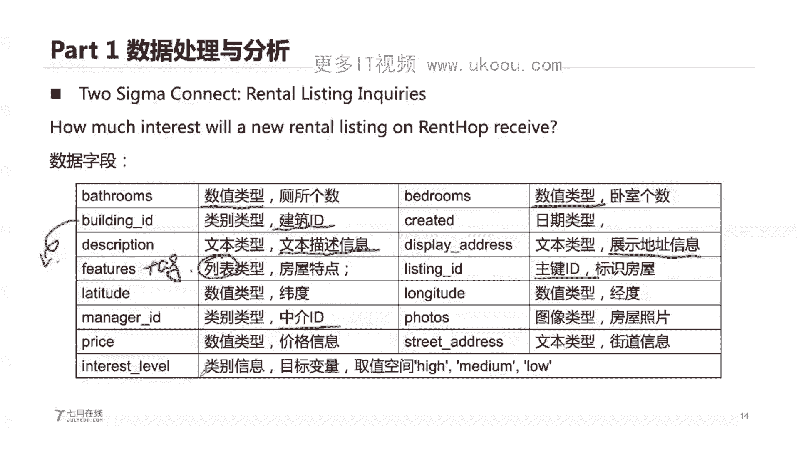

# 1447-七月在线-机器学习集训营15期 - P4：02-数据分析与特征工程串讲 - 程序员技术手札 - BV1ASste6EuZ

好那么我们开始我们今天的一个课程内容，我们今天的课程内容呢其实嗯并不是特别难，我们主要是给大家讲，给大家讲解一下我们的一个数据分析，和我们特征工程两部分啊，一个是数据分析，一个是特征工程。

那么我们的一个具体的一个嗯时间安排呢，就是我们有四部分的一个具体的内容，首先呢给大家介绍一下数据的一个处理和分析，然后第二部分呢讲解一下特征工程的一个嗯，具体的原理和实践。

第三部分呢讲解一下具体的模型的训练和验证，第四部分是总结与回顾，好我们就开始我们的第一部分啊，数就是说我们的一个具体的数据分析的过程，在开始我们的数据分析之前呢，我们先会给大家讲解，就是说问题与建模。

这个呢其实是在我们的一个具体的一个嗯，数据挖掘，data mining的一个任务里面是非常重要的，数据的建模，它其实是嗯，决定了我们最终的一个解题的一个方法，以及我们具体的一个解决的六。

解决的一个问题的过程，我们都知道这个机器学习，它是划分为具体的一个场景的，这个场景呢就是我们是相当于是一些具体的一，些problem，或者说具体的一些task，这个task呢我们是根据在机器学习里面啊。

我们是根据分分任务对吧，我们到底是分类的回归的排序的，或者是无监督学习的对吧，我们的分类相当于是classification回归regression，排序是这种rank，无监督学习。

就是unsupervised learning对吧，那么这个地方呢，为什么我们是呃机器学习的一些具体的一些，应用场景，要做这些具体的划分呢，就是说其实本质我们的这些具体的一些场景呢。

它是都是可以对应到一个，机器学习的一个问题上面，那么我们的具体的一些，不管是在学术上面的一些问题，或者说在我们的一个互联网公司里面，遇到的一些问题呢，我们是可以根据我们的问题的一个类型按。

来完成一个划分的对吧，我们就是说遇到一个问题，我们的问题到底是有没有标签对吧，我有有没有这个label，如果有的话对吧，我们这些人是一个有监督的，有监督的，如果我们的一个label是无的话。

那么我们就是无监督的，然后在我们的一个有label的情况下，我们的label到底是什么类型的，这个label到底是它如果是离散的类型的，那么它就是一个分类的一个类别对吧，分类问题。

如果我们的label是这种数值的，那么他就是一个回归问题对吧，如果我们的一个label是这种次序的，那么就是一个排序问题，以此类推，那么这个无监督机器学习里面，也可以进行具体的划分。

我们嗯如果有基础的同学，应该知道我们在这个无监督机器学习里面，我们可以划分成什么，划，分成我们的一个就是说比较典型的PC，这种降维维度就降低，或者说这种k means，做我们的一个具体的一个聚类对吧。

这种pc a l k means都是我们的具体的一些啊，无间多器学习方法对吧，当然还有些其他的，比如说加入了这种深度学习的，这种自编码器的一些方法对吧，那么我们在做一个具体的一个建模的时候呢。

首先是需要对我们的一个具体的一个问题，做一个大致的划分，它到底是分类的，违规的排序还排序的，还是无监督的，这是第一点，第二点呢就是说我们的一个具体的问题呢，其实我们是可以把它嗯。

就是说有一些典型的一些案例，就是下面比如说预测某个用户是不是违约的，这个呢就是一个很典型的一个金融风控的一个，二分类问题，二分类的问题很典型的一个金融风控的问题，预测房屋的或者是房价的一个热度。

或者房屋的一个价格，那么这个很典型的对吧，是一个回归的问题，因为我们的一个房屋的价格是数值的，预测我们的一个温度的走势，或者说交通拥堵的一种情况，这个呢其实它也是一个我们的一个回归的问题。

但是呢这个问题他其实更加就是说具体一点，它其实是我们的一个时间序列的问题对吧，time series时间序列，那么这一类问题呢，其实在我们的现在嗯，互联网公司的一个应用场景里面，或者说在很多的公司里面。

都是有着相关的一个应用场景的时间序列，或者说预测我们的道路上面是不是有行人，或者说识别我们道路上面的一些具体的行车辆，对吧，这个都是个非常典型的一个应用案例，那么这个地方。

为什么我们可以从场景来进行划分，也可以从案例来进行划分呢，我们现在的一些具体的一些机器学，习的一些算法，都是在一个具体的一个案例上面，或者说一个很典型的问题上面进行使用，我们现在各位同学去找工作呢。

就是肯定就是说不是啊，什么工作都找对吧，我们肯定是非常建议大家你去呃，知道你自己适合什么样的工作，或者喜欢什么样的工作，比如说这个用户预测用户是不是违约，比较典型的。

就在这种金融风控是金融风控的一些公司里面，比如说蚂蚁啊，蚂蚂蚁花呗，蚂蚁对吧，或者说这种融融360，这种就是说金融风控的一些公司，然后呢，如果你的一个岗位是做这种，用户违约的一个预算。

那么你就去需要好好学习一下这种违约算法的，一个具体的一些原理对吧，所以说这个呢，我们是非常建议你把这个具体的案例和，能够和你自身的一个知识点，以及具体的一个就业的一个方向，能够结合起来是最好的。

其次呢我们对于一个数据集呢，我们是可以根据我们的数据集的一个类型，来做一个划分的，我们现实生活中呢我们的这个数据科学对吧，数据科学，数据挖掘，或者说我们的这个机器学习，深度学习。

它的本质就是我们的一个数据，那么在这个地方，我们的数据它其实也是可以做划分的对吧，我们的数据有这种表格类型的结构化的数据，和我们这种半结构化的数据，JASON的或者说XML的这种半结构化的数据。

或者说我们这种非结构化的数据，就是我们的一个图片类型的，视频类型的文本类型的这种非结构化的数据，这些呢都是非常三类典型的我们的数据集对吧，那么我们的不同的数据呢，我们在做建模的时候。

其实我们也是各自存在不同的一个区别的，我们在现实生活中呢，其实嗯对于初学者而言，对于初学者而言，我们比较建议嗯，就是说是学习这种嗯表格类型的数据，表格类型的数据，表格类型的数据呢就是说它是呃。

就是说我们的一个具体的数据集呢，就是这种二维的，二维的这种形式进行展开，我们的行就是我们的一个具体的样本，我们列呢就是我们的具体一个字段，比如说我们给定一个表格，这个表格里面拥有的是某个学生。

他的一个具体的一个姓名，他的一个具体的一个嗯，就是额他的一个成绩啊等等的对吧，相当于是每行是一个学生的一个记录，每一列是他具体的一个字段，那么我们这这是表格类型的数据，为什么我们这个地方会把这个数据集。

讲的这么清楚呢，因为我们不同类型的数据集，其实我们在它适用的得到的一个算法，它也是不一样的，表格类型的数据呢它可能比较适合用的数模型，就是说比使用那种x g boost，或者嗯我们NH级BM。

这个我们在上上周呢，我们的有有我们的老师给大家讲对吧，然后呢如果是非结构化的数据，我们比较适合用，那什么我们非结构化的数据，比较适合用这种deep learning的深度学习的模型对吧。

所以说我们的一个具体的数据的类型，也决定了我们最终适合用什么样的一个，具体的算法，所以说呢，我们是需要对我们的一个具体的问题啊，他的领域嗯类型啊，以及它的具体的一个数据集啊，要好好的一个了解清楚。

其实呢我们在识别到这个问题之后呢，我们并不是说是有一个完从头到尾的这种解，解决的过程，我们的一个具体的一个从头到尾的一个，解决过程呢，是我们的一个嗯就是识别问题，理解数据嗯，数据预处理建模与评估。

这个相当于是我们的一个嗯完整的一个，从数据的一个理解，然后对数据的清洗建模，然后再到再到最终的部署和评估，这是完整的，但是呢在这个解决我们的问题的过程中呢，我们的一个具体的一个。

它并不是说是一个瀑布式的这种串行的，一个开发过程，它是中间呢会需要进行反复迭代，那么如我们PPT所示的，我们在进行迭代的过程中呢，我们可能在中途呢可能是需要返返回返攻的，对吧。

反攻的这个呢其实是嗯很常见的，我们写一个程序，并不是说是一下子就能写成功的，那么类似的我们训练一个模型呢，也不是说我们一下子就能训练完成的，不是的，我们在进行一个建模的过程中呢，我们可能很有可能。

在一拿到我们的数据集的之后，拿到数据集之后呢，你可能是从我们的数据集能够找到，对我们的问题更深次更深的一个理解，那么我们就回过头来，结合我们的原始的一个问题的背景，然后再去理解我们的数据。

或者说我们在建模的时候呢，我们发现我们的建模，它的一个模型的精度不太好，那么以此类推，我们也可以反推，是不是我们的一个具体在处理数据的时候，存在某种误差，或者说出了差错对吧，所以说在我们建模的过程中呢。

它不是一个瀑布式的这种端到端的过程，它其实是有这种循环的过程的，循环的过程的一直一直循环，或者说是中途任意一个节点都会都会反攻，那么一直一直循环，循环到什么时候，能一直到我们的一个最终的一个模型的。

一个精度和模型的一个预测速度，它达到我们的要求的时候，我们才停止迭代，好在我们的建模过程中呢，其实本质啊，就是说有很多同学可能之前没有做过这种，机器学习的一个实际的一个项目部署啊，或者项目开发。

其实这个在进行建模的过程中呢，你可能是可能会对这每个步骤，它所花花费的一个时间比较感兴趣对吧，这个地方我们在进行花费时间的时候呢，可能这一部分的一个时间只占10%，机器学习建模的部分占10%。

然后做数据处理的这部分时间呢，可能是占据70%的，因为我们的数据它可能是比较脏的，我们是需要做把它做一个聚合的，也需要从我们的数据集进行一个理解，然后做一个特征工程的。

所以说实际做一个模型训练和验证的过程，其实时间很短，大部分时间都在做一个数据处理和数据清洗，数据分析的过程中，在我们建模的过程中，我们关键的要做的是什么呢，关键要做的就是。

你首先要识别出我们的问题到底是什么，它是什么类型的，以及通过我们的这个具体的一个哦数据呢，你能不能够找到数据的一个分布的规律，这个分布的规律呢，就是说其实就是我们的原始的某个字段。

它内部的一个分布的规律，这个分布的规律，其实就是需要我们对这个字段进行一个分析啊，这个分析呢可能是要画一些图，画图呢我们是呃如果是类别字段和数值字段，我们各自适合画的图不一样，画完图之后呢。

我们可以找出它内在内在的一个分布规律，其次呢我们的一个具体的一个数据集呢，它每个字段和我们的一个标签，也是存在某种规律的，也就是假如我们是一个表格类型的一个数据，我们每行是我们的一个样本，我们有两列啊。

一列是我们的一个字段，字段A还有一列呢是我们的一个label，在这个地方呢，我们是可以进行一个分析分析进分析什么呢，我们是可以分析一下，我们的一个字段和我们的一个标签，它的一个具体的一个分布的规律。

或者说我们的一个具体的一个，它们之间是不是存在什么关系啊，这个都是可以通过我们的一个分析的过程，来得到的好，那么我们在进行建模的时候呢，B会是不是存在有关完整的，或者说完美的一个解决流程呢。

或者说完美的这种解题套解决过程呢，或者解决模就是说会不会存在完美的模型呢，其实是不存在的，因为我们不同的任务呢，它的一个具体的解决方法，和建模方法都是不一样的，我们并不能一概而论，特别的呢。

特别的呢就是说我们的具体的数据，不同的情况下，我们的建模方法是不同的，我们的一个具体的一个任务，不同的情况下，我们的建模它具体的任务也不同，那么这个地方，我们的数据和我们的具体的一个任务呢。

就决定了我们最终他到底是做什么以及如何做，在我们的机器学习的一些这个领域里面呢，我们常见的应用呢就是说你可以嗯，首先可以按照我们的数据集来做一个划分，我们数据集做一个划分呢，就是我们是嗯比如果是初学者。

比较推荐你去学结构化的一个数据，因为结构化的数据呢，它的一个数据集往往都比较小，也比较适合你去做人工的特征工程，那么结构化的数据集里面，就是说我们的这个数据呢，它是使用这种表格形式来进行一个。

存储和展示的，在这个结构化的数据集里面，我们常见的这种任务，由广告搜索的推荐催电系统，金融风控最优化问题以及匿名数据挖掘的问题，然后呢我们以此类推，还有一些其他的图像的，AARP的文本的语音的这个地方。

我们就给大家稍微讲一下图像，图像的呢就是我们的一个具体的数据集呢，它是以这个image的形式进行存在的，image我们也知道它其实就是一个文件对吧，我们的一个图片呢，它的一个不可能的一个文件。

可能图片尺寸有大有小，它不是一个规整的形式，它是一种非结构化的数据，那么对于我们的一个图像的领域呢，我们常见的任务有这种图像分类，物理检索我们的语义分割，超分辨率重建以及人脸识别，自带估计。

关键点检测等等的一些任务，这每类任务呢都是可以找到我们的，相应的工作岗位的啊，你去搜啊，直接在这种招聘网站上搜，都是可以找到的对应的一个岗位的，那么类似的在文本和语音里面。

我们也也是有着对应的一些特定的一个岗位，和特定的任务嗯，那么我们在进行学习的时候呢，就是说非常建议你嗯熟练掌握这其中一种，或者说两种是比较好的嗯，因为我们这个你不可能，就是说你把这个基础学完了。

然后再呃不去学这个具体的任务啊，这不太可能，因为我非常建议你去学完基础之后，然后去挑选其中的一两个具体的任务，然后进行一个深入学习啊，这样是比较适合你的，一个具体的一个职业发展的。

那么有同学可能就会问到老师，我怎么知道我选哪一个嗯，就是说是哪一种这个领域啊，或者哪一个具体的问题比较适合我，这个呢就是非常推荐你去把每一个这个地方，你可以把这个截个图啊。

或者说在我们的QQ群里面可以拿到我们的课件，然后呢你再去嗯嗯了解一下每个任务，它具体是在做什么，然后你就是可以找到你比较感兴趣的，一个愿望好，那么我们今天呢给大家在进行举例的时候呢。

都是以这个to sigma connect，这个租房热度预测的这个数据集给大家展开，给大家展开，这个数据集呢其实是一个K哥的一个比赛啊，说我是从K哥的一个具体的一个课程里面筛选，把它抽取得到的。

那么这个具体的一个数据集呢，他在他在做什么任务呢，它是需要我们使用这个租房的一个信息，对这个房屋的一个热度做一个预测，这个房屋的一个热度呢不是它的温度啊，这个房屋的热度呢相当于是它的一个受欢迎。

受欢迎的一个程度，就是说这个房屋它受欢迎的一个程度，我们是需要使用这个房屋，它的基础信息来预测它的一个热度，那么这个地方其实本质就是对我们的一个，房屋的热度进行一个分类对吧，那么我们的一个具体的数据呢。

它拥有了我们的房屋的信息，这个房屋的经纪人信息，房屋的地理位置信息，我们在做的时候呢，其实本质需要将这些具体的字段，做一个聚合的统计，所以说他的一个具体的操作过程呢，其实是需要做大量的一个统计啊。

这个to西格玛这个具体的数据集呢，它原始来源于KO的一个具体的比赛，他总共包含了十四十四个字段，分别涵盖了啊数值类型的类别，类型的文本类型的，日期类型的和图片类型的这些字段啊，然后呢通过这个数据集。

或者通过这场比赛呢，你可以完整的掌握到我们具体的数据挖掘的，各种技能嗯，它包含的一些具体的一些数据呢，我们在这些字段呢，我们待会也会展开给大家讲解啊，你不用担心，好，这个呢我们先给大家花了一点时间。

给大家讲完了我们的这个初始部分，我们如何对我们的数据集，以及我们的问题做一个抽象对吧，我们到底如何对它进行具体划分好，我们接下来呢就开开始，正式开始我们的第一部分额数据处理和分析，这个地方啊。

就是很多同学呢觉得算法工程师做一个他的算，很多同学可能觉得算法工程师的一个工作，主要是训练模型，其实不是的，算法工程师百分，我刚才也讲了，70%或者70%以上的时间呢，都是跟数据的一个处理相关的。

比如说数据的一个清洗，数据的一个查询，70%以上的时间都是在做直线，然后还有10%的时间可能才是建模，其实建模的时间其实是非常少的，因为我们现在的一个具体的机器学习的，这些库呢都非常完备的。

你只需要把我们的数据集把它处理好，那么接下来送到我们的具体的一个模型里面，就行了对吧，所以说我们在这个地方呢，很多时间都在做一个数据的清洗，数据的查询和数据的分析，那么在去西格玛。

这个租房热度预测的比赛里面呢，其实我们遇到的一个问题是什么，在render hop，render hop呢是纽约啊，纽约new york它的一个租房的一个网站，就相当。

相当于是我们国内的这种链家的网站一样，那么在这个网站上面呢，就是说很多的一些房客，他可以在上面找到他想要的房子，那么我们在这个网站上面呢，也有一些具体的一些嗯，房屋的一个信息呢会被张贴出来。

那么我们是需要预测一下这个房屋的一个热度，这个热度呢就是这个房子它受欢迎的一个程度，或者说他的点击率在这个地方呢，就是说我我们的一个具体的任务呢，是跟预测这个房屋的热度，预测完成之后，我们能够做什么呢。

我们这个得到的一个模型呢，可以更好的去分析一下我们哪些房子，它可能是更加受欢迎的对吧，也可以对我们的这个租房的信息来进行控制，比如说嗯，我既然能够识别出我们的一个房屋的热度，那么我们可以将这个嗯。

比较受欢迎的一个房屋呢，它它均均匀的一个采样的采样进行发布对吧，不要一下子发布很多的一些比较受欢迎的房子，对吧，让它均均匀的就相当于是有一个等待一段时间，然后再发布。

或者说呢我们通过这个房屋的一个热度的预测，模型呢，也可以帮助我们的一个业主和中介，请理解我们的租客的一个偏需求偏好啊，这个呢其实是也是非常有帮助的，他的去这个地方呢，我们的去西格玛呢这个具体的一个问题。

他的评分方法呢它是用log loss来做一个评价的，他的一个具体的问题呢其实是一个分类问题啊，我们的一个热度呢就是分为我们的三个，我们的一个就是三类啊，high media和low3类。

我们接下来做一个具体的一个预测的时候呢，我们是需要预测得到，我们的一个具体的一个房屋，它是属到底属属于某一个类别，然后这个地方呢，我们其实本质是需要识别出我们的一个，它每个类别对应的概率值啊。

这个地方相当于是这一行，它的概率值相加得到等于一啊，那么这个地方呢我们嗯在进行评价的时候呢，是用我们的一个logo loss来做一个评价，好我们在这个原始数据集里面呢，其实它包含的信息还是蛮多的。

我们的一个有一个train jason和test jason，这是我们的一个原始的一个数据集，然后呢这样他还给了一个嗯image sample，点zip这个文件，这个文件里面呢就是我们的一个嗯。

就是说所包含的一些呃房屋的一个照片，这个呢就是我们的一个具体的一个嗯，房屋的一个照片的文件夹，相当于是我们在这个数据集里面，我们还给定了这个房屋的一些具体的照片信息，当然这个照片信息呢。

它就是一个非常典型的这种非结构化的数据啊，我们就可以把它利用起来，在我们讲解完这个具体的一个问题背景之后呢，那么我们接下来就可以思考一下，我们的具体的一个sin题，它到底是一个什么样的问题对吧。

首先他这肯定是一个有监督的一个问题，因为我们是有训练集，以及我们有测试集的对吧，这个地方有监督的这个问题其实很好识别，我们是有训练集的，也有测试集的，然后在训练集里面呢，我们是有这个具体的标签的好。

那么在有监督问题里面呢，它其实是一个分类问题，分类问题对吧，我们的具体的标签呢是分三类的，它是一个分类问题，然后呢是分三类的，就也就是说它是一个多分类问题好，那么这是一个问题的建模以及问题的一个抽象。

然后接下来呢，就是说我们是需要提前做一个思考的，就是说我们在做一个建模的时候呢，你首先要对我们的一个问题背景进行一个理解，然后接下来就是可以对我们的一个，具体的一个标签做一个假设。

也就是说你可以自己思考一下，我们的一个房屋的一个信息，是如何影响到它的一个热度的呢，或者说一个房屋的一个信息，如何影响到他的一个具体的受欢迎的程度的呢，有没有同学想回答一下对吧。

我们的一个具体建模的时候呢，你是就是说是需要这样思考的，类似于这样思考什么去影响到我们的标签，以及我们的标签和什么相关，有没有同学想回答一下的，就是说我们在做一个租房的时候，什么样的房子。

它的一个具体的受欢迎的程度是比较高的呢，对，因为同学讲回答的，那么这个地方呢，就是说如果大家有这个租房的一个呃，就是说曾经租过房子啊，或者说有这种租房的一个经验的话。

可能就知道什么样的房子他比较受欢迎的，首先呢它的价格比别人低的对吧，相同条件下面这个价格比别人低的，肯定比较受欢迎对吧，其次呢这个房子他的一个位置对吧，房子肯定他的一个位置信息位置比较好的。

那么他肯定也是可能比较受欢迎的对吧，然后呢这个房子它内部有什么家具对吧，这个呢也是呃就是说这种配套的一个信息啊，也是会影响到他是不是受欢迎的，所以说呢在我们建模的时候呢，你首先可以从这个角度来进行思考。

就是说我们的一个标签，它是它是如何进行一个就是说什么样的数据寻，它可以影响到我们的标签，其次呢我们还可以思考，就是说什么是我们的标签，我们的标签是如何进行定义的，这个其实也是非常关键的。

你的一个标签它到底是这个热度，到底是怎么定义的呢，你可以把它定义为这个房子，它的一个嗯在我们的网站上面被查询的次数，或者说这房子在我们的网站上面，它被点击的一个次数都是可以的对吧。

这个相当于是他被就是说这种受欢迎的，一个程度对吧，就可以视为一个热，那么我们在做一个建模的时候呢，首先可以对我们的具体的一个标签做一个理解，其次去思考一下我们的一个具体的标签。

它是如何受到我们的数据集所影响的，在我们的这个问题里面呢，我们拥有的这个具体的数据呢是这些啊，我们分别是bathroom，bedroom啊，B2dd created啊，description啊。

这些字段我们一个一个来看，bathroom呢，就是我们的具体的一个相当于是梳妆台，或者说这种洗手间的个数啊，厕所的个数，然后呢我们bedroom呢它是这个卧室的卧室，这个呢我们在这个地方其实都标示好了。

具体的一个字段的类型的啊，这个地方其实需要注意的啊，我们在进行一个建模的时候呢，其实是非常建议你把每个字段的一个，具体的一个类型给它清楚地标识出来，然后如果能够理解嗯，或者说翻译这个字段的一个哈。

它的一个含义的话呢，也可以把它那个字段的含义给它记录下来，这样呢其实是非常非常有助于你对数据集进行，一个理解的啊，然后呢我们还有个这个B0DB20id呢，它其实是一个类别类型的。

就是这个建筑物的一个id，因为我们的一个具体的一个建筑物呢，相当于是我们的到底是哪一哪一号楼对吧，这个地方你可以理解就是一个楼的一个编号，或者说我们的门牌号，然后呢还有一个created。

就是我们的这个房屋，它的一个信息被张贴的一个时间，然后description呢就是一个文本类型的，就是说这个房屋的一个描述信息，它的一个我们在做张贴一个房子的时候呢。

就是房东或者中介会用一段话去描述一下，这个具体的一个房子，他到底是什么样的一个类型，以及它的一些具体的一些描述对吧，比如说我们的房子它坐北朝南，有电梯，怎么怎么样对吧，用一个文字来做描述。

然后呢diss display address呢，就是说这个访问它的具体的地理位置，所展示的地理位置，然后还有一个features，这个features呢它是一个列表类型的。

就是说它其实是将一些具体的一些特点，这个地方呢有点像这种中文里面叫叫这个打tag，打个标签，比如说呃这个房子有电梯呃，什么什么，就是说有电梯呃，有门铃对吧，然后哦不要不要物业费对吧。

相当于是用一个个的一些具体一些tag，去描述这个房屋，然后还有一个我们后面的是个listing id，这个呢就是一个主线id，就是说我们的这个具体的房，这每这个张贴的房子的一个唯一的标识，就是主建。

然后我们的NETITUDE和longitude呢，就是我们的具体的一个房子，它的一个具体的经纬度，然后manager id呢就是说是这个房屋的中介，他的一个信息也是类别类型的中介id。

然后photos呢是这个图片类型的，就是这个房屋的照片，price呢就是这个数值类型的，是这个房屋的一个具体价格，房屋的一个具体价格，然后这个photos呢就是我们的一个具体的一个。

房屋的一个具体的照片，price呢就是它的一个具体的一个我们的一个价格，然后street straight address呢这个街道信息，然后interest level呢就是我们的具体的一个标签。

我们具体的一个标签，那么这个就是我们的一个具体的数据集啊，他就是长这样的啊，长成这样的，那么我们这个地方，其实是把每个具体一个字段呢，给大家解释了一下，那么我们来看一看我们的原始的一个数据集啊。

它就长这样的，我们的每个具体的一个嗯，这个数据集，每个阶段我们的bathroom有1。5个诶，为什么有1。5，为什么有1。5个，这个地方呢其实是这样的啊，我们厕所是1。5个的话。

就是有可能是这个厕所呢是有公用的，或者说有的厕所呢只能是用来嗯，相当于是呃这种洗手的啊，就相当于是这种呃共用的厕手，或者说是嗯对半，这种厕所都是都是有的啊，因为我们租房的话，这是很常见的。

然后我们的卧室个数呢一般是整数的，然后我们变0id对吧，这种id类型的这个这个其实是一个字符串，这个其实是一个字符串，但是呢其实它也是一个类别类型的好嗯，created是我们的时间对吧。

然后这个地方的features是我们的一个list，好，然后呢，如果各位同学就是说想对我们的一个，就是说我们的一个就是具具体数据集，想要进行深入的理解呢，我们的一个具体的一个额数据集也给了大家啊。

然后你可以自己一下去看好，我们在做一个数据集的一个理解的话呢，就是说我们首先嗯，也可以从我们的具体的统计值做一个判断，我们这个地方呢，就是说我们在做一个数据的一个处，理和分析的时候呢。

我们是非常建议你从一个整体的一个分布的角，度做一个啊统计以及做一个分析啊，因为我们在一个具体的一个，对于我们的具体的数据集，它基本上就是一个行列的一个形式，这个地方我们的一个列呢。

就是我们的一个具体的一个字段信息，比如说这个房屋所有房子的一个bedroom，或者说它的bathroom的一个信息，我们对于这个字段我们是可以做一个统计的，就是说可以得到它整体的一个分布。

或者说得到它整体的一个规律，得到了这个规律之后呢，我们可就可以用这个统计的一个信息，去对我们这个字段进行描述，这个地方呢就是说我们在做一嗯，在数数理统计或者概率论里面。

我们是可以学习到一些具体的一个数值分布，随机分布的一些嗯，就是说常见分布的一个呃一些情况对吧，我们有这种均匀分布，被阻力分布，我们波动分布等等，那么这个地方我们的不同分布。

其实它都是可以做一个相互转换的，对吧好，那么这个呢我们就不做展开讲，因为这个其实不是我们的重点啊，我们其实就想给大家就是说说清楚，我们具体的数据集呢，我们其实是仍然建议将这一个字段，把它单独拿出来。

然后做一个具体的统计，我们在做一个具体统计的时候呢，我们经常会做这样一个统计，就是说99%的一个数据，他是怎么样的，或者说99%的同学，他的一个成绩是怎么样的，或者说我们就是说你的一个成绩。

已经进入了前1%，这个地方的一个99%和1%，他在说什么呢，其实它本质就是在说一个具体的一个嗯，分位点的一个信息，或者说是一个统计的一个分位量，在这个地方就是说你的一个具体的一个统计值。

99%的数据都处于某个范围，或者说你的一个具体的一个数，它的一个字段，它的一个你是不是位于在某个范围内，这个地方呢，我们常见的这个百分比啊，就是这种分位点的一个含义啊。

当然我们也可以做这样一个具体的一个处理，就是说我们可以统计我们的，25%的分位点，50%的分位点，这个50%的分位点，就叫我们的中位数对吧，然后我们的75%的分位点，然后就是说把某一列单独拿出来。

计算这个我们的三个分位点，然后计算完成计算这个分位点之后，然后做什么呢，我们可以得到一个IQR，I q2，其实它是等于我们的Q3减去我们的Q1，就是我们75%的分位点的一个，数值取值。

然后减去25%的分位点的一个取值，得到我们的IQ2，然后通过我们的一个IQR，可以得到一个具体的一个上界和下界，这个地方其实是这样的啊，我们的一个具体就是这样的，我们的一个上界呢就是我们的一个Q3。

加上1。5乘以IQ2，Q1呃，我们的下界呢就是Q1-1。5，1。5乘以IQ2，这就是我们的上下界，这个上下键可以用来做什么呢，我们的这个上下键可以用来做一个缺额，我们的一个离群点的一个判断。

也就是我们通过这样的一个计算，得到我们的上下界之后呢，我们的这个范围内的一个数据，就是我们认为它是合理的分布的，然后在这个范围内之外，比如说小于我们的下界，或者大于我们的上界的数据。

我们就认为是我们的一个离群点，离群点，那么我们就可以通过这个统计的方法来识别，得到我们离群点，那么这个镶嵌图它还可以用来做什么呢，它还可以用来做，就是说得到我们的具体的一个数据，它是嗯怎么分布的。

因为这个地方我们有三个分位点啊，这个相线图在这个英文名字里面叫这个box，PTS对吧，箱线图它为什么叫相线图，其实就有有点像那种拉杆箱的样子，我们这个地方的25%的一个位置。

和50%的位置以及75%的位置，那么我们如果这三者分布的一个位置，不一样的话，我们得到的就是它原始的一个曲线性，原始哪个分布就是不一样的，对吧，假如说我们的具体的一个，中间的一个最核心的一个箱子。

他的100我们的中位数不一样，中位数的位置不一样对吧，那么其实我们得到的一个取原始的分布的，形态也是不一样的，这个相当于是我们的具体的一取值，我们从25%到50%的，25%的一个。

相当于是整体数据及25%的一个分布，都是位于在这个取值的范围内，就是说在这个范围内，如果这样呢，相当于是均等的，相当于是整体的一个分布是比较均衡的，就是类似于这种正态分布的，没有没有左偏。

那么如果是这种形态呢，就是有点像我们的右偏，也就是说我们的这一部分的一个数据集，它是分布的一个比较密集的对吧，相当于是一种右屏的状态，所以说呢我们通过镶嵌图呢，是可以一方面可以识别出我们的数据集。

它的是不是有离群点，另一方面呢也可以得到我们的具体的一个，数据的原始的一个分布的形态啊，那么对于我们的数据集，我们如果是想要做一个分析，我们怎么做呢，就是非常简单啊，做一个数据分析其实都是非常简单。

我们可以分析一下我们的具体的每个字段，它的一个出现的一个次数，就是我们选择得到某一列，然后算一算某一列，它具体的一个整体的分布的一个规律，比如说我们画一个bedroom的一个count pose。

就是我们画一个出现次数的一个统计的一个嗯，柱状图，我们bedrooms为零的一个房，房子有多少个，bedrooms是唯一的一个房子多少个，以此类推，这个地方呢，我们你可以画这个具体的一个直方图啊。

或者柱状图，当然也可以通过我们的一个pandas里面的，describe函数来做一个描述性的一个分析，pandas的一个describe函数呢，就是嗯可以可以很方便的计算得到某个字段。

它的一个具体的分位点的一个情况，它的一个最大值最小值25%分位点，50%分位点以及75%分位点，各自的一个取值啊，各自的一个取值，那么类似的我们也可以看一看我们的bathroom。

他的一个具体的一个嗯就是的分布的情况，在我们的bathroom，取值为一和取值为二的房子是最多的对吧，其他的就是1。52。5，3。5，4。5的房子都是比较少的，那么我们对于我们的具体的一个可视化呢。

我们也可以对我们的一个数值类型的，比如说我们的一个经纬度NTITUDE，和我们的NTITUDE做一个具体的一个可视化，那么我们这个地方是对NTU做一个可视化，这个地方其实它绘制得到的是一个密度直方图。

在英文缩写里面叫KDE，相当于是我们的一个color density的呃，我们的一个嗯就是图对吧，相当于是一个密度直方图，在这个图里面呢，其实它本质绘制得到的一个形态呢。

跟我们的这种柱状图其实是差不多的，只不过这个地方我们的一个柱状图呢，它其它的一个具体的一个，这个类别的一个取值空间，它的一个相当于是取值空间比较小，类别取值空间比较小，如果是这种数值的话呢。

我们是数值的，它的一个类别取值空间就比较大，因为我们的数值，它的一个就是相当于是它可以分的比较离散，对吧，那么这个地方我们可以发现，在这个我们的这个经纬度的绘制，得到的密度直方图里面有一些位置。

它的一个房屋它可能是比较集中的对吧，在这些位置，那么在这些位置里面，就表明我们的这个有可能我们的一个房子呢，它可能是处于集中在某些位置，集中在某些位置对吧，好我们的NTITUDE和longitude。

我们可以对于数值类型的，我们可以画一个密度的密度直方图，那么类似的啊，我们对于我们的这种嗯price price呢是我们的价格，我们也可以绘制这种图图形，就是我们的这种密密度直方图，价格呢。

它就是我们的一个，相当于是跟我们的一个金钱相关的对吧，跟金钱相关的这个呢其实是这样的啊，我们的现实生活中呢，就是他有点像这种20%的人呢，掌握80%的财富，这是2080的一个原则。

或者说20%的一个房子，他都是就是说哦，80%的房子，都是在20%的一个价格区间内，它都是我们的一个这种分布啊，都是严重的左偏的，我们的价格啊，它是这种只要跟金钱相关的，它往往都是左偏的。

而且都是跟我们的2080，这种原则是匹配的啊，也就是说20%的，80%的房子，都位于20%的一个价格区间内好，那么这个地方呢就是说我们的一个价格，其实跟所有跟金钱相关的字段，它的往往都是左偏的。

那么这个左偏的呢，就是说我们如果遇到一个字段，它是跟金额相关的，而且是左偏的呢，我们是可以把它做一个处理的，我们怎么做一个处理呢，比如说我们把它做一个取log，这个就是一个很好的处理。

相当于是去除他的一个偏态的这种效果，把它尽可能转为正态分布，因为我们也知道啊，在做一个具体建模的时候，如果这个字段它是正态分布的，那么我们很容易得到这个它的一个模型的一个，无偏估计对吧。

如果我们的数据集，它的一个具体的字段是这种非正态的，那么我们得到的一个模型，就很难去得到它的一个参数的无偏估计，那么我们接下来看一下我们的BI0id，bi0D呢，就是说这个具体的一个建筑物的编号。

建筑物的编号呢其实它是一个字符串类型的，相当于是一个嗯，我们把这个具体的一个房屋的一个信息，把它进行编码的字符串，这个地方呢我们把它做一个统计的时候呢，他其实这个取值空间是蛮大的，因为这个地方。

其实他虽然说是一个类别类型的字段，但是呢这个地方的类别类似于字段呢，它是加有id这种成分，在这里面id是什么，Id，就是用来标示某一个具体的一个他的一个身份，对吧，等于身份证号。

你之后看到的跟我们的这个id相关的字段，它往往的取值空间都非常大，虽然说他是一个类别字段，它的但它的取值空间是非常大的，那么我们在做一个具体的一个统计的时候呢，我们就可以统计一下。

这个地方就不建议画这个密，我们的一个柱状图啊，因为他的一个取值空间非常大啊，所以说画出来也并不是特别好看，你在做这个地方呢，我们可以统计一下它的一个具体的一个value counts。

就是他的一个次数啊，做一个统计就行了，我们可以看一下，我们BIDID取值为零的情况下，有八千二百六十八十六套房子，这个呢其实我们很清楚的，可以看到这个地方的零，其他的一些变量I1键都是这种等长的字符串。

这个说明什么呢，这个地方的零它就是一个去我们的一个缺失值，缺失值我们的一个Missing value，或者说是一个默认值，天天是我们这个地方是没有填这个变量id的，某个房子是没有填这个变量id的。

这个地方呢，就是说我们通过一个数据分析，是能够找到某个字段，它到底是就是说有没有缺失值，有没有这种具体的一个额分布的情况呢，然后呢我们对这created，这个created就是我们的一个日期类型的。

时间跟时间相关的，如果是跟时间相关的呢，我们就可以绘制类似于这种图像，我们的X轴是我们的日时期，Y轴，就是说在这一天他所发布的一个房屋的一个，具体的一个个数对吧，也是类似于这种柱状图的这种形态。

那么我们可以看出我们的具体的这种房屋，它所发布的一个时间有点儿其实有规律的啊，对吧，是有规律的，那么这个呢其实是一周一周的波动，那么类似的呢，我们如果是遇到了这种文本类型的数据呢。

我们是可以这个与文本类型的数据呢，我们是可以做一个云图，Wordcloud，云图，云图的含义呢，就是说我们的一个具体的一个在绘制的时候呢，如果这个文章里面这个单词出现的次数越多。

那么它的它的一个字体就越大，就是这个意思，没有其他意思，云图其实很多同学都知道，我们这个地方呢，通过云图，我们就知道，大部分的房子呢可能是位于这些wall street啊。

或者BDVA这些对应的一个位置对吧，那么我们也可以对我们的一个display address啊，做一个统计，这个地方呢display address呢，其实他也是这种字符串类型的。

那么对于这种字符串类型的呢，我们也可以做一个统计得到的统计，得到一个统计值啊，然后做一个可视化，比如说我们的一个具体的一个，做这样一个可视化，就是说我们的一个具体的一个嗯房子，如果它出现了一次。

他就是说对应的一个地址，类似于就是说只出现了一次的这样的地址的，一个房子，他拥有多少个对吧，其实这也是一个非常非常典型的一个，左偏的一个分布，也就是说我们大部分的房子呢。

它的一个出现地址啊都是比较独立的，都是比较独立的好，那么我们来看一看这个features，features呢就是一个list类型的，对于这种历史类型的呢，我们可以统计一下这个房子。

相当于是它是这个它的含义，就是这个房子的一个特点对吧卖点，那么这个卖点呢你就是我们的一个tag，那么我们可以这个地方呢可以统计一下，这个features是它具体的个数，大部分的房子的一个特点的个数。

就是他的tag个数是在00~0到六之间的对吧，然后呢大于六的也有，那么对于我们的这个features呢，我们也可以画一个云图来看一看，大部分的一个tag呢，就是说可以dog dogs aloud。

可以养狗对吧，elevator我们有电梯的，Door man，有门铃的对吧，然后我们还有这种什么可以养猫的，有健身房的等等等等对吧，这个就是我们的features。

然后这个地方我们有个manager id，manager id啊，这个地方就是一个中介的id啊，也是一个非常规整的一个字符串的类型的，那么我们接下来就是我们，其实刚才是将我们的这些字段。

大致给大家讲了一下，然后我现在问大家一个问题，就是说，如果大家通过我们的具体的数据集的一个理解，你会认为哪些字段对我们的具体的一个房屋的，一个热度是非常非常相关的呢，也就是我们给大家讲的。

这些具体的一些字段之后，你会认为哪些字段，会影响到我们的一个具体的房屋的热度呢。

也就会影响到我们的标签呢，对有没有同学想回答的，对呃soft的同学以及莫西莫辛同学，以及两位手机用户同学，有没有想回答的，如果你看了之后，看了我刚才给大家讲的这些字段之后，你有没有觉得。

哪些字段可能会跟我们的一些标签有相关呢，有没有同学想回答的，那么这个地方呢就是说我们刚才也讲了，在讲这个数据集之前，肯定我们的这个价格位置对吧，都跟我们的一个具体的一个呃，房屋的一个标签是相关的。

其次呢还有可能跟我们的标签强强相关的，是我们的这个B20id，以及我们的manager id，这个BADID，这个BDD呢和manager id都是这种id类型的，id类型的呢。

其实他都是很有可能跟我们的标签强相关的，比如说某个中介，他发布的房子都是比较优质的房子对吧，那么这个地方可能他的一个房子的一个，热度都比较高是吧，好那么我们就继续，那么我们在做完具体的一个可视化之后呢。

有可能有同学就觉得，可视化是不是就是我们刚才所说的这么简单啊，其实可视化并不是说是这么简单的，我们先给大家讲一讲这个可视化，可视化呢这个地方其实在Python环境下呢，也有非常多的一些具体的库啊。

我们可以很方便的可以进行使用，比如我个人比较喜欢的就是这个con这个库，con这个库呢它是基于matt plot lib的，然后可以很方便的用来绘制这种，就是说我们的这种数据的一个分布的。

这种可视化的图形，他在做一个画图的时候呢，我们在做一个画图的时候，其实你可能第一次看这个图觉得很难看懂，其实我们一步一步可以把它剖析一下，我们这个图呢其实它包含了三个字段。

X轴Y轴以及我们的这个clue，这相当于是smoker它的具体取值，那么这个地方我们在看图的时候，首先看一下我们的X轴，X轴是我们什么，我们X轴是对我们的一个day，做一个分类的情况下。

然后Y轴是我们的total b啊，具体的一个取值，然后这个地方呢，其实他还做了一个具体的一个分类，也就是说我们的day取值为我们的TUESDAY的情况下，我们我们的smoker取值为yes。

或者说取值为low对应的样本，然后呢我们在这个取值不同的情况下，我们在对我们的total b啊，绘制一个得到一个象限图对吧，那么我们在做一个具体的画图的时候，或者说看这个图形的时候。

你要弄清楚这个具体的画图，或者说图形里面它到底包含了多少个元素，这个其实是非常关键的啊，非常关键好这个呢我们的这个box blox呢，它其实在做绘制的时候，其实是不单纯的对一个字段进行绘画图啊。

相当于是这个地方哦，我们是使用两个字段进行分组之后，然后分别绘制得到了我们的一个象限图对吧，然后类似的啊，然后类似的我们再给大家找一个啊，嗯这个地方对，小提琴图也非常典型。

对我们的day和我们的一个smoker进行分组之后，然后绘制得到这种分布，这个分布呢它非常像一个小提琴，他是这种竖竖着的一个分布，然后这个分布这一部分。

这一部分是我们的day取值为TUESDAY的情况下，smoker取值为yes的情况下，我们的toto be要整体的一个分布，然后这部分呢就是我们的一个day取值为TUESDAY。

smoker取值为NO的情况下，我们toto bi的一个整体的一个分布，它其实是嗯，相当于是也是一种对两个字段进行分组的，情况下，然后再去看一个具体的数值的一个分布的情况，它比这个镶嵌图呢。

可能嗯就是说更加直观一些啊，但是呢这种小梯形图呢，它不能看出我们具体的一个数据，它有没有离心点啊，他其实是看只能看到这整体的分布的情况好，那么类似的啊，在simple的库里面呢。

其实有非常非常多的一些画图的函数，都可以就是很方便的用来做一个画画图啊，那么这个地方呢其实是有很多的一些库用，都可以用来做画图的，比较典型的就是说如果是学Python的话。

最最嗯就是基础的画图的库呢是这个MATTPLEAP，它是最为底层的我们的画图的库啊，最为底层的画图的库好，然后呢如果是基于Macbook lip呢，就是由这个我们刚才所讲的这个CBSBL呢。

这个库是基于match prolip进行二次开发的一个库，然后可以快速的绘制，得到我们的这些很漂亮的一个图标，也就是说我们他其实是调用这个match pch lib，做一个画图啊。

所以说它是一个高层的一个啊组件，然后呢还有一些其他的库啊，比如说这个我们的PLOTLINE，或者说我们的BOKEH嗯，这些库呢都是比较高阶的库，它可以嗯跟我们的浏览器啊进行集成啊。

然后做这种可就是说这种叫带有交互式的图啊，都是非常非常方便的，还有一些呢，就是我们对我们的具体的一些地理位置，做可视化的图嗯，比如我们的这个地方，FOAIUM都是这些图啊，都是可以嗯。

相当于是不同的数据类型，我们做不同的可视化好，然后还有一些对我们的缺失值，做一个可视化的啊，我们在之后的课程也会给大家讲的好，那么这个地方呢，就是说有很多同学在学了这些画图之后呢，就可能是会觉得迷糊。

或者觉得我第一次接触，你给我讲这么多图干什么，其实这个地方是这样的啊，我们的本质的可视化呢，就是在于我们如何是用一种一种图，或者合适的图，对我们的一个字段做出一个具体的一个可视化，做出个统计。

比如说我们想要对一个具体的一个数值，做一个可视化的话，其实我们是可以画出它的一个柱状图的对吧，一个数值在不同分组的情况下，它去写一个可能分布的情况，或者说你不画这个柱状图，你就画这种密度图。

其实本质是一样的，就是它展示的一个形形态啊，以及具体的一个形状是不一样的，类似的你可以画这种我们的累计分布图，现在有点像我们的一个CDF对吧，从我们的一个相当于是，小于我们的180的一个数数据。

它大部分就是它的比例是在0。05对吧，接近0。05，然后呢，小于190的数据呢，是在0。2 20%的比例，然后一步一步增加到一，这种相当于是画会值得到我们的一个CDF对吧，我们在概率里面的CDF。

就是说我们的数数据它整体是如何进行分布的，然后呢我们也可以绘制得到这种散点图，绘制得到散点图图之后呢，我们可以散点图，它是二维的对吧，我们可以绘制的它它绘制到它单维的。

相当于是它的边缘分布的密度直方图对吧，这个都是非常常见的一些画图方法，通过这些画图方法呢，我们就可以将我们的具体的一个数值，以及相关的资料呢，把它进行用合理的方法给他展示出来。

好额那么我们休息56分钟好不好，我们休息56分钟，然后继续我们休息到这个9。02，然后我们回来好不好，然后我们休息一下好，然后大家如果有什么问题的话呢，你可以在我们的一个聊天框里面打字，让我知道啊。

好我们休稍微休息几分钟好不好，好嗯然后我们准备回来额，然后各位同学对我们刚才所讲的内容，有什么问题吗，我看大家都比较沉默啊，如果大家有什么问题的话，也欢迎提问啊，因为嗯你有问题的话。

可能学的会更靠更快一些，不然如果你没有问题的话，相当于是嗯我相信呢可能你没有问题，但是呢如果你真的有问题的话，那可能就是第一时间提出来的效果会更好一些，对好，那么我们就继续好不好好，我们继续啊。

嗯然后呢，我们接下来看一看我们的一个特征，工程与实践啊，我们在做一个具体的一个嗯，具体的建模的时候呢，我们在进行具体建模的时候，其实我们是给到我们的一个数据，我们是需要构建一个具体的一个模型对吧。

那么这个具体的一个数据呢，其实我们的一个数据，它可能的一个类型呢是多种多样的，我们在这里面呢，其实我们是首先来看一看第一种数据类型，是类别类型的，类别类型的呢，就是说我们其实它是一个嗯非常常见的。

我们的数据的一个类型啊，就是说我们的数据字段它是这种类比特征嗯，比如我们常见的这种个人信息，性别，城市省份，民族户口类型，这个里面都是我们的具体的一些呃，类别类别的人，然后我们的颜色对吧。

颜色里面的取值有红色，白色等等等等，国家里面有具体的取值，中国美国对吧，然后我们的动物这个地方呢，其实我们需要注意，就是说我们的类别，它有一个具体的取值空间，这个取值空间呢就是它具体的一个。

就是说这个类别它能够取值的这个字符串，相当于是这个类别是一个sage这个集合，这个取值空间呢就是它的一个具体的一个元素，类别特征呢是我们在做数据处理的时候，在我们在做建模的时候。

任何特征任何时候都要做处理的一个数据，因为类别特征它往往都是这种字符串类型的，我们对一个具体机器学习模型啊，它是只能接受这种数值类型的一个计算，我们可以回想一下我们的线性模型，我们神经网络对吧。

其实它本质只能接受我们的一个数字类型的，一个数据，所以说类别类型呢，数据呢我们在做处理的时候呢，我们肯定是要把它做一个编码的好，另一类型的数据呢，它的一个具体的一个取值空间，它有大有小，对吧有大有小。

如果是小，我们都是就是说这个没什么问题，如果是比较大的话，就有可能有问题，这个地方的大呢，就是说如果一个类别它的取值是100，取值空间是一百一千一万对吧，也就是说取值具体的取值的可能性越来越大。

我们这个地方呢取值的可能性越大，并不并不一定是他的缺点啊，就是它原始数据集就是这样的，我们再做一个具体的这个取值，就是说我们在做一个具体类别，类型的编码的时候，如果这个取值空间非常大的话。

因为他这个特征呢我们叫做高基数特征，对于这类特征呢，我们如果做处理的话呢，我们就非常容易出现离散的一个数据，离散的数据就是说他是一个稀疏的啊，会把它处理成这种稀疏的高纬的一种情况。

而且对于我们的一个类别类型的这个字段呢，我们是很难对它进行一个缺失值填充的，如果他是有这个缺失值的话，我们是很难对它做一个填充的，因为这个比如我们某个学生，它的一个具体的一个性别作，有的也就是是缺失的。

那么如果是性别是缺失的话呢，我们是很难对它做一个填充的对吧，因为我们填充的话，其实很容易就把它填充错误了，在我们的类别类型的里面呢，我们是有这两类，一类是我们的一个无序类别，一类是有序类别。

无序的呢就是我们的具体的一个取值，它的一个次序它是没有这种大小之分的，也没有这种就是说这种关系啊，就相当于是相互平等的，如果是有序的类别，就相当于它的具体的取值是有这种大小关系的，你觉得他的取决于这种。

相当于是比如说这种情感强弱，或者说这种我们的一个得分的情况对吧，嗯是我们的硕士本科硕士博士对吧，对，具体的一个学历的一个从低到高对吧，还是有序的，那么我们在做一个具体的一个编码的时候呢。

我们这个地方是给大家讲一些比较基础的啊，先给大家讲一些比较基础的编码，我们首先呢给大家创建了一个data frame，这个data frame呢就是一个我包含了这个学生的id。

学生的一个国家education教育信息，以及我们的一个目标编码，这个target就是我们的啊，这个target就是我们的目标啊，应该是我们的一个标签，其他的列就是我们的一个具体的一个。

学生的一个基础信息，然后我们就用这个表格来完成，我们的具体的一个类别特征的一个编码，对于我们类别特征的编码其实是有非常多的啊，这些具体的编码方法的，那么我们只挑选里面非常典型的给大家讲啊。

其他的呢我们其实用到的场景会很少，首先呢我们来看到看到的是这个one one hot，完后程呢它又称作叫做独热编码，独热编码就是我们对这个具体的一个嗯，一个取值。

把它转成这种one or k is hot的这种形式，这个K呢就是我们的具体的一个类别，它的一个取值的个数，取出空间的大小，比如说我们这个地方的education，对于education这一列。

我们就对它进行编码的话，如果它原始的话是有三个取值的话，我们对它进行编码之后，我们的这一这一列就把把它转成了一个三列的，这种情况，三列，那么玩hot呢。

这个地方它原始的这个学生他是一个master education，是等于master的，那么这个地方我们在做one hot之后，他就转变成了一个1×3的这一个，行向量的吧，我们相当于是增加了三列。

然后在这一列把它复制为一其他位置复制为零，那么类似的其他学生的一个信息呢，也是在某一个位置是一其他的位置是零，one hoch这种形式呢，它是相当于是把我们的一个原始的一个字段，把它展开了展开了。

相当于是每一列，每个取值做的这种二进制的编码完，或者呢比较适合用在这种线性模型里面，它比较适合用在这种无序的类别，做一个编码的时候，因为我们在做完one horse之后，我们的一个类别的取值的一个大小。

仍然是相互平等的，比如说我们这个地方，00010001和100，这是我们的本科硕士博士，他具体在做编码之后转得到的向量，那么他之间的距离仍然是相互平等的，相同的对吧，仍然是保持着这个无序的王后合成呢。

它的一个优点，就是说他在做编码的时候是非常简单的，是能够直接将我们的类一个类别特征，进行有效编码的，但是呢它的缺点就是说，它很容易导致我们的一个维度会爆炸，假如说我们这个字段。

它的一个取值空间是100的话，我们做完完后之后，这个维度就增直接增加了100，然后呢再增加一维度，增加的同时呢，我们的具体的一个数据集呢，也会变得非常稀疏对吧，这个地方相当于是三列里面。

只有相当于是1/3的数据是非非空的，如果这个具体的取值是取值空间，非常更大的情况下，我们的这个系数性会更加稀疏，我们在这个具体实现的时候呢，我们可以从pandas的get damain函数。

或者说从SKN的one hot encoder，来做我们的一个具体的一个编码，就是one hot编码，第二类呢是我们的label encoding，Label encoding，就我们标签编码。

标签编码呢它是将我们的一个具体的一个类别，把它用一个独立的一个数值id做一个转换，这个地方呢就是说我们把这个具体的country china，编码为零，USA编码为一，UK编码为二，JPM编码为三。

以此类推，他呢他那个方法呢，就是说我们的一个具体的一个操作呢，Nel encoding level encoding，原始的具体的一个应用场景，就是对labor做的，就是对我们的一个标签做的。

这个地方呢我们的label label coding呢，它也可以对我们的一个字段做一个编码，我们字段我们可以把它编码为具体一个数值，也就是说我们用一个具体的数值来代替，它原始的字符串的一个取值的情况。

这个地方我们的一个label encoding呢，它比较适合在数模型里面进行使用啊，比较适合在数模型里面进行使用，它的一个优点，就是说它不会增加这个类别的一个维度嗯，就是说我们的原始的这个具体的一个呃。

字段是一列的，我们在做一个编码之后，它仍然是一列对吧，它不会增加我们数据的维度，LIBENCODING比较适合用在有序的类别，就是说如果是原始是这种，有有这种大小次序的话。

我们在通过label encoding编码之后，他仍然也会保留这种次序啊，Lil encoding，如果在做一个编码的时候，你没有指定它的大小次序的时候，他可能是进行随机编码的这个地方。

我们第一个出现的一个取值是china，china是零，相当于是我们把它第一个出现的这个取值，把它编码为零，第二个编码为一，使用这个出现次数，他的一个先后来求编码对吧，其实这个地方。

如果我们没有指定它的大小关系呢，这种编码方法，它就会改变我们的一个取值的一个大小关系，相当于是破坏他们之间的一个次序啊，在我们使用label encoding的时候呢。

我们可以用pandas的factorize，或者说用s client的一个label encoder来做一个操作，我们还有的呢就是我们这种BENCODING2进制编码，二进制编码呢。

就是说我们在做一个编码的时候呢，我们可以对某个字段类似的，也非常类似我们one hot的这种操作，我们可以把它转为这种二进制，把它转，先把它转为一个编码，比如说先把它使用这种label encoder。

作为转成一个具体的数值，然后转为数值之后呢，然后把它进行一个二进制二进制的编码，好，binary encoding呢，其实它的一个操作，其嗯就是说跟我们的一个one hot是非常类似的啊。

他但是呢他也会，他会也会带来这种次序的改变啊，因为one hot他其实是没有改变这种大小的关系的，但是呢这种binary coding呢，它其实是加入了这种大小关系的一个嗯。

就是说改变的barry encoding呢，它的可以视为这种完后台一个替代品啊，就是整体的一个维度会变变得更加低一些，还有一类呢是我们的一个frequency encoding。

或者说叫做我们的一个count encoding，它的一个具体的操作呢，就是说我们是可以把这个具体的某一列的，一个具体的取值的一个次数，用来做它原始的一个编码，在这个地方。

我们如果是对我们的这个country，这一列做一个编码的时候，china出现了两次，我们把它变某一二，UC出现了两次，我们也把它编码为二，UK呢出现了一次，我们把它编码为一。

就相当于是用这一列这个具体取值，它出现的一个次数，然后做一个具体的一个嗯，相当于一个替代啊，这个就是我们的一个具体的一个操作，content encoding或者fency encoding呢。

你还可以做把它换算成频率啊，就不不仅仅是次数啊，把它换算成频率也行，content encoding呢，它的一个操作其实是嗯，有点像基于这种上帝视角，也就是说它不是基于某个样单个样本。

它是基于整体的某个字段做一个统计的，所以说呢这种统计的方法呢，它比较适合我们的一个嗯，就是说分布一致的情况下，比较适合这样进行操作嗯，这也是它的一个缺点，就是说如果分布不一致的情况下。

我们的一个counting coding，他得到的结果就不一致了，比如说我们的训练集，和我们的一个具体的测试集，如果他两个字段的一个取值的分布是不一样的，话对吧。

那么你在这个地方做content encoding，其实它的一个具体的一个结果，就会存在一个冲突，就会存在一个冲突，好抗体口令，那这个优点呢就是说它是非常简单的，不管是有序编码还是无序编码。

都可以用来进行使用啊，都可以进行使用，好我们继续，那么coding coding呢在做具体的实现的时候呢，我们就是用这个嗯就是统计它出现的次数啊，不管是用value counts啊，还是用什么方法。

同样的算的次数就行了，好还有一类呢就是我们的一个target encoding，target encoding呢就是我们的一个具体的一个操作呢，就是我们是统计一下我们的具体的这个字段。

它对应得到的一个标签，它的一个具体的一个取值的一个情况，这个呢就是我们在做一个具体的一，个操作的时候呢，比如说我们对我们的一个CTRL字段，做一个target encoding。

如果是对我们的CTRL字段做一个targeting coding呢，我们其实本质就是对我们的一个数据集呢，我们是统计一下这个count字段，它对应的一个label的一个取值的情况。

比如我们的一个contest的china，它对应的一个label对我们的大get it分别是多少，一和零，我们对它取出一个均值就完了，然后就得到0。5对吧，USC0和一，然后求一个均值也是0。5。

这个地方呢，其实本质就是对我们的一个类类别取值，它对应的一个标签的一个关系，相当于是求它的一个均值啊，求一个均值，具体的一个实现呢，就是说我们对客户端我们的某一列，然后求它对应的一个标签的一个均值。

然后就得到他的一个具体的一个标签编码，标签编码其实它非常非常适合用在什么场景呢，就是说我们这个地方的标签编码，其实得到的一个结果，有点类似于一个具体的一个均值，或者说一个先验的一个概率。

我们的一个具体的一个，它到底是什么含义呢，就是说我们在做一个具体建模的时候，其实我们的模型是很难去理解他，这个china到底是什么含义的，但是如果这样说，CTRL等于china的同学。

他的一个具体的一个标签，整体是等于有可能是零点，就是说0。5的，那么这样呢是更加有意义的，这个就是我们的标签编码，它其实是让我们的一个模型来，学习起来更加容易，但是呢他给人1coding。

他还有一个缺点，就是说它可能会让我们的一个标签信息，标签信息呢给他泄露出来啊，因为这个地方我们的一个具体的一个看一看，我们这个UKUK呢，这个地方我们只有一个一位同学。

这个地方我们如果是把他这种标签编码之后，其实本质我们是会将我们的一个具体的一个嗯，标签信息给他泄露出来对吧，我们相当于是直接把他的标签给它编码进来，它其实是非常容易过滤活的。

因为它其实是将我们的一个标签性，标签信息呢给它泄露出来，它的具体的实践方法，其实本质也是这种次数统计啊，分组聚合做次数统计就行了，好那么在我们的一个具体的一个嗯，就是说类别特征的编码的时候呢。

就非常建议做这种one或车啊，never encoding啊，count encoding啊，和MENCODING，这四类编码，就基本上是可，就说可以涵盖大大部分的场景的啊，好，然后呢。

如果我们是有这个具体的一个，数值类型的特征呢，其实我们也是需要做一个处理的，数值类型的特征呢，它也是在我们的日常生活中，非常非常常见的数值类型的特征，我们有这个年龄乘积，经纬度对吧。

它都是我们的一个数值类型的特征，数值类型的特征呢，它其实包含的一个信息量会更多，因为它的取值的一个克数其实就是会更多，但是呢它会存在一个具体的一个缺点，就在于数值类型的一个字段呢。

它很容易出现这个异常值和离群点，好我们对于数值类型的特征呢，我们怎么做一个编码呢，首先是可以做一个缩放和取整，缩放和取整这个其实是非常常见的，我们如果是对于这个地方，我们新加了一列A级，这一列。

A级这一列就是我们的一个嗯年龄这一列，如果对于年龄这一列，我们其实是可以把它做一个统，具体的一个提取它的一个信息的，edge这一列它原始的取值是34。5，28。9，19。5，23。6对吧。

那么这个地方我们是可以对我们的A级字段，做一个相当于是把它做一个取整，34。0，29。0对吧，把它转变成一个整数，或者说把它除以一个十，然后把它转成整数做一个缩放对吧。

那么这个地方为什么要做这样一个缩放呢，为什么要做这样一个复缩放呢，其实这样一个缩放的目的，相当于是我们是将这个具体的数值，它的一个绝大部分的一个信息给它保留下来，年龄是我们相当于是把它的一个数值的。

一个主要的一个信息给他保留下来，因为这个地方我们34。五二十八。9，其实这个数值它的一个信心其实是非常多的，在这个地方呢我们的信息越多，其实并不一定表明它的一个效，最终的效果是越好的。

因为我们的一个信具体的一个信息，它是越多的情况下，我们的模型反而更难去寻找得到这些这个字段，它的一个共性，如果我们是把它做了一个缩放之后呢，比如说这个地方34。5把它转为三，28。9，把它转为二对吧。

相当于是这个地方相当于是小于20岁的，一的一个取值是小于20岁的二的一个取值呢，就是小于30岁的对吧，那么如果是通过通过这样一个一种缩放，你就会发现我们的一个具体的一个取值，它就会更加有意义，它会。

它其实本质是，将我们的一个大部分的信息给他保留下来，为何日本是零，英国是一嗯嗯这位同学哦，在这吗，UK啊，是是说的这个图是吧，japan他的一个具体的标签，它就是一个对应得到的是零啊，就一个零啊。

然后他的一个均值不就是零吗，UK的话，它的一个具体的一个就是说取值就是一啊，一个一啊，然后他的标签就是一啊，我们这个地方就是china，它有两个一和零，然后求一个均值，就是0。5嘛，就是这样的一个操作。

对其实就是这样的啊，应该是group by我们的country，对我们的country具体的取值做一个分组，然后求求它的一个对应分组，下面的target是一个均值，是这样一个含义，好。

嗯然后然后我们就继续啊，对于我们的数值呢，其实我们还可以做一个非常常见的操作，就是做一个分享，就是对于一个数值呢，我们是可以把它啊划分到大于某个取值，小于某个取值，比如说我们对我们年龄。

我们可以把它划分是不是小于20岁，是不是位于20岁到25岁，是不是位于25岁到30岁，是不是大于30岁，这样按照这些具体的逻辑把它做一个分享，这样呢其实是非常常见，也非常有效的一种操作。

它其实是可以将我们的一个数值的一个特征，把它做一个离散化，但是呢它其实这样的操作呢是需要人工参与的，需要人工进行参与的，所以说呢它其实是这个代码，其实我们需要手写的啊，就是我们的这个具体的划分的方法。

其实是需要人工智能参与的好，我们在做一个具体的数值的一个操作的时候呢，其实我们也是需要将我们的一个也要考虑到，我们的具体的数值，是不是嗯需要做一个具体的一个缩放，这个缩放呢，其实本质呃。

是可以把它视为我们的具体的一个额，数据预处理的步骤，数据预处理的步骤，因为我们的具体的数据集呢，其实这个数值啊，它往往就是嗯不一定是我们的一个具体的一个，呃就是嗯一个比较规整的范围。

我们其实呢是需要把它进行，转换到一个规整的范围内，我们在进行一个如果是把我们的具体数值，把它转换到一个规定规整的范围内之后呢，我们可能对我们的一个模型建模也是更加方便。

它就是说我们的一个模型它更容易收敛啊，以及我们的模型它更容易进行一个训练，这个地方呢我们的数据的一个归一化方法呢，其实有很多啊，常见的就是说我们用这个最大值，最小值做一个归一化。

就是说我们给定一列这个字段，给定这一列这个字段，我们给定这一列这个字段的情况下，我们是可以用这一列它的一个，这里面的一个最大值和最小值做一个规优化，也就是也就是我们有一个这个具体取值，减去的最小值。

然后除以最大值减去最小值，这是我们的一个极差对吧，整体做一个转化，我们利用这个最大值最小值做一个转换，它的一个处理呢是比较适合，用于这种非高斯的分布，可以保留绝大部分的数值的一个信息。

但是呢它非常容易容易受到这种异常值的影响，因为我们的一个最大值和最小值，往往都是我们的一个异常值对吧，很有可能是我们的异常值好，那么如果是这种嗯，比较出比较类似于我们高斯分布用的。

我们就比就比较建议是我们的这种standard scale，这种相当于是一种标准化，标准化，就是减去我们的一个具体的一个均值，除以我们的方差，减去我们的均值除以方差，这样的处理。

它比较适合用在我们的高斯分布处理之后呢，我们的数据集会更加正态化，它就就比较适合用在我们的一个高斯分布的，这种正态分布或高斯分布的这种情况好，还有一类就是我们的max abs。

这个地方是也是非高斯分布啊，这个打错了高斯，我们的max abs，就是我们的一个具体的一个数据集呢，他在做一个处理的时候呢，是用一个绝对最大值做我们的分母，绝对最大值做我们的分母。

这个具体的数据值的一个预处理的这个操作呢，在我们的sk learn里面，有非常多的一些具体的实现啊，嗯如果同学们感兴趣的话，可以在SKN里面，SKHN里面找到更多的啊。

在我们的secret name的一个proposition里面，模块里面，其实这里面包含了很多的一些，我们的一个数据类类别类型的一个编码，以及它的具体的一个数值类型的归一化方法，如果你还感兴趣。

或者说想学得更加深入的同学呢，可以建议把这些SK的这些具体的一些方法，它的文档好好看一下，这些文档里面都写得非常精，非常非常精简啊对吧。

Scare each feature by its maximum，Absolute value，就相当于是绝对最大值对吧，做一个除法，这个其实都是非常简单的一些就是文档啊，如果你感兴趣的话呢。

也非常建议学一下好，我们在做一个具体的一个处理的时候呢，我们其实本整本质还可以做这样一个操作，我们遇到的一个数据集呢，它很有可能是这种日期类型的，日期类型的呢，就是说我们这个具体的数据集这个字段啊。

它是带有这种时间信息的，如果是带有时间信息的话呢，我们其实是非常建议，你可以把这个具体的一个时间信息，把它抽取出来，比如我们可以统计一下这个时间信息，它当前具体的时间信息，它是哪一年的哪一个季度的。

或者说哪一个星期的哪个节假日的哪个小时了，是不是早高峰，晚高峰，以及它可以跟我们的一个历史的一个均值，做一个对比，这个历史的一个均值，就是说我们历史的一个统计值，比如说统计一下。

他跟历史的一个平均值做一个对比，历史的一个最大值做一个对比，历史等于我们的一个嗯，嗯某个分位数做个对比对吧，这个都是可以做，这些操作呢都是对于我们的一个日期类型的，一个字段可以做这样一个操作。

当然我们还有一类呢，就是说我们可以做一个交叉特征，交叉特征呢，就是我们是可以将两个字段做一个交叉构建，得到一个新的特征，这个其实也是嗯非常常见的交叉特征，其实非常常见的交叉。

就是这种加减乘除或者笛卡尔集对吧，那么这个其实可能会有一点点难度啊，因为我们在做这个交叉的时候呢，其实不同类型的特征，就是它做交叉的方法可能不一样，我们一般情况下对于相同类型的特征，相同类型的特征。

就是说他如果是具体的一个取值，假如说我们有两列，我们之前讲的数据集，一个是我们的bathroom，一个是我们的bedroom，还有一列是我们的price，这两列是我们房屋的个数。

不管是厕所的个数还是房屋的个数，这一个取值是跟金额相关，跟钱相关的对吧，这两个是类同类型的，这个跟这两个不是同类型的，那么同类型之间是可以做加减除，或者笛卡尔级的家是什么意思，就是说这个房。

这个房屋它到底包含了多少个房子，多少个房间，就是说把厕所和卧室都算上对吧，除了就相当于是平均每个卧室，可以平摊多少个厕所对吧，如果是不同类型的话呢，可以做乘或者做一个除，比如说做除法的话。

就是price除以bathroom，平均每个厕所他多少钱，平均每个卧室多少钱对吧，这都是有具体含义的对吧，当然你也可以做一个聚合的人，就是说先分组聚合再做同款，比我们在做做这个地方其实是做这样一个操作。

grp by我们的一个bedroom，然后求一个price的一个平均值，这个操作叫做什么，对我们的bedroom进行分组，然后统计一下相同bedroom下面，哪个房子的一个价格的一个平均值。

这个就是一个分组聚合，其实本质就是一个聚合特征，一个聚合特征对吧，那么我们在做一个具体统计的时候，我们可以统计一下相同房子，相同，我们的卧室个数情况下的一个价格的平均值，跟你这个当前房子的价格相比。

它到底就是说嗯价格是高的还是低的对吧，都可以做这样一些操作，这个呢就是聚合特征，那么还有一类特征就是我们的link特征，就是信息泄露的特征，就是我们是个具体的数据呢，它可能嗯有一个特征呢。

是跟我们的标性强相关的，但是呢这个特征它又没有什么具体的含义，就是它是一个立特立个特征，比如我们在进行一个建模的时候呢，如果我们的数据集啊，它是按照这个嗯有这种先后次序的，这种嗯整理。

它可能是将我们的一个相当于是先去整理，我们的一个标签热度为高的样本，然后再去整理我们标签热度为中的样本，然后再去整理我们标签热度为低的样本，那么在这个地方，我们就可以从我们的一个具体的一个房屋的。

一个图片的一个创建时间，从这个维度确定，于是去反推得到我们的原始的标签的对吧，其实这样这个就是非常非常很典型的，就说我们这个这个信息，是跟我们的标签墙相关的，但是呢，其实它是由于我们构建数据集。

所带来的一个误差，它并不是我们的原始数据，它内部分布的规律对吧，这个呢就是说是一个leg特征，它是跟我们的数据集构建的过程中，强强强相关的，但是呢并不是我们的原始数据集，它嗯真实的一个分布的规律。

那么在我们讲完这个特征工程之后呢，希望各位同学能够问问一问自己这三个问题啊，就是说你真的掌握了上述的特征工程的，方法了吗对吧，到底美内特征工程具体用在什么样的场景呢，它具体具体的一个优缺点是什么呢对吧。

这是第一个思考的点，第二个就是说我们的具体的一个，我们的一个有非常多的一些具体的一些，机器学习模型，我们的具体继续学继续学习模型，它能够学习到什么特征，以及它到底能够不能学习到什么特征，对吧。

这些都是我们的一个需要思考的，因为我们在做一个具体思考的时候呢，其实我们现在有非常非常多，非常多的一些机器学习模型，我们也有非常非常多的一些特征工程的方，建模方法，那么我们是需要去思考的。

是不是所有的特征工程，在所有的模型下面都是需要做的呢，或者说什么样的模型，适合做什么样的特征工程呢，对吧，这个都是需要说清楚的，或者说我们是需要人工，是不是需要人工做的特征工程呢对吧。

这个都是我们在做具体实践的时候，要做的一些问题，第三个呢就是说如果是立面的特征，我们如何做特征工程，匿名特征就是说我们这个特征的一个具体，具体的这个含义，我们都不清楚，含义我们都不清楚。

那么这个地方我们就是如何，对于一个你都不清楚具体含义的一个字段，我们怎么做特征工程，这个也是需要你关注的，我们接下来看第三部分啊，我们的一个模型的训练与验证，然后讲完这部分呢，我们就有具体的一个代码。

然后给大家，然后来实践一下，对于我们的具体建模的时候呢，我们的具体数据集啊，其实它是需要做一个划分的，我们在之前的一个呃基础的课程里面，或者说在我们的一个机器学习的教材里面呢，我们都经常有啊。

我们是可以将我们的数据集把它划分为训练集，验证集和我们的一个测试集，训练集呢是我们是将它用于我们的一个，模型的训练和参数的更新，验证集呢是把它用在我们的一个模型的，具体的进度验证和参数的选择。

测试集呢是用来最终验证我们的模型的精度，我们的一个具体的验证集呢，其实是可以从我们的一个训练集拆分得到的，这个验证集，它是非常非常关键的，而且这个验证集呢它的一个具体的一个作用呢。

就是可以用来对于我们的验证，就是说这个模型的训练过程，实时的进行一个反馈，我们的一个模型呢其实它在进行建模的时候呢，分为两种状态啊，欠拟合过拟合过离合，就是说我们的模型在训练集上的一个精度较好。

这样我们的一个泛化的时候，在我们测试集上的精度较差，欠拟合就是说在模型的训练集的一个进度较差，在我们的测试集上面的进度也较差，一般情况下，我们的欠拟合是，就是说是可以通过增加模型的复杂度来避免的。

过滤后是无法避免的，我们的具体给定一个数据集的情况下，我们的一个数据集的一个复杂度，和我们的一个模型的复杂度是要匹配上的，数据集是比较简单的，那么你的模型也尽可能比较简单，也不能过于复杂对吧。

这个地方就是过于复杂的情况好，那么我们的数据集嗯，给定数据集的情况下，你的模型也不能过于简单，你不能不能就是说是个线性模型，这个线这条直线就过于简单了对吧，我们这个地方这条曲线。

往往就是它能够最为满足我们要求的，那么我们在做建模的时候，我们非常建议大家做这种art stop这种操作，这个操作就是说我们在进行训练的时候，我们是可以绘制得到两条曲线。

这个地方我们相当于是不断增加数模型的深度，我们可以绘的绘制得到两条曲线，一条曲线是我们的训练集的误差，另一条曲线是我们的验证机的误差，那么在这个地方呢，我们可以得到两条曲线之后呢。

然后去可以看一看我们的一个模型，它在我们的一个，最低验证机精度的时候，这个是我们想要的一个位置，因为在这个地方我们的一个模型，它很有可能是能够取得得到最好的，泛化精度的时候对吧。

在我们的验证机上取得最好精度的时候，所以说我们在训练的时候呢，是不断不断的去观测我们的模型，在我们的一个训练集上的精度，和我们的验证集的进度，然后选择在最优精度的位置的时候停止训练。

这个呢就是我们的2stop2stop，它其实是非常非常有效的一种，缓解过滤活的方法好，当然也有其他环节固定化的方法，数据库建正则化以及增加随机性都是啊，就是也是缓解过缓解过滤好的方法。

当然alt stop是比较有效的好，我们接下来呢，然后就是嗯，看一看我们的一个具体的代码实现啊，在我们的一个机器学习的实践部分呢，是非常推荐大家用这个Python。

再加上pandas来做一个具体的实践啊，好我们来看一看，首先呢是我们的这个特征编码的这一部分啊，这一部分呢其实我们在这个嗯，我们PPT里面呢也给大家讲讲了啊，然后我们就就是大致给大家看一下啊。

对我们的这个具体的字段，我们就是传入把它传入进去啊，这个地方我们具体的就是原始数据集，就是一个data frame，把它传入进去就可以做一个具体的编码，好这个编码之后呢。

这个其实是一个data frame，这其实是一个long派的area啊，它不是一个data frame啊，然后呢我们在做一个学习的时候，其实是要关注到这个具体的数据类型的啊，这具体的编码呢。

然后大家可以自己下去看啊，我们在做一个具体的一个特征工程的时候呢，其实我们有些时候还是需要知道，我们的一个特征的重要性的特征的重要性，特征重要性是用来做什么呢，就是说我们是可以用用一个具体的一个取值。

去衡量我们的一个特征，它的一个具体是不是重要，在我们的一些数模，在我们的一些模型里面呢，其实我们可以用模型的一些具体，具体的一些统计值，用来反映我们的一个模型是不是重要的。

比如我们在这随机森林的一个回归系里面，我们如果用它训练完成之后，我们可以在我们回去森林回归器里面的，一个feature importance字段可以找到，就是说他具体它输出的就是每个字段的一个。

重要性的一个排序，这个地方如果我们绘制得到一个直方图，这个直方图就是说RM和LSTAT这两个字段，是在我们的这个模型里面认为是最为重要的，好那么这个地方特征重要性呢，其实它的一个输出结果啊。

这个地方的输出结果是一个小数，对于数模型而言，它往往都是用我们的激励指数，或者说我们的一个信息增益这个字，这个字段所带来的一个信息增益，来作为它的一个重要性的好，那么类似的一些其他的一些数模型呢。

也都是有这个feature importance的一个实现，比如我们的一个LEGBM，或者说我们的一个具体的一个嗯，这个嗯随机四零，或者说我们的x g boost，都是有这个我们的一个特征。

重要性的一个实现的好，那么我们接下来呢来看一看我们的具体的一个，就是说to seem to西格玛这个具体的一个比赛，我们怎么做一些特征的啊，然后这一部分呢可能就是说嗯，嗯希望各位同学跟着我的一个节奏啊。

然后来看一看，我们如何把这个具体的这个这个数据集，我们一步一步做一些特征，然后才让他参与我们的一个训练，首先呢我们读取我们的数据集，这个地方读取数据集呢，我们直接是用我们的一个pandas。

然后read csv，然后完成一个读取，读取完成之后呢，我们接下来就可以完，完成一个具体的一个操作啊，这个操作我们先讲比较，就是说关键的啊，就讲这一部分啊，对于我们的一些字段呢，其实我们是可以考虑。

就是说很多角度对他进行统计啊，我们的这个呃FOTOS，其实它是原始是的这个list类型的，这个list类型呢就是说是这个图片的一个URL，对于这个photos我们可以统计它原始是一个list。

我们可以统计到什么特征呢，就是它的一个具体的历史的一个长度，list的一个长度，那么这个list的长度呢，我们就可以相当于是视为它的具体的一个，具体的取值这个数啊，取值个数好，然后呢。

这个features其实它也是一个类似的类型的对吧，然后呢，我们这个地方，其实我们也是可以统计它具体的一个个数，然后这个description，description它是一种文本类型的，文本类型的呢。

我们这个地方就取值，统计一下它到底是拥有多少个单词，这个地方怎么做统计呢，我们就是对它进行一个使用，我们的一个空白符进行分隔，然后统计一下到底有多少个单词就行了对吧，然后如果是这种created的。

它是一个时日时间类型的，那么对于时间类型的我们怎么做，把它转为data data，data time之后，然后提取它的一个年月日年月日对吧，这个呢就是我们的具体的一个相当于是，日期类型的一个统计。

当然我们也可以做这样一个统计，就是我们刚才所讲的这个交叉的一个特征，统计一下，每个bedroom平摊的一个具体的一个价格，每个bathroom平摊下的价格，每总共有多少个房间对吧，等于是这两者相加。

就是总共有多少个房间，我们bedroom和bathroom进行相加，以及我们平摊每个房间的一个价格，每个房间的价格对吧，这些都是我们可以做的，那么这些操作都是非常有用的一些字段啊。

就是它是嗯将我们的一些原始的一个数据，进行一个交叉计算，得到我们的一个新的一个字段，那么我们在做一个交叉的时候呢，你其实是要考虑啊，并不是说所有的字段都可以做一个交叉，这个地方的交叉呢其实也是遵循咨询。

就是说我们PPT的一个规律啊，就是同类之间可以做加减，同类之间可以做除法，但是同类之间一般不做乘法啊，不同类型之间可以做一个除法好，然后呢对于我们的一个具体的数据集呢。

我们其实是可以做一个target encoding，这个地方呢一个target encoding呢，可能就稍微有一点点复杂，我们在原始的数据集里面，我们有一个叫做manager id这个字段。

mani id相当于是一个中介的，一个中介的一个编号的吧，中介的编号，这个地方，如果我们是想要对这个manager id做一个target进行coding，我们怎么做呢。

非常建议用这种五折交叉验证的方法来做，五折交叉验证，是这样一种方法啊，我们把我们的数据集划分成五份，五分，这是我们的第一折，这是一折，这是我们的第二折，这是第三折，第四周，第五周，在第一折的时候。

我们用这个做我们的验证集，然后其他当做我们的训练集，这也就是说这个地方这是我们的VAL，第二折的时候，我们用这一折当做我们的验证器，第三折的时候，这是我们的验证期，第四折的时候，这是我们的验证器。

然后第五折的时候，这是我们的验证期，在每一折我们用到的验证集不一样，然后训练集也不一样，这是我们的交叉验证啊，相当于是我们把我们的数据集拆分成多份，然后把它进行划分成这个地方，划分成五份之后。

我们就需需要迭代五次对吧，那么这个地方跟我们的这个target encoding，有什么样的一个区别呢，或者说有什么联系呢，这个地方，我们的targeting encoding。

其实是很容易出现标签泄漏的一种情况，其实是很容易出现标签泄漏的，你可以设想一下，我们刚才在PPT里面所讲的那个例子，如果一个manager它对应的一个样本就一个的情况下。

那么在这个地方我们如果是做一个targeting coding，我们其实很容易的就可以将就，很容易将我们的一个具体的一个对应的一个target，对应样本的一个标签给泄露出去对吧，那么所以说在这个地方呢。

我们在做一个targeting encoding的时候呢，我们其实是可以把数据集，把它划分成训练集和验证集，训练集的一个manager指对训练集的，就相当于是我们对训练集的数据。

对它进行manager的一个统计，然后对训练集的一个数据部分对它进行编码，然后验证集的呢我们就不做编码，或者说我们的一个测试节目不做编码，我们在是一折的时候，我们的一个验证集是这样的。

然后下一折的时候对吧，如果是他是划分到中间的时候，这个就是我们的验证机，然后我们的训练集又不一样，训练期又不一样，也就是说我们在做一个进行分组的时候呢，我们是对我们的一个数据集进行一个划分，不同折之后。

然后再去统计不同折下面的一个manager的一个，具体的一个取值，这样呢其实是增加了我们的一个平均性啊，它也不会将我们的一个原始信息给他泄露出去，这个就是我们的一个相当于是加入了这种。

交叉验证的target点口令，在写的时候稍微有一点复杂，也就是说我们在做一个具体统计的时候呢，我们是对我们的训练集划分成两部分，一部分呢就是我们的一个训练的一部分，是我们的一个验证的。

然后在训练的部分呢，我们去统计一下我们的一个具体的一个manager，它对应的一个相当于是他的interest level，然后呢对于我们的一个测试集呢，相当于是我们用我们的训练集统计得到的。

manager的一个统计情况，对我们的一个测试集的结果进行一个编码对吧，然后呢如果是下一折的话呢，我们就是用下一部分的M训练的部分，进行一个统计，然后对下一部分验证集的一部分，进行整体的编码对吧。

验证于是每折的时候，我们的一个具体的一个计算，和我们的统计是不一样的啊，再来画一下123啊，就画四折啊，不行不行不行，在第一折的时候，用这一部分计算我们的一个target encoding。

对这部分进行编码，下一节的时候用这一部分计算，我们targan coding对这部分进行编码，也就是说在进行编码的时候，没有自己对自己编进行编码，原始的一个targeting in coding存在。

自己对自己进行编码，但是这样呢我们相当于是用交叉验证的方法，对，相当于是我用这部分做统计，对其他的数据集作为编码，那就不会存在这种标签泄露的情况，而且这样的操作呢，其实是非常非常建议去做的啊。

也非常有效的好，我们这个地方呢是可以对我们的有manager id，做一个target encoding，当然也可以做我们其他的一个building。

building id的一个tacting coding，这个都是可以做的，我们做完之后呢，也可以就是说统计其他的特征，比如说我们到底就是嗯我们的一个房房间，他的一个提就是说他的一个嗯发布的时间。

具体的一个天数，具体的月数，以及我们将我们的一个价格，除以我们的一个经纬度鉴定，是同相同经纬度下面我们的相同位置，下面我们的具体的一个房子的一个价格，这个都是可以做一个具体编码的。

然后呢我们对于这个具体的一个特征，把它处理好之后呢，然后如果是类别类型的特征，我们就直接把它做一个label encoder对吧，把它做一个label encoder，做一个编码。

如果是其他类型的特征呢，我们尽可能是把它转为我们的一个数值类型，转为数值类型之后呢，我们接下来就可以直接把它，用我们的一个模型进行训练了，这一部分呢其实呃是用到了TFIDF啊。

我们在之后的课程会给大家讲，其实它原始的数据集呢可能是这种嗯，这种文本类型的啊，我们是提取它的一个TFIDF特征，然后对它进行一个嗯拼接到一起好，拼接到一起之后呢，我们接下来就是有一个交叉。

五折交叉的训练，这个交叉训练其实跟我们刚才讲的是一样的啊，这个地方我们是用k fold，把我们的数据集划分成五份，用其中的四份做我们的训练，然后用其中的一份做我们的验证对吧，五折交叉验证。

五折交叉验证的一个优点，就是说我们这个地方其实是最终训练，得到五个模型，我们对这五个模型呢，我们是可以对这五个模型，分别对我们的一个测试集做一个预测，然后可以对我们的一个测试集的结果。

就行进行一个求平均对吧，就行求平均，然后就可以得到我们的一个测试及预测结果，的一个均值对吧，这个其实整体而言都是非常简单的好，当然如果是想要对我们的这个具体的数据集，你就是做的比较好的话呢。

你也可以嗯参考我们的第二份代码啊，就是说你可以对我们的数据集，进行相关的处理啊，这个处理操作整体都一样啊，这个地方只不过我们在这个地方呢加入嗯，一个叫做stacking的一个操作啊。

stacking的操作我们在进行模型训练的时候呢，其实我们是可以通过我们的一个五折，交叉验证嗯，可以得到我们得到一个新的一个特征，假如说我们划分成四份啊，四份就是四折。

每折的时候我们得到的用到的验证机不一样，我们训练得到四个模型，这个四个模型，它分别对我们的验证集做一个预测，把我们的验证集我们把它拼接到一起，这个拼接到一起之后。

就是我们的模型对原始训练集的一个预测结果，这个就是我们模型，对原始训练集的一个预测结果，那么类似的，我们也可以对我们的一个测试集，有一个预测结果，我们也可以有对我们的测试机有一个预测结果。

那么这样呢这个新加的一维特征，我们是可以再把它进行啊，进行一个二次训练的对吧，这个操作其实叫做一个stacking，它基于我们的五折交叉验证，我们五折交叉验证可以得到我们的五份，这个地方其实是四份啊。

四份验证集的一个结果，我们把这四份验证集的一个结果进行一个拼接，类似的，我们的四个模型，可以对我们的测试集进行一个预测，结果也可以得到一个新的一列新的一列，那么这个地方我们的具体的数据集。

我们是可以得到训练集的一个新增的一列，我们的测试集的新增的一列的一个标签，我们可以将这个标签把它进行一个二次建模，也就是我们这个地方代码所写的，我们对我们的一个交训练的过程，代表交叉验证的过程。

这个地方对我们的通过五折交叉验证，可以对我们的数据集进行一个得到，我们的一个模型，它的一个具体的一个训练集的预测结果，以及我们测试集的预测结果，然后我们定义多个模型，那么以此类推。

就可以得到多列的一个训练集的标签啊，多列的训练集的一个特征，以及多列的一个测试集的一个特征对吧，我们接下来可以把这多个模型这个地方有，我们有这个随机森林啊，阿达boss啊，叉g boost。

这具体的一些我们的一个嗯模型它的一个特征，新增的一个特征呢把它拼接到一起，然后再做一个二次训练，这个S训练，其实就相当于是有点像这种堆叠的过程，我们这个新增的一列特征，就是我们之前的模型。

对我们的一个训练集标签的一个预测结果，以及对我们的测试集标签的一个预测结果，我们接下来学习呢其实学习的是一个残差，也就是我们之前这个模型跟我们的一个，这是我们的测试结果。

和我们的一个真实标签的结果的一个差异性，它其实是一个残差学习的一个二次的残差，这个stacking呢，有点像这种神经网络的这种思路啊，有点像这种堆叠的思路，但是呢std它其实是这种手工来实现。

这种堆叠思路的这种方法，它是通过这种交叉验证，然后通过这种堆叠的方法，然后完成我们的一个具体的一个模嗯，就是说新增的特征，这个地方我们其实新增了多少列特征，一列两列，三列，四列，五列六列。

这是我们新增的第二层的，我们的输入的数据集，它是一个六列的特征，我们的标签呢仍然是原始的标签，这个标签仍然是原始的标签，我们的一个具体的一个测试集的一个特征呢，也是我们新增了六例。

然后我们的一个具体的一个测试集呢，是基于我们的一个相当于是这个新增六列，做一个预测，因为我们的一个这个地方做的一个，第二层建模呢，是我们的新增六列的特征，和我们的一个标签的一个建模。

我们这个地方的预测呢，就是对我们的新增六列的特征，然后作为我们的输入，然后预测我们的标签，这个呢就是我们的代码实践啊，然后如果各位同学想要下去仔细阅读呢，也是非常建议大家可以下课仔细阅读一下的好。

然后我们继续，首先呢，我们在做一个具体的一个特征工程的时候呢，需要进行一个思考，就是我们的一个具体的特征工程呢，它是跟我们的数据集相关的，不能一概而论啊，不能一概而论，也就是说不同类型的数据。

我们是需要做不同不同的一个特征工程的，这是第一点，第二点呢就是我们的一个具体的模型呢，我们是需要做一个具体的一个处理的，我们的一个具体的处理呢，就是如果是对于数模型，对于我们的线性模型。

其实我们各自的处理方法是不一样的，对这些代码在哪找，可以找到，在我们的一个QQ群啊，我们待会会发到QQ群里面，对待会我会发到QQ群里面，好不好，不同的模型，我们处理的一个特征方法其实也是不一样的。

也是不一样的好，然后呢我们其实在我们学习的时候，重点要学习的就是我们的一个机器学习模型，它适合用什么样的一个特征，这个是你在做学习的时候关键的一个点，什么样有有哪些继续，具体有哪些具体的机器学习模型。

我们有哪些具体的特征，工工程方法，两者之间怎么做一个匹配，这个才是我们在做动手的时候，非常非常核心的一个能力好，那么以上呢就是我们这节课的一个内容，各位同学有问题吗，对如果有问题的话。

可以提出来让我知道啊，对，好，同学们有问题吗，如果没有问题，扣个一好不好，扣个一我们就结束我们今天的课程对，好那么如果大家有问题呢，也可以在我们的QQ群里面艾特我好吧，那么我们今天的直播就到此结束了。

然后我们待会呢会把代码上传到我们的QQ群，好的谢谢各位同学，谢谢各位同学好，谢谢大家，那么我们下节课再见好吧。

