# 【七月】NLP高端就业小班10期 - P1：1.循环神经网络与Pytorch框架_ev - 不看兵法的数据分析师 - BV1BC4y1C7E5

好OK那咱们就开始今天的一个课程内容啊，好，咱们这次课程主要是要给大家讲，这个关于神经网络这一块啊，神经网络这一块。

那我们先看一下今天要给大家讲的四块内容啊，首先呢我们会从这个基础的神经网络开始，给大家讲起啊，然后呢再给大家介绍关于啊，NIP当中用的比较多的这个循环神经网络，然后是卷积神经网络，卷积神经网络呢。

可能更多会应用在这个图像处理，这个图像处理当中啊，但实际上啊在NLP当中也还是有蛮多啊，使用这个卷积神经网络来处理文本的，那最后一部分的话，我们会做这样的一个文本分类的，这样的一个实战啊。

实战还是先讲理论后进行实战，好吧好OK，那我们就先来看我们今天的第一块内容啊，关于这个神经网络，神经网络，那什么是神经网络呢，我们这边举个小例子啊，举个小例子，假设呢我们现在想构建这样的一个模型啊。

这个模型的作用呢，是来预测我们这个深圳的这样的一个房价啊，深圳的这样的一个房价，那我们先从简单的开始考虑啊，假设啊假设我们这个房屋的总价格啊，只和我们这个面积有关系啊，只和我们面积有关系，那这样的话。

那可能就是看面积的单价是多少就OK了对吧，既然如此啊，我们大概会得到这样的一个函数关系啊，那一开始可能啊我们是从零开始吧对吧，那肯定没有说这个面积特别小的这样的房子啊，那这可能至少他也有一个压制品嘛。

对吧好他大概可能就是这个样子啊，他的关系可能是这个样子这样子，那这个是一个比较理想的一个状态啊，就说咱们的一个面积和咱们的这个价格啊，它是呈现这样的一个正相关的对吧，当然啊真实的情况的话。

可能咱们有些样本点啊，就可能会在啊咱们这个这条函数的两侧对吧，现在咱们这样的一个两侧啊，咱们只是说构建出了这样的一个函数，来拟合咱们这个面积和咱们价格，这之间的一个关系啊。

那假设我们的这个面积是那价格是Y，那实际上我们是可以得到这样的一个，映射关系的对吧，也就是Y等于这样的1WX加B，我们是可以得到这样的一个映射关系的，这样的一个映射关系的好。

那这个呢是我们只考虑了这个面积的一，个情况啊，但实际上呢咱们这个价格啊，其实影响因素有很多对吧，除了咱们的这个面积以外，那可能还得考虑一些房屋的一些，周边的一些配套对吧，是否啊临近地铁啊。

或者说你这个住宅楼距离市区的距离，远不远对吧，还有他的一个什么像房屋的一些年限，那如果你说你这个房屋还是九几年的房，那你现在嘛肯定没有10年建的房，卖的这个价格高对吧。

那假设啊我们每一个这样的一个影响因素，它都有自己这样的一个权重，也就是说对于面积这个值啊，假设对于这个特征我们定义为X1，那它对应肯定会有相应的权重对吧，我们这个W1来表示，就好比咱们刚才这样。

这个图对吧，我们的这个面积啊，会有对应这样的一个W1个权重，那你就可以得到这样的一个价格，那假设我们在这里多个因素的情况下，我们面积这个特征的对应的权重是W1，那对于我们第二个特征，我们假设10W2。

第三个特征是W3，然后我们的房屋年限是第四个特征啊，我们假设是W4的这样的一个特征，那，有了这些特征之后呢，我们会认为啊我们可以根据这些特征，我们实际上是可以得到我们最终的这样的一个，价格的对吧。

最终的这样的一个价格的，也就是说，如果我们把我们的这些每一个输入的，一个特征啊，看成这样的一个向量，看成一个向量，那最终呢我们的这个价格Y啊啊，实际上就等于我们的X乘以我们的W的转置，对吧，最后呢。

我们可能还需要再加上这样的一个偏移下，那这个东西呢这个关系映射啊，大家就可以把它简单的看成一个，所谓的一个神经网络，只是说啊，咱们这样的一个关系映射，到底应该是什么样子的，那就取决于你的这个神经网络。

它是什么样子的了，好我们继续往下看啊，这里呢我给大家罗列了一个很普通的一个，最基础版本的一个神经网络，那他这里呢，首先呢就输入了这样的一个四个特征对吧，那这个神经网络呢。

它会对这四个特征去做一些这样的一些，交互的一些计算啊，交互的一些计算，那对于这里呢我们就可以发现，它其实有三个这样的一个节点，三个这样的一个节点，那这三个节点呢实际上就是我们前一层对吧。

我们前一层的这些值得到的这样的一个，交互之后的这样的一个结果，那通常啊对于一个普通的一个神经网络来说，例如这个地方的一个值啊，这里咱们可以我们用H来表示，实际上呢就等于咱们这里这个X1对吧。

这里会有一个权重啊，这里会有一个权重，那就是啊我们这里用呃W1表示啊，这里呢我们用W2表示，这里呢我们用W4表示，那对于这个节点的一个值呢，就等于W1X1加上W2X2，再加上我们的W4X4。

最后呢我们会有这样的一个偏移项，对我们会有这样的一个偏移项，通常啊经过了我们这样的一个计算之后呢，我们都会在外面啊，再进行一个所谓的，加上一个所谓的一个激活函数啊，加上一个激活函数。

那这个激活函数的作用是什么呢，通常呢是引入一些非线性的一些变化啊，引入一些非线性的变化，我举个例子啊，假设啊，我们如果没有这样的一个非线性的一个变化，那走到下一层的时候。

我们实际上假设啊这里我又成了这样的一个W，假设我这里是用W来表示好，我把这个W5再和这个直接相乘，那相乘之后的结果是不是就是W1W5乘以哎，乘以X1对吧，后面我就不写了，就写不写了。

那最后一项的话就是W乘以B那可以发现啊，这个时候实际上啊，这里这个W1W5，和这里这个W其实可以用同一个值来表示，所以说啊咱们这个神经网络，每一层最最普通的神经网络啊。

每一层之间我们通常都会加上这样的一个，所谓的一个激活函数，去做一些非线性的一些变化，不然你的这个两层的神经网络实际上和一层啊，它就关系不会很大好吧，他的关系不会很大，所以啊我们需要去加上这样的一些。

非线性的一些变化啊，非线性的变化，那这就是我们的一个最基本的，最基础的一个神经网络，那这个时候可能就会有同学说了啊，那我怎么知道这个X1X2X3X，我到底应该构建什么样的一个神经网络呢。

那这里这个神经网络对吧，我们这里有一个中间这一层啊，我们通常称为隐藏层，然后最后这一层呢我们称为输出层，那有的同学会说，那我这个隐隐藏隐藏层，我到底应该设置几个节点呢对吧，或者说我这个隐藏层现在是一层。

那我可不可以搞两层或者三层，那都是OK的啊，都是OK的，那到底应该设置几个节点呢，这就是一个所谓的一个超参数啊，超参数需要我们去自己进行这样的一个，超参数的进行一个调整好吧，进行一个调整好。

这就是我们的神经网络啊，然后我们这里来看一下这里站的一个网站啊，啊这是一个神经网络可视化的这样的一个网站。

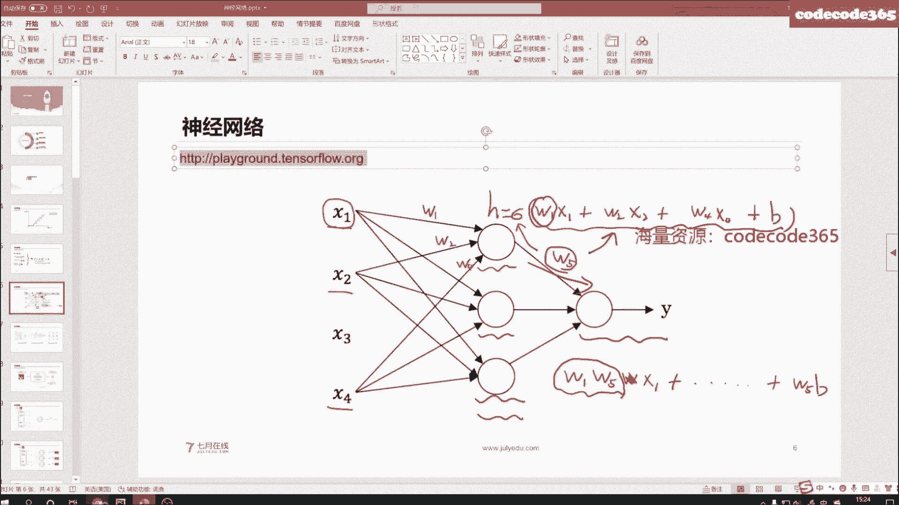

我们可以去看一下啊，我们可以随便选啊，啊这边是有一个数据的一个数据集啊，假设呢我们要分这样的一个数据集啊，可以看到中间是蓝色的点，然后外面这一圈的话是这样的一个橙色的点啊。

我们要把这个蓝色的点和这个橙色的点给啊，区分开啊，分成这个样子，然后这边呢我们会有一些这样的一个，输入的一些数据好，那我们可以给他添加一些这样的一些，输入的一些数据，中间呢就是咱们的这个隐藏层啊。

这边是咱们的输入值，这边是咱们的一个输入值，然后这边呢是咱们的一个啊隐藏层，隐藏层现在的话是四个节点对吧，我这边先去两个啊，我就用原始的X1和X2，这两个输入值作为我们的输入啊。

这边呢是四个这样的一个隐藏层的一个节点，然后这边的话就是咱们那个输出值，因为为什么这里是二呢，因为我们要做一个二分类对吧，我们要把它区分成蓝色节点和橙色节点，好，我们可以这边是可以调整一些超参数啊。

好OK我们执行一下，可以看到啊，这个时候模型就是正在收敛啊，正在收敛，那其中蓝色这一块的话，就是咱们的这个蓝色的点，橙色这一块呢里面就是咱们橙色的点对吧，然后这边呢，我们还可以添加更多的这样的一些层啊。

可以添加更多的一些层，然后这边呢，我们也可以去添加节点的一个数量啊，然后我们也可以再跑一下哎，他也是可以压收敛的，这边我们可以换一下，换成其他的，甚至你可以多加一些特征数据对吧，OK我们再跑一下好。

这边也是进行这样的一个收敛啊，这就是咱们的一个很普通的，这样的一个神经网络啊。

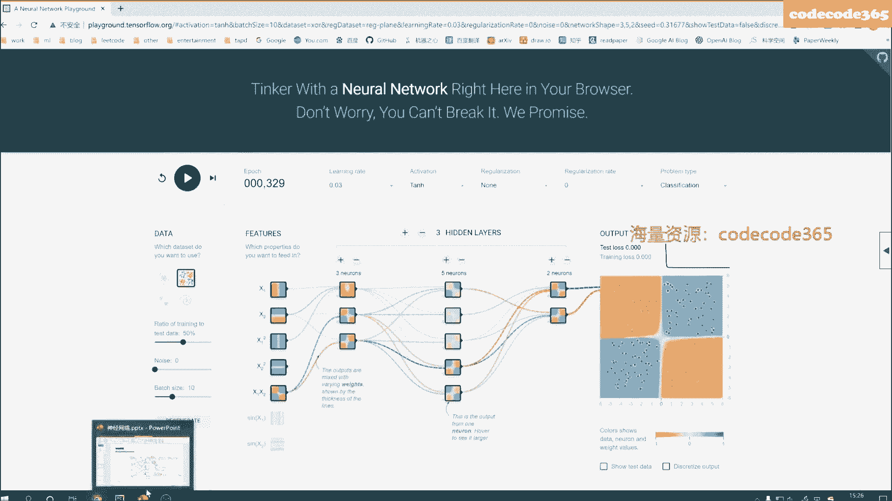

神经网络好，那除了这样的一个最基础版本的，神经网络以外呢，其实还有很多的一些其他的一些，神经网络的一些变体啊，啊例如咱们的这个卷积神经网络，卷积神经网络，还有咱们的这个循环神经网络。

那咱们今天除了给大家介绍这种最基本版本的，这个神经网络以外呢，我们也会给大家去介绍这个所谓的卷积，神经网络，还有循环神经网络，好吧，我们就分别来看啊，我们分别来看好，接下来呢我们来看一个概念啊。

就说如果我现在有了这样的一个神经网络对吧，我该怎么去把我神经网络当中，这些参数给求解出来，什么意思呢，就是说我这里的这些W，我这里不是有很多这样的W吗对吧，那这个W我该怎么求解出来呢。

如果我不知道这些W的话，那你最终你输入这个值对吧，我也拿不到最终的一个结果，所以关键啊神经网络你除了要有结构之外，还要有咱们的这个参数对吧，还有还要有咱们这样的一个参数啊。

也就是咱们这里这个WOK那我们来看个例子啊，看个例子，假设呢我现在要输入一张图片，我要判断一下啊，我输入的这张图片，它到底是个什么动物啊，是个什么动物，那这里呢，我们就把这个图片给到咱们这样的一个模型。

那这个模型的话其实就是两部分组成，刚刚说的这个结构和咱们这个参数啊，结构的话就看你去是怎么构建了，你可以去构建一个啊，普通的这样的一个神经网络对吧，你也可以去构建这样的一个卷积神经网络好。

那当我们把我们这张图片，输入给我们的模型的时候呢，我们的模型啊它会输出一个值，它会输出一个值，那这个值呢表示的是我们的图片的某个类别，某个类别好，这个输出值到底该怎么定义，我们待会再说啊，待会再说。

那有了输出值之后呢，实际上啊我们对于每一张图片，我们都是有真实的这样的一个标签的对吧，人工可以给这个图片打上标签，那对于模型的一个输出结果，和我们真实的这样的一个结果。

我们就可以去计算它之间的这样的一个差值，那这个值呢我们把它称之为loss，loss值啊，也就是说我们的预测值和我们的这个真实值之，间的这样的一个差距有多大，那我们的目标是什么。

我们的目标实际上就是要把这个差距缩小对吧，我们要把这个差距缩小好，那把这个差距缩小，我们就等于是在去，怎么才能把我们的差距缩小呢，说白了就是要去让我们的这个参数变得，越来越好对吧。

越来越适合我们这样的一个场景，我们可以回到刚才那个例子啊，假设我们要让我们的房价预测的特别准，那肯定也得保证我们的这个W对吧，我们这个W尽可能的让我们的这些样本点，和我们真实的这个结果。

它的这个差距最小，那才是最合适的对吧，所以说啊我们就需要不停的去把这个最合适的，或者说最优的这个W给求解出来啊，给求解出来，那这个求解的过程呢，我们通常采用的是梯度下降法，梯度下降法好。

那接下来的话我们就分别来看一下，我们的这个loss和我们的这个啊，梯度下降法到底是怎么回事啊，怎么回事啊，好等一下啊，我们在看这个loss和梯度之前呢，我们先把咱们这个前项的这个流程啊。

我们再简单梳理一下，我们刚才这里说到说哎，我们这里会输出一个这样的一个值对吧，我们这里的话是输出了一个零，那这里这个零表示的是什么意思，或者说我每次输出的时候，我到底应该输出什么东西好。

我们先看这个问题啊，我们先看输出，再看loss，再看我们的梯度下降法好不好，我们先看输出，首先呢我们这边会有一张图片，我们把图片转换成这样的一个数字，那一张图片的话放到咱们的计算机当中。

它实际上就是一个0~25之间的，这样的一些啊，数字的组成的这样的一个张亮对吧，OK那我们可以把咱们这些值啊，首先呢作为一个这样的一个归一化的一个处理，很简单啊，就把每一个值的除以255就OK了。

然后呢我们把我们每个这样的一个输入值啊，给到我们这样的一个神经网络，神经网络，那这个神经网络网络呢你可以去设置多层，也可以设置为一层，你也可以用刚才说的卷积神经网络也好，或者其他神经网络都是OK的好。

那这里啊，假设我们中间已经经过了一系列的一，些神经网络，最后呢我们这边又经过了这样的一层，普通的一个神经网络，最后我们又加上了这样的一个激活函数，激活函数，那这里呢我们采用的是一个叫做SIGMOID。

激活函数，那这个激活函数它有什么作用呢，它是这样子啊，这个激活函数它是这个样子的，我们简单画一下，简单画一下，嗯这是咱们的一个0。50点，他大概是这个样子啊，大概是这个样子，也就是说如果你的这个值啊。

它是就是我当我们把这个值啊，输入给咱们的这个激活函数的时候，它可以输出一个0~1之间的一个值啊，这个最大值是一最大值，最小值的话就是咱们的一个零，它可以输出一个0~1之间的一个值。

那通常啊假设我们要去判断这张图片，它是不是猫，那我们就可以把我们神经网络的输出结果，给到这样的一个SIGMOID激活函数，那这个激活函数如果它的一个输出值大于零，那这个输出值啊它大于零给到我们奇偶函数。

它就会输出一个大于0。5的一个值对吧，那大于0。5我们就认为它属于猫，如果呢他这个神经网络，它的一个输出值差小于零小于零的，那给到我们的激活函数，它输出的值就是一个小于0。5的。

这个时候我们就认为它不是猫，那在我们这个场景当中啊，假设我们最终的结果是0。75，0。75哦，0。730。73的话，它是大于0。5的对吧，所以最终呢我们就认为这张图片，它实际上就是一只猫。

我们就以这样的一个模式，来得到我们的一个输出值好吧，输出值好，我们再简单总那个总结一下啊，输入一张图片给到我们的神经网络，把神经网络的一个输出值给到我们的SIGMOID，激活函数。

激活函数根据它的一个输出值是否大于0。5，来决定它是否是猫，如果大于0。5，我们认为它是毛，如果小于0。5，我们就认为它不是毛好，这就是一个很简单的一个所谓的一个二分类啊，二分类判断一张图片是不是毛好。

这个时候可能会有同学说，那假设我现在不是想去做二分类，我并不是说我要去判断这张图片是不是猫，而是我想知道这张图片它是什么动物，假设啊，假设呢我们这边嗯我们有这样几个类别啊，可能有啊，有狗有猫。

还有咱们的这个长颈鹿，OK我想判断一下我当前这张图片，它到底是狗还是猫还是长颈鹿，那怎么办呢，有一种方案啊，就是说我们可以把我们的这个数，这个神经网络啊，我们可以搞三个节点对吧，刚才的这个神经网络呢。

我们这边实际上就一个节点对吧，那实际上呢我们可以搞三个节点啊，三个节点可以看到这里呢，实际上就分别是三个节点啊，那每一个节点的一个值啊，我们都会经过这样的一个SIGMOID。

都会经过这样的一个SIGMOID，那每一个SIGMOID呢，它都会输出一个0~1之间的这样的一个值，对吧好，那我们还是和刚才一样，假设对于第一个类别哎，他这里实际上想知道是否是dog对吧。

OK那如果要输出一个0。1R，它是小于0。5的，那我们就认为它不是狗这个类别，OK这边0。73他输出是大于0。5的，那我们就认为它是猫的这个类比，那如果他是一个啊，他最后这个是0。04，它是小于0。

5的，那我们就认为它不是这样的一个长颈鹿，那我们最终的结论就是A他是毛，他是毛，那这样的一个方法啊，这样的一个输出的一个方法，还有一个优势啊，还有一个优势，假设你的这张图片里面既有猫又有狗对吧。

那这个时候你去进行输出的时候，你就会发现诶，可能这里它输出的是一个0。6对吧，它是大于0。5的，那这个时候啊，你就会有这张这张图片的一个输出值啊，实际上就也包含dog对吧。

那这就是一种多分类的一种方法啊，多分类的方法，并且它还支持咱们所谓的一个多标签，也就是说我这张图片不单可以进行多分类，还可以得到多个这样的一个输出的一个标签值，好吧，好啊。

刚才咱们这里只给了一个节点对吧，那如果我们想让我们的模型的这个，收敛能力更强一些啊，我们就可以去加一些所谓的hidden layer啊，hidden layer在我们的这个节点之前呢。

我们再去加一些其他的一些层对吧，可以加一个中间层啊，中间层，那这个中间层呢我们就可以继续啊，也是给他一些所谓的一些激活函数好吧，比如你可以在这一层啊，给他加上一个啊。

ten h9函数或者revue的这样的一些九函数，当然这里用SIGMOID啊也是可以的，也是可以的好吧，好那如果我们这个hidden layer，如果我们这个黑灯layer啊，很大，它可能等于很多层啊。

很多层可能十层20层都是OK的啊，那当我们这个层数比较深的时候呢，我们又称我们的神经网络为深度神经网络，也就是咱们所谓的深度学习，好吧，这就是我们的深度学习，深度学习，深度神经网络，好那我们继续往下啊。

继续往下，这是咱们刚才看到的啊，整个这样的一个流程，咱们的一个猫对吧，给到了咱们这个单层的神经网络，然后经过了我们的SIGMOID，最终做了这样的一个二分类，二分类好，那这个是我们的第一步啊。

也就是拿到我们的一个输出结果对吧，拿到我们的输出结果，那接下来我们要考虑什么，刚才说的我们要去计算我们的这个loss对吧，我们的这个输出结果，我们希望它和我们的真实的目标，是越接近越好啊，越接近越好。

OK接下来的话我们就来考虑一下这个loss function，loss function啊，我们考虑一个问题啊，考虑一个问题，对于我们这里的这个嗯这个猫的这个小例子啊，我们实际上是什么，是一个二分类。

二分类好，那我们就以二分类来举例啊，我们以二分类来举例，假设啊啊假设我们现在有这样的一个，我们要求解这样的一个概率值啊，就PY等于1given x好，那假如这个值呢我们用啊y hat来表示。

也就是说什么意思呢，就是说我给我这张图片，X表示我们的图片，我给我这张图片，那它是猫的一个概率，我们用y hat来表示好，对于它不是猫的一个概率，也就是PY等于零，Given x。

那这种时候是不是就是咱们的一减掉Y对吧，这就是我们是猫的概率和不是猫的一个概率，OK那这个东西啊，实际上我们可以把它做一个这样的一个合并啊，简单做这样的一个合并，合并完之后呢。

它实际上就是啊YH的Y次方，再乘以咱们的一减y hat的一键Y次方，那为什么是这样的一个公式呢，我们可以这么看啊，我们把这个公式给带进去看一下，假设我们Y等于一，Y等于一的话，我们看一下啊，啊Y等于一。

Y等于一，那后面这一项实际上就是一减y hat的零次方，那就是一对吧，那我们最终的结果就是y hat，那如果Y等于零，Y等于零，Y等于零的话，那前面这一项就是一对吧。

那我们最终的结果就是一个啊一减掉y hat，那这边是零的话，那1-0的话就是一对吧，那这个东西和这个东西，是不是就是咱们的前面的这个结果对吧，所以呢我们是可以把我们的这样的一个结果啊。

用这样的就把这两个式子啊，用这样的一个式子来表示，那通常啊这个式子呢，实际上就是我们需要去求解的一个目标，那么这个式子呢也称为这个所谓的一个，极大自然估计啊，极大自然估计。

那通常我们会对这个式子啊去做一些处理，就取一个log，取个log，取log，它有什么优势呢，它可以让我们的这个乘法变成这样的一个，加法的一个形式，那最终的话这里实际上就变成了一个Y乘以log。

咱们的y hat，加上咱们的一减Y乘以咱们的这个log，一减YX对吧，这就是咱们的一个啊自然函数啊，自然函数，那我们的目的是什么呢，我们肯定是希望我们的这个指它越大越好对吧，我们肯定是我们先看这一类啊。

我们先看这里，我们肯定是希望对于这样的一个概率值，它越大越好嘛对吧，当我Y输入X的时候，Y等于一的这个值，我希望它越大越好，那X输入XY等于零的时候，这个概率值越大越好对吧，那所以啊。

我们的目标就是让这个东西它越大越好，越大越好，我们要让它大啊，居然让它大，但是我们这里需要考虑一点啊，我们需要考虑一点，如果我们要让它越大越好的话，实际上他是没有上限的对吧，他是没有上限的。

那我们这反过来考虑这个问题，如果我们把它让它变得越越小呢，我们是不是就可以让它，尽可能的把这个值给减小到接近零，那如果它接近于零的，我们就认为它是好的，所以啊我们就把我们的这个自然函数啊。

进行了进一步的一个处理，也就是最终就得到了我们的这个loss function，那我们这个loss function呢，我们的YY就等于，在前面加上了这样的一个负号，在前面加上这样一个负号。

用Y乘以log y hat，这里的话也是继续加上我们的一减Y乘以，他们的log1减y at，那这个就是我们最终的一个loss function，因为我们在前面加了一个负号。

所以呢我们最终就变成了要让他越小越好，越小越好越小，这个过程实际上就是要让它接近于零，接近于零好吧，接近一零好，那这是我们这个啊，单条数据的情况我们考虑一下啊，那通常我们在训练的过程当中。

我们肯定不可能就输入一条数据对吧，我们肯定是要输入很多条这样的一个数据对吧，所以呢我们可以再把这里啊再展开一下啊，所以我们最终啊最终的这个loss function，实际上就等于咱们的一个负的。

M分之1formation，从I到M，咱们里面呢就是每一条这样的一个每一条站的，一个每一条站的一个值啊，一条一条的，这里的话是咱们的IOK啊，再加上咱们的一键YI和乘以咱们的log理解y hi。

这个啊就是咱们最终的这里漏了，最终的一个loss function，Loss function，这里这个M呢，表示就是我们的一个数据的一个量啊，数据量，假设你这里有100条数据，那你应该考虑的是。

把100条数据的这个loss function都要算出来对吧，loss function的指定要给算出来，但是我们肯定不能求和吗，你肯定得去平均，因为求和的话。

你100条的这个loss肯定是没有1000条的，loss多的，我们应该保证这个loss是在，同一个这样的一个级别的对吧，所以呢，我们通常要是要取一个这样的一个均值均值。

这就是我们求解我们的这个loss的一个过程，好吧，二分类求解loss的一个过程啊，求解loss的一个过程，好那讲完了咱们这个lost的求解之后呢，我们再来考虑一个问题啊。

那接下来我们该怎么去更新我们的这个参数呢，嗯我们有哪些参数呢，啊我们再考虑一下啊，对于我们这里这个Y啊，哎对于我们这里这个y hat，我们这里先用好，我们就用啊，我用y head表示吧。

就我我就用Y表示，我就用Y表示，那我们这个Y，它实际上就等于咱们的一个SIGMOID，也是咱们的期望函数对吧，然后里面就是咱们的这个权重，和我们的输入的这个特征，加上我们的一个偏移下好。

这是我们的一个Y那对于我们的这个激活函数，激活函数啊，它实际上等于是11加上一的负Z次方啊，不Z次方，好各位，这是我们的这个前向传播的一个过程啊，那我们刚才也得到了我们这样的一个啊。

loss function对吧，Loss function，Ok，那梯度下降他是在做什么呢，它实际上是这样子啊，假设我们现在的这个loss function，它是这个样子的，假设他是这个样子的。

那我们是不是希望让我们的这个loss，尽可能小对吧，尽可能小，那肯定希望诶我这个loss如果能到这个位置，那对于我们来说，就等于是拿到了一个非常好的这样的一个loss，吧对吧。

那这个时候的loss对应的这个权重啊，也就是W就是我们想要的这样的一个W，但是这样的一个值，我们或者说这样的一个loss怎么整，怎样才能得到呢，这就是需要涉及到我们的这样的一个，梯度下降法，梯度下降法。

也就是说在每一次去更新的一个过程中，我们首先会计算得到这样的一个loss，这样的一个值对吧，那有了这样的一个，loss这样一个值之后呢，我们呢就可以去根据我们的这个loss啊。

去求解我们对应的权重的一个梯度，也就是说我们要去求解，我们的这个W的一个梯度，W的梯度，那这个梯度实际上就等于对我们的这个啊loss，去进行求导就OK了对吧，进行对loss进行求导好。

那求出来我们的这个梯度之后，那梯度是什么呢，举个例子啊，假设我们要求的是这个点的一个梯度，它实际上表示的就是它距离，就是他的这个点的这样的一个切线对吧，他的这样的一个切线，那这个切线的一个位置是距离啊。

咱们最优点它下降过程最快的一个方向，所以呢它实际上就是指引了，或者说告诉了我们的这个啊权重啊，你接下来应该往哪个方向走对吧，接下来往哪个方向走，那好你OK那接下来我告诉你要往这个方向走。

那关键啊你要走多少，这个时候我们就需要引入另外一个概念，叫做学习率啊，学习力，那通常啊我们更新我们每一个权重的时候啊，W实际上是等于W乘以这样的一个啊，贝塔再乘以咱们的这个W的一个权重，这是减号减号啊。

这里这个贝塔表示就是咱们的这个learning rate，学习率，learning rate学习力，这个学习力就决定了你要走多少步，就如果你这个学习力设计的比较大对吧，那他就可能往下面走很大一步。

那如果你这个学习力设计的比较小，他可能就只会走一小步，走一小步啊，这个有什么区别呢，我们这边再画一个图啊，再画一个图，如果你的学习力特别大，他可能最后变成什么情况呢，他可能就变成这样的情况。

这样的情况他是这样子走的，那如果你的学习率比较小呢，他可能就是每次就只走一小步啊，每次就只走一小步，学习力比较大的话，其实啊它不容易收敛到一个嗯比较合适的，或者说loss是比较小的一个点的一个情况。

他可能收敛的没有，咱们这个学习力比较小的时候效果那么好，但是学习越大的话，能让我们收敛的速度变快啊，能让我们收敛的速度变快好，那这整个过程呢就是咱们的这个梯度下降法，梯度下降法好。

我们再把整个流程梳理一遍啊，我们再把整个流程梳理一遍，首先呢第一步我们是有咱们这样的一个输入值，对吧，有这样的一个输入值，然后给到我们的模型model，model啊，给到我们的模型之后呢。

我们拿到我们这样的一个输出值out，也就是咱们，这样的一个结结果输入值给到我们的模型，达到我们的输出值好，有了我们的输出值之后呢，第二步我们就可以根据我们真实的label吧，真实的label。

真实的label，还有我们的这个输出值啊，还有我们的输出值，我这里用来表示这两个值，我们就可以去计算我们的loss，就算我们的loss好，有了loss之后呢，我们可以采用我们的这个梯度下降法。

梯度下降法来得到我们的这样的一个梯度啊，来得到我们的一个梯度来进行我们的反向传播，反向传播，那反向传播的过程中呢，也就是咱们的这个执行梯度下降法的，这个过程啊，那最终呢我们就会去更新我们的这个参数啊。

更新我们的参数，那参数更新好了呢，我们要继续这个循环，继续这个循环又继续走到第一步，好把X给到我们的模型，再得到输出值，好在有了输出值之后呢，再把我们的预测值和我们的标签去计算loss。

而再继续进行BP又更新我们的这样的一个权重，那这个过程呢实际上就是一个持续循环的一个，递归的这样的一个过程对吧，直到啊直到我们认为这个W已经收敛的不错了，或者说这个loss我们认为它已经足够小了。

那我们就认为整个过去训练的过程啊，我们就结束了好吧，这就是我们整个咱们的这个神经网络啊，神经网络在进行训练过程的一个流程，一个流程，好那说完了神经网络这一块呢，那咱们接下来的话。

就来进入我们的这个第二部分啊，我们要进入我们的这个第二部分，接下来我们来看一下我们的这个循环神经网络，循环神经网络啊，我们再看循环神经网络呢，之前呢，我们先来看一下，左边这个普通的一个神经网络啊。

左边这个呢是一个非常普通的一个神经网络啊，那我们先看一下啊，对于H来说，对于中间这个H啊，它实际上等于的是咱们的这个U，我先写个奇函数吧，我们用西格玛表示奇函数，然后U乘以X加上B对吧。

这是我们的一个XH的这样的一个值，那我们这里还有个输出值好，那这个输出值呢实际上也是咱们的cm好，V乘以H加上咱们的B对吧，好，这是我们的这样的一个普通的一个神经网络啊，那循环神经网络是什么呢。

循环神经网络啊，实际上就是在中间这里就加上了这样的一个环，加上了这样的一个环，可以看到啊，他这里额外多了一条路线，这里有这样的一个W的权重，那有了这个W的权重之后呢，我们再来看一下这个H。

那这个H实际上除了咱们的这个U和X对吧，实际上还要再加上一下对吧，还要再加上一下，那这一项呢，哎这也是这一项是什么东西呢对吧，他好像还要和咱们这个W进行相乘对吧，然后和W进行相乘。

然后再最后再加上我们的偏移下，我们才能得到我们的H，OK那接下来我们就来看一下，这里到底应该输入的是什么，是什么，好我们来看一下我们呢在这里啊，把这个环给展开给展开，展开之后呢。

我们实际上会得到这样的一个图啊，OK接下来呢我们就要引入一个概念啊，一个概念叫做时间点，时间点我们用T来表示啊，用T来表示好，我们先看这里啊，这里是XTXT的意思，就是说在T时刻我输入的是XT。

那我上一个时时刻点我输入的是XT减一对吧，那下一个时刻点的话，我输入的就是XT加一，OK那对于我这里这个HT来说，它实际上就包含两个部分嘛，好我们在这里看一下啊，那这里这个HT。

它实际上就是咱们的这个U乘以XT，再加上咱们的这边过来的一个值对吧，这边过来的这边过来的值是什么，是HT减一乘以咱们的W，然后再加上我们的激活函数，还有我们的建议下，就得到了我们HT的一个结果。

好那这个HT减一又是怎么得到的呢，那这里这个HT减一啊，实际上就等于U乘以XT减一，加上HT减二乘以W，加上B加上B也就是说这里这个HT减一啊，它实际上是根据是这个时刻的输入值。

还有上一个时刻的HT减二乘以W来得到的，来得到的，所以啊咱们这里的关键就在于这里的这个HT，和咱们的这个W，那大家可以发现一个问题啊，咱们这里所有的这个W啊，还有咱们这些UV它其实权重都是共享的啊。

可以发现它其实都是同一个值对吧，它是同一个值，那这些权重啊它是共享的好吧，这些权重是共享的，它唯一的不同点就在于它输入不同，它输入不同，那为什么说RN适合用在文本当中呢，大家考虑一下我们的文本对吧。

实际上它也是带有这个所谓的一个顺序属性的，或者说时间属性的，它是从左往右进行这样的一个输入的对吧，比如我爱自然语言处理，那他就是按顺序进行这样的一个输入的对吧，按顺序进行这样的一个输入的。

所以啊我们通常也会使用这个RN来处理文本，就是因为它自带的这个所谓的一个顺序的，一个属性或者说位置的一个属性，也就是说它自带了给所谓的一个position，Position。

position的这样的一个属性啊，好那这个时候可能又有同学会问了，那既然如此，我一开始这个HT减一怎么办呢，是这样子啊，其实一开始啊，一开始的时候咱们这个HT减一呢。

你可以是随机给这样的一个值就OK了，好吧，随机给这样的一个值，好这就是我们的这个最基础的一个RN好吧，最基础的一个RN，但是呢其实大家也可以发现啊，现在RN其实用的并不多，更多的还是这个咱们的这个呃。

嗯RSTM这一块啊啊我们先看这里吧，我们先看这里好，我们先看这里，那这里的话给大家介绍了这个RNRN的话，它其实会有很多种不同的输入和输出啊，我们先一个一个来看，那假设我们只有一个输入，一个输出对吧。

那这种情况，实际上就是我们普通的一个神经网络啊，它就是一个普通的神经网络，普通的一个神经网络好，那假如我们这个RN它有一个输入，以多个输出呢，我们一个输入多个输出，那这种情况实际上是什么。

你可以简单的理解啊，他就类似于在做一些所谓的一个，续写的一个处理啊，就说诶我输入了某个这样的一个啊标题对吧，你去帮我把后文给续写出来，续写啊去写，让我们再来看一下这个many to one。

比如说我输入多个值，但是我只输出一个值，这种情况呢就是最典型的，就是咱们的一个文本分类对吧，我把我整段文本输入进去，你最终帮我输出这个文本，到底属于什么样的一个类别啊，文本分类好，我们再来看一下这个啊。

Many to many，那这种情况呢它其实是有一个错位的啊，它会有一个错位的，那这种情况大家可以看成A，类似于他做一些机器翻译，或者说文本摘要，文本摘要就是说我这边输入的是一个中文对吧。

Chinese，这边输出的这样的一个ENGLISH，翻译，那最终呢最后呢我们再来看一下这个啊，Many to many，这个many to many，和这边这个唯一的区别就在于。

它这个位置是一一对应的对吧，这边的话位置它是错开的，那这种一一对应的话，其实应用场景也很多啊，就是咱们的N1啊实体识别啊，实体识别或者说词性标注，甚至说分词对吧。

这都是一个many to many的一个结构啊，好这就是我们R经常遇到的一些不同的这种啊，输入输出的一些格式啊，大家其实也可以发现啊，这个RN他可以做的这样的一些，基于文本的任务很多对吧。

很多啊很多不同的一个输入输出的话，他做的这样的一个任务，他也是不一样的啊，不一样的，OK那接下来我们再来看一个概念啊，就大家其实也可以发现啊，我们其实RN用的并不多，用的多的其实还是RN的一些变体。

就像LSTM啊，或者说gr u啊这样的一些模型对吧，这些模型我们用的会更多一些，那为什么呢，就是因为RN它有一个非常大的一个缺点，就是它非常容易出现这个，所谓的一个梯度消失啊。

容易出现这个所谓的一个梯度消失，为什么会容易出现一个梯度消失呢，我们这边给大家详细解释一下啊，详细解释一下，当然啊这里这个问题啊，其实也是面试当中会经常问到的一个点啊，所以大家这里要注意听，好吧好。

那假设我们现在有三个是时间点啊，第一个时间点，第二个时间点，第三个时间点，那第一个时间点呢我们输入的是这个X1，第二个时间点输入的是X2，第三个时间点我们说的是X3好，那这边呢会有输入一个H0啊。

这边是咱们的一个W，那这里呢我们就可以得到我们的H1对吧，然后进行一个输出，输出的话，我们这里用用O1表示好，这是咱们的O1K啊，对于第二个节点，我们可以等拿到hr，然后输出结果的话就是我们的OR。

最后的话是我们的这个拿到我们的H3好，这边的话这个节点输出的是我们的O3O3嗯，我们中间的权重呢我们用W表示啊，然后下面这一层呢我们用的权重，我们用U来表示上面这层权重，我们用V来表示啊。

这里大家我再重复说一遍啊，咱们这里这个UV还有W他对于每一个时刻点，他的这个权重啊，它是共享的好吧，权重是共享的，权重是共享的好，那接下来呢我们先去看一下啊，它的一个啊求解loss的一个过程。

它是什么样子的，也就是所谓的这个前向传播的一个过程，它是什么样子的，好我们先看我们一步一步来啊，我们先看这里这个H1，那这里这个H1，实际上就等于咱们的这个激活函数对吧，还是用西格玛来表示啊。

然后X1乘以我们的U加上我们的H0，乘以咱们的一个W，然后还有咱们这样的一个偏移向偏移项，我这里就不写了啊，我们就先简化一下，我们就不写了啊，这是我们的H1的一个值，然后我们再看一下O1。

那我们的OE的值是不是也是这样的一个，奇偶函数对吧，然后H1乘以咱们的一个V，这是我们的H1和O1，我们再来看一下我们的H2，H2的话，实际上也是咱们的一个激活函数，X2U加上H1，然后W对吧。

那对应的我们的O2就等于西格玛H2乘以，我们的V也是我们的H3，H3还是一样啊，西格玛X3U加上hr w，然后这里是我们的O3对吧，O3O3的话，西格玛H3乘以为二，这是我们的一个前向传播的一个值啊。

前向传播的一个值，OK那最终的话啊，假设我们这里是一个假设，我们是一个many to many的一个过程，好吧，嗯many to many的过程，那对于也就是说假设我们现在在最后一个吧。

我们以N2举例子好吧，我们以N2举例子，那与N12举例子的话，那这里我们实际上可以得到A1，这样的一个loss，这里也可以得到第二个glass，这里可以得到第三个loss对吧，第三个loss。

那我们最终的这个loss呢实际上就是，啊咱们的这个13扫描I从1~3对吧，I从1~3，然后LI好，这就是我们最终的一个lost的一个值啊，最终的一个lost的一个值，OK那有了我们的loss之后呢。

我们下一步是要去计算我们的这个梯度对吧，我们要去计算我们的梯度好，我们来看一下我们梯度啊，我们嗯我们取这个L3啊，我们来算L3的一个这个loss，它对应的咱们这个U和V的这样的一个梯度啊。

这样的一个梯度为什么要取L3，不取L1和L2呢，大家看完就知道了，好不好，我们fl3，我们对咱们的这个我们先对V求导啊，我们先对V求导，也是对这个对V求导，那对V求导呢。

首先第一步是不是要先对我们的O3求导，对YO3FO3求导，然后呢，我们的FO3再对我们的这个反V进行求导，这样的话我们就可以拿到这里，这个V这里是U好，这里的都标一下，这里是V这里是U好WW好。

这样的话我们就可以拿到我们这里，这个V的这样的一个梯度对吧，就是L3对应的这个V它的一个梯度啊，它的一个梯度，OK这里很简单啊，这里很简单，就是一个非常简单的一个链式求导的一个过程，非常简单好。

那V求导简单，但是对于U求导来说，它就有点麻烦了，为什么这么说呢，我们来看一下啊，我们FL3对于five这个FU求导，它实际上首先是fl3对于FO3求的对吧，嗯然后呢再加上我们的YO3。

对我们的FH3进行求导对吧，那这里求解完之后呢，我们还得这个FH3，对我们的five这个法U进行求导对吧，法U进行求导好，这样的话我们就把U的导数给求出来了，但实际上我们并没有求解啊，为什么呢。

我们换个颜色啊，我们这里求出来的导数，只是这一条路径上的对吧，只是这一条路径上的，但实际上啊我们这边还有一些U啊，我们这里也还有U对吧，这些U对我们最终的这个L3的一个结果，都有一定的影响。

所以我们的我们在求解U的梯度的时候，还得去考虑这些路径上的一些优，但是有同学就会说，哎，那为什么我这里这个V就只求解这一个地方的，因为这些地方的V，他只对这里的L1和L2造成影响。

他并没有对这里的A23造成影响，所以我们求V的梯度的时候，只需要求解这个V的梯度就OK了，好吧，所以啊当我们求U的梯度的时候呢，我们现在这里啊只是第一个U的一个梯度。

我们还得去求第二个时刻和第一个时刻对应的，这个U的梯度好，那我们就继续加嘛，OK前面的话就还是fl3，five o3还是一样啊，前面是一样的，这里是FO3five h3好，到这里就会有点不一样了。

那接下来的话我们实际上是要走，这边就要往回走一步了对吧，往回走的话，那就是FH3对FH2进行求导，那到这里才是FH2对FU最近求导对吧好，这是第二个时刻的U的梯度，接下来我们看第一个时刻啊。

第一个时刻其实也是一样啊，fl3FO3乘以FO3，FH三YH3YHR，最后这也是FHI对FH1进行求导，然后FH1再对我们的法U来进行求导啊，进行求导，那这到这里呢。

我们整个求导的一个过程啊才结束了结束了，所以说啊对于咱们的这个过程，他其实还是挺复杂的，挺麻烦的对吧好，那接下来我们把他的一些这一块啊，我们可以看一下，就这一块啊。

这里它实际上会有一些这样的一个重复项对吧，这一项它是一个重复的，这一项他也是这样的一个重复项，那这两项呢取决于什么，取决于你的序列的一个长度对吧，假设你的序列长度越长，那你在求解这个U的梯度的时候。

你中间的这一项它就越长对吧，那这里我们可以解呢做一个合并啊，合并合并完之后呢，最终咱们的这个fl t对FU进行求导之后，它的一个梯度实际上就是fl t除以FUT，再乘以我们的FUT除以咱们的发。

这个周末八小时做三哎，等一下啊，这里写错了啊，这里不是U这里是啊，我们的O啊，这是我们的OOT这是O写错了，反OT在对我们的这个啊HT进行求导是吧，HT求导进行求导啊，这是我们前面这一项嘛。

这是我们的前面这一项对吧，那关键是中间这一项，那中间这一项我们实际上啊就可以去对他这个，求机啊，那这里的话我们用下面要用J来表示啊啊，我们从追到T那里面呢，实际上就是咱们的这个FHJ。

在对我们的FH这1-1，进行这样的一个求导对吧，这个呢就是我们中间这一块啊，中间这一块，但是啊这里大家需要考虑一下，我们这里实际上是什么，是有三个部分，是有三个部分对吧，我们这里是有三个部分的。

那三个部分的话，那我们，前面这里前面这一块我们是可以提取出来的嘛，对吧，前面这一块我们可以提取出来放到前面吧，所以呢后面这一块啊，我们实际上还有一个相加的一个过程对吧。

所以我们这里还有一个相加的一个过程，所以这里啊我们还有这样的一个扫描，这里还有个扫描，然后我们这里用用K来表示K，从一到咱们的一个T，那这里这个J呢实际上是从咱们的K加一开始，K加一开始。

那这一项呢就是咱们对应的，咱们蓝色框里的这一项对吧，然后最后是咱们的这个啊，最后这一项啊，最后这一项，那最后这一项呢，实际上就是咱们的这个FHK，在对咱们的FU进行求导就OK了啊，就OK了。

那这个过程就是我们最终的一个这个诶，这里写错了啊，这里是怎么回事啊，这个地方写错了，这个地方就是FU对吧，我在我这写的啥，L对U求导，T对OO对HT好，这就是我们最终的一个梯度啊。

这是我们最终的一个梯度，OK那看到这里之后呢，我们来考虑一下，那为什么说RN容易出现梯度消失呢，我们看一下这里我们看一下这一块，这一块是HJHJHJ减一求导，也就是说他是在对这个链路上进行一个求导。

那这个链路他做了一个什么事情呢，它其实就是一个激活函数对吧，是这样的一个西格玛，我们可以看到啊，他这里会有这样的一个西格玛，那在我们的R或者说在我们RN当中啊，我们通常使用的一个奇偶函数。

要么是这个SIGMOID，要么是这个T，那这两个激活函数它有它有什么样的一个问题，我们可以再简单回顾一下那个SIGMOID激活函数，它是什么样子，他是大概这个样子的对吧，大概是这个样子的诶。

画的不太好啊，这是0。5这个奇偶函数，大家可以看一下啊，他的这个梯度啊，它是很容易就说他这个梯度，它很容易出现一个比较小的这样一个值对吧，他这个梯度也是一个0~1之间的，这样的一个值，他梯度很小。

几率很小，好OK那假设我现在这个梯度，我现在这个梯度假设啊，求解出来它是0。10。1，那我们再假设我们这这个这里这个T，也就是说这是个T啊，假设T等于50，T等于50的意思。

就是说我这个序列长度是50对吧，那我们这里这里就我们这里啊，这一块求解出来的梯度就是0。1的50次方，50次方这个东西是不是就趋近于零，对吧，那你的梯度就会变得很小，你梯度变得很小，会出现什么问题呢。

T6变得很小，你咱们刚刚这里说的对吧，你每一次这个值都特别小特别小，特别现在已经接近于零了对吧，那就等于你这个W就很难去更新，你每次虽然就算你更新100次，1000次，但是你每一次的值基本上都是零。

就等于你这个W没有怎么更新，所以你模型就会很难收敛啊，你的模型就会很难收敛好吧，这就是RN当中的一个所谓的一个，梯度消失的一个问题啊，RN当中的梯度消失的一个问题，那怎么解决这个问题呢。

或者说怎么有没有什么办法能缓解这个问题呢，这就是我们接下来要给大家讲的这个LIST，MASTMAISTM呢，又被称为这个所谓的长短期记忆网络，它能有效的去学习一些长期依赖的关系啊。

也能有效的去啊缓解T6小时的问题，这里不能说解决啊，这里我改一下，这里应该说缓解缓解梯度消失的问题，好，那接下来我们就给大家介绍一下，这个LSTM啊，给大家介绍一下LISTM。

啊第一个图呢是咱们的这个RRN，下面这个是我们的LISTM可以看到啊，RN的结构还是非常简单的，但是对于LSTM来说，里面其实有很多这样的一些计划函数对吧，这里有SIGMOID，有ten h。

这里这个西格玛表示就是这样的一个西格玛啊，西格玛啊，这里我也简单说一下，有同学会说这个ten，这个激活函数是什么东西啊，我这里也简单画个图啊，咱们SIGMOID它是就咱们SIGMOID是啊。

在这个都是大于零的一个这样的一个值对吧，但是呢它其实是关于原点对称的啊，它是这样子的，它是这样子的，它是它是经过原点的啊，画的不太好，它是经过原点的，那SIGMOID的话。

它是全都是这样的一个大于零的值啊，好那接下来的话我们就把这个LSTM啊，展开详细看一下啊，我们展开详细看一下，首先呢LSTM这个模型啊，它额外添加了一个叫做细胞状态的一个东西，它是用C来表示啊。

在我们的RN当中，我们只有一个H对吧，用H那我们通常称这个H叫做hidden state，隐藏状态，隐藏状态，那在我们的这个ISTM当中多加了一个cl state，细胞状态啊。

细胞状态我们这里用C来表示，他其实hidden state也有对吧，在下面这里啊，在下面这里，那这里这个cal state呢，就是这个图当中的上面这一条线，上面的向右的表示的就是sales state。

它传递的一个过程，那这个sales state什么东西呢，我们详细来看一下啊，详细来看一下好，我们先在先看这个sales state之前呢，我们先来了解几个概念啊。

几个概念叫做门LSTM一个比较关键的东西，就是它有一个所谓的一个门的一个机制啊，门的一个机制，这个机制是什么意思呢，我们来看一下啊，就是说LSTM啊，它能决定我当前哪些值需要保留，哪些值不需要保留。

我们可以先看一下下面这里这个例子啊，我们可以先看一个例子，就是说假如我现在有句话叫做他今天有事，所以我当处理到我这个字的时候，我们实际上希望看到的是说，我们这个模型能把我之前的这个主语。

它就是遗忘了就不要了对吧，遗忘了不要了，要保留我对吧对吧，这个时候我们应该更加关注的是我，而不是他那1万门，也是我们LISTM当中的第一步啊，也就是这一块它的作用就是把它这个字给忘了，他是怎么忘了呢。

我们看一下啊，首先呢这是我们的上一个时刻的hidden state HT，是我们当前时刻的一个输入值，我们把当前时刻的一个输入值，和我们上一时刻的这个hidden state啊，进行这样的一个拼接。

拼接完之后呢还是一样啊，会有这样的一个权重进行相乘，再加上我们的偏移下，然后经过SIGMOID的层，刚才说了SIGMOID的层，它是输出一个零一之间的一个值对吧，它输出的是一个零一之间的一个值好。

说白了就是说我这里我这里啊，就是输出这样的一个零一之间的这个值，那如果这个值它接近于一，它接近于一，意思就是说我会把之前的内容保存下来，如果接近于零，就等于是把之前的内容完全就给遗弃了。

那如果他是一个0。20。6，意思就是说我之前的只要保保留20%，保留60%，就这样的一个思路，啊这是我们的一个遗忘门，遗忘门，那接下来我们再来看我们的一个输入门，那刚才我们把一部分内容给遗忘了对吧。

但是上文的其他内容，我们还是得留一部分下来嘛对吧，我们要留，把留下来的内容作为我们的一个输入对吧，作为我们的一个输入好，那怎么作为输入呢，其实也很简单啊，还是把刚才的PDD和当前时刻。

我们的这个输入值啊，先作为拼接，然后给到我们对应的一个权重，好这里大家可以发现诶，我好像计算了两个部分，第一个部分和刚才的一样，它也是一个门，因为它是一个SIGMOID，它还是输出一个零一之间的一个值。

那对于第二部分，我们经过的是ten这样的一个激活函数，大家可以理解为，我把输入和上一时刻的hidden sat，去做了一些非线性的变换，然后呢我就得到了，再把这两个部分啊。

会去做一个所谓的一个相乘的一个操作，可以看到这里我做了一个相乘的一个操作，也就是这里啊T乘以CT德尔塔，那这里这个相乘实际上表示的是什么，就是我CT是我当前时刻的一些输入值对吧。

我这里这个IT是这样的一个门，比如说当前这些东西，我哪些东西要保留下来对吧，这就是我们当前要表保留下来的一些值啊，当前保留下来的一些值好，我们再看这一块，这里是FT乘以T减一。

CT减一是上一时刻的cell state，ft t是我们刚才这里说的1万门对吧，1万门，那这里的意思就是说，我要把我之前的这个ct减一保留下来，多少1万掉多少对吧，所以说啊这里我们进行相乘对吧。

就是这一块这里进行相加呢，就等于是把我们上一时刻经过1万门之后的，一个值，和当前时刻，经过了咱们门之后的这样的一个值，进行了一个融合，这样呢，我们就得到了我们当前新的这个时刻的CD，好吧，好再说一遍啊。

这个FT，第一个FT是我们的之前的一个1万门的，一个指，这里这个T减也是我们上一个时刻的cell state相乘，表示的就是说我要把之前的cell state移忘掉多少。

那后面这一块it是我们当前的这个输入的，这个值，我需要保留多少，那CTTT的话，是当前的输入值的一个非线性变化，这两块相乘意思就是说我当前的输入值，我需要输入哪些内容，保留哪些内容。

最后再把这两者进行相加，意思就是说，我要把之前的上一个时刻的剩余的内容，和我当前的输入的内容进行合并在一起，就是这样的一个意思啊，这就是我们的一个输入门，那这样的话我们就可以得到当前时刻的一个。

cell state啊，cs那有了sale state的之后呢，我们还要考虑一下，我们也还有这样的一个当前时刻的HT，我们还没有算嘛对吧，所以接下来我们就来输出门，看一下我们当前时刻的这个HT唉。

怎么进行计算，好我们看一下啊，他的他的这个思路，其实还是延续，咱们刚才这个门的这样的一个想法啊，首先呢还是把我们上一时刻的health hidden state，和当前时刻的输入进行拼接。

进行非线性变换啊，不是非线性变化啊，经过我们那个SIGMOID的，那，这个时候实际上又是一个0~1之间的一个值，对吧，0~1之间的值好，然后呢我们会把刚才的这里这个值啊。

这个这里我们是已经拿到了这个cell sat对吧，当前时刻的cell sat，我们会把当前时刻的cell state经过这个ten啊，经过ten经过完ta之后呢。

说白了就是把CD做了一个非线性的变换对吧，再和这样的一个门之后的一个结果进行相乘，而作为当前时刻的一个hidden state，作为当前时刻的hidden state。

这里的意思就是说我当前要进行输出了对吧，但是呢我现在有了我们啊上一时刻的这些cl state，然后呢，我是不是应该考虑一下我哪些应该输出对吧，我们这里也可以看一个例子啊，假设啊有这样的一个例子啊。

the cat会说radiate what food，当处理到was的时候，由于前面获取的主语是cat对吧，那我们这里肯定就要用with，那如果我们前面这是cats对吧，如果是cats。

那我们后面这里就应该用were，就是这样的一个意思啊，就这样的一个意思，这就是我们的这个ANSTM的一个输出门啊，输出门，好最后呢我们再来简单看一下，关于为什么LSTM才能解决。

这个所谓的一个梯度消失的一个问题啊，那这里呢是我们的这个啊cal state，它求解这个梯度的过程的时候，它的一个公式啊，它的一个公式，其实大家对比的时候就可以发现啊。

我们这里这个cell state它其实它的一个梯度啊，它是一个相加的形式，它是一个相加的一个形式，那我们这边的这个RN，它是一个纯相乘的一个形式对吧，然后我们再再注意一点啊，他这里啊它有一个FT这一项。

比如说这里这个FT是啥，这个FT表示的是我们这里，这个这里这样的一个值啊，也就是说我们的遗忘门它的一个输出值，那这个值它是个0~1之间的一个值，所以说啊就算你前面这些地方，你都是一些相乘的对吧。

你这些前面那些地方就算成，假设我你这三个部分假设是一个0。0，000001接近于零的一个值，但我最终这个FT它是一个0~1之间的，一个值，是一个0~1之间的值，它可能是0。1，可能是0。2对吧。

当然他也有可能是0。01也是有可能的，但是啊就是因为这里是一个相加的一项，他就就算你前面这些全都是零，我也能保证你最后这个值，它是一个0~1之间的一个值，但是它不会特别接近一零，就以这样的一个形式啊。

来缓解咱们的一个梯度消失的一个问题，注意这里是缓解啊，这是缓解，假设你最终这里这个FT，你求解出来也是一个0。001的一个值对吧，非常接近于零的值，那其实他也没有办法，完全解决这个梯度消失的问题啊。

所以说咱们说的是缓解，好吧啊，我这里这个标题要改一下，缓解缓解，好这就到这里的话，我们就给大家介绍完了这个LSTM啊，我们就介绍完了LST，那接下来的话我们再来看我们的啊，下一个部分啊。

下一个部分咱们的这个卷积神经网络啊，卷积神经网络，好我们来考虑一下啊，就对于RN站的一个模型来说，除了刚才说的这个所谓的梯度消失的，一个问题啊，它其实还有一个问题啊，就是它时间复杂度。

时间复杂度比较高啊，它的时间复杂度是ON，因为它是一个创新的一个过程对吧，它是一个从左到右，它需要一个节点，一个节点的去进行这样的一个处理，它是一个串行的过程啊，串行的过程你序列长度越长。

它处理的时间点就越多对吧，花费的时间就越多，那对于我们的这个文本分类的一个任务来说啊，我们其实刚才也说过啊，我们在这里的时候，我们通常如果要去做文本分类对吧，把每一个词进行一个输入，X 1x2。

一直到XN进行输入，然后要取的是最后一个时刻的一个这个值，用这个out值来进行我们的文本分类，所以说啊他很耗时，那既然如此，我们是有没有可能采用一些并行模型的，一些思路，例如像咱们的一个CN模型对吧。

它其实就是一个并行的思想，咱们的我们来看一下啊，如何使用我们的卷积神经网络，来加速一下我们这个RN的一些缺点，大家可能都会觉得，这个卷积可能更适合去处理图像对吧，但实际上在文本当中它处理的也非常的多啊。

非常的多好，那我们来看一下，如果我们使用这个卷积神经网络，是怎么去处理文本的好，那我们这里假设有一句话，叫做他毕业于上海交通大学这样一句话，那我们分词分完之后呢，它一共有六个词啊，六个词对于on来说。

它实际上每次处理的是一个字对吧，这样哎或者说一个词哎，先输入它，然后输入毕业输入语，再输入上海，ok now啊，那个如果我们使用的是卷积神经网络，卷积神经网络它就有一个优势啊，他可以干什么。

他可以去处理你的这个所谓的，更大力度的这样的一些特征，例如我可以去处理，把这个他毕业于这三个词放在一起，一起去提取特征，毕业于上海三个词放在一起去提取特征，还有最后这样的一个上海交通大学。

我可以把把这三个词放在一起一起来提取特征，但是对于N来说，他就没有办法做到这样的一个情况，那为什么卷积可以做到这个所谓的这种，多词或者短语级别的一个特征的一个提取呢，那接下来我们就来详细给大家介绍一下。

卷积神经网络啊，我们就详细介绍一下，在介绍卷积神经网络之前呢，我们先了解一下什么是卷积，什么是卷积，通常啊我们就称为F乘以G，就是对于F和G的一个卷积，好好像很难理解是吧，很难理解，好不着急。

我们慢慢来看啊，如果我们现在这个是一个连续的啊，如果是一个连续的一个情况，它实际上就是求解积分的一个过程，那如果是一个离散的情况呢，我们就是要去对我们所有的情况啊，去求和求和，但是看完这个公式。

好像还是非常难理解这个卷积到底啥意思对吧，没关系，我们慢慢来，我们可以去看一个例子啊，假设我们令X等于啊，涛比Y等于N卷套，那么X加Y等于N啊，就是下面这条线可以看到啊，我们有这样的一条线，这条线。

那这一条线它实际上就好比什么呢，就好比我们把一条毛巾啊，沿着左下角的这样的一个角，就往右上角去卷，去卷那个卷的过程呢，我们把它称为这样的一个卷积的一个操作啊，这个过程我们把它称之为卷积的一个操作。

我们再看一个离散的一个例子啊，我们看一个离散卷积的一个例子，这个例子看完，大家就能对卷积有一个更直观的理解了，假如我们现在有两个啊，两个桃子啊，这两个桃子呢，我们希望啊扔到的点数加起来是四的一个概念。

就是我们要求解啊，加起来是四的这样的一个概率，那我们用F来表示第一个，用G来表示第二个，那F1呢表示的是投出一的一个概率啊，F2F3的话就以此类推积也是啊，G1的话就是表示我扔出第二个这个投资。

扔出一的这样的一个概率值啊，好那我们就来计算一下啊，计算一下，OK那我们来看一下，如果我们把所有的这个这个这个啊是就相加，它的这个概率，是咱们的这个四的这个投资的这个情况啊，给算一下啊。

首先呢是咱们的第一个骰子，扔到一的一个概率值，要乘以咱们的第二个骰子扔到三的一个概率值，然后再加上我们扔到二的一个概念，分别扔到二的对吧，还有情况呢是我第一个投资扔到三。

第二个投资扔到的是一的一个概率值对吧，我们要进行分别进行相乘再相加，那这个呢实际上就是我们两枚骰子，点数加起来为四的这样的一个概率对吧，好那接下来呢我们把它改变一下啊，改变成我们卷积的定义。

它实际上就是，表示为F4gm再乘以gm，然后前面是一个累加formation，那这个啊实际上就是我们的一个卷积卷积，那再解释一下，说白了他就是先相乘再相加对吧，先相乘再相加，这就是我们的一个卷积卷积。

我们也可以回到我们一开始的这样的一个，离散的一个公式，可以看一下对吧，它实际上就是一个先相乘再相加的一个过程，这就是我们的一个卷积操作啊，卷积操作好，那有了这样的一个卷积计算的，这样的一个概念之后呢。

我们再把这个卷积啊，拿到我们的图像上面来看一下啊，下面呢这里有一张啊，噪点非常严重的一个图片啊，如果我们想去做一个所谓的去噪的一个处理，我们就可以把这个采用一个卷积的一个方式，我们可以把高频信号啊。

以周围的一些数值去做一个平均一下一个处理，怎么做呢，好举个例子啊，假设这是我们的这样的一个图片啊，这是我们的一个图片啊，我们要去平滑这个A1这个点，它周围的这些加速点。

OK那我们就把A11附近的这些像素点啊，全部给取出来，取出来取出来之后呢，我们可以得到这样的一个矩阵F啊，我们的一个矩阵F，接下来我们去定义这样的一个啊卷积核，也就是用积，也就是我们的卷积卷积核啊。

这个卷积核因为我刚才说我们如果去造的话，就是取个均值对吧，那我们就把所有的卷积核的每一个位置，都设置为1/9，然后呢我们再把这个这里这个F啊，和我们的这个G进行相乘再相加，也就是说A00乘以我们的19。

加上A01乘以我们的19，再加上A02乘以我们的19，就对位相乘再相加，最终啊我们对位相乘相加之后呢，我们就可以得到一个所谓的，卷积之后的一个结构啊，卷积之后的一个结果，这就是我们在图像当中去做的。

这个所谓的卷积的一个处理啊，卷积的一个处理，啊这就是我们可以看一下啊，这是我们的一个啊卷积的一个动图，左边呢是我们这样的一张图片啊，中间是我们的一个卷积核，那这个卷积核呢在这里啊。

我们只是对我们图像的这一部分，做了卷积处理对吧，但是你对这一部分做完卷积处理之后，其他地方你其实也需要做卷积处理，这个时候呢你就需要去移动你的卷积核对吧，我们可以看一下啊，我们这个动图是啊。

先向这边先向右移对吧，然后再向下进行移动，你看第一次卷积完了之后向右移一个单位，做一次卷积，再往右移一个单位，再做一次卷积，直到移不动了，我们再往下进行移动，这就是我们完整的一个卷积的一个过程啊。

卷积的一个过程，好那有了卷积这个概念之后呢，我们来看一下卷积神经网络啊，那卷积神经网络，实际上呢就是在寻找最合适的一个卷积核，那刚才我们是要去造对吧，那去噪的卷积核就求均值就OK了，但是我们想一下哈。

如果我们现在是在处理我们的图片，或者说我们在处理我们的文本，我们想去做这个所谓的分类，或者说图片识别对吧，那我们就应该去找到最合适的一个卷积核对吧，那如何去找到最合适的一个卷积核呢。

这个是不是就是我们刚才给大家介绍，神经网络那个部分给大家提到的对吧，先计算我们的loss，要去求解我们的这个季度要进行反向反向传播，更新我们的权重对吧，那在我们这里其实也是一样嘛。

我们的卷积核实际上就是我们的W，我们只需要根据我们的目标得到我们的输出值，要求解我们的loss，再根据loss进行反向传播，就可以更新我们卷积核的一个值对吧，这样的话我们就可以得到我们最合适的卷积和。

啊我们可以看一下这里这个图片啊，啊左边的话是我们的一个输入的图片，右边的话是我们的一个卷积核，右边的是我们得到的一个结果，得到一个结果，然后红色的话啊，我在这里乘以1×0乘以一。

就是我们对应的一个卷积核啊，那右上角这个卷积核和黄色这一块，进行卷积之后得到的结果就是四啊，就是四对位相乘再相加啊，好这就是我们卷积神经网络好吧，卷积神经网络，那接下来呢我们再看一下啊。

如何把这个卷积神经网络，应用到我们的这个文本当中呢，好接下来好，我们这边有这样的一句话啊，这句话我们做了一个分词，1234567好，我们分成了七个词啊，这句话我们分成了七个词，分成了七个字。

那每一个词呢它有对应的这样的一个embedding，就上节课我们去讲那个word vector的时候，给大家讲过吧对吧，就每一个词，我们可以把它转换成这样的一个，embedding的一个形式。

那在这里呢它每一个词的embedding是四维的，四维的，所以说我们的一个输入啊，就是一个7×4的输入，这是7×4的好吧，7×4的，接下来呢，我们就会去定义一个这样所谓的一个卷积核，卷积核。

那这个卷积核它需要有两个维度对吧，第一个维度的话是我们这个序列长度，这个方向的一个维度，第二个维度的话是他的这个embedding，这个维度对吧，这里大家就需要注意一下啊，对于它的第一个维度。

你是可以自定义的，你第一个维度你可以是二，你可以是三，你可以是四，但是对于第二个维度，你必须和文本的embedding这个维度保持一致，也就是说你必须设置为四，为什么呢，假设你的这个维度小于四。

那你这个卷积核它可能是什么样子呢，就变成了这个样子，那你这样的一个卷积核卷积出来，实际上是没有意义的，因为你这个词，你没有把这个词它完整的embedding给加进去，你没有加进去的话。

你这个词的这个语音可能会改变对吧，所以你在做卷积的时候啊，你要把当前这个文本的embedding，全部给包含进去，你才能拿到当前这个文字或者这个词，它完整的一个语义，好吧，这里是关键点啊。

大家必须注意一下，这个维度必须保持统一，第二个维度是多少，取决于你输入的文本的embedding的维度是多少，好吧，好我们再看我们的第一个维度啊，那对于第一个维度来说，就得看你想去取多大力度的一个特征。

就像我们刚才这里给大家举的那个例子，如果你每次想取的是一个字，一个字或者一个词，一个词的特征，那你就设置为一，那对于我们这里，我们这里取的这些是短语，它是三个词对吧，那你就把你的卷积和大小设置为三。

如果你想取两个词，那你就集合大家就设置为啊，所以啊，这就是得到了我们最终的这样的一个卷积核啊，那这个卷积核实际上就是一个3×4的啊，3×4的好，那我们就把这个卷积核在我们的这个文本上啊。

去做卷积的一个处理，最终我们就可以得到这样的一个输出值，这样的一个输出值，第一个输出值的话就是前面三个词，它的一个前面三个词啊，然后这这个值呢就是也是这三个字，这三个字，对于最后这个啊。

就是最后三个词它的一个卷积之后的结果啊，这就是咱们的一个卷积卷积，OK那了解了这个卷积的概念之后呢，我们再来看一个东西啊，对于我们这里来说，我们可以看到啊，我们做了卷积操作之后呢。

我们这个序列长度从七变成了五对吧，但是大家可以考虑一下啊，就有些情况，假设我现在是要做N12，我要做N12，我们的输入和输出必须长度保持一致对吧，那你这里缩短了不行啊，那如何才能保证这个长度不变呢。

我们就可以在头和尾啊去补充一个padding位，就补零，只要补零之后呢，我们这里一开始的这个长度就由七变成了九，但是啊我们经过卷积操作之后呢，它的这个长度就还是七啊，就和我们原来保持一样的保持一样。

为什么它会一样呢，因为我们每次做卷积的时候，就是从这里开始的对吧，我们之前的话是从这里开始的，好这就是我们补padding啊，补padding，那看完补padding之后呢，我们再来看一个概念。

叫做mari channel，处理图像的时候呢，图像它是一个RGB3原色的对吧，所以呢我们通常处理图像的时候，我们会有最少你得准备三个卷积核对吧，分别处理RGBRGRGB的一个通道。

那对于文本来说其实也是一样嘛，你可以多准备几个卷集合，你卷积核准备的越多，你提取的这个特征维度就越多对吧，那这里的话，我们就等于是准备了三个这样的一个群集合啊，三个卷集合。

然后再加上我们的padding，那正常情况来说，我们只能得到一个啊啊77×1的对吧，7×1的这样的一个矩阵，那三个局那个卷积核的话，最终我们就可以得到7×3的这样的一个特征，矩阵三的这样的一个特征好。

这是我们的一个多通道，多通道，好接下来我们再来看一个概念叫做池化操作啊，池化操作，那我们这里多个卷积核，我们呢达到了一个7×3的这样的一个矩阵，但如果我们要最后去做一个二分类对吧。

假设我们要去做文本二分类，你肯定不能给我一个7×3类啊对吧，你肯定得给我一个啊7×1的，或者说7×7的对吧，你不能，总之你不能给我一个多维的呀，我只能给我一个一维的一个向量，我们才能去作为一个分类嘛。

你不能给我这样的一个7×3的对吧，所以呢我们这边就会做一些所谓的池化操作啊，这里呢我们采用的是一个最大石化层，就说我们去吧，当前这个里面啊它最大值给取出来，这一列里面最大值给取出来，这是0。3。

然后这边取出来是1。6，这是1。4，所以最终我们就能得到了一个，一维的这样的一个向量啊，一维的一个向量，这是我们的最大池化层，最大池化层，好那我们接下来看一下啊，这个卷积的这个过程怎么去计算。

我们输入的这个值，经过卷积之后，它输出值的一个维度呢啊我们以图片举例，假设我们输输入的图片大小是W乘以W，我们卷积核的大小是F乘以F，那不长是S不长，什么意思呢，就是说你每次移动多少步。

有的时候呢你可能会移动一步，但是有可能你也会移动两步三步对吧，然后还有一个是padding，Padding，我们用P来表示，OK那假设我们现在不padding啊，如果我们不padding。

那我们的这个输入和输出的一个这个维度，大小呢，这是win的话，是我们的一个输入输入啊，就是输入减掉我们卷积核的大小，再除以我们的S也是咱们的步长加一，就是我们输出解输出的这个啊长度啊。

那如果我们要保持不变的话，那就是我们输入的一个维度，再加上二乘以padding，因为padding你前面要补，后面也要补对吧，所以你要乘以二，然后再减掉我们的这个filter的大小，再除以我们的步长。

再加上一，这是我们的输出的一个维度的大小啊，好到这里的话，我们就给大家把这个卷积神经网络这一块啊，咱们就讲完了，讲完了，今天的话到这里的话，基本上就是要给大家讲的所有的啊，这个理论方面的一个内容啊。

理论方面的内容，那接下来的话，我们就进入到我们的这个实战环节啊，我们给大家介绍了这个卷积网络，又给大家介绍了这个循环神经网络对吧，那我们就来应用一下啊。

应用一下我们进入实战环节啊，实战环节。

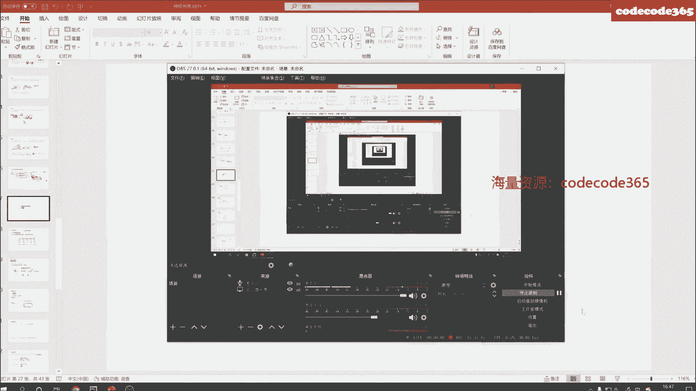

啊，接下来我们来看一个基于LST作战的一个，文本分类的这样的一个小例子啊，看个小例子好，我们把字体调大一点，OK啊我们可以看一下啊，我们从train方法开始看吧，好这个try方法当中呢，首先呢。

我们会去进行这样的一个数据的一个加载，我们会去加载一个数据加载数据，然后呢去啊拿我们的模型，我们先看我们的这个加载数据这一块吧，好吧，我们一步一步来好，呃加载数据这边呢我们是从本地这边啊。

加载了一个这样的一个啊，情感分析的一个二分类的一个数据，我们可以简单看一下，蒙牛真果粒美丽有新意，这是个正例啊，还有什么密密麻麻，孩子不喜欢，这是一个复利啊，嗯总之是个二分类啊。

咱们情感分析的二分类一的话是正理，零的话是咱们的一个复利啊，复利好，那我们就来看一下啊，我们看一下这个load date这个方法，先看一下load date这个方法，首先呢我们去把这个文件给读取出来啊。

然后循环每一行，循环读取每一行啊，今天的代码因为比较多，可能我就没有办法全部带着大家写了，好吧，我们就把一些关键代码会给大家详细讲一下啊，好这边循环每一行代码，那每一行代码呢。

我们这里是根据这个tab键进行这样的一个区分，这样的话我们就可以拿到我们的这个标签，还有我们的文本啊，拿到我们的标签，拿到我们的标签，我们的文本好，那有了标签，有了文本之后呢，我们考虑一下啊。

我们上节课给大家讲这个word faction那块的时候，说过啊，我们需要先构建一个词典对吧，我们需要构建一个词典，那构建词典呢怎么构建呢，首先第一步肯定是需要进行分词嘛对吧，那我们就去遍历一下啊。

我们所有的这样的一个文本，然后把便利出来的文本呢，去做这样的一个分词的一个处理啊，分词的一个这样的一个处理啊，我们这里可以看一下啊，这里是好token nice，这个方法我们去看一下啊，可以看到啊。

这个TOISE呢，其实就是调用了一下结巴的这个分词啊，调用了一下结巴分词，结巴就可以进行分词了啊，可以进行分词，好，这边的话，我们就拿到了我们所有的这个分词的，一个结果啊，这里大家需要注意一下。

这个分词的结果是一个list，然后list里面呢又是list内部的这个list，就是一个一个的这样的一个分词好吧，那接下来呢我们去定义这样的一个词典啊，定义一个词典。

这边呢我们就开始对这个分出来的这个词啊，去进行一个便利，然后呢我们去统计一下每一个词，它的一个词频，统计一下每一个词的词频，统计词频好，统计完视频之后呢，我们去根据这个视频去做这样的一个呃。

降序的一个排序啊，因为我们说过啊，我们要把这个视频比较高的排在前面，视频比较低的排在后面啊，排在后面，这样的话我们就排好序了，排排好序之后呢，我们要来定义我们的一个词典。

这个词典当中呢我们需要两个标记位啊，这个也是在我们上一节课给大家讲过的，一个呢是pad标记位，表示的是我们这个五零的对吧，一个是UNK标记为UNK的话，就是啊OV的一些词，我们就用UNK来表示对吧。

好这是我们前两个词啊，那后面的一些词呢，我们就去便利我们的这个排好序的一个，词典当中，排好序的这个词啊，把这些词加到我们的词典当中，这样的话我们就能拿到我们的一个词典，好，我们这里可以给大家看一下。

我们这个词典是什么样子啊，好稍等一下啊，OK我们把这个词典展开看一下啊，它实际上就是这样的一个字典的一个格式对吧，啊，key的话就是我们对应的这个词，value的话就是它的一个下标对吧。

就是它的一个下标，那我们输入一个这样的一个词，就可以拿到它对应的一个下标的一个值啊，这就是我们的一个词典，这是我们的词典好，那有了词典之后呢，那接下来的话我们就要去做什么事情呢。

是不是要把我们的这个训练的一个数据，先转换成我们的一个下标对吧，我们就要便便利我们每一条数据啊，把这个数据转换成一个下标，好，我们就来看一下这个文本转下标，这个函数它是怎么写的啊，首先还是一样。

我们先分词，分完词之后呢，我们去遍历每一个词对吧，然后根据我们的这个词典get的话，就是根据我们的key把value给取出来对吧，如果取不到，那我就取一个一，为什么是一呢，因为我们UNK表示对应的是一。

所以我们这里是一好吧，这样的话我们就把我们的这个下标啊，给取出来了，取出来之后呢，我们要去做一个padding的一个处理对吧，padding的一个处理好，这里我们也看一下这个函数啊，也很简单啊。

这边先去便利我们每一个句子啊，遍历每一个句子，那如果我们这个句子的长度，是小于我们最大长度的，我们这个最大长度出了个十啊，如果我们这个句子的长度小于了最大长度，那我们就需要补零，补零怎么补呢。

那我们就去做慷慨，把我们的X和零进行一个拼接，拼接多少个零呢，拼接的是最大长度，减掉我们当前文本长度的这个长度的零好，这样的话我们就可以把短的补偿对吧，那我们再看一下啊。

如果我们这个长度它是大于这个最大长度的话，那我们就截取对吧，我们就截取，这样的话，我们就做了这样的一个补偿的一个操作啊，这样的话我们所有的文本的长度就能保持一致，接下来呢我们再把我们的这个输入值。

还有我们的标签给到我们这个啊，Tensor data set，这个DATASET是干什么的呢，大家可以把它看成他就是这个所谓的这样的，一个list的一个格式，只是说这个list当中哈。

它包含了我们的训练数据，也包含了我们的label，好吧好，那有了这个data set之后呢，我们接下来呢需要去定义一个data load，这个data loader又是干什么的呢。

因为我们每次在训练的时候啊，我们的这个GPU的一个显存，是有一定大小的限制的对吧，或者说即使你用CPU跑也是一样啊，是有这个大小限制的，那如果你的这个数据量特别大，你有100万的数据量对吧，你没有办法。

一次性把所有的数据都放到你的这个，显存或者内存里，所以呢我们通常都会分批进行跑啊，采用这个besides的形式，就我们每次只计算一部分的这样的一个数据，那我们使用data load。

就可以生成一批一批的这样的一些数据，那每一批的数据它的数量都是固定的，也就是dbh size条数哈，excite条数，当然他有个输出值啊，就是这个data set。

这个data set就是根据我们的腾讯data set来得到的，那我们把这个东西呢，还有我们big size啊，就给到我们的data loader，就能拿到我们的数据的这个data load。

当我们来便利这个dota data load的时候呢，每次就可以取出有一个BH的一个数据啊，那接下来的话我们就把这个data loader，还有我们的这个vocab进行反馈，也就是我们的训练数据。

我们的词典我们就进行返回啊，返回好，我们再回到哎，我们再回到一开始的地方啊，啊这是我们加载数据的一个代码，这样的话我们就拿到了我们的训练数据，拿到了我们的词典，对吧好，接下来我们来看一下我们的模型啊。

我们的模型我们的模型很简单啊，我们这里用了一个LSTM的一个模型，然后加了两个全连接层，全连接层是什么东西呢，就是我们的普通的一个神经网络，好吧好，我们来看一下我们这个模型是什么样子啊。

其实内容都是我们今天学过的，首先呢我们需要定义这个embedding，这个embedding层是什么东西呢，就是我们上节课给大家讲的这个，Embedding metrics。

就是我们输入一开始输入的是什么，我们输入的是文本的一个下标对吧，或者说一个one hot，我们需要去经过这个embedding metrics，把这个embedding给映射出来对吧。

所以呢我们首先需要去定义这个embedding层，Embedding，这里忘记说了啊，啊很多同学可能都没有接触过这个PYTORCH啊，可能没有接触过PYTORCH。

那我这边先给大家简单介绍一下这个Python是吧，PYTORCH去定义一个模型呢，它非常简单啊，非常简单，如何定义一个模型呢，首先呢你实现一个类，这个类呢需要继承自拍，他这个touch到N打model。

继承完这个类之后呢，你需要重写两个方法，一个是构造方法，一个是forward的方法，构造方法他做的事情是什么呢，准备我们需要用到的参数和layer，就是说我们需要用到哪些参数，你需要去做一些准备。

有需要用到哪些层，你要用RN，你要用CN还是要用LSTM，你就在我们构造方法当中去进行准备，这是我们第一个要写的方法啊，要重写的方法，第二个要重写的方法的话是我们的符号的方法。

这个方法呢就是我们的前向传播，前向传播，这是在什么，在干什么呢，就是把我们准备好的layer拼接在一起，拼接在一起，就你这里准备了这么多layer对吧，那每一层layer他这个数据是怎么传递的。

你需要把它拼接在一起，你才能构建成一个神经网络对吧，这就是我们的前向传播做的一个事情啊，做的一个事情就这么简单啊，Python是构建模型就这么简单，就这么简单，好吧好，那我们回到刚才的内容啊。

首先我们来看我们的构造方法，我们先构建我们的embedding层，这个embedding层的话就是刚才说的，我们要把我们的下标转换成这个，embedding的一个形式对吧。

那这个embedding呢这个EBEDDING层啊，它有两个参数，第一个参数的话是这个词典的一个大小，第二个参数的话就是embedding size，那分别对应的，实际上就是我们上节课给大家讲的这个。

embedding matrix的一个维度，一个是词典的大维度，一个是embedding的维度，所以这两个参数需要传递进来，这样的话我们就构建好了我们的EB0层，然后呢我们这边使用的是LSTM好。

我们就来构建我们的LISTM层，LSTM层，首先的话是你的输入维度对吧。

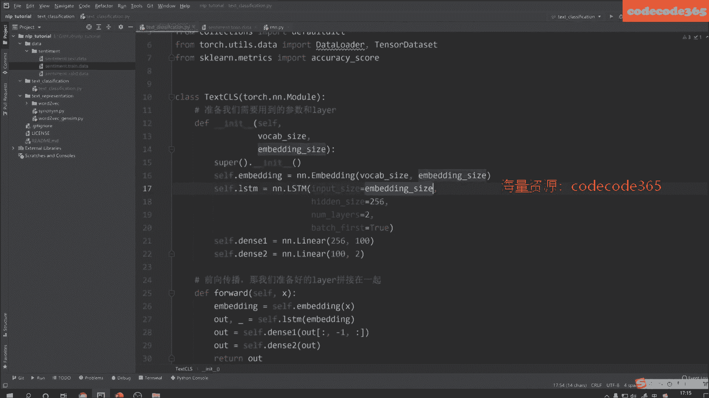

你的这个X对吧，你的输入维度是什么，还有你的这个hidden hidden side，就是你的这个hidden state和咱们的这个sales。

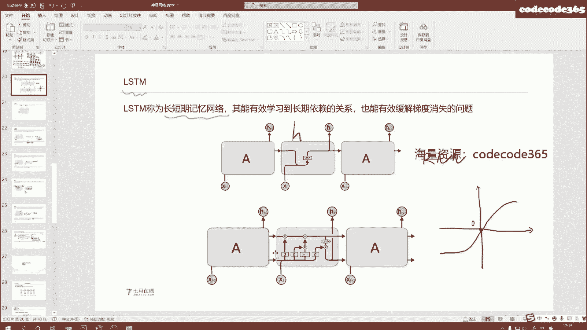

它的维度是多少，这个东西需要定义出来好，然后是这里有个参数叫做number layers，什么意思呢，就是说你要构建几层这样的LSTM。

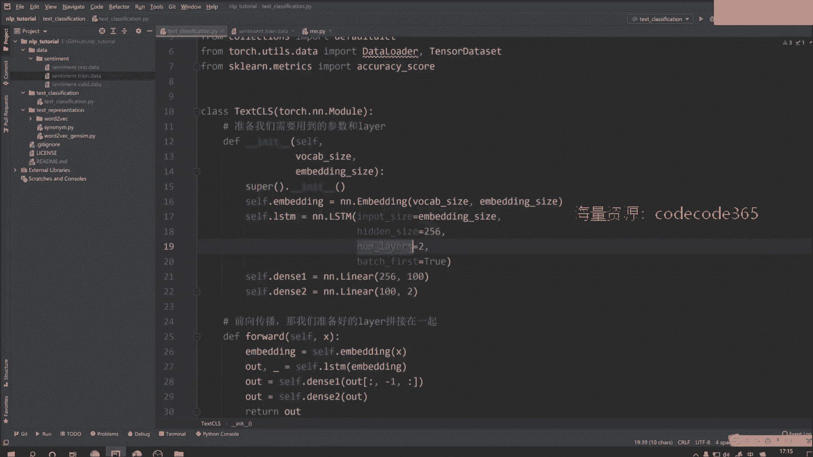

正常的话就是一层嘛对吧，我们实际上可以这样做啊，我们可以啊，诶稍等一下，诶，这是我们的一层，要听我们可以在上面再叠加一层啊，再叠加一层两天，这样的话就是两层的LISTM。

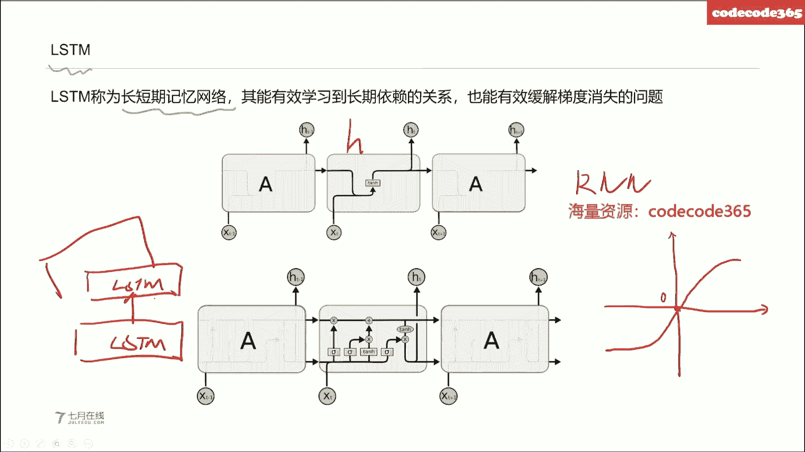

那在我们这边代码当中也是一样啊，我们就设置两层两层，然后这里我们额外还有个参数叫做bh fast first，就是我们把第一个维度设置为这个啊，这个BH的一个维度，它默认第一个维度不是背驰的维度啊。

所以我们这里把它设置为true，那这样的话我们这个维度实际上就是一个维度，是咱们的啊，BESIZE是吧，第二个维度的话是我们的序列的长度，第三个维度的话就是我们的这个啊，输出的一个维度。

也就是hidden size对吧，这就是我们最终AISTM的一个，输出值的一个维度啊，输出值的一个维度好，这是我们LISTM层，最后我们再构建两个全连接层，第一个全连接层的话。

你的输入维度肯定和上一层的维度保持一致，你才能进行计算对吧，所以是这里是256，那这里就是256，然后接下来呢我们给这一层的一个输出维度啊，我们给个100，然后最后我们再给一个啊。

再给一个LINUX层啊，输入位就是100，输出维度是二，为什么这里输出维度是二呢，因为我们接下来要去计算我们的那个and，cross entropy交叉熵损失，所以呢我们这里就输出两个值。

输出两个值去计算我们的cross entropy，好，这是我们的构造方法啊，接下来我们看我们的形象传播，那形象传播的话，就是把我们准备好的layer，去进行一些什么拼接对吧，首先是embedding层。

我们把我们的X给过来啊，这个X是什么呢，这个X就是我们刚才it load date的时候呢，我们把他做了转序列长度，然后补偿之后的这个X啊，我们进行了返回了，只是封装成了loader的一个形式对吧。

但实际上里面还是这样的一个下标，并且做了补偿对吧，所以这个东西呢，待会呢我们就会把它传递进来啊，传递进来就先给到我们embedding层，拿到我们的embedding。

再把embedding给到我们的LISTM好，这也是我们的重点啊，这也是我们重点，我们可以去看一下LISTM的代码的说明，嗯我们看一下它的output，output的话，它包括两个部分，一个是输出值。

还有一个是HN和这个CN，HN的话就是我们的hidden state，CN的话就是刚才说的这个sales state，那我们其实不需要后面这两个东西，我们只需要output对吧。

我们只需要他的输出值输出值，所以呢啊我们这里就用这个用这个符号啊，就表示刚才这里的eden state cal state，我们不需要啊，我们不需要只需要他的输出值，那这个输出值的维度啊。

就是这个which size序列长度state。

那我们现在要做的是什么，做的是文本分类对吧，我们文本分类刚才我们有个这样的一个图，它是一个many to one的一个形式。

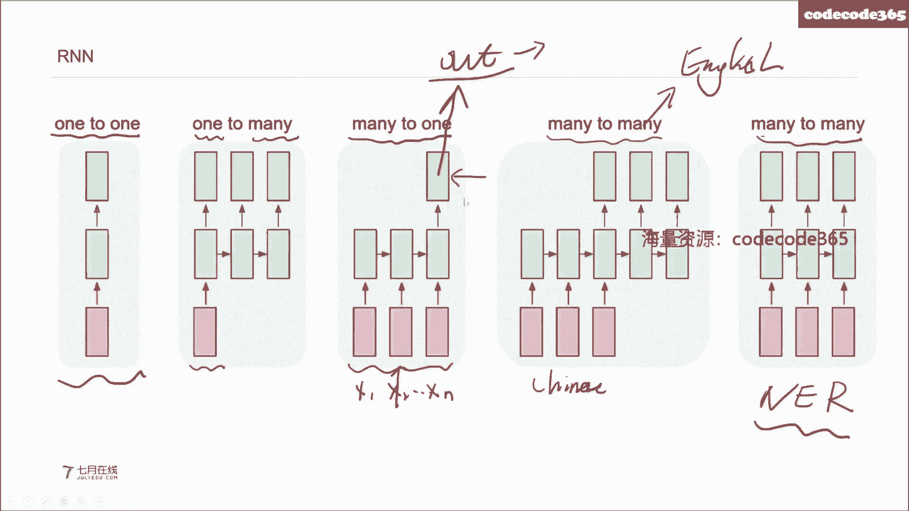

并且我们取的是最后一个时刻点的一个输出值，对吧，所以啊。

我们这里应该取的是最后一个时刻的输出值，最后一个时刻怎么取呢，是不是就是一这两个维度的话，就是就全曲，为什么是全曲呢，因为besides你要全取吧，Peter size，你要全取唯独序列长度对吧。

我们要取最后一个字，那就是一好，这样的话我们就可以把最后这个时刻的值啊，也就是这个值这个蓝色框的值就取出来了，我们就给到我们的全连接层，给完全连接层之后呢，我们再给到第二个全连接层层。

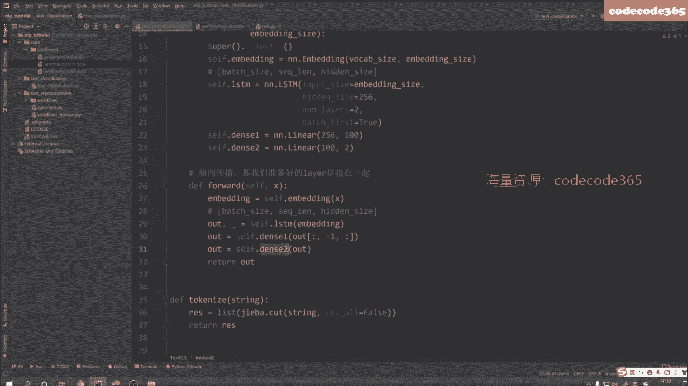

然后再把结果进行输出，这就是我们构建的一个神经网络啊。

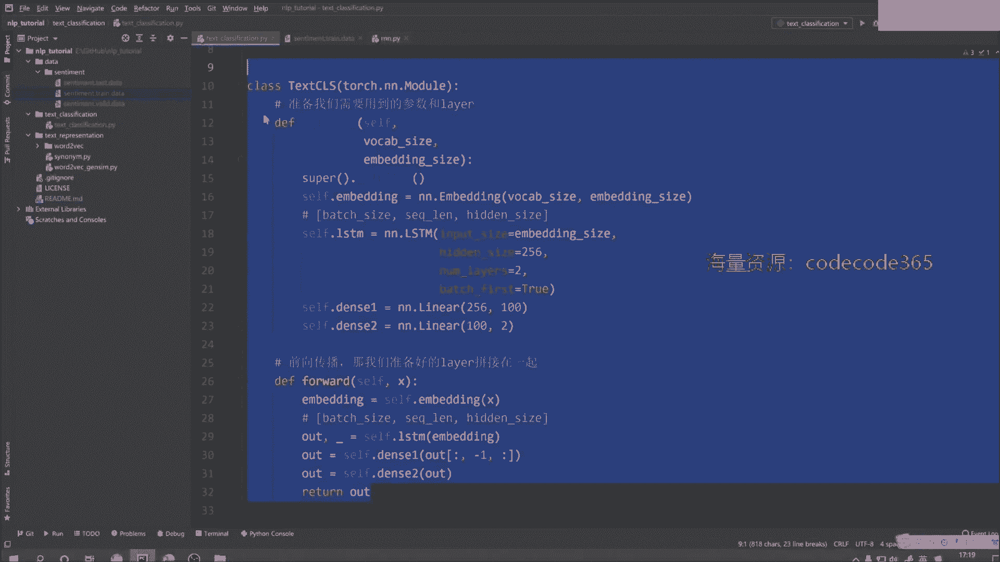

神经网络好，我们的模型就准备好了，我们再回过回到这边啊，有了数据，有了模型，那接下来就是开始进行训练了对吧，接下来开始训练训练好，训练过程呢，我们这边啊首先去定义我们的这个优化器。

优化器这个优化器是什么东西呢，这个东西大家可以理解为。

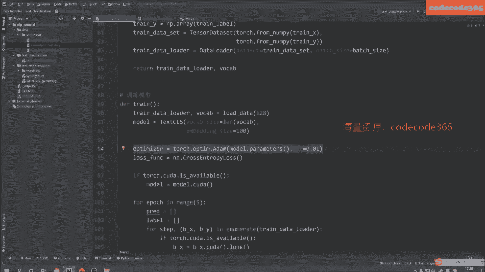

就是我们在求解这个进行啊梯度下降的过程中，我们不是要用这个W减掉这个学习力，再乘以我们的这个梯度对吧，那这个东西呢就被这个过程啊。

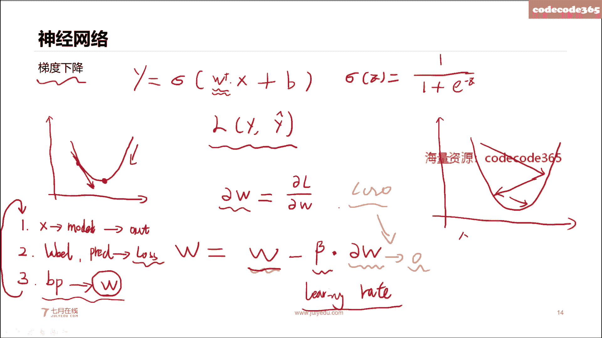

我们就采用了这个所谓的一个优化器，但不同的一个优化器啊。

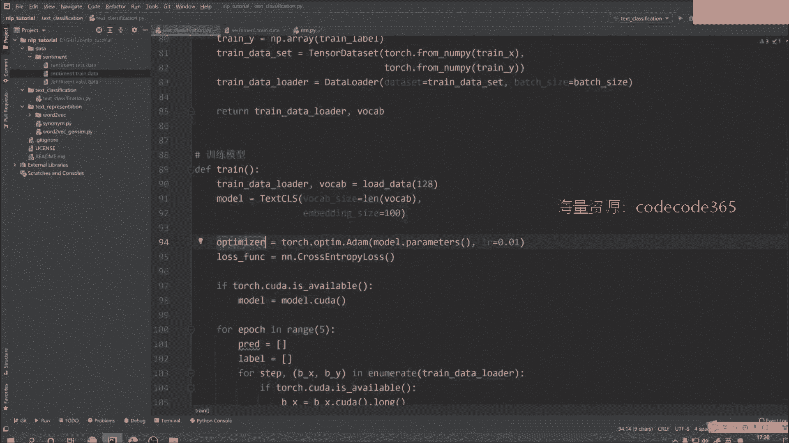

它会有针对于我们这个梯度下降，会有一些更多的一些优化方法。

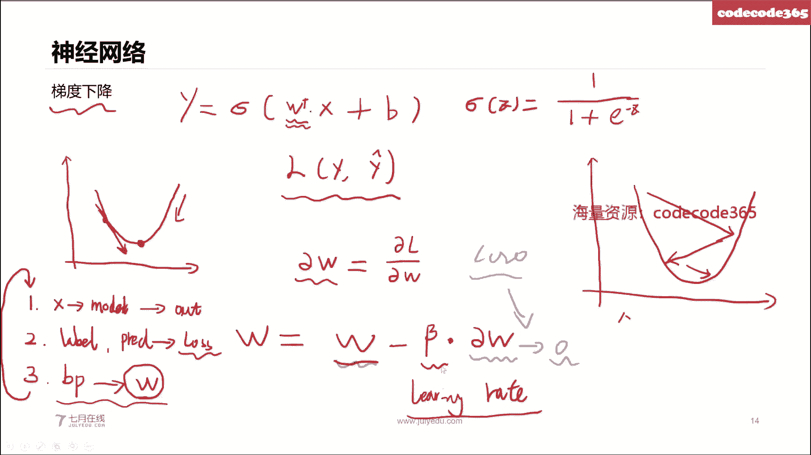

那我们用的这里这种方法被称为这个梯度下降，这是个随机梯度下降法，就是咱们有这个SGD，我们有可以给大家看一下啊，有这个touch点，有GDGD，SGDSGD的话就是我们的随机梯度下降法。

就是我们对一个位置的数据啊，去采用我们的梯度下降法，那ADAM呢，就是在SGD的基础上，去做了进一步的一些优化啊，让他收敛的更好一些，或者说收敛的速度更快一些啊，更快一些。

那我们啊这里这个原理啊我们就不展开讲了，大家大家感兴趣的话，可以下来搜索一下相关的资料啊，好，那我们这里就去定义一个这样的一个优化器啊，这个优化器呢需要去优化，我们当前这个模型里的所有参数对吧。

并且学习率我们要设置一个啊，就设置为我们这里设置为0。01，接下来我们去定义我们的这个loss function。

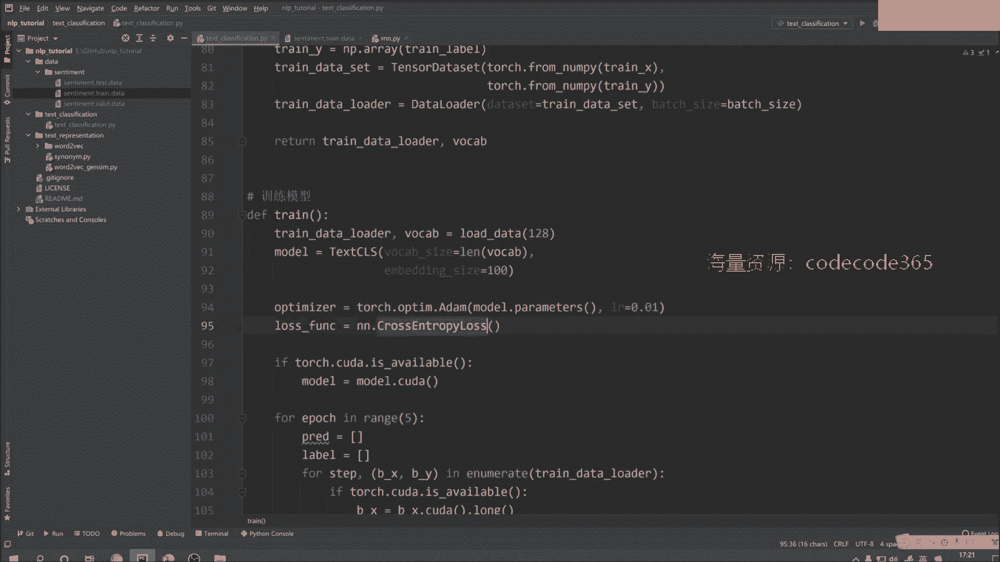

Loss function，像我们这里这个例子对吧，这里这个例子啊，我们采用的是这个binary cross出品，它是一个二分类的一个交叉熵损失对吧。

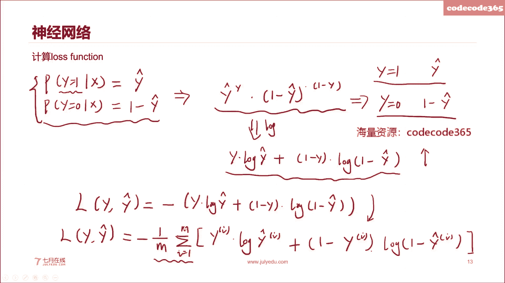

然后我们这里呢就采用普通的cross entropy啊，其实你用BO cross roy也是一样的好吧，都是可以的，好优化器，有了cross function我们也定义好了。

那接下来呢我们就可以进行我们的训练了对吧，这边呢这个代码什么意思呢，就是说我们要把我们的模型啊，如果你的QA是可用的，就把模型放到我们的GPU上，好，这边我们跑五个apple啊。

好每个apple的时候我会去便利我这个data loader对吧，我们这个data loader，那便利data loader的时候呢，我们就可以把每一个batch size的数据给取出来。

取出来之后呢也是一样啊，要放到GPU上，对于我们的标签也是哈，我们把它放到GPU上面，OK那X呢我们就给到我们的模型，给到我们的模型，给到我们的模型呢，实际上就是去执行我们的服务的方法。

就可以得到我们的输出值，好得到我们输出值之后呢，我们就可以去去他的augment x，来得到我们真实的一个标签，让我们把真实的标签啊存到我们这个list当中，然后这是我们的label label。

我们也存在这个list当中，接下来我们把我们的输出值啊，和我们的这个真实的label啊，去算一下我们的loss loss值，算完这个loss值之后，我们就有了loss对吧，有了loss好，首先第一步。

我们把我们优化器当中之前的梯度啊，先清理清理，因为在PYTORCH当中啊，这个优化其它会保留之前的一个梯度，你如果不清零的话，他这个梯度会累加，所以我们在进行更新梯度的时候啊，要先把这个七梯度清零。

清零之后呢。

我们去进行反向传播，反向传播是在干什么，就是在去求解咱们的这个梯度啊。

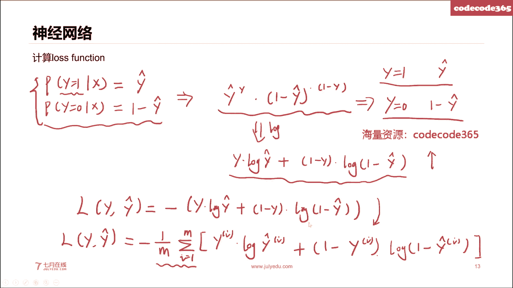

就是在求解FW在求解我们的梯度，那求解好梯度之后呢，我们再执行我们的这个optimizer的step方法，就可以去进行反向传播更新我们这里的W好吧。

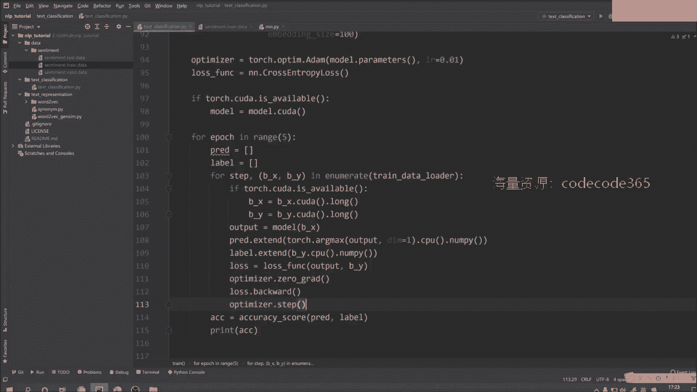

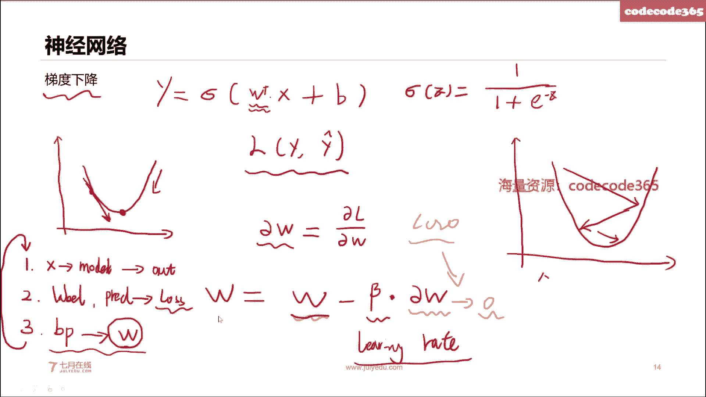

这里就是在更新我们W这是在求梯度好吧，这里可以给大家写一下，这里是在求解梯度，这里是在诶更新我们的权重好，这样的话我们这个就是在一个循环的一个过程，对吧，这是我们循环的一个过程。

最后的话我们每跑完一个boss，我们就去求解一下这个准确率，准确率，最后我们把代码执行一下啊，把代码执行一下，整个流程就是这个样子啊，整个流程就是这个样子，好稍等一下啊。

O这第一个IPOD是67的准确率啊，啊我们跑了五个epoch之后，准确率就很高了对吧，已经90多了啊，90多了，这个就是我们整个使用这个啊PYTORCH啊，构建这样的一个LSTM。

来做咱们的这个文本分类的，这样的一个小例子啊。

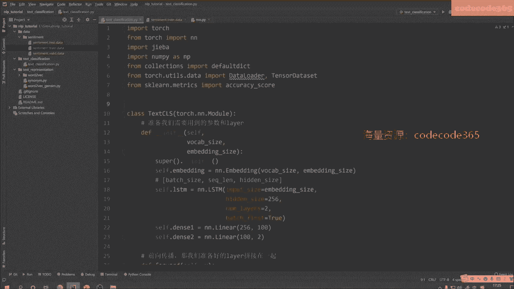

小例子好吧好，最后的话我们在对今天的一个内容啊，建做一个简单的一个总结啊，今天的话，首先呢我们给大家介绍了这个神经网络对吧，包括什么是神经网络啊，神经网络啊是怎么去求解它的一个输出值的。

要怎么求解我们loss，那有了loss呢，又怎么去进行我们这个权重的一个优化和更新，对吧，那知道了这个什么是神经网络之后呢，我们又进行了一些扩展，给大家介绍了文本当中用的比较多的，这个循环神经网络。

循环神经网络的话，它容易出现这个所谓的梯度消失的问题对吧，所以呢我们引出了这个LISTM，那除了这个循环神经网络，它可以处理文本，其实呢卷积神经网络啊，它也可以处理这个文本。

那我们又从卷积的角度去给大家介绍了，如何去处理这样的一个文本对吧，包括卷积，什么是卷积，什么是这个卷积神经网络，再到我们如何在文本上去处理我们的啊，用卷积网络处理文本对吧，最后呢。

我们又给大家去取得这样的一个实战环节啊。

去构建了这样的一个，基于LISTM的一个文本分类模型，文本分类模型好的，那咱们今天的内容啊基本上就到这边了，到这边了，今天的内容还是蛮多的啊。

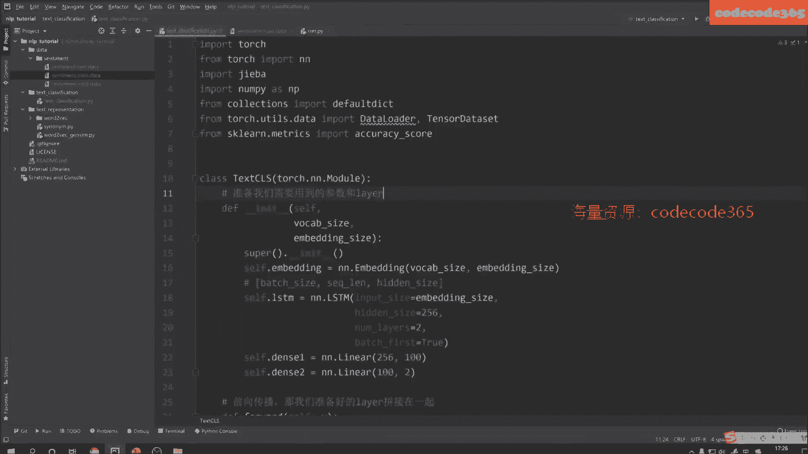

蛮多的啊，大家下来就多花点时间去啊复习一下啊，特别是这一块啊，就这个RN为什么会梯度消失，这一块这一块是非常重要的啊，基本上面试的时候是绝对会问的好吧，绝对会问的绝对会问的，嗯好行。

那咱们今天的内容就给大家介绍到这边了，后续大家如果还有什么疑问的疑问的话。

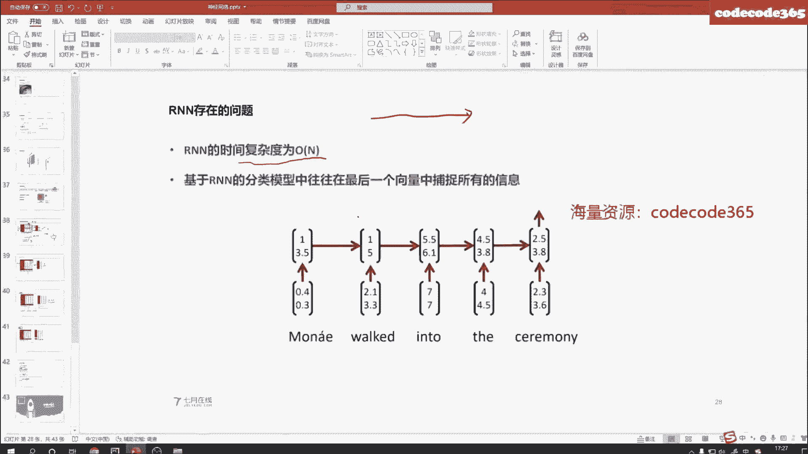

欢迎在这个群里面找我进行啊咨询，好吧好，那咱们今天的课程就到这边好。

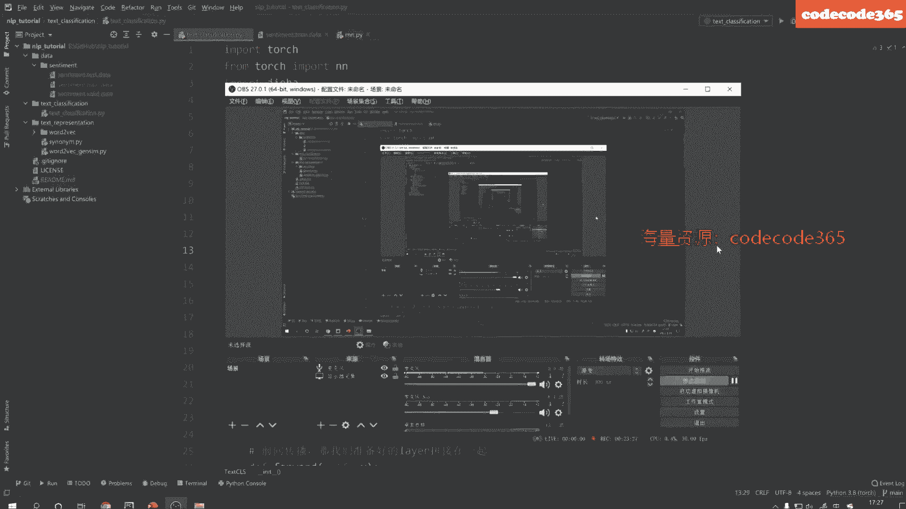

