# 【七月】NLP高端就业小班10期 - P3：3.基于CNN的文本分类_ev - 不看兵法的数据分析师 - BV1BC4y1C7E5

好刚好啊，对于昨天的课程，各位同学有没有什么疑问的，现在可以提一下，我们在开课之前先简单做个答疑，看昨天的内容，各位同学有没有什么疑问，有问题吗，各位同学，都没什么问题是吧，好行吧。

那我们就继续开始今天的内容吧。

好啊，今天的内容是，这个我们是使用卷积神经网络来处理，咱们的这个NLP的一个问题啊，好我们简单看一下今天的几部分内容啊。

今天四个部分内容啊，首先第一部分的话，是要把昨天我们这个没有讲完的，这个transformer那个部分咱们再讲一下啊，把剩余的一部分给补充完，然后第二点的话是啊，这边之前额外加了一点内容啊。

就是很多同学会来问啊，就是说啊如何去阅读这样的一个论文啊，这边的话我也给简单的给一下，自己的一些建议啊，而第三点的话就是啊，进入我们今天的一个重点啊，就关于卷积卷积神经网络这一块。

就包括什么是卷积神经网络，然后在这个咱们LP当中，如何去运用这个连接神经网络，好吧，这就是咱们今天的一个内容啊，好那我们就先进入我们的这个第一部分啊，关于这个transformer的这个补充啊。

对于昨天这个刚才有同学可能还没进直播间啊，我简单提一下，就对于昨天上课的一个内容，如果还有疑问的地方，现在可以提出来好吧，我们可以解决解决一下啊，好，那我们来看今天的这个transformer。

这一块的内容啊，昨天讲到了这个嗯，Mari head，腾讯这一块对吧，Mari head，腾讯这一块好，那接下来我们就来看一下啊，他的这个transformer当中的其他的一些结构。

OK我们把这个encoder部分单独拿出来，看一下，这个self attention这一块呢是我们昨天已经讲过的，在接下来的一个结构当中可以先看一下啊，首先呢是这一个部分，它这里有一个X加上Z。

这个Z的话，就是经过我们这个self attention得到之后的一个，结果对吧，那这个X是什么呢，X是我们一开始这个输入的这样的一个值啊，X是我们输入的这个值，那如果是第一层，第一层。

那就是我们的这个文本的这个，embedding的一个结果对吧，那如果是后面的层，那这个表示的就是每一层这个encoder，输出的一个结果好吧，因为咱们的这个transformer啊。

它通常都是有多层的这个decoder啊，这个decoder它是这样子的，多层的它是多层的，第一第二第三它是多层的啊，对于第一层的话，传给第一层的是咱们这个embedding，那传给咱们第二层的。

其实就是第一层的一个输出对吧，所以这里是个X啊，如果是第一层就是embedding，第二层的话就是上一层传递过来的一个结果，那这里可以看到啊，他是用这里这个X加上了这里这个Z，那这样的一个操作呢。

就被称为这个所谓的残差模块啊，残差模块对应到咱们的这个图当中啊，就是这个位置啊，ADD ADD好，那做完这一步呢，他会做这个layer normalization，Layonalization。

这个LAYONALIZATION又是什么东西呢，它其实就是在做一个所谓的一个规划规划，那这两步呢通常都会啊放在一起啊，就被称为这个AD and NO，OK那经过这两步之后呢。

就会拿到我们这样的一个输出结果对吧，输出结果呢给到我们这个fateful world层，那feed forward层，昨天和大家说过了，这个实际上就是可以简单的看成，就是这样的一个全连接层，全连接层好。

那经过这个全连接层之后呢，又继续给到了这样的一个ADAMN，也就是刚才这里说的这个残障模块，和这个没有MALIZATION，那整体的这个encoder的一个结构就是这个样子。

那最终呢实际上就是多层的这样的一个encoder，堆叠在一起，那具体你要去堆叠多少层，就看你自己的一个选择了好吧，那像我们自己啊，比较常用的这个预训练的语言模型，BERT这个模型。

它实际上就是这个encoder堆叠了12层好吧，12层就搞了12个这样的一个encoder，堆叠在一起啊，堆叠在一起，这个大家需要注意一下啊，BT这个模型是transformer encoder部分。

好吧，它只包括encoder部分，这里很重要啊，好这是我们内部的一个结构，好，接下来我们就详细看一下这里的这个啊，残差模块，还有这里这个LEONALIZATION。

那后面的这个fateful world我就不说了好吧，全连接层这个相信各位同学都很清楚了啊，嗯好那我们就先来看这个残差模块啊，那通常上来说呢，我们再去训练一个模型的时候，理论上来说网络的这个越深的话。

理论上来说，它能提取的这个特征应该是会更强一些对吧，而且模型如果越深，它能承载的这样的一些特征值就越多，但是啊啊在之前的一些实验当中，特别是在对这个RESNET做一些实验的时候，大家发现一个问题啊。

当这个网络变得特别深的时候，它会容易出现一些所谓的退化问题，退化问题我们可以看一下下面这个图啊，对于左边这个图啊，纵坐标是一个训练集的这个错误率啊，可以看一下，对于这个20层的这样的一个网络结构来说。

它反而错误率会低一些，56层的反而高一些啊，可以看到20层的第一集对吧，要在验证这个测试机也是一样啊，20层的这个测这个错误率会稍微低一点，56层的错误率会更高一点。

就感觉和我们的这个常识好像是有违背的对吧，理论上来说你越深效果越好啊，那这就是所谓的一个退化问题啊，那为了去解决这个退化问题呢，就有就有提出了这个残差网络，残差网络。

那为什么会出现这种所谓的一个退化问题呢，其实这个东西啊就可以啊，我们可以回忆一下，昨天我们讲RN的时候，其实当我们去做一个很长的一个，序列的特征提取的时候，那他很容易出现一些所谓的一些。

类似梯度消失的一些问题对吧，那你梯度如果发生了消失，那你有些层其实更新的就不好对吧，你参数更新的就不好，那你模型其实收敛的效果就会变差，那这个其实就是所谓的一个退化问题啊。

那残差网络它是怎么解决这个问题呢，我们来看一下啊，残差的主要的核心思想，就是让训练变得更加简单，这个大家需要注意啊，就是让训练变得更加简单，我们可以看一下下面这个图，首先呢我这边输入的是一个X。

然后经过了这样的一层，然后再经过一个real这样的一个计划函数，然后又经过了一层这样的一个神经网络，最后进行一个输出，那正常情况来说的话，我们就是输出我们的FX对吧，我们把FX进行输出。

那残差它是怎么做的呢，他会把我一开始的一个输入啊，再给他一条捷径这样的一条捷径，同时把我们的输入给到输出的位置，把输入和输出进行这样的一个相加的一个处理，相加的一个处理，那为什么要这样子做呢。

我们其实可以考虑一下啊，假如我们现在输入的这个X的值它是十，假如输入的是十，X等于十，那我经过一系列的网络之后呢，那他这个差值实际上就是0。10。1带，我们去求解，这个也就是说我们的一个输入和输出。

其实相差的是特别小的，相差的特别小的，这个时候我们来求这个梯度的时候，实际上就很容易出现一些梯度过小的一些情况，从而类似于梯度消失的情况发生，那如果我们把原来的一个输入，和咱们的一个输出都合并在一起。

最终就变成了这样的一个20。1对吧，就变成了这样的一个啊20。1的情况，20。1，那我们这个时候的差值实际上就变成了十对吧，那这个时候我们再来求梯度的时候，就会更大一些啊，所以说残差的一个思想。

就是说我会给你一条捷径，给你一条捷径，并且啊在我进行反向传播的时候，我也可以走这一条捷径，去求解它的这样的一个梯度，好吧，就以这样的一个思想啊，来控制我们这样的一个梯度，不要让它变得太小。

出现这种所谓梯度消失的一个情况啊，这就是我们的一个残差模块啊，残差模块那应用到我们的这个transformer当中，也是一样的道理啊，那我经过了这个cf attention之后呢。

我希望你这个收敛的时候啊，这个梯度回传的时候更顺畅一些对吧，所以呢这里就添加了这样一个残差模块啊，残差模块，OK那残差模块之后呢，又添加了一层这个LEONALIZATION。

这个时候可能各位同学开始以后，这个LEMALIZATION它又是干什么的，好我们来看一下啊，在说LEOMALIZATION之前呢，我们先来说这个normalization好吧。

Normalization，normalization的话，它其实有很多种，但是它们都有一个共同的目的，就是把输入转化成均值为零，方差为一的这样的一个数据，均值为零，均值为零，方差为一，均值为零。

方差为一，所以说我们实际上就是要把数据送入激活函数，之前呢，进行这样的一个规划，大家可以考虑一下啊，那假如我不去做这样的一个归一化的一些处理，我直接给到后面的一些层，那假如我现在不做过优化处理对吧。

我们都知道我们在上节课去讲那个呃SIGMOID，还有tech的时候，我们都会发现一个问题啊，他的这个梯度一旦这个值太大或者太小的时候，就会容易出现一些所谓的一个梯度消失的情况，对吧。

就看就像下面下面这个图，就是SIGMOID的这个激活函数，右边的话，这个是TX的一个激活函数，的梯度的这样的一个图，当你这个值稍微大一点点对吧，就容易出现一些梯度消失，或者说梯度爆炸的情况。

那这个时候啊，我们就可以考虑去做一个所谓的规划，做完归一化之后呢，我们让它的均值为零，方差为一对吧，那最终它的这个值就会聚集在这个这个区间内，聚集在这个区间内对吧，这边也是啊，聚集在这个区间内。

那这个区间内的一个值，你去求解它的这个梯度的时候，可以看一下，这些梯度其实就很大了对吧，这个梯度很大，这图梯度很大啊，梯度很大，就不容易出现所谓的一个梯度消失的，一个问题啊。

啊这就是LEONALIZATION的一个作用，那LEONALIZATION呢比较常见的是两种啊，一种是这个BATIONALIZATION，那这个batch normalization。

是在每一个batch上面去进行，这样的一个normalization的，是什么意思呢，这个同学可能也有同学啊，这个在beach这个维度上面去做什么意思呢，好我们这么看啊，我们这么看，那假如我现在好。

我们先从这个机器学习的一个角度来理解啊，从机器学习的一个角度来理解，假如我现在有一条样本，这个样本呢它包括了很多的一个特征，好吧，我假设我用X来表示特征，它可能有X1X2X3X4，还有四个特征啊。

还有这四个特征，这是第一条样本，这是第一条样本，那对于第二条样本来说，它也会有对应的X1这个特征，X2X3X四好，我用二再加个商标了啊，这是一，好它是这个样子的啊，那这个样子。

那如果是对于第三条样本的话，也是类似啊，也是LH，也是类似那个BALIZATION，他去做这个LEONALIZATION的时候，他是怎么做的，他是在换个颜色的笔，他是在这个维度上面去做啊。

他是在这个维度上面去做，所谓的一个归一化这个维度去做，这就是我们的，Realization，那对于LAMALIZATION它是怎么走的，Lu normalization，它是在这个维度上面做的。

但是在这个维度上面做的话，好那可能有些同学就会问，那为什么我们的这个处理文本的时候，我们要去使用这种LEONALIZATION，那我处理文本为什么不能用RELATIONALIZE，我们考虑一下啊。

那假如我们现在是两条文本，那对于第一条文本来说，对于第一条文本来说，它可能长度这里是四，那对于第二条文本，假如它的长度是五，那我们就需要在这个啊把这条这两条文本啊，进行这样所谓的一个补偿的一个处理。

也就是说我需要把我的这些输入的数据的长度，做成统一的，假如啊，我设置了一个叫做序列最大程度的一个参数，这个参数呢假如我设的是五，假如设的是五，那对于长度比较短的。

那第一条文本我们就需要在它的结尾进行补的，然后这个如果是五的话，那就是X5补零好，如果补了零，我们看一下啊，如果我在这个维度去做这个BALIZATION，你看是不是有问题了对吧。

你明显我在这个维度去做这个国际化，肯定是有问题的，因为你这里是零，还有其他位，那其他序列可能这个位置也是零，所以就导致会出现这样的一些问题啊，出现问题，所以啊在文本上面。

我需要去做这样的一个LEONALIZATION，在它的这个维度啊，就是绿色，绿色这个框的这个维度来做这样的一个没，我们来这事，好吧好，我们先啊，接下来我们来看一下啊。

他的这个BALIZATION和这个LEONALIZATION，它的一个计算是什么样子的啊，那这对于正常的一个规划来说，它实际上啊就是咱们的一个，比如我们有一个X对吧，去减掉这样的一个均值。

再除以这样的一个方差对吧，处于这样的一个方差，这是我们正常的一个啊规划的一个方式啊，那对于BGALIZATION和LEONORMALIZATION，它是怎么做的呢，我们可以看一下啊，它还是一样啊。

这个部分实际上是一样的对吧，这个部分是一样的，可以看一下啊，这个也是这个部分是一样的，但是除了这个部分呢，他这里多了个PC，还有外面有两个参数，一个阿尔法，一个贝塔，那这个是干嘛的呢。

他就是为了怕你的这个分母是零，所以呢通常会添加一个这样的一个app，它是一个非常小的数啊，接近于趋近于零的这样的一个数，你可以设一个十的八次方啊之类的，这样一个特别小的一个数就OK了。

关键是在于这里的阿尔法和这里这个贝塔，那这两个东西呢，实际上是两个可以训练出来的一个权重啊，大家其实就可以很简单的把它理解为，我这里先做了一个普通的一个规划，然后给到了一层这样的全连接层。

其实全连接层也是这样的一个权重，后面一个偏移向对吧，分别对应的就是咱们的阿尔法，和这样的一个贝塔好，那这里可能有同学又会有疑问了，你这里啊我去做这个规划的，是时候啊，先把这个均值给减了。

要除以这样的一个方差，结果呢你这里又成了一个东西，就感觉好像这个东西这个阿尔法对吧，和这一项相乘，那如果这个阿尔法就是他的这样的一个方差，那相乘之后是不是就约了。

然后如果贝塔和这里这个你如果又是相等的话，那这里相加是不是也约了，那这个时候实际上就变回了原来的这样的，一个结果对吧，就变回了原来的一个结果诶，那为什么还要乘以这样的一个阿尔法和贝塔呢，关键原因就在于。

如果我们只去做这样的一个归一化啊，就会把模型之前学习到的这样的一个，数据分布给重新打乱，那可能我之前的一个模型对吧，已经学习就我前面的这些模型啊，我现在有这样的一个encoder部分对吧。

好我用用model是吧，model我现在有一个model，我这一部分已经学的很好了，已经学出了某个这样的一个分布，但这个分布呢，你如果直接去做这样的一个规划对吧，他这个分布就会被你强行打乱。

那这个时候呢，我们就可以考虑加两个参数进来啊，一个阿尔法，一个贝塔，再把它学习到的这个分布给拉回来好吧，给拉回来，这虽然我归一化了，但是我的这个分布是没有变化的，就是这样的一个意思啊，就是这样的意思好。

这就是我们的这个LEONALIZATION，好吧，OK啊我们这里先停一下啊，对于这里的LEONALIZATION，还有咱们的一个残差模块，看看各位同学有没有什么疑问的，有问题吗，各位同学，有问题吗。

各位同学，两种我们normalization可以同时用吗，一般用一种就好了，因为实际上你只是为了去把它这个规划之后，然后防止它出现这种所谓的梯度消失的情况，对吧，所以你任选其一就行了，没有必要两种都用。

你两种都用的话，实际上就等同于你做了两次归一化，这个实际上是没有意义的啊，没有意义的，好其他同学还有问题吗，好OK那我们就继续往下了啊，大家有问题及时提出来啊。

那transformer的一个encoder，基本上就给大家讲完了，讲完了，然后大家自己下来的时候呢，可以自己去找张纸，然后去画一下它整体的一个结构，到底是什么样子的好吧，自己去画一下。

把整体结构画一下，包括他的excel tention，它内部是怎么计算的，你要把它全部写出来啊，全部写出来，transformer是这个面试当中必问的好吧，必问的参数A和B是不是随机初始化的啊。

对一般的话是就是你随机初始化就OK了啊，随机初始化就OK了，但是对于一些特定的一些模型，它可能会有一些特殊的一些初始化的一些方法，好吧，这个得看具体的一些模型，像BERT的话。

它可能有具体自己的这样的一套，这样的一个初始化的一个方式，好吧啊，每个位置后面补的零会对模型有影响吗，这个是不会有影响的啊，这个好，这个我简单说一下啊，这个可能有些同学还不清楚嗯，我看找一页空一点的好。

简单说一下啊，是这样子啊，我们一般处理文本的时候啊，因为序列长度不一样嘛，那可能有的长度假如是四，有的长度是五，有的长度是十，假如说989，那这个时候呢我们首先第一步啊，回去做一个序列，长度统一统一啊。

那假如我们设置的这个啊max lx等于五，这时候对于四这样的一个序列，我们就不零，那对于九这样的一个序列，我们就会把它的末尾啊，末尾的四个词给直接给舍弃，只保留前面五个字，就我X1X二一直到X9。

我会把后面这些词全部直接舍去啊，只留X1到X1，就是这样的一个情况啊，就是这样的一个情况，那五零的话是不会有不会有这个影响的，不会有影响的，为什么会不会有影响的，是这样子啊，当我们补零的时候。

因为我们在给到我们模型的时候，去计算这个attention的时候，大家啊如果去看过这个BT的源码的时候，你会发现它其实有一个东西叫做attention mask。

叫做attention attention mask，那这个东西是什么意思呢，就是说假如我现在有一条序列啊，X1假如一直到X5，那那假如我现在序列长度是十，那我就会在这里补五个零对吧，补补个零。

他这个attention mask它就是什么样子，它就是111111，前面是五个一，后面是零，然后当我来计算这个attention的时候，就是我们计算这个Q和K进行相乘，然后除以根号DK的时候。

那我们这里这个D和K会进行相乘嘛，对吧，他这里就会把这个东西给引入进来，那我的那个矩阵啊，我的这个矩阵，那对于后面的这些位置啊，后面的这些位置就这些位置可能是零对吧，这些位置是零。

他就会把这些地方全部置为零，这些地方值为零，所以说啊你即使后面补零，也是不会有影响的好吧，就是在你可以简单的理解为，就是说我在做腾讯的时候，它这些地方的权重是零，只要你不零了，这边就是零好吧。

这位同学我有说明白吗，位置编码好不着急啊不着急啊，这位同学我也说明白了，好好好，我们继续啊，呃位置编码我看一下，我这里有球吗，哎呦位置编码没写啊，好这边简单说一下位置编码，简单说一下位置编码。

位置编码是这样子啊，就是在我们输入给咱们的这个模型的时候啊，就我们输入给模型的时候，那这里大家可以看到啊，这里其实是一个叫做token embedding的那个东西。

也是some的那个what embedding对吧，那实际上呢在我们的transformer当中呢，还会引入一个叫做位置编码这个东西，那为什么需要位置编码呢，啊我们可以考虑一下啊。

对于RN这样的一个模型来说，它是一个这样的一个创新的一个结构对吧，他天生自带所谓的一个位置信息，但是对于我们的transformer来说，我们是一个并行的结构输入进去的对吧。

包括我们在计算我们的self attention的时候，他也是这样的一个矩阵嘛，所以它是一个并行的一个处理，它实际上是没有考虑这样一个，所谓的一个位置信息的，所以呢我们需要把我们的位置信息啊。

给添加进去啊，给添加进去，那在这个transformer当中，它的这个位置信息是怎么做的呢，它实际上是一个正余弦的一个计算，一个公式计算出来的啊，这个可以给大家看一下啊。

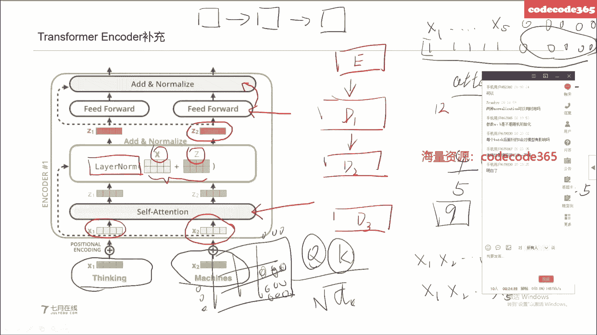

有点慢有点慢。

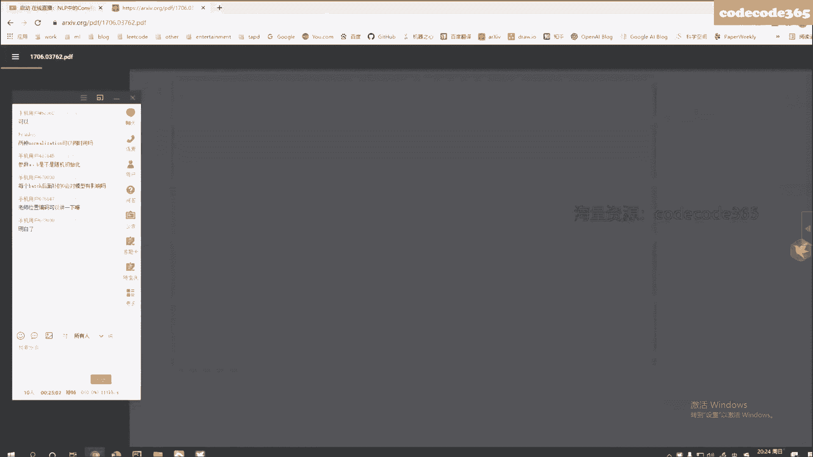

好我这边先回到PPT啊，先回到PPT诶。

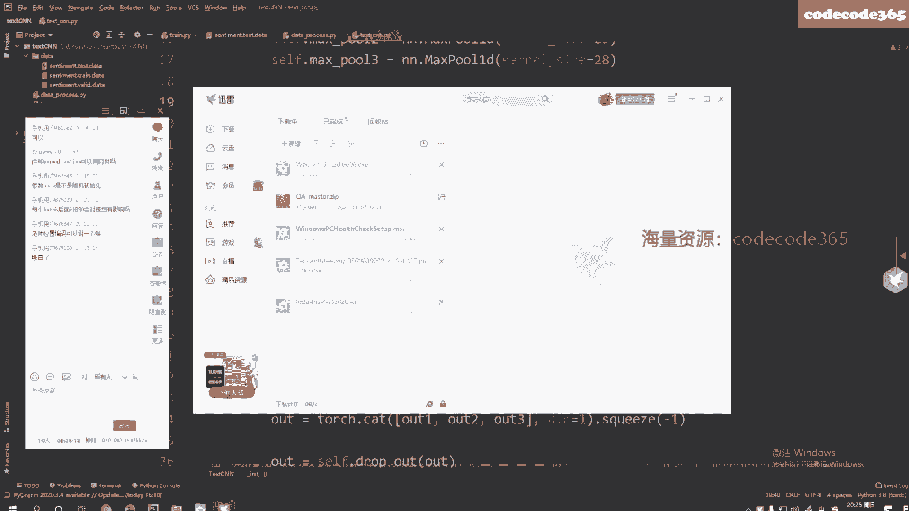

好我们待会再看到这里，先说他这里会有一个这样的一个，正余弦的一个公式，来把这个位置信息给计算出来，那计算出来之后呢，这里就等于有两个东西嘛，一个是咱们的一个token in bei。

还有一个是咱们这个position psection in be，他会把这两个东西啊进行一个相加，进行一个相加相加之后的一个结果呢，再给到咱们的相加之后的一个结果，就是这个东西啊，就是这个东西。

然后再给他后面的一个cf，那这个位置编码其实有很多种啊，有相对文字编码，有绝对位置编码，那对于我们的这个transformer。

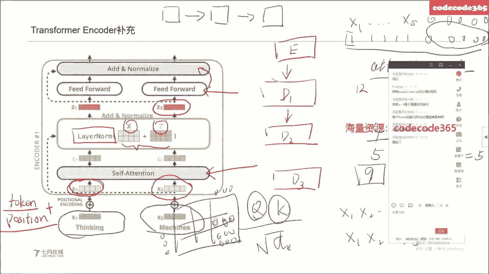

这个原始的一个模型来说，它是使用这样的一个正余弦的一个方式，啊有点慢啊有点慢好。

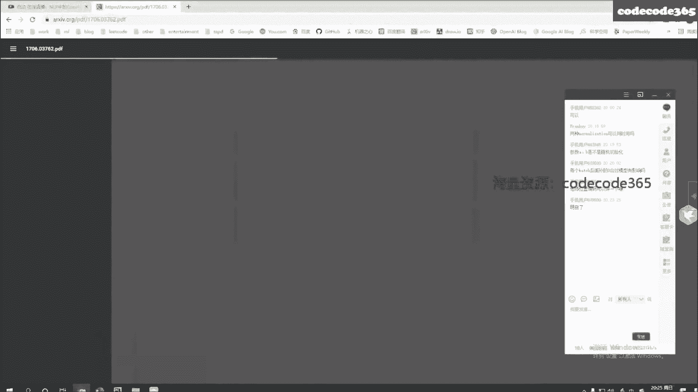

我们先给他那边加载着，我们先说后面好吧，我们先说在后面，等那边加载出来啊，啊我们位置编码待会再说啊，我们先继续往下啊，那我们说到这里的话，基本上就把咱们这个transformer的encoder。

这一部分就讲完了对吧，包括他的animal fboard，Mari，Had a tension，就都给大家讲完了好，那接下来我们就来看一下这个decoder，这一部分啊。

decoder这部分引入了一个所谓的MASKET东西啊，我们看一下这个mask到底是干嘛的，OK对于我们的这个decoder来说，我们回顾一下我们昨天的这个sequence，sequence的内容。

那同样是这样sequence sequence的一个模型，那decoder它肯定是这样的一个序列模型嘛对吧，他要不停的把这个值进行一个输出对吧，所以decoder是要生成。

咱们咱们这样的一个新的一个序列的，生成新的一个序列的好，但是transformer我刚才说了也说了一点啊，它是一个什么模型，它是一个并行模型，那如果是一个并行模型来说的话，它就生成序列会有什么问题呢。

我举个例子啊，就假如我现在有这样一句话叫做人工智能对吧，我要把这句话，我要把人工智能这句话给生成出来啊，生成出来，那对于我们的这个RNN来说是怎么做的呢，哎这里输入我们的一个起始符对吧。

然后这边生成咱们的第一个字人，然后呢再把这个人给到我们下一个节点，然后来输出我们的一个弓对吧，他是这样的一个逻辑，但是对于我们的这个transformer来说，它是一个并行的一个模型，并行的模型。

并行的模型，它就不存在这样的一个，按顺序进行输入的一个情况啊，所以说在我们这个解码的过程中，它就会存在一个问题，假如我要生成人工智能，这句话对吧，当我们去做这个self attention的时候。

我们会让这个QK进行相乘，而得到这样的一个attention metrics，那好我们看一下这个attention matrix，如果我们不做任何的一个处理。

我们把这个attention metrics展开，它其实是这个样子的吗，它是它是这个样子的啊，这边是一个即使服务，然后人工智能这边是人工智能都终止服务，我们现在好，我现在要根据这个起始服务人工智能。

然后我们结果想输出人工智能终止服务，这是我们昨天那个讲sequence，sequence这样的一个流程嘛对吧，输入的时候一定要有这样的一个起始符，没问题吧，这里好，OK那接下来我们来看一下啊。

那假如我现在想生成人这个字，在我们RN里面是怎么做，是不是我只是输入了起始符，但是在我们的这个transformer当中，因为是并行的人这个字啊，它实际上是可以拿到所有的。

你看起始伏人工智能这几个词的一个权重的，你看它这里实际上都可以进行相乘嘛，对吧啊，我这里用W表示RW1W2W3W4W五，理论上来说，如果人和人工智能这几个字如果不可见的话，理论上来说WR一直到W5。

它的权重应该是零对吧，应该是零才对，但是当我们现在这样一个情况，你去算这个Q和K的时候，你的这个Q可是能是能互相计算这个权重的，也就导致我在预测人的智字的时候啊，我已经去看到了人工智能的一些信息了。

那这个时候模型会认为，我根本不是在预测下一个字，而是直接把这个人copy过来copy过来，那我去预测公这个字的时候也是嘛，模型会认为我只需要把公这个字对吧，直接copy过来就OK了对吧。

所以说业余这个transformer来说，就是因为它是一个并行的，就没有办法来让他以RN的那样子，按顺序的一个情况来进行一个输出，那怎么办呢怎么办呢，我们考虑一下啊，刚才我们是怎么分析的。

我们认为如果要生成人这个字，理论上上来说，我应该只能看到起始符，起始符对吧，也就是说只有W1，它这个权重应该是一个非零的一个值，其他的一个权重应该等于零对吧，应该等于零，那对于公这个字来说也是一样嘛。

那我们要在RN当中我要生成这样一个公，我可以看到起始符，我可以看到人对吧，那我可以看到骑士服，我可以看到这里这个人，那对于这里的这个啊，W23吧，这是四，这里的W23W2和W2，那几个值应该是零对吧。

那这几个值应该为零，那对于质这个字来说也是一样的，那这个地方应该是零，这个地方是零，那这个地方是零对吧，对于结束服务来说，它就可以看到所有内容了，就像我们昨天的那个图，我这里最后输出了这样的一个呃。

那个那个能字对吧，我这里输输了这样的一个能字，最后要输出咱们的一个结束符，所以说这个结束符它可以看到所有，是没有问题的，OK但有了这样的一个思路之后呢，我们就知道哦，那我只需要去把这个。

这几个位置这个权重啊全部置零就OK了啊，就是我们看到右边这个图，也就是说紫色这部分，我们只需要把紫色的这部分的这个权重啊，全部置零对吧，其他权重我们正常计算就OK了就OK了，OK那怎么做呢。

其实也很简单啊，我们还是一样啊，去计算这个QK的这样的一个权重矩阵，计算出来之后呢，我们再去乘上这样的一个矩阵，这个矩阵就这些位置全是零，要这些位置是一，好，我用这样的一个矩阵。

和我们QK的这个矩阵进行相乘，相乘之后呢，是一的位置，权重是保留的对吧，是零的位置啊，这些地方的权重就全部变成了零对吧，就以这样的一个形式啊，就能防止出现一个所谓的一个标签泄漏。

那这个思路呢实际上就是咱们这里的这个，就这里这个咱们这个mask好吧，就是这里这个mask，那可以看到啊，对于encoder部分来说，我们是在进行这样的一个编码的处理，所以它不涉及到生成对。

所以它是不需要的，那只有在我们这个decoder部分啊，我们会用到这个mask，会用到这样的mask啊，就是这样的一个思路啊，好这个时候可能也有同学问了，哎你这里mask了。

那为什么这里你没有去做这个mask呢，因为这里啊这里的Q和K还有V它不是相等的，这里的Q和K是一部分，是来源于这个encoder这部分啊，就是来源于encoder这个部分啊。

所以这个地方大家是需要区分开的啊，需要区分开的，他这里实际上就是在和我们上节课给大家讲，Sequence，sequence那个思路就一样啊，我需要把我encoder部分的一个结果拿过来对吧。

和我decoder经过了mask的处理之后的结果，去做这样的一个attention，然后再去加权，就这样的一个思路好吧，大家可以这么看啊，这里就是Q，这里是咱们的一个K。

就是VQ和encoder q和这个decode k相乘，拿到这样的一个权重矩阵对吧，然后我们再用这个权重矩阵和这里这个V，进行加权加权，就是这样的一个思路啊，就这样的一个思路，好啊，我们在这里停一下啊。

对于这个max可能理解起来会稍微有点困难，看各位同学嗯，我这里有说明白吗，还需不需要再讲一遍，这里可能理解起来会有点小小难啊，还需要再讲一遍吗，各位同学，再讲一遍是吧，好好再来一遍，再来一遍。

OK这里是有点不太好理解啊，好我们再来一遍，再来一遍，那我们先把，先把这里这个删了啊，我们再来一遍啊，啊这里有问Q是什么，Q就是你的一个输入，你的decoder的输入。

这个这位同学昨天有有听我们的课程吗，咱们这个attention里面，self attention里面Q是等于K等于V的，也就是咱们的一个输入啊，就是咱们的一个输入，你输入是什么，它就是什么好。

我们再来一遍啊，我们再来一遍，这里可能不太好理解，我们还是先简单回顾一下啊，在我们的一个RN结构当中，我们去做生成的时候，就我们这边是encoder嘛对吧，encoder会给到我们的这个context。

Context，要把context给到我们的这个decoder，好，Decoder，decoder第一个时间点会输入这个起始符对吧，提示符，然后进行一个输出，进行一个输出好。

那对应到我们的这个attention matrix里面，什么是什么意思呢，我们先看这个字，第一个字人，如果我们想生成人这个字，我们是不是应该拿到起始符的信息，对吧，只应该拿到起始符的一个信息。

好先看看这个同学的问题，序列的元素不应该看到后面的元素，所以它后面的对对对，就是这个意思啊，就是这个意思啊，我继续啊，好我们现在理论上来说应该输出人这个字对吧，正常情况，我们要把这个人这个字给输出。

在RNN的结构里面，我们只会输入起始符S，只会输入起始符S，那对应到我们的attention matrix里面是什么意思呢，就是说我再去做这个attention matrix的时候。

我的人应该只能看到你起始符，因为我这里要计算权重嘛对吧，我要计算这个W11，这个权重就是你人和起始符的一个权重对吧，人和起始符的一个权重，在我们的RN里面，人质和起始符有关系，和其他是没有关系的。

但是在我们的tension matrix里面，我们可以看到啊，人和其他的这些字也是可以进行计算的，对吧，我的这个人可以和这些人工智能这些字，进行这个权重的一个计算，那如果这个人和人工智能这四个。

只能进行权重的计算，就说明什么呢，就好比啊我这里RN里面，我直接把这个人工智能这几个字，全部在第一个时刻进行了输入，给到了我第一个节点，然后让我节点输出人，那显然这种事不科学的嘛对吧。

我应该只告诉模型啊，这是一个起始符，这是一个起始符，所以啊我们的这个W啊，对于输入输出第一个字的时候，我们的这个W1的2~5，它的权重应该是等于零，应该等于零才对对吧，应该等于零才对。

所以我们通常就会把这些位置置0~0好，那如果我们现在要输出的是R哦，是输出的是公这个字在我们RN里面是怎么做，我们是把人作为了一个输入对吧，把人作为了一个输入，然后输出了公。

那对于RN来说哎这个时候输出弓的时候，他其实可以看到两个东西啊，一个是人，一个是我们的一个起始符对吧，这里我就不管了啊，一个是人，一个是我们的起始符，它是可以看到这两个东西的。

但是回到我们的attention matrix还是一样啊，还是一样，这个人这个工这个字啊，它还是可以分别得到起始符，还有人工智能这几个词的一个权重，但是理论上来说，我们应该让后面这。

也就是咱们的W23W，它的权重应该是为零才对吧，我生成弓这个字的时候，我只能看到起始符合人，其他是不能看到的对吧，所以这些地方应该治理下面也是一样啊，这个字的话，那就是这两个地方治理。

能的话就是这个地方指令，然后结束符的话，就是我所有东西都可以看到对吧，所以这些地方就都是零，这叫什么啊，好那正常计算的时候怎么计算呢，就是我先得到这样的一个attention matrix。

然后我去乘以这样的一个，下三角的一个矩阵就OK了，好吧，就是这样的一个思路，就是这样的一个思路，因为这么一相乘的话，是一的地方原来的权重可以保留吗，是零的地方原来的权重就全部是零了，好吧好有。

我就说明白了吗，各位同学，OKOK好行啊，那如果我有的同学还是没有听懂的话，这个没关系啊，可以下来再复习一下这个课件啊，可以下来再复习一下课件，接下来的内容的话，我们也不会完全用到这个mask，好吧好。

如果听明白就好，听明白就好啊，这一块还是比较重要的，好我这边就顺便说一下啊，顺便说一下咱们的这个transformer，它不是分为两个部分吗，一个是encoder对吧，一个是我们的一个encoder。

一个是咱们的一个decoder啊，我们现在呢有两个这样的一个，或者说我们的预训练语言模型啊，通常分为分为两类，第一类是以BT为啊为主的，这样一类叫做auto encoding模型，自编码模型啊。

自编码模型，那BERT这样一个模型的一个结构是什么样子呢，它就是我们的transformer的encoder，一个base版本的话是12层，12层，也就是说他就把这个船从我们的encoder拿过来。

然后砂层堆叠在一起，然后进行一个预训练，这就是我们的一个bird，那还有一类预训练模型呢是基于这个GBT来的，这个所谓的auto regret regressive的一个模型。

这样的一个模型它是什么样子的，它是transformer的decoder decoder，但是他没有这一块，这个部分是没有的，这个部分是没有的，它只有下面这个部分和这里这个部分啊。

嗯大家也可以把这个GBT理解为是encoder，然后把self attention那里加上了这样的一个mask，那这个GBT啊，就是用来做这样所谓的一个序列生成的好吧，序列生成的。

所以大家可以简单的理解为BT，就是transformer的encoder，GBT的话就是transformer的decoder，好吧，可以简单这么理解，啊那我这里也再简单说一下啊。

BT的话通常是用来做这个所谓的成为2U的，三语言理解，也就是他的这个任务呢通常是用上下文对吧，假如这里X1X2X3X4X五，它有一个任务是什么完形填空，就假如我把X3这个词给mask住了，我把它给遮住。

然后我要用X1X2X4X5来预测这个词，来预测这个词啊，所以说它是可以看见上下文的，那对于GBT这个模型来说呢，它是怎么做的，它是给你上文X2X3X四好，我要预测，下午我要预测X5好。

X5得到之后我要预测X6，它是这样的一个形式，好吧，这就是咱们的一个bird和GBT啊，这是为什么，我们要来花很多时间去讲这个transformer啊，只要transformer大家弄明白了。

那你的这个BT和GBT你就弄明白了好吧，像昨天有同学不是提到那个GBTC，GBTC它是怎么做的，它实际上就是一个GBT啊，这里它不是一个咱们一个普通版本的GPT，是12层，它这个GPT碎。

它这个堆叠就特别深了啊，就特别深了，它一共有1000啊，1900亿的参数，然后对于我们这个12层的一个啊BT来说，它只有1。1亿的参数啊，然后GBTC的话有1900亿的一个参数。

所以它模型结构是特别大的啊，好这就是transformer这一块，基本上就给大家讲到这里，然后看一下这边对。

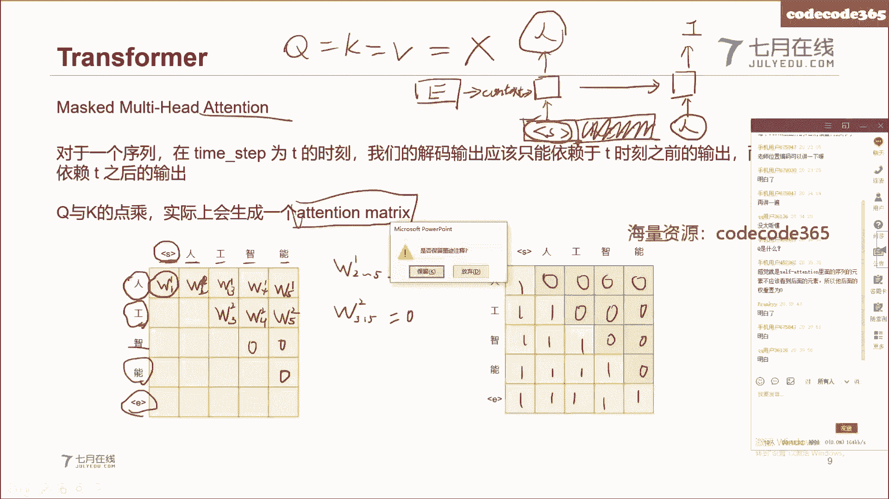

还有哦，OK它的一个位置编码简单看一下啊，简单看一下啊。

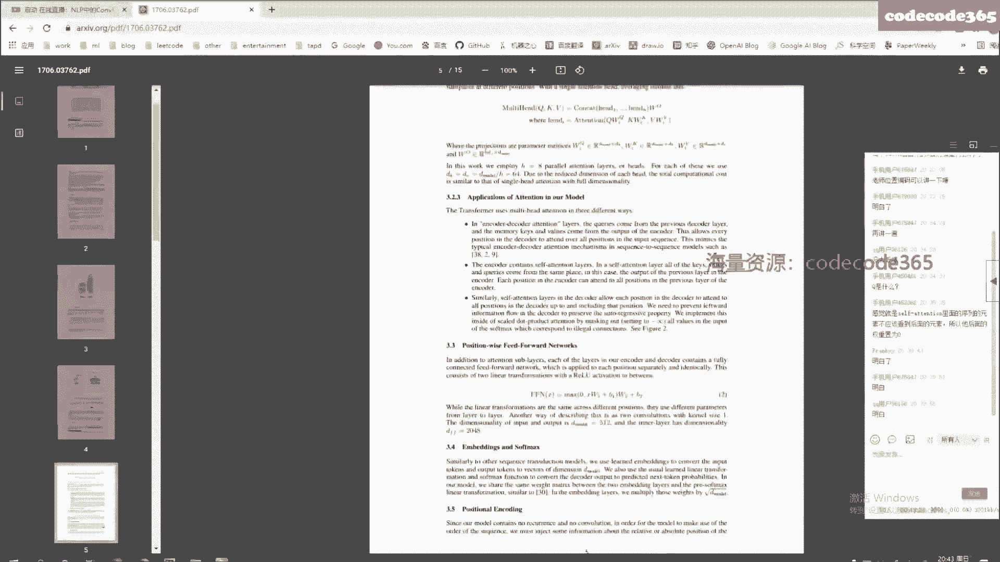

它的位置编码，就是根据这样的一个公式给计算出来的啊，计算出来的，但是在BD当中呢，BT的位置编码和这个transformer，自带的这个位置编码呢又会有一点点不一样。

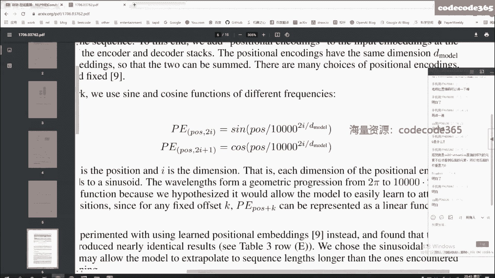

那BT当中的位置编码是什么样子的，它是这个样子啊，这里简单说一下，它是因为我们的BT，最大的这个长度是1~512，就是你序列的最大长度是支持512，所以呢它会有这样的一个。

也是有一个embedding metrics，Embedding metrics，那只是这个embedding matrix，输入的是这个序列的一个下标，就是如果你第一个位置，那就是一嘛。

第二个位置是二，第三个位置是三，最后一个位置是512，他把这个位置信息啊，给到了这样的一个embedding matrix来，得到了所谓的一个position，Position，Embedding。

好吧，Position ebedding，这是BT的一个位置编码，和咱们的这个transformer的位置编码，的一个区别好吧，有区别，好接下来我们来看第二个部分啊，就关于这个啊一些读论文的一些建议啊。

一些读论文的一些建议，很多同学就是可能在才接触这个，NLP的时候呢，他可能会想说啊，那我能不能花些时间去多去阅读一些原论文，对吧，包括我们上课的时候，实际上也会讲完之后呢，也会把这个原论文给罗列出来。

我希望大家能去阅读一下原论文，包括像transformer这样的一些。

比较经典的一句论文啊，我是建议大家就一定要自己去阅读一遍好吧，就可能我上课讲解出来的东西，是我对这篇论文的一个理解，那你去阅读完这篇论文，你可能会说啊，我对这个东西可能还会有一些新的理解。

这也是完全有可能的好吧，就包括我去讲这个的时候，我就讲这个mask的时候，我都是根据我自己的一个想法来讲给大家听的，这种想法可能是我认为一种啊比较通俗，比较简单的一种理解啊。

所以说很希望大家能自己去阅读一下原论文，那你阅读完之后，你可能自己就会有一些新的一些收获。

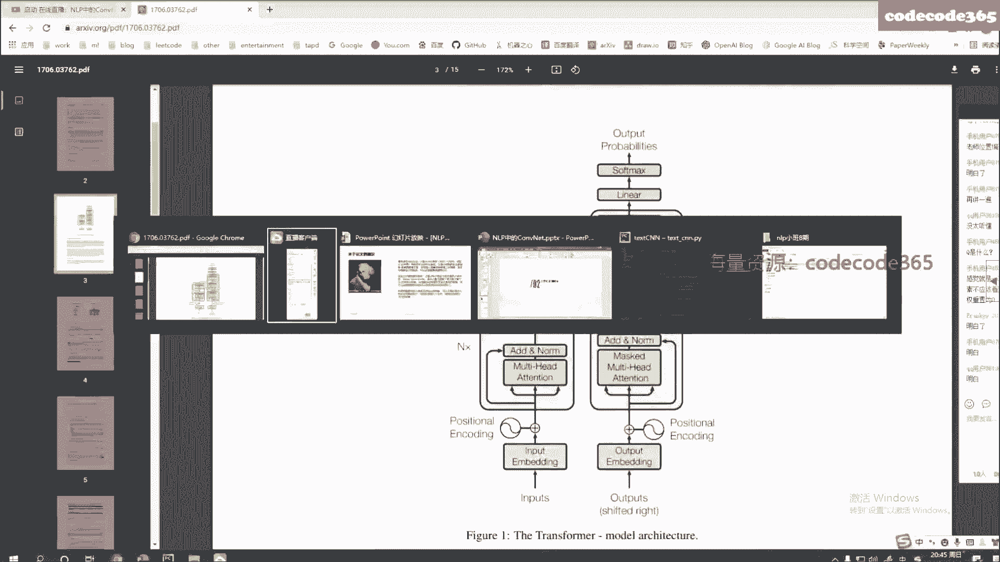

好吧好，那接下来就说一下关于论文这一块啊，首先的话肯定就是一个找论文嘛对吧，找论文像各位同学才接触N2P的时候，大家不需要去啊，就是说啊我一定要去升装，就是某一部分，或者说啊某一个点的这样的一个论文。

像今年比较火的这个prompt，或者说contrastive learning对吧，大家可能现在都还是在打基础，那就没有必要去花时间，去跟这些比较新的这些技术啊，你只需要去把一些嗯比较热门的一些东西的。

一些论文给看一下，例如刚才说的这个transformer对吧，或者包括今天要给大家讲的这个，text n这一块的一些论文，大家可以去看一下，还有像昨天给大家说的那个卢恩腾讯，像这些经典论文啊。

大家可以去好好看一下，那最近的这些比较新的论文，因为大家现在学的还比较浅，所以大家就可以不用去跟这些新东西好吧，先把这些老的东西给先吃透吃透，然后等到等到你真的这个有一定的一些基础了。

然后你再想去了解更多的一些东西，想去自己去看一些论文的时候，那你也可以去啊，首先怎么找怎么找，你可以去简单的方式啊，你可以去先去看一些资讯网站啊，包括咱们国内的一些什么知乎啊，公众号啊。

SSDN啊之类的对吧，像国外的一些什么mu啊，这些东西大家都可以去看，还有像一些专门推推这个paper的一些网站，像paper weekly啊。

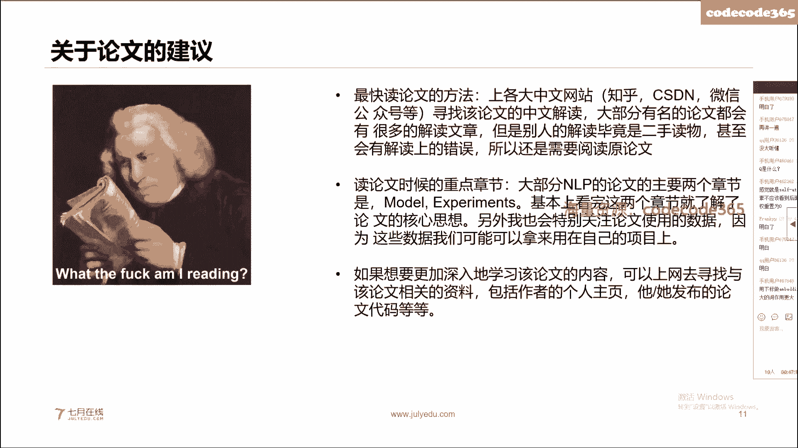

还有这个paper with code这些网站啊，大家都可以去看一下嗯，像这个我看一下啊啊paper weekly，大家可以去看一下对吧，它会有一些热门的论文的一些推荐。

然后还有一些那个啊paper is called，大家可以去看一下，那paper recalled，它这是干什么的，就假如你现在想去做这个啊机器翻译对吧，你只要来到这个网站啊，这边有个机器翻译。

你点进去他这边就会罗列出来，而最近的一些啊索塔模型是什么样子的，包括它的一些代码，还有一些论文地址，他的需要全把你给罗列出来，你都可以对应这里去点进去去阅读他的一些paper。

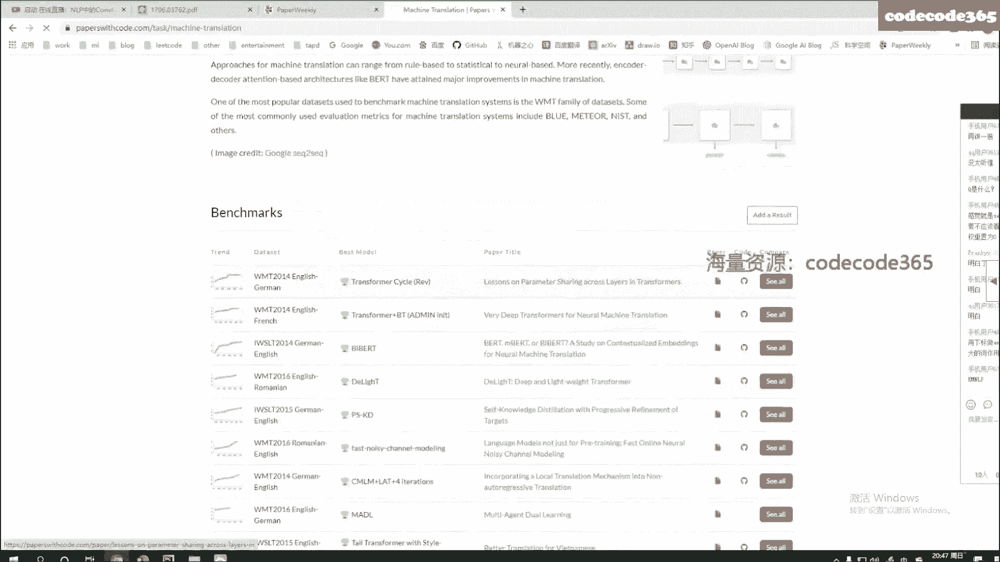

要去看他一些代码都是OK的好吧。

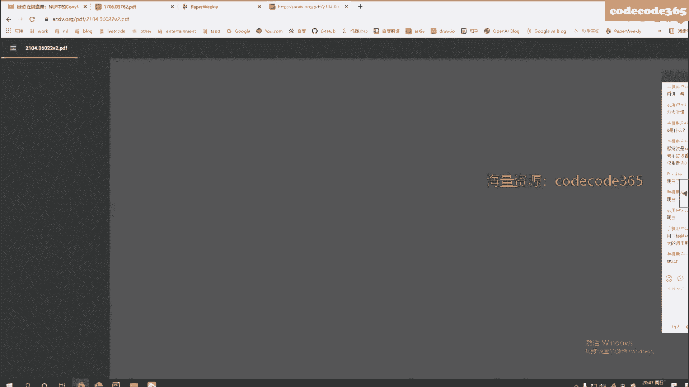

然后这边的话，我甚至还最近有一个比较火的一个阅读paper的，一个叫做，叫做read paper啊。

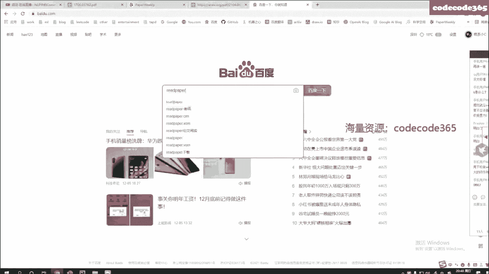

大家可以去看一下这个网站啊，啊它是一个阅读paper的这样的一个网站啊。

例如啊举个简单的例子，就是你可以去把你自己的paper上传上去。

你也可以在他这里去搜索这篇paper啊，像我们的这个A。

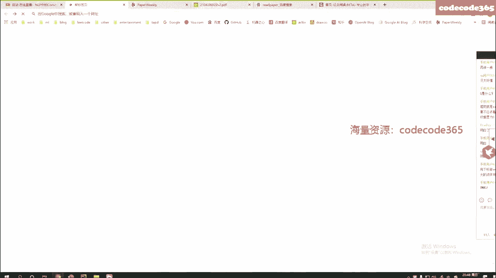

怎么老跳出来，像我们的transformer的paper对吧。

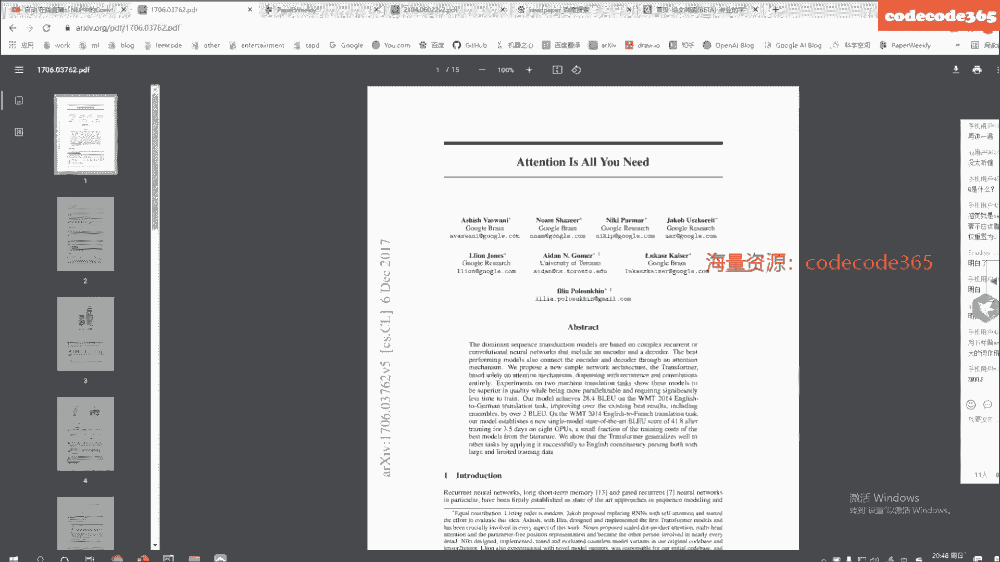

你可以在这里进行一个搜索，然后你就可以直接在这里进行这样的一个阅读，他这边可以进行，他会帮你把这些什么表格啊，什么给提取出来，然后这个应该要登录啊，他关键就在于它很方便，你去管理你的这个paper好吧。

所以推荐大家去使用一下。

这个挺好用的啊，这是关于收集paper这一块啊，然后等到大家真的就是有能力了，或者说基础已经学的差不多了啊，就一定要去自己去阅读这样的一些paper啊，毕竟别人的这些解读，都是一些所谓的一些二手读物嘛。

那是别人的一些想法对吧，甚至可能还会有一些理解上的错误啊，所以建议大家这些比较重要的一些paper，一定要去读一下原论文，一定要去读原论文，那要说一下关于如何去阅读这样的一篇paper啊。

那大部分的一些啊NP方面的一些paper的话，有两个啊，章节是比较重要的，一个是模型部分，一个是实验部分啊，那你只需要把这两个部分就是看完。

基本上就大概能理解一下啊，这篇paper啊，那拿拿到一篇paper的时候呢。

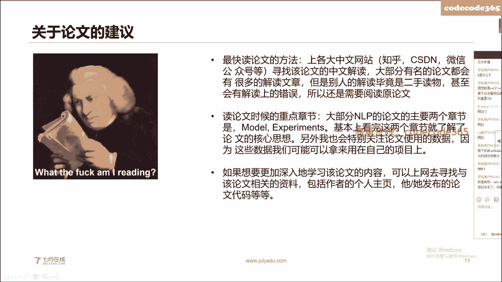

大家先不要去急着详细吧，整篇看完你就先去看一下他的这个摘要是吧。

看一下他的简介啊，先简单看一下啊，这边这边paper大概是讲什么的对吧，我对你哎先简单看一下，然后看一下对你是否有帮助有帮助，OK那你可以去看像前面这些介绍啊，这些背景啊，你就可以先不着去看。

直接先去看他的一些模型结构对吧，模型结构是什么样子的，然后再去看他的一些相关的一些实验啊，像一些实验啊之类的，可以去看一下，甚至实验这些一开始你也不用细看，直接去看它的这个这个结果。

看一下整体结果提升了多少，如果你对这个结果是满意的话，你再去看好吧。

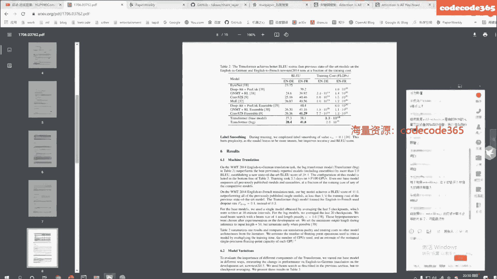

这是一个阅读论文的一个这样的一个顺序啊，顺序，用下标做embedding，会不会造成下标值大的词作用，会啊，不会啊，不会，这个不会，并不是说你的这个下标越大，它的这个embedding就越大。

没有这种说法啊，没有这种说法，雁门要比这个这个要说什么数值有序，in bin后可能不止序有关系啊，对他这个不仅仅是包含顺序的一个一个那个值，好吧，并不会出现这样一个所谓明白那个下标越大，引力越大的情况。

不会出现这个版型啊，这个继续说回我们的这个阅读paper啊，啊大概了解了一篇paper之后呢，那接下来你可能会说啊，我想花一些时间去对这个paper去做一些出现对吧。

我想去把这个paper里面的一些东西，应用到我们自己的这个模型当中对吧，唉那怎么搞呢，你首先啊你可以去看一下这篇paper啊。

有没有啊，去开源这个代码，开源了代码的话，那你可以自己去看一下这个言论文的一个作者。

他这个代码是怎么写的，像我们的这个啊attention，我们可以搜一下，看一下有没有啊，你看他这边啊，这个这个好像不是啊，我们再搜一下有没有，好像没有，换一下刚才的屏啊。

OK你看他这边实际上就会把这个罗列出来啊，这篇paper他的这个代码地址，他就会帮他帮你罗列出来，你就可以去看一下他的这个代码对吧，是怎么写的，你可以借鉴一下，那其实啊各位同学可能没有复现过。

如果复现过的同学的话，就会其实你会发现一个问题啊，有些paper他和自己的这个开源出来的，代码会有偏差啊，就论文里面可能是这么说的，但实际上实现的时候它是另外一种实现方式。

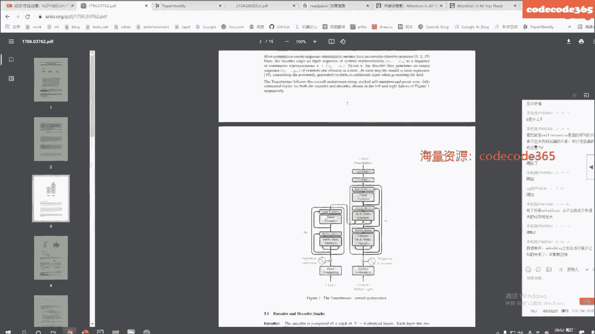

就挺奇怪的啊，这个可能也是啊水分有点大吧，这样的一些paper好吧，然后啊复线的话大概就是这个样子啊。

还有一点大家需要注意一下，就是复线这个东西呢，有时候你投入很多，会出现没有产出的一个情况，首先是市面上的确有水分的，赔本太多了，其次呢就是啊现在大部分这个paper啊。

他都是在这个英文的数据集上去作战的一些啊，Ation study，但实际上它在中文上有没有效果，这实际上是需要打一个问号的，所以就只能你自己去联系一下原作者，或者说你自己去做这样的一些实验。

来得到最终的最终的这样的一个结果，好吧啊，这是复线的这一块啊，那复线这一块我再简单说一点啊，就有些同学会说啊。

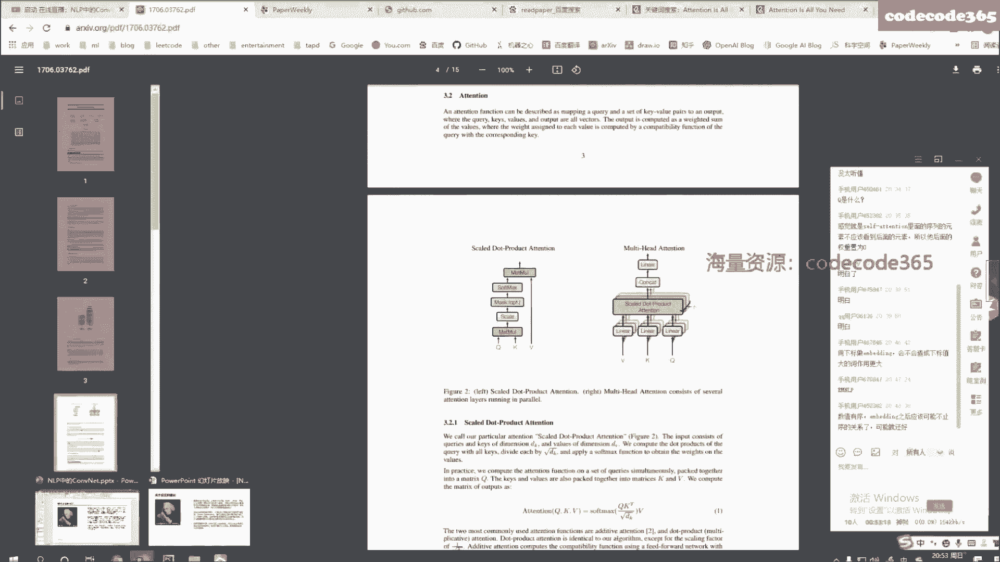

这个复线到底该怎么去复现对吧，那这个东西还是建议大家先去才，你第一次去复现paper的时候，你不用着急下手，去找一些比较热门的，然后去看一下那些作者他是怎么写的代码好吧，当你看的多了。

你自然这种复现的能力就会慢慢的给提升起来，提升起来啊，这是关于阅读paper这一块的一些建议啊，建议，好那我们就继续往后继续往后，接下来就来我们第三部分，也就是今天的一个主要给大家讲的内容。

就是关于卷积神经网络这一块，我看一下哎好起，那这样吧，我们稍微休息一会儿好吧，刚好讲了一半的一个内容啊，那我们就稍微休息一会儿，然后我们休息5分钟，休息5分钟，现在8。54啊，我们九点上课吧，好吧。

我们休息5分钟，我们九点上课，然后下节课，下半节课我们再来讲我们的这个卷积网络，卷积网络大家有什么问题就要及时提出来好吧，及时提出来，上半节课应该难点就在于，应该mask这一块是比较难的。

其他应该难度不高啊，难度不高好，我们稍微休息一会啊，好我们准备开始上课了啊，准备开始上课了，先看一下同学的问题啊，嗯LN和BN，具体是怎么解决梯度消失和梯度爆炸的规划，把数据大部分集中在中间。

然后如何解决梯度消失和梯度爆炸的好，我们看一下，看一下啊，怎么解决，其实是这样子的嗯，这是我们的这个SIGMOID激活函数，这是tan h计划函数，那SIGMOID激活函数和ten h计划函数。

最大的问题在于什么，它容易出现梯度消失嘛对吧，只要我的这个值，你看这个mod大于五，小于五的时候，这些地方的这些值实际上就已经很激烈，就已经零了嘛对吧，你看这里是零嘛，这里是零对吧。

这些值已经很接近于零了，这些地方的值都是很接近于零的值了，那如果你不做过异化，那你的值就可能会在这些地方，那在这些地方的话，你的这根梯度是不是就会接近于零，那就出现梯度消失的问题了吗。

所以呢我们做完过优化之后呢，它变成均值为零，方差为一对吧，就会限制在这样的一个区间内，那这个区间内你可以看一下，这些梯度对应的是多少，就没有那么大嘛对吧，你看这一块的梯度啊对吧，这一块的梯度对应过来。

他就不会不会特别小，从而就解决了所谓的一个梯度消失的问题，也不能说解决也是缓解好吧，说缓解的时候更严谨一点啊，缓解更严谨，我也说明白了，这位同学，嗯阅读配对的时候时常遇到公式看不懂的。

或者说不理解公式所表达的意思，这个东西只能说是一个啊，一个慢慢我觉得慢慢熟悉的一个过程吧，就当你自己看了，多看看多了之后，你反而会觉得这公式有时候会说得更明白一些，其实是这样子啊。

为什么会有公式这个东西，大家有没有考虑过这个问题，为什么会有公式这个东西，就是因为他文字说不清楚，所以才会有文，才会有公式，就如果你真的已经说的非常清楚了，那实际上是没有必要要公示这个东西。

所以说当你自己去接触神经网络这些东西，接触的多了之后，你会发现那些公式其实都差不多，都是差不多这样，我们简单看一下啊。

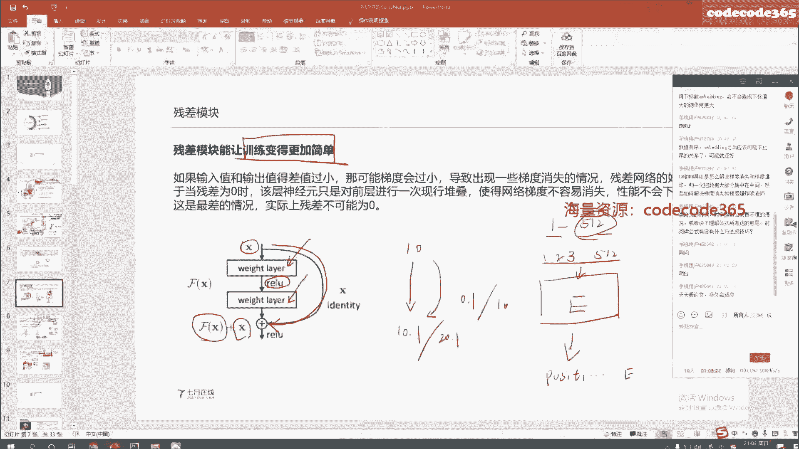

那假如我们看一下这个，我们就简单拿这个公式为例嘛对吧，我们就拿这个attention这个公公式为例，就很多时候你去看到这个QK相乘的时候，当你看多了之后，你第一印象就知道哦。

你这个Q和K相乘就是在求这样的一个权重，你很快就能反映出来这个东西是在干什么的，所以说这个东西你问我怎样才能看懂，真的就只有你自己去多看，你自己看多了自然就有那样的感觉了好吧，看多了自己就有感觉了。

这个东西还是一个看多和看少的一个问题，好吧，这位同学，我觉得嗯没有一个特别好的一个方式去理解，还有就是你要详细去看一下，他对这个公式的一个说明好吧，详细去看公式的一个说明，只能慢慢看啊。

这东西只能慢慢看，你看多了，要是考的稍微慢一点，自然就能看明白了好吧，这个的确是没有什么特别好的一些技巧，我觉得还是熟能生巧的一个过程吧。

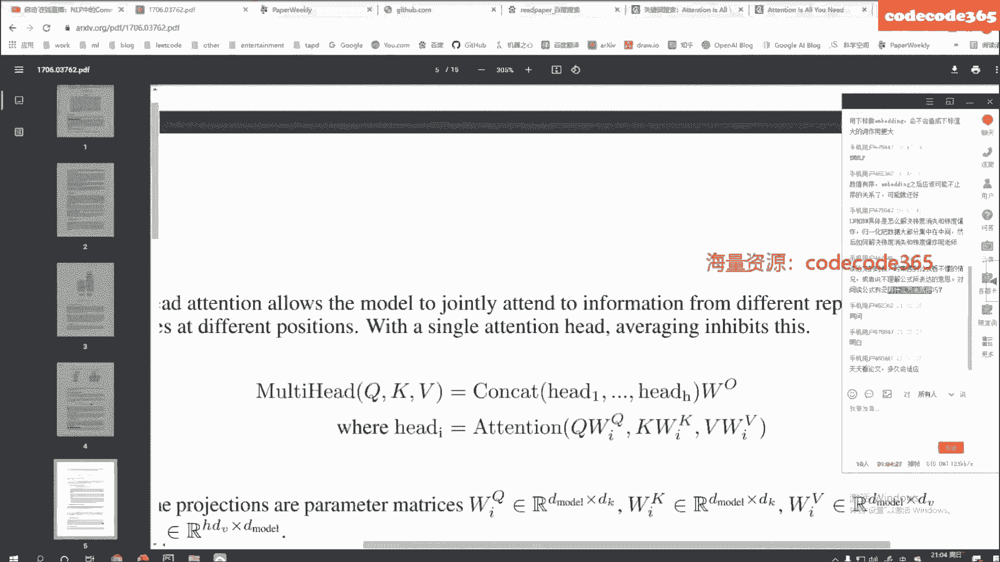

好吧，好我们来看我们今天第三部分，第三部分就是关于这个CN这一部分的内容，啊，那对于一个咱们常规的来处理，这个文本的RN来说，它的一个时间复杂度是ON对吧，因为它是按顺序来的嘛，你序列长度。

假如你是那个序列的长度是N，那它的时间复杂度就是ON，所以这个时间复杂度啊它是ON，那通常呢我们去使用RN，提取了这样的一个文本特征之后呢，都会使用最后一个时刻对吧。

最后一个时刻的一个值作为它的一个输出值，给到我们的这样的一个分类层，进行这样的一个分类，但这里啊，RNN它实际上只考虑了每一个词或者字的特征，那如果你是分字，那考虑的就是字的特征，如果是分词的话。

你考虑的是词的特征对吧，那我们考虑一个问题啊，能不能就说为特定长度的一些词序，去计算出它的一些特征表示呢，或者向量表示呢，例如我这里有一句话啊，我们做个分词，他毕业于上海交通大学对吧。

他其实我们把它分成一些小短语，它可能会有，他毕业于毕业于上海与上海交通对吧，还有上海交通大学，那我们使用RN的时候，都是这样的一个字一个字的这样的一些提取，这样的一个特征，那我们能不能组成一些短语对吧。

像他毕业于，我们把这个东西的一些特征给提取出来，我说上海交通大学这一整个短语的特征，给提取出来对吧，那能不能这样子做呢，好这就能这个如果你想去提取这样的一个特征，就需要用到我们的这个卷积神经网络。

卷积神经网络，Ok，接下来的话我们就简单看一下这个，什么是卷积神经网络啊，那说到这个卷积神经网络呢，第一点我们肯定要来聊什么是卷积对吧，什么是卷积，然后呢，我们通常我们称这个F乘以G。

就为F和GA这样的一个卷积，这里有两个定义啊，一个是这样一个连续的一个定义，连续的定义的话，那就是去求这个不定积分啊，那对于离散的话，那实际上你就是一个求和的一个过程，求和的一个过程。

那这里可能各位同学看起来会有点懵懵啊，有点懵，这到底什么意思啊，啊不着急啊，我们继续往下看，继续往下看好，那例如例如啊我们现在有这样的一个啊式子啊，比如说我们令这个X等于零，然后Y等于N减套。

那么我们的这个X加上Y实际上就等于N对吧，就等于N好，我们把这一条键啊，把它画在我们这样的一个啊坐标当中，这就好比什么啊，那这个X加Y它实际上是会变的嘛对吧，所以这个N的这个值它是会变的。

就一直从左下角一直到右上角，那我们可以看一下这条线，而这条绿色的线它实际上就好比什么，就好比我们有一条毛巾，它沿着一个角卷了起来对吧，我们从左下角左下角一直往上面卷，卷到了右上角，那这样的一个操作呢。

就被称为这样的一个卷积的一个操作啊，卷积的一个操作好，接下来我们来看一个具体的一个例子啊，我们以一个离散卷积的一个例子为例啊，我们来看一下，那假如我们现在啊有两个桃子啊，我们读骰子吧好吧。

读骰子这个骰子读着舒服一点好，那我们用F来表示第一个啊，这个第一个傻子啊，那F1表示投出这个一的概率啊，比如说我F1的话，那就是投到一个点，投到一个点的时候，一个概率F2的话，那就投到两个点。

然后我们用G来表示第二枚骰子啊，OK那我们现在考虑一下，如果两枚骰子点数加起来为四，它的一个概率怎么表示呢，那是不是就有三种情况，第一种情况我第一个骰子扔一，第二个人三，第二种情况两个都扔二。

还有一种情况是我第一个骰子扔三，第二个骰骰子扔一对吧，那我们把这三者给加起来，把这三种情况加起来嘛，那这就是我们扔出来为四的一个概率对吧，扔出来为四的一个概率，Ok，那我们把这三者再简单进行一个。

这样的一个化解化解，把它变成一个这样的一个累加的一个形式，变成一个累加的形式，那这样的一个形式呢，就符合我们刚才的这个卷积的一个定义啊，卷积的定义好，我们这边再回到这边来看一下啊，我们的一个离散卷积。

它的一个定义，是不是就是我们的这个扔骰子的一个情况对吧，F套乘以及N件套，就这样的一个情况啊，这样的话就可以以这样的一个扔骰子的一个，形式来表示出我们这样的一个卷积的定义啊，这样的一个定义好。

那我们大概理解了这样的一个卷积的一个意思，之后呢，我们再看一下我们的这个图像上面，它的一个卷积是怎么做的，好，我们现在这里有一张图片啊，有张图片可以看到这张图片上，界面有很多这样的一个严重的噪点对吧。

那如果我们想去做一个去噪的一个处理，那么我们就可以把一些高频信号与周围的数值，去平均一下，就是说我可以取这个地方这个值对吧，我把这个值它周围的这些值，例如这些值，就把这个范围的值啊去取一个所谓的均值。

取完均值之后呢，他就会得到一个所谓的去噪的效果好，那我们详细去看一下这个计算过程吧，啊例如我们还是以刚才这个点为例啊，A1这个点为例，那在A1这个点当中呢，我们先去取一个它周围为一的这样的一个啊。

这个矩形，这个矩形就把它周围的这些值给圈出来了，对吧好，我们用F来表示，它这样圈出来的这样的一个矩阵啊，我们用F来表示，OK接下来呢我们会去做这个均值的一个处理，对吧，均值的处理，那这个均值的处理呢。

那实际上就等于给每一个位置，一个1/9的一个权重嘛对吧，一个1/9的一个权重好，给了权重之后，那我们就对位相乘再相加嘛对吧，把这个G和F进行对位相乘相加，OK那对位相乘相加是什么。

那是不是就是我们的F和G进行相乘相乘，完了之后进行相加嘛对吧，我们的F和G进行相乘相乘，完了进行求和的一个操作，所以说卷积和这里这样的一个，塑造的一个过程啊，就完全就是我们刚才说的那样的一个。

卷积的一个处理好吧，卷积的一个处理，好这就是我们的一个卷积啊，这就是我们的一个卷积，只不过这里这样的一个卷积核啊，也就是咱们的一个基，我们就把它称为这样的一个卷积核，那这个卷积核呢实际上就是一个。

权重是一样的对吧，权重是一样的，好接下来我们看一个动图啊，看一个动图，那如果我们要对左边这张大图，左边这是我们的一个哎，左边这个是我们的一个输入的一张图片啊，然后中间呢这个呢是我们的这样的一个卷积核。

你可以把这边这个看成我们的F，这个看成我们的一个G，Ok，那如果我们要把我们这个卷积核，应用在我们的这个F上进行刚才的操作，是不是也就对位进行相乘，然后进行一个相加，最终呢就能得到对应的这样的一个。

卷积之后的一个结果，这就是我们一个卷积的一个操作啊，卷积的一个操作，那大家这里需要注意一下啊，当我们做卷积操作的时候呢，可以看一下，对于第一个位置处理完，我们会向右平移一个位置对吧，继续做卷积。

直到往右边移移不动了，那我们再往下移对吧，你看移到第三个位置移不动了，往下移要继续做卷积啊，继续做卷积，这就是一个卷积操作啊，说白了就是还是一个这个求权的加权的一个，过程嘛对吧，加权求和这个过程。

好那接下来我们就来详细看看卷积神经网络啊，那卷积神经网络和刚才的卷积，它唯一的区别就在于我们的这个卷积核，卷积核还是可以去动态去进行更新的，可以去动态进行更新的，那刚才我们的这个卷积核。

这里这个这个积对吧，它里面每个值都是1/9，它是不需要去更新这个权重的，那对于我们的卷积神经网络，他的这个权重可以在BP的过程中，就反向传播的过程中去更新它的一个值，好我们这边看一个具体的一个例子啊。

然后这边有一张啊，我们要把这个表示为一张图片啊图片，然后黄色的这个部分呢，就是我们的这个啊卷卷积核，卷积核是一个3×3的一个卷积核，然后红色的这个数字啊，表示的就是卷积核的一个值。

然后绿色的整个的话就是我们的一张图片啊，图片，那我们把这样的一个3×3的卷积核，就应用起来，应用到这个部分对吧，就黄色这部分啊，黄色这部分，那我们就先做一个对位相乘相加，那我们就可以得到四这个结果啊。

好接下来我们把这个卷积核往这边平移一下，平移一下，平移一下之后呢，我们这个卷积核还是这里的，101010和101对吧，我们再把这个卷积核呢和红色这一块这一块啊，进行对位相乘相加。

然后把结果呢得到的就写到这个位置啊，写到这个位置，这就是一个卷积的一个过程啊，卷积的一个过程，那最终呢实际上我们会做这样的一个，所谓的一个分类对吧，假如这里有个soft max。

soft max走进行分类啊，然后呢拿到了我们这个loss function，根据loss function我们得到了一个loss的一个值，那有了loss值呢，我们就可以进行我们的BP对吧，反向传播好。

这个时候呢我们就可以拿到卷积核的权重，它的卷积核的一个梯度啊，梯度啊，有了梯度之后呢，我们就可以对卷积核的权重来进行一个更新，对吧，就等于原来的W除以这样的一个学习率，学习率我们用啊用什么表示呢。

用阿尔法表示吧，然后乘以这样的一个W的一个梯度对吧，就这样一个形式啊，就来把咱们的卷积核来进行一个更新啊，这就是咱们的一个卷积神经网络，卷积神经网络好，那卷积神经网络，是如何应用在我们的文本上面的呢。

我们来看一下啊，我们现在呢这里有这样的一个句子啊，这个句子中123456有七个词，七个词，那每一个词呢，它都有四维的这样的一个向量表示，也就是说他是这里有这样的一个矩阵，这个矩阵是7×4的对吧。

7×4的，OK接下来呢我们这边会有一个卷积核，这个卷积核呢它是一个啊3×4的，3×4的一个卷积核输入是7×4啊，7×4卷积核是3×4的，3×4的好，那接下来我们把这个卷积核。

应用到我们的这个文本数据上面，运用到文本数据上面，好在应用之前，我们先说一个东西啊，在文本当中，我们这个卷积核大小该去怎么处理，或者说这个卷积核我到底应该设置多大，大家觉得呢。

大家觉得我们在处理文本的时候，这个卷积核的大小我们应该设置多大呢，例如我这里不设成3×3乘四，我设成3×3行不行，我设置成这个3×5行不行，可以吗，各位同学，不行好看看各位同学都知道啊。

实际上啊第一个参数，第一个参数卷积核的第一个参数，实际上想表示的是你想提取出来的这个短语，特征的一个长度，我们回到刚才那一页PPT啊，我们这一页PPT说哎，我们想去提取这样的一个短语的一个长度对吧。

那如果我每次想提三个字的一个短语，或者说三个词的一个短语，那你这个卷积合计应该选三，你卷积和第一个维度是三的，意思就是说我每次可以考虑三个词，我对这三个词来作为一个卷积，那如果你第一个维度设的是四。

那你可能就是每次考虑四个词，就是这样的一个意思啊，好我们再看第二个维度，第二个维度为什么这里是四，因为我们输入的这个embedding，它第二个维度是四，那如果是三行不行，如果是三，在我们的这个图当中。

它的这个卷积核就是这个样子，是这个样子的，你从图像的角度去考虑是可以说得通的，但是在文本的角度来看的话，你没有考虑后面这个维度的这三个值，那你说白了就是你当前的这个词，你根本没有把它的这个特征给提取出。

你要提取，你就应该把整个词的一个特征都考虑进去，而不是只考虑它的前三维特征对吧，所以说我们设定第二个维度的时候，一定要和这个词向量的一个维度保持一样，如果这边是一个7×5的，那你这边就可以设335。

如果这边是七六的，那你这边就可以设三的六好吧，这个大家需要注意啊，这个东西千万不要错了，第二个维度是不是一个，你随便取读什么的都可以的，一个值，取决于你的这个文本的那个embedding的维度。

而第一个维度的话就看你了，你想取短语的，那你就设个二，设个三，你想取一个大比较长的一个短语的，那你取个四取个五都是可以的，好吧，好，那接下来我们就来看一下这里这个啊，卷积的一个计算过程啊。

这是我们一个输入的一个一个向量，表示文本的向量表示好，我们把这样的一个kernel应用起来啊，应用起来，那首先的话第一第一次应用的话，那就是前三行对吧，我们把前三行给取出来。

去做这样的一个碱基的一个处理，然后得到了这样的一个值，那这个值实际上就是卷积核和这三个位置，对位相乘进行相加，然后得到的一个值对吧，那这个值实际上表示的就是前面这三个词，它的一个特征。

OK接下来在图像当中啊，我们会向右移对吧，在图像当中我们先向右移，再向下移，但是我们在文本当中，我们实际上是不需要右移的啊，那做完第一次卷积之后，我们直接进行下一下一，这里大家需要注意啊。

下移多少多少个位置，它实际上是一个所谓的一个步长的，一个一个参数啊，通常我们的话就有下移一个位置就OK了好吧，下移一个位置，那下移一个位置之后就到了这个位置，回到了这个位置，我们再在这个位置做卷积。

就拿到了负的零点，那这个就表示的是这三个词的一个特征对吧，那接下来我们继续往下，那就到了这个位置好，画错了，这个位置继续就得到了这样的一个值，然后我们就一直往下，直到我们卷集合到最后这个位置。

做完卷积之后拿到这个值，那我们整个这个卷积的一个过程就结束了，就结束了，接下来呢我们就把这个卷积的一个结果，继续给到后面的一些层进行处理，那最终的话我们会给到我们的分类层。

然后拿到我们的loss boss进行BP，得到我们的梯度，然后来更新咱们的这个更新，我们的这个啊这集合好吧，这就是我们整个的流程啊，整个的流程，那好我们接下来再看一个情况啊。

刚才的刚才的情况会出现一个什么状况呢，我们这边输入的序列长度是七对吧，我们输入的序列长度是七，经过卷积处理之后呢，我们这个序列长度变成了多少，变成了五，变成了五，那如果我们现在做的是N12。

我们做的是N12，我们做的是序列标注，你把我这个序列变变短了呀，你不能把我序列变短变短了，我这个还怎么作为N1对吧，那怎么搞，我们就可以做一个所谓padding的一个处理，padding的处理。

我们在他的这个头，就是在我们序列最开始的位置先补零，然后在序列结尾的布置位置我们也补零也不列，然后应用咱们的一个卷积核之后呢，我们拿到的输出结果就还是七七啊，序列长度就不会变，就还是七。

原来我们序列长度是七对吧，补了零之后，我们的序列长度就变成了九，然后经过我们的卷积之后呢，序列长度还是保持原来的一个七好吧，保持原来的七好，这是我们的补贴，我padding的一个操作啊。

那除了补padding呢，我们还要再理解一个概念，叫做多通道，多通道对于我们的图片来说，我们图片是分为RGB的嘛对吧，RGB它有333部分吧，333原色吧，它有三个部分，那三个部分呢在图片当中。

也就等于它会有三个通道对吧，那三个通道我们是不是就需要应用三个kernel，我们每个通道给一个这样的一个term kernel嘛，对吧，三个通道的话就三个kernel，那对于我们这个文本来说。

我们也可以给他多个kernel，你不同的kernel提取的这个特征的角度，可能就会不一样对吧，这样的话我们就可以提取出不止一个特征，你看这里就提取出了三个特征，因为我们三个合同这里就提取出了三个特征。

就这样的一个意思啊，好这是多通道多通道好，接下来的话我们来说一下石化了，石化那经过我们的这个，卷积之后呢，我们实际上拿到的是这样的，这样的一个矩阵对吧，这样的一个矩阵它是一个7×3的，它是一个7×3的。

那我们没有办法把这个东西是，直接给到我们的这个啊分类层的理论上来说，分类层他应该拿到的是一个一维的一个向量，对吧，你这里是一个二维的，那我们通常就会去做一些所谓的一个，石化的一个操作啊。

石化的操作池化一般有两种啊，一个叫做最大池化层，还有一个叫做平均池化层，最大池化层什么意思呢，就是说我只去取你的最大值，平均值化层的话就是取均值，例如我们这里去做这样的一个最大池化层。

那我就会把这个特征啊，第一个维度的特征最大的那个值给取出来，那这个也是啊这个维度最大的特征给取出来，这个同理啊，最大的特征给取出来，然后把这个东西呢，就作为我们最终的一个向量表示。

然后给到我们的这个分类层，直接就可以给到我们的分类层，或者说我可以在这里先加一个dance全连接层，经过我们的全连接层之后，再给到我们的soft max，再来进行我们的求求求这个loss求loss。

这就是我们文本当中的卷积网络的一些处，理的一些逻辑和流程，好吧好，接下来的话我们就来看一下，那这个卷积神经网络它的这个处理的这个流程，这个图片的大小它到底是怎么变换的啊，例如我现在输入一张图片。

它的一个大小是W乘以W好，那接下来的话，我们需要去定义我们这样的一个filter，也就是咱们的这个卷积核，这个卷积核的大小假如是F乘以F好，让我们说一下我们的步长，步长是什么意思呢，就是我到底是走几步。

刚才的这个里面我们每次都是走一步对吧，但实际上你也可以每次走两步，也可以走三步都是可以的啊，好这是我们的这个步长，最后还有一个叫做padding，padding的话，就是我们刚才的那个5050。

好接下来的话我们就来算一下啊，如果我们采用的是一个叫做啊value的一个形式，value的意思就是图片的大小是可以变的，没关系啊，那这个时候我们输入的这个这个啊，不能说图片啊。

就是说我们的是一个输入和输出，它的一个维度是保持啊，这是可以变的，那如果是sim的话，就是输入和输出的维度是要保持不变的啊，就是这个维度啊，维度指的是它的一个序列长度的这个维度，OK那如果是可变的。

那我们的一个输入和输出之后的一个变化，是什么样子的，那就是用我们的W，减掉我们的这个卷积核的大小，然后除以我们的步长，然后加一这个值就是我们输出的这个结果，输出的一个结果，如果我们要保持它的这个不变。

序列长度的这个维度不变，怎么做呢，就是W加上二乘以pd，为什么是二呢，因为有padding，前面也会补，后面也会补对吧，所以要乘以二，然后减掉我们的这个啊kernel的一个大小。

然后再除以我们的一个误差，然后最后加一，就得到了我们的一个输出之后的一个结果，所以大家之后再去写这个卷积神经网络的时候，你需要去给这个卷积核去定义大小对吧，那你就要去自己手动自己计算一下。

我经过卷积之后，我这个卷积核我说我经过卷积之后，我这个维度变成什么样子，这个东西你是自己需要去计算出来的，好吧，这样的话你去写代码的时候，你才能把这个卷积核的一些参数给设置好啊，好这是啊。

这基本上就是要给大家讲的，在文本当中的这个卷积神经网络的这个基础了，好看各位同学有没有什么问题啊，有问题吗，这一块，有问题吗，各位同学，这能加二层，什么可以夹，可以夹，完全没问题，你可以把这个。

如何加是吧嗯这样子啊，嗯X1X2X3X4X五好，假如我现在做我这个卷积处理对吧，我可能啊我每次就取了两个词好，那我X1和X2做一次卷积，我可以得到这样的一个值，我用啊我用M来表示吧，M这是M1。

然后X2和X3走M2，这里又可以得到一个值对吧，在这里又可以得到一个值好几个，这四个值的话，就是我们这个卷积这一块的一个结果对吧，OK那你既然有了这个东西，那我是不是就可以针对于这四个值。

作为一个所谓的cf这个tension，对吧，我就可以做一个CP成什么，那做完之后，你是不是就是得到了这样的一个加权之后的，一个结果，你再把这个加权之后的一个结果给到下面的层。

然后再来做我们的分类就OK了好吧，所以说这个腾讯你想怎么加都是可以的，都是可以的，好我有说明白吗，这位同学，而且你也可以不按照我这个思路来，你也可以先对这里做腾讯，做完了腾讯之后。

你再来做这样的一个卷积也是可以的，也是可以的，嗯这个东西大家可以不用着急啊，然后啊我们待会在做应用的时候，这位同学不是这一块怎么运用，这个不用着急啊，待会我们还是会讲解，如何去做这样的一个应用的啊。

啊像这位同学说这个财产怎么加，其实你这样的一个想法我觉得挺好的啊，挺好的，已经想到了，去怎么去尝试做一些基础的一些模型，结构进行修改，这样的一个想法挺好的挺好的，好我们继续往下卷积操作。

提取的是相邻词的关系，对对对，就像我这里开始说的，你看我实际上提取的是这样子的东西嘛，就是相邻词，你说白了提取的就是一个所谓的短语对吧，提取的就是一个短语，短语短语特征。

我们RN它只能提取单个词的特征对吧，上了卷积之后呢，我们就可以提取一些短语特征，你甚至可以在短语之后呢，我们再做一次卷积对吧，我这里可能提取出了一个短语特征，这里提取出了一个短语特征，假如这是M1。

这里是M2，我可以在这里再做一次卷积，卷积得到一个N1，那这个东西就是可能就是一个段落向量对吧，或者句子向量啊，句子向量，好啊，其他还有问题吗，没有问题的话，我们就进入到CN的这个应用了。

有些短语没有意义，确实，但这个东西你想啊，如果没有意义的话，我们再进行反向传播的过程，因为权重会更新吗，对吧，群众会更新吗，你权重更新了，对于没有意义的那些词的那些特征，那就小嘛，那还有这里啊。

我们这里不是会做这个最大石化吗，那对于这个没有意义的那些那些值，就会被过滤掉吗，因为我们取的是最大尺寸的一个操作，最大池化就是保留最大值嘛，你没有意义的那些东西对吧，那些特征就可能就舍弃了，好吧。

这位同学，好OK我们继续，啊我们来第四部分，关于CN在文本当中的一些应用应用，然后这边呢我们先来看第一部分，叫做TXNTAXN，那既然要运用的话，那肯定是先用我们的CN来做这样一个，所谓的文本理解对吧。

或者说NRU，那这里罗列了啊两篇paper啊，两篇paper，这两篇paper呢都是以使用这个CN来做这样的一个，文本处理好，那接下来我们就来详细看一下啊，这两篇结构，这两篇paper的这个提出来的。

这个结构其实是很类似的啊，很类似，我们先看第一篇，第一篇嗯，它是有这样的一个句子啊，这个句子，那这个句子呢我们会去应用这样的一个不同的，这样的一个kernel，可以看到啊，这里有这个红色的。

还有这里有这样的一个黄色的这样的一个kernel，去提取它的一个特征，提取特征，那提取出来之后呢，我们就可以去做一些这样的一个，所谓的石化的一些操作对吧，石化的一些操作。

然后把提取出来的特征全部组合在一起，那组合在一起之后呢，再给到我们的全连接层来进行一个分类，很简单对吧，结构很简单，这就是最简单的一个TXT的一个网络结构，好我们再来看一下下面这篇这篇的话啊。

会更详细一些，我们想我们来看一下啊，他怎么做的，输入一句话，I like this movie very much，好，这句话一共有1234567个吧，七个每一个词它的向量表示的维度是五维好。

那这里就是一个7×7乘五的一个维度对吧，7×5的维度，OK他输入就是这样的一个75，接下来他会去采用三种不同大小的，一个这样的一个kernel，三种不同大小的kernel。

并且每个kernel每种类型的kernel呢，它分了两个通道啊，两个通道可以看一下啊，首先啊是一个2×5的2×5的，然后绿色的这一块呢是这个3×5，3×5，然后红色这一块的话就是4×5，4×5。

它分了三种不同的啊，对于黄色这种2×5的，那实际上这种短语嘛对吧，短语可能是两个词组合在一起的，那三个词的话，那就三个词组合在一起的，对于4×5的，那就四个词组成在一起的，那这里再重复一下啊。

五这个维度不能变，它要和你原来输入的这个维度保持统一好吧，保持统一变的就是前面这个维度啊，一个2×5，3×5，4×5好，OK那接下来我们来去做这个卷积的一个操作啊，我们先把这个红色的这个卷积的。

一个和卷积核啊拿过来，那我们就是放到这个位置，这个位置做一次卷积的一个操作对吧，然后得到的结果就是这个位置，然后往下平移，平移到这个位置，对吧，得到结果在这里要继续平移。

要得到这得到的结果放这里要继续平移，得到结果放这里，这是一个红色的卷积核，这是第一个啊，这是第一个，那我们还有一个，还有另外一个颜色稍微浅一点的卷积核，对吧，还是4×5的，那我们再提起一次。

就得到了这样的一个值，那对于下面的粉色和那个绿色的，和我们黄色的卷积核也是一样的，处理逻辑啊，分别去做卷积啊，这里是第三个，第四个，还有第五个，第二个好，做完之后呢，他这里也是一样啊。

取了一个最大磁化的一个处理，那四个深红色的就能就只能拿到一个结果对吧，这个红色的也是拿到一个结果，绿色的拿到一个结果，浅绿色一个结果，黄色的一个结果，柠檬黄的一个结果对吧，那最终呢就是拿到六个结果。

我们再把这六个结果啊拼接在一起，拼接在一起，拼接完之后呢，再给到下一层，我们就可以来进行这样的一个所谓的分类分类，这就是我们TX来做文本分类，这样一个比较典型的一个模型啊。

好这里就建议大家可以自己去阅读一下原论文，好吧，原文那TXT它最大的优势在于什么地方呢，它网络结构非常简单，可以看到吗，特别简单对吧，然后他的一个参数量也是特别少的啊。

特别少参数量关键就在于这几个卷积核对吧，卷积核关键就在于卷积核后面没什么参数了，你看一个最大石化一个拼接，然后一个全连接层，关键就在于这里的这个卷积核的一个参数啊，好这就是咱们的一个TXN好吧。

Tx i n，那对于CN来处理文本来说，它其实也有一定的缺点，大家觉得对于CN来说，处理文本进去，大家觉得会有什么样的一个缺点，什么意思序什么意思，单向传递什么意思，单向传递什么意思。

其他同学的其他同学有什么想法，只有局部特征，其实这位同学说的很有道理啊，这个局部特征，那大家可以可以其实可以考虑到啊，那对于CN来说，他其实感受也很小的对吧，他只能考虑到一些局部的一些特征。

他没有办法去考虑到一个全局的一个特征，所以说对于一个长文本来说，它是不适合使用RN来处理的，除非你的这个RN特别深特别深，就是像我刚才说的那种，就你这里做了一个RN，这里做个R，这里又做了个RN对吧。

可能后面还有这里RN这里做RN，这里这样一直做RN，一直做RN，那这样的话你可能到了最后这个位置，可以考虑到一个全局的信息，但是其实上整体来说啊，这种结构实际上是嗯比较臃肿的一个结构啊，也不太美观。

所以说对于RNN那个CN来说，CN来说，它只适合去处理这种短文本啊，只适合处理短文本，对于长文本来说，我们还是尽可能去使用类似于IS，TM这样的一些结构。

或者说transformer这样的一些结构来处理，短文本的话，我们用CN来处理，好吧好，除了这一点，其实还有一点就是我们的这个CNN，它没有所谓的一个序列的一个概念对吧。

它没有一个所谓的输入顺序的一个概念，所以啊我们在使用text n的时候，通常也会把这个psection in bedding，possession embedding应该考虑进去好吧。

possession embedding可以考虑进去啊，把它加上去，对他其实会容易丢失很多这样的一些信息，所以我们的这个text通常你要去做分类的话，只用来做短文本的分类好吧，短文本分类。

长文本分类的话，我就不推荐大家使用这个tag，好这是我们的taxi啊，Taxn，然后最后的话我们再来看一个模型啊，这篇模型的话啊，这篇paper的这个模型呢。

就是用我们的这个CNN来做我们的这个序列生成，序列生成，那对于我们昨天给大家讲的这个sequence，sequence来说，我们都是使用的这样的一个RN的一个结构对吧，那在这篇paper当中呢。

他把这个RN的结构替换成了这个CNN，但是替换成CN其实很容易出现一个问题，就是我们刚才在给大家介绍transformer的时候，提到了这个所谓的一个提前看到一些，额外的一些信息嘛对吧。

可能会出现一个所谓的标签泄露的问题啊，那我们就看一下这篇paper它是怎么解决的，好我们先看encoder部分啊，上面上面这一块的话是咱们的一个encoder部分，这是我们的一个输入对吧。

这是我们的一个输入，经过embedding层白顶层之后呢，他去做了这样的一个卷积，这个卷积的话，它它的这个卷积核的大小应该是三啊，应该是三，每次取得这样的三个词去做一个卷积，做完卷积之后呢。

它这里每个卷积会有两个和，所以呢他就会得到两个值，OK做完这里大家肯定又看到一个熟悉的东西啊，哎get it linear your nose，这是啥，这不就是LSTM当中的门控机制吗，对吧。

取了一个SIGMOID，拿到咱们昨天说的那个所谓的一个概率，再把这个概率和这几个卷积得到的，一个结果进行相乘，然后得到我们经过门之后的一个输出值，好这是我们第一个卷积，然后这边也是啊。

还是取三个序列的大小都是这样的，一些卷积的一些处理，加上门控机制得到它的一个特征对吧，这边也是，这就不重复说了，好，这样的话，我们就得到了一个卷积之后的一个结构啊，卷积之后的结果，然后呢。

他会把卷积之后的一个结果，和原始的这个输入的这个embedding一起拿过来，进行一个相加的一个处理，这是什么，这是什么，各位同学，这是什么对吗，这就是残差吗，有没有发现一个问题，一个新的模型结构。

实际上就是建立在老的模型结构的一些优势上，把一些老的模型结构的一些缺点进行改良，然后把该拿着东西给拿过来对吧，就是所谓的一个残差啊，好啊，这个地方就是我们的一个特征，然后这边是一个残差，残差之后呢。

好一个残差模块了对吧，相加之后呢，他继续往下走啊，但是呢这边它还没有结束啊，他会把这边根据CNN提取出来的特征啊，会给到这边来做一个所谓的腾讯，那个腾讯的目标是什么呢，是decoder的这个结果啊。

decoder的输入啊，以后的一个输入啊，他是怎么去解决这个所谓标签泄露的，他在前面去补了很多这样的一个拍定位，补了很多的一个拍定位，然后这里我们看一下啊，还是一样啊，他每次取的时候。

它你可以看一下他关注的词是这样子，他取的是前三个词，前三个词啊，他把这个拍定位考虑考虑进去了，前面有两个拍定位，大家需要注意一下啊，前面有两个拍定位好，然后呢这边还是一样啊，两个卷积核。

然后经过我们的门控机制，然后相乘得到这样的一个，经过门之后的一些特征对吧，这样就有四个特征，那我们先看第一个特征，第一个特征实际上是只有75S，而对于第二个特征来说，它包括了起始符，还有这个东西对吧。

那对于第一个，那我们再把它对应过来嘛，对应过来，那就是这个位置就是对应到这个地方对吧，这个地方就和我们这边这个值进行这样的一个，和腾讯的一个处理啊，额TENTION的处理，那这边就对应过来啊。

都是一样的，对应过来去做这样的一个腾讯的一个处理，最后呢我们这边就能拿到我们这个输入值，和encoder的输入值，和我们decoder的输入值的这样的一个啊，Attention metrics。

也就是bot product的一个结果啊，bot product的一个结果，它这里就会进行，那乘完之后呢，这个矩阵就是我们的一个权重嘛对吧，那拿到这个权重呢，我们就和这边这边的一个输入。

就经过残差之后的一个输入，去做这样的一个加权求和的过程，加权求和的一个过程，加权求和完了之后呢，那我们就能拿到这样的一个值，再把这个值啊和这个decoder的这个值，进行这样的一个相加。

进行这样的一个相加，那这一个部分其实也和昨天给大家去讲这个，Sequence，sequence的时候，实际上是很类似的啊，昨天的那个怎么讲的呢，昨天那里实际上是做了一个评级啊，这里是一个相加。

相加完之后再进行这样的一个结果的一个输出，结果的一个输出，他就是以这样的一个思路来做的好吧，好这就是我们的这个使用CN来做咱们的这个，sequence sequence的一个任务。

OK基本上要给大家讲的模型结构。

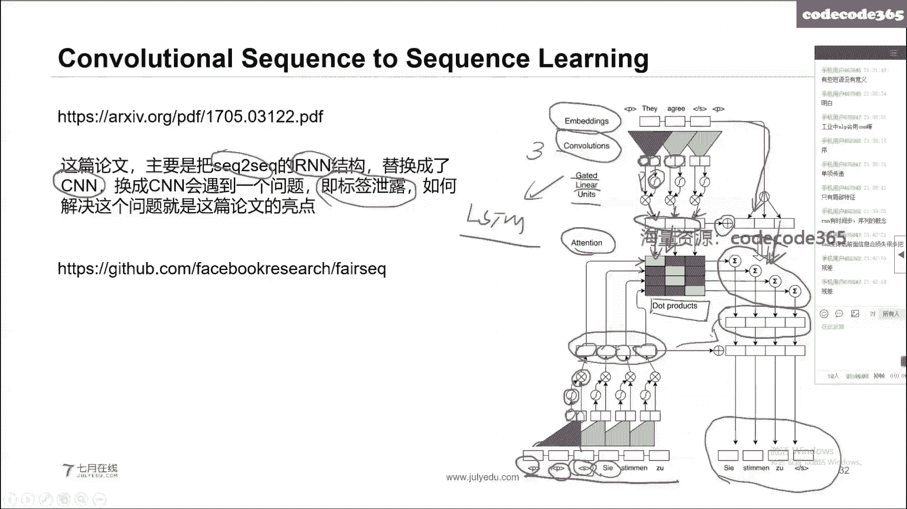

就是这些东西了啊，然后接下来呢我们就一起带着大家来，把这个TXT这一块的一个模型的这个代码啊。

给复现一下好吧，复现一下啊，然后我们这边简单说一下啊，在我们之后一节课程当中呢，我们都会使用这个PYTORCH，Pytorch，PYTORCH的话相比于腾格弗洛来说，它的这个使用起来会简单一些。

并且目前越来越多的人都在使用这个PYTORCH，好我们这边就重新进重新新建一个好吧，哦TX啊，然后我们把它先删了啊，先删了，OK我们就一起来带着大家，把这个TXN那个复现一下啊，复现一下好。

有些同学可能会说啊，我没有用过PYTORCH，不会不会没关系，你看我写一遍你就会了，好吧，很简单啊，PYTORCH很简单，怎么构建模型呢，首先，我们把咱们的这个torch导入进来啊。

然后我们把常用的这个NN也可以导入进来，OK接下来我们简单说一下啊，你在PYTORCH当中要定义一个模型，该怎么定义呢，新建一个类，新建一个类啊，然后我们让这个类继承自NNMODU嗯。

打磨点继承自N打磨掉，然后我们需要重写它的两个方法，一个是它的一个构造方法，一个是构造方法，那构造方法是在干嘛的，构造方法是在注意啊，注意听构造，构造方法是在啊准备我们需要用到的layer。

就是说你的模型结构需要用到哪些内容，那你就在你的构造方法当中去写，好吧好，这是我们的一个构造方法啊，还有一个是咱们的这个啊forward的方法，for word方法，这个方法是在干嘛，哎今天怎么回事。

这个方法是，嗯不要了吧，pass掉这个方法就是把layer拼装起来，拼装起来，进行选项传播，啊这就是我们的forward的方法啊，forward的方法，OK我们一步一步来嘛。

我们就先来准备我们需要用到的一个layer啊，这里我们先不考虑考虑位置编码啊，好吧，首先是什么，看一下，第一步是什么，Embedding，Embedding，直接就调用N导embedding。

我们就定义好embedding层的那embedding，第一个参数是这个词典的一个大小啊啊我们用，我们把这个参数从外面传递进来，从外面传递进来，然后我们还需要一个参数啊。

是这个embedding size，embedding fies就是embedding的一个维度，我们也从外面传递进来啊，传递进来好。

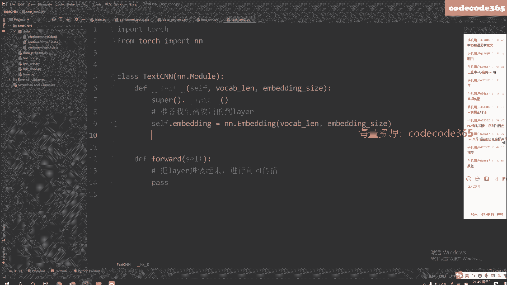

embedding层我们就定义好了，接下来是什么，我们看一下三种卷积核对吧。

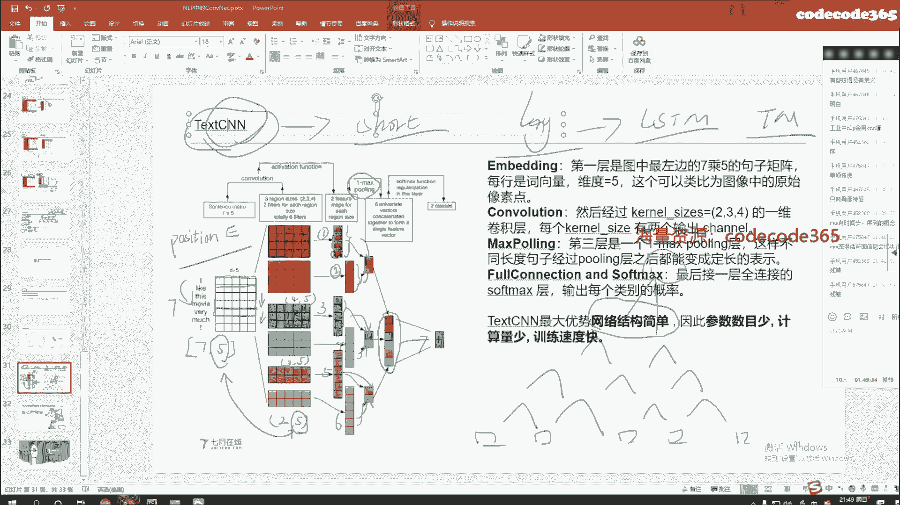

那我们就定义三个卷积层吧，我们就叫CNNN导com td好，然后我们考虑一下啊，我们输入的这个embedding它是一维的对吧，所以说输入的这个channel的话，它是一好。

主要是我们要考虑一下我们的输出的channel，输出的这个channel的话，我们输出的是两个对吧，那我们就输个二就OK了，然后是我们的这个kernel size啊，KERNESIZE好。

我们这里的kernel size是234对吧，第一个是二，然后第二个维度要保持一样嘛，和embedding size保持一样对吧，那我们用元组吧，好那我们第一个卷积核，这个第一个卷积层我们就定义好了。

接下来呢我们还需要定义两个对吧，一个是二，一个是3A就是二。

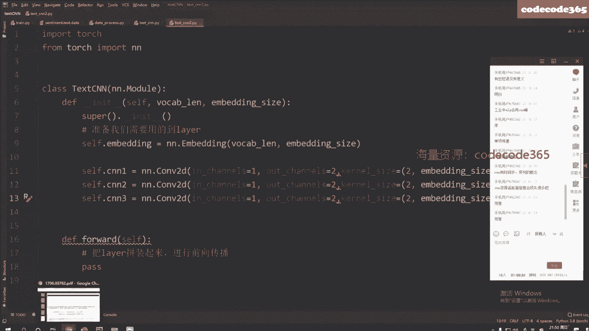

分别对应我们刚才的这两个对吧。

那我们这个维度就需要改一下啊，改成这个三的四三的四好，那就变成了234好，三个卷积没问题吧，三个卷积卷积好了之后，我们看一下还差啥，哎怎么回事啊，怎么切不过去，卷积网络是不是磁化磁化好。

那我们来定义我们的磁化，我们叫X，好定义我们的一个池化，Ok，接下来我们要考虑一下，我们的一个kernel的大小啊，kernel的一个大小，这里可能是大小是多少呢，那假如我们现在哦我看一下啊。

我们需要有一个序列的最大长度嗯，我们看一下啊，这边序列最大长度设置是多少，好我们这边序列的最大长度设置的是32，32，32的话，我们考虑一下啊，序列最大长度是32对32。

那我们的这个kernel大小是二，也就是说我们输入的这个是32，然后续这个克隆大小是二，然后我们不长是一，那我们输出结果是多少，来各位同学，31其他同学呢，其他同学还有不同的一个结果吗。

这同学没有了是吧，好这是31就31好，我们接下来还需要两个这个置换啊，大家就一起来思考这些问题好吧，因为你在写代码，其实你自己去写的时候，你会遇到这些问题，所以大家就一起来思考啊，一起来思考啊。

这就是那因为这个是三嘛，好说一下怎么算的啊，首先是32对吧，你需要去减掉你的这个那个可能一个大小，那32减掉二，那就是30，30的话要除以步长，除以不长的话，那就是一级嘛，那还是30对吧。

那最后还要再加一对吧，我们可以一会回答怎么回事，诶怎么回事，怎么奇奇怪怪的点不回来了对吧。

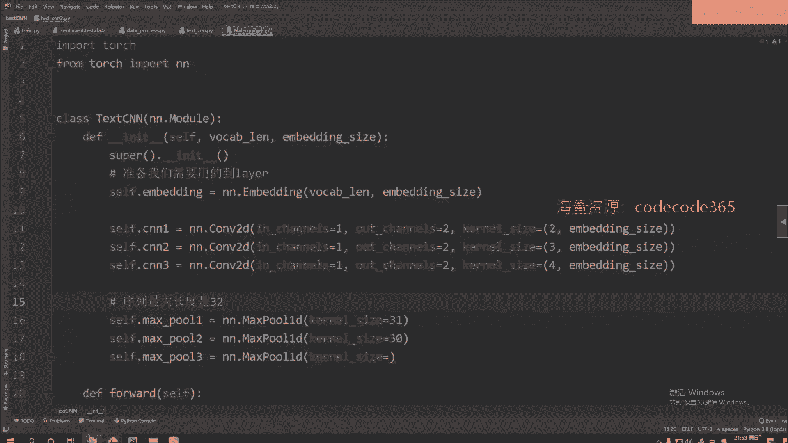

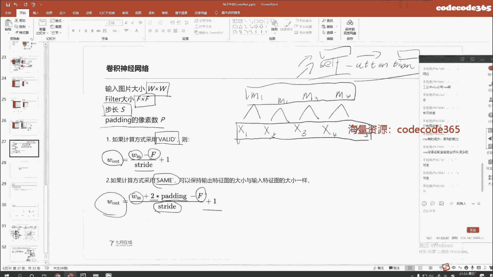

那我们这边还要再加一嘛，所以就变成了31好，这里是30，那最后一个的话就是29对吧，29好，最后的话我们可以定义一个啊，加个drop out吧好吧，drop the part的话就是用来防止过拟合的啊。

the part我们可以给他这样的概率值啊，连接啊，然后最后来一个dance，嗯dance的话就是点LINU，点lei啊，好INO，那假如我们的这个embedding size。

我们用embedding size乘以33啊，为什么乘以三，如果我们这里是我们看一下啊，是不是乘以三呢，我看这是我这个输入值，输入值输入值的话，其实就是我们的怎么回事。

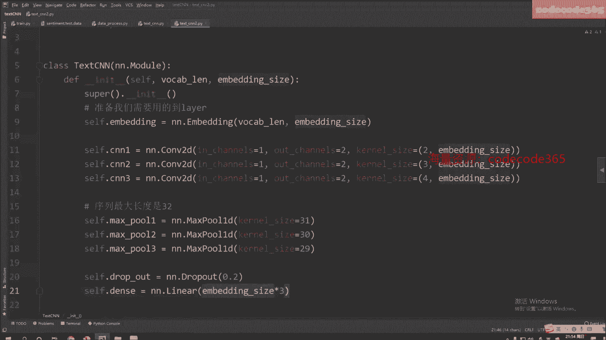

输入值的话实际上就是这一块对吧，就是这一块，那实际上我们这里一共有啊，这边是有两个值，这两个值这个值那一共是六个池子。

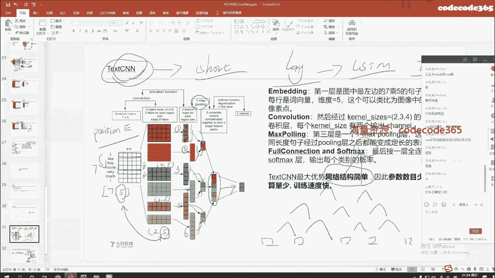

一共是六个值，那就不是这个东西啊，这里应该是我直接写啊，直接是六尺六五尺，output channel是二，所以2×3，所以这就是六啊，然后我们假设要做一个二分类，那这里你就输出二就OK了啊。

输出二就OK了，好这就是我们需要准备的一些网络结构，准备好了之后呢，我们来看我们的forward方法，word方法把雷也拼装起来对吧，那首先呢就是得到我们的这个embedding。

我们调用一下我们的这个self embedding。

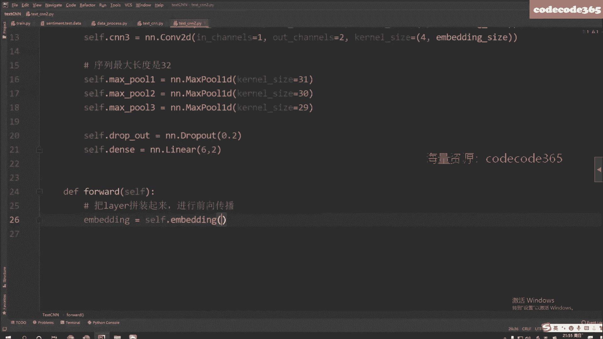

我们需要把X传递进来啊，哎。

好吧，X传递进来传递进来，然后我们这边可以做一个这样的一个，这是在干嘛呢，就是给第一个维度啊，再加一个维度，因为我们这里是个二维卷，对于图片来说它是一个四维的，那对于我们文本来说是一个三维的。

所以我们可以在第二个维度，也就是也就是一的这个维度去给它扩一个维度，扩一个维度好，那我们接下来就进行一个输出，那第一层的这个CNCN21吧，CN21就调用我们的CNN1对吧。

然后把我们的这个结果传递进来，embedding传递进来，然后我们这里可以把那个那结果再缩回去啊，我们可以用EZE方法把最后一个维度给去了，其他也是一样，我们把这是二，这是三好，处理完之后呢。

我们接下来就是做什么石化嘛对吧，我们可以调用一下我们的max po，next book啊，这样的话我们就能得到我们的第一个，最大池化层的一个结果，我们来看第二个，哎哎呀，这个键盘不太习惯，这是第二个。

这是我们的第三个，第二个三个，OK那这些都准备好了之后呢。

我们就可以做一个什么啊，我们这边怎么做的，石化层拿到了一个结构进行拼接对吧。

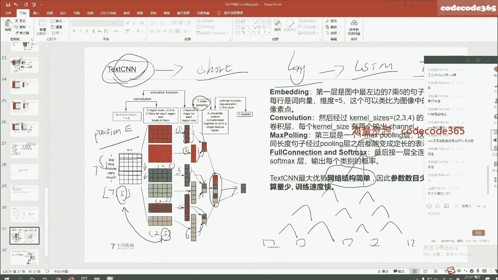

再给我们分了一层，那我们也是一样的，我们调用一下cat方法啊，把它给拼接在一起，alt1alt2alt三，好拼接在一起啊，拼接的这个维度呢是一个维度啊，还是一样啊，我们去把最后一个维度给去了。

得到我们最终的一个输出值，然后我们这边可以调用一下我们的这个drop out，把我们的这个alt放进来，I好得到我们的输出值，我们再把我们最终的输出值给到我们的dance，dance把alt加进来。

OK最后进行输出，然后我们把我们的这个out值返回，OK整个我们的模型啊就搭建完成了，搭建完成，接下来的话我们来看一下啊，我们把我们的这个text返回一下，是二对吧啊，然后两个参数，一个词典大小。

一个embedding size，OK我们执行一下代码，看能不能一遍过啊，各位同学可以直接在自己的笔记本电脑上跑，是完全没问题的啊，因为TX这个模型结构比较简单，所以大家自己在自己的笔记本电脑上跑。

应该也是可以跑的，你没有GPU应该也是可以跑的啊，这个不用担心，模型结构比较小，然后这边的话还会有一些包括，数据的一些处理，这些东西的话就是一些逻辑代码了，我这里就暂时不给大家说了，好吧好。

这边就已经开始进行一个训练了啊，开始进行训练好，可以看到他这个效果好像是不太理想的对吧，不太理想，那我们可以考虑去简单调整一下，它的一些参数啊，他这里这个output channel的话。

就说你运用了几个这样的一个channel对吧，那我们可以考虑运用多一点的嘛，如果你太简单，我们可以考虑运用多一点，我们搞个搞个20吧好吧，看一下效果有没有提升，搞个20，那这里的话就变成了就变成60。

好，我们再试一下，诶好像效果变化也不是很大是吧，嗯好像比刚才稍微好一点点，再把这个参数简单调一下啊，我们来试一下，而其他的话我们也可以再调一下，其他的一些东西啊，啊这个哦对数据集我都忘记和大家说了。

这个其实就是一份那个情感分析的一个，数据集啊，还有一和零一的话就是正面情绪，零的话就是这样的一个负面情绪，负面情绪，好基本上整个流程就是这个样子啊，然后我们看一下嗯，诶这里好像有问题啊，这里忘记改了。

诶这里好像我看一下词典是在哪里打的，我记得我这个词典都还没生成呢，我们执行一下这个，OK这边我们看一下词典，1万多是1万，1156啊啊这个没问题啊，我们再跑一下，那当然应该是词典的一个大小啊。

不然效果应该不会那么差，那这个层数大家可以设置小它小一点啊，没必要设置这么大，没必要设这么大，啊我们先跑一下看一下好，可以看一下啊，这效果其实一下就起来了对吧，干那个词应该是词典的问题啊，一下就起来了。

已经达到89，我们再改回来啊，我们改了和原论文的一个超参数保持一致啊，我们就用二来看，我就用R啊，这里就是六，OK我们再看一下，好稍等一下还可以看到啊，其实效果还是不错的对吧，第二个epoch叫85了。

86还在不停的收入对吧，86。4甚至87了啊，效果已经还不错了，OK行，基本上这就是今天要给大家讲的一个内容了啊，大家下来把CN这一块弄明白的话。

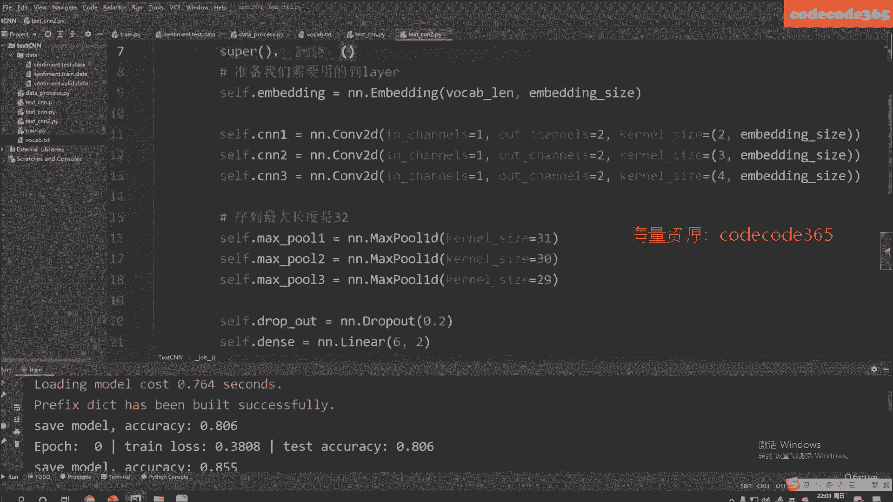

可以一样啊，来把这个代码这一块给复现一下好吧，复现一下。

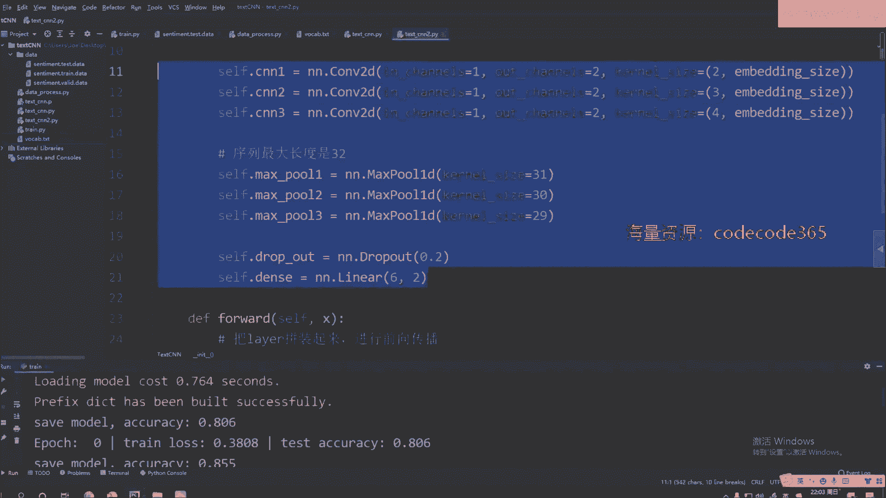

好行，看各位同学有没有什么问题，不传在哪里定义嗯，这里啊这里还有一个它，这个里面是有一个参数的，你看它有一个street的一个参数啊，默认是一，默认是一，你可以说啊，你也可以设三好吧。

好其他同学还有问题吗，图片为什么是四维的啊，是这样子啊，你图片输入是这样子吗，首先第一个维度是resize嘛，do a do bpage size诶，第二个维度是kernel size。

那第三个维度是它的宽，然后第三第四个维度是它的高传中size，因为它是RGB嘛，RGB所以，channel size等于三，那如果你是黑白图片的话，那这个channel size就是一好吧。

要是图片的宽和高，所以它是一个四维的四维好，我也说明白吧，好其他同学还有问题吗，啊没什么问题，咱们今天的课程内容就到这边了，好吧，就到这边了，好行呗，那咱们今天的内容就给大家讲到这边好吧。

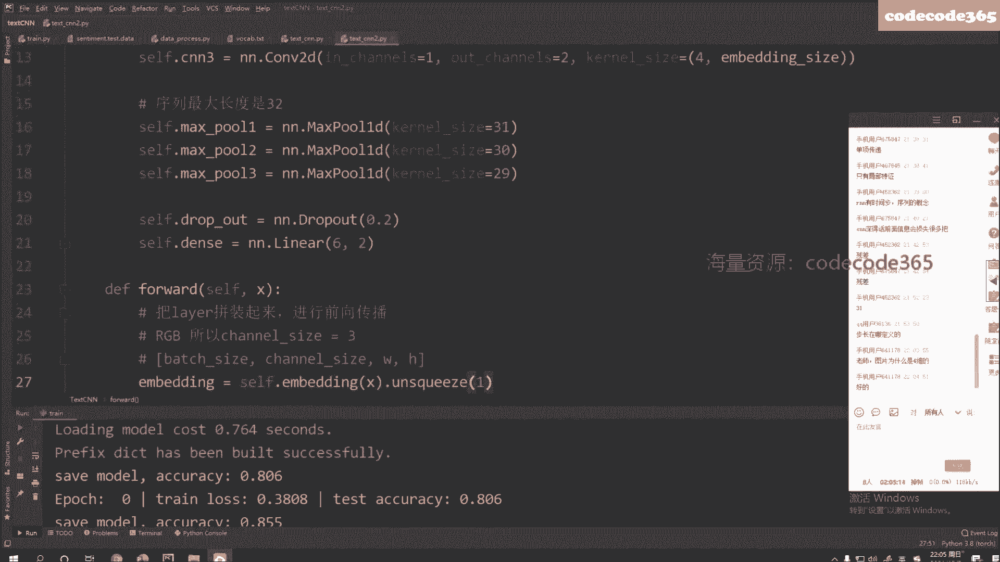

那我们就下次课再见，然后大家有什么问题的话，也可以在群里面找我就OK了。

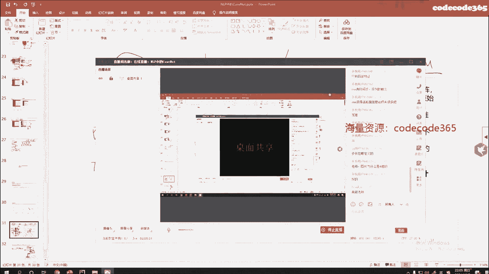

好吧嗯好的，各位同学。