# 【七月在线】NLP高端就业训练营10期 - P3：3.基于CNN的文本分类_ev - IT自学网100 - BV1uxT5eEEr6

好刚好啊，对于昨天的课程，各位同学有没有什么疑问的，现在可以提一下，我们在啊开课之前啊，先简单做个答疑，看昨天的内容，各位同学有没有什么疑问，有问题吗，各位同学，都没什么问题是吧，好行吧。

那我们就继续开始今天的内容吧。

咳咳咳好啊，今天的内容是这个，我们是使用卷积神经网络来处理咱们的这个呃，NLP的一个问题啊。

好我们简单看一下今天的几部分内容啊，今天四个部分内容啊，首先第一部分的话，是要把昨天我们这个没有讲完的，这个transformer那个部分咱们再讲一下啊，把剩余的一部分给补充完，然后第二点的话是啊。

这边之前额外加了一点内容啊，就是很多同学会来问啊，就是说啊如何去阅读这样的一个论文，好，这边的话，我也给简单的给一下自己的一些建议啊，而第三点的话就是啊，进入我们今天的一个重点啊。

就关于卷积卷积神经网络这一块，就包括什么是卷积神经网络，而在这个咱们NLP当中，如何去运用这个卷积神经网络好吧，这就是咱们今天的一个内容啊，好那我们就先进入我们的这个第一部分啊。

关于这个transformer的这个补充啊，对于昨天的刚才有同学可能还没进直播间啊，我简单提一下，就对于昨天上课的一个内容，如果还有疑问的地方，现在可以提出来好吧，我们可以解决也解决一下啊，好。

那我们来看今天的这个transformer，这一块的内容啊，昨天讲到了这个嗯，mari had腾审这一块对吧，mari had腾审这一块好，那接下来我们就来看一下啊。

他的这个transformer当中的其他的一些结构，OK我们把这个encoder部分单独拿出来看一下，这个self attention这一块呢是我们昨天已经讲过的，在接下来的一个结构当中可以先看一下啊。

首先呢是这一个部分，它这里有一个X加上Z，这个Z的话，就是经过我们这个self attention得到之后的，一个结果对吧，那这个X是什么呢，X是我们一开始的这个输入的这样的一个值啊。

X是我们输入的这个值，那如果是第一层，第一层，那就是我们的这个文本的这个，embedding的一个结果对吧，那如果是后面的层，那这个表示的就是每一层，这个encoder输出的一个结果好吧。

因为咱们的这个transformer啊，它通常都是有多层的这个抵扣的啊，这个抵扣的它是这样子的，多层的它是多层的，这第一第二第三它是多层的啊，那对于第一层的话，传给第一层的是咱们这个embedding。

那传给咱们第二层的，其实就是第一层的一个输出对吧，所以这里这个X啊，如果是第一层就是embedding，第二层的话就是上一层传递过来的一个结果，那这里可以看到啊，他是用这里这个X加上了这里这个Z。

那这样的一个操作呢，就被称为这个所谓的残差模块啊，残差模块对应到咱们的这个图当中啊，就是这个位置啊，ADD ADD好，那做完这一步呢，他会做这样的一个layer normalization。

Layer normalization，这个layer normalization又是什么东西呢，它其实啊就是在做一个所谓的一个规划规划，那这两步呢通常都会啊放在一起啊，就被称为这个AD and of。

OK那经过这两步之后呢，就会拿到我们这样的一个输出结果对吧，输出结果呢给到我们这个fade for word层，那fade for word层，昨天和大家说过了，这个实际上就是可以简单的看成。

就是这样的一个全连接层啊，全连接层好，那经过这个全连接层之后呢，又继续给到了这样的一个ADD and n，也就是刚才这里说的这个残差模块，和这个没有normalization。

那整体的这个encoder的一个结构就是这个样子，那最终呢实际上就是多层的这样的一个encoder，堆叠在一起，那具体你要去堆叠多少层，就看你自己的一个选择了好吧，那像我们自己啊。

比较常用的这个预训练的语言模型，BT这个模型它实际上啊，就是这个encoder堆叠了12层好吧，12层就搞了12个这样的个encoder，堆叠在一起啊，堆叠在一起，这个大家需要注意一下啊。

BT这个模型是transformer encoder部分好吧，它只包括encoder部分，这里很重要啊，好这是我们啊内部的一个结构哈，接下来我们就详细看一下这里的这个啊，残差模块。

还有这里这个NONONALIZATION，那后面的这个fit for word我就不说了好吧，全连接层这个相信各位同学都很清楚了啊，嗯好那我们就先来看这个残差模块啊，那通常上来说呢。

我们再去训练一个模型的时候，理论上来说网络的这个越深的话，理论上来说啊，他能提取的这个特征应该是会更强一些对吧，而且模型如果越深，它能承载的这样的一些特征值就越多，但是啊啊在之前的一些实验当中。

特别是在对这个RESNET做一些实验的时候，大家发现一个问题啊，当这个网络变得特别深的时候，它会容易出现一些所谓的退化问题啊，退化问题我们可以看一下下面这个图啊，对于左边这个图啊。

纵坐标是一个训练集的这个啊错误率啊，可以看一下，对于这个20层的这样的一个网络结构来说，它反而错误率会低一些，56层的反而高一些啊，可以看到20层的低一些对吧，然后再验证这个测试集也是一样啊。

20层的这个测这个错误率会稍微低一点，56层的错误率会更高一点，这感觉和我们的这个常识好像是有违背的对吧，理论上来说你越深应该效果越好啊，那这就是所谓的一个退化问题啊，那为了去解决这个退化问题呢。

就提有就有提出了这个残差网络啊，残差网络，那为什么会出现这种所谓的一个退化问题呢，其实这个东西啊就可以啊，我们可以回忆一下昨天我们讲RN的时候，其实当我们去做一个很长的一个，序列的特征提取的时候。

那它很容易出现一些所谓的一些，类似梯度消失的一些问题对吧，那你梯度如果发生了消失，那你有些层其实更新的就不好对吧，你参数更新的就不好，那你模型其实收敛的效果就会变差，那这个其实就是所谓的一个退化问题啊。

那残差网络它是怎么解决这个问题呢，我们来看一下啊，残差的主要的核心思想啊，就是让训练变得更加简单，这个大家需要注意啊，就是让训练变得更加简单，我们可以看下下面这个图，首先呢我这边输入的是一个X。

然后经过了这样的一层，然后再经过一个软路这样的一个计划函数，然后又经过了一层这样的一个神经网络，最后进行一个输出，那正常情况来说的话，我们就是输出我们的FX对吧，我们把FX进行输出。

那残差他是怎么做的呢，它会把我一开始的一个输入啊，再给它一条捷径，这样的一条捷径，同时把我们的输入给到输出的位置，把输入和输出进行这样的一个相加的一个处理，相加的一个处理，那为什么要这样子做呢。

我们其实可以考虑一下啊，假如我们现在输入的这个X的值，它是十，假如输入的是十，X等于十，那我经过一系列的网络之后呢，那他这个差值实际上就是0。1对吧，0。1让我们去求解。

这个也就是说我们的一个输入和输出，其实相差的是特别小的，相差的特别小的，这个时候我们来求这个梯度的时候，实际上就很容易出现一些梯度过小的一些情况，从而类似于梯度消失这些情况发生。

那如果我们把原来的一个输入，和咱们的一个输出就合并在一起，最终就变成了这样的一个20。1对吧，就变成了这样的一个啊20。1的情况，20。0，那我们这个时候的差值是，实际上就变成了十对吧。

那这个时候我们再来求梯度的时候，就会更大一些啊，所以说残差的一个思想，就是说我会给你一条捷径，给你一条捷径啊，并且啊在我进行反向传播的时候，我也可以走这一条捷径，去求解它的这样的一个梯度，好吧。

就以这样的一个思想啊，来控制我们这样的一个梯度，不要让它变得太小，出现这种所谓梯度消失的一个情况，好，这就是我们的一个残差模块啊，残差模块那应用到我们的这个transformer当中，也是一样的道理啊。

那我经过了这个cf attention之后呢，我希望你这个收敛的时候啊，这个梯度回传的时候更顺顺畅一些对吧，所以呢这里就添加了这样一个残差模块啊，残差模块，OK那残差模块之后呢。

又添加了一层这个layer normalization，哎这个时候可能各位同学又开始以后啊，这个LANORMALIZATION他又是干什么的呢，好我们来看一下啊。

啊在说layer normalization之前呢，我们先来说这个normalization好吧，Normalization，normalization的话，它其实有很多种啊。

但是他们都有一个共同的目的，就是把输入转化成均值为零，方差为一的这样的一个数据，均值为零，均值为零，方差为一啊，均值为零，方差为一，所以说我们实际上就是要把数据送入聚合函数，之前呢，进行这样的一个规划。

大家可以考虑一下啊，那假如我不去做这样的一个规划的一些处理，我直接给到后面的一些层，那假如我现在不做过优化处理对吧，我们都知道我们在上节课去讲那个呃SIGMOID，还有ten h的时候。

我们都会发现一个问题啊，他的这个梯度一旦这个值太大或者太小的时候，就会容易出现一些所谓的一个梯度消失的，一个情况对吧，就看就像下面下面这个图，这是西格boy的这个激活函数，右边的话。

这个是tan h的一个激活函数，的梯度的这样的一个图，当你这个值稍微大一点点对吧，就容易出现一些梯度消失，或者说梯度爆炸的一些情况，那这个时候啊，我们就可以考虑去做一个所谓的规划，做完归一化之后呢。

我们让它的均值为零，方差为一对吧，那最终他的这个值就会聚集在这个这个区间内，聚聚集在这个区间内对吧，这边也是啊，聚集在这个区间内，那这个区间内的一个值，你去求解它的这个梯度的时候可以看一下嘛。

这些梯度其实就很大了对吧，这些梯度很大，这图梯度很大啊，梯度很大，就不容易出现所谓的一个梯度消失的，一个问题啊，啊这就是LEONALIZATION的一个作用。

那LINDONALIZATION呢比较常见的是两种啊，一种是这个BATIONALIZATION，那这个batch，normalization是在每一个batch上面去进行。

这样的一个normalization的，是什么意思呢，这个同学可能也有同学啊，这个在batch这个维度上面去做也什么意思呢，好我们这么看啊，我们这么看，那假如我现在好。

我们先从这个机器学习的一个角度来理解啊，从机器学习的一个角度来理解，假如我现在有一条样本，这个样本呢它包括了很多的一个特征，好吧啊，我假设我用X来表示特征，它可能有X1X2X3X4，它有四个特征啊。

它有这四个特征，这是第一条样本，这是第一条样本，那对于第二条样本来说，它也会有对应的X1这个特征，X2X3X四好，我用二再加个上标吧，啊这是一，好他是这个样子的啊，他这个样子。

那如果是对于第三条样本的话，也是类似啊，也是LH也是类似，那这个BACHALIZATION，他去做这个layer normalization的时候，他是怎么做呢，他是在换个颜色的笔。

他是在这个维度上面去做啊，他是在这这个维度上面去做，所谓的一个归一化这个维度去做，这就是我们的，Which honalization，那对于layer normalization，他是怎么做的呢。

Layonalization，他是在这个维度上面做的，而是在这个位置上面做的啊，好那可能有些同学就会问，那为什么我们的这个处理文本的时候，我们要去使用这种LAYONALIZATION的。

那我处理文本为什么不能用什么来，我们考虑一下啊，那假如我们现在是两条文本，那对于第一条文本来说，对于第一条文本来说，它可能长度这里是四，那对于第二条文本，假如它的长度是五。

那我们就需要在这个啊把这一条这两条文本啊，进行这样所谓的一个补偿的一个处理，也就是说我需要把我的这些输入的数据的长度，做成统一的，假如啊，我设置了一个叫做序列最大长度的一个参数。

这个参数呢假如我设的是五，假如设的是五，那对于长度比较短的那第一条文本，我们就需要在它的结尾进行补零，然后这个如果是五的话，那就是X5啊，补零好，如果补了零，我们看一下啊。

如果我在这个维度去做这个BATIONALIZATION，你看是不是就有问题了对吧，你明显我在这个维度去做这个规划，肯定是有问题的，因为你这里是零，还有其他位，那其他序列可能这个位置也是零。

所以就导致会出现这样的一些问题啊，出现问题，所以啊在文本上面我需要去做这样的一个layer，Normalization，在它的这个维度啊，就是绿色，绿色这个框的这个维度来做这样的一个lay，我们来的事。

好吧好，我们先啊，接下来我们再来看一下啊，他的这个bash normalization和这个layer，Normalization，它的一个计算是什么样子的啊，那这对于正常的一个规划来说。

它实际上啊就是咱们的一个，比如我们有一个X对吧，去减掉这样的一个啊均值，再除以这样的一个方差对吧，处于这样的一个方差，这是我们正常的一个啊规划的一个方式啊。

那对于BASSIONALIZATION和layer onalization，他是怎么做的呢，我们可以看一下啊，他还是一样啊，这个部分实际上是一样的对吧，这个部分是一样的，可以看一下啊，这个也是啊。

这个部分是一样的，但是除了这个部分呢，他这里多了个ABC龙，还有外面有两个参数，一个阿尔法，一个贝塔，那这个ABC龙是干嘛的呢，他就是为了怕你的这个分母是零。

所以呢通常会添加一个这样的一个episode，它是一个非常小的数啊，接近于趋近于零的这样的一个数，你可以设一个啊十的八次方啊之类的，这样一个特别小的一个数就OK了，好。

关键是在于这里的这个阿尔法和这里这个贝塔，那这两个东西呢，实际上是两个可以训练出来的一个权重啊，大家其实就可以很简单的把它理解为，我这里先做了一个普通的一个规划，然后给到了一层这样的全连接层。

其实全连接层也是这样的一个权重，后面一个偏移项对吧，分别对应的就是咱们的阿尔法，和这样的一个贝塔好，那这里可能有同学又会有疑问了，你这里啊我去做这个规划的，是时候啊，先把这个均值给减了。

然后除以这样的一个方差，结果呢你这里又先乘了一个东西，就感觉好像这个东西这个阿尔法对吧，和这一项相乘，那如果这个阿尔法就是它的这样的一个方差，那相乘之后是不是就约了，然后如果贝塔和这里这个mu。

如果又又是相等的话，那这里相加是不是也约了，那这个时候实际上就变回了，原来的这样的一个结果对吧，就变回了原来的一个结果，那为什么还要乘以这样的一个阿尔法和贝塔呢，关键原因就在于。

如果我们只去做这样的一个归一化啊，就会把模型之前学习到的这样的一个，数据分布给重新打乱，那可能我之前的一个模型对吧，已经学习就我前面的这些模型啊，我现在有这样的一个encoder部分对吧。

好我用用model bil是吧，model我现在有一个model，我这一部分已经学的很好了，已经学学出了某个这样的一个分布，但这个分布呢，你如果直接去做这样的一个规划对吧，他这个分布就会被你强行打乱。

那这个时候呢，我们就可以考虑加两个参数进来啊，一个阿尔法，一个贝塔，再把他学习到的这个分布给拉回来好吧，给拉回来就虽然我归一化了，但是我的这个分布是没有变化的，就是这样的一个意思啊，就这样一个意思好。

这就是我们的这个layer normalization，好吧，OK啊，我们这里先停一下啊，对于这里的layer normalization，还有咱们的一个残差模块，看各位同学有没有什么疑问的，有问题吗。

各位同学，有问题吗，各位同学，两种我们normalization可以同时用吗，一般用一种就好了，因为实际上你你只是为了去把他这个规划之后，然后防止它出现这种所谓的梯度消失的情况嘛，对吧。

所以你任选其一就行了啊，没有必要两种都用，你两种都用的话，实际上就等同于你做了两次归一化，这个实际上是没有意义的啊，没有意义的，好其他同学还有问题吗，好OK那我们就继续往下了啊，大家有问题及时提出来呃。

那transformer的一个encoder，基本上就给大家讲完了啊，讲完了，然后大家自己下来的时候呢，可以自己去找张纸，然后去画一下它整体的一个结构，到底是什么样子的好吧，自己去画一下。

把整体结构画一下，然后包括他的一个self attention，它内部是怎么计算的，你要把它全部写出来啊，写全部写出来，transformer是这个面试当中必问的好吧，必问的啊。

参数A和B是不是随机初始化的啊，对一般的话是就是你随机初始化就OK了啊，随机初始化就OK了，但是对于一些特定的一些模型，它可能会有一些特殊的一些初始化的一些方法，好吧，这个得看具体的一些模型了。

像BT的话，他可能有具体自己的这样的一套，这样的一个初始化的一个方式，好吧啊，每个倍数后面补的零会对模型有影响吗，啊这个是不会有影响的啊，这个好，这个我简单说一下啊，这个可能有些同学还不清楚嗯。

我看找一页空一点的好，我简单说一下啊，是这样子啊，我们一般处理文本的时候啊，因为序列长度不一样嘛，那可能有的长度假如是四，有的长度是五，有的长度是十，假如说九吧九，那这个时候呢我们首先第一步啊。

回去做一个序列，长度统一统一啊，那假如我们设置了这个啊，MAXINE等于五，这个时候对于四这样的一个序列，我们就补零，那对于九这样的一个序列，我们就会把它的末尾啊，末尾的四个词给直接给舍弃。

只保留前面五个词，就我X1X2，一直到X9，我会把后面这些词全部直接舍去啊，只留X1到X5，就是这样的一个情况啊，就这样的一个情况，那补零的话是不会有不会有这个影响的，不会有影响的。

为什么会不会有影响呢，是这样子啊，当我们补零的时候，因为啊我们在给到我们模型的时候，去计算这个attention的时候啊，大家啊如果去看过这个BERT的源码的时候，你会发现啊。

它其实有一个东西叫做啊attention mask，叫做attention，Attention mask，那这个东西是什么意思呢，就是说假如我现在有一条序列啊，X1假如一直到X5。

那那假如我现在序列长度是十，那我就会在这里补五个零对吧，补补个零，他这个attention mask它就是什么样子，它就是11111，前面是五个一，后面是零，然后当我来计算这个attention的时候。

就是我们计算这个Q和K进行相乘，然后除以根号DK的时候，那我们这里这个D和K会进行相乘嘛对吧，他这里就会把这个东西给引入进来，那我的那个矩阵啊，我的这个矩阵，那对于后面的这些位置啊。

后面的这些位置就这些位置可能是零对吧，这些位置是零，他就会把这些地方啊全部置为零，这些地方值为零，所以说啊你即使后面补零，也是不会有影响的，好吧，就是在你可以简单的理解为，就是说我在做腾审的时候。

他这些地方的权重是零，只要你补零了，这边就是零，好吧，这位同学啊，我有说明白吗，啊位置编码好，不着急啊，不着急啊，这位同学我也说明白吧，好OK好，我们继续啊啊位置编码我看一下，我这里有说吗。

哎呀位置编码没写啊，好这边简单说一下位置编码啊，简单说一下位置编码啊，位置编码是这样子啊，就是在我们输入给咱们的这个模型的时候啊，就我们输入给模型的时候，那这里大家可以看到啊。

这里其实是一个叫做token embedding的那个东西，也是some的那个world embedding对吧，那实际上呢在我们的transformer当中呢，还会引入一个叫做位置编码的一个东西。

那为什么需要位置编码呢，啊我们可以考虑一下啊，对于RN这样的一个模型来说，它是一个这样的一个创新的一个结构对吧，它天生自带所谓的一个位置信息，但是对于我们的transformer来说。

我们是一个并行的结构输入进去的对吧，包括我们在计算我们的cf attention的时候，它也是这样的一个矩阵嘛，所以它是一个并行的一个处理，它实际上是没有考虑这样一个，所谓的一个位置信息的。

所以呢我们需要把我们的位置信息啊，给添加进去啊，给添加进去，那在这个transformer当中，它的这个位置信息是怎么做的呢，它实际上是一个正余弦的一个计算，一个公式计算出来的啊。

这个可以给大家看一下啊。

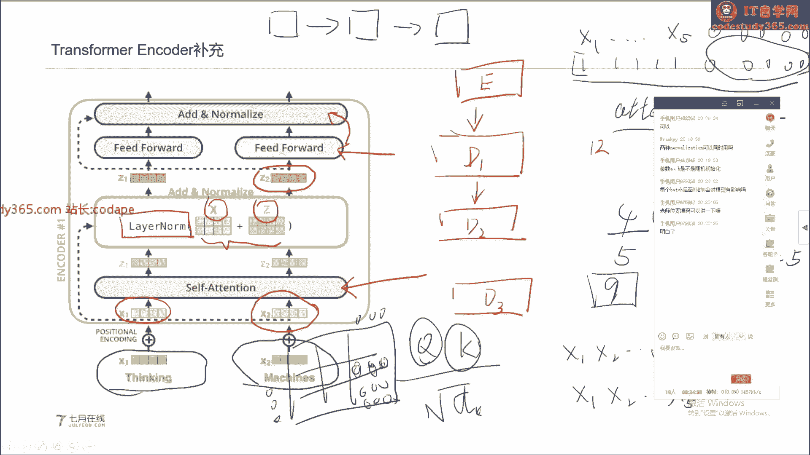

那有点慢啊，有点慢。

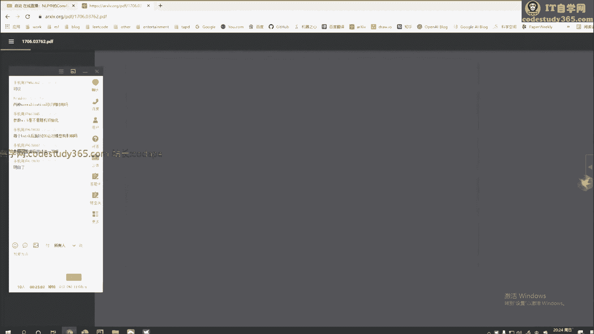

好我这边先回到PPT啊，先回到PPT。

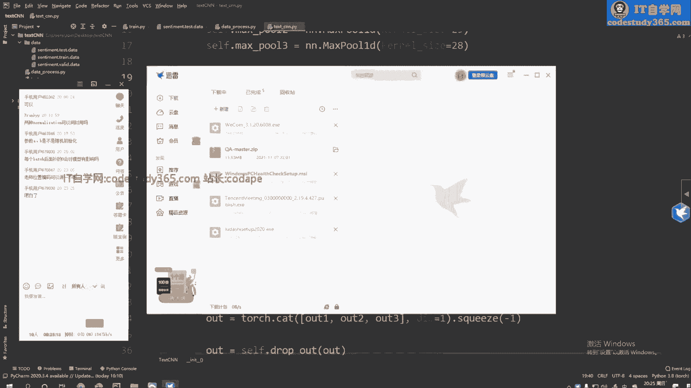

哎好我们待会再看哪啊，我这里先说，他这里呢会有一个这样的一个正余弦的一个公，式来把这个位置信息给计算出来，那计算出来之后呢，这里就等于有两个东西嘛，一个是咱们的一个token in bedding。

还有一个是咱们这个position随身embedding，他会把这两个东西啊进行一个相加，进行一个相加相加之后的一个结果呢，再给到咱们的啊相加之后的一个结果啊，就是这个东西啊，就是这个东西。

然后再给到后面的一个cf和参数，那这个位置编码其实有很多种啊，有相对位置编码，有绝对位置编码，那对于我们的这个啊。

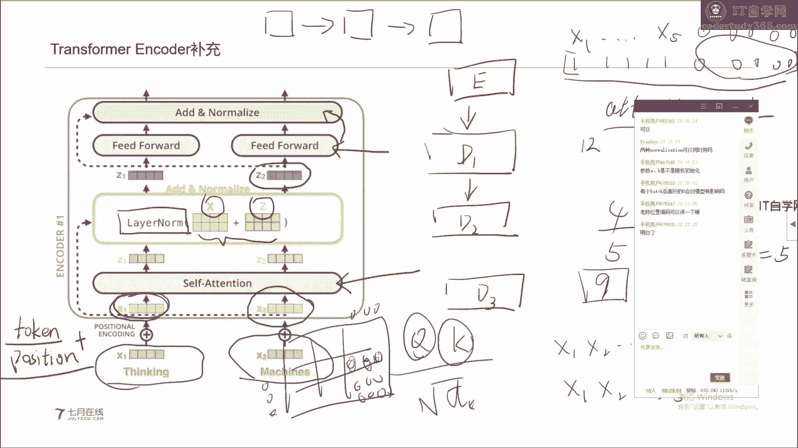

transformer这个原始的一个模型来说啊，他是使用这样的一个正余弦的一个方式啊，啊有点慢啊有点慢好。

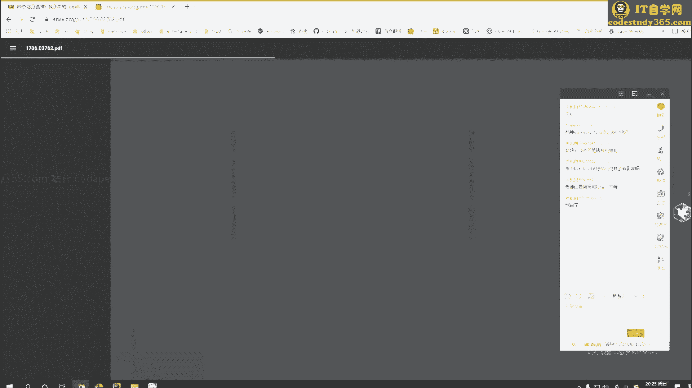

我们先给他那边加载着，我们先说后面好吧，我们先说这后面等那边加载出来啊，啊我们位置编码待会再说啊，我们先继续往下，那我们说到这里的话，基本上就把咱们这个transformer的encoder。

这一部分就讲完了对吧，包括他的ADNEREBALL，Mari，Had a tention，就都给大家讲完了好，那接下来我们就来看一下这个decoder，这一部分啊。

decoder这部分引入了一个所谓的一个，MASKET的东西啊，我们看一下这个mask到底是干嘛的，OK对于我们的这个decoder来说，我们回顾一下我们昨天的这个sequence。

sequence的一个内容，那同样是这样sequence sequence的一个模型，那decoder它肯定是这样的一个序列模型嘛对吧，他要不停的把这个值进行一个输出对吧。

所以decoder是要生成咱们咱们这样的一个，新的一个序列的啊，生成新的一个序列的好，但是transformer我刚才说了也说了一点啊，它是一个什么模型，它是一个并行模型，那如果是一个并行模型来说的话。

它去生成序列会有什么问题呢，我举个例子啊，就假如我现在啊有这样一句话啊，叫做人工智能对吧，我要把这句话，我要把人工智能这句话给生成出来啊，生成出来，那对于我们的这个RNN来说是怎么做的呢。

哎这里输入我们的一个起始符对吧，然后这边生成咱们的第一个字人，然后呢再把这个人给到我们下一个节点，然后来输出我们的一个弓对吧，他是这样的一个逻辑，但是对于我们的这个transformer来说。

它是一个并行的一个模型啊，并行的模型，并行的模型，它就不存在这样的一个，按顺序进行输入的一个情况啊，所以说在我们这个解码这个过程中，它就会存在一个问题，假如我要生成人工智能，这句话对吧。

当我们去做这个self attention的时候，我们会让这个Q和K进行相乘，然后得到这样的一个attention matrix对吧，那好我们看一下这个attention matrix。

如果我们不做任何的一个处理，我们把这个attention matrix展开，它其实是这个样子的嘛，它是它是这个样子的，好，这边是一个即时服，然后人工智能这边是人工智能，然后中止服，我们现在好。

我现在要根据这个起始符，人工智能，然后我们结果想输出人工智能终止符，这是我们昨天那个讲sequence，sequence这样的一个流程嘛对吧，输入的时候一定要有这样的一个起始符，没问题吧，这里好。

OK那接下来我们来看一下啊，那假如我现在想生成人这个字，在我们RNN里面是怎么做，是不是我只输入了起始符，但是在我们的这个transformer当中，因为是并行的人这个字啊，它实际上是可以拿到所有的。

你看起始符，人工智能这几个词的一个权重的，你看他这里实际上都可以进行相乘嘛，对吧啊，我这里用W表示啊，W1W2W3W4W五，理论上来说，如果人和人工智能这几个字如果不可见的话，理论上来说WR一直到W5。

他的权重应该是零对吧，应该是零才对，但是但我们现在这样一个情况，你去算这个Q和K的时候，你的这个QK是能是能互相去算这个权重的，也就导致我在预测人的这字的时候啊，我已经去看到了人工智能的一些信息了。

那这个时候模型会认为，我根本不是在预测下一个字，而是直接把这个人copy过来copy过来，那我去预测弓这个字的时候也是嘛，模型会认为哦，我只需要把弓这个字对吧，直接copy过来就OK了，对吧。

所以说对于这个transformer来说，你就是因为它是一个并行的，就没有办法来让它以RN的那样子，按顺序的一个情况来进行一个输出，那怎么办呢怎么办呢，我们考虑一下啊，刚才我们是怎么分析的。

我们认为如果我要生成人这个字，理论上上来说，我应该只能看到起始符，起始符对吧，也就是说只有W1，它这个权重应该是一个非零的一个值，其他的一个权重应该等于零对吧，应该等于零，那对于弓这个字来说也是一样嘛。

那我们要是在RN当中，我要生成这样一个弓，我可以看到起始符，我可以看到人对吧，那我可以看到起始符，我要可以看到这里这个人，那对于这里的这个啊W23吧，这是四对，这里的这个W23，W24和W25。

那这这几个值应该是零对吧，那这几个值应该为零，那对于质这个字来说也是一样嘛，那这个地方应该是零，这个地方是零，那这个地方是零对吧，对于结束符来说，它就可以看到所有内容了，就像我们昨天的那个图。

我这里最后输出了这样的一个啊，那个那个能字对吧，我这里输输入这样的一个能字，我最后要输出咱们一个结束符，所以说这个结束符它可以看到，所有是没有问题的，OK那有了这样的一个思路之后呢，我们就知道哦。

那我只需要去把这个，这几个位置这个权重啊全部置零就OK了啊，就我们看到右边这个图，也就是紫色这部分，我们只需要把紫色这部分的这个权重啊，全部置零对吧，其他权重我们正常计算就OK了啊，就OK了。

OK那怎么做呢，其实也很简单啊，我们还是一样啊，去计算这个QK的这样的一个权重矩阵，计算出来之后呢，我们再去乘上这样的一个矩阵啊，这个矩阵就这些位置全是零，要这些位置是一，好，我用这样的一个矩阵。

和我们QK的这个矩阵进行相乘，相乘之后呢，是一的位置，权重是保留的对吧，是零的位置啊，这些地方的权重就全部变成了零对吧，就以这样的一个形式啊，就能防止出现一个所谓的一个标签泄漏。

那这个思路呢实际上啊就是咱们这里的这个，就这里这个咱们这个mask好吧，就是这里这个mask，那可以看到啊，对于encoder部分来说，我们是在进行这样的一个编码的处理，所以它不涉及到生成对吧。

所以它是不需要的，那只有在我们这个decoder部分啊，我们会去用到这个mask，会用到这样的mask啊，就是这样的一个思路啊，好这个时候可能又有同学问了，哎你这里mask了。

那为什么这里你没有去做这个mask呢，因为这里啊这里的Q和K还有V它不是相等的，这里的Q和K是额一部分是来源于这个encoder，这部分啊，只是来源于encoder这一个部分啊。

所以这个地方大家是需要啊区分开的啊，需要区分开的，他这里实际上就是在和我们上节课给大家讲，Sequence，sequence的那个思路就一样啊，我需要把我encoder部分的一个结果拿过来对吧。

和我decoder经过了mask的处理之后的结果，去做这样的一个attention，然后再去加权，就这样的一个思路好吧，大家可以这么看啊，这里就是Q这里是咱们的一个K，这是V啊。

Q和就encoder的Q和这个decoder的K进行相乘，拿到这样的一个权重矩阵对吧，然后我们再用这个权重矩阵，和这里这个V进行加权啊，进行加权啊，就是这样的一个思路啊，就这样的一个思路，好啊。

我们在这里停一下啊，对于这个mask可能理解起来会稍微有一点困难，让各位同学嗯，我这里有说明白吗，还需不需要再讲一遍，这里可能理解起来会有点小小难啊，啊还需要再讲一遍吗，各位同学，再讲一遍是吧。

好好再来一遍啊，再来一遍，OK这里是有点不太好理解啊，好我们再来一遍，再来一遍啊，我们先把，我先把这里这个删了啊，我们再来一遍啊，啊这里有问Q是什么，Q就是你的一个输入啊。

你的decoder的一个输入额，这个这位同学昨天有有听我们的课程吗，咱们这个attention里面，self attention里面Q是等于K等于V的，也就是咱们的一个输入啊，就是咱们一个输入。

你输入是什么，它就是什么好，我们再来一遍啊，我们再来一遍，这里可能不太好理解啊，我们还是先简单回顾一下啊，在我们的一个RN结构当中，我们去做生成的时候，就我们这边是encoder嘛对吧。

encoder会给到我们的这个context啊，context要把context给到我们的这个decoder，好，Decoder，Decoder，第一个时间点会输入这个起始符对吧，提示符。

然后进行一个输出，进行一个输出好，那对应到我们的这个attention matrix里面，什么是什么意思呢，我们先看这个字，第一个字人如果我们想生成人这个字，我们是不是只应该拿到起始服的信息，对吧。

只应该拿到起始符的一个信息，好先看下这个同学的问题，序列的元素不应该看到后面的元素，所以它后面的对对对，就是这个意思啊，就是这个意思好，我继续啊，好我们现在理论上来说应该输出人这个字对吧，正常情况。

我们要把这个人这个字给输出，在RNN的结构里面，我们只会输入起始符S，只会输入起始符S，那对应到我们的attention matrix里面是什么意思呢。

就是说我再去做这个attention matrix的时候，我的人应该只能看到你起始符，因为我这里要计算权重嘛对吧，我要计算这个W11，这个权重就是你人和起始符的一个权重对吧，人和起始符的一个权重。

在我们的RNN里面，人只和起始符有关系，和其他是没有关系的，但是在我们的attention matrix里面，我们可以看到啊，人和其他的这些字也是可以进行计算的诶，对吧。

我的这个人可以和这些人工智能这些字，进行去这个权重的一个计算，那如果这个人和人工智能这四个字，能进行权重的计算，这说明什么呢，就好比啊我这里RNN里面，我直接把这个人工智能这几个字。

全部在第一个时刻进行了输入，给到了我第一个节点，然后让我节点输出人，那显然这种事不科学的嘛对吧，我应该只告诉模型啊，这是一个起始符，这是一个起始符，所以啊我们的这个W额，对于输入输出第一个字的时候。

我们的这个W1的R到五，他的权重应该是等于零，应该等于零才对对吧，应该等于零才对，所以呢我们通常就会把这些位置置零置零好，那如果我们现在要输出的是R哦，是输出的是弓这个字在我们RN里面是怎么做。

我们是把人作为了一个输入对吧，把人作为了一个输入，然后输出了弓，那对于RN来说哎这个时候输出弓的时候，他其实可以看到两个东西啊，一个是人，一个是我们的一个起始符对吧，这里我就不管了啊，一个是人。

一个是我们的起始符，它是可以看到这两个东西的，但是回到我们的attention matrix还是一样啊，还是一样，这个日这个攻这个字啊，他还是可以分别得到，即使符还有人工智能这几个词的一个权重。

但是理论上来说啊，我们应该让后面这，也就是咱们的W2的三到，他的一个权重应该是为零才对对吧，我生成弓这个字的时候，我只能看到起始符合人，其他是不能看到的对吧，所以这些地方应该置零，下面也是一样啊。

这个字的话，那就是这两个地方制零，能的话就是这个地方值零，然后结束符的话，就是我所有东西都可以看到对吧，所以这些地方就都是零，这都是零啊，好那正常计算的时候怎么计算呢。

就是我先得到这样的一个attention matrix，然后我去乘以这样的一个，啊下三角的一个矩阵就OK了，好吧，就是这样的一个思路啊，就这样的一个思路，因为这么一相乘的话。

是一的地方原来的权重可以保留吗，是零的地方原来的权重就全部置零了，好吧好有，我有说明白了吗，各位同学，OKOK好行啊，那如果我有的同学还是没有听懂的话，这个没关系啊，可以下来再复习一下这个课件啊。

可以下来再复习一下课件啊，接下来的内容的话哦，我们也不会完全用到这个mask，好吧好，如果听明白就好，听明白就好啊，这一块还是比较重要的，好我这边就顺便说一下啊。

顺便说一下咱们的这个transformer，它不是分为两个部分吗，一个是encoder对吧，一个是我们的一个encoder，一个是咱们的一个decoder啊，我们现在呢有两个这样的一个。

或者说我们的预训练语言模型啊，通常分为分为两类，第一类啊是以BT为啊为主的，这样一类叫做auto encoding模型，自编码模型啊，自编码模型，那BERT这样一个模型的一个结构是什么样子呢。

它就是我们的transformer的encoder，一个base版本的话是12层，12层，也就是说他就把这个船从我们的encoder拿过来，然后12层堆叠在一起，然后进行一个预训练。

这就是我们的一个bird，那还有一类预训练模型呢是基于这个GBT来的，这个所谓的auto regret regressive的一个模型，这样的一个模型它是什么样子的。

它是transformer的这个decoder decoder，但是啊它没有这一块，这一个部分是没有的，这个部分呢是没有的，它只有下面这个部分和这里这个部分啊。

嗯大家也可以把这个GBT理解为是encoder，然后把self attention那里加上了这样的一个mask，那这个GBT啊，就是用来做这样所谓的一个序列生成的好吧，序列生成的。

所以大家可以简单的理解为BT，就是transformer的encoder，GBT的话就是transformer的这个decoder，好吧，可以简单这么理解哈啊，那我这里也再简单说一下啊。

BT的话通常是用来做这个所谓的嗯，成分2U的三语言理解，也就是他的这个任务呢通常是用上下文对吧，假如这里X1X2X3X4X五，它有一个任务是什么完形填空，就假如我把X3这个词给mask住了。

我把它给遮住，然后我要用X1X2X4X5来预测这个词，来预测这个词啊，所以说它是可以是看见上下文的，那对于GBT这个模型来说呢，它是怎么做的，它是给你上文X2X3X四好，我要预测下文，我要预测X5好。

X5得到之后，我要预测X6，它是这样的一个形式好吧，这就是咱们的一个bird和GBT啊，这也是为什么我们要来花很多时间，去讲这个transformer啊，只要transformer大家弄明白了。

那你的这个BT和GBT你基本上就要弄明白了，好吧，像昨天有同学不是提到那个GB t three吗，GBT碎它是怎么做的，它实际上就是一个GBT啊，这里它不是一个咱们一个普通版本的GBT，是12层。

他这个GPT碎，它这个堆叠就特别深了啊，就特别深了，它一共有1000啊，1900亿的参数，然后对于我们这个12层的一个啊BERT来说，它只有1。1亿的一个参数啊。

然后去BT税的话有啊1900亿的一个参数，所以他模型结构是特别大的啊，好这就是transformer这一块了啊，基本上就给大家讲到这里，然后看一下这边对。

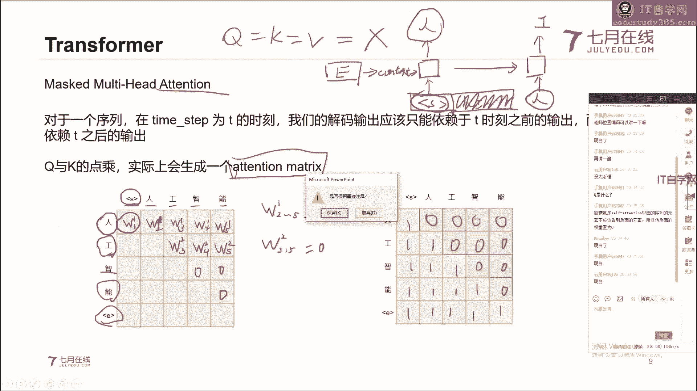

还有哦，OK他的一个位置编码简单看一下啊，简单看一下呃。

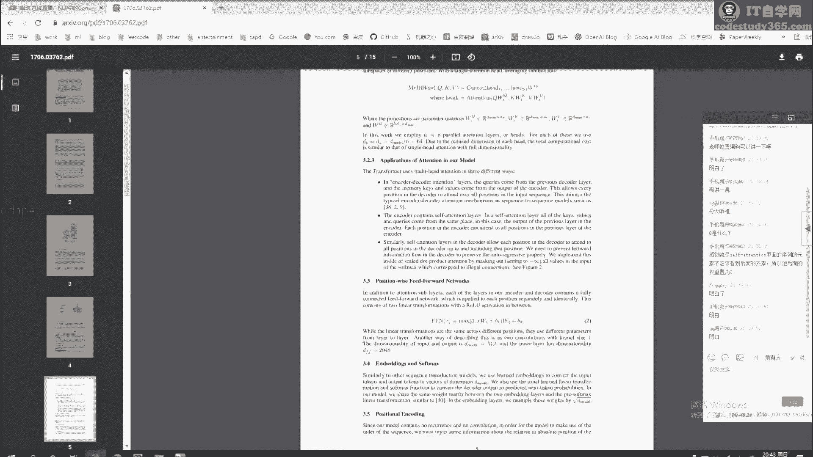

它的位置编码，就是根据这样的一个公式给计算出来的啊，计算出来的，但是在bird当中呢，BT的位置编码和这个transformer自带的这个，位置编码呢又会有一点点不一样。

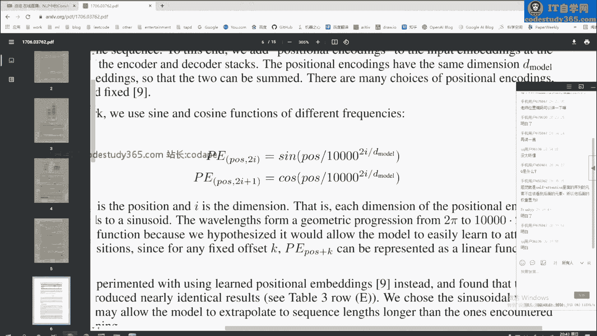

那BT当中的位置编码是什么样子呢，它是这个样子哈，这里也简单说一下，他是因为我们的BT，它最大的这个长度是1~512，就是你序列的最大长度是支持512，所以呢它会有这样的一个也是有一个啊。

Embedding metrics，Embedding metrics，那只是这个embedding matrix，输入的是这个序列的一个下标，就是如果你第一个位置，那就是一嘛，第二个位置是二。

第三个位置是三，最后一个位置是512嘛，他把这个位置信息啊，给到了这样的一个embedding matrix来，得到了所谓的一个position，Position embedding，好吧。

Possession embedding，这是BT的一个位置编码，和咱们的这个transformer的，位置编码的一个区别好吧，有区别，好接下来我们来看第二个部分啊，就关于这个啊一些读论文的一些建议啊。

一些读论文的一些建议，啊很多同学就是可能在才接触这个啊，NLP的时候呢，他可能会想说啊，那我能不能花些时间去多去阅读一些原论文，对吧，包括我们上课的时候，实际上也会讲完之后呢。

也会把这个原论文给罗列出来，我希望大家能去阅读一下原论文，然包括啊，像transformer这样的一些比较。

经典的医学论文啊，我是建议大家就一定要自己去阅读一遍好吧，就可能我上课讲解出来的东西，是我对这篇论文的一个理解，那你去阅读完这篇论文，你可能会说啊，我对这个东西可能还会有一些新的理解。

这也是完全有可能的好吧，就包括我去讲这个腾讯的时候，我去讲这个mask的时候，我都是根据我自己的一个想法来讲给大家听的，这种想法可能是我认为一种啊比较通俗，比较简单的一种理解啊。

所以说很希望大家能自己去阅读一下原论文，那你阅读完之后，你可能自己就会有一些新的一些收获。

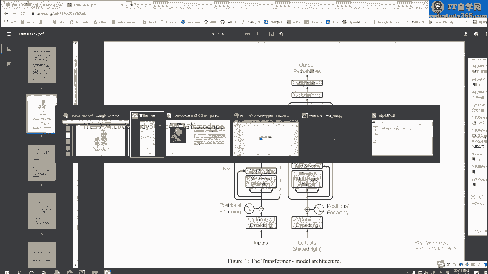

好吧好，那接下来就说一下关于啊论文这一块啊，啊首先的话就是肯定就是一个找论文嘛对吧，找论文像各位同学就才接触NLP的时候，大家不需要去啊，就是说啊我一定要去深钻，就是某一部分。

或者说啊某一个点的这样的一个论文，像今年比较火的这个prompt，或者说contrastive learning对吧，大家可能现在都还是在打基础，那就没有必要去花时间去跟这些啊，比较新的这些技术啊。

你只需要去把一些嗯比较热门的一些东西的，一些论文给看一下，例如我刚才说的这个transformer对吧，或者包括今天要给大家讲的这个，text n n这一块的一些论文，大家可以去看一下。

还有像昨天给大家说的那个LUANTENTION，像这些经典论文啊，大家可以去好好看一下，那最近的这些比较新的论文，因为大家现在学的还比较浅，所以大家就可以不用去跟这些新东西好吧。

先把这些老的东西给先吃透啊吃透，然后等到等到你真的这个有一定的一些基础了，然后你再想去了解更多的一些东西，想去自己去看一些论文的时候，那你你也可以去啊，首先怎么找怎么找，你可以去简单的方式啊。

你可以去先去看一些资讯网站啊，包括咱们国内的一些什么知乎啊啊公众号啊，还有CSDN啊之类的对吧，像国外的一些什么mu啊，这些东西大家都可以去看，还有像一些专门啊推推这个paper的一些网站。

像paper weekly啊。

还有这个paper with code这些网站啊，大家都可以去看一下嗯，像这个我看一下啊啊paper weekly，大家可以去看一下对吧，它会有一些啊热门的论文的一些推荐。

然后还有一些那个啊paper with code，大家可以去看一下，那paper with code，它这是干什么的，就假如你现在想去做这个呃机器翻译对吧，你只要来到这个网站啊，这边有个机器翻译。

你点进去，他这边就会罗列出来啊，最近的一些啊索塔模型是什么样子的，包括它的一些代码，还有一些论文地址，他都需要全把你给罗列出来，你都可以来对应这里去点进去。

去阅读它的一些paper，要去看他一些代码都是OK的好吧。

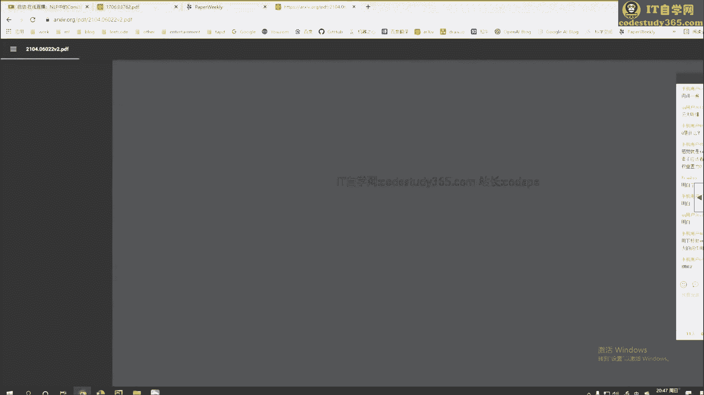

然后这边的话我甚至还呃，最近有一个比较火的一个阅读paper的一个啊，叫做read，叫做read paper啊。

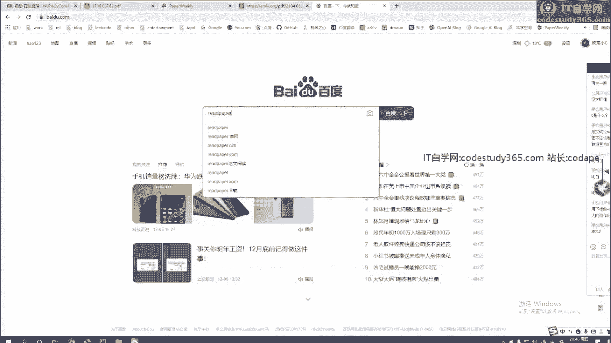

大家可以去看一下这个网站啊，啊它是一个阅读paper的这样的一个网站啊。

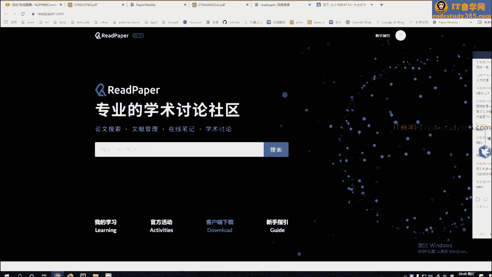

例如我啊举个简单的例子，就是你可以去把你自己的paper上传上去。

你也可以在他这里去搜索这篇paper啊，像我们的这个哎。

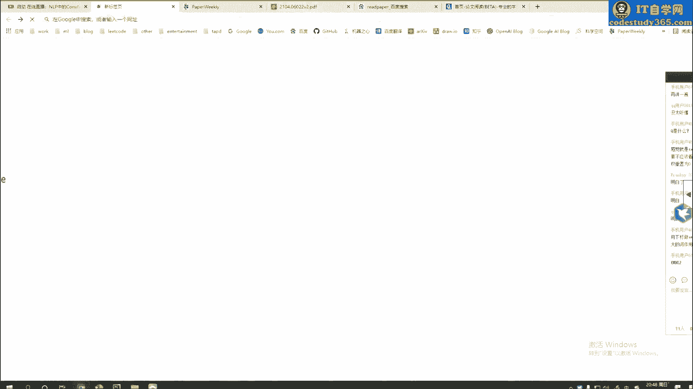

哎怎么老跳出来，像我们的transformer的paper对吧。

你可以在这里进行一个搜索好，你就可以啊，直接在这里进行这样的一个阅读，那他这边可以进行，他会帮你把这些什么表格啊，什么给提取出来，然后哦这个应该要登录啊，它关键就在于它很方便。

你去管理你的这个paper好吧，所以推荐大家去使用一下这个啊。

挺好用的啊，这是关于啊收集paper这一块啊，然后等到大家真的就是有能力了，或者说基础已经学的差不多了啊，就一定要去自己去阅读这样的一些paper啊，毕竟别人的这些解读，都是一些所谓的一些二手读物嘛。

那是别人的一些想法对吧，甚至可能还会有一些理解上的一些错误啊，所以建议大家这些比较重要的一些paper，一定要去读一下原论文啊，一定要去读原论文，那然后说一下关于如何去阅读这样的一篇paper啊。

那大部分的一些啊LP方面的一些paper的话，有两个啊，章节是比较重要的，一个是模型部分，一个是实验部分啊，那你只需要把这两个部分就是看完。

基本上就大概能理解一下啊，这篇paper啊，那拿拿到一篇paper的时候呢。

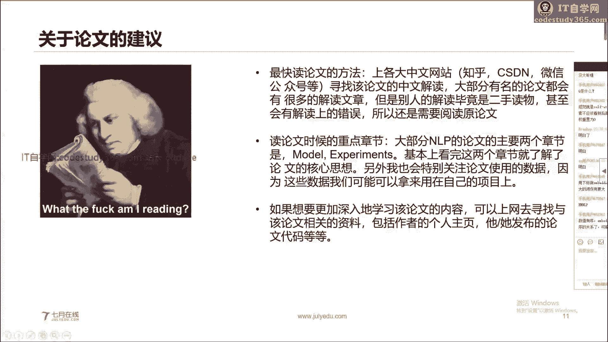

大家先不要去急着详细把整篇看完，你就先去看一下他的这个摘要是吧。

看下他的简介啊，先简单看一下啊，这边拍这篇paper大概是在讲什么的对吧，我对你哎先简单看一下啊，然后看一下对你是否有帮助啊，有帮助，OK那你可以去看像前面这些介绍啊，这些背景啊，你就可以先不着急看。

直接先去看它的一些模型结构对吧，模型结构是什么样子的，然后再去看他的一些相关的一些实验啊，像一些实验啊之类的，可以去看一下，甚至实验这些一开始你也不用细看，你直接去看他的这个这个结果啊。

看一下整体结果提升了多少，如果你对这个结果是满意的话，你再去看好吧啊。

这是一个阅读论文的一个这样的一个顺序啊，顺序，用下标做embedding，会不会造成下标值大的词作用吗啊不会啊，不会这个不会，并不是说你的这个下标越大，它的这个embedding就越大，没有这种说法啊。

没有这种说法，EMLP这个是这个要说什么吗，数值有序，embedding之后应该可能不止序有关系了啊，对他这个不仅仅是包含顺序的一个一个那个值，好吧，并不会出现这样一个所谓in白那个下标越大。

in be点越大的一个情况，不会出现啊，这个版型啊，这个继续说回我们的这个阅读paper啊，那啊大概了解了一篇paper之后呢，那接下来你可能会说啊，我想花一些时间去对这个paper去做一些布线对吧。

我想去把这个paper里面的一些东西啊，应用到我们自己的这个模型当中对吧，哎那怎么搞呢，你首先啊你可以去看一下这篇paper啊。

有没有啊，去开源这个代码，那开源的代码的话，那你可以自己去看一下。

就这个原论文的一个作者，他这个代码是怎么写的，像我们的这个啊attention一个为例，我们可以搜一下啊，看一下有没有啊，你看他这边哦，这个这个好像不是啊，我们再搜一下有没有，好像没有。

换一下刚才那篇啊，OK你看他这边实际上就会把这个啊罗列出来啊，这篇paper他的这个代码的地址，他就会把那帮你罗列出来，你就可以去看一下他的这个代码对吧，是怎么写的，你可以借鉴一下。

那其实啊各位同学可能没有复现过，如果复现过的同学的话，就会其实会发现一个问题啊，有些paper，他和自己的这个开源出来的代码会有偏差啊，就论文里面可能是这么说的，但实际上实现的时候他是另外一种实现方式。

就挺奇怪的啊，这个可能也是啊水分有点大吧，这样的一些赔款好吧，然后啊复线的话大概就是这个样子啊。

还有一点大家需要注意一下，就是复线这个东西呢，有时候你投入很多，会出现没有产出的一个情况，首先是市面上的确有水份的，赔本太多了，其次呢就是啊现在大部分这个paper啊。

他都是在这个英文的数据集上去做这样的一些，Ablation study，但实际上啊它在中文上有没有效果，这实际上是需要打一个问号的啊，所以就只能你自己去联系一下原作者，或者说你自己去做这样的一些实验。

来得到最终的最终的这样的一个结果，好吧啊，这是复线的这一块啊，那复线这一块我再简单说一点啊，就有些同学可能说啊。

这个复线到底该怎么去复现对吧，那这个东西还是建议大家先去才，你第一次去复现paper的时候，你不用着急下手，去找一些比较热门的，然后去看一下那些作者他是怎么写的代码好吧，当你看的多了。

你自然这种复现的能力，就会慢慢的给提升起来啊，提升起来好，这是关于阅读paper这一块的一些建议啊，建议，好那我们就继续往后啊，继续往后嗯，接下来就来我们第三部分啊，也就是今天的一个主要要和大家讲的。

一个内容啊，就是关于卷积神经网络这一块，我看一下哎，好像啊这样吧，我们稍微休息一会好吧，刚好讲了一半的一个内容啊，那我们就稍微休息一会，然后我们休息5分钟啊，休息5分钟，现在啊8。54啊。

我们九点上课吧，好吧，我们休息5分钟，我们九点上课，然后下节课，下半节课我们再来讲我们的这个卷积网络啊，卷积网络大家有什么问题就及时提出来好吧，及时提出来，上半节课应该难点就在于。

应该mask这一块是比较难的，其它应该难度不高啊，难度不高，好，我们稍微休息一会儿啊，好我们准备开始上课了啊，准备开始上课了，先看一下同学的问题啊，嗯LN和BN具体是怎么解决。

梯度消失和梯度爆炸的规划吧，数据大部分集中在中间，然后如何解决梯度消失和梯度爆炸的好，我们看一下，看一下啊，怎么解决，其实是这样子嗯，这是我们的这个SIGMMOID激活函数，这是ten h激活函数。

那SIG格MOID激活函数和tan h激活函数，最大的问题在于什么，它容易出现梯度消失嘛对吧，只要我的这个值，你看这西格玛id大于五，小于五的时候，这些地方的这些值，实际上就已经很接近于零了嘛对吧。

你看这里是零嘛，这里是零对吧，这些值已经很接近于零了，这些地方的值都是很接近于零的值了，那如果你不做规异化，那你的值就可能会在这些地方，那在这些地方的话，你的这个梯度是不是就会接近于零。

那就出现梯度消失的问题了吗，所以呢我们做完归一化之后呢，它变成均值为零，方差为一对吧，就会限制在这样的一个区间内，那这个区间内你可以看一下啊，这些梯度对应的是多少，就没有那么大嘛对吧。

你看这一块的这些梯度啊对吧，这一块的梯度对应过来，他就不会不会特别小吧，从而就解决了所谓的一个梯度消失的，一个问题嘛，也不能说解决也是缓解好吧，说缓解的时候更严谨一点啊，缓解更严谨，我有说明白吧。

这位同学，啊阅读配配的时候时常遇到公式看不懂的，或者说不理解公式所表达的意思，这个东西只能说是一个呃，一个慢慢我觉得慢慢熟悉的一个过程吧，就当你自己看了，多看看多了之后。

你反而会觉得这公式有时候会说的更明白一些，其实是这样子啊，为什么会有公式这个东西，大家有没有考虑过这个问题，为什么会有公式这个东西，就是因为他文字说不清楚，所以才会有文，才会有公式。

就如果你真的已经说的非常清楚了，那实际上是没有必要要公式这个东西，所以说当你自己去接触神经网络这些东西，接触的多了之后，你会发现那些公式其实都差不多，都会差不多，像，我们简单看一下啊。

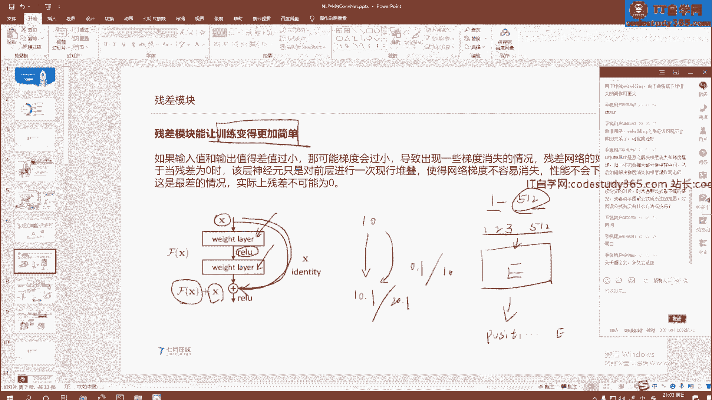

那假如我们看一下这个，我们就简单拿这个公式为例嘛对吧，我们就拿这个attention这个公公式为例，就很多时候你去看到这个QK前程的时候，当你看多了之后，你第一印象就知道哦，你这个Q和K相乘。

你就是在求这样的一个权重，你很快就能反映出来这个东西是在干什么的，所以说这个东西你问我怎样才能看懂，真的就只有你自己去多看，你自己看多了，你自然就有那样的一个感觉了，好吧，看多了自己就有感觉了啊。

这个东西还是一个看多和看少的一个问题吧，好吧，这位同学，我觉得嗯没有一个特别好的一个方式去理解，还有就是你要详细去看一下，他对这个公式的一个说明好吧，详细去看公式的一个说明，只能慢慢看啊。

这东西只能慢慢看，你看多了要上看的稍微慢一点，自然就能看明白了好吧，这个的确是没有什么特别好的一些技巧啊。

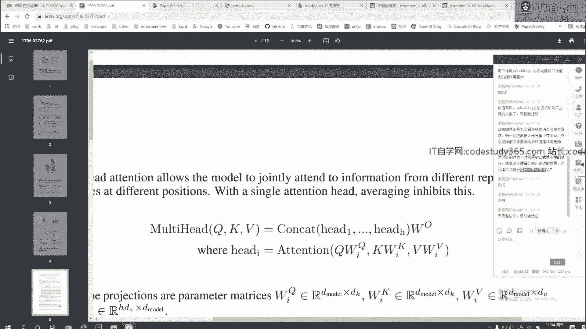

我觉得还是熟能生巧的一个过程吧，好吧，好我们来看我们今天第三部分啊，第三部分就是关于这个啊，CN这一部分的一个内容，啊，那对于一个咱们常规的来处理这个文本的，RN来说，他的一个时间复杂度是ON对吧。

因为它是按顺序来的嘛，你序列长度，假如你是那个序列的长度是N，那它的时间复杂度就是ON，所以这个时间复杂度啊它是ON，那通常呢我们去使用RN，提取了这样的一个文本特征之后呢，都会使用最后一个时刻对吧。

最后一个时刻的一个值作为它的一个输出值，给到我们的这样的一个分类层，进行这样的一个分类好，但这里啊RNN，它实际上只考虑了每一个词或者字的特征，那如果你是分字，那考虑就是字的特征，如果是分词的话。

你要考虑的是词的特征对吧，那我们考虑一个问题啊，能不能就说为特定长度的一些词序，去计算出它的一些特征表示呢，或者向量表示呢，例如我这里有句话啊，我们做个分词，他毕业于上海交通大学对吧。

他其实我们把它分成一些小短语，他可能会有，他毕业于毕业于上海与上海交通对吧，还有上海交通大学，那我们使用RN的时候，都是这样的一个字一个字的这样的一些提取，这样的一个特征，那我们能不能组成一些短语对吧。

像他毕业于，我们把这个东西的一些特征给提取出来，或者说上海交通大学，这一整个短语的特征给提取出来对吧，那能不能这样子做呢，好这就能，这就是如果你想去提取这样的一个特征。

就需要用到我们的这个卷积神经网络啊，卷积神经网络，Ok，接下来的话，我们就简单看一下这个什么是卷积神经网络啊，那说到这个卷积神经网络呢，第一点我们肯定要来聊什么是卷积对吧，什么是卷积，然后呢。

我们通常啊我们称这个F乘以G就为F和积累，这样的一个卷积，那这里有两个定义啊，一个是这样一个连续的一个定义，连续的定义的话，那就是去求这个不定积分啊，那对于离散的话，那实际上你就是一个求和的一个过程。

求和的一个过程，那这里可能各位同学看起来会有点懵啊，啊有点懵，你这到底什么意思啊，啊不着急啊，我们继续往下看，继续往下看好，那例如例如啊，我们现在啊有这样的一个啊式子啊，就是我们令这个X等于套。

然后Y等于N减套，那么我们的这个X加上Y实际上就等于N对吧，就等于N好，我们把这一条这样啊，把它画在我们的这样的一个啊坐标当中，这就好比什么啊，那这个X加Y它实际上是会变的嘛对吧。

随着这个N的这个值它是会变的，就一直从左下角一直到右上角，那我们可以看一下这条线啊，这条绿色的线它实际上就好比什么，就好比我们有一条毛巾，它沿着一个角卷了起来对吧，我们从左下角左下角一直往上面卷。

卷到了右上角，那这样的一个操作呢，就被称为这样的一个卷积的一个操作啊，卷积的一个操作好，接下来我们来看一个具体的一个例子啊，我们以一个离散卷积的一个例子为例啊，我们来看一下。

那假如我们现在啊有两个桃子啊，哦我们读骰子吧好吧，读骰子这个骰子读着舒服一点好，那我们用F来表示第一个啊，这个第一个骰子啊，那F1表示投出这个一的概率啊，比如说我F1的话，那就是投到一个点。

投到一个点的时候，一个概率F2的话，那就是投到两个点，然后我们用G来表示第二枚骰子啊，OK那我们现在考虑一下，如果两枚骰子点数加起来为四，它的一个概率怎么表示呢，那是不是就有三种情况。

第一种情况我第一个骰子扔一，第二个扔三，第二种情况两个都扔二，还有一种情况是我第一个骰子扔三，第二个骰骰子扔一对吧，那我们把这三者给加起来，把这三种情况加起来嘛，那这就是我们扔出来为四的一个概率对吧。

扔出来为四的一个概率，Ok，那我们把这三者再简单进行一个，这样的一个化简啊，化简把它变成一个这样的一个累加的一个形式，变成一个累加的形式，那这样的一个形式呢，就符合我们刚才的这个卷积的一个定义啊。

卷积的一个定义好，我们这边再回到这边来看一下啊，我们的一个离散卷积，它的一个定义，是不是就是我们的这个扔骰子的一个情况对吧，F套乘以及N件套，就这样的一个情况啊，这样的话就可以啊。

以这样的一个扔骰子的一个形式，来表示出我们这样的一个卷积的一个定义啊，这样的一个定义好，那我们大概理解了这样的一个卷积的一个意思，之后呢，我们再看一下我们的这个图像上面，它的一个卷积是怎么做的好。

我们现在这里有一张图片啊，有一张图片可以看到这张图片上，页面有很多这样的一个严重的一些噪点对吧，那如果我们想去做一个去噪的一个处理，那么我们就可以把一些高频信号与周围的数值，去平均一下。

就是说我可以取这个地方这个值对吧，我把这个值它周围的这些值，例如这些值，就把这个范围的一个值啊，去取一个所谓的一个均值，取完均值之后呢，就他就可以得到一个所谓的一个去噪的一个，效果好。

那我们详细去看一下这个计算过程啊，啊例如我们还是以刚才这个点为例啊，A1这个点为例，那在A1这个点当中呢，我们先去取一个它周围唯一的这样的一个啊，这个矩形啊，这个矩形就把这个它周围的这些值给圈出来了。

对吧，好，我们用F来表示，它这样圈出来的这样的一个矩阵啊，我们用F来表示，Ok，接下来呢我们会去做这个均值的一个处理对吧，均值的处理，那这个均值的处理呢，那实际上就等于给每一个位置。

一个1/9的一个权重嘛对吧，一个1/9的一个权重好，给了权重之后，那我们就对位相乘再相加嘛对吧，把这个G和F进行对位相乘相加，OK那对位相乘相加是什么，那是不是就是我们的F和G进行相乘相乘。

完了之后进行相加嘛对吧，我们的F和G进行相乘相乘，完了进行求和的一个操作，所以说卷积和这里这样的一个，去造的一个过程啊，就完全就是我们刚才说的那样的一个，卷积的一个处理好吧，卷积的一个处理。

啊这就是我们的一个卷积啊，这就是我们的一个卷积，只不过这里这样的一个卷积核啊，也就是咱们的一个基，我们就把它称为这样的一个卷积核，那这个卷积核呢实际上就是一个，权重是一样的对吧，权重是一样的。

好接下来我们看一个动图啊，看一个动图，那如果我们要对左边这张大图，左边这是我们的一个哎，左边是这个是我们的一个输入的一张图片啊，然后中间呢这个呢是我们的这样的一个卷积核，你可以把这边这个看成我们的F。

这个看成我们的一个G，Ok，那如果我们要把我们这个卷积核，应用在我们的这个F上进行刚才的一个操作，是不是哎就对位进行相乘，然后进行一个相加，最终呢就能得到对应的这样的一个，卷积之后的一个结果。

这就是我们一个卷积的一个操作啊，卷积的一个操作，那大家这里需要注意一下啊，当我们做卷积操作的时候呢，可以看一下，对于第一个位置处理完，我们会向右平移一个位置对吧，继续做卷积，直到往右边移移不动了。

那我们再往下移对吧，你看移到第三个位置移不动了，往下移要继续做卷积啊，继续卷做卷积，这就是一个卷积操作啊，说白了就是还是一个这个啊，求权的加权的一个过程嘛对吧，加权求和的一个过程。

好那接下来我们就啊详细看看卷积神经网络啊，那卷积神经网络和刚才的卷积，它唯一的区别就在于我们的这个卷积核啊，卷积核还是可以去动态去进行更新的，可以去动态进行更新的，那刚才我们的这个卷积核。

这里这个举这个积对吧，它里面每个值都是1/9，它是不需要去更新这个权重的，那对于我们的卷积神经网络，他的这个权重啊，可以在BP的过程中就反向传播的一个过程中啊，去更新它的一个值。

好我们这边看一个具体的一个例子啊，然后这边有一张啊，我们用把这个表示为一张图片啊图片，然后黄色的这个部分呢，就是我们的这个啊卷卷积核啊，卷积核是一个3×3的一个卷积核，然后红色的这个数字啊。

表示的就是卷积核的一个值，然后绿色这是整个的话就是我们的一张图片啊，图片，那我们把这样的一个3×3的卷积核，就应用起来嘛，应用到这个部分对吧，就黄色这部分啊，黄色这部分，那我们就先做一个对位相乘相加。

那最终我们就可以得到四这个结果啊，好接下来我们把这个卷积核往这边平移一下，平移一下，平移一下之后呢，我们这个卷积核还是这里的，101010和101对吧，我们再把这个卷积核呢和红色这一块这一块啊。

进行对位相乘相加，然后把结果呢得到的就写到这个位置啊，写到这个位置，这就是一个卷积的一个过程啊，卷积的一个过程，那最终呢实际上我们会做这样的一个，所谓的一个分类对吧，假如这里有个soft max。

soft max走进行分类啊，然后呢拿到了我们这个loss function，根据loss function我们得到了一个loss的一个值，那有了loss值呢，我们就可以进行我们的BP对吧，反向传播好。

这个时候呢，我们就可以拿到卷积核的一个权重啊，他的卷积核的一个梯度啊，梯度好，有了梯度之后呢，我们就可以对卷积核的这个权重，来进行一个更新对吧，啊就等于原来的W除以这样的一个啊学习率。

学习率我们用啊用什么表示呢，用阿尔法表示吧，然后乘以这样的一个W的一个梯度对吧，所以这样一个形式啊，进来把咱们的卷积核来进行一个更新啊，这就是咱们的一个卷积神经网络啊，卷积神经网络好，那卷积神经网络。

是如何应用在我们的文本上面的呢，我们来看一下啊，我们现在呢这里有这样的一个句子啊，这个句子当中123456有七个词，七个词，那每一个词呢它都有四维的这样的一个，向量表示啊。

也就是说他是这里有这样的一个矩阵，这个矩阵是7×4的对吧，7×4的，OK接下来呢我们这边会有一个卷积核，这个卷积核呢它是一个啊3×4的，3×4的一个卷积核输入是7×4啊，7×4卷积核是3×4的。

3×4的好，那接下来我们把这个卷积核，应用到我们的这个文本数据上面啊，应用到文本数据上面，好在应用之前我们先说一个东西啊，在文本当中，我们这个卷积核的大小该去怎么处理。

或者说这个卷积核我到底应该设置多大，大家觉得呢大家觉得我们在处理文本的时候，这个卷积核的大小我们应该设置多大呢，例如我这里不设成3×3乘四，我设成3×3行不行，我设置成这个3×5行不行，可以吗。

各位同学，不行嗯，好看来各位同学都知道啊，实际上啊第一个参数，第一个参数卷积核的第一个参数，实际上想表示的是，你想提取出来的这个主要短语特征的一个长度，我们回到刚才那一页PPT啊，我们这一页PPT说哎。

我们想去提取这样一个短语的一个长度对吧，那如果我每次想提三个字的一个短语，或者说三个词的一个短语，那你这个卷积核就应该选三，你卷积和第一个维度是三的，意思就是说我每次可以考虑三个词。

我对这三个词来作为一个卷积，那如果你第一个维度设的是四，那你可能就是每次考虑四个词，就是这样的一个意思啊，好我们再看第二个维度，第二个维度为什么这里是四，因为我们输入的这个embedding。

它第二个维度是四，那如果是三行不行，如果是三，在我们的这个图当中，它的这个卷积核就是这个样子的，是这个样子的，你从图像的角度去考虑是可以说的通的，但是在文本的角度来看的话。

你没有考虑后面这这个维度的这三个值，那你说白了就是你当前的这个词，你根本没有把它的这个特征给提取全，你要提取，你就应该把整个词的一个特征都考虑进去，而不是只考虑它的前三维特征对吧。

所以说我们设定第二个维度的时候，一定要和这个词向量的一个维度保持一样，如果这边是一个7×5的，那你这边就可以设335，如果这边是七六的，那你这边就可以设三的六好吧，这个大家需要注意啊。

这个东西千万不要错了，第二个维度是不是一个，你随便取多什么的都可以的一个值，取决于你的这个文本的那个embedding的维度，而第一个维度的话就看你了，你想取短语的，那你就设个二，设个三。

你想取一个大比较长的一个短语的，那你取个四，取个五都是可以的，好吧，好，那接下来我们就来看一下这里这个啊，卷积的一个计算过程啊，这是我们一个输入的一个音，一个向量表示文本的向量表示好。

我们把这样的一个kernel应用起来啊，应用起来，那首先的话第一第一次应用的话，那就是前三行对吧，我们把前三行给取出来，去做这样的一个碱基的一个处理，然后得到了这样的一个值。

那这个值实际上就是卷积核和这三个位置，对位相乘进行相加，然后得到的一个值对吧，那这个值实际上表示的就是前面这三个词，它的一个特征，OK接下来在图像当中啊，我们会向右移对吧，在图像当中我们先向右移。

再向下移，但是我们在文本当中，我们实际上是不需要右移的啊，那做完第一次卷积之后，我们直接进行下移下移，这里大家需要注意啊，下移多少多少个位置，它实际上是一个所谓的一个步长的，一个一个参数啊。

通常我们的话就有下移一个位置就OK了好吧，下移一个位置，那下移一个位置之后呢，就到了这个位置，就到了这个位置，我们再在这个位置做卷积，就拿到了负的0。5，那这个就表示的是这三个词的一个特征对吧。

那接下来的话我们继续往下吧，那就到了这个位置，好，画错了啊，这个位置，然后继续就得到了这样的一个值，然后我们就一直往下，直到我们卷积核到最后这个位置，做完卷积之后拿到这个值。

那我们整个这个卷积的一个过程就结束了啊，就结束了，接下来呢我们就把这个卷积的一个结果，继续给到后面的一些层进行处理，那最终的话我们会给到我们的分类层，然后拿到我们的loss boss进行BP。

得到我们的梯度，然后来更新咱们的这个更新，我们的这个额选集合好吧，这就是我们整个的流程啊，整个的流程，那好我们接下来再看一个情况啊，刚才那样刚才的情况会出现一个什么状况呢。

我们这边输入的序列长度是七对吧，我们输入的序列长度是七，经过卷积处理之后呢，我们这个序列长度变成了多少，变成了五，变成了五，那如果我们现在做的是N12，我们做的是N12，我们做的是序列标注。

你把我这个序列变成变短了呀，你不能把我序列变短啊，你变短了，我这个还怎么做N1加对吧，那怎么搞，我们就可以做一个所谓padding的一个处理，padding的一个处理，我们在他的这个头。

就是在我们序列最开始的位置先补零，然后在序列结尾的布置位置我们也补零，也补零，然后应用咱们的一个卷积核之后呢，我们拿到的输出结果啊就还是七七啊，序列长度就不会变，就还是七，原来我们序列长度是七对吧。

补了零之后，我们的序列长度就变成了九，然后经过我们的卷积之后呢，序列长度还是保持原来的一个七好吧，保持原来的一个七好，这是我们的补贴，我padding的一个操作啊，那除了补padding呢。

我们还要再理解一个概念啊，叫做多通道，多通道对于我们的图片来说，我们图片是分为RGB的嘛对吧，RGB他有333部分吧，三三原三原色吧，它有三个部分，那三个部分呢在图片当中，也就等于它会有三个通道对吧。

那三个通道我们是不是就需要应用三个kernel，我们每个通道给一个这样的一个term kernel嘛，对吧，三个通道的话就三个kernel，那对于我们这个文本来说，我们也可以给它多个kernel。

你不同的kernel提取的这个特征的角度，可能就会不一样对吧，这样的话我们就可以提取出不止一个特征，你看这里就提取出了三个特征，因为我们三个合同这里就提取出了三个特征，就这样的一个意思啊。

好这是多通道多通道好，接下来的话我们来说一下磁化了，磁化，那经过我们的这个，卷积之后呢，我们实际上拿到的是这样的，一个这样的一个矩阵对吧，这样的一个矩阵它是一个7×3的，它是一个7×3的。

那我们没有办法把这个东西是，直接给到我们的这个啊分类层的理论上来说，分类层他应该拿到的是一个一维的一个向量，对吧，你这里是一个二维的，那我们通常呢就会去做一些所谓的一个，池化的一个操作啊，池化的操作。

池化一般有两种啊，一个叫做最大池化层，还有一个叫做平均池化层，最大池化层什么意思呢，就是说我只去取你的最大值，平均池化层的话就是取均值，例如我们这里去做这样的一个最大池化层，那我就会把这个特征啊。

第一个维度的特征的最大的那个值给取出来，那这个也是啊这个维度最大的特征给取出来，这个同理啊，最大的特征给取出来，然后把这个东西呢，就作为我们最终的一个向量表示，然后给到我们的这个分类层。

直接就可以给到我们的分类层，或者说我可以在这里啊先加一个dance层，就全连接层，经过我们的全连接层之后呢，再给到我们的soft next，再来进行我们的求求求这个loss啊，求loss。

这就是我们文本当中的卷积网络的一些处，理的一些逻辑和流程，好吧好，接下来的话我们就来看一下，那这个卷积神经网络它的这个处理的这个流程，这个图片的一个大小它到底是怎么变换的啊，例如我现在输入一张图片。

它的一个大小是W乘以W好，那接下来的话，我们需要去定义我们这样的一个filter，也就是咱们的这个卷积核，这个卷积核的大小假如是F乘以F好，让我们设一下我们的步长啊，步长是什么意思呢。

就是我到底是走几步，刚才的这个里面我们每次都是走一步对吧，但实际上你也可以每次走两步，也可以走三步都是可以的啊，好这是我们的这个步长，而最后还有一个叫做padding，padding的话。

就是我们刚才的那个五零啊，五零，好接下来的话我们就来算一下啊，如果我们采用的是一个叫做啊，valid的一个形式，value的意意思就是图片的大小是可以变的，没关系啊，那这个时候我们输入的这个这个啊。

不能说图片啊，就是说我们的是一个输入和输出，它的一个维度是保持啊，可就是是可以变的，那如果是sim的话，就说输入和输出的这个维度是要保持不变的啊，就是这个维度啊，维度指的是它的一个序列长度的这个维度。

OK那如果是可变的，那我们的一个输入和输出之后的一个变化，是什么样子的，那就是用我们的W，减掉我们的这个卷积核的大小，然后除以我们的步长，然后加一这个值，就是我们输出的这个结果啊，输出的一个结果。

如果我们要保持它的这个不变，序列长度的这个维度不变，怎么做呢，就是W加上二乘以padding，为什么是are呢，因为有padding前面也会补，后面也会补对吧，所以要乘以二。

然后减掉我们的这个啊kernel的一个大小，然后再除以我们的一个步长，然后最后加一，就得到了我们的一个输出之后的一个结果啊，所以大家之后再去写这个卷积神经网络的时候，你需要去给这个卷积核去定义大小对吧。

那你就要去计自己手动自己计算一下，我经过卷积之后，我这个卷积核或者说我经过卷积之后，我这个维度变成什么样子了，这个东西你是自己需要去计算出来的，好吧，这样的话你去写代码的时候。

你才能把这个卷积核的一些参数给设置好啊，好这是啊，这基本上就是要给大家讲的，在文本当中的这个卷积神经网络的这个基础了，好看各位同学有没有什么问题啊，有问题吗，这一块，有问题吗，各位同学。

这能加尔腾什么可以加可以加，完全没问题，你可以把这个，如何加是吧嗯这样子啊，嗯X1X2X3X4X五好，假如我现在做我这个卷积处理对吧，我可能啊我每次就取了两个词好，那我X1和X2做一次卷积。

我可以得到这样的一个值，我用啊我用M来表示吧，M是M1，然后X2和X3走M2，这里又可以得到一个值对吧，在这里又可以得到一个值，好这几个这四个值的话，就是我们这个卷积这一块的一个结果。

对吧好OK那你既然有了这个东西，那我是不是就可以针对于这四个值，作为一个所谓的cf这个tension，对吧，我就可以做一个self或成什么对吧，那做完之后，你是不是就是得到了这样的一个加权之后的。

一个结果，你再把这个加权之后的一个结果，给到下面的一层，然后再来做我们的分类就OK了好吧，所以说这个腾讯你想怎么加都是可以的，都是可以的，好我有说明白吗，这位同学，而且你也可以不按照我这个思路来。

你也可以先对这里做腾审，做完了腾讯之后，你再来做这样的一个卷积也是可以的啊，也是可以的，额这个东西大家可以不用着急啊，然后啊我们待会再做应用的时候，这位同学不是这一块怎么应用，这个不用着急啊。

待会我们还是会讲解，如何去做这样的一个应用的啊，那像这位同学说这个腾讯怎么加，其实你这样的一个想法我觉得挺好的啊，挺好的，已经想到了去怎么去尝试做一些基础的一些啊，模型结构进行修改。

这样的一个想法挺好的啊，挺好的，好我们继续往下啊，卷积操作提取的是相邻词的关系，对对对，就像我这里开始说的，你看我实际上提取的是这样子的东西吗，提就是相邻词，你说白了提取的就是一个所谓的短语对吧。

提取的就是一个短语，短语短语特征，我们RN它只能提取单个词的特征对吧，上了卷积之后呢，我们就可以提取一些短语特征，你甚至可以在短语之后呢，我们再做一次卷积对吧，我这里可能提取出了一个短语特征。

这里提取出了一个短语特征，假如这是M1，这里是M2，我可以在这里再做一次卷积，卷积得到一个N1，那这个东西就是可能就是一个段落向量对吧，或者句子向量啊，句子向量，好啊，其他还有问题吗，没有问题的话。

我们就进入到CN的这个应用了，有些短语没有意义，确实，但这个东西你想啊，如果没有意义的话，我们再进行那个反向传播的一个过程，因为权重会更新嘛对吧，你群众会更新吗，你权重更新了。

对于没有意义的那些词的那些特征，那就小嘛，那还有这里啊，我们这里不是会做这个最大池化吗，那对于这个没有意义的，那些那些值就会被过滤掉嘛，因为我们取的是最大池化的一个操作，最大值化就是保留最大值嘛。

你没有意义的那些东西对吧，那些特征就可能就舍弃了，好吧，这位同学，好OK我们继续啊，啊我们来第四部分啊，关于CN在文本当中的一些应用啊应用，然后这边呢我们先来看第一部分啊，叫做tx i n tax n。

那既然要运用的话，那肯定是先用我们的CN来做这样一个，所谓的文本理解对吧，或者说N2U，那这里罗列了啊两篇paper啊，两篇paper，这两篇paper呢都是使用这个CN来做这样的一个，文本处理好。

那接下来我们就来详细看一下啊，这两篇结构，这两篇paper的这个提出来的，这个结构其实是很类似的啊，很类似，我们先看第一篇，第一篇嗯，它是有这样的一个句子啊，这个句子。

那这个句子呢我们会去应用这样的一个不同的，这样的一个kernel，可以看到啊，这里有这个红色的，还有这里有这样的一个黄色的这样的一个kernel，去提取它的一个特征，提取特征，那提取出来之后呢。

我们就可以去做一些这样的一个，所谓的池化的一些操作对吧，池化的一些操作，然后把提取出来的特征全部组合在一起，那组合在一起之后呢，再给到我们的全连接层来进行一个分类，很简单对吧，结构很简单。

这就是最简单的一个TXN的一个网络结构，好我们再来看一下下面这篇这篇的话啊，会更详细一些，我们想我们赶来看一下啊，他怎么做的啊，输入一句话，i like this movie very much好。

这句话一共有1234567个词对吧，七个词每一个词它的向量表示的维度是5A好，那这里就是一个7×7乘五的一个维度对吧，7×5的维度，OK他输入就是这样的一个75，接下来呢他会去采用三种不同大小的。

一个这样的一个kernel，三种不同大小的kernel，并且每个kernel每种类型的kernel呢，它分了两个通道啊，两个通道可以看一下啊，首先啊是一个2×5的2×5的。

然后绿色的这一块呢是这个3×5的3×5，然后红色这一块的话就是4×5，4×5，它分了三种不同的啊，对于黄色这种2×5的，那实际上就是短语嘛对吧，短语可能是两个词组合在一起的，那三个词的话。

那就三个词组合在一起的，对于4×5的，那就是四个词组成在一起的，那这里再重复一下啊，五这个维度不能变，他要和你原来输入的这个维度保持统一好吧，保持统一变的就是前面这个维度啊，一个2×5，3×5。

4×5好，OK那接下来我们来去做这个卷积的一个操作啊，我们先把这个红色的这个卷积的，一个和卷积核啊拿过来好，那我们就是翻到这个位置嗯，这个位置做一次卷积的一个操作对吧，然后得到的结果就是这个位置。

然后往下平移，平移到这个位置，对吧，得到结果在这里，然后继续平移，然后得到这得到的结果放这里，要继续平移，得到结果放这里，这是一个红色的卷积核，这是第一个啊，这是第一个，那我们还有一个。

还有另外一个颜色稍微浅一点的卷积核对吧，还是4×5的，那我们再提起一次，就得到了这样的一个值，那对于下面的粉色和那个绿色的，和我们黄色的卷积核也是一样的，处理逻辑啊，分别去做卷积，那这里是第三个。

第四个，还有第五个，第六个好，做完之后呢，他这里也是一样啊，取了一个最大池化的一个处理，那四个深红色的就能就只能拿到一个结果对吧，这个红色的也是拿到一个结果，绿色的拿到一个结果，浅绿色一个结构。

黄色的一个结果，柠檬黄的一个结果对吧，那最终呢就是拿到六个结果，我们再把这六个结果啊拼接在一起，拼接在一起，拼接完之后呢，再给到下一层，我们就可以来进行这样的一个所谓的分类分类。

这就是我们TXN来做文本分类，这样一个比较典型的一个模型啊，好这里就建议大家可以自己去阅读一下原论文，好吧，原论文，那TAXN它最大的优势在于什么地方呢，它网络结构非常简单，可以看到吗，特别简单对吧。

然后他的一个参数量也是特别少的啊，特别少参数量关键就在于这几个卷积核对吧，卷积核关键就在于卷积核后面没什么参数了，你看一个最大石化一个拼接，然后一个全连接层，关键就在于这里的这个卷积核的一个参数啊。

好这就是咱们的一个TXNN好吧，TXN那对于CNN来处理文本来说，它其实也有一定的缺点啊，啊大家觉得对于CN来说，处理文本你去大家觉得会有什么样的一个缺点，嘘什么意思，序什么意思，单向传递什么意思。

单向传递什么意思，其他同学的其他同学有什么想法，只有局部特征，其实这位同学说的很有道理啊，这是局部特征，那大家可以可以其实可以考虑到啊，那对于CN来说，他其实感受也很小的对吧。

他只能考虑到一些局部的一些特征，他没有办法去考虑到一个全局的一个特征，所以说对于一个长文本来说，它是不适合使用RN来处理的，除非你的这个RN特别深啊，特别深，就是像我刚才说的那种，就你这里做了一个RN。

这里做个RN，这里又做个RN对吧，那么可能后面还有啊，然后这里RN这里做RN，这里这样一直做RN，一直做RN，那这样的话你可能到了最后这个位置，可以考虑到一个全局的一个信息，但是其实上整体来说啊。

这种结构实际上是嗯比较臃肿的一个结构啊，也不太美观，所以说对于RNN那个CN来说啊，CN来说它只适合去处理这种短文本啊，只适合处理短文本，对于长文本来说，我们还是尽可能去使用。

类似于ISTM这样的一些结构，或者说transformer这样的一些结构来处理，短文本的话，我们用CN来处理，好吧好，除了这一点，其实还有一点啊，就是我们的这个CNN。

它没有所谓的一个序列的一个概念对吧，它没有一个所谓的一个输入顺序的一个概念，所以啊我们在使用TXCN的时候，通常也会把这个啊possession embedding，我随身引白领也考虑进去好吧。

我随身embedding可以考虑进去啊，把它加上去，对他其实会容易丢失很多这样的一个信息，所以我们的这个text n通常你要去做分类的话，只用来做短文本的分类好吧，短文本分类，长文本分类的话。

我就不推荐大家使用这个TAXN，好这是我们的TXN啊，Tx n，然后最后的话我们再来看一个模型啊，这篇模型的话啊，这篇paper的这个模型呢，就是用我们的这个CNN，来做我们的这个啊序列生成啊。

序列生成，那对于我们昨天给大家讲的这个sequence，sequence来说，我们都是使用的这样的一个RN的一个结构，对吧，那在这篇paper当中呢，他把这个RN的结构啊替换成了这个CNN。

但是替换成CN其实很容易出现一个问题嘛，就是我们刚才在给大家介绍transformer的时候，提到了这个所谓的一个，提前看到一些额外的一些信息嘛对吧，可能会出现一个所谓的标签泄露的一个问题。

好那我们就看一下这篇paper它是怎么解决的，好我们先看encoder部分啊，上面上面这一块的话是咱们的一个啊，encoder部分，这是我们的一个输入对吧，这是我们的一个输入，经过embedding层。

embedding层之后呢，他去做了这样的一个卷积，这个卷积的话，它它的这个卷积核的这个大小应该是三啊，应该是三，每次取得这样的三个词去作为一个卷积，好，做完卷积之后呢，啊它这里每个卷积会有两个和。

所以呢他就会得到两个值，OK做完这里大家肯定又看到一个熟悉的东西啊，哎git的linear your nice，这是啥，这不就是LSTM当中的门控机制吗，对吧，取了一个SIGMOID的。

拿到咱们昨天说的那个所谓的一个概率，再把这个概率和这几个卷积得到的一个结果，进行相乘，然后得到我们经过门之后的一个输出值，好这是我们第一个卷积，然后这边也是啊，还是取三个序列的大小。

做这样的一些卷积的一些处理，加上门控机制得到它的一个特征对吧，这边也是，这就不重复说了啊，好，这样的话，我们就得到了一个卷积之后的一个结构啊，卷积之后的结果，然后呢，他会把卷积之后的一个结果。

和原始的这个输入的这个embedding啊，一起拿过来进行一个相加的一个处理，这是什么，这是什么，各位同学，这是什么对吗，这就是参差吗，有没有发现一个问题，你一个新的模型结构。

实际上就是建立在老的模型结构的一些优势上，把一些老的模型结构的一些缺点给进行改良，然后把该拿着东西给拿过来对吧，这就是所谓的一个残差啊，好而这个地方就是我们的一个特征，然后这边是一个残差，残差之后呢。

它一个残差模块的对吧，相加之后呢，他继续往下走啊，但是呢这边它还没有结束啊，他会把这边根据CNN提取出来的特征啊，会给到这边来做一个所谓的腾审，那这个腾讯的目标是什么呢，是decoder的这个结果啊。

decoder的一个输入啊，以后的一个输入好，他是怎么去解决这个所谓标签泄漏的呢，他在前面去补了很多这样的一个padding位啊，补了很多的一个牌定位，然后这里我们看一下啊，还是一样啊，他每次取的时候。

他是你可以看一下他关注的词是这样子，他取的是前三个词，前三个词啊，他把这个拍定位给考虑考虑进去了，前面有两个拍定位，大家需要注意一下啊，前面有两个拍定位好，然后呢这边还是一样啊，两个卷积核。

然后经过我们的门控机制，然后相乘得到这样的一个，经过门之后的一些特征对吧，这样也就有四个特征，那我们先看第一个特征，第一个特征实际上是只有起始伏S，而对于第二个特征来说，它包括了起始符。

还有这个东西对吧，那对于第一个，那我们再把它对应过来嘛，对应过来，那就是这个位置就是对应到这个地方对吧，这个地方就和我们的这边这个值，进行这样的一个额腾省的一个处理啊，啊TENTION的一个处理。

那这边就对应过来啊，都是一样的，对应过来去做这样的一个腾讯的一个处理，最后呢我们这边就能拿到我们这个输入值和，encoder的一个输入值，和我们decoder的一个输入值的这样的一个啊。

Attention matrix，也就是bot product的一个结果啊，dot product一个结果，他这里就会进行，那乘完之后呢，这个矩阵就是我们的一个权重嘛对吧，那拿到这个权重呢。

我们就和这边这边的一个输入，就经过残差之后的一个输入，去做这样的一个加权求和的一个过程，加权求和的一个过程，加权求和完了之后呢，那我们就能拿到这样的一个值，再把这个值啊。

和这个decoder的这个值进行这样的一个相加，进行这样的一个相加，那这一个部分其实也和昨天给大家去讲这个，sequence sequence的时候实际上是很类似的啊，昨天的那个怎么讲的呢。

昨天那里实际上是做了一个平结啊，这里是一个相加啊，相加完之后呢，再进行这样的一个结果的一个输出，结果的一个输出吧，他就是以这样的一个思路来做的好吧，好这就是我们的这个使用CN来做咱们的这个啊。

Sequence，sequence的一个任务，OK基本上要给大家讲的模型结构。

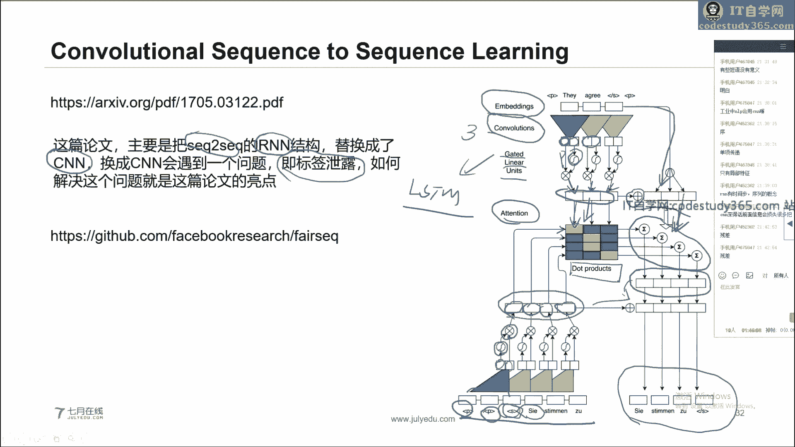

就是这些东西了啊，然后接下来呢，我们就一起带着大家来把这个TXN这一块的。

一个模型的这个代码啊，给复现一下好吧，复现一下，啊然后我们这边简单说一下啊，在我们之后的一些课程当中呢，我们都会使用这个PYTORCH啊，PYTORCH那PYTORCH的话啊，相比于TORFLOW来说。

它的这个使用起来会简单一些，并且啊，目前越来越多的人都在使用这个PYTORCH啊，好我们这边就要重新进重新新建一个好吧，嗯TAXN啊，然后我们把它先删了啊，先删了。

OK我们就一起来带着大家把这个TXN那个啊，复现一下啊，复现一下好，有些同学可能说啊，我没有用过PYTORCH，不会不会没关系，你看我写一遍你就会了好吧，很简单啊，PYTORCH很简单，怎么构建模型呢。

首先，我们把咱们的这个touch给导入进来啊，然后我们把常用的这个NN也给导入进来，OK接下来我们简单说一下啊，你在PYTORCH当中要定义一个模型，该怎么定义呢，新建一个类，新建一个类啊。

然后我们让这个类继承自NN导MODUN打磨点，继承自N打磨点，然后我们需要重写它的两个方法哎，一个是它的一个构造方法，一个是构造方法，那构造方法是在干嘛呢，构造方法是在注意啊，注意听构造构造方法是在啊。

准备我们需要用到的layer，就是说你的模型结构需要用到哪些layer，那你就在你的构造方法当中去写，好吧好，这是我们的一个构造方法啊，还有一个是咱们的这个啊for word方法，for word方法。

这个方法是在干嘛，哎今年怎么回事，这个方法是，嗯不要了吧，pass掉这个方法就是把layer拼装起来，拼装起来，进行前向传播，啊这就是我们的for word方法啊，forward的方法。

OK我们一步一步来嘛，我们就先来准备我们需要用到的一个layer啊，这里我们先不考虑考虑位置编码啊，好吧，首先是什么，看一下，第一步是什么，embedding嘛，Embedding。

直接就调用NN导embedding，我们就定义好embedding层了，那embedding第一个参数是这个词典的一个大小，啊啊我们用，我们把这个参数从外面传递进来啊，从外面传递进来。

然后我们还需要一个参数啊，是这个embedding size，embedding size就是embedding的一个维度，我们也从外面传递进来啊，传递进来好，embedding层我们就定义好了。

接下来是什么，我们看一下三种卷积核对吧，那我们就定义三个卷积层吧，我们就叫CNN啊，NN导cod好，然后我们考虑一下啊，我们输入的这个embedding它是一维的对吧。

所以说输入的这个channel的话，它是一好，主要是我们要考虑一下我们的输出的channel，输出的这个channel的话，我们输出的是两个对吧，那我们就输个二就OK了啊。

然后是我们的这个kernel size啊，kernel size好，我们这里的kernel size是234对吧，第一个是二，然后第二个维度要保持一样嘛，和embedding size保持一样对吧。

那我们用元组吧，好那我们第一个卷积核，这个第一个卷积层我们就定义好了，接下接下来呢我们还需要定义两个对吧，一个是二，一个是三，哎这是二，啊分别对应我们刚才的这两个对吧，那我们这个维度就需要改一下啊。

改成这个三的四三的四好，那就变成了234好，三个卷积没问题吧，三个卷积OK卷积好了之后，我们看一下还差啥，哎怎么回事啊，怎么切不过去啊，卷积网络是不是池化对吧，池化好，那我们来定义我们的池化吧。

嗯我们叫们XP，好定义我们的一个池化，Ok，接下来我们要考虑一下，我们的一个kernel的一个大小啊，kernel的一个大小，这里kernel大小是多少呢，那假如我们现在哦我看一下啊。

我们需要有一个序列的最大长度嗯，我们看一下啊，这边序列最大长度设置是多少，好我们这边序列的最大长度设置的是32啊，32，那32的话我们考虑一下啊，序列最大长度是32对吧，32。

那我们的这个kernel大小是二好，也就是说我们输入的这个是32，然后续这个克隆大小是二，然后我们步长是一，那我们输出结果是多少，来各位同学，31其他同学呢，其他同学还有不同的一个结果吗。

这同学没有了是吧，好这是31啊，这是31好，我们接下来还需要两个这个石化啊，啊大家就一起来思考这些问题好吧，因为你在写代码，其实你自己去写的时候，你会遇到这些问题的，所以大家就一起来思考啊。

一起来思考好，这就是那因为这个是三嘛，哦我说一下怎么算的啊，首先是32对吧，你需要去减掉你的这个那个可等一个大小，那32减掉二，那就是30，30的话，那除以步长除除以不长的话，那就是一嘛。

但是还是30对吧，那最后还要再加一对吧，我们可以一回回到哎怎么回事，诶怎么回事，怎么奇奇怪怪的点不回来了对吧。

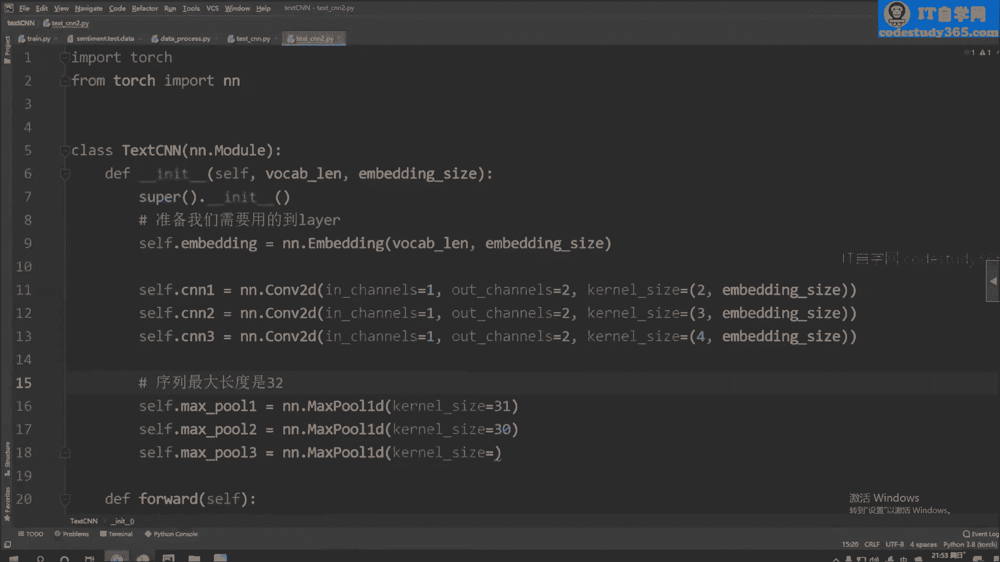

那我们这边还要再加一嘛，所以就变成了31好，这里就是30，那最后一个的话就是29对吧，29好，最后的话我们可以定义一个啊，加个drop out吧好吧。

drop out trip part的话就是用来防止过拟合的啊，drop part我们可以给他这样的一个概率值啊，零点啊，然后最后来一个dance层嗯，dance层的话就是点兵也点mini2，好阴影。

那假如我们的这个embedding in size，我们用embedding size乘以三吧，乘以三啊，为什么乘以三，啊如果我们这里是我们看一下啊，是不是乘以三呢，哎我看下哎我这是我这是输入值对吧。

输入值输入值的话其实就是我们的啧，怎么回事。

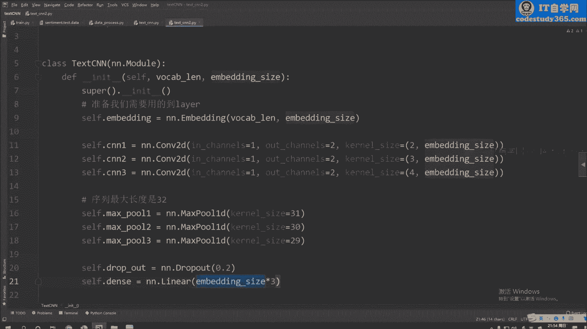

数值的话实际上就是这一块对吧，就是这一块，那实际上我们这里一共有啊，这边是有两个值，这边两个值。

这边两个值，那一共是六个值对吧，一共是六个值，那就不是这个东西啊，这里应该是我直接写啊，直接是六个值，六个值，output channel是二，所以2×3，所以这就是六啊六，然后我们假设要做一个二分类。

那这里你就输出二就OK了啊，输出二就OK了，好这就是我们需要准备的一些网络结构，准备好了之后呢，我们来看我们的for word方法，forward的方法把雷也拼装起来对吧。

那首先呢就是得到我们的这个embedding嘛，我们调用一下我们的这个self法，Embedding。

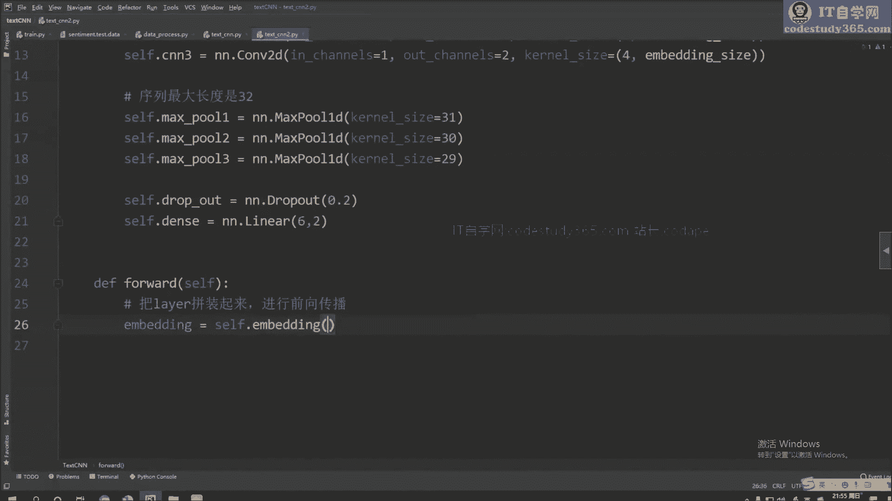

我们需要把X传递进来啊，哎。

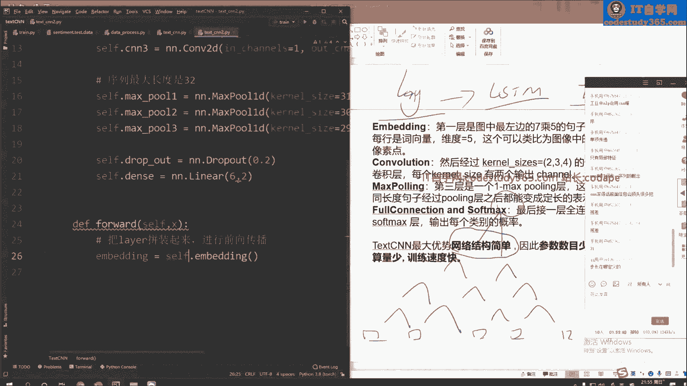

好把X传递进来啊，传递进来，然后我们这边可以做一个这样的一个，这是在干嘛呢，就是给第一个维度啊，再加一个维度，因为我们这里是个二维卷，对于图片来说它是一个四维的嘛，那对于我们文本来说是一个三维的。

所以我们可以在第二个维度，也就是也就是啊一的这个维度，去给他扩一个维度啊，扩一个维度好，那我们接下来就进行一个输出，那第一层的这个cn cn out1吧，cn out1就调用我们的CNN1对吧。

然后把我们的这个结果啊传递进来，embedding传递进来，然后我们这里可以把那个那结果再缩回去啊，我们也可以用square方法把最后一个维度给去了，嗯其他也是一样啊，我们把这是二。

这是三好处理完之后呢，我们接下来就是做什么石化嘛对吧，我们可以调用一下我们的max p，next p啊啊，这样的话我们就能得到我们的第一个，最大池化层的一个结果，我们来看第二个，哎嘶哎呀。

这个键盘不太习惯，这是第二个，这是我们的第三个，第二个三个，OK那这些都准备好了之后呢，我们就可以做一个什么啊，我们看看这边怎么做的，石化层拿到了一个结构进行拼接对吧，再给到我们分类层。

那我们也是一样的，我们调用一下cat方法啊，把它给拼接在一起，alt1alt2alt三，好拼接在一起呃，拼接的这个维度呢是一这个维度啊，还是一样啊，我们去把最后一个维度给去了，得到我们最终的一个输出值。

然后我们这边可以调用一下我们的这个DP out，把我们的这个alt放进来好得到我们的输出值，我们再把我们最终的这个输出值啊，给到我们的dance，dance把out加进来，OK最后进行输出。

然后我们把我们的这个out值返回，OK整个我们的模型啊就搭建完成了，搭建完成嗯，接下来的话我们来看一下啊，我们把我们的这个tag n返回一下，是二对吧啊，然后两个参数，一个词典大小。

一个embedding size，OK我们执行一下代码，看能不能一遍过啊，啊各位同学可以直接在自己的笔记本电脑上跑，是完全没问题的啊，因为TXN这个模型结构比较简单，所以大家自己在自己的笔记本电脑上跑。

应该也是可以跑的，你没有GPU应该也是可以跑的啊，这个不用担心，模型结构比较小，然后这边的话还会有一些包括额，数据的一些处理，这些东西的话就是一些逻辑代码了，我这里就暂时不给大家说了，好吧好。

这边就已经开始进行一个啊训练了啊，开始进行训练了啊，可以看到他这个效果好像是不太理想的对吧，不太理想，那我们可以考虑去简单调整一下，它的一些参数啊，他这里这个output channel的话。

就说你运用了几个这样的一个channel对吧，那我们可以考虑运用多一点的嘛，如果你太简单，我们可以考虑运用多一点啊，我们搞个搞个20吧好吧，看一下效果有没有提升，搞个80。

那这里的话就变成了就变成60好，我们再试一下，哎好像效果变化也不是很大是吧，嗯好像比刚才稍微好一点点嗯，再把这个参数简单调一下啊，我们再试一下，呃其他的话我们也可以再调一下，其他的一些东西啊。

呃这个哦对数据集我都忘记和大家说了，这个其实就是一份那个，情感分析的一个数据集啊，还有啊一和零一的话就是正面情绪，零的话就是这样的一个负面情绪啊，负面情绪，好基本上整个流程就是这个样子啊。

然后我们看一下啊，诶这里好像有问题啊，这里忘记改了，咦这里好像我看一下啊，词典是在哪里拿的，我记得我这个词典都还没生成呢，我们执行一下这个啊，OK这边我们看一下词典，1万多少词是1万1656啊。

好这个没问题，好我们再跑一下，那当然应该是词典的一个大小啊，不然效果应该不会那么差，啊这个参数大家可以设置小太小一点啊，没必要设这么大，没必要设置这么大，啊我们先跑一下看一下好，可以看一下啊。

这效果其实一下就起来了对吧，刚那个词应该是词典的问题啊，一下就起来了，已经到80级了，我们再改回来啊，我们改了和原论文的一个超参数保持一致啊，我们就用二来看，我们就用二呃，这里就是六，OK我们再跑一下。

好稍等一下诶，可以看到啊，其实效果还是不错的对吧嗯，第二个e Poke就85了，86了，还在不停的一个收入对吧，86。4好，升至87了啊，效果已经还不错了，OK行。

基本上这就是今天要给大家讲的一个内容了啊，大家下来把CN这一块弄明白的话，可以一样啊，来把这个代码这一块给复现一下好吧，复现一下。

好行，看各位同学有没有什么问题，步长在哪里定义嗯，这里啊，这里它有一个它这个里面是有一个参数的，你看它有一个stay的一个参数啊，默认是一，默认是一，你可以设二，你也可以设三，好吧。

好其他同学还有问题吗，图片为什么是四维的啊，是这样子啊，你图片输入是这样子吗，首先第一个维度是BESIZE嘛，Dua dupage page size he，第二个维度是kernel size。

那第三个维度是它的宽，然后第三第四个维度是它的高trl size，因为它是RGB嘛，RGB所以，kernel size等于三，那如果你是黑白图片的话，那这个channel size就是一好吧。

要是图片的宽和高，所以它是一个四维的，四维的好，我也说明白吧，好其他同学还有问题吗，嗯没什么问题，咱们今天的课程内容就到这边了，好吧就到这边了，好行呗，那咱们今天的内容就给大家讲到这边。

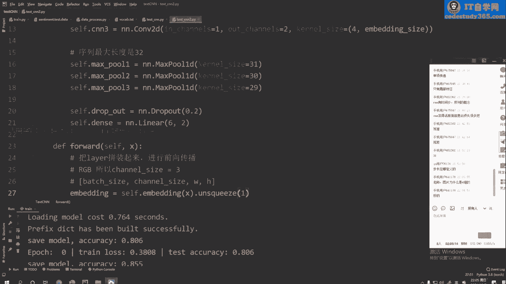

好吧啊，我们就下次课再见，然后大家有什么问题的话，也可以在群里面找我就OK了，好吧嗯好的，各位同学。

