# 【七月在线】NLP高端就业训练营10期 - P6：2.Seq2Seq任务—机器翻译与本文摘要_ev - IT自学网100 - BV1uxT5eEEr6

首先给大家看两张图，就是机器翻译确实很重要啊，为什么重要呢，因为人们确实使用机器翻译，比如说你看到这个餐厅，它也翻译成translate server error，这个明显是啊。

不知道发到什么什么那个啊，比如说用了个什么翻译系统，然后结果人家给你给你出个translate server error，下面啊下面也是另一个translate server error。

我都不知道这个他是故意写错，拿来娱乐大众的，还是真的就这个写错的啊。

比如这个时尚烫染造型会所，他给你出一个出个什么，could这个叫发源地潮流前线，他说could not connect to translator service啊。

这些图都比较搞笑啊，再比如这个香烤鱿鱼，全barbecue wikipedia，我都不知道这个翻译究竟是怎么出来的，那这些呢是我们可以看到的，像前面那些很明显都是一些机器翻译的错误啊。

那就说明人们确实是用这个机器翻译的，那我们首先知道，现在大部分的机器翻译模型都是由数据驱动的，事实上不仅是机器翻译模型，整个AI领域大家都已经默认就是aching learning了。

实际上我们知道AI是一个很大的领域，他还有有一些人是做一些别的AI方面的领域的，有的人认为这些AI的系统可能应该是人造的，或者是有一些人为定义的弱可以衍生出来的，可以去证明一些东西，其实我之前也不了解。

我就是在嗯参加一些会议的过程中，听别人听别人讲，有的人他们确实是不做machine learning的，他们是做那些什么AI theory，然后说他们那个可能才是正确的AI path，实际上我们不知道。

但是很早以前就一直有这样的一套争议啊，哦我不知道大家有没有听说过一个笑话，就是说好像是说每次IBM他们如果fire a linguist嗯，Their machine。

Their uh machine translation system，什么improves by什么one percent什么啊，这里打错了很多东西。

machine translation就有一个大致这样的笑话，就是说啊曾经可能说在30年前，人们做翻译系统的时候，并不是像我们今天这样子，应该说有两派人，一派人呢，他们是认为你这个机器翻译系统。

应该是基于一些rule，基于一些grammar，基于很多很多的啊各种各种规则定义出来的，你必须要有一个dictionary，能够知道单词与单词之间的那种，一一对应的翻译，那后来另外一派呢是。

他们认为我们应该是基于数据来学习，这个机器翻译模型，那这两套理论从今天的角度来看，应该说我们都认为基于数据的，是更加好的一个系统，那曾经应该说在在我们没有那么大量的数据，没有这么大量的计算资源之前。

人们其实是不知道的，所以两派都有各自有自己的支持者，那既然今天我们都是由数据驱动的，现在这些机器翻译系统啊，主要是用什么数据来训练的呢，比如说可以用新闻对吧，很多新闻网站都是有中文跟英文版本。

或者说不同语言的版本，比如公司的网页可能会有中文，英文以及各种其他语言，比如说法律专利文件，这种一般都是中英双份的是吧，任何一个国家一般都会至少有一份英文的，再比如还有各种电影电视字幕嗯。

还有更多的比如说那些嗯，其实有一个很大的数据，就是联合国那些document对吧，联合国documents，就有很多这样的数据，是可以用来做机器翻译模型的，嗯对于机器翻译呢。

我们一般都希望使用双语的有对应关系的数据，然后大部分的数据呢是由文档级别的匹配，我们一般很难拿到句子级别的匹配啊，当然有一些unsupervised的算法，也可以帮你生成出来一些非呃，从文档级别的对应。

能够能够找出句子级别的对应方法啊，这种算法其实我了解的也不多，但是大部分其实是有一些UNSUPERVISE的方法，可以大致通过统计学的方法得出哪一句话，大概率跟哪一句是对应的，哪一句。

那大概率大概率又跟另外一句话是对应的，很多的公司现在他们做翻译呢，都是手头有非常大量的翻译数据的，呃，具体有多大量的数据呢，我也不知道啊，就是我我通过一些跟人交流的这个经验得出。

大部分这些大公司的做文本翻译的那些组，里面的人啊，都跟我说，他们公司内部有非常大量的翻译数据，然后我说有多少，然后他们说这是个商业机密，不能告诉你，但是总之是非常非常大，可能比你想象的都要大啊。

所以现在的数据呢，现在大部分这些做文本翻译的公司，他们都有很大量的这些数据，这些数据呢，嗯有一些可能是可能是通过各种渠道得过来的，有一些可能有人为的标注，有一些可能又没有人为的标注。

但总之就是现在人们的一种共识，就是你的数据量是越大越好，那在讲这些模型之前呢，我们先跟大家探讨一个问题，就是你怎样去评估一个翻译模型，如果我现在已经有了一个，我说我给你一个翻译模型，你只要给我一句英文。

我就可以给你翻译一句中文，那我怎么样去评估这个翻译模型好不好呢，嗯最直观最好的方法自然是人工评估，如果我每造一个模型都可以让人去评估一下，这样是是最方便的，他因为人的判断总是比较准确。

但是呢这样非常的费时费力，比方说我现在一家公司里面，我可能每天就要新出一个翻译模型，因为现在啊计算资源比较多了，人们可能训练这些模型都比较快，那我如果每天出一个模型。

我是不是每天都专门有一个组要来评估一下，我这个模型好不好呢，啊这样就比较的费时费力吧，所以一直以来人们就希望去找到一些比较好的，自动评估这个模型好坏的方法啊，注意这个问题呢，其实是一个开放的研究问题。

就他是一个非常有价值的研究问题，就这个问题并不是说已经被人们解决了，我们其实现在也不知道到底怎么样去评估，你生成的语言到底好不好，不仅仅是翻译任何别的生成的问题，比如说这个文本摘要啊。

或者说是聊天机器人啊，其实我们都不知道怎么样去评估它，就现在我们有手上，有的评估手段都是非常有限的，那在翻译里面呢，我们最常用的评估手段叫做blue，什么叫做blue呢。

他叫BLINGU160以上的study，而是一篇paper，来自于2002年的这个人啊。

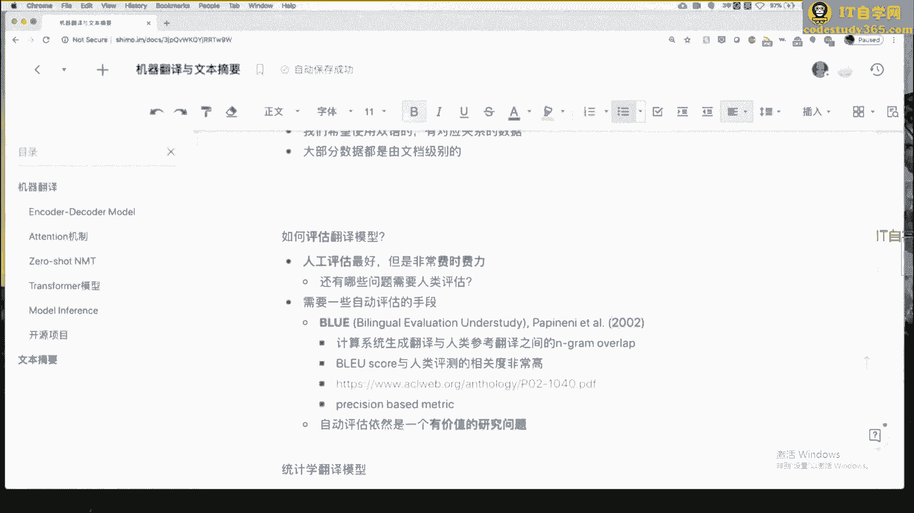

那这篇论文我们可以我们也不用看了，但blue呢它它本主要是一个什么什么问题呢。

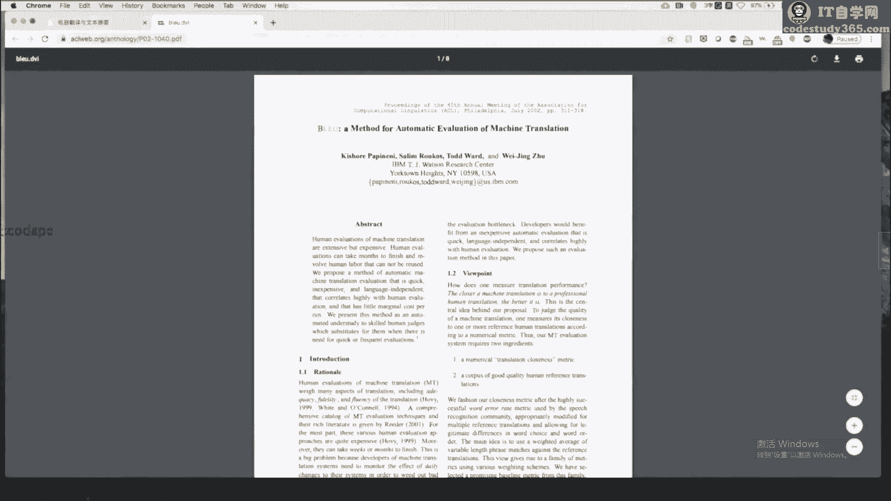

啊blue它主要是做什么的，它其实是，其实是这样的，就是我我还是拿这个，拿这篇文章里面的例子来看好了，就是你看到我们是这样假设的，就是你比如说我现在给你一句英文啊，给你一句中文，然后你把它翻译成了英文。

那你英文呢你这个系统输出了一句话，那我现在想要知道这个系统输出的那句话，好不好，我就需要拿它去跟正确的翻译做对比，那比如说下面这是两个正确的翻译吧，啊这里有两个candidates对吧。

It is a guide to action，Which ensures that the military always abbeys，The commands of the party。

It is to ensure the troops forever，Hearing the activity，Guidebook that partly direct。

你发现这两句话其实是一个意思对吧，就反正说这个军队必须要服从党的命令，那啊，但是会有不同的表示方法，所以这个就告诉我们，你的翻译呢实际上并不一定说是唯一的，你可以用各种各样不同的话来翻译同一个句子。

他们可能都是非常make sense的啊，Sorry，我这里是讲了两个candidate，那下面呢是reference，这三个reference呢就是说呃我告诉你。

这三个reference是比较完美的翻译，它可能是由人写出来的，那上面两个呢可能是由机器翻译出来的，下面呢是由人写出来的，那现在我们要做什么事情呢，就是呃这个blue score，他的工作呢。

就是他要去对比我这里的单词有哪一些出现了，出现在了reference当中，然后我是跟三个reference都去做对比，比如说我们看到it is a guide to action。

Which ensures that the military always abbeys，The commands of the party，那我们就希望它里面的，我们要数一数。

它有哪些单词出现在了我的reference当中，那非常自然的，如果出现的单词越多呢，一般来说就表示我这个翻译越准确对吧，就至少我把该提的都给提到了啊，然后如果出现了一些单词。

它没有在reference当中，那可能我那个翻译是有问题的，所以blue它是做什么呢，就是他就是要把这一些所有出现在reference当中的，单词的数量给数出来。

然后再除以它candidate当中的总单词数，然后我们看到这里有一个例子啊，这边他告诉我们说in example one啊，我们看一看他说了啥啊，这里有一个说in example one。

就是example one，就是我们刚刚看到的这个example one对吧，这里的example one当中呢，你就看到说啊。

Candidates one achieves a modified unigram，position of17over十十八什么，那就是说这18个单词当中，有17个都出现在了reference当中啊。

这个是我们评价翻译的一个主要的指标，就是这个precision有多高，事实上呢我们不仅仅关心one gram，像我刚刚说的都是单词对吧，就是如果你是只看一个单词，这个我们叫做new unigram。

那实际上我们还要考虑别的啊，比如说BIGRAM跟TRIGRAM，也就是两个单词和三个单词的词组，我们要看这些词组，它出现的precision究竟有多高。

大家可能还记得precision record跟f one对吧，就precision是表示的是嗯在我翻译的单词当中，有哪些单词是正确的，就这个是precision。

所以blue score呢它主要看的其实是，啊当然他还有一些别的别的细节，就这个分数其实并没有那么简单，它实际上还要综合考虑到啊，若干个他既要考虑precision，然后呢。

他还是一般来说我们真正在使用的过程当中，这个precision呢有这个unit gram的precision，然后有这个diagram precision，有trigram precision。

有fogram precision，一般来说呢我们是把这四种，当你看到说是blue for的时候呢，同学们会看到有很多blue for这样的分数，其实上面那个四种分数的平均就是。

The average of the uh four，Kinds of of grams，就是把这些gram给平均起来，那这里还有一个小问题在于说，就是你可以看到这个example to。

你看example to里面，他这个什么得得得得得重复了这么多遍，那你会发现这个precision其实是100%，因为它每一个the都出现在了reference1当中，那这样是不是正确的呢。

这样其实是不对的，就是你不能把一个单词直接重复那么多遍，所以在这里呢他的precision实际上只有啊2over7，因为在你的reference1当中，最多只出现了两个the。

所以他这边多余的the就不会被考虑进去，让我们看看还有没有什么重点的地方啊，基本上呢就是这么个思路，就是这个这个AGRAM呢，基本上他就是这么一套一套思路，然后在实际上实现的过程当中。

我们看到他还有如果你有嗯若干个candidate，什么，他会他会有这种加权起来啊之类的，会有一些细节的变化，但总的来说呢，blue它就是一个基于precision的这样的，一套评价系统。

那这套系统到底好不好呢，嗯我认为应该说是你你一眼望过去，其实感觉是不太好的，因为好像他其实并没有说完整的，能够评估所有可能的情况，但实际上同在人们的这个这么多年的实验下来。

应该说这是2002年的一篇论文，到现在已经是快要20年了，然后我记得blue好像是某一年的某一个conference，上面的，就是那种相当于是杰出贡献paper，因为他们大概每每隔10年会评估一下。

有哪一篇论文，对于我们的过去的研究产生了重大的影响，然后这篇论文其实当年是得过一个奖的，所以说啊它看起来非常的简单，好像你觉得这个分数没有什么了不起的，但是他确实对于这个评估啊。

计算机生成语言的这个评估方面，产生了比较重要的影响，人们发现它跟人类的认知和人类的评估的，相关度还是相当之高的，因为我们我们思考一下，你如果要设计一套好的指标，你最关键的是希望你的这一套指标。

要跟人类评测的相关度足够的高啊，就是这样它才可以代替人类的嗯，人类的功能啊，所以这个就是blue这个跟大家说一下啊，我们一般常用的是blue for，或者有些用blue three也是有的。

就同学们其实可以大致思考一下啊，我我如果只是用uni gram去评价这个precision，你会发现这个分数可能是很不完备的，但是一旦你用上了unit gram，Bigram。

Three gram for gram，如果两句话，在这么多严苛的考验底下，他依然可以达到一个比较高的blue score的话，实际上说明这句话跟那一句话，应该大概率是长得非常像的。

嗯就是有这么一个问题好，那我们评估就讲到这里，然后我们来讲一下你要怎么样去建造一个模型。

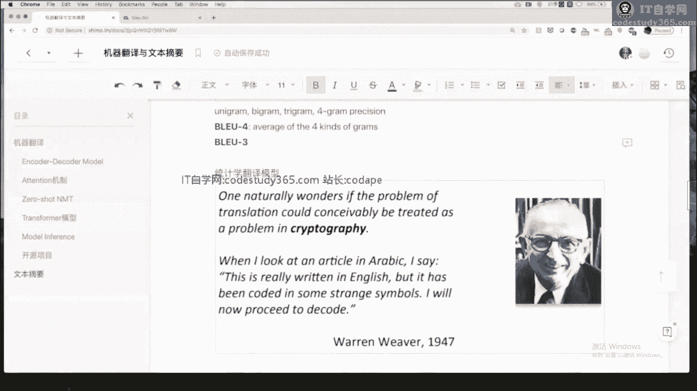

来做翻译这一项工作，我们来看一下这个这一位嗯。

比较有名的人讲的一句话，他说one naturally wonders，If the problem of translation，could conceivably by treated啊。

Be treated as a problem in cryptography，就他说啊，翻译这个问题，是不是可以当做是一个密码学问题呢。

When i look at an article in arabbit，I say，This is really written in english。

But it has been coded in some strange symbols，I will now proceed to decode，他就说啊，我们当你看到一篇英文文章的时候。

你可能会想这个是不是呃，当你看到一篇阿拉伯语的这个文档的时候，你可能会想这个语言呢它其实是用英文写的，只不过是有一套很奇特的编码方式，把这个英文字母编译成了一堆乱码，我我现在呢就要想办法。

把这个密码给破译出来啊，这个呢应该说是我们统计翻译模型的一个，基本思路，就是编码解码，所以这一套所谓的同学们经常看到这个encoder，decoder模型，这种这种名字的命名方法。

其实就是来自于这个朴素的思想，就是我们认为这是一个密码学问题，当你看到另一种奇特的字符的时候，你能不能把它recover回来，变成正常的字符啊，这里有一张图。

这张图呢嗯就是我们整个现在的statistical，machine translation的一个基本架构，我们在做翻译的时候，我们一般是用这样一个叫做noisy channel model啊。

为什么要叫noisy channel，其实我不是完全确定啊，同学们可以思考一下，为什么它要叫noisy channel model，那我们基本上是这样的啊，我们是，认为有一个source，有一套语言。

然后他经过嗯，他经过怎么样呢，我还是直接看下面这个公式吧，就是假设我现在给你一堆语言，它是来自于啊X对吧，就是我我们一般是认为他的语言，比如说这个Y呢是我们最终要翻译成的语言。

我们假设就是英文和中文好了，我们就假设X是英文，然后Y呢是中文，那我我们可以可以认为说，本来呢这个语言它应该是中文的，但是呢这个中文经过了一套noisy channel嗯，应该是这么个意思。

就是你这个因你这个中文呢Y本来是中文，这个中文经过了这个一套noisy channel之后呢，他就被被这个密码给编码起来了，他就编码成了一堆X，这个X呢它是一个observe system input。

就这个东西我们其实不认识啊，但它其实是英文，那我们希望就建造一个decoder，让这个decoder呢能够把这个啊，这一套X能够给给解码回来，那这个解码的过程我们要怎么样做呢。

我们就是要寻找最有可能对应X的那一个Y，所以这是一个conditional probability，我们希望能够找到P嗯，y given x就这个是我们要构建的一个模型。

X呢是你看到的那一堆noisy input，X呢其实是noisy input，然后我们希望能够输出一个Y啊，怎么样去输出这个Y呢，你看到这里用了一套贝叶斯公式对吧，这个p y given x呢。

这个这个贝叶斯公式大家应该是能够看懂的，P，given x等于P我们可以一起复习一下，PXY除以PX对吧，这个是conditional probability，然后我们知道PXY呢又是等于PX。

given y乘以PY，然后再除以P的X，那回到这里，我们知道X其实已经不重要了，PX是不重要的对吧，这一项是没有用的，因为我们最终是是需要找到arg max的哦，of那个p y given x。

所以他也就等于arg max的这个部分对吧，arg max the y given这个，那我们观察一下这个公式，你就会发现这一串公式啊，它其实跟PX没有任何的关系，因为我需要arg max y。

所以你可以把这个PX给扔掉，所以我们需要的是什么呢，我们我们需要的这个公式就是PX平方，Y乘以PY，那这两个部分这两个函数包含两个什么部分呢，从这个理论的角度来看，它其实包含一个是你要找到这个X。

这个X能够跟Y尽量的接近，另外呢你要你希望这个Y能够尽可能的通顺啊，这个是我们的一套基本的思想，希望这个PY尽可能的通顺，然后呢，p p x given y要尽可能的可能性要足够高。

这个是啊很多模型的基本设计思想，那我们现在的比较好的模型呢，一般来说都是基于一套叫做encoder decoder模型，所谓的encoder decoder模型呢，嗯实际上可能并不完全。

符合我们刚刚谈的这样的一个framework，但是我们可以来啊，过来看一看，这个encoder decoder模型是怎么样做的，这里的啊，encoder decoder模型。

最早呢是由这一篇文章提出来的，是这个qing control，我们这节课，我们这门课的有一本教材，是来自于这一这一位作者，我不知道大家有没有去看过这一本书，就是这位作者第一作者KONROO。

他是纽约大学的一个教授，然后他有一本我认为非常好的教材啊，大家可以花时间去看一下，那这一篇文章呢就提出了一个基本的这个，基于神经网络的，基于循环神经网络的一个机器翻译模型的架构。

它是假设你有一个encoder，一个decoder，这个encoder和decoder呢都是两个循环神经啊，是两个不同的循环神经网络，encoder的作用呢是，它会把你输入的语句给编码起来，给编码起来。

就假设说我现在给你一句话啊，我给你一句中，给你一句中文X吧，然后你需要把它翻译成英文Y，你怎么样去做这个翻译呢，我是先用这个RNN模型把这个X给输进去，然后呢他会给我一个C，这个C呢是一个vector。

我认为这个vector呢就表示了整一个句子的信息，然后下面我要做的是conditioned on c，就是你把C输进去之后，我现在要把Y给生成出来，就这是这个模型的基本思路，我们可以来对比一下。

他跟刚刚的这一套模型是不是一致的呢，它是p y given x跟PY，实际上跟我们的这个是不太一样的，就是这是一种，其实这是一种generative mode的方法。

我们这里的方法呢是一个直接做decoding的方法，这是一个偏DISCRIMINATIVE的一套一套模型，训练方式，但是这个啊先其实不是特别的重要，我们先来思考一下，为什么这个模型可以可以work。

呃为什么这为什么会设计这样一个模型呢，其实他的思路非常的直观，就是你你如果有一段中文进来，我希望先把这个中文给编码了，那我的目标呢是希望C能够完全包含，整个句子的，信息对吧，然后呢。

其实你的整个模型的bottle neck，就在于，就看你这个C能不能够包含整个句子的信息，其实这个你不知道有可能有可能可以包含，有可能不可以包含，那我们具体来看一下这个模型，它是怎么样做的呢。

嗯X1到XT进来，最后一个hidden state变成了C，这个没有什么问题啊，就是一个recurrent neural network，那出去之后呢，你看到他的C实际上是他的C是作为输入。

输入进入每一个decoder的hidden state，就是这个decoder里面呢，它C作为啊C作为输入进入每一个decoder，Decoding step。

就它并不是仅仅作为第一个hidden state传进去，它是作为每一个decoding step啊，为什么要这样做呢，实际上是肯定是因为如果你不传进去的话，它的这个C的信息很快会被你的模型忘掉。

因为你的因为我们知道recurrent neural network，其实挺容易忘记之前的事情，所以他可能发现必须要把这个C传进去，然后你看到啊，这边呢你看到他其实在输出，就是生成每一个单词的时候。

他也是把C给传进去的，我们可以仔细的看一下这些箭头，这个箭头其实挺关键的，它们它的这个C不仅进入的进入了每一个UI，And the decoding step，它也进入了生成单词的那一个step。

就是这样的一个过程，那这个模型呢它的训练它的模型是两个RM对吧，模型的参数就是两个recurrenneural network，训练方式是什么，就是损失函数是什么。

实际上他的训练方损失函数肯定是cross entropy，loss对吧，他的训练方式就像一个language model，应该说它其实就是我们作业一当中的，同学们可以思考一下。

它其实很像我们作业一当中的那一个build on，broader context的那个东西，作业一中的context模型对吧，他很像我们做一档context的模型啊，同学们应该刚刚前两天看看过。

我们的那个视频当中啊，我们有一个拍拓时的课，是怎么样写一个这个机器翻译模型啊，这个翻译那那个课应该还是比较重要的啊，同学们尤其特别注意一下，我们的那一些直播课啊，不是就是那个录播课啊。

就是那些实训的课里面，最重要的是看我讲的那些内容，就是如果你发现那个课是我讲的，一般来说都是比较重要的，呃那些代码呢同学们都去学一下，就是你要做到我在课上写过的代码，你也要能够写出来。

我觉得基本上如果我写的那些项目啊，就是隋唐的那些项目，你如果能够全部完整的写下来的话，嗯你去去做这个编程的工作，应该问题不是太大了，就是那些项目已经基本上涵盖了啊。

各种各样的application的情况，当然现在各种啊framework的版本更新都比较频繁，所以里面如果有一些版本落后的同学们，就把它改成新版本的那种写法就可以了。

Cross entropy loss，然后训练方式那肯定是SGD对吧，或者是SGD的一些变种，有这样的一个模型，那这篇论文里面呢，这篇论文里面还有一个比较新的东西，是他这篇文章是提出GU的那一篇文章。

所以最早的那个轱辘。

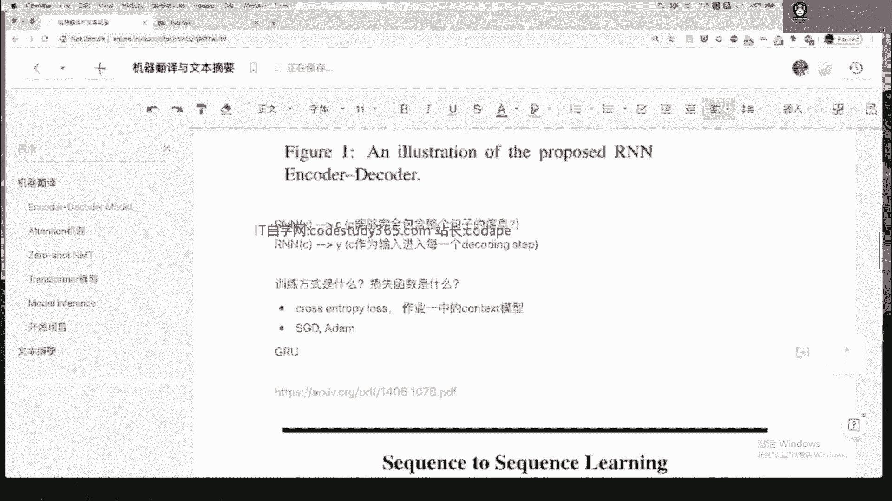

是来自于这一篇文章里面的，可以给大家看一眼啊。

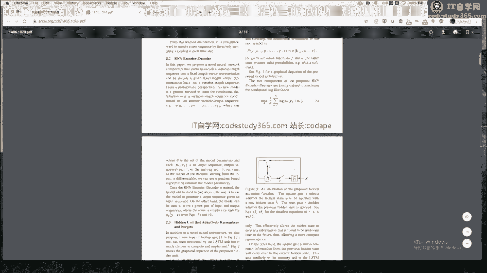

就是这里有一张图是讲的，这个就是grougated recurrent unit啊，这个大家可以考虑记一下，其实就是两个gate对吧，它是有一个re叫做reset gate。

有一个update gate，然后呢你的hidden state一定是上一个hidden state，再加上现在新产生的这个hidden state，然后新产生的这个hidden states呢。

它又是一个这样的，这样的做法是reset gate跟这个hidden呃，跟这个hidden state做了一些点乘啊，Element wise multiplication。

然后做了一些变换和一个activation，变成了一个新的candidate n state，这个是这一篇文章啊，我们还是可以看一眼，他这个文章里面最后有没有报一些什么数字啊。

他一般会报一些blue score之类的，然后你就会看到啊，这个这个我不太确定它是哪一个数据集，一般来说你会发现这些文章，他们都是有一些比较标准的数据集，作为对比的啊。

你我们就大致看到这个blue score，是是这样的一些分数吧，但是我不确定这个是什么语言之间的blue score，大部分人都会报GERMAN或者是french。

有没有GERMAN的还是french啊，应该是french，然后他是w mt14的这个english french，French translation，这些分数我们大致有个概念。

一会我们看到别的文章的时候，就可以跟他对比一下，那后面呢很重要的一个概念是attention机制，我们现在已经学过attention is all you need，所以这个基本上也就不用多讲了。

但是啊上一篇paper是2014年发的，在2015年的时候呢，就有了有了这样的一些paper，是他们引入了attention机制，为什么需要attention机制，这个非常简单，因为我们上一个模型呢。

他的最大的难点在于，这个C能不能够包含整个句子的信息，就这个是很困难的，因为我们相当于是认为说我把一句话，用一个单词给encode起来了，像我之前跟大家讲过skip thought这样的模型。

它其实有4096位，就是skip thought，是我们上一节之前的课当中讲的句子向量，你为了编码一个句子向量，大概需要4096个维度，所以说啊这个C能够包含整个句子的信息。

它本身就是一个值得怀疑的问题，就很难，你不一定能做到这个事情，那怎么有什么办法可以降低这个C的压力呢，人们就想到，我并不一定非要把这个责任留给一个C，我可以把每一个hidden state都作为输入。

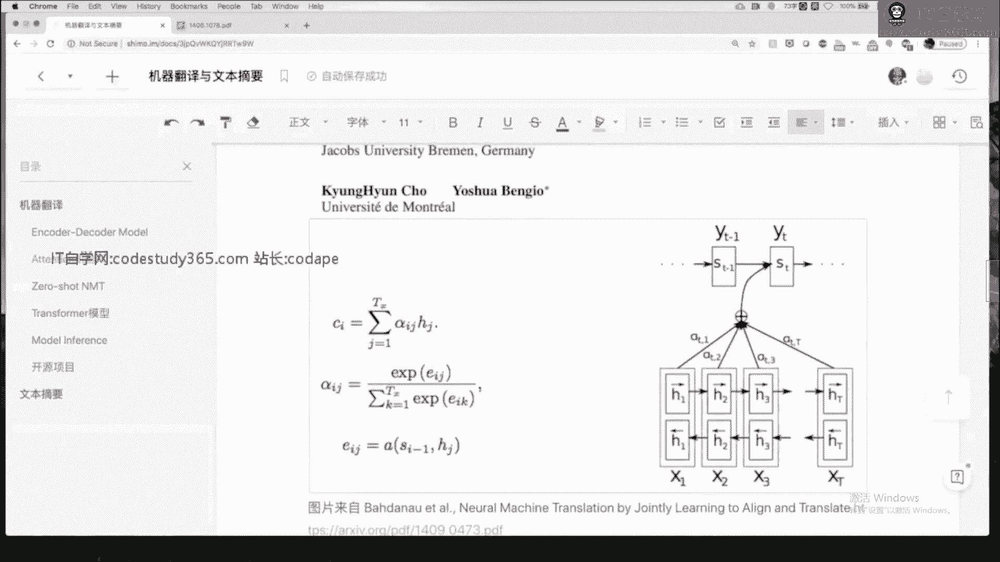

传入到解码器当中去，所以你看到的这一张图就是这张图里面呢。

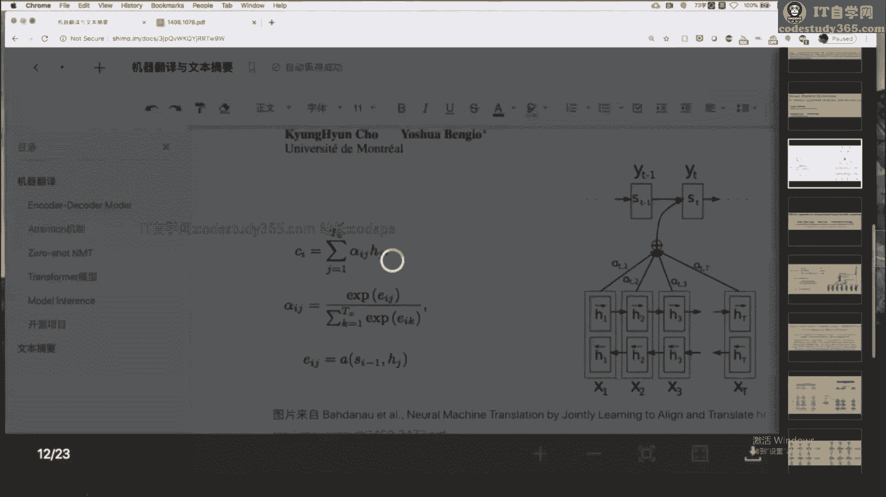

我们看到右边啊，这张图我简单跟大家解释一下，右边的下面部分是你的encoder，这个X呢是你的输入，比如说中文翻译成英文呢，这个X就是中文，或者说啊对对，如果是中文翻译英文，那X就是中文。

那我们先把这个X跑一个双向LSTM啊，这篇文章应该用的是LSTM，所以它是一个双向LSTM，然后呢我希望把每一个hidden state都留下，那如果这是个transformer的话。

那你就不需要LSTM了，反正就是transformer那些layer，直接套上来就可以了，那我现在就希望把每一个hidden states都留下，然后decoder的时候呢，我的每一步解码都是依据啊。

所有hidden state的一个加权平均，我们看到这里，他右边是有一个加权平均的操作的，这个跟transformer其实是一样的对吧，就你的transformer在做decoding的时候。

也是用到了encoder hidden state的所有的加权平均，这一套加权平均是怎么来的呢，是根据我上一步的decoding step，你看到左边的这三个公式，这张图。

左边的那三个公式表示的是你怎么样做decoding，做decoding的时候呢，我我的这个CI，这个C其实是源自于上一篇文章当中，那个context vector。

那这个context vector它不是固定不变的，而是会随着你解码的步骤进行，而发生动态的变换，它永远都是你所有encoder hidden state的加权平均，我们看到这里的加权平均。

它是阿尔法IJA乘以HJ，然后求一个求个和，那这个阿尔法AJ是哪里来的呢，他他告又告诉你，这个阿尔法IJ是经过一部soft max来的，总之就是有一套EIJ，那这个EIJ又是哪里来的呢。

他告诉你这个EIJ是呃，SI减一和HJ之间的一个分数，也就是说我为了知道当前我要关注哪一个部分，我就需要通过我上一步的那个decoder hidden state，对于每一个位置都要做一个计算。

呃事实上这种类似这样的模型在当年有很多啊，就是2015年的时候有很多这样的模型，那这种模型呢，它在本质上其实都是，希望让你的训练变得更简单，我们在做呃，因为有很多做NOP的人，他们都是造模型的。

有的人可能是在研究NOP里面，一些别的问题啊，但对于造模型来说，其实我们本质都是希望让你的模型更加符合，整个机器学习，他学习的一个比较自然的过程啊，你的这个模型造的越符合它的那个自然的状况。

可能就能够让它收敛的越快，嗯所以有很多人就尝试在这个模型里面，相当于加各种线，你如果可以嗯，就你其实可以造各种模型啊，比如说这里他只用到了SI减一，你可不可以用SI减二，可不可以用SI减三，用SI减四。

就是你可以想办法加更多的context，嗯有一些有一些步骤可能是有用的，有一些呢可能又是没有用的。

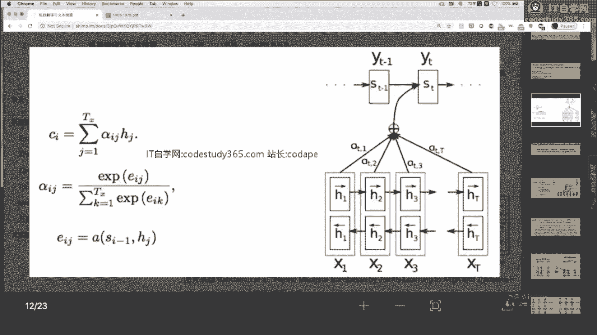

就这些都是需要做实验才可以知道，那这是一篇一篇文章。

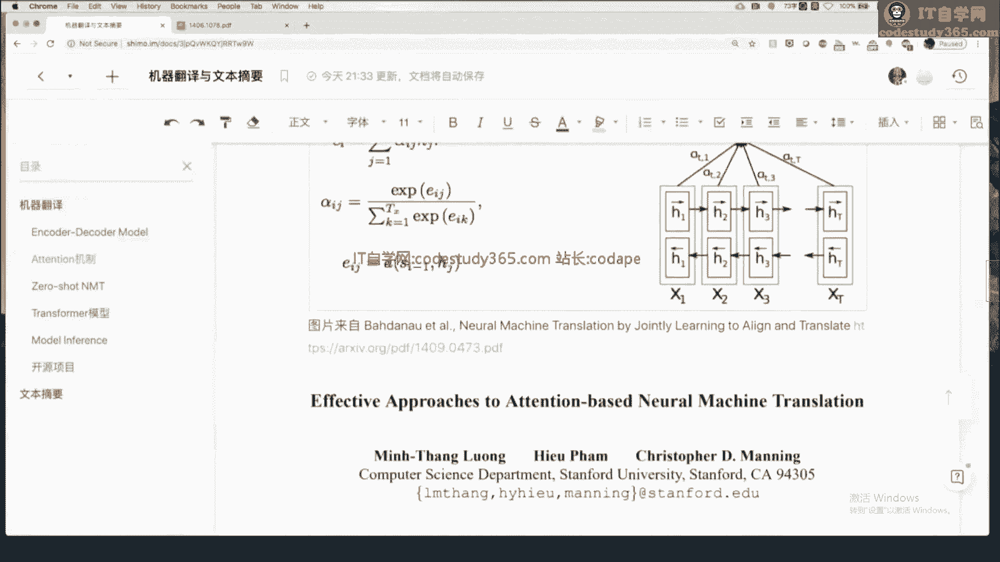

当时呢同年代还有另外一篇文章。

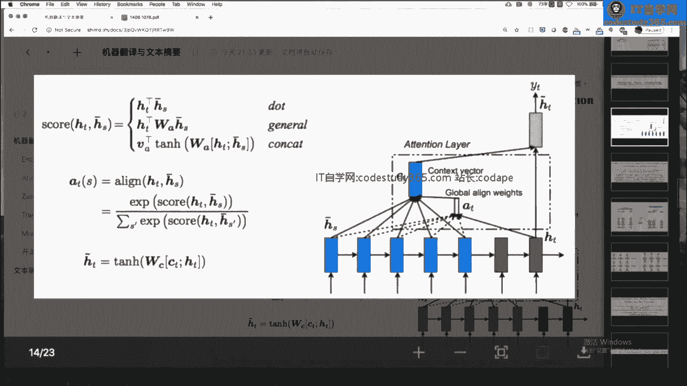

那这篇文章是来自于，来自于这个斯坦福的一个组。

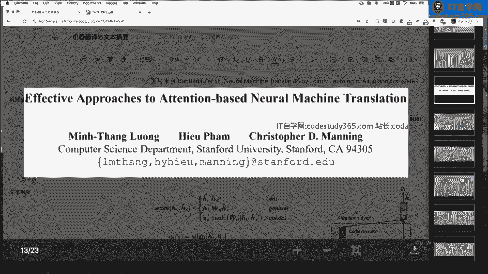

chris manning的那一个组，然后呢他们也是做了这样的一个attention based，seek to seek模型，那这篇文章他们有一些什么不同之处呢，我们看到他这里我们刚刚那个E呀。

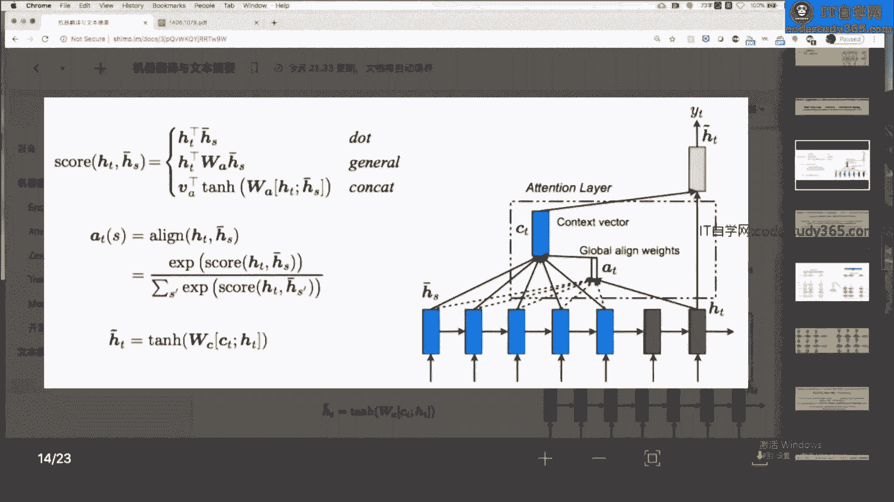

刚刚这张图里面有一个函数叫做E。

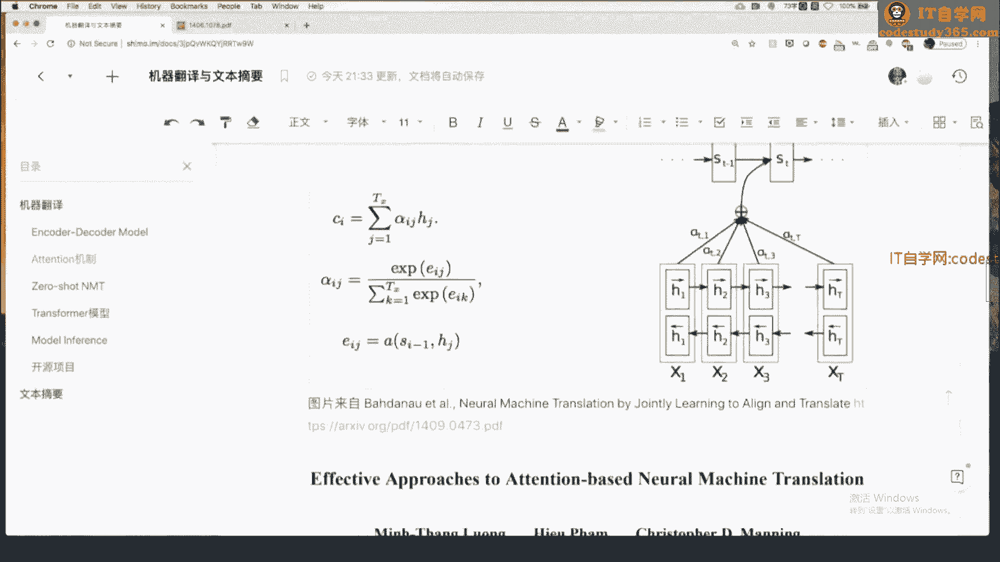

大家还记得对吧，这个E呢，它代表的是它是计算SI减一，跟HG之间的相关性有多高。

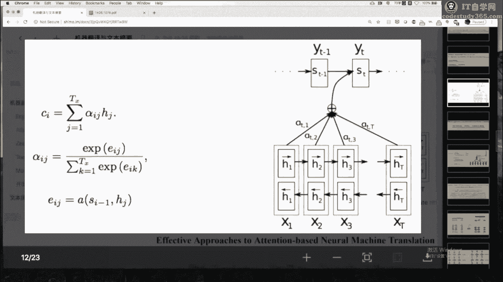

那后面的这个LEON这一篇文章呢。

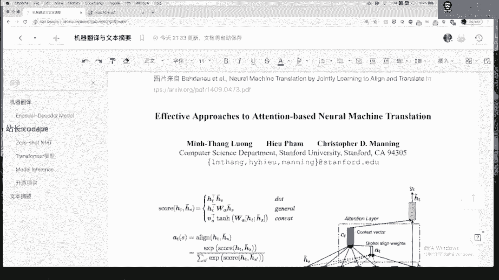

他们就尝试了不同的scoring function，这个scoring function它告诉你说我可以用dot product，他这里的啊，那个notation有点不太一样。

他这个hidden state有HT跟HS嗯，大家可以理解一下，它的HT表示的是你的解码器的那些hidden state，它的HS呢表示的是你的encoder里面的。

应该是encoder里面的hen state，所以它有两套不同的写法啊，他告诉你说你可以用dot product，你可以用这个by linear form，他这边把它叫做general对吧。

实际上就是一个hidden state乘以一个矩阵，然后再乘以另一个hidden state，这样呢出来也是一个数字，下面呢还有一个简单的神经网络啊，一个应该是两层的神经网络对吧。

可以能够帮你计算出一个，两个新的state之间的分数，他就告诉你说他们尝试了一些不同的方法，然后啊其他的操作呢还是一样的，那一个attention的，这个它本质上还是一个weighted sun对吧。

所以别的方面应该基本上是一样的，呃他告诉你是HT和CP啊，就是你有一个ct，有一个HT，然后拼到一起，然后再做一个输出，同学们看这张图的时候，其实这些图都很容易理解。

你只要看这张图里面他各种实线和虚线的连接，你大概就可以知道它，这个attention是怎么样算出来的，就是那些实线呢一般都表示是有一个输入的，虚线是什么意思呢，虚线是什么意思。

就要根据它具体的情况来判断。

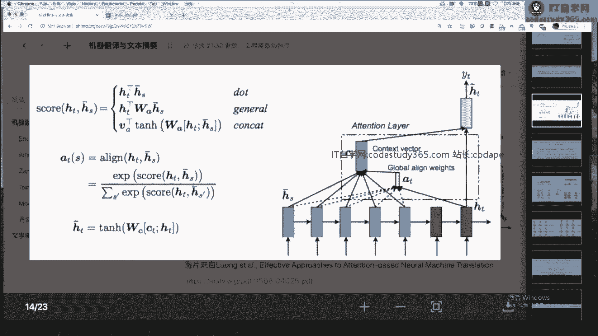

啊这个就是这样的一篇另外一篇文章，那在这个之后呢，就有一篇比较重量级的文章。

是这个google neural machine translation，他们的这个这篇文章呢。

应该也是后来他们立快立刻就上线了的，一个模型，就现在你用google，你用google做翻译，或者包括国内的一些什么百度翻译啊，或者是别的翻译，可能用的都是跟google差不多的这样一套模型。

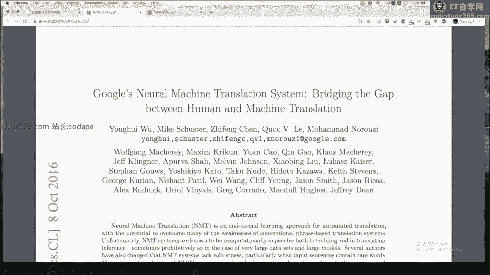

啊有同学提了个问题啊，他说上一个是HT减一，这一个是HT嗯，应该它指的都是根据上一个来预测。

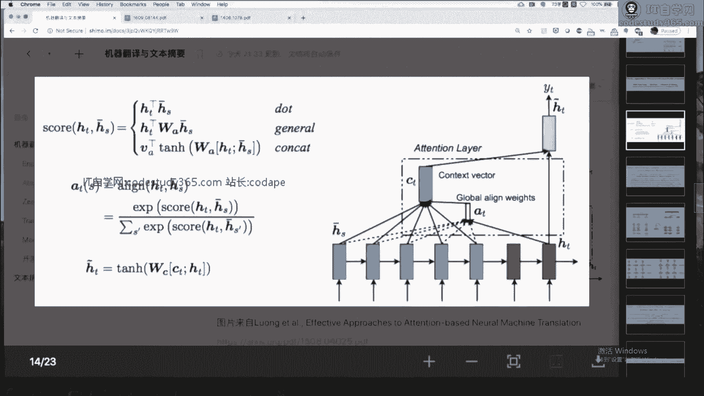

下一个就是他的HT还是T减一，应该只是他们在写的时候，在图的表示上面不太一样，就是你你在HT知道HT之前。

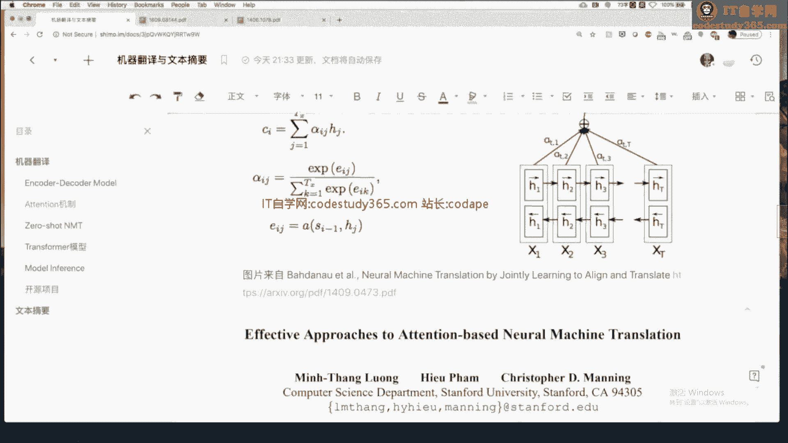

你是不可能用HT来计算分数的，因为它它它应该本质还是用当前的计算，下一个就这个下标，同学们可以自己理解一下，就是你一定是用上一个来算下一个。

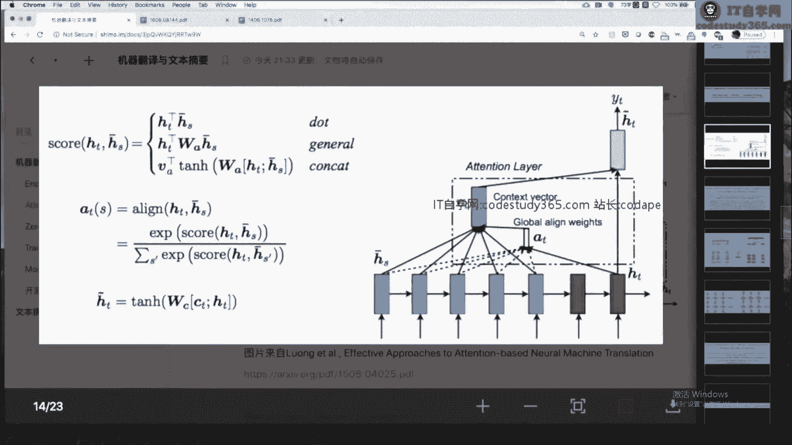

但那两篇文那两篇文章其实长得很像，他们是同时期的作品，那这个google neural machine translation呢，当时就是把这些市面上的模型做了一个，就是大一统。

把那些能够用上的方法全都用上，然后就搞了这样的一个搞了这样的一篇论文，诶，说到这里，我刚刚说到要跟大家一起分享一下，看看后面的文章，有没有在blue score上面有一个提升。

我们看到他有没有w mt14，一般来说他们都会用WMT14，这个数据集来算算blue score呃，我们看一下他报的blue score，像比如这种MOSES，这个MOSES是之前比较早的一个那种。

统计翻译系统，所以他应该是，但是你看他表现其实还是不错的，我们来看看他有没有报blue score，他应该有一张表格，报一下分数吧，啊他都没有没有报分数的吗，好奇怪啊，如果没有的话就算了。

嗯应该是这个这个应该没错，Blue score of the train model，Computed on test set，然后你看到它是啊，No unk，NO unk应该就是没有考虑UNK的部分。

那有时候其实你也不太知道到底该怎么比，但是从这个分数来看，应该是还可以的，我相信应该是用最后两个column来对比啊，你看这里有36，这边是这边是34码，应该说还是有一点提升。

然后我们后面再看更多的文章，应该就会有更多的感受，那这个google neural machine translation做了什么呢。

这google neural machine translation，它的其实用这张图来看就可以，就可以看出来它呢主要的特点是它叠了好多层，你看到他有这个，他告诉你他这边有八个layer，有八层对吧。

这张图左边有八层，然后他告诉你decoder也有八层，那这个模型实际上长得已经，很像那个transformer模型了，所以其实他们也是啊，把同样的架构在不同的模型上面去尝试。

那所以你看到他还有一些实线连接，这些都是residual connection对吧，有一些是跳跳跃性的，这个connection呢都是residual connection，那这个也是啊。

后面的transformer也是继承了这个模型，所以说它是八层的，你看到它的第一层是一个双向的LSTM，然后后面呢你看都是单向的LSTM，但是他这个单向的LSTM都是带了。

Residual connection，然后最后他经过这个attention之后，在输出层这边又是一个八层的decoder，LSTM啊，这个模型呢，其实就是那个之前的那些路网和那个巴达now。

那两个人的两篇paper的增强版，他们可能都只做了一层，那这个文章呢是做了八层，我们可以看一下他的数字有多少，嗯他这边有一些详细的解释啊，有这个一个是啊residual connection。

就是这个这里他们说加上residual connection，可以让你的模型训练更稳定，因为我们知道一般来说你这个模型生了之后，都会需要有这个residual connection。

才能保持它训练的比较稳定啊，这边是第一层的BIOS t m，其实在今天看来都没有什么特别的，估计同学们都已经习以为常了，那我们可以看一下啊，他这里还有一些重要的，他用的word peace model。

这个东西，也是后来在在transformer里面被沿用至今的啊，就是我们现在一般都用word peace model，这个还是比较新的，可能之前大家没有想到用word piece来取代这个问题。

因为有了word piece之后，你就没有这个UNK的问题了，我就不会出现有不认识的单词，然后我们看一下它的lose score，这个blue score为什么分数这么低呢。

我其实不确定为什么这些分数这么低啊，31。2，因为我们看到之前的几篇文章，实际上这些blue score你是不能直接对比的，因为你知道他这里的blue score是有什么UNK，有没有UNK，所以啊。

我也不确定你到底应该跟左边比还是右边比，就这些实验的setting如果不完全一样的话，你就很难完全直接的做对比，然后他这边还有各种调参数，就是不同的参数下的blue score，30一点几额。

应该说我确实不知道怎么样，Interpret，它就他的要取决于他的实验设定，是不是完全一样，就是你知道这里的他的啊单词也是不一样啊，这边的blue sc又变得更高了。

这里这里的blue score就有30几了啊，三十七三十八三十九了，但我们大致有个概念啊，就是同学们之后一般来说呢，就是它如果在一个表格里出现的行，肯定是可以比的。

就是你肯定是呃比较公正的这一些评判方式，所以这个是google new romachine translation，然后在这篇文章出来后不久呢，就是我们大家喜闻乐见的呃transformer模型啊。

在transformer模型之之前讲一下，这个这个也是个很有趣的实验，Zero of short translation，什么叫做zero shots translation，就同学们知道有一些单词。

而有一些语言，他们的翻译是比较常见的，比如说中文，英文，法语，德语，就这种联合国常任理事国语言，肯定都是你到处都可以找到文档啊，用的人也非常的多。

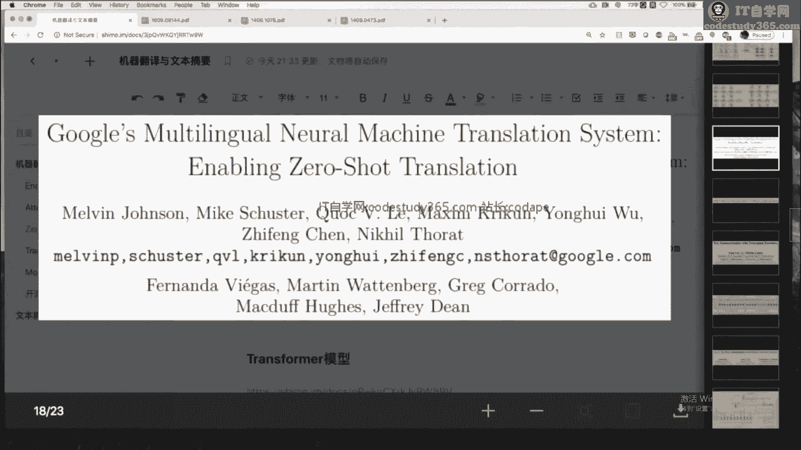

但是有一些语言之间呢，可能你就找不到他们之间的pair，然后呢他们啊google就做了这样的一系列实验，就是比如说你现在有有二三十种语言，然后有一些语言之间，两两之间它们是有对应的pair的。

有一些语言呢两两之间没有啊，举个例子，比如说举个什么例子呢，比方说阿拉伯语跟德语，他们可能没有太多的翻译，可能有一些，但是数量远远比不上中文跟英文来的量这么大，可能说阿拉伯语跟英文的量也非常的大。

可能德语跟中文，德语跟英文的量也非常的大，但是比如说阿拉伯语跟啊英语啊，跟德语可能没有这么大，那这个时候我有没有办法，利用别的语言的一些信息去帮助你，训练那一些比较少见的语言呢，那他们就提出了一个方法。

其实他们提出了其其实曾经有人做过很多方法，就是你可以想象，每一个语言可以有一个自己的encoder，每一个语言可以有一个自己的decoder，然后你有没有办法把这个encoder decoder。

它们纵横交错在一起啊，比如说你有你有100种语言，那你只需要100种encoder，100种decoder，它们可以互相叠加一起训练对吧，就思想其实是这样的，那如果你用比较蠢的方法来做。

其实有100100个pair，等于说你这个模型要训练1万个encoder，1万个decoder，100×100吧，啊当然应该是100×99除以二，但是同学们不要在意这些细节，就是你会有非常大量的啊。

那些encoder decoder pair，但是这个zero shot mt的想法是什么呢，他们嗯就是有有的，有的人说是encoder decoder可以共享，那这篇文章就更加的厉害。

他就直接把所有的语言都混成一团了。

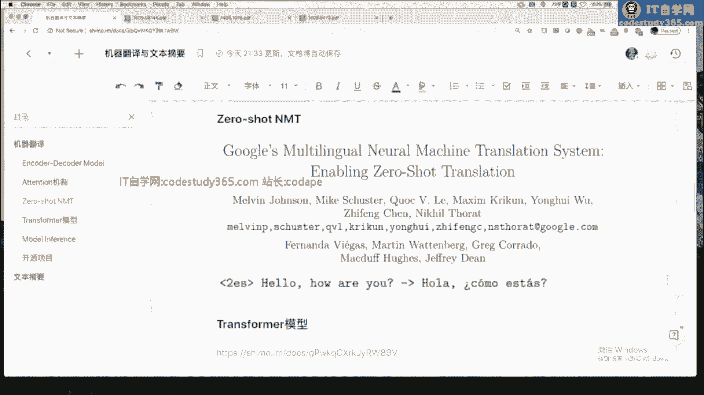

就是我的输入只要在前面加一个特殊字符，比如这个two e s表示two s8new啊，翻译成西班牙语，然后他说hello，How are you，后面就变成了这个我也不会读啊。

什么HOLA什么什么东西啊，就是这个呢就是他们的他们的这个模型的做法，他把所有的语言都混在了一起，就是每一个语所有的语言都共享一套单词表，当然应该都是word piece，这个是google惯用的做法。

把它全都转成word piece，然后你只需要在你翻译的句子之前，加这样一个特殊符号，告诉他你要翻译成什么语言，他就会把你翻译成另一种语言啊。

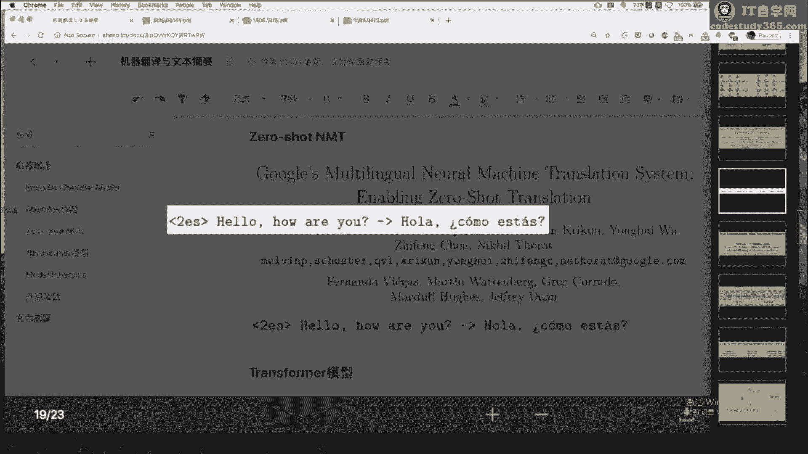

他们就是用了一个很大的encoder，decoder模型来做这样一个工作，然后发现能够取得比较好的效果啊，具体的细节我们就不讲了，但是跟大家说一下这个思路，然后嗯我今我记得我去年去NUO。

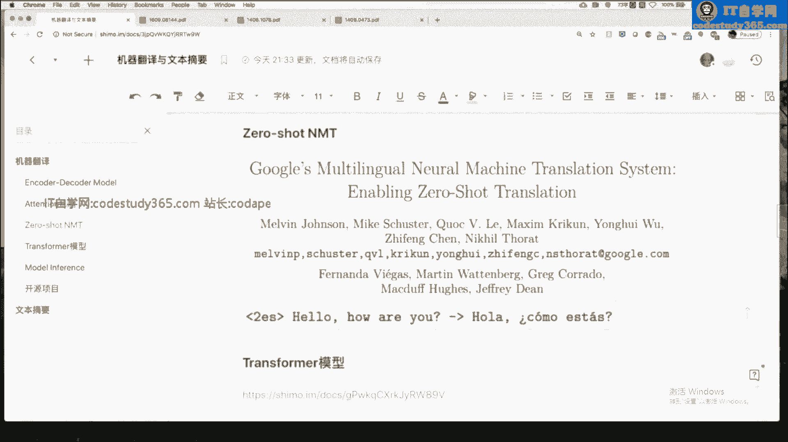

就是那个会议的时候，看到google有一些很多这个新版本，他们他们之前的这些版本是基于啊。

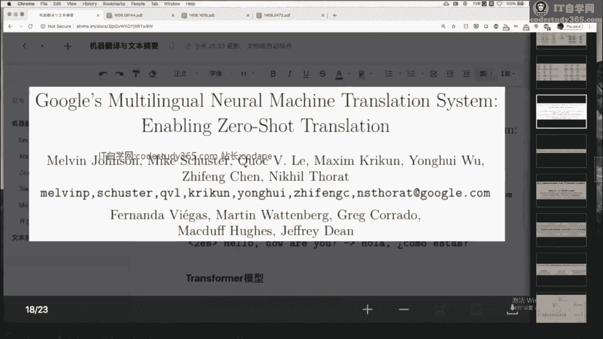

基于那些LSTM的，就现在我看到他们有一有一篇文章好像叫什么，massive zero short and mt啊，有一篇这样的paper，这个是2016年，他们应该有一个2019年的吗。

毛T邻国new roversion，这是2017年，就是他们后面每年都会有这样的文章出来，然后我记得最近呢最近我看到的一篇文章，他们是有103种语言啊。

所以这个应该应该既是一个很有趣的研究问题，也是一个他们本身就要产品化的问题，因为确实对于一些大公司，像google这样的来说。

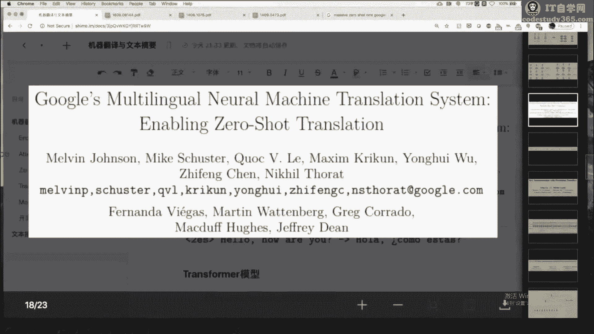

他们内部需要支持可能上百种语言的翻译，那有一些语言，可能确实是没有办法买到这么多数据集，就是你有钱，你也买不到这么多数据，他们就比较难做啊，所以就会尝试用这些zero shots的方法。

看看能不能做到同样的效果，可能就会在一些比较罕见的语言当中去上线，那最后跟大家快速提两句，transformer模型，transformer大家已经比较熟悉了，我们讲过birds，讲过GPT。

你就知道我们的encoder呢，就是一个transformer的encoder，我的decoder呢就是一个transformer decoder，其实你只需要这样的一个模型就可以了啊。

这个encoder这个decoder，然后生成这样的模型，我们可以把模型的部分给略过，但是我们看一眼，这篇文章的实验结果是什么样子的，好我们来看一下attention is all you need。

他们的实验结果是什么样子，我的印象中，他们他们主要是跟当时那一篇叫做cf seek，做了一些比较，那应该也会跟啊，LSTM之类的模型做一个比较，我们可以看一下他这里有transformer模型啊。

你看到这里他们也是english to french对吧，有english to french和english to german，As fraction of the training cost。

那这个到底是法语还是还是德语呢啊，他对他这边有法语，这边有德语，这边有法语，那你会看到他法语的分数，基本上就都在40以上了吧，就至少我们之前看到的那些分数，好像都是在30几到40这么一个区间啊。

你看他下面是德语，上面是法语，这个是google machine translation，是26~40这样的一个区间，那这边呢他都可以达到，41。8和28。4，所以比之前的模型又有了一定的提升啊。

所以这个是啊，也就是这一篇文章当时可以火的原因，扔掉了这个LSTM之后，可以达到比以前更好的效果，这个是啊machine translation，那今天应该说我们主要的主流的模型。

都是基于transformer的了，不管是不管是做实验啊，还是还是做产品，大家一般都会做transformer base模型，所以说这个啊这个模型非常重要，大家如果还有一些不了解他细节的同学。

就课后要认真的去读一读这个transformer模型，那还有一个问题需要跟大家提一下的呢，是我们之前的训练，估计大家都已经没有什么太大的问题了，就是你只需要知道这个模型它是给定X。

然后经过了一个model，这个model可能是一个encoder decoder model对吧，因为这个transformer也是一个encoder decoder model。

然后经过这个model之后，你出来的是一个Y，然后我们训练的时候呢，一定是cross entropy loss of y hat，其实应该是我就用这个应该是这样的，就是y hat对应Y。

所以它其实输出的应该是y hat对吧，y hat就是表示说这是一个预测，那真正的那个Y呢是以以标准答案，等于说我们需要算这样一个cross entropy loss。

然后你要对这个cross entropy loss不断的做优化，这个是我们训练的时候做的事情，那事实上你的你在做这种文本生成类的任务啊，因为我们translation本质上是要生成一段文本的。

它的他在做model inference的时候，跟你做training是不一样的，有什么不一样呢，有一个很明显的不一样啊，就是你在做你在做训练的时候，它是一个language model。

当你在做language not model的时候，我们知道你是你会一直计算这样一个东西，P y i given x and y1，一直到YI减一，那这里的Y1到YI减一，在你训练的时候训练的时候。

我们知道这个Y1到这个YI减一对吧，但是在预测的时候，就当你真正训练完这个模型，你去把这个模型部署上限的时候，我们是不知道不知道这个东西，你不知道Y1到YI减一是什么，所以当你在预测YI的时候。

你的信息量其实比你训练的时候要小，这个怎么办呢，呃这个其实说白了没有非常好的解决方法，就是目前的方法都是一些权宜之计，大家现在呃有很多新的工作在做这个方面，就是有很多人在研究怎么样统一训练，和测试嗯。

我之前我前两天刚刚还看了一篇文章是嗯，也是也是这个方面的，就是希望在训练的时候能够引入这个，引入这个预测的一些一些信息啊，他们有各种什么global，什么global deal。

global energy function啊，什么就是有有各种各样的方法，但这种应该说到目前为止，我们没有一个非常好的解决方案，那这些权宜之计是什么呢。

我今天权宜之计其实就是这个beam search，这个是目前用的应该说用的比较多的一套方法，什么叫做beam search呢。

这being search我们可以借助啊这个QINGRO的lecture。

跟大家看一下什么叫做being search，就是这个人他的这个lecture notes是2015年的，虽然有点老了啊，在他的94页有介绍这个beam search，所以我直接拉到94页给大家看一下。

什么叫做beam search啊，beam search的思想就是在讲冰search之前，我们先要讲什么是greedy search，就是我们刚刚讲说你的，你在做翻译的时候，我给定了你一个句子。

那你有一个encoder，有一个decoder，我先什么都不想，我可以先先把这个encoder给跑一遍对吧，encoder因为是给定你的，所以肯定没有问题，你肯定可以拿encoder来做。

所以说当我给你一个句子之后呢，比如说我喜欢自然语言处理，那你可以先把这个encoder给跑了，当然不一定是IN啊，我我不应该写IN，我应该写encoder，你可以先把这个encoder给跑了。

然后他给你了一堆这个hidden states对吧，然后我现在decoder，啊sorry，拉到拉过头了，那encoder他给你一堆hidden state，我们用C来表示吧，当然这个C可能是很多个C。

那你可以把这个C传进来，他就可以，他应该会能够给你Y1对吧，然后理论上你再拿这个decoder和C和Y1，你再可以生成Y2，就其实我们是不断的在做这一步操作，当你拿到这个Y2之后呢，你就可以拿Y3。

然后这样循环往复，一直到你到了一个end of sequence为止，那就表示这个decoding结束了，那如果你是做greedy search，如果你做greedy search。

那我可以每次都挑arg max，也就是说我每次都做arg max of这个啊，其实Y1他会给你一堆candidates对吧，就是你可以在那一堆候选的答案当中，选那个分数最高的。

这个是greedy search，greedy search好不好呢，应该说人们发现其实是不太好的，就是grad search，你有时候比较容易进入到一个，比较奇怪的状况里面去。

就比如说呃我记得有一些例子说，他总是很容易出现什么，i don't know啊啊，或者它容易出现循环往复，就是会不断的循环一些词嗯，当然具体是什么原因，我们也也不分析了。

但反正人们发现gree search有点问题，那另外一套方法呢叫做being search，什么叫做beam search，Beam search，就是我们绕一个beam，什么叫做bean bean。

其实是衡量就很衡量额衡量，或者说是其实就是这么样一个东西，就是你讲它是一个固定宽度的一个东西，这个叫做一个be，一种固定宽度的额装置，就这种我们一般把它叫做beam。

所以beam search呢就是我们固定一个search的宽度，然后搞一个搞一个可以拿来测试的东西，那这个算法具体是怎么样的呢，他这边有一个例子啊，beam search啊。

比方说我们现在要开始生成一些单词了，他告诉你给定这个X，然后他会给你一个PY1等于w for ow in v，然后呢如果我我我首先为了做这个beam search，你要设定一个beam size。

比如说beam size是K，如果你的beam size是K呢，表示我每一步decoding的时候，我都要选从选出最有可能的K歌hypothesis，所以我从我把这个W，我从W1里面呢选出W1到WK。

就这K个单词是概率最高的，剩下的那些概率太低，我就不要了，然后呢啊我们看到这里，他说我们用的是上标来表示，我们用下标来表示，Hypothesis and，他怎么他好像打错了。

应该是superscript来表示还啊，应该是subscript表示hypothesis，然后superscript来表示的是time step，所以这里是第一步，然后有K个单词。

然后呢嗯这样你就有了K个候选单词，然后当你在预测Y2的时候呢，你就要对每一个啊每一个之前的单词，因为之前有K个不同的情况，你都要算一个分数，这样你就会得到K乘以K个可能的情况啊。

理论上是K乘以V个可能的情况，因为你有每一个单词，它后面都后续可以接V个不同的单词，所以你是K乘以V个单词，然后针对这K乘以一个单词呢，你再直接找出最有可能的K个单词，比如说他这里有一张图。

如果你的beam size是三呢，他第一步嗯，你看是个单词表对吧，它会找出三个最有可能的单词，然后剩下的单词我就不用管了，为什么为什么要做这样的一套妥协呢，同学们可可能会想到。

我为什么不直接把所有的单词给搜索一遍，就是我直接把V个单词全搜一遍不就好了，那理论上你确实可以这样干，但实际上这样的复杂度是很高的，如果你要搜索V1个单词，一般我们的V。

我们知道都是至少是35万起步的对吧，那你3万×30000乘以3万，你直接如果搜索十部的话，就有3万的十次方，这是一个你永远都算不完的数字，所以这个beam beam search呢，其实它是一个妥协。

就是你每一步我只保留最有可能的三个单词，然后下一步你看到从这里出来呢，它应该有三种啊，他应该又有V1种不同的情况，所以你你又得到了三乘以V1种不同的情况，然后你在这里挑选出最有可能的啊。

分数最高的那三种情况，然后每一步你都保留三个，这样呢你的算法复杂度应该只有啊，应该只有V乘以三，再乘以那个sequence length，对吧，那这个复杂度呢是你可以接受的。

他这个decoding的速度应该不会太慢，所以说这个是beam search，我们可以再看一下，uh among the k乘以v candidates。

We choose k most likely candidates，你永远都是选出K个最有可能的那些句子，那同学们可能会想一个问题啊，同学们可以思考一个问题。

这个being in search是不是一定比greedy decoding好，啊同学们可以思考一下，这个being search是不是一定比grady decoding好，然后我们休息8分钟。

8分钟之后我们回来接着讨论这个问题，好我们回来了啊，我们刚刚在离开之前，最后提的一个问题是说，我的beam search是不是一定比greedy的，比greedy search生成的结果好啊。

所谓的结果好是什么意思啊，就是probability，probability足够高对吧，因为我们知道这其实是一个概率模型，那这个概率模型呢在我们搜索概率的时候，你你本质上最终应该是希望。

你最终是希望这个py given x，应该是得到最大值是吧，你需要找出这个arg max of y given啊，Of p y given x，你是希望找到这一个arg max的结果。

但实际上啊我们讲到说要不是grady decoding，要不是用这个beam search，那大部分情况下呢，beam search确实会好一点，尤其是你调这个beam search的size。

一般可能人们会找到呃，会把beam size，调到33~20之间的数字都比较常见，那是不是这个beam size越大越好呢，因为grady search本质上是beam size等于一对吧。

你把这个beam size这个K设成一，那就是一个grady search是不是一定好呢，实际上是不一定的，我们可以看一下，这里有一个有一个例子啊，我们首先知道如果你把K调调到正无穷。

可以调到正无穷的话呢，这就是一个exact search，你一定可以找到全局最优解，那当K等于一的时候呢，它是grady search，那是不是啊，K越大越好呢，我们他是这里有一个例子啊。

就比如说在第一步，第一个单词pa啊是0。5，PB是0。15，PC是0。5，那你知道如果K等于一的话，那你就会把这个0。5留下，就是A如果K等于二呢，你会把A和C留下对吧。

那现在假设给定A作为第一个symbol，那你就会我们就又要开始搜索了，P a given a，p b given a p c given a都有三个分数，那如果K等于一的话呢。

你会把这个p a given a留下对吧，因为它是呃它是最大的，那0。5×0。4，就是0。2这样的一个概率，那我们现在再看一下，如果K等于二呢。

我们可能要check pa given c p b given c p c given c，然后有这三个分数，那这个时候你要留下什么分数呢，你应该要把它们给乘起来，你知道这个应该是相当于是0。5×0。

4，0。2，这个是0。15对吧，这个是0。15，那这边呢是0。45×0。45对吧，0。45×0。45，所以应该是个这是多少，4545是不是二二百多啊，反正是比0。2大的一个数字就对了，应该额乘以0。4。

0。0。8对，肯定是个比0。2大的数字，所以这两个呢都比0。2大，所以如果K等于二呢，你最终会留下的是ca和CB，就是并不存在并不存在这个AA这个选项，所以如果K等于一的时候呢，你会留下AA这个选项。

但是它的概率呢其实比不上这两个，有可能被你扔掉的就是K等于啊，应该应该怎么说，这个是K等于we have discarded a a，那greedy search eny。

competing the last conditional probabilities啊，他这他这面下面还有一个啊，第三步啊，就是给定AA之后呢，他可能给你这三个不同的选项。

然后这个AAA的probability就是0。50。4，乘以0。9等于0。18，然后比方说K等于二，如果啊因为你知道K等于二，有CA跟CB，然后如果在这些情况下的，他就会告诉你说有多少。

Due to its higher problem，Ity than cbc c a a is finally chosen。

就是你会看到c a a is finally chosen in this case，然后你会看到这个CIAA呢是来自于beam size，等于二，那这个beam size等于二呢。

它的probability其实会比你的啊，bem size1的那个problem的要小，就是你看到这个PAA呢是0。8，这个是你用grady search做出来的，然后beam size等于二呢。

你可能会找到一个并不是最优解的情况，当然这种例子，你其实可以通过自己造一些example把它编出来，就是你只要确保他两部或者三部，beam search并没有留下最好的那个结果就行了。

就其实beam search并不是说一定会比greedy search好，就是greedy search，它每一步都虽然只留下了最优结果嗯，但但就是因为因为你这个其实是iterative。

一步一步往后走，就是你前几步留下的结果啊，比如说bem size，你设的大，你可能找到了一个你认为比较优秀的结果，但是当你一步一步抵扣的过去，可能后面反而会导致你。

你前面留下来好的sample是差的情况，就这种是很容易自己造一个example来，来表明这种情况，所以就说beam search呢，其实并不是一个完美的解决方案，但是人们现在主要尝试的方法。

一般都是基于beam search，就是当你在做这些translation的时候，我们还是会做research，应该说是一个权宜之计吧，就是现在有很多的研究者是在研究。

怎么样更好的做这个decoding的工作，可以把可以让你生成的文本更好啊，所以这是一个open question，但是啊beam search应该说是一个compromise。

可能面试的时候也会有人问你，什么是being in search，那你大概要跟他讲清楚，这就是一个这就是一个啊一种greedy search的方法，但是instead of找最好的结果。

你是找top k的，结果其实是一个top k的search对吧，那讲完了这个机器翻译之后呢，嗯如果有同学对机器翻译比较感兴趣的话呢，一个呢是大家把，啊让我让我来看一看。

有同学说那要计算所有一小于K小于K，就是你其实其实你要找到最终最好的结果，应该你还是要做一个全局的搜索啊，有一个同学说是他提了一个方案，我们来看一下，就是有个同学说要计算所有K1小于K。

小于K的结果应该就好了吧，呃事实上，事实上，Beam search，就是计算了所有一小于K小于K的结果吧，我不确定我有没有，我有没有理解错，你的意思就是been search。

相当于是我每次我每一个decoding step的时候，我都保留K个结果，在each decoding step我都保留K的结果，然后下一步的时候呢，你是找出所有的K乘以V的结果。

这个V是个cabulary size对吧，然后在这个K乘以V的结果里面呢，你找出top k的结果，就是你每一次呢都是这样循环，循环往复的找top k，但是它并不保证你找到的一定是最好的结果，为什么呢。

因为实际上你每一步找出了top k，并不代表别的单词，它后续的结果是差的，比如说嗯很简单的例子，当你说啊，可能你就说，然后然后你要把它翻译，你要翻译一下，那可能可能第一个出来的是因为某些原因啊。

比如说AMERICAN出来的这个结果比较低，可能出来的是什么AMERICA，我我就随便举了个胡扯的一个例子，或者你随便出来一个united states u s好了，US跟美国非常完美的匹配啊。

啊比如说前面的几个例子是us s跟这个united跟，就这两个吧，然后我的BESIZEK是等于二，如果K等于二，我可能把这两个单词留下来了，然后这两个单词留下来之后，你翻译着翻译着你可能发现不对。

就是实际上第一个单词应该是AMERICA，那这个单词你当时没有留下来，你就再也找不回来了，所以就可能会出现这种问题嗯，就是这么个这么个情况，就是实际上你这个K那可能有的同学会想，我把K稍微调大一点。

是不是比较好，那其实理论上你把它调的很大，应该说是啊，我这个例子好像讲反了，我这个例子是不是讲反了，对就是嗯但是同学们可以理解一下，就是你有的时候可能像像我刚刚讲的，那个是K太小了。

就是你没有把迈尔肯留下来，另外比如说有的时候啊，比如说AMERICAN他排在了第一吧，假设AMERICAN现在排在了第一，然后本来本来好端端的啊，如果你这个K等于一的话呢，这个M2肯就留下来了。

现在非要把K设成三，结果还出现另外两个candid，然后可能因为某些原因，你下一个出现的单词，结果又又把这个AMERICAN给丢掉了，就是这个being设置太大的一个缺点。

就是有时候会把一些top rank的单词给扔掉，嗯就是有这么一个有这么一些情况好，我们就讲到这里吧，然后同学们课后可以自己来思考一下，这个beam search是个什么样的问题。

但总之如果你有办法可以把K调到无穷大，如果这个K是无穷大，那这个问题一定解决了，就是你把所有的可能的情况都搜索一遍，但是我们知道这样是很困难的，因为K如果是无穷大的话，它实际上的搜索空间是V的啊。

sequence length次方，如果这个V是5万，sequence length是十，那就是五五的40次方对吧，五五的十次方乘以十的40次方，这个数字就非常大，你是根本搜索不完的。

所以这个beam search呢是一个啊，可以是一个很难很难的问题，它其实就是一个很难的问题，人们并不知道怎么样去解决它，那后面跟大家讲几个开源的项目，就是如果你要你想要做。

想要做一些跟翻译有关的项目呢啊，你可以考虑以这些开源的项目开始做啊，一个呢是我们之前课上我的那个实实训课里面，我给大家用PYTORCH，实践过一个translation的模型，那个模型你可以去啊。

至少把我的代码全部都理解，然后如果你全部都理解之后呢，你可以尝试一些更加复杂的项目，比如说我可能会比较推荐这个fair seek，虽然我从来没有用过fair seek。

但它是由facebook research开源的一个facebook air，air research开源的一个sequence to sequence模型啊，因为现在的很多的主要的研究。

好像都是由这个研究院做的，所以他们的这个framework应该是比较值得研究的啊，他们这边实现了各种各样的模型呃，他们这里应该有一个list，有一些是他们发的模型。

比如说啊你看有什么transformer的模型啊，有这个现在他们做很多nauto regressive，Transformer，什么叫做nauto regressive，我我刚刚跟大家讲的那些模型。

就是我们之前学的那些decoder，都是基于之前的单词预测下一个单词，然后他们现在在做一些不是从左往右decoding，就是有一些别的structure来做decoding啊。

这方面我懂的其实不是特别的多，所以我在课上就没有讲啊，应该说他们发现可以达到跟非auto aggressive，差不多的效果，但是应该来说人们用的现在还是比较小。

你看到他有这个CONFIONNET的模型，有这个transformer的模型，有LSTM的模型啊，就是各种模型都有，然后他们应该封装的也比较不错的，有这个啊，用这个torch hub load。

直接load这个模型进来，你应该就可以拿到这个模型，然后你就可以translate，同学们可以去试一下，比如我想他们应该有中文的模型，你可以加载中文的模型进来啊，如果你要做一些实验的话呢。

比如说要改他们的代码，或者做一些你自己想做的任务，你可能就要研究一下，怎么样去改它们里面的代码，因为这些模型的代码基本上其实都是给你的，比如说这种fair thick fire sick嗯，应该是有。

就是你需要花一点时间去研究一下，怎么样改他们的代码，另外还有我之前用的比较多的是这个tensor，To tensor，这个是来自google开源的一个项目。

这个library是来自于transformer那一个模型的作者，他们开发的一个一个一个library，所以啊attention is all you need。

这一篇paper的官方实现就是这个rapper，所以你如果想要出，浮现那个transformer模型的效果，你可以用这个library，就这些library其实都是一个比较高级的封装。

他帮你把那些底层的细节都实践好了，所以你只需要把数据feed进去，他就可以帮你训练你想要训练的模型，就有同学如果想要做一些啊，你自己想做的translation，比如有一些比较。

其实各种实验同学们都可以尝试的那种，什么从语言翻译成代码，从代码翻译成注释啊，从什么log生成那些什么，就是各种seek to seek的问题，你都可以考虑用我这边讲的这些framework来做。

因为他们封装的都比较好，你只需要把那个输入的数据改掉之后，可以用他们的模型帮你训练呃，一般来说会比你自己写的效率也要高，然后结果也会好一些，然后这个tensor to tensor呢。

它我知道他们作者是现在已经不更新了，你看到他们都是两年3年几个月之前更新的，所以现在好像大家都，他们应该是不怎么维护这个framework了，我感觉然后他们有一个新的framework。

叫这个叫这个tracks，我自己还没有用过这个tracks，但是据说是他们的那一个组，现在打算把他们的代码都搬到这个地方来，然后是支持tensor flow to，因为TENSORFLOW2。0之后。

可能有一些老的代码不太好维护，他们就把它搬到这个新的地方来了啊，就是这些都是我建议，感兴趣的同学可以去尝试的，就是因为你最终都会需要掌握一些这种，比较好的开源的库，然后他可以帮助你节省你将来做项目的。

写代码的时间，就是很多时候如果人家已经造过的这个轮子，你可能不需要再造一遍，你可能需要知道它的原理，通过我们这个是上课的这个过程，你知道了它的原理，你做了一些作业，然后你也大概知道他是怎么做的。

但是具体里面有很多实现的细节，你可能就不需要自己再全部猜，踩一遍那个坑，因为这个可能太费你的时间了，那如果你能掌握这样一两套的这个true kit呢，你就可以很快的上手一些项目，那这个就讲到这里。

然后呢，下面我们还有一点时间来讲一下文本摘要，文本摘要这个任务，当你做完翻译之后，你其实大概就会知道，文本摘要是一个什么样的任务，其实文本摘要呢他。

它也是一个sequence to sequence的问题，因为他这个任务就是说我给你一段长文章，你需要你需要生成一个比较短的文章，这个短的文章可以覆盖整篇文章的信息，那文本摘要有什么用呢。

你可以用它来生成新闻的标题啊，你可以用它来自动生成新闻的摘要啊，或者我还看到过有有人做这种生成会议摘要，比如说你开了一个会有很长的会议记录，然后自动生成一个会议摘要，就是有很多这种任务。

你可以通过啊自己想办法去自己想一想，有哪些地方可以用到文本摘要的这个技术，那文本摘要呢啊按照任务的定义，大致可以分成两种，一种是抽取式的文本摘要，所谓是抽取式的文本摘要呢，就是你这篇文章本来很长。

有100个句子，我现在想要把它压缩成五个句子，然后呢你就做一堆分类问题，把最重要的那五个句子给抽出来啊，这希望这五个句子可以涵盖到整篇文章，所有的信息啊，并且是一些关键的信息，然后另外一种呢。

那我们知道这种抽取式的模型呢，其实大部分是一些啊，大部分都是一些分类任务，就是我我其实是给定你100个句子，然后这100个句子你希望做一些分类，这个每一个句子都是一个二分类任务，这个句子留下这个句子。

不留下这个留下这个不留下啊，当然你可以做各种比较啊，你在去做模型的时候，可以让这些句子之间能够互相知道对方的存在，就比如这个句子跟那个句子在一起，然后他们有多少啊，概率能够有有有多少概率能够被留下。

有多少概率不会留下，那这个是抽取式，另外一种呢是生成式啊，深成式呢其实就比较像我们的文本翻译了，就是我给你一段文字，你还给我生成另一段文字，这一段文字呢它能够高度总结概括，这111个长文本的这个信息啊。

他是要比较精炼，但是要能够概括的内容，概括这个文章内容，相当于是说我用自己的话复述一遍，这一个长文本，那这种模型呢一般来说就比较依赖于，像我们刚刚讲的seek to seek这样的模型，在讲这两个。

那那我估计我讲完之后呢，大家其实有一定的概念了，就是我即使不讲具体怎么做这个事情，大家可能也能够自己猜一猜，如果我给你这样一个任务，你要怎么样去做它这种生成式的非常简单对吧，就是你就把我们。

比如说你直接把这个transformer啊，直接上transformer，其实直接上transformer模型，好像也没有什么问题啊，我认为是可以值得尝试一下，就同学们可以试试做这些实验。

直接上transformer怎么样，然后抽取式的呢，那反正就是个二分类任务，二分类任务啊，大家做文本分类也做的很多了，就是唯一的区别在于，你可能需要重新设计一下你的model architecture。

怎么样把整一个文档的信息全都能够包含进去，因为你不希望独立的分类一个一个句子，你还是希望知道句子和之间的，句子和句子之间的关系，那在具体讲怎么样完成这两个任务之前，我们还是来讲一下你怎么样评估文本摘要。

为什么要评估啊，因为这个这个问题的本质，跟我们的translation是一样的，你还是很难去评估，我现在的文本摘要到底好不好，因为一般来说我们会有一些叫做gold standard。

我们之前讲过什么叫做gold standard，什么叫做ground truth，Gold standard，Gold standard，就是你可能会花钱请人来做一个文本摘要，我给你一篇长文本。

我我先花钱请个人过来给我写一个文本摘要，那我现在的系统呢输出了另一段文本摘要，这一段文本摘要是不是错的呢，其实不一定是错的，就是呃就是如果你这个文本摘要，长得跟人写的不一样，是不是一定是错的呢。

不一定是错的，就是呃这个摘要是一个非常非常free的一个task，你有很多种不同的方法可以总结同一篇文章，包括翻译也是一样的，就一句话你有各种不同的讲法。

所以你都不能够直接说跟gold standard去对比，说一样的，就留下不一样的，就是错的，就这个东西不存在对错，只存在好坏，你怎么样评估好坏呢，在文本摘要里面，我们常用的一个评估手段是Rush。

Rush是不是一定是最好的，也不一定是最好的，就是说它是一个目前非常popular的一个一个，评估的分数，这个分数怎么算的呢，我下面给大家一个例子啊。

就他其实Rush呢是我们刚刚讲过这个blue score，它是基于precision的一套评估手段，它是要评估我这个句子啊，我我这个单词里面有几个，是在reference里面出现过的。

当你生成一个candidate时候，我要看有几个在reference里面出现过，然后我的candidates一共有多长，有多少是出现的这样的一个precision，是你的blue score计算的内容。

那ROUTSCORE呢计算的是你的record，什么叫做record，record就是我有一段reference，我有一段啊，这个是输出，应该叫candidates。

candidate summary对吧，给定一个candidate，给定你一个reference呃，我现在就是要看这个candidates里面有哪些单词，是出现在reference里面的。

那你就看到the cat was under the bed，它这里面有六个单词出现在了reference里面对吧，The cat was under the bed。

这个found没有在reference里面出现，所以说这个例子里面呢，如果你要看他Rush one，所谓的Rush one就是他的UNIGRAM，就是我只看一个单词，一个单词出现了。

你会发现它的Rush score应该是一，就是全部都在里面了，就是所有的我所有的这个单词，都出现在reference里面，Rush score就是一那啊，事实是。

事实上呢我们一般会看Rush e one和Rush two，因为我还要看两个单词是不是出现在里面，那Rush e two怎么看呢，你就是找diagram，就是the cat。

还有cat was was found found under under the和the bed，所以你一共有六个六个BIAGRAM对吧，这六个by agram里面呢。

这个reference里面是五个diagram，The cat cat was was under under the the bed，那这里有哪一些是你就要数。

有有哪一些candidate出现在了reference里面，然后你发现the cat是的，cat was是的，was found不是found under，不是under the是的。

the bad是的，所以一共有四个出现在了reference里面，一共有五个BIGRAM出现了四个，所以他的Rush two就是4over five啊，这是两个常用的Rush score。

当然实际上我们在真正用这些Rush score，的时候呢，它会有一些变化啊，因为你可能会有几个candidate，有几个reference，然后可能会有一些什么各种加权平均之类的呃。

但是他的核心思想呢都是基于这个record，算了一系列的分数，你Rush one，Rush two，Rush three，Rush four，其实都是可以的，就他是一些它是一些基于record算的分数。

我们可以想一想为什么为什么呃，翻译的时候人们一般用blue，然后这个作文本摘要，人们一般用Rush的，其实我觉得主要是因为摘要这个事情，人们比较重点关注，他有没有把该找到的单词给找到。

比如说有一些单词是非常重要的，但是你没有留下这个就比较不好啊，差不多是这么样一个原因，然后其实你知道所有的这些AGRAM就是有Rush two，Rush three，AGRAM呢。

很多是为了保证保证你这个句子的通顺性，就有的时候虽然Rush one分数分数很高，就是你该找的单词都找到了，但是你这个句子如果一塌糊涂的话呢。

他的Rush two跟Rush three这些分数还是会很低的，那还有一个特殊的Rush叫做Rush l，Rush l是什么呢，它其实是要找到longest common sequence。

什么是longest common sequence，The longest common subsequence，对longest common subsequence是什么意思呢。

嗯这个我觉得是一道很好的面试题啊，就是我给你两个sequence，一个是S啊，比如给你这两个两个句子，一个是S，一个是P吧。

然后P然后你要找到它的longest some common subsequence，这个词，什么叫longest common subsequence，就是你要找到它们，但当中的子序列。

并且它们的顺序是一样的，那这里就是什么呢，The cat was under the bed，这个就是the longest comments of sequence，就他要服从它的顺序。

并且这些单词要在两个，在两个句子当中以同样的顺序出现，并且都出现过了，就这样的叫做longest common subsequence。

所以你会看到这里的longest common subsequence呢，是等于六，就是有六个单词，这个是最长的，Subsequence，最长的最长的子序列。

然后你要算这个子序列的record跟precision，然后再算他的f one，我们知道precision是啊，也就是6/6，因为这个precision一共有六个长度吧。

然后这个呃record应该是67，因为一共有七个单词，但是只有六个被找到了啊，是这样是吧，reference里面有个the cat was under，The cat was found，好像我写反了。

precision是六七分之六，record是66，然后你的f one score呢，就是这两个数字的harmonic mean对吧，那个叫什么harmonic mean，和谐平均吗还是什么。

就是这个harmonic mean，就是两个数字的倒数相加起来求个平均，然后再求个倒数，这个是啊入世L就是具体的实现方式，各种toolkit会稍有不同，但是论文里的核心思想。

就是这个这个Rush score呢，他就是各种算record和f one的这种方法，拼接起来的，那一般来说就这样的，同学们将来自己在看到一些论文的时候，你看到他们打的分数，你大概有一个概念。

就是这个分数呢一般来说是越高越好，就blue score也是越高越好，rues score也是越高越好，他应该都是给你一个0~100之间的分数啊，这样的一个结果，然后我们下面啊跟大家快速的讨论。

两篇或两篇论文。

告诉大家一下怎么样做text summarization，这篇文章呢叫做text summarization with。

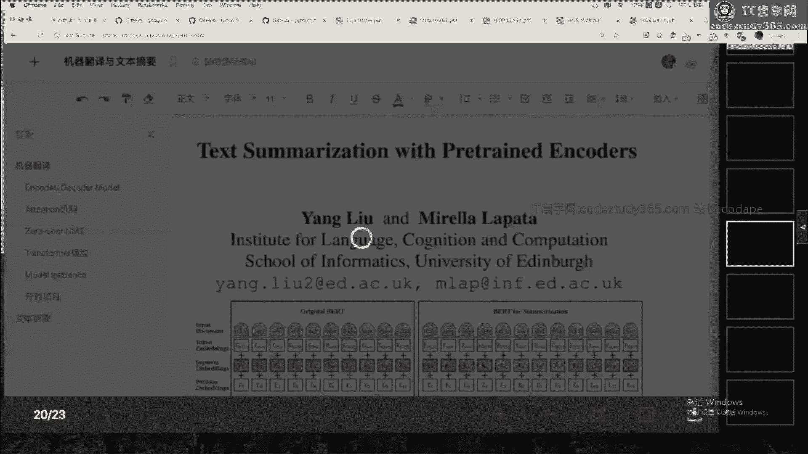

Pre trained encoders，发表在去年的EMOP上面啊，这篇文章看起来非常的简单，但是呃应该说很明显，肯定是当前能找到的比较好的效果的文章，因为他用上了BT这样的模型。

他直接用上了BERT，所以你用BT训练出一个啊地训练出一个模型。

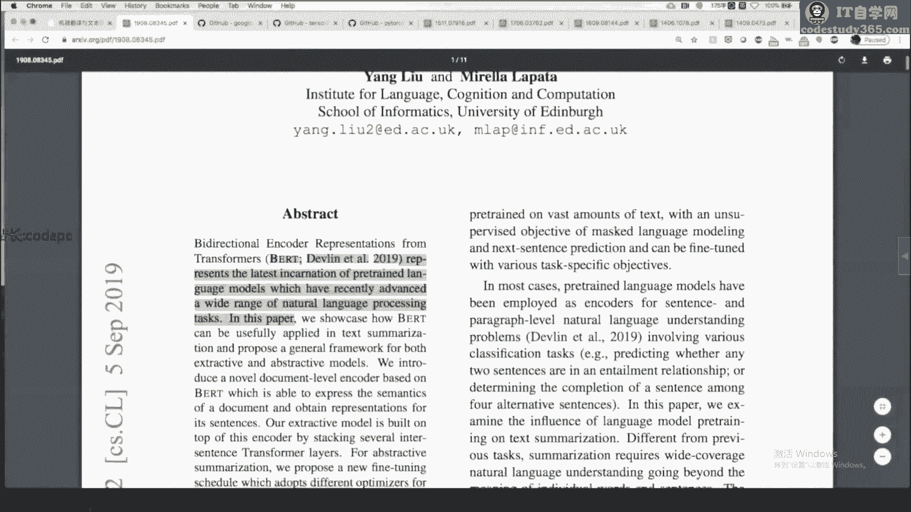

那肯定是比较好，我们快速看一下它的abstract，他们就是we show how bird can be usefully applied in text，To。

Summarization and proposed a general framework for both，Extractive and ababstractive models。

就是两种情况他都讨论到讨论到了，一种是抽取式的，这种是抽取式的，这种是生成式的啊，然后他说we introduce a novel，Document level。

encoder based on bird啊，这个其实不是都都不是很重要，就是他们一般都会说自己的模型很NOVE，然后然后他就说我们的extraction model is built on。

Top of this encoder by stacking several intersentence，Transformer layers，然后他这个是extractive model。

就是一个分类模型对吧，对于这个ABSTRACTIVESUMMARIZATION呢，他们是fine tune的一个transformer模型，因为你知道transformer的encoder就是就BT。

其实就是transformer encoder对吧，所以你只要有BT在的话呢，啊你就可以嗯，你就有了transformer的一半了，你只要把剩下另外一半训练一下就可以了，那我们直接看一张图。

你就大概知道他的模型是怎么怎么样做的，这边呢是左边是BERT模型，大家知道BT是长得跟左边这样的，对吧啊，BT有他有啊，就左边就是个BIRT嘛，就是它有三个三个embedding。

一个token embedding，一个segment embedding，一个position embedding，然后呢右边呢是他们的这个bird summarization模型。

这个bird summarization模型是怎么做的呢，这里他首先要做的是一个嗯，就是对于你看到他这边有三个句子对吧，你看它左边其实只有一个句子，它只有一个c o s token。

右边它其实这张图里面表示的是有三个句子，所以如果你的文档里面有很多个句子呢，它只需要把每一个句子前面都加上一个CLS，就可以了，你发现这边有很多的CLS对吧，有很多的CLS，那如果有这三个句子。

然后你如果要做一个抽取式的那个摘要模型呢，你只需要把这样的一整个模型塞进BERT里面，然后把这些c o s token拿出来做二分类，然后你就可以找出哪一些句子应该被留下，哪些不被留下好。

这就是一系列的二分类问题，那你想这个模型为什么啊，为什么这个模型可以work呢，因为其实它下面的transformer encoder，做了很多的工作，就这个transformer layer。

这里下面可能比如说BT有12层对吧，已经过了12层BT之后，他们其实互相之间是知道对方的信息的，就是我每一个c o s token，我既能看到自己句子的信息，我又可以看到别人句子的信息。

所以他们都是知道别的句子在讲什么，并且他们有这个positional embedding啊，这里有这个position embedding，还有这个segment embedding。

就他知道自己是哪一个句子，他也知道自己在句子的哪一个位置，然后他也知道别的句子讲了一些什么，所以他可以判断我这个句子应不应该留下，嗯是这样的一个任务，所以这是一个看起来很简单。

但是我认为应该说是一个非常有效的模型，然后ABSTRACTIVESUMMARIZATION怎么做呢，我们刚刚讲的是extractive对吧，我们还是看一眼这个。

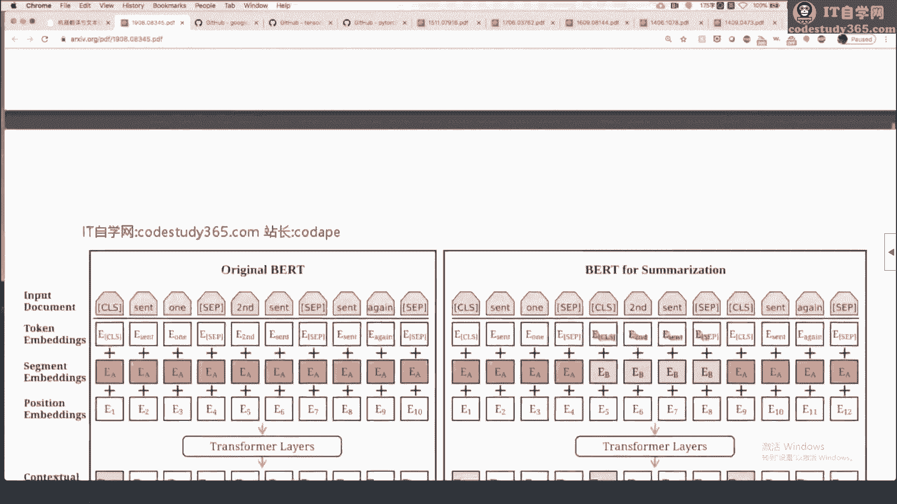

他讲的有没有什么特殊的地方，啊这也是related work。

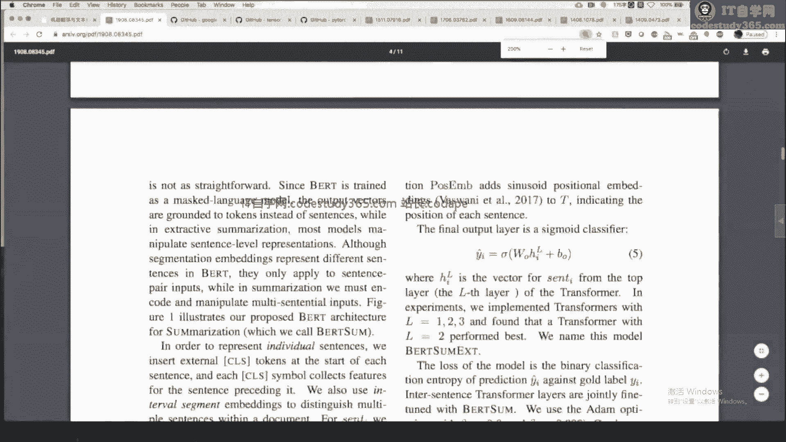

然后你看到extract，Extractive summarization，它其实就是把这些sentence全都给拼到一起，然后嗯一起做了一个BT，然后最后来做一个做一个分类啊，应该就没什么特别的。

那obstructive summarization，他是怎么说的呢，他也是um is the pre trained bird sun，And the decoder is a six layer。

Transformer，Initial randomly，所以这其实就是一个翻译模型，但是它的encoder呢是基于bird，它的decoder呢是从头训练，然后他告诉你他们有一些特殊的地方是什么呢。

他们的嗯，encoder跟decoder的那个应该用，用了两个optimizer，他说we use two item optimizers。

然后with different warm up steps and learning rates，用了不同的参数来训练encoder和decoder，那这个呢应该是。

因为你的encoder是一个训练的比较完整的模型，因为BIRT这个模型已经训练的相当强了，可能可能你不希望对BIRT做太大的改动，如果你的learning rate太大，你可能会把你的BIRT给搞破。

搞破坏了，就是这个BIRT，我们知道birt find two的模型，一般那个learning rate都是很小的，大家如果自己做过一些实验。

就会发现birth那个调参数的那个learning rate，一般我都调的很小，是十的五次方那种级别或者十的六次方啊，十的五次方和十的六次方，就你不希望把BT那个改动太大，但是。

啊有同学说生成式模型的输入结构是什么，我认为应该也是这么个结构，我觉得应该是嗯，这是一个好问题，我们可以看一下他是怎么做的，我个人怀疑，你可能直接把句子给扔进去就可以了，就是你都不需要做任何的操作。

Uh the encoder is the pre trained bird sun and the decoder，我们看一下什么是bird sun，他可能还介绍了什么是bird，Sok。

我们看一下啊，我们看一下SUMMARIZATION，Encoder，Fine tuning its application to。

Summarization is not as straightforward，Since birt is trained on a mask language model。

The output factors are grounded to token，Instead of sentences，Most words。

Although segmentation embedding represents，Different sentences in birth。

they only apply to sentences inputs啊，他的意思是说，how we他他的意思应该就是这个bird sun。

他跟你说figure one的这个这种架构叫做bird sun，所以figure one是这个这个叫做bird sound是吧，Bird for summarization，然后你看到他告诉你说。

ABSTRACTIVESUMMARIZATION也是由bird sun作为encoder，所以说明ABSTRACTIVESUMMARIZATION用的也是这张图，就他应该也是它跟抽取士用的是同样的架构。

用这个bird sun模型，那然后他告诉你，decoder就是一个transformer，Decoder，encoder呢你就用那个bird，但是中间加了一些额外的c o s token。

那个是跟普通的bird不太一样的一点，因为普通的BIRT你只有一个COS，他这边有很多个，这个其实是他整篇文章唯一做出的一点修改，然后他告诉你两他要用两个ADAM来做fine tuning。

嗯这个模型我就讲到这里吧，然后最后还有20分钟时间，我想跟大家讲另外一个我认为非常有趣的模型，这篇文章虽然有一点老是2017年的，但是呢它里面的这个思想我认为非常的重要。

叫gets to the point summarization with pointer，Generator network，也是来自于斯坦福的一篇文章啊，这篇文章呢在讲之前顺便跟大家说一下。

就是我们我一般会要求同学们，就是自己去想办法做一些实验，写一些文章，然后嗯上一届就是上一期的这个NOP就业班，有一位同学就写了这样的一篇博客，我认为写的还是不错的。

就是他相当于学习他这个pointer generator work，然后自己去跑了一些实验，然后展示了一些结果啊，他前面是介绍了一下这篇文章嗯，是一些介绍进制的，然后介绍了一下这个代码是怎么样写的。

然后展示了一下他的训练，训练的这个learning rate啊，这个是什么loss loss的这个改变情况，然后最后有一些这个英文的，英文的生成和英文的摘要，然后还有一些他还用中文去训练了一些数据。

然后生成了一些中文的摘要啊，有一些例子啊什么，比如说原来的标题，血管就是这么一天天被堵死的，别再默默喂养血栓了，生成的标题嗯，就是生成的标题也挺好玩的对吧。

就是这些sequence to sequence，模型生成生成的这些结果，其实有时候会比较奇怪嗯，但他这边展现了一些例子，我觉得还是不错的，就是他这个项目都做了一些，把自己这些项目都整理下来啊。

我也会建议这个班的同学也是啊，就是你们看到一些自己特别感兴趣的模型，就是不一定是要非常非常高级的，就是做出来你觉得这个事情非常的novel，非常的创新，我觉得大家就把这个当做一个学习的机会。

然后去尝试在各种不同的数据上面做一些实验，然后看看能不能出来一些比较有趣的结果啊，像因为我们知道有一些任务，像什么分类啊，这种任务或者是搜索啊，这种任务是比较容易拿来做成产品的，其实这些生成模型。

有时候你生成的句子的质量是不那么好的啊，确实比较难做成产品可以上线，但是可以可以给你一些感觉吧，就是让你对于这些模型都有一些，更加深刻的理解，当然我们知道像翻译这样的模型，现在已经是比较成熟的了。

因为我们其实很多时候模型之所以效果不好，都是因为缺数据，你真的训练的数据足够大了之后，我相信还是可以就这些生成问题，至少文本摘要应该还是可以做的比较不错的，尤其是那些啊抽取式的摘要。

那些分类问题应该是不会太难，对你们可以参考一下，然后这篇文章为什么我非常喜欢这篇文章呢，因为它比较好的啊，他做了它里面引入了一个叫做copy mechanism，什么叫做copy mechanism。

就是我们知道，很多时候你在做摘要这种问题的时候，你并不需要真的自己去生成一个单词，你只需要把本来文章中出现的单词给抄过来，就可以了，那这篇文章呢它的核心思想就是，我怎么样可以把这些单词给抄过来。

就是有的时候我要抄过来，有的时候我不要抄过来，这个是这篇文章的一个基本思想，这个叫做pointer generator network，所谓的point generator就pointer。

就是我的手指指着这个单词，把它这个单词直接抄过来，generator就是啊不用抄了，我自己生成一个新的单词，所以这个这个模型叫做pointer generator模型。

那这篇文章呢它是基于seek to seek模型啊，就是seek to seek加attention，这里有一张图，这张图画的也比较漂亮，我觉得就seek to seek啊，是这篇文章。

因为是在transformer之前，所以还没有transformer，它就是一个LS双向LSTM，然后加context vector，然后生成这样的单词，这样的一套模型啊，同学们现在应该比较容易看懂。

我现在这张图里面的模型，左边是一个encoder对吧，有一个双向LSTM，然后出来的这个出来呃，一套加权平均得到一个context vector，然后传到右边生成那个单词对吧。

这是一个呃比较标准的seek to seek模型，然后我们看一下它这里的他这边总结一下，总结了一下这个seek to seek模型，seek to seek模型是怎么样来的呢。

他告诉你说有一个attention distribution at是这样计算的，这个是来自于巴德now那篇文章，就是这个HI呢应该是我们看看hi是什么。

HI应该是它的encoder hidden state，我们看到HI是encoder hidden state，然后这个ST呢是decoder hidden state，所以你的这个分数呢。

他们就是这个当前解码器，对于编码器的那个权重，应该是由这样的一个两层神经网络构成的啊，这个里面是一层对吧，然后加个ten h，外面再是一层，就这样可以得出来一个分数。

然后他告诉你这个分数你过一个soft max，你就可以得到一套权重了，然后这条权重得到了之后呢，呃你的hidden state就是就是encoder，hidden state的加权平均。

然后你把这个HT star跟你的s st拼到一起，再过两层神经网络，就可以得到一个vocabulary的probability，这个是你要预测的下一个单词对吧，这个是解码器预测的下一个单词。

然后他告诉你的PW呢，就是这个就是这个就是你要生成下一个单词，就是由这个P和cap定义的，那这个是一个标准的模型啊，一个标准的encoder decoder加attention模型。

这个模型呢还有啊他在训练的时候呢，就是用这个叫做cross entropy loss，或者叫做log loss啊，这个就是你的训练的方法，然后pointer generator要做什么事情呢。

就像我刚刚讲的，我们刚才这一个模型啊，它的生成是由你的hidden state决定的，就是你你每一步生成的下一个单词，反正都是一个都是一个概率分布，但实际上有的时候，我们的模型不需要自己生成一个单词。

你可以去文本里面抄一个单词过来，怎么样可以做到抄这个动作来，就是直接抄一个单词过来，那这里呢这个point generator，他就要做这么一件事情了。

然后我们看一下这个pointer generator要怎么样做呢，他告诉你说，我的这个我要先定义一个特殊的generation probability，就是你有两种情况，就他认为有两种模式。

一种叫做generation，一种叫做啊pointer，或者让他copy所谓的generation probability，就是告诉我在有一有这么的这么大的概率，我要生成一个单词了，还有另外一定的概率。

我是要抄一个单词的，那这个generation probability怎么做呢，他告诉你是来自于这个sigmoid of，这个是我们之前这个HT，还是之前的这个HT啊。

就是啊hidden states的平加权平均，然后呢这个是你的decoder state对吧，这个XT呢应该是你的XT是什么，XT他之前有提到吗，XT看起来像是，他真没讲XT是什么吧。

嗯让我来简单看一眼这个XT是个什么东西，他怎么突然冒出了一个XT来，XT看起来像是一个单词的词向量，是decoder input吗，非常感谢这个同学，我可能在哪个地方漏掉了XT，如果这位同学没说错的话。

那应该是decoder input，那我们就啊应该是因为这个T表示的是decoder，那应该是个decoder input啊，OK就在公式上一行吧啊对decoder input，非常抱歉。

同学就是我我漏掉了这个decoder input啊，这个是decoder input，然后呢这个B呢是一个参数，那就没有什么多说的，那这个P呢它首先就表示了他你看到什么。

P gen is used as a soft switch to choose，Between，Generating a word from the vocabulary by sampling from vivo。

Cab or copying a word from the input，Sequence by sampling from the attention distribution。

就是他说我现在这个P卷，可以决定我是要生成一个单词，还是直接去去encoder的，就是输入里面去抄一个单词过来对吧，那然后你现在就有了这个pg，每一步你都有了个P卷。

我们看到这个图里面它的P卷是怎么样生成的，你看到这里有一个PG对吧，是generation probability，然后呢他会说啊，那这个PW我们知道在原来的seek to seek里面。

这个PW就是p vocab w，那在这个copy在这个pointer generate network里面呢，它就不等于p vocab了，它是P如果是个生成的呢，就是这个P正比如说这个0。5，那有0。

5的概率，他要从这个单词表里生成，另外剩下的那0。5的概率呢，这个0。5是我乱编的一个数字啊，可以是0。40。8，它是来自于你的attention的那些分数，这个A是哪里来的。

这个A我们刚刚看到你的A其实是由啊，由这一套东西算出来的对吧，就是有一定的概率呢，它是由从那个hidden state，从那个attention分数里面去sample，我可以从呃。

从我的输入的那个句子里面去抄一个单词过来，所以你这个p gen呢，就表示了我应该要生成一个单词，还是去抄一个单词，然后他说这里还有一个额外的好处，是有了这个copy net之后。

其实copy net是另外一篇文章，但是啊这种pointer network跟copy net都是，有一段时间还是挺火的，就是它它可以解决out of vocabulary的单词，有一些单词。

如果你的单词表里面没有，但是在文本里面有，那你这个generator，你这个考generator啊，不是就是你那个叫什么啊，应该叫做pointer，还是可以把它抄过来的，然后他这里还做了一些。

应该还做了一些改变啊，就是你看到他这边还有一个应该有一个ct，哪里有一个ct啊，就是它有一个coverage loss，就刚刚这一个模型其实已经到此为止了，就是你他只是做了这么一个改变。

就是当我在我的解码器，在解码下一个单词的时候，有一定的概率呢，我是从我的文文本里面去啊，从我的单词表里生成出来的，有另外一定的概率呢，是从我的encoder里面去抄出来的。

那这个PW呢它最终还是一个生成的单词对吧，所以你训练的时候，还是可以用你的cross entropy loss，因为这个PW它还是可以直接传到这个地方去。

可以当做当做你的cross entropy loss来训练，这个模型，就是还是用公式六来训练它，唯一的区别就是我的生成途径其实有了两条，那还有哪些地方要改变呢，就这篇文章还有一个很重要的一个概念是。

Coverage mechanism，其实当然也不是这篇文章提出来的，但是它把它很好的拼接到了一起，什么叫做coverage mechanism，因为我们知道我们在做解码器，用解码器做解码的时候。

实际上你是你的attention，分数是时时时刻刻在变的，比如说当你在预测第一个单词的时候，你可能是啊主要的注意力是在第一个单词上面，在当你在解码第二个的时候呢，你可能会往后面移动一下。

就是有这样的一个动态的解码的attention，变换的这个过程，那在我们原始的这个模型里面，你没有任何机制保证，你的这个attention会不会永远都在看第一个单词。

当然实际上你如果训练的模型训练的比较好，这个AT应该是会动态移动的，但是你并没有很强力的保证，说这个at一定会往后移，就是他的attention应该会移动。

它可能attention会总是重复的翻译同一个单词，那这样就不是我们希望看到的情况，然后他这里就引入了一个ct。

这个ct呢是他说is the sum of attention distribution over all，Previous decoder time steps，就是到目前为止。

我已经比如说解码了十个单词了，那我已经拿到了十套attention的这个distribution，我要把这十套attention distribution全部都加起来，变成一个新的c ct。

然后他告诉你这个ct是一个anommalized distribution，Over the source document words，那我们想一想这个ct有什么用啊，ct肯定是有用的对吧。

就是你你这个ct如果有一些单词，我已经前面关注了很多次了，那后面你就不希望再关注到了，有一些单词如果我还没关注过，他的关注度还接近于零，那那个单词你就应该拿出来多看一看。

所以他这边就把这个CT当做模型的一部分，传入到计算你这个attention的分数里面去，就是当我算出c ct之后，我下一个下一个attention的分数，就要由ct作为一部分的输入来决定。

那你看到这个ct它肯定是一个多少维的参数啊，ct应该是一个，首先这个AT它应该是句子长度的一个vector，所以CT看起来也像是一个句子长度的vector，Same length as we。

OK就是他只需要保证这个WC，可以把这个东西转成一个啊，跟V1样长度的vector就可以了，嗯this should make it easier for attention mechanism。

让我来让我来想一想，我都还不一定确定是不是一定搞得清楚，这个SHA，那这个我们可以课后再想，但总之它就是这个ct呢，是要作为参数传到你的计算，下一个attention分数的那个那个参数要传进去。

那这个是attention的这个机制，要要做这样的一个修改，然后他们还加了另外一个loss，叫做coverage loss，就是他会他定义了这样的一个loss。

minimum of a t c t是coverage loss，这个是什么意思呢，啊我们会看到如果ATCT太大的话，因为它是个损失函数，所以你当然是希望它越小越好，如果这个损失函数太大的话呢。

表示说有一个单词可能被看的次数太多了，是这样的，我这个解读有没有问题，就是这个cf loss，如果如果他啊大于，如果他是大于一的话呢，他告诉你说is bounded in particular。

这个应该是小于等于一，为什么小于等于一，因为你这个a at它其实是一个attention distribution，它是被soft max过的，所以它最大就是一，所以这个东西它理论上应该会是一个啊。

小于等于一的数字，然后他这边应该就是要保证你不可以让啊，你不可以，你不可以让你，你你尽可能是希望这个嗯这个loss要要比较小，那说明的是什么呢，你不希望某一个单词上面被看太多次。

就是不能不希望在任何一个单词上面，放太多的attention，这个为什么有效呢，呃其实我也不完全确定为什么有效，但是至少它说明你，你不，你不希望在任何一个单词上面放太多的注意力，然后他告诉你说。

In mt，We assume there should be roughly one to one translation，Racial。

Accordingly the final coverage vector is penalized，If it is more or less than one，啊。

就是他是希望这一个coverage loss能够尽可能小的，原因是因为如果之前这个单词已经被哦，应该应该是这样解读的，我我认为这样解读应该没有问题，就说一个单词，如果他之前已经被放过attention。

因为这个ct是你的cumulative attention对吧，c ct是你的cumulative attention，如果他在之前已经被看过了，那他现在就应该尽量不要，不要放太多的注意力在他上面。

如果他之前没有被看过，那他才有才有能力才被允许多看一眼，那如果他之前被看过，现在没被看，那他应该会接近于零，如果他之前没被看，现在被看了，那他应该其实还是接近于零，所以这个minimum应该无论如何。

都是一个接近于零的数字，所以这个是他的，我觉得是这个loss函数的一个一个解释，然后呢有了这一整套loss之后，你看到上面的一部分呢，就是你的啊单词生成的这个loss，第二部呢。

第二部分呢是你的coverage loss，有这两个部分，那我们在我不确定我讲的有没有过于混乱啊，就是可能我再花，我再花几分钟时间再把这个思路过一遍，以确保大家明白我说了些什么东西。

就是这个point generator呢，它本质上服从的还是一个seek to seek模型，你看到他还是左边是encoder，右边是decoder，但是唯一不同的一个点呢。

在于它有一个generator这样的一个mechanism啊，有一个generator的这样的一个一个相当于一个阀，一样的啊，这是一个0~1之间的数字，有一定的概率，你的单词是从你的整个单词表中生成的。

另外一点概率呢，它是根据你的注意力机制的那个distribution，直接从encoder里面抄过来的，我可以从source document里面抄一个单词过来，那这里这里呢这个PJEN呢。

它就是来自于它来自于哪些信息呢，他告诉你是来自于这个hidden state，来自于你当前的呃，来自于你的encoder hian state，来自于你的decoder hian state。

来自于你的decoder input，这三个部分决定了我，我下一个单词应该是有多大概率是抄过来的，有多大概率呢是自己生成出来的，然后这个批卷拿到手之后呢，你就可以从两个不同地方去生成单词了。

一个是从你的单词表里面生成出来，一个呢是从你的，我看到右边这个vocabulary distribution，是从你的单词表里生成出来，左边呢它是由啊有这个source document里面去抄过来。

那这个是P卷，这个其实就是最核心的，这个就是为什么这篇文章要做做pointer network，要做pointer，Generator network，因为他有这样的一个pointer。

跟generator的这两套机制，然后因为有这个机制的存在呢，啊它里面还做了一些别的修改，比如有这个coverage mechanism，为什么需要这个coverage mechanism。

我们刚才已经讲过了，因为有一些单词你不希望它重复，他之前已经被翻译，已经被总结过了，你就不要再总结一次，那这个是怎么样确保完成的呢，你只需要把你的attention分数给accumulate起来。

就可以了，然后你希望这个attention分数，作为你的下一个attention机制的一部分，能够传进去，并且你还专门定了这个coverage loss，希望每一个单词他不能被重复关注，这个单词。

如果之前被关注过了，他后面就不应该被被被关注，他之前如果没被关注过，他后来才应该被关注，这个呢是作为一个loss，可以确保你不会重复关注同一个单词，就这个是这篇文章的一个主要的核心思想啊。

然后如果同学们，我觉得同学们也可以看一看，我这个之前这位学员写的这篇文章，他他应该自己这个博客里面也写了不少文章，就是我们的我们上课的过程当中啊，讲到的一些内容，他有不少都把它写成了这个博客的文章。

我认为同学们可以学习一下他的这种做法，就都我都不应该说是推荐了，就是我认为每个同学都应该去尝试做一下，因为这样呢可以保证你做的这些工作，它是落到纸上的，因为很多时候你的工作，如果没有被记录下来的话啊。

你的工作其实就跟没有做是一样的，就是你必须要把你做的工作变成实，变成了一个实质的这个产出，你可以把它写成文章，你也可以把它写成代码放放到一些平台上面去，就这样可以让你的这些你的工作是公开的啊。

这样呢你把它写到简历上面会更有说服力一点，有同学提到说，文中提到的可以用out of vocabulary单词预测，用的是id吧，unk id不是固定吗，他怎么处理UNK计算loss的准确度。

这是一个好问题，我来看一下他是怎么样解决这个问题的，我们来看一下它的PW呢，他这边应该告诉你说，这个w is an if w is out of vocabulary。

Then p w is zero sing similarly，if w does not appear in the source document啊，其实他是这样的。

就是它的这个单词表应该是他有这个p vocab，它还有另外一套别的东西，就是它的单词表应该是两个单词表的集合啊，我不记得他是在哪里讲过的，我记得他的单词表示有拼在一起的。

我们来看一下它的vocabulary是怎么处理的，他说for each document，Let the extended vocavocabulary，Denote。

The union of the vocabulary，And all words appearing in the south document，它应该是每一个document会自己创建一个额外的。

Extended dog vocabulary，也就是说在训练的时候，你那你那个vocab vocabulary是被扩充过的，然后在预测的时候，其实你也同等扩充就可以了，因为在预测的时候。

你也同样会预测他，要不然要不然是来自于啊，那个fixed the vocabulary，要不然是来自于这个copy，就是在预测的时候，他不是一个问题，在训练的时候呢，我看他的意思是。

每一个document他都专门扩充了一下这个词汇表，那实际上同学们可以想象一下，如果你把这一套体系用到transformer，或者word peace的模型里面，其实没有这个问题。

因为word piece可以handle所有的vocabulary，但是你还是可以把copy mechanism留下，因为嗯你还是可以说，我这个地方是copy还是generate，虽然单词表是一样的。

但是其实还是可以把两套都放到一起，其实当年的文章特别喜欢强调OOV的问题，我觉得现在其实有了那个word peace之后，大家认为OOV好像都不是一个问题了啊，至少对于英文来说是这样的。

我不知道中文如果有一些特别奇怪的单词，其实中文一般常用的词也是比较固定的，就是那些真的不常用的，大家好像一般也就不管了，我觉得是这样的，啊大家还有没有什么问题，我们可以再讨论一下。

我稍微总结一下今天这节课的内容啊，我觉得今天这节课的主要内容是啊，主要就是机器翻译和文本摘要，机器翻译里面呢，其实最重要的就是transformer这个模型，没同学们一定要非常了解。

transformer的所有细节，然后嗯知道下beam search，beam search也比较重要，就至少你得知道它，然后这种什么attention机制，其实也有很多面试官会问这些问题。

让你讲一讲什么是attention啊，然后我记得我之前还有学员被问到过，说让他对比一下这个attention，就是这个button now的attention。

跟这个transformer的attention有什么不一样，然后说让他对比一下，说这个attention为什么，为什么这个transformer的速度会比较快啊，就这些问题大家都可以思考一下。

都是要很有可能会被问到啊，然后这些开源的项目呢，是我认为对于同学们对于这些项目感兴趣的，你肯定是花时间把这些开源项目怎么样运作，去了解一下，就这个它其实是一些to，就是可以帮助你将来做各种各样的实验。

做各种各样的项目啊，文本摘要的部分呢，这个tt some我估计大家会比较容易了，比较容易学会，因为他就是一个啊用BT加分类的一个任务。

然后这个这个pointer generator generator模型，我也建议大家去了解一下，如果你要做SUMMARIZATION，我觉得你必须要了解这个模型是怎么样works的。

因为那些生成模型其实比较容易，生成一些比较奇怪的话，另外其实有一篇很相似的文文，文章叫做copy that啊，叫做incorporating，copy mechanism to什么什么的。

这篇文章跟那个其实比较相似。

跟pointer generator比较相似，也是同时期的一篇文章。

就有兴趣的同学可以自己去看一看，就这几篇文章呢是啊在翻译和文本摘要的领域，影响力都比较大的几篇文章，是都可以了解一下，嗯embedding层你是可以变的呀，就是你在写代码的时候，有同学问了个问题啊。

他说预测的时候扩充了词表，embedding层没有变，out of vocabulary单词怎么样，embedding的，让我来想一想这个问题，我认为在embedding层的时候。

你其实还是可以用UNK，就是你你总你总归是有一个UNK的，就是我我们就讨论，如果必须有UNK存在的情况下，因为其实如果你有用word piece，可能不存在UNK的问题，但假设有UNK的话。

你的embedding还是可以用UNK的，只是你在预测的时候，你应该是可以用那个attention来直接表示，我现在要预测的一个某一个位置的单词，就是那个预测其实是不需要你的词汇表的。

因为我们最终要预测的并不是一个embedding，我们最终要预测的是一个相当于LOGI和probability，一样的东西，你只需要能够得到那一个单词的probability，就可以了。

他并不一定非要被embedding吧，就是我呃，我明白这个同学的意思应该是啊，就是那个embedding应该是你在encoder，就是你的encoder在编码那个单词的时候。

你会把单词呃embedding一下，但是那个我认为直接用UNK就可以了，对有同学说要用attention的位置再反查真实id，让我来想一想这个问题，你在做，你拿到了attention的位置。

然后你就得到了对，应该是的，我觉得这位同学说的没有错，你确实应该要从根据attention的位置，来反查这个id，就相当于你最终是要生成，你最终还是一个，我们就看这篇文章里面。

我再拉回去看一下那个分数里面，你最终是要得到这样的一套分数对吧，这个PW是这两个部分，第一个部分比较简单，就是P站某一个常数乘了一个p vocab，第二个部分是基于这个attention。

那这个attention呢它实际上应该也是，就是你确实得根据每一个位置，知道每一个位置的，它它的那个单词是哪一个维度上面的，它应该是一个vocabulary size。

加就是extended vocabulary size维度的一个向量，可能是一个，就是你得知道它每一个attention位置，对应的是哪个单词，嗯那要不我们今天的课就讲到这里了，然后我们明天再明天再聊。

明天我们还是会讲一些跟文本生成，比较相关的任务，然后我们再把作业一讲一下，这个是我们明天的计划啊，那我们今天就讲到这里，谢谢大家了。

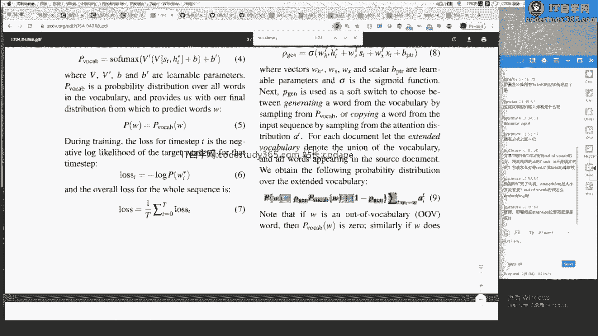

