# 【七月在线】NLP高端就业训练营10期 - P8：4.隐马尔可夫模型原理_ev - IT自学网100 - BV1uxT5eEEr6

好。

按照我们课表的安排，然后这一周我们用两次的时间，和大家一起学习一下两个非常重要的模型。

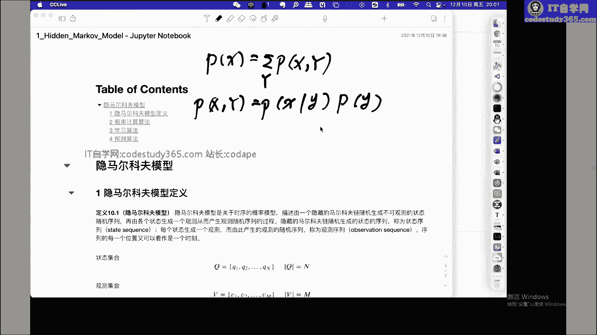

一马可夫模型和条件随机场，那么在开始之前呢，嗯我们先大体上了解一下这两个模型，在整个器学习方向它的一个位置啊，为什么要介绍这个内容啊，因为我们之前的课程当中，或者说我们后续的课程当中。

都会介绍到大量的模型，包括机器学习的内容，包括深度学习的内容啊，我希望大家能够理解的就在于，模型和模型之间其实有很强的这种关联关系，也就是说一个模型的工作，一定是在之前的工作的基础上。

进行了不断的改进和调优，然后呢以此为基础，可能在此基础上再改进和调优，又得到新的一些工作的成果，呃，所以说啊，这个模型和模型之间其实并不是孤立的，而是有密切联系的，那么今天我们要开始介绍的HMM和cf。

他们大体上是啊，位于我们称之为是概率图模型当中的一部分，非常重要的内容啊，概率图模型，那么这两部分这两个模型的前序工作哈，嗯会有大量的所谓的概率计算的内容啊，特别是让我们可能啊，有些同学之前了解过。

关于朴素贝叶斯的内容是吧，以此为一个基础啊，你会体会得到在这些工作当中，大量的使用到了概率计算啊，这也是我们今天非常重要的一部分内容，那么除此之外呢，我们今天在求解以马可夫模型当中的，若干问题的时候。

还会使用到期望最大啊，em算法啊，这个时候呢这个就不得不啊，再补充一些关于em算法的内容啊，当然有些同学可能说，那我可能之前比较了解，但是呢我们也做一个回顾，所以说你可以看到一个模型的内容啊。

牵扯到其他的相关的一些知识啊，也就是说在这些知识补齐之前啊，你可能对他的了解可能不是那么的充分啊，这也是啊给大家呃做一个铺垫，在以后的学习当中啊，你比如说再举一个例子啊。

可能我们可能会大家了解关于charge boost是吧，大家可以看到啊，这个工作的前序工作有非常多的工作啊，当你说啊我的前序工作不太了解的时候，我很难相信啊。

大家对charge boost本身有一个充分的理解啊，不管是在面试的过程当中啊，还是在今后的工作过程当中，可能你都需要把前期的工作有一个，相对比较充分的一个了解。

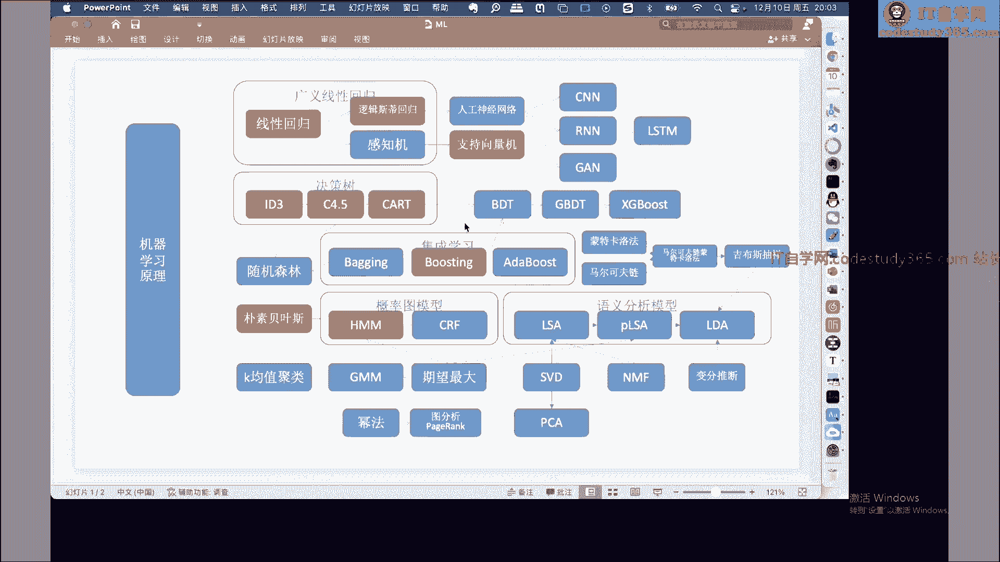

那么回到马口模型好吧，刚才也提到了，IMAX模型呢，是我们概率图模型当中的一个非常重要的工作，特别是在我们NLP方向当中啊，自然语言处理当中，在深度学习之前的呃，那个阶段，hmm和cf啊。

这两个模型可以说是起到了，非常非常重要的工作啊，当然哈啊有了深度学习以后，也不是说这两个模型就不重要了啊，后面可能大家会随着学习的深入，不断的去了解，比如说我们会把循环神经网络，作为一个特征提取器啊。

通用特征提取器在这两个模型之前，对我们的语料库做一个特征提取啊，特别是对我们的这个单词进行一个所谓的binding，就是一个向量化是吧，然后以他作为向量化之后的数据，再进行我们模型的训练，后续在挂机上。

像cf这样的模型，就是说前面是一坨LOSTM啊，或者说其他的一坨循环神经网络，做通用的特征提取，然后呢作为班里以后，然后挂上一个cf在做各种各样的这种。

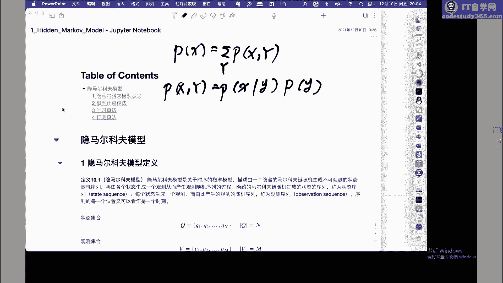

各种各样的一些计算呃。

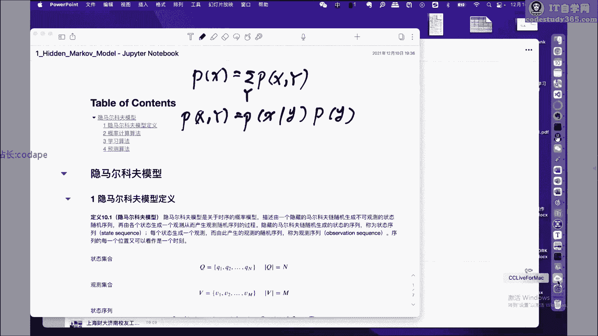

声音和视频没有问题是吗，可能我这里信号应该是没有问题啊。

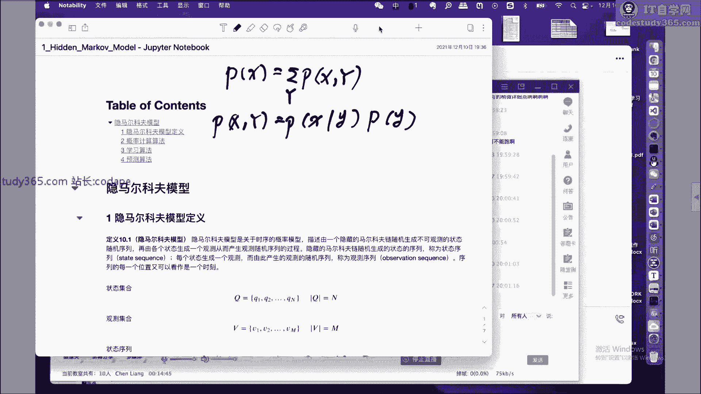

如果有问题的话，我们及时这个啊反馈回来好吧。

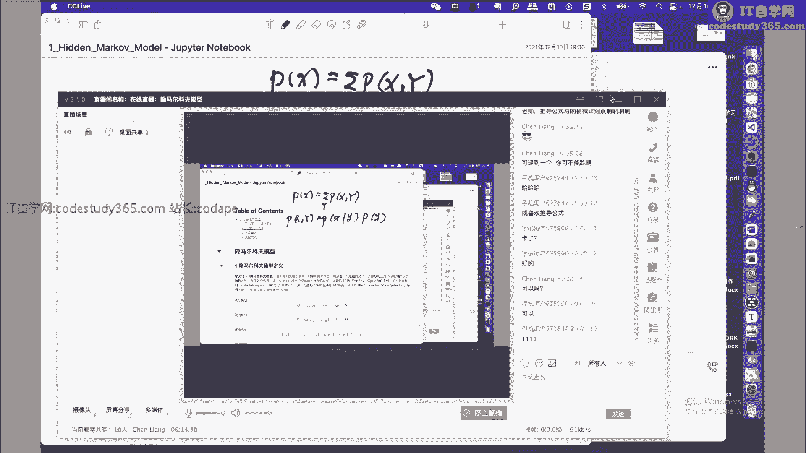

刚才讲到哪了，讲到了这个in玛克夫模型和hmm嗯，这个和cf这两个模型，其实到了现在深度学习阶段，其实也是非常重要的工作啊，就刚才所说的前面就挂上一坨深度学习的模型。

比如说transformer bbt，各种各种各样的这种预训练模型是吧，把它们搬了以后，然后再对后面挂上一个cf啊，这是非常现代的一种范式啊，就大家都这样来做，所以呢从这个角度上去看的话。

那么大家也可以看到啊，对于这两个模型的学习，还是需要大家花一定的时间和精力，来做一个了解，那么画再往前分析，你会发现它既然是所谓的概率图模型，就需要牵扯到大量的概率计算啊。

那么概率计算呢其实你说的复杂吧，可能相对来说符号比较多一些，但是再复杂，可能也就是这两条规则的一个反复的使用啊，这两条规则啊，在我们这个概率论里面有非常呃，这个直接的一个介绍啊，我们简单回顾一下。

今天包括我们下一次上课的内容，可能大量的就是这两条基本规则的反复使用啊，刚才有同学说了，也提到了，说是推公式啊，其实在推公式的过程当中，你需要有一些依据对吧，就不能说是从A到B啊，你需要有一个支撑。

那这个所谓的依据就是一些公理定理，或者说一些假设，那么其中哈这两条规则是使用最频繁，那么其中一条呢我们把它称之为是加法规则，就是PX啊，随机变量X的边缘概率，PX只有一个随机变量，那么它等于什么。

它等于联合概率，PXY两个随机变量的联合概率，那么这个时候呢，我们需要把它在Y上进行一个全概率累加，这条规则呢其实你可以简单的理解为啊，左边是一个随机变量的概率计算啊，右边呢是两个随机变量的联合概率。

那么很显然，如果单纯从边缘概率和联，合概率的角度上去看的话，其实他俩并不相等，换句话说，本来只有一个随机变量的不确定性，这个时候呢右侧是两个随机变量，那这个时候你需要把另外一个新加入随机变量。

Y的不确定性还原掉，那这个时候我们进行一个SUV就可以了啊，当然这只是一个简单的理解啊，数学让你不能这样去证明是吧，但是呢不管怎么样，在后面的这个呃推导过程当中，但凡是看到了一个随机变量啊。

这个时候如果说哎不太好进行推导了，那这个时候你可以把它啊，通过这种加法规则的方式，把它拆成联合概率求和的形式啊，这是加法规则，那么另外一条规则是称之为乘积规则，他说的是随机变量XY的联合概率。

等于PY条件之下的X的条件概率乘以PY，那就是条件概率乘以边缘概率的形式，同样如果从单纯的从等号的左右两边去分析，我们会发现左边是联合概率，两个随机变量的联合概率，右边呢第一部分是一个条件概率。

是在Y作为一个条件已知的情况之下，随机变量X的条件概率，那么很显然单纯从联合概率，条件概率的啊分析上会发现还是不相等，不相等的，原因就在于随机变量XY是两个随机变量，而是在这个地方的条件。

概率是Y作为已知条件，被确定了以后的条件概率，那么很显然呃，随机性或者不确定性又不相等了，那不确定性的不行，消失在于这个随机变量Y是一个已知量，那这个时候我们只需要把随机变量。

Y的不确定性或者概率乘进来，又还原回两个随机变量的联合概率，好吧啊，这两条规则哈，这个你可以大体上按照上述的理解去这么想，那么用的时候呢既可以从左边到右边啊，同样也可以从右边到左边，因为它是个等式啊。

它是个等式好了，做了以上铺垫以后呢，正式的开始，我们今天的内容就是关于hmm，首先看一下定义啊，就是定义上是怎么说的，1mark模型啊，是关于时序的概率模型啊，首先呢它是一个概率模型。

会进行大量的概率计算，后面我们会体现得到更重要的，它是一个所谓的时序模型，它有一个序关系，就是前序和后序的这么一个关系，那么从这一点上呢就可以啊，能够理解到，但为什么适用于我们自然语言处理方向。

因为我们的自然语言处理一个句子是吧，一个句子，句子当中的每一个单词和每一个单词之间，是有一个前后关系的，那么这个前后关系，就可以使用我们的一马克模型来进行捕捉啊，或者说进行建模。

来分析我们整个的语料库里面的句子，句子和句子之间的这种计算关系好吧，所以它是一个时序模型啊，非常重要，它描述的是由一个乙马可夫链随机生成的，不可观测的状态序列，再由各个状态生成一个观测。

从而产生观测随机序列的一个过程，呃这这里面有很多的一些概念或者名词啊，大家需要特别特别注意，首先第一个就是所谓的呃状态序列啊，首先要你明确一马可夫模型里面，首先需要有一个状态序列。

这个状态序列有一个特点，它叫做不可观测啊，就是这个这个序列我是这个状态序列，我们是看不到的啊，或者说我们不能够直接观测到，那除了这个状态序列之外，我们还有一个序列称之为是观测序列，而这个观测序列很显然。

通过名称我们也知道它是可观测到的，那么这两个序列之间有什么关系吗，关系就在于观测序列当中的每一个观测，都是有所对应的状态所生成的，也就是说我们有两个序列，这两个序列呢一个是状态序列。

另外一个呢是观测序列，状态序列决定了观测序列，但是呢状态序列我们不可见，而观测序列是可见的，那这个时候呢这个我们需要你把它画一下图啊，就是你把它简单的会想象一下，因为是这个序列哈，所以我们往往加上箭头。

所以说你会发现这里是一个圆圈，一个圆圈对应的就是我们的状态啊，一个状态，一个状态，每一个状态，因为我们说它是序列，所以状态是有前后关系的，我们用箭头来表示这种前后关系，除了状态序列之外。

我们还有一个序列，我们称之为观测序列，注意啊，关键词序列它也是一个序列，但是我们知道观测序列的决定并不是由序列，观测序列之间来决定，而是由它所对应的状态来决定，所以说大体上。

你可以把in Mark服模型认为是这么一个结构好吧，就是以后啊你脑子里面再提到一马可夫模型，那到底这个模型长什么样，就长这样好吧，上面一个状态序列，状态序列之间是一个严格的线性关系，或者持续关系。

一个状态产生下一个状态，再产生下一个状态，才能产生这样一个状态，产生下一个状态的同时，当前这个状态又产生它所对应的观测，所以说哈，虽然说观测序列不是由前一个观测所生成的，或者决定的。

但是你会发现观测序列也是一个顺序关系啊，虽然说我们不是说是一种生成关系，但是他们也有前后的顺序，而这个前后顺序是由它所对应的状态所对应的，好吧嗯一会再说什么是一马可夫链的问题啊。

看下面要隐隐藏的马尔可夫链，随机生成的状态序列，我们把它称之为是就是状态序列，就是上面这个就是所谓的状态序列，每一个状态所生成的观测啊，而由所有观测所产生的，我们把它称之为是观测序列啊，观测序列嗯。

序列的每一个位置又可以看作是一个时刻啊，就是不管是状态也好还是观测也好，每一个位置我们都可以把它认为是一个时刻，这就是所谓的伊拉克模型，好吧，嗯有同时隐藏的就是状态不对啊，是这样看上面哦。

OK你可以这样认为啊，隐藏的是状态，就是我们的状态都是不可见的啊，倒不是一定是隐藏，因为这个地方的银码可夫模型，并不是隐藏的含义，它只是一个不可见的概念啊，后面我们会把它还原回来。

就是计算它的一些计算啊，就通过一些可见的结果去把它还原回来，那么既然有所谓的状态序列，那么状态序列的每一个状态，就有一个取值的范围或者取值的一个空间，我们把这个取值的范围呢，把它称之为状态的集合啊。

状态集合，那么状态集合呢我们用Q来进行表示啊，状态集合用Q来表示，其中呢Q1Q二一直到QN，表示所有的状态可能的取值啊，所以说你会发现Q是个集合哈，Q是个集合，这个集合里面的所有的元素或者每一个元素。

都是我们的状态可能的取值范围啊，它可以取Q1，也可能取QN啊，这是关于状态集合，有了状态集合之后呢，我们还有所谓的观测集合，观测集合用V来表示，是从V一一直到VM。

那么其中的每一个元素对应的是我们的观测啊，每一个时刻的观测可能取值的范围，观测的取值范围，注意这个地方啊，QN到VM啊，其中的Q的绝对值，对应的是我们整个状态集合中元素的个数是N。

而V的绝对值或者是范数啊，我把它称之为N等于M，是我们状观测集合里面的元素个数啊，这是两个集合啊，所以是大括号的集合，有了这两个集合以后，我们就可以构建所谓的状态序列和观测序列了。

所以你会发现状态序列被定义为I啊，状态序列被定义为I，它等于I1I2，IT一直到I大TI大T，这里注意这里的I1I二一直到I大T的下标，标明了当前每一个状态的序号啊。

或者说是前后的那个序位置的一个标识啊，I1就是第一个时刻的状态，I2是第二个时刻的状态，IT是D小T这个时刻的状态，I大T是大T这个时刻的状态，那么这个在序列当中的每一个状态。

和我们状态集合里面的每一个元素之间，什么关系呢，或者说和这个状态集合之间什么关系呢，是一个IT属于大Q这么一个关系，IT是什么T你可以认为是DT时刻，或者说任意一个时刻的状态序列当中的状态。

它是我们Q集合里面的一个元素，因为刚才我们说了，Q集合是我们的状态集合，所有的时刻的状态都取决于我们的状态集合，好吧，这应该能理解是吧，既然有了状态序列，那么就有所对应的观测序列。

观测序列呢我们用大O来表示啊，大O来表示是O一O2OT一直到O大T嗯，同样啊，这里的下标12T，一直到大T都是我们的时刻的标识，具体是哪一个时刻，第一个时刻的观测就是OED，大T个时刻的观测就是O大T。

那么同样在这个观测序列当中的，每一个观测都是我们观测集合当中的一个元素，所以说OT是属于大卫的，OT是属于大卫的，这个地方呢就有个问题啊，就一个问题，刚才我们一直在说，状态集合中的元素个数是N。

我们观测集合里面的元素个数是M，所以很显然这里的N和M是不相等的，也就是说我们状态集合里面的元素可能有多个，我们状态可以取N个状态之一呃，观测集合里面的元素有M个，所以观测呢可以取M个观测之一是吧。

但是你会发现这里的状态序列和观测序列，它的下标都是从一个大T一一直大T，那么这个地方有没有同学有困惑，为什么会这样，或者说为什么都是到大T，很显然都是从时刻一开始，这个开始应该问题都不太大是吧。

那为什么一直都是到大T这个地方比较有困惑，因为前面刚才已经说到过，在1M可夫模型当中的一个条件在于什么，就各个状态生成一个观测啊，每一个状态都对应的生成一个观测，所以说既然有大剃个官的状态。

那么每一个状态都生成它所对应的观测，所以同样那么也应该有大T1个什么观测是吧，所以说这个不要有什么这个问题是一一对应，很好啊，关于这部分模型的分析或者是介绍，有什么问题吗。

对观测序列和状态序列的长度是一致的，因为一个状态生成一个观测，一个状态生成一个观测，很显然是一一对应的，对吧啊，这个地方呢再简单说明一下啊，特别是呃很多这个同学啊，就是有些模型因为确实很复杂。

包括像后面越来越多的复杂的一些模型，有的时候很很困惑是吧，这些模型它它它怎么就啊，按照我们的程序代码就开始运算起来了，这其实我能够充分理解大家的困惑的地方，到底在哪，在哪呢，一方面我们的这个文字描述哈。

我们的文字描述和我们的这个嗯，数学符号的描述，大家特别能够把它们能够什么对应起来啊，也就是说其实哈我们的文字描述，和我们的数学符号描述其实是一回事是吧，是逻辑上是一致的，只是呢呃使用的方式不太一样啊。

我们的自然语言描述，当然就是通过文字性质对吧，一个个都没解释清楚，而数学符号的特点就在于它非常的简练，通过符号表示符的含义啊，简练的精确的把这个含义给你解释出来，但是他俩之间还是有一些呃侧重点。

或者有有有有侧重点吧，你看自然语言可能比较容易理解是吧，他就是一句话你都不把它理解起来呃，但是呢数学符号呢有的时候就不是那么的明确，问题就在于，你需要把整个数学符号当中的每一个符号。

都进行仔细的一个分析啊，比如说这里的Q到底是什么，它是个集合啊，既然是集合，我们数学上有明确的定义，它是由元素构成的是吧，但是呢元素之间是没有顺序关系的啊，它只是个集合而已，而且序列就不一样啊。

序列呢是由更强调它的顺序性，那么这个时候就需要用我们的下标，来严格的标识顺序之间的严格关系，那么这个时候每一个符号，比如说N和M，它们仅仅代表着两个不同集合里元素的个数。

而这里的T严格说明了两个序列当中所生成的，每一个状态之间的先后关系，而这里的答题，很显示整个序列当中的最后一个位置，所以说一定要把这种文字描述，和我们的符号描述之间能够相应的对应起来。

当然中间还有一个工具，就是这里的图形啊，其实你会发现加入图形以后，文字描述，数学，符号描述和图形描述，三者在逻辑上是完全一样的，你需要做的工作就在于理解文字描述啊，能够还原回我们的数学，数学符号描述。

然后呢通过一个简便的，或者说你能够形形象化的理解的图形，把它把它把它印象化好吧，这是他三个之间还是有关联的，好了，上述是我们的一马克模型，下面呢还没有完，有了这些结构以后呢，看下面。

既然我们有所谓的状态序列，既然状态和状态之间是有严格的顺序关系的，那我们就需要有一个疑问，什么疑问呢，那状态之间的转移是怎么来构建的，比如说我怎么从一个状态生成，或者跳转到下一个状态。

你这有很明显的顺序关系吗，而这些信息有所谓的状态转移矩阵来表示，他称之为是状态转移矩阵，状态转移矩阵呢，我们用A来表示这个状态转移矩阵，A当中，定义了我们任意两个状态之间的跳转关系，那下面问题就来了。

回来看一下我们的状态集合里面有多少元素，有N个元素对吧，那么A矩阵试图要记录状态集合当中，这N个元素之间任意两个之间的这种转换关系，或者说是转换规则，那下面就有一个问题，我们需要一个什么样的数据结构。

才能够保证能够把N个元素，任意两者之间的跳转关系能够建立起来，那么很显然是一个什么，很显然我们需要一个矩阵对吧，很显然是个矩阵，既然是个矩阵，我们就需要去处理两点内容，哪两点呢。

第一点就是这个矩阵的结构啊，就是这个矩阵是一个几行几列的一个矩阵，第二点才是处理这个矩阵当中，每一个位置上的那个值，所以说首先我们可以看一下状态转移矩阵，这个矩阵是一个N乘N的，这个应该没有问题对吧。

刚才已经分析了，矩阵A是要描述或者记录所有状态里面啊，我们的状态集合里面，任意两个状态之间的调整关系，所以他一定是个N号N列的啊，从一个Q1跳转到Q2Q3Q四，一直到QNQ2。

调整了Q一Q三Q41到QN对吧，所以说你会发现，很显然是N行N列的一个一个一个矩阵，那么下面一个问题啊，就是这个AIJ的问题，就是里面每一个N乘以N的矩阵，里面的这个AIJ这个元素怎么被定义的问题。

那么大家回过头来再看一下这个图啊，再看一下这个图，这个图上说的是从一个元素或者一个状态，跳转到另外一个状态，那么既然是从一个状态跳转到另外一个状态，很显然在这个跳转过程当中。

就牵扯到了一个从谁跳到谁的问题，你是从谁跳到谁，所以说你会发现这里的元素AIJ的下标，IJ很明显的是告诉我们我们在跳转过程当中，到底是从谁跳到谁，看它的具体描述啊，到底是从谁跳到谁。

AIG在T时刻处于状态QI的条件下，再T加一时刻，转移到状态QG的概率被定义为AIG，再看一下这段文字描述哈，在T时刻，那么这个T很显然是可以，在我们整个状态序列当中任意取值，所以是就意味着是任意时刻。

那么在任意时刻状态QI的条件下，再比如说啊，比如说举个例子，这是T这个T时刻，这个题时刻是处于状态QI的条件下，注意看下面的描述，在T加一时刻转移到QG，如果这个时刻是T时刻。

那么很显然下一个时刻就是所谓的T加一时刻，转移到哪个状态，转移到状态QG，那么这个时候我们用AIJ来表示，那么既然是在某一个状态条件下，跳转到另外一个状态，那么这个跳转过程很显然就是一个条件概率。

那么谁已知谁未知，刚才我们说过已知的是在T等于QI，你会发现IT第七个时刻的状态，等于QI的条件下，DT加一时刻的状态等于QG，这个条件概率被定义为是AIJ，那有了AIJ以后啊，我们再看一下下边啊。

对应一下关系，关系在于这里的I对应的是已知的IT，这里的G对应的是下一个时刻的QG啊，所以是从I跳到G啊，是从I跳到G，所以是AIG啊，这个下标很重要，顺序很重要，因为一会儿我们会会做一个公式推导。

那个推导公式啊，经常会同学就搞混了，好吧啊，这个时候你会发现，当我们有了AIJ以后，我们就可以定义任意时刻，任意一个时刻从QI跳到QG的转移概率，那么这个时候你会发现，当我们把整个Q集合当中的。

所有的元素都遍历完成以后，构建起这个A矩阵以后，那么这个A矩阵里面是不是就定义了啊，在任意时刻从一个状态跳转到另外一个状态的，什么跳转概率啊，这就是说A矩阵解决的是状态的跳转，谁跳到谁啊。

那你分析分析清楚前后关系就可以了，一定是从QI跳到QG啊，在QI已知的条件之下，我跳到QJ，所以是AIJ好吧，这个矩阵呢我们把它称之为是状态转移矩阵啊，状态转移矩阵。

既然我们说状态和状态是可以进行跳转的，那么下一个问题很显然就在刚才，我们在一马克模型介绍里面，我们还知道，当我们跳转到某一个状态以后啊，它不光是可以跳转到下一个状态，还需要根据当前这个状态生成什么。

生成一个观测对吧，在已知当前状态的条件之下，他要生成一个观测，那么这个时候很显然，马上有同样能够反映出来了，我们又需要有一个数据结构啊，用来记录所有的状态，跳转到观测的所有的可能性。

那很显然我们看一下所有的状态有N种状态啊，所有的观测有M个观测，那么这个时候我们同样是需要有一个矩阵，来记录从状态，所有的可能状态，跳转到所有的可能观测的这么一种跳转方式。

那么这个时候这个矩阵的数据结构的行和列，其实类比于我们刚才的转移矩阵，你会发现它一定是一个什么N乘M的，任意一个状态都可能跳转到M中观测里面去，那有多少个状态，N种，那一定是N乘以M的一个矩阵。

所以说啊下面一个矩阵，我们把它称之为是观测概率矩阵啊，观测概率矩阵，观测概率矩阵，它描述的是从状态生成，或者从状态跳转到观测的概率，同样刚才已经介绍了，他是个N号M列哈，N号M列。

那么里面的元素呢我们用BJK来表示，那BJK说明这是什么，BGK说明是在T时刻处于状态QI的条件下，生成观测位key的概率，再重复一遍啊，在T时刻还是任意时刻状态处于QY，在T时刻状态除以QI的条件下。

我跳转到我的观测处于什么VK，那么这个概率我们把它定义为是BJK，那么同样可以看到啊，是在第七个时刻的状态为Q的条件下，然后我跳转到相对应的T，这个时刻的观测为VK的条件，概率为BJK啊。

V b g k，那么同样当我们对这里的key和G都进行遍历，完成以后，就生成了刚才所对应的那个N行M列的矩阵，就是这里的B矩阵，观测概率矩阵B，那么这个时候大家可以看到，当我们有了这里的状态。

转移矩阵和观测概率矩阵以后，我们就能够在整个一马可夫链上啊，就在可以在整个一马可夫模型上进行跳转了，你可以看到你只要给我一个时刻T啊，当然这个时刻T是个任意时刻是吧，你给我这个任意时刻。

你所在的状态我就可以干两个事情，哪两个适配性呢，根据已知的这个QI这个状态，我就可以生成它所对应的观测，根据谁来完成，根据我们的观测概率矩阵啊，那个BGK来完成，当生成了它所对应的观测以后。

同样我可以根据当前这个时刻的状态，再根据我们的什么那个状态，转移矩阵A来生成下一个时刻的状态，那么同样这个过程我们还可以到了下一个时刻，同样来完成，因为那个T是任意时刻是吧，那到了下一个T加一时刻。

同样可以生成T加一时刻的什么观测，再根据T加10克的状态，生成T加20克的状态，那点点点啊，这个马尔可夫模型就可以生成下去，但是呢有没有同学有疑问什么疑问呃，我不知道大家玩过没玩过那个多米诺骨牌是吧。

多米诺骨牌其实有非常类似的一个过程对吧，当我们啊有一张多米诺骨牌倒下去以后啊，根据我们的这种推导的关系，它就可以生成或者推倒了下一个多米诺骨牌，但问题就在于，谁是处理第一个骨牌。

倒下去的那个上帝之手是吧，有同学问AIG里面的I取值怎么是一到M，啊这里是N啊，这是N啊，因为你只能从状态到状态跳转N，刚才我们说过说到当我们矩阵A和矩阵B以后，我们需要处理的是第一个时刻的那个状态。

生成的问题，那这个时候呢我们看下面，我们需要单独去处理一个特例，就是在时刻T等于一的时候，我们需要处于状态QI的概率，那这个时候因为这个时刻被唯一固定下来了，他就是T等于一那一个时刻。

在这一个时刻可能取值的状态，就是我们这M个状态啊，所以说它一定是一个什么结构，它一定是一个向量是吧，因为你这一个时刻被固定了啊，时间不转移了，而且呢我需要确定在第一个时刻，我所有的状态的可能性。

那么很显然是一个MV的一个向量哈，所以呢这个时候呢，我们用初始概率向量来进行描述，初始概率向量我们用派来表示，那么既然是向量里面的每一个元素，我们用pi来表示，说明的是在T等于一的一个时刻处于状态。

QI的概率啊，注意啊，这不是一个条件概率了，因为它不需要转移，他定义的就是那一个时刻，一个时刻的概率关系，所以这时候明确的表示的是我派I啊，定义的就是在第一个时刻处于相对应的状态，QI的那个概率啊。

就是用pi来表示，那这个时候呢有了我们的状态转移矩阵，A关，在概率矩阵B，和我们的这个初始概率向量派以后啊，我们的银马可夫模型在形式化上就可以定义为，lambda等于ab派啊，这是逗号。

形式上就是由三三元组组成AB和派啊，有了这三部分信息以后，你会发现整个银马克和模型当中，所有的这种信息都已经是完整的了是吧，你从派，我们刚才定义的那个初始概率向量派里面，就可以生成第一个时刻的状态。

有了第一个时刻的状态，根据我们的观测概率，矩阵B就可以生成第一个时刻的观测，再由我们的状态转移矩阵A生成，第二个时刻的状态，同样生成第二个时刻都观测依次上升下去。

我们的整个一个马克分模线就可以构建完成了。

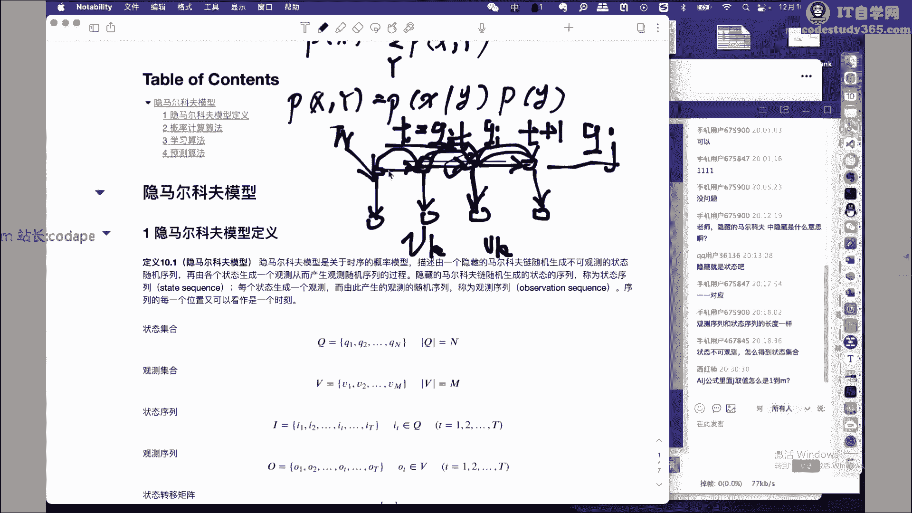

那我看看就第一部分关于马克模型的定义部分，看看大家有什么问题吗，我再强调一点的，可能就是这两个条件概率的定义问题啊，状态转移是在IT等于QI这个状态的条件之下，我在下一个时刻跳转到QG的概率值是AI。

同样啊，这里的观测概率矩阵，也是说的是在IT这个时刻等于QG的状态，已知的条件之下，生成，它所对应的那个IOTDT时刻的观测的值为，VK的条件概率为BJK啊啊初始概率向量，就像刚才所说的。

他是第一个时刻的那个初始向量，那么大家看看这一部分有什么问题吗，定义部分，嗯是这样哈，状态是不可观测的，但是我们知道这个状态的组成就有哪些，这里的不可观测，说的是这个序列不可观测。

就是这个顺序是不知道的，但是这个组成这个序列当中的每一个元素，我们是知道的啊，就是这里的隐码和服模型啊，这个隐隐藏或者隐含的含义，说的是这个序列不可观测啊，组成序列的每一个状态的取值我们是知道的。

有同学问啊，这个派的值是怎么来的，其实这个问题啊，不光是派的值是怎么来的，你会发现这里的A的值是怎么来的，B的值是怎么来的，其实我们都没有给出明确的一个定义，只是说这个AIJBGK。

包括这里的pi是在满足条件的时候的概率，但是这个概率值是多少，我们并不知道，那这个时候就回回回回应刚才这个同学的问题，那么这些概率值到底是多少，那么这个问题交给你的话，你怎么来完成，或者你怎么去确定。

注意啊，这里的AB和派都是概率的吗，都是概率，那我们概率论里面可以告诉我们，一个很简单的处理方式，如果有足够多的数据的话，你可以用数据集的频，数据集里面的频率值来近似我们的概率值，不是不是随机初始化。

注意这里不是随机数化，是使用我们的数据集里面的频率值，来近似代替我们的概率值，或者说你的频率值就是用就是我们的概率值吗，是吧，如果说你是初随机初始化，有一种方式，你可以使用什么。

你可以使用我们的呃呃什么那个贝叶斯方式，贝叶斯一个方法是吧，你可以使用我们的数据集，在随机初始化的基础上，给他不断的增加不断的证据，新的证据啊，使这个毕业方式来趋近于我们的概率值。

这是两种这个呃很好的实现方式啊，很好的实现方式，第一种方式就是频率派，频率派就是用计数对吧，我用百分比来计数来表示我们的概率，另外呢就是我随机初始化完成以后，我通过一个贝叶斯方式。

用新的证据去不断的去调整我的这个概率值，也是一种方式，哎有同学会问啊，为什么要加状态是吧，对你为什么要搞这么一个模型啊，这是个很好的问题啊，就是嗯你讲了半天是吧，一般考试模型是这个没问题。

但为什么是这个嗯，举个例子啊，就这个银行客服模型到底到底怎么用，回到我们这个ALP方向，回到我们的NP方向，还是那个问题，你如果带着这个背景，那你觉得我们在这个NLP自然语言处理方向。

可以怎么用这个模型，嗯或者说你你你你想象一下，你你联想一下，或者你联联系一下，在我们自然语言处理方向当中有没有序列，刚才其实已经提出来了，有很多的序列关系，比如说我们的自然语言的一个句子啊。

这个句子里面的每一个单词，很显然都是一个一个的单词序列是吧，单词序列，那么有同学就会问，单词序列不就是一个序列吗，那我们这个时候啊，怎么出现这么复杂的一个所谓的你你状态序列，还有这么复杂的一个观测序列。

是这样吗，好了，除了我们说我们拿到的这个语料库里面，那个句子所组成的这个呃句子序列之外，那么你想想你还有什么样的一个序列，是你所关心的，比如说，嗯比如说啊呃我们回回回忆一下这个分词啊，我们的分词呃。

英文分词其实不是问题，因为英文里面有非常明确的那个空格对吧，作为它的单词和单词之间的一个呃，一个一个区分的标识，但是你像中文这种这种没有这种明显的词和词，之间的标识区分的这种语言当中。

分词是一个非常重要的问题，那么你联想一下，比如说有同学这个时候就会问，就会就会联想一下，比如说我们的一个一个句子是吧，我爱中国，那么我呢其实是一个名词，爱是个动词，中国其实也是一个名词。

那这个时候我们又要分词啊，分词啊，我是一个单词是吧，I是一个单词，中国是一个单词，所以说你会发现我们要如何处理，是分词任务的话，我们需要在我的后面加上一个斜杠对吧，把它分开嘛，A的后面加上一个斜杠。

这个时候中国当然自然就被分开了，你会发现这里的两个斜杠是不是也是一个什么，是不是也是一个序列，那这个时候就有了一个所谓的隐藏序列，或者和一个观测序列的问题，那谁是隐藏序列，谁是观测序列。

那么很显然我们这个句子啊，是我们可以观测到的，语料库里面实实在在存在的，它可以显示我们的观测序列，你说刚才我们那两个斜杠啊，那两个斜杠的位置是我们不知道的，我们想得到的那就是我们的隐藏序列。

所以这个时候你会发现呃分词这个问题啊，就是那个切分位置其实就是我们的隐藏序列，我们的整个句子就是我们的观测序列啊，这是我们的分词任务，还有什么，还有词性标注人物是吧，就像刚才说的，我是一个名词。

爱是个动词，中国也是个名词，那同样我们需要对它所对应的这个单词的词性，加以标注，那么同样也是两个序列，可观测和不可观测的，后面我们所解决的计算问题啊，那其实就是在解决这种带有不可观测的，这种序列的时候。

我们怎么样通过概率计算，把他们的这个最大概率计算出来的问题，好吧，那我们就继续啊，当然呃，在以上的马尔可夫模型的定义完成以后呢，呃其实已经可以计算了，但是你会发现我们碰到的最大的麻烦就在于。

单词之间的序关系是非常强的依赖关系，换句话说，我当前这个单词或者当前这个状态，不仅仅是依赖于前驱状态，因为前序状态还依赖于他的情绪状态，那么它的前驱状态，间接的也影响了它的后续的后续。

所以这个时候如果在此模型上进行计算呢，我们会进行大量的这种概率计算，那这个时候我们不得不为了便于简化，引入两个非常强的假设关系，称之为是一马可夫模型的基本假设啊，这两个基本假设呢。

第一个基本假设称之为齐次马尔科夫性假设，七次Mark分析假设都是在任意时刻T啊，在任意时刻T的状态依赖，并且只依赖于T减一时刻的状态，回到刚才那个图啊，我前面刚才说到过，因为它是一个顺序关系。

所以说啊越往后越往后的状态，影响这个状态的因素就越多，按照我们这个模型本身的定义，你会发现影响最后一个状态的，前面所有的状态都会影响到它对吧，这很显然对我们的计算有很大的麻烦。

所以说七次马尔克分析假设说的是什么，说的是状态之间的影响关系值依赖于它的前序，这一个状态和其他的状态都没有关系，这被称之为七次马克思假设啊，这个这个假设其实也也也比较呃，怎么说呢，也可以理解是吧。

也可以理解，那我看看它的形式化的定义，就像刚才我们所说的，影响当前一个时刻的状态，有很多因素包括哪些呢，可能包括IEOE啊，I252，直到IT减一，OT减一，即使当我们知道了那么多信息的时候。

作为已知条件来决定当前T时刻的状态的时候，它仅仅等于什么，仅仅等价于或者等于在T减一这个时刻，作为已知条件的情况之下，IT的条件概率啊，这对我们的计算啊，后面我们的公式推导带来很大的便利啊。

换句话说后面再说啊，带着一个很长串的已知条件的，一个什么什么条件概率的计算的时候啊，你看看是不是这里符合就七次马克分假设，注意啊，这里说的是对于状态的一致，只受限于它的前序状态啊。

这状态和状态之间的关系啊，被称之为其次马克分析假设，第二个呢我们称之为观测独立性假设，观测独立性假设说的什么意思呢，任意时刻T的观测啊，只依赖于它所对应时刻的状态啊，回到图上面，我们可以看一下。

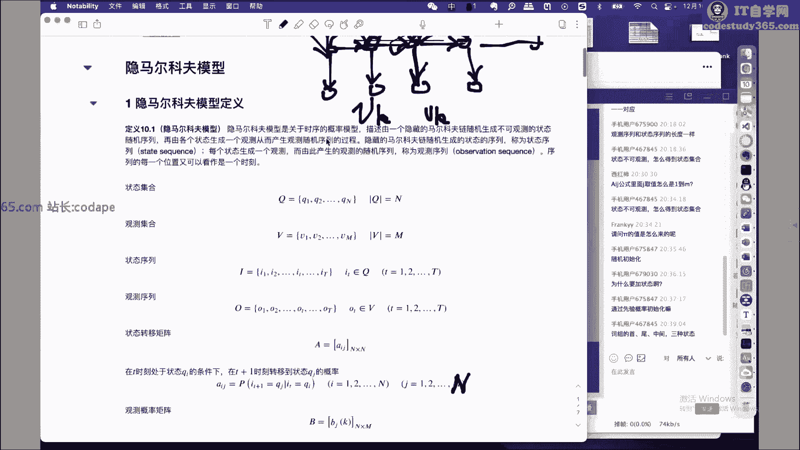

同样按照刚才的逻辑啊，状态影生成或者影响了这里的观测，那么换句话说，观测也受他之前所有的状态和所有的，观测的影响，那这个时候呢还是很复杂，所以这个时候我们也马上做一个简化，当前时刻的观测。

当前时刻的观测，仅受它所对应时刻的状态的影响，和其他时刻的状态观测一概无关好吧，所以形式化上被定义，为什么定义为决定T时刻的观测，可能有很多的数据，包括OEIEOR一直到等等等等。

这些已知条件都已知的时候，决定了OT那么这个时候我们把问题简化一下，简化为什么简化为T时刻的观测，仅受T时刻的状态的影响，和其他的统统无关，同样在后续的公式推导过程当中啊，你会使用到这条规则好吧。

这被称之为是观测独立性假设啊，这两条假设啊完全是为了计算方便啊，没有其他的原因好了，有了前面的这些描述以后呢，我们看一下一个基本的算法，被称之为是观测序列的生成算法啊，这个这个算法没什么太大意义啊。

只是帮助我们理解一下这个模型而已啊，OK既然叫做观测序列的生成算法，很显然这个算法是为了什么生成观测序列的，换句话说观测序列是怎么被生成的，那么这个算法当中的输入，需要输入的是我们的整个页码可控模型。

lambda啊，我们的转移矩阵A，观测矩阵B和我们的初始向量派啊，啊除了模型之外，还需要一个长度T啊，你需要生成多长的一个所谓的观测序列啊，T也是我们的输入，那输出呢输出当然就是我们的观测序列了啊。

从O一一直到O打T按照长度生成就可以了，那怎么生成我们这个基本策略啊，我们那个基本策略就是根据我们的ab派里面，取生成概率最大的那个来进行我们的观测生成，因为我们知道这里的AB派都是概率。

前面两个条件概率，后面一个是一个是一个边缘概率是吧，都是变率，那我们一个基本策略，就是按照那个生成当前这个观测的，那个概率最大值来进行生成，好吧，这基本策略，那么第一步第一步是什么。

由初始概率向量派来产生我们的状态I1，注意啊，这里下标是那个一，我们前面已经讲到过，第一个状态由谁来生成，或者由谁来决定，由我们的初始概率向量P来决定，因为我们初始概率象派里面可以看一下。

他回过头来看这里的pi啊，注意啊，派是个向量，它是由派一派二一直到派大N来生成的呃，来组成的，那么其中的每一个派爱啊，生成每一个第一个时刻，可能的状态都是由概率来描述的啊。

呃比如说生成第一个时刻有三种情况，每一种情况可能是1/3，1/3，1/3，当然这个时候你就随机随机选一个呗，但是也可能是什么，也可能是不同的概率分布，那这个时候我们就按照其中I1等于QI。

那个概率最大的那个去决定当前的IE的状态，QI好吧，那么有了这个第一个时刻的状态以后，那么下面就开始进行一个什么提顿一，下面就开始设生成就可以了，怎么生成，既然有了第一个时刻的状态。

我们下一步就可以根据I1，来生成所谓的什么观测，根据谁呀，根据我们的观测概率矩阵B来生成BGK嘛，来生成所对应的OE是吧，有了IE和OE以后，那么下面有我们的I1，根据我们的状态。

转移矩阵A来生成下一个什么I2是吧，来生成I2，生成了I2以后呢，T加一啊，因为你已经到了第二个状态了吗，判断一下这里的二是不是小于你的T啊，如果小于你的T意味着你还没生成完，没生成完怎么办。

转移到第三步继续生成呗对吧，继续生成生成它所对应的观测啊，生成完观测以后再生成它所对应的状态，再判断一下是不是生成完了，还没生成完，继续生成，直到怎么样指导条件不满足，生成完了所有的观测。

整个算法就可以结束了啊，这其实这个所谓的观测序列生成算法，没有太大的啊功能性含义啊，只是为了让大家能够体会一下，整个的这个ab派的使用逻辑好吧，那这一部分应该没有什么太大问题吧。

就是两个基本假设和一个上升算法是吧，看下面好了，以上呢仅仅是铺垫啊，以上仅仅是铺垫啊，知道野马可夫模型到底是个什么东西而已，那么它的功能是什么啊，看下面这是非常重要的一点，就是这部分你其实。

今天最重要的其实是这三个问题啊，你把这三个问题弄明白了，其实你才能说把EMAKO模型理解清楚了，就是到底1max模型能够干什么，看下面解决三类问题，第一类问题呢我们把它称之为概率计算问题啊。

概率计算问题他说的是什么，当我们已知道拉姆达ab派以后啊，当我们知道了ab派以后，并且呢还知道了一个观测序列啊，并且我还知道了一个观测序列，这个时候我们可以通过概率计算，计算出在已知当前模型的条件之下。

出现当前观测的那个概率是多少啊，这是一个概率计算问题啊，他说的是模型我已经知道了啊，模型我已经知道了，这个观测序列我已经知道了，在已知模型和已知观测序列的推荐之下，我能够把在模型之下。

出现这个观测序列的概率计算出来，那么在这个计算过程当中，很显然不牵扯谁，很显然不牵扯我们的状态序列是吧，我不知道状态序列，因为状态序列是姨妈是隐藏的嘛，啊姨妈可夫模型本身所规定的。

但是你只要告诉我这里的模型啊，我就可以把出现观测的概率计算出来，当然需要说明一点的是，概率计算问题不仅仅限于这一个计算逻辑啊，或者不仅仅限于这一个计算问题，它还有大量的概率计算。

概率计算问题的含义或者意义，是为后续两个工作来提供中间计算结果的，就是说啊，其实后面两个问题，才是我们需要重点解决的问题，但是呢，后面这两个问题需要牵扯到大量的概率计算，在这大量的概率计算当中。

往往会频繁的使用到一些中间结果，而这些中间结果，就需要通过第一个问题进行解决，其中最具有代表意义的就是刚才所说的，在已知拉姆的条件之下，大O的条件概率，还有一系列的概率计算结果啊。

都是需要中间需要预处理的，好了解释，解释完这个概率计算问题以后呢，我们看下面两个问题，第二个问题呢我们把它称之为学习问题，学习问题说的是什么，学习问题说的是我已知观测序列O啊，并且我只知道观测序列五啊。

其他的我一概不知，学习就是在我们的观测序列O已知的条件之下，把那个时出现观测序列，最大概率的模型构建出来啊，这是一个很重要的一个问题是吧，再强调一下，就什么你已知什么已知观测。

就是在刚才的1max模型里面，你只能看到观测，毕竟它是观测序列嘛，你是已知的，其他的你应该不知道啊，什么A什么B什么拍你你都不知道。

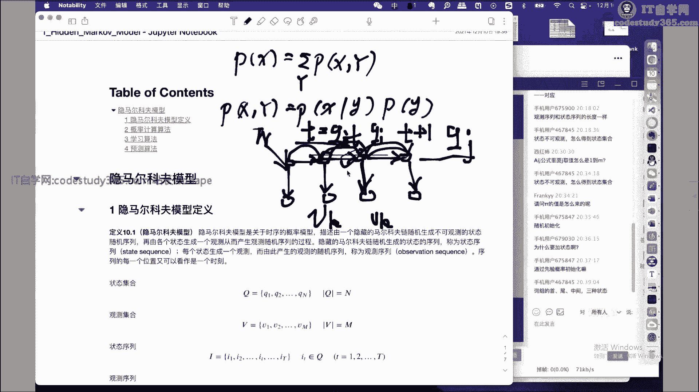

就在这个基础之上啊，我们所谓的第二个学习问题，就是把出现观测序列，概率最大的那个模型找出来，构建里面的AB和派啊，这被称之为学习问题，很很很重要很重要，就是你只要观测就可以把模型搞出来，这不很厉害吗。

第三个问题，第三个问题看什么，当我已知模型并且还知道观测的时候啊，这个时候我知道了模型，知道了观测，我就可以把在当前模型和观测已知的条件之下，把那个隐藏的状态序列构建出来，当然是根据出现状态序列的概率。

最大值的约束的条件之下，把那个状态序列构建出来，看看第三个问题。

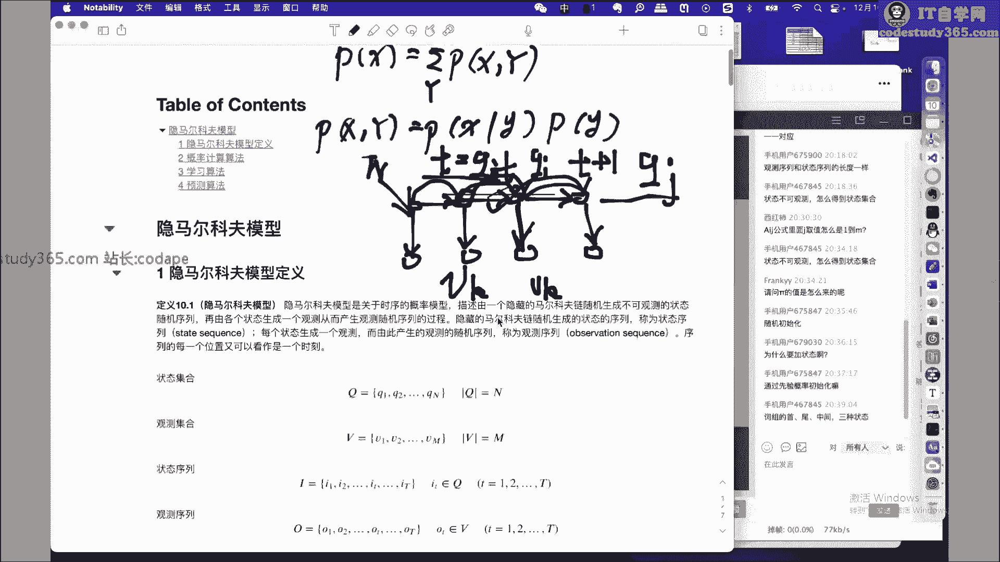

我们把它称之为预测问题，预测问题需要知道什么，需要知道观测序列，需要知道我们整个的模型，在这两个条件之下，我能够把这个状态序列能够还原回来啊，这个就更厉害了是吧，更厉害了，好了好事啊。

刚才介绍完了这三个问题啊，是三个问题，但是大家想一下它其实是一个问题，哪个问题啊，联想一下我们是NLP方向是吧，上面这这这三个问题，你怎么和你的这个资源，自然语言处理的问题当中的任务能够对应起来。

咳咳咳，其实我们刚才已经分析过这个问题了，比如说我们还是以这个词性标注问题为例，词性标注是吧，就是你给我一个句子，这个句子我需要为每一个单词，都给出他一个词性的一个标注啊，它到底是名词，形容词。

动词还是副词对吧，那这种这种问题你会发现我们只知道什么，我们只知道这里的观测序列，我们只知道观测序列就是你的语料库啊，就是你的一些文本是吧，你只知道文本通过这些已知的文本，你就可以构建什么。

构建出现当前文本的那个概率最大的模型，这个模型就是你的语言模型啊，当然这个语言模型是根据你的语料库，来进行构建的，有了观测序列，又有了你的语言模型以后，看下一个任务模型，你刚刚已经学习出来了。

观测序列是你的语料库已知的，这个时候你就可以把什么构建出来，在观测序列和模型已知之下啊，就是你的语料库和你的语言模型已知之下，把那个出现隐藏啊，出现隐藏状态的概率最大的那个状态序列，构建出来。

那你想想你这个状态序列，就以刚才我们的词性标注为例，不就是刚才你所对应的每一个单词，的词性序列吗，对吧，我爱中国，你得到的就是什么，你得到的就是名词，动词名词是吧，这就是其实啊。

当然在上述两个任务的计算过程当中，会使用到大量的中间计算，结果就是概率计算需要解决的问题，所以你会发现虽然是三个基本问题，但是其核心其实就是最后的预测问题，预测问题就是要计算的。

我这个隐藏的看不见的状态序列，而这个隐藏的状态序列需要根据什么，需要根据我的观测序列和我们的模型来构建，模型在哪儿，模型是可以根据我的观测序列来进行构建的，或者进行学习的啊。

那这个时候你会发现整个问题就退化成了什么，当我有了这个观测，我就可以计算出模型，当我有了观测模型，我就可以把那个隐藏的状态序列构建出来，而这个状态序列是我们希望得到的，另外一个序列。

这个时候你会发现整个任务退化成了，从一个序列得到另外一个序列的问题，从观测序列O得到隐藏序列I，换句话说，当你能够把你所有的问题转换成，从序列到序列的映射问题的时候。

都可以使用所谓的姨妈客户问题来进行解决，好吧，这部分有什么问题吗，嗯前向反向的意思，我们不太理解这里的前向和反向什么概念，嗯这是个好问题啊，刚才有同学说过什么，先解释一下。

这里的同学提到了所谓的二阶二阶马克思，二阶码可夫，其实就是我们的马尔可夫性啊，在这里这里有个很强的所谓其次马可福星七次，马可福星说的是，当前时刻只受上一个时刻的状态影响啊，就是说状态之间啊。

就状态我只受上一个时刻的状态，你会发现这是一个很短视的，这个呃一种一种假设是吧，我只是我的上一个时刻，至于上一个时刻之前是谁，我不关心啊，这是被称为七次或者一个一次马尔科夫性假设，刚才所说的二次呢。

就是说哎我能不能假设当前时刻，受上一个时刻和上一个时刻的时刻来决定，这被称之为是二阶马尔可夫，当然你会发现你可以构建N阶马尔可夫，当然理论上来说，恩杰马可夫模型要比，其次马可夫模型的性能要更好啊。

这是理论上没问题的，因为毕竟你你你你这个信息更充分了嘛，但是呢实践当中啊，实践当中呃，先说结论，性能上有提升，但是提升非常非常有限，换句话说，你得到的这个性能的提升的代价会很高，不经济啊。

所以说呢大约大约啊你使用七次马尔可夫假设，或者一次马尔克附加模型就足够了啊，当然你说我就是为了那小数点以后，三位的性能提升，我要用二次甚至N次的，可不可以，当然可以。

但是你的计算成本会非常非常大的增加好吧，这是个好问题啊，因为你还就是咱们还没有进入到计算过程啊，你看一下，你先体会一下在其次假设之下，我们所碰到的问题的困难程度，那么你可以联想一下，如果你N次的时候。

你的复杂程度会几何级数的增加更困难好吧，不太一样，N管模型呢是一个本身它就是个语言模型，这个语言模型呢他说的是你会发现啊，嗯我明白大家的困惑在哪，N挂模型说的是一个序列对吧，应该这个同学提到了。

除去隐藏状态嘛，他和N挂模型是不是近似了，如果说你要是硬出去了，隐藏状态。

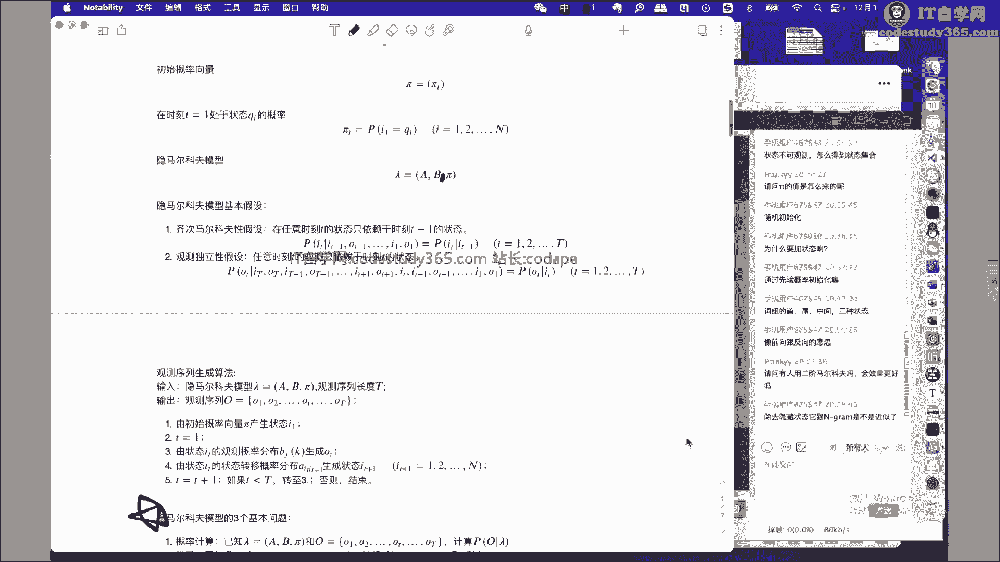

硬出去了隐藏状态，那剩下的其实就是观测序列，那观测序列就剩下一个序列，那这个时候你会发现它就成了，序列和序列之间的关系的问题，当然你说它和n gram是不是非常类似的，其实有很多相似的技法。

但是需要大家注意的就在于，1max模型本身就是一个带着隐藏序列的模型，你把它这个特点去掉了以后，它其实就没啥意思，能明白什么意思吧，就是说一面可服模型本身需要处理的，就是序列到序列的那种映射问题啊。

他处理的就是这类问题啊，它的核心就在这儿，好吧，那我们继续好吧，那根据以上三个问题呢，我们就需要一个问题一个问题的去逐一解决啊，逐一解决，先看第一个问题，第一个问题当中啊，我们已知什么求什么。

这个时候你需要脑子里非常清楚哈，这三个问题第一个问题是模型已知的ab派，已知还知道什么观测序列一致，你要求什么，求在模型拉姆达条件之下，出现当前观测序列的概率值啊，他求的是概率啊，就在这个概率值。

那是个条件，概率是已知模型求观测的概率值，这个概率值呢首先我们需要引入另外一个量，也是个中间结果，这个中间结果呢称之为前项概率啊，前向概率先给出它的定义啊，先给出它的定义，前向概率阿尔法TI啊。

注意这是阿尔法，这不是A阿尔法TI等于什么，阿尔法TI等于他也是个概率啊，前项概率他也是个概率值啊，概率他是这个概率是哪个概率呢，是在已知拉姆达条件之下啊，O1O二一直到O小T。

并且呢在I小T等于QI的联合概率，我们用阿尔法TI来表示，再看一下这个阿尔法TI的定义，阿尔法TI是在已知模型的条件之下，O1O2O小T1，这个I小T等于QY的联合概率嗯，不知道在哪就找找图嗯。

我们知道这是I1，这是O1，点点假设这个是，ITI小T是吧，那么这个呢就是偶小T，那么阿尔法TI说的是什么，阿尔法TI说的是O一O2OO小T，并且在I小T等于QI的联合概率，就这么多东西啊。

就是O1O二一直到O小T嘛，然后呢再I小T等于QI的联合概率，有人说这个QY到底是多少啊，你先别管他到底是多少，他说的是，很显然是O1到OT以及IT等于QY啊。

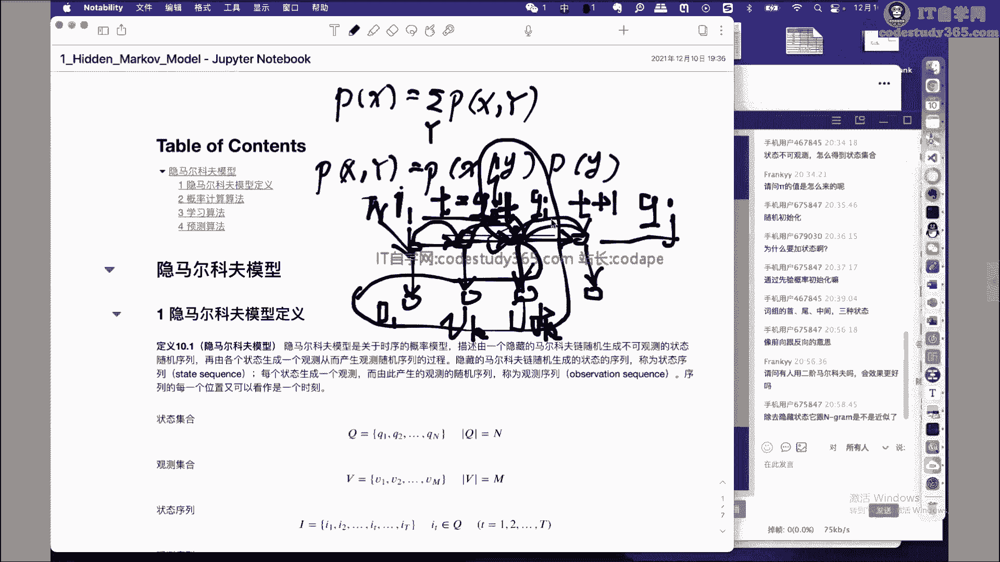

这些变量啊，这些随机变量构成的一个联合概率，这个联合概率呢被定义成什么，这个联合概率被定义成是阿尔法T2，阿尔法TI看看他说的是什么，在给定模型啊，在给定模型条件之下，时刻T的部分观测序列啊。

时刻T的观测序列O一一直到OT，并且呢状态为QI的概率啊，同样是在T时刻嘛，状态为QI，所以是O一一直到OT，并且呢IT等于QI的联合概率，被定义为阿尔法，TI这个东西呢被称之为前向概率啊。

就这么这么个概率值被称之为前向概率，那这个前项概率它有什么用，看下面啊，这是重点啊，这就是个重点，咳咳前项概率的递推计算啊，前项概率递推计算，我们可以看一下，通过前向概率的定义，以及在添加概率定义之上。

我们可以推导出一个什么样的结果，而这个结果会被我们的问题的解决，带来一些什么样的帮助，好吧，后面的这些递推计算会频繁的使用到，我们前面刚介绍到的一些工具，你手头上有哪些工具，第一个工具加法规则。

成绩规则，我们前面已经补充了是吧，加法规则规则，第二个工具就是这里的七次Mark分假设和观测，独立假设，你手头上也有这些东西了是吧，看看有这些东西，你能够得到一些什么样的结论好吧。

首先看这里阿尔法TI啊，那下面的每一步每一步你从一个等号啊，左右两边怎么相等，你需要给出充分的依据是根据什么啊，左右两边才相等，那么从第一个等号开始啊，这个等号的左右两边相等是根据定义来的啊。

这不是很显然的是吧，这个定义的形式嘛，然后呢从这个等号到这个等号是怎么来的呢，是通过一个符号简化啊，两个地方做了简化，哪个地方呢，第一个，因为这里的模型已知呢是一个大前提是吧，他肯定是知道了模型。

我们才能计算这个出现当前概率的出现，当当前观测概率的概率值，所以呢后面啊这个条件就省略了啊，为了就是为了少写啊，这是第一个简化，第二个简化前面是个O1U的O小T，这里呢用O1T啊。

通过上下标来进行标识啊，一呢就是从O1开始到T呢就是到OT结束啊，所以这个是上下标来进行一个简写，但这里的IT等于QI还在这没问题吧，这个是定义这个是简写符号好了，这个这个先说明一下。

下面开始从这一步到这一步是怎么来的，你用了哪条规则啊，或者依据得到的，你看看我们分析一下，本来是从O1到OTIT等于QY的，联合概率是联合概率，这里这里有多少个变量，这里有T加一个随机变量啊。

构成的一个联合概率，把下面这个式子，下面这个式子就很麻烦了，这里多了一个SUG，从一到N求和，然后呢随机变量变成了多少，变成了IT等于QIIT等于QY的，这这里是O1到T减一，再加上个OT。

很显然把这里的TG拆成两部分，这倒也问题不大，还多了一个啊，多了一个IT减一等于QJ，从这一步到这一步是哪条规则啊，有同学们想想吧，如果你想不清楚，你可以把这里的联合概率，认为是一个随机变量啊。

当然是一个随机向量了是吧，这如果是一个随机向量的话，那很显然这就是这是一个嘛是吧，这就是一个本来只有一个，现在又多了一个对吧，多了这一个你通过一个什么形式啊，本来只有一个，你现在硬夹硬生生加上一个。

那这个时候我们可以通过概率累加，来把它的随机性去掉是吧，这套规则是用的是加法规则。

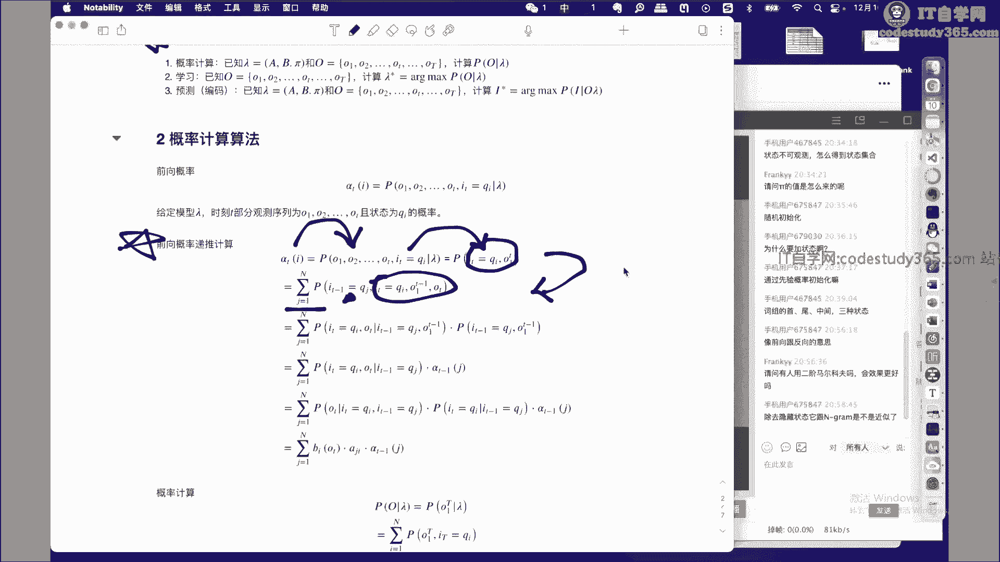

想不清楚看一眼对吧，PX等于什么，等于sum p x y啊，你加上了一个Y，这里只有一个，你加上一个随机变量，那前面你需要用sum求和。

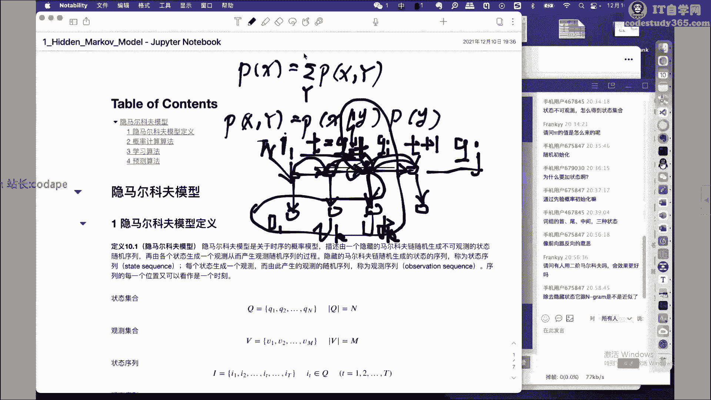

看是不是什么东西，本来是对吧，从OE到TT，你这里呢O1到TIT都在，你增加一个IT减一，那么等于QG那前面再加上一个sum g，从一个N就可以了，那么再往下从这一步到，这一步呢我们看看啊。

更复杂了是吧，你先自己看一分钟，找找都是谁的，谁拖一拖的，嗯唉反正是挺麻烦你先自己看一分钟吧，sum求和一直在在是吧，我们就先把它管不看了，里面呢其实你会发现分成了四部分，12344个随机变量是吧。

那么这四个随机变量既然等于下面这个符号啊，等于下面这一长串，我们就需要看看都变成了谁到谁，首先可以看到啊，这个T减一到O1到OT减一在这啊，他在这IT等于IQI哦不对，IT等于QA在这，然后呢。

IT等于QA在这，好了，通过下面这个条件概率啊，你会发现上面这个联合概率的四部分，分成了两两组是吧，一组呢变成了条件，另外一组呢变成了前面的随机变量，那这个时候你会发现。

我们就可以把这两组认为是两个随机向量是吧，两个随机向量既然有了一个部分做成了条件，条件就变成了已知的量啊，已知的了，那么已知很显然和上面的联合概率就不相等了，那这个时候怎么办。

它的随机性可以通过后面这个式子，你会发现这两部分是不是都在这儿，都在这，所以这是哪条规则，这是哪个乘积规则。

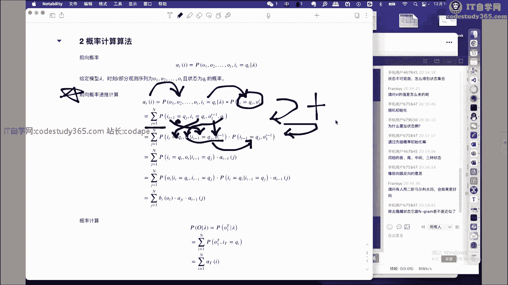

再看一眼上面PXY，PXY两个随机变量的联合概率等于什么，等于其中一个作为条件以后的另外一部分X啊，这是个条件，概率再乘以十。

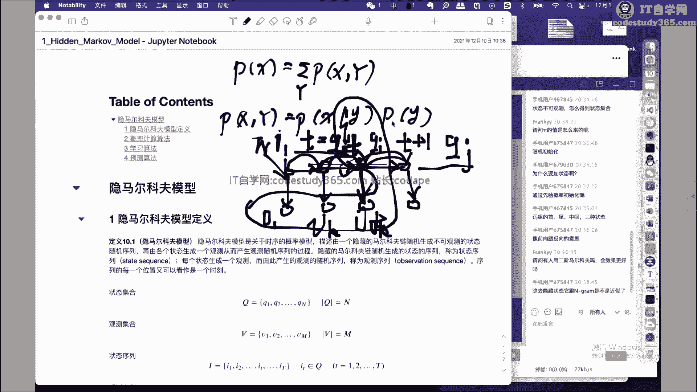

再乘以PY，那么同样刚才我们看到的是不是就是挪动项，当然这是四部分，我们把它两两分组是吧，一组呢作为条件，一组放在前面，既然是作为条件已知了，你需要把它还原回来，那这个时候就再乘以它就可以了。

很显然是个乘积规则是吧，看从这一步到这一步，这个式子这个式子啊，其实已经很明确的告诉我们了，这个很重要的一些信息哈，这个式子高考就这是IT减一等于QJ，这是O1到T减一，回想一下刚才的前项概率计算哈。

前项概率计算的定义，他说的是阿尔法TI等于O1到OT，然后是IT等于求I，现在我们得到了一个表达式，O1到T减一，然后呢是IT减一等于QJ上面那个图找找。

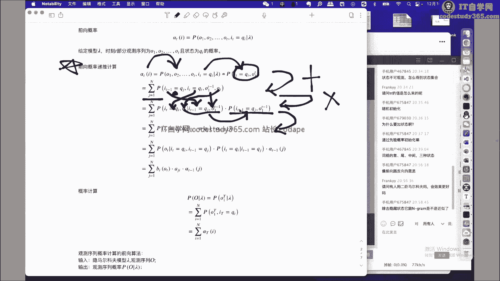

如果这是OT是T那么OT减一肯定是这个，IT减一肯定是这个，那我们现在得到了一个表达式，是不是这个东西，这一部分这一部分和刚才那一部分，你会发现都是谁啊。

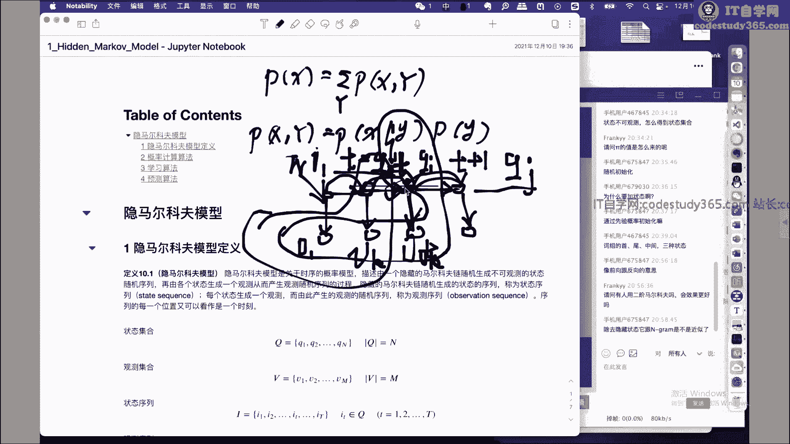

是不是都是前项概率，只不过前向概率的位置不一样，我们在前面定义的是阿尔法TITTQY，你会发现这里是TT减1T减一到QG，所以不就是阿尔法T减1G吗，所以从从他到他啊，从这一步到这一步是定义啊。

定义只不过需要仔细的分析一下啊，其实就是定义，那看看从这一步到这一步是怎么来的，就是从这一步到这一步，本来前面有两项是吧，IT等于QIOT，IT等于QIOT，很显然前面没有变，但是条件部分呢原来有两项。

IT减一等于QG，这是O1到T减一哎，这里IT减一等于QJ啊，这没问题，那你后面这个条件跑哪去了，没了飞了飞哪去了，为什么能够飞飞走啊，为什么哪个同学能分析一下吗，嗯嗯他是作为条件突然被消失了是吧。

条件被消失了，我们前面有没有可借鉴或者使用的地方，很显然有啊，哪个什么，其次马克杯假设和这个棺材独立性假设，意味着什么，意味着我们看前面啊，其实后面有没有，主要看前面我们前面讲到过IT等于QI。

很显然是T1个时刻的状态，我们前面已经有要求第T个时刻的状态数，并且仅数T减一时刻的状态，所以这个条件是不能够去的，换句话说，你前面有IT，你后面这个T减一就不能去，因为后面的IT减一决定了前面的IT。

所以这个条件是不能去的，看看这里的O1到OT减一，既然IT仅受IT减一的影响，那么很显然它就不受O1的OT减一的影响，所以这个时候很显然这里的O1到OT减一，不会对这部分产生的问题。

我们看一下OTOT前面我们说过啊，观测独立性假设告诉我们，OT仅受谁的影响，gt仅受它所对应的那一时刻的IT的影响啊，很显然OT也不受你这个OE的，OT减一的影响，所以这个地方既然你这个条件不能够决定。

前面的任意一个随机变量，那你这个条件就可有可无吗，所以就没有了，所以从这一步到这一步，应用的就是我们的观测独立性假设，和我们的七次马克分假设，好吧，那继续从这一步到这一步又是怎么来的呢。

嗯这个阿尔法T减1G还在这阿尔法T1G，所以这个是照搬下来的那一部分是吧，那前面这一部分又怎么能，前面这一部分是一个，在IT减一等于QG的条件之下，IT等于QIOT的一个条件概率啊。

很显然这一部分被拆拆拆成两部分，而又被怎么拆开的，或者说又是因为什么被拆开的，嗯嗯看一下呃，首先啊可以看到啊，这里的IT减一等于QG，在这里IT减一等于QJ，和这里IT减一等于QJ都是存在的。

这个条件啊，这个条件是呃没有发生变化的啊，这个条件都没发生变化，就这样，我这，那么看前面啊，重点开始看前面，前面是由IT等于QY和OT，组成的一个联合概率，那这个时候呢从上面到这一步。

你会发现哎it到这儿来了，它的位置发生了变化啊，从联合概率的位置上跑到了什么，跑到了条件概率的位置上，前面已经讲到过啊，联合概率要拆成条件概率的形式的时候，那你后面这个IT等于QI的随机性。

你必须要把它乘回来，所以这个地方是IT等于QY，所以啊从这一步到这一步，很显然使用的是我们的成绩规则，成绩规则，然后呢继续往下吧，这一步是怎么来的呢，这里的阿尔法T减1G。

在这还在阿尔法T减1G看这个式子，这个式子是最容易出错的地方，看这里这个式子，你再仔细看看它到底讲的是什么，这个式子说的是T减一那个时刻T减一在哪，IT减一是在这等于QJITIT在哪，T在后面，谁在前。

谁在后，明显是IT减一在前，T在后是吧，谁是I16GIT等于，IIT减一等于QG，所以你会发现前序的状态决定了后续状态，这是没有问题的，那么很显然需要使用到谁，使用到那个状态转移矩阵A。

但是呢你会发现这里是谁，上一个时刻是QG，下一个时刻是QI，所以那个状态转移矩阵里面一定是什么，一定是AGI好吧，这个地方特别需要注意一下啊，很多同学有疑问，这个地方是不是印刷错误啊。

因为前面的定义都是AGI，你这什么是AI呃，前面都是AIJ，你这个地方为什么是AGAIAJI，就是因为这里的原因啊，一定要特别仔细啊，再往前那又回到刚才那个问题，这是关于OTOT仅受谁的影响。

OT仅受IT的影响，它不受你这IT减一的影响，所以你这个条件可有可无，那么变成了在IT等于QY的条件之下，OT的条件概率，这是谁啊，已知道状态求观测的概率，这不就是那个观测概率矩阵里面的B吗。

注意的是它是在T时刻等于QI啊，那所以是bi观测是谁观测是OT，所以是BIOT啊，所以说这一部分这一部分是定义啊，这一部分是定义，那这一部分使用到了我们的这个观测独立性。

假设观测独立性假设就得到了下面这个式好了，从上面到下面这这这这个推导过程啊，就得到了我们最后的这个结果啊，就得到了我们最后的结果，那么得到这个最后结果之后怎么用，或者这个最后这个结果什么含义啊。

中间这个过程哈你都可以把它去掉了啊，就可以你知道啊，或者你相信这个结果啊，或者这个最后的结果是没有问题的，那这个结果有什么用，我们看一眼，呃教科书上很少会把这个推导过程，展开来讨论啊。

都是直接给出一个阿尔法TI，等于后面这个递推式的啊，这是当年上学的时候老师留的一个，算是一个作业吧，也不是个作业，就是一个练习啊，啊目的其实也是希望和大家分享一下，就是后面的概率计算。

基本上都是需要有这么一个推导过程啊，当然你说我相信之前的工作是吧，我也不推了，当然也没问题，但是你需要了解一下整个的推导过程的，这种感觉是怎么样的啊，好吧，看一下我们得到的结果是什么。

我们得到了除了前项概率定义本身之外，的另外一个表达式对吧，另外一个表达式在得到的这个新的表达式当中，我们分析一下这里的BIOT，这里的BIOT，如果当我们已知了拉姆达的条件之下的时候。

你会发现这里的BIOT是已知的，因为我们知道了模型模型里面就有B啊，那个观测概率矩阵，那么同样这个AGI当我们已知模型的时候，AJI也是已知的啊，这个B和A都是已知条件，那看下面这个式子最重要。

下面这个式子说的是什么，下面这个说的是阿尔法T减1G阿尔法T减一，很显然是T减一时刻的前向概率，而这个前向概率出现在了，第七个时刻的前向概率里面，换句话说，当我们希望计算第T个时刻的前项概率的时候。

我们需要知道谁需要T减一时刻的前项概率，有人说这T时刻你都不知道，T减一时刻你更不知道了，如果T减一时刻不知道，那怎么办，那这个时候你会发现根据这个递推过递推公式，我是不是可以把阿尔法T减一。

写成关于阿尔法T减二的一个表达式，可以吧，好了，阿尔法T减二，你也不知道，那怎么办，那求一下阿尔法T减三吗，你还不知道阿尔法T减四吗，你还不知道，那这个时候换句话说，如果我知道了谁。

如果我知道那个阿尔法一以后，我代入阿尔法一，我就可以计算出阿尔法二，有了阿尔法，它就知道阿尔法三，有阿尔法三，我就可以计算到阿尔法T减一，有了阿尔法T减一，我就可以计算到阿尔法T是这样吧。

所以说递推公式的核心在于，我当知道了相邻两个时刻的，前项概率的关系式以后，再加上如果我知道了阿尔法一的时候，那么任意时刻的前向概率是不是也已经一致了，那么下面问题就转化成了什么。

那我能不能得到阿尔法一的问题，换句话说嗯，这个递推过程能不能计算计算出结果的问题，这是第一个问题，第二个问题，当我已知了，或者说我相信我能够计算出了，这个前行概率的时候，能够对我们有什么帮助是吧。

看下面回到我们的目标，我们的目标要干什么，不要忘初心，我们的目标是什么，我们的目标是在已知拉姆的条件之下，计算出现当前观测序列的那个概率值，按照刚才我们的简写符号，就是已知了拉姆达以后一到O大T是吧。

继续拆哎，看下面从这一步到这一步，还是刚才的符号简写啊，这个没什么太大意义，看下面从这一步到这一步的，呃依据吧，为什么，还是刚才啊，这是个O1的OTORT是一个随机变量啊，你可以认为是一个随机向量是吧。

这时候再加上一个I大T等于QI，I大T等于UY很显然他俩之间就不再相等了，多了一个随机变量嘛，那这个时候把随机变量进行全进行累加，求和就可以了，所以使用的还是什么加法规则好了，看下面这个式子啊。

看下面这个式子，下面这个式子说的是O10的O大T，在I大T等于QI的联合概率，这个式子其实就是谁根据前面的前后概率计算，这个地方是O11OTOEEO大TI，大T的QI。

所以这个地方就是阿尔法大TI阿尔法大ti，当然你前面还有前面有一个求和，这个时候你会发现哎，我们的求解目标在已知模型的条件之下出现，当前观测的这个概率计算，通过上述的计算，我们可以发现。

就是对D大T时刻的倾向概率的一个累加求和，换句话说，当我知道了阿尔法大ti的时候，那这里的P也就知道了，那阿尔法大ti怎么计算，哎我们这个地方递推公式就已经有了，阿尔法大TI。

是关于阿尔法大T减1I的一个表达式，那么刚才的递推过程告诉我们，当我们知道阿尔法一以后，就知道了阿尔法二，那么进而得到可以得到阿尔法大T，把这个阿尔法大T进行全概率求和，就可以得到这里的P5，好吧。

那下面解决了前项概率的作用啊，当它能够进行低配计算的时候，我们可以把我们的这个PO的计算，写成关于前项概率的求和的形式，那它的作用就起在这个地方，那么这个计算是关于大T时刻的前沿概率。

那大T时刻呢又需要第一个时刻的形象概率，那下面的问题就聚焦到阿尔法1I，怎么来求解的问题其实很简单啊，你想想按照刚才我们的定义，阿尔法1I应该等于什么，阿尔法EI就是第一个时刻呗是吧。

阿尔法1I就已知了O1O2都没有，还知道谁还知道了，I1等于QY不是这么个东西吗，是吧，那这两部分你看看O1和I1等于QI，很显然这是一个联合概率，联合概率可以等于什么来着，还有同学有没有印象。

联合概率可以写成条件概率，乘以边缘概率的形式，这个地方稍微注意一下，谁是条件概率是边缘概率就可以了，PO1在IE等于QI，然后再乘以一个什么，再乘以一个P这个时候作为条件，你还需要还原回来，I1等于Q。

哎这是乘积好吧，那么这个式子你看看是谁啊，IEOE不就是B1吗，这个I1等于QY不就是派吗，第一个时刻是吧，所以你会发现阿尔法1I是可以得到的，就通过bi乘以派I来得到，有了阿尔法EI以后。

我们就可以递推，通过递推公式得到阿尔法T加1I，换句话说任意时刻的阿尔法我都可以知道了，任意时刻的阿尔法知道以后，我就可以计算到阿尔法大T，把阿尔法大T进行求和就可以得到P5，好吧。

看看这一部分有什么问题吗。

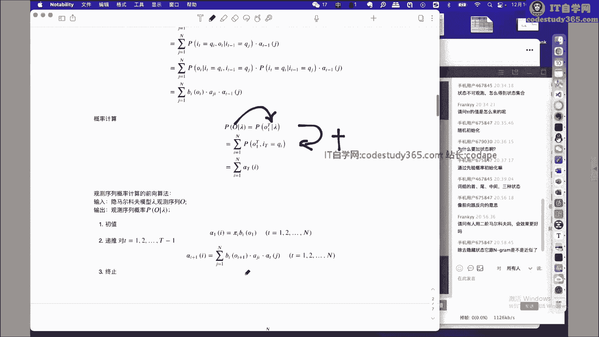

就第一个问题啊，我们就这样来解决了，解决了，可能有些同学还没反应过来是吧，很正常啊，嗯里面的这个计算逻辑其实也不复杂，只是符号多一点而已，嗯但是呢也不寄希，也不可能寄希望于通过你，你一次就能够全部了解。

当然如果你的前面的基础还不错的话，其实我觉得也没什么难的是吧，那问题是怎么办啊，就是还有问题怎么办，第一步回去以后找一张白纸啊，找一张白纸，找一支笔啊，把这些逻辑里面的这些符号手写一遍啊。

要比你看上两个小时还管用啊，可能你手写一遍，可能最多半小时就完成了，它的作用远比你从那里瞪眼看俩小时管用很多，嗯第二个在我们的不管是微信群也好，还是我们的QQ群也好，有什么问题随时提问好吧。

那些符号不清楚了，为什么是这样的啊，随时提问，这第二个，第三个不光是我们今天客户啊，嗯后面的课程特别是模型会越来越复杂，如果你还希望把推导过程了解的话，这个过程是不可避免的啊。

呃现在呢很多的材料都是电子版的啊，稍微吐槽一下这个电子版的材料，你光看一点用没有，或者作用不大啊，一定把它，如果你希望了解的更多，或者了解的更充分一些，一定把它写出来啊，手写出来好吧，啰嗦两句。

看看还有什么问题吗，就是关于我们的概率计算问题。

好没有啊，很好继续，好了嗯，这样啊，这个刚才已经说了，这个概率计算问题呢，它是一组问题，或者说若干个问题啊，刚才解决的只是其中的一个啊，后面还有很多回去以后呢，有时间就看一下好吧，但是呢如果没时间呢。

你就把它直接拿到作为中间结果用就可以了，那我们解决第二个问题，第二个问题是啥来着，学习问题，也就是说我们现在已知的是O啊，现在已知的是O，我们需要把这个lambda构建出来啊。

这个是一个无中生有的过程啊，就你想象一下，你只知道观测序列嗯，下一步呢你需要把这个模型构建出来，这个事怎么办，嗯刚才已经说过了啊，在解决这个问题的过程当中。

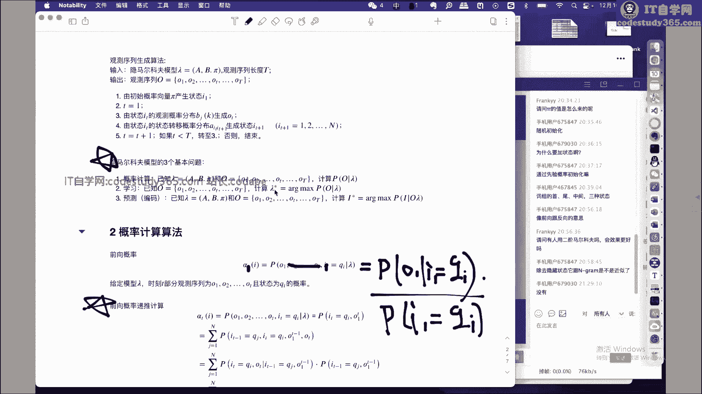

我们会使用到em算法啊，所以呢这个先把em算法做一个简单的。

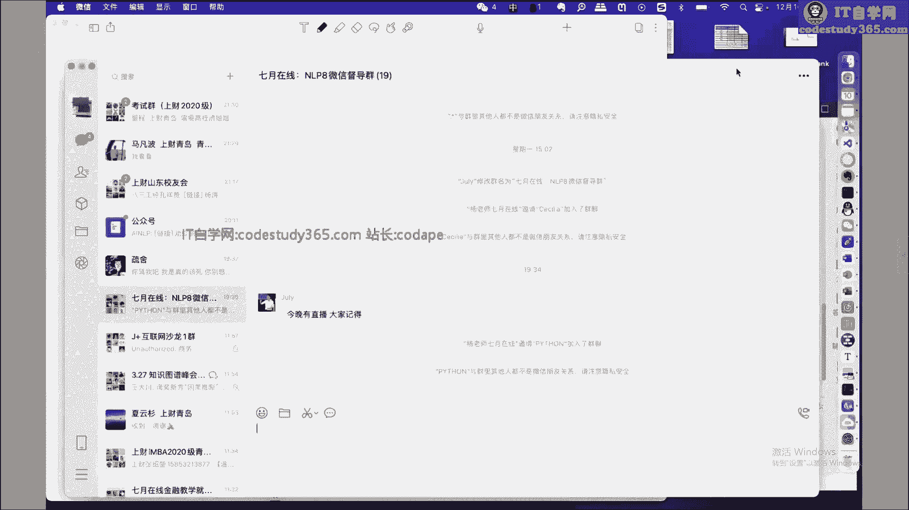

算是回顾或者了解吧，好吧，当然可能有些同学。

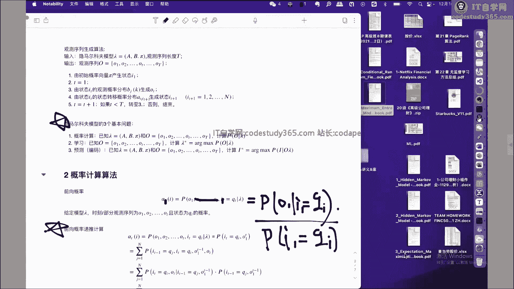

这可能有些同学这个之前可能比较了解的。

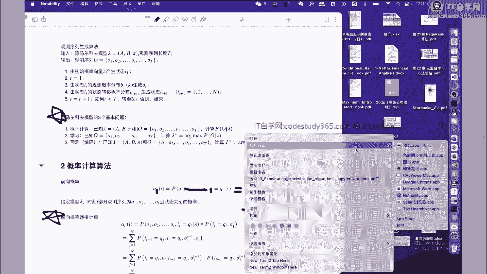

比较充分了，这个我们就简单的做一个回顾好吧，em算法，em算法不是个模型啊，它仅仅是一个求解，含有隐变量的这么一类问题的一个求解步骤，或者求解算法而已，当然我们在一马可夫模型当中，就包含所谓的隐变量啊。

或者隐藏变量是吧，或者隐含变量，那么很显然啊，这个模型啊，以马可夫模型当中的一些问题，可以使用期望最大算法来进行求解，当然嗯我们需要做的就是需要把隐变量啊，和观测变量或者引状态和观测状态。

进行一个对应就可以了，为什么这么说呢，因为在em算法当中啊，嗯我们的观测随机变量是用Y来表示的啊，那么在我们的IMAX模型里面观测是用什么，是用O来表示的是吧，em算法里面的隐藏变量是用Z来表示的啊。

在我们野马可夫模型里面的隐藏变量，是我们的状态I啊，所以就是说啊这里的Y就是我们的O，这里的Z就是我们的I啊，这个问题对应起来以后，下面如果我们能够把求解啊，还有这里的隐变量Z的关于观测变量Y的啊。

这个这么一个类问题能够解出来的时候，那么关于我们的状态序列，I和观测序列O的问题就可以求解出来了，明白什么意思了吧，啊不过做一个符号替换就可以继续往下，那这里就我们就不管O和I了啊。

这里只有Y和Z了好吧，当我们还有隐变量Z的概率模型的时候，那我们的目标很显然就是我们的目标很简单，就是极大化我们的观测变量Y，因为我们知道Y嘛对吧，那么既然我只知道Y，我就尽可能的找。

使我们的那个可观测的那个那个那个Y，能够使模型尽可能极大化的那个目标，那么这个时候呢我们用丢了三来解决这个问题，那这时候呢，就是使我们的对手自然函数尽可能的极大化，当然我们是在啊。

使我们的那个观测的外变量的概率，尽可能大的时候啊，构建我们的对手自然函数啊，这是我们的求解目标啊，求解目标很显然这里面只有观测观测变量Y，但问题在于这个问题本身又不可避免的。

但毕竟是还有那个隐藏的变量Z，所以还需要把那个Z呢考虑回来啊，看下面既然还需要把Z考虑回来呢，从这一步到这一步，很显然用的还是我们的什么加法规则是吧，只有一个随机变量变量概率。

现在呢我们把它拆成联合概率的乘积的形式，联合概率的形式，那我要求和求和呃，写成联合概率形式以后，看下一步，从这一步到这一步呢，一个就是我们乘积规则是吧，联合概率，条件概率和边缘概率的乘积规则好了。

下面问题就变成了，我要是LC塔最大化，就是下面这个式子最大化啊，下面这个式子最大化，很遗憾的事呢，下面这个式子本身就挺麻烦啊，又有联合概率，有条件概率有变化，概率还是个求和，家人们这个log更麻烦的是。

这里的这个Z呢还是隐变量啊，更更观测不到，所以这个时候的LC它的直接极大化，使得这个对数函数极大化，这个目标很难去完成，那怎么办呢，我们看一下，我们退而求其次，我们假设哈，因为你这是LC。

它是这个我们的最终的求解目标呃，考虑一下我们的迭代计算过程啊，假设哈我们在某一次迭代之后，得到了关于LC它的一个中间结果，就是这个LCI，特别注意啊，这里商标I的含义。

是在某一次迭代或者某一次中间计算过程之后，得到的关于L的值，那很显然这个L不是我们的最终目标，但是呢知道了一个中间结果是吧，那这个时候呢我们看一下我们的最终目，比如LC塔和这里的LSI它的差值的形式。

我们看看有没有用好吧，那么从这个等号到这个等啊，从这个等号的左边到右边啊，其实就是一个啊替换是吧，LC它呢用这个式子啊，用这个式子来替换LC它I呢还是表，还是用他的标准形式啊，并没有展开啊，并没有展开。

这是没问题的是吧，那下面一个问题从这一步到这一步是怎么来的，我们分析一下啊，啊这里的log p c ti条件之下，Y的条件概率还在这啊，放在这不变，减它还在这减它右边这个logo还在那。

下面这个式子很显然从一个sum求和，变成了后面这么一坨式子，我们再分析一下这里的PZC的条件下的Y，ZC的条件之下的Y和这个PC的条件下，是ZPC的条件下是Z还是S好，在分子部分上。

分母部分上多了一个PCIY条件之下的Z哎，这个地方多了一个PICTI天选之下的Z，很显然就是在上市当中啊，在上市的sum求和当中，分子分母分别成了这么一个式子，分子分母分别成了这么个式子。

所以这个从这一步就是，分子分母成了一个概率值而已，从这一步到这一步呢是比较麻烦的，为什么这么说呢，在这个过程当中，你会发现就不再是个等式的替换啊，它是个不等式啊，比如上面这个式子要大于等于后面那个式子。

那这个不等式呢，我们借助的是所谓的琴声不等式啊，啊七成不等式有很多种形式，有很多种形式，这里用的是它其中的一种形式，说的是什么，说的是哎，我们只从形式上去去去看一下这个不等式啊，至于这个不等式的证明。

我们就不管了啊，有兴趣的同学可以，你可以找一下其他资料看一下，这个地方我们就直接拿过来用了，这种形式的七成不等式说的是什么，说的是呃，我们就只看形式哈。

log求和拉姆达Y大于等于求和lambda log y啊，至少形式上是这么说的是吧，那怎么用呢，套用一下刚才上面那个式子，log求和拉姆达Y4部分都在，那么很显然按照新成果等是大于等于什么。

大于等于sum lambda log y能能理解吧，所以这一步到这一步其实就是用的进程不等式，大于等于号保持不变，好了麻烦就麻烦再到从这一步到这一步，从这一步到这一步呢，你会发现前面这一坨还在啊。

前面这一坨还在，在这后面减去一个log PCI调下的Y啊，这一项没有了啊，这一项没有了，跑哪去了，跑到跑到分母上去了，你会发现这里的PCIY在这PCYI在这，他怎么就从一个地从一个被减式子。

跑到了这个分母上去了，这个看看什么原因，考虑一下前面啊，考虑一下前面，考虑一下前面，这里有个sum z p z c i y i y的一个条件，概率。

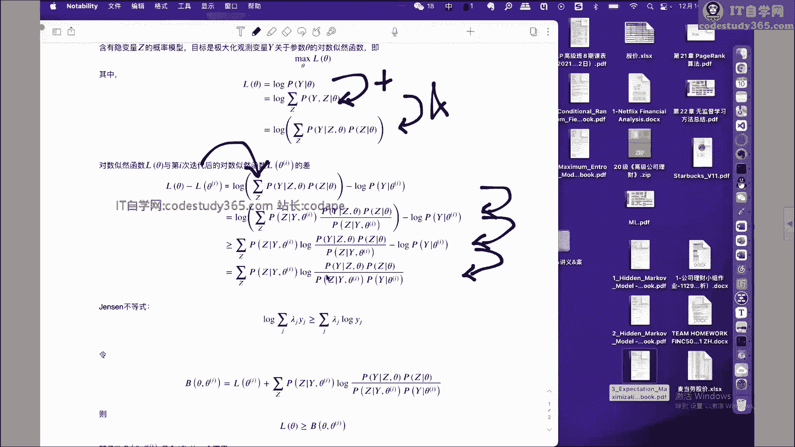

有没有同学看一下，啊说明一下哈，这个地方是这样嗯，嗯考虑到这个式子前面有这么一项，那我是不是可以在这一项的前面，也增加这么一项，就加上一个sum求P，Z y，因为我们知道啊，如果单纯从这一项上来看的话。

他就是对PZ的求和，我不管已知条件，我不管你已知条件，我只是对P的变量求和嘛，那我不知道如果仅看这一项的话，它概率求和就等于一嘛是吧，该是求和六一，当然为什么你说如果他一为什么还有这一项呢。

因为后面这个乘积项，因为因为因为你需要这样看，应该的乘积项是在这，所以后面还有Z，所以很显然呃我们只看这一项，它是等于一没问题，但是后面你还需要考虑到乘积项，很显然这个式子就萨马求和。

这个式子就不等于一，但是你会发现仔细，你会发现这里的后面这个log p在后面，这里不管是条件上还是从这个边缘概率上，他都没有Z，都没有Z吧，都没有Z，所以这个时候我们可以把这个一。

就展成这个sum求和的形式，这没问题吧，这个应该没问题是吧，既然咱们求分式了以后，这个时候我就可以把他俩往前凑了，他俩往前凑出来以后，这个地方的减去log不就跑到了log。

减log不就跑到了分不分上去了吗，明白什么意思了吧，仔细一点就可以了，这个也问题不大，好了，那，问题在于我们得到了这么个式子，就是LC大减去LC大I的中间结果是这么个式子，又是挺复杂的一个式子啊。

我们先不管，先放在这，放在这再说，我们现在做这个工作，做什么工作呢，我把这个等式的左右两边，左右两边同时加上一个lc ti啊，这边加上一个LC3I，那这一项就没有了，也就是说从他的跑到这边来。

变成L谁T，那么你会发现我们得到了一个关于LC，它的表达式，就是下面这个式子啊，我看看啊，我们得到了得到了L关于LC的表达式，然后呢我们利用这一部分，等于BC大C大I啊，BC塔C大I。

考虑到这里的不等号啊，到这里的不等号，我们就得到了关于LC的I是大于等于这个式子，加上一个lc ti的，也就是下面这个式子，下面这个式子呢，我们利用这一部分呢等于BC的C大I。

那么得到了关于LC的I大于等于BC的C的I，这个结论，换句话说哈，我们得到了一个LC它的一个下界函数，因为它永远比B大吗，永远比B大，所以呢这个时候你会发现，如果我们直接对LC塔的最大化完成不了。

或者很难完成的话，我们下面的目标是需要把它的下界函数进行，可能的大啊，这是一个策略啊，就是我们经常会这样去做是吧，我们的这个极大化的目标很困难的时候，我们是通过这种不等式哈，去找到它的一个下界函数。

那么我们的目标是尽可能的不断的最大化，下界函数啊，不管是从这个em算上，还是从这打上模型，还有迭代尺度法里面，我们经常会使用这种策略啊，那好了，下面的工作，就变成了什么，就变成了对LC的极大化问题。

转化成了对B函数的极大化的问题啊，那么B函数的极端化呢，我们可以看一下，它就等于LC大I加上刚才那个式子啊，加上刚才那个式子，这个时候呢特别有意义的意思的地方在于，这个地方是关于CA和CAI的函数。

但是呢对它的极端化，得到的是关于CAI加一的函数，因为我们知道通过迭代计算吗，就说我在L在C塔C塔I已知的条件之下，构建了这个B函数，它的极大化，或者它的下一步的极大化的结果是DI加一轮的，那换句话说。

在第二轮的这个LC塔以及其中的表达式当中，对我DI加一轮的计算是已知的，再重复一遍哈，这里的B函数里面是关于CA和C，AI的函数啊，关于CA和CAI的函数，当然我们的目标是要通过呃B函数的极大化。

得到关于LC的极大化，但问题在于这是个迭代过程啊，迭代过程当中LC大呃，这里的C大和C大I是要极大化的，结果得到的是第I加一轮的西塔，那么换句话说，在DI加一轮的C他的那个结果当中。

你前面的第二轮的theta，对我第I加一轮的西塔都是已知的，这个没问题吧，那既然对我第I加一轮的C大是已知的，那么我所有的中间计算结果都是已知量，对于极大化目标没有影响，所以这个时候你会发现啊。

LC大I是个已知量，既然不管它是789十还是还是还是1。5，8。9，那哪个它都是已知的嘛，对我的其他化过程是没有帮助的，所以他就可以去掉，当然同理，我们还可以把你可以发现这里的分母部分啊。

把分母都是带着c ti的，都可以把它去掉了，得到了下面这个式子，得到下面式子，得到下面这个式子以后，你会发现下面这个式子就变成了，注意啊，这个地方是条件概率和边缘概率的乘积的形式。

那这个时候还原成我们的联合概率啊，还原会还原成我们的联合概率，就变成了对第21轮C塔极大化，转化成了对下面这个式子的极大化，下面这个式子很显然就不再等于B函数了，因为B函数是带着LC大I的。

所以我们重新定义一下，下面这个式子被称之为Q函数，QQQ在这Q函数Q函数在形式上，或者说这个式子的形式上，其实就是数学期望啊，求和sum z对Z的求和，Z呢是在PZ上的概率值。

后面这个表达式就是我们的期望对象是吧，所以你会发现，其实就是对于我们log p y z的一个，数学期望计算，当然这里的Z是在PZ的概率上，进行一个数学期望，计算好Q函数啊。

所以你会发现问题又进一步的转化了啊，对于B函数的极大化，通过刚才的分析，我们又得到了关于Q函数的极大化，换句话说还有隐变量啊，关于隐变量的问题的最优化过程啊，最终转换成了它所对应的Q函数的最大化过程。

注意啊，这个Q函数还是挺复杂的，你需要看清楚啊，虽然复杂哈，就是期望对吧，求和概率，期望对象是吧，三部分分析清楚就可以了好了，有些人就会疑问你这个这个东西怎么用啊，怎么用啊，你会再回过头来。

我们一开始上课的时候，就一开始讲到em算法的时候的一个问题，核心问题什么问题，这个ZZ这个Z不就是我们的I吗，这个Y是谁，这个Y不就是我们的O吗，那你看看我们要极大化，11我们要极大化那个LC。

它就是我们在当前那个PY的最大值，PY是谁，PY不就是我们的那个POY是我们的什么，看看Y是我们的观测变量嘛，毕竟是我们的PO嘛，P是我们的PO极大化的LC塔，如果这个结果能够得到的话。

那个模型不就是我们在已知的观测变量之后的，LAMBA模型吗，啊这是血气旺，而这个过程对LC的极大化，转换成了对B的极大化，B的极大化又转换成了对Q的极大化，那下面我们就需要把这个式子求出。

这个极大化过程，这个极大化的结果就是我们的模型lambda。

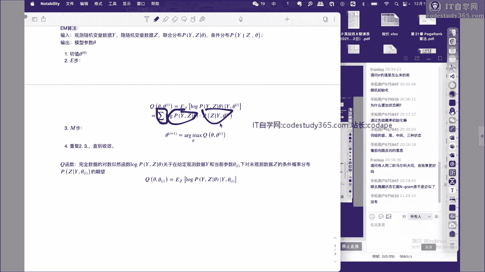

啊em算法有什么问题吗，我们先不先不说它的使用，em算法本身，我没问题的话，我们就继续画到这学习问题来看一眼上面吧，还是有些同学可能还是分不清楚学习问题啊，学习问题，学习问题在这一日。

O这里的O就是我们的观测变量，就是我们em算法里面的是Y，有了Y以后我们要得到什么，我们要得到PY极大的时候的那个模型，拉姆达PY极大的模型就是PY极大化的LSA，对吧，把那个theta找出来就可以了。

这个M大的theta，你知道O要求那个lambda啊，学习算法弄好了，将观测变量作为呃，将观测序列作为观测数据，将我们的状态序列作为隐藏数据I，那么英法可模型呢，就是含有隐变量的一个概率模型。

那么POLAMBA啊，就像刚才我们说的PO就是PY嘛，PO等于什么，PO就等于sum IP i条件下，O的条件概率乘以pi，这个没问题吧，这是用到了我们的乘积规则和加法规则，把PO展开了吗。

把它PO展开了，那么完全数据就是OI吗，那么我们的完全数据的对数三函数，就刚才我们所说的log p o i嗯，那么Q函数啊，Q函数仔细一点，Q函数就是一个数学期望谁的数学期望。

就像刚才说的p o y log p o y log p o y，然后呢I是谁，I是刚才我们那个呃那个那个概率是吧，PO圈下I的概率，就像刚才我们所说的，这个时候的Q函数的定义。

它就是数学期望把对应的式子对应好了，符号展开就可以了，那下面的问题呢转变成了对这个式子啊，对这个式子的极大化过程，哎呀这个式子的极大化呀又挺麻烦，怎么办，对他的极大化嗯，分母上这一项拉姆达拔啊。

我们就不不考虑它了，同样他是在上一个模型已知的条件之下的，拉姆达啊，所以它是已知量，那么很显然，还是要对分子部分的部分进行一个极大化，分子部分的核心还是对这个联合概率的最大化。

那么联合概率呢我们先把它展开看一下，因为是POY啊，又有和联合钙，又有这个观测变量，又有这个隐变量，但是呢不妨碍，因为这里的联合概率呢，其实就是我们刚才所说的那个呃，生成算法过程啊。

所谓的生成算法过程不就是因为有有OUI吗，你先生成谁先生成I1I1，根据谁来完成派来完成，有了I1生成谁O1O1由谁来完成，BIEOE来完成，有了O1就可以就可以生成什么I2啊，当然不是不是依赖关系啊。

就可以根据IE什么A2由谁来完成AIEIR，那当然有了I2就可以生成O2，有了O2我们就可以依次往下，最后生成O大T，所以说这类的联合概率，就是刚才我们所介绍的生成算法好吧。

那么把它斩成一个这么样的这个累积的形式，好在前面还有一个log啊，这个时候问题就进一步的转化了，转换成了什么呢，我们对Q函数的极大化所对应的lambda啊，就等价于对刚才所说的那个，数学期望的最大化啊。

数学期望最大化，而刚才那个数学期望当中，这里的联合概率PI啊，根据刚才的分析就是一个累积过程，恰好前面在这个logo还就还有个求和，不要忘了是吧，那这个式子就可以进一步的展开。

展开成什么展开求和的形式啊，求和展开成求和呢，我们把它归归项啊，归归项归成哪一项项呢，你可以看到这里的BB对吧，然后呢这里还有B这些作为一项，然后呢这里的AA作为一项，当然前面还不要忘了还有个兰姆达。

所以说呢我们可以把这里的求啊，这个累积log之后呢变成三部分的求和啊，哪三部分呢，刚才看到了啊，Sami log pi，然后呢，不要忘了后面还成了一个POI拉姆达啊，这是第一项。

第二项p o i lava8，前面是关于A的部分啊，A呢因为是I1哈是通过派来生成的，所以嗯生成A2啊，是从A2开始是根据A来生成的，所以这个地方T从一的话一直到大T减一啊，这个大T减一怎么来的。

应该清楚了吧，当然你调整一下符号也可以写成从二到大题啊，这都没问题，那么第三部分啊就是通过谁啊，通过那个啊B啊，B呢因为是从B1从那个O1O二一个O大T，所以这个地方是从O1T从一到大题。

不要忘了后面还有一个POIM的吧，嗯三部分的累加个极大化，我们就可以分别进行极大化是吧，分别进行极大化，而这个地方呢需要注意一点啊，这里的sum pi是等于一的啊，前面我们没有强调这一点啊。

但是应该能够分析清楚是吧，pi啊，是DI啊，是QI的概率啊，第一个时刻我可以从Q一一直到求到Q大N，那么这些概率的累加和一定是等于一的啊，这个没有问题，那对前面这一部分的最大化，带上这个约束条件。

就变成了一个带条件的最大化问题，那么下面很显然是拉格朗日乘子法啊，这都是老套路了，拉格朗日乘子法啊，就是构建，首先构建我们的拉格朗日函数，拉格朗日函数原函数在这加上我们的条件。

条件呢写成等于零的形式是吧，把一减到左边来啊，是SY从一到N派减一等于零，然后前面加上一个拉格朗日乘子GA啊啊，这样的话拉格朗日函数就有了，因为拉格朗日函数以后呢，我们可以对pi求偏导啊，求导嗯。

对外派求偏导呢，这个地方呢仔细一点啊，稍微仔细一点就可以了，嗯前面的你注意啊，是对pi啊，这不是对特定的某一个派进行求偏导，而是对派I啊，可以是任意一个求偏导，所以这里面的sum求和里面的展开以后。

在当前这个拍的求导过程当中，只有一项是包含派I的啊，其余项都是零啊，其余项都是零，所以呢这是sum求和就没有了，然后呢log pi那就是pi分之一嘛是吧，派分之一，然后呢这是分子啊，因为这里面没有派。

然后再加上一个伽马杯的乘以一啊，刚才已经强调过了，这里派只有一项，所以派对派就偏到一，这常数项就没有了，那这个时候呢就变成了拉姆达分之一，那么大分支这一部分加上一个伽马等于零是吧。

然后呢把这一项移过去啊，把这个派移过去以后调整一下啊，乘以派啊，移过去调整一下，就变成了POI1等于I兰姆达八，加上一个伽马派等于一啊，这样的话呢我们再做一个求和啊。

做一个求和求和相求和项的目的是在这个地方，我们把它还原成一，因为这个地方SAMI从一到大N改派是等于一嘛，左边变成了伽马，而这个时候呢，哎我们得到了关于伽马的优表达式，有伽马等于负的P兰姆达八五。

那这个时候呢我们把这个伽马再带回去之后，就可以得到关于派的一个表达式，就是下面这个式子得到派的式，那这个时候pi就有了啊，派对啊，注意啊，这是在我们已知了隐变量的Q函数以后。

对lambda的极大化过程当中的第一部分的求解，这一部分的求解呢，是带着约束条件的极大化问题，通过构建拉格朗日函数对求偏导，我们得到了关于pi的一个表达式，这个pi的表达式我们看看它的分子部分啊。

它的分子部分OI1等于I，很显然我们可以通过什么来完成，通过我们的乘积规则把它展成什么，展成条件概率和这个边缘概率的形式，下面这个PO注意啊，这个PO看到了吗，是我们第一步。

在我们这个概率计算部分已经处理得到的结果，所以说分子分母都是已知的，pi也是已知的，同样的道理啊，同样的道理，我们依此处理，第二部分和第三部分稍微仔细一些啊，符号稍微有点多，但是呢套路都是一样的。

套路没什么复杂的，所以这个地方的分子分母部分，同样是在我们第一步当中的中间计算结果啊，关于一些cos伽马的一些中间计算结果拿过来，我们直接用就可以了，那么通过以上的方式，通过以上的方式和步骤。

我们就解决了第二个问题，关于学习问题，学习问题，其实你会发现，就是一个em算法的使用过程就可以了，我们要对嗯PO所出现的那个函数的，对数三函数进行极大化来解除我们的模型。

那其实就是转变成了对Q函数的一个，极大化过程，Q函数你只要稍微仔细一下就可以，为什么这里可以使用这个Q函数呢，因为这里的联合概率，它的其实就是我们的模型的生成过程，累成过程恰好前面呢是对数自然。

所以我们把它变成U里程变成累加累加以后呢，我们归归类啊，归归类以后呢是三项啊，每一项都有我们的最大化目标，所以我们把整体的优化目标问题，转化成了对这三项的局部的最大化问题啊，其中的第一部分的极端化。

我们可以解除pi，第二部分和第三部分，可以分别解除我们的A和B，那这样的话我们的整个模型派ab就都有了。

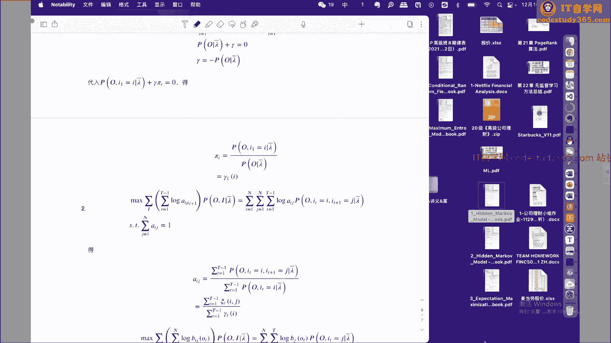

第二次迭代的对数似然不太离谱。

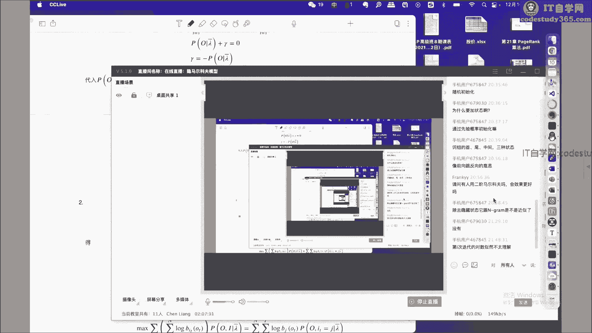

到在哪，是在em里面还是在求解过程里面，嗯em里面是吧，嗯我们我们先不管em了好吧，我知道这个问题在哪了，我们在QQ群里或者微信群里，我们解决这个问题好吧，因为那就是在烟部分，我们先看这吧，还有问题吗。

关于这一部分，好最后一个问题预测问题啊，来这个预测问题了啊，看看最后一个问题，预测问题都在干啥，预测问题到底在干什么，嗯在这好了，还是我们已知观测啊，我们的语料库是已知到的，然后呢我们的拉姆达。

我们的模型，语言模型通过刚才第二部已经构建出来了，现在我们要干什么，我们要把那个隐隐序列I构建出来啊，这个时候就想回到刚才我们的问题啊，不管是词性标注还是我们的这个呃分次啊。

都是从序列到序列嘛啊从一个已知序列，我们要得到另外一个序列，当然这个序列和序列的映射呢，我们还需要知道模型啊，怎么办，这是个挺麻烦的事，看下面，这个时候呢我们还引入了另外一个呃。

以另外一个量就是delta delta t i，但是ti呢它也是一个递推公式啊，你会发现它也是个递推公式，它的这个递推过程啊，非常类似于我们前面讲到那个阿尔法，那个前向概率，当然不一定不是不同啊。

可以显示不同，但是这个逻辑是非常类似的，什么逻辑呢，就是首先给出德尔塔TI的定义，所以呢TTTI啊，它被定义为IT等于IIT减一等等等，I1OT等等等等O1，换句话说就是说我知道了从O1到OT。

还知道I1到IT减一，并且呢在IT等于I的这个条件，这个这个概率啊，这个概率里面，所有可能的概率值的最大值，被定义为德尔塔TI，注意啊，这里的IT等于I，因为随着这里的I的不同啊。

随着这里I的取值的不同，当然IT减一也是哈，随着IT减一的取值的不同，它是有多个概率值的，在这多个概率值里面，我取那个概率值最大的，把它放到这里的德尔塔TI里面呃，那德尔的TI等于多少呢，我们不知道。

到至少到现在我只知道它一个定义形式而已，是吧，好了看下面啊，那么德尔塔TI，我们看一下德尔塔T加1I等于什么，德尔塔T加1I，按照刚才的公式，只是多了一个IT加一那么一项而已啊，就多了那么一项等于I嘛。

因为前面都是一样的，通过前通过使以下的计算啊，通过以下的计算，我们可以得到它的递推公式，是下面这个式子中间的过程啊，回去自己看下面这个式子什么结果又有哪些，包括这里的BIOT加一，因为是T加一个时刻。

OT加一我们是已知的是吧，那么很显然BIOT加一也是已知的，因为查一下B就可以，这个阿尔法JI也是已知的啊，查一下A就可以，那么前面的阿尔法TJ注意啊，这是在T加一的时候。

得到了关于阿尔法T加TG的一个表达式，那么很显然有了阿尔法TJ，就可以得到阿尔法T加一，那么同样阿尔法TG是多少也不知道，那我只需要知道阿尔法T减一，就可以得到阿尔法T得得20题是吧。

同样是个递推过程啊，这个递推过程，那这个递推过程的计算过程当中，我们每一次都把这里的德尔塔T减一，G乘以阿尔法GI这个结果最大值的那个节点，保存到中间结果里面来，就是说你会发现啊。

在前面的德尔塔的计算过程当中，它计算的是概率的最大值，是概率的最大值哈，至于这个概率的刚才我们说过啊，至于这个概率的最大值是哪个值给他的，他DA是不记录的，他只是记录的概率值。

中间结果计算的是产生那个概率最大值的，那个状态，因为不要忘了我们的初心是什么，我们的初心是要计算的一个状态序列是吧，看这里我们的初心是要计算的一个状态序列，你那个德尔塔只是记录了出现那个状态。

概率极大值的概率值是多少，没有计算序列位置，那这里的中间结果我们是用来计算它的，具体位置的好了，那这个东西有什么用啊，这个地方使用会使用到了那个二次规划问题，二次规划问题的结论告诉我们。

当我们按照上述的计算过程进行计算以后啊，得到的这里的中间结果，就是我们的中间路径结果啊，因为我们每一次的计算都是在上一次的基础上，再加上一个A加一对吧，再加上一个A加一，再加上一个A加一。

当我计算到了I大T的时候，很显然这个德尔塔就计算结束了，当我们得到了德尔塔大T的时候，那么这里的中间过程也就记记录，完成了一个一个的节点就计算完成了，当计算完这里的德尔塔大T以后。

那么中间计算结果里面所有的路径节点，就是所谓的预测路径，呃，这是计算过程啊，计算过程，至于为什么你需要再找一本啊，呃理论讲vs规划的理论书再去解决这个问题了，也不在我们今天的讨论范围当中了，好吧，嗯好。

以上呢，是今天我们关于伊马尔可夫模型的一个介绍啊，嗯我们简单回过头来看一下好吧，第一个问题，R可服定义所谓的姨妈可夫模型，两个序列的映射规则啊，两个序列的映射啊，就这么个东西，一个序列呢是隐藏序列。

一个序列呢是观测序列啊，就是这两个序列之间的映射过程，但是很显然有很强的要求啊，状态序列只受上一个时刻的状态影响，观测序列只受当前时刻的状态影响，这是文字上的描述啊，形式化的描述需要理解的状态序列。

观测序列更重要的是怎么生成，状态序列和观测序列，很显然都是通过我们的矩阵和向量，来加以描述的，其中状态转移矩阵啊，描述的是状态和状态之间的转移，观测概率矩阵描述的是状态观测之间的转移。

处理掉的向量描述是第一个时刻的状态生成啊，这其实有了ab拍以后，我们的模型就已经构建完了三个问题啊，中间计算结果的概率，计算学习是通过O生成模型，预测是通过模型和O生成我们的隐变量，其实你会发现。

我们的最核心的目标还是在以隐变量上，就是我们的隐藏序列I上啊，怎么把这个I序列找出来，是我们最核心的问题，比如说从一个序列O生成另外一个序列I，这就是sequence to sequence啊。

从序列到序列任务啊，当然我们的深度学习模型里面，有很多的模型都是解决这一类问题，但是1max模型怎么解决的，刚才我们已经完成介绍了，好吧，看大家还有还有什么问题吗，当然我记得刚才那个同学的问题啊。

就是你关于em算法，因为中间计算过程里面我们使用了em，但是呢这只是一个工具而已是吧，这个问题我们后面再解决的，就关于hmm部分还有什么问题吗，OK嗯嗯当然嗯这个不是结束哈。

反而是刚刚开始有个有什么问题，我们在微信或者QQ群里及时在沟通，好吧好，今天我们就到这吧。

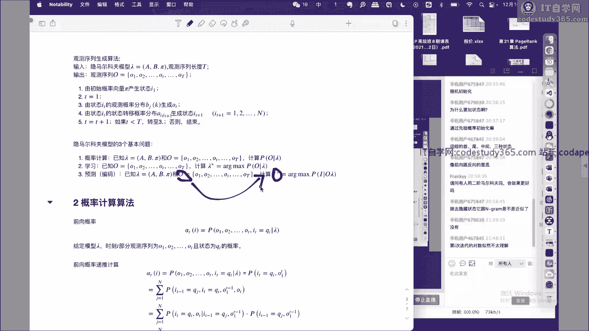