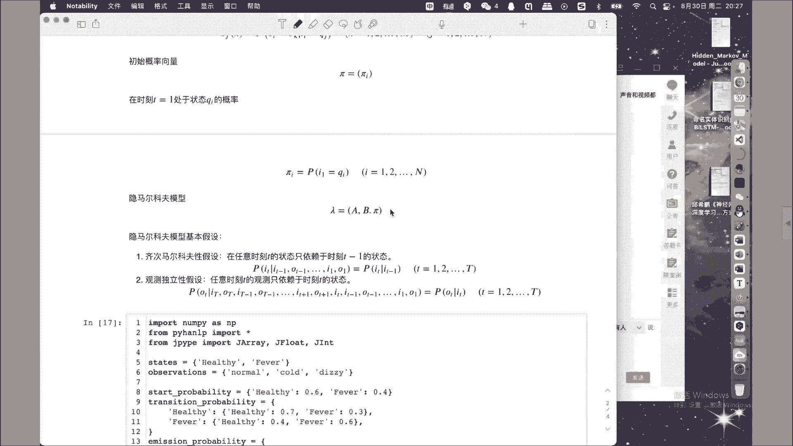
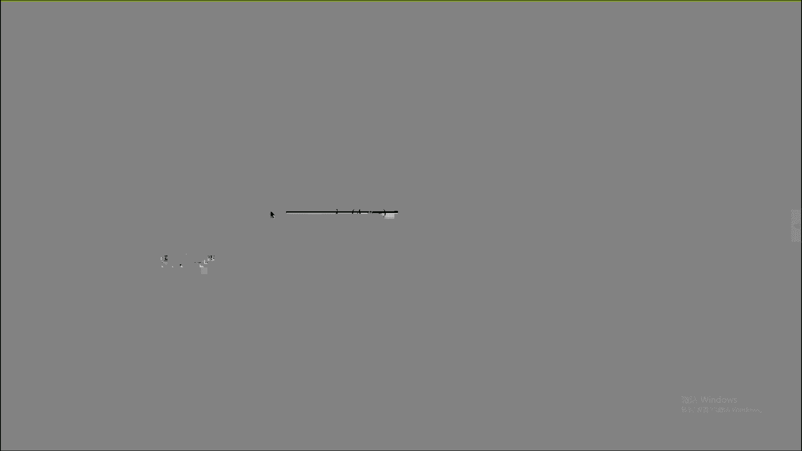

# 【七月在线】NLP高端就业训练营10期 - P9：6.命名实体识别与CRF应用 - IT自学网100 - BV1uxT5eEEr6

OK如果没有问题的话，我们就准备开始好吧，那么今天我们的内容呢是关于这个呃序列标注，还有我们这个cf模型的使用的内容，那么在这些内容讲解之前呢，我们可以看到啊，这个这一次的课程也是作为我们这个阶段呃。

一系列相关模型，特别是啊银马尔可夫模型和CRF模型的一个呃，简单的回顾，以及在我们自然语言处理方向的应用的一个，总结性的内容，那么我们分两个部分啊，第一部分呢是介绍一下。

伊马尔可夫模型以及序列标注任务啊，第二部分呢我们再介绍一下啊，我们CRF在LP方向的使用的内容，首先我们先看第一个问题啊，就是关于这个序列标注与中文分词呃，首先我们聚焦到序列标注方面呃。

sequence to sequence啊，就是序列到序列，是一类我们在呃机器学习方向非常重要的任务，他的描述呢是这样来给定的，关于序列标注，首先是给定一个序列XX一一直到XN。

他需要计算出每一个已知序列当中，元素所对应的标签，得到相对应的标签序列YY1Y二一直到YN，这里有两点需要特别注意，第一点我们是一个所谓的序列标注任务，所以我们的已知序列和我们的标签序列，都重点是序列。

这和我们之前所介绍过的数据集的概念，特别是数据集的集合的概念是不一样的，序列强调是有顺序的数据集，这里你可以看到下标一二到N啊，是一个严格的先后次序关系，包括这里的标啊，标签的一到N啊。

都是严格的次序关系啊，这是和我们之前的数据集是完全不同的啊，强调它的顺序性，所以它不是个集合哈，是一个序列，这是第一点，第二点呢，就是已知序列和标签序列当中的元素啊，已知序列和标签序列当中的元素。

我们在这个地方啊，首先你可以认为是一一对应的啊，元素是一一对应的，我已知一个X一一直到XN，我要得到的是Y1到YN，也就是说但凡是啊，但凡是从一个序列到另外一个序列的映射。

这种任务都是所谓的序列标注任务，然后呢在求解序列标注问题的时候啊，这个时候我们把求解的模型，称之为是序列标注器啊，序列标注器通常模型是从一个标注数据集，XYXY啊，从我们的输入和标签的对应关系啊。

组成的序列标注集当中学习相关的知识以后，再进行预测，这个时候就需要特别注意，这里的标注数据及XY它又是一个集合，有同学这个时候就会有困惑，你刚才不一直在强调序列，标注任务当中的XY都是序列吗。

怎么到这个地方呢，XY又变成了集合了呢，这两者之间是完全不同的，注意一下啊，在刚才强调的XY啊，在刚才强调的，XY是我们数据集当中的一个数据，对小X小Y注意，这都是黑体的。

有大K的这样的小X小Y所组成的数据集啊，标注数据集是我们用来进行模型训练的，换一个角度啊，换一个角度，我们可以看到在这个地方的序列X1到XN啊，这里的序列由X1到XN组成，所以我们这个时候你可以看到。

这里的X是一个向量啊，用黑体表示的向量，这里的Y1到YN组成的Y也是一个向量，由大K个这样的向量对所组成的结构，就变成了一个集合对啊，变成了一个矩阵所组成的集合对啊，所以这个时候啊。

嗯这和我们之前啊在不管是嗯普通的啊，机器学习模型当中，碰到的数据集是不太一样的啊，是不太一样的，这一点希望大家能够引起重视，然后呢可以看到序列到序列标注任务啊，就是序列标注任务是一个非常抽象的任务。

也就是说但凡是我已经知道一个序列，要求一下它所映射得到的序列啊，这类任务一般情况下，我们都认为是序列标注任务，那在自然语言处理这个特定方向当中，这种所谓的序列标注任务具体又体现在哪呢。

我们可以看到在自然语言处理当中，这里的X啊，这个所谓的已知的序列，通常是字符序列或者是词语系序列啊，要么是字符序列，要么是词语序列啊，要么是一个一个的单词啊，一个一个的单词，要么是一个一个的单字啊。

这样的话就构成了我们的第一个已知序列，那么相对应的我们得到的映射标签，Y则是待预测的组词角色，或者叫做磁性啊等等的标签儿，呃这就需要和当前的你选，你所解决的任务密切相关，比如说如果是一个词性。

什么是词性，我们在学语文啊，英语的时候都啊学到过啊，单词是有词性的，名词副词，形容词，介词连词等等词性是吧，这个时候很显然，如果我要得到的标签是一个单词，一个单词所对应的词性的话。

那么反过来我们也就可以确定已知的序列，X里面的每一个元素都是一个什么词语是吧，这个时候你会发现，当我们要进行所谓的词性标注的时候啊，要为我们的每一个单词标注词性的时候，那么很显然这里的X就是以词语。

好像是以单词作为我们的已知序列，而对应的标签就是每一个单词所对应的词性啊，这是刚才我们一种方法，一种这个X组织形式，是以单词的形式来组织起来的，X，那么有同学会问，有没有以单字所组成的这个呃已知序列呢。

有这类任务呢，比如说我们可以看到，后面还有一个叫做组词角色，什么叫做组词角色呀，比如看下面啊，比如说我们一个单词啊，比如说我们一个单词，单词我们认为是由一个一个的单字所组成的。

而这一个一个的单字在词当中的位置，其实是啊有特殊的标识的，比如说在一个词语当中啊，在一个词语当中，有些单字啊是出现在这个单词的首位置啊，我这个时候呢，我们就可以给他一个所谓的手标记啊。

就是这个单词的开始单子，那么当然有首标记就对应着有伪标记，当前这个单词的最后一个单字所在的位置，有首标记为标记以后，那么中间的单子啊，当前这个单词的增中间的单字，我们也可以给他一个所谓的词中标记啊。

词中标记当然还有特殊情况啊，有一些词是单字词啊，单一个字所组成的单词，它不分啊首尾和中间因为只有一个字嘛，所以之后这个时候呢我们把它称之为单字啊，成词标记，那么取这些具体位置的首字母啊。

英文单词的首字母，所以组成了BMES啊，这么一个所谓的分词标注集，分词标数题用来干什么呢，很显然是用来解决分词问题的，呃把问题聚焦一下，举一个例子啊，比如说我们现在有一个文本序列。

叫做序列标注与中文分词，这么一个序列很显然是我们的已知序列，这个时候我们要完成的是，将这个序列进行所谓的分词，就是将这一个由字所组成的序列，分成若干个组啊，每一组组成一个单词啊，分词吗。

分词就是这样来做的，那这个时候很显然我们就需要为每一个单字啊，对应的得到他所对应的那个什么，在单词当中的具体位置，当然我们啊大脑其实也是一个分类器是吧，我们这个时候可以看到。

我们认为序列啊可能是作为一个单词标注呢，认为是一个单词，语是一个单词，中文是一个单词，分词是一个单词，如果按照刚才我们所谓的分次标注集当中的，这个规定啊，分别要为这些单词当中的每一个字啊。

给出一个所谓的分词标注的话，那么很显然续我们应该给的是B列呢，应该给的是E，因为一个开始一个结束，同样标注呢也是一个B1个E，雨是个我们认为是个单字词，所以是个S同样这是BE，BE啊。

因为这个稍微特殊一点，他没有多字词是吧，只有两个字的单词最多是，所以这个时候呢我们就可以看到，当我们已知得到了这个序列标注与中文分词，这个输入的X序列以后，那么我们通过人脑的这个所谓的分类器。

得到的分词标注集就是BEBESBEBE啊，这就是得到了一个我们分词的这么一个模型，那么当然啊这仅仅是举了这么一个例子，我们需要通过大量的数据集啊，大量的数据集去训练一个啊机器学习的模型。

或者深度学习的模型来完成，刚才我们通过人脑来完成的工作，这就是所谓的分词任务，通过上述的一段描述啊，通过上述的一段描述，我们可以现在啊，我们可以知道我们的任务目标是什么了，抽象了一点。

我们要完成的任务目标就是序列标注任务，已知一个序列得到一个它所对应的序列啊，这就是我们最抽象的一个，关于序列标注任务的描述，但是这个抽象任务对应到具体任务领域当中，比如说我们对应到自然语言处理任务当中。

它的形式又是很多种，在这个时候我们仅仅是举了两种啊，仅仅是举了两类任务，一类是所谓的词性标注任务，一类是所谓的分词任务啊，大家其实可以看到，即使是这两类任务，他们也是差别很大的。

在我们的词性标注任务当中，因为我们的目标是要对单词进行标注，它到底是什么样的词性，所以这个时候就要求，我们所构成的数据集当中的X是以词语，或者是以单词所组成的数据集，而刚才所说的这个分词任务。

在分词任务当中，我们需要对每一个单词当中的每一个单字，在词当中的具体位置进行标识啊，就是刚才所谓的分词标注集嘛，进行标识，那这个时候我们要求我们的输入X就必须要是，一个字一个字所组成的序列。

所以啊通过以上的描述，首先我们建立了我们要解决的问题是什么，第二呢希望大家能够清醒地认识到，当把这个抽象任务应用到具体问题领域当中，还是有很多的细节需要具体问题具体设计啊，当然这还仅仅是两类任务。

还有很多非常其他的多的任务，后面我们会看到还有命名实体识别对吧，我们也会讲到，所以这个啊逻辑一致，就是逻辑的流程是完全没有问题的啊，但是呢你需要在实施的过程当中，那么有了上述的问题以后。

我们看一下相对应的模型，是怎么解决以上问题的，当然序列到序列这类任务哈，这是一类任务，解决这类任务的模型有多种啊，比如说隐马尔可夫模型，能不能解决序列到序列的任务，可以啊，条件随机场模型能不能解决。

序列到序列任务也可以，其他的模型能不能，比如说我们的encoder decoder模型，比如说我们的这个transformer模型，都是可以解决这类任务的模型之一啊，希望大家能够明确哈。

就是你的任务是任务解决任务的模型，是解决任务的模型，两者有联系有区别啊，你不能把这个任务和模型搞混了好吧，当然以后可能还有其他的新的啊，发现的模型，解决同样的序列到序列的标注任务对吧。

那么我们看其中的一种以马尔可夫模型，在以马尔可夫模型当中啊，我们可以看到他也是要解决两个序列的联合，分布哈，来构建它的一个一个概率模型啊，in码尔可夫模型啊，是一类概率模型，既然是序列到序列的任务。

就免不了有两个序列啊，我们在以马可夫模型当中，分别称之为是I序列和O序列，I序列呢不可见啊，I序列不可见，称之为是状态序列啊，首先可以看到I等于I一I2IT到I大T啊，是一个状态的序列。

再强调一下是有严格的顺序性，状态序列当中的每一个状态，是在我们的状态集合当中啊进行选取的，这里我们引出了状态集合，状态集合是由Q1Q2，一直到QN这么种N种状态所组成的，也就是说在我们状态序列当中的。

每一个时刻的状态，都来自于状态集合当中的元素啊，这是所谓的I序列啊，隐藏序列，另外一个对应的序列呢是O序列，O序列呢也被称之为可见序列或者是观测序列，同样他也是以勾序列。

也是一个O1到O大T所组成的序列，其中观测序列当中的每一个观测OT，都是来自于我们的观测集合位，观测集合VV呢是由YV1V二，一直到VM所组成的，好吧，这个时候呢有同学就会嗯有些困惑。

就在于呃序列OK没问题，序列和集合的关系是什么样子，那么因为他都带下标嘛，很多时候就会搞混了，这个时候的下标非常重要，他带的信息在于，既然I是我们的所谓的状态序列，强调所谓的先后顺序关系。

那么这里的下标定义的就是这种顺序性，I一一定在I2之前啊，I二一定在I3之前，I大T1定是最后一个元素啊，下这里的下标定义的是顺序，而在集合当中的Q1Q二一直到QN，因为它是集合，就没有这种顺序关系。

这里的下标，仅仅是用来区分集合当中的两个元素，同理在我们的观测序列和观测集合，也有类似的情况，好吧，这个时候一定要搞清楚啊，一定要搞清楚，后面我们会通过例子来举例，但是我相信啊。

到现在为到现在这个阶段了，同学们应该有这种抽象能力是吧，好了有了我们所谓的状态序列和观测序列啊，状态集合和观测集合以后，我们下面就需要定义状态转移矩阵啊，状态转移矩阵什么意思呢。

就像刚才我们所说的状态序列是个序列，所以有的时候呢，我们可以通过这样的一种图示啊，简单的将我们的状态序列加以描述，首先这些点呢这是第一个时刻的状态I1，这是第二个时刻的状态I2。

这是第N个时刻的状态i in啊，这是最后一个时刻的状态I答T，那么有了状态好，12341直答题以后，那么顺序性我们一般用箭头来表示啊，顺序性一般用的箭头来表示点点点，然后呢指向它。

然后指出去下一个应该是IN加一对吧，再往后最后最后一个是I打T，这样就表明了啊状态序列之间的顺序关系啊，状态序列之间的顺序关系，哎这个时候马上有个同学说，哎状态既然是个序列啊。

有I1I二一直到I大T的这种顺序关系，那那个你那个观测是不是也可以这样画呀，当然可以，但是我们不这样画，为什么呢，以后后面我们会说好吧，一会会介绍，我们现在先聚焦到这个状态啊，状态序列上。

既然我们知道第一个时刻是I1，第二个时刻是I2啊，那这个下面就有个问题，那么这两者之间是要进行一个状态之，间的转换的啊，由状态I1时刻的状态，转换为I2时刻的状态啊。

由I2时刻的状态转换为下一个时刻的状态，也就是说在这个状态序列当中，相邻的两个状态之间是需要进行转换的，既然相邻的两个时刻的状态之间进行转换，我们就有必要啊，我们有就有必要，因为每一个时刻的状态取值。

都可能是状态集合当中的任意一个状态，所以我们应该可以预估到啊，这大七个时刻相，任意相邻两个时刻之间的状态转移，就应该必须要给出，状态集合当中的任意两个状态之间的转移情况，都要描述清楚。

这个时候我们用到啊，在序列的时候，用到的时候直接拿过来用就可以了，这就是刚才我们所讲说到的状态转移矩阵，既然是个矩阵啊，既然是个矩阵，而这个矩阵又是又又是用来记录。

我们状态集合当中任意两个状态的转移关系，首先第一个我们需要确定的是，这个矩阵的形状啊，既然是个矩阵嘛，就是个几行几列的，那么很显然要将我们状态集合当中的，这N个状态，任意两者之间的转移关系都要进行定义。

很显然这个矩阵是一个N行N列的一个矩阵啊，N行N列的矩阵啊，这是特别需要强调的啊，以后在后面的学习过程当中，特别是牵扯到各种数据结构向量，那这个向量是个行向量还是列向量，是个矩阵，是一个几行几列的矩阵。

是个张量，是一个几乘以几乘以几乘以几的矩阵，每一个维度上的数据啊，表示了当前这个数据结构的形状，是非常重要的内容，它要比啊这个数据结构里面的数值是多少啊，其实有的时候更重要啊，因为其中的数值。

我们是通过数据集的优化算法啊学习得到的啊，但是这个结构是你需要在事前人工设置的，设置错了啊，整个的算法肯定都是错的，那么有了这个结构以后，它又是用来存储任意两个状态之间的，转移关系的。

所以下面我们需要定义其中的，矩阵里面的元素值，那么我们在T时刻处于状态QI的条件之下，在T加E时刻转移到状态QG的概率啊，这个时候注意啊，既然是任意两个状态都需要都可能出现转移，这两个状态之间。

很显然也是在序列上发生的状态转移，所以也有一个什么顺序关系，从谁转到谁，从谁，从T时刻处于QY转移到T加一时刻为QG，这里的T和T加一很显然是一个先后关系，已知的是T时刻。

IT等于QIT加一时刻为QG的转移关系，用条件概率来表示啊，定义为AIGAIJ，注意这个下标IJ啊，注意I时刻啊，I啊，这里的I是it等于QI的那个状态的时候的状态，这里的G是IT加一时刻。

等于QG的时候的状态好吧，这里的I是从一到N，G呢也是从一到N啊，这是N啊，因为这是状态到状态好吧，那么有了这个状态转移矩阵以后，那么同样我们还可以给出啊观测概率矩阵，观测概率矩阵说的是。

当我们发现了相对应的状态以后，状态所对应的观测啊，状态所对应的观测，所以你会发现啊，这里的箭头不再是从左往右指，而是从下往后呃，从上往下，也就是说我看到一个状态，就可以得到一个当前时刻状态所对应的观测。

所以这个时候的O1O2，这是ON这是O大T他们每一个观测啊，都是根据状态对应的状态得到的啊，这是因马尔可夫模型的这个基本啊，基本的一个要求或者基本的一个规定，那这个时候既然我们是从状态得到观测。

也就是说你可以认为是从状态转换到了观测，那么按照刚才我们在状态转移，矩阵当中的分析逻辑，那么这个时候我们也应该用啊，一个矩阵结构来存储，任意状态到任意观测之间的什么转换，所以这个时候同样我们是一个矩阵。

这个矩阵是N乘以M的，N代表了我们状态集合当中的元素，M代表我们观测集合当中的元素，那么从N个状态可能转移到对应的M个观测，所以这是一个N乘M的矩阵，那么有了这个矩阵结构以后。

其中所定义的值是这样来规定的，在T时刻处于状态QI的条件之下，生成观测VK的概率，在第二个时刻，假设在第T时刻啊，这个时候我们假设这是T时刻，小T时刻，小T时刻等于QI的条件之下。

同样在小T值时刻等于VK的概率，定义的是这个转移概率，我们把它用条件概率进行定义啊，然后是得到BGK呢是对应的是我们的观测，所以是从一到MJ呢是对应的是我们的状态，所以是E从N那这个时候你会发现啊。

当我们有了所谓的状态转移矩阵和，观测转移矩阵呃，这个呃观测概率矩阵以后，你会发现在这个in马尔可夫模型的，现在这种情况之下，我们就可以从另一个位置啊，比如说从I1开始，我从案例一。

就可以根据刚才我们所得到的状态转移矩阵，状态转移矩阵得到谁，I2通过I2查一下状态转移矩阵，我就可以得到I3I4I五一直到I大T，同样当我们知道I1这个状态的时候，查一下刚才所定义的观测概率矩阵。

我就可以跳转到谁，O1在I2我就可以跳转到O2，从IT我就可以跳转到OT对吧，所以这两个数据结构规定了，在我们状态和状态之间的调整关系，以及状态和观测之间的调整关系，但是呢这个时候好像还有个问题。

什么问题啊，如果我们把刚才的这个结构认为是类似于什么，多米诺骨牌是吧，多米诺骨牌一直推导下去就可以运行了吗，我们的第一个状态由谁来决定，这又是个问题对吧，这个时候呢我们进一步的规定，叫做初始概率向量啊。

初始概率向量，那现在呢很显然它就变成了一个什么结构啊，向量结构为什么是个向量结构呢，因为初始状态I1啊，它没有所啊，它就是一个可以取任意一个状态集合，当中的状态的一个初始状态。

所以这个时候我们只需要为Q1Q2，一直到QN啊，这大N种状态，每一个状态给他一个什么初始概率就可以了，所以构成的是一个向量，这个向量是个一行N列的啊，所以呢我们可以看到初始概率向量派等于派I。

它规定的是在时刻T1处于状态QI的概率，注意这里是时刻T1T等于一样，是一个标准的第一个时刻啊，在当前标准的第一个时刻处于QI的概率啊，就是刚才所谓的初始概率，那初始概率呢被用一个啊边缘概率来定义啊。

定义为pi就看可以了，那么有了上述三个数据结构，也就是所谓的初始概率向量pi，以及我们的状态转移矩阵啊，转移状态，转移矩阵A以及观测概率矩阵B啊，这三个结构就构成了所谓的一马尔可夫模型啊。

构成了一马尔可夫模型，那么在伊拉可夫模型的定义完成以后呢，其实我们可以看到在刚才的定义过程当中，其实我们使用到了两个非常重要的。

in马尔可夫模型，为了计算的简便，我们定义了两个非常重要的假设，第一个假设呢就是所谓的，其次马尔可夫性假设啊，其次马尔可夫性假设。

其次马可费用假设说的是在任意时刻，T的状态只依赖于时刻T减一的状态，回到刚才这个图当中，我们会发现刚才我们一直在说的是从T1啊，从I1调整到I2，从I2调整到I3，那么反过来。

其实我们可以发现这个箭头的单向性啊，以及一个箭头的指向性，告诉了我们在任意时刻，比如说I2啊，I2的状态只取决于谁，只取决于I1和O1有没有关系，完全没有关系，因为这个图当中就没有从O1。

指向I2的这么一条边对吧，这其实是一个有向图哈，我们通过有向图来表示的一马一马可的模型，在这个有向图当中，我们其实也可以看到，刚才所谓的七次Mark分析假设就是每一个状态啊。

每一个状态只依赖于它前一个状态啊，这被称之为是齐次马克飞行假设，这种假设的主要目的啊，这种假设的主要目的就是用来简便后面的逻辑，计算的啊，就这么一个目的好吧，有人说你这样做简化以后计算是方便了。

那是不是性能上就要降低了呢，很显然是这样的啊，我们是用嗯受用一定的顺性能的损失啊，来提升计算的便捷性啊，呃这是在经常会采用的一种策略，但是呢当我们的数据样本足够大的时候，这点损失呢其实是可以接受的。

这是齐次马克飞行假设，那么下面一个呢，下面一个假设是所谓的观测独立性假设，观测独立性假设说的是任意时刻T时刻的观测，只依赖于同时刻的状态，同样在我们的图当中说的也很明显。

每一个时刻的观测仅依赖于同时刻的状态，和其他时刻的状态和观测依旧没有关系，同样这个所谓的观测独立性假设，也是为了计算方便，也就是说上面这两条假设啊，上面这两条假设啊，当我们后面进行所谓的概率计算的时候。

当出现了啊，这种所谓的依赖于很多条件的一个状态和条件，关于状态的条件概率的时候，通过这样的化简就可以化简到这种啊情况之下，好吧好了，以上呢是关于我们对啊，以马尔可夫模型本身定义部分的一个介绍啊。

这和我们前面的视频当中应该也有所，这个说明了这一部分有没有问题，没问题是吧，哦不是OK不好意思啊，有没有问题啊，因为，有没有问题，同学们没有问题的话，我们就继续哈，那刚才呢我们是通过原理。

特别是通过呃嗯数学公式的方式，以及画了一个有向图的方式，来描述了一马可夫模型，下面呢我们把它映射成代码，然后看一下具体的这个执行的嗯，一种啊代码上的一个方式，那么实现的方式啊，代码实现的方式有很多种啊。

当然你可以自己手写一个，然后呢我们更常更常用的方式，可以通过调包的方式来实现是吧，我们下面呢是使用的是这个含LP啊，这么一个包来这个来调用一下它的in Mark服模型，首先呢给出状态定义啊。

就是状态集合嘛，你首先得有状态是吧，现在呢有两种状态，健康状态和发烧这么两种状态，然后有了状态集合以后呢，有所对应的什么这个呃观测啊，三种观测啊，正常发冷和这个发抖啊，三种状有三种观测。

那么有了状态和观测集合以后，我们就可以定义什么，定义我们的状态转移矩阵啊，观测概率矩阵嗯，那么状态之间的这个嗯概率呢，我们可以给出给出一个定义，就是直接给出一个啊，你人工人工设置的一个值哈，健康是0。

6，然后呢这个发烧是0。4，那么这个时候的状态转移的这个概率呢，我们可以看到由健康转移到健康是0。7，由健康转移到发烧是0。3啊，从发烧转移到健康是0。4，从发烧转移到发烧是0。6啊，这是概率值。

这个时候呢啊我们先看完了啊，那么有了这个状态转移矩阵以后，观测矩阵我们可以看到，由健康转移到正常是0。5，由健康转移到发冷是0。4，由健康转移到这个额头晕是0。1，由发烧转移到健康是0。1。

由发烧转移到发冷是0。3，然后由发烧转移到这个额头晕是0。6，这就像刚才我们所这个介绍的是吧，刚才我们所介绍的这又是一个是这个矩阵，就是刚才的状态转移矩阵，它是一个N乘N的，你的状态有两种。

所以它是一个2×2的一个矩阵，同样你的观测矩阵啊，是一个从状态到观测的局这个矩阵，那么这时候应该是一个N乘以M的，是个2×3的，所以是一个两行三列的矩阵，好吧，这和这刚才我们所这个理论部分的介绍。

是完全一样的，这个时候呢这个需要说明一下，就是呃在课前有一同学提出了一个很好的问题，什么问题呢，就说你的这个状态集合也好，还是观测集合也好，里面那个QQ，还有那个V到底是一个什么样的结构啊。

它到底是一个，因为你可以看到在这个地方，你这里的Q也好，V也好，是通过一个字符串的给出的是吧，通过一个给字符串给出的，那那是不是就意味着我后面要使用的时候，需要为每一个状态和每一个观测。

都给出一个字符串呢，其实不是这样的，因为我们可以看到这里的字符串，很显然是带着我们的语义信息啊，就是它实际上是一个什么样的状态，健康状态也好，发烧状态也好，但是我们应该清楚的是。

这种语义信息在我们具体的in马可夫模型，计算的过程当中，其实是没有价值的，就这个到底是健康还是所谓的发烧，就健康，发烧只是区别这两种状态就可以了啊，也就是说只要我们嗯给出一种所谓的编码方式。

能够能够区别是这个是这个是Q1状态，这个是Q2状态就可以了，至于Q1状态是健康还是Q2状态是发烧，其实在计算过程当中是没有没有没有必要的啊，没有必要记录这个信息的。

所以你会发现当我们得给出了语义信息以后，下面其实就是个编码，就是要把我们刚才所定义的矩阵里面的信息，通过编码的方式啊，通过编码的方式进行一个抽象啊，只要我知道啊，这是Q1，这是Q2就可以了，这是V1。

这是V2，这是V3就可以了啊，具体的信息我们还可以通过查表是吧，查结构把它查出来，但是呢这个时候我们只需要给出一种编码方式，把他们编程我们所希望的数据结构就可以了，我不知道这一块啊。

我我表述的足够不足够清楚好吧，也就说我们的问题啊和我们的计算过程，有的时候是啊是两个不同的步骤，好吧，当我们有了这个呃编码方式以后，我们就得到了相对应的数据结构啊，相对应的数据结构。

有了这些数据结构以后，我们就可以构造啊，刚才所谓的AB派三个数据结构，然后把它统一的设置成我们的马尔可夫模型，里面作为参数就可以得到相对应的模型结果，这个时候呢需要注意啊。

嗯这个地方叫做一阶马尔可夫模型啊，一阶马尔可夫模型，那什么叫一阶马尔可夫模型，或者说这里的一阶到底是什么含义，就需要回到刚才我们所做的两个假设当中的，第一个就是齐次马克复性假设，这个齐次马克复性假设啊。

也就是所谓的一阶马尔可复性假设，这里的马可这个一阶也好，其次也好，就像刚才我们所说的一个时刻的状态，只与他前一前一个时刻的状态相关的话，这被称之为是一阶马尔可复性假设，如果我们把这个条件稍微宽松一点儿。

也就是说任意一个时刻的状态啊，仅依赖于他的前两个状态的话，这被称之为是二阶的一马尔可夫模型，当然你也可以把它扩展成啊，一个N阶的一马尔可夫模型，回到刚才我们的图示当中哈，回到刚才我们的图示当中。

如果是个二阶的话，那也就意味着如果这个地方是个I3啊，如果这个地方是个I3，如果他直接只依赖于I2，在图上只有一个从I2指向I3的，这条边的话啊，这被称之为是一阶模型啊，一阶一马普模型。

如果还有一条边从I1也指向I3，也就是说I3依赖于I1和I2，两个状态的时候，那这就被称之为是二阶一马尔可夫模型，当然还可能有三阶四阶N阶的，好吧嗯这个时候呢随着你的阶数的提升啊，随着你接触的提升。

你依赖的信息越来越多，那么这那么这个时候很显然，模型应该会越来越精确啊，这是显而易见的额，但是计算量成倍甚至呈几何倍数增长，你的性这个性能的提升的这个程度远远没有啊，你计算量所带来的这个程度的增加。

所以这个时候呢是得不偿失的，经验上也证明哈，经验上，经验上也证明，一阶一马可夫模型，当数据量足够大的时候，其实性能已经足够好了啊，所以没有太大的必要啊，来调用更高阶的模型结构。

当然你说我试试二阶的可不可以可以，后面我们会可以看到啊，可以看到当我们完成了模型定义以后啊，这仅仅是第一步，你只是通过数据的设置啊，只是通过问题的分析是吧，你只是通过问题的分析抽象出的模型结构。

并且为模型结构当中的数据结构，给出了相应的概率值，只是这个模型有了，你得让这个模型能够起到它所对应的作用，那么下面以马可夫模型的基本问题，他解决什么的问题，这是最重要的啊，这才是最重要的。

你说你你到底能干什么，就刚才你这个这个结构图是吧，你刚才这个结构图还是现在看，还是稍微有一点复杂性的，那这搞这样的一个复杂模型，你到底能够解决什么问题，有同学可能马上就反应过来哎。

他需要解决的就是所谓的序列标注问题对吧，序列标注问题，或者说是序列标注问题当中的具体的，比如说像分词问题，比如说像词性标注问题啊，这很好，但如果你需要用这个结构去做的时候，就需要分清楚啊。

需要严格分清楚到底哪些，因为这里面也有I1I序列，状态序列和O序列观测序列，那现在我就问同学们，你在现在的银马可夫模型里面的，I序列和O序列，你能不能对应到刚才我们序列标注任务里面的，X序列和Y序列。

那么下面有问题，我再准确一点，就是这里的X和Y对应的是I和O，或者是O和I是哪一个，这个现在有没有啊，能够回答这个问题的同学问题很问题，应该很清楚了是吗，因为up普模型我们模型定义结束了是吧。

又是A又是B又是派是吧，又是转什么状态，转移什么观测矩阵这么复杂这个东西，那很显然它需要解决序列标注问任务，这是没问题的，但是序列标注任务里面也有两个序列啊，已知序列和标记序列XY。

那么这个地方呢也有一个I序列和O序列，状态序列和观测序列，那么谁是谁啊，就这么简单的问题，I是X还是Y，O是X还是Y，或者反过来X是I还是O，Y是I还是O，X可见Y不可见。

唉这倒是一个很好的分析问题的角度对吗，我不知道，当然这还不是最终的答案，因为可见不可见，在这里刚才不是我的问题的一部分，但是这个分析问题的方法角度是非常，就是这个方法对了啊，但是不是最终答案。

但是通过这个方法你可以得到最终答案，没问题吧，再精确一点，X是我们的已知序列，很显然是我们要得的事实，我们啊可见的一个序列，Y呢是一个标记序列吗，你要得到这个标记序列，它是一个不可见的序列对吧。

那谁是可见的，谁是不可见的，O当然是我们的观测序列嘛，你O是个观测序列，所以很显然这个时候按照刚才那个分析对吧，那这个时候X就是我们的O序列啊，X序列是我们的O序列。

那么相对应的Y序列就是我们的标签序列，所以你会发现啊，所以你会发现为什么要强调这一点，因为你会发现这和模型的时候，如果我们不分析这个问题，你会发现模型本身这种所谓的依赖关系。

好像暗示了我们一个什么样的关系，好像暗示了我们一个，因为I是我们的状态，勾是我们的观测，好像暗示了我们啊，好像是暗示了我们是I对应生成了O，所以按照这个逻辑的话，I应该是XO应该是Y，但这不对对吗。

正啊正确的分析的这个问题的一个角度，就是根据X和Y的可见和不可见，这个角度去分析对吧，因为X是已知序列对应的，当然就是应该是可见序列，谁是可见序列，O是可见序列，Y是我们要得到的标签序列。

而标签序列要得到吗，很显然是不知道的，在我们的模型里面，I是我们的不可见的序列状态序列，所以它应该是Y，你会发现这个我们是通过X得到Y，但是在模型里面是我们假设的，是从状态得到的O观测。

这个这个嗯应该给大家解释清楚了，是这样吗，OK咳咳咳很好啊，这个有的时候呢嗯需要有一点分析的过程啊，和分析的逻辑是吧，那我们就继续哈，那好了，刚才我们仅仅是通过嗯朴素的分析啊。

得到了这么一些相相对有用的结论，但是我们正式啊，看一下伊马尔可夫模型的三个基本问题啊，三个基本问题，第一个问题呢，我们把它称之为是样本生成问题啊，简单点说就是已知谁已知模型。

已知模型意味着我已经知道了状态转移矩阵A，观测概率矩阵B以及初始概率向量派啊，这三个数据结构我都知道了以后，我就可以得到谁可以得到相对应的样本序列啊，因为可以看到啊，根据刚才我们所介绍的这个模型啊。

刚才我们所介绍的这个模型，你会发现我只需要首先查一下谁，查一下那个初始向量派啊，因为那个派定义是第一个时刻的状态生成概率，我就可以得到谁I1啊，开天辟地，第一下有了以后，我通过I1再查一下谁观测矩阵。

我就可以得到谁O1由I1，再通过状态转移矩阵，我就可以得到谁I2，再插一下我们的观测矩阵，我就可以得到O2I3O3I4O四，最后的I大TO大T，这样的话你会发现通过AB派，我就可以生成一系列的I。

生成一系列的O样本集合，就鬼优了啊，这一类任务呢是可以啊，通过我们啊所谓的样本生成任务解决的，但是呢你很显然这不是我们的核心啊，核心问题啊，这不是核心问题，那么另外一类任务呢。

我们把它称之为是学习任务啊，学习任务，所谓的学习任务呢就是我们已知观测序列啊，观测序列刚才我们说过，他是观测嘛，是可见的是吧，已知观测序列O我们要干什么，那这次就很厉害了，我们要通过观测序列紧。

根据观测序列，我要把谁还原回来，或者计算得到，要把整个在当前已知状态序，这个观测序列O的情况之下，使得当前观测序列出现，概率最大的那个lambda啊，把它构建出来，注意这个按lambda是三个数据结构。

状态转移矩阵A，观测概率矩阵B初始概率向量排，那你只要证明你现在手里只有谁，你手里的牌只有装，只有观测序列O，你需要通过O把AB和派都构建出来，这也是被称之为是学习任务，通过O学习得到模型啊。

这是第二类任务，一会儿我们这个看一下啊，一会我们可以看一下第三类任务呢，我们把它称之为预测任务，也被称之为是编码任务，什么意思呢，我们是通过已知这个时候啊，已知谁，这个时候我们是已知了兰姆达啊。

已知了这个拉姆达模型，有了模型以后，还知道了谁，还知道了我们的观测序列O，然后把谁构建出来，把在当前观测以及当前模型拉姆达条件之下的，那个概率最大的状态序列构建出来，这被称之为是预测任务。

如果我们先暂时不考虑第一个任务，你想一下这第二个任务和第三个任务怎么用，能不能结合一下啊，或者说他两个任务之间的逻辑关系，应该是怎么样的，你注意到了吗，首先我们看一下学习任务只有一个O。

我们就可以得到谁得到拉姆达，那这个时候再由这个O和得到的这个兰姆达，再根据第三个任务，你就可以把谁也还原回来，I也还原回来，回下头回到回到上面，我们看下图，上面那个图有告诉我这个图说明的是什么呢。

我们不知道派，我们也不知道转移矩阵，我们也不知道观测矩阵，我们现在只知道谁，我们现在只知道一个观测序列，或者说只知道观测序列，只知道观测序列，按照第二个任务，我就可以把派A和B，那个兰姆达给你构建出来。

有了兰姆达，再加上这个勾，我就可以把什么，我就可以把所对应的概率出现，最大的I也还原回来，你会发现我们得到的就是一个纯O到谁的映射，过程，到I还有我们这个O是个什么什么结构，是个序列，I呢也是个序列。

这不就是刚才我们所说的什么任务，序列标注任务了吗，能不能啊理解，那么有没有问题，啊这三个任务当中啊，后两个任务其实是，你可以认为是一个任务的两步啊，一个任务的两步，第一步我们仅通过O得到模型，第二步。

通过已知的O和刚刚构建的模型，去得到我们概率最大的I，而这个过程就是一个从O到I的映射过程，O就是我们的已知序列，观测序列，I就是我们的标签序列状态序列，这就完成了序列到B序列的任务。

再进一步的往前推啊，再进一步的往前推，怎么推，再对应到NLP问题当中，我们看一下英拉可夫模型到底在做什么工作，好吧，英拉可夫模型，比如说我们要解决所谓的刚才那个，词性标注任务好吧。

词性标注任务就是我们现在知道什么，我们现在知道的是一串，公序列观测序列，观测序列，就是刚才我们所说的那个在自然语言文本当中，就是谁，就是我们的X，我们能够得到的自然语言文本序列就是谁。

就是我们的嗯语料库啊，就是我们的语料库，这里的X就是成千上万本书，以及成千上万本书当中，这成千上万篇文章里面，这呃成几10万几亿，十几亿上百亿的这种句子语句对吧，这就是我们的语料库吗。

由这些语料库或者说这里的勾，首先我们要构建什么，可以通过语料库，我们可以干什么，可以得到刚才所谓的拉姆达，还记得吧，这是根据那个第二任务完成的啊，就是构建里面的AB派。

然后再由这个语料库和刚才构建的这个lambda，我们就可以得到一个所对应的什么，所对应的I序列，这个I序列就是我们的磁性序列，就可以完成所谓的磁性标注的任务，词性标注的任务，当然在这个过程当中。

最核心的问题很显然是构建这里的lambda，而这个拉姆达是由我们的语料库来构建的，一般情况下，我们把这个lambda是我们的，称之为是我们的语言模型，语言模型哈，因为你会发现这个兰姆达其实告诉了我们。

就是什么，当我们已知啊，当我们已知这个磁性的时候，注意啊，这是个兰姆达模型啊，兰姆达模型里面的AB派，是由状态到观测的序列啊，就词性和词性之间的转换，以及词性到单词的映射，但是呢这个过程啊。

这个过程其实是隐含了我们刚才所说的，语料库信息里，语料库当中的所有的文本信息，这个文件信息之所以可以使用，就是刚才我们所说的，一旦有了这个信息以后，再加上我们刚才所谓的这个可观测的语调完。

然后我们就可以完成相对应的，最大概率的I序列的构建，而这个I序列就是一个一个的磁性序列，就是刚才我们需要完成的次序标注任务，好吧，这个问题呢，就是说通过刚才我们所定义的in max模型对吧。

引出了伊拉可夫模型的三个任务啊，三个任务当中的两个任务，其实是解决我们最终自然语言处理问题里面，或者说解决我们序列到序列问题当中的，这个问题的两个步骤，第一个步骤通过我们的观测得到我们的模型。

通过观测和模型再得到我们的状态序列啊，从一个序列映射到了另外一个序列，这不就是我们的序列到序列标注任务吗，再把这两个序列根据特定的任务进行来设计，J就是我们的语料啊，E1段呃，这个时候应该是啊111句。

哎呀你可以是用句子啊，你可以用段都可以，然后这个地方呢是其实就是我们都要得到的，词性标注的序列，就完成了词性标注任务，那么下面的问题哈，下面的问题啊，这这部分有问题吗，有没有问题，如果没有问题的话。

你会发现下面的问题就是怎么去解决，刚才只是从目标或者从目的上啊，去分析了这两个任务能够解决什么问题，但是具体的解决步骤并没有给出啊，这也不是我们这堂课的核心内容，因为之前的啊视频里面啊。

应该有相应的这个呃介绍部分，如果啊还有同学说，我还希望更进一步的去了解一下这两个问，这两类任务的解决啊，还是那样给大家做一个推荐，就是李航老师的那本统计学习方法啊，现在叫做机器学习方法是吧，新版本啊。

机器学习方法，然后呢这个有比较完整的详细的步骤介绍啊，有兴趣的同学呢可以看一下好吧，那么下面呢我们还是通过一个例子啊，通过一个例子做一个简单的一个说明好吧，做一个简单的说明，那么同样呢我们还是啊。

根据刚才啊那个模型构建完成以后啊，根据刚才的模型构建完成以后，你会发现第一个任务就是一个序列生成啊，就是一个文本序列的生成呃，这个不是文本序列，就是一个序列的生成过程，通过我们的模型。

我们可以得到相对应的序列啊，这个应该都问题不大，那么第二类任务呢其实我们就可以看到，那当我们有了模型以后啊，这个地方呢我们还是定义了一阶模型啊，可以通过模型的训练，我们有了以后。

我们就把它可以转换成所对应的这个呃，呃概率形式啊，相对应的概率形式，然后呢下面呢我们再通过我们的矩阵转换，得到我们最终的这个额预测结果啊，最终的预测结果，这是按照刚才那个呃。

就是疾病正常的那个模型的这个介绍，下面呢就看一下中文分词哈，中文分词其实也是类似的啊，前面两大步，主要部分其实就是构建我们的数据集语料库啊，构建数据集语料库，在这个含LP当中呢。

有啊常用的一些基本语料库哈，你把它呃这个可以看到有基本的语料库，这个直接下载下来啊，直接下载下来解压就可以使用了，然后呢，我们可以在基本语料库上进行模型的构建，这个时候你会发现。

我们可以定义一阶段和二阶的两类模型啊，定义两类模型，比如这两类模型构建完成以后，我们就可以在语料库上进行学习，学习完这个模型，我们就可以进行所谓的啊序列标注了啊，这个时候呢我们要做分词啊。

以商品经济社会的特点是商品流通为例，通过一阶和二阶的模型的分词，你会发现结果是相同的，因为这种句子比较简单啊，没有太大的问题，通过在大量的数据上的一个呃性能的检测呢，你会发现其实非常接近啊。

其实有有差距，但是已经非常接近了啊，而且呢很显然，一阶的性能就是计算的效率要比二阶的效率高，性能上可能会有相应的一点损失，已经足够了，当然这仅仅是举了一个例子哈，这个有兴趣的同学可以从这个RLP当中呢。

还有很多的例子可以看一下，关于第一部分啊，关于第一部分嗯，以马尔可夫模型与序列标注问题啊，这部分还有没有问题，有没有问题，那么如果没有问题的话，我们就进入到下一部分好吧，那这样我们休息5分钟到九点钟。

我们正式开始好吧，这个我倒点水喝，有问题的话，这个可以在这段时间嗯，留一下问题，我们一会可以讨论一下好吧，嗯HMCLF面试会让直接推到全部计算，我觉得应该概率不是特别大。

因为你的面试时间应该没有那么长时间吧，即使是笔试也更多的可能会是一些编程的题目，如果让你直接在HMM3F上做推导，我觉得目前来看可能性不是特别大啊，这只是啊我的一点想法。

当然这种可能性当然一直都会存在对吧，了解一点总是有好处的，特别是推导过程当中，对你今后在一些概率模型的学习过程当中，会有一定的帮助，这是我的另外一点看法，特别是一些相对比较复杂的概率计算。

还是在这个过程当中，能够体现出来他的计算逻辑的，OK那咱们有问题就继续嗯，没有问题的话，我们开始下面的内容哈，那第二部分呢，我们要介绍的就是命名实体识别啊，啊，这部分呢我们用的模型呢。

是这个双向的LSTM和CRF模型的集成啊，这么一类模型啊，这一类模型呢以及是双向的，LSTM加上四点F啊，这种集成方式的模型已经成为哈，已经成为我们在自然语言处理方向啊。

解决这类问题的一种标准范式啊之一吧，不能说是呃这个非常重要的一类啊，是非常重要的一类，那么当然嗯在我们课程当中，大家也可以看到，后续的我们还有这个transformer。

以及基于transformer的BERT模型，以及呃在此基础之上构建的更复杂的，其他的模型，那么这嗯呃这类模型呢，也是可以解决所谓的命名实体识别任务的啊，呃所以说啊，这个模型的发展是不断地进行下去的。

然后呢嗯一个阶段有一个阶段的主要工作啊，我们这个阶段呢会重点介绍一下，双向的LST和CRF模型的这个结合使用啊，结合使用来解决所谓的命名实体识别任务，那么首先呢，我们介绍一下这个双向的LSTM啊。

做一个介绍双向的LSTM呢就是在单向的啊，长短期记忆神经网络的基础上，通过两个方向正向反向，两个方向的训练，充分的啊去挖掘啊，我们这个文本数据的这种顺序特点，来构建的一类模型啊。

那么他也是在单向的基础上嘛，所以我们先介绍一下LSTM，首先是我们的输入向量，输入序列啊，输入序列X1X2，一直到XN啊，XN然后呢其中XT是属于RM的，为T时刻的输入向量，这个地方呢稍微有一点不同啊。

这个地方稍微有一点不同，在刚才我们这个就是啊HMM模型里面，我们每一个时刻输入的是一个标量，对应的是一个字或者是一个词的编号，但是很显然哈这种情况非常少见，我们更多的是将每一个单词。

或者每一个单词的这个编号，通过干hot编码的方式来进行这个输入，这是一种方式，那么现在越来越流行的另外一种方式呢，就是通过embedding啊，通过词嵌入的方式来进行输入。

那么不管是外号的方式还是embedding方式，都是通过词或者字的向量形式来进行输入的，所以这个地方的X1X二一直到XN啊，每一个对应的要么是一个单字，要么是一个单词啊。

在我们这个语料库当中的embedding啊，所以他也是一个向量哈，同样输出就是标量啊，就像刚才我们所说的，你到底是一个如果是一个词性标注任务，那这里的Y1Y2就是每一个磁性的啊，词性编码按N代表的是。

比如说是呃这个名词是吧，V代表的是动词是吧，类似所以这个时候的Y是标量，而X每一个都是所谓的向量啊，就是EMINE向量啊，这是输入和输出啊，这里的YT呢是一到K是我们的输出嗯。

那么LMSTM的结构呢是比较嗯，相对比较复杂啊，相对比较复杂，因为它是在我们传统的RNN的模型的基础上，来构建得到的，RNA模型的基础上来构建得到的，那么我们知道啊，通过前面的学习，我们应该清楚啊。

RA模型的有个问题，就是关于我们的这个呃时间维度上啊，我们要进行一个误差的反向传播啊，就是当前时刻的隐藏层状态，不光是受当前的输入的影响，还受上一个时刻的隐藏层，当然因为这种递推关系是吧。

上一个隐藏层还会受上上一个隐藏层的影响，所以你会发现这个时候我们一旦在隐藏层当中，如果积累或者消除了过多的梯度的时候，这个训练是不能够继续完成的，那么通过分析啊，我们会发现。

就是我们的线性部分和非线性部分啊，造成的不同的累积特性，造成了这种学习上的困难，那怎么办，其实问题也分析到了，也处理起来相对比较简单了，就是将我们的线性部分和非线性部分，进行分别的处理啊。

进行不同的处理呃，关于这本这一部分的论述呢，有兴趣的同学可以看一下那个邱奇峰老师的，深啊，神经网络与深度学习那本书里面的介绍好吧，那么重点呢很显然就是改造了我们的隐藏层啊，改造了我们的隐藏层单元。

我们可以看一下啊，这是我们的隐藏层单元H啊，这是我们的隐藏层单元H同样输入部分是XT，这是没问题的啊，输入部分当前的输入XT是没有问题的，那么除了当前时刻的输入XT之外。

我们还输入了另外两个非常重要的信息，一个是HT减一啊，一个是HT减一，这一部分，我们认为是上一个时刻的非线性部分啊，非线性部分另外一部分呢是CT减一，我们认为是上一个时刻的线性部分。

为什么说CT减一是线性部分呢，我们先顺着CT减一到CT，因为很显然CT是要输入到下一层吗，啊输入到下一层，所以你发现从CT减一到CT，经过了哪些计算呢，我们可以看到首先经过了一个相乘啊。

向量的相乘乘法运算是线性的是吧，我们认为是线性的，还经历了一个相加，我们也认为相加运算也是线性的，所以你会发现在这个计算过程当中啊，这个计算过程当中仅使用到了线性计算部分，所以我们认为啊。

从ct减一到ct是我们完成的是线性部分，线性部分的处理，那么非线性部分就很复杂了，我们可以看到非线性部分呢，从HT减一输入进来以后，首先他需要和T加呃，TIXT进行一个加法运算啊，来保证我们的输入啊。

既包括HT减一，也包括XT相加，完成以后啊，通过这这部分还是线性的是吧，这部分还是线性的相加完成以后，你会发现后面的处理就比较复杂了，首先通过一个SIGMOID的函数，我们得到了FT。

很显然我们可以知道啊，前面的学习，我们知道这个呃SIGMOID的函数是一个压缩函数，是个非线性性的压缩函数，它的压缩空间是0~1啊，压缩到0~1这个空间里面去，得到了FT。

我们会发现同样的零一压缩还在IT和OT啊，这么FTIT和OT，使用的都是我们的西格贸易的压缩函数，压缩到零一空间里面去，那为什么在这个地方必须严格使用，西格MOY的函数呢。

因为我们知道西格MOY的函数的这个压缩空间，零幺对应的是我们的一个概率空间，就是我们的概率为零，概率为一啊，零幺空零幺这两个值啊，对应的是我们的两对应的是概率空间。

而这里的ft t i t和OT的逻辑意义，都表明了一种所谓的门或者是门控机制，所谓的门控机制，说的是我通过这三个门来对应的，打开和关闭的不同的状态，对应它所提取的信息的多少，比如说以FT为例。

FT通过刚才的非线性压缩，压缩到零一里面去以后，我们可以通过这个零幺值，用来和我们的CT减一相乘，那么很显然通过ft t这个门开闭的大小，就决定了当前C7-1有多少的信息，进行到了下一步的运算当中去。

这是ft t ft t呢，也被称之为是我们的这个遗忘门，为什么叫遗忘门呢，因为很显然，这里的CT减一是上一个时刻的线性部分，通过ft t我们开开大了，开小了，开大了，冲过去的信息又多，开小了。

过去的信息又少，决定了我要把上一个时刻多少的sat部分，进入到下一个时刻里面去，所以他被称之为是遗忘门，那么相应的我们可以看到这里的OTOT呢，我们把它称之为是输出门，因为他是到了最后的输出部分。

来决定信息的输出的多少，同样这个IT我们称之为是输入门，因为你会发现这里它所对应的tie的CT啊，tie的c ct是通过我们的输入信息，经过一个test函数来得到的。

而我们知道这个test函数也是一个非线性的函数，不同的是它的压缩空间是-1~1啊，是关于我们原点对称的一个函数，这个函数呢一个呃性能就在于它的压缩空间啊，关于原点对称啊，两边啊两边是对称的啊。

这个性质性质上好一些，图就是因为这个数学生的性质好呢，所以后你会发现这里探测函数才是真正意义上，在我们的输入，XT和HT减一上进行信息的提取，得到这的till的CT，而这一部分till的ct。

可以认为是我们所有的输入信息的非线性部分，因为通过了一个探索性说法，非线性输入的非线性部分，在CTLT里面进行了存储，这个时候再通过输入门i it，决定在输入的非线性部分。

c tell的T里面提取多少非线性信息，这就是我们输入门和非线性部分的操作，打开还是关闭，这个时候呢我们得到一部分非线性部分，这个时候再和我们前面的CT减一相加，得到最终的ct部分。

ct部分呢可以认为是我们通过上述的处理啊，上述的处理得到的包括了C部分，包括了H部分，包括了X部分的所有信息，然后再通过一个所谓的非线性压缩啊，作为我们当前的非线性部分，然后再和我们的OT门相乘。

来得到相对应的HT相对应的HT非线性部分，这就是我们啊LSTM部分啊，LSTM部分，我们对于我们的隐藏层单元，所做的一个相对比较复杂的一个处理，其中LOSTM引入了门控机制，来控制信息传递的一个路径。

三个门分别为遗忘输入和输出门，取值呢通过我们的C跟VOY函数都在开区间，零幺之间表示以一定的比例通过相应的信息，其中1万门ft t啊，1万门ft t控制上一个时刻的内部状态，CT减一需要遗忘多少信息。

因为它和ct t减一相互操作，输入门IT控制当前时刻的候选状态，那个TT要保存多少信息，it也是门嘛对吧，同样输出门OT控制当前时刻的内部状态，c ct需要输出多少信息给外部状态，HT给为外部状态。

HT你会发现哎，我们通过OT在TCT的非线性部分，我们得到HT，那么刚才是通过这个图形的形式啊，通过文字的形式对这三个门进行了描述，那么门控运算呢我们可以看到啊，通过数据方式XT输入完了以后。

和我们的WF啊全值相乘，加上HT减一，和我们的全职UF相乘，再加上一个偏执BF，通过co mol函数哎，就到了这个部分，再通过S函数就得到了ft t，同样的i it啊。

同样的i it也是通过XT乘以WI，加上HT减一乘以UI加上bi也通过一个，S函数得到i at，同样OT是通过WXT和WO相乘，HT减一和UO相乘，加上BO再进行一个西格玛映射，就在这里。

得到相对应的OT，其中CMOID为我们的logic函数，输出的是零幺空间，XT为当前的输入，也是体检一为上一个时刻的外部状态，那么这个时候很显然，因为XTHT减一和CT减一都是已知的啊。

唯一不知道的就是谁，就是那个跳的题，那那唯一不知道的就是这个tie的c ct是吧，TIOCT呢就是候选状态等于什么，等于XT乘以WC，加上一个HT减11个UC加上一个BC。

再通过一个TX函数的映射得到TT，所以这个地方在这，就得到了我们的候选状态，这个候选状态在和我们的IT相乘，就得到了我们，啊在CT减一部分里面过来的信息，相加之后的CT值就这样可以运算得到了。

我们看下面对吧，就像刚才我们说所说的T减一和FT啊，遗忘门和ct相乘之后就到这个位置上了，然后呢加上谁加上IT和CT的T，IT和TL的CT到这个位置上了，他们两个再相加就得到了最后的CT值。

只有c ct值，然后同样HT呢是在我们的c ct的基础上，进行一个探索映射，c ct的基础上进行一个探索映射到这，然后再乘以我们的OTN最后得到了HT，所以说你会发现啊，图示也好，公式也好，文字也好。

其实说的都是一个事，只不过呢每一种工具所描述的事情的方式啊，形式是不一样的，但是逻辑是完全一致的，你通过图公式就可以写出来了，看公式啊，就可以把图画清楚了，有了公式，有了图。

你逻辑你通过自然语言的方式描述清楚，不就完了吗，所以说啊这个刚才有一个同学问啊，就面试的时候会不会嗯要求你对吧，把一马可夫模型甚至CRF模型，甚至包括这里的LSTR模型，这个公式让你推一遍啊。

嗯你说完全不可能嘛，这个可能性总是存在的啊，但是呢你掌握了这些内容以后，你说啊你先说哎呀，这个公式我真的忘了，但是图我会画，你画出图来以后啊，和我觉得和那个公式的逻辑应该是保持一致的。

其实你说你画你图会画不会写公式，其实我不太相信啊，因为逻辑都是一样的嘛，对吧好了，这是关于这个LSTN部分啊，就是基本的单向的长短期记忆神经网络啊，这个有什么问题吗，嗯没有问题是吧，好了没有问题的话。

我们就继续看一下这个应用是吧，你这个模型有了以后还是需要用，我们以这个图为例，这个图已经描述清楚了，我们关于单向的LOSTM怎么去使用，这一个问题，你会发现嗯，单向的LSTM也是能够解决。

序列到序列的标注任务是吧，序列到序列的映射任务，因为你会发现我只要在输入层，每一次输入一个相对应的单词啊，每一次输入一个相对应的单词，那我们就可以得到同一个时刻所对应的一个，不管是分词的符号也好。

还是一个词性的标注也好，都是一个序列到序列的一个映射，这是没有问题的，而且因为它是一个所谓的循环神经网络，的一个很重要的改进，所以他依次使用到了前向的输入信息对吧，这是单向的LSTM。

那么双向LSTM是怎么样的，双向的LSTM，你会发现其实就是将我们的训练顺序啊，训练顺序进行了转变之后，其实是训练了两个网络，一个网络是什么，一个网络就是刚才我们所训练得到的前项啊，前向的网络。

它的输入顺序就是按照我们的文本顺序，相一致的输入啊，就是就是前面我们的LSTR，这是第一个网络，那么第二个网络呢其实本质上也是一样的，逻辑的，L s t m，唯一不同的是。

训练反向网络的LSTM的时候的，这个输入数据的输入顺序是相反的，是和我们的语料库里面的信息的语料顺序，相反的顺序，你会发现刚才的数自然语言的顺序的逆向顺序，作为我第二个IOSTM模型的训练好吧。

有同学这个时候就有困惑了，有什么困惑呢，哎不对呀，哪儿不对，你从左往右是按照我们自然语言的语序输入，这是没有问题的对吧，这是没有问题的，因为你这和我们正常的说话的顺序一致吗，你的语料库有这些信息。

我就是按照这个顺序信息输入来训练模型，这是没有问题的，但问题在于我们的自然语言里面，可从来没有说反着说的，当然除了有种特例咳，叫做倒背如流是吧，倒背如流，但是那只是传说而已，或者说只是一种特例而已。

我所有的语言顺序都是顺序型的，你这种倒叙顺序有什么作用吗，哎就是刚才所谓的倒背如流，大家想一下所谓的倒背如流体现的是什么，体现的是所谓的熟练程度，当然这里不是所谓的熟练程度啊，也就是说。

倒背其实也蕴含了某种语言的顺序特征，这个大家想想是不是也是这样的，而有的时候这种倒叙的语言特征，可能就包含了顺序语言特征当中没有的，或者是忽略到的信息，大家想想是不是这么个逻辑。

但是即使是倒叙的这些语言顺序，它也是我们顺序特性的一种特殊的表现形式，因为顺序语料是存在的，顺序语料的逆序同样是根据顺序语料所得到的，所以它同样也蕴含了顺序，语料里面的所有的信息。

同时反向的这个序列可能还蕴含了一些，我们只通过顺序序列而忽略了，或者学不到的一些信息，所以说哈这个逆序或者反序的序列，对我们模型的学习是有帮助的，这是第一点，第二点就刚才所说的，可是我自然语言过程里面。

可我从来不会说倒着说一句话，你后面的模型使用的时候怎么样，你还需要因为我们知道这个人说话是顺序的，你后面的单词一定是，在前面单词说完了以后才说的，你倒叙你没说，你怎么有数据呢，对吧，这是第二类问题啊。

第二类问题，这类问题呢其实也是很好的一个问题，但是呢可能有点想多了，为什么想多了呢，因为大家想想，我们的模型训练和模型使用其实是两个阶段，而模型使用一定是你积攒了大量语料库以后，才进行模型的训练。

你已经积攒了大量的语料库，那么说你现在已经积攒的这些语料库，里面的信息其实已经是存在的信息，所以也就无非只是在顺序上，是从左往右的一个线性顺序，但是你这个时候你一定知道了，哎。

这个时刻的下一个单词或者单字是什么呢，那么到了使用的时候，因为你的模型已经根据了语料库里面的数据，训练完成了，所以你在使用的时候，你只需要输入顺序信息，他就可以根据在顺序和逆序两个方向，学习的内容。

再得到它所对应的标签了，是不是这样，所以啊这个时候有点有点稍微做点分析，你会发现两个问题啊，第一个问题有没有用，一定是有用的啊，逆序肯定是有很重要的信息的，这是第一点，第二点，额就是怎么用的问题啊。

你会发现训练和使用是两个阶段，训练的时候你已经已知库是已知，所以顺序用逆序用你都可以用对吧，用完了以后模型已经训练好了，使用的时候你只需要顺序输入它，就应该将相相对应的信息输出出来了。

好吧这个多说两句吧，这是这个图上看到的信息，那么看一下具体实践当中，那么这个时候就像刚才所所说的训练，其实训练两个模型，第一个模型是HT啊，正向的HT，第二个模型呢是逆向的HT啊，反向的HT。

那这个时候呢我们的双向的LOSTM呢，在T时刻呢，就是将我们的顺序的HT和逆序的HT，进行了一个向量相加，直接加起来就得到了当前时刻的HT，当前时刻的HT最终，然后再通过一个权重V矩阵。

得到最终的输出YT就可以了，好吧，关于这一部分啊，LSTM部分，以及双向的LSTM部分有没有问题，好没有问题的话，我们就继续哈，那么双向LOSTMM完成以后呢，下面就是和条件随机场模型的一个结合。

使用的问题了，那么我们可以还可以看到啊，首先介绍一下条件随机场模型，条件随机场模型其实和我们的英拉普模型，在我们的这个图示方面上其实还是比较相似的，嗯但是呢需要注意一点的是。

CRM模型是一个无向图表示的啊，它没有顺序性啊，它不像我们的HMM里面，状态序列和观测序列啊，状态之间和状态观测之间的这种顺序关系，它是定义在无向图的之上的，但是结构上也是分这么一个啊。

一个我们的这个呃两个序列啊，两个序列其中也是构建了一个无向图结构，那么其中呢我们可以看到cf模型呢，是一个条件啊，是一个条件概率模型啊，是个条件概率模型，这个条件概率模型呢，是定义在两个特征函数之上的。

其中一个特征函数呢我们把它定义为是TK啊，TKTK特征函数定义的，定义的是我们的边上的啊，定义的是我们的边上的特征函数，既然是定义在边上的特征函数，那么很显然这里的边就需要两个节点来表示。

两个节点来表示哪两个节点YI减一和YI，如果这个是YI减一的话，这个是YI减一，那么这个就是YI节点，所以这两个节点之间的边上的特征函数，就是刚才我们所说的T函数，TK函数，这是一类特征函数。

另外一类特征函数呢，是定义在节点上的特征函数啊，既然是定义在节点上的特征函数，那么节点嘛就是当前节点，所以它只有一个Y相关好吧，这是两个不同的这个特征函数，有这两个特征函数以后。

前面是每一个特征函数所对应的全值系数啊，全职系数兰姆达K和缪5L兰姆达K和ml，将我们所有边上的特征函数，乘以它所对应的全值系数，加上所有节点的特征函数，乘以它所对应的特征系数啊，作为分子部分啊。

作为分子的指数的呃，作为自然指数部分，然后呢除以我们这个规划因子，得到的就是条件概率，得到了谁的，条件概率是当已知输入X作为条件之下，Y的条件概率为什么叫条件随机场，这个地方的条件随机场。

随机场说的是我们的商量部分，这一部分是条件随机场，而且呢其实准确点说应该叫做线性链，条件随机场线性链条件随长，因为所有的节点都严格依赖啊，都是一一对应的啊，这被称之为线性链模型啊，线性链条件随机场。

在线性变平行式离场的基础上，我们再加上条件，下面这个是我们的条件，X就是这是X序列，这是我们的Y序列，X序列是作为一个条件序列存在的，Y序列是我们作为一个要得到的标签序列，存在的啊。

这被称之为条件随机场，那这个时候呢，我们就可以得到相对应的条件模型啊，条件概率模型，有了条件概率模型以后呢，按说哈这个看一下这个条件概率模型，条件概率模型，哎我现在问一下同学们。

就是嗯大家在学习模型的时候，我们说机器学习模型，机器学习模型是吧，那什么是机器学习模型，我们一般认为机器模型，机器学习模型可以有两类，第一类模型就是FX对吧，我们直接通过输入X以后。

我们直接得到我们对应的输出Y等于FX嘛，做函数，我们标准函数模型啊，这是一类模型，另外一类模型呢，我们可以认为它是一个概率模型，我们Y等于什么，我们Y是，要在所有输入X条件之下。

得到Y的那个概率最大的Y值，作为当前的标签输出，这是模，这是概率模型是吧，所以说你会发现，当某一个模型已经可以得到所谓的X条件之下，Y的条件概率的时候，其实已经可以认为当前的模型怎么样了，已经得到了。

你给我一个X，我给我给你个Y，你给我一个X，我给你个Y啊，你给我一个X，我给你一个Y的概率值，你给我一个X，我给你个Y的概率值，在所有的Y的概率值我都已知的情况之下。

我只需要求一下当前概率值最大的那个Y，作为我当前输入X所对应的标签，是不是就可以了，这是概率模型吗，如果说从这个角度上去看啊，如果说从这个角度上去看的话，你看一下，你想一下。

那CNF和我们的LSTM可以怎么用啊，就是这个图啊，就这个图，清楚问题了吗，我把问题再表述一下啊，就是条件随机场模型，其实就是以X作为输入条件的之下，你所得到的标签外的这么一类模型啊。

并且呢我们可以看到从它的定义形式上，他得到的是一个条件概率模型，条件概率模型得到的是已知X输入之下，每一个标签的概率值，我只需要通过扫描一下，所有标签在X之下的概率值的多少大小。

把那个大的最大的概率值所对应的标签，就是当前我对应的输出标签嘛，所以你会发现这就是那个模型本身，你给我一个X，给你个Y啊，概率值，你给我一个X，给你个Y概率值，那个Y直接就可以通过这个概率值直接得到了。

就直接得到了相对应的标签了，如果从这个角度上讲的话，我的问题在于它和CRF，他和那个LSTM怎么结合使用，因为毕竟我们现在要把他们两个模型，结合起来嘛，就这个图啊，这个图好像一目了然。

又好像不是特别的一目了然嗯怎么结合的，关键在哪，关键在这个地方，就是关键在这个这个往上指的这一部分，为什么这么说呢，如果说我们把这个地方哈认为在这，你看看如果把这个这个图稍微改造一下。

就我不管你这个你你你这个这个部分啊，你对于这个cf来说啊，对于cf来说，我不管你这个X条件是怎么得到的，你是LSTM也好，你还是什么什么其他的模型也好，我就把它哎，我就把它作为一个条件输入嘛。

我就把它作为一个条件输入进来，然后直接上面再挂上一个CRV模型，是不是就可以了，因为CRM，sin f模型本身就是一个概率模型嘛，我就可以得到一个，你当前我不管你怎么输入进来的一个X以后。

我给你一个对应的输出，是不是就完成了这最朴素的一种想法，将我们的LOSTM和我们的cf模型，进行结合的一种方式是吧，我看看同学有什么问题，额不是发射概率嗯嗯我大约能够感受感，我能感受到你你的一个意思。

但是稍微不太准确，其实你和你和下面所介绍的这个这个这个内容，是我认为是相一致的是吧，也就是说你这个X是作为已知条件，就先F列条件随机场嘛，你得有条件啊，条件谁要条件就是X啊，你这个X怎么来，我不管你。

我不关心你是吧，你是通过直接的一个硬编码给我的，还是通过完后的编码给我的，你还是通过什么其他的模型，embedding给我的，我不管对吧，你只要给我一个X，然后我通过条件随机场模型。

我就可以给你一个对应标签的概率值，你再扫描一下标签大小，你就可以知道对应的标签是谁了，从这个角度上讲的话，其实CRF和LSTM的这个使用是相当，这个直接的，就是直接将什么，将LSTM模型的输出作为条件。

随机场的输入是不是就可以了，没问题吧，只不过稍微复杂一点，那我们现在将这个LSTM改成一个双向的，L o s t m，其实问题也不大，没问题吧，就简单一点儿，最朴素或者最简单的一种啊。

将我们的LSTM和CRF结合使用的方法，就是把LSTM的这个输出，作为CRF的输入就完了，这也是我们最朴素的一种方式，没问题吧，但是呢遗憾的是呢，问题总不是那么的简单，问题啊总不是那么的简单。

那么看下面啊，带着这个问题啊，我们看看到底他两个是怎么进行结合的好了，在介绍完这个cf模型的定义的时候呢，还给出一个所谓的叫做转移得分的，这么一个结果啊，注意啊，他叫做转移得分。

转移得分呢被定义为下面这种方式啊，被定义为下面这种方式，这个方式呢是YI减一，YI减一在哪儿，你得找找啊，YI减一，那YI减一在这是吧，YI减一在这它作为条件啊，它是作为一个已知条件，条件概率嘛。

它作为条件之下YI的概率值，YI的概率值，哎你看他这个所谓的所谓的转移得分啊，是他俩之间的条件概率啊，通过我们嗯，之前应同学们应该知道这个加法模型，这个这个概率模型，这个他的加法计算公式。

和这个乘积计算公式是吧，条件概率嘛，条件概率我们可以啊，通过我们的联合概率除以边缘概率的形式，来得到，这个没问题吧，什么意思呢，联合概率PAB，联合概率等于什么，等于P。

B条件之下的A的条件概率再乘以谁，再乘以PB吗，现在我们要一个条件概率，我只需要把PB怎么样，把PB是不是除过来就可以啊，除到这来，P b，对吧，这就是我们的条件概率在这，然后呢。

我们用联合概率除以这个边缘概率就可以了，嗯这个东西呢被定义为是转移得分啊，转移得分，那么我们再看看分析分析这个转移得分啊，分析下转移得出，我们会发现转移过Q里面的联合概率。

联合概率呢我们在cf里面是可以计算得到的啊，cf里面是可以计算得到的，是通过阿尔法贝塔比上1ZX得到，然后另外一部分呢这个Y2-1啊，y 2-1，我们也额Y1-1呢，我们也是可以通过额我们的这个计算。

我们可以得到的呃，这是X输入直线的Y，我想看这是额X输入之下的YI，OKX输入值下的Y的，这这是那个联合概率啊，这是那个联合概率，这是两个概率啊，YI呢是在X条件之下的，Yi。

我们可以通过计算得到这个YI减一和YI呢，是联合概率，是在X趋向之下的联合概率，我们也可以通过阿尔法M贝塔以ZX计算得到，这两部分呢我们计算得到以后，把它带回到转移得分公式里面去。

在这这个在这里我们就可以得到一个所谓，转移得分的这么一个结果，我们分析分析这个转移得出的结果啊，首先这个转移得出结果里面，使用到了我们的X条件之下的Y，就是刚才我们的CR模型的输出啊，cf模型的输出。

第二个呢还使用到了什么，还使用到了YI减一和Y的联合概率，还使用到他们的两个的联合概率，注意啊，这个联合概率意味着我当前要得到YI的时候，使用到了上一个时刻YI减一的信息，好吧。

上一个是个YI减一的信息，那么有了这个转移得分以后怎么用，看下面，如果你读一下这个双向的STM和CRF，模型的这个论文的时候，你会发现它呢是这样来使用的，看一下。

首先我们先来训练我们的双向的LSTM模型，有了双向的LST5模型之后呢，我们可以得到一个数，所谓的输出分支矩阵，这个输出分支几阵呢，其实就是刚才我们啊，就是刚才我们通过LSTM得到的，你在当前输入之下。

为第二个单词所对应的，第几个标签的一个分数啊，就是一个其实也是就是一个，你可以认为是个概率值啊，这是第一部分，注意这一部分是通过双向的LSTM得到的啊，这是一部分，另外一部分呢就叫做转移分值矩阵。

转移分值矩阵就是刚才在哪，在这这不是转移分值吗，转移分值是个条件，概率是个已知YI减一的条件之下，YI的条件概率，非常类似于我们前面讲到的那个呃，HMM模型里面的状态转移矩阵，因为它牵扯到了两个时刻的。

任意状态之间的转移啊，所以他应该也是个矩阵啊，记住了任意两个状态之间的转移关系，这个呢被称之为是转移得分矩阵，用A来表示，注意为什么是个K加二乘以K加二呢，因为这个地方呢稍微注意一下。

是因为第一个状态他前面没有，所以这个时候呢我们给他一个凭空造一个，然后呢最后一个状态呢后面也没有，所以我们也凭空造一个，所以这个时候如果中间是个K的话，那么加上两头，所以就变成了一个K加二的。

然后呢他既然是个矩阵，所以就变成了一个K加二乘以K加二的啊，这个说明一下，好了有了这两个矩阵以后啊，有了这两个矩阵以后，看下面那么模型的分支注意吗，这个是LSTM的模型输出的结果。

这个呢是我们CRF模型啊转移分值的结果，然后呢整个模型是不是整个模型就是双向的，LSTMCRF模型，我们认为它是整个模型的结果是什么，是这么一个东西，就是我们要将我们A矩阵里面的值。

和P矩阵里面的值进行相加，也就意味着你可以简单的认为啊，就是P加A，你会发现这和我们刚才所想到的第一种，那个朴素的方法是不是不太一样，我们刚才那个朴素方法是怎么得到的，是直接将LSTM输出完了。

结果直接扔给我们的CNF再进行训练，因为刚才我们说过，这就是个模型吗，你这个X怎么来，你爱怎么来怎么来，你可当然可以通过一个LSTM输入进来，然后我再训练一个CRF。

但是呢在论文里面的实现确实这样来实现的，也就是说它的模型的结合的方式，其实是使用了两个模型，在分别训练完成以后，将结果进行了融合，而不是将过程进行了融合，我不知道这个啊能不能分清楚哈。

有了P加A的结果以后啊，有了P加A的结果以后，我们通过S函数来表示，然后呢，我们只需要啊，生成一个相对应的输出概率就可以了，而这个值呢我们把它进行一个soft max的一个呃，概率概率化就可以了。

E的X乘以XY次幂，比上一个规划因子就得到了，当前在输入X条件之下，Y的输出概率，当然我们可以定义相对应的对数sin函数，然后呢只需要将最大的那个函数值取出来啊，就可以了，啊这就是我们对啊。

双向的LSTMCR5模型的一个介绍，看看有没有问题，其核心话就是你分析一下，你要将两个模型进行混，就是结合使用的时候的，结合方法其实有多种方法啊，有些方法呢是过程融合，有些方法呢是结果融合，各有各的嗯。

侧重点吧是吧，这个你需要分清楚就可以了，这一部分有没有问题，没理解这个就嗯嗯，嗯因为这个CRF模型和这个LSTM模型，包括上面的hmm模型啊，其实在我们呃视频资料里面都应该有介绍了，是吧。

这不是我们的重点，重点呢，其实我们需要第一个需要解决的是，模型的融合问题，就这两个模型怎么样能够结合去了，结合起来去解决问题，第二个呢是解决什么问题的问题，那么先看怎么结合，如果我们先看图说话嘛对吧。

先不管这个cf和这双LSTM的，这个呃细节的计算逻辑部分对吧，我们我们就就看这两个图，你会发现其实只从图上来看的话，给我们一个非常直接的一个启示，就这两个模型的结合其实就很直接，为什么很直接呢。

因为我们可以看到这个cf，而通过最后的模型定义，你会发现我是可以得到当前的条件概率的，有同学说，和谐就不动，哎我们就看图嘛，我们就看图好吧，你先看看就是CNF模型的这个结合啊。

这个这个这个定义告诉了我们，是你就是在已知X条件之下Y的输出概率值，所以你也就是说我最终的目标就是已知X给我，Y只有cf，我不管你到里面什么特征函数边上的，还是节点上的，还是这那的，我都不管。

我就是得到的是一个从X到Y的映射对吧，你给我X我给你Y就是cf的工作，那么LSTM是干什么，LSTM其实也很简单，也是你给我一个，你给我一个输入，我给你一个映射对吧，我们看上面哎，你给我一个输入。

我给你个映射，你给我一个输入，我给你一个输出，这两个模型啊都能完成从输入到输出的映射，但问题是这个时候呢我们稍微等一下，稍微等一下，现在我们要做的是什么，现在我们要做的是八尺量这两个模型啊。

结合起来怎么结合的问题，从这两个模型本身的这个咳咳这个结构上，其实我们可以看到，如果说我现在训练一个双向的LOSTM啊，训练一个双向的LSTM，然后呢把这个双向的LSTM的输出结果，输出结果作为L呃。

作为CRNF模型的输入进去，再训练一个相对应的CRF模型，可不可以就说如果现在我一刀切在这下面，我怎么得到的这些输入，你一个也别管，当然我知道我是通过一个双向的LO，STM来的嘛，然后呢。

我就把这些输入再把它输入给一个cf模型，完成CRF模型的训练，以CRF模型的输出作为我整个模型的输出，可不可以，当然是可以的，所以从这个角度上来看的话，其实这两个模型的结合是非常嗯直接的啊。

就是一个的输出，作为一个的输入嘛，这也符合我们之前所讲到的，那个所谓的端到端的学习方式，到这没有问题吧，就是你通过训练啊得到了两个模型，这两个模型呢我们要不要整到一块去，怎么整一块去，也很简单。

把其中一个模型的输出，作为另外一个模型的输入嘛，就说我们前面在啊，你应该是这个，这个我我给大家应该是第一次这个上课啊，在我我在咱们这个网站上有很多我的视频，大家可以看一下。

特别是我们现在还有一个这个秋季鹏老师那种，神经神经网络与深度学习的课程，其实那里面我们把这个模型的训练，其实你会发现所谓的n turn的是吧，端到端的学习就是一个模型的输出，作为另外一个模型的输入。

现在只不过我现在是要继承两个模型，一个是LSTM，一个是cf，我现在就把LSTM作为输出，把输出之后的结果作为cf的输入，再输入训练一个cf可不可以，当然可以，这最直接的结合两类模型。

训练性性能的一种方式，这是非常直接的呃，但是哈如果有兴趣的同学，你读一下那个4S那个双向LTMCRF，那篇论文啊，就是最原始就是不是最原始的，就是当时的那个发出来那个论文的工作。

你会发现他不是这样做的啊，他不是这样做的，它的结合呢是这样来结合的，首先这个P矩阵就是刚才我们所说的那个L，STM的输出啊，这个是没有问题的啊，这个是没有问题的，麻烦就麻烦。

它里面是要得到一个叫做转移分值的矩阵，那就是转移分值矩阵，转移分布矩阵这个概念啊，在那个L在那个cf里面没有直接的给出啊，其实是没有直接给出的，通过公式分析我们会发现所谓的转移得分啊，所谓的转移得分。

就是从YI减一到YI的转移概率啊，就是从YI减一到YI的转移概率，其实也好理解啊，他说的是从谁到谁的转移，从YI减一，到YI的转移吗，大家想一下这是什么意思，也就是说哈我们以这个词性标注为例啊。

以词性标注为例，如果我知道的我的前一个单词的词性是动词啊，是那个动词的话，那么你想一下，是不是也对决定当前单词的词性，有很大的帮助啊，为什么呀，因为如果前一个单词是动词的话，很显然有些词性你是不能用的。

比如说介词，动词后面不能跟介词吧是吧，动词后面可以跟什么动词，后面可以跟名词对吧，表对象啊，你可以加上，也不能加形容词了是吧，你不能动词后面用形容词对吧，然后你会发现也就是说啊，作者考虑的更多的是什么。

作者考虑的更多的是当我在cf模型当中啊，前面一个输出结果，对我后面一个输出结果一定也是有影响的，所以他使用的是所谓的转移得分儿，而在转移得分的计算过程当中，我们又会发现转移得分当中使用的两个概率。

联合概率和边缘概率，特别是其中的这个边缘概率啊，特别是其中这个边缘概率其实就是cf模型本身，我已知X要得到Y嘛，而是可以通过直接计算得到的，另外一个概率就是联合概率，也是在已知X条件之下的联合概率。

我也是可以直接计算得到的，换句话说啊，这个转移得分当中即包含了模型的输出，已知X得到Y的模型的输出，也包含了什么，也包含了上一个时刻的输出，对当前时刻输出的影响，所以说作者这样的设计。

其其实是还是蛮有道理的对吧，如果我们仅从这个啊，如果我们仅从这个CRF模型本身来看的话，其实也是很有道理的对吧，我我我要得到的这个转移得分啊，其实它既包含了我当前输入，对我当前输出的影响。

也包含了我上一个时刻的输出，对当前时刻输出的影响，所以这个转移得出里面的信息，蕴含的是非常非常多的信息，而在进行两个模型融合的时候啊，而在进行两个模型融合的时候，并不是用啊这个LSTM的输出。

作为我cf的输入，而是直接将两个模型的输出结果进行了相加啊，直接进行了相加，相加之后得到了一个所谓的模型分值，然后使用模型分值在soft max上进行概率化，得到了每一个输入X之后。

所对应的标签输出的概率值，同样我只需要查一下概率值哪个大，作为当前的最优输出就可以了，对是这样的，你会发现啊，特别是到了后面讲到那个什么，讲到那个encoder，Encoder decoder。

就是那个编码器解码器的时候，特别是在解码器阶段，你注意注意那个解码器阶段的那个输入，就很有意思，那个解码器接那个解码器阶段的输入，直接就将上一个时刻的那个输出，作为当前时刻的那个那个那个输入的一部分。

对吗，是这样的，就是因为因为我们其实最后的输出的，也是个序列对吧，既然这个序列，这个序列除了严格依赖于当前时刻的输入之外，他肯定也和上一个时刻的输出是密相关的，因为上一个时时刻输出。

就是我上一个时刻的前面那个那个那个输出嘛，对我应该是序列，因为是序列，就是顺序性，也一定程度上影响了我当前时刻的输出对吧，OK那这个时候OK那就那就完了嘛，那就将这两者作为一个嗯完整的信息。

来进行一个概率化，得到相对应的概率分布，最后得到相对应的标签就OK了，下面还有一个啊，下面还有一个实例啊，其实先说明一下，就是刚才我们所说的那个任务啊，任务就是说所谓的这个命名实体识别。

命名实体识别其实核心就是实体识别，实体识别，就是你当前句子里面有什么样的实体啊，这是在我们NLP方向啊，这是图谱的构建里面非常重要的一步操作啊，就是构建当前呃实图谱当中啊，有哪些实体啊。

实体呢其实主要是以名词啊，作为这个主要的构成对象的是吧，呃介词都不是啊，就是名词啊，就是但是呢在这些名词当中呢，你还必须要给出一些命名的实体，所谓的命名实体呢就是一些重，就是看你怎么去定义了。

比如说人名啊，地名啊，实体这个实体的概念，这个你需要你这个需要根据你语料库里面的，这个这个情况来进行自己定义的啊，比如你给出相应的命名的这个范围对吧，人名地名组织名对吧，相应的还有其他的名称。

这个是完全看你的训练集的情况，然后呢下面呢我们举了一个例子是吧，根据这样的样例集啊，根据这样的样例集，比如说里面使用到了组织名称对吧，人名那职业是不是也是一种名称，这个都是需要看你数据集的情况。

当前数据集里面的情况，将组织名人名啊，把它找出来了啊，所以这个时候呢，同样我们通过LSTM训练一个模型，然后呢再和呃cf呢进行一个结合就可以了，最后就可以得到我们相对应的模型输出了。

但是呢呃这个地方说明一下啊，就是理论和实践部分，有的时候的差距是非常大的啊，理论是理论，实践是实践啊，刚才说的那些呢，也仅仅是某些论文当中所反映出来的内容，它不一定是最优的是吧。

也可能在其他的模型结合方式的基础之上，可能得出一些更好的结果，这也是可能存在的啊，所以说这些内容呢只是介绍了这些内容啊，我们做一些事实上的描述，至于价值判断啊，是不是这些模型就一定好或者一定是最好的。

这个需要根据实际的情况加以分析，好吧大家看看还有什么问题吧，我们在一块回顾一下我们今天的这次内容，啧呃如果有兴趣的同学啊，你回去的时候可以看一下，在姨妈可夫模型里面呢，这两类问题的计算啊。

就是学习问题和预测问题的计算，学习问题呢倒稍微还好一点，因为最多就是一些稍微复杂一点的概率计算啊，稍微复杂一点的概率计算，然后呢预测问题呢我们是用的那个维特比啊，这个呢稍微其实就是个动态规划。

也没有什么太太太太大的问题啊，稍微仔细一点，特别是这些符号能搞清楚了，就应该问题不大了啊，剩下的工作呢其实有了这些基本概念以后呢，剩下的结合着特定的嗯语语言包啊，你直接调用就可以了，这是HMM部分。

CRM部分呢其实也是类似啊，也是类似，特别是一些具体的这个嗯啊这个地方多说一句，这个cf里面的这个模型表示哈，其实是个挺挺，那个重要的一点，就是怎么样表示当前的CRF模型，我们有咳。

因为里面特殊就特殊在这里面的特征函数啊，特征函数有边上的特征，有节点上的特征，这个时候你需要特别注意到，因为嗯边上的特征函数和节点上的特征函数额，有区别，也有联系，因为边N是由节点构成的。

两个节点决定一条边对吧，这个时候呢在形式上，我们可以通过在节点上的特征函数，增加一个无用的标识，来将我们的边上的特征和节点上的特征，统一起来啊，这样可以在形式上啊。

形式上简化我们的这个cf模型定义形式啊，可以由这个呃标量形式转成向量形式，由向量形式转成矩阵形式啊，所以你会发现下面的计算，我们都是在向量和矩阵上来进行完成的，前向向量，后项向量加上我们的M矩阵啊。

就可以完成绝大多数的计算的结果啊，那这时候这些结果的使用，就看你怎么进行模型的设计了，呃是这样啊，这个，排头这部分呢是调用实验过程，这个呢不是作为我们这次课的主要核心，讨论的地方，如果要讲这部分内容呢。

我们需要非常细节的展开，整个的反向传播计算逻辑，就那个自动微分部分，就是我们需要看一下，就这是其实是个好问题，就是嗯呃我不知道你们前面的课程内容啊，就是关于LSTM部分之后。

ls s部分LTM部分的反向传播部分，你们是怎么去介绍的，这个时候呢麻烦就麻烦了，你还需要和CRF搞到一块去，这个时候的反向传播怎么去微分计算，其实是个挺麻烦的事情啊，所以这部分。

这不是我们这一次课能够展开讨论的内容，好吧，如果我们聚焦的话，稍微聚焦到我们就是模型部分，可，这样说吧，既然你的前辈都已经动用了BT模型了，那这时候的cf模型，其实已经意义上不是特别大了。

其实我觉其实你会发现嗯，波尔特模型本身的强大的学习能力，已经足够的应付当前的这个什么，就是呃当前的问题的解决了，已经没有必要在后面非要再挂上一个cf了，因为他已经起不到太大的功能的，性能上的提升了。

反而是不是有些画蛇添足的意味对吧，啊最后说说一说一点吧，因为嗯咱们这个方向是自然语言处理方向，然后呢其实从这个方向来看的发展趋势，大家可以体会的到。

以transformer就是以TENTION机制为基础的，transformer架构，在这个方向的工作，起到的作用是越来越突出的啊，刚才这位同学也说到了是吧，以transformer为基础的BT模型。

以及以这类模型为基础的一系列的模型的发展，所以呢我非常建议大家能够沿着这个方向啊，沿着你应该自己能够梳理出啊，能够梳理出这个方向的一些核心模型的，演进过程和演进流程。

因为我们知道每一个模型都是在前序模型的基，础之上改进优化得到的，所以这个路径哈你自己应该构建出来对吧，当然你可以参考很多的资料，但是这个工作呢我觉得还是有一定意义的，如果你构建构建出来以后呢，啊。

特别是应付一些什么面试呀对吧，这种方这种这种问题，可能相对来说就就就简单容易一些，当然这仅仅是一部分啊，还需要进行大量的实践的操作部分才可以好吧，那今天我们的内容呢就是这些，如果有什么问题的话。

我们可以在群里再集中讨论，好不好。

OK谢谢大家。

