# 【七月在线】机器学习就业训练营16期 - P10：在线视频：1-机器学习基本流程，基础模型与sklearn使用_ev - IT自学网100 - BV1Z9T5ewEKL

好那么我们就开始我们今天的课程呢，嗯那么我们今天的课程呢。

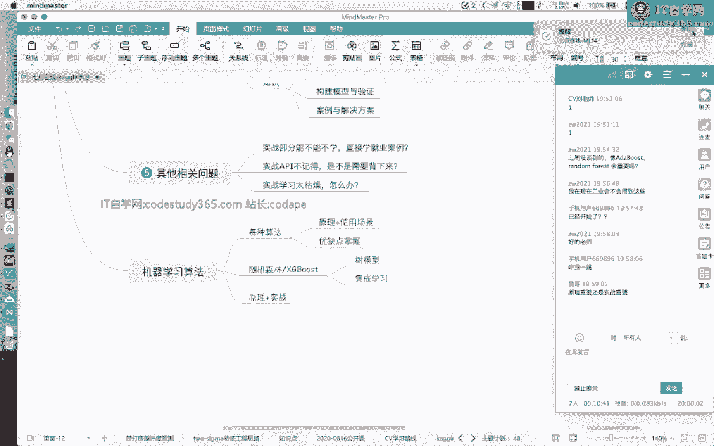

我们在今天这呃两个小时呢，我们带着大家看一看，在呃机器学习里面，如何学习这个机器学习的一个呃实战部分，然后我们在今天这节课呢，我们会嗯，就是说呃讲解这个机器学习的一个基本流程。

主要是以SKN的这个库来要进行讲解，然后在这两周呢，我呃我就是来，就是说带着大家来学习机器学习的实战，然后呢我们的实战内容呢不会讲的特别难，但是也不会特别简单，就是如果对于SKN有掌握，有基础的同学呢。

可能掌握起来会比较轻松一些，当然你也不用担心啊，我们嗯就是说也会给到一些练习题给到大家，所以就是说你如果觉得呃，就是说讲就是说讲的不讲的太浅了，你也可以直接做练习题，这都是可以的，然后呢我是刘老师。

然后在这两周呢我会带着大家一起来进行学习，然后大家如果对我们的课程呢有什么问题。

也可以直接在我们的直播，直播的过程中呢提出来啊，我也都会，我也会第一时间看到就进行解答，然后我们首先呢来看一看，我们这个实战阶段要学什么以及要做什么，勇哥同学勇勇哥。

这位同学说每个模型都会用SK单练习一遍吗，大部分都会进行一个练习的，然后我们来看看我们这个阶段要做什么啊，其实在我们的一个机器云里面呢，我们在之前的阶段是其实学习了这个基础，再加上机器学习的一个原理。

那么有很多同学刚才已经有同学说了，就是说呃原理重要还是实战重要，这个呢其实两者都很重要，那么一般情况下呢，我们在学习一个机器学习的时候呢，其实是原理和动手都是要掌握的，那么这个呢就是说。

其实并不是说你只掌握了原理就能找到好工作，也也并不是说你掌握了动手，你也就能找到好工作，这两者都是需要掌握的，那么嗯我个人感觉呢，就是说原理它可以告诉你这个算法是怎么来的，但是呢动手呢。

可能就是给你增加一些实战的经验，那么这个实战呢，其实它往往都是从一些具体的例子，来进行一个讲解的，那么还还往往都是从一个库来进行讲解的，那么这个呢其实是可以增加你对算法的一个，具体的一个理解。

比如说我们在机器学习的一个原理的过程中，会讲解这个x g boost，那么在讲解X级boos的时候呢，我们的老师会给大家讲解他每他有哪些超参数，他的一个模型的一个学习过程是怎么样的。

那么在具体实践的过程中，是不是就是这样呢，大家可以在之后的课程可以体验一下，第三个呢就是说我们的一个实战呢，其实它是往往更接更加接近于具体的案例，这个案例呢其实更加能够帮助大家理解，工业级别的案例。

以及能够呃为我们后续的一个项目的一个，实践过程中啊，增加一些经验的，那么我们既然实战是非常重要的，那么我们如何进行实战，如何学习呢，其实也有一些嗯，学习的路径和学习的一些建议吧。

第一个呢就是说我们既然现在都是呃，大部分情况下，99%的情况下，都是基于Python环境下的一个而学习，那么我们就肯定是要学习这个Python的一个基础，对吧。

那么我们在之前的阶段已经学到这个Python的一个，pandas以及NP以及magiplot lib，这些基础的库的使用，那么在我们的实战部分呢，可能要学习一下这些呃机器学习的库。

那么在n Python下面呢，机器学习的库其实是非常多的，那么我们其实首先第一第一个点呢，就是说我们要学会使用这些库呃，这个使用这些库呢，就是说我们需要学会啊，所以我还是不放大啊。

我们是需要学会用这个库来完成一个，具体的问题，那么我们为什么我们不自己实现这个库呢，就是说我们既然学了这个逻辑回归，学到这个数模型，我为什么不自己实现一遍呢，当然我也是推荐大家。

如果大家有精力的情况下啊，你可以自己实现一遍，当然但是呢其实呃，你自己实现的可能会有很多的一些呃，在这个精度和这个运行速度上，没有已有的库好，那么已有的库呢其实是嗯更加稳定和通用的。

而且呢你学到这个已有的库呢，对之后的一个就业都非常有有帮助的，那么比如我们今天所讲解的的这个SKN，这个库呢其实在很多互联网公司，或者说所有的互联网公司，都有这种库的一个应用场景。

那么我们既然这些库很重要，我们如何学习呢，这个呢就是说你学习这个库，你就要学习它的具体的用法，以及它的一个场景和细节，这个是要需要需要学习的，然后呢学习完这个库之后，你不仅需要学习他这个库的具体使用。

你还要学习用这个库解决一些具体的问题，因为你学习完这个库，其实本质还是呃要学要解决问题的对吧，问题肯定是呃我们最终要解决的，那么在我们的实战部分，我们可能还会讲解，就是说在机器学习的这个领域里面。

我们会遇到什么问题，以及如何动手解决这些问题，这个我们都是会给大家进行讲解的，然后呢嗯还有同学问，就是说我们的实战和面试有什么关系，我们面试不就是讲呃就是说考察这个额算法吗。

或者说考察我们的一个项目经验吗，他跟这个实战有什么关系呢，其实这个面试和实战还是有一定的关系的，首先呢第一点就是说，其实这个实战的，它是能够体现你个人能力的一部分，而且呢这个库的一个使用是必备的。

有很多时候呢他的一个面试的问题，都是直接问这个库的一个基础，比如说SKN里面哪些函数，是可以用来做数据划分的，s kn里面的一个数模型有哪些哪些，那么我们对实战的一个呃项目。

或者说对这个课程这一个阶段的理解呢，其实也是能够帮助大家理顺一下，这个机器学习的算法的应用流程以及案例，也是这个必备的技能啊，也是必备的技能好，然后呢这个是我们第三点，就是说实战和面试有什么关系。

然后第四点呢我们就看一看，其实我们这个实战部分我们要学什么，其实有一些库我们大家已经学习过的啊，我们就不会进行讲解，然后呢其实在我们的实战部分呢，其实主要学两部分的内容，第一个还是库。

这个库呢就是说我们Python环境下的这些库，你是需要掌握的，比如说pandas long psk，N x g，boos h b m以及chaos tensorflow pythority。

这其实是深度学习的库啊，这是深度学习的库，那么我们在我们这两周的过程中呢，可能会讲解一部分深度学习的代码，但是呢我们不会讲的很深，然后呢在这个库这个阶段呢，我们还会嗯给大家介绍一下。

基于spark的这个呃这个大数据开发的能力，然后呢这些是库的使用，或者说是技能的使用，然后还有一些是知识的，这个知识呢，就是说我们的一个呃呃，机器学习和数据挖掘的一个知识，比如说我们的特征如何编码。

我们的数据如何进行分析，我们的一个嗯数据如何进行构建，以及我们的数据如何进行划分，以及一些具体的一些案例和解决方案，好这是我们第四点啊，就是具体的学习内容，然后第五点呢就是说嗯其他的一些相关问题。

这是之前的一个呃，就是说我们这个阶段呢，有一些同学问到的问题啊，收集了一下额，第一个呢就是说实战部分能不能不学，直接学就业案例，就是说有同学就是说我觉得实战太简单了，我能不能学就业案例，额。

这个是可以的，如果你有基础的情况下，且你觉得讲的太简单的情况下，你可以直接跳过，这个是没有关系的，因为我们都有录播，第二个呢就是说实战的API，特别是我们上面所说的这些库的API。

我不记得是不是需要背下来，额这个不是的，你不需要背，你只需要在用到的时候能够找到就行了，第三个呢就是说实战的学习太枯燥怎么办，其实实在进入实战这个阶段，可能就大部分的情况下，都是一个写代码的过程啊。

那么写代码可能对于有同学来说，他可能是比较枯燥的，那么我建议大家还是要学会啊这个调试代码，如果你按照这个一部分一部分来调试代码，可能是呃啊啊，我觉得原理更枯燥啊，这个分人啊。

分人有的同学可能就比较喜欢这个公式推导啊，有的同学就比较喜欢公式推导对好，那么这是我们这一阶段要学到的问题啊，学学的内容啊，以及一些相关的一些点，我们在开始的一个嗯学习的过程之前呢。

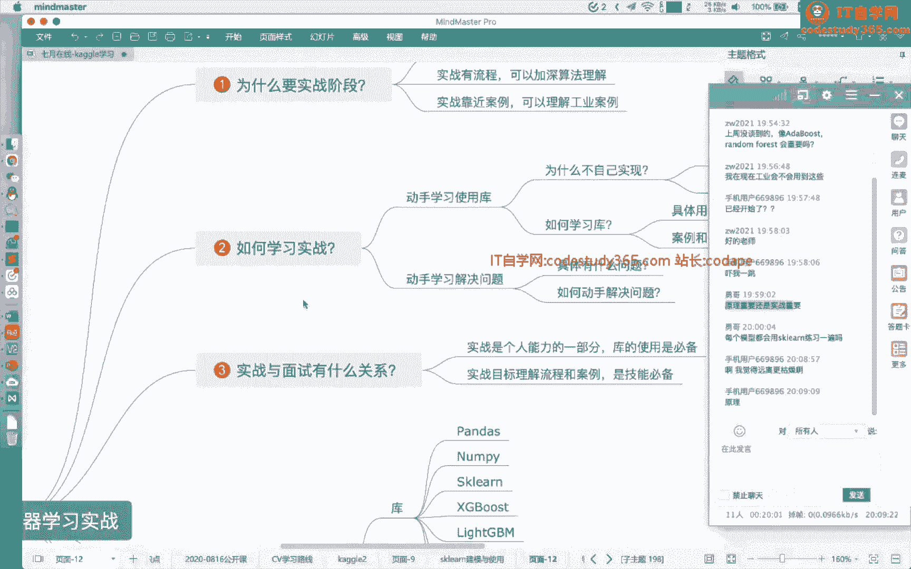

我们会给大家讲清楚啊，这个好，那么我们就开始我们今天的一个学习啊，那么我们今天的一个学习呢，就是主要讲解这个机器学习的一个基本的流程。

那么我们这节课呢，我们会花这个呃一个多小时给大家讲，s kn这个库，以及用一些案例给大家讲解s kn嗯，他的一些具体的API的使用，首先呢我们看第一部分，就是s kn的一个建模的要点。

首先呢我们来看SKN的一个介绍啊，那么我们这个地方先把这个这个移开一点啊，那么SKN呢其实它是呃Python环境下的，非常强大的机器学习的库，它基本上能够解决所有的你能够看到的呃，机器学习的问题啊。

因为s kn里面包含了很多的一些，机器学习的呃，他的一些算法的实现，那么在SKN里面呢，这个图是s kn它啊官方的一个导图啊，就是说当我们遇到一个机器学习的，一个问题的情况下。

我们如何判断我们用什么样的算法，那么其实这个呢其实是一个比较好的一个，就是说呃分支脉络啊，或者说是一种思考模式，首先呢当我们拿到一个问题之后呢，我们首先可以看一下我们的一个问题，所拥有的样本的个数。

这个样本的个数是不是足够多，比如说他是足够，他的样本的个数是大于50的，50个的情况下对吧，如果是小于50的情况下，那么就说明这个数据集其实是太小了，我们不足以完成机器学习模型的训练。

如果是大于50的情况下呢，我们接下来看一看我们的一个标签的一个情况，我们标签到底是需要是不是需要额，就是说呃做一个具体的一个分类，那么如果是分类的情况下呢，我们可以进一步的划分把刀。

就是说你如果是分类的情况下，那么如果是有标签，有标签的情况下，那么就是分类任务，如果是没有标签的情况下，那么就是一个聚类任务对吧，把我们的一个样本把它聚到一个个的类别里面。

如果是我们想要完成的一个目标呢，它是不是一个分类任务，那么我们接下来可以把它划分成，我们具体是一个回归任务，以及到底是一或者是不是一个降维任务对吧，那么对于我们的有监督任务，就是我们的一个分类和回归。

这是主要的，那么我们再看其中其中一个分支啊，比如说对于回归呃，对于我们的分类来说，卡了吗，可以刷新一下啊，刷新一下，然后呢我们就看我们的一个分类的一个分支啊，就是说如果我们在看单独的一个分类的分支。

情况下，我们就看看我们如何判断，我们的一个具体使用哪一个算法，那么对于此种情况下呢，我们可以根据我们的样本的个数，就是如果我们的样本的个数足够多的情况下，我们用什么样的算法，如果我们的样本个数不足。

不是特别多的情况下，我们用什么算法，然后呢根据我们具体的一个样本，它到底是不是文本，我们可以根据嗯它进行进一步的划分，那么我们的一个就是说如果是按照这个卖的话，你可以看一看。

就是说基本上我们最终就可以映射到，或者找到我们具体用什么样的一个算法，所以说嗯上述这个PPT里面显示的所有的算法，在SKN里面都是有实现的啊，就是说分类，聚类回归以及降维在SK那里面都是有实现的。

那么sk learn呢，它全称sin keh learn啊，是这个Python环境下功能最强大的机器学习的库，它涵盖了机器学习的各方各面的，一个细节和实现，那么这个呢就是说它基本上是包括。

所有你能想到的机器学习的一些细节啊，而且呢它涵盖了大部分的机器学习的算法，以及提供了标准的实现流程，那么SCHN呢，它底层是以是用这个long派来实现的哦。

那么大家也知道long time底层是用这个嗯C加加，那C和C加加那一些，所以说它在效率上其实是有保证的，而且呢s kn它是提供了标准的API，文档以及学习路线啊，我们待会可以看一看s kn的一个文档。

其实写的非常清楚，那么如果我来推荐大家来学习，Python环境下的机器学习呢，我会推荐大家学习这几个库啊，就是pandas，Npis clearngbm，或者说叉t boos以及TENSORFLOW。

PYTORCH这些深度学习的库，那么这些库呢基本上是涵盖了Python环境下的一个，机器学习，深度学习的一些嗯，就是说技能啊，所以说大家也可以啊，就是说参考这些库来进行一个学习。

那么我们刚才所就是讲的SKN，它其实是非常强的，那么它如何强大呢，我们这个地方举举两个例子啊，首先呢SKN它提供了非常丰富的一个，机器学习的模块，我们举个例子就是数模型，那么我们从我们看这个代码啊。

from eclient import tree这个模块，然后呢我们假如说想要定义一个分类数，decision trick的class file，然后呢，我们的一个节点的分裂的一个准则。

是这个ENTROP，然后呢我们想要让我们的模型，就是说这个地方第一行是实例化，我们的一个输入模型，然后一行代码完成训练，fit这个地方T就是我们实例化的一个数模型，然后费城呢。

就是说给定我们的一个训练的一个数据，以及它对应的标签，构建一个我们的数模型，然后在我们的测试集上进行一个预打分，这个地方的一个点score呢，我们传入测试集的数据以及测试集的标签。

我们直接得出我们在测试集上啊，这个地方的score呢它默认是计算的准确率，就是我们的ACCURRENCY，然后呢假如说我们想要在我们的测试集，或者说在新的样本上面做一个预测，我们就是点predict。

点predict就行，当然我们假如说想要在我们的一个利用，我们的一个数模型，在我们的所有的样本，所有的数据集上完成一个交叉验证，那么我们直接调用这个cross validation score。

这个函数就可以完成这个交叉验证的一个步骤，那么大家可以看一下，就是说我们在SPN里面一个模型分为FEIT，就是训练，Score，就是打分，predict就是预测，那么在SQL里面呢。

其实它所有的一个机器学习的模型，都是包含这几个函数的啊，那么这个呢我们这个大家注意的一点啊，需要注意的一点就是说s kn里面的一个class，一个类，其实它是以大写的，它是大写的啊，adapt哦。

adapt classif它是大写的啊，大家看一下首字母大写的，那么这种首字母大写的情况下，它就它大家也知道这是这是一种命名规范对吧，那么在Python的，特别是在s kn这个库呢，它是用这样就是取名。

就告诉我们这是一个class，是个类类型，然后呢在SCN里面还有这种函数的，比如说我们这个地方第二行from s cln，对data AI import make classification。

那么这个make classification呢它是一个小写的，首字母小写的，那么它就是一个函数，所以说呢在SCN里面，你基本上是可以根据这个呃，就是说这个呃变量的一个命名命名啊。

就可以判断它到底是一个函数或是类，那么在SQL里面的每个函数和模型呢，他都写的非常清楚啊，比如说我们这个地方的一个呃，我们的一个adapt adapts classifier。

他的一个文字介绍它的调用方法，以及它的参考文献都写的非常清楚啊，我们可以切到他的一个参考额，就是它的一个文档啊，那么我们这个地方打开的呢，就是s kn的一个呃官网，Scikit learn，点ORG。

然后呢，假如说我们想要找里面的一个具体的算法，比如说我们想找里面的PCA，那么我们可以看一下他的PC，我们点开的是这个PC这个库啊，这个呃这个class，那么我们可以往下翻，在这个在这个下面。

由于它的一个具体的使用方法，我们想要它的保留的主成分是多少，以及我们具体的一个使用的函数，以及它的一个参考文献都是写的非常清楚的，所以说我们假如说想要使用这个库呢，其实是非常方便的对吧。

我们直接用s kn对吧，from s cn点这个降维的模块，Import pca，然后我们这个地方呢在进行实例化，PC的时候也是一样，首先把它实进行实例化，然后呢进行fit对吧。

大家也知道对于PCA来说呢，其实它本质也是一个呃，就是说它本质也是一个我们的一个呃，无监督学习模型对吧，它用来作为降维的，那么对于降维的模型呢，其实在SKN里面呢，它也是用费城来进行一个额。

就是说来进行个礼盒的，这个费城呢不仅仅是用就是说训练的意思，它也是一个礼盒的意思，有些没学的原理呃，原理不明白啊，呃其实是这样的啊，其实这样的大家可以先看一下，我们这个这个这个思维导图，大家发现就是说。

其实这里面的每一个机器学习算法，你其实可以把它划分，每个机器学习算法，我们就可以把它划分成分类回归降维聚类对吧，那么你把它划分成具体的用途的情况下，你先可以结合，就是先把它用起来。

然后再去看书也是可以的，就是说你可以先学习原理再去用，也可以先用再去看书，也都是可以的，这两者都是可以结合的，也并不是说额就是说要把它学懂了再去用这个，也就是说都是可以的，都是可以的。

我是比较建议是相辅相成的一种形式啊，相辅相成的一种形，然后这位同学说他推荐李航老师的书啊，都可以啊，你不管是看李航的统计学，统计学习方法，或者说是周志华老师的嗯，就是说机器学习都是可以的，都是可以的。

那么SKN呢，它为什么是Python环境下最通用的机器学习库呢，因为它包含了非常非常多的一些，不仅是包含了机器学习的一个原理啊，它包含了数据的预处理模型的选择，降维方法。

以及包含了我们常见的一些应用场景，的一些模型分类，回归聚类都是包含在里面的，所以说你假如说想要找，想要用这些具体的机器学习模型用起来，那么SK呢肯定是你最最就是第一选择啊。

比如说我们想要假如说用我们的一个，我们的一个随机森林对吧，Render，对吧，大家可以看一下random first classify，Random first regression，对吧。

一个是分类期，一个是回归期，对吧，假如说我们想要逻辑回归，对吧，Logistic regression，那就是green对吧，假如说我们想用其他的一些我们的领回归对吧，或者说其他的一些我们的一个呃。

分类器都是可以来嗯，就是说很快就能找到的，这个地方，我们直接是用这个浏浏览器的一个CTRL加F啊，然后搜关键字就可以搜到的，然后呢这个地方其实大家也可以看到啊，大部分的一个s kn其实他写的非常清楚。

我们还是用这个，Windofirst，大家可以看一下这个地方，叉叉CLASSIF，叉叉regression对吧，其实就写的很清楚，什么什么的分类器，什么什么的回归系呃，这个在哪看啊。

这个直接打开SKN的官网，我待会会把这个我看一下，这个发到群里啊，SKN的官网，你点开之后，然后点这个API，点这个API对吧，就可以找到这个具体的一个链接了，然后你就可以在这个链接里面搜。

你具体的想要的算法，想要的算法对，是不是很方便，比方假如说我们想用这个tree decision，tree decision哦，直接搜trap对吧，这个地方左边是这个模块啊，左边是这个目录的模块。

然后右边呢是他的DC线程train，勇哥说看SKN的中文手册更好，嗯这个地方呢我不是不是反感看中文手册啊，我绝对不是反感看中文手册，但是呢毕竟啊毕竟就是说英文它更新的更快啊。

呃中文手册大部分是国人自主翻译的啊，就是说难免在一些细节上有差有误差啊，你如果觉得看英文就是说有点困难的情况下，你可以去看中文的手册，但是我个人比较建议你去看嗯，哈英文官方的API嗯。

而且但是就是他的一些API，基本上没有用到很复杂的单词啊，而且SKN里面假如说你不懂他的一些具体的用，就是说他的一个就是一些常用的术语啊，你可以在这个这个s kn，它很方便的给了一个术语表。

比如说我们来看一看啊，他给了个数字表，比如说这个叫什么叫binary classification，Mute classification，Mutual classification，对吧。

以及什么是feat，这个在SKN他都给清楚了，这个术语表啊，都是基本上都是一些常见的单词，而且看了之后他的文档写得真是非常好啊，所以说嗯我是推荐大家如果有能力啊，以及想学好的同学。

那真的是想就是说非常建议学习一下好，那么这是我们的第一部分，就是SKN的一个介绍啊，初步介绍，然后呢我们再看一看s kn的一个建模技能啊。

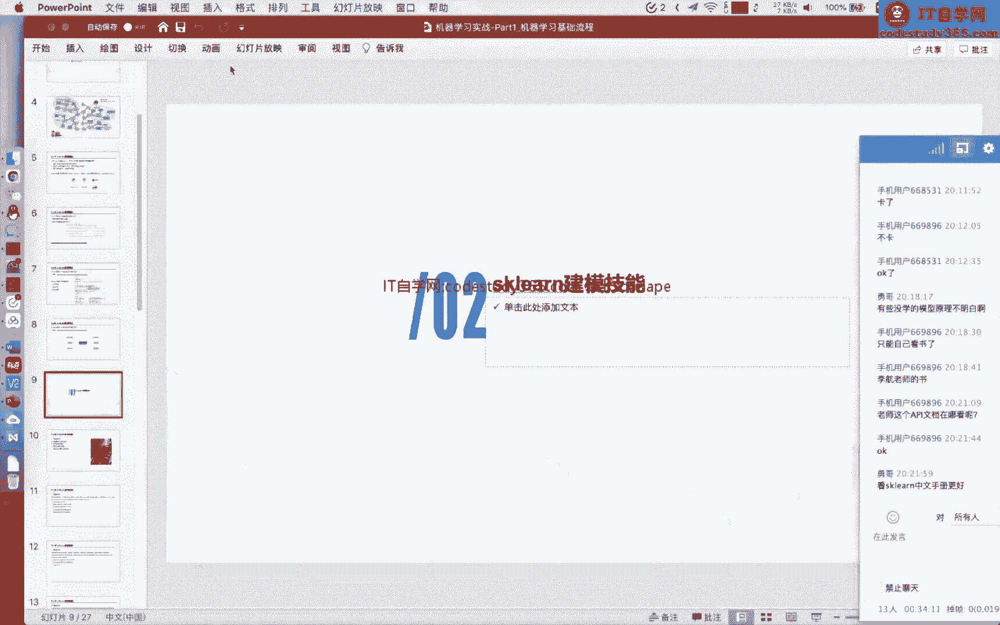

就是它包含了什么样的功能，那么其实呢SK呢它包含了，基本上包含了额机器学习，他在运用到具体问题，就是解决具体问题的时候的各个步骤啊，它都包含了，比如说数据的预处理特征，编码特征，工程模型的训练与验证。

产能机器学习模型，模型的评价函数以及误差分析，这些呢这些模块在SC里面都包含了，所以说你假如说学习S可能基本上是一步到位，就是不需要关注，你可以不关注它的原理，你可以直接用SKN来完成所有的一个操作。

这个都没关系，这个都没关系，所以说大家就说如果有面试经验的话，你就会发现我在面面试的时候，面试官问我一大堆的问题，再具体就是说进入了这个岗位之后，其实发现就是用的这些库，这个是很正常的。

所以说现在一些机器学习算法工程师，都是本质都是在调库，其实本质也没有对这个算法有什么改进，这个这个本质就是这样的，但是为什么我们还是要学习这个原理呢，其实这个原理它能够帮助我们更好的用。

更更好的解决问题，以及更好的用这些库，对有同学问这个模型的对应的输出模型，对应的输入数据维度和输出数据维度，在哪可以看呢，我们待会会讲个例子啊，讲个例子你可以体体体会一下啊，待会我给你讲个例子。

可以体会一下，我们首先呢来看一看在SKN里面，它包含了数据的一个预处理啊，首先呢是这个标准化，大家也知道对于我们的一个呃，就是说一个数据而言呢，其实它很多情况都不是说，直接能送到我们的模型里面的。

我们在之前的原理的过程，讲解机器学习原理的过程中呢，我们老师可能会给大家讲到，我们的数据呢可能要做一个标准化对吧，嗯我们可能是需要用这个嗯减去它的方差啊，减去它的一个平均值，然后除以它的方差。

让他把把它变变成一个标准的一个形态，或者把它转成一个正态分布，那么在SKN里面呢，它还提供了其他的一些scanner，这个scanner呢你可以理解他就是一个标准化，不同的标准。

比如说你可以用这个MIUGINNER，那么这个mini next gner是什么原因呢，我们来看一看他的文档啊，其实都是非常简单的，我们来看搜一搜他的文档啊，我们搜这个min max好找到他的。

那么这个MMAX根呢，它它的编码方法，它的一个预处理方法是怎么样的呢，当我们输入X的时候，这个X呢它是一个，我们你可以理解它就是111列啊，一列活动，或者说你可以试他就是呃一个单独的一个特征。

那么这个单独的特征呢，我们先先看下它的分母，分母就是一个这单这一列的一个最大值，减去最小值，然后分子呢是这个单独一列减去它的最小值，那么这个呢相当于是我们把这一列用他的LINUX，当做它的命。

它的一个级差对吧，最大值减去最小值称为极差，当他的一个分母，然后呢把它做一个具体的一个转换，当成它的分子，这个呢就是说我们直接用一个MMAX，把它做一个转换对吧，然后呢我们把它转换之后呢。

还可以把它转换，当然也可以把它转成这个min max的啊，当然也可以把它转转换回去对吧，然后呢这个min max呢，它就是说额其实是使用到的，这一列的最大值和最小值来进行计算的，当然有一些其他的。

比如说我们用这个max abs，就是说next abs跟哪的，就是说我们这个特征呢，除以它的一个绝对最大值，绝对最大值对吧，那么就是说不同的一些我们的一个呃，就是说预处理方法呢都是可以的。

那么在excel里面呢，它其实一些一些函数啊，一些操作都是放在一起的，比如说我们刚才所讲的这些scanner呢，都是放在这个叫as s cl点propose嗯，prepose passion啊。

这个预处理这个模块里面啊，所以说我们其实可以很方便的可以找到啊，那么在SKN里面呢，它还提供了这个我们前面所讲到的呢，这个是基本上是这种常规的skin，当然还有一些其他的啊这个非线性的一些转换。

比如说把它做一个分位点的转换，或者说把它做一个嗯，就是说嗯指数变化都是可以的，那么我们在SKN里面呢，还可以把它就是说我们这一列呢，把利用这个预处理模块把它做一个额，就是说取他的一个L1或者L2。

你把它转成一个呃，就是unit norm，这个都是可以的，然后呢在SCN里面呢，它可以利用我们的这个IMPULT这个模块呢，完成这个缺失值填充对吧，我们的一些机器学习的算法呢，它是有很多的一些模型。

它是不支持额包含缺失值的一个数据的对吧，我们如果想用这些模型呢，我们可能要首先完成一个缺失值的填充，那么在SCN里面呢，是支持一些缺失值的填充的方法的，那么在之后的一些嗯实践过程中呢，我们也会给大家讲。

它包含了哪些缺失值填充方法，那么在S坑里面呢，它还包含了一些特征的一个预处理方法，比如说我们的一个特征的常见的编码，Neighbor encoder。

完后请encode以及我们的ordinary encoder，都是额这个常见的一些特征的编码的操作，都是在SK里面所包含的，那么我们给大家讲一个，就是说先举个例子啊，就是说我们特征编码到底在做什么。

那么我们假如说大家去应聘的情况下呢，其实呃很多的很多时候呢面试官都会问啊，这个我们给一个数据的情况下，你如何对这个数据集进行编码，或者说我给一个数据的数据集的情况下，你如何对这个数据集做一个特征工程。

这种呢其实是常见的一个呃面试的一个问题啊，这个是常见的面试问题，或者说对于一个字符串的一个字段，我们如何对它进行编码，那么这个这一类问题呢，其实就是一个特征工程的一部分，那么我们首先呢在这个地方呢。

大家首先要理解一个概念啊，或者说弄清楚一个呃两个名词，就是说数据挖掘和机器学习到底是什么，它们之间的区别是什么，那么我们如果大家现在学习机器学习，或者现在学习数据科学呢。

一般情况下都是直接学习机器学习是吧，直接学习机器学习算法，但是呢对于老师我啊，我是这个old school的这个程序员呢，我是在这个10年左右，就开始看一下这个机器学习的一个原理的书，然后呢在当时呢。

其实机器学习的一个它的一个名字啊，最开始它还有一些分支叫这个模式识别，不知道大家知不知道，那么其实在早期的时候呢，机器学习它是作为这个数据挖掘的一个子流程，他是他是作为数据挖掘X流程。

数据挖掘它是更加关注于全流程的数据采，从数据的采集，数据的一个编码，再到模型的构建，再到最终的一个模型的部署，所以说数据挖掘和机器学习，它的一个主要的区别就在于数据挖掘，它其实是更加关注于数据全流程的。

那么数机器学习呢更加关注于这个模型的构建，与它的优化好，那么我们讲了一大串这个数额，数据挖掘和机器学习的一个区别，我想表达的意思就是说，如果一个你想成为一个合格的算法工程师。

你就不仅仅是要弄懂这个机器学习的一个原理，和它的应用，你还要掌握我们如何把数据把它转换成模型，它需要的形式，比如说我们看一看啊，我们这个原始数据它是一种JSON格式的啊。

是类似于这个Python环境下的，Python语言里面的这个DK是格式，那么这个DK的格式呢，它其实是一种非规整的形式啊，假如说我们最外层的零是表示的是这个呃，一个样本的一个样本的id，然后呢。

原始的数据集里面还包含了一层这个house info，然后这house info里面有一些字段，Number rooms，Number bedrooms，以以及这个STRATEWAY。

相当于是这个街道的编码，以及这个lo basement rooms是个一好，那么接下来就是说，假如你遇到了这四呃四个特征，你怎么对我们这四个特征做一个编码呢，对吧。

其实这个呢并不是说是一个嗯机器学习的语，嗯模型的问题，但是呢其实是我们日常生活中，或者说在实战的过程中，经常会遇到这个问题，就是说我们拿到一个字段的情况下，我们如何对这个字段进行一个编码。

比如说我们对于数值字段，其实我们的现在的机器学习的模型，大部分都是直接可以识别，或者直接可以输入这个数字段对吧，那么我们对于数值字段我们可以不做任何处理，但是呢对于这个字符串字段，其实我们现在继续模型。

他是不能直接输入字符串的对吧，它本质还是完成这些计算，那么我们对于这个字符串我们怎么进行操作呢，我们可以做把它做一个编码，比如说我们用这个独热编码，独热编码呢就是one hot encoder。

one hot encoder呢，他的意思就是说，我们把它转成一个稀疏的一个向量，那么这个向量里面呢一就代表它对应的位置啊，就是说对应的取值零呢，就表明它就是说没有取值。

那么对于呃这个呃这个是shore bird一个呃位，然后呢对于这个嗯字符串进面板呢，它的一个操作就是说，我们首先统计一下这个stress name，就是所有样本的string name。

它总共的一个空间是多少，就是总共包含多少个独立的字符串，那么我们把它做一个one hot，就是说我们把它转成一个1×5的一个向量，在某一个位置它取值为一，其他的位置取值为零，就one o k。

One o k is hot，比如说one o k是编码的，然后其他的位置都是没有编码的好这是one hot，编码数值一般要标准化，标准化规律化吗，哦这个呢其实是这样的，对于不同的机器学习模型。

它的就是说是不一样的对吧，比如说对于线性模型，我们一般是要做这个预处理的，那么对于数模型其实我们可以不做是吧，那么对于不同的机器学习模型，我们是可以就是说区分对待的，那么在SKN里面呢。

它不仅仅是包含了这些，这些数据的一个预处理啊，它最最核心的就是说，它包含了很多的机器学习的模型，而且这些机器机器学习的模型呢，你可以在不不理解它原理，或者说不去弄懂，不去深究它原理的情况下。

就可以很方便地进行使用，在SK里面呢，其实他所有的机器学习的模型，模型都是有四个函数可以进行调用的啊，fit模型的训练，或者说模型的拟合，predict模型的预测。

predict pro这个probe呢就是probability模型，预测概率值啊，这个predict是直接是预测成标签，这个predict probability呢，是预测这个标签的一个概率值。

然后这个score呢默认是打分，做一个准确率打分对你可以就是记住啊，这个四个函数是可以记住的，就是所谓的GSKN里面的嗯，机器学习的模型都是支持，大部分都是支持这些四个函数的，而且呢SKN里面它支持了。

嗯老师，那有同学问老师，那一个优秀的算法工程师，的核心竞争力在哪些点上，这个其实蛮多的，就是说在知乎上也有蛮多讨论的啊，一个优秀优秀的算法工程师，他的核心竞竞争力，我个人认为在于能不能快速解决一个问题。

核心竞争力就是你能，就是说能不能快速解决一个问题，如果都是掉包的情况下，那就是谁看谁掉的快呢对吧，谁掉的快呢，就是说我现在你有这些库，我有这些库对吧，看谁用的更好，这个就是核心竞争力。

只能叫算法应用工程师，那你本质上就是这样的，你去不管你是本科还是硕士呃，或者是博士，你去嗯，互联网公司90%的岗位都是算法工，他所谓的算法工程师都是解决具体的问题，他没有开发算法。

他都是用算法去解决具体的问题，还是业务问题，额第一个是对于这个具体库的一个使用，就是说你能不能把它用的很熟练，第二个是对业务能力的一个掌握，熟练掌握程度啊，额一般情况下业务能力我觉得嗯不是制约。

就是说现在很多场景下嗯，就是说不管是互联网啊还是金融啊，很多场景下其实业务并不是很复杂，往往是这个具体的一个额建模的能力，可能是一个就是说能够考察大家的点吧，对就是说嗯是不是数据处理能力很重要。

嗯数据处理能力当然很重要，这个肯定很重要，就是说我举个例子啊，我举个例子，你如何用pandas，你如何用pandas完成一一千万行数据的一个呃，读取并完成它的一个特征工程，就是说你假如说你现在的一个。

你现在就是你的笔记本，你能不能完成这个操作，对，或者说你能不能用pandas完成，你想要提取的特征，比如说我们前面举个例子啊，这个举个很简单的例子，比如说现在你想要你用这个已有的库啊。

数据的预处数据预处理，这个数据处理的这个pas的库，你假如说你想要统计number rooms，Along number bad rooms，它整体两列的一个相关性。

或者整体它两列构造出一些新的特征对吧，其实这个呢就是很基础的，你要把这个数据处理的一些库给他掌握好，当然我这个地方是只举了一个很简单的例子啊，这个数据处理里面还包括这个数据的一个清洗，数据分析对吧。

以及数据的预处理都是很多的，然后呢我们就回到我们PPT啊，大家如果还想就是说提问的情况下呢，也可以继续提问啊，对然后呢在SKN里面呢，它其实是支持的，它支持的一些机器学习模型呢都是比较基础的。

都是比较基础的，但是是一般情况下，都是在涵盖了我们现在所有的机器学习的教材，里面的啊，比如这个线性模型，数模型以及神经网络以及无监督学习模型，在SKN里面都是有具体的一个实现，但是需要注意的是。

就是说SSKN呢，它是不包含这些高阶的一些数模型的，实现比如说呃这个呃charge boost，Nice，Gbm，Catch boost，这些呢都是在s kt里面，它是没有具体的实现的。

那么SKN的一个神经网络呢，在SKN里面它也有全连接网络的实现，在SKN里的全连接网络呢，它是实现了这种CPU环境下的全新用全连接网络，它是没有实现GPU环境下的一个全球网络，对好。

然后就是说这个SK呢，它是基本上涵盖了基础的一些，机器学习的模型嗯，呃有同学问，用大量的数据和小量的数据，在使用pandas的方法上一样，在性能和机器要求上有哪些注意的点呢，这个就细节蛮多的。

就是说我们在使用pandas的时候呢，首先有哪些点你需要注意的，第一个是数据的类型，就是你读取数据集的时候，数据的类型你需要注意，其次是数据的一个处理，就你具体的处理函数。

就是说是不是嗯就是说能不能进行矢量化加速，这个呢都是非常非常关键的，有些pandas的函数它是是串行执行的，但是有一些函数它是其实是可以把它转成number派，这种矢量化执行的，对都是有很多细节啊。

这个细节都蛮多的，比如说在pandas里面的apply对吧，其实他都是哦，就是说在速度上可以做蛮多的一个加速，能不能讲讲这方面的一个实力啊，可以呀，呃我们我们下节课吧，下节课我找找找几个例子吧。

因为这节课我没准备对下节课啊，下节课，那么在SKN里面呢，它还支持了这种数据的一个，我们的一个评价函数啊，就是评价指标以及误差分析，它不仅仅包含了这种回归的分类的啊。

无监督学习的以及一些排序等等问题的一些，就是说评价函数在SKN里面都有包含的，一些实现，所以说你假如说想要计算这个UC呀，要计算这个logo loss啊，其实直接用SKN就行了。

好那么前面呢我们就用这个在第二部分呢，我们就讲解了这个s kn它具体的一些呃，就是说他的一些包含的一些模块对吧，那么我们接下来就看一看，s kn如何用它的一个额，就完成一个具体的一个建模。

首先呢我们来讲一讲在这个地方，可能在之前的课程可能已经有讲过啊，就是说哎我们的数据划分方法，那么在我们讲具体的一个嗯实践的过程中呢，其实数据划分方法呢是非常重要的，数据划分其实它非常非常重要。

就是说首先呢我们在遇到一个问题的时候，我们首先要确定这个问题的到底是什么对吧，我们这个问题到底，我们前面这个PPT所讲到的问题到底是回归啊，分类啊，还是聚类还是降维，确定的问题是什么。

之后接下来我们要确定什么，我们就要确定我们数据的一个具体使用的算法，对吧，我们到底是用线性模型还是数模型，还是等等其他的模型，然后第三步呢，我们就要确定我们的数据划分方法。

这个呢就是要确定我们具体要使用的训练集，以及我们的验证集，以及我们的测试集到底是由什么组成的，这个其实非常重要的，那么在很多情况下，其实我们的一个数据对于我们的数据集而言啊。

我们的训练集以及测试集都是给给定的对吧，很多情况下我们的训练集和测试集是给定的，我们很多情况下呢，我们的一个呃就是说验证集它有可能没有给定，验证集没有给定，那么我们验证集我们如何进行划分呢。

这个可能大家如果知道的啊，你可以就是说我们稍微讲快一点，如果不知道呢，大家这一点其实非常重要的，有三种数据划分方法，就是三种验证级划分方法，第一个是流出法，就说我们直接按照比例原始的训练集。

我们把它按照比例划分成训练的部分，以及我们的一个验证部分，第二种，第二种方法方法呢我们叫这个cross validation，交叉验证，cross validation呢。

我们就是说把我们的数据集划分成N份啊，这个地方挡住了啊，应该是啊K分啊，K分或者N份，然后呢对于K分的，或者说把它划分成K分的情况下呢，我们对于每份这个嗯这一份啊，这个一般情况下。

KK呢它是小于我们的样本的数量的，所以说我们每一份其实它包含了嗯，可能包含几十个几百个我们的样本，那么在每次训练过程中呢，我们会随机啊，就是说循环选择一份做我们的验证集，比如说在第二次我们训练的时候呢。

我们用第二份做我们验证集，第在第三次训练的时候，我们用第三份做我们的验证机，这是K折交叉验证，那么K折交叉验证，其实它和流出法其实是很类似，在每次训练的过程中呢，其实它就是单单次的训练过程中。

其实就是一种流出法，只不过呢K折交叉验证它的一个数据集，它每份在不同的部分充当了验证集对吧，还有一种方法就是我们的采样法对吧，自主采样不是STP，那么他是从我们的原始的数据集里面，做一个有放回的采样。

得到我们的训练部分，以及我们的一个验证部分好，那么我们的数据这是数据数据集的划分方法，就是说怎么划分得到数据训练集以及验证集啊，那么主我们在具体的实践过程中呢，主要是用我们的流出法和K值交叉验证。

两种比较多啊，K折叠乘验证它的优点，就是说是能够训练得到K个模型，而且这K个模型在一定程度上是，拥有一定的多样性嗯因为他的一个数据集，参与训练的数据集是不一样的，那么K值这交叉验证它的缺点。

就是说它的复杂度是稍微高一点的，需要训练K个模型，那么如果数据量比较大的情况下，如果我们拥有的数据量比较大的情况下，我们可以直接用这个流除法，如果你想要追求精度的情况下，你可以用K折交叉验证啊。

如果我们的数据集比较小的情况下，你可以用这个嗯，不是strap采样的方法好，那么我们刚才所讲的呢是我们化数据化的方法，第三个呢就是说额这个还有一个呢，就是说我们的数据的一个具体的应用流程啊。

这个呢就是说我们在具体的使用到一个，用使用一个模型来进行建模的过程中，我们怎么知道，或者说怎么根据我们模型的一个阶段去进行，就是说下一步的操作呢，这个其实也有一定的一个实践流程的。

这个思维导图呢是温达在neo lips上面的，一个就是问答，它原始的一个PPT上面的啊，我截取的，那么我们在应用机器学习的算法的时候时候呢，首先呢其实是有一定的具体的流程的。

我们首先呢看一看我们的一个训模型的，训练集的一个误差是不是比较高，如果我们的模型在训练集的误差，就比较高的情况下，那么说明此种情况下，我们的一个模型的一个误差，是由我们的一个偏差所占据。

那么我们可以要做的呢，可能就是说用更大的模型训练更长的时间，以及用其他更好的一个模型的网络结构，去获得比较好的一个训练的精度，如果我们的训练集的一个误差，就是说他已经比较低了。

但是呢我们的验证集这个train d EV呢，就是说我们是从训练集里面划分得到了验证集，它的一个误差比较高，那么此种情况下，那就是说明你训练集误差低了，但是呢在验证机的误差比较高。

那么说明你的一个模型是过拟合了对吧，那么你说明你此时的一个模型的一个误差呢，是由这个方差所占据，那么你可以考虑加入一些正则化方法，或者说用更多的一个数据参与我们的一个训练。

如果我们的模型训练集的误差比较低，验证机的误差也很低，然后在我们的DVL，这个DEVL是我们的公开测试机啊，就是说你可见可见的测试机，可见的测试机它的误差很高，那么就说明这种情况下。

就说明你的一个验验证集和测试集啊，这个验证机这个DEVL啊，这个DEV是可见的一个测试集啊，这两部分的一个数据集它是分布不一致的，说明你的train test data是mismatch。

就是它是不匹配的，那么在此种情况下，我们在划分验证集的时候呢，你尽可能把我们验证集的一个数据分布呢，让他去和我们的最终的测试集更加匹配，那么如果我们的模型训练集的误差很低，验证机的误差也很低。

以及我们的公开测试集的误差很低，但是呢最终假如说我们模型上线以后，你的具体的上限，上线的一个最终的实践的过程中，你的一个误差很高，那么这也是有可能的，就说明你的一个公开的一个测试集，其实你也过拟合了。

那么有很多同学就是说不理解这一点，就是说我们为什么还能过礼盒验证机，为什么还能过拟合测试集，其实我们的机器学习模型，其实你只要有这种打分反馈的一个情况啊，你就有这种调参的这种就是说要机会。

那么只要有调仓的机会，那么你就有过拟合这个数据集的一个可能性，所以说我们为什么会用这个，未未知的一个样本来预测，或者说用为为什么用这个未知的样本来验证，我们模型的精度呢，就是有这种一种考量啊。

所以说大家在具体应用到一个，具体问题的时候呢，我们就是可以用这个思维导图来进行一个啊，具体的一步一步来进行一个实践，那么我们在具体的一个，具体的一个应用的过程中呢，其实我们怎么能完成建模呢。

首先呢把我们的数据集划分成训练的部分，以及测试的部分，然后确定好我们的模型，然后呢，我们首先呢需要对我们的数据集，进行一个预处理，而且需要对我们特征进行一个转换，然后对我们的一个模型进行训练。

以及模型进行选择，然后我们模型训练完成之后呢，然后对对我们的模型的一个预测结果，进行一个后处理，然后最终最终得到我们的结果，然后呢，这个地方我们的一个机器学习的一个框架呢，它我们这个地方的思维导图。

它是涵盖了数据的预处理以及特征的一个编码，而且呢它还包括了这个模型的选择，以及模型的调参，那么其实呢这整个的这个步骤啊，其实这是我们机器学习，它具体应用到具体问题的时候，我们要做的。

那么其实这整个步骤呢，我们可以用一个工具叫autumn mon，就是自动机器学习的这个呃工具来完成，那么AUTOML呢其实大家如果有知道的话，其实AUTOMA这种自动机器学习呢。

其实在一定领域它是能够代替算法工程师的，在一定领域能够代替三种工程师，但是呢在很多情况下都是呃，还是不能完全代替啊，它只能在一领域能够代替，因为这个AUTOMI的一个嗯学习呢，其实它也是一种算法。

它也是在特定的领域领域才是有作用的，好那么这是我们第三部分，就是SKN的一个建模流程，我们其实也是以这个机器学习算法的一个，建模流程来给大家讲的，就是说我们模型的数据划分怎么样的，我们的一个误差。

在判定我们的误差的情况下，我们如何完成下一步，以及我们的机器学习的算法的流程是怎么样的。

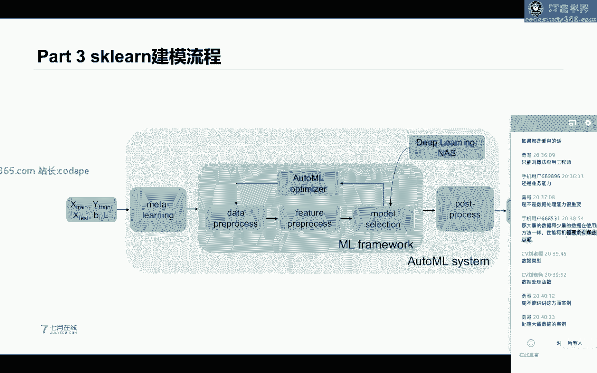

好，那么我们接下来呢，就用一些具体的代码来进行实践吧，对吧好，勇哥同学说现在奥特曼家用的多吗，是不是还得学奥特梅尔额，其实是这样的呃，AUTUMON在特定的特定的领域用到的比较多。

就是特定的领域是比较多的，NAS是什么，n a as是这个NAS是一个呃网神经网，深度学习的网络结构的搜索方法，NAS啊，是深度学习里面的一个网络模型，结构的搜索方法，DEV啊。

这个地方的DEV是对应于可见的测试集，对可见的测试集，然后这个test呢是这个未见的未知的啊，或者说未来的一个测试集，或者说是线上的测试集，那么大家如果额自己学习SKN呢。

一方面是可以从我们的一个官网来进行学习，这个官网其实他给定了很多例子啊，打开这个SPN的官网之后呢，其实是在上面有一个叫example，这个页面呢，其实它下面就包含了很多的例子啊，比如说我们来看一看啊。

在S看的里面，对吧，我们用SKLN能不能完成这个聚类呢，当然可以呀对吧，这个地方他是用SKN完成嗯，他是用SQL里面的key means呃，以及呃我们的beat kings。

以及呃PC之后的KMEANS来完成一个聚类，然后他也会把这个聚类的结果，给他做一个可视化，对所以说SKN呢你能够想到的一些操作啊，他都是能够就是说完成的啊，在这个呃example这个页面呢。

是包含了很多的一些具体的案例的，你也可以如果感兴趣的同学，也可以就是说分步骤来进行学习，好那么一嗯，第一种方法呢就是说根据SKN的官网，以及他的一个具体的一个例子案例来进行学习。

第二个呢就是说你可以从这个嗯。

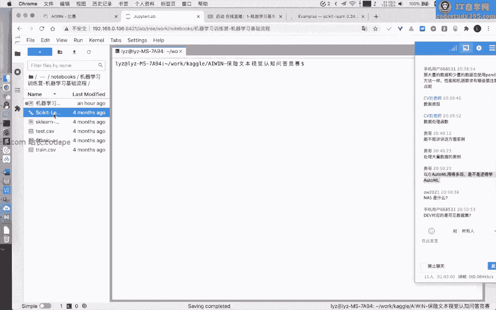

嗯我们这个地方呢我会给大家以一本书，叫s clan的一个嗯s kn的一个kid book啊，这个书呢也是蛮也是英文的。

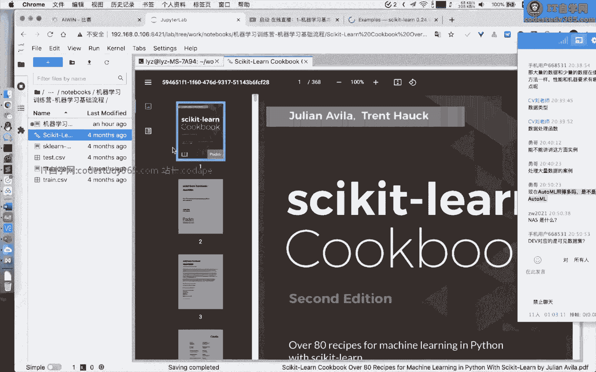

但是并不是很复杂，这个书呢就是讲解了SK的一些具体的一些模。

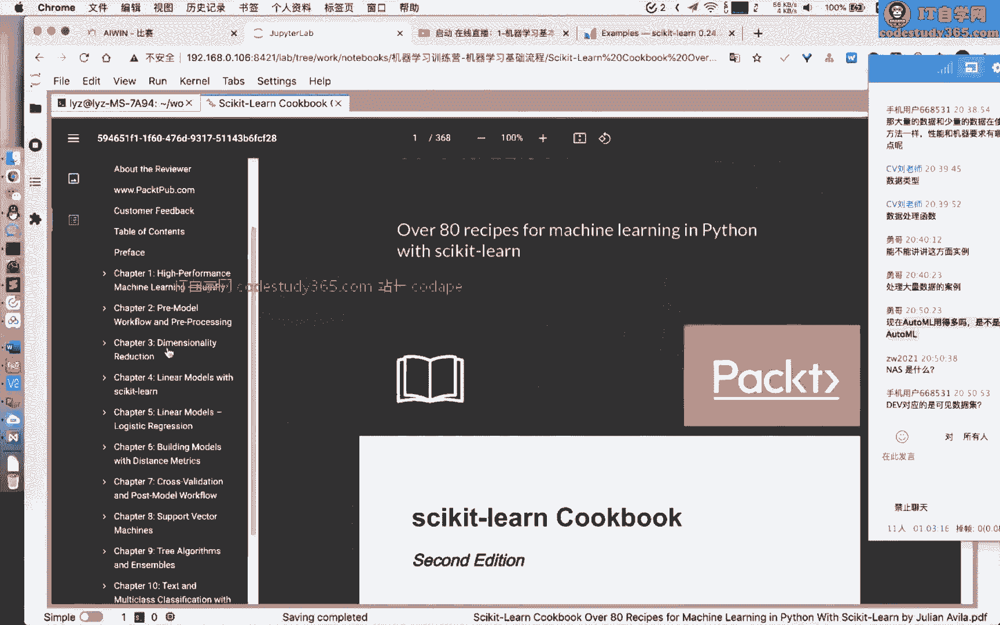

型的一些一些使用方法，嗯这本书我也看过，这也是非常非常嗯就是说比较实操的，而且也比较基础。

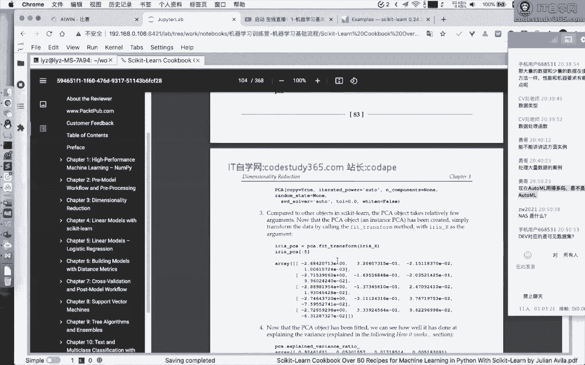

如果感兴趣的同学呢，也可以就是说根据这个书来进行学习，好，我们接下来呢就看一看SKN的一些，具体的一些呃，就是说一些使用案例啊，一些使用案例，我把我的这个notebook给大家打开。

然后呢我在写这个代码的时候呢，我基本上也是用SKN的一个这个JUPITER，JUPLAB啊，然后大家如果是用汽车在线的一个云平台，其实本质上和这个我们这个网页是一样的啊，网也是一样的好。

那么我们就来看一看具体的代码吧，那么我们就看第一个例子啊，然后我们就休息一下啊，那么我们首先呢来一步一分，一步一步来给我们讲代码对吧，首先呢from excent import labors。

以及data sense，以及proper proping这个三个模块，neighbors呢，它主要是包含了我们的一个，就是说KN的一些计算，KN模型，或者说最近邻模型。

然后这个DATASET呢是完成了数据集的读取，然后proposal呢是这个是这个我们的数据，预处理预处理，然后这个地方model selection呢是我们的数据划分方法。

以及我们的交叉验证的一些模块啊，在这个model selection里面，然后呢这个SKN里面呢还有这种matrix啊，这个我们刚才所讲的这些评价指标，我们翻译一下啊。

在API文档里面有这个matrix，matrix对吧，我们的一个AOC啊，我们的准确率啊，以及我们的F1score，在这个matrix模块里面都有实现好，那么我们接下来看一看这个代码啊。

我们首先呢从DATASET里面node i r s，这是一个我们test conn里面，它包嗯就是说自带的一个训练数据集啊，自带的啊，然后呢我们读取完成之后呢，我们就读取它的一个训练的部分。

以及它的一个标签，然后接下来呢，我们就用我们的一个给定的数据集呢，把它做一个训练的部分和验证的部分的，做一个划分，这个地方我们的train test split，本质就是一个hold out的这种划分。

Hold out，流出法啊，流出法，这个地方我们的train test split，它是有一个默认的，我们的一个验证集的划分比例，这个地方大家可以看一下文档，这个地方它的划分比例是多少呢。

它的划分比例是我们的一个0。25，就是说25%的一个数据集呢，我们划会划分到我们的一个test test set，这个地方我们就把它充当成我们的测试集，然后呢，我们如果想要对我们的数据集做一个预处理呢。

我们就是从PROPING里面调用这个scanner对吧，比如说我们这个地方调用我们的一个嗯，Standard scanner，然后做一个feature好，然后呢我们假如说啊。

这个地方我们首先呢看一看这个stand standard skinner，这个地方的fit用来做什么，有同学问到这个润润动stage，它是用来做什么的啊，我们待会给来可以给大家讲啊，嗯那么需要注意的是。

就是说这个地方给大家写一下，大家记住这样一句话，就是说SKN里面的，所有的机器学习模型，它的模型啊，所有的模型加上一些预处理，都是支持这种状态的，那么有同学他可能不知不理解这是什么，是状态。

那么这个状态呢比如说我们举个例子，假如说这个地方我们用这个min max scanner，Min max scanner，他是要计算它在计算的过程中，是需要得到需要通过这一列的一个最大值。

最小值完成一个处理的，所以说在这个feature的这一步呢，其实它会计算这个SKINNER要用到的，比如说在standard skinner的过程中，它会用到什么，这个standard scanner。

它会需要用到我们这一列的一个均值，和这一列的一个方差来完成一个转换，那么有同学可能还不理解啊，我这样跟你说啊，在feature的这一步会计算均值和方差，那么在这个transform这一个这个步骤。

我们这地方的SKINNER他是从STARDSKINNER做一个feature，得到一个他的一个具体的实例化的一个对象，然后这个对象呢直接做一个分transform，这个transform呢。

它会以我们上面所计算得到的一个均值和方差，对我们的数据集做一个转换，那么这个地方我们transform呢，它是直接做一个转换，它是没有再做feature的，这个地方我们一定要注意。

就是说这个fit呢它是保存了这个状态的，保存状态的，那么如果是直接对我们的训练集和测试集，同时把它做transform，那么就会保证就会可以保证我们的一个训练集，测试集，它的具体的预处率。

它的标准是一样的是吧好，然后这个地方其实也跟我们前面所讲到，这个在excel里面所有的大写的啊，这种首字母大写的其实都是这种class class呢，它是支持需要实例化再进行使用的。

然后呢我们接下来定义一个kn的一个模型，K neighbors classifier，然后呢我们最近的一个样本我们用来做判别呢，我们是三个样本，然后我们就kn做feature。

用对我们的训练集做一个feature，然后对我们的一个测试集做一个predict，然后我们就用我们的准确率，Accurrency score，我们从matrix里面import的做一个打分。

然后我们的计算得到的准确率是8%，19好，然后我再回答这个同学的问题啊，Random stage，你假如说你想要看它的一个具体的一个含义，对吧，很简单，我们看他的一个，但它的一个文档类型呢。

windows stage其实就是一个呃seed，这个windows seed呢，就是说我们在做做数据集划分的时候啊，其实它是一种随机打散的划分，它是随机划分的啊，它不是啊。

就是说我们这个hold out这种划分方法，它是一种随机划分的，也就是说他其实是随机挑选，挑选了一定的比例充当我们的训练集，随机挑选的一定比例，当做我们的一个验证机，那么这个就有一定的随机性。

那么我们如何固定住这个随机性呢，我们就设置这个random stage，Real stage，对它可以用来控制我们的一个这个可复现性，就是说当我们设置成real stage情况下。

我们的数据集的划分方法就固定了，好我们稍微休息5分钟啊，稍微休息5分钟，我们继续好吧，对大家，对我们刚才所讲的这些内容有什么问题吗，以及觉，你就是说大家觉得我们这个讲课的一个节奏，是不是啊有改进的方向。

或者说有一些不舒服的点，呃，这个，呃satisfied对吧，这个含义是什么啊，这个含义其实嗯非常非常好的一个问题啊，我们待会会讲啊，待会会讲他是什么样的一个额，就是说含义啊，我们待会会讲的。

对我们先休息一下啊，先休息一下好额，那么我们回来啊，大家对我们刚才所讲的这个内容OK吗，OK的同学扣个一，我看一下啊，OK的同学扣个一，我看一下，或者说有什么问题也可以直接提出来啊。

好额只有两位同学扣一啊，那么我希望其他同学也能够完全掌握啊，我就默认其他同学没有问题啊，好，那么你这个地方我们刚才有同学问我们的train，Test split，这个呃satisfy这个是什么含义啊。

这个呢就是说我们看他的一个解释啊，If if not none，就是说这个参数如果它is not known，就是说他设置的情况下。

Data is subsplit in satisfied fishing，Use use this as the class label，好，那么我们可以演示一下这个到底是什么意思啊。

我们可以构造一份数据集，我们的Y呢，我们的X就是哦放大一点啊，嗯我可以先把这个运行一下啊，免得我没有long派啊，这个long派没导入是吧，input是浪派，H m p。

然后呢我创建一个训练集P点zeros，然后呢我们创建一个20行四列的一个X啊，20行四列的X，然后呢我们的Y我创建它是1234，一乘以额四五是吧，四五那就是5+2乘以5+3乘以，五加上，4×5。

我们在这个地方呢，我们创建了这个我们的数据集和我们的标签，我们的Y呢我可以给他打印一下啊，他是这样的啊，121这个地方呃，四个五个，一五个，二五个，355个，四五个，四对吧，那么也是20个。

那么我们也是用这个train test splish now，然后对我们的数据集进行划分啊，我们来看一看啊，我们这个地方我们把windows stage把它去掉啊，这个无所谓的。

我们也是传入我们的X和Y，然后我们可以把我们的一个训练集，它的一个标签，和我们的一个验证集测试集的标签给打印一下，大家就看出来，大家可以看一下我们的验证集的标签，它是23221，为什么呢。

因为这个地方他其实是随机，从我们原始的一个数据集里面进行采样得到的，它并不是说是一个规制，或者说标按照比例进行采样的对吧，每次采样都是非标准的，那么如果我们用这个函参数啊，如果我们用这个地方的一个参数。

我们来进行设置，那么就这个这种情况下啊，我们再设置一下我们的一个n split，对吧，假如说我们这个地方我们没有加这个额参数啊，它其实得到的验证机，它的比例并不是说是一比一比一比一的。

那么如果我们加了这个参数的情况下，我们得到的一个验证集的比例就是一比一比一，这个参数就是说你在进行划分，我们的一个验证集的时候呢，尽可能的把我们的验就是说你划分得到数据集，保留原始的类别的比例。

就是这个作用就是这个作用，那么这个作用这个参数呢，其实也是蛮有蛮有用的，就是它是Y需要有排序吗，不需要这个地方，这个地方的Y他不是说从Y的排序得到，他其实是随机。

先随机挑选一些我们的样本的一个index，然后再从这个次序得到它对应的一个Y对好，这个理解了吧，好然后我们就继续啊，然后呢我们的SKN呢，他其实能够做很多的一些操作啊。

比如说数据的预处理域特征的编码模型，训练验证场景，机器学习模型都是可以做的，那么比如说我们在这个嗯SPN里面啊，比如说我们假如NOSKN里面的progress，这个模块。

假如说我们在导入我们的一个额一个error，这个导入一个三行三列的一个嗯，嗯矩阵的情况下呢，我们假如说直接用for personal scale这个函数，那么这个地方哎大家可以看一下。

我们这个地方其实是直接用的一个函数，对它进行一个处理，那么我们处理之后的这个矩阵呢，其实他长得这样的啊，可能你觉得他平白无奇，但是呢你假如说直接求这个矩阵的一个均值，和它的方差。

你会发现他都帮我们处理好了对吧，均值为零，方差为一，那么其实我们这个呃proposal their skin呢，它其实这个函数本质就是我们这个standard scanner，这个具体的一个实现。

不信我们来看一看嗯，我们定义一个progression，点SKINNER，Scanner，点feature，然后对我们的这个把实例化的这个嗯，对象呢把它对我们的这个矩阵呢，做一个转化成form。

然后就可以看到其实它是可以直接转换的，结果是一样的，然后呢，其实这个地方我们如果用这个class大写的class，Status scanner，它是能够记住下我们这个地方。

你x train里面的一个均值和方差，然后接下来，假如说你直接对我们的一个新的数据集，做一个transform呢，我们就用我们之前记录下的均值和方差，做一个处理就行了。

好那么我们这个MMAX其实也是一样的，那么在这个地方呢，我们也是定义一个我们的一个矩阵，然后呢我们用in max，那么这个地方其实我们的min max呢，或者说所有的skin呢。

它可以这个地方我们是上面这个例子，是feature和transform分开做的，当然我们也可以把feature和transform同时做，比如说我们把feature下划线transform。

也就是说我们用这个数据集，同时把它计算它的一个最大值和最小值，以及我们想要的参数，以及同时把我们的数据集做一个转换，那么这个地方需要注意的一点，就是说。

不管你是用feature transform还是废纸纯子，不管你是把feature transform分开做，还是把它一起做一，非常非常注意的一点，就是说你一定要保证只能FEH一次，只能保证废止一次好。

还有一个呢，就是说如果我们在训练，训练好这个CISCANNER之后呢，接下来做一个转换的情况下，其实我们传入要需要传入跟他原始维度一样的，比如我们这个地方我们定义的是一个3×3的。

那么你假如说做一个转换呢，其实你要传一个跟他样本维度一样的，才符合他的一个转换，当然还有这种命嗯，就是max abs的一个，为什么只能feature一次，我这个地方给大家举个例子啊。

为什么只能feature一次，假如说我这行这个地方有两行代码，第一行代码是对我们训练集的数据，用这个这个代码完成一个转换，第二行是对我们的测试机代码做一个转化，那么就会出现一个问题，什么问题。

标准不统一啊，标准不统一，你能get到吗，因为你在这个地方，你在做第一行代码转换的时候，你的最大值最小值是虚拟机的最大值最小值，第二个转换的时候，你用测试题的最大最小值来进行一个转转换。

你就表它的一个标准就不统一了，所以说这个fit它是记录下这个标准，然后transform呢就是用这个标准做一个转换，所以说你在任何情况下只能fit一次，这样这样能理解吗，这样能理解吗，对。

所以说你不能是各自用各自的标准啊对吧，那你在用这个来完成我们的模型的训练时候，就肯定会出现问题对吧，可能出现的问题好，那么这个max abs呢其实操作也是一样的啊，操作也是一样的好。

然后呢还有这种其他的robots skinner，这个robot skin呢它是主要啊对于这种异常值啊，可能更加鲁棒啊，这种转换，然后还有这种我们的一个额就是分箱的这种。

就是说分位点的transformer啊，这种转换呢其实也是非常方便的，还有就是我们的一个呃就是说非线性的转换，比如说power transformer都是可以进行转换的。

然后呢在S坑里面呢它是很很方便的，可以把就是说把它做一个L2的一个LM，这个大家在我们的机器学习的原理里面，已经学过对吧，Ai long，它把它把我们的每一行把它转成这种嗯unit农。

然后呢对于我们的数据集，假如说我们它是有缺失值的填空情况下，我们直接是可以用这个缺失值来做一个填充的，那么这个缺失值呢我们如果在SK里面呢，我们是直接从这个impulse这个模块呢可以玩。

就是导入我们的缺失值的填充方法，比如说我们在做一个缺失值填充的时候呢，我们可以用这个这一列的一个平均值，做一个缺失值填充，这一列，这个平均值对于趋势值进度怎么怎么说呢，我们来看一看。

首先呢我们传入这个三行两列的一个数据，三行两列的一个数据，我们包含那个数据是一二缺失值37676，那么我们在做一个缺失值填充的时候呢，其实我们可以看一下啊，我们首先呢完成一个FEIT。

然后接下来作为作为我们一个额，就是一个transform，那么我们可以看一下，在我们原始数据集做废纸的时候，这第一列的一个平均值是1+7除以二等于四，第二列的一个趋势，第二列的平均值是2+3加六。

再除以一个三，等于我们的一个哦，2+2加2+3加六啊，这个是11对吧，11÷3是呃，就是说3。6对吧，3。6，然后呢，我们接下来对我们的数据做一个转换的时候，他是直接用这个平均值，第一个是平均值。

第一列的平均值四，第二类平均值是这个11/3，做个填充即可，当然我们这个缺失值填充，它不仅仅是可以对于数值的列，做一个缺失值填充，也可以支持对于我们的一个嗯，就是说啊类比的例做一个趋势填充，举个例子啊。

我们这个地方呢我们的这这个数据集呢，其实你可以用这个long派进行表示，也可以用这个data frame，其实本质是一样的，我们这个地方呢有两列，第一列呢是这个也是类别类型的A缺失值AB。

第二列XY确实值Y，然后然后呢我们可以用这个most frequency，就是说出现次数，这一列出现次数最多的一个取值，做一个取值值填充，比如说第一列出现次数最多的是这个A。

impulge feet里面的参数可以解释一下吗，哪一行吗，是这一行吗，我们这一行吗，我这一行我说了啊，是这个任务，这个most most frequency，就是说用出现次数最多的这个取值来做填充。

对，上面这个这个不就是一个嵌一个，一个就是说嵌套的历史吗，这个不就是嵌套的list吗，嗯需要解释吗，第一个这个就是一个list，这是一个元素啊，这是一个样本啊，一二确实值376，就是三行三行两列的啊。

我们如果把它写开，是这样的，我写开你就知道了，就是这样，三行两列对吧，三行两列，第一列我们用第一列算他的一个平均值，1+7啊，缺失值我们不算1+7除以二，然后2+3加六，对你可以理解它就是一个小数据集。

对我们三行两列，三行两列可以理解吧，嗯好，那我们继继续啊，那么这个地方呢我们就设置它的一个填充方法，是用这个most most frequency，然后就是这一列出现次数最多的一个取值。

这一列出现次次数最多的一个取值，当然我们也可以用这个KNN的一个填充方法，就是说我们找他最近邻的样本来做一个填充，那么这个呢我们再来看一看啊，这个填充方法啊，我们用这个嗯最近邻的样本呢。

我们算它是两个最近邻两个样本，然后呢，我们这个地方呢其实再做一个嗯，最近邻的一个计算呢，它其实呃会抛弃这个，就是说他会在计算我们缺失值的时候呢，这个是一个样本，这是一个样本，这是一个样。

这个样本四行三列，四行三列，然后他在计算这个最近邻样本的时候呢，其实我们第一个样本，它最近邻的其实是我们这个呃，呃这个第二行和第三行，第二行和第三行，然后他就用第二行，第三行对应的列做一个平均值。

得到我们的这个缺失值，然后我们对于这个样本呢，它最近最近您的两个样本，是我们的第二行和第四行，然后我们第二行，第四行的一个第一列的一个平均值，做我们的一个我们的这个缺失值一个一个填充，那么这个KN呢。

一个填充呢其实是找最近的样本，它和上面的一些填充方法其实是不一样的对吧，他其实是有这种用其他行其他列的一个计算，找到最均匀的样本，然后再去填充对应的一个额，就是说列。

然后上面的方法其实是直接做一个简单的填充，所以说上面的填充方法呢叫这个simple impputer，下面的呢叫这个KNINPUTER，所以说他的一个实现的逻辑是不一样的，然后呢我们再做一个具体的额。

接下来呢就讲我们的在kn里面，其实他是支持这种我们的一个呃，数据的一个转换的啊，数据的转换的，比如说我们首先呢来看我看一下我们的这个呃，额这个我们的一个嗯ordinary encoder。

alerary encoder呢，其实它本质在做一个编码的时候呢，其实是额对于我们这这整个额怎么说呢，这整个我们的一个额一一行，就是说他元素做一个编码，比如说这个地方我们有这个嗯，应该是2×3的一个额。

就是说两行三列的对吧，然后呢我们会把这个from第一行，假如他属于第一行，那么就是说这一列他的第一个取值，那么我们会把它编码成一，如果他是在我们这一列的第二个区域，那么我会要把它编码成零。

这是直接是整体的一个feature啊，就是他是同时feature多列的，那么如果我们想要对我们的这一列做一个one，hoing code呢，那么就稍微更加复杂一些。

我们这一列这一列male female，它是有两个取值的，有两个取值，那么我们在做一个one hot的时候呢，其实是会把它转成一个一零和零一，这两两种情况。

那么这个from u s s和from europe其实也是一样的，它是有两个取值，那么我们也是会把它转成这种零一和一零呢，这两种情况，然后有同学就说老师你这个不是多此一举吗，然后我可以举个例子啊。

就是说其实我们这个例子他举的是这种binary的，这种就是说出现次数是这种二元的情况，你假如说我们出现次数是这种多元的情况，比如说from china，你再看一看他做一个转换的时候。

他就是from us s from europe from china，这个地方啊，我再复制一行啊，这个地方再多复制一行，你可以看一下001010100，他就完火结合这个binary encoder。

就是这种二元的这种布尔型呢，其实还是有点差距啊，大家可以体会一下好，还有这种多样式的编码，多项式的呢，其实呃这个编码可能，ordinary encoder和label encoder有什么区别啊。

这是一个非常好的问题，说明这个同学在对SKN，有一定有一定的一个理解啊，一定能理解这两个在功能上其实没什么区别，但是在就是说在具体实现上是没什么区别，但是在使用上其实是有一定的区别的。

Label encoder，你可以看它的一个原始的一个叫法叫label，label是什么，Label encoder，它就是对我们的一个标签标签做一个encoder。

所以说一般情况下label encoder它只支持单列的，那么ordinary encode它是支持多列的，主要是这个区别对嗯，在我们具体使用下，就是说这两者其实是可以混用的。

对就是说功能实现其实没什么区别，对，然后呢还有这种我们的多，在我们的预处理里面呢，还有这种多项式的编码，多项式的编码呢，就是说我们可以看一看他的文档啊，多项式的编码，比如说我们传入AB的情况下。

我们可以得到多得到什么1ABA的平方，AB以及B的平方，这个呢就是说我们一个我们可以传入这个，多项式以及它的degree，就是它的具具体的多项式的一个就是几阶，对吧几阶，然后呢。

我们就可以就是说根据这几阶的一个组合，得到的新的特征，比如说我们传入的是零一这个2345，这个地方是我们的一个呃三行两列啊，三个样本两列，然后默我们完成的是什么，1AB以及我们的AB啊，以及我们的A方。

我们的一个AB以及B方对吧，这个地方我写一下啊，1a b，A方以及我们的B方以及AB，这是说我们这几列分别对应的我们的这个哦，我们的一个取值对吧，这个其实是从我们的两列构造，得到了多列的一个特征。

当然这个多项式啊其实这个用到的比较少，因为它既它其实是一种暴力提取的啊，在提取这个特征的时候，他其实就是做这种简单的组合，就是说哎多项的二项的三项的组合嗯，并不是很实用啊，并不是很实用好。

然后我们接下来就看一看一些具体的例子啊，就是加深大家对我们的个人的一些印象啊，我们还是用IRS这个数据集这个地方，我们这个例子我们上面已经讲了啊，直接读取我们的数据集，完成数据划分。

构建我们的KN的classifier，以及计算我们的一个准确率，就像我们准确率，然后呢，当然我们这个地方在SK里面，它还支持这种cross validation score。

Cross valization，我们在PPT里面讲了，他就是这种交叉验证，那么什么是cross validation score呢，就是说我们在进行交叉验证的时候，我们可以对我们的验证机进行打分对吧。

那么我们既然对我们验证集就可以进行打分，那么我们就可以验证集，它打分可以不是五折吗，我们这个地方的CV就是五折划分成五折，就是我们的PPT里面的K是等于五的情况下，那么我们就可以算一算我们的一个五折。

分别的一个验证集的精度是多少，这个地方我们的第一个输出啊，Sorry，第一这一行，我们的输出就是我们的五折的一个验证集，的一个打分是多少。

那么我们还可以做一个cross validation predict，这些呢都是从我们的model selection，这个模块里面引入进来的，这个地方，我们可以对我们的验证集的一个它的一个呃。

就是说预测结果把它进行导出来，多折是取平均值吗，在这个地方我们是没有取平均值的，当然你如果是想要衡量一下我们的一个模型，交叉验证的打分呢，我们是用平均值来嗯，就是说做的对的。

那么我们接下来呢就看一看其他的例子，在SQL里面呢，我们这个地方是读取了一个m list，就是一个手写数字的一个数据集，然后呢我们读取完数据集之后呢，我们其实这个原始的数据集呢。

它额我们是用CSV给出的，那么我们直接使用pandas为这CSV，从这个这个是一个HTTP链接啊，就是嗯这个read csv呢，它不仅仅这个函数呢不仅仅可以读取本地文件，也可以读取这个网络链接啊。

都是可以进行读取的，然后读取完成之后呢，我们就用我们的一个hold out值的划分方法，把我们的数据集划分成训练的部分，以及我们的验证的部分，然后呢，我们可以把我们的一些图呢把它进行可视化。

这个就是一些手写数字啊，手写数字就是说就是0~9啊，数十个数字，04999667517对吧，就是手写数字，然后呢我们就能能不能构建一个模型，完成这个手写数字的识别呢对吧，我们就一步一步来构建。

首先呢我们在进行一个识别之前呢，其实我们可以做一些可视化啊，这个可视化呢不仅仅是可以用来，我们把原始的样本给它画出来，这个画图啊，其实是用magipch live来画图，大家可如果感兴趣这个画图啊。

可以自己去看一下啊，我们绘制得到的是一个figure，size是1515的这个图，然后他的n rose n calculum，就是说是十行十列的，然后就是说我们这个地方每每一行啊，十行十列啊。

我们根据这个十行十列就得到100个数字啊，对100个数字进行可视化，然后呢，我们设置一下我们的一个具体的画图的，一些title啊，以及它的一些元素，对嗯，我们不仅仅是可以对这个样本的原始知识。

进行可视化，我们也可以对我们的样本把它做一个PCA，把它降维之后，然后做一个可视化，其实我们嗯做完可视化呢，这个地方我们是用这个SKN里面的一个PCA，把它做一个降维，然后降成两个维度之后呢。

我们就可以把我们原始数据集的，主要的两个维度啊，主要降维的得到的这个嗯维度呢，把它做个可视化，大家绘制到二维的一个维度上，然后呢在绘制成二维的维度上呢，我们还做一个操作。

就是说我们这个点啊就表示的是一个样本，这每个点就是一个样本的情况下呢，我们还给定一个颜色，这个颜色怎么来的呢，这个颜色就是原始这个样本的一个类比，原始这个样本的一个类别，就是说是这个由它的一个。

就是它的颜色就相同的点啊，就是表明是相同的元素啊，类比是相同相同的，我们可以看一下，就是说其实大部分的相同的这个数字，都是在PCA之后也是处于相同的位置对吧，处于相同的位置。

然后呢我们可以构建一些我们的一个模型对吧，比如说我们可以用SKN里面的这个，我们的一个嗯嗯，MIP的CLASSIFI就是全连接网络，这个全局流网络呢，它是有100个隐含隐含节点的。

就是隐含层的维度值是100，我们让他来构建一个全连接网络，然后直接对我们的数据集做一个feature，然后呢这个地方我们的原始的一个图片呢，它是一个灰度图，他的一个取值范围呢，是从这个0~255的对吧。

那么我们可以把它做一个处理，就是直接除以除以一个255，就是把我们的数据集呢把它转换成一个呃，就是说0~1这个范围内是吧，然后直接做一个fit，直接把它完成训练，然后呢直接做一个predict。

就是做我们的一个预测对吧，那么做做完我们的一个模型训练和预测之后呢，我们还可以分析一下我们的一个模型，它的一个呃就是说预测的一个准确率对吧。

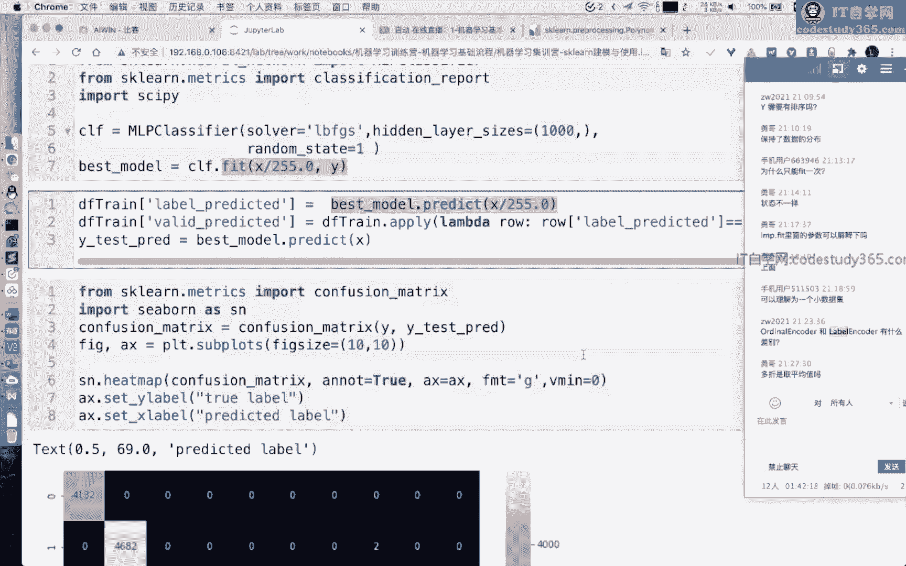

以及它的一个混淆矩阵，混淆矩阵呢，就是说我们这个模型它对预测就是真实的预的，预测结果和我们的一个额，就真实的一个结果和预测结果，它的一个整体的一个分布的情况，就是说比如说我们的这一个取值。

就是说真实标签为五的情况下，但是呢我们的预测结果为一的情况下，的取值个数是吧，我们其实如果这个模型全对的情况下，我们的一个它的一个样本呢，都是处于我们的对角线对吧，也就是说真实标签是四。

我们的模型的预测标签也是四，那么通过这种混淆矩阵呢，我们其实是可以看出，我们的模型主要在哪个地方错了，哪些样本错了啊，需要注意的是，这个混淆矩阵它不是一个对称矩阵啊。

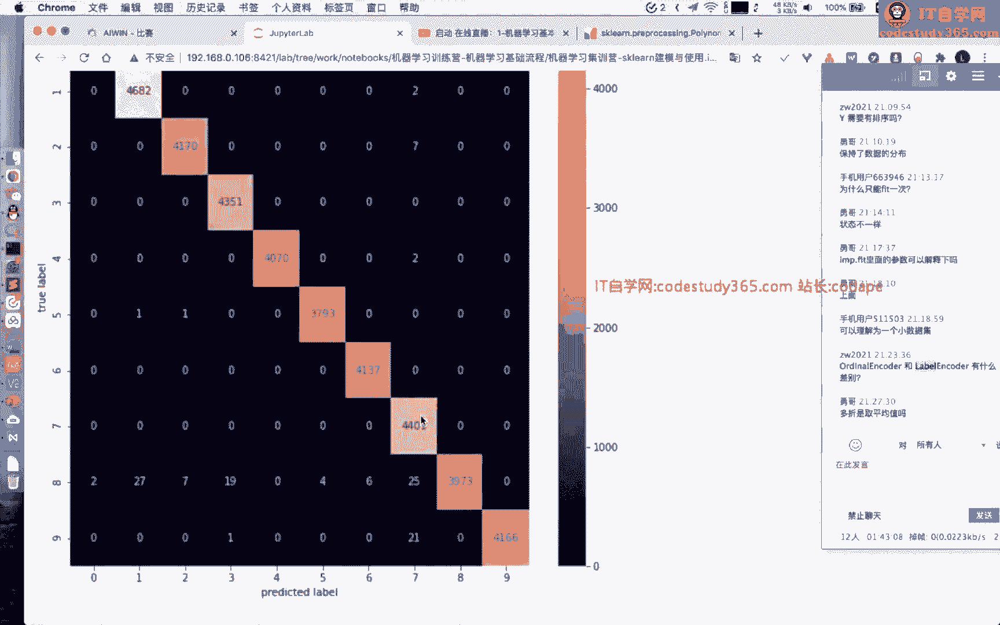

它不是一个对称矩阵，那么这个混淆矩阵呢，我们也可以直接从我们的SKN里面嗯，他的matrix里面进行一个计算，我们只需要传入我们的模型的预测结果，以及真实的标签，就可以完成这个混淆矩阵的一个计算。

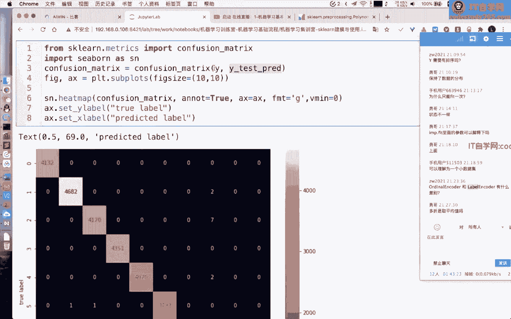

那么我们也可以打印一下我们的classification report，这个函数呢主要是完成我们这些每个类别，它的一个procession record以及F1score的计算。

这个呢可能是更加就是说计算的准确啊，也就是说每个类别它的一个呃就是说查准率，召回率以及F1score，当然我们也可以用其他的模型来完成一个实践，比如说我们任务KNN对吧。

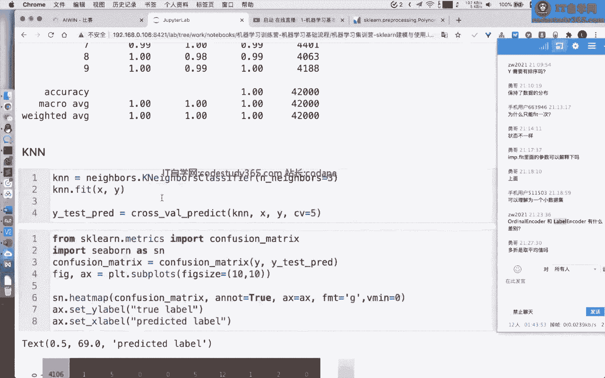

也可以的，完成时间也可以类似的画，绘制出我们的一个混淆矩阵。

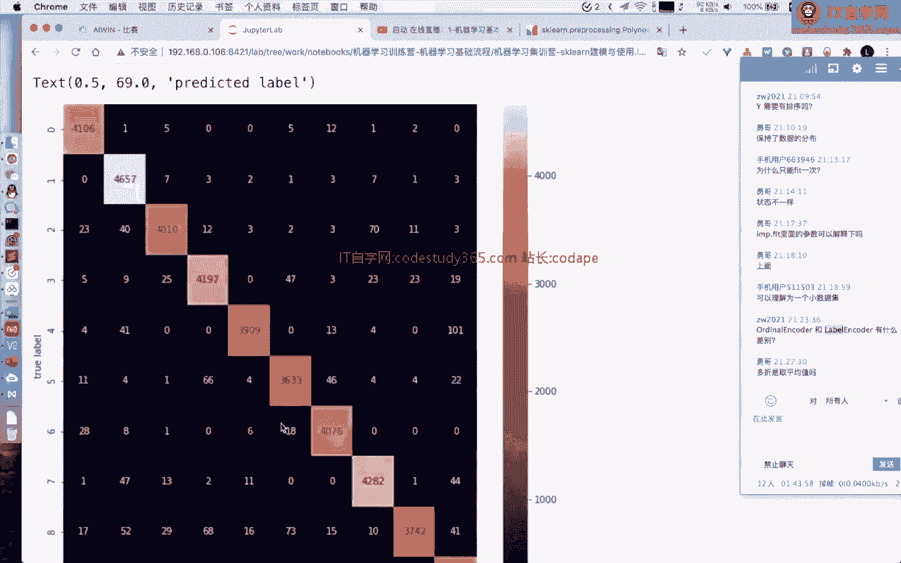

那么我们也可以用线性模型来完成，我们的一个训练都是可以的，好那么我们接下来呢就看一看啊，我们前面不是有同学讲到问到这个数据划分嘛，其实在SKN里面数据划分，我们前面所讲的例子呢。

就是我这个地方想讲的例子啊，提前讲了，我们首先呢可以构建我们的数据集的情况下，我们构建20个，我们一般情况下啊，我们的数据集它的一个适用这种矩阵啊，矩阵来进行，可以用来举证来进行表示的这种数据呢。

我们一般情况下称它为结构化的数据，结构化数据呢就是说他的一个行业比较规整，一行代表一个样本，一列代表一个特征，或者是一个字段，所以说大家如果看到一个矩阵，或者说一个数据集，它的维度数五五千乘以十。

那么就表明它的有5000个样本，以及每个样本是十列特征好，那么我们构造得到的一个标签呢是111，就是说也是先是一，后是二，再是三，再是四，如果我们不设置这个satisfied，这个参数的时候呢。

其实它是不均匀分布的，如果我们设置了这个satisfied的时候呢，我们的一个标签就是均匀分布的，当然对于k fold也是一样的啊，k fold就是我们的一个交叉验证，如果我们不设置它的情况下。

我们的label其实划分的也不太好，如果我们设置它的一个划分的时候啊，我们重新把它运行一下啊，如果我们设置它的一个情况下，其实它就划分的比较啊，这个地方嘶，啊运行这个吧，这个地方还是没设置啊。

这个地方这个地方呢，就是说如果我们想用key fold让它做数据划分，也划分的比较均匀呢，我们就用这个satisfy，satisfied key fold就行了，就是他直接来进行划分就行，对，好。

那么我们刚才呢所讲到的是这个数据划分划分，然后呢在SPN里面呢，它还支持这种模型调参都是帮我们写好的啊，我们可以直接来进行使用，那么我们也知道，就是说对于机器学习模型而言呢，我们的嗯。

就是说参数分为这个我们的数据模型的一个，参数呢分为这个普通的参数和这个超参数对吧，参数呢就是说我们的数据，这个数据呢它是能够从我们的一个这个数值呢，是能够从我们的数据集里面学习得到的。

超参数呢就是说我们需要人工进行设置的，那么比如说我们如何来对我们的一个模型，来进行调参呢，嗯有两种比较基础的方法，一个是这种great search网格搜索。

一种是render search这种随机搜索，我们首先来看两个比较简单的例子啊，我们首先呢给定两个超参数，每个超参数呢有一个有三个取值，那么在此种情况下，其实我们第一个，超参数有三个取值的情况下。

第二个超参数有三个取值情况下，我们总共就得到了九组超参数，需要注意的是，就是说我们是需要确定每个超参数的取值，才得到了一组超参数的组合，也就是说我们所有的超参数一致的情况下，我们才确定了一组超参。

这个需要大家注意啊，不是说我确定了一个超参数，不是的，所以说当我们有两个超参数的情况下，每个超参数有三个取值情况下，我们就得到了九组超参数，那么这九组超参数里面，哪一组超参数是最优的呢。

哪一组超参数是精度最好的呢，我们就需要如果是用great search呢，就是说我们把它构造得到一个点对吧，假如说我们把第一个超参数划分，得到坐标轴上面，第二个超参数呢也这画不画到我们坐标轴上面。

我们就得到这些点九个点，如果我们是RENWINDORESEARCH呢，它就相当于是我们第一个传参数呢，从一个范围里面随机生成，第二个套参数呢也是从一个范围内随机生成，然后做一个组合好。

那么这个具体的一些操作呢，其实在我们SKN里面都有一些具体的实现了，你不用担心，那么我们怎么进行实践呢，首先呢你可以定义一下你的模型的超参数，的一个取值范围，或者说你的一个具体的取值。

比如说你的一个这个地方，我们是用这个gradient，gradient boosting的一个CLASSIF，然后呢他的一个具体的超参数，我们可以设置成他的一个estimate，他是50或者十。

学习率呢是0。02或者0。05数，模型的深度呢是这个一或者2min，simple sniff是五或者十好，然后传入之后呢，我们接下来这是我们的一个网格，就是我们的网络的一个嗯。

或者说我们的一个超参数的一个网格啊，然后呢我们传入，我们接下来还传入我们的一个呃模型，它的实例化，然后呢我们还需要用传入一个交叉验证的折数，以及我们总共要训练多少次，这个n letters呢。

就是说我们总共假如说我们的超参数的组合，它的一个大小的空间是大于100的情况下，我们就使用我们就是说只跑100次啊，只跑100次，n estimate是什么意思，我们看文档啊，看文档。

我们在这个gradient boosting classify，这个n n estimates呢，相当于是我们的多，就是说这个boosting的一个次数，BOSTING的次数。

那么这个地方我们的一个呃gradient boosting，它的一个我们也知道它是一种不死的方法，那么它是一种集成学习方法，你可以理解他就是集成集成多少次对，二维呢二维是什么意思。

我没有理解的意思是什么，二维，然后这个CV其实表明我们的交叉验证啊，就是说我们到底跑几折，交叉验证，然后用我们的交叉验证的验证集的得分，来衡量我们最终的一个进度，然后这个ANITTERS就是我们的一个。

总共跑多少次对，然后呢如果我们用grade search呢，呃如果我们用render search呢，它其实是随机筛选的，必须上去，如果我们用这个grade search呢，其实基本的操作也是一样的。

基本的操作也是一样的，然后他跑出来的结果也是差不多的，也是差不多的对，然后我就是说我们也给定了一些例子啊，就是说我们在1SKN的一些建模的案例，如果大家感兴趣的呢，也可以看一看。

第一个案例呢是泰坦尼克号的一个建模的案例，就是说我们根据泰坦尼克号的一个乘客的一个，嗯信息来预测它是不是幸存，第二个呢是这个呃，就是说一个电商的一个呃商品的价格预测，我们是需要根据这个商品的一个价格。

以及商品的一个文本信息来预测它的价格，第三个呢是这个我们的一个呃，呃应该是一个文本分类的一个问题啊，就是说我们如何用SK来完成一个，文本分类的一个例子，然后呢，如果大家觉得就是说想要深入学习SKNL。

就可以通过我们上面所呃，就是说介绍的这三个案案例来进行继续学习啊，当然就是说我们给到大家的呢，其实已经呃发到群里的呢，就是有一个泰坦尼克号的案例啊，你也可以直接用这泰坦尼克号这个案例，来进行学习。

我们在给到的一个代码里面呢，还有一个叫这个呃SK的50个tips，或者说50个小练习啊，你也可以，就是说我也非常建议大家可以，把这50个小练习可以给他嗯，就是至少是呃运行一下啊，至少运行一下。

比如我们用SK的数据集这个地方，这个地方呢我们在讲SKN的时候呢，我们没有讲很高阶的操作啊，其实是说SKN的一个操作呢，它是可以做一个pipeline的，做一个管道的，管道是什么意思。

管道就是说s kn的一个数据，它的一些操作呢，我们可以把它当做一个流来进行使用，因为我们的一些这个数据预处理模型构建，我们这个地方的make pipeline，它是怎么做的呢。

我把这个数据这个翻译一下啊，这个地方我们首先构建了一个Mac calculent，Transformer，就是说我们对我们的列如果哪些列啊，这个地方我们对我们的new era列。

做我们的一个我们的standard scanner，我们对我们的类别列做一个完好进行扣和encode，我们其实是可以构建一个make cent transform，就是说直接把一些操作对类别列。

对数值列，同时把它集成到一个操作里面，然后呢这是预处理，然后我们做完预处理之后呢，我们还可以做一个模型训练，我们直接把玉数量模型训练打包成一个PAPINE，那么有同学说打包这张牌未来有什么操作呢。

有什有什么用途呢，用途非常大，打包成pipeline之后，这个pipeline直接可以做一个FEIT，也就是说，我们不需要再去一步一步，做我们的一个特征处理，特征模型训练的。

直接做一个一行代码就可以做一个预处理，做一个模型训练，而且它帮我们保存好了，这个中间的这个预处理的变量，中间的模型我们如果做一个预测，直接是PAPI的prograd papagit property。

这个地方它是直接让我们模型输入的数据，通过这个预处理，然后再通过的模型，所以说也是非常方便的啊，非常方便的，然后呢，其实这个嗯SPN里面包含的东西是蛮多的啊，蛮包含包含的东西蛮多的。

我也是非常建议大家下去之后呢，可以做一个具体的实践啊，可以做一个具体的时间，就是说你你还是要自己去使用它，你才能说你能够掌握它，不然是嗯就是说真的是，这个里面的数据集都有吗，有的啊。

这个notebook给定的数据集，就是我们已经发给大家，在这个地方呢有一个test test点CSV以及train csv，你直接改一下名字就可以跑的，你直接改一下名字就可以跑的。

然后就是你可以看一看啊，就是说如果你想要把我们的一个SK能学习好，其实还是蛮多要学的啊，蛮多要学的好，额，那么我们这个是实践的部分啊，大家如果感兴趣的呢，我是非常推荐大家下去。

把这些我们给到了大家的一些例子啊，你可以学习一下，基本上是有很多的时间可以供你自己学习的好，我们就回到PPT啊，嗯是不是要全部撸一遍，我建议你可以先看一遍，你可以先了解他的API的使用。

特别是初学的同学，你可以先看一遍，就是说知道他是怎么用的，那么我是非常建议大家，以一个具体的案例来进行学习的，因为很多真实场景下的数据集呢，并不是那么干净，是需要你进行一个处理的，那么你可以考虑一下。

用SKN完成一个数据集的，具体的读取数据集的一个呃，确实值填充数据集的处理，你可以以泰坦尼克号入数据集啊，也就是说我们这个地方给定的这个数据集，以及它的一个这个test csv以及TRCSV啊。

以及中给定的数据集，你来进行实践一下啊，当然我们这个地方也给了一个例子啊，这个地方也给了一个例子，是可是可以直接可以跑的，对这个地方给出那个例子啊，也是基于泰坦尼克号，这个是预计直接可以跑的。

因为当你遇到一个具体问题的时候，你肯定是可能就跟完成一个小步，小步的一个操作又不一样了，好第二个呢就是说我有一些建议啊，因为机器学习的原理跟实践呢，我个人认为是相同重要的，因为原理更加关注于每个算法。

实践呢更加关注于具体使用，比如我举个例子啊，在这个我们的随机森林的这个模型里面，嗯我找一下啊，稍等，对比如说我们在随机森林里面，其实随机森林，它是利用我们的一个行列进行采样，然后得到不同的数据集。

然后完成我们的一个训练，多得多棵树，那么我们如何通过控制我们的这些参数，完成随机森林这个数据集的构建呢，或者说我们如何控制这些参数来完成，假如说我让你想让你这个随时能在训练的时候。

尽可能的每棵树用到的特征尽可能多对吧，那你怎么进行设置的，或者说你这个随机森林我想让它在训练过程中，它的随机性尽可能大，那么紧怎么进行参数的设置呢，所以说很多时候这个模型的一个原理，我们刚才所讲的。

或者说他的一个网这个模型的设置，你具体的参数上面又跟我们具体的原理，其实不一样的，因为这个模型它在具体实践的时候，可能他有一些具体设置，就是说在我们的一个教材上面，它没有体现出来的一些参数。

可能就在具体实践里面呢就会出现，所以说你如果想要具体实践，可能还真的是要做一个我们的一个是呃，就是说这个代码的阅读，或者说这个文档的阅读，比如说在学习森林里面。

这个max features就是设置一下我们的每棵树，它使用得到的最大的一个特征的数量，我们就可以通过这个设置，这个max features，就可以用来设置，我们每棵树用到的最大的一个特征的数量对。

所以说这是第一点，就是说原理和算法其实都是非常重要的，第二个呢就是说实践是需要动手的，但是并不是指定特定的库啊，我是比较推荐用vs，可能当然你假如说用其他的一些库来进行实现，也是可以的。

假如说你用R语言里面的其他的库来进行实现，实践，我并不反对，我并不反对，但是呢我是比较推荐用SK好，有同学说怎么根据经验选择用哪个模型，我们在前面这个思维导图，可以一可以稍微回答你的一些问题。

其次呢可以也有一些模型经验的一些呃，模型的一些选择方法吧，我们刚才不是讲了结构化数据吗，结构化数据就是表格类型数据表的嘛对吧，我们我们先前提啊，前提我们先指就是说聚焦到有间的问题啊。

只只聚焦到有间的问题，那么对于结构化数据呢，我们一般而言，一般而言大部分情况下都用数目系，为什么呢，因为这个表格化数据，里面包含了较多的类别，类别字段，那么对于类别字段，大家也知道。

其实数模型它是很天然的，可以支持类别字段的分裂，如果我们用线性模型，其实类比字段我们就是需要对它进行处理，不管是label encoder或者是玩后期encoder对吧。

那么label encoder或者说玩后期啊，label encoder或者one hoencode，其实它都是有缺点的，nel encode他是会改变这个标签的，或者改变这个类比值大小关系。

one活性code其实是会导导致稀疏性，都是有它的缺点的，所以说如果我们遇到的是结构化数据，我们尽可能用数模型，如果是非结构化数据，比如说我们的图像，文本视频语音，那么一般情况下都是直接用深度学习模型。

为什么呢，因为结构化的非结构化的数据，它的一些数据集呢是更加难以理解的，深度学习的一个模型呢，可能更加建模能力，可能更加更强一点，一般情况下，你可以先就是说以这两个角度来进行选择，模型即可。

然后为什么没用线性模型，其实呃现在的一些高阶的，现在的一些比如说这种x g boost，其实它的一个精度，就是说应该是大部分情况下比线性模型更好，因为它里面加入的这种集成学习的速度的。

肯定肯定比线性模型，在大部分情况下会比线性模型更好对，那么以上呢就是我们这节这节课的一个内容，大家对于我们嗯这讲解的一个内容有问题吗，大家或者说，在什么情况下会用到朴素BA4或者HHMM。

嗯这个呢怎么说，在很多场景下都用不到，我个人感觉朴素贝叶斯怎么说，它其实嗯他其实用到这种表格化数据也蛮好的，因为表格化数据，其实他谱子BS是能够计算这种先验概率的，H m h m m。

其实这种也是可以计算得到这种概率，但是其实他在很多时候也是需要计，怎么说呢，计计算的东西蛮多的，嗯我个人啊，我个人的习惯是，直接就是如果表格数据直接用数模型原理，老师说用那些GBM替代差距补齐。

嗯这个地方是这样的，这个地方是这样的，差几boost之后来HGBM嗯，就是说很相似，呃x g boost的时候他是提出的比较早的，然后他是嗯提出比较早的，然后那HGBM呢是微软提出来的。

是基于差几boss只做改进的，然后呢这两个其实很多程度上精度差不多，然后这两个库它在发展越来越发展啊，现在很相似，基本上功能上一模一样，所以说用谁都可以，用手的，用谁都可以，我个人而言啊。

就是说这两者都可以，因为这两者都很快啊，这两者都很快，速度也都很好，都可以的，都可以的，对大家还有问题吗，如果大家没有问题，我们今天的一个直播的内容就到此结束啊，大家如果有问题的同学可以继续提问。

如果没有问题的同学呢，我们就可以嗯，就是说呃就是离开了，我昨天装x g boost只有90多兆RHGBM，只有几兆嗯，这个不能从安装包来说啊，这个不能从安装包来说对，其实嗯据统计啊，据统计。

其实现在还有很多的一些嗯地方，还是用拆机boost的比较多，并不是说那些BM不好啊，只能说是有一些历史遗留原因吧，历史遗留原因，对其他同学还有问题吗，比起CB，比起matt plot lib而言。

CB会更好吗，首先你弄清楚一点啊，啊，SIMON是基于MAD projetb，两者可以混用，为什么要用con，我可以给你打开con的一个官网，SIMON它天然是支持它天然的用途。

是基于这种data frame的这种格式的，我们在画图simple的时候，其实我们首先用这个散点图scatter plot，然后传入我们的行名，就是说X轴的列名，X轴的这一列的名称。

以及我们分互录就是我们分组的名称，然后传入我们的data，这个data就是我们的data frame，然后直接就有绘图，X轴就是我们的cart这个地方传入的这一列。

Y呢就是我们的price这个地方传入的一列互动，就是我们分组的不同颜色的，那么你可以看一下我们这个地方，SIMON它是基于pandas或者基于data frame这种画图。

它是直接基于data frame的，但是你再看看啊，这个地方其实它也是用到了matt plot lib，所以说matt plot lib它是更加底层的，SIMON是基于medical。

这两者可以更加混用啊，两者可以混用，SIMON画起来更好看，是更好看，但是你假如说想要更画的更加精细，假如说你想要调里面的模型，假如说调这个图的一些细节，那么就只能match pleap。

对好其他同学还有问题吗，如果其他同学没有问题就可以离开啊，如果有同学有问题，明天在线实训是什么内容，明天在线实训很简单，你我们已经把这个实训东西发给老师嗯，发给孙老师了，你就按照这个实训内容以及呃。

来来来来进行一个操作就行了啊，来进行一个操作就行，基本上是很简单的一些SKN的使用，对很简单的SK的使用，有你直直接按照这个notebook来完成就行了，哦还有同学有问题吗，那么如果没有问题。

我们今天的一个直播就到此结束了，嗯谢谢大家，如果大家有问题呢，也可以直接在群里面进行提问。

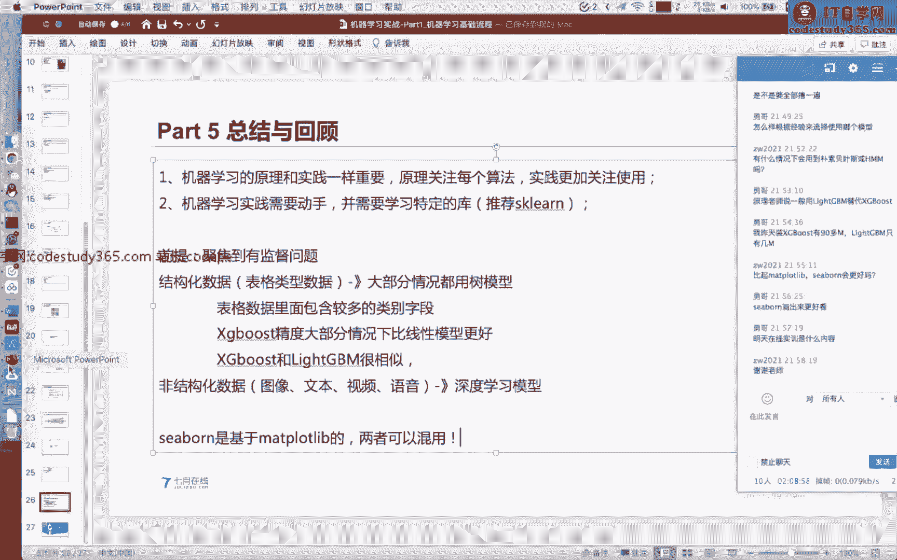

