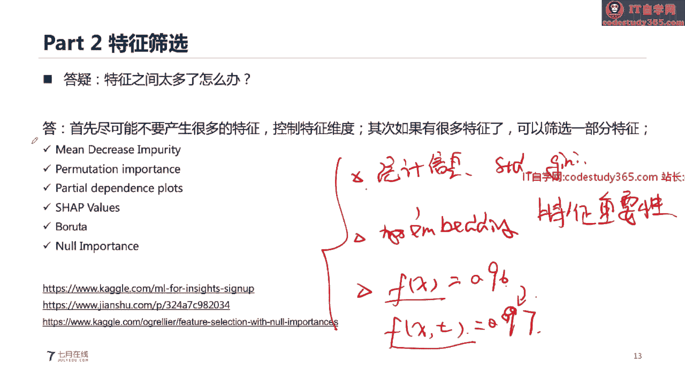
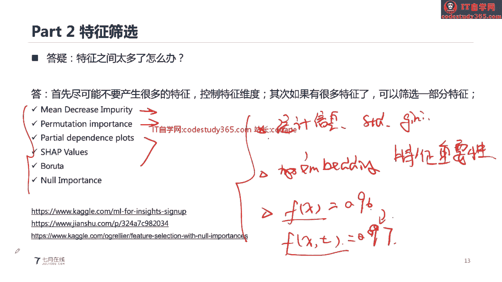
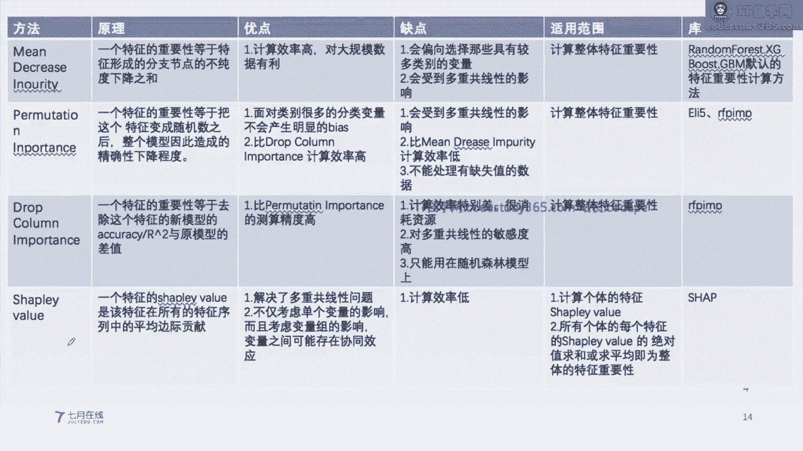
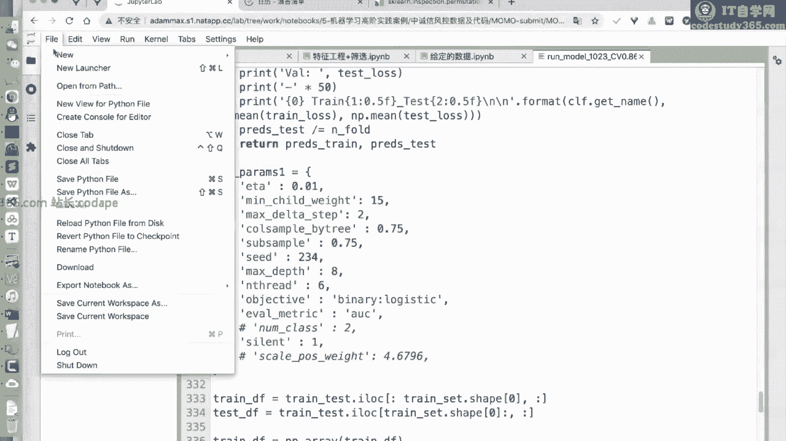
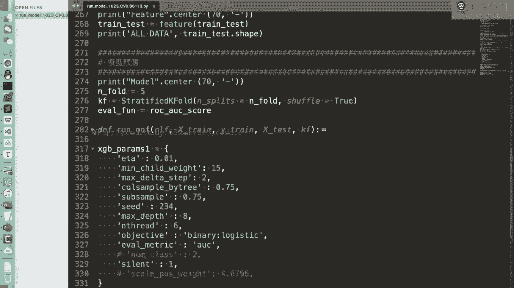
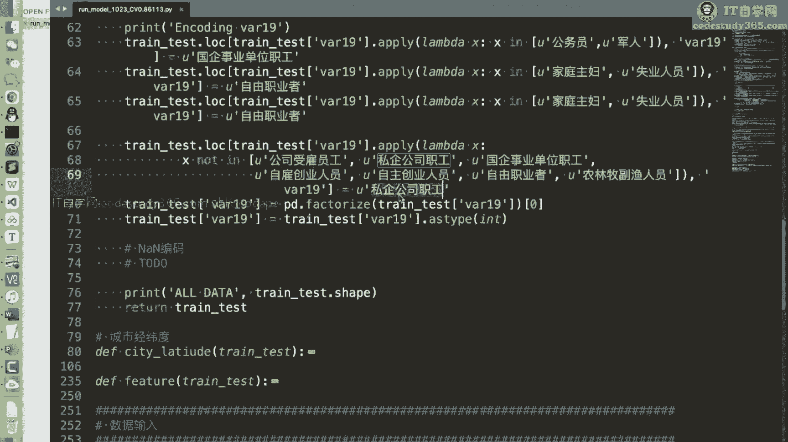
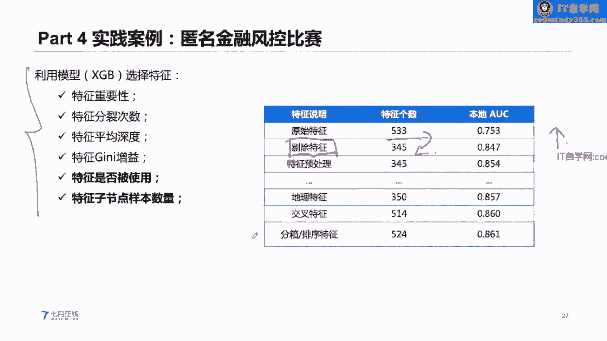
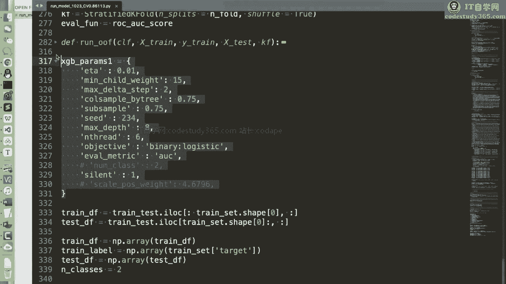
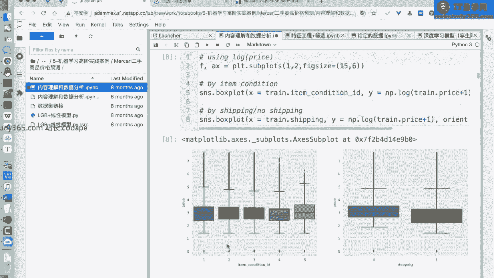
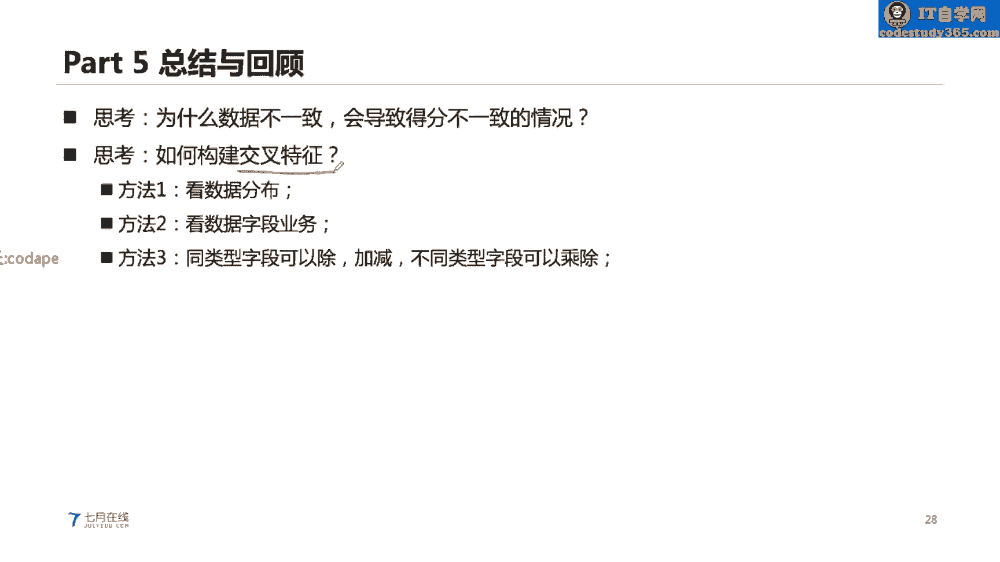

# 【七月在线】机器学习就业训练营16期 - P14：在线直播：5-机器学习实践案例高阶_ev (1) - IT自学网100 - BV1Z9T5ewEKL

好啊，各位同学大家晚上好啊，然后我们今天的一个直播的内容呢，是机器学习的高阶实践，那么我们在之前的课程呢，其实各位同学已经学习了很多的，机器学习的一些算法，以及我们的一些相关的一个实践的基础。

但是呢可能各位同学呃，在具体遇到一个问题之后呢，可能还是要解决好这个问题，我们还需要做一些更深入的一些理解，那么我们这节课呢，就主要是展开我们的一个高级实践里面的。

一些步骤，主要是对我们的这个一方面，是对我们的可视化做一个深挖，另一方面呢我们是需要对特征筛选方法，然后做一个展开，然后呢也是需要给大家讲一讲，我们的机器学习的一个案例，我们如何进行一个迭代。

然后呢我们也会以金融风控的一个具体的一个，实际的一个场景下的一个业务数据啊，给大家进行讲解，我们如何进行解决的好，我们首先来看第一部分啊，可视化EDA，EDA呢这个地方EDA它的一个它这个是缩写啊。

Eda，那么这个地方呢，我们在做一个具体的一个数据挖掘，数据建模的时候呢，其实数据分析它是我们一直要做的一件事情，数据分析呢其实它的一个具体的一个，它是理解数据的一个最好的一种形式。

有很多同学可能不太理解，就是我们很多的一些程序员，不管是呃做开发的啊，还是做算法的，去一些互联网公司，就是国内的这种互联网公司啊，不管是国内的还是国外的啊，不管不管是阿里啊，百度啊，或者是说腾讯啊。

甚至在国外的这种FACEBOOK谷歌，你去了之后，很多时候的一个算法工程，真的不是说是直接让你进行建模，它不是让你进行建模，这个其实建模是一种一一件很简单的事情，建模我们只要有数据。

我们传入到我们的一个具体的结构package里面，我们的一个模块里面，然后它进行一个训练就行了，我们这个地方是需要算法工程师，去构建这个数据，也就是说我们的数据呢他可能是原始，可能是非规整的，不存在的。

或者说算散布在多个表格里面，比如说我们有table1，我们用table2，甚至有N个表格，我们在进行建模的时候，我们是需要将这多个表格的一个数据，进行一个汇总，然后得到一个汇总表。

然后以此来得到我们的一个最终的一个结果，也就是说我们在进行建模的时候，我们的数据呢其实是我们人工需要进行，构建得到的，而且在这个构建过程中呢，是需要有一定的业务知识的，我们在构建这个数据的过程中呢。

我们如何去理解我们的数据呢，数据分析是最好的一种形式，这个地方的数据分析呢，它就是我们嗯想要从一种统计或者可视化的方，法去理解我们的数据，我们的数据分析呢，嗯常见的数据分析有有几种形式啊。

第一个呢就是我们的一个嗯，探索性的一个数据分析，验证性的数据分析和描述性的数据分析，嗯我们就展开进行讲解一下啊，一般情况下数据分析呢他其实是一个岗位对吧，我们有有些时候呢你去应聘的时候嗯。

在互联网公司他有这个数据分析师这个岗位，那么这个地方的数据分析呢，其实他跟数据分析师，他所做的其实在工作内容上是非常相似的，但是呢我们算法工程师，他所做的一个数据分析的步骤呢是更深入的。

我们做数据分析的时候呢，一般情况下，首先明确一下我们的分析目的和思路，然后我们有了我们的分析的目的和思路之后，接下来我们就是去收集我们的数据，这个地方收集我们的数据呢。

就是我们想要分析一个场景下的一个分布，或者说场景下的一个数据，那么我们接下来就去需要收集，这对应场景下的数据，然后去做一个数据的一个统计，然后做一个分析和可视化，然后最终形成我们的一个报告。

这是比较传统的一个数据分析，它最终产生的产出的是一个报告，相当于是一个可视化的报告，但是呢在我们进行建模的时候，其实我们的一个嗯数据分析呢，不仅仅是去就是说最终是一个报告。

我们想要得出一些更加深入的一个结论，我们在进行一个数据分析的时候呢，我们不仅仅是需要撰写报告，可能呢我们还是需要做一些建模，这个地方呢，我们可以将我们的一个数据分析的过程呢，加入到我们的建模过程中。

我们可以将我们的数据分析呢，把它加入到统计学，就是说如如下的步骤啊，就是说如果是用传统的一个统计分析步骤，应提出问题，准备数据，收集数据，统计数据，建模分析得出结论，这个地方的建模呢。

就是说我们可以构建一个线性模型，线性模型这个线性模型呢就是说我们可以啊，我我提前假设一下，我们的数据它是如何进行分布的，那么我们就可以提前构建这个模型，然后再去分析一下模型它的一个预测的结果。

这这个呢其实他主要关注在我们的事后，就是说我们建模之后，你们我们去分析我们的一个模型的预测结果，它跟我们的一个真实的结果，是不是存在有一些偏差，在我们的做数据分析的时候呢。

其实可以把我们的一个分析的步骤呢放在事前，事前呢就是说我们在建模之前，我们就做一次数据分析，建模之前就做一次数据分析，或者说做多次，为什么这么说呢，我们数据分析，其实他是想要挖掘出我们数据的一个。

内部的分布规律，然后这个分布的规律呢能够帮助我们进行建模，能够帮助我们进行建模，因为我们在进行一个分析的过程中，其实能够找到很多的一些嗯具体的一些信息啊，我们在具体的建模的过程中呢。

数据分析它以及数据的清洗，数据的处理，应该是占占据了70%以上的，一个算法工程师的一个工作时间，也就是说70%的时间都是在做，跟数据相关的，而且它是我们在建模中最耗费精力的环节。

以是嗯能够挖掘出我们关键信息的一个环节，我们的一个具体的一个测谎工程师呢，他的一个就是说在做一个实践的过程中呢，为什么这个不同的人在进行建模的时候，得到的精度不一样，这个呢举举举个例子啊。

就相当于是我们在参加一个比赛，这个比赛呢，每个选手都是给了一个相同的一个data，以及我们现在这个Python环境下的model，这些模型都是现成的对吧，我们给定了一个现有的数据，现有的模型。

那为什么有的一个同学，他得到的一个模型的精度比较好，有的同学他得到的一个模型的精度就比较差呢，这个关键就在于，你的一个模型，是不是能够有效地对数据进行拟合，以及你有没有对数据集进行一个有效的理解。

所以说这个地方我们在进行建模的时候呢，数据分析它其实是可以帮助我们进行建模的，那么有同学可能就会问到老师，我们在做一个数据分析的时候，我也不知道到底怎么做啊，那么就可以看右边这个图啊。

EDA探索性数据分析就是我们这个地方探索型，探索型就是exploring对吧，E大写的E就是这个嗯就是这个缩写啊，那么我们在做数据分析的时候呢，就是按照这些步骤来进行展开，首先呢我们可以读取我们的数据。

并分析一下数据的质量，这个数据的质量呢你可以看一下我们的数据集，它是不是规整的，就是说如果读取的是这种二维的一个表格，那么我们可以看一下我们数据集是不是规整的，以及我们的数据集里面是不是存在噪音啊等等。

那么我们的这是，你可以首先呢从整体的表格来进行看，看完之后呢，然后接下来深入每个变量去看，就相当于是我们之前先看整体的这个二维的，然后接下来再去看每一列的每一列的这种情况，这个地方我们的一个每个列呢。

每个变量我们其实是能够分析很多东西的，我们分析的东西呢，可以就是说我们的每列它是什么类型的对吧，这个类型呢就是它的一个d tab对吧，它的一个类型其实会影响到我们如何进行建模。

也就是说我们的一个具体的一个变量，我们如何进行编码对吧，这个其实是会影响到我们的一次，其次呢我们的一个变量是不是有缺失值。

是不是有Missing numbered的或者Missing value的这种情况，这个呢其实也是在我们的现实生活中，非常非常常见的，我们的数据集呢，他可能是存这一列存在这种缺失值的情况。

那么如果是存在缺失值呢，那么额我们会将我们的一个具体的一个额，数据集啊，以及我们的一个变量做一个相关的处理对吧，然后呢，我们也会看一下我们的变量是不是有异常值，这个异常值呢就是我们的一个具体的变量。

它的如果是嗯数值类型的对吧，那么我们可以通过sin西格玛，就是我们相线图可以找出它的一个异常值，如果是有这种我们的一个类别类型的，那么我们也可以看一看他是不是有这种出现，次数比较少的一类对吧。

也是我们的一个异常异常值，然后呢，我们可以看一下我们的一个变量，是不是有重复值，就就是我们的一个变量，虽然说它是一列的一个，就是说它是一个列向量，但是呢这里面的每个取值，它可能并不是完完全全不重复的。

你可以看一下是不是有重复值，以及它具体的一个取值空间，这个我们都可以分析一下，其次呢我们在做一个具体分析的时候呢，我们还可以看一下我们的变量是不是均匀的，就是说我们的变量的整体是怎么分布的，这个呢。

其实这样对我们的建模也是非常关键的，那么我们当我们拥有了这么多信息之后，然后接下来就可以得出一个结论，就是说这个变量到底是类别类型的，还是数值类型的，还是文本类型的，它有没有缺失值。

它整体的分布是怎么样的，它有什么特点，它也没有重复值，那么我们有了这些信息之后，我们就需要决定我们的在进行建模的时候，这一列是不是需要做一个转换，我们在进行原始建模的时候呢。

我们假如说原始的一个data，它是一个10K乘以20的这种情况，10K乘以20的这种情况，20呢是我们的列，这也就是我们的一个具体的一个字段，10K呢是我们的一个样本个数，那么这个地方呢我们的20。

这个又又可以把它叫做变量啊，就是我们具体的每一列，那么我们这个20呢在我们进行建模的时候呢，其实并不是说所有的20，都要输入到我们的模型，我们有可能呢去选择我们的数据集里面的，有效的数据。

比如说选择得到了9K乘15，我们这个地方我们选就是相当于是有五列，我们把它剔除掉了，这五列，我们把它剔除掉了，还有我们的1K样的，我们也把它剔除掉了，我们这个呢就是说从我们的一个数据分析。

我们可以筛选得到啊，有效的一个数据，有效的数据好，那么有同学可能就会问了，老师我们怎么筛选啊，怎么筛选啊，其实这个筛选呢，这个其实就也是我们在做数据处理的过程中啊，在在这个数据的清洗的步骤啊。

可以得到的，我们在这个具体的一个缺失值的这一部分，就可以进行一个筛选，就是说如果这个字段，它的一个缺失值的一个比例，高达99%对吧，那么我们就可以考虑把它进行剔除掉。

因为它可能包含的一个信息就非常少了对吧，如果他的信息量就是他这个取值空间，就是完完全全是他的所有的一个字段，都是重复值对吧，那么我们也可以考虑把它进行剔除掉，因为他没有什么信息量好。

那么这个呃是我们的一个列列向量的一个筛选，那么对于行向量呢，行向量我们也可以看一下，是不是我们的样本是不是有重复的，我们的样本，它是不是呃也存在这种大量缺失的这种情况好。

这是针针对我们的单个变量的一个分析，那么我们的一个具体的一个分析呢，就是说不仅仅是分析这个我们单个列，他的一个情况，我们也会尝试去分析一下我们的一个变量，与我们的一个标签的一个关系。

假如说我们呢有了一个额，仍然是一个10K乘20维的一个数据，我们还有一列是我们的target对吧，这是我们的target，这个地方的20呢是我们的每列的一个，就是说20个字段啊，20个变量。

那么这个地方呢就是说我们的一去，需要做一个分析，就是我们的一个变量和target，我们的或者说和我们的label，是不是存在一个逻辑上的一个关系，对，那么这个地方呢也是对我们建模非常有关键的。

非常非常有作用的，那么如何如何进行分析呢，其实很很简单，就是看一看它们之间有没有相关性，算一算它的计算它的相关性的一个系数，比如算它的一个PR性系数，就可以很很简单的可以计算得到它的相关性，对吧。

当然如果我们提前知道这个变量，和我们的一个标签的一个含义，我假如提前知道它的含义的话，我们就直接可以看一看，他之间是不是存在什么业务逻辑对吧，这个也是非常非常有效的。

那么如果我们想要看一看这个标签与变量之间，它存在业务逻辑的情况下，我们怎么进一步做一个分析呢，我们在这个地方呢，就是到我们的这一步，我们在做一个具体的一个分析的时候呢，我们假如说有两列啊。

X1和YX1是我们变量，Y是我们的标签，我们想要分析这两者之间的一个相关性，我们在进行建模的时候，其实在建模的时候，其实如果我们从相关性的系数能够找到，它们之间是相关的，那么接下来怎么办呢。

接下来要做的一件事情，就是做一些统计的分析或者画图，做做一个统计分析或者画图嗯，我们举个例子啊，假如说我们这个地方的X1，它的一个是一个嗯类别类型的，它的一个取值是012，我们的标签呢是数值类型的。

它的一个取值范围是从0~100的，一个取值范围，X1是一个类别类型的标签，是一个数值类型的，如果我们从这个相关性的系数计算得到，这两者之间是强相关的，那么我们怎么做一个分析呢。

我们直接可以做一个统计对吧，我们group by，我们的一个X1，然后统计一下我们的标签，它的一个具体的一个均值对吧，也就是说对我们的一个具体的一个X1，进行分组。

在我们的一个样本X1取值为零的分组下面，他对标签的均值类似的，在一取值情况下的标签的均值，以及二取值下面的标签的均值，这样呢就可以进行一个分组的统计，然后做一个可视化，那么你就可以很清楚的可以看到。

在我们的X1它具体取值的情况下，我们的标签是如何进行一个分布的，也就是说我们的X1的具体取值如何影，影响我们的标签的这个地方呢，就是有会有一些细节，就是我们的一个变量。

如果这两个这个地方其实是我们的一个变量，和我们的一个标签，当然我们也可以以此类推，我们的变量与变量之间，是不是能够算一算它的相关性，然后做一个具体的分析呢，这个也是可以的啊，这个也是可以的。

我们在做一个分析的时候呢，这个地方就有一些细节，就是我们可以分析一下，连续型变量和连续性变量之间的一个关系，离散型变量和离散型变量之间的关系，以及变量之间它之间分布是不是有正态性好。

这些分析呢都是可以做的啊，那么这个分析的一个过程呢，其实就是按照这样一个逻辑啊，首先呢看一看数据质量，数据质量，这个质量是我们从整体行和列都可以看质量，这是第一步，第二步是看一下我们的每一个变量。

它的一个具体的一个取值，它的类型，看他单个变量的一个情况，然后接下来就看一看多个变量，两个变量之间他们是不是存在这个相关性，那么我们分析了这么多之后，是不是要得出一个结论呢，当然是的，我们得出一个结论。

就是如下的一系一系列的结论，首先呢我们的这个变量是不是要做筛选，是不是要做一个替换，以及清洗这个具体的一个字段，它是不是是有信息的，以及它的信息量，是不是跟我们的标签是强相关的。

这些呢我们都是可以做一个再做一个分析之后，我们得出的，其次呢我们这个变量是不是需要做转换的，他如果是类别类型的，我们怎么对它进行一个编码呢，好然后呢，我们的一个变量之间是不是可以做一个交叉。

它们之间是不是需要做一个演变，得到一个新的特征呢，然后我们的变量是不是需要做一个采样呢，这些都是可以做一个具体的一个分析的过程啊，做一个具体分析的过程，然后得到这些结论，得到这些结论好，我们继续。

那么在我们做一个具体的数据分析的时候呢，它不仅仅是我们算法工程师要做的啊，当然在一些具体的一些数据挖掘的竞赛里面，都是要都是可以做的，我们通过这个数据分析呢，我们可以得到最最重要的，可以得到这些结论。

第一个呢我们通过这个数据分析，我们可以得到我们在做这个建模的时候，我们使用什么样的模型，我们现在有非常多的一些模型，逻辑回归啊，SVMSVM啊，然后我们的树模型啊，然后深度学习的模型啊等等等等。

应该细数下来，应该就是说十几种上百种都是有的对吧，那么我们到底选择哪一个模型呢，这个呢就是说嗯可以这样做一个总结，如果我们的一个数据，它里面大部分是类别类型的，类别类型的就是类别类型的一个表格的数据。

那么我们用数模型会比较好，如果这个数据里面大部分情况下是数值类型的，我们用线性模型，或者说用我们的神经网络会比较好，数模型它其实对我们的类别类型比较友好对吧，然后他在做一个处理的时候。

也不需要对我们的数据集做一个one hot的处理，那么数值类型的数值类型，就是说它的一个每列的一个取值空间非常大，我们用数模型在数值类型比较多的一个，数据集上进行训练呢，训练的一个成本会比较高。

每列的一个搜索空间非常大，得到的效果也不会特别好好，这是第一个啊，就是说我们可以得到我们到底使用什么模型，第二个呢就是说我们可以得到，我们如何对我们的数据集做一个处理，这个做一个处理。

就是说我们的数据集怎么对它进行编码，怎么对它进行一个具体的一个就是说嗯转换，第三个呢，就是说我们能不能挖掘出一些新的特征，原始的一个特征，假如说是20个，我们其实可以做把它编码为40个。

50个甚至100个都是可以的，这些新的一个特征，其实在我们的原始空间内是不存在的，我们是可以通过一系列的方法把它编码得到，那么我们再做一个具体的一个嗯，数据分析的时候呢。

嗯我们是可以得到一些相关的一个结论的，我们仍然是以啊，上周各位同学学过的一个案例进行看一看啊，就是我们在进行一个需要根据这个房子的一个，具体的信息来预测一下房子它的一个热度。

或者说房屋的一个它的一个具体的价格对吧，那么在这个数据集的下面，那么我们拥有的数据，是这个房屋的一个基本信息，房屋的一个地理位置信息对吧，以及房屋的一个中介的信息，那么我们需要预测一下我们的房屋。

它具体的热度，那么在这个地方我们怎么做呢，我们在在这个地方做的时候呢，我们其实你可以只以这个房屋，它现有的信息做一个建模，但是呢其实我们是可以做这样一个思考，我们的这个房子它跟同小区的一个房子。

它的价格对比怎么样，这个房子跟相同中介的价格对比怎么样，这个房子在同和同等同等配置下面的价格相比，还是怎么样的，所以说这个这些具体的一个具，相当于是这些字段呢，都是会影响到我们租房的对吧。

这些字段也都会影响到我们具体的标签，这个思考逻辑呢有点像人的这种货比三家，这种逻辑对吧，那么在这个地方呢，我们这些逻辑其实它都是可以用，我们的pandas的这种group band来做一个实现。

pandas的group by怎么做呢，就是说，group by我们的一个小区对吧，然后算一下它的price它的一个平均值对吧，平均值这是我们的同小区的一个平均值。

那么我们再用我们的一个当前小区的一个价格，当前房子的价格减去这个平均值对吧，样本的一个字段减去这个平均值，就可以计算得到它的差价，那么类似的如果我们想要计算一下相同manager的。

就是group by manager，然后算一算它的价格的一个平均值对吧，如果是同等配置的，我们就对配置做分组，然后算下他们的价格，这些呢都是非常常见的，就是我们右边这种形式，对原始的数据集进行分组。

然后做一个具体的一个聚合好，那么在这个地方呢，就是说我们做一个数据的一个分析呢，它不仅仅是需要大家从这种思，这种思维方法来进行思考啊，就是说你可以作为这种特征，然后你去做了这种特征之后呢。

你可以做这样一个尝试啊，我举个例子，房子与本小区的价格相比，就是有两种情况呗，一种是高了，一种是低了对吧，这个房子与同小区它的价格相比，肯定是它的平均值相比，肯定是两种情况，高了或者低了对吧。

那么我们继续看一下，在这个房子比同小区价格高了的情况下，它的一个具体的标签的一个取值是怎么样的，以及这个房子与同小区价格低了的情况下，它的标签的一个取值是怎么样的，我们是通过这种方法。

你可以得到一个新的一个字段，然后再去看一看这个新的字段，和我们的一个label，它们之间的关系对吧，这个是很直接的，你的一个验证，我们的思路就可以通过这种数据分析的方法，直接去验证一下。

我做一个可视化或者做一个统计，就可以得到我们的这个房子和盆，小区价格高的情况下对吧，比本小区平均价格的价格更高的情况下，我们标签是怎么样的，我们如果跟我们本小区的价格相比，它更便宜更低的情况下。

我们的标签是怎么样的，这个就很直观啊，很直观，我想表达的意思就是我们通过这些思路，我们就可以进行一个数据分析，做完数据分析之后呢，我们就可以得到一个结论，这个结论呢就可以帮助我们。

就是说去验证我们具体的一个思路，那么这个地方呢就需要思考一下，就是我们的一个特征啊，在进行一个编码的时候，我们到底哪些我们的一个模型是如，他能够学习到呢，以及我们的哪些特征他是学习不到的。

嗯这个地方呢第一个我们特征如何进行编码，模型是能够快速进行学习的，这个呢是这样的啊，我们的一个特征呢其实它有很多种编码方法，额数值的我们的一个嗯嗯类别类型的，还有文本类型的等等等等。

这些具体的一个我们的一个特征呢，它是有很多种编码方法的，那么是不是每一种我们都是要尝试呢，嗯这个不是的啊，我们是需要根据具体的一个数据的一个分布的，一个就是字段的一个分布的规律啊。

然后再做一个进行得到一个结论，嗯这是第一点，第二点呢，就是说我们的哪些特征模型能够学习到呢，这个我们之前给大家稍微提到一点啊，哪些特征模型模型学习不到呢，比如说这个地方房子和本小区的一个价格对比。

这个模型能够学习到吗，对吧，其实这个模型是学习不到的，所以说呢这个地方我们是需要做这样一个思考，就是我们的一个具体的一个模型，它跟我们的能学习到什么特征，以及不能学习到什么特征。

那么如果我们在做一个具体构建特征的时候，我们是不是可以将人工，就是人工将这些模型学习不到的特征，把它构建得到对吧，把它构建得到，所以说我们在进行数据分析的时候呢，其实本质就是去挖掘我们的一个具体的字段。

它内在的一个规律以及它内在的含义，因为我们的一个数据其实他是不不会说话的，但是呢我们仍去是能够去挖掘我们具体的数据，它内在的一个规律的，所以呢我们在进行具体的一个分析的过程中呢。

我们其实就是需要将我们的具体的一些字段，进行一个具体的一个建模，然后呢我们可以对单个变量进行分析，对于我们的变量和我们的标签进行分析，以及进行我们的标签与标签之间，进行一个分析啊。

这个变量与变量之间做一个分析好，那么这个地方如果我们想要做一个数据分析呢，其实有很多种的一个具体的一个可视化方法，比如说我们嗯就是可以用来做一些呃，嗯比较类型的一个分析，以及我们的趋势类型的分析。

分布类型的分析，构成类型的分析以及联系类型的分析，这个地方呢我们就是从不同的一个可视化方法，然后做一个展示啊，因为我们的一个具体的一个，我们想要分析得到的一个结果是不一样的。

以及我们在做一个可视化的时候，而我们的一个元素构成是不一样的，比如说这个地方我们的一个嗯折线图，其实它的一个折线图呢X轴就是一个时间，X轴是一是是是一个时间，Y轴呢可能就是一个具体的取值，随着这个时间。

我们的一个具体的取值是如何变化的对吧，柱状图呢其实它是没有这种时间的概念的，我们的X轴可能就是每一类啊，每一类，那么这个地方我们不同的一个嗯，可视化的一个图表呢，它的构成元素不一样。

它想要体现的一个信息也不一样，那么这也是我们算法工程师要了解的啊，就是说我们拿到数据的情况下，我们怎么去做一个可视化，在我们的Python环境下呢，其实是拥有非常多的一些可视化的工具啊。

比较嗯就是说常见的是这个MATTPLEAVE，当然也有con嗯和boss啊，这个boss这个呢其实我也是用的比较多，但是我最常用的是matter pleap，当然也有一些比较高阶的啊。

就是说可以支持这个和我们的这个浏览器，做这种嗯交互的，比如说PY一下啊，Proxy，这些呢都是可以跟我们的浏览器做一个交互，也就是我们的一个鼠标呢，可以做跟我们的浏览器做一个就是说拖动啊。

然后进行一个汇总，然后做一个交互动态的这种绘图，当然还有这种跟我们的地图进行相关的，这种可视化方法，那么我们刚才呢就是讲了一下，我们的一个具体的一个嗯可视化方法，就是这个数据可视化。

其实嗯也是非常非常重要的，非常非常重要的，那么我们接下来第二部分，就是看一看我们的一个特征筛选方法，额特征筛选呢，其实是呃非常非常关键的一个环节啊，也是嗯在我们进行呢，就是说对于初学者而言。

这一部分其实可能会嗯有有一定难度，因为我们的特征筛选呢，其实他在做一个特征筛选的时候，假如说有20个特征，我们可能是只选择其中的十个特征参与训练，可能有十个我们就把它丢弃掉，那么在这个地方呢。

我们进行一个具体的一个嗯建模的时候呢，我们如何进行筛选，这十个特征可能就是我们的一个特征筛选方法，那么有同学可能就会有疑问，就是我们的一个特征呢，我们筛选之后模型的精度有变化吗，其实是这样的。

我们的一个特征筛选呢，它对我们的模型的精度是有争议的，是有争议的啊，我们先把这个PPT这一页给大家讲完，我们在做一个构建特征的时候呢，其实我们的特征它可能是存在有一定的一个，贡献性的问题，共线性的问题。

就是，他们之间可能是存在一定的一定的一个相关性，那么这个地方呢，我们可能是需要将我们的一个相关性啊，把它作为一个剔除对吧，但是呢这个可能是跟我们的一个模型，像模型有关啊，就是说我们的模型不同的情况下。

我们的这个操作也不一样，呃如果我们是用这种线性模型，那么我们就可能是需要考虑一下，我们的具体的一个共线性问题，但是呢如果我们使用的一个是数模型啊，我们就可能就不需要去考虑这种共线性的问题。

那么这个共线性问题呢，其实他是嗯就是说根本原因呢，就是因为我们的特征与特征值之间，是存在相关性的，那么如果你想要我们的用模型是完全可解释的，那么就需要去解决一下贡献性，但是呢在我们现实生活中建模啊。

现实生活中建模的时候，其实贡献性的，我们一般情况下不太会过多去考虑啊，因为我们现在呢可能用到是直接用到，线性模型的这种场景会比较少啊，那么我们在进行具体的一个特征筛选的时候，有没有一些具体的一些啊。

就是说方法呢，其实在我们的SKLN里面，都有一些具体的一些库可以进行使用啊，比如在s kn的一个feature selection的模块，就可以很方便地完成我们的一个，特征筛选的一个步骤。

当然这个下面也就是我们的具体的一些代码，实践的这个链接啊，我们待会也可以给大家演示一下，那么我们再回到我们的刚才那个问题，我们有20个特征的情况下，原始的特征是20个，我们可以构建得到很多特征对吧。

比如说我们grow by a求B的一个均值，对吧，或者说求B的一个最大值对吧，我们就是说grp by a求B的一个最小值，最大值平均值对吧，这些都可以得到一个新的特征对吧。

那么这样呢我们得到的特征其实20个，我们可以演变得到几百个甚至上千个都有可能，但是这些特征变多了，我们的一个模型精度一定是上升吗，这个不是的，我们的特征呢它变多了，他可能的精度会下降，可能精度会下降。

这是第一点啊，第二点呢，就是说我们如果这个特征的个数增变多了，我们的一个具体的一个模型，它的一个训练的速度会变慢，训练速度会变慢，因为我们在进行训练的时候，其实啊我们的这个机器的一个内存啊。

以及我们的一个资源是受限的对吧，那么在进行一个建模的时候，我们可能是需要用有限的一个特征进行训练，那么我们在进行建模的时候，首先呢就是关注第一点，就是我们尽可能的不需不要去产生很多特征，一方面呢。

我们在之前的一个one hot的一个知识点的时候，给大家讲了，我们在具体产生特征的时候呢，尽可能把这个维度啊，把它嗯就是把它压缩到一个范围内，不要产生很多的一些特征控制维度。

其次呢我们如果之前就已经有很多特征呢，我们就可以通过一系列的方法，去筛选其中的一些特征，一个很典型的，我们假如有原始有20个特征的情况下，我们可以筛选得到其中的16个特征。

或者说十几个特征或者几个特征参与建模，那么这个地方的特征筛选的这个步骤，其实它是一个很难的一件事情，为什么很难呢，原始的一个特征是20个，我们需要从中筛选16个，那么这个地方就是一个C二十十六的一个。

搜索空间，有这么多排列组合的一个就说特征，我们需要相当于是从20个里面进行一个，无放回的一个采样对吧，无放回的一个抽样抽样得到16个，这个地方其实这个数数值对吧，其实是非常大的对吧。

其实本质就是一个C24，这个是有几百甚至上千种可能性对啊，那么我们这个地方其实就是需要进行一个嗯，就是说搜索空间就是非常大的，那么我们在进行操作的时候啊，就是说有很多种特征筛选方法。

然后呢我们就给大家进行嗯简单的讲解一下，因为这里面其实是包含的一些知识点是蛮多的，我们在做一个特征筛选的时候呢，在我们的一些教材里面，其实他会讲到有我们的三种特征筛选方法，在我们的一个西瓜书嗯。

就是周志华写的一个西瓜书里面呢，其实他写的我们有三种特征筛选方法，第一种呢是基于我们的一个统计信息的，比如我们统计信息，就是说基于我们的一个方差，或者说我们的一个信息商。

或者说基尼指数这个字段的经理指数，这是基于统计信息的，第二种呢是基于基于我们模型的嵌入，这种嵌入式的嗯，嵌入embed，就是我们在这个具体的一个使用的时候呢，我们可以用这个具体的一个模型。

它输出的一个特征的重要性来做一个特征筛选，特征重要性对吧，然后呢还有一种是包裹式嗯，或者说是种迭代的方法，迭代方法跟我们的建模的过程中是比较类似的，就是说我们可以判断一下，我们有两个没加特征的时候。

我们的一个精度准确率可能是0。96，加了这个特征之时，我们的一个精度是0。97，我们的一个精度是不是有什么变化，它是上升呢还是下降呢对吧，那么在这个地方，我们其实就是可以做一个，通过这种方法来确定一下。

我们是不是保留这个特征，如果他加了之后，模型精度上升保留，如果模型精度下降，我们就把它丢弃掉对吧，当然这是比较常见的三类我们特征筛选方法，当然我们在现实生活中呢，可能嗯用到的一些方法。

就是说也会用到这三类中间的一些，当然我们也会用我们这个地方，PPT所展示的这些方法好。

我们就翻到我们的一个代码实践的这个过程中。

我们仍然是呃用这个特征工程的这个notebook，进行继续，我们在之前呢其实嗯给大家说了，我们的一个给大家讲了，我们的一个具体的一个特征重要性的这个东西，特征重要性呢其实它的一个具体的一个含义呢。

就是我们的一个feature，它的英文名字啊叫feature importance，特征重要性，那么这个特征重要性它是什么含义呢，我们来找一下啊，在原始文档里面，在我们的SKN我们可以搜索一下。

在它的API这个地方，我们可以搜索到所有的他的一个，具体的一个模型，我们找一下随机森林好，然后找到这个之后呢，我们再找到它的一个呃，他的attributes。

他的一个feature importance，对，那么这个地方呢，就是说我们在做一个fishing importance的时候呢，我们可以翻译一下，这个翻译其实也是蛮准的。

嗯在这这个地方呢就是它的一个feature importance，你可以理解就是一个激励指数，或者说一个具体的一个信息增益，在我们的一个具体分裂的过程中，如果用了这个字段做一个具体分裂，我们的一个标签。

它的一个纯度是不是有具体的一个变化，是不是有一个具体的变化好，那么这个地方呢，feature importance呢就是在数模型里面啊，我们就是用这个feature importance来衡量一下。

我们的一个具体的一个字段，它的一个重要性，那么我们在这个地方，其实在所有的所有的数模型里面，我们都是可以用这个feature importance，来做一个具体的一个操作的啊。

嗯这个地方其实它输出的就是一个重要性，那么类似的这是我们的一个LAHGBM，这个是我们的差距boost，那么我们在做一个特征筛选的时候，我们可以很很简单的就是说。

我们只保留我们的一个facial importance，里面最重要的他的两个特征对吧，重要性最高的这两个特征保留下来，把其他的给他，就是说丢弃掉这个其实是可以的，是可以的好。

那么我们就看一看具体的一些feature，importance的方法啊，在我们具体建模的时候呢，我们可以首先呢利用这些具体的一些信息量，来做一个筛选，嗯首先呢可以利用我们的一个具体的一些方差。

这个方差呢就是我们的一个可以统计一下，我们这个地方其实是一个呃多列啊，这就就是相当于是我们的一个我们的六列啊，六行三列，六行三列，在这个地方呢我们用六行三列的情况下呢，我们呢其实可以统计一下这每一列的。

它的一个就相当于是每一列它的一个方差，然后呢用这个方差去做一个筛选，如果这一列的一个方差，它是小于我们的excess后的，那么我们就可以把它进行一个丢弃掉对吧，这个呢就是说我们利用方差来做一个筛选。

这些呢都是在我们的一个SPN里面，有具体实现啊，当然你可以，你也可以直接用Python来做一个手动的一个计算啊，这个都是可以的，当然我们也可以利用一下我们的一个相关性，这个相关性呢就是我们可以计算一下。

我们的一个具体的一个字段，和我们的一个标签的一个相关性啊，这个相关性嗯你可以看一看，在这个地方，其实有很多的相关性的一些评价方法，嗯看一看SKN的官官网，对我们的离散离散的互信息，连续变量的互信息对吧。

然后通过这些具体的一些相关性，或者说我们的嗯，这个线性单变量的线性回归测试，通过这些相关性呢，可以计算得到我们的具体的一个变量，和我们的标签它是如何进行，就是相关的，那么在这个地方。

你会发现我们的一个RM字段和LSTAT字段，其实跟我们的一个具体的一个标签是强相关的，那么在我们的上面我们得到了一个feature importance，数模型的FISHORT。

其实这个结论其实和我们的一个相关性，也是匹配上的啊，也是匹配上的，那么我们也可以利用线性模型，它的一个具体的一个，就是拟合的时候的一个具体系数，我们可以来看看这个地方的系数呢。

你可以理解就是我们呃具体的一个权重啊，每个字段它计算得到的具体的权重，那么我们也可以看到这个线性模型，它得到的一个相关性啊，重要性啊，特征的重要性其实也是跟我们的一个数模型的。

feature importance是气候的，那么我们在进行建模的时候呢，我们也可以做一个迭代的一个剔除，就是我们在做一个具体的一个剔除的时候呢，我们可以把它通过我们的一个啊模型，把它进行迭代啊。

就是说把它这个具体的一个字段把它加入之后，或者把它删除，然后看一看我们的一个具体的一个特征，它所带来的一个精度的变化，好我们还可以做一个排列的重要性，这个排列的重要性呢其实是这样的啊。

他叫我们的譬如promutation importance，它其实是一个非常非常有效的一个方法，我们在进行一个具体的一个嗯评价的时候呢，我们往往是比较建议，从我们的一个精度去做一个评价。

就是说从我们的一个模型的精度，他的变化做一个评价，排列重要性呢就是说我们的原始的一个字段，我们原始字段，假如说它原始的字段都是有序的啊。

这个地方我把一个画图的软件给大家打开啊。

我们有一个字段，这个字段假如它原始的一个次序是12345，这是有序的，那么我们可以在这个有序字段的情况下，计算得到一个精度，假如他的一个准确率是0。83，那么我们接下来呢可以对这个这一列，做一个打乱。

把他的一个次序呢把它转成一个32154，把它打乱之后，然后看它的一个精度的变化，比如它的精度可能是把它变变到0。80了，这个精度其实是下降的对吧，从0。83下降到0。80的，那么这个其实是什么含义呢。

我们在做一个具体的一个统计的时候呢，我们可以看一下我们的这个特征，它打乱之后，我们的一个精度有什么变化，把这个把这这一列打打乱之后，然后看一看它的精度变化，如果他的一个具体的一个精度变化太大的话。

下降很多，那么就表明这个字段其实是有效的对吧，这些是有效的，也就是说我们通过这个精度的变化，其实是可以得到我们的一个具体的一个，重要重要性的一个额衡量的，这个呢我们叫做一个排列重要性啊，排列重要性。

那么在我们具体的一个做的时候呢，其实是可以很方便的，对这些你可以自己去计算一下这些重要性啊，当然呢我们也可以直接是用这个s kn里面的，一些具体的一些重要性的一些计算方法。

来得到我们的一个重要性都是可以的好，然后呢我们回到PPT啊，这个地方呢我们的一个呃mean in decrecy impurity，就是我们的一个类似于经济指数，我们的这是我们的排列重要性啊。

然后呢这三个呢都是我们在呃，也是一些具体的一些重要性的一些计算方法，当然我们在课程中间呢，我们由于时间原因，我们就不做展开讲，你可以从下面这些链接，找到他的一些具体的一些呃，就是说讲解。

我们再给大家讲一个特征重要性的筛选呢。

叫做一个line importance，Line importance，NIMPORTANCE呢，其实啊这个地方是我们刚才所列举到的一些，重要性的一些计算方法。

它的一个原理和它的优缺点嗯，大家可以下去看一下啊，看一下，一般情况下我们就是这个drop calcullum importance，就是呃把这一列丢弃丢弃掉，或者说把它进行加入之后，然后看它的精度变化。

我们的排列重要性，就去看一下它的一个具体打乱之后，然后看它的精度的向量好，那么这个地方呢我们还有一个就是LIMPORTANCE，LIMPORTANCE呢其实跟我们的一个排列重要性。

其实是呃非常非常类似的，呃就是思路类似的一种方法，他的这种方法呢，其实就是对我们的一个具体的一个，建模的时候呢，我们可以将这个具体的一个数据集，把它进行计算，这个特征。

它的一个feature importance，我们的一个模型，数据加上我们的一个模型，就可以得到一个重要性的一个取值，就是得到一个value，那么如果我们把这个数据进行打乱，打乱打乱一次。

我们可以得到一个新的重要性，打断两次，我们可以得到第二个重要性，那么这个LIMPORTANCE它其实是什么含义呢，它就是这样一个意思，我们的这个地方的一个红色的这个柱子呢，是原始数据的一个情况下。

我们的一个具体的一个特征的重要性，我们的这个柱状图呢是我们把这个数据，或者说把我们的标签打乱之后，然后再看一看我们的一个重要性，这个为什么是一个柱状图啊，因为他这里面其实计算了很多次，我们的一个重要性。

然后把它绘制的一个柱状图了，他是有多次的，那么这个图怎么看呢，其实这个图这是一个特征啊，这是一个特征，这分别左边的呢是一个分裂重要性，这是一个基尼指数的重要性，这都是一样啊，都是一样的。

那么这个地方嗯就是说左边的图，这一幅和GF是用同一个指标计算得到的，GF和GF都是用同一个指标计算得到的啊，只不过这一个是一个特征的啊，这是一这是一个特征的，我们可以看到左边这个特征。

他其实打乱之后的一个特征，重要性比打乱之前还高对吧，整体还高，或者说他们没有什么变化，但是我们看右边这个特征打乱之后的一个特征，重要性比他打乱之前正常的低很多，低很多，其实这个才是有用的特征。

这个特征就没有什么信息量，为什么呢，我们把这个数据给它打乱之后，这个特征的重要性仍然很高，那么就说明这个数据它是不是有序的，对我们的一个具体的一个，就是说最终的一个精度，或者说重要性是没有影响对吧。

其实我们其实在进行建模的时候，如果这个数据有序的话，那么我们尽可能的我们的模型呢，它可能就会去使用，得到这个真实的一个数据的里面次序，反而呢就是说如果这个次序打完之后。

他的特特征重要性呢就可能是这种随机的对吧，随机的，那么这个呢就是一个LIMPORTANCE的思路，那么我们怎么怎么实现的，这个思路呢其实也非常简单啊，我们首先能得到一个具体的一个呃，就是写了一个函数。

叫做get feature importance的这个函数，在这个函数里面呢，我们传入数据，传入我们标签以及传入一个SHUFF的命令，这是SHUFF的一个参数，然后呢控制一下我们是不是打乱。

然后呢这个地方我们这个如果是shuffle呢，我们就对对我们的标签进行杀普啊，这个地方我们不是对这个列做杀F，我们是对标签做一个杀破这个shuffle呢，为什么对标签做一个SHUFF呢。

就是把标签打乱呢，因为我们如果是打乱一列的话，那么我们接下来就说我们如果打乱一列，而不是打乱标签的话，我们只是得到就是他的思路，是跟排列重要性是类似的，但是如果我们打乱标签的话。

其实是可以得到所有的一个数特征的，一个重要性的对吧，可以得到打乱之后这所有的一个特征的重要性，它跟排列重要性其实非常类似，但是其前者是打乱数据，后者是打乱我们的标签。

那么我们首先呢记录一下我们的原始数据集，原始的数据和原始的标签，在没有打乱之前，它的重要性就是我们的红色的一个柱子，然后接下来呢我们就可以对我们迭代40次，把我们的一个具体的一个标签呢打乱40次。

这个地方我们设置一下，我们的一个shuffle为true，循环40次，打乱40次，也就是说每次的都是一个把我们的标签，随机把它打乱啊，这个地方把它SHUFF一下，那么打乱之后呢。

我们就可以对我们的一个具体的一个记录一下，打乱之后我们的一个特征，它的一个具体的一个FASHIIMPORTANCE，那么这个地方我们训练得到了40个模型，然后就有40个我们的一个嗯。

打完之后的一个重要性，然后就可以绘制得到类似的一个图片，这个红色的一个柱状，柱子是我们的原始的一个特征的重要性，这些就是我们打乱之后的对吧，这个地方我们很明显的可以看到这个红色的，它的一个重要性。

原始的重要性是比他打乱之后的一个特征，重要性高很多的，就表明这个特征其实是有用的，那么我们就再来看这个打乱之后的重要性，反而比他打乱之前的重要性更高对吧，我们去表明这个特征其实是没有什么用的。

好这个呢就是一个lie importance的一个方法啊，其实也是非常非常有效的一种方法，额那么我们稍微休息一下啊，我们休息到九点钟，然后我们继续好不好，对我们休息一下啊，这个手机用户679415同学。

对我们休息一下啊，如果大家有问题啊，也可以进行一个提问，好，嗯然后我们继续啊，然后呢我们在第三部分呢，我们就看一看机器学习的一个，具体的一个案例流程，其实我们在做一个具体机器学习的，一个建模的时候啊。

我们是根据数据不同啊，我们的一个建模的一个流程是不一样的，但是呢我们整体而言，其实嗯大部分情况下呢，我们是可以划分成如下几个步骤啊，首先呢是我们进行一个具体的，根据给定数据的情况下。

我们需要理解一下我们的背景，理解一下我们具体的任务，以及理解一下我们具体的一个评分方法，和我们的赛题时间，然后呢，我们这个具体的一个，就是说我们的时间轴背景任务，然后了解到这个具体内容之后呢。

然后接下来就对我们的数据集进行嗯，一个就是说理解，那么这个地方的一个，就是说数据集的一个理解呢，就是我们是可以对应我们的数据集，看一下数据分析，数据理解，然后看一看我们的数据集，是不是需要做一个处理。

然后第三步呢是对我们的数据做一个特征工程，这个特征工程呢，我们是需要对我们的具体的数据集呢，看一看是不是需要对它进行一个转换，以及是不是对我们的数据集进行一个构建，以及具体的特征筛选的方法。

然后第四步是我们构建模型，我们的模型呢，我们是看是要看一下我们的具体的数据集，是不是呃就是说啊怎么构建模型，然后怎么训练模型，怎么验证模型，然后以及怎么进行一个模型的调参。

然后接下来做一个我们的一个预测，其实我们的完整的建模流程，其实是按照这样一个思路来进行的，那么我们在进行展开的时候呢，这个地方其实是有非常非常多的一个嗯，一些案例啊，比如我们这个地方，如果各位同学比较。

就是说想要深入学习一下结构化的数据挖掘，这个地方都是有一些在开关上面，有一些具体的一些比赛啊，然后呢这些都是结构化的一些具体的一些案例，然后你可以进行一个学习，那么我们直接到我们的第第四部分，好吧。

我们第四部分呢就是讲一个具体的一个，金融风控的一个具体的一个案例，这个呢也是一个结构化的一个数据啊，结构化的一个数据，结构化，那么这个非结构化的数据呢，就是说文本和这个我们的一个额。

这个图片的类型的数据啊，他不是我们今天所讲解的一个重点啊，当然我们待会呢也会有一个具体的一个案例，给大家展开，我们在这个具体的一个嗯实践案例里面呢，我们是以这个利民的一个金融风控的一个比赛。

来进行展开讲解啊，这个是一个真实场景下面的，一个具体的一个比赛，那么在这个比赛里面呢，他是这样的一个问题嗯，基于这个消费金融以及小额现金贷，也就是一个PDP，PDP的一个贷款的一个场景。

我们需要构建一个准确的一个风险控制模型，分析和评估用户的一个信用状况，这个地方的一个用户的信用状况呢，就是说我们是需要预测一下他是不是违约，用户本质上就是对我们的UU用户，把它做一个分类。

他在进行这次贷款之后，他会不会就是说有违约的一个行为，会，或者说会不会嗯，是正常进行一个额还款的这种行为对吧，那么这个就是是不是违约的这个判断，这个其实是一个二分类二分类的一个问题。

然后呢是采用这个AABC值来进行衡量，我们的一个结果，UC值越高，然后他就是表明我们的一个模型的一个，精度越高，那么这个地方我们在进行一个建模的时候呢，我们的一个具体的一个数据呢。

其实它是非常非常呃难的难的一件事情，因为数据呢可能是有以下一些难点，然后呢我们的数据的维度它可能是嗯比较高的，总共原始的一个数据呢可能是有几百维，然后呢这个原始的数据集里面呢。

有可能有一些数据是这个类别类型的，有一些数据呢可能是这个数值类型的，量纲是不统一的，其次呢这个数据呢是匿名的，匿名的一个意思呢，就是说它的一个数据呢，嗯这个字段是不知道它的含义的。

是不知道它的一个含义的，那么这个地方呢嗯在我们进行一个建模的时候，我们如果不知道这个字段的含义，那么我们其实很难对它提取一些新的特征，而且呢我们在进行建模的时候呢，我们也不知道我们的一个数据的一个特征。

它如何进行验证是比较有效的，比较有效的，那么在进行一个建模的时候呢，我们是需要考虑这些问题的，金融风控，其实它本质是对人，或者说对用户做一个具体的一个二分类，零一的一个判断对吧，违约还是不违约。

在这在这个地方呢，我们在进行一个建模的时候，我们是需要考虑一下我们的原始数据集里面，它是存在有哪些我们的一个嗯字段，以及这些字段跟我们是哪些，就是是我们的一个具体的一个，跟用户相关的一个字段。

那么我们也需要考虑一下这个特征，它的量纲就是它的单位啊，它的单位和它的具体的类型，以及它们之间是不是有相互关系的，这些呢都是需要考虑的啊，我们在进行建模的时候，这些都是要考虑的，而且我们是需要考虑到。

我们这个特征到底是有效的还是无效的，也就是说我们是需要考虑一下我们这个特征，它保留下来比较好，还是把它剔除比较比较好对吧，这些都是需要考虑的，我们在进行建模的时候，如果我们不去考虑这些信息啊。

都会对我们最终精度有影响，所以说在进行数据挖掘，数据建模的时候，核心的关键点在于能不能找到数据里面，它核心的这些字段，把它进行进行转换，也就是找到我们数据集里面，它有效的一个具体的一个数据。

剔除无效的一个数据，然后把我们的数据转成它最有效，最有效的一个表现形式，这个地方我们是需要人工进行参与的，也就是人工特征工程，人工特征工程，那么这个地方呢，我们在进行一个具体建模的时候呢。

我们就只需要做这样一些操作啊，关键是在于数据的一个理解，那么我们接下来看就一步一步啊，看一看我们怎么理解这个数据的，我们在这个地方呢，我们首先呢可以做一个缺失值的一个分析，缺失值啊。

就是这个Missing value的一个分析，缺失值的分析，这个缺失值呢就是说他在分析的时候呢，我们这个地方来绘制的一个图片，就可以进行绘制，我们的一个训练集和我们的一个测试集。

看一看它的一个具体的一个相关性，这个地方呢，我们把会训练集的一个缺失值的一个情况，和我们的一个测试集的一个缺失值的情况，然后给进行了一个可视化，在这个可视化的过程中呢，我们可以看到啊，这个地方。

我们训练集的X轴，其实是我们的一个500多个特征，Y轴呢是我们的一个具体的一个嗯，就是说这个字段它缺失缺失的一个比例啊，我们这个地方把它绘制得到的一个折线图的，那么这个地方我们来看一看，这个是上面的。

这个是训练集的所有特征的一个缺失的情况，下面呢是我们的一个测试集的一个，缺失值的一个情况，那么我们可以看到在这个地方呢，训练集和我们的测试集，它整体的一个缺失的一个情况啊，从这个缺失比例的一个情况来看。

他整体是比较一致的，就是我们的训练集和测试集，数据上是比较一致的，是比较一致的，第二个呢就是说我们的这个数据集里面，从缺失值的一个情况呢，我们可以看到他有一些字段是严重缺失的，在这一部分。

这部分呢是在特征呢500多个特征的特征字段，500多的时候，它的一个缺失是嗯基本上接近于一的，那么在这个地方我们是可以考虑啊，去把它剔除掉，因为他缺失值实在是太大了。

它主要集中在第三方征信的一些特征字段上面，我们首先呢通过这个缺失值，是可以得到一个两个结论啊，训练集和测试集同分布，以及我们的原始字段里面，存在了较多缺失值的一个具体的一个情况。

那么这个地方其实有一个一个，非常关键的一个点啊，训练结构测试集同分布，这个其实是我们在建模的时候，一个非常关键的一个点，我们在进行建模的时候，其实我们是在一个训练集上进行训练模型。

然后再到我们的测试集上面做一个预测对吧，这是我们的一个训练和我们的一个预测嗯，我们的机器学习的一个模型呢，它在有一个在进行建模的时候呢，有一个前提，也就是我们的一个训练集和我们的一个测试集。

它是整体同分布的，我们接下来得到了一个几嗯，具体的一个预测才是比较呃有效的，因为我们的一个具体的一个训练集和测试集，如果它的一个数据是整体同分布的，那么我们在训练得到训练集。

得到的一个模型才是在我们的测试集上面，有可能是有效的，有可能是有效的好，那么我们在进行建模的时候呢，我们怎么进行分析它是不是同分布呢，这个地方我们是从我们的一个缺失值的情况，来看一看。

训练集和测试集是同分布的，当然也可以从其他的一些角度啊，比如说嗯这些字段它的一个各自的一个平均值，然后绘制得到类似的图片，就是说做一个可视化，然后可以得到类似的结论。

那么如果这个训练集和测试集是同分布的，那么我们的一个具体的进行建模的时候嗯，他的一个是比较好的，我们的构建得到的模型才是比较好的，那么有可有同学可能就会有嗯，问到。

就是说如果训练集和测试集他不同分布怎么办，如果不同分布的话，我们可以对我们的训练集做一个采样对吧，尽量可以采样得到给我们测试集，分布比较一致的，分布比较一致的好，我们接下来呢可以对我们的一个原始的一个。

数据集呢做一个额这样的一个分析啊，这个分析呢，就是我们可以将我们的一个具体的一个数据呢，把它对它的一个每部分的一个特征呢，进行一个嗯相关性的一个分析，这个相关性的一个分析呢其实就是这样的啊，就是这样的。

就是我们可以把这原始特征把它拆分为，基础信息，通话信息和第三方信息这几部分，然后呢可以看一看这每一部分的一个特征之，间的一个相关性，一个相关性嗯，这个呢是所有所有特征的啊，所有特征是包含基础特征。

通话信息和第三方征信，这三部分信息的一个具体的一个特征的啊，那么我们看一看这个所有特征的，在所有特征的这一部分，其实你们可以看到这个有一些这个地方，其实就是一个热力图啊。

叫做一个hmp h mp的这种热力图颜色越深，就表明这个地方是零啊，这个地方是正一，这个地方是一，正相关负相关颜色越靠近一就是正相关的啊，靠近于一就是一个负相关的。

那么这个地方呢我们在进行一个建模的时候呢，其实本质就是需要考虑一下我们的基嗯特征值，特征之间相关性，然后这个地方其实是一个对角矩阵啊，对角矩阵沿着我们对角线，它是一个对角矩阵。

这个地方呢我们的一个基础信息，我们来看一看他们之间，这个这个基础信息应该只有十几维啊，十几维，那我们看一看基础信息和基础信息之间，它是有强相关的，通话信息，通话信息就是一个电话。

电话就是你的电话的一些记录啊，电话的一些日常的信息啊，那么电话信息之间也是有相关性的，第三方征信里面也有很多强相关性的一些特征，而且他们是分组出现的啊，比如说这个地方是一组，这个地方是一组。

这个地方是一组，很明显啊，很明显，然后在这每组里面，其实有这些小的相关性，很小的一些相关性，那么我们通过这些可视化，可以得到一些什么结论呢，首先我们的这个特征呢它是分成三部分的，分成三部分的。

那么在这三部分中间呢，特每一部分的特征，他们基础信息和基础信息是强相关的，有些字段通话信息和通话信息，有一些是强相关的，但是这两者之间是没有强度相关的，我们从这个可视化的图里面可以看到啊。

这两种两类特征之间其实是没有强相关的，是没有强相关的，那么在这个地方呢我们可以得到两个阶段，第一个就是同类特征之间是存在，可能存在一些强相关性的情况，第二个呢就是说我们的一个原数据集里面。

是很多特征是完全重复的，因为他的一个颜色啊，这个地方的颜色是非常非常高的，颜色非常非常高的好，那么我们就继续，那么我们通过刚才的一个分析呢，就是可以对我们的数据集做一个相关的处理啊。

就是对我们的一个具体的一个数据集，把它作为这样一个处理，首先呢我们对这个数据集呢，把它的一个通过这个数据呢，可以剔除它的一个嗯无效的一些信息，信息量比较小的以及分布不一致的一些信息。

比如说我们在进行剔除的时候呢，我们可以对我们的一个具体的数据集嗯，做这样一些操作，我们剔除一下它的一个缺失值，它的一个列确实比例大于0。97的，大于0。97的这个情况对吧，这些列都是可以进行一个剔除掉。

其次呢我们可以找出我们的一个数据集里面，它的一列里面方差比较小的，方差比较小的，这个方差比较小的，就是我们可以进行一个嗯把它统计一下，一列它的一个信息量，算它的信息差，或者说算它的方差。

就可以直接得出它到底哪些特征，是信息量比较小的，然后可以剔除一下分布不一致的特征，分布不一致呢其实是这样的，就是我们一个特征呢，在训练集上的一个取值分布，和我们在测试集上的一个取值分布。

假如说他在训练集上的一个取值是零一，然后呢在测试集上的一个取值呢是013，那么这个这个字段呢，我们就可以考虑将它剔除掉，因为这个地方其实呃，我们这个地方有三的这个取值，在我们的训练集里面是没有见过的。

那么如果将这个特征进行建模呢，其实很有可能就会影响到我们最终的精度啊，影响到我们最终的精度，这个是我们的特征维度的一个分布一致性，那么通过这个清洗啊，其实我们是找到有效的特征啊，这个特征呢它是有效的。

其次呢它是能够保证我们的特征嗯，在训练集和测试集的一个维度上面，是很同分布的，其次呢我们在进行一个嗯进行筛选的时候呢，我们其实是将有效的一个信息，信息量比较大的一个特征，把它保留下来了，把它保留下来。

当然我们在进行一个统计的时候呢，也可以做一些数据分析，可以找到我们的一个具体数据，它的一些很原始的一些类型啊，就是说我们的一个特征一和特征，14是一个金额相关的特征特征，二是工资类型的特征特征。

12是年龄类型的特征，然后有同学可能就会问到老师，你怎么得到，就是说我们的一个特征，它的一个具体的一个含义的，其实是这样的啊，嗯我举一个例子啊，就是说我们的年龄，这个年龄呢就是说我们这个具体的一个信。

就是说信贷贷款的一个时候呢，他肯定是要大于18岁吧，然后呢他一般情况下可能是小于60岁吧对吧，所以说呢如果发现一个字段，他的一个取值呢，大部分情况下在大于18岁，以及在60岁以内的范围内。

那么我们我们就可以推推断，他其实是一个我们的一个年龄类型特征对吧，那么如果是工资的工资，我们一般情况下就是上千的对吧，上千类型的，那么这是我们的一个上千类型的一个，具体的一个呃字段。

那么我们是可以相当于是啊，推断它是一个金额相关，当然还有一些字段是我们的一些文文字类型的，比如我们的这个具体里面，假如我们发现它里面到底是有跟职位相关的，对吧，那么我们就可以我要推算推导。

或者说推算他是一个嗯就是跟我们的一个额，就是职位相关的，当然还有一些跟我们的地理位置相关的啊，地理位置相关的好，那么通过这些具体的一些特征构建完成之后呢，我们可以得到一些具体一些嗯就是结论啊。

就是说我们是勾可以得到这个具体的一个用户，他的一个具体地理位置信息，那么通过这个地理位置信息呢，我们其实可以提取一个更高阶有效的特征，就是这个地理位置的特征，因为我们的这个具体的一个有。

我们可以推导得到，它到底哪些字段是跟着我们的地理位置相关的，对吧，那么我们就是可以进行一个可视化，我们可以计算一下我们的一个具体的用户，它到底是呃位于什么省份，那么我们可以得到这个信息之后呢。

然后可以计算得到我们的一个具体的一个用户，他这些信息，比如他在我们的一个具体的一个嗯具体的省份，它的一个编码，以及它在城市上面的编码，那么通过这个呢我们可以得到这样一个热力图。

这个热力图呢就是我们可以进行得到每个省份，它的一个违约的比例，然后按照全国做一个编码，这个其实是基于省份的一个target encoding，基于省份的一个TK型库里，就是grp by我们的。

然后统计一下我们的一个具体的一个标签，他的一个平均值对吧，那么这样呢就是说相当于是也是做一个targeting，encoding啊，好那么通过这些信息呢，我们就可以对我们的一个具体的一些字段啊。

把它作为一个具体的一些，相当于是将这个地理位置信息把它编码进来，那么有同学可能就会问到老师这个地方啊，为什么这个四川和这个山东颜色比较红啊，这个呢是它的数据集分布的啊，我们有我们有地理歧视的一个意思啊。

这个地方呢由于这个是复嗯，就是说是这种金额放贷啊，或者说跟这种金额相关金，或者说跟金融相关的金融呢，它可能是这种嗯有这种诈骗团伙啊，或者说有这种区域内部的这种联系啊。

可能说他跟我们的一个地理位置志强相关的，所以说呢我们在这个地方其实是嗯，非常建议可以将我们的地理位置信息，把它加入进去，或者说按照经纬度把它聚类到一些具体的一个，区域范围内好，那么其次呢。

我们也可以将我们的一些具体的特征呢，做这样的处理，比如我们可以将这个特征呢，把离离散的特征呢把它连续化，或者说把连续的特征把离散化，离散的特征进行连续化呢，就是我们是可以把它嗯。

通过这种类似于embedding的操作，把它进行连续化，连续特征进行离散化呢，就是类似于这样的啊，我们是可以将这个特征，这个地方的X轴呢是一个order，把它排完序之后啊，排完序之后。

所有的一个order y轴呢是它具体的取值，也就是说我们把这一列把它排完序之后，然后从小到大画一个散点图，X轴是它具体排完序之后的一个次序，Y轴是它对应的一个取值好。

那么这个地方呢我们通过这样的方法就可以画，绘制得到这样一个散点图，我们很清楚的可以看到，在这个含点散点图里面是分分成三层的，这是第一层，这是第二层，第这是第三层对吧，分成三层的。

那么我们可以提前将这个特征，把它编码为123，对我们123对吧，按这样进行一个分箱其实也是非常非常有效的，那么我们还可以做什么呢，我们还可以做一个交叉特征，交叉特征呢。

就是说我们可以对这两个特征进行一个交叉，然后得到一个新的特征，然后呢我们的交叉特征它在做什么呢，交叉特征，其实这个地方其实本质上就是有了一个特征，A和一个特征B，我们是需要构建一个新的特征。

这个地方我们关键的点就是，我们的一个交叉特征，我们如何进行提取，以及我们的一个提取之后，我们如何对这个加拉特征进行一个选择，我们的一个交叉特征呢，其实我们进行提取的时候呢。

优先去通过数据分析看一看这两个特征，他们之间值不值得交叉，以及它们之间的交叉是不是存在有意义的啊，我们可以做这样一些可视化，我们左边的呢是一个嗯，这是我们的训练集，这是我们的测试题。

然后分别是我们的特征一和我们的特征，14的绘只得到一个散点图啊，这个具体的X轴是我们特征一，Y轴是我们的特征，14左边的小图是我们的训练集，右边小图是我们的一个具体的一个好sorry。

这个地方应该说错了啊，这是我们的一个标签为零的，NEO为零的啊，就是说我们的label为零的，这是我们的label为一的，就是说这是我们的不同标签情况下，的一个散点图，我们可以很清楚的可以看到。

就是说我们标签为一的情况下，标签唯一的一个情况下，它的一个散点，它的样本分布大部分分布在两条直线上面，我们标签为零的这个样本，它不仅分布在这两条直线上面，还有一些是不在我们这两条直线上面的对吧。

所以说呢，这个地方我们其实就是嗯可以得到这个结论，就是说我们的标签零和标签一，这不同类类型的样本，其实它在我们的一个具体的一个两个特征特征，一和特征14的一个笛卡尔级的空间内，是可以把它分开的。

那么我们有了这个结论之后呢，我们就可以将这个两个特征把它构建，得到一个新的特征对吧，我们可以将这个特征特征一，特征14除以特征一，然后得到一个新的特征，V1除以特征14，构建一个新的特征。

这个特征有什么含义呢，就是衡量一下这个节点，他在不在我们的一个具体的两条直线上面，通过这个斜率来进行一个表示对吧，类似的，我们可以看到这个特征六和特征12，这两个分布其实也是在这个散点图。

也就是说我们笛卡尔级空间内，它也是分布不一致的，那么我们就可以通过优先，可以通过这个具体的数据分析，然后又可以可可以得到具体的这些信息啊，那么接下来就可以得到，我们具体是不是需要将这些特征做一个交叉。

那我们就可以看一下，就是说我们做的这些我们最终精度如何，其实我们在做一个嗯特征筛选的时候，其实不仅仅是可以从这个特征重要性，以及拿importance做一个筛选，我们有很多种筛选啊。

比如说我们可以通从这个特征的一个，具体的一个嗯分裂次数，它的一个具体的一个激励增益，以及这个特征它是不是被使用，以及这个特征，它的一个叶子节点的一个样本的数量，等等的一些维度来做一个具体的特征筛选。

这些都是一些筛选的一些方法，那么我们在做一个具体嗯筛选的时候呢，其实我们带来的精度也是非常高的，我们的原始的一个特征的维度是533位，那么如果我们是将这个533维的一，个特征，把它进行一个筛选筛选。

这个地方的筛选呢，我们是用这个x g boost嗯，以及我们的方差，以及我们的一个具体的一个缺失值的一些方法，来做一个筛选，筛选得到的其中的一个300多维特征，我们的一个精度其实是上升很多的，从0。

75上升到0。847，其实是上升很多的，因为我们的一个原始的一个额特征，它可能并不一定是有效的，我们这样的筛选呢，其实是将有效的特征把它保留下来，然后接下来我们可以将一些具体的一些特征呢。

做一些编码和它做一些预处理，做了之后呢，我们的一个精度也依然是会上升，上升了一个七个千分点，然后呢我们再做一个具体的一个编码之后呢，然后可以加入我们的一些地理位置的特征。

这些地理位置的特征呢也可以做一个进，具体的在精度上有些增高，然然后呢也可以做一些交叉特征对吧，然后可以做一些分析和排序的这些特征，这些呢都是可以就是一步一步，对我们的一个模型的精度有增加的。

所以说我们的一个具体的一个，模型的一个评价啊，他从我们的精度来看，其实是非常非常直接直观的，我们的每一步都会带来我们的模型的精度增加，那么有同学可能就会问到老师，我们把这个顺序把它调调嗯，调换一下。

我们先做特征的预处理，然后再剔除特征行不行，这样也行，但是呢其实我非常建议你先做剔除特征，因为这个地方的剔除特征呢，我们是用一些常见的一些指标嗯，缺失值啊，方差以及分布不一致，这些指标来得到的这些方法。

它得到的一些操作呢，可能会更就是说得到的一些操作嗯，得到的一些特质量都是非常稳定的，所以说它会更加有效一些，你也可以看到最终的一个精度的增益，是最大的啊，是最大的，好。

我们就来看一看这这个具体的一些一个实践啊，他的代码是怎么写的，嗯这个代码呢我们待会也会发给大家啊，这个地方的原始数据呢，就是一个嗯CSV给定的啊，一个训练集和我们的一个测试集，然后我们的训练集呢是呃。

有我们的一个534列，有一列是我们的target式，然后我们也给定了一个具体的一些字段，的一个类型啊，他到底是类别类型的还是一个数值类型的，那么我们可以可以看一下我们的这个代码。

嗯我们在做一个具体的一个建模的时候呢，我们我这个地方是呃一个写代码，我这个是我之前啊写的一个具体的一个参加的，这个嗯项目的这个代码，然后呢在写的时候，你可以参考自己的一个写法啊。

然后或者说一些你的一个习惯来去清洗啊。

我把它打呃，在本地打开可能会更加清晰一点，人家写的时候呢，你我非常建议你的代码呢，可以把它按照这种函数的形式，把它进行一个呃整理整理起来啊，然后这样整理起来呢就是非常直观啊。

非常直观，我们就一步一步啊，首先呢是读取数据啊，这前面是定义函数啊，嗯以及导入模型啊，首先读取数据，读取数据呢，这个地方其实就是你把我们的数据值，数据集呢直接用pandas as把它读取进来啊。

这pandas把它读取进来，当然这个地方，我们是把训练集和我们的一个测试集呢，把它拼接到一起，如果把它拼接到一起呢，接下来我们就是只用处理一个表格就行了啊，只用只用处理一个表格就行了，然后接下来呢。

我们对我们的数据集做一个预处理，预处理，在这个预处理的函数里面呢，我们可以做这样一些操作，我们可以统计一下，我们的具体的一些缺失值的一个比例对吧，缺失值的一个比例，然后呢嗯这个缺失值的比例呢。

就是啊它的一个具体的一个比例，大于0。97对吧，然后我们就可以考虑把它进行一个剔除，然后呢我们在这个具体操作的时候呢，我们也可以考虑一下把它剔除，他的一个具体的一些嗯从方差的角度嗯。

可以考虑把它剔除对吧，然后呢你可以考虑你从我们的一个嗯，就是说分布是不是一致的这种情况下，然后可以把它剔除，这个剔除呢就是看它的一个具体的一个每一列，它的取值的个数对吧，他是不是一致的。

训练集的一个取值个数，和我们的测试集的一个取值个数是不是一致的，都可以进行一个剔除，当然这个地方我们是我是没有做，这个就是说离群点的一个处理啊，离群点的处理是没有的，然后呢。

我们就可以对一些具体的一些字段规，做一个归并哦，可以把这个这样可能会稍微直观一点啊，作为规避呢，就是说我们的一个原始的一个列，假如说这一列是一个职业信息的这一列，假如说这一列是一个职业信息的这一列。

我们其实是可以可以对这一列呢做一把，它的一个取值呢，把它做一个归并，如果他是嗯公务员或者说军人，我们可以把它划分为国企事业员工对吧，这样呢把它作为规避呢，其实是可以将他的一个具体的一个。

然后取值空间把它变小，取值空间把它变小之后呢，我们的一个具体的一个嗯，就是说列的一个就是说取值会变小，那么它可能会更加有意义啊，会更加有意义，因为原始的一个列的一个字段呢，可能是非常大的啊。

它可能是原始的一列，它的一个取值空间非常大，但是呢它的一个太大了，并不一定是嗯一定是有效的，我们是可以将它其中的一些字段，把它做一个合并对吧，嗯这个地方什么私企员工，这些其实都是私企员工对吧。

我们把它做一个合并，其实这样呢是更加有意义的好。

然后接下来呢我们就是做一个特征工程，这个地方的特征工程呢其实没有做很多啊，首先呢是对我们的一个地理位置做一个编码，地理位置呢这个地方其实是需要嗯，就是说嗯就是把他的一些到底是事嗯。

然后还就是说它到底是县，以及它的一个具体的地理信息，你把它进行一个提取，这个地方它原始的一个数据呢是一个字符串的，我们就去解析一下它自转的一个取值，是不是嗯，就是说我们的一个啊。

就是说现存不存在相关的一个情况，然后呢，我们接下来可以对我们的一个具体的一个城市，做一个编码，这个城市呢我们这个地方是将啊，这些相关的城市，一线城嗯，一线城市，二线城市，三线城市等等。

这地方是啊随便额选择了一个，就是说城市的分类比例啊，分隔的一个标准对吧，北上广深，然后天津把它划成一线城市，那么这样呢，我们是可以将我们的一个具体的一个城市，把它做一个编码，然后对我们的城市做一个分级。

然后呢，我们也可以计算一下这个城市的一个经纬度啊，城市的一个经纬度，然后接下来对这个经纬度呢把它做一个具，当做一个具体的一个特征，然后接下来是构建一些交叉特征，特征，30除以特征，50特征。

26除以特征113对吧，这些都是交叉特征，然后有加减乘除啊，这些特征都是非常非常基础的，加减乘除的好，然后呢我们还可以做一个text encoding，Target encoding。

这个地方其实本质在做的时候，其实就是用这种GRPB，然后求我们的target的命，然后求一个具体的一个结果，然后把它进行进行一个具体的编码，这就有一个target encoding。

我们在做target encoding的时候呢，我们可以对我们的特征三特征是一特征，19特征，24这些相关的一些特征做一些tag00扣理，那么我们还有一些特征呢，我们是类别的。

那么我们可以把它进行one hose对吧，然后还有一些特征，如果他是字符串的，我们就可以把它进行一个剔除好，那么整体就是这样啊，就是说基础的就是对我们的数据集，进行一个特征的筛选。

然后对我们的特征做一个编码即可，那么通过这样呢，我们就是可以将我们的一个具体的数据集，一步一步的进行建模，然后得到一个比较好的一个模型。

在我们进行建模的时候呢，我们也可以将我们的一个啊就是查g boss，它的一个超参数，把它单独写成一个dict，写成一个DX值的一个优点呢，就是我们这样呢我们的一个具体的一个模型呢，就是可以进行一个啊。

他的一个参数和我们的模型是分离分分开的啊，分开的，这样呢我们的一个超参数进行修改的时候，我们的代码其实变化不不需要太大对吧。

然后呢，我们这个地方其实定义了一个呃，get o f的这个函数，这个get o f的函数，其实一个含义就是我们通对我们的数据集划分，得到我们的一个训练部分，和我们的一个验证部分。

然后呢通过五折交叉验证的一个思路呢，然后可以得到我们的一个模型对我们的测试集，他五次的一个预测结果，然后可以将这个地方我们有一个prediction train。

以及我们的prediction text text对吧，就是我们的一个啊一个模型，对我们的一个训练集的预测结果，和我们的一个测试集的预测结果，然后呢我们在进行训练完成之后呢，我们对每个训练集。

将它的一个预测结果加到我们的prediction text上面，然后我们最终的一个预测结果，其实是这个的一个均值对吧，我们训练得到五个模型，那么我们的五个模型，对我们的一个测试集预测五次。

我们接下来可以将我们的一个模型的一个结果，把它进行啊，就相当于是把它保留下来啊，就是说求一个均值，那么这个代码呢大家下去也可以好好看一下，其实嗯你看完之后，就是对你的一个嗯就是呃个人的一个能力啊。

成长都是非常非常有帮助的，好然后呢我们再来看一个其他的一个案例啊，嗯接下一个案例呢，我们就来看一看这个QUORA的一个，重复文本的一个呃检测啊，那么我们这个地方呢。

嗯有同学可能会对这个文本会比较感兴趣啊，嗯就是说ALP类型的，那么对如果是AP类型的的话，那我们就看一看这个文本额，我们的文本呢其实就是我们在进行一个，处理的时候呢，在这个任务里面。

我们是做一个文本匹配的一个任务，文本匹配的任务呢就是说我们给的两个句子，给了两个句子，然后给了两个句子的一个情况下，我们是需要判断一下它，这两个句子它是不是匹配的，判断一下这两个句子是不是匹配的。

这是这个是我们的一个具体任务，那么我们在进行建模的时候呢，其实我们是需要看一看这个两个句子，他是不是匹配，这个其实是在IP里面是一个text matching的，一个就是文本匹配的一个任务啊。

我们在进行建模的时候呢，其实是用嗯可以用深度学习的模型，当然也可以用传统的机器学习的模型进行建模，但其实本质是一个二分类的啊，本质是一个二分类的，我们首先要读取我们的数据集，我们的训练集和我们的测试集。

然后呢我们可以做一个分析，我们分析的时候呢，如果是对于文本而言啊，我们做分析呢嗯其实很简单，统计一下我们的文本的长度就行了，或者说它的字符个呃，字符个数或者单词的个数，我们可以看一下我们的训练集。

和我们的一个测试集，它的总共所包含的一个字符的个数的，一个嗯密度分布的一个直方图对吧，很清楚的可以看到，就是说我们的训练集和我们的测试集，整体的分布是比较一致的对吧，然后呢。

我们可以看一下它的一个单词的整体的分布，对吧，可能从单词的一个分布来看呢，其实是更加比较比较啊，就是说一致的我们也可以绘制得到这种云图，云图就是我们的之前已经给大家讲过啊，我们的一个具体的一些云图。

然后呢我们可以看一下我们的一个情感分析，就是说我们的这个句子它里面是不是包含问号，以及它是不是包含我们的这些latex符号，就是说这种呃特殊字符，以及它是不是包含我们的一些啊。

就是说额首字母大写的这种比例啊，以及它里面是不是包含数字的，这种比例都是可以统计得到的，那么我们这个地方，其实本质在做一个什么样的任务，完成什么样的任务呢，我们这个地方其实本质嗯是这样的。

我们是给定了一个句子以及第二个句子，我们需要判断一下这两个句子是不是重复的，是不是相同的一个含义，它原始的一个背景呢是在CORE上面，QUORA呢就是国外版的一个知乎，国外版本的一个知乎。

然后呢在这个呃背景下面呢，我们是需要嗯识别一下，在我们的网站里面是不是有重复的问题，如果他提问相同，那么它的一个具体的一个内容就是相同的，我们这需要识别一下，他是不是有这种重复的问题，那么在这个地方呢。

我们就是说给定两个句子，我们是需要识别一下他是不是重复的，那么这个地方呢我们在做一个统计的时候呢，我们是可以统计一些相关的一些特征啊，比如说统计一下这两个句子，他们共有的单词的个数。

就是说他们如果两个句子，它的一个就是含义相同，它如果是匹配上的，那么可很可能它的一个具体的一个，我们共有单词的个数就很多对吧，那么我们可以写一个函数，可以统计一下我们的两个句子。

它共有单词的一个比例是多少对吧，这个地方其实是很简单的一个计算，那么我们可以看一下这个地方，我们如果两个单词，如果两个句子它的一个这个是地方，是它的共有共有单词的一个比例啊，如果两个句子。

它的一共有单词的比例比较多的情况下对吧，它很有可能就是一个duplicates是一个重复的，如果两个句子，它的一个共有单词的比例不太多的情况下，那么它很有可能就是一个不重复的对吧。

这个很明显就可以得到这个结论，那么当然我们也可以计算一下它的一个TF，I d f，这个地方呢TFIDF呢就是对我们的两个句子，把它进行一个进行一个TFIDF的一个输出，然后算一算它的一个TFDF的空间。

内的一个相似度，这个呢可能会更加直观一点啊，可能会更加直观一点，对啊，我们的不相似的句子和我们的相似的句子，它们之间的一个TFIDF的距离好，那么我们在进行建模的时候，其实是很简单啊，很简单。

我们就是对我们的数据集呢，统统计一下这相关的具体的一些特征啊，统计一下它的一个共有单词的个数，以及它的一个具体的TFIDF的相似度对吧，就直接用这两个特征，然后再加入一些具体的一些其他特征。

这些其他特征呢就是编码一下，它到底是不是包含我们的一些问号啊，是不是包含这些我们的一些嗯特殊符号啊，以及是不是包含这些数字啊，把这些特征当做一个就是说新的列，然后可以训练一个模型的。

这个模型呢我们是直接用charge boost，对嗯好，我们继续啊，刚才应该掉了一下啊，刚才应该掉了一下，应该不影响好，这是我们的第一个思路啊，第一个思路就是说人工提取特征。

然后用我们的一个数模型进进行一个建模，然后我们继续，那么对于我们的这个具体的一个呃，这个是我文本匹配的一个任务对吧，那么我们也可以用深度学习的一个模型，进行一个展开，如果是用深度学习的模型呢。

我们就是嗯这样一种思路，我们对于深度学习的模型呢，其实本质是需要进行一个嗯，嗯对我们的文本首先做一个处理的，我们首先呢对我们的文本把它进行一个token，IZED的处理。

这个token ize呢就是把我们的原始的文本，把它转，每个单词，把它转成一个具体的一个数值，把它从字符串把它转成一个数值，然后呢把它从原始的一个所有的一个字符串，把它转成这种数值的一个序列。

叫text to sequence，就是我们的原始的单词，可能就是由一个个单，就是说一个个word所组成的，Word 1word2，Word3，我们是把它转成一个具体的数值，101103104。

具体的数值来代替，转换完转换完成之后呢，我们接下来还要做一个page sequence，这个page seconds呢就是说我们的原始的一个句子，它可能包含的一个个数是不一样的。

有可能有的句子是包含30个单词，有可能有的是20个，有可能有的是40个，那么在这个地方呢，我们的一个单词个数是不一样，那么我们假如说想要搭建一个，深度学习的模型呢，我们就需要将这个单词的一个个数啊。

把它作为一个规整，也就是说把所有的单词呢，所有的句子里面的这些啊长度啊，把它填填充啊，或者截断啊，到一个统一的一个长度下面，那么我们在进行建模的时候呢，其实本质就是用这样一种思路。

我们对于一个句子呢把它表征为一个矩阵，第二第二个句子呢我们也把它表征为一个矩阵，然后算一算这两个句子，或者说这两个矩阵它们之间的一个相关性，算一算这两个矩阵的一个相关性，这个就是我们基于这种深度学习的。

这种啊思路的这种建模啊，深度学习的思路，这种建模，也就是说我们直接计算一下，这两个矩阵的一个相关性，就可以得到我们的一个具体的一个啊，就是啊两个句子的一个相关性的一个结论好，那么我们怎么做的呢。

其实本质这个地方是使用到了，一个叫做磁向量的一种方法，此向量呢就是我们有预训练好的一个呃，此向量的一个空间，在这个空间内呢，它其实本质就是一个KV的一个矩阵啊，KV的矩阵嗯，就是说我们就是说。

我们是可以将我们的一个额word，把它进行转成一个vector，把它转成一个vector，这个地方呢其实本质就是一个嗯，离散化的一个处理，离散化的一个处理，额我们是可以将这个具体的一个单词，这个地方。

我们是把它转换成一个300维的一个向量，300维的向量在这个向量里面，其实它本质就是一个KV的矩阵，KV的矩阵，每个单，每个某个单词把它转成一个具体的一个向量，这个地方呢我们是借助于额一个预训练好的。

glow的这个词向量，这个词向量，其实本质就是我们刚才的这种形式啊，一个word我们有对应的一个vector，这种形式有一个对应的vector，这个就是我们的一个具体的一个哦，具体的一个形式啊。

有word一个vector，它就是一种KV的形式，那么我们在进行建模的时候呢，其实本质就是构建一个深度学习的模型，这个模型在做什么呢，这个模型其实本质就是做一个匹配，我们首先呢输入两个句子。

这两个句子是我们刚才处理好的，把它进行转换成数值，然后把它进行截断好相同长度长度的，然后接下来通过我们的一个embedding layer，把它进行了一个转换，转换成这种序列的。

然后接下来通过我们的HTM层，或者说用gr u层对我们的具体的，我们的每一个输入的句子进行一个特征提取，然后完成它们之间的一个交叉，这个交叉呢就是我们计算一下它的一个句子，一和句子二之间的一个相关性。

句子一和句子二之间相之间的相关性，那么这个地方我们就是可以对嗯，就是说它们之间的一个矩阵，计算一下它的一个相关性，计算一下它的减法，计算它的一个加法，然后整体把它拼接起来，然后拼接起来之后呢。

然后再送到我们的一个全连接层，全连接层，然后最终得到我们的分类分类呢，这个地方我们用SIGMMOID，就是我们的一个二分类，做个二分类，那么其实整体的网络结构就是有两个输入。

两个输入分别输入的是啊40个，每个句子最多40个单词，每个句子最多40个单词，然后通过我们的embedding把它转成每个单词，是得到一个300位的一个向量对吧，那么其实本质得到了一个句子。

就得到了一个三四十乘300位的一个矩阵，然后接下来我们通过HT m进行一个映射，把它映射到一个128位，然后呢，我们就对这两个128位的一个向量，做一个加法减法，然后把它拼接到一起。

然后再通过全局杰森最终得到我们的分类结果，这个呢是一个基于深度学习的写法，他可能是没有做很多的特征工程对吧，只需要对我们的数据集，通过这种embedding的操作，把它进行一个转换。

然后再构建一个模型就行，但是呢如果我们用这个embedding的这种思路呢，嗯基于我们的这种深度学习的一个思路呢，其实它的一个模型的一个精度其实是非常高的，它的一个模型的精度呢会比基于这种统计。

再加上数模型的一个精度会高很多，会高很多，也就是说，我们这个地方其实是给大家讲了两种思路啊，两种思路嗯，我们的第一种思路呢，对于这个文本匹配啊，我们其实讲了两种解法。

我们这需要识别这两个文本是不是匹配的，第一种思路呢，是基于特征，人工特征，再加上数模型，数模型，第二种思路呢，是我们直接用词向量，what vector进行对我们的数据集进行表示。

然后再向深度学习的模型neural network进行建模，那么这两种都是非常有效的，但是呢可能第二种的模型，它可能的精度会更高一些，因为我们的第二种它进行建模的时候，他可能会用。

他可能会用到的一些一系列的一个信息啊，会更多，我们在进行建模的时候呢，嗯其实呃我们的一个数据啊，我们其实是嗯你在做一个特特征提取的时候，你是很难把这个所有的特征把它提取到的对吧。

文本它里面其实是有很多的一些呃信息的，而且信息量是非常大的，在这个地方我们其实如果人工去提取特征，人工提取特征，你可能是需要考虑很多东，很多的角度才能把这个T特征提取完备。

但是如果我们直接是借助于深度学习呢，我们就是不去做这个特征工程，让我们的模型去做这个特征工程，然后呢我们的一个深度学习，它是非常适合用在这种场景啊，就是说如果我们很难去做特征工程的。

我们就可以去借助于深度学习的这种模型，来做一个特征的好，也就是说前者是我们啊人工做特征，然后进行建模，后者呢是直接对数据做一个处理，然后进行建模，当然这个地方我们还给大家留了一个案例啊。

呃这个案例呢是也是一个呃，就是数据集的一个建模的，我们是需要给定嗯这个商品的一个呃一些物，物品信息，品类品牌的信息，然后预测一下它是不是它的具体的价格啊，就是相当于是一个二手的一个商品的一个，价格预测。

我们其实本质是需要做这样的一个呃任务好，那么这个地方其实我们也是，首先对每一列做一个数据分析，然后对我们的价格字段，也是需要做一个分析分析，然后分析一下我们的每个字段，和我们的价格之间的一个差异性。

也就是说我们的字段跟我们的标记，跟我们的一个具体的一个嗯价格，它们之间是是不是存在某种相关性。

然后呢我们进行建模呢。

其实本质啊这个地方这些都是一些可视化，就是统计一下我们每个字段和我们的一个标签，是不是有什么相关性，统计完成之后呢，其实我们是嗯也是呃这个数据集，其实里面也有蛮多的一些文本信息的啊，其实在这个地方呢。

我们本质也是啊对我们的数据集呢，把它提取的一些特征，这些特征呢其实在做的时候呢，本质提取的特征就是对我们的一些字段，做一个截断，以及做一个具体的编码，我们那些品牌呢，他可能这个就是商品的品牌的。

取值空间是非常大的，我们其实是可以对它进行一个截断的处理，这些都是我们在之前也讲了，讲过了，如果他的取值空间非常大，我们可以考虑把它做一个截断的处理，以及我们可以将我们的具体的一些字段呢。

可以把它进行一个编码，这个呃as as type category，其实这个操作就是一个啊，就是一个label encoder的操作啊，就是把它做一个具体的编码，编码完成之后呢。

我们就还有还有一些可以对我们的文本，计算一下它的一个CONTROVETOR，就是计算一下他的一个TFIEF好，计算完TFIDF之后呢，然后把它整体的特征把它拼接到一起，然后用一个NHGBM就可以得到。

就是说可以进行训练的，所以说我们的一个数据啊，它如何进行建模，以及如何使用什么样的模型啊，这可能是不同的数据呃，问题我们用到的模型和数据，处理方法都是不一样的，我们是需要进行仔细分析啊，仔细分析。

那么这节课我们给大家整整理了三个，具体的一个案例啊，然后如果各位同学感兴趣呢，也希望各位同学在我们课后啊好好可以啊，下去自己可以看一下，那么我们就来进行总结一下啊，就是说我们在进行一个特征工程的时候呢。

其实呃我们是需要思考，就是说我们的数据集，我们如何确定一下它到底是不是一致的，如果它不一致，我们怎么办，这是第一个，第二个呢，就是说我们如何构建得到一些交叉的特征，这些交叉特征呢我们怎么进行一个得到啊。

以及我们怎么进行啊分析嗯，这些分析方法呢，就是说我们首先可以看一下数据的分布，然后呢看一看这个字段，它是不是跟我们的一个嗯模型是不是相强，相关的，也可以看一下我们的这个字段，它在可视化的时候。

是不是通过可以通过加减乘除，得到一些新的特征，对这个交叉测试呢，这个可能就比较难啊，这可能就考，就是说需要嗯我们做一个数据分析，才能够得到的一些具体的一个呃，就是说一些结论的对。

嗯那么以上呢就是我们这节课的一个内容。

各位同学有问题吗，对我们的一个手机用户663946同学嗯，有问题吗，嗯我们今天的一个直播的一个内容就到这嗯，663946同学嗯，有问题吗，好对如果有问题的话，可以在我们的一个聊天框里面打字啊，好嗯对。

暂时没有啊，你可以把我们的一个课件和我们的一个代码，在课后可以好好的拿着再看一下，好不好对，好嗯也可以在如果有问题，也可以在我们的QQ群里面进行提问，好那么我们今天的一个直播就到此结束好吧。

然后呢我们待会儿我马上就把代码上传上去，然后如果各位同学嗯想深入学习呢，也可以结合我们的代码进行展开，好的那么我们今天的一个直播就到此结束啦。

