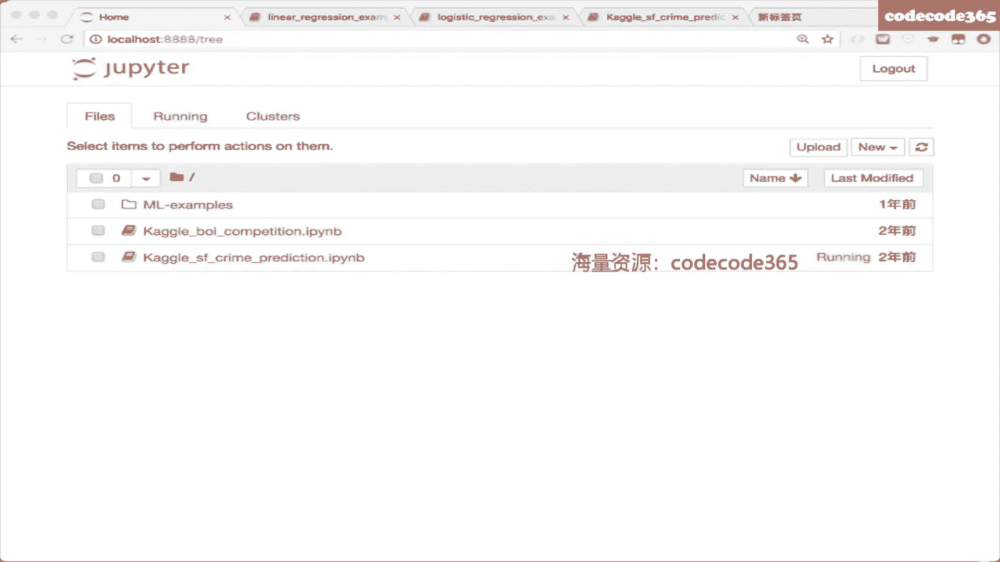

# 【七月在线】机器学习就业训练营16期 - P1：在线视频：1-线性回归、logistic回归、梯度下降_ev - IT自学网100 - BV1Z9T5ewEKL

好没问题好，那我嗯好，我重新说一下啊，然后欢迎大家来到我们机器学习的这个课程，然后今天是我们正式给大家讲，机器学习算法的第一课，所以在今天这节课当中，我们会给大家介绍到回归类的算法啊。

这个回归类算法是一个所谓这个所谓的回归类，算法，是一个广义的回归算法，就是啊一一会儿我们会给大家介绍到这个啊，机器学习的这个不同类型啊，就是做做一个分类包，涵盖的这样的不同类型的板块。

然后大家会看到这样一个概念叫做回归，那在那个概念当中呢，我们的回归指的是你的输出结果是一个连续值，那我们这个地方指的回归类算法是一大类，所以今天的课程主要会给大家讲的是，一个是线性回归啊。

叫linear regression，然后这是一个很常见到的一个啊回归模型，还有一个叫logistic regression啊，叫逻辑逻辑回归或者逻辑思D回归，这是一个用于分类的一个问题。

然后这两个啊这个这个模型，同时你在周志华老师的西瓜书机器学习当中，它叫做对数几率回归，就是有不同的这个叫法啊，啊不好意思，这个地方的手写板可能有一点点怪啊，大家就是勉强看一下啊，叫对数几率回归好。

我们今天主要重点是介绍到这样两个算法，那在介绍这两个算法之前呢，我会先给大家梳理一点小小的machine learning的概念啊，大家在之后会学到很多的算法，但是希望大家不要对。

大家对这些算法的认识不是孤立的，一个小的算法呃，希望大家能建立起来一个地图，一个大的框架，然后你把这些算法逐一的放到这个框架当中啊，同时也能了解到算法和算法之间的一个模型，和模型之间的一些联系。

和他的一些啊优缺点啊，他们的一些对比，那这样的话会有一个更完善的了解啊，所以今天的课程呢，我们会先交代机器学习的一些基本的概念和基，本的板块，让大家有一对这个内容有一个基本的认识。

然后我们会给大家讲到回归大类的算法，包括linear regression和logistic regression，然后今天给大家讲到的这个logistic regression。

这个算法叫做逻辑斯蒂回归，或者是对数几率回归，也是你在工业界会看到很重要的一个baseline model，一个机械模型就是你会看到各种各样的应用呢，呃他都会先用它去试一下啊。

有一句在工业界有一句话叫做一招LR打天下，所以你看到的除掉嗯，没像BATTMDJ这样的公司以外，其他的大部分公司啊在广泛的使用这个base model，对啊好的，所以就是今天的一个大体的说明。

关于今天的课程，然后大家现在看到这个页面，我们给大家画的这样一幅图，实际上是告诉了大家整个机器学习解决，从解决问题的角度上，我们对它的一个分类，首先整个机器学习啊。

大家如果听到这个名词叫machine learning，这个笔好像不太好用啊，那大家要知道它可以分成啊，叫做监督学习和无监督学习啊，所以我给大家写一下可以分成啊，Superez learing。

监督学习和无监督学习，你看到的算法的，都大部分都是可以归到这个板块的，这两个板块的啊，但又会有一些特殊的一些一些这个呃板块啊，所以监督学习做的事情和无监督学习做的事情，我说明一下，监督学习呢。

类似于大家之前在上学的时候学习的这个过程，所以老师会给你一些题目，然后在这些题目的基础上，老师会给你一些参考答案，比如说你买的参考资料，它会有参考答案，或者老师会给你批改作业。

他会告诉你说这个东西做得对和不对，也就是说你做每一道题，你都有一个参照指导的一个参考答案，去验证自己做的对与不对，你是在有有题有参考答案的这个条件下去学习，如果如何更好的去做这些题。

所以你会总结出来一系列的做题的方法和思路，那这个时候你不仅有数据，你不仅有提，你还有标签，你还有标准答案，所以这个我们把它叫做监督学习啊，你看到了很多工业界的很多很多算法，都是这样一类模型。

而我们今天一会儿给大家讲到的，线性回归和逻辑回归都属于监督学习，无监督学习呢，它就像是没有标签的，这些数据给到你手里，你去总结它里面的一些规律，举个例子来说，在电商。

比如说淘宝或者京东里会有大批的用户数据，这些用户每天都会在这个app上发生，各种各样的啊动作，会有各种各样的行为啊，会浏览会有评论，会有加车，会有点击，会有购买，那你手上拿到的是一堆的这个数据。

没有任何人告诉你，说你的屏幕的背后是一个什么样的人，他不会给他刻意的去打一个标签，但是你有了这么多数据之后，你可以在这些数据上去挖掘出来一些信息，举个例子来说，你可以找到一波群体。

这波群体他是他的行为是比较类似的，你发现这群小姐姐都还很爱去逛口红品类，这群小哥哥都非常喜欢各种各样的电子产品，所以你会在无监督的场景下会拿到一堆的数据，这一堆数据是没有标签的。

你要在它的基础上去学习出来，一些模式和规律啊，那这个叫做无监督的学习是没有标签，没有答案，你只有这些数据啊，你需要去根据他的统计，根据它的分布去总结出来一些规律，一些模式。

比如说刚才我说的是典型的机器学习当中的，一个聚类这样的一个问题，比如说另外一些场景下呃，大家也会知道会有一个很典型的一个啊，一个问题叫做啤酒与尿布的这样的一个故事啊，说的是在大型的超市连锁超市当中。

也会有大量的用户的这个购物的流水，那这个东西呢是没有标签的，上面不会告诉你说这是一个什么样的用户，以及它的一些呃详细的情况，你唯一看到的就是这样，有这样的一堆的用户购购物之后的流水，那根据这个东西呢。

你可以发现哪些东西和哪些东西，可能是会被一起购买的，那你在做这个商场的这个这些货架栏，它的摆放的时候，你就可以去做一些调整啊，方便他们去购买，Ok，所以你需要树立的第一个概念是整个机器学习，通常情况下。

大家在互联网公司当中用到最多的两类，叫做监督学习和无监督学习，然后还有第三类叫做强化学习，叫做reinforcement learning啊，强化学习是另外一个分支啊，就是可能在咱们这个课程当中。

不会特别去讲这样一类学习呃，他有一点点像监监督学习，但是它的不同在于它的结果Y，这个东西是一个有有延迟的反馈，就是举个例子来说，你下围棋，你下围棋的每一步落子，都有可能会影响你最后的输赢。

但是他不会在当时这个时刻显现，你若下错了一颗子，可能会在10分钟或者15分钟之后，引起这盘棋的结局是输的，或者说他是赢的啊，这取决于你这一步下的好还是不好，所以你会拿到一个结果，你会拿到一个反馈。

但这个东西是有延迟的一个反馈，再给大家举个例子，你们知道有一家有一个公司叫做滴滴，然后滴滴很重要的一个场景，是去做一个啊运输力的一个调度，但是你他想做一些事情，比如说滴滴。

也许他关注去把每一个司机一天的收益最大化，但是你想一想，这在这个场景当中，我的每一次派单，我把滴滴这辆车派到另外一个地方，它的终点给到了A这个地方，和给派到了B这个地方，这个是会影响司机的下一次阶段的。

我把他派到了A这个地方，他下一次接单只能在A附近去接吗，我把他派到了B这个地方，他下一次接单只能在B这个地方去接，所以你的每一次你的每一个动作，你的每一次决策都会影响他，从下一个时间点开始之后。

所有的动作，而这些这些结果它最终会有一个反馈回来，你今天一天结束之后，你去看一看今天所有成交的这个单，所以我接了班加在一起，你才知道我今天的收益有多大，所以强化学习它有一点点像监督学习，但是他的这个Y。

通常情况下是一个有延迟的反馈，他不会在当时那个时刻就发生，它的结果不会在当时那个时，结果在当时那个时间点就反馈给你，所以这类算法很特殊啊，大家我在我们这个课程当中，不会特别去给大家讲这一类算法。

我们关心的点是上面的监督学习和无监督学习，这也是大家在互联网，至少在互联网公司会更频繁用到的两类算法，而其中的监督学习，如果大家再对它细分一下，会细分成这个地方啊，sorry我箭头画错了。

这个地方的分类和回归，那这个是如何区分的呢，这个场景区分的方式是根据输出的结果Y，在有些场景底下我们做的事情是选择题啊，一会儿下一页你会看到在有些场景底下，我们需要去解决的是一个问答题。

你需要给我一个明确的一个连续值的结果，或者多个连续值的结果，OK那无监督学习呢，它也有很多算法，很典型的AA算法叫做聚类好，所以大家先竖立起来一个大的框架，这个大的框架就是在机器学习的场景下。

我们在这门课当中，我们关注的算法是supervise，当你监督学习和unspots learning无监督学习，而其中的监督学习又可以像下一页一样，去分成分类和回归两个问题。

那所谓的分类问题是什么问题呢，在很多很多的场景底下，我们需要解决的问题是去做一个选择题，所以你在一个很典型的垃圾邮件识别的，这个场景下，你最后的结果就是一个选择题，有两个选项给你。

你要判断你现在给到你的，这个有一堆的文本或者图像的这个这封邮件，它到底是一个垃圾邮件，还是一个不是一个垃圾邮件，所以你的选项就是两个选项，A和BA是B不是，比如说你去做一个文本情感分析。

今天你打开了淘宝，你打开了京东，你看到了评论，你看到了买家秀，你要去判断你现在这个地方的用户，到底这段评论是一个啊，对这个商品是一个称赞还是一个这个批评，那你你在这个情况下给到你的就是文本。

你需要去判定的结果，就是这个结果是一个positive还是一个negative，OK所以这个时候你做的是一个选择题，你的选择题有两个选项，一个选项是这是正面的情感分正面的一个呃。

一个褒义或者说一个鼓励的这个评论啊，另外的选项是这是一个批评或者贬义的，这样的一个评论，OK然后第三个安利是啊，我们知道现在深度学习非常热对吧，所以大家会看到一些所谓的deep learning。

或者neural network啊，从某种角度上来说，它实际上也是一一种机器学习啊，只不过他这个时候的形态用的是神经网络，那在这样的模型当中，你解决的问题也会有很多很多的问题，比如说一个典型的问题。

是关于图像内容识别的问题啊，你们千万不要以为这个地方的图像内容识别，他做的事情是他做的事情，是真的让这个模型去看到世界上的万事万物，去告诉你说他是什么，大家想一想，你平时你你在你的世界当中，你放眼望去。

你看看你周边的这些东西，你能够给给出来一个能够报出来他的名字，或者说给出来一个解释，根本原因在于你从小到大的成长环境当中，你知道有这么一些东西，所以计算机去完成图像的内容识别。

实际上也是有一个大的知识库，大家知道有这么一些东西，比如说我现在在这个地方列了四个选项，叫做喵星人，汪星人，人类和草泥马，当然它会有第五个选项，发现不在这四类当中，所以第五个是都不是。

那这就是一个选择题，他完成的是一个五分类的选择题，我会给你五个选项，你从里头选一个，OK总之大家想了想，发现这个地方分类问题，说的事情是我去做选择题，那不屑于我上面给大家列到这些例子，举个例子来说。

在电商当中场景当中，我们很关心一些东西，比如我们很关心在淘宝这个这个商品下，你会不会发生购买这样一个行为啊，所以最后你也是完成一个选择题，你的最终结果无非是两种，我买了它，我没有买它。

所以我会去构建一个模型去区分一下，说哪个商品你更有可能会购买，那我就把它放在前面了，所以这就是一个很典型的分类问题，OK那下面的回归问题，对比上面的选择题呢，对他做的是一个问答题。

所以呃你不需要告诉我说，刘德华和吴彦祖都很帅，请告诉我他的具体颜值的得分谁更帅一点，到底是吴彦祖是9。4，刘德华是9。2，还是刘德华是9。8，吴彦祖是9。6，所以你不需要告诉我，Yes or no。

你不需要告诉我啊，它它是某一类，我需要你告诉我一个具体的值，举个例子来说，头号玩家的票房值有多高啊，某一个电影的票房值有多高，魔都的房价具体是什么样的一个值，那你思考一下，它显然不是一个选择题。

因为具体的这个值它有无穷种取法啊，你只需要你的票房多一块钱，少一块钱都不一样，房价也一样啊，颜值的得分多0。1分多，00：05分都不一样对吧，所以这个地方的分类问题和回归问题呢，其实啊都是监督学习。

我都有X都有Y，仅仅区别在于，我这个地方的Y到底做的是一个选择题，还是一个填空题，OK所以大家有一个基本的概念，OK好的，那下面这一页呢讲到的是聚类问题啊，这是我刚才给大家说的，在淘宝和京东的场景下呢。

你可能会有很多很多的用户行为，那这个时候你不可能呃，找一个人去把所有这些记录全看一遍，是看不完的啊，就是在阿里的场景下，尤其在京东的场景下，他会有有非常非常多的用户，非常非常多的数据啊。

就是数据量级可能在几10亿，几百亿这样的量级啊，在一段时间内就会有这样的量级，然后数据的维度可能也会高达几亿几10亿啊，这个时候你是看不过来的，所以你想去挖掘一些信息出来，你想对这些用户去看一看。

这些用户群体有什么样的差异，他们都有什么样的贡献，你就可以基于你的数据X，去用一些无监督学习去挖掘一下，比如说最典型的无监督学习叫做聚类，你可以让用户和用户之间去抱抱团，基于他们的用户行为去抱怨抱团。

所以你就会发现，那些爱买口红和连衣裙的小姐姐们，你也会发现那些爱买电子产品的小哥哥们好，所以大家在这个地方有一个先有一个认识，我们将来看到的几乎这门课当中，所有的模型都可以被分到这个地方的监督学习。

更具体一点，分类和回归的监督学习以及无监督学习，比如说聚类或者是其他类型的啊，降维数据，降维等等这样的一些无监督学习当中啊，相信大家也有一个基本的认识，他们区别在于说到底是给题给标准答案。

这样学习的方式，还是说是只给数据去挖掘这样的信息，这样的这个方式，同时呢你也知道做选择题和填空题的差别好，只是一点小小的概念，然后来到下面这一页，这个地方呢我们找了一个周志华老师的机器。

机器学习西瓜书里面的一个案例对吧，所以呢我想给大家建立一点小小的概念，就是你需要知道呃，我们会有一些称呼，我们会有一些术语，你需要知道这些称呼和术语到底说的是什么，所以刚才我已经给大家介绍过了。

无监督学习和监督学习，那在这本书的这个例子当中，显然这是一个监督学习呃，我需要根据这个地方的三个信息，颜色，西瓜的色泽和西瓜的耕地和西瓜的悄声，去判断它到底是一个好瓜还是西瓜，更具体一点说。

这是一个做选择题的一个问题，我最后的结果就是两种情况，我要么判断它是一个好习惯，要么判断它是一个坏的西瓜，而我的依据是前面的这样的三列，我们通常会把数据组织成这样的一个形态，大家如果有兴趣。

将来去参加数据科学的比赛，你会发现所有数据科学比赛的数据啊，他都很习惯，会用这样很很规范的，行行列列的数据给到你手里，那在这个数据当中，大家来看一看这个方阵的数据，行行行行列列的方阵数据。

在这个数据当中，你的每一行是什么，每一行是一个西瓜，每一行是一个西瓜，所以每一行是一个什么，是一个事例，是一个样本，是一个样例，Ok，所以在这个数据当中的，每一行都会是一个他找过来的西瓜。

用于学习的西瓜，在你初高中的学习过程当中，这里的每一行都会是你找过来的一道练习题，要带着答案的练习题，所以这个地方的西瓜是一个，他会找过来一个西瓜，他会告诉你，它到底最后这个选择题的结果是一个好习惯。

还是一个坏习惯，同时它会给到你前面这样一些，用于最终西瓜是好西瓜，还是坏西瓜的这样的一些判断啊，你会拿到手里题目的参考答案，选择题的参考答案，你也会拿到选择题的题干或者是他输入的信息。

所以这个行行列列数据当中的每一行，大家对它的理解就是一个样本，在这里就是一个西瓜，所以大家记住他的称呼，可以叫做示例，可以叫做样例，可以叫做样本，他们说的是一回事，那每一列是什么呢。

你去推断这个西瓜到底是一个好的西瓜，还是一个坏的西瓜，你总有一些你需要去判断的依据，那这些依据可能会有很多很多不同维度的信息，所以每一个维度的信息，我们把它叫做一个属性，叫做一个特征。

所以大家在这里看到的每一列，包括西瓜的颜色，包括西瓜的敲的声响，包括它的根地，这个东西都是属性，都是特征，所以在将来的大家学习机器学习的过程当中，你会更多的看到这样的一些概念，当提到这个概念的时候。

你要在脑子中浮现这样的一幅图，你告诉自己说，实际上他说的就是行和列，当他提到一个样本的时候，它指的是一行，指的是一个西瓜，指的是一道题，当他提到一列的时候，它指的是我的一个。

用于完成这道选择题的一个属性，或者是一个特征，而最后的这一列显然是label，是我们最后选择题的答案，也就是我们的标记空间和输出空间，好OK所以这是一些基本的概念，大家了解一下。

那整个机器学习做的事情是什么呢，所有的事情在于我准备好了这么多题，我准备好，我在夏天准备好了这么多西瓜，我送到你手里的时候，你能通过我们在这个课程当中学到的，一系列的模型。

从前面的这个选择题当中去学习出来，一个X到Y的一个映射，注意哦，这是有监督的学习，所以我学习出来的东西是这个地方的一个映射，而种种模型只是这个地方的映射不一样，这就像大家解题的时候。

你有不同的解法是一样的，你去解决这一道数学题，如果它是一道选择题的话，它的标准答案一定是固定的，但如果它是一道解答题的话，你可以有不同的方式去解决这个问题，而这个地方的机器学习。

实际上对应的是这个地方的解法，这个地方的F比如说同样是这个地方的色泽，耕地和敲声，我要根据这三个维度去推断，一个西瓜到底是好瓜还是坏瓜，我有很多推断的方式，比如说今天大家看到了逻辑回归。

一会你看到逻辑回归或是一种计算的模型，去拿到一个概率值，比如说大家在民间课程里学到的决策树，它会是一种规则，所以我的种种方法体现最终的差异，在这个F上我会用一个不同的表示啊，实际上它也有它的称呼啊。

你可以叫做表示，可以叫做表达，你也可以叫做假设函数，它会通过一个这样的东西，这个东西最终的目的就是我每送进来一个X，我每给你一道题的时候，你可以基于这个方法去达到一个答案。

而这个东西就是你通过不断的学习，去不断的这个学习的过程，去不断的完善和积累出来的，这样的一个模式或者规律，所以你做的事情是我数据已经准备好了，而且我知道这个地方的数据有行有列，我知道有样本。

我知道有属性，我知道有标签，在这个的基础上，我把它送到各式各样的model当中，我把它送到各式各样的模型当中，我试图去学习出来一个学习出来一个模式，学习出来一个规律，而这个东西最终目的在于。

在将来某一天你去参加高考的时候，没有标准答案摆在你面前的时候，你拿着这些题你也能积极，你也能根据我之前总结到的规律，总结到的做题的方法方式去完成这个题目，就给出来一个答案。

而且我会希望你给出来的答案越来越正确越好，所以这个地方会有一些其他的概念，比如说给到大家的那些叫做训练集，给到大家的那些题呢，是你平时去做练习的训练集，OK那还有另外一个问题，那叫做测试集。

那个东西你是提前看不到的，高考之前高考题虽然出好了，一定是密封的，一定是在高考当天你才可以看到这份题，而且你只有一次机会，当你做完了这些题，当你去评估它的结果之后，你不可能再跟他说。

老师我再高考一次一模一样的题，No，这个地方不可能，所以你要从你的训练集上，你要从你的训练数据上学习出来做题的规律，学习出来这个模式，而在高考的时候，面对新的样本，面对新的题的时候，用这个模式和规律。

用这个F去对这个地方的X做一个预估，拿到一个答案Y，我们会希望这个地方的F越通用越好，我会希望这些同学们在参加高考的时候，准备的越充分越好，学习到的知识越稳固越好，学习到的做题的方法通用性越好越棒。

所以这个地方大家看到其他的一些概念，说的是这个事情啊，右边这个东西刚才我已经解释过了，所谓的分类回归，所谓的二分类是啊做选择题的A和B啊，就是正面反面啊，抛一颗硬币的正面反面说的是一样的。

OK这个地方是一点小小的介绍，这一页当中有一些概念，大家将会在未来的机器学习的学习过程当中，会再次见到好，我先往后跳一跳，我们来到今天的第一个model叫做linear regression啊。

OK这我知道这个模型很简单，但请大家静下心来听一听，因为我想阐述的不仅仅是这个模型，而是让大家建立一点基本的概念，我们将将来所有的模型会丢到一个套路当中，你可以把它总结成以同样的一个套路。

但是它有不同的表达，会有不同的优化，所以导致了他最后的结果，或者它的形态，或者是他的方法是一种不同的表示，这个是一个确实，你在很久以前就学过的一个模型对吧，所以大家上初中没上高中的时候，就知道说。

我可以基于一堆东西的这个运算去做一个预估，老师会告诉你说你怎么去拟合一个二次函数，你怎么去拟合一条直线对，所以这个东西你和一条直线，这个东西叫做线性回归对吧，那我们用专业的术语来形容一下这个东西。

他说的事情是这样的，首先它是一个有监督的学习，大家要明确一下，linear regression是一个有监督的学习，他要学习到的，每每一个每一条记录，都可以记录成这样的一个样本。

都可以记录成这样的一个样本，这样的一个样本就是我刚才说的X和Y，只不过这个时候你为了去学习到这个规律，你需要很多的X和Y，你需要去做很多的题，你才能总结到规律对吧，为什么高三的时候。

老师会让大家反复的去做题，因为你只做一两道题，你是学不到通用的通用的规律的，所以我在这个地方会准备好一批所谓的一批，这个地方是N个样本，N个题，N道题，那这N道题每道题都会有它的输入，X会有它的输出。

Y这个地方的输出Y因为它是一个连续值，所以它是一个回归类的问题，我要学习到的东西是一个映射，F从X到Y之间的一个映射，对于输入的X可以输出连续值Y，我假定输入和输出之间对，是一个线性的相关关系。

OK所以我们建立了一个基本的认知，说线性回归这个东西，大概就是说你准备了一堆的XY，然后我会用一个线性的表示，去完成X到Y之间的一个映射，而我可能想去学习出来一个这样的映射，好啊，没关系。

这个model很简单，但是这个model啊，待会我们会用机器学习当中的这个套路和板块，就给大家重新的阐述一下啊，这个地方有一个小小的问题，让大家去思考一下，说如果你去让一个6年级的小学生。

在不问同学具体体重的情况下，把班上的同学按照体重从轻到重去排队，这个同学会怎么做呢，他可能会环顾一下他的周边的同学，然后他可能会通过观察大家的身高和体格，来完成这个排队。

这个事情是一个非常合理的事情对吗，因为根据我们的常识，好像一个人越高，他的体重应该是越重的，基本是这样的，然后一个人越壮，他应该可能是越重的，所以你从里头拆一个维度出来。

比如说这个地方我们采集了一些样本，我们找了一个班上的同学过来，我们把他的身高和体重啊，以横纵横横纵坐标的形式，标到这样一个二维的坐标系当中，所以大家在这里看到每一个蓝色的样本点。

实际上是我找过来的一个同学，然后我在这幅图上戳了一个点，而线性回归想做什么样的事情呢，线性回归扫了一眼这幅图，他告诉你说，哎我发现了这个上面，好像随着我的身高不断的变大，好像我的体重有一个递增的趋势。

那我能不能用一个简单的线性的表达形式，比如说这个地方是一个一条直线去拟合出来，这样一个变换呢，所以啊线性回归，最终的结果会是这样的一个形态啊，所谓的线性，就是因为它这个地方是一个在二维平面当中。

它是一条直线，这样那你要学习到的就是这条直线的斜率，和它的截距，OK好，这是一个简单的例子，另外一个啊就是有一定年代，有一定历史的例子，是这个皇家预估的例子，相信很多同学都见过这个例子了。

所以在这样一个例子当中呢，我们知道影响房价的面，房价的具体的价格有很多很多的因素啊，举个例子来说，和它的面积有关系，和它是几居有关系，和他的地理位置有关系，和他是否是学区房有关系，和他的楼层有关系。

和他的建筑年龄有关系，OK好，所以大家看到这个地方我们给到的这一页，实际上呢我们抽了一个最直接的一个影响因素，叫做面积，很显然在大家直观的理解当中啊，房子的面积越大，应该它的房价是越高的。

所以在这里面我们找到了一些房子过来，我们把这些房子的数据记录在这，我们说每套房子它到底是多大的面积，我记录在左边，它到底最后是什么样的一个价格，记录在右边，所以我积累了一些数据。

这个数据同时同样和我们前天给大家讲到的，数据形态是一模一样的，它是一个行行列列的数据，他的每一行会是一套房子，它的每一个列呢啊除掉最后的这个价格，这个标签列，它其他列都会是对应的X对应的输入的属性。

对应的输入的特征，OK好，所以啊对大家在这里看到的这份数据，就是最简单的一份数据啊，好所以这个地方呢同样有一幅图去拟合出来，这个地方的面积和这个地方的price啊，它之间的一个关系啊。

大家有问题可以先在我们的边框里头，而且可以在我们的这个呃讨论区去提问，那我会视情况会做一个回答，或者我会每一段时间之后，给大家做一个集中的回答，好吧，就是希望那个大家先跟着我的节奏去啊，往后走。

因为你们问到的有一些问题，实际上是一些和今天的模型本身，并没有太相关的一些问题啊，我们一会集中来给大家交流一下好不好，所以啊这个地方所谓的线性模型，对模型确实很简单，我理解。

所以它的横坐标呢就是它的面积，它的纵坐标就是它的price，你发现有这样一个正相关的关系啊，如果你这时候用简单的模型去做拟合，很有可能就是这样的一条直线好，那刚才我说了。

房价影响的因素远不可能是这一个因素，影响因素多的很，所以在这种情况下，你很有可能会有其他的一些因素，比如说它是几居，比如说我刚才说的一些房林呢，比如说它是否是学区房啊，比如说它的地理位置啊等等。

那所以当你把这些信息，以数字化的形式表示出来的，表示出来之后，你会发现这个时候的变量就变多了，那只不过这个线性模型由刚才大家在二维，在二维平面当中见到的一条直线，变成了在高维平面当中的一个平。

这个大家相信大家有一点小小的概念，就是我们可以把这个东西写成这样的一个形式，C打零加C打1X1加C的2X2啊，以及你在机器学习当中，你可能要习惯另外一种表示形式，是向量化的表示形式。

如果我把这个地方的seed写成一个列向量啊，一般情况下我们会习惯用列向量啊，就是C大于零啊，C打1C大二，那我这个时候的X呢，它是一个也是一个列向量啊，所以它是X1X2X三。

那这个时候很显然我对C打去做一个转置，它变成了一个什么向量，我对C打去做一个转置，它变成了什么向量，给它变成了一个行向量，那一个行向量和一个列向量去做啊，或者说你可以理解成，这两个列向量去做一个内积。

它的形式实际上和大家在这看到的是一样啊，当然这个地方那个所以X0X1X二对，然后X0呢它大家可以认为它等于一啊，对吧好，所以拿到结果会是一个数，对不对啊，好的啊，当然了，实际的情况就像我刚才说的。

你见到因影响这个房房价的因素多的很，所以你最后看到这个情况，它又会变成，刚才我们在西瓜那幅图当中看到的一样，有很多行，有很多列，那其中的每一行就是一套房子，其中的每一列它就是这套房子的决定。

最后价格的一个因素，一个属性，一个特征，嗯好的，那你要完成的东西就是在大量的样本，大量的训练集当中的题，大量的训练集当中的房子当中总结出来的规律，F去用在我现在的未知的这次高考。

或者这个新的房子的价格预估上去预估，拿到一个结果，抽象一下做的事情，实际上就像这一页给大家写到的一样，我需要去学习出来一个这个地方的training set，上面X到Y的映射F。

只不过这个F它的形态可以有各种各样的形态，那在linear regression当中，我们给了一个最简单的形态，是一个线性组合的形态，那在这样一个线性组合的形态里头，大家看到它可以写成。

它可以写成一个向量化的表示形式，刚才我已经给大家提过了，是像这个地方的最大的转置，乘以X这样的一个形态，那在这个表述里面，我们认为所有的C大和X它都是列向量啊，这是我们习惯的一个表述啊，叫做列向量好啊。

相信大家没有问题，那问题来了啊，师兄师姐告诉我说用这样的学习方法去学，所以我知道了，我固定住了一个这样的F对吗，我的F就是一组这一组输入的X，去做这样的运算，拿到一个结果，所以啊是考入考进清华。

北大的师兄师姐给了很多的方法，告诉你说你就这么学吧，你每天就先学呃，先做这个，早上起来先做英语去读一会儿英语做英语，然后做什么题，然后做什么题啊，所以那个道理大家懂很多，方法，大家懂很多。

但是并不一定并不一定每个人都能做好，对不对，那都是这样的一种形态，并不是每一个线性模型都能把这个问题预估好，同样是用这样的模型，大家都是用这样的模型去做项目去参加比赛，有些人能进前三。

有些人连前300都进不了，所以显然是有差别的，所以差别在哪，差别很显然，大家发现了，就在这个地方的C打上，所以我已经知道是这样的一个形态了，我已经知道师兄师姐告诉我，是这样的学习方法了，为什么会有差别。

大家学的不一样，大家的C打不一样，所以我怎么去找到最好的这样一组C打，可调的这样的一组theta，对于我的输入的X我能最好的去几何，我现在的每一个答案为这是我们关注的东西，那我想另外再说一点东西。

因为这个模型很简单，所以我知道有些同学会觉得说，唉我想学高逼格的模型，为什么老师要一开始给我讲这么简单的模型啊，这个模型本身不是，并不是我们想给大家重点去啊，就是说特别重点去给大家详述的。

这样的一部分内容，我想讲述的内容是，如果你看一看整个机器学习所有的模型，包括深度学习的模型，你会发现一个很有意思的事情，这个意意思有意思的事情是这样的，首先呃我这地方会给大家列一下公式啊。

比如说我们把所有数据机器学习当中，解决问题的方法叫做数据驱动的方法，叫做数据驱动的方法啊，这个名词啊，这个啊有些同学可能听过啊，叫beta jing数据驱动方法，那数据驱动方法关注两部分。

第一部分叫做数据，第二部分叫做算法或者模型，好没问题，那数据这个东西以后再跟大家说，它同样非常重要，就是它同样非常非常重要，你们看到那些大型互联网公司，B a t google，FACEBOOK啊。

TMDJ这些公司当中，它的能做好的，很大一部分原因是因为它的数据量够在小公司，中小型数据中小型公司当中，你要去用这些AI的算法，它的数据不一定足以支撑模型，学习到非常好的模式，这个东西我们之后再说。

我们会有专门的课告诉大家如何去做数据处理，如何去做数据上的信息抽取，好这个先放一放，我们看一看后面的模型的部分，也就是和更多同学关心的这些很fancy的model啊，大家都很想知道这些逼格很高的模型。

说老师我听说这种隐马尔可夫模型，条件随机场都是很高级的模型，能给我讲一讲吗，请不要把每个模型当做一个孤立的模型来看待，这些模型的产生是为了解决问题，所以每个模型它会有有不同的部分。

如果我们这个地方对模型去做一个拆解的话啊，这是我自己写的一个公式啊，它不一定啊，你不一定在某本书上可以查到它，或者是你可以看到一个呃，某一个学术巨作上会有这样的一个写法。

但是这个东西它当你看完这些模型的时候，你可以把它套到这个公式里，那每一个模型会是什么呢，它会有一个假设函数，或者说你叫做表达啊，假设函数，那这个假设函数呢它是一个F，这个F可能是可能是一种计算的模型。

可能是一个规则，可能是任何一个其他的东西，当你有这样的东西以后，就是师兄师姐告诉你一个学习方法，你能不能用好，取决于你要在这个大的架子下，你要再给给定你的这个学习方法的基础上，去完成什么。

后面的部分叫做优化，如何去让这个地方的C打一步步的去，朝着让这个模型变得更好，你和更准的方向走，这个部分叫做优化，所以等学完今天的课，学完明天的课学完再往后学完其他的课，你再来看一看这个公式。

你会发现无非是我换了一种表达，我在线性回归当中，我用一个这样的方式去完成预估，我在决策树当中，我用这个规则的方式去完成预估，我在后面其他的FM当中，我用另一种方式去完成预估，我在其他的模型。

而更多的模型当中我选择其他的方式，其他的形态的方式去完成预估，你选了某一个师兄师姐的方法，然后后面的优优化的部分，实际上在做的事情是，我如何让我现在学到的这个，找到的这套学习方法。

最好的去适合我现在的这个数据，去学习出来最有用的做题的方法，能让我在高考里取得最好的成绩好，所以刚才我们提到的这个部分，对有些同学在其它很简单，对它非常简单，它仅仅是用了告诉我们假设函数是什么。

所以当有XL我这么算，但是拜托你要算的话，你要知道这个C的，而且它会影响最后的结果，他怎么算呢，好请来到第二个部分叫做优化，所有的学习过程必须有一个方向吧，你在做题的时候。

你也得知道有同学会老师会告诉你一些事情，说你得你得加油学习啊，你得合理分配一下的时间呢，你得看一看你的错题在哪，请拿出你的本子，把你的错题记一记，多去看一看这些错题到底错在哪。

总结一下你做得不好的点在哪去优化一下，所以这个东西变到机器学习里面，它是什么样的一个过程，你方法已经给你了对吧，师兄师姐能凭借这套方法考进清华北大浙大，上海交大，复旦啊，这样很好的学校。

你用这套方法能不能学好呢，对你来看一看你该如何去学，所以在学学习的这个过程当中，你会再看到这样的一个概念啊，刚才我们讲到了一部分叫做优化对吧，好优化这个东东东西，我再给大家做一个公式的拆解。

通常情况下在监督学习当中啊，我们来那个做一个约束啊，在监督学习当中它会等于什么呢，它会等于你的一个评估，你每个部分做的好与不好的一个loss function啊，这个东西呢一会儿再说它是什么啊。

大家先听听一下，有这样一个东西，再加上一个什么对optimizing的一个呃，一个呃算法啊啊有点丑啊啊，那我就写写这个优化算法叫做中文好了对啊，有这个英文的字样啊，但是给大家说一下啊，这个叫损失函数。

这个叫做优化算法啊，我跟你说这个公式是通用的，这个公式是通用的，所以你今天学到的东西要机器学习对吧，等等你有时间了，往后看看深度学习，你看TENSORFLOW，你看PYTORCH啊，你觉得逼格很高对吧。

谷歌家的TENSORFLOW啊，FACEBOOK的PYTORCH，然后呃但是你去看一看，你会发现诶这里头有个东西叫optimizer，他做什么样的事情，对他就做优化所有的所有的模型，你往下拆。

它就是这样的公式好，所以这个东西是什么，它做什么用啊，没关系，我来给大家讲一讲，所以现在我们要提一提这个概念，叫做损失函数，叫做loss function啊，有些同学第一次听到这个东西对吧。

这个东西非常的重要，呃，我先说明一下，你会在其他地方听到其他的一些称呼，说的和他是一个意思，你会听到一些什么样的称呼呢，对cost function代价函数你会听到objective啊。

客观度或者目标函数啊，他说的和LOFUNCTION实际上是一个意思，所以这个东西在中文当中，我们把它叫做损失函数，哎，等一等等一等损失损失函数是个什么东西，好像到目前为止。

你还没告诉我这个东西是什么东西对吧，损失函数是什么呢，刚才我说过了，我说你要做题，老师会叫你拿出一个小本本，来把自己做得不好的那些题目记下来，去分析一下自己为什么没做好，哪个方法没掌握好。

那你得知道哪些题做错了对吧，错的程度到什么程度，做的有多不好，哪些环节做的不好，偏差有多大，这个东西我需要一个数学定量的东西，给我指明一个方向，所以损失函数就是这样一个东西。

所有人都知道前面的假设函数长，这样，我给一组塞达就会有一个结果出来，问题是不同的，C大凭什么说他好，凭什么说它不好，你怎么去评估啊，你如果都评估不出来，这个东西你衡量不了的话，你凭什么让我去做优化。

去做学习，所以这个地方的损失函数就是一个衡量，你现在这一组参数下，你做这个事情和标准答案之间，差异的这样的一个函数，它就叫做loss function，叫做损失函数，举一个最简单的例子，在这个例子当中。

我们只有一个变量X我们输出的结果是Y，我们只有三个样本点，112233，我们要用一个Y等于WX，或者Y等于KX，这样的方式去拟合现在的三个样本点，当然了，有些同学会跟我说，老师我肉眼就看出来了。

Y等于X，OK好，我们先不管这个东西，因为现在这个例子非常的简单，所以你肉眼就看出来了，嗯很好很棒，但是当这个数据的维度高起来的时候，你肉眼是看不出来的，好没关系，我们需要找到一套通用的东西。

去衡量说我做的好与不好，首先可动的东西是什么，是K对吧，或者说Y等于C的X啊，那无所谓啊，就是这是不同的表达形式，那在这个情况下，我认为C打X啊，那大家去看一下这个地方可以调的是C的啊。

我我我先为了简单起见，我没有加B啊，我没有加后面那个偏置项，只是说这条直线一定是一条穿过原点的直线，你想一想它可以变的东西是什么，是不是你拿着这样的一条直线开始甩呀，他开始绕着原点在旋转呢。

诶我每每旋转到一个地方，我是不是有一个我预估的结果值，会有一个真实的结果值，我是不是这两个东西之间，可以求一个什么差值啊，我是不是可以求一个德尔塔差值出来，所以这是一个很直观的一个概念。

你需要有东西去告诉你说我选定了这一组C的，我做的到底怎么样，你必须要有一个数学定量的东西去衡量，这个东西，我才知道我下一步的优化方向在哪，所以很简单，你预估的结果，你对于每一个输入的样本，输入的X。

你的预估的结果是你C达X，你的真实的结果是什么，对是你的label，是你的标签，我把我预估的结果减去真实的结果啊，但它可能可正可负对吧，所以我给一个平方，OK给个平方以后，它衡量的就是差距。

把它们加在一起除以2M分之一啊，注意啊，前面的2M分之一，它M分之一是求一个平均，这个大家能理解吧，就是你有很多道题，老师说你这这份题做的好与不好，不能只看单道题对吧，所以我要看你平均做的好与不好。

你有100道题对吧，你100道题，你这100道题做的结果怎么样，我要把它加在一起，我要把它加在一起，OK我也把它加在一起，然后我把它加在一起以后，求一个平均的差异有多大，我应该除以总的题目的数量对吧。

那我问大家一下啊，因为有同学说这个地方是N，我问大家看大家一下是M还是N，是M还是N，我对这个地方的多少多少道题，多少个样本求了和N是什么，不要搞错了，这个地方的M和N先看清楚它们分别是什么。

我的样本数是M哥，你看到了I等于一到M，我是对我的M道题去求了我的差异，我是不是应该除以M分之一，为什么要给二好，有同学会说老师为什么要1/2啊，为什么要1/2啊，啊不要着急，这个东西没有意义。

它仅仅是为了我们待会去做数学优化的时候，求导的方便仅仅是这样的一个原因啊，所以比如说老师给你给班上的同学，去做一个打分，我给的分数是198，然后九十六九十四，这样的分数和我给的分数是五十四十九四十八。

这样的分数并不影响大家的序对吗，就是做得好的同学还是做得好，做得不好的同学还是做得不好，所以前面这个地方的1/2，是不影响我这个结果，它的取不同的C打的时候，它的大小顺序的对不对，这个东西是不影响的。

所以给我们带一个1/2，大家不用，大家不用太纠结这个问题，他没有关系啊，因为你在后面的处理当中，你会发现它为我的数学计算提供了一些便利，所以我把它整体除以二，我不影响我的顺序啊。

原本是一百九十八九十六啊，94P变成现在的50，那个49，四十八四十七，实际上没有关系，Ok，哎呀刚才那个东西啊，我写了一个函数对吧，我说OK这个地方是西格玛前面2M分之一，这个地方从I等于一到M好。

然后我后面呢是一个HC的啊，xi k减去这个地方的YI好，我给了一个啊平方好，大概是这样的一个公式好，是这样的一个公式好的，然后这个东西呢他在回归类的问题当中，另外一点是是这样的，首先我问大家一下。

这个这个公式当中未知数是什么，请告诉我现在这个JC大当中的未知数是什么，我的每一个样本送进来的样本X是知道的，Y是知道的，谁是未知数，谁是我现在哪个东，哪个变量是我现在不知道的未知数。

我要去调整的未知数好有很很好，很多同学告诉我是C的，是C的啊，因为X和Y都是知道的，seed是不知道对不对，好好很好，那所以大家现在抽象一下我做的事情是什么，来不要看到这个复杂的公式。

你看到的东西就是一个JC的好，这个东西首先告诉我它的它的它是用来干嘛的，它是用来干嘛的，它是不是用来评估，不是评估啊，用来衡量我做的好与不好的，就是衡量我和标准答案或者说F的好坏的。

它是用来衡量F的好坏的，好记住啊，这是第一个点好，第二个点是啊，不同的C打是不是会有不同的JC打值，不同的CA是不是有不同的偏离量，所以我现在想让我和标准答案之间的差异最小，我是不是要去找到一个C大。

使得我现在这个函数最小，是不是使得我现在这个函数最小，告诉我我是不是希望去找到一个塞达，使得我现在这个JC达最小，使得我现在我的预估值和标准答案之间的差异，越小越好好，所以抽象一下。

你发现它变成了一个问题，它变成了一个求函数最小值的问题，好这个有问题吗，大家有问题吗，它变成了一个这样的问题，叫做求函数最小值的问题，而你这里的变量是C的，唉但是大家想一想啊。

你想一想这个地方我Y等于C打X哎，我的C大可以动对吧，因为我们来看一看，当这个C打从很小，从从很小从零的地方开始往上走，再往上走的时候，大家告诉我，这个时候的JC打是什么样的一个变化呀。

是不是我在右边这幅图当中描述的变化呀，开始的CA等于零的时候，是不是在这标准答案在哪，在这它们之间是有差异的，对不对，它们之间是有差异的，对不对，随着我这条直线往上走，差异会怎么样。

对会先减小减到什么位置，对在这是一个特例啊，这是个特例，在这个特例当中，它会刚好穿过它，所以它会走到零，然后会再变大呃，告诉我从左边这幅图到右边这个函数，大家有问题吗，有同学有问题吗。

我要去求这个函数的最小值，我用一种最直观的方式，把这个函数的形状变化趋势给画出来了，我要求的东西在哪，我要求的东西在哪，我要求的东西在这，这是我想要的东西，这是我想去找到的那个点，当我找到他之后。

我就可以很自信地告诉你说，这个师兄师姐的方法用的很好，我在我的数据上有非常棒的效果，好有一个问题就是刚才这个是一个一元的情况，一元情况就只有一条轴嘛，啊多元的情况是什么样呢。

对多元的情况画出来是这个样子啊，对这个样子啊，啊大家听清楚了，我的最终的目标一定是希望去找到一个最小值，只不过在很多情况下，比如说大家在后面学到更复杂的函数啊，更复杂的更复杂的模型当中。

它的损失函数是一个非凸的，也就是说在那个情况下，它它是凹凸不平的，所以他很多时候你是找不到全局最低点，所以你找到的是一个一个这个局部最低点啊，或者叫做极值点啊，但是有可能在工业界可用就好了。

好这个问题不用纠结，总之回到刚才我们这个例子当中，我们就是这样的一个曲线，对不对，就是这样的一个曲线，对不对对，就是这样一个曲线好，那在二元的情况下是什么，对是这样的一个碗状的形状有问题吗。

我每取定一个函数值，它都会有一个有一个有一个取值嘛，这个取值注意啊，这个时候的取值不是原来的函数的预估取值啊，我再强调一遍，这个时候的函数取值是什么，这个时候的函数取值是什么，是差异啊。

请请盯盯着这个东西看啊，它不是我原来的Y等于K啊，这个C打X不是不是那个Y，他现在是一个用于衡量我每取第一组C的，我和标准答案之间差异的，这个函数叫做损失函数啊，它不是原来那个假设函数啊，它是损失函数。

好好相信大家没问题，然后对有同学问到这个问题，说老师老师老师这个我知道这个这个好简单的，那个数学老师告诉我们说求求最求极值，我好像求导让导数等于零就出来了对吧求导，然后导数等于零就出来了。

OK你说的东西没没有问题，就是你说的这个很棒啊，说明你的数学基础非常好啊，但是你要知道唉，通常数学家，这些学统计的数学家和做计算机的人同学，他们会有不同的解决问题的思路，数学家他会给你很多很复杂的公式。

他会告诉你说你这样算就可以了，但是它会有一些问题，举个例子来说，有一些场景下你的计算的计算量是很大的，大到你在工业界没有办法用，你没有办法很快速的去算出来，比如说哎数学家会告诉你说你求个逆就好了。

这矩阵求一个逆，然后你再再用力去和，和这个这个这个X去做一个矩阵的乘法，这个事情就解决了，问题是你求矩阵逆，那个事情是可能是一个计算量很可怕的事情，所以有些东西从数学上理论上来说很简单，求解起来。

但是当这个问题变复杂了之后，呃，他的求解和计算，他的那个数学公式求解起来可能是很复杂，所以呢在计算机的角度，我们我们更我们更倾向于用这样的方式去解决，这个方式叫做迭代法，所以我们再回顾一下。

刚才我给到大家的这个公式，这个公式当中告诉大家一件事情，说我们的优化是等于loss function加optimizing，所以我的优化是等于损失函数加上，使得这啊那个有点丑啊，大家那个忍一下。

损失函数加上啊，这个优化算法啊，就是损失函数对损失函数去最小化的，或者说去减小的这样的一些优化算法，所以损失函数我们已经定义了，它就长那样，所以优化算法有很多种，没错是有很多种啊。

我今天讲到这个方法是最最最最常见的方法，它并不是唯一解，你会在其他地方看到其他的一些优化算法，没错，这个事情没做好，所以我们在计算机的世界，我们更习惯用这样的一类方法，叫做迭代法去解决问题。

迭代法说的事情是不要着急，不要一不能没有办法一口吃成一个大胖子，所以怎么办呢，一步一步来，他问你，他问你说，你已经知道现在这个东西是一条抛物线，或者说他是一个这样的网状的结构了，你怎么去求这个最小值呢。

然后他想了一下，他告诉你说，我好像可以在这上面放一个玻璃弹珠，然后我让这个玻璃弹珠往下滚就可以了，他最后应该会停在最低点，如果它是一个网状结构的话，这个大家有问题吗，我把那个玻璃弹珠往上一放。

它是不是可以往下滚，滚到最低点，当它啊它可能有可能会小震荡一下啊，但最后是不是一定落在最低点对吧，所以这个时候我们来模拟一下那个过程，我要做的事情是放一个小球，我让这个小球顺着他往下滚。

我希望他最后停在这，所以这个地方会涉及到一个问题，就是K小球从哪放，第二个问题，小球怎么滚好，我们从数学上来，我们从数学上来解释一下他说的事情是什么，我们来翻译一下上面说的那句话。

第一你得给我一个初始的位置，小球放哪初始位置好，初始位置可以是任何一个位置，比如说在这个地方啊，那个啊抱歉啊，这个地方我纠正一下，这个不是X啊，这是C的啊，抱歉。

这是做PPT的时候的一点小的那个那个失误啊，就是这个地方应该匹配一下，所以横坐标是C打，我举例不同，C打社会有不同的FC打，然后刚才大家已经告诉我说，这个东西长成这样啊，长成这个形状啊。

刚才大家告诉我的好，那我我刚才告诉大家一件事情，我说诶那把它做的有趣一点，我来放个小球，让它往下滚吧，那这个小球里头会涉及到两个问题，第一球放哪，第二球怎么滚，球放在哪，没问题，你随便放。

因为这是个管嘛，你大概就放高一点，会放高低放低一点，所以没问题，我会让我的C大取一个C大start一个一个取值，这个可以是默认值，比如说取零，比如说取某一个值都可以啊，好然后接下来你要做的事情是。

我希望他往下滚，诶，有同学能告诉我，从数学上来说，这条曲线变化最快的方向是什么方向吗，高中数学就告诉你了，这个地方抛物线变化最快的方向在哪，是它的斜率的方向对吗啊，当然这是单元这一元的情况啊。

多元的情况我们把它叫做叫做gradient，梯度对吧，叫梯度好，所以呢他告诉我说这个东西是切线的方向，是切线的方向对吗，所以好，我来把刚才说的这句话翻译一下，这句话翻译一下，是这样的。

请帮我找到一个方向，在我起始位置开始，请帮我找到一个方向，我会顺着这个方向往下滚一段，然后我再顺着这个方向再往下走，所以他每一次都是这样的迭代，它犹如一个下山的过程，当你蒙住你的眼睛，让你下山。

你可能会用脚去试探一下周边的地形，找到那个往下走最陡的方向，去往前迈一步，往前找到往下最陡的方向，往前迈一步，而这个所谓最陡的方向就是斜率，或者是啊在高原的寒情况下，它的梯度，所以我每次去迈一步。

所以大家能理解吗，当我在这个位置，在我在这个位置的时候，在这个位置的时候，当我在这个位置的时候，当我在这个位置的时候，我往下滚，我是不是去找到一个方向，大家告诉我这个地方的JC打对C打一球偏导。

大家看这个地方的函数对C的去求偏导，他拿到的方向是什么，就是这个值是一个正值还是负值，大家告诉我这个小球，现在球的斜率是正的还是负的，直观理解一下它是负的对吧，我应该往正的方向走还是往负的方向走。

我应该往正的方向走还是负的方向走，我应该往正方向走对吗，所以记住一件事情，就是梯度，或者说啊梯度，或者说他的这个它的gradient啊，现在这个gradient或者是斜率，这个时候是让他变小。

让让他这个变大的方向啊，就梯度是变大的方向啊，所以这个时候呢你的负梯度才是往下走的方向，才是才是你真正的让这个函数减小的方向，所以我翻译一下这句话，就是这样的，我原本有一个C的位置。

我希望他朝着我现在的，这个最大的负梯度的方向走，所以负梯度的方向我希望朝着这个方向走，我是不是要加上阿尔法贝的这样一个东西啊，那加上阿尔法贝的一个这样的东西，是不是就是这样的一个公式啊。

我朝着负梯度的方向去迈进一步，然后我下山的过程走到了一个地方，我再环顾一下四周，我再基于我现在判断最陡的方向再去迈下一步，没错这个就是最简单的一种优化方法，叫做gradient descent。

梯度下降叫梯度下降，你们千万不要小看这个方法哦，这个方法在神经网络当中，有一个和它对应的方法叫做随机梯度下降啊，就是唯一的区别在于随机梯度下降，没有用全部的样本去求梯度啊，他用的是一部分部分的梯度。

但是那个算法在神经网络当中非常好用啊，大家很多同学都会用那个方法去做优化，他做的事情就是我去找到那个下山的方向，我朝着方向一步步走，呃虽然数学家告诉我说，我只需要求导等于零。

我只需要去求这个矩阵的逆就可以了，但是我发现这个事情并不好求，所以OK啊，有同学问到说为什么是负梯度的方向，我刚才已经解释过了，你看一看这幅图当中梯度是朝朝左还是朝右的，梯度是大于零还是小于零的好吧。

梯度是大于零还是小于零好，所以从刚才那个是一元的情况，如果是二元的情况呢，现在有一个碗，现在有一个碗，你在上面放了个球，它会怎么滚，对在碗这样的一个形状当中，如果我找一个横截面，我往上一层一层的去截。

我拿到的是什么，是等高线对吗，是是不是等高线，大家对这个图没有问题吧，我拿着一个水平的平面去做截取，我拿到的是不是这样的，一个一层一层的等高线呢，我最底下的这个地方是碗底，它是最低的。

我希望去找到他对吗，所以这个地方大家看到的这个箭头是什么，对就是那个球滚的方向，我是垂直于等高线的方向，垂直于等高线的方向往里走的，这个是我认为比较快的方向诶，你也可以朝其他方向走啊，你当然可以这么走。

这么走这么走绕回去对吧，但这个很慢，所以最快的方向就是刚才说的啊，gradient啊，就是所谓的这个法线的方向，在二元的情况里头，就是大家看到这个情况，OK嗯好的好啊，有同学说这个不是等高线。

这个不是等高线吗，每一圈它是不是处在一个高度，这里面的每一圈是不是处在一个高度，你就把它当做等高线就好了，二元的情况和一元的情况实际上一样，仅仅的区别在于你有两个方向，你有两个方向。

有问题一会儿我们再课间的时候再说好吧，所以这个地方，这个地方大家看到的这个一环一环的，实际上每一环它的高度是一样的，在现在这个这个曲面上啊，就是取经不同的C大C大于零和C打一，实际上它的取值是一样的啊。

就是这一圈实际上是一样的，然后大家现在看到的这个地方的梯度下降，在多元的情况下，仅区别仅仅在于你有很多个未知数，你需要对这些未知数都同样，用这个地方的gradient design去做一个迭代啊。

这个函数求导大家会吗，X平方求导你会吗啊sorry，不是立方平方，X的平方求导，你会吗，好你是会的啊，好没问题，所以你知道你会把二拿下来啊，所以这个地方2M分之一，你会知道它会变成M分之一对吧。

好好很好啊，然后啊还要还大，大家知道这是一个复合函数对吧，就是C大X减去Y1的平方，这是一个是一个复合函数，所以它最后呢呃对C打求导，还要乘以一个部分对吧，好没问题啊，这是个复合函数。

所以它求导的话两部分先对啊，外层求，然后再对里边的这个小的这个函数去求导好，所以这个大家都没问题啊，然后所以这就是那个梯度下降啊，刚才大家注意到这里头有个东西叫做阿尔法，刚才大家注意到这里头东西。

有个有个东西叫做阿尔法，刚才大家注意到这个地方会有一个阿尔法，那阿尔法这个东西呢，它就是所谓的学习率叫做learning rate，大家想一下这个阿尔法会有什么样的影响，先别管它。

别纠结这个东西怎么去求我问大家一下，阿尔法如果太大会怎么样，阿尔法太大会怎么样啊，不好意思啊，这个地方都有修正C的GC的好，如果步子迈太大会怎么样，步子迈太大会怎么样，会直接跳过最低点，甚至足够大。

它是不是会往上走，告诉我啊，如果你给的这个阿尔法非常大，你给个100万，它会跳到这个位置，他下次可能会跳到这个位置，可能会跳到这个位置，他不收，他不收敛，他可能不收敛，那一般情况下你取得大的话。

他有可能越过最低点，那我再问大家一个问题，哎那个如果如果它小呢，如果取得特别小呢，哎你告诉我说老师我取的小，这个总稳妥了吧，我取0。000001诶，好没问题，对。

这个时候他的时间会非效时间消耗会非常的多，它的速度会非常非常的慢，速度会非常非常的慢，好没问题，所以怎么去求这个阿尔法呢，对这个东西叫做超参数啊，所谓的超参数是指的在这个模型开始学习之前。

请帮我把它敲定，请帮我把这个值敲定，我需要用它去完成迭代，所以这个地方呢对它有一系列的方法，可以去完成梯度下降啊，但大家注意一点啊，就是一般情况下我们为了简单，你可以敲定一个恒定不变的。

恒定不变的这样的一个阿尔法啊，他也确实有一些其他的方法，但是呃我们在我们在工业界当中，有一个说法叫做NO free lunch，叫做NO free lunch，这个意思是告诉你说啊。

这个世界没有那么美好的事情，你告诉我说老师我有个非常牛逼的算法，它可以自动去学习这个地方的阿尔法，取什么样的步长是最最合适的，没错可能会有这样的算法，但你知道他一定付出了其他的代价。

比如说他需要先去扫描和计算一遍，这个地方的阿尔法，这个东西也同样是需要费时间的，所以啊千万不要去想想象，有任何一个东西比另外一个东西一定是要好的，经常有同学会问我说，老师老师老师哪个模型最好啊。

哪个模型最好，这个问题我回答不了没，有没有所谓的最好的模型，你想你就想一件事情吧，如果这个世界上有最好的模型，我干嘛要其他的模型啊，我就不用去学这些其他的模型了，我直接学那个最好的模型就好了。

我编一本书，我不需要去想其他的模型了对吧，所以所以没有这种事情啊，大家不要去问这样很傻的问题，说哪个模型最好，哪种方法最好，没没有这个事情的好，所以呃你知道这个地方用的方法叫做梯度下降。

你知道学习率会有什么样的影响，好OK这个点就够了，然后这个地方的阿尔法怎么取对，它是一个超参数，针对超参数它的优化的方法，我们在后面会讲到呃，实际上它是一些实验的方法，就是你需要去选取不同的这个阿尔法。

比如说呃取这个0。000呃，一啊，0。001啊，0。01啊，一等等，他会去做一些实验，他会去做一些实验，这样好吧，然后那个这个在后面会给大家讲到，我今天在这不给大家细讲啊，好了，下面我们要讲到。

非常非常非常非常非常重要的一个概念，叫做叫做OVERFITTING和under fitting to the model，没model的状态，模型的状态哦，这个东西非常重要哦，你我我告诉大家。

你你你以为参加比赛的时候，你以为工业界做实际项目的时候，参加比赛的时候，这些前面的选手在撕什么样的东西，他他在所有东西就是就是这个东西，谁能让现在的模型学习到的方法更通用一点点。

就是他的他的表达更通用一些，这个是大家在努力学习的东西，所以你去参加比赛，你会看到很多很高高逼格的东西对吧，我去年参加了一个开go比赛，然后最后最后呃排名在在第二，然后第一。

然后然后我当时用了大概八个模型去做融合，然后第一名告诉我说，后来我们和我们和第一名交流一下，让第一名告诉我说，他们用了啊160多个模型，然后我们就说OKOK那个啊就是输了输了没错，那个160多个模型。

他们去利用了模型的差异化去，当然我们成绩和他们差的非常小，就是前面几名的成绩其实差的幅度很小，而他会它的单个模型做的承承，做的效果是没有我们好，但是他用了很多模型做集成的时候。

能够把把学偏的那部分拉回来一点，所以最后的表现总体的表现会好那么一点点啊，OK好，所以你记住一件事情，就是我们在我们所谓的模型的好坏，其实说到底就是这样一个比，去比谁的模型泛化能力更好一点。

谁的模型学到的这个模式，学到了这个映射关系会更通用一点，所以这个地方就会涉及到这个概念，叫做fitting和OVERFITTING呃，under fitting和all fitting是这样的。

这个地方有个很简单的例子，这个例子是这样的，你现在决定了要用多项式回归，多项式回归去解决一个问题，然后这个问题呢是一个啊多项式回归嘛，完成一个连续值的预估嘛，然后标了一些样本点。

然后咔咔咔的上甩了一堆样本点了，大概长成这样，然后呢这里头有个很纠结的问题，就说嗯你要知道啊，这个数据如果能画出来，好简单的画出来谁如果可以画在这幅图上，你告诉我说老师老师这个我一眼就看出来了。

我应该用一个类似于二次函数这样的方式方，式去去做做预估嘛，对吧，但是问题是实际工业界的数据维度高得很，你画不出来的，OK你画不出来的，所以在这个地方有个很纠结的问题，就是多项式模型。

我我的那个次数选多少比较好啊，我我可以选一次，我选二次，我可以选这个3456789十次，所以这是个很纠结的问题啊，那你想一下，如果是一次的话，大家告诉我这是什么，这是一条直线，这是一条直线，这个是什么。

对，这是一个抛物线，啊这是什么，是一个高次曲线，呃大家先不用纠结纠结，那个模型集成的那个那个事情啊，我们在后面会给大家讲到，然后另外我需要给大家说明的就是，还是NO free lunch。

这个天下没有那么美好，没有那么好的事情，这个是什么意思呢啊亲爱的同学们，如果现在有一套模板，或者现有现有的这个工具，可以帮助你自行的去找到最优的解啊，你们就不用学这个课了，你们就下岗了，工业界也不需要。

你们也不要招这么多的算法工程师了，为什么我直接阿里云或者腾讯云，或者各种云平台，只要一集成，把这套模板这套套路往上一套，你来数据，你往里头怼呗，我直接就能拿到模型了对吧，所以不要也不用去问说。

有没有一些现成的框架或者软件，可以解决这个问题没有，如果有的话，你们就失业了嗯，所以所以啊大家往后学就好了，对呃谷谷歌的做法只在部分，我知道谷歌在做这个事情，谷歌和微软做的那个东西。

只对一些多媒体数据是有用的，呃我自己在工业界做这个事情，我们的场景他们搞不定，你一定要手动的对数据去做一些分析，他们理解不了场景，你所谓的人工智能没有那么智能，他做不到，你甩给他一个题。

他就能解决这个问题，它在一些特定的场景底下有用，比如说图像识别，就是这很特殊，因为图像这个东西人不太好去做分析，它本身就是raw data，原始数据，他绝对做不到通用的人工智能，不然的话大家就下岗了好。

所以这个地方呢有一个很纠结的问题，是说我到底取直线还是抛物线，还是高次曲线才能拟合得更好呢，其实我也不知道，但是大家想一想，如果你取直线的话，会有一个问题，哎我问大家一个问题啊，如果你取直线的话。

这个直线当然他会努力的去学了对吧，就是你你刚才那个优化算法，其实梯度下降做的事情，就是在调整这条直线的斜率，和它的它的这个截距嘛，所以这条直线他就拼命的学，他不断的去去做旋转，不断的去上下平移。

但是我问大家一下，他能他能学好这些点吗，它能拟合好现在的这些点吗，它拟合不好对吧，所以这个状态叫做欠拟合，就是这个模型的学习能力很差，学习能力有点差，所以以至于说他没有办法去拟合好，所有的样本点。

它它刚对其中的一些样本点拟合的好一点，他对另外一些样本点就偏了，所以他很挣扎的在学这个东西，但是学不好抛物线呢，抛物线它可能不会穿过每个点，但是它离这些点都挺近的吧，可能是这样的一个形态。

OK啊高次曲线呢哦高次曲线太牛逼了，你想一想他有这么多的项，而且还有平方立方四次四次方向，大家告诉我一个数的平方立方四次四次方，如果它是一个大于一的数，它是不是他是不是这个空间会非常大呀对吧。

平方向嘛他可以直接甩得很高，它的立方向可以甩得很高，四次方向可以甩得很高，所以这个时候呢，你有你有非常充足的空间去把这条曲线拉下来，或者是丢上来，所以它可以有很很很很诡异的方式啊，很很扭曲的方式。

就穿过每个样本点，很开心对吧，大家他特别开心，他说我每个点都传过了，哇这个事情太棒了，但有个问题就是最左边这种状态显然是不OK的，这种状态对应了什么呢，对隔壁家的傻儿子啊，所以这个很尴尬了啊。

所以你让他去学习呢，他其实很努力啊，他他不是不努力，他真的很努力在学，但是他可能他的这个记忆力，或者是这些能力就很有限，所以你要让他去同时学九门课，或者多少门课的时候，他就，有点吃力啊，就怎么都学不好。

我拼命的在学，我拼命的在调这条直线的这个斜率，和它的截距根就学不好，那那那这个东西是什么呢，这个东西是什么呢，对这个东西是反的啊，你另外一个邻居家有一个天才儿子，然后呢问题是呢大家没好好教他。

所以什么意思呢，就给了他十道题，说你来来把这十道题做一下，一般的小朋友做十道题，要一个要可能要要40多分钟一个小时啊，然后这个同学太牛逼了，就是这十道题呢可能呃5分钟就搞定了。

但是他问题是他做这个题的方式，他学这些题的方式呢，并不是去好好的把底层的规律和模式学下来，而是直接把它背下来，因为他记忆力好啊对吧，他很聪明啊，对你而言很难的东西对我而言很简单啊，我直接背下来呀。

我不用看题目啊，我去看一下这里的关键词是什么选项，选什么好，背下来了，然后明天你给我出一模一样的题，好，咔咔咔，写完了100分，明天我换一道别的题目好，不认识，没有见过。

所以这个地方的左边这个状态就叫做欠拟合，欠拟合，通常情况下是因为model的学习能力不够引起的，就是你有一个很复杂的场景，你用了一个非常弱的模型去学它啊，当然这个情况在工业界不太可能。

就是你现在看到的工业界，大家不会用特别弱的模型，不太可能大家上的都会是相对比较复杂的模型，所以更有可能会出现右边这个地方，就是你那个模型的学习能力太强了，问大家一个问题啊，你去解一个方程组。

这个方程组有三个未知数，只有两个方程，你告诉我有多少组，几三个未知数，两个方程，就是啊你给他太大的空间了，你给他太大的空间了，你三个未知数得有三个方程啊，一般情况下啊，而且这三个方程还没。

不得不不能有两个方程之间，是一个线性相关的啊，就是在这样的情况下，在这样的情况下，他才有可能拿到的是唯一一组解，但是有如果你给他的空间太大了，你这个模型的能力太强了，你给他太多的参数哎。

拜托他的学习能力太强了，你这几个小小样本对他而言简直就是小case，我我随便找一组解过来，但是啊我我随口举个例子啊，我知道有很多同学这个对线性代数比我要熟啊，所以你说的这些不能其次啊。

等等这样的一些要求对啊，先抛开这个不说，我们就说那个那个呃，就是我大家明白我刚才说的这个意思啊，就是当我有三个或者四个，或者这个五个未知数的时候，我只给两个方程的时候，这个事情太好办了。

我随随便便找一组数，我就我就完成拟合了对吧，所以这个东西对应到的是过拟合，过拟合通常情况下是因为你的model capacity，是因为你的模型的容量太大了，然后你没控制好。

他是因为你那个呃天才儿子太聪明了啊，可惜呢你没有好好教他，你没有跟他说，你不能这样做，你得好好的去看题目底层的原理啊，不许背题目啊，啊那个什么什么不用，不要着急的去看小猪佩奇，OK啊等等不啦不啦。

咱就说一堆这样的，这个这个这个一会儿我们会有方法去限制它好，所以这个地方的过拟合和欠拟合，大家有一点基本的印象了，有一点点基本的印象了，所以过拟合和欠拟合里面更可怕的是。

后面这个过拟合是这个over fitting啊，这个事情更可怕，然后你看到的参加比赛，你没有别人效果好，或者说前面几名之间有差异，最根本的原因在于大家过拟合的程度不一样，就是你你学的这个程度不一样啊。

然后这个地方呢，我给大家做了一点小小的解释啊，大家都希望自己更聪明，都希望去用神经网络对吧，他说啊老师这个模型超级牛逼的那个啊，好复杂的，逼格非常高的对，但你不一定能用得好，就是更复杂的模型。

更多的参数意味着它有非常非常强的能力，但也有可能你约束不住他，他可以用很很随机的方式，就可以解决你这个问题，但是他没有任何的意义，第二点是你要知道你的这些数据，它并不一定每一个数据都是和全局分布一致的。

这样的数据它有可能是一噪声点，才有可能是噪声点，但是你的模型如果学习能力太强了啊，他是有可能会把这种东西背下来的，好好，所以这个地方我们要提到一个很重要，很重要的概念。

叫做regular arization，正则化，正则化是一个什么样的东西呢，正则化就是你你隔壁家的那个天才儿子，他爸爸妈妈已经意识到了，说不能这样教了，所以呢要约束约束他啊，所以要要给他去加一些限制。

刚才大家的损失函数长成这个样子，刚才大家的损失函数长成这个样子，然后你只告诉他说，今天我给你这些题，我只看标准答案，我只看你做的标准答案，他标准答案都对了，就给100分，OK好。

然后那个那个天才儿子呢就啊好牛逼的啊，反正记答案啊就开始抖抖抖抖抖抖抖抖啊，每个点都穿过了啊，所以就有问题了对吧，这个鬼东西呢它就抖动非常大，意味着它非常的不平稳，非常不平稳，意味着新的样本过来的时候。

卡可能就挂掉了，所以怎么去限制它呢，你盯着这个东西仔细的看了一下，你说好像是因为C大X当中的C大啊，这个地方的XX可能是你做完变换的那些，X平方，X立方X4次方啊，就是这个地方是因为这个地方的C达。

你给他太大的自由的空间了，因为你想一下啊，如果你刚才拟合的这个值太小了，那怎么办，对给后面一项给高一点的C大呀，把他拉起来呀，所以他就拉起来了，如果这个东西太高了，怎么办，以后面一个C打一个负的值啊。

把他拉下来呀，他就拉下来了，所以最根本的原因在于你仔细想一想，在于你这个地方不对C达做任何的限制，它可以通过别的方式去把刚才你和不好的结果，强行的拉下来，或者是拉上去，让这个曲线甩起来对吧。

这是当然这是一个很口语化的说法，大家能理解我的意思就OK了啊，就是把这个东西甩起来了，所以很可怕对吧，这个事情就很可怕了，所以你抖一抖，你感觉很开心啊，你现在样本点你好开心啊，全穿过了，分析这东西没用。

OK怎么限制他呢，今天呢老师检查作业啊，你父母检查作业说答案没用，答案没有用，帮我把过程写好好吗，所以限制一下它，那这个地方呢我不仅要求看标准答案，去计算这个地方的JC达，我还要求去看你C达的幅度。

如果你是用这种很随意的甩动的，这样的方式很，也就是说很大的seed的什么绝对值啊，这样的形式去完成拟合的话，不好意思，不可以，我要给你在尾巴上加一项东西，我评估你做的好与不好。

不仅看你和标准答案之间的差异，我还看你这个地方这一项，这一项就是刚才C大的幅度吗，能理解吗，没有问题吧，啊这个叫做L2胜则换啊，就是它的幅度嘛对吧，所以这个地方的拉姆达是什么，对拉姆达是一个超参数啊。

用来控制说我给他加多大的，我给他加多大程度的，我给他加多大程度的惩罚，Ok，啊对那个有有同学有同学提到了一个问题啊，说这个地方那个C达不应该用2M分之一，需求平均啊，啊这个其实它和你的C大取值有关系嘛。

对吧，你可以你把C你就是其实它是C打，是需要调的啊，所以如果如果你把它放在这个中括号以内的话，对加在中括号以内的话，你就需要去调C的啊，他也可以加在这个位置，对就是这个同学说的说的没有问题啊。

因为有同学提到了这个，说那个C达不应该被M平均，对你可以把中括号放在这个位置没错，然后有同学问到说拉姆达怎么去求对，拉姆达是一个超参数，这个乘法项的程度，就是说你天才的这个这个小朋友。

家长的管太多也不好对吧，人家是有创造力的，天天打就打傻了对吧，不能打太厉害啊，但也不能不管啊，不管就天天就玩手机了啊，就天天这个去吃鸡了好，所以这也这也是不好的，所以得管一管，但是又不能管太过了。

所以这个拉姆达呢就是一个约束项啊，大家得调一调，但这个拉姆达的取值怎么取呢，对它是一个超参数，然后这个超参数呢，就是呃大家要通过一些实验的方法去取啊，就这个没有办法，你就算不出来。

因为这个东西一旦能这种超参数，如果能算出来，哎还是刚才那句话，大家就失业了啊，啊对他有一些方式可以去做出来啊，但是它没有数学的公式，可以直接去求解到最大的最好合适的拉姆达，它和你的数据分布有关系。

它和你的数据是有关系的，所以你可以通过一些方法方式去做，但是这个方式它不是全自动的，或者说不是一个数学公式，往里头一套就能取到的，对啊是的，所以这是一个正则画像好，然后这个地方的损失函数没错。

叫做L2loss啊，叫做l two los l2的一个损失啊，好大家在后面会见到其他形式的损失，嗯嗯那个这样大家呢我们休息几分钟好吧，大家可以去上个洗手间，或者是这个喝口水啊，然后一会儿我们一鼓作气。

把后面给这个算法去给大家讲一下，你会发现你会发现这个，你会发现这个地方呢啊，后面这个算法和前面那个算法呢，他从刚才我拆解的公式上来说是很一致的啊，有同学问了一个问题，我再回答一个问题吧。

那个这个同学问到问题说，为何过拟合会加大variance，哎刚才我说了过拟合是什么现象啊，我我我用一个直观的方式给你解释一下，过拟合什么现象，过拟合是甩起来了，所以你甩上甩下它的波动不会变大吗。

这个模型不稳定啊，所以就像这样的抛物线是很稳定的，像这样的曲线是非常不稳定的，你可以去做一些事情，你可以把C塔压下来，不让它甩那么高，它会相对平滑一点啊，所以它的variance会会降。

OK他的variance会会降它的方差，而它的这个波动性会会往下降啊，就是限制最大的幅度，OK大概这个意思啊，然后那个呃如果要从数学的角度上来来说的话，你可以去查一下，会会有一些证明去告诉你说过。

你和他为什么是这样的一个方式嗯，好吧，那我再解释一个问题吧，为什么误差项求和范围到M，因为我有M个样本，为什么乘法项加到N，我只有N个C打，我只有N个seed，OK说明白了吗。

所以注意一下他们的计算的时候是不太一样的，OK好的啊，切几分钟啊，23分钟，然后一会儿我们回来给大家一鼓作气，把后面的算法讲了，好的我们回来，然后我来给大家解释一下几个问题啊。

有同学说前面的C打是从零开始的，这个地方C打应该从零开始了呃，这是一个习惯，一般情况下我们加正则画像，我们不会对C打零去做，我们不会对C打零去做乘法，我们不会对偏置项去做乘法呃，因为你想一下C打零。

它是不会X做乘积的，后面的C打一，C打二，这些东西他会和后面的具体的X去做乘法，但是这个东西无所谓啊，你把C打零加上来也也无所谓，他也没有关系，它它也可以啊，这个model一样可以run起来。

只是一个习惯而已啊，就是我们习惯不对这个偏执，向这个C点零去做乘法，呃其他的问题我再说，我们先往后走，这个地方我们要讲到一个很牛逼的算法，叫做logistic regression。

老just regression源于这样的一个问题，说今天我要去做一个事情，我希望去对我现在的这样的样本，去做一个分类啊，注意啊，我现在来到场景不是不是那个填空题了，是选择题啊，做分类做分类啊。

然后在做做这个分类的问题当中，当然你赶紧有两倍两类样本点了，所以这个地方有个场景，这个场景的横坐标横坐标是呃，tumor size是这个肿瘤的这个大小，然后纵坐标呢是它是是否是一个恶性肿瘤。

那大家可以看到这个地方有四个样本，是很不幸啊，这四位同学呢是恶性肿瘤，左边这个地方呢啊，这四位同学是诶那个良性肿瘤没有关系啊，很健康好，所以你要解决的问题就是，我希望把这两类东西区分开，好了好了。

然后有同学说，老师老师这个我知道刚才刚学了线性回归，刚才刚学了线性回归，嗯那个如果大家对前面我讲到的部分，有疑问的同学，你可以在回头录播课出来了之后，再仔细听一下我的描述方式啊，我没有说C打越小越好。

我后面那个乘法项，仅仅是为了控制住C打的幅度，嗯然后我刚才已经说过，C大大的话，这个模型它的偏，它的方差会很大，它会甩起来嗯，好所以所以那个呃可以去听下我的描述啊，我我的原话不是说这个东西越小越好。

所以这个地方呢，当我解决这样一个问题的时候啊，有同学说老师老师刚讲过线性回归这个，这个好开心的对吧，找条直线咔拟合一下啊，这有一堆的X和Y吗，有一堆的X和Y嘛，然后我就拟合一下好，这个事情就搞定了。

那我说哎只要现在Y取0。5，然后我去取到这样一个X的阈值，只要在这个阈值的左侧的XK全都是好的，右侧的一直OK很不幸啊，现在大家要去处理一下哎但是呢这个方法，并不是那么完善的一个方法，为什么呢。

当你现在如果有两个异常值进来，三个异常值啊，如果你来了两个这个这个很严重的这个同学啊，就是他的这个肿瘤大小非常大，然后他显然是恶性肿瘤，在这种情形下，你再去做线性回归，你会发现一个问题。

这条直线被拉偏了，这个很好理解吧，因为他要兼顾到所有的样本嘛，他要兼顾到所有样本，所以他被拉偏了，拉偏之后呢，你如果你取0。5做阈值，哎，这俩东西就分错了吗，就分错了吗，对不对，所以这俩东西就分错了好。

所以呃所以这告诉我们一件事情，说你思考一下线性回归，我应该可以拿到负无穷到正无穷之间的一个啊，一个值，对吧啊，负无穷到正无穷之间的值诶，但是这个东西呢你不太好去取那个那个阈值吧。

就是刚才那个阈值你不太好去取定这个阈值吧，因为你取了一个阈值以后，如果我回头那个来个新的样本，我把这条直线拉偏一点，我输出结果好像你这个阈值就不适用了，对吧对，所以他的健壮性不太够，他对噪声非常敏感。

好这个地方有一个很神奇的函数，数学上的函数叫SIGMOID函数啊，这个函数这个函数神奇到什么程度呢，就是哎我去什么情况，啊SIGMOIDSIGMOID这个函数长什么样呢。

对他就是GZ等于一加上E的负X次方分之一，哎这是一个，这是一个数学特性很好的一个函数啊，就是数学家找到了一个函数，这个函数有什么用呢，对它可以把负无穷到正无穷之间的一个数，压缩到0~1之间啊。

你想一下嘛，当Z很小很小的时候，你想想Z取负的100万的时候，大家告诉我Z取负的100万，E的负Z次方就是E的100万，1+1=1000000分之一，它是不是一个非常非常接近零的一个值。

它是不是一个非常非常接近零的值，如果我的Z取100万很大很大，你带进去E的负X次方是一个很小很小的值，所以这个时候它是一个非常非常接近一，的一个值，所以他们把一个负无穷到正无穷之间的值。

压缩到0~1之间，这个大概没问题吧，就是这个函数，然后这个函数呢还有一个很很好的一个优点，就是你你发现你把零这个点带进去啊，你把零这个点带进去，你发现你把零带进去，一加上E的零次方分之一。

大家告诉我是多少，一加上E的零次方分之一，这是多少，它等于1/2，所以我们通常大家说一件事情会说，我有半数的概率，我能做成这件事情，我有半数的概率他会怎么样，我觉得有0。5的概率他会怎么样。

我觉得我有超过0。5的概率，他会怎么样，OK好，然后这个函数还有一个很有意思的事情，就是哎我不知道大家认不认识这个函数，我问大家一下，你们知道啊，这这这个是那个面试题啊，是校招的面试题。

就是GZ这个函数啊，啊你知道它导数是多少吗，G撇Z你知道它导函数是什么吗，好所以现在拿出笔来算的同学，不好意思，这个函数你都不熟，GZ这个函数的导函数，就等于GZ自己乘以一减，GZ不是本身啊。

GZ乘以一减GZ啊，EE的X次方才是啊本身啊，没错没错，GZGZ乘以一减GZ啊，没错，所以所以这个是很好的一个数学特性，这意味着说如果我要对这个东西求导，我可以一步写出来对吧。

就是说我我如果知道GZ等于多少，那这个地方G撇Z等于多少，我是可以直接套这个公式一步求出来的啊，所以它的数学特性非常好，它是一个中心对称的一条曲线，在0。5这个在一零这个位置的输入，取到0。

5这样一个值，然后对这个点是一个中心对称的，在啊很小很小的时候，它取到的值是接近零的，很大很大的时候取到的值是接近一的啊，这样好先先记一下有这么一个函数，好的呃，然后你要知道所有的分类问题。

所有的分类问题，本质上是在空间当中去找到一个decision boundary，找到一个决策边界，在空间当中去找到一个决策边界，去完成这个地方的，去完成这个地方的决策，决策边界去完成这个地方的决策。

所以这个地方两个样本点，红色样本点和绿色样本点，我可以找到一条这样的线完成决策，我这个地方有红色样本点和绿色样本点，我可以找到一个这样的曲线完成啊，区分这个地方有红色样本点和绿色样本点。

我可以找到一条很扭曲的线去完成区，分，好往下走，看到一个例子，这是一个很经典的例子，这个例子告诉我们说如何由线性回归，哎呀这个比呀，这个得到的这个拟合的哎呀，我要换一个手写板了啊。

拟合拟合的这个直线或者曲线，去把它变成这个东西，变成一条决策边界，好我们来看一下这个事情怎么做的，这两个样本点啊，这两个样本点呢啊一个是这样的啊，小圈圈，一个是这样的小叉叉。

我要去找到一个模型去把它分开好，所以其实我就要找到一条决策边界，叫decision boundary呃，先不管这个东西怎么来的，就是我们记住这个公式，我们需要的东西是这个。

这个这个叫做这个表达表示或者是假设函数啊，假设函数再加上优化好，我假定它的假设函数是这样的啊，我再给一个值我的C大零取多少，C大零取啊，去去去去去这个地方的啊，这个这个这个三好，然后C打一呢去取122。

OK然后C答案呢去去去这个这个这个一好啊，大家告诉我这里面的这个形式是什么，就是三加X1加X2等于零，这是什么呀，就这个东西是什么，从数学上来说它是什么，它是一条直线吧，就是你把零三和三零带进去啊。

他发现这个东西都等于零，对不对，然后两点决定一条直线，对不对，所以你就把它连起来，它就长成这样，好很好，哎呀对它就长成这个样子好啊，O那个再问大家一点小小的数学知识，在这条直线上方的上方的点。

带到这条直线里头取值是多少，直线上方的点，你的X1取100，你的X2取啊，那个200带进去，它是一个什么样的值，对他是个大于零的值对吧，你随便带一个直径不就知道了吗，所以在直线上方的时候，对它是A对啊。

大于零的直线下方呢，直线下方呢，直线下方呢对直线下方是小一点，你随便带个值进去，你试试看，你带一个-100，带个-200好诶，这有什么用呢，哎大家还记得刚才的SIGMID函数长什么样吗。

哎大家还记得西格玛的函数长什么样吗，我把一个大于零的值带进去，和一个小于零的值带进去，最终的结果会怎么样啊，就是我把一个大于零的值带进去，和把一个小于零的值带进去，我最终的结果会怎么样啊，分别怎么样。

我把一个大于零的值带进去，它是大于1/2的嘛，我把一个小于零的值带进去，它是小于1/2的嘛，对不对，你看你把一个大于零的值带进去，是不是大于0。5啊，你把一个小于零的值带进去，是不是一个小于0。

5的值啊，所以他告诉我们说我把这一堆的点带进去以后，我去求一个这样的函数，把一个线性回归的结果丢到一个sigma当中，我是不是能拿到一个概率P，大于0。5的一个结果，哎我把下面这个东西丢进去。

我是不是拿到概率P小于0。5的一个结果呀，哎所以这个东西有什么用呢，它实际上是告诉你说告诉你哦，在直线上方的这些点它是小叉叉的，概率是大于0。5的，它是小叉叉的概率是大于0。5的。

而下方的这些样本点是小叉叉的，概率是小于0。5的，而你就可以基于0。5去给一个判定的边界，完成这一次的分类，所以我希望给大家说清楚了，我们再跳到下一个场景，有同学说老师老师你刚才那个东西太简单了。

谁告诉你说我搞一条直线就可以区分开呀，你太弱了吧，好是太弱了，那就换一个听好了啊，这个显示好了，样本点呢对你刚才说直线好简单的，我就不用直线了，因为这个情况下我有一堆的小圈圈，我有一堆的小叉叉。

你发现了，你搞一条直线来啊，你拼命的选那条直线，你调整它的斜率，你调整它的截距诶，分不开对，分不开啊，你被包围了啊，就准备投降吧，好所以这个时候怎么办呢，唉我们来做一点小小的处理啊，非线性的处理。

我让这个地方的C打零取什么呢，取啊一这个地方C打一取什么呢，取0C打二取什么呢，取0C大三取什么呢，取1C到四取什么，取一好问大家一个问题，X1的平方加X2平方减一等于零，这是一个什么。

这是一个什么形状，哎你先别管现在怎么来的，一会再说，那是那是下一个环节，假设函数之后的东西好，有同学告诉我说，老师老师这东西好简单，它就是这样的一个圆，它就是这样的一个圆，哎呀我再问大家一个问题啊。

我把圆外的点，我把圆外的点带进去，带到这个函数里头，带到现在这个表达式里头，这个结果会怎么样啊，对我把这个地方带一个100进去，我把这个地方带一个200进去，这个结果会怎么样啊，哎很好，同学告诉我说。

圆外的所有的都是大于零的，圆内的呢，圆内的呢对园内的都是小韵的对吧，就带到这个表达式，带到这个表达式诶，那我再问大家一个问题，当我套一个G函数在外面的时候，X1平方加X2平方减一。

我猜到它代入这样一个SIGMOID函数，我得到了什么，OK他又告诉我一件事情，他说哎，哎哎在这个圆外面的概率P是大于0。5的，在圆内的概率P是小于0。5的，所以事情又解决了。

他告诉你说在圆外面的是属于小叉叉的，概率是大于0。5的，在圆内小于这个属于小叉叉的，概率是小于0。5的，那我认为大于0。5的我就判定成这一类呗，小于0。5的我就判定成另外一类呗，诶这个问题是解决了。

好好好，所以好像看起来形式很简单，好啦好啦，回到第二个问题啊，所以假设函数已经有了好，请告诉我优化怎么做吧，我不知道theta怎么取，请告诉我告诉我theta怎么做啊，那个优化怎么做吧。

好所以回答这个问题，回答这个问题呢，我们要做的事情是求这个theta，呃有同学说老师老师还损失函数，对不对，损失函数对不对，loss function对吗，求一求啊，所以我把我预估的这个概率结果。

P去和这个标准答案零和一去做一个差值，这个事情不是搞完了吗，好简单的，和线性回归一样，嗯这样做不能说不对，但是我们不选这个东西去做损失函数，为什么，因为这个函数的数学特性不太好。

因为这个函数的数学特性不太好，这很尴尬啊，所谓的数学特性不太好，实际上是指的，如果你用这个东西去做它的损失函数，做它last function，你会发现说这货呀糟糕了好多，最低点啊，凹凸不平的。

根本就不像之前提到的碗状的那么乖啊，凹凸不平，所以呢你就搞一个小球滚，咔咔咔滚到第一个位置出不来了啊，环顾一下四周，你说我就是最矮的呀，我比周边都要矮，你凭什么还要我再滚呢，对吧，我就呆在这好了。

所以这个就非常糟糕了，所以你那小球就滚不动了啊，然后所以这个数这个函数它的特性不太好，数学大家就不用它，所以大家提出来另外一个损失函数叫做lock loss，就是我们会我们希望最后是可以滚小球的。

我们会希望它是能够滚小球的，我们希望这个JC打能是啊，随着这个C打是能是这样的一个变化的啊，这个会比较好好，所以呢我就往下走呃，所以这个地方提了一个损失函数，这个损失函数是这样的，它的公式有一点小小的。

有一点小小的麻烦，然后我来给大家，我来给大家解释一下这个公式啊，就是我给大家推一下，为什么损失函数会长成这样，HC打X刚才我说的是什么，这个东西是什么，是不是概率P啊，是不是属于正样本的概率P呀。

刚才大家都见到了吧，属于小叉叉的概率吧，P吧，我们用一个这个这个SIGMOID函数，里面套了一个C打转置X，然后送到一个sigma的函数里头就得到它嘛，对吧，好给大家推一下诶，我问大家一个问题啊。

如果你的标准答案是一，就是这是正样本，这是负样本，标准答案是啊，这个是正样本，那你的你的你应该就是标准答案取一，非标准答案取零嘛对吧，就是我的意思，就是说你明确你的答案就是这个东西吗。

然后你现在你给的呃，这个预估的结果告诉我说这个是P，就是这样本的概率是P，是负样本的概率是一减P哎，你告诉我你是不是希望这个P越大越好，就是大家告诉我是不是希望概率P越大越好，如果他是一个正样本。

你是不是希望概率P越大越好，就希望它是正样本的概率越大越好，好，你希望是P的概率越大越好，是不是希望log p越大越好，是不是希望log p越大越好，是不是希望负的log p越小越好。

是不是希望food log p越小越好好，所以损失函数就求出来了，就长这样，负的漏个PK当它是负样本的时候，当它是负样本的时候，你是不是希望这个东西越大越好，你是不是希望log1减去P越大越好。

你是不是希望负的log1减P越小越好，哎我刚才的这个推理大家听明白了吗，我给大家说的这个大家听明白了吗，你的概率P就是预估的正样本，预估的是小叉叉的那一类的概率，我会希望正样本的时候。

我会希望它越大越好，我会希望它越大越好，然后如果是那个呃负样本的时候，我会希望一减P越大越好，所以我会去做这样一个一个事情，OK有同学问到了一个问，答了一个问题，说老师老师为什么叫log。

为什么要加log，我会不加log不行吗，不加blog没有关系，但是你别忘了你现在有一批样本，你做题不是做一道题，你你不是做一道题，是做一批题，所以你一批题你不是不希望第一道题的P啊，越大越好。

第二道题的P越大越好，第三道题的P越大越好，如果是这样的话，你是不是希望把它们乘起来越大越好啊，所以你会去做一个乘法啊，比如说P啊，P1撇，PPP1撇不是那个导数啊，是是另外一个P啊，这是第第第三道题。

P两撇，你是不是希望这个东西越大越好，但大家问大家一下，一个0~1之间的数，一个0~1之间的数越乘是不是越小，我给你100道题，我给你1万道题，最后这个连乘是不是它会变得很小，这个连成一旦变得很小。

它就很糟糕了，你的计算机超过你计算机可以去计算的精度了，怎么办，求一个log，把它变成加法，加法是不怕数量多的，你加1万个数，它也没有做乘法那样的危险度那么高，做乘法用0~1之间的数做乘法。

连乘乘在一起，你待会就糟糕了，所以我解释清楚了，为什么要加log吗，就是这个其实和自然函数有关系啊，就是log自然大家之所以会去做这样的一个事情，就是因为你不你不做这个东西，它会可能会溢出。

可能会在计算机当中超过它能计算的精度啊，所以我说清楚了吗，好接着往下走，用加法肯定是不行的，用加法肯定是不行的，这个地方你的这些，你你现在这个自然，你是希望每一个都尽量的大啊。

用加法体现不出来这个东西啊，就加法加法的话呃，加法是做不到这个事情的，那你你肯定是用连乘的形式对，然后这个时候呢，你的损失函数可以写成这个形式，你的损失函数可以写成这个形式，啊这个大概没问题吧。

当它是正样本的时候，是不是这个东西就取一，当它是负样本的时候，是不是这个东西就取一，是不是就把刚才的这样一个分段的函数，统一成现在这样的一个形式了，有这个这个部分大家有问题吗，啊哪个同学有问题。

就是把我刚才给大家推出来，正样本的情况下，和负样本情况下的损失函数合在一起，大家有问题吗，因为两分段函数这个太讨厌了啊，他的他不太好求啊，明白吧，就是一个函数比较好求，分段函数的话就有点麻烦啊。

所以呢我就不分段了对吧，我就不分段了，Ok，好吧啊，那个同学说西格玛那个P体现在哪，来问大家一下西格玛log啊，这个H的费达xi，我把这个地方的西格玛啊，对这一堆的东西求和log。

求和是不是等于上面的东西求乘积，log求和是不是等于上面的东西求乘积啊，是不是就变成一堆东西，连成了体现在损失函数呢，是不是体现在这为什么前面要乘以一个Y啊，这个这个同学我们要把公式合到一起啊。

看清楚了，我只有在正样本的时候才取它，我在负样本的时候取它，看到了吗，啊去去这个地方啊，负样本，然后我我我这个时候的取正样本的时候，我这一项不就没有了吗，我取正样本的时候，Y等于一，这一项不就没有了吗。

我取负样本的时候，后面等于一，前面这项不就没有了吗，所以它是不是就变得和前面的公式一模一样了，OK了吧，好好有同学说log为什么前面要有负号啊，记住损失函数评价的是什么，损失函数评价的是什么。

损失函数评价的是我和标准答案之间的差异，你差异越大，这个函数应该越越大才对对吧，所以你这个地方的概率P在正样本的时候，概率P越大，这个值是越大的，在负样本的时候，概率P越大，这个东西是这个东西。

它是它也是越大的，所以你要加一个负号，去符合你的损失函数的含义，损失函数的含义，听明白了吗，我说清楚了吗，我说清楚了吗，这个地方，所以所以要加负号的，明白吗，损失函数是什么，刚才我们希望它越大。

我们希望是正样本的时候它越大，希望是负样本的时候它越大，对那我加一个负号，它就变成对的啊，所以它就它它它就和我的损失函数的定义，一样啊，损失函数是要求评估的是差异度，就这个函数越大他是越不好的。

它越小它是越好的，对吧好呃那个呃亲爱的同学们，不要忘了后面的正则化，就是你要知道哦，你刚才在做线性回归的时候，你是可以，你是线性回归的时候，你是可以扭动的去去拟合这些样本点，你现在在逻辑回归当中。

你同样可以扭着去做做区分哦，你可以扭着去做区分哦，去去把这两个样本点分开来哦，所以这个也是一个很可怕的事情，所以这个地方呢啊对你就同样要去限制一下，限制一下它的幅度，限制一下它的幅度。

所以这个地方的幅度呢，大家可以同样加一个正则画像啊，比如说你这个地方是一个l two的，一个一个lol two的一个正则化啊，不是l to lose l two的，抱歉。

刚才可能是前面同学有问到这个不叫l to lose，这个叫l two的regularization啊，l two的正则化啊，它不是l to loss，l to lose是一个用在回归当中的loss啊。

l two的正则化啊，这样L2的正则化，然后呢加在尾巴上呢，就是为了去限制住C打的这个幅度，限制住C达的幅度，对这个损失函数有不同的叫法啊，最大最大最常规的叫法叫LOGLOSS。

叫对数损失叫LOGLASS，他有其他的叫法，比如说它叫做binary cross entropy loss，就是二元的交叉熵损失啊，或者叫做对数损失都一样都一样对都一样啊，啊对对对。

然后这个函数的数学特性非常好，对这个函数的数学特性非常好，它是一个凸函数啊，它是一个凸函数啊，哦对有同学发现了一个问题啊，说老师这个地方好像你的那个中括号放错了，中括号放错了。

我应该我应该去那个纠正一下这个东西啊，中括号放错了啊，中号放错了，然后这个地方少了一个括号，哎呀抱歉抱歉，这实在是敲公式，一敲多了就容易蒙对，就容易懵啊，所以大家看一下，实际上啊现在这样是对的对吧对。

现在这样我相信大家大家是没有问题的对吧，所以所以那个大家看一下啊，就是前面的部分应该是应该是应该是这样，好好大家现在看到这个式子啊，大家那个那个这个这个公式，还是有点那个书写的时候有点问题啊。

我们应该纠正一下啊，这个函数它是一个凸函数，它是一个convex function，所以凸函数你是可以直接滚小球的，对你是可以直接滚小球的，所以同样的方式去求他的这个gradient，求它的梯度啊。

同样的方式去求他的梯度，然后照刚才一模一样的方式去做，优化细节的东西呢，我没有在，我没有在这里就给大家推导那个导数啊，因为我刚才说它有很好的特性，就是大家别忘了这个GZ是等于GPC。

是等于GZ乘以一减GZ的啊，你们自己去求一下，你发你可以验证一下这个结果，所以它求导其实不难，它的导函数，虽然刚才大家看到那个函数，老师你说老师老师这个感觉好复杂，那个里头又有什么。

一加上E的这个这个负Z次方分之一，然后这个Z又是W的转置X，OK然后然后然后你又在前面求log，感觉这东西好复杂，但其实它不复杂，没有大家想象的那么复杂啊，啊所以这个地方求解的方式。

求解求解的部分没有给大家细说，它还用的方式还是梯度下降啊，依旧是梯度下降啊，顺着这个方向去做优化好呃，再说一点其他的内容，就是这个世界上不只是二分类的，谁告诉你说做选择题只有两个选项呢。

没有人告诉你说做选择题只有两个选项对吧，这个世界上东西多着呢对吧，我我这幅图像里头可能是猫，可能是狗，可能是大象，可能是鸽子，可能是其他动物，所以如果我只知道二分类，刚才我们的逻辑回归只完成二分类对吧。

我只拿到一条决策边界，Decision boundary，决策边界，我只能完成二分类，我怎么去完成多分类呢，这个地方有些思路啊，所以从二分类迁移到多分类，有两个常见的思路。

一个叫做one with one，一个叫one with Rest，他们分别做什么样的事情呢，我还会翻做这样的事情啊，这个地方有三类三角形，小叉叉和小方块，我怎么去做三分类呢，我做不了啊。

我只能做二分类好，没关系，我一步一步来，我先构建一个分类器，C1去区分小三角形和小叉叉，为构建第二个分类器，这个地方的C2去区分小三角形和小方块，我去构建第三个分类器，去区分这个地方的小叉叉和方块诶。

你告诉我，如果我来新的一个样本点，我来新的一个样本点，比如说这个样本点可能是啊，在这哎，这个样本点是不是可以丢到这三个分类器当中，分别去拿到一个属于这个三角形的这个概率啊，P1和属于叉叉的概率一减P1。

然后以及丢到第二个分类器当中去，找到属于三角形的概率啊，这个地方啊叫做叫做P111撇和一减，P11撇是不是可以丢到第三个分类器当中啊，C3当中去区分出来属于方块的概率啊，属于方块的概率P啊。

那个啊一两撇，然后属于叉叉的概率啊，一减P一两撇有有问题吗，我对其中的每两类啊，不不不，这个地方和soft max没关系，这个地方和soft max一点关系都没有啊，大家不要不要。

那个我知道你们知道一些多分类的分类器啊，不要搞混了，这个地方就是用二分类去解决，去解决多分类啊，那它的两种思路，one with one或者one Rest用的都是二分类。

和soft max一点关系都没有好，OK所以这个思路大家听明白了吗，我对里头的任意的两个类去构建一个分类器，我会拿到三个分类器，没错他会拿到二分之N乘以N减一个分类器，没错没错。

啊你你们你们我知道你们想在想什么，你们觉得计算量很大对吧，构建三个构建这么多个分类器，计算量很大对吧，唉谁谁跟你说了，谁跟你说了，这些分类器在构建的时候一定要做串行了，唉谁告诉你说要做做串行啊。

我估计这个资源多的很，我我任意的两个分类器，我去构建这个分类器的话，我可以很简单的去构建，构建一个并行的去构建很多个分类器，可以同时跑起来啊，还有一个还有一点是这样的，哎你你知道你你自己想的是什么。

你觉得构建这么多个二分类器和你你猜一下，构建这么多个二分类器和构建一个多分类器，哪个计算量大呀，我知道你在想什么，因为你直接想要模型吗，你说我这个地方有二分之N乘以N减一个模型。

那个地方只有一个多分类器的模型，但谁告诉你说，那一个模型比这个地方的一个模型，和这个地方的一个模型，构建的时间复杂度是一样的，所以不一定的这个东西不是你想象的那样哦，你要任何的事情。

万事万物你都要考虑不同的维度，所以这个地方的one with one，是一个在工业界里头依旧在用的方式，比如说大家如果看SBM，你看后面讲到的支持向量机，它在做分类的时候，它就有可能会用到呃。

用到这个地方的思路啊，就one with one或者one with Rest的思路对，所以大家可以稍微那个留意一下对，就任何的事情，你我还是还是那个大家要多多思考啊，他总会有自己的一些利弊啊。

可能和你直观想的东西不一定一样好，这是one with one，One，One one，One with one，做的事情很简单，就是在任意的两个类别之间，去构建了一个分类器。

那one with Rest呢，那one with Rest呢好很多同学很聪明，你已经猜到了one with Rest是什么，when we switch告诉构建，同样会构建三个分类器。

只不过这三个分类器是区分说诶是小三角形，不是小三角形，是小叉叉，不是小叉叉，是小方块，不是小方块，有问题吗，同样去取最大的那个概率P啊，注意啊，他这个地方构建了三个分类器之后。

它取的是这里头最大的那个概率啊，就是P1P11减P1啊，P1撇，一键P1撇，P一两撇，一键P一两撇里头哪个最大，它就算是就是说这个里头啊，Sorry，就是P1P2P三啊。

不对P1P1P2P一两撇哪个最大，他就取哪个，OK能理解能理解我说的意思，就是他取最大概率的那个类，作为他最后判定结果的lo，所以这是一个思路啊。

就是one with one和one with Rest，这样的思路，我希望能给大家说清楚了，one way spend是两两之间去构建，然后one way stress呢就是是否对吧，是小三角形。

不是小三角形，是小方块，不是小方块，是小叉叉，不是小叉叉，好这样啊，代码一会儿给大家讲，然后说一点点说一点点那个工程应用的经验，这个就是我刚才给大家说的那句话，因为有同学总会觉得说老师。

老师前面写的这些模型好简单的呃，我想学复杂的模型，我要去学那些什么什么比较比较牛逼的，那些model啊，那些神经网络的model，什么支持向量机啊，那些这个啊GREGBDT等等这样的机械模型。

我觉得他们好牛逼的，我觉得洛基回归好弱的啊，这个没有啊，没有就是呃模型简单，工资低，谁告诉你的，你这句话的前提是，简单的模型和复杂的模型你都能用好，所以而且你要知道，不同的场景里适用的模型是不一样的。

嗯我我跟你说啊，如果你这个问题非常简单，你用神经网络去做这个事情，可能是一个吃力不讨好的事情，逻辑回归的优点在哪，逻辑回归你可以拿到，你可以拿到C答，你可以直接根据C塔去看每一个特征，它的重要度有多高。

对，所以所以这个时候，你它有非常非常高的可可解释性，我们今天给大家讲到的模型和明天讲到的模型，都有非常非常高的可解释性，可解释性是什么，是工业界非常看重的东西，举个例子来说啊，你们去看一看。

有些很牛逼的行业哦，叫做互联网金融，大家知道吧，很牛逼吧，天天跟钱打交道啊，互联网金融，然后里头有一个领域叫做叫做风控反作弊，我告诉你神经网络他们是不敢用的，为什么，因为神经网络出现问题了，完蛋了。

你查不到问题，就是它的可解释性很差，你不知道他为什么做了一个这样的决定，但是如果今天大家用逻辑回归，你去检查一下这个地方的C打，你就知道他为什么会做这个决定，是因为我的某个C打比较大。

是因为我的某个输入的X比较大，才会有这样的一个结果，所以你可以第一时间对你现在这个东西，问题去进行处理，如果你用神经网络，你现在出现问题了，你只能把它先降级，降到一些其他的模型上，然后先顶着。

然后你再去查它，它短时间内是查不出来他的，你你是很难去查出来他的问题的，所以可解释性意味着有更高的可控度，有更高的可控度，而且直到几年以前，你看到的最牛逼的那些公司，包括百度，包括阿里。

他们还在用这个模型，用的用逻辑回归，只是只是在到近两，近几年大家的那个数据量幅度起来了，然后不那么容易过拟合，然后这些工程师又能在一定程度上，能去debug一下呃，像神经网络这样的一些model之后。

现在线上的baseline，就是现在这些模型才切到deep learning上对，但是你看到大部分公司我们有一句话叫做，一招L2打天下，真的你去工业街问一下，这个大家都都都是知道这句话的啊。

就是我只需要这一个模型就可以了啊，就是关键就在于你的数据处理的有多好，然后所以这个地方呢我给大家写了一堆东西啊，大家看一下就好了，就是模型本身是没有好坏之分的，千万不要有这种想法。

觉得啊老师这个模型好简单，然后会这个模型的人是拿不到高的工资的，没我我跟你说逻辑回归我，我去面试你的话，我去问你问题的话，我同样可以问得出来，你对你的机器学习的功底到底是怎么样的，所以你不用。

你不要去觉得这个模型很简单，它的里面也有一些细节啊，你需要再消化一下，然后呃模型本身是没有好坏之分的，然后它有它的优点，它有它的优点，它最后能输出一个概率P，然后它可解释性高啊。

他做完特征功能以后效果很好，然后他可以去做一些其他的，因为它可以输出概率，他可以去排序啊等等等等，然后它的应用也很多啊，就大家看到那些什么呃，最大的几家公司，包括这个这个什么头条啊等等啊，抖音啊。

他们里头做一些工作可能都会用到，可能都会用到这个模型啊，是对啊，现在写的这些内容来源于我，来自于我自己的一些总结，所以那个不是书，如果你要看书的话，你可以看一下周志华老师的机器学习西瓜书，在那本书当中。

他把逻辑回归叫做对数几率回归啊，就是他认为最后是一个回归，回归的是一个概率，所以它叫做对数几率回归啊，然后你可以去看一下，好吧啊，然后这个地方关于算法的调优啊，你可以去调正则化的系数。

C可以去调收敛的阈值，E可以去调损失函数，给不同的权重啊，这些东西都是可以调的，你在工具库里头是可以可以可以见得到的啊，先简单的说一下，然后推荐两个工具库是呃。

来自于台大的LIBERIA和PCLEARN中的logistic，Regression，然后LIA这个库是一个它是一个C加加的库啊，然后LIN里头有一部分是对他做的那个，Psychloe，当中。

有一部分是对这个东西这个库去做的封装啊，就是它是一个Python的封装啊，你可以认为OK好啊，所以这个库大家可以看一下，我给了一些链接啊，这是这是台湾大学的一个库叫LIVINA啊，如果数据量大的话。

也可以用spark spark当中呃，这个应该是以前的酷啊，这以前的版本1。6，现在应该已经到2。3了，Spark，然后这个spark当中有两个板块，一个叫ml lib，还有一个叫做ml。

然后这两个板块当中都有LR，然后它都能完成并行化的优化，OK好，然后那个我带大家来看一下代码嗯，所以那个稍等一下，我来把它切上来，呃能看到我的屏幕吗，能看到我的屏幕吗，嗯大家能看到我屏幕吗。

好啊我我做一个小小的说明啊，第一节课的代码，里头有我自己纯手写算法的部分，听清楚啊，里面有自己纯手写算法的部分，所以如果大家看这个代码，觉得老师好复杂的，这个很正常啊，在大家今后使用这些模型的时候。

更多的时候你不会自己手写代码，你会基于一些工具库去完成这些任务，只是工具库用的好与坏，和你对模型的理解之间会有非常大的关系，所以如果你看这一次课的两个代码，这两个我手写模型的代码看的有问题的话。

这个不要不要因为这个东西而觉得很啊，对自己的否定情绪很高啊，是不用因为这个地方的底层的这个这个代码啊，一方面是他确实比较麻烦，另外一方面是我只是为了告诉大家说，你看我给你写了一个逻辑回归。

我给你写了一个梯度下降，我用这个东西确实能跑起来，确实能解决这个问题，我只是为了给你加深一个印象，告诉你说你看我写一个线性回归，我写一个损失函数，我写一个梯度下降，我去迭代一下诶，它的损失函数下降了。

他最后能够收敛哎，和工具库的结果还比较类似，只是这样的一件事情，并大家实际工业界的在解决问题的时候，并不会去手写模型啊，这是一个非常好的事情，手写模型肯定是比不过那些前辈已经吹出来的。

很完善的这样的工具库，所以大家在这次课看到的这两个代码啊，linear rebrushing example和logistic regression example，对我自己手写了一部分代码。

就是关于这里头的这个就是大家知道的啊，这里头会有一些模型的这个呃拟合呀，会有一些优化迭代，这样的过程我全都自己手写了，所以你看起来代码会有点复杂，实际在工业界当中去完成拟合，可能就一句话啊。

所以所以这个地方会有一些其他例子吗，比如说你看这个地方的cable的，这个旧金山的犯罪啊，类型的这个分类这样一个问题呃，最终的你知道建模的部分在哪，建模部分在这看清楚啊，建模部分就在这。

他就是用一个模型去拟合一下我的数据，去feat一下我的数据，X和Y看到了吗，这个东西就完成了，这个过程训练就完成了，不需要你自己去写，而我前面给大家写的这个东西，是为了加深大家对知识的认识。

所以我给大家手写了一遍啊，所以大家不需要去抠这种细节点，比如说你说老师老师这个可视化我不会做，怎么办啊，会不会后面的课学不下去，不会啊，老师老师这个地方的这个向量化的表示形式，这种南派的计算。

我不会会不会影响后面课的学习，不会OK好，所以这个地方我先做一个简单的说明啊，然后我来说一下这个地方的例子，这个例子是这样，大家看这个代码不用一行一行的去看啊，就是不要求大家每一行都去看。

搞清楚他在做什么啊，因为你在后面的，我刚才我说了，就是使用方法不一定是这样的，使用方法哈啊这地方会有一些工具库啊，Python这个语言我不知道大家熟不熟啊，但是建议大家熟悉一下。

这是数据科学领域呃比较牛逼的一个语言，如果现在大家看各种各样的AI工具，如果它没有，它不是Python写的，他一定会有Python的接口，基本上是这样的，你看google的TENSORFLOW。

你看你看那个FACEBOOK的PYTORCH，他以前有个很好用的库叫做touch，这个库呢早在非什么CANCEFLOOR，什么carry，什么什么什么，这些工具库全都没有出现之前就有，大概在那个时候。

我们1114年一几年在用的时候啊，1314的时候，可能那个时候就已经有touch这个工具库了，然而那个工具库的主语言不是Python，所以谷歌爸爸一旦一一把甩出来之后，大家用Python去写。

然后那个啊就那个FACEBOOK肯定也是，他也在构建自己的AI生态嘛，所以受到压力了，所以他立马推出了一个叫做PYTORCH的工具库，那个工具库就是touch的一个Python的版本啊。

还是Python的版本啊，有同学问到说老师，老师这个地方的这个i Python这个notebook，用什么东西去打开啊，你如果是Mac的话，你可以装jupiter notebook啊。

如果你是windows或者Mac的话，你同样你可以去装一个anaconda，Anaconda，然后我来给大家拼一下吧，对我敲到里头了，敲到我们聊天区了，叫anaconda，然后你把这个东西下来。

下下来以后，下一步下一步下一步安装好了，它里面就可以启动一个NO no9，peter notebook就可以下载这个代码，好吧啊，然后这个代码呢我不想每一行每一行就讲，我事先说明一下。

在Python当中呢，工具库是这样做的啊，有些大神已经写好的工具库，Import pandas s p d，说明说我要把pandas这个工具库引入进来，我取一个别名叫做pd，我把NPI这个工具引入进来。

取个别名叫做NP，然后我要做可视化，所以要用的Mac polip这样的工具库好，中间这一大坨东西不用管，他们就是一些基本的设定啊，前面的东西也不用管，就是用当派去产出了一个数组而已，一个矩阵啊。

你可以认为OK啊，然后这个地方的单变量线性回归，先准备好数据，数据我已经给大家准备好了，叫做linear regression data1啊，Linear regression data1。

然后所以这个地方我把它加载进来，它就是一个大的矩阵，然后在这个矩阵的基础上，我就可以去取出来对应的和Y好，所以把X和Y画一画图啊，就长成这个样子，那个大家读这个代码的时候啊，你是第一遍读的时候。

不要去抠每一行代码，不然的话你读的会很会会很费劲，呃会很费劲，所以这个地方呢大家以以这个嗯，大家大家以现在这个地方的这个案例为准，去看一看他在做什么样的事情，我做了一个格式化。

我给大家画出来的横坐标是population of city，就是城市的这个人口数，纵坐标是什么呢，纵坐标是它的一个perfect啊，就大概是这个城市的一个收入啊，或者是他的GDP啊等等这样的信息好。

然后所以我画了图，大概长成这个样子，然后我现在，我现在想对这个地方的数据去做一个拟合啊，我想对这个地方的数据去做一个拟合，那怎么办呢，对我我这个地方显然是一条直线。

所以我要做的事情是我的假设函数已经有了，是C的X对吧，那我就要去计算一下我的损失函数啊，所以loss function或者computer function实际上是这样的啊。

loss function和computer function实际上是这样的，那我给定C打给音Y给定X的时候，我做什么，你看是不是C达和X去做一个内积啊，就是C大乘以C达的转置乘以X，然后求完那集以后。

我是不是用求完预估的结果值，减去真实的结果值，再求了一个square啊，再求了一个平方啊，H减去HC的X减去Y求平方，再求和，再除以2M分之一对吧，这个和我们的公式一模一样。

这个和我们在我们在我们刚才的PPT当中，公式一模一样对吧，然后我们写了一个gradient descent，就我们手写了一个梯度下降，我们手写了一个梯度下降，这个地方的梯度下降是每一次的C打。

都沿着负梯度的方向，负梯度我们已经求出来了，就是啊H减去Y再乘以X啊，就转置乘以X这样的一个，那X的转置乘以这个H减去Y对吧，然后我沿着负梯度的方向，以阿尔法这样一个学习率去做一遍调整。

我写了一个for循环，我就一步一步的去做这样的啊，一步一步的去做这样的调整对吧，我一步一步去做这样的调整，我把中每次调整之后的这个损失函数，做一个记录，那大家会发现随着我的迭代次数。

往随着我的这个地方的迭代次数啊不断的增多，大家会看到这个地方的cost j，实际上最后的这个损失函数，这个JC打是往下降的，往下降，就表示说我和结果之间的差异值越来越小，越来越小了。

然后最终我就可以把这个结果画出来，所以当我求我迭代到一定程度的时候，我就求出来了，C打了求RAC的，你就知道斜直线的斜率了吗，你知道斜直线的斜率，你就可以画出来这条直线嘛。

所以大家看这个地方我用了两种方式，一种方式是我自己用用这个呃，这个这个梯度下降去学习到的这个参数，另外一种方式是我调用了大神的一个工具库，就是啊逻辑回归，把那个psychic learn。

psych learn当中的这个这个这个linear，regression线性回归，然后去feit data对，去feit data，然后拿到的结果大家看，实际上我自己手写的这个算法。

和工具库的算法是非常类似的，就结果基本上是一致的对吧，结果一般基本基本上是一致的，然后我就可以对它做一个预估好，这是这个代码正确的打开模式，这是这个代码正确的打开模式，OK啊好。

然后第二个代码是逻辑回归啊，逻辑回归前面的东西我也不说了，这一大坨好，然后pro data就是一个函数，这个函数用于绘出来样本点的一个分布好，所以我现在通过data把加载进来的数据叫做data one。

点TXT加载进来的数据去绘制出一幅图，这幅图就长成这个样子，所以这幅图是说我参加了两次考试，我两次考试有两次考试的成绩，example one score和example to score。

最后我能不能通过这次考试，我要基于两次考试的得分去做判断，所以大家看到这个地方会有啊，黑色的部分是通过了啊，这个地方的黄色部分是没有通过，是挂掉了，所以啊有没有通过，有没有挂掉，取决于取决于你两科成绩。

如果你有些科目非常非常的好，只要你另外一科不要太差，我就让你通过，结果大家发现了吗啊，然后或者是你两科都很好，当然了，妥妥通过，如果你两科都很差，不好意思，你肯定通不过，如果你某一科很好。

但是另外一科太差了，不好意思，也通不过，很多同学考过研对吧，你教考研的时候，实际上单科是有单科线的，你过不了单科线的话，不好意思，你是没有办法的，OK好，所以我需要去找到一条决策边界。

把这样的两类样本点分隔开，没错，所以呢底下这个地方我就开始给大家写了，好计算一下损失函数，损失函数是什么，对刚才大家回到PPT里头，看一下损失函数怎么求的，损失函数是不是正样本的时候是啊。

这个log p啊对吧，负样本的时候是log1减P，然后前面加个负号对吧，记得吧，然后我就把这个东西写出来了啊，Python Python其实它是一个可读性很好的一个语言，所以我就把损失函数写出来了。

然后到损失函数写出来了以后，我应该怎么样对，我应该用这个地方的梯度去完成梯度下降，去优化吗，所以你就可以优化一下，然后呃这个里面有一些细节啊，我没有办法一行一行给大家解释，如果你们有看不懂的。

可以在群里头啊，那个提出来，大家可以一起讨论啊，我会给大家做解释，然后你往下看底下这个地方的话，决策边界就是我如果通过梯度下降去学习到了，这一条角色边界的斜率和它的截距，我就可以把它画出来。

所以大家看这条这条线学得还不错吧，这个学得还不错吧，你看他是能把它是能近似的，把这两类样本点分隔开的，因为它是一条直线啊，所以它啊他是没有办法做到完全分隔开的，因为你看一下这里头的样本点是不可以。

线不是线性可分的，你找不到一条线把它分开的，所以他很努力很努力学，大概学到这个程度好啊，下面呢这个例子是一个加正则化项的逻辑回归，因为我们说正则化很重要对吧，你要去限制住他的这个呃逆合能力。

所以呢这个地方呢我们把数据放出来，它长成这个样子啊，它有两类样本点，一类样本点是这个地方的黑色的小叉叉，另外一个样本点是这个地方的黄色的啊，这个小圈圈我要把它分开，所以要学习出来一个决策边界好。

我们搞一点点多项式的特征出来，因为显然这个没有办法线性可分嘛，大家看到这幅图能找一条直线，是咔咔咔分不开的，所以怎么办呢，线性分不开，搞成非线性，所以他找了一个多项式的变换。

去把映射后的数据映射成最高六阶，就是最高是六次方啊，这样的一个一个多项式的啊，表达就是有X1的例六次方，X26次方啊，那又包括X1的五次方，四次方，三次方，X1的平方乘以X2，X1的立方乘以X2。

X1的立方乘以X2的平方啊，等等等等等等，反正这里头造了很多的这种，交叉项和多项式的特征出来了，然后我把这个多项式的特征，利用刚才的啊逻辑回归去完成一个分类，我同样去计算一下损失函数。

只不过这个损失函数，要记得加上尾巴上的正则画像啊，去加一个正则画像好没问题，然后底下这个地方是同样的方式去做调优诶，刚才有同学说，老师老师为什么那个问题里头不去做啊，超参数的不做这个参超参数的选择啊。

对啊，因为刚才不做调参吗，因为刚才那个linear regression太简单了，他没有要调的东西，大家现在看到这个地方，罗辑logistic regression，它有一个要调的东西叫做C的啊。

这不叫做拉姆达，就是这个地方的正则画像的强度，拉姆达呃，你先看图，先看图，拉姆达等于零表示什么意思，拉姆达等于零表示什么意思，拉姆达等于零，是不是说你们家这个天才的这个小孩，我管都不管。

你爱怎么学怎么学，你你自己你随便去学对吧，我不对你做任何的约束，所以大家看到最左边这样一幅图，是不加任何惩罚的，我不做任何的惩罚，你看他可以学得很扭曲，不做任何的限制，他可以学得很扭曲，它扭它很扭曲的。

这个结果很可能效果是不太好的，在新的样本上，大家看中间中间是我加了一个拉姆达等于一啊，就是我加了一些拉姆达，中间啊中间是我加了拉姆达，拉姆达等于一，说明我稍微惩罚了一下他，但是又没有太过。

大家看这个学习的这个曲线怎么样，是不是平滑了很多，你们看结果是不是平滑了很多，最后这个拉姆达等于100，拉姆达等于100，也糟糕了啊，拉姆达等于100来表示大多了啊，这个小孩就就就那个管的太严了啊。

打太多了，这个没有创造力了啊，也畏畏缩缩，不太敢去学了，所以效果就不太好，你看右边的效果就不太好，所以拉姆达太大和太小都不好啊，你不管它也不好，管太多了也不好稍微管一管，所以这个拉姆达怎么去调对。

后面会讲到具体讲到如何去调参，但是这个地方给大家一个基本的认识啊，基本的认识我这个代码，大家把他的kernel换成python3跑一下，我而且你们用过Python吗。

你们知道python2和python3的差别不是太大吧，就是大部分情况下是通用的，除掉print代码除法和啊，你的一些map filter这样的东西，它一个一个是迭代器，另外一个阐述结果是list。

差别不是太大，你要你如果要保python3，你把这个地方的cell你不PROCEL，你把这个地方的kernel，你把它换成python3的kernel去跑一下就好了。

我不知道大家装的JUPITER有没有两个环境啊，我自己本地的JUPITER是两个环境，都装了python2和python3，所以如果你们要做python3，你们就在你们自己配一下环境。

在kernel里头把把kernel换成python3的kernel，所有东西都可以跑，代码没有动啊，代码不用去动啊，这里头的代码是大部分代码是兼容的啊，除掉print这样的函数，其他的代码大部分是兼容。

所以你们直接跑就可以了，OK所以不要觉得python2和python3之间有太大的差异，没有你想象那么大的差异呃，呃至少对用户而言差异不是那么大啊，基本上你的可以感知的部分比较少。

当然了我是我也是很提倡大家用python3的，因为在2020年以后，那个python2是不会再维护他那些工具库的更新了，所以建议大家用python3，我这个地方用python2的原因是。

因为我公司的服务器投入的Python的环境，有些还是python2的，这是有些历史遗留原因啊，大家知道在前几年我们就开始用Python了，然后有一些项目当中用到了Python，是python2诶。

你要全切成python3的话，有一定的风险，线上的项目，这个意思好吧，对，那个是这个意思，如果大家用python3跑这个代码有有小问题的话，你们提出来，我们帮大家去改啊，其实改动的地方很小，明白吧。

就改动的地方其实很小啊，K好那个这个这两个就是那个呃我手写的代码，然后大家可以看一下，这个这个是实际工业界里头解决问题，我们用工具库去做啊，这个代码，然后这个里头就是读数据啊，包括读数据啊。

数据的处理啊，这个我们在后面会给大家讲啊，读数据和数据处理，然后它的建模很简单，它建模就这一行启动一个逻辑回归的分类器，拟合一下数据就完了，就一行对这个就是你用工具库和不用工具库的。

你用工具课不会用工具库的区别，OK啊，所以用了just regression，直接去feat一下data就可以了啊，多余的东西我不想，我不想给大家再啰嗦多说，你们如果在跑这个代码。

或者是查这个API的时候遇到了问题，你就在群里艾特我问就好了好吧，我的代码已经在课前啊，在昨天已经传到了我们的QQ群文件里，大家打开QQ群文件把代码拉下来，本地装一个anaconda。

就可以把它把我的代码加载起来，可以去跑，OK啊，anaconda是有python2和python2的，python3的不同的版本，大家用python3去跑，我这个地方这个代码也没有问题。

也是没有问题的好吧也是没有问题的，然后大家注意一下，这个地方的代码阅读是需要花一些时间的，所以我希望大家下课以后花一点点时间，去把我这个地方给到的这个啊，案例和代码去消化一下，OK去消化一下。

如果你们有问题的话，可以提一下，OK啊，然后我我觉得大家可以在学过一点点模型之后，再动手去做一点东西啊，回头我们会有一些小的比赛案例丢到大家手里，让大家去做，你们不用着急。

因为你今天学到的模型是很基础的模型，你在明天学完以后，你会学到新的模型，你会你需要去感受一下模型和模型之间的差异，这个东西对你的这个东西，对你的学习是有帮助的，然后案例我会传到我们的QQ的群文件当中。

然后大家那个去呃看一下好吧，然后自己去把这个代码拉起来去跑一跑，你去看一看里头的细节，最好的学习方式是在已有的代码上，去看别人是如何实现，以及里面需要注意的一些点。

这样啊我这个代码应该用python3跑是没有问题的，你们可以试一下啊，对啊，你可以试一下啊，我今天就给大家讲到这好吧，我就不再拖堂了，不好意思，今天那个因为第一次课，我想给大家把一些基础的知识。

和一些我的一些理解给大家那个说清楚，就没有赶时间，所以呃可能拖堂拖了一会儿，然后希望大家见谅啊，就是那个可能影响大家休息了，然后那个大家有更多的问题，你们就在那个群里面再找，再再艾特我去提问好吧。

对那个我就不再给大家再拖时间了，然后那个对就是你们有问题的话，你们就问，然后我我我有可能工作会啊忙，但是我看到的话，我肯定第一时间回复大家好不好对对，所以OK那我今天就给大家讲到这，然后大家辛苦了。

早点休息，你们有问题的话，你们在那个QQ群里去艾特，我再去问，然后我看到了，我会给大家做一个解答，参与大家讨论，好不好啊啊那个作业我说了，先把代码看一下，先把代码看一下，我现在让你建模。

你也做不了这个事情，对对，你先把先把这个地方我给到了四个四个代码，先去看一下，等你学完了几个模型之后，我会给你一个作业，会引导你去完成好不好，所以先不要着急啊，然后这个地方代码你一定要先看。

如果你不看的话，我给你一个题，你是动不了手的啊。

OK好好，谢谢大家，大家早点休息啊。

