# 【七月在线】机器学习就业训练营16期 - P2：在线视频：2-决策树、随机森林、GBDT_ev - IT自学网100 - BV1Z9T5ewEKL

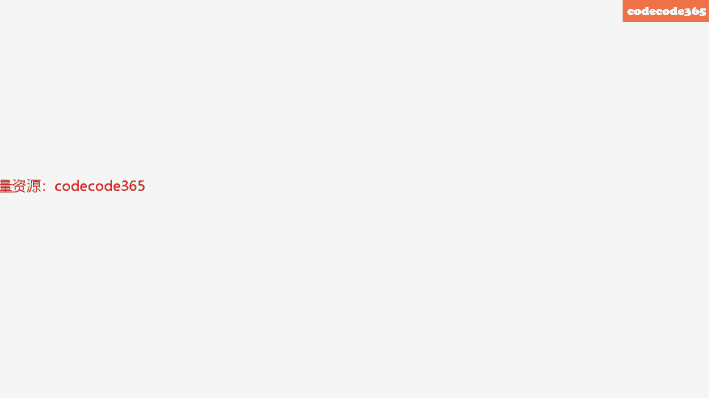

好的好的，那那个大家晚上好啊，我们今天上咱们的第二次课，在今天的课程当中呢，我会给大家介绍到另外一类非常独特的模型啊，我们昨天的模型和今天的模型，是工业界当中最爱使用的模型。

而今天介绍的模型相比于昨天的模型，有它自己的一些独特的优势，使得啊工业界当然在工业界的话，我们是两类模型都会用，但是如果大家去看一看各式各样的，近几年各式各样的数据科学比赛，你会看到。

今天我们讲到这一类模型占据了半壁江山，于是无论如何，大家在解决任何问题的时候，都会第一第一时间想到说，我要用数模型去试一下，所以这个地方数模型，包括我们说的决策树，以及决策树的一些集成模型。

包括今天会提到的随机分明，Random forest，Ok，这个模型相对于昨天的模型有它自己独特之处，它在数据的预处理的部分啊，我的声音大小OK吗，声音小不小吧，那我在具体讲内容之前。

我再跟大家确认一下我的声音大小是OK的吗，没有问题吧，啊所以我觉得说声音小的同学，可能是自己那边声音调的不够大啊，所以调大一点，好吧啊，好没问题，那我们今天提到这个模型非常非常重要啊。

就是数模型的基础啊，叫做决策树，decision tree啊，那基于这个决策树呢，我可以用一些集成的方法，去得到各式各样的高级模型，比如说其中的一个高级模型叫做随机森林，这是我们今天要给大家讲到的模型。

这个模型呢在于它自己独特的特点，我们上节课讲这个模型，做分类的模型叫做逻辑回归，逻辑回归完成的，完成预估的这个方法是呃，你可以对它做一个WX加B这样的运算，在送到一个sigma的函数当中去。

拿到一个概所谓的概率P，而今天的数模型是另外一类处理的模型，所以这类模型在解决问题的时候，会有它自己的独特之处，而这类模型由于它非常非常友好的，一些数据预处理上面的一些特性，使得它在工业界被广泛的应用。

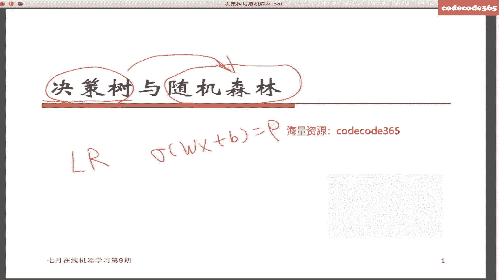

所以这是我们今天要给大家讲到的内容，我们会给大家讲到从逻辑回归，上节课讲到模型，我们简单的过渡一下，提到今天这个模型叫做decision tree，决策树，我们会告诉大家它总体的流程和核心的问题。

而这一部分也是大家在去参加各式各样的，机器学习工程师面试的时候，公司面试的时候最爱问到的问题，所以希望大家一会在我讲到这个部分的时候，能够好好的理解一下，有问题也可以提出来，大家一起讨论一下呃。

我会告诉大家，这类决策树它不仅能完成分类问题，它同样可以完成回归的问题，所以我们会给大家讲到回归数，Requesting tree，我会告诉大家说你回归树是如何去构建的，你如何去生长出来一棵这样的树。

以及如何去最优化一个回归树，那N科的树，单科的角色数，他可能会有他自己的一些问题，我们可以用一些模型集成的方法，去把单科的决策树集成一个集成模型，所以最终这个地方有一个很重要的集成模型。

叫做random forest，叫做随机森林，OK所以我们会给大家介绍到这样的一类模型，好的，所以这就是我们今天我给大家提到的，三个主要的内容，以及他的一些更细的二级大纲，所以大家有一个大题的印象。

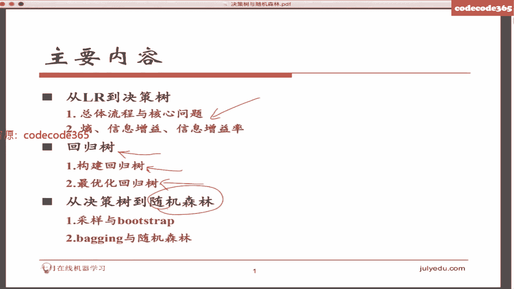

我们就开始给大家做一个介绍了，我们思考一下这个地方有一个这样的问题啊，有一个妈妈在这个小姐姐到了24岁的时候，很着急啊，觉得女孩子年纪大了啊，如果没有出价，可能会有一些问题，于是他要去做一个事情。

他要去相亲啊，小姐姐长得不错，所以来相亲的人很多，于是他需要需要去做一个决定，说今天这个人来了之后，或者说今天这个人的条件下，我要不要去参加这次相亲对吧，因为出了门我还得化个妆好。

所以这个地方的问题就是，我是否要去相亲这样的一个问题，我们上节课讲到这个模型叫做逻辑回归好，这个logic的关系是一个很棒的模型，在这个模型的场景底下呢，我可以去完成一个是或者是否这样的一个。

分类的问题，所以如果我们用logistic regression，去解决这样的一个问题，我们可以找一些需要思考的因素过来，比如说这个不要和我相亲的，这个小哥哥或者大叔，他是否长得足够的高。

他是否足够的有钱，他是否长得比较帅呃，还是说它是一个很有潜力的这样的一个人，或者说他的品德是什么样的一个程度，OK所以我找了这样的一些X1X2X三，X4和X5过来，然后我可以基于上节课的内容。

给定W1W2W3W4W五，当然你可以加一个偏执项啊，OK于是我们做了一个事情叫做WX啊，你可以加一个偏置项给B，然后你可以送到一个什么对SIGMOID函数当中，对你可以送到SIGMOID的函数当中去。

拿到一个概率P，找到一个概率P，这就是我们上节课讲到的内容对吧，我们还是给大家讲到了，到我们有用这样一个模型的时候，我们会有一个损失函数叫做log loss，然后我们会对这个logo los。

基于比如说gradient descent，梯度下降去完成一个优化，拿到最好的那一组WOK好。

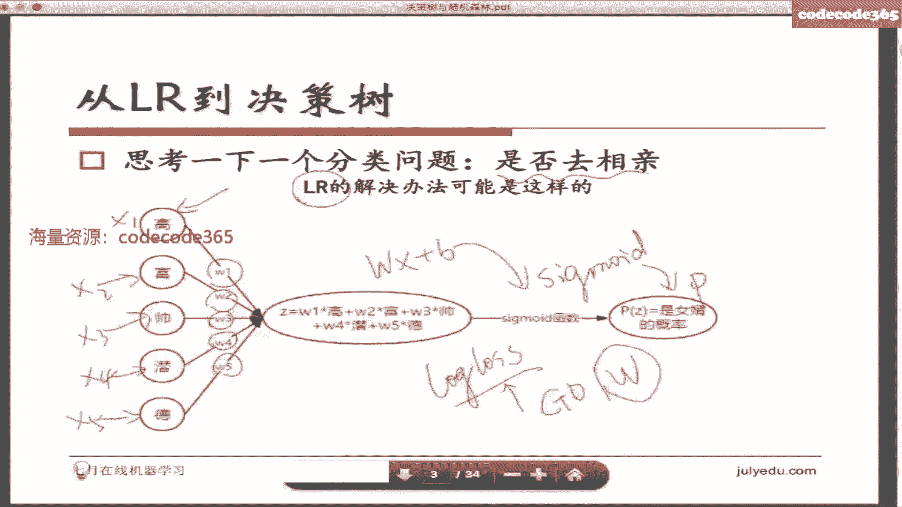

这是逻辑回归，我们今天讲完的模型就很有意思了，所以这个小姐姐在发现啊，前面这个东西要有这么多的数学知识。

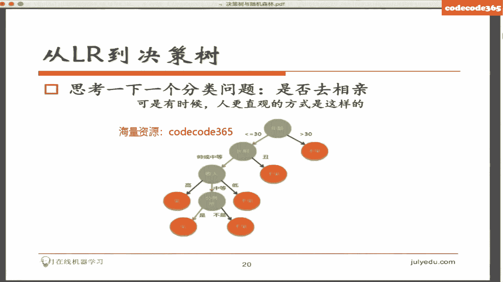

这是一个很头疼的事情，还要去做数学计算，所以这个事情就变得很boring，所以有没有其他的方法呢。

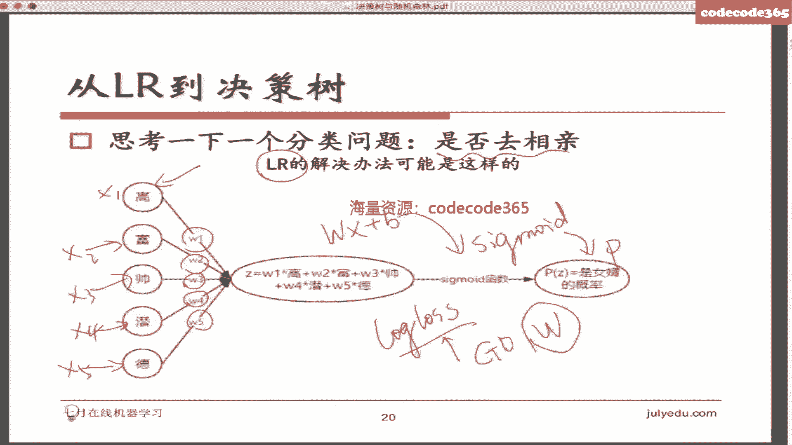

他想了一下，他说哎好多场景下我有一票否决否决权，如果今天这个小哥哥的年龄大于30岁了啊，不好意思，你就不是小哥哥了，你可能是一个小叔叔了，所以年龄大于30岁呢，有一票否决权，不好意思，就完全不去了啊。

就不用考虑其他的因素了啊，然后呢如果他年龄小于等于30岁呢，我再看看其他条件，哎呀这个这个呃有一点点丑啊，所以呢这个时候哎这个条件也不行，也一票否决了，唉如果现在唉年龄也还还适中，长相也还不错。

那再看一看他的收入状况啊，所以如果他收入状况非常非常穷啊，买个冰淇淋都买不起，不好意思啊，一票否决权取不了了，如果他今天诶收入状况很高，那不就是高富帅吗，好去所以就去了，对吧好，如果他的收入中等。

我要看一看有没有时间陪我对吧，所以是不是公务员好，如果是公务员的话，好建，不是公务员的话不建，而这个很符合大家的日常生活，做决策的这样的一个过程对吗，所以人做决策的时候，有时候是这样一种更直观的过程。

我我才不会去做什么数学计算呢，我就是一些规则，这个东西翻译成程序语言是什么，对呀，它就是if else if什么什么什么，我怎么怎么样，else啊，if啊，怎么怎么怎么怎么样啊。

那else再不是的话怎么怎么样，OK所以他是这样的一个诶，如果怎么怎么样就怎么怎么样，如果再怎么怎么样，就怎么怎么样，如果都不是我怎么怎么样，是这样的一个房事，去判断这个小姐姐是否去参加这次相亲好。

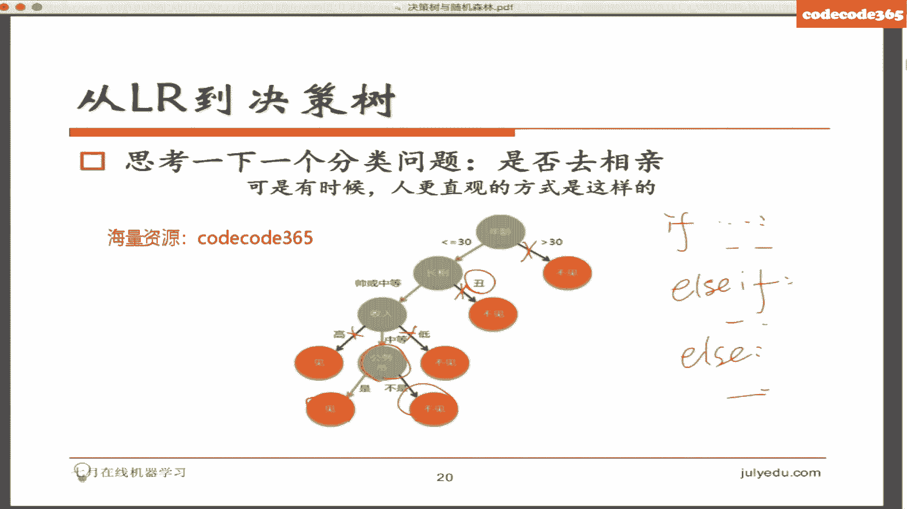

所以我们把这个东西做一个抽象呢，大概是这样的，我们会拿，我们会从左边这个小姐姐和妈妈对话当中，去得到这样的一个决策树啊，这就是一个决策树，所以这棵决策树实际上很清晰，他给他的每一个分支。

实际上就是你会根据一个，你会根据这个条件在取值去做一个判断，OK顺着这本书往下走，走到叶子节点，你就可以拿到，你要的结果，所以这个模型是，这显然也是一个可以用于决定，我到底去不去参加相亲的。

这样一个二分类的一个模型，这个模型是有它独特的特点，它的特点是什么呢，它很简单很简单吧，他甚至不需要去做数学的计算啊，我就是一堆的规则，我做预测的时候就是顺着这个规则往下走，我就拿到结果了。

第二个他的逻辑非常清晰，对不对，它相对于我前面数学自动的那种模型，它的逻辑非常清晰，我就是去做一个条件判断他的年龄怎么样啊，大于小于他的长相是什么样的水平，OK她的收入是什么样的水平。

OK他的可解释性非常好，对不对，如果今天小姐姐告诉你说，OK这个人我去见，那你就可以知道他为什么去见，你就可以基于这些条件去判断说为什么他见哦，是因为这个人收入很高，然后他的年龄和长相也还OK。

所以他们把这种模型叫做透明的，叫做叫做transparent透明的，所以透明的意思就是，它它对用户而言是直接可见的，你是知道他为什么去做这样一个角色。

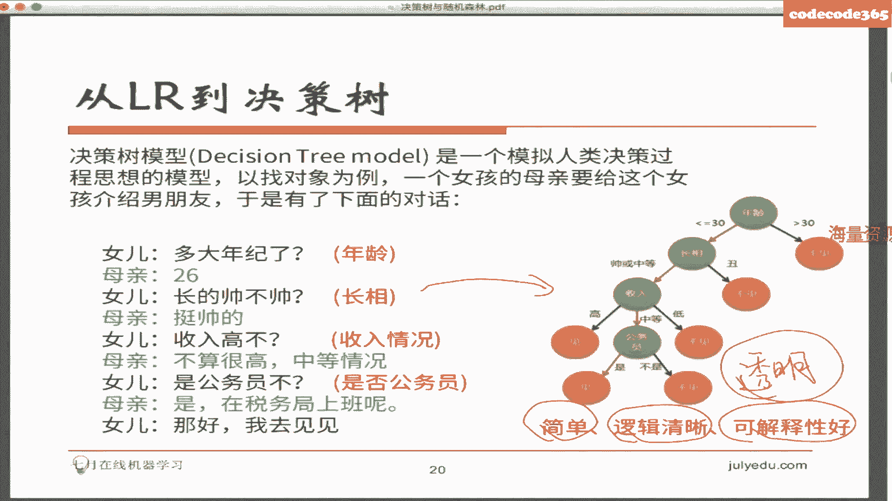

为什么做了这样一个判断好了，所以大家已经见到了这样的一个结构，那我们来，我们现在来给这个这个决策树这个模型，做一点小小的定义，决策树是一个基于树的结构进行决策，这样的一个model。

那这个模型它有它自己的特点哦，大家仔细看一下，每个内部节点就是这个地方绿色节点，OK那这个地方的内部节点，就是这个地方的绿色节点，大家看到了啊，这些绿色节点啊，那它是什么呢，那每个绿色节点。

是不是针对某一个条件去做了一个判断呢，就是针对某个属性去做了一个判断呢，所以我上最上面的绿色节点，对年龄做了一个判断，第二个类似的节点对长相做了一个判断，第三个绿色节点对收入做了一个判断。

在下面一个绿色节点针对公务员做了一个判断，那我们再看一下每个分支，是不是对应这个判断的一种可能的结果呀，如果它小于30岁，他就走左分支了，它大于30岁他就走六分之了。

所以这个地方的每一个分支实际上是一种取值，对不对，他要不在这个范围内，要么就是说OK他的收入，他的长相是什么样的一个程度，所以某每个分支都是一种可能的结果，或者说这个属性的取值。

然后这个地方的每个叶子节点是什么呀，我们说了，顺着这棵树往下走，他如果走到了叶子节点，他拿到结果了，所以叶子节点就是结果呀，就是你的预测结果好，所以这棵树就长成这样，但是这棵树它不是平白无故出现的呀。

这个小姐姐一定是根据自己多年的这个，这个追剧的这些经验对吧，看了不少的韩剧，OK所以就养成了这样的，不不是养成了，就是培养起来这样的一种判断的标准，所以说所以说唉当我有一个小哥哥来的时候。

我可以去做一个判断好，所以这个学习的过程，实际上就是通过不断的去看韩剧，去通过这个训练样本的分析，来确定说我划分属性到底是什么，我最看重什么，我最看重的是帅不帅，是高不高，是有没有钱还是高。

是有没有钱还是高，是有没有钱还是年龄怎么样，所以这棵树是慢慢长出来的，你得去看看他最关注什么。

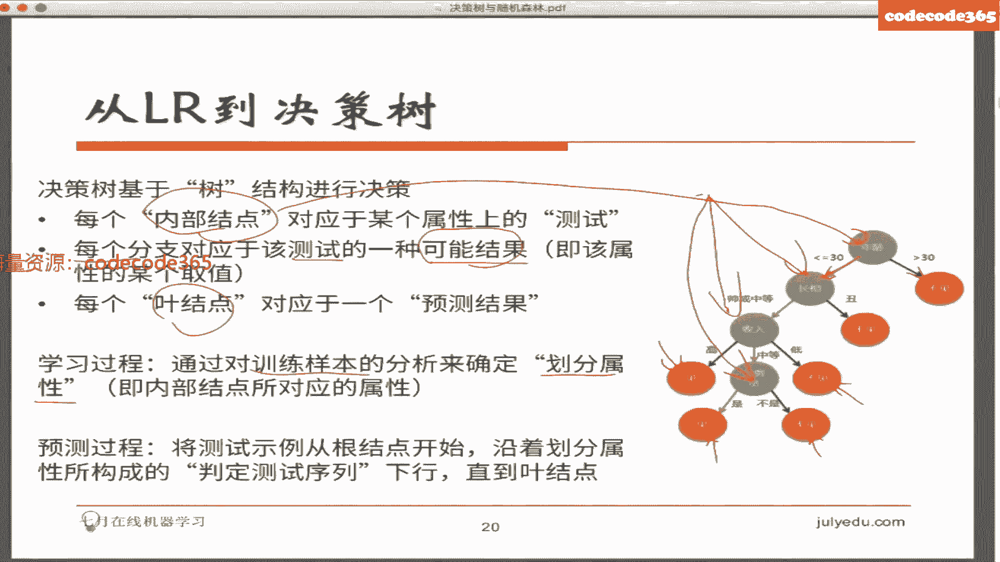

然后看他在关注什么，再看他关注什么，OK好，那预测预测的过程当然非常简单了，预测的过程就是直接顺着根节点往下走就好了，你是有一个条件就走哪个分支呗。

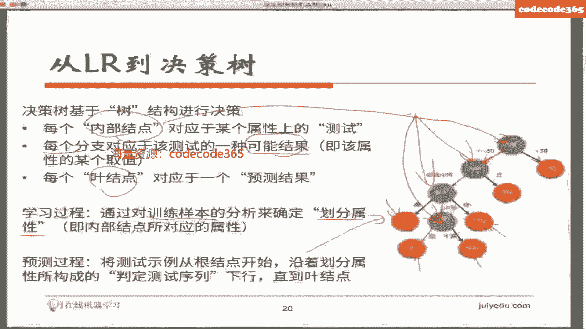

你往下走，直到你碰到叶子节点，结果都取出来了，这里就叫做进去，叫做决策树，好了，说了半天，你知道这个东西长什么样了，你知道这个东西呢，呃我怎么去完成他的预测，诶，我好像不知道这个东西怎么得到对吧。

所以所以我怎么知道小姐姐，她对哪个东西最最最看重了。

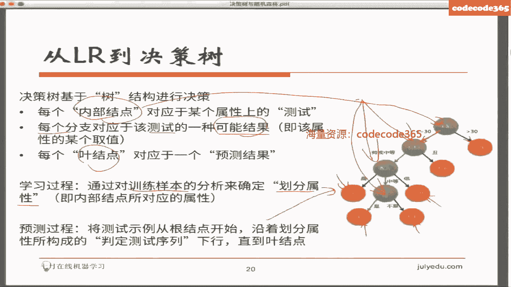

这个就是我们需要去了解的信息啊，所以这棵树的生长的这个过程呢，总总体的流程是这样的，大家先建立一个基本的概念，它有一个总体的流程，它总体流程是一个分而治之的一个流程啊。

一个divide and conqueror分制的一个流程，我会自根节点至叶子节点去做一个递归，所以这个地方自根节点和带叶子节点，去做一个递归，去做一个递归，然后，大家看到这个地方呢在每个中间节点。

实际上他会去寻找一个划分的属性，然后这个地方有三种终止的条件，就是这棵树它会一直生长对吧，但它不能一直长下去啊，你总得讲到什么时候，这个小姐姐总得在判断若干个条件之后，就知道我到底去不去参加相亲对吧。

去不去参加这个相亲，对不对，对啊大家能听到我声音吗，大家能听到我声音吗，啊不卡对吧，那个大家切换一下路线啊，我这边我这边是没有问题的，我这边的掉帧率是没没有掉帧率的，我的我这边是百兆的宽带。

所以大家那个那个切换一下自己的线路，有可能是这个切换一下自己的线路，有可能是这个直播平台的这个线路的问题，对OK好，所以这个地方呢我这个地方的这一行，说的事情是我需要去了解什么时候停止。

就是这棵树什么时候停止生长啊。

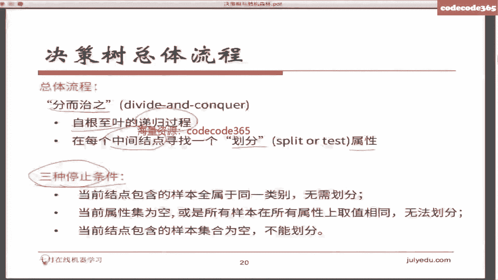

你总得长成一棵这样的树，这个小姐姐才知道说要如何去，做预估吧或者做预测吧，现在大家能听到我声音吗，我再问一遍，能听到我声音吗。

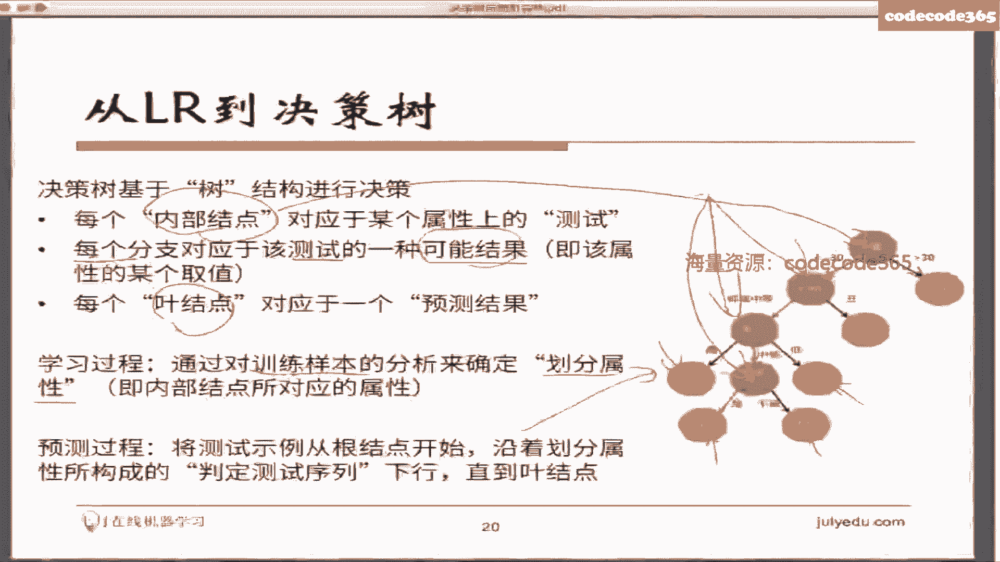

啊你们切换一下线路好不好，你们切换一下线路好不好，对我这边的话做不了什么东西啊，因为我这边显示是OK的状态，好好，好那个啊，对我我我我知道你反映的情况啊，你们切换下线路试试看，因为我这边做不了调整。

Ok，我这边我这边的带宽和掉帧率，是没有任何问题的，所以我不知道怎么去调这个东西好吗，好不好，好那个大家先听啊，如果你在听的过程中实在忍不了了，你跟我说，我我再看一看是不是用流量给大家讲个课好吧。

因为我家WIFI应该是没有问题的啊，嗯好的好，所以这个地方呢其实像我们要做的事情，是这样的，我知道了，这棵树长成这样，我下面要解决两个问题是第一怎么长，OK第一怎么长好，第二涨到什么时候停，Ok。

对不对，我需要去解决这样的问题，对吗好，所以我需要解决两个核心的问题是诶，我知道这棵树长成这样了，但是请告诉我怎么去长出这样的一棵树，我已经有一堆的数据给你了，我有一堆的韩剧准备好了，小姐姐去看好。

但我我我得知道这一堆的韩剧看完之后，它的判定依据是什么，就是这棵树的怎么去得到啊，怎么找，以及涨到什么时候去停啊，因为你不能说你让他一直涨对吧，你总得说你总得告诉我说，你满足某些条件的时候。

你到底去不去参加这次相亲啊。

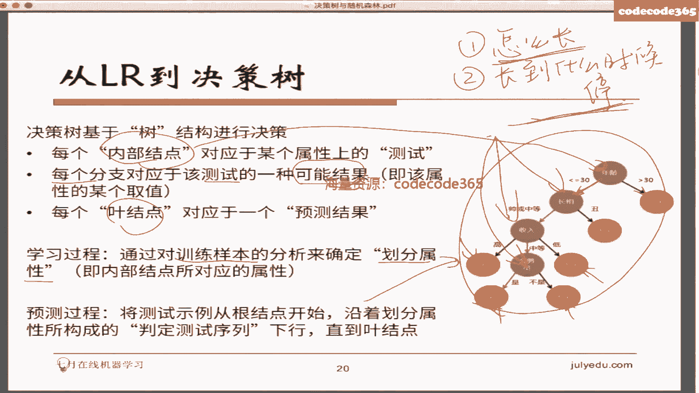

对吧嗯好的，所以这个地方有三种终止的条件，第一个条件是当前节点包含的样本，全属于同一个类别。

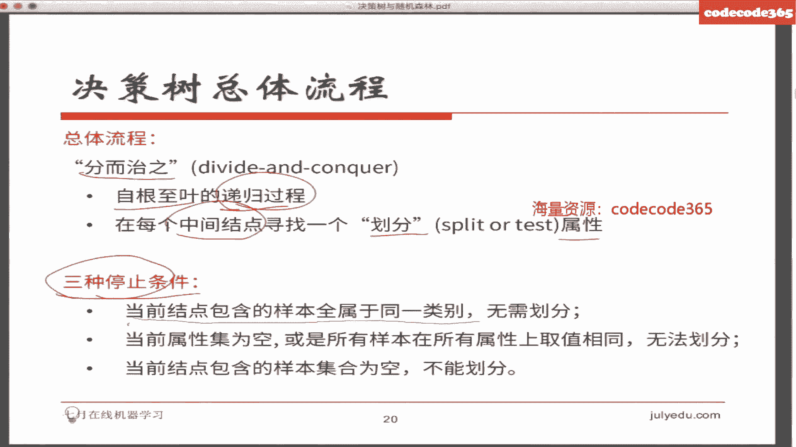

意思是什么呢，我看了这么多的韩剧，所有韩剧都告诉我说，如果这是这个小哥哥是一个年轻有为，长得帅，然后收入又高的这样的一个小哥哥一定要建好，所以所有的韩剧都告诉你这件事情说要建好，所以那就不用。

那就大家都达成了统一的意见啊，我不需要我不需要再去做做什么呃，这个别的条件判断了，所以这样的情况下又高又高，又不不是高啊，就说这个年又年轻，长得又好又帅，收入高频，我不见对吧，大家都见啊。

所以这个时候大家意见一致，OK那我就拿到了一个结果，不需要再不需要再往下涨了，结果一致好。

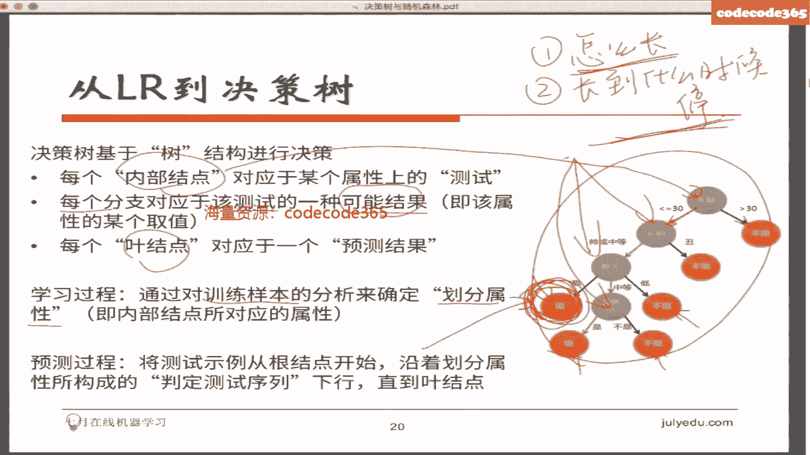

那第二种情况是什么呢，当前的属性即为空，或者所有样本在属性上的取值相同。

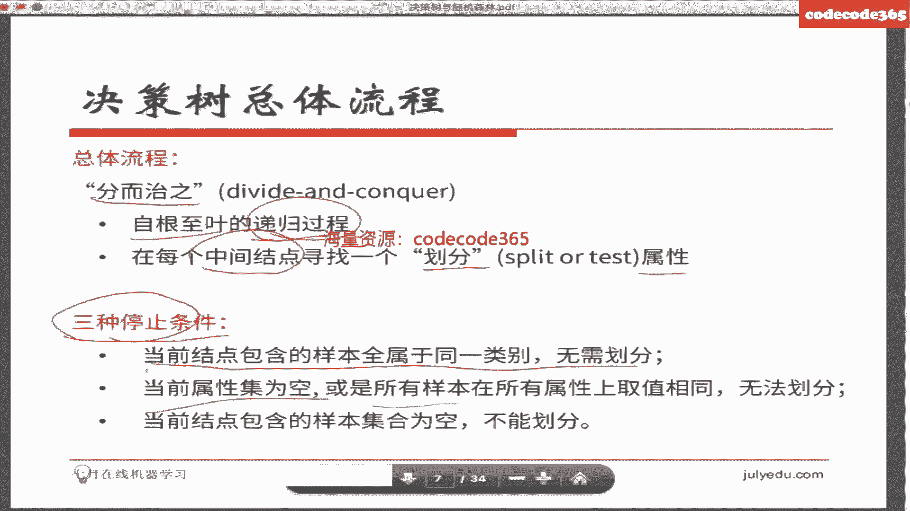

无法无法划分，什么意思，就是这个是这样的，他今天看韩剧了，他发现一个很纠结的问题，这个很纠结的问题就是男2号也很年轻，也很帅，也很有钱，但是韩剧里头的很多小姐姐不见了，这个就有点小尴尬了啊。

所以这就是你找了好多韩剧过来，你发现诶都是这样的情况，走到这了，有些建了，有些没有见我，我好像这个都是一样的条件，有些建了，有些没有见对吧，可能就不好判断了，这时候我就没有办法。

我就我就我所有条件都一模一样，这个时候你还有些看，有些不看，有些贱，有些不见，那我也找不到其他的条件去做区分了。

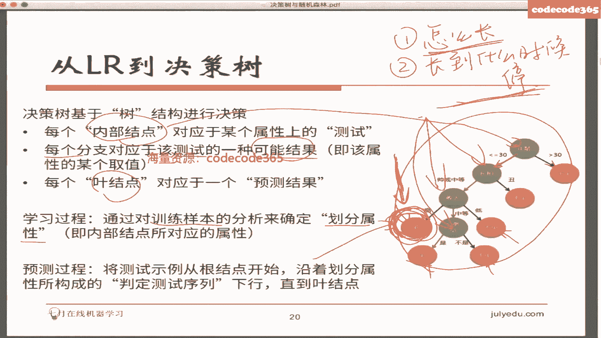

对吧，所以这个时候你就要停，那个大家听这个课的时候，跟着我的思路来好吗，你们你们现在有疑问是正常的，因为你们第一次见到这个东西，等往后讲你的疑问就没了，所以你们可以先提问。

但是我不一定会马上解答你的问题好吧，所以记住了，第一种条件是说所有的韩剧都告诉你说，要去见他，第二种条件通常情况下是告诉你说，哎我所有条件都一模一样，这两个人的这两个人的条件完全都一模一样啊。

你说的没呃，我不好意思，我看到大家提问这个问题，但我们没有理解大家的意思是什么，第二条的属性取值相同，和第一条有什么区别，第一条告诉大家的是，我只要满足有钱，所有韩剧告诉你，只要满足有钱全都要满足。

有钱全都要满足，有钱全是它的属性，我不用考虑了，明白吗，就是这种终止条件，意思是说，如果今天韩韩剧里头告诉我大于30岁，我就不见了，我其他东西都不用看，明白吗，就是只要满足这样的属性。

满足这样的条件全都一模一样，结果全都一模一样，我就不需要去区分了，我这个时候就终结了，OK我有这个条件，一票否决，我就终结了，我不看去不去看有没有钱，不去看是不是公务员不用看了，你能力这么大。

我借你干嘛，OK所以这是第一个条件说的事情，第二个条件说的事情是，我把所有的属性全都取出来了，这些所有条件都一模一样，这个时候还是有时候见，有时候不见，他是不是没有办法再往下生长了呀，你要往下找找。

总要去找到一些不同的条件去做区分吧，要不就是这个高那个矮，所以你不你你去见高的，不去见矮的，那如果他都有钱对吧，他都都有钱，都年轻，都很高，都很帅，还是有些小姐姐不去见，有些小姐姐去见了。

这个时候你告诉我，你还能找到什么条件去做区分，你找不到了，所以这是第二个条件，告诉我们说所有样本所有属性上的取值都相同，我找不到属性，找不到其他的判定标准去区分它了，我说明白了吗，这是一和二的区别。

对有人总结的很，有同学总结的不错，一个意思是说我在这个条件下，所有标签都一样，二是我所有属性全用完了，或者说所有属性都一模一样，但是它的结果还是不一样，啊这这个叫什么OOOIS，这位同学不要太着急呃。

我没我还没有给大家讲到如何去做预估，我现在在讲什么时候停，至于停掉了之后选什么还没有讲到，不要着急好不好好吗，所以不要跳啊，就是大家稳一点啊，好的，所以我说清楚了吗，第一种情况和第二种情况。

我有我我给大家说清楚了吗，好那第三种情况是当前节点包含的样本即为空，就是呃就是没没有没有样本了，所以这种情况下你是没有办法去划分的。

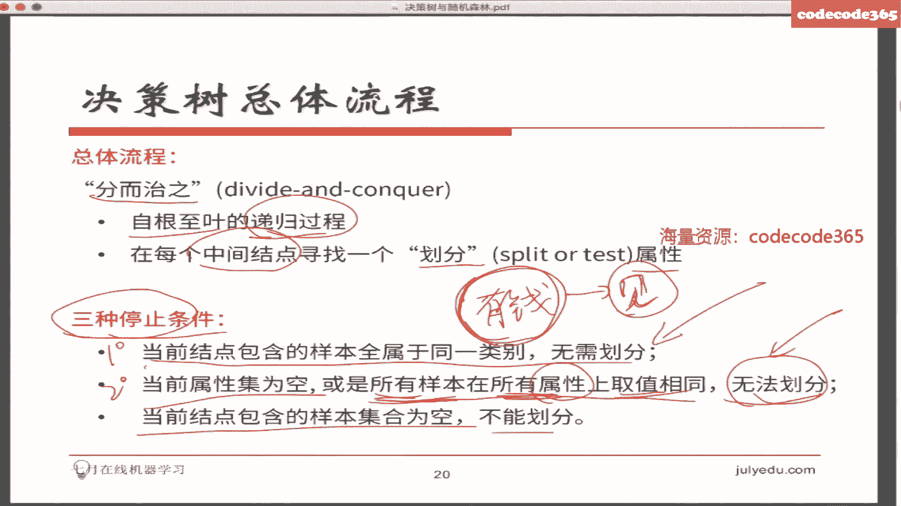

所以记住了这个地方，当出现这种情况的时候啊，这个小姐姐看韩剧总结到这些情况的时候。

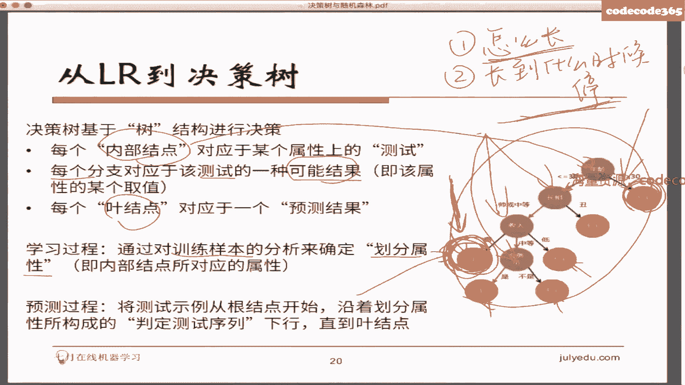

她就有心里有数了，就说OK这个看这个不看，或者说这个不能再分了啊，不能再区分了，请大家条件都一样好。

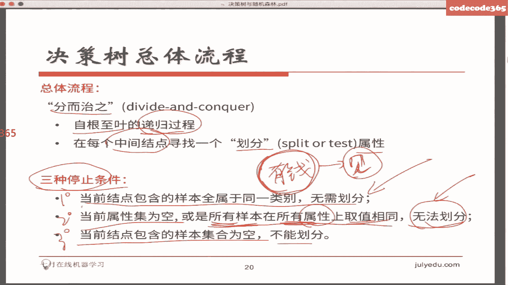

所以记住大家了解第一件事情是什么啊，就是这两件事情啊。

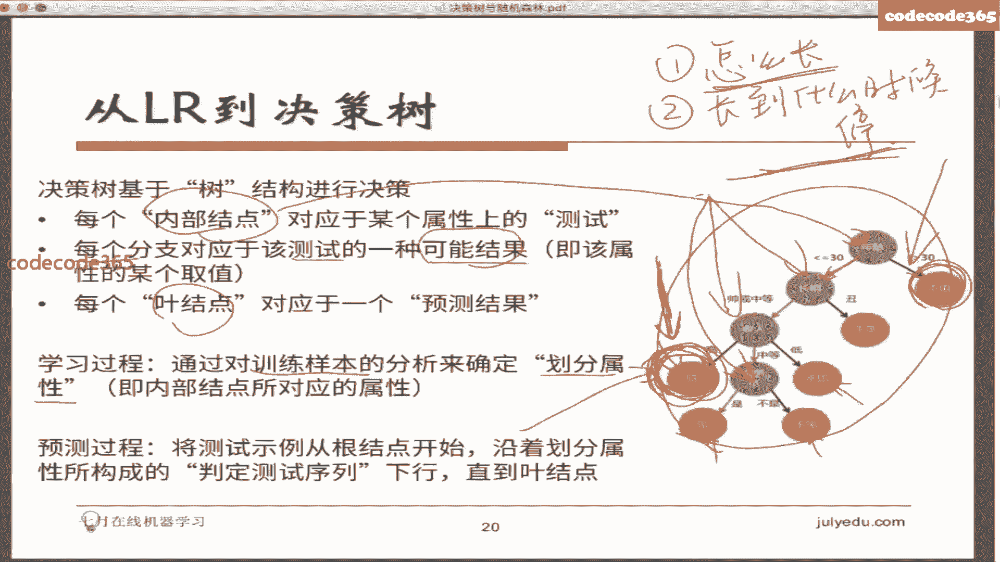

涨到什么时候停啊，已经知道了，涨到什么时候停，嗯对下面这这这页有点有点懵，好看的对吧啊，这个地方是从周志华老师的西瓜书里摘出来的，一段伪代码，听清楚啊，是一段伪代码，然后看代码大家都很头疼对吧。

所以我也不需要大家去看，我嘴里头框出来的一些东西，大家看清楚了，我框出来了一些东西，我框出来了一些东西，所以这个时候框出来的东西是，你，什么时候停。

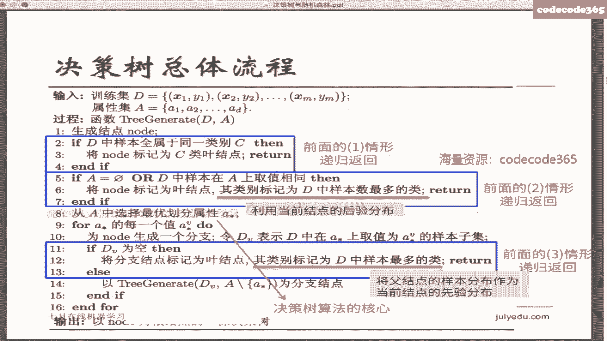

同学说第三个终止条件没有看懂，三是没有输入数据啊，没错有同学说的对，就是你这个店里头有红色，有蓝色，有紫色的衣服，OK我要决定他买不买，本来是衣服是有这三种颜色的，今天紫色卖光了，不好意思。

我到这个地方去做分叉的时候，有三种颜色，紫色的，今天店里头卖光了就没有了，你不能甩这个东西就停掉了，这肯定肯定是没有的，然后另外两个你可以继续往下涨，OK没有对应的样本了。

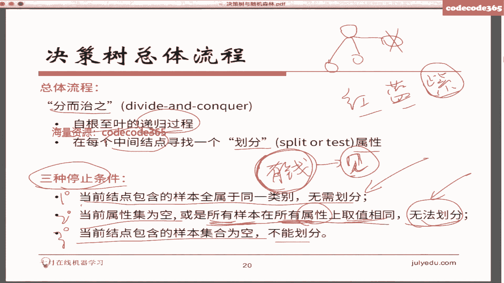

然后大家往下看呢，这个地方是一段伪代码，伪代码呢其实那个大家要读也读得懂啊，大家要读是读得懂的，我就是把刚才的三个终止条件写到这，这是对应第一类的终止终止条件，这是对于第二类的终止条件。

这是对应第三类的终止条件，好这个我不给大家念，你们自己去对好，现在这里头有个我用红色加粗的部分，在这红色加粗加粗的部分，这个家最后说了一件事情，小姐今天得判断一下我，我到底现在最看重的是什么。

比如说你今天要在北京或者在上海买个房子，你手头上的钱有限，那你手头上的钱有限，肯定不能所有所有条件都满足，对吧哦，我要学区房，我要房子要大，我要防止新，我要防止这个采光好，户型好，交通便利啊。

哪来那么多钱，所以你钱有限的情况下，我要怎么样要取舍嘛对吧，所以你要举手的话，他就问你一件事情说，那你买这个房子，老哥你买这个房子，你最看重什么，你最看重什么对吧，什么样的东西是你完全接受不了的。

你看都不会看的，那有些人会说这个房子朝北的，完全不看，而有些人会说这个房子的年龄啊，这个房龄是他的房子，这个建造时间是在90年以前的，完全不会看，OK好，所以这个地方这个我用红色的这个底色加粗的。

这个部分是很重要的一个点，他告诉我们说，我必须要去决定，小姐姐现在去做这件事情，最关注的点是什么，当前最关注的点是什么，这是最重要的点，大家听清楚啊，一会儿我们会讲到三种决策树，这是决策树算法的核心。

你之所以会有三种不同的决策树，很大程度上是因为他们在做做这件事情的时候，有不同的方法，但他们都达到了这样一个目的，所以记清楚啊，终止条件我说完了，那如果他不终止，要怎么样，不终止的话，这棵树要涨怎么涨。

你得去判断你现在看重什么好。

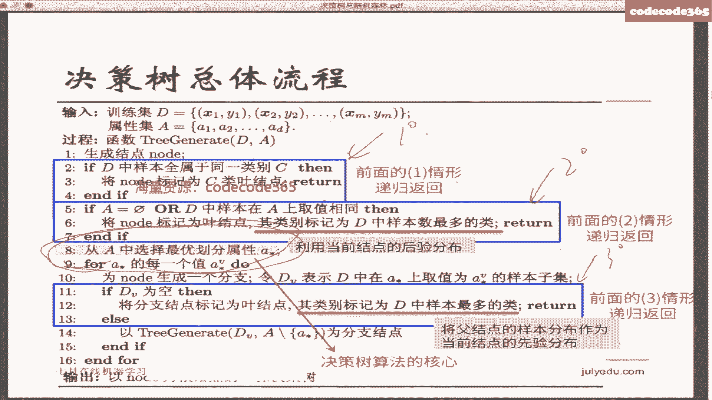

我们来到这个问题，你现在看重什么，插播一点小小的数学知识啊，不要害怕，这个地方有一些公式，我要给大家，以比较直接的方式来给大家介绍一下，这个地方的数学公式，你见到的第一个概念叫做熵。

这个概念是一个物理概念，所以物理老师会告诉你说，整个宇宙是在朝着熵变大的方向去发展的好，这个东西听起来逼格就很高了对吧，那什么叫做商呢，其实啊一点也不高级，这个东西是一个一个度量标准。

这个东西信息上所谓的entropy，它度量呢就是一堆的样本，它的纯度纯度什么叫做纯度，没有杂质就纯了对吧，有不同的东西混在一起，它就不纯了对吗，所以它是用来衡量纯度的一个概念，然后这个时候一个指标。

这个时候呢大家先看怎么算，我一会给大家解释，假定当前的样本当中，集合当中第K类所占的比例是pk，听清楚啊，今天有一个蛋，这个蛋里头有三种颜色的球，分别是蓝色的，红色的和黄色的，好，我们举这样一个例子好。

所以这种小袋里头就有很多很多的球，他们有三种不同的颜色，蓝色红色和黄色，那个这句话的意思就是说我告诉你说，我的蓝色啊取值是对他的这个比例是P1啊，红色比例是P2，黄色黄色的比例是P3。

那大家告诉我这个西格玛P等于多少，西格玛I等于一到，不知道有多少类啊，假设它有N类，那一到N的这个PPI它应该等于多少，大家告诉我这个东西等于多少，你所有东西加在一起的比例当然是一啦，有问题吗。

没有问题啊，就是加在一起概率等于是一，好好问大家一个问题，问大家一个问题，哎我今天问你伸手进去摸球，然后我问你一个问题，我说哎小哥哥，你伸手进去摸这个球，你能告诉我你你你猜一下，你摸出来的是什么球吗。

然后我问你一下诶，如果你现在有你这三种颜色里头，有90%的球都是蓝色，你伸手进这个大眼睛去摸这个球，你会告诉我是什么颜色，你当然会告诉我是蓝色，因为有90%的球都是蓝色，我当然猜最多的那个了。

而且什么时候最不肯定啊，我问大家什么时候这个事情是最不肯定的，是不是三种球的，这个袋里头这三种球的数量一模一样，你你猜不出来，你没有办法去取一个最大的，你新手进去摸它就是一个随机的啊，我说的三种球啊。

不要和0。5没有关系啊，就是大家那个跟着我的节奏来，有三种球，那我应该是，那我应该是什么样，三种球都是一样多，1/3，对不对，如果他是1/3，我伸手进去摸，我现在就很很懵。

他跟我说小哥哥小哥哥现在这里头最，你你觉得摸出来的这个球概率最高的是什么球，我不知道，因为这三种球居然数量也一样，所以这个地方的信息熵度量的是一种啊，不纯度就是这个值越大，它的纯度越低，这个值越小。

它的纯度越高，那大家告诉我，这个信息熵在什么时候去取到它的最大值啊，什么时候我的纯度是最低，我的不确定度是最高的呀，听清楚我的描述啊，纯度月最低，不确定度最高，对没错，在你每个类别的比例都一样的时候。

哎大家大家高中的时候就学过不等式对吧，我问大家那个不等式哦，不等式它的它的它的这个不等式的，它的一般什么时候取到等号啊，不准是他什么时候取到等号啊，通常情况下是相等的时候对吧，是那几个东西相等的时候。

比如说A等于B等于C，对不对，所以这个地方的entropy取到了极值，取到最大值的时候，也是这个地方的pk相等的时候，能能明白我意思吗，如果这个东西衡量的是一个不，一个一个混乱程度。

或者说它的一个不纯度的话，他什么时候取到最大，什么时候最混乱，是不是所有的pk都相等，是不是所有的pk都相等，是不是伸手尽力了，带头去摸球，所有球队所有颜色的球数量相等，有问题吗，这个地方有问题吗。

没有问题，对不对，好记住了，记住了，有这样一个概念，它叫做安全比叫做细，它叫做安全比叫做细，它叫做安全比叫做细，他这样去算，他这样去算这个东西在所有的pk相等的时候，取到的值是最大的。

这个时候你最不肯定最不肯定。

你完全你完全，你完全不知道自己摸出来的是什么样的颜色，这个东西叫做信息熵，好记住了，信息熵描述的是什么。

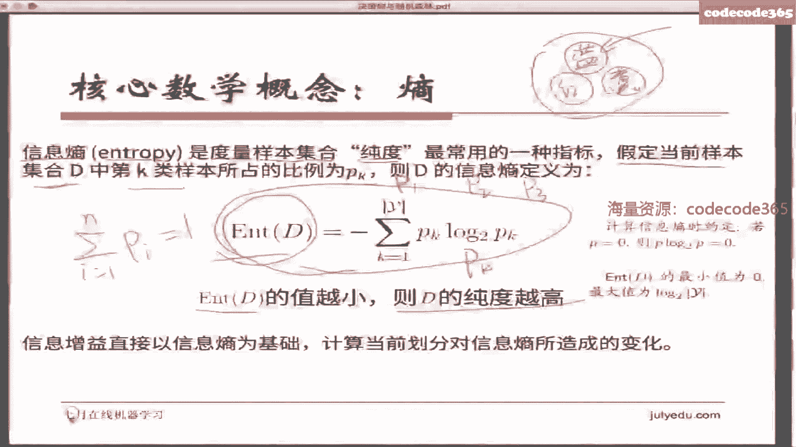

是不纯度，就是他描述的是它的一个不纯的程度。

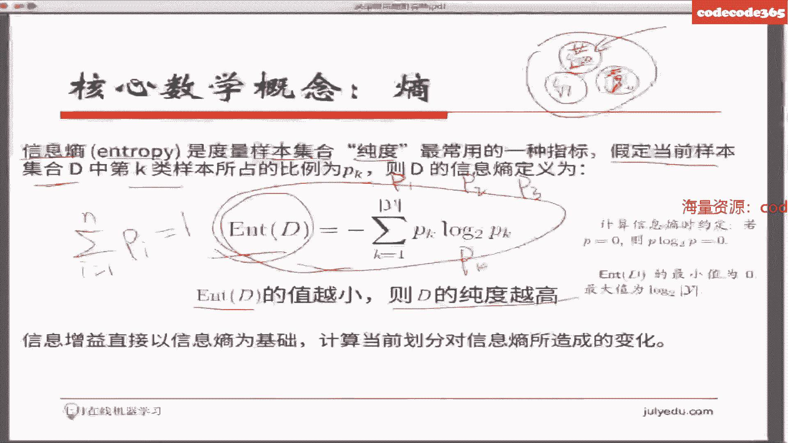

所以这个东西越大，它的不纯度越高，它越小，它的不纯度越低，它的纯度越高，OK听清楚了啊，那你想决策树如果要去完成一个判断。

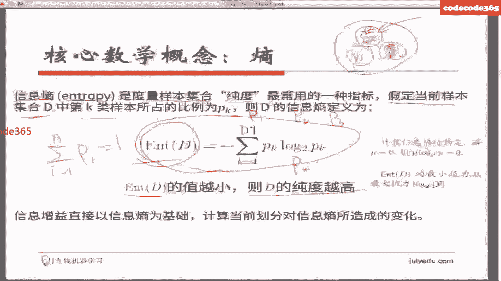

我是希望我的肯定度越来越高，对不对，而我是希望这棵树，你你希望这个规则产出以后，我们更肯定一点点，我能更肯定一点点有问题吗，啊我我说一下，我说一下，这个地方表示的是它表示的是Y的类别数量，听清楚啊。

这个东西不是Y的绝对值啊，它是Y的类别数量，它是一个标记，它表示我有多少种不同的label，有问题吗，所以K等于一，但有多少种不同的label，比如说红黄蓝是三种，所以就是从1~3。

这不是什么Y的绝对值啊，这个绝对值没有关系，这个东西就是一个标记，它表示有多少种不同的label，好收到就就就点到这好吧，然后唉你想想啊，哎为什么我需要机器学习的模型啊，机器学习模型是为了干嘛呀。

为了做预估位，预估是为了为了怎么样，为了提前去拿到一个可以去猜出来的一个答案，或者是提前去预估出来一个答案，所以如果你这个模型构建的足够好，是不是去把我的这个地方的不确定度，降得足够低啊。

这句话有问题吗，你的机器学习，你想想机器学习这些模型的本，他希望做什么样的事情啊，他是不是希望去让我提前拿到一个，预估的结果呀，是不是提前拿到一个预估的结果呀，是不是让我未来的不确定性尽量的低啊。

所以我希望这棵树在生长的过程当中，能让现在我对于我训练的数据。

它的不确定度越低越好，你最好能让我现在很肯定的，就根据你这个规则就知道这是哪一类，根据另外一个规则就知道是另外一类，所以这是机器学习模型想要做到的事情。

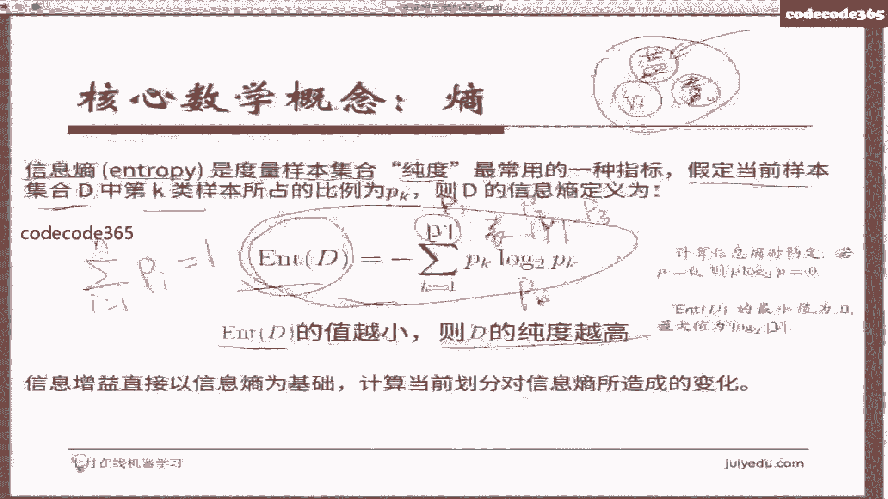

他想让这个不纯度往下降，他想让这个不纯度往下降，他想让这个纯度往上升，他想让我去做预估的时候，这个事情足够的肯定，所以这个时候我有了一个东西去度量，我现在的不确定度，度量我现在的不纯度对啊。

我现在的不纯度，我是不是在每一次生长的时候。

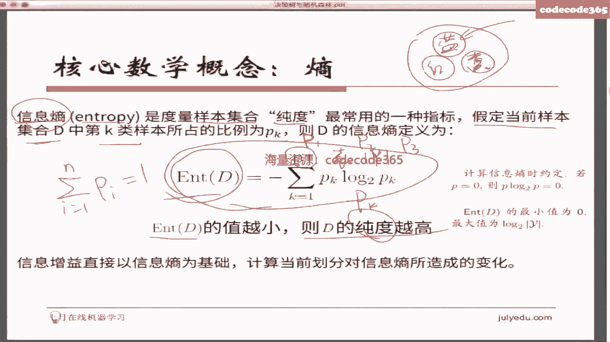

我希望我基于这个规则，可以让这个不纯度往下降啊，好来这个地方又有公式好，不要怕公式，我给大家解释一下，他说了一件事情，他说嗯这样这样这样现在电商里头，就是现在电商里面有这样一些衣服的颜色啊。

衣服颜色分别是什么呢，OK分别是这个这个啊黄色啊，蓝色，哎呦那大家等我，大家等我半分钟好不好，等等我半分钟好吧，现在OK了是吗，好的可能是直播平台的问题好吗，好所以我接着往下讲了。

记得我刚才记得我刚才说什么吗，我刚才说到一个东西叫做不纯度，叫做不确定性，不纯度机器学习模型，为了干嘛把不确定性往下降，我希望这个东西越来越纯，我希望越来越肯定，所以我们来看看怎么做。

假设我现在有一个属性取值叫做红黄蓝好，所以一个小姐姐来买衣服了啊，红黄蓝啊，红黄蓝号那个小姐姐，一个小姐姐来买衣服了，诶诶那个如果我现在不确定这件衣服颜色啊，我就告诉你说有一件这样的衣服。

那肯定是有一些小姐姐买了，有些小姐姐没有买嘛对吧，所以呢哎这个地方呢，就是在我没有根据这个属性往下生长之前，大家听清楚啊，肯定是对于这件衣服呢，肯定是有些有些小姐姐买了，有些小姐姐没有买。

所以这个时候他是不是在这个数据集上，我可以基于买和不买计算出来一个不确定度啊，不纯度啊，是不是可以计算出来一个信息熵啊，告诉我这个有问题吗，比如说有十个小姐姐过来，这十个小姐姐当中有啊。

那个四个小姐姐买了，有六个小姐姐没有买，是不是可以基于这个东西去计算出来，一个不确定性啊，有问题吗，没问题对吧好，那如果现在新加了颜色，颜色有三个分支，所以这个地方是蓝色，这个地方是红色啊。

衣服的颜色啊，这个地方是黄色，OK那这些小姐姐是不是可以根据这些衣服啊，就是她最后有没有买件衣服，衣和衣服的颜色有关系吧，所以我根据衣服是不是颜色，是不是可以把它分到几个不同的袋里头啊。

我是不是可以把它分到几个不同的袋里头啊，所以这个地方有几个不同的袋里面的话，每个袋里头都会有一些样本，但是因为我把我按照这个东西去区分了，所以它的肯定度有可能会变高对吗，所以这个时候这个东西就是。

我在基于现在的这个属性取值，划分之前的这个地方，它的交叉熵，而我说也不是交叉商，他的信息熵，他的信息熵是划分以前的信息熵，后面这个东西是什么呢，对后面这个东西是分成的，每个代理头氢分成了三个蛋。

每个蛋里头它的不确定性，但是因为我的样本量减少了呀，所以我要给他做一个加权，我在前面这个地方不是绝对值，我重复一遍，这个东西不是绝对值，这个东西表示这个集合的数量，这个集合的数量。

我总共会有多少个小姐姐去买这件衣服啊，总共有十个小姐姐。

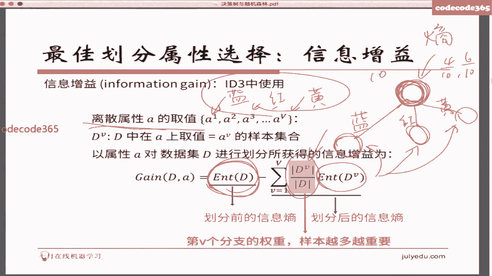

我记忆不同颜色区分以后会有多少个小姐姐，对，在这里头也许是啊，我随便举个例子。

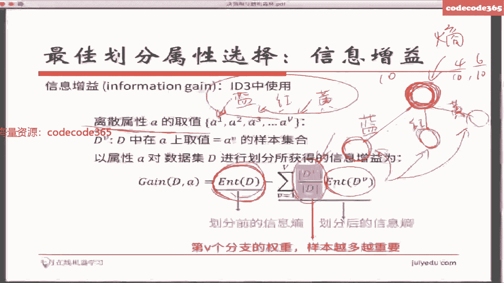

也许它是5+3加二。

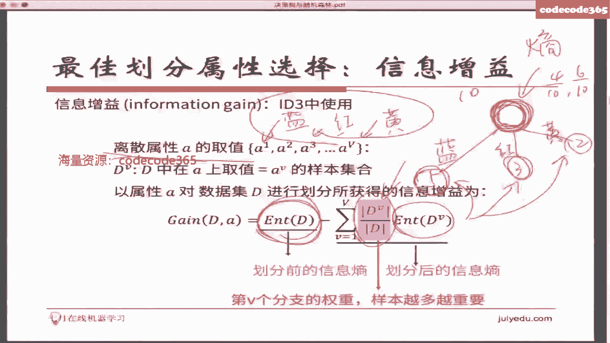

所以这个东西是数量好，所以我在我给大家说一下，这个事情实际上是什么样的呢，是说诶我在做划分之前，我可以计算出来一个不确定度。

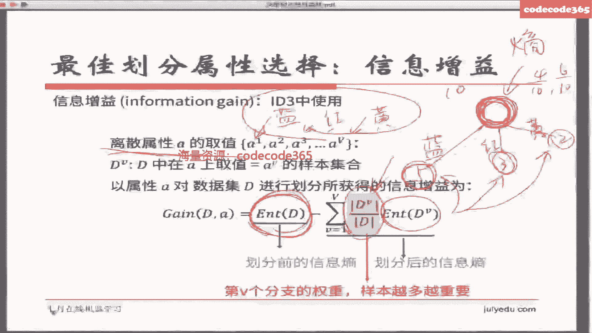

不纯度我可以确定出来的不纯度，我在划分以后，我基于某一个东西去做判断了，我基于这个人的年龄大小，我去判断一下我要不要去要不要去和他相亲，我记得他是不是有钱，我去判断一下他是不是要相亲。

所以这个时候它会被分到不同的同类，而每个同类里头都可以算出来一个不纯度，这个时候我会用它这个桶中的数量比例，数量比例去做一个加权，我用这个东西去衡量说，当我用这个离散的属性去做区分的时候。

我的不确定度有没有往下降，我的不纯度有没有再往下降，降了多少啊，所以听懵了是吧。

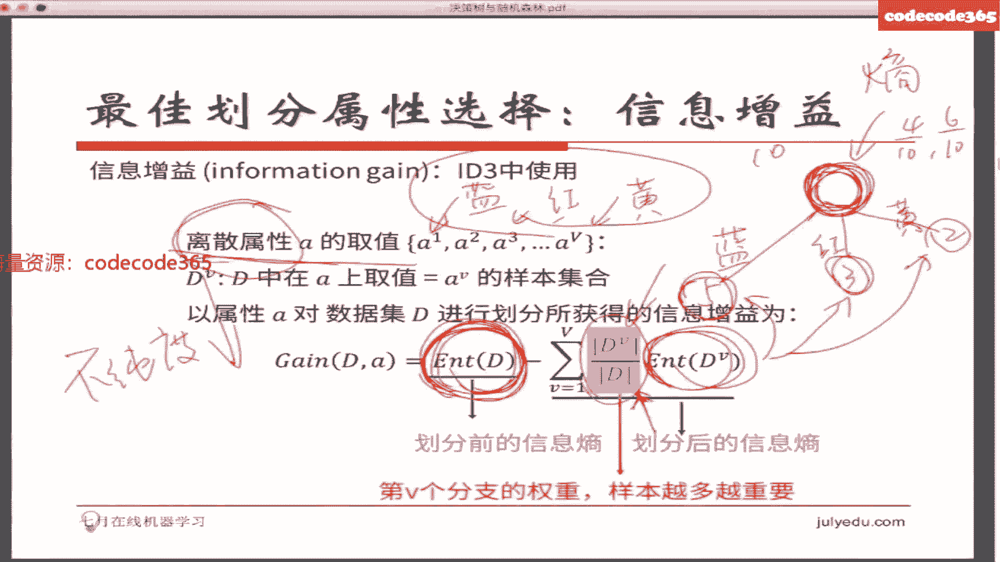

听懵了是吧，好没关系，听懵了，我们来找个例子，这个地方的例子来源于周志华老师的机器学习，西瓜书的数据集，好的，所以这个问题很简单，我们最终的目标是为了去判断一个西瓜，到底是好西瓜还是坏西瓜。

最开始啊把西瓜什么各种都把西瓜包起来，你不准你去碰，不准你去看我，我只知道最终的结果诶是这样的好，最终的结果呢有有总共会有17个西瓜，这实习西瓜当中有八个是好西瓜，有九个是坏西瓜。

哎你告诉我能算他的信息商吗，就是如果我现在给你17个西瓜，这17个西瓜当中有八个九八个好西瓜，九个烂西瓜，然后把它一起放到这个袋里头，让去摸，你能知道你的不纯度是多少吗。

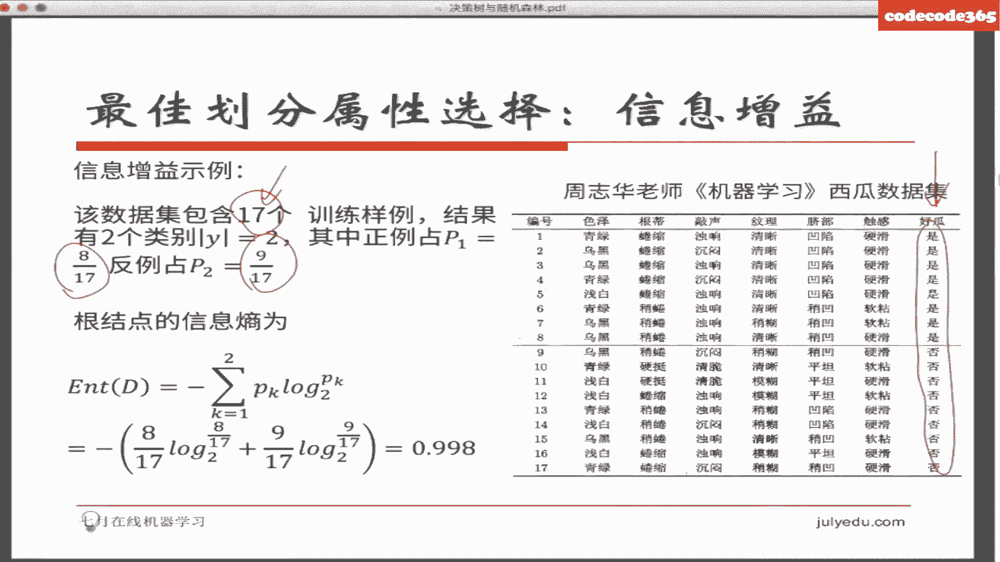

有公式的嘛，带进去算就好了，所以往里面一代是不是就算出来，信息上长这样啊，0。998，这个值挺大的，你想一想为什么挺大的，八个好瓜，九个坏瓜差不多呢对吧，一半一半一半一半，对吧是吗是吗。

是不是有一半一半，所以这种情况下不确定度肯定很高啊，所以这个0。998，实际上就代表说不确定度还挺高的，诶，那我能不能去找一些其他东西来做，做一些判断的，所以他就找了，他说前面不是有些信息吗。

哎那那不如取下颜色好了，把颜色取过来总行吧，所以他把颜色调过来了，他就把颜色调过来，他一看。

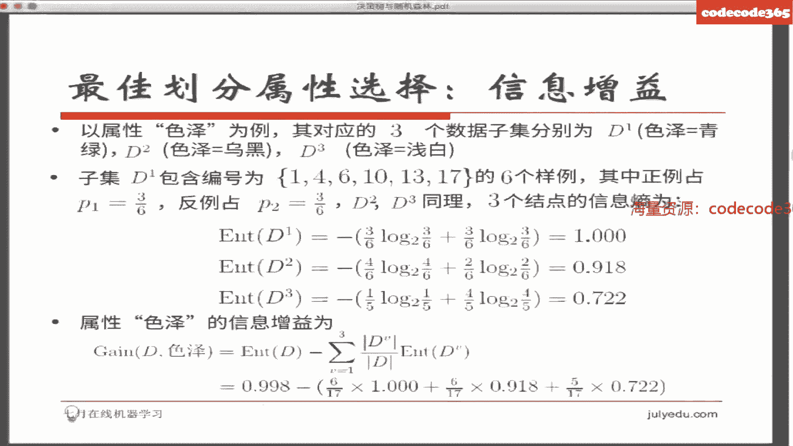

他说啊那个有多少种不同的颜色啊，好我来看一下，有青绿，有乌黑，有浅白，好，好像就是三种，诶我记得这个颜色色泽等于青绿和乌黑和浅白。

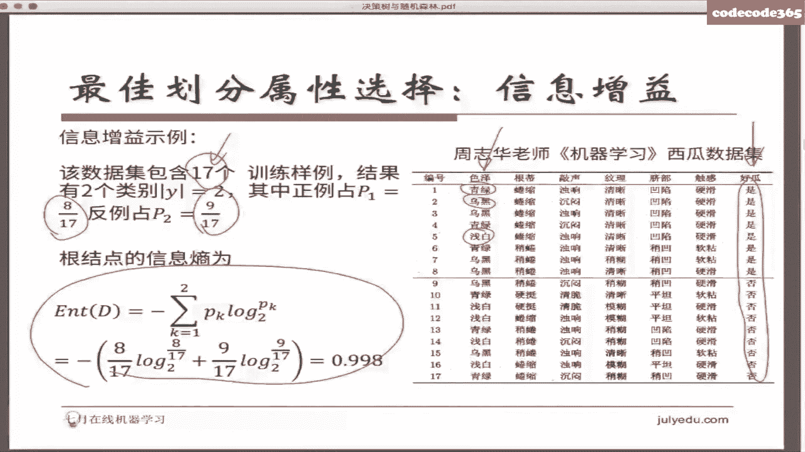

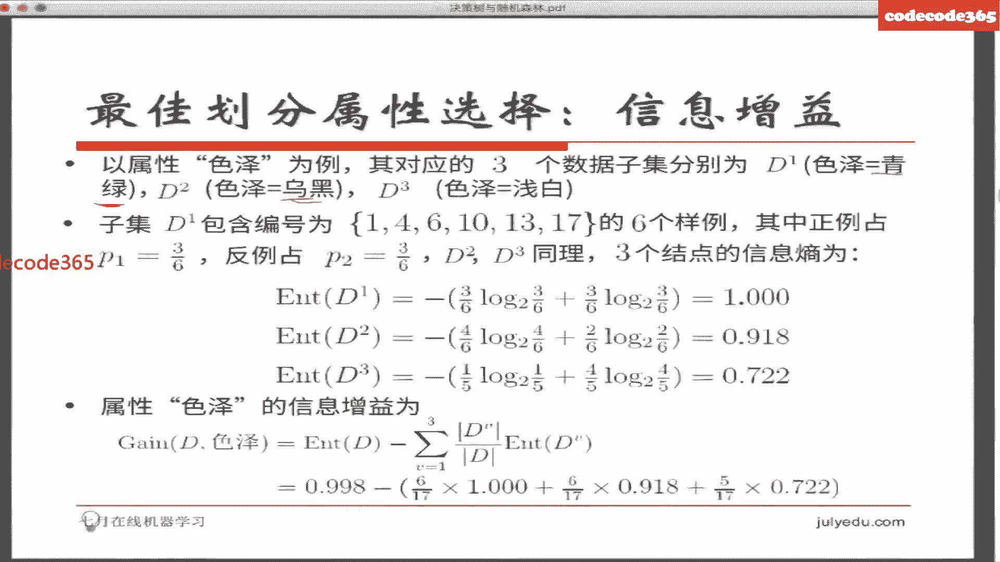

我可不可以把这些西瓜分到三个袋里呀，我可不可以现在把它们分到不同的桶里头啊，我找三个桶过来，我把这些西瓜按照颜色分到不同的桶里，可不可以，OK所以你把它分到不同的桶里，我问大家一下，你分到不同的桶里。

是不是桶里还是有好瓜和坏瓜呀，对啊，所以这个时候我们来看一下这个地方。

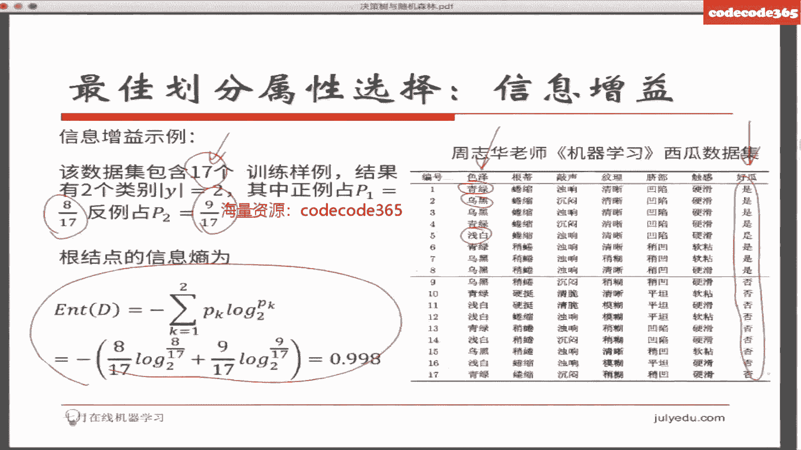

盐分为亲密的瓜，有这么六个瓜，这六个瓜里头有三个好瓜，三个坏瓜，所以我算了一下，在第一个桶里面，它的不确定度是一在第二个桶里面呢，在颜色是乌黑的桶里面呢，在颜色是乌黑的桶里头，我算了一遍，它是0。

918，在颜色为浅白的，同理呢对颜色为浅白，同理我算了一下，它的大小是0。722，所以我基于刚才的公式去算一下，大家看到的这个地方，0。998，0。99998，实际上是原来的不确定度或者原来的不纯度。

听清楚啊，原来的不纯度，那我现在后面这个东西呢，对后面这东西是我现在的不纯度，就是我基于颜色已经分到三个桶里面，我积分到三个桶里面以后，我这三个桶里面的数据，我算出来的一个平均的近似的。

平均的加权平均的这样的一个不确定度，是不是不确定度降了多少啊，你看他说老师老师这个我明白了，他不确定度降了0。0。109呗，对呀不确定度降了0。109啊，哎这是唯一的属性吗，这不是唯一的属性啊。

还有好多其他的属性呢，好那我把其他属性拿过来，我是不是我在前面这个数据集当中。

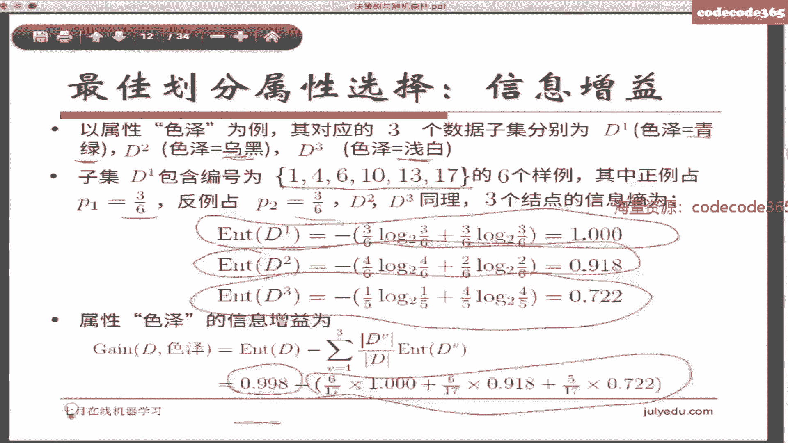

是不是还有这个属性啊，是不是还有敲的声音啊，是不是还有纹理啊，是不是还有起步，是不是还有触感呢，对我把每个都拿过来算一遍。

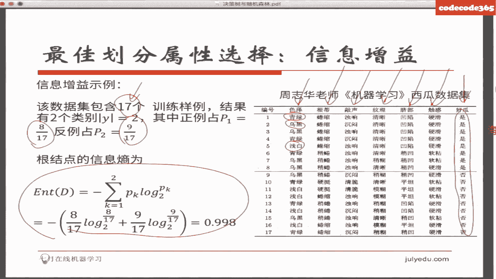

按照一模一样的方式，大家告诉我有多少种取值，我就把它分到几个桶里，我按照一模一样的方式去算，分桶之前的不确定度和分桶之后的不确定度，我去看看这个不确定度下降了多少，这个东西能够提供多少的信息。

让这个不确定度下降，这是决策树想做的事情，所以你用同样的方式，你按照耕地去做风筒，你按照敲的声音去做风筒，你按照纹理做风筒，你按照起步做风筒，你按照触感去做风筒，他都可以算出来一个不确定度，下降的程度。

你发现哪个下降的最大呀，哪个下降的最大，纹理下降的最大嘛，所以是不是基于纹理先去做区分呢，是不是基于纹理先去做区分呢，OK好啊，所以记清楚了，这个时候呢，你的你的这些西瓜已经被分到了三个桶里。

你的西瓜已经被分到了三个桶里，结束了吗，没有结束，继续往下长。

分到左边这个桶里头的西瓜，可不可以再基于其他的东西去做区分，用一模一样的方式啊。

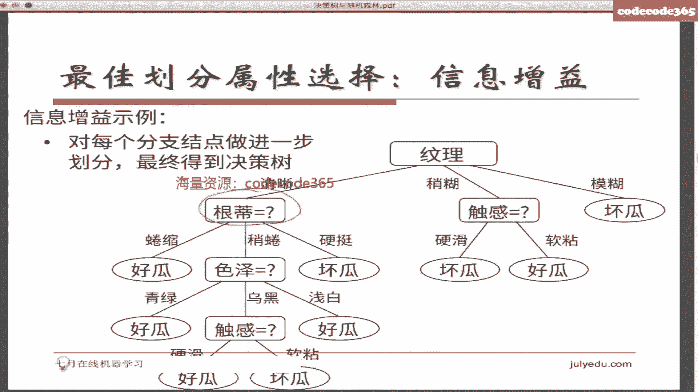

听清楚啊，你这棵树涨到这一步以后，这个又是一个数据集合，这个数据集合还是不确定还是有好瓜还是坏瓜，所以再往下找，接着去判断，到底哪个东西能让我现在这个桶里头的西瓜，能够不确定度下降。

最多我再去扫描一遍这个地方的耕地，敲声起步，触感和色泽，所以大家能感受到这棵树是怎么生长的吗，我说清楚它的过程了吗，它每一次分桶，每一次的生长，都是希望让我现在的不确定度下降，最多朝着这个方向去找。

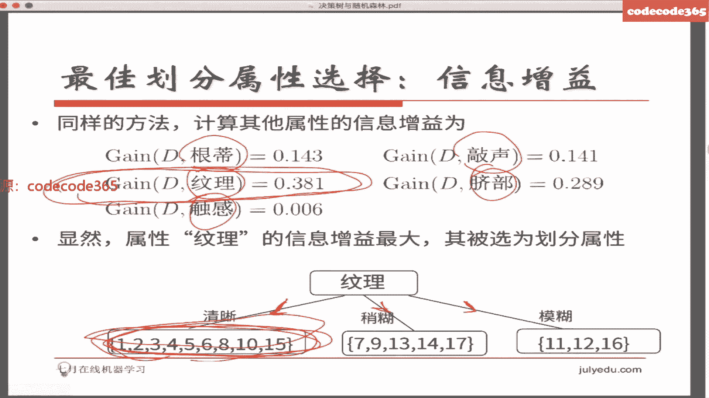

好我希望大家没有问题，OK好，所以这棵树就会一直往下涨，涨到什么时候停，涨到什么时候停，是不是说终止条件1231233个终止条件，是不是说只要满足任何一个终止条件就停掉，它就停掉它，然后给一个结论。

OK好好。

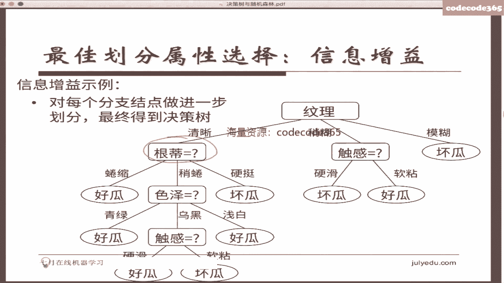

这个这个很伟大的模型呢。

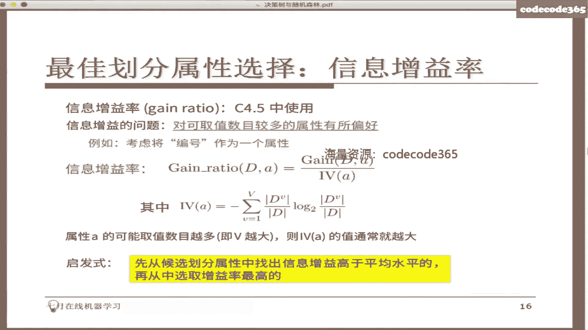

或者说这个很伟大的这个决策决策树的模型呢，叫做IP3啊，叫做D3对，它是一个递归的，没错它是一个递归的这个算法啊，就D3K好吧，他这个id3记住了ID3是基于什么，是基于信息增益，记住了啊。

这个东西是会会考考试，那个面试的时候会问的啊，而第三是基于信息增益去挑我最优的划分属性，去挑哪个条件对我现在而言是最重要的，记清楚了。

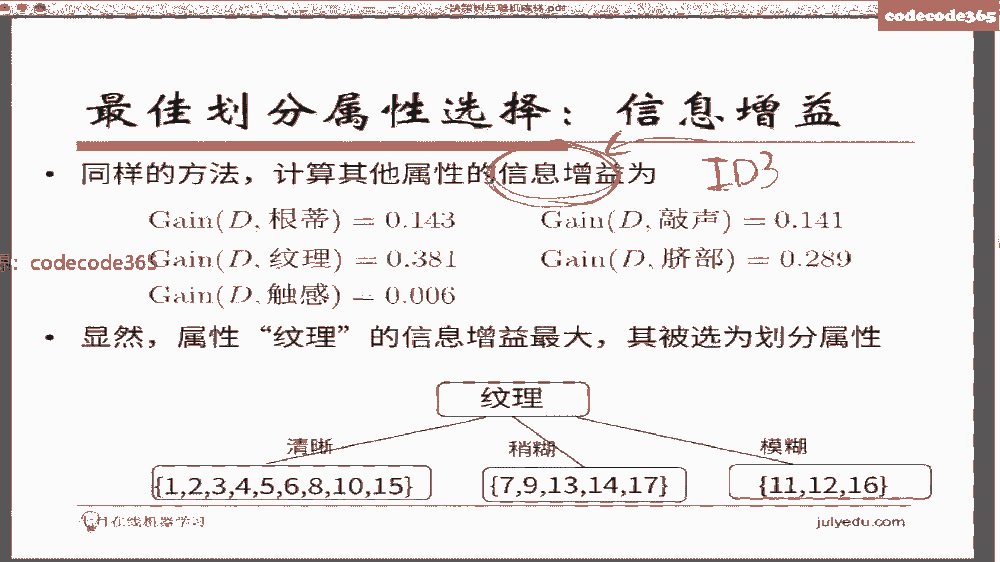

好诶诶这个信息分析有它的问题哦，信息分析有他的问题啊，为什么会有他的问题啊，我给大家举个例子，班上有45位同学，但这个45的同学，每个同学都会有一个学号，一号2号三号，一直到45号。

老师今天说哎呀我想研究一下，我想研究一下这个呃，这些同学到底成绩好还是不好啊，有没有办法呀，你说老师老师我知道用决策树呗，然后决策树的话，老师说，那那就把他的这些所有的因素都拿出来吧。

每天花多长时间学习，对吧啊，父母亲是什么样的学历状况，OK然后平时的这个听讲的这个程度等等，都拿进来诶，他不小心拿了一个另外一个东西进来，叫做学号，他把学号拿进来了。

哎大家想一想学号有多少种不同的取值啊，学号有多少种不同的取值啊，45种对吧，我分45个叉，我分到45个桶里头，每个桶里面有多少个同学，每个桶里面有多少个同学，你告诉我，每个桶里面一个同学对吧。

分45个差，每个每个桶里面一个同学，一个同学，我还不好判断它好不好吗，我直接告诉你答案了，我直接告诉你说，43号同学是一个超级牛逼的一个学霸啊，2号同学是一个学渣哎，但拜托这个东西有用吗。

你新来一个同学，他的学号是46诶，46往哪走啊，他没有用吧，所以这是这是T3的问题，D3的问题就是说他他对于这种有特别多取值，特别的取值的这种属性有特别强的偏好，因为你想一想，分叉分的越多。

他是不是越开心，每个桶里面的数量越少吧，因为少他有可能越肯定嘛，所以他特别喜欢去挑这种数目非常非常多，分叉非常非常多的这种属性，这是它的一个问题，IT3刚才用信息增益就有这个问题，所以怎么办呢。

他思考了一下，他说这个根本原因，说这个时候有好多分叉的，有好多分叉的，所以有好多分叉，那有好多分叉，带来的这个信息增益的绝对值很大，绝对值很大，绝对值很大，我们说的绝对值是不可靠的对吧。

就是我们我们昨天给大家讲到课里头，我说我用线性回归加阈值，我们阈值定不下来的，所以我一直定不下来的时候，我怎么办呢，绝对绝对值没有用的时候用相对值呗，所以他这个地方给了一个分母，他给了一个分母，诶。

你刚才哪个桶里面一个同学啊，你45个学号，45个桶里头，每个桶里头一个同学啊，哎我问你哦，这个分母是什么，大家告诉大家，现在告诉我这个分母是什么啊，这个这个不是绝对值啊，再说一遍，这不是铜里面的数量。

你们告诉我你们现在看的这个IVA，你们告诉我这个东西是什么，我们记得那个公式吗，负的sigma啊，p log p这个东西叫什么，这个是什么的信息商，这个是不是我刚才这个属性的信息熵啊，是不是我这个属性。

我基于这个属性去看它的分散程度，它的一个伤啊，哎你告诉我刚才分45个分支，这个值有多大，哎45种颜色啊，进去都一模一样啊，我进去伸手进去摸球，它的概率它的不确定度有多高啊，高的很，你别看你的分子大啊。

你别告诉我说你别告诉我说你的分子大没有用，我的分母也大，我的分母也大，所以这是叫做信息增益，听明白了吗，信息增益加了一个分母，这个分母呢会随着你的分叉多啊，我直观的这样说啊，这个表述是不精准的。

但但但对大家的理解可能是有帮助的，就是它分叉多的情况下，它的分母也多，把分母也大，但分母也大，有问题吗，所以这个地方的grand ratio这个信息分辨率，他加了一个分母，他说不好意思，你啊。

取那个信息增益大的不够，我得看一看，原来这个属性有多分散，原来这个属性有多分散，OK所以记住啊，这个地方是第二种决策树的模型叫做C4。5，C4。5和D3很像，差别就在于说他选了信息增益率。

他选了信息增益率去作为我的一个判定的，作为我一个特征，我的属性选择的一个判定标准，属性选择的一个判定标准好，我希望我给大家说清楚了，所以到目前为止，我们学了两种不同的角色，数一组叫做ID3。

一组叫做C4。5，他们都会往下涨，涨到什么时候对这个条件吗，123，那怎么涨去挑最重要的属性，怎么去挑最重要的属性。

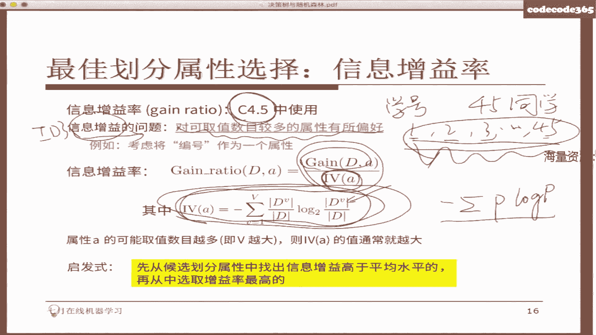

信息分析信息分辨率好往下走，这是唯一的思路吗，当然不是，这个地方有另外一个有另外一个数学的指标，叫做DEMIDEX，基因系数，基尼指数这个东西又来数学公式了，看着就烦对吧，没关系。

我给大家解释一下这个是怎么得到的，诶我还问大家啊，这个地方这个地方有小球啊，有两种颜色的小球，黑和白的小球，黑白啊，黑和白色小球诶，我怎么去判断它的纯度怎么样啊。

就是因为有个袋袋里头有有黑色和白色两种球，然后伸手进去摸，对吧啊，伸那个伸手不见五指啊，然后你看不到，所以你进你进去，你进去去去摸，你进去不哎，这个时候我除掉我刚才说的方式，去衡量它的纯度。

我有没有其他的方式，所以这DINDEX从你他做了一件这样的事情，大家仔细听啊，他做了一件这样的事情，他伸手进去，摸了一个球，他伸手进去摸了一个球，他又伸手进去摸了一个球，他他在小本本上记下来了。

他摸了第一个球，大家听清楚了，他摸了第一个球，他在小本本上记录一下，说OK这是第一种颜色，他摸到第二个球，他把他放回去了，他把他放回去了，他又摸到第二个球，他摸出来以后，他又记录一下这个颜色叫做C2诶。

我问大家那个纯度高的时候，摸到我摸出来的这两个球，颜色一致的概率是不是会很高啊，如果我全是黑色的球，我连摸两次，我摸下球是不是都是黑色啊，有问题吗，什么时候我摸出来的球。

它的颜色不一致的可能性会比较高啊，哎是不是说我这里头两种颜色都一样，那我去约的时候都是1/2的，可能是不是这个时候不一致的概率就高了，有问题吗，好没有问题好，所以我们再来看看公式。

告诉我告诉我取到DK类的概率是多少，取到第K类的概率是多少，是不是pk，我摸一个球的概率是不是pk嗯，我再去摸第二次概率是多少，是不是还是pk，我是不是用一减去摸到所有摸出来的两次。

都是黑球和摸出来的两次都是白球的概率啊，这个公式看懂了吗，这个公式我这么讲，看懂了吗，是不是相当于我摸两次全是黑球，可以摸两次全是白球的概率，我要把它剪掉，我要用一减掉，它是不是要用一减掉。

西格玛所有的不同的类别，以及两次摸出来的都是这个类别的概率，那两次摸出来的就是不一样的，对不对，好没问题好，很聪明啊，大家都很聪明，所以你们理解了，说哎这个东西好像也能衡量它不它的这个纯度，对不对。

好像也是可以去衡量它是纯度的啊，它的这个不纯度的sorry，他的不纯度的OK好，所以我是不是要去找到不纯度最小的属性啊，我是不是需要去找到使得划分以后，所以你看数学这个东西很神奇对吧。

他换了一个角度去解释这个问题，他换了一个角度去解释这个问题，但是你发现它依旧是合理的，你想这个事情你说太合理了，这个事情对吧，我连摸球都有这么多种这么多种不同的玩法，好接着往下走。

这个地方诞生的这个算法叫做cards cut，是一种二叉树，听清楚啊，cut和D3和C4。5的C4。5的差别在于，它是一个二叉树，它是二叉树，然后这个二叉树它用于选择属性。

选择现代划分属性的方法叫做他的不是方法，它的评估的指标叫做GUIDEX，看你翻译啊，这个东西是偶然吗，他是偶然吗，他不是偶然，数学真的是一个很神奇的东西哦。

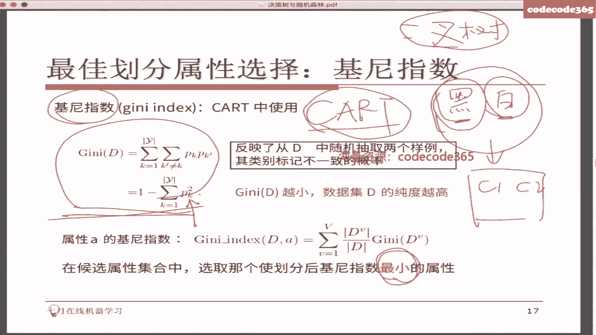

所以如果大家来看一下负的PROGP，p log p啊，所以这个地方的负log p4p log p4的log p，它可以做一个什么，泰勒展开它的菜单展开约等于一减X，把高阶无穷小忽略掉。

把高阶无穷小忽略掉，它只只保留一阶的，所以这个时候约等于一减X，这个公式我不想多说了，泰勒展开，我真的不想多说，他又展开了，不想多说，那个有有同学没有看前面的数学课的吗，为什么要补那个数学课。

就是因为在后面的部分，我会涉及到一些数学知识点，但我并不想把这个课讲成一个数学课，所以大家最好有一点点的数学基础，包括微积分，包括这个地方的啊，后面的一些矩阵相关的一些知识。

所以这个地方就用到了一个数学的知识，叫做泰勒展开，叫做泰勒展开，所以如果你作为一个泰勒展开，你发现什么这俩货其实是一模一样的，你你不要以为是什么，DINDEX和和，现在这个我的这个信息商去去做这个呃。

是这个这个取法要求的这个取法是一致的，它是一种偶然，它不是偶然，它在数学上证明，这两个东西就是约等于基本上就是一致的，所以这个东西你用泰勒一展开，泰勒展开就变成这个。

我再给大家写一下这个东西K等于一到大K啊，它相当于pk对不对，减去pk的平方对不对，好这个东西大家告诉我，K等于一取到小，K等于一取到大k pk这个东西等于什么，这个东西等于什么，这个东西等于什么。

大家告诉我，对这个东西等于一，所以发现了吗，这俩玩意儿长得就是一模一样的，我又他又展开以后，发现他就是约的鱼的，发现了吗，这个东西是什么啊，这个东西是什么，这个东西是不是give me dex啊。

这个东西是什么啊，这个东西是不是信息熵啊，你在数学上证明了这俩玩意儿，这两个玩意儿，其实就是一样的对吧，他们两个趋势完全一样吧，对不对，好吧好吧，所以截止目前为止了解了三种不同的决策树，叫做D3C4。

5和cut，然后你发现说这三货，这仨货好像用于最优属性划分的时候，评估的准则是不一样的，但是都好合理啊，然后你在数学上找到了一个方式，就把它们统一起来，你说就是这样的。

这个东西本来就是趋势就是一样的好呃。

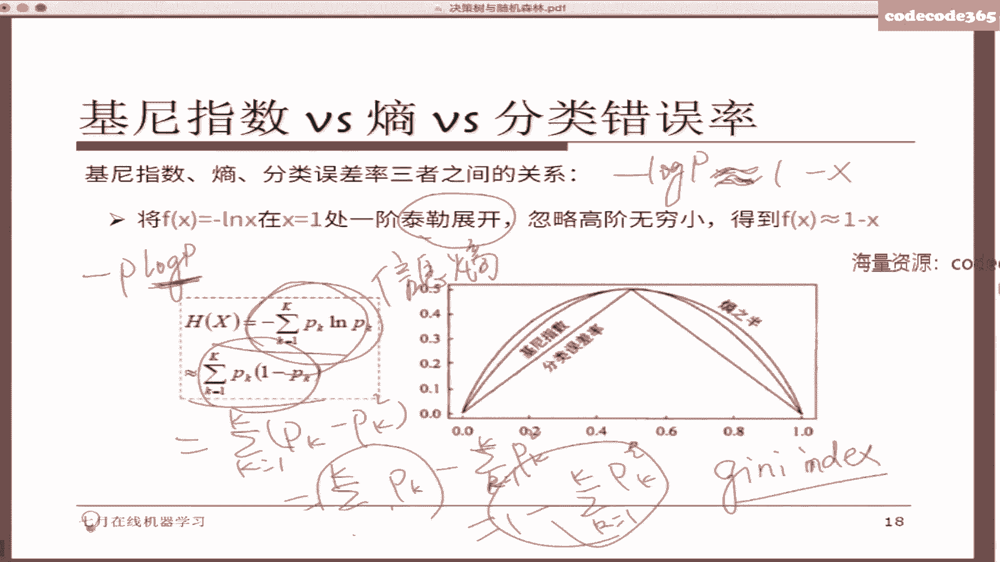

学过逻辑回归对吧，学过逻辑回归对吧，好我就回归输出的是一个概率P对不对，好P是一个0~1之间的一个一个概率对吧，所以我们告诉大家说，我用一个CMODE可以把这个东西叫变变成这样。

我用这个mod可以把概率变成这样，唉那你讲一下决策树是什么呀，对呀类比一下哦，决策树是这样的哦，决策树可不像你那么平滑，决策树就是个跳票哦，今天是一个小叔叔来找我，今天这是一个小叔叔去找我相亲。

我就不去哦，所以我就直接跳成零哦，如果今天是一个这个这个什么样的人找我去，我有可能就会去哦，高富帅哦，我就是一哦，所以这个地方呢它就是一个跳变啊，这是一个平滑的方式，我给大家对比一下。

因为我们刚学过逻辑回归，你学了这个模型，所以我就用它做对比啊。


这是从二分类的视角去看一下cart呃，有有有有同学是学那个电子或者通信出身的吗，有同学是学电子或者通信出身的吗，那这个地方呢针对于我们的这个问题，你有其他的一些解释。

比如说它是可以从信息论的角度来来解释的，所以这个地方呢啊这个没关系啊，这个只是我给大家拓展一下知识，我给大家拓展一下知识，所以那个你的你的信源经过一个发射器，发射信号以后，经过信道接收器以后去做解码啊。

达到限速，OK所以这个地方如果大家去看你的X你的特征，你的标签实际上对应的它会有对应啊。


所以大家可以看后面它，它实际上是有一些对应的啊，这个是一个拓展，没有关系，这个部分呢不影响大家理解这个模型，只是我为了让大家对这个理解，对这个模型的理解更加的透彻，所以我做了一个类比这个东西呃。

我不给大家，我会给大家完全展开来说，等到大家积累了一些知识之后，你回来看，你会发现这个地方说的东西是有道理的，你发现所有的这些知识他都是有关联的，它都是可以类比的，它很像。

OK总结一下总结一下总结一下啊。


那个我们学了三种不同的决策树，我我再强调一遍，决策树的核心是，第一这棵树长什么样，大家已经知道了啊，就是它是一个这种规则式的往下生长，然后去拿到结果的这样的模型，第二这棵树什么时候停。

记清楚了什么时候停，有三种不同的条件，一定得记清楚什么时候停，第三你这棵树生长的过程当中，每个时间点我最关注的东西到底是什么，我最关注的当前最关注的属性到底是什么，就是这样一个东西。

它的不同诞生了三种不同的决策树，应该说那个有其他的区别啊，但是这是最大的区别，这是最大的区别，所以我们有了第三，我们有了C4。5，我们有了cut，我们希望通过信息增益这样的方式去衡量。

什么样的东西能让它变得更纯，能让我现在的肯定度更高啊，所以我选择了信息增益，得到了T3，我选择信息增益，我得到了B3，我选择了信息分辨率，我得到C4。5，我选择了这个地方的gm dex，我得到了cut。

OK相信大家都有一些概念了对吧，好很好啊，然后我再讲一遍，我再讲一个问题，然后我们休息几分钟，我再给大家讲后面的部分好吧，有同学刚才提到的一个点说，老师老师你你你这没讲清楚啊，你这句话没讲清楚啊。

那个那个你这个地方谁告诉你，说一定是离散的属性啊，哎今天如果有一个有一个字段，它是一个比如说销量这个东西是个连续值啊，连续值你怎么去分叉呀，哎连续值怎么去分叉呀，你没讲诶，对我没讲。

所以我现在要给大家讲啊，这个事情是这样的，那个要去相亲对吧，来了一群小哥哥，好小哥哥里头有一个有个字段叫做edge啊，很可怕，AJ哦，哎A级，可能有些同学说哎，有些同学说老师老师你这个A级这个东西哎。

其实东西很好办的，年龄人最小是一岁，最大是那个100，所以我就假定是这样啊，可能100多岁吧，相亲不可能有100岁啊，那相亲就更小，更更那个我们更约束一下，我们约束到那个呃，比如说22岁吧。

我们约束一下，22岁到到这个这个60岁好不好，22岁到60岁啊，所以在这样的一个区间内，那他那你告诉我邵师二十二十二岁到60岁，不就这么几个曲师吗，你每个取值当一个分叉不就好了吗，可是可以。

但是总觉得有点怪怪的，呃其实我们实际在做决策的时候，好像不是因为一个岁数而去对吧，我是因为一段岁数，他好像是在这个小哥哥是在24岁到这个呃，比如说28岁之间诶，我觉得挺好的，OK啊。

或者说24岁到30岁之间，我觉得挺好的，那可能大于30岁，我觉得说哦不OK了，所以好像不是单个的年龄吧，好像是一个对吧，这个就尴尬了，所以怎么办呢，啊大家听清楚怎么办啊，年龄是一个字段。

首先啊听清楚年龄是一个属性，是一个字段啊，先明确一下啊，年龄是一个属性，一个字段好，先明确这样一个东西，我把所有小哥哥找过来，我把所有小哥哥找过来，我把所有小哥哥从年龄从小到大排列，OK这是一号小哥哥。

他年龄只有21岁，这是2号小哥哥，他的年龄有呃，这个23岁啊，这是3号小哥哥和4号小哥哥，小哥哥他们年龄分别是20，都是26岁，我在这上面呢，就我就把这个年龄列到一条数轴上，然后怎么办呢，哎。

呃你只能处理离散值对吧，你刚才告诉我说你只能处理离散值对吧，OK那我就我就用同样的方式来处理一下了，所以我在21~23之间取一个值好不好，我在这里取一个值，我我另一个另一个栏杆在这。

我在这个地方再取一个值，我在这里取个值，我在另一个栏杆，我在这个地方再取一个值，我再立一个栏杆好，每两个点之间我都取一个值，我去另一个另一个这个泥巴，另一个这个柱子立在这，然后我怎么办呢，可以这样哦。

这个时候小于哎，比如说这个地方是22，小于22，是一个分支，大于22，是一个分支哦，唉所以这个地方有一个字段，叫做是否小于22，这个时候是不是一个类别的属性，大家告诉我是否小于22。

是不是一个类别的属性，告诉我是否小于22，是不是一个类别性的属性，哎他就两个结果哎，要不就小压杀，要不就大压杀了，是不是一个类别性，是不是一个离散的属性，哎这个这个是不是小于24或者小于25。

是一个分支，大于25是一个分支，别着急啊，我在讲着呢，怎么去分段，我在讲啊，OK我刚才给大家强调了一个问题，我说我说age它是一个属性，听清楚啊，age是一个属性，但是我这个处理把拉成了很多个属性。

听清楚啊，第一个属性叫做是否小于22，第二个属性叫做是否小于25，第三个24啊，是是否小小于24啊，第三个属性叫做是否小于，比如说啊27，所以我把年龄由一个连续值的属性，分拆成了若干个二值属性。

有问题吗，这个分之二值属性的值我怎么得到的，我是不是任取两个连续值的点在中间，在这个数轴的中间去取到一个东西，所以请大家把你现在的想法变一变，你不是拿着年龄这样一个属性去做选择啦。

你是拿了一堆和年龄相关的，这样的离散的属性去做选择啦，所以这个时候是不是变成我要从这个属性，这个属性，这个属性当中去挑出来最可靠的属性啊，是不是回到了刚才那个问题啊，告诉我你们听懂了吗，我说明白了吗。

我把一个连续值的年龄变成了很多个零散的，零散的这样的二分的属性，二只属性，然后我对这一堆的二只属性用同样的方式去选，我把每一个都当做不同的属性去做选择，明白了吗，好啊，还有个问题啊。

我知道我知道有些同学会问题说，老师老师哎，你刚才还说24岁到28岁呢，你这个地方只能小于28，大于28，哪来的24~28呀，哪还当是死的是吧，诶你这本书要涨价，你这棵树现在长了左分支。

你说是小于28岁的，小于28岁的，你确定他后面不会再长出来一个分支，是大于啊那个24岁吗，你确定他不会再长出来一个分支，是大于24岁吗，这就是年龄段就出现了，听明白我的意思了吗。

这些属性是可以重复被选择的，他在下一轮的时候，他还是会扫描这些属性，所以这个年龄段是怎么来的，年龄段是这样来的，你先判断来说小于28这个最有用，然后到小于28以后，你又扫了一遍，发现说乐趣大于24岁。

这个东西也有用，所以你就把它长出来了，所以这条分支就变成了小于大于24，小于28，听明白了吗，你要的段就出现了，所以我说明白了吗，好诶有个问题啊，同学有同学说，老师老师我听明白了，我听明白了。

但是那个呃那个那个感觉计算量好大呀，感觉计算量好大呀，哎但是那个你知道这些属性之间的选择，它是不相关的吧，我可以并行去做计算的吧，所以明白我的意思了吗，唉我干嘛要去等另外一个算完，我再算呢。

我另外有16个和我同时跑着呗，OK好，所以所以大概这么个意思啊，我我我就说到这儿，然后那个咱们休息5分钟，我们休息5分钟，一会回来，我给大家讲后面的部分，好吧好，呃我来回答几个问题啊，大家听好了。

大家大家先不要先不要刷屏，挺好，我给大家解释一下问题，第一位同学问到说，是不是只有在做决策树回归的时候，才会将连续值这样做，不是你今天去不去相亲，你就不看年龄了吗，年龄就是一个连续值。

做分类的时候一样要用数值型的属性好，我们就问第二个问题，刚才有同学说老师老师你没有讲，怎么去确定这个分界啊，哎22~60是不是要取38个属性啊，NO不是听懂听清楚啊，我一开始就给大家说，我列一条数轴。

为什么要列数轴，我要去看一看我有哪些取值，如果今天你的数据集当中只有22岁，23，26岁和60岁三种取值，我we啊，或者说可以更多一点了，就是不是每隔一岁都有取值的话，为什么要取这38个属性啊。

所以他正确的做法是什么样的，我给大家说一遍啊，我放慢语速说一遍，我希望大家能听明白，我把我整个数据集取过来，我拉了一条数轴，我把我整个数据集上出现过的年龄，从小到大排在这条数轴上。

所以我把我出现过的年龄从小到大排到数轴上，我在任意两个相邻的年龄之间取得它的均值，去作为在它的中间这个均值去作为它的分界点，听明白了吗，大家对于分段对于这个地方的切分的阈值，切分的这个值还有疑问吗。

不一定是38个候选点啊，因为你22岁到60岁之间，并不一定每个年龄都会有取值，所以我拉了一条数轴，把有年龄的值标在上面，在任意的两个连续的段中间，取它的均值作为切分点，还有问题吗，这是分界值的取法。

说明白吗，好嗯其他的问题回头再说。


我们先往下走好了，大家心心念念的回归出来了，呃，决策树这么这么牛逼的模型只能做分类，整个分类太可惜了吧，那不如用它来做一下回归了，所以回归怎么做呢，回归是这样的，呃，这个地方有个例子，在这个例子当中呢。

我要根据一个运动员的从业年限和表现，去问一下这货值多少钱对吧，你知道很多球员踢俱乐部，那他比如说转会或者什么样，他值多少钱，你肯定要根据他的这个呃这个年龄啊，或者是他的这个表现状况啊，去判断一下。

比如说那个C罗啊，大家看他年龄其实已经超过了，大家一般情况下认为最佳的这个年龄了对吧，T嗯最佳的这个踢球踢足球的这个年龄了，但是他表现依旧很好对吧，所以这个时候呢。

我假设我要通过那个从业年限和表现两个维度，去预估他的工资的高低，我把它列到这个上面，然后在这个上面呢大家可以看到有两种不同，有不同的颜色啊，这个地方的那个深色表示说这个地方的深色。

表示说这个这个地方的深色或者暖色调，表示说很高的收入，冷色调表示说很低的收入，所以大家看到的是诶从业年限比较低，同时表现也不太好的钱就很少啊，从业年限不错，然后表现很好的这些啊。

这些暖色调他实际上他的工资就很高对吧，就是红色和黄色就表示高收入啊，然后蓝色和绿色就表示低收入啊。


这样哎先别管它怎么来的，大家先别管它怎么来的嗯，我们假设有这样的一棵树，这棵树是这样的年龄，从业的年限小于45，四点5年的时候，小于四点5年的时候，全都预估成5。11，大于45年呢，我要再做个判断。

判断一下他的表现，如果他的某一个积分小于117。5，我认为他的工资应该是这样的，如果他的年龄，他的他的表现，或者他积分是大于117。5，我认为是这样的，决策树最妙的地方就在于说，如果大家去看一看。

这个地方的这样的一个卷回归数，你仔细去看一下这样的一颗回归数，你会发现它实际上是在做什么样的事情啊，它实际上是不是在做这样的事情啊，去把整个平面切分成了三个区域，大家看一下三个region。

这是第一个region，这是第二个region，这是第三个region，告诉我你们看得明白这个东西吗，是不是年限小于4。5的都在这一侧有问题吗，市值大于4。5，要看看表现，表现好的，在这表现不好的。

在这，告诉我有问题吗，所以大家记住一件事情，大家记住一件事情呃，决策树这种模型啊，它有它自己很独特的地方，还有他自己很独特的地方，这种很独特的地方就在于说，如果说如果说逻辑回归是产出一条决策边界。

去完成分类，回决策树做什么，不管是回归数还是分类数啊，听清楚，不管是回归数还是分类数，就是你拿起一把刀垂直于坐标轴去砍一刀，再垂直于坐标轴再砍一刀，把整个空间砍成一堆的小矩形，能理解我说的意思吗。

回想一下刚才小于30岁和大于30岁，是不是在年龄这个字段上，拿起那把刀，沿着30那个轴砍下去的那一刀，明白我说的意思吗，所以决策树是一种很妙的模型，他做的事情是他不断的对这个空间去做细分。

他拿起那把刀垂直于坐标轴砍这么一刀，觉得不够砍的再去补一刀，垂直于另外一个坐标轴，或者再垂直于某个坐标轴再砍一刀，好，你先知道这个东西如何去做预估，以及它的物理含义是什么，我们再往下看。

有人就会说老师老师我知道这个东西长这样了，告诉我吧，怎么长，告诉我这个这个树怎么长出来的吧。


OK好呃，这是一个回归类的问题，所以回归类的问题呢，预测的结果一定是一个连续值，特征向量是这样的，我有很多个维度，X1这个维度X2这个维度X3，这个维度一直到XP这样一个维度对吧。

所以回归数的两个步骤是什么呢，回归数的两个步骤是说，我把整个空间切成这个没有重叠的区域，我拿起那把刀咔咔咔一顿砍，就只能垂直于坐标轴砍，不能斜着砍，呃，我们认为这个地方的决策树啊。

我们常常讲到的决策树是不可以斜着砍的，它一定是垂直于坐标轴一刀一刀的砍，所以改完了以后会生成N个区域。


哎你说N个区域里头会有不同的取值对吧，哎这个区域里面有不好的取值呢，我我怎么去做预估啊，我问大家，我问大家，我问大家一个很有意思的问题啊，就是哎我现在我现在有ABCDEFG，巴拉巴拉巴拉这样一堆的数。

我我要去找到一个数，这个数据和这一堆数的啊，这个均方误差这样的和是最小的，我取我取多少啊，你学过不等式吗，我要去找到一个X让X减A的平方，再加上X减B的平方，再加上X减C的平方。

再加上巴拉巴拉巴拉一直往下加，哎我希望这个东西最小我取多少，哎学位均值不等式吗，什么时候去，什么时候取到，什么时候取到最小值，唉说智勋的这个同学不错，啊有同学问到说为什么只能垂直于坐标轴哎。

Come on，小于4。5和大于等于4。5，是不是小于4。5，是不是这个这个平面的这一侧呀，大于等于4。5，是不是右边这一侧呀，你怎么斜着看呢，哎那个刚才那位同学听明白了吗，这垂直于坐标轴是你小于4。

5和，大于等于4。5，是不是只能是垂直的啊，你还能斜着，你还能斜着跑，呃我不知道那位同学有没有听到过这个解释啊，所以那个那个尾号是什么384的同学啊，OK那我就假定你听到了啊，OK好。

然后刚才我问了个问题啊，那个问的问题有同学答出来答出来了啊，说老师老师我知道了，高中所有的不等式都告诉我们一件事情啊，如果今天这道选择题做不出来。

我就猜答案不等式的题目，我硬猜他们的均值对了，这个时候呢为了让我和所有的样本点，我的y predict和我的Y之间的这个差距最小，我在每个区域里头取什么，我在每个区域里头就取所有预估值的均值。

我就去取所有预估值的均值，哎但是这个东西还是没有告诉我怎么涨啊，老师你你你你这个我等了半天，你告诉我怎么找，你告诉我说我划分成这个区域以后，我怎么去，我怎么去给这个预估的结果值，你长在哪儿呢。

别着急别着急，先再想一个问题，这个地方有一个东西叫RSS，这个东西衡量了我预估的结果的一个好坏，告诉我能看看明白吗，第一层CDMA是什么意思，我要遍历整个这个空间，我要遍历整个这个块儿，明白吗。

我要去遍历整个这个块，每个块里头我去求它的误差，是不是这样去计算呢，啊这个公式大家能看明白吗，能看明白，这个东西求出来的是一个总体的误差吗，左边那个sigma是对每一个你划分，你用刀砍出来的小块。

右边那个西格玛是每个小块当中的误差加一起，是不是所有的误差全体有误差，有问题吗，我是不是我的回归我的回归我的问题，我想让它尽量的小，我是不是要让这个地方的RSS尽量的小。

我是不是要让这个地方的rs尽量的小啊，怎么做怎么做。


马上来了，首先这是一种自顶向下的贪婪式的递归方案，听清楚了，就是这个问题是没有，你是没有办法用穷尽的方式去拿到最优解的，对，你是没有办法通过穷尽的方式去拿到最优解的，你肯定做不了啊。

这个因为它是它的切分方式，是无穷无尽种的，无穷无无尽种，所以这个时候呢，我们只能用一些启发式的方式去做，所以启发式的方式，这个实际上启发式的方式是一个自顶向下的，贪婪式的递归方案。

所谓的自顶向上是什么意思，自顶向下什么意思呢，是说我从当前的位置开始，我那一刀砍下去，只能把已经有的这个区域已经生成出来的区域，再砍成两个区域，听清楚我的意思了吗，就是今天如果有这样一个方块。

你第一刀砍了这么一刀，不好意思，第二刀，你只能在这个区域或者这个区域去砍刀了，当然你可以这样砍，也可以这样砍啊，这是随意，你也可以砍在这啊，你砍在哪是随你随意，但是你只能在我新的区域里头去砍。

你不能再回头了啊，你不能说我之前那刀砍的不算，我重新砍诶，这个没有重新砍的，就是这样一回事，你砍下去了就砍下去了，你下一步你就想着呃，你就想着你打这副扑克牌，你牌已经拿到手上了，你就不要想着去换牌了。

你就想着说我现在有这副牌，我怎么打好这副牌，明白吧，所以这个就是自顶向下的意思，就是说你一刀砍下去了，你下一刀只能砍在，你只能砍在生成的那个新的小区域里头啊，你别再想把之前的刀再怎么磨掉。

或者怎么样做不了，然后他们的意思就是每一次划分，我只我只考虑当前最优，我只考虑当前作用啊，这个没有没有太大意义啊，我只是告诉大家是这样做的，最关键的点在哪，最关键的点在哪，在这个位置，这是最关键的点啊。

这是最关键的点，对有同学提到动态规划，因为这是一个NP问题啊，你你没有办法，你没有办法穷尽了，所以它确实是启发式的方式，诶我问大家一个问题啊，我现在有这样一个区域，我这个区域呢这条轴上有一些取值。

就是我连续值嘛，但跟刚才一样连续值嘛，我画一下树桩，连续值，我画一下树桩，OK那个我有我有多少种不同的砍刀方式啊，这个大家请告诉我说，如果我选定这个地方这条轴，如果我选定这条轴。

我现在有多少种不同的砍刀方式啊，诶我是不是我是不是可以卡在这，我是不是可以砍在砍在砍在这都可以砍的，啊甚至你在左右也可以看对吧，哎左右其实没有意义了，因为你砍下去都没有样本了啊，所以左右我先把它忽略掉。

是不是中间每个位置都可以砍呢，哎所以你以为这个算法，你以为这个算法很牛逼吗，这个算法就是一个很常规的算法，它就是把这个地方每一个分裂点，哪一个切分点啊，看清楚啊，这个地方能切的所有的都能落下去的。

所有点啊，每个点都去算一个rs，每个点都去算一个，每个点切下去了之后，他都去算一个rs，这个东西算的是切出来的左区区域，或者是上区域，这个切出来的右区域或者是下区域，有问题吗，想象一下吧。

拿着刀砍下去了以后不就变成两块了吗，它的误差不是左右两块的误差之和吗，有问题吗，就砍你，你砍下一刀不是左右或者上下吗，不是两块之合吗，现在这个地方的sigma不就是对左对两不同。

对这个砍刀这一刀落下去的两块分别去求吗，没问题吧。


好那我再解释一下什么叫做我，什么叫做递归的砍刀哦，递归的这个这个这个砍这些刀哦，递归的意思是什么，递归的意思是像这样的，这是二分的递归的方式，这个不是递归啊，这个你看不出来啊，这你看不出来。

你不要把一个砍哦，对你不能歪着砍了，所以你只能说哎我砍这一刀，然后下一次怎么办，下次砍这一刀，我再下次怎么办，我砍这一刀，我再下一次怎么办，砍这一刀，这个叫做这个叫做二分的递归切分。


OK那个有同学问到这个问题，说老师，老师这个地方是针对一个特征进行切分的，对吧对，是针对一个特征，我刚才已经告诉大家说，如果我就针对水平的那一位做切分，听清楚啊，我就针对我水平的那一位去做切分。


所以大家看到这个地方确实是，就是他的这个方式很粗暴，听清楚啊，他还会把所有水平上能切分的点全都试一遍，再把数值垂直的这个方向上能切分的，所有的点全试一遍，全试一遍，听清楚了，全是一遍。

Y的值怎么去确定呢，我刚才刚说完的，我说给定一个区域，这个区域里头的Y怎么去预测啊，我说这个区域里头有一堆的数，ABCDEFG巴拉巴拉巴拉，这个区域里头有一堆不同的数，我怎么去预估一个值。

你所有这些数的平方和最小啊，对吧，我说的是均值，对不对，所以你告诉我，你把所有能砍刀的方式全都试一遍，你是不是可以挑出来那个最好的砍刀的方式啊，RCS最小的那个方式有问题吗，我这么说，大家有问题吗。

啊有同学说老师老师这个计算量好大的呃，你从人的角度上来说，这个计算量当然很大了，但对计算机而言还好啊，就是计算机而言还好，同时又考虑到这个地方的问题，实际上是可以并行的对。

所以大家先不要纠结这样的问题啊，就是不要去纠结这样的问题，你以为你以为逻辑回归计算量就不大了吗，你输入的维度高的时候，逻辑回归一样，计算量很大，所以那个计算量呢它主要是这个算法，他也没有。

他没有太多可以去做，更非常非常非常牛逼的优化的这样的操作，所以它总是会有一些计算量的，你为了去找到这个比较优的这个结果，还是要付出一些代价。


OK啊哎这个地方还有一个问题，就是有同学提到说老师老师哎，你这你这个你你这个数一直往下长就完蛋了，那那那我，我今天我想去预估班上的每个同学的得分，我想去预测预估每个同学的得分，我诶那我岂不是可以。

每每一个，我最后这个数可以生长在每个同学，都在我的叶子节点上对吧，这有什么意义啊，每个同学都在我的叶子节点上，这个有什么意义啊，这个有什么意义啊，所以他可能会过你喝啊。


一会儿我们再说混拟合怎么去处理，我先回到刚才这个问题，有同学问了一个很好的问题，说老师你每切一次，都要对全部的样本去计算一次对吗，诶我问大家一个问题啊，你诶你在这样的情况下，你想一想啊。

你已经切了这一刀，你下次切这一刀唯一变化的是不是这个区域啊，是不是说只需要去管一管这个区域，原来的rs是多少，现在切完这一刀以后，新的rs是多少，RS1S二S二是多少，我是不是算一下这个东西的一个增量。

就可以了呀，我感觉这个地方也是，我只需要算左边这个区域的增量就可以了，我需要把全部都算一遍吗，我这么说能明白我的意思吗，我只关心我砍的那个小区域，我没有砍到的地方，我不管它，它没有动。

所以我只关注我砍下去的那个小区那一刀，他有没有变小，变小了多少，有人听吗，不是不是全部算一遍了，他只他只算我，我砍那一刀的那个区域哦。


OK好吧好，所以我希望我说明白了呃，下一页图中间的那个图也是二分吗，中间这个图就是二分吗，中间这个图就叫做二分递归啊，不是二分啊，二分递归，所以什么叫做递归，递归的意思是我先砍这一刀，我再看这一刀。

我再去看这一刀和这一招，这叫做递归，就是不断的去把区域切成两个区域，这个叫做递归，这叫做递归，OK所以它是它是二分递归，没错嗯。


OK我回到这个地方啊，我刚才说了一个很可怕的一个问题，叫做过拟合，哎，这棵树可牛逼了，你知道你在这个区域里头有好多散的点对吧，有好多三个点它都有取值，然后这棵树如果真的牛逼，他可以牛逼到什么程度。

我这些刀你反让我砍呗，我砍的足够多的刀的时候，诶，我今天可不可以把每个样本键盘，在一个小格子里啊，我把每个样本点都砍到一个小格子里对吧，我每个小格子里头就一个就一个样本，好牛逼的。

取均值就是自己误差就是零，好开心的，分分钟就全拟合出来了，哎这有用吗，这有用吗，这有点可怕吧，每个样本都是在一个小格子里，这个对我新样本的预估有什么用啊，这就过拟合了，你把答案记下来。

你就告诉他说这个词家门店就在这个小格子里，它取值就是这个没用的，所以怎么办，别让他切这么多刀，谁让你一直切一直切的，所以我们之前在逻辑回归以后，我告诉大家说，我们控制过拟合用什么，我控制过拟合用什么。

用正则化，我们加一个正则化，像我们去惩罚他，我们说哎不能切哦，你这你你你不不是不能弃啊，不能用那个甩甩棍，那么厉害的方式去拟合样本点了，你再甩你再甩，我要我要跟你那个扣分了啊。

所以所以他就他就他就不敢甩对吧，好，这个地方也一样，这个地方我要加一个惩罚项，我加什么惩罚项呃，大家告诉我一个问题，我这棵树刀切的越多，我刀切的越多，是不是越积累越多，我刀切的越多。

我是不是叶子节点越多，我那一刀一刀砍下去，我刀切的越多，是不是叶子节点会越多，所以我把这个叶子节点的数量，以某一个超超参数夹到尾巴上，意思就是我想让rs尽量的小，但是你不能用这个地方尽量的把。

如果这个鬼东西，这个叶子节点太多了，不好意思啊，你这个东西不合格，你回去重做，你这个刀砍太多了，所以所以这个地方的损失，实际上这个地方的误差或者说损失，它实际上在这种情况下。

它在RSS的基础上加入了乘法项，这个乘法项是什么，对叶子节点的数量，乘以阿尔法，你可以学，你可以砍刀，不要砍太多刀，看多了重做不合格，好，所以这个地方呢大家知道，知道一下它的形式就好了。

这里头可能会有一些你没有听过的名词啊，比如说交叉验证，这个我们在后面会给大家讲到，所以大家先不用先听一下就好了啊，不用着急，好那个回归数我就给大家讲到这好吧，所以回归数是一种启发式，它会一直生长。

刚才有同学说千分会穷尽X1和X2的组合吗，它不需要穷尽X1和X组合，它只需要穷尽所有X1的划分点，和所有X2的划分点啊，不是组合不需要组合啊，他每次只砍一刀，只能垂直于某一个坐标轴砍一刀。

所以它只尝试一条轴的所有情况。


和另外一条轴的所有情况，但不是一个pair，不是一个组合，下面介绍一个很牛逼的思想，叫做BGIN，然后这一页写了一大坨啊，我决定给他个tap，这一页，我今天给大家跳舞这一页。


为什么呢，因为我马上要告诉大家，什么是在我们的机器学习当中，什么是bg bi是一个缩写啊，be这个缩写叫做boost chap like rigating，Aggregating。

所以就用了一个叫做boost chapter的一个思想，他他长了一样的事情，叫做人多力量大，然后呢，这个事情是这样的，如果你要去构建一个模型，这个模型可能是不太准的，OK啊抱歉，这个地方呢写笔误啊。

大家听到这个课的时候呢，你要知道这个地方是T啊，这个地方是T不是M，所以他想了一件这样的事情，诶诶刚才我很很很很害怕一个东西啊，很害怕那个东西叫过你河，所以过拟合产生的本质是什么。

过拟合产生的本质是会有一些noise，会有一些噪声点，这些噪声点你怎么你怎么着啊，噪声点你以为他是你，你买了一本课外练习题回来，你以为课外练习题所有答案都是对的，唉拜托他印刷错了，这道题错了。

但是你不知道你把它学下来了，下次你再考到这道题写错了，所以这就是过拟合学太过了，你们太适合这本参考书了，拿出那本5年高考3年模，你说我去把它做完，分分钟上上清北复交，然后那本书里就提错了啊。

然后你就学错了，所以这个地方过拟合相机的原因，实际上很多时候是，因为我们这个地方会有很多的噪声，我们会有一些错误的题，我们有些答案错了的题，但是我不知道，我并不知道这个东西是错的。

所以我就拼命的学我我我就拼命的学，然后你把你你也不管答案对不对，我就说这个答案印刷是这样，他肯定是对的，我拼命的去记这个东西，我是按照他的思路去理解，错误的思路去理解。

然后将来你去做高考的时候就就很可惜，对吧好，所以你怎么去防止这样一个问题呢，啧哎你要你要是没有看到这道错题，你不就不会学这道错题了吗，那你看不到这道错题说明什么，说明你要把这道错题。

这个这个呃你你你你这一次就不要看到它，所以在这个时候呢，我们有一个思想是这样的，我们总共会有1000道题，我们总共会有1000道题，我们在这1000道题的基础上，我们把它切成。

我们每次从1000道题当中去抽取出来，其中的800道题，每次都取800道题，当然每次800道题可能不一样啊，就是那个无放回的随机去抽抽800道题，我抽出来以后，我每次都在800道题上去学习出来一个模型。

比如说用决策树去学习出来一个决策树的模型，然后我再对最后的这个结果去做什么呢，如果它是分类问题，我就做投票，少数服从多数，如果他是一个回归问题呢，对回归问题我就求平均，啊大家理解了这个思想吗。

begin就是从总的样本当中，每次抽取出来一部分样本，从总的样本当中每次抽取出来一部分样本，去构建学习器，然后再把这些学习器拿过来去做投票，或者是求平均，因为我只抽800道题。

我很可能看不到那道错的题哦，所以我可能学不到这道错的题啊，所以很有可能会有一些学习自学的是不错的哦，所以比我一个人瞎学可能需要好的，所以这个叫做白点好。


所以这是bedroom对吧，好BGIN的话有另外一个非常牛逼的模型，叫做random forest，叫做随机森林，第二个随机森林啊，随机森林做什么样的事情呢，随机森林做什么，做什么样的事情呢。

随机森林是一种基于数模型改进的begin的版本，刚才我只对刚才我只对数据去做采样，听清楚了，我刚才只对我的1000道题当中去抽800道题，数据去做采样，现在在随机分明里面，每一个模型还需要对这个地方的。

还需要对这个地方的特征或者属性去做采样，就是原本可能会有时有有100列，我每次自己取出来，其中的70列，明白吗，就是有些列我也不用，我也不知道哪一列是不是都有用，所以我在构建每一个子模型的时候。

只取了一部分的样本，一部分的样本数据我也只取了一部分的特征，一部分的属性听明白了吗，其他的东西和刚才的BING是一样的，我说清楚了吗，能理解这个地方的意思吗，写了一堆文字啊，就是我说的意思。

就是我只每个模型在构建的时候，我只取了其中的一部分样本，同时呢我也只取了其中的一部分特征，就是我没有所有的属性全取，我每次只能挡住一部分属性，我只当你从剩下的属性里面去选，我为了增加它的随机性。

不让它受噪声去干扰，好。


所以你们已经学会了最牛逼的random forest，这个模型，所以这个地方呢给大家看到这个，OK这就是单科决策树，单棵决策树啊，单棵决策树在这个场景里面，大家看到单棵决策树很有可能会过拟合。

他会因为这个地方有两个小的样本点，会拉出来一个板，一个区块给他，也因为这个地方的两个样本点，两个样本点去拉出来，这个地方的一个区区块给他，但你看当你用五颗决策树，25棵决策树。

100棵决策树去构建随机森林的时候，它的边缘会变得非常的平滑，他不会那么容易受到noise噪声的干扰，他不会那么容易受到噪声的干扰，这个叫random forest，诶，我来回答几个问题。

有同学说老师呃，那个之前听说有人用了100多个模型去做集成，是这个方法吗，呃他集集成方法有很多种方法，有很多种方式，bin只是其中的一种，它还有一些其他的BLANDING。

那些waiting那些呃stacking都有啊，这个我我后面会给大家讲，这个我后面会给大家讲，然后有同学问到说是有放回还是无放回的，对是有放回的，是有放回的，OK就是在对样本采样的时候是有放回的。

有同学说老师老师没有案例吗，我又没有说要下课着急吗，马上来了安利等我一下，对有些样本没有抽到，有些样本没有抽到，这个同学问到的问题是说到的问题是对的。


啊选择多少个，选择多少个学习器，诶我回答不了你哦，因为如果我能告诉你这个东西的话，诶你还调什么参数啊，你这个模型可牛逼了，你直接往上一怼，比其他模型效果都好，这是一个要调节的参数。

后面我会给大家讲到调参的方法好吧，所以我回答不了你这个问题，选多少个学习期，最好，也没有任何一个数学公式可以回答你这个问题，好吗啊，没有任何一个那个呃。


没有，没有任何任何一个数学公式可以回答这个问题，有同学问到说，老师begin或者集成方法在工业界有用吗，作用很大吗，有用，但是作用的大小不确定啊，就是有些地方他会用模型去做集成，我们个人的经验是。

像神经网络这样的模型和数模型，数模型包括随机森林，包括一些树的串行模型，他们去做集成效果是很好的啊，这是BEGGIN对，对这样的数模型和神经网络，这样的计算模型去做一个融合，一般效果会很好，嗯嗯好。

我来讲一下案例，无非就是分类和回归呗。


走一遍喽，角色数完成分类的问题，把需要的工具库import进来好。


Import turns p d，这个是一个数据处理和分析的工具库啊，我给大家，我给大家去那个列了，这个说明哎，我发现大家好像很爱问这种参数的问题啊，因为有同学问了一个问题。

说随机森林里抽取的样本数和特征数，怎么定定不了，没有数学公式，这是超参数，有多少个学习器乘多少样本，抽多少特征都是超参数，一般情况下，根据经验，根据各位我们的经验，取0。0。6到0。8之间的值。

应该会有比较好的结果，就百分比60%到80%，但具体取多少，你要做实验啊，这个经验值也不一定准，它只是一个经验值而已，提供给你参考啊，所以啊我看看是同样一位同学吗，啊不是同一个同学。

那个你问的这个问题没问题啊，说明你在思考，但是这种问题没有明确的数学公式解，这个意思啊，就是如果他有的话，我肯定会告诉大家对，所以这个就是要我们需要我们去调节的，这个参数或者叫超参数啊，这个意思好吧。

那我就继续说我这个案例咯，我这个案例里头所有的地方已经给大家写上了，写上了注释，所以那个我相信大家是能看得懂的，对吧啊，代码我下课再上传啊，我现在在讲课，那我不能停下我的课去给你上传一下代码。

你也不着急，几分钟啊，几分钟以后你就会看到这个案例好不好，先听我把它讲完好吗，不要着急，OK啊，所以把需要的工具库import进来，这个pandas适用于数据工具，适用于数据处理的工具库。

从sk learn cn里头去import一下PROPOSSESSION，我需要对数据做一些预处理，然后我去import一下决策树，决策树在处理里头，OK我用pandas去把数据读进来。


我这个地方有个decision tree点，CSV有一个这样的文件。


我可以用pandas这个工具库去读进来，这个工具非常牛逼，它读进来的数据就会变成行行列列的数据，所以大家看到的就是行行列列的数据，这是一个什么样的问题呢，这是一个很经典的问题。

这个问题的标签或者说你需要去完成的分类，是去判断一个美国的一个一个居民，他的收入是不是比50比5万美元要低，就是比5万美元要低还是要高，这是一个分类问题啊，就是yes or NO。

就是比5万美元到底是要低还是要高，然后我可以去基于这个地方的啊，参考的一些因素是什么呢，或者说基于你可以去做判断的一些因素，包括哪些呢，包括诶大家看到这个地方对，包括大家看到这个地方的这个呃。

第一个第一个这个列叫做work class啊，他到底是一个这个这个给国家干活的公务员呢，还是一个市里面的一个国家公务员，还是市公务员，还是这个私企的员工，还是等等等等这样的因素对吧。

所以大家看到这个地方有什么所谓的这个state，government对吧，有private等等等等啊，啊OK还有一些那个那个什么失业的人群，OK这些都有啊。

然后第二个叫做education education的，想一想就知道啊，education就是教育程度对吧，所以这个地方呢包括这个呃学士factual，包括这个可能会有一些高中生毕业啊。

因为在美国其实干这种蓝领啊，这种活实际上也收入也还是可能是不错的，所以这方面education包括说有学士，有这个硕士，可能会有一些这个高中生可能都会有啊，各种各样的，然后第三列呢叫做他结婚的这个状态。

可以是呃没有结婚啊，未婚过对，然后有这种已婚，也有这种已婚又离异的对吧，哎离婚的，OK然后下面这些东西啊，还有一些其他的因素就是relationship对吧啊，是那个是是没有结婚的人。

就是不在一个家庭当中，然后结了婚的人可能是一个哈曼，是一个丈夫或者是一个一个妻子，OK然后他的种族他是个白人还是黑人，还是黄种人对吧，然后他的性别是男性还是女性啊。

然后他的国家到底是古巴还是这个地方的美国，还是另外的某个国家，OK然后我来看一下这个地方有些函数啊。


就是info函数就告诉我一些信息，所以他可以把这个地方所有的列告诉你，说他有多少行，它有3万2561行。


OK每一行都是一个类别型的一个变量，然后这个地方消耗了两兆多的内存啊。


就还是比较比较小的内存。


然后我的这个地方的成年人这个数据它的形状，它的形状表示它是多少多少行多少列，所以他有373万多行，3万2561行。


它有九列，OK然后我的列包括哪些列。


包括world class education，一些结婚状态，巴拉巴拉巴拉巴拉一堆啊，到最后我我的特征是什么。


我的特征是不是前面这些东西，我的特征是不是前面这样一些东西，我特征是前面这样一些东西对吧，我的是我最后需要去判别的标签是什么，我判断标判别的标签是这个地方的income，是这个地方的收入。

所以我把这个地方写下来，我的特征是前面这么多列，我这个地方的标，我的标签我的Y是这一列。


然后我去把我要的特征和我要的label取出来，所以我根据我列的名字就取出来我要的特征，我再根据我列的名字取出来我要的标签。


然后我给大家看一下，这个时候呢对我就拿到了这样的特征。


这就是特征嘛对吧，车身就包括说诶他是哪个什么样的工作类型，什么样的教育程度啊，什么样的一个结婚状态啊。


哪个国家的等等，那他的VIVO呢，它的标签呢标签就两种，要么就是小于50K，小于5万美金，然后要么就是大于5万美金，这样啊。


OK然后下面这个地方呢有一点小小的特征，工程特征处理，这个大家不用管这个呢，就是那个我们会在后面的特征工程部分，会给大家重点讲到，你要知道的东西，就是计算机，它很傻，计算机它傻到什么程度呢。

你丢给他一个文本型或者字符串型的东西，他是读不懂的，你给他一个类别的东西，你说我今天买了一件很好看的衣服，是件蓝色衣服，它对于蓝色这个东西是毫无概念的，所以怎么办呢，对你要用一个数字去表示。

我给大家举个例子，你你今天是星期几，星期几这个东西计算机是读不懂的，星期几计算机是读不懂的，啊我知道有些同学，你们的基础比另外一些同学要好一点，但是不用着急好吧，就是那个大家也那个啊。

各位陈独秀同学稍微收敛一下，不要先先不用不用就说，我给大家先简单解释一下啊，因为这个这些知识，我们在后面讲到特征工程的时候，大家都会都会懂，所以那个大家嗯先听一下啊，听着我跟着我的节奏来来听一下，对。

是确实是读着向量编码，但是我要读出来这样东西就有点有点内容，太多了，可能有些同学就会蒙，嗯其实我就想说一件事情，就是计算机呢对于这种类别性的东西，是读不懂的，所以你告诉他说今天星期一啊。

今天星期天他毛线都不懂，那怎么办呢。


他就想了个办法，他说不如我就把一天切成七天，我就开七个位置在这，如果是星期一，我就是第一个位置取一，后面的位置全部取零啊，这几个数字了，1234567对吧，如果是第二天啊，如果是星期二。

星期二我就变成零一，这样对吧，星期三星期三我就变成这样，能明白这个意思吗，对这就是刚才啊这位同学说到的，这位同学陈独秀同学说到的这个毒液向量编码，OK好吧，然后独立向量编码，意思就是我把类别哎。

又占一个位置的形式去告诉他，如果这个位置取一，就说明是这样一类，如果这个位置取零，它就不是这样一类，所以这个地方有一个处理，叫做叫做特征工程的处理。


这样啊，所以这个地方呢，我们用get dis去拿到一个特征工程的处理啊，这个不用管这个，如果大家那个看不懂的话，你先看一眼，因为我们后面会给大家讲到。


好吧，后面我会给大家讲到，所以大概的意思就是说哎呀计算机太傻了。


他读不懂这些类别，他懂不懂这些类别。


所以那个请帮我把它转成一个数字的表达形式，我还能看懂，就这个意思啊。


你就可以认为这个地方做的，就是这样一个事情啊，就这样一个事情好。


所以下面我就开始构建模型了哦，这个事情真的是很简单。


所以构建这个模型呢，我就只需要去构建一个分类器啊，我这次我就不手写了啊，我昨天在把手写蒙蒙了一群同学，就是大家大家看蒙看蒙了一群同学，所以我就决定今天用一下工具库啊。

所以我就搞了一个decision处理的一个分类器啊，Decision to class file，然后告诉他说我要用商去作为我的信息熵，信息增益就作为我的评估的这个准则，然后我最大的数升深度啊。

我限制一下最大的数升深度是四，然后我就拟合一下我的数据，拟合一下我的特征，拟合一下我的X和Y。

然后下面就拿到了一个分类器，诶，下面这个东西大家照着抄就好了。


这是一个可视化，这棵树是可以可视化的，老师可以告诉你说我为什么去做这样一个决定。


我沿着每个分支走，它会它会是哪个哪什么样的一个决定。

大家看到最底下这个class，大家见到最底下这个class这幅图当中啊，每个框框最底下的class就是它的类别。


那class就两种，小于等于50K对吧，大于50K对吧。


小于等于50K，大于等于大于50K，所以这就是一幅可视化可视化的一幅图。


就告诉大家这些决策树长出来的，决策树长什么样。


那个这个代码我不想给大家多说，这就是个模板，就是个模板，你就把你的那个分类期望有一怼就可以了，结果就出来了，唯一要改的是这个地方啊，就是你的分类的名字不一样嘛，对啊分类的名字。

我这个地方是小于5万美刀和大于5万美刀吧，就我写成这样，如果你现在的这个分类是说，比如说会不会买件衣服。


那就是买和不买嘛，OK所以这就是一个案例啊。


再看另外一个案例，是一个随机森林，随机森林，然后这个案例呢反正也挺简单的对，所以随机森林那个，那个我刚才给大家讲分类数，我没有说呃，我没有说怎么去控制过拟合是吧，分类数控制过拟合有一些方式啊。

比如说减脂，但是这样的工这样的那个方式呢，在工业界用的不多，工业界就会直接去做一些限制，比如说限制数的深度，对限制数的一些，这个每个叶子节点的一些样本数等等，他会做一些这样的限制。

所以这个地方我们做一些限制，因为不做限制，那棵树太大了，它可能会过拟合，所以我就限制了一下，说我允许你的最大的数升就是四，然后涨到四了还要往下长，不好意思，不让你涨了，太平了，这个意思明白吧。

所以这是一个超参数啊，就数升是个超超参数，我自己手敲了一个超参数是四，它不一定是四啊，它可以是那个其他的一些结果，所以大家理解一下是这个意思哈。

好然后这几个地方呢，我们我们在构建这个随机森林啊，去完成一个回归的问题，一个regression，所以随机森林完成回归呢，就说我建了很多棵树，然后我做了一个每棵树都做了一个预估。

我再把预估的结果只去求了个平均啊，就这个意思好了。


然后这个地方呢我就不解释这个工具库了啊，工具库无非就是import pandas，import一下数据的预处理，然后我从on sunday里头去，import一下随机森林的回归器啊。


Random forest regression，然后我用了一个自带的数据库，叫自带的数据集，叫做load boston，Load boston。


哎呦大家知道我现在解释一下啊。


树的深度是树的层次1234。


这是树的深度。


只能用到四个数字段吗，谁告诉你只能用到四个字段的。


这里头有多少个分支啊，这有多少个分支啊，哎你四层四层你就垂垂直往下长啊。


你的数不长两个分支的，所以所以啊大家大家大家去看一下这个东西。


你就明白了啊，就是四层最多涨涨四层，好属性不止四个啊，因为我这里头每每一层都会展开两个分叉，每一层都会展开两个分叉啊，颜色大家不用管颜色，就是为了好看而已，你你可以你可以理解成暖色调和冷色调。

它做一些区分，但是这个地方其实在颜色的深浅，并没有大家想象的那个，你可以认为颜色越深，他越肯定你可以从某种程度上这样去理解啊，呃细节的细节的代码的部分代表下去以后再问。


好吧，那个我如果上课给你每个点都讲了，就会很碎，这个课你回头去听起来，所以我建议大家阅读代码的方式，是不是逐行的去阅读，而是我去了解每一个块在做什么样的事情，我再进到每个块里头。

去了解它是怎么实现这个东西的，而不是一行一行读，一行一行读，很容易蒙的，这个地方代码还短，代码长了你就蒙了，OK所以values是什么意思，values是把那个pandas。

data fm当中的南派数组取出来，对啊这个意思，然后如果我刚才说的话，里头有些名词你听不懂呃，没关系，因为后面我们还会再用到，所以慢慢你就懂了好。


然后加载数据很简单，加载数据加进来了，直接就可以把贝塔把X取出来，把Y取出来啊，所以贝塔就是X。


他给的就是Y啊，贝塔就是X，他给的是Y，然后这个地方呢，反正就是一堆的这个房子信息呗。


我去做房子价格预估啊，我要搞告诉他说这个区域的一个犯罪率有多高，然后巴拉巴拉巴拉吧，然后这个这个地方的那个那个居民的这个，比如说呃居民的人均的这个呃人均的这个站，就是说自己住宅。

住宅的这个面积有多大对吧，然后啊这个地方会有一些其他的啊，不拉巴拉巴拉巴拉。


反正有一些信息用于这个这个地方的这个，回归问题的解决，然后再把数据读出来，大家看一下，这个就是一个一个的样本，这是一个样本，这是第二个样本，这是第三个样本，这是第四个样本啊，这是第四个样本的特征。

大家听清楚啊，第四个样本的特征。


我只取了我只取了五个样本，我把五个样本的特征全都打给大家看啊，这是用科学计数法，然后我把所有的这些样本的标签。


拿到的价格是多少万美刀，OK240000美刀还是21。6万美刀，还是34。7万美刀啊，还是说是一般有贵的50万美刀啊，这样然后所以这个东西就是Y这个东西就是X。

我就把X和Y送到这个地方的random forest。


REGRESSOR当中去学习，我先告诉他说我要取15棵树去做预估，我的NATHMATTERS，就是我那个随机森林取的多少棵树，我要取15棵树去做学习。

我用这15棵树的这样的regression去fate一下，我的X和Y好，很简单，secular用起来很简单，CN所有的CCULAR，所有的监督学习的model全都是feat。

这就表示拟合拟合一下XY他就开始学习了，然后我们就可以拿到一个这样的回归器。


我们就可以用这个回归器去预估一下，我现在波士顿的这个features，我们去看一下他预估的结果，下面这个东西就是他预估的结果，这就是他预估的结果，OK然后下一个地方呢。

你你可以去用这个regression，这个是默认的，刚才我给了15棵树，它默认的应该是十棵树吧，如果没记错的话，对这个random service of regressor。


它是有些参数的，然后它这个地方的参数，比如说我们看一下，默认默认的树的棵树是十棵树，对默认的ns litters值是等于10K是等于十的啊，然后我刚才是给了15嘛对吧。


如果我给参数，它就会以参数初始化了，所以我我刚才这个地方啊，我在下面我是给了15嘛对吧，我是给了15嘛，好啊，下面这个地方呢我又重新跑了一遍，这个时候没有给没有给，就是十嘛。

就是十棵树嘛啊具体多少棵树最好，这个我们后面再学好吧，嗯这个我们后面再学，对每棵树都是一种样本和属性的采样，没错，你说的很对，我们都是用决策树，我们都是用决策树，我们只是15棵树。

用了不同的样本和不同的属性好，有同学说设置了15棵树后，模型的内部做了什么模型，内部拆除了15颗，准备好了15个模型，去15个决策树的模型去拟合，现在这个数据OK明白了吗。

然后再对结果预估的结果去做一个平求平均，因为现在是回归求平均，所以啊我说明白了吗，所以当你设定N等于NS等于15的时候，他就准备好了15棵树等着去学，OK这个意思。


设置属性的个数在哪，刚才我设过来，这不在这吗，这是属属性的个数啊。


sorry属性的个数在这，matt features属性的个数在这。


你可以取，比如说啊0。6他就取60%的属性，60%的全部特征的60%的特征。


比如说这个地方还会有一些其他的啊，这个地方是max feature。


你还可以选max，你可以取simple啊，就是关于这个样本样本去做采样啊，样本做采样都可以在这里去选，OK好吧。


每棵树随机采取采样多少不同的样本，看读它的APIAPI不是在这吗，max feature读它的default是什么，default是default。

是它默认的值，它会有一个默认的值的，它会有个默认的值啊，对这个参数大家看文档就好了，没错，它是呃对不同的数据集啊，它是对相同的数据做采样以后，得到不同的数据集，去构建了15棵树去求平均好不好。

那个我希望大家在学习这些，你们可以提问题，没问题，我觉得好的问题我会回答，有些问题的话呃，就是我不太建议给大家的方式是一直喂饭，就你看我不会给大家列一个文档，我不练这种东西。

因为列文档这个东西的话就没意义了，我希望大家在上完这个课以后，这个这个书关上你能记得一些核心的点，你能记得老师说最重要的点在哪，这些东西是最重要的，他们可以散开来，我要解决这个问题的话。

我查API谁都会查，有一个说明文档谁都会用，然后你需要记住的东西是，这个算法的核心是什么，哪些东西会影响我现在的学习啊，这个这个是比较重要的，CELINE当中必须是二叉树吗。

对CELINE当中没有实现D3和C4。5，它实现的是cut啊，对就是一般工业界的工具库实现的都是CD，所以都是二叉树啊，都是二叉树，模型内部构建15个数的方法都一样，只是样本不同对吧，样本样本不同。

特征也不一样，样本不同，它的每一次生长的时候选取的特征也不一样，对属性也不一样，没错，工业业做机器学习，是不是大部分时间都花在数据处理，数据处理中啊，数据处理确实会花掉一大部分的时间。

但是模型我们也会去做研究啊，模型我们也会做研究好，那个今天我就给大家讲到这儿好吗，大家有更多的问题可以在QQ群里再交流，我会下课，马上把这个地方的两个案例和数据，打包发到群里，好不好。

我希望今天的课大家听完对决策树这种模型啊，或者是随机生成的模型，回归数会都有一些认识，大家记住我说的最重要的核心点，这些核心点非常的重要，对所以我希望大家能够回看到这个课的时候，或者回顾这个算法的时候。

能记住最核心的这样一些点，这就够了，好的你们有问题，你们在QQ群里再和我去啊，交流好吧好，谢谢大家。

