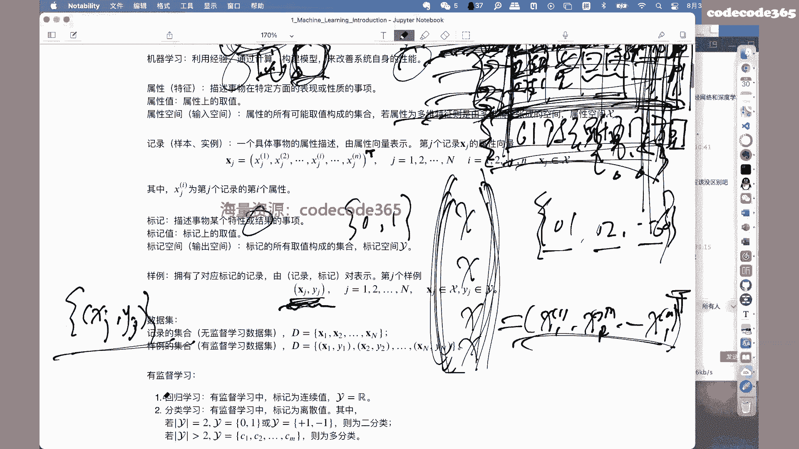
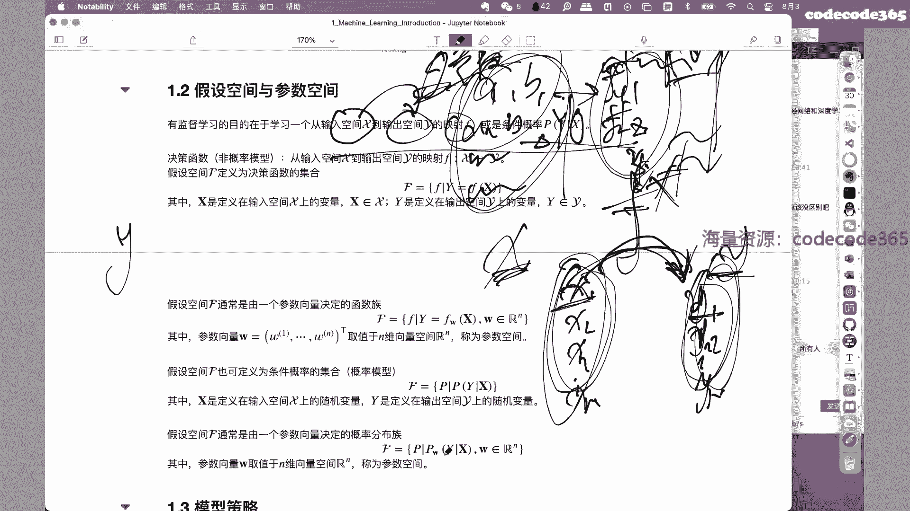
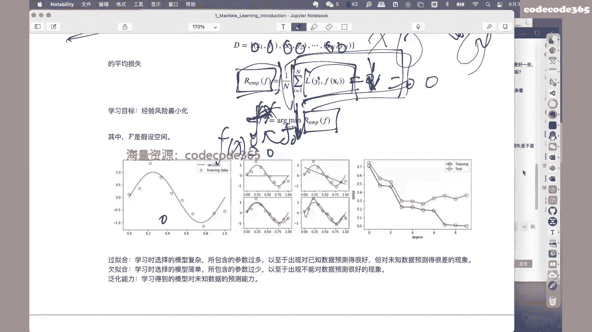
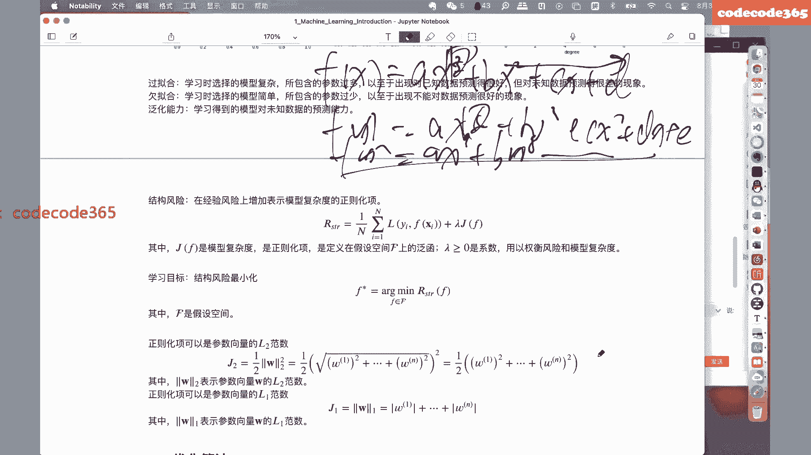
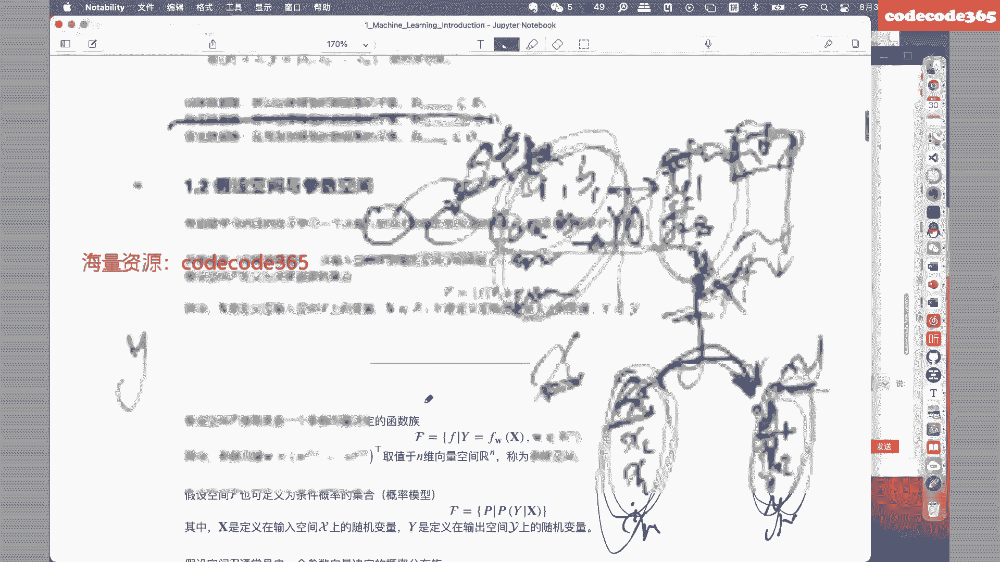
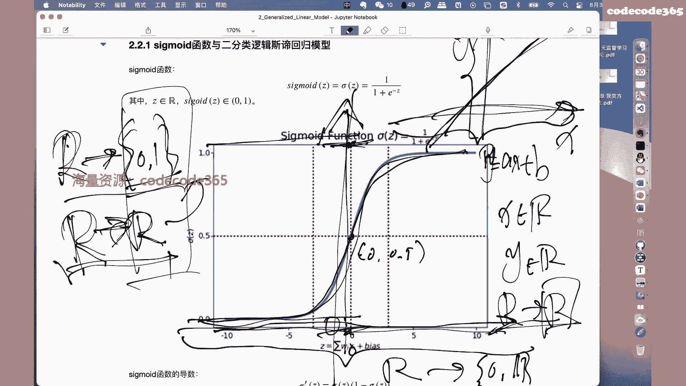

# 【七月在线】机器学习就业训练营16期 - P5：在线直播：5-机器学习简介、广义线性模型（线性回归、逻辑斯蒂回归）精髓速讲_ev - IT自学网100 - BV1Z9T5ewEKL

OK啊如果没有问题的话。

我们就准备开始，好吧啊，非常高兴啊，能够呃和大家一起啊，从今天开始呢，我们一块把这个机器学习当中的，一些主要的内容利用，咱们差不多一周多的时间，两周的时间呢我们嗯做一个学习和讨论，嗯先做一下自我介绍啊。

我是那个咱们企业在线的那个陈亮呃，在课程群里面呢，我也在啊，如果有什么问题的话呢，包括我还有其他的老师，还有咱们的助教老师都在课程群里面啊，包括咱们课程当中的一些问题。

也欢迎大家在课程群里面能够啊及时的提出来，我们也一块进行一个讨论和学习，那么在今天开始之前呢，先和我们大家介绍这么一个内容，就是关于我们嗯机器学习的若干个模型之，间的一些模型关关联关系。

这个内容呢可能呃和很多很多接触过的同学哈，可能会有一些印象，就是在我们整个机器学习模型的学习过程当中，我们会逐渐的越来越深入的接触，越来越多的模型和算法，那么呃很多的同学啊。

都花了大量的时间在这个方向当中，非常努力地进行学习，但是很遗憾的是哈啊有的时候会出现一个问题，就是当我们学得越多的时候，会发现这些模型和算法啊，有些没有章法和没有逻辑啊，就说我们每天都在学很多新的东西。

但是回过头来一看，好像学了很多，但是好像又没有一个呃能够梳理清楚的脉络呃，我觉得这是非常重要的一个问题，就是当我们在进行学习的时候，会发现啊，特别是到了深度学习领域哈，就是我们再进一步的向后学习。

你会发现整个的工作的方向会非常多呃，工作的一些技巧也很多，那怎么去高效率的把它掌握，我觉得还是很重要的，那么今天呢就先通过一个就是关于模型脉络，图案和大家试图通过这么一种方式。

能够使得大家在今后的学习过程当中，能够把这些模型和脉络啊进行一个梳理啊，当你知道了你在哪个位置上，就是你掌握了哪些模型，然后碰到了一个呃新的工作啊，你不了解的时候，你可以发现啊。

你可以寻找一下你之前的工作，是不是和他有所关联关系，或者说新的工作啊，一定是在之前的工作的基础上，进行了某些方面的改进和提高或者是优化，所以这个时候你会发现你要清楚的知道你在哪，你要到哪儿去。

中间才能把任务进行一个分解啊，这样的话效率可能更高一些啊，举个例子啊，比如说呢我们这啊两周的时间，可能要介绍若干个呃机器学习领域的模型，那么这些模型之间啊，肯定是相互之间是有关联关系的，比如说啊。

以今天我们要介绍的，线性回归和逻辑回归为例啊，啊这两个模型啊解决的是不同的问题，一会儿我们会介绍一个呢线性回归，解决的是我们的回归问题，而我们的逻辑回归呢，解决的是我们的分类问题啊，两个不同的问题。

但是呢这两个模型之间是有一个密切关系的，换句话说啊，我们在线性回归模型的基础上进行相应的改造，就可以直接得到相应的逻辑回归模型，这两个例子啊，或者这两个模型啊啊，更重要的一个作用是为我们后续的工作。

比如说啊在逻辑回归的基础上，我们可以通过横向和纵向啊，把我们的逻辑回归模型进行一个扩展和堆叠，就可以直接得到人工神经网络，而人工神经网络又是我们进入到深度学习领域，的一个非常重要的开始啊。

各种各样的神经网络啊，比如后面的CNRNGEN啊，更复杂的模型，还有的是，那么这些模型呢，都是以人工神经网络作为它的模型基础的啊，来进行改造得到的，而人工神经网络呢又是以基本的逻辑回归。

作为它的基础单元来构建的，从这个角度上去看的话，你会发现再复杂的深度学习模型啊，最终落脚到基础单元当中，也是以逻辑回归为基本单元的，那么再往前回溯，你会发现它就是简单的线性回归模型的改进。

所以从这个角度上去看的话啊，那是今天或者这周需要介绍的这些模型啊，其实都是为了我们今后的工作啊，为了今后更复杂的工作做了一个基础啊，它的重要性可能更多的也体现在这儿，你说这些模型本身能够解决哪些问题吗。

啊当然能够解决一些问题，但是呢它的效果很显然，已经不会像深度学习领域的那么多的模型的，效果好了，但是你不能轻视它啊，重要性就体现在刚才我们所说的，它是后续工作的一个基础啊，嗯特别是在面试的过程当中啊。

我们也在不断的面试一些新的同学啊，一些基础的内容的掌握嗯，很不扎实啊，比如说像逻辑回归这种基础的单元，甚至神经网络的反向回馈，这种这种误差传播嗯，还会有很多问题，所以希望大家能够在这两周的时间当中。

引起足够的重视好吧，这是一方面就是关于这个模型之间啊，还是有些关联关系的啊，这是第一个希望大家能够接受和理解的内容，那么第二部分呢就是通过这个图呢，我们也简单的说明一下，我们这两周的主要的工作好吧。

那么今天呢我们一方面需要完成的是，机器学习原理部分的一个介绍啊，另外呢我们会介绍线性回归和逻辑回归，这两个模型，刚才已经说明了它的重要性，那么在周三啊，我们会介绍决策树模型啊，这三个D3C4。

5和cut数，可能会包括一点boosting啊，这个看时间上的一个安排啊，这两个工作哈，这两个工作数模型和集成模型会直接退到出差，g boost啊，这个可能同学们或多或少的有了解是吧，在现在的这个啊。

特别是各种各样的比赛当中，他就boss模型啊，是应用非常广泛的模型之一啊，它解决回归问题和分类问题，都取得了非常好的效果啊，但是呢你会发现往前倒他的前序工作啊，其实还是有很多啊，我我看到过很多同学啊。

这个啊在xg boss的画画了很多的工作啊，但是搞得一头雾水，为什么，就是因为他的前序工作没搞明白啊，数模型还不清楚怎么回事，什么是数模型，数模型怎么去定义是吧，它的核心到底是什么啊。

然后boosting方法是怎么能够，在基础模型的基础上进行性能的提升，然后才是BDT的问题，然后才是GBDT的问题，才是梯度，才是梯度提升的问题，你是在函数空间还是在参数空间里面，学习的问题。

这些一系列的前序工作，如果你还有问题的话，嗯对超级boss的学习呃，困难会很大啊，所以说上这也说明了刚才我们所说的学习呢，你需要有一个过程啊，你需要有一个积累的过程，特别是有章法啊。

你不能什么都这个一把抓，那个效率还是比较低的，但是这是这两部分啊，这是关于这个数模型，那么呃第三次课呢，我们会集中介绍这个所谓的支持向量机啊，这个也非常重要啊，这个重要性呢我就不做的，不做过多的介绍了。

然后呢后面会讲到这个hmm和cf啊，这两个概率图模型呃，这是我们这两周的主要内容的介绍，那么嗯这些内容哈会逐渐的感觉是越来越复杂，当然这个复杂并不体现在模型本身有多么复杂，因为相对于深度学习部分的模型。

这些模型还都属于基础模型，它的复杂性主要体现在，可能呃学习的坡度比较高，因为一开始啊同学们可能不太能够呃，就是之前没有一些基础内容，可能对这些内容呢这个接触起来会有些困难啊，这个很正常。

也给大家提前说明一下啊，你也不能寄希望通过两周的时间就把这么，这可能是啊，几十年甚至更早时期的一些专家们，总结出来的经验，你通过两周都掌握，这也不现实，那么怎么办，那就只能是不断的啊。

根据我们这两周的内容啊，呃课前最好是能有能够有一个预习，然后呢课上呢能够跟得上，课下如果有问题及时的在我们课程群里提出来，我们一块来通过我们的其他老师，还有助教老师一块我们一块讨论和学习，呃。

这些内容呢也不完整，就是即使是这张PPT里面的内容，也只是一个大体的框架图啊，它也并不完整，如果还有同学希望更系统的啊。

更全面地进行一个学习和掌握呢，那么下面呢给大家有一个这个就是参考资料，也作为我们这两周的主要内容的参考资料，做一个介绍，那么上面这三本书都是中文啊，都是中文内容啊，可能对同学来说也比较。

这个就是嗯可能认识的比较多了是吧啊，中间这本书啊是李航老师的统计学习方法，统计学习方法啊，它也是让我们这两周课程的主要参考材料啊，嗯当然我们没有办法把这两门通过这两周哈。

把这一门书里面的内容全部介绍清楚，但是主干内容还是比较完整的啊，这本书的一个特点呢，就是公式推导部分还是比较详细和完备的啊，嗯非常不错的一本书，那么另外一本书呢可能更这个呃，更被大家知道哈。

是我们这个周志华老师的机器学习啊，就是西瓜书啊，俗称西瓜书，那么这本书的一个特点呢，就是覆盖面比较广一些啊，覆盖面广一些，这两本书啊，是现在作为我们同学们可以入门的时候。

可以作为参考的两本非常重要的教材，当然根据各个不同情况啊，这个有的同学说这个都要看吧，最好是都看啊，当然这个没什么可说的，但是如果说你时间和精力有限，那选择其中的一本也可以，如果从现在这个时间点呢。

嗯没有好坏和优劣之分啊，就是你选一本都可以啊，看个人情况，如果说非要这个选一下的话呢，李航老师的这本书呢就是呃怎么说，每一个模型介绍的推导过程都非常的详尽啊，呃深度也还好。

呃周老师的这本呢就是广度很不错啊，覆盖到了方方面面啊，讲的也非常详细啊，所以还是那句话吧，这两本书反正都很不错，第三本书呢是那个邱吉鹏老师的这个，神经网络与深度学习啊。

当然这本书的重点就不再是机器学习部分，而是我们在这个深度学习部分啊，作为一个这个原理性涵盖非常广的一本教材啊，他在里面讲到了从深度学习神经网络，就是人工神经网络开始逐步的介绍到CNRN啊。

这个以及后续的一些改进啊，每一个模型的这个原理部分，公式推导都非常的详尽啊，这本书也是非常不错的，特别是有志于啊在这个方向当中，继续深入学习的同学啊，这本书还是非常推荐的，那么剩下的四本书啊。

这个都是呃老外写的啊，在这个之前哈，不像现在咱们的中文材料也非常丰富了是吧，之前我们上学的时候没有中文材料，就全都是老外的书，那只能是硬啃，比如这本哈可能大家也非常熟悉啊，PRML是吧。

MLAPP以及这个EIESL啊，这是我们就是嗯以前所说的三大金刚了啊，这个你反正是每一本书都得啃一下啊，这个作为入门，当然现在不需要了，有兴趣的同学可以作为一个参考啊，扩展啊扩展啊，这个多说两句话啊。

刚才忘提醒了，就是关于这个统计学习方法一定要注意啊，这本书出了两版，第一版和第二版，一定要注意哈，就是一定要买第二版啊，一定要买第二版，第二版在第一版的基础上，补充了大量的这个无监督学习的模型啊。

为什么想起这个来了，就日本这个ESL也是出了第二版了啊，也是出了第二版了，所以说如果有有兴趣的同学，一定要买最新版啊，啊最后一本书呢这个花书啊，这个也不用再做过多介绍了，这本书也是神经。

就是深度学习部分关于神经网络的一些介绍啊，作为一个怎么说，就是如果上面这三本都都OK了，没问题啊，那么下面这四本呢。

作为一个继续深入学习的一些推荐教材，也给大家推荐，那么以上呢就是关于就是呃我们这两周吧。

一个基本的一个安排。

以及做了一个几推荐的教材的一个介绍啊。

看看这部分还有什么问题吗，嗯好西瓜书根本看不懂这个呃还好吧。

嗯这个对看不懂是有原因的，为什么一会儿我们正好也会借此机会啊。

和大家有一个介绍，如果没有什么问题的话，我们就继续好吧，刚才有个同学啊，直击问题的要害，看不懂为什么看不懂，总是有原因的是吧，原因在哪儿啊，当然并不一定就是和你的原因是相同啊，但是在这么长的时间当中呢。

我们也不断的和同学们进行沟通和交流，总是有原因的，那我们去看看可能会有哪些原因，造成了我们这个看不懂的问题好了，我们就顺着我们的内容啊，就第一部分内容，就是关于机器学习的基础介绍啊。

包括我们的一些术语的使用啊，这是非常重要的一个内容，为什么这么说，我相信啊，可能刚才那个同学说看不懂的一个原因之一，可能就是一些术语的理解不理解不掌握啊，不仅仅包括咱们初学的同学哈。

甚至很多号称是已经嗯，号称是已经在这个方向工作多少年的同学，有一些专业术语的使用都不准确，有同学会较真啊，不准确就不准确呗，能干活不就完了吗，当然这没问题啊，但问题在于你不光是需要自己干活。

还需要和你同组里的同学进行交流和沟通，甚至你还需要发不发paper是吧，如果积分我我我不发paper是吧，我就自己干活，你是不是还需要给你的领导汇报工作，在这个过程当中，你一定要怎么说呢。

对你的工作可能很理解，但问题是你需要准确的把你的工作介绍给别人，那么这个时候就牵扯到另外一个问题，就是刚才所说的属于使用的问题啊，你如果对你的工作本身的这种术语的理解，不能够和大家达成共识。

就很让人困惑，那反过来你看别人的工作也会出现类似的问题，看了一页书都是中文啊，好像每一个汉字都认识，连在一块儿，不知道他在说什么，其中一个很重要的原因，就是这些专业术语或者或者名词的使用。

可能理解的不是那么的透彻，或就压根就没理解，就划水过去了啊，这可能是一个很重要的原因，不只是这个原因，那么另外更重要的原因呢，还不是这些术语的使用，更重要的原因是一些数学符号的使用啊。

我相信大家可能或多或少的都是一些体会，我们这个方向的工作啊，说明一个问题，最直接的办法还是看公式是吧，你把问你把公式一写啊，大家都或多或少的知道你在说什么，或者你在表达什么。

但问题就在于这些数学符号的使用嗯，能不能标准或者规范的使用，也是一个很大的麻烦，当然这不怪同学啊，或者不怪我们怪谁呢，怪那帮嗯做数学的工作的同学啊，他们在符号的使用过程当中就比较随意。

学数学的同学嘛对吧，大家都知道这个想法有很多啊，比较的灵动啊，所以他们不太愿意出一些约束啊，所以说体现在这个符号的使用上，就会发现诶，他和呃他和其他人的符号可能就不一样了对吧。

或者大家使用的符号或多或少都有区别，那这个时候你就需要明确一下，在当前你的语境当中，你所使用的数学符号是怎么规定的嗯，怎么体现出来，就是刚才那些书里面，回到刚才那个话题哈，就是你为什么看书看不懂啊。

我有一个问题就在于你看这本书的时候，有没有注意过，你看没看过这本书的符号表啊，这个问题可能也就只有你自己知道了是吧，看过就是看过，没看过就是没看过，有同学说符号表什么是符号表对，如果你还有这个问题。

我觉得你相信啊，你后面的困惑一定会越来越多啊，符号表就说明了当前这本书当前这篇论文是吧，当天当前这份资料，它的使用的符号的一个说明啊，啊比如说举个例子啊，向量啊，我们在后面的这个模型学习的过程当中。

会大量的使用到向量矩阵，甚至后面深度学习里面我们会使用到张量，高维的张量，那么这个时候就出现问题了啊，形状的定义啊，数据结构的形状定义是行优先还是列优先啊，有人说这个不都是行优先吗，谁规定的是吧。

有些教材里面它就列优先，你怎么办啊，你说这个他不说吗，人家有的时候就不说，或者说的时候说的符号表里面，那个时候你看了吗对吧，所以这一系列的问题造成了你说有些东西啊，特别是我们结合着我们本身上实事求是讲。

这个方向本身的工作还是有些困难的，或者有一些难度的啊，所以造成了大家的学习上有些嗯嗯有些问题，所以也就是啊这个结合这些问题，我们一块来这个进一步的来进行梳理和学习，好吧，啰嗦这么多哈。

我们看一下这个具体内容，结合这些具体内容啊，你再理解一下好吧，第一部分关于基础基本术语的使用，那首先第一个问题就是关于机器学习，什么是机器学习，当然没有一个明确的定义啊，这不是个定义。

只是一个描述性的说明，那么我们理解机器学习呢，它首先是利用经验，通过计算构建模型来改善系统自身的性能，首先说一下什么是经验，一般在机器学习领域，我们一提到经验，它指的就是数据啊，经验这个数据。

比如说啊呃我们基于经验的学习，其实直接一点就是基于数据的学习，为什么，因为所有的经验都体现在你的数据上，当然这些数据一方面可能是机器学，机器本身生成的数据，也可能是人为生成的数据啊，但是不管怎么样。

我们认为这些数据当中包含了我们要学习的，所谓的经验的内容啊，这是关于经验的问题，通过计算这个就没什么可说的了啊，通过计算机的计算，那么这个计算是怎么来完成的，一定是通过模型来完成的啊。

这里的模型就是我们今后工作的一个重点，就是我们的工作，就是在数据上构建模型来完成计算，那问题是这个模型的具体形式啊，一会儿我们会给出来啊，就是在我们语境当中，什么是模型的问题啊，啊不同的语境哈。

或者不同背景的专家，对模型的使用是不一样的啊，比如经济学里面也有模型是吧，很显然那个模型和我们的模型就不太一样啊，啊这个地方一定要搞清楚具体的表示形式，那么最后构建模型进行计算结果是什么。

结果是要改善系统的性能，那什么是系统的性能，在我们这个地方，所谓的机器学习里面的性能讲的就是预测啊，我们一定要解决的是，我们对未知的趋势的一个分析和结论啊，就是预测预判啊，这种对未知结果的一个计算。

那么这个时候一定要把机器学习的问题，和我们一些数据分析的问题区别进行对待，为什么这么说呢，因为嗯很多的时候的工作哈，我们进入公司以后，很多的数据分析的工作，都是一些描述性的分析啊，就这些数据是什么啊。

比如在均值方差是吧等等，类似的仅仅是举例，因为这种工作解决的是数据是什么的问题，我觉得这堆数到底是什么样的，我们大体的通过描述性的分析得到一定的结论，但是这不是机器学习所要解决的核心问题。

机器学习的核心问题是基于现有的数据，我构建这个模型，一定要是对未来进行一个判断啊，比如说我根据这一堆数据啊，这堆数据是一个比如说最简单的例子啊，天气预报是吧，我们根据已有的数据，天气预报的数值信息。

怎么样得到明天天气情况的一个描述对吧，比如说在商业里面，我们根据历史的这种销售，销售数据能不能构建一个模型，得到未来两个月对吧，一段时间当中我在销售的一个规模的描述啊，对未来是怎么样。

我们得到一个预期的一个判断，这是我们的核心的工作，好吧嗯不要把我们自己的工作搞得怎么说呢，就是呃显得那么的啊，本来我们是个有技术含量的工作，搞着搞着搞成和别人一样了，我觉得那意义就不大了是吧，好了。

这是再回过头来看一下啊，所谓的机器学习，你今后一定要知道，首先你得有数据是吧，这些数据里面是我们的学习对象，然后呢通过计算啊，现在我们的计算一般都是分布式的是吧，分布式计算机在扔到集群里面。

那么这个计算过程一定是基于模型的，我们需要构建各种各样的模型啊，这个后面随着学习的不断的深入，大家掌握的模型会越来越多，那这个时候呢通过数据构建模型进行计算，得到的。

得到的是关于未来或者未知情况的一个描述啊，这才是我们最核心的价值的体现，那么下面一个术语呢或者一组术语呢，是所谓的属性或者叫特征，他描述的是事物在特定方面的表现，或性质的事项，哎这就出现问题了。

你看啊这一句话都这这这一句话组成的，这这这个语句啊，每一个汉字我相信大家都都认识啊，甚至都好像都理解，但是你会发现走到一块儿，他在说什么，就莫名其妙是吧，什么叫描述事物在特定方面的表现或者性质的。

还实现了呢啊，这个地方就需要看一个例子哈，刚才我们在前面已经讲到过了，关于数据的问题，就是我们一定是先有数据后有模型是吧，你一定是先根据数据构建相应的模型，得到对未来的一个分析结果。

那这个数据怎么体现出来，具体的数据的表示形式，往往往往啊我们的数据到我们的工作实际当中，就是一张表格啊，当然大概率是这样啊，并不一定百分之百是这样，还有一些非结构化数据，都是一些就不是结构化吗。

就我们一般把这种二维表格，认为是结构化数据啊，带着结构横行横着是行竖是列是吧啊，表格啊，表格数据，那么这个表格数据呢，嗯拿到以后我们就有个问题，就是这个表格数据是怎么组织起来的啊。

我不知道大家有没有这个这个印象，就是你拿到一个表格里面，你怎么去看这个表格数据啊，内容很多很丰富啊，比如说哈我们现在手头上是一张学生表啊，C6那个表在这张表里面很显然有一横行。

我们把它称之为什么这个表头表头，什么叫表头，表头当中标明了当前这个表格当中，所有的属性啊，所有的属性，比如说举个例子啊，当前这张学生表里面有姓名，性别年龄身高体重各科成绩，那么这样的话表述里面的每一步。

每一步每一部分，比如说啊首先是什么，首先是学号是吧，首先是学号ID，然后呢姓名name呃，性别，然后身高啊，体重啊，各科成绩等等等等，有了这个表头作为一个规范化的数据结构以后。

我们再根据表头的信息向里面进行填充，比如说学号零幺，姓名是张三呃，性别是男啊，身高是1米8零，体重是100kg对吧，各科成绩语文二十一八十一，数学90啊，这个外语70啊等等等等吧，今年是举例子。

那么这个时候就有个问题了，那回头来看一下，看一下什么属性，刚才已经说了，属性是描述事物在特定方面的表现，或性质的事项，结合着刚才那张student表，你会发现这里的属性就是描述的事物，描述的是什么。

描述的学生在特定某些方面的表现，比如说我的姓姓名啊，比如说我的性别，比如说我的学号，比如说我的各科成绩，在某些特定方面的表现的一些事项，这被称之为是属性啊，这被称之为是属性。

那么属性呢就有它所对应的值称之为是属性值，比如说就像刚才那个例子里面，比如姓名这个属性啊，性别这个性别这个呃，这个姓名这个属性他就可以取张三是吧，这个属性值是张三，那么同样比如说再举一个例子。

还有个同学学号是零二李四同学啊，性别是女，然后呢这个身高体重各科成绩等等等等，那么很显然有一个属性啊，有一个属性就有对应的，当前这个属性的可能的取值，比如说性别这个属性就有男女是吧等等等等。

其他同学的这个这个性别属性，身高体重也是等等等等，各科成绩也是等等等等，所以说哈属性描述的就是事物在特定方面啊，一个属性描述一个事物的一个特性是吧，表现或者性质的一个事项属性。

每个属性都有属这个属性当前对应的一个取值，那么下面一个下面一个术语啊，被称之为是属性空间或者叫做输入空间，这是什么意思呢，看一下它的描述，属性的所有可能取值所构成的集合啊。

啊属性的所有可能取值所构成的集合，这个呢以我们性别属性哈为例，以性别这个属性为例啊，我们这个性别呢，一般情况下我们就是取男和女这么两个值啊，取男和女这两个值，那么由男和女这两个值构成的一个集合。

就构成了当前性别这个属性啊，它的属性空间啊，它只能取这两个值啊，这两个值就构成这个集合，就构成了当前性别这个属性的输入空间，那么再举个例子啊，比如说我们的这个学号啊，学号因为我们可以看到刚才那是个序号。

编号是从零一开始编的是吧，0102等等等等，比如说当前我们这个班级一共是60名同学，那么最后一名同学的学号是60啊，六零，那这个时候你会发现我们可以通过0102，一张六零啊。

这60个取值所组成的一个集合，构成了学号这个属性的输入空间啊，输入空间，那么同样啊，比如说你这个姓名啊，这个身高体重啊，各科成绩啊，也都可以通过他的取值的不同，来构成不同的输入空间啊。

或者叫做属性空间好吧，那么以上哈以上三个部分啊，是我们今天见到的非常重要的一组这个术语，属性简单点讲啊，属性简单点讲就是一张二维表格当中，以表图里面的每一个字段都对应一个属性。

那么每一个属性都会有一个属性上的取值啊，每一个属性都会有一个值，那么由每一个属性上，所有可能的取值构成的集合，我们把它称之为是输入集合好吧，那么有了属性这个名词以后。

我们继续往下另外一个我们把它称之为记录啊，我们把它称之为记录，是要记录呢，也被称之为样本或者叫实例，就是一个具体事物的属性描述，有属性向量来表示啊，有属性向量来表示什么意思呢，就像刚才啊我们可以看到。

当我们在学生这张表里面用来记录一位同学啊，比如说张三这位同学，你会发现张三这位同学的表，里面的信息还是相当充分的，相当丰富的是吧，包括张三这个同学的学号，姓名性别身高体重各科成绩都包含了，需要注意的是。

这么丰富的信息标识的是张三这个同学的啊，一种一种状态，一种特性是吧，那么看下面一个李四同学，那么李四同学又有李四同学的学号，姓名性别身高体重各科成绩，所以你会发现，当我们描述一个具体的事物的时候。

有组成具体或者组成当前这个事物的，若干个属性，构成了当前这一个事物对吧，当前这个同学就是由它所对应的学号，姓名性别啊，身高体重，各科成绩所组成的，那么这所有的这些信息对应的就是这一名同学。

所以说你会发现一个具体事物的属性描述，它是由属性向量来表示的，我们知道标量和标量和向量的一个区别是吧，标量是只有一个值，而向量向量是由一组值所组成的，那么就像刚才我们看到比如说XG他代表的哈。

他代表的就是张三那个同学啊，张三那个同学，张三这个同学有哪些信息啊，有他的学号，我们用X1G还有什么姓名X2G年龄，身高体重各科成绩依次向下向下排列啊，向下排列用上标来加以表示啊。

一就被定义为是对应的是序号二，对第二个特征哦，第二个属性对应的就是他的姓名，第三个X3对应的就是他的性别，X4就是他的年龄，身高等等等等，依次向下排啊，有多少个属性，你这个地方N就取多少好吧。

那这个时候你会发现，当我们构建出这个向量以后，也就表示了当前这个张三同学的所有的信息，在16段的表里面，所有的信息都已经表示出来了，所以说哈你拿到的数据，其中一个信息或者一个实体啊。

它是由若干个属性所组成的啊，那么这若干个属性组成一个向量，用来表示当前这个实体啊，而注意我们细节上刚才是一个内容的表述啊，我们的这个符号细节，这就是刚才我们所说的，你怎么样把你的这个符号。

和我们刚才所描述的这些信息对应起来，一般情况下我们的向量用黑体的X来表示啊，黑体的这个英文字符来表示，它用以和标量加以区别，刚才我们说过，标量是只有就是单个数值组成的量啊。

我们一般也是用这种正常的这种啊，正常的这种这种这种呃这个表示，那么向量我们是用黑体的小写字母来表示啊，当你看到小写黑体的时候，OK这是一个向量啊，当你看到普通的字母的时候啊，这就是个标量好吧。

然后呢我们一般用下标来表示当前的呃，这个记录是哪一个啊，就像刚才啊啊比如说这个地方，我们按照刚才我们的编号啊，零幺同学，零二同学，那这个X1对应的就是零一同学，X2对应的就是零，就是零二同学啊。

通过下标来表示你是哪个同学，然后呢把这个向量展开以后，我们这个向量由若干个维度所组成是吧，它的第一个维度对应的就是这个表里面的，第一个属性，第二个维度对应的就是第二个属性，依次向下类推，所以你会发现。

当我们看到比如说这个地方XIG的时候，它说明的是什么，它说明的是student表里面编号为G点，那个同学他的第二个属性啊，这是整个XIG的信息的一个解释啊，同样XNG它所说明的是什么。

他所说明的是编号为G的，那个同学的第N个属性啊，第N个属性，那这样的话从X一G1直到SNG，就组成了当前的这个同学，他所有的信息啊，由这些所有的信息组成的一个向量来表示，当前这个同学好。

那么下面有他马上就会有疑问，有什么疑问呢，哎这个这个地方怎么还带着一个，带着一个小T啊，这个时候我们线性代数告诉我们啊，线性代数大家都应该接触过是吧，线性代数告诉我们，这个地方这个T的含义是什么。

转置啊，向量的转置为什么这么说呢，因为我们知道哈向量分行向量和列向量是吧，什么是行向量，哎，这就是哎不对，不能这么说，X11X22X一二点点X1N啊，这样写的话就是一个明显的行向量是行向量。

除了行向量呢，我们还有列向量的形式，就是你把所有的线维度把它竖着排列啊，称之为列向量，那么在记住哈，在我们机器学习领域啊，在我们机器学习领域，大概率你看到的所有的向量都应该是列向量啊，都应该是这样好吧。

记住哈，这是第一步，或者说这第一句都应该是列向量是没问题的，但是呢如果你每一个向量都写成列向量的形式，你会发现它太占地方，因为列向量要竖着写啊，一页纸里边写不了几行就写满了啊，那这个时候怎么办。

往往我们会把这个列向量，往往我们会把这个竖着的这个列向量，写成行向量加转置的形式，写成行向量加转置的形式，就把它拧一下，从行从竖着的，竖着的列拧成行，但是很显然他俩就不相等了，怎么样才能让他俩相等呢。

再加上一个转置，所以说啊，你会发现你看到的这一条数学表达式啊，数学表达式它的含义就是我们刚才所说的，这是一个向量啊，这是我们机器学习里面，用来表示某一个事物，或者某一个记录的一个向量。

这个向量它它就是一个列向量啊，它就应该是个列向量，只不过呢列向量不方便，所以我们才把它表示成行向量加转置的形式，所以说啊你在看大量的材料的里面看到的，但凡是行行向量，一般它的右上角都会加上一个转置符啊。

转置符把它转制成一个列向量来加以运算，有的同学说诶，我看到的资料里面好像就没有这个转制，这也是不排除的一种情况，所以才像刚才我们所强调的，你一定要看一下他这本教材里面怎么规定的啊，大概率是列向量。

但是不排除会有一些作者啊，我就用行向量也无所谓啊，那这个时候你需要看一下它具体的符号的使用，为什么要强调这个，因为后面我们要做向量和向量的计算，向量和矩阵的计算，矩阵和矩阵的计算，矩阵和张量的计算。

以及张量和张量值的计算，这个时候你会发现它的计算逻辑，是和它的形状有密切关系的对吧，这个时候你需要非常仔细的或者非常清楚的，知道当前你的数据结构是什么样的，如果你不清楚，你需要确认啊。

非常准确的去确认它到底是什么，这个不能一点不能含糊，否则就会出现刚才有些同学的那种情况，什么情况看不懂，好像看懂了诶，嘿应该没问题，但是呢脑子里面就是一团浆糊啊，这很这很正常，首先这很正常。

为什么原因就就基本上会出现在这里好吧，当然这仅仅是举例啊，仅仅是举一个例子啊，你需要把那个符号表里面的每一个符号，都核对一下，核实一下，看一下是不是和你理解的那个那个那个符号，是一样的啊，和你一样的。

当然就没问题了，那还有和你不一样的呢，你需要时时刻刻提醒自己啊，再举一个例子，那本那个西瓜书，西瓜书李航老师，那不是那个那个周志华老师那本西瓜书，你看一下它的行向量和列向量的定义，就非常的有意思。

它的行向量没问题哈，行向量是用逗号加以区隔的啊，负分割的啊，它的列向量不是几，它的列向量不是在行向量的基础上加转置，它的列向量是通过分号分割，就它在形式上你一看还是一行，但是呢它中间是用分号分割的啊。

它是用分号分割来表示列向量，但是呢他又用行向量的形式，但是人家在符号表里面说的很清楚啊，我就是这样做，你能怎么着对吧，所以说这就造成了很多的时候，在后面进行各种各样的计算的时候，就全乱套了啊。

这个提醒一下大家好吧好了，回到我们这个内容当中来啊，那么这个时候一定要注意啊，XG对应的是我们student表里面的一个实体啊，或者一条记录啊，一条记录，那我们继续往下，那么继续往下呃。

当有了属性和记录这两个概念以后，当有了属性和记录这两个概念以后，下面有个问题啊，问下大家嗯，属性和记录都是我们二维表格当中的一部分，对吧，都是我们二维表格当中的一部分，那么下面有个问题。

就是这个属性在二维表格当中，对应的是行还是列啊，记录这个术语，在二维表格当中对应的是行还是列啊，这个能分清楚吗，就属性在二维表格里面，你怎么去找他，记录你的二维表格里面怎么去找他啊。

这个我相信大家应该能够分清楚是吧。

大家有什么问题吗，属性是列对，没问题啊，属性是列，当然相对应的记录就是什么记录就是行是吧，记录就是行横行竖列对，所以说啊这个一定要脑子里边很清楚啊，这个你如果不清楚，这个就比较麻烦，你们刚才说行向量。

行列向量的数据结构没有区别。

肯定是有区别的啊，这个你后面做内积计算，行向量和列向量转置还是不转职，肯定是不一样的，对吧好了。

我们再继续往下继续往下，下面一个术语叫做标记，标记，标记描述的是事物某个特性或结果的事项啊。

又是莫名其妙的一句话，但是呢对应表格里面就比较容易理解了，再举一个例子啊，还是刚才的student的表，当前这个表里面呢有一列，非常非常特殊的一列啊，非常特殊的一列，这一列呢就是描述了。

当前这个同学是否是三好学生，是否是三好学生这么一列啊，当然比如举个例子，我们用零来表示否，一来表示是啊，零是否是一是四等等等等，那么这个时候这一列数据啊就非常有意义，为什么非常有意义呢。

它起到了一个决定性的作用，什么决定性的作用，看一下，就是他描述了事物的某个特性或结果的事项，对吧，是个结论性的，就当前这个同学是不是三个学生啊，是我就用一来表示，不是我就用来零来表示。

那么这啊这一类所谓的这个数据呢，我们一般把它称之为标记，标记，取到一起到决定性结论的数据，我们一般把它称之为标记，那么其实是标记，就对应的是标题上的一个取值啊，标记上的一个取值。

就像刚才我们所定义的是吧，是否是三好学生这一列啊，这个标记列我们就可以取值为零，或者是取值为一啊，用零和一不同的取值来表示它是否是三好学生，不同的含义，那么这个时候呢类似的啊，就像我们的属性空间一样。

类似的，我们就得到所谓的什么标记空间，标记空间或者叫做输出空间，所谓的标记空间，就是标记当中所有取值的集合啊，周取值所构成的集合称之为是标记空间，比如说就像刚才这个我们说到过的，我们是否是三好学生。

这个A列数据我们就可以取零和一啊，那这个时候由零一所构成的一个集合，就是所谓的标记空间啊，或者叫做输出空间，那么这个时候啊回了回来，我们看一下，作为一张表格哈，我们逻辑上啊。

我们逻辑上可以考这种分法对吧，第一种分法，那我们就可以通过刚才我们所说的，前面这一部分，就是记录了由若干个属性所组成的，属性的一个序列啊，属性的一个序列来表示，当序列当中取值以后。

用来表示一个一个的什么记录，那么另外一个另外一些刚才所说的，非常特殊的数据呢，我们把它称之为是标记标记序列标记，那么这是一种通过我们的这个纵向的视角啊，从纵向的视角上可以把数据这样来分。

那么横向的视角上呢，刚才也可以怎么分呢，就是刚才我们说过有什么有表头，表头记录的是属性是吧，表头上记录的是属性，然后呢横行啊，除了表头之外，一行行一行行，对应的就是一条一条的什么记录是吧。

一条一条一条的记录，所以说这张二维表格你一定要非常的清楚，你手头上这一定是基础数据啊，就是在数据上来构建模型啊，所以这张表格上也是非常要清楚的。

那么当我们有了标记以后啊，当我们有了标记以后，我们就可以进一步的把我们的数据啊，进一步的把我们的数据进行扩充，那么组成所谓的样例啊，组成所谓的样例就是拥有了对应标记的记录啊，拥有了对应标记的记录。

有记录标记对来进行表示，什么叫标记对啊，就是由一条记录以及这条记录所对应的标记，构成了一个所谓的样例，那么它在形式上可以这样来写，就是把刚才我们的记录，黑体的XG和这条记录所对应的标记Y。

组成一个所谓的记录标记对啊，我们把它称之为是一个什么样例，把它称之为样例。

其实哈标记哈也是我们二维表格当中的一列啊，标记也是我们二维表格当中的一列，只不过这一列呢它起到了一个结论性的作用啊，所以呢我们把它单独拿出来啊，把它单独拿出来构成所谓的记录标记，对呃，为什么要这样做。

其实刚才已经说明了哈，就是因为前面的这一部分数据。

或者前面这部分的信息，前面的这一部分的属性决定了我的标记啊。

就像刚才说的，比如说01号的张三同学，男身高体重各科成绩来，发现他是不是一个三好学生，02号的李四同学女对吧，身高体重各科成绩哎，她是个下游学生，再往下03号的张三，李四王五同学男身高体重，各科成绩唉。

他也是个三好学生，你会发现由我们的这种所谓的记录和标记，所组成的这个记录标记对，就有了一个所谓的你可以认为是一个对应关系，通过输入相应的数据，我就可以得到它是不是三好学生的一个结论，这就是所谓的规律性。

这也就是我们试图通过模型，试图通过模型在我们已知的数据集上进行计算，所得到的对未来的一个预测，比如说今天啊我们班新学期开学，新转来了一个同学啊，新转来了一个同学叫什么名字呢，比如说他是61号啊。

这是学号，新名叫什么呢，张三李四王五陈六吧，好吧啊陈六，然后呢，他是个男同学啊，身高体重各科成绩哎，这个时候呢我不知道他是不是三好学生，但是我可以通过我们历史上已经拿到了。

这张学生表里面关于同学们的这些基础信息，以及这些基础信息所对应的这个标记，三好学生的这个结论我就可以构建一个模型，当这个模型在数据里面已经完成学习以后，再有一个新的同学来了，输入他的姓名。

身高年龄体重各科成绩是吧，我就可以得到他在学期末是三好学生呢，还是不是三好学生的一个大概率的一个结果啊，这是最朴素的一种想法，至于这个模型怎么构建，我们有很多种方法来完成啊。

今天我们会介绍线性回归就可以做这个工作，是吧啊，逻辑回归也可以做这个工作，是不是，所以说啊，这就是我们为什么要把数据本身要分析的，这么清楚的，目的，就在于你今后的工作，就是在这二维表格上来完成工作啊。

你对数据不了解，我很难去理解。

你怎么对你的模型有深入的理解啊，那么更进一步的注意这些具体符号的使用。

黑体的XG对应的是一条记录，它是由若干个属性所组成的啊，每一个属性的取值，在当前记录上都是非常准确的，它是一个列向量，然后呢由记录和标记组成的样例，完成了记录和标记的对应关系啊。

那么这个时候随着下标的不断的变化，这从12345，一直到大N组成了你的数据集合，注意哈，这是一条记录啊，注意这是一条记录，当你写成这样的时候，这就是一个数据集合是吧，这个就是一组数据。

一组数据就是一张二维表格了是吧，所以啊这个希望大家能够理解，那么继续往下下面一个数据呢，就是所谓的数据集，数据集，当我们拿到的数据集是记录的集合的时候，什么是记录啊，只有只有样本啊。

只有我们的这个属性集合的时候，我们把它称之为是无监督的学习数据集啊，无监督的学习数据集，对应的，当我们拿到的是样本或者是样例的集合，的时候啊，样例的集合的时候，我们拿到我们称拿到的数据集。

为有监督的数据集啊，你什么是有监督，什么是无监督，这个监督怎么体现，体现的就是带不带标记啊，带不带这个标记，带着这个标记啊，你就有一个对应关系，那么这就是所谓的有监督的，那么不带这个标记啊。

不带这个标记，那这个时候你就是一个啊只有属性部分，那被称之为是无监督的啊，这是非常重要的两个概念啊，就是有的时候会问你啊，这个模型是个有监督的模型，还是无监督的模型啊，其实他问的不是这个模型本身。

而是问的是这个模型基于的数据是什么样的啊，呃如果你说这个模型使用的数据是样例数据，那很显然就是一个有监督的模型，如果当前的模型使用的是记录数据，那它使用它就是一个无限度的模型。

好吧，那么如果是有监督的模型啊，如果是有监督的模型，就是他带着带着带着标记啊，带着标记，我们进一步的根据这个有监督的数据集里面，标记的不同的取值，进一步的进行划分，比如说比如说如果我们的标记啊。

在有监督的学习当中，如果我们的标记为连续值，什么叫连续值啊，就是我们的这个标记啊是个连续值，举个例子，比如说我们拿到的是一个天气预报啊，天气预报的记录对吧啊，有各种精度数据，纬度数据是吧，还有海拔数据。

各种各样的气象指标，唉得到当前这个区域，它明天的一个气温32度啊，平均气温32度，哎你像这种值就是所谓的连续值，为什么这个位置上可能是32度，可能比如说呃这个济南是吧，32度，可能北京啊就是27度啊。

这个上海可能就是25度，你看这种数值是连续值，我们把它称之为回归问题啊，回归问题在连续值上的回归问题，那么相对应的啊，相对应的刚才那张学生表里面的标记，它只有两个取值，分别是三好学生和不是三好学生。

你像这种离散取值对吧，他离散值的时候，我们把它称之为是分类问题啊，分类问题，那么在分类问题当中啊，进一步的进一步的，我们根据分类问题的这个类别的多少，把问题进一步的分为，二分类问题和多分类问题啊。

就像刚才那个三好学生，那个就是一个典型的二分类问题，是不是的问题是吧，是三好学生还是不是三好学生，就两个类别，二分类问题，那么还有什么多分类问题，多分类问题，比如说我我们的这个学科成绩啊。

除了可以是连续值之外，我们有的时候还有什么优良中差是吧，这种时候就是一个多分类问题啊，优良中差你是在哪个区间里面啊，这是一个多分类的问题嗯，那么再往下呢还是关于数据呢啊这个就对，了解一下就可以了。

往往我们可以进一步的把数据进行，这样的划分啊，就是所谓的训练集，验证集和测试集，所谓的训练集呢就是用来训练的数据集，用来训练模型的时候的数据集，我们把它称之为是训练集，那么还有对应的呢称之为测试机啊。

测试机，那么就是在有了模型以后啊，有了模型以后，我要对当前这个模型加以测试的时候，使用的数据集称之为是测试机啊，称之为测试集，举一个例子啊，不太合适，但是呢这个仅仅是举例吧。

就是比如说这个呃我们在构建模型的时候，是构建模型的时候，我们有基础数据来完成模型的训练和构建，那么这个时候构建完成以后，我需要判断一下当前这个模型性能好不好啊，性能好不好。

如果当前我还用训练的时候的那些数据集，很显然就不太合适了啊对吧，因为我就是在这堆书里面学出来的啊，对于当前这个数据集一定是非常好的一个模型，但问题在于唉，他在测试集上的表现才是我们最关心的。

所以这个时候你会发现，往往我们的训练数据集和测试数据集，不是同一个数据集啊，这两个数据集分的是非常清楚的，训练集就是训练集啊，训练完了以后再用测试及做测试，这样才比较公正是吧。

这样的结论才比较比较比较可信是吧，你不能说哎我再训练几章，训练完了再再测试测试吧，这个意义不大啊，这个意义不大，一会儿我们会讲，讲的话是非常一个非常关键的问题啊，非常关键的问题，那么这两个集合啊。

训练集和测试集，但是呢哎中间还差了一个叫做验证集，验证集，什么叫验证机呢，它是在模型的训练过程当中，未来为了选择所谓的最优参数，来使用的一个集合，数据集合嗯，一会哈会讲到这个模型参数的问题啊。

模型参数选择是个非常非常重要的内容，那么你选择好的模型参数，你这个模型可能性能上就很好啊，嗯差的模型参数，这个模型就很差，所以呢往往我们会单独的再拿出一部分数据，来去寻找那个所谓的最优参数啊。

这个时候的数据集就被称之为是验证数据集，但是呢说明一点啊，这是一般理想情况，但是这个验证集呢，这个以两我们的数据集往往又很有限啊。

数据集本身量就很小，那么你想刚才我们所说的。

你一共就60来个同学是吧，一共就60来个同学，我们拿出40个同学做训练，20个同学做测试就已经很不错了，已经很难哈，再拿出再拿出数据来做验证啊，这就很困难了，所以说啊这40个同学就也做训练，也做验证啊。

这个问题倒不是特别大啊，问题倒不是特别大，只要你能够严格的把训练过程和测试过程分开。

就OK了啊，所以说啊这种情况呢是一种呃。

经常呢我们可以看到你的数据集，分成训练几个测试集就OK了，验证集呢往往以默认啊就是训练集，我们这一做验证就可以了。

好了，以上以上这一部分就是关于基础术语的部分，看看大家有什么问题吗。

有人说属性为行应该也可以吧，可以这个事情肯定是可以的，但是呢你要这样用呢，你必须要加以说明，这是你的义务，因为大家都不这样用，好吧啊对啊。

标签上就是标题就是标签啊。

没问题，咱们继续哈，前面这些术语部分回去好好的再理解理解。

那么下面就是关于假设空间与参数空间的问题，这是个好问题啊，首先我们看一下啊，回到我们刚才讲到过有监督的学习，就是在于我们要学习，一个从输入空间到输出空间的映射，什么叫输入空间和输出空间的映射。

输入空间刚才我们讲讲到过啊，输入空间就是我们所有属性的集合啊，所有属性集合的所有取值的可能，这被称之为是输入空间，还是回到刚才那个表格里面对吧，每一个属性它都有它的取值可能。

那么每一个属性的取值可能和其他属性的取值，可能就可以进行多个的排列组合，那么这些所有的排列组合的，所有可能情况构成的空间或者构成的一个集合，就被称之为输入空间，同理输出空间呢。

就是刚才我们所说的那个标记或者标签啊，标签也是一个各种可能取值都可能取到的一个，空间，那么这个空间呢我们把它称之为是输出空间，刚才我们说到过啊，模型的一个最核心的作用就是。

当你在输入空间里面作为输入值以后，要找到它所对应的输出空间的值，就像刚才我们所说的，转学来一个新同学是吧，转学了一个新同学，他的学号也有姓名也好，也有这个身高体重，各科成绩都有，我现在把它输入进来以后。

需要判断一下他是不是一个所谓的三好学生，那不就是从输入空间向输出空间的一个，什么映射啊，这就是机器学习最本质的一个含义啊，就学习啊，什么叫学习啊，学习本质上就是一个映射，就是你给我输入。

我向输出的一个映射过程啊，这就是所谓的映射或者叫学习，那么除了这种方式呢，我们还可以通过所谓的概率分布的方式，这个不太好理解啊，大家需要回忆一下，我们上高数的时候讲到过这个概率论。

是概率论里面讲到过条件概率分布，条件概率分布说的是什么含义，条件概率分布，说的是两个随机变量之间的关系是吧，两个随机变量，两个随机变量，一个随机变量是X，另外一个随机变量是Y，条件概率分布。

说的是当随机变量X已知的条件之下，随机变量Y的概率分布的问题，那么这被称之为是条件概率，那么很显然是因为X被确定了，Y才能取不同的值的概率啊，这就是条件概率，那这个时候他和我们刚才所说的邮件。

这个学习的关系在哪呢，就像刚才我们所说的，这里的X就是我们的输入空间里面的取值啊，你你你你把你的这个呃新同学的各科成绩是吧，年龄身高体重，各科成绩都输入进来，确定以后。

我去判断一下他是三好学生的概率是多少，他不是三好学生的概率是多少，用来确定他当天到底是不是三好学生，你会发现条件概率给出的并不是一个确定的，当前的一个确定性结论啊，就是说你你这个陈丽同学是吧。

嗯各科成绩输进来以后，我得到的是他随机变量Y是个变量啊，它可以取两种不同的值对吧，它的输出空间是零幺取值啊，既可以是零，也可以是一，那么它的概率是多少，我才得到的是，当前陈六同学不是三好学生的概率。

10%，对应的它是三好学的概率是90%，那我问你，他到底是不是三好学生，你应该回答的是，他的90%的概率上是三好学生，但是同样他在10%的概率上不是三好学生，这个是用条件概率分布来表示的。

所谓的有监督的学习，今后啊这两种形式我们大概率都会碰到，就是我们都会见到这两种方式，哪种方式啊，第一种方式就是直接从输入空间，向输出空间的一个映射，那么另外一种形式呢，就是从输入空间已知的条件之下。

得到的是输出值的一个条件概率分布啊，这两种形式呢都是我们后面构建模型时候，需要使用到的，那么对应的相对应的根据两种不同的形式呢，我们可以得到另外两种所谓的模型的形式，第一种形式称之为是决策函数啊。

决策函数决策函数呢也被称之为非概率模型啊，它和我们的条件概率分布是一个对应关系，角色函数，什么叫角色函数，角色函数就是从输入空间花X到输出空间，花外的一个映射啊，就是个映射，你给我一个X，我给你个Y。

你给我一个学生的信息啊，学号姓名性别年龄，身高体重，各科成绩，我就可以得到他当前这个学生，是不是他的学生啊，就是通过一个映射来完成的，就是个函数，那么这个时候我们把哎，但是需要注意啊这个这个概念哈。

希望大家能够理解，画X是一个一个的XX1X二X三点点，一个XN花Y呢是一堆的YY1Y二，这点一直一直到YN，我们这个映射，F就是从花X向花外进行的一个映射，我相信啊这一点是没有问题的啊。

我相信这一点是大家都能够理解的，问题在哪，问题在于，这个从花X向花外的这个映射并不唯一啊，这个我可能会对有些同学就是产生一些困惑，但是我觉得这个也好理解，就是你拿到了一堆X以及它所对应的一堆Y。

我们知道从X向Y是有关系的，所以我需要构建一个模型F，来完成从X向Y的映射规则映射关系，但是呢这个能够从X向Y的映射，满足这个从X到Y的映射并不是唯一的，也就是说有若干个FF1F二点。

一点点都可以完成从X向Y的映射，再举一个例子，比如说你要从北京到上海啊，这是你要从完成的，从输入的是北京到的是上海，但是你会发现你从北京到上海有多种方式，你可以坐高铁，你可以坐飞机，实在不行。

你还可开车，再实在不行，你骑个自行车也能到，当然就是费点时间，但是你会发现，这若干个F都是能够从完成X向Y的映射，那么这个时候看下面由这些啊，由这些能够完成从X向Y的映射的，这一系列的F啊。

这一系列的F我们刚才所说过，每一个F都能完成从X向Y的映射，那么有若干个F，你说这I若干个F又构成了一个集合，又构成了一个集合，花F这个花F称之为是假设空间，也称之为是函数空间。

一般情况下我们这样来表示，那么就是所谓的假设空间的含义啊，假设空间的含义，其中X是定义在输入空间X上的变量，X属于画X，Y是定义在输出空间花外上的变量，Y是属于Y。

他们能够完成的是从X通过映射F得到Y啊，这么一个条件之下，所有的这样的F构成的集合，被定义为花F集合嘛，就是由元素组成的，每一个F都能完成从X向Y的映射啊，好了，现在哈梳理一下，到目前为止。

我们手头上有几个空间了，三个空间分别称之为输入空间X，输出空间Y以及函数空间或者模型空间F，它们三者之间的关系是输入空间X啊，到输出空间外就是一个映射关系，而能够完成从输入空间X向输出空间外映射的。

这个映射有若干个F1F2，那这些若干个能够完成从X向Y映射的，这些模型，就构成了所谓的模型空间，模型空间，那好了，我问一下大家，那你想想在此基础上，你今后的目标是什么，如果说我能够从北京到上海。

有多条方式进行选择的话对吧，多个方多个模型都能完成从X向Y的映射。

那你觉得你登录了是什么，你的工作是不是就应该在若干个F里面，找一个所谓的最优的F，最优的F。

我把它称为F星，这就是你的工作，你要在这一堆F里面，这一堆能够从X向Y的映射里面找到一个F星，你说这还用找吗，你从北京到上海，你当然坐飞机了，那可不一定啊是吧，看你的这个看你的这个目标是什么。

比如说你要快对吧，你刚才有同学说我要坐飞机，是因为坐飞机最快时间上最节省，但是相应的比较贵，所以说我的目标是什么，我的目标是嗯省钱，那这个时候你你可以这么考虑一下，你比如说你可以做嗯更经济的方式对吧。

有人说我要找一个性价比最高的一个方式，唉这个时候你会发现，只要你定义好了规则或者定义好了你的目标，或者定义好你的策略，那剩下的问题就是在在这一堆可选项里面，找一个符合你的那个策略的最优解。

如果你的策略就是最快，那很显然你找到那个方法就是坐飞机哎，如果你要找到的是那个最经济，那你好好想一下什么样的方式更加的经济，如果说你要性价比最高对吧，既要快还要省钱。

那这个时候你看看哪种方式能够达到这个目标，所以说你会发现啊，通过这三个空间哈，通过这三个空间其实就可以概括一下哈，我们在有监督的学习过程当中，的主要工作和目标就是一堆X1堆Y。

在这一堆F里面找到一个你的策略上最优的解，同样同样刚才我们说的是这个决策函数的形式，但是呢实际工作当中啊，嗯不那么的理想，为什么不那么理想呢，回到刚才我们的这个模型空间里面，来这一堆F哈。

这一堆F我们决定当前F的不是F本身啊，一般情况下不是F本身，而是由一堆的参数来决定，举个例子啊，比如说我们知道平面，直角坐标系里面的一条直线，二维平面啊，我们用二维平面来表示Y等于ax加B啊。

这是我们知道二维平面里面的任意一条直线，但是你会发现当呃决定当前这条直线的，是由它的斜率和截距来表示的是吧，我们二维平面里面的一条直线，这是斜率对吧，这是截距，所以你会发现确定当前直线的是斜率和截距。

这两个参数，你给我一个斜率，给我一个截距，我就能确定一条直线，同样换一下这个斜率和截距，我又得到另外一条直线，所以说这个F1F2点点，这不干个F决定这些F的是它的所对应的参数。

这个参数我们一般用C它来表示啊，这里面的A1B1对吧，A 2b2 a 3b3，一直到aw bw啊，这么一堆参数，你会发现现在我们引入一个新的空间，叫做参数空间，就是所有的参数可能的取值问题就转化成了。

我们要完成从X向Y的映射的最优函数寻找，而最优函数的寻找呢，又退化成了在最优参数的一个寻找过程，你会发现刚才一条直线它就用ab来决定，这还是直线方程是吧，如果你是个抛物线的三个参数是吧。

所以你更高次更高次的曲线，它的参数越来越多，所以说呢我们一般情况下是在，看这里嗯，嗯我们的假设空间化，F通常是由一个参数向量来决定的，函数足什么叫参数向量所组成的函数组合，在这个地方F呢一般加下标啊。

一般我们的参数用W或者THEA来表示啊，W和CA来表示，就是说这一系列的函数啊，这系列的函数是由它所对应的参数来决定的啊，就像刚才Y等于ax加B它是由ab来决定的，AB的不同取值。

决定了当前这个函数的不同的形态，当前函数不同的形态，完成了从X向Y的不同的映射，决定了当前这个性能的好和坏，所以呢这个时候我们的参数向量用了W表示，这个时候是W11得到WN，细心的同学。

你会发现它和我们X的维度是对应的。

注意到了吗，我们刚才讲到过X在哪来着。

X在这看到了X1X2，一个XN，一般情况下我们会对会为每一个参数啊，会为每一个属性给它一个对应的参数啊，这里是X1属性1X2属性二，遇到XN属性N那么它对应的就是W，W一W二D2。2，一直到WN。

这是我们的参数向量，参数向量我们用黑体的W来表示参数向量。

注意这个地方也加转置啊，所有的向量都是列向量。

那么同样同样刚才我们介绍的是函数形式啊。

是它的函数形式也叫做非概率模型，那么下面的非函数形式也就是概率模型呢，同样的刚才已经介绍了，假设我们的空间花F啊，也可以定义为条件概率分布啊，定义为条件概率分布，就像刚才我们所说的，通过我们的条件。

概率分布在已知随机变量X的条件之下，随机变量Y的取值概率也是我们的集合，也是我们的集合，我们知道这样的概率分布也不唯一啊，这样的概率分布就像我们的函数一样，也不是唯一的，所以由若干个满足条件概率分布的。

这个分布来组成的一个分布集合，我们把它称之为设假设空间画F啊，逻辑上是一样的，只不过在形式上不再是用函数形式，而是用的是条件概率分布的形式，那么其中X是定义在输入空间画X上的，随机变量。

Y是定义在输出空间花外上的随机变量啊，他用的是条件概率分布来表示我们的模型，那么同样的我们的假设空间化F呢，通常也是由一个参数向量来决定的，概率分布也是由参数向量来表示的，那么这个时候也类似。

我们已经不再直接找的是我们推荐概率分布。

而是在参数空间里面找到最优参数，把最优参数带入到我们的推荐概率分布里面，来来完成从X向Y的映射。

嗯这些内容啊。

这个也是非常重要的啊，也是非常重要的，为什么这么说呢，这和后面我们要讲到xg boss的时候会有关系啊，今天我们会讲到两个模型，线性回归和这个逻辑回归，都是按照我们现在的这套逻辑啊。

都是按照我们现在这一套逻辑先构建一个模型，这个模型呢不唯一从参数空间里面，找到最优参数带回到模型里面来，得到从X向Y的映射啊，这是我们最常用的一个套路，但是呢不要忘了啊，但是不要忘了我们的参数空间啊。

我们的参数空间不是必须的啊，不是必须的，一旦我们能够构建出一个不带参数的模型啊，不带参数的模型，我们可以直接在模型空间里面加以学习啊，在模型空间里面加以学习呃，讲到这个xg boss的时候。

你的体会会越来越深刻好吧，但是这个地方留留这么一个留这么一个念想啊，知道从哪儿啊，这个问题是从哪导出来的。

就是从我们第一堂课导出来的好吧，看这一部分有什么问题吗。

找到最优的那个F，就是假设空间当中的一个是啊。

刚才我们说过啊，我们的假设空间啊，就是所有满足从X向Y的映射里面的F，你找的一定是在这个画F里面去找啊，只不过这个F1不唯一，所以你就不知道哪一个F可能最好，这个时候通过你的策略定义啊。

通过你定个定个规则是吧，按照这个规则我去找就可以了啊，就像刚才我们所说的，你从北京到上海啊，有有好几种方法可以到哪种方法最好啊，你自己心里定个标准，按照这个标准去找就可以了啊。

这就是我们的这个一般的一个一个，一个一个一个逻辑。

那下面那下面马上就回到刚才那个问题，那怎么定义一个所谓的好的策略是吧，什么什么样的策略才是好的策略，不同的视角或者不同的定义会得到不同的结论，那这个时候有没有一个呃可参考的一些内容呢。

有就是所谓的损失函数啊，就是所谓的损失函数，什么叫损失函数呢，损失函数是用来度量模型预测错误程度的函数，注意哈注意损失函数是用来度量模型，预测错误程度的函数，被称之为是损失函数，它是用来度量错误程度的。

也就是说你的错误越多，函数值越大，你可以简单的这么理解对吧，错误越多，损失函数越大，相应的你的错误越少，损失函数的值就越小啊，它是模型预测输出，模型的预测输出FXF是映射吗，是预测吗。

是预测输出和实际输出Y的非负实值函数，大于等于零，回复时值啊，非负实值函数大于等于零，用L来表示loss损失啊，loss损失用L来表示，注意这里的损失函数，你需要知道它的模型预测值。

FX以及模型的以及它所对应的实际值，由这两个值我就可以计算出当前的损失的大小，那什么叫模型的预测值，就像我们的天气预报，比如说我们预测啊今天是多少号啊，今天30号啊，呃昨天29号的时候。

这个气象台发布预测啊，啊明天30号，比如说气温30度，这是它的预测值，但是呢到了30号以后，我是不是可以实际测量一下今天的气温啊，发现今天的实际气温是31度，举个例子，那么很显然。

我的预测值30度和我的实际值31度之间，是不相等的，那这个时候就存在了或者产生了什么损失，那这个时候，当我把30预测值和31，实际值输入的L之后，就得到了一个当前的损失的大小的描述。

那这个时候有同学会问诶，这个损失是多少呢，你需要根据具体的L的定义来计算得到，来看一下有多种的损失函数定义方式，最简单的一种啊，最简单的一种称之为是零幺损失，什么叫零幺损失啊。

零幺损失看一下他是这么来定义的，当我的预测值FX和实际值不相等的时候啊，一旦我预测的不对，我就认为产生了损失，并且损失值是一啊，损失值是一，那么相对应的，如果我的预测值和我的实际值相等啊。

意味着我预测对了，那这个时候我认为就没有产生损失，我的损失值是零啊，这被称之为是零幺损失，按照零幺损失啊，按照零幺损失，你会发现刚才那个例子也正好啊，这个可以进行损失计算了是吧，实际值是30多嗯。

预测值是30度，实际值是31度，不相等不相等，意味着怎么样产生了损失，零幺损失呢就被复制为一啊，如果我预测对了，就没有损失吧，零幺损失就为零啊，这被称之为零幺损失。

零幺损失呢是不是很显然是一个呃分段函数，你需要进行一个判断啊，这个时候呢往往我们也采用了，采用这种所谓的指示函数的形式，I哈I称之为指示函数啊，指示函数它是这样来定义的啊。

当括号里面的条件成立的时候返回一啊，当条括号里面的条件成立的时候，Y不等于FX的时候，它返回一，否则返回零，所以说啊，通过指示函数，也表示了损失函数的一种定义形式啊，这个只是形式上的一点不同而已。

最核心的还是领养损失的一个概念。

好吧，有同学有问题吗，看看嗯。

好问题啊，有这个问题有这个后面我们再说到哪了，这是零幺损失，那么零幺损失啊有个问题，有没有同学发现了零幺损失的问题，零幺损失啥问题，零幺损失只记录了有没有损失，比如说还有天气预报，太大了嗯。

怎么去理解这个太大，还是天气预报啊，还是天气预报，这个比如说我天气预报预测这个三明天啊，明天31号我预测哈，因为下雨啊，明天的气温是15度啊，我的预测是15度，但是呢我这个预测就错了，等明天到了31号。

他根本就没下雨，还是艳阳高照啊，还是31度，那按照零幺损失啊，你会发现我预测的是15度，但是呢实际值还是31度不相等，按照零幺损失，那返回的就是一对吧，返回的就是一，那么只有到什么时候啊。

只有到我的预测值和实际值相等，完全相等的时候，我才认为是没有损失，所以说啊你会发现零幺损失只度量了，有没有损失啊，有不相等，那就是有损失，相等了就是没损失，他只度量了有没有损失。

并没有度量损失的什么程度是吧，你会发现30和31号两天的预报，很显然都都错了哈，严格一点说都预测错误了啊，一个是预测30度，实际是31度啊，另外一个呢预测是15度，实际温度也是31度，但是很明显的是。

第一天的这个预测虽然预测错了，但是它仅预测错了一度对吧，一摄氏度，而后面这个预测了预测16℃，很显然这两天的预测的程度是不一样的，所以说啊零幺损失呢，仅啊仅仅是预测了有没有啊，并没有预测程度是什么样的。

那怎么办，看下面最常用的一种方式，称之为平方损失，他那就很好了，他做的是Y和FX啊，预测输出和实际输出之间的那个差值啊，这个差值呢再加上一个平方，把它变成非负的啊，变成非负的，那么很显然按照平方损失。

我们就可以得到一个很好的度量，为什么呢，就像刚才我们还有那两个例子，30度减去30啊，31度减30度，只有一度，一平方还是一，但是你会发现31度减去15度，再平方那个程度是不是就更大了。

所以说啊平方损失既度量了有没有损失，也度量了损失的大小，或者叫做损失的程度啊，啊这是平方损失，也是最常用的一种损失，还有其他的其他损失函数啊，比如说绝对值损失，绝对值损失也很容易理解是吧。

Y减FX取绝对值就可以了啊，但是呢我们知道这个这个这个嗯绝对值函数哈，它不太好的一点在于他连续，但是不是处处可导的啊，在这个在这个地方不可导，所以它的数学性质上呢就不如这个平方损失啊，处处连续。

处处可导，这个东西就就比较比较好用是吧，对付自然函数啊，后面我们讲到这个嗯这种概率分布的时候，就条件概率分布模型的时候我们再介绍好吧，就这样你会发现哎这就是刚才我们所说的，你的这个损失函数。

损失函数有多种定义形式，你取不同的定义形式，得到的所谓的最优模型可能就会不一样啊，这个就是怎么去定义你的损失函数的问题啊，啊这个也非常的有技巧啊，特别是到了深度学习领域，你定义不同的损失函数啊。

得到的那个模型就是一个新的模型啊。

这种论文也很多啊，这种论文也很多，啊不一定啊，这和数据标签的离散成这个是没关系的啊，它仅仅是记录了损失与损失的大小，所以说函数和惩罚函数的区别是什么啊，你现在啊包括什么损失函数，目标函数。

惩罚函数这些东西你可以认为是一样的，就OK了啊，不要在现阶段也分不这么细啊，当然会有严格上的区别，但是呢呃你现在认为是一样的就OK了啊，包括什么目标函数，损失函数。

惩罚函数对吧，继续往下哈，继续往下好了，有了这一堆损失函数以后啊，有了这一堆损失函数以后，看下面，损失函数，损失函数是能够度量一个数据，它的损失问题是我们拿到的可是数据集啊，我们拿到的数据集是吧。

那这个数据集上的损失怎么来定义啊，就是刚才你会发现，刚才我们的损失函数，仅仅度量的是一次预测是吧，一次预测损失有没有损失的大小的问题，那这个时候你拿到的可是数据集，数据集里面是有一堆的数。

那这个时候怎么来定义呢，看下面当我们拿到数据以D啊，当我们拿到数据D，它的由它是由X1Y1X二Y2XNYN啊，这若干个样例啊所组成的，那这个时候我们要计算它的什么平均损失啊，计算它的平均损失。

数据集上的平均损失，数据集上的平均损失就是把LYI和FXI啊，就是把每一个元素啊，数据集里面的每一个元素，分别带入到我们的损失函数里面去，来计算它的损失值，然后呢把这损失值进行一个累加啊，进行累加。

然后再除以我们的元素的个数，得到的就是所谓的平均损失啊，平均损失，那好了，当我们有了平均损失以后啊，这个平均损失啊，也被称之为是经验风险或者这个经验损失啊，还记得什么是经验了吗，我对他有印象吗。

什么是经验，经验就是数据是吧，经验损失就是数据损失，就是我们的数据集里面，通过我们定义的损失函数，来计算出来的平均损失啊，这就是经验损失或者经验风险，那么好，这个式子啊。

你可以看到你还是需要对符号零理解啊，这是一个元素的损失，然后进行累加求和，得到的是所有数据集上所有元素的损失，然后再除以N啊，除以元素个数得到的就是数据集上的平均损失，我们用REMPF来表示啊。

那下面有个问题啊，那下面有个问题，那这个时候你怎么去选择最优的F，损失放在这了，损失给你了，你怎么选择这个最UF，这个左右F看下面那个式子，这个式子说的是什么，这个式子说的是我所谓的最优F就是F星啊。

最优的那个F1定是在经验风险上最小的，那个F是最优的F啊，这个这个数学表达式啊，这个数学表达式说的就是这么个意思，你这定义的是经验风险，我要找的是最UF，这个最优F1定是在经验风险上取得。

最小的那个F作为我最优的F，大家想想这个是不是很自然的一个策略，你不是有损失吗，你不是有实际输出和预测输出的不同吗，我要这个不同，或者让这个损失尽可能的小，尽可能的小的。

这个F是不是就可以作为我的GOF，理想情况下我仅仅说的是理想情况下，理想情况下，就是这个所谓的每一个数据上的这个损失，都等于多少，都等于零，累加之后呢还等于零，当然求平均值后也是零。

那意味着我的经验损失就是零值，那这个时候你会发现哎我让所有的损失都是零，那这个F是不是意味着所有的输入和输出，输入和输出，输入和输出我都很好的，X号位，我通过这个F型都完成了一一的一个映射。

或者说一一的一个对应，这不是一种理想情况吗，当然这太理想了是吧，那么我们知道实际情况下这个都等于零，就就就太太苛求了，但是我只要让他怎么样，让它尽可能的小，所有的损失都尽可能的小。

那这个时候我们得到这个F星，一般也不会差到哪去是吧。

零是极端情况。

或者说理想情况是这个时候最好的模型啊，最好的模型就是使我们的经验，风险最小的那个模型啊。

这是我们的一种理想情况，好了，我们知道啊。

往往这个理想很很丰满，现实很骨感是吧。

如果我们按照这个经验风险最小的这个策略，来去找这个F星啊，会出问题，什么问题呢，看下面三张图哈，这个图非常重要啊，这个图非常重要，他解释了一个很重要的现象，叫做过拟合欠拟合的现象，什么问题呢。

看这个图啊，你今天一定要把这个图这这这这这三个图啊，把它搞明白，看第一个图啊，第一个图说的是这么回事，怎么回事呢，你能看到啊，首先我们首先有一条曲线，正弦曲线啊，正弦曲线，然后呢还有一些若干个数据点。

还有若干个数据点，那么你会发现这若干个数据点，在大体上是符合正弦曲线规律的对吧，先上升后下降，再上升，大体上是符合正弦曲线数据规律的，但是呢他又不是严格的，按照正弦曲线来生成的数据，为什么，是。

因为这些数据是在正弦曲线的规则上进行采样，但是采样的过程当中，因为种种原因啊，比如说你的误差，比如说你的采样错误，比如说你的采样精度等等等等，各种各样的原因，你得到的一些数据点是不精确的，不准确的。

甚至是错误的，比如说可能会出现某些样本点跑到这来，这都是很有可能的啊，这是我们实际数据的基本情况啊，就是说我知道我的数据规律是正弦曲线，但是我在采样过程当中往往会出现踩不准啊。

不是往往你你就绝对是踩不准啊，这没跑啊，没得跑，所以说你会发现啊，第一幅图说的是什么，第一幅图说的就是，我在正弦曲线的基础上进行数据采样，踩到了若干个样本点啊，踩到了若干个样本点，换句话说。

我知道这些样本点就是按照正弦曲线的规律，来进行采集的，但是因为各种各样的原因，我踩不准啊，这是我们实际的数据情况好了，在当前这种情况下，如果我们再按照刚才所说的损失啊，所说的经验损失最小化的这个策略。

去找我们最优的F，你看看会出现什么情况，看这个左上角这低幅错，这幅图你自己看看说明的是什么意思啊，说明一下，你会发现正弦曲线还在按照正弦曲线去找的，那些数据还在这条红色的线，是我们构建的模型。

构建的模型，这个模型是F等于零，F等于零，有时就会有困惑，F等于零或者FX等于零啊。

都可以，我问一下同学们，FX等于零是不是个模型，别吵闹竞猜。

FX等于零是个模型是吧，有没有不同意见，有的人就会很困惑，FX等于零怎么是个模型呢。

嗯嗯我们前面刚才讲过，模型就是个映射是吧，你给我X，我给你一个输出就OK了，但是很显然当前这个映射呢把所有的X，你不管你输入什么X，我都把它映射到哪去了，都把它映射到零那去了。

很显然有同学说这个这个模型太不准了，这个模型怎么能这样做呢，但是准不准是一回事，但是你不妨碍人家也是个模型，所以你会发现啊，你来看这就是那条红线，这条红线就是那个FX等于零，就是他把你所有的输入啊。

他把你所有的输入都映射到零里面去了，当然我们知道这个模型的预测，预测的性能很差，因为我们知道我们所有的数据都是正弦曲线，它是一个非线性的，你用一条平坦的FX等于零，性能当然很差，这是左上角。

OK我知道了，我们变化一下，比如说我们令FX等于ax加B，ax加B，很显然，ax加B对应的是我们平面，这个平面直角坐标系里面的任意一条直线，任意一条直线对吧，它是直直的一次的是吧，直线。

只不过呢我们可以通过斜率和截距，来固定当前的这条直线，当然还是如果按照它是一条直线的规则，我在数据集上按照经验风险最小化进行学习，你再怎么学啊，你这个斜率和截距再怎么调整，你也是一条直线。

可以看到这条红的这条直线模型，要比这条平行的直线性能上要好多好多了，为什么，因为大家可以看到哎，他试图去尽可能的尽自己最大的努力，去怎么样去拟合我这个数据增长，下降增长的这个规律性。

但是只限于它本身就是个直线，你不可能要求他把这么好的数据规律，表现出来是吧，人家已经尽力了好了，我们再努力一下，怎么在努力，比如说我们令FX等于ax3次方，加BX方加CX加D。

很显然它的最高次幂已经变成三次曲线了是吧，FX是不是还可以继续啊，比如说ax4次方加上BX3次方，加CX方加DX再加一，你会发现随着X的幂次的增加，随着X的幂次的增加，我当前这条模型啊，当前的这个模型。

它的重力和线性模型，就变成了所谓的非线性模型，你会发现哎当随着这个幂次的越来越高，你会哎是不是已经很好的啊，这当然是在按照我们的经验，风险最小化，已经很好的去尽可能的去拟合，我数据本身所蕴含的这个。

正弦曲线的规律了是吧，这是第三幅图好了，按照这个策略啊，按照这个策略，我们继续增加我们的模型，幂次FX等于ax9次幂加BX的八次幂接加大，继续往后面不写了，哎这个时候当打模型达到90米以后。

你会发现看再看这条红色曲线，你发现了一个什么问题吗，有没有同学发现，模型严格地穿过了我们的样本数据好了，模型严格的穿过样本数据意味着什么，意味着我在数据集上所学习到的这个模型，它的预测结果。

在每一个样本点上都和实际结果相等，按照我们的经验，风险最小化，我们知道每一个点上的损失值都是几，我说你看严格的一一穿过嘛，有一说在这个点上，在这个点上，在这个点上，我的输入值和输入的预测值和。

输出的预输出的实际值是完全相等的，意味着这里的FX和这里的Y是相等的，我不管用的是什么损失函数，它的值都是几零，在每一个点上都是零，加起来还是零除以N还是零，哎这是刚才我们所说的那种极端情况。

就是在整个数据集上，我们构建的当前这个九次幂的模型，严格的一一的穿过了样本点，每一个样本点上的损失都是零，在整个数据集上的损失也是零，经验风险就是零损失最小的，按照刚才我们所说的经验风险最小化的结论。

我们知道在FX等于零，FX等于ax加B，FX等于ax方加bx加C，以及FX等于ax的四次幂加BX，三次幂加4X方加DX加E，一直到FX的九次幂模型里面，问一下大家，如果严格按照我们的经验。

风险主角化的话，你认为这12344个模型。

哪个模型是最优的，按照经验风险最小化，我们得到的结论是。

九次幂的模型是最优的，但是。

嗯你同学会困惑，你这个四啊。

你这个四是你看出来的对吧，你这个40你看出来，但是严格的按照经验风险最小化，人家可是这个损失为零的，是最好的模型对吧，这个时候你会发现，我们现在是在知道人家是一个正弦曲线的，前提条件之下，你加以判断。

说这个四次幂的这个模型是最优模型，因为有人说哎你不这不正正好符合升上升后，下降后上升的这个规律吗，但问题在于，这是你知道人家这是正弦曲线，你如果你不知道呢，你不知道，你只能按照刚才所谓的经验风险最小化。

去找当前这个模型，按照只按照经验风险最小化，你会发现你找到的是这个九次幂的模型，很显然我们又知道我们又又又又上帝视角是吧，又知道这个模型很显然不是我们要的正弦曲线，能不能出在哪，他最后一个图啊。

他最后一个图这个图里面哈，先看坐标系，横坐标横坐标横坐标是模型的幂次啊，横坐标是模型的幂次，从零次幂，二次幂，四次幂，六次八次，九次幂，模型的幂次纵坐标是我们的损失，是我们的经验风险啊。

你可以认为是我们的经验风险就可以了，那么我们现在要得到的是模型的幂次和损失的，经验和经验损失之间的规律性，先看这条蓝色的线啊，这条蓝色的线我们是在训练数据集上来完成的，模型的训练，刚才我们说过。

数据集分成两部分，一部分是训练数据集，一部分是测试数据集，我们现在在训练数据集上进行模型的训练，在训练集中进行模型的训练，这条蓝色的曲线告诉我们，随着我们数据，而随着我们模型的miss的越来越高。

随着模型的miss的越来越高，我整个在训练数据集上的损失在依次下降，看到了吧，依次下降，就像刚才我们所说的零次幂的时候，它是一条平行直线，这个它性能很差，唉一次幂上好了一点了，二次幂，三次幂。

四次幂的时候越来越好，一直到90米的时候，严格的穿过了样本点，这个时候他的损失为零，所以说你会发现在训练集上，我们得到了一条严格下降的这么一条曲线，它说明的是在训练数据集上。

我们训练的模型会随着幂次的增加，损失会越来越小啊，这是一条直线，这这这这条曲线，那么刚才我们所说的，我们的数据集不光是只有训练数据集，还有测试数据集，很明显训练几个测试集是不相同的数据对吧。

当你训练完成以后，我在这些非训练集的测试集里面，就是和你们训练过程没关系的一堆数里面，再拿出一个新的数据，来拿到你模型里面来个试试，当然测试题里面的这些数据，也是按照正弦曲线的规律来选取的。

只不过呢他可能在这儿这儿这儿这儿这儿啊，甚至包括可能还在这啊，包括一些错误的点是吧，哎这些新的在测试集的数据，再拿回到你这个训练之后的模型当中来，验证一下你的训练结果到底怎么样，那么一开始的时候。

随着你这个模型的密度的增加，而损失也是减少的，这个我们知道，因为在最初的时候，是因为你的模型的性能本身，限制了你的预测精度，就是你这个模型啊本身这个能力就太差对吧，但凡是能够好一点。

你这个性能就马上就下降很多啊，马性能就马上提升很多，损失下降就很快，但是但是当达到一定程度的时候，你再增加这个幂次啊，再拿着测试集在更高幂次的模型上进行测试，你会发现损失非但没下降，反而增加了，为什么。

因为你高次幂的这些模型的精度，高次幂的这些模型，它严格地穿过了一个一个的样本点，已经不能够再反映正弦曲线的规律，而我们知道测试集上的数据，是按照正弦曲线的规律来产生的。

这就造成了你这些测试及新的测试及数据，在这些高次幂里面，就反映不出来这些正弦曲线了，能明白什么意思了吧，所以你会发现损失非但没下降，反而增加了，那这个时候我们就说啊，当出现这种情况的时候。

我们就说当前这个模型出现了什么，出现了过拟合，什么过拟合，就是你过分的去拟合了样本数据，而这些样本数据并不一定是按照，并不一定严格地按照我们的数据规律来生成的，他可能是就是因为误差。

就是因为采样的方法错了啊，甚至就是一些随机的扰动啊噪音，那这个时候你反而是这些高次幂的模型，反而可能学习到的就是这些采样的误差，错误采样的随机噪音，那这个时候你想想你拿到一个新的样本数据。

再来进行测试的时候，你怎么能测得准呢是吧，那这个时候怎么办，这就是过拟合现象啊，过拟合现象看下面啊，所谓的过拟合就是学习啊，学习的时候选择的模型过于复杂，它所包含的参数过于多啊，你幂次太高，当当然。

当然幂次高仅仅是模型参数过多的一种表现啊，并不是唯一的表示啊，以至于当出现已知语言出现了，对已知数据预测的很好啊，你训练的时候就是已知数据拟合的很好，但是对于未知数据预测很差的一种情况，很差的一种情况。

这被称之为是过拟合现象，过拟合现象，过拟合现象怎么办。

过拟合现象的产生，是因为你这个模型太复杂是吧，模型太复杂，那我们在模型复杂的基础上。

我尽可能的使这个模型看着，是不是这一段区间里面的模型是比较合适的，我的训练啊，训练集上的损失和测试集上的损失，都还可以接受是吧，都还可以接受，那这个时候这几个模型是比较不错的。

我们能不能把这些模型选出来啊，那以什么样的策略加以选择呢，刚才我们已经分析了我们的策略，问题就出现在我们按照经验风险最小化，这个策略进行模型选择的时候，我这个只考虑到了损失函数尽可能小的问题。

没有考虑到模型的复杂程度，而我们知道模型的参数过多，会造成所谓的过拟合现象，换句话说，在我一边追求损失尽可能小的时候，我还需要考虑到模型的复杂度啊，我需要考虑两个因素啊，嗯大方向不能变啊，损失还要小。

但是呢你不能过分小，还需要考虑什么，考虑到模型的复杂程度，那这个时候怎么办，来，就在原经验风险最小的基础上，再加上一个所谓的正则画像啊，正则化像所谓的正则化项，就是用来表示模型的复杂度。

用来表示模型的复杂度，而我们知道你精度越来越高，一定意味着模型的复杂度越来越大，是这样吧，如果我们把模型的精度，也考虑到我们的策略当中去的时候，我们再看一下，如果我们希望使整个的损失小啊，整体的损失小。

那么当然我们一定是希望，我们的经验风险尽可能的小，而我们又知道经验风险尽可能的小，造成的结果就是模型怎么样相应的复杂，那么正则化像这个部分的取值就增加了，而你会发现，这个时候就可以起到对抗我们。

经验风险最小化的那种冲动，是这样吧，现在我们要使的是整个他俩的和尽可能的小，这个和尽可能的小，一方面我的经验风险要尽可能的小啊，损失吗，损失要尽可能的小，这是没问题的，但是呢损失的小到一定程度以后。

会造成我的模型的过分的复杂，复杂度就上去了，而这个时候模型的尽可能的小，和复杂度增加之间的这个和的这种对冲。

就使得唉，当前这个模型就不会出现所谓的太复杂，但是呢性能又不错的一种情况，这就是所谓的结构风险最小化，所谓的结构啊，所谓的结构就是在经验风险的基础上，再加一部分啊，再加一部分构成整个画像。

这被称之为结构风险最小化好吧。

结果风险最小化，那这个时候的这个复杂项啊，复杂程度的这个复杂项怎么来进行定义，这个复杂项呢一般我们有多种选择啊，比如说L2范数也可以，L1范数也可以，L2范数呢是这么来定义的。

这是等于二分之1W的二范数的平方啊，W的二范数的平方之类的，W是模型参数，模型参数，模型参数呢刚才介绍过，就是W1W2，一直到WN，那么这个向量的二范数就被定义为分量啊，分量W1的平方加上W2的平方。

一直加了WN的平方，开根号是二范数，然后呢，二范数的平方加上平方项，平方和根号就嗯消掉了是吧，消掉以后就变成了二分之1W1的平方，加W2的平方一直加到N的平方啊，这是我们的L2正则画像最常用的这种方式。

L1正则画像呢也用啊，也用，但是用的少，你知道就可以了。

那么大家看看关于这一部分，从损失函数定义开始啊，零幺损失平方损失绝对值，损失对数损失，有了损失函数。

我们就可以定义我们的第一个规则啊，或者第一个策略就是经验风险最小化。

但是它会出现过拟合现象，这个时候我们通过正则化项。

来定义所谓的结构风险，结构风险最小化，就可以取到那种尽可能损失小模型，又尽可能的不复杂的这么一类模型啊。

作为我们的最优模型，然后呢细节上给出它的L2范数的形式，这部分看有什么问题吗，没问题，咱们继续啊，啊可以，那下面有个问题啊，就是当我们定义了结构风险以后对吧，当我们定义完了结构风险以后。

我们怎么去找这个结构风险最小的，那个还是N模型啊，怎么去找这个模型嗯，找这个所谓的最优的模型，刚才我们已经说了啊，不管你是一个几次幂的这个模型啊，它也是定义在参数空间上的对吧，定义在参数空间上的。

所以呢就变成了一个在结构风险最小化的策略，基础上，找最优模型的问题呢，变成了找最优参数的问题啊，找最优参数的问题，那么怎么才能找这个最优参数呢，看一下我们这个问题呢，把它图石化一下，横坐标是什么呢。

横坐标是参数，纵坐标呢是我们的结构风险啊，结构风险，那这个时候呢，一般情况下我们可以把这个结构风险函数啊，认为是一个所谓的凸函数啊，大体上呢是这样的，当然并不一定是二次的啊，并不一定并不一定是二次的啊。

它可能是多次的，但是呢往往我们可以认为它是个凸的形状的，那这个时候呢，问题在于找这个函数的最小值所对应的W，那么如果我们看一眼啊，那当然这个W就在这，但问题是我们怎么能够找到这一点。

才是个麻烦的问题是吧，一般情况下呢，我们采用所谓的迭代方式，什么叫迭代方式呢，我们在所有的取值空间上，我不是可以从这从这个区间上任意取值吗，我可以在这个区间上任意取值，比如说我在这个地方取消W1。

那么W1所对应的损失在这，所以这个点就是我们的起始点好了，我找到这儿，这个点不是我随机取的，那我要从这个点到这个点移动，怎么移动，哎好在我们在这个高等代数啊，这个告诉我们。

按照他的梯度的负方向就可以找到我的最低点，函数的最低点啊，呃这个就类似于我们嗯就是嗯我们在山顶是吧，我们要我们要下山，那么从四面八方都可以下山，当然我们最高的效率呢就是找一个坡，最陡的位置。

那所谓的坡度走的位置呢，就是我们的梯度负方向啊，就可以尽快的能够下到山顶，那这个时候的所谓的梯度就是求导吗啊求偏导，我们对参数求偏导就可以了，比如说哎按照这个方向我都是这个点，这个点是W2。

然后到这个到了W2这个点呢，我们需要判断一下是不是到了山顶了，还没到山顶，那这个时候怎么办呢，再继续收敛哎，比如说这是W3，还不行，再往下啊，1W比如说到WNWN和这里的这个W星，他俩的差值呢非常小了。

非常小以后我觉得他俩就差不太多了，就认为啊已经在这个W星的附近了，那这个时候的W星，就是使得我们的结构风险尽可能小的，那个参数W，那么很显然，这里的W是通过一个迭代方式来完成的，所谓的迭代方式呢。

就是不断的使用我们的结构风险，对我们的参数求偏导，求完偏导以后得到的就是我们的负梯度方向，负梯度方向在原有的W的基础上进行一个计算，就得到我的新的参数，新的参数在用我们的这个结构风险。

对新参数进行求偏导，再和我们的原W进行一个计算，得到一个更新的参数，一次反复的计算，就像刚才一次反复的计算，我们就可以收敛到一个和这个W星啊，所谓的最优解非常非常接近的一个位置，也就可以了啊。

我们精度上一般并不严格的，要并不严格的要求相等，也没必要，一般情况下我们也也做不到啊，只要它小到一个啊，一个一个阈值也就OK了，好吧，这就是我们的优化算法，当然这只是一个怎么说呢。

这只是一个就是框架性的描述，具体问题你还需要给出具体的结构风险函数，结构风险函数里面你需要具体的给出损失函数，不同的损失函数对W的偏导的计算是不相同的，这个应该没问题是吧，你如果是个你使用的是平方损失。

你平方损失求偏导，如果你使用的是一个绝对值损失，绝对值损失求偏导对吧，如果你使用的是个其他损失，那其他具体的损失形式对参数求偏导就可以了，好吧，这是关于优化算法部分，这一部分呢是比较抽象。

因为它的具体形式没有给出，当有了具体函数形式以后，你需要根据具体的损失函数形式，对你的参数进行偏导计算好了。

当我们有了一个模型以后，我们希望对生成的模型加以评估，当前这个模型到底嗯怎么样，靠谱还是不靠谱啊，所以这个时候呢，我们需要给出所谓的性能度量与评估方法啊，性能度量与评估方法。

当然这里的性能多样和评估方法，和我们的损失函数呢非常类似啊，基本上呢我们也是拿相对应的损失函数来进行，最终的性能评估啊，性能评估啊，看一下训练误差啊，训练误差，训练误差当然是训练数据集上是吧。

训练数据集上模型Y等于FX，关于训练数据集的平均损失，就构成了所谓的训练误差，所谓的训练数据集的平均损失，就是拿我们在训练数据集上的预测输出，和实际输出进行损失计算，这是数据集上的误差。

当然测试集上也同样可能会进行一个评估，在测试集上来完成损失的平均计算，得到的就是所谓的测试集上的测试集上的误差，但是这两个误差哪个更有用啊，当然很显然是测试集上的误差更有用啊，这是这是很显然的。

因为我们前面已经讲到过，你不可能哈在训练集团完成训练，再用训练集上的数据做训练集上的测试误差，计算算出来意义不大啊，这个值一般要远小于远小于这个测试误差，因为我们知道测试数据集是不参与训练的。

而这种新的数据集才能更好的去测试，我当前模型的性能啊，这是关于这个训练误差和测试误差，如果在特殊的情况啊，损失函数是零幺损失的时候，这个时候的误差啊，就是所谓的误差率啊，它只计算误差了多少。

就是误差率的问题，他没有测试上误差的大小啊，这个知道就可以了，当然呃测试集上的准确率呢，就是在测试集上完成相对应的计算就可以了，这是关于这个呃，你会发现这都是我们的这个损失上的计算，损失上的计算。

那么如果我们面临的是一个分类问题啊，如果我们面临的分类问题，因为前面所有的工作啊，前面所有的工作基本上都是回归问题啊，都是回归问题，都是在实数集上的回归问题，如果我们面临的是分类问题呢。

我们稍微不太一样啊，稍微不太一样，那区别在哪呢，因为分类问题是离散的是吧，就像刚才我们看到的零幺，那个三好学生和非三好学生那个问题，它的它的取值是零散零散的，那这个时候怎么办，看下面的规定哈。

先给出四个定义啊，给出四个定义，第一个定义呢称之为是真正力，什么叫真正力啊，真正力就是张将正类预测成了正类，什么叫正类预测成了正类啊，比如说我们刚才那个例子，如果你是三好学生啊，你是三好学生。

这是大前提，即使你是三好学生，因为我这个模型啊也是时灵时不灵是吧，模型的也不一定百分之百都能预测对，所以就会出现两种情况，哪两种情况呢，就算你是三好学生啊，我也可能会把你预测成三好学生，这好像是废话。

但是呢这是一种情况，另外一种情况呢就是即使你是三好学生，我也不排除把你预测成非三好学生的情况，所以说其中你是三好学生，把你预测成了三好学生，这种情况就被称之为是真正理啊，真正的当然如果你是三好学生。

就把你预测成了非三好学生，这被称之为是，将重力预测为负利，称之为是假复利，同样如果你不是三好学生，也有两种情况，一种情况呢就真的把你预测成了非三好学生，另外一种情况呢就是把你预测成了三好学生。

那同样将父类预测为正类，称之为是假证类，将父类预测为负类，称之为是真父类，所以你会发现哈，以我们两个取值真假为这个取值空间啊，然后根据预测的不同情不同情况，我们可以分为四类，不同情况。

这四类分别为真正立假复利，假正立和真父类这四种情况，那好了，有了这四种情况以后，再往下，有两种指标啊，P值和R值，P值和R值，来分别评估当前分类的这个性能指标，其中呢我们看一下这个精确率哈。

精确率我更喜欢使用这个查准率，查准率，因为我觉得查准率啊，这个这个更容易理解，你自己理解理解什么叫查准率啊，什么叫查的准不准，怎么理解这个准查准率，你再看看它的定义哈，定义的分子分子是什么。

分子是TPTP就是正样本分别成了正样本，就是你本来是三好学生，又把人家预测成了三好学生，这样的预测对了的啊，把正样本预测对了的，样本元素的个数统计成TP，如果他是分子，那么怎么体现出所谓的查准率。

看看准不准，那分母又是谁呢，TP是所有的正样本，预测成了正样本的元素个数，那分母分母呢是由两部分组成，分别是TP，就是人家本来就是正样本，你也把人家预测成了正样本，还有一部分是FP，FP是谁。

FP称为是假正义，就是人家本来是负样本，你把人家预测错了，预测成了正样本，是哪一部分，是这部分看到了吗，这一部分是FP，那你看看TP加FP是什么，TP加FP是不是从预测角度的。

这个从预测结果的这个角度上，我们看到就是把所有的预测为正样本的，这个元素的个数进行了统计，分母上分母上是你在预测里面，但凡是预测为正样本的，我都拿出来统计一下有多少个，然后呢。

我知道在这所有的预测为正样本的元素当中，有一部分是预测对的，就是TP，我们把TP作为整个预测为正样本的比值，称之为是P值，你看看是不是所谓的查的准不准呢，是不是查的准不准，你正样本有有三个。

但是呢你查出来所有的重量本是四个，那很显然，查准率是43，当然如果你说查准率是3/3，意味着我原来只有三个人正样本，你查出来的三个正样本，那就是3/3就查准率吗，来看一下啊，另外一个称之为是查全率。

查全率，查全率的分子还是TP啊，查全率查全率的这个分子还是TP，不同的分母上分母是谁，分母上还是TP还是TP还是TP，FN是谁，FN知道FN在哪，FN在这，FN称之为将正类预测为了父类。

也就是说我还我本来是正类，但是我预测错了，预测成了父类，就是这一部分，这一部分你可以发现啊，分母是所有本来是正样本的元素的个数，只不过其中有一部分预测错了，我看的是我真样本个数占就查出来的。

真样本个数占所有样本正正样本个数里的比值，这被称之为是茶全绿，查的全不全，在所有的正向本里面，我查出来是不是把所有的正向本都搞出来了，这被称之为查全率而止啊，这两个值呢是在分类问题当中啊。

用来进行性能测，性能度量的两个指标非常重要，当然下面也有调和调和指标F1F1值啊。

这个看一下就可以了，好了好了，以上哈，以上是我们今天关于术语部分的一个介绍。

看看这部分还有什么问题吗。

下面呢会有一个例子，这个例子呢嗯不作为一个重点内容，为什么呢，因为这里面的这个代码部分，我们需要到下一个阶段啊，下一个阶段啊才能讲到这个地方呢，仅仅是把这个例子放在这儿啊，放在这个地方，有兴趣的同学呢。

你可以顺着敲一遍感受一下啊，这是刚才我们所说的啊，就是刚才那个过拟合现象的那个问题啊，嗯不做要求啊。

有兴趣的同学可以做一下啊，这部分有什么问题吗，嗯这个我觉得今天我们讲到的所有的内容啊。

都是希望大家必须要记住的，这个没什么可说的，都是一些最基础最基础的内容，除了原理就是概念，除了概念就是一些基本描述啊，这些东西是作为我们这个方向最基础的内容，所以今天这些内容务必啊，希望大家全部搞明白。

全部能够理解好吧，这个阶段没有任何的可商量的余地，OK好。

没问题，咱们继续哈，因为我们后面还有两个模型。

有了这些作为基础以后，我们再看模型的学习呢，我觉得就相对，看啊两个模型，这两个模型呢分别是线性模型，线性回归和我们的这个逻辑回归，这两个模型呢，都被称之为广义线性模型当中的一类啊，它都是线性的啊。

都是线性的啊，所以说性能上呢并不是多么的突出，但是你会发现根据这些模型，我们可以进行扩充扩展，来构建非常非常复杂的模型，所以说呢，这些模型还是很有必要进行学习和了解的好吧，我们看看第一个线性回归模型。

首先看一下数据集，数据集DX1Y一一直到XNYN，这个没有太多可以介绍的是吧，首先X是N维的向量啊，X是N维的向量，Y呢是我们的连续实值啊，连续实值，所以它是被称之为是什么问题啊，回归问题啊。

从RN向R的一个映射啊，RN向R的一个映射，那这个时候多元线性回归的形式被定义为，FX等于W内基X加B啊，W内积X加B其中X是一个RN的向量，RN的向量，那么W呢也是一个RN的向量。

就是前面我们讲到的啊，它就是对应的模型的参数啊，对应的模型的参数，很显然这里的X是N维的，这里的W也是N维的两个内积，两个向量做内积，我们应该知道它就是对应维度的值进行相乘，然后进行求和。

所以展开之后是sum i从一到N，因为你有N个维度，WI乘以xi，这里的W和X分别是向量和向量X，对应的维度啊，每一个都是标量，然后再加上一个偏置B，这被称之为是多元线性回归模型。

有问题想不明白这到底是怎么回事，如果你想不明白呢，我们可以把问题简化一下，怎么简化一下呢，令令这里的N等于二啊，如果如果实验是有问题，你令这里N等于一啊，我们先从N从一开始好吧，令N等于一。

如果令N等于一，你看看这个模型退化成什么样子，退化成FX等于就是WX加B，因为这里的W和X都退化成什么，退化成了标量，化成了标量，那这个时候就变成了什么，变成了这个X就是FX。

然后就变成了一个平面下面的平面直角坐标，下面的线性回归模型，我相信这个问题在我们初中就解决过是吧，初中就解决过，那随着这个N比如说等于二，N等于二，就变成了X1，再加上一个维度X2。

那么很显然这就不再是一个平面的问题，而变成了一个什么，变成这个三维空间的问题的学习是吧，当然这个地方N等于三，我们在空间里面就画不出来了，但是我们知道不管怎么样，他同样的逻辑还是每一个X对应一个。

它所对应的全职，然后把X和全职进行相乘以后，把所有的维度进行累加，最后加上偏置B这就是多元线性回归模型，由专业线性回归模型以后呢，我们做一个简化啊，做一个简化，什么简化呢，因为你会发现啊。

短信微模型里面有一个偏执B啊，有一个偏执B它在这个地方嗯，形式上比较难处理，那怎么办，我们化做一个化简，怎么化简呢，下面就考验啊，当看一下刚才同学们关于这个行向量，列向量有没有有没有搞清楚的问题了。

来看下面令啊，注意令令什么，令这个w hat等于WB的转置，利用这个x HT等于X1的转置，然后呢用完以后呢，我们就我们就可以把上述的FX等于WX加B，转化成了FX hat等于w hat。

内机x hat为什么能这样去做，为什么练完这样以后得到下面这个式子，而上面这个式子和原式是相同的，看看啊，把它写全了，把它写全了，按照刚才我所说的，这是一个什么向量，这是一个加转职啊。

加转职之后它是个列向量，所以它应该是长这样，W b，还记得W长什么样了吗，W本来是个列向量，所以是W1W2点点，遇到WN不要忘了，这都是列向量，都WN然后呢再加上这个b w hit啊，等于这个样。

看一下XHXHX等于X1对吧，X1的转置，所以是X1等于什么，等于X1X2。0，一直到XN最后加上一个一啊，XX长这样，你看看如果x w hat是这个形式，x hat是这个形式。

你算一下w hat内积x hat等于什么，按照我们这个呃内积计算，就是对应的维度相乘求和吧，就是W1乘以X1，加上W2乘以X2对吧，然后点点一直乘到WN乘以XN，不要忘了最后这个地方还有个BB乘以几。

B乘以一，加上一个B乘以一，那么前面是SUI从一到NWI乘以一个XI，再加上一个B乘一，是不是等于B，所以你会发现他最后的标量形式，和这里的标量形式是不完全相同的，所以说啊，这种方式啊。

成立于是这个增广特征向量和增长权重，只是为了形式上简化一些，为什么要写在这儿，其实差的意义不在这个具体形式上，我相信这个同学可能都比较清楚，它在放在这个地方的最突出的一个目的，就是希望大家能够习惯一下。

这些向量的表示形式啊，仅此而已好了，模型有了以后，很显然我们知道这里的所有的参数都是未知的，是吧，所有参数都是未知的，我们学习的目标也就是找到所谓的最优的参数，这个W星，而我们知道你要找这个W型。

就需要给出什么，给出你的策略啊，给出你的策略，那给出策略你就需要先定义什么，先定义损失，所以看下面损失函数呢，我们使用平方损失啊，使用平方数损失，所以是Y减去FX的平方啊损失。

然后呢我们看一下经验风险啊，经验风险就被定义为数据集上，所有的损失函数求和，然后呢求平均啊，这被称之为是经验风险，那有了经验风险的定义以后，我们下面的模型选择，就可以按照经验风险最小化来进行选择。

最优参数就是最优的w hat星啊，最优的w hat星被定义为所有的损失函数啊，所有的函数的损失数据，以上所有函数的损失最小的参数啊，最小的参数作为我们的最优参数，这个没什么问题吧。

把这里的FX hat展开，就是w hat乘一个x i hate啊，差值求平方，然后sum的加求和，然后呢其实是有两种方式啊，这一种方式呢我们可以做它的解析解，就是所谓的最小二乘法啊，我们看一下啊。

最小二乘法告诉我们的是什么呢，就是我们我们上面这种标量形式，可以写成向量和矩阵的形式啊，就上面这个式子啊，上面这个式子等于下面这个式子啊，这两个式子是等价的，等待着什么呢，我们重新定义一个这个矩阵啊。

这个矩阵是由X1X21到XN，所有数据的转置，以及和一啊进行组成的一个呃增光矩阵，这个矩阵和我们这个Y也写成一个向量形式啊，Y也写成一个向量形式，就把从它的标量形式上展成它所对应的向量，矩阵形式。

写成这种矩阵形式以后，我们要进行求偏导还是刚套路是一样的，只不过形式上变成一个标量矩阵形式的偏导啊，这个需要看一下矩阵论里面的相应知识，这个问题也不大，如果我们对W求偏导。

这个时候我们可以得到它的解析解是2x hat，这里的X是刚才那个矩阵乘以XW，height减去Y减去Y，这个时候我直接就可以通过矩阵计算，因为，让这个式子等于零以后，我直接就可以把相应的W解出来了。

这个时候我只需要组成一个X组成一个X，然后呢，这个时候X和x HT，就我们知道转职之后就为标啊，就为我们单位矩阵了是吧，有了单位矩阵以后，我就可以把W表示出来了，这个时候我们可以看到啊，写一下啊。

这个时候是呃X的对xxx，然后是w hat减去一个XY等于零，然后移项之后是这样，然后再把它取一扔过去时，这个时候WH等于，xx转置的逆矩阵，然后是XY，看看这个是不是，对，因为过了之后还要加一个转置。

是这样，那可发现我们可以得到一个关于啊，这个W的一个解析解的一个形式啊，这种形式呢嗯非常的怎么说呢，因为正好是用最小二乘法得到它的解析解，这不是一个大概率的情况，就是我们后面再模型学习的过程当中。

往往接触到的都是近似解，所谓的近似解啊，就像刚才我们所说的，就是求偏导等于零就可以了啊，这个时候的求偏导等于零，因为它都是只有一次幂啊，这个形式上也非常容易理解啊，就是我们的X的转置。

然后乘以XWH的减去Y啊，就是它的偏导值，然后乘以阿尔法，这个阿尔法是我们把它称之为一个学习率，什么叫学习率了，刚才已经说过啊，就是我们在进行负梯度，球完球完之后的负梯度啊，仅仅是个方向啊，是个方向。

我们需要决策的是，按照这个方向向前迈多大的步伐啊，就像我们下山那个例子一样啊，我们要从山顶下山，我们的负梯度仅仅是告诉了我们，某一个方向是下山最快的方向，但是按照这个方向，我们要下山的话。

需要决定当从当前位置向前迈多大一个步的啊，有同学说当然迈的步子越大越好啊，不一定，因为有的时候步子越大，可能就找到一个很差的一个位置是吧，这个时候呢步子小呢，反而是相对更好的一个策略。

但是步子小呢就嗯怎么说呢，就更耗费计算次数，所以这个时候这个阿尔法，或者说这里的这个学习率就非常重要啊，这就被称之为超参数啊，这被称之为超参数，这个超参数的选择，就是使用我们的那个验证集里面的数据。

来进行选择啊，就说那验证集数据干什么呢，验证集数据是选择最优的，阿尔法的这种超参数就决定这种不长好，决定我们的这种学习率的这种参数，那不管怎么样，我们这个时候只要使得我们的初始位置等于零。

不断的进行迭代，就可以得到近似的最优解W星啊，这个时候呢找到的就是我们的最优解，当然以上是按照我们的经验，风险最小化来完成的，下面的同样我们也可以通过结构风险最小化，就加上我们的正则画像啊。

加上我们的正则画像，如果我们的正常画像，使用的是所谓的L2范数啊，那么L2范数，那这个时候就是就是使用的，W的二范数的平方啊，W2范数的平方，这种呢我们也把它称之为是领回归啊，如果你使用的是L2范数。

也被称之为是领回归，当然我们同样也可以使用L1范数，L1范数被称之为是套索回归，还有一种呢是既使用L1也使用L2啊，使用L1和L2的一个中和，这里称之为弹性网络回归啊。

这个都是常用的不同的这个回归的一种方式啊，根据他的正则化项的不同，来体现出他们的模型的不同，你会发现你会发现这三个不同的这种方式啊，不同的策略选中了那个W可能也是不相同的啊，可能也是不相同的。

当然虽然嗯看数据啊，也看数据啊，数据集的这种情况，也影响他们的这种精度的情况，好吧，这是多元线性回归的一种形式，下面呢同样有一个例子啊，下面同样有一个例子，大家看看有什么问题吗，关于断性回归这一部分。

累积xx是个行向量吧。

看看啊，x hat是抗向嗯，你看啊x hat在这是吧，x hat同样也是个列向量，我们前面说到过啊，行向量的转置不就是个列向量吗，XX是列向量，X是列向量，行向量的转置回顾一下重点啊，还是你都要。

你需要对这个多元线性回归的这个模型定义啊，模型定义回去以后好好的再理解一下，实在你觉得这个多线性回归有问题，你就把它退化成一条直线啊，对换成N等于一的时候一条直线，这时候我觉得还好理解一些好吧。

有这个模型定义以后，你会发现你要找的不就是这里W和这里的B吗，有我们的斜率和截距确定一条直线了，当然如果你扩展一下，这里的斜率就变成了斜率向量W是吧，截距还是那个截距就变成断线性回归。

那这个时候很显然这里的W我是不知道的啊，这里的这个B我也是不知道的，下面你需要确定这个W和B那怎么确定呢，下面其实我们已经很清楚的知道，我们需要定义损失函数，有了损失函数，注意啊。

这个损失函数L被这里的L确定下来了，就是Y减去FX对吧，Y减去FX，而我们知道FX刚才已经被定义为w hat，内积XH所以这里面看一下这个式子，这个式子里面的Y已知还是未知，问一下同学们。

这个Y是已知的还是未知的，已知的，这里有W已知的还是未知的，未知的啊，X已知的还是未知的已知的，因为这里的X和Y都是我们数据集里面的，XY好吧，只有W是不知道的，所以你找的是那个最有W啊。

换句话说你在下面这个计算过程当中啊，不管你是用最小二乘法还是用那个迭代法，你脑子里边符号有很多，你必须要清楚的知道哪些符号对应的是什么值，每一个值是已知还是未知的啊，有的时候不要认为这个YY。

不认为Y不就是不知道的吗，是不是啊，Y在我们这个数据集里面，XY都是一致的，反而是你定义的这个模型参数W是未知的，你找的就是这个模型参数W是吧，用的最多的就是我们的迭代方式啊，就是求偏导数等于零。

求出这个式子以后负的偏导值啊，就是我们的下降方式乘以学习率，然后呢在原值上进行一个迭代，就得不到新值，这个过程需要反复的进行计算，最终就收敛了我们的最优解啊，然后呢。

结构风险最小化也是根据不同的这个正则化项，你是L2还是L1好吧，还是L1和L2的这个综合使用，好了我们继续啊，有线性回归以后呢，我们需要讲到保罗的回归，其实啊很简单，为什么这么简单呢，看一下啊。

我们把刚才那个问题回过头来看一下，这是X这是Y，当然这是在平面直角坐标系里面，我们知道这个这个这个模型是Y，Y等于ax加B，很显然我们这里的X是属于R的，Y呢也是属于R的，我们是从实数集空间X。

向实数集空间Y进行了映射，所以呢我们得到的是从R向R这个映射，我们知道这是个典型的什么问题，典型的回归问题对吧，只不过呢我这个回归规律是一条直线而已啊，这是从一个R实数集向另外一个R的映射。

所以是R从R的映射好了，这是行线性回归，看下面一个问题，下面呢我们要通过对线性回归的改造啊，通过对线性回归的改造，把它从一个回归问题啊，把它从一个回归问题，把它改造成了分类问题，把它改造成一个分类问题。

分类问题呢，我们知道分类问题就不再是一个，R到R的映射了，而是R到分类标签这个映射，比如说就像刚才我们前面举的那个表，里面的例子，它就是一个从实数集R对吧，你你输入你的年龄，身高体重。

各科成绩输出的是一个是不是三好学生就不在，你看看下面有个问题，你看看这是回归问题，这是分类问题，你想想有没有办法通过对回归问题的改造，把它改造成分类问题对吧，我从输入空间映射到了R。

我从书空间映射到了零幺，很显然这俩是不一样的，那怎么办，有没有想法猜一下也可以是吧。

啊回答以上两个问题啊，矩阵求导有公式吗，啊有公式啊，在矩阵论，矩阵论里面有，但是呢这不是我们这个地方的核心，因为这里的最小二乘法呢，一我们基本上不会碰到那么恰好的情况。

所以我们用的更多的是这个迭代方式啊，迭代方式呃，二这个矩阵论有兴趣的同学呢，会给大家一些参考资料啊，看一下就可以了，也没什么复杂的，其实如果你觉得呃矩阵求导搞不明白。

把所有的矩阵和向量计算展开展开成标量，标量求导就一目了然了好吧，这不是核心矛盾，只是形式上的一种嗯，形式上的一种简化方式而已，好吧，第二个问题啊，这个超参数怎么选择哎超参数怎么选择。

只能是刚才不是说有验证数据集吗，在验证数据集上，你把你的超超参数的可能的取值，找到几个比较典型的值啊，根据不同的这个呃，根据不同的取值空间，找几个比较典型的值，在这些典型值上一个一个的试一下。

看一下哪个可能更好啊。

好了，回到我们刚才的问题啊，刚才我们已经已经已经知道了，线性回归是R到R的，现在我们碰到了一个另外一个问题，是一个分类问题，是R到零一的，你怎么办，其实已经告诉大家了，如果我们能够完成从R到R。

如果我们能够完成一个从R到零一的映射，是不是就解决这个问题了，但问题在于R到零一的问题，本身就是个R到零一问题的一个这个这个问题，那不是个这不是多此一举嘛是吧，这个怎么能完成R到零一。

才是最核心的一个矛盾，好看下面给出个工具，就是西格玛的函数，这个函数形式哈，你自己看一下啊，这是它的它的这个解析式啊。

它的解析式最重要的是这个函数，它的函数函数形状是这样长，这样看下它的取值空间啊，横坐标在这啊，横坐标在这，横坐标就在正坐标在这，纵坐标在这，这是零值，这是一只，这是一，这是零，然后呢这是纵轴。

它的形状是长这样，这个点呢很显然是横坐标是零，纵坐标是0。5对吧，这是一，这是零，那你看看这个函数有什么有什么特点吗，这个函数是不是就是输入是个R他到零一区间，这是一这是001区间的一个映射对吧。

这是首先我们从函数的形状上分析，得到的一个结论，再从它长的样子上哈，你看看你是不是能够来看看他俩这是零。

这是一点点，你想想啊。

我如果啊如果有这么个工具啊，有什么工具呢，有一个类似于这个什么，类似于那种那种就是门板啊，两个门板，一个门板从上往下，一个门板从下往上，这两个门板呢平行的往中间挤压，挤压的过程当中，你想想是不是。

就可以把一条比你想象中那一条钢管是吧，随着两个门板从上往下平行的往上挤压，这个钢管是不是就受力于它，就变成了大体上就可能会，当然这个地方可能还是直的，但是在这个位置上，当我上面这个钢板压到一。

下面这个钢板压到零的时候，是不是大体上就变成这种形状了，但是这个分段函数是吧，如果我们把这个分段函数把它平滑一点，是不是就可以得到类似于下面这个式子，下面这种形状，换句话说。

如果我们在多元线性回归的基础上，我们知道对应线性回归是R到R的，是吧，是个从输入输入空间，向食指的输出空间进行映射的一个模型，然后如果我能够在此基础上把这个输出值。

再从你看我本来是个X是从R到R的一个映射，X向Y嘛是R到R的映射，如果我们能在此基础上把这个输出的结果，再通过一个西格玛的函数，把它压缩到零一空间里面去，我完成的是不是就是从一个输入向输出。

零一的一个映射，这就是逻辑回归，为什么要在这个多元线性回归后面要介绍原因，其实就在这这两个模型之间的逻辑关系，就在于你看一下，当我们有了一个S函数以后，就sigma的函数以后，我只需要在这个位置看了吗。

这个是Z，这个Z是作为我们西格玛函数的输入，但是如果我利用这个Z等于什么，等于Y，另值这个Z等于YY呢，就是刚才那个FX等于那个WX加B的时候，你会发现，最末的函数变成了WX加B。

本来是多元线性回归的输出，再作为SIGMOID函数的输入，就把一个你看看这一部分是个R，然后呢通过这个mod就把它压缩到哪去了，压缩到了零一空间里面去，没问题啊，加速到零空间里面去，原因这有什么用吗。

这个时候的用处就在于，零幺空间里面的这个取值，如果我们能够判断判断什么，它是大于0。5的，我就认为它取值为几，取值为一，如果它是小于0。5的，这个取值就为几，取值就为零，这样的话我就完成了一个。

你看X是R，通过我的WX加B把它映射成了R，再通过西格玛Y的函数，把它压缩到零幺空里面去，是不是也完成了一个从R的X向零一空间，里面的一个映射，这就是所谓的逻辑回归，看一下，再把它画一下。

画一下他们的关系是什么，首先我们有一个Y等于WX加B的线性回归，然后呢我们再通过线性回归的输出，把它作为c mod函数的输入，然后把这个Y从R空间，再映射到零一空间里面去。

完成从X向零一空间里面的一个映射，好吧这就完了，其实如果把这个解释清楚以后，逻辑回归也就到此结束了，只不过呢细节的地方在于看下面，七级的地方在于这个函数啊，我们需要因为后面牵扯到求导是吧。

我还是老套路吗，你定义损失要求导之后的函数求导哎。

这个地方给出CPY函数的求导，等于原函数乘以一减去减函数啊，就是它的就拍它它的求导啊，用的时候直接拿过来用就可以了好了，下面做一个介绍，第一它的概率分布啊，它的概率分布分两种情况，当X输入以后。

Y等于一的概率，就是刚才我们所定义的在线性回归的，多线性回归输出的基础上，进行S函数的一个压缩和映射，在形式上就是一加上E的负WX，加B次幂分之一啊，就刚才我们所说的，把那个Z。

把那个Z替换成多元线性回归的输出就可以了，当然因为他有两种取值嘛，刚才定义的是Y等于一的情况，那么Y等于零的情况，就是一减去Y等于一的情况，因为它只有逻辑值零和一对吧，你逻辑一的这个概率出来以后。

你用一减去逻辑一的概率，就是逻辑零的概率，形式上得到下面这个式子好吧，那么同样啊同样为了进行这个呃简写，对它进行增广向量的扩充啊，增广向量的扩充得到下面这两个形式，这两个形式上如果还有问题的话。

再想想刚才我们讲到的那些内容，那好了，继续往下，有了刚才那个那个用以后，项目按照套路应该定义损失了对吧，按照套路应该定义损失了，只不过这个时候的损失我们用的是自然函数啊，这是我们概率论里面告诉我们的。

我们可以通过自然函数的最小化，来完成我们的模型学习啊，那么虽然函数怎么定义的，就是刚才我们所说的啊，虽然函数呢其实就是把在数据集上，所有的概率分布进行垒成啊，把数据集上所有的概率分布进行尾成。

数据集上是从X1到Y1，所以这里是派I从一到大N啊，进行垒成围城的时候呢，会碰到一个技术上的一个难点，技术上的难点在哪儿呢，在这个地方，我们知道这里的Y的取值有两种情况，一种是Y等于一，一种是Y等于零。

如果按照这个里程进行展开呢，我们需要分别讨论，在不同的取值的情况下的式子是不一样的，我还需要判断一下这里的Y到底是一还是零，对吧，嗯是比较麻烦的，那这个时候呢看一下，从这个式子到这个式子。

是逻辑回归里面最嗯不太好理解的地方，这一点如果突破了就没问题了，这一点呢其实就是一个小的技巧，技巧体现在哪呢，就是因为刚才我们分析了这个地方，它有两种不同的情况，一种是Y等于一，一种是Y等于零。

我们怎么样加以区别，这里的区别呢，就是把这里的Y的取值形式，放到了指数次幂的位置上，因为知道哈我们这里的Y的取值要么是零，要么是一哎，这个零一取值啊就很有很有这个特色，为什么。

因为我们知道任意值的零次幂都是零对吧，任意值的一次幂都是一，所以呢你会发现哎看这里当你想想啊，当Y等于零的时候啊，当Y等于零的时候，意味着你是负样本是吧，你是负样本，看下面这个式子，当Y等于零。

现在我们分两种情况讨论啊，Y等于零啊，如果Y等于零，带入到下面这个式子，你会发现Y等于零的话，前面这个式子的零次幂，这个式子是不是就是一，因为我们刚才说过，任意值的零次幂都是一嘛。

而后面这个式子等于什么，而后面这个式子是一减去YY等于零，1-1就是一得到的，是不是下面这个式子就是原式，就得到了原式，而你看看这个原式是不是恰好就跑哪去了，这个原式是不是恰好就是Y等于零的那个。

表达式对吧，正好保留的啊，就是前面这个式子变成一乘以原式，是不是还是原式部分，而这一部分恰好就是Y等于零的那个，天概率分布，哎这是一部分，如果Y等于一呢，如果Y等于一，我们看啊，如果Y等于一。

如果Y等于一，这1-1是零，所以这部分是任意值的，零次幂都是一，那一呢一如果这个地方是一，那这个时候保留的是原式，而这一部分是不是恰好又是Y等于一的时候的，条件概率分布的表达式。

所以说不管你是Y等于零还是Y等于一，通过上数这个式子，我都可以很技巧性的把你表示成下士，也就是说我通过你的幂次的不同的取值，你是一的时候，我保留的就是一的表达式啊，条件概率分布唯一的表达式。

如果你是零的时候，我保留的就是天概率分布为零的时候的表达式，但是你俩之间都可以通过这一统一的形式，把你这两种情况加以统一的表示，好吧，就是一点是比较技巧性的，有了这一点以后，下面其实就是对付自然估计啊。

就是我们的对手自然函数，你说对付自然函数以后，我们用其他自然估计就可以了，这个自然估计就是把累乘变成累加，累加式变成这个形式，然后呢对最大自然就是求自然函数最大的时候，那个最优解啊。

那这个时候我们不就仅需要在对数，自然上对W求偏导是不是就可以了，而这个式子再看一遍啊，Y是已知的未知的，已知X是已知的未知的，已知W是已知的位置的位置，求的就是对W求偏导。

这个式子呢看下面虽然函数对W求偏导啊，仔细一点啊，这个时仔细一点，求偏导呢，比如说我们以这个分量来表示一下，第一步对这个式子求偏导，我们知道YY是常数项，所以在这个地方保留，然后呢对这个式子求偏导。

log阿尔法求偏导，那是阿尔法分之一，所以你会发现应该是w height乘以x height分之一，但是我们知道w hat乘以x hat是不是外害，所以啊这个地方，虽然这个外号就是他的求偏导。

然后呢C的WHXH的求偏导，还记得刚才说过那个西格玛Z等于它的一导，等于西格玛Z乘以1-4个MONY，所以你会发现分子部分是这样的，然后呢w xi再对W求偏导是W是xi是这一部分。

所以说以这个分项为势啊为例啊，对WX对W求偏导仔细一点应该没问题，后面类似哈，回去回去之后自己算一下，后面一项复杂一点，在这儿其实也也不复杂，一减YI就在这儿。

你对这一项求偏导是一减去C和w hit分之一，不就是一减y hit嘛对吧，然后呢再对这个负的Z2分之一求偏导，负的注意是负的，你需要在前面取个负号，你看这个负号哪去了，负号在这儿是吧，然后呢他就偏了。

还是X还是xx啊，稍微整理一下就得到下士，有了这个梯度的负方向以后，我们就可以进行迭代了，就可以迭代，注意啊，这是负的，所以负的负的就是正的，好吧啊，OK这样的话我们就可以得到W的最优解了。

回过头来看一下这个从。

S函数啊，你知道S函数引入以后，他的工作就是进行压缩他的工作，S函数的工作就是从R就是从R压缩到零幺，那至于这个R从哪来，这个R是从前面那个多元线性回归里面，得到那个输出，再把它压缩到零角里面来。

这样的话，你会发现我们就可以建立，建立多元线性回归。

和我们的逻辑回归之间的关系，其实在形式上我们可以看到，你看看形式上，就这个这个式子是不是就是把刚才那里的，这不就是那个Y等于WX加B是吧，这个式子就是那个负的负Y，啊有了这个cm函数以后啊。

他做的工作就是把这个多元线性回归的输出，再压缩到零一空间里面去来完成分类啊。

最大的一个策略点就是刚才那个自然函数，定函函数的定义上啊，有了这个自然函数以后就偏导就可以了，同样下面这个例子也仅仅是作为一个呃实例，仅供大家参考，好吧。

好了，那么今天呢我们就完成了。

可以说是三部分的内容是吧，嗯包括我们的这个。

好我们看看我们今天完成的内容，这一部分的基础介绍，我们算是介绍完了，今天呢我们介绍完了线性回归和逻辑回归，啊啊这是我们今天的内容，那么下此刻我们需要介绍决策树，好，会把资料提前发给大家。

有时间的话看一下，好吧啊，今天的内容大家看还有什么问题吗。

OK那么如果没有什么问题的话，我就今天到这吧，这个攻略推导也需要记忆吗，嗯我是这样觉得啊，所以公式推导啊，你现在觉得需要记，是因为你很显然没记住，这不是废话吗，但问题在于我理解。

就是你没有把这个逻辑理顺了，如果你把这个逻辑理顺了以后，你觉得他不是在记了，什么意思呢，就是哎下面说是不是看懂了就可以，当你看懂的时候，我认为其实你已经把它记住了，反过来啊，如果说你说你没记录。

你能看懂了，有的时候是这样，就这些公式这些东西啊，逻辑上如果你理解了，其实基本上你也已经把它记住了，否则的话我不认为你能把它看懂了，好像有矛盾，但是实际上可能就是这样，特别是我们学数学的时候。

你会发现有一个公式，你说你需要死记硬背吗，如果但凡是到了死记硬背的基础上，你八成是没把它弄懂，你说你一条物理定律或者一条物理公式，你说你理解了你还要背吗，他不是那样嘛是吧，所以说现在这个问题是。

因为你现在很显然今天的信息量，我们每一堂课的信息量都会非常大，是你还完全没有完全把它接受，所以你会发现有些东西我不理解，我是不是先把它记住啊，但是我觉得这没意义，如果你真的把它理解了。

哪怕你理解完之后马上把它忘了，其实也没问题，但是你会发现你想用的时候，顺一下逻辑就能想起来也就OK了是吧，OK我们今天就到这，我们的时间啊，给大家提个醒，嗯八成会拖堂。

所以说呢把大家的时间尽可能的留充分一点，好不好，今天我们就到这。

