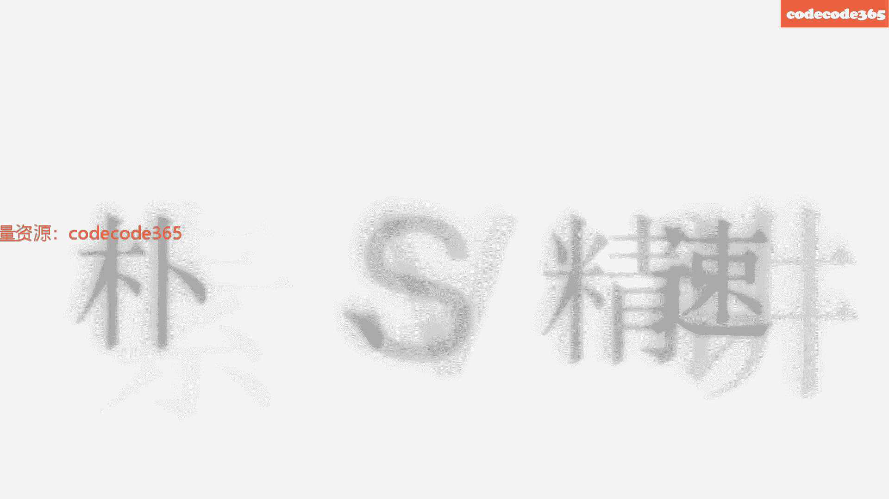
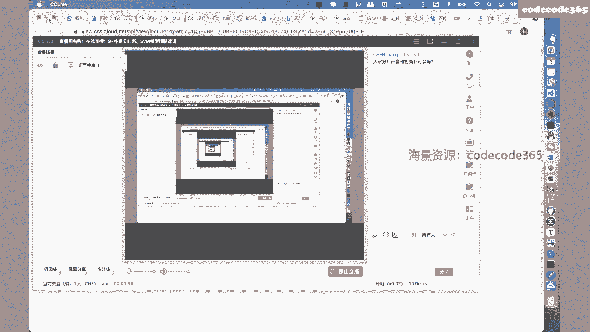
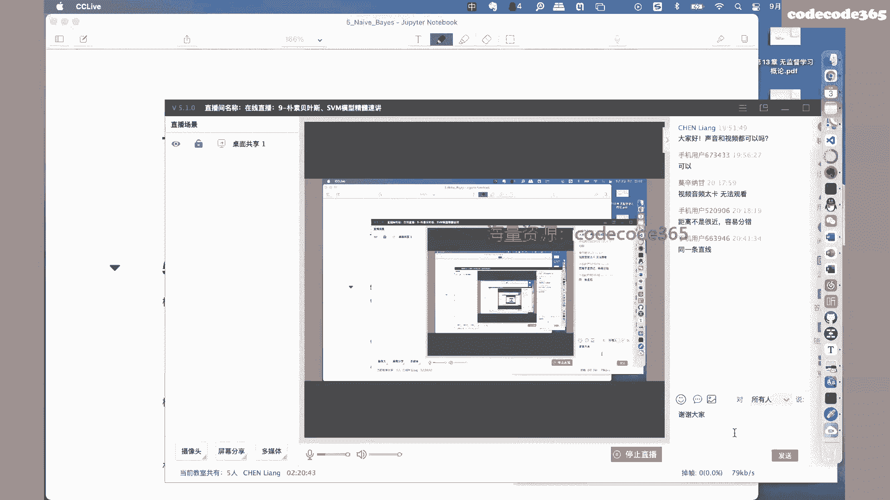

# 【七月在线】机器学习就业训练营16期 - P7：在线直播：7-朴素贝叶斯、SVM模型精髓速讲_ev - IT自学网100 - BV1Z9T5ewEKL

We used to calling outside your mind，I won't see you tonight，So i can keep on going to。

I don't know where i，I get some kind of mazy day，I've been riding through to find my town toni。

I'll be due tomorrow。

My as both the same，I get some kind of ra，Cause it's hard for me to lose in my life。

I've found only time will tell，And i figure out，Can we can do the one night stand in。

And it's hard for me to lose in my life，I've found outside your skin，Right near the fire。

Can we k we need change to be alright，I'm a little used to woman from outside away。

You can leave me tomorrow with suits，You trying to say，I remember，But i don't know enough。

I need somewhere，It leaves the d，Cause it's hard to me to lose in my life，I've found only time。

Will turn out fire out that we can b when i stand here，And it's hard for me to lose in my life。

I've found outside your skin，Right，Near the fire，Cause it's hard for me to lose in my life。

I've found only time，Will tell，And i will figure out that we baby，We can do the one night stand，Yeah。

And it's hard for in rooms in my life，I've found outside your skin，Right near the fire，The weekbaby。

We can change and feel alright，Cause it's hard to be the leaves in my life，I've found only time。

And i will figure wrong，And we can be it，The week and the one night stand，You is this。

How you been used to my life，I've found outside your skin，Right near the fire。

We can change to be alright，I'm a little used to calling outside your mind，I won't see you tonight。

So i can keep from going insane，But i don't know when i，I get some kind of lazy day。

I've been riding this through to fight，My town man，I'll be stewed tomorrow，I don't leave us。

Both the centur，But i don't know enough，I get some kind of lazy。

Cause it's hard for me to lose in my life，I've found only time will tell，And i figure out that。

We can go，We to the one，I stand is，And it's hard for me to lose in my life。

I've found outside your skin，Right near the fire，I'm a little used to woman on outside away。

You can leave me tomorrow with suits，You just the same，But i don't know enough，I need somewhere。

It leaves the day，Yeah，Cause it's hard for me to lose in my life，I've found only time will tell。

And i will figure out that，We can b you know what i stand here。

And it's hard for me to lose in my life，I've found outside your skin，Right，Near the fire baby。

We can change and feel alright，Cause it's hard for me to lose in my life。

I've found only time will tell，And i will figure out，We can baby，We can do the one night stand，Yeah。

And it's hard for me to lose in my life，I've found outside your skin，Right，Near the fire that we can。

Cause it's hard to be losing my life，I've found only time will tell，And i will fall。

And we can better do the one night stand here，And as hard as a rose in my life。

I've found outside your skin，Right，Near the fire，A little used to calling outside your mind。

I won't see you tonight，So i can keep from going time。

I've been riding this through to find my town ton，I'll be stewed tomorrow，I don't leave us，Ps。

It's hard for me to lose in my life，I've found only time again，Take it out。

And we can do the one night stand here，And one for me to lose in my，喂喂嗯，如果声音和视频没有问题的话，我们就准备开始好吧。

嗯嗯按照我们的安排呢，今天晚上我们和大家一起讨论一下，关于支持向量机的内容，SVM呃，非常重要啊，这个我们先看一下，啊为什么这么说嗯，第一点呢是因为这个支持向量机，是在我们机器学习方面嗯。

特别是深度学习之前，这个阶段可以说是最重要的模型之一啊，大家如果有兴趣的话，可以翻看一下大约十几年20年之前的论文啊，啊各种各样的基于支持向量机的改进模型，非常类似于我们现在深度学习领域。

各种各样的人工神经网络的修改啊，各种各样的变形，也就是说哈，就是十几年之前，SVM的这个地位和现在深度学习当中，神经网络现在的地位，基本上是相同的一个概念啊，从此也可以看到啊，这个工作啊这个的重要性。

当然啦因为呃限于啊只是向量机这个工作，这个模型的性能啊，已经达到了一个相对来说就是平均啊，不会像深度学习那么构建的，复杂的人工神经网络取得那么好的效果，那么为什么在现在这个时间点上。

还要向大家做一个介绍，是因为在实际的工作过程当中哈，我们往往需要对我们的工作的结果，做一个评估啊，就是我们到底做得好还是做的有问题，需要做一个评估，既然要做评估，就要有一个比较的基准或者极限啊。

现在呢往往呢我们习惯上可以使用这个SV啊，现在我们已知的数据集上跑一下SM，看一下结果啊，作为我们一个基线，然后呢在此基础上呢，我们可以构建各种各样的模型啊，包括机器学习模型，也包括深度学习模型嗯。

做性能上的改进和优化，那这样的话我们就有一个评估的一个标准，好吧，嗯这是第二点，第三点呢，就是在我们这个实际的面试过程当中啊，找工作面试的过程当中，往往呢支持向量机，也作为一个非常重要的考察点。

来这个和同学们有一个，就是面试官和你有一个交流啊，所以这个时候呢嗯很很很，很显然你需要对它有一定的了解才可以，所以基于以上三点，就是第一点呢就是它本来就很重要啊，第二点呢就是就是第一点它性能很好。

本来就很重要，第二点呢，就是他这个作为现在的一个，工作基础或者工作基线啊，也是需要对他有个了解，第三点呢就是面试的过程当中会考察得到啊，所以基于以上三点，我们还需要把它做一个介绍。

那么支持向量机它的前序工作啊，有兴趣的同学可以看到是感知机模型啊，感知机模型，感知机模型再往前去啊，可能就是我们的线性回归模型啊，感知机模型呢和我们的逻辑回归模型，其实呢非常类似。

只是他们的激活函数不一样，而且他们的这个呃优化策略不太一样，所以呢导致他们产生了，或者导致了两个不同的方向或者结果，嗯从这个角度上也可以看到啊，即使复杂相支持向量机啊，它的基础模型其实还是线性回归啊。

一会儿我们会介绍到为什么这么说好吧，其实还是在此基础上做了一系列的改进而已啊，今天我们聚焦在这儿啊，聚焦到这嗯，说一下后面的安排，后面我们逐一的安排是要讲到check boost啊，所以说啊。

这个我们上一次讲到了这个决策树模型的部分，还是希望大家回去以后啊，这个有重点的回顾和学习一下，然后呢我们在周一的时候介绍XGB的时候，你才才才才大约有一个这个基础是吧，这个地方需要注意一下呃。

看看声音和视频，如果没有问题的话，我们就继续，OKOK今天要讲到直升机，OK那先看一下这个主要内容啊，知识向量机的内容其实还是蛮多的啊，很多比如说哈，我们要讲到所谓的线性可分支持向量机。

也被称之为是硬间隔支持向量机，另外一个呢是线性支持向量机，也被称之为是软间隔支持向量机，那第三部分呢是所谓的非线性支持向量机，引入了和技巧以后进行非线性化，第四部分呢就是序列最小最优化和SMO啊。

最后呢当然是个应用嗯，除了应用之外哈，就是我们这一周主要是原理部分，所以我们下一周会介绍详细的应用过程啊，我们聚焦在上面，以上四个部分，在这四部分当中啊，是彼此递进的关系啊，彼此递进的关系。

也就是说线性可分的直线向量及就是硬件隔啊，是最基础的，然后在此基础上进行改进啊，引入所谓的松弛变量，构建所谓的软件隔，然后呢在软结构的基础上，我们引入和技巧，改进成所谓的非线性支持向量机。

可以处理非线性数据，最后呢，我们使用SM对我们以上的最优化的一个函数，进行一个求解，就完成了整个的内容介绍，那么在这四部分当中哈，这个呃最基础啊，大家要把第一部分啊，就是硬间隔这一部分嗯。

搞得非常清楚才可以啊，以适应啊，这个面试过程当中的一些基础性的问题，那么再进一步呢，其实最好还是把123部分啊，就是硬间隔，软间隔加上和技巧部分能够搞清楚啊，这样的话啊，对于SMSM的原理部分。

应该就问题不是特别大了啊，当然如果还有兴趣的话，你可以把SISMO也跟一下，因为我们最后的这个优化算法实现，是根据SMO来实现的，所以这四部分之间的关系啊，也希望大家能够有一个了解。

那么我们就从最基础的这个硬间隔开始介绍，那么硬间隔支持向量机哈，首先我们把它所需要解决的问题搞清楚，我觉得这是非常重要啊，后面我们会讲方法，就是怎么解决它，但是一开始哈很多的时候嗯。

同学们就是问题都没有搞清楚啊，就是没有带着问题去找解决方法，这个时候就会更大，更加的混乱，好吧，我们看看第一个啊，首先我们看数据集，我们拥有的数据集是T啊，X 1y1 x 2y2，一直到XNYN。

这是我们一个典型的有监督数据的一个数据集，其中呢，xi是属于我们输入空间里面的一个元素啊，这里的xi是我们输入空间里面的元素，很显然因为它的黑体表明它是一个向量，它是等于一个RN空间里面的一个向量啊。

RN的一个向量，N维的向量，其中的YI就是我们的标签数据啊，就是我们的标记，那么YYI呢是我们花外啊，输出空间里面的一个元素，注意它的定义啊，注意它的定义，那么它的输出空间等于什么。

输出空间被定义为正一负一，那么很显然啊，硬间隔支持向量机，处理的是所谓的二分类问题啊，二分类问题，两个类别正一和一，有的人就会有疑问啊，既然是二分类，我定义成零和一，可不可以，比如说我们上次之前介绍。

介绍过那个逻辑回归模型对吧，也是个二分类，但是在逻辑回归模型当中，它的二分类的标签被定义为是零一，在这里啊非常明显的一个区别，支持向量机当中的标签是分为正一和一，代表两个类嗯，能不能换成零一嗯，不可以。

因为后面我们会使用到这两个值的一些技巧啊，这个地方需要注意一下，那么I呢是从一到N1共有N个数据样本，其中xi啊为第二个特征向量的实例啊，下标为I嘛，是第二个数据，YI是DXI的对应的类别标记。

对应的类别标记，当YI等于一的时候，当Y等于正一，我们认为xi称之为是正立或者正样本，当YI等于一的时候，我们称xi为负利或者负样本，那么XIYI呢就被称之为是样本点啊，样本点这里的正负啊。

你会发现xi啊，我们xi的正负是根据它所对应的标记的正负，来进行判断的啊，你是正一，那你就是正立，你是一，那就是你就是负利，看下面嗯，那么所谓的线性可分支持向量机，或者叫做硬间隔支持向量机。

就是给定一个线性可分的数据集，这里假设啊，这里假设我的数据1T是线性可分的啊，这是前提条件，那么在线性可分的数据及T上，我们通过所谓的间隔最大化或等价的求解，相应的土耳其规划问题。

那么学到一个所谓的分类超平面，W星X加B星等于零啊，以及它相应的分类决策函数，FX等于sin w星X加B星，这个就被称之为是线性可分的支持向量机，也就是说最终的线性可分向量积就是个FX。

这和我们前面介绍的是相一致的内容对吧，我们一直在强调，所谓的模型就是我们的映射函数，那么这个映射函数呢是通过后面这个算W星，X加B星来构建完成的，里面需要说明的是，W型和B型为直直向量机模型的参数啊。

不是感知机，是SVM模型的参数，W星呢也是一个RN的一个向量，我们把它称之为全职或者全职向量，B型呢是属于R的，很显然是个标量，叫做偏执偏执，W星是X中间我们做的是内积计算啊。

内积计算表示W星和X的内积，注意这里的SN是一个所谓的符号函数，符号函数的含义就是我们只取W星X内积，计算完成之后，加上B星的那个结果的那个符号啊，那个符号我提取出来，把那个符号函数有了以后。

我们把它复制给我们的输出，得到我们最终的当前X输入以后的那个输出值，就可以了啊，这就是所谓的硬间隔支持向量机放在这儿嗯，介绍完以后呢，可能会大家会就是莫名其妙，到底他讲的是个什么事，还是不清楚是吧。

那么这个时候呢，我们需要把这一段的文字描述啊，把这一段文字描述，把它转换为啊我们能够理解的一个图形描述啊，图形描述，那么首先我们先从数据集开始啊，先从数据集开始，这里的数据集X1Y1到XN。

YN是N个样本点嗯，这N个样本点呢X属于RN的，这一段是个N维向量，为了能够我们在图上画清楚，所以这个时候我们令N等于二啊，特指为二，这个时候能够表示清楚，有了这个假设以后。

我们当然就可以构建一个所谓的平面，这里呢是X1，这是X2，那么很显然，平面当中的一个点就作为我们一个X向量，这个X向量很显然就等于X1X2，怎么注意啊，是个转置啊，列向量对吧。

一个点我就可以分别用横坐标和纵坐标，相对应的来表示这一个样本点，那么这只是表明了X的位置啊，表明了X位置，更重要的是，我们还说到过和X所对应的Y也有规定，怎么规定的呢，如果X如果这里的Y是等于正一。

我们把YI称之为是正立，但问题是在现在这个直角坐标系里面，没有关于Y的，没有Y轴对吧，这是首先肯定的，没有Y轴嗯，既然没有Y轴，我怎么把正一和一分别表示清楚，这个时候我们规定所有输出为正一的正样本。

用圆圈来表示啊，假设这些样本点都是正样本，所有输出标签是为一的，我们用叉号来表示，叉号来表示，那这样我们就可以大体上能够把样本，在这个平面直角坐标系里面，这样能够表示清楚了啊。

这是所有对应为正样本的样本点，这是对应所有负样本的样本点啊，那么这个时候呢也说明了另外一点，就是刚才所说的，这是在给定的线性可分的数据集的基础上，你很显然这里的正样本和负样本，明显是线性可分的。

什么叫线性可分啊，就是我可以找到一条直线，能够很好的把正负样本能够分开啊，这就是所谓的线性可分，那就会同学就会问，那什么是线性不可分啊，举一个极端例子，比如说这个地方还有一个正样本。

那么很显然当前这个样本，当前这个数据集就是线性不可分的，为什么，因为你找不到任何一条直线对吧，你不管你你你你怎么找，你都不能够啊，一刀切下去，把正负样本严格分开，因为倒霉在这个地方。

它位置太太特殊了是吧，这就造成了当前整个的数据集是线性不可分的，所以说也就是说硬间隔的基础条件，你必须是线性可分的啊，能够一刀切成两部分啊，这是前提条件，那么有了这个数据集的这个表示以后，你再去看一下。

在给定的线性可分的数据集上，我们通过所谓的间隔最大化或等价的求解，相应的图二次规划问题，不明白什么意思，先放一放，解决完这个问题以后，我们要得到一个什么东西，我们要得到一个所谓的分离超平面啊。

所谓的分离超平面，那什么是分离超频命令，下边在这是W星X加B星等于零啊，这么一个东西，他又告诉我们，这里的W星被称之为是，全知向量啊，全值向量它呢也是RN的啊，它也是RN的，刚才我们说过。

这里假设N是等于二对吧，假设N是等于二，那么很显然W星就应该是等于W1，W2所组成的一个列向量，然后呢他要和谁呀，他要和X刚才我们说过X等于什么，X等于X1X20向量，这两个向量做内积。

我们知道要做内积计算的话，无非就是对应的分量相乘，然后进行累加，那就是W1乘以X1，加上W2乘以X2，然后呢加上一个B等于什么，等于零等于零，我们看一下这个式子啊，看下这个解析式，这个解析式哈明显啊。

我们初中的解析几何告诉我们，这个解析式明显就是在坐标轴X1，YX1X二啊，这个平面当中的什么是不是任意一条直线，没问题吧，W1乘以X1加上W2乘以X2加上B对吧，这是我们整个平面。

直角坐标系统里面的任意一条直线好了，既然是任意一条直线，我可以随便画，比如说我可以这样来画，没问题吧，要不你看一下当前这条直线，是不是首先把正负样本分开了啊，这个目的其实是已经达到了。

但是呢因为我们知道，这是我们直这个平面当中的任意一条直线，那么除了这一条直线之外，你看看我是不是，这条直线也可以把正负样本严格分开啊，你比如说再举一个例子，我这样分也没问题，换个角度，换句话说哈。

能够起到将正负样本进行分开的或者分割的，所谓的分离超平面并不唯一，你看看有多条直线，有多条直线都可以把正负样本严格分开，那这个时候就需要回到这里来了，就讨论一下什么叫做所谓的间隔最大化，或等价的求解。

相应的土耳其规划问题呢，那么回到这个图上来，我们分析一下，啊这两条直线好来看看，如果我们选择啊，如果我们选择以当前这条直线作为所谓的分离，超平面来把正负样本分割开，那么大家觉得有没有问题，如果有的话。

有什么问题，啊就是如果以这条线为分离和平面的话，有没有问题，如果有的话，有什么问题，啊有同学说距离不是很近，容易分错是吧，嗯是不是很近吗，你是针对谁来说的，因为我们现在有正样本和负样本两种数据集啊。

你是针对正样本所说的是吧，啊是这样啊，因为这条直线距离正样本非常的近，所以啊举个例子，比如说我现在有一个新的样本来了，我知道他是正样本，但是它的位置在这，首先我们根据这条分离超平面。

你会发现把它分错了啊，这是第一点，但是呢他又是一个正样本，它本身和正样本，这个这这一这一这一，这个分类距离非常非常的近，其实从我们直观上去看，并不应该把它分错，是因为你这条直线。

或者你这个分离超平面性能不太好，就像刚才这位同学说的，你距离这个正样本太近了，好，这是个很好的视角，我们看这条直线，啊不太极端啊，举一个极端的例子，比如说这条直线，那么同样因为这条直线距离负样本太近。

所以同样会出现，比如说唉，这个地方如果有一个新的负样本点的话，按照我们这条分类超平面就把它分错了，也就是说啊，在任意多条能够把正负样本严格分开的分离，超平面当中，我们是不是应该找到一个折中的直线啊。

既离正样本也足够的远，还离负样本也足够的远，才是一个所谓的好的直线或者好的分离超平面，那这就是下面这些这个问题啊，所谓的间隔最大化或等价的求解，相应的托尔斯维化问题，他其实就是需要要求我们要找到一个。

既不离正样本太近，也不离负样本太近的这么一个分离超平面，那么大家想想嗯，大约哈我们凭感觉看一下，大约大约大约是不是，这个虚线的这条直线应该是要比刚才那个正负，那那那两条啊，离这个正负样本非常近的直线。

要稍微好一些是吧，稍微好一些，那它好在哪儿，它就好在就像刚才我们所说的，既距离正样本足够的远，也距离负样本也足够的远啊，这就是所谓的SVM的一个最突出的一个特点，其实啊。

刚才我们找到的那些那些非常极端的分离，超平面啊，可能就是我们在感知机模型当中所确定的模型，也就看到了啊，为什么说SVM是一个性能上更突出的模型呢，就是因为它在基础模型的基础上，进行了大量的改进啊。

就像这样，我要找到一个更好的，那下面问题又来了，怎么才能找到它，好问题我们已经搞清楚了啊，就是要找那个所谓的间隔最大的直线啊，这个时候呢就带来一系列的问题，看下面，需要引入一些工具啊。

同样需要引入一些工具，帮助我们建立一个框架来分析这个问题，第一个呢就是所谓的超频WB，因为我们刚才说过啊，超平面就是一条直线啊，那这个时候我们只需要确定它的斜率和截距，就可以了。

所以我们用斜率和截距来表示当前这个超平面，超平面W个B关于样本点xi yi的函数间隔啊，我们用函数间隔这么一个概念，定义为伽马hi等于YI乘以w xi加B，你先把它记住啊，你先把它记住啊。

一会我们再会分析它到底是个什么东西啊，一会再分析的到底是个东西，他这样做超平面关于样本点的函数间隔啊，样本点的函数间隔，那么超平面关超平面WB，关于训练集的函数间隔，注意啊。

刚才我们可以看到这里的伽马hi，代入到公式里面去，计算的时候需要xi和YI啊，你给我一个样本点，我就给你一个样本点的所谓的函数间隔啊，这是关于伽马hi，那么既然每一个xi和YI都可以计算一个伽马H。

那我整个数据集T里面，从X1Y一一直到XN和YN，都可以计算N个伽马height，从伽马heat一一直到伽马heat2，最终到那个伽马heat n啊，都可以计算若干个伽马HT。

那么超平面WB关于训练集T的函数间隔，注意啊，这是关于整个一数据集的函数间隔，被定义为你那大N个所有的函数间隔，伽马hi里面最小的那个值，所作为我整个数据集的GMH好吧，这就是一个计算过程啊，计算过程。

那么再回顾一下关于样本点，我可以通过公式来计算出样本点的函数间隔，计算出所有样本点的函数间隔来以后，把其中最小的一个单独拿出来，作为我整个数据集的函数间隔啊，那这样的话呢。

我们的函数间隔就计算出两个结果来，那么再往下看这个，但是有同学就问这个函数间隔干什么用啊，不理解，看下面你就理解了，那么除了函数间隔之外呢，我们再定义两个所谓的几何间隔啊。

几何间隔你看看同样是超平面WB啊，就是我们的那条直线告诉我们了，然后呢关于样本点还是关于一个一个样本点，xi和YI的所谓的几何间隔为伽马I啊，没有那个小帽子了，没有那个hit了啊，伽马I伽马I等于什么。

伽马I等于YI乘以w xi加B，比上一个W的二范数啊，是这么个东西嗯，这个式子放在这儿，有同学马上也会很困惑，这个式子他也不知道什么意思，但是呢我们通过名称上，可以给我们一个很重要的启示。

这里的伽马I啊，这里的伽马I是一个所谓的几何间隔的概念，几何间隔的概念有什么叫几何间隔，把间隔换成距离，它的学名叫几何间隔，但是不好理解，你把它改成几何距离，你看看你能不能理解。

那几何距离是个什么东西呢，干脆把几何也不要了，干脆把几何也不要了，那它就是个距离，什么意思呢，我们再看一下超平面，WB就是对应的那条直线，以及样本点X和YI的距离，一个样本点。

一条直线点到直线的距离就是这里的伽马I，你有同学不大就有疑问啊，或者有困惑困惑在哪呢，这后面不是个距离公式啊，标准的距离公式应该等于什么，你应该等于WX加B的绝对值，比上一个W的二范数。

这才是我们标准的点到直线的距离是吧，初中解析几何告诉我们的，但是呢你又说这个式子又是所谓的距离，那很显然这两个式子应该相等啊，那你看看分析一下这两个式子是不是相等，这两个式子是相等的啊，为什么这么说呢。

首先我们可以看一下这两个式子的区别在哪啊，一个很重要的区别就是，我们知道距离是个非负值，大于等于零，但是呢你会发现诶，这个地方怎么没有那个绝对值号了，绝对值号没有了是吧，那这个时候就有就有问题啊。

既然你把绝对值号去掉了是不行的，为什么呢，因为你不能保证所有的样本点代入到WI，WXI加B当中，都是大于等于零的值，因为很显然，有些样本点是出现在这条直线的下侧，那这个时候带入到直线方程里面去。

是小于零的一个呃结果啊，所以那就不能是距离了，但是除了这个绝对值去掉了以外，你会发现哎前面多了个YI是这样吗，多了个YI，回想一下我们关于那个YI的取值，它是属于什么，它是属于正一负一的，那好了。

我们分两种情况来讨论一下，如果你这个LI是等于一，你这个YI等于一，意味着所谓的负样本，负样本就出现了，我们分类超平面的，下面是吧，分类调平的下面竟然出现了，下面代入到w xi加B这个方程里面去。

我们得到的是小于零的值，注意这个时候的YI是个一，而你这个时候恰好得到的是个小于零的值，一乘以小于零的值，是不是应该是非负值啊，没问题吧，非负值，所以你会发现哎如果是一的时候，我们得到的是个非负值。

那么如果是正一呢，如果你是个正一，那意味着你当前是个正样本，正样本带入到直线方程里面去，得到的就是大于零，哎你看正一大于零又是一个非负值，那么很显然就和我们的距离的含义，就对应起来了，换句话说。

这个地方之所以可以把绝对值号去掉，使用的一个技巧，也就在这个地方的YI的一个定义形式，这也就解释了刚才哈，为什么一直在强调Y的取值正样本是正一，负样本是一的一个很重要的原因，好吧好了。

回过头来我们再看一下，通过以上分析，我们得到一个结论，什么结论呢，就是这里的伽马伽马I就是我们样本点距离，分离超平面的几何距离，那这个时候啊嗯我们再回顾一下刚才那个图，刚才那个图就是那个X1。

这是那个X2，这是正样本好吧，这是正样本正样本啊，假设啊分这条路线是这条直线，那这个时候每一个样本点，每一个样本点，每一个样本点都有一个所谓的假设，这是伽马一，这是伽马二，这是伽马三，距离距离距离距离。

那么负样本负样本负样本同样，伽马四马五马六好吧，那有了这个所谓的样本点的几何间隔以后，同样的道理啊，我们看一下超平面当中关于训练集的几何间隔，一样哈，因为每一个样本点我们都可以计算几何间隔，那这样的话。

N个样本点里面，最小的那个几何间隔被拿出来啊，作为我整个数据集的几何间隔好吧，那这样的话我们就有了另外两个伽马值，分别是伽马I和伽马，那么我们回过头来比较一下这四个伽马值。

这个地方的函数间隔和这里的几何间隔很小，很明显啊，有一个有关系，什么关系呢，你会发现哎这部分和这一部分是不是相同，很明显是相同的是吧，很明显是相同的，这也就是函数间隔和几何间隔之间，最大的一个关系。

就是在于几何间隔的分子部分，其实我们重新把它定义成了另外一个名称，叫函数间隔而已啊，那么很显然我们这里建立了这个关系以后，我们得到下面这两组公式看一下，就像刚才我所说的，我们把几何间隔的分子部分。

重新用另外一个符号，就是函数间隔来定义一下啊，称之为gm height i，那么在整个数据集上也有类似的关系，因为最小值是同一个是吧，所以这个地方的几何数据集上的几何间隔。

就是使用我们数据集上的函数间隔作为分子，比上一个W的二范数就OK了，那介绍这个工具以后，我们再回过头来看我们的问题，看看怎么表述是X1，这是X2正样本正样本，正样本，负样本，负样本负样本。

这是我们要那条所谓的最好的分差别，那么你现在想想，我们假设哈，假设这个点是我们距离，分类超平面最近的一个正样本，这个点是距离我们分离超平面，最近的一个负样本，那么大家想一下最朴素的一个想法。

就像刚才我们的要求一样，要找到一个所谓的最优的分离超平面，是不是就是尽量的使这个直线哎呀，在这两者之间有一个很剧烈的一个对抗，对抗对抗对抗对抗，最终最终得到了一个非常平衡的一个位置。

使得它距离正样本和负样本都已经，尽可能的怎么样了，远了它就是所谓的最优的，那怎么样把这种状态表示出来呢，那么大家想一下，我是不是只需要使这条分类超平面，尽可能的距离。

离他最近的那些样本点尽可能的怎么样远，是不是就可以了，那么刚才我们已，其实啊已经找到了那些所谓的距离，分离超平面最近的样本点了，是这样吗，因为前面我们的定义是这么来定义的，是所有几何间隔当中。

是数据集里面所有的几何间隔当中，最小的那个叫我的伽马，那么下面我们的目标是不是，就是只需要使这个几何距离最小的这个伽马，尽可能的怎么样，尽可能的大，最近的你都离得最远了。

那么是不是就保证了再远的也就更远了，是不是也就保证了这个分离超平面，能够很好地去完成对正负样本的分割了对吧，所以说啊就是怎么得到的，这个所谓的max伽马是最关键的一个问题啊，他是最小的那个距离。

我使最小的距离尽可能的大，那这个伽马就是最好的伽马啊，这个伽马所对应的W和B就是最好的W和B，好吧，那这个问题解决了以后，看下面这个条件还必须要带着什么条件，刚才我们一直在强调你这里所有的集合距离啊。

你这里样本点的所有的集合距离，都要大于整个数据集上的几何距离，因为你数据集上是最小的那一个，所以我样本点里面的任意一个都要大于等于它，才可以，这是一个约束条件是不能丢的，所以刚才好我们所说的两点。

第一点就是所谓的间隔最大化，就是说的是这里最近的样本点都尽可能的远，就达到了所谓的间隔最大化的要求，那么它所对应的，它或者说它所等价的那个所谓的凸，二次规划问题，就是是。

就是刚才我们所定义的这个带优化条件的，最优化问题，使得最近的几何距离尽可能大的啊，那个分离超平面作为我的最优分离超平面，当然约束条件是所有的几何距离，都要大于等于伽马好吧，到此为止，到此为止。

我们其实就解决了一个问题，是一个什么问题，就是我们要干什么的问题啊，我们就要干什么，就要干这个事儿，这个事儿嗯，怎么理解，我们引入了所谓的函数间隔和几何间隔的概念，通过使我们的几何间隔尽可能的大。

找到那个最优的分离超平面，好吧，看看这一部分有什么问题吗，如果没有问题，我们就继续好了，下面呢可以说是啊，这个问题就是目标找到以后啊，下面就是求解的问题了，其实说说到这儿啊。

后面的工作其实就交给我们数学的同学，就可以了啊，你就你只需要告诉他同学，你把这个数学问题给我解出来啊，找到我的最优解就OK了，我这个事就解决完了，但是当然不能这样做是吧。

那么怎么去求解这个带约束条件的最优化问题，我们做一系列的转化，把问题进一步的呃进一步的化简，继续往下等价的，我们把上面这个问题转化到下面这个问题，那么既然我们是要使得我们的几何距离，尽可能的大。

而我们知道我们的几何距离，可以表示成函数距离比上W的二范数的形式，那这样的话这个转这个转换是显而易见的是吧，就是把伽马替换成伽马height比上W2反数，那么条件呢相应的也需要变化一下。

因为这个时候如果我要保证几何距离啊，几何距离大于等于伽马，其实我只需要要求我的分子部分大于伽马HT，是不是就可以了，因为我们知道W2范数嘛，那个东西嗯，它作为分母就放在那个地方，是任意样本点的几何距离。

它都是那个W的函数，所以我只需要要求它的分子部分大于等，于这个伽马heat就可以，所以啊从这一步到这一步的转化，是比较容易理解的，难理解的是哪一步呢，是这一步怎么从上一步变成这一步，是比较难理解的。

就先看一下形式上，形式上呢你会发现上面是有一个伽马heat，而在这个地方伽马HT变成了数值一，变成了数值一，这是嗯最不太容易理解的一点啊，不太容易理解在哪呢，怎么你就把伽马HT变成了一好了。

回到我们这个图当中来啊，回到这个图当中来，你会发现其实为什么要引入这个几何间隔啊，其实一直很多同学就有困惑，为什么呢，因为很自然的我们想到的是使用不，为什么要引入这个函数间隔，是一直同学有个困惑。

因为很自然的是，我们这个地方有一个标准的几何距离是吧，你定义点到直线的几何距离时，这个几何距离足够小不就完了吗，你为什么还要搞一个函数距离呢是吧，为什么要搞函数距离的，原因其实是这样。

我们把这个几何距离是个绝对量，几何距离啊是个绝对量，你算出来那个数值它是几，就是几是不变的，但是呢这个函数距离啊，你可以把它通过缩放，把它缩放成一个相对量，什么叫缩放成一个相对量呢。

从形式上或者说从这个图示上，你可以这样来理解，我可以把距离分离，超平面最近的那个样本点的几何距离，我不管它数值上就是绝对量到底是几，我可以把它定义为，这里的一单位长度的含义啊。

我就以这个距离作为一个单位长度，用这个一和最短的这个距离，相对于其他距离的这个比值来表示其他的距离，是不是也可以啊，比如说举个例子啊，比如说我们考试啊，每一个同学都知道满分100分，你考了98分。

他考了37分是吧，这很正常，那么除了这种方式之外呢，我们还可以怎么做，我们还可以以比如说我们最高分作为满分状态，你和那个最高分的百分比进行比较，是不是也可以啊，比如说这分这份卷子很难啊。

最高就是最优秀的那个同学，他考了个87分啊，这个时候你会发现，整个班级的成绩其实都非常低，就是因为这个卷子本身太难了，那这个时候怎么办，我可以规定那个最高分啊，即使他只有87分啊，也是一个一啊。

标准单位一，你相对于它的一个百分比作为你的分值，就他考100分，就算他考100分了是吧，就他考了个满分，你相对他的百分比作为你的一个分支，是不是也是一个策略，其实是非常类似啊，非常类似。

就是这个地方为什么我们可以把啊，为什么我们可以把这里的伽马height用一，来替换的一个原因也在这，当然啊这只是形象的一个描述，那么在形式化就是我们在这种嗯数学表示上呢，我们还可以这样来理解。

我们前面一直讲到过，这里的WX加B等于零啊，代表的是我们这个平面当中的任意一条直线，因为这里的W和B都不确定是任意一条直线，既然是任意一条直线呢，我们举个例子，比如说2X加三等于零啊，这里的X啊。

我们是这个向量啊，所以这个地方比如说是2X1加，2X230是吧，那这个时候呢你看一下下面一条直线，叫做3X13X5，三X4X260，那这个时候你问一下大家哈，这两条直线啊，这两条直线什么关系。

一个是2X12X230，另外一个是4X加4X260，这两条直线什么关系，还有同学有印象吗，这两条直线是同一条直线，一条直线，因为它是通过等比例缩放吗，只是他们你会发现这条直线乘以二啊，前面T除以二来。

然后除过去，因为右边是个零，所以还是个零，所以说这两条直线啊，看看对啊，同一条直线很好好，既然我们说过，既然他俩是同一条直线啊，位置是不发生变化，就在就在那，但是你会发现它们的系数是不是发生变化了。

这里是223，这里变成了446，没问题吧，或者说我只需要等比例缩放系数，就可以得到同一条直线的多种表示形式，那好了，回头来看这个，看这里的伽马height，伽马heat啊。

它的定义形式你会发现哎在上面啊，你会发现哎它就是存在这么一种方式，我可以通过等比例的缩放，这里的W和B来改变这里的伽马HT值，没问题吧，那既然可以改变这里的伽马HT值。

那我是不是就可以通过一种嗯显然是存在，但是我不关心它到底是多少的一个值，能够把这里的伽马HT缩放成几啊，缩放成数值一，就像刚才我们举的那个例子是一样的是吧，我就规定你最近的那个同学就是一啊。

你就是考满分啊，其他的所有的其他样本点相对于你的百分比，作为你的距离就OK了，因为这个地方函数严格啊，不是个绝对量啊，不是个绝对量，它是个相对量，所以说啊这一点希望大家能够理解，能够理解。

不管是从这个数值上还是从他这个形象上啊，你能够把这一步，从这一步的这个问题能够很好的就是伽马heat，为什么能把替换成一，能够好好的理解一下，好了嗯，嗯这样的话我们就这个问题到这儿，这个问题到这。

然后看下面这个问题继续往下，还没完啊，这个条件也需要发生变化一下，因为这个地方我们已经把伽马hi缩放成了一，所以约束条件变成了YI乘乘以WXI，A加B是大于等于一的啊，大于等于一的，那么继续往下看。

那么从这一步到这一步呢，问题其实就相对比较好理解一下，因为这个地方我们求的是分这个分式的最大，分式的最大，我们知道求分式的最大，我们只需要使分子怎么样啊，分母怎么样，使分母尽可能的小是不是就可以了。

所以这个地方是求的是W2范数的最小值啊，W的二范数的最小值，分母如果尽可能小了，你这个式子是分式，是不是尽可能大的，那么这外边这些是什么意思，那么我们分别看一下啊，既然是求了W2范数的最小值。

平方向是不影响最小值求解的，那么1/2也不影响最小值求解啊，这个你可以这个自己想象一下啊，我们一个变量啊，一个变量我要求它的最小值啊，它的最小值的那个位置上啊，平方之后还是他1/2之后也不影响。

为什么要说这个处理呢，是因为后面我们要求导这个时候的导数一求二，往前一提和1/2就约掉了，所以最后剩下的是W的二范数，只是为了数学上的一个求解方便好吧，然后呢约束条件呢也发生一些变化。

把这里的右边的正一移项到左边去，变成YIWXI加B减一大于等于零就可以了，那么下面的问题呢就拔啊，成功的把我们的这个一系列的转化，转化成最终的求解目标啊，就是求解这么一个带约束条件的最优化问题。

我们再往下看，正式的啊，给出最大间隔算法，那么首先输入条件就是我们的数据集T啊，线性可分的数据及T，那么输出的就是所谓的最大间隔，分离超平面和我们的分类决策函数，其实最核心的就是找到那条分类超平面。

第一步就是构建带约束优化条件的最优化问题，如果我们能够把这个问题求解出来，得到所谓的最优的斜率和最优的结局，那所谓的最优的分离超平面，就是W星X加B型等于零，那么有了这个分离超平面以后。

分离角色函数就变成了W星X加B星啊，取负号，然后得到FX的输出，那么这个时候很显然这三部啊，有些我们前面提到这个经常提到的那个笑话，是哪个笑话，把大象装冰箱里分几步是吧，拢共分三步，打开冰箱。

把大象装进去，然后把冰箱门盖上，但问题在于你怎么把大象装进去，换句话说，在这里的核心，第一步你怎么把这个问题求解出来，其实你并没有给出答案来，是这样吗，也就是说后面我们把问题还是聚焦在，还是聚焦在。

求解这个带约束条件的最优化问题上啊，一旦你求出来了，分离超平面就有了，你一旦你分离超平面，有了你的绝对函数，也就有了，最核心的还是在这，那么在求解那个问题之前呢，我们看看我假设已经把它找出来了。

已经把那个分类超平面找出来了，就像刚才那个例子里面一样，正样本正样本，正样本，负样本，负样本负样本，假设我已经把它找出来了，你看看这条分离超平面，它应该具有什么样的一些特性，什么特性呢。

首先这个特性是W星X加B星等于零，我找出来了好吧，他既离这正样本，也离这负样本都足够的远啊，都足够的远，那么首先我们可以看一下，首先第一个这个样本点距离，分离超平面的这个距离，它的函数距离是几。

函数距离很显然是一，就像刚才我们所说的，你最近的那个样本点距离，分离超平面的函数距离，通过缩放就缩成了什么一样，你这个最近的负样本距离，分离超平面的距离也是一啊，当然这个一个单位一的含义是吧好了。

那这个时候啊，我们过正样本，这个点做平行于分离超平面的一条直线，那么我们得到这么一条直线啊，直线啊，直线这个这个这个手写就画不出来，怎么停，你自己理解就可以了，那么同样我们也可以做过这个负样本。

这个样本点做平行于分离超平面的一条直线，这条直线，那么大家想象一下，那么很显然这两条直线彼此应该就是平行的啊，彼此应该是平行的，那么这两条直线的距离，如果我们还有函数距离这个概念的话，应该等于几。

应该等于一，加一，应该等于二，这并不重要，重要的是什么，你看一下在这两条直线中间的区域，会不会有样本点存在，不管你是正样本还是负样本，会还是不会，一定是不会的，为什么，因为我们制作这两条直线的标准啊。

就是以最近的样本点平行于分离超平面，来做个平行线，那么既然已经是最近的样本点，都在这个直线上了，那么这两条直线中间是一定不会存在样本点的，这是非常重要的一个结论好吧，那么这两条直线啊。

这两条直线分别把它们称之为是间隔边界，间隔边界，这个呢我们一般称之为是H1，这个是H2，那么在间隔边界，H1和H2中间所构成的这个区域，是没有任何一个样本点的，换句话说你用样本点的都跑外边去了啊。

都不在外边才可以好了，有了这个概念以后呢，我们继续往下看，就真的需要把那个求解一下吧，求解一下怎么求动用的，就是所谓的拉格朗日乘子法啊，这个拉格朗日乘子法呢，在我们这个附录A部分有介绍，有兴趣的同学呢。

你可以查一下那个课本的附录A，这个地方呢我们直接使用这个方法好吧，直接使用这个方法，这个方法是这么说的，首先第一步引入所谓的拉格朗日乘子，构建拉格朗日函数，这里的拉格朗日乘子呢。

就是看一下你的整个的约束优化问题，有多少个约束约束条件，你就必须要构建多少个拉格朗日乘子，回顾一下刚才那个约束目标问题在哪儿呢，在这儿在这儿，这是最优化目标，这是约束条件，注意哈，约束条件说的是。

所有的xi和YI都必须要满足，大于等于零的这个要求，我们知道整个样本点里面有多少个元素，有大N个元素，所以每一个元素所对应的这个约束条件，都必须要有一个相对应的拉格朗日乘子，所以拉格朗日乘子从阿尔法一。

阿尔法二一直到阿尔法N啊，比如说第一步哈，这里的拉格朗日承德有N个阿尔法，I是大于等于零的啊，每一个拉格朗日乘子都是非负的，那么这里的I是从一到N，为每一个样本点所对应的每一个约束条件。

构建一个拉格朗橙子，然后呢构建拉格朗日函数，拉格朗日函数的构建呢其实就分两部分，哪两部分，第一部分，原优化目标，就是那个二分之1W的二范数的平方，我们的原优化目标是第一部分，那么第二部分啊。

第二部分是将所有的约束条件啊，是将所有的约束条件乘以它所对应的，拉格朗日乘子，然后把这个乘积全部进行累加，就是拉格朗日函数的第二部分，首先我们可以看一下这里的约束条件，约束条件是YIWXI加B减一。

是大于等于零的啊，为什么，为什么怎么后面那个式子里面有一个符号呢，所有的约束条件都改写成小于等于零的形式啊，不要问为什么啊，就是这么来定义的，或者来使用的啊，那么如果写成小于等于零时的形式。

很显然需要变一下号，所以形式上就变成了负的，YIWXI加B加一是吧，这是约束条件，约束条件乘以它所对应的拉格朗日乘子，阿尔法I啊，这是一个约束条件，乘以它所对应的一个拉格朗日乘子，这样的乘积有多少个。

有从一到大N个，因为我们刚才说到过有N个约束条件，那这样的话我的拉格朗日函数就构造完成了，稍微调整一下，就得到下面这个式子，这是第一步，引入拉格朗日乘子，构建拉格朗日函数。

那么第二步第二步求拉格朗日函数的极小啊，求拉格朗日函数的极小，那么求极小呢有一个非常一般性的策略啊，求技巧，非常一般性的策略，就是我们只需要使得当前这个拉格朗日函数，对你的优化目标啊求偏导。

让这个偏导值等于零，那个位置就是所谓的极小值所定的位置，所以这个时候我们使用拉格朗日函数，分别对我们的W和B啊求一下偏导，看一下这个式子，让它等于零就可以，首先呢我们对W求偏导啊。

就上面这个式子对W求偏导，这个时候就体现出刚才那个优化目标函数的，这个设计了啊，二分之1W的二范数一求偏导，一求偏导之后，二往前一提和这里的二分之一一乘，就变成了系数一。

那么得到的就是W注意这里W是个向量啊，W是个向量，向量的偏导怎么求，其实也是对应维度上求偏导就可以了好吧，那W求完了以后看后面这个式子，在后面这个式子里面，我们同样是要对W求偏导。

那么很显然这里的SUI，从一到N每一项里面都有一个W是吧，然后呢是阿尔法I系数往前放没问题，然后是负的YI往前放也没问题，然后在这个式子里面对W求偏导，得到的是xi后面都不再包含W。

所以得到的是sum i，从一到N阿尔法IYIXI，注意把那个负号提前变在这个地方，让这个式子等于零，得到这么一个关系式，得到这个关系式，同样我们对偏置B求偏导啊，偏置B求偏导这一项没有B。

后面这一项里面只有这一项是带着B的，所以得到的是SUMI从一到N，然后呢就是阿尔法IYI往前提一个负值，变成负的SI从一到N阿尔法IYI是等于零，也就是说第二部里面，我们对拉格朗日函数求极小值的时候。

分别对W和B求偏导之后，得到上述两个式子，得到上述这两个式子，那这两个式子呢我们需要看一下，调整一下，我们得到下面这个式子，W等于sum i从一到NRFIYXI，然后第二个式子是SUMI。

从一到NRFY是等于零，首先第一个式子就非常重要，重要在哪重要，在你会发现我们室友为了求W，这个时候我们得到一个关于W的一个表达式，而在这个关于W的表达式里面，xi和YI都是已知的，就是我们的数据集。

而在其中只有谁不知道，只有阿尔法还不易不知道，换句话说，我只需要确定这里的拉格朗日乘子，把拉格朗日乘子带入到这个表达式里面，就可以得到我们的一个目标W好吧，那这个时候我们把这个式子放在这。

也就是说我们现在的目标和核心目标就对，就聚焦在这里的R发上了啊，R上了，那得到这个式子之后怎么办，我们需要把这里的关于W的表达式，带回到原拉格朗日函数带回去，带回去的过程当中，首先看这个式子啊。

二分之1W的二范数的平方，那么W的二范数呢变成了这个式子，那换句话说它应该是等于SUG，从一到N阿尔法GYGXG，没问题吧，就是W乘以W吗，W的平方不是W乘以W吗，你W1个在这。

你后面再乘一个W是不是就可以了，就这个式子，这个时候呢就有同学有问题，有什么问题呢，你前面这个W是用的I，后面这个W为什么就不用还，而变成另外一个循环变量了啊，这是个细节部分啊，很显然是需要变的。

为什么要变，因为这里的W乘以W，你可以把它想象成是什么笛卡尔基，由于这个就类似啊，比较一下笛卡尔机，你前面是一个循环，你后面是一个循环，这两个循环是要交叉相乘的，明白什么意思吧。

如果你使用同一个循环变量，那这里是I从一到N阿尔法YXI乘以sum i，从如果还是I等于一到N阿尔法i yi xi，那只能是从一一直乘到什么N，就没有交叉相乘的关系，而在这个地方。

W2范数的平方横线是交叉相乘的关系，所以这个地方的循环变量要发生变化，所以你得到的式子是下面那个式子，可以看到是二分之1SY，从一到NSUG，从一到N阿尔法IYI阿尔法。

阿尔法GYIYG乘以XI乘以XD好吧，这个地方特别需要注意一点，然后呢再把这个W带入到这个部分啊，代入到这个位置上，你看把这里的把W换成这个表达式就可以了，就下面这个式子，下面这个式子呢稍加整理哈。

稍加整理就得到最终这个表达式，注意一点的是，在中间你会得到一个局部的计算，结果是这个结果，而我们知道这个结果是等于零的啊，这个结果等于零的，所以最后剩下的这个表达式这些这些部分啊。

回去以后建议大家好好的，你找一张白纸，找个笔啊，然后你把它过一遍啊，仔细一点啊就可以了，就得到下面这个表达式，稍微加一下整理啊，得到第二步的最小化，结果是等于负的1/2，SMI从一到n sum g。

从一到N阿尔法I，阿尔法GYYGXIXG加上一个SMI，从一到N阿尔法I这第二步就完了，第三步，第三步是在第二部极小化的基础上求极大化啊，求极大化极大化就变成了max啊。

求极小化之后的最大值约束条件是I，从一到N阿尔法IY等于零，这里的阿尔法I就是我们的拉格朗日乘子，是大于等于零的，那么第三步的求解啊，第三步的求解，有同学说哎这个求极大和求积小，就是换个换个方向嘛。

我们同样求一下偏导等于零，是不是就可以了，呃不是那么的简单啊，问这个就不是那么的变简单了，关于极大的求导，我们使用的就是所谓的SM，就是那个序列最小的优化算法来求解它，因为效率更高一些，效率更高一些。

那么SM呢是在后面的内容，所以到此为止，到此为止，我们可以看一下，关于带约束条件的最优化的求解啊，就是带约束条件的最优化求解的三步，第一步构建拉格朗日乘子啊，怎么构建的，刚才已经介绍了，第二步，求极小。

就是求偏导等于零，得到结果回带回拉格朗日函数，第三步调整一下，求极大求积大呢我们是用后面的SMO来解决，所以就放在这，所以后面我们看一下所谓的硬间隔，学习算法发生了变化，我们发生了什么变化呢。

输入和输出没有问题，通过上述的一些转化，我们构建并求解带约束的，在约束条件的最优化问题发生了变化，变成了最优的，最后的啊，最后的这个极大化过程，有的说哎不是极大化吗，因为是负值的极大化。

所以我们更习惯更习惯写成最小化问题啊，就是刚才那个约束条件问题变成了这个问题，当这个问题如果能够把这里的阿尔法解出来，就是拉格朗日乘子解出来以后，我们可以知道刚才带入到那个表达式里面。

就得到所谓的最优的W型啊，得到最优的W型B型怎么办，B型呢我们往上找找，看看有没有关于含有B的表达式啊，在这儿有一个在这个式子里面啊，在这个式子里面，我们看一下XI和Y都是已知的。

刚才那个W星是不是也已经被求出来了，也已经被求出来了，那这个时候就剩下一个一个B，那这个时候我们是不是可以，把所有的这些已经得到的值，都扔到表达式的右边去啊，都扔到表达式的右边去，得到关于B的表达式。

来看一下这个B的表达式是什么，好在这等YI减去SYI，从一到N阿尔法I星YI乘以XI乘以XZ，而我们知道这里的XI和XJ以及YI，都是已知的这个阿尔法，与同时这里的FI我不知道啊。

阿尔法I上一步其实已经求出来了是吧，你你求W星的时候，这里的阿尔法也已经知道了，其实这个地方其实就是W好吧，那这个时候W星也就已经知道了，有了W星，有了B星，那这个时候我们的分类超平面就已经知道了。

那么带回到我们的决策函数里面去也就知道了，那么好了，很显然哈，问题又聚焦到一个没有解决的一个，最优化问题上，但是不要这个时候就不要气馁，因为后面我们一定有解决方案，就是那个SM好吧。

这是关于硬间隔部分的介绍，看看大家有什么问题吗，硬间隔就是现在我们已经走到了这一步了是吧，如果没有问题的话，我们就继续好吧，嗯硬间隔支持向量机有一个最大的问题，就在于它的前提条件。

要求我们的数据集必须是线性可分的啊，这是一个非常严苛的条件，换一个思路，如果数据集不满足线性可分的条件，就像刚才我所说，唉如果数据跑又跑这儿来了，那这个时候硬件格式向量机，就解决不了这个问题了啊。

不能就解决不了了，那怎么办，就看第二步，第二步呢这个软间隔支持向量机，软间隔支持向量机，是在硬间隔支持向量机的基础上，做了一点条件的放松啊，作为这个条件的放松，使得它在一定程度上能够处理一部分。

所谓的线性不可分的情况，但是呢解决的并不彻底，为什么这么说呢，我们先看论，先看一下这个定义哈，线性直线转机也被称之为软间隔直线机，看这首先它是给定的是线性不可分的，训练数据集啊，一上来就告诉你。

你之前那个强的线性可分的要求，这里就不需要了啊，既然数据是线性不可分的，那你就必须要处理那种所谓的很麻烦的情况，看他怎么处理的，即使是一个线性不可分的数据集，它也是通过所谓的间隔最大化的策略。

来进行解决的，那么同样啊，同样也是对我们的二次图优化问题，进行一个求解，但是这个地方的，求这个地方的二次图优化问题发生了一点变化，变化在哪，首先我们看形式上，他的这个求解目标就不一样了，哪不一样了呢。

除了我们原来的求解目标，二分之1W的二范数之外，还加了一个CB的SUMI，从一到NCI嗯，N个COC是吧，进行一个累加和，然后再乘一个C，作为一个求解的优化目标的一部分约束条件。

YIWXI加B原来只是要求大于等于一，现在是要求大于等于一减去COCI啊，另外一个条件就是所有的cos都是大于等于零的，嗯这里呢很显然多了一个变量，就是这里的COCI的问题，那怎么去理解这里的COCL。

就是一个很重要的一点，我们核心啊就是分析一下这个约束条件，这里的约束条件说的是YIWXI加B，是我们刚才所介绍的那个函数，距离在原始的那个硬间隔当中，他要求是大于等于一，严格的大于等于一。

想想这个一的含义啊，还记得这个一的含义是什么吗，正样本正样本负样本，负样本负样本，这里的一说的是最近的那个样本点距离，分分隔超平面的那个距离是那个单位一是吧，那个单位一。

所以呢我要求的是你看最近的都只能是等于一，那么这些远的就只能是怎么样，是不是就只能是大于一大于一啊，这是原来的那个硬间隔的要求，但是现在呢我现在是要求大于等于一个一减巨，可CI。

而这里的可CI居然是个大于等于零的值，一减去COCI，1-1个COCI，而我们知道COCI本身就是个大于等于零的，那么这个式子很显然应该是小于等于一，没问题吧，换句话说，我居然允许允许什么。

允许某些样本点比这个之前所谓的，最近的那些样本点，距离这个分类超平面的距离还要近，你看原来这个原来是硬件格里面最近的点，距离分离超平面就是那个一，现在呢我要求的是一减COC2，而cos是个正值啊。

至少是个非负的，那么意味着我允许某些样本点距离分离，超平面的点是一减去，cos i居然比这个谁的最近的还要近一些，那这时候很显然核心问题就出现在这里，玩cos i的问题了，我们如果再仔细分析一下。

因为这里的cos i只要求大于等于零啊，是个是个是个是个非负的，如果现在这里的cos还是等于一，你想想出现一种什么情况，这可C还是等于一，很显然这个条件是满足的，大于等于零吗。

那么上面这个式子变成了什么，1-1变成等于几，1-1变成了零，1-1变成了零，意味着我的函数距离啊，我的函数距离居然是等于零的，函数距离等于零意味着什么，这里的样，这个时候的样本点跑哪去了。

是不是跑到分离超平面上去了，还没完啊，同学们，如果可CIA2了，cos i等于二，意味着跑哪去了，是不是跑到这儿来了，跑到了分类超平面的另外一侧啊，你原来是正样本，一一开始，硬间隔里面严格要求。

你必须在那个分割边界H1上，现在你通过一个CCI的引入，居然允许他跑到了那个分隔边界里面去了，甚至允许他跑到分隔边界上去了，甚至还允许跑到另外一侧去了，不要忘了，这里只要求cos要求cos大于零。

如果这里cos等于七，你现在跑哪去了，跑这来举个例子啊，举个例子，那这个时候你再来看看整个数据集意味着什么，整个的数据集就变成了所谓的非线性，可分的数据集，换句话说。

软件格式销量级来处理现象不可分的一种策略，就是对我们的分隔边界，那个移植进行了适当的放松，允许某些样本点啊，允许某些样本点不再严格的遵从，我到分类超平面的那个距离是一这么一个条件，也就是说。

我允许某些样本点跑到分类间隔当中去，允许某些样本点跑到这边一侧来，甚至可能更远，那这个时候不就是所谓的线性不可分，观点能够处理掉了吗，但是这个时候又带了一个麻烦在于，如果你都这样去做，你这个COCI。

每一个每一个样本点都给他cos，而这个COCI都很大，那这个时候就全乱套了，全乱套了，这不省力，那怎么办呢，唉回过头来再看一下你的优化目标，就发现哎这个地方是非常有道理的，有道理在哪。

你不要忘了你的优化目标，你这个可CI不能够太离谱啊，你只能够允许某些样本点，出现那些不正经的情况，大多数绝大多数样本点，你还必须老老实实的在H1的外边，H2的外边才可以。

所以这个地方如果把COCI放在这个位置上，你会发现你的优化目标变成了什么，是在满足约束条件的基础上，使得那些所谓的不正经的样本点的，对应的那个那些可CI的和尽可能的，怎么样小才可以啊，你不能太放太过分。

不能太放肆，允许你们对吧，允许你们这个呃越越越界啊，略贵一点，但是不能够太太离谱啊，所以总体上每一个样本点我都给你一个cos i，你会发现这是从I从一到N啊，每一个样本点都给你一个cos i。

允许每一个样本点都有一个所谓的松，弛的一个约束条件，但是很显然有些同学就不需要是吧，我本来觉得就挺好，为什么要到那边去呢，那他的cos就是等于什么等于零啊，这个时候因为我们知道它是大于等于零嘛。

有些cos可能就是零啊，绝大多数都是零啊，还符合那个距离是严格大于一的，但是某些样本点或者某些同学，他就是愿意跑到这边来看一下是吧，所以这个时候这些样本点的cos i就是大于零的，就可以了。

但是你不能都跑过来啊，所以说你在总体的COCI的和上，还必须要进行的小，所以说从这个角度上，我们就解决了所有的软件格问题，还有什么问题吗，就是这个目标还有什么问题吗，当然如果能够把这个问题求解出来。

最后分隔超平面和我们的角色函数也有了是吧，那么看下面，因为你的这个优化目标发生了变化，所以所对应的拉格朗日函数就需要发生变化，因为我们前面刚才说过，拉格朗日函数的构造分两步，第一步原优化目标哎。

这是增加了COCI以后的语言优化目标，那么除了这个优化目标发生了变化之外，还多了一个优化条件，可CI是大于等于零的，前面我们讲到，我所有的优化条件，都需要用它所对应的拉格朗日乘子。

那这个时候你的拉格朗日乘子，就除了那个阿尔法I之外，还有这个里面的mi啊，这里的阿尔法I对应的就是那个函数间隔啊，函数间隔，这里的mi对应的就是COSI大于等于零的条件，那这个时候圆优化目标就变成了。

在两部分的基础上，那个约束条件又分成了两部分，好吧，这是在函数间隔乘以函数距离乘以阿尔法I，因为你是有N个，所以I从一到N，你的CCI啊是大于等于零的，就是负cos i是小于等于零的。

每一个乘以一个mi，你的每一个cos i啊，都对应一个样本点，有多少个样本点，有N个样本点，所以得到这个式子稍加整理，得到下面的形状啊，这是引入拉格朗日乘子之后的拉格朗日函数，第二步啊，套路啊。

套路是一样的啊，第二步还是求极小，求极小呢，这个时候就需要对W和B啊，分别求偏导等于零就可以了，因为这个地方还多了一个COCI，所以还需要对cos i求偏导，那我看一下对W求偏导哎。

同样这里的W求偏导就变成W这一项没有W，不管后面这里还有一项W和我们的原式是一样，上面那个式子是一样的，因为后面不包含W同样得到这个表达式，对B求偏导，这这都不这都没有B啊，这还是刚才只有一项是B。

所以得到的还是刚才那个式子等于零的，对cos i求偏导啊，这一项没有cos i啊，这一项带着cos i，注意是对COCI来求偏导，那么在这个累加过程当中，只有一项是可CI，所以你得到的是C和CI。

一求偏导就变成一，所以第一个是C，然后还有哪COCI这个地方还带着COCI这个地方，前面因为有一个阿尔法I，所以对cos求偏导就变成了阿尔法I啊，阿尔法I，然后呢后面有一个COCIA求偏导。

变成得到一个mi啊，所以整理一下就变成了C减去阿尔法I，减去mi是等于零的，同样我们需要这样的话，第二步第二步就求出来了，同样需要把这个W带回到原拉朗日函数，然后呢稍加整理，稍加整理就得到这个式子。

得到这个式子，在这个式子当中，我们可以看到这个地方用到的，就是那个他这一部分用到的就是这一部分，等于它，所以得到最终结果，这是零，这是零，剩下的这个下来，这个下来啊就得到了这个这个式子。

那么第三步求极大啊，第三步求极大，就变成了这样的一个带约束条件的最优化问题，同样这个问题也是SM来解决的，我们暂时先放在这好吧，那么到此为止啊，到此为止我们就啊还没完，这还介绍一下关于那个CCI的问题。

其实这个问题啊刚才已经讲到了啊，就是关于COCI的取值的问题，cos n是大于等于零的，只有这么一个条件，当这里的COCI等于一的时候，我们知道1-1=0，你的函数距离是零。

意味着允许某些样本点出现在分类调平面上啊，如果你是一个二，那么允许跑到分离超平面的另外一侧hr上啊，如果这是他大院，大院意味着可能会跑到另外一侧更远的距离上，所以说这里的COCI是一个非常重要的变量。

它可以通过不同的取值啊，不同的取值可以得到一些相对应的位置，相对应的位置，那么这些相对应的位置，就会造成我的数据集就不再是线性可分的啊，也就解决了刚才我们所说的，它是可以通过松弛变量啊。

就是可CI来解决，一定程度上去解决所谓的线性不可分的情况，因为很显然这里啊很显然这里前面我们也说了，不能够太多啊，就仅仅是允许个别的样本，跑到了分离超平面的另外一侧啊，那么到此为止呢。

我们介绍的就是关于软间隔的部分，关于软件部分，看看有什么问题吧，如果没有问题的话，我们就继续往下啊，硬间隔软间隔完了以后，第三部分是合技巧好，有同学说这个软间隔人家已经很好了是吧。

人家已经把这个线性不可分解决了，你为什么还有个合集呢，看这个例子，正样本是圆圈外围一圈，负样本在中间扎堆一堆，那这个时候你会发现硬间隔是不用想了，他肯定解决不了这个事，软件隔行不行。

我说这个嗯好像软件隔应该问题也不大吧，是软件隔在一定程度上也可以解决这个问题，但是很显然，对于他的这个性能来说是非常糟糕的，为什么，因为他必须要比如说举个例子，比如说我们的分离变量放在这。

它必须要允许大量的CCI是大于等于二的，才可以是吧，因为因为这个时候他都跑哪儿去了，他都跑到另外一侧很远的距离上去了，所以这个时候他即使能够得到一个所谓的，分离和平面，这个性能也非常的嗯。

不好不好的原因就在于什么，不好的原因就在于，你这个，你咳咳咳咳，不好的原因在于，你这个线性不可分的程度太夸张了啊，太突出了，以至于我已经很难去通过适当的去呃，放松一些约束条件。

来找到所谓的最优分离超平面的问题，那好了，这事干不了，但是啊你想一下我能不能这样去做，你看看上面这个空间和下面这个空间，很显然如果是这样的数据集，而我是没有问题的是吧，我是没有问题的，能够解决的到。

那你看看你能不能通过一种方法，把上面这个空间映射成下面这个空间，很显然是可以的，怎么可以啊，第一步你沿着X1这个轴上下对折，第二步沿着X2这个轴左右对折，你想想得到的是不是，大约应该是右下角这个形式。

所有的负样本都集中在这一侧，而所有的正样本都集中在上面这一侧，你会发现啊，当在某些空间里面，线性不可分的数据存在的时候，往往到了另外一个空间，它其实是线性可分的对吧，所以这个时候问题就转化成了。

我能不能在线性不可分的空间出现的时候，找到一种方法，把它们映射到一个另外空间里面去，而在另外一个空间是线性可分的，那这个时候我只需要在这个新的空间里面，来使用硬件额，或者说呃软件格是不是有问题也解决了。

所以问题就变成了一个空间映射的问题，那怎么去找这个映射就变成了关键，看下面这就是和技巧的含义啊，和技巧就是告诉我们啊，这么一个技巧，可以使得你能够在原线性不可分的空间里面，把它找到一个线性可分的空间。

这不就很好吗，这还不是全部，一会我们再说它更所谓的技巧的体现在哪，好了，我们继续看怎么去干这个事，那好既然是空间的映射，那就是映射呗，假设XYXYX是我们的输入空间啊，花X是我们的输入空间。

然后呢花H啊，花H是我们的特征空间，那这个时候如果存在一个从花X到花H的映射，对吧，你给我一个X，我就把你映射到H里面去，你给我一个X，我先把你映射到H里面去，那这个映射呢我们用FX来表示啊。

FX来表示，那这个时候很显然，我如果把你映射到了是空间里面去，每一个X都映射成了一个FX，那我只需要在如果原空间是线性不可分的，我只需要在这个H空间里面都变成了FX了啊，都变成FX了。

哎我看一下是不是线性可分，OK不就完了吗，是吧嗯，事情还不这么简单啊，还不这么简单，为什么不这么简单呢，看下面映射到了H空间里面去以后啊，映射到空间里面去以后，好像我们只要做个线性可分就可以了啊。

但问题在于这个空间你怎么找就是个麻烦事，好了，我不管怎么找啊，我不管怎么找，我回过头来看一下我的优化目标，我在这个优化目标里面啊，哎哎这个地方可能细心的同学注意到了啊，不细心的同学可能就过去了。

为什么在这个阿尔法IY，阿尔法g yi yg xi xg当中，你单独把这里的xi和XG，单独拿个括号括起来了，当然因为这里的xi和XG和前面的阿尔法，和这里阿尔法I和这里的阿尔法GYIYG。

不一样的地方在于这两个是什么，这两个是向量，而且要做向量内积是吧，叫做向量内积，也就是说啊在我们的优化目标里面啊，在我们的优化目标里面，我们其实关心的不是一个一个一个的X啊，不是一个一个的X。

而关心的是任意两个数据之间的内积，这是我们要的结果，我不管你是谁，我不管你是哪个X，我要的其实是X和XG的内积的结果，那这个时候也就是说啊，其实我们并没有必要啊，没有必要。

我们非要找到那个H空间再做一个线性可分，我们只需要把它能够找到那个内积的计算，就可以了，因为我们就是要，也就是说我们没有必要从X把你映射成FX，我只需要把这里的XIXG的内积。

映射成FI和FG是不是就可以了，有同学说你你你每一个都映射过去以后，做内积不就也就映射过去了吗，这是可以的一种方案，但是你需要把它们认成是认为是一个整体，这个地方你就不再认识xi和XG了。

你现在的你现在看到的就只有xi内机，XG以后的这个整体了，刚才我们的策略是，分别把样本点映射到空间里面去，然后再从样样本点那个H空间里面做内积，现在我干脆对吧，你反正要的是个内积值嘛。

我现在干脆就是把这个内积值，直接映射到一个所对应的FXI和FX这里面去，是不是就可以了，这是一个技巧啊，希望大家能够就是一个一个观点啊，能够能够能够转变过来，那么好了，看下面假设哈，假设我能这样干。

而且呢这个函数我还能找到什么函数呢，就是我内机映射到H空间里面去，之后的这个内积结果呢是等于一个KXZ的啊，KXZ的，你看这里的X和Z是我们在原X空间里面的，这里的FXYZ是我在H空间里面的。

而这里的FX内积FZ也是H空间里面的，最重要的一点来了和技巧体现在哪，你看看左边这里的K是个什么东西，K当然是内积的，这里的FX和YYZ的内积值或者内积结果，重点在于它这个内积计算的结果。

居然是使用的什么样的参数，换句话说，这里的X和Z分别是哪个空间里面的原画，X空间里面的，也就是说结论是什么，结论在于我们只需要在原空间里面知道XZ以后，如果我在知道所谓的K所谓的核函数以后。

代入到核函数空和函数当中去，计算一下这个核函数，我得到的这个结果，就等价于，我分别把X和Z映射到H空间里面之后，再做内积的那个结果是一样的，因为是等号，换句话说，这个H空间我压根就不需要找，我不知道我。

我不关心他到底是在哪，我只需要知道谁，我只需要知道这个核函数就可以了，因为核函数告诉我们，你在原空间值带进来以后，得到的这个核函数结果，就等于你把它映射出去之后，然后做内积的结果是一样的。

这就是所谓的技巧的体现，我不知道大家能够理解到多少，有什么问题吗，我再唠叨一遍，你再体会体会，我们的线性不可分问题，已经在原空间里面搞不定了，所以我们的策略是什么，我们的策略是原空间搞不定。

我就搞一个其他空间啊，但当这个嗯不妨在其他空间里面，我就可以把原空间里面的线性不可分问题，搞成一个线性可分了，所以我们需要有这么一个映射，从原空间向随便哪一个空间里面的映射，这个映射我们把它称之为FX。

那么我们寄希望啊，我们寄希望映射之后的这个FX空间，在H空间里面的FX是无限可分的啊，这是我们最初的一个很朴素的一个想法，通过分析我们会发现嗯，我们要做的啊，我们要做的其实并不关心每一个X之后的FX。

我们更关心的是X内积X以后的那个FX内积FX，因为我在原空间其实更关心的是内机制，所以我更关心的是映射出去的那个内积值，而映射出去的内积值就是FX乘以FX，我更关心的是这个货啊，这个东西。

那这个东西呢唉这个时候谁出现了呢，核函数啊，可以说是嗯怎么说凌空就出现了，和函数这个时候挺身而出，告诉我们告诉我们什么，你要的那个在H空间里面，FX和FX的内积，就等于你不需要映射。

the x带入到我和函数去以后的，这个值和你映射出去的结果是一样的，这个时候就太啊可以说是太舒服了是吧，这个时候你会发现，你的目标居然可以使用这么一个东西啊，这么一个核函数的那个东西就解决了啊。

这就是所谓的和技巧的一个，非常重要的一点体现啊，这个问题啊其实怎么说呢，在就和技巧上，并不仅限于在SVM当中的使用啊，很多的场景当中都会使用到和技巧，就是在原空间里面这个问题解决不了。

我寄希望于到其他空间里面去看看，有没有碰碰运气，但是呢这个时候麻烦就在于，其他空间的选择太多了，我又不确定我到底跑到哪儿去更合适，那这个时候你会发现，如果你的原空间的问题。

是基于一个内积计算的问题的时候，哎这个时候你就可以试一下，使用一下核技巧或者核函数，因为核函数告诉我们啊，你在其他空间里面的映射之后的那几结果，就等于在原空间里面的核函数。

结果你就没有必要去找哪一个空间了，这个时候你只需要带入的核函数就可以了，好吧，那这个时候和函数这么神秘，它到底长什么样呢，啊，这个时候就是数学的那帮同学，给我们很大的帮助啊，他告诉我们啊。

和函数呢有很多种啊，啊这几种都可以完成刚才那个性质啊，我们常用的呢第一种是所谓的多项式和函数，也就是说，你把X和Z分别带入到这个式子里面去以后，得到的这个结果就等价于在某一个空间里面。

分别进行内积计算的结果啊，至于哪个空间你不需要了解它，也不需要关心它，对你只需要知道和函数，这样满足这个性质就可以了，多项式核函数，另外一种呢称之为高斯核函数，也叫镜像集合函数啊，是同一个东西啊。

形式就长得比较怪了啊，这个地方为什么长这样，有兴趣的同学可以找一本这个呃，这个深入的讨论的讨论和技巧的书，再看一下，这个时候我们现在就拿过来直接用就可以了啊，讲到这个高斯核函数啊，或者镜像机核函数。

这个就像刚才我们所说的啊，就是想当年啊10年20年以前啊，这得怎么着，得20年以前了，这个你看看这个各种各大期刊啊，机器学习方向的这个paper啊，很多种情况都是什么，基于什么什么改进的镜像集合函数。

在什么什么场景下的应用的研究啊，就这么个东西是不是非常类似于现在对吧，什么什么的神经网络的什么什么的，基于什么的东西，在什么什么领域里面的应用的研究非常类似啊，就这么一回事啊，就这么个东西。

其实我们已经推进到哈，推进了大约10年啊，这个推进到20年以前那个状态了，好了不多说了，那这个时候怎么办，有了即使有了核函数以后，我们仅仅需要把它把那些内积计算的位置，替换成核函数就可以了。

因为我们刚才已经解释到了啊，你这个地方原来是xi内机XG，而你的映射出去之后无非就是FXI内积FXG，而我们知道FXI以及FXG就等于在原空间里面，XY和XG的核函数的计算。

所以你会发现原来空间的线性不可分，通过这一系列的转化转化成了啊，在H空间里面的线性可分的问题可能存在啊，这个地方还不能确定，因为你会发现这里都是带参数的，你的参数设置的不对嗯，得到的结果性能也不好。

很重要的原因就是，你通过这个核函数映射出去的，那个呃那个那个那个那个空间啊，也不太合适啊，所以你需要调参数啊，调到一个诶满足映射规则啊，又可以进线性可分的这么一个空间里面去，那个时候性能会非常的优秀啊。

至少比你硬使用那个软件格啊，在当前空间里面的性能要好很多好吧，你会发现下面的问题啊，你会发现结论就很简单，就是把那个xi和XG的内积用核函数替换掉，但是你会发现A原理或者技巧还是很重要的，下面的问题啊。

其实就和我们前面讲到的是一样的了好吧，那么S3O啊，看看这个这个和技巧还有什么问题吗，没有什么问题，我们就继续了啊，SM序列最小的优化，这个地方不展开讲啊，只讲一下它的基本原理，基本原理。

当我们碰到这个问题的时候，你会发现他现在长的是，这有些有些面目狰狞了是吧，这怎么长成这样，这个问题怎么怎么搞啊，搞不了啊，我们仔细的分析一下，让它主要矛盾在哪儿啊，主要矛盾呢。

其实就在于这个最优化目标的优化目标太多，因为前面我们讲到过，这里的阿尔法I是我们的拉格朗日乘子，这里的拉格朗日乘子有多少个，有N个拉格朗日乘子，换句话说，我们需要找到N个值的最优值，就N个变量的最优值。

阿尔法一到阿尔法N阿尔法一型，一直到阿尔法N型啊，都找到最优值，这个时候一下子要处理N个问题的，就是N个变量的最优化问题呢是比较麻烦的，那怎么办，我们把这个问题呃，约就是就是怎么说呢，这个简化一下啊。

简化一下，我每次啊不是直接对着N个变量进行最优化，我只选择其中的两个啊，你不是N个吗，我只从当中去挑俩啊，挑俩顶主优化，所以你会发现，选择阿尔法一和阿尔法二两个变量。

其他的阿尔法三移到阿尔法N我固定下来，所谓的固定下来就是给他一个随随机值啊，或者给他一个零值，最最最最零行不行啊，可以啊，这个时候也可以，这个时候你就可以固定一个值，那么问题就变成了。

只含有两个变量的最优化问题了，唉这个时候马上问题好像就嗯，不那么的复杂了是吧，两个随机变量，而且更重要的是什么，更重要的是，这两个随机变量之间其实还是有关系的，因为我们会发现。

代入到这个这个这个等式里面去，因为我们已经把阿尔法三，一的阿尔法N认为是常量了，所以你马上会得到一个关于阿尔法，一和阿尔法二的一个表达式，而这个时候你再把关于阿尔法一或者阿尔法的。

表达式表示成其中的一个的形式，所以你会发现即使是两个变量，也变成了关于一个变量的表达式的问题，用其中的一个表示另外一个嘛，所以你会发现整个的问题就变成了什么，变成了基于一个问题的优化目标啊。

我们一步一步的看哈，从这一步到这一步，我们所说过挑两个变量，哪两个变量其实是有规则啊，我们假设就是阿尔法一和阿尔法，那这个时候会得到下面这个式子，下面这个式子得到的就是。

注意用刚才我们所说的这两个过程啊，你需要进行交叉对应，交叉对应这边是R1到N，这边也是从一到N123，这是I的取值啊，一点点一直到N的取值123。1直到N，因为我们说过，我们只要求保留。

因为我们这个java我们刚才说过，他是这样交叉的一种形式是吧，所以说一的我们需要保留二的，我们需要保留包含一的，我们都需要保留，包含二的我们都需要保留同样G的，包含一的，我们都需要保留G的。

包含二的都需要保留，这一部分都变成常量值就不管了，注意啊，刚才我们说过，你从一开始，因为这个地方有交叉，有交叉，所以阿尔法一为这个记住你从阿尔法一，阿尔法2。2，点一到阿尔法N的里程都需要保留下来。

因为带着阿尔法一同样带着阿尔法二，也需要从阿尔法一，阿尔法二一定要点一到阿尔法N，只有那些纯只有333435，这些都作为我们的已知量啊，这个地方我们就不作为优化目标了，所以问题就转换成下面这个问题。

而在下面这个问题当中，你会发现只保留了阿尔法一和阿尔法二，以及阿尔法一和阿尔法二的交叉项啊，这个问题就相对比较简化了，而且更重要的是，在这里刚才讲到过，阿尔法一和阿尔法二作为变量。

右面那些就变成了一个常量，但是你会发现你会发现，如果把阿尔法也扔过去以后，它做一个变量扔过去以后，你建立的是阿尔法一和阿尔法的一个关系，然后再把这个关系还可以回，带回我的优化目标里面去。

这个时候整个的优化目标里面，就只有包括只有阿尔法一，那这个时候一个变单变量的优化问题，就很好解决了是吧，所以说啊这个思路是这样的一个思路啊，这个具体的细节呢展开其实还有很多细的地方。

我们这个地方就不再展开讨论了，有兴趣的同学可以看一下，好吧，这是SMO，然后呢应用啊这个地方也举了一个例子，有兴趣的同学还是那样，回去以后呢可以看一下它的使用方法，那这样的话。

这一部分内容我们就算是告一段落了啊，回过头来看一下我们的第一部分内容，直向量级目标就其实就是找一条直线啊，把这条直线找出来以后，带入到呃觉得函数里面去啊，绝对函数也就有了这几步啊，这几步。

线性可分的硬间隔啊，就是这个量线性可分的硬间隔，线性不可分的软件格允许某些样本点对吧，线性不可分啊，引入存储变量最核心的还是所谓的核技巧啊，你的内积计算，我把它都通通的映射出去，而映射出去之后。

它居然是等于和函数本计算，而且核函数是在原空间里面完成的啊，这太重要了，SM和应用回去我看一下，看看这一部分还有什么问题吗，没有问题的话，我们就继续，Ok，嗯刚才我们介绍的是支持向量机这一部分的内。

容好吧，然后呢这个按照我们的课表安排，我们需要把这个朴素贝叶斯也做一个介绍啊，为什么要介绍这个东西呢，一方面呃朴素贝叶斯模型啊，是到了这个概率模型的一部分啊，他需要进行大量的概率计算，在一开始的时候。

我们介绍过这个模型分两种是吧，绝对绝对函数的形式和这个条件概率的形式，那么以以条件概率的形式的模型呢，嗯朴素贝叶斯模型体现的是比较明显的啊，这是一方面，他可以处理这个条件，概率模型其实更重要的一方面。

从这个关系图上，你会发现它后面我们会讲到这个hmm和cf啊，他其实可以认为是为这个hmm和cf，做一些前期的一些准备，特别是一些基本规则的使用啊，包括什么加法规则，成绩规则，贝叶斯定理，这些东西。

你都必须要在这个普通贝叶斯这一部分，都必须要把它处理掉，从而到了这些更复杂的模型的时候，你才能不能说是游刃有余吧，至少是能够有这么一个印象啊，否则你看看后面更更加的这个这个张牙舞爪啊。

以后比如说hmm你需要使用到期望最大，又是1111系列的概率计算，cf里面需要使用到最大伤，又是一系列的复杂的概率计算，这些复杂的概率计算的基础，其实都可以在朴素贝叶斯这一部分啊。

这个争取能够把它处理掉啊，到了后面你拿来直接用结果就可以了，否则的话很多同学啊说这hml cf cf难理解原因，我觉得更大部分是你之前没有做铺垫好吧，我们把这个地方把它介绍一下，呃在讲普通贝斯之前。

先补充两条基本规则啊，这两条基本规则会贯彻或者贯穿后面，我们的一系列的概率模型啊，包括XMM和CRF，其实就是这两条基本规则的反复的使用，没什么别的，其实如果再说得绝对一点儿啊，再复杂的这种概率模型。

包括后面，比如说如果有兴趣的同学，看一下后面那个LSPLSALDA，什么蒙特卡罗，那个什么吉比斯抽样，其实都是很复杂的一些概率计算，但是再复杂它也是这两条基本规则变化，这就使用那哪两条规则。

第一条规则称之为是加法规则，或者叫加和规则，这都没问题啊，加和规则呢简单点说就看下面这个形式就可以，他说的是PX，一个随机变量X的概率值或者概率分布是吧，我们把它称之为边缘分布，一般把它称之为边缘分布。

边缘分布是一个随机变量的概率分布，那么看右边右边是PXY啊，是两个随机变量的联合概率分布啊，联合联合概率分布，那么很显然，左边和右边单从这个这个这个概率分布上，很显然是不相等的啊，概率肯定是不相等的。

那么怎么相等呢，再加上一个求和sum求和，左边和右边就相等了，这个怎么理解啊，这个我们今天不是数学推导，所以你可以这样理解，左边是一个随机变量，右边是两个随机变量的联合概率。

那么很显然右边多了一个随机变量，那么怎么把右边多的这个随机变量去掉，就是个核心问题，或者说把它的影响去掉是吧，那它的影响是什么，它的影响就在于随机变量的不确定性，它就是一个随机变量嘛。

他当然他有不确定性，造成了多出来这部分，那怎么把它的不确定性去掉，那好了，我们知道，如果一个随机变量在所有的可能上机型，就所有取值上所有可能的取值上进行取值以后，它的概率和为几，概率和为一。

所以从这个角度上去讲啊，就是你可以这样来认为，你认为既然我把随机变量加，就是这个随机变量加入到联合概率当中去了，但是如果我能够进行一个对当前随机变量上的，一个概率求和。

那这个随机变量的这个影响也就消除掉了，也就退化成了一个随机变量的概率分布，所以啊这就称之为加和规则啊，那这个时候呢你这么理解就可以啊，那怎么用右呢，就分两种情况，一种情况呢从右往左右。

是不是要从右往左右呢，就是当你看到一个随机变量的概率分布的时候，你可以你可以想象一下，如果这个公式太长是吧，这个不好推，推不下去了，你看一下是不是，其中某些单变量的这个概率分布。

可以展开成两个联合概率分布的求和的形式，两个随机变量联合概率分布的求和的形式，而这种形式是不是有助于你后面的公式推导啊，这是从左往右，从右往左右呢，其实就是个约点或者，优化是吧。

原来是两个随机变量的联合概率分布，两个随机变量，但是呢求和以后，它退化成了一个随机变量的边缘，概率分布的形式，那这个时候还没有另外一个随机变量了啊，这不是有助于我们进行公式削减是吧，这是加和规则。

成绩规则说的是什么，看下面嗯，乘积规则说的是PXY，两个随机变量的联合概率分布啊，它等于什么，它等于在X条件之下的条件概率分布乘以PX，那么很显然啊，左边是两个随机变量联合概率分布。

右边的是条件概率乘以边界概率，同样你怎么理解啊，你理解起来就可以这样认为，本来他是对吧，两个随机变量构成的概率分布，具有两个变量的不确定性，那么这个时候的右边，其中X作为的条件作为条件。

意味着X已经被确定了，那么意味着当前随机变量，X的不确定性就没有了，因为它作为条件了是吧，那这个时候是在X确定之后，随机变量Y的条件概率，那么很显然这个时候左右两边是不相等的。

其中最大的一部分原因就在于，一部分原因就在于你这个X被确定了，已经失去了所谓的不确定性，那这个时候怎么办，你可以这样理解，你再把这个P把把这个X的不确定性还原回来，不就可以了吗，怎么还原回来。

那他作为一个既然是一个随机变量，那它PX不就是它的概率分布吗，那这个时候他从一个条件又做，又还原成了一个随机变量，那这个时候和两个随机变量联合，概率分布是不是就可以相等了，当然还是那样。

这不是一个严谨的数学推导，实则你可以这样理解，怎么用，同样分两个方向，第一个方向同样是从左向右啊，当你碰到一个碰到两个两个随机变量，联合概率分布的时候，你可以马上反应过来。

他可以拆成条件概率和边缘概率的乘，积的形式啊，这样的话你展开以后哎，这个时候每一部分是不是和其他部分，进行一个结合啊，可以进一步的向下控制推导啊，这是一种使用，那么另外一种使用呢就是从从右往左嘛啊。

当你看到一个条件概率和边缘概率乘积的时候，哎马上反应过来，它其实就是两个随机变量的联合概率形式，在这个时候把它放在一块儿啊，这个时候是不是对其他的公式的推导，带来一定的帮助是吧好了，这是以上的分析。

你可以完全不记记什么，就记把这两个公式形状记住就可以了，左边是边缘概率，右边是联合概率求和，左边是联合概率，右边是边条件概率和边缘概率的乘积啊，就这么记住，用的时候拿过来比较一下。

分清楚谁是X谁是Y就可以了，那关于加号规则和程序规则，看看有什么问题吗，没有问题，我们就继续往下，那朴素B也是解决的是什么问题，朴素贝叶斯解决的也是所谓的分类问题，首先我们拿到的数据及TX1Y1。

一直到XYN，那这里呢所有的X和Y啊，都是根据我们的联合概率分布，所谓的独立同分布产生的，这个你知道就可以了，其中xi也是一个RN的啊，也是个N维的向量YI这个地方注意不一样了，它等于什么。

等于C1C2，遇到C大K那么也就意味着这是一个什么问题，是一个离散的分类问题啊，这是很明显的，那么第二需要明白的，这里的分类不限于二分类，它是一个大K分类啊，具有大K的类别，换句话说啊。

这个朴素贝叶斯模型，可以处理所谓的多分类问题啊，多分类问题样本点由一到N个啊，一到N个，这个地方就不得不多解释了，和我们前面都是一样的，看下面啊，在这个地方数据集我们介绍完了以后。

介绍一个所谓的条件独立性假设，什么叫条件独立性假设嗯，看见没有，条件独立性假设的左边说的是什么，说的是我们的标签Y4Y等于K，Y是我们的随机变量啊，是我们的标签的随机变量。

它等于CKCK是我们的一个类别啊，是我们的一个类别，当我们确定了这个标签是某一个类别的时候啊，这个时候作为条件的时候，我们把X等于X啊，作为我的一个所谓的条件，概率啊。

条件概率是在标签被确定以后的概率分布啊，指条件概率，按照左边这个条件概率啊，我们把它展开怎么展，这个条件还不变，还是Y等于CK啊，这没什么太大的问题，你看看展开时把我们的随机变量X，因为我们前面介绍过。

随机变量X是有N个维度的，那么这个时候把这里的随N个维度的随机变量，X把按照维度也展开，展成什么，展成X1等于X1，X2等于X2，遇到XN等于XN，你不是N维吗，每一位我都把它展开，是随机变量等于X1。

随机变量等于X2，随机变量等于XN，那这个时候再看一下这个式子，就变成了一个什么，他首先肯定是个条件概率，条件概率就是Y等于4K啊，Y等于4K是没有问题的，但是呢其中按照这N个维度展开以后的X1。

一直到XN这些变量在形式上，如果我们不看这个啊，不看后面这一部分，这一部分就变成了一个什么，变成一个联合概率，你可以认为是在条件之下的联合概率分布啊，带着这个条件的联合概率分布。

那带着条件的联合概率分布，会对我们的计算带来非常大的麻烦，为什么这么说，回到刚才两回到刚才那个加号规则和规则，我们看一下，还记得PXY等于什么了吗，注意一下，这里的PXY仅仅是两个随机变量。

它就等于PXY条件之下，然后乘以PY，没问题吧，这个地方需要强调的一点是什么，当两个随机变量是联合概率分布的时候，它是等于其中的一个被确定了以后，另外一个的条件概率乘以根源概率，这还仅仅是两个随机变量。

麻烦麻烦的，如果是三个随机变量XYZ联合概率，你怎么把它展开，其实也规则很简单啊，就可以把它先以XY作为一个整体是吧，在Z作为条件之下的推荐概率，然后再乘以PZ是不是就可以了，哎这个时候他怎么办。

那再展开嘛，他也是个联合概率吗，按照联合概率就变成X在YZ条件之下，再乘以一个外在条件之下，再乘以一个PC320号，干三个随机变量嘛，就是先把前面两个人为一组，然后这样的话是两个联合概率展开。

然后再把它展开，是不是就这样形成，这仅仅是三个四个呢，步骤是一样的，但是很显然展开这个形式就很复杂了，好了，回到我们的问题当中来，问题啊，这还不是一个两个三个四个的问题，这是几个，这是N个。

这个N很显然是个这里的N啊，就是他这个维度还不低啊，还不低，那这个时候很显然，如果按照刚才我们联合这个这个联合，概率分布的形式展开呢，我们的计算复杂度就太高了，那这个时候怎么办。

看下面这个时候我们就干脆干脆什么呢，干脆我就认为这N个随机变量彼此之间啊，彼此之间不用再按照0号概率展开了，直接把他们的概率分布进行一个相乘就可以了，什么意思呢，就像刚才那个例子啊，就像刚才那个例子。

如果我们以两个随机变量为例，如果我们以两个随机变量为例，PXY按说是应该等于PX，在外条件之下乘以一个PY，这是我们的乘积规则吗，现在我看一下你这个啧按照这里的规则啊，你必须是在外条件之下，X条件概率。

这个时候我直接令它等于PX乘以PY，就不再考虑这个条件概率的问题啊，就直接令PX等于PY，那这个时候你会发现诶，原来中间出现了这么一个式子，什么式子呢，P在Y条件之下，X的条件概率居然等于PX了。

那也就意味着你这个里面的随机变量，Y确定还是不确定，已经对X不产生任何影响了，因为你会发现这个条件概率就退化成了边缘，概率嘛，你这个条件就不起作用了，那这个时候我们认为X和Y是彼此独立的。

回过头来看一下，如果出现这种情况，你会发现这个时候X1X2遇到XN等于XN，我们就令令什么，令这些条件概率通通都不再加以考虑，不管你后面什么条件我都不管了，那时候只需要考虑什么呢。

我只需要在Y等于K这个条件保留的基础上，把其中所有的X1等于X1，X2等于X2，一直到N等于XN进行美称就可以了，其实就像这里，你会发现我不管你这个条件概率了，Y直接进行累乘，PX乘以PY。

OK3个变量也类似，N个变量就只是在保留标签的基础上，把对应的特征相垒成就可以了，里程意味着这里的X1X2，一个XN不再受约束条件的这个约束，意味着彼此之间没有这种约束关系啊，没有这种条件约束关系。

也就意味着所谓的独立的，那这个时候回来回过头来看一下，所谓的朴素贝叶斯模型的一个非常重要的概念，叫做条件独立性假设，注意这里的条件讲的是标签，在标签一定的基础上，各个X彼此是独立的。

称之为是条件独立性假设啊，这个时候条件独立性假设是带条件的，这里的条件说的是标签，经常会问到这个问题啊，经常会问到这个问题，天线组件假设什么意思啊，很多同学反应的很快啊，就是X彼此之间是独立的。

你确定吗，确定那什么叫条件独立假设，一定要告诉告诉这个提问的人啊，你是知道的，这个标签一定的基础上，X彼此之间是独立的啊，所以你会发现这是条件之下的独立性假设啊，可以把它们进行垒成好吧，那关于这一部分。

看看有什么问题吗，没有问题的话，我们就继续往下好吧，有了条件固定假设以后呢，我们看看所谓的那个BS规则，BS规则呢，其实也是根据我们的这个成绩规则来得到的，为什么这么说呢，看下面这个式子，看上面第一步。

首先还是XY的联合概率分布是吧，按照我们的这个乘积规则，我们可以把它写成条件概率和边缘概率的乘积，但问题就在于啊，刚才其实可能有同学意识到了这个问题，意识到什么问题呢，PXY的展开式有两种方式啊。

一种是PX在Y条件之下乘以PY，还有一种呢是PY在X条件之下乘以PX，因为我们知道联合概率分布其实不嗯，就是没有所谓的这个顺序，所以它符合交换律是吧，符合交换律PXY等于PYX啊，你还Y的分布啊。

这个是我们根据这个联合概率分布呢，就可以展成两种形式，就像就像这2XY是吧，然后呢一种是以Y作为条件，X的条件概率乘以PY，另外一个呢是以X作为条件，Y的条件概率乘以PX啊，都可以。

既然展开以后会发现左边是相等的对吧，左边是相等的，既然左边相等，那意味着右边也相等，右边这两个式子相等，那右边这两个式子相等呢啊这两个式子相等的，那右边这两个式子相等，看看这里这两个式子里面的四个项。

四部分，一项两项三项四项，这四项哪一项是非常重要的一个东西，联想一下前面我们讲到过，关于这个这个这个这个条件概率，就是模型的问题，就是模型两种形态，一种是函数形态，一种是什么，一种是条件概率的形态是吧。

你看看这四项哪一项是最有意思的一项，核心放在这一项上，这一项说的是什么，这一项说的是条件概率，他说的是不是这项，不好意思啊，这不是这一项是哪一项，是这项这项他这个条件概率他说的是什么。

他说的是你给我一个X啊，给我一个X随机变量X的值，我能够得到的是标签等于CK的一个概率值，前面我们已经分析过这个问题，什么问题啊，就是你给我一个输入，我得到的是当前这个输入所对应的。

所有的输出的一个概率值，比如说三好学生，那个问题是三好学生还是不是三好学生，我输入一个同学的身高年龄体重学术成绩，我得到他是三好学生的概率是99%，他不是三好学生的概率是1%，那这个时候很显然。

我就可以以以此作为依据，去判断当前这个学生是不是当学生了，所以说这个部分是非常有价值的一部分，那好了，既然它非常有用，就保留在等号的左边，把其他的三项移动到等号的右边去看，下面我们就得到这个式子。

得到这个式子，既然我们左边是我们要求的目标，换句话说，左边就是告诉我们，你给我X，我给你标签的概率值，那右边很显然，我只需要把右边这三项分别计算出来以后，得到的那个概率值就是左边的这个模型，结果好了。

看右边这三项，右边这三项分母部分是PX等于X啊，边缘概率X的边缘概率，分子部分有一项是关于Y的边缘概率，另外一项是在Y等于CK这个条件之下，X的条件概率啊，这么三项，换句话说，如果把这三项都算出来了。

左边模型就有了对吧，那么这三项呢分别做一下变形啊，分别做一下变形嗯嗯，从这一步到这一步，我们看看从上到这一步，用了哪条规则，能看出来吗，分子部分没有变化啊，分子部分没有变化，分母部分变了。

分母部分从原来的边缘概率变成了联合概率，求和的形式，很显然用的是加法规则是吧，然后呢从这到这条用的哪条规则，从这条到这条，分子还是没变是吧，分子还是没变，分母变成了什么呢，分母变复杂了。

还分模这个地方有一个联合概率，变成了条件概率和边缘概率的乘积的形式，很显然用的是乘积规则啊，乘积规则，那么从这一条到这条用的是什么规则，从这条到这一条，我们看看啊，分子其实还是没变啊，分子还是没变。

分母变了啊，分母变了，分母变成什么呢，分母变成了在Y等于K的条件之下，然后呢X进行X行程，这是用的我们的条件独立性，假设这个不用推荐图片，假设我想说的是什么，我想说的是，这个推导过程。

其实就是我们后面不管是hmm还是cf的，推导过程是一样的，就是说我们需要构建一个左边的模型，然后呢，右边会是一会是一个非常复杂的一个概率计算，这个概率计算呢，我们需要通过反复的去使用加法规则。

乘积规则和相应的一些假设，把这个右边进行相应的变化，变化之后的这个右侧啊，就表示了我们可以进行一个计算，把这个计算结果复制给我们的模型，就得到了我们最终的训练结果啊，这是一个怎么说。

就是一个套路吧啊这么一个东西，那有了有了这一部分以后呢，除了定啊，得到这么多东西，你还需要把这些值算出来是吧，你还要把这些值算出来嗯，这些值怎么去算，我们就需要一点儿一点儿地去去去算一下啊。

好了有了这个结果以后，我只需要使得右边这个式子尽可能的最大化，那么他得到的那个标签就是我的分类标签，就像刚才我们所说的，99%是三个学生，1%不是三好学生，那很显然你这个标签就是三好学生呗是吧。

那问题就是尽可能的石油变最大化吧，右边这个最大化其实看一下，你会发现在这一步上，其实你就可以看到了，关于PX的边缘概率，其实它在分母上对于任意一个输入X以后，它的分母是不变的。

因为你这个地方你给我一个X5，就作为分母是吧，所以它的分母是不变的，换句话说，影响这个概率最终结果的只有分子部分啊，只有分子部分，你从这个，因为它的分母部分其实是个全概率求和。

所以从这个角度上你可以看到，也是不影响分母部分的，分母部分也不是不影响的，所以你只需要计算分子部分就可以了，好了，咳咳不重要啊，看一下下面的句子计算过程，那就分这么几步呗，啊分这么几步呗，哪几部呢。

这个，第一步求P8等CK第二步求在K条件之下，PX的添加概率啊，第一步求PY等于K，PY等于CK呢其实就是一个条件，概率就是概率值，概率值呢因为我们有数据集，所以我们用频率值来代替就可以了。

看一下这个计算过程，Y等于CKY等于CK，我们拿到数据表格对吧，我们最后的这一列是Y那一列，注意我们现在求的是Y等于CK，就是说这些列当中，这一列标签里面有C1C1C3C5C，反正怎么着吧。

反正就是我们的标签啊，有有有应该是K的取值是吧，K的取值，我求的是Y等于CK的概率，是不是我只需要计算一下，比如说我要计算Y等于C1，我只需要计算一下，当前这个表格里面有多少个是C1的记录。

比如说只有一条是C1，那这个时候分子就是一分母是多少，分母是我们整个数据集的个数是N，换句话说Y等于C1的概率就是N分之一，换句话说分子怎么来的，分子就是查一下有多少个CK是不是就可以了。

那这个时候我们看一下怎么查有多少个CK，我们前面讲到过查的过程是个便利过程，而便利过程我们可以用求和过程来使用是吧，你在求和的过程当中，我需要不断的去判断当前的标记是不是CK。

这个时候就使用到了那个所谓的指示函数，当条件成立，YI等于CK条件指数函数返回一，条件成立返回一，那这个时候求和过程当中就加了个一，当便利过程结束的时候，就把所有满足条件的这个YI等于K的个数。

进行了一个累加，作为分子部分，分母就是N，那这个时候得到的这个频率值就是用啊，就是付给了我们当前的Y等于K的概率值啊，这是这一部分，后面这个后面这部分就比较麻烦了，为什么这么说呢。

首先它是在Y等于K的条件之下，我分别计算XG等于XG的概率，那么首先处理一下这个分这个条件，那换句话说，我同样是在Y等于CK这个条件里面，意味着我们前面讲到过，我是从C1点点遇到CK。

我首先需要把这些每一个类别的元素都找出来，就像刚才我所说的，CK只有一个C2，举例子可能有五个等等，我把属于某一类别的数据分别都得找出来啊，到K比如说有八个，那这个所谓的条件就限制了。

当我在计算这个条件概率的时候，我仅仅是在它所对应的这个数据子集当中，进行频率值的计算，所以你会发现这个这个频率值的分母啊，先看分母，分母是什么，分母是刚才我们在计算过程当中计算的那个I，从一到N。

然后呢看一下条件指数函数的条件是否成立，为什么要这样做，就像其实刚才已经解释了，因为这个地方的条件概率，所以你仅限于在当前标签等于K的，这个子集当中来完成频率值的计算，所以分母啊。

所以分母首先需要遍历一下数据集，把那个当前为4K的那些元素找出来，比如说他是八对吧，就不再是个N了啊，这个地方就不再是N了，而是一个数据子集，很显然这个八是小于N的，这种地方需要注意。

再看分子分母搞定了，就是我在啊K这个子集里面去统计，我有多少个Y等于K的元素，分母分子分子说的是什么，分子说的是两个条件都必须要满足，第一个条件，就是我在当前这个数据子集。

就是刚才那个八个样本里面再去找找什么，再去找XJ这个DJ这个维度上等于等于谁啊，等于AGL，这里的AG对应的就是当前G这个特征上，可能的一个取值有多少个，有L格，这里的L从一到它的取值SG。

也就是说啊我满足两个条件，这个地方的条件是两个，第一个他是在K里面那个子集里面再找，再找XG等于AGL，如果有这样的条件都满足的元素，我把它记录一下，返回到求和里面去，当便利完成以后，唉比如说有两个。

那这个时候，在K条件之下，XG等于L的，这个条件就等于1/4或者0。5，好吧，那这个时候我们再看一下第二步设定这个特征，XG你看看你这个地方是第几个特征吗，这个特征可能的取值集合为AG1。

一直到AJSJ啊，这个含义就是我在第一个特征上啊，去看一下当前这个对这个特征有多少种取值，有多少种取值呢，看123，一直到SG当前这个特征的取值的可能性，条件概率，它的极大自然估计就是下面这个式子。

分母刚才已经解释了啊，你是在数据子集里面做统计分子呢，这两个条件是在数据子集里面，并且还需要满足XYG等于GL的元素的个数，作为分子，那这样的话你需要遍历整个数据集里面。

把所有这些可能情况都需要找到好了，有了这两项以后，根据公式计算结果就可以了，呃这个过程啊，这个计算过程在我们那个统计学习方法里面啊，李航老师举了一个例子啊，那个例子很能说明问题。

就是这是一个抽象的计算逻辑是吧，这个抽象的计算逻辑，你需要结合啊这个一个数据集啊，一个具体的数据集，你才能够真正的能够把它领会出来啊，真正的把它体会体会得到，这是关于这个极大自然估计这一部分。

看看有什么问题吗，如果没有问题的话，我们继续啊，下面一个呢称之为朴素，这个呃，不是估计BS估计呢简单一点，他就是处理一种特殊情况，什么情况呢，因为我们知道我们是用频率值来代替概率值，而频率值的统计呢。

是在我们数据集上来进行统计的，这个时候会出现一种情况，在于号称你的类别是从四一直到4K，但是你拿到了这张数据表，就有一种可能出现，某些类别里面是没有数据统计的啊，这是经常会出现这种情况。

比如说还是最开始那个例子啊，我们分三好学生，非三好学生，但恰好你拿到这个数据子集都是三好学生，你说这有什么问题吗，这很大的问题在于非三好学生的统计个数是零，而我们知道零作为这个分子是很麻烦的。

因为这个时候马上就变成了概率为零，比方说这不就是数据表里面本身的一个特点吗，是是因为你这个这个数据太极端对吧，你造成这种为零的概率的出现，但是我们知道实际情况不应该是这样，是因为你这个数据集有问题是吧。

要么数据量太小，要么你采样采的太太偏了是吧，那这个时候怎么办，这个时候呢我们简单处理，就是我在分子上加上一个值啊，加上一个数值，这个时候就保证了啊，当我们前面出现这种不存在的情况的时候，他还有一个啊。

它还有一个分子值，同样这个是既然你分子上加了，你的分母上要做适当的扩大，这个时候保证你这个比例不发生变化啊，这就是所谓的贝叶斯估计啊，这是一种技巧吧，算是一种技巧，当然如果你的数据集采样比较平均的时候。

这个贝叶斯估计呢其实也并不需要是吧，你可以看到啊，当这里有个参数就是拉姆达，当拉姆达等于零的时候，其实就是极大自然估计，但是这个时候当拉姆达等于一的时候，称之为拉普拉斯平滑，这是经常采用这种方式啊。

就是我加上一个分子上加上个一，来保证你前面这个基数统计为零的时候，概率值至少不为零是吧，你分子上发生了变化，分母上就适当的扩大就可以了啊，这个了解一下就可以好了。

以上内容呢就是我们今天所介绍的朴素贝叶斯，再做一个简单回顾，重点呢，其实我觉得比普通BS更重要的是，这两个规则的使用啊，这条规则直接导致了你后面模型的学习的，一个理解啊，这个回去好好看一下。

在朴素贝斯部分的独条件独立性假设，彼此之间是独立的，才能相乘，好吧，那么后面其实就是反复的在使用，你看加法规则，成绩规则，价值条件啊，这个时候你回去以后，好好的再理解一下就可以了。

看这部分还有什么问题吗，好如果没有问题的话，但是没有问题的话，我们今天就到这吧，有问题的话，及时在课程群里提出来，我们一块儿来讨论和解决，那这样的话我们今天就到这儿好不好。

