# 七月在线-深度学习集训营 第三期[2022] - P1：在线视频：03-深入理解CNN、RNN和LSTM - 程序员技术手札 - BV1gW4y1x7j7

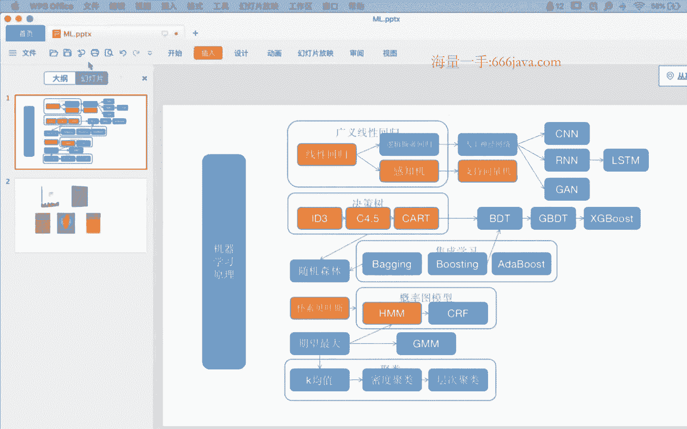

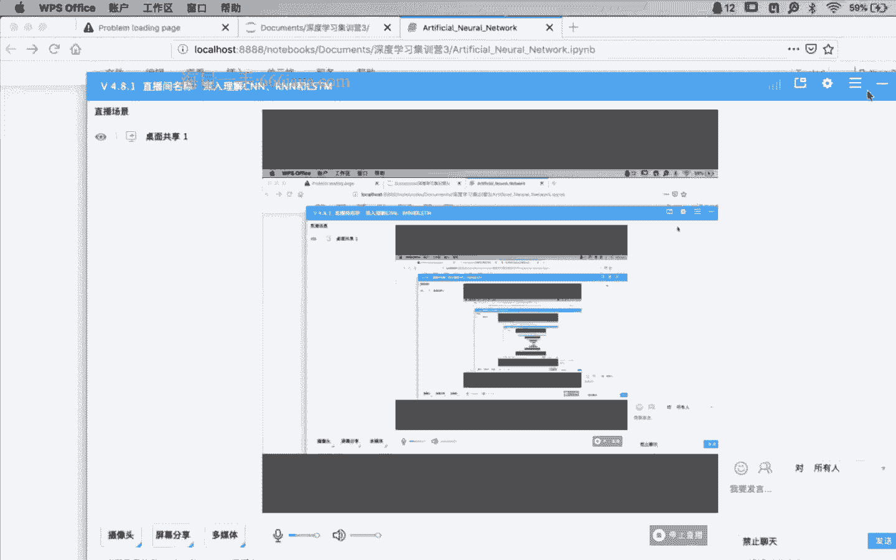

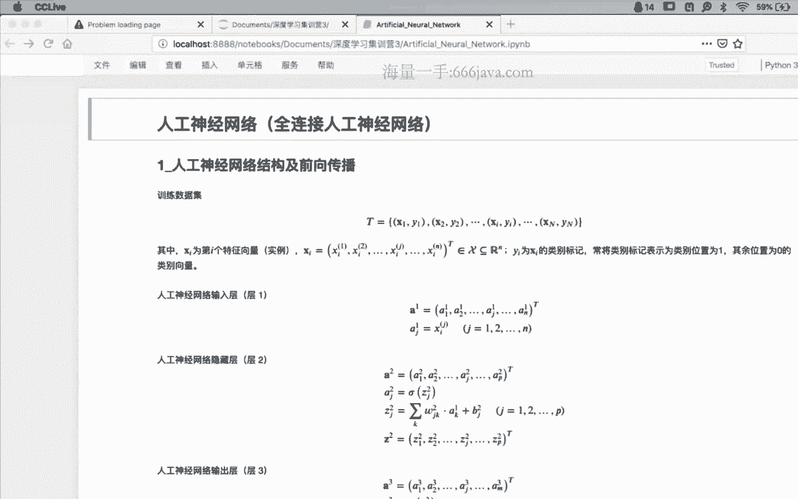

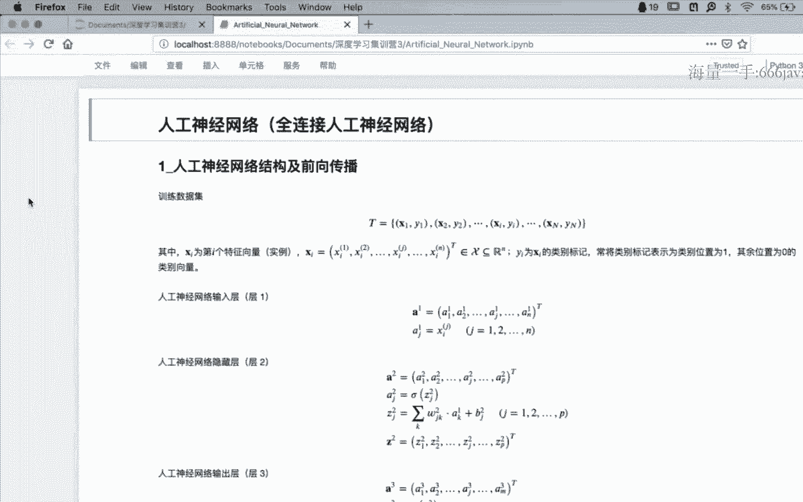

世界上有很多的东西，生不带来。

死不带去，你能带走的只有自己和自己的脾气。

你曾拥有最美的爱情。

你听过最美的旋律。

触摸过一个人孤独的恐惧，也看到过最美的风景嗯。

我跌跌撞撞奔向你。

你也不能一个人离去。

我们在一起说过，无论如何，一起经历了风雨，安安静静的老去，嗯，世界上有很多的东西，对我们的这个权值和偏置进行一个调整，这就最简单的一个过程，那我们看看就根据假设啊，假设啊，假设你拿到的一个模型结构。

就是我们现在材料里面所描述的，你怎么样把它更加的形式化啊，画出图来好吗，那首先我们可以看到我们拿到的数据集，是t对吧，我们的特征数据，以及我们的每一个特征数据，上的一个标记啊，数据集上的标记。

这个地方我强调一点啊，强调一点，有黑体，有非黑体，黑体代表的是什么，而y是一个呃我们的分类标记，它是一个标量，这个地方强调一点啊，强调一点，读论文的时候一定要分清楚啊，哪些量是向量，甚至是矩阵。

哪些量是标量，哪些量是如果是向量的话，多少v如果是矩阵的话，是几乘几，为什么这么说呢，因为在原理的，比如说数学公式当中啊，数学公式里面是没有所谓的数据类型的，这个地方多说一点。

而我们在代码里面必须要明确地指定，每一个数据的数据类型，这就造成了一个困惑，这也是有同学可能会不太啊，有的时候不太觉得不太顺畅的地方在于啊，都是x，有的时候甚至这一这里也有x一堆，x都是都是什么东西啊。

分清楚，有的是向量啊，是一个数据结构，有的就是个标量，是个数值，那么在此我们拿到的数据集里面，x就是我们的一个特征向量，由n维特征所组成的一个特征向量，注意商标转置矩阵，转置向量。

把它11转成一个列向量，通常情况下哈，所有的向量哈都是列向量啊，这是默认的啊，这是默认的，然后呢，它是属于r n n维的实数空间，里面的一个像素点，这是关于x的说明，我们以分类问题为主啊。

以分类问题为主，它作为一个x的标记，但是呢通常情况下，我们需要把这个啊标量的标记类型，转化成一个所谓的one hot编码，这个我觉得大家都应该能够理解了是吧，转换成一个mv的一个one hot编码啊。

那这样的话我们就有了啊，一个从n维向mv空间的一个，映射的一个需求啊，这时候就是我们用全连接，的神经网络来做这个工作，那下面我们拿到的神经网络，我们知道啊，全链接的最少分三层，输入隐藏和输出啊。

细节的地方呢嗯多少会有一些就是差异性，就是你可能看这篇论文，看待一篇paper不太一样，那就以我们现在的材料为主啊，就以我们现在材料的为主，我们看一遍，我们过一遍，首先呢你可以看到啊，是作为第一层啊。

作为输入层第一层他要做哪些工作，做的工作很简单，存储在我们的a当中，aj当中啊，这就是一个从x向aj的一个输入过程，然后呢这是一个特征啊，一个维度一个维度的进行输入，那最后组合成我们的一个输入向量a啊。

这上面上标的一代表的是第一层啊，第一层从一嘛，第一层用商标来表示，那下面有个问题啊，就是这段啊数学描述，你怎么样把它画出来的问题，我觉得这个个人不同有不同的画法，但是我们可以简单一点，我们先看一下。

首先是首先我们是有特征数据x，那这样的话它是由x1 d为x2 ，d2 为d。二，一直到x n d n为，然后呢每一个是由a一的d为a一的，第二为d a点，由a一的dn维，来组成很简单。

他只是做了一个简单的复制工作，所以我们直接就可以把它进行一个赋值，所以，ok啊，现在啊大家可以看一下qq里面啊，把这个图已经发过去了，大家能看到吗，可以吗，那大家看看是不是简单的。

我就可以按照这样的一种形式化的方式，把刚才那两行数学部分，把它转换成一个图示的部分对吧，就是从x向a的一个输入过程，没问题吧，那我们继续哈，这个我觉得问题不大，我们继续，那第二层怎么办。

第二层第二层是所谓的隐藏，这个时候我们需施需要稍微停一下啊，稍微停一下，因为我们知道，前面我觉得大家应该很清楚的，就在于，神经网络当中最核心的元素，是所谓的神经元啊，由若干个神经元进行层的一个排列。

然后各个层之间进行连接所构成的权利，全连接的神经网络，那这个时候神经每一个神经元，其实就是我们前面的一个logist回归是吧，那这个关于罗杰斯的回归啊，可能知道，那个时候我就一直一直在强调。

逻辑回归应该是怎么画出那个图来是吧，画出那个图来，那这个时候我们就把那个神经元，一个一个的啊，安到我们整个的神经网络当中去，这就可以了，那怎么怎么去表示这个过程，我们看一下，那你其实可以看到哈。

首先我们是有一个呃，我们知道啊，在神经元当中有线性部分，有非线性部分，那首先我们需要处理的是线性部分是吧，首先处理的是线性部分，线性部分呢我们把它放到z2 当中去啊，放到z2 当中去。

z2 呢也是也是一个向量啊，也是第二层的一个线性部分，也是个向量，展开以后是z r1 z2 ，一直到z2 p，那这个时候其实我们也可以把它画个图上，画个图，z r e z r i点点一直到z2 p。

稍微等，是这样在qq里面发过去了，z2 p，那现在问题就是，我们现在需要建立的是，刚才在第一层所接收的那个a1 ，和，现在在第二层这个线性部分的z2 ，之间的数值关系，这个数值关系其实是有表述的是吧。

是有表述的是怎么来算的，它是在a一的输入的基础上，乘以相对应的全值，这个时候这个全值的概念，我们在啊逻辑回归当中是有的是吧，输入之后成全值，然后进行我们的累加和累加，其实你会发现这个表达式。

就是我们逻辑回归当中的线性部分嘛是吧，线性部分上一层的输入，然后，乘以全职进行一个累加加偏执，作为我们的线性部分问题啊，我们看一下a2 g，说明的是在a2 这个线性向量当中，的第j个元素当中。

假设我们这个时候a2 g在这，啊a2 d，因为我们知道呃g作为一个循环变量，它是代表的是从一到p当中的，任意一个位置是吧，假设我们就在那个位置上好吧，它是怎么计算得到的。

它是由a1 k乘上它所对应的全值，这个时候那个k是谁，k很显然是第一层输入的下标是吧，假设呢我们还在这a1 ，ak那么ak所对应的那个全职，就是所谓的w2 j k注意下标啊，特别是注意下标。

那个时候w是在这先发送出去啊，看一下w是在那个地方，有没有同学注意过这个，下标的顺序的问题啊，来如果稍微一听，有没有同学注意过这个问题啊，或者说是啊直播软件里面，你会发现这个这个下标是怎么定义的。

这个w的下标是双下标是吧，是谁在前，谁在后注意过吗，那我，可能需要稍微等，没问题啊，就稍微等，很好啊，后一层的下标再签，上一层的下标在后，所以你会发现w的下标还是w j k对，wj k这是细节的地方。

因为你后面做做反向推导的结构之后，就反过来了，所以怎么回事，这个一定要清楚这处理的哈，这处理的仅仅是一个啊，就是a e k和a2 j这个它们之间的连接，很显然前面有一个西格玛里加。

所以这个时候我们应该清楚的是哎，正好我我顺便问一下啊，正好我顺便问一下，a一和a2 g之间的，那个全职w下标应该怎么表示啊，应该是w j1 ，第二层都在前嘛是吧，那么a e n那个w应该是w什么w j。

嗯对很好啊，所以应该是长这样是吧，长成这样，那么不要忘了还有一个谁来着，还有他否定的那个什么，兜里加起来啊，兜里加起来，还有那个a2 g它所对应的那个偏执啊，这个地方，你就是记着还有偏执是吧。

这样的话我们就处理完了线性部分，就处理完了线性部分，那线性部分处理完了以后，你会发现每一个z部分都计算出来了，它的上一层的线性部分，那非线性部分怎么办，也很简单，就是把它所对应的线性部分。

进行一个非线性映射，通过ci的函数扔给我们的a2 j是吧，这个时候怎么办，那么它所对应的a2 j前面是a21 ，a22 ，第2。21直到a2 j，然后第2。1直到a2 p，那这个时候非线性映射肉出来。

就可以了啊，这样的话我们就完成了第二层，第二层所谓的隐藏，从第一层的输入开始，进行线性部分的累加和，然后进行非线性部分的映射，那好了，有了第二层的这个逻辑关系以后，我们继续往下看，第三层类似哈。

第三层类似，同样还是我们的线性部分以及非线性部分，线性部分呢还是以上一层，第二层的输入作为我的输出，作为我的输入，然后乘以所对应的权值就可以了，所以应该是什么。

应该是z31 z z32 点点一直到z3 k，然后呃z3 g一样，z3 g点点一直到z3 m啊，z3 ，m同样，其中有一个叫做前面是a2 k的一个向量，那全值还是那个问题啊，还是那个问题。

来我们看看那个qq上的截图哈，q上的截图你会发现还是那个问题，就是嗯就是呃我们把这个呃后一呃，后一项的这个呃非线性部分，然后一项的线性部分，要和前一项的这个呃输入，作为一个全职的一个连接。

这个连接还是什么，还是那样注意下标还是那个w g k，这个时候呢为了区别是哪一层的全职，所以这个时候我们用上标，w3 来进行表示啊，用w3 来进行表示，那这样的话呢我们就完成，了。

那我们就完成了从第二层，向第三层的线性部分的一个累加，这样的话还是那样，我们需要把它累加起来，累加起来，那同样非线性部分怎么办，同样所对应的a31 a32 ，a。a到a3 j一直到a3 m。

这个时候我们只需要相对应的，一个一个的做线性映射就可以了是吧，做线性映射就映射出去了，o，那这样的话，我们就完成了第二层的线性部分，以及非线性部分的计算，那第三部分怎么把，然后输出怎么办。

我们总需要有一个输出吗，输出也很简单哈，预测输出也很简单，就是把我们，的a3 g直接赋值给我们的预测输出，作为我们的预测输出就可以了，那这个时候你怎么把它画出来啊，你赋值嘛，你只需要一个一个的对应。

对应的特征维度上，进行一个赋值就可以了是吧，所以应该是y hat 1，y hat 2点点，一直到y hat m，这样的话一个一个的输出数据就可以了，那这样的话到此为止，到此为止，我们就完成了。

从输入端x一直到预测输出y的一个，前项的计算过程，那你会发现啊，你回过头去啊，你回过头去再看一下这一大段代码，第二层，第三层以及预测输出层啊，这一大段代码我们可以通过一个图啊，通过一个图把它画出来了。

有同学说你这个图也画的花里胡哨的是吧，也不是特别的幸福，但是你会发现，整个图当中的每一个符号部分，都表明了我们数学公式当中的一部分啊，虽然说可能会有些乱啊，没问题啊，我建议同学们啊。

我建议同学们就像这样，你回去以后碰到一个新的模型或者，网络的时候，回去以后找张白纸，找支笔啊，你看代码的，看原理的同时，甚至有后面我们可以看到你看代码的同时，你大脑当中。

或者你你随手就可以把这个图把它画出来，那画出来之后你会发现诶，有了图就更加的形象化，那这个图干什么用，一方面啊，我们可以前项计算完成了，那下面其实大家可以看到啊，可以看到对我们的反向传播的理解啊。

是有很大帮助的，是有很大帮助的，为什么这么说呢，一会儿我们再看一下关于这一部分，关于这一部分有什么问题吗，我们可以稍微一听，有没有问题的这一部分，可以吗，ok，好那我们就继续哈，那我们就继续。

那当然在这个过程当中呢，那个映射函数啊，那个非线性映射函数，我们在这个地方就是一个贸易的函数啊，这个我们常见了是吧，常见了知道就可以，但是需要注意一点的是，给当我们给出了函数形式以后。

我们认为这个函数就是被确定了是吧，一会儿后面我们说为什么强调这一点，那一会儿我们再说好了，那好了，我们继续往下啊，下面其实就是呃，就我们就我觉得就很很正常了，因为我们有了预测输出y hat。

有了预测输出y hat，那么还有它所对应的实际的输出y，那这样的时候免不了我的预测输出，和实际输出之间就是有差值，那出现了误差，那是太好的一种情况了，我们就是要根据这些误差去调整。

我们整个模型当中的参数w和b对吧，那这样的话我们定义所谓的损失函数，我们我们先用平方损失啊，我们先用平方损失，平方损失展开以后应该是这样对吧，每一个特征维度上的实际输出。

y i y j和预测输出为hg之间的差，值的平方进行一个累加，然后乘以1/2，这样的话每一个x来了以后，我都会计算出一个它所对应的一个误差，那这样的话，当我在数据集当中，进行了误差的累加。

就作为我整个数据集的误差，没问题吧，这个关于这个损失函数的定义，这个也应该问题不大，那好了，当我们完成了前项计算，当我们完成了损失的定义以后，下面我们就可以来完成所谓的反向计算了，反向计算了。

那我有一个问题啊，我有个问题，反向计算的目标到底是在干什么对吧，一定是这样哈，因为特别是细节部分很繁琐啊，你大脑当中需要记很多东西，但是千万不要忘了你的目标，这个脑子里面一定要时时刻刻揪着这根弦。

我到底在干啥，有的时候有些算法模型很复杂，特别到了细节部分你都进，就像进入一个迷宫一样啊，你都不知道，有的时候偶尔就会发现，哎哟我看了半天到底在干什么。

所以到此为止啊，我就有个问题想问一下大家，当我们完成了啊，前项计算，整个的神经网络结构我们构建起来了，图已经画出来了对吧，误差函数，损失函数我们也已经定义完了，下面，一步我们当然是所谓的反向计算。

误差的反向传播，那误差反向传播的目的到底是为什么，来谁能给我简单的介绍一下嘛，qq里或者说是直播软件里面，能能简单的111句话，或者半句话能说明一下，反向传播传播误差没问题是吧。

那他最终的目的到底是干什么，就是误差的反向传播以后，我们到底拿着这个误差，到底拿它有什么用啊，来咱咱们在群里或者说是qq里面，我们简单的说明一下，我希望因为直播的时候，我希望能够和大家稍微有一点互动啊。

但因为我需要看一下大家的一个反馈，的一个情况好吗，看到了ok，修改每层的w对每层的权重的梯度求对，ok嗯很不错啊，我们的目标其实很明确，就是通过我们对误差哈，通过对误差的累积。

然后传播所谓的嗯传播传播误差向前传播，然后有了误差啊，有了所谓的误差，我们就可以再进行偏导计算以后啊，进偏导计算以后，对我们的全职也好，还是偏执也好，进行一个更新了是吧，所谓的梯度下降嘛。

梯度下降的目标就是所谓的求偏导，然后呢根据偏导方向，我们不断的去减小我们的这个啊，有全职所造成的误差是吧，很好啊，ok好了，有了这个认识以后啊，目标大方向没问题，那下面我们就是一些具体的细节的计算的。

过程了是吧，那好了，首先引出上一个很很讨厌这个东西，就是所谓的误差的一个一个定义啊，德尔塔怎么怎么怎么怎么怎么出来的啊，就是它是呢我们的x的损失，对我们的z l的一个偏导值，被定义为我们的所谓的误差。

这个地方的l啊，这个地方的l你可以看到l等于二三，很显然这个地方是，我们只是在第二层和第三层上有误差，第一层层上是没有误差的，因为它是直接是一个传值的赋值是吧，传值赋值是没误差的，那这个时候很显然。

在第二层，隐层和第三层输出层上产生了误差，那每一层的误差呢，我们都定义为损失函数，对我们的线性部分的一个偏导值啊，就是所谓的误差，那这个时候我再问一下同学们，这个东西我们经常见啊，也很经典。

这个东西他又是个什么东西啊，啊我直接说结论啊，这个我直接说结论，他只是为了我们求解最后的梯度的时候，中间的一个数学量，或者说是一个中间的一个数学符号而已，能明白什么意思吧，就是说他其实你就可以把它认为。

就是后面我再求偏导的时候啊，我对w或者对b求，偏导的时候那个数学公式太长了啊，不不太就是不太好理解，也不太好考，考好计算，那这个时候中间有两个值，我把它单独先提前计算出来。

为后面的计算带来一定的计算上的，形式上的简便啊，就就只是而已，仅此而已好吗，那好了，既然我们可以看到啊，既然可以看到我们的误差分两层，第二层，第三层，那我们就每一层讨论一下，它的具体形式就可以了啊。

那我们先看第三层误差的反向传播，那一定是先从最后第三层开始是吧，一定是先从最最后第三层开始，那这个时候看先看第三层误，差怎么计算，因为上面是个定义啊，上面是直接是个复制定义。

然后我们直接把它求一下就可以了，那么看一下c x对z3 ，这样的一个偏导计算怎么求，那这个时候的球呢，唉结合了图，我们再看一下，结合的图，有的我们再看一下cx在哪，cx是我们的实际输出和预测输出的差值。

所以它一定是出现在最后一层，你可以认为是在这儿，然后呢z3 g在哪，z3 是第三层的线性部分，换个颜色啊，对吧哎画图的好处啊，就在这个地方就体现出来了，你可以看到误差是在最后那一层上。

z呢是在第三层的线性部分，你发现没发现他们两个挨着不挨着，他们两个不是直接挨着，中间还有个谁，中间还有个a a3 a3 ，第三层的那个非线性部分是吧，所以从这一点上你也可以看到。

我要从c x要对z3 进行求偏导，那这个时候我直接过去过不去了，那怎么办，中间还有个a嘛，踩着他不就过去了嘛，所以链式法则在这个地方的实用，是非常自然的对吧，你从图上去看，我对z求偏导。

我可以先对a求偏导，a带对z求偏导不就完了吗是吧，所以你会发现那就是这样来干的，所以我们先用c x对a3 g进行偏导计算，求出来之后再乘以a3 g，对z3 g的一个偏导计算链式法则吗，结合了图。

这不显而易见嘛是吧，那好了，就分别讨论一下这两个乘积部分就可以了，c x等于3g，因为他俩紧挨着一定是有数学上的关系的，我们稍微一放，a3 g和z3 g也是紧挨着的，他们也肯定是有数学上的关系对吧。

我们只需要建立这些量之间的数学表达式，我觉得求偏导这就不是问题了，你只需要用我们的分母，表征成上面的分子部分，然后求偏导不就完了吗，那我们先以这个为例啊，先以后面这一部分为例。

a3 g和z3 g之间什么关系，这个时候就需要找一下a3 g和z3 g，数学上的公式告诉我们，他们直接就是一个非线性映射部分，那我们要对z3 j行求导怎么办，直接不就对肉求导不就可以了吗，所以你会发现。

所以你会发现这一部分的求导计算，因为有了数学公式在这里帮忙，所以我们直接就可以表示成a3 z，对z3 z的求导就是容易到z3 g，这没问题吧，然后继续往下往前看，这一部分可能稍微复杂一点啊。

可能稍微复杂一点，我们把c x展开，因为我们前面看到了，有标准的这个在这儿啊，我们前面已经定义了c x的形式，我们把它展开展开以后，你就会发现诶这个里面有y j和y hg，好像和a还没什么太大关系。

但是不要忘了前面我们还有一点什么来着，往前倒哈，往下看，你会发现y hg和a3 g是不是相等的，换句话说你就可以把所有的y hg用a，3g进行替换了，所以这个时候你会发现我们展开以后。

这个地方的one hg其实就是a3 j那好了，这不就是函数表达式，对其中的一部分变量部分求偏求，求偏导不就可以了嘛是吧，这个时候我们可以看到，二提前1/2约掉，然后其中西格玛这一展开。

其中dj向上对a3 g进行求偏导，这个时候这是个常量啊，前面有个-1，所以下来以后是a3 g减去y j没问题吧，啊这个地方有个负号的一个交叉是吧，然后再乘以前面那一部分。

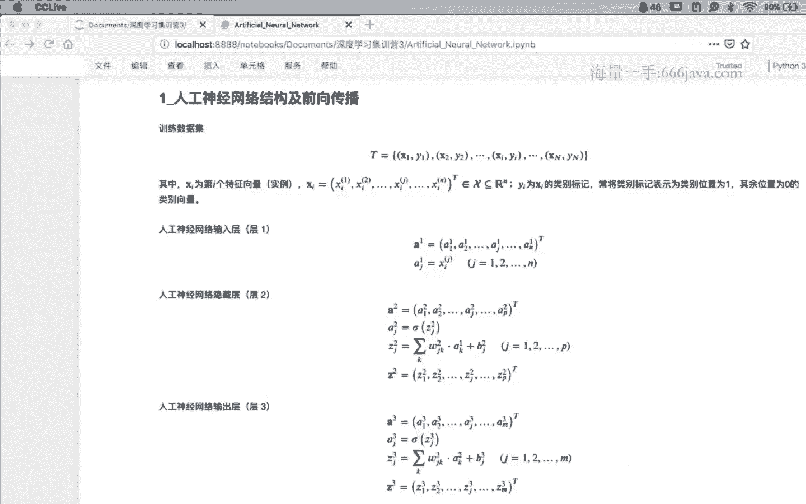

那么我们得到的不就是这个量吗，啊细节部分其实，就仅仅使用链式法则，但是这个链式法则在图上一结合，你会发现他在图上的一个结合，你就会发现，其实我原来是插了中间插了一个同学。

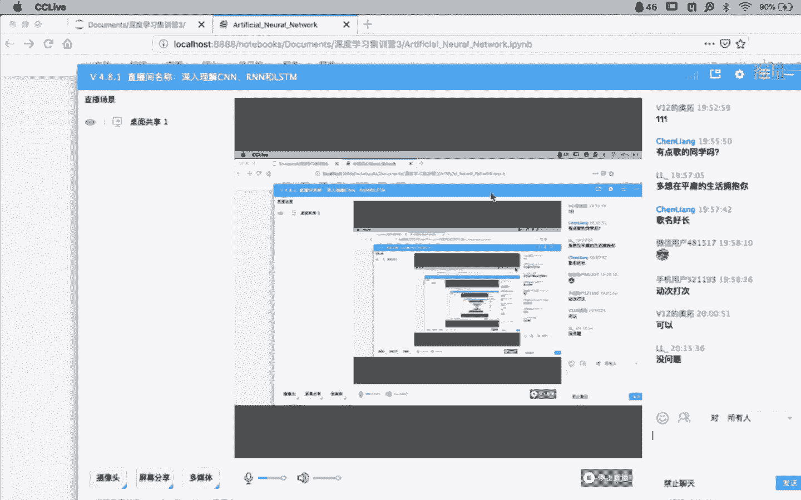

那我直接过不去怎么办，我先对a求偏导，a在对z求偏导不就完了吗，是吧好了，这是在最后一层上啊，这是在最后一层上，输入层，第三层上，那么同样的原理啊，同样的原理我们在处理第二层可以看到啊。

在第二层的误差上，它是这么定义的，是c x对z2 这的一个偏导计算，我们还是那个老问题啊，就你先看看你在哪儿，然后你要到哪儿去，然后你再，讨论我们怎么过去的问题好吧，cx在哪，刚才我们可以看到啊。

c x还是在最后是吧，cx还是在最后，麻烦就麻烦在这个z2 g在哪，z2 g啊，跑前面去了，来大家看看是不是这样一个在后面，一个在前面更更往前更往前，那怎么办，没问题啊，你就这么往前倒呗是吧。

你不链式法则告诉我们，我们顺着这个顺着这个逻辑链，我们一点一点的往前倒就可以了，所以呢圆是一点呢，其实我们可以看到，我们可以先对a1 a3 求变的a3 ，对z3 求偏导，z3 对a2 求偏导。

a2 对z2 求偏导是不是就过去了，但是呢，哎，因为我们刚才已经把误差已经往前推进了，一部分，已经推进到了cx对z2 z3 的一个偏导计，算，这个值我们已经知道了，那其实也就是往中间这个这一部分啊。

中间中间这一部分其实我们已经求完了，那我们可以从这个地方，作为我们的起始位置开始，再往前求不就可以了吗，中间又插了个谁，差了一个a r，你可以看到不就差了个a2 这一层吗，那同样还是链式法则告诉我们。

我们只需要从z3 到a2 求偏导，a2 对z2 求偏导，这不就完了吗，那结合的代码部分，我们先不管这个西格玛，先先不管前面这个呃sam我们先看后面这嗯，先处理一下前面这个c some。

处理下前面这个some这个sam什么意思啊，这个地方需要稍微讨论一下，就在于因为我们在前项的计算过程当中呃，是有一个累加过程的，是有累加计算的，换句话说，一部分的体现，它是通过反通过这个非线性映射部分。

然后再进行线性部分的累加得到的，所以这个时候呢，叫做全导数公式的一个东西啊，全导数公式，全导数公式告诉我们，当我们在处理刚才上述问题，就是说我们在进行反向，就我们在进行这个梯度。

这个这个偏导计算的过程当中，如果啊我们要求偏导的那个量，它之前依赖依赖了多少的量，我们都需要把它们进行一个累加啊，这个呢这个全导数公式呢，有兴趣的同学可以查一下好吗。

就说这个这个sam是要进行一个累加的，那这个时候我们分别看一下，后面这两个乘积，后面这两个乘积，其中啊其中这个c x对z3 的偏导计算，我们刚才已经完成了，所以这个地方是达尔的三，是已知，的了。

那麻烦就麻烦在在z3 对z2 的求偏导上，那怎么办，我们可以把还是那样把它展开嘛，展开看一下z3 等于什么，z3 等于什么，我们往前倒啊，找找z3 在哪，v3 在这儿，它在形式上是等于这个公式是吧。

那我把公式就落下来，公式公式就落下来，落下来之后是落到这样哎，注意点不太一样的地方在哪儿，有同学注意到了吗，哪儿不一样，有有同学能不能给我解释一下，这个地方为什么是w3 kg啊。

你有同学前面不是说诶不都是jk jk吗，这个地方怎么变成k j了，来我们还是稍微一，停啊，就是但凡是咱们稍微一停的地方，都是一些细节上，所以需要特别注意的地方好吗，那还是那样，谁能给我呃，简单说明一下。

咱们稍微一停好吗，就是问题啊，我再重复一遍，就是问题是，为什么在这个地方的公式里面，变成了w k j下标变成这个东西了，我稍微一等好吗，嗯同学们可以组织一下，因为这个可能稍微稍微稍微稍微。

嗯有同学传播的方向变了，下一层是k所以k在前对这个没问题啊，就是我们的反向传播之后，你会发现我们在前面的循环变量，是用k来表示的是吧，前面是循环变量是用k来表示的，那么很显然我们k是作为我们第三层的啊。

第三层那个循环下标，这个时候他应该是放在前面，它应该放在前面，而它所连接的上一层的那个下标，我们是用g来表示的，所以一定是w3 kg很好啊，这个细节部分一定要注意啊，为什么这么说啊，这个地方先说明一下。

就是说我们学到这么细节到底有什么用，对吧，有你应该知道啊，当你把所有的数学原理搞清楚以后，甚至你可以不借助框架来实现一个，全链接的神经网络啊，后面哈，就是我明天或者后天我稍微整理一下，给大家发一份啊。

你看一下你是不是仅依靠，比如像南派这种基本的组件数组，你自己手写一个全链接的神经网络，这样的话你感受一下，你学这些原理部分能够通过代码复现出来，你会发现哦，原来确实是啊，它是按照这么一个逻辑的计算好吗。

ok啊花回来啊，我们再回来好了，展开以后啊。

展开以后，那好了，我们需要对z2 g求求偏导，你会发现哎，z2 g已经出现在我们的公式当中了是吧，公式当中了，你你就把他这秋天倒呗，反正这个式子里面只有他带着，那这样的话，我们知道前面当中其中某一项啊。

适合这下标是一样的，所以前面作为一个系数啊，作为一个系数提出来，然后这个地方其中若要求一倒，然后是z r g，然后面乘一个a2 的3k就可以了，那这样的话第二层和第二层跨了一层的。

这误差我们也已经计算完了。

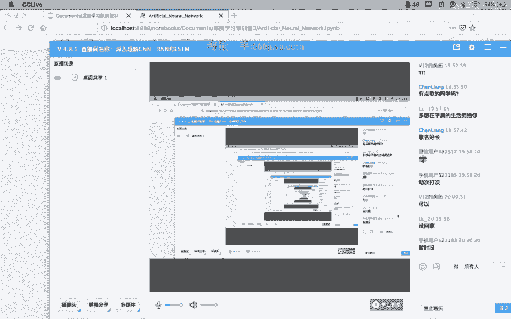

那前面我们两步啊，前面两步我们，完成了第三层的误差和第二层误差的计算，还是那个老问题，这两层的误差计算，仅仅是为了后面我们对w和对这个b啊，对我们的权值和偏置啊，求梯度的时候啊。

为了计算方便而计算出了这两个误差，而计算是两个误差，那我们看看这两个误差值怎么用，那就看一下，那么损失函数在隐藏层，第二层和输出层，第三层关于偏执的梯度计算啊，为什么这个地方第二层和第三层。

我们可以一块儿算，其实你通过上面的分析，你会发现这两层是有一个呃非常类似的，就是非常非常像的一个关，系都是在进行线性部分的累加，然后非线性部分的一个映射，所以呢我们可以从形式上一次。

把第二层和第三层的偏执，以及这个全职的表达式都可以写出来，我们看一下cx对b的一个偏执的梯度，我们可以表示成还是那老问题啊，还是那个老问题，链式法则嘛，我们先可以对z求偏导，然后z对z求偏导对吧。

然后呢我们可以看到cx对z的偏导值，我们前面的那个对偏导值，我们前面通过误差值，其实都已经计算出来了，不管你是第二层还是第三层，我cx无非就是对二和对2~3的问，题是吧，好这一部分计算完了。

那么下面我们需要处理的就是，z对y的偏导值计算，我们前面也见也可以看到哈，那我只需要把z展开啊，我只需要把线性部分展开，展开之后，会发现前面这一部分是没有和b没有关系，只有一个b那这样的话。

一求偏导就变成了几，变成了一，所以这个时候和前面的单差一乘，只剩下了所谓的误差部分，也就是说，不管你是第二层还是第三层的偏置计算，只和当前层的误差是相等的，好这是关于b的梯度部分。

那么同样关于w的梯度部分，那么同样还是用，链式法则，先对z求偏导，然后z对w求偏导，展开以后，展开以后，我们会发现我们在每一次啊，每一个循环过程当中只有一个啊，al减1k就是上一层的非线性部分和。

是作为我们的系数部分，我们只需要把它提出来，那和我们的这个误差部分进行一个乘积，也就可以了，那这样的话我们就完成了对我们的偏执，以及对我们的全职的一个梯度计算，那有了梯度以后。

我们就可以按照梯度方向进行一个收敛，对吧，直到循环结束，我们就可以找到整个参数空间里面，所谓的最优解的位置。

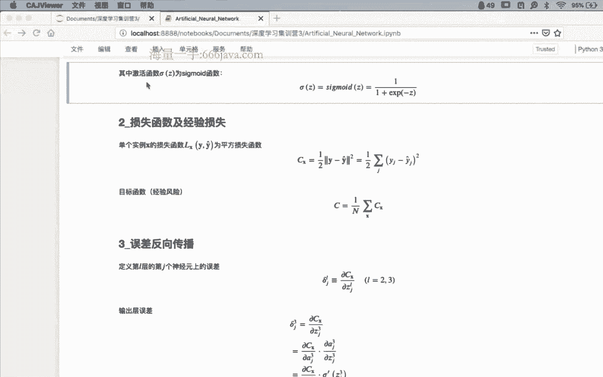

好吧，那这样我们看一下这个误差，反向传播算法啊，首先第一步输入实例x，然后呢为输入设置所对应的激活值a1 ，就是我们把x输到a里面对吧，x复制a然后呢前向传播过程，对于每一个l我们有两层。

一层一层一层输出层，分别计算它的线性部分，以及它的非线性部分啊，第二层线性部分，第二层的非线性部分，第三层的线性部分，第三层的非线性部分，这样的话我们就把a通过前项计算，传播到了输出层。

有了输出层次以后，我们反过来通过计算所谓的损失啊，计算我们的误差计算先，计算第三层的误差，然后计算第二层的误差，有了这两个误差以后，根据前面的分析，我们可以得到损失函数。

分别对偏导而偏执以及全职的梯度方向，然后我们有了梯度方向就可以进行收敛。

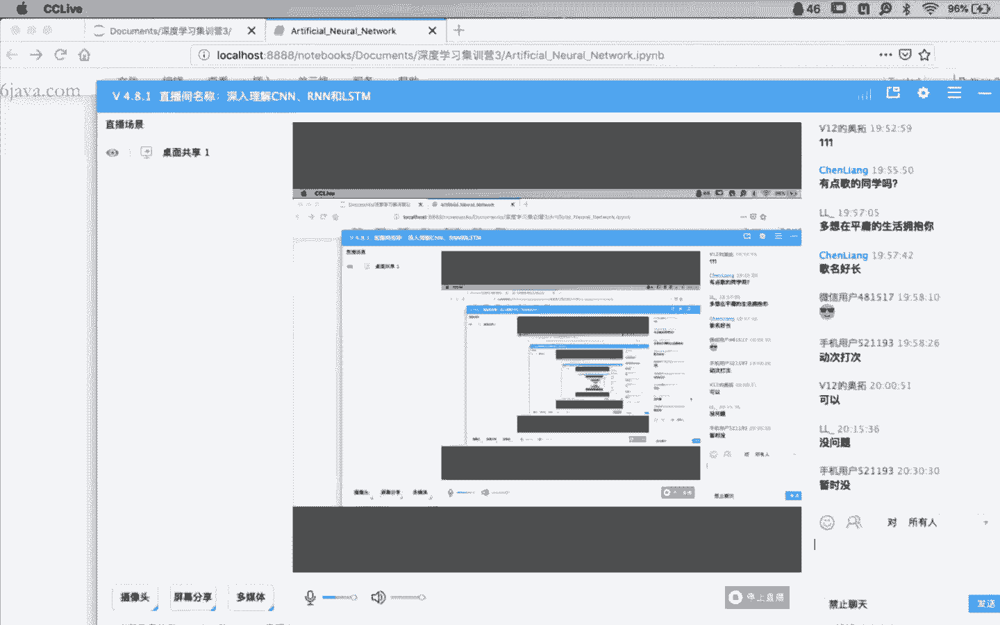

所以梯度下降了，这样的话就完成了哈，完成了我们刚才所说的从数学原理公式，像我们整个的图示的整个的映射过程，你会发现在整个的分析过程当中啊，在整个的分析过程当中，我们其实是借助了这个图对我们的一个帮，助。

对我们原理的一个理解啊，而且呢这个图里面每一个符号你画图的时，候你脑子里那根弦儿一定要绷紧了，它到底是哪个符号，这个符号到底是怎么来的，一定要和你的数学公式，一个一个的严格对应起来。

这样的话你在进行分析的时候，有图有公式啊，这样都对你的这个理解是有帮助的，好吧好，那这样的话关于这一部分，我觉得应该问题不大，那继续往下继续往下哎，有意思的地方在下面啊，有意思的地方在下面，其实在啊。

有没有同学注意到啊，其实有没有同学注意到，其实我有意的在进行误差，反向传播的过程当中，使，用了两种不同的符号体系来说明这个问题，哪两个不同的符号体系，你会发现在第一步里面，因为非常简单哈，因为非常简单。

直接是实力x输入到我们的a1 ，第一层里面去，所以你会发现在第一步的时候，我用的所有的x也好，a也好，都是什么东西啊，都是向量，而从第二步开始，第二步，第三步，第四步，第五步开始，所有的量都是什么量。

都是标量，是这样吗，是这样吗，同学们啊，也就是说啊，什么叫细节啊，就是你把所有的量都展成标量形式，那这个时，你都必须要一个一个非常的仔细，才可以仔细到什么程度，就像刚才那样，你画完图以后。

你的数学公式不一样啊，这是标量展开非常的细节的地方，只有这样啊，你再把它映射成代码才可能是可能的，能明白什么意思吧，你你你想划水，你划过去，你想糊弄过去，糊弄不过去啊，你这东西怎么糊弄啊。

你整个算法你全乱套了，那下面就有个问题啊，下面有个问题，我既然可以使用标量形式，描述我的一个算法，那我是不是可以使用抽象，层次更高的向量形式来表示我们的算法呢，当然是可能的，我们看下面啊。

看下面刚才是误差计算啊，刚才是误差计算，那我们现在把误差计算，整合到我们的梯度下降算法里面去了，而且呢在梯度算法里面，我们借助向量形式来表示我们的算法好吗，一会儿啊为什么要这样做啊。

一会儿为什么要这样做，你我们再解释啊，先看第一步，我们用向量形式来表示我们的梯度下降，算法怎么表示，我们看梯度下降算法，第一步输入训练集合，你就不管，然后呢，对每一个训练里面的实例x来可以发。

现这里的x就是一个向量x黑体的向量x，但是你脑子里边应该很清楚的，就在于这不是一个值，这是一个很长的特征，一个特征维度的向量，然后呢设置对应的输入，激活ax 1，它等于x，换句话说。

你可以认为是把x赋值到ax一里面，或者换句话说这个地方x你可以不要的话，就把它赋值给a1 ，就是把x复制为一向量之间的赋值，要对每一个维度的对应位置进行复制，然后并执行下面的步骤，什么步骤诶。

继续往下看，前项计算倾向计算其中的线性部分，我们可以表达成a z x l很显，然这个地方的l是从第二层开始，第二层，第三层一直到最后一层大l层是吧，注意这些也是一个什么，这也是个向量。

向量里面每一个元素啊，向量里面的每一个元素都是，按照我们的w l乘以a x l减一，因为我们知道从第二层开始，它的线性部分都是一上一层的非线性部分，a作为输入乘以什么乘以全值，再加上偏置。

只不过呢哎我把它写成一个向量形式，但是需要注意一点，这里的w不是个向量，而是个什么东西，20个矩阵，20个矩阵应该是大写的，w王应该是大写的w啊，是个，矩阵，然后呢线性部分完了以后。

非线性部分就是对线性部分的一个映射，这个时候直接对向量z，进行一个非线性计算，那其实也就是对每一个元素，进行非线性计算，这样的话从第二层开始，第二层，第三层，第四层一直可以传递到第最后一层，第l层。

那么同样我们继续往下误差怎么计算，误差的计算，前面其实公式也也看到了，首先是cx对我们的a啊，线性非线性部分求偏导，然后呢我们的的映射函数求一阶导，然后呢进行所谓的大号码机，就是对应元素乘积就可以了啊。

然后呢就是我，们的在第二层，第三层一直到啊，这是最后一层啊，这是最后一层，我们的误差，有了这个作为基础以后，有了最后一层的误差，作为基础以后，我们就可以按照我们前面啊，这个公式呢稍微复杂一点。

但是会对应一下前面是没问题的，就可以计算l减一层，l减二层，一直到第二层的逐层的误差，这个时候的误差啊，其实你会发现，全部都是使用的矩阵和向量形式来表示的，最后有了这个误差以后。

我们可以计算我们的所谓的，就可以求他的啊梯度，然后有了梯度，我们就可以计算我们的梯度的，一个收敛的方向，在原在原有的基础上，按照收敛方向进行一个全职和偏执的调整，就可以得到了，梯度下降，算法不复杂。

我相信大家可能也都理解，我想说明的就是你会发现同样一个问题啊，同样一个问题，我既可以使用标量形式来表示，也可以使用向量形式来表示，那这个东西有什么用，有什么用，稍微一等啊，来啊，回过头来看一下啊。

我们看看啊，这是我们通常会看到的这个，神经网络结构输入层，隐层，输出层，三层是吧，但是你会发现，嗯稍微我们一会儿我再讨论，讨论这个问题啊，那是经常我们会看到这种图，看到这种图的时候。

你脑子里边应该很清楚的是，这很显然是一个什么形式，标量形式还是向量形式，标量形式，就像刚才我们看到他希望能够展示出来的，都是一些细节地方，那么大家想一下，如果按照向量的形式来表示。

我们的整个的这个模型的话，你会发现这其实就是谁，我一会儿啊，一会儿一会儿发送出去，你会发现我画框的这块其实就是谁，是不是就是x那个向量，x只不过向量里面的每一个维度，都是其中的一个所谓的数据。

那中间这个是谁，最后这个又是谁，中间这个我们作为隐藏，我们可以把它认为是谁，是不是可以认为是a2 ，可以吧，最后这一层是作为输出层，我们可以把它认为是谁，a3 其实a3 就是等于我们的y hat嘛。

没问题吧，啊a啊，其实是我们强调一点的话，他应该是第二层的那个a，然后呢，后面这后面这后面这个向量，应该是第三层的那个a对吧好了，那么你你你你你如果有了x a2 a3 ，就是用y以后。

你再把这个图再画画，你看看你这个图最后变成什么样了，x输入到谁啊，计算得到a2 ，由a2 计算得到a3 ，由a3 得到y hat，其实a3 就是y hat，所以呢我们再简化一下，发出去啊。

我先把把它发出去，那你会发现我是不是，最后就变成这个东西了，由x得到a2 ，由a2 得到y hat，因为这个地方的这个a2 和a1 ，a2 和a3 其实已经没有区别了，用过hhit已经表示了。

所以来同学们，最后你会发现哇塞，这么复杂的一个所谓的全链接神经网络，最后我们得到了个什么东西啊，就得到这个东西，这也就是为什么啊，就今天我们啊从开始到现在，得到了一个非常重要的结论。

就是细节部分就会大家回去，自己再扣细节去啊，我们的目的就是，从原来发现这么复杂的一个神经网络，全链接的神经网络，发现我们就得到了一个这么点东西啊，但是你你你脑子里边应该清楚。

这个黄框当中的每一部分都非常复杂，x这个向量它有n为，你可以把它展开，a呢是呃a是个隐藏的计算结果，它其实是非线性部分，它前面还有第三作为第三层，它也是由呃非线性部分进行线性部分累加。

之后的一个非线性映射所得到的对吧，你可以你可以把它再再转回去啊，啊你可以把它再展回去，但是这个东西啊，x a，然后是y hat，就这个东西以后啊，就是我稍微听，以后你会发现唉它就长这样了啊。

全链接的神经网络啊，全链接的人工神经网络就长就长这样，那好了，从这开始哈，我们稍微歪个楼啊，稍微歪个楼，你看一下啊，你你你自己看一下，你你你你自己想想，这是什么意思，同学们能想明白什么意思了吗。

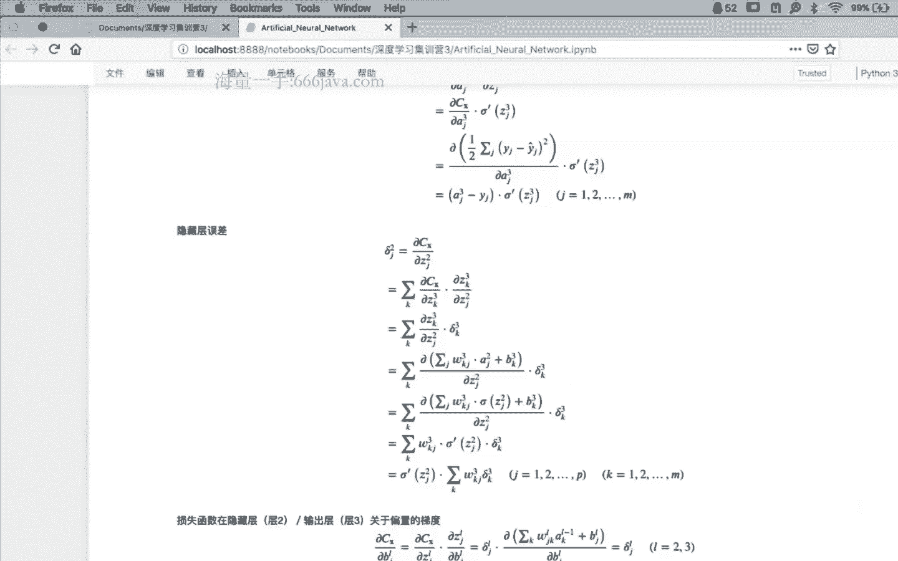

稍微歪个楼啊，两分钟一会儿，我们其实这是这，这今天你会发现。

就这不就这不就是什么东西啊。

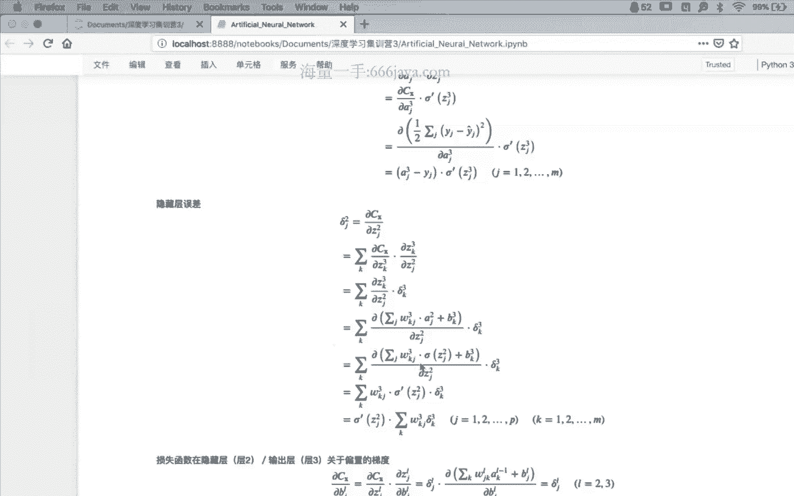

就是r我们费了半天劲哈，我们费了半天劲，你会发现，当你能够能够很自然地，把全链接的人工神经网络，抽象成所谓的向量表示形式以后，你在上面随非常非常随意的啊，画一条曲线，就从一个全连接神经网络。

非常自然的过渡到了循环神经网络，r n好吧，这就是今天啊。

我的目的其实就在这儿啊，我的目的就在这儿，核心细节的部分我们已经抠啊，就前面全链接已经扣完了，后面我们得到了这么个东西，那我们再把一些量啊标注上去啊，把一些量标注上去，比如说我们从x向a的输入。

我们用w来表示，然后呢这是全职啊，全职用w表示，然后呢a到y呢，我们用比如说我们用v来表示，然后a到a的自己呢，我们用u来表示，就是那个全职啊矩阵全值矩阵，那这样的话啊，一个rn就出来了。

一玩儿就出来了，但是还是那老问题啊，还是那个老问题，这这这是个r啊，但是非常非常复杂，你还需要你能够把这个向量形式，有点类似于什么呢，大家有大家应该有应该有常识啊，就是咱家的那个咱家那个绳子啊。

绳子是一根儿，但是是一鼓一鼓的，由若干股拧成的一根绳子，它才结实，非常类似于我们现在的这种场景啊，这个神经网络啊，你虽然看到的是由向量所表征的一条直线，一个一个一个一个一个一个一个线段。

但是呢这个线段是由n多条啊，连接关系所组成的一个关系，那你想想你在这么在这复杂的结果上，你再加上一个自己指向自己的结构，你怎么把它还原回去啊，一会儿我们再讨论这个问题好吗啊，我们先挖个楼再回来啊。

再回来，关于全战机的人工神经网络呢，我们可以做如下的一些改进哈，做，如下的一些改进啊，第一点改进损失函数，前面我们定义的损失函数适用的平方损失，然后呢我们更常用的是所谓的交叉商啊，更常用的是交叉商。

所以我觉得这也不是问题啊，关于交叉熵的定义我们应该常见了啊，这是第一点改进，第二点改进呢就是加上正则化项啊，加上正则化项l一或者l2 ，怎么加公式摆在这个地方，还是那个问题啊，自己抠一下细节。

到底这个正动画像是怎么加进来的，好吧，这是关于这个这个怎么说，就是损失函数的改进，第三点就是激活函数啊，第三点激活函，数我们在刚才的介绍当中，几乎函数用的是sigmoid是吧。

现在哈关于激活函数有大量的改进方法，a rule，然后你要soft soft，max等等的，这种这种各种各样的这种激活函数的，这个呃改进啊，这是第三点，第四点呢是关于全职初始化啊。

因为我们知道在一开始的时候，其实我们神经网络当中的全职是没有，是没有值的啊，这个时候需要面临着初始化的问题，那初始化怎么办呢，我们我们这个经验值经验值，我们要求他啊满足一个所谓的一个呃分布。

然后这个分布呢，按照这个计算就可以得到了啊，这是，个经验值啊，这是个经验值就可以了好了，我们从嗯一开课到现在啊，我们简单的回顾一下这一段，这一段就是我们引入了所谓的全链接的，神经网络的一个原理。

部分的一个细节分析啊，回去以后啊，我非常建议大家抽出一点时间，结合了咱们的课件啊，拿着张笔，拿着张纸，拿着纸笔，自己根据这个公式把图画出来，这是第一步啊，有公式有图第一步，然后呢画完图以后，画完图以后。

你再把公式，我别看这公式啊，你都跟看着图把公式再画出来，你这个过程啊一次两次都很溜了，你的原理就没，问题了啊，然后呢模型结构里面无非就是正向计算，反向传播，那反向传播里面定义完损失函数以后。

关于误差的定义啊，误差的定义呢使用到了链式法则，稍微有一点坑啊，就是在于所谓的那个全导数公式，全导数公式，全导数公式里面，说明的就是我们在求偏导的时候，我们影响到当前偏导量计算的时候。

所有的量都需要进行一个累加，就在这个地方啊，看一下公式里面的这个这个说明，然后还有一个问题，不要忘了我们求两个误差，德尔塔不是为了求他们，而是因为它作为我们整个对，偏执和全职的呃。

导数计算过程当中的一个中间结果而已，要你我们可以把它提前计算出来，再对我们进行偏导和全职计算的过程当中，会使用到这两个值好吗，然后呢呃算法啊，算法的向量化表示，以及算法的向量化表示啊，这又是一个问题。

就是今天有两个映射哈，第一个映射就是原理到图的映射，第二个映射就是向量表示到呃，标量表示向向量表示的映射，当然也需要返回去，向量表示向标量表示的映射，你都得非常六啊，有了向量表示以后。

你再把向量表示映射成图，你会发现对吧，很复杂的问题已经抽象，非常抽象程度很高了对吧，这几个问题的转化都很重要，改进刚才已经简单说了，就不讨论了，好吧好了，我们第一个阶段啊。

就今天关于全链接的人工神经网络，这一部分呢，我们先告一个段落啊，我们休息中间休息五分钟，我们到7~9点到09：15，我们下一部分开始循环神经网络好吧，有什么问题，这一段时间我们也可以。

中间也可以交流一下啊，啊有什么问题我们也可以讨论一下，嗯，趁这段时间有有有需要休息一下的，也没问题好吧，明后天我把代码发给大家啊，你可以敲一遍，过一遍练练手，嗯对啊，我上次我记得我说要回去查一下的。

我应该是查了，但是没有带到北京来，然后然后嗯周末吧，周末我回去的时候再看一下好吗，这个问题我记得好的，全链接的神经网络，是不是与mlp同一个概念，是的啊，这是个老，这是个遗留问题啊，这是个遗留问题。

m l p呢全称是啊，mlp是只有一个隐藏的dn吧，啊这些概念呢大家嗯怎么说呢，就是因为你同学们对它的发展过程，可能不太了解，所以有些概念呢你不能说是混着用了，就是用的时候就不那么的准确。

m l p叫做多层感知机对吧，多层感知机为什么当年要起这个名字呢，是因为当年感知机是个很火的一个概念，为了蹭热点啊，为了蹭热点，就引入了所谓的多层感知机这个概念，其实呢它和感知机没太大关系。

其实你就认为就是全链接的神，经网络就是所谓的mp好吧，这是一个m l p是只有一个隐藏的dn吧，是这样啊，m l p呢其实嗯不是m l p啊，就是全链接的人工神经网络呢，其实你可以看到啊。

你可以把它嗯横向的扩展到很多的层，刚才其实也可以看到呃，你可以有两层，可以有三层，甚至可以有n层，这都没有问题，但是呢数学上有一个叫做叫做什么呢，叫做啊，我印象里面叫做叫做就好像就逼近定理。

就是呃可以证明哈，可以证明再复杂的函数啊，很多的前提条件啊，前前提条件很多，什么可导呀，什么什么什么连续啊，我记不太清楚了，就说再复杂的函数，也可以仅使用三层的全连接神经网络，进行任意精度的拟合。

所以呢你可以把层数全链接啊，我只是说了全链接，你可以把全链接的人工神经网络，设计成很多层，但是没有必要啊，理论上对啊，对万能进是万能b进四还是万能必进啊，我记不太清楚了，所以我也可以查一下。

理论上证明的是说，你你五层的这个近似能力，和三层的近似能力其实是其实是一样的，但是呢那那从这个角度上你会发现，其实我们就没有必要再设计那么多层了，对吧，而且你层，数多了嗯。

还有这个所谓的梯度消失的问题对吧，所以我们就基本上在最开始的，比如说最开始啊，就在前几之前，关于全年级的人工神经网络，它就是三层啊，输入隐层输出，因为他在理论上来说。

已经证明这个任意精度都可以进行拟合了，但是啊你往往就是说它存在这个呃，所谓的最优解啊，但是你不一定找得到啊，这是一个另外一个话题啊，就是存在啊，你可以任意精度拟合，但是你并不一定那个参数你找得到啊。

这是技术上的一个困难好吗，嗯另外一点呢这个，mlp和dn啊，就是深度神经网络呢，其实我觉得还是有区别的，就是我们经常会把全链接的这种事情，网络仅仅是作为，其实不太好把它作为深度网络。

对它只是作为最后一层我们进行，不管是进行分类也好啊，你其实大家可以看到啊，就像我们的cn，我们的cn其实是在最后那一部分，进行完了特征，前面进行完了特征提取之后，在最后一层进行所谓的这个分类对吧。

所以单独的拿出来呢，是这样，哎对刚才你这个问题我觉得很好啊，就是那为什么还在不断的探索，深层次的神经网络，对啊我觉得这是好问题啊，什么问题什么意思呢，到底在干什么，我不知道同学们学了这么多时间了。

到底在干什么，就是你说前面我们已经搞定了三层网络，任意逼近，那你还搞四层干啥还搞，现在弄弄弄不弄就就几百层是吧，我们到底在干什么，对特征提取这是关键，以前我们为什么为什么以前不叫端到端啊。

因为以前我们是把整个的过程，拆成了几个阶段，通过人工的方式，你比如说cn之前啊，我们各种各样的什么边缘特征提取，各种各样的那种奇奇怪怪的一些一些计算，然后最后把特征提取出来了，扔给全站界。

但是现在呢我们就干脆不让干了啊，什么特征提取啊，是不是搞不懂，那怎么办，人给整个的网络，有网络进行特征的提取和预训练，然后最后再交给你，像像这种全链接的神经网络在做，在做分类也好啊，再做会不会也好啊。

是这么一个逻辑好吗，复杂网络需要非常多的神经元嗯这倒是啊，我们其实你可以看到啊，就是，之前我们做项目的时候，其实我们为了为了讲的，其实不能说讲笑话，就是为了复杂而复杂，我们因为因为你模型复杂了以后。

你显得你工作的这个这个这个怎么说，工作的投入量比较大吧，特别是给甲方做做讨论的时候，所以有的时候这个也是需要一点技巧啊，这不就不多说了好吧，ok嗯嗯，那我们回来哈，ok我们回来。

ok那我们就嗯嗯正式的开始，我们下一部分就是关于循环神经网络，什么是循环神经网络，其实刚才我们已经简单的分析到了，就是，这是我们前面的全链接，现在你会发现全链接神经网络，我们只需要这样画。

大家都应该达成共识，它应该长什么样，然后每一部分的细节，计算部分都应该很清楚了，是这样吗，我们在全链接的神经网络的基础上，做一个调整，做什么调整呢，所谓的循环神经网络其实，嗯，其实就是这样。

我们只是在所谓的隐藏层的一部分，我们引出一个啊指向自己的一个连接啊，指向自己的一个连接，这就是循环神经网络就完了没没了，这就是情怀型网络，但是当然细节部分怎么办，扣我们的原理部分。

那么下面你会发现代码部分，要不是那个原理部分又很复杂，还是能看这个图哈，还是看这个图，因为有了循环，那就不是一步，那你是不是按照这些步，你可以把整个的模型结构再展开呢，这就是今天为什么我们说一直强调。

一直强调，你你你你画完，图以后对你的帮助，有没有同学能试着对吧，看到这个红色箭头了是吗，你试着能不能从这个黄色的这个，这个结构当中推一下，能够把它展开一下，它应该怎么办，因为我刚才说过。

循环是分步骤的是吧，你会发现当前隐藏层的输出输出给了y，不仅仅是输出给了y啊，当前隐藏层s的输出啊，不仅仅是输出给了y，而且更重要的是他还输出了给了谁，更重要的是他叔叔的给他自己，而且这个很显然输入啊。

输输入进来以后，我需要影响到下一次的输出，是这样吗，但是呢是分步骤是分步的，就是一步两步啊，这就是所谓的引入所谓的时间的一个概念，假设举例子啊，假设我们在第t减一部，x t减一部作为输入输入到了s里面。

当然这个时候的s也是s t减一。

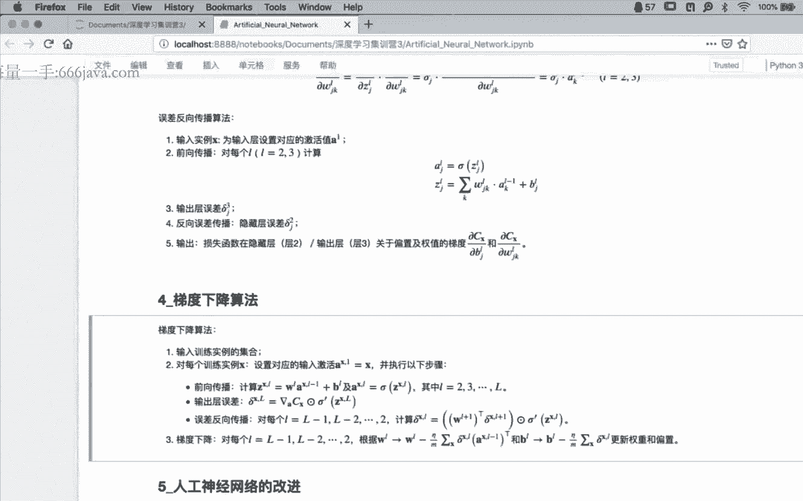

然后呢相对应的输出到了y y也是t减一，那大家想一想，在下一个时刻或者下一步当中，dt步xt作为输入进来以后那个s t，大家看看是不是应该长这样，看看这个图啊，看看这个图，对吧，在上一步t减一步。

然后呢计算得到了s t减一，然后呢输出给了y t减一，然后呢再d txt输入进来以后，然后呢得到了s t，s t呢不光是由xt来所决定的，还是由谁啊，还有这个s t减一所决定。

然后再进行一个y t的一个输出，然后这个过程一直会怎么样，比如说下一步应该是谁了，x t加一作为输入输入进来之后，那个s t加一不光是由xt加一所决定，还由上一步的那个s t所所决定，然后y t加一。

当然哈当然等等等，大家想想是不是应该长这样了，对吧我们现在啊现在你看模型复杂了吧，从原来是一根线啊，原来是一根一线全链接，然后现在呢找了一个回头线啊，回头线呢构成了循环结构。

把我们把循环结构再把它按照时间序列，会按照布展开，就构成了一个一个的神经网络啊，千万不要忘了再提个醒，这个图里面的每一根线都不是标量，而都是向量，向量都是由n维的组成的，如果你感兴趣啊。

如果你闲得实在是没事干，找张大一点的纸，你把它画一下，你看看那个连接结构有多复杂，但是我们有了向量表示形式以后，再结合这图示这种抽象层次以后，你会发现对我们的理解还是有帮助的，当然这上面的全职啊。

我们做一下定义，我们我们回过头来，回过头来，再看一下这个这个数学表达形式啊，数学表达形式，那你看有的图，你是不是能够从图上，再把数学表达形式再写回来啊，这也是一个能力啊，这也是一个能力来看看。

首先我们得到的是什么，我们首先得到的是数据集，数据集还是xt和y t嗯，还是那样，xt是我们前面这个向量x t，这里的y t直接就写出了向量形式了啊，直接就是向量形式，然后从一到大t的不管。

然后其中t时刻的输入数据xt是n维的，是n维的，然后呢t时刻的输出y t是个mv的啊，也就是说在我们图当中的，每一个输入都是由n都是个n维向量，每一个输出y都是一个mv的向量，然后呢再往下模型啊。

模型就是这么定义的，你看看你能不能啊，你能不能结合这图，结合着公式把它搞清楚，来我们看看啊，首先我们看一下x t乘以w，输入x t乘以它所对应的权值矩阵w，那我们看看在图当中。

我们在图中找找w应该在哪儿找找，稍微等w应该在这儿，我，发出去啊，w是不是应该在这儿x t乘以w，然后往上走是吧，往上走，按说哈按说如果在全链接里面，如果在全链接的神经网络里面。

s t是不是就直接等于xt w乘以xt了，当然再再加偏执，我们收音，这不管是吧，那现在呢还没有完，除了在t时刻我受到xt的影响之外，还受到上一个时刻s t减一的影响，所以你会发现在公式当中啊。

在公式的线性部分啊，在公式的线性部分，除了w乘以xt之外，还有一个u乘以一个x减一，那你告诉我这个又是谁，或者又在哪儿，又在哪u注意啊，是s t减，一乘以一个u是吧，又是在这又在这儿，我一会发出去。

又在那个地方，s t减又乘以x减，一加上w乘以xt啊，再加上偏置b啊，再加上偏置b作为当前时刻s的线性部分，然后再进行再进行一个非线性映射啊，得到s然后s我们知道了啊，s t在这。

然后s t s t乘以v，然后再加上c作为我输出的线性部分，再通过softmax的非线性映射，得到我所对应的y，所以这个地方s t的系数全职系数全职取，这样是位在这儿，对吧。

同学们如果把它划到前面那个里面去啊，画到前面里面去，x所对应的是w，然后呢呃s t减一所对应的是u，然后s t所对应的是v，对吧，应该长这样啊，长这样，但是每一个都不再是标量，而是向量和矩阵了啊。

但是形式上它就是你会发现诶，这个形式虽然模型我们觉得更复杂了，但是形式上要比我们全链接的形式，简单多了对吧，其中我们分别看一下，其中输入层到隐藏层的权值是w，输入层x向隐藏层st t的全职是w。

这个没问题是吧，然后呢t时刻啊，t时刻隐藏层的输出s t啊，t 10个也是也是t，也是我们的这个lv的是吧，然后呢，从t减一时刻，到t 10克的隐藏层的权值是右t减一时刻。

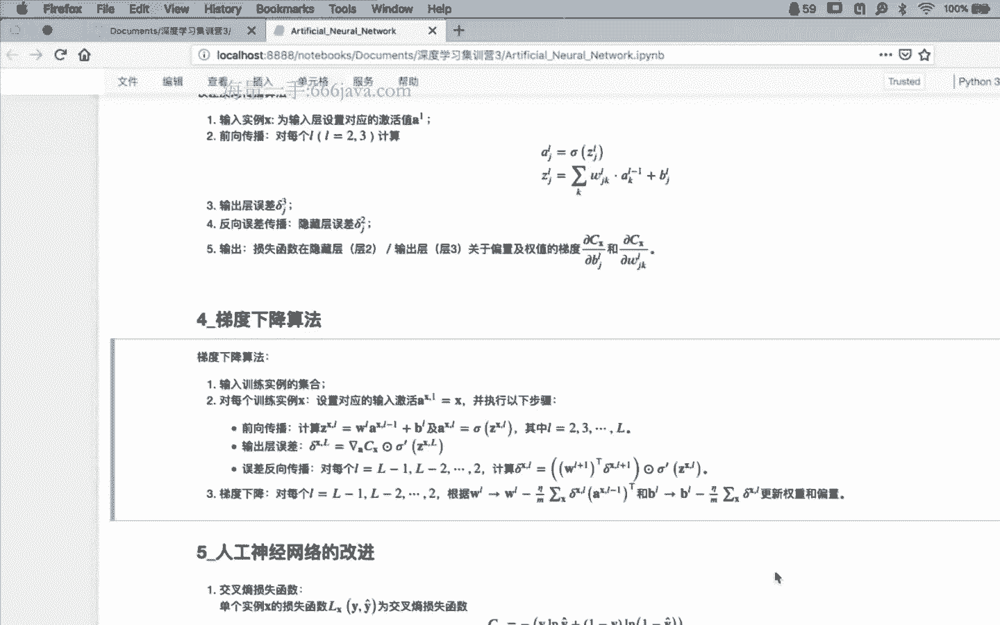

就是上一个时刻到我，当前时刻的全职是又又在哪儿，又在这儿上，一个时刻的s t乘以u，作为我线性部分的一部分，然后呢隐藏层的偏执就是b嘛，隐藏层的圈子就是b，然后呢隐藏层的集中函数可以可以选择。

我们的smode a u都可以是吧，然后呢从隐藏层到输出层的全职是v，从隐藏层到输出层的全职是v在这，然后输出层的偏置是c啊，输出层的激活函数sigmoid，就是我们的软最大就可以了。

那这样的话这是我们的数学公式啊，然后我们的图，这样的话我们就可以对应起，来了是吧，就可以对应起来了，那好了，到此为止，到此为止，稍微一停，有什么问题吗，我觉得应该是后面的训练过程当中。

自己对自己的一个要求啊，你你今后你碰到的模型，这才是刚开始的r n，这还是小儿科的复杂程度，你想想，如果你碰到更加复杂的那那一坨东西，如果你还用标准形式，基本上你就不能处处理复处理这个问题了。

特别是你比如说现在像那种bt模型，然后transformer甚至都不要了，那个attention啊，注意力机制以后，你这么复杂的模型，你必须要通过这种抽象形式来，表示出来啊，又为w分别都是几乘几的啊。

这是个好问题啊，都是几乘几的，你不是他们自己所决定的，你会发现它是和什么相关的，就是先先解决第一个问题啊，先解决第一个问题啊，几乘几的是由谁决定的吧，这是个好问题啊，我们先分析一下u a w都是几乘几。

它它是由谁决定的，x值和x相关吗，不要忘了啊，一会儿我们我们先讨论这个问题啊，我觉得这个这个问题和x相关没问题，他只和x相关吗，这个w不要忘了它是一个矩阵是吧，它这个矩阵是几乘几的，你刚才也提到了。

只和x相关吗，还和谁相关，对它和隐藏层是不是也相关，所以说啊你要确定它是几乘几的，其实不用问我，你你只要你只要看公式就可以了，他肯定是和x相关，这是肯定铁定没问题的，不要忘了它乘完了以后。

做非线性映射出去以后，它是和隐藏层是不是相关对吧，还是那个问题啊，就是啊我上网上找啊，不是网上找一张图，往上找哪张图啊，把它找出来啊，画了这么多图啊，我建议其实大家可以把它稍微存嗯，这个吧，这个挺好。

不知道怎么分享出去呢，发转发都是自然发生，已发送回去，来看看看看这张图，看看这张图里面是不是有w，没问题吧，是有w吧，这个w是几乘几的，他和谁有关，它和我们上一层的输出有关。

和本层的线性部分谁是不是也有关，所以这个你只需要数清楚，每一层到底是几个，是不是它的下标就清楚了啊，这个问题很好，你可以自己先解决啊，如果还有问题，我们在群里讨论好吗，这个问题先先交给交给你。

你其实你自己数数，我觉得应该没问题啊，我们再看其他问题啊，对smode呢这个应试函数啊，要我看看，下面有些问题都是关于映射函数的问题了，是吧，倒不是嗯倒不是不能用，是因为我们通过分析啊。

就是现在大量的做了分析以后，发现一些传统的英式函数嗯，有很多问题，有些问题，比如说就像梯度消失这种问题啊，因为他的表演c贸易，它的激活区其实到了到了到了饱和区以后，它其实每一次的梯度。

计算的量都非常非常有限，即使到了最后基本上就不再更新了，所以呢我们就设计了新的一些技术啊，激活函数啊，就是这样，就是因为啊对，为什么呢，其实你会发现rn引入了这个时间维度以后，它的层数是非常多的对吧。

它的层数会非常多的，直接导致了一个问题，就是梯度消失啊，就是到最后直接梯度就不动了，就死在那个地方啊，就是因为这些机构函数，它的这个呃这个饱和区嗯，没有办法再进行这个梯度的更新了。

那这个时候我们就大量的换个新的，机构函数上，ok s t的维度是我们定义的吧，对s t作为隐藏层，这些都是我们自己定义的，懂吗，这个rn就是一个神经元，这个结论是怎么得到的呢，这个我不是特别同意。

好吧嗯，我们可以有问题，我们可以讨论一下，就是你是怎么认为rm是一个神经元呢，你会发现它的整个模型结构是非常复杂的，我觉得是不是这个原因，有可能我觉得，嗯我们我们继续往下啊，我们继续往下。

有问题我们再讨论行吗，其实哈其实大家可以看到啊，当我们模型定义完了以后，看我们的材料啊，当我们模型定义完成以后，其实我们其实就可以完成所谓的，前项计算了对吧，同学们，因为数学公式摆在这个地方。

你给我一个x，我乘以w，然后呢我乘以上一个时刻的u，然后加上全是b进行非线性映射，就是s t，有了s t乘以v加上c做非线性映射，就是y t，当然其中的w u v，b和c作为我们的全职和呃。

这个偏置和全职我们都是先先初始化一遍，那这样的话不管初始化生多少，我至少是可以进行前项计算了对吧，有了公式，前向计算就都不是问题了，麻烦就麻烦在什么上，也就是误差的反向计算过程当中去。

这是rn最麻烦的地方，那我们首先看一下啊，首先看一下目标函数，这个时候呢，我们的目标函数一般就是交叉商啊，一般我们就采用所谓的交叉熵函数，再往上注意我们还是那样问题，有的时候复杂，你需要确定目标。

我们现在到底要干什么，当我们进行了前项计算过程以后，现在我们的所有的权值和偏置，都是随机初始化的，那些值都不靠谱，所以造成的误差会非常大，下面我们的工作就是通过反向传播算法，要对所有的参数。

分别求它的偏那个，分别求他们的梯度，然后按照梯度方向进行收敛计算就可以了，所以下面的工作啊，所以下面的工作我们最优化目标，使我们的误差要最小，使误差最小，我们就采用了所谓的还是梯度向量法。

那么在梯度下降法当中，就需要对刚才那五个啊，五个可以认为五参数分别求它的梯度方向，如果梯度方向都求出来了，我们就随机梯度下降法就可以解出来了，实际上这目标啊目标一定不要错。

但是呢你会发现，现在的问题就比刚才所谓的全链接的问题，要复杂一些了啊，为什么复杂一些呢，因为我们前面只碰到了两个两个w啊，第二层的w和第三层的w两个偏置，b2 和b3 啊，第二层和第三层的偏置。

那么现在呢因为我们有了一个啊，从隐藏层引向指向自己的这么一个连接啊，这么一个连接，所以这个时候我们还多了一个谁多，了一个u啊，多了一个u，这就是为什么我们现在不是四个还是五个。

最核心的就是在这个u的偏导计算上，其他的几个呢都很好啊，不是说都很好吧，至少都好，都是很正，就是我们之前都处理完了，唯一一个就是中间这个u自己指向，自己怎么去算好吗啊，这还这还这还是那下面的地方。

还是就是秋空，就是细节部分了，就是细节部分了，我们继续啊，我们继续，因为我们，因为我们，因为我们刚才给出的这个模型部分啊，因为我们刚才给出的模型部分，直接就是从x直接计算出了y啊，计算机，计算计算除外。

中间关于线性部分和非线性部分连续了，所以并没有严格的划分，哪一部分是线性部分，哪一部分是非线性部分对吧，你有有印象的同学，我们可以看到在我们全链接的过程当中，我们非常严格的划分为了z就是线性部分。

a就是非线性部分对吧，但是呢在循环神经网络r里面呢，我们就没这样做啊，我们把它统一到一个公式里面，这样更简洁一些，可以吗，我把刚才的内容再稍微重复一遍啊，是这样，严格的区分了线性部分和非线性部分对吧。

但是呢为了简洁一些呢，我们在rn里面就没有这样做，我们把它直接统一到了，可以吗，现在，嗯我做个测试啊，1234512345，可以了吗，可以了，ok我们继续啊，老虎不吃面，非要吃排骨是吧，ok嗯。

到哪了啊，我们刚才说啊，在全链接的神经网络当中，我们严格的划分了非线性部分和线性部分，而在rn当中呢，为了形式上简洁哈，因为你学的多了嘛，所以这个部分就没有再强调，但是呢很显然你会发现呃。

非线性部分和线性部分的划分，对我们进行误差的计算啊，就是那些偏导的计算还是有帮助的，所以呢一上来我们还是定义一些符号，定义一些符号，首先我们定义o t，o t呢其实就是v乘以s t加c。

我们看看这个部分在哪，v乘以s t加c是在哪，v乘以s t加c，在这v乘以s t加c，换句话说我们在隐藏层之后啊，就是输出层那一部分，我们把它的线性部分定义成了o t好吧，就是输出层的线性部分。

我们用ot来进行表示，那么在ot的我们对ot的一个误差，定义呢是损失函数对ot的一个偏导，对o t的偏导，我们就是这样来定义的啊，就来定义的，我再重复一遍，我们把输出层为什么是o啊。

就是输出层的线性部分用ot来进行定义，然后呢在ot上我们进行一个误差的计算，它被定义为损失函数对ot的一个偏导值，还是那样，你会发现这个定义的，没什么，就是为什么为什么，就是他就是这样来定义好吗。

定义了这两个值以后，我们就可以计算一下，我们首先把看看这个o t上的误差，能不能表示出来，o t上的误差呢，就是损失函数对o t的偏导啊，嗯那还是按照链式法则啊，就是这个时候可能还是画画图啊。

画画图这个时候啊在哪来着，这是xt，然后往上是s t，然后再往上是i t对，ok那我把它发出去，发出去啊，这是我们已经把他啃没完啊，这个这个这个是这样，循环神经网络，那我问一下同学们。

ot在哪能找到他在哪吗，在这个图上很显然看不太清楚是吧，o t在哪，o t在我们，我们可以把这个y t稍微再再查一下，他应该是在y的前面啊，对是对，但是这个前后看看看看参照系是吧对啊。

就是呃如果我们要上下划的话，他应该是在y的下面对吧，就是前一步，我们需要先把ot这个线性部分计算出来，然后再进行一个soft soft max的一个飞行映射，才能得到mt。

所以它大体上应该是在这个位置上是吧，他在这现在呢因为中间还有一个嗯，ok那他在这个地方我我我我我们可以看到，那他这样的话，我们的这个这个怎么说，就是还是嗯求偏导，那这个时候的偏导。

我们会发现我们的e t c塔，是在最后我们计算出来的误差，那这样说，我们要对o t进行求偏导，对其实呃呃不是不是是不是c有毛病，是我们soft max，你可以看到啊，来看这儿。

看这儿y t是不是就是就是soft max o t吗，啊这个偏执啊，o t加c啊，o t加等，看看看看那o t定义o t加c对，就是o t啊，就是y t等于soft max o t没问题啊，是这样。

不是你那个写的写的写的是个贸易，也不是soft max啊，啊到哪了到哪了，到这那还是那样，我们直接求求不过来，先求谁先对外t求，然后外t对o踢球，这样的话，我们就可以借助我们的链式法则就可以了，是吧。

那我们知道etc塔对y t求偏导，有了这个所谓的怎么说呃，损失函数以后，我们损失函数对外地求偏导，因为所y het是作为损失函数当中一部分，不管是交叉熵也好，还是还是你的平方损失也好，我总能求出来。

然后呢后面y t对t求偏导，其实就是smax一导o t这个没问题吧，ok那这样的话，dt o t我们是可以表示出来的，好吧，还是那样，它只是个中间量啊，中间量继续往下，那下面就开始那五个偏导。

我们就一个一个的求败，一关一关的过呗，看下面啊，第一步，目标函数ec它关于从隐藏层到输出层，全职v的梯度，从隐藏层到输出层位，隐藏层到输出层位，位是在往前倒倒，上位在你看看v在哪位在哪，v在v在这点。

看到图了，位在哪位，在我们连接的是我们的s和y，其实是靠近我们的这个输出层，是这一层的偏导值怎么算，我觉得这个有前面的套路了，应该问题不大吧，首先需要稍微注意一点啊，稍微注意一点。

这个ec它是在整个数据集上的误差，所以呢在前面做了个累加和，就是每一个数据过来以后，每一个x过来以后，我都是计算了一个误差，然后进行一个累加，这个问题不大，这个问题不大。

然后呢sm sum提前就变成了一个元素对位，对位的一个偏导，那这个时候怎么办，还是那个老问题啊，还是老问题，我们对位求我们看看v在哪啊，刚才看到了v在哪，v在v在这儿，它是它其实是我们的这个啊，怎么说。

就是我们的线性部分的一，就是线性部分里面的一部分，就是ot的一部分，我们知道这个这一部分是o t，o t的一部分是吧，那这个时候我们还是得记住链式法则，我们怎么办。

先e t对t求o t对位球是不是就可以了，e t对o t求，我们刚才是不是已经已经搞定了，就前面这个式子，然后呢o t对位求o t对位，求o t对位求，我们看看o t ot是这个式子。

然后最最为求是不是剩下的s t是这样，我觉得这一部分是搞得定的啊，搞得定的，其实从后往前还没跳层，我觉得这都问题不大好了，对c的偏执，我觉得这也不是问题啊，这也不是问题，怎么说，还是那个老问题。

先对o t求o t对c求，然后只剩下了一个误差部分啊，因为你会发现它靠着误差进，所以它只只需要做一点啊，链式法则求导就ok了，这都不是问题啊，我觉得这个不是问题，麻烦就麻烦在下面好，我们继续往下。

德尔塔，s t呢被定义为是e t对s t的偏导，那我们求求这个东西呗，e t对s t还是那个问题啊，你还是看图看图，e t在哪，s t在哪，还是画个图啊，还是画图在图上都找不着。

在哪1t在这稍微得e t在这，s t在这儿发过去啊，你会发现这就跳的有点远了是吧，就跳的有点远了啊，跳的再远也不晚，因为中间还隔了一个o t，所以我们可以借助它作为一个跳板，还是链式法则。

可以先用e e t对t求ot，在对s t求是吧，同样啊，我们看看e t对s t求等于e t对t求，然后ot对s t求偏导，首先前面这一部分刚才已经处理掉了，o t对s t求，我们看看啊。

o t对s t求，这是o t对s t求，剩下的就是v吧是吧，那这个表达式也已经也已经出来了啊，这个表达式已经出来了，那好了，继续往下，还是那个老问题啊，所有的灯塔都是中间量，只是求出来放在这儿用。

用的时候我们直接滴了过来就可以了，那继续往下啊，这是个麻烦的东西，最麻烦的就在这儿，目标函数e theta，关于从t减一时刻隐藏层，到t时刻隐藏层的全职u的梯度，又在哪儿，又在这儿，稍微等啊。

啊这是个麻烦的，现在我们跨过千山万水啊，跨过千山万水，不是往直接往回求，求了一个带循环的一个右上了，要对它求偏导，这东西怎么弄，来吧我们继续看啊，看代码，看代码这个东西呢还是那样，把累加的csm提前。

不管，它其实就是etc的对u的一个偏导值计算，这东西呢这个求和不管继续看中间这一坨，先先看两眼啊，先看两眼再说，先看两眼再说，那好了，我们刚才已经把这个德尔塔s t求出来了，他是e t对s t的求导。

那我们可以看到sk哪有sk啊，没有sk吧，哪有s k s t，k有k k稍微一等啊，对这个k先稍微一放啊，这个k先稍微一放，我们先我们先对这是个仔细看了啊，我们现在这样，我先稍微放啊，到哪儿了啊。

到这啊，我我们一看又要又又又要跨过千山万水，那这样的话我们先从e到s t，然后s t对u套路嘛都是一样的，求偏导的套路，我就顺着这个条件一直往下求，好像很正常，好像很正常，但是麻烦就麻烦。

在我们到s t的时候会发现了一个问题，什么问题呢，s t不光是和当前这个时刻有关，s t是不是还和上一个时刻有关，你会发现这个s t啊，你会发现它是它是转转圈的，就是s t不光是就是得到s7 的时候。

我们知道它不光是和x相关，还是和黑，还是还是和我们的s t减一相关，那st减一又和谁相关，s t减一是不是又和s t减二相关，s t减二又和s t减三相关，直接往后倒，我们前面讲到过，讲到过上一次。

就刚才上一节课，我们讲到那个全链接的时候，讲的出现过这个问题，就是所谓的什么全导数公式还还有印象吗，对变量求偏导的时候，影响当前变量的所有的因素，我们都需要考虑到，那这个时候我们都需要把啊。

就像刚才那个问题啊，就是e t对s t求偏导，这没问题，s t要对s k求偏导，这个k是谁，这个k就是我们之前所累积的上一个时刻，上上一个时刻再上，再上上一课，直到那个第一个时刻。

那些st所累积的那些量能明白意思吧，这些量都是需要进行一个累加和的，全导数公式是这样来定义的，然后sk在对u进行一个求偏导好吧，那这三个量哈，这三个量其中第一个量我们已经嗯啊，为什么是加哈。

全导数公式就是让来定义的，这是数学上的东西，嗯，你可以可以可以查一下，所以呢你会发现你仔细看一下，你会发现这个k这个下标啊，k的循环是从一开始一直到谁，一直到小t小t不就是当前时刻吗。

也就是说我需要从第一个时刻开始，倒到第七个时刻啊，达到当前这个时刻不是不是dt的时刻，倒到当前这个时刻啊，因为当前时刻就是t所以到了t对吧好了，这是关于这一部分啊，这三个量呢，这三个量。

第一个量我们刚才已经通过s德尔塔，s t已经搞定了，已经搞定了，放在这儿了，麻烦就麻烦在啊讨厌啊，就在这个地方，这个s t，要对s k就看到大家想一想，这个地方想两分钟，想两分钟。

s是当前时刻的st没问题，这个sk啊，因为它前面有一个领夹呀，你想想这个s k是个什么东西，因为它是从第一个时刻到第七个时刻，没问题吧，那你说我s t分别要对dt减一个时刻，求偏导，对t t减20克。

求偏导，t减三，求偏导，t减四，求偏导，一直到第一个时刻求偏导没问题吧，啊而且呢你会发现，而且他们是一个什么关系啊，是不是一个垒成的关系啊，是不是一个不断的在里程的关系。

那你想想我每一次是不是都在当前时，刻对下一个时刻都在求偏导，你看我s t对s k求偏导，那么s k是不是还有他的上一个时刻，他的上一个时刻，是不是也是sk对sk减一求偏导。

那么sk减一还有它的一个上的一个时刻，还是这样进行一个链式求导的一个过程，那把这个过程呢再把它通过循环的形式，就不再是个累加，而变成一个累成了，嗯嗯嗯是这样的嗯，s5 怎么对s3 就变到。

我们可以借助s4 吧对吧，我们先对s4 求偏导，s4 可以对s3 求偏导吧，因为正义两个零相邻的时间，我偏导值是可以计算出来的，中间我不管隔多远，我只需要一步一步，借助中间的那些量是不是都可以求出来。

所以你会发现，中间这个地方才是一个里程吗，才是一个类型的关系啊，这是这是非常重要的一个理解啊，就是说啊，这是这就是循环神经网络的，最核心的一个地方啊，就这两行啊，就这两行公式。

第一行公式的求和是全导数公式，第二行公式，这个累加是在于，我s t要对一到t当中的任意一个时刻，都需要求偏导，而一到t这个时刻呢，t。一是和我相邻，所以我直接可以求偏导就可以了。

就像刚才这个同学提出了这个很好的问题，这个s4 s5 怎么对s3 求偏导啊，中间隔了一个，那怎么办，那不就是s5 相对s4 求偏导，s 10再对s3 求偏导，这样的话s5 对s3 的偏导。

我是不是就求出来了，那我有一个问题，那么s5 对s一怎么求偏导，那同样的道理就是s5 先对s4 ，s4 对s2 ，s2 对s1 ，中间把所有的偏导值进行一个里程，是不是结果就出来了。

所以这个累乘的符号啊，为什么，这是从k加一开始到t的，原因也就在此，好吧，这些细节啊，就是说还是那样需要需要一点时间啊，需要一点这个这个投入一点精力去去去，去分析一下。

你从s t要对前面一到t的任意一个时刻，都需要把偏导值去计算出来，那任意一个偏导值呢，我都可以把它拆分成中间介入，借助中间变量的偏导值的里程体现出来，这就是这其实就是链式法则，这一段是链式法则。

就是这个里程是链式法则来，的这个c个冒号是全导出公式来的好吧，那么最后一步，sk到u的偏导值计算就放在这个地方了，其实呢所以说实在的sk是个向量，又是一个矩阵，这还是矩阵论里面啊，需要讨论这个问题。

需要需要深入的去讨论问题，你怎么去定义向量对矩阵的偏导值计算啊，这个我们今天就不展开讲了啊，有兴趣的同学呢，查一下那个矩阵论，里面是有挺挺挺多的讨论的，好吧好了，这两行这两行啊，我回去好好琢磨琢磨。

有什么问题咱在群里讨论好吧，那有了这这继续往下啊，继续往下，我觉得前面都，没问题啊，sg对sj减一是个什么东西，往前倒哈，sg对sj减一在哪啊，ok你可以认为s j在这，s j减一在这。

你会发现它们两个之间，是有数值上的公司联系的是吧，那怎么能够从他对sj减1000求偏导，无非就是先对它求一下，求一下导，然后再再对它求下导嘛，只不过呢这里边又有向量，又有矩阵，那这个时候呢。

数据上告诉我们求出来之后是什么东西啊，这是个对角矩阵啊，这是个对角矩阵，但是和我们刚才分析的是一样的，你无非就是先对sd减一求一档，就那个非线性函数求极导，然后再，对右乘起来就可以了是吧。

只不过呢这个时候矩阵要转一个，要做一个转化，这个地方的肉，求出来之后是一个对角线矩阵，那么至于为什么还是那样，矩阵论里面有详细的讨论这个地方，今天我们就不展开了，那不管怎么样，我们得到这个表达式以后。

你会发现在整个这个表达式里面，所有的量啊，所有的量都是已知量啊，所有的量都是在正向计算过程当中，都已经求出来的量，所以这个时候我们就可以把当前时刻，关于u的偏导值计算出来了好吧。

那么同样同样下面关于w和b的是类，似的啊，是类似的，我们稍微看一下啊，稍微看一下，首先看看w在哪，w在哪，w在哪，w在这是吧，我1e c它要要对w求偏导，然后呢其实你会发现w的位置和右的位置。

其实是其实是一样的位置，其实是一样的位置，你不过就是一个一个是x的这个这个全值，一个是s t减一的全职嘛，所以你会发现它的整个的求导过程，和对u的求导过程是非常非常类似的，其实你都可以认为是一样的啊。

只不过仔细一点还是那样，我要跳好几层啊，我要直接对w求偏导，还是呢我看w在哪，用用另外一个颜色w应该在这，w在这儿说，所以你会发现我直接跳还是跳不过来，那怎么办，还是先对嗯，还还还是先对s t求偏导。

s t再对w求偏导，但是中间还是那个老问题，一旦牵扯到s t，它都是在都是在循环的，所以你需要把s t处理完了之后，才能再对w求偏导，所以中间的执行过程，和我们对u的执行过程是一样的。

那同样对b的执行过程也是一样的好吧，所以这两步呢回去自己看一下，可以自己看一下，这样的话，我们关于循环rn的这个正向计算，和反向误差计算，也就算是介绍完了，也就算是介绍完了。

有有同学可能会敏锐的发现有个问题，什么问题中间注意过有一个很大的计算量，在里程上发现了是吧，反向的计算一旦出现累成，马上第一反应就会出现什么问题，梯度消失误差小时啊都一样是吧，你累成，然后你小数点0。

1乘完全就没有了，换句话说啊，我们通过分析啊，通过分析，如果我们把刚才哈定义的这个量啊，定义成一个所谓的小伽马，然后呢我们知道对它的一个里程啊，最后发现对他的一个里程，这个量会得到这个式子。

如果啊如果伽马的谱半径大于一，就是你可以认为就是绝对值大于一，我们可以得到它这个式子越长越大，就所谓的梯度爆炸，如果这个这个式子刚刚的谱半径小于一，这个式子趋近于零，那就是梯度消失，这种循环神经网络啊。

他虽然说是能够提取所谓的时间特征，但是这个时间特征的提取呢非常有限，因为一旦时间长了，要么就梯度爆炸，要么就梯度消失，那怎么办，其实也很好办啊，我只需要严格的要求他的谱半径等于一。

1x1x1这东西就总好了吧，换句话说我只是只需要保证所谓的对，只需要保证它所谓的线性部分，不要它的非线性部分了，那这事不就好办了嘛，但话又说回来，如果你把非线性部分取消掉了。

那他就不能够体现出这种非线性映射的，这个能力了是吧，它只能处理线性问题，那这个时候怎么办，那好了，我引入一个新的状态c，用这个c来保留它的线性部分，然后呢，用s t来进行它的非线性映射部分的计算。

这样的话其实这是作为一个桥梁啊，有兴趣的同学读论文的时候，你会发，现中间其实从rn到l s t m，中间其实有大量的工作，就是大人们在大量的实验，就是说改改这行不行啊，改改那儿行不行啊，为什么啊。

就反正是想就是想到的，想不到的都是最后发现哎，顺着这个思路会发现，我们就可以引入所谓的门控机制或者，门线机制，来完成，所谓的l s t m长短期记忆神经网络，它很复杂啊，它复杂到这个程度。

所谓的三个门遗忘门，但是我们稍微分析一下啊，稍微分析一下三个门，所谓的遗忘门也是线性部分的累加，进行飞行映射，换句话说你可以认为它就是一，个神经元没问题吧，线性部分的累加非线性部分的映射。

我可以保证某些量通过，不就是这样吗，那么同样输入门也是线性部分的累加，非线性部分的一个应用设，使某些数据输入过去，使某些输入数据就就没有了，同样同样啊输出门也是这样来设计的，换句话说啊。

就是l o s t m，之所以它的这个时间特征的提取的优势，就在于它允许部分数据通过，因为我们知道我们随着，这个累加量的不断的积累，这个量会越来越大，或者会越来越小，那这样的话。

我只需要有针对性的把一些信息记住，有针对性的把一些信息就遗忘掉，没价值的就不记了，那这样的话我整个的时间序列的特征，提取的就更加的准确，那就构建了所谓的l o s t m，限于时间原因啊，介于时间原因。

l s t m的反向传播是一个，更复杂的过程大家可以想象得到，就是直rn都已经长这样了，你看看这一坨公式，在这个复杂结构下反向传播应该长什么样，更恐怖哈，说一下要求啊，说一下要求，首先呢第一步。

同学们先在当前的公式情况下，结合着今天我们将教讲的这种方法，你先把这个模型的正向计算过程，通过图示的方法自己看看能不能画得出来，如果画出来的同学在在群里啊，你你截个图发出来，咱们可以一块讨论谁画的好。

谁画的不好，哪些有问题，哪些没有问题，我们可以一块讨论，这作为一个小作业啊，在画图回去以后，这一坨这一坨就是l s tm，你先把它的正向计算过程先画出来啊，反向计算呢我就不建议大家看了，那些东西更鬼畜。

那有兴趣的同学可以看一眼好吧，如果有兴趣咱们可以再讨论，但是我觉得这个东西看时间吧好不好，ok啊我们今天啊回过头来我们顺一遍啊，我们顺一遍今天的内容，今天的内容说实在的没有什么新东西啊，在我看来。

这没有什么都不是，都不是你拿过什么新东西啊，都是同学们现在都已经应该掌握的，非常熟练的东西，只不过今天我们过一遍的目的，是介绍这种方法，带来帮助，能明白了吧，咱这每堂课哈不是为了学这些东西啊。

这东西还用学吗，这不是这些东西还应该现在学嘛，你们应该搞的非常溜了才可以的，只是呢看一下今后你应该模型怎么学好吧，这是端正目标，然后呢在端正目标的同时，我们讲到了几个关于就是几个工具的使用。

第一个工具啊，第一个工具就是模型的标量化展开，这种展开，助的，因为它已经细节到每一个量是和数值了，他已经没有任何的再划分的余地了，他就是到了，你可以认为到了原子层面上了是吧，只有当你对这个标量形式。

都搞得非常清楚的时候，你下面就可以做另外一个工作，做什么工作，你因为你原理都用通了，所以你直接可以不借助任何的框架，手写一遍神经网络模型啊，第二个作业啊，第二个作业嗯，我把代码给大家，你先把它跑通了。

自己理解了，我觉得就ok了，有什么问题咱们在群里讨论好吗，就是留了第二个作业啊，那么回到我们这里面来，就是标量展开形式，标量展开形式的优点就在于它的细节部分，但是细节特别多。

对我们的理解造成了很大的困惑，那再怎么办，把它图示化出来啊，把它图示画画出来，画成每一个符号，就是数学上的每一个标点符号，你都不在图上把它画出来，一个个的严格映射出来。

这样的话在后面你才发现求偏导的时候，分母上在哪，中间怎么过去，至少有这个图，总比你说这么一堆符号，你上哪儿找去是吧，c x在最后是误差，w在前面啊，w2 是第二层的隐藏，的这个全职，那中间隔了若干层。

怎么办，想办法一层一层的往前推推过来了，ok没问题了，所以呢第二个映射啊，第二个工具就是图示啊，就是图示，然后再往下再往下标量，形式很好，有细节，但是不够抽象，细节太复杂，当我们处处理更复杂问题的时候。

就没办法处理了，人的大脑处理毕竟有限是吧，那怎么办，向量化表示向量化表示把它抽象成向量，把它抽象成矩阵啊，你会发现我们前面画，再把这个矩阵形式画成图，你你比较一下，你会发现它就很简单了。

但是你脑子里的印象应该很清楚，他，其实是展开更复杂，有了这两个工具以后，标量化的形式图以后，相对来说啊，相对来说啊，就效率可能会提高一点，你像像rn这种东西，无非就是在隐藏层上引出一个。

指向自己的结构吗，然后后面还是那样求偏导，谁在哪，谁在哪，找清楚位置啊，找清楚位置，求偏导，仔细一些，我觉得问题都不大，无非就是链式法则和全导入公式，这两个工具使用熟了就没问题了，当然最后我们分析一点。

因为它存在所谓的梯度爆炸和梯度消失，就是因为累成哈，中间累成怎么办，我们就引，出了所谓的l s p这个东西啊，工具先放在那个公式先放在这儿啊，把图画出来啊，有问题我们再讨论好吧，ok今天我们的内容呢。

大体上是这么多的内容啊，留了两个作业啊，留了两个作业，一个把rs tm的图画出来，第二个把代码调通跑通，如果你调通跑通了，或者说有的同学，你觉得诶，我自己是不是现在就可以自己动手，自己写一下也可以。

也没问题啊，嗯都可以，但是你需要把这个工作做完，了解一下它的底层实现，那话说回来啊，话说回来，我知道同学们现在已经开始使用框架，解决一些，很复杂的问题了啊，但是呢在这个过程当中，关于框架的使用。

我非常建议同学们啊，就是详细的去一些基础组件啊，一些基础组件，详细的去读一下它的a p i啊，这个跑不了啊，嗯有的同学说诶我我就代码调通了，调通了原理还是不理解为什么，就是因为他的抽象层次更高对吧。

一个刚才有同学提到了一个r n c，要下去参数一设置哦，好像rn就出来了，但是它是一个网络啊，它是一个神经元，它是个什么东西，而且后面这个sl还有很多什么l s t m，什么双向l s t m。

什么一坨一坨的，东西到底是个什么东西，在app当中都有详细的介绍，原理不清楚是因为你这个抽象层次太高，中间缺了好多层，所以你就不能够理解他到底在干什么，把这个过程补起来啊。

当然并不一定要求你像今天所说的这么细，都展成标量，没这个也没，咱也没这个能力去处理这么复杂的问题啊，抽象之间啊，缺少缺少一些关键的东西，所以你造成了你对原理的这个理解，可能会有些问题，好吧ok啊。

我啰嗦了不少啊，我啰嗦了不少，我们呢可能如果我们再留出一，点时间来，比如说十分钟我们可以再讨论一下，有什么问题的话，我们可以在现在讨论一下好吗，今天我要讲的内容大体上就是这么多，好不好，ok啊。

我们可以再讨论一会儿，有什么问题的话，就是特别是基础性的工作，还是要把它搞清楚，嗯我觉得是这样，就是l s t m的反向求导呢，一定不会在面试的时候问，如果他问，我觉得有一点出生的啊。

这个rn呢我觉得可能偶尔会问道，至少我在面试的时候会偶尔提一句，这个东西，特别是刚才所说的就是那个核心的问题，比如说为什么rn会出现所谓的梯度消失，或者梯度爆炸，它一定会讲到反向传播的时候。

再进行循环垒成的时候会造成这个问题，那为什么会循环里程，他这一系列我们就都引出来了对吧，所以呢这个嗯，至少我理解i s t m的反向求导，不会作为要求，感觉矩阵求导这一块挺难的。

其实我觉得不是要看你怎么定义难了，就是我认为这个难呢可能是繁琐嗯，你说这东西就是数据结构，因为它数据结构挺复杂是吧，要么是矩阵，要么是向量弄一弄，就各种一坨一坨的方向的地方，所以呢我觉得倒不一定是。

就需要细心去分析一个你要矩阵里面对吧，横竖坐标的每一个位置对，比，如说向量求导的时候的每一个位置的求导，仔细一点，我觉得都不是问题，你我个人觉得不好说的，是难更难的还更多啊。

等着同学们的更难的问题更多好吧，后面可能会讲到lp的部分是吧，特别是现在同学们，可以沿着rn这个这条线啊，可以沿着这条线啊，这个往往往后倒，往后倒，你比如说有了r i n以后有i s t m，然后呢。

这是我们在比如说时间序列特征提取上，一个很好的工作了，但是后面我们有有sequence to quence，然后有attention，然后有transformer，然后有bt，然后有g pg。

然后有g p t two等等等等等等，其实这都是一条线嘛，就是把时间序列上的提取过程，所以呢这是刚刚开始好吧，刚刚开始，特别是到了后面更复杂的模型结构了，你特别是需要仔细一些啊。

就是要在草稿纸上细细的推，那你需要碰到的呃，就是一些仔细嘛，这都没什么问题，需要耐心啊，lp部分不是我讲好吗，嗯应该是有其他的老师来负责，这部分的内容，当然如果有什么问题的话，我们可以讨论。

这都不是问题，就是我觉得嗯这都不是事对吧，有的人有的人什么心里想，幸亏不是卡酱是吧，我觉得这也挺好，开个玩笑啊，但是这这这没什么问题，对代码我会给大家嗯，今天是没有时间了，嗯明天吧，明天啊。

明天上午我在北理工，我争取明天给大家发出来好吗啊，明天我给大家给大家发嗯，那个代码哈，我非常建议大家，结合着今天全连接神经网络的计算流程，手敲一遍，你能够感受一下，神经网络到底在细节部分的执行过程。

至少我我觉得我敲完敲完以后，对我当时对神经网络的理解是有帮助的，因为现在我们有了工具，特别是工具带来的一些问题，就在于很多的困惑，就是我们好像把握的不是那么的深刻是吧，对直十合了，南派就是高位数组。

有什么问题吗，我没get到你的问题是什么，啊这其实是个好问题啊，就是，怎么说呢，嗯到了越往后发展呢，嗯更多的不再是从模型的角度上去，梳理这个线索和脉络，更多的呢可能是从应用角度上去，梳理这些线索。

比如说我做目标检测，它的一个这一个方向啊，这这就是凸面恢复，因为后面的专业方向会越分越细，所以呢你需要针对某一个方向去梳理，这一个方向的发展脉络，因为你不可能啊，即使是cv方向对吧。

你你你也不可能说我我都输了一遍，基本上不可能，你说你只能说我在比如说目标检测方向上，我怎么去梳理一下它的发展的一个脉络啊，呃这是可能的嗯，怎么梳理啊，我觉得这个就是嗯一点一点的去看，一点一点的去摸索。

当然如果有有经验，就比如说你可以向像赛文老师啊，或者像其他的嗯老师都可以去请教嘛，我觉得每一个方向都有很多的很好的工作，嗯同学们还有什么问题吗，如果没有什么问题的话，我们就可以先呃，今天到这儿可以吗。

好的谢谢各位同学们，那么我们今天就到这儿，还是那样，我觉得这只是开始有什么问题的话，我们可以在群里进行充分的沟通和讨论，嗯，我我我我给大家稍微提点意见啊和建议啊，就是好像咱们的群不是特别活跃啊对吧。

还是大家有什么问题，咱们及时沟通好吗，好多说两句哈，我们在群里再聊吧好吧。

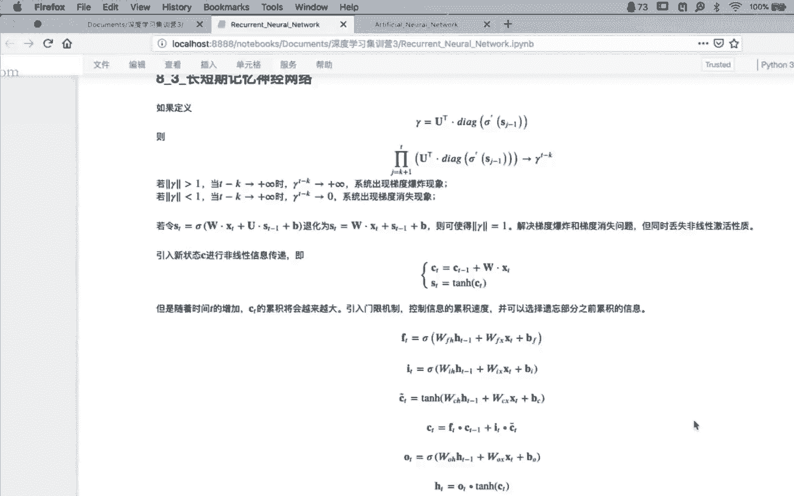

