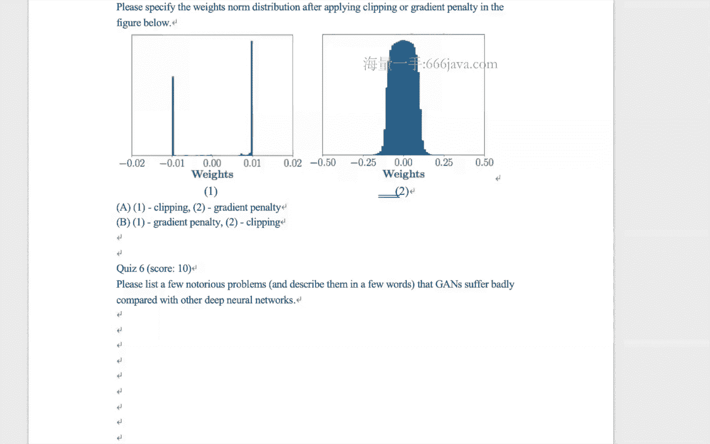

# 七月在线-深度学习集训营 第三期[2022] - P5：在线视频：02-生成式对抗网络（GAN） - 程序员技术手札 - BV1gW4y1x7j7

ok那我们开始今天的内容呃，今天内容是这个这个gg，就是我们的这个生成式对抗网络，然后呢在讲今天的这个生成式对抗网络，讲完之后呢，啊我看看时间啊，估计会给大家出几道，这个我们在啊面试或者笔试中的时候。

我们看吧，好不好，我们先看我们先来看啊，今天的这个主要的部分内容啊，我的这个准备应该是是准备了一些的哈，是要说要说gg的生成式对抗网络，这节课的内容啊，我们不得不先来讲一个啊。

几个预备的这样一个知识点啊，那先跟大家先说明一下啊，就是想要听明白深沉式对抗网络，这么这部分的内容啊，今天的内容一定会是偏啊，偏原理一部分啊，因为就是如果要弄清楚这部分的，这个细节的话，就部分逃不掉。

就有可能有些同学，如果说比如说对这个写数学或者高等数学，线性代数稍微有一些惧怕的同学，那可能要这个做好心理准备啊，因为干这部分内容，其实视频原理会比较多一些啊，但是啊我尽量会把它就是代码公式等啊。

公式相关的一些东西，我尽量能够去弱化它，给大家一些更加直观的理解啊，帮助大家去去克服这样的一个，恐惧的心理吧，但是这个不管是谁讲啊，可能我讲或者其他老师讲，我觉得这部分其实是逃不掉的话，好。

那我们开始今天的这个正式的这个内容了，那刚才说了，我们要讲一些预备知识，对不对，预备知识的第一个点就是kl，什么是chao divergence呢，care divergence。

divergence其实就是说白了去衡量两个分布，数据分布之间的差异性，你就记住这一个点就好了，它其实就是衡量两个数据分布的distance，或者说差异性，然后它的这么一个定义呢，就在这里。

k l p和q是什么东西呢，p和q就是两个data distribution啊，两个这个数据的这个不同的分布，然后你看一下这个distance定义什么呢，定义p x log p x除以q x对x的积分。

对x的积分诶我问大家一个问题啊，这个情况下是假设x是一个连续的，这个这个变量对不对，那假设x是一个不连续的变量，你们说这个distance的形式应该是什么呀，这是我问的第一个问题啊。

有同学可以在群里面回答一下吗，没错啊，当一个变量不再是连续的时候，而是离散的情况下，我们所有的积分通通就会变成mation求和啊，ok那如果是这样一个公式的，这么一个形式的话。

大家想想看什么时候这个divergence，或者说这个距离kl这个距离最小，想想看什么时候最小，两种两种嘛对吧，两种两种这个观点一什么时候最小，那很简单嘛，我问你两张图片相似度啊，那个距离什么时候最小。

两张图片的距离最小，其实就说明它们的相似度最大，什么时候两张图片的相似度最大，这张图片和另外一张图片，他们是重复的时候，这两张图片的距离一定是为零，它的相似度一定是最大，对不对，它其实不是相似度。

它就是一样的嘛，好，那现在两个数据分布什么时候距离是最小，那就是exact一模一样的时候，也就是说px等于q x完全重合的时候，它的距离当然最小了，对不对，这是一种二，你根据它的这样一个公式的性质。

你看这公式性质是不是有一个log东东存在，那你想想什么时候，rog的一个东东是等于零呢，那高中数学告诉我们，rog的函数的曲线是不是这么画的，跟x轴的交集sorry，那x轴的交集是不是。

其实x轴为一的情况下，对吧啊，x为一的情况下，那这个时候x又是啥呢，是不是就是p x除上q x在这呢，那px除上q x等于一，那不就是px等于q x的时候啊，可以这样，ok试试。

刚才给大家这个啊热身了一下对吧，然后接下来跟大家说明一件事情，kl距离这个东西，你们说啊，它是有具有对称性吗，换句话说看这个东西，kl p和q是否等于kl q跟p，大家思考一下这个问题。

它是否具有对称性呢，我想直观上，我就觉得大家应该要觉得它不具有对称性，对不对，它应该是有一个非对称性质的，没错，那为什么呢，很简单啊，我们来举个例子啊，举个例子来看一下，我们假设这个p跟q的数据分布。

是如上两种形式啊，如上两种形式，那我们来算一下p和q的ko和，以及q和p的，还记得吧，刚才为什么姜文老师给大家做一个铺垫，为什么这个x的变量，当它是连续分布的时候，变成离散分布的时候。

我们的那个积分会变成求和的时候啊，这个时候我们就要用上了，对不对，那p跟q的kl divergence怎么算呢，前面那个公式我们再回过头看一下，他说是p x乘上rog p x跟q x的比值。

然后对x的积分，那这里积分改成求和，那是p x乘上log p x除上q x，然后每一个分段进行求和不就ok了吗，p跟q那就是刚才这个东西对不对，刚才这个东西，那首先px我们来看一下。

当都是为这个的时候啊，这个的时候三段嘛啊，零的时候是多少呢，0。36对吧，px p0 是等于0。36，那q0 是等于0。33，那所以当x等于零的时候，它就是这一段，对不对。

那一和二的时候呢也一模一样喽对吧，一模一样，然后加起来就是这个东东，这个东东是多少呢，我们来看一下是0。0852996，这数字真好，996，然后再看另外一个q跟p在这，q和p那这个时候就是q在前面了。

对不对，然后比值是q x比上p x那就是反过来喽，啊刚才一样的这个求法，那这个时候得出来的结果是，所以说它是具有不对称性质的啊，p跟q的kl是不等于q跟p啊，那个q跟p的ko，那我们可以在对啊。

根据这个啊啊tao divergence，divergence来进行啊，在深1度的理解，我们看假设这个是p x分布啊，假设这是q x的这个分布，你们说k l p跟q的这么一个分布，会是什么样子的呢。

也就是说，px和q x其实是两个高斯的概率分布，只是他们的命不一样对吧，均值不一样，p x应该是一个这个标准的，然后q x是有一个平移的，然后现在问p跟q的divergence分布。

大家想想看会画出来是什么样子，画成右边这个样子，大家看看能不能够理解，你要理解这张图，或者说理解p跟q的这么一个，divergence的这样一个分布，那很简单，怎么想呢，大家这么想。

你把x从远到近拉过来，去看一下px跟q x的那个呃，这个kl divergence的那个定义，你来算一下，想象一下它是什么样的这么一个曲线，给大家一分钟的时间啊，自己想一下，画画也ok，就从这里开始啊。

需要大家动动笔啊，动动这个脑子，那是不是说首先你这么想，当x比较小的时候，和x比较大的时候，p跟q的kl divergence会是多少呢，因为当x比较小的时候，或者当x比较大的时候，px和q x都是零。

对不对，那所以它基本上也就是零对吧，那不断的当x往这边移移的时候啊，移的时候那一开始他们都是零，都是重合的，对不对，都是为零嘛，啊，然后当出现在比如说-4，这个点左右的时候啊。

到-3这个的时候开始慢慢的有，对不对，开始慢慢的有有什么呢，开始慢慢的有差异性开始存在了，对不对，之前都感觉不到嘛，所以他应该是慢慢慢慢上升的，这么一个状态，对不对，然后当x挪到这根线的时候。

这个线的时候，你们说他们的kl div认识是多少，这两个东西都相交集了，对不对，那我的kl divergence一定是零了对吧，所以这个点呢就应该一定是，就是这个点的时候肯定是为零，对吧啊，肯定是为零。

而在这个当中当中，刚才我们说了，随着它的这样一个推进，那kl diversions慢慢慢慢慢的就会增大，增大到某一个点的时候就应该是最大了吧，因为它这里一定是一个有限的范围，对不对，然后最后又要回到零。

那就是慢慢慢慢慢慢又变角变变小了，对不对，直观上来你就可以这样理解，对不对啊，最简单的例子你就看这根线嘛，它的这样差异一定当某一个点的时候，是有一个最大的情况，对不对，然后慢慢慢慢的又变回来了。

所以大家想想看是不是它的这样一个分布，大概就是这个样子的对吧，那后面我就不说了，只是一样啊，都是一样，只是反一反，那我们看下面这张图啊，下面这张图，给出更多的不同的颜色的分布啊，这张图能不能够理解。

就是kl的距离是对应的这样一个情况，为什么呢，为什么呢，你只要想一个case就好了，为什么这里的绿颜色啊，这个绿颜色对应到这里啊，为什么这个绿颜色啊，当q x是绿颜色的时候，我的kl的距离要增加。

是增加嘛对吧，因为你的这个时候看这张图，绿颜色的的这样一个啊，波波峰，对不对，更加的陡峭，那为什么呢，很简单嘛，因为绿颜色的这个数据的分布，离它要来的更加的远，对不对，当x从这边往这边挪的时候。

那当然我的距离是来的更加的远了，是不是啊，这样想就能想通了，对不对，好这个是kl divergence，刚才说了，kl divergence是具有不对称性的对吧。

那ok那接下来我们来再介绍一个js divergence，js divergence的定义如下，它是建立在什么呢，pl的divergence的基础之上，它其实是p跟q p加q除以二。

以及q与p加q除以二的这么一个，divergence的这么一个平均的值，ok这个定义应该没有问题了，对不对，好我们举个例子，这个例子就在这里，我们看左上角这个图啊，还是刚才我们看的tx跟q x。

那接下来大家画一下p跟q以及q跟p的，这两个kl的这样一个距离的分布，刚才都已经告诉大家画了，对不对，尤其是这根线，我们已经刚才跟大家分析过了，对不对啊，分析过了好，现在只是把另外一半啊。

另外一部分给补过来啊，q跟p的这一个kl diver，而这个呢是p跟m的这样一个，这个红颜色是p跟m的这样kl divergence，然后蓝颜色的是p，q跟divergence的这么一根线，大家想想看。

为什么这个的分布跟那个是一样，是因为p加q除以二，我的这么一个拟合出来的这样一个形状，大概就是这个样子，对不对，我觉得可能会比较低一点的，是不是啊，所以你这样一个形状。

但是只是它的这样一个坐标的范围不一样，那这两个相加起来是多少呢，加起来就是这个js的kl分布，想想看是不是这个理由是什么，理由是我是这两个东西相加，对不对，是不是这两个东西相加，这两个东西相加。

你看看这个东西已经超过了0。10，对不对，喏看它的这个最大的这样一个，而这个东西是在负的0。05，对不对，所以这两个东西加一加，就应该是一个正的东西，对不对，所以在这儿啊，那边也是一样，能够理解吗。

这样讲是不是大家可以可以消化一下，所以为什么说啊，就是需要大家有一些数学的sense啊，逻辑的这么一些sense，这个就考验大家高中数学和这个啊，高等数学的一些图形的这么一个，理解的能力，没问题吧。

这还都只是前菜啊，这是我们讲game必备的这两个距离有问题吗，同学们没有的话，我们继续，好那我们继续了啊，好接下来要开始进入干的部分了，那说这个gg其实是由两个东东的组成，哪两个东东呢。

我们一个称之为叫discriminator，一个称为叫generator，也其实就是大家说的，一个叫判别器，和一个叫生成器的这么一个概念，所以，啊这个，discriminator是什么呢。

都说了是判别器，对不对啊，所以discriminator其实就是用来判断某一章，某一个data，它到底是真的data还是生成出来的假的data，就好比某一个这个是，比如说是一个验钞机对吧，有一个验钞机。

这个验钞机呢，其实是来判断你给出来的这个人民币啊，这个头像百元大钞到底是真的还是假的，如果是真真的的话，如果对于是这个啊真币的话，那我要让他过，对不对，假币的话，那我就要给出警告。

那放到我们的这个game这个里面，那对于如果是real data是真实的一张data，来自于真实data的一张某一个data，那，么我要输出的这样一个概率是一个很高的，这样一个概率应该是输出一对吧。

然后如果是对于某一个生成的啊，数据集是一个人造的假的这样一个数据，那我要给他派林，这个就是discrimination要做的事情，generator要做什么呢，generator是这样的。

generator是要generator的，这个刚才说了d的输入输出，对不对，d的输入是某一个data，比如说如果是图片的话，那其实就是一个这个，比如说299x299x3，这么一张图片啊。

它的这样一个输入啊，输出应该是一个零或者一啊，或者当然是0~1的这么一个概率分布了，对不对，啊当然我希望对于real data，他输直接输出这一了，对于假的fake data是输出零。

那generator的输入输出是什么，generator的输出很好理解，大部分同学都能够理解输出，因为是一个data嘛，因为生成器对不对，如果我是一个图片的生成器，那我就是生成一张输出一张图片的。

那generator输入是什么，大家想想这个会稍微稍微有一点点trick，就是generator，你总归东西就是generator，输出一张图片，对不对，你总归要喂给他一个什么东西。

什么样的一个一个信号吧，比如说你要是输入输出一张狗的图片，ok那，你要给他一点什么样的提示，让他输出口，比如说啊这个狗是一个黄颜色毛的对吧，它得有一个啊，这个这个这个这个尾巴是长的。

总归要有一些信号量给了哈，对不对啊，那所以generator g的输入呢，通常是一个column vector，是一个列向量，比如说是100维的这样一个列向量啊，一开始可能可以是随机分布啊。

随机分布的一个情况，所以generator的这个输入，输出输入是一个向量，是一个向量空间，是一个一维的向量空间，比如说100为200位，然后输出呢是一个高维，如果是图像的话，那就是一个高维的这么一。

个呃像素点的空间，那generator和discriminator，我们把它放在一起，就组成了我们的game的这么一个网络，的这么一个结构，首先我们先来看一下discriminate的部分。

这个很好理解，刚才我们说了，已经说了，对不对啊，上面的这半部分就是discrimination的部分，给定任何一个sample data，无论这个data是来自于真实的数据分布，还是假的数据分布。

那discrimination是输出一个scaler，一个标量输出，这个data到底是不是真的，还是假的的这么一个概率值，generator generator，其实它的输入是刚才看到没有。

一个latent space，其实就是一个向量啊，100或者200位的，然后输出呢，输出是一个产生的这么一组fake data，那fake data他要做什么样的呢，它其实就是想要什么呢。

他的目的是想要骗过这个真discriminator，让他输出是真的这么一个结论，所以好比我们拿刚才的这样一个，验钞机的这样一个例子，对于验钞机来说呢，它必须它的职能是说，对不对，这是他做的事情。

generator，就对应到产生产这个验钞机的那一群，对不对，因为他都要去生产这个验钞机了，你说他们是不是这个就怕流氓有文化，对不对，类似这种，虽然他去骗过一些这个呃这个这个啊。

这个discriminator，有一些真假验钞的这样一个手段，就好比我要不断的去升级，我的这样一个验钞机啊，一代不行，那不行，那我要上二代，三代等等，大概就是这样啊，大概就是这样。

所以这个就是我们discriminator和generator，的这么一个啊职能，对于d来说，我要非常有能力的去区分真和假，而对于g来说，我必须什么呢，我必须要让我的这样一个造假的能力，越来越登峰造极。

去骗过我的这样一个地，所以d和g呢，其实就是正好吃这么一对啊对抗，所以为什么叫生成式对抗网络呢，它的对抗性质就在这啊，这是从宏观的这样一个层面，把这么一个framework给搞定啊，这么这一个呃给啊。

讲完了，好那我们接下来从这个模型的层面啊，从这个数学定义的键啊层面，再把刚才这件事情给对应起来啊，首先我们给三个这么一个变量啊，哪三个变量呢，pg pg和pr jz是什么呢。

p z就是刚才我们看到那个latent space，那个空间的，还记得吧，就是我说的100或者200位，未给generator的那个输入，假设pz是这个刚才那个输入的，这样一个啊数据分布。

通常来说啊是一个这个啊uniform，然后pg是什么呢，pg其实就是generator的这样一个数据分布，就是造假器啊，生成器这么一个数据分布，r pr呢就是real date。

就是真实的这样一个数据分布好，这是我们三个这样一个概念，所以呢对应到刚才我们说discriminator，d判别器，他做什么呢，他对真实的那个数据啊，真实的那个贝塔x我要尽可能让它最大，对不对。

它的这样一个输输出最大，给它的这样一个school最大，因为刚才我们说了嘛，所以他要做的这个事情，就是他的目的是maximize这个东东对吧，这个没问题，而对于这个假的data来说。

也就是生成器产生的data来说，jz jz是什么呢，z是什么呢，z是由刚才那个，这个东西对不对，是由pc的这么一个数据分布给产生的，所以jz z输到g里面去，jz输出是什么，jz输出是一个data。

对不对，是一个x啊，这个x是一个fake的x，然后对于d来说，对于general嗯，那个判别器来说，我要去把jz去判为零，对不对，这是我作为判别器的使命啊，我要对于jz我要去判零，而对于x呢。

我要去判这个一，这是我要做的事情，所以如果说对于jz我要去判零那事，事实上是不是其实我要做这样一件事情，我要maximize一减d g z，对不对，看一下这个公式，因为我要最大maximus这个东东。

那我又是一减东西，那我要减的那个东西，我要让它最小，对不对，最小是多少零，所以这个就是对于站在判别期的角度上，他要做这件事情，刚才我们说的，只是说站在判别期的角度做这件事情，对不对。

那接下来我们尝试站在生成期的角度，来看这件事情，那生成器的角度是什么呢，啊生成器的角度是说ok我有了一个z对吧，有了一个z，然后产生了一个g z，那我希望什么呢。

我希望把这个jz这个data产生这个data，比如说是x一撇对吧，这个x一撇我要送到d判别器d里面去，我要让dx一撇什么呢，大对不对，因为这样我就骗过了嘛，啊骗过了这样一个判别器嘛。

所以我希望d j z要来的更加的什么呢，要来的更加的大，所以恰好这两个东东呢就是一个对抗，所以这个是从把刚才我们从这个概念上的，这么一个理解，转化到数学表达式的这么一个理解。

所以我们在随着刚才的这样一个思路，往后面再走一步，所以刚才我们说了pg pg和pr，那我把这些东西都揉在一起啊，揉在一起，我们写成生成式对抗网络的这么一个啊，这个啊目标函数他要做什么呢。

哦他要做这样一件事情，对于d来说，对于判别器来说，我希望什么呢，我要我希望那些真实的这个data，他的这个分数越高越高越好，这是对于我判别器来说，他做的这件事情对不对啊，做的事啊，对于生成器来说呢。

啊对于生成器来说，我要做一件什么样的事情，我希望能够去骗过判别器，对不对，所以对于生成器来说，它从z里面取一个分布，jz是一个人造的这么一个data x一撇，那d x一撇，就是把这个生成的这个x一撇。

送到判别器里面去，看它分数对吧，我希望这个分数越高越好，越高越好，那么用一减去，它其实是不是就是越贪越低越好呀，ok所以对于d来说，我希望它越高越好，对于g来说，我希望它越低越好。

所以这个就是我们的mamax啊，一个是命，一个是max，所以有时候我们的这个生成式对抗网络的，这个对抗也称为叫mean max game，而这个公式我又可以写成下面这一坨公式，原因是什么。

原因是看下标啊，看下标前面这一坨没有任何变化，对不对，好刚才这个下标是z从pz取出来的，对不对，而pz我们说啊，那个sorry z是从pc出来的，而jz其实就是一个生成的一个dx一撇，对不对。

所以我可以把它写成下面这个公式，当x一撇从pg x的分布里面取出来的时候，那其实那个jz其实就是我们的这个x嘛，对吧，它可以写成这样的一个公式啊，更加简洁一点，如果我大家刚才这样一个从啊大的这样一。

个盖的那个概念性的这样一个框架，到刚才的目标函数的这样一个啊映射关系，这个映射没有任何问题的话，那接下来我们就可以玩生成式对抗网络的，这样一个更深的这么一个层面去卖一步了，那我们来考虑一下。

刚才我们说判别器这件事情很重要，对不对，很重要，你好，就好像你的这样一个呃这个验钞机，那他能不重要嘛对吧，它它的这么一个啊地位是非常重要的嘛，那ok我们来看一下什么情况下，我们的这样一个验钞机。

或者说我们的，这样一个判别器能够达到一个不错的，这么一个值，就是他什么时候我的这样一个d是ok的啊，不错的，那刚才我们把这个东东看到没有，刚才我们把这个东东，展开来，也就是我现在已经把生成式。

对抗网络的loss函数写成啊，x从pr x里面取log dx啊，再从这个x从pgx里面取log一减dx，它把它写成我们展开的这么一个形式，是不是就是它，我把刚才的这样一个期望，把它用这个积分来表示。

没有任何毛病，对不对，这里是p i x，这里是p gx，好我们做一个变量的这么一个代换，我们令什么呢，x tale上面有个小波浪号，视为大dx判别器，我们用a呢表示pr x，用b呢表示p gx。

那ok那刚才的这么一个，公式我是不是可以把它写成这个东东，对吧，两件代换嘛，a乘上log x tale，加上这个b乘以log一减x ta好，那这个公式我就写到这儿来了，那刚才不是说我要去求一个。

最优的这么一个d，就什么时候我要看我的判别器，d达到不错的一个结果对吧，那求一个，最优的这么一个值啊，求这么一个极值，在高等数学里面是不是，其实就是令它的导数为零，然后我看他是什是什么渠道，什么样的值。

对不对，那令它的导数为零，那o，那不就是a这里是x分之一，对不对，然后这里减b然后一减x分之一，对吧啊，所以一直在这，当然这个东西是一个常数了，不要都ok对不对啊，不要都ok，所以令它为零。

令它为零很简单嘛，这个时候问dx是多少，那不就相当于刚才dx是啥，dx在这里我认为x tale了，对不对，也就是刚才这里的自变量，那这个时候问它等于零的时候，excel的这样一个表达式你会写吧。

那你肯定会写嘛，就是我们的初中数学，对不对啊，你把这个东西写出来就好了，那excel是多少呢，excel是不是，上面这一坨为零，那就是a除以a加b a是什么呢，a我们来看一下，a是这里的p r x。

b是这里的pgx，ok我们来看一下，所以我们写成了px与px加pgx的直，a就在这里，那什么时候，它取到一个最优的这么一个解呢，很明显，当px等于pgx的时候，dx渠道最优的一个解1/2。

这个是什么意思，这个意思是说，p i x是一个固定的一个东东，对不对，只是我们不知道它是什么吗，tx是一个固定的动作，因为它是真实数据的这么一个分布，他是继承的这么一个事实。

所以pgx是我们不断的去去改变的，一个东西，对不对啊，我要去去去去得到的这么一个东西，pg x与pr x相等的时候，就说明当我不断进行调整调整，调整这个z或者调整其他什么的时候，我能调出来一个。

我generator生成的这么一个数据分布，达到一个什么样的境界呢，达到一个跟真实分布一模一样的境界，那这个时候我的dx其实是对，我的real data和fake data。

其实基本上我是没有什么分辨率的，所以我就靠猜，只能猜这么一个，50%的这么一个几率，这个就是dx新的这么一个值，所以他背后其实是在说这么一句话，d的这么一个optimal。

这么一个value其实就是1/2，什么时候取到呢，当pg和pg是相等的时候，它取到，我们用一张图把刚才这个这个概念，我们再试图去理解一下啊，试图去理解一下，我们看这里有四张图，这四张图是什么意思呢。

ok我们先来看一下下面这个z啊，就是我们刚才看到的那个，100为200位的那个latent space vector啊，那个东东啊，这个x呢是我们的那个数据分布，z到x大家看这里有一个映射的过程。

对不对，那这个时候映射的过程，其实就是那个jz的那么一个映射的过程，对不对，我要从一个100 200位的这么一个空间，去映射到一个啊这个data的这么一个空间，而这个绿颜色的线是什么呢。

绿颜色绿色的线就是我们的gx这根线，也就是我生成器的这么一个数据分布，这个黑颜色点点的线呢，是我真实的这么一个数据分布，p小i x，然后这个蓝颜色的线线是什么意思呢，蓝颜色的现象就是g are。

sorry，是你的d判别器dx，所以大家看a这张图，a这张图说明什么呢，大家说a上图说明什么呢，a这张图你说问大家一个问题啊，a这张图你得出来的这个信息dx是否可用，姜文老师就问这么一句话。

大家想想看dx是否可用，我通过这个问题可以把，问一下大家的这样一个理解力，没有同学回答吗，我觉得有问题啊，你看你的逻辑，你说dx对real样本数分数高，而fake样本分数低，很好区分，因此不可用。

那前半段话，你说的这样一个现象，和后半段话这样一个结论，为什么是矛盾的呀，你看既然dx对real data分数很高，而fake分数很低，说明我要对真超的这么一个，这个输出的这样一个结果很高。

那我来到阈值，对d我问的是对d可不可以用，对对判别器而言可不可用，所以大家听清楚问题啊，对判别器是可用，对不对，嗯没错，是可用的，唉李彪同学，你不是说看不懂吗，你怎么又看懂了，你到底看不看得懂，没错。

对判别器而言，这个是可用的，其他同学有没有看懂这个很重要啊，这个对大家理解很重要，没有不懂的吧，如果没有不懂，我就当做我们的这个同学们留下来的，这个单身的同学们，你们都是精英啊，芒果同学不懂是吧。

好芒果同学不懂，我再讲一遍啊，为芒果同学，你在这个啊讲一遍，得亏你是单身对吧，这里有z x还有这个绿色的天线，黑色的线线，还有蓝色的线线，对吧啊，这么几个东西，z是生成器的输入部分。

也就是刚才那个100维的这么一个输入的，这么一个列向量，而x呢是我们的real data和fake，data的这么一个数据分布，而z到x的这么一个非线性的，这么一个映射关系啊，其实就是在说有了一个z。

那我就会有一个jz，也就是生成的这么一个x或者说x一撇，刚才我举的这个例子，而这个黑颜色的线呢，说的是真实数据的分布，所以真实的数据分布，黑颜色的这根线线你是不能动的，对不对。

还它就是一个客观事实存在的，这个没问题吧，然后绿颜色的这个线线是什么意思呢，大家只要看a图啊，不要去看其他图，我们现在只看a图，绿颜色这个线线是我们生成器生成的，这么一个数据分布，所以对当前而言。

g这个函数有了，对不对，p gx你知道了，然后p i x你有了，所以我们还差一个判别去判别器d对不对，然后我们现在假设判别器是如蓝颜色，这个图这根曲线画画的这么一张图为例。

我的问题是当前的判别器是否可用，是否可用，你就要去看什么呢，去看dx对什么呢，对real data和对fig data它是否有区分度，对不对，那有没有区分度吗，有没有区分度，其实就在这嘛，对这边而言。

对于x是属于我的，这个大部分是为这个real data而言，那我的生成器啊，我的判别器分数比较高，对不对，而，当时我的这个x是来自于fake分布，那我输出的这样一个判别器分数比较低，对不对。

所以它是有很好的区分度对吧，所以这个时候是可用好，注意这个时候是可用啊，可用好，b这张图是什么意思，d这张图的意思是，我对dx进行一次优化迭代，生成了这么一张图，这张图跟左边a图相比而言。

是不是我的decision boundary，更加的平滑和清楚了，我是不是得出这个信息，从这张图案里面是不是，芒果同学就问你是不是，那说明什么呢，说明我dx判别器朝着这个前进的方向，走了一步。

优化了一步对吧，往更好的这样一个柱子上迈了一步，这是对于d而言，c是什么意思呢，c是说o你判别器牛逼了对吧啊，判别器你进步了，ok，那这个时候我要对我的gx，也要去优化一遍。

因为刚才我们是maximize什么呢，maximize那个刚才要用的那个千万别忘了，刚才在我们的损失函数里面，是一个mini max的游戏，对不对，in mac mini max的这么一个落函数。

我还要对g来进行优化呢，对不对啊，对g也就是对这个生成器优化了一步，那生成器优化了一步，那就到c图，c图跟b图区别是什么，是不是c图跟d b boy图，唯一的区别就在于，我是生成器的那个gx啊。

gz朝道朝着什么呢，朝着real data方向去靠近了，也就是他优化了一下，他进步了一下，随着刚才我的这样一个gx和dx，不断的交替来回去优化，那优化到一个好的第一个情况的时候，是不是我的gx和dx。

我的这两个数据的分布几乎都是一致了，也就是你造假什么呢，造假的这样一个能力炉火纯青了对吧，所以这个时候你的判别器，你的dx，对吧，所以你输出的概率是10。5/2，好期待。

这位同学对刚才的这样一个这这张图，就对刚才我们说的这些事情的一个啊，几何上的这么一个总结，现在各位看懂了吗，看明白了吗，看明白了，给我个信号，所以这张图是一个非常非常好的总结啊。

我觉得是一个非常好的总结，就是对刚才我们的这样一个，dx和gx生成器判别器啊，怎么去优化，怎么去配合优化的这么一个，然后达到一个什么样的这样一个啊，结果是一个很好的总结啊，所以大家一定要弄懂。

好我们继续，刚才我们说了，我们的这个生成判别器和生成器，这样一个博弈的过程，对不对，什么时候到达了一个好好的这么一个结果，好我们的结论是px啊，p p g小g x和p小r x，当生成的系去拟合啊。

逼近到这个真实数据分布的时候，诶我的这样一个dx是1/2诶，这很好理解对好那这个时候我们来看一下，当dx是1/2，这个时候我的loss函数是什么，那我的loss函数是不是刚才是这个形式，对吧，这个形式。

dx是1/2，那一减dx不也是1/2吗，所以这两个1/2我把它提出来，在这，p小x对x的积分和，p小gx对x的积分是多少，是多少，快问快答，所以我的结论写出来就是-2，有个二，老干。

这个其实就是啊dx取到最优的情况下，这个1/2的情况下，我的啊目标函数的这么一个最优解，是-2的log 2，好，我们从另外一个角度来再理解一下，我们的目标函数，大家还记得我们的什么呢。

我们的这个js的这么一个distance对吧，刚才开课一讲就讲了kl和dl等等，对不对，跟大家讲了这两个预备知识，dx啊，那个js的这样一个distance，我把它写出来。

用1/2 kl和1/2 klpg，的这么一个形式写出来，没毛病，对不对，没有任何的毛病好，我把这个公式再把它拆下成下面这个公式，能看懂吗，我无非是把这个logo的这么一个1/2，把它提出来了，对不对。

因为kl的这个公式的表达是不是，px乘上log p x除上q x对x的积分，那就是这个东东哦，只是这个时候有一个1/2，然后我把它拎到前面来了，对不对，那下面一个也是一样，所以这两个logo啊。

我把它写成在一起是什么，这两个logo不就是log 4吗，我把它写到这里，对不对，而后面的这两个东东加起来是什么，后面这两个东西加起来，看它的这样一个分子，是不是其实就是。

log d x和log一减dx，是不是，其实就是刚才我们的目标函数，是不是就这个，所以当把js的这样一个distance，写成这个东东的时候，我进行等量变换一下，是不是可以得到这个公式，也就是目标函数。

肝的目标函数是等于什么呢，两倍的js d s啊，js的distance减去两倍的log 2，现在问什么时候，我的loss函数取到一个最优的一个解，什么时候，那很显然什么时候呢，后面是一个常数项，对不对。

跟我没关系，而前面这个东西是一个distance的距离，对不对，那distant这样一个距离，其实就是，当p小i x和p小gx为重合的时候，我的这样一个距离一定是最小的对吧。

而这个时候我的要函数的最优解，是不是就前面的-2楼干，就是后面这一串东西嘛，前面就为零了嘛，所以这是从另外一个角度维度来去看待，我们的这样一个当dx是，啊这个这个确定的时候。

我们的这个捞函数的这样一个optimal value，这两个角度能看明白吗，这个就是js distance和我们的这个loss函数，的这么一个关系，啊这里我们再给大家补充一下，gain的一些变种。

就是其实会有很多的一些不同的这个，生成式对抗网络啊，啊他们有一些变化在哪里呢，其实就在于啊判别器输出啊，判别器的这么一个输出的这么一个啊东东，什么意思呢，就是刚才我们说了。

我们的判别器只输出零或者一两类，对不对，判断它到底是真实的data还是假的，data a，其实在那个实际的这一个应用情况下来说，我其实data判断那个dx啊，我们其实很多c n n其实可以输出更多。

标签更丰富的一个情况，就比如说大力是狗还是猫还是轮船等等啊，这些情况，其实这个时候我的dx还可以输出什么呢，还可以输出一到k减一这个东东啊，一共k类对吧，同时呢啊我还会输出dk类，dk类是什么意思啊。

dk类其实就是假的数据那一类嘛，就前面k k总是这个黑客这样一个类别，是我这个啊，真实的这样一个数据分布标签对吧，猫狗轮穿啊，最后这个dk呢啊，k加一类的，这样一个k是一个假的，这样一个类别。

所以对于这个判别器而言，我希望我的real data是属于我们这样一个啊，前面开个任意一个嘛，他对于甲的那个数据而言呢，比如说我希望它输出k啊，这是有一些变种，讲到这里，我们稍微休息一下吧。

啊稍微稍微有一些啊，这个复杂，是不是大家稍微轻松轻松一下，那个消化一下，我们一会稍后回，各位同学，我们回来了啊，这个刚才有一个同学叫杨宝，同学问你一个问题，这个问题他说嗯为什么在啊，把这个调过来啊。

啊养马同学问了这样一个问题，就是为什么啊，这个公式到下面，这个公式可以这么去进行变换，ok这是他的问题，当然你想想看啊，为什么可以这样变换，这里变换的差异在哪里，变换的差异。

是不是在z到pz的这么一个取值，以及变成了x从什么呢，从pg x取出来，这是第一个点，对不对，第二个点是g啊，那刚才我我们是不是其实说过这样一段话，生成器gx啊，gz它的这么一个输入输出是什么。

jz生成器的输入是那个z，就是latent space vector，你看这张图，这是我记的这个输入呀，对不对，这是g的输入，而g的输出是什么，g的输出是某一个data，对不对。

哪个data呢是一个fake data，因为是我通过人造出来的这么一个数据啊，generate的这么一个data，所以它的输入输出就比较明确了，jz jz不就是把z送给generator。

生成器里面去它的输出嘛，所以jz是一个data，对不对，它是生成的某一个data，可能是一个图片，可能是一段话啊，我们就以图片为例啊，它可能就是一个图片，是一个fake的图片，那ok你明白了。

jz是一个fake的图片对吧，没问题，那所以呢公式二就做了这么一个变化，什么变化呢，从pg x取出来，pg x是什么呢，是fake data的数据分布，对不对，因为是p小于gx嘛。

所以这个时候你的x是一个data，对不对，是一个fake data，所以这个时候我把它写成dx就没问题了，所以第一个加号，这这个公式有两项，第一项的x和第二项的x不是一件事情，对不对。

为什么不是一件事情，因为它是来自不同的分布，第一项是来自真实数据的分布，而第二项是来自fake的数据的分布，就能听明白了吗，现在杨宝同学，好明白就ok好，我们继续，刚才我们讲到了哪呢。

ok我们讲到了这对吧，ok讲到这好，接下来我们讲game的几个这几个点吧，几个问题好吧，讲几个问题，第一个点是说嗯其实刚才说了，我要去最大化这个啊dx，然后我要最小化gx，其实这句话说说是容易。

其实其实还是比较难的，我们举个例子啊，我们举个例子，假设我们要这个mini买这个东东，然后我们要呢mini max这个第二个函数啊，其中第一个是x，第二个是y啊，这两个变量，所以对于第一个而言。

函数一对x的梯度是y，函数二对y的这样一个梯度是负x，ok那大家想想看，只要x和y它的符号是1号的，那么这个时候什么呢，这个时候我的这个啊优化，是不是一下子把他拉过来，一下子又把它推过去。

所以其实还是挺难去达到一个比较平衡的，这么一个值，对不对，比较找到一个比较啊u的这么一个值，既既满足于啊函数一，又满足函数二，所以啊，有时候去做这个mmx的这样一个优化，并不是你想的那么简单。

这张图其实就代表了刚才我们说的啊，这个意思就是，你看一下，就是随着我的这样一个不断的迭代，我的这样一个把他拉过来和把它推过去的，这样一个差异会越来越大，越来越大，第二个，那我们要先说一个概念。

这个概念第一是流行流行，没没什么好说的，大家都知道就manifold，其实你可以把它想成一个n维的，这么一个空间就ok了，然后第二个概念是一个support支撑集，那什么是支撑级呢。

说白了其实你就可以理解为，支撑集是一个函数的，非零部分的这么一个子集，你可以看到这么一个定义，说白了它其实就是这件事情好，那刚才我们说了p小g x和p啊，小rx对不对，这两件事情好，第一个啊。

第一个我们要说的这样的事情，p小rx看起来是比较高的，这么一个高维的这么一个流行，有可能是一个高维的这么一个情况，但事实上是不是这样的，p小i x是什么，其实就是真实的那些数据的分布，对不对啊。

我们看起来真实的那个数据分布，比如说啊我的这样一个啊，是4096维的那个feature vector，或者说我是一个229x29，299x299x3维的这么一个pixel data。

你想想看你所有的这个像素值，它真的是啊，299x299，这么大小的这么一个数据分布吗，也就是说它的维度真的是一定是这么高吗，事实上可能没有那么高，对不对，为什么呢，是因为你要去产生一个狗，一个猫。

一个轮船，一张图片，它其实有非常非常多的约束，对不对啊，因为你要显然是一个毛，是一个狗啊，你至少你的这样一个是是是轮船的话，你的这个图片里面不可能应该是有毛发啊，不应该有其它，它其实有非常多的一些形状。

有有这个海水啊天空，然后又有怎么样的一个呃，轮船的这么一个外形等等，它其实啊可变的东西没有那么多，其实它相比于我们赋予它的，这么一个维度而言，它其实维度是没有那么高的，对不对，p小g x。

p小gx其实它的维度也没有那么高啊，为什么呢，因为虽然p小gx我是要去啊，生成的一个就是啊图片啊，一个data，但是千万不要忘了，p小g x图片是怎么来的，换句话说我问大家生成器的输入是什么。

生成器的输入是不是那个latent vector，是那个z，对不对，那个z通常来说是一个低位的空间，是一个100或者200的这么一个东东，所以p小gx这个东东，也不是一个高维的东东啊，就是啊这件事情。

所以这是p小于gx和p小于x等等，那再来我们看了一下，什么是一个低维的这么一个支撑机，那其实是说p小r x和p小gx，其实是一个高维分布状态，里面的两个低维的形态，那什么意思呢。

左边这张图其实就是我们想要表述的东西，高维的形态，其实这里你可以理解为是一个299乘，299x3这么一个像素点的空间，这么一个动作，或者409位六位的这么一个啊，高位的这样一个特征。

向量的这么一个表达啊，这是他俩的数据分布，但事实上呢，这两个p小gx和p小于x，是两个低位的形态，因为刚才我们说了，它有种种种种的约束啊，比如说100跟这个4096或者100根啊。

229299x299x3，这么一个大小的这么一个啊区别，那这是什么意思呢，这个意思就是这两个数据分布，其实它的这样一个交集的可能性会比较低，就好比在三维空间里面，你画两条线。

它相交的这样一个概率要比三维空间里面，你画两个平面，它相交的概率要来得低得多得多的嘛，何况这个维度的差异，而不仅是三跟一和三跟二对吧，很更更多，所以说白了小gx和p，小gx和p小rx是两个高为负分布。

里面的两个低位的这么一个支撑几，那这又怎么样呢，有同学会说，so what so what so what，一会我们就知道了，最大的一个点，就是最大的一个disadvantage。

不好的这么一个点就是说什么呢，啊大家看这个公式啊，你们就能get到了，就是你在算loss函数的时候，哈喽哈喽哈喽，同学们掉线了吗，好我们继续吧啊好刚才我们说so what对吧。

为什么p小rx和p角减x是高维流行分，那个这个高维这个流行分布里面的，两个低位的这么一个支撑集，so what，那又怎么样呢，其实原因就是你看这个东西你就知道了，我们的目标函数是写成两个，概率分布啊。

数据分布之间的distance，而数据分布的这样一个distance，大家想想看，当p小g和p小r没有交集的时候，是不是，其实你这个distance就没就就就是啊，非常大了，是不是这个意思。

如果是非常大了，都没有交集了，那你怎么去算它的梯度呢，那所以你的这样一个梯度下降算法，你怎么去优化，你的d和g是不是就无法去进行优化了，所以他其实说的这件事情就是在这里啊，就是一旦我的p小g和p小r。

是两个高维流形分布里面的，一个低位的这么一个形态来表示，那我很难去做优化，那这个说的是说当这个呃，我的这个discriminate discriminator，就是当我的这样一个判别器啊。

是好的时候是是比较好的时候，那越优化优化着，优化着，那我的这样一个啊，这个gradient其实就会越来越小，那很正常嘛，因为你的这样一个啊，都已经是一个比较好的，这么一个状态的时候。

所以当你的随着你往这个方，后面的进一步的优化，当然你的梯度就越来越小了，你的梯度越来越小，其实你再往后面去优化的这么一个空间，当然越来越低落，这个其实就是一个gradient。

managing的这么一个问题啊，我觉得这个很好理解，所以总结下来我们的这个啊，这个这个啊gg其实就面临这两个问题，第一个问题是说，假如我的这个判别器啊，如果说他不足够好不够好，我的这个呃这个这个这个。

loss函数啊，当然你无法去给他去这个提供好一个，比较好的这么一个方向，让我的这个generator去进一步优化，对不对，而如果你的判别器啊非常强了，那你后面的这样一个梯度的这么一个值。

那也就越来越小了，所以其实你也很难去往后面再走，所以什么时候，你的这样一个game是一个比较好的时候呢，就是当你的discriminator，当你的判别器可能训练的不好不坏的时候，唉。

这个时候对你的g和d其实能够提供一个，比较好的这么一个梯度去进行优化，我靠什么叫不好不坏，这个火候就很难掌握，对不对，所以正因为是这个原因，而我的gun，我们的gg其实是非常难训练的啊。

这是啊它的这么一个原因的本质，那gai还有一个啊臭名昭著的一个问题，叫model collapse，什么叫model collapse呢，其实就是说啊我因为我的这样一个gag啊，很难训练，对不对。

所以通常来说我的ga，他会去倾向于选择一些安全的这些样本啊，不倾向于去选择一些啊多变性，就好比我们大家去吃饭去点菜的时候啊，有些同学会会这个啊，会只一味的去点那几个菜啊，因为他他这个呃。

怕这个吃一些青菜的时候啊，和不合自己的胃口嘛，所以他为了避免这样一个情况，他躲在自己的一个舒适安全区，但有些同学不一样，就是我喜欢尝新的花样对吧，很有可能我会扩大我自己这个后面的这样。

一个喜欢的这样一个菜的品种，所以前面那一种同学，其实就是啊这个啊这样的情况啊，所以因为这样的情况，所以我会产生这个model collapse，其实就是说经常会生成一种类似一些，重复的啊一些样本啊。

啊不to，而不会去生成一些多样性的这些样本，那还有一个问题，其实就是啊我general的这个game，无法去提供一个比较好的，这么一个度量的这么一个指标，就是告诉我什么时候我这个生成器啊。

或者这个判别器啊，训练的是不是够好了，就是在原始的这个概里面呢，我是没有这么一个美metric，所以我只能不断的去打印出来，我的那个generator，我人人工的看a什么时候。

我的这个啊生成器生成的是不错的，这个data只能这样去干，有没有一个很好的这样一个度量，度量的这么一个指标，所以呢为了应对刚才说的那几点的问题啊，我们有这么几个啊，训练干的这么一个技巧吧。

啊我们来分享一下，第一个是说我们称之为叫feature match，什么叫feature matching，feature match，其实说的是这样一件事情，就是我是说我要把啊，我在这个训练的时候啊。

我不仅是要把这个呃，这个刚才我那个训练的啊损失啊，或者目标函数把它给写下来，我其实还是希望有一个什么呢，有一个更加多维的这么一个维度来进行啊，real date和这个fake data的这么一个表征。

比如说什么呢，比如说我希望能够把啊，数据里面的一些的mean或者medium啊，这些统计信息加进来，就不仅只是学纯数据的一些东西，就是纯pixel，比如说拿这个pixel啊为例，就是拿数据。

拿那个图像为例，不仅是pixel的这么一个最后的这么一个情况，我还是希望能够有这么一些数据分布的，这些信息，所以这个称之为叫feature mach。

还有呢叫这个mini batch的这个discrimination啊，这个意思就是我在衡量某一个点的时候，某一个data的时候判断的时候，我希望能够去看，不仅是这个单一的这样一个data。

我希望能够看这个batch里面其他的啊，比如说近邻的这个data一起来判断诶，看这个data到底是不是一个real或者fake data，然后还有一个，trick。

是说用这个historical的这样一个average，这个是什么意思呢，这个很简单理解，就是说你在训练的这样一个过程中啊，你会把那些参数的历史的信息给融合进来，这个的意思其实就是说。

当你某一个这个啊参数进行突然跳变的时，候，你要给他一些惩罚，就是你希望你的这样一个啊，进行优化和变动的时候，你的这个model的参数还是能够平滑地进行一，次，进行这个啊，就比如说优化的啊。

不要去进行一些节约性，跳变性的一些动作，这个很有可能是一个noise，对不对，还有就是我们用到一些啊smoothing的啊，这个技巧smooing的意思其实就是，很多时候其实是用来cnn我们的控。

控制过拟合的一些trick，这个意思其实很简单，就是比如说你的编码是100，对不对，然后因为你这个时候，你这个称之为是一个hard encoding嘛，是一个hard的形式，那hard形式很容易。

就是把所有的集体的信息分量，都集中在这个维度上了，那这个soft那个smooing的意思，其实就是一个更加soft的表达，我就把他的编码形式会写成0。9，然后接下来不是我还是要把它。

有一个这个加起来为一嘛，还是一个概率分布，那接下来比如说这三都是，它是接下来的0。1的这么一个平均，比如说都是0。030。033，0。033啊，这么一个编码的形式就叫one啊。

这个label smooth啊，这个virtu virtual虚的虚拟的这么一个b n啊，稍微有点复杂，这就不用说了啊，暂时略过了，然后还有两个trick是这样的，就是其中一个是加noise。

什么叫加noise呢，这里一个很好的直观的解释，就是刚才我们不是说，p小g x和p小i x，是高为流行分布中的两个啊，低维的这么一个支撑集嘛，然后正因为此，他俩没有交交叠，对不对，很难去有交叠。

所以它的这么一个啊js distance啊，会比较大啊，会可能是无穷大，那这个时候你无法提供良好的这么一个，梯度的信息去优化d和g，那这个noise，其实就是，你要把刚才的那个p小gx和p小x。

把它的这么一个分布往大了去去挪，如果加了更多的noise，他俩去去joint，他俩有交集的这个可能性就增加了，这个是加noise的这么一个，本质的这么一个原因，还有一个是说用更好的这个matrix啊。

后面其实我们就要讲这一点，就是我们会有一个we game，去表征一个更好的这么一个呃，这个这个啊evaluation的这么一个metric，所以接下来我们来看什么是we game干的。

全称是这个vs的这么一个生成式对抗网络，为什么叫这个呢，一会儿我们可以看到啊，was suing的这么一个东东，其实是一个距离啊，他提了一个新的这么一个距离，叫啊w distance。

那提这么一个距离的本质是产生的，这样一个源头是什么呢，其实就是在这，当px的形态是这个情况的时候啊，q4 个是这个时候的时候，那大家想p那个kl的这样一个距离，或者js的这样一个距离。

是不是其实是一个正无穷，因为他俩没有交集嘛，对不对，他俩没有交集，一个是这样的一个分布，还有一个是这样，这样这样这样这样一个分布，他俩没有交集，那这个wasisting的这样一个distance。

是说它的这样一个距离，要来得更加的平滑和稳定，它会提供一个距离就这么简单，所以当某一个这个啊啊，数据分布不是不为零，另外一个数据分布为零的时候，在kl distance和jazz distance。

它其实是有问题的，而对于这个w distance呢是没有这个问题的，这就是啊啊这张图其实就图解了，刚才这样一件意思就是当我的p x这样，然后不断的q x越来越往右边靠。

然后这两个之间的这样一个distance，是这个啊会有问题，对不对，因为随着你的这个距离往右边打，那你的这么一个，就是它的这样一个distance要越来越大，而当这个的情况下，我们的这个啊w game。

也就是刚才我们想说的这个新的一个干，跟这个original game，那它的这么一个优势就体现出来了，这张图大家啊现在看的不是特别清楚，因为它其实只是一个导引了。

就是告诉大家we game有一个很好的性质，是什么意思呢，就是当你的这个看这根线是discriminator，对红颜色这根线，这个时候当左边是这个real data，看蓝颜色这根线。

然后右边这根线是你的啊，fake data，那如果对于这个情况下，是不是左边这个东东你都是比较高的值，然后对于右边这个数据分布，你都是比较低的值，这个时候你的discriminator。

也就是你的判别器是比较好的情况下，很牛逼的情况下，对不对，然后对于之前的那些data也说，对于啊之前的那个game，那你的这样一个gradients，其实是几乎是没有的啊，对于新的这么一个game。

就是w ga，我还是会有一些它的这样一个梯度，来指示你进行进一步的训练，这个就是它的这么一个优势啊，这是一个导引了，我们一会就可以看一下它的这样一个，为什么可以做到这一点，好，先来介绍一下。

刚才说的这个wasted的这么一个距离，w distance什么是这个东西，w distance又称为什么呢，em distance，em distance是什么意思呢。

叫a mover distance，其实就叫做推土机的这么一个距离好，这个听上去会比较麻烦啊，听上去比较这个这个未必是不是很好理解，对不对，我们来看一下什么叫推土机距离呢，其实说白了就是这个意思。

当左边这张图它是一个数据分布的时候，比如说它是一个砖对吧，几块砖，然后我要把它搬到右边的这个形态的时候，请问这个时候，我移动的最小的这样一个能量是什么，或者说我移动的最小的这个砖块是什么。

千万别忘了我移动的时候，我要把距离算上去，对不对，举个例子，当box一从这个位置挪到这个位置的时候，我需要多少份能量，消耗多少份能量，那它的距离是不是从1~7了，其实它移到了这六个距离，对不对。

所以假设每一个距离，它都是单位一的这么一个能量消耗的话，我把box一挪了这样一个位置，我消耗的这么一个能量就是六对吧，所以我可以统计出来什么呢，统计出来把这里面的每一个元素。

每一个box都移动到右边的这个啊，每一个位置的时候，它都会有一个能量的这么一个消耗，对不对，所以我可以去统计出不同的这个移动的，这么一个策略对吧，这是我可以做的这件事情，em distance是什么呢。

em distance是说我所有这些策略里，面移动的这样一个消耗能量，里面中最小的那个部分是什么，这个就叫做worth啊，那个推土机距离，听明白了，到另外一个数据分布啊，或者另外一堆图。

它当中消耗的这部分的能量最小是什么，这个就是wasim的这样一个距离，所以千万不要忘了它的这一个东东，一定是一个最小的这样一个能量消耗，比如说啊同样是这两个东东对吧，这两个东东实现的这两个东东。

我要把它变成虚线，这两个东东一个是左边这个东西移过来，一个右边这个东西移过来，一个消耗两个，当然你也可以这个东西到这儿对吧，这个东西到这儿啊，你消耗六个，那这个时候你的distance是多，少是二。

好我们把刚才的这么一个概念性的东东，用数学形式的表达式写出来，就在这儿了，这两个东西的这么挪过来的这么一个距离，就是这样一个表达，然后取什么呢，这里面取p i x和p gx的，这样一个联合分布。

ok取什么呢，取它的下确界，这是刚才把我们说的那个东东，翻译成数学形式，就这么简单，刚才这个东西啊，如果是这个啊，有的这么一个一个一个权重的话，我要把它给放上来，对不对，还有一个权重，所以总而言之。

这里我们强调是最小的那样一个能量消耗，那kl距离或者js距离，和刚才我们说的这样一个w距离，有一些什么样的区别呢，我们举一个例子，大家都能看明白了，我们假设什么呢，我们假设有两个数据分布，p和q。

其中红颜色的数据分布是p，而蓝颜色的数据分布是q，我们来看一下红颜色数据分布是什么，还有两个维度，x轴为零，而y呢是0~1的这么一个uniform的分布，而x呢是啊啊啊。

对于那个qq的这样一个数据分布呢，x是theta，然后这个西塔是0~1的这样一个区间，然后y是0~1的这么一个，uniform的这么一个分布好，它画出来就两个蓝东东，对不对，好我们考虑一个情况。

什么情况呢，当sa不为零的情况下，当c它不为零的情况下，你把kl distance和js distance写一下，用他的这么一个概念啊，用它的这么一个定义带进去对吧，带进去是啥，p和q的一个答啊。

kl distance，那是不是px乘上log px除上q x，对吧，你这个时候x是为零的嘛，所以这个时候正无穷正无穷，而对于p w p q呢，我的距离是多少，为什么是sa，因为这两个东西相差一个c。

我只要移动sa的距离就ok了对吧，而当c等于零的时候呢，那当然kl和js the distance都为零了，因为这两个数据分布完全重合了，对不对啊，这个时候我的w的distance也是为零。

其实也就是sa，所以通过这么一个例子，大家就会看出，我w distance要来的比js和ko的这样一个，distance来的更加的稳定和平滑，对不对，不会不会带来这些啊梯度啊，然后啊又是这个啊无穷啦。

这样的话对于我的这样一个训练，是有比较难度啊，有难度的这个一个考验嘛，刚才我们说了，在原始的这样一个general的这么一，个干的情况下，我的loss函数其实等同于最小。

它其实就等同于我的那个js tesc，对不对，所以这个时候我们的w distance啊，更加的smooth，这个就是啊我们跟大家说的推土机距离，em distance好。

接下来我们要把它放到get里面去用，对不对，ok我们看它怎么进行融合的，刚才我们说什么呢，我们说distance，刚才这两个东东是什么呢，是这样的一个定义，这个定义对，我可以把它用一个这个数学定理。

把它做一个数学上的这样一个变化，这个数学定理比较复杂，大家先不用管它啊，因为他其实在那个论文里面啊，花了一些篇幅去进行论证的，但是这里我们不是讲纯数学的东西，对不对，也不是讲理论的这样一个计算。

我们先讲一个结论，就是说他用了这么一个性质啊，队友的这么一个性质，把刚才的这么一个，把刚才的这么一个啊distance呢，写成了这么一个东东，我们都知道所谓的duality就是对偶性质。

其实就是他的这么一个对偶性嘛，就是说最小把它切到这个最大，然后minimize maximize，然后下学界这个时候变成一个上学界，对不对，然后变成什么样的一个情况呢。

其实是变成这个fx从这个pr里面取，以及这个x是从pgx里面取的，这么一个形式，其中f的这样一个l范数是小于等于k的，其实这个不叫这个这个，这个这个f的l的范数小于等于k，这句话的意思其实就是要什么呢。

要这个函数保持一个叫k liberties的，这么一个连续性，这个说起来可能又有点复杂了，对不对，就是又是一个什么数学的一个东东，没错是一个东东啊，但是大家先可以啊，这么理解。

就是所谓的这么一个数学的这个性质，其实就是这个数学的公式的定义，在这里看起来比较复杂，对不对啊，你这么去理解就ok了，姜文老师尝试帮你去解析一下，这个东西的东东，你把它变一下什么呢，变一下是不是。

其实就是这玩意儿，应该把这个东西挪过来嘛，啊挪过来其实说白了是什么呢，说白了其实就是fx的这样一个东东，的这样一个梯度的这样一个局部的变化，不应该是一个没有限制的动作，其实说白了就是fx的这样一个梯度。

它的这样一个局部的这么一个啊，变化的幅度是属于有限的啊，像小于等于k g k是多少，我不关心，只要是有一个限制就ok了，这个就是k libertus的这么一个，延续性的这么一个性质，所以总而言之。

他把刚才那个东东写成了这个东西，这个东西，那大家想一想这个东西我怎么去优化，就是我怎么把它从一个数学的东东，深度深度神经网络的这么一个角度去理解，去进行建模，那其实我是不是在做这样一件事情。

结果是不是可以把它转换成这么一个东东，就是什么呢，就是ok你要找我的上学界，对不对，我先找一个最大的这么一个值，最大的这个值哪来的呢，最大的这个东东我是来自来自于一组参数，这个参数是什么呢。

这个参数是由一个神经网络，是建模的一个东东，有同学会说，你用一个是一组神经网络建模的，去拟合刚才那个东东，o不ok，首先你要明白一个神经网络的拟合的能力，是非常非常强大的对吧。

我们都知道有一个这个推论和定理，就是用一个啊一层的这样一个mlp，可以和任意一个这样一个函数，然后这个时候呢，因为你要去得到它的这么一个上学键嘛，但很有可能你得到的这个结果不一定是。

但是通过你神经网络的这样一个建模，你可以取到一个逼近的那样一个结果对吧，其实你可以去，得到一个非常非常好的这么一个近似的结，果，可能差0。0001，那你so what呢，怎么样呢，对吧啊。

我其实从这个计算机的角度来说，我不一定要找到那个最精准的那个值，我要找到一个可用的这么一个值就ok了，这个其实就是计算机的同学的思想，和数学的思想是完全是不一样，我们是实用性质的嘛。

所以说白了我可以通过啊，这个神经网络的这么一个套路，去把它给建模和实现了，那千万不要忘了，刚才我们是不是有一个限制，这个限制是说，我要满足这样一个函数性质，对不对，k liptures这么一个函数。

限制这个函数性质的本身，是不是说我这个f的这样一个函数，其实就是我的神经网络对吧，因为我是用神经网络来进行拟合嘛，我要满足他的这么一个kk的这样一个，libertus这么一个连续性。

也就是我应该是它是有一个有界的嘛，就是它的这样一个啊变动的这么一个幅度，不是一个无穷的，但是这个在神经网络怎么做呢，是不是啊，你们的这个n o p的老师告诉大家，我为了防止，什么呢，防止我的梯度爆炸。

我要对我的参数w进行一个什么样的操作，大家还记得吗，ok的老师怎么跟大家讲的，来回忆一下我在里面，我要防止我的梯度爆炸，我会做一件什么样的事情，b n，对b n它是这跟他没关系嘛。

其实我对那个参数会有一个，什么样的一个约束吗，哎记得吗，是不是有一个clip的操作，大家想想看，是不是有一个leeping的操作，这是为了防止我的梯度的爆炸，我每一次呢这个w梯度，比如说超过很大的时候。

我要强行把它放到，比如说负的0。1到正的0。1，负的0。1到正的0。101之间，大家还记得这个操作吗，在安安里面，有印象吗，大家，有没有印象有没有印象，就是这是i n里面一个很重要的一个。

一个一个一个一个一个trick，大家怎么能忘记呢，这个trick呢也会用到，就是get里面训练，为什么呢，因为我要保证什么呢，我要保证你每一次我的这样一个f，它是一个有界的这么一个变动，对不对。

那ok那f的产生的原因其实就是啊输入嘛，我只要把输入变成一个有界的一个性质啊，一就是比较小的这么一个，有界的这么一个区间，那么f我一定就会在一个有限的，这样一个区间，至于这个区间k是多少。

我们不care对不对，因为k的这样一个大小，它不会影响我梯度的变化，对不对，只是它一个绝对数字的大小，我只要它是有界就ok了，不在乎它的这样一个界是大事小，所以我通过这样一个check。

就可以去去这个把刚才的教练啊啊，k lipches，这么一个连续性给它进行保证了，所以数学上的一些啊一些条件，我在，计算机的这样一个同学们的这样一个角度，里面，看起来。

有时候其实没有那么难去去进行实现啊，其实可能就一行代码就可以进行实现了，刚才我们讲了这个w干的这样一个几，几个点，对不对，w distance啊，几个点，用这个啊，ing啊等等这些东西去对它进行建模。

那刚才看到我们的这样一个loss函数啊，这个写成这样一个形式，对不对，写成这么一个东东，这个东东大家看看我的损失函数，写成这个东东的话，这里面还有log吗，首先这里面已经没有log了，对不对。

是不是没有log了啊，都没有log，所以我有哪些点要进行改动呢，就是盖里面原来哪些点有没有感动呢啊，ok其实他只要改动四个地方其实就ok了，就是说w game这个东西的引入，对于原始的那个干。

几乎不要去改动很多的东西，但是我只要去动几个点，我就能够实现wegame，第一个点，就是我把sk mory的那个激活函数给挪走，因为原来的那个东东，我是要去判断dx这个东西对不对。

我要去判断零和一的这么一个区间，我要去给real data判一对，fake data判零，但在we game这件事情里面来说，我其实是一个回归的任务，对不对，刚才我们说的是一个回归任务。

所以我sigma就不需要有了，第二我要对我的这样一个gradient，参数的这样一个update进行一个creeping的操作，我每次要对他去cp，为了满足刚才的k liptures，这样一个连续性。

然后在这个呃w k里面呢，我还不用去取log，就是刚才我们啊对，说到那个点对吧，我们不需要取log，然后接下来是一个一个经验上的一个，trick，就是说在w盖里面。

我通常会用i m s proper的这么一个，optimizer去训练，会来的更加的稳定，就这么几点，这里跟大家在这个补充一下啊，前面我们是不是提到w这件事情。

要来的比general的game来的更加的好的一个点，就是它有一个指示器，这个指示器是说我的这个lost的这样一个made，a metric，是可以告诉我训练的是不是足够好，我就不用。

每次都是通过可视化的那个生成器，每一次去可说完那个深圳去看，哎，我这个数据到底是不是训练的好了啊，不用去看这一点，因为我的那个distance就是w那个distance，其实是一个天然的这样一个指示器。

告诉我pg和pr的这么一个分布，对不对，所以这个distance谁可以告诉我，训练的好还是不好，所以我们把w干在每一个loss的这样一个，不同的这个点去可视化来，我会发现随着我loss的下降越来越小。

我的图像生成的质量就越来越高，所以这个点是有保证的，就符合刚才我们说的这样一个直觉，这个就是刚才说的这件事情，那在w盖里面呢，还有一个非常什么呢，非常这个比较新出来的这么一个东东叫gp。

叫gradient penalty，来更好地帮助我的we game去进行训练，这个是什么意思呢，这个很简单，这个很简单嗯，就刚才我们是说啊leeping那件事情可以帮，助我们一定程度上去满足。

刚才那个看数学条件，对不对，但是这里有一个问题，就是leeping的这样一个参数，那个c呀我可能会比较难调，尽管我可以通过cross validation，把它当做一个超餐去进行调整。

但是这里啊很多时候啊，过小和过大我都会产生一些问题嘛，这个不好调整，所以gp就是应对这样一个啊，这个难点去产生的，就是，ok，刚才我们不是说，我们要满足k lipches的这么一个条件，那ok啊。

那我就让你满足one lipches，这样一个条件呗，那满足one liptures这样的条件，就是我希望什么呢，我希望每一次gradient的这样一个，nm就是它的这样一个梯度，的这样一个大小啊。

尽可能的这个接近于一，这样的话呢，我就会把那些梯度远离一的地方，我给他进行一次惩罚就ok了，这个就是gradient penalty的这么一个想法，就是我把它控制在这个一这么一个附近。

这是这个gradient penalty，的这么一个过程啊，其实没有什么太大的改变啊，因为啊之前全都是我们之前要做的事情，然后在这里呢，其实就添加了这么一个东东啊，有了这么一个jz，有了这么一个dx。

我生成一个新的这一个x一撇，然后看这个东东，把这个东西加到我的loss函数里面去，这个就是gradient penalty要做的事情，最后啊最后一页没放出来，对不对，大家自己看一下吧，就是我们的这个啊。

gradient的这样一个clipping，以及加上这个gp带来的更加的好好，今天就是跟大家讲的gag和we game，然后在这个这节课刚开始的时候，是不是要跟大家说了，有时间给大家出一下这个。

给大家看一下这个真题，对不对，我们有时候面试的这样一个真题，尽管抄了一些时间，但是我觉得今天这个七夕节嘛，我想在上课的同学也不着急，对不对，你们也不着急，这个去去去干嘛，所以我们来看一下啊。

送大家一份七夕大礼，大家看一下这个题，再读一下，花一分钟时间读一下这个题干，选什么，然后把答案打在群里面，其他同学呢，有同学就说选a，有没有不同同学的意见，有同学选b，到底是a还是b呢，真理就是掌握在。

多数人的手中答案就是b对吧，肯定是b嘛对吧，因为你要加了这个gradient penalty gp，其实就是说我会把我的这样一个gradient，nm去放到什么呢，放到这个呃跟一相关的这么一个呃。

呃呃就是接近的这么一个地方，那这里又说是一个log scale，对，log一是多少对吧，所以是b是蓝色这根线好，再看一道题，选什么，江夏陈仓同学说选a，其他同学呢，有没有不同的意见，答案就是a。

为什么是a呢，大家想想看，它，其实这道题让你去判断leeping和gradient，penalty的两个位置的这么一个形状的分布，对不对，那大家要知道creeping和grading penalty。

虽然它都是在解决k lptures，连续性的这样一个问题，但是大家想想看，一个是用强制性的这样一个暴力的clip，而另外一个是用什么呢，是用一个更加soft的这样一个就是这个啊。

这个你可以理解为是一个这个回归的，这么一个惩罚的这么一个情况啊，这么一个lost的情况，那当然通过penalty的gradient penal形式，penalty的这么一个情况的这样一个分布。

要来得更加的平滑，对不对，因为你clip的这个情况，通常来说，可能可能，什么，超过0。01，和超过-0。01的概率会比较大嘛，对不对，因为你啊整个数据分布，你想想看处于-零点点，负的0。01和正的0。

01，这样的一个概率，要来的，比处于其他的这样一个数据段的，这样一个概率要来的更加的小嘛，所以一旦大于0。01，和小于负的0。01的数据出现了，那我就会强制把它clip，不到0。01和负的0。01嘛。

所以在正-0。01的这个情况下，我的数据分布会比较高，啊就是这个意思，然后另外一个啊penalty的情况呢，会相对来说更加的这样一个平滑，所以理解clipping和理解gp这两个题目。

就帮助大家这个很直观的去get到，去检测大家能不能理解，这个w跟这样一个核心的这么一个，约束条件的这么一个实现，好了，今天就是这个啊，今天的这个课程的部分的内容，如果没记错的话，我应该是就是最后一次。

这应该是最后一次线上的这么一个课程吧，就是跟大家上，当然可能还有一次线下的课程，肯定要后面跟大家还有一次课程，然后那今天就这样咯，就祝大家这个节日快乐好吗。

