# 七月在线-深度学习集训营 第三期[2022] - P2：在线视频：02-神经网络压缩技术：工业界业务上线.部署的大杀器！ - 程序员技术手札 - BV1gW4y1x7j7

我们先开始上课喽，那各位同学大家啊，晚上好，我是在问老师，然后呃今天呢是我们的第三次课程，然后在前天和昨天的时间，我们分别去跟大家讨论了，神经网络，以及这个卷积神经网络这么一个呃。

呃大体的这么一个结构啊，当然当中我们还是分享了非常多的一，些小的细节，比如说对这个线性分类器的位置，对整机神经网络的future的这么一个呃，物理的意义的这么一个理解。

我们也给了神经网络训练时候的这些啊，实际调参的这么一个，逻辑的这么一个判断的这么一个准则，并且呢我们也给了，昨天也给了这么一个，图像分类的这么一个啊案例啊，帮助大家去尽快的熟悉起来。

然后为后面的这样一个呃，大的这么一个作业或者实训，来做铺垫，这个昨天和今天的课程，其实啊相对来说，至少赛文老师觉得啊，从我的这样一个从业的就是人员角度来说，以及我的这样一个教学经验的这么一个呃。

角度来说，应该是相对来说会比较啊基础的啊，我不知道大家的感受会怎么样啊，希望大家都能够跟得上，那从今天开始呢，啊我们的这样一个内容，就会直面这样一个更这么一个，更有深度的这样一个内容啊。

比如说我们昨天和前天的课程，也会有一些啊这样一个两门的基础课程，但是从今天开始呢，其实啊非常多的内容我们都会要啊，卖的更加的深了，因为我们的title我们的名字对吧，同学们，深三的同学。

尤其在今天的课程啊，今天的课程内容啊，不会出现在其他任何的培训班里面，只有我们会讲，因为这次的topic我跟大家再三强调过了，是我们这个啊工业界，工业界啊非常实用的这门技术啊，一点都不花哨。

就是每一个项目要落地，要上线部署的时候，我们都要走这个流程啊，都要走这一步，那我们来看一下今天我们的内容，做这个啊神经网络的这么一个结构的压缩。

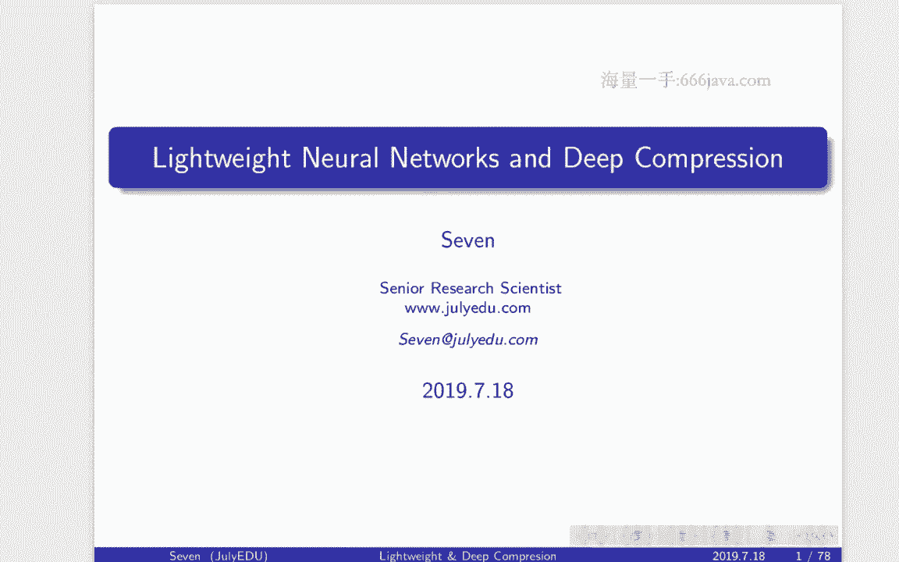

ok我们先来看一下这个啊，神经网络的这样一个压缩，或者说啊一个轻量级的这么一个神经网络，会有什么样的这么一个motivation的提出啊，事实上是这样，有同学问lp通用吗，通用其实它也是通用。

就是只要是神经网络结构，它其实就是通用的啊，只不过在cv领域，我们会显得更加的这么一个重要，因为很多时候我们面对的这样的一个，项目的这么一个场景啊，其实会面向在这种高性能计算，在手机上等等。

这些需要用到的这么一个环境，至于n o p似乎没有说一定是啊，像cv这样需求来得这么强好吧，啊这位同学是不是对lp这个非常有兴趣了，好我们继续，嗯那事实上来说可以这样，通常来说我们的模型。

尤其是在modivision领域，像我们上次讲了vg g net啊，还有一些rene还等等的这些大模型，对不对，动动不动就是几百兆的这么一个model上来，那几百兆的这么一个model，这么大的参数。

其实在这个运算起来啊，其实有gpu的帮助，其实也是非常吃力的，对不对，更何况如果到时候你要去做这个啊，线上的这样一个部署啊，或者我们这样一个手机端的这么一个运算，其实都会有非常大的问题。

这里给了一个这样一个啊表格呢，其实说的是什么样的事情呢，这个表格其实说的就是说，sorry，拿纸笔出来这只表，这张表格其实说的就是说，我们把bgg net这样，你的网络结构用不同的这样一个显卡啊。

去跑了一遍，然后呢，啊给出他的这么一个运行的这么一个时间，效率的这么一个参数，然后最后一个呢，我们还给了这么一个cpu的这么一个时间啊，可以看到它的这么一个预测的时间，几乎是大概在三秒钟左右。

那有同学会说，为什么我还会这里给出一个cpu的，这么一个时间呢，是这样，尽管我们在训练的时候，我们作为算法的从业人员，可以在我们的gpu上来进行大量的训练，这是没，有任何任何问题的，对不对啊。

这是我们的这样一个工具，但是在线上部署的时候有这么一个考虑，就是假设我们需要做大规模的，线上的部署的时候，其实在当前的这么一个结构环境中，尤其是工业界中，从性价比的角度来说。

其实cpu部署其实来说会来得更加的性价比，更加的高啊，也就是说我们的这样一个部署的成本，要相对来说低的很多，所以即使在现在的这么一个大厂，互联网的这样一个，随机的这么一个大厂来说，很多的这样一个业务。

我们还是会倾向于部署的时候，用大规模的，比如说上几十台的这么一个cpu的这样一个，计算的机型去部署啊，这是啊真实的这么一个情况，所以如果是这样的一个情况下，我们很难去把这种几秒钟的这么一个啊。

一次的这么一个呃运算的这么一个model，去部署大规模的这样一个上限，所以这个时候通常我们会面临两种选择，第一种选择就是，你就不要用这样一个大模型来做，你的这样一个网络的训练了嘛。

啊这是啊这这个第一个选择，那第二个选择是什么呢，第二个选择是说，既然你用了一个很大的这么一个model，那我能不能去把我这个model来进行压缩呢，这一支是两条路，第一条路就是我不要用大的模型了。

我直接用一个更小的模型来开始，进行训练吧，第二个model啊，第二条路的意思就是说，我直接把我大的模型试图尝试去啊，压缩成更小的这么一个模型，这就是两条路，那所以第一条路通常意味着什么呢。

我们要design，我们要设计一个更加什么呢，轻量化的这么一个网络的这么一个结构，这是我们的第一条路啊，第二条路我们要用到一些模型，减脂或者模型压缩的这样一个技术，所以在今天的这节课中。

我们就分这两个主题来对应的，这样一个课程的前半内容和后半部分内容。

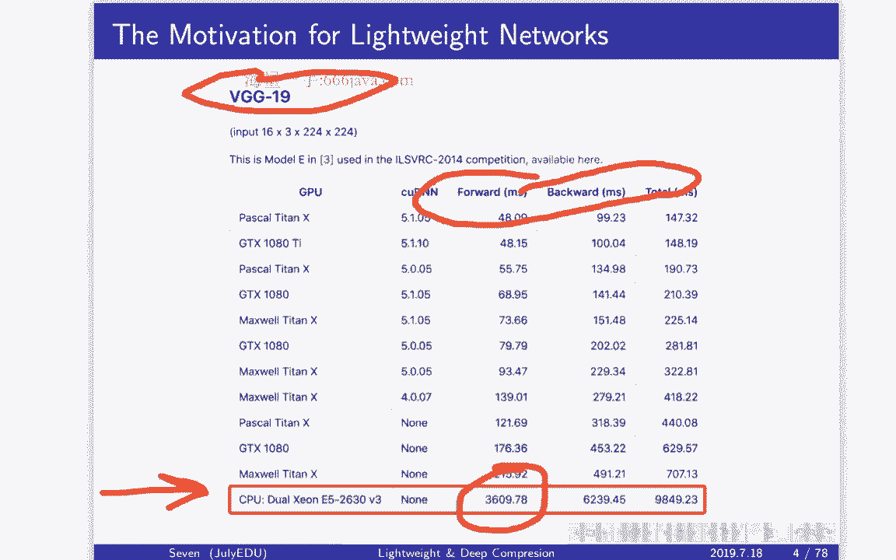

那在我们这样一个实际的这么一个啊，生产环境中啊，用哪些场景会经常会用到呢，啊，可以看到在，尤其是在我们移动端设备的时候啊，做的这样一些图像分类，图像分割啊，图像检测啊等等这些情况下。

那会大量地使到我们使用到，我们这些轻量级的这些神经网络的结构，而在近2年的这么一个轻量级的这么一个，神经网络的结构中呢，最有代表性的就叫做mobile net，大家从他的名字上就可以看到对吧，顾名思义。

mobile mobile它都已经是为移动设备取名的，这么一个啊应运而生的这么一个网络结构，那它的这个代表性就已经非常强了对吧，mobile net a mobile net呢啊我们有两个版本。

第一个叫v e virgin one，第二个叫vr virgin two，那接下来我们来回来去看一下，v一和v one的啊，sorry，v一和v2 的这么一个基本的结构。

另外一个为什么要选mobile net，除了它是非常常见的经典的，甚至在用在非常多的这么一个啊，实际的项目中都会用到啊，为什么还选这个呢，是因为在他的设计思想里中啊，它的这样一个呃。

设计理念是非常非常具有代表性的，也就是说它核心的那，么两个特点被借鉴，用在了设计其他的网络结构上去啊，所以为什么我们讲他讲了他这两个点，大家get到了，其实去看更多的轻量级的网络。

就非常非常啊容易去能够理解了，这就是啊我们为什么要去说这个啊，把mobile net这个网络结构给理清楚的，这么一个最大的这么一个初衷。

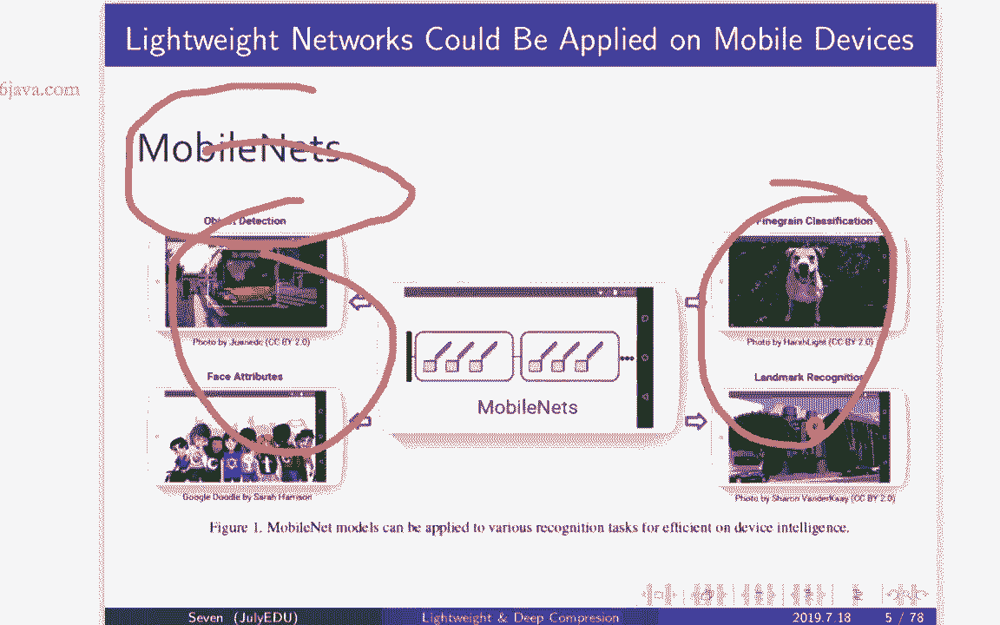

在具体介绍这个mobile net的这个网络结构，之前呢，我们先来看一件事情。

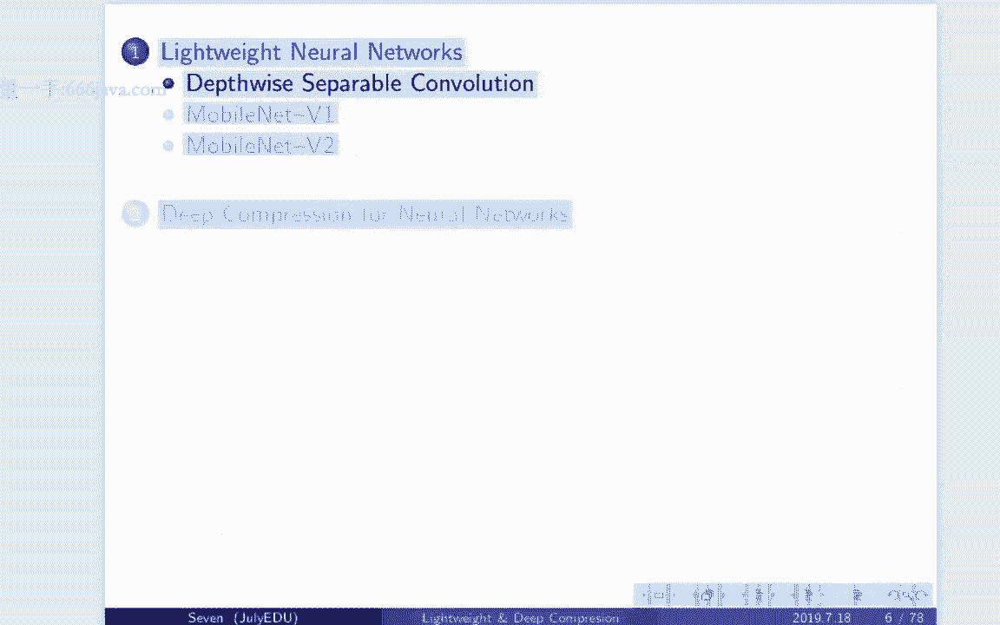

这件事情呢，其实就是我们昨天学的这些内容，不知道大家还记不记得，这件事情说的是什么呢，这件事情说的起算了这件事，这件事情，其实就是我们的卷积的这么一个网络，好，我们来看一下卷积网络中的。

卷积的这样一个操作，大家是否还记得，这是转基层啊，未给转基层的这样一个input，还有多少个呢，还有三个channel对吧，然后这些是我的卷积的kernel，所以我说我有两个卷积的kernel。

也就是我有两个filter，那这个filter的大小是多少呢，3x3对不对，所以针对红色黄颜色的这样一个filter啊，我其实会有一组这样的一个啊，这样一个卷积的厚度在这里，这个厚度是不是。

其实就是对应到前一层的，这样一个channel的个数，对不对啊，对于第二个卷积的模板也是这样，所以这其实是两个卷积的模板，但是注意到这里并不是一个二维的模板，对不对，我们昨天说了。

它其实会啊是三维的这样一个情况，所以我们把左边的这样一个这样一个input，未进来之后，使用了这样一个卷积的模板，乘出来的结果是不是这个，我的output channel个数是二，为什么是二呀。

是因为我的filter个数是二，对不对，然后每一组的这样一个结果，都是拿某一个filter跟什么呢，转机去进行划窗得到的这样一个结果，所以这个就是昨天我们说的卷积的，这么一个操作对吧。

所以刚才我们说的每一组卷积，都是这样一个三维的这么一个情况，就会跟输入的这张图片来进行点乘，点乘之后，我们第一个结果就放到这里来，然后不断不断把这样一个这张图输出完了，这个就是我们卷积的输出，没毛病。

对不对，没毛病，有同学问每组是三个通道的和相加吗，我们的船长同学，我不知道大家有没有同样的这样一个疑问，大家看我的输出是不是其实是两组输出，两组输出，它其实是对应到两个filter的这么一个结果。

对不对，其实每一组就是某一个filter卷积的结果，没毛病，对不对，没有任何毛病，所以每一组它又是一个二维的这么一个，matrix的输出，那这一为arm为the matrix怎么输出呢。

那一定是随着我的滑窗不断的滑滑滑滑滑，得到的，对不对，所以我怎么去滑滑滑得到呢，每一次划是不是都有3x3x39个，这么一个立方体进行堆叠在一起的重合，到了我重合在一起。

那就相当于我这3x3x339 27，27个元素做向量的内积，我第一次就写到这儿，对不对，那我的这个立方体会往右边滑和往下滑，那么我的这一组的输出就被计算出来了，对不对，所以这是对应的什么呢。

这一组输出就好比，对应到这个土黄色的输出，然后我又有一组输出是什么呢，又一组输出是不是，其实是对应到这个紫色的输出，这是第二张ma，所以这三个通道的和你说是相加也没毛病，但其实不是因为它三个通道要相加。

而是我要把它拉成一个，拉成一个多少3x3的，这么一个乘三的，27的这样一个长度的列限量，这三二十七个元素做内积乘出来求和，能够理解吗，这样讲的话，这个有没有问题，同学们，我看刚刚qq同学提了一个。

卷积的这样一个定义的问题，其实我们昨天就应该讲过了，各位同学有没有问题理解的对吧啊，理解很好，那我们往下走。

那我们来看一下，在这个bgg net和inception v3 ，昨天这题我们都讲了，这两个网络结构，对不对，那它其实在这个网络结构里面，有一些什么样的特点呢，其实我们也已经提到了。

第一个特点是说mgg net网络结构，其实它相比于前面的alex net等等，他只使用了3x3的卷积，以及padding为一的这么一个情况，使得输入和输出的尺寸保持大致一样，对不对，然后因为这个原因。

所以呢它会有更少的这些参数啊，这个啊在整个网络结构里面啊，转基层会有更少的参数，那对于inception v3 呢，对于inception v3 ，昨天我们其实没有讲，他一些啊实现内部的这样一个细节。

但是大家只要去看它的这样，一个网络的结构，它的这样一个啊细节呢，其实就会发现，他跟啊密基金有一个很类似的，这样一个想法，就是他也会去减少它的一个卷积的参数，只不过它的这样一个卷积的参数。

也会把大的这样一个卷积核，分成小的卷积核，这也是它的一个思想，所以总而言之，其实啊我们在这个卷积的具体的这么一个，网络结构实现里面中。

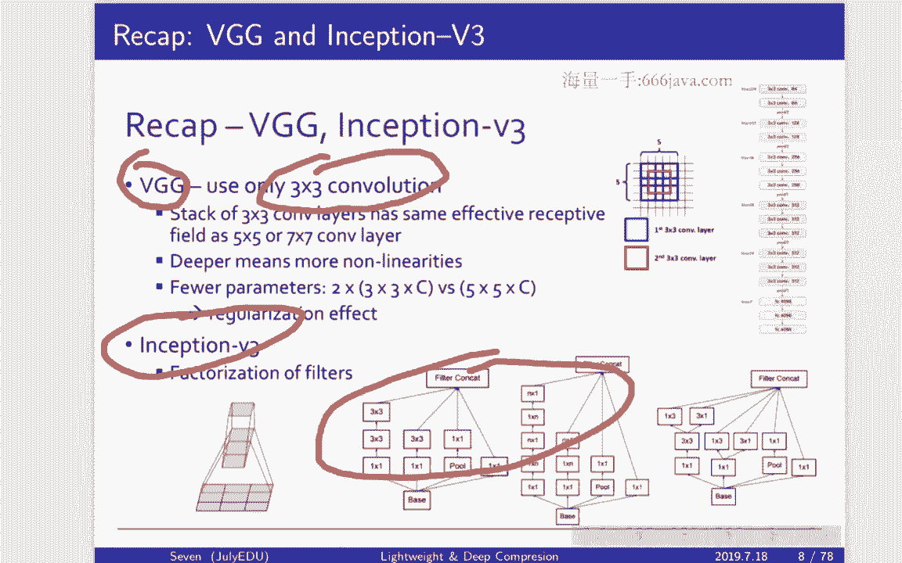

其实就已经有一些这样一个呃大的卷积核，逐渐去进行降解的这么一个过程，那接下来我们来看一下，在轻量级的这么一个啊，lightweight这样一个网络结构里面啊，非常行之有效的一种啊，把卷积这样一个分解的。

这么一个思想是什么啊，这个思想就大量的用在了mobile net等等，这些轻量级的闪击神经网络的结构中，这个思想是非常非常重要的啊，请大家要注意去理解，这是我们刚才说的。

regular的这么一个卷积的这么一个，实现的方式，对不对，3x3x3对，输入的这一张图片，和我的这样一个filter的这样一个东西，完全去重合啊，做卷积会映射到某一个数字，随着我的不断的滑，不断的话。

那我的记忆一个filter在这个channeled啊，在这个输入的上的这么一个啊，输出就已经得到了，也就是刚才我们qq同学问啊，提的这么一个问题，对不对，这个就是我们输出的结果，那重点就来了。

接下来我们就要讲。

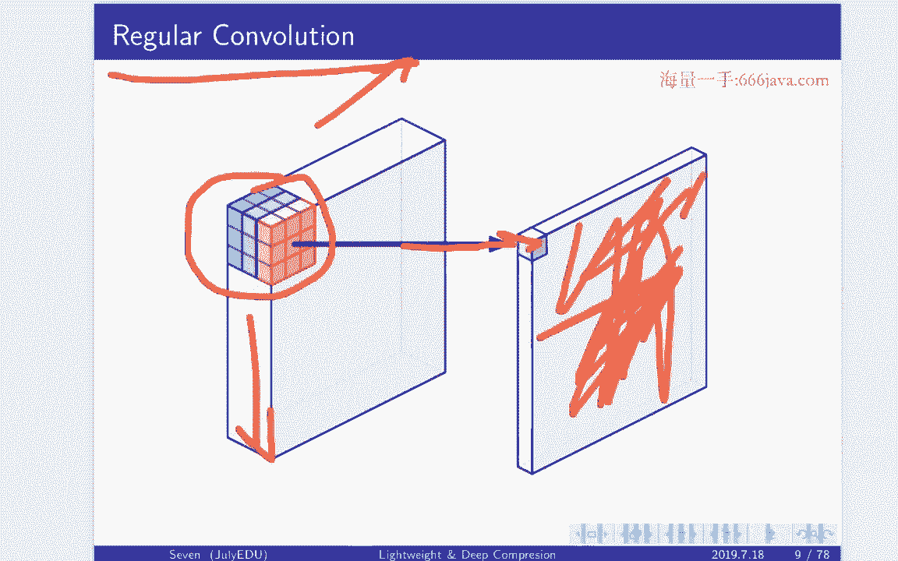

怎么把这么一个参数给降下来，怎么降呢，啊是这样的，我们的mobile net这个lightweight，这样一个网络结构里面中最重要的一个啊，最重要的这么一个核心的点。

就叫做deswise and point wise convolution，大家要记得啊，就是这个东西你要牢牢记，牢牢的记在脑海里。

stepwise and point wise convolution，记住了吧，那depth wise和point wise convolution，他说的是一件什么样的事情呢。

他说的其实就是这样一件事情，首先我把一个正常的转机，我会把它拆成两个东东，第一个叫death wise，第二个叫point wise ution啊，这是从大的层面的这么一个情况。

那具体到stepwise convolution，什么叫deswise呢，这个就比较啊，其实比较容易理解，根据它的字面意思，wise对不对，wise就是沿着什么什么什么的，对不对。

那depth是说沿着我深度的意思，对不对，是沿着深度的这么一个词，那这是我们的这个强行的这样一个，英语的直译，对不对，那实际上是说我输入的这一章图片，或者这么一个啊tensor。

它是一个三维的tensor，对不对，对于这个而言是一个三个通道的，没错吧，所以本来我的卷积核是不是就应该是三乘，3x3这么一个卷积核进行去转机的对吧，但是在这里呢，在这里呢我们是这样的一个说法。

它一共有三个通道对吧，三个通道，所以我这里就设置三个filter，三个不同的filter，每一个filter呢是一个3x3的，所以我每一个filter都会只跟它某一层，slice。

某一层channel去做卷积，也就是二维的转机，大家看这个颜色，这个怎么来的，蓝色的怎么来的，冰蓝色的怎么来的，冰蓝色的这一层是由一个冰蓝色的转机的，kl 3乘以三滑窗，对什么划窗呢。

对冰蓝色输入的这个冰蓝色的第一层，第一个channel进行滑窗得到的结果，就是他，那中间这个浅绿色怎么来的呢，浅绿色的这样输出的这么一层，是由一个浅绿色的3x3的这么一个kernel，为什么呢。

对输入的这样一个浅绿色的，这一个第二个channel cancer来进行划窗得到的，而红色的这个怎么来的呢，红色的也是一样，我会有一个新的红色的这样一个channel啊，红色的上面一个kernel。

对输入的这样一个红色的channel，进行划窗得到的，换一句话说，在point vice convolution这个里面，我输入层有几个这么一个channel，在我的这么一个point啊。

deswise这里面我就会有几个二维的，注意是二维的卷积的kernel，分别对它进行划创，得到，所以我们假设我们的输入是，比如说224x2，24x3的这样一个大小。

那经过一个depth wise convolution，那么depth wise的convolution，我这里又是3x3的这样一个大小，那我这一层的参数有多少个呢，那就是3x3，然后有三个3x3。

对不对，就是3x3x3这么多个，然后这是我们的输出，对不对啊，这是我经过deswise的convolution的输出，请问大家，现在你们明白了，stepwise这个convolution怎么做的吗。

张明老师讲清楚了吗，大家都get到了吗，如果get到了，给我一个回馈，大家都听听听明白了，那接下来我们要看point wise，convolution是怎么做的。

point wise convolution，这个处于的位置是紧接着deswise convolution的，所以deswise convolution的输出。

就是point wise的volution的输入，记住什么叫point wise convolution呢，所谓的point wise convolution，它是1x1的卷积，1x1的卷积。

point wise convolution，它到底是怎么做的呢，它其实是这么做的，我是为了把什么呢，刚才不是我每个deswise都是什么呢，对不对，因为我们每一个二维的卷积只管他自己，对不对。

可是大家别忘了，那之前我们在做这个通常的转机的时候，对不对，我会把整个通道也去学一遍，所以point with就是这样一件事情，他的意意思是说，哦前面你stepwise是分通道进行转机的，对不对。

都没有用到我之间的correlation的信息，那么point在这个基础之上，我把你这个整个跨通道的这个这个信息，我把你给补回来，补偿回来，所以在point ones这里，我加一个跨通道的这么一个信息。

所以我会加一个叫1x1的转机，这件事情在这里面，所以我会把什么呢，我会把1x1卷及这件事情，跨通道对它进行这个操作，这个就是point wife要做的事，所以pom其实就是一个1x1的卷积啊。

我会把这个东西给拉过来学过来，如果大家对这个还有疑问的话，或者说还觉得理解得不够，这个仔细的话会还不够自信，自己有没有get到。

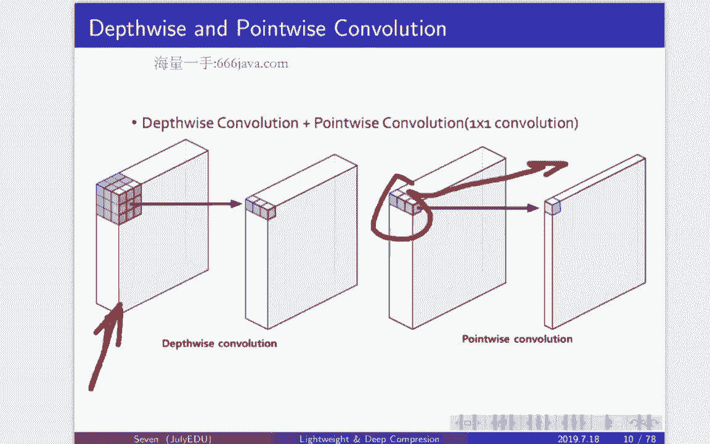

接下来我们来算一算啊，我们来这个啊实际的来看一下这件事情，我们把刚才的那个结果，用更加overall的这么一个形式，把它进行给展示出来，这是我们的，输入对不对，这是我们的输入。

然后wise说的这件事情是什么呢，wise这件事情说的是，我对每一个不同的slice都有一个卷积，从二维的卷积去卷积它对吧，都会得到这个得到它也会得到哈，所以我把这些东西组合在一起，叠在一起。

叠个烧饼就在这里，point wise是说，我希望用1x1的这样一个卷积，把跨通道的这个东西给组合出来，这就是我想做的事情，并且什么呢，并且stepwise的输入和输出的channel个数。

是不是一定是一致的，对不对，但是在point wise这个convolution里面，我并不是一致的，我可以随意进行改变，对不对，是不是我可以进行改变，比如说1x1乘多少。

我的这样一个我可以设置成比如说我要学，这里是指三个fter，那其实我就可以把1x1的卷积啊，用1x1减来卷积去进行降维。

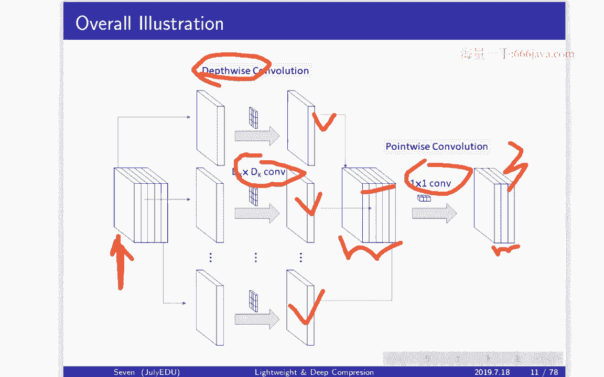

左边这个是通常的这么一个卷积的filter，对不对，假设我要学大n个feature map，大n个filter，而我每一个filter map，每一个这个filter，是不是都是一个三维的这样一个卷积。

然后m是什么呢，m是我的输入的那个东东的维度，就是书的channel的个数，dk是什么意思呢，dk就是在我这个我的这个filter的，这样一个长和宽，所以我的这个卷积的这样一个参数。

其实就已经可以计算出来了，对不对啊，其实就是这是我的卷积核，对不对，这是我的卷积核，那我的deth wise的这样一个卷积核，是什么呢，depth wise的卷积核，是不是这个我一共有m个卷积核。

因为我要对应到什么呢，对应到输入的这么一个channel的个数，对不对，而每一个输入个数的sorry，每一个输入的啊，slice呢，每一个channel呢我都是dk成dk的。

而对于point wise来说呢，对于point wise来说，是不是我是一个1x1的大小的，这样一个卷积，那每一个1x1大小的卷积，它的深度是多少呢，它的深度其实就是不是对应的m，是不是对应的是m。

那我有多少个1x1乘m的这样一个呢，will n个输出，对不对，是不是有n个输出，有同学问我们的dk是dk，为什么是一，那就说明你对deth wise，刚才的东西根本就没有理解，如果是rgb的话。

m是应该三对不对，而不是这里的一是三对不对，你有没有搞错了，混淆了，还是说刚才的depth wise，你没有这个理解透，这部分有问题吗，其他同学明白了是吧，o，这里有没有问题，wise和point。

wise的转机的这么一个内在有没有问题，有同学问没错，其实我们就是把卷积，其实普通的卷积分拆成了两部，大家先不用管这两步的好处，首先这两步明白了没有，接下来我们再从理论分析上啊，再看它的好处。

首先这两步大家看懂了吗，怎么具体的做法，先不要着急问为啥啊，一会儿我们再说，都明白这么做了，对不对啊，一定要弄明白，很有可能你们接下来去求职考试的时候，说不定这个面试官就会让你们解释。

什么是device，point wise，这个东西让你手画一下。

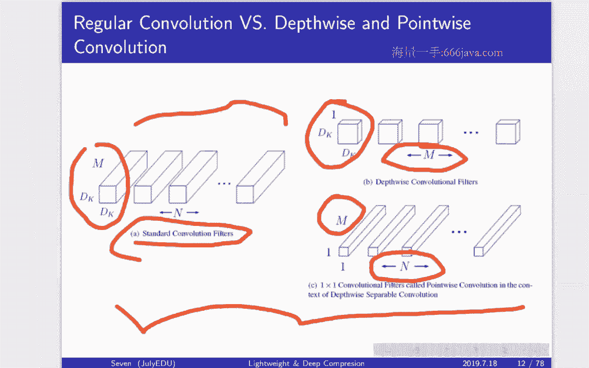

如果大家都能get到了，那接下来我们来算一算，来看一看我们的这样一个卷积，变成wise和point wise有啥好处，那我们来先来看一下，我们的通常意义上的这个卷积啊，通常意义上的卷积。

那通常意义上的卷积，我是不是假设输入是m输出是大n，然后我有啊这个输入时的这么一个呃，就是filter是这个dk成dk，然后啊到这个啊，输出的时候是这个df乘df。

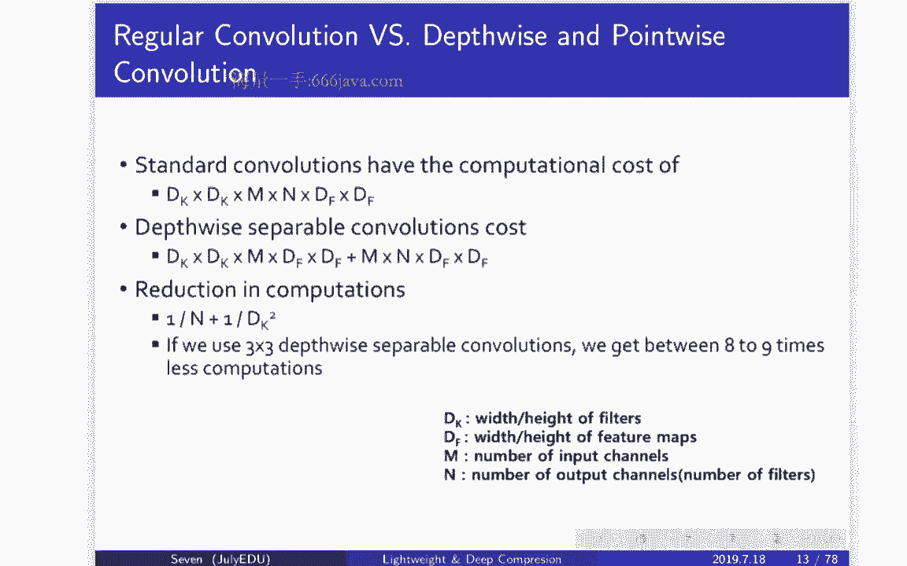

那是不是我总的这么一个sorry，我总的这么一个计算量是大概是这么多，那与对于depth wise和point wise来说，我的计算量是多少呢，是不是这么多，这对于这个，desy而已啊，对于我的。

对于我的这样一个呃，point wise而言，那我的计算量是不是这个，什么是dk呢，大家看一下右下角的这样一个说明，dk dfm和n，m是输入的channel个数，n是输出的channel的个数。

所以我一旦把我的这样一个输入啊，sorry，regular convolution和depth wise和point，wise convolution，我来做一次比较，我一锄，我就除出来了。

我的这么一个computation的这样一个降低量，所以大概是n分之一，加上一除以dk的平方，那这是什么意思呢，这个意思是说，大家想，如果我用3x3的这么一个卷积的大小。

那就意味着是不是我的是大n分之一，加上1÷3的平方，分之，那也就是大n分之1+1/9，所以如果大家你可以把大n分之一，这个东西给忽略的话，所以基本上你的计算量的这么一个降低，就是原来的1/9。

所以这就是一个非常直观的啊，直观的这么一个啊下降。

那接下来我们来具体看一下，stepwise和point wise这件事情，到底它的具体的网络结构长什么样子，那左边其实就是我们通常意义上的一个，转机的这么一个building block实现。

是不是我先来一个3x3的卷积，然后经过一个b n b n是什么意思呢，b是batch normalization啊，b n其实是一个啊normalization啊。

这个规范化的这么一个词normalization，那么来这个bn的这么一个产生的意思，是什么意思，就是就是我希望我的网络的输输出啊，其实是更加什么呢，更加具有这个啊，我不希望我的这样一个一输出。

是一个乱七八糟，或者说啊就天花乱坠的这么一个结果，我希望我网络的这样一个输出的这么一个，每一层输出的这样一个结构，比如说啊是类这个啊，高线的或者某种这个分布的啊，所以其实说白了是这件事情。

我不希望我的这样一个网络的值太分散，到什么乱七八糟的，这样一个不同的这么一个程度上去，它是一个标准的这样一个组件，有了bn，通常来说，有了bn加这个normalization的这样一个。

规范化的这么一个来源，会把我的这样一个网络的这样一个性能呢，可能会再提高一点，我会把我的这样一个收敛的，这样一个好处呢，啊把我的这个收敛的这样一个效果呢，保证的更好啊，你就好比就好像我的这样一个。

网络的输入的时候，是不是也会要做一些规范化的，这样一些处理啊，是类似这样把我的量纲放得更加的接近，在同一样一个维度上，那如果是有了deswise和point wise这件事情呢。

那通常来说会是这样做一件事情，所以其实是不是我把我的整个卷积过程，分成了两大部分，那第一趴是不是，其实就是刚才我们讲的3x3的，depth wise，第二趴其实就是我们刚才讲的1x1的。

point wise，那还有一个background需要跟大家交代一下，就是啊大家记清楚啊，通常stepwise加上point wise，很多时候我们又称为叫stepwise separable。

convolution，separable的意思就是可分离，那很多时候中文会被翻译成叫深度可分离，卷积啊，其实大家说的玩意儿其实都是在讲这些啊，这一类摊子事情，这一摊子的事情，所以我们花了这些时间讲。

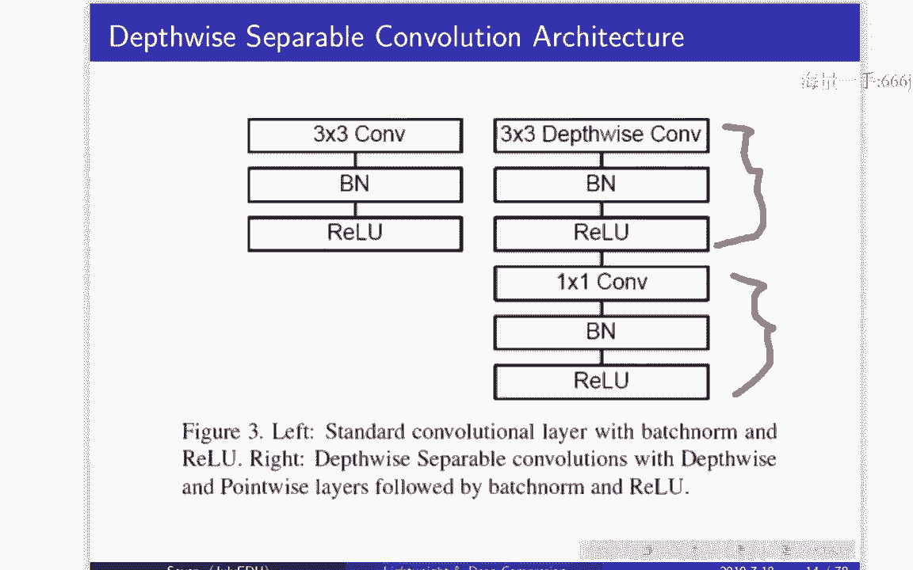

啊point was convolution，那接下来我们就要看一看我们的mobile ne，到底是怎么去进行这个啊。

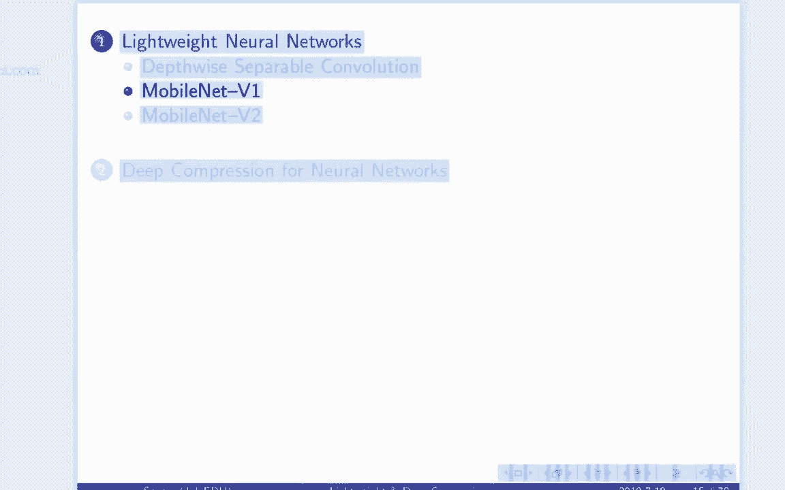

使用这个东西来进行结合的，首先我们给一张mobile net，virgin one的这么一个网络的大致的结构嗯，看上去会非常复杂，但事实上啊没有那么没有那么难，没有那么难，网络的最右边这一列是我的输啊。

输入的这样一个tensor的大小，所以这个的输入是接受224乘，24x3的这张图片大小，而最后我的输出是不是分image net 1000类，这样是非常好理解的，对不对，所以即使你不理解它的实际的内在。

你只要理解它的输入输出，它其实就是你可以去用起来，对不对啊，用起来，然后它中间呢啊，每一个sr ride 2的意思就是，我要把我的resolution，就是把我的这样一个长和宽来进行砍半啊。

这是啊这个意思，然后这个啊，每一个的这个还有一个这个的意思五乘以，就是说我要进行去若干次进行重复啊，若干词来进行重复，这个是我们mobile net的这么一个基本结构，只是在这个基本结构的里面呢。

每一个卷积我会把它拆成什么呢，拆成把regular的这个convolution，替换成刚才我们说的stepwise和point，wise的convolution，这是mobile net要做的事情。

其实mobile net做了两件事情，对不对，第一件事情，我设计了一个网络的基本的这么一个结构，第二我用stepwise和point wise，convolution。

去替代了原来的convolution的这样一个layer，这是他要做的事情。

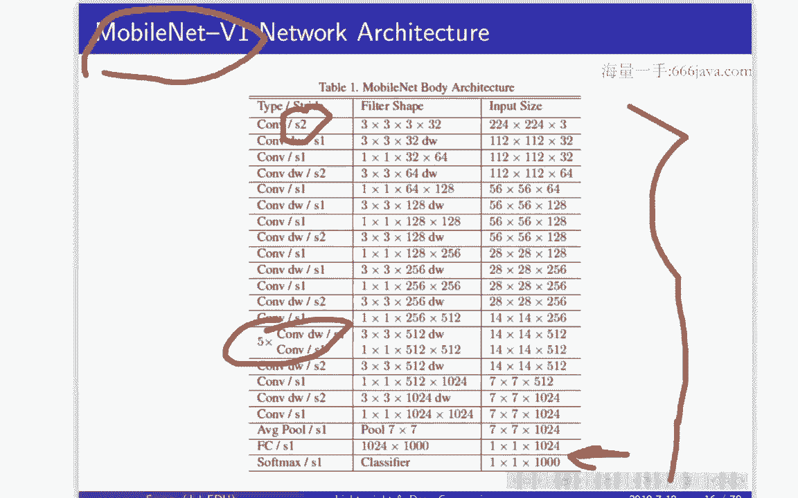

那除此之外呢，在这个mobile net，v version一的时候呢，它还有两个超参数，这两个超参数是干什么的呢，这两个参数其实是用来控制我的，light with the model的这样一个程度。

我希望它能够降得更加的低一点，就是它的这样一个啊计算量也好，它的这样一个啊瓶颈也啊，它的这样一个啊轻量级化的程度也好，哪两个超参呢啊一个我们称之为叫阿尔法，另一个我们称之为叫肉，这两个超三是干嘛用的呢。

这两个超餐是这么干的，阿尔法是说我控制我这个layer channel的个数的，还是少，所以太称之教网络的这么一个，thinner的这么一个概念，就是啊我用了这个阿尔法，我可能会让我的网络更加的瘦啊。

show的意思就是我的channel的个数变少了，那不就更瘦了嘛对吧，所以我可以取这么多不同的这些参数对吧，如果取0。75的意思，就是，我希望我现在的这样一个啊，输出的那一个结果。

要比现在标准的这个情况下，是它的3/4倍，砍掉了1/4，第二个套餐是什么呢，第二个套餐是我保持，我要去控制，我的spatial的这么一个resolution，就是我的这么一个分辨率的这样一个长啊。

长宽的这么一个大小，所以我输输入的这个分辨率，是不是我也可以去进行控制，比如说对于224，它是如果24，它的比例也就是等于一的话，那是不是后面我会有不同的这些比例，对应到它。

所以这两个东西是能够帮助我去进一步，裁剪我啊，不是裁剪，进一步去控制我整个网络的参数量，和计算量的这样一个啊变化的，我可以取不同的这个参数的比例，所以刚才的这个公式，我们是不是就可以去进行了一个啊替换。

我说我们的这样一个，把我的这个阿尔法用上去，然后再把我的这么一个啊，肉对应的肉用上去，大家想为什么肉会跟这个filter乘在一起啊，是因为当我的这个输入的这个，resolution变了。

那不就相当于我后面的这个肉啊也会改变。

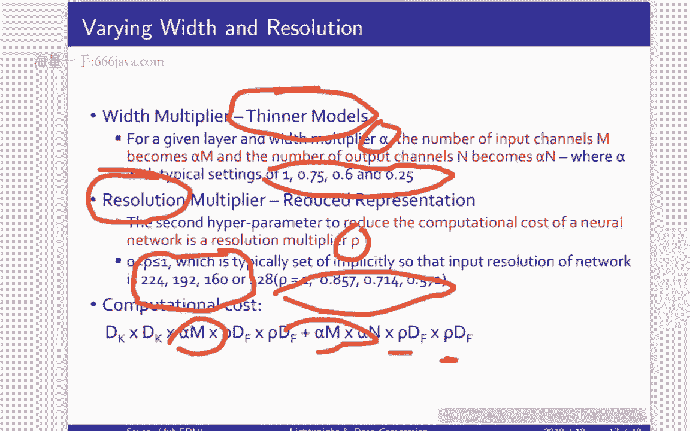

对不对，所以换一句话说是什么呢，换一句话说，我可以通通过控制两个超参数，来达到控制我这个网络轻量化及的啊，轻量化的程度的这么一个啊目的，这个就是我们要做的事情，那这里给了一个例子，这个例子是什么呢。

这个例子是说，当我们使用普通的卷积的时候，在如上这些操作的，参数的基础之上，我们给出的两个计算量啊，然后当使用正常的depth wise，separable convolution。

也就是刚才的stepwise和punch wise的时候，我的计算量已经会下降了，对不对，下降了，但是我去进一步控制，我阿尔法和roll的时候，我还能够进一步下降，这是很合乎逻辑的，对不对。

我们都能够在我们的预料之中。

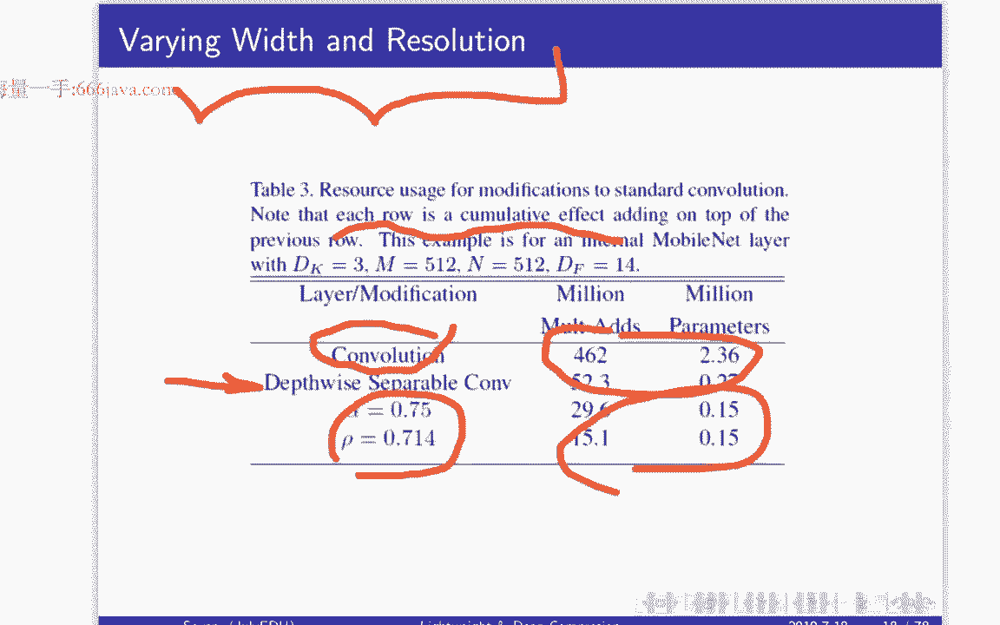

第二个第二个是什么呢，第二个是我们把我们的这样一个mobile net的，这样一个网络结构来做一些实验对比，那第一个时间，这个时间对比对比的是什么呢，我把我的这样一个mobile net网络。

用正常的卷积来实现，和用mobile net的deswise，深度可分离的这样一个卷积，来实现他俩的这样一个计算量，我的准确率降低的却没有那么高，对不对，所以它的性价比会比较高，那这个呢。

其实就是把我们的这个更多的参数去变化，不同的这个参数给进行实现，对不对，然后这个是说我要变换我的网络的，瘦身程度啊，这个是要变换我的网络的肉的，这么一个程度啊，我都会有不同程度的计算量降低的时候。

瘦身的时候，那我的这样一个网络的效果，可能也会有一些些许的下降。

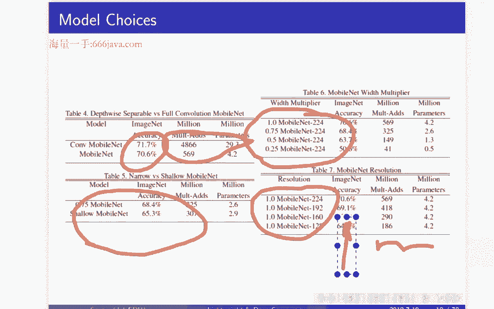

那我们还可以把我们的mobile net v1 ，跟我们的深度网络来进行比较，比如说跟我们昨天学的bgg net网络结构啊，标准的这个mobile net没有做任何的啊，roll和阿尔法上的裁剪。

那是不是我的计算量是从呃，计算效果是从71。5%的分类，准确率掉到70。6%啊，但是我的这样一个，其他的这样两个参数的数量等等，我都下降了非常多的这样一个倍，这是我们要说的啊。

那这是我们刚才说的这样一些事情。

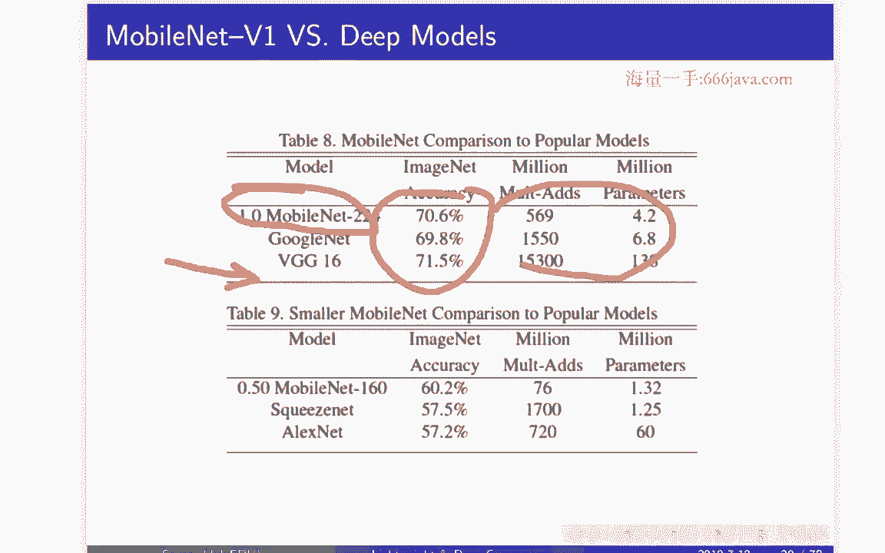

然后最后呢还有一个还有一个这个，一个刚才我们有提到的一个点，就是在mobile net version one这件事情里面啊，我这件事情里面，我所有的rio都会换成一个叫ro 6的，激活函数。

那real 6跟reload有什么区别呢，没有任何区别，我本来不是real函数，是这个东西嘛，对不对，只是在这个时候我给它限制了一下，我把它限制到最大是六，就这么简单啊，也就顶多是六了啊。

这就是rr 6这个函数这个实验证明啊，我们的作者为什么要提到，是说ru 6 t用ro 6，要比rio收敛的这个结果来更加的鲁棒，这个就是啊mobile net virgin one要做的事情。

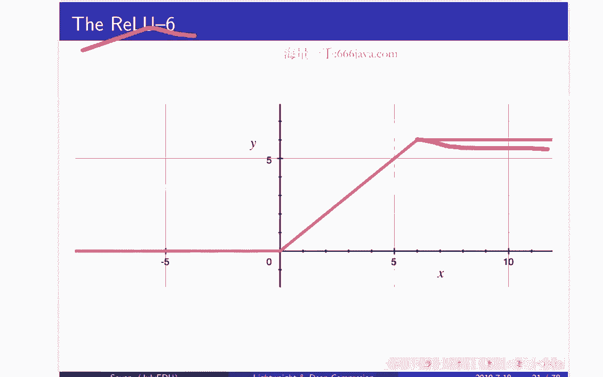

然后在我们的cs里面呢，tensorflow里面是给了这个一个，mobile net的这么一个接口，在pf。cars点，application点，在这里面有一个，应用，然后大家看看是不是在这个接口里面。

也会提到了，这些不同的这些套餐给我们用到，对吧啊，这两个对应的我们的是不是阿尔法跟肉啊，大家可以去看看。

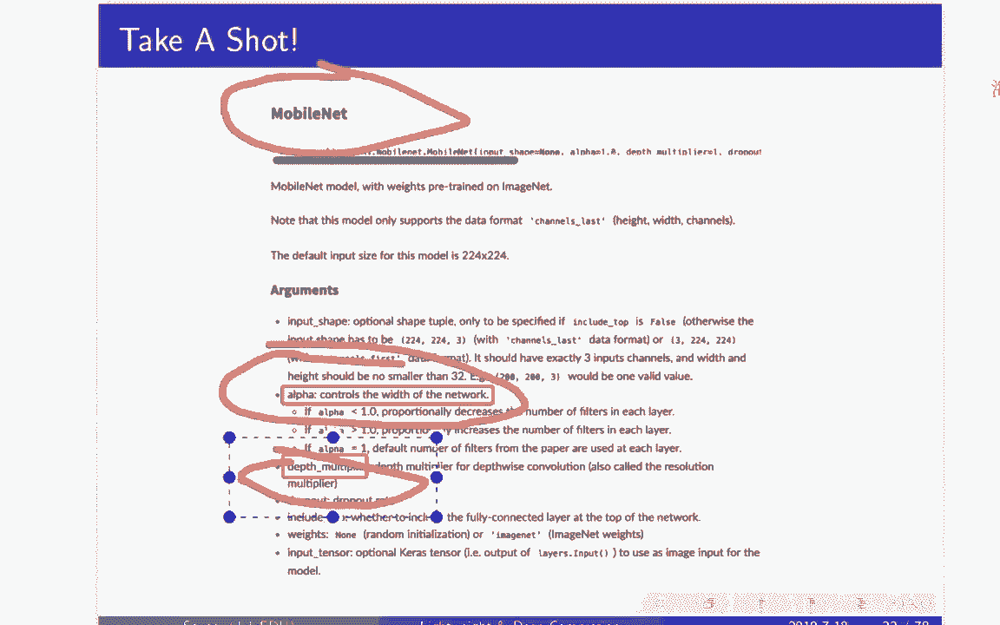

好那我这个我们先稍微喝点水休息一下啊，所以就seven老师要上个厕所去喝点水，然后一会儿我们再继续听一首歌，然后我们继续，好我们继续啊，我刚刚看了一眼大家讨论的问题啊。

还有必要去学less night这个less night吗，啊那当然是啊，需要了啊，其实在这个recite跟mobile net其实就是less night，尤其是刚才的同学都在讨论。

有没有一些什么链接什么之类的啊，我没记错的话，一会儿我们会有一张图大致分析一下rn，主要的思想，就是说，resnet其实是一个很深的这么一个model，它其实是一个大模型，它其实可以理解为是一个大的。

更加重量的heavy的这么一个model，那这个model的这么一个，在某些数据集的这么一个上限啊，还是要比mobile net要来得更加的高的，所以从这个意义的角度来说啊。

你总归很多时候还是会去需要一个什么呢，需要一个高精度的这样一个模型啊，给你去去去指路，比如说在一些一些情况下，那好那么个五六个点拿多少个点，其实是还是有非常大的意义的，对不对啊，你不能说啊。

你有着一个小的，你不要一个啊更深更好的这么一个网络，其实并不是这样的，但不同的需求的这么一个情况下，你还是有它的一个很好的这样一个作用啊，这个就是就是deep model，我们要去掌握。

其实你不是说你要去啊，盯着那个paper也好好的复现，你只要能够了解它的这样一个基本的，这样一个结构，能够去在实际的工作中或者比赛中，或者我们的project中去用起来，其实这个力度其实就ok了啊。

我觉得就挺ok了。

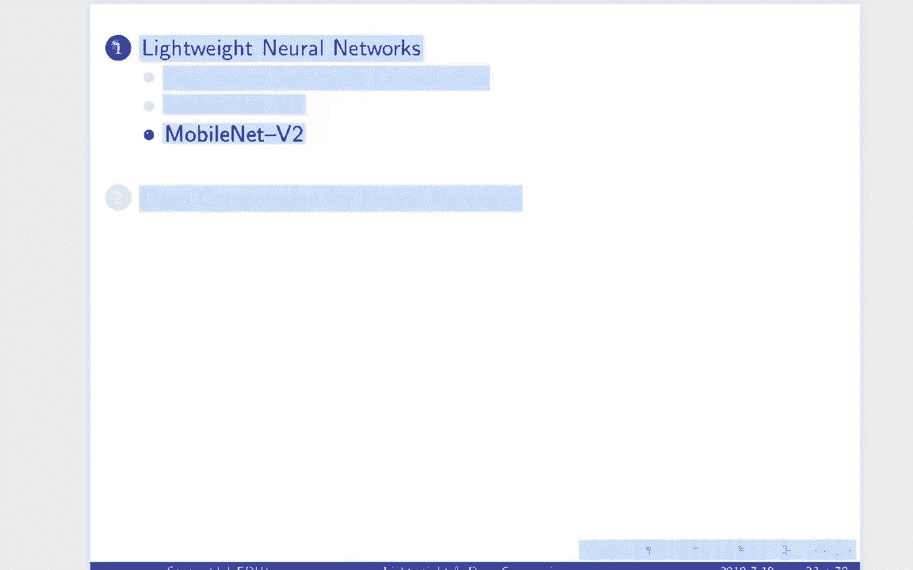

好我们继续，刚才我们说的是mobile net 1，对不对，那我们看一下mobile net，还有一个v2 ，v2 跟v一什么区别呢，我们在一张图上先来直观地感受一下。

我们把这个呃这个accuracy和这个latency，把它给拼在一起去，这个啊进行打印了一下，当然会发现，我们的v2 比v一会来的更加的好，对不对啊，什么叫更加好呢，在相同的这个latency上。

我们的vr的效果更好，在相同的准确率上。

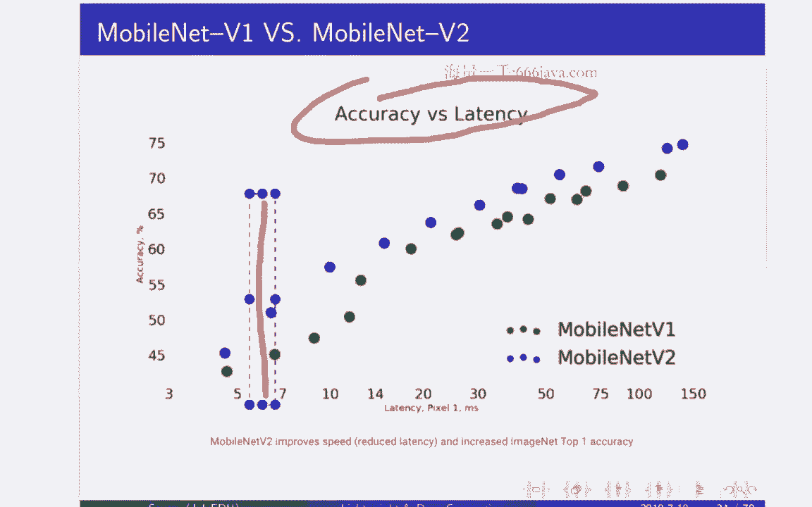

我们的mobile net更快，那vr其实啊也是一个backbone了，就是vr的这么一个应用的这样一个场景，还是可以去用在非常多的不同的这个，任务中去啊。

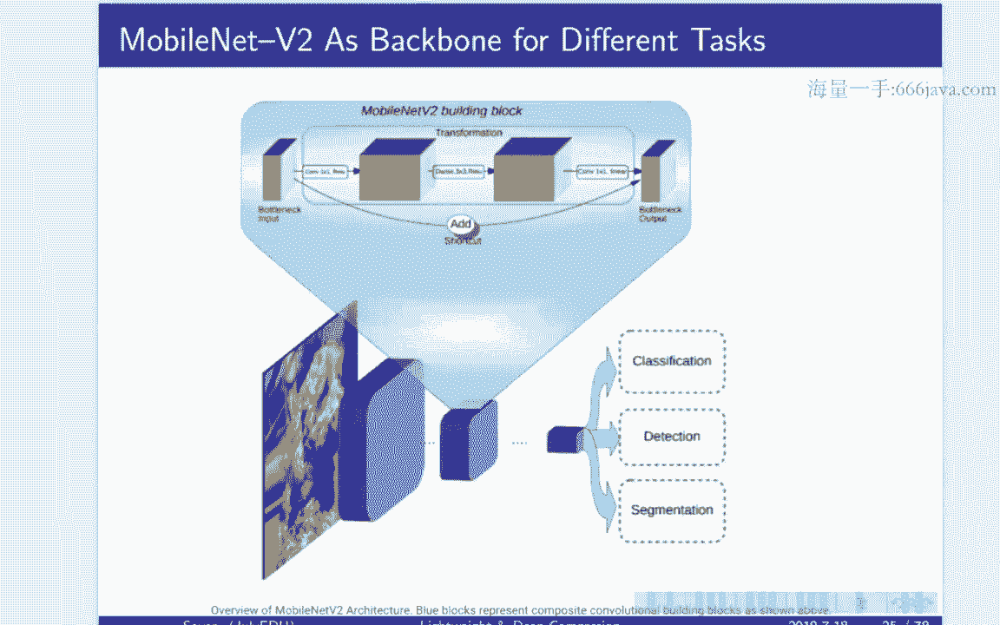

这其实是vr的这么一个啊啊这个这个作用，然后v一跟v2 其实还是有一些啊实验啊，更多的实验来进行啊，比对的，比如说啊在这个啊s s d啊，这不用先不用说s s d是什么，我们下周就知道了。

我们要学这个object detection，也就是说在object detection这个领域里面，然后我们对比了v一和vr作为backbone，也就是作为那个feature。

jector的那样一个结构，就是前面的那个卷积的这样一个结构。

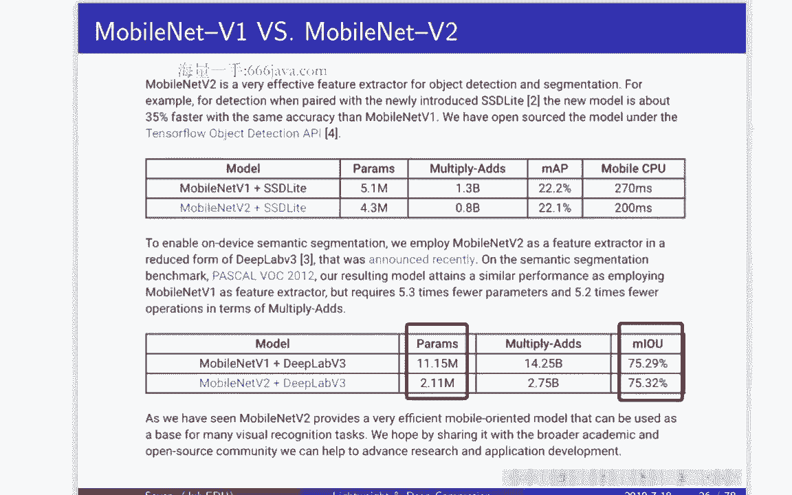

然后会有一些实验结果，然后呢在这个这个image的这样一个segmentation，就是图像分割的这样一个领域，demb，就是一个图像分割的这样一个网络结构，然后也用v一跟v2 作为它的特征提取器。

然后我们的这样一个结果啊，如下所示，我们发现在这个效果差不多的时候，我的vr又进一步的进行，这个参数的这样一个降低，那接下来我们来看一下，v一跟v2 到底有哪些区别呢，它的区别其实是这样的。

那区别一共有两点啊，左边是我们的v，右边是我们的v2 ，哪两点呢，第一点是有没有发现外面会来了一根连线，这个连线我们称为叫residual connection。

或者叫skip connection connection，这个连线是由resnet带来的，这么一个启发啊，也就是刚才同学们提到的，那第二点是说第二点是说有没有发现，这一趴跟这一趴是一样的，对不对。

我唯一不同的是这一趴，对不对，绿色的那绿色的是什么呢，绿色的看到没有，它其实就是多了一个1x1的计算器部分，所以它只有两点不同，一我加了一个residual connection，我把原来是这个哦。

stepwise加point wise，变成point wise，加deswise，再加point wise，大家先花这个三分钟的时间，把这张图再看一下，如果这一块没问题了，那我们接下来举一个例子啊。

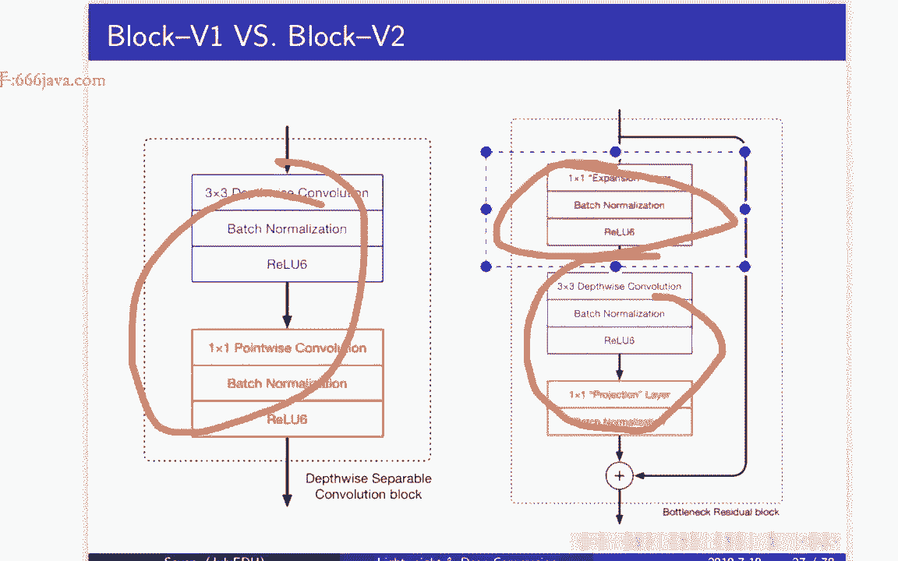

举一个例子，来帮助大家去理解这两件事情的这个啊，来理解这两件事情的这个这个啊含义所在，我们举个例子，假设是是这个56x6x24，然后第一个1x1的东西，我们称之为叫什么。

我们不是有一个1x1的卷积在最上面吗，绿色那个东西，那个东西我们称之为叫扩展层，也叫expansion layer，扩展层的意思，通常我要把我的channel的这个维度，再扩得更加的宽一些。

就比如说我的扩展的这个factor是六，也就是我要扩六倍，那我会把我的这样，一个1x1的卷积，有没有发现1x1这个东西啊，我会把我的长和宽不变，我可以随意去切换它的channel的个数，对。

不断的去进行升维和降维，这是1x1给我们带来的这样一个启示，好处，所以我先把我的维度先升高，然后呢在这个维度升高的基础上做一次，deswise convolution，这是我们刚才说的结果。

然后再呢把我的维度变回来，变到24，这块理解吗，就是这个东西能够想通知道怎么做的吧，就是啊，你你能够理解他为什么能够做到这一点吗，至于他为什么要做原理，或者它的直观上的想法。

我们后面解释就是这一块参数上，是不是都能够理解他怎么做的，如果能够理解，我们就往后面讲了，就其实这里的理解的点只有一个，就是伊利的point wise的实现，我可以随意去变化，我的channel。

不断的去随意进行升为和这个降维的，point vise的实现，我可以随意去变化，我的channel，不断的去随意进行升维和这个降维的，point one se的实现，我可以随意去变化。

我的channel不断的去随意进行升维和这个降维，对不对，卡了吗，hello，同学们，那如果卡哦，这个那就听明天的录播吧，就是或者后面的录播好不好，好，我们继续，芒果同学说1x1卷积怎么升为。

那1x1卷积怎么降维，它就怎么升为呀，我只是把那个n变得大一点还是小一点，不就完事了吗，能理解了吗，芒果同学，这个问题，我觉得问出来好像是不是比较简单，有同学问问课程在哪，在啥时候，你就等老师通知吧。

这个问题不要问讲师，就是等问这个群里的老师问你，我也不知道等等，这个通知，好我们继续啊。

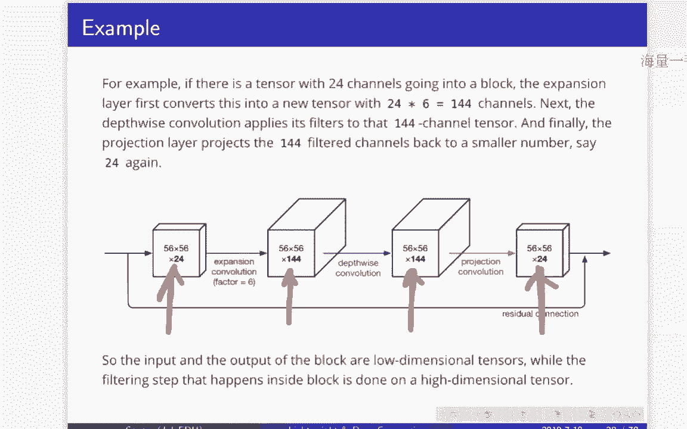

有同学要问什么叫做1x1的卷积，是不是这个同学刚来之前没听到，那如果是这样的话，你就听录播吧，不然我得又再讲很久了，同学说有多少个1x1的卷积核，就变成多少维，没错，这个理解就很棒了。

就是即使我的channel的个数啊，是可以随意进行变换的，对不对，其实你的这样一个channel个数，也可以去进行变换的，那我们继续一下继续，那刚才不是说到mobile net version to。

那我们继续下继续，那刚才不是说到mobile net version to，那我们继续下继续，那刚才不是说到mobile net virgin two。

是有一个residual connection的东东，对不对，那接下来我们来看一下，接下来我们来看一下，接下来我们来看一下这zero的connection是什么东。

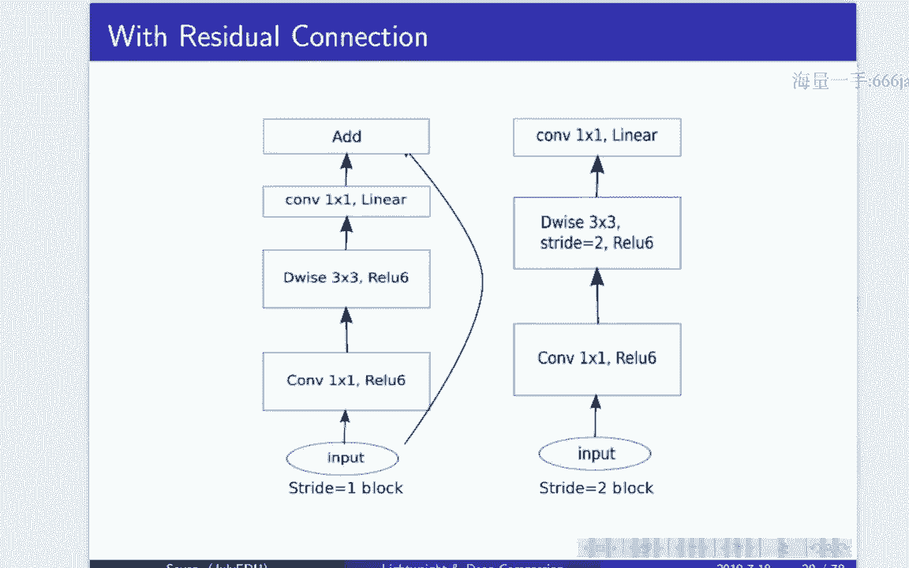

西，是什么东西，这个东西其实就是跟我们的什么呢，跟我们的啊，reon其实就是跟我们的什么呢，跟我们的啊，reon其实就是跟我们的什么呢，跟我们的啊，recent的这么一个相关的这么一个概念。

也就是我们的这样一个残差神经网络，残差神经网络的这样一个提出的，这样一个motivation，是这样，就是我在这个啊训练的这样一个时候，我发现我深层的这么一个网络呢啊，就是56层的这个网络训练。

要来得比这个浅层的这样一个网络，来得更加的这样一个呃这个高啊，不管它是在训练还是在测试的时候。

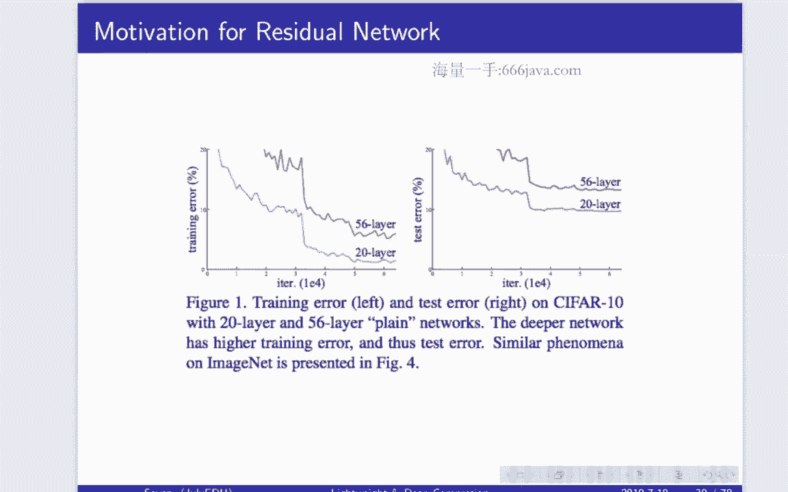

这是，这样一件事情哦，看一下，对没错，这个信同学说，每次最后1x1的卷积，会到最后一个的channel的维度上带来，没错，是因为什么呢，因为我的1x1的卷积，一定是跨通到融合的。

所以我一乘以所谓第11x1的卷积，它背后还有一个深度，对不对，它的深度，其实就是那个depth wise的这样一个深度，然后他在定义周，我要输出有多少多少个那个channel个数。

好我们继续讲这个rene，那react其实刚才说到，它是一个训练困难的问题，因为我更深的网络，却没有得到一个更加好的这么一个结果，这是更加困难的这么一个啊。

difficult training这么一个问题。

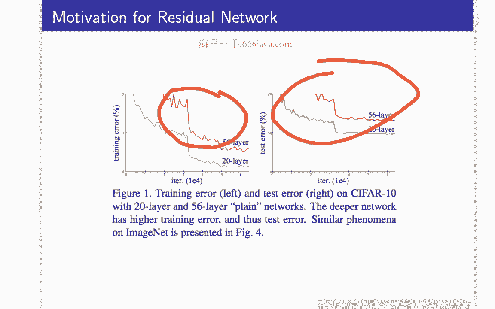

那为了什么呢，为了保证这么一个，哈哈哈哈，你们不要引我笑，这上课很这个严肃的，有同学说目测三位老师八零后对吧，谁跟你说的，啊我们继续，我们继续，那为了解决这样一个问题呢，海明和海明和海明。

他其实就提出了这样一个，残差神经网络的这样一个概念，什么叫残差神经网络呢，它其实是有这么一个，sorry啊，等我一下，它其实就是说有这么一个residual的，这么一个block。

这个residual block可能是这样，大家看这个东西输入是一个x，然后我经过两个3x3的这么一个卷积的，weight layer，然后到达我的ru啊，也就是我的这样一个这个。

非线性的这么一个激活函数变换，那这个残差网络，其实就是我跳过这两个3x3的卷积，拉一根线，直接去连接，这是什么意思呢，这个意思就好比好比什么呢，好比我本来要学一个fx的变化，对不对。

那这个时候我的fx加x，是不是我新的这么一个函数，的这样一个变化，这是啊我要做的事情，对不对，那现在fx等于什么呢，fx是不是通过这样一个等式的变化，就变成hx减去，所以现在我本来要学fx直接来学。

现在我要学一个残差，一个差哪个长呢，是h x减x。

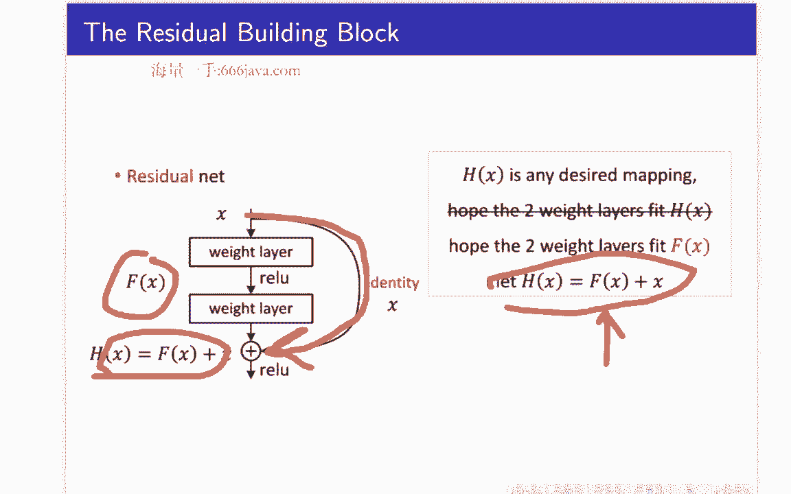

那举一个直观的例子，我们来看一下这个是什么意思呢，这个意思就好比，我们假设我们的h x是等于x啊，也就是假设我的这样一个啊网络，要学一个输入等于输出啊，通过刚才的这么一个啊卷积。

正常的这样一个卷积是不是这个东东啊，经过两个啊wait layer 33的卷积，然后到达这个x输入和输出嘛，hx我要学它，刚才我们说了，假设用残差网络的形式，用hx等于fx加x这样一个形式。

所以这个时候其实本质上是不是，其实我们要学fx是为零的这么一个情况，所以事实上我现在网络变成了，对不对，那最后其实我的目标是零，那是不是对于这个case而言，因为本来你要学一个映射，那这个映射是说。

我要把v一和v2 都要变成一，对不对，那这个时候我其实只要变成什么呢，只要变成我的位置，一和位置，其实只要是有一个是零，那其实你的结果就学到了这样一个结果，零对不对，这是举了一个直观的这样一个例子。

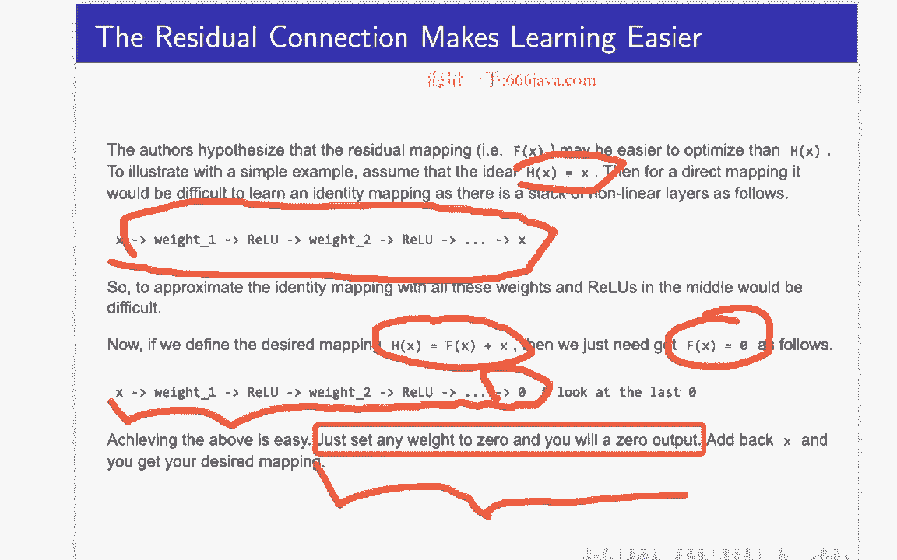

要更加的容易，但事实上呢除了解释这么一个例子，还有一个很重要的残杀的原因是这样，大家试想一下，当你的网络的深度非常非常之深的情况下，啊，非常深的情况下，那么你如何去避免你的梯度消失的问题呢，我们都知道。

当网络越深，你传回前面的这个appropagation，那其实越家的困难对不对，因为每一个梯度你都有一个小数点，小数点，小数点，那多个小数点后面的这样一个float，那乘出来就非常小了，对不对。

那大家想想看，我有很多个这样一个residual，这么一个block堆叠在一起，串联在一起，那是不是我很容易，我后面一层的梯度就会越过什么呢，越过这些不同的层，去传到越前面的这些block去，是不是。

所以我会把我的这样一个梯度，不断地往前到更前面喘，所以这个时候会避免我这样一个梯度，消失的问题，这是它的这样一个残差，连接的这么一个作用。

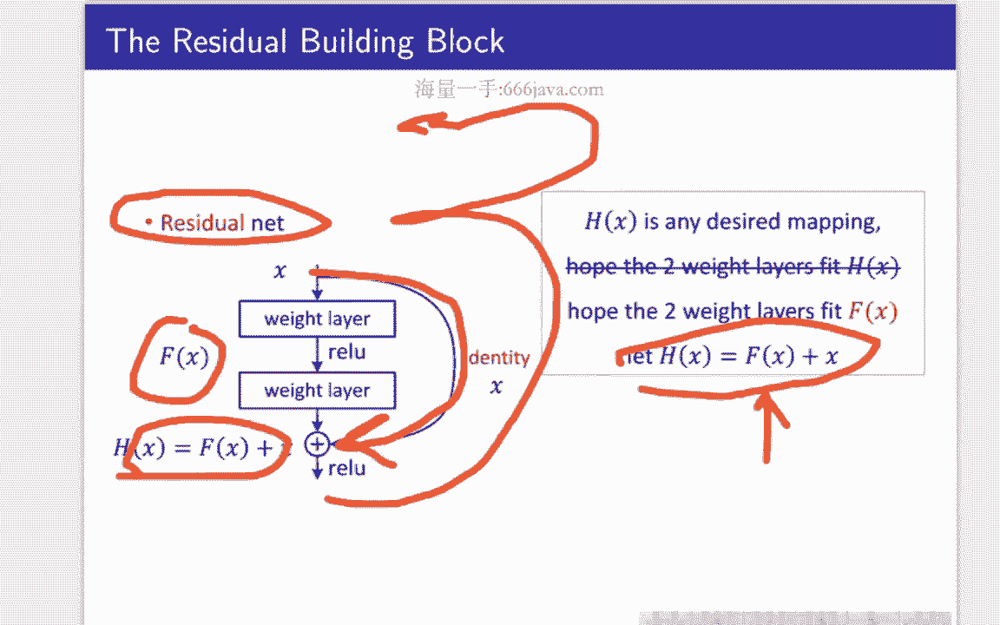

我们这里这节课不是来讲啊，这个react我们只是为了解释我们mobile net to啊，v to是，有这么一个啊residual connection这么一个东东。

所以总结下来我们的这样一个啊mobile net，其实就是刚才我们说的这几件事情啊，这这几件事情，由expansion，然后再接两个separable a bad deswise。

以及我的这样一个啊1x1的tion。

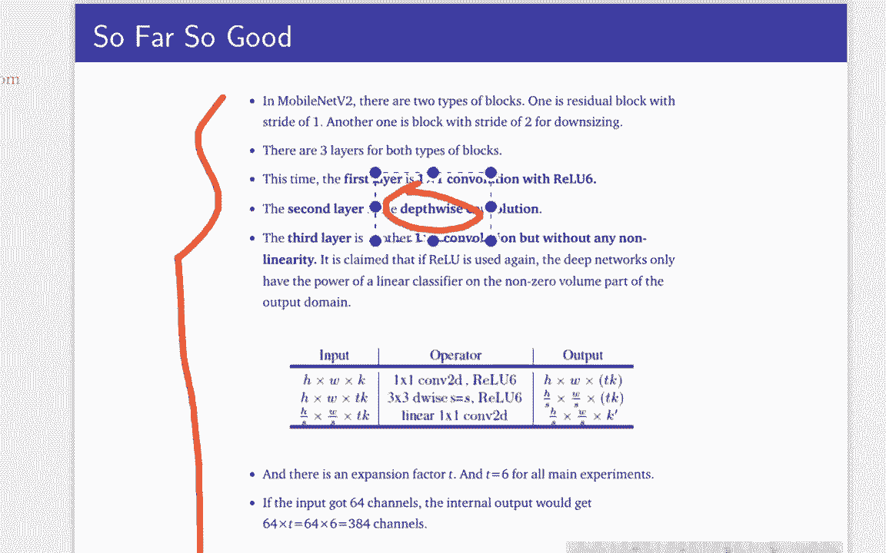

那这个东西呢是我们这个这个东西，是我们说这个啥来着，是我们的这个这个这个啊，mobile net v two的这么一个网络的这么一个结构，这里的tcn这些变量是啥意思呢，但是在下面写的t。

就是我expansion的这个一个factor，也就是我要扩大我的多少倍，然后c是我number of啊，这样一个输出的这样一个channel个数，n是我要重复n次，这个s strike的意思就是啊。

我是不是要进行这个谈判谈判。

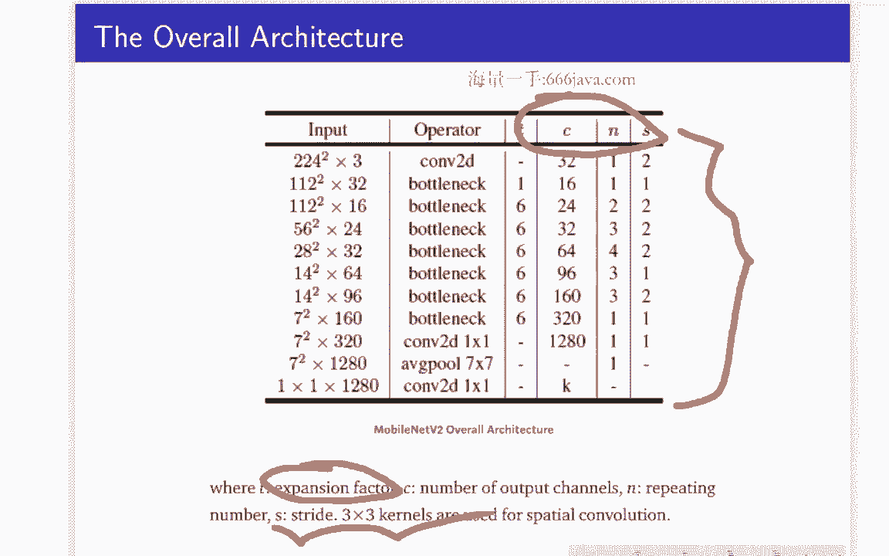

然后接下来我们尝试来进行一个解读，这个解读是什么呢，我们尝试为什么要这个有这个expansion，就是为什么我一开始要把我的这样一个啊，卷积的这样一个维度啊，这么一个维度给升为，大家想想看。

在如果我不深为的情况下，是不是我的这么一个转机的这样一个维度，通常来说是这么一个情况啊，36 24，32 64，96等等这样一个变化的幅度，那其实它的这么一个channel的这样一个维度。

还是相对来说比较低的，对不对，还是比较啊不够丰富的这样一个特征。

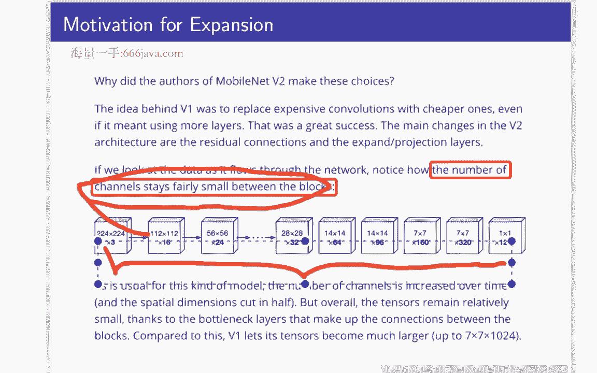

那especially啊，其实就是针对啊这么一个呃，刚才说的这样一个点啊，它尝试什么呢，他尝试先把我的这么一个特征的维度，升到一个高维的空间，去，在高维的空间上做一些特征的变换啊，再去把它再下降成低位。

这就好比什么呢，你可以理解成为在我的s b m的这里面，是不是，我要把它映射到一个更高维的，这样一个空间去，在高维的特征空间，我可能做一些线性的这些分类器，它可能就已经是可分了，就是在高危的情况下。

那我的特征其实啊可以被提取的更加的啊，好这个就是他想做的这样一件事情啊。

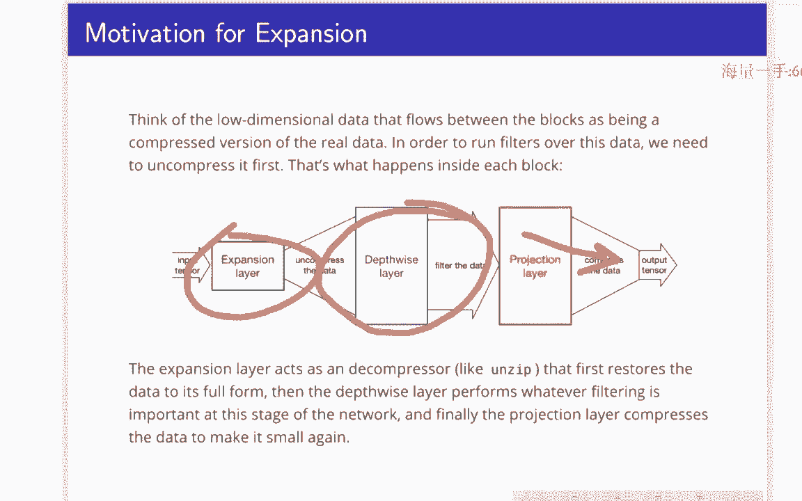

那mobile net也有非常多的这些参数实验啊，比如说他用这个啊v一和v2 ，在不同的mobile device上去进行了这样一个，啊跑啊，不不同的情况下来进行了这么一个呃，呃呃呃啊对比。

有同学问为什么要这样回来，降回来，是保持我的这样一个参数的这样一个啊，这个简化呀，如果你不降回来，那是不是你越升上去，那你这还叫light with model吗，大家想想看，那能够理解吗。

啊如果你不这样回来，那那你叫就叫light with，那你不就是更大的一个网络结构吗，这个初衷大家居然居然忘记了。

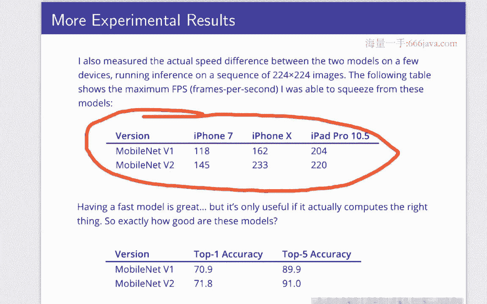

mobile net v two，是不是在我的同样的tensfo上，也有可以直接调的这些东东，这个就是跟大家share这个lightweight这个model，啊啊。

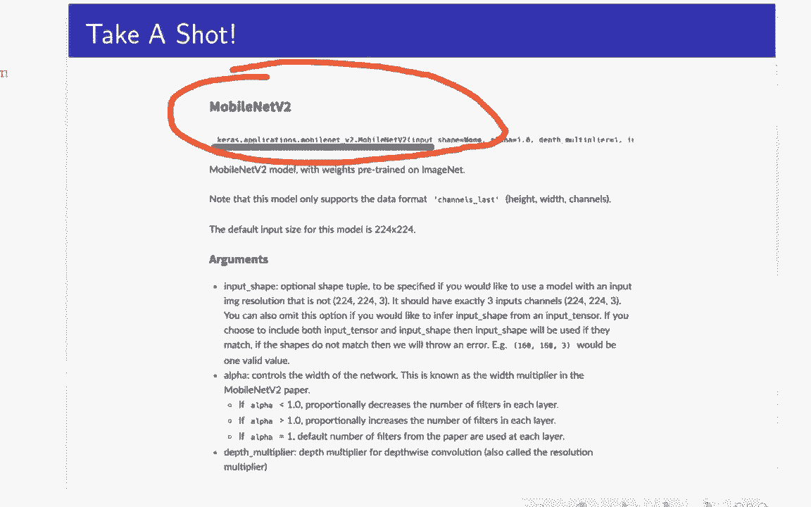

接下来我们要来看我们这个，神经网络压缩技术这么一个章节。

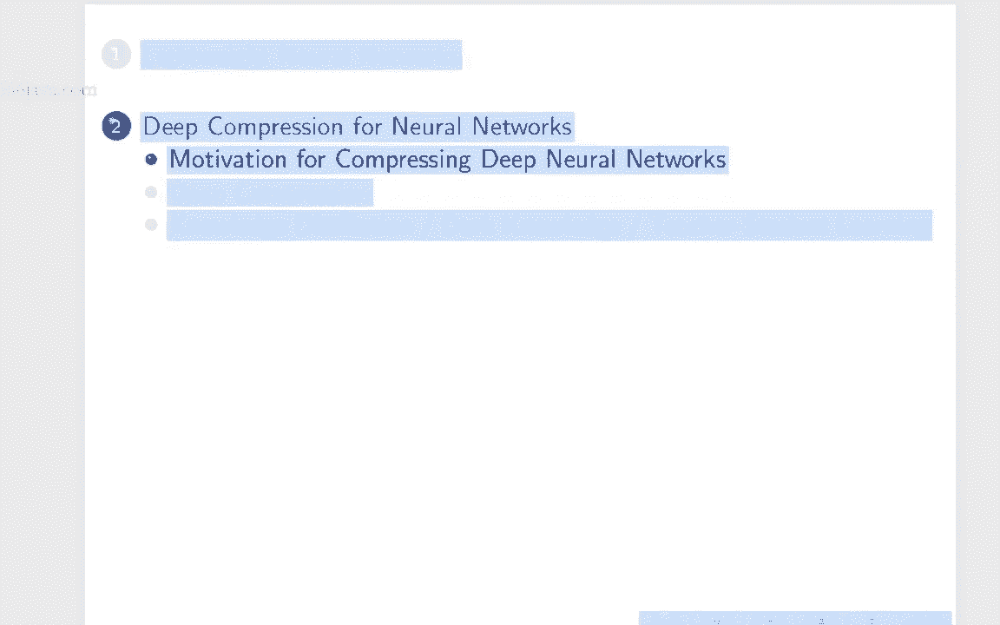

我们这个一个motivation就不用再赘述了，对不对啊，其实啊原因就是刚才我们说了，在很多时候mobile device上我们有很多限制啊，很多限制啊。

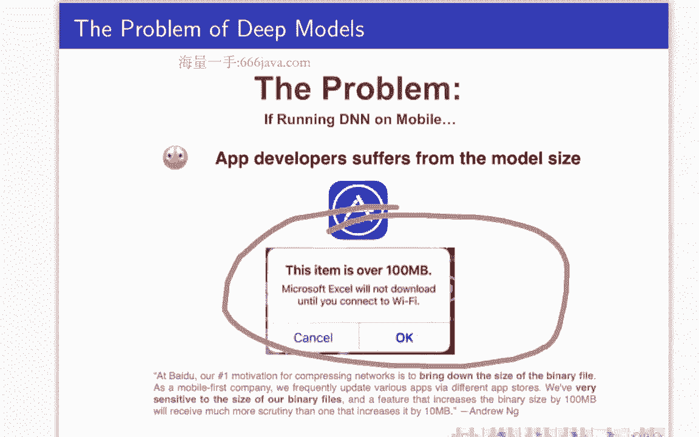

需要用到我们的更小的这么一个网络，对不对，更小的网络，不管是啊网络的带宽啊，啊能耗的消耗等等等等等等。

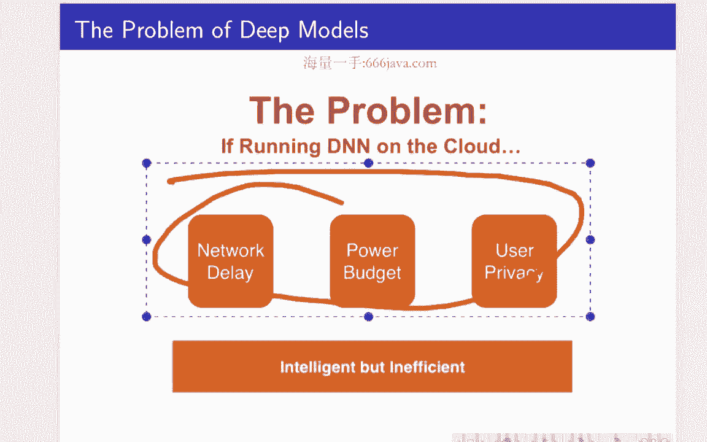

那我们的神经网络的这样一个压缩技术，就可以给我们带来啊如上这些好处啊，既可以变小model。

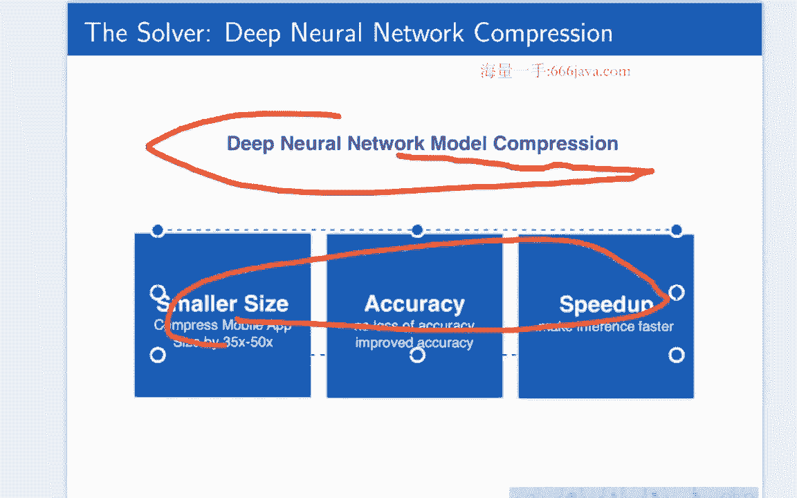

提升速度啊等等。

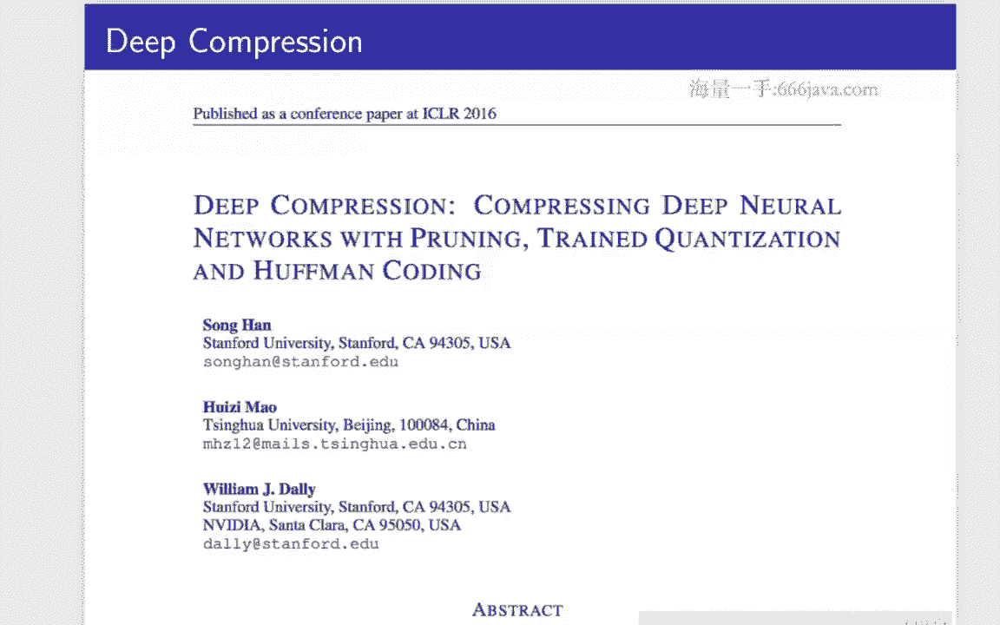

那首先我们来看一下deep啊，compression这件事情啊，也就是啊说啊deep deep compression呢啊，它其实是一类方法，就是啊一类思想一类目的啊，把网络进行压缩。

那通常来说有两两种方式，第一种方式，我们称之为叫网络的减脂的方式，什么叫减脂呢啊很简单，其实就是我要把那些没有用的，那些神经元给扔掉啊，比如说左边是这样一个神经元，而左边是这样一个网络结构。

我要把它变到右边这个网络结构，那怎么把它变成右边这个网络结构呢，记得在我们说drop的时候，它是随机进行采样的，对不对，而在pruning这个这个方式里面呢，我是把那些作用不高的神经元给截掉。

什么叫作用不高呢，比如说很多的这样一个权重位置，它会比较小，可能都是在零点几的时候，那大家想你权重很都很小，不就相当于你这个feature，根本就没有去使用到它嘛，那当然是可以被扔掉，对不对。

所以我们用一个很直观的这么一个示例图。

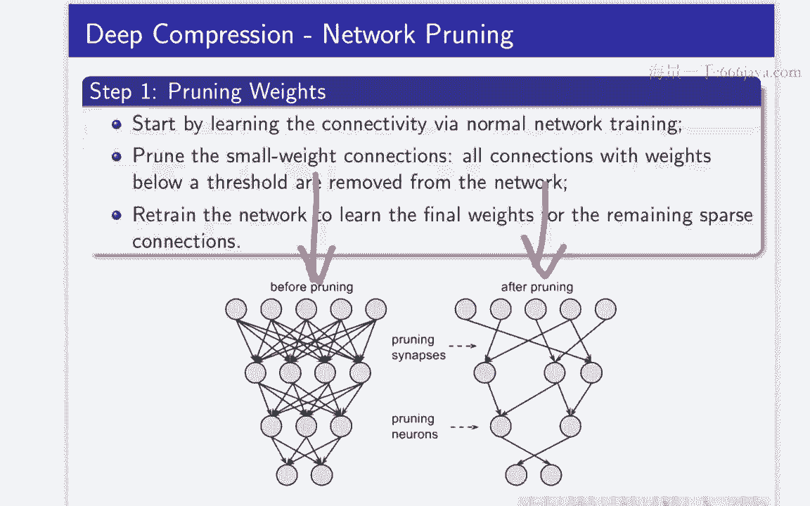

就可以帮助大家来进行这个啊，get这个点，这是一个正常的这么一个神经网络，那其实虚线的这部分就是被我裁剪掉的啊，这个实现的部分是被我保留下来的，所以实现的其实是还是有一些大多都是啊。

离离比较远的这些啊wei的权重，所以通常来说我会设定一个阈值，那这个阈值可能是比如说零点点零一，小于0。01的，我都直接扔掉，当然了，这里会说认真调这些参数之后，那当然会可能会下降一些。

那如果下降的这个结果没有那么明显，比如说下降了两个百分点啊，但是可以给你带来1/10的这么，一个压缩比，那你做不做呢，这个在业务的场景上，你可能就想要做了，对不对，这个就是你想做的事，想做的这件事情。

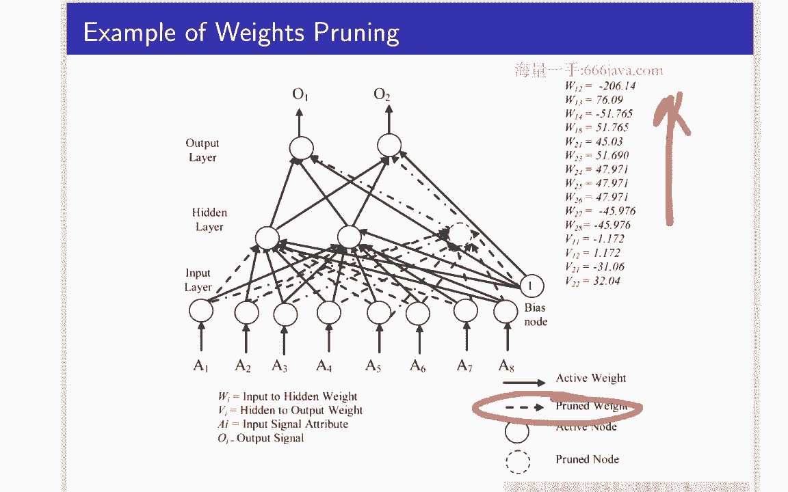

那我们再举个例子来说，如果是对于神经卷积，神经网络要进行这个减脂，那是不是也是一样，我要看哪个channel是要被我扔掉，对不对，那这里的channel，比如说我把我的这样一个啊。

l one的这样一个norm，或者l to the norm给打印出来啊。

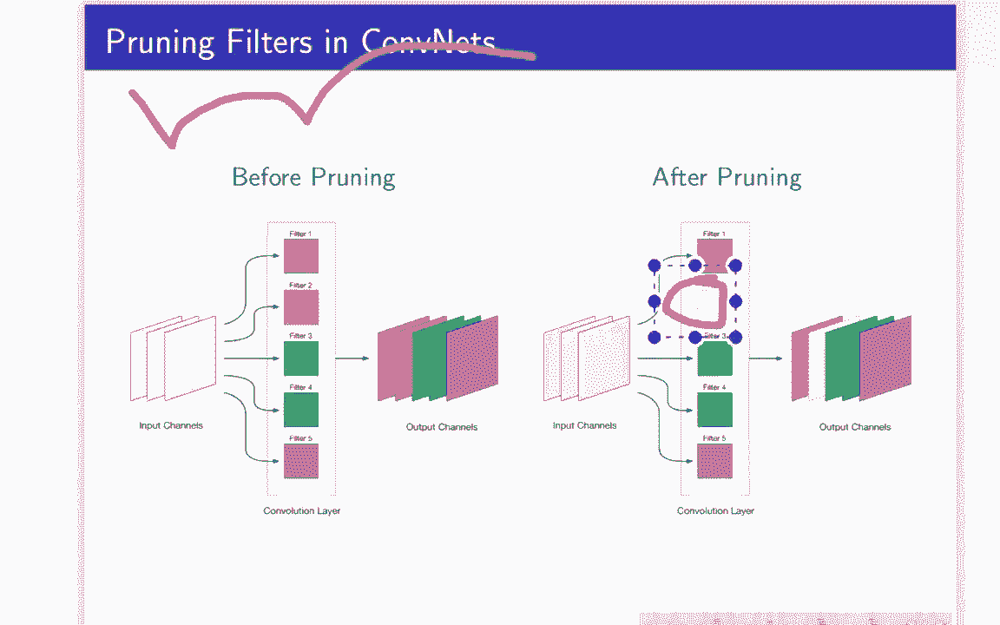

比如说这啊我第一层啊，我第一层不是要有32个这样一个啊，filter嘛，那32个filter，我把他的这个l one的这样一个norm，打印出来，会发现大概有十个，几乎都是为什么呢。

其实都为零啊的这么一个大小，所以我们会发现我们的filter，其实还是有很多的冗余的空间对吧，哎可能有很多的冗余空间。

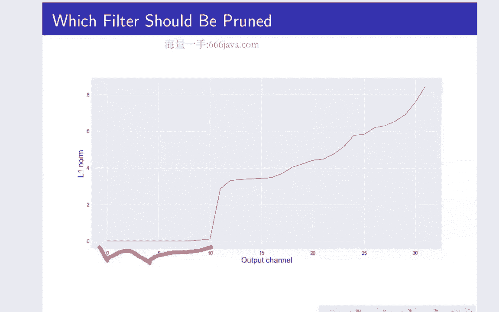

所以当我把卷积神经网络的某一个filter，给扔掉的时候，那是不是这个filter，参与后面计算的那些东西都被我砍掉了，都被我砍掉了。

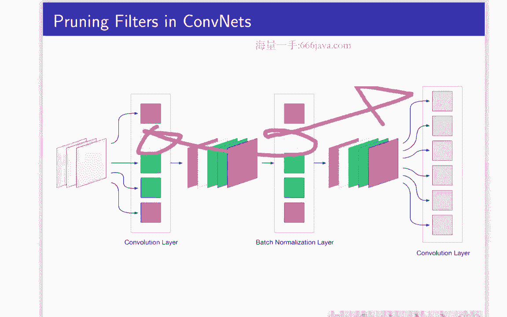

所以我们总结一下我们的这个pruning，这个step，就是我们的这样一个裁剪，剪枝的这么一个步骤，那一我们根据我的这样一个，啊这个减脂的规则呢啊，比如说我是卡一个阈值，或者说啊把我的这样一个啊啊。

fter或者某一些位置，通过某些阈值给裁剪掉扔掉，我要把我的这个网络，既然你扔掉了，那可能我还要进行这个训练，对不对，我要进行return f，然后第三步我要把我训练之后的这个结果。

在我的这样一个验证集上去做一次测试，看看这个是不是值得去啊啊，是不是去去能够接受的，如果他几乎不掉，那说明这个被我扔掉也是ok的，对不对，然后从此进行往复啊。

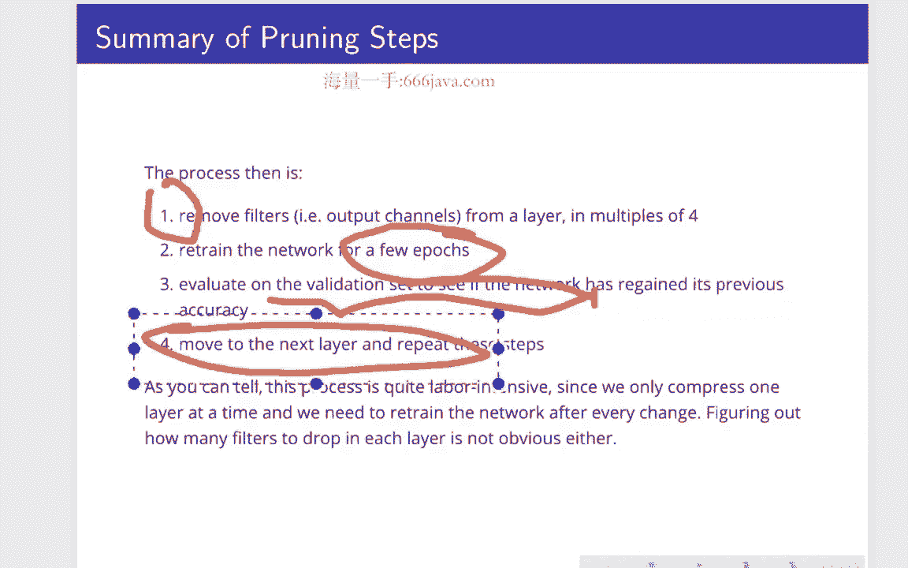

从此进行反复，然后接下来有同学说直接扔掉filter，不是winter某些数变零吗，是直接扔掉filter了，变脸，你不是还有一个东西存在能力吗，是不是。

那那第二步我们要进行这个weight sharing，什么叫wait sharing呢，wait sharing的意思就是，我希望把我权重里面的一些东西啊，用cluster的一些东西来进行表述。

什么叫caster呢，就好比我需要用某些数字去近似它啊，比如说1。11。2，1。3~1。1，1。2，1。3，我就直接用1。2来表示，1。1和1。3啊，这个就是啊我要做的事情，如果我们把这件事情做了之后。

是不是所有这部分的数字，我只要去找什么呢，找四个数字来进行代替它就ok了啊，这个就是第二步。

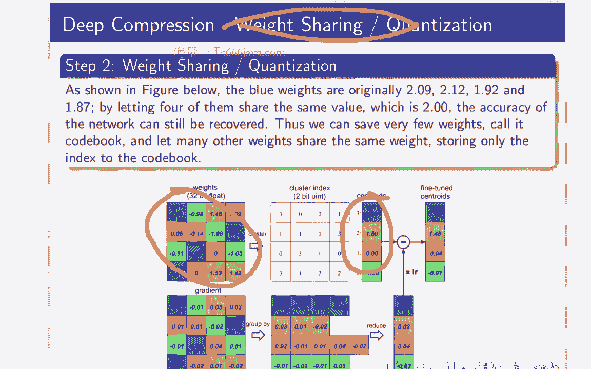

我可以用quantization和量化的思想去做，第三步，大家还，记得本科学的哈夫曼编码吗，我可以把越多的那个出现频率越高的，那些with用更短的编码来进行表表示，对不对。

这还可以进一步进行压缩和这个啊降低。

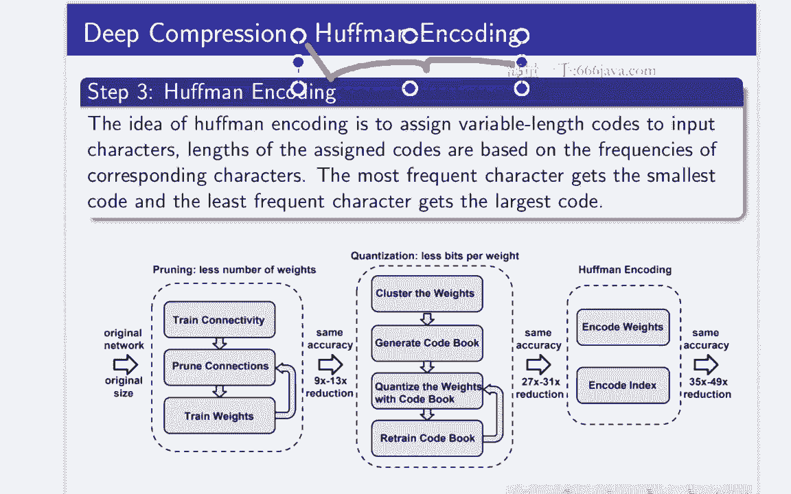

然后我们可以看一下啊，这类方法得到的这个结果，给我们带来的之前压缩比还是非常具有啊。

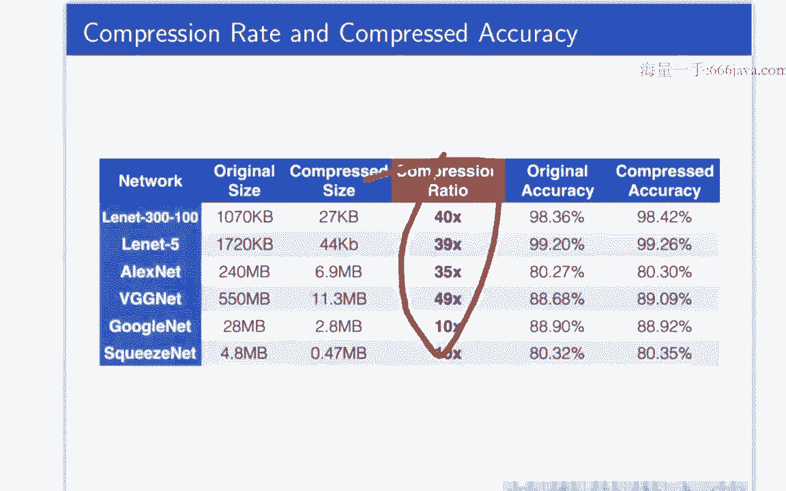

效果的，那除了刚才减脂这类方式，我们还有啊一类这个啊，另外这个啊跟这个减脂相关的这个问题啊，这个相关的这样一个方法，并不是说它的目的是完全是为了减脂，他是什么意思呢，他的意思出发点是说，ok。

前面我们不是说把一个dance的网络，变成sparse的网络嘛，那这个工作很有意思的，就是我把这个sparse的网络再变成dance，会出现什么样的情况啊，这个就叫做sparse and dance。

也称之为简称为叫dsd，这个model and sparse and dance。

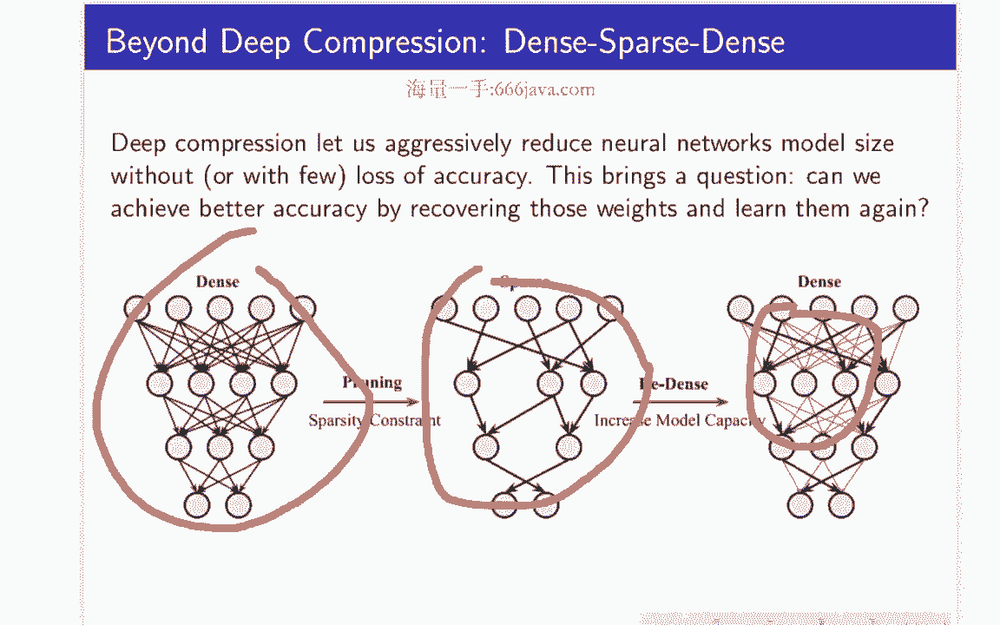

就这个这个工作，那d啊dsd这个工作啊。

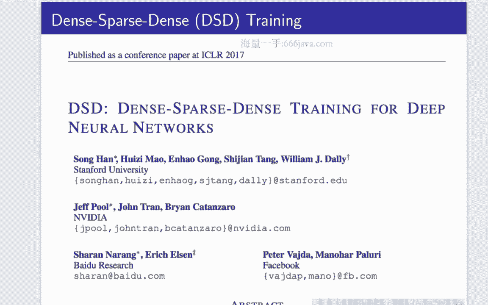

其实啊理解起来也非常好的理解啊，我们看一下它的伪代码，dsd的这样一个工作啊，是什么意思呢，啊是这样，首先我initial了对吧，然后接下来我sps了这个spars怎么做的，还不是卡一个阈值去做的。

对不对，还是卡一个阈值去做的，接下来我要再把它这个重置回来再dance，这就好比我原来使用这个spars，来做一个初始化，其他都为零，然后再进行训练。

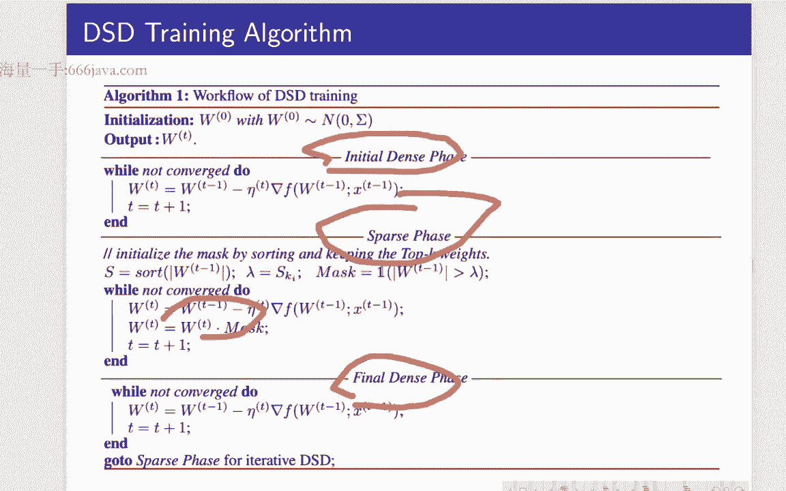

那这个时候我又回到原来的结果，那有什么作用呢，有同学也提了这个问对吧，所以我们的同学是非常心急的，很多时候三位老师的讲课啊，都会给你们循序渐进，对不对，循循善诱啊，你们不问这个问题，我也会问这个问题。

对不对，我会来进行回答，所以不用着急好吗，不用着急，那总结下来dsd是有这几个作用，就是说通过dsd这个方式，我可以达到比原来dance更好的一个效果，这个是这个啊。

d s d的这么一个实验的这么一个结果，它分析下来有几个作用，第一个作用，我通过这种方式，我可以escape，我的观点啊，就是set up point。

这个第二个我会给我的这个space training啊，可能会是一个一个正则化的这样一个作用，类似正则化的这样的作用，第三个我是在我redance的那个基础上，我会有一个什么呢。

我会有一个更加robust这样一个初始化，相比普通的转机而言，dsd其实是啊，有两次初始化的这样一个机会，对不对，它是有两次初始化的机会，很有可能第二次初始化的这么一个结果，其实就帮助你能够去找到一个。

更加的这么一个解，那我们把dsd给可视化出来，是不是，其实这是最开始的情况，然后prom一下对吧，然后再串一下，然后这个这个啊回到原来，这个是很好理解的，这样一个几个权重的这么一个变化。

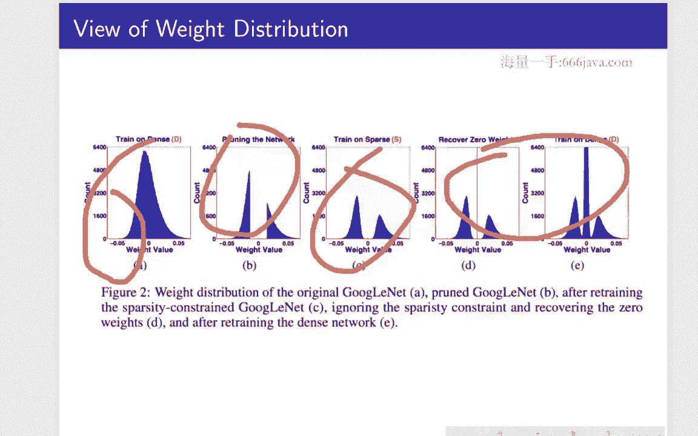

然后dsd我们看一下它的实验结果啊，dsd的版本啊，通常来说啊，很多时候d s d还是有一定的，这么一个效果的，对不对，我的error基本上都还在下降，这个就是dsd的这么一个结果啊。

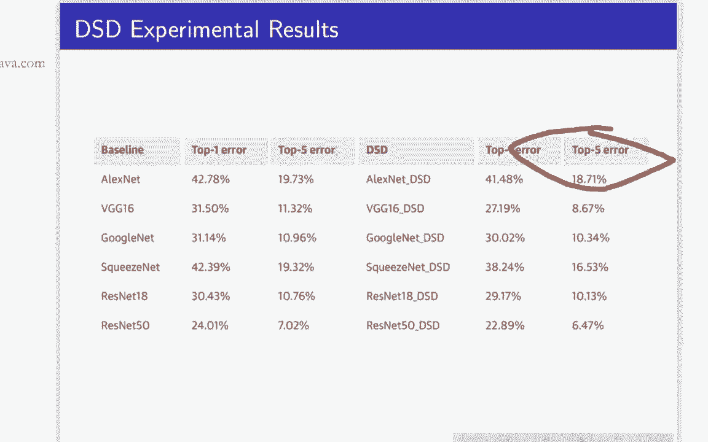

dsd放在这里只是一个补充啊，就是啊帮助大家去扩展一下，就是pruning之后，还有没有一些可操作的这些空间，但它不是dsd，不是为了去做我的特征，网络的这个压缩去做的。

那接下来我们要看另外一个工作，另外一个工作方向了，这个工作方向就是我们的这个神经网络的，啊，刚才我们不是说pruning吗，直接去进行减脂，可以得到这样一个结果，这个是什么意思呢，这个意思是这样。

很多时候我们会用ensemble这个东西来做，什么是ensemble呢，就是昨天的课上跟大家讲，来进行模型的平均进行，进行这个来进行组合嘛，但是很多时候竞赛可以这么玩儿，但是在做这个大规模的这样一个。

部署上限的时候，我们并不能这么玩，对不对，因为每一次的新用一个model的zb，都是费时间的。

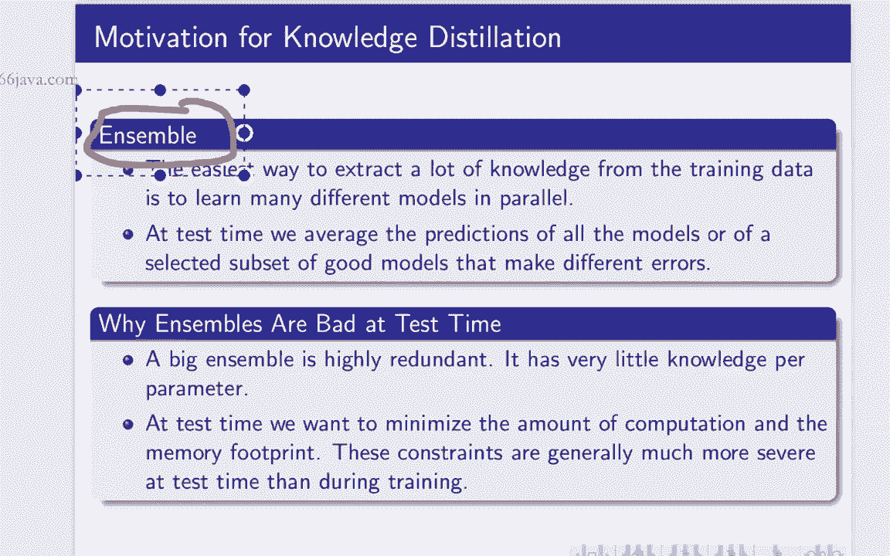

所以我们是不是能够想这样一件事情，就是我能不能够把我的enzo的，这样一个结果啊，也就是我的网络的大模型的这样一个。

输出的结果，更加浅层的小模型。

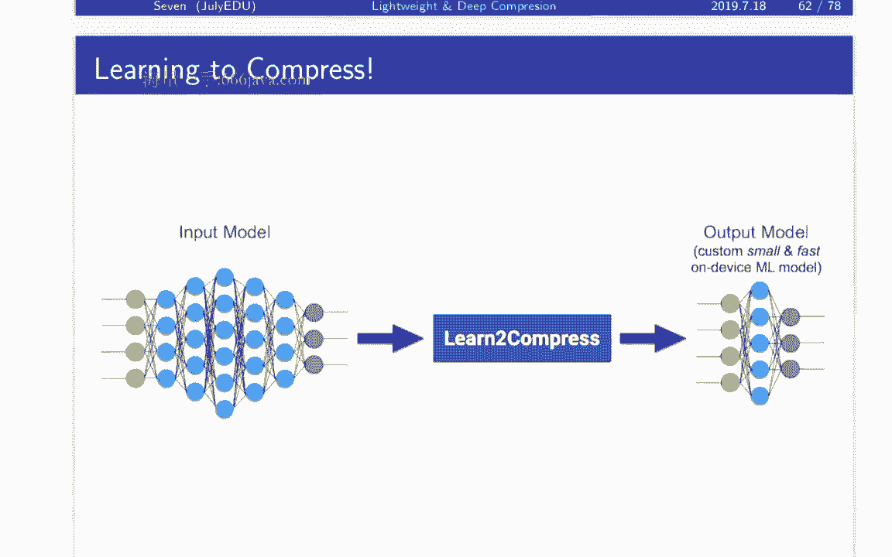

这是我们想做的事情，那这个事情呢我们称之为叫knowledge distil，也称之为叫知识蒸馏模型，要记住啊，这个单词knowledge dist，知识蒸馏模型，那这个knowledge就是指的。

我这个大模型的这样一个参数啊，把它蒸馏出来，提取出来，把它的精华给提出来，所以通常来说你会有两个model，第一个model叫大模型，好比叫rn的这样一个，比如说200层的网络。

然后你要学一个小浅层的么网络，比如说是一个recite 50的model，你希望remodel resnet 50的model去什么呢，这就好比啊我们的一个高中生啊，比如说我们高中数学老师的。

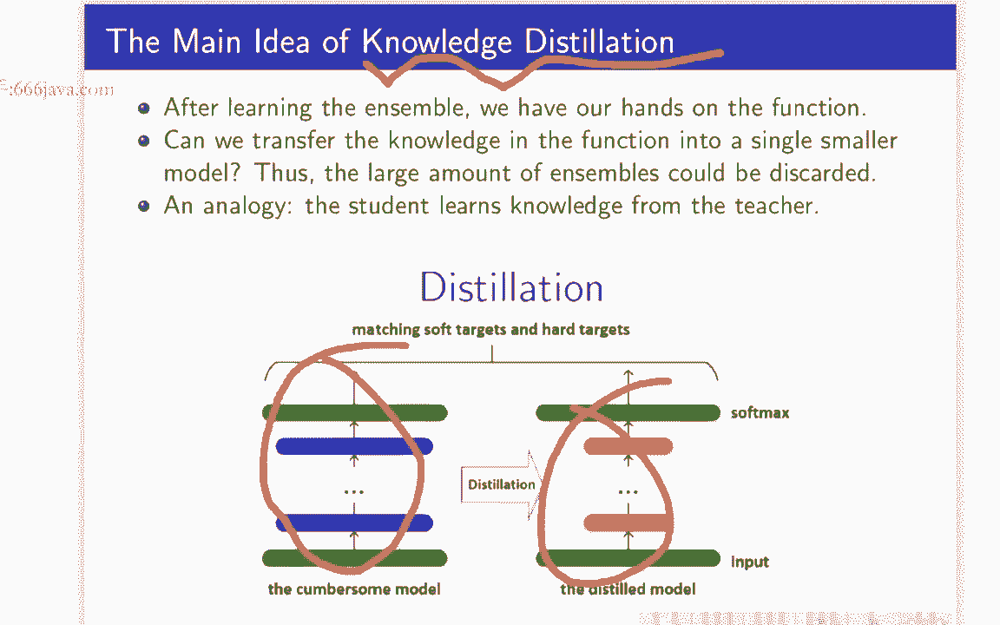

这样一个解题的思维啊，这是一个类比的概念，那首先我们来看一下，也就是大模型，我们称之为叫teacher，那刚才那个小模型称之为叫student，我们看大模型跟小模型啊。

teacher model跟student model是来做什么样的事情，那首先你要有一个teacher，对不对，就好比你的老数学老师，要比你先会解数学题，对吧啊，所以这个没有问题啊。

你在这个训练数据上跑一个i嗯，这个bgg或者rest night，这是我们昨天说的内容，对不对，所以你是有这么一个大模型的这么一个啊，参数在这里的，也就是给定x你会输出一个y啊。

这个东西是已经存在这里的，那接下来你要去训练一个什么呢，训练，小模型的给定x输出y小模型的分类器，对不对，所以怎么学呢啊通常来说是这么学的，另一批的这个数据啊，另一批的这个数据给拿过来。

也就是你大模型可能是在a训练数据上，训练出的这个结果，然后现在呢啊你拿一批数据啊，这个数据可能是b数据，然后b数据喂给teacher，teacher会产生一系列的概率的分布，对不对。

probability，那这一些probability，其实你就要当做什么，student要学的那一个结果，也就是你的student学的这么一个目标，是你teacher的输出。

有同学问这个跟知识图谱有什么关系吗，没什么关系，我们在讲知识蒸馏这件事情，跟知识图谱没关系，知识真流只是这个这个技术的这个名称。

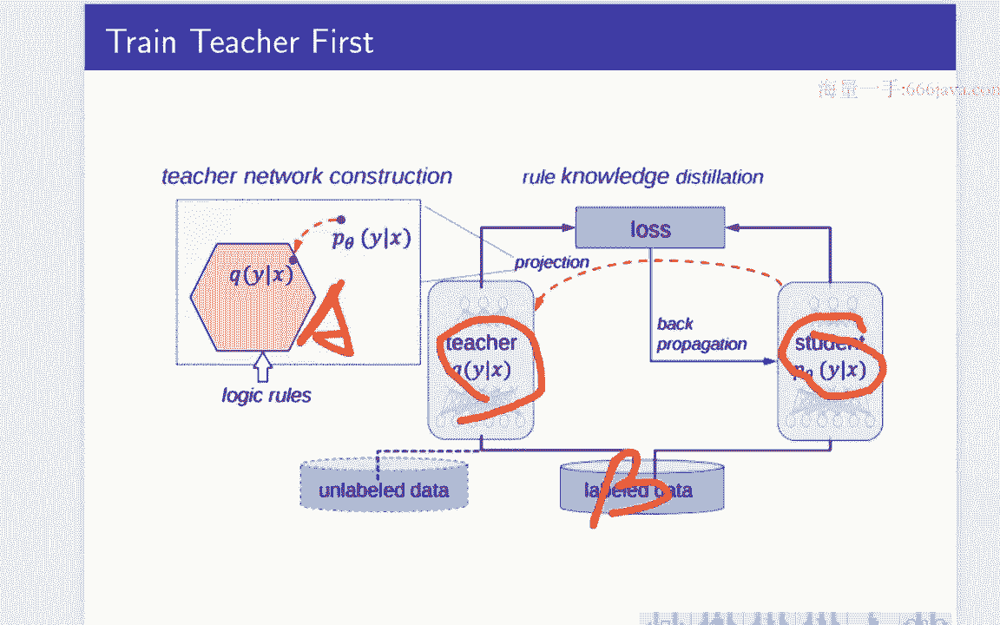

我们也可以把teacher和model来进行，比如说在训练大模型的时候，小模型也一定来进行认了啊，就是他们的这样一个data flow啊，这里我们先不用讲这个事情，然后我们接着刚才啊。

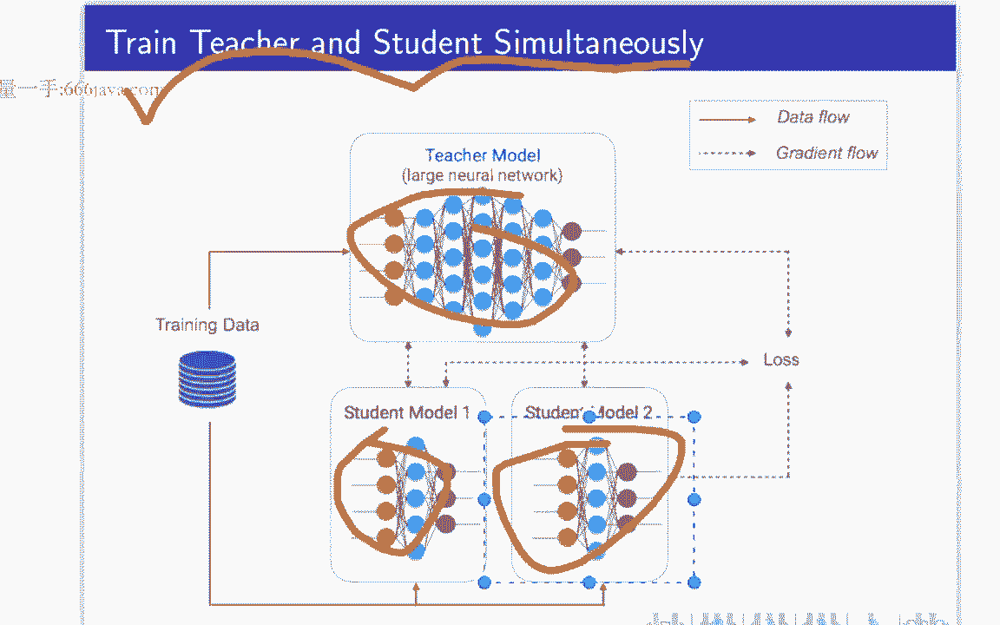

这个刚才的这个知识真流这个概念，继续往下讲，那知识蒸馏是怎么去进行实现的呢，就是刚才我们讲了他的思想，对不对，大模型的概率的输出，但是还不够直接去理解它到底怎么操作的，对不对啊。

那现在我们来进行把这个东西给搞定，给解解出来，首先我们回忆一下我们的概率输出是什么，我们的概率输出是不是，通过一个soft max函数得到的，大家还记得那个soft max函数，对不对啊。

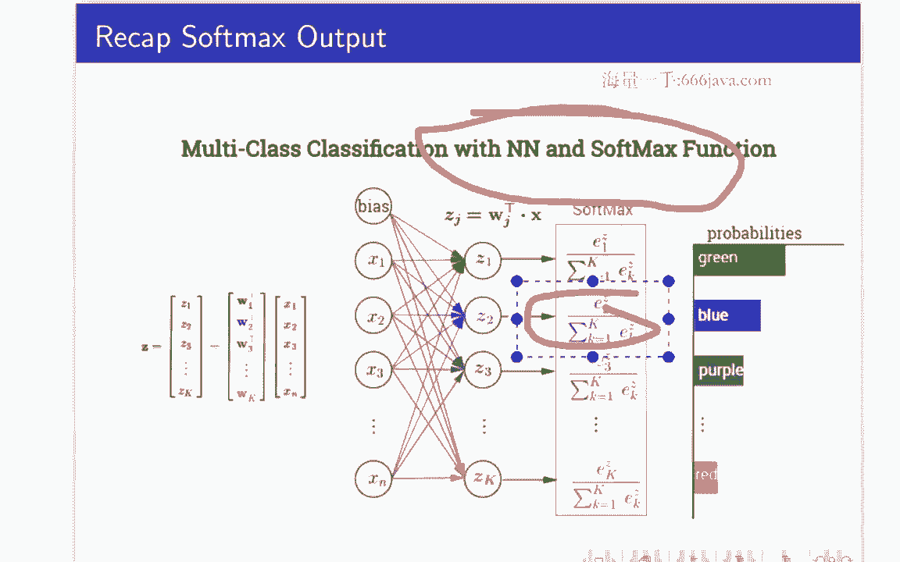

那接下来我们把概率函数这个soft max啊，给它扩展一下，我们把一个soft的这么一个啊，target的概念给介绍大家，就事实上我们会有一个更加generalized，soft max函数。

就是这里的特征的表达，也就是原来的这个z后面，其实可以处于一个大t，而大t我们称之为叫temperature，通常来说大体设置为一的时候，就是刚才大家看到的soft max函数的东东。

那大家想想t越大我的概率分布会怎么样，t越小越趋近于零的概率分布又会怎么样，大家想一下这个事情，大家想想看，当t越大的时候，是不是q的这样一个变化越加的平缓了，越没有区分度，对不对。

当t越趋近于零的时候，我的概率分布越具有很强的区分度，这个总结may不make sense，所以我们的总结就在这里。

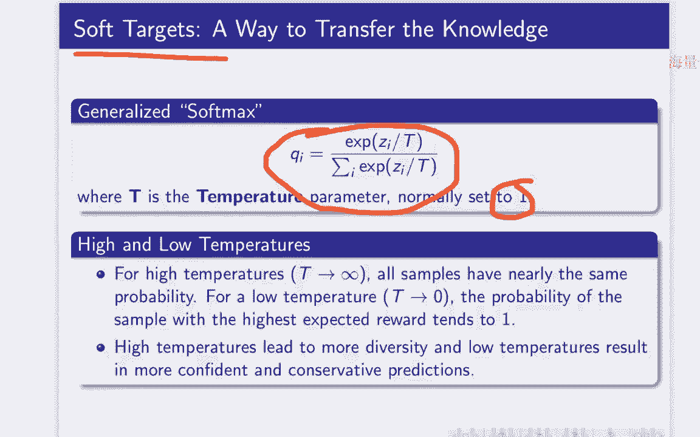

如果大家不能够想象这个问题的话。

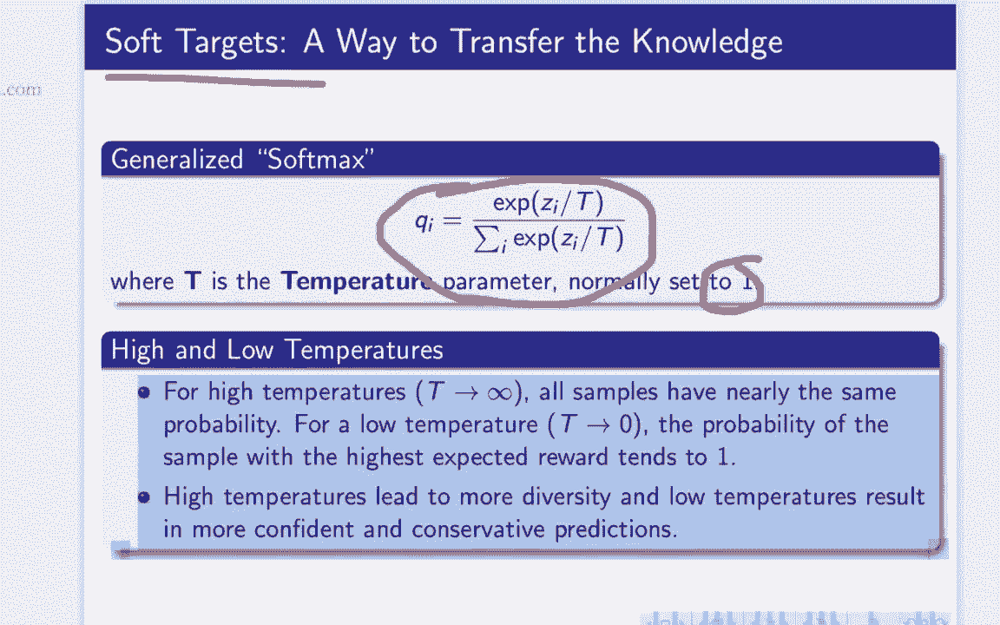

我们啊给一个直观的例子，这个直观的例子是这样，我们假设什么呢，我们假设我们这个大气呀一共有三种，五二十五跟50，它对应什么呢，对应这张图中的红色，绿色蓝色的概率分布，那大家想想看，大t等于50的时候。

是哪个颜色，大t等于五的时候又是哪个颜色，如果这个问题已经搞明白了，那刚才seven老师的问的那个问题，其实也就是一样的，对不对，大家能不能想通，大家的分析是不是应该这样，先看这个红色。

红色是不是在第一个这个圆柱体上，好少的分量，前面三个都好少的分量对吧，所以红色的这个东西，区分度应该是最明显的那个，对不对，是不是最明显的，如果红色的这个东西，它区分度是越明显的。

我们刚才说越discriminations，区分度越大的大气是越小还是大气越大呀，是不是大气越大，或者说大家进趋近于近似，对不对，那t越小，那我的区分度才能够得到更好的区分对吧。

那结果就非常明显了啊是吧啊。

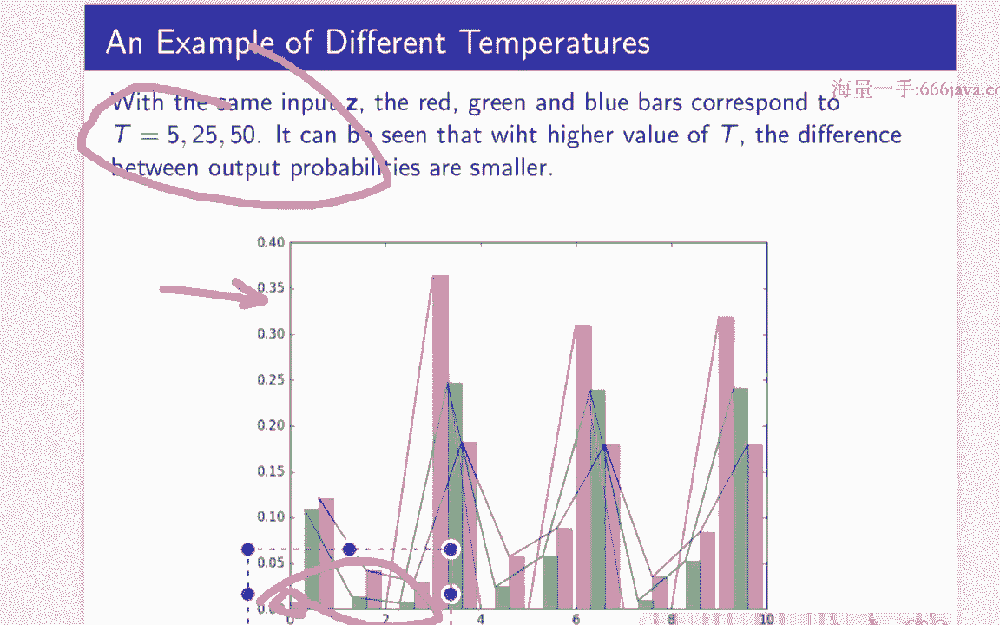

我们继续，那接下来我们要讲一个概念，这个概念我们称之为叫dark knowledge，那这也不是一个新的概念，这个不是新的概念，这个概念是什么呢，这个概念是什么呢，这个概念就是我们刚才要用到那个大t。

有同学说我们的这个明显点不是好吗，以后这个不着急好不好啊，sam老师既然要铺明显还是不明显，一定是一个铺垫，对不对，后面就会解释了，所以萌萌同学，你的思维可以稍微再放缓一点点啊，放缓了一点都那么着急啊。

我们后面就会提到这所有东西都是铺垫，我们继续这个，我们假设one hot，one hot encoding那个形式，one hot encoding，那个形式是不是其实就是独热编码，某一个为一。

其他都为零，假设它是狗的话，那大家想想看，假设你通过大模型或者说大模型的聚合，an example得出来的这个结果很有可能是他，对不对，也是狗视为0。1的概率，而猫和car是其他的这么一个情况，对不对。

大家想想看，我把我的刚才的这么一个结果，把那个大t重新设置一下，设置成一个更加soft一个结果，是不是可以得到这个输出，那刚才有同学说，这个输出的结果跟上面那个有什么不同吗，首先我表达的事情是一样的。

对不对，这个事情是说狗它这张图片是一个狗对吧，狗和猫的相似度比起来要比狗更靠，以及狗跟car要来的还要高，卡了吗，同学们，不卡了，那我们继续了啊，我们继续讲课，刚才我们说到说到什么呢，我们说到。

这张图片最大是狗，对不对，没错是狗，其次呢猫的这个这个信息含量是0。2，所以这张图片不仅揭示了它是一个狗，并且还揭示了label和class，label之间的这些信息，比如说狗和猫的相似度相关度非常高。

并且狗这个跟猫的这样一个相似性，要大于狗和这个call和奶牛，并且狗和靠这样一个相关度，要远远远要大于ca，所以它其实带来的这个信息量，是来得更加的要丰富的。

这就是soft targets的这样一个好处，这就回答了刚才这个同学的问题。

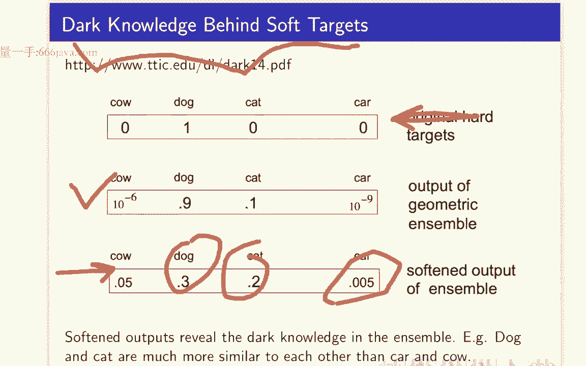

有没有一种办法是能够帮我去融合，hard和soft这两个同时的这样一个，想要表达这些信息，这个其实就是我们知识蒸馏想要做的事情，所以呢我们来总结一下啊。

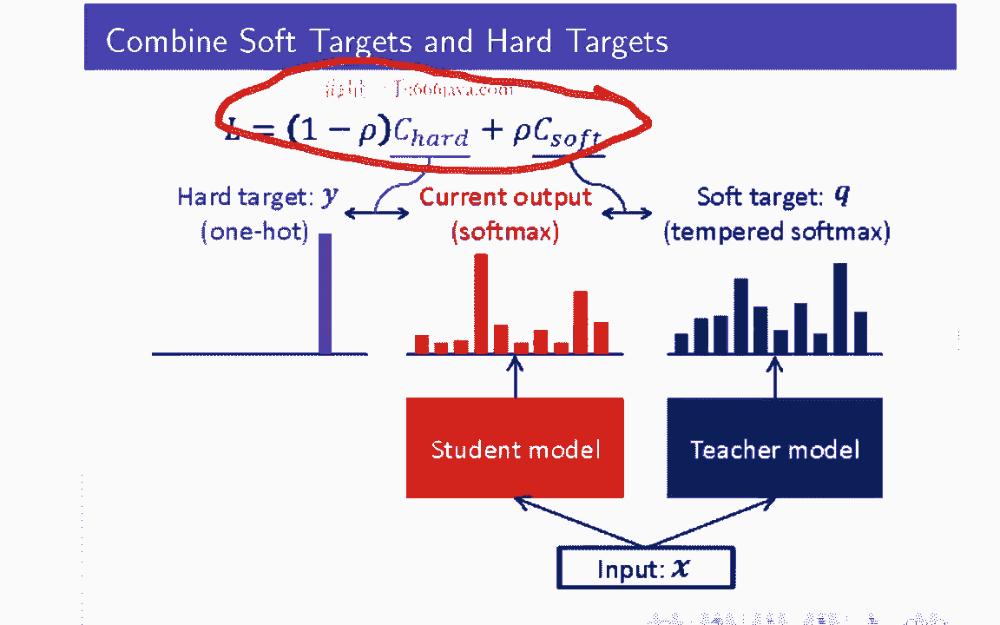

知识真流，他实际上要干的事情，大家要听清楚，接下来我对这张图的描绘，你就能够明白，你就知道怎么去实现了，首先我要有一个model，这个model呢是一个大的一个model，什么叫大的model呢。

就是我要有一个teacher，建立一个teacher，就好比我要学一个先要训练一个resnet，200层的这么一个大模型，当做我的teacher啊，这就是我的这么一个teacher。

这说的这件事情是在训练一个teacher啊，说训练一个teacher，然后呢，接下来我要训练一个训练一个什么students，对不对，这个student通常来说是以这个更加，shallow的模型。

更加浅的这么一个模型，更加小的这样一个模型，比如说刚才是200层，现在我选550层，然后呢我要把什么呢，我要把我注意刚才训练好的那个teacher，是不是已经训练完了，他已经有分类的能力了，对不对。

然后接下来我是不是要训练我的teacher，student，所以这个时候，student是要重新开始进行训练，对不对，那student这么一个训练的目标是什么，我们说了student训练的目标是什么呢。

是teach了student训练的目标是什么呢，是teacher student训练的目标是什么呢，是teacher，teacher的输出是不是经过刚才的这么一个，说法啊这么一个解释啊。

teacher的输出是一个概率什么呢，概率分布对吧，所以我希望我的这么一个，a student要去student的输出，要去你和teacher的输出，并且teacher的输出，根据刚才我们的这个啊分析。

是要用一个更加soft的这么一个结论，所以本质上大家只要记住这样一句话，又卡了，不会吧，哈喽同学们，好我们继续，大家只要记住这么一句话，就能记住我们知识真理的本质，这句话是说大家自己记下来啊，做好笔记。

小模型是去用来你和大模型的输出的，就这么一句话，那接下来这句话，背后给我们带来的损失函数的指示，就是既然你要去拟合大模型的输出，对不对，拟合的损失函数是什么，某个人身高是多少。

我要去拟合它明天的股价是多少，我要去进行拟合他，那我的分类的啊，我的sorry，m s或者什么呢，或者这个回归的这样一个损失函数，是不是其实就是一个回归回归器，而不是分类损失函数，对不对。

不是cross entroy，对不对，如果是cross entroy，不就相当于在训练从头开始训他自己吗，所以它的损失函数一定是regressor，是回归，所以如果以后在面试过程中。

老这个面试官问大家这么一个点的时候，它通常会是一个点啊，所以在教授大家这些相关的新的，算法知识的时候，我会把一些重要的点帮大家给拎出来啊，容易搞错的点拎出来，所以你的损失函数，你输出实现的时候。

要去用这个啊回归的这么一个损失函数，去回归它，在这个具体的啊实现的时候，你可以什么呢，你可以有两两种loss，第一种loss是这个任务这样一个student model，同时在做分类，并且在分类的时候。

我要去拟合我的这个大模型的输出，这也是ok的，但是至少你不能只有什么呢，只有cross hy，只有输出啊，只有那个啊分类的损失函数，这个就是我们小模型要做的事情，那小模型一旦学完了这个事情。

那其实就可以去用来去用来做预测了，所以实际上我们会怎么做呢，我们实际上会这么做，假设一个大模型你觉得不够，那你可能要训练十个大模型，这十个大模型，比如说一个v gg，一个rn一个啊，alex net。

再来一个inception v3 ，一个inception v4 ，那所有的这些这些刚才这些model，你进行加权求和处，这个得到平均，得到一个更加精准的一个model，的一个输出的结果，概率分布。

就好比昨天我们有十个模型求平均，啊有同学说我们的课件你不用管，课件是什么，听seven老师讲的好吗，这张图可能是啊画的有些问题，大家能够理解刚才我说的事情吗，所以我们的model。

我们的teacher可以是一个大模型，也可以是多个大模型的，这个啊融合这样的一个结果，总之它的精度有多高，我把它垒得多高，对吧啊。

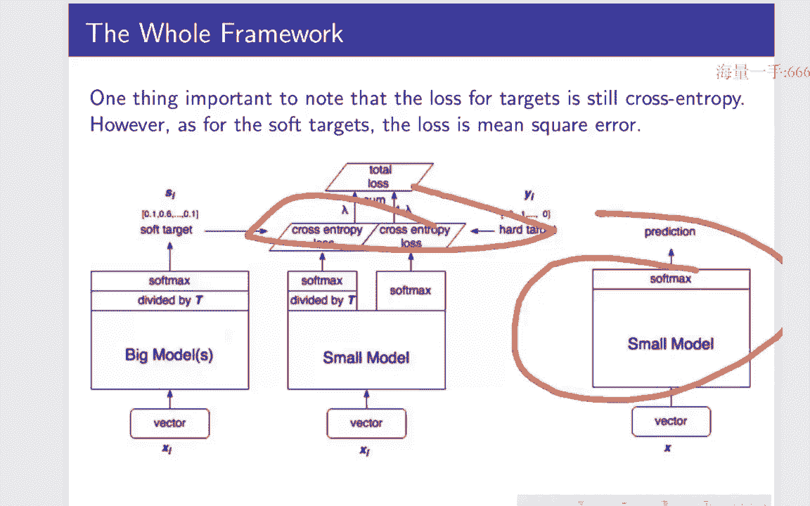

这个就是我们teacher和student model要做的事情，所以接下来我只要初始化一个小模型，把我的损失函数，把我的这个预测的这样一个，我把我的这个训练数据用大模型跑一遍。

那我的这样一个输出的结果，概率输出就有了，把这个概率输出作为我小模型想要学的，这么一个目标函数去进行拟合，这就是teacher student model要做的事情。

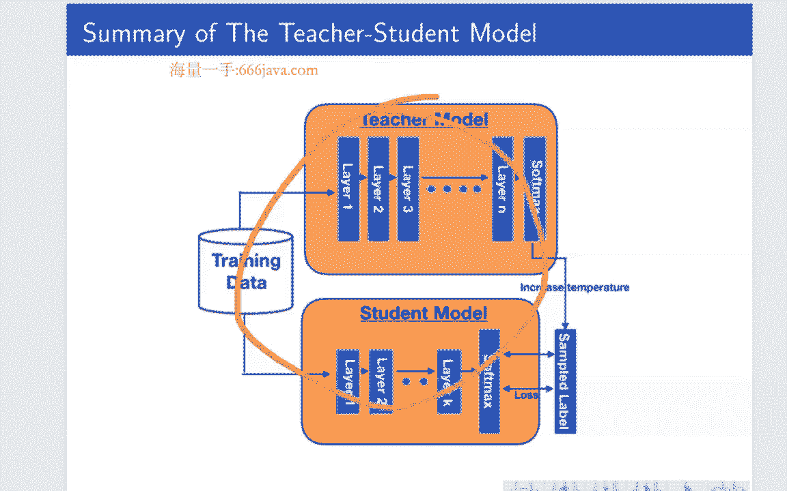

那刚才呢给了一个例子，就是说。

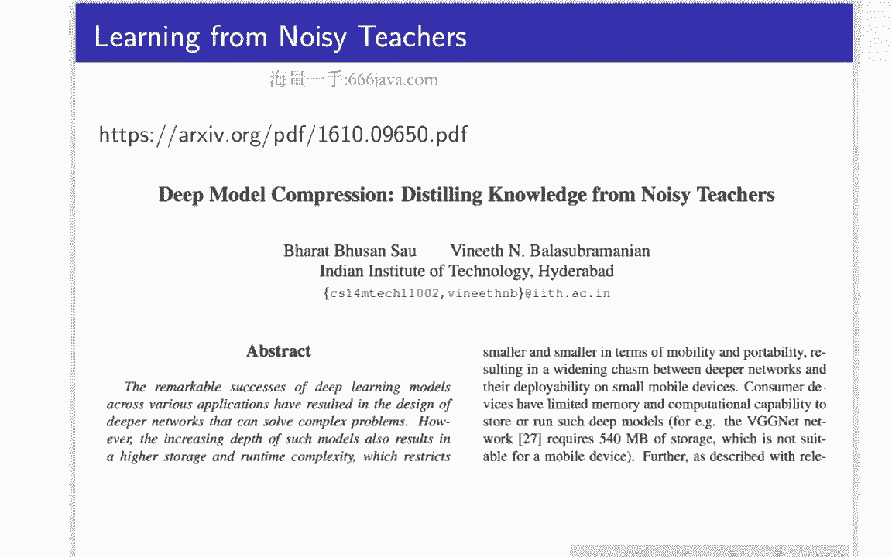

有时候我要把我的这个啊就是加一些噪声，就是我的这个啊，teacher这个啊，加一个这个政策化的这么一个噪声，其实也是一样的。

那最后呢给大家啊类比了一个工作，这个工作是什么呢，啊其实这个东西也不在我们的什么呢，会给大家介绍一个工作。

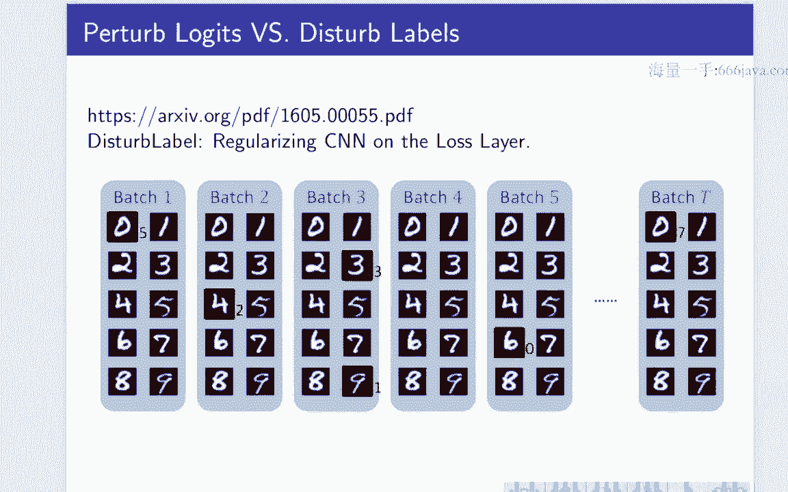

就是这个工作叫这个disturb labe，是一个正则化的这么一个，像这个disturb label呢啊有点像啊，我们刚才说的这个这个事，就是有一点点像啊，这个意思就是我把每一个batch。

把某一个训练数据的这个y呀，训练的这样一个标注啊，随机替换一下，就好比这个时候是零，然后把7x5，然后这个是四，我把它提成二，这个实现起来非常简单，对不对，把每一个batch的时候，我随机搞错一个嘛。

就好像引入新的噪声啊，去降低它的过拟合啊，有兴趣的同学可以去看一下这个工作。

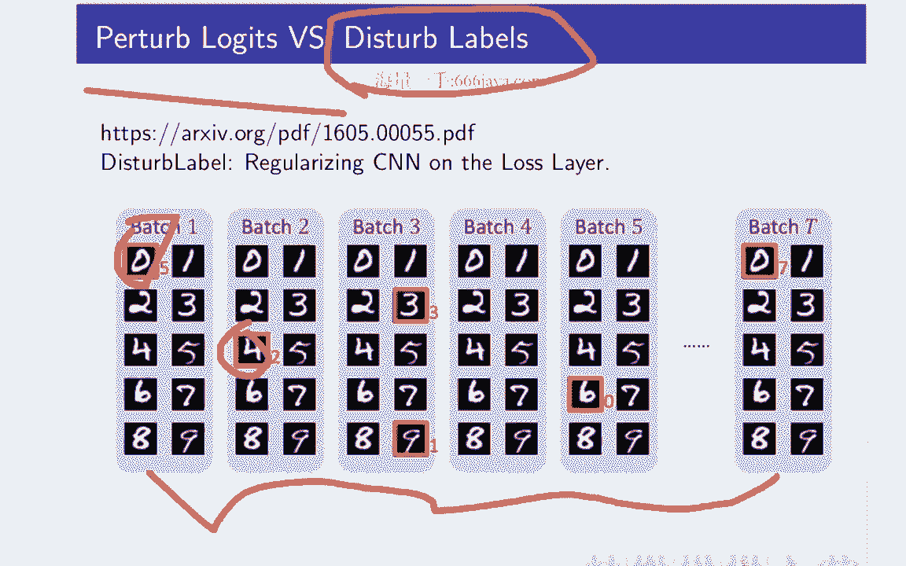

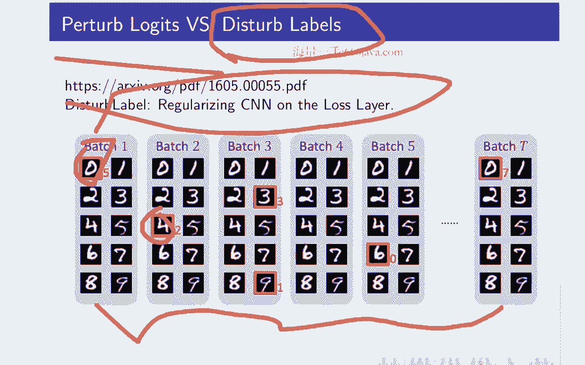

这个就是我们啊今天学的这样一个topic，这个topic就是说，我们是不是今天讲了，如何在工业界这一个啊模型的这么一个，实际部署上线的这样一个事情啊，大模型很多时候啊是啊。

不能够符合我们的这样一个需求的，那小模型是ok的，那小模型这里面有很多方式，对不对，一，我们直接用一些更加尽量轻量化的，这些模型啊，去得到这样一个模型上限的这么一个结果，那在轻量化的这些模型里面。

最重要的就是deswise和separate啊，那个deswise point wise的这么一个理解，那depth wise，separable a depth wise和point wise。

是不是会用到，刚才我们分析了，分析了啥，mobile net一和二，对不对，然后同时然后我们还讲了什么大模型，进行减脂的思想啊，减脂的思想啊，给一个阈值，然后去进行减脂，然后再进行重新训练。

然后这个最后我们还讲了一个什么呢，知识蒸馏的这么一个作用，就是大模型去弄一个小模型，再给大家再补充一个扩展一个思维，那什么时候我们这是蒸馏会用到呢，比如说啊这样的一个情况，大家想想看。

假设假设你在开展一个新的一个业务，你入职一个新的公司，或者新的负责一个项目，那这个项目呢你苦于你没有训练数据，那为什么呢，是因为你刚刚白手起家，你一个人做的算法工程师，你又申请不到那么多标注的经费。

申请不到老板的标注心费，可是你惊喜地发现，你在一些竞争对手上，你可以看到他们的这样一个能力，已经上线了，比如说商汤旷世啊等等这些独角兽的公司，他们已经把他们能力布在云端了，并且你可以去申请一些账号。

免费进行调用对吧，可能每天可以有个开发量，开放量，每天调用个1000次啊，是免费的，那这个时候很容易你可以做这么一件推测，对不对，你直接把人家的云上的这个api调回来。

结果人家一定是一个很好的一个模型吧，不然人家怎么去卖呢，对不对，所以把他的那个结果，当做你的teacher model的输出，这个时候你再起一个模型，去学它的这样一个结果。

所以你可以快速的去构建一个新的一个，线上的这么一个新的这样一个能力啊，而不使用你的，占用你的老板的这个标注资源啊，这个时候你可以快速的去，去构建一项新的业务啊，就是教大家一个啊一个trick啊。

一个新的一个trick，当然你们在面试过程中也可以去提啊，展现出这些思维啊，博得这个面试官的这样一个欢心好吗，那行，那这个有同学问，他们会提供soft那层的输出吗，会呀，他会提供这个啊。

我标签预测的这个结果，比如说你要预测好几个类，它这个时候他会说啊，每个类的知心度是多少，它也会暴露给你的吗，那这个这就是seven老师，今天给大家上的这门课程，然后我没记错的话，线下课是周六吧。

周六的上午应该是那上海同学，应该有同学会给你们去进行一个啊，老他老师会给你们发给你们的地址在浦东，然后呃我会去啊，上新的这个啊，这个wide and residual这个model的这个topic。

然后这个好吗，那今天的内容大家有没有一些北京，那我就不管了，北京是你们自己这个老师去解决的，你们有新的老师给你们上这部分的内容，新的那个线下的内容，因为线下的话一般都是老师当场去上，深圳也是一样啦。

这个都是你们有你们自己的老师，给你们进行上，ok你们到时候就听你们老师的安排，跟他们这个跟着老师学就好了好吗，然后上海这部分是赛文老师会来进行，普通地址当然有了，你等你们老师通知就好了好吧，详细地址吗。

就你们等等等等通知就好了，那我们今天的课程就这样了啊，大家这个，希望今天这周的三次算法课程啊，大家都有都有所收获，好不好，我今第一次给大家，第一周给大家上了三次算法课程，希望大家每一节课都有收获。

那这个收获呢，听录播啊，去理解我们的内容，做后面的啊配套作业对吧，昨天给了一个比较大的作业啊，等等等等等等啊，希望大家有所长进，然后下周我们还会在文老师，继续给大家上三次线上的这个课程。

我们会沿着我们的deep learning继续往下走好吗，什么广州深圳同学，这个我就管不了你们了是吧，我也不能跟你们face face交流，然后上海同学。

我可以给大家去face to face的进行交流和讨论，那就这样咯，大家拜拜，希望大家有所收获好吗好，我们下周见。

