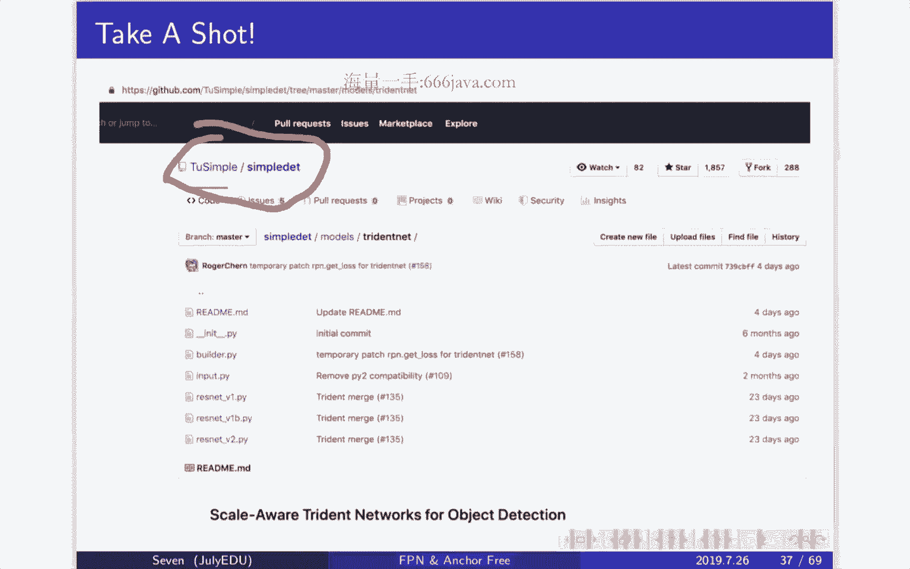
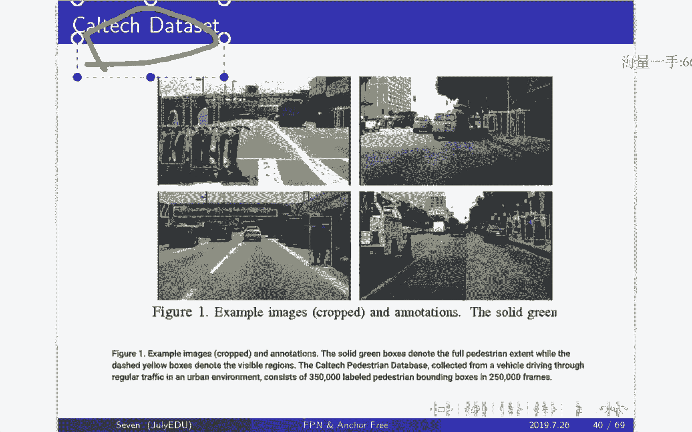
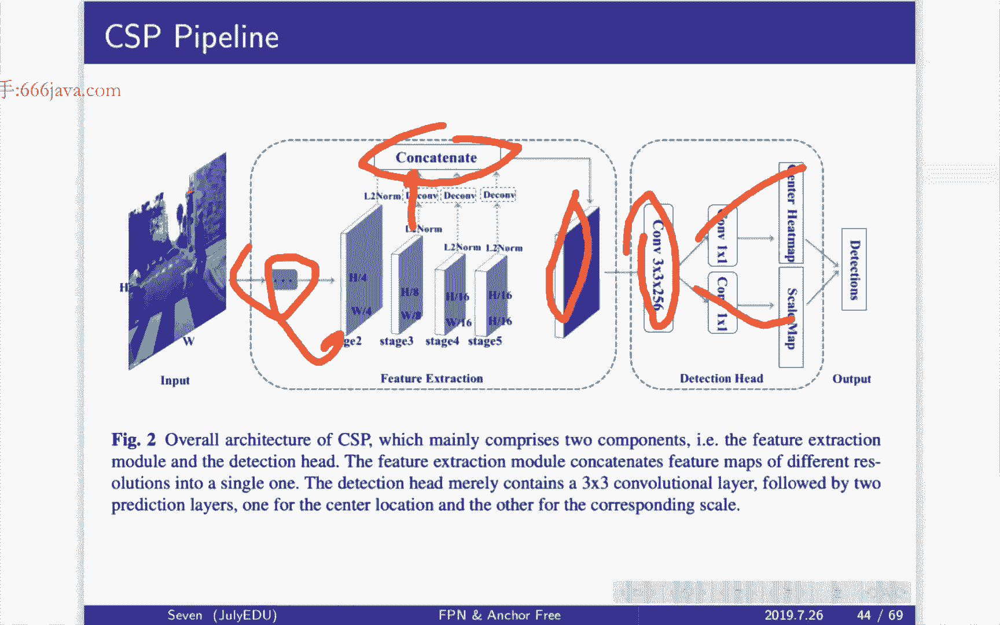
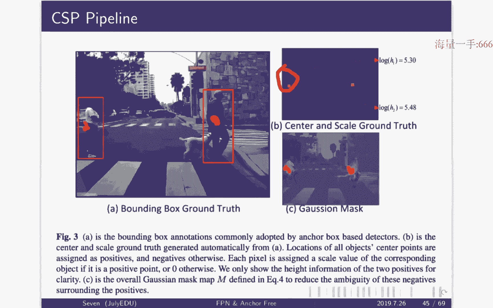
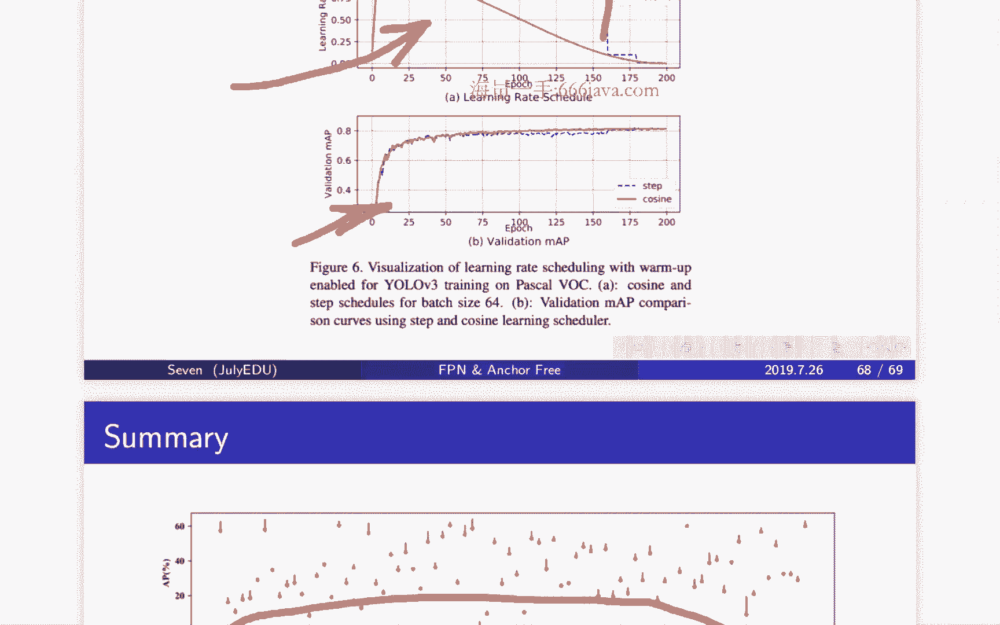

# 七月在线-深度学习集训营 第三期[2022] - P3：在线视频：03-深度学习在物体检测中的应用（下） - 程序员技术手札 - BV1gW4y1x7j7

啊行那我们先开始上课喽，哦按照今天的这样一个教学大纲啊，我们就应该要进入到我们detection部分最后的一次内容了啊，那其实就是啊我们的fbi还有这个and free的一些方法，嗯。

大家还记得在呃我们本周开始啊，周一和周三大概都学了一些什么样的啊，不同的内容呢，对其实周一开始啊，我们开始讲了这个，fast r cn家族模型对不对，从slide window。

然后到anchor的理解，然后以及这个在发这个r cn里面，是不是啊，我们从最开始的original ascen到fast as cn到faster r cnn，再到mask r cn，对不对。

基本上都是r cn的啊，这个所以我们称之为加叫这个cn的家族模型，那在这个cn的家族模型里面最重要的一个点啊，其实就是要对于anchor的理解，在我们的呃cn r cn和fast r cn。

其实他的这个proposal都其实还是用传统的tradition的方法去生成的，对不对，比如说这个selective search，那这个在啊faster cn里面呢。

它其实是看到了除了啊region proposal生成这一部分，我没有用到and and learning这样一个网络啊，网络的这样一个方式，那么啊其他部分它其实都是已经啊开始做这个神经网络的这样一个。

结构和预测了，那因此呢从faster r cnn开始，他就有了这样一个想法，就是我希望能够region proposal这件事情直接给用网络，用这个deep learning直接可以预测出来。

所以啊基于这样一个词呢，fast森林里面就引入了啊anchor的这样一个机制，每一个这样一个啊fish map上面啊，每一个点或者每一个element，它对应到。

一些predefined的一些bounding box对吧，为什么有这些bbox，我们啊强调了多次啊，其实他的这ituation它的这样一个背后的这样一个想法。

其实就是为了让我的网络去学这样一个bounding box的时候，不至于就啊这个黑灯瞎火的这样一个随便摸，而是应该还是要去从这个predefined这样一个bonding box的角度出发。

去做这样一个呃有针对性的这样一个训练和回归，这样的话我其实学的并不是整个这样一个图像的，一个所有的区域的这样一个范围，而是从predefine的那些一预定义好的这些bonnie box去做啊。

真实的那个bonnie box，的这样一个offset啊，我们称之为叫偏差，所以这个其实是，hanker要做的事情，那我们说了还强调了一点是什么呢，就是我们的anchor。

其实你不应该把它只想象在一个特征图上的这么一个，表达方式和表达的区域，它其实你要把anchor对应到这样一个原始的图像的空间，对不对，因为你整个cn的这样一个过程，其实就是从啊越高的分辨率。

往越低的分辨率啊，这样一个去慢慢的做done something，那随着down somebody，你的感受也就不断的去增加，对不对，所以你很容易从一个特征图上的啊一个这样一个表达，然后再回到原图上。

对不对，无非就是啊上采样，或者说在进行扩大嘛，所以其实你的这些anchor都是应该是要聚集在，或者说他应该要把它想象在表达到这个原图的空间里面去，所以你的这样一个i o u的计算。

说白了其实就应该是在原图的坐标系上去进行计算对吗，而不是海原图的这样一个hinbox，再通过比如说down sample的方式下采样到某一个fish map上，这是不对的啊。

你应该把它想象到是在原图的空间上，这才是make sense，所以啊我们还讲了非常多的那个anchor的这样一个调大调小，调大调小的这么一些呃，这个理解对不对，然后那上节课我们学的是什么。

上节课我们其实讲的跟大家讨论的是onstage的一些方式，前面的r cn的家族模型基本上都是two stage，那one stage最大的这样一个优势。

其实就是说我能够在考虑这样一个预测bounding box的这么一个效果的同，时，我还能够要考虑到一些效率，我希望能够啊在我这样一个比如说在mobile device上能够跑起来的。

这些detection算法能够有更好的这样一个效率，那为了有更好的效率，其实很大一部分就是之前这样一个anchor啊，或者说region proposal有一个rpn的这样一个存在。

会限制了我们这样一个呃大部分检测算法的这么一个，时效的这么一个瓶颈，所以呢啊为了去做这样一个啊更更更高，更高效的这么一个检测的这样一个算法，所以会有把这个，one stage给引入进来。

那再说one stage的这样一个时候，我们是不是其实讲了好几个不同的这样一个onstage啊，其实最开始我们从yo开始讲起，对uo开始讲起啊，优柔算法是什么。

优柔算法是说我每一个就是我我要我要去做物体检测的时候，我要把每一张图去割成s s啊，这个就是啊那个s行列的这么一个大小对吧，也就是这个啊不同的啊，sl一共有s s个。

那么excel呢它只负责检测一类object，然后并且呢他只预测两个pony box，这是uo算法的这么一个预测的这么一个输出对吧，然后啊除了yo。

我们是不是还讲了这个s s d s s d跟yo最大的一个区别就是啊，因为我通过这样一个转机的神经网络，我会把这个bh啊，这个啊分辨率resolution从高到低不断的进行下采样。

那么与此同时呢啊我的这一感受也就不断断变大，所以像yo或者其他的一些方式，从最后一个feature map输出的话，对不对，所以为了考虑这么一个情况，我们的ssd其实是说。

我希望能够把网络中间的那些不同大小的分辨率都能够背景出来，这样能够去试图去缓解一些这样的问题，但是事实上s s d的想法是好的，对不对，但是它效果是不是有呢，它其实也有一定的这样一个局限性。

最大的问题是什么，大家还记得吗，最大的问题是不是，其实你的这样一个uo是经si s s d，是经过这个bgg net的这么一个输出，但是上bg nt输出从224~24的input，经过若干个档。

sam已经变成一个比较小的feature map，比如说是28~28，所以即便是ssd想用这个多分支的这样一个预测，不同大啊分辨率大小的feature map去做预测，那么它一定程度上也就受限于什么呢。

受限于了这样一个上限，也就是28x28，28x28，往后面他可能可以去做多分辨率，所以它其实是有六个分支，大家还记得吧啊不同的每一个不同的分辨率，它都会有这样一个分支啊，去做检测算法。

我们上节课还提到了，就是再买一个分支怎么去算绑定box，对不对，有些分支它是预测六个是吧，有次有些分支它是预测四个funny box，所以它加起来大概是8000多个，那个绿色的bbox要比之前的。

比如说7x7x2，因为我要yo是7x7的格子分身，对不对，然后每一个又是两个的这样一个预测两个bbox，那yo其实就是预测98个，但因此s s d要比yo其实啊效果或者是照汇率上要跑一查。

那除了讲这个啊，这两个我们是不是还讲了一个工业界，现在当今当前时代是不过时，还用的比较多的一类啊，方法其实就是一个升级版本，有了b3 优乐v3 最大的啊几个改进的点是什么。

第一个最有第一个最大的一个改进点就是牛b3 ，其实啊像ssd引入了这样一个多分辨率的这么一个思想，但是他用的，会更加的这个用的更加的一个极致。

就是它其实design的这么一套大概100多层的这样一个神经网络结构，用到了非常多的residual啊，ip nation等等等等，然后在这个当中呢，他把整个这样一个scale分成了啊三个scale。

对不对啊，在这个28x28，56x56，128x18，好像是这三个啊，然后去做这样一个啊预测，他希望这三个不同的skill对应到了小物体中，物体和大物体啊，对不对，然后这些啊每一个小啊。

这个小物体中物体大物大，物体不同的这个scale会有不同的anchor来进行作用上去，那这，个anchor怎么来的呢，这anchor其实就是通过聚类举出来的，比如说我所有的anchor，我要去酒类。

那么按照它的这样一个面积的这么一个排序，可能最小的三类，那它就对应到我们的啊这个啊最小的这样一个三类，它其实就对应到什么呢，我的感受也这个，最小的最上面，然后呃这个啊越大的这样一个这个面积。

也就是large，我就对应到啊后面的这样一个分支啊，这是我们这个啊说的事情，然后这个呃那今天我们其实就是要去把检测算法里面，更多更高级的一些网络。

或者说一些feature extraction给大家来进行讨论和讲解啊，在这里面呢我们今天讲三部分的这样一个内容，ok的啊，那我们继续，那今天的这样一个三部分的内容是这样啊，第一部分我们是要解决。

或者说我们跟大家来讨论的是物体检测这个领域里面，非常臭名昭著的一个问题，因为你想想看你的这样一个检测器的算法，你不可能对于小物体说，你要啊有一个很牛逼的检测器，然后对于大物体说。

你也来一个很好的这么一个检测器，然后对于中物体来说，你也有另外一个额外的检测设计，这不现实，对不对，你当然是希望某一个算法，但是呢恰恰是因为这一个卷积神经网络设计的这么一个问题。

它的这么一个天然的特性导致啊，这个检测算法就会在啊不同大小的物体上的表现会不一样，那其中各种的原因，刚才我们已经跟大家再次去分析到了，对不对，他都试图去解决这样的问题。

那今天我们从啊另外一个角度来看待啊，还有什么样的一些更新的方式来解决这个问题，我们今天这个最新的方式会讲两个，第一个是这个f p n啊，feature pyramid networks。

这个解决了思路呢相对来说要早一点点，大概是在17年18年，17年左右的这样一个解决的这么一个新的这么一个思路，然后另外一个要来的更加的新，大概是在今年的年后，可能34月份的时候啊。

有一个新的一个最新的这么一个工作，叫啊这个trident network，然后这个工作基本上是现在的一个啊单模型的state of de的，就是最好的这么一个效果，我们一会儿来看看这两个方式是什么样子。

然后讲完第一章的section one的内容呢，啊我们会讲这个and free的一些方法，尤其我们会提到啊两个最最有名的方法，这些其实都是今年的这么一个新的工作。

csp简称是这个center scale prediction，然后他是在，行人检测，还有这个人脸检测上的数据集，都达到了这样一个最好的这样一个效果指标的这么一个方式。

大概也是45月份时候出的一个最新的这一个工作，这个工作应该是刷新了非常多的这样一个像coco啊，等等一些数据集的这么一个啊表现，然后这两个工作呢为什么放在一起讲。

是因为这两个工作有非常非常大的这么一个相似度，相似性有很强的这个异曲同工之妙，所以我们把它放在这里一起讲，也非常的经典，也足够具有这个啊适应啊，广度的适应性。

那最后呢我们是从这个物体检测训练的这么一个啊实践的角度，跟大家炫耀大概三个不同的技巧啊，从这个标题上其实大家就可以看到啊，我每一个非常小的这么一个技巧的这样一个变化呢，对整个网络性啊。

对整个检测的这样一个性能提升帮助非常非常大，对不对，我只动一个小小的trick，其他不动，我其实我可以达到的这样一个s，可以达到的这么一个指标是非常大的啊，比如说这个啊第一个是有啊3。

5个点的这样一个map，然后第二个2。1，第三个是1。4啊，这是非常大的提升，那今天我们就开始我们今天的这样一个fp的这样一个呃，这样一个思路，那刚才我们说到了在这个检测算法里面嗯。

非常非常臭名昭著的一个问题，如何能够在同样一套检测算法框架里面去能够work，这个我们的这个算法人员提出更新的这些工作之前呢，那大家会是怎么做的这样一套思路呢，大家很容易想到是什么呢，那很简单嘛。

对不对，那怎么建呢，哎这个就很好理解了，我让我的网络未进去的时候，那具体来说我我让我的这个网络我可以是说什么呢，我可以把一张原始的图片喂进来，我也可以把原始的图片缩小50%，未进来缩小75%，喂进来。

这个就叫做这个图像的金字塔的这样一个方式，就好比是这样，那这个思路其实我们用在了不仅是deep learning的这样一个思路，我们这个大概这周啊，不是这对，就这周吧。

明天我明天不是也会讲图像搜索的这样一个嗯实践的这样一个课程嘛，那其实我们就会讲到在呃back off，back off visual words这样一个呃这个这个呃领域里面。

或者叫bg bg vidual words这么一个方式里面啊，它是什么，是bo bo v，这words呢它其实是称霸了计算机视觉算法的这么一个。

10年的这么一个经典的模型是在2000年和两啊2100 0年，然后其实是在那个年代就有了这么一个金字塔式的这么一个思想，那回头讲到那个点的时候，我们再跟大家一起说，那这个方式固然是ok的啊，没问题。

但是一个最大的问题就是这样的操作的代价会有点高，大家想想看是不是第一方面又time consuming，第二方面又是我需要的这样一个内存，可能会消耗的会比较多啊，非常容易想象，对不对。

所以这个呃很多时候会不太不太去这个不切实际，然后第二个呢第二张图呢，第二张图说啊，既然你这个pyramid of image会比较这个不太可信，那其实就有点像什么。

大家写是不是有点像叫cn和fast r cn的那个事情，对不对，左边这个是不是有点像发这个r cn，我把每个图来截过来，都送到这个cn里面去啊，算法模型里面去跑，结果。

然后右边这张图是不是其实有点像这个fast a cn，我只提取一个特征图啊，对有点像一个类似的味道，所以右边这张图其实就是提取啊，通过一个正常的一个cn，从这样一个original这样一个分辨率。

然后不断的去当当some到更小的feature map和更大的感受，也那其实大家很容易听了上节课的内容，其实就容易想到这个思路，是不是有点像c4 d这样一个思路啊，但是这个思路啊不是最好的一个。

不是更好的一个方式，对不对，它基本上其实就是单一方向的这样一个work，所以我们可以看看更多的这样一个不同的这样一个结构啊，在这个检测算法里面有什么样的一些这个啊啊。

一统那第一个和这个啊a图我们刚才其实已经说了，对不对，然后c图其实我们基本上也说了，然后b图那就不用想了啊，大家其实都知道它就是一个cn的这么一个结构，对不对，然后地图呢那地图其实就是我们想说的。

今天的这部分内容就是啊其实就是fpn的这样一个思路，那地图跟b图啊，也就dog to跟boy to最大的这样一个区别，其实就是啊我不仅会有什么呢，bottom up，什么叫bottom。

bottom up呢，就是自底向上的这部分的这样一个啊这条路径，第一就是我的原图，也就是橘颜色的这个框，然后啊bottom，这就bottom up就是我的这样一个感受。

也最大的这么一个分辨率最小的这么一个feature map啊，也就是down siracial最大的这么一个动作，然后他不仅有这个自底向上bottom up的这个信息，它还有什么呢。

top down的这么一个路径，然后并且他会把bottom up和bottom，bottom up和top down这部分的这样一个两部分的feature来进行融合，再去做我的这样一个输出。

这个就是啊dog to，也就fpn我们今天要讲的这个部分的内容，而意图呢意图跟这个啊dog图有非常相似的部分，大家看看啊，它这个啊你们找找看有什么不同，其实是不是其实就是。

他其实只在最后一个这个特征图上来进行预测，他没有在像这个有multiscale或者multic branch这么一个输出，对不对，这部分少了，这个就是意图跟doctor的区别。

当然fpn在它的这样一个作用里面，它可以非常这个快速的去把意图来进行囊括进来，对不对，很简单，我只在最后一个去进行我的这样一个预测就好了嘛，这其实就是意图跟dog to的这样一个区别。

好这个就是啊我们刚才跟大家分析的几个点，对不对啊，这个地图就是啊我们不仅会用low resolution，也会有这个high resolution。

其中这个low resolution是有更好的这样一个语音信息，因为它更加的靠近输出层，对不对，就是它的这个语音分类的这个层，然后越高的分辨率，它其实越具有一些更加low level的一些啊。

beach，它可能它的这样一些特征能够更加的细腻，那我们把这个fp这张图再拉大来看一下啊，其实这个就是我们刚才说的啊，这个两个特点，第一个特点就是啊bottom up从底向上的这个箭头啊。

这个线头其实就是一个cn的这么一个正常的啊传导的这么一个路径，对不对，原始的这样一个图像的这个pixel data去转化成啊，越越来越高阶语义信息的这部分的特征，而另外一个方式其实就是top down。

就是从刚才的这个bottom bottom up的一个啊反方向来进行传输，那具体来说传输我们一会儿可以讲，但这里跟大家先提一下。

就是为什么这个啊这个从bottom up传输的方式是done something，对不对，那么从talk down的这样一个传输的方式，那又是什么呢，那很显然其实就是down sampling的逆操作。

或者说反向操作，对不对，那又是什么呢，既然都是答案，down的反义词，在英文里面是不是其实就是up，所以一个是done something。

一个是up some来进行这个top down的这个信息的传导啊，传输，好那这里其实我们跟大家也已经提到了，就是啊为什么ssd，其实咱们这个，就是他尽管有了多次啊多分支的这么一个预测，对不对。

在这个呃bg network输出之后，为什么它还是不够好的原因，对不对，刚才我们已经说了，它其实啊它的这样一个多分支的这样一个预测啊，它受限于它的这么一个上限，对不对，一个是上限。

然后另外一个其实就是它只有什么呢，bottom up的这个路径，对不对，它没有top down啊，它没有一个更好的信息融合的这么一个方式，那接下来我们就来看一下fpn的这两条路径到底是怎么去进行玩转的。

它里面怎么是不同层的这个特征给进行传达和这个进行融合的啊，我们来看一下，那首先我们先来看一下bottom，bottom这一条这个路径，那boarm其实任何一个cn基本上你其实都可以做到这么一个啊。

类似的这么一个方式，对不对，当然在这个啊最original的这个f p n里面，其实都已经，都已经会用的比较多的一个方式，其实就是resident 50啊，大家都要记得啊，网络结构的这么一个选择中啊。

去尝试任何一个新的这么一个业务的尝试啊，基本上最顺手，也就是说最顺手，最具有高性价比的，其实就是把resonate 50和inception v3 给调出来去进行一个尝试啊。

各中的原因其实我们在上节课已经跟大家分析了，对不对，像recite 50和这个inception v3 ，在那一张就是就是state of death的这个cn的结构网络图里面，是不是有一些对比。

我们还说他把他的那些什么参数啊，模型的大小啊，这是不是都画成一张图对吧，然后他的那个面积越大，然后又怎么样，面积越小怎么样，然后是不是我们跟大家提了啊，exception v3 那个东西。

seven老师一直认为是一个高性价比的这么一个选择，跟大家提到，那如果是right night的情况下，那其实我们都知道rene是有不同的stage，对不对，然后每一个不同的stage呢。

它其实就对应到这个系列一系列的这个residual，residual的这样一个building block，那这里面其实就会有不同的啊，on somebody，也就是说不同的strike。

第一次stride 2，第二次strike，然后，直到最后啊一个这么一个building block是stride 32，所以其实有几次，那就是二的四次方等于16，二的五次方等于32。

那就是当sampling了五次，这就是啊bottom up的这一条路径，那第二个我们要看到从右边往下滑，是不是是top down的这一条路径，那top down的路径它是怎么做的呢，我们来看一下。

大家要看仔细了啊，building block的这么一个结果的输出，也就是什么呢，也就是这个东东它会产生一组feature map图，对不对，那产生的这一组feature map图呢。

它会过一个1x1的这样一个卷积，就是在这里过一个，他有同学会问为什么要过一个1x1的卷积啊，大家想想看，为什么要过一个1x1的卷积，1x1的卷积在这里可能会是什么作用呢，大家猜一下，大家看一下啊。

对有同学share了一下，他的想法，就是将夏夏同学，他说感觉神经网络结构都喜欢结合，都喜欢从左到右，从右到左，这个嗯，夏同学，你其实已经深得了这个cnn design的这么一个精髓啊。

我其实没有找到任何任何一个瑕疵点来反驳你的话，因为你这句话已经涵盖了整个全集对吧，从左到右，那当然这句话是对的，对不对啊，对其实是这样了啊，那个你说的没错，其实啊就是这样了。

不然你还能选择什么样的其他的维度方向吗，一共就这个，当然还有一个就是从这个不同的宽度，对不对啊，我们是不是讲了一次，就是啊inception网络结构这样的其实还可以去，不仅有深度，还有网络的宽度，对吧。

好，我们继续刚才这个呃sp n的讲解，这里为什么有1x1的呢，大家想想看啊，是这样的原因，随着我当z的次数增加，我们是不是所有的cnn其实本着这么一个设计的原则。

这个设计的原则就是我希望在每一层的计算的开销，几乎是不要差异太大，那为了解决这样的一个问题，是不是其实我们会什么呢，会做这样一件事，情，在done something的时候对吧，分辨率我进行砍半的时候。

那我特征图的通道的个数是不是我会相应的增加呀，这就好比我特征图从24x24下采样到幺幺啊，112x112，那我原来的channel的个数从128我可能会增加到256，对不对。

所以随着我五次的当something，那么大家想想看，我的通道的个数，就是我特征图的个数，我很容易造一个非常大的数量级，对不对，这里的1x1实际上其实就是一个降维的这么一个操作，所以在fpn的设计中。

比如说256x256的这个东东啊，也就乘二，也就是256x256的这么一个通道的个数，这是它的作用，所以m5 其实就是256x256啊，sorry 256的这样一个深度。

它的这么一个特征图的这样一个feature map，其实就是strike 32的那个东东啊的这个这个东西对吧，然后这个东西呢会去做一次什么呢，会去做一次预测。

那这个预测输出的这样一个结果是大家想想看会是什么呢，是我的这样一个感受也应该还是比较大的，对不对，感受也比较大的，会是预测大物体还是小物体，大物体对不对，所以其实这个p5 的输出。

其实理论上我期待它预测大物体预测的效果要比较好才make sense对吧，这就是我们第一个m5 的输出，我相信这个应该大家都能够理解，那m4 或者ps 4的这样一个输出是啥呢。

那p4 的输出大家要看了啊，大家看了，p4 的输出对于这张图而言，是不是它其实是通过一个3x3的卷积从m4 传过来的，大家如果是这个男生的话，看到m4 不要太激动啊，不知道大家有没有过这个。

估计你们都没有，你们这个都是年龄太小了，赛文老师就从这个初中那个时候是流行这个初中小学吧，初中高中是流行这个cs的年代，我最喜欢用m4 ，然后右键，然后消音器啊，这个啊大家不要想象这个我们先先先上课啊。

回头再说啊，m4 这里面啊，他的这么一个输出经过3x3的卷积到达p4 ，那m4 怎么来的呢，m4 怎么来的，mson就要看上面这个箭头有几个箭头喂进去的，对不对，那有几个箭头位进去呢，有几个箭头喂进去。

是不是有两个箭头喂进去，所以这两个箭头是什么呢，一个是从m5 留下来的对吧，一个是从c4 流过来的对吧啊，这是两个东东，所以从m5 和c4 流过来的东西，它是不是有一个加号。

是不是这里有一个加号要进行加的操作，那我们知道两个矩阵甚至两个tensor，两个张量要做加法，减法的时候，这两个矩阵的维度必须要一致，对不对，不然是不合法的，所以两个维度要一致。

那ok那我们来看看两个维度是什么，那m5 的维度是什么，m5 的分辨率跟什么呢，跟c5 是一样的，对不对，c5 是什么，c5 是on sa 32倍的这个东东，那c4 是c4 是什么呢，c4 很简单嘛。

c4 c5 是c4 的这样一个基础上，上面砍一半的，对不对，因为它是strike是16，所以所以这两个维度是不match的。

要他们两个match只有两种方案一我要把大的那个东西up something一下，but sorry，把大的那个东西当一下，把小的东西给up something一下，那既然我这里是top down。

那当然我是要做up something一下，对吧啊，我才能够符合top down的这样一个路线了，所以m5 会经过一次up something上采样，这就是这里的二的意思。

然后另外一个c4 会经过一个这样一个1x1的卷积，它不会改变它的这么一个呃大小，对不对，然后这两个东东进行相加，这两个东东相加，其实它的这样一个resolution是什么。

其实就是这个stride away 16的这样一个resolution，对不对，然后相加之后是得到m4 ，那相交得到m4 ，是不是接下来还要再做一个3x3的卷积，3x3的卷积不会改变它的这么一个大小。

对不对，那么问题来了，为什么要经过3x3的卷积呢，大家想想看，为什么这里要加一个3x3的卷积呢，啊其实他的这样加的这样一个原因很简单，也非常直观，容易make sense，是因为在这一次加法中。

我其实是比较硬生生地把低分辨率和高分辨率的特征来进行相加了，对不对，所以这两个相加，很有可能其实是代表了两种不同的这么一个特征来进行组合，那可能会带来一种叫我们特。

我们称之为叫这个特征的这么一个不match的这么一个形式，因为它其实不是同源的这组特征，所以我要加一个3x3的卷积，把这个特征的不match这件事情给消。

除掉其实你可以理解为是一种更加平滑的这么一个操作过程啊，这个其实就是啊就是他design的这么一个想法，那刚才我们说到这个m4 的这样一个输出，经过3/3就得到p4 ，对不对。

那p4 就是一组比p5 来说特征图要更大的一个特征对吧，所以这个时候我去做网络预测输出的时候，是不是我期待来说，讲完了m4 是不是m3 其实就是一样的道理啊，m2 和p2 这个其实就非常清楚了。

所以这个其实就是top，down的这样一个计算的这么一个细节，所以我们再来讲再来看一下啊，我们把刚才那张图给放大一下啊，看这张图，这其实是我们刚才讲的c4 ride为16的这么一个case情况对吧。

然后m5 是上面c5 过来的这个特征图对吧，然后当然经过3x3的这样啊，1x1的这样一个卷积来进行降维，降到256，然后m5 经过一次上采样，这里的上采样是比较简单的。

就是我没有经过什么类似那种反转机的东东啊，我直接把长和宽啊，这个啊行和列的这部分的数据来进行这个啊扩增一下，其实复制扩增一下就ok了，然后就可以对啊前面的这个啊c4 的这样一个部分的特征进行相加。

相加之后就得到m4 m4 经过一个3x3的这样一个卷积来去消融，来进行不同源的这样一个特征来进行消融啊，就得到p4 ，那刚才我们讲完了这个top down的这样一个through。

那其实我们把top down的这样一个思路去放到整体的这样一个，网络结构图中，那其实就会比较好理的理解，对不对，这部分是我们的bottom up，这部分是我的top down。

那bottom up和top down是不是其实就是我不同的这么一个啊，c n的这么一个方向的这么一个路径，那在top down里面是不是，其实我的前一层和下面这一层的这个融合方式，刚才我们已经讲过了。

对不对啊，一方面其实就是up something，另一方面呢就是经过1x1的卷积来进行相加，相加，完了之后，然后再进行33的卷积进行消融，ok那我们需要指出一点啊，指出一点，这一点是什么呢。

其实就是说所谓的fpn其实不是指的某一种检测的网络，大家一定要搞清楚这个概念，所谓的fpn其实就是这是一种特征哎提取的这么一种方式，可以理解为在这种方式这种思维的方式下，多力度的这么一个特征。

这其实是fcn的这么一个想法和思想，但它本身并不是一个完整的这么一个检测的网络，所以通常来说，fpm是要融在我们已有的检测框架中去进行提升和改进的啊，这是fp n的这么一个本质的作用。

所以千万不要有一个概念性的一个问题，就是啊fp n你认为它其实就是跟类似于游乐v3 ，fast cn或者这样等等ssd这样一个东西是一个检测的网络本身啊，其实不是的。

所以通常来说我们fpn其实可以啊跟这个rpn来进行啊，进行很快的进行联动，怎么样进行联动呢，就是啊rpm的这么一个输入，你可以理解为我可以放到fpn的这样一个输出啊。

这边其实就是刚才我们看到的fpm对吧，然后这个f p n得到的这些不同的特征，那其实我可以去大家还记得i pn是怎么做的吗，在fast cn里面88。

c里面rpn其实是不是其实就是通过一个3x3的这样一个卷积，然后得到一个256位的这么一个特征，然后再进去过两个这个啊fc的这么一个变换，然后一方面我要去输入给这个检测class分类。

然后又另外一方面我要去得到那个bonding box的回归，所以在这里我可以把f p n的这样一个输出的结果，然后经过同样的3x3的这样一个卷积啊，一方面通去做class。

一方面去做我的这么一个b box的这样一个回归，这其实就是fpn跟rpm的这样一个联动，那我们来看一下fast time cn的这么一个呃网络结构去啊，融合了fpn之后是什么样子的。

那上面这张图其实就是从啊我们第一次课，也就是周一那天那个系统结构图摘下来的，这个都很容易理解的，对不对，fast time cn，这里面有一个a p n a p n。

就是预测我的这样一个啊proposal的这样一个case，然后另外一部分就是一张图过来，经过一个cn得到一个特征图，那接下来就是会有一个r i pulling的东东，对不对，这个ioi铺里动用。

是指把这张特特征图上呢啊某一些proposal诶给提取出来，并且去通过这样一个ii pin得到一组固定的这样一个特征向量，特征向量之后一方面去做分类，一方面去做回归，那fpn来了之后怎么搞呢。

fpn来了之后是不是就在这里了，不同的这些feature嘛，不同的feature，然后我的r p n过来之后，是不是其实就是我就知道了，在不同就是哪些object。

哪些li我去提取哪一层不同的这些feature对吧，这个是我可以得到的这个很make sense吧，很make sense啊，因为通过rpm我天然我得到的那些不同层的这个特征图。

那我的feature map resolution就不一样了，就是不一样，然后我们又说了，不同的resolution其实就对应到不同的感受，也不同的感受也其实就对应到我要去提取。

或者说去检测不同大小的这样一个特征嘛，啊不同大小的这么一个object，那在在这个这个啊这个大小上啊，比如说这个上面的这样一个对应到的这样一个object，它其实就是嗯这个可能跟他的size最为吻合。

然后这个其实就是fpn跟这个fast sn的这么一个进行了联动，所以我们把f n我们刚才讲的，然后他把他的这样一个details带给大家，mining再总结一下，那有大部分的思想都跟大家已经介绍了。

但是有一些小的detail，比如说这些啊anchor到底是他的，或者说他的这个object到底是怎么分布的啊，然后呃我们跟大家再说一说哪个这个proposal的大小。

就应该是对应到每一个这个resolution的这么一个输出呢，对吧，刚才我们不是说了，有p3 p4 p5 等等不同的吗，那第一个其实就是刚才我们已经说到了，对吧啊。

我们的这个fpm跟ipn是要进行来进行联动的，对不对，然后第二个就是啊在这个原始的original的这样一个，f啊rpn里面我是不是其实刚才说了，是通过这个33的卷积。

然后后面再接这个全连接去做的这件事情，那fbn其实就是后面直接跟两个这样一个1x1的这样一个卷积，直接就去做这样一个零一的这样一个分类，和这样一个b box的这样一个回归了。

那接下来一点呢其实就是说呃f p n跟原始的rpn有一点不同啊，有有一个很大的不同，就是大家还记得original，这个rpn是不是，我们没有说是有多个不同的这样一个层次，对不对。

我的那个3x3的这样一个anchor，不同面积不同，长宽比例的这样一个，and or是不是都是定义在最后的那样一个特征图上面的，但是fpm并不是这样，fpm既然我是有多个不同的分辨率的大小。

那我就会像uo v3 那样的一个思想，就是我会把我的anchor会分布在，不同的分辨率的这么一个维度上面去，所以具体来说我们刚才不是说到了这个p2 p3 p5 p6 嘛对吧。

它对应到不同的这个object大小呢，其实就是32 64 128256和512，这个是呃它对应的这样一个情况，所以对于p6 而言，那我对应到的这个结果。

它的这样一个proposal的大小就是512就越高，然后在不同的这个level上面，我采取跟这个fast cn一样，它有这样一个比例，一比二，二比一，还有一比一，那后面这个anchor哪些是这样的。

哪些事，positive anchor和negative一样，anchor其实就跟原来的其实是类似的啊，0。7和0。3的一个不同，sorry。

不是这个金字塔fpn不同的这样一个啊pyramid level上面，我这些这个head检测的这个head我是这样的，这很make sense嘛，啊检测的当然是这样的，那这这一点我们刚才已经说了，对不对。

去定义它的这样一个anchor，然后在fpn这里面是不是其实啊我会有多个不同的情况，那ok假设我们fpn已经训练好了对吧，那现在新来了一张图片，那这张图片来了之后。

我怎么我会有这个啊这个这个这个一张图片来了之后，我怎么去选择某一个这个object，它对应到的这个feature上面呢，我怎么去进行选择呢，那ok总结了一个公式，就是fpm里面总结了这样一个对应的公式。

就是这么一个公式，w乘以h然后除以224啊，k0 呢在im g net这个里面，这个数据集上取了224，所以大家可以算一下，你把w和h用r4 来代替一下，看一下k等于多少，那很简单嘛，你想w和h是2s。

那w乘上h开根号一下就是二四，24÷24就是一，对不对啊，log一不就是零嘛，那所以它的结果就是零了，那k0 又是说等于四，那就是k0 加零就是四楼，那其实它就是用p4 的这个对吧。

那p4 的feature是哪个，p4 的feature就是这里对吧，这里有一个p4 的feature，那这个是刚才我们说的这个prediction，还有detection的那些参数。

是要进行被shared，然后r i pin这件事情还是啊还是仍然是一致的，所以我们来看一下fpm的效果到底是有多少的这样一个提升，那fp的效果其实是在这里，那上面这一组其实就是啊举了三个实验。

第一个实验就是c也就是这个ip n，那a和b其实就是我在不同层次上的这么一个卷积层，得到这么一个结果的输出，就是我只用c5 ，只用c c4 的这么一个效果啊，以及我用这个p4 ，p5 啊。

p3 这些等等不同的这个项链，大家想想看，那我的anchor当然要来的更加少，那我多去读m p，那我得到我的anchor数拥有的是n or数，当然要更多，对不对，然后可以看到这么一个趋势。

就是我在这个呃整体的这样一个效果上要来的更加的这个出色，那我在这个小物体啊出色，那在小物体上未来的这样一个提升更加的明显，从32~44点九，对不对，然后这个接下来一组实验啊。

这个其实就是看fpm里面的一些不同的参数，带来的这么一个效果的提升，啊这是更多的这么一个实验的这样一个结果，然后这里也提到了，其实就是说在这个呃fast r cnn这个里面。

带了这个f p n的fast cn经过的这个influence间时间是零点第四八秒，而这个last night 50也就是原始的这个ip n啊，i原始的这个ip n是00：00：32。

大家看到这一组数字的话，有没有一些疑惑，就seven老师一开始看到这样一个实验结果的话，我会想尼玛你这个f p n不是引入了那么多卷积操作，然后那么复杂，有btoup。

有btom up又top down吗，你为什么这里的时间还变短了，应该是个type，大家会不会有这样的疑惑对吧，这显然不符合直觉嘛，你前面搞了那些乱七八糟的东西，你看你的这样一个呃谱这个这个fpn。

你看你的这个fp n前面你告诉我你的and or数度还增加还挺多的对吧，那这是什么原因呢，大家想仔细思考一下，能把这个问题回答清楚，其实你们各位同学对fpn的理解就要高于同龄人，这个问题抛出去。

基本上可以秒杀了95%以上的这个高级的算法研究员啊，其实很多人也没有想想明白这件事情，或许他们没忽略了这件事情，你让他们解释，他未必能解释清楚的，那大家想想看这是什么样的原因呢。

夏同学提了一个思路并行计算，我觉得非常好，他已经开始在思考这件事情了，并且他思考的这个方向是非常非常，接近了这么一个方向，但其实他的想法和他的这样一个原因其实是这样。

不仅是你们其实啊有人在这个原始的这样一个呃fp n的这样一个github，当主页上也问了这样一个问题啊，就是同样的刚才森文老师问的这样一个问题，那这里呢其实有两个原因。

第一个原因其实就是r sn和fpn，它两者是对rpn的这样一个实现的机制，有一些不一样的地方，那我们先来看fast r cn，fast r cn它的这样r p n的机制是啊，首先过来。

然后拿到这样一个7x7x1024，然后经过这样一个啊变换啊，这样一个卷积的变换，得到7x7x20148，再经过这个average polly，然后一方面去接这个class。

一方面去接我的bonding box，而对于fp的这样一个实现的机制来说，它其实相对来说不需要再去搞什么2048，1024，这么多的是channel，他过来205这个256之后，然后就直接去进。

经过两次的这样一个回归，可以看到它的这样一个实现要来得更加的轻量级，更加lighter啊，这是一个点，那另外一个点啊，这个点并不足以带来刚才两倍以上的这样一个差距，对不对，那另外一个点其实是这样。

其实是在哪呢，其实是在，ms那件事情上大家还记得吗，n m s是什么，nm是非极大值抑制，对不对，这个是什么呢，这个是不是我检测算法中的一个后处理对吧，为什么要后处理。

是因为我要把那些冗余的框框给消除掉嘛，这就是nm 4要做的事情，让大家想想看原来的fast r cn，他要去做这个nm，他怎么办，他是不是要得到整个整套算法所有的输出的proposal，结束之后。

他再去做nm呀，那假设是有1万个，那么他当然是要去做1万个框框的n m r n m s算法，我们都知道，对于某一个框而言，我要去找其他所有框对它的这样一个情况，对不对。

然后它的算法的复杂度是n的平方对吧，而对于，我要来得更加的简单，因为fp n是有多个不同的大小的分支，对不对，所以我会把所有的proposal几乎去均分到不同的分支上，刚才一共有五个分支。

但事实上可能有一些差异对吧，可能有些差异，但是差异不会说非常非常的明显，我们来分析这个问题，那其实就是说你一共有1万个框框，那也就是说每一个分支，每个分辨率它的框框它是多少，大概是2000对吧。

它的算法的复杂度是多少，你想大框框和小框框，每一个框框它的nm需要等到一起再进行做，是不是不需要，因为你想想看大框框跟小框框，我最差的一个情况就是大框框和小框框来进行重合，这是它的i o u最大。

对不对，但是即便如此，它的i o u两个的也会远远小于我们那个阈值，对把握的阈值可能会定到0。5，那大家想想为什么这一点能想通吗，应该能想通，对不对，应该能想通，你看你刚才说了。

你的这样一个域大小都是三二乘326 14，128和256啊，你举个例子，你64和r56 这样一个东西，它的i o u什么时候最大，它的i o u最大，那即使再大再大也要小于它的这样一个阈值0。5。

对不对，所以这个时候其实跟他没有任何关系，nm所以总结下来，在nm对fpn里面来说，我所有的分支nm可以去并行去做，都没有任何的问题，所以换句话说你们说n的平方o10000 的平方大呢。

还是说o2000 的平方加o2000 的平方加大加加五次，o2000 的平方大，并且这个我还可以做定型的计算对吧，所以其实就是o2000 的平方的这样一个时间。

那显然要圆于小于这个啊o10000 的平方对吧，这个其实就是fpn做influence，其实要来的相对来说更小，因为我把这样一个啊object框框我分布在不同的情况下。

而那些转机的操作确实我要比原来这个fast r cn来的更加的多，可是卷积操作在cpu上是非常非常快的呀，而我们的n m s基本上是在cpu上去预算的对，然后我又进行了这样一个并行。

这一点大家能够想通吗，能够理解到吗，啊这一点是非常重要的，理解这一点啊，我们就往下走，这个那我们继续啊，没有看到有同学有一些疑问，那这个fpm我们说他这个提出的那个时候是2017年，对不对。

2017年他提出来之后，自然而然要跟当时的stage of the art的方式来进行类比了对吧，那在coco这样一个数量级上，你的这样一个啊类比的这么一个目标是什么呢。

类比的目标当然就是15年和16年的这么一个coco的冠军，对吧啊，你看从数据上这样的一个结果要来的好很多，对不对，然后以及在小物体的情况下，在这一栏上基本上也是要秒杀其他的case对吧。

然后这个ip的这样一个情况啊，其实就是有两条路径，第一条路径是cnn的bottom up的路径啊，第二条就是top down的路径，那其实fpn其实就是利用好了这两条路径来进行up sampling。

然后再加卷积的这样一个进行组合，这就是他做的这样一个事情，然后在这个qq上的这样一个数据集，对于小物体上，它提升了将近13个，这样一个点是非常非常具有这样一个amazing的这么一个效果的。

那接下来我们再来看更新的这样一个工作，也就是今年这个啊新的这么一个工作叫on network，那这个方法其实啊要比fp n来的更加的什么，更加的简洁和漂亮，你可以可以想象到fpn那一套东西。

其实还是有非常强的这些网络设计的这些工作在这里面，对不对，又是要done something啊，又是要up something了，又是要加啊这个呃一些啊1x13x3的卷积来进行啊。

不同源的特征的这个消融了等等，但是在这个啊trade network呢，它其实来得更加的啊简洁和这样的一个大一统好，我们稍微休息个几分钟，然后上上个厕所，然后喝点水，然后我们接下来啊继续，好同学们。

我们继续啊，我们接下来接下来我们来讲啊，处理多次啊，另外一个最新的这么一个工作叫trident network，那讲trident network之前呢，我们先来一个介绍一个一个背景知识。

这个背景知识就啊就是我们在我不知道有没有之前有没有铺垫，大家提醒我一下，就是啊空洞卷积dation这件事情是不是在做讲那个神经网络的呃，压缩减脂那个工作里面，我做了一次铺垫。

就是什么是dation convolution啊，有吗啊，大家有印象，嗯我不太记得有没有讲过，然后我们来看一下所谓dation或者说deleted convolution是一件什么样的事情呢。

其实它是一种新的一种不一样的这个卷积操作，我们以一维卷积为例啊，一维卷积为例，在一维卷积的这样一个时候呢，嗯大家看，假设我的卷积的kernel是这个三啊3x13的这样一个卷型的kono。

那从这一行到这一行很容易理解，对不对，这就是我们正儿八经正常的卷积的操作，那从这一行开始，这一行开始往上走，是不是我其实隔了一个东东来进行卷积操作的是吧，对于他而言。

我选了他以及它那中间空的这三个白颜色的东东，那就是空的东西咯，那空的东西那其实就是空洞的卷积啊，所以这个方式叫空洞卷积叫bated convolution啊。

也是那deleted convolution跟普通的convolution有什么不一样的点呢，最大的不一样的点就是我的感受也会随着我的violation的这样一个程度，空洞的程度来进行增加，很明显嘛。

大家看本来我的感受也这里只有三对吧，因为我的转机的kl就是三，那当我的dlation为二的时候，也就是我，每隔一个feature去进行啊一次采样去做我的这样一个卷积的操作。

那这个时候我的感受也就不再是删了，对不对，我的感受也其实很快了，这样一些对不对，这里到这里，那再往上走，那其实就是越来越大，这是e d one d的这样一个情况，那我们来看一下2d的case。

2d的case，如果左边这张图是general的卷积，正常的这个卷积dlation为一，其实就是通常意义上的卷积，而二维dation为二的情况下，我的感受也还是3x3吗，大家说这个时候你的感受也是多少。

来大家看一下感受也是多少来啊，这个群里回答我，一下，诶对了，其实就是7x7，那你想想看，你都感热点是多少，其实就是这一圈东东，对不对，这全能懂，所以啊我们接下来继续。

那在deleted convolution这个东东里面，他其实用的最多的地方，用的最多的地方，它其实是用在语义分割那个任务里面用的是非常非常多的，为什么呢，因为大家想你要做语义分割。

其实就说白了是要对图像的每个pixel来进行分类对吧，所以你在分每一个pixel的时候，你当然要参考周围的那些信息了，所以这个时候就是啊啊这个dation会用的非常多，所以类似于一种叫unit的结构啊。

什么叫unit呢，就是看看这是不是这个网络有点像uo字形，所以是一个unit，那unit其实最早就是提出来是用在这个语音分割里面，它最有的这样一个特点，就是首先我从这个unit啊。

u的这个方向走这个方向走，写第一笔的时候，他有点是这个down sample里的感觉，我从这里往上走，其实就是一个up suing的过程，但是在up su的过程呢，它又有点像fpn这样的一样的结构。

就是把这个东西给连过来，也就是把这部分的信息给拿过来进行，这里只是做concat啊，可能未必是做这个啊，直接相加，然后在下面这一部分呢，就是我的百雷神变换不同的这个呃打雷神的这样一个commotion。

好这个就是我们dation的一些背景知识，就大家要知道什么是deleted convolution，什么是dilation，随着dation的这样一个只增加，我的感受也就会增加。

因为我会横跨更多的这样一个特征码啊，这个啊trients that work呢做了一个非常非常有意思的这样一个实验，这个实验是什么呢，他做了这样一个实验，对于resnet 50而言呢，他把。

他的最后这样一个feature map上做不同的这个dation，去看一下它检测算法的评价的指标，然后他非常惊讶地发现发现了这么一个规律，这个规律就是我检测的这样一个效果会和什么呢。

会和我的这样一个dilation会有关系的，并且呢我的dation的这样一个数值越大，我的卷积会来得更加的多，s是small me，就是m就是medium，l就是large，就是小物体中的物体和大物体。

所以总结下来dation值越大，我的大物体检测的效果来的要更好，bilation越小，小物体来的更好，诶，这是符合我们的直觉的，对不对，是不是符合我们的直觉，因为白类型越大，意味着感受也越大嘛。

resnet 11101居然也有这样的一个，这样一个分布，所以trident network其实想的就是说，既然dilation有这样的一个效果，那我能不能够设计一种网络结构，在这个网络结构上面呢。

我bation越大的这么一个结果，idation越小呢，这个就是带这个这个tradition network的这样一个核心的，这样一个基本的思想，所以他的这样一个想法。

就直接导致了他说想要去design这么一个网络的结构，所以我们来看一下这个trident network的网络结构图，当确定network经过某一个cn的这个bbb，比如说renet 50。

拿到这样一张特征图之后，ok他去分三个分支，这三个分支其实就对应了大物体，小物体和中等物体，那这个小物体其实就是我的这样一个dlh值要来的最低的地方，对不对啊，比如说是一，然后第二个呢是打雷神为二。

第三个分支呢是delegans分支为三的这样一个特征图，然后这所有的这样一个不同的分支去做我的这个结果的预测，然后最后合起来，然后再去算我的这样一个比如说n m s，所以换句话说我通过什么呢。

我通过这样一个不同变换它的这样一个dilation，检测的这么一个效果啊，这样就是它的这样一个想法，来源于前面我们的这样一个基本的这样一个实验的这样一个结果，当然在这个啊三个不同的分支里面。

我的位置还是来进行share，来进行不同的这样一个特征的获取，好这是这个trident network的一些实验的这些结论啊，当然右半部分其实就是不同的这些刚才我们说的多分支啊。

然后这个wait sharing，还有scare，where are来做这件事情，什么是scare，we are，其实就是说我小物体和中物体。

大物体其实是分别在不同的这个分支上去看不同的这样一个object，由不同的object得到训练得到的，所以基本上啊一个结论其实就是在resonance 101作为backbone上，我得到一个效果。

其实是在这个整个目前为止啊，我们的这样一个检测算法里面，单模型不用其他的trick最高的这么一个结果，那如果你用其他的各种的这些不同的trick啊，你会得到一个更好的这么一个结果。

这其实就是trade network的这样一个核心的这么一个想法，是不是其实理解起来非常的easy，对不对，因为它非常的统一，非常的漂亮，它的这样一个design的这么一个过程的这么一个理念呢。

非常非常的自然和直观啊，其实就是基于刚才的这样一个实验结论啊，这就是刚才说的事情，我们有很多很多不同的这个啊trick可以把结果给列的更加的高，那在这里，在这里还有一点可以跟大家炫耀的。

就是在train network，不是它有三个分支嘛，对不对，那如果他有三个分支，想想看在实际的业务落地当中，是不是它的效率有可能是一个瓶颈，因为我会有不同的这个计算量，我有三倍的计算量在这里。

所以呢trident这样一个network其实是做了这么一个实验，或者说设计了这么一个啊实验比对，这个意思就是我只取中间这个分支，我想看一下它的网络的这样一个预测的效果能到多少。

如果有这个网络的预测的效果不至于下降的太大的话呢，那我要就用这一个分支就得了，我不要再用更多的这个分支啊，我又不是去做我的这样一个检测物体的比赛，对不对，如果我是要去做这样一个业务落地。

那当然我要考虑到我的性能，当然你要考虑到最终的这样一个结果，那肯定是三个分支用得更好了，那所以他做了这样一个实验比对这个实验的比对，就是如果他用三个不同的分支呢，那其实就是他得到的结果是这个啊40。

6a p，然后它只用一个中间那个的分支呢，它可以得到的结果是40点，那这个得到的这样一个结果其实就是它把分支为二，本来分支为二，object嘛本来啊就是分之二，分之3/1，那其实他把分之二进行一个打开。

所以说白了他其实就是放开了branch 2的这样一个情况，那对于这个case i am，其实就是啊它几乎是可以取得一个类似近接近的这么一个效果的，那有同学会说了，诶，你为什么只用三个不同的分支。

而不是四个五个六个呢，ok那这个其实原作者也做了这样一个实验，就是取更多的这个分支呢，其实已经跟有饱和了，三个基本上就鉴定了，然后并且它还有更多的不同的trident block的这样一个实验。

的这么一个结果也在这里啊，基本上在这里其实也进店鉴定，对不对，十个啊，顶多十多个十个十个出头一点，那刚才不是说了fpn，然后又trident吗，对不对。

那其实这个很容易我们的trident这样一个网络的呃，设计它要跟fpn来进行比对，对不对啊，你对的，结果就在这里，它会在fp n的这样一个baseline基础上，还有一步的进一步的提升。

这个就是trident network，它其实就是用了我们bilation这件事情，这样一个测试的结果会有这样一个正相关的这么一个假设啊，这么一个现象，然后基于这个现象去design。

刚才这样一套比较简单又漂亮又好用的这么一个结果，那大家可以去试一下，就是在这个train network，可能它其实已经在这个网络上进行开源，然后大家可以去泡泡开。

好除了这个物体检测，其实在物体检测对这么一个领域里面是有一个什么呢，更加垂直的这么一个垂直的领域的，这么一个物体形态检测的这么一个任务，就是行人检测，行人检测我要去检测不同的人啊。

行人检测其实还是非常具有挑战的，对不对啊，尤其是这个啊不同这样一个远近啊，等等这些光照变化等等不同的这些啊，但是在行人检测里面有一个非常有名的几个数据集，其中一个其实就是cartec数据集。

在去年呢啊旷世就是face加加开源了一个啊。

目前最大的这么一个数据集要crowd human exce，大家看看它的这样一个数据集，来得更加的challenge，更加具有挑战性，那ok我们要为什么要讲这个行人检测呢。

是因为我们接下来就要讲在行人检测和人脸检测这里面啊，有一个刷新的这么一个啊，anchor free的这些方法叫csp，那其实csp它的这样一个pipeline是非常非常简单直接的啊，我们可以看到。

其实基本上我们算法领域里面那些work的好用的，这些方法基本上都是简单漂亮的，没有搞得你非常非常超级复杂的对，比如说刚才的on network，它其实就是非常简单和漂亮。

要比这个fp n来得更加的easy好用，那在这个啊原本上我们的这样一个情人节的，基本上还是采取了这个，cn这样一套思路就是不同的这个anchor，然后去去做这样一个检测的这么一套思路。

那这个csp是什么呢，csp其实就是说ok你不要给我整那些虚的那些anchor，对于我来说是非常不友好的，我怎么去调节那个anchor的大小，怎么让它去对应到小物体中，物体和大物体对吧。

都是一些非常烦烦躁的一些不同的这些实验的setting啊，不同的这样一些参数的设置，所以呢啊csp这样一个and free的方法就是ok那既然你这么繁琐好吧，那我们就直接让他这个直接一点。

本来你这个啊网络是要去预测你的这样一个bounding box对吧，那ok那我就预测两件事情，哪两件事情一我希望我的网络能够预测准我的bonny box的中心点，我能预测出我网络的长和宽。

因为一旦预测了网络的中心点和网络的长和宽，那其实我得到的结果不就出来了吗，对不对，其实就出来了，所以这其实就是csp的想要做的事情，c就意味着center也就是中心点，而s其实就是scale。

就是csp，那csp更啊这个细节的pipeline呢其实就是在这张图也非常好的理解，非常容易理解，一张图过来，经过一个cn得到一个feature map对吧，比如说在这里。

然后呢我会经历不同的这样一个stage，不同的stage其实就是不同的这个什么down simply，然后每一个stage来进行这个up simply，然后在这里进行所有特征图的concat。

然后得到一个更加多为丰富的这样一个特征图，在这个基础之上呢，经过一个3x3的这么一个卷积，得到256个通道的特征，就有点像什么的，有点像啊法斯塔c的阿p那个动作一样，那接下来做两，个分支。

什么叫预测我的中心点，其实就在这里，这张图是不是其实就是两个bbox的框框对吧，那我希望网络怎么做呢，我希望我的网络其实就是k，第一个就是我希望我的网络预测出它的中心点，在这里，发中心点在这里。

然后接下来呢我要预测一下我的网络的什么呢，网络的高是多少，a有同学说，为什么你要预测你的高是多少，而不是高和宽呢，是因为csp这个工作做了这么一个假设，这个假设就是长和宽的比例啊，基本上是在四左右。

所以预测出来了一个高，其实宽也就意味着基本上就定死了，就定住了，所以这个是它的这么一个假设啊，当然你啊他也做了不同的实验，就是到底是预测一个h好还是h和w都预测好啊，后面也会提到。

但是对于这样一个网络的分支而言，你加一个预测h和再加一个h和w其实对网络的整体的这么一个解决，其实没有太大的影响，这个我加一个分支不就完事了，但是预测中心点的话是不是有些难度，大家想想看，为什么呢。

是因为假设你的网络要进行训练的话，那中心点周围的是不是其实都是那些负样本，其实都你要预测为零对吧，只有这个东西才是这样的，是一而且偏一点点，他就不对了，所以就会给网，你想想看。

对网络会带来非常非常大的训练的困难，为什么呢，因为你整张图比如说是600x800个bonding box呢，可能只有两个人对吧，所以只有两个点是这样的，而周围的都是600x800的减二，都是负样本。

那当然你的正负样本的比例就非常悬殊了，你怎么去指望你的网络能够非常非常去学得很好，所以在这里啊，我们的作者是用了一个叫gin mask东西去逼近了，去去去去。

这个降低了一个不同的这样一个正负样本的比例的这样一个权重，换句话说它其实是在这，他意思是说你不要直接非零即一来进行看待，就好比用一个高斯的这样一个方式，渐渐渐渐的来进行过渡，最中间的那个东西。

当然是我权重最大的那周围呢一下子偏离一个像素点，你不要把它一下子就降下来，而是减缓减缓减缓一点啊，啊慢慢的去降下来，这个其实就是出于我训练更加容易的这么一个考虑。

而第二个呢就预测我的这样一个h其实就是说我对应的那个中心点，那个上面我要去做这样一个h的这么一个啊这个预测。

然后其他呢其实就是零了，所以接下来我们来看一下我们的这个损失的这样一个函数，是不是能够看懂，其实都能够看懂啊，都能够看懂，我会产生，一个高斯的mask也是高斯的mask是就在这里，然后呢对于整张特征。

整张原图而言，我不是要组织一个训练的label给他，对不对，本来的情况是对于这一个这一张image而言，他有两张图，那其实它只有两个点是唯一，其他都为零，对不对，那好了。

接下来现在我说为了减轻他的训练困难，那我有了这个高高的mask，那问题就来了，假设我有两张两个绑定box，两个行人框框，并且这两个行人框框可能还重合了一部分，那重合的那部分你怎么算这个高斯的mask呢。

ok那很容易想到重合的那一部分，你就选你那个高线生成mask中大的那个数字不就完了吗，这个其实就是mask要做的事情啊，叫max，但他想做的事情就是凡是有重合的框框，你就设置它它更大的那个值就ok了。

所以接下来我们给了这么一个啊，按样例就是高in mask长这样对吧，对大家想想就知道对吧，周围是越低的数字越小，然后中间越中间用的数字越大，那损失函数呢损失函数其实就用了我们上周啊，sorry。

前天的那个focal loss那件事情，focal loss大家还记得是做一件什么样的事情吗，pollos解决两个问题，一正负样本悬殊的问题，二难易样本的这么一个不均衡的这样一个情况的问题对吧。

所以它是通过阿尔法和伽马来进行把这个问题给解决了，大家看在这里的公式五中是不是有一个阿尔法和伽马对吧，这个几乎其实不是几乎，但这个就是focal loss的那个我们那天讲的，那个前天说的一模一样的东东。

只是在这个里面，阿尔法和伽马到底是什么，其中伽马这里通过实验室说是跟上一次的这个结果是二，那阿尔法是什么呢，阿尔法在这呢，阿尔法如果是正样本是一，如果是这个不是这样的情况下，那我要进行一个缩放。

缩放的比例，大家看看是一减m i j的这样一个贝塔次方，什么叫一减m i j的bt次方呢，m i j是什么，m i j不就是刚才我们通过那个mask生成的那个东东吗，那大家想想看，越远离中心点。

也就是越远离我的positive，那我m i j的值其实就越小对吧，那一减m i j的值就越大，对不对，e g m j又会有一个贝塔自发，那其实它就会，越来越大对吧，这个也是一样的情况。

那外面有一个负号，那是不是其实实际是越来越小，那这是符合我们的趋势，对不对，我们想要的就是越远离中心点的情况，你的权重越来得更加小的，要来跟他，不要去进行太大的权重，因为大的权重要放在中间的那些啊。

positive data上面，所以这个就是刚才我们说的这个，损失函数，然后另外一个是刚才是center的那个损失函数，就是对于中心点的那个东西，我要去正负样本对吧。

另外是我们的这个scale的这样一个损失函数，scale是做什么样的事情，scale是作为那个logo h的那个h的那个预预测，对不对，这里我们是用这个smooth and one的这样一个形式。

其实就是去做这样一个回归，我希望我的这样一个回归的职业接近也好，那smooth l one，其实我们啊you v3 游乐v2 其实很多都用到了它的这么一个损失函数，那我们这里再稍微补充一句。

其实就是在这，那为什么smooth l one会通，常会用在物体检测算法的这么一个作为损失函数呢，它背后的逻辑又是什么呢，它其实是这样，smooth l y它其实是不是一个分阶段的这么一个函数。

当x小于一的时候，是0。5的x平方，否则的话它是xx的绝对值减0。5，那大家想想看为什么，当这个x的绝对值大于一的情况下，它是x，它是这个x的绝对值减0。5的，是因为x减0。5。

它对x求梯度是不是正-1啊，取决于它左边还是右边，对不对，正-1如果说不是正-1的情况下，它还是比如说是这个，比如说就是l two的这样一个损失名词，quare air。

那如果它就是x平方的这样一个损失函数，那x平方对x求梯度不就x啊，这个x吗，如果是x的话，就相当于你越偏离得越远，我给你的损失的权重，而损失损失的值就越大，对不对，这个是合理吗，听上去是合理的。

可是你在实际上训练你的这样一个rpn和物体检测的时候是有问题的，对不对，因为一开始你的这样一个结论，你的这样一个预测的值都不准对，如果对于一开始你都不准，你的损失这么大，你很难去进行训练，去优化。

去迭代，对不对，所以这个时候我们就希望我们的检测算法有这样的一个效果，是不是当你训练刚开始比较困难的时候，你的这样一个损失是需要有，但不应该有太大，对不对，不然我怎么去训练点单。

而当你训练的越来越加准的时候，那么你的这样一个损失应该要反映出你，越准越好，那其实这个反应其实就是在0。5x平方x越小的时候，你损失就越来越小，这个就是smooth l one的这样一个想法。

那最后的这样一个实验的结论呢相对来说也比较正面啊，他在caltech这个数据上，csp表现的效果是最好的，那大家想想看，对于csp这个东东，有没有办法把csp提得更加的好呢，通过刚才的这样一个啊理解。

为什么姜文老师办了这张图在这里，而不是别的图，这张图跟别的图有什么样的区别吗，那眼尖的同学其实就能够发现这张图跟其他图最大的区别在哪呢，最大区别图是不是就在于每一个人体的框框，我还有一个什么呢。

还有在对应他的人脸对吧，所以要去把我的csp算法扩展得更加的强，很简单，在你csp预测那个分支的框框上，我加一个人脸的这个长和宽以及中近点，那我的用到的信息就更加的多，对不对，那怎么去做这件事情呢。

那这意味着你的训练数据都要有人脸的框框呢，那刚才其实提到的那个crowd human的一个数据集，是不是其实就有这个这样一个标注的信息，所以啊大家如果对检测这个问题有兴趣的同学。

我们可以把现在最牛逼的这样一个and pray的方式去进行一个扩展，来做更多的实验，那这样的话你在这样一个面试过程中，你不仅可以去反馈到你已经follow了前沿的这样一个基础。

并且你还可以根据自己的理解去改变，去升级现有的最牛逼的这样一个技术，这个就会给大家啊会有一个不一样的这样一个提升，那这件事情啊通常在面试的过程中啊，是一个huge plus。

好接下来我们再讲一个更加通用的这样一个center net这件事情，那center net其实可以理解为就是csp，只不过我是用在一些更加general的应用的场景上。

比如说人物ms coco这样一个数据集上，然后在这个人物这些不同的情况下呢，啊我还是损失函数跟原来一模一样，只是我不再停留在用什么呢，什么物体是这个啊，人脸检测还是这个起源检测啊。

我用在ms coco这样的一种场景上，然后并且他也是用mask，也是用focus啊，这两篇工作其实真的是一模一样，你看它也有一个高级的mask这样的一个生成。

然后有这个明天应该你们会有一个时序的这么一个啊环节，然后这个啊同学可以去把csp这个工作再仔细想想看，给大家参考了一些啊，这个原作者提供了这么一个，开源了它的这样一个实现的方式啊，大家可以去看看。

那最后呢给大家去啊，分享几个非常实用的这么一个物体检测训练的，这么一个实践的这么一个技巧，嗯这个技巧是这样，这个技巧是今年啊amazon吧。

应该是amazon的这个啊提出来的这么几个有效的这么一个技巧啊，它在不同的这样一个检测的框架上都看到了，用这个技巧和不用这个技巧，它的提升分别在一个点到四个点，不同的均点，不过不同的啊是非常有效果的。

那第一个技巧称之为叫mix up，其实mix up不是物体检测的这么一个独有的这么一个技巧，而是在啊图像分类的那个时候，其实就有了这么一个mix up的这么一个想法，他是这样的。

mix up是说我有了data a又有了db，我能不能把data a和db进行组合，生成一个dc再扔到我的网络进行训练，那比如说我把0。9倍的这样一个da，和0。1倍的这样一个db进行融合。

得到一个dc，把这个c扔到我的网络中进行去训练，那对于图像检测，物体检测而言，很容易想，对不对，我把这两张图融合在一起，那生成一个新的这么一个训练数据啊，在这，那对于刚才的这样一个图像融合。

那自然而然我融合的这样一个参数是不是其实是可以进行调的，他其实可以取不同的这样一个数据分布，那我们来看一下贝塔这个数据分布，贝塔这个数据分布有两个超3d一和d2 ，那大家看看红颜色这根线。

它的这样一个数据分布，是不是说，为这个比较小的和比较大的这个数据的时候，大部分的这个数据分布在这儿，那其实红颜的数据是不是对应到，刚才我们说0。9倍的a和0。1倍的这样一个b生成一个c。

他的这么一个情况是比较相似，诶没错，红线其实就是我们做图像分类的这样一个结果，实际在物体检测里面用到的这个分布呢，其实会用橘色的这根线，它会用物体检测用的多，那有同学会说，为什么你橘色的这根分布啊。

这样的这样一个融合的比例会来得更好呢，是因为做了实验得出来的结果，首先你用五五来新进，分成的时候是83。05，然后如果你只有1。5，1。5的分成的时候是83。54，他是做了一个实验得到更好。

然后这个是这张图呢，其实是反映了什么呢，反映了我做这个实验啊，这个融合之后的效果，让大家看融合之前是不是有一些这个elephant是没剪出来，会被误解，而融合之后啊，我的一些测试的结果来的更加的好。

好第二个点，第二个点是这样的，第二个点其实是说我希望我的网络算法能够去冗余，而容容忍一些噪音和噪啊，不同的这样一个噪音吧，啊比如说啊对于这个数据集来说，它有一个错误的这样一个标签啊。

一个猫被目标了一个狗，那如果说你的网络算法没有容忍噪音，那有什么样的一些方法可以缓解这样的问题呢，那其实这个问题呢这个思路呢也不仅仅只是物体检测它首创，而是在图像分类。

其实就已经有了这样的一个label smoothing的这么一个概念，label smoothing是什么样的概念，是这样，就本来我们去做这样一个，损失的时候不是会有那个one encoding吗。

那one号in coding这种编码的方式，其实就会把所有的这个信息集中在某一个编码维度上啊，使得我的这样一个，优化算法非常容易去过拟合啊，比如说刚才那个情况。

但很多时候我就把我的这样一个编码信息量给打得更加的散，不要去容易只集中在某一个编码的这样一个维度上，比如说之前的这样一个编码是10万对吧啊，现在呢我会把这个一变成0。9，然后剩余的这个维度会均分。

刚才的这样一个雨下的这么一个0。1的这样一个分量，这个就叫做label smoothy平滑标签，还给了一个平滑标签的这么一个实现啊，是非常非常简单的，其实就是刚才我们说的这个事情啊。

平滑的这么一个一直用这个呢相对来说会更加的有效，但大家要千万注意到你平滑标签可以，ok没问题，平滑标签千万你不要去做，太过了啊，如果你太过了，很容易就得到另外一个极端，不仅是过，不是过拟合。

而是欠拟合了，对不对，你想想看，你本来都是猫，这只分类猫是一，然后你变成0。9k还还ok挺好的，然后你把一变成了0。4，然后接下来去均分，那是这个就不太好了啊，所以这是需要进行大调参用的。

那接下来还有一个方式啊，一个一个一个技巧是叫这个啊训练的这么一个learning rate这么一个结果，any rate是这样，就是很容易啊，我们的any rate其实是过大过小。

或者说呃这样一个不同的情况啊，大家看看这个是过小对吧，这是过大导致来回折腾，这个是真的很好对吧，所以learning rate其实是说啊，假设我们从不同的learning rate打印出来。

然后它的这样一个lost的反馈的情况，那其实这一段的内容是相对来说比较合适的，对不对，所以这里给了这么一个参考的这么一个实现。

就是啊linuate呢有一种叫cosine linuate的这么一个啊是表达的方式，而随着不同的这样一个时刻，我的这么一个不同的这个时刻，对应到的这个。

大家看看对于蓝颜色这根线是原来step size step这样一个decay，其实就是前十轮用0。1，后十轮用0。01等等啊，这个啊cos in dk，其实去黄啊，红色的这根线来的变化得更加的平滑一些。

然后就是cos的这么一个变化的这么一个结果，然后刚才我们说最后一张slice好，没看到，是不是大家自己已经有了啊，在这里，最后一张slide，我们是说我们对刚才的那一些不同的trick来进行总结。

那总结什么叫总结呢，就是你把coco的这个所有的这些类上，把它的这样一个检测效果都打印出来，这是你的横坐标啊，纵坐标大家看到是不是有一些这个绿颜色以及红颜色的点。

绿颜色的点就是使用了一些trick之前的这些结果，而红颜色的呢其实就是用了一些trick之后的这样一个涨幅，可以看到这个效果还是比较明显的，对不对。

所以这三个效果啊是seven老师觉得又简单又有效果的这么一个trick，大家不妨可以去多多尝试，然后如果是大家后面去选这个就业的这些，如果是选cv方向，然后又要选，又要想去做这个物体检测这部分的内容。

我觉得可以把今天的这个呃这个呃一些的这些内容，再好好再整整消化一下，比如说fp的这样一个理解对吧，然后为什么这样一个它的这样一个influence的时间。

反而要比这个general的这个啊发达还要来得更加的快呢，这个问题啊大家再想想看，然后另外其实就是呃我们在这个ak free的一些理解上啊，其实讲的就是一件事情啊，所有的这个sc sp其实没有任何的这。

样一个特别的这么一个难理解的点对吧，其实就是要去预测那个中心点和它的scale，而预测中心点的时候，他有一个天然的正负样本不均衡的问题，所以我引入了一个高斯的mask去做这样的一个环节。

而在这个loss函数的时候，我又使用了这个focal loss来进行进一步的环节，那有同学问什么叫这个跟embedding有什么区别，哪个有embedding有什么区别。

这三个trick是在物体检测上用的多，还是cv任务上都能用的嗯，这三个任务其实在cv任务上都能够用，只是在这个刚才汇报了一些不同的这些提升是在检测任务上用的，其实在general的cv任务上。

图像分类都可以用，还有其他的问题吗，那个夏同学说的是啥意思，哪个跟embedding有什么作用，smooth，那你的这个理解差远了，smooth跟embedding完全是不一样的，懂不懂呀。

label smoothing只是在one hot encoding上的那个结果，做一次平滑，它是一个固定的东西，比如说一共有三个物体，然后他的外号encoding是100。

然后你做label smooth smooing的这样一个结果，那其实就是把那个一的权重降到0。9，剩下来均分那就是0。05，0。05，它是一个固定的过程啊，用它作为gt能够理解了。

然后有同学说物体检测很难，怎么说呢，物体检测因为它涉及的面相对来说会比较广，因为不仅是一个图像分类的吧，你做一个cross entroy就结束了，它会有不同的这些model，其实物体检测嗯，这个。

其实物体检测呃，最大的一个点就是你对它的整个技术结构和框架的理解，那英肖老师不是帮大家去拎了一下啊，对不对，这就对应这三个篇章嘛啊two stage，one stage这个ana free。

然后这里最大的一些问题的理解，其实基本上都已经给大家给布置开来了，但是接下来确实需要大家就是去跑一跑我们的这样一个物体的检测，不仅是比如说你理解了ub 3是吧，然后它有三个不同的scale。

那这个时候你就要去试一试这三个不同的scale啊，怎么样，并且呢还要尝试去进行在不同的数据集上进行更改，因为开源的这个情况可能时候都会用到一些m coco，这个数据就上它对应的那个skill。

它放到你的业务场景上，那是不是还适用呢，对吧，你可能要再跑一次这个came in的这样一个聚类，去采取更好的这样一个anchor，那在这个cn里面，我们是不是还说要去选择不同的这个安or的大小。

怎么去定义它的这样一个最小的还是最大的，以及中间的那个这些物体的这样一个不同的anchor，这些其实我觉得才是大家需要去敲代码去做一些的理解，就是大家去做物体检测的这样一个实际的这么一个业务训练。

不是说面试官或者说在工作的场景中，需要考察大家如何一行行代码去敲出来的，而是说如何用现有的这些技术去follow这些前沿的技术，快速的去进行一些改动和变动，是用在你的这样一个新的场景上。

那seven老师其实已经有意的去训练大家，比如说刚才问的这个问题，csp怎么去啊，提升的更加的好啊，这个时候啊你有人脸的信息，你怎么用上来，这个时候大家能够很快速的去进行一idea上的想法。

就是比刚才想到这样一个点，我加一个分支，这个分支是预测的人脸的框框，另外一个就是你要有这样一个能力，把开源的这一段代码首先跑通，这是第一点，第二点就是把刚才的这个东西给实现上去加进去。

这才是需要大家都有这样一个代码能力，一行行代码要去抢啊，不是说让你从零开始去去构建，嗯其他同学对今天还有什么样的一些问题吗，对今天的这样一个课程的内容，嗯没错，这个chris是这个呃。

觉得cp还挺有意思的，对不对，sa老师也这么觉得，不然为什么我不会从这个学生的生涯和工作都还集中在cv，因为cv其实要比一些其他的ai的算法的方向能够，比如说随就是能够看到对吧。

很直观的看到你的这样一些啊技术的这么一个输出啊，不管是检测分类对吧，你都可以很快的进行可视化，然后他又去它又有非常广泛的这样一个应用的场景，不管是工业还是啊啊我们的安防场景，还是实际的这个生活场景中。

因为视觉去理解这个世界的这么一个啊入口嘛，对吧啊，是非常广泛的，所以后面的这些发展，我觉得cv一定会越来越发展的会更加的好，这就是我自己还挺坚信这件事情，我不是说让大家全部来转c去学c v啊。

就你们还是要找到你们自己的那个兴趣点啊，seven老师就是自己有兴趣去学，去选择这样一个方向，但是不否认我们的nlp，我们的金融啊，我们的推荐系统也是大有可为的啊。

好吧就是后面就是你们选择不同的这些老师，或者一些想要去做的一些project的形式啊，你们还是更follow你们自己的内心深处的这些兴趣啊，兴趣才是最好的老师。

不然真的是你只是觉得诶seven老师好像听了赛文老师的这几堂课，你觉得好像cv还挺有意思，还挺能够听得懂吗，那那你就去做，其实啊原来你更有兴趣去做这个np，三位老师这样建议你还是不要去做cv。

你还是去follow的这样一个兴趣，那行，那我看群里也没有其他的同学提问了，那我们就先这样啊，后面我还会给大家上课的，然后我们后面就有问题再进行交流好吧，然后那今天的内容就这样，祝大家周末愉快好吗。

嗯拜拜，然后明天不要忘了。

明天还有线下的课程。

