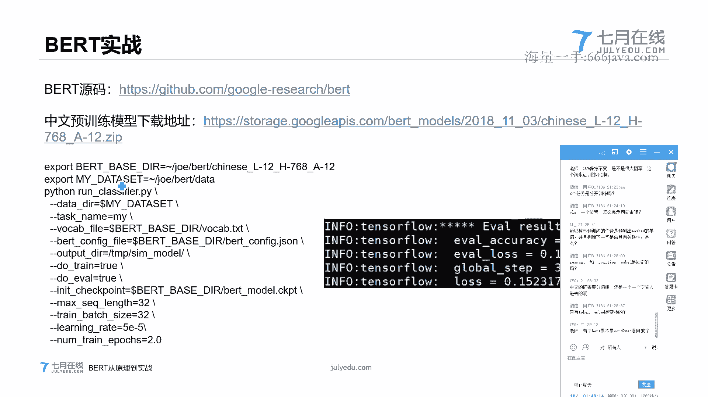
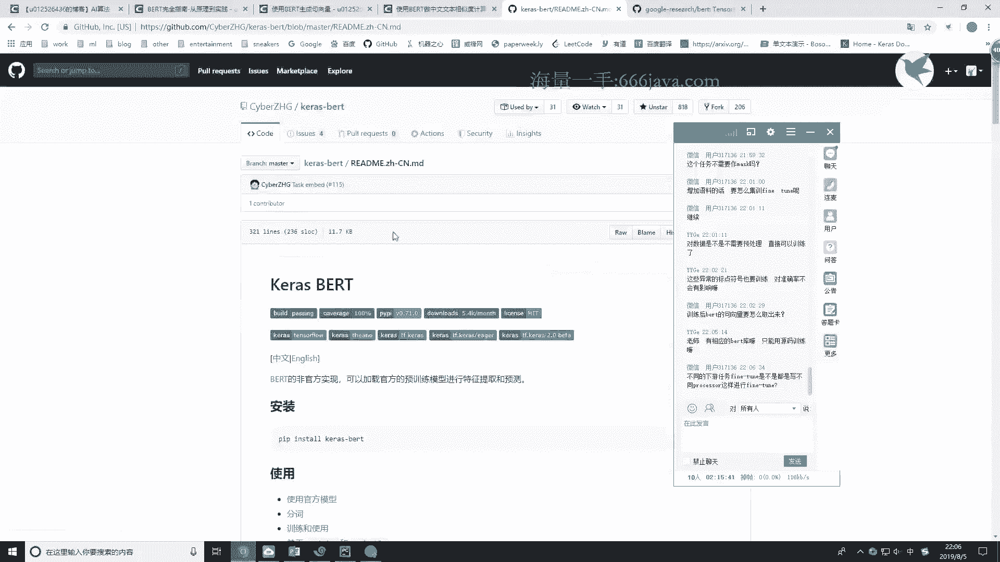

# 七月在线-深度学习集训营 第三期[2022] - P4：在线视频：01-当下最好的语言模型BERT介绍 - 程序员技术手札 - BV1gW4y1x7j7

ok ok那么咱们今天的课程就正式开始了啊，首先给大家做一个自我介绍，我是这边深圳线下的一个负责人啊，我叫jo，然后主要是负责a2 b方向的，今天的话就由我为大家来介绍一下这个目前比较火。

效果也比较好的一个b r t模型啊，今天这个模型呢其实在结构方面还是蛮复杂的。

首先第一点呢就是这个tention机制，而这一块的话可能大家在之前的课可能已经学过了，我这边再带着大家简单回忆一下好吧，第二块的话就是transformer。

transformer的话其实就是啊bt最核心的一个，一个结构啊，说白了b r t其实就是由transformer组合而来的，所以这一块大家是肯定要了解的，然后第三块的话我会带着大家去了解。

然后第四块的话我会为大家再介绍一下，就从b r t从去年年底推出到现在，又推出了哪些新的类似于或者说超越了bt的这些模型，再给大家简单介绍一下，然后最后一块的话就是一个b i t的实战。

我会采用一个文本相似度的这个任务，教大家啊，怎么by two，怎么微调，这个比压线好吧，那咱们就啊正式开始了，首先第一块的话还是在带着大家回忆一下这个tention机制哦，对提一点。

就是说我在讲课的过程中，大家如果有什么问题一定要啊及时给提出来好吧，因为每一块它都是有相关性的，如果你前面没有听懂，例如attention没有听懂，那transformer你可能就听不懂。

然后transformer和bt也是息息相关的，如果transformer那一块你没有弄明白的话啊，b i t这一块你可能就很难理解了好吧，所以大家中途如果有什么问题就及时提出来。

我这边都会第一时间给大家解答，好吧啊，实训作业有的会有几个简答题，还有就是一个bt的一个微调的一个作业，待会上完课，我会把它发到群里好吧，那咱们就正式开始。

首先来大家再回忆了解一下这个attention机制啊，啊我这边的话也带带着大家简单回忆一下这一块，嗯，对于序列生成类的任务来说的话，通常都会采用这个sequence to sequence这个模型。

例如像对对联啊啊文本摘要啊，机器翻译啊，其实都是采用这个sequence to sequence这样一个结构的模型来做的，我们简单回忆一下啊，像我们ppt当中的这个动图。

左边这个绿色的这一块其实就是sequence to sequence，sequence的这个encoder阶段，那紫色这一块呢其实就是它的这个decoder层，其中不管是encode还是抵扣的。

其中的每一个节点，就我说啊这个绿色的圈圈，或者说这个紫色的这一块，它其实都是一个或者说是一个rn的变体啊，那我们简单再回忆一下这个sequence to sequence。

这个模型整体的这个流程是什么样子的，我们这个动图当中呢其实是一个机器翻译的一个小任务，这里的这个例子是把这个法语翻译成了这个英文，咱们简单看一下啊，它这个流程到底是什么样子的。

首先呢在这个encode阶段，就是第一个节点会首先输入一个法语的词，比如这里他输入了一个法语的词之后的节，第一个部分的话是下一个词，第二个部分的话是上一个节点的啊，hidden sat。

那直到这个in code结束的这个地方呢，它输出的表示的就是in code阶段，整个的这个context，这里大家理解吧，这块应该大家很熟悉了，所以这一块我可能不会讲得特别详细。

那对于这个context呢，它又会作为抵扣的阶段，第一个节点的这个初始化的一个hidden state，那第一个你考的阶段，第一个节点的一个输入值呢，其实通常是会采用一个开始符来作为它的输入啊。

每经过一个decoder的节点，就会输入一个翻，译出来的词，例如这里的这个输出了一个i，到了他的第二个节点，就会把这个i作为它的一个输入。

并且把上一个节点的hidden state作为它当前节点的这个啊keen state，再进行一个输入，但是这个模型呢有一个致命的缺点，大家知不知道啊，嗯它致命的缺点是什么，没错就是如果序列特别长。

他可能会丢失一些信息啊，我举一个例子啊，例如在文本摘要这样子的一个任务，就include阶段，它可能序列会很长，可能有上百个字，上千个字都有可能对吧，但是在抵扣的阶段，它可能就是一个简单的标题啊。

或者是一个啊是几十个文字，对于这样的情况呢，include阶段靠前的一部分的一些文本信息，它就很容易丢失，那为了解决这个问题呢，attention就应运而生了，我讲到这里，如果有问题就及时给提出来好吧。

我要第一时间给大家解答，那咱们就继续讲这个attention，turn其实和sequence to sequence啊，这么说吧，attention其实它不是一个模型，它是一种机制。

咱们考虑这么一个场景啊，现在我在做一个英文题目的阅读理解啊，我可能有很多个题目，首先我在做第一个题目的时候，我并不会说我去把整篇文章都读一遍，然后去从中找这个答案，还是说我会去选择这篇文章中的某个段落。

就和当前这个问题相关的某个段落，然后去详细仔细的去阅读那个段落，来得到当前这个题目的答案，那我做下一个题目的时候，我也是去选择一个最适合当前这个题目的那个段落，去详细阅读。

这样才能把这个题目的答案给解决出来对吧，那pension是什么意思呢，例如这个tension，它其实参考的就是我们做阅读理解的时候，只关注整篇段落的一部分，而不会去关注它的一个整体，那咱们看一下啊。

如果要采用tention机制是什么样子的，咱们仔细对比一下啊，啊这边这咱们仔细对比一下这两个动图啊，对于第一个sequence to sequence的模型来说。

这个动图它其实encode阶段它输出的就只有一个context对吧，那我们再看一下这个attention，它输出的他ino的阶段输出的是什么东西，咱们看一下这个动图。

仔细看是不是它输出的是前面三个节点呃，所有的隐藏状态，也就是说他输出了三个节点的隐藏状态，那我在抵扣的阶段的时候，我会把这三个啊encode输出的hidden state作为一个选择，咱们做个类比。

对于抵扣的层，第一个这个嗯稍等一下，对于抵扣的阶段，第一个这个节点就我们类比一下，类比成我们现在在做阅读理解的第一个题，我是不是会从这边这三个段落里面，选择一个最适合当前这个节点的一个段落。

然后详细的去读这个段落，那attention其实咱们类比一下，就是这样的一个机制，从这三个hidden sit里面选一个最适合自己的，然后做了一个加权，到了我们下一个节点，同样是一一啊，一个道理。

还是会做一个加权的选择，那其中这个加权的选择就每一步到底是怎么加权的，咱们就在下一页的ppt给大家讲好吧，咱们继续下去看一下这个呢左边这一块是啊。

上图当中提到的encode阶段输出的三个hidden feat，那这个紫色这一块呢，如果是针对的是第一个节点，我们通常会随机初始化一个这个紫色的这个啊向量。

然后我们要把这个向量和这三个对三个keen state作为一个相乘，就会得到这样的三个值，再把这三个值做一个soft max的操作，就会得到这样的一个权重。

那我们把这个权重呢再和上面这个三个hidden state进行一个相乘，也就是说我考虑考虑到了当前对于当前这个节点来说，我从上面这三个hidden sat选择了一个权重最高的。

你看我们这里计算出来的三个选手分别是0。96，0。02，0。02，也就是说对于我decoder的第一个节点来说啊，0。96这个对应的这个kden state它的权重是最高的，那对啊。

映射到我们的阅读理解当中来说，也就是说我们在做第一个节点这个题的时候，我们发现第一个段落写的相关性是最大的，所以我们会给它设一个较大的权重，那我们把这个权重和这三个hidden state做一个相乘。

最后再把这三个权重进行一个相加，就可以拿到我们最终的这个结果了，啊这个结果的话就会作为一个新的hidden state输入到新的这个节点当中，大家看到这里有没有什么不明白的地方，有什么不明白的地方吗。

如果大家都明白，就扣个一好吧，扣个一让我知道大家都明白了，啊attention是一组固定的参数还是不用的样本，有不同的参数呢，其实tension它只是一种机制，它在不同的场景，它的使用方式是不一样的。

我这里介绍的只是一种最简单的一个tension，那像这里介绍的这种情况，其实这个地方的这个值，那不同的节点，例如我现在到了第二个节点对吧，那第二个节点的其实这个值和上一个节点的这个值肯定是不一样的。

因为我们我们还是类比到这个阅读理解当中啊，我做第一个题考虑的可能是第一个段落，但是我做第二个题的时候，考虑的就不是第一个段落了，考虑就是可能就是第二个或者是第三个段落了，对吧，嗯大家如果有什么问题的话。

直接在那个就是直播间发出来就好了，因为那个qq的话，我这边看起来不是特别方便好吧，我看一下qq这边的问题，为什么是输出三个h啊，你指的三个h，你的意思是说我的影扣encode的阶段为什么会输出三个h吗。

啊大家有什么问题在那个直播间这边提问好吧，可能会唱嗯，我来我先看一下问题啊，新的headset要和原来的state做拼接吗，啊是这样子的，同上有很多种方式，有的方式是不用拼接的啊，有的方式是需要拼接的。

然后这个问题的话，我待会在后面的p p t会讲，好吧啊，比如说decode有四个节点，一共只有四个tension节点对吧，如果decoder是有四个节点的话，那对应的attention就是四次。

对你们说的没错，才四个腾讯节点，每一个就那么几个参数，是的这个是是这样子的，怎么能保证抵扣的权重都是对的呢，是这样子的，我这个权重其实是在反向传播的时候不停的更新的，因为五要最小化的那个损失函数嘛。

我在啊反向传播的过程中就会不停的求导，然后不停的去更新这个权重，所以最后这个权重就是正确的，啊是你说的这个原文各种情况都有，的确会有这种情况，所以就是说啊这个模型因为比较简单嘛对吧，我刚才也说了。

对于这样的模型，如果是attention，为什么会有transformer，为什么会有更比attention这种机制更复杂的一些模型，就是因为它并不能把这些所有的情况都考虑进去。

也就是说它的特征提取效果还没有想象中的那么完美，只是说呃tention他这种机制有一定的效果，那肯定不能做到特别完美对吧，特摄只是一种机制，咱们讲到后面，然后可能对这个某某同学应该也会有更多的理解。

好吧，咱们继续后面的内容啊，主要是tension这种思想，大家这里要掌握好啊，我这边再做一个简单的总结，到底什么时候tention说白了他其实就是一个加权，针对于前面的这个hidden state。

你看我们针对这里前面这三个hidden state，我们做了一个加权，然后把最后进行了一个相加，而腾讯说白了就是一个加权的机制，如何选择最符合当前的这个idc，好吧，大家记住了，他是一个加权机制。

那如果大家都清楚了，我就继续下面的内容了，还有什么不明白的地方吗，如果attention机制不了解的话啊，说到transformer的话，大家可能会有点懵，那我就继续讲transform嘛，好吧。

哦哦对，这里就是刚才的那个图，咱们看一下，刚才不是有同学提说啊，有的是拼接嘛对吧，其实tention这里罗列的一个一个图，这个图上面其实就是一些比较常见的一个tention机制，你看下第一个这个啊。

active attention，这个tention其实就是把隐藏层隐藏节点给拼接了起来，然后做了一个类似于全连接层的操作，然后外面套了一个tan h的激活函数啊。

还有这个scared dot product attention，其实所以说attention其实很多有很多种思想，很多种变体，咱们这里关键是要掌握它的这个，核心思路它就是一个加权。

ok咱们就继续讲好吧，看一下这个所谓传说中的transformer到底是个什么东西，ok咱们先来简单看一下这个transformer的一个整体的一个结构，是什么样子的啊。

transformer呢它其实也是一个encode decode的阶段，咱们看一下，就左边这一块，左边这一块它是它的encode啊，我圈一下左边这一块是他的encoder。

然后右边这一块的话就是它的一个decoder啊，咱们先看这个encode阶段，encode阶段的话它又分为了两个子层，第一个子层叫做market tension。

然后第二个子层叫做feed forward，其实就是一个全连接层啊，它每一个子层之后呢，又接了一个类似于那个残缺残缺网络，大家清楚吧，也就是一个residual connection，一个残缺模块嗯。

能有效防止梯度消失，经过这个残缺模块之后，他还会经过一个leon normalization层，这个layer normalization呢其实和那个h normalization是很类似的。

咱们再来看一下这个decoder层啊，decoder层其实和那个encoder层很类似啊，只是咱们看一下这一块，这一块其实是完全和那个encoder层是一模一样的对吧，就下面这里又多了一块这一块。

它其实是一个mask marty had tension，那这个东西是什么东西呢，咱们也会在后面给大家详细的讲，然后最后如果我的课程结束了，有transformer的讲完了，大家如果有空的话。

也去读一下这个transformer的这个论文，因为如果自己去真的读过这个论文了，可能会有一些更多一些新的理解好吧，然后这个ppt里面我也要把这个论文的地址地址给给了出来，大家有空的话去看一下。

接下来的话我就会详细给大家讲一下到底什么是mari had a tension，然后什么是这个musket，mari had a attention，好吧嗯，在开始讲那个ml的tension之前。

要给大家说另外一个东西，就是scared dot product tension，这个东西呢我们在之前的ppt有说过，就是这里的这个给他打了，它是attention的一种变体。

咱们来好好看一下这个scared dot product attention到底是什么东西，好吧，其实常用的喷射呢是有两种。

就首先是这个additive tension和这个dot product tension，就是我刚才那张图提到的，咱们再看一下啊，就是第一个active attention，我换一个颜色的笔。

这个dattention还有一个是，然后这个scared dot product tension呢是咱们transformer用到的，咱们就再回顾一下这个editive分成什么呀。

把两个隐藏状态拼在了一起，然后过一个全连接层，外面套一个tan h聚合函数，然后外面再加一个权重，说白了就是两个激活那个两个全连接层啊，这个dotable dog tension呢就很简单了。

它其实就是把两个呃sat进行了一个相乘矩阵乘法，所以说这个additive tension和product tension，dot product tension，其实两者效果是很接近的啊。

但是dot product tension呢它会更简单一些，咱们刚才也看到了嘛，其实就是一个矩阵乘法对吧，所以计算起来会比较简单。

所以呢transformer也采用的是这个dot product tension，也就是说在这个marty hard tention当中，它采用的是这个啊dot product attention。

但是他为什么不用这个dot product tension啊，而是要用了一个cared dot product tension，加了一个啊，咱们看下面这个公式啊，如果我们把这个缩放因子啊。

下面这个缩放因子给去了，它其实就是一个dot product tension，加上这个缩放因子之后，它就叫做scared dot product or tension，接。

下来咱们就看一下为什么要有这个缩放因子啊，首先我们来理解一下这个公式啊，这个q k v到底是什么东西啊，我们还是类比一开始的那个，类比到这个图上面来啊。

咱们看一下这个三个三个h它其实就是可以理解为就是这个k，那这个q呢咱们就可以理解为这个紫色的这个抵扣的这个这个东西，我们用这个抵扣的和这三个进行一个相传就可以计算出嗯。

回顾回顾一下啊，你看我们把这个这个三个和这个紫色进行一个相乘对吧，得到了13 九九这个值，然后做一个soft max的操作，再和原值进行一个相乘，最后拿到最终的结果。

所以说其实我们这里的这个v和就等于这个东西，也就是说我们的这个啊k和v是相等的，在，这个我们刚才讲的这个情况，下面k和v是相等的，这样的话大家这个公式应该就理解了吧。

如果我们先把这个我们先把这个缩放因子给遮住，只看这个q k a soft max乘以这个v，然后结合这个图，这里大家理解吧。

最后这个图。

那为什么要除以这个缩放因子呢，是这样子的，就假如q与k的初始化的值它是满足啊，均值为零，方差为一，那么点乘后的结果呢，它的均值就会为零，然后方差是dk啊，这里的d可以表示的是这个qq的这个维度。

也就是说咱们这里这个h一的这个维度，但是如果这个维度很大的话，就会出现一个问题啊，因为啊咱们也看到了这里点成之后的结果，它反差是dk，也就是说如果我们这个dk特别大，那它这个反差很大。

也就是说不同的数之间它相差的值就会很大对吧，然后我们又只得知道这个soft max它的输出值和是一，如果有一个输出值很大，那么其他单元都会受到一个抑制，咱们再看一下，回顾一下之前的这个图。

你看咱们这里h1 h2 h3 对应的是13 九的九，但是经过这个soft max之后，13对应的变成了0。96，而九对应的是0。02，它其实九和13比起来嗯，没有相差很多对吧，但是它的权重已经很小了。

但是13的权重就很大，那如果我们这里除以了一个啊这个dk的话，就会把这个soft max这个值尽量的放小一些，不会导致所有的值都会变大，就是这个原因，所以要除以这个值啊，我看一下这个同学的问题啊。

k也是矩阵，每个节点都有一个tension，可是这样子的，我这里看我这里可以表示的是h1 h2 h3 合在一起，是这样子的啊，你指的说错了，是你说的是哪一块，说错了呢，啊某某同学针对一个抵扣的节点。

针对一个你的意思是说啊，是是向量对它是一个向量，不是的，如果是针对于当前这个情况的话，它其实就只是一个单纯只是一个向量，它不是一个向量，对它只是一个向量，ok那咱们继续好吧，嗯咱们说到了刚才那里。

为什么要加一个缩放因子啊，为什么要加一个缩放因子，大家这里清楚了吗，啊我再简单的说一下啊，加上缩放因子之后，就会防止soft max 3中某一个值过大，而导致当前这个值一直到了其他的值。

从而防止出现全盘通吃的这个情况，咱们再回忆一下这个图，13对应的是0。9，六九对应的是0。02，13和九相差的不多，但是13站的权重特别大，我们点成的均值为零，方差是dk，如果没有这个缩放因子。

因为反差很大，所以其中的值它相差的会很大，大的值就会全盘通吃，大家这里清楚了吧，如果清楚的话，咱们就继续看后面的内容，嗯清楚了吗，清楚的同学打个一好吧，如果有不明白的地方，大家及时提出来好吧。

那咱们就继续了，明白了这个scared dot product tension之后，咱们就可以来看一下这个smart的tension到底是什么东西了啊。

我们再看一下上面这个对于上面这个tension来说，它其实啊只能输出一种情况的值对吧，但是marin hart tension是什么意思呢，就是说我这个tension如果只有一个腾讯的情况的话。

我可能只会考虑到一个维度对吧，但是对于n m p这样比较复杂的任务来说，它就可能会有很多个维度需要去考虑啊，就好比这个cn大陆的这个卷积层，它的这个卷积核你也不可能就只单单的设置一个对吧。

咱们这里做个类，比就可以把这个类比成这个，咱们再就只单单的设置一个对吧，咱们这里做个类比，就可以把这个类比成这个，咱们再提在采用这个cn卷积层的时候啊，卷积核的个数不够啊。

所以咱们是不是也可以用一种类似的方式把这个藤审就是多加几种，就是考虑到不同的维度，那怎么加呢，这就是咱们之后面要讲的问题，那对于这种如果多个不同维度的attention在一起，这种情况的话。

就被称为马号的tension，好吧，为啥这里的tension有三个参数呢，其实是这样子的啊，attention，我刚才也没有说过，这个这里的这个tension的k和v。

它其实表示的是一个值。

我们再简单看一下啊，q表示的是这个紫色的啊，k和v表示的是这三个黄色的，它其实有些情况下它虽然是三个参数，但是口某些参数它可能是相同的，它三个值都是相同的，好ok那咱们继续讲后面的内容，好吧啊。

玛丽哈的tension就说了，刚才一个tension考虑的维度不高，那咱们就多加几个，那怎么样才能多加几个呢，咱们看再看一下原来的这个这个公式啊，这个公式你看我们q k v都是固定的呀对吧。

嗯都是固定的，那我们怎么才能去考虑多个维度呢，这个时候其实我们就需要引入一个东西叫做，w q w k和w v我每次在计算q kv的时候，我不会再用它的这个直接一开始得到的值。

而是用我们这个初始化的值和这个矩阵进行一个相乘，而得到的值才会作为他的q，同样的这个w k也是用这个输入值和这个矩阵进行相乘，然后得到k这个w v也是一样的，啊我先在这边看一下同学的问题啊。

k和v可以不一样吗，为什么要写两遍，啊q和v可能有的情况下是不一样的，因为我刚才也有也有说过这个attention，它其实情况有很多种，咱们在这在这里也看过attention，其实情况有很多种。

从x怎么得到q，从x怎么得到q是指这个图上的吗，啊接下来我会讲好吧，啊我就是在回答一下这个q k v的问题啊，q k v的问题，他有的时候他可能三个值都会相等，然后也有可能某些部分知识相等的。

具体的话要考虑具体的一个场景，就像我刚才说的一样，attention它不是一个模型，它是一种机制，它是一种加权的方式，不同的场景下，它的这个加群方式可能是不一样的，你可以是直接加啊。

doctor da ten成这样，直接进行一个相乘，你也可以像activattention里面一样，作为一个线性的一个操作，然后加一个激活函数好吧，所以说attention操作其实真的很多。

咱们关键要学的是他的这个思路，这种加权的这种思想啊，接下来咱们就看一下这个同学提到的就是怎么从这个x得到q，咱们这里这个x其实可以类比到上面这个这三个黄色的。

这三个就是它的encode hidden state的，咱们可以做个这样的类比。

只不过这里啊取名的是这个x，首先呢我们会初始化三个这样的一个矩阵，这三个矩阵都是随机初始化的，然后把这个x和这三个矩阵分别做一个乘法，然后得到三个向量，而这三个向量呢就会作为新的这个q k v。

那这三个矩阵也是在这个反向传播的过程中不停地更新，然后才会更新到最适合生成q k v的这个矩阵，得到我们这个q k v之后，就是接下来的操作就和上面的这个这个公式很类似了，先把q和k进行一个相乘。

然后计算它的这个啊缩放因子，而soft max再把soft max的值和这个v相乘，最后再做一个累加，把所有的情况相加，就可以得到我们最终的这个输出的这个值了，q是指decoder中某个t的h是个向量。

kv都是隐code中所有t的h拼起来的矩阵对吗，对q通常是指的是decoder中的某个，你说的这个某个时间点的这个get set没问题，这一点说的是没问题的。

然后kv都是抵扣的中所有时间的h拼起来的一个矩阵，对你说的这个是也是没问题的，完全没问题，咱们再继续看这个马丽哈的tension啊，看到这一步，大家有不明白的地方吗，就是从这个q乘以k最后得到的这个v。

然后v在累加求和得到的这个z就到这一步，大家有不明白的地方吗，咱们再简单回忆一下啊，对于这种情况，我们q k v是固定的，所以我们没法考虑多个维度，那怎么办呢，我们乘以一个随机初始化的一个矩阵。

这样的话就会得到一个新的q，把这个新的q k v进行一个刚才的一个计算，就可以得到我们最终的这个雷一，不是q是decode的，这个同学叫某某同学，q是抵code的，qq它其实的意思是query。

然后k是key，然后wish指的是value啊，market head体现在哪呢，稍等一下我就会给大家解释到底体现在哪里好吧，关键先把这一步给看明白，dk为啥是八啊。

ok我把给大家解释下这个dk dk的话通常是对，就是维度，然后就是取一个开方，因为啊在transformer这个里面，它默认的维度是64 64，所以这里提到的是一个八，对transformer。

他的确是要更新这三个矩阵，咱们先继续好吧，讲一下这个mti的到底体现在什么地方，啊如果我们把我们看一下。

这里其实就是一个x嘛对吧，类比到上面的话。

但是对于一个序列来说，他肯定不止一个x一对吧，它可能会有多个，所以我们就把它这里可能还有多个，它可能是一个矩阵的形式，所以我们这里以一个矩阵的形式来表示它的话，最终其实我们只得到这样的一个式子。

这里大家是能理解的吧，接下来我们来看一下它这个marty到底是体现在了什么地方啊，自己看哦，关键的点来了，这是第一种情况的这个啊权重矩阵，那如果我们引入多个情况的权重矩阵呢，这种这是一套对吧。

左边这里是一套，我们再引入一套唉，这样的时候我们是不是就可以得得到得到多个z，在transformer当中，它默认是引入了八套八套参数，所以对最后他就会得到这样八个这样子的z。

那他最后我们就把这个bug z进行一个拼接，然后再乘以一个wo矩阵，这边这个矩阵主要的目的是用来降维的，然后我们就可以得到最终的这个z，这个z的维度其实和你看和这个z的维度其实是一样的。

所以这边这个w其实就是用来降维的，保证我们输出的这个z和每一个这种小z它的维度是相同的，那marin呢体现在就是我们生成了多套这个权重矩阵，明白了吧，这位啊这位同学，317136。

这就是mhy的体现的地方，啊说到这里大家看有没有什么不明白的地方，transformer的目标其实就是不停地更新所有的钱选装矩阵，如果我们有一共有八套权重矩阵的话，那其实就是24个嘛对吧。

我们要更新24个权重矩阵，当然这个mt号的团审它只是其中一个部分，哦对忘记提一点，我们再看一下这个transer的一个整体的一个图啊，我们我们只看这个encode的阶段啊。

encode阶段它其实输入的只是一个句子对吧，那这个attention他只有一个序列，这个tension是和谁啊，tention呀，是不是只能和自己的tension，所以，马号的这个encode阶段。

这个madht tension，它其实这里写的不是特别准确，它应该叫做micht sattention，也就是说他这个tension是自己和自己做一个tention，大家注意啊。

这里应该叫马里哈的cf tention，自己和自己做的tension，啊这个c就是体现在我输入的，我在include阶段，我输入的是句子本身，它没有其他序列，我抵扣的阶段才会涉及到另外一个序列。

我引扣的阶段只是自己和自己做一个弹射，也就是说我这里的这个在seer tension当中，这个q k v3 个值是相等的，你看我这个q和k是相等的，那是不是就是自己和自己做这个和腾蛇了，这就体现在了。

这就是cf体现的一个位置，明白了吧，然后这边的话就是它的一个整体的一个图，咱们再简单回顾一下啊，这是输入的x这里是一个矩阵，因为它是它不止一个序列，多个矩多个序列，然后和多个啊矩阵进行一个相乘。

得到dotq k v，然后q k v经过啊，咱们刚才的这个tension的这个公式，最终得到多个z，多个z组合在一起，和一个w的矩阵进行相乘，进行一个缩放，就能得到我们最终的这个z。

ok咱们看到这里有没有什么不明白的地方，然后大家也来看一下这个图啊，心里面回忆一下它整个流程是什么样子的，咱们给大家两分钟的时间好吧。

因为mha tension其实也是transformer的一个最重要的一个结构点，只要这一个地方啊了解清楚了，那其他都是小k4 了，为什么人口的阶段也要做tention呢。

其实啊你从句子当中去提取特征的时候，你肯定我举我举个最简单的例子，为什么词向量的效果不如b加t直接生成趋向量的效果好呢，因为就单纯的一个word actor，它没法考虑一个上下文的语境。

他就直接把这个单词给的这个词向量生成了对吧，那对于或者说我不不去比较这个比亚t，我去比较a某就用word和omo做一个比较，恶魔所考虑的就是一个上下文的语境。

它会根据上下文的语境去动态生成这个词的词向量，那为什么欧盟的效果比我connect的效果好呢，就是因为它考虑了上下文呀对吧，那我们赢，那对比到这个创新当中一样的，我只要提取特征的时候。

那我就自己和自己做一个弹声啊，这样我才能把就是上下文语境这样的一些特征给提取出来，明白了吧，那这个cf腾讯就讲到这里，咱们就继续下面内容了好吧。

接下来咱们再看一下这个encode整个的in code include，就是刚才说的一个money has cattention，然后加了一个residual connection。

再评上一个layer normalization，neo normalization和那个beach normalization是很类似的，它主要是用来繁殖过拟合的啊，接下来的话就过了一个全连接层。

然后又是一个research connection和那个layer normalization，这就是一个include整个的这个结构了，然后在transformer当中呢，它in扣的其实是这样。

六个这样的一个子模块堆叠在了一起，整个这个六个字模块成为它的一个进口的，知道了吧，接下来咱们就来看这个抵扣的阶段了啊，抵扣的阶段刚才也说了这两啊，前面这两块是一样的，主要看一下它的它的最下面这一块。

这个musket到底是什么东西啊，咱们来看一下，我们现在有一个这样子的一个序列啊，叫做i have a dream，我们把这个序列就做一个cf attention的时候。

就是说白了就是q和k进行一个点传，你看假如把这个当做当做q，然后把这边这个啊当做可以，我做一个矩阵的乘法，它其实它是不是会生成一个tension的矩阵，就这样的一个矩阵对吧，就一个4x4的一个矩阵。

那对于这个对于这个抵扣的阶段来说，咱们来看一下啊，如果要生成一个新的序列，你如果都让我啊已经看到当前我要生成的这个序列后面的内容，然后再来生成序列，那其实是不是就没意义了，能理解我这句话吗。

就是说假如我现在要把这个i have a dream，把它翻译成中文，或者说啊我把中文翻译成英文，就是我有一个梦想，我要翻译成i have a dream。

我引扣的阶段输入的是i have a dream，这个时候啊我在训练阶段，我的那个decoder，首先我要输入的是i对吧，我要输入的是i，但是如果我在输入i的时候。

把这个have a dream后面的内容也输也输入了，那我输出的输出的时候，我都看到后面的内容了对吧，那就没意义了，我们要做的就是说我看不到后面的内容，那怎么办呢，就是建立一个三角上三角矩阵。

然后把也就是右边这个图灰色的这一块，就灰色的这一块，把这一块全部置为负无穷，这样我在做soft max的时候，就会把这一块的值指得特别小，你看我这个i对应的它只会检测到和i相关的值。

i和have a dream这三个词的时候，因为它是负无穷嘛，所以so soft max之后它的值会很小，也就是说i就拿不到have a dream这三个词的一些相关的一些特征。

而对于have这个词的话，它是可以拿到i和have两个词的对吧，同理到最后这个dream他就可以看到所有序列的一些相关的特征了，这就是这个灰色的部分指的就是这边说的这个musket。

说白了就是把嗯后面的内容给遮住了，不让他提前看到，那其他部分的话就和前面的是一样的了，所以说在这个抵扣的阶段，只有这一块不一样，咱们做了一个遮挡的操作啊。

这个musket money hattention，大家明白了吗，有没有什么不清楚的地方，嗯有不明白的地方吗，这个mosket，如果明白了我就继续讲下面的内容了啊。

最后咱们再看一下这个mari had tension在transformer当中的三个地方，我们看继续看这个图啊，这个market的tension在这个transformer当中有三个地方应用的。

这三个地方到底有哪些地方是不一样的啊，首先呢这个encoder阶段就是一个标准的马里海的特射，对于啊抵扣的阶段，这个musket咱们也讲了，那最后我们来说一下这个啊中间的这个马里海的tension。

这个时候它其实就不是一个cf的tension了，大家知道为什么吗，为什么这里的不是一个cf产生，为什么这个蓝色的这个mod had tension不是一个sample tention。

其实这里你看他的收入是不是啊，transformer encode的一个输入，它不单单是那个它自身的一个输入，所以它的k这里对应的k，是encode输出的一个值，知道了吧，这就是一个。

所以说这里它这里不是excel的同时，一个是一个encode阶段的一个值，还有一个是它自身的一个值，你看这个箭头其实就可以类比到咱们这个呃，sequence to sequence这样的一个机制。

你看我这个抵扣的阶段，首先输入的是一个include阶段的一个值，其次是抵扣的阶段的一个输入值，这就是这个马里海的tension和这个include阶段，这个cf tension的一个区别。

这里有明白吗，大家，最后咱们再来看一个动图啊，这个动图就是嗯也是一个法语的翻译，他会把这个我是一个学生的法语，把它翻译成一个英文，我们看一下这个流程到底是什么样子的呀，啊首先把这三个向量进行一个输入。

这个是encode的hien se，把这个kds和这个矩阵相乘，要深入到抵扣的阶段，然后抵扣的把这个值输出，哎这个同学这个时候可能会有同学有疑问啊，哎为什么嗯，我第一个词好像没有。

其实没有那个用不到那个masket腾讯的那一部分的输入，而是只有这个encode阶段的一个输入，是的，因为我们第一个阶段，我们啊抵扣的阶段，它的输入其实是要等到第一轮的这个输出值，这里有输入。

输出了一个i，我要把这个i作为一个输入输入到这个位置，这个时候，我们这个musket attention才开始真正的运作，咱们看一下第二部分，第二部分把这个i也输入进来，咱们看一下这个动图。

然后把这个m拿到之后，再输入这个这个这个阶段其实就已经和那个sequence to sequence，那个阶段很接近了对吧，这大概就是一个transform的一个整的一个流程。

嗯看到流程这里大家有没有什么不明白的地方，咱们再简单看一下啊，首先我们需要的是这个encode阶段的一个输入，得到第一个输出值，再把第一个输出值输入到带有musket的马里奥的tension。

然后再不停的输出解析的一个结果，直到遇到一个结束图，咱们整个生成的这个流程就结束了，有没有什么不明白的地方，没有的话，咱们就继续下面的内容了。

啊到下面的话就要开始讲这个bt了。

这样吧，咱们稍微休息一会好吧啊，休息十分钟，然后大家也把这个整个流程再回忆一下，然后看有哪里不明白的地方，我给大家再解答一下，啊趁这个时间点，大家也把自己想问的问题，还有不清楚的地方可以啊，打在公屏上。

然后待会我给大家统一解答好吧，咱们稍微学计划，嗯大家看得怎么样，整个流程有没有熟悉一些了，那大家有什么问题尽管提出来好吧，咱们再过一分钟吧，再过一分钟，我们把这几个问题回答一下。

咱们就正式开始下面的内容，ok ok大家都回来了吗，都在吧都在吧，我准备就给这几个问题进行一个答疑，嗯蓝色框起来。

那个阶段的输入是将encoder和decoder的self attention的输出值加一起，输入到最后的什么，是这样子啊，咱们看第二个动图啊。

首先我们会把include阶段的这个输出值和这个矩阵进行一个相乘，拿到q和v对吧，然后我们会和这边的这个输入值，这边的输入值其实就是一个q，明白了是这边这个值又做了一个cf那个腾讯的操作。

然后输出了最后的结果，并不是说就把它相加，明白了吧，这个317136，这位同学，啊为什么说它不是sattention呢，因为它这里输入他这个q k v并不是相同的呀，在encode的阶段。

它只有一个序列，它是自身和自身做了一个c和腾升，但是在那个抵扣的阶段，它有新的输入，还有新的一个输入，它有另外一个序列，所以严格意义上来说，它并不能很严谨的叫做cf腾讯。

啊然后看一下a2 l这位同学的问题，k和v都是encode阶段的pen sk吗，啊不能叫这里其实已经不能叫黑等词的，他应该说叫他的encode阶段的一个输出值，如果准确的时候应该是叫它的输出值。

咱们再看一下一开始那个图，你看这里它其实输出的是一个首先一个全连接层嘛，一个residuous action要经过ler ler ler malization之后的一个输出值，ok明白了吧。

还有什么问题吗，这里啊如果没有什么问题，在公屏上打个一好吧，ok ok ok，那就继续下面的内容了，反正大家都不是特别积极呀，希望大家都能一起互动进来好吧，让我知道各位的这个掌握的一个情况。

因为如果你穿不了解的话，b r t嗯就等于是学不好了。

ok咱们接下来就来看这个transformer，哦，是那个b r t，这个b e r t到底是个什么东西，对对对，transformer，transformer这个模型也是我自己觉得最复杂的一个模型了。

就相比于c c n和rn来说真的很复杂，所以大家听完这次的课下来之后，还要自己再消化一下，多看一下这个ppt好吧，或者说把我这个课的录播再拿过来看一下，这个模型真的很复杂。

但是没关系啊，大家不用特别担心，因为我们这个b e r t啊。

它其实并不是transformer的全部的一个阶段，我们看一下b加c的全名是什么，be directional encoder，representation from transformer。

什么意思呢，他用的只是transformer的encoder，大家是不是觉得transformer是这个抵扣的阶段更复杂一些，抵扣的阶段其实就是一个cf tension对吧。

复杂的点就在这个cf层上对吧，那这个b i t是什么东西呢，它其实就是这个transformer encoder层，然后把这个encoder层进行了一个堆叠在一起，对于b i t有两种啊。

一个是base，还有一个是挖掘啊，贝斯的话它其实是12层的这个encode叠在了一起，然后它的维度是输出值的维度是768。

然后这个a表示的就是marty had tension的这个head的个数它是12，然后这个very large的话是24层include叠在一起。

然后输出值的维度是以1024money had attention的个数是这个16，然后这边的话我也给了大家这个啊b r t这个模型的一个论文，大家如果transformer理解的差不多了。

然后transformer的这篇论文也看过了，那就可以来看这个b r g的这篇论文，当然也可以先看我的视频，或者看我的这个p p t，如果都看明白了，再去看论文好吧，那bt呢它其实是一个预训练的模型。

接下来我给大家简单介绍一下到底什么是语训练，到底是什么是微调啊，就是所谓的反to啊，异性恋呢其实就是我事先使用了一批数据，然后训练了一个模型，最终这个模型的这个漫画能力会很强。

然后呢我再用这个事先训练好的这个模型，在一个自己特定的任务上，并且使用自己特定的一个数据集，这个是这个阶段呢就要做一个微调，也就是fq，那前一个阶段就是一个预训练，那对于bt来说呢。

它的这个预训练阶段到底是什么样子的啊，接下来就为大家详细介绍一下它的这个运镜链的阶段到底是怎么做的，嗯在开始之前咱们再确认一下啊，这个bt的结构大家都明白了吧。

就是transformer的encoder堆叠在了一起，这里大家清楚了吧啊它没有抵扣的，只有营口的好吧，大家不要觉得这个b e r t有多复杂，其实也没有大家想象那么复杂。

就是transformer的encode堆叠在了一起，ok咱们接下来就看这个bt的运行列阶段到底是什么样子的，这个bt的预训练阶段呢做了两个任务，一个是musket language model。

还有一个是next centers prediction，第一啊，这两个任务我在下面给大家介绍，咱们先看一下这个bt和其他的一些预训练的模型有什么区别，首先是这个g b t，还有一个是某。

咱们先看这个a某某，它其实采用的是内部采用的是一个l s t m，我们看一下啊，采用的是一个lsd m，然后b r t呢采用的是这个transformer的encode。

然后g b t呢和这个比亚t其实是很类似的，都是采用的这个transformer encode，但是唯一的不同点在于b r t采用的是一个双向的啊，这个gp呢采用的是一个单向的，为什么说它这里是双向啊。

g b t是单向的，咱们看下面的这个musket language mode，看完这个鱼情节的任务，大家就明白了，好吧，我们先看一下这个musket language model到底是什么东西。

其实呢这个任务就可以理解为一个完形填空啊，首先呢就是把所有的文本当中15%的词，用这个mask mask这个遮罩把它给遮住了，就这个东西被遮住了，啊就是这里有一个例子啊，my dog is harry。

他把这个这个这个单词用这个mask给遮住了，然后呢，我把my dog is这三个字作为输入，然后来预测这个词，但是这样的话其实是有一个很大的问题的，什么问题呢，就是说如果我把所有的这个训练语言当中。

我们15%的词都给遮住，那是不是很多次他就可能从来没有见过呢，就在白白天阶段和那个预期练阶段，他可能有些词性从来没见过嘛对吧，有可能有些词数量它本来就不是特别多，结果你还把它给遮住了。

那我完全就不知道那个词是什么东西了对吧，啊所以呢在b i t c当中呢，他就采用了三个方法，就首先呢他把这15%的词，有80%的概率是用这个mask给它遮住。

然后10%的是用一个随机的词来代替这个mask的词，例如这里meal with harry，他换成了一个apple，还有的10%的情况呢，它是保持不变的啊，那问你为什么这里这个随机输入一个词。

为什么不会对，这个就是说为什么会不会对整体的这个结果造成一定的影响呢，毕竟其实这个apple说白了他其实的势力已经引入了一些人为误差了对吧，所以说啊到底这个引入了这样子的一个随机死了，有没有影响的啊。

在b r t里面，它其实论文当中有一有解释，就是说随机引入的这些词带来的负面影响，他认为啊因为只有15%的词啊，并且是10%的概率，所以最后他其实只有1。5%的概率，他觉得这个影响特别小。

所以他认为这样的带来的一些负面影响是可以忽略不计的，所以它的这个训练就采用了这三个点来对这个单词进行一个预测，说白了就是完形填空嘛，对吧啊，他为什么要做成这样的一个完形填空的一个任务呢。

还有一个原因就是因为因为雨量特别大，如果我采用其他一些任务的话，可能需要做一些数据标注，但是这样子的一个任务，我们不需要打标签，我们语料越多，我们可以训练的这个啊这个语料就是数据集，就是对应的训练集。

还有这个目标，就是label，就是x和y就特别多嘛对吧，我们就可以不停的训练，不停的更新我们刚才所谓的那个穿梭er当中的那个矩阵对吧，除了这个啊完形填空这个任务啊。

bt b r t它还有一个任务叫做next and prediction，什么意思呢，就是说选择一些句子对a和b其中有50%的数据，b是a的下一条句子，然后剩余50%的数据b是语料库中随机选取的。

就是说我有一个段落啊，我一个啊两个句子如果是连在一起的，那我就把这个标签标为一，如果两个句子啊，然后我再选一个句子，后面这个句子呢随意机选一个句子，这样的句子它肯定是没有上下文的一个相关性的对吧。

这个时候呢我就把这个句子给表为复原吧，例如下面这里下面这里有是有一，个例子，说白了他其实就是一个啊自然语言推理的一个人物，就判断下文是不是上文的一个下文，就是说能不能从上文推理出一个下文。

为什么要加入这样的一个任务呢，官方给出的解释就是说，他是他认为其实我们会有很多类似这样子的一个，就是在微调阶段，可能会有很多类似这样的一个任务，就可能会有类似这样子的一个任务。

所以它引入这样的一个任务来提升一个总体的一个效果，其次呢他这个输入数据当中，他会，把那个序列的头部加一个cl这个c a r s啊，一方面是表示它的一个起始符，其次在我们嗯通常也会用这个c l s来表示。

当前这个句子的一个局限量，然后中间的这个s e p是一个分隔符，用来分割它的第一个序列的，这是第一个序列，这个是第二个训练，s e p用来做分割的，然后末尾它也会加一个s e p的这样的一个符号。

那这里关键就是记住一下他三这两个符号有什么用，有什么区别，好吧，这就是他的一个第二个任务，但是这个第二个任务在cha cha net当中并没有采用这个任务啊。

当时给出的原因就是说这个任务对总体的一个提升效果并不理想，就是说有没有基本上啊影响不大，所以在xi net当中并没有采用这个任务，而是只保留了这个musket language model。

这个异性恋的人物，然后大家看这两个预训练的时候的这两个任务有什么问题吗，有什么问题就提出来好吧，嗯保持10%保持不变，是不是很大概率这个词永远训练不到呢，嗯其实这个10%和这个随机取一个词来代替的话。

其实情况是一样的嘛，它只有1。5%的概率，所以说它的概率是真的很小，而且b r t它的训练语料很大，我还有点要跟大家解释，为什么b r t的训练语言大，其中一个原因就是因为它模型足够复杂。

只有模型足够复复杂，他就要足够的语料，就好比我们从小到大啊，从一个小孩长到一个成年人，我们其实智商是慢慢的越来越高的对吧，这就类比到模型当中，诶，模型从一个比较简单的结构变成了一个比较复杂的结构啊。

当我们啊从小孩子长成一个成年人的时候，那类比到b r t当中也是一样的，模型更复杂，就是这个道理，ok这就是b r t的两个预训练的一个任务，这两个任务大家有没有什么不明白的地方嗯。

同样啊这个b e r t这个nsence prediction，他也不需要打标签对吧，然后咱们就继续后面的内容啊，我这边再再重复提一下这个cs，这个cl它其实也一方面是用来表示它这个开始符。

其次这个是也可以用来表示它整个个的一个局限量，而两个任务是合在一起训练的，bt属于一个多任务模型，就是我会把这两个函数的这个loss，就是这个损失值，就可能上面这个是有一个loss一嘛对吧。

然后下面这个loss啊，我把这两个loss相加，然后同时对它进行一个反向求导，啊官方是这么解释的，就是说我们我们我们这个只是指的是在那个微调阶段啊，微调阶段它其实我们输入的时候是一个假如。

假如我们输入的只有一个句子，我们输入是一个c l s，然后是一个序列对吧，然后结尾是一个s e p，那官方的解释就是说你可以用这个cl s来表示这整个极限量，当然目前也有一些啊。

就不采用这个c r s的，然后就是把后面这一块做一个类似磁化的一个操作，然后再生成一个局限量，那通常如果你要采用的是cl s来作为一个局限量的话，其实说白了就是一个在微调的时候把生成计算量之后。

我后面再加一个全连接层啊，或者jack soft max做一个分类和反向传播的时候，它其实也是在不停的更新嘛，对吧，ok这就是他的一个预训练阶段的两个任务，所以模型预训练的任务是预测出马死单词。

并且判断下对对对对，是的，这两个任务就是两个任务嗯，嗯然后接下来要说一下这个b r t的这个输入值的部分啊，在之前讲那个transform transformer的时候，并没有去讲这个输入值的内容啊。

第一个部分是它的这个token be啊，第二个部分就是那个position in biding，这个token ben，说白了它嗯大家就可以理解为一个词向量。

然后这个position in bedding表示的是因为transformer它没有位置信息，它不像i n或者r n的变体，它有一个位置信息对吧，它是按序列输入的，但是transformer没有。

它是一次性，就像cn一样，它是一次性就输入进去了，所以它引入了一个position be，这个position embedding的这个计算公式，我罗列在了前面，大家简单看一下就ok了啊。

这个token bedding和这个pos是eb都是transformer的一个输入的输入值，但是在b r t当中，它还多了一个segment embedding，就是表示是个段落向量，什么意思呢。

因为我们有一个next sentence prediction这样的一个任务对吧，我要把这两个这个这两个序列给区分开，所以呢这里就引入了一个segment dei，你看我们从这里分隔开。

左边这个是一个segment embedding，然后右边这个是一个segment be，然后这个具体的值呢通常就是啊如果是第一个的话，就全是一，然后这边全是零就ok了，主要是要把这两个序列给区分开。

他会在微调的时候，我也会有日志，大家也可以看到这个sigming betty，在日志当中可以看到这个就是它的一个输入过程，咱们再看一下token bdsignment ebd。

还有个position ebd啊，最终是把这三个值进行一个相加累加，然后把它进行作为输入输入到transformer当中，明白了吧，这就是bt的一个全部的一个内容了，还有它的一个运行连接段。

大家有什么问题啊，这里讲完之后，后面的内容的话就是带着大家再讲一下啊。

目前b r t的一些改进的一些方面的知识。

最后的话就是咱们的实战一个微调，所以说啊看到这里大家有什么问题，有问题的话提出来好吧，对对对，是固定的，就是对于当前这个序列来说是固定的，啊b r t当中是采用的分子，没有用词。

对对只有只有这个头盔应该是变换的，在那个bt当中，它其实输入就是一个index，就是肉，而不是有一个词典啊，有词典我里面有一个100个10万吧，我有10万个词，那如果第一个词在第一个位置。

那我就是以我第二个词在第十个位置，那就是十，然后这样的一个数值，这就是一个token be，啊对我现在基本上用不到work sector，我现在基本上能上能上b r t的，都会上b r t。

只是因为效果好，其次就是说啊大家都用这个东西嘛对吧，你说你又去写一些其他比较复杂的模型，然后又用这个word vector，反而效果不如b r t，那还不如直接上b b r t，而且它有个最大的问题。

它容易出现ov的问题，就是毕竟中文词特别多嘛对吧，你有些词难免收入不进去，那对于那种情况你就没法解决了，所以我现在很少用这个word that，ok咱们就继续下面内容好吧。

呃接下来的话就简单为大家介绍一下，就从去年年底，然后到现在又有哪些新的模型。

但是呢就虽然从去年年啊那个年底到现在又推出了很多新的模型，但是目前大家用的多的还是这个啊b i t为什么呢，可能最大的一个原因啊，这些预训练的模型很多都是只有提供了英文版的，它没有提供中文版的。

虽然这个百度它自家的那个，而你他提供中文版了，但是呃据我了解，如果你要用early的话，好像是要用他自己的那个pd拍的那个框架，所以说啊很多情况你说你自己的一个工程项目对吧，一个线上的项目。

如果你要把这个novlog框架也换成了这个片头开头，它其实难免可能会引起一些很大的问题对吧，所以说风险点也很高，并且这个而你相对于bt提升也并没有说达到了特别夸张的程度。

所以我们目前用的多的还是这个抵押题嗯，接下来的话就简单为大家介绍一下，就目前几个啊，新的就是效果比bt好了一些那个预训练的模型哦，对我还忘记解释一个东西啊，刚才看到这个图的时候不是说了吗。

b r t它是一个双向的啊，啊这个g b t它是一个单向的，为什么这个b r t是双向，g b t是单线的啊，咱们还是看这个任务啊，啊假如对于这个这个序列，我要预测的是dog。

那我会把my is harry，第三个单词输入进去，来预测这个dog，那如果是g p t这个模型呢，它要预测dog这个词的时候，他只会输入my，它不会输入后面的内容，明白了吧。

这就是为什么bgr t是双向，gbt是单向的原因，啊g b t其实但是效果也特别好，但是g p t那个团队就是也不会搞什么大新闻，所以出来好像关注的人也不是特别多，直到谷歌那个比亚迪出来之后。

这种真正的预训练模型才彻底火了起来，然后到了g p t二点啊，g p二点就特别有意思啊，但是因为gb t提出的这个组织叫open a open ai嘛，他们其实并不是一个以盈利为目的一个组织啊。

他们关键是open，他们要开语言，但是到了g p二点的时候，他们并没有把这个模型开源，他们是这么解释，他说我们这个gp二点太了，如果开源的话，可以有一些啊非法分子拿去生成什么假新闻的话。

对社会会造成很多不良影响，最后网上就很多人喷嘛，说这个gp二点其实根本没有他们说的这么夸张，怎么怎么的这个啊这个题外话，那么咱们就回到正题上面来，这个gp二点相比于这个b r t到底有什么区别呢。

其实gb t二点，和g p d一点零差不多，只是g p t二点。

它的这个transformer的这个层数更多了啊。

g b t一点零，它的base版本和b t一样，也是12层，但是二点好像是翻到了48层还是多少，其实不是特别清楚了，说白了就是网络结构更复杂了，然后we的数据也更多了啊。

后面的话就是百度提出了这个early，就是百度这个early它是什么情况呢，我举个简单的例子啊，啊那个深圳是广东的一个城市，那如果我们采用的是这个啊b r t来训练它。

可能嗯mask的时候他并不会把深圳这个词同时mask mask，它只会可能只会把深圳的正这个字给mask了，然后用其他字来预测这个字，那百度这个而你是干什么呢，他mask的时候。

它会把深圳这个词同时给mask了，就是说它能一定程度学到这个深圳和广东这个词的一个，相关的一个关系，而不是学这个字和这个其他字的一个关系，就是这样子的说法，就是增强模型的一个语义表示能力。

后面呢清华他也提出了一个叫earning的模型，这个是融入的一些知识图谱的内容，到后面啊，微软又提出了这个mt d n，他这个其实没有什么新的东西，就是加了更多的这，个预训练的任务我们知道吗。

一个musket language model，还有一个就说起来就是一个完形填空，然后一个自然语言推理对吧，但是微软这个mt d n n那又加了很多就乱七八糟的，各种英雄性的任务都加进去了。

然后最终效果有一定的提升，后面的话也是最近又提了一个叉叉a net这个模型的话，它一方面是解决了这个mask带来的一些误差嘛，咱们刚才也说了，在做完形填空的时候，这个mask可能会引起一些问题对吧。

它都会引起一些，虽然这个，可以忽略不计，但毕竟他也是一些人为误差，那这个超i net呢，它一方面就是用了一些方法来解决这个mask的问题，其次呢把它引入了这个双流注意力机制。

也就是说他把这个attention那个机制稍微改了一下，做了一个优化，最后一点的话，他是把那个transformer换成了这个传送差，这穿former x一样的，其实训练速度比这个传送门快很多。

我记得船是快了1800倍，而且transformer x是用来处理这个长序列的啊，b r t这个模型它只能支持最长512的一个序列，但是这个穿插a就毕业了，它支持的序列长，度是b r t的就很多倍。

具体几倍我也不记得，不是特别清楚的啊，说白了它是一个对于一个长序列问题来说提出的一种解决方案，我可能是输入的是一篇文章对吧，一篇文章可能一两千个字，那b押题完全不能满足这个情况。

那对于如果我想用bt来做这种长文本的处理啊，有一种方案就是我把这个一两千个字的序列分成一段一段的，然后分别来生成它的这个向量，但是这种很明显嘛，你不同的一个段落之间，完全就把那个上下文的一些信息。

给丢失了对吧，所以也就是说它这个x样net引入transformer char来之后，也是进一步把这个性能给提升了，好像也是在类似微软那个又加了特别多的一个任务，好像是啊robert还是叫什么东西。

我记得不是特别清楚了，那个是呃好像也是采用了更多的一个语料还是什么，总之都是一些对bt的一些小的改进，关键感性多的点，我觉得还是这个x2 net，大家如果，bt之后熟悉的差不多了。

就可以来熟悉一下这个tri ne，我看他官方的那个it tab也说，之后可能这个child net会也会推出这个中文的这个预训练的模型，ok这就是大概是一个啊。

bt从去年年底到现在要推出的一些新的一些模型，其实目前的这个是啊b r t的时代，我们完全是没有办法去训练这些模型的，例如像那个xi net它的一个训练成本好像是6万还是8万美元啊，它训练成本真的很高。

就对于我们来说是完全没办法的，只能说把这个模型拿过来，然后做一个白t做一个微调，当然最重，要的还是要理解它的原理嘛对吧，那接下来咱们就看一下，既然我们不能去运训练哎。

那微调我们总得会吧对吧，接下来就进入今晚的实战。

咱们来看一下这个bt到底怎么用好吧，啊这边有几个地址啊。

稍等一下。

给大家看一下这几个是干嘛的，首先是第一个地址啊，对然后这边的话是我自己的一个博客啊，发给大家，这些都有讲，这里还有一个transformer的一个源码的分析。

然后后面也是我待会会给他讲的一个白兔子怎么做，然后我把这篇博客发给大家了，如果大家看ppt有些地方写的不够全的话，大家也可以直接来看我这篇博客就ok了，嗯然后这个是bt的一个源码，我们看一下。

我这边也发出来吧，这个是它的一个源码啊，get大家都会用吧，就把这个复制过来，然后克隆一下就能到本地了，这个是它的一个源码，然后待会我会带着大家看一个比较关键的这个run class file。

这个这个python文件就行了，其他大家不用看，只用看这一个就ok了，然后它的预训练的模型啊，大家待会直接点这个就好了，从这里就可以下载到，待会我们都会放到那个我发给发给这边老师的。

然后老师应该会上传到那个服务器，待会我都会统一发的，然后这个预训练模型的地址在这边也有，是在哪里来着看一下啊，就这因为大家找不到地址的话，也可以直接点这里，啊我这边已经提前下载好了。

给大家看一下，啊ok ok ok，我把这个啊，我待会发群里好吧，我这边没有上qq，我待会直播结束了吧，统一发群里，啊这边的话就是下下来的一个bt的一个代码。

就是这边说的。

然后这个是一个预训练的模型，把它解压一下，然后放到这个同级目录就ok了，放到同级目录啊，不放到同级录目录也ok，待会我会我会解释的，然后咱们主要微调的话，就看这一个这个py文件就行了。

run class file到py啊，咱们先从梦函数收起好吧，它其实这个的话它咱们主要是要采用那个命令行的形式来执行，这个的py文件，就是在大概看一下，就是要python。

然后one class file这样的执行，但是他这里其实有几个参数啊，tname这些，这里这个a mark black as required，意思就是说我在执行这个到py文件的时候。

我必须要体验这五个参数，也就是说我后面要怎么分一下，所以是d i l这等于什么，我这里要要把它写进去，同样的一个task name也是等于什么，要把它写进去，这个是执行这个文件必填的五个参数。

但是它有一些选填的参数，这个参数的定义，这个参数的定义在这个在前面，待会带着大家再看一下，然后是这个啊，tf的这个如果它调用这个方法的话，它其实会执行音这里的这个默认函数，这个梦函数看着很长。

但其实啊很简单，然后我们关注的地方也不会特别特别多，这个地方需要关注，然后咱们先看一下刚才说的，除了这几个b填的参数外，还有哪些参数可以填，其他那些参数都是选填啊，你看它其实一开始是定义在这里的。

就是dh d r r这，里也有说明这个dt di r到底是干嘛的，啊这是几个必填的参数，这里有写必填参数，嗯解释一下参数，好的，我先给大家解释一下参数。

原来是这个dd i d i r date dr r，就是咱们的那个输入数据的这个地址啊。

我这边ppt上面也有，你看现在dr我采用的是这个啊，这个是我在上面定义好的，就是这个地址，这个是我自己服务器的地址啊，我是把我是把这个数据放在了我自己的这个服务器上面的这个地址。

啊然后这个是不是config file的地址，也就是说这个我们在这个预训练的这个模型当中有这几个文件，我们先看看这几个文件啊，首先这三个文件是那个tensorfloor生成的一个模型文件啊。

然后这个的话就是刚才说的一个词典，你看这是我们的c l s，这是我们的s e p，这是mask，这些都解释过了对吧，这个表示的是unknown，就是说如果那个字没有。

或者说那个符号那个字符没有出现在这个字典里面的话，它就会替换成这个，然后再解释给大家解释一下，这个按use是干嘛的，这里一共有看一下，一共有100个吧，哎还是九个啊，99个，哎，不对不对不对，99啊。

99个对的，一共有99个，这个on use什么意思呢，就是如果你要在自己的这个模型当中添加一些额外的符号，例如我要加一个q也不好，那你就把这个按use换成这个东西就ok了，明白了吧，那。

或者说你遇到了一些比较陌生的字，在这个里面没有，哎，那你把这个比如比较复杂的什么招财进宝是吧，乱七八糟替换成这个就ok了，就这个意思啊，ok咱们继续解释这边的词，还有这个这个配置文件还没说。

然后这个是那个bt的一个配置文件，也就是说他在预青年阶段，他模型的一些超参数，headset size啊，这是768，这也是为什么模型它输出的一个维度是768，还有你看什么词典的大小啊。

说白了就是一些超参数，它定义的在这个位置啊，那咱们继续回到这五个b减参数上面啊，这是bt config file。

就是说这个文件的一个路径，咱们看一下这边啊，一个confile pay也是你。

就是这个config文件的一个路径，然后是这个task name，task name的话，待会给大家解释好吧，然后是这个啊字典就这个东西这个东西的路径，而最后是一个output。

就说你训练好了这个模型之后，你要把这个啊运行那个微调之后的这个模型存在什么地方，那你就要填这个参数，这就是五个必填参数了啊，其他选填的参数就大家自己来看一下，这里就啊不说了。

啊简单说一说几个吧，像you try，就是说我要不要训练，要不要预测。

还有一个啊，do predict吧，我记得对那个do predict，就说你要不要做预测，然后还有什么咱们看一下啊。

啊这个是一个模型的地址，然后是这个是指的就是说你输入的最大序列的一个长度，如果你这个大家应该都清楚吧，如果你的序列最大长度说的是32，然后我们输入的序列只有20个20的长度。

那他就会把后面12个位置不零啊，然后这个是which size。

这是训练造轮，这大概就是一些参数，接下来的话就给大家看一下啊，怎么微调，我们先看一下这个整体的一个结构啊，它这里面其实有好几个这个波带走，那我就把这个给删了吧，他这里有好几个processor。

这个processor就是它给的一个例子，然后它每一个procel它其实都是继承于这个啊，stprocessor训练语料是要准备成什么哦，对我还没有说这个任务是什么，我们今天的这个任务。

就是说我要对这个数据判断它的一个是否是相似句，我举个例子啊，啊这是我们这里有给大家准备的数据啊，这是训练的数据，这是验证集，这是测试节，咱们看一下，如果这两个序列是同一局，那这个标签就是一。

如果这两个句子不是同一句，这个标签就是雷，就这就是判断啊语义相似度的一个训练的一个数据集，知道了吧，咱们继续回到这边啊，这边的这些processor是那个比亚迪自己提供的个例子啊。

我们的任务呢其实也是写一个这个自己的这个我再走，然后继承于这个啊dcel，咱们看一下这个data processor，这个data processor它其实有四个方法需要我们实现，一个是获取的训练数据。

然后获取验证集，获取测试集，然后还有一个是获取它的标签，那这里的话是一个读取一个tsv文件里面的数据，这个方法你可以自己写，也可以直接调用它的，就关键还是要看你具体的这个数据格式是什么样子的。

那对于我们来说的话，我们其实关键就是只需要把这四个方法再实现一下就ok了，那对于这四个方法到底该怎么实现呢，我们可以参考一下下面的它提供的这个小例子啊，首先从这个tsv文件里面读取一个数据。

然后这边定义了一个列表，调用它这个分字的方法啊，然后把对应的每一行的数据，或者说每一个字段的数据进行一个分子，然后把这个标签也取出来，最后，定义啊。

他这里初始化了一个input的一个example这个对象，然后把这四个参数给传了进去，这是第一个，这是text a，这个是text b，那这是一个label，这个g u i d是以这种形式生成就ok了。

按照他这个格式来，不需要咱们去啊，用其他方式，但你也可以用其他方式，但是你要保证这个gu id是唯一的，咱们就可以完全按照他这个方式来就ok了，不过因为我们这里可能数据格式和他不太一样吧。

我们这里就用我们用tas来读一下，好吧，嗯简单写一下，rc f v，input，这里是tree，那我们就写tr，这就是我们读出来的这个it f，然后呢，这里输出画了一个列表。

咱们可以直接把这个数给copy过来，这里的话就是循环的是df的values，012没什么问题，然后咱们要把这两行代码不需要其他代码都是一样的，这就是一个读训练题的一个方式啊，读测试集和验证集啊。

读测试对测试集和验证集是不是一样的，这是我这里的啊，名字不一样嘛，这里换成第一位，到这里换成，就ok了，最后面就是这个get label了，咱们也可以参考一下他这个他这个是一个三分类对吧。

三分类我们这里换成一个二分类就ok了啊，他一个二分类对，一开始咱们先这样写啊，如果这样写的话是会有问题的好吧，咱们这里一定要以这串的形式来算，所以说我们在这里注意啊，啊给大家提一下，这是重点啊。

很容易报错的这个地方，如果你不把它用字符串的形式传的话，它这里读出来是一个整形的形式，那它就会报错，这里大家记着一定要换成一个字符串的形式，这样的话咱们这个自定义的这个processor就写好了。

那这个自定义的procel到底该怎么加进去呢，咱们看一下它那个mmin函数啊，这样说的这个m函数嗯，这个这四个就是他自己定义的一个procel，如果我们要把我们的processor加进去，很简单啊。

首先取一个名字啊，假如我这里叫jo，然后这时候咱们刚才定义的这个我才走，这样的话就可以把咱们这个自定义的这个procel给加进来了，刚才我也说了，我们有一个参数不是没有介绍吗。

就是这个task name，那这个task name就是就是我们定义在这个位置的啊，我这里定义的其实就是一个只有明白了吧。

然后如果你在输入参数的时候啊，就要看你那里定义的什么，如果定义的是只有now，这里就选择就ok了。

就是这样子的啊，这边的话我已经把那个代码已经上传到我自己的这个服务器上了。

然后我运行给大家看一下，要简单看一下它的日志，嗯这次实训作业有答案的没啊，作业的话是这样子的，会有几个简答题，简答题的主要原因是想让大家再熟悉一下transformer，它内部的结构到底是什么样子好吧。

一些比较关键的点，也是一些面试很好问的问题，大家去把那几个简单题都做一下，其次的话就是今天就今天晚上我给大家讲的这个白t的任务，大家去把这个模型给跑一下，就是一定要学会怎么拍to好吧，这个很重要。

然后咱们这里给他by two哦，我之前已经发过了，所以他那个模型已经保存好了，他就不会去再进行一个训练了，然后最最最终他在这个验证集的准确率可以达到0。94啊，咱们主要是看一下它的那个输出的一些日志。

嗯咱们就看这个吧，这个是z a r s一开始符，然后这是第一个序列，这个是分隔符，然后第二个序列，最后还有一个啊增值服，首先把这些字符做一个分词啊对吧。

咱们对应一下刚才的那个源码，我们自己的这个脉搏。

在走这边做一个分子分子的操作，分完字之后，它会针对于词典当中这个字在词典的一个位置，我们看一下这个cl它是在101的位置。

咱们看一下是不是啊，c l s102 ，因为咱们就是从一级开始嘛对吧。

默认应该是从零开始，所以这里是101，没什么问题，这些也是把自己对应的位置转换出来就ok了，然后这个是一个mask啊，这个mask啊并不是咱们transformer里面的那个mask。

而是指的是那个padding mask，就是说我补偿，你看我这个序列，我们刚刚说的对，上去就是32对吧，我这个明显没有32，那我在没有的位置就不灵，这个mask表示的是我哪些位置是正式指。

哪些位置是我补丁的位置，然后如果是真实值的话，那就是一如果不是的话，就补零，明白了吧，然后最后的话就是它的这个段落向量了，段落向量，你看第一个段落全是零。

第二个段落全是一，然后最后面这边是不灵的，这就是它的一个输出值，ok后面的一些咱们再看一下，还有没有什么有意义的日志，简单看一下，这边的话就是它的一个模型结构了，看一下啊，一共12层，从零开始的。

一共12层，你看它最后有一层是那个雷电zation segment id，没懂是吧，ok我再说一下，还是以看那个例子来吧，segment，它表示的是第一个序列还是第二个序列，零表示的是第一个序列。

你看我第一个序列对应的全是零，如果是第二个序列的话，我对应的全是一，就是这个意思，后面后面这边是又是另外一个序列，因为它后面补零了嘛对吧，他这个长度不够，所以我补零了，如果是另外一个序列的话。

我就再补零就ok了，说白了就是要把这两个序列给区分开来，所以一个是零，一个是一。

啊咱们在那个这里的时候也有提吧。

这里有题吧，嗯这个segment前面你看好这里写反了，我这里写的是一，其实前面应该是雷，后面应该是一样，不过即使你前面写一，后面写零也没有什么关系，你只要能把这两个序列给区分开来就ok了。

这个任务不需要做mask吗，啊是这样子的，mask它只出现在运行年阶段，我们现在做的是by two微调好吧，我刚才讲这个的时候也说了嘛，这个mask有个有一个最大的问题，因为我们mask了15%的词。

这样在法庭阶段可能有些丑的，从来没有见过，这也是这个引起的一些人为误差，是两个任务啊，同学一个是预训练阶段的任务，预训练阶段是啊，完形填空，还有自然语言推理，然后by two阶段就是你针对自己的任务。

自己的数据作为一个训练就ok了，明白了吧，就没有马克这个东西了。

大概这就是整个的一个白的一个任务了。

然后我博客里面有一个那个，有个这个啊，如果大家到时候有些地方不太清楚的话，也可以按照我这篇博客来做，我觉得还挺清楚的。

啊数据这边不需要预处理，我已经全部准备好了，没有什么需要预处理的，就直接这么读取就ok了，句号那些，其实他都是在字典里面有存在的，增加语料的话，要怎么集训iq呢，集训是什么意思，就继续训练吗。

就默认首先就b r t它其实已经把你封装好了，如果你之前有保修过啊，他会把那个模型给保存好，如果你有新的语要来了，你想再发帖的话，他会把之前你训练好的这个模型先加载进来，然后再把q。

这些异常的符号标点符号也要去面对，准确啊，不会有影响，因为你这些符号它最终还是可以转换成这个对应的这个数值嘛对吧，所以是不会有影响的，但是如果你的语料啊就是不太不太工整。

然后里面有很多一些乱七八糟的符号，建议还是先用那个正则或者什么方式把这些异常的符号先给去除，但这种情况就是说发挥很多，你看像我给这份数据，其实就日常值很少，可能会有一点，但是很少这种情况的话就没有什么。

你看像这里三井，其实这种其实问题不大，这种就没必要处理了，就如果他特别多那种异常符号特别多，那就做个正则什么的处理一下。

用bt的啊，均向量怎么取出来是吧，机向量的话啊，今天时间也不是特别多了，也可以来参考一下这篇博客好吧，他其实你在微调的阶段的时候，他已经把那个极限量给取出来了。

然后只是说你感受不到，他已经帮你把这些东西全部封装好了，你只需要把那个输入的这个结合写一下，就是你把为数据的这一部分的逻辑写一下就ok了，它其实内部已经把你全部封装好了。

啊大家首先第一步先去把今天晚上这个发帖的这个代码弄清楚，如果大家有还有时间的话啊，可以去我这里啊，自己还有一份代码诶，怎么找不到了，然后我这边还有一份代码，这个代码就很简单啊。

就一行代码就可以生成就向量了，大家可以来看一下我这个怎么写的，后面的话还有一些啊，也是一个fight fight，也是我把他做了一个那个就是封装了一下，就是你不需要去在命令行又输这些参数什么的啊。

不需要我直接帮你写成文本，写到那个配置文件里面了，我这里有一个这个吧，这个是啊，你直接在这边写一写记好了，然后就三行代码就可以做好微调了。

但是看我这个封装的代码之前，大家一定要先自己动手，把我今天晚上讲的这个微调的过程弄清楚好吧，啊我建议大家先来用源码把它这个过程给过一遍。

弄清楚了，然后再去看封装的，你看我这个封装也可以，然后你也去看，你也可以去看那个close的一个，克斯也有人封装好了，啊这个也很简单啊，你看他这个调用它的这个工资，这边是分子。

他这个也不需要配置什么参数，然后直接掉就好了，然后他这个可以直接用p i p把这个你看直接p i p一下。

但是你也要把这个预训练这个模型提前准备好。

然后按照他的这个训练就ok了，不过他这个就是完全是用那个cvs的api在训练啊，啊这个也是另外一个封装，我这边也有一个中文文档，大家如果英文看的不太懂的话，来看这个中文的也ok好吧。

这个就是kiss风服装。

ok今天完了全部的任务内容大概就是这些了啊，啊大家看还有没有什么问题，有问题的话就把它打到公屏上，不同的下游任务法to是不是都是写不同的，对对对对对，是这样子的啊，ppt群里面应该有。

群里面有群里面的是一个那个pdf格式的。

群里面有这份好吧，大家看这一份就ok了，哦动图看不了是吧，稍等一下，我把那个动图给发一下啊，这样吧，待会我统一整理一下那个动图，还有那个pdf重新整理一份。

然后发到群里，我这边要把一起发到群里，还有那个预训练好的模型，还有代码，我觉得都全部一起发到群里好吧，ok ok大家看看有没有什么问题，待会我把那个比亚t的源码，然后它的预训练的模型，还有pdf。

还有动图，就全部一起发群里，哦对了，还有作业好吧，大概十分钟五分钟之后吧，好吧，我这边再稍微整理一下啊，如果没有什么问题的话，那今天的直播大概就到这里了，如果大家之后还有什么问题。

就在群里艾特我就ok了，好吧啊，简单的总结一下好吧，简单总结一下，首先是那个transformer art marty号的同时一定要弄清楚，多看几遍，我当年学transform的时候。

其实也学了蛮长时间的，所以大家多花点时间来看一下，然后是bt的两个运行链阶段的两个任务，一个完形填空，一个自然语言推理。

好吧，看一下，最后就是他的一个微调阶段，ok那今天的直播就到这里了。

大家有什么问题就在群里艾特我就ok了好吧，各位就早点休息，嗯嗯好拜拜拜拜拜拜。

