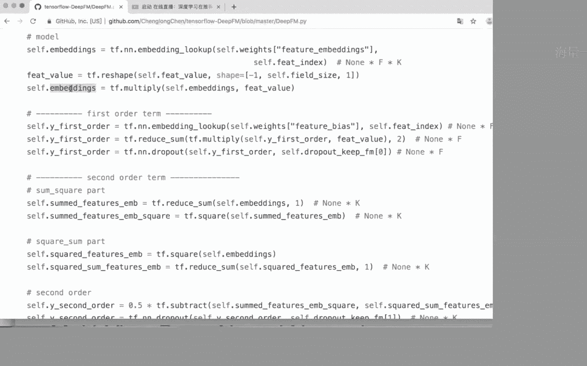

# 七月在线-深度学习集训营 第三期[2022] - P6：在线视频：03-深度学习在推荐系统里的应用场景 - 程序员技术手札 - BV1gW4y1x7j7

好我们开始。

嗯主要分为三部分，然后呢我们再看一下就是推荐特有的网络结构，也就是交叉交叉层，这个呢是专门为推荐系统这个问题定制的，网络结构也是这个就是相当于推荐系统里面原创的吧，然后这里面这里面讲到的大部分的模型呢。

都可以在下面这个这个综述里面找到，所以大家感兴趣的话，可以去看一下这篇综述，写得非常全，也就是d n c r n，还有我们其实现在不太常用的这个自编码器，auto encoder。

怎么样把这把这些模型用到推荐系统中呢，我们来依次来看一下，首先叫叫蔫儿蔫儿这个协同过滤的这样一个模型，它其实就是直接把推进的数据放到一个dna里面来去去而已，因为在推荐里面呢，我们的数据是分为两部分。

就是至少至少分为两部分，一部分是用户端的特征数据，另外一部分是就是物品端的特征，所以呢在这个模型里再输入层有用户端的特征和物品端的特征。

然后他in binding之后变成了用户的特征向量和物品的特征向量之后，他们就接一个多层的全连接的神经网络，所以这个这个模型没有任何改变，只是特征换成了推荐系统里面的数据的特征，只是这样而已。

这是最直接最简单的一个应用方式，那这个简单的模型呢嗯就是跟原来原来推荐系统里面，就是早些年推荐系统里面常用的l r模型结合在一起呢，就变成了一个非常著名的模型。

叫wide and deep learning，这个大家应该都知道，它的模型思想非常简单，再一看像搭积木一样，左边一个右边吧，右边就是我刚刚提到的l那个那个dna模型，把特征分别ebending之后。

然后跑一个全连接的d，然后左边呢是把特征直接连到了输出，所以如果只看左边的话，实际上相当于一个什么模型，左边这部分呢实际上相当于一个l r模型对吧。

所以这个y and deep它就是l r加上一个一个那个丁，所以这个模型结构非常简单，但是呢它又特别就是在实际的效果比较好，在工业界呢特别喜欢这样的模型，就是实现起来特别简单。

但是呢效果就是效果比较明显的模型，这样的模型在工业界里面就会比较就传的比较比较广，嗯这个模型大家之前应该学过呃，不知道现在还有没有问题，以及他为什么用这样的网络结构来解决这个推荐推荐领域的问题。

然后关于它的就是它的效果，我们在这在这个课上不做讨论，因为你知道那个实验效果是跟数据有关的，这些模型之间这个效果是我们是不好比较的，它有不同的这个应用场景。

所以呢我们主要是讨论这个模型的结构和它的就是它的出发点嗯，现在这个y等def模型呢，它从结构上很简单，就是l2 加一个dna解决了什么问题呢，它其实就是分别解决了除以l2 和纯dna的就是缺点。

因为l r模型呢它比较简单，按照论文里的说法呢，l r模型是记忆性比较强，他能够记住过去用户比较明确的兴趣爱好，比如说用户说就是通过历史用户的浏览历史，发现用户特别特别不喜欢看动作片，比如说电影推荐吧。

那这个这边这个浅层的l r模型是很好的，可以对这个建模的，那如果是用这个dna模型呢，因为它经过了很多层的非线性变换，所以呢优酷的这个这这个兴趣爱好就被模糊掉了，模糊掉了，他就不会有这么强。

那反过来dna的好处呢，它是可以发现用户其他的潜在兴趣爱好，所以从模型的性能的角度，就是它用过通过简单的并行那个模型，然后分别解决了l2 模型，记忆性强，但是它的泛化性能不太好，因为它就偏向于记忆。

你看到的结果并不能去很好的建模用户一些潜在的兴趣爱好，但是对一些用户比较明显的，然后就是已经明确的兴兴趣爱好点呢，它会把它模糊掉，所以两个模型结合在一起呢，从直观上来讲，它会有一些比较好的效果。

啊这是dna的一个呃一个呃实际应用，接下来我们看一下gcn做的模型，大家看左边呢，这个就是就是看那个左边这个图的左半边，它是用户的特征，经过一个声音之后，因为这这里这里的推荐场景应该是文本推荐。

然后用户的特征跟物品的特征呢，原始特征都是文本，然后这两两部分文本通过一个dna，不是dcn建模之后得到一个输出的特征向量，然后这边物品也通过一个声音得到一个隐藏的向量。

这两个引擎向上呢我们可以做一个相似度计算，比如说这个内积最终得到一个预测结果，所以这也是一个比较直接的方式，相当于我把sn呢用做了提取领特征的一个模型，对物品对用户和物品通过分别用cn来提取与特征。

然后呢在输出层对这两个隐藏呢做一个相似度的计算，能得出我们的预测值，右边呢是一个类似的图，它只不过是换了一种画法，强调的也是对于物品端，我们做做成一个影像量，这边就是一个标准c。

然后这里的u呢是用户的隐藏的隐藏的向量，v是物品的隐藏的向量，然后呢这个图跟这个稍微就是不一样的地方在哪呢，是他得出的这个就是物品端的这个隐藏的向量呢，它还放进了其他的一些特征，放进其他一些特征。

就是其他的物品特征，两个特征一起，最终得出用户的这个隐藏向量，这个这个得到这一步的方法，你可以是简单的相加求平均，大家看这个cn的模型有没有问题，好接下来我们看一下g2 n的做法，i呢是一个序列模型。

这个图好像是不太清晰，刚才这个图不太清晰，然后这个图应该应该应该应该好多了，好我们继续吧，i呢比如说常用的l s tm它是一个序列模型，那我们把怎样把这个序列模型用在推荐里面呢。

也有一个非常简单直接的用法，因为我们在做这种rna的训练的时候呢，我的训练样本同样是很很很多篇文章或者是很多个句子，然后一个句子是一个训练样本，然后句子呢是由词的序列组成的。

所以呢句词是句子里面的组成元素，那我怎么样把推荐场景用到这个里面来呢，我把用户看成句子，用户的购买记录或者是观看记录，形成了一个序列，看作句子里面的词，就是用户是句子，然后呢物品是词。

每个用户都有一个我购买过的物品序列，或者说我看电影的时候观看的电影序列对吧，那天然呢就构成了一个符合cn的训练样本，那i能够做什么呢，能够做根据之前的序列去预测下一个词加一个词，那相对应的推荐里面。

我就是根据用户之前的购买历史预测下一个他要购买的物品对吧，所以说只不过把东西换了模型，一一个一个一和一个一个代码都不用改，就可以拿来跑推荐了，对吧，大家看这个有没有问题。

就是我现在讲的都是就是最直接最直接的应用，就是那个推荐系统的那个数据上，所以说rm本来看起来跟推荐没有关系，但是你这样一处理完之后呢，它天然的形成了预预测下一个用户，下一个想购买物品的这样一个模型。

这一看有没有问题，也就是说在这个图里面呢，我每个节点是一个物品，就是他先买了这个，再买这个再买这个，然后呢我最终要预测他下一个要买什么东西，然后最后呢我们再看来看一下自编码器嗯，所以我们简单过一下。

都被一个就是就是编码器和解码的这样一个结构来代替了，嗯所以像这种原始的这个自编码器的结构呢就有点有点落伍了，我们简单看一下它的思想是什么，大家看它的输入是用户的评分，这是一个稀疏向量。

然后呢这每一个点代表的用户对这个物品的评分，然后比如说他对第一个物品评分是五分，然后第二个没有评分，第三个评分是三分，然后这样构成了一个用户的原始向量。

自编码器的作用呢是通过一个非线性变换得到一个隐藏层，隐藏层呢再通过非线性变换得到一个输出层，我自编码器想要做做到的效果就是让我的输出层和隐藏层尽量的相似，也就是说我能够在这个隐藏层节点里面。

少量的隐藏层节点里面尽量的保留住我，原始数据的信息，我的原始数据呢就是用户的整个评分历史，用户的评分历史其实就代表了用户的兴趣爱好，然后通过中间层的我可以认为是embedding或者是压缩或者是降维。

得到一个这个特征向量，再通过输出存档，也才那个非呃那个变换呢得到了这样一个输出，注意啊，输出的维度跟输入的维度是一样的，就是输出，比如说我有1万个物品，那我这输入是一个1万维的系数向量。

那输出呢也是一个以万为的系数向量，就是他要跟它一对应，然后使这两个两个向量呢最近的误差极小化，然后拿这个模型拿这个东西来做预测呢，怎么预测呢，因为你输入的时候，这些这些特征有些是缺失的。

就是说这些白色的是用户没有看过的，没有买过的物品，那当然我输出的时候呢是可以预测出所有所有节点值的，我输出的时候，所有节点植物都可以预测出来，所以那些未知的节点呢上面也是有直的。

所以我就可以拿这个词来作为这个我的我的预测结果，对用户做推荐，所以这是这个自编码器，就是用用单层的自编码器直接用来做推荐的这样一个方法，然后我们把它扩展一下呢，可以得到右边的这个模型，右边的这个模型嗯。

他对用户和物品分别做了自编码，嗯我最左边这个这个自编码器里面的数据呢，我只用到了用户的评分数据，用户的其他特征我都没有用到，物品的其他特征我也没有用到，比如说用户的年龄，性别标签，这些特征我都没有用到。

那在这个右边这个图里面呢，我相当于把用用户的所有特征，把用户特征画画在右边，把用户的所有特征做一个自编码，然后就是说输入是用户的原所有原始特征，输出呢也是对应用户的原始特征。

中间得到一个降维的隐藏的向量，然后物品呢也一样，这样得到两个用户和物品等等隐身的向量，然后我们对这两个隐藏的限量呢做一个相似度计算，比如说还是刚才说的那几，就会得到我最终的预测结果。

这里举的两个例子呢，我是是呃，在在那个就是就是在推荐里面，把澳洲影通通eqa完全的作为提取特征的工具，完全的作为提取特征的工具，跟刚才的那个图是是对应的。

大家看这个图里面，我是把sn作为提取物品短语特征的工具，那在这个图里面呢，这是用户端的隐特征优势，它一般都代表用户端的隐特征，v呢是物品端的隐特征，这个物品单的一当中呢，这篇文章讲的是文本推荐。

所以这是相当于是我今天要要这个要推荐的文本的隐藏的限量，他怎么得到这个隐藏的限量呢，是通过一个自编码器来得到这个他这里的x2 分之l就是这个文本的，通过自编码器得到了隐藏的限量。

所以说相当于它纯粹是把这个作为提取特征的工具，然后把它放到推荐的模型里面去，大家看一下到目前为止有没有问题，我们来总结一下嗯，知目前为止提到的模型，刚才提到的模型呢。

在模型层面呢基本上是没有什么创新和大的改动，然后稍也就是稍微的简单组合一下，比如说我刚才说的r n rn这个用来做推荐，我我连一个一行代码都不用改，我只要把我的数据处理成rn需要的格式就可以了。

比如说用户当做句子，然后呢用户看过的这个就是买过的物品系这个序列当做一个词的序列，直接放进去就好了，然后呢第第一个举的例子，dna的例子也一样，也是我直接把用户和物品单的特征都处理好了之后，直接倒。

直接接一个深，就是全连接的dna就可以了，没有任何改变，然后这是第一就是我刚才我们看到的模型的第一种，第一种用法，第二种用法呢就把它当做一个提取特征的工具，就纯粹把它当作输入层提取特征的工具。

继续的特征之后呢，我我推荐还有用原来用什么模型，还有什么模型，比如说刚才c和那个自编码器的例子，cn auto encoder，我都直接拿来作为提取特征的工具。

然后接下来呢我们看一下今天比较就是最核心的部分，就是这个叫交叉层，就是为推荐系统专门定制的网络结构，可以说是专门为解决推荐系统的问题而产生的，在讲这个之前呢，我们必须提到一个推荐系统里面做。

就是有里程碑作用的模型，就是fm，也就是分解机，中中文的话叫分解机，嗯，我们来看一下这个呃也是挺有名的模型，叫deep fm，这个模型呢也是分为了左右两边，我们分开来看，先看右半边，从中间这画开。

可以看到右半边是什么模型，就是一个点跟刚才wide and deep里面的右半边是一模一样的，就是把用户用户和电影的，比如就是物品的特征分别处理完之后呢，接到一个全连接的网络里面去。

所以右半边呢单看就是一个电影，那左半边呢就是它不一样的地方了，大家看一下左半边的结构，输入层是稀疏的用户，用户和物品原始特征，他这边呢是分域对它进行做banon，这个玉呢可以是按就是特征。

比如说就是呃年龄做一个预性别，作为一个玉，也可以把所有用户的特征作为一个域，然后物品端的特征作为一个域，这个都没有关系，就是把相同类别的特征呢放在一起，然后做了embedding之后呢。

得到一个隐藏的向量诶，这里得到一个隐藏的向量，这里得到一个隐藏的向量之后就跟右边分到分成左，分到左边去，左边在干什么呢，大家看它定义了一个这个操作，这个差上面就行了，叫做做内积，做内基。

然后呢你看这个做内积的单元呢，它连接的是第一个隐藏的向量和第二个隐藏的向量，这个虚线连接的，然后第二个单元呢它连接的是第一个和第三个隐藏的向量，所以呢这里面所有的乘号。

这个单元呢它是相当于对下面的这个隐藏的向量两两做内积，两两做内积，两两都做做内积得到的值之后呢，我们再做一个相加，两两内积做相加，这个就是这个这个运算呢其实就是fm的核心运算，我们看一下。

下面是fm的这个模型的，就是它的数学定义，一个呃常数项加一个线性项啊，到这里，如果如果没有其他的话，这就是一个l2 ，这是一个l2 的定义，但是fm多了一个，二次项二四项呢是一个交，它是一个交叉项。

它对于特征两两之间做了交叉，交叉的这个权重值呢，它定义成了这两个特征，引特征向量的就是引向量的内积，零向量的内积，所以这是如果下面是用公式来表达对这个式子的。

就是说大家看这个对所有的这个内积求和的这一项，如果这是用公式表达的话呢，那这里就是用一个网络来表达，它们是完全一样的含义，完全一样的含义，我是只是用一个图来表示两两做内积而已。

所以它定义了这样一个做内积的交叉层，所以说像tina flow里面可能都就他不会有这样一个层，这就是api函数，所以你要自己去写，大家看看这个图有没有问题，然后呢呃如果没有的话呢。

大家可以想一下这个加号代表什么意思，这个加号这个单元注意连接的是输入层，它是用这个这个实现连接的输入层单元，这个加号这个单元其实可以跟下面的公式里面，某某一个部分对对应起来，得想想是哪个部分。

嗯对这个这个求这个加号单元连接的部分，这个这一部分组合在一起呢，其实对应的就是这个线形象对吧，现象很简单，就是把输入乘上一个权重加起来，这是输入值，然后这个边上是权重，然后乘起来加在一起。

不就这个单元吗，为啥要embedding之前的呀，因为现印象是直接跟输入输，就是原始的输入做成鸡蛋，不是它不是模仿残差网络，它就是一个线性项，就是模型定义而已。

所以啊这里这里这个因因为因为常数项应该都一般都会被省掉，所以我我我我左边的这个网络它就完完全全等价于这个式子，所以它为什么叫deep fm呢，它其实叫deep fm，但是它只是一个只是一个搭积木。

就是呃更就是更深的组合在一起，它只是左边一个fm，右边一个电音，然后最终把把两部分的结果再求个和而已，所以大家再理解一下，这个式子跟这个图里面的左半边网络是完全等价的，完全等价的，好没有问题的话呢。

我们再接着看，而有了这样一个交叉层之后呢，我们就可以做别的事情了，就是我们可以做排列组合的，刚才这个deep fm呢是把这个fm点左右拼接在一起，那我可可可不可以上下拼接呢，答案是可以。

这就是一个上下拼接的模型，怎么样上下拼接呢，用户就这这也是用户的特征，然后物品的特征，然后我做直接先来牵连听，先连dna之后呢，经过很多层的非线性变换，得得到一个上层的隐藏的向量。

大家看这上面呢也是一个两两做内积的过程，然后两者做内积之后呢，我们再得到一个组合的输出，所以这个模型可以认为是上面是一个fm，然后下面是一个电影，就相当于把这两个积木呢做了一个上下的组合。

一个是左右的组合，一个上下的组合，那从直观上来讲呢，它们分别是就是建模了，有有有什么样的一个不同的建模的呃，就是表达能力呢，从直观上来讲，我们最终做内积的引擎的向量，因为内积其实就是一个相似度计算。

我做内机的隐藏的限量代表了用户的兴趣爱好，我用户兴趣爱好都相当于ebending到这个向量里去了，那如果是我们之前的fm呢，在得到隐藏的向量的之后之后，我实际上是用了一个线性变换。

那线性变换呢可能表达的就比较弱，我最终得到了用户的兴趣爱好呢就比较直白，比较直白的意思，我举个例子，就是说我就知道用户啊喜欢多有多喜欢看动作片，然后有的喜欢看喜剧片这种比较直白的爱好。

但是如果又会有一些就是特别复杂的兴趣爱好的描述呢，复杂的比如说啊我喜欢看他看某某人演的，然后又什么导演是谁，然后然后再在什么时间段放的，然后还跟谁一起看呢，就这种复杂的东西就是复杂的兴趣爱好呢。

在这样一个线性变化里面，你可能表达不出来，所以就从直观上呢，我先用一些非线性变换，然后得到一个能够表达这个用户潜在的隐藏的兴趣爱好的隐藏，的向量就特别浅淡，一点都不直白，你用就是潜在到。

你用用话语描述不出来的这样一个这样一个一个一个点，得到这样一个形成的向量之后呢，我再做这些内积运算，所以说你可以认为是直观上这个模型的，就是嗯就是它的一个建模思想，但效果呢我们就不好说了。

因为有些问题它里面就不需要去描述用户这么深层次的结构，有时候会让反而把问题告诉答了，这里的bin都不是单独训练的，像这整个模型是是合并在一起训练的，是完全合并在一起训练的，到这里之后呃。

到这里呢我们暂停一下，然后我们找一个代码来看一下，可以更更直观的理解理解这个这这个dpfm模型。

我这边有一个deep fm的实现，代码也非常非常简短。

使用test flow做的。

好我们主要来看一下他建这个网络的过程，也就是建这个图的过程，刚开始呢都是一些输入的特征了，这些都是输入特征，然后定一些权重，然后这个东西我们就先忽略掉网络结构。

从哪开始呢，从这儿开始。

我们会发现这个代码跟刚刚那个图其实是一一对应的，首先第一部分，就看代码其实没必要看太仔细，你你看那个注释就行了，就这一层呢它是做emon，然后用的是传统flow提供的这个函数。

然后这个函数呢这个具体细节我们就不在这讲了，你只要知道它做的作用就是做一个ebending，线性的ebending emin之后呢，就得到了这个embedding这个词。

这个层这个层就是呃就是就是对应的是对应的图里面的这些dancing bing。

然后，他就开始开始呃进行下面的计算了，下面呢先做了一个first order，first order，就是这个线性项对吧，大家看现印象呢，它其实就是把输入层跟那个权重做了一个乘积，然后加在一起。

然后这个有个有个drop out，这个这个可以忽略掉，跟结构没有关系，所以呢这是线性项，而这一部分就是先印象这前面两个呢都没什么，都不是都没有什么呃，就是问题都不是很关键的。

这个模型最关键的部分就是它的二次项，也就是交叉交叉层的定义，嗯这六行就是整个模型最核心的部分，它定义了deep fm的交叉层，但是呢你要你如果看这个东西的话，它跟公式里面是不是对应的，不是对应的。

因为你如果用他的flow去实现这个这个操作的话呢，你其实挺麻烦，因为tfo里面没有对应的api，大家可以想一下，我有我有我有一些向量，我要对他们两两做内积，两两做内积。

你来想用torflow api怎么实现，不好实现了对吧，那怎么办呢，其实我们有一个呃就是很好的方法，不止对于实现上，而且对于性能上都有很大的提升，这个方法呢在呃我想想。

因为大家可能不是不是专专门做推荐的，然后如果是专门想专门做推荐的话呢。

像这个fm的原始论文，那是一定要看的，是属于必读论文。

这个漏用力呢有一个最关键的推导。

推导它是把这个二四项经过一系列变换之后呢，变成了下面这个式子，看这个推导呢就是有点太细了，显得很很冗长，嗯，这里要做的事情呢就是我想得到一个就是计算这个东西既快，然后呢实现起来又方便的方法。

好我们现在不看这个式子，我来给大家打一个，我来告诉大家他在做什么。

我来告诉大家他在做什么。

因为我们石家要求的是呢是一对二四项的内积，即二四项的内积呢，其实就是很多项相乘，就是比如说我们用abc 3个向量，这abc 3个向量呢我们把它简化成一维的，所以我喜欢求的东西。

就是a b一加上bc加上ac对吧，我要求这个东西，然后呢，如果我如果拿这个式子直接写代码的话，大概要写一个双重循环，我大概要写一个双重循环去便利这些a b c之间所有可能组合对吧。

但这个东西呢它其实等于什么呀，a加b加c的平方减去a的平方，加上b的平方，加上c的平方，前面要除个1/2，前面数1/2，对这就是刚才那个式子简化到一维的情况，所以说是个非常简单的公式。

但是呢就是一个小技巧trick，但是我来写这个用这个来实现的话呢，大家看它的时间复杂，都变成了a an了，左边是n的平方，因为你要写个二重循环，但右边不用，我先把所有的值加在一起，求个平方，这是一个。

这是一个线性的，然后呢再把所有的平方加在一起，求个和，这也是线性的，然后再求个减法，所以这整个计算呢实际上是一个线性的过程，然后把它替换成向量，也是也是一样的道理。

我就不再写了。

啊大家看这个式子有没有问题，哦没有问题的话，我们回去看一下代码嗯，注意记住啊，这里是做什么，先求和，然后再求个平方减去呢，先求平方再求和。

那代码里面做了什么呢，代码里面看注释就明白他做什么了，这是先求和再求平方的部分，所以呢正好两行语句一个是求和，一个是求平方，对吧，这样就跟那个狮子完全对应起来了，然后下一部分是先求平方再求和。

一样先求平方再求和，这里就没有那种两两匹配的操作了，因为因为他的朋友在语法里面做，你做两两的，这个就是是不好写出来的，很麻烦，那这样就直接写出来了，写完之后呢，我知道把这两项做一个相减就得到我最终值了。

大家看它是一个减法操作，同时乘个0。5，因为是有二二倍的吗，我刚才是在里面稍稍写那个再除以二，就是我们要做的这个交叉项。

对这是dfm的最核心的部分，第六行六行语句写完了，然后呢它的地地图部分呢其实很简单，就是你看它就是一个循环，有多少有多少有多少层，我就加多少层的全链接，就是最简单最基础的dna，就我就不多讲了。

然后最后把这两部分加在一起，就是我们看到的deep fm模型。

大家看这块有没有问题。

好没问题的话。

我们继续，然后对fm本身没有做任何改变，大家看没有任何改变，我那个图跟下面的fm的原始的模型定义公式是完全等价的，诶这个模型呢就做了创新，就是我定义了新的交叉层，也就是相似度，我一般呢是用内积来做计算。

然后内积呢相当于把用户的引擎了向量嗯，比如说这是用户的隐藏的向量，然后呢这是物品的隐藏的向量，它们两两之间依次做做做相乘，然后相加得到一个相似度，从直观上来讲呢，大概什么意思呢，就是说这个引擎的向量。

第一个第一维度可能代表用户喜欢看动作片的程度，这个数值代表了用户喜欢看动作片的程度，然后第二那个那个我们用电影举例子，就是电影的电影的这个隐藏的向量，第一个维度可能代表了这个电影动作元素的多少。

或者说动作元素动动作元素的精彩程度，那也就意味着呢这个维度对于用户来说，电影来说，它的含义是一样的，它的语义是一样的，所以你对他们两个这两个值做相乘的时候呢，它就能代表用户潜在喜欢这个电影的程度。

然后第二个维度呢可能代表用户喜欢看喜剧片的这个程度，然后相对应的第二位在电影端呢，代表这个电影喜剧元素的多少，对吧，这就是整个做内积的它的含义，但是你会发现用户的第一为隐特征跟电影的第二位影特征之间。

是没有做交互的，对吧，就是用户喜欢看动作片的程度跟这个电影喜剧元素多少，这两个事情呢他没有做交互，这个家伙有没有用呢，不好说，对吧不好说，所以呢这个这个deep connetwork呢。

他的思想就是把用户和物品就是或者电影它的引擎声呢，他不做内机，做一个叫做外籍，相当于把这个这个特征跟这个特征呢这样相乘，这样相乘呢会得到是一个矩阵，3x3的矩阵。

这个三角矩阵会把这两个向量里面两两之间都做一个乘积，都做一个成绩，内积得到是一个数值，我把它反过来，这样就是所谓的求外积之后呢，算出来是一个矩阵，这个矩阵每一项是这个用户隐特征跟物品与特征里面。

就任意两个特征之间的两个点能匹配，匹配完了之后，因为得到的是个矩阵，因为得到这个矩阵，我们为了往后输出呢，我再把这个矩阵乘上一个一个权重向量，最终得到得到的是一个呃数数值啊，这个图是从右往左画的。

它的输出呢是这两个用户的隐特征向量跟物品的隐身向量，先做一个外机，然后再乘上一个权重，这个权重呢你可以认为是为了把他这个举证给他，就是拉平成一个向量，因为你只有拉平的一个向量才好做下面的下面的运算嘛。

好这就是这个模型最大的创新，它定义了一个这样一个就是cosplayer，他把这个两个引擎之间两两之间都做交叉，它不但这一块做到了极致，他还做到一个什么事情呢，就这一层输入和输出的结构是一样的。

大家看这一层输入是向量，输入是这两个向量，输出呢也是向量，那我就可以把这个交叉进行很多次了对吧，我交叉层的输入是一个一个向量输入，输入也是一个向量，但输出的向量呢我可以继续做用这个东西做交叉。

所以呢我这个跟dna一样，我可以把交叉层呢诶摞在一起，吴磊在一起做很多层的这样的交叉，然后右边呢它就是一个它叫definite work，它就是一个一个dna。

所以呢它就相当于是把dna和它定义的这个叫cosnet work拼在了一起，啊这个这个模型呢在模型上是有很就是相当于做的，就是呃跟之前模型比最大的一个创新。

但是实际效果呢这个模型好像效果在很多场景下效果并不好，就是我们刚才讲的，你刚才那把用户用户电影不同的影子能拿来做交叉，到底有没有含义呢，有没有意义，这个就不好说了，大家看这个模型有没有问题。

对他是一个对称的。

它是一个对称的，它是一个对称阵。

有一八是多余的，因为因为你是相乘嘛，那那那a乘b跟b乘a是一样的，像这种处理层的这种这种都是呢可以说是技巧，也可以说一些，因为你如果把这个矩阵直接摊平，直接摊平的话呢，也可是是可以的。

直接摊平呢就变成一个久违的向量了，那如果如果如果这个层这样来定义的话呢，它它也是达到的效果，就输入是一个向量，输出是一个向量，但是你会发现输入的向量就爆就爆发了，本来是三变成九了，然后你再到下一层的。

再再再叠加的时候，那就变成就变成二，就变成又变成九的平方了，所以呢嗯我先把这个这个矩阵呢先把信息压缩了，压缩到跟原来一样的三个三维，所以我这个我这个交叉层就可以无限的叠加。

所以它这个从结构上呢是比较比较优美的一个结构，就是我特别针对这个推荐的交叉定位的一个层，就是说这个层呢就是可以像那个比如说cn里面的ping层啊，然后这一层做一个标准化的，作为标准化的操作。

关于关于这个交叉层呢，我们就主要看这两个例子，因为呃目前在交叉上做的尝试呢其实就是太复杂的，交叉上做的尝试呢都是不太成功的，就这个deep cos network，虽然它在模型上呢就是有他的。

有他的优美之处，但是在效果上呢就不是很理想。

对这就是你说的，我理解不了做危机的意义在哪里，也就是说隐特征两个隐特征向量我有没有必要它不同维度之间做交叉，有没有必要呢，他的出发点呢就在于我认为只是两两相，就是就是对齐的隐藏之间做交叉呢。

他觉得不充分，就是推荐里面就是大家一直在考虑这个问题，我就是觉得特征之间交叉不充分，我觉得不充分，我得来点非线性的交叉，最近交叉呢我觉得也不充分，我我还得来个就是这种错位的交叉。

所以呢他都是在往这个交叉的充分性上做做文章，但是你要非得说有什么直观含义的话，确实很难讲，所以说这也是他为什么在实际中表现呢并不太好的原因。

嗯我下面举的一个例子呢，呃这是给他们一个一个开源的项目，然后这个例子呢其实它代表了一个思想，就是我我想用这个例子代表一个思想，就是端到端的思想，其实都是为了呃，主要是为了体现一个端到端训练的思想。

什么叫端到端呢，就是我从最原始的输入到最原始的输出，都在模型里解决，我不在手工或者额外做一些特征变换和特征提取，就是输入越原始越好，比如说我们之前用如果用l2 来做推荐的话，我要手工的去做一些交叉特征。

手工做一些交叉特征对吧，有了fm之后，哎我的输入不用自己去手工交叉出来一些特征了，因为fm会在模型内部帮我做交叉，啊这就是fm的进步，但是fm解决不了，就说一些复杂的输入的问题，比如说图片。

我要推荐图片，推荐文本，那你如果直接把文本，然后这原始的特征放进去的话，文本原始特征那就是那就是磁带模型嘛，你把它原始特征放进去的话，效果不会好。

因为因为它有专门适合处理文本和图片的这样一个这样的这样的模型，所以呢我们这个端到端的话，就是你输入是什么样子的，我就先找一个适合处理你这种类型输入的模型，把它接到。

或者就是作作为作为将来输入端的in bani也好，或者你把它理解为特征提取的一部分也好，把它先接着把这个数据接住，接住之后后面再想办法做交叉，所以你看这个呢这个模型呢体现了之前好几个思想。

在用户端的这些特征呢，他全部做了bending之后，然后接了好多层的全连接层，先做了线性变换，然后电影端呢也是先把离散特征做了一些嵌入接全连接，然后关键的是这边，他把电影名这样一个文本特征呢做了一个新。

然后得到了这个电影文本特征，就是只要做了这第一步的这个这个之后呢，这些特征就一视同仁了，一视同仁，然后接到全连接层，最终得到一个电影最后的一个隐藏的限量，然后这是用户的隐藏的向量，然后他们做内积。

所以说这一步你只要一看到这种结构呢，其实就是fm的思想，就是其实就是在做fm，所以它是相当于这个模型。

这个模型跟刚才这个。

跟刚才这个是一个含义啊，就是先把特征做分析变换，在上面做内积，现在分页变换上面做内积是是是一样的，它多在它这个比这个模型多在什么地方呢，多在他用c接住了这文本特征。

这个时候你发现我在输入端最底层的输入端呢，我全部是原始特征，我自己都没有做任何处理，电影名我直接用，我直接用那个磁带编码的，就是就是磁带模型输入进去就好了，或者是如果这个地方我不用sin的话。

就是我我用我用那个用rn的话，我直接把这个序列原始的序列放在这里就可以了，如果你还有其他类型的特征的话，诶都拿适合处理这个特征的模型放在前面，把它给接住，接触之后得到隐藏的限量，最后进入fm的思想。

做一个内积就可以了，所以我们总结一下呃，这第二部分，第二部分呢是在模型上有创新的，这个创新就是推荐系统特有的，其其之前的那些问题就是dsn不同的网络结构，不管是最基础的fm，还有对fm的扩展。

就是cos network，它都是增加了一个之前的模型都没有的这样一个层，这个层叫交叉层，然后在实际中呢我们选择什么样的交叉层，比如说先做线性变换，先接电音再交叉，还是先交叉再接dn。

这个真的要实际问具体问题具体分析，在很多实验里面效果不太理想，但说不定呢说不定哪天找到一，个场景它效果就特别好，然后最后一点是端到端的训练，就是如果你真的要把嗯，就模型用在推荐里的话。

你要贯彻的一个思想就是端到端你尽量对原始特征少做，少做一些预处理，少做预处理，比如说用户画像，然后物品端的一些提前的特征提取，这些东西就是它都是无监督的，然后5000度的提取的特征呢。

它效果就不会是最最优的，最优的肯定是我们做一个端到端的训练，大家看这块有没有问题，啊没有问题的话呢，我们看一下第三部分，第三部分呢我们举几个比较新的论文，看一下这个推荐里面的最新的进展，主要是两方面的。

一个是注意力机制，就是attention，嗯这两个呢是近几年是比较火的方向，所以呢其实只要是火的东西，就是很快的会被运用到推荐里面去，而且有时候呢确实会会有比较明显的效果嗯。

然后我们现在来看一下第一篇把注意力机制用到推荐里面的文章，给大家一分钟，先看一下这个这个模型，然后我们再来讲它是横着画的，啊嗯我们先看一下这个模型，从中间左半边在干嘛呢，左边的你如果仔细看的话。

他其实是在画一个fm，这是原始特征，然后呢这是相当于把这个原始特征乘上了权重的车，因为这里v是权重嘛，然后第三层两两交叉，看到没有，就是两两交叉，两两交叉得到的这个项，看到没有，就是大家回想一下。

就是fm的求和二次项求和的那个项，我给你，我再把那个公式给复制过来，这是pdf，能复制不过来，就这二次项目，二次项求和就是这个样子的对吧，两两做内积，然后这是原始的输入。

唉这个地方因为有时候我们会省略掉，为什么省略掉呢，因为我们大部分特征都是离散特征，离散特征我做文化的编码，文化编码之后呢，这些特征都值都是一，就x i x j都是一，所以呢乘起来就就没没有了。

所以一般二次项就只有这个内积而已，但在通用的情况下呢，x i x j可以不是一这这个图呢就是画的就是这种通用的情况，就是原始的特征呢，它有不是一的0。2，0。4，好这是线性项，两两端对齐之后就是二次项。

注意啊，这个attention net如果不考虑的话，他接下来做的事情就是把这些二次项a加在一起，最终得到这个值，就注意把这个a去掉啊，然后就是fm，所以它是一个横着画的fm。

那attention机制怎么加进去呢，在这个在这个模型里面，他加的方法特别简单呃，特别直接，但是我但是可能有有同学之前没有了解过特训机制，我再简单介绍介绍一下本身机制。

就是说我们在人类在解决一个问题的时候呢，他的关注点不是整个样本，比如说我们在做图片，比如我看一个图片里面，这是人还是动物还是一个场景的时候，你的你的关注点不会是图片上每一个元素，你一定会注意到这个图片。

比如说显著的地方，比如说人的话就是人脸对吧，你会注意到这个图的某一个部分，然后如果用到文本，比如说翻译机器翻译的话呢，我在翻译一个句子的时候，我在具体翻译每一个词，每一个词的时候。

我最关注的肯定不是整条句子，就是说我注意力不可能平均分配在整个句子的每个词上，当前这个词应该怎么翻译，那起主要作用的肯定是这个词最相近的这些词，就说我在解决这个问题的时候呢，我的注意力是有分配的。

那回到这个fm里面，我想在哪些地方产生注意力的分配呢，就是这些24项，二次项我们刚才讲了一个二次项呢，代表了一个兴趣爱好的匹配，代表一个兴趣爱好的匹配，那这所有的匹配呢代表了一个相当于一个嗯怎么说呢。

就是这因为我们之前呢是对这些所有的匹配呢一视同仁的，所有的匹配匹配值算出来之后，我们是直接求和的，那这里如果引入注意力思想呢，它是这么引入的，我不把这些东西一视同仁的一视同仁，那直观要怎么理解呢。

就是说我可能这个人呢特别喜欢看动作片，我只要这个电影动作部分精彩啊，我其实可以忽略其他部分电影，比如说就演员，演员请的时候我也不管了啊，有没有什么喜剧元素我也不管了，只要动作过于精彩，我就肯定喜欢对吧。

这时候我的注意力全部集中在动作内为隐特征的交叉上，对吧，那另外一个人可能就相反了，另外人我就我只要个电影好笑，那我就是害了他，其他的部分再烂我也不管对吧，所以每个人对这个关注点不一样。

所以这个模型的思想就是，我用一个权重来表示这每一个匹配值之间的重要程度，所以这就是ai键，a i j的值呢a i键是用一个函数，这这群中寻求学的每一个网络都是一个函数，这个函数呢你有很多种定义方法。

我们这里就不就不展开来讲了，比如说最简单的你就可以算相似度，也是基于类似相对的方法呢算出一个函数值，这个值呢代表了当前这个匹配的重要程度，就我刚刚举的例子，我特别看重动作元素。

那只要动作元素匹配上了其他的匹配我就不管了，那大家看这个模型有没有问题，这个模型这样论文里嗯，就是给出的结果呢实施还是非常惊艳的，就是其实模型实现起来很简单，对我我我跟你说，比如说简单怎么做。

简单怎么做，因为我最终最终得到了这这个每一项不是一个值吗，就说这一项没分别是值对吧，分别是值，那我直接比如说算一个soft max，soft max，就可以输出概率了。

就说因为我注意力分配也可以可以认为是一个概率，那我在这个纸上，如果softmax作为我的这个这个这个注意力函数的话，它含义是什么呢，就是我只关注那些最大的值值，越值越大，就是就负责越富。

唉就就就是能够体现出我刚才说的那个效果，我就只关注我，好没有问题的话，我们再看下一个模型，下个模型呢画的比较复杂了，我先讲讲他在干什么事情，就是呃去年去年的一篇文章。

他叫coattention networks，他要做的问题呢是怎么样结合的评论来呃，进就提升推荐效果，因为现在好多网站不管是什么，不管是新闻啦还是那个呃就是电影啊，下面都会有用户评论。

所以说评论呢是很重要的一部分信息，而且信息量很大，比如说我住一个酒店，我特别关注他，比如说卫生情况，那如果有一个评论说它卫生很好对吧，我就我可能就住的概率就非常大了。

所以说评论对于推荐这个是是现在是起的越来越重要的作用，那这个问题这个这个文章是解决什么问题呢，它是把用户的历史评论当作用户的特征，然后呢在这个物品的历史评论当做物品的特征，就是在他这个模型里面。

就说这是很学术的做法了，因为他没有，他都没有考虑其他的什么用户的，其他的其他的就是原始特征。

用户的年龄性别，嗯我先看一下每一个节点的输出都是对对，刚才那个模型呢，每个节点输出都是值，因为他画的特别细。

对这里每个节点输出都是值了，你发现没有，因为这是内积吗，内积是一个数值x24 40最原始的10。2，所以这每个都是数值，这数值你就可以直接拿来算smax，我只是举个例子，就肯定不是最优的。

就可以得到一个a2 s了，我可以用其他的函数来计算这个相似度，我不是相似度来计算，我这个注意力分配，然后这个模型呢开始把用户的所有历史评论拿出来做用户的输入特征。

然后把物品的所有历史评论拿出来作为物品的输入特征，所以所以这就是输入层，为什么是这样的，两边都是评论，然后平时做ebending之后呢，还有一个叫cootion，科尔tension。

它这里面要找出来的是用户评论和物品评论之间的，那个就是最匹配的部分，为什么叫cover才是呢，就是它是说用户的这个评论体现了用户的关注点，然后呢这个物品的评论呢是体现了物品的一些关注点。

但是我怎么匹配起来呢，就通过这样一个cootation，它这块，呢其实就算的是相似度，大家可以去看一下，它是的，它是用户特征，有两点之间做相似度，加入读了之后呢，他做了一个max pooling。

max pooling，大家知道选选的是最匹配的那个，那这里的直观含义是什么呢，就找出用户最重要的一个评论，最看重的一个评论和这个电影最重要的一个和这个物品最重要的评论，找出两条这样的评论。

那什么意思呢，就是说这个我这个用户最重要的评论里面，比如说我给一个给一个就是经常评论的是哇这个这个酒店卫生太差了，或者说这几天卫生很好，那你会发现这个用户很关注卫生情况。

那这个电影的这个这个这个酒店其他的评论呢，就是其他用户给他的评论可能也有这些值，所以你来这两这两个评论列表，就是用户的历史评论列表，跟电影的历史评论列表拿来你做匹配呢，哎你会发现对于这个用户来说。

我可能关注点需要放在这个就是关于卫生情况的这个评论下，所以第一层呢实际上是通过这个两两匹配去，我就是就是决定我的注意力该放在哪个评论上，就是评论层的attention。

最终得到了评论层的attention之后，嗯，他也做了，就是做了一些变换之后，然后又有一个词词这个层次的开始像他做的就是事情跟下面差不多，我我知道这两个简单评论，这就是我都是我用户的关注点啊。

那在评论具体哪一个词是我就是我，我应该我再我再重说一遍，就是我的注意力应该放到哪两条评论上了，我接下来要确定我在这评论这两这个评论里面，我注意力该放在哪个词上好，经过匹配之后。

我发现我注意力其实就只注意就专注在卫生情况这样一个词上，那我如果确定了这个这这个事情之后，那我的预测就比较准了对吧，所以呢他这两层筛选就是第一层是筛选我看中的那个评论，第二层呢是筛选我看中的词。

就评论里面看中的词，就是我最终会被哪些测，就是这个数据影响，最终最后呢大家看也是接了一个fm层，所以呢fm这样一个交叉层，了基本的构成，基本的过程元素，大家看这个有没有问题，海滩曲怎么在梯度下降啊。

你用探测辅助写一个模型，你还用管它怎么算吗，你只要把公式写出来，它就它就就就都用梯度下降就可以算出来了，对吧，好关于注意力机制呢，我们就就是看一下呃，主要介绍这两篇文章，大家都了解吗。

就是了解同学可以敲个一，不了解的话可以敲个零。

好我这里呢也主要是介绍就是这个这个模型的核心思想，就是直观思想嗯，那它是什么意思呢，我们举个例子就明白了，比如说我给我一个输入输出是什么，然后我有正确答案，就比如说我做评分预测，我给我一个用户一个电影。

它是最能评多少分，我数据集里面有这个答案，然后呢五金的学历是没有答案的，就是我给你一堆数据，你给我做聚类，就是说你相当于发现这个数据里面有什么潜在规律，但是我没有什么答案，我啥都没有。

我也不知道这数据分几类，我也不知道这个数据到底能不能分类，他不给你正确答案，他不给你正确答案，但是呢它也不是完全没有答案，他给你一个惩罚函数，这个呢就举个例子，就是说比如说我再做一个数学题。

有正确答案的，我这一步该怎么写，然后会有人告诉我正确答案，就是这一步该怎么算怎么算怎么算，但是我能告诉你每一步走的对不对，或者说你这一步就是说做的好不好，比如说你再算一个数学题，你每写一部嗯。

然后旁边有人说诶这一步写的不错，你写一部，然后就说哎你这个公式用的不太好，就有人告诉你这些事情，但是就就永远不告诉你正确答案，不告诉你该怎么写，该怎么算，然后呢你要跟这样一个这样一个人长期的就是做交互。

就是你写一步，他告诉你怎么样，或者换到下棋的例子，也也嗯嗯就是像像那个比如下围棋也是这样，我下一步你告诉我好奇坏棋，但是他永远不会告诉你这一步该往哪儿走，就是不会告诉你答案，就是当前棋盘放在这里。

我该放在哪个位置，这是正确答案，这一段不会告诉你，你先自己下题目，你先自己做，做完了我告诉你好不好，最终能学到一个最优效果，那把这样一个思想用在推荐里面会有什么优势，会不会有什么优势呢。

是一个序列的交互，他是跟环境不断的交互，我每走一步都会有人告诉我好不好，但其实推荐里面呢恰恰就是这样一个场景，就是我每做出一个推荐的时候，就是我算法每做这个推荐结果的时候，其实是会有人告诉我好不好的。

这告诉我好不好的人，就是动态交互，这这这样的优势呢就就体现出来了，它可以很好地对用户的动态进行建模，因为因为很多时候用户的兴趣爱好是有动态变化的，我之前可能很喜欢什么什么样的，就是一些东西。

那突然比如说我我最近结婚了，那我可能就兴趣转向了一些结婚的产品，我装修了对吧，等装修完了，我可能生小孩了，我就开始关注一些这些母婴用品对吧，所以兴趣爱好这种动态变化呢可以被这个模型天然的很好的去捕捉到。

因为我没有正确答案，长期收益就是说我关注的是长期我得到的奖赏，勾勾高，那就放在推荐里面，它对应的什么呢，如果我只关注短期收益的话呢，其实就就对应的是用户这一次点还是不点，点就是正确答案。

不点就代表是错误答案，那这样有什么坏处呢，因为在推荐里面，其实点击率不是唯一的屏幕指标，如果是把点击率作为最重要的屏幕指标呢，像今日头条，那你就天天推荐三组就行了，你只要推荐三人组，点击率就高。

但是你会发现用户边点边骂你low，对吧，所以点击率不是你的唯一屏幕指标，你有很多其他的潜在的潜在的屏幕指标，但是不好量化，不好量化，不好量化，我就没不好作为正确答案，你明白吗。

如果用监督模型的框架训练的话，我就我的正确答案一定是要确定的，比如说这个推荐用户点了，它就是一没点就是零，这是之前的做法，但是他点了不一定好，他点了固定好，这个事情我怎么评估呢。

我是没办法知道正确答案的，所以你在没办法知道正确答案的情况下呢，这个第第二个特性，我其实不需要准确的正确答案，我只要能告诉你好还是不好就行了，就是有一个比较靠谱的，我告诉你好和不好的函数。

就是我不断地产生推荐结果，然后呢用户给我告诉我一些反馈，就是转化我的奖赏函数，再加上函数可以把很多用户考虑进来，比如用户点了肯定是一个奖励，但是呢用户点完之后很快退出去了，很快退出去了对吧。

这就是一个惩罚，那还有很多其他的呢，那比如说用户点完我这个东西之后，就直接离开我的app了，很长时间都不会再回来了对吧，很多很多运动都会考虑进去，这些东西可以构成一个复杂的奖赏函数。

但是你构不成一个正确答案，明白吧，就是我我有很多的状态，然后呢我还要决定在当前状态下我的行动，就代表我当前给用户推荐哪些东西，当前的上下文，当前用户的状态，所有的所有的那些就是当前的这些就是所有的情况。

然后我要做的行动呢是就是下一步该推荐哪一个，那我的行动呢就100个，我推荐哪个就是100个，当然如果你推荐一个list的话，你可以选择的行动更多，然后你每选择一个新的推荐结果。

经常你做了一个action，做完action之后呢，环境环境就是用户会告诉你你做的好不好，这样不断交互，就是你做一个action，用户给你一个reward，就是告诉你一个奖赏，然后最终将不断的交互。

不断交互，然后学到一个比较比较优的结果，然后如果关于就是在细的细节，大家可以去去研究一下这篇文章。

我说了。