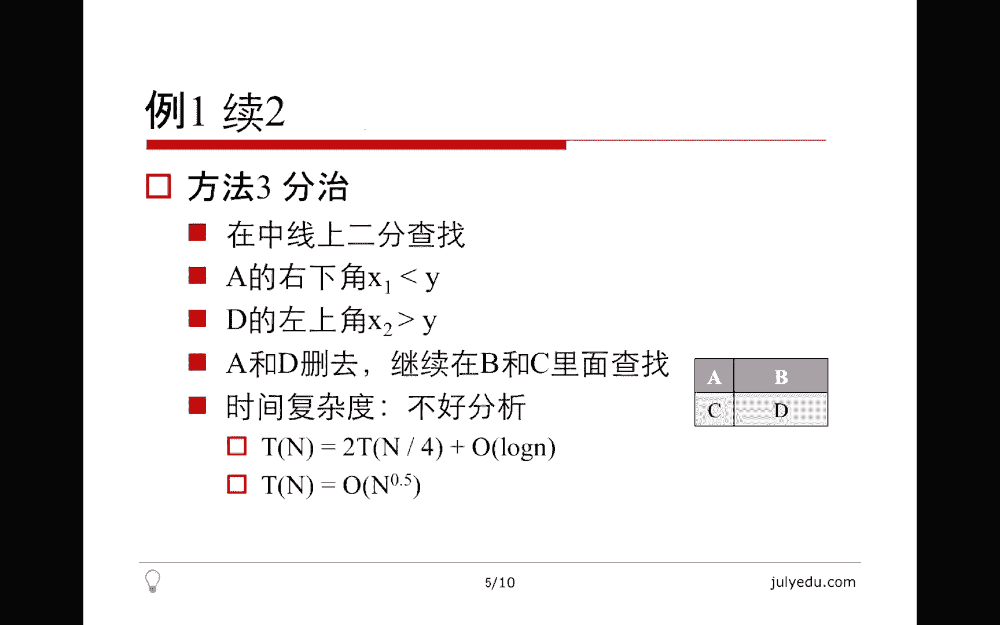
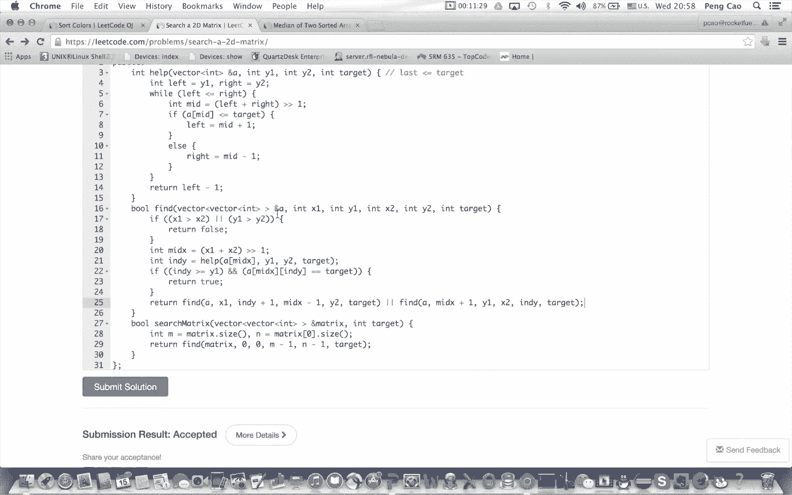
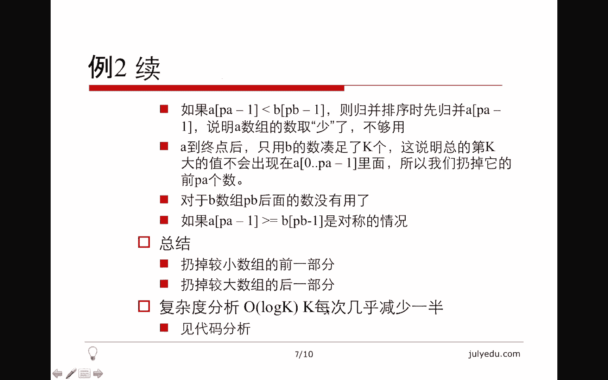
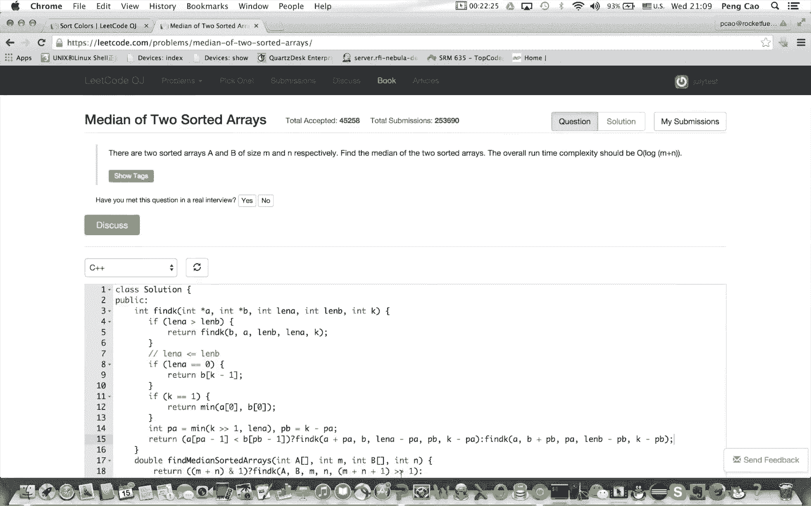
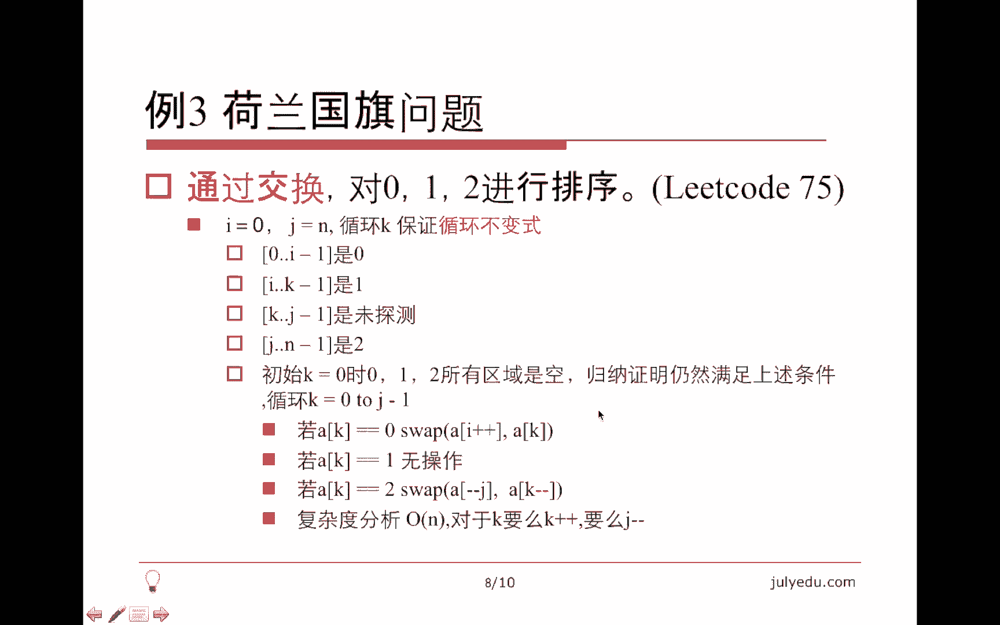
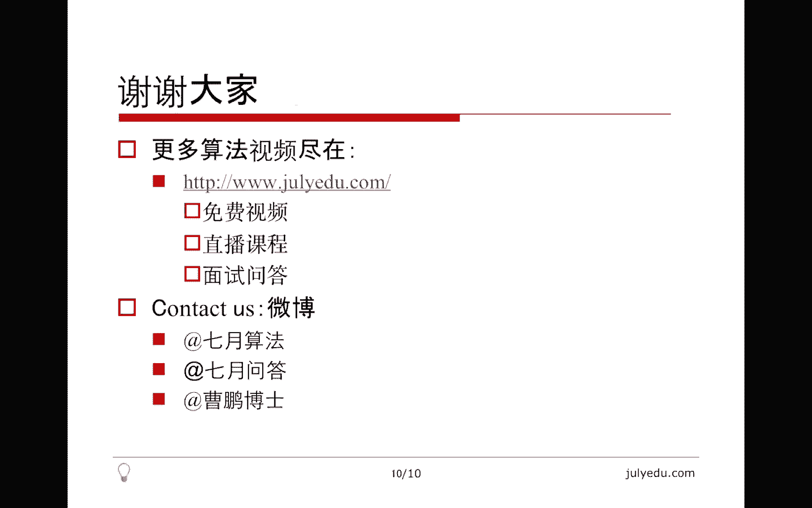

# 七月在线—算法coding公开课 - P2：排序查找实战（直播coding） - 七月在线-julyedu - BV1YW411K7va

大家好，欢迎观看7月算法公开课。我们这堂课的主要内容是排序查找实战。我将通过三个例题讲述本课内容，最后总结结束本课。第一个问题比较简单，我会快速的讲一下算法，把主要精力放在写代码上啊。

就是杨式矩阵的查找。所谓杨氏矩阵就是每一行每一列都单调递增的这么一个矩阵。我们的任务是查找一个数是否在这个矩阵中出现，这是li code上第74题。我们有三种方法。第一种方法是，假设要查找的数是Y。

我们每次试图删掉矩阵中的一行或者一列，保证Y不在这一行或者一列中出现，把问题放在子矩阵上面去。我们要找的数是Y当前在第一行最后一列这个数的位置上，也就是X。如果X小于Y，根据杨氏矩阵的性质。

所有数第一行的所有数都是小于Y的。所以我们可以安全的删掉第一行。如果X大于Y，则说明最后一列的所有数都大于Y，所以我们可以安全的删掉最后一列，这样无论哪一种情况，我们都可以通过减少矩阵的一行或者一列。

我们把精力永远放在剩余的那个子矩阵的第一行最后一列这个位置。这个算法的时间复杂度就是OM加NM是行数，N是列数。根据大O级号的定义和概念，我们知道OM加N其实就是O maxaxMN。这是第一种方法。😊。

第二种方法是分制法，它同样利用了杨氏矩阵的性质。我们取中心点，画个时差，取中心点X。要找的元素同样同样是Y。如果X小于Y，我们发现这个A矩阵这个位置不可能出现Y，因为A矩阵里面所有值都小于Y。

如果X大于Y同理这个D矩阵，所有值都是大于Y的。我们可以把D矩阵删掉。这样哪种情况，我们要么删掉A矩阵，要么删掉D矩阵，那时间复杂度其实就是。TN等于TN除以2，加上TN除以4加O1。

这里要注意我们删掉一个矩阵之后，剩余的比方说我们把A删了，我们可以把BD看成一个矩阵，它的大小是2分之N。那C也是一个矩阵，它大小是4分之NO一是我们比较XY的时间复杂度。

那这个N注意是呃矩阵里面所有元素的个数，也就是小M乘以小N。所以我用大N表示它的复杂度不是很好分析，介于根号N到N之间。那第三种方法其实也是分制。我们在中线上查找，因为中线是这个杨氏矩阵中间的那一行。

中间的那一行同样满足单调递增的这个性质。我们可以在中间的那一行找到最后一个小于Y的值，我们称之为X1，之所以说它是最后一个，就是说它下面那一项，恰好刚刚大于Y。所以我们找到了实际上是一个突变的临界点。

X一小于YX2大于Y这两个点在中线上是相邻的。那么A这个矩阵是以X1为右下角的。D这个矩阵是以X2为左上角的。根据刚才的分析，A中所有的元素都小于Y。D中所有的元素都大于Y。我们可以把A和D同时删掉。

剩余两个矩阵B和C在递归的查找。那删掉这个之后，复杂度其实还不是很好分析。因为这两个矩阵的规模取决于这个临界点的位置。那么在一种情况下，就是恰好评分的时候。

它实际上恰好分成了两个剩余的大小为4分之N的矩阵。所以这个恰好评分的时候，复杂度是这样的，这个logN是我们二分查找X一位置的这个时间复杂度。注意这个N是小N，也就是列数。因为我们只在这一行里面查找。

😊，那这个时间复杂度最后推出来是根号N的。这个是三种分制法，下面我们在let code上写一下这个问题。

这个。我们先考虑第一种做法，我先得到这个矩阵的行和列。这是行。这是列。就是M行N列。刚才的方法是说，我只要放在第一行的最后一列就可以了。满足的条件就是。行数不能超出范围，当然C要大于等于0。

因为我这个是增加一行，减少一列呃，减少一行减少一列的。那么我们判断。这个值。和target大小。如果它大于target，就说明这个最后一列是没有用的。如果它小于他gi。就说明第一行是没有用的。

否则就是他和他给的相等。相等的时候，我们直接return一个处。然后在循环外面就说明我们把行和或者列都删完了，那么显然是找不到这个元素的。我提交一下这个代码。这是1个AC代码。那么我们再考虑。

第二种方法就是我讲的那个分制法，找到中心点的那那种分制。这种分制法呢，我们需要一个。另外一个支持它的函数，这个函数我们叫做finidefiide就是从这个矩阵里面。给定一个子矩阵。

子矩阵显然最开始是它本身就是左上角坐标和右下角坐标。我们要找的数候还是tart。那么现在关键问题就是看一下我们。这个find函数如何实现？find我们的传入参数是一个矩阵。为了方便。

我把这个参数名字改改短一点，就叫做A。X1Y1是左上角，X2Y2是右下角。carget是我们要找的这个元素。那么如果这个矩阵为空的时候。就是。X1大于X2或者Y1大于Y2，这个矩阵是空的。

显然我们要找的数不在空矩阵里面，否则的话这个矩阵非空的时候，我们就求一下。中心点的位置所谓中心点就是幂的X和幂的Y就是。把横坐标取一下中，纵坐标也取一下中。然后呢，如果。我们要找的这个元素。

恰好在中心点。显然我们return一个处就可以了。那如果它不是中性电，我们就要根据它的大小。他和这个我们要找的这个元素。的大小来决定一下。它所在的位置，一种情况呢是。就是如果tt比我们要找的这个元素小。

那说明右下角那个矩阵是没有用的。根据刚才的分析，我们要仔细算一下剩余的那个矩阵，两个矩阵的左上角和右下角。就是这是一个矩阵，另外那个矩阵应该是Ame的XY1。那个应该是X2。米的外。减1吧，减1。

好像要减1。他给他。这个是。呃，其中的一个矩阵。另外一个矩另外的一种情况就是target比我们要找的这个值要大的话，它实际上就是左上角那个矩阵是没有用的。同样我们重新算一下这个坐标是。X2Y2。看给的。

另外那边是A那个X加1。问1X2。密度。晚。大概检查一下这个坐标的写的，想一下写的对不对？这个坐标要仔细算一下。然后我可以提交一下。它也是一个正确的代码。那么下面再讲一下我们那个分支法的第三种方法。

就是当然这个主的都不变了，我们需要。一个二分的算法来算。我们要找到临界点的位置。那么我们怎么二分呢？我们要算一个这么一个东西，就是在中间那一行找到一个我们想要的东西，找到一个临界点。

这个临界点实际上我们称为这个我写一个二分的函数叫做。叫做help。这个函数是目的是从A密的XY1到Y2这个区间里面。找到一个。小于等于targe的最后一个值。那我们现现在来实现一下这个函数。

他叫help。它的传入参数实际上是一行。当然他限定了这个。Y一列到Y2列。我们要找到一个最后一个小于等于target的这么一个值。那么怎么写呢？我们就写一个传统的二分，把left定下来。

right也定下来，然后判断一下。reft小于等于right的话，我们就算一下中间的那个元素。然后看一下，如果A密的小于等于。Cararge。F不等于幂的加一，否则。

right于幂的减注意这里return实际上是left减一。这里要注意，如果这种所有元素都大于tagi，也就是这种元素不存在的话，返left是从来不会变的，left就是Y1，最后返回的是Y1减1。

所以我们根据返回值如果比Y一要小的话，就说明这个元素不存在。否则的话就说明这个元素存在。现在我们找到了这样一个inY，我们怎么用它呢？😊，我们先要判断一下in theY。是不是。

就是me的这me X这一行inY这一列有没有我们要的这个target。这是因为刚才说了，大于等于Y一表明这这种情况是存在的。这种情况存在就是说我们可以找到一个小于等于target的点。

那么既然是小于等于，我们先看一下它是不是等于。😊，如果等于我们就直接反馈处了，就省事了。否则就说明我们找到了临界点，这个到in的Y这个位置是小于的。那么到这个in的Y加一的那个位置是大于的。这样的话。

以in的Y为右下角那个矩阵和以inY加一为左上角那个矩阵，我们都可以扔掉，这样就剩余了两个矩阵，同样要仔细算一下这个坐标，应该是A。Yes。这是一个矩阵。另外那个是。幂的X加1。

我要从这两个子矩阵里面找他给。啊，注意这个时候，即使in的Y小与Y一也没有关系。因为我们在后面会判断出这个矩阵为空，直接返回for再提交一下。它也是一个正确的代码，这个是我们要讲的第一题。

那么下面继续讲第二个问题。它是li code上第四题就是两个有序数组的中位数。这里面因为两个数组是有序的，求中位数其实就是求排好序之后，中间那个元素。当然它和奇数和偶数有关系。

我们现在把它作为一个更一般的问题，就是求两个有序数组规并之后的第K小的元素。那么第一个方法，我们自然能想到的就是按照规并排序那么做，就是规并，因为两个数组已经有序了。当然我们只规并到前K个元素就可以了。

这个时间复杂度是O的。显然。😊，那另外一种方法还是分制，我们用规并的还是用规并排序的思想。我们从A和B中一共拿K个数看一下。因为我们假设A长度稍微短一些，我们取。A中取PAA个元素，B中取PB个元素。

一共取K个元素。注意这个呃2分之K和这个A的长度要取一个较小的值，因为A一共就这么多元素了。B因为是较长一点的，一定能取够这么多个元素。关键问题在这儿，如果APA减1，因为下标从零开始。

PA减一就是A的数组中目前取的最后一个元素，它比B的PB减一要小的话，这说明我们在规并的时候，A数组已经走到了终点，剩余的是用B的数凑足了K个。换句话说。

这说明总的最大值DK大的值不会出现在0到PA减1里面。这是因为这个假设我们再多加一些A中的元素的话，那么这个DK小的值有可能是出现在这个PA减一后面的。😊，对于B来讲，我们再多加数也没有用。

因为光A和B光取这些元素已经凑够了Kg了。所以。大家仔细理解一下，会发现B数组PB后面的那些数对我们来讲没有意义。A数组PA之前的那些数对我们来讲没有意义。

对于APPA减一大于等于BPV减1来讲是对称的。所以这个结论请大家仔细用规并排序的思想想一下，哪些数是没有意义的那最终的结论就是我们可以扔掉这个较小值数组的前一部分。

同时我们可以扔掉较大值数组的后一部分。也就是这种情况来讲，我们可以把A的前前半部分。以及数组B的后半部分都扔掉，继续做。关于这个的时间复杂度，我们可以证明它是logK的。并且。

主要一个原因就是K每次几乎减少一半。具体我们可以看一下代码。

下面写一下这个问题，这个问题是这个问题。因为这里面实际上是要返回这个两个数组的中位数，取决于呃M和N的奇偶性的。所以我在主程序里面实际上写了一个更复杂的东西，就是判断一下。这个东西是奇数还是偶数？

那如果是奇数的话，显然它中间的元素就是一个固定的。就是AB。MN相当于我取M加N加1，我取这个第这个小的元素对于偶数的话稍微有点复杂。这个还是ABMN这边的元元素数实际上是。M加N。除以2。再加上。

另外那边实际上是M加N。除以2。再加一。我取这个。这两个数的和。乘以。5，就是它对中位数的定义是如果是偶数个就取中间两个元素，然后这个再取一下中位数，再取一下平均数，就是我们要求的这个元素。

所以我们这是取了两个数，然后再乘点5，我把它用括号括起来。那么我们的第一种方法实际上是算斐 K。我们用规并的方法。这里面重新命名一下参数，把它改成小写。这个是A的长度和B的长度。然后当然还有一个K。

我们的第一种方法就是按照规并排序的思想来写。那么我现在大概写一下。Yes。规并排序就是说哪个数组没用完，我就用哪个数组。当然这个时候要判断一下这个。当前的因为我K每次减少一的。

我需要判断一下AI和BJ的这个大小关系。如果AI小于BJ，显然我就要考虑AI了。当然我们不用真的规并，我们只是考虑一下现在在哪个元素那儿就可以了。如果K是零的话，我们就可以。返回AI了。

否则就我们就可以考虑是BJBJ同样要判断K是不是0。如果K是零的话，就把BJ直接返回。再否则的话我们就。加加这。嗯，这个否则写不写都可以在那写上吧，否则的话我们就加加J。那么这个退出的时候。这里面啊。

这里面这个。加加I应该写到这里了。然后从逻辑上来讲，如果K等于0。就返回BG，否则的话我就把J加一，然后这个循环结束。那么在循环外面，实际上我们是看一下是哪个数组被耗尽了。如果是A数组被耗尽了，显然。

B数组还有元素，我就返回这个这个值。如果否则的话，就像说明B数组被靠近了，我就返回A这个值。然后这个可以提交一下。它是一个正确的代码。然后我们再来看一下我刚才说的第二种方法。第二种方法比较麻烦。

同样还是要实现这个find K。那么我们怎么实现find K呢？我们要假设先确定一下A和B的长度。如果lance A大于LsB。我们就把它交换一下，这样因为为了后面好分析。就把它交换一下。从这以后呢。

我们就知道lenice A是小于等于lenance B的。然后就按照当然有些特殊情况，我们要提前考虑。比方说如果lessance A已经空了，因为A比较小，luice A已经空了。

显然我们就返回B那部分的值就好了。就是B的DK减一个元素，否则的话呢。还有一个比较简单的情况，就是如果K恰好是一。我们显然返回的就是A和B中比较小的那个，因为K等于一相当于返回最小的元素。

那否则呢我们就从A中取。尽可能取一半个元素，当然有可能取不到一半。B中呢取剩下的那些元素，然后我们去考虑一下，根据刚才说的，我们考虑一下这个值。He。B的PB减一的值的大小。那如果A的这个小呢。

我们刚才已经说了这个小说明。呃，就是A的前半部分是没用的。我们可以把精力放到A的后半部分，A的后半部分偏移一下，就是A加PA。那么B呢就在这儿。那么。A的长度，实际上我们把PA个较小的数已经扔掉了。

那么对于B的长度，我们就限制在PB上了。因为PB的后半部分是没有用的，然后K呢减少了PA个数，因为我们把A的较小的PA个数已经扔掉了。那对于第二种情况呢，实际上跟它是对称的，A不变。

那么B呢B的前半部分被扔掉了。那么A的长度变成了PA。B的长度变成Lance B减去PB，那么K呢也减去PB是因为我们把较小的这个PB的数扔掉了。那么我们再提交一下。这也是一个正确的代码。

那么下面我们来分析信析啊，这个算法的时间复杂度。首先关于这一步，如果lenance A比Lance B大的话，我们交换这一步充其量，使我们的递归层数扩大了2倍，而二是一个常数。

所以这一步我们暂时不用考虑。那这个。这个是递归的推出条件，我们都不用考虑。我们关键看K的变化。我们可以看一下，对于第二种情况，就是说取后半部分的情况，我们可以看一下。

因为K减PB实际上就是PA而PA是小于K的一半的，小于等于K的一半的。所以对于第二种情况，我们K的这个变化最多变成了K的一半。😊，所以说K至多减少了一呃，至少变成了原来的一半。那么对于第一种情况。

我们再看一下。如果这个PA取到了2分之K，就是近乎K的一半的话，那么K减PA也变成一半。关键一个问题是说LA不够长。所以PA没有取成2分之K这种值，而PA取成了LsA，因为它取的是较小值。

那么我们的K的减小值实际上可能就没有到一半，剩的可能更多了。但问题在于，当PA等于LanceA的时候，我们发现这个值是0。这个值是零，在递归过来的时候，我们会发现下一个L A已经变成零了。

因为这边传过来的是L A减PA。那么对于lan A等于0，我们在下一层会直接退出，所以这种情况不用考虑。那也就是说我们只考虑这个PA等于2分之K的时候，PA等于2分之K的时候。

这一减K减少了还是减少了一半。所以无论哪种情况，K至多变成原来的一半左右。所以当K等于一的时候就退出了。所以这个时间复杂度是logK的。当然刚才说的。

如果PA取到了Lance A这个值在下一层就直接退出了，所以这种特殊情况也也会满足这个logK的时间复杂度。那么对于logK来讲，其实我们传的值实际上是M和M加N啊，或者说2分之MN这么大的。

所以这个复杂度实际上是呃logM加N也就是它要求的这种时间复杂度。这个是我要讲的第二个问题。😊。

下面继续我要讲的第三个问题。就是说这是荷兰国旗问题。所谓荷兰国旗是说荷兰的那个国旗实际上是有三种颜色的布条构成的。我们要通过交换对012进行排序。其实这里面012代表三种不同的颜色。我们试图通过交换。

把零放到一起，把一放到一起，把二放到一起。这个数组只有这三种元素，强调一下，要通过交换。这是因为其实我们可以数一下有多少个零多少个一多少个2，最后呃按照顺序，比方说有三个02两个11个2。

我们就把数组前三个复成0，后接着两个复成1，最后一个复成2就可以了。但是这里面它要求通过交换。所以不是我们简单的计数，这么简单的这种事情。这是lea code上第75题。啊。

其实我想讲的一个事情就是所谓的循环不变式。我们证明我们把K作为循环变量，然后我们证明一个结论始终存在。当K等于零的时候，它是正确的。在K增加一之后，它还是正确的，这样就证明了K不断的变化的时候。

它总是成立的，这个有点像数学归纳法的思想。我们要证明什么事呢？就是这么一个事儿，就是先设I等于0，这等于N。然后呢。我们要说0到A减1这个区间，这是B区间。

这个是指的下标下标在0到A减1的这个区间里面全是0。然后下标在I到K减一里面全是一。下标在K到J减一里面是我们没有考虑到，或者说目前还没有看到的值，下标在J到N减一里面全是2。

我们看一下为什么这个结论在K等于零的时候是成立的。K等于0时候，我们看一下。😊，K等于0，这个是0到-1这么个区间，这个区间是个空的区间。我们认为空的区间是永远成立的。所以我说空区间里面全是零是成立的。

那么对于一来讲也一样，因为K等于0I等于0，这个是0-1，这也是个空区间。对于J来讲，这是个N，然后这个到N减1，这也是个空区间。所以012区域都是空的。而K等于零的时候，这等于N，也就是0到N减1。

就是全部的N个数，我们都是未探测的状态。所以这四个这个条件是成立的。我们通过归纳法证明，当K变化的时候，我们对于AK做一下处理，仍满足这些条件仍然成立。比方说我们发现当前的AK等于0，我们怎么处理呢？

我们把AK和AI做一下交换，同时I加一，这是为什么？因为我们知道I的这个位置实际上是零和一的分界点，它是第一个一的位置。那么因为AK等于0，我把AK和AI交换了一下，新的AK实际上就变成一了。

旧的AI就变成零了，同时I加一，实际上我们把这个零的区间延伸出来了一个0一的区间这个往右延伸出来了一个一，所以I加了一。😊，然后我们把K再增加一的时候，这些条件显然也成立。那么对于AK等于一呢。

我们不做任何操作，这是因为I到K减一是1K增加一的时候，这个I到新的K减一仍然是一，这个没有关系。那么对于二其实和这个对于零的处理是对称的。😊，我们把这个AJ减一和AK做一下交换。

但是别忘了这里面这个K要减少一，这是因为这个。AJ这个值其实是我们AJ减一这个值是我们没有探测到的值。所以我们把它交换了之后，新的AK这个位置。尽管我们把AK换过去，换到AJ那个位置是2。

但是新的AK这个位置是旧的AJ减1AJ减一是个未探测值。所以我们这个K要先减少一，因为这个K在循环变量里面，我把它先减少一再增加一之后，这K是没有变的。那么它的时间复杂度为什么是ON的呢？这是因为。😊。

我这个K是循环的，每次都加一的。对于这个AK等于0的时候，K增加一没有关系。对于AK等于一的时候，相当于也是K增加一没有关系。但是对于AK等于2的时候，虽然K先减少了一，又增加了一，相当于K不变。

但是这减少了一。所以我们这个循环的区间实际上在不断的减小了。每次要么K增加了一，要么这减少了一。所以这个对我们来讲，这个区间总在一个一个减少，所以它是1个ON的时间复杂度。😊。

讲这个是为了让大家理解一下这个呃循环不变是。下面我写一下这个问题。

是这个。按照我们的定义。我们看一下。刚才说了等于零的时候，我们就把。A爱。和AK做下交换。等于一的时候没操作，所以我们只要看一下哦，这里面是K。我们只要看一下这个。等于二的时候就可以了，等于二的时候。

我们要把A减减J和AK减减做交换。因为这里面是K减减，然后这边又加了，所以K是不变的，J是减少一的哦，这个循环变量要循环到N呃循环到G，因为这个是循环到J减一的。那么这个题就写完了，再提交一下。

然后他也是一个正确的代码。

然后大概总结一下，其实查找和排序呃涉及到的相关知识挺多的。比方说我们要熟悉各种排序算法，比方说冒泡啊、规并啊，规并排序对于列表比较有效，希尔排序啊快速排序啊。

比方说荷兰国际问题就是快速排序partition的那个过程的一个一个变种吧。它正好分成了三堆。包括有些快速排序那个parttition，实际上也是分成三堆的。我们把和比分区元素小和分区元素相等。

以及把分区元素大，比分区元素大的这三种元素分到了三个不同的区间里面，就跟012排序是一样的。还有堆排序啊、统排序啊、技数排序啊、技术技术排序啊等等，这些都是很常见很重要的排序算法。

那另外查找查找的本质是利用序。如果没有顺序的话，我们查找只能是顺序查找，也就是一个一个找。正因为它有了顺序，我们可以采用某种分制的方法，通常是二分，也有三分的这种可能。

那么其实它的本质是我们利用了某些特殊的顺序。每次确定一下，我们要找到那个元素，在我们的全集里面的某一部分的一个子集里面，也就呃通常就是在这个全集的一半的某个集合里面，也就是所谓的二分把集合分成两部分。

我们确定一下，它在呃A部分还是B部分，从而就每次可以扔到一半达到logN的复杂度。这个就在写那个杨式矩阵查找的时候，的第三个算法用到了二分的这种思想。因为其中有一步要确定那个连界点。我就是二分出来的。

好，今天的课就到这里。希望大家。他给我提出批评指正，谢谢大家。

