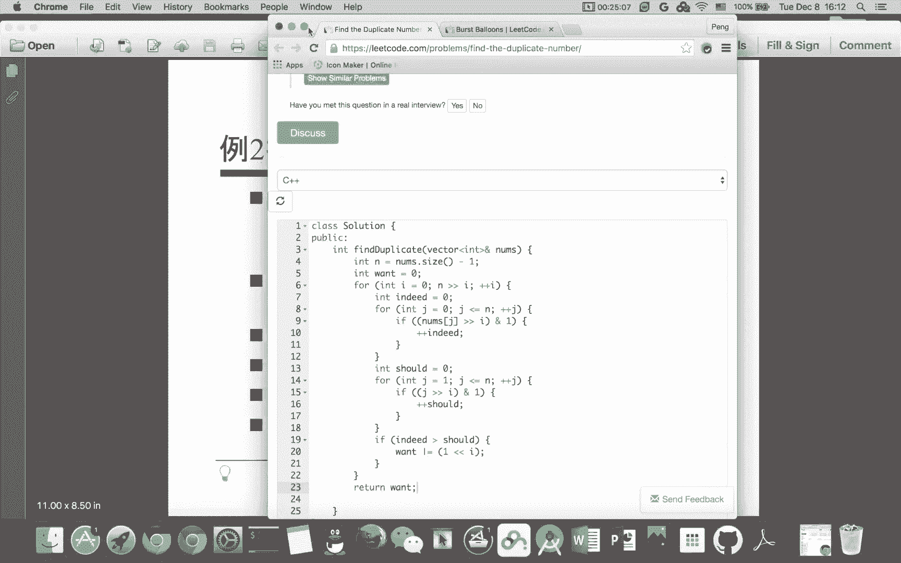

# 七月在线—算法coding公开课 - P5：数组实战（直播coding） - 七月在线-julyedu - BV1YW411K7va

欢迎观看7月算法公开课。我们这堂课的主要内容是数组问题实战。开门见山数组比较简单，我直接选了3个lead code上的问题。其实之前选了5个题，由于时间关系又从中选了三个比较典型比较代表性的。

虽然是三个题，但是前两个题我都给出了不止一种解法，请大家仔细体会这个一题多解。直接看第一个题，deta code上315题，给定一个数组要求返回一个数组。

返回的数组表示原来数组中每个元素右边有多少个数比它小，就像逆序数的这种概念。比方说输入是5261，那么输出就是2110。为什么呢？五的右边有二和一比五小二的右边有一比二小六的右边有一比六小。

所以呢五的右边有两个数比它小二的右边有一个数比它小6的右边有一个数比它小一的右边没有数，所以输出是2110题目意思非常清晰。那么它本质就是一个逆序数，我们可以通过经典的规并排序的算法来求出逆序数。

但是这个题呢我们求的逆序数不是一个数，而是一个数组是以每个数开头的逆序数的个数。所以我们还是需要对规并排序的算法做一些改进，这个代码量还是比。比较大的，下面我来写一下。

就是这个问题。

那么首先呢。我们先把这个N定义出来，也就是。里面的个数，然后呢，我们把所有问题交给一个递归的函数来做。我们在主函数里面基本上不实现什么东西。为什么我要定一个position呢？

因为这个position实际上反映了。就是下标排好顺序的之后的这个下标，因为我们不能修改这个圆的数组。如果我们修改了它，我们没法找到就是原来这个数在哪个位置，所以我们不对nuumbs进行真正的排序。

而是对它的下标进行排序。排好序之后，这个pos0里面是最小呃最大数的下标。因为这里面我们采取的是由大到小的排序。那么我们调这个m函数的这个。经典定义。那这里面呢我们给出一个。几个参数。

当然这个pos肯定要给外那个answer呢，是实际上是它要返回的这个。结果当然它的长度也是N。那么最后我们把answer返回就可以了。那现在相当于其实还是什么都没写，关键是看这个word函数怎么实现。

😊，那我们看一下这个word怎么实现呢？它有什么参数呢？首先是所有的数注意再次强调，我们对于这个并没有真正的使用这个names进行排序，而是对这个。pos进行了排序。

这个pos实际上是下标answer是我们要的结果。注意我这个from to实际上是左臂右臂的区间，而不是左闭右开的区间。所以这有一个加一减一的问题。不过没有关系，from大于等于to呢。

说明我们要么只有一个数，要么没有数，我们可以什么都不做，直接返回。所以这个是边界条件，否则呢。我们把终点球穿来，分别对。两边进行排序，这两边是啥呢？是这个。from到 mid。以子呢。

me加一到right呃到to。然后这两边由大到小盘好去之后，这个answer其实已经有了部分的结果。那么我们需要的就是这个跨越两边的。逆序数，我们要加到这个answer上，那么也就是经典的规并的过程。

规并的过程我们通常需要一个额外的数组。我把这个叫做tamp，然后就是真正意义上的规并。这是两个列表，分别从XY，也就是说从from和to。来开始做。啊，from和me开始做，然后呢，有几种情况比较特殊。

一种呢就是。X呢已经大于幂的了，说明第一个列表已经耗尽了。我们直接把第二个列表拿过来就好了。注意我排的都是这个pos，所以我改的也都是pos，把它放到这个time破数组里面。那另外一种情况呢。

说明第二个列表已经耗尽了。那么我直接把第一个列表里面的数拿出来就好了，这个都是比较简单的结果。那么还有一种呢，我就要看哪个大，注意我们这个排序是由大到小的排序。所以我要看一下namemspo这个X。

如果大于namespo y。如果这两个位置上左边的数比右边大的话，这说明左边的数比右边的数以及到它结尾的那些数都大。什么意思？从toY到to这些数左边都比右边大。那么我要把对应位置上的这个。

东西要加上t减Y加一，为什么？因为从Y到to这些数都比这个X这个数要小，所以它右边这些数都比它大，这个就属于跨越左右两边了。那么注意我把它也要附成。😊，X。那么另外一种情况呢。

就是小于等于我直接把右边的数复过来。然后这个墨纸其实我们就写好了，注意我们要把它复回去。要把这个pos更新掉。I加from等于tI。然后注意这个时候有一个相等的情况，相等的情况其实放在这里面了。

我们不能轻易的动这个，如果轻易的动左边，这个逆序数会受影响，所以相等实际上看似没有考虑，实际上它隐含在这个里面，并且不会影响逆序数。所以我们不要轻易把左边加加，而要尽可能的把右边加加。

所以相等的时候把右边的数拎过来。😊，这个是一个非常就是细致的问题。虽然在代码上可能看不大出来，然后我提交一下。这是一个正确的代码。那么第一个方法是这样做，也是比较经典的规并排序的算法。

那么我们看一下有没有别的算法呢？规并排序其实本质就是分制的算法，我们还是用分制算法，但是用一个稍微暴力一点的算法，离散化加分筒的方算法。那什么叫离散化呢？首先给定的这些数数的大小，绝对大小是没有意义的。

比方说我给你两个数，1个1001个1000，这两个数没有意义，和一个01个一没有差别。所以呢我们可以把数的这个大小缩小范围缩到0到N减1之间，怎么做呢？排好顺序，最小的给0次小的给一，最大的给N呃。

最大的给N减1就可以了。那无论怎么做，这个需要N log N的时间复杂度相当于排序。😊。

那为什么要把数的范围缩小呢？我们想把它放到一个比较小的区间里面，这个区间只有从0到N减1，这个范围比较小，对我们比较有利。我们怎么分桶呢？首先桶就是区间的意思，大小我分成根号N这么大。

每个桶都是根号N这么大，当然有可能有尾巴，有多少个桶呢，有这么多个桶，注意加上这个实际上是因为这个除法是整数的除法，加上这个实际上是上除上取整的意思，只要有余数我就需要多一个桶，举个例子。

比方说N等于11根号N取整是3，那么实际上要分成4个桶，因为11除以三是除不尽的那四个桶分别是第一个桶区间是0到2，第二个桶区间是3到5，第三个桶区间是6到8，这前三个桶都是完整的，每个桶都有三个数。

最后一个桶只有两个数，也就是那个尾巴那个余数。那么。😊，给定一个数X，它所在统的编号，其实直接除一下，这个是一个取整，都是整数的除法就可以了。注意下标要从零开始，这是第零个桶，第一个桶，第二个桶。

第三个桶，这样分完桶有什么意义呢？我们把数想成动态的，我从最后一个数一个一个的把数加到桶里面，为什么从最后一个加呢？因为我每个数考虑的是比它右边的数，这个有多少个数比它小。那么我倒着加的话。

就是考虑当前这个数在之前加入桶的那些数有多少数比它小。那为什么要分成桶呢？我们有这么一个技巧。😊，首先分成统之后，我们可以统计每个数出现的次数。因为我们把数的范围已经缩小了，每个数都在0到N减1之间。

每来一个数，我就把这个对应位置加一，这实际上就跟计数排序是一样的。那么我们统理还可以统计每个桶包含数的个数，有根号N个桶，每放一个数，我就统计这个桶里面的数加一，统计完这两个数之后，对于X来讲。😊。

和X在同一个桶里面的数有多少个数比它小呢？我们可以循环这个桶里面的数，桶里面最多有根号N个数要循环根号N次。那么X之前桶里面的数有多少个数比它小呢，注意我们循环的不是数，而是循环的统。

这个时候我们以统为单位，因为每个桶里有多少个数，我们都知道了，我们直接循环桶把数累加起来，这样呢，实际上这个复杂度也只有根号N，因为我没有一个一个循环数，而是按统循环的。

这个也是为什么我最初统的大小取了根号N，因为统的个数和桶里面数的个数都是根号N级别的。这样呢总体复杂度，N个数循环完之后是N乘以根号N，也就是N的1。5次方的时间复杂度。

虽然比N logN的时间复杂度要高，但是。😊，这个呃就是在li code上是可以接受的N的1。5次方比N log n要大那么一点，但是比N方要好多了。我们来看一下这个代码。

这个代码量相对于刚才其实是小了很多的。😊。

还是这个我现在这个墨其实对我来讲没有意义了，删掉。那我要什么呢？这个东西我还要。这个N我还要answer还要。其他都不要了。那么我先把特殊情况处理一下。如果这个N比较小，比方说小于2。

那其实我是把空啊以及只有一个数隐含处理掉了，这些都没有关系。那么下面就是我真正的刚才说的，怎么做离散化。我用一个map，所谓mapC加加的map是key value的对。我把N个数放到map里面来。

为什么要放到map里面来呢？因为我放进去再拿出来的时候。😊，C加加的map是有序的，按照key由小到大的顺序排序的。所以呢我这样相当于省的一个排序。注意我这个加加第十一行的那个加加其实没有太大意义。

我只是为了把key放进去，我最后还会把那个Y6冲掉。那注意这个时候我再引入一个变量M。那么。通过这两个循环，我就把names里面的N个数映射到0到M减一里面去了。那注意这个M可能是小于N的。

这个取决于有没有重复的数。那么继续我们刚才的那个代码，就是8K的 sizeize。我们知道8K size其实就是SQRRT根号N嘛。我当然这里面可以写M，然后。定义两个数组，也就是vector。

第一个数组呢就是同。我们有多少个桶呢？刚才说了N加上baucket。sence减1除以baet size，我们有这么多个桶，我们有多少个数呢？其实就是N个数了。也就是M个数了。

这个实际上是以桶为单位计数，这个实际上是以数为单位计数。那么剩下的我们就是报利的来做了。刚才说了，倒着。把数一个一个加进来，你怎么做呢？每来一个数，首先这个数要被我们映射成0到M减1。

那么我把它映射成X了。那么ID表示X在哪个桶里面，它就是除一下，刚才都说这都是整式除法，那么。😊，我需要看。这个。在他之前的桶。那ID肯定都比。就是这个ID肯定都比这个ID要小在它之前的同。

所以我用这来表示把从这个ID减一循环到0。那么我把它加到answer上，这些数显然都比。这个这些数显然都比这个第I个数要小嘛，而且在第I个数右边，因为我们是从右往左算的。那么这个呢。注意桶的边界。

bucket size这是桶的里面最小的数。那看看这个是和X在同一个桶里面的。我把它加到。这个上面来，那这这时候我要写have这，注意这两个G的理念不一样，这个是以统为单位的。刚才已经强调了。

这个是以数为单位的。那么这两部分把所有的比它小的，在它右边数都算好了。那别忘了更新这个，我们现在多了一个X。多了一个这个ID的这个桶里面的数。那这样这个代码就写完了，我们提交一下。

它也是一个正确的代码。那么。还有没有别的方法？其实还是有别的方法的。

我们仍然用离散化，就是把所有数化到零到N减1，把这个数的范围缩小。那我们考虑二进制。比方说X这是二进制数，比X小的数其实只有三类X里面有三个一嘛，第一个一变成零，后面数不care，第二个一变成0。

也就是这个一变成零，后面是不ca画叉的表示不关心，那么这个一变成0。那实际上这三类数代表了三个集合，注意这三个集合是不相交的。因为它们的前缀都不一样。这个很像这个字典序的概念，所以呢任给一个X。

我们还是从右往左把数都加起来。我们考虑X里面的每一位，我把每一个一变成零，然后统计一下这种前缀出现的次数。那对于不关心的位，我就直接右移就好了。比方说这个例子。

我先把X右移一位遇到了发现是一个一是一个一，我就把这个一变成零。😊，就考虑1010这种数出现了多少次，加到上面去，就表示这些是以1010差比X小的这个一样，遇到这个一，我把它变成零就变成了100。

看这个东西出现了多少次。那最开始我看一下零出现多少次。那么这个其实就是这个算法的本质，用到了一个微运算，我不断的把X右移，每遇到一个一，我就看一下零出现了多少个就好了。😊。

那算法复杂度还是Nlog n的，为什么呢？因为X是最大到N，它的二进制形式有log n这么多位，它的二进制表示有log n这么多位。那所以我们循环次数是logN的对于N个数来讲。

循环次数还是N log N。那这个写起来代码量其实相对就更小了。我们来看一下。😊。

那我偷点懒把这个能复用的代码都复用掉。离离散化至少我们都是需要的。那么到这儿我们都可以用。那怎么怎么写呢？我现在。为了方便，我把names都重新复一下值。这时候我就把ns都变到0到M减1上去了。

注意这是sve。那这样。那么斯我已经都付好了，那关键是这个循环。我们要考虑要循环多少次，为了不计算这个。为了不计算这个log N，我用一个数组，我用一个布尔值来表示要不要进行下一次循环。

什么情况下不要进行下一次循环呢？就是当所有数都右移成零的时候，就不用再做下一次循环了。实际上移动的就是log M那么多位。😊，只是我没有做数学上的计算。还是刚才那个思路，把所有数倒着加进来。

那我们看一下，如果这个数不是零的话。那么。我们发现一个非零的数，那下一次肯定要继续循环了。那么刚才我说了。😊，如果这个数的最低位是一的话，注意这是和一作语。那么我需要把它加上去。这个cule里面存的是。

就是刚才说的每个前缀出现了多少次，异或一是什么意思呢？因为它最低位是一，我和一坐下异或就相当于减了一，把最低位变成了0，实际上就是求比它这一位比它小的那些数。那我不断的这样循环，就可以求出来。

每一位是一都把它变成零，比它小的数了。那么注意一个核心的这个别忘了把这个东西更新。😊，因为表示这个数出现了一次，然后把它右移移位。然后我们看一下。呃，有一个编译错误。第28行。哦，这应该是中括号。

它也是一个正确的代码。所以对于这一个题，我实际上讲了三种算法。第一种是就是比较标准的规并排序的算法。第二种和第三种都是用到了一些微运算啊，二进制啊等等这些方法。那其实还有别的方法，最经典的。

可能就是比较熟悉的同学想到了线段数，这个是比较经典的算法，但是写起来比第二个和第三个要麻烦很多。第二个比较暴力嘛，复杂度是N的1。5次方，这个是N log n达到了和第一个算法同样的复杂度。

但是这个代码量要小了很多，比线段数来讲，代码量也小了很多。那么微运算怎么考虑，以及我们这个问题实际上讲述了怎么利用序，因为求的就是逆序数嘛，我们怎么考虑序，我们用到了把这个数离散化。

把数的范围缩小等等这些技巧。😊。

那么们直接看第二个题。N加一个整数，每个整数的范围是1到N，那么显然至少有一个重复，它现在已经告诉你了，恰好有一个重复，也就是一到N每个数都只出现了一次，有一个数例外，有一个数出现两次。

那么求出这个重复的数，它是立 code上287题，有几个要求比较这个麻烦，不能修改元数组，然后额外空间是常数的时间复杂度要低于N方。那么关键是什么呢？关键是每个整数范围是一到N之间。

其实它已经相当于帮我们做好离散化了。我们上个题离散化的目的就是想把这个数据范围缩小。那现在数据范围足够小了。但是我们还有这三个限制，我们来看看第一种解法。😊，还是微运算，我们考虑二进制数。

假设这个N等于9，那么意思是就是出现了10个数嘛，假设我五重复了，当然这个并不代表数的顺序，嗯，这个顺序可以是任何的顺序，有两个5，剩下1到9都只出现一次，然后这个是1到9的二进制，那怎么做呢？

我们考虑最低一位。😊，我们先考虑所有数都是4位的，最低位1到9之间有5个数，最低位是一。那显然四个数最低位为0。那么实际呢就是它给这10个数里面，我们发现有6个数个位就是最低位为一，4个数为0。

那么标红了这两个不一致。那说明我们重复那个数，最低位就是一了。那么四位都可以这么做，对于次第位来讲，我们发现这个为零的个数不一致。那么我就知道次第位应该是零重复的这个数。那么对于次高位也就是正数第二位。

那么我们发现它应该是一，那么对于最高位，我们发现它应该是0。所以对于每一位来讲，我们都考虑一下实际就是一到N之间有多少个数为一，而这个给定的这些数有多少个数为一。这两个如果不一致的话。

我们就知道这一位它应该为一，否则这一位它应该为0，我们把每一位都确定下来之后，重复的这个数就找出来了。😊，那么有多少位呢？还是刚才那个因为每个数都不超过N嘛，有log个N位。

那么时间复杂度还是N logN。因为对于每一位我们都要循环N次。😊。

那我们来看一下这个代码，这个代码其实并不是很难写。把这个关掉。

这个就是我刚才说的那个问题怎么做呢？先把N。😊，弄出来，注意这个是减一的。那么这个时候我的数组下标实际上是0到N了，因为我已经把它减一了。同样我用N又移I大于等于0呃，大于0来表示这个log n。

我并没有数学上真正的计算log N。那么这个ined呢表示这个实际。给定的这个N加一个数里面有多少个数在DI位为一。那我们看一下怎么判断它在第I位为一呢？直接。用右移就好了。右一I位和E座鱼。

这个就是DI位把它吸出来。那这个竖的呢。竖的表示1到N之间。注意是JE到N之间。有多少个数，DI位为一，怎么判断第I位为一呢？还是刚才那个技巧，又以I位和一作语，那么加加数的。啊，这个循环稍微有点问题。

这个还应该在外面。所以对每个I，我们实际上循环了2N次，或者说2N加一次，反正是N的级别的。这个。那么我们怎么判断呢？如果实际唯一的个数比应该唯一的这个多，那么说明我们要的这个数，或者说这个结果。

这一位为一怎么把这一位复成一呢？和这个东西做或，因为这个东西是第I位为一的这么一个整数，做或就相当于把这一位复成一了。否则这一位是0，我们不用做任何事情，因为初值就是0，最后呢忘它就是结果。😊。

提交一下。啊，这是一个正确的代码。那么我们还没有有没有别的方法呢？😊。

二分怎么二分呢？我们这个区间当然是零到N也好，什么也好，只要是A到B。那么我们二分取终点，二分的通常就是取终点嘛。A到幂的幂的加一到B。我们看一下两个区间，这两个区间显然有一个区间是覆盖满的。

有一个区间有一个数重复，我们怎么知道重复在哪里面呢？我们循环N次，看一下给定的所有的数有多少个数落在这个区间，有多少个数落在另外一个区间，哪个区间里面多出一个数，我们就知道重复那个数在哪个区间里面。

那这样的话，显然我们数一下这个区间里有多少个数，如果它恰好有幂的减A加一个数，那么重复就在这里面。😊，否则的话呢，它这个它如果比幂的减A加一多，就是数实际上比这个区间长度要长的话，实际上只多了一个数。

那么它就应该在这个里面。所以每二分一次我们循环N次就可以找出。这个重复的数在哪个区间里面，区间长度缩小一半。那么时间复杂度还是N log n的。为什么？因为二分要log n的复杂度。

然后这个循环N次判断在哪个区间里面的数多，要循环N次嘛，所以是N log N。那么我先把后话说了。首先那三个限制条件，不能改变元素组，表示我我们不能修改数的顺序，也就是不能瞎折腾。那显然我们也不能复制。

不能使用哈希，因为需要有O一的额外空间。那么另外呢，时间复杂度小于ON方，我们不能暴力查找用两重循环这么找。那么这些限制条件限制了，我们不能随便使用这种方法，但是我们可以使用二分。

我们可以使用刚才那种微运算的方法，我们都没有用额外的空间，都没有修改元素组。那么我来写一下这个。😊。

那么这个其实写起来也不难。二分嘛。左区间。右区间。注意我是用left小于right，如果相等的话，区间里只有一个数。那么显然这个数就是重复的，所以退出来的时候，left和right应该是相等的。

我先算出me来，然后。我这个。为了倾斜，我区间实际上是left和me，以及me加一和right。我看一下哪哪些数落到了左区间，左区间我命名为smaller。循环N次嘛，循环所有的数判断一下。

nameumb么I是不是大于等于left？nameI是不是小于等于幂的？如果是的话，它显然是落在了左区间嘛。那么现在我看一下这个左区间里面的数是不是。me减left加一这么多个。如果它比这个多。

那么显然结果在左区间里面，否则的话，那这个数这个区间是覆盖满的。那么结果在右区间里面。那么最后退出来实际上是left等于right，所以return谁都可以。那携载也不太难。看一下，这是一个正确的代码。

那么。

这个是。第二种方法解决这个例2。那么最后一个题其实相对比较难，它是一个这个打气球的方法。打气球的问题，用动态规划。这里面实际上是讲数组可以做动态规划，给定一串气球要全部打坏。

每个气球上有一个整数打坏它的得分等于这个整数乘以它左邻距和右邻距的乘积，那么把最大得分累加起来，求最大得分啊，立子扣上312题，比方说这个例子，那么我先把。😊，这个一打掉了，所以得分是3乘以1乘以5。

然后呢变成这个样子了。然后我再把5打掉，得分是3乘以5乘以8变成这个样子了。然后我再把三打掉，再把八打掉，得分是167。难点在哪？难点在于我每打掉一个气球，它左右邻距会变。比方说我这个把一打掉了。😊。

把一打掉之后，三的又邻居变成5了，一已经没了嘛。那么我们考虑一下什么不变。😊，那其实无论怎么打气球，总有一个最后一个气球被打掉。那么我们可以枚举，假设0到N减1之间，我们最后把X号打掉。

为什么你要枚举这个呢？😊，如果有X在这隔离的话，那么这两个子区间，一个是零到X减1，一个是X加1的N减1，这两个子区间显然都要最大的得分，这是动态规划的自由子问题。那么有X在这摆着。

这个X减一的右邻距始终不会变，因为X是最后打的嘛，X减一的右邻距不会变，同理X加一的左邻距也不会变，所以X是一个隔离点，它非常有意义，我们不用考虑这个打掉气球之后，邻居会变的问题了。

所以边界的气球是不会变的。那么。😊，这个又代表了我们有最由子问题。那么我们想说明什么呢？用动态规划，我们用DPIJ表示，注意这个DPIJ是从I到J这一段的气球，但是注意I减一和J加一始终没打过。

或者说I减一和J加一都不变的时候，把I和J打干净，这一段气球都打干净。😊，的气球的最最大的得分。那么最终结果呢显然是零到N减1，因为没有负一，也没有N，所以这个天然的满足边界不变的这个红的这个条件。

那么我们最后要求这个，那么怎么递推呢？其实这个已经介绍了递推的方式，我们没举这个X，也就是没举这个K，那么显然I到K减一把这一段打掉的得分是最优的，K加一到J打掉也是最优的，最后把K打掉。

因为无论如何总有一个最后打掉的题求，我们可以没举这个编号，那么打掉K的得分呢，就是这三个东西相乘，注意我们已经说了这个DP的这个条件就是两边邻居不变，所以我们不用担心这个I减一是什么东西。

也不用担心这加一是什么东西，反正这两个东西不变，所以最后打掉K的得分是这个，那么转移方程立刻就出来了，就是这么一个东西。IJ就是把I到K减一打了把K加一到J打干净，这两个最优，再加上最后把K打了。

这个我是max没举KK。😊，那显然是I到J之间的没举这个I到这这么多次。那么时间复杂度呢，是N3次方的。为什么呢？我们要枚举K，然后这个I和J也要两重循环，注意这个I和J不是直接枚举的。

我们是枚举J减I由小到大，也就是I到J这一段长度由小到大。因为我们这个DP的这个关系注意这个I到K减一和和这个K加一到J，这个这个区间长度和这个区间长度都比I到J要短。

所以我们实际上是按这个区间长度来DP了，所以是按区间长度由小到大，也就是J减I的由小到大来算的。我们不是直接没直接枚举I和J，而是没举了一个长度。那然后再每举一个起点。

然后再每举一个K也是三重循环N3次方的复杂度。那么代码现象非常简单，直接用这个式子就可以写。但是要考虑一些变界条件。我们注意比方说这个KK减一，如果比I还小的话，这显然要理解为0。然后。😊。

这个I减一如果比较小，就是I是零的话，这个理解为一等等，把这些考虑到就可以了。然后这个边界条件初始条件我们也不用写，可以直接含在这个里面。下面我来写一下这个代码。

把这个关掉。那么。我们还是先把它的size得出来。然后。把边界条件都写出来，这样比较方便。后面我就是进入正题。就是DP了。我们用这个DP表示二维数阻嘛，就是用vector。刚才我说了。

按照区间长度由小到大。那么我从一来开始做。那么对于I呢？I还是我们之前讲的那个I。这个东西要小于等于N了。那么对于J呢，J实际上就是直接算出来I加Ls减一了。那么对于K呢。可以显然是爱到这只江了。

那么对于这个循环，实际上我们按照刚才那个式子求最大值就可以了。关键是这个最大值求起来也不是那么简单。因为有些边界，我们来看一下。有哪些？刚才说了，有DP。这个东西。I比K减一小的时候才是DPIK减1。

否则我们把它理解为0。😊，然后另外那边也一样，如果K减1呃，K加1K加1到J嘛，K加一比J要小的时候，我们才有这个东西。否则我们理解为0。那再加上就是刚才那个那三个数的乘积了，那三个数乘积也有这个问题。

如果I减一大于等于0。我们才有这个东西。M是I减1，否则我们理解为一乘以。这个那斯K是没有问题的。这边一样，如果这加一小于N，我们才有。那么是J加一，否则理解为一。这个其实就是考虑了一些边界条件。

该理解为零的理解为0，该理解为一的理解为一。然后。最后把那个刚才说的0到N减1这个DP值return回去就好了。看一下代码。

它也是一个正确代码。那今天我要讲的其实基本上已经讲完了。

那时间复杂度也是N3次方的。刚才大家看到了三个循环嘛。那么总结一下，今天讲了其实讲了三个问题。那么数组与序以及二分查找是前两个问题，我觉得也是比较重点的，要考虑一些二进制啊，要考虑一些怎么排序啊。

怎么离散化啊，怎么缩小范围啊等等一些技巧，然后数组与动态规划，这个其实是第三个问题，有很多动态规划的问题，我们都是用数组来表示状态的。比方说最长公共子序列啊，这个最长单调子序列啊等等等等。

那么另外呢还是要多思考多练习，其实数组只是一个载体。😊，也就是说，数组相关的问题其实范围太广了。数组只是一个存储的这个一种结构，它并不是一种这个就是非常非常非常这个专一的这么一种结构。

比方说这个队列啊对栈啊，那数组这个范围太广了。那么有很多问题没有涉及。比方说快速排序，这个partition过程就是今天讲的那个就是找到重复数，也就是第二个问题，其实呃可以用类似的方法解决。

但是它的限制条件太多了，我们没法用快速排序partition把把那些数都交换掉。因为它不允许我们修改那些数组的里面的值。然后to sum啊 sum今天都没讲全排列啊等等都没有讲。

因为这些其实还是和数组有一定关系的。😊，好，今天的课就到这里，希望大家给我提出批评指正，谢谢大家。😊。

