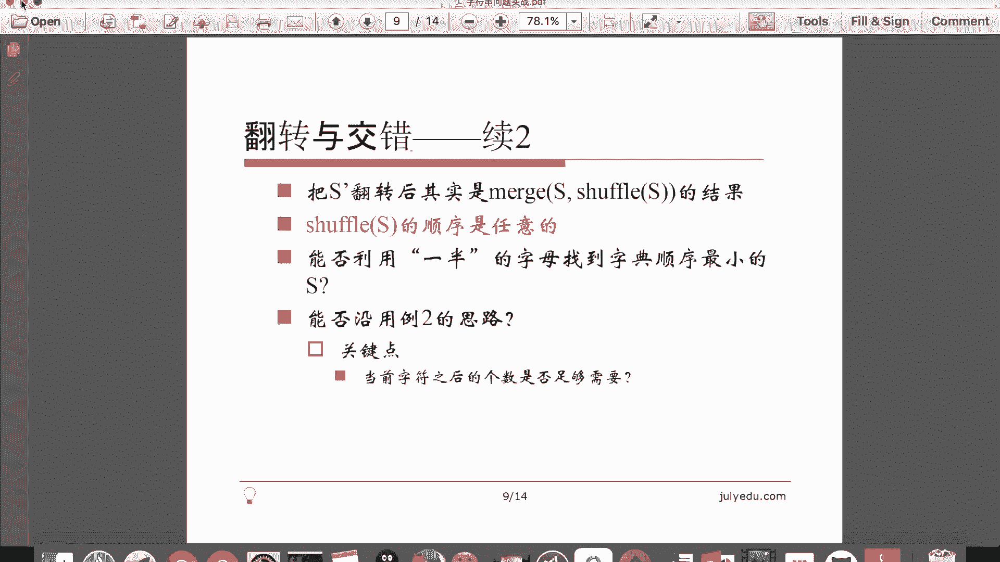

# 七月在线—算法coding公开课 - P7：字符串实战（直播coding） - 七月在线-julyedu - BV1YW411K7va

欢迎观看7月算法公开课。我们这堂课的主要内容是字符串问题实战。字符串大家都比较熟悉，我就直接选取了4个比较典型的问题，基本上都是li code上的。有一个问题，例外，例三难度呢，基本上是递增的。

但总体难度是中等或者中等偏上的难度。先看第一个题比较简单。li code上第三题给定一个字符串返回它最长的不包含重复字符的子串的长度，返回的是个int，所以是唯一的要返回子串就不一定唯一了。什么意思呢？

比方说输入是这么一个字符串。什么叫子串呢？就是连续的一段字符。那么它不包含重复字符的话，最长的长度是3，比方说ABC啊BCA啊、CAB啊，以及这个ABC啊都是长度为3，不包含重复字符的子串。

再长我们截取4啊，5啊，以及更长的子串，无论怎么截都会有重复的字符了，就是这么一个意思。怎么做呢？😊，最简单的方法当然是暴力枚举，枚举一个起点，每举一个终点再判断重复。我们暂时抛开判断重复。

不说枚举起点终点复杂度已经N方了。那么有没有更好的做法呢？这个涉及到了比较典型比较经典的一个方法，叫做双指针，或者叫做滑动窗口。什么意思呢？我们动态维护窗口I到这之间，这是一个左闭右开的这么一个区间。

维护这个区间里面的字符情况，关键是怎么维护，怎么维护呢？我们保证这个窗口里面没有重复的字符。那么最开始A等于0J等于0，这是一个空的窗口，空窗口没有重复字符，天然满足。那么一旦条件满足。

我们就不断的往右滑动J。增大这个窗口，直到J被卡住。什么叫被卡住呢？也就是说，目前J指向的这个字符在这个窗口里面已经出现过了。那么我们再划过去的话，这个窗口里就有重复字符了。这个不是我们要的结果。

所以这个时候J就被卡住了。那么这时候我们就只能缩小窗口通过滑动I给J解围，怎么解围呢？直到I划过了和J相同的那个字符之后，这个新的窗口还是没有重复字符的。那么注意这个滑动过程中，因为窗口在减小。

所以这个自由解肯定不在这个时候，自由解肯定在J被卡住的时候，那么这是一个追赶的过程，J先往右走，卡住I往右走，给J解围。😊，这再卡住哎再给这解尾，就不断的这么走的这么一个过程。因为是两个指针。

不断的往右走，没有往左走的过程，所以时间复杂度是ON的。注意这个时间复杂度没有包含这个如何判断有没有重复字符这个操作。那具体怎么判断。我们当然可以用哈西呀，可以用这个各种方法来判断，当然最简单的办法。

可能是用一个布尔数组，因为C的字符的这个范围是0到255java呢，因为是unicode编码是0到6535，无论如何都是一个有限的。我们开这么一个数组，每加进窗口，一个字符，把它设置为真，每划过窗口。

一个字符，哎，每划出去一个把它设为假，这样就可以动态维护这个窗口里面有哪些字符，我们来看一下这个写起来非常非常简单。😊。

啊，首先刚才说了，返回的是个int，我把它命名为answer。😊，然后呢，这个东西就是我想记录的窗口里面有哪些字符，因为我是这个C嘛，所以256就可以了。java呢请开到65536。

目前这个窗口就是I到J的这么一个B区间。那注意这个时候我是一个死循环，在循环内部决定一下什么时候把它退出去。我要向右滑动J。前提条件是J不能被卡住，当然，J也不能划出字符串，所以这两个情况要同时满足。

划过加进窗口，那么退出的时候，显然刚才说了，就是一个最大值的可能。那么把它比一下最大。那注意，如果这已经划出去了，这个时候它是大于等于这个的，注意大于等于和等于是同样的。我们退出循环。

那否则呢这是一个解围的过程，怎么解围呢？😊，希望I划过和这相同的那个字符，否则有J在这卡着，这个I只能在不断的缩小。那注意这个因为我是Y循环，我要把它也。复为 force最后这个别忘了。

因为这个SI等于SJ的时候并没有执行，最后return一个answer。聊一下。

这是一个正确的代码。也是比较简单的一个问题。嗯继续看第二个问题。

这个问题在li code上比较新，其实这是一个就是比较老的题目，并不是很新的题目，只是在li code上出现比较晚。他说啊我给定一个字符串，它只包含小写字母，这是为了简单，只包含小写字母。然后呢。

我要求删除一些字符相当于这个去重的这么一个过程。最后呢结果中每个字符只出现一次，要求字典去最小，相当于你要把这些字母去重。最后当然长度不可能超过26了，然后要求字典去最小，不能改变字母的顺序。😊，那么。

最直接的想法是贪心，这个写的有点啰嗦。我大概描述一下这个算法。如果一个字符在字符串中。😊，出现的最后一次位置的时候，我们还没有把它加到结果中，就没有机会加了。因为再往后这个字符再也没出现过。

我们要求这个字符一定出现在结果中。所以。😊，当某个字符最后一次出现的时候，我就不得不把它加到结果中了。但是由于我们希望字典序尽可能小，在加进这个字符之前。😊，如果前面有更小的字符。

当然我们优先考虑更小了。因为我一加上它对于这个字符串的前缀来讲，这个字典序相对就大了。比方说我有一个X当它最后出现的时候，如果我发现前面有A呀，有B呀，我肯定要先考虑它们。

因为这个时候我加入X字典序肯定更大。那么这个就是一个贪心的思路，那。😊，当我某个字符最后一次出现的时候，我就看它左边。😊，出现的那些字符，并且还没加到结果里面的那些字符里面的最小值。

如果这个最小值比我当前不得不加的这个字符还小的话，我就先把最小值加进去，再继续考虑。那有些细节多个最小值，当然取最左边的，这样给右边足够的空间，时间复杂度其实是大于ON的。😊。

这个大家仔细思考。解一下，因为说的比较抽象。

关掉这个。这个写起来稍微有一点麻烦，因为思路并不是那么直观。我们看一下。这个表示就是每个字符出现了多少次。我们用in。来表示这个字符在不在结果中，注意这个name是动态变化了。

它表示在I这个位置以及这个位置更靠右的位置的时候，每个字符出现了多少次。那么我们把它。因为是C嘛，它减去A，就相当于把它画到了0到25之间。answer就是我最后的结果。

注意last表示我上一次已经确定了那个位置，我不能从拉丝，因为它已经确定了，不能从last丝的左边开始做。那么我们来看怎么做。首先为了简单，我先保存一个CC就是0到25之间。

那什么情况下就是我不得不加这个字符了呢？😊，这个东西等于一表示这个I的位置右边再也没有这个C这个字符了。那么当然前提是它不在这个。结果中。这两个条件同时满足的话，我们就不得不加入一个C。但是呢。😊。

刚才我说了，如果前面有更小的字符的时候，我们当然优先考虑更小的了。😊，那么更小的我们怎么做呢？找到前面的最小值，从last到I的最小值，当然前提还是不在。这个。结果中。

所以我们始终要考虑这个东西是force。如果他不在结果中，并且呢。当，这个是取最小值的一个过程。这两个条件同时满足，我们就发现J比X的位置要小了。我们就把X等于J。那最后当然我们要优先加这个X了。

嗯么别忘了把这个东西付成t。那么最关键的，如果X就是I这个字符的话，那么我们把I加一了。如果不是这种情况呢，我们直接扫过它就可以了，别忘了剪剪MC。什么意思呢？

注意这里面其实我们还可以减减这个n么SX减A。但是呢这个其实可以不写，为什么可以不写呢？因为。我把它已经加到结果中了，我们考虑的所有的字符都是in等于for的时候，包括这个。😊。

都是in等于firs的时候，我们才考虑in等于 true的时候，这些字符直接被跳过了。所以这个当我把印付上的时候，这个做不做是无所谓的。😊，提交一下。哦，有com complex error。哦。

这个return的位置。应该更靠上一点。这是一个正确的代码。那么。

我们主要想讲的其实是第二个思路。我们之所以这个不敢加一个字符，是怕后面有比它更小的。但是如果我们不加这个字符，它后面没有字符了，我们就后悔就来不及了。如果我们有一个办法可以后悔的话。😊。

我们是不是可以自由的来家自服了呢？😊，我们用一个堆栈临时保存这个结果的字符串。这个堆栈呢？从站底到站顶，对应着字符串，从左到右。因为我们希望字典续尽可能小，所以我们希望。这个对战底端尽可能的小。

换句话说，我们加入对战的字符，我们希望越来越小。😊，就是越小越好，不能叫越来越小越小家到对战里面的这个我们希望越小越好。那么。😊，如果这个字符X目前我想入对栈的话，那么对栈里面有比它更大的字符。

因为我这个最后取字符串的时候，是从站底到站顶这么取的。对栈里有比它大的，我希望把它弹出去，换成我们这个X。但是我不能随便弹，因为我把X弹出去之后，我把这个对栈顶里面的字符弹出去之后。

后面有可能这个对栈顶的字符再也不出现了。这样我就少了一种字符，这是不合法的。所以只有这个一个字符在右面还有的时候，我才可以弹出去它。所以这定义了如何。😊，就是哪些情况是可以弹出的。

哪些情况是不可以弹出的。简单的说就是如果右边还有的话，这个字符可以自由弹出对战。如果右边没有的话，这个字符弹出去再加不回来了，所以不能弹出去。那注意它是卡住对战的，不光它不能弹出去。

在它更靠下更靠站底的那些都不能弹，因为这个是一个对战，只要有这个字符在下面那些东西都不能弹了。因为这个字符本身不可以弹出去。这就是这么简单的一个方法，时间复杂都是ON的。因为这个每个字符进一次对战。

出一次对战。😊，啊，这个听起来比较复杂，其实写起来比刚才那个方法要简单，我也大概写一下。

那我还用这个就是。这些东西还可以复用，那么别忘了，我加一个对战。对战呢临时的保存结果。从左到右扫描这个字符串，注意这个name的含义是没有变的，都是从I以及I的右边有多少个字符。

有多这个字符出现了多少次。先把它减一。现在我们要考虑，如果这个字符不在。这个对战里面或者说不在结果里面，我们就要考虑把它加进来。加进来的时候，我们把能弹的都弹出去。一个条件，这个首先对战不是空，并且呢。

对站站顶的东西比它大，并且呢。这个东西在后面还有。其实这个要写大于0，但是为了方便，我就写这个就可以了。因为这个C这个和它不等于零是一样的，那么我就可以把它弹出去，弹出去，别忘了这个in要动态的更新。

但是这没关系，虽然我暂时把它弹出去了，我知道它在后面还会被加进来。😊，然后呢。我把SI加进来。这个in动态更新，虽然我这儿临时的把in付成for了，但是没有关系，后面还会变成tr，因为它后面还有嘛。

那么最后answer怎么取呢？注意我是从站底取到了站顶，所以要倒着取。当然我不断的把它弹出来就可以了。如果对战不为空。把它弹出来就可以了。那answer呢？注意这个加的顺序。大概提交一下。

这也是一个正确的代码。

那么。这个问题其实。

这个方法是最优的，因为它是1个ON的时间复杂度。我们再来看下一个问题。下一个问题描述有点复杂。其实仔细分析一下，它和例二是非常非常接近的。😊，我们来看一下它是什么意思。Yes。

翻转与交错给定义字符串S定义函数这个reward reverse。表示把它翻转之后的字符串，这个比较简单。比方说XS等于ABCre就是CBA就是倒着来。注意这个reverse是唯一的。

那么shale呢表示对其中字母全排列，任意排列之后的字符串，这是一个集合。注意这个reverse S表示它是翻转之后，字符串。shaffle S呢其实是个集合。比方说S等于ABCshaleS是6种情况。

因为是全排列嘛，都有可能。😊，那么还有一个定义，这mer给定两个字符串，mer把它们编织在一起，注意不改变原先字母先后顺序。比方说S一等于ABS2等于CD的话，mer表示这个把它们交错在一起。

比方说ABCD是一种情况，取A，然后这边取C取B取D是一种情况，只要不改变字母先后顺序，怎么交错都行。比方说我先把CD都取了，再取AB也可以。比方说我先取C，然后再取ABD也可以，这个情况非常非常多。

就没写。所以merge也是一个集合，沙le是一个集合，mer也是一个集合reverse是一个单独字符串题目是什么呢？😊，给定一个小写的仅由小写字母组成的字符串S撇R。然后我们知道它是这个morege。

😊，reverse S和shaphone s的结果。那刚才这两个都已经定义了，那我们求字典序最小的S。这是hackerrank上。的一个问题。那这个。呃，题目的样例是什么呢？比方说给定这么一个字符串。

那么结果有可能S是这个，为什么呢？如果S是这个reverse S当然是GGE了。那么shaffle Sshaphone S其实有很多，所以我没有写等号，我写的使用它是一个集合嘛。

我可以使用EGG那怎么把它交错起来呢？这个先取这个E，然后再取这个reverse的三个字母GGE再把这两个G取上，所以它给定的是最终默制好的结果，然后。😊，让你求原先的S。那么其实大家可以考虑一下。

如果我们把S撇翻转翻转，其实就是S和shuffleS的结果。为什么？原来它是 mergegere S和shuffle S因为shuffle无论翻转翻转之后还是沙uffle，因为它本身就是乱序嘛。

reverse翻转就是S本身了。所以如果我把S片翻转的话，它实际上是一个真正的S和一个shauffleS。😊，这个末日的结果。就是这里面说的，如果S撇翻转后。

其实就是一个真正的S和一个乱序的S沙uffle的结果。那注意shauffle刚才说了沙uffle的顺序是任意的，所以它永远是一个沙uffle，它反映了S中这个哪些字母出现过。

那么实际上就变成了我给你这个结果让你还原一个字典去最小的S。这个东西和例二非常非常像。例二是说我给你那个结果，然后让你把每个字母选出一个来。那现在是说我给你这些结果，让你把每个字母选出一半来。

比方说这个。😊，给定它，我把它翻转之后变成GGEGGE实际上我给你了4个G2个E。我希望让你按照这个顺序构成一个两个G1个亿的这么一个东西，每个字母个数恰好取一半嘛。😊，然后让字典去最小。

那既然题目这么相似，我们能不能这个沿用例二的那个思路呢？这个也是我选取这个题的这么一个目的。沿用例二的思路的意思是例二，关键是说我这个什么时候压入对栈，什么时候可以自由的弹出对战，弹出对战的条件是说。

如果我弹出这个字符之后，后面还可以再加进来，我就弹出去。因为我要保证它出现一次。这个时候如果我们沿用例二的思路弹出对战的条件就要变。它不是说后面还有就可以弹出，它是后面还有并且后面的个数足够。

我取到一半这么多个。也就是说后面的个数满足我们的需要的话，我们就可以自由的把这个字母弹出去，思路是一样的，只是把这个加入或者说把弹出对战的这个条件改变一下就可以了。我们来看一下这个题怎么写。😊。

就基本上可以复制上一个问题的代码。

比方说我就简单的复制代码。注意hacker rank上的这个题目和li code不一样，它不是写一个类就完了。它要我们写完整的输入输出。那当然我们不能简单的复制这个题的代码，有些东西我们要自己写了。😊。

比方说这个。tack要有吧。strrange要有吧。vector的本身就有。那么呃当然也不能简单的完全这么写。我们看一下怎么写。注意这个有些东西就要变掉了。比方说这个印这现在只是一个布尔值。

那么在这里显然就不行了。我们用一个比方说want来表示。want表示，就是说我需要多少个这样的字符。那么这个namem的含义还不变。那么需要是多少呢？需要肯定是原来的一半。帮他I等于。

那么I除以2除以2，我就用U移来代替了。然后我们再用一个have。have表示我已经选了多少个了，当是一上来我是都没选的。所以我原来的一个in在这里变成两个东西了，一个是我需要多少个字符。

还有一个是我已经选了多少个字符。当然这个namem表示我还剩多少个字符。如果那么剩的足够多。换句话说，那么剩的这个比我想要的还要多，那么加上这个我已经选了这个字符比这个w还要大的话，我就可以把它弹出去。

所以就是弹出对栈的条件需要变一下。😊，那我们看一下，注意这里面就不是这个inC的问题了。什么情况下我需要考虑这个呢？就是说我已经选的字符个数。Have。比这个want要小。我就要考虑这个，那怎么考虑呢？

前面这个还是不变，这个也还是不变。那这儿需要变一下这个name。加上have。就是说我已经有的加上后面的，注意这里面减一个一。因为我这儿已经减掉了。大于等于。Want。什么意思呢？就是说。

我如果这个字符后面的那些字符，加上我已有的这些字符。系。就是足够我的需要大于等于want嘛。那么我就可以就是临时把它扔出去，注意把它扔去，不是把它复为for了，而是剪减那个东西简减have。

因为我现在已经have少了一个嘛。这也是这个减一的条件，我及时把它减掉。😊，我后面那些个数也足够多。不就把他扔出去。那么很多东西要改，我我把这个C加进来的时候。就不是把have那个inC的问题了。

就把它变成一个加加了。然后最后结果是一样的，那么注意我们要自己写输入输出了。那这个S显然是一个strtrain了。我们自己reverse。你定一个solution。S。把这个方法名复制过来。先软一下。

看看有没有编译错误。哦，这个。那个S solutionution的S应该是大写的吧。对，solutionS是大写的。这里面有一些括号的问题。好，那么过了样例，我们提交一下。好，这是一个正确的结果。

所以这个是我想讲的第三个问题，基本上沿用第二个问题的这个答案。

那么最后一个问题也是我想讲的第四个问题。最长合法括号序列，这个也是lea code上一个问题。其实这个问题稍微有点复杂，它是第301题。他给定一个括号的序练。当然是可能包含非法的括号。

删除尽可能少的括号。简单的说就是保留的括号尽可能的多，或者说结果尽可能的长，然后让剩余的这个括号合法。它不是求一个长度，它求所有这个最长的合法序列这301题。比方说输出是这个的话，那输出我可以把它删掉。

就是这样的。当然我也可以把这个这个括号删掉。😊，这个括号删掉，第二个括号删掉，这样呢就变成了这样这样这样这样这样。所以它有两种结果。当然最简单的想法显然是枚举。当然它也是一种BFS，也就是广度优先。

我们对于每一位我们把它加上去或者去下来，其实还可以把它当做一个动态规划，其实BF或者说广度优先和动态规划之间这个差别并不是十分明显。而BFS不记录状态，或者说基本不记录状态。

广东的这个呃动态规划要记录一些状态。因为。我们用这个DPIJ表示圆串的前I个字符。左括号和右括号的差个数是J的最长的合法序列长度。因为这样的话，我们就少记了很多东西。因为这个对于同一个J来讲。

我们只记最优的那个长度就可以。注意这是个int。那么递推式是什么样子呢？😊，因为我这儿只取的长度，注意我标红了，它这个这是一个int，不是一个字符串。那么。前X字符左括号比右括号多这个。

因为左括号一定要比右括号多，因为要合法嘛，左括号不能小于右括号一定要大于等于。那么它有这么几种情况，如果SI是左括号的话，那么它是这样的。这个相当于左括号乘乘数可以少一嘛哦，这这里少写了加一。

这是这个要加一。这个如果它是这个呢。右括号的话，它是DPI减1J加1，这也少写了加一，这个要加一。那么如否则SI有可能等于其他SI可能是字母，它就是只能是DPI减1J。因为SI是字母的话。

这个字符无条件加上去，这个也要加一。所以这三种情况最后都少写了加一，什么意思呢？前I个字符左比右多这个的话，那一种情况是我把这个左括号选上，那么就变成了前I减一个字符。这个左比右这个。多这减一个。

因为他这儿算了一个嘛。那么否则就是这个前I减一个字符，左比右恰好多这个，那么这个也一样，一种是我不取这个DX个字符。那么前I减一个字符，左比右多了这个另外一种呢，我取第二个字符。

那么对于前I减一个字符来讲，左比右多了，这加一个，因为这加了一个右括号，所以这两种情况这要加一。那么这个呢对于这个SI不等于左括号不等于右括号，也就是说一个普通字母来讲。

显然这个无条件的取它注意这要加一，刚才强调好多遍了，这三个位置都要加一。那么初值。00显然是0，就是没有括号的时候，左和右是相等的。那么最好的长度是0。那么对于这种情况显然是负无穷。

因为这种情况不可能出现。那么通过这个式子就可以递推了。那么递推完了，我们只能得到括号的长度。那么怎么得到具体的括号范围呢？就是具体的括号的方案呢？我们在这些。😊，这个长度后面保存一个集合推法是一致的。

我们把这个集合里面的所有东西拿出来，这个集合里所有东西拿出来，末尾加一个左括号，这个集合里面所有东西拿出来加个右括号。所以这个算长度的方法可以类似的把方案算出来。但是注意集合的时候，如果取max的话。

因为我们要所有解。如果这两个相等的时候，对于整数来讲无所谓。对于集合来讲，我们需要把这两个集合末制起来。但如果某一个大的话，我们就需要。😊，这个就说只取某一个，要么取这个加一，要么取这个。

但是相等的时候需要集合merage对int没有这个没有这个这个说法，但做法都是差不多的。所以用集合来讲稍微有一点麻烦。我们需要判断哪个集合是不是严格的比另外哪个集合好。那么我们来看一下这个具体怎么做。

刚才说了偷懒记录路径，一种是我从这儿记录一个方案，记录它是可能用哪些推出来，最后还原路径。一种就是我刚才说的，对于每一个这种状态，我都用一个集合来表示这个状态对应的这个括号的序列。那么。

同一个和同一个集合里面，所有的串长度显然相同，因为它的长度全都是这个变量的这个值。那空间上有一个优化，就是DPI只与I减一有关。所以我们可以滚动数组，用一个一位数组代替二位数组，这个写起来稍微有点麻烦。

也是这个今天最难的一道题，我来写一下。

我先为了方便，我先把N写出来，N就是它的长度。然后呢。A vector set string。这个就是我刚才说的。记录最终的解的。那么长度为零的时候，显然是一个空串。然后开始循环。对于。第I个东西来讲。

我考虑怎么把它加进去三种情况，我就暴力的写了。如果是左括号的话。注意这个倒着循环，因为我用了同一个数组，这个DPI是通过这个DPI减1来推的。所以我在用DPI的时候，保证DPI减一没有被更新过。

所以是倒着的。那这时候假设我有一个函数叫better，一会儿我再写它的具体怎么实现，这个还真是稍微有点复杂。就如果J减一。比这要好的话。就说明我把J减一加上一个左括号放到这个J里面来。

那注意它是一个set。所以我们需要。这样写就是set的那种循环。把J减一里面所有东西拿出来。加上一个左括号，再加回去。我，这个是暗的。加到这里面去。注意这个如果它不比它好的话。

这个haveIJ就等于这个haveIJ减1呃，就等于这个原来的那个haveIJ。所以我没有必要更改，只有它比较优的时候，我才把它加进来。但是这个加有一种情况是这个东西要清空加，就严格比它好。

有一种情况是相等相等要 merge置，所以我这里面并没有对这个have j做任何操作，有可能要清空它，也有可能要 merge置，所以这个全都放到这个better这个函数里面了。为了这个简化操作。

那么否则呢。如果他是右括号。做法类似。那注意这个循环的方向是正着循环。同样我还是要判断。这是J加一了。做法类似。从J加一的be，然后把每个都拿出来，加一个右括号。然后。把它放到have这里面来。啊。

注意这个是星体，星体才是一个奏串，体本身是一个指针。再否则呢就是不是那两种情况，无条件的把那些字符拿出来。那注意这个时候set里面东西我们不能边循环边变，所以我们只好这个。自己写了，就是自己把它拿出来。

用一个temple暂时存一下，这和前两种情况略微有点不同。他还是这。把它放到ter里来。SI吧。然后再把它复过来。别忘了付回去，那么最后。Returning answer。那这个answer是什么呢？

这样事是一个结果，结果是从集合里面导出来的，所以还得再多一点事。haub0，因为左右括号相等嘛。便利。把它加进来。所以三种情况，一种情况加左括号，一种情况加右括号，一种情况无条件的加。

那么这个这三种情况。别忘了这个那个better那个函数还没写呢。better接受的是两个集合。我们看一下A是不是比B好。那么先考虑特殊情况，如果A是空的的话，显然。他不比B好。那如果B是空的的话。

其实我希望A等于B嘛，我就。return一个戳，我希望B等于A。那么第三种情况是就是真正意义的。既然它不是空的，我就拿出来一个看看它多长。因为集合里面所有东西的长度是一样的。那别忘了加一。

因为我把A里面要加一个左框号或者右括号。如果杨哥比他大的话，这里面注意我把B清空。我一return true的话，B就变成了，就是在循环里面，B就变成了A，要么加左括号，要么加右括号，但是要清空。

因为这个解更优，那否则就是它不比它大。那么我们看一下他们就是说是不是相等。如果相等的话，这个A还是比BU，我需要把它摸置起来，所以B并没有清空。提交一下。呃，有一个com然后第五章。手且我死。

这也是一个正确的结果。

然后大概对今天讲的做一下总结。

题外话，这个关于字符串C和C加加都是有字符数组的，就是ch星或者ch这个ee这种东西。C加加呢还有STR的str，这些大家都比较熟悉。注意java的str是不可以变的。那么如果我们要频繁的变的话。

考虑使用 build和 buffer注意这两个有一个是线程安全的，一个是线程不安全的。所以对于这个做工程的话，考虑一下线程安全用哪个如果没有多线程的时候，没有多线程的时候，可以考虑用这个不线程安全的。

不线程安全的效率要高。因为要维护线程安全的话，有一些锁啊等等一些问题。那么字符串题目还是比较广泛的。我们今天讲的第一个问题就是滑动窗口，第二个问题呢，以及第三个问题呢，都是用对战，这个对战几乎是单调的。

从单调对战上做了一些手脚，但是达到了N的复杂度。最后一个问题呢是跟BFS相关的，或者说跟动态规划相关的。好，今天的课就到这里，希望大家给我提出批评指正。谢谢大家。😊。

