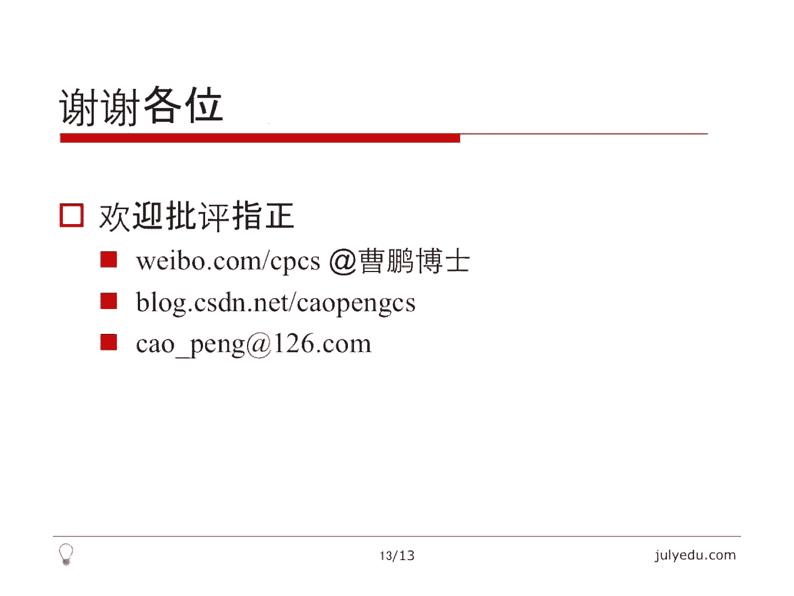

# 七月在线—算法coding公开课 - P1：实战动态规划（直播coding） - 七月在线-julyedu - BV1YW411K7va

大家好，欢迎大家观看7月算法公开课。我们这堂课的主要内容是动态规划实战。😊，在之前的课程中，我们讲述过动态规划的理论知识。本堂课我将通过三个例题，通过实际代码向大家进一步讲述动态规划。

最后我会做一下总结与思考。我们先来看例一，给定一个M行N列的二维数组，就是一个矩阵，每个元素是一个非负整数。我们从左上角走到右下角，每次只能朝右或者朝下走，不能走出矩阵。😊。

要求就是我们使得这个路径上经过的所有数总和尽可能小，这是lid code上第64题。最直接的思路当然是枚举。😊，M行N列的矩阵，我们从左上角走到右下角，需要走M加N减2步，这其中有M减一步是朝下走的。

N减一步是朝右走的，所以路径总条数是CM加N减2M减1。我们显然可以把这些路径全都枚举出来，选一条和最小的。😊，理论上可行，实际上不可行，因为CM加N减2M减1非常大。

大家可以试一下M等于N等于50的时候，这个数有多大。😊，实施动态规划吧。我们用DPIJ表示，从左上角走到DI行DJ列的时候，所有和的最小值。我们考虑一下我们如何求DTIJ。我们要到达DI行DJ列。

要先到达DI减一行DJ列。再朝下走一步，或者先到达DI行DJ减一列，再朝右走一步。我们只有这两种方式到达DI行DJ列。那么我们到达第I行DJ列的最优值取决于这两种方式的最优值。

所以我们先到DI减一行DJ列的最优值，或者到第I行DJ减一列的最优值，这两的时候取最优，再加上DI行DJ列的值，就是我们到达DI行DJ列的最优值。其实这也是一种枚举，只是我们枚举了方案。

代替了枚举具体的路径。反正无论如何，我们要么先到这个，要么先到这个只有两个位置可以到达DI航TJ列。这实际上是一个递推式，有了递推式还不够，我们还需要有初值。😊，因为递推式是通过I减1G减一来推的。

所以初值就是它们等于零的时候相关的值。初值一般很好求，比方说DP00。我们设下标从零开始，DP00，因为还没有开始走，它在起点。😊，他只能是。原来矩阵里面第零个元素的这个位置的值。那么我们对于首行元素。

J大于零的时候，它只能从左边过来，所以它只能是DP0J减1加上A0J，也就是我们只有一种方式。同理，对于最左边那一列的时候。我们发现它也只有一种方式，也就是只能从上面过来。所以它等于DPI减10。

加上AI0。也就是说，在特殊的时候，我们只有一种方式。在一般情况下，我们是有两种方式取最小，所以这个就是初值了。那么时间复杂度呢，显然是M乘以N。因为我我们要打出一张M乘以N的表来，空间也是M乘以N。

我们可以优化一下空间。注意到BPIJ值与I减1J和IJ减1有关。我们循环I的时候正向循环J这个时候。我们只用异尾，也就是DPGDPG等于这个值。我们这个时候DPJ减一已经更新过了。

所以它实际上是DPIJ减1DPJ正打算更新，所以等号左边的DPJ实际上是DPIJ。😊，等号右面的DPJ是旧的值，还是DPI减1J。所以我们这个式子就是刚才的那个式子，只不过省掉了第一维而已。

这样我们空间复杂度就省掉了一些。当然，时间复杂度是不变的。😊，举一个贪心的反例，贪心就是我们看哪边小就往哪边走。那么最开始我们在零的时候发现一比2小，我们先走到了一。😊，当我们走到一的时候。

发现全是100。😊，所以我们至少要经过1个100。如果我们一开始放弃一走二的话，我们发现有0211这么一条路，显然比走过1个100要好很多。所以贪心是个错的。下面我们来上li code提交一下这个问题。

因为代码是现场写的，所以。可能会有一些错误，我会及时的修改。我们先来求出这个M和N，因为它给的是vector。这样我们就得到了MN就是M行N列。😊，那么我们下面来构造那个矩阵DP。因为它是一个二维数组。

我这里面用vector。它是M行。恩烈的。这样vector我就可以当普通的二维数组使用了。我们循环。因为要求DPIJ。根据我们刚才的式子，零的时候需要。特殊处理。那么I和J都是零的时候。

我们发现BTIJ就是起点的那个数，当然可以写gradereade00，也可以写gradereIJ。😊，那如果I等于0，这不等于0。显然，他只能从左边过来。也就是。不等于0，那一为可以减掉一。

这个是没得选的。如果I不等于0，这还是零的话，那么它只能从上面过来，所以这个也是没得选的。那如果不是这些情况，就是个刚才说的一般情况，它等于什么呢？就等于我们刚才说的那个式子。就是这两种情况。取最小。

再加上这个位置的值。那最终答案是什么？因为我们要走到右下角，最终答案就是。右下角就是最后一个元素M减1N减1，我们来提交一下这个代码。呃，可见是正确的。我再来做一下那个优化的空间优化的那个例子。

这个时候我们只需要一味的。书组只需要N，其实正规的做法可能需要取M和N较小的那个那样空间会更优。但是如果M小于N的话，我们MN相当于要交换一下这个矩阵要转置一下，这样稍微有点麻烦。

我这里面就简单的取了个N，那么。😊，我们直接把第一位去掉，这个是没有问题的，因为都是I嘛。这个也是没有问题的。注意新值和旧值，虽然我把第一位去掉了。

这个左面相当于是DTIJ右面因为我是正向循环的JJ减一的值已经被更新过了，所以J减一是DTIJ减1。但是这个时候DPJ还是IDPI减1J，所以我把这位直接去掉是没有问题的。

那么最后返回的就是最后那个N减1，这样我们就省掉了一位复杂度，我再提交一次。😊，还是AC的那我们解决了这个问题，我们再来看下一个问题。最大子数组合这个问题也被提过很多次了，给定一个整数数组。😊。

我们要求一个飞空的子数组，也就是连续的一段数，使得它的和最大，这是lead code的第53题。题目意思很简单，我们有若干种思路，最简单的思路就是暴力枚举。我们我们要求一个子数组嘛。

我们就先枚举它的起点0到N减1，枚举终点I到N减1，再循环一次求I到J之间所有元素的和，进而求最小值。这个相当于枚举了所有的飞空的子数组时间复杂度是N的3次方。😊，稍微聪明一点的枚举。

我没举起点0到N减1终点一样，我们在没举终点的时候，顺便求和。之前的那个方法是把终点没举出来，再写一个循环求和。😊，我们注意到J从I循环的时候，我们J每增加一，我们把和加上去就可以了。

所以可以在每举J的时候，顺便求和，就降低了以为时间复杂度，变成了ON方的。😊，那么还有一种方法是分制的方法，复杂度会更低。我们把一个子数一个数组切成两个近乎相等的子数组，每个长度近乎是2分之N。

那么最终的解要么在左面那一段，要么在最右面那一段，要么就是跨越中心点的最大子数组。所以。这个分的时候就是分别求和的时候，我们再循环一次求跨越中心点的那个最大子数组的和。😊，这个要ON的复杂度。

那么总时间复杂度就是TN等于2倍的T2分之N加上ON通过递归数推出来，时间复杂度是N logN的。我们再来看第四个方案。BP。BPI表示，以AI结尾的最大子数组的和。那么以AI结尾的最大指数组合。

其实有两种方案，一种就是只包含AI1个数。这个很简单，不包含AI减1。那么它的和就是AI要么我就把AI减1也囊括上，我要包含AI减1。😊，我要包含AI减一的时候。

显然包含了一个以AI减一结尾的最大的子数组的和，所以它就是DPI减1加上AI在这两种情况下，我取一个最大值就是DPI。所以这也是一种枚举，只不过我没有枚举子数组，而是枚举了一个方案。😊。

我要么包含AI减1，要包含AI减一，显然是一个子数组，包含AI减一的以AI减一结尾的一个最大子数组，要么就不包含AI减1，那就是AI本身啊，这两个取最大，这是一个递推式。初值是什么呢？

初值是DP0等于A0。因为最开始第一个数没有前面的那个数，所以这两种情况只能取这个第一种情况就是。呃，只能取第二种情况，就是只包含AI的这个情况。那么答案是什么呢？

答案是DP0到DPN减一里面最大的那个值。因为我们最后求的那个子数组一定要以某一项结尾。虽然我们不知道以哪一项结尾，我们只能循环求一下最大值。😊，那么这个算法的时间复杂度是ON，空间复杂度也是ON。

因为存了1个DP数组。空间可以用化吗？我们考虑一下DPI只与DPI减一有关，我们要把DPI存下来吗？其实没有必要，我们可以考虑and here，这里面and here实际上是DPI减1。

它加上AI之后再再和AI取一个最大得到一个新的and here。这个and here其实就是等号左边的就是DPI。所以这个是DPI减1。我通过一一步更新，更新成DPI。

那么anser也在循环的时候不断更新就可以了。😊，这个空间复杂度就做到了O一。当然，时间是无法优化的。还有一种其实也是一个思路，它也是线性的。我在这里面大概讲一下，我们定一个和sI表示原来那个数组。😊。

前I项的和，这里I是大于等于零的。那么我们定一下s负一等于0，这是为了方便。一个。显然的事实就是说。我任意一个子数组，从I加到J，这个子数组，它就等于s j减去sI减1。这个是显然的。

因为这个子数组先求前这项，减去前I减一项的和，就是I到J的这个子数组的和。😊，那么如果我们没举G的话。对于假设sG已经定了。那么我怎么求相当于这个子数组的终点已经定了，我怎么求起点呢？

起点显然是越小越好，因为它越小，这个差值才越大，因为J已经定了。那么实际上我们可以在求得s j的时候，顺便记录一下比J小的那些s值的最小值。也就是说我们用一个变量记录s的最小值和当前的sam减一下。😊。

取一个最大就是我们要的这个后面也会有代码展示，这个和DP的思路不一样，但是复杂度是一样的，时间也是线性的，空间也是常数的。那么下面我们来实现这几种方法。因为时间关系，我只打算实现分制算法，还有DP算法。

还有最后那个枚举算法，我们先来看分制。😊，如果这个是递归的退出条件。如果只有一项，显然就只能取A0了，否则至少有两项。那么我们取一下中点。就是N除以2啊。那么我们认为左边是。0到幂的。右边是。

幂的到N减1。好，幂的加一到N减1。这个区域到幂的减一吧，因为N等于二的时候，密的等于一，密的等于一的时候，右边会为空。所以我们这样左边是零到幂的减1。右面是me的到N减1，这儿分成两个两段。

那么对于两段的话，我可以分别求。最终的结果是什么呢？是左面的。左面有显然左面有密的像。左面有密的项，右面有。N简密的项。注意这里要偏移，因为。我右边的起始位置是me。这个是N解密的项，左边是密的项。

那么最终的结果可能是这两部分里面最大的，这个是分制分的部分。那么怎么和呢？和的部分我一定跨越了中心点。我假设它跨越了幂的减一。😊，那么当前的和就是。你的减一。ma是当前和的最大的时候。

那么我们从幂的减一往前走。就是往左边走。那么们不断更新这个妹。这个时候就是往左走的最大值，我们放到了这个妹里面，那么我们还要继续往右走，这时候再把no浮成妹。因为。当前左边已经固定下来了。

一样的那每次加上AI就是从n这个值再往右走。那么最终结果是什么呢？就是answer和ma里面去较大的那个。我们提交一下这个代码。是一个正确的。那么这个是分制算法，它的时间复杂度是N log N。

那么我们再来演示一下刚才说的那个DP算法。同样我先展示是空间复杂度是ON的那个算法。那么DT0是。A0这里显然假设N是大于零的。就是这个数组起码不是空的。我们怎么算DPI呢？刚才说了DPI等于。

要么就是前面那一项加上AI，要么就是AI。那最终呢结果就是。最大的那个。显然，我这里面answer还没有定义。先让它等于BP0。然后return的就是一个answer。提交稍微有一些慢。

这也是一个正确的。那么我再来展示一下空间复杂度是O一的，就是长数空间的那个算法。显然我把这个改成。And here。这也是一个变量了。然后呢，answer。等于A0最开始。

那么这个更新其实就是我用and here自己更新and here。就是新的and here等于旧的and here，加上AIAI那么answer呢就等于。这里面最大的。

最好还是return answer sir，我再提交一下。也是1个AC的算法。那么最后呢我再演示一下刚才说的那种求s的方法。😊，这个sam表示。当前的和，然后呢还有一个mins表示最小值。

因为s负一等于0，所以目前的最小值就是0。嗯。然后我就做一下。其实它应该取s负一和s零的最小值。sam0就是s。那么。对AI来讲。这里面answer还得求一下answer等于s，或者说等于A0。

那么我要求以AI结尾的。子数组最大子数组的和。我这个s实际上就是前I项的和了，那么它减的应该是之前更小的那一项的和。😊，所以answer等于。因为要取最大。它减的呢sam减去之前的最小的sam。

那同时我这个sam要更新一下，注意更新的顺序。我这mins一定要后更新。mean sum就是所有s的最小值，s就是前I项的和answer，就是我们最后要求的，最后还是return一个anser。

再提交一下。也是1个AC的算法。所以这是我讲了分制动态规划以及那个线性的另外一种理解的枚举。这个三种方法做的这个题目。那么下面我们再来看第三个题目。就是编辑距离问题。给定两个字符串，S和T。

通常我们叫S和T。因为S是source，就是原始的串。T是target，就是我们要变成的串。我们要求把S变成T所需要的操作次数，最少那什么叫操作呢？操作，包括我在S的任意位置上增加一个字符。

增加什么字符都无所谓。这算一次操作，或者我去掉任何一个字符，这个也叫一次操作，或者我修改一个字符，也就是说我S可以添一个字符，删一个字符，或者改一个字符，这都叫一次操作，最少经过多少次操作。

把S变成T呢？😊，这是一个li code上的第72题。之前我讲过BFS，我是说当题目里面有最少或者最小等等这种字样的话，它是BFS的一个关键词。那么当然这个题目我们是可以用BFS做的，当然只是理论上。

😊，因为我们用BFS做，至少要搜索Lance S，加上ls t呃，至多要搜索Lance S，加上Ls替。因为最差情况就是我们把S里面的字符全都删了，再都添加上T里面一个一个字符，这是一个上界。😊。

因为这个实际的具体的数很难分析，但至少这个这个上界的步数对我们来讲实在太大了。因为每一步有三种可能，起码是一个指数的算法。所以BFS理论可行，实际不可行。那么我们想想DP就是动态规划的思路。😊。

我们考虑到这个问题在于，因为我们可以从S里面增字符山字符，有这种操作非常非常麻烦。我们把它变为另外一个等价的问题来看一看。😊，我这里面举了个例子。

比方说FS等于ABCFT等于BBFG我们把它变为字符串对齐的问题。什么叫对齐呢？我们来看一下。😊，这个S等于ABCFT呢等于BBFG我可以添加一种特殊的字符，在任意位置添加都可以。

我要求这种对齐对齐就是一个对一个对齐之后，如果他们两个相等，这个就没事了。如果不相等就要扣一分。比方说我这样对齐之后发现。😊，这个A和D不相等，需要扣一分。这个C和这种特殊字符不相等，扣一分。

这个特殊字符和G不相等，也需要扣一分，所以至少需要扣3分。😊，那么这个和编辑距离有什么关系呢？我们可以看一下，首先两个特殊字符，这个没必要对应。因为如果S是一个特殊字符，这边T我也加一个特殊字符。

这两个相等也没有任何意义。因为它没有任何实际的意义。所以我们规定加一个规定，就是这种特殊字符只能和一个实际的字符对应。😊，两个特殊字符对应是没有任何意义的。那这些代表了什么呢？😊，S。

的特殊字符代表增加字符什么意思？就是说如果我T的G和S加了一个特殊字符来对应的话，我实际上是代表在S的这个位置把G添上，这实际上是一次操作，所以要扣一分。😊，那T位置如果我添了一个这个。

比方说这个位置我添了一个特殊字符S对应的C，我代表把S的这个C，最终我要删掉。😊，所以这种删除操作也是扣一分的。那对应位置相同的是不扣分的。比方说这两个B。这个是不扣分的，因为它根本就没有编辑。

那对于这个A和D对应，实际上是要扣一分的。我相当于要把S的这个A改成D。总而言之就是。😊，如果。T里面是一个实际的字符，S里面跟它们长得不一样的话，那就要把S的对应位置改成T的这个位置。

比方说这个位置改成G。😊，这个位置改成D。那如果T是一个特殊字符的话，就要表示把S对应字符删了。那我们的目标就是在S和T中分别添加一些这种特殊字符，然后把它们两个弄得一样长，弄得一样长之后。

对齐之后扣分最少。这个扣分最少的问题，就等价于我们的那个最短边辑距离的问题。这个是对问题做了一个转化。为了方便理解。😊，那这个问题其实很像最长公共子系列啊等等这种问题。都是就是字符串操作的相关问题。

我们来看一下怎么解它。😊，我们用DPIJ表示S的前I个位置和T的前这个位置对齐能产生的最少扣分啊，这里面得分就是扣分的，也就是最少得分。那么。我们考虑一下DPIJ它可能是哪几种情况。

第一种就是我就要让S的第I个字符和T的第这个字符对齐，无论他们怎么样，我反正我让他们对齐了。那么S的前I减一个位置和T的前J减一个位置。😊，也是要对齐的，这个对齐再加上它们两个之间是否相等。

这个CYG表示S的第X个字符和T的第这个字符是否相等。如果相等的话，我取零，因为相等的话不得分，或者说不扣分，不相等的话，我取一，因为不相等的话，就需要把S的第X个字符替换成T的第这个字符。

这个实际上对应了。😊，那个位置是两个实际字符的位置，让他们实际匹配。那还有一种显然就是我让S的第I个字符和。😊，这个让J那边让T那边加一个特殊字符，或让这两个对齐。

那么S第I个字符和一个特殊字符对齐意味着什么？意味着。😊，T的第这个字符在之前已经匹配过了，也就是说T的第这个字符和S的前I减一个字符已经match上了。那么对于S的第X个字符来讲。

我让它和特殊字符对齐，这个显然要扣一分，这个就表示删掉S的第X个字符，同理。😊，我可以让T的第这个字符和。😊，S中的一个特殊字符来对齐，这意味着什么？这意味着。😊，I的就是S的前X字符。

已经和T的这减一个字符已经对齐过了。那么T的比这个字符没有地方放，所以只能和一个特殊字符对齐。这样的话也是扣一分，这意味着在S中加上T的第这个字符。😊，那么只有这三种情况对齐这个S的前I位和T的前J位。

那这三种情况取一下，最小就是我们要求的结果。那实际上我们就得出来这么一个地推式。有了地推式还不够，初值是什么？初值是。等于零的时候，因为都是和减一来对的，等于零的时候。

第一个串的前零位和第二个串的前J位如果对齐的话，最少的代价只能是J。这个意味着第一个串什么都没有，也就是S什么都没有T，我要有J位的话，我只能在S中添加上T的那J位是最少的。第二个意思是一样的。

如果S有I位T什么都没有的话，我只能从S中把这I位都删掉。😊，注意这两个初值实际上是有一个重合的，就是I和G都等于零的时候，这两个式子走哪个都一样。因为DT00等于0，就两个都是空的时候。

对齐是不需要任何操作的那时间复杂度通过这个式子也能看出来，就是两个长度的乘积。😊，空间复杂度也是两个程长度的乘积。同样我们发现。DPIJ和DTI减1J减1，还有DTI减1J和DTIJ减J减1相关。

我们实际上可以用同样的方法可以省掉以为呃空间复杂度。但是要注意这里面有一个DTI减1J减1这个值我们在更新I的时候，已经变成了DTIJ减1了。所以我们需要临时把这个值存下来。后面代码中会有体现。😊。

那么下面我们来看一下，就是通过lid code实际做一下这个题。那么根据我的习惯，我先把两个字符串串的长度取出来。就是一个长度为。一个长度为M，一个长度为N。然后我们写那个递推式。

其实就是把那个递推式变成代码。注意刚才的那个方式哦，DP还没有定义。它是一个M加一行。N加一行的这么一个N加一列的这么一个数组。因为我所有下标要从I0到M，所有下标要从0到N，那么。I等于零的时候。

刚才说了。J等于零的时候也说了。关键就是两个都不是0，它等于什么呢？一个就是。S的第I位和J的第I位和和呃就是word一的。DI减一位或者说DI位，因为是长度为I。

所以它那个应该减一和word2的DJ减一位是否相等？相等的话，我们取零不相等的话，我们取一。这是一个可行值。还有一种情况呢是。另外两种就是。简单了，就是IG减1加上1。当然我可以这样写。

因为两个都有加一。还是写到一起。这个这两种情况取一下面，一共是三种情况，取一下最小值就可以了。那么最终的结果就是。显然是DTMN，因为是第一个串的长度和第二个串的长度。

注意这里面下标和那个长度之间有一个简易的关系。那么我提交一下。它是1个AC的代码。那下面我来考虑如何省掉那一位复杂度。同理这个实际上也只是考虑可以考虑M和N哪个小。但是在这里面我为了简单。

我就直接把M那一枚省掉了。😊，那么这个是不变的。这个也是不变的。所以这要注意。这我要考虑DTI减1J减1这个值我没有，我们目前认为它是last。然后DPIJ减1DPIJ减1是我们前一步已经更新的。

这个是有的。那么DPI减1JDPI减1J等号左边和等号右边不一样，都是DTJ这个是DPI减1这是要更新的。问题是这个last是什么？😊，这个last刚才说了是DTI减1J减1。

我们看一下怎么得到这个last。那对于DPI减1J减1的时候，我们试图得到这个last。其实我们在这儿。在更新DPG的时候，我们发现。😊，这个时候当然这个last要在I这边定义。在更新DPG的时候。

这个时候是。😊，DPJ是DPIJ那么在更新之前就是DPI减1J。所以这时候lastt我们已经有值了。那么。这个时候。在更新之前，实际上是DPI减1G。然后更新之后执行了这句话之后，这个G变成了DPIJ。

那么实际上我用temple把旧的这个DPG存下来。这个temple实际上是。DPI减1J，那么我们把last复成tle。这个时候last实际上是DPI减1J当J增一加一的时候。

这个last就变成了DPI减1J减1。所以我们这里面只要用一些小技巧把这个旧的那个DP值存下来就可以了。那最终返回的是什么？返回的是DPN。😊，那么我再提交一下。它也是1个AC的代码。

请大家仔细理解这个代码。那最后我就做一下总结。对于DP问题，实际上我之前讲的自优子文体结构啊等等，那些只是理论上的。😊，我们真正解1个DDP问题。最关键的是要有DP的递推式，但是光有地P式递推式还不够。

我们需要有地推式的初值，这样才能完全解出来这个DP问题。实际上DP本质是一种递推，那注意空间优化。我讲的这几个问题都可以通过空间上的优化省掉一位。另外其实还是需要多练习，多思考，才能有感觉。😊。

那么下面举出了一些little code上DP题的题号，这些都是li code上经典的DP问题。😊，请大家勤思考，勤练习。啊，我今天这堂课就到这里，这是我联系方式，希望大家给予我批评指正，谢谢大家。😊。

