# 七月在线—算法coding公开课 - P3：链表实战（直播coding） - 七月在线-julyedu - BV1YW411K7va

欢迎收看7月算法公开课。我们这堂课的主要内容是链表问题实战。从li code上选了4个题，或者说5个题，难度适中，不太难也不太容易的题，比较典型，跟链表相关。来给大家讲述一下。

第一个题就是单链表是否有环儿。那么这是一个比较经典的问题。普通的单链表是没有环的，最后一个节点指向的是空。那么如果有环的话，最后一个节点指向了前面的某一个节点。注意这个有环可能不是简单的一个圈。

可能是这种阿拉伯数字6这种形式，前面有一条线段，或者说有个丙，后面有一个圈是这样的链表。他问你首先问你有没有环。然后如果有环的话，起点在哪，这个是上142题。那么最直接的方法。

我们用一个map或者说用一个set，用一个集合来记录经过的节点，然后一个一个走，每次查一下它是否是否在之前出现过。如果我们走到了一个之前的节点，则说明有环，并且走到这个节点就是环的起点。

那么这种方法的弊端也很显然，我们多用了一个集合，这个集合可能有查找的这种时间的效率。另外还有ON的空间这种复杂度。这个查找呢，当然我们可以用哈希等等等等，把它优化到O一，但是空间是避免不了的。我想讲的。

😊，方法也是比较经典的，是双指针，这个其实就是比较简单数学上的这个追积问题。大家要仔细理解。那么我们假设有两个指针，X呢每次从头开始走一步，Y呢每次从头开始走两步。那么如果有环的话。

我们证明X和Y一定会相遇。当然没有环的话，因为Y走的快，Y先走到链表的这个末尾，这就直接退出去了。有环的话，我们假设环呢，这个环的大小，这个环里面包含了A个节点。刚才说了这个饼的长度，线段的长度。

我们认为是B个节点，注意B可能为0，那就是简单的一个圈。那当然这个我们统一考虑，那我们假设因为X走的慢，X一步一步走，它刚走完那个B这么多个节点的时候。😊，也就是说X刚进入圈的时候，Y呢，因为Y走的快。

它肯定已经进入圈了。我们认为Y在C这个位置，在圈里面，C这个位置距圈的起点是C。那注意C可能为0，我们无论为不为0，我们后面会考虑其实为零的情况更简单。啊，C是小于A的。因为一圈才是A嘛。

我们把这个圈想象成。😊，一个线段式的东西，C是小于A的。我们认为这个其实C等于零的时候，它们是刚好相遇的。因为这个X走到了圈的起点，Y不管不管绕了多少圈，也走到了圈的起点。

但是我们不能证明就是呃第一次相遇的位置就是圈的起点。我们后面来看，我们认为Y领先了XC个位置。因为X刚进入圈，Y已经走了C了。但是由于它是一个圈，我们反着看，我们可以认为Y在追XX领先YA减C个位置。

😊，那么由于这个Y的速度是X的2倍，X每走一步。Y会走两步，所以每经过一步的时候，XY的距离会缩小一。所以经过A减C步的时候，他们一定相遇，这样就证明了这个如果有圈的话，在X进入圈的时候，再过A减C步。

X和Y就会相遇。那注意C等于零的时候，这个其实就是零部的时候，他们就相遇，这个后面可以统一处理掉。那么关键是如果第一次相遇的时候，圈的起点在哪里？C等于零的时候，第一次相遇就是圈的起点。

但是C不等于零的时候，第一次相遇的时候不一定是圈的起点。我们怎么找到圈的起点呢？😊，那么相遇的时候，我们考虑假设C等于0。这是简单的情况。那么X走了B，这是显然的它只走了那条线段的长度。

而Y呢它显然是走了一个线段的长度，又转了若干个圈，所以是B加上K乘以A，这个K是任意一个整数，我们可以不考虑它。那么。😊，由于Y的速度是X的2倍，所以Y走的距离还可以理解成2乘以B，所以这是一个等式。

那么我们就知道B等于K乘以A。也就是说那条线段的长度恰好就是若干个圈的长度。或者说饼的长度恰好是圈长的整数倍。那么。相遇的时候。他们其实是在圈的起点相遇的，相遇的时候，我们把X拉回起点。

Y呢还在这个圈的起点的位置。那么X再走一个饼长的时候，Y又转了若干个圈，这个和一开始是一样的，X没走一个B，Y就转若干圈。那么。😊，第二次相遇的时候，他们一定在圈的起点相遇。其实第一次已经试了。

我们不能确认我们把X拉回去，让X走一个线段的长度。那么Y在圈里面恰好也转了若干个圈，他们再次相遇的时候，就是圈起点的长度。😊，那么。C大于零小于A的时候。我们可以用类似的方法推出来，这个把X拉回去。

让X走一个线段的长度，Y又回到了圈的极点，为什么呢？😊，同样的分析，那么X走了多少？X走了，B加上A减C。刚才说了，在经过A减C的时候，他们再次相遇。而Y呢显然Y走的就是2乘以B加上A减C嘛。😊。

那么它又是什么呢？它又是B加上A减C。走了若干圈，因为YBX一定多走了若干个圈，因为他们在圈里面的同一个位置相遇。那么这个和这个是类似的，我们可以推出来B加上A减C是圈长的整数倍。什么意思呢？

注意这个第一次相遇地点距离圈起点的位置是A减C。我们在这个位置上，如果我们再走B的话，那么它恰好就应该到圈的起点。因为从A减C这个位置再走B的话，恰好经过了若干圈。所以这个意思是说。😊。

我把Y放在A减C这个位置，把X拉回到起点。那么X再走一个B，Y呢也走一个B，注意这时候把Y的速度变为和X一样，每次都走一步。X走BY也走B，注意Y前面先走了A减C，所以它走了A减C加B。

它恰好走了若干个圈的整数位。所以X走B的时候刚进入圈。😊，Y从A减C的位置也走B的时候，会回到圈的起点，他们再次相遇的时候，就是圈的起点。所以无论C等于零也好，不等于0也好。

我们都证明了从第一次相遇之后，我们把X拉回到这个最开始的位置。然后XY统一一步一步走，再次相遇的时候，他们会在圈的起点相遇。这样问题就简单了。代码写出来非常简单。大家重点是看分析，我们来写一下。😊。

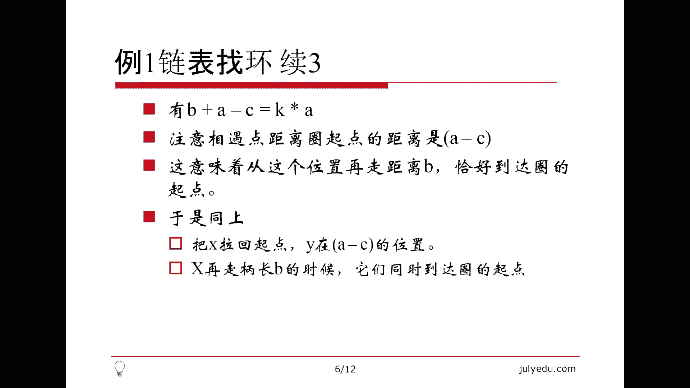

先写那个。就是说用set的那个方法。我们保存这个之前的所有节点，再建立一个吧，一般列表不要丢头。T就表示这个T不是空。然后这个时候如果我们发现它。在集合里的话，那么这个。我们就找到了。

return零就是return空。那么这个写起来非常简单。啊，这里忘了一个把它加进来，注意千万不要忘了把它加到集合里面。啊，这是一个正确代码。那这个有一个空间复杂呃，空间复杂度是ON的。

时间复杂度是N log n的。因为这有个查询。那如果我们想把时间复杂度降低一点的话，可以用一个an order set，这个就相当于哈希了，查找是O一的，但是空间是免不了的。也是一个正确的。

关键刚才说的第二种方法。我们刚才说了。这个。定义两个变量。从开头开始。怎么做？刚才说X每次走一步，Y每次走两步。当然，为了防止这个空引用，因为一上来就有可能是空。我们把这些都避免掉。拜呢。外每次走两步。

每一次都要看它是不是空。就是每次X走一步，Y走两步，直到呢他们能相遇。这个时候退出循环的时候，X和Y就相等了，相等了就说明有圈有圈怎么办？刚才说了，把X拉回起点。那我就这么写吧。X如果和Y不相等的话。

X走一步。外呢也走一步。那别忘了，最后return的就是X也好，Y也好，再次相遇的时候，那个地点。也是一个正确代码。那么这个还是比较简单的一个问题。

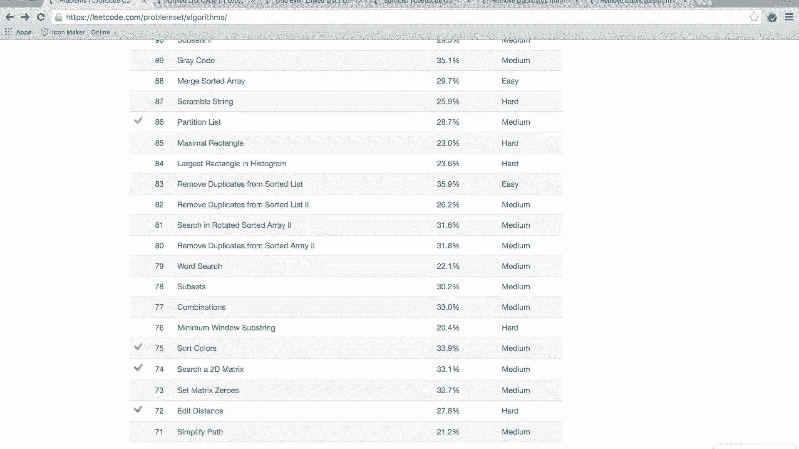

那我们来看第二个题。

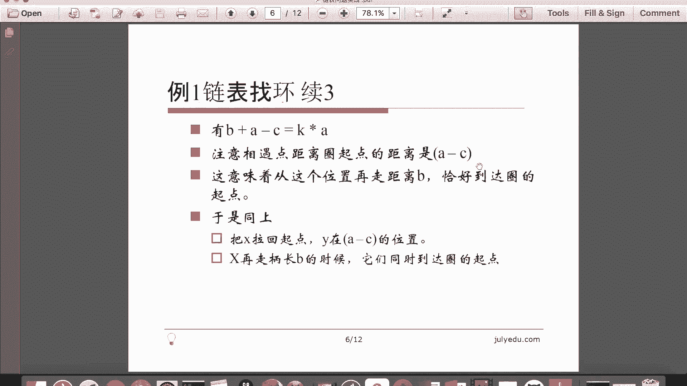

这个其实呃相对比较简单了。但是它比较新，就是把这个奇数和偶数位置节点分开，然后把这个偶数节点的位置放到奇数节点后面，关键是怎么做，先把奇数的放到一起，然后偶数的放到一起，再把偶数的接到奇数的后面。

关键是每个列表都可能是空。我们要记录头记录尾，记录空，记录各种情况。

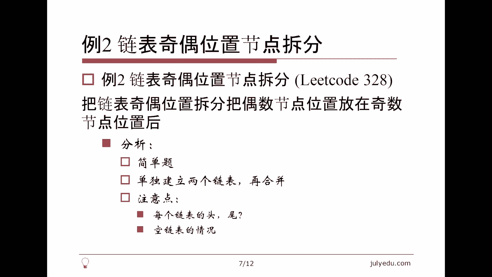

其实写起来并不难，关键是一些这个细节上的处理。这个I就表示它是第几个那个什么第几个位置。真真爱。然后呢，我们把基数我们定义一些节点，基数位置的头。基数位置的尾。偶数位置的头。偶数位置的尾。

这个是基数位置，基数位置我就要把它接到基数位置上面去。那么怎么接？注意，一开始列表可能是空的。如果这个t一就是基数位置的尾不是空的，那么说明这个列表有东西。我就可以把它。接上来。

否则呢注意这个ele一是空的的时候，had一一定也是空的，表示没有节点，我把它复过来。那边是对称的。如果t2不是空的，那么把它接上来，注意要更新尾，所以这个顺序是很重要。

这个最后一个节点的next的先等于它，然后再把最后一个节点复过来。否则呢一样的headd2等于t2等于headd。这样我就把它拆分为两个列表了，这里面还有一些细节，注意这个假设两个列表都不是空的话。

t一的nex的值我要指向hat2，然后t2的nex值我要指向空，这些我都还没有做，所以还是要做。如果他有一。tele一不是空，表示第一个列表不是空。那我们把t一的nex指指向headide2。

如果TO一是空呢。说明第一个列表是空的。那么我就把第一个列表的头指向第二个列表的头。那么这样我最后结果就是这个headd一了。那么别忘了把最后一个节点的nex值付成空。那么最后一个节点是什么呢？

无论如何最后一个节点都应该是t2，我们看一下。如果t2不是空，t2的nex值浮成0。那如果t2是空，说明headd二也是空，那么我们把t一的nex复成0，在这已经负了。所以这是很多细节问题。

最后returnhead一。这是一个正确的代码。

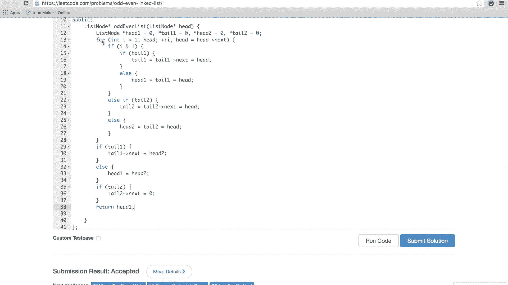

那么这个问题也不是特别特别难，比较难的。其实我个人觉得还是例一，然后主要考虑的就是这种啊边界问题啊，一些细节问题。那么另外一个也非常简单，就是单列表的排序。那么。

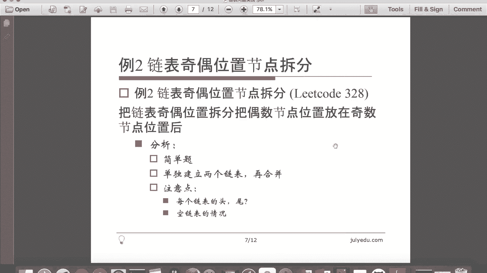

这个要求我们是Nlog的时间，还要求我们O一的空间。当然我们空间暂且不考虑我们。注意快速排序，在理想的情况下，或者说在平均的情况下可以达到N log根，它并不能保证Nlog根。

所以这个题如果写一个快速排序的话，我并不能就是说认为它一定是对的。当然这个过还是能过的。我建议写的还是归并排序，那么规并排序，当然有递归和非递归非递归我打的星号不太容易实现。但是递归的话。

这个它有这个递归对栈的空间，要不要计算的问题，它空间是不是O一的问题，这也是一些细节。这个我就写一个递归的这个非递归的留给大家自己去思考。那么我来写这个递归的呃，链表单链表的排序。

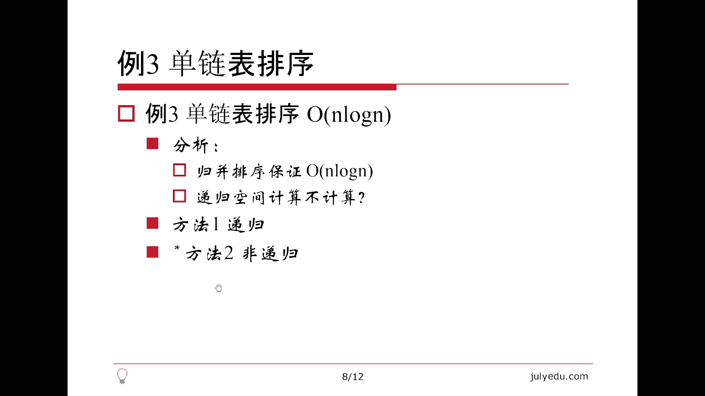

那么显然还是有些边界条件。

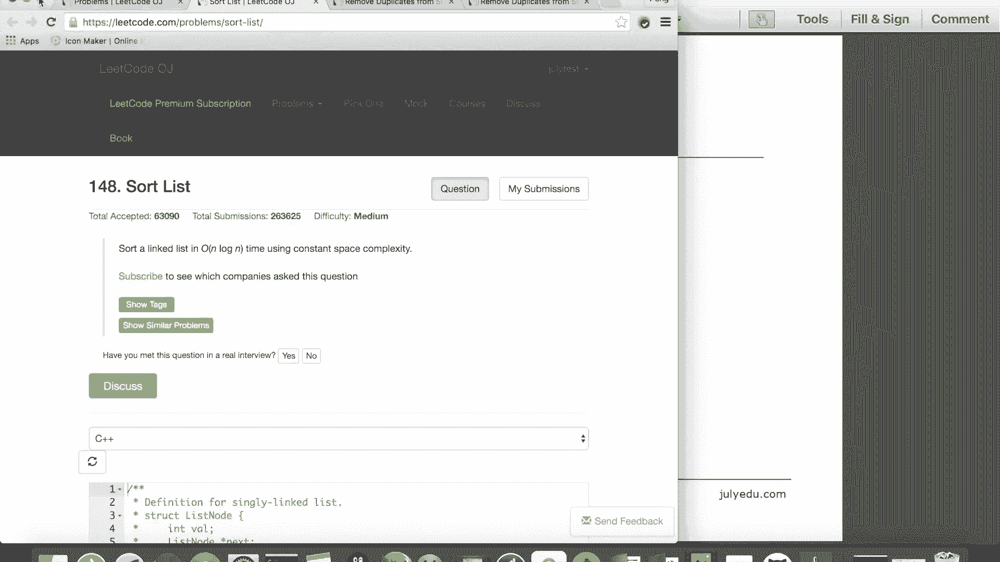

那如果单链表是空。或者呢。单列表的。只有一个元素，那么就是它的nex是空。我就把它直接返回去，这样边界条件我就处理完了，否则呢。😊，我希望把单链表从中间劈开。当然这个P开其实我可以数一下它的长度。

但是呢我用另外一种方法，什么什么方法呢？就是跟刚才讲的那个XY很相像，我用A和B，然后呢。B每次走两步。A呢每次走一步。这样B每次走了两步，A呢每次走一步。这样当B走到结尾的时候，A恰好在终点。

这个时候。注意这个退出的时候，这个要么B的nex是空，要么B的nex next是空。但无论如何，B走到了这个链表的结尾，那么A呢恰好在终点。那么我们对这个。A的 next做一下排序。相当于把列表切开了。

切成了A的 next和had这两部分。我们把A的 next进行一下排序，别忘了把A的 next复成0。这时候列表就分成两部分，一部分是以had开头的，一部分是以B开头的。注意这是一个低归调用。

我们假设对A的nex排好序返回表的头，我们又付给B了。因为这个B走到结尾，这个B的这个指针就没有用了。那么下面我们要做的就是。head和B是两个有序的列表。我们这个。呃。

这个下面我要我们要做的是B是排好序的，害的还没有排序。我们把这个。ha也排好序，这时候A和B就是两个有序的链表。我们下面要做的就是墨着它。两个有序练表的合并还是就是不是特别难的。我们看一下。如果。

较A较小。注意每次都要考虑这个tail的这个是不是空。这个和刚才是类似的，如果失空的，hi的别忘了复过来。否则呢。是。哦，这里别忘了A等于A nextex，不然死循环了。这个就是哪个小就把它接上来。

然后把它指向下一个。那么最后还有一些尾巴要处理，就是A嘛，有可能是A，也有可能是B，但是不可能既是A又是B。因为这个wellA和B这个至少有一个是空的时候才会退出来。这个也是把A整个这个列表接上去。

别忘了return。

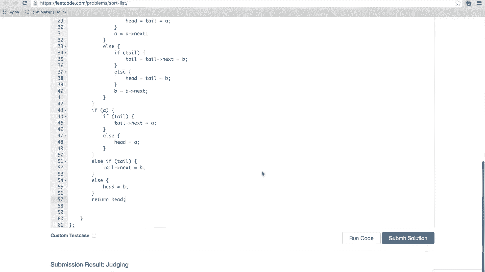

这也是一个正确代码，这是一个经典的规并排序的过程。

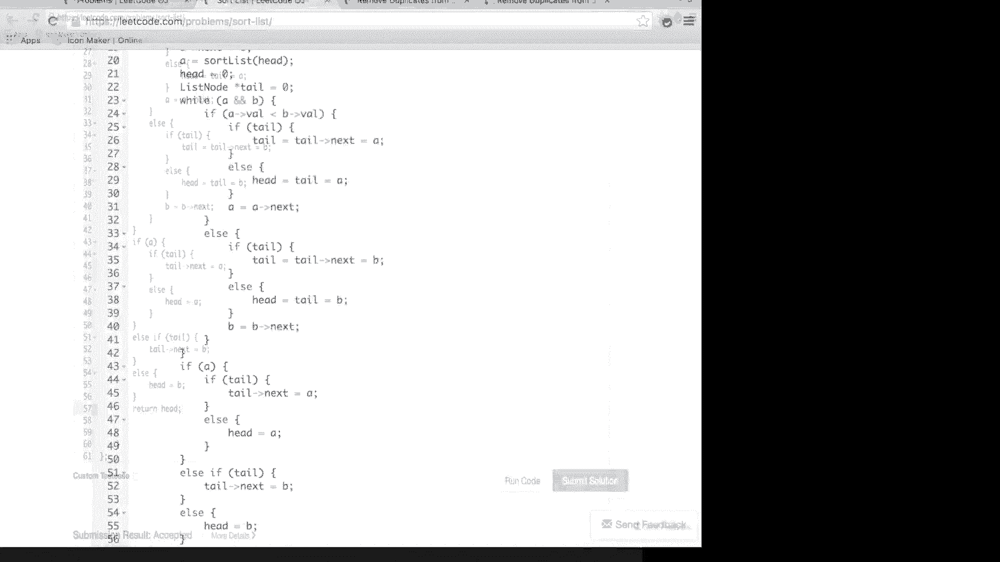

那么。

这是我想讲第三个题。第四个题，其实就是这个有序的单列表的节点去重，它是立的 code上82题和83题。这个去重的方法这个不太一样，一个是重复的节点一个都不一要，只要是重复的，我就扔。

另外一个是这个重复的节点，我只保留一个。嗯，无论是哪种方法，跟刚才的方法就是思想是类似的，保存一个列表头，一个列表尾注意就是空啊等等这些情况，我们来看一下。

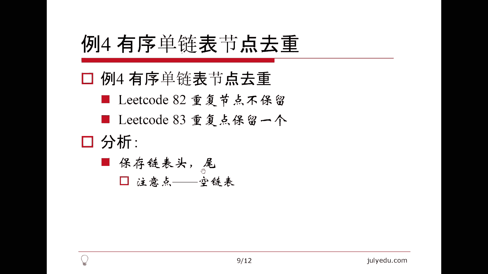

这个是liical82题，他说的什么？只要是重复的，我就这个把它扔掉。那我们来看一下这个怎么做。我还是用head一t有一。那我们看一下。关键是我们怎么找到这些就是重复的节点。如果害的不为空。

我们把一连串的重复的节点都弄进来。这个是value6。这两个条件同时满足的话。就说明这个。就说明我重复了。注意有这个。把它定义到外面了。我们用一个节点顺着这个had走，had next如果和到相等的话。

那么它是重复。如果是重复，我就一直的走走到不重复为止。那么这个时候别忘了这个had等于temple，它一定要等于到下一个节点上面去，这是最后要做的工作。如果不重复。那么刚才说了。

我们就把这个headd接过来怎么做这个。跟刚才做法一样，如果t一不是空，t一等于t一的next等于head。如果它有E是空，had一等于t有一等于had。然后我们就把它接上来。

然后并且呢这个headd在这里面会更新。然后最后别忘了嗯，tll一的next要指向。空ong。return是ha一。先编译一下。哦，好像是唱试的有点快。这也是一个正确的代码。那么对于那种问题。

其实和这个是相像的，我们就是。可以copy这个代码。关键是这个是重复的，我只我只做一次。那么其实这个做法更简单，因为链表本身是有序的嘛，我可以不要这个。那么。对于had的话。

我判断它和之前的那个tail是不是相等就好了。我们让当前这个ha和前面那个tail不相等的话。我们就把它接上，就是这个时候要么它是空，要么就是它的value和head的 value不相等。

我们就把它接上。那具体怎么接，还是刚才那个过程。如果t一不是空，t一等于t一的next。We had。如果他由一是空的。ha一等于t有一。什么我想编一下。啊，这也是一个正确的代码。

今天的题目其实并不是特别的难，最后大概做一下总结。

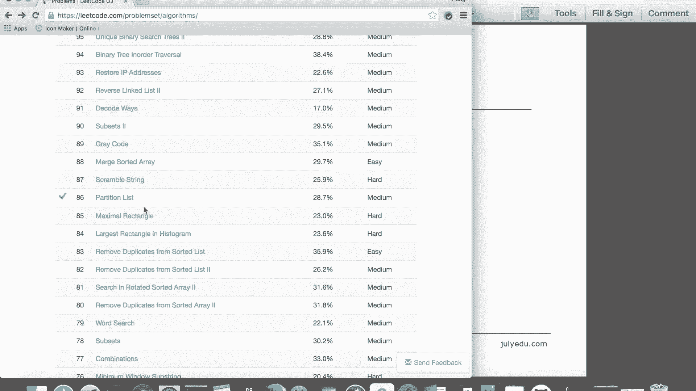

这个链表和数组不一样，列表可以拆开。比方说刚才讲的那个什么奇奇偶位置分开啊，包括刚才讲的规并排序，我自己可以新建一个头，什么叫新建一个头？刚才比较典型的那个基偶这个节点分开。

我可以把基数位置放到一个小列表里面，偶数位置放到另外一个小列表里面。总而言之，我可以把一个列表按照我自己的意愿拆成若干段，这个和数组不一样，每一段单独建一个头。

那么一般的思路其实考虑起来都是考虑如果插入的话，考虑插入前的位置和插入后的位置，哪些指针需要修改。无论单列表双链表循环列表都是这个思路删除也一样，都是考虑当前位置前后的这个指针，哪些指针需要修改。

那么比较特殊的，一个是列表头，一个是列表尾，还有一个当然是这个空，就是列表里面的空值。那注意要避免map呀set这种东西，基本上列表的题目用不着这么高级的数据结构。但当然也有例外，比方说这个。😊。

LRU catch这个146题，这比较难的，它可以用链表加上map等等一系列复杂的结构来实现。那么还有一个是复杂列表复制，今天时间关系没来得及讲。这个其实lea code上列表相关的问题都比较多。

那么这个大家可以搜一下，比方说关键词是link或者list，这样题非常多，我大概列了几个表星号的比较难。那前面呢还是比较容易的。当然第一个不是let code的问题，大家可以想一下。

这个在面试中也有可能出现，也就是这个循环列表的插入有序，就是说我给你一个圈，我已经告诉你它是一个圈了。😊，并且它是有序的，它有可能是单链表，也有可能是双链表，它是个循环链表。那么比方说12345。

我给你一个0应该插入到哪，我给你一个6，应该插入到哪儿，我给你一个普通的数。4、比方说应该插入到那儿，那插入的位置有可能是就是圈的起点，当是圈是没有起点，就是最小值的前面，最大值的后面。

其实和最小值的前面是一个位置，这个是循环列表的这个特性。那么。多个有序列表的合并。其实刚才讲规并的时候讲的是两个有序列表的合并。那么多个大家考虑一下，是不是可以两两合并，还是就是呃一2合并起来。

三四合并起来，5六合并起来，这样一层一层合并，还是一二合并起来，再把三放进去，再把四放进去，就是一次性的这样合并起来。其实这两个复杂度是不是就不太一致的。大家可以考虑一下，其实按层来分会好一些。

当然还有一种方法就是用一个堆把每个列表的这个开头都存起来，一个一个再拿出来。那么链表翻转，这是比较简单的问题，这是列表这个比较典型的let头 code上的问题。😊，好，今天的课就到这里。

欢迎大家给我提出批评指正，谢谢大家。😊。

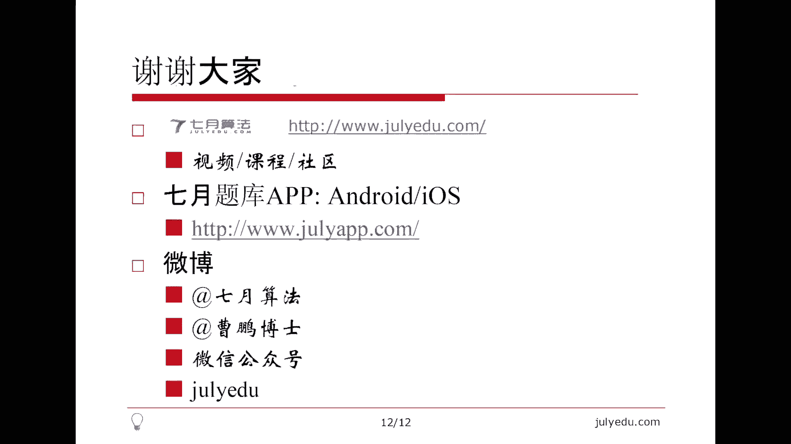

