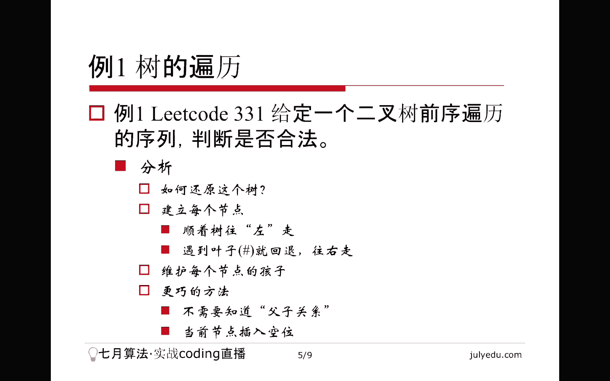
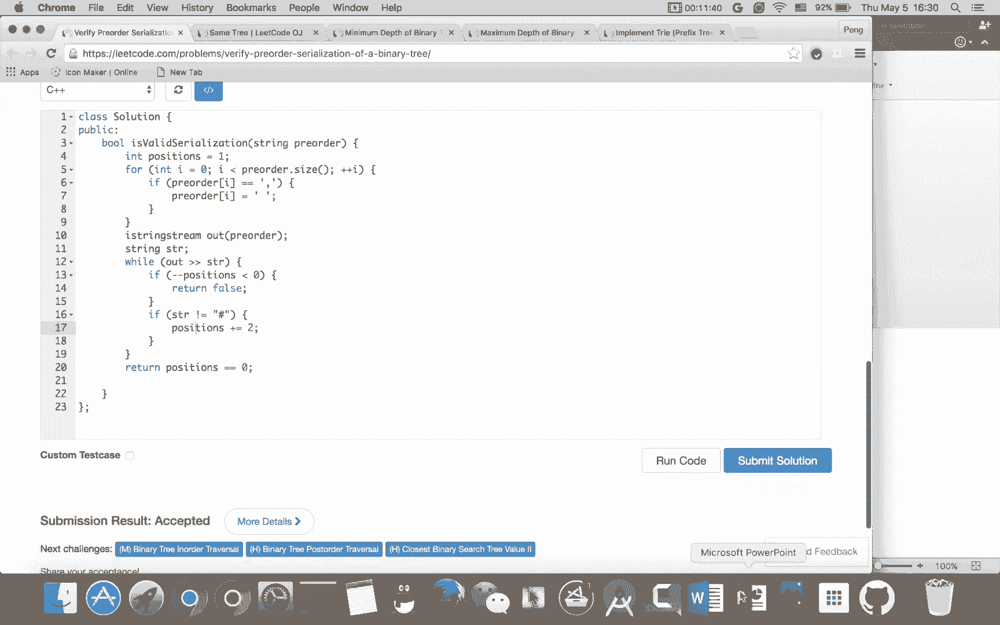
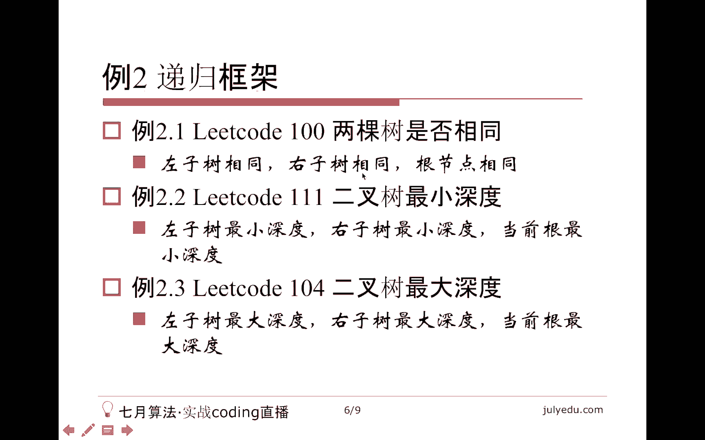
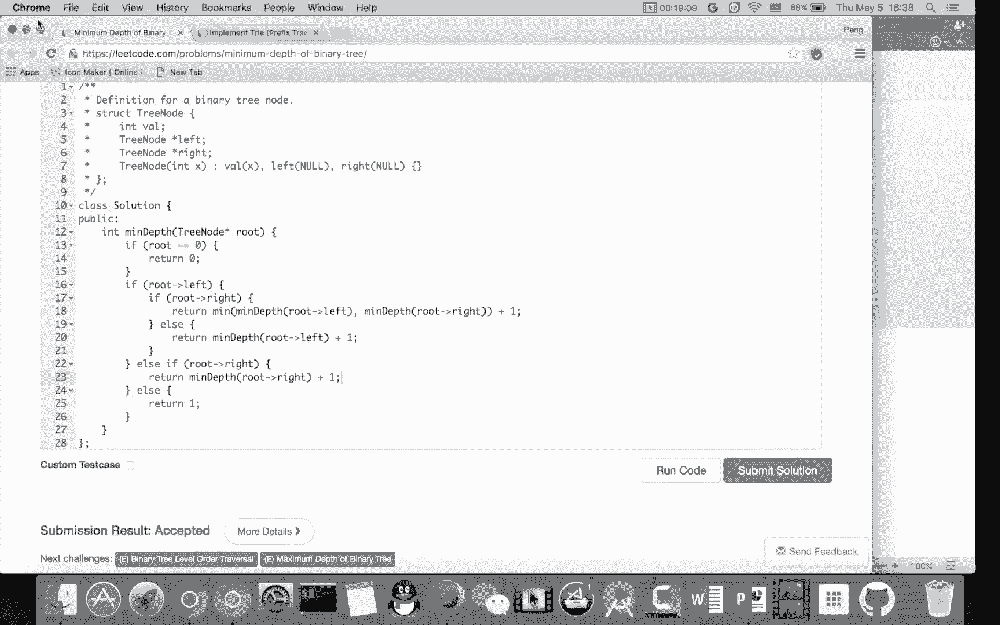
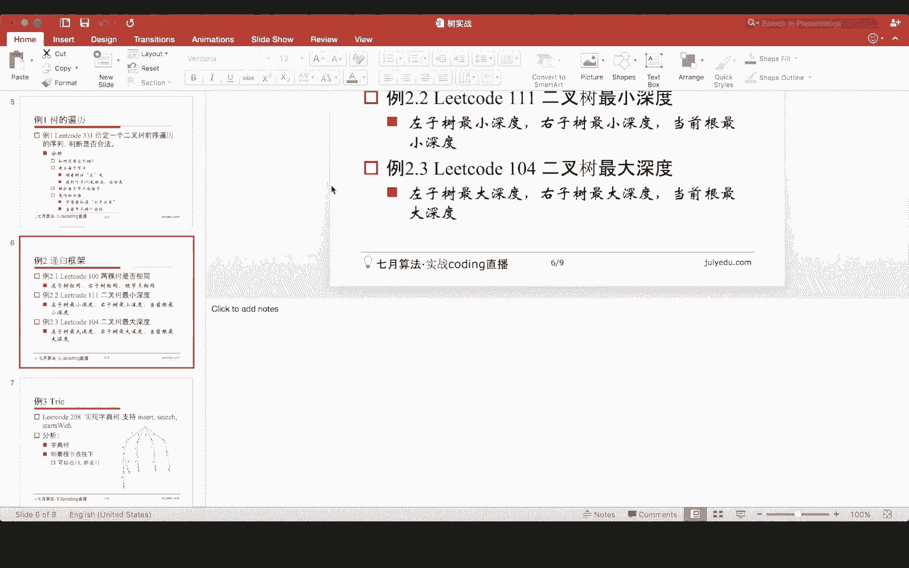
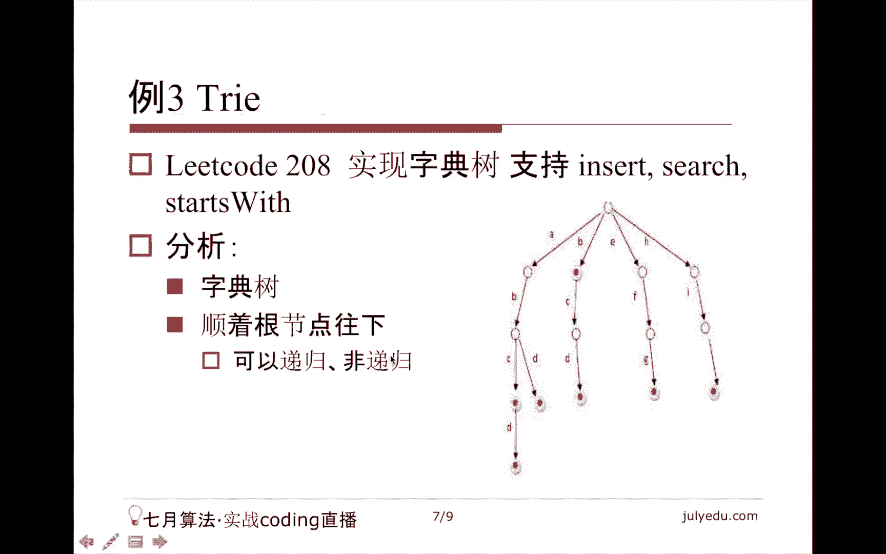

# 七月在线—算法coding公开课 - P4：树实战（直播coding） - 七月在线-julyedu - BV1YW411K7va

欢迎收看7月算法公开课。我们专答课的主要内容是数实战。我将从如下几个方面讲述本课。首先讲一下数的定义，然后讲一下数的性质。然后讲几个例题，因为我们这实战型的这种讲座。当然例题是最重要的，前面会一道而过。

最终总结结束本课。那么关于数的定义，我们要承认如下几点，首先树是一种特殊的图，那么什么叫图，大家请自己复习。一般谈到图，我们就考虑它的节点是什么边是什么。那么树是怎样的图呢？它是一种特殊的图。

满足这三个条件的图，什么条件呢？它是无项图，它是无环图，它是连通图，这三个条件缺一不可，少了任何一个这个东西都不叫做数。那么对于分类来讲，一个叫有根数，就是有一个特殊节点叫做根。然后呢，如果规定了根。

那么我们当然就有父子关系了。因为相当于给数定了一个项。虽然。说这个图还是无相图，但是它有了父子关系，相当于一个有像图。但是从结构上来说，它是个无相的。那么无根数就是没有这样的节点。

那么我为什么把二叉数单独提出来呢？因为在这个算法领域或者在计算机领域，二叉数比较重要。比方说排序二叉数啊等等等等，都是和二叉数相关的。这个普通的数当然并不是完全没用，就是研究的可能相对少一些。

都在这个图论里面做一些研究。那么数的性质，我这里面不加证明的列出来。首先N个节点的数恰好有N减一条边。那么第二个呢，这个N大于等于2。个节点的数，也就是如果一个数的节点至少有两个的话。

那么它至少有两个节点是叶子节点。什么叫叶子节点呢？我们定义为度为一的节点。那么这个证明其实大家可以想一下，把这个呃度整个加起来，N减一条边的度整个加起来。根据哥拢原理发现至少有两个节点，这个度应该为一。

那么。树的任意两个节点之间有且仅有唯一的路径。所以这个有些问题他可能不告诉你我这个问题的研究的这个输入是一棵树。他会告诉你啊，我研究的可能是若干个城市之间，这些城市之间呢。这个互相之间都可达。

并且可达的这个路径是唯一的。那么其实这些城市形成的就是一棵树，那么它可能比较隐晦的通过这种条件告诉你，它是一棵树。那另外呢是说树是让所有N个节点都连通的边数最少的图。

因为你要把N个节点让它互相之间连通起来，至少要添加N减一条边。换句话说，就是我把数中的任何一条边去掉，这个图肯定不连通。这就是说树的每条边都是割边。什么叫割边呢？就是把这条边砍掉之后，删掉之后。

这个图变成了一个不连通的图。那么还有一个性质，就是说数中添加了一条边，就会形成一个圈儿。因为加了这条边是多余的，它一定会形成一个圈，这是都是感性上的认识，请大家注意理解。😊，那么我们直接看题。

首先就是li code的331题，这个题相对比较新了。他是说给定一个二叉树的前序遍历序列，问它是否合法。当然这个描描述还是相对模糊的，单独给一个二叉树的前序遍历序列是不能完全还原这棵二叉树的。

但是呢它给的是如果碰到这个空的节点，它就给一个井号。那么这个时候其实我们就能还原这棵树，为什么呢？首先什么叫前序遍历，我们先遍历根节点再遍历左子树再遍历右子树，这种便历顺序叫做前序遍历。

或者叫先根变历等等等等。那么它实际上就是假设来了一个节点，我就放在这里。然后呢，😊，下一个节点一定是它左子数的根节点。当然前提是不是井号，那么我就建立了这种父子关系。再下一个节点。

一定是这个节点的左左孩子就这样不断的往左走。那么什么时候往右走呢？我碰到一个井号的时候。😊，我就回退回退到它的副节点，然后再往走再走的时候就往右走。往右走之后画了一个节点之后。

再下一个节点是它的左左孩子还往左走。就是只要我不回退，我就一直往左走，遇到井号，我就回退，然后下一个节点往右走。那么大家想一下，我需要记录什么信息呢，实际上我们就变相的把这个数画了出来。

记录了每个节点的左孩子以及右孩子。然后每个节点的父亲都记录下来了。因为我要回退，回退之后，回退到副节点之后，我们发现这个节点是有左孩子的，所以再给他添加一个孩子，我就只能往右走。

当然这种方法不是不能做比较麻烦。😊，其实呢。这个题目它只是让我们返回一个布尔值，也就是说它没有要求我们返回整棵树，没有要求我们还原这棵树，而是返回一个这个现在给定的序列合不合法。

就是一个true first。那么我们没有必要把整棵树维护出来。我们可以想象一个节点，一个普通的节点，它相当于有两个空位，因为我可以挂两个孩子，左孩子右孩子嘛。那么再来一个节点的时候。

它一定挂在之前的一个空位上。😊，就是说任何一个节点，它只要不是根。他一定是某个节点的孩子。那么他具体是哪个节点的孩子，我们可以不关心，我们只关心有多少个空位就可以了。只要有一个节点。

相当于添加了两个空位。当然，如果我们碰到空节点，说明这个这个空节点是叶子节点，那么它一个空位都没有添加。那么这里面有一个特殊情况就是根的这个处理。😊，根节点不是任何节点的孩子，没有关系。

我们设置一个虚拟的节点。😊，我让根节点是他的孩子，这个虚拟节点呢只有一个空位，这是最开始的情况。然后。😊，我们就沿着这个序列走，还是沿着这个序列走。如果。这个不是叶子的话，我们相当于它占了一个空位。

但是别忘了它还多出来两个空位。因为这个节点本身可以挂左子数和右子树，所以它占了它父亲的一个空位，但是它多出来两个空位，所以是一个减一加2的关系。那么如果是叶子呢，那么它白占了一个空位。

它没有增加任何空位，因为我们不能在它下面挂节点。那么最后这个合法和不合法是怎么区分的呢？首先我挂一个节点无论是。😊，这个无论是叶子节点还是非叶子节点，它都需要占掉它父亲的一个空位。

所以无论如何空位是要减一的这也是我刚才说的，减一加2，这个为什么不是直接说加一的这个呃关键所在，必须要先减一再加2，那么减一的时候，我们发现如果没有空位了？那么显然这个节点没有地方挂了。

也就是说这个节点没有父亲了。那么这棵树就是非法的。那么。😊，如果有空位，我们就把它挂在一个空位上，我们不关心它具体挂在哪儿。因为我们不需要还原这棵树嘛，我们就把它挂在了一个空位上。

并且决定一下它是否增加了空位。如果这个序列便利完空位足够多，那么我们这棵树就能画出来，或者说就能还原出来，或者说这个序列就是合法的。😊。

但是呢别忘了我们这个遍利的序练是把所有的节点和所有的叶子都画出来了。所以最后空位的数要是0，也就是说我们最后。😊，这棵树没有地方能挂节点了，因为这个叶子节点肯定不能挂这棵树没有边缘的地方能挂节点了。

所以这就限制了我们这个空位不能多，也不能少。😊。

所以我们来看一下这个代码怎么写，这个代码写起来非常简单，尤其如果用java的话，就更加简单了。😊，当然我这里面还是采取用C加加，因为C加加写起来这个它没有这种split的东西，所以写起来相对。难选一点。

但是也还好，我这position等于一是什么意思呢？就是我现在空位的数，我认为有一个，刚才我说了，我们假设这个有一个虚拟节点的存在，这个虚拟节点只有一个空位。😊，他呢把这个。就是这个空位可以放根节点用。

所以这个空位是这个虚拟节点留出来的那个空位。那么我为什么要这么做呢？因为我想用C加加的那个就是类似于split那个功能。虽然它没有，那么这里面我把这个逗号全都变成空格。

这样我就可以用C加加的这个输入输出流来处理，相对会简单一点。啊，这里面题目给大家先看一下，就是这么一个题目，井号表示叶子。然后呢，它还有一个是说这个输入是合法的，所以我们不用去关心这些数是多少。

当然这个如果题目变得更难一点，可能会给你一些不合法的输入。然后你可能就需要看一下这些数有没有重复，因为这些数有重复肯定就不对嘛，一一棵树怎么可能这个这些数节点来回来去的走呢？那样就有圈了嘛。

但是对于本题还是最简单的情况，不用考虑这些问题。😊，我这样做，之所以要这样做，就是想把这个re order这个字符串放到我这个输入流里面来。那这样有什么好处呢？啊。

这样的好处在于这个我就可以把它读出来了。就相当于我做了一下类似于java的，按照逗号做split这么一个功能啊，这个要写一个str。然后就是我进入问题的关键。首先，无论它是不是叶子。我都要把空位数减1。

那么当然如果这样的话就非法了，空位不够嘛，否则我就相当于把它挂在了一个空位上。那么如果是叶子的话，它白占了一个空位儿。如果不是叶子呢？就是不是井号呢，它不是叶子，相当于我这个节点本身还可以带两个孩子。

所以加上两个空位。😊，就是大概这么样一个。然后最后别忘了return的条件是。最后空位数一定要是零，因为如果不是零，就说明我们有些叶子没有画出来。因为最后这个数再也不能挂节点了嘛。看看大概检查一下。

应该没什么问题，我们可以 run一下。这个lea code的速度变得有点慢，然后我们可以提交一下。哦，run了之后提交，可能要稍等。啊，它是一个正确的代码，然后呢。

这第一个题我们就讲完了。然后我们可以看一下第二个题。第二个题虽然是就说是一道题，但实际上它是三个小题目。他想讲的就是这个递归的框架，哪三个题目呢？分别是li code上的100题、111题和104题。

这三个题目是说这个呃考虑。两棵树是否一样相同嘛？然后最小深度和最大深度，这两个都是二叉树，这个也是二叉树，都是二叉树的问题。那我想说明的问题就是这三个代码写起来就是几乎是一样的，非常非常非常简单。

就可以写出来。然后我们现在来看一下这个它的代码。当然有些细节可能不相同。本质就是递归。😊，那么这个递归呢就考虑左子数、右子数以及根节点。比方说相同这个问题，我们一定是左子数相同，右子数也相同。

并且根节点也相同。

所以呢我们来看一下怎么写。当然有些特殊情况需要处理。😊，啊，这个窗口可以关了，我们先看一下这个相同的问题。现在我们要返回这个以P和Q为根的这两棵二叉树是不是长得一样，对吧？那么我们先来看一下特殊情况。

P是空的时候，当然零和空是一样的，在C加加里面，那么只有Q是空的时候才可以。😊，那如果这个时候Q是空呢，注意这时候如果留能留到这里面的话，就是如果能执行到这里面的话，这时候P一定不是空。

因为P是空在这已经返回了。所以这我们直接return first就好了。下面是问题的关键。我们需要。P和Q是一样的，并且这就开始递归了。P的左子数。嗯，left和Q的左子数也是一样的，并且。P的。

柚子树。和Q的右子数也是一样的，只有这三个条件同时满足就可以了。相当于我们先判断了根，然后这是一些特殊情况的处理，然后看一下这个他们的value是不是一样。然后如果他们这个也一样的话。

再看一下他们左子数是不是一样，右子数是不是也一样。来看一下。😊，当然这是预先这个判断一下，看看有没有编译错误。然后我们可以提交一下。啊，这也是一个正确的代码。那我们直接讲下一个，为什么把它们都放到一起。

当然我这个换一下顺序吧，先讲这个最大深度，因为最大深度相对这个简单一点。什么叫最大深度呢？首先它对深度有一个定义，就是从根，当然这是一个有根数了，到叶子的这个最长的距离一定要到叶子。

当然这有个加一减一问题。实际上这个一句话就能写出来，怎么写呢？😊，如果根不是空，那么大家想一下最大深度是什么？它一定是左边的。把递柜调用这个。就是说从镯子树到某一片叶子的。最大深度。然后呢，从柚子数。

到一片叶子的最大深度。取最大加一，为什么加一加一就是它自身嘛，从根走嘛，我们这是从左子数走的，这是从右节点走的。那么这两个取最大加一就是从根走的最长的那个路径。那么如果根是空怎么样呢？

根是空显然就是零嘛。😊，数都不存在嘛。那么我们。我为什么要先讲这个呢？因为这个求最大的时候相对简单一点，提交一下。😊，然后它也是一个正确的代码。然后我们来看一下这个求最小的问题。

那么这个从根节点到叶子节点是最小的那个，为什么最小和最大不一样呢？因为大家可以考虑一下，假设我就两个节点，一个根，一个左孩子，那么我们应该返回什么？我们应该返回这个一。😊，但是按照我们的说法。

从左孩子走啊，这个路径是零，从右孩子走，路径也是0。那么这个。😊，因为右孩子没有嘛，右孩子没有，我们一定要有一颗叶子作为落脚点。按照刚才那个左右孩子，那么这个。左边返回的路径是零。

右边返回的路径其实应该是-一，这样应该是对的。有一些细节需要处理。因为我们一定要落到一个孩子上面。那么这个时候大家可能细节处理一下，也许能处理。对，但是实际上我们需要这个落脚点在一个叶子节点上。

刚才那个最长路没有落到叶子上，我们可以返回一个长度为零的这个路。那么现在。😊，如果只有左孩子没有右孩子的话，你左右的这个返回值不是很好定义。当然如果细细的定义的话，也是能定义的。

但是我这里面采取一些这个迂回的策略，但是思路还是一样的，先处理特殊情况，如果根是空，那么返回零，那么。😊，这时候我就看一下，如果有左孩子，那么并且有右孩子的话，可以用我们刚才说的那个定义。

左右较小的那个加一。嗯，先写作吧。那否则呢。如果只有左孩子，没有右孩子的话，那么显然只考虑左边，因为我不能考虑右边，又一定要到一个叶子嘛，这就是和刚才不一样的地方，那么就直接return这个东西就好了。

所以你把不存在那边定义为正无穷，其实也是可以的。但是我一般习惯上还是就是自己判断一下比较好。那么再否则呢。这时候已经没没有左孩子了。那么那么显然他就是右孩子加一嘛。那么再否则呢。

这时候我们就发现在这个时候就是一个空的节点存在，就一个这个root存在，它既没有左孩子，也没有右孩子。那么大家看一下这个逻辑，如果左右孩子都有，跟刚才最大的最长的那个路径是一样的，两边取短加一。

如果只有左孩子没有右孩子，我们不能往右边走，因为右边根本就没有数，没有数，何来最短路径，当然你定义为正无穷也是可以的。刚才那个是如果没有数，我们可以定义为最长路径为0。那么这里面如果没有数。

我们可以定义为最短路径为负穷呃，正无穷，但是我现在没有这么定义，那么我就只考虑一边就可以了。这一样。😊，这个如果能执行到这里，一定没有左孩子。那么光有右孩子就是这样，两个孩子都没有，就是一个一。

那么大概提交一下，是这个样子。它也是一个正确的代码。所以这个第二个问题实际上我讲了三个小问题。

是哪三个问题呢？就是两棵二叉树是否相同，以及二叉树最小深度和最大深度。这三个问题，请大家自己仔细体会，它就是一个递归的基本框架。那么最后一个问题呢？我想讲的就是这个tra，什么叫trare呢？

又叫字典树，这个题目也不算特别新了，但也不是特别旧。那么这个概念倒不是就是很新的一个概念，其实早就有字典数是什么东西呢？啊，如果只是英文单词的话，我们就这个把它理解为26叉树就可以了。什么意思呢？

当然有些差就没画出来。这个标红点的地方就表示这些单词是存在的，否则就表示它只是一个前缀，那么这棵树有什么单词呢？还有一个B，它还有一个BCD，当然没有BC，因为这没有标。

那么它还有一个EFG它还有一个H这是I这个不知道是什么？它还有一个ABD，还有1个ACD等。😊，等等等等。那么这个。这棵树有什么好处呢？我们插入一个单词的时候，就是从根节点顺着叉往下走。

走到最后把这个它最后走到的位置标记上就可以了。那么。😊，这个查找的时候有什么好处？我想说这个有一个单词，它在不在这里面，我怎么查找呢？其实。😊，我也是跟插入是一样的，顺着这个走。

因为我那个单词它是A也好，是B也好，已经告诉我们走的方向了。如果能走到一个标记为ttroe的节点，那么显然这个单词就存在，否则这个单词就不存在。比方说我们查找AX显然不存在，从A根本走不到X。

那如果我们查找AB，那么显然AB也是不存在。从A虽然能走到B，结果这个位置没有标记为trorue，所以这两种情况都是这个不存在的。那么还有一种要实现这个star with，什么叫star with呢？

就是有没有一个单词。😊，是以这个某一个前缀开头的，实际上就是说这个东西有没有路。因为大家可以看到，只要我们能走到这里，就一定至少有一个单词以它为前缀。因为这个单词是这么插入进去的嘛。

比方说我想说有没有单词以EA。😊，开头呢显然是没有的，因为E走不到A，有没有单词以EF开头呢？显然有EF因为我们知道有EFG，所以我们沿着这个数直接这么走。😊，走到的位置，显然有单词以它为前缀。

当然不一定是一个真正的单词。走到标记为troe的单词位置表示有这么一个单词，所以这个数本身以及单词本身就指导了我们怎么走。那么它的优势在于它的这个插入啊。😊。

这个查找啊以及starsmith这些复杂度都是正比于或者说大O这个单词长度的。因为这个书的高度其实也是单词最长的那个单词。那么它的优势在于有些单词共享前缀的话，它可以少存很多。

比方说我所有单词都是以AB开头的，那么它这个AB只存了一遍。你有一万个单词，我这个AB也只存了一遍。那么这棵树怎么建立呢？其实我刚才已经把这个建立过程都说了，当然可以这个递归的键也可以非递归的键。

我采取非递归，大家可以这个课后练习一下递归的这种键法。那么。😊。

我们来看一下。是这个问题，lea code上208题。那么。注意这个。我把这儿要建立一个，首先对于竖节点的定义，我把这儿要建立一个这个。呃，就是我刚才说的标记，然后二6叉数嘛，所以这个。

要建立26个指针。然后大家别忘了这个题目告诉我们可以假设单词只有小写字母组成，所以我们就建立26个就可以了。然后。😊，这构造函数里面当然要初始化。

我们把这个next I next I就是刚才我说的怎么走，然后所有的都复为force，所有节点都没有标记，这个初始化就初始化完了，然后。我们要实现的就是insert word，对吧？那么。😊。

我们可以看一下怎么实现。当然先把根节点建出来。因为这个根节点它替我们建好了，那我们就可以用这个。但是为了方便我把这个word改成S吧，这样写起来可能短一点嗯。沿着S走，对吧？那就走呗。

这个SI就表示啊I的。😊，就是S的第I个字符。那么。这个C呢就把A到Z变成了0到25。然后我就从当前节点看一下。如果这个位置不存在，注意我这个零实际上是一个指针为空的这个意思。

那么当然我就要自己新建一个啦。自己新建了一个节点。那么如果能执行到这里，无论我是新建的节点也好，或者这个不新建的节点也好，我这个n next C肯定是存在的。因为如果不存在，我就新建了一个节点。

然后沿着走就可以了。最后别忘了，最后这个n这个have。把它变成处。呃，插入就已经写好了。那么这个search呢，其实search和插入基本上是一样的。那么。当然我把它变成key吧。

为了和那个S做一下区分。其实代码基本上是可以copy的，还等于root。然后呢。还是沿着它走。因为刚才我讲了这个对于tri尔来讲，它的插入。和这个。search就是查找基本上是一样的。好减去A。

然后还是判断。如果这个东西根本不存在的话，注意这里面不是新建了，你是查找不能改变这棵树，那么显然就把它。弄成forrs就可以了。否则我还是沿着走，这个跟上面都是一样的那最后显然也不是直接把这个。

Not have。return回去。那这两个的差别在于，因为在这里面，如果这个节点不存在，我就建立一下不存在，我就建立一下。所以最后闹一定不是空。那么这里面。我这样走完这个这个闹有可能就已经变成空了。

所以这个。这个大家要注意，当然这个其实也不太可能是空，因为空在这儿就已经回去了。但是如果这个这个其实是没必要判断的。但是从这个逻辑上来讲，no是有可能是空的，这里面闹不可能是空。

这里面其实闹也不可能是空，但是可能判断一下会好一点。然后对于search来讲。我也把它叫key吧。search其实这三代代码都是差不多的。😊，嗯，其实是可以copy的。然后我就再写一遍吧。

还是不从这个跟刚才的逻辑都是完全一样的。还是减A。哦，我觉得。Of prefi。然后我们可以看一下这个哦这profi。然后我们可以看一下，还是这个东西。如果是空，就return force。

其实这三代代码都是非常非常接近的，就是顺着走就可以了。😊，然后我就可以。那么注意这个最后其实return now就可以了，就是return这个ow是不是空。如果不是空的话。

当然我这里面相当于把指针变成了一个布尔值。如果不是空的话就。那个。就是处是空的话就是for。然后我可以提交一下试试，这里面没有run code的，它也是一个正确的代码。所以这三段代码请大家这个仔细体会。

基本上就是沿着这个单词往下走。这个怎么走呢？就是减去A就是表示它在哪个叉上，如果这个节点不存在。那么insert的时候，显然要自己建一下。那么search的时候，当然不能自己建。

那么这个star with和这个search其实是差不多的，区别在于这个search一定要走到一个为 true的节点的这个位置。那么start swift要求比search要松一点。

因为这个它只要就是这个节点存在就可以，并不要考虑这个not这个have大概是这样的三个流程。然后。

这个题目基本上讲完了，我们总结一下，首先就是理解数的便利。我们今天讲的那个第一题其实是数的变利。那么数的变利有这些题目，这些题目非常非常的就是呃可以说比我讲的那些那些问题的这个相对可能要简单一点。

基本上就是前序遍历啊，中序变利啊，后序遍利啊，当然都是二叉数，这个大家仔细体会一下立的co上关于数的问题非常非常多。思路呢基本上一个是便利，一个是递归递归就是这三个问题。

当然有一些什么二叉数和双向链表的这个呃来回转换问题等等。大家可以考虑一下这个理解便利理解递归，尤其我今天讲的第二个问题，三个小问题都是通过递归来实现的。

然后学习使用ter是我这个最后讲的那个字典数的那个问题。😊，好，今天的课就到这里，谢谢大家。😊。

