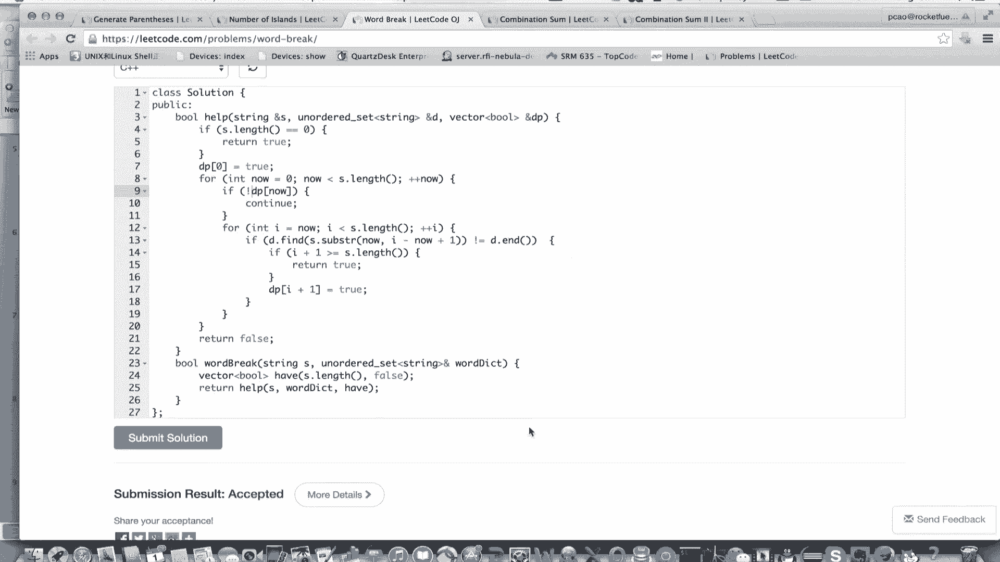

# 七月在线—算法coding公开课 - P6：图搜索实战（直播coding） - 七月在线-julyedu - BV1YW411K7va

欢迎收看7月算法公开课。我们这堂课的主要内容是图搜索实战。这个图搜索是我之前讲的BF和DFS的统称。我将从如下几个方面讲述本课，先讲简介，再讲四个例题。最后总结结束本课简介关于图之前也提到过。

我们要抓住节点和边，节点就是元素，边就是元素之间的相互关系。当然，通常情况下，这个图是隐示的，也就是题目不会告诉我们有一个图去做搜索，我们需要自己发现关系，把它建立起来。关于题型有如下这么几大类。

首先就是求连同分量，这比较简单，也比较单一，后面三个都是跟求解相关的。一个是求任意一组解，这个和判断是否有解是等价的。能求出来就有求不出来就没有。另外一种呢就是枚举求全部的解，中间这个是介于两者之间的。

求满足要求的这些解。当然这个我们可以求出全部的解。然后再用要求过滤一下，把不满足的扔掉，只留满足的。那我推荐的方法其实是说在搜索的过程中，把满足要求的留下来。只要生成的解都是满足要求的是。

终维护这个解是合法的，这样就不用最后的过滤了，应该比求全部解要快一些。最差情况是一样的。因为有可能全部的解就是要都是满足要求的那这个其实也是搜索中的一个减值吧。这里我打了星号，那直接看题。

第一题就是li code上第22题，它是输入N求N个左括号以及N个右括号的合法序列。那这是求所有的解的问题。那关键问题是什么叫合法，左括号的个数不能少于右括号个数，否则右括号没法匹配了。那图是什么呢？

它没有告诉我们图，我们考虑一下节点就是XY当前位置的左括号个数以及右括号个数，为了合法X要大于等于Y边呢，我们从XY出发加一个左括号，就是X加1Y加一个右括号就是XY加一，所以它们之间是有边的。

但不是每个节点都有两条边，对于X和Y相等的时候，我们是不能加右括号的。所以这个时候从XY到XY加一是没有边的，大部分节点都有两条边，除了相等的时候，除外，它只有一条边。那么解是什么呢？我们从00。

也就是没有左括，也没有右括号到NN全部的路径，所以它是一个求全部的路径的问题，有一条路径就有一个解。那我们可以用DFS和BFS记录什么呢？

刚才说的XY以及当前的部分解DFS的思路是每次从这个解上修改一点，得到下一组解，而BFS就比较麻烦了。它要记录全部的部分解，所以相对来讲浪费一些空间。😊。

那对于方法二就是之前也强调过每个节点记录它所谓的前驱，也就是刚好能到达它之前的那个节点。但因为这个不唯一，它是一个集合，所以这个相当麻烦，而且最后还要还原路径。

还原路径的时候可能还需要DFS我会实现DFS以及这个的BFS的方法。一，下面我们来看一下。😊。

首先。我们把要返回什么东西定义好。然后我们写一个help函数。我先写DFS。DFS说了要记XY和一个字符串，就是当前的部分解，然后最后把它return回去。那我们看一下这个怎么写。这个是DFS。

我们传的东西先把参数写好了。answer是记录最后解的这个vector。那么我们需要看一下，首先。这个。Y等于等于N，因为我们始终保证X是大于等于Y，并且小于等于N的。所以如果Y是N。X一定也是N。

我们就找到解了。就可以return回去。那否则的情况我们就按刚才说的。X加1Y和XY加1，那X加1Y是什么呢？就是X小于N的时候，我们才能加X加1Y。😊，那么这时候相当于加了一个左括号进去。

注意我这里面那个n这个str不是引用，因为这时候不能写引用，直接传的是一个这个空串进来。那如果X大于Y或者说Y小于X，就是右括号不够多的话，也就是它们不相等的话，我们就可以到XY加1。

所以这个时候是把右括号加进来。然后阿 sir。所以DFS写起来还是非常简单的。我们来看一下。😊，这是一个正确的代码。我们来看一下BF反怎么写。关于BFS写起来就有点麻烦了。

因为这个队列总总是要自己定义的。那么我们看一下怎么写，这些都没有必要传了。就传两个参数就可以了。我们还叫help。为了写BFS的方法，一，我们需要定义队列里面的元素。刚才说了XY。以及这个字符串。

那么我们看一下特殊情况。关键是N等于等于0，显然空串是符合条件的。可以直接raturn回去。那下面我们就开始定义。我们把起点放进来，我暂时叫t。刚才说了，从00开始。我们把这个定一个对列。

BFS是说我把起点放到队列里面，然后如果队列。飞空，我就从里面拿东西。写一个循环拿什么，我暂时还叫tamp，因为这个可以复用。那么关键是我们怎么更新它，也就是说怎么扩展它扩展的节点叫做other。

我们看一下刚才说的，如果X小于N。我们可以加一个X，或者说加一个左括号，怎么加？X不变呃，X加一Y不变。加一个左括号。然后入队。另外一种情况是X大于Y。那么一样的X不变。Y加1。加一个右括号。

注意这里面我们保证队列里面存的全都是部分解。所以我可以判断一下它是不是解之前那个之所以没判断，是因为。它最后加的是左括号，这不可能是一个解，那加右括号就有可能形成解Y等于N的时候，就是我们要的解。

那么我们把它放进来。😊，这个know就是我们要的解。那否则的话我们把阿入对。看来这个BFS的代码长度比DFS长了很多，所以还是要很多注意的地方，而且可能有编译错误，我们来看一下。

这也是一个正确的那我们解决了第一个问题，我们再来看第二个问题。😊。

第二个问题比较简单，它是200题。给一个零一阵求连续的一的块数。什么叫连续的一的块数呢？就是每个一和它的上下左右叫做连续的，每个邻居再往后上下左右又连续，就是看一被零分隔成了多少块。😊。

它是一个经典的求连通分量的问题。那么图是什么东西啊，他也没有告诉我们图。节点就是所有一的位置边呢，如果两个一是上下左右的关系，我们就加一条边。那目标就是求这个图的连通分量。那么BFSDFS可以统一起来。

我们都用一种结构，一个是对战，一个是队列。当然，BFS可以直接写递归，选一个没有标记的点。当然标红了，因为我们需要标记刚才那个括号之所以不标记，是因为我们搜索的节点不会重复。

因为那个括号总是不断的增长的，所以不可能又绕回到之前那个节点，但这个。😊，两个点之间会它是一个无向图嘛，两个点的点之间会来回来去的走。所以我们要标记，不能再绕圈。

那么扩展邻居每扩展一次就是扩展到不能扩展为止，我们就得到了一个连通分量。最后。😊，能扩展多少次，或者说嗯能从这个一个扩展的点到不能扩展，然后再找一个没标记点，能找到多少个没有标记的点。

就有多少个联动分量。难点在于标记节点，也就是所谓的判重。我们来看一下怎么写这个问题。

那么。我还是先写。DF因为它比较简单。我还是推崇这个这种问题和刚才那个问题。用DFS比较好，因为代码比较短，出错的可能性就会少一点。我们先找一下。一个一的位置。那这里面。如果。这个东西。是一的话。

那么我们就做一下。把I和J传进来。同时，answer加E这里面answer还没有定义，最后把answer返回去。那么这个东西呢。oner显然是0。那我们看一下这个。关键看这个help怎么写。关于这个呢。

我可以先。把这个东西复制过来，为了节省时间，我把这个弄短一点。XY。那第二排是怎么写呢？先考虑废法。越界。或者呢Y对应。越界。或者呢这里注意AXY我们只考虑一的位置。不是一。

那么显然这个就可以直接退回去了。那么现在刚才我说了要标记。标记其实我们可以使用一个布尔数组来标记。当然这个。因为这个题比较特殊，我们只有我们只有两种字符零和一嘛，我就把一都标记为零了。

这样省了一个数组常规做法还是用一个布尔数组来标记。那么。注意这里面如果他不让我们把这个A变掉的话，我们可以先变一下，最后再还回去。比方说我把这个零写成问号之类的，最后在返回之前，我再循环一遍。

把所有问号变成一，这样其实就不变了。那在递归上下左右四个方向就可以了。😊，然后这个是DFS看看有没有编译错误。它是正确的。我们再来看这个BFS怎么写，刚才那是DFS。那么我们同样。

DF呃BF就是说我们需要定一个队列。首先。这个队列呢要存一个行，要存一个列。那么。根据刚才的那个框架，就是先把行和列放进来，把起点放进来。然后是说如果它不是空。我们就从里面拿东西，拿什么呢？拿行和列。

我同样复用了XY。这个是行。这个是列。那关键问题在于我们怎么扩展节点。刚才我说了四个方向。那为了方便，其实我可以定义一个偏移的数组，把四个方向算出来，这样会减少很多运算，上下左右代码会简单一些。

上下左右四个方向XY的偏移。那么我们怎么做呢？四个方向编历一下。把它加上去。那同样要判断。啊，注意这里面我们需要把刚才说的XY标记一下。嗯，同样看一下这个。刚才是判断非法，现在是判断合法大于0。

小于函数就是没有超出矩阵。大于等于两。小于列数。那同样要看判断它是不是一，这个就是NXNY。它是一的话，我们就可以了，可以了，先标记一下。把它标记成0。然后呢，再把它放到队列里面。

看一下这个明显BFS要比BFS要麻烦一遍。我们看一下有没有编译错误。有一个编译错误，我们看一下。第十五行。啊，这个是一个笔误，没写分号。这是一个正确的代码，我们再继续。

看李森。139题给定一个字符串，还有一个字典问我们能不能用字典拼出这个字符串，什么意思呢？把这个字符串切成一段一段的，能不能保证每一段都在字典里面出现。😊，那这个图是什么呢？它同样没有给出图。

我们节点其实就是整数，从零到NN是字符串的长度，表示什么呢？表示这个前缀什么叫前缀，就是从开头开始若干个连续字符，零就是没有字符，一就是第一个二就是前两个N，就是前N个，也就是整个字符串。

那边呢如果我们从一个前缀X。加一个字符呃，加一个单词字典里的单词，能够形成新的前缀X撇。我们有一条从X到X撇的边，什么意思呢？😊，从空串儿。加上字典里面一个单词I，比方说这个字符串是这样的。

后面不知道是什么东西，有两个单词，I和AM空串加一个I。就能形成一个这个长度为一的。所以0一有一条边，13有一条边，什么意思？一在挨着。3就是AM这个对应于AM这个单词。那我们从零能到1又从1到3。

所以从0到3有路。那么也就是从开头能有IAM三个单词，这就对应上了。那目标就是从零到N看看有没有路，这是一个寻找路径，或者说求一组解的问题，判断是否有解的问题。

因为这个返回的时候布尔值思考就是如何我们求出真的求出这一组解，或者说如何求出全部解。同样刚才已经提示过了，可以记录部分解也可以记录前驱，记录前驱稍微麻烦一点。

当然我们也可以用BFS也可以用BFS它们是统一的，我们就从当前的前缀开始加一个单词不断的mark就行了。那同样我们需要标记哪些节点已经走过了，这个是BFS和BFS特点，要判重，这个是难点。

那我们能不能用动态规划呢？BP是动态规划，这个我不赞成它是动态规划。因为它不是一个优化的问题。但是呢我们可以打出一张表来跟DP的思路一。😊，这个表示能不能连接长为X的这么一个单词。

那么我们就看能不能连接长为Y的这么一个单词。这个Y既是下标，又是长度，这个是下标从零开始的下标。那么Y到X恰好是一个字典里的单词，先接到Y再加上一个单词就能接到X。所以总的来说可以说是三种方法。

我都会大概的实现一下，还是先实现DFS。😊。

因为DFS比较简单。刚才说了，我们要标记。一个东西是不是实现呃，是不是经过过，那么。先有这么一个数组，然后。我直接raturn回去了。那我们看一下这个函数怎么写。S是当前的单词。ow是当前的位置。

word dec我就写成一个D了，为了简单一点。表示当前的字典。那最后还是vector布尔，就是记录是否经过的这么一个东西。啊，首先。如果。超出了单词。

其实大于等于和完全等于是一样的那显然我们已经匹配完了。那另外一点很关键，如果这节点经历过了，说明我们之前在这儿就没有搜到过解，那么没必要再搜下去，没有前途，所以就。把mark这个事情做完。

然后表示这个节点经历过，下面是递归的关键部分。我们从n这个位置开始。截一个子串，因为现在n是我们已经到达过的位置了。那么我们看一下再往后能不能接一个。那接一个呢，我们其实是要判断这么一个东西。

从n这个位置开始截取I减n加一截取这么长，然后find一下它。它不等于地点and的话就表示找到了，找到了，我们就可以继续继续的话。就顺便写到这里了。那么下面应该是I加一D have。

那如果这两个同时满足的话，就说明我们从这个位置接了一个单词，并且就能找到注意C加加的substr是起点和长度的。它和这个java不一样，不是起点和终点，这个比较诡异。

那么这时候我们就可以return true了，否则的话。要通过for。那这个是DFS的代码。我们看一下是不是对的。它是一个对的那我们看一下BFS怎么做。注意这个有些东西是没必要传过来的。

比方说这个n就没有用。那。同样这个因为这个have其实可以在本地定义，因为它不是递归的，但是为了方便在外面定义好了，我就直接用它了，那这个就不要了。那，注意也是如果S是空串。那么显然它是处。

那关键的问题是。然后把它标记上，把零的位置标记上。同样定义队列。然后呢。把起点放进去，用刚才说的所谓的框架，就是如果队列不是空，我们就从里面拿东西，我们拿什么？难酪。我就复用这个变量。

然后可以用这后面这个代码。那么我们看一下能不能找到他。这个就是判断能不能找到。他恰好能找到的话，理论上我们就从I加一继续找了。那可以看一下I加一是不是已经可以退出了。这个就表示所有串都找到了。

那么显然可以退出了，否则我就要入队。入队之前我要看一下这个节点是不是新的。刚才说了，同一个节点经过两次没有意义。😊，把它标记上。这就是BFS的写法，然后看一下，好像有个括号没有匹配这个。

然后我们看一下这个是不是对的。这也是一个正确的代码。那顺便再写一下刚才的那个那个DP的所谓DP的代码。那这个可以复用。我们把它改成DP好了，这样的话就省得在里面再弄一个东西了。那么显然。

我们是什么意思呢？从等于零开始。看看能接到哪儿。那么后面其实是差不多的。那这里面呢因为没有对列。我就可以直接把。把它复成一个处。什么意思呢？就是说我们先接到这个n这个位置啊。

注意这里面要判断一下DP now要是tDP now force不能往后接。刚才那个BFS它肯定是。他肯定是处，因为这个。它是便历过来的，但这个时候因为状态全是分复整数，我这样便历，如果当前接到n。

我再从那继续接下去。接下去之后，如果能找到。接到最后就返回处，找不到的话，就把这个能借到的标记上。因为这是从短到长连的，相当于从 now接到I，从 now接到I，把所有状态都mark上。

这个得力于这个状态全都是整数。所以我们直接放到数组下标里就可以了。那么我们大概看一下。😊，这代码不知道有没有错误，看一下。它也是一个正确的代码。我们再看下面一个问题。

为什么有两个问题呢？39和40题它是给一组正整数找出和等于target所有组合。那么一种情况是同一个数可以使用任意多次，想用几次用几次。另外一个呢是相同的数只能用一次啊，其实这两个解法是类似的。

我们考虑一下图是什么。😊，当前的和以及当前要考虑的数AI。也是一个peair，或者说这种对儿，我们作为节点X那边呢。考虑取这个数，就是加上AI下一个数，不取这个数，所以它减法是类似的。

那么我们想一下这个。呃，正整数是什么意思？因为我们不断的加正整数，有可能大于target，我们就不搜了，这可以作为一个减值。所以总的来说，我们要记录这么些东西。当然。这是一个求全部解的问题。

那么跟刚才那个括号那个问题类似，用BFS就会浪费空间，当然也可以存欠驱，但是最后还要还原很麻烦。我建议还是使用DFS其实这几个题都是DFS相对简单。我就在这里面时间关系我就写DFS的方法看一下。😊。

第39就是第一个问题。首先它要返回的是由小到大的数，我们先对它排个序。先对它排个序，排个序之后，因为这个candidates里面不知道有没有相同的数，无论如何我先写个help吧。

DFS显然这个东西要传过去。这个东西要传过去，然后00。然后还有一个是pass。还有一个是answer，当然还有一个是target。那这pass是什么呢？

pass是我们当前已经选了哪些数那answer是什么呢？answer是。这个最终的结果就是vector vector in。然后这个零一个是当前的位置，一个是当前的和，所以这些东西啊都作为参参数传过去。

最后返回的是answer，因为。vector vector，那么我们关键看这个东西怎么实现。把参数写好了。为了方便，我把这个也缩短一点，我把它就叫做A了。n就是当前的下标呃，sum就是当前的和。

他给他不变。pass表示我当前取了哪些数，这个是记录结果用的。这个是我最终的结果存在哪儿？那么同样刚才说的，如果这个东西已经比target大了，显然没有必要搜了，因为全是正数。

那现在就是s小于等于target。我们看一下，如果not大于等于A点size，就是所有的数我都考虑过了。显然我们就看一下它是不是解就可以了。相等就是解嘛。这个拼错了target。相等就是解。

那么我们就把这个answer。把这个呃pass加进来。没吞回去。下面就是一般的问题了。我们考虑一下什么时候我们会取这个数，我们可以这样考虑。那等于0第一个数肯定要取。或者它是一个新的数。

因为我们并不知道A里面有没有相同的数。尽管这个我们排好序之后，有可能还有相同的数，我们相同的数都放到一起去，我们就这样做。😊，这个A不变，我们下一次还总到表示一个数我可以取多多次。

但是下一个数如果相同的话，我就不会再取了。那么。😊，我们就这样。这个表示我要取这个数，把它加上去。然后。target不变，pas answer怎么表示我们要取这个数呢？pass里面要把它加上。

当然注意退回来的时候，我们要保证pass是没变的，还要把它退掉。那么另外一种情况显然是我不取这个数。不取这个s就不变了。所以这个是DFS的写法，大概检查一下。注意这个不取的时候，n要加一。

因为直接考虑下一个数，这个时候我再闹上循环，因为我要考虑no取多少次，然后取取够了之后再下一个相同的话就不取了，看一下不知道有没有错误。它是一个正确的代码。那么为了再讲下一个问题，就是和这个类似的。

只能取一次的。我就把这个代码复制过来，因为可以稍微改一下。哦，我把那个函数给删了，这个好像叫。叫兔吧。不小心刚才把那个函数给删掉。嗯，这个我先下吐吧。那这个呃搜的东西不变，这也不变。

注意这里面我们加一个布尔值表示上一个我取没取，其实初值没关系，出口 first都没关系，因为相同的数我们只能取一次嘛，我们就考虑上一个数取了还是没取，这里面我们叫last。那同样。

这个如果它是一个新的数。或者这个上一个数我取了。因为每个数只能取一次，即使相同。就是说他有两个一，就最多也就取两个。就是上一个数我们取了的话。我们才可能去我的理念是说，对于一连串相同的数。😊。

我一个一个取，直到第一个没取的时候，我就不能再取了。😡，所以这个无论如何就要加一。就是我一个一个考虑，如果它是一个相同的数，上一个取了，我才能取。如果它是个相同的数，没取上一个，我这个也不能取了。

因为我保证我取的三个一的话，我要取两个一，我保证我只取第一个一和第二个一，而没有取第一个一和第三个一，就是这个意思。所以就是相同的数要一取，就是取连续的一段。那么这个呢显然是个force。😊，啊。

这个初值其实是没有用的，因为因为这个tro first没有关系。这个第一个无论如何，我都会考虑取它。那这个其实加一个参数就可以实现了。那我们看一下，当然我们可以这个一个一个做。

最后把这个answer用一个set来存，最后在这里面去重也是可以的。但是这么做其实可以避免去重提交一下。啊，它也是一个正确代码。可见用刚才那个代码稍微改一下，就可以得到这个每个数最多只取一次。

因为这里面有两个一，是因为它原来就两个一。所以这个但是这两个一又是不一样的一。因为这个比方说是二的话，呃，比方说最后取一的话，结果这个target是一的话，结果只能有一个一。

因为我不能出现这个两个相同的集合。所以我必须在这用一个布尔值处理一下，就是相同的数，我怎么考虑，其实一个理念就是大家一定要记住相同的数，我连续的取。就是5个一在一块，我要取一个一，就是第一个取两个一。

就是前两个取三个一，就是前三个，这样的话不会跳着取。所以这个就是这个的目的，这样不会重复，也不会遗漏。啊，这个题目就讲完了，然后给大家几个思考题。😊。

这个7778、90是这个枚举全部的子集，其实做法可以用我这个刚才讲的最后这个问题来套。那5152之前也提到过，就是八皇后问题就是搜这个其实就是DFS的框架。

所以对于这种问题通常来讲都是DFS的写法比BFS要容易一些。那对于这这道题还有一些要说的，其实它就是一个背包问题。如果target本身不太大，我们可以打表，就是用NX表示这个。前个数能否到达X。

那么我们其实可以省一为这个从。呃，sam就是前面的sam往这个就是所有数的总和的sam从大往小的推。那如果这样的话，我们就把它呃附成处。这个其实是考虑呃。如果DP啊X减AI是t，DPX也是t。

因为X减AI加上X就得到了X，其实它也是一个DP的打打表的这种思路。那么这个。如果target比较小，是可以直接放进来的。如果target比较大呢，我们需要把这个布尔数组换成一个map，布尔。

或者干脆换成一个set in，就表示把所有的数。😊，到过的数全放到这里，递推公式还是一样，有一个小数存在，我加上AI也存进去。😊，那么难点还是说如何找到真正的这样一组解，还是需要记录路径。

所以又回到刚才那个尴尬这种方法，难点就是如何记录路径。还有刚才也提到过，它不算严格意义的动态规划，因为它不是一个优化问题，这只是一个波尔达表问题。动态规划一般有max min这种东西。那做一下总结。

首先隐视图的定义它到底是什么东西，我们需要自己发现规律来把它找出来。那判断是否有解，以及找到一个任意解，我们都可以用DFS和BFS来做啊，尤其是联通分量那种问题，它们俩是一样的，判断是否有解也差不多。

但是要找到一组解，可能BFS稍微麻烦一点。DFS会简单一点。那要找全部解的话，我推荐DFS因为它可以从一组解上1。1点改BFS没有这个功能。😊，那要找到满足要求的所有解。

其实就是DFS减值最差情况相当于每举全部。那刚才说了，它就是在一个解上修改一点，放弃最后一步回溯。这个是递归回缩这个内容。那BFS呢，如果要找到某种要求所有解。比方说我们要找到最短的。那么BFS最有效。

因为它可以找到步数最小的那它的难点就在于如何记录路径。关于BFS和DFS可以看我之前的视频讲过BFS和DFS。😊，今天的课就到这里，谢谢大家。😊。

