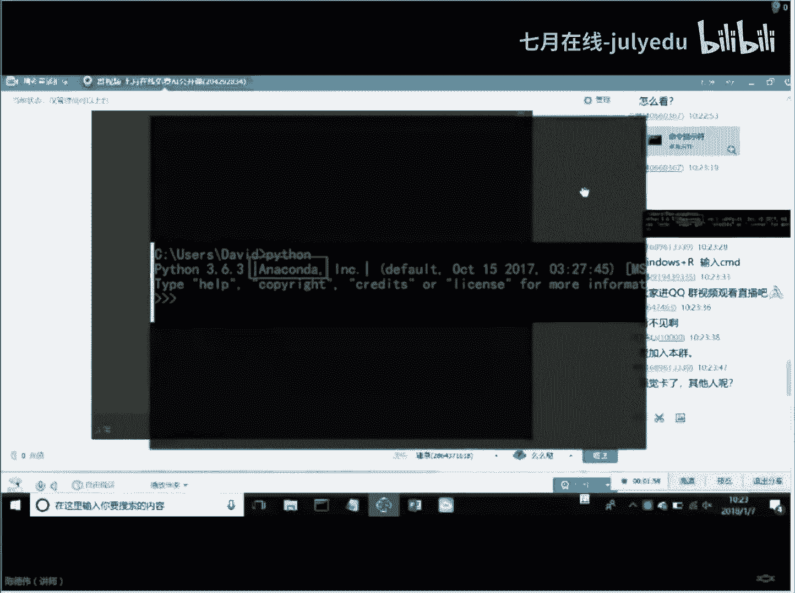
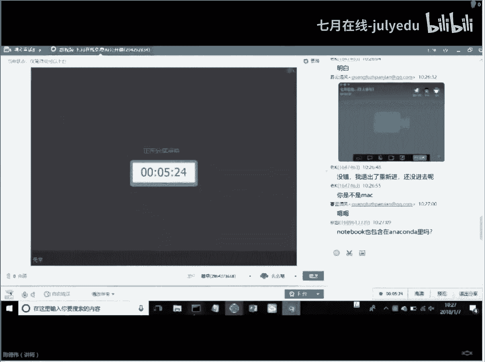
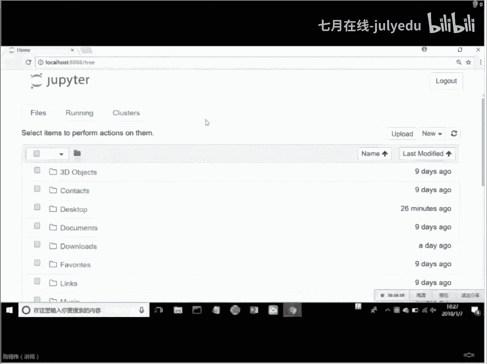
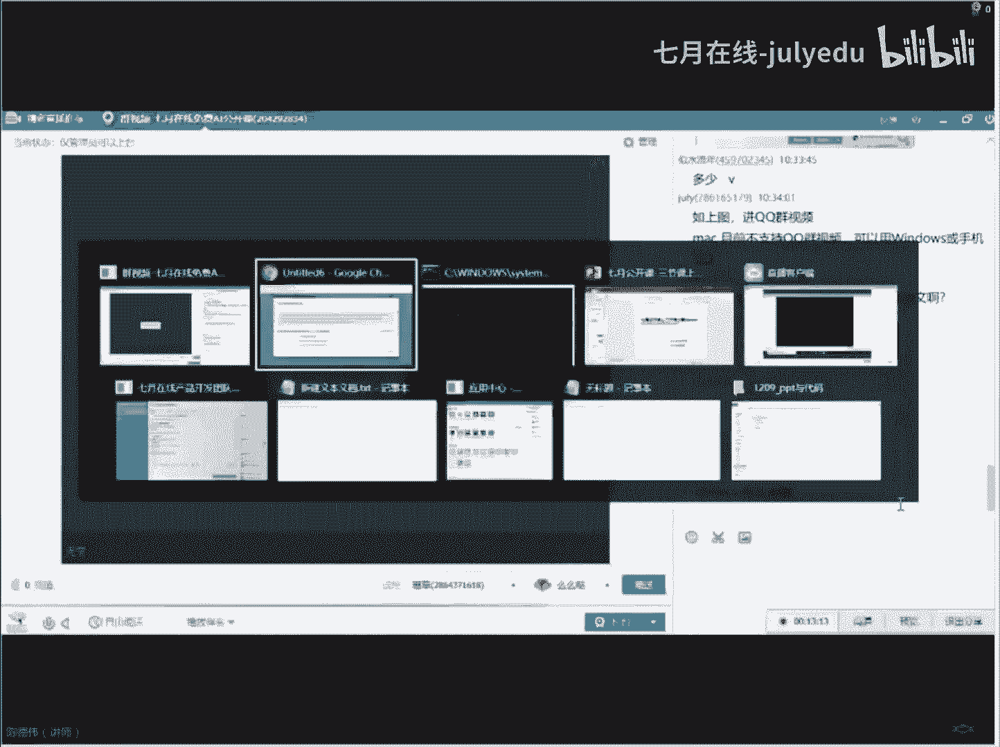

# 人工智能—Python AI公开课（七月在线出品） - P1：三节课上手Python第一节 - 七月在线-julyedu - BV17W411K7G8

7月公开课的这个三节课上手python的中的第一节。那么呃这节课呢我们主要的一个目标是什么呢？我们主要的目标是一个呃第一个呢就是说我们要跟大家一块介绍一下我们python环境的一个简介呃。

python的一个简介和它的一些具体的应用啊，这是咱们的第一个目标啊，第一个目标。然后第二个目标呢是说呃带着大家，咱们手把手，哎把这个python的环境给搭建起来啊，搭建起来。

第三个目标呢就是说如果咱们把这个环境搭建起来以后啊，咱们的这个呃主要的开发工具，也就是notebook是如何去使用的。这个是需要和大家一块去啊去做一下。

那么最后一个目标呢就是咱们的python的一些基础操作啊，python的基础操作。然后呢，python的基础操作呢就是说我们有一些python的简单的基础的语法啊，简单的python的基础的一些语法啊。

一些它的一些常用的操作啊，比如说它的这个操作符啊，或者一些它的一些循环分支判断结构。啊，可以说今天内容还是比较多的。但是我们今天的课程呢会有一个特点，也就是说我们大家再去。嗯ん。😊，呃。呃。

我们的这个我们今天的课程的一个特点呢，就是说有画面啊能看到画面吗？我我共享的是我的PPT大家能看到吗？呃。呃。等稍等一下，我确认一下，大家能看到我这个PPT啊。呃，稍等一下，我确认一下哦。

PPT可以看到是吧？哎，好的好的，还把我吓了一跳哈，我生怕大家看不到咱们那个PPT啊。好，那么既然是公开课呢，就是说我们也是在星期天的上午，大家也抽出了自己宝贵的休息的时间来一起参与我们的公开课。

那么既然我们花费的时间，那么我们就一定要有一个结果，对吧？就是说这公开课并不是说呃老师我听完呃你讲完的公开课，好像啊我知道一些东西ok结束了，不是这样，我们一定要有一个结果，既然对拍摄感兴趣。

既然对呃继续学习数据分析啊感兴趣，那么我们呃参与了这场公开课，那么呃对不起，那么在我这里我就希望你能有一个结果，好，那么好，那么我们继续开始往下去讲啊。😊，好，那么我们开始第一章的一个讲解哈。

那么我们python的一个简介和应用。那么python的简介和应用呢在网上可以说是一搜一大堆啊的东西。那么在这里呢我就不再过多的去介绍，我只是简单的去讲一些东西啊，那么python的语言的作者。

大家至少得知道是吧？哎，归叔就可以了啊，也就下面这个非常可爱的老头是吧？哎，一个荷兰的一个大叔啊，非常有才华啊，那么他的名字的来源呢，他也可以说是一个他最喜欢的一个乐队啊。

他最喜欢乐队里面的一个啊叫python是吧？哎，python，然后呢再往下走呢，就是说python的来历啊，他并不是横空出世的啊，不是啊，他是这个归叔在研究ABC语言的时候呢。

哎他参与设计过的这个ABC语言。这个ABC语言，大家听一听名字就知道ABC语言是什么呀？哎，就是针对于服务于非专业程序员的一个语言。😊，啊，非专业程序员的一个语言。那么这也是咱们ABC语言的一个来历。

那么ABC语言的一个来历呢，也是python诞生的一个前身啊。ABC语言最后就是被这个项目被下得 down了，是吧？但是python哎从这个哎ABC语言中浴火重生啊，浴火重生。然后呢。

嗯这个python呢其实也是不年轻了啊，也是不年轻了。也是上个世纪90年代就已经有了的语言啊，也是一个。嗯呃，也不是一个。啊，也不是一个这个年轻的语言了啊，也不是一个年轻的语言了。

那么python的基本的历史呢。就跟大家讲到这里啊就跟大家讲到这里。😊，那么呃python的这个版本啊，这也是大家比较呃关心的一个地方啊，比较关心的一个地方。大家老是说啊，那个我学python。

我看python有好多的2。7的2。72的2。711的或3。5的3。5。10的或者3。6的，我到底该选哪个版本呢？其实你根本不用为这个事情去操心啊。你现在既然没有开始学python。

那么就请你从python3。啊X开始，可以是5也可以3。5也可以3。6啊。你不要为这个版本所谓的这个兼容性去担心啊，去担心。那么。😊，我们现在呢主要去做的事情是什么呢？

就是说OK我们要确定的是我们要学习这个python。那么版本兼容性。大家这个问题只是其中的一个小小的一个细节，大家不要去纠结这个问题，这也是我想跟大家去分享的一个点啊，分享的一个点。好。

那么python的版本的问题，我们大致讲完了以后呢，我们来看一看python的一个特色啊，python的特色。python呢有很多很多的特色啊，网上也可以刚才也说啊，一搜一大堆的特色啊。

一搜一大堆的特色。好，那么python有什么特色呢？最重要的一个特色呢？其实啊在我个人认为啊，就是说哎就太简单了啊，太简单了。因为pyython有很多的特色啊，很多的特色。那么其中一个最重要特色。

就是说它相对于其他的啊相对于什么呀？相对于其他的这个呃这个编程了语言来讲，它学习起来的难度可以说是最低的啊，可以说是最低的。那么这一点也是python。😊，呃，从这个上面的这个ABC语言中。

诞生的这么一个哎一个一个他的一个血统的问题啊，血统的问题就是说它的服务呢其实并不是面向于一些特别细节的哎计算机领域的这些人去使用。

你如果是C我用过C加加的同学可能会知道们C里面会有一些指针啊哎这些东西或者是内存的一些自己去分配一些内存啊啊，非常一些底层的操作。他面向本身就是去解决问题的。

希望他尽量的能把程序员或者是说我们的用户从这个底层的硬件的软件的操作系统的等等的细节之中抽离出来。哎，你既然是要解决问题。那么好，那么我这么语言给你提供。

就是希望你能够以最快的速度去解决问题的这么一套语言，我也是按照这个我也是按照这个方向去设计的啊去设计的这个语言。好，那么。呃，另外呢呃我刚才讲到python的特色呢啊我个人认为最大的就是一个简单哈。

所以所以说为什么我们会用python去主打啊，我们的学习啊的机器学习也好，或者数据挖掘，或者是深度学习，都会涉及到python，为什么呀？哎，第一点它非常的简单。那么不光是简单就可以了，对吧？哎。

简单它既然啊它既然是说光是简单，是不可以支撑它现在这么火热的哎流行的这种流行的程度的。还有一点呢，就是说它支持各种各样的一个什么呀类库啊，那么其他的特点我也不再讲我智障这两个特点。

大家一定要记住就可以了啊，也就是说python的应用python呢，其实大家可以把它看作仅仅啊那个课件呢稍后我会共享到咱们的群里啊，大家不要着急啊不要着急。😊，好。

那么python呢就是说哎python呢就是说哎我们的这个哎它的应用呢是什么呢？为什么它会有如此火热的应用呢？哎，它的流行度为什么这么高呢？就是因为它与它背后有强大的第三方的库的支持是离不开的。

你比如说老师我想做python的外部方向的开发，那外部方向有很多的框架，你比如说jugo啊呀，对吧？这些东西都是哎python在外部方向的领域的这这种框架，那你说我想做科学计算，那科学计算有很多呀？

你比如说派呃是吧？哎，这些东西都是关于矩阵运算科学运算方向的东西，包括像分析一些这个信号分析是吧？或者是矩阵的一些运算或者图像图形的分析，这些python都会有相应的差件。

你比如说我做图形有没有有啊PL库对不对？都有那你说老师我想学深度学习可不可以可以没有问题啊？它有flow这种。😊，超级牛的这种库的支撑，对吧？那你说我想图形化可不可以可以啊，没有问题啊。

它也有自己的图形画，对吧？哎，他有自己的图形画的这些GUI的工具啊，这些库也都有啊。😊，那你说呃我想把我的数据可视化有没有有更有 plan的，那是更非常之详细。可以说呃python为什么之所以这么流行。

是与它的应用。哎，是分割不开的。哎，它的应用是分隔不开的，它有强大的应用的支撑。哎，也就是说python本身可能是一个哎一些简单的一些只是一个程序语言，但是python背后有非常强大的第三方库的支撑。

所以python可以说是一个什么呢？万能的语言啊，万能的语言啊，这也是我们讲到了python的一个哎它的应用和特色，它既是它的特色，又是它的应用。好，那么我们课程开始了大概有十来分钟左右了哈。

那么今天呢呃也是由于我们的这个呃直播的一个系统呢，让大家呃临时的到我们这个QQ群里边来去沟通啊，非常的抱歉啊，非常的抱歉。那么如果有后来的同学，如果有后来的同学，那么我再回复一下。😊。

我们之前去的一个目标哈。今天的公开课呢呃今天的公开课大约是在30分钟到40分钟的时间啊，因为周末的时间啊呃呃非常也是非常宝贵的这种休息时间啊。另外呢就是说30分钟到40分钟呢。

也是一个人的这种集中度和注意力比较专注的时间哈。那么大家在这30分钟到40分钟的时间里边集中呢听我来给大家去讲啊，我们python的这个三节课上手的中的第一课是吧？哎，也是希望你能有所收获啊。

刚才我一直在去强调这个收获，并不是说我们这个课程哎只有这么短的啊30分呃分钟左右的时间啊，我们这课程就没有结果，只是听一听，不是这样啊，不是这样，我们强调的是一个上手，什么叫上手啊，你自己能去做。哎。

你自己能去做这些东西才是你的啊，才是你的。好，那么呃后来的同学呢，我也把刚才的啊东西有一个强调哈，我们继续来往下走。啊，那么。😊，这个呢就是python的简介与应用啊，简介与应用。

这也是我们的第一个目标，给大家介绍了python大致的一个简单的介绍和一些应用哈。那么接下来我们就要开始进行python环境的搭建啊，python环境的搭建。什么叫python环境搭建啊。

就是说我们可以python它是一门什么语言，它是一门解释型的语言啊，解释型的语言，什么叫解释型的语言呢？就是说我写了一些代码，我需要一个什么呀？解释器来去来去向什么解释的我这个代码应该如何去运行。哎。

大家可以按照这个方向去理解啊，所以呢我们有一些啊去安装我们它需要去安装一个python的一个环境哈。那么python的环境呢呃我们有不同的安装方法，对吧？第一种方法呢？就是我们去python的官网啊。

python的官网呢？我现在在群里打一下啊，就是python点ORG啊，大家可以去看一下啊，这是python。😊，哎，这是这个呢就是python的一个官网。

大家可以去这个地方呢去下载哎python的一个什么呢？呃，它的一个包是吧？它会根据你的版本去下载一个包。如果你是啊windows会非常方便，linux也不难是吧？

linux本身自带本身就自带python的解释环境。如果它的版本不符合你要求，你再升级就好了嘛，对吧？哎，那么呃它的这种官方环境的安装呢，啊，它是一个非常简单的安装，这里呢不做不不做过多的解释啊。

不做过多的解释，大家可以自己去它的官网上去下载相应的这个。😊，呃，去下载相应的这个群啊，下载相应的这个呃文件安装就可以了。但是呢不推荐大家去哎这个地方来下载。为什么哎我刚才呃跟大家介绍，哎。

刚才跟大家介绍说呃那个呃我们的python里面最强大的一个什么呢？它有强大的第三方库的支撑，还记得吗？刚刚讲过的哦，是吧？哎，那么它有第呃第三方库就意味着什么呀？哎。

你从官网上下载下来的这个python的环境，它仅仅是一个环境。那么你想再去做任何其他的事情的时候啊，它都会怎么样啊？它都会去干嘛呀。😊，他都会去有一个这个你需要安装第三方库，明白吗？哎。

你比如说我想做抽样处理，那么对不起，那么你需要你用PIP这种工具去安装一下我们的哎PIL库。那你说我想做深度学习，可不可以可以，那么你不光要安装terflow。

你还要安装呃和erflow相依赖的一大堆的东西。那么你说我装down派装py做这个爬虫可不可以可以没有问题。那么也是一样，你需要去做很多的这种安装的操作。有些时候会因为版本兼容性操作系统的这些问题。

会导致你在这个上面会花费了非常多的时间，你还没有去接触到还盘有真正的去运行过这个python啊，还没有真正的去运行过这个python。那么这一点上呢就会有一个什么原因呃，会有一个什么问题呢？

就是在于我们的效率的问题。所以呢我们不推荐大家使用呃thon官方的一个环境。另外一个不推荐它的原因呢。就是说大家刚才也知道，我刚才跟大家去讲的python目前有两大两大细的版本，一个是二点差的。

一个是3点差的对吧？哎，如果你去安装了python2点差的，你再去安装python3点叉的，这两个环境之间会有非常多的这个重叠的问题，会有非常多的。比如说我们的这个库安装到哪个环境上。

安装在哪个版本的python上很麻烦，经常会把人搞晕啊，经常会把人搞晕啊。有课件的啊，大家不要担心。😊，啊，有课件的那个课件呢稍后我会分享到咱们的群里边啊，大家不要担心啊。那么我继续来讲哈。

那么python的这个问题就是说两个python或者是更多版本的pyon或者把你搞晕啊，搞晕，极大的降低了咱们的这个效率学习或者是生产的效率。

那么所以说这是我不推荐大家去用python官方环境的一个原因啊，那么under康环境啊，这个环境为什么我会推荐大家去使用了这个环境大家啊可以去搜underda也可以呢在我给出这个链接里边，大家去干嘛呀？

大家去下载啊，大家去下载这个链接呢是咱们啊清华大学的一个镜像啊，速度会比较快啊，如果你是从这个under康的官网上去走under官网上去走。那么呃如果声音听不到的话。

那么请同学们呃检查一下自己的网络环境吧。因为我这边呃用的是那个手机的4G去去直播，就是因为担心本地的网。😊，会有问题啊，本地的网络会有问题。那么如果呃这个QQ群的录播我不知道呃会不会有。

因为我们之前呃的那个我们之前的直播平台里都会有录播的。那么没有关系，我会呃咱们在QQ群里边，如果你要是有问题，你可以随时来提问啊，我们也会有给您一个回答啊，给您一个回答。因为我们今天的内容啊。

相对来讲还是比较紧凑的啊，比较紧凑的。😊，哎，那么我们来去看啊我们来去看我们的under这个环境哈。under这个环境呢，它为什么推荐它它几乎差不多有500多兆啊，新版本可能已经超过500兆了啊。

那么为什么还要去呃声音还小啊，那么再尽量大一些啊，那么呃为什么还还呃为什么还那个为什么还要去推荐under康呢？就是因为它内部已经帮助大家集成了很多很多很多的第三方的库啊，非常多的库，明白我意思吗？哎。

非常多的库。那么我们就不用再为我们去安装各类第三方库的这种直呃，我们去安装第三方库的这种啊这种版本兼容性啊，或者说这种下载速度啊，去担心啊，都已经看到了是吧？哎，那么我就呃大家看一下这张图。

我呃呃看到我们这个新同学发的这张图啊，我跟大家说一下，去下载哪个版本啊。😊，你把所有的东西往拉到最底下。哎，这位新同学啊，你把所有的东西拉到最底下。然后呢，根据你的啊操作系统，如果你是m克的。

它会有m克的，如果你是windows或者windows的，如果你是linux那就会有linux的。那么如果你是呃这个64位的，那么一定要去下载64位的，明白我意思吗？哎，哎拉到最底下。对对对，啊。

目前建议你呢就下啊，能看到3。5。0。1windows叉86下划线64，看到了吗？也就是最后一个。对对对，就是最后一个。那么如果你是呃这个linux的这个版本或者m克的上面也都有。

尽量的去下叉86-64这个版本的啊，尽量去下3。5的啊，3。5的。😊，哎，下载完了以后呢，我一会儿跟大家去说大致的一个安装。因为我们今天的这个不太好去。

我看看能不能够去直播我的这个呃直播我的这个分享屏幕啊，一会儿我来分享屏幕来给大家去看一下啊，也示能分享的哈，别着急哈别着急。那么您下载完了以后，一键双呃就是双击安装的时候，它无论提示什么。

您都说是无论有什么这种东西啊，有没有勾啊，您都点上勾，明白我意思吗？哎，我们一键安装傻傻瓜式的安装就可以了啊，就可以了。那么这个安装呢会花费很多的时间啊，我们在公开课里呢，也就不不像大家去演示了啊。

不向大家去演示了。好，那么呃我们来去看一看我们下面的一个东西啊。😊，啊，下面一个叫做notebook的一个使用啊，notebooknotebook是一个什么东西呢？那么我先呃大大家如果有黑屏。

大家耐心等待一下啊。因为我先分享一下我的屏幕啊，我看看这个呃分享窗口呃呃分享区域啊分享区域，我把整个屏幕都跟大家分享哈。😊，开始实施分享。呃，大家能看到我的屏幕吗？

呃，QQ群哈。

呃，模糊是吧？啊，不清楚是吧？啊，那么大家这样吧，如果不清楚的话呢，因为不涉及到一些特别呃细的一些操作，大家大致的去看一下啊，大致大致的去看一下啊，哎，那么我给大家去演示一下我们python运行。

通常会有两种方式啊，就是我们安装完了under看环境啊，看见了是吧？哎，如果安装完了under看这个环境以后呢是吧？哎，那么我们可以进什么呀？在CMD的窗口里边，对吧？在CMD的窗口里边。

这个窗口怎么打开呢？如果有同学不会打开呢，我们可以在这个地方我演示一下啊，在开始里边去输什么呢？CMDICMD它会有一个命令提示符啊，命令提示，我给大家截一下啊。😊。

呃，我给大家发到这个群里啊。😊，Yeah。哎，就这个东西啊哎命令提示服，我们在命令提示服下面运行了以后呢，我们输入这个python。😊。

Okay。啊，然后呢它就会来有一个什么呀？哎就会进入到我们pyython环境里了啊。我把这个截图给大家看一下，尤其是这个地方给大家看一下啊。😊。

嗯。啊，大家看到了没有啊？啊，我发刚刚呃给大家分享的这个。😊，进入到python了。进入到python了以后呢，大家看到这张图没有？有三个大于号是吧？哎，对对对，啊，我们的新位同呃。

我们这位新同学非常的啊非常热心哈，帮助大家啊把家帮助大家一块去解决这个问题哈。好，那么我们来去看一下啊。那么这个python呢是什么呢？就是我们呃刚刚安装好的under康的这个环境里面。

他所提供的python，你不用去纠结什么正版啊不正版啊之类的哈。啊感觉卡了是吗？可能是因为有这个视频的问题啊，可能是因为有视频的问题。那么我们会尽尽快的把这个问题解决一下啊，稍等一下。

我会尽快的把这个视频的东西讲完啊，换到语音的话会好很多，稍等一下啊。好，那么我们哎进了这个CMD这个窗口，安装的官网啊，零下3度同学，如果你安安装完了官网的python，你一定要卸载掉啊。

一定要卸载掉啊，一定不要呃不要再有N多个python环境里边，把你给折腾的这个头晕的呃头晕目眩的哈，头晕目眩的。😊。

啊，没那必没那个必要啊啊，卸载完了以后，您就去呃，刚才我刚才这刚才我们新同学分享那个链接里边，您下载刚才说的那个一步一步安装就可以了。安装完了以后呢，我跟大家说一下啊，这就是我们python的运行。

python呢有一种命令行的运行。😊。

也就是说我在这个位置上面对吧？哎，它有三个大于号，我可以在这个下面去输入非常多python的一些具体的东西了。你比如说我现在去建一个，哎，我给它建一个这个变量，A等于一B等于一个字符串，对吧？

叫做china。哎，最简单的这两个变量是吧？那么现在呢我们来去把这两个变量去输出一下，就可以看到它输出的是个元组，那么在这个地方呢，我们就已经进入到了python环境了啊。

但是这个python环境会有一个什么问题呢？哎，也就是说你比如说现在我想把B改成哎，比如说改成什么呢？改成北京，那么我现在还得再去再重新输入一遍，它是什么呢？就像瀑布一样，从上面倾泻而下，对吗？哎。

不太方便，我们去做一些变更。你比如说我想把EA变更了，或者把这个B变更了之后再重新运行一下。我在底下可能要写非常的多，对吧？哎，大家非常直观的感受是吧？写的非常的多，对吧？哎哎呃，刚才K同学问说。😊。

呃，andunder的这个呃官网，刚才我说过了啊，就undercon非常的大。但是呢呃你就安装它还是建议安装它，为什么呢？它包含了有非常多非常多的库。可以说你学tthon的这些库，它都有。

省得你再去为了装一个库去折腾啊折腾啊。😊，啊，under看那里好多函数都包括了官网python包括环境。对，是这个意思啊是这个意思啊啊哎是这个意思啊，就是说一切是为了我们学习的效率啊。

你不要在意那几百兆的容量啊，不要在意那几百兆的容量啊。好，那么我们继续回来啊，那么在这个环境下呢，我们运行的什么呢？就是python的一个叫做命令行的方式来运行。好。

那么现在我们退出我们的这个python哈。那么这时候呢我们进行这个note呃jupy的notebook我们去输入啊，😊。

嗯。

Yeah。我们输入这个中心note book这个地方我有一点必须说明啊，你必须在安装完了undercom以后，你再去做我刚才做的这些操作，否则你电脑里没有环境。

没有这些相应的这个note book这些库，你是运行不起来的啊。我不知道我说的清不清楚啊，也就是说你一定先去安装完under哎啊能看到。😊。

呃呃，三人参与呃，你是不是麦克，这个我不太知道哈呃，慕云清风的同学啊呃，如果您有问题，非常抱歉哈，可能是QQ的这个呃QQ的这个不是很OK啊，不是很OK好，那么呃我来继续来去演示一下啊。

那么呃如果对这节公开课有问题，可能大家也可以在咱们群里来提问哈。好，那么我们继续啊，大家看得到我们这张呃桌面了没有啊，我我给大家截张图吧。如果如果有同学没有这个东西的话啊。😊。

我给大家截张图哈哦，没有关系，如果你实在看不到，我给你截张图啊，大家看得到这个没有啊，我发到群里这张图看到了没有？就是说呃我们输入jupytern book啊，这个单词以后啊，这个命令以后。

它自动的会在我们的它会做一个什么事情呢？它会自动的在我们的电脑上开启一个服务，这个服务哎，是干什么的呢？它是一个外部端的服务，大家看到了没有？就是叫做什么呢？哎。

也就是说我们可以访问自己的电脑本地机大家看到这个没有我来给大家去截一张图啊。😊。

哎啊，看到这个没有？就是说哎，这就是说我们刚才输入上面那个东西，它自动就会弹出来下面的这个它就是一个网页，对吧？你看你咱们是不是用浏览器打开的对吧？那么哎既然是网页的话，哎，既然是网页的话呢。

我们就会怎么样啊，我们就会说那我能不能够新建一个呢，对不对？我新建一张网页，其实我们看一看啊，叫你有这个按钮啊，我给大家去呃截张图啊，就照顾一下看不到的同学啊。😊。

哎对对，是的，你只要在命令行里直接输入支notebook就可以了。但是前提是什么？你一定要先安装好under德康的环境，明白了吧？哎，所以为什么我说要大家安装这个环境，因为太方便了啊，啊。

需要进入on不需要不需要哎哎你安装安德康的时候啊，你一定把所有的勾打上，所有的人家问你的这些东西你都打上就可以了。哎，你千万别不打勾啊，就是安装了啊，那那样的话就会就指定thon环境非常麻烦，知道吧？

哎，如果安装的时候，他提问他说要什么，你就给他什么就可以了。好，那么我们刚才也看到这个了，那么ok我们现在就可以啊，如果没打勾的话，呃，你要是不太会配置，那么就建议你重装。如果你很会配置的话。

其实就是需要配个路径就可以啊，那么如果你要是呃想深入学一下，你也可以在网上搜一下，如何去配置这个路径，这也是对这个有一个理解啊，有一个理解啊，那么如果你嫌麻烦重新装一遍对吧？卸载完重新装一遍啊。😊，好。

那么我们来继续继续下一步啊。那么我们的这个note book已经ok了，对吧？😊。

我们点新建是吧？那么这个时候呢，我们来看一下，我们就会进入到我们的notebook了啊，进入到我们notebook了啊。那么稍等稍微等一下啊，我来去截张图给大家啊。😊。

嗯。😊，好，那么呃没有，即便是没有视频的同学，你看这个图也可以的啊。因为视频上也是这些东西啊。好，那么这张图呢就是说我们新建了一个notebook。notebook是什么？笔记本笔记本可以干什么啊？

在上面怎么样写写画画，对吗？是不是哎，我们可以在我们的笔记本上写写画画，对吧？非常方便啊，非常方便，而不是说我写完了以后呃，我再去更改，没有办法更改了，非常麻烦。哎呃，山草，我看一下啊，呃，😊，哎。

对对，是这样的，是这样的。就是说当因为它的这个启动，嗯，别着急别着急，它这个启动是比较慢的哎，比较慢的，在谁的电脑上都是一样的啊，不是说没有反应，它反应比较慢啊，等它启动完了以后呢。

它自动会弹出来一个东西啊，它自动会弹出来一个呃这个浏览器啊，浏览器里面自动就会把我刚才截图里的这个东西给你显示出来啊。好，那么哎弹出来了是吧？哎，非常好，那么说明您已经上手了，不客气啊。

那么呃说明我们的目标达成了是吧？啊lo宽带环境装好了，那多顾客你也上手了是吧？好，那么我们继续啊。😊。

啊，那我们继续我们的note book已经出来了是吧？好，我们继续往下走哈。那么大家看一下，我给大家截这这张图里面notebook。那么说老师，我这个notebook怎么去写呢？

你还记得刚才我们就写的这个A等于一。😊，对吧A等于一，B等于china。对吧然后这个时候呢，我们是在这个框框里写这张框框里非常像不像我们要去发一些block是吧？我们发那个博客，我们写电子邮件。

像不像这种感觉啊？你看你的鼠标可以随意的去点是吧？哎，也可以随意的粘贴啊什么的，是不是比这个命令行里要友好一些，对吧？哎，比命令行的要友好一些，那么这个地方呢我们来去看。那么写完之后怎么去运行呢。

我们有两种方式啊，一种你可以点这个上面的按钮啊，我把这个截个图给大家啊，一种你去点这个上面的按钮，我给大家截个图照顾一下啊，看不到视频的同学哈。😊。

哎，那么哎我给大家截个图啊，大家看到你在这地方写的这些命令，对不对？你可以点击一下这个按钮，哎，点击一下这个按钮，对吧？哎，在这个按钮下面点击完了以后呢，它会出现什么东西呢？我们来看一下咦。

为什么没有任何的反应呢，对不对？就会出现了一个新的东西，大家看到这个没有啊，这是两个啊，我们管这个东西叫做什么呀？叫做sll啊，我把这个东西给大家截一下啊。😊。

哎，这叫sll。哎，这叫sell，也叫单元格，你就把它认为一个单元格就可以了啊。好，那么我们上面的这个东西，我们运行完了以后，为什么它没有反应呢？是因为我们没有让它有任何的输出，对吗？

那么okK我们在这个地方我们使用print一个。😊。

A。B我们再去输出一些，大家看到了没有？一和china就已经输出出来了。那么这也是我们最最最最简单的python的一个练习啊，python的一个一个上手。那么这个时候你就可以来。

你已经进入了python的世界了啊，你已经进入了python的世界了。好，那么唉稍等一下，我看见其视频啊。😊。

没有反应弹出来了哦，对对对，这是那个哎咱们加入到咱们就可以了啊。加入到咱们的这个呃群的这个视频就可以了。我刚才好像点了什么东西啊，稍等一下啊，稍等一下啊，好，那么我们继续啊，我们继续。好。

那么我们这个note book呢有很多的用法啊，如果第一次接触同学一定会被很多的用法给迷惑了。但是不要紧，我有一个学习的秘诀给大家分享，就什么呢？你用到哪儿学到哪儿，我今天给你讲到哪儿。

你你就只学到这么多，知道吗？你只学了这么多。如果你有自己的想法。😊。

你说老师，我想把这个notebook，哎，我如何去把这两个notebook连在一起，或者呃我想把两个notebook怎么样啊，哎合并了等等的时候，这个时候你再去学是最有效率的。怎么去学啊？我告诉你啊。

你先点击这个ESC相当于退出是吧？哎，退出到退出单元格哦，然后你点击一个H，它会自动的输出一个什么呀？叫做notebook的一个什么呀？叫做key shortcut，我给大家截个图啊。😊。

呃，我看一下啊，进Q波群啊，windows手机啊，如果安装到D盘的话，路径是不是要求全英文？对，就是说如果你安装呃，因为它默认的是安装的C盘，如果同学们有C盘空间不足是吧？哎，没关系。

你安装的D盘也没有关系，但是路径的话呃，你最好还是留下under德康da，或者不要你不要去改这个名字啊，就是它本身不可能带中文啊，你一定要也是全英文，省得就是说将来会遇到非常多奇奇怪怪的问题啊。

非常多奇奇怪怪的问题。好，那么我们继续啊。😊。

啊，大家别着急，等我等我讲完以后会有一个集中的提问。大家也可以有问题。我们可以集中的去给大家去说一下啊，给大家说一下。好，那么现在呢我把这个notebook里边如何去寻求帮助也说了。

如果这个里面还是解决不了你的困惑，我们是不是还有谷歌，还有百度呢，对吧？我们可以随时的去搜索，我们要去解决那个问题，对不对？哎，我们解决那个问题。好。

那么现在我们来去开始我们的这个notebook的使用了啊，notebook呢其实就是一个什么呢？啊，大家还记不记得这个。😊。

哎，我们在刚才在这个地方来写的东西是不是哎其实一样的，但是呢note book有非常多的特性，让它非常方便哈非常方便。好，那么note book的使用，我们已经开始上手了，哎，已经把这个环金搭起来。

知道在里面怎么写，怎么运行，对不对？你比如说我想把这个china改成北京，刚才我们在那个CMD里不好改，对吧？但是在我们的这个里面是不是非常非常的方便去改，对吧？好，那么我们继续啊。

我们继续我们的课程啊，好，那么我们的这个PPT啊，稍等我把这个屏幕先关一下，我把共享关一下啊。嗯，稍等一下啊。😊。

呃，分享呃，稍等一下啊。

演示PPT稍等。好，那么我们还是回到我们的PPT里啊，我们回到我们PPT里面。那么我们的PPT里面有3个目标，我们这堂公公开课可能只有40分钟左右的时间。但是我们有4个目标。第一个目标我讲完以后。

无论你怎么样，你至少能说出来on大概是个什么东西是吧？什么语言是个什么样的语言，它有什么特色，有什么应用，你大致能说出来。第二个python环境的搭建，这个非常简单，你去下就可以了，对吧？

你去安就可以了啊，一路回车安装，人家要什么，你去点什么，人家有什么勾，你就去把这勾给人点上，对吧？哎，一路的同意，对吧？好，第三个notebook大家也应该会启动了，对吧？哎，第四个呢。

notebook我们怎么样在notebook里寻求帮助，我们怎么样去在notebook里面去使用，大家也都应该能够有一些简单的使用了，对吧？哎，那么第四个点呢就是python的基础操作了啊，pyon。

那么我们用30分钟左右的时间就已经从开始简介到环境搭建到一些具体的这个。😊，工具到最后我们就已经接触到了python的简单操作了哈。那么python的简单操作在这里面我不打算给大家去讲的细啊。

因为时间的关系，我只给大家理一个比较清晰的脉络。如果之前你有一些其他的软件或者其他的这个语言的开发经验，那么你看这些python会非常的easy。那么如果即便是你没有。

那么你按照哎我们python学习的一个路径去走的话，也会能够非常清晰的把这个东西理出来。首先是python的基础语法。什么是python基础语法，一个叫注释啊，什么叫注释啊？

我们在一个python的语句前边去写一个什么呢？😊，这是来，你看我写一下，这是咱们哎公开课。的哎演示代码，对吧？哎，如果这是一个是不是一个注释啊，对吗？哎，那么我去运行，我们看会不会报错啊，对吧？报错。

为什么报错啊？因为他认为你这是一个标识符，那么我们把这句话给他怎么样加上一个井号，我们再去运行，是不是就对了呀？哎，那么这是它最简单的一个python的呃。😊，没有切换画面啊，同学现在啊哦对对对，啊。

这是我的问题这是我的问题啊啊，我没有切换到那个我们的这个呃这个稍等一下，我来分享屏幕啊。因为刚才光顾着去啊这个演示了哈，稍等一下啊嗯。😊。

嗯，可以了，那么我们来看一下我们的分享屏幕啊，分享屏幕啊。那么现在这个屏幕同学已经看到了哈。那么我刚才打了一个字啊，就是说你看虽然咱们这个代码非常简单，对不对？但是呢这是咱们今天公开课代码。

我做一个呃做一个注释，将来我看到这个代码，我就知道哦，原来这是咱们啊2018年的1月7号的上午的10点钟和大家一起分享的公开课的演示代码，哎，报错了，是不是报错了，怎么办？加上一个井号再运行，不报错。

对不对？不报错是吧？哎，正常的输出了E和北京，对吧？E和北京，这就是它的注释负。如果说同学说老师我想把这所有行都注释起来怎么办呀？那么太简单了，那么我们用notebook非常easy。

我们选中notebook的contrl键加上一个什么呢？一个斜线键，是不是一下都给它。😊，去注释了，对吧？也远远要比咱们在这个呃这个命令行上要方便很多。那你说我不注释怎么办？同样的按钮再点一下嘛。😊。

对不对？哎，非常方便的在一单行注释和多行注释，是不是哎，单行注释和多行注释啊？那么我这样来去看啊。

嗯。😊，那同学们有没有问题啊？如果有错误可以调试吗？可以啊，python里面有专门调试的东西啊，那么在以后的课程里们会讲到，但是我们今天的课程里面，我们只讲python遇到了一些问题，报错。

你比如说在这个地方，哎，既然讲到了错误啊，我们就来看一下啊。😊。

我们来看一看开en的这个报错啊，我们来去呃大致的去说一下啊。😊。

哎，我们啊回答一下加ter的soso这位同学的一个问题啊，就是说你看啊，首先他会告诉你一个name errorname error大家都知道name是什么呀？名字，arrow是错误。

那么这地方呢在python里面就是一个什么呀？标示符命名错误，就是什么意思啊？这是咱们公开课的演示代码没有被怎么样，defined没有被定义，对不对？那么我们把这个给它注释掉。那么我们再去再运行一遍。

又报错，什么报错啊，我们看看name C。😊，是不是这个地方啊，我们我们定义了A定义了B，但没有定义C，但是我们直接要去使用C，它一定会给你一个报错啊。那么呃我就继续往下去讲啊。

这是刚才说的一个调试和一个错误的一个报错啊，如何去看哈，因为报错这个东西太平常了。😊，报错这个东西太平常了。所以呢就是说如有同学们遇到的错误一定比较慌张。你遇到的错误越多，就证明什么呢？

证明你学习的我们的这个学习的经历越多，也证明你会未来你去把这个东西掌握的这种可能性越大。好，那么继续啊代码分隔。哎，比如说现在呢我把这个地方。😊，假设现在呢我们的这一行呢有很长的对吧？

这一行很长怎么办呢？我们加一个。😊，我们加一个反斜线。😊，我们就可以把一行代码写到两行里。因为这个演示呢就是说呃不是很长是吧？不是很长是吧？但是呢我们正常的话，如果你的一行代码里啊通常写的很长的话。

我们就可以用这种符号去给它做一个什么呢换号。第三个呢叫做分隔代码块头和体叫什么呢？也就是说我们的一个冒号，什么叫冒号呢？一般冒号我们会用在函数和我们的这个类里的，我们定一个简单的函数，叫做A的一，对吧？

我们给它以两个参数叫做A和B，然后呢，我们用一个冒号。哎，你如果看不懂函数，因为我们假设我们今天来的同学都是没有太多基础的哈。如果你看不懂函数不要紧啊，你只要看我下面去做一个事情就可以了啊。

我是不是写了一个冒号，同学们冒号，对吧？冒号，我们再去双击一下呃，再去回撤一下，你会发现什么了呢？是不是它的它为什么我说我回撤了以后，它不在这儿了呢，对吧？你看在其他的地方里边，你看A。😊，ABC对吧？

全都是为什么冒号里边，我在冒号后边回车就是要要又会有一个缩进呢。那么这个地方也就是会讲到咱们python里面非常重要的一个特色叫做缩进。叫做缩进。好。

那么在这地方呢我们写一个叫做return A加上一个B。好，那么现在呢就可以了。那么这时候呢我们就可以来使用这个ADD1我们传进去1个31个5，它就会return一个什么呢？😊。

是不是return了一个8在这里，对吗？哎，如果我们传进去的是别的数呢，9和8我们再去执行一下啊啊，因为他这刚才同学不知道我怎么运行的哈。

就是如果你在这个地方快捷键是一个controrl加interl键，它就能运行。如果你要是不知道，你就点这个地方啊，点这个地方好，那么我们看同学有什么问题啊。😊。

哦。我看到了老看到老同学来了是吧？😊。

好熟悉的名字啊，helloovercra3是吧？哎，看到老同学来了哈，那么呃我们继续啊我们继续。😊。

好，那么我们的空行啊缩进哈，那么缩进是非常非常之重要的一个东西啊，缩进是非常非常重要的一个东西啊。那么大家看我在这个地方的缩进，它是这种缩进叫做一级缩进啊，一级缩进。那么如果看着啊。😊。

我们现在给它加上一个判断，if。A大于B，我又加了一个冒号，看到了没有？我再去点回车键的时候，大家发现。😡，什么了么，我的缩进是不是要比之前要又往又往这个右哎，又缩进了一级，对吗？哎。

那么同学说老师我我我我还想这样哈，我我试试这样，它是不是又往里边又缩进了一级啊。😊，看到没有？你有几个冒号，它就会往里面怎么样缩进几级几个级别啊，几个级别。我不知道这样解释大家能明白吗？啊。

其实缩进是干嘛的，缩进是干嘛用的呀，缩进就是为了去干什么呀？为了去哎区别我们的代码的一个区域用的，如果我们之前学过C的同学可能会知道这个画括号对吧？哎，画括号画括号呢，哎它其实就起到了一个包裹代码。

就是说我这个代码是属于这一块的。那么你看比如说我在这个地方来写很多的代码啊，我用这个我快速一下写一下啊。😊，哎，这都是注释啊。那么在这个区域下面的在这种缩紧下面的都属于哪个块的，都属于这个下面的。

就是说这是我的地盘，明白我意思吗？哎，这是我的地盘。那么我再来写这些东西啊。比如说。比如说这些的分割符啊，这些的代码假设我们我们把它假设成代码，这些的都是我这个冒号下的地盘。明白我意思了吗？哎。

这就是我们缩进的作用啊，我们不用再用画括号了，我们用缩进去做啊。那么这个缩进呢其实我个人认为是非常的美啊，非常的美，要比这个C语言的这个东西要美很多哈，要美很多。好，那么我们继续啊。

我们继续我们的这个PPT哈，那么我们的缩进说完了，我们空行就不再说了啊，我们的模块我大致说一下啊，因为正好我们有这个notebook啊，我们的模块刚才一上课的时候，是不是就说。😊，python很强大。

强调在哪儿？有非常多的第三方库的支持，对不对？好，那么现在我们导入一个什么叫库啊，叫做n派这个库SNP大家看到有个有个花的一个这种星号，对吗？就代表着咱们的note book正在去导入。好。

那么现在我们的numb派就已经导入了。那么现在我要去生成一个什么呢？哎，我们的哎 randomdom点N哎，我们看一个什么呢。😊，哎，报错了，我看哪报错了啊。

list object cannot be interrupt as intent啊，就是我们的列表是吧？哎，我们不能用列表这个。😊，又报错了是吧？我们看看啊，tople啊，tople稍等一下啊。

tople是个什么东西啊，我们以后会讲到tople就是一个我们的哎我们的一个元组哈。那么这个时候呢，这个这个地方做了一个什么问题呢？我们来看一下NP是什么呢？n派这个库n派什么库啊。

n派这个库给大家大致的去说一下啊，就是我们的。😊，erica我们的python就什么呢？我们的数字的python啊去做运算的python。我们看看这个A到底是个什么东西啊。大家看到这个A是个什么东西啊。

它是有几行几列。我们看看四行四列的一个随机数哎随机数。但是这个随机数是符合我们正态分布的随机数，符合我们标准正态分布的一个随机数啊，那么我们可以看得到非常简单的两行语句，我们就已经生成了一个啊四行四列。

并且符合标准正态分布的随机数可以说啊我们的这个哎模块啊，模块就是这个import是一个关键字啊，大家看到这个绿色的字里面，绿色的这个字啊都是关键字啊，绿色都是关键字啊，都是一个关键字。

你不能用你不能去把这关键字去折腾。你比如说老师，我想把import命名成六可不可以，当然不行。当然不可以是吧？它一定会报错的啊，一定会报错的啊。😊，好，我们继续回来啊。好，那么我们看到我们的标识符。

标识符就是刚才我说那个问题。什么叫标示符啊，我们回头看一下啊，A是标识符，B是标识符，明白我意思了吗？哎，我们的这个哎这个呃这个这个我们比如说我们的标识符，它有一个命名规则，什么规则啊？

就是说你不能以数字开头。你比如说我6A等于什么呢？等于china可不可以，我们来看看都可不可以啊。😊，报错了，为什么呀？因为你是一个什么呢？不合法的一个语法。那么我叫A6圈等于can的可不可以？😊，哎。

可以，为什么它符合语法啊？它符合啊，而且呢就是说哎你只要记得它是一个什么呢？哎，以数字不能以数字开头就可以啊。标识符它会有一些非常详尽的东西，我就不太细讲，大家可以搜一下网络上有非常多的东西啊。

那么拍d的操作符，操作符，它会有很多的操作符啊。你比如说现在我跟大家讲一个最最最最简单的操作符哈。😊，那么这里我会用一个分号啊，分号就是一行里边，我想写两行的判断代码哎。😊，比较符很简单吧。

比较符一大于二吗？不大于，那么它就会返回一个boss。那么我们再来看A小于啊，就是A小于B吗？😊，小于它是对的对吧？一肯定小于2啊，这也是是事实，对不对？它就反回一个处，对吗？来反回一个处。

我们继续再去看啊，这是它的一个简单的一个哎一个这个叫做比较符。那么我们还有什么呢？叫做负值符，什么叫负值呢？你看A等于5哎A等于三，相当于我把三这个数字负值给了谁呀？负值给了A这个变量，对不对？哎。

那么我们可不可以这样去写A等于B等于C等于5。😊，我们再来看看C等于谁呀，是不是也等于5啊，那么这个叫做多赋值，我一次可以复值好多的东西，对不对？哎，你我后边有D有EF没有问题搞定，对吧？

那么我现在可以说我们可以这样去做吗？😊，我们来还看看作叫交换图纸啊啊，python里非常方便哈。我们来先去给4，对吧？哎，B呢等于5。😊，C呢等于6，对吗？哎，我们先给它这个大家都知道了。好。

那么老师我知道了，这也非常好容易理解哈。那么现在我想把A的值赋制给B，把B的值啊付给C，把C的值付给A怎么去做呢？哎，我们可以去这样去做A等于B等于C是吧？你比如说我把我想把C的值付给A。😊，我想把B。

我想把这个呃这个A的值付给B，我想把这个什么呀呃，这个A的值付给C。😊，就可以了，哎，稍等一下啊，这样就可以了。我们再去看看我们这三个数字啊，们再来去看看我们这三个数字有没有变化啊。哎，654就好了。

哎，这是非常方便的交换复值啊，交换复值啊啊，有声没有声音了吗？呃，送送花给我，谢谢啊。谢谢。好，那么我们来看看啊啊呃送了好多花，谢谢啊，谢谢啊。那么好，那么我们来再看啊，我不不我不过多的去纠细节哈。

那么操作符呢还有很多，那么我就不再过多的去讲，那么我们来看看循环和这个条件判断，来，我做一个最简单的循环给大家看一下啊。😊。

python里是吧？好，我们循环一下啊，for eye in range，这是python的一个语法啊。比如说哎比如说我来去print一个是吧？哎，我来print一个，感谢大家是吧？

感谢大家抽出宝贵的时间来学习pyython，对吧？我觉得能学习的人都很了不起，是吧？好，我要把这句话打印10次啊，我们来看一看。😊，报错了是吧？我们看看报错，不要着急啊，报什么什么in range是吧？

你们来看一看啊，for I in range I是什么东西呢？就是说我在这个序列里的每一个元素啊，我们来去打印一下，我们看看会出什么结果可能会出意外啊，但是我先不说什么意外啊，我们会看什么呢？😊，哎。

我们来回去看，哎，感感谢大家这句话就怎么样了呢？就会去哎运行了多少次啊，N多次N多次哈，那么这就是一个什么呀？一个循环啊，一个循环，那什么是判断呢？那么循环也可以有Y有循环和报循环都可以有。

那么Y要循环就是什么呢？Y有N大于哎大于10，我们现在先定义一个N是吧？我们的N等于一个零，对不对？哎，我们这样也可以啊，我们print一个什么呀？print一个还是一个哎。😊，学习的人最帅是吧？啊。

不是一个这个。😊，好，那么在这个上面呢，我们N。😊，加等于一这句话如果你要看蒙了，没关系，这是哎python的一个呃一个很让人很懵的一个东西啊。我们用这样去写，我这样写，你就明白了，N等于N加1。😊。

这样写明白了不？哎，我把后边的注释掉，哎记得注释吧。哎，这句话什么意思呢？就是说哎我每次去循环一次，对吧？只要它大于十的，哎，哎，我们就哎这句话应该是我自己写反了哈，应该是Y小于10哈，只要它小于十0。

它就会打印一遍，明白了吧？那么现在我要打印15遍怎么办啊？😊，明白我意思了吗？哎，那么同学说老师我想知道行号，哎，没关系。😊，很Ey吧，非常easy是吧？这是它的两种循环。但这两种循环不是说我跟你说完。

你就懂的哦，你要课后要做很多的练习哈，很多的练习啊，很多很多的练习你才能会懂啊，很多的会懂。好，那么我们来继续看我们今天的这个我们的直播间哈。好，稍等一下啊。😊。

呃，老师办法python里呃字符串是不加括号吗？是这样的啊，这个问题呢是我们python2点X和3点X之间的一个呃，我们通常开发里面最常遇到的一个问题哈。那么这个问题会怎么会什么情况呢？

就是说在python2点叉的时候呢，print是一个关键字。😊，它是个keyword，明白我意思吗？唉，它是个关键字，但是到了3点差的时候呢，它就变成了一个函数啊。我们知道我们要调用函数的时候。

它必须要加上一个什么呀，要加上一个这个括号来去调用它。所以呢就是说如果你要想去啊这个不加括号啊，对的，我现在切换到这个了啊，我现在切换到咱们的这个QQ群视频了啊。啊，如果你想不加括号的话。

你我我我猜想你可能会有什么呢？你可能会有很多的之前的python2点叉的这个版本是吧？哎，默认装了3呃，安装under是默认装了3呃，就是装三装的3呀，就是装了3要不用默认啊，不用默认啊。

另外呢under里面我跟大家再说一下啊，under里边有非常多的哎它有一个非常多的功能，有一个非常好的功能叫做它的虚拟环境。😊，那么我这里不展开讲啊，大家自己可以搜一下啊虚拟环境，虚拟环境干什么的呀？

就是说ok我现在有2。7的代码，我现在想去学习2。7，你可以在com下com下面你去建1个2。7的一个环境。用完了之后退出这个环境之后，你还是3，你也可以去建2。7。62。7。112。7。1都可以去建。

所以非常的方便哎，非常的方便而不会互相有冲突啊，我不知道你能明白我说嘛啊，那么再说一个啊，就是说刚才这个print啊，哎啊谢谢啊呃我说的这个print啊，谢谢那么说明白了啊啊，听明白了。好。

那我们再来去说啊，这个print啊，你不要去想这个问题啊啊，你可以去找那种啊如果你是有很多的2。0的代码，你可以去找这个呃相应的转换的程序去转。但是在三的下面就请你习惯去用这个括号就可以了。

因为大家在当时往后转的时候，转到三的时候都会遇到不习惯啊，就是用多了就习惯了啊，用多了就习惯了。好，那么你看。😊，我们继续啊我们继续呃，稍等一下，我看一下同学们的话啊啊，不客气不客气啊。

我们来继续赶一下我们的课程啊。因为快讲讲了快一个小时了哈，那么我们在循环和判断也说了是吧？那么最后呢我只简单讲一点点的数据基础。最后我要留一个小作业啊，留一个小作业。好，那么什么叫数据结构呢？

A等于一B等于china？😊，然后呢，C等于一个这个东西。这是一个什么东西呢？我依次跟大家去说一下，A是一个数值型的，这样大家都能明白B是一个什么呢？字符串型的是吧？那么C是一个什么形的呢？

C是一个列表型的。😊，哎，python里的数据结构里一个叫叫做列表。那么我再来看DD等于什么呢？D是一个叫做什么呢？我们来去给它转一下啊，D叫做一个topple型的。刚才出错的时候也说了啊。

D是一个topple型的。那么这就是简单的python里边。那么再来看这个EE是一个什么形的呢？我们再来去做一下啊，你就明白了。😊，Yeah。Okay。哎，那么这就是我们paon里面最为简单的东西了。

我们一次的去打印一下啊，我们看一看我们的这个我们用这个typeap去看一下我们的这个E啊，它它叫做字典型，对不对？什么叫字典型啊？叫做键值对应，什么叫键值对应啊？一就是键值。😊，china就是它的值。

哎，它的键和它的值。你比如说我喊我喊这个。呃，比如说我喊一个人的名字，哎，我说呃比如说这是这个人的名字。那么这个这个地方呢，就这个人本身我不知道大家能说明白没有啊，k和V对应啊。

大家可以去搜一下KV对应啊那么我们就重点不讲这个dick，因D光是dick的操作就有很多啊。那么我们今天只讲最后一个东西，叫做一个列表型啊，或者一个字符串型，叫做序列。😊，嗯，叫做序列的访问，对吧？好。

那么现在我来访问什么？😊，0到3。哦，我不知道有们的同学之前有过python的基础啊。😊，呃。

。

抱歉哈，非非常抱歉啊。好，那么我们来看一下我们的呃现在已经开始分享屏幕了哈。那么同学们看一下我刚才打的这个字啊，A等于1B等于china，C等于AB对吧？D等于A这些东西，你不用去管啊。

pyon里面的数据结构，你要学要花很长的时间，我不指望说啊两分钟就让你上呃，就让你入手啊，就让你怎么怎么样，这个不可能哎，我我先把这个话说到这儿，这不可能需要你练习啊，需要你练习。

但是呢我只说一个最今天跟今天作业简单相关的一个东西啊。😊，好，那么我们来看这个china是吧？好，那么现在呢china它是一个有序的序列啊，有序的序列。那么在这个地方，唉在这个地方稍等一下啊。😊。

啊，在这个地方我们来看一下啊，我们去访问这个地方什么呢？哎，0到3，我不知道同学能看到这个冒号了没有啊？0到3我发到这个地方啊。😡。

稍等一下啊，我发到咱们的这个聊天的群里啊，稍等稍等啊。😊，哎，0到3啊0到3，那么0到3就意味着我们只访问前面的CHI明白我意思吗？开着呢访问它有一个特点啊，这叫切片访问啊。那么如果我只访问C怎么办呢？

我们写一下这个。😊，叫直。访问C明白我意思了吗？哎，这是python的切片访问啊，这是python的切片访问。哎，这是这python的切片访问和python的索引访问。那么这两种访问方式。

我希望今天你能在课后之后，你开始去不断的去练习它，并且我也留了一道小的题目，你要在under特com曼环境之上，你去把这个小的题目做出来啊，什么小的题目啊，哎，叫做什么呢？😊。

哎，叫做判断回文啊，判断回文啊，什么叫回文呢？我跟大家去说一下啊。😊。

回文判断练习啊，就是说比如说61816，这就是一个回文，它的从前往后读和从后往前读，它是一样的。那么我就希望你用这种，无论是切片还是索引，你去。做一下这个判断啊，去做一下这个判断。好。

那么今天的咱们的公开课的时间差不多就到这里了啊，因天讲的也比较匆忙，之间啊，QQ也会断了一次啊，非常的抱歉哈。但是呢我会有最后的一一段话给大家啊，就是说python的学习啊，python的学习。😊。

，习稍等一下，我录播我不太清楚哈。那么我们先说一下啊呃under是这样的啊呃这个这个问题非常好啊，飞龙在天同学啊呃under它是一个集成环境是吧？哎，我刚才用的n它是一个开发环境，明白我意思吗？

它是一个开发环境啊，呢它是一个IE啊，它是一个IE这主要取决于你想做什么如果你想做的是数据科学方向的。你比如说我想分析一个数据啊，导入一些库啊，或者经常要修改啊什么的，你用不合适明白我意思吗？哎。

你用不合适。但如果说老我想做爬重，我想去做外部哎，这些东西你用非常的合适。哎，它是根据你用途啊，因为我们今天要主要讲的就是数据科学方向的嘛。

所以一直在用notebook也是希望大家培养大家去用这个notebook是吧？好，继续我继续。😊。

好，那么呃本节课的最后呢，我就说我们记这堂公开课的时间可能稍微长了一些，要一个小时多一点哈。那么呃最后送给大家的话，就是python学习，对于同学来讲，对于新同学来讲是既简单也困难的，简单的是什么呢？

简单的是python它本身相对于其他的语言，而且它的门槛是最低的，困难的是什么呢？困难的是说。😊，任何的东西的学习都不是一蹴而就的，它都是需要你的日积月累的去练习，老师和资料只能占到20%啊。

剩下的全靠你自己动手练习啊，动手练习。你如果不能自己动手练习，你听100堂的公开课，你听1000堂的专业课，你花再多的钱，最后你还是依旧不会。

我把这句话啊也送给大家也是希望大家能够明白如何能学会一样东西哈。那么最后有一个有一个秘诀啊，叫做用以置学。如果你现在从事的就是计算机领域或者开发领域的。那么非常好，恭喜你啊。

因为你所学的东西都能够立刻的什么呢？哎，在工作上去去使用得当啊，就是说我边用边学边用边学这个效率是最高的啊，这个效率是最高的。

那么最后呢也预祝大家哎所有参与能够认真的听完今天公开课同学在python上面都能有一个结果，什么叫结果，你最后能够学到python，什么叫你能最后能学到。😊，thon我给你很多python的题。

你能做出来，你能编写python的代码，这才叫能够有一个结果，这才叫你学会了python，明白我意思吗？哎而不是说我听过多少堂课啊，听过多少堂课。

那么最后呢再呃说一下我们的啊下周也会有一个三节公开课中的第二节啊，第二节会涉及到稍微进阶一些的pyython的东西，那么也希望今天听完公开课同学回去之后能继续练习，你练习了以后。

你才有基础去听我下周要讲的东西啊，要讲的东西啊，那么呃最后再强调一下这个作业啊，非常的简单，但是也需要你干什么呀？你把这个作业完成了，我告诉你，你今天就有大收获了，明白我意思吗？一个小时的时间不长。

但你有大收获了。什么收获呀？😊，我们看一下我们今天的目标哈。😊，你把python理解了，你把环境打好，你把note book使用了，你连python的基本操作你都会了。你说我们今天目标是不是达成了呢？

对吧？好，那么呃O那么今天我们的课程就到这里了，那么也非常期待能和下呃同学们。😊。

啊，也非常能够期待和同学们在下一周我们的公开课能继续见面。好，那么呃同学们啊这个时间有没有问题啊？有问题我们就来提问，在我们的留言板上来留言啊，留言啊，留言我们来看一下啊。啊，刚才忘了切换屏幕了。

非常抱歉啊，因为光顾着去讲课了啊。好，我们来去看一下啊，有没有问题，如果没有问题的话呢，非常感谢大家能够啊认真的把这个呃公开课听完哈。那么我们这堂课就结束了，谢谢大家。😊。

