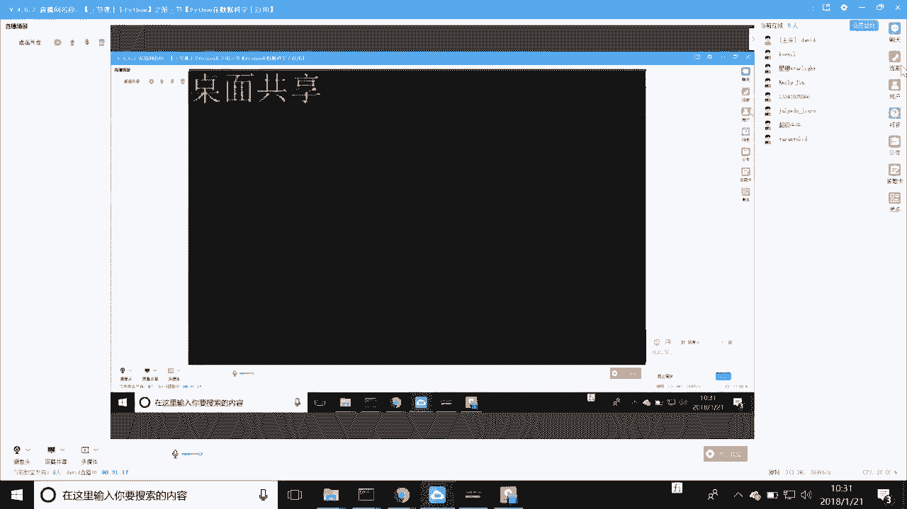
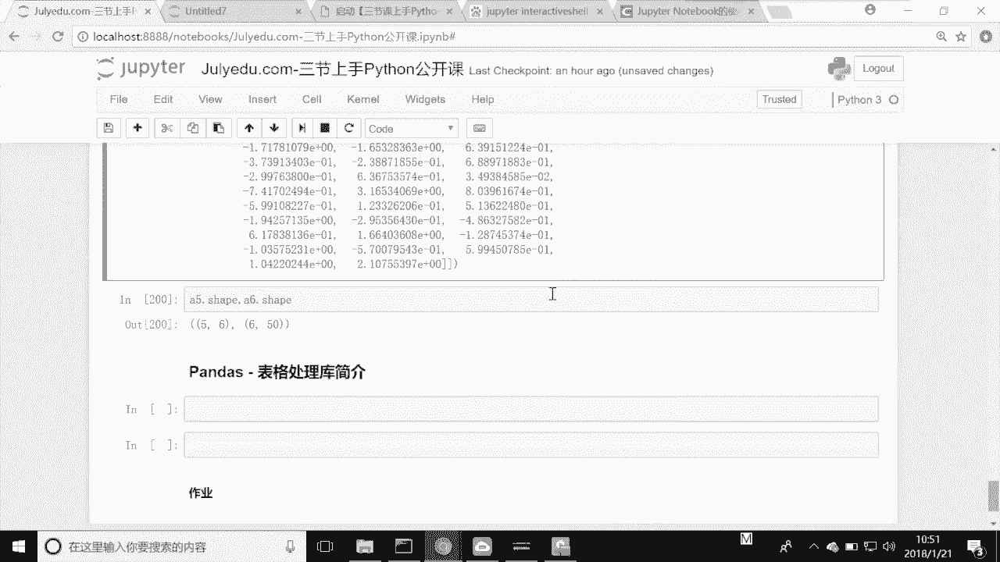

# 人工智能—Python AI公开课（七月在线出品） - P3：三节课上手Python第三节 - 七月在线-julyedu - BV17W411K7G8

嗯，好，那么我们今天可能啊因为周日啊听的人比较少，那么也没有关系，我们直接还是把这个今天的课程来讲一讲来讲。那么呃后期加入的同学如果题目有问题啊，少了一个算啊。

这故事我们。那么好，那么我们现在呢就来开始我们的这个呃7月在线公开课，之这个三节课上周python的第三节课啊，python与科学计算。那么我是david。那么之前的两节课呢。

跟大家分别在上上周的周日和上周的周五，分别和大家呃见过面啊，那么前两节课我们主要讲了呃，关于两个大的部分。第一个呢是python的基础与环境的搭建。第二个呢也就是上周五的时候。

我们主要讲了我们的函数与面向对象。啊，函数与面强对象。那么呃我们现在来看一下，我们现在来看一下我们的这个呃函数呃，我们来看一下我们的这个python基础与环境搭建。那么我们再简单的回顾一下啊。

环境搭建呢，之前我建议过大家直接就去使用jupiter notebookotebook这种这种东西啊，notebook这种东西。然后呢notebook。

然后呢呃包括了我们的underconda这个环境安装以及呃jupyter notebookotebook的这个启动，以及具体的使用。这个都跟大家啊去做过演示。

以及在notebook下面如何一步一步的去操作我们的这个python使用我们的python一些简单的语法这些东西跟大家去讲过，以及一些呃python里面比较基础的数据结构。

比如说我们的最简单的数呃字符串类型的数据呃数据类型以及这个整形的呃这个。还有。数值型的，还有我们的这个呃列表元组，还有字符串集合。啊，因为时间的因素在第一节课，也就是在这个地方啊。

python基础与环境搭建这一块和大家讲的这个不是很多啊不是很多。因为上次也是只有一个小时嘛，一个小时的时间。那么。嗯，在上周五的第二节课呢，主要跟大家去讲了一个函数和命向对象。

那么函数和命向对象其实就已经是什么呢？已经是我们将如何去把我们的这个。功能的代码进行一次封装啊进行一次封装。有了这次封装以后呢，我们才能够干嘛呀？我们才能够去不断的去。去调用它，去实现了一个什么呀？哎。

去实现了一个我们的代码的复用啊复用性。那么这是我们函数的作用啊，包括啊上节课带着大家我们一块去定义了几个函数，包括了我们的函数的参数，可变长参数，对吧？哎，可变长的这些参数都跟大家去做过演示，是吧？

还有呢就是面向对象。面向对象呢其实是相当于把我们的数据和功能，再一次进行一个封装啊，再一次进行一种封装。它呢是一种编程的一种思想啊，编程的思想。它呢是对我们客观世界的一种认识。

他把我们的所有的这个呃客观世界呢都认为是一个什么呀面写，认为是一个类啊，首先是抽象成一个类。然后呢，再从这个类中呢去实例化一个一个一个的对象。这样的编程呢呃这这种编程的这种呃思想的好处呢？

就是在于什么呢？在于我们的代码，它的这种可移植性，它的这种我们的编程的效率都会有一个极大的提升。啊，那么这也是我们前两节课所做的一个。给大家去做一个回顾和总结啊，回顾总结。那么呃虽然说说起来很简单。

但是其实python里面有非常多的这些啊细节的东西在里面。那么这些东西你得是你自己真正上手啊，真正上手了以后呢，你才能够去有这种认识啊，有这种认识。好，那么我们呃介绍完了前两节课的回顾和总结。

那么我们介绍本节课，本节课也是我们啊其实在线啊，公开课啊，三节课上手python第三节也是最后一节。那么三节课上手python其实这个难度相当的高啊，相当的高，只不过是因为我要给大家去讲公开课。

我要讲的很简单啊，我要讲的很简单。好，那么我们继续啊我们继续好，那么我们这节课的一个目标是什么呢？这节课的课程目标，就是我们的numb派和pandas苦的介绍。

以及我们要去使用n派来计算一个soft max啊，这样的。

的目标。好，我们来看一看我们的这节课啊，里面的n和padas，这是个什么东西呢？nown反pa是个什么东西呢？那么其实我们讲到科学计算。很多科学计算就会有一个库是逃不开的。那么就是n派这个库。

n派这个库呢的一些简单的介绍呢，我给大家去介绍一下啊，稍等一下。它本身是一个什么numericpython，就是一个什么唉数学的python啊，数学的python。

它的出现其实就是为了解决python在数学运算方向能力偏弱哎，能力偏弱这个问题而去诞生的啊而去诞生的。在n派这个库里面呢，在n派这个库里面呢，我们一会儿我们会对它进行一个介绍。然后呢。

pandas这个库呢，我们它是做一个叫做表格处理，大家都用过这个呃我不知道大家有没有这个经验啊，类似于这个circle啊my circlecle之类的是吧？我不知道大家有没有这个经验啊，啊。

如果用过my circlercle和circle之类型的，大家都知道那种叫做传统的表格型的数据库是吧？哎，传统的关系性数据库啊，关系性数据库，它处理的对象都是表格是吧？表格组成了这个数据库是吧？哎。

那么pandas呢它是在什么呀？它直接在内存中。去对表格进行处理。假设你的表可能是有呃6个G或者5个G，那么这些在数据库中，大家知道我们的这种关键数据库基本都是在我们的磁盘中是吧？哎，我们磁盘中。

他们稍微比较呃读写的比较慢，但是我们pas直接把它们读到内存里面，在内存这个级别对这些表格进行各种各样的处理。你比如说我们的数据清洗是吧？确实去处理是吧？哎等等的。

以及我们的及后面的机器学习都会用到pandas这个库，哎，它是一个基础库。但是我们今天因为时间的关系呢，我们不去过多的介绍pandas，我们主要的精力在n排上。因为什么呢？这两个库很像。

一旦呢你能懂了这一个库，也就稍微难一点的这个n排库，这pandas可以说。哎，就没有问题啊，就没有问题。相对来讲，n排要稍微难一些啊，稍微难一些。好。

那么我们来去看一看我们呃今天我们主要讲的这个n排这个库。今天我们的公开课大概是在呃估估计是在50分钟左右啊，我尽量的在这个比较短的时间里边带大家一块把这个整体的n派这个呃介绍给大家去说过一遍啊，过一遍。

并且呢有操作地方也都带大家操作一下啊，那么让大家对这个n派有一个初步的认识。但但是呃每节课我都会提一个问题，就是什么呢？你想掌握它还是要去练习啊，还是要去自己啊环境搭起来，是吧？把各种各样的东西搭起来。

啊，你自己去做跟老师一样的练习，最后呢你才能够真正掌握这些东西啊，掌握这些东西。好，那么我们来看一下我们今天要讲的这个囊排哈，今天我们讲的这个囊排。好，囊派呢其实呢哎我们的它是针对我们来去稍等一下。

把这个处理一下。嗯，好。好，我们这个囊排这个库呢，首先我们要去使用它，我们怎么去使用呢？叫做import NUMPNP。那同学说老师，我这样可不可以可以没有问题啊，因为这个写起来比较麻烦。

我们给它对模块起了一个什么呀别名是吧我们来去看一下啊，这个时候就怎么样导入进来了是吧？导入进来了。这个时候呢我们来去看一下我们的这个DR或者是hel是吧？哎，大家还记不记得这两个东西是吧？

我们都可以对这个模块啊，也就是囊排这个库哎有认识啊，我们来可以用locs，我们看一下这个时候呢，我们的这个囊排就已经出来了啊，我们这个囊排就已经出来了。n排已经出来了。好。

那么我们来看一下我们这个囊排啊，我们来看一下我们这个NP它是一个模块啊，它是一个模块，上节课我好像没有跟大家提到模块，因为模块其实就是对什么呀？我们的这个一种封装，我们python文件那种封装。

那么具体的大家可以在网上搜一下啊，这个就是说一旦你懂了函数，懂了这个类，那么模块你也一定也会懂啊。因么它就是在这个之上的一个层次啊。好，那么我们呃来进入这个n派。

这时候呢就已经导入到我们notebook里面了啊，导入notebook里面了。好，那么我们来去想一想，我们在正常的python里啊。我们在写什么？找入到白理个库是吧？好，那么现在呢我们来去想一想啊。

我们正常的python，假设要现在我去建一个什么呢？哎，我建1个123，这非常简单的一个什么呀？同学们还记得吗？还记不记得呀？哎一个列表是吧，一个list是吧？那么现在呢我要对这个列表中每一个数字。

我给它加上一个一，我想变成什么呢？我我想变成这样啊，234是吧？我想变成这样，那有的同学说老师，我这样我这样就可以。哎，这样为什么不行啊？我们来看一看啊。它只能什么呀？

list和list的类型之间去加是吧？哎list和list类型之间去加。你同学说，那这样老师我我我这样听就行。我这两个加起来看看行不行，对吧？你看相应位置1加1等于22加1等于33加等于4。

你不就234嘛？ok我给你234，我们来去加一加看一看啊。咦，他并没有大家看到没有啊？它并没有在我们的这个它并没有在我们的这个叫做。两个位置上去加，看到没有？它并没有在这儿。是不是哎他只是把两个列表。

进行了一个什么呀？哎，进行了一个连接扩展。我们想要的什么呀？我们想要的是什么呀？比如说我想要的是什么？同学们。我想要的是不是这个呀？234对吗？我想要的是这个呀，对吗？但是我们看看列表去做这个东西不行。

那这样的是我我我有办法。对吧哎，我们先建一个新的列表。L2是吧，哎，我们L2点。2点atendopend什么呀哎。I。加上一个一。我们再来看这个L2啊。P。我们看这样是不是也不太方便啊？哎。

这样也不太方便。也就是说我们即便是使用循环来讲，我们还要写一个循环是吧？I pen哎，我们来哎稍等一下啊，这个print啊稍等一下，应该是L2L2等于一个空列表啊。哎。

我们看看是不是说我们L是一个空列表啊，这个地方我们就去掉啊。哎，我们是不是即便写一个循环来讲，是不是用起来也是非常的麻烦，对不对？哎。

那么有没有一种办法让我们能够比较简单的去实现刚才我要实现的一个功能的啊，有非常的简单啊，非常的简单，我们还是去建一个叫做123L1，对吗？这个时候呢我们把它作为一个n派里面的一个对象去做处理。

就非常简单。大家看一下啊，叫做NP点array。我们的L1，然后这个时候呢我们叫做L一重新给它定义成这个。好，这个时候呢我们再来看它的这个type变成了什么呀？变成了n派 nD而大家看到了没有啊。

这也是非常非常重要的一个东西啊。ND而什么是NDR啊。我在这方也是跟大家去着重去讲一讲啊，现在先稍等一下啊。好，那么ND而这个N代表是什么呀？我们都知道我们自然数是什么意思啊？哎，从一到多少啊。

把无穷大的整数是吧？就代表一个哎一维二为三为四为5维。那么这个D是什么呢？就是那个为 dimensionmen啊dimen就是这个维的意思啊，就是这个维的意思啊。好。

那么我们现在看看这个时候的L一这个时候的L一还是个什么呀？同学们。这个时候的L一还是一个。这时LE还是一个什么呀？我看看啊type。でも。不认的吧。这个时候的L一还是一个list子的。

但是这个时候的L一就是一个什么了？哎，一个我们的哎它还是python的标准对象。那么第二个L一呢就是一个n排里面的那个re。好，那么现在呢我们就要对这个n排去干嘛呀，去做一个哎L一加上一个一。

我们看看发生什么。234出来了，大家看到没有？234出来了。是不是比刚才我们用python呃列表要简单的很多呀？刚才还记得吗？哎，我们用列表加列表不行，列表加数字不行。那么只有把列表进行循环，是不是？

哎只有把列表进行循环。那么我这地方可不可以这样啊，乘以5可不可以乘以4可不可以？可以，没问题。你看1231乘以4是多少？42乘以483乘以4是12，直接搞定啊，直接搞定啊。

那么这当然这还只是我们的叫做它的什么呀？叫做它的一个最简单的叫做一维数组啊，一维数组。那么我们从这个地方入门，然后呢，我来去给大家一点点的去介绍啊，一点点去介绍。

那么ND array ND array就是刚才我跟大家去说的啊，ND array那么我们来去看一看我们的这个稍等一下啊，我们去构建怎么如何去构建呢，我们来去看一下啊，我们直接把这个先删掉啊。构建ND。

那么刚才我们说了，我们构建NDR怎么构建啊，我们的时可不可以？我们现在就有一个我们的列表python里的列表，这是我们python标准对象了吧，12345是吧？哎，这是我们python标准对象了吧。哎。

我们直接把我们的这个。python的这个对象传给他，他返回的就是一个什么呀，我们看一下就知道了，它就可以什么呀？从我们已有的python的列表里可以有啊，变成了ND尔瑞是吧？ND尔瑞好。

那么我们来去构建呢？刚才我们构建的什么呢？1一维的啊，来看着啊，我来开始把它变成一个二维的啊，234567789。是。好，那么这个时候的ND array呢就变成了一个二维的了。我们来去看一下啊。

大家看一下没有，哎，变成一个二维的了啊，变成了一个二维了。こ。好，这个时候呢我们来去把这个我们的这个ND瑞，我们把它输出看一下啊，二维。那么什么是二维？咱们马上就要去讲，别着急啊别着急。哎。

大家看到没有？这是它的二维啊，它的二维啊。好，那么呃这是它的构建啊。那么它的一些属性呢，我在这里先给大家去讲一讲啊，讲一讲。好，那么什么是它的属性，它的属性，就是它的一些简单的东西啊。

简单它自身带的东西，还记得我们的类吗？每一个呃还记得我们的对象吗？每一个对象都有什么呀，方法和属性是吧？你要是不知道怎么办啊，点完一个点之后，双击t是吧？我们看到是不是有好多东西啊，是吧？哎。

他们哪些东西是我们它的属性，哪些是方法呢？不用不用不用担心啊，我们马上就知道了啊，我们先看一下叫做sha。sha是英文形状的意思是吧？我们来看看它的ship是什么2和5。这是一个topple是吧。

返回的是一个topple型。你看还记得我们的原组形吗？原组形是不是两个括号，中间1个2A也就是一些数字是吧？或者是一些其他的数据类型啊。那么它是一个什么呀？25代表什么意思？同学们有两行。

每一行是多少啊？每一行是五列，我们来看一看啊，大家看看是不是有两行啊。每一行有多少啊，每一行是不是有123455列呀？哎，那么大家能明白啊这个ship的意思了吗？哎，这个ship的意思啊。好。

那么我们再来看一看，除了这个ship还有什么啊。我们把它家先放在这儿啊。好，我们再来去看一看啊。除了这个ship以后，我们还有一个它的叫做ND大M这是个什么东西呢？我们来看一看啊，叫做ND a瑞。

还记得这个ND的D嘛啊，这就是它的一个叫做维度啊，它的这个维度，它的形状呢是二和五，它的维度呢，就是两个维度。也就是说它有行和列这两个维度。那么同学说老师你看我把这个改一下啊，我把这个都删掉，我改一下。

看看它有没有变化啊，大家看一看有没有变化，它的维度是不是变了呀，变成一了，是不是哎，它现在没有行啊，只有列啊，没有行只有列啊。好，我们再去看一看啊，我们再去看一看啊。稍等一下啊。嗯。😊。

我们再去看一看啊，它的这个叫做它最重要的就是这两个啊，最重要的ND尔瑞最重要的属性就是这两个啊。我们再来看一看它的这个size size唉哦，你们稍打一个Z啊。它s是什么意思啊？

就是它这里面的元素的个数有10个。你看我现在再再加上一个啊，看着啊看会报什么错啊，看着啊。哎，我们看一看啊，它的这个size这一块就变成了有问题，看到没有？这个地方看到没有？因为什么呀？

因为我们的矩阵要严格的就是什么呀？行和列，你不能少，也不能多。你说的是两行五列，那么你就一定要有两行五列，明白了吗？哎，那么这是它的size啊，那它这是我们N的基本属性啊。那么同学有问题的话。

就在呃同学要是听起来有问题，就在咱们的这个窗口里弹出啊。我看到后你会立即给大家回复啊。

好，那么呃这是它的基本属性。其中最重要的是这两个啊，这两个是我给他写上啊。最重要啊最重要。最重要一和2，那么size其实我们乘一下就出来了嘛，对吧？没必要知道它是吧？没必要知道它。好。

那么呃为了简短介绍呢，我们现在可以往下再去走一下啊，往下再去走一下。好，那么我们再去看一看我们的这个呃python的构建啊，构建。那么除了从python的数组里构建我们的这个囊派里面是吧？

那呃构建我们的ND array是吧？我们还可以从什么地方来构建呢？每次都用手术太累了，是吧？哎，好累啊，是吧嗯。好，那么我们也可以用一个随机去生成啊，随机去生成。它在这个位置啊。叫做什么呢？二和5。

大家看到了没有？这个地方的R代表什么意思啊？这个地方二代表有。两行这个地方的五呢代表着有5列啊有5列，这是我们使用随机数是什。你看我每一次去运行啊，你看我用这个地方啊，我每一次去运行。

它都会怎么样不一样。为什么因为它是一个随机数啊，那么这个地方的RARAND这是一个随机，如果再加一个N就代表什么意思啊？哎，随机的正态分布的数字啊，符合正态分布的数字啊。

nmal啊nmal的那个简写第一个N啊，第一个N好，那么我们现在可以从什么呀？哎，可以从我们的A一啊。哦，你们现在来去看啊。好，那么现在我们来看一看我们的A一，其实我们的A一的这个type也是什么？

ND是吧？我们这节课都在讲ND啊都在讲D好，那么A一的哎两行五列出来了啊，那么这是我们快速去生成随机数是吧？那有些时候我们不想去生成随机数是吧？或者是我们想去干嘛呀，生成一个哎生成一个这个序列的啊。

生成一个序列的，那么序列的就是A2等于APPNP点什么呢？arrange。arrange多少啊？比如说我用10个吧。我们再来看看这个AR啊，哎，就是跟我们的这个python里面的range是不是很像啊。

哎，左左呃左臂右开是吧？哎，从零开始啊，一定是从零开始啊，没有没有十啊，右边是开的啊，开区间啊是没有十的啊。好，那么这是我们的这个啊这是我们的这个。那么有些时候呢我们也会用这个叫做。

指定这个叫做我们的这个叫做。I space是吧？哎，是拼错了呀，哎，没意思错啊。哎，我们的这个从1到10啊，我们给它生成了多少呢？100个我们来看一看啊。哎，就什么呢？我给了我给你一个开始给你一个结束。

然后呢，当然你给我在这中间生成我指定要的数字啊，我指定要的数字。好，那么这是我们的快速生成。那么快速生成里还有一些其他的啊，你比如说我们的这个我要生成一个全是零的矩阵啊，比如说我们的A4，等1个NP点。

zero是吧哎，zero是吧，我们要生成一个三行，四行五列的。我们再去看一看我们的是不是啊。哎，四行五列大家数一数啊，四行五列非常的快啊，非常的快全是啊。那么如果现在我要生成一个全是七的，怎么办啊。

你就直接feil嘛。是有期嘛，对吧？然后我们看刚才我们的是不是都变成7了。哎，非常的方便啊非常的方便啊非常的方便。好，那么我们再去看一看我们的这个。那么现在呢既然有了啊既然有了我们的这个啊就开始要干嘛。

开始要进行进行什么呀？哎，开始要进行读取了是吧？读取了啊，稍等一下，我把这个做一下。构建endary是吧？哎，构建end好，那么现在呢构建已经构建完了，我们现在要干嘛呀？

我们现在要开始对它进行一个来读取enddiary是吧？ND二倍。来读取。那么同学说老师，我现在全时期，我不知道怎么办是吧？没关系啊没关系。我们还记得我们的A5，我们来建1个NP点arrange是吧？

arrange多少啊？我们的15啊15。然后呢，这个时候呢，我们的A5是个什么东西呢？我们看一下啊，从0到14的，我们对它进行一个变换啊，这个变换我们马稍后会讲啊，别着急，稍后会讲啊。

我们把它reship一下。行。或者是说我们因为这个reship和ship吧，同学们一开始容易搞错啊，我们直接就用sha吧啊，A5点ship等于35。我们再来看看A5变成了什么。哎。

是不是跟刚才的不一样了是吧？哎，跟刚才的不一样了啊，我们把这个地方print一下啊。哎刚才是这样式的是吧，哎，这样式的啊，现在呢是什么呀？现在是这样式儿的是吧？哎，不一样啊，我们给它做了一个变形啊。

变形。好，那么现在呢我们再来去看一下什么呢？读取啊，什么叫做读取啊？我们知道我们的pyython里面的读取是不是有叫切片和索引，还记得吗？哎，那么呃这个我在公开课里面讲的不是很多啊，不是很多。

那么有有这个同学要是听不懂的，这个只能自己百度一下啊，我们的这个切片读取和索引读取。那么同样在我们的这个ND array里面，或者在我们囊派里面对他们的读取也是一样的啊，也是一样的啊。

只不过呢在pyython里面，我们对列表呢是在一维，也就是在行这个维度上，对吧？哎，啊，也就是在在一行一行的这个维度上，但是呢我们到了ND array的时候，我们就可能是二维三维、四维5维。

甚至是更高维度是吧？但是通常我们用到三维或四维就够了是吧？就够了。好，那么现在呢我要去读取什么呢？大家看一下啊，我要读取A5这个ND尔瑞是吧？NDL瑞然后呢呃NDR瑞多维数组是吧？多维数组。好。

那么我们要读取它的。这个。中间的这一行怎么去读取呢？我们来去看一下啊。总计读学啊，哎，我们的。行是第几行啊？我们看第零行、第一行、第二行是吧？我们的列我们是要读取多少？我们是不是要把刚才我说了一个要求。

我要把这个东西全都读取出来，是吧？那是就加一个冒号就行了是吧？加一个冒号就行了。我们看看是不是这个结果啊，哎，56789是吧，完全没有问题啊，完全没有问题。那同学说老师我想这么去读取。

我想只读789怎么办呢？哎，789我们就这么去算嘛，对吧？哎，01对吧？0122到所有789出来了，那同学说老师我想去读什么呢？我想去读取啊，第二行到第三行。对吧。我想去读取第二行到第三行啊。哎。

1213哦，应该这个地方是这样的吧。哎，第二行到第三行啊，01这是第一行是吧？到第三行我就不写三了，我就直接把它读到最后就行了啊，直到最后就行了。好，那么这就是我们的这种啊。

当然我们这是比较简单的叫做什么呀？叫做切片和索引一个混合啊，切片和索引一个混合。你看我这个就是一个混合啊，那么我们来去看一下这样啊。这是什么意思啊？哎，这是一个混合式的访问啊。

这是从什么第一行到第四什么呀？就从这一行啊，这第零行啊，别弄错了啊，因为这个有的时候会比较绕人啊，比较绕人，我再去跟你说一下啊，跟大家说一下，你看我写的是不是一冒号，这个维度是行的维度。

那么就是这个地方。

到最后是不是这两个这是横的维度上是吧？好，第列的维度上是什么维度呢？哎。第0个第一个第二个，那么他就会要哪个呢？

671112啊，671112。那同学说老师我不正反，我跳着访问行不行？我想访问一个这个可以，没有问题啊。那么这个时候呢，就是你看行没变是吧，列是0161出来了是吧？哎，2349和14出来了。啊。

那么这个呢你稍稍有点绕啊，稍稍会有点绕。那么这个呢也会被叫做咱们numb派里面的花式访问啊，花式访问啊，听起来名字很很牛是吧？很牛，但是问题是哎你你把它多动手去练一练，练习一下，你就能明白了啊。

那么呃多练习一下会明白。那么现在我们看一看我们的这种索引有几个逗号啊。是不是就只有一个逗号啊哎一个逗号证明了我们是什么呀？前后分割，我们是有两个维度，我们先选定了一行，对不对？

你比如说现在我不选定了所有，我只选第一行，是不是这是第一行啊，这是第零行是吧？我只要这些哎，没有问题啊，没有问题啊，那么它是什么呢？先选定行，然后呢，你再选定列。那么如果我们现在变了呢？大家看一看啊。

我们现在想一想，我们现在是一个啊4230吧，30吧。嗯，我们现在重新来去做一下我们的这个30啊，我们把它的sha变成什么呢？哎，23。5、我为什么能这么去写呢？2乘以3多少，是不是66乘5多少。

是不是60啊？哎，这个时候哎，235这个时候我再去访问的时候，我就要变成几个维度了呀，我就要变成三个维度了。我中间还要再加一个。你比如说这个地方我再去加一个。我现在要访问2829，我怎么去访问？

2829。首先我要知道他是。在第零个维度上，它是第几个？

0你看这个地方分给你分的块已经分的很清了。大家看一下啊，这是第一个这是第二个。那么O啊，不是这第零个这是第一个是吧？O我们第零个是吧？我们再来看它的行是012是吧？我们的第二第二行。

那么它的最后一个是嘛2829是吧，我们再去我们再去把它的2829这一块给它什么呀，读取出来，也就是什么呢？倒数的，我们可以用这样写0123是吧？我们从第三到所有。哎，sorry啊，我这个冒号是中文了啊。

sorry啊，invo tax啊，这个地方是啊不行的啊，sorry啊。哎，是呃，01230。啊，123对，2314啊，这个地方应该是3吧，试一下啊。因好，超过他了超过他了。三列1314。啊，这个地方错。

282就出来了是吧？2829出来了，这个时候呢就是我们的一个三维的访问啊，三维的访问啊，稍稍有点绕啊稍稍有点绕。那么如果你要是觉得啊这个地方很绕，呃，那么很抱歉啊，哎，对对对，123123哇塞。

咱们有同学很厉害啊，很厉害已经做出来了，是吧？哎，那么这个地方呢稍稍有点绕，如果有问题呢，你可以多试几次就可以了啊，多试几次可以了。那么这是我们python的一个访问啊，访问。

那么当你懂得了派thon的访问，你也会懂得它的这个赋值。你说这个时候呢，我就要把28、29变成99。好，那么这时候呢我们再来去看我们的A5哎，这两个地方就变成99了。哎，你只要能够会访问。

那么你就一定会怎么样会读取，明白我的意思了吗？哎，你只要会访问，你就一定会读取啊，访问和读取。好，那么现在呢我们再来去做一个我们的这个我们的维度的一个操作啊。囊排呃就是NB瑞的一个维度的一个操作啊。啊。

我中间就不休息了，因为我们课的时间也比较短哈比较短。好，那么我们再来回去看我们的这个。少人嗯。看一下啊，我们这个A5，我们还是从这个A5讲起啊，我们现在的A5是什么呀？我们看一看它的这个ship。

大家还记不记得啊，我们一开始讲过这个ship是吧，235是吧？那么现在呢我要把这个ship呢变成5和6。大家再看一看A5变成什么样了，哎，五行六列出来了，是不是五行六列出来了啊，五行六列出来啊。

五行和六列出来了。那么这个时候呢，我们就把它的这个维度哎，我们把它的这个ship变了，它的维度变了没变。我们来看一看啊，肯定是几啊2啊，那么现在呢我们再去更改一下啊，23多少啊。

5我们再看它的NDRM它的这个维度就是3，其实这个这个维度很好记的，就是如果ship有几个有几个这种数字啊，有几个数字，它就有几个维度，明白我意思了吗？哎，就它又就有几个维度啊。

它就有几个维度那么关于这个ND array的这个维度的这个操作呢，其实就是它的这个ship的一个变换啊，ship的变化。那么reship呢呃它其实是也可以用啊，但是它不改变原来数组。

它只是返回一个被reship数组过的一个数组啊。啊，那么我们再来看啊，如果我们现在要把它。怎么说呀？我们现在要把它给它呃进行一个把它变成全部变成一个列表呢。你现在还还是一个多维数组呢，是吧？

有维度这个概念是吧？那么如果我现在要把它变成一个一维数组呢，我们就可以用这个A。还有它里面一个方法叫flattter啊。哎，肯定是我打错了啊。多用泰国键是好东西是吧？哎，那么这个地方呢我们来看一看啊。

它就会把我们所有的东西啊给我们怎么样了。哎，我们之前的我们的这个我们再来看一看啊。我们之前还这这个形状呢是吧？我们现在变成了什么呀？全都变成异位了啊，我们再来看看它的这个那么A5等于啊。

我们来看看A5点ship。哎就变成了30个元素啊，这个时候它就没有sha这个概念了，它就是30个元素的意思啊，30个元素的意思啊，30个元素的意思。那么基本上我们的维度操作呢呃我们也只讲这么多啊。

我们开始进行我们下一个，因为讲的比较快啊，讲的比较快。下一个呢就是NPR呃就是NDR瑞的一个运算啊，NDR瑞的一个运算啊。啊，好，NDR瑞的运算啊，NDR瑞的运算。那么NDR瑞呢。

其实我们知道嗯我们之前经过的这些什么创建读取变换构建是吧？哎，都是为了什么呀？把它去做一些事情啊，把它去做一些事情，什么事情呢？哎，就是一些计算啊就是一些计算。我们还拿A5来说事儿啊。

A5A5现在变成这样了，我们再给它把它变回去啊，5和6啊，可以了啊。好，那么现在呢我要对A5进行一个什么呀？哎进行一个。什么呀？我们要对它进行一个运算啊，我们要有两个数组啊，我们有两个啊A6。

等于什么呢？A6等于NP点什么呀？Rnder。他也是五和6。好，我们同时啊我们先只只看一下A6啊，呃A6这个可能是比较毛是吧？比较毛是吧？好，我们不管它啊，数字比较多，看着比较闹心是吧？好。

那么我们现在就可以将这两个。NDR瑞干嘛呀？直接进行一个相加。直接进行一个相加哎，直接进行一个相加。那么加完了以后的，它的这个结果呢，就是它在它相应的位置上啊，我现在先把这个A股先打出来啊。

你再往下看一看啊。我们再把这个A6打出来啊。我们再把这个A5加A6，因为这个屏幕的问题啊，A5。加上A6。那么我们来去看一看就能看明白了啊，它都是干嘛呀？叫做矩阵的加法啊，矩阵的一个加法。

因为我们现在是二维啊，二维。那么我们来去看零加上一个负的0。36，是不是等于它本身我们来去这么去看啊，我们就对一行就行了啊。

0加上一个负的这个是不是还等于这个呀？一加上1个0。0537，你看是不是等于1。0537是吧？哎，2加上一个负的-一，是不是加上等于0。69是吧？哎，这个数字我就不算了啊，因为它电脑算的比人算的快是吧？

叽里咔啦全都给你算出来啊，那么下面一行也是就是说加法呢，就是说我们矩阵的相应的位置上的数字进行了一个加法，那么减法也是一样啊，减法也是一样，很easy啊，那么你理解的加法就能理解减法一样的。

你看零加上负的还是啊减去这个负的等于正的一加上一个正的，它等于一个什么呀？啊，减去一个这个等于这个是吧？哎，它完全是啊什么位置上。

相同位置上进行了一个加减啊，那么乘法是不是也是一样的？我们来看一看啊。哎，乘法也是一样啊，乘法也是一样啊，乘法也是一样。乘法用起来呢，我们通常我们通常我们会做些什么事情呢？我们会去做这样的一个事情啊。

叫做A一加上1个一。这也是我们刚呃A5加上1个一，这也是我们刚才课程开始的时候，我们去思考的一个问题。python里边，我们如果用列表给它加一很麻烦是吧？但是如果这个列表还是一个双层列表。

我们就得写双层的循环。如果是个三层列表。我们就得写三层的循环是吧？我们还得判断是吧？哎，写起来非常的绕是吧？非常的绕。好，那么但是我们在我们的python里面。那在在在我们的NDR里面。

我直接加上一个一就可以了。哎，直接加上一就可以了。那么这个地方呢，我们管它叫做一个叫做什么呀？叫做广播算法。哎，那么这个地方什么叫做广播算法呢？就是说我们自己想一想，刚才我们老师说了。我们A5加A6。

它是不是有个前提啊，是不是这两个A5和A6的，它的这两个的多维数组的，它的这个是也不是相同的呀。我们再来看一下啊。是不是啊？哎它这个ship是相同的呀，但是你这个A5加上这个一这个一的ship。

那就是一个一啊。那你这是怎么去完成的呢？哎，那么你看假设啊我如果把我的这个A6，我把这个shift稍微改一改啊，稍微改一改。A6是是不是这个呀？你看啊一个是56，一个是55，你看我再去加啊。

A5加上A6。他会报错，你看他说了，你看你这两个ship是不对的是吧？哎，不能够什么呀？哎，广播在一起是吧？哎，你这两个是不对的。好，那么我们就来想想，哎，他既然那为什么我的这个就是可以的。

你看现在把这个ship一对齐就可以了。那为什么我这个一就可以了呢？这就是我们这个ND里面讲到的这个广播算法啊，广播算法，广播算法什么东西呢？哎，非常的简单啊，它就是说哎如果在加的时候。

如果发现我的这个ND瑞所加的这个对象，它在横轴上和竖轴上，哎，如果跟这个没有对齐，那么我就尽量的去把它延展对齐，那么它其实加的这个一是个什么呢？叫做NP once产生了一个叫做五和6的这么一个东西啊。

sorry啊，5和6的这么一个东西啊，5和6的这么一个东西我们再去看一下啊。嗯，啊，是我们那个。哎，它其实呢是什么呢？叫做A5加上。它其实是这样的一个东西啊它其实是这样的一个东西。

不知道大家能我不知道大家能不能够呃理解啊，那其实是把一扩展了啊，它其实是把一扩展了。它其实是把一扩展了啊，它相当于把一扩展成一个有五行六列全为一的结果啊，全为一的结果。你看这是不是刚才我们加的结果是吧？

那么你看我把A5加上一个一，肯定跟个结果是怎么样一样的啊一样的啊一样的啊，那么这就是我们的一个广播算法啊，广播算法，那么呃这也是我们的这个N瑞里面一个非常重要的一个东西，叫做什么呢？

叫做U function式啊。啊，you function啊you function。那么什么you function啊？you function其实就是我们的叫做universal function。

universal是什么呀？通用的每一个的，也就是说我们的每一个元素都会应用这个什么呀，这种functionction，还记得方是什么呀？我们昨天操作我们昨天我们上节课说过的，我们的函数啊，函数啊。

那么呃我们讲完这以后呢，我们再来这个讲一讲我们的这个求和不用说了是吧？求和不用说了啊，那么我们的这个我们的矩阵也会有一些我们的叫做dot是吧？什么是dot呀。哎。

我们的NP点dot这个呢其实是我们在这些学习里面会非常哎稍微啊稍等一下我。

稍等一下，我我我光顾着自己讲的哈，就是没有看到啊。这个同学说依旧是黑屏。呃，同学呃有他能看到size啊，我来说一下这个艾米莉的size，其实就是说。元素个数对，没错啊，元素个数啊在维度这里蒙了啊。

在维度这里蒙了。维度呢，其实我在这里大家去说一下啊，维度这是一个我我就拿这个AA5来说说事儿啊。

A5大家看一看啊，其实我们你可不可以把它看成是一个表格。可不可以？哎，这是个表格，我们都知道我们的表格是不是都是有行。是不是啊？有行。是不是有利？对吗？我移动鼠标大家能看见是吧？哎，有行有列列什么呢？

0612221824啊，1731925行什么呢？0123有行有列。那么我们去访问的时候呢，我们在。第一个维度也就是什么？第零个维度的时候，我们是什么呢？我们再我们来看一下，这样你就明白了啊。

看着啊A5点，我们去我着重去说一下，因为我们毕竟是面向。同学可能不太知道的啊，我们看看它的sha，它是不是有5和6。大家我我问一下大家啊，五对应的是什么，大家数一数是不是行啊。对。是不是好啊？

那么这个六对应的什么是不是列呀？那么好，那么既然我知道了，那么现在我要去访问的时候，那么我不就是可以这样了吗？对吧？哎，在行的方向上我只选几啊，我只选一和4，也就第二行和第五行，在列的这个维度上呢。

我只选什么呢？哎。第五个元素我们来看看是不是这样啊，你看着啊，一和四，也就是第一行，这是第零行啊，咱咱都别弄错是吧？哎，第一行和第四行哎，1234号这两行被选中了，明白我意思了吗？我我这样画图啊。

首先我们选中的是这两行。

对吗？好，那么我们再去看一看啊，我只要第五个元素啊，0我们在在我们在这个列的这个维度上，这是第零个是吧？哎，第01234是吧哎。我们看看这个交叉的这个位置，黄线和红线交叉的位置是不是就是十盒。

99啊是不是就出来了？哎，石灰就又出来了。哎，五行六列啊，是二维的。是的啊，五行六列是二维的。就如果一开始大家你要是搞不明白说。那个我这个维度搞不明白，你千万不要再去更高的纬度了啊。

你千万三维也是一样啊。你看三维也是一样啊。那个新同学，我跟你说一下啊，我三次都看到你真的挺感动的啊，一直很很很那什么的同学哈。好，那么我们再来看一个三维的啊，稍等一下啊，我把这个A5点ship。

我们把它变形成235。

是吧235235是吧，这就是一个，我们再看一下它的这个NDRM是不是三维的呀？哎，三维的。好，我们把它先打印一下啊。这是就是一个三维的啊，这就是一个三维的。好，那么我们现在还要去访问它啊。

访问怎么去访问呢？也是一样啊。你看我A5，这个时候呢我先选第零个元素，比如说现在我要8呃，我要这个这个八和这个我要这个八和9这两个吧，假设我就要这两个啊。看着啊。

首先我访问的是不是第零个元素里面的第几行。01是不是第一行要的是第几列，01234是不是3到3到所有的？你说八和九出来了。那如果同学说老师我有四维的一样的呢，你在前面再加一个逗号嘛，是吧？那五维的呢。

你再加个逗号嘛，对吧？哎，但是没必要你一开始搞那么多维度，你能把二维的，你能搞明白了。OK那后边的你就能明白了。那三维的四维都能明白，它其实是一个是一顺百顺的一个关系啊，一顺百顺的一个关系啊，啊。

是明白了是吧？哎，对对对，013道对，是这样的，你看啊，你你你中间不要加这个东西了啊，你中间不要加这个东西，你就直接就是呃按我这个东西就可以了。你我给你改一下啊，就这个。

哎呃这字那么小的，看一眼啊，哎，大大，就是这个啊，你看A5，你看0逗号一逗号3冒号是吧？哎，是代表切片是吧？那么切片的话啊，第一个二是分成两个大表。对，也就是什么意思呢？也就是我把它直接分成了两个大块。

两个大块，它就是呃咱们咱们班级变成了年级，年级变成了什么呢？变成了一个呃年级和年级之间，那么年级再往上是不是就学校了，是吧？哎。哎，对对对，可以啊，你可以按照本身这个n派就是为了我们的代数去做的啊。

我刚才还没讲到这个dot呢，还没讲到这个dot呢是吧？讲到这个dot我们就明白了是吧？好，那么现在我们讲一个运算啊，运算的这个dot啊，稍等一下啊，呃我们先把这个最基本的这个东西先弄弄一下啊。

我们来看看这个A5，我得把这A5再变回去啊，这太讨一厌了啊，呃A5点。shipep等于这个。呃呃这30个是吧，五和6还是5和6啊，5和6。好，那么我们来哎。是一个。然后我看看A5好，这是正常的是吧？好。

那么现在呢我再去建一个啊，我们建1个A6等于NP点啊 random。五和6是吧。好，那么现在呢我们来进行一个dot啊，这个dot是个什么概念呢？就是我们的矩阵的一个什么呀？稍等一下啊，我们看一下A16。

我们看看这个结果就明白了啊。嗯。😊，Rnder稍等啊，是不哦哦。写错了是吧，A反正我的A，我也得重新建一次啊。呃，稍等一下，我把A5重新建一下啊。嗯。第。因为这个举证来讲是相当重要的啊。

举证来讲是相当重要的啊。看看A等一个什么。好。第六。你直接就A5都A5吧。我们看看为什么会报错啊，为什么会报错。我们知道矩阵相乘会有一个什么问题啊？我们的矩阵相乘呃，有同学咱们学过这个啊，对。

我们之前我们学过这个线性代数，不是写错的问题啊，是我这个维独没有对齐，唯独没有对齐啊，我们再来去做一个啊，叫做A6等于NP点random点RND啊。N这个时候呢我变成6和5。啊，变成六和5啊。

然后们这时候再去doote一下，不是写错了啊，是我的这个。本身就是有问题，我写的这个维度是没有对齐的啊。哎，我们这维度是没有对齐的啊，我们再来看一下啊，出现结果了是不是出现结果了。那么这个时候呢。

我们来去看一下啊，我们先去看一下，我们先把这两个分别给大家打印一下啊，打印一下。然后呢我们再来去看啊。A5。稍等一下，A是吧，A6是吧？A6好，那么现在呢我们来去看一下啊。

这个时候我们看看这个结果到底是个什么结果。我们知道矩阵乘法是怎么乘的吗？我们矩阵和矩阵相乘，还记得吗？

哎，刚才我们是怎么加的，我们的普通的我们的加法是不是零加上一个哎什么什么什么是吧？哎，等于一个这个但是这个我们是不不对的啊，我们这是怎么去做呢？是0乘以它加上什么呀？1乘以它，再加上2乘以它。

加上3乘以它加上4乘以它，加上5乘以它，明白我的意思了吗？哎，这就是我们最重要的我们的矩阵的一个，我们叫做哎矩阵的一个dot啊，dot点乘啊，电乘。好，那么dot是不是就是点的，对吧？

呃，之前学过代数的小售，我看同学的反馈啊，之前这呃还记得是吧？哎，五阶对，这样可以。对，哎，这就是我们举证举证的。你如果是学过新代数啊，知道我们举证的这个乘罚就会明白，就是什么呢？

我们的两个假设我们两个矩阵要去做这种运算的话，我们的这两个ship是一定要在哪个维度上对齐的呢？我们来去看一下啊。

A6哎，这个地方有写错啊，这样就对了啊，一定是要在这个两个是要对齐的，明白我的意思吗？你这个可不可以不齐，没有问题，你这个可以不不齐，明白我意思吧？哎，你这个可以是50个都没有问题。

我们来写1个50个啊。可能比较大啊。哎，就非常多是吧？哎，没有问题啊哎，没有问题啊，都是可以的啊。但是你这两个一定是要对齐的啊，就相当于什么呢？我我这边左边的这个数去找你右边的这个数。

它两个数每个位置上先做乘法，然后呢相同的位置做乘法，得到一个数呢，然后保留和下一个相同位置得到乘法，保留，最后呢得到一个结果啊，最后得到一个结果，然后再去乘下一行再去乘啊，这也是我们举证乘法。

如果呃你不熟悉，你可以去百度搜一下，百度搜一下啊，这里不过多的再去讲啊，不过多再讲，那么这最后呢我们再去讲一个叫做啊叫做按照维度去做啊，按照维度去做啊。呃，我看同学们有没有问题啊。哎，对对对。

是是这样的啊，是这样的呃，我可能讲的不是很清楚啊，我努力的去讲清楚，但是我害怕我讲的不清楚啊。啊，那么如果讲的不清楚，那么你可以去这个。

啊，百度上去搜一下他的这个他的这个乘法。其实我这样去画一张图，你就能明白哈，我这样去画张图，你就会明白啊。假设我们现在有两个矩阵啊，假设我们现在有两个矩阵啊。

这两个矩阵的形状可以不一样，对吧？哎，形状可以不一样，但是什么必须一样，我用这个红绿色的句话，这个长度和这个程度必须是一样的，明白我的意思了吗？哎，也就是什么呢？

也就是说我们可以这个里边的东西和它进行干嘛。相乘啊，一个一个乘得到一个结果。然后呢再去和剩下的这个去乘得到了两个结果，然后再去乘再去乘一样的啊，那么这个还是那句话，多练习啊，多练习啊。

你就会懂啊你就会懂。

好，我们来去说我们最后一个了啊，最后一个了叫做按照维度去计算啊，照维度去计算。好，那么现在呢我们再往下走一个啊，还是A5是吧？好，那么现在呢我们来去做一件事情啊，做一件什么事情啊。

我们现在要求我这个A5里面的最大值。那同学说，老师这还不容易，你看我的。我都不用我都不用问，我都知道肯定有这个函数啊，一定是有这个函数是吧？那一定是29是吧？A5里边最大的肯定是29是吧？哎，没有问题。

你看肯定是这个数嘛，对吧？但是我说我现在想去求每一行里的最大值。你比如说咱每一行里边，就因为这个数字呢，我们都是就是整齐的，没有打乱哈。你可以回去，你可以搜一下那个random点shuffle。

它可以把它打乱是吧？哎，我就不打乱了。那么。我现在要求的是每一行的最大值，那么怎么去求呢？我们就可以用NP啊，就是ND瑞典这个N呃。NP啊，sorry啊。是不是反正讨厌啊，max点A5。

然后呢acces等于0，你们去看一下啊，sorryX等于1啊，等于1这个时候呢算出来得到的就是什么呢？5117还有什么呀？还有我们的这个哎2329，它就是按照什么呀？excess是一啊。

他就把这个一这个维度消掉了，什么是一这个维度啊，我们还记不记得零这个维度是行，一这个维度是什么？是列，他把这个列的这个维度消掉了啊，他把这个列的维度消掉了，所以呢就会变成了什么呢？剩下的是不是只有行。

你看5117、23、29是不是有行啊，那么同样的说老师我我现在要你求什么呢？这一列一列一列一列的什么呀？最大值啊，按照列去求。它就是什么？2425，那基本上就是最后一列嘛，因为我们这没有打乱是吧。

所以看的很清楚是吧？哎，那么这就是我们的一个哎按照我们的这个。哎，维度去求啊维度去求。那么你这个维度，所以很重要，你把这搞明白了，后面很多操作都会基于这这个之上哈。那么我们可不可以按照维度去求和呢？哎。

也是可以的，三看到没有？06加12是不是20，20加18是不是3838加24呃，38加啊，这个这个算的不太清楚了啊，我算的不太清楚了啊。

那么基本上呢就是说我们的这个是按照我们的这个维度最后去求出来那么一个什么呀一个结果啊，5117是吧，19，你算一下，最后肯定是85是吧？哎，14这些东西算起来肯定是80。那你说我再按照行去求呢。

也没问题。你看这这这这一行加起来一定是15，这一行加起来一定是多少。那，一定是一个叫做51啊，51。那么这87、123、159。

按照好去求啊按照好去求。好，那么好，那么呃基本上我们今天的这个公开课到这儿基本上就已经结束。但是我们会有最后一个作业啊，最后的作业叫做求soft max啊，soft max之前呢我我今天的这个课呢。

基本上把这个soft max里面东西都讲完了啊，都讲过哈。那么呢我再去大家去过一遍，把这个当做是留给大家的一个作业，大家自己去动动手，基本上就能把我们今天讲的这些东西啊。

哎，都去干什么呀？这个penance就删掉吧啊，干什么呀？就能把我们今天讲的这些东西全都消化掉啊，非常好的一个收获啊，一个收获。好。那么什么是soft max呢？

现在呢我来去定义一个叫做A7等于NP点random点NDN啊。啊，妈。是不是中等弄是吧？我们把它变成1个11个7是吧？哎，我们知道哎，把这是马克当的是吧，别坑我了哈。说的么不对，A7是吧？好。

我们来看一看这个哎这个7有点多了吧，一就行。嗯，我们来看一看这是生成了一个随机数，是不是有正有负，是不是有正有负。那么我如果我们要去对这个东西去进行一个概率化啊，soft max其实就是一个概率化啊。

概率化。那么我们要对它进行一个概率化的处理，怎么去处理它呢？因为有负数没有办法去比较，对不对？我们首先把它干什么呢？我们给它做一个指数运算啊。explanation是吧？哎，我们的A7是吧。

我们的A7把它作为一个指数啊，把它作为一个指数，求得已哪A期重新复值。哎，我们再看看A7就变了啊，就变成什么了？没有负数了，看到了没有？做了一个线性变换。这个大家能看明白吗？我们看一下大家啊。

有问题的话就提啊，有问题的话就提啊。

啊，有问题的话就提啊。好，那么我们来去看一下啊，哎这时候我们就是把它变成了一个线性变换了是吧？啊，变成了一个指数是吧？我们现在要去求的是什么呢？我们要把这个东西啊。我们要把这一行给它求出一个什么呀一个。

既然都是正数是吧？既然都是正数，我们要把它进行一个什么呢？哎，NP点s。我们的这个A7Xces等于一个一。得到了一个什么呀？叫做A7。下划线s我给它付一个值哈，得到1个A7点sum是吧？

我们来看一下A7下划线sum等于1个18。4是吧？然后呢，我们再用我们的这个A7。去除以我们的A7。下环境散了。会得到了一个新的数字啊，会得到了一个新的数组。这个数组会有一个什么特点？大家大家想一想。

这个这个它的特点一定是什么？它加起来一定是一，我们知道概率的总和是不是就是一呀？哎，我们可以把这个结果干嘛呀？我们把这个变成A7下划线soft max。等于A7是吧？

我们把这个A7我们先print一下啊，我们先print一下啊。A7下划线soft max，我们先确认一下啊。好，我们再去求一下，我们看看它是不是我们的17。小的nax啊。是不是一呀，一定是个一是吧？哎。

我们就用这种方法把我们的这些给了我们的数字啊，我们这A7是不是很杂乱的，有占过负的是吧？可能还非常大是吧？但是最后呢我们都会把它变成在一里面的这种操作呢，我们也可以把它叫做归一化啊，归一化啊，归一化。

好，那么这个里面呢其实就是一个概率啊，soft max啊概率。这个在我们机器学习里面的图像识别里面，其实就是比如说这个一列的出现的是什么呢？我们看到它的分数，我们会把这个出现的概率当做是一个出现的分数。

那么假设这一列对应的是猫，这一列对应的是狗。那么狗的呃猫的分数要比狗高，我就会把这张图片认为是什么呢？哎，猫，那么剩下的鱼虫和鸟都不会被人都不会被什么哎出现的概率就非常低。

我们之前可能同学有用过APP什么叫做花瓣侣是吧？哎，我们扫一个花，然后出现了一个什么海棠呃概率百80几是吧？哎，樱桃概率60多是吧？什么什么什么什么玫瑰概率3%是吧？哎，其实就是这个东西啊。

其实就是这个东西。好，那么今天呢我们的公开课呢，整整一个小时，那非常感谢大家的这个啊，耐心的听讲和热情的一个提问哈。好，那么呃用过是吧？那你用过，那么你一会儿就好好再写一写哈，自己去搞一搞是吧？

自己去搞一搞。因为这个也就是咱们记忆学习里非常重要的一个东西啊，sofm啊，ofm。

好，那么我们的作业呢也是我们用来作业写的不不标准啊。哎，狼牌。哎呀，气死我了。1百5比和这个。好，我们的作业是n派实现我们的stm啊。基本上你把这个ntime。在这个里面呢，我给大家去做的是什么呢？

只有一行是吧？那么我要求你去写很多行啊，写很多行。你比如说哎些我这里只有一行五列是吧？你写十行五列，你也你也要去求啊，那么你把这个东西做完，那么我们这节课讲的东西，我可以认为你都ok了，明白我意思了吗？

你都O了。好，那么呃这也是我们呃接在线啊python三节课上手python公开课的最后一节课。那么基本上呢您如果能够从头听到尾，并且您如果能够从啊我们留下的每一个作业，包括我们论坛里的作业啊。

你都能够重新来做一下，至少说python在科学计算方面你已经可以上手了。那剩下的其实就是不断的拿项目去练习啊，啊，拿项目去练习。好，那么非常感谢大家啊，非常感谢大家啊，今天的这个呃热情的这个提问哈。

热情的这个提问。

好，好，那么我们呃最后呢我会把这个作业呢会会把这个notebook呢发到我们的这个AI公开课的这个群里面，大家还可以去下载呃，会去重新的去在自己领脑上去实现一下啊，实现一下。好。

那那么今天的课程就结束了，谢谢。

