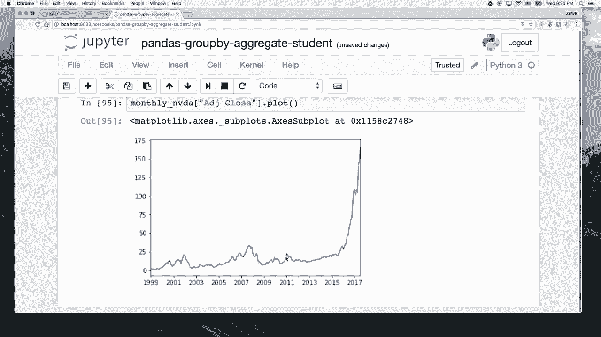

# 人工智能—Python AI公开课（七月在线出品） - P4：瑞士军刀pandas之数据分类 - 七月在线-julyedu - BV17W411K7G8

学们啊，欢迎回到我们的拍ython数据分析基础课。在今天的课当中呢，我们会继续带着大家一起学习关于pandas的一些内容。在前面的几节课当中呢。

我们已经算是初步的入门了一下pandadas的所有的data structure。啊，我们讲过了pandadas的 series，我们讲过了pandas的 data frame。啊。

然后我们讲过这个seious呢是一个一维的数据结构。这个data frame呢是一个二维的一张表格。然后我们pandas里面有一个index呢，是专门专门用来标记啊seious和data frame。

嗯，这个data frame呢其实就是我们pas的主要的核心内容。然后我们今天的课呢也是围绕着围绕着这个data frame来进行展开。那我们今天的课当中会给大家介绍三个新的操作啊。

叫做group by aggregate。group by and aggregate呢一般会一起。一起发生。我们会按照group by呢，就是按照一个啊。对一些表按照一些内容进行进行分类。

然后进行汇总啊，group by呢其实就是一个分类的过程。而这个aggregate呢它就是一个汇总的过程。然后我们这个transform呢是对呃表里面进行逐行逐行的操作的一个过程。

那我们啊先这么抽象的讲一下之后呢，我们后面还是具体的开始举例子。我现在先假设啊我们有一个呃我们有一个公司，就比如说我们7月在线的公司，然后我有一张表格呢。

他记录了每一个员工的啊员工的那个薪水的他们收入的流水情况。那我们在开始之前呢，首先记得import pandas SPD。然后我们还要import down派。SNP。这样拿到两个。我们需要的库。

然后我们来创建一个一张表格，这张表格呢它是一个data frame。这个data frame它记录了我们7月在线这个公司员工的流水情况。那我们要存哪些信息呢？我们首先要存这个员工的名字。然后我们还要存。

我们还要存它的年份。我先把这些信息给他写下来。我们讲过这个构造一个data frame的一个最基本的方法呢是。写一个。dictionary of lists。

然后这个dictionary的 key呢会被当做我们的。它的key会被我们当做columns，然后它的里面的数据呢就会被一行一行的展示出来。然后我们再写salary。然后我们再写bonus。

这就是我们的呃这张表格的信息。那我们的姓名呢有july。有。紫尾有。折尾。You hand。有 July外。这些呢都是比较机械的操作。顺便作为给大家给大家作为一个一个复习的机会。然后时间呢。

我们比如写2016年、2016、2016、2017、2017、2017。然后我们的sary呢啊那都是一堆整数。Okay。然后最后我们的 bonus写一些稍微小一点的数字吧。

这样我们就拿到了saries这样一个表格。看看有什么错误啊，他这边错误告诉我们说是eras must all be of the same land。可能不一样长。12345678。

123456788号86123456。这边是明显少了一些，嗯，我们再写1个2017，再写1个2016。这样呢我们就拿到了这样一张表格。

这张表格呢记录了我们每一个员工他每一年拿到的一些薪水和他的bonus。然后呢，我们下面给大家展示一下什么叫做group by。比如我现在想做一件事情，我想按照嗯按照那个。每一个员工做一个分类。

然后给他做这样一个分类的操作。那我可以怎么做呢？我们可以做group by。Name equal to seller。Bian group by。

group by name这样一个colon就这里传进去一个co的名字，然后我们写group by name，我们就看到啊这边少了一个P，这样我们就看到呢我就拿到了一个object。

这个object的名字叫做data frame group by。那这样呢我们可能不太看得明白，group by是一个什么样的object。

但是我们后面呃会再给大家详细的讲解一下这个group bygroup by objectject究竟是一个什么样的东西。但是我们在group败之后呢，我们有一个。

有一个最最常用的操作是做一些aggregate的操作。你可以认为group by呢，我们把这个数据已经分类好了，就是我已经按照名字做了一个划分。嗯。然后划分完了之后呢。我们就可以做一些汇总的操作。

比如我写goodbye name点。大收到了个屁goodbye name点some。我们就会看到他就按照这些名字含着来则伟这三个名字呢做了一个做了一个分类。然后我们把 bonusus呢都加到了一起。

把salary呢也都加到了一起，然后把页也都加到了一起。当然这个页呢把这个年份加在一起，其实没有什么意义。但是我们嗯作为一个例子就先这么放着。然后比如说你不想把这个年份加起来呢，我们可以写group。

by。name，然后我们还是可以把我们的con给它选出来。注意我们的我们这个就像对一个data frame的操作一样。如果我写salleary bonus，然后再写一个sum。

我们就看到他只对salary和 bonus做了一个求和，他就没有把那一个没有什么意义的页那一列拿出来。然后我们看到我们前面的前面的这样的这种写法呢，它默认是给你按照名字进行了排序。然后呢。

我们其实可以我们也可以不排序，怎么样不排序呢？那就是我们在group by的时候，如果我saries点group by。name的时候，我给它多加一个参数，st等于foralse呢。它就不会进行排序。

然后我们再写sum呢，你就发现啊它就按照按照july则尾函这样下来，它就没有做一个默认的排序。然后还有呢，我们我们刚才刚才呢。拿到这个go百。name之后呢，我们直接给它做了一个求和。

这样sum呢是一个求和的操作。但其实呢嗯也有一个写法是直接用agate，然后sum。这样呢我就嗯可以。就这个这个方法呢，其实就相当于是aggregate是可以传，你要传一个function给它啊。

包括你也可以写MP点some。或者就这样呢，我们可以我们可以把一个function传给这个group外，然后它可以一个一个的apply到每一个group里面去。

对每一个group都做这里面的这个function的操作。比如someum呢就是一个求和，也就是这个这个语法呢就是aggregate传一个function进去。

它就可以对每一个组都做你这样一个呃reduce的操作，也就是一个汇总的操作。然后我们这里呢再详细的看一看这个group by它到底是一个到底是一个什么样的object。我们还记得前面有一个group。

Goodbye。name这样一个object，它是一个data frame group by objects。我们可以看一下它的点groups是什么呢？这样我们就可以看到我有三个group。

这三个group呢分别是含jaly跟则尾，然后这里呢分别是带上了它的index。这个index是从哪来的呢？我们直接看一下salaries，你就会发现。第0个第4个第5个第7个是july。

所以你就看到0457呢，这边是july。然后这个函呢它就是第三个位置，然后则尾呢也有有3个3个index，所以这个group by呢，你可以认为它其实就是对于这个data frame呢。

按照index做了一个做了一一遍便利。然后呢，它把它的index取出来分成了几类。然后这几类再归出去呢，你可以做一些agggregation的操作。那我们也可以看一下这个，看一下 lens子啊。

group by name，这样呢你就会发现它一共有3个group by name的这样的group。然后group by呢，我们前面是只group by一个col。

但是这个group by呢它其实可以group by多个col。比如我这里写嗯，我我这里可以写sary start group。Goodupbye。传一个list进去。

这个list呢里面是你想要group by column，然后我有name跟 year。然后这两个group by之后呢，我们再对它呃，我先我先给它分两步写啊，就这个是可以分到一步写的。

比如我写group。By name。也等于这个东西。拿到拿到了这个groupmy name here之后呢，我再对他来做一个。So。这样我们就会看到，你这样就看到了每一个老师。

每一个员工在出来EDU他的 bonusus跟 salaryary做一个汇总是有多多少的一个数字。并且呢它的index我们会发现这个s之后呢，我们看一看这个s之后，它究竟是一个什么样type谱的东西。

你发现它的type也是一个data frame，然后我们会发现这个data frame呢，它的index应该是有两层的index，就是第一层呢是老师的名字，第二层呢是我们的年份。

然后除了这个除了这个s之外呢，其实aggregate的函数还有很多，我们包括group。Gs by。name yeah这是我们刚刚的一个group by object。它除了some之外呢。

我们还有size这个 function。size呢是嗯统计一下一共有多少个records在这个group里面。然后除了size呢还有其实就是如果大家熟悉sql呢，就会非常觉得这种语法非常的熟悉。

就是我们写sql的时候也会写呃select，然后some或者说是average of something，然后from一个table，然后group by some columns这个地方呢。

其实group by跟 aggregate一般都是配套使用的。你先把它分成几类，然后每一类呢给它做一个相应的汇总的操作。比如我们这里汇总的操作，我们可以写命，命呢就拿到了这个平均。

我我先把它都写下来size。然后还有我们的命的操作，算平均数。然后呢，还有我们的。还可以我们还可以求me。medium呢是我们的中位数的操作。然后我们还可以写。

standand deviation这个是我们的标准差。然后注意标准差呢，如果它只有一个records，我们看这个地方的count有很多只有一个records。那如果只有一个records呢。

它就算不出标准差这个东西，对吧？所以这边呢它就变成了NAM。然后我们还有一个非常有用的function叫做describe，它可以统计出各种关于这个goby。各个groupgroup的一些统计信息。

比如group by namee点describe。我们就看到啊，他就他就告诉你这个count是多少，包括命是多少，standard deviation是多少，还有它最小值多少啊，最大值多少啊啊。

这些全部都有。啊，很多很多方式呢大家可以去网上查，有一些呢也可以靠，其实靠名字猜也能猜到。比如说这个last丝呢。他就会把最后一条记录给你拿出来。啊，如果我写这个first呢。

然后把第一条记录给你拿出来。如果我写这个命呢。那就会把最小值给你拿出来。如果我写max呢，那就把最大值给你拿出来啊。

这个是我们比较常用的一些group by跟 aggregategroup by呢是把按照一个co或者几个co把它。把他那些嗯。把它按照它的那些值进行分类，然后分成了几类之后呢。

我们再对它做一些统相应的统计的操作，包括求值求平求平均啊，求最大求最小啊，求和啊之类这样的操作。啊，如果我们想要对一个group做一个iterateerate呢。

我们看一下怎么样可以iterate一个group。其实我们这个。我们可以写for name group in group。Next group by。内。这样我们看一下print一个 name是什么。

你就会发现它的名字呢是我们每一个group的名字，就是含 july则为这三个名字。然后我们还可以把。还有一个很有用的词。我们把group打出来看呢，就会发找到每一个group的信息啊。

我们就看到这个函呢，它是第三个位置啊，然后这个这边呢是jaly的所有的信息，这边是泽伟所有的这个信息。然后我们看一看，我们顺便可以看一看这个print。type group是个什么什么类型？

我们发现它其实都是一个data frame。其实这个嗯group by呢，它就是帮你把一个大的data frame拆成了好几份。

然后每一份呢是按照你要你所指定的那一个con的 value来进行划分的这就是把一个大的data frame拆成几个小的data frame的方法。让我们看一下，如果我想要选择一个特定的group。

我可以怎么做呢？比如我写group by name点get group。这样呢我就可以按照这个group的名字来拿出这个group啊，其实这个这个呢就是相当于我上面拿出来的结尾这样一个group。

然后我们可以看一下它的type究竟是什么。如果我写type。我们就会发现它是一个data frame。就这是说我们刚才上面拿到这个data frame。然后后面我还想嗯说的一点呢。

是这个我们刚才刚才前面忘了讲一点，就是我们在做这个agggregation的时候啊。如果我写，比如说这里的group。group by name yeah点我我是不是可以写aggregate。

然后比如写一个呃n派点min。这样呢我就可以求一个平均。然后如果我们想要做几类操作。比如说我又想求个平均，又想求个标准差MP点STB啊，又想求一个和，比如MP点some呢，你就可以把它作为一个数列啊。

不是作为一个list，然后把这个function function的名字一个一个的放进去，它就可以对这几你想要做的这几项都给你求一个值出来。那我们就看到这个 bonus跟 salary呢。

它求了三个内容。some standard deviation和和命。然后嗯今天课最后这节课最后要给大家讲的一个内容呢是trans transform。我们transform是什么东西呢？

其实它就是对对于呃我们的这个表格呢逐行逐行的做一个操作。然后这个操作并且是嗯跟我们前面讲的group by有点关系。所以我们这里呢先先拿一张大一点的表格来做个演示。啊。

我这边有一个我这边有一个文件夹叫做data。这个data里面呢。呃，token authenticationO那我们。我这个notebook好像还加密了。稍等我来复制一下这个头坑。我这样进去之后呢。

我这边有一个文件叫做MVMVDA点CSV这个是英伟达这一只股票，它的呃数据，这是一个CSV的文件。那我们我们上一节课已经讲过怎么样读1个CSV的文件。嗯。

我们就用我们前面讲过的MBDA equal toPD点read CSSV这样的文件。然后我写data。MBDA点CSV。这样呢我就读进来了我这个英伟达的文件。

然后我们可以看一下NBDA点headhead呢是把这个把这一张表格的前五行给你打出来。那我们就看到这一个。这张表格呢嗯它它就是股票的信息，对吧？这里有open有h，就开盘价、最高价、最低价，还有收盘价。

还有那个嗯调整过，按照按照那些什么分红啊，拆股啊，这一些调整过的一个nmal莱的价格，最后是这个交易量成交量。然后我们。在再讲一些这个read cV。

如果如果我现在想要把第一列这个date这一列当做是我们的index呢，你可以指定index column等于0。这样呢我的第一列date就变成了index。

然后呢还有一个我们现在想要做多做的一步操作呢是我第一第一块地方呢，因为它是一个d对吧？这个date呢它默认读进来其实是读成一个字符串，它并不会给你做任何的操作。

但是我会希望它能够把我的第一列变成一个date time的 objectject这样呢我可以再申明一个pa然后把con的名字传进去。

我想要把date这一些这一个co呢pass成一个date的 objectject这样我们再拿到你看起来还是没有任何的变化。但其实我们会发现它这里有一点区别呢。

就是这个点 index它就变成了一个d time index time index就有一些好处。比如说我拿到了第一个。day time index之后呢，你发现它是一个time stamp。

然后你可以写它的夜，你可以说明它的mon。你可以申明他的day。那，你这在是可以写他的weekday。Weekday。发现他这个周四就是这样多了很多对日期的操作，就是后面可能会嗯有一些用处。

然后我们这里后面就要用它了。比如我现在想要给这只股票呢，按照按照每天按照按照每一年嗯来做一个group by，那我们应该怎么做呢？这个时候其实我们可以这样写NVDA点bro by。Yes。

group by嗯，这个group by应该是什么呢？其实我想要把每一行的这个年份给它拿出来，这个年份怎么样给它拿出来呢？其实我们需要传一个function进去，就你这个group by。

我们知道group by干的是一件什么事情呢？它其实就是逐行逐行的去看，然后按照你那一行的某一个信息来把它拿出来。然后我这个group by呢理论上我应该写一个嗯把我的那些要分的那些名字给它写进去。

但比如我现在想要按年份来分，那年份并不是我的一个col，那我应该怎么样做呢？其实你可以这样做，我可以写一个mbda functionda这样相当于是一个 function对吧？

比如我写 key等于这个东西，那我现在这个里里面如果再写 key呢，其实它就会默认帮你按照年份来做，我这里还没有执行，它就会帮你按照年份来做划分。我们可以直接加一个aggggregation上去。

比如greg。AGG跟aggregate呢是同一个东西啊。比如我现在要汇总一下MP点命和MP点。STD那我就可以算出这个算出它的平均值和它的标准差。那我们看到它就按照年份做了一个划分。

所以这个key呢它默认其实NBDA进去之后呢，group by它其实是看你的是看的是你那个index的值，然后我把传一个da function进去呢，你就可以把X点E给它拿出来了。

又或者说呢你这边其实直接这样写啊，我直接写一个de key。T这个 function呢，它 takeake the parameter X，然后我写return X点E。这样做出来效果也是一样的。

就lambda呢其实就是这样对于这样一个functionction definition的一个一个另一个啊比较简洁的写法。所以我如果直接把这个lammbda function写进来呢。那也是一样的。

就这个lammbda function呢，其实它是可以帮你定一个functionction，并且把这个functionction直接写成一个参数。啊，那我这边直接是显示前几行，稍微节省一点空间。

那这样呢我们首先定义了一个key，这个key呢它可以帮我们嗯做一个。帮我们算出这个做一个group by。group by之后呢，我们可以算出这个平均值和标准差。然后我后面呢想再做一步想再做一步转化。

这一步转化是什么呢？我想把我们的股票的价格除以当一当年这个股票的平均值，然后啊我想把这把我的股票的价格呢减掉我当年股票的平均值，然后减出来的差呢。

再除以我的一个standendard的 deviation。什么意思呢？如果我写一个function叫做the score呢，我用lammbda function来写。它就是这么个意思啊。

比如我有一个我有一个股票X，我想要把它变成X减掉X减命。然后再除以X减STD。就是X，你可以认为X是一个n派的array，然后这个array呢，它会它要减掉它的命。

然后再除以它的standard deviation。这个是我想要做的这个the score的操作。然后this score操作，我要怎么样我要怎么样去用它呢？我就可以写MVDA点go by。

group by之后是key啊，group by我group by key之后呢，就是按照年份已经划成了几个不同的subgroup，每一个subgroup都是一个data frame。

这个data frame呢都是一个一堆股票的价格啊。然后这一堆股票的价格呢，我想再给它做一个transform。transform就是在这个地方拿上用场，就派上用场。

然后如果我这个地方transform模型，我把这个Z score传进去呢。他就可以。对这一这一系列group全部都做一个the score transformation。

就是把它做一个做做成一个标准化的操作。其实大家可以自己学习一下，就是这个你把X减掉命，然后再除以这个standendard deviation。

就可以把一个一个随机变量转成一个嗯转成一个01分布的那个高斯分布。那我们这里可以写transform。等于这样的一个transform的东西。然后我们再看transform。

我们就看到这个transformed呢，它就变成了一堆啊，其实都是离01比较近的数字。啊，因为他已经除掉了这个平均，减掉了平均值，又除了一个标准差，所以这个是被收的比较小。我们就把这个head给它留下。

然后呢，有了有了这样一些数据之后呢，嗯我们其实后面会讲这个mathpl lab这个画图的软件。但是嗯我们今天这里呢简单的用一下。pas自带的画图的功能。

我先在这个猪里面写一个matpl live就可以matpl live in line，这样我就可以在这个软件里面做一些简单的做图啊，比如说我刚才有个MBDA对吧？如果我写MBDA点plus呢。

我们就可以画出这样一张图来这张图看起来不太好看。为什么呢？因为它线太多了，并且这个volume呢是一个很大的数字，它的股票价格呢都很低，所以你看很多值其实都在下面变成缩成一条线。

所以我可以把NVDA的一个。一个一个部分拿出来，比如我们就把这个adjusted close拿出来。啊，这样呢我就看到了它的它调整调整过后就是复权之后的这个收盘价啊，它就是这么一个走势。

然后我们看到它最近涨得非常的猛，因为英伟达这个芯片做的比较好，最近人工智能和这个术 realityality都比较火，所以它这个股票就涨得非常的猛。嗯，然后我们可以把NVDA给它画出来。

然后我们也可以把我们也可以把我刚刚的这个transform。你再看看这个transform的它长什么样子，这是我调整后的股票价格。调整后的股票价格，比如说我再给它做一个呃。

我我也把它的这个adjustedclo拿出来，然后我点port一下呢，我们就可以发现啊这个这个股票呢。这样按照年度进行一个调整之后呢，它就是上上下下啊，就是你可以看出。嗯。

其实这个第一波下来是没有什么用的，就只是这一年到了下一个年度，我们就可以看到这一年它的那个股票的走势是什么样子的。然后我还可以嗯这些这个plus呢。

它其实take一些 parametersameters。比如我可以看这个呃，我们可以写它的graded等于数。它这个 parameterameter呢非常的多plot。

同学们可以自己去研究plot这个 function。在官网的那个documentation上可以查到。如果我加了个gradere之后呢，你就看上面它是一个白板的这样一个背景。

这边下面呢后面就多了一些实字的背景啊，网格状的背景，这样你就嗯可以有个参照。然后我们还可以写这个fiig size。就是写fiake size呢，它 take它把这个长宽给你输进去。

长宽的单位呢好像是in尺之类的东西。比如我这边随便写两个数字，10。87。4啊，那这张图就变大了一点啊，就这是一些你可以简单的。

对于一些数据呢可以用用pandas来它带着这个plot的这个方来做一个简单的图。然后我们还可以把把这两个两幅图呢给它拼到一起做一个简单的对比。

啊比如说我定义一个compare是一个新的data frame。这个data frame呢它它是分成两部分，一部是我们的 originaliginal。

ADJclo price这个东西呢是我们的MVDA。A DJ close。然后呢，我们还有一张新的。The做 transformed。A D，J， close。

这个ADJclo呢是transformed。A D，J， close。然后我们再看一下这个compare点pl。比如我们也给它写上gradereread等于true。

然后我们给它fiake size等于稍微大一点，10。87。5这样。嗯，我们就看到这张表格呢，它就是两张两两个股票的啊。这这两个呢其实不太好对比，它其实下面还是大致反映出了这个股票它上上下下的情况。

但只是这个scale一下子被缩到零这一块地方啊，做个平均了。然后讲完这个画图之后呢嗯。我们再做个简单的小练手，比如你想把比如我现在想做个transformation。

我想把每一天的股票价格都把它变成说是我们这一年的股票上下的走势。那我们可以随便写一个function，叫做priice。rangeange等于 lambmbda。X是X点max减掉X点 mean。

就是我每一个这个X我对于每一个每一个record X呢，我都把它的最大值跟最小值减一减。然后比如说我用MBDA点group by。key我们还记得刚才的key是按照年份进行划分。

然后我再做一个transform。Price range。那，你就可以把我我们这个transform呢就直接把每一天的这个数字都变成了当年的这个最高最高值减到最低值。这样一个操作。然后这这样一个方式呢。

你也可以用你也可以用别的方法把它写出来，这个有点长，我们就给它写一个head。除了head，你你当然也可以写taille，那就是倒倒数五行。嗯，然后这个这个transform呢。

其实我们其实我们也可以换一个方法来写，对吧？比如说我直接嗯我我们也可以用一个别的写法，比如DF点group by。不是DF是MVDA点group by key，然后点。AT。我直接点。Yeah。

点 transform对。You是 transform。transform里面呢也take一个 function，比如我直接写max减掉MBDA点group by。Yeah。Tea。

然后点 transformform。Mean。这样呢我我也拿到了就最大值减到最低值。所以这个方式的写法呢其实都不是唯一的啊，可以用很多不同的方法来写。那我这边比如说也是headd一下。

也是tailll一下。这两个方呢应该是完全一样的完全一样的信息。然后我们自己也可以再做一些练习。比如我写我随便想1个MBDA。我如果想要goodbye。啊，两个东西我想要按照年份跟月份做一个划分。

那你可以直接写lambda啊。X。然后我们可以写。我们看看能不能这样写，比如兰姆daX，然后我写呃X点。Yeah。🤢，Ext mom。啊，这样也可以拿到一个object。

其实就相当于你拿了一个index之后呢，我把index这个 year跟mon拿出来，然后我给它求一个aggregation。这个aggregation有MP点min和MP点STD。

看一下no results。no results嘛？我们可以看一下NNP点min是什么。Yes。Yes。Yes。啊，也就是说我必须要。给他按照。我们可能必须要写两个T进去，比如我写ET等于。0XX点1。

然后我再写一个monkey等于 lambdaXX点mon。然后我们来看一下一。和这个。么。这样行不行呢？Yes。Okay。再给他。啊，这样就可以了。

就他必须要让你嗯用这样的方式来给他做一个做一个aggregate做一个。呃，group by和 aggregation才可以。那我们这里可以再给它写成AGG，然后把它写成MP点min。和这个MP点啊。

MP点。STB。这样我们就可以拿到每个月的命和stand deviation。啊，同学们都可以就是像我一样自己可以。做各种嗯自己想做的实验，就是你学了一个新的方之后呢，你就想着我可不可以这样变一下。

可不可以那样变一下。就很多时候这个嗯开发者做这个pandas的时候呢，他的想法都是很直观的。就是你这个程序可能你脑子里是这么想的，你这么写出来，发现它就是对的。然后有时候可能是错了呢。Yeah。

一个你自己可以读他那个错误的信息，然后试着去分析究竟是哪个地方写错了。如果实在是分析不出来呢，也可以上网去查相应的资料就可以找出来。嗯，最后呢我们再再做一个小小的操作。

比如说我现在想要把我的我想要把我的嗯。我们刚才画出来的图是一张是一张K线，这是一张每天收盘价的这么一张K线图是吧？比如我想要把它做成一个月K图，那应该怎么做呢？

就我想要把每个月最后一天的这个价格给它拿出来。那其实我是不是可以用我刚刚做的这样一个group by，但是我只要把它的最后一天这个last给它拿出来就行。

那这样我是不是就拿到了每个月每一天的这样一个收盘价？然后呢。然后这样拿到之后呢，我可以再把MVDA它的。我这样拿到之后，如果如果我想要做一个plot会怎么样呢？我们可以看一下，就这是一个呃我就叫mon。

李。Stock。monthly呃NVDA等于这个东西。然后我再把这个monthly NVDA。点stock点plot，我们看一下会怎么样。这样pl出来呢呃不太好，为什么呢？因为。我们还是想把这个ADJ。

扣s拿出来单独看一下。这样呢不是特别好，因为它下面呢居然都是一堆它下面其实默认的index呢是一堆数字，就1999是一个数字，一是一个数字，就它也大致画出了这个曲线，但是下面的日期不太好。

那比如说我想把这个monthly nVDA再给它做一些更加细致的操作。比如怎么做呢？我现在看一下这个monthly MVDA，它是长这个样子的。然后我们看一下它的index是长这样的。比如说这个地方呢。

我们就可以先把它的index呢变成说是我们的，我们想把它它的index呢变成一个月份的这样一种这样一种时间时期。那我可以先把它的每个月给它拿出来。比如说我写for I in monthly。

MVDA点index点values这样我就把我就把这个monly NVD它的那个index里面的数字全部都拿出来了。注意这个I呢，它其实是一个。我们可以看一下这这个东西。

它是这个monthly and video点index，它是一个什么样的东西啊，这样呢我就拿到了一堆values。我们会发现这个valueue呢，它其实就是一堆。它就是一个一个aray，对吧？

啊啊一个list。然后这个list呢，它它每一个每一个项目呢其实都是都是两层，第一个是年份，第二个是月份。那我们拿到了这个年份跟月份之后呢，我们可以给它加起来，比如说str。String I。0加上。

中间一个一条横杠，加上string的。I嗯啊，我们这样就这样呢我就拿到了，我们看一下index长什么样子。我们发现index ok这里有一有一点问题啊，因为这个str呢这边应该是要打上圆括号。

不是这个方括号。那我们这个str。拿到了这对index之后呢，我还可以把这个index转成一个pandas的呃period indexexPD点period index。

这样做index之后呢啊我们还要写一个。Frequency。Frequency等于 M。这样我就可以变成一个按月份按月份算的这样一个index。我们看一下这个index。

它其实就是个peer real indexdex，表示这是按月份排的这样一个peer yield。然后这个时候最后呢我们要做的一件事情是把。

我要把我现在的monthlyMBDA点index等于我新建的这个index。这个时候如果我在pl呢，我们发现下面的日期就变得非常的自然了，就它变成了1999年到2017年，就因为它已经理解了这个日期啊。

它下面是一个月份，而不是一个单纯的数字。嗯，所以这个呢就是我们怎么样把把英伟达的股票给它plot出来做一些简单的运算嗯。所以这个呢就是我们今天讲课所有的内容，我们简单回顾一下。

我们讲了这个group by，讲了这个aggregate，这个是对我们的一系列数据做一个做一个分类，以及做一个归总的操作啊，然后我们还讲了transform，怎么样把里面的每一个数字呢做一些变化。

然后我们举了个例子啊，怎么样对这个英伟达的股票呢做一些操作，包括做一些这个group bytrans，把这个这样呢可以把我们的每天的股票价格变成每月收盘的那个价格。

我们今天的课就讲到这里。

