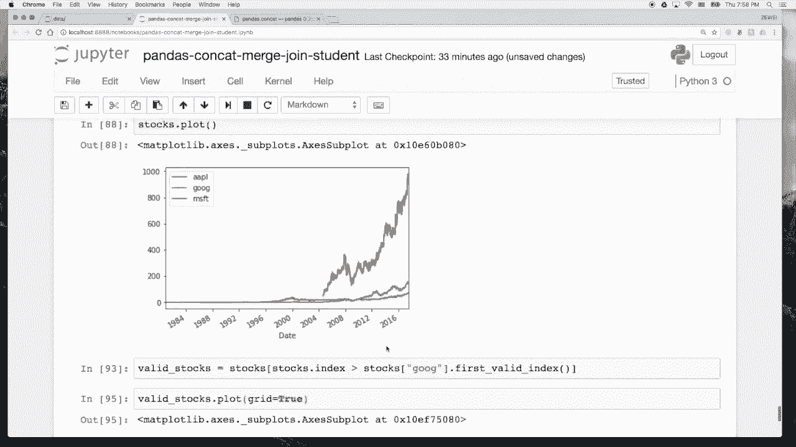

# 人工智能—Python AI公开课（七月在线出品） - P5：瑞士军刀pandas之数据整合 - 七月在线-julyedu - BV17W411K7G8

欢迎回到我们的排ython数据分析基础班。嗯，在今天的十节课当中呢，我们会继续带着大家一起学习有关pandas方面的内容。我们这节课主要会讲data frame，也就是表格之间的拼接方面的知识。

主要呢包括三个 function是 mergegejo和 concatetnation。嗯。呃，这几个functionction呢他们都是做对表格的拼接做一些操作。那我们就直接开始写代码。我们首先会讲。

concatecation方面的知识。首先我们还是import我们的两个library，import non派。S， and P import。Hands S PD。Yeah。

然后我们先建立三个data frame，比如说我第一个data frame。第一个data frame呢，它是我们传一个。我们传一个 dictionary of lists。就是我们先写上。

城市的一些房价。Partpartments。然后我们写在这个城市买车的价格。是不是。然后我们的index呢是。Yeah。上海。Beijing。这样我们回顾一下。

我们这样DFE呢是一个data frame。然后同样的，我们再创建两个类似的data frame。叫做DF two。我们再创建一个data frame叫做DF three。

这样呢我们就拿到了啊三个data frame。然后如果我们现在假设要做一个操作，就是我想把这三个data frame呢按照把它的行一行一行的叠起来。

就是把这三个data frame拼成一整个data frame。那我们可以怎么做呢？我们就可以用到我们今天的conca这个 function。Yeah。它的写法呢是PD点concat。

然后concat要传一个参数。这个第一个参数呢，它是嗯它的第一个参数是a list of data frames。比如我DF oneDF twoDF three。

这样呢它就会给你返回一个把这三个data frame拼到拼成一个大的dta frame，它默认呢是呃做行和行之间的拼接。然后呢，这个列呢就会互相对齐啊，这个apartments跟car会相应的对齐。

然后行呢它会一个接着一个的往下排。这个是can concateation。然后我们在做这个concatetation的时候呢，我们还可以指定这个concates concates的 keys。

这样呢它就会呃。做一个相应的。加一层相应的key。比如说我写keys equal toX。Why。Z。这样我们就会看到它就会变成有两行这个。有两行有有两层的这样一个index。

第一层的index呢是我们指定的key。第二层的index呢是它原来的key。这个呢是按照。呃，行做一个concatesation。然后我们比如我们这里看到，我比如且它等于result to。

我可以把它第一个呢写成result。这样我有re canre to。然后我如果看result to。点lock。Y呢就可以把Y的这个index拿出来，那就拿到了我们刚才的第二个data frame。

就是DFwo。然后现在呢假设我们要新建一个。data frame这个data frame呢它是。我们把它命名叫做DF4，它它呢是写了每一个城市的这个每个月的薪水大致是什么样一个水平。

那我们现在看到呃DF four呢，它就是每个城市的薪水啊，苏州北京、上海、广州、天津。然后比如说我们想把这个这个dta frame呢。如果我想拿它去跟result做一个评接。我们看到这个result。

它是嗯这样一张一张表格，我希望拿城市去跟它对齐。然后嗯作为一个列去去把这个cearies给它拼上去。这个时候我们应该怎么样做呢。那我们可以啊我我们也可以用同样的concateness function。

刚才的PD点concaconca呢还是要take两t一个 parametermeter这个 parametermeter是一个 list of data frames。

我们的data frame呢是result跟DF。但是如果我直接这么拼呢，你会发现它会按照行来拼接。啊，你看这个比如说上海跟上面的上海其实是重复的，但是它呢并不会发现说我这是一个城市。

它还是会老老实实的往下拼接。那我们呢这里是希望横向的拼接，横向的拼接，我就可以多指定一个primeter叫ex等于一。啊，这样呢它就会横向的做拼接。我们如果不指定呢X等于0。

它就会默认的是一种按照ex等于0。也就是按行这样往下拼接。从第一个第一个坐标题拼，那如果写X等于一呢，它就会这样横向的去拼啊，按列拼接。这样我们看到能够匹配上的，凡是能够匹配上的城市。比如说上海啊。

北京啊，它都匹配上了。像重庆这样的，我没有给它指定salary，我只指定partments跟 cars，我们看这里并没有重庆的sary，然后这个这个位置呢，它就会变成NAM。

所以这个就是呃怎么样用concatenate做行的拼接跟列的拼接。那比如说我们现在出来的这个结果呢，有很多的NAN如果我不想看到这么多的NAN，我觉得这个。较较爱一点。

比如说我写result for等于这个。如果我想如果我不想看到这么多的呃，把这个叫做result three。然后我这边呢。我们可以再写一个result for这个result for呢。

我不想让它出现这么多的NAM，那我就可以定义join的方式是inner innerner join呢嗯大家如果学过sql的就知道有这个两张表格之间的拼接inner join呢就是表示两个完全match上的才会留下。

如果有一方不match的就会被扔掉。而这个就是innerjo的意思。也就是说有一方如果有一方的key存在，另一方 key不存在，那它就干脆把两边都给它都给它扔了。那我们这里看print。

result for我们就会看到这样拼出来的结果呢，它是一定是两边互相match上的，就是北上广这三个城市，剩下那些有一部分没有拼接上的呢，就会把你呃给它扔掉。

然后比如说我现在想只保留左边部分的index，我们现在再写一个result，我只想保留左边的部分。那我们可不可以写left呢？我们发现是不行的，就是left是左边在那个sql里面有左边join。

右边join是吧？包括我们pandas里面呢，其实也后面也会讲到join的这个 function。那我们看到left是不行的。就是如果你想只保留一边的，按照一边的T来做join的。

你可以写join axis，然后这个axs呢是等于DF点。啊。我们这里可以写。我们可以写result点 indexex。如果我写result点index呢，它就会按照。

按照result的 indexdex做一个拼接。那如果我想按照右边部分。那我们先看一下我这个result。啊，我这边要打印result five啊，我刚才看怎么出来的，还是inner drawing呢。

对，因为我这边按照result的index做拼接之后呢，它会默认按照result的那个index帮你打印出来。然后就是左边的都要保留，右边那些呢，即使你没有match上也要放1个NAN上来。

但是右边那些多余出来的城市啊，比如说这个上面我们看到result three。sorry result three呢，我们看到有苏州天津这两个城市，那在按左边按左边为这个主要的index呢。

它就会帮你删掉。那同样的，如果你想要按照这个DF做1个index呢。我们可以把它写成6，然后你可以写DI后点应该。这样呢就按照右边的这个index为主要的index。

左边那些可以出现NAN右边必须要填满。这个是congratation。然后我们还有一个呃相当于是比较简单的写法叫做append。如果我有两个我有两个。

我有两个 datata frameDF oneDF two呢，我可以直接写DF oneD append DF two这样一个简单的写法就完成的也是一个concateation的操作。

那如果我这边写DF one D appendDF four呢，那它其实默认也是往下排。这个DF呢就是append啊，这个append这个方式呢就像这个名字一样，就是在末尾在末尾再给你添加几行。

这个就叫做append。然后如果你知道这个嗯。这几个data frame呢，它都是安行可以对齐下去的呢。我可以写DF点appendDF one啊。

DF twoDF3这样我就可以把两个一起append在下面。然后呢，如果我现在有一个seious，这个seious想要跟这个data frame做 concateation呢，其实也是可以的。

比如我现在写一个seious S one equal toTD点seious啊，这个seious呢我们就比如写嗯也是两个城市index是我们给它定义成上海。和。北京。

然后我们写我们这个index的信息呢，name等于me就表示一顿饭要多少钱？比如我们写上海是60块钱。北京是50块钱，然后我们看一下SE，它是这样一个seious。然后我们想要把这个seious给它。

给它concatenate到这个DF one上面去呢，我们就可以写PD点concatet。然后我们也给他写上DF one跟S1。我们看一下这样会怎么样，这样呢。

它默认是按照按照行去conatulate的。所以它它其实把这个上海北京呢也当做是也把它转成了一个呃也把它转成了一个上海北京作为index。它的con呢是个没有名字的con，然后做了这样一个评级。啊。

但这个其实并不是我们想要的情况。我们想要的呢是给它按行来做评解，啊按照按按列来做评借。所以我们给它写上X等于一呢，它就会啊给你按列做评解。就像我们刚才这样的，它是按行做评借。然后如果我们想要。

A panda。一行到到一个data frame里面去了。那其实我们刚才已经讲过了，我们可以写。呃，S two点sious，然后我写1800012000。000，比如我就写这个是index等于。

APTS和cas。然后呢，它的name是比如说我们就认为是厦门的这个房价跟车车架。然后我们看一下S two，它是这样一个seious。这个时候呢，你的APTS跟cars呢。

它就可以作作为index是跟这个apartments跟car做一个拼接。这样做一个拼接之后呢，比如我写E啊。one点append。That's 2。

就可以直接append append这个se到我们这样一个da frame里面去了。那同学们可以自己多去尝试一下这个concussationend，看一下它究竟是怎么操作。

这个就是对各种表格的拼接做了一些有有各种不同的变化啊，很多你做同样的一件事情，你可以有有时候熟练了之后就会发现用各种不同的方法都可以做到。就这个也是呃很正常的。后面呢我们要给大家讲什么叫做merge。

什么叫做join。 mergege呢嗯其实是我们我们前面的concateation呢，我们已经发现了，比如我要对列和列做这个拼接，它默认拼接的方式呢，是按照index做这个对齐。

然后我们merge呢其实就是一种更加广义的这种concateation。那这个concatesnation呢，未必是按照我们的index来做这个做这个merge，还是可以按照很多别的东西来做merge。

比如说我现在我们我们还是利重复利用一下我们前面写过的这个result啊，比如说我现在重新定一下result，我写result点reset。index大家还记得res indexdex呢。

你就会把这个index这一这一这一个列呃直接p出来，就变成一个普通的con，然后它会填上一些012345这样默认的index。然后我这边呢想把它的con做一个重命名，我要把这个columns等于。

index重命名成一个cities。这个时候呢我们看到它就变成了一个cs apartment cars，然后我把它还是写result equal to这个result。那我们要做的第二件事情呢。

我想呃我们再看一下DF4是个什么样的方东西。啊，我们在对DF4也做同样的操作。我们写DF点reset index。Their rename。rename之后，我把columns。

然后它带一个参带一个参数，这是一个一个key啊，一个 key value pair key呢是我原来的index的名字叫做in原来的co名字叫做index，然后还有我新co名字叫做cities。

我们这样就可以拿到一个拿到一个新的data frame。然后我把它叫做DF。那我现在看到，如果我现在用我们刚才的concateate方法，我们看会发生什么。如果我用PD变concate。

Concat result。跌覆。点啊，我们写X等于1。这样的concussation呢就没有意义了，对吧？因为你看这个它默认是按照这个自己的index做这个concussation。那上海对应的苏州。

北京对应北京、杭州，对应上海就就乱掉了。所以这个时候呢我们不用concussation这个 function。我们pandas里面有一个新的方式叫做merge。这个merge呢它嗯也很类似。

但是我们不需要写这个呃。方框了啊，不用写这个类似的形式，你直接把两个primeter result one跟DF four给它写进去。然后我们要带另一个参数呢叫做onon呢是表示你要用哪个。

用哪一个呃con去给它做拼接。比如这个这个on呢，我们就是cities，用cities这个con做拼接，这样你就可以拿到一个新的呃。新的这样一个表格。这个表格呢它是被 merge出来的。

而不是被conca出来的。所以我们也会发现，其实merge你那个表格大了之后会比conca的效率低很多。因为它默认按照index排序呢，其实效率是比较高的。但是你作按照一个自己定义的con去做做拼接呢。

可能会效率低一些。然后同样的这个merge。这个merge呢，它默认其实是一个inerjo，我们已经发现了，就是有一些拼接不上的都没有被写出来。如果我们写how等于aler呢。

它就会做一个aler join，那就会把那些嗯左右两边匹配不上的也给你留下来。这个是inner join跟outer join。然后这边呢其实pandas的语法有时候是取得比较随意的。

如果你写right呢，那就是个right join。如果你写left呢，就是一个left join，就这个东西跟我们刚才那个conca的时候，用左右两个。index做拼接的写法就有些不太一样。

那同学们要稍微啊注意一下这一点，就这里是用left right来标记这个drain的方式。然后然后呢，我们最后还要给大家讲一个嗯怎么样join by index。怎么样怎么样做一个dwing。

就我们刚才呢是用merge这个function，但是里面其实这个呃。pens呢还有一个呃叫做join的 function。比如说我现在写。我们再给他。看一下我我的DF一呢是我刚才这个DF1。

然后我们再把我的DF4给它变回去。这个DF four呢有一个cities，我再把它写回去就DF four点。Set。Inindex。叫做cities。这样我就又拿回了这个DF four。

再把DF four等于DF four点index set indexdex之后呢，我们现在再写DF one点joinDF four。它就会默认按照index做一个dwing啊。

这个就是其实跟用前面concat merge，你都可以做出同样的效果。但是我们也可以有一个简单的function叫做jowing呢，可以直接帮你做这样一个按照index做一个拼接。

然后这个join呢它也可以带一些参数。比如说我写how等于alern。他就会做一个outer join，它写你写left呢，他会做left join，你写right呢，它会做这个right join。

也就是保留左边的那一些index，以保留左边的index为主呢，还是以保留右边的index为主。那当然呢我们其实也可以用merge来做同样的事情。比如我写PD点mergeDF one DF four啊。

你这个时候 mergege呢，但是我们我们现在这个 mergege啊，我发现DF one跟DF four four呢，它已经没有一个共同的co了。你要用index来 join。

所以我们这里可以specify leftft indexex等于 truee，表示你用左边的index做jo，然后再用right indexdex等于 true。然后我们再写，比如说how等于aler。

how等于aler啊，你也可以做出完全一样的效果，就是用merge跟用join或者用concat都可以做到很多事情都是可以都是可以实现的啊，我们也可以用这个concateation再来复习一下。

我们用conca呢，那我们可以写DF one跟DF four。Yeah。这边去掉啊，它也是一个concatetation，但是我们。呃。是。要写X等于一，对吧？这样也是一个join的过程。然后呢。

但是我们如果要说明index呢，我们要写。我们要写这个inex。Excess等于。啊，是join access对吧？She。是。concatenation。

我们可以用 drawing axis等于 dF one点。index这样呢就会只留下左边。如果我写DF four呢，那就会以留下右边的为主。那么这个呢就是我们今天想讲的啊一些新的关于表格之间拼接的做法。

然后同学们呢可以自己上我们的pandas的官网。我们如果查这个pandas drawing。Conca。我们就会发现有有很多的教程可以学习到很多呃相关的知识。然后同学们可以去看这些。

比 pandas can cat。上上上网查这些嗯具体pandas它有哪些parameter可以使用。我们前面呢其实讲的这个drain accessces。

这个acces这些啊简单的还有key这一些比较常用的parameter。但其实呢它还有很多的parameter可以使用。然后最后讲完了这一些基本的知识之后呢。

我们这节课还想再跟大家一起做一个做做一个呃小型的project。比如说我我们还记得上一次呢，我们给带着大家一起做了一些股票的分析啊。比如说我们上一节课讲了呃。

我们上一节课做了给大家画了一下英伟达的那个股票的走势。那我们今天呢再给大家看三只股票。我这里data这个folder下面呢，有还有几只股票，有这个AAAPLapplegoogle。

还有microsoft这这三家公司。那我们把它一个一个读进来。比如我们先把。先把我们的啊google拿进来。

google equal toPD点read CSSBread datago点CSB这些数据呢我都是从都是从我们的啊。雅虎f上面下载下来。同学们可以自己去自行做下载。

那我们这里可以写啊index column equal to0，应该还记得上一节课的做法，然后我们写pass。Dates equal to。Date。然后我们看一下google点head。

我们就看到这就变成了嗯google这样一张表格。我们可以简单看一下google点sh。但他有3000多行，有6列。那我们可以还记得上一节课是怎么样pl呢？

我们是写mat plot life in line。写完这一行之后呢，我们再写go点。groupookadjust close点plot，这样就可以pl我们的google这样的一个股票的走势。好。

那我们嗯。下面呢再写。再读进来另一只股票，我们要拿AAPL等于。PD点read CSSV。dataAAPL点CSV。同样的index column等于。8。啊等于零。然后我们的pass。

dates要给它写成是date这个co。然后我们再看一下AAPL点。呃，APL点S。我们看一下啊，有9000多行，因为苹果上市的比较早，那我们现在要。

再把这个AEPL的 adjusted column给他adjustclose给它画出来，adjusted closese BM plot。我们发现现在出现了一些问题啊。

他就说这个data frame no numerical data to plot，为什么会no numerical data to plot呢？那我们可以看一下嗯，这个到底是因为什么原因。

比如说我们嗯。Yeah。我们试一下。Yes。我们看一下这个东西它的。B type到底是。发现它Dtype呢，它是一个object。我们回过头去看一看这个。gooogle它的D type到底是什么？

做一个对比啊。电灯菜。我们发现google呢它是一个fat64，就它是一个浮点浮点型的数字。但是apple呢它居然是一个object，这个是什么问题呢？嗯，我们也不知道是什么问题。

那所以我们可以想想办法，我们比如看看做做PD点to。Nummeric。能不能把它全部转成numeric的数值啊，他就告诉你。

unable to pass string now at position165，这个是什么问题呢？嗯，就是说我现在这个str啊它。它是一个呃不能。不能pass的。它是一个n。

它不能够被pass成任何一个数字。那我们看一看这个第165位这个数字到底是什么。我们可以把165这一个位置给它拿出来一看，对吧？你发现它真的是个n，那我们再稍微多拿一点，再拿160到170。啊。

你就会发现这个位置呢它出现了ow这样一个值。这个n呢，而且它真的是一个strrange，就它并不是一个。并不是一个嗯。并不是一个呃其他的NAM这样的数字，就是你都不能我们都我们其实给他点biNA。

给它fil成零之后，我们再做这个pl呢。也是不行的，就是那个那个东西它真的是一个它真的是一个string，而不是1个MAM的值。那这个时候我们怎么办呢？啊，其实也比较简单。

既然我们已经发现了这个事情的原因呢，我们就可以直接把。做这样一个事情。如果我发现。有地方它是ow的，我直接把它填成MP点NAN。Yeah。这样之后我再看AAPL。ADJ。Close。我把它做一个。

我把它做一个B feel，我把它做个F feel吧，就是forward feel。for feel之后呢。这个时候应该总总是可以了，那我就可以做1个AAPL这个adjusted。Close。

Yeah apply。Lambda X。啊，我们可能有没有给应该给大家讲过lammbda这个方式，这个apply呢它就是可以对AAPL的这样一个这样一个data frame做一个逐行逐行的操作。

你每拿到一行的那个数据呢，我们都给它把它转成一个fat的值。Yeah。Yes。这样它就变成了一个float。这个时候我们再试试看能不能pl它点pl。好，我们发现这样就可以po。

就是我把那一个值呢直接用前一天的值来去代掉。这样我AAPL也拿到了。然后同样的方法，我们再把microsoft这给它读出来。microsoft equal toPD点啊。

microsoft equal toPD点read。PD点read CSV。然后我把MSFT点CSV。Index。Colon等于0。Pass。Dates。等于。对这样呢我就拿到了MSFT点。Plot。

我们看一下现在是什么问题，MSFT点。把ADJclose拿出来。看看他报的什么错，他说啊哦MSFT不存在，因为我少打了一个data。这样呢我们看到microsoft也顺利pl出来。

这样我们有了三个三个股票的数据。那我们现在想就可以运用一下今天的方法，我们想把三个plot的值给它放到一起。那我们可以怎么做呢？我们可以写APL。ADJclose，我想要把。Google。

然后还有我们的MSFT这三个公司的股票呢，我想把它放到一起，给它做一个plot。那我怎么样做 plot呢？我们还记得刚才的concatenate这个 function。如果我写PD点canc。

然后我写X等于一，我是不是就可以把这三只股票都放在一起了？但这里呢有一个小问题啊，就是你上面的每一个名字都叫adjusted close，就这个并不是我想要的那我可以把它的key给改掉。

改成我们想要的AAPL。Ggle Googlegle。还有我们的MSFT。这样你看他的名字就被改掉了。这样这个名字被改掉之后呢，我们这个太长了，我就先把它我要先把它给复制成一个叫做stocks。

然后我再做这个doocks点plot。然后我们就看到这样我拿到了一个plot。那这个pl呢又有一个问题啊，就是它嗯我其实不想看那么多前面的这一些数据，我我就只关心google上市之后这个情况。

因为google上市比较晚嘛，那我们可以想个办法把那些嗯前面看不到的地方给它删掉，我可以怎么做呢？我写val stocks等于我们想把google上市之后的那个第一天给它拿出来。

那我们可以写我们可以用stocks。Stocks。Google。点 first。Baalid index。这样呢就是它的fi valid index，你就会看到这些1980年它都是。我应该打个括号。嗯。

你就看到它的firs valid index呢是2004年8月19号的这一天。那我们可以把这一天之后的数据给它拿出来，之前的数据我就不要了。那我们可以stocks点 indexdex大于这个东西。

你就拿到了这样一个arate。然后呢，我们再把这一堆stocks给它拿出来。stocks。那我们就拿到了04年以后的数据，我把它重命名成violt stocks。等于我们的value的 stocks。

然后我把这个value的 stocks再给它 plot出来。哦，我们也可以用我们上面以前学过的那个方法叫做叫做啊grade等于te，这样可以在它背景后面画上这样一些虚虚实线。

那这样我们就可以比较一下这三只股票的，把这三只股票放在一起，就做一个行情的比较。那这个呢就是我们这一节课想要给大家讲的内容。我们稍微总结一下这节课讲过的内容。

我们主要是介绍了一下对几个data frame或者是data frame跟se之间做一些表格拼接的操作，讲了三个 function，一个叫做merge，一个叫做join。

一个叫做concatesation。然后其实还有一个 function是我们刚刚讲的append这个 function，它其实是concateate的呃另外一个一些简单的写法，包括join呢。

其实也是啊他们之间之间的一个简单的写法。所以嗯同学们呢可以自己之后再复习一下对几个表格之间做一些操作。然后最后我们再讲了一个小的application，就是把股票的数据放在一起。画了一张图。

这之间呢涉及到中间涉及到一些表格拼接的操作。

好，那我们今天的课就讲到这里。😊。

