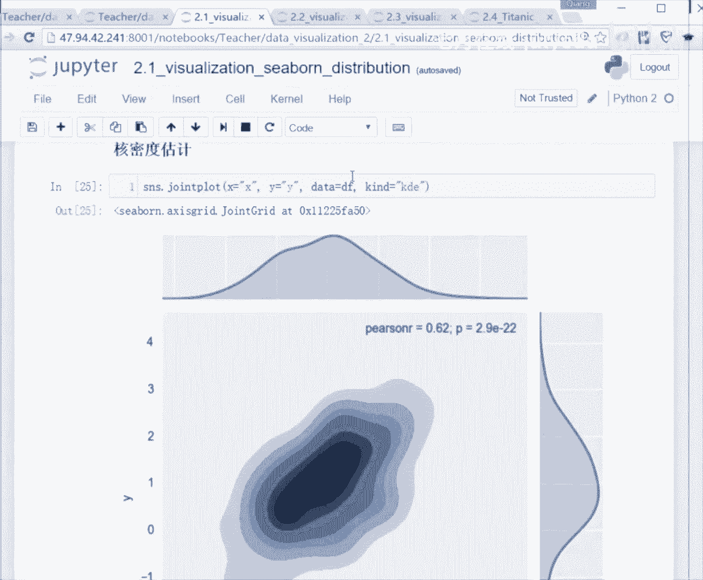
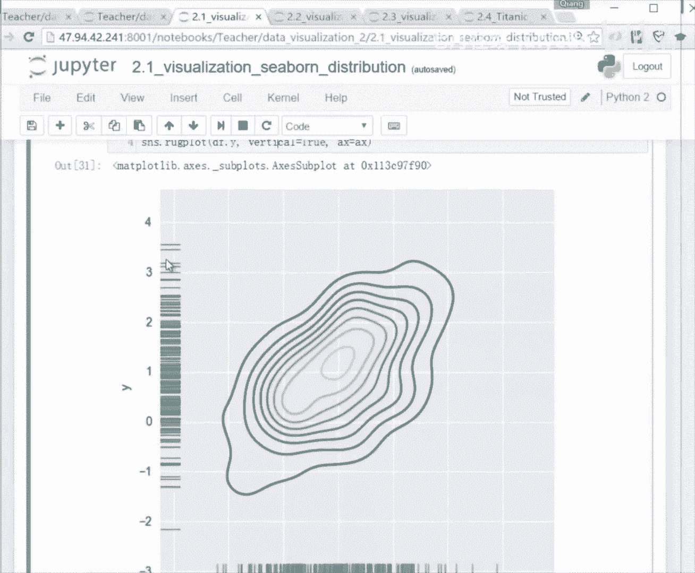
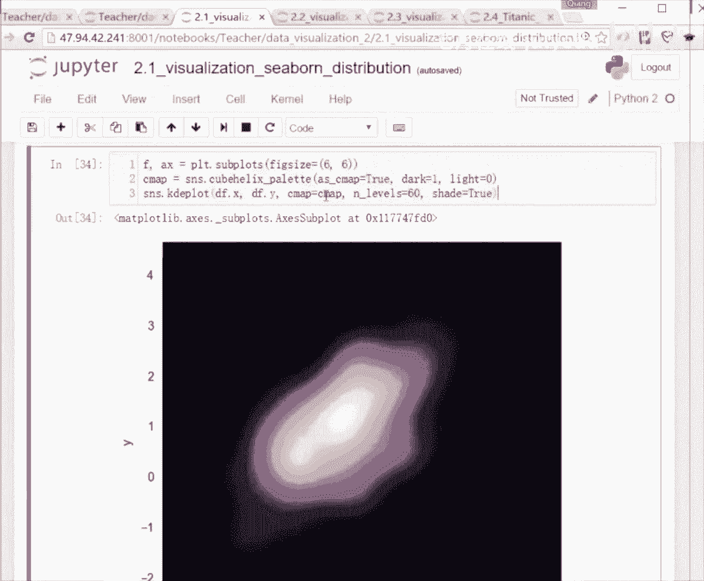

# 人工智能—Python AI公开课（七月在线出品） - P6：Seaborn可视化数据分析 - 七月在线-julyedu - BV17W411K7G8

好，所以更高级的东西马上就来了。所以我们上一节课呢呃如果想对两个变量的分布去做一个绘制的话，会有一点小小的麻烦，对吧？我相信如果大家啊有做完练习的同学的话，可能可以做得出来。这个这道现在这个问题。

但是它会有一点点的麻烦。OK好，所以这个地方有一个非常棒的一个功能。在C包里头，它叫做双变量的分布。更棒的一个事情是，如果你用C棒里头的join plot去画这个双变量分布的话。

你可以直接用data frame，可以直接用数据帧把两个呃con name给他两个你要去描绘这个联合的两个变量分布的这个列名给它。所以这个地方啊，大家这一段大家可以不用看，我就是指定了一些均值和方差。

然后去产随随机的产出一个这个呃。产出来一个分布啊，这个地方呃你可以去产出一些，比如说高斯分布或者是呃伽ma分布或其他的一些分布啊，然后我用这些分布的这个里面的数啊去。

这个data产出了这个data去建立一个data frame一个数据帧啊，然后给了两个列，两个 column分别叫X和Y呃，我对它去做一个我可以去对它做一个双变量的分布的一个绘制。

而且这个绘制里头有非常多的信息。首先我们刚才看到叫做ditribution对吧？它是一个平直方图或者叫呃平度直方图啊，分布的一个这个这样一个直方图。那如果我去表示两个变量，我怎么去表示呢？

它这个地方非常棒。它这个jo呢可以去把你的两个分布，分别画就是做横向和纵向的一个绘值。所以大家可以看到这个呢实际上就是你X一个分布啊，当是你可以自己去指定啊，你可以把这个地方调换一下顺序。

把Y放在前面X放在后面，那它就是一个呃旋转旋转了一定的角度，对吧？90度之后的一个分布的一状况O。所以这个地方我们的我们用X等于XY等于Ydata等于DF注意啊。

它这个地方传进来的东西是一个一个data frame，一个数据帧。然后前面两个东西X和Y是它的两个colon name两个列名。然后你就做一个jo，你就看到一个非常漂亮的图，就是下面这样一个图。

我们上节课还给大家讲了这个散点图。大家还记得散点图，一般我们用来做什么吗？就是完成什么任务的时候，我们会用散点图。Yeah。我们去看两个变量的分布是不是相关，对吧？对？相关性，对不对？

O所以这个地方它也做它也可以去完成这样的一个事情。它可以给你绘制出来一个散点图啊，就是X和Y的一个分布的散点图，以及X和Y两个的本身的这个直方图可以画在两侧。然后下面有一些更漂亮的图，你可以去做什么呢？

你看这个散点图啊，一般情况下，散点图，散点图非常好，就是它能把每个样本点都戳在上面。但他会有一个问题。你现在的这个样本点数量并没有很多。大家来看一下，并没有特别多。我产我产出的200个点，对吧？

O那如果我现在有20万个点呢，就我如果有20万个点，我如果有200万个点呢？你去做一个会或者是这个地方你直接用这个地方的一个jo plot去画这样个散点图的话会很费劲。我可以告诉你最后就是一团在一起。

然后这个图绘制的过程中呢，因为它有一个一个点往上戳，所以它会这个过程会很耗时，那我们可以用一个更更高级的方法，它这个地方提供了一个更高级的方法。因为你无非就是想看到这两个分布之间的一个相关性嘛。

或者说它比较集中在哪一块，它们会比较密集，对吧？就是X等于多多少的时候，这个Y等于多少的时候，这一块是比较密集的那下面有一个图，大家记住叫做六角相图。都见过呃，都都了解这个蜜蜂。它的这个蜂巢是。

六角形的对吧？很规则的一个形状。所以这个地方会有一个六角相图。那为什么我需要这样的一个图呢？我刚才给大家说了一个场景，我说如果你有200万个点，200万个点，这个事情很很尴尬的，你就让它去画一个散点图。

但是这个六角相图就通过一定的手段去帮你绕过了刚才那个问题，它不直接把每个点戳在上面，它去统计每一个六角箱内出现的点的个数，我用颜色的深浅去表示这个点的个数，我说清楚了吗？

所以六角相图这个地方做这个join plot看注意啊，这个地方有个co就是啊类别是等于HEXO你去指定一下，所以出来的这个就是一个六角相图。这个六角相图呢。这个六角相图。

大家也看到了横轴和纵轴没有太大的这个区别啊，就是是两个distribution，两个分布是吧？两个啊直方图。但是里面的话，我因为刚才我的散点图会怎么样戳不下，就是太多了，这个点太多了。

所以我现在用颜色的深浅去表示这一块区域它出现的点的频次。所以颜色越深，表示说点都集中在这一块。所以通过这样一个图，其实你也是可以看得出来它的一个相关性的对吗？OK其实你在结合的这两个分布来看。

是不是X最有可能出现在哪个位置，是不是这个纵轴沿着这这条线的这个位置，因为它这个时候概率最呃这它的分布最集中嘛，在这块对吧？频次最多嘛，所以OX最集中在这个这个位置，那Y最集中在这个个位置。

所以你看到中心这些点是黑色，对吧？因为我产出的时候是我直接用了一个正呃。就是多维的一个正态分布。OK多维的一个正态正态分布去产出的。所以。大家看到情况就是说。你正态分布嘛，正态分布就集中在中间嘛。

那如果你用个伽ma分布的话，它肯定就是啊偏到一边去了。O所以所以这个地方最黑对不对？最黑就说明它的集中度越高。然后你可以通过这个颜色深浅嘛。你看哪一片哪一片是最集中的，你可以看得到它们有没有相关性。

比如说现在的相关性显然是很强的对吧？对不对？大家可以看到都集中在这个近似的这样一条直线上，O所以记住啊，当你的点很多的时候，你要去呃想要去绘制像散点图一样的效果去了解它的一个两个两个相关性的时候。

两个维度的变量相关性的时候，记住有这样一个六角相图，可以用C棒啊，非常棒。这个功能，然后你还可以去做一个和密度的估计，就是我不仅可以做到。

我可以做一个更平滑的处理。刚才这个处理呢还是一个大家如果仔细想一下，它是一个离散化的处理。对不对？因为我去估测了频度嘛，所以实际上是一个统计，统计的东西是一个离散的结果。

所以你看到这个地方是一些ok每个六角箱里头会有一个具体的啊频次，或者什叫这个number frequency frequency。对吧O所以。😊。

如果你需要去做一个嗯更接近于这个统计的数学家们喜欢的这样的一个东西，他们经常会所谓的这个分布，对吧？所以这个地方你可以画出来一个合密度的估计的一个这样的图，有一点点像大家都知道等高线，对吗？

OK所以它这个地方呢就是呃密度越高的地方，它的颜色会更深啊。当然这个地方有很多参数可以调啊，就默认的参数是这样的。你看这个地方刚才我们的kind kind等于HEX的时候啊，注意它调后面这个kind。

它是一个六角相图。如果你什么都不写的时候，它是一个散点图，对吧？那有另外的kind，比如说这个地方是KDE啊，KDE大家现在应该都。

通过刚才讲的几个这个例子，应该现在已经熟悉这样一个单词了，这样一个缩写了KDE啊，叫 kernelnal啊 density estimationationO所以当你指定说我需要去画一个合密度估计的时候。

它会用非常平滑的方式去处理。刚才大家看到的是什么？两侧上面和就是上方和右侧是什么？这两个直方图，对吧？OK现在它就变成了一个。可密度估计的一个曲线。

然后它会联做对这两个曲线去做一个联合的一个分布的一个绘制。所以你会拿到这样的一个一个啊dsity estimation啊，就是一个可密度的一个估计的一个图。对，然后这幅图的话，我相信大家都能看得懂啊。

你想象一下等高线，想象一下等高线。所以它表示说大概是在这条线啊边缘的，或者说在这个区域内的这个某一个沿着这条线的这些点，它的这个最后的这个概率是啊。差不多的对吧？出现的。ok。然后往下的话。

你可以去做一些呃高级一点的，就是你可以把这些样例点全都画在上面。刚才我们给大家做这个ditribution plot，我说我就做一个呃分布的绘制啊，或者直方图的绘制的时候，我我啊大家还记得说我可以去。

有一个参数叫什么RUG，对不对？我说我可以把实力画出来辅助辅助我们去判断多少个bes。ok。那这个地方C棒呢有一个你可以直接去对吧？RUG还记得那个参数吧，那你直接有个rck plot。

他做的事情就是我可以去把实力，我可以把实力布在左边和下边ok。所以所以这个时候呢，大家可以其实你可以用各种各样的方式去展示你的数据，你可以用平度图吧，对吧？

你可以看到分布O你用一个KDE一个呃 density estimation也可以看得到它的分布，你也可以用这个地方这个地方叫做正任何的方式我们最终的目的是了解我们数据的分布嘛。

所以对你一个画出来的东西也是你看呃你可以去取出来其中的两个se对吧？这个地方是直接取出来的seX和吧？

 frame里头取出来对应的X和Y然后你可以去画用X和Y去画一个K大家记得就是 density estimation的个然后底下有两个画出来对应的这所有的实例它会给你标在左侧和下然后下面会有一些更梦幻的结果就是因为你刚才用到的东西是说颜色的深浅嘛。

😊。

可以把背景background设成黑色，然后用呃这个亮度去体现这样一个东西啊。所以对这个地方dark等于one。你看到dark等于one的意思，这个东西是在调它的这个呃底调色板。

或者说它的一个一个它有一个background的一个背景的一个setting，你是可以去调的。然后这个我不我对我不给大家细讲这个里头的这个函数啊，大家去查一下。因为调色版这个东西呢就是一个。

一个类似一个工具箱。这个工具箱呢我要今天给大家讲完了API你们也忘。所以我会集中在对数据的认识，对数据的绘制上。但这个本本身C的一些设定啊，就是颜色的设定啊或者背背景色底板的一些设定啊。

这个东西大家自己去查一下好吧，这个地方函数我已经已经给大家写出来了，就是你可以去用它去做一下调整，所以你看这个地方等于表示说我用这个地方的呃黑色作为一个ground对吧啊等于啊ro然后KDEpl就是我去画一个 estimation的一个pl一个绘图。

然后同样把X和 y给它然后你可以看到这样的结果啊，这我就不多说了，然后你同样可以去配配旁边的东西对吧？你看你可以配上这个你可以去把in配在旁边这都是可以的。

然后啊底下还会有一些其他的，就是其实是一样的，把它配上去。OK你就可以去调一下不同的。呃，刚才提到了有一些参数嘛，有一些参数，所以你去做这个jo这个join plot的时候呢。

你可以去做一些其他的一些设定，拿到结果是不一样的。比如说这个地方你可以把对应的这个X和和Y的这样一些大家还记得这个散点图对吧？

以你不仅可以画出来一个KDE一个 density estimation的一个图，你还可以把这些散这些inense所谓的这些样本点。你可以不在左边和下边，你也同样可以把它戳在这个图上。

所以现在这些这些insense，你是可以直接呃对你你是可以直接mark在上面，就是把它做一个散点散在这幅图上，所以就是可以更清晰的看得到数据的分布，对吧？因为你会发现这个中间颜色比较深的这一块。

它戳的这些点或者说这些这些点确实是个密集的，看到吧？都集中在中间这块，那到了边缘确实是密度会小小一些，所以它有各种有各种各样的手段让你更。

清楚的去看到这个数据到底分布是什么样的。呃，可以再往下看啊，注意啊，我现在给大家讲的工具就是工具，能不能用好工具。这个要大家去练习。比如说现在有200万个样本点，你当然不能去把这行加上，对吧？

你说我再去做一个projo去做一个scattertter把它丢在这个上面，那这个肯定速度就慢了，okK所以就是他有他给了你一个可选项，对吧？有这个功能，比如说都有三点图这个功能，那你用不用。

那是你要自己结合自己的场景去做OK。

然后下面有一个下面我们要讲到一个经常会用到的函数，我自己去呃之前刷数据科学的比赛，然后我要了解我的数据，我会用padas去做个各种各样的统计。然后我会用呃maplib和其实map我也会用啊。

或或者是用到这个地方C泵C bone其实呃会更好用一些C泵比较它功能集成的比较全。所以我这个地方有另外一个函数，一定要掌握的函数叫做peair plot。parpl呢它的功能大家在上节课都见过了。

用mpro都见过了，它就是大家还记得你你有个两个for循环吗？four four两层for循环。去画出来。任何两个维度之间的一个分布或者关联性。对，所以这个功能C帮帮你完成了。你现在不需要再去画。

你现在不需要再去做一个。😡，两层的for循环的一个叠加，然后再用AX对吧？用用用AX点这个去去做这个plot。把它画出来。所以这个地方有一个函数叫做peair plus。

peair plus是一个用了非常非常非常多的一个函数。所以如果你想了解你任何任意的两个维度之间的一个关相关性，但如果有同学对数字本身是敏感的话，那你可以去求一个这个呃互相关。

就是求求求一个斜方差一个矩阵。O然后你可以看得出来他们的一个。啊，或者说一个一个关联的一个举阵，你可以看得到它对应的一个相关性。那如果你想直观的去看这个东西的话。

就要用到这个函数叫做peair plot。所以注意pair plot丢进来的东西啊，就是它可以丢进来一个有。多个。column的这样的一个data frame。ok就是你erase。

这是一个data set，这个data set里头有多个con，有很多列。对吧然后他会把这些数值的列啊，他会把这些数值的列拿过来两两去做一个组合去绘制出来一个。对。

去绘制出来它们的一个关联性和数据本身的分布。所以我们来看一下，大家告诉我说这个地方的这一条对角线上是不是自己和自己看到了吗？对角线上是第一个维度和第一个维度去做。一个胶印对吧？所以这个时候做胶引。

它画的其实就是这个维度的一个分布。大家能明白吧？就是他用的是一个直方图的方式，就绘制出来说这个第一个con，这个数据帧的第一个com它的一个分布。OK那同样的同样对角线的第二个位置呢，大家看到这个地方。

这个是一个第二个维度，这个这个花瓣的这个宽度，它的这个数据的一个分布状况啊，同样是一个直方图啊，这个地方就是第三个维度，第四个维度，对吧？好，我们来看一下任可的两个交叉的维度。那这个交叉的维。

第一个维度和第二个维度的交叉在这儿。在这儿所以大家看到的情况是。一个闪点图，对不对？所以，我我们是不是给大家说散点图其实可以看得到两个维度之间的一个相关性。所以同样这个地方呢大家看到就是散点图。

那你可以看到有一些像这个它就是或者是它这两个维度之间就是比较相关的对吧？或者是它ok这是比较相关的那你看到像这个就是不太相关，对吧？因为它散生一片O糊状。

所以这个peair plotpear plot可以去给一个data frame去做一个两两配对的一个。散点图的绘制，同时对每个维度去做一个distribution的一个配。

一个一个plotO一个分布的一个plot。好，然后这个并不是就是peairre这个东西，它是一个限定词，表示说我要一对儿一对的去画。那除掉最基本的peair plot以外啊。

具啊这个peair plot里头可以配参数啊，具体参数我没有给大家列出来，有很多的参数，你们可以自己去看一下参数，你可以把它调成一个彩色的，很很炫酷。我之前自己呃画过，但是可能会费一点时间。

我我之前画过很高维度的就是很大的样本量下的两个维度的一个，比如说相关性呢去看一个可视化。然后它的一个呃diion是什么样的都去做我它是可以做的啊，可能但是可能也是要花一点时间的。

因为这个地方毕竟要画散点图嘛。所如果样本量很多的时候啊，如果你要用你要用这个peair的话，可能得等一下O他得把点戳ll上去啊，所以。就是p那peair是一个定一个这个我们说定语。

它表示我是一对一对画的那除掉pe的话，你可以去画一个pegrade是网格的意思，对吧？所以paair画的意思就是成对的去画出来它的一个我们叫做KDE吧？就是 estimation的这个图啊。

就有点像这个等高线的图所以他现在画出来东西就是一个更平滑的结果啊，刚才我们的我刚才我们这种方式是离散的结果，对吧？你可以注意到所有的事物你都可以从不同的角度去看。

那你可以你你为了让他看的它每一个样本更清晰你可以去做一些离散离离散画的一个绘制，所以你看到是这样一个结果。那如果你要去绘制一个更平滑的结果的话。

你就要用到这个地方的KDE就是我们所谓的然后去做一个DE个啊，就 estimation的一个所以这个出来的结果呢，你会发现说它的它的分布已经是我们会去用一个。啊。

 kernelnal densityty estimation去给给你绘制出来了。然后同时呢我会用这个这结合任何的两个维度去给你画出来一个这个地方的一个我们刚才叫双双变量的一个呃和密度分布的一个图。

对吧？对，所以就是这样的一个结果。你可以看到集中在哪个部分。OK这是一个从刚才的离散到连续的这样的一个不同的这个绘制啊。O所以这个就是我们的第一页。第一页呢我们给大家讲了，就是分布。

我们我们更关注的东西是这个变量的分布，对变量的分布有单变量的分布，有双变量的分布，对吧？那双变量有这个离散的绘制方式，有连续的绘制方式。同时你可以在这个上面去配各种各样的。

instense就是原本的样本点可以直接戳在这个图上，你可以用对吧？刚才我们大家有看到有个图是可以集升这个嗯往下翻啊。OK啊，再下一呃再下一个ok是可以散在上面的对吧？那你可以把insense画在两边。

对不对？刚才大家看了就是所有的这些本身的这些啊sampble这些样本点这些实力也是可以画在两边的啊，所以有各种各样的方式去配。那但是大家虽然看C很炫酷啊，但不要忘了我们的我们我们需要做的事情。

我们为什么有需要可视化这样一个工具。😊，它的核心是为了让我们了解数据的分布。所以。任何一种方式都可以。大家习惯说我去看这个呃cron density estimation。

你就用KDErook如果你习惯去看离散的对离散的分布的话，它就会去。你习惯去画离散的分布的话，它就会你就可以用这个ditriion plot，对吧？那你想对两个两个变量同时去画的话。

就peair记住peair。那pear后面有这个peair plotpaar ok啊，有同学问到这个问题说peair plot的图是对称的高维度的分析，可不可以只画一半节省时间。你想多了。

同学他其实也是画出来一半，然后做了一个镜像，所以并没有像大家那么想的那么傻，他再把另外一侧也画一遍，它只是做了一个镜像而已。这个这个是肯定会考虑到的。所以呃没没有你想的这么这么呃复杂啊，这么原始哈。😊。

