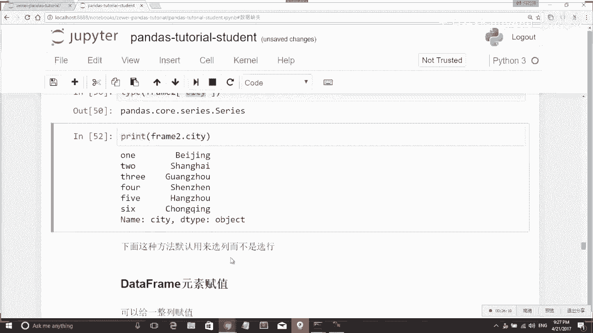

# 人工智能—Python AI公开课（七月在线出品） - P9：Pandas初步：Series与DataFrame操作 - 七月在线-julyedu - BV17W411K7G8

那我们就开始这个课程的形式，大家上过应该知道，我会我会用这个ipadon用这个jupynotebook我们编。我们边上课，我边给大家打代码。啊，大家只要看着我做这个操作就可以。

那我们最最开始首先呢我们我们要用pandas这个我们要用pandas这个library。所以我们第一步要做的操作呢就是。

我们第一步要做的操作就是import pandas SPD就padas它是一个library。然后我也import non派 SNP。那我现在有pandas和 non派这两个library。

因为我我后面会用到一些n派的操作，所以我把这两个两个library都import进来。它是我今天要工作的一一个基础。然后我们首先呢就给大家介绍什么样是一个sese呢它其实就是一个一维的数据结构。

我们知道一个在拍在拍ython里面，一个一维的数据结构，其实就是一个一个list，对吧？比如我可以我可以在这个里面写上各种乱七八糟的信息，我可以写上数字，我也可以写上train，我可以写正数。

我可以写复数，我可以写floating points。然后这是一个这是一个list，我们在拍照里面看一个数值的类型，只要打type就行了。那这个这它的type是一个list。

那我们现在定义了这个list之后呢。serries它其实就是一个对一维数组的一个封装。对一个list似的一个封装。我们可以。用PD点sious，然后把这个把这个list给它传进去。

那我们就构建了一个一维的seious。然后我们看到sious它出来就长成这个样子。就其实它是把这个list给封装了，然后都给它标上了一个index，就是第零个数是其第一个数是baj，第二个数是一个数字。

第四个数是一个数字，然后它的这个数字类型的是object。因为因为这个数据它又有又有数字，又有train，所以它的类型就是一个。是一个object。我们嗯。然后默认的时候呢。

pas会用0到N作为seious的index，但是我们也可以自己来指定一个index。我们也可以自己指定一个index。比如说我刚才上面的那一段代码，我可以把它复制下来之后，我自己默认一段。

我我自己给它指定一个index的类型。我们可以给这个construct函数加上一个。加上一个index这个参数，这个参数比如我写我的index就是ABCDE。那这样的话呢。

我的S就变成了也是一个是 serious object，但是它就变成了一个它就变成了呃。index变成了ABCDE。然后我们看它的这个S type它是一个serious。

然后我们除了可以用这个我们除了可以用list来构造seious之外呢，也可以用一个也可以用一个dictionary来构造一个seious。因为因为这个se它其实本来就是一个se。

它本来就是一个key value pair，对吧？它我们可以看到它左边其实是一个key，右边是一个value，所以它本身就是一个index，类似于index的一个类型，那我现在就在这边先构造一个。

构造一个。Dictionary。我自己编了一个dictionary，比如说嗯。有背ing伤ha深z。Okay。这是一个dictionary的写法，大家可以复习一下，就是dictionary，它是。

用一个这样用一个这样的大括号来表示。我我这个例子是我自己想出来的。我们我们比如说可以写一下每个城市的房价。比如说这个。可能不是很精确，但是我们大致可以大致可以写一写，我们也我们也可以定义一个。比如苏州。

我对于它我不知道它房价是多少，我给他定一个no。然后我们可以看一下，我比如A apartmentpartments等于PD点siouscities。然后我们看这个C呃。

然后我们看这个apostments变成了什么，它也变成了这样一个se。我们可以看一下print apartments，然后我们再print tie。apartments。

我们看到这个 apartmentpartments类型，它是一个se。然后他可以用一个，所以我们前面讲到了用三种方法来来来构建一个seerious，可以直接用一个list。

可以用一个list加上它的index，可以直接用一个dictionary。然后dictionary的 key呢就默认被当做了一个index，它的value被默认当做了右边的这个value。

然后我们讲完了这个构建一个数据之后呢，构建一个seious之后，我们讲如何如何来选择一个数数组啊，来来选择一些数据。比如我们刚才定义了一个apartments，对吧？那我们用了apartments。

它是一个key，其实它这个se就是一个key value pay。那我们可以直接比如。用用它的key去读它的value。比如我知道这个apartsment仓之是是2万，那我这里写杭州，它就变成了2万。

对吧？然后我可以选我我既可以选我可以选一个把它留出来，我也可以选几个我想要要选的把它留出来。比如说我想选我想选两个城市。那两个城市呢，我们里面要再加一个list。

我我传用传一个list作为这个key的参数，然后把它全部都读出来。比如我要拿杭州、beijing。Shenzhen。那这样我就拿到了三个城市的。三个城市的这个。三个城市的房价。

比如我们可以看下这个typepe什么？它的type其实还是一个se，就是我我们在。我们在拿了一个sub sub sub list之后，它的类型还是一个seious，它还是一个key pace。

然后大家应该还记得我们上次讲当派的时候呢，讲到过一个buing indexing。然后pandas当中也可以用go index，具体来说就是比如说我想把所有房价低于5万块钱的首式给选出来。

那我可以写partments小于5万。这样呢我就可以拿到。啊，所有房价是。小于武万的城市。然后他具体是怎么工作的呢？我给我给大家来详细演示一下。比如我们看APTS小于5万。它究竟返回了一个什么值呢？

它其实是一堆te一堆true force的一个一个se，它就写出了呃，我我这里只有广州和杭州两个是小于5万的，别的城市都是都是force。苏州是那，他给的也是force。然后我可以给他付个值。

let's than。5万等于这一个bulling index。然后我可以看一下printless。对5万，那就出现了我刚才的这一堆数据。

那我们啊然后我们拿到了这样这样一个玻ing indexing之后呢，我就可以写ABTS。APTS less。嗯。5万。他就可以选出我想要的这两个两个小于5万的房价的城市。

然后我们讲完了seious的构建seious的数据引用，我们还可以对seious里面的元素进行赋值。复值的方法呢跟你读取它的方法是一样的。其实比如我我给大家演示一个例子。

我们先看一下它本来比如说我要看apartments，深圳。他本来的old value是5万，对吧？那我现在给apartments。深圳我给他付一个值，比如说我给他付成55000。那我们现在再看APP。

我们再看一下这个APTS。深nzhen。它就变含了55000，就这个副值非常straight forward。那我们就不不多展开。Yes。然后呢，我们前面讲过的这个buoleing indexing呢。

它在复值的时候也可以也可以被用到。比如说我现在我我先print一下APTS刚才我们讲到的bulling indexingAPTS小于5万。有这两个城市是吧？

那我可以把这两个城市的value纽直接用这个方法给改了。比如它小于等于5万的城市，我直接把它设成4万。那我们现在再看一下这个APTS变成了什么。这两个广州杭州现在都变成了4万，对吧？

所以这个就是怎么样对用 bullet indexing对它进行复制。讲完了这些基本的b indexing之后呢，我们再来讲一些基本的数据运算。这些数学运算呢跟我们前面讲过的囊派很像。

这个比如说这个passments，它是一个keyvalue pair，它的value全部都是数值类型，那我就可以用直接对它进行做一个总体的加减乘，只我给它除以2，它所有的数字都除以了2。

然后我们嗯这些这些大家都可以比较自然的想到，比如乘以2，那就是乘以2，对吧？如果如果我要算成平方呢，我可以用MP点 square。就是各种各种。

n派的function大概率在pandadas下面都是可以用的。因为padas这个library呢，它其实是写在写在n派上面，所以n派的各种操作它都支持n派不支持的一些操作。

它可能也支持我们可以这样认为，当然不绝对不绝对保证一定可以支持。所以这个n派点 square它也可以被用在apartments上面。那所有的这个这个就变被平方的是吧？

那这个平方doesn't make any sense，但只是作为一个作为一个例子。然后这个sre类型呢，我们也可以用。用这个python里面的s来写，比如说AP7。S乘乘二表平方是吧，2次方。

那这个嗯应该还是这样写，更加方便一些。然后我们再给大家展示一下怎么样做，我们可以对两个seious做一个加法。比如说我现在在新定义一个。我现在新定一个se，它叫做ca。

因为因为比如说每个车每个城市买一辆车大致的成本是不一样的，可能大城市比较贵，小城市的车会不用牌照啊，费用比较便宜一些。那我这边给大家定一个定一个新的sries。然后我们现在可以来算一下。

比如说我要买一套100平米的房子和一辆车要花多少钱？那我们可以写cos加上。APTS乘以。100。啊，这个数数字相当巨大。然后大家可以看我们这里。我们这里有有一点要呃提醒大家特别关注一下。

就是这边为什么会出现那么多NAM呢？这个原因就是我这边的car和我的apartments。我们看到apartments下呢，我只有这5个城市，北京、广州、杭州、上海、深圳。然后在这个ca下面呢。

我也有北京、广州、上海、深圳。只有这四个城市是被重叠的，所以他们可以被加起来。那些不重叠的城市呢，它就直接都变成了MBM。所以这个就是呃为什么只有这四个城市有数字。

剩下那些没有数字的城市都被都被改造成了MAS。然后我们给大家讲一个比较有用的功能。就是数据缺失。我们pandas呢有一个功能，它可以看那那些 key在不在我的这个在不在我的s下面。

比如我可以看hangzhou inDPTS。然后他给你返回的一个处，就是杭州在postssments里面。然后我也可以看杭州。In costs。然后他就返回了一个forse。

大家可能会想为什么我总是写杭州，因为我是杭州人。嗯。那然后我们还有一个还有一个function叫做APTS点not now。他可以看有哪一些数据类型，它返回的不是它的那个数据不是一个no。

那我们刚才的苏州，它是一个noun的类型，所以它会显示是是false。然后其他的数据呢它都是true，就它都不是一个空的类型。

然后相应的我们还有一个还有一个functionction叫做APTS dot is now。就是这些都是对sious进行操作。啊。Yes。然后就会发现这些有数据的都是forse，只有一个空空数据的。

它返回的一个true。你这个这个东西呢就跟我们刚才那个buing index非常相似，我可以把它直接写成APTS点it now。我把it now的东西给选出来，那它是不是就变成了。

他就他就把那些空的空的数据给选出来。同样的，我也可以把APTS点not now给它找出来。那这些非闹的类型也就找出来，然后还可以发挥一下我们的创造力啊。比如APTS点this now。

我可以写它不等于false，它不等于forse。因为刚才这个is now类型我们看到了，它返回它返回出来都是一堆true force。都是一堆tru false的 value。

我直接写它不等于false，那就说明他把那些飞空的类型都给找出，那也也可以写出。is now等于isis now不等于应该是不等于te是吧？我写它不等于true，那他就把所有的。

或者我可以写is now。等于f。就这几种方法都可以把我想要的数据找出来。就是这个有很多种写法可以做同样的事情，想告诉大家一下。然后讲完我然后我们这个series就讲完了。大家如果有什么。

明显没有听明白的问题，可以可以记一下。如果觉得还比较跟得上，也可以打一个一，就说啊大家可以跟得上。那我们接下来就给大家讲。Data frame。Data frame呢它其实就是一个表格。就是一张表格。

因为se呢它是一个。它是一个一维的数组，像我们刚才它都是一个index，加上一个数。然后呢，这个data frame呢它相应的就是一个就是一个二维的数组，可以类比成一张excel的表格。

我们可以我们也可以把data frame呢当做是一1一堆se的组组合。然后我就给大家先举一个例子，我们如何。我们如何来构建一个data frame？

data frame呢首先它可以用一个dictionary得到我们刚才的dictionary。我们刚才seious dictionary是怎么做的？我们回过去看一下。

seious dictionary是我直接传了这样一个key value pair，它就进去了，是吧？就只有一个key value pair。啊，这个value呢它都是一个一个值。

然后我们现我们现在要讲的这个data frame呢，它跟它的区别就是我现在需要一个需要一个。把这个dictionary搞得稍微复杂一些，dictionary可以传一个list似进去。

比如说我现在写city啊，这么多c，然后我写夜一个时间，然后population这个数据都是我猜的，未必准确。但是我们做举个例子。比如我现在可以建一个dataframe。

data那我现在就拿到了一个data frame。这个data frame它长这个样子。我们可以看一下这个data frame它是一个什么类型的东西。我看一下typepe datata frame。

他就会告诉你，这是一个这是一个pandadas的 data frame。那我们拿到了一个dta data frame。然后有了data frame啊，这个是其中的一种做法。我们data frames。

我们很明显可以看到这个data frame它其实分成了两个部分。你再回过来看一下这个data frame，它有行有列，它行被自动标成了012345。

然后它的列就用这个用这个我们的key来表示它的列就是city population业。然后这个行跟然后这些行跟列的这个列的顺序呢，我们还可以指定它。比如我可以写PD到tda frame。

Data common。等于。我们有夜，有city，有。Population。这边少打了一个引号cityE cityity population，那我就可以把这个那把这些列的顺序。

按照我这里指明的这个顺序来排。它传第一个参数是我要传的data，第二个参数是我要指定的coon类型。Yeah。我 call了哎。还可以我还可以指定一个不存在的colloncollon。

然后我们看一看会发生什么。比如我现在指定一个con叫做这个城市。比如这个城市，它政市政府欠款多少d。那我这边写了一个dt，但是我的数据里面并没有dt。

它就默认全部都给你了一个NAN not number，就表示它不存在。然后我们这个我们这个data frame呢，它的每一个列叫做一个colon，它的每一个行叫做什么呢？

它每一个行其实这个前面的数字叫做它的index。index是个什么东西呢？其实它就跟serious的 indexex一样。我们sious前面讲到这些北j光ang州、杭州伤海都是它的index。

然后这个data frame里面呢，它的这些012345也都是它的index。这个index是我可以自己来人为的指定的。比如我可以写index等于。1。2。我可以写1，2，th3e。4。5。

six就是我我可以直接写死这样一堆inex，那它的index就被换掉了。跟着one two， three ，four， five ， six。这个是我们介绍完怎么样创建一个data frame。

然后创建完data frame呢，同样我们来我们来看我们怎么样从data frame里面把数据给它读出来。它的方法也比较直观，但是要注意，我们现在又有肉，又有howlon。

我如果写fend to city。ok我这里有没有frame to啊，我前面还没有复制一个frameam to。ok我们我们给他我们把这个frame叫做frameme two。

这是一个data frame，它是frame to，然后我写frameam to点city，它就把我所有想要的城市给找出来了。我们再给大家看一下frameme to长什么样子。

frame to长这个样子，然后我写frameme to点 city，它就把每一个城市拿出来了。然后我们看一下这个。这个fend to the city它的type到底是什么？我们看。😊，Type。

frameme two。那我们可以看到它的这个frame two，其实它也是一个data frame。也就是说他读了一读了一列之后，它还是一个data free。哦，sorry，出了点问题。

我感到怎么这么奇怪。因因为它其实我我要给大家看的是我读了一列之后，它其实就变成了一个serious。就是说它它的每一个列其实都是一个serious的类型。啊除了可以用这种方法来写这个来读一个列呢。

我也可以直接这样打死这样打C。Frame a frame to the city。它也可以出这个CD，就是我可以用这种呃方括号的方式写出来，也可以直接这样写出来，就这是一个stax sugar。

