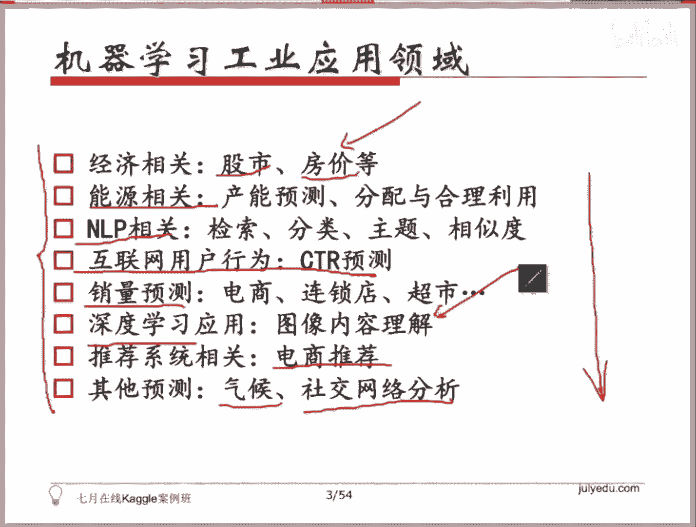

# 人工智能—kaggle实战公开课（七月在线出品） - P1：机器学习到底应用在哪些酷炫领域？ - 七月在线-julyedu - BV1jh411y7Fh

🎼。OK好，那个首先非常感谢大家啊，小伙伴们来到咱们这个Kgo。比赛的这个实战这个课程。然后从今天开始呢，我们会陆续看到很多呃机器学习去建模解决的各种各样的问题。就看到它的一个流程。

包括各种比赛数据的比赛和工业界里面相对应的一些应用。呃，今天这个课呢，我想咱们先起个头，把计算把机器学习解决实际问题的这个流程，包括建模的方式和优化的方式等等。

以及可能我们会用到的工具啊和一些模板拿来给大家看一看。因为工具有了之后呢呃后续的事情就是就是去应用它了，对吧？所以就会相对而言会顺畅一些。因为我不太清楚大家每个同学的一个背景啊。

以及对 machineine learning的一个呃熟悉程度。所以今天讲内容呢，可能对有些同学而言，已经就是我我讲到具体的这个。一些知识点或者是啊对应的一些概念。可能有很多同学已经会有一个印象了。

或者非常熟悉了。但是有些同学可能觉得内容会稍微有点深，但没关系啊，因为咱们这节课主要是带着大家熟悉一下这个流程和工具，所以啊可能有有很多是大家需要课下去消化的这么一个内容。呃。

大家先在课上的话有一个整体的一个了解，一个。认知就可以了。然后从下节课开始啊，这个嘉浩老师和我会带着大家去看一些具体场景下的 machine型 learningning的一些应用。

各种各样的kego的比赛。然后我我希望大家在之后的每一节课上完课之后，大家都能在案例里面找到和这节课的对应。一些对应的点。就这节课会提到完整的工作流程。实际上啊你如果有兴趣去包括后面的课程。

包括大家更多的去了解这个不管是比赛还是工业阶的新应用的时候，你都会发现，实际我们去用模型场你去解决这个问题的话，不一定会对应今天所有的环节。可能也也有可能我们会在某些环节啊。

比如说特征选择或者是一些模型的啊。模模型的一些处理上会有更深入的一些工作。嗯，O然后咱我今天讲到内容，如果大家有任何不明白的地方，可以随时提出来，好吧。啊，这是今天的一个大体的一个大纲一个大纲。

然后我们可以看这三部分吧，我会给大家。第一部分会带着大家先看一下整个模型 learningning的一个用模型 learningning去解决各种各样的问题啊。去不管你是参加比赛。

还是说你去解决工业业界实际的实际问题的一个一个大致的一个总体的流程。然后在这个流我会根据这个流程得大家过一遍啊，是严格意义上来说是一个比较全的库。大家可能很多同学都用过啊。

叫SK learn叫s learn。那会我会把这个流程 machine型 learning力去解决问题的这个流程当中，涉及到的每一个环节。我们在我们可以去调用的库给大家过一遍啊。

或者说里面的某一个类或者是函数啊，告诉大家在哪好吧，然后可能会涉及到这么一些东西啊，包括。那个数据的处理啊，叫data preprocessing。然后特征的一个特征工程啊。

feature engineering的一些。相关的工作，包括啊model selection呢。然后我们会有一个方式去帮我们选择最好的参数。因为啊如果大家真的熟悉这个领域，或者是之前听人家开玩笑啊。

很多这个领域内的人开开玩笑说，哪有什么特别好的模型，无非就是嗯去找到都大家用的都是这么一些model，对吧？然后你做的事情无非是在这个model的基础上去找到了最合适的一组参数。

这也就是我们我们说我们需要去嗯。做寻找超参数的这么一个工作。因为大比如说比如说大家都是用的啊大家大家可能听说过一些算法啊，非常觉得非常好用的一些算法。比如说叫叫GBGT对吧？grading进去。

然后大家都知道叉级对吧？都听说了说哎呀讨厌参加比赛的同学都会用它。对啊，大家都是用的这个级 boost都是用的GBGT为什么会有差别？原因就是大家选择的这么一些。

我们叫做 parameter超参超参数是不一样的。比如说有多少棵树，比如说树的深度是多少？比如说你做不sing，你你要你你这个这个busing的轮数到底是多少轮。

所谓的这样一些hyperpar parameter会直接影响你最后的一个结果啊，前提是大家都用一样的数据集都让都用一样的特征。这个情况下，你所选择的超参数，它是一个。大的架子。😡。

你选择了这样的一个架子之后，你选择了这样的一个算法，这个算法才会去进行相应的训练，去得到对应的我们说的这些参参数啊priameter。OK然后。呃，我们我们做训练。

我们一定要有个方法去了解我们现在这个模型，我们当前训练到的这个东西到底效果好与不好，对不对？所以会有模型分析和啊可能大家都知道参加比赛的话，很少会有同学直接一个模型就就就干到top three啊。

这个事情是非常困难的。大部分同学都知道我们会有一个。model onble叫做模型融合的这么一个操作，对吧？所以我们会顺着这个123455条5个环节去带大家看一下，我们用这样一个工具SK learn啊。

这么一个package里面到底哪些哪些这个函数或者是哪些部分，哪些part是可以用的啊。然后链接在这个PPT里头都有。如果有同学提前预习过，应该已经看到了。然后我会给带大家过一遍KKgo的Vki。啊。

其实这个是很有用的啊，因为我不太了解，有有些同学我之前看到有些同学去参加所有的比赛，你不会去了解一下历史的一些情情形。来了之后呢，直接就看当前这个问题就就就就强行。试图去构建一个模型，对吧？

那你其实更好的方式是你去了解一下历史上有没有一些和当前的这个你的这个应用场景啊，你的你当前要解决的这个问题比较类似的问题。这个比较类似的问题呢有有几重含义。其中有一重是一会儿我会带大家看到的它叫做。

就是大家去做任何的东西，你是需要一个评判的标准的，对不对？你是需要一个标准的，而这个标准不同会直接影响大家的最后的这个效果怎么样。因为如果你做的优化是针对准确率做的，而最后我们的这个任务。

它所关注的东西是一个比如说啊准确率和和召回率都都关注的。比如举个例子啊，叫叫这个F score啊。或者是这个AUCok那那你只针对准确率去做优化的话，你即使准确率已经做到非常非常的优了。

可能最后去评估下来，你会发现。你的这个排名或者你这个分数都是低的。所以你需要去了解说我这个问题它的评判标准是什么，那你就要了解我们有哪些评判标准。所以整个Kgo体系里头，你会看到有这么多的评判标准。

比如说for regression的问题，回归类的问题，我们就有这么多有但最熟悉的叫me absolute error，对吧？叫做叫做这个啊军方误差或者是MME或者是MAE对吧？O然后。啊。

会有些其他的。呃，OK然后我们在分类问题当中，我们针对classification啊，这是另外一类问题，它又会有其他的一些评判标准啊。你会发现有这么多个标准在我们之前的比赛里头都出现过。

而这些标准衡量的方式是不太一样的。所以如如果你不了解它衡量的标准。你直接以你认为的分类的准确率去做这个事情。你会发现你最后结果不一并不一定是有的。这个地方的话，如果有同学之前参加过一些比赛啊。

比如说之前。呃，我不知道有有没有同学了解，就是很多企业啊，包括像滴滴这样的滴滴打车啊，滴滴这样的公司，他都组织过一些比赛啊。然后像那样一些比赛的话。你会发现他最后去啊。哦我我不好意思啊。

我再跟大家确认一下，现在听课的同学都听得到我的声音吗？OK好好，那个O那咱们咱们接着说啊，我就说不清楚大家有没有了解那样一个比赛。如果你了解那个比赛，你就会看到他的评判的标准和大家的标准就不一样。

我可以告诉你那个比赛的最终的第一名是用的叉吉布做的，是用GBDT做的。但是很多人都是用GPTT做的，包括那个比赛我当时有。有带一些同学去去做这个事情，但是最后效果确实没有人家的好，原因是什么？

你会发现你抓到这个关键的点。啊，滴滴之前有个比赛啊，滴滴。大概是去评估一下一个每一块地区，它的一个对司机的一个需求量啊，又或者对这个快车，对于专车它的一个需求量，好吧。那ケ我的winki呢可以。

KKgo的Vki，我我希望大家去看的一个原因就是你需要去了解你是针对什么目的去优化的那当那个比赛的第一名，那支队伍，他最后去参加比赛也是用的叉几。但是他做了一些优化。

他把它的lost function或者是我们用于评估的这样一个标准做了修正，对吧？那这个修正的方式呢。一会我们带大家看啊，叉几bo里头是支持你自己去自己去设定自己的。啊，sorry。哦，在这。他那个。

叉级bo里头是支持你自己去设定你的objective，嗯你的客观度，或者说你的lo function，你的cos function的，你是可以自己去。设定这个东西的，但是呃会有一点小小的要求。

一会儿我们再告诉大家啊，就是你你他是支持这个东西的。所以你要知道你最后评判的你的这个目标是什么，你再去针对你的目标去优化，这才能拿到在他的评估体系当中比较好的结果。好吧。

然后我们最后会给大家简单的过一下案例啊，我知道有很多同学说我我上过这个10月的这个mine learningning的这个课。那我看过这几个案例了。对，这几个案例只是告诉大家一个完整的流程。

或者说我们这个FK learn，或者说我们叉G boost应该怎么样去调用，只仅仅是这样一个作用。我这节课并不并不是整堂课的核心的内容，集中在这个案例的讲解上，好吧。

然后模型能理在工业界会有很多很多的应用。我们在这节课里头会涵盖其中的一大部分的应用。比如说大家比较关心的，因为能这个东西永远都是和钱比较相关的。所以在经济上会有很多很多的应用啊，包括股市，包括房价。

那这个会。应该是下节课。啊，嘉浩老师会明天的课，嘉浩老师会带大家看案例啊，相关的一些案例。然后我们后面会有课会涉及到能源相关的一些问题啊。因为大家知道。这个政府或者是国家比较关心的这几个几个方向。

里头有很大的一个方向，就是我们能源相关的。所以你会看到现在陆续的我们很多传统行业行业，包括电能电力的这么一些公司。他也会去组织一些比赛。因为他们在试图去通过一些数据驱动。

一些一一些数据驱动的这样一些方法去找到合适的方式。比如说我不知道大家有没有关注啊，大概在呃几周以前还在比赛的是国家电网呃这个电网有一个比赛，是用来predt，需要你去预测这这一个用户。

他到底有没有偷电啊，有有类似的这样的一些比赛，它是能源相关的对吧那现在这些传统的这些企业也开始试图又去找到一些数据驱动的方法去解决这样的一些问题啊，达到这个产能的一个合理的分配和合理的一个利用啊。

还有另外一大部分呢是互联网公司会需要的。像NLP相关的一些。那像检索啊，像分类啊，排序啊，然后toplk to model主主题模型以及文本的一些simity相似度。

基本上是基于这些东西和围绕着这么些东西的一些相关的一些问题。那这个在课程里头也会涉及到啊，然后如果有同学了解的话，像像google像facebook，它的主要的营收来源于它的广告。

而和广告相关的有非常非常重要的一个问题叫click through predictionCTR预估的一个问题，这个东西会直接影响他们最后的收入的。状况。

所以这个我们会有一节课会提到click three prediction这个问题，它可能可以用哪什么样的一些model去解决。那现在的工业界，包括BAT，包括google，他们可能在用什么样的方法。

什么样的model去去在它的data在它的数据上。去去完成这样一个任务。那可能其他的一些就是电商啊、连锁店啊、超市啊等等这样一些啊。不管是这个线上的还是线下的这么一些形式的这么一些电商的形式。

一些商店的形式，他们希望能做到一个销量的一个预测啊，我不知道大家有没有关注像阿里这样的公司的话，他会专门会有一些现在现在有个阿里啊菜鸟是吧？是物流相关的，对不对？所以其实不管是物流物流这一大块。

还是说这个有很很很多时候我们电商会很关注我我需我的一个供需状况，就是有很多东西它并不并不是说我拿过来了之后，我卖不完，我就放着，等到什么时候大家有需求了，我再买。因为都是有期限的嘛。

所以如果我能够提前的预知这个东西，它的销量是是怎么样的，对吧？这一天它的销量是么样的。比如说今天是这个呃平安夜，可能今天的苹果就比较好卖，对吧？或者是今天的这个鲜花就比较好卖啊。

但你有一个大致的一个预期的时候，对你的对你的这个整个库存各种各样的。这样些东西都会有很大的帮助，对吧？然后dep learningning更是最近被炒的非常非常热啊。

所以这节课里头会提到dep learning相关的一些应用。那大体的应用呢都会集中在这个图像上，在image上面。因为。图像上图像是目前落地比较多的dep learninging的领域啊。

包括但是像NLP这样的领域呢，虽然现在dep learninging在逐步的发力，但是还没有到这样一个程度。所以你会看到现在你去tablego上看和图像相关的这么一些比赛。

基本上是dep learninging垄断。它唯一的区别在于说你这个网络是什么样形式的一个网络怎么样搭建的，仅仅是这个差别而已。呃，电商的话会有很很大一部分的收入，也会来源于他的。

Recommendation system。啊，大家开淘宝，你会看到你搜完任何的东西，你点击完任何的东西，你下次再进去，你去看他屏幕上推这个。推荐给你的这样一些商品的图片。

一定是根据你之前的历史行为去做的recommendation。那这个是真的是有效的，确实是有效的。能够。很大程度去提高他们的营收。所以这是很大的一块啊，然后其他的一些比较杂了，包括像大家都知道。

像像一些这个气候啊。我不知道大家有了解有一些app像有一个app叫彩虹天气。他可以准确的告诉你说，你所在的地区。几十分钟以后雨会停，几十分钟以后可能会开始下雨。

那它背后的东西也是数据驱动的这一套m型 learning planning的算法在做的。社交网络就不用说了，现在像微博，像朋呃这个微信的朋友圈这种东西的话，其实里面是蕴含着大量的价值的啊。

所以实际上从从这样大量的数据上去产出一些。可以辅助我们决策，或者辅助我们去去应用的这么一些算法的话，也是非常有意义的。OK所以这是我们可能会涉及到的一些方向啊，而这些方向我列这么一些方向的原因。

也是因为大家如果之后如果现在现在已经在这个领域工作的同学肯定是了解的。如果之后想去这个领域工作的话，你会发现你做的你你所涉及到的这个。这么一些工作其实是可以划分到现在我列给大家的这么一些。

应用领域里面，所以我们咱们的课程也是这么组织的啊。

