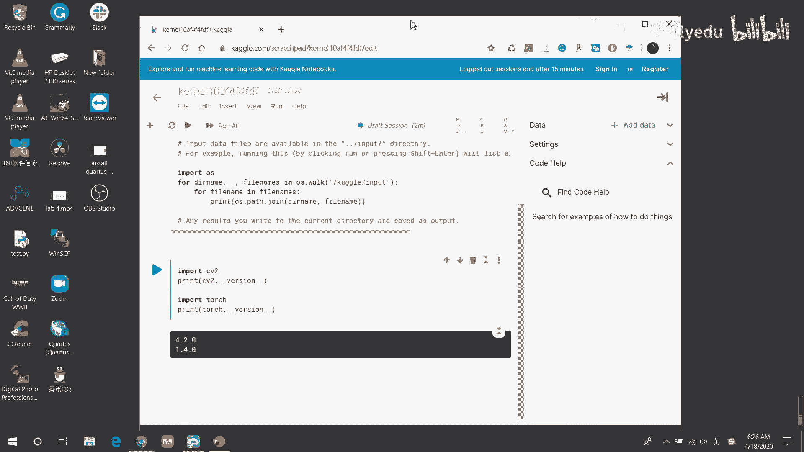

# 人工智能—kaggle实战公开课（七月在线出品） - P10：征服Kaggle大数据竞赛 - 七月在线-julyedu - BV1jh411y7Fh

🎼。

OK大家好，我们正式开始。首先做一个自我介绍，呃，我叫庞燕，是7月在线。呃，本次征服开口大数据竞赛公开课的直播老师。今天我们主要跟大家聊的是呃关于开口大数据竞赛。

Yeah。我主要会回答以下几个问题。第一个是呃what is the kgo呃，为什么要参加大数据比赛和如何参加大数据竞赛？OK那么我会通过以下5个呃tops来跟大家具体聊一下。

首先是cago的竞赛模式以及cago的所给出的一些数据，呃，和平台的一些选择，如何选择合适的比赛类型，然后我会给大家讲一下，就是呃针对一个项目是如何从最一开始再到最后的提交的一个整个的过程。

聊完这些之后，呃再跟大家聊一下参加cago比赛的意义和影响。OK我们从第一个呃tops来开始聊起。

开口的竞赛模式。呃呃我想和大家说一下的是，本次公开课的课件，我是用全英文写的。因为我个人认为开口比赛，因为它是国外的一个比赛，它整个的官方页面全部都是英文。所以如果要参加开口比赛的话。

那么最好是对英文的阅读有呃一定基础的比较好。当然在这次呃公开课的演讲的时候，我会全程汉语跟大家聊okK。

什么是开口竞赛？呃，在cago的官方主页上，它有一句话呃，翻译过来的意思就是说呃cago它是一个做模型预测的平台。呃，哦，从哪里获取课件？最后我们就是公开课结束之后。

我们的后台的老师会把课件发送到群里面。同时我们也会把录播的视频呃抛在7月在线的官网上，大家可以呃反复观看。OK我们继续呃，开go是一个做模型预测的平台。

那么在这个开go的官方网站上会有很多的一些呃各式各样的问题。同时针对这些问题，他又会有相应的一些数据集，换句话说，我们不需要自呃自己去收集数据集，开口本身已经提供了大量的数据集。

那么针对这些问题和已有的数据集，会有很多的一些呃参赛选手，他们以个人或者是组队的形式，并且利用自己呃已有的知识和一些呃开发工具开发软件来参加这个比赛。参加这个比赛最终的呃结。

我是做一个预测模型来解决之前提出的问题。OK呃，我给大家呃列了一些就是比较常见的问题。当然我这个是从大概是在两三天前从开go官网上直接播了一张图片，呃，很多人会这么说。

就是说呃开go本身它也是一个tel tricks to win data competitions。就是说在开过这个平台上，只要需要用一些雕虫小技就可以赢得数据的比赛。

我们可以看到就是说在这些已有的一些问题，一些问题，或者是呃数据上面吧，数据分析上面，在最后会给一些金额，这个是呃实打实的真金白银，而且单位是美元。呃，赢得数据比赛之后。

一般来说你会获得一些相应的报酬或者是一些荣誉等等。当然这个也全部禁言。在之后我们会跟大家具体分析一下。呃，开go它是一个非常有影响力的一个大型的比赛。呃，在。它本身是最开始他是做数据数据科学研究的，呃。

它有在200多个国家会有超过60多万的数据科学研究者来一起呃一起就是对这些问题和一些数据做一些公开的研究。呃，有相当很多的大公司与开go一起合作。比如说呃谷歌、facebook、亚马逊嗯。

包括一些像zelow这种呃地产商，或者是liftft和ubber呃这些打车软件等等吧。嗯，在开go上面会涌现出非常优秀的算法。呃，而且这些算法，它最终会运用在工业界和学术界。参加开口比赛之后，呃。

除了拿到奖金之外，而且更多的参赛者他会利用已经取得的成绩。呃，在找工作的时候呢，为自己的一些履历来锦向天花，找到理想的工作。当然这个其实也分两种情况。呃，第一种情况就是在开口本身的平台上去求职。

另外一种情况是就是在参加完比赛之后，呃根据自己的比赛成绩。当然呃成绩是稍微嗯可以说是比较理想的情况下对外求职。当然在最后我们会跟大家就是在求职这块会有所提及的。Yeah。呃。

还有一个话题就是说what's so fun about it，就是关于开go呃有哪些有趣的地方。呃，首先它有一个东西叫re time3点，它是呃翻译过来叫做实时排名。实时排名这个东西呃有利有弊吧。

我个人认为呃，它会让大家在参赛过程中很强烈的竞争意识。呃，有利的地方是我个人认为它会提高参赛者的斗志。但同时也会让参赛者过度的关注这个排名，就是不停的刷这个名次。呃，在我们以往的经验当中。

其实每一个名每一就是每一个选手或者每一个参赛的队伍，他们的那个排名其实非常接近分数就是零点几分是零点零几分的差距。所以个人认为这个呃过度的关注刷排名的意义其实也不大。呃，通过组队合作参加竞赛。

可以和很多大神们相互讨论，并且呃在呃呃论坛上学习学习大神们的方案，呃，让自己受益飞浅的时候得到快速的提升。呃呃在这个一个很好就是很友好氛围的同性交友平台上相互帮助吧。当然除此之外。

对于一些一些就是呃取得很优异的成绩的。比如说前三名会有一个丰富的一个呃资金的奖励。而且呃赢得比赛之后，你。会有很大的机会来拿到一些非常大的公司的一些呃非常好的一个工作机会。就是等等。呃，说到这个的时候。

我想跟大家提一下，就是cago的日志kgo block呃，kgo block它有大概5类吧。还有大概五类。呃，第一类是呃关于d science的一些新闻，数据科学的一些新闻，包括呃cago的一些新闻。

而且他或者是他的那个coel或或者是如何呃教你怎么样参加比赛就等等的一些教程。最重要的一点也是最后一点是winners呃 interviewviews。呃，他主要是说就是获胜者的一些呃实施的采访。

一般来说cago会对每一场比赛的前三名进行采访。同时聊一下他们的心得体会。呃，和他们在参加比赛的时候，是如何解决这些问题的步骤等等。呃，当然了呃开go也会公开他们的个人简历。就是但公看他们个人简历。

而且大多数获胜者也非常愿意公开自己的源代码。呃，个人认为多看一些获胜者的经验，也呃，能提高一些自己的能力。当然了，天下没有免费的午餐，开口一个博客专门专门的标题，就是no free lunch。嗯。

确实如果想拿到一个很好的成绩的话，其实很不容易。呃，需要付出很辛勤的汗水，才能有所收获。呃，聊到这个地方的时候，呃，我想大家更多的应该关注会关注一点，就是说我如何去报名。当你进入开go的官方页面的时候。

呃，比如说我们随便点开一个就是关于竞赛，呃，像这个竞赛，呃，像这个竞赛，我它是一个twitter的一个关于情感信息的提取的一个比赛。twitter大家应该都熟悉，就是好比我们国内的微博，新浪微博。

像美国的总统最爱在那个呃推特治国，就是这个认题OK。拿Twitter这个情感信息提取的这个比赛来说，它总共的奖金大概是15000美元。如果折合成人民币的话，大概是呃10万10万105000。

这个我个人认为是一个呃比较大的一个金额了。呃，他主要会对前三名就是进行相应的呃，给予一个丰合的报酬。OK那么。首先我们第一步当然是要注册一个账号了，这个注册账号既可以用。如果大家可以翻墙的话。

那直接用谷歌账号就可以，或者是用自己本身的邮箱注册即可。当你完成注册账号的时候，后下一步就是点击这个呃join competition呃，就是参加竞赛。呃，然后经过一系列的呃自己的，比如说建模刷代码。

然后再多次的调餐，最后当你写完的时候提交s呃s prediction即可。那么这就代表你已经完成了一个比赛。当然这个提交呃自己的模型或者是呃就是提高自己的model吧，提交自己的模型。

它并不是一次性呃就是一锤子买卖。你每天都可以不停的提交你自己的模型，每天回来你可以优化自己的模型调参再提交，然后实时刷排名。那么说到这里，他就有一个大概的一个呃排名。对于排名高的选手，主要是前三名。

你比方说对于前三名推witter这个比赛，他会对于第一名给予7000美元的奖励，这和人民币大概37500。呃，那个。呃，335000呃，第二名的话会给予5000美元的奖励。呃。

大概是呃呃sorry第一名大概是呃49000小5小5万块钱的奖励。第二名大概是呃35000人民币的奖励。第三名大概是呃21000人民币的奖励。当然这个其实我个人认为也是很多了。

但是呃这个总价值15000美元的奖励，他并不是在开国比赛中并不是最丰厚的。还有很多呃更加丰厚的奖励。呃，现在由于是肺炎期间嘛，所以开国又会提出了一些针对呃肺炎研究的一些竞赛这个的奖金那是非常丰厚的。O。

呃，聊到这里的时候，我们已经知道了如何注册。那么下一步就是说根据每一个呃相应的问题，那么如何选择它的数据，如何处理数据，同时如何选择自己的相应的平台呢？

在开过比赛当中。主要有呃三种数据。第一种数据是training data set，就是你的训练集。第二种是test data set是测试集。那么我们在这里也能看到呃，训练集是一部分，测试集有两种。

相应的来说，对于训练级来说，它是公开的测试集这两种分为公开测试集和呃私有测试级。华为测试级私有测试集。那么公开测试集是大家可以一直能看到的，但是私有的测试集是呃暂时在比赛结束之前是无法看到的。呃。

对于每一个比赛来说，我们第一步通常是。嗯，根据已有的数据集呃，首先建模在在训练数据上进行训练，这是第一步。那么第二步就是说在公开的测试区上，然后做一些预测，注意啊，这是在公开数据上做预测。

然后提交自己的呃模型，并且呃系统会根据你所提交的模型来会有一个快速的排名。但是这个排名是基于公开数据以上的排名。OK。当比赛结束之后，最后系统会根据呃你的模型。

然后在他们本身的私有测试数据集上重新进行测试，然后再生成一个最终的排名。那么这个最终的排名才是你最终的成绩。也就是说在比赛之前，虽然有一个实时排名榜。但因为它是基于公开测试数据集的。

它并不代表你最后的成绩，最后的成绩是要基于你的呃私有测试数据集上来的的做出的那个排名O那么说到这个排名的时候，我们给大家看这个在开口上它有个专有名字叫leaboard简写是LB。

那么这个它其实就是一个排名榜。呃，我们可以看到在排名榜上，它有一个是public leaderboard和private leaderboard。在提交呃在比赛结束之前。

主要我们关注的是public leaderboardO我们可以看到下面嗯大概是。我看一下我鼠标呃，大概是呃。这一块吧这一块首先它的背景是浅绿色的，浅绿色的背景，它就代表是呃获胜的前三名。

这前三名是能拿到能拿到奖金的。再往下呃会排是背景大概是金色的，它会标注是go这个go的意思就是说，虽然你没有拿到钱，但是你的分数也非常高，你你所做的模型的系统非常好。

我们可以看的看一下他们每一个模型的分数，第一名是0。722，第二名是0。721哦，这个分数就是基于这个比赛的分数，它是一个降序排列。大家可以看到每一名的差距几乎就是0。001，这个呃分值非常的小。

而第四名和第五名，他们的是几乎是并列。所以说呃。呃，虽然没有拿到钱，但并不代表这个呃参赛者的提交的模型性能很差。相反它的性能非常好。除此go之外，还会有呃s代表银牌不代表铜牌。

凡是在这个 leaderderboard board上面榜上有名的呃选手或者参赛队伍，他们的模型都非常好。有一个统计，大概说是如果能在呃开过比赛上榜上有名。

那么就代表他们所他们是呃这个行业或者是相关问题的钱top时oktop1这个是非常难得的。所以说并不是说你必须得拿到奖，你才你的成绩才非常好。当你的榜上有名的时候，你你已经非常棒了。这个时候你出去找工作。

还是说出去比如说呃如果要申请学校跟老师top词，那都是一个非常强有力的后盾O好，我们继续。呃，说到这个地方的时候，呃，我想跟大家聊一下，就是一个技术吧。呃，为什么要聊这个技术呢？

因为我在我们的一些呃网往年的经验当中，我们会发现嗯，当一个队伍虽然他在公开数据级的排行榜上非常靠前的时候，最终的结果它不一定非常理想。那么如何克服这种现象呢？

我们主要采取一个叫cross validation交叉验证的一种方式，嗯，我们还是拿呃公开的测试集呃，公开的训练级和测试级的为例。比如说首先第一步，我们会把我们的测试结先随机的分成几个，分成几等份。

我们把每一等份叫做CV这个CV的意思就是说cos交叉验证。比如说我这一步，我把我的公开的呃训练节，我分成三个部分O我分成三个部分。然后。第二步是在呃所有的数据集上，我们进行呃除其中一个数据集以外。

我们进行预测。比方说我们把我们有train和。大家注意啊，这个train和都隶属于train data都隶属于训练集，只不过是把它均匀的分成了几等分。如果说我们把CV1和CV2作呃训练的时候。

那么我们就把CV3作为一个交叉验证的项目，就一个呃自我呃自我测试的一个地方。如果我们把CV2和CV3作为训练的话，那么我们就把CV1来作为一个自我测试的数据集。同理CV1和CV3做训练的时候。

我们就把CV2作为一个自我的测试集。就是do predictions all but one。在CV上进行训练和测试。那么最后会把呃我们这些信息就来自于CV所得到的模型的信息，然后进行一个推断。

在这里我想说的是。请更多相信自己的模型的性能。同时，针对于公开训练集和自己的教叉验证的模型来说，我希望大家能更多的信信自己的教叉验证的模型OK。分享两个小技巧吧，就是如果你的呃所遇到的问题。

同时他所提供到提到的呃数据集非常小的话，那么通常来说，越简单的代码其实能达到越好的效果。有时候代码不必冗长。但是如果对于。非常大的一个数据来说，那么希望能更更多的关注于就是我们的快速迭代问题。

OK还是那句话。相信自己的模型，同时相信自己调叉验证的呃结果啊，而不要总是过多的去关注于公开的这个公开的这个排行榜。给大家举一个实际的例子吧。

大家可以看到现在这个图片是大概是两年前也呃是zeo这个房地产公司所提到的一个就是呃比赛吧，这个比赛是做呃zio自家的房屋评估的一个预测的模型。嗯，当时大概的金额大概是我数一下啊。120万美元。

我数了两遍，我怕数错，120万美元OK那这个金额非常丰厚，是两年前的一个比赛。而且现在来说，他这个比赛已经关闭了，我们看一下结果。呃，目前大家看到的这个是后面的private leaderboard。

是最后的最终结果。最终结果是在。私有的数据体上是呃进行验证之后的一个排名。OK我们可以看到。最终的第7名和第10名，他们的排名分别下降了6名和8名。我们如果反推一下。

我们就可以知道现在的第七名其实是在最终嗯比赛结束之前的第一名，而现在第10名是最终结束之前的第二名。OK那很可惜的是，在比赛结束之后，呃，很可惜的是在比赛结束之后，他们并没有拿到钱。

因为他们的名次向下滑了。作为一个反面例子的话，其实不应该叫反面例子。如果说正面例子的话，我们可以看一下前三名。OK我们可以看下前三名，尤其是关注一下第一名跟第三名，第一名，他们的排行榜是上升9位。

也就是说在比赛结束之前，他们是呃第一名的成绩是第10名。O我们可以看现在的第三名和第五名，第三名和第五名，他们的成绩分别上升了133位和418位。说句实话，这个非常就是这个上升的名字非常可怕了。已经嗯。

可以说他们在最后一秒之前，呃，他们的模型并不是非常的好。如果尤其是那个第五名，他前面有418个人，现在都比他们好，都比他的模型好。但是他还是相信自己的模型最终取得了第五名的成绩，第三名他上升了133名。

最终也拿到了前O所以说呃很多人他其实呃为了迎合这个公开测试级的呃，测试的就是测试的结果的性能，他们去呃做了一些可以说过拟盒的事情。像过拟盒。虽然你在公开测试集上，你感觉你的效果非常好。

但是当我们当系统最后用私呃私有测试集的时候，性能不一定非常好。所以说在我们的经验是就是呃一些参赛队伍。如果你忽略了那个在公开测试集上的呃一些结果，更多的关注于自己在交叉验证时的结果的时候。

你的成绩通常来说还是比较好的。当然前提是你的交叉验证的结果也比较好。啊，运气的话确实很重要。对运气的话，运气也是实力的一部分嘛。当然其实我们主要还是不能靠运气啊。OK我们聊一下。

就是参赛的话有哪些to子吧，哪些工具或者是哪些平台嗯，在。呃，在开口比赛当中，主要是呃大家主要选择两个工具，一个是python，一个是R语言。但是换句话说，我们也只能选择这两个工具。呃。

选择这两个工具的话，我个人建议呃，大家对哪个语言熟悉，就需用哪个语言。嗯，不要因为它本身语言没有说优劣之分。呃，对哪个熟悉，你就采用哪个。像对于我本人来说，我我不会R语言，我主要是用python的。

所以我就会考虑python。OK在python的这个当中，呃，首先在开go上，它会给你提供一个叫朱pyter notebook book的一个工具。在上面你可以直接进行编程，直接进行你的测试。

它已经预先安装了很多的库。像这些常见的库，它上面都有我给大家实地举个例子吧。

我我现在退出我的屏幕，我然后我打开我的浏览器。

OK我打开浏览器。

我说开。进入开狗的官方主页。目前来说我是并没有进行登录的。当然你可以进行，如果你已经有了账号，你可以进行登录。我现在想给大家演示的是这块这块是它的一个可能。呃，我们可以点击try now。

okK我们现在进了它的一个col，它本身是我个人是因为是呃基于ropy book的一个界面。如果大家对朱py notebook book比较熟悉的话，呃，那个人认为用它的col基本上是无缝衔接的。

O给他们O给已经打开了。我们可以看一下，比方说呃我想验证呃有没有一些就是常用的一些安装的库。我们现在可以测试一下，比方说呃我现在。Import。CV twoO two是呃open CVV这个库的简写。

呃，open CVV主要是来进行识别图像和图像处理的一个库。呃，我现在打印一下它的。他的版本。OK然后我运行，我们可以看到它C two的版本4。2。0，这个我不敢说它最新的版本，但是基本上已经非常新了。

我们可以再做一个测试。比如说如果你要是用呃神经网络的话，我们有可能会用到pyto。OK用到touch，我们同样打印一下toch的版本。啊，sorry，这写成基 two了。Yeah。OKto的版本是1。

4以建一个自己私有的呃私有的。呃，私有在自己私有的课人的情况下，呃，在自己私有的课人的情况下，呃，我们可以搭建一些。比如说可以加载1个GPU或者是加载TPU等等，来加快我们的呃训练的一个一个过程吧。

OK我现在关掉。然后我们重新回到我们的呃PPT当中。

ok那么如何选择合适的比赛类型呢？

我这块是我是从他的官网上直接扒到扒下来的。那么呃在官网介绍当中，呃，开过的比赛类型主要是有两大种，第一种是常见的竞赛类型，第二种是一些不常见的竞赛类型。当然我觉得这是句废话。

那么我们看一下常见的竞赛类型有哪些。常见的竞材类型主要有4种，第一种叫featured，第二种叫research，第三种叫started，第四种叫playground。我们分别看一下呃每一种。

第一种featured。对于第一种来说，呃，我已经用就是黑体或者是红笔给帮大家已经嗯标注出一些关键字。它所谓的feature的这种比赛类型，它主要是针对积器学习的。

同时它会更多的是一些呃大公司来提出的一些针对该公司的一些专有的一些预测问题。给大家举三个例子。第一个例子是all state呃这个公司来提出的一个预测。它主要预测的是他们的销售呃销售。

通过他们销售历史来预测自己的保险保险的情况。第二个例子。第二个例子是维基百科来进行预一个就是那个负面一些消息的一个分类一个挑战。第三个例子是leaow这家房地产公司。

他们所做的一些就是对自己的房屋进行的一些预测。我们可以看到这些呃问题基本上全部都是相应的大公司来针对他们本公司的一些问题所提出的。所以说这个是feature这一类的一个比较呃很有意思的特点。哦，对了。

如果最后同学们拿到课件的话，呃，我这里已经给大家就是呃像标出了一个相应的链接。如果你点击的话，你是可以进去的。OK所以在课后也希望大家能跟嗯能在群里都关注一下，然后取得我们的今天的课件，O我们继续。😊。

Yeah。呃。对于fishature来说，它还有一个比较吸引人的地方，就是说嗯针对每一个问题，这些公司都会给出一笔非常丰厚的奖金来吸引大家来解决这个问题。最高可以达到100万美元。

100万美元大概是700万人民币。当然如果说你这个比赛的奖金越高，那么就意味着这个比赛越难O这个比赛越难。嗯，对于这类的比赛，不管你是你们领域的专家，还是说你是一个完全的新手。

其实我觉得大家都会以参加这种比赛，因为参加这种比赛，更多的是来呃，它是一个很好的机会来提高自己的呃编程能力，然后搭建模型能力和整个一个逻辑思维的能力吧。这是第一个类型。第二个类型是research。

从它的字面意思上来讲。啊，从哪里获取课件哈？就是当我们节奏之后，那个我们的后台工作人员会把我的课件就是泼到群里头。呃，最后我们也会把今天的直播视频也会挂到我们的7月在线的网站。嗯。

大家也可以到时候进行关注。好，我们继续。😊，Research这一类从字面意思上来说，我们就可以知道它主要是针对学术的一些问题。他们更多的是呃像做一些实验实验类型的，我们还是举个例子。呃。

在这里我列出了三个呃，第一个例子叫是谷歌它提出来的一个一个挑战，就是说呃在一些数据集当中，它希望你能快速的找出一些地标型建筑，这是第一个例子。第二个例子是呃做一些呃白头金的一个识别。

第三个例子是说呃就是是也还是围基他们所提出的，是希望能在一些呃很大规模的分层的呃文本当中进行一个快速的分类。大家可以看到这个类型非常多。大概有30万类，而能如何进行精准的分类。

这一类的问题主要是针对学术来来说，它通常并没有一些奖金。呃，呃通常没有奖金，但个人认为呢他会有时候会提供一些就是呃就是你解决问题的一些能力的一个机会。呃。

所以说research来说也是一个比较好的机会吧。个人认为。第三种类型是我今天想重点强调的，它是started类型。started类型。从C篇意义上来讲，我们就可以明白started主要是针对新手来说。

如果你是新手的话，我个人建议呃先参加这种类型的竞赛，然后再去返回去再参加research或者是feature的竞赛来拿取奖金O这种类型它更多的来说是针对新手。

而且它是经常会有的一种就是生命力很强的一种还是举两个例子。呃，一般来说呃如果进入开go的话，首先大家都会呃就是解决一个问题叫泰坦尼克号的生存问题。O泰坦尼克号这部电影大家都应该看过吧。

反正我信象是我很小的时候看的呃，他这个问题主要是说我现在已有已经知道这些我所面临的危机，同时我也知道自己的乘客的一些特征分布，比如说年龄身体健康等等一些特征分布。

那么哎如何规避这个风险或者是风险来临之后。哦呃，如何最大限度的救人这等等这些问题。第二个问题是进行一些房屋的呃房产的预测。房产的预测呃，这个也是一个老生常谈的问题了。呃。

一般来说started这类的竞赛。呃，它会把问题一直挂上去，基本上是不会关闭的。但同时他还有一个问题，就是说当你自己当你已经提交你的呃模型和竞赛结果之后，你的你的这个结果会在排行榜上一直挂两个月。

两个月之后，你的结果就不再参加比赛了。当然这也是一个公平问题。呃，既然这种类型的题目已经是呃就是一直以来就在挂在网上的。所以说很多模型其实基本上已经达到了满分。呃。

大家也可以在网上上看到就是关于这类问题的解法。呃，所以说它是一个学很棒的学习的过程吧。这个是我强烈参就是推荐新手们呃，首先去呃参加一个比赛。Yeah。下一种类型是叫做playground。

playground的话它主要呃是就是为了呃解闷儿。当然了，我当然了就是我相信有很多就是呃科技展们或者是很多大神们呃闲着没事干的话，就找一些乐子嘛。

那么这种问题就是为呃就是这些科技展或者是大神们所提供的这种类型，它也是一般来说它非常呃像那个started，但是它不大一样，它也是主要毛就是针对于新手的针对于新手的呃，它当是他会提供一些奖金。

对于前面started这一类的比赛，它并没有任何奖金，只是为了让大家一个锻炼和提升的过程。但是playground他会提个他有的会有没有奖金，但是他会给你个荣誉。但是呢有的来说他也会给你一些奖金。

当然这个奖金呃，如果是呃和之前呃和之前feature那种类型的比赛相比，可以说是微捕足足道的吧，这也就证明了playground也主要是针对新手的OK。我这也写了一些就是列了一些它的例子。

比如说呃猫狗比较像猫狗这种比较是我个人来说认为一般如果是呃学计算机视觉这方面的朋友，当你学呃神经网络的时候，这个基本上是你第一个所要面临的问题OK。呃，还有比如说叶子的分类。

或者是纽约城市的呃初册的规划问题等等。OK到目前为止，我们已经聊了4种主要4种类型，这四种类型是主要最最主要的四种类型。那么除了这些常见的类型，嗯，开过官网上还抛出了我还它还有三种比较不常见的类型。

它分别是嗯。recruit呃recment， annualual和limit。我们我们分别来看一下吧。第一个。从字面意义上来讲，我们就可以知道它主要是为了招聘而存在的。呃，这些呃这类这类的比赛。

它主要是一些公司，它进行组织的一些挑战。然后我们可以把这类的比赛来作为一个它是一个找求职面试的一个过程。嗯，我不知道大家有没有求职，就是在那个呃。呃，计算机领域有没有求职的经历？一般来说。

如果是跟就是编程相关的。首先呃首先你的简历经过初赛以后，然后一般会到公司或者是呃进行一个远程电话或者视频面试。呃，这个过程基本上就是呃现场编程的一个一个过程。但是如果你参加了开go的这种竞赛。

就是这类型的竞赛的话，它相当于已经进行的一次片筛选。所以说这类的竞赛，主要是针对求职来说的，呃，像这两个例子也很明显。第一个例子是沃尔玛的求职，它主要是做一个就是。库存销售的一个预测。

第二个是airn的一个招聘的，他主要是做一个新用户来定就是订票的一个预测。airn这个是美国的一个呃网站，它主要是做那个就是如果我想旅游的话，我可以通过airab定民宿订酒店等等。

okK所以说通过这两个呃比赛，我们可以看到。呃，很显然就是招聘OK。下一个类型是就是anual的。当然这个类型基本上我个人认为基本上呃对于我们现代朋友来说应该是不会参加的。当然我也是给大家列出来哈。呃。

他本身来说我不能把它叫做一个很严肃的比赛类型。嗯，开go它每年会就是举行两次，一次是。在3月份呃，他主要是做一个机器学习的一些比赛。另外一次是在大概在圣诞节的时候做一个优化的比赛。

最后一个类型是叫做limitity的限制级。限制级的类型。呃，这块它我们基本上看不到。这么说，我们基本上看不到想参加限制级的类型，一般是两种。第一种就是它是完全私有的。第二种是它虽然是公开的。

但是你无法进入。你想进入的钱，你必须是得收到别人的邀请。一般当你收到别人的邀请的时候，在业内的话，大家都会把你认为是大师，认为是master。所以说这种情况呃只有大神们才能进去，是专门受邀的OK。

聊到这儿的时候，我们已经给大家介绍了呃7种的比赛类型。嗯，我给大家总结一下，呃，如果你是初学者的话，呃，我非常建议大家从started或者是playground的比赛开始。

从这些初级的比赛呃来了解一些打比赛的一些基本的套路和解决问题的思路。当然同时也能获到一个比较呃良好的成绩，给自己建立一些信心。呃，如果呃已经不是初级者，或者是经历过这些初级的比赛的时候。

我强烈建议大家参加feature的或者是research的比赛。如果你是初值者奖金去的，那么直接进入rese，直接去参加feature的比赛。OK呃，说完了比赛类型，顺便给大家聊一下比赛题目有哪些类吧。

就目前为止嗯开go比赛主要开go的比赛题目主要有我个人认为大概是呃大概是四类。在最初的时候，开go主要是做数据挖掘 mining。然后随着现在AI的发展。嗯，它会涌现出了更多的比如说计算机视觉。

或者是NLPCR语言处理的一些问题，还有一些就是优化的问题。呃，如果你对计算机视觉这方面有兴趣的话，并且以后想申请就是相关方向的研究生嗯，博士生或者是相关的一些工作。

那么我个人认为最好就是专注于计算机视觉的比赛题目。呃，同一种类型的比赛题目基本上是有套路可循的，说白了都是些套路。如果你打的比赛多了，摸清了其中的套路，那么你的成绩也会自然就是越来越好。OK呃。

所以我个人认为就是说不要过多的关注于其他呃其他类型的题目，或者其他领域的题目，关注于本领域的题目，这是最好的。另外还可以就是有针对性有针对性的就是选择一些比赛题目的一些细分领域。还是比如说再举个例子啊。

还是计算机视觉的。如果当你进入开口的官网的时候，你可以发现在计算机视觉的题目下，它还有细类。比方说有些是和生物医学相关的。呃，我记得有一个题目是蛋白质的图谱分类，有的是和那个动物保护相关的。

比如说座头基的分类等等。就是说可以针对一些细分领域来进行深入的挖掘。嗯，当然了，如果你急于利用开口的比赛的经力来提升自己的背景，我个人认为自学起来呃，自学是没问题的，但是自学起来有点困难。嗯。

你可能不知道就是如何规划打比赛的这个路径。我个人建议就是找一个呃有经验的老司机带一带呃，找一个大或者大神带一带。当然了，一般大神大牛其实不是特别好找，而且有时候人家可能也没有那么充裕的时间。

所以我在这也就是推荐一下我们去月在线的开口实战课程。嗯，在那个课程里面会有呃专门的老师会给大家解释，就会解析一下呃往年的开狗的一些例题和比赛的一些经历。OK嗯，在最后结尾的时候。

我也跟大家会再去聊一下那个关系，关于那个开口实战项目的课程。OK我们去看一下。

第四个大问题呃，就是如果你拿到一个项目的话，你一般来说你会如何解决这个项目。当然，鉴于今天是公开课，我并不会给大家就是具体的讲某一个项目。因为大家的领域都不一样嘛。

我会给大家就是介绍一下呃一般的一个套路过程。OK。

。现在我们假设我们已经开始呃进行一个开go的比赛了。我个人认为主要有四大步吧，第一步就是进行数据分析，进行数据分析，同时进行一些数据预处理的过程。那么在这一部分的基础上。

下一步就是针对你数据的一些特征进行深入的挖掘和选择。然后再下一步才是建模，注意前两步的工作其实是非常重要的。至于建模是反而我个人认为反而是嗯不是相比而言。没有那么重要。😡。

当你只有当只有把数据规划好之后，把特征提取好之后，那么建模才会事半功倍。OK当建模完之后，那最后的呃一步就是提交了O当然了，如果仅仅说很笼统的说这四步的话，我觉得没有什么意思。

我给大家呃每很详细的介绍一下其中每一步的小门道。比如说第一步第一步数据数据分析。我个人认为在数据分析这一步主要有两个方面。第一个是数据的预处理。第二步是数据的可视化。拿数据数据预处理来说。

我个人认为这一步是非常重要的。O呃，通过对于你一个数据的清洗去掉一些呃没有用或者种就是冗余的没有用的一些信息，说白就是一个去噪的过程。然后呃当你的数据呃有些偏差或有一些误差的时候，那你可以用一些小技巧。

比如说规划。来整理一下这这些数据，这一步是非常重要的，只有把数据先规整好之后，那么才有利于你之后的一些进行。那么如何证明自己的数据规整好了，那么就涉及到第二个问题了，就是数据的可视化。

在数据可视化这块呃基于不同的领域，不同的项目，大家可以用相应的工具来进行数据的可视化。比如说你如果是做呃图像识别或者分类等等，就跟图像有关的。

你可以用m play或者是openC等等这些库来把你图像所抛出来。呃，如果是做数据分析的话，呃，我也建议大家用一些其他库来把你的数据进行一个呃统计分析。比方说这个工具叫做box plot相形图。

在这个相形图上嗯一般来说有5个要素。第一个要素minim最小值。第二个要素Q one是4分之1值。第三个是中值，第四个是4分之3值。第最后一个是最大值。那么根据呃这些值的分布。

你就可以大概的对你的数据进行一个了解。如同时对于奥莱尔对于那些异常值，那么最好是把它去掉，以防止对你的模型进行干扰。当然了呃对就是数据分析来说，呃，不光是相形图可以帮助大家呃。

还有一些常见的比如说散点图直方图等等，都可以进行这个数据的可视化。这一步的目的就是说来呃进行在数据预处理的过程中结束之后，我们要确定我们的数据已经得到了一个很好的处理。

OK那么这是第一步就是数据的呃预处理。第二步个人认为是呃特征的一个关于数据特征的一个处理。它比方说。对你的数据了解之后，一定要对进行数据进行特征处理。针对不同的领域会有不同的方案。嗯。

当然我在公开课就不给大家一一赘述了。在课程的实战，在开口实战课程当中，我们的老师会为大家做一个详细的解释。在这一步，我个人认为它最终的目的就是feature selection，选择数据选择。

那么特征选择。一定要选择对自己有利的特征来降低你的运算时间，并且提升自己的模型的性能。第三步是一个建模的过程。嗯，在这一步呃，首先我个人认为要建立一个比较简单的模型，一个VC model。

建立一个简单的模型，先把你的想法，先大概实现一下，把你的模型转起来。转起来之后，然后再回到我们第一个topic所聊的那个cros validation叫查验证。呃，一般来说呃。

把你的测试集大概分5到10个小子集就可以了。呃，通过。搭建一个简单的模型，同时进行运运转起来之后，来理解呃你模型的评估标准，再然后初始化你的操参数。调参提高性能。嗯，而且我建议大家多试一些其他的方法。

千万不要仅仅基于自己最开始想的那个模型，然后就一直针对你的模型来进行优化调餐。其实有时候你如果呃就是多用一些方法的时候，你会发现不同的方法会带来不同效果。可能你之后想到的一些模型想到的一些方法。

会比你最开始想到的模型所带来的性能提升更大。在这个过程当中，也建议大家经常去开狗的论坛上，嗯，就是跟其他一些大神多多交流毕竟这也是一个非常大的同行交友网站嘛。呃，都是一种方法。呃，然后提交你的模型之后。

你可以对比public呃public呃测试机上的排行榜的一个排名，然后优化自己优化和调整自己的算法。我再强调一下那句话，还是更加的吸引自己的模型。同时。

更多的相信自己的模型性能在交叉验证这样的一个性能的表现，而不要过多的关注于排行榜的表现。排行榜只是给大家一个相对的一个参考的呃范围，但是它不是你的标准。第四步就是提交了。呃，提交这块的话呃。

建议提首先是提交完自己的呃模型之后，当然你提交并不是一锤子买卖，它也可以进行多次提交。OK它可以进行多次提交呃，多次提交每次提交之后。

我们可以根据你先你先就是优化好的模型的一个排名来看到自己的一个一个性能的提升。然后同时根据跟其他模型相比，然后返回来再进行更改自己的模型，再次提交。最后还有一个非常重要的就是好运气，好运气也非常重要。

Yeah。参加比赛的意义和影响。当聊到这儿的时候，其实我个人感觉呃聊这个更多的是一种鸡汤文学吧。因为大家其实知道，首先我们参加这个比赛，当然了，我们也是希望拿到一笔奖金吧。呃，毕竟它是以美元结算乘以7。

1的汇率。这样的话还是一个比较丰厚的一个奖赏的。OK比较丰富的奖赏的。所以说除了你拿到奖金之外，我们还可以提高自己的能力，呃，提高自己能力。

那么就可以对我们将来的一个人生规划就是求职这块的一个一个很重要的一个筹码。同时呃我个人认为还有一个非常大的优势，就是说呃可以教到很多志同道合的大神们。通过这些大神们，其实他就是一个小小的人脉。

当你呃跟很多大神们一起交流过之后，你就会走进他们的圈子，不光提高自己的一些技能。同时你也可以增加你在该领域当中的一个人脉关系。还有一点，我就我想说的是这个popularity知名度。这个知名度来说。

我个人认为就是不管是参加比赛也好，还是说。就是在生活当中也好，打造一个自己的一个品牌，这个是非常关键的。这个品牌其实什么是品牌？我觉得对于我们来说，品牌就是自己就是自己的这个名字，对吧？呃。

通过参加比赛拿到一个很好的成绩，增加自己的知名度。那么这个时候不管你是在求职，还是说想呃读取研究生、博士生来进行跟老师tos的话，当说出你的名字。

同时你的名字后面跟着你在开拓比赛当中所取到的一些排名的话，一切水到渠成。OK一切水到渠成啊，有同学说呃开口的课程都是3年前的对我们的老师会就是重新更新课程的话，而且他因为是直播。

所以也会跟大家就是一个面对面交流的一个过程。OK说到这儿的时候，呃，那么左面呃右面这个就是开狗的实案例实战班。当你点击的时候。我已经把就是相应的链接已经就是超链接上去了。呃，当你点击的时候。

你就会可以进入。呃，可以进入我重新看一下啊。可以进入就是相应的课程。比如说你可以搜索7月在线。OK7月在线这个班级开口案例实战班，我们往下滑的时候，呃，我们往下滑。呃。

他可以首先就是对一些呃课程的简介跟大家聊一下，就是开口的具体的一些呃事业。因为大家注意开口它本身是有很多领域组成的。所以在公开课上，我并不可能就是针对某一个特定的领域跟大家仔细聊。

但是在这个呃实实战班里面。实战班里面老师会针对每一个不同的项目会跟大家聊。这儿虽然列出来了10个项目，呃，大概14个项目，但这14个项目是基于各个领域，基于各个领域的。呃，当报考课程之后，呃。

同学们也可以根据自己感兴趣的领域，跟老师就是实际聊一下。呃，来从老师身上挖掘更多的一些技巧，一些呃参加比赛的一些小的套路。

OK除了这个开口实战案例班如果有是同学对自己的就是可能是新手或者是想进入这个领域的话，不知道自己如何选择哪一个领域的时候，我更多的想建议大家可以考虑。可以考虑就业班。就业班在就业班里面。

这个就业班主要是针对计算机视觉方向的okK针对计算机视觉方向的计算机视觉方向是一个非常有潜力的呃一个领域吧。而且它的薪资就是在呃薪资里面算一个非常高的一个水平。嗯，通过。

就业班当中嗯打一下打一些就是很扎实的一些基础。比方说我们会从一些最开始的计算机视觉技术的基础，比如说如何进行图像处理，它的基础进阶，然后一直慢慢的过渡到机器学习与深度学习这块。呃。

再然后再会过到过渡到深度学习的高级技巧，呃，包括一些我们深度学习常见的一些领域。比如说目标检测呃，实力分割呃，图片搜索从识别目标跟踪等等。呃。呃，有同学问有优惠吗？呃，这个是有优惠的。呃。

具体的优惠请大家就是呃可以咨询一下小七，或者是我们的相应的老师。当你点击这个报名咨询的时候，呃，也会有相应的老师跟你进行呃一对一的联系联络。呃，在7月在线上不光有这两个班本。好。是这样的。呃。

我看一个同学说呃大专生就没戏了，但是我并不这么认为在我因为我本身是博士，在我这个求学的经历当中，我会发现就是说有很多本身不是计算机这个领域的同学，他直接转行到计算机这个领域。所以计算机领域。

你可以说他的门槛低。但是他的你也可以说他的门槛高。只要自己想学的话，他是可以学的。毕竟最终我们的目的还是为了拿到高薪，然后走向人生巅峰嘛。OK呃，像这一门课程的话，是我们7月在线一个精品课程。嗯。

他会他会根据。他会根据就是计算机呃视觉这个这方面的一个非常前沿的理论，然后进行不断的更新。而且它因为本身是直播课程，所以呃老师会实时的跟学生进行就是交流。呃，这种这门课程会有三位博士跟大家就是具体讲解。

OK大家对于今天的公开课，还有一些其他什么问题吗？在之后我们会把我们的课件抛给大家。呃，同时呃视频最后的录播也会呃公开的抛在7月在线的网站上。如果大家对今天的公开课有任何问题，或者是想跟我聊的话啊。

那大家也可以现在就是在打字好，感谢这些用户送出来的鲜花。

对，参加比赛的话，既可以个人身份，也可以哎组队的身份。组队的话有一个最大优势，就是说呃大家各负责一块儿，通过自己的强势来专注的负责某一个模块。

他这个开口的实力课来，我们先回到还有实例课。开口实力课呃，它本身只要我我建议就是如果你是想参加开口的实战班，那么你一定要有pyython或者是R语言的基础，这个是非常重要的。呃。

当你有了这个编程基础之后，我觉得你就可以参加这个是案例的实战班了。因为它案例的实战班，它会涉及到不同的领域，针对不同的领域，老师会给你讲解其中的首先是原理，然后推导和插建模型和如何优化的过程。嗯。

每一次开播老师都会就是针对他的实战班来进行，就是针对呃相应的变化来来进行更新这些视频。所以说大家不用担心。

实验班将由韩老师为大家讲解。

在CV剧小班这块，如果感兴趣的话，也可以先做一下免费试听。就是这些比较最基础的一些关于呃目标检测的一些问题。OK如果没有问题的话。

那么感谢大家今天来我们直播间来呃听我和大家聊一下关于开口竞赛的一些呃一些小东西。呃，我们会把我们的课件，就是播在群里，同时也会把录播视频放在官网上。呃，欢迎大家来看。呃。

同时如果有对于开口案例实战班有更多兴趣，或者是想呃想进行CV就业班的一些更多的一些信息咨询，也欢迎大家跟我们的后台老师进行联系。

OK谢谢大家。😊。

