# 人工智能—kaggle实战公开课（七月在线出品） - P3：Kaggle Expedia酒店推荐比赛 - 七月在线-julyedu - BV1jh411y7Fh

好好，行，然后我们今天给大家讲一个案例啊。就接着之前的推荐推荐系统，那么给大家讲一个cago的啊一个酒店推荐的一个比赛。

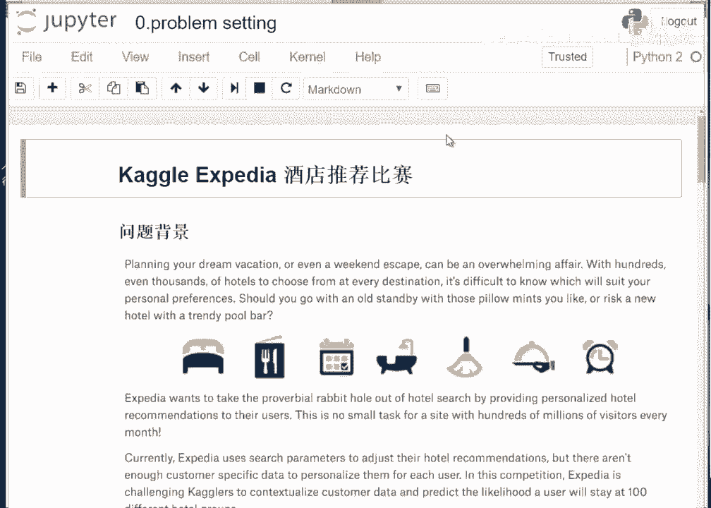

然后这个今天这个。哦。这样一个比赛呢，可能文件稍微有点多啊，大家能看得到我的桌面吗。所以这个比赛呢里面。用到了很多的方式组合去完成最后这个预测。然后嗯这里头可能会有7个文件，我会给大家7个文件。

然后分别是我会先给大家介绍一下我们的这个整个问题啊，一个problem的一个seing背景。然后有一个简单的解法的一个图示OK然后。

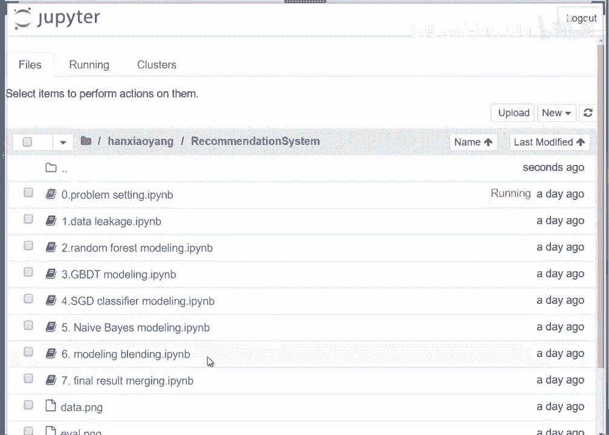

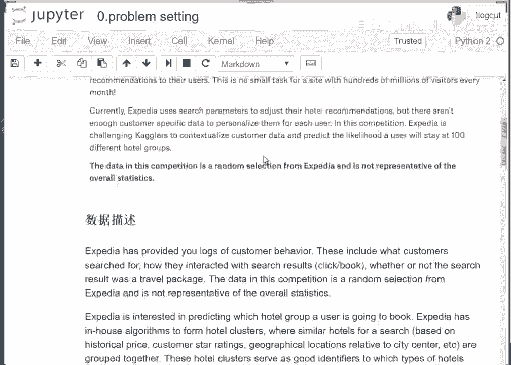

第二个文件是。呃，当比对一会儿我会说比对测试集和去年级的时候，你发现。测试集里头有一部分数据在训练集里面是有完全匹配的，意味着说他们把这个这种情况叫做data leakage，就是数据泄露。

或者说呃有额外的信息啊，你你捕捉到了额外的信息，可以直接去啊以一种che方式找到标准答案啊。当然了，这部分数据只占最后去评估提交结果的数据里面的3分之1，所以有标准答案的数据呢。

我们会先用这种方式去啊找到最合适的结果。对，然后后面的文件是第第二个文件。第三个文件。第四个文件。第五个文件分别是我们用。飞1森0啊raom forest。

然后GBDDgrading boosting decision啊，然后有1个SGDclass SGD class大家可以理解成是一个呃它这个训练方式呢就是一个呃grading decent。啊。

梯度下降。然后所以。所以它是一批一批数据往里面送，然后就update这个参数的一个classsifier一个分类器啊，大家可以先对可以先简单的啊。有这么一个认识就好了。

然后第五个文件是一个普苏贝耶斯的一个模型。所以大家看到这个地方有从随机森林到啊GBDT到SGD的分类这个SGD的class file到普苏贝耶斯总共4个model。

然后我们对这四个model去做了一个bling啊，我们之前给大家讲模型融合的时候，也对我们之前给大家讲模型融合的时候也提到了，对吧？这个model blending。我们说总共会有这么一些方式啊。

叫bagging然后 boostosting和tacking对吧？acking的话，那种层叠的模型的话，有可能会overfi。所以。

我们用了一个嗯比 stacking这种方式要稍微那个弱化一点的版本叫blding，对吧？叫混合。所以我们一会儿会用一个混合的方式，把这四个模型的结果组合起来去生成最后的这个啊final results。

因为我们去做一个mererin，对吧？把它整理成我们最后需要提交的格式。好，这是今天的一个大体的一个呃文件的一个课程的一个安排和这个地方文件我给大家做一个小小的介绍啊。因为我们会有7个文件。

可能今天的内容还是比较多的。但它这是一个完整的一个案例，然后大家可以从里头看到我们去做。一个data的一个exploration啊，数据的探索数据的分析。

然后以及我们去做一些feciature engineering这个特征工程的一些相关的事情。同时呢我们会在特征工程后的数据上去完成一个modeling一个建模的一个工作。

然后包括对这些用各种不同的方式去做建模，同时对这个结果去做一个混合，对吧？模型的融合，叫model blending。然后我们去生成最后的这个结果去提交的这样一个完整的过程啊，所以嗯O。

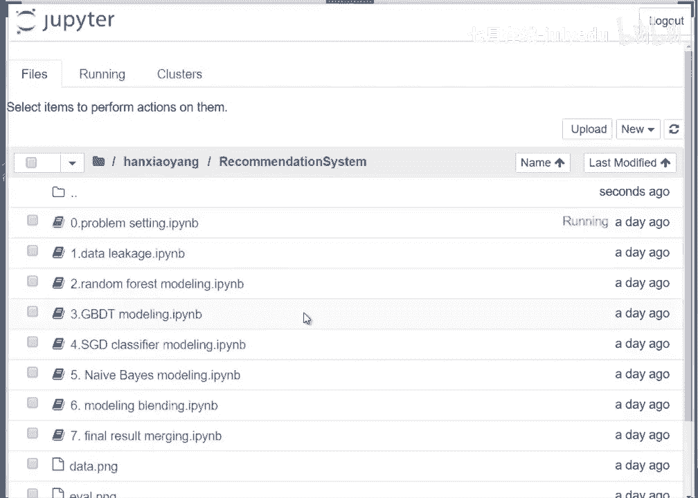

这个是我们今天的第一个文件啊，就是我们给大家介绍一下这个背景啊，一proble setting呃，都能看得到我的桌面吧。我再问一下大家能看到桌面，听到声音，对吗？呃，对，如果能听到同学回个一啊。呃。

因为我我不太清楚是网我会不清楚是网络的原因还是其他原因，我不太清楚大家能不能听得到。所以这个cale的这个比赛呢实际上是一个推荐系统的一个比赛啊啊cale上会有有一些推荐的一些比赛。

这是其中的一个啊很有名的一个比赛。然后这个比赛呢呃我直接把cale上的一个。

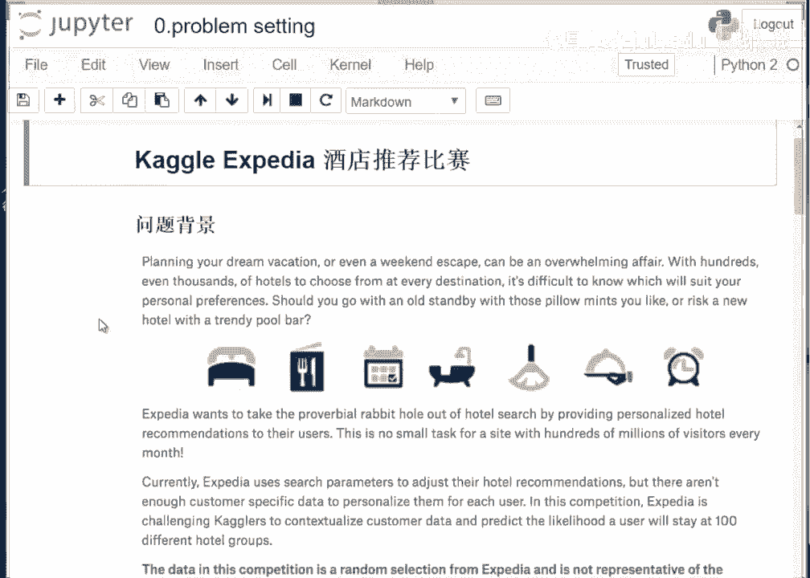

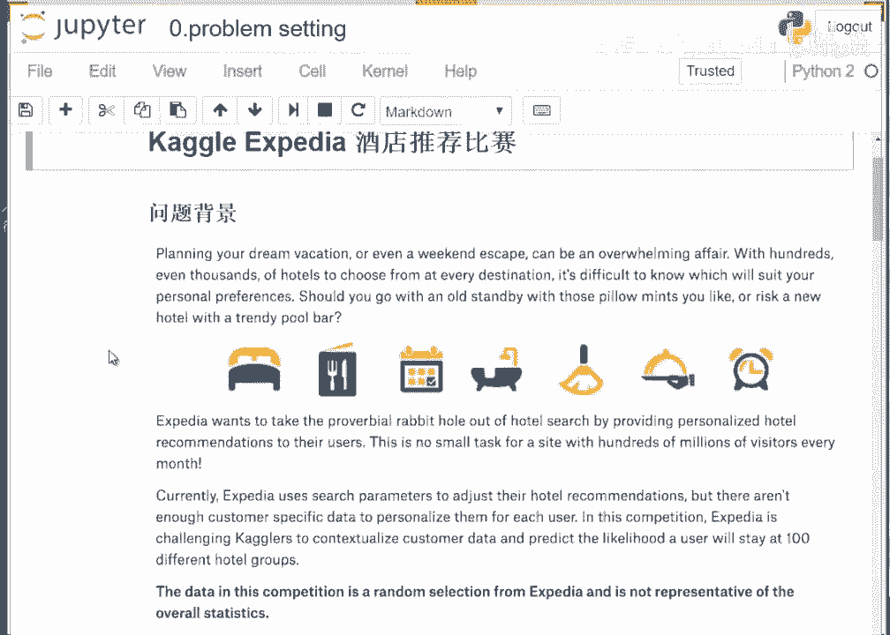

这个背景的介绍直接拉下来了。所以这个问题的一个背景呢是说呃大家每次出去旅游嘛，你像你用携程或者去哪儿的时候，你当你有一个目的地的时候啊，然后你需要去做这件事情时，你可能会提前去定各种各样的东西。

比如说机票，比如说这个。啊，住宿等等。那这个网站呢有点像是国你可以理解成是类似于国内的携程这样的网站。

所以你可以选择在上面去提前预定我目的地那个地方的酒店O但是他这个地方说了有一个问题就是说酒店特别特别多。其实你对当地呢那个各种情况也不是太熟悉啊。

所以你需要去做一个这个筛选这样的一个事情O所以呃像有些同学可能会去查大众点评或者怎么样啊，查一些相关的一些信息。那这个地方呢他是说我他希望能够通过以往的一些各种各样的数据。

能够帮助用户去呃做一些推荐recommendation啊，帮助他减少这个决策的这个过程啊，所花的时间O。

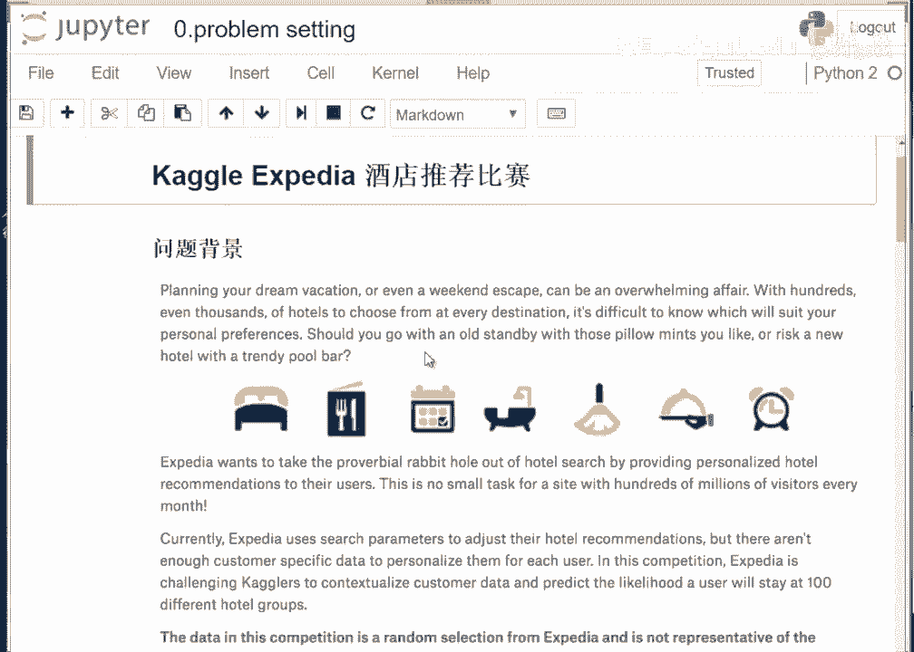

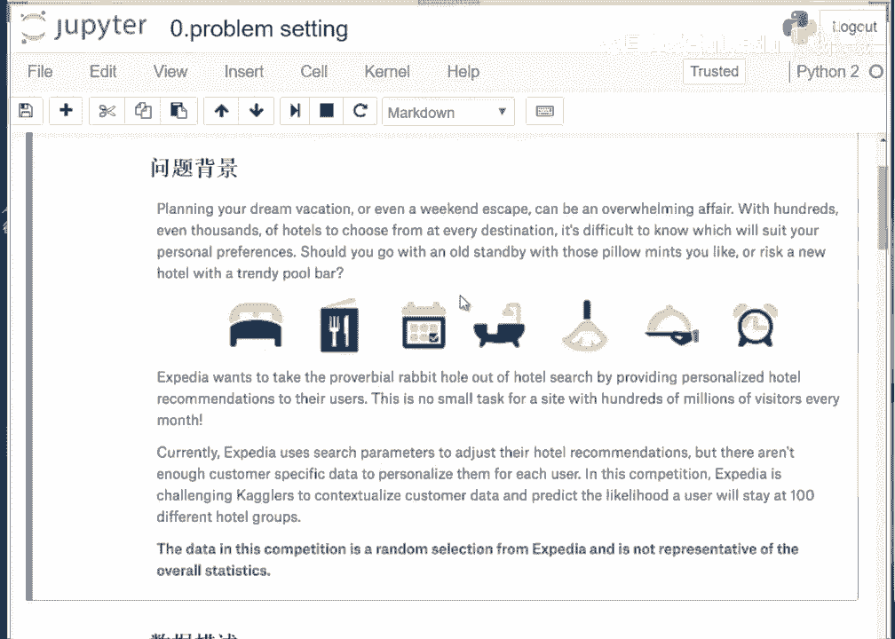

所以他提供了一些相关的一些信息。然后他做了一个事情啊，就是这个地方我给大家用中文大大致的说一下，就是酒店有非常非常多的酒店，对吧？如果你要定位，到时候我给他推荐哪一个酒店，这是一个很很困难的一个事情。

因为因为比如说你去啊你像你来北京或者你去上海，对，或者去深圳的话，其实这个tail是非常非常多的OK那你是很难定位到具体的一个酒店。那因为因为你的目的地只到了说城市这个级别的信息嘛，你说我去上海，对吧？

那我去我去这个深圳，我去北京，那你的booking就是你你的这个预定信息啊，你去上面不管是这个。提前买买机票哎什么这个东西的话，只到了城市的维度的信息的话，有时候他就不能明确你具体具体呃在哪。

或者你的活动范围在哪。所以。推荐具体的酒店这个事情是很困难的。然后他做了一件事情，他把所有的这些所有的这些呃这些hotel这些把它分成了100个cster。

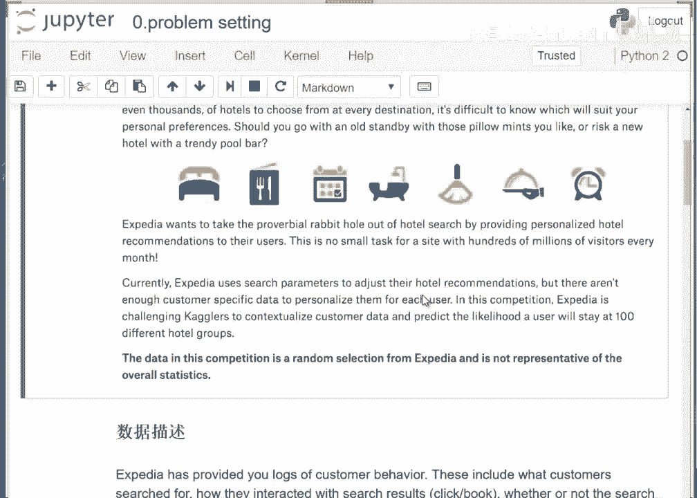

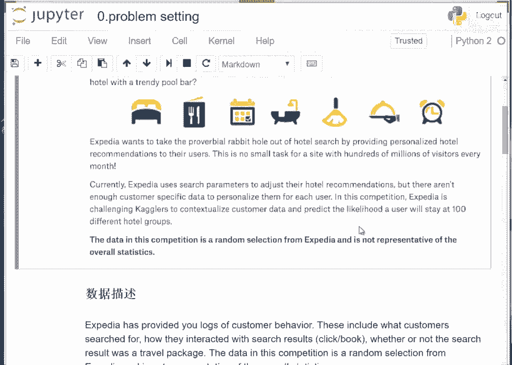

啊，这是他自己内部的内部的一些方法去实现的，就分成大概100个团或者100个类啊，这些还tel。那你可以理解成他可能会从我举个例子啊，从价格的维度，从从这个呃里面的一些装饰的维度，然后地理信息等等啊。

各种维度去把它拆成了100个cluster。

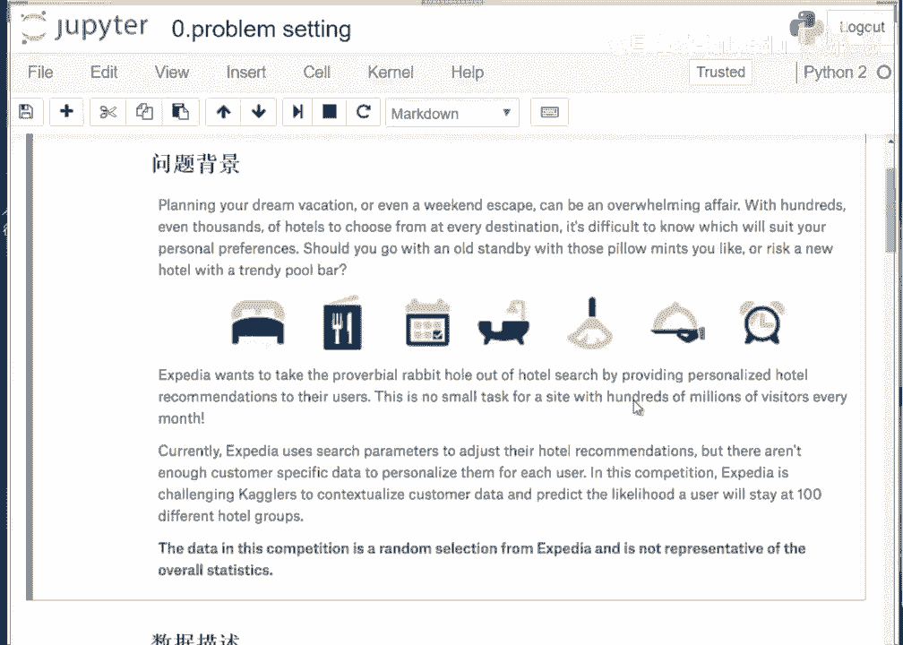

对，然后这个可能是比如说像像儒家和。7天可能就会分到一个classer。O所以你可以理解成就是他把这个问题简化了一些，他帮你把所有的酒店分成了100个classster，然后你要去做一件事情。

你说现在手头上有一批数据，就是这个cus这些顾客他的一些behavior，他的一些行为啊，包括说什么呢？他这地方说了this include customeromer searcharch for。

就是我搜索的时候我去做检索嘛。你比如我去查这个呃上海中山公园，ok上海竟安竟安4ok就是你去这个上海外滩，所以你search你查的这个query等等啊，这些信息它是会保存的嘛，会有嘛。

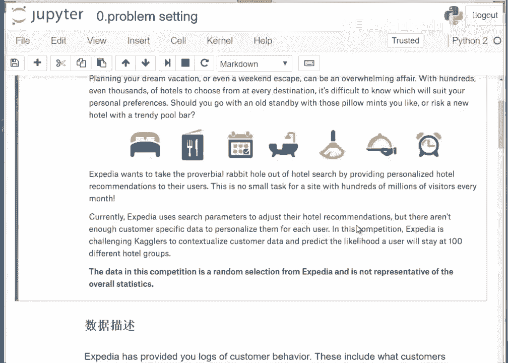

O然后你和本身我这个app的一个或者是网页端的一些交互，我也是有记录的。比如说我做了点击，对吧？我有click，那那我比如说我我我查看了这个酒店的相关的信息啊。

我查看了它这个某一个某一个展出的结果相关的信息以及我的 book就说我预定了嘛？那我历史上我可能去过上海。

我在外滩定过一家酒店O等等啊所还有一些wether not result was a package就是说你到底说只是单纯的在我这个app上完成了一个酒店的一个预定，还是说你像大家知道这个携程嘛。

它主打商务的话，你可以一站式的把所有的这个机票啊，然后住宿啊等等啊，就是都一一次性的全都打一大包啊，全都预定好，所以这个地方也一样啊，就是说这个你的搜索这个结果是一个还是说不是。

然后呃这个比赛里头的数据呢其实大家知道啊，比如说像携程，比如说像像去哪儿。然后比如说像呃如果你用呃大众点评这样的app去去预定一些酒店的话啊，那大家知道这个量是非常大的。

然后尤其是他这个地方它这个地方的数据，我做一个简单的解释，它是从13年到15年对的数据。然后13年和14年两年的数据呢是用来做千 data用来做训练。然后15年是你要去做一个prediction做预测。

那13年和14年两年的话，实际上数据量是很大的。所以它这个地方做了一个selection就是啊ex嘛，你可以理解成是O就是采样了一部分数据出来。所以他做他给大家解释了一句话。

说我的数据实际上是从全集数据以后去做了一个random的一个selection一个采集出来的一部分子集。所以它可能并不能代表所有的tatistic就是所有的统计分布，就数据的统计分布。

这告诉我们一件事情，就是说如果现在我给你一个训练集。这个训练集呢你千万。千万千万要注意，不要在上面overfitting过拟合了。因为我给你的这个训练集，我并不保证它和全集的数据。

我所有用户的这个数据分布是一致的，它并不保证这个东西它是随机。他告诉你我是随机采样出来的。OK然后啊底下这些就给了一些额外的一些解释了。然后说为什么我要去做这件事情。

做exedia是非常非常感兴趣去给帮助啊用户去这个辅助用户去做这个决策的嘛。所以我做了一个he care group，就是我的酒店呢，我就把它划分成了不同的group，对吧？

一些一些11呃不同的这个cster。不同的这个classer对吧？那ok。然后呃我会根据一些，你看他这个地方是解释了一下，他说我是怎么去做那些分组的，就大家知道有100个团或者100个不同类啊。

你可以理解成不同的啊类的这个酒店。他说我会根据这个hitorical就是历史上的价格，cus star rating就是评分O然后只有ographicical location，就是地理位置啊等等嘛。

然后以及相对于城市中心的地理位置嘛，或者是商圈等等。他根据这些东西去划分成了100个那你要做的事情就是你去预测你去预测用户最有可能会booking最有可能会预定的这个酒店到底是哪个class你要求的你要求做的事情是class注意啊。

不是具体的酒店。然后对数据数据做了一个解释，说我的数据呢？我这个里头总共会有13年到15年的数据，但其中呢13年到14年的数据呢是训练级是千 data。

然后15年呢是我需要你去做预测的这个啊test dataok当然这个test data呢本身它是已经有标准答案的了啊，他自己所以他会做一个比对。然后呃大家很喜欢一个东西啊，叫做排行榜，对吧？

你去刷天池的比赛，你去刷这个kego比赛的话，对你都会刷天池和te的比赛的话，你实际上都会。去看每天呢他可能每天都会更新这个排行榜。那cago的话是你每提交一次结果，他都会更新这个排行榜。

这个board会去做一次更新。O但是你看到的这个叫publicboard leaderboard。所以就是你看到这个东西是公开给大家看到的一个排行榜。但它实际最后用来评奖。

或者是最后用来这个呃评大家谁的方法好的时候，用的是一个pripri leaderboard。所以呃很有意思一个事情啊，你们如果有兴趣的话，你可以去看看历史上的cago的比赛。

就是这个public leaderboard和最后最后拿到讲的这个private leader这个排名会有很大的差别。呃，就是一个小小提醒。如果有同学要去参加数据科学比赛的话，不管是天池阿里天池比赛。

数据晨堡或者是科赛或者是呃像cago这样的比赛的话，一定要注意，就是他可能不要不要太迷恋 leaderboard这个事情，就是排行榜。

因为展示给大家的public leaderboard和最后的用于评测。真正的这个结果好与不好的那个leattleboard可能不一样。ok。所以你的训练级他给你了13年到14年的数据。

然后你的测试集是15年的数据。OK然后你需要去做一个事情，就是做一个预测一个prediction，对吧？然后它这里头会有些文件啊，有会有些文件大概长成这样。大家可以看得到对吧？

这个 description包括什么呢？包括chan点 cV这个是整个训练集都在里头然后test set是我的test点 c我有个s destinations是tel个酒店的 attribute就是大家在搜酒店的时候可能会有各种各样的相关的属性嘛。

那包括酒店本身的属性，包括你搜索时候的一些属性queryquery和这个酒店的title的一些匹配度啊类似我我随便说的就是这样的一些相关的一些业务特征或者叫业务的属性。

那但是大家要知道这是一个比赛这个比赛呃主办方呢愿意拿出这么多数据来但是国外的公司包括现在很多国内的公司其实对用户的这个隐私其实是需要保障的。

所以我不能直接把明文的数据丢出来给大家说你可以查得到说是多少多少号的同学现在查了一个什么什么在在toky在东京的一个。这个是不行的啊，查了一个比如说东京塔旁边的一个一个tel，那这个事情是是是不O的。

因为你暴露了用户的信息，所以他们会去做一个事情，他们会对这个tel的 attribute去一个哈西你啊你可以理解成是一个敏的处理所以你能拿到的是可能是一些哈希后的I号。

你是看不到明文数据的O所以都存在这样一个文件当中叫destination点 c然后这个sle sub点 cV呢就是大家很熟了啊，如果参加数学科比赛的话，他就是一个提交的格式。

就是说你最后的这个结果要按照我给的这个格式去提交，我才能去评分。对不然的话我就评不了那包括有很前面之前有很多同学参加过天使的比赛，说那个我提交的结果，为什么最后结果是000045这结果为什么没有得分。

是因为你不符合他最后的要求格式的要求没有办法评分。好，然后我们来看一下这个数据集。数据集呢呃这个地方有个去年级和测试集啊，叫che点SV点V里面会有各种各样的信息啊。

这个colum name就是说有多少列嘛，大家去构建一个数这个数据呃叫数据库里头一个表的时候，实际上你也是会有很多列对吧？每个表那有些列呢会 time就显是日期对吧？

 name name就是说个是一个全球性的一个公司一个公司嘛，一个以它实际上呃不仅有官方的点com那还有Uun对吧？

那个对那个英国或者是啊JP结尾的那是japan对吧等等这是一些 name就是网站的那个然后底下是这个。啊，大陆啊O就是在在在哪你可以理解成哪个国家啊之类的相关的一些信息啊。

这个user location country嘛，国家信息嘛，user location region啊在哪个区域，国家哪个区域，比如说你在中国的话，其实有上海有北京有深圳啊等等然后或其他的一些城市。

那user location的这个c啊re region刚才可可能啊简单理解成可以理解成这个ok华东华中、华北对吧？那那这个是region区域啊，那location city呢就是具体到城市呢。

那比如说华东，我在上海对吧？和我在杭州，那肯定是啊不太一样的ok或者是苏州ok那那个or destination distance是指的这个呃我我检索的时候的一个距离嘛。比如说我我我之后要去上海出差。

我其实可以在北京可以搜上海的相关的一些啊hotel的对吧？那实际上它是有个d有个距离的那比如说我在上海搜上海的话，可能就是说我过来出差，出差，我临时去找一个酒店。

就是这个距离大家能想象到它dance的话，它能在一定程度上体现出来说这个比如说一个紧急度啊或者相关的一些信息啊，OK这地方下面会有一些其他的一些维度的啊feature。

比如说啊us IDO is mobile是吧？是不是用是用手机app定的，还是用这个网页端，对吧？it package就是说我的呃我是用携程去定了一个打包的，这个包括我的这个怎么说啊，打包好的。

包括我的这个飞机呀，机票啊，或者高铁呀，以及包括我的这个酒店呢，还是说我单独订一个酒店，对吧？那这个channel channel啊。然后会有一些这个check in check out就是入住和。

酒店要入住的那一天的日期和你要你要这个酒店去啊。就是你要走了那一天的啊che out那一天的这个date日期，对吧？然后底下会有一些相关额外的一些更补充的一细节的信息了。比如说成年人的个数啊。

小孩的个数啊，对吧？这个你定的这个酒店它的这个这个呃可能是一个你要求是一个比如说两张床的或者是几个屋的等等啊，相关的一些信息啊。

这dination IDdestination typetype ID hoteltel的这个。所在的这个大陆所在的country，对吧？然后的market对吧？嗯，可以理解成是呃。

mabe这个地方是一个商圈类似相关的一些信息。啊就这条记录里头到底是一个啊是不是预定了，对吧？还是说只是发有没有发生点击。你看只是一和零嘛。那一基本说ok这个酒店我预定了，对吧？那如果是零的话。

就表示说ok我其实只是查看了一下相关的信息那再往下就大家可以看到个？是我这个所属的这个ster相关的一个一个刚才我已经给大家说了有100个ster嘛，对吧？

O那destination点V呢是包括下面一些信息啊，叫 name会有会有一个这个IO然后底下会有第一到D149，这是我刚才给大家解释过了。我说就是用户的信息。

你绝对不能把用户的信息直接曝光给大家曝光给直接拿出来，就像之前大家都知道这个S或哪被黑，然后就扒出来一堆的用户名和密码对吧？这肯定是不行的明文肯定是不行的，你至少要去做一个加密对吧？

所以这个地方第一到第149实际上就是 attribute。一些lessens就是隐隐含的这样一些信息，一些invo你可以拿来用的。但是你可能看不到明文信息okK。

然后很重要的一个事情是你去做任何的machine learning的这个参加任何比赛，去去看任何的这个问题的话，解决的问题的话，你必须要知道我的最后的评估的标准是什么。也就是说。我什么样做做的好，对吧？

我的评估标准到底什么？那这个地方有一个很常见的，你会经常见到的一11个评估标准啊，就是大家都知道很多accur像这种准确率，你肯定知道的对吧？

那ok像lock啊啊这样的指标你肯定是知道的 score等等。那这个地方的话，这个也非常常用啊，叫M叫me就是平均的一个准确度at k at k就表示说前多少位的一个平均准确度。

那它大概是什么一个意思呢？这个地方at5就是说呃我允许你给我推荐5个结果，就是我我允许你在100个里头给我推荐5个只要这5个里头有命中的，我就认为ok你算对了。那大家可以想象为什么是5呢？

你可以点开你的携程，点开你手机上的呃携程或者其他的一些。比如说大众点评，你可能一页一个页面单个页面显示的可能就是5个结果。我猜的。

所以这个地方5的意思就是因为后面那个可以调的那它判标大概就是就是因为一页只展示5个结果，所以用户只要在首页看到了，我就觉得说ok这个结果O但如果你不在首页，你要我翻的话。

我可能觉得这个就是一个不太ok的结果，所以他评判的是你给5个结果，你给我5个推荐的结果。只要这5个结果里头有一个命中了。O我就认为你说你这个可能是中的O是O的。

所以最后提交的这个submission的这个fi呢，大概长什么样呢？大概就长这个样子。所以对每一个user和even呢。

你可以pred就是你可以以下面这个方式去做一个提交这个提交大概是长这个样子你要提交两部分信息个I另外所以这个I。针对一个user和event，就是就是它是一个事件，然后你会去。推荐5个hotel。

大家看到了吗？99317520，这是hotel的ID号啊，classluster的ID号。OK所以他这个地方推荐了5个结果，只要这5个结果里头有一个命中了，我就觉得你说okK这个是这个是okK的。

当然当然了，你排的越前的话，你排的越前的话，其实是呃结果肯定会越好。但是在只要在这5个里头的话，其实你就是可以得分的OK。然后这个地方的解法这是就是做的这个呃。

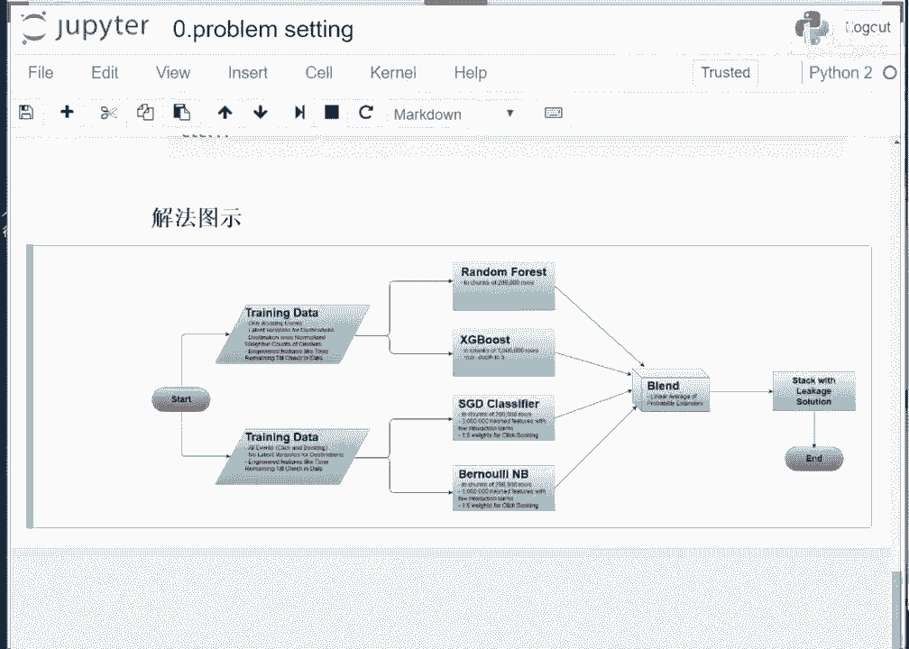

Okay。所以啊这是一个图示啊，这是一个图示。所以大概大家可以看到大概是长这个样子。然后我们选所有的训练机拿过来或训练四个模型，分别是这个地方的rdom forest，然后GBDT啊。

随机森林GBDTSDSGD的，然后一个伯努利的普贝斯啊，我们普贝斯是还没有还没有给大家讲，是吗？那之后会提到它经常是它是一个经常会在啊自言处理以后会用到的一个分类器。但是你也可以拿来做其他的这个。

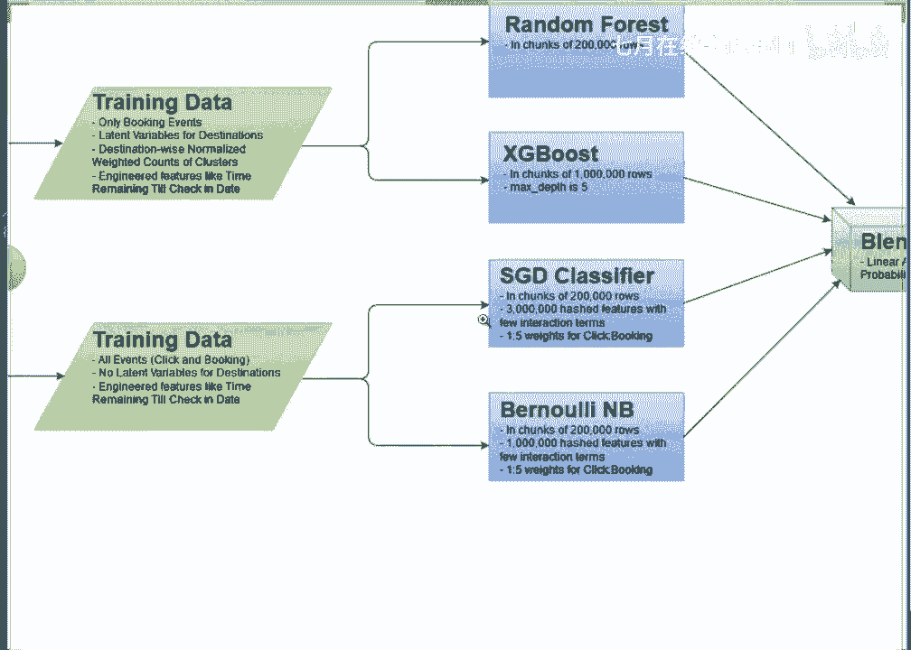

分类用对它是一个基于它的核心，就是一个BS公公式，是一比较简单的一个分类器。那SGDclass file，你可以认为它是一个online learning在线学习的一个class file。

你是可以一直一批一批数据往里头喂，然后去更新它的参数的，去update它的位置。啊，这个地方的GBDT呢之前和reno forest大家应该知道了。在Dcing chain那一刻。

应该老师有给大家稍微提到一下，所以。当你有多棵树，你去做一个并行的并行的这个模型融合的话啊，它的方式一般情况下就叫做reno forest，对吧？B型的这个集成。如果你去做一个串行的集成的话。

你每次去减少你这个er去对你分错的这些样本啊，或者说去去每次去集中精力去对你的那个 error的那一部分去做学习的话，这个时候就是一个ing decision对吧？应该应该叫做这个sing的方法。

但如果你这个sing方法优化的方式是基于gra的话，它叫做GBT对吧？ing decisionO所以我们的数据呢就会分同样一份训练级的数据啊，我们会拿过来做这样的一个事情会丢给这样四个模型去学。

但是中间会有一些细微的差别。举个例子来说，大家会看到我给random forest和GBDT的这个数据呢，实际上是。是啊带这个隐含的destination的这个影变量的。

但是我给这个普苏贝耶斯和我的SGDclass power的话是没有的，是没有这个。就是有这个东西是有一些是会有影响的。因为因为这个哈希过的这个结果呢，也是不能直接参与一些。

比如说像呃不太适合就直接用在logistic regression这样的model当中的logistic regression这样的LR这样的模型当中的。因为。它是类别型的变量嘛。

要么你就对它做一个one hot的一个处理。要不然的话你就嗯。不要直接拿过来用那te base model就是基于数的模型的话，呃，相对而言会好一些。所。上下会有一些差别，我丢给模型最后的参数。

参数是不太一呃，这个应该说数据和特征是不太一样的，但都是在这一批数据上产述的，圈ingda上产述的。对，然后大家可以看一下，有一些差别啊。

比如说 forest随机森林和我的GBDT我用的训练集只用到了其中预定的这部分数据。大家刚才还记得这个问题的设定，我给大家提了一下。

我说数据呢会有这个地方啊嗯看一下标签这个标签会有一个叫做叫做is booking，对吧？is booking这这个列这一列呢是零或者是一如果是一就表示我预定了这个这个跳这个酒店如果是零的话。

就表示说我只是点击看一下信息，但我没有我并没有预定。好，所以我的GBDT和我的 random forest呢，我是用只用了预定的这部分预有预定的这部分数据去做训练的。而我的SGD和我的这个普素贝耶斯呢。

我是用了全部的数据，就是有点击和book的，我都拿来用了。

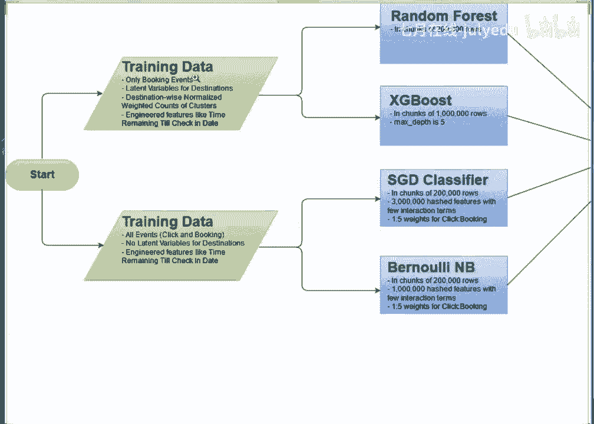

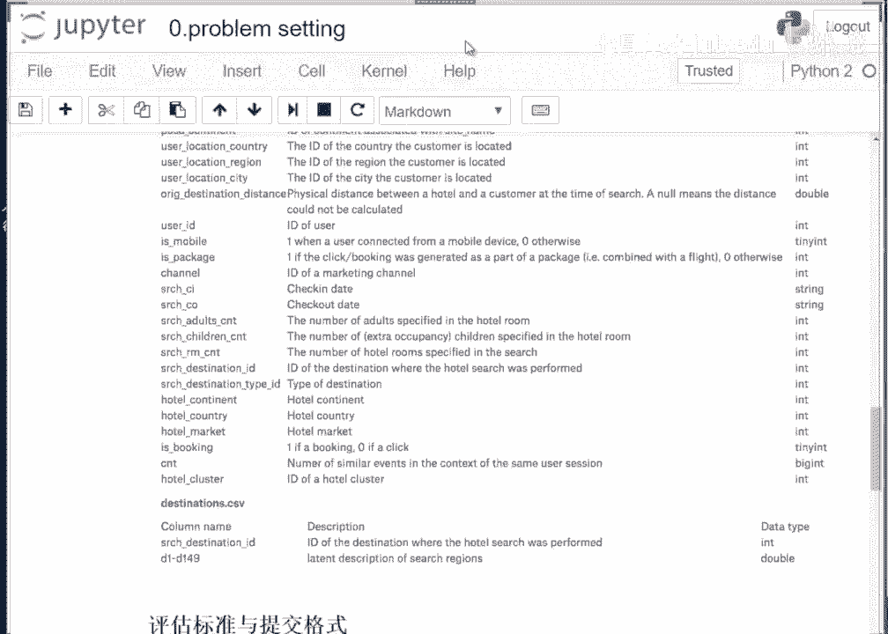

对。然后里面会有一些细小的一些一些这个差异啊。比如说这个地方的renom forest随机森林呢，我是。呃，我不知道大家的大家用来跑能的这个机器或者服务器的性能有有多好。

我可以告诉大家这个比赛的数据量呢不小。所以如果你啊习惯用pandadas这样的非正件这个data analysis数据分析的package的话，你一次性把所有数据读到内存里可能会是一个比较可怕的事情。

你的内存可能会hold不住。所以你你在read这个CSV或者说读取数据的时候呢，有一个选项，它叫做叫做ch。就是你可以去告诉他说，我不一次性把所有的数据读到内存里。我可以一批一批数据读。

比如说我每次这个地方呢，你看refor是。

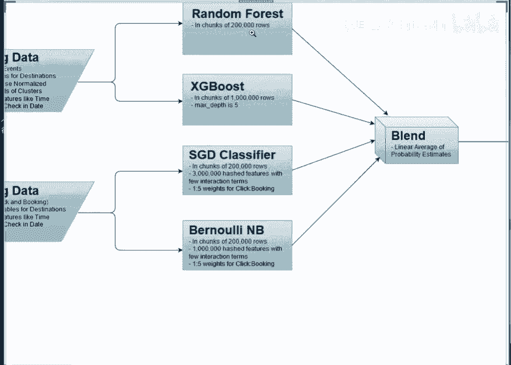

每次只读20万的数据进来。因为它这个数据量很大啊，就是我大家大家如果想想去看的话，你用这个pens load到内存当中，你可以看它的shape，或者是看它的对data frame的一些in。

你可以你是可以看得到的。这个时候呢大概有我可以告诉大家有3有接近4000万的训练样本，就就是所有的点击和booking和这个预定的数据加在一起3003700多万。对。

然后有预测的一个testing data呢，大概有也也是百万级别的几百万的t data。所以这个数据量级几千万的数据量级，你要一次性load到内存当中的是一个对内存是很大的压力。所以你需要做一些处理。

比如说这个时候我们是分20万20万的数据往里头读的，这个是分10万10万的sor100100万的数据往里面读的。

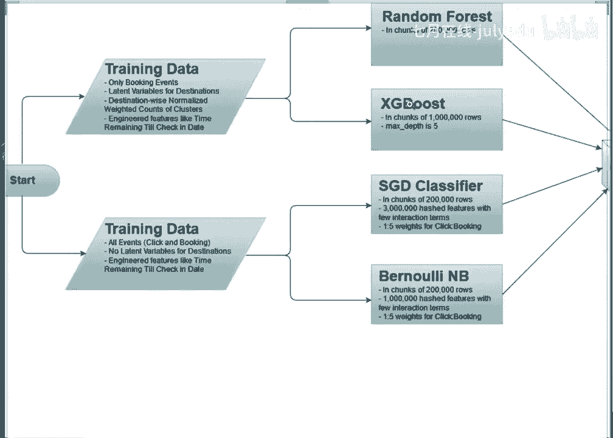

然后底下是20万和20万。对，那即使是这样的，即使是现在我给大家说的这种方式去做处理，也要求你你本地的电脑或者你的服务器至少有8G的内存。8G的空闲内存。如果没有的话。

这个程序跑的时候有可能会报memory的错，就是内存的错误ok。所以大家可以理解成我对数据去做了不同的处理，包括从数据层面的选择上做了一些处理，包括从fe engineering特征工程上去做一些处理。

然后不同的处理方式后的结果丢给了不同的模型去做训练。然后我对所有的这些模型产出结果去做了一个什么叫bling叫混合这样一个方式，我去给他们做了一个加权的一个平均去作为最后的这个结果。

然后去对上我的lage，我的data leakage就是我会有一部分数据我给大家说了，我说在测试集当中呢。

实际上你是可以在训练机里头直接找到答案的所以你可以直接拿来用的那有3分之1的左右的数据是直接可以拿来用的所以这3分之1左右标准答案就是直接可以查到标准答案的结果。

和这3分之2有我的4个模型去做bling拿到结果一起配合作为最后的这个solution最后的s的这个结果去提交拿到了最后的分数O所以这大概是。

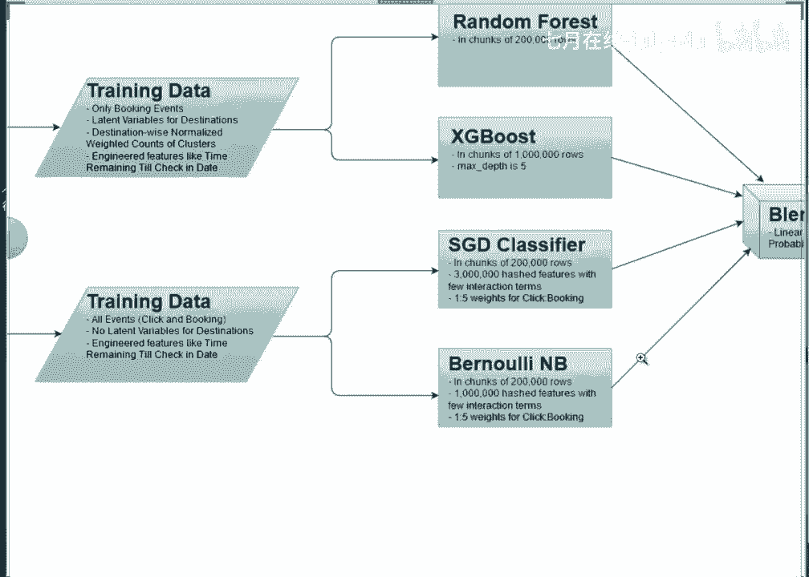

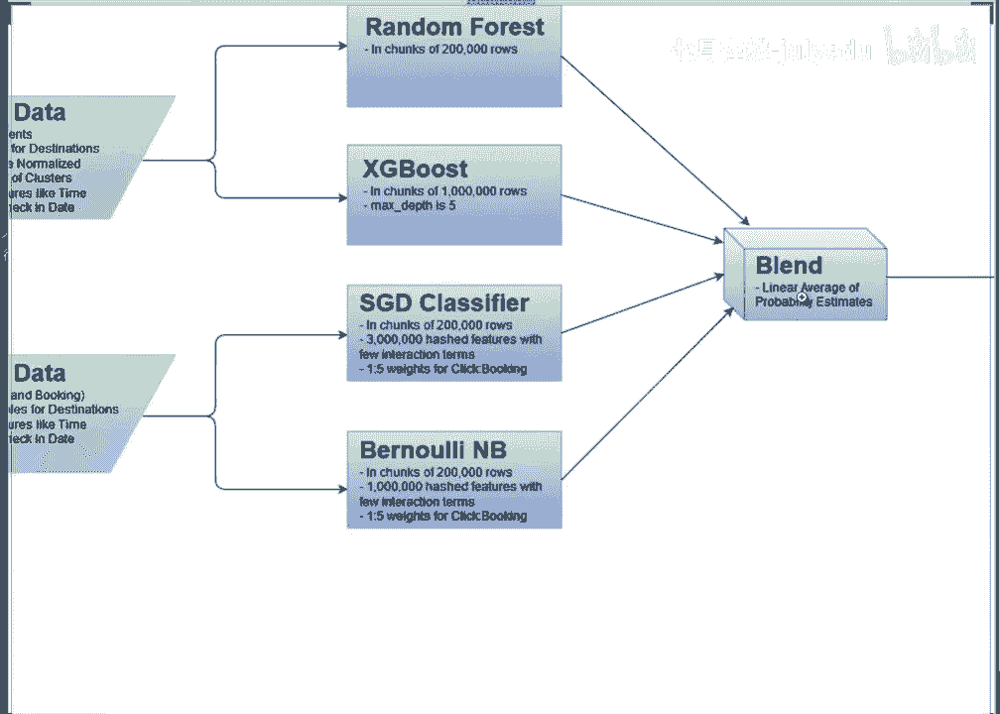

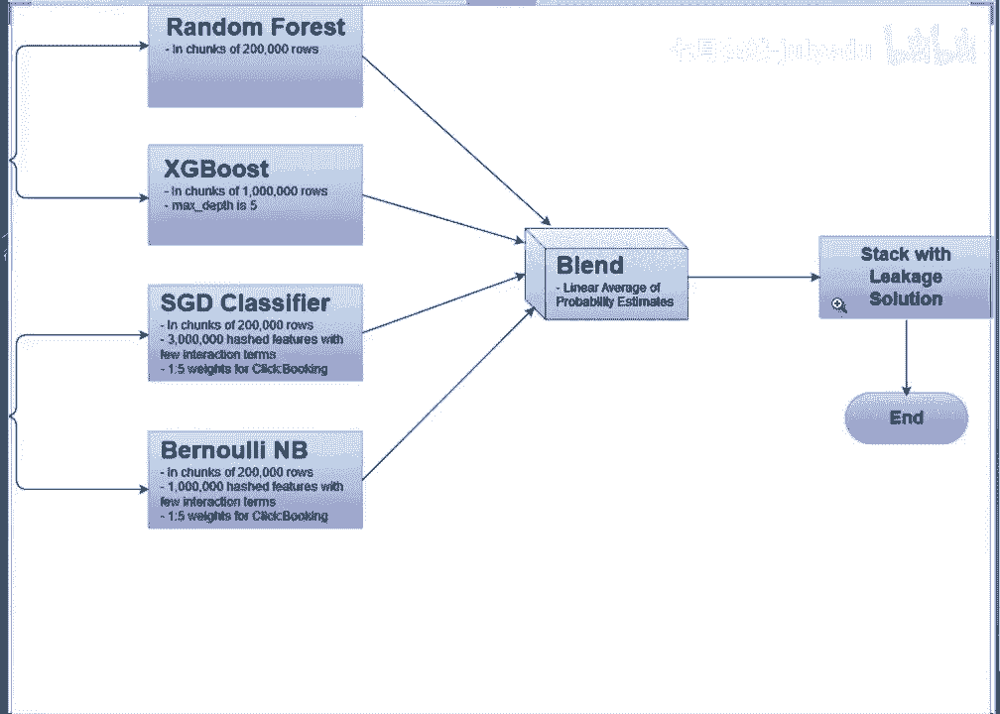

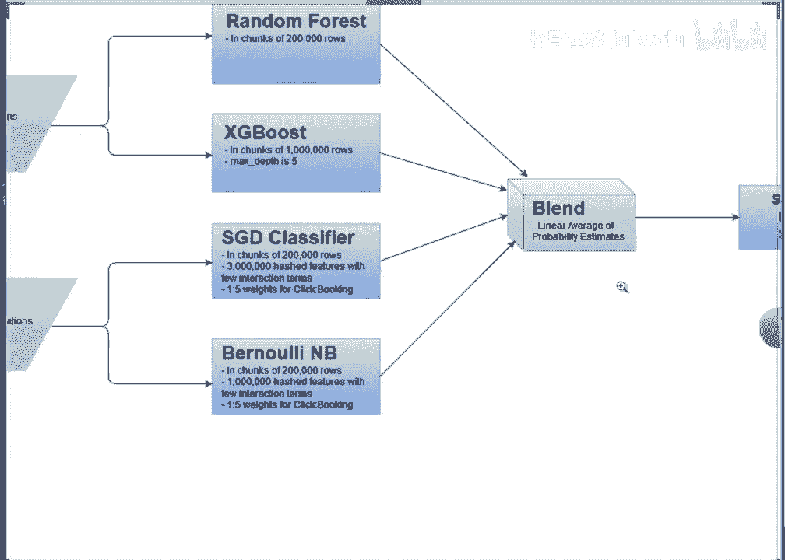

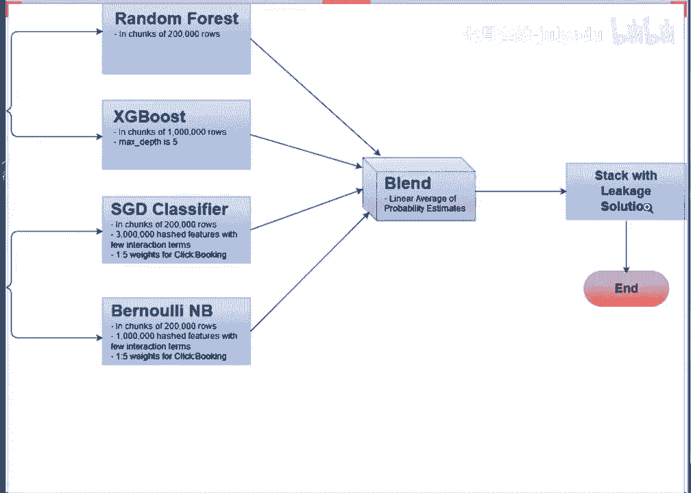

一个嗯。这是一个一套比较完整的解法。那不是说我小打小闹去随便把它丢到一个模型当中去阐述一个结果。那这还是一个相对而言比较呃复杂的一个。

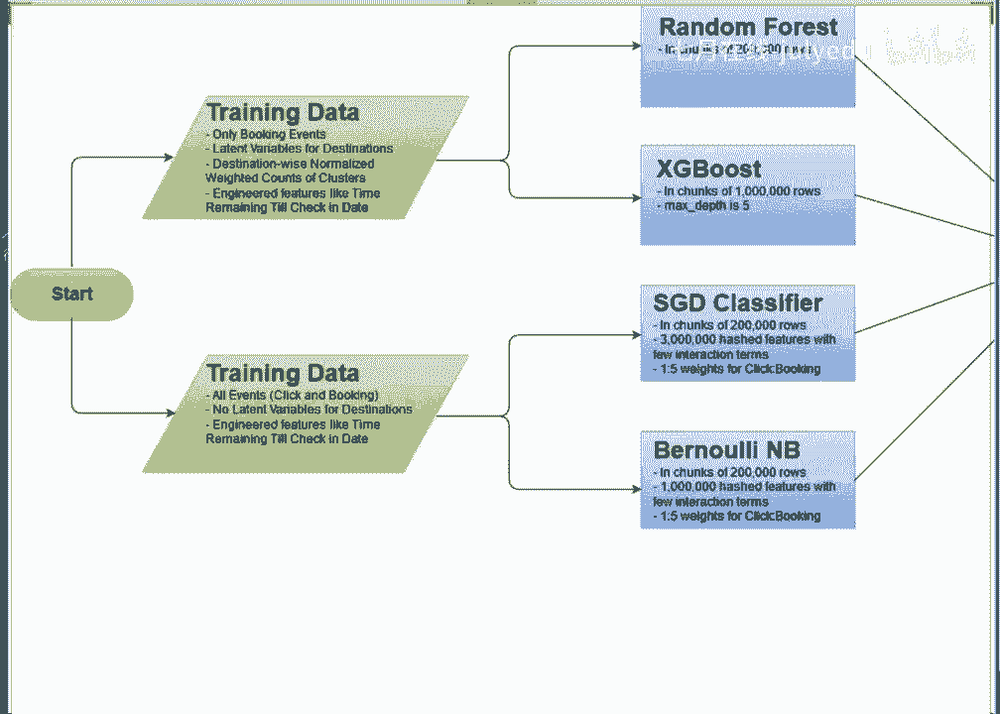

有一定的层次结构的这样的一个解决方案吧。

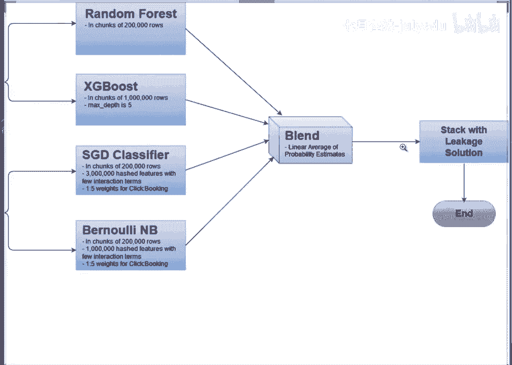

所以这个probleproble setting就是问题的设定和背景呢，我已经给大家交代完了，我们就来一个一个文件来看一下啊。所以这是第0个0号文件，是problem setting做一个背景设定。

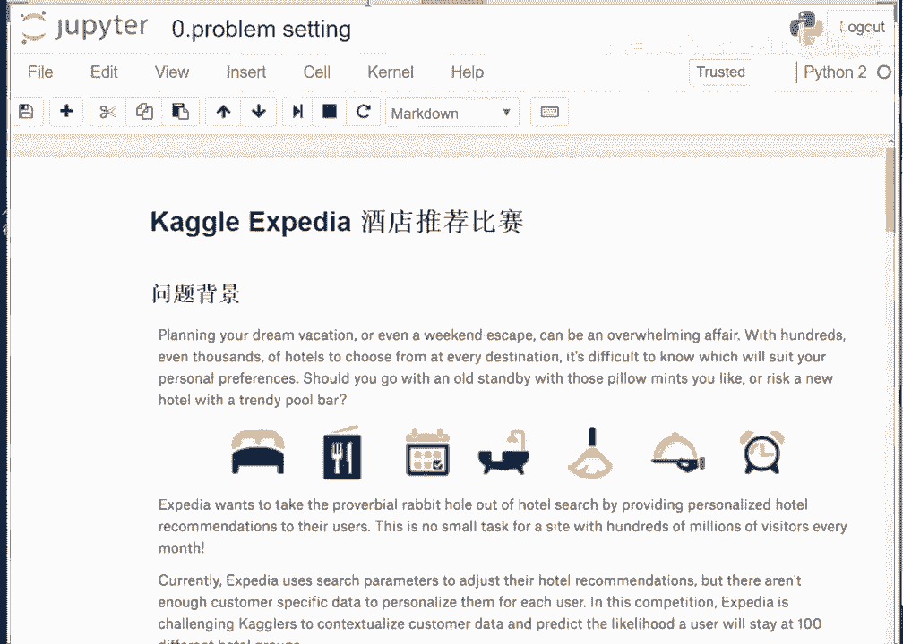

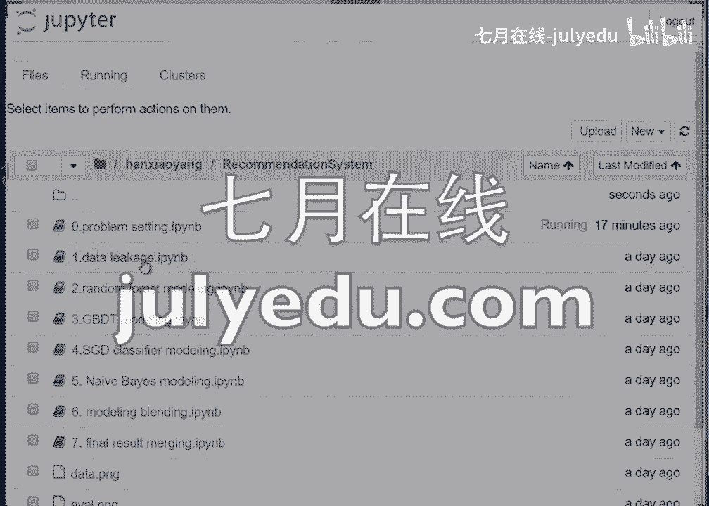