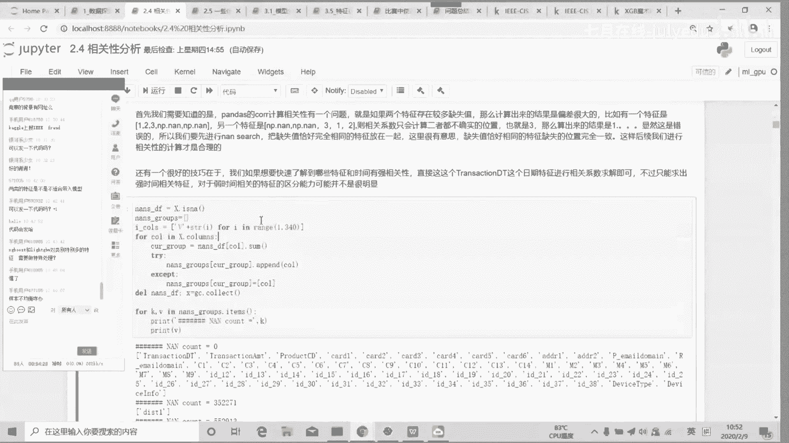

# 人工智能—kaggle实战公开课（七月在线出品） - P4：kaggle ieee-cis 欺诈检测二分类大赛思路分享 - 七月在线-julyedu - BV1jh411y7Fh

呃，今天主要是分享一下去年的1个IECIS的气下检测比赛。呃，那是一个比较典型的一个二分类的。嗯。因为感觉这比赛性息量包含的性质还是蛮大的。且和平常我工作的内容性工工作内容性质也比较相似。

然后这个比赛反映出来很多问题也是比较比较经典。所以这个后来就挑了一个这个比赛来讲。嗯。嗯，首先是大概做一下这个比赛的这个背景介绍。嗯。那个这个是呃这这这这个比赛数据集是1个C加银行，呃。

主要是这个信用卡交易的一个数据。然后这个好坏用户的比例大概是29比1。然后这个表整体的呃这个比赛整体表的这个数据结构比较简单，它只有一张主表，一张副表，主表是这个交易表。

他是这个呃主要是放的是用户的一些呃交易卡的信息。然后附表是一个这个身份表。主要是用户使用这个设备信息相关的一些特征。嗯，我我继续讲。呃呃刚刚讲的这个。这个这个比赛这个数据整体的情况。

然后这个比赛比较好一点，就是官方在那个discus里面有讨论了所有这个字段的含义。呃呃，就像我这里写的这个称section DT是这个。日期时间的time。

然后AMT是交易金额productduct定是交易产品产品类型的这个编码。card一到card6是这个用户的支付卡相支付卡信息相关的东相关的一些东西。

然后这个Pmail和R emailmail是这个购买人呃，是这个卡使用者他的这个邮件相关的信息。呃，ADDR1和ADDR2是这个这个支付卡对应的地址呃，这些我就不念了，大家线下去看这个。代码就可以呃。

看这些代码就可以了，含义还是比较比较直接的。嗯，行，OK。刚刚主要讲这字段大概一些含义。呃，这个。这大这个大家现在去看就好了，这个也没什么可介绍的，反正就是。

实际上的这些呃就就是就是字面上的这些这些内容。嗯，然后是我们介绍一下这个比赛整体的这个这么一个思路。呃，这也是一般来说打比赛的一些常见的一些流程化的一些东西吧，比较固定一些。呃。

首先就是看比赛的一些背景介绍，然后就具具体的就是还有比赛的一个评分方式。呃，这个比赛比较好处方方呢对所有字段都会做都有做一些很非常非常详细的解释。

然后呃但之前参加一些像那个三那个桑德湾银行的一些匿名赛就比较麻烦。那个字段都是非公开的那些比赛像这种匿名赛就会有另外一些其他的套路。你这里暂时就不介绍。在展开来说，这展开来讲太多了。呃。

这里就介绍一下这个呃这这个相对来说半匿名的比赛嘛。因为大部分的字段含义都是公开，只有一部分字段的这个含义是呃没有公开的。然后就是查看这个过去下次一些比赛。

一些选手的这个叫什么top一top2这他们的那些solution，还有他们开源的代码。很多时候这些他们发布过代码都是可以直接复用，包括像这个比赛也是那像那些内内存优化。

后面我们会讲一些内存优化和性能优化的代码，都是其实都是以前比比赛里面的那些呃选手用过好很多次那些代码啊或者使用。😊，然后第二步就是做这个基本的这个EDA数据探索，主要就是通过可视化。

然后计算一些统计值来寻找这个数据中的异常之处。然后并并且呃并且在这个过程中熟悉熟悉你处理的数据。Oh。这些的话其实也是相对来说比较固定的。那比如说像类别特征，一般来说会去看它的类别的分布啊。

去看它这个类别取值的数量，就去看它这个字副样本，还有这个训练级和测试集这个分布的差异等等。呃，这个后面。我们讲代码的都会介绍呃，然后在这个过程中，一般来说会参考一些开源的柯蚪。因为。呃，录播呃，不会耶。

我我我没有开始录过这个选项。没事没事，那个我后面把朱be发给你们，你直接看朱弊者其实也是一样的。😊，因为就这些注释我已经写的，基本上写的很很全了。然后这呃。呃，这在这个数据探索的过程中，呃。

可以参考一些看人的可能，但是尽量还是自己自己去思考吧。因为毕竟每个人每个人他。探查数据啊，这做这个EDA方方向，他习惯不一样。有的有的选手是喜欢画这样特别多的图。

而我的话我我我就我一般画图就稍微画一点简单的图，然后看一些它的统一特征这样的。然后呃然后这个做完这个大概的数据，呃，做完大概的EDA之后，就做这个性能优化这块的东西。啊。

然后第三步是做一些性能优化的一些步111些1一些方法。这个这个其实还是蛮重要的。呃，一方面比如说这个呃对你你对这个pandas它的那个内存呃，数据占用一数据数据使用类型做一些优化，还有是一些常用的一些。

代码上面速度上的优化，这这步还是蛮常重要。因为你在内存占用，还有这个程序执行效率上面做优化之后，你可以节约非常多的时间出来。这样你可以在相同的时间里面尝试更多的这个性能优化的方案。

然后第四点就是建立一个基本的baseline。呃，简单来说就是。嗯，你做了一些初期的可能做了一些简单的这个特征工能之后，你先去呃先去做一个最基本的一个模型。嗯嗯，稍等一下，我先把这个先把这个讲完吧呃。

😊，就是你初去做了一些这个基本的特征工程之后，你就可以呃先建立一个基本的这个base line模型。然后后续我们在这个base line上面进行一些深入调整，这个是最基本的一个步骤。

因为你后续要做特征工程呃，就是比如说你引入一些新的特征，或者是你删除一些无用的特征。你都要在这个base line的基础上面去比较去去看去去去比较来来看你你新做的这些步骤是否能你先引入的这些这些操作的方法是否能能实际提高分数。

如果说不能提高分数，反而降低，那这种特征工程可能就方向可能就是有问题的。这种就没有办法继往下做，那就要去寻求别的方向。啊，然后第五点是建立一个好的CV策略。

这个如果说是对于以往那些无序的分无序的这个分类或者回归问题，其实呃CV可能并不是呃特别特别重要。但是这个但是因为这个比赛它有这个时间相关的一个特性。呃，然后初期。初期的话。

我测了不同的这个呃不同的这个交叉验证的方式呃，差别还是蛮大的。像stratifyify k four这种会带来这个时间泄露的这种特征。呃，会带来时间泄露这种这种验证方式，在线上的分数是就比较低。

啊像K four和group K four的这种呃。加叉应的方式在线上的分数就相对高一些。所以这这个其实呃是这个比较相对来说比较特殊的一个地方，就是你在CV上面可能要谨慎的选择。然后哎呦我天。

怎么卡错了？Oh。然后就是呃确定好了这个CV策略之后，然后我们再根据这个模型的表现去解对症下药，去找到你目前目前你的这个模型的问题，然后实施特定的实施对应的一些特征工程的方案。比如说衍生性的特征啊。

转换原始的特征，或者是进行特征选择等等。然后呃。然后在大后期，如果特征工程觉得已经实在做不下去，找不到什么新的特征的话，呃，那就可以考虑用tack一些竞争方法来上分了。这个是大概的一个大概一个思路。

然后下面这个。啊，然后下面就嗯讲一下主要的代码。这个第一章。第一张这个朱pyter主要是呃EDA一些呃一些一些基本的这个EDA的过程。呃，我就大概过一下吧。首先就是读取你的这些两张基本表。

然后通过has的功能来看，呃，那大家概览一下你数据的一个情况。但嗯。对，没错。然后是查看一下你这个。查看一下你的这个数据，你的呃你数据基本数据类型。然后这个地方需要注要需要注意的是。

因为因为相当来是CVCSV格式的。然后像那个card1card2卡3卡4，他们是以呃flow形式存储的。所以你读进来的时候，这些类别特征会以in和f的形式保存。因因此这个这个地方要注意。

就是你要自己把那些类别特征都标注出来。否则的话，如果你不标注的话，呃，原始原始数据的类型是以这个in或者f的形式存储的。那这样训练时候就有个问题。因为模型可能会直接把类别特征当成连续特征。

这个地方要注意。然后是做一些，然后就是只因为它就只有两张表，一张主要一张副表，所以副表上面啊没有做我我没有再说，没有再去做太多的这个特征衍生的一些东西。嗯。😮，嗯，好吧好吧好，可能设备问题吧。

行行我继续讲吧。😊，然后这个呃然后因因为它只有两张表，所以就直接做了一个表合并的一个工作。如果说副表有很多的话，你可能还要对每个副表去单独的去做一些更深入的更深入细致的一些探索。

因为呃比如说有的副表它有很多缺失字段，有的缺失字段可能非常多。那这样你没有必要再把它con进来，或者是有些副表里面有特别多像呃特别多这个相关性特别高的。比如说100。99或者一的这种特征。

这些基本上也要呃要在初期初期的时候直接删除。但是这里的话没有这个问题。所以呃我就因为它只有一张副表，所以我就直接把它合并在一块，没有再在副表上做更多这个详细的工作，而直接把它合并到主表上面来。

然后一起来做这个数据探索的一个工作。然后这里是一个小tips吧，就是你在附表的时候，你可以加一个海的ID的字段。这样的话你 merge到主表之后。呃，merge的主表中就会自自自自动生成一个新的特征。

这个特征表示的是呃这个用户在副表里没有出现而，在主表没有呃这主表中没有出现这么一个信息。呃，如果你没有加这个字段的话，呃，这个mer进来的话。

你就没有没有就没有办法反映这个用户在副表上是否出现这么一个信息。那当然它只是一个特征衍生的小技巧，在这里在这个比赛里面这个特征字段没什么太大帮助。那在其他比赛里面可能会有一些一些帮助啊。

OK然后这个做然后然后是做一些这个基本的这个统计性描述。这个呃因为因为这个字段比较多，所以一般来说你像做这种大比较大，比较长统运行描述。如果你直接在朱弊上面显示的话，这列会非常多。这页页面就会比较卡。

所以呃我都直接保存到本地的那个excel文件，然后再去excel里面再去详细的看一下这样。这里就呃不进唉，算不进入那excel，再再这样的话太拖拖节奏了。这个就是他们这个呃他们大概一些统一特征。呃。

然后就是做一些基本的一这些可视化的工作了。你基本上做一DA基本可视化是免不了的。因为很多时候你通过单纯通过这个数字，你很难很全面的去看明白，看清楚这个特征是具体一个什么情况。然后做EDA的话。

我就因为我我我就比较我比较慢，我因为因为VR我是一个一个一个特征去做好这个。如果有一些特征就是数量特别多的话，呃，可能会呃简单的就是跳过一下这样。但是这里的话呃还是还做的蛮多的吧，做的蛮多这方面的。呃。

相对来说这个比较重要一点的特征都会仔细的去看一下这样。首先是这个transactionDT。他在这个官方文档介绍呃，官方的那个discuss介绍里面表示是一个呃时间类型的一个特征。

然后我们把这个特征pro出来就会发现呃，其实这个特征就是一个时间指示的特征。呃，比如说呃就算正常，比如说呃比如说某个特征是呃2010年1月1号到2012年1月1号，它就是一个标标标志时间的特征。

只不过它没有直接以日期的形式展日期的形式展现出来，而是以一个呃而是以这个连续特征的一个形式展展现出来。呃，这个。这个可以看成是一个类似于这个啊，实际上就是把时间转换成一个时间戳的一个表示方式。

类似于这样的，但是它又不是时间戳，因为它它的这个sstarday起始的这个时间还是不知道的。所以你你只能知道它它是一段时间的表示，但是你不知道它具体的具起有月份什么是多少。

这个是他test transaction低题的一个。也呃一个一个一个特征图。然后我们把这两个特征图合并在一块儿。😊，就可以发现，实际上这个transactionDD这个特征，它就是一个日期表示的特征。

然后中间断了一小块，或整体的话呃就是一段连续的特征。其实我们通过后面的分析就可以知道测试这个时间跨度大概是一年多，1年01个月。这个后啊这个后面后面后面后面后面再讲吧。那像这种特征。

其实我们EDA的时候就可以。很清楚的知道这种特征没有办法放到放到放到那个建模模型里面来用。因为首先我来看一下，在在训练级这个训练级这个transsectionDD它的数据范围是0到1。

6乘以1亿的7次方。而在测试集是1。8，从11。81亿的7次方到3。41亿的7次方。这个特征的。这个特征的分布形式在训练级和测试级完全是不同的，是完全不相同的。所以这个特征实际上没有办法使用。

因为你在transctionDT这个时间段呃这个这个数据时间呃这个这个区间。区间对这个特征进行训练。那那然后你再去测试集去预测的话，你所有的这个测试集预测关于这个点预测的节点都会都会在一个分值。

因为你在训练集训练的时候，你最大的这个 transactionDT的阈值也是就也就切切到1点大概1。6乘以1亿的7次方这个地方。而你这个测试集所有的数据都是在1。8乘以1亿的7次方这个地方。呃。

因此这就表表示你所有的这个你在测试预测的所有数据的所有数据都会都会把预测到这个最右边的一个分支。呃，因此这个特征我们在来做EA的时候就可以就可以知道这个特征其实没有办法建模了。呃，可以。

所以在后续建立baseline的时候，记注意要把这个DT给transctionDT给排除掉。然后是看这个transaction AMT。这个特征的话呃，一个是box报图。可以看出来。

在这个che和test的数据集上面，这这个特征的分布还是有一定有一定差异性，还是可以看出来。像这个呃在确的数据集上有存在一些比较大的。比较大的transseMT的词，但是t上面最大就到1万。

所以这二者分布上面是有一些差异的，可能后续需要做一些log变换之类的处理，或者是一些分散的处理。不不过这个只是一些EDA的时候，一些一些基本的思路而已，没有。后续的话可能还后续还要再做一些测试。

然后这个就是对呃标签为零和标签为一的用户，用户的这个特征来做一些对比。从这个图上面我就可以我们就可以看到这个。呃，像正常用户正常用户有有有有一部分正常用户，它属于大额交易的，而大部而所有的这个异常用户。

他都是倾向于小小额交易的。因为它最大的只有5000，就是就属于一个正常交易的范围。而这个正常用户里面是会有一部分人那个做这个大额交易的。

因此这个我们可以从这里看出这个trans transactionctionMT对于这个好坏客户还是有具有一定区分度的。并且可以知道，对于其他用户来说，呃。

可能大额交易的大额交易的大额交易是否大额交易是一个比较强的特征。其实其实如果我们不使用GBDT而使用LRR的话，做到这一步就可以去分离一些分离这种特征了。比如说呃比如说我们可以写成一个新的特征。

这个特征表示它的M交易金额是否大外这种特对L来说是有帮助的。但是对于GBT其这种特征功能是没有用。因为G因为GT系列系列算法它都可以自动识别到特征中的这种模式因不需要再去做这些这些工作。

然后我们比较一下这个呃训练集和测试集这个transctionMTMMT的这个分布的差异。可以看到它整体上分布差异并不是很大。呃。

这里的这个部分异常的这个呃呃部分这种偏大偏大点的样样本占比总数占总数的比例还是相对比较小的。这个是更细致的一些观察。因为呃。因为那个值的跨度如果很大，然后比如说有一些特别大的值，但是数量又很少。

那这样你pro出来的话，就会变成这种形式。如果要看的更清楚一点的话，你你就去指定这个去指定这个范围，把那些大的点排除掉，这样看的会更清楚，更更清晰一些。

这个是呃transaxMT在训练集和数据集上面呃训练集和测试集上面的差异。然后这个是它在正负样本上面的差异。你还是一样。如果不做一些具体设置的话，实际上很难看出来一些细节上面上面的一些一些差别。

所以这个最好还设置一下这个range，把它设置到一个相对合合理的范围。这样的话你才可以看得出来具体的这个具体的差异在哪里。然后是productduct CD这个特征。呃。

这个特征是属这个特征属于类别特征，而且属于这个低级数的特征。它本身这个类别其实很小，只有五个类。呃，所以这个这个这个类别成相对来的处理处理一下简单一点，甚至可能不需要去做额外的处理。呃。

比如说像比如说高技术编，高技术特征，一般来说要去做编码。啊，但像这种的话，其实王浩展开也可以。因为他本身类别就很少，无所谓。呃，然后步骤还是一样啊。

我们先看一下训练集和测试集上面这个特征分布情况的差异性。然后再看一下这个呃不同。类别用户下面这个特征的分布差异性。没看到这个特征。它本身的区分度还是还是比较高的。因为。对于好客户和坏客户来说。

这个特征分布分布差异分布差异还是比较大的。而实际上后面我们训练模型，然后看它特征号线的时候，也会知道这个productductCD呃也是相对一个比较重要的特点。

这个从EDI上面也是可以看到也是可以看到大概的。嗯，然后我们看一下这个一ca6这这6个类别特征。呃。🤢，对呃，可能是这个问题。对。首先我们看看卡的一吧。嗯。呃，这里我们先对这个card6和card6。

看一下它的那个water count的情况，也就是看它的类别情况和不同类别占比的情一个情况。呃，这个water count是做类别特征分析的时候一个很常见的函数。唉，后面详细看这些吧。呃。

我们首先看一下这个迪一它的类别数量有13553个，所以它属于一个典型的高技术类别特征啊，对于这个类别这种类别特征的话呃，因为垃编M它本身是可以对类别特征直接进行直接进行编码。

它底层是做了规定不定的编码啊，不做了那个梯度编码呃，这里我们可以。使用一些常规的编码方式来来处理这个类别特征。啊，这个后面再说吧。首先首先card一的类别是113559，并且这个有很多都是属于这种。呃。

只有E22这种少数这种呃这种re value的这种形式。呃，劳后看特色卡也是类似的一个情况。然后这里是呃通过这两个代码，是主要是检测这个t。因为为我我们我们是要看这个特征，在训练集和测试题上分布的区别。

但是呃像看一这种类别这么多，我们很难可照画出来。所以通过其他一些方式来看。那这里这里我是看那个在card一在t上面test test上面有出现呃test上面和和和那个确上面有哪些特征是不一样的。

然后通过这个代码可以发现。通过这代码可以发现这个。呃，在tt的券中有3538个类别是没有共同出现的。然后通过下面这个代码，我们可以知道有9360个类，9360个样本。它在呃训练题上出现。

但在测试题上没有出现过。然后看一下这个card，相对card一来说，card类别数量会小一点，但是它它这个类别基数也不小，有501个，也是属于一个高技术类别特征。呃，接下来这个步骤基本上都是一样。呃。

我们大概看一下这个类别，它它的这个类别数量有多少，然后每个类别占比是什么情况，然后看一下它在这个训练器测试计上面的分布大概是差异性大不大，这样的。然后是ca3ca6。🤧基本上都累死。都类似一样的这个。

呃，数据探索的一个过程。呃，代码那个我讲完的话，我会发找个地方发吧，我看他们到时候发哪了，然后我把数据集和代码都发过来。然后你们要需要跑的话，可以自己跑一下。嗯，大概这样。嗯。

这些就这大概流程性的东西了。嗯，下面基本上差不多，那看了四的话，那类别比较少，所以这个。呃，所以我直接做了一些可视化的一些工作。然后需要大家注意一下，就是抗似它是一个相对于其他特征来说。

它是一个有包含有文本信息的一个特征。就它的类别像discoverma的visaam Americanican express表示的是这个这个卡的类型，它是属于一个文本特征。

一般来说呃在这个table比赛里面呃，在t比赛里面，这种特征可能可能相对可能会携对更携带更多的信息。因为它它具有文本信息，你可以结合自己的一些先验知识，然后去呃比如说去做一些呃文本的一些处理啊。

或者是一些衍生性的工作。呃，但是这里有没有没我我没有在这方面继续下功夫。比如说像discover这种卡，如果说你能从外部数据里面得到呃这种卡，它整体的一个违约率之类的话。

可能会是会是一个比较好的一个特征。呃，但这些当时刚开始当当时参加的有有去搜索过这方面的数据，但是没找到。所以所以后续这方面没有再去做深入的研究。

如果如果说我们能从一些一些网站上面得到像这个discover visaammericica expresspress这些卡整体的一个违约率的话，可能会是一个比较好的特征。嗯，然后看了6月是。

也是包含有一些完的，但是我都没有展开去网。本身对于这些卡的这些新验知识，这些新验知识我也不是特别了解。什么discover这些卡就只是知道有这种卡的类型。人家对于这种卡的一些特性什么之类的。呃。

我不是很清楚，然后也没有去深入研究。如果对这个感兴趣的话，可以自己去深入研究一下，看看能不能挖掘出一些新的新的好的一些好好的特征这样。😊，嗯，然后基本上嗯。流程大概是这样，这些就整体上就这么做就够了。

就是把一些就是把这些特征通过一些方法来看它的分布啊，然后熟集一下这些特征的这个数据情况之类的就OK了。然后是ADDIAADDR这个这个是用户的这个呃呃地址地址特征。这个操作基本上上面类似的。

因为它本身也是属于一个相对来说基数比较高的类别型特征，所以去做可视化很麻烦。因因此是直接通过一些统计特征来来观察这个特征的一个大概的分布情况。这个他的这个距离特征。它是一个连续型特征。

表示的是呃表示的行业是距离。然后是这个用户对应的他的邮箱的特征。啊，像这个这种特征。可以看到它也是一个比较详细的文本特征。这个实际上有一些呃在开源的课程里面，有一些选手对这个特征做了一些处理。呃。

比如说像这个呃比如说我们看这里。嗯。嗯，我看一下啊。呃，比如这个anonymous点com，这是这表示的是这个匿名邮箱啊，那这里就可以演生出一个新特征，表示这个用户是否使用匿名邮箱。可能从直观上理解。

可能用户使用匿名邮箱，那种用户可能会有一定的问题。然后比如说像这个呃我看后面后面的例子比较好一点。那这个Gmail点com和这个Gmail实际上它是一个东西。

只不过它这里Gmail它记录的东西不完整而已。呃，所以在这在这个邮箱方面也可以做一些额外的工作。比如像奇mail点com奇mail，这明显是同样同样的一个邮箱地址。那大家都可以自己去。

把这两个邮件地址分别合并起来。这个的话也能提升差不多千亿到万亿之间的一些一个分数吧。不我我没有做。因为这个是另外一个开源课呢里面，我后面看看了开源课呢，我才才知道有这么一个东西。自己去做的时候。

没有去做这么细致的这个处理。还像像那个ho hot email这个这个其实也是可以合并的。总之就是t数据里面，如果有这种包含这种详细的文本信息这些特征的话，最好自己去仔细看一看。

每一个我仔细看一看这个其实文本特征具体什么情况。这样的话呃，因为相对于纯粹做做完那种label encodecoder编码之后，那些类别特征来说，它包含信息会更多，有更大的操作空间。

那像这如果把这个这些特征直接去做类别编码，那压根就你就没有办法再用。因为它只是一一大堆编码而已，不知道它实际行业没有办法去做具体的展开。然后像这些，比如说呃比如说对其诈还是比较熟悉的，呃。

可能会知道这些骗子一般会使用什么样的邮箱。比如哪些邮箱的监管可能会差会弱一点呃，骗这其他分子更喜欢用这些邮箱啊，这些都可以作为先的知识结合进来，然后来延伸一些新的特。嗯。呃，然后是看这个C系列特征。

C系列特征都是一些技术类的特征。哎，我们在前面那个。前面也介绍过。它都是一些技术类的特征。呃，官方的discus我们只介绍了，其中有一个特征是和知法和这个知法相关联地址数，其他的意思行业就不知道。

那反正只要知知道它这个技术特策就行了。嗯，然后就是针对于这个CE系列特征做了一些可视化的工作。呃，就是呃呃就这个这方面的话要注意最好你每个特征单独画一个图标都放都放在一张图里面。

一方面呃一方面你把太多特征挤到一张图里面，会会会比较卡，处理速度比较慢。然后另一方面，你自己的这个视觉效果上面也比较也不太好。可以看到这个西特征整体的这个分布情况。呃，也是比较集中的。

它大部分呢集中在某个区间之段啊，其实感觉参加了类似于这种就金融类比赛，这种分布的特征还蛮多的。就是。就是大部分特征都聚集在一个区间里面，然后少部分特征可能在其他区间里面，现特征特别多。

OK那大概的情况这样，然后也是一样，看了他在数练集合测试集上分布的差异，还有他在这个好坏客户上面分布的差异。嗯，大概这些。呃，然后是D系列特征，呃。

D系列特征官方上面官方给的结果是这个这个是这个特征是属于时间性质的特征。但具体是什么时间性质，它只是。他只提到了。官方是提到这个D特征里面有呃D特征主要是关于时间间隔的一个特征。比如说三次交易。

单次交易和上次交易之间间隔天数，但具体是什么间隔因，他也没有具体介绍。那目前我们就知道我们是只能知道这个低械特征，它属于一个时间相关的一个特征。嗯，然后也是做了一些可能化的工作啊。

这个基本上大码都是一样。这这基本上一套的东西。嗯，没什么可变，反正每个人根据自己的习惯来来写不同的可视化的代码。可以看到这个低特征相对来说区分都会。还是比较明显的。但是这里。在不同的这个任务类型上面。

这个特征的分布差异性还是比较明显，相对于之前那些特征明显的多。然后是M1到M9，M1到M9是典型的另外一种特征，他们全是呃大部分都属于部类型特征，也是也就是属于那个te或者fo这种特征。

它表示的是因为他官方给的这个M特M系列特征定义是属于一个匹配型特征，就是是否匹配上。如果是的话，就处，否的话就是否，它是属于一个典型的一个0异系列特征。

这个特征其实你用lightG BM或者叉G boost。这种222类特征你不需要去做额外的处理，因为它就你把它当成类别或者当成连续特征，实际上对于模型来说是没有区别的，因为它只有两个类别。

那只有其中一个M4有3个类别，其他都是两个类别的D级出类特征，也可以叫它不形特征。它全都是触和或s这。这个类型。🤧这种特征其实没必要去做什么可视化整明，它本身只有两类。所以它的特征分布情况赢不了了啊。

嗯，O。是。两类特啊，不是，当然不是了。为什么两类特征不适合单入模型？这个哪类特征什么特征不错，但是这个这个其实没有这种说法了。具体的特征好不好，你还带进去之后才知道这个特征的效果怎么样。

这个M特征没什么可多的，特征本能就比较简单。然后是微特征。呃，微特征因为。虽然呃代码会发，哎呦这么多人问。微定的因为微定的数的太多了，有几百个去做可视化的话非常麻烦的。当然呃。我之前之前是有做。

但是太多了，放到这边就他妈占版面卡的要死，所以就没没在做。因为很多很多微特征它是都是没有用的，要不就是相关性特别高，重复重复重复特征特别多，冗易特征特别多。要不就是确认比较多。

所以所以我这里没有没有再把它贴出来，应该不算是一个一个做特别多几百个呢。在这里微特征后面后面我再介绍这个特征呃处于一个高度冗余的一个特征级。然后是ID类特征，呃，需要注意就是IDID类特征。

它有ID01到ID38，其中01到11的话都是属于连续型的特征。这个地方要区分清楚。Yes。然后是这个啊这些都是一样，就是做一些可视化基本上一些工作。这个的话其实每个人根据每个人习惯嘛。

你不用按照我这个代码来，你自己觉得那种你用C报啊，或者是yellow break之类的，就说可视化都可以，就自己怎么说怎么来吧。呃，然后是这个IDI112I3ID38。

叉级布s的来自于这类别特别多的可能需要做特。而叉级布，它因为它叉级布它本身没有办法对类别直接进行建模。因为它是没有办法处理类别特征的，LGBM它底层是做了梯 two编码。

所以它才可以对类别特征直接进行进行训练。因直呃但是呃怎么说。你对类别特征进行编码的话，比如说你去做特征编码，你可你会引入一些新的特征特征信息进来。

所以呃其实也是比较推荐去对类别特别多的特征来做这个特殊处理。呃简言之就这样说吧，你叉你在处理类别特别多的特征的时候，你必须去做编码处理或者是一些embedding之类的处理。

否则的话你叉没有办法直接去训练类别特征M的话它因为它本身是做了T编码，它可以对类别进行处理。所以这方面的话呃你可以试试看有有时候你做去做这个像equ啊，之类会有效果。

有时候没有这个你都可以试试就你做完特征之后放进去跑个loV看看得分有没有上升，这样就可以了。啊，O。然后是在这个ID列特征。这个哎呀可算，这些基本能感觉没么好说的，就就是这些东西呗。😊。

反正各种各样的那种机器学习相关书上面都说的很清楚啊。没有说特别需要处理的地方呃，特别需要注意的基本东是没有哦，还有是这里有dise type。US也是一样。

它是一个呃包含比较丰富文本信息的一个的呃一个一个特一个类别特征。这个的话呃在开源课堂里面也有人做一些额外处理。比如说这个LGH221，他们都是属于LG旗下的，就是型号的这个手机。

那这里就可以做一个合并的编码。这里LG呃，比如说呃都属于都是属于LG，你你可以把它合并成合并成一个大类。然后这个汉达ID是我们先在副表上增加那个字段。🤧嗯，他只只有1。0呃，只有114万是1。0。

剩下的都是属于1。那就表示呃只有144233个人在可以在副表上面找到数据，剩下的用户都没有办法在副表上找副表上找到数据。然后呃这个就是其他的一些一些工作。这些嗯也没什么可说的了。那最基本就这些。

然后就是数据合并之后保存。然后然后接下来我们进入下一步。呃，样本不均衡怎么办？呃？这个呃这个后面我总结的时候，我会额外提出来，这这这个也是这个比赛一个比较有意思的一个地方。

相对来说它比较反比较真实的反映这个样本不均衡，它本它的本质问题是什么？然后然后是第二步我们进入进入这个相关性分析。一般来说这个其实table数据呃做开口的数据呃。

像这种表格型这种数据比赛可能不太会去care相关性的东西。但如果你是高相关的。比如说你相关性为0。999或甚至是一这种但这个比赛数据里面就有很多特征，它的是相关性特别高的，就达到0。

999这种特征当然是我们我们需要直接删除的。一方面删完之后，你可以节约这个内存提高这个运行时间一方面这个呃一方面你如果是相关性特相关性高的特征特别多的话，对于这个差距或来基本这类算法。

它的这个泛化性能是有影响的。呃，最主要主要原因就是你高相关特征特别多之后，你这个模型的这个采样会特别偏向于去去偏向于采样这种高相关的特征。举个例子，比如说你有1000个特征。

其中有980个都是完全一致相关的特征。那只有20个是不相关的特征。那在这种特征上，你去做你去去做去做训练的话，你每次呃去做列列采样和含产样得到这个数据集，可能都是一些高相关的特征。的这个数据集。

那这样的话，你会你就你的数就会反复在这一组就在这一组980个相关性特别高的特征上反复的去采样。那最终你整个模型会非常依赖于这类高相关的特征。

从而导致你这个模型它本身的这个多样机机学器的多样性受到很大的损害，让你模型的放行性能就会变得比较差啊，具绝试验的话呃呃后面后面关于这个问题，我我也会给到这个代码，那在后在后面再看就行。然后这里的话。呃。

这里的话这个初期有一个比较好的一个操作，就是呃微特征的删除。呃，这里有这里有这个这个比赛第一名这个第一名的这个大佬发的一些呃对于这个相关性相关性分析的一个一些一些一些建议吧。首先就是嗯一般来说。

我们尽量比较少删除这个特征点，然后。这里我我们后续会对微特征做相关性分析，并且删除高相关的特征。而且这个阈值卡的很低，卡到0。75。主要是因为呃张特discus里面也说了。

微特征主要是CDM这些已知原始特征的特征的衍生。所以它可能不包含新的性质。它就是在CDM这些特征上面反复去使用一些特征工能得到一些冗余的特征。呃，所以这里对V进行这个相关性分析。

并且去除掉很多高相关的特征之后，呃，可以发现locgoCV的得分不仅没有没有降低，反而提高了。这个我们可以看后面后面这边呃有一个比较。嗯，然后这里。呃，这里有一个需要注意的一个地方。呃。

不能不能算是技巧，就是一些最基本的需要你需要你知道的东西。就是一般来说我们计算特征相关性的时候，是直接用pandas点ca来计算的。但是pas点有个问题，就是如果你不同特征间存在缺失值。

它不会去计算你那个缺失值共有。你比如说像这个下面的123N312最终它计算相关性的时候，只会计算这个3。因为只有这个一部分，这个部分是这两个特征都没有缺失的那这样计算出来结果就就会等于一。

你显然这是这是错误的。所以我们在做相关性分析之前，需要把这个需要先去确定这个不同特征，它的缺失值，然后把这个确失值相同的特征放在一起。这样才能去做一个比较合理的相关性分析，否则就会出现上面这种情况。

你两个特征存在不同的缺失性缺缺失值，然后公共的部分只有一小部分。比如说你。两个特征有有有一个呃，比如说有两个1万个，有1万个曲值特征吧。然后其中只有100个特征。

是两个特征都共有的那这样你最终的相关性就直会间在100个呃直播间在100个样本上面去计算。那这样显然就是不符合呃不符合正常逻辑。你现在计算肯定错了，你本能是1万个值，但你只在100个值上计算相关性。

那计算值出来，那计算计算出来的值是没有没有意义的。🤧。然后还有一个这个技象，就是呃如果我们需要像这个这个比这个术于比较它有transctionDT这种日期特征。

然后如果我们需要呃快速的指道哪些特征是和时间强相关的，直接和直接把特征和这个日期特征进行相关性相关性分析就可以了。如果他们具有比较强的相关性，那这个这个特征就是就是具有比较强的时间特征。

那这种强时间特征，我们就要进行一些呃强时间特征的处理。比如说呃你把强时间特征和这个时间这个时间时间日期特征做一些减啊，或者除一些一些操作来消除它的这个时间相关性。

这个对于letGBM这种算法是比较重要的。呃。这里的话首先我们需要去查看这个确失值相确失值相同的一个特征。

啊，这些代码后后面后面我都会给你们这些代码我都放在放在这里了。

这都是一些比较常用的工具代码，后续的话有需要可以自己自己自己使用。ok可以看到这个这样我们可以分出来不同的这个确认值组啊，但这个是确认值只有零的啊，就没有确实值的特征，这个是确实值35万特征。

然后这样的话我们可以自动把垂实值相同的这些特征都放在一块儿。都都聚在一块。可以看到这个不同组的这个特征。你可以看不同组合特征之间，它缺失差异起来比较大。比如说这组他们都是只缺失314个。

呃这一组他们缺失40多万。呃，这样的话我们就可以后进行后续哎才才可以放心的去做相关的分析了。而且一般来说，如果这些特征的缺失值完全相同。像就是完全上那种概率是很低的。那如果他们确认是完全相同的话。

很大概率表示的就是这些特征它可能都是在同样的样本上面缺失的啊，这个现下大家可以自己去看一下。像比如vi，像比如这组特征，他们实际上都是同样的45万个用户。45090000呃45909个用户。

他们就是确实都是都都在这这些特上面缺失信息。那这样的话，你去做呃相关性分析的时候，你做相关性分析的时候，你会你就会在这个相同的值上面去计算，就不会碰到上面我们所说的这个这种NBNA的那种情况。

🤧这样的话计算出来的这个相关性才是准确合理的。呃，呃，如果其实你们也可以自己去比较一下，如果不做这种处理之后，你直接去做相关性分析，你会发现多了很多特征，他们之间是高相关。

但实际上他们之间是没有特别大的相关性。呃，有啊有啊，这个出币者到时候都会打包给你们。然后就是看一些，然后就是做一些基本的相关的分析。呃，这个是原来那个冠军solution呃。

那个冠军他的呃那那个第一名冠军，他给到了一个方案，而，他给到了一源代码。不过后面我我做了一些封装，可以快速的删除一些特征，它卡的它相关性卡的阈值很高，它卡了0。75，只要0。

75以上的特征就是它直接都删除掉。原因就是我们上面说的啊，因为这个微特征它是属于。它属于原始特征CDM呃，属于原始特征衍生出来一些特征。所以呃说明这些特征没有新的信息，它可能很多是冗余的。

呃在进行相关性分析的时候，也确实。有很多威特的他相关也很高的。那比如说像这么下面这些。先像这个相关举证，我们就可以看到它有很多高相关相高相关的特征。那这里需要注意的就是，因为这个微特征它本身。

它本身是属于冗余的特征，它有很多都是呃可能都是完全呃都是都是一样的数据源算出来的一个衍生特征。所以我们就可以把阈值卡到0。75。但是如果是像其他的那些，比如说呃比如说我们后面会看到的那些。

后面会看到有一个特征是。啊，这些都是这些都是属于微特征，他们的这可以看到微特征里面有很多相关性特别高的特征。然后它本身就是冗誉特征，所以呃这些相关的特征都可以毫不犹豫的删除掉。

🤧然后但是有一点需要注意的就是这个呃因微微den它本身属于容易特征情况比较特殊。一般来说我们不会卡到0。75，这么严特的。就正常比赛，如果你你去做相关性分析，阈值卡到0。75，阈值考到0。75的话嗯。

你稍等一下。啊，比如说这也是个C特征，它就有很它也有很多这个高相关的特征。如果你按照0。75的阈直卡的话，它基本上大部分全部都全部都要删除掉。但是因为C特征它本身并不是冗跃特征，它是属于一个新特征。

因为C到C，它都属于技术特征，它并不是属于其他特征的衍生。所以这个。呃，所以所以我们不能就拿0。75那么那么严格分数去卡去卡，卡，否则你会删掉太多有用的信息了。呃，没有，相关用的呃。

用的就是piearman。用的那个质相关系数不是用MIC。所以所以所以这个地方需要注意就是呃之所以我们做了我们在之所以之所以我们会去做相关性分析。删删除那么多特征。

主要是因为微特征有太多冗余的冗余存在了。所以我们才敢卡0。75那么连的阈值去删掉大部分特征。相对于C这种正常的特征，一般我们不会卡那么多，只会把一下这种E呀或者是这种0。0。

99啊之类的这种特征就去做一些删除。但甚在是0。960。95或者甚至是0。8的这务。我说这个这个其实不会去考虑删除的。你删完之后你去看logo识别，一般分数都会降一点。一般来说。

如果是呃比如说像这种C1到C15，就正常来说，因为这个微特征，它之前主办方在主办方之前有说过，这个微特征是由是由这个已知的特征衍生出来的，所以它的冗余程度是比较高的。所以才会去卡0。75。

正常的话像C1这种特征。在这个原始特征呃都不会去卡卡那么低的阈值，一般就会把只会去删这种相关性特别高。比如像这个一就C2和这个特征完CC2和C一特征完全就是相关的，完完全就是一致的特征。

这种特征会去做删除或者是0。99这种这么高的那像低一点0。960。97这种一般都不会怎么会去删。删的话分数一般会低一点，可能会低一个万一之类的。这种但是对于像这种开国他们比赛来说。

万一可能就差了有几十名。所以大部分时候呃选手做比赛都不会特别去删除那么呃去去去做那么严格的相关性分析，只会只会去删除一些这种非常相关的，极其相关，就完全一致的这种特征，才会做删除。

那这个C特征我也只删除了一和0。99这种到相关的特征。🤧嗯。那这里我是取超过0。97的特征去做删除。呃，其实我后面测试的时候，发现就是删多了，上0。97就删多了，应该删0。99级以上的这种特征可以。

我上因为我后面又做了测试，就是不30。97，只30。99到1之间的这种特征。呃，分数会提一个差不多万一这样。所以在做这方面的时候，呃，大家还是要注意点。

一般来来说只只去只去操做这种相关性特别只是相相关特别高的特征比较好。除非碰到V这种情况的。呃，本身就是属于种于特征，你才才可以去卡去卡这种比较比较急的比较比较严格的预子。那像这种的话呃，是不是冗誉特征？

是不是容易特征的判断呃，相对来说比较麻烦一点。这因为因为这这个比之前di同学讨论，我才知道原来V一他有这么多种特征。那如果他不讨论，我可他也不知道。所以如果碰下次再碰到这种问题的话，呃。

比如说像这种都是属于V或者都是属于C特征，可以建议可以去尝试一下。就比如像这种V1这么一组特征，你可以去卡几个相关性，比如卡0。80。90。99之类。然后然后根据这些相关性系数上完之后。

你再去跑logoCV看看得分怎么样的。😊，呃，那这里的话我们就把呃这一张这张朱P的nbook，主要就是把这个相关性的一些相关性主要做了相关性分析，然后删除了一些高相关的特长。

然后关于类别特征的相关性问题的话，呃呃这个这个我没有准备，类类别特征相关这个其实。嗯，类别特征相关性还是有一些需要讲。

因为它它在类别特征相关性没有办法用peearman或者是呃peterson或者candal系数来计算。那需要使要使用一些类别相关的一些特一一些指标来计算。呃，这个我没准备，后续有机会我再补充吧。呃。

然后呃通过这个这张I主片的会做过，我们来我们确定了这个要删除的这些微特征，还有要删除一些C特征。我前面V就通过前面这些分析，就是去掉了。很多高相关的V特征，还有这个一些部分高相关C特征。

然后其他特征的相关性整体来说就没那么高，就比较低了。不会不像这两个村这么夸张。哦，另外呃还有一点需要注意的就是是这个在这里就是呃举个例子吧。比如说比如说像这个。C4和C1C4和C它们的相关性达到0。

97。那这个时候应该删掉哪个特征，可以删掉C1或者删掉C4。呃，这里的话呃我用的规则比较简单，我就直接去看C1和C4，它本身的这个取值取值数量是多少。比如说。比如说这里。比如说C1和C4。

这里C一的取值，C1的这个完全呃C的这个完全不相同的取值有1495个。而C4有1223个，所以就这里选择上出C4。因为相对来说如果你取值数量更多，呃，相对来说对于数来说，你可能能分裂的地方更多。呃。

也就意味着这个特征可能包含的信息量更多。啊，当然这只是一个呃我自己用的一个比较简单的一个判断的规则。嗯，其实你也可以用用那个其他的一些评价指标啊。比如说呃嗯比如说那个看这个特征的这个IV值。

你也可以通过这种方式来做。不过那个麻烦IV值本身计算也耗时间。像这种直接看它的unique的这种函数操作速度很快，很方便，而且效果也还不错。你本身相关性很高的话，这两个特征本身就没有太大差异性。

所以在这些细节上面做一些处理就好了。呃，这是这是我自己的一个方法，其实也不一定一定要使用这种方法，你可以。呃，使用别的方法来看看效果会更好。只不过用这个方法比较方便快速已。啊。

OK这个基本讲的就差不多了。这在讲已经讲完了。自然主要就是把相关性的一些问题都处理掉。呃，然后就是呃。刚刚说的一些优化的工作，还有这个base line的经历。呃，首先就是这里这个。

这个控制随机性的这个这个是这是一个非常重要的来说。一般来说我们在做这个模型建立的时候，都要首先要把随机性固定住。嗯，比如因为你每次你比如说这个模型的这个交叉验证，还有模型本身呃GPT它本身的行列采样。

都带有一定的随机性，所以呃我们要把这些随机性都控制住，你要保证完全一样的呃交叉验证的这个。数据齐，你这样才能合理的去。呃，这样你才能合理的去评估你这个后期做一些特是隐身之类的工作。

它是否能带来真的正的争议。否则的话，你每次采样的数据集都不一样。你只能这个交单验证的这个。结果也也是不一样的，但你没有办法评估一些比较小的分数。比较小的分数的提升。然后这个呃这里的话。就简单的走。

简单的做一个基本这个baseline的模型。啊，这里做了一个大概的封装。啊，就是不用训练的分装，像每次的话只要掉这么一行就可以，不用找这么一大段，特别占特别占屏幕。啊。

然后就是这里就是我们前面说到这个降低内存占用的问题，一些技巧。呃，首先就是类别特征，因为像pandas里面类别特征一般它是用string类型的str string类型的数据来存储的那这种数据存储它内容占用量很高的。

然是这里的话，我们直接把只有label encodecoder，把这些类别特征全部都编码成那个连续连续特成用int用int型的数据来存储。这样的话这个内存占用会以小很多。呃，然后就是这个。嗯。

这个也是一个很常用的工具函数。呃，它实际上就是。呃，他的逻辑很简单，就是根据你这个你这个数据集上面，你的数据的取值范围，然后来确定你应该使用什么样的这个存储方式。

这个线下是大家可以看下这个这个函数基本上也是呃基本上没次比较都会用，确实可以呃在大基本上大部分时候可以解。比如说你直接用readCSV读进来这个date frame之后，因为这个函数处理完之后。

内存占用一般都能减少50%以上。这样的话你整体这个你数据集会比较清亮。你训练的时候速度也会更快。然后数据读取啊，处理的速度也会更快啊，这是一个非常方便的一个工具函数。

那这后面呃我做总结的时候都会放到总结里边，就这些常用的一些呃开go u这种工具，工具函数都会到这个，在这里不用额外去记一下。嗯，然后这里是。呃。我们这里就是已经处理完了，这个已经优优化完了这个内存占用。

所以这里可以看到这边减少了70。7%的这个内存占用。然后就确定交叉验证的方式了。呃，其实正常如果是无序的分类问题的话，呃，是不需要，其实不太需要去关注这个交叉验证的方式。但是这个问题挺特殊。

运动交叉验证方式分数差别还是还是有还是有比较大的差别的。因为它本身是有带有时间性质的一个问题。所以这里还是得确定啊，所以这里事先得确定一下交叉。因为我们后续要做logo CVV。

首先那个CV就是交叉验证嘛。那我首那我们明先要先确定一个合理的这个交叉验证的这个方式，然后才可以进行后续的这个logoCV这些测算之类，后续的工作。这里的话呃我出去就。

看了一下那个常用的一个strify keyboard。一个是普通的keyboard。还有一个是time service speed的时间叫时间税这还有没有？最后呃提交到线上的话。提交到线上的话。

分数最高的是K four。所以后续我一直都是使用K four的。那这里还有一个blue bike for的。不是k，这个是我。这个我我其实之前一直没有。

就是在就比赛结束之前一直用的都是keyboard的。所以他最后看这个冠军15的发现他用的是这种不如K的这种形式。它实际上是这种呃主角叉验证的方式。对所以那个在做这个课题的时候。

我也去测了一下这这种招商验的的方式，它线上的这个分数。呃，整体上说。这个是提交到线上之后的这个成绩。这个这个是A版，这个是B版。可以看到这个。呃，strrateify keyboard的分数。呃。

相对于这个K four的是要插了。千三的。呃，呃稍千接近千4500呃group kboard相对于Kboard来说比较接近。然后time service board在线上分数很差，差了将近两个点。呃。

所以这里就是时间问题，就时间相关的这些问题，就麻烦在地吧，你就交强验证，你得你还得事先去确定使用这个交强验证比较好，要不然分数确实差异非常大。正常如果是无序的话，其实差影P没有这么大。

可能就差了千一千一千一乘4这样的这个这里的话差异就特别大。OK然后这里我们大概建立一个基本的一个baseline的一个模型。可以看到这个模型嗯。现看这个模型，它这个它这个是它的这个线线下的成绩。

线下模型训练的成绩。一开始没有做什么处理，但分数很低啊，只有0。92多的AUC。然后在线上的话是0。93多。整体来说，线上和线下。数据及整体分布差异性不是很大，可能就差了千几。

这个相对来说就一就是是一个比较好的一个这个logo CVV的策略，说明我们这个logo CVV和这个呃是是具有一定就具有比较好的泛化性。因为它和这个A版的差异差异差异不是特别大。okK那我这里讲完这里。

我讲第三。我们前面已经建立完baseline之后，然后接下来就去做模模型分析了。呃，这个是我们之前。这个做IGBM训练的时候，他他过程中这些日志。

我们可以发现这个这个模型问题就是就在于它的这个过拟合特别严重。可以看到在第一折的时，在第一折的时候，这里训练级AUC到1了，但测试级还在0。9。那其他美则也都差不多。

画画性能差不多都差了将近7个差了将近7个点以上。就所以说他这这种情况发高招特别特别高高了将近7个点。那显然就是属于一个典型的一个过敏的问题。那我们就要针对过年的问题使用一些。呃。

看过拟合的方法来缓解这个过拟合的情况。那这最简单直接一个是上参数。一个是使用这个约输。约束性更强的一个成熟。🤧，但使用完这些参数之后，我们就会发现。他对于这个模型的这个方号误杀。是没有太大帮助的。

它放化误差还是很大。那，一般来说，如果你放化误差在5个点以上的话，你很难通过简单的调仓去弥补这么大的一个差异性。我也基本上没有见过见过谁在比赛中用单纯靠调仓就可以把放化误差从7个点以内缩到两三个点以内。

这个是基本上是很不太可能的。因为调仓的一般就于来基变上参数布的这种模型，它们这种模型本身鲁帮性比较强啊，你只要参数设置的合理的话，后期调仓的整体的争议并不会特别大。能提高个差不多千千级的话。

已经算是非常好的一个情况了。更不就是这里7个点的放好误差，就很难通过简单的调餐，就去弥补这种这么高的误差。呃，然后我我是尝试两组，并且每组它这个约束性都更严格。这里的mac step更小。

然后采压比例更小。但是最后结果也是一样。放放误差呃，可以看到这里放到误差，随随着这个。参数这个约束性的增强，这里放化误差虽然是降低，但是它整体logoCV也是降低。

🤧这个实际上是属于一个等于其实你没有去实际上真正去解决问题。因为你本身那个logoC为你的放化性能还是差。虽然你你在这里看它的放化误差减少，但你是以这个你是以降低模型拟合能力为代价啊。

你只是把这个模型的拟合能力。你你的能力降低，从而从而导致他在训练级和测试集上的分数相对来说都降低。然后然后通过这种方式来缩小你这个放框模程。但是你这样这样这样其实际上是没有意义的。因为我们。

我们我们希望的是它logo是不是高，总之它的泛化性能也低，呃，泛化性能泛泛化误差也也尽量小。所以这里呃。做调仓的，这里其实也是可以去做一些调仓的工作，然后也是可以提高一些。

比如说你直接去科隆上找一些比较好的参数来跑，那分数可能还能提高个一点。但其实这样在初期没有太大意义。因为你本身参数的能够给你带来的上限是很少的。

重要像t这种数据重要的基本上还是在特征上面做一些额外做很多额外的处理，有新的特征，这样这才是呃打table数据的一个比较比较正正经正经正常的思路，也是比较有效的思路。调仓的话是不可能。

就靠调仓完全解决这种问题的。但这么高的高我涨你很难看调仓。🤧The。呃，因此我们要换一个思路，我前面说了一个比较简单的数，就通过调战方，那这个方法可行。因为这里这个放货率很高，你很难通过调战。

直接就是直接就是呃处理处理处理完毕这样的问题。那下面就从另外两个角度来来处理。一个从样本的角度。哎。😊，一个是从样本的角度呃，相调一些对于这个模型影响比较大的异常样本。但这种方式一般来说是用不上。

很少看到有人用这种方法来用。首先就是呃你去删除异常样本的话，这异异常多异常异常检测算法。比如说像或者是LOF或者是简单的呃命这种算法，他们检测出来的这个异常值，其实对GPGPDT系列算法呃不太适用。

因为本身这个模型它的基本假设出发点和GPTT是不一样的。就算你检测到了这个异常你通过这个异常检测算法，检测到异常样本对于这个呃GPTT系列算法来说可能也是没有帮助的。🤧。呃。

简单来说就是GBTT它影响GBTT模型训练异常样本，你没有大概率不太可能通过其他简单的异常检测算法来检测出来。所以去这么做是没有太多编辑效益的。然后就是第二点就是呃大部分检查大部分异常检测算法。

实际上它的这个实施很麻烦，特别是像K means这种呃基于距离的，或者是LOF这种呃。呃，LOF这种基基于那个密度的这种算法，它计算计算复杂度都很高。你跑一你跑一些跑个几十万数以级就要跑半天的那种。

然后第三点就是对于异常样本的这个定义。一般来说嗯。你很难通过主观的定义去定义哪些样本，对于这个模型的影响是比较大的。🤧还有就是如果你在呃训练样本存在一部分的噪声样本。

实际上它是可以提高这个模型的鲁棒性的。当然这个像样本角度出发的话，是有一些这种处理处处理的方法。比如说呃面对不均人学习，我们常常经常会用到的一些采样啊，这副采样，或者是这样面啊学习之类的。

当然在这个比赛里面呃，这些方法都没有办法用。呃，用完之后效果会变得很差。具体原因的话，后面会后面呃总结的时候，我我我会我会介绍一下。呃，然后就是第三点，从这个特色工程的角度出发。

🤧这个就是基本上没场表格型这种结构化数据的比赛，基本都是从特征工程角度来出发的嗯。这个。啊，行，记住。首先我们需要知道的是呃，过敏和它的本质原因是数据分布的差异性。

当然如果呃其实很多书上都会有不同的解释，会解释说呃是由于这个模型复杂度太高啊，或者是数据集的这个维度太高啊等等等等。但其实它本质原因还是数据级分布的差异性。

主要是因为呃测试集和数据集之间分布存在一些差异。因为模型你本身学到的是呃输入和输出之间的映射关系。但是如果说呃你要预测的模型，它输入它的这个输入分布差异定很大。那这样的话，你去呃你在训练一下。

你和效果就会比较呃，你合出来的模型效果就比较差。哎呀，怎么说？呃这个怎么说会比较清楚一点，嗯呃呃举个例子吧，比如说像那个我最最简单，我们一开始学习机器学就会接受一个数据，load。

就是那个英尾花那个数据集，那那个数据集其实你用YGBM，你用1112100个树还是1万棵树来去拟合它的其实泛化性能都是。差异性是很小的，因为这种理想数据它本身特征又少。

然后它特征分布都是都是比较完整的呃都是比较完美的那种分布。它训练和测试集整体分布都是很所以相对来说很接近的那这种数据集，你不管怎么去增加模型的复杂度啊，其实对于最终模型的这个泛化性的影响都是不大的。

所以所以它所以过拟额的本质原因，实际上是分布数据分布的差异性导致的。因此我们。呃，要从这个特征的角度去解决这种差异性，去检测出这种差异性，然后去用一些手段来这个缓解这种差异性。

如果说两个数据如果说两个数据它的分布完全是一致的那在这种在这种数据集上，你使用LGBVM或者无论你使用多复杂，多深的多深的数多多呃多少数量的这个基基数的这个集械集成模型效果可能都差不多。🤧K。

那这里我就涉及到这个特征风迁移的问题了。呃，在ki上面。测温分布迁移的这个常用的方法，一个是对抗性验证。这个是呃这是一个非常好用的一个技巧。它思思路也很简单，就是把训练级的标签设置为一。

然后把训练测试级标设置为0，然后训练一个I级本或者是做交叉验证。呃，这样的话会更好一。这样的话会会更明显呃更稳定一些。

然后通过这个AUC的大小来观察来判来来作为这个训练级和测试级这两个数集分布性分布的差异性。并且通过这个训练完这个特征的特征重要性呃，来观察是哪些特征带来的比较大的特征偏移。呃。

然后后面我还会介绍另外一种呃，就是这次开lo第一名的ch，他说介他都使用了一个呃用来用于检验这个特征风变移的方法。这这个我在后面会介绍啊。啊，这里我给了他他的原始dicus里面，他给这个方法的一个链接。

这个后续大家现在可以看一下。嗯。首先那个对干的它的思路就是呃就是我上面说这个，然后它的原理其实也很简单，就是让你通过模型来判断这个呃分布的这个差异，这其实是一个非常好的一个方法。

因为呃我们说我们我们平常测试这个不同数据分布差异方法其实蛮多的。比如说像用简单的用PSI这种指标呃，或者是用KS这种指标呃，都可以都可以看到呃都可以是作为这个特征分布偏移大小的一个一个一个一个判定。

但是这些方法问题就是呃这些指标判定出来的偏移的特征，可能对于来GBM它的影响并不是特别大。🤧嗯，因为那letGBM或叉距不置它本身这种数模型，它本身对于分布不平呃。

它本身对于偏移特征分迁移那个偏移的特征的这个鲁班性就会比较强。但是呃所以那个它拟合的时候，可能一些微小的这个特征分布迁移，其实并不会影响模型最终的这个效果。呃。

所以你用PSI或者是PS之类的这种指标计算出来的，也计计算出来结果，可能计算出来有些特征迁移挺明显的。但是对于模型的影响其其实没什么帮助。你把这个这一特征删完之后，分数也不会提高，可能还会有一点下降。

所以你直接使用你你你使用的这个模型来检验。你通过这个模型，通过通过模型本身来识别这个模型或就通过这个模型本身去识别识别这个偏移特征。这样的话得到偏移特征相对来说就是比较呃相对来说对于你使用的模型来说。

就是比较比较真实的一个偏移特征。这个这也是这里要展开说一下，我怕我说不太清楚，就是我们在做特征选择的时候，不是都会有这个过滤式特征选择嘛。这是所有过滤式特征选择都会面临的一个问题。

就是你使用的指标和你和你进行训练的这个模型可能是脱节的。呃，举个最简单的例子，比如说相关性皮尔皮尔逊相关性。我们对做回归问题的时候。

对两个特征做这个皮尔逊呃皮尔逊相关皮尔逊相关的这个分析皮尔逊相关系数的计算。呃，可能有一些特征嗯举个例子。比如说有个特征是这样的。啊，比如说这么比如说这么一个简单的数据吧呃这个。X和Y之间。

你去计算它的皮尔逊相关系数，它的相关系数很低的。但是如但实际上搞错了，这个错了。但实际上这种特征对于这个呃GBTT这类系列算法来说是一个非常强的特征。

因为它们X和Y之间的这个他们之间的这个排序相关性是非常高的。Y是12356X是0。1010。10。11100。

他们之间的排序相关性是完全相同的那这种特征对于这个XG布或letGBM来说是一个很重要的一个特征。但是如果你只使用过滤式指标，比如说比尔性指标啊，比尔性相关性来算的话，你会发现它算出来相关性是很低的。

呃，这所以这这个是过滤式特征选择。选择方法一个比较重要的一个呃比较比较大的一个缺陷。因此这个我们在做。在做做比赛的时候呃，比较少也会用PSIKS这种去检验。呃，虽然也能检验出来。

但是效果没有对抗验证这种方法来的直观方便快速。🤧是。嗯。呃，这里后面我我叉级bo可以自动解决正负样本不均衡的问题。嗯，这个怎么说呢？X级 boosts它可以它相对于普通的模型来说，它本身是集成模型。

它对于正负样本不均衡的呃敏感性并不是那么高，但是它也是没有办法自动去解决正负样本不均衡的问题的。如果用超级p的嵌入式方法做特征选择就行啊，这个完全是不够的。

超级boush的这个嵌入式这种特征重要性的这个方法，它有非常多的问题。嗯，一般来说我我们可以作为一种特征选择的方式，但是不能把它当做全部特征选择的方式。呃，就打比赛来说的时来说的话，呃。

插级不它本身自带的这个特征选择的方式有特别多的问题，所以才会有像proation importanceport啊unno importanceport呃，或者是下巴这种东西的出现。

都是因为它原生的这种嵌入式特种选择的这个特征重要性的方法，有各种各样其各种各样的这些缺陷。然后我们才会才会才会后后续才会发面的解放。这个这个后续呃后续我会在后我在后面会会详细说的。Yeah。

就想呃主要详细说一下它的嵌入方法的这一些缺陷，然后怎么改进，使用什么方法去改进这样这个这个后面会提到。🤧是。呃呃，这这个这个后面我我会提，你稍等。呃呃。

下面这个就是特征呃关于这个对抗性检验的一些呃对抗检验它是基本的代码。这个是这个线下大家自己去看就好了，这个大码都觉得很简单。呃，可以看到呃我们初去检验之后，然后根据这个特征重要性。

你们可以发现这个一个很奇怪，一个很有意思的现象，就是只有transctionDT有特种重要性，其他所有的特征空献都是0。这个其实我们在做EDA的时候，就已经发现全世T它本身就是一个偏音很严重的特征。

他这么一个特征。它本身的偏异就就很严重，所以这里用对抗性验证就很容易可以检测出来这类的特征。啊这里就呃这里就。呃，这里但根根这个例子。

我们可以发现这个非常 importantport的第一个第一个问题就是其实我们在做EDA。做EDA的呃，我稍，我先结合下面这个来说呃。

比如说我们刚刚删除刚刚发现这个transaction transactionctionDT它是一个偏异很严重的特征嘛。因为它对于在它的对抗性验证中，它贡献特别高，就是就只有这么一个真正贡献。

所以我们把这个真删除之后，我们再跑一个再跑一个这个对抗性验证。呃，可以发现。😊，现在这个这会儿就是啊ID31card1D15这些偏异也比较严重的特征，它的特种重要性就展现出来了。嗯。

所以这里反映出了这个非ture important的第一个不足的问问题，就是当那个。你在你特征中存在一些特别强的特征的时候，他会把一些。呃，也效果也不错，但是不那么强的特征重要性cover掉。

这样的话你没有办法去合理的评估每一个特征的重要性。比如像这里，因为它一个全se机题就可以完全把训练题和测试集分开了，所以其他的特征就都没有办法通过这个特征重要性的这个图来展现出来。

这个时候你就没有办法合理的去评估所有特征的好坏。这是非 important的第一个第一个问题。然后这里的话我们就可以发现呃，首先第一个偏严重的特征transactionDT。

然后这个然后是ID31卡的1D15这些特征呃都是通过对抗间验的检测出来偏异比较严重的特征。然后我们再对照一下之前做的那个base line它的特殊重要性。我们可以发现像这里的card一。然后card2。

这些在这些baseline比较重要的特征在那个。在这个对抗性验证这些特征重要性里面都是排名比较前，比较靠前的啊。那这个时候其实我们就可以呃呃很清楚的知道，就是因为这些特征的偏移。

导致了模型整体的这个泛化性能的呃泛滑性能这个降低。呃，因此我们后续需要针对于这些特征。这些偏异比较厉害的特征去做一些处理，就把它偏移变得不是那么厉害。

这样的话我们就可以在一定程度上来降低他的这个方法误差。啊，然后这里又遇到一个新的问题，就是呃我们通过对抗性验证，确实可以找到这个。呃，确实可以找到这些那个偏移偏移比较厉害的特征。然后大家现在其实可以测。

比如说像我们前面检测出这个transsectionDT，它的偏异比较厉害。我们可以把这个特征上完之后，重新跑一遍logoC看看它的得分。呃，我在线下是测了做了两个测试，一个是把T删完之后。

跑了一个locgo CVV，还有一是还有一个是把这个card一删除之后，跑了一个logo CVV呃，结果是不一样的。呃，把删完之后呃，分数会提高一点点，但是把card一删除之后，分数降了不少。呃。

那这里就。就就会有一个比较麻烦的问题，就是卡的一个圈seDD，他们虽然都属于偏移特征，但是这些偏移特征呃，他们本身。嗯，对这些偏异特征删除本身对于这个模型带来影响是不一样的。

主要原因就是因为transDT它虽然是一个偏异很严重的特征，但是它对于未知数据预测能力很差。因为它也也是它对于这个未来数据，它是没有办法预测的。但card一它不一样。card一它虽然是发生了偏异。

但是它card一它本身对于呃好坏样本的这个区分度是比较高的。所以你在删删除card一之后，虽然虽然是降低了这个card一的这个啊虽然是呃虽然是移除了这个card一它偏异的影响。

但是你也把它的这个区分能力这个区分能力这这部分的贡献给删除掉，所以会导致最终这个logo cV会会下降一下。因此这里就介绍第二种方法，就是ch之前在他的solution里面介绍了一个呃验证的方法。

那这个方法是不是也很简单？哦，那解释一下偏移特征吗？因这里没有现成的图，唉，直接口述可能会比较。呃，我简单说一下呃，所谓的片异特征就是这个特征，它在训练级和测试集里面分布不一致。啊，对对，就是这个意思。

它是有两种情况，一种是类别特征，一种是这个连续特征。呃，举个例子，比如说连续特征，比如说像我们前面那个transactionDT，它在训练级数据集里面，数据范围是0到。

数据范围是差不多0到四五万这个位置，但它的测试级是6万到十几万这个位置。但像这种特征，它是属于完全偏异的特征。因为它训练级的数据分布和测试级的数据分布完全就是两个不同的分布。但一般来说。

因为因为全DDDT它是属于时间性时间类型的特征。所以它这种。它这种他就这种时间性质啊，这种时间时间特征，它天生就具有这种分布不一致的问题。你在因为它本身是一个时间，它肯定是不断递进的。

所以它的这个分布肯定是不一样的。啊，一般来说呃，大部分情况下不会这么极端，但是也会出现。呃，就是它一般来说偏移特征特征偏移不会像全三个DD这种偏移，就是属于完全偏移，它可能属于部分偏移。

比如说你在训练集上是属于零的，训练集上数据数据范围是0到8万。但是在测试集上面可能是4到440万呃4万到10万。那这样的话8万到10万之间的这个数据就属于训练集上没有出现的数据。因这也是属于一种呃。

因因此这个我们可以也可以称称之为这个数据数据偏移。呃，特征偏移，这就是偏移特征的一个一个概念。那相对于类别类别特征，对于特别类别特征来说呃就比较简单。就是比如说你在训练级里面有ABCD4个类别呃。

有ABCD一直到这226个类别。但是在测试集里面。😊，哦，不是啊，说错了。比如说在训练集里面有ABCD4个类别，然后在测试集里面有BCDE5个类别，多出来一个类别。

那这样的话也是呃也也这这这种是属于这个类别特征的那个偏移问题。OK呃大概介绍就是这样。呃，如果没听明白的话，嗯，我想想啊。嗯，没听明白的话，到时候你可以看到我的支付吧，上面发了一些相关的一些文章。

那个可以可以去参与一下。因为我我我不是很擅长这种语言上的表达，更多的时候可能还是通过文字啊、图表之类的方式，这类是一个比较好的好理解的一个方式。然后这种口头表达的话，就是只能大概介绍一下这些东西吧。嗯。

回头回头我发资料的时候我一起发给你们吧，稍等一下。呃，然后刚刚我们讲到这个ch验证的方法，呃，这个方法思路很简单，就是你把你对呃比如说你有你有这么多特征，你把每一个特征单独抽取出来。

训练一个做一个交叉验证。然后通过这个在这个交叉验证上面，训练集和数测试级的这个分数的差异来评估这个这个特征的偏移的这个问题。呃，我们可以看看这个这个是做出来的，这个代码按照这里跑就可以了。😊。

这是一个这就是那个呃我所说这个验证法的一个呃跑任务代码。思路就比较简单，跑出来这么一个东西。比如说对于V41，我们把V41单独抽出来做一个跑一个交叉验证。那这样的话它的券C是0。5073，它的C是0。

47918呃呃这里这里计算是它的平均的平均C平均平均C。那这样我们就可以看到这个V41这个特征对在对于这交叉交叉验证时候，它这个C的贡献是0。5073。对于0。

47918说明他他在这个位知数据上面预测预测效果是很差的。还不如随猜测。😊，So。呃，所以所以这这种方法就是呃可以比较好的这个判定出这个不同特征，它的一个偏移程度。它比这个对抗性验证像会会更更加详细。

而且更加更加直观一点。因为它是直接以我们所关心的这个评价指标作为这个衡量标准的。这样我们就可以很直观知道这些特征对于这个呃交叉验证的贡献大概怎么样。然后这个呃会制证的时候。呃。

我我暂着像chase验证方法，我不知道他的名字叫什么。😊，呃，亏则验证还还有一些需要注意的地方，就是因为我这里用到的是交叉验证。所以关于这个交叉验证的话，这里计算的是它交叉验证的命值。呃。

但是后来我发现应该是计算它的这个这这里是这个命值均值。后发现应该计算它的这个命值会更合理一点。因为你用这个平均值的话，你可能可能这这个特征在这这个特征在这个比如说5折交叉验证。

这个特征在其中的4则上面效果不好。但在其中一则上面效果效果不错。然后最后平均下来是0。49，那这样我们就会错误的把这些特征给删掉。但如果用命的话。

我们求我们求这个特征在每个在所有的这个交叉验证里面最低的分数。😊，呃，这样的话相对来说就会可靠的多。嗯，啊这这这下面就是对于这个非竞证法的一些一些阐述。呃，资料在那个冠军开源的那个代码里面都有。哎。

这个比赛比较好的一个地方就是他第一名他把他的那个代码非要完整的公布到那个开源的科隆上面。所以这个呃对于这个学习来说帮助还还还是还是比较大的。因为很多比赛的冠军的这个冠军的那个s路ution。

他都只是给了一个解决方案。但实际上呃很多时候解决方案可能帮助并不是特别大，重要的就是呃这些。重要就是这些这些这些选手他是怎么去一步一步得到这些强特的，怎么一步去分析问题。

这个才是呃我觉得参加课能最重要的一个地方，就是你要形成自己自己的一个解决问题的一个思路，一个框架。比如说每部该干什么，下一步该干什么啊，每部需要呃做哪些注需要有哪些注意的地方，应该怎么规避之类。

这个才是比较重要。而方案很多时候方案没有办法你一个比赛方案是没有办法复用的。Yes。呃，这个 kernelnal的话呃 kernelnal其实这个就有，这里就有。后续的话。嗯，需要我给保安子贴出来。

郭鞋去自己去找一件一样的，挺好找的。就在那个他的那个看那个比赛的notebook界面里边。呃，然后这里的话呃我看一下。然后我们这里的话有一个重要就是这个dtaOC。

可以看就是上表这里这个调了AOC用衡量的就是这个模型它可能会带来的放化误差大概是多大。这么一个级别。然后我们对这个调的AOC去进行排序。从最高到大从最小最大大小最大大小排下来。

D它的这个它的这个泛化泛化误差是最大的。这个和我们之前做对抗验的结论也是一样。然后是AMP然后再往下看product2和就基本上大部分的类别大部分类别特征，它都发它它它的偏异程度都是比较严重的。

那这里问题其实其实就已经找到一大半。就是我们我们刚刚我们这个我们通过这个。base就是aseline那个logo那个模型的特征重要性图可以看到可能有很多这个这些类别特征。

它在最终的这个特征贡献里面占比都是比较高的。而这些特征又恰好的恰好这个偏移比较厉害。所以就是这些这些特征是导致这个模型放物价差的一些的一些祸少。因此我们要先去处理这些偏移比较厉害的特征。个刚我们删除掉。

然后删完之，你logoV会提高一些。然后接下来我们就把重点放在这个类别特征处理掉。因为大部分都是属于这个大部分偏移偏移最严重的特征都大部分是属于类别特征啊，只有MT这个连续特征。

就就这么一个连续特征是于比厉害特征。所以我们下面先处理这个类征偏移。首先就是嗯类别特征特征的偏移特有有这么一些思路吧，一个就是直接删除，但是它会有一定的信息损失，特别像card一。

card一是一个很强的一个是一个比较强的一个特征。删完之后分数会降。然后是这个如果是那个偏异严重的类别特征，我们可以把类别转化为一个连续值啊，这也是这个比赛的一个一个小check吧。转换成连聚值之后。

呃，能够起到一些意想不到的效果。但是这个che个之所以check是因为这个这种方式，你放到可能放到别的比赛里面，效果就不好了。但在这个比赛里面效果还是不错的，可以很好的解决这个特征偏移的问题。😊。

然后像对于这个。偏于连续对偏于严重的连续特征呃，一般这种使用最数变换或者是分箱的这些方法。呃，来处理来来解决它的连续。嗯，对对，就是转成labelend。然后还有一个就就需要注意的是。

如果我们是去做特征的删除。那像对于特别是对于类别特征这种，可以做一些特征抽取的工作。比如说呃比如说frequent编码或者是呃group by这种。就是如果一定要删除特征的话，最好是提前做做好这些工作。

尽量把这些特征的价值都榨取完之后再把它删除。呃，然后接下来就是呃我们根据上面的结论，呃，就是根据这里的一些解决方案，然后来做一些尝试不同的方案来处理。嗯，比如说像这里。首先是这个。呃。

首先我们通过这个label encode的功能，把这些类别特征全部都编码成连续特征。然后呃这是第一个方案，就是我们把类别当成连续特征，然后删除无用特征。啊，这里说一下这里的无用特征指的是这儿。

就是UC我我们刚刚通过ch验子得到这么一张表。那这样这里veUC表示这个特征对于这个放对于这个未来呃对于这个预测数据预测结果的这个对对泛化性的一个贡献。可以看到这些特征它的贡献是0。50。5级以下。

那这些特征可以认为就是对于未置数据的预测完全就是没有帮助的那这些特征可以尝试删除之后，看看效果怎么样。这个是把类别当成邻系特征之后，并且356特征之后，它的那个logoCV的结果。呃，系。

可以看到这个相对于我们原来这个base，这个是base light的分数。相对于face line分钟，我们logo系V提高了这个千1。5左右。然后我们线上的分数是呃提高万2。然后然后接着是第二种方案。

呃，我们把类别转成连续特征，但是不删除这些无用特征。呃，实际上这里的话这个地方我原来用的是那个平均值去计算它的YAUC平均值，其实更合理的方式应该去计算它的最小值。因为有就像我之前说了，有一些特征。

它可能在5折里面有4折表现的是不怎么样，但是有一折表现很不错。但最终平均下来的分数也是比较低，呃也会很低。但这种特征不能说没有用，因为它在其中一则它是有贡献，还有是有它是有贡献放法性的。

如果删掉之后会会损害一部分的放法性的。因此因此这里这个地方要注意。呃，后续代码这边我会改一下。就是把之前这qui验证的这个。呃，我就就把这个计算均值改成计算最小值，或者是均值最小最大值都计算出来。

这样会更更合理一些。然后我们来讲下刚刚就讲的这个方案。哎呀，我的天哪，一个半小时吧，他讲的太慢了。嗯，可以看到这个。😊，我们把这个类别转成连续之后，分数是上升了一些。然后第一个方案是类别。

第一个方案类别删除呃，无无用特征删除。然后第二个方案是无用特征不删除。但是呃类别也找成邻去了，我们再看一下分数。那这个时候呃logo思维分数就提升了更多了。然后我们提交到线上之后，呃。

可以看到相对于呃删除删除删除那个无用特征，这个不删除无用特征方案它。不删除无用不删除无用特征，仅仅是类别转成连续的呃，这个方案它分数就提升了1100，现在是0。938。

那其实这个呃这个这个原因其实也其实也也也也也也也不难理解。呃，这个是我把那个类类别型特征转成inter之后重新做的quiase验证。呃，可以看到就是我们把类别转成连这次类别的类别转换成连系特征值之前。

它的这个chase验证的这个评估的结果，这个是之后的。可以看到呃有很多特征，比如说像M系列特征，它M系列是属于二次特征。所以进行这个把类别转成in型特征之后。

它这个这些表现其实基本上没什么变化的那像对于这种card一。card一这种特征大家可以明显看到，它原来的这个区分度是0。8013，但是在value上面是0。74，然后泛化误差是接近5个点，但是改。

但是转换成in型特征之后，这个card一的寸沿UC虽然降低了，但它整体泛化误差下降了很多。呃，降到原来的差不多一半一半以下，现在只有现在放化物差只有0。02392和AUC呃。

所以这就是呃你把类别特征转化成连续值之后，它的那个logo是V会提升的一个原因。因为它的放化物质价降低了。这虽然是以这个它的区分度，它区虽然是以缺减它的区分度为代价，但是呃缺点区分。

你把看页这个区分度削减完之后，其实还有其他的一些特征可以补充这部分的这个缺这部分的这个贡献的缺失。所以它最终分数是反而上升的。那，可以看到现在我们最优的线上整金是0。938557。

然后就是呃连续特征的偏移啊，呃，这里我就只尝试了一个对数变换。因为分箱的方法很麻烦，要是而且分项分项分箱是一个相对来说比较悬的一个东西。呃，你也是需要去调餐的，包括这个不同分摊方法等平等句呃。

角色式分加卡官分析这些都要去尝试。那这样的话，整个步骤写下来太多了。呃，很浪很浪费时间，而且感觉也没什么太多的帮助吧。这些自己线下试一下就可以了，没什么可说的。呃，这里我就只是简单做了一下对数变化。

就是对这个我们前面的这个偏移最厉害的transaction AMT。😊，🤧是。你在这个样子。就这个MAMP做的对数变化。然后做完对个变化之后，还是一样跑一个logoCV，看看它的效果怎么样。

可以看到呃做对制变化之后，基本上没什么帮助。logo词维本身分数还下降。所以后续我就没有再去做这个对数变化了。这个帮助并不是特别大。OK呃，然后就是这块讲完了。然后就讲讲这个呃最终特征隐生嘛啊。

对特征隐生那块。首先还是一样，呃，我们这个读取的数据。然后呃在之前做完相关性分析之后，剩下的一特征。然后是做这个label encodeder。呃，现在我们呃现在我们这现在分数最高是0。938左右。呃。

然后是然后接下来就进入这个特征隐身的工作。这女生呃，我是一步一一般来说就是一步一步来嘛，就是呃思路其实就是前面说的。你衍生出一个新衍生出一组的新特征，放进去之后，呃。

然后看看那个locgo系V的分数的高低，就大概是这样的一个一个一一个一个流程。首先就是呃对这个重要的类别进行编码。啊啊这部分做这个特征衍生的这个套路的话，就要结合这个之前我们所说的这个特征重要性来做。

不这。呃。因为实际上你去做特征衍生。比如说比如说比如说举个例子，比如说我们要做类别的编码，理论上来说，你是可以对所有类别做编码。但是一般来说，如果你对所有的类别做编码，你会导致衍生出来的类别特征特别多。

所以就是我们在做特征衍生的时候，要有有一放矢，要就尽量去做。价值比较高的特征衍生的一些方案。比如说我们从前面通过这个。我们前面通过这个。这个是这通过这个baseline特征重要性。

我们可以知道card1，然后card2ADDR1这种类别特征，它是属于贡献度比较高的那也就是说这种特征相对于其他的类别特征来说，它携带了更多的信息。

因此我们优先会从这些携带信息多的特征上面去做特征去做特征衍生的工作。这里就是呃排名比较靠前排排名最靠前的几个类别特征。我选了一部分。嗯，这一块的话其实要做细也是可以的。

比如说你选取top多少的类别特征去做，然后选完之后，你再去跑个logoCD看看效果怎么样。那这里我呃为方便我就只做了一组。呃，我们这里对它进行这个frequent编码，做的是呃频率编码。

不是做 targetgeencoing。 targetarencoing呃，我没有去做这里只举了一个fr free encoing的那个例子。啊，然后需要注意的就是我们做完这些编码啊。

做完引特征衍证之后，第一个需要做的工作就是相关性分析。因为因为实际上在做特征衍证的时候，包括像类别类别的交叉，还有呃类别和连续的group by或者是连续值之间的交点存除都会产生非常多非常多的特征。

而且产生大量特征里面很有可能有很多特征，实际上是完全重复的相关性特别高的特征。呃，那这些特征你要优先做相关性分析进行删除。那这里呃这里我们把显示的特征和原始的特征进行一个比较。

可以发现这个整体的话呃整体相关性的情况还是还是可以的，没有说特别特别高相关的特征。就只有这么一个是-0。92，那其实影响并不大。🤧吃。然后的话呃这里就还是一样。

用前面我们所说的那个chrisase的那个方法来啊，这里我把它分装成一个函数，换到这个。

放到这个这些工工具文件里边，啊，这个后续我可以发出来，到时候有兴趣可以看一下。

也是依样用这个灰子的方法来变证这些衍生的特征的效果。那可以看到这些呃根据这个规式验证方法，可以可以看到这些特征整体上上来说效果都是不错的。首先它的这个偏移。它的偏移就是比较低，不会那么高。

还有其次就是他在train和 valley上面的分数都是比较不错的。可以看到它的区分都还都是很很不错，都挺高的。所以现在所以所以我们在隐生的特征上面就不做额外的删除。

直接把这个隐身特征全部都放到原始的特征数据器里面，然后去去跑个某，然后再去跑个logoCP看分数是怎么样。嗯。啊，可以看到这里的这个命AUC相对于原来又上升了。我们刚原来是0。938多。

然后现在提高到线上之后，提升了大概1600左右。这实际上是一个呃600，实际上是已经是一个非常非常强的一个特征了。一般来说呃，我们说的所说的强特可能是百一或者是千七八这样的。

那么仅仅这里仅仅通过一个简单的。频率frequent的频率源码，我们就提到了这个600的分数。所以说这个已经是一个很很很大的一个提升了。然后我们再看一下这个特征重要性。

可以看到我们隐生的这个cardFEFEADDEFEcard2FE它都是属于很重要很好的特征，它区分都很高。在特征中贡献度也比较高。包括像这个阿E那个FE这些，这都是等于是贡献到了强特。

所以它的分数上升了不少。呃，然后这里我没有在尝试他可以encoding或者WA encoing。但其实思路也是一样的。你可以呃做完编码之后，然后做一下相关性分析，然后跑个验证，看看它结果怎么样。

然后放进去看看效果。这个。呃，感兴趣可以自己做一下吧，你不再去再写这么多太麻烦了。W他他给跟WE该差的特别多。🤧这做出来就是特征太多，很麻烦了，所以我就没得继续写了。😊，呃，然后是呃刚刚说的是第一个最。

最常见的这个套路就是类别重要的类别做编码。很多时候可以发现一些可可可以挖掘出一些新的好的特征。啊，这是属于就是套路型的。就是你什么比赛都可以用这种思路来做，只不过有的比赛有时候有的比赛没用而已。

但都可以去尝试一下。然后就是呃重要两个两个类别特征的合并，而，这也是一样。根据之前的那个特征重要性特征重要性举证来做重要的特征。重要的特征就是两个两个合并。这里我做到了这个做到三阶合并。

因为他去做四阶合并的话，维度太高了。而且效果感觉应该也不会太好。啊，他主要是维度太高了，内存撑不住。你为做到二阶和三G，差不多，已经是我这台电脑能能能够承受的一个范围了。所以我是只做了二阶和三阶的。

关于具体四阶五节什么之类的这种呃，我不好说它效果不好吧，那就是我。自己本身这个硬件设置没没有办法，硬件设施没有办法承担那么高的计算量，那么大的内存占用。所以我只最多只做到三节。

也就是两个两个特征合并和三个三个特征合并，最终形成了这么多的特征组合。🤧然后还是一样。因为我们前面说了，这个是把类别当成连续特征嘛，所以这里所有的类别我们都是可以当成连续特征，包括像相关性计算。

也可以直接使用spiman或者是平时相关系数来来计算它的相关性。嗯，再提升要做服务器啊，那太麻烦了。其实我我这台笔记本系能已经是不错了，32G内存，然后呃6核就对于这种小型数据来说，已经算okK了。😊。

再往上提升的话，那可能就要。就得配更多钱了。那其实没有必要做要有要那么好那么强的配置。我觉得这配置已经算是笔记本里面比较好的一个配置了。啊，后面再说后面再说。😊。

这个就是我们衍生出来的那个二阶和三阶的类别类别特征。然后现在思路也是一样的。呃，我们和原来的那个特征做一个相关性分析。啊，这里我就没有再去把它的举阵呃，相关特征相关的矩阵列列出来了。

这里我就直接分装成一个函数了。呃，这函能大家可以也可以自己使用。呃，其实实就是就是我之前说那些特做微特征的时候，那那些相关性处理的这个思路。就是首先是得到了相关应举证，然后是去切分它的阈值。

然后是根据这个呃老师相关特征，根据它的取值的情取值的数量来来决定删除哪一个特征。这里我做一个简单的挑战，这个是这个是相关系数。我测试了不同相关系数下呃。

对于新特征的切分的这个最终的loc CVV的表现的效果。啊，直接看这里吧，这个是最终的一个结果啊，如果我们按照0。8的相关性的这个阈值来切分切分这个衍生特征的话，它的logo CVV哎。

它的A榜的数据是9438。如果是0。89999是09434，如果是0。9899是0。9是9464。如果是这个不进行相关性分析，不删除相关特征的话，是。9463。可以看到呃，我们在把相关性的阈值切到0。

98999的时候，它的分数是最高的。0。9464。所以呃所以就采取这种方案，我们使用0。98。0。98999的相关系数作为一个作为一个相关切相关性特切分的阈值。来处理。现在我们分数已经提升到0。

9464了啊，这个时候差不多嗯。哦，还没到差不多10%到15%左右排名吧。啊，那这个不算暴力啊，那更暴力的有还有几千维度的那种啊，那个才是真的变态。那个因为我一般是打solo赛了。

所以所以就一个人就只能有一台就其其实际上就只有一台笔记本作为作为一个配置。呃，所以没有我没有办法做太太复杂。其实你要做更复杂，还有更多啊。😊，你做四节五阶的展开，还要去做疯狂的g派之类的。就理论上来。

像这个比如说这个比赛啊，包括冠军的思路。呃，如果那个包括冠冠军的思路，如果你如果说你的算力是无限的话，你可以去做无限展开。你可以对所有类别特征去做编码，对所有的连续特征去做加以乘除。

这样的话你可以衍生出几十万几百万维度的特征，然后去做特征选择，你这样一定能够这是一定能够达到第名的。但是问题是大部分情况下，不可能会有这么高的算力去做去做这么复杂的特征衍生特征选择之类的工作。

你跑都要跑死了。你光是内存占用，可能就是上几百个1个TB之类的。就当代笔记本不可能承担这么高的，所以我们只能去做一些呃相对来说呃更有价值，更有价值更高的一些事情。

尽量就尽量是利用我们有限的资源去做这个就把就把你的资源放在刀刃上面去使用。🤧嗯。那现在可以看到我们切到0。98999的时候，效果是最好的。因此，我们选择就选择这个098999作为阈值切分切切掉。

就是你也你这些这些隐子当中特征有一部分是高相关的嘛。你按照098999的阈值去切掉，相关性比较低的。提升维度后PC呃PC基本上不会用PC它只是一个降维的一个算法，它并不会提供信息量。

它不像bedding，不像那个inbedding那样，它会把比如说像你用 to对类别特征去去dding能够提取出这个类别之间的一个贡献关系。但是PC的话它就纯粹就是一个降维的算法。

只是把只是在只是在损失部分信息的情况下，把特征维度降下来而已。所以一般来说PC是不没没有办法打比赛时，一般是不会用到PC或者是任何的一个降维算法基本上是用不着用不到的。但这么多比里面唯一一个。

这么多年唯一一个夺冠的，也就只有一个用了一个呃深度制编码器，忘了是哪个比赛，好像也是三德拉银行的一个比赛吧，就是那么一个一个比赛，冠军用的是深度制编码器拿到第一。也就是唯一的一场。

大部分还是用GBM布的这些算法。然后PC的话，这种特征处理的方式，基本上没有见这样没用过。嗯，你当然你可以自己现来试一下，一般来说效果都是比较差的。因为PC一定是会带来星息损失的。嗯嗯，嗯，O。呃。

然后刚刚讲到哪儿了啊，就是啊对，这个切分相关性009899作为这个阈值。然后我们把这些课程删除删删除掉。之后呃那然后那现在这样的话，嗯，这前面两个这个特征隐身的步骤就做完了，一个是类重要类别的编码。

一个是不同类别之间的这个两两之间的合并。这样做完的话，我们现在现在的分数是。呃，0。9464多少0。9464啊。Yes。呃，然后讲一下第四点呃，这个就是最经典的goodby了，也是舞蹈的goby。

这个就基本上是大部分。呃，也是属于开口特征隐身的一个常见套路，就是类别和连续特征之间的呃呃类别特征和连续声之间的gby。呃，然后这个前面这个。呃，前面我们在呃思路也是一样。

通过特征重要性排名前几的这个连续特征和特征重要性排名前几的类别特征来做这个gue by。看看能不能产生一些新的特征啊，新的有价值的特征。🤧像blby这种相对来说比较符合逻辑。比如说嗯。😊。

比如说你的transactionAMT和你的这个card一进行group by。这样的话，它在人类人类逻辑上理解就是呃平均每种卡类型的消费金额。

你逻辑上面是讲的通的那这类特征往往来说也会带有一定的信息量呃，呃，也相相对于你直接去做无脑的特征展开来说，它会它更有更大概率会带来这个呃有内在逻辑，并且有一定价值的性有一定价值的性的特征。啊。

下面我就你们就对这个重要的连续特征和重要的类别特征去做grru by展开，grru by特征衍生。

呃，这里这个呃这这这里就隐成一大堆一大堆特特征了。这incodeAC这这些函数我都放到这里了，后面有需要自己可以看。

哎呀，12点了，我天。然后还是一样，这里的话就比较麻烦。因为我们前面衍生的特征其实数量都不是特都不是特别多，就只有十几二几十个这样。这里头已经衍已经衍伸到上百个新的特征了，那这个地方就比较麻烦了。😊。

而我们需要做这个呃我们需要更仔细去做这个特征隐身的工作。呃，比如说比如说像这个最基本的呃常变量这个特征里面呃，我们衍生出来新特征里面有很多都常变量啊，也就是说这个特征。

它的这个取值所有取值都是完全一致的。这些特征你就可以直接先删除了。这个特征是完全无用的特征。这些特征可以先删除不掉，然后还是一样。呃，我们要去做相关的分析呃，但是。😊。

衍生出来的特征里面有很多都是缺失的，有有很多特征是存在不同缺失率的。所以就像处处理微特征一样，我们这里也要处理这个不同缺失情况的这个特征。在这里。啊。

然后这里需要注意的一个地方就是嗯比如说像看这里呃这个特征。这个VV和car2的衍伸特征，还有这个下面这个特，他们虽然有有存在缺失的情况，但是他们缺失比例都很低。那这种特征其实无所谓。

我们可以把它和缺失值为0特征放在一块去计算。因为它缺失值本身是很少的。它不太可能会很明显的去影响到相关系数的计算。那对于这种呃缺失率很低的这种特征。

我们可以考虑把它直接和没有缺失的特征合并在一块来进行这个相关性的计算，这样可以大大提高你的这个效率。啊像这种呃0。缺失全部都缺失0。7445特，它就没有办法和上面这些缺失率很低的特征去计算。

因为你计算出来结果是不可靠的，像这种特征，你就单独自单独自己去计算它的相关相关性就可以了。然这里的groups就是根据我们上面这个不同组。这种确失率比较高的这种0。74的一组啊那种0。71的做一组。

然后分分分到不同的groups里面去。然后我们再把剩下的缺失率都很低的特征啊，全部都放在这个TV里面，就把所有的这个所有的组的所所有组都放到这个groups这个组里面去。然后还是一样。

我们一样就是卡不同的阈值来做相关性分析，看看分数是怎么样的。那从这里可以看出呃，我们当我们的阈值卡到这个。0。799的时候，线上的分数是最高的。呃，现在的温都达到0。9478了。😊。

那这个时候这个呃那那现在的话，那到目前为止的话，差不多呃常见的套路就已经打已经已经差不多差不多啊，但还还有一些还有一些没用，呃，首先是一个一个是类别特征编码，一个是类别之间的。重要类别特征的编码。

一个是类别和类别之间的一个合并。然后还有是类别和连续重要类别和人系之间的groupby啊，这里还有一个我没列出来，就是类别和类类别之间的技术。

这里后面这里有还是不这里我忘了用。类别的类别这件技术。呃，简单类那边这些技术，这个是不是也很简单，就是嗯你不同类别之间，比如说你有ABC3个有有有个类别的啊，算了，这个你直接看代码吧。

你直接把代码给他看就好了。

这个你们自己去看代码就行，思路和挺简代的。我应该放在这里。嗯，这里。

这直接去上这个代码就去了，你不解释解释挺麻烦的。然后最后就是这个呃前面我们已把这个常见的特征衍生的套路用的差不多了。然后这个时候去做超参数的调整。🤧因为我们之前都是之前一开始使用的超参数，都是属于默认。

自己都是自己随便设置的一些超参数，没有去做细致的调餐。呃，所以后续我们可以通过超参数的调整来提高分数。一般来说超参数的调整呃，能够提高个千千12这样这样的情况啊，大概是这样啊。

除非你一开始使用的使用的那个超参数已经是比较好的。如一开始数超参数随便设置的话，后期可能提升并不是特别大。那关于这个超开口上超参数调优的方法，主要是大部分都用贝斯。

一个是呃贝一个是基于高斯过程的一个是基于TP算法那个的那个贝优化，主要是这两种啊这两种贝优化那个调参的模板，后面我后面总结的时候给。然后这里的话，因为超作调整太耗时间了，然后也太占把面了。

所以我就直接用了。开源的baseline里面呃，开源的 kernell里面用到那个超参数的调调整，但是只是就随便用了一个，可能可能会相对起到好效果的。好像我的这个参数吧，具体的我没有再去做仔细的调参了。

呃，然后这里呃刚刚刚刚我们说到这边。呃，刚刚我们说到这个。这里我们已经。你稍等一下。呃，刚刚我们已经把这几个呃特征隐生的方法做完了，然后也通过呃相关性分析啊，特这些特征呃。

这些那个特色选择的方式删删除掉一些呃甚至很多冗余的或者是无用的这个隐身特征。然后接下来就是跑超参数了，就是就是调调参了。那调仓的话呃，我按照这种参数我重新跑了一下。原来的话这里是。行列材量都是0。75。

然后这里这些参数都没这么设置的。用了这个超参数之后，看看效果大概什么样。呃，效果大概提升了。千0左右。大概提升00左右。哎，这里分数我没有给出来。啊，对，没错，线上的话，我记得是提高1100吧。

然后接下来再再往下做的话。就就比较忐讨了，前面那些步骤只能。只能保证你差不多达到百分之前10%到15%之间左右的吧，就属于一个base line的一个水平。就因为这些这东西都都套路，大家都会用。

所以你只能基本上是只能打到b baselinease line这些套路上。然后就是接下来的思路就是去在一些细节上面看看能不能。再得到一些提升。这样。比如说呃最基本的我们把NNN值用这个负值由来来代替。

然后看看结果。🤧切。因为这个。对呃无论叉级布s还是垃机变啊，或者是开的布，他们本身都是呃开布置是没有办法处处理处理垂直值的啊，但叉级布置和垃机变M，它是可以直接处理垂直值的。

但是呃但是这个方法有一个问题就是。比如说我们有一个特征有1万个区值，有有有10万个趋值。你假如其中有9万个99000个。都是AN值。都是NA啊。那这样的话呃，叉级不会来GBM我们在分裂的时候。

它只会在剩下的1000个样本里面去做分裂。也就是说你10万个样本的分裂问题，你最终只使用这个特征中的1000个样本就做去进行分裂。那这样带来的效果就是很可能会导致混拟合。

因为你在这100个样本上学到了这个特征分裂的规则，可能对10万个样本来说，压根都不适用。呃，这就会导致一定的这个过年和问题。所以有时候我们会把OAN用一个特别大的负9999来。

比如说-9999这种来来填来填充。这样填充完的话呃。差级步子会来基本上分裂的时候，就会考虑10万个全部的特征了。这样它在分裂的时候，就会把这些缺失的，把这些存在缺失值的99000个特征考虑进来。

再可以在一定程度上呃缓解过你和效果。但是但是你用负值就是填充之后，你可能也会带来一些问题。就是你因为你是完全用同一个值来填充的那可能你导致这种学学出来规则也是有问题的。

因此这种方法就是呃也是属于一种开过去个，你没有办法去稳定提高你的分数，你只能只能测只能把用用这种方式处理的时候测一下，看看效果怎么样。这里的话呃我们对连续值进行填充。因为之前缺失值呃。

这些类别型特征在处理的时候都是直接用missing，都是用负一来代替作为这个缺失值的填充。那这里我们对这个类别特征做一个布局填重，然后跑一个logoCV看看效果怎么样。🤧嗯。

这里的话它分数它漏实明显是降了千一的，相当于之前降了千0的。所以这个方案我们就不采用了。呃。然后呃其实还是有蛮多需要蛮多可以提高的地方。但是呃说实话时间太太紧，我没办法准备那么多。嗯，比如说我们前面的。

呃，g by，比如说这个类别特征的编码，我们可以做更多的编码去尝试看看能不能发出去发掘更多的信息。呃后或者是这个类别的合并。呃，我们也可以尝试对更多的类别进行合并。啊。

还有这个类别和这个连续执行输入板也是我们可以尝试使用更多的组合。来对这个来进行来进行特征衍生来产生更多的特征呃，或者是使用 toolsGP论这种呃这种特征衍生的工具来做特征衍生。

这些其实都是一些都是一些思路了，都是可以去尝试的那因为我是一个人做，所以没有办法去做那么去覆盖那么全面，只能挑一些相对来说，我觉得比较重要的地方比较重要比较有意义的地方来说吧。因为这些都是属于常见套路。

这些学的话呃效果还是挺好的，以后打什么比较都会用，当然不能保证你拿什么牌之类的，打个line可能还差不多再往上打的话，那就那就涉及到很多很复杂的东西。可能要对问题有个深入的理解。

或者是你有一些比较好的特者隐身的一些技巧什么之类的。Yeah。呃，然后这里我们直接介绍这个magic吧。呃，这个像这个这个magic feature最后才。最后我才我才发现发发现还有这么一个东西。

就是我们这个问题，我们每一个我们的样本数据集里面，每一个样本，实际上它都不是代表独立一的用户。我我之前一直以为啊等一下啊。微色洗面奶。呃，规测是一般比较少会用这个，因为嗯呃当也不是说比较少。

这个怎么说呢？就是你用呃举个简单的例子吧，比如说你用rener searchTV和grase searchTV一起来做特征搜索。呃，在搜索相在相同时间相同搜索组合的情况下。

一般runner searchTV要比gase searchV更好。因为ranner searchV它搜索的范围更大。然后呃然后相对于这个runner设设置CV来说，贝斯优化。它用来调的话，效果会更好。

因为贝优化它是呃它会考虑到你之前使用的一些之前使用的这个超参数组合的效果。比如说呃你的NSNest是从5000到6000，然后你的分数提高了。

那么那个贝S优化接下来就就会往这个5000和6000就会往上去调整。因为它会这个模模型会认为这个Nestt数量是和分数成正相关，它就会往上再再去采样。

它可能会采6000多的这么一个值去做继续的这个超参数的一个调优。所以它的效率相对来规设系未来说是更高的。就呃比如说你不V搜索了1万个特征，11万个超呃是呃，不是不，有100个超声组合。

然后你用BS优化也搜索100个超声组合。一般来说，一般来说BS优化的效果是要呃BS优化能搜索到更好的特征组合。啊，然后就讲一下这个meic嗯，其实还有蛮多其他future。但是这里就介绍最重点的。

就是我们每一个样本呃呃就是每每行每一行的样本，它实际上不是一个独立用户。这实际上是一条交易记录，也就是说一个一个用户它它会有多条交易记录。那么这那么这个问题就相对来说比较简单了。

我们如果能够通过一些标识找到每个用户的话，嗯，那这样的话对于分类区分效果会更好。😊，呃，这里的话那个chris他用到的。他用到这个。他呃他们那个小伙他就是后期一直就是在找这个UID。

也就是用户的唯一性标识。啊，这个说实话，其实我是我是没有想到他可以用这种方式来靠E和ADDRE这个倒是。这个倒是挺好去理解，但是他这个。他的这个后面这个DEN。XZ减去XD1。

他通过这个交易时间来判定投资用户这个技巧哎，说老话，我也我也不知道他是怎么弄出来的那太厉害了，他对业务理解比较比较比较还是应该还是比较深入的。😊，他通过一些他可能通过他自己的一些分析。

他得到这个这个DEN它是信用卡开始交易的日期。那一般来说，可能每一个用户开始交易日期它会有会有差异。所以这个特征会作为一个强区分度的强作为一个强区分度的一个一一个特征来区分这个用户。

而这个卡卡一表示就是这个信用卡的基本信息ADRE表示这个信用卡，这个信用卡它所对应的这个呃支付卡信用卡它所对应的地址。然后XDEN代表的就是这个用户他开始交易的时间。

因此他通过这三个特征来来确定来确来确定就是这个是同一个用户。呃，但这个说实话嗯，这个没什么套路，这个没有什么报办法能够就是你通过你你很难通过套路来得到这么一个这么一个特征功能的一个方式。

这个只能说完全就是他们。比较强的业务理解啊，然后比较强的对问题的理解。呃，所以所以他才会想到这么一个衍生的一个方法。那这样的话。

我们找到一个非常神奇的这UID这UID特征用来标识的是每个用来标识是不同的用户。哎。啊，还有一个这个小ts，这个他应该是这个应该是在这个比较早的开人柯隆上面得到了一个111个特征衍生的方式。

就是把比如说呃。我们原来transectctionMT交易金额是这样一个形式，它后面它会有小数点，然后它这里的操作就是把这个。把它这个小数点给切分出来。切切换成这么一个新的特征。啊，之所以这么做呃。

之所以这么做原原作者，他原作者他的那个他给的这个原因是因为呃你小数点后面数字的大小表示了你这个表示这个你你的交易可能属于不同的国家。

也就是说你的这个小数点后面的这个呃呃就就是你这个小数点后面这个数字的大小代表了你这个不同交易地区。啊，大概是个这么意思。那可能有的地区有有的地区后面小数点会置么会偏高，有的地区后面小数点会什么会偏低。

那像这个特征也是就是说老实话，这个也没有办法通过套路来得到。这个只能说啊太强了，要不就是他对他对于这个问题，他可能就是可能可能这个行业从业人员之类的，对这些这些基本的这些。😊，这人还是比较。

还是还还理解还是比较深入的，确实比较厉害。这个我没有办法通过没有办法通过什么套路的方式来得到，这只能说靠自己对问题的理解或者对业务的熟悉程度吧，这个是没有办法去复现的一个通西。😊，然后接下来就是。

找到找到这个UID之后，呢然后接下来就是对对这个相对来说重要的一些特征来做这个。在做这个呃go by了。那这我们把这些特征加进来以后，然后再看一下分数。可以看到现在线上的分数提高的特别多啊。

这里这里算错了，这里应该是属于6。线上的分数是实际上这里提高了0。9588呃，loc cV是提高了0。9588，提升了差不多一个一个多点。然后在线上的话，哎。哎，线上打机忘了打进来吐血。等一下。

这个到线上的话是差不多1。9588左右。啊，那差差不多这样，0。95888大概得分是这样。这是他A版的数据，然后在B版差不多排到名牌的区域吧。嗯，行，大概是过程。哎呀，我的妈讲了两个小时了。😊，嗯。

大概过程就这些啊，然后其他的话嗯就没什么可说的了。嗯，讲的比较仓促，因为可能我没怎么准备演讲稿这些，所以讲的讲的话可能会比较乱一点。但不括代码上这边你们感兴趣可以去看一看。

然后这些代码可以付现什么跑一跑。😊，这些常用的一些工具都是都是比较重要的。嗯，代码部分差不多这么多吧，然后讲一下总结好了。好。嗯，首先是就比较从学校技巧总结，一个是比赛思路。这种前面已经说过，嗯。

大大部分大差不多都都是按照这个思路来做的。只不过在每个细节上，可能每个人做法都不一样。那像前面这些比赛，其实还有还是有很多。比如说像我们最终衍生完特征之后。

我们特征选特征选择的方式可以换使用呃递规特征消除啊，或者前线后项特征消除都是可以。呃，在这里会在这里会说，稍等啊呃在问题总结里面会说，稍等一下。呃，这是比它整体思路，还有一个性能优化的问题。呃。

这就是一些性能优化一些常见常用的工具函数。一个就是呃简单的就是把pandas的数据类型，尽量用呃内容占用小的数据类型来表示。呃，然后这个是用numb来提速这个AUC计算。

这个可以直接放到letGBM里面唉，不过这里我没用，因为它本身我本身电脑性能还不错呃，然后做UC机上的时候速度不慢，所以我就没有用到这个。不过这个后面大家可以试一下。😊，呃。

然后就是相关性特征处理的正确方法。和一些采用功能采用功能的那个啊，这个是这个是我后来分装的。这个还是比较，那这个这个这个函数来。用这个相关性处理函数来处理，相关性还是比较方便的。

我们可以把这个相关性阈值作为一个超数的调整，然后打开看看logo CVV的表示啊，logo CVV的分数。这样的话呃会很方便。你不用手动人工一个去看了，因为太耗时间了。然后就超餐数据化的模板。

这个是呃这样筑这个是BS优化啊，这个是GTBE的BS优化，也是haperro这。其实优化它有多种，一种是还他们它们不同的地方主要是在于这个他们使用的代理函数不一样。

用的是TPE然后还有那个另外个化用的是化用的是过程还那基和化实现。啊，这个就是呃BS优化的模板。啊，还有就是超参数调整的话呃，如果你电脑性能性能不错的话，你可以在作为做完一些大型的特征衍身的工作。

比如说一次性引入很多特征，你你你每次引入一两个特征，两三个特征，四五个特征，这么少少量特征，其实可能不太需要去做调仓。因为你你少增加少量特征，可能对于最终的影响。并不是特别大吧，感觉。

当然如果你电脑性能好，你可以尝试每次都去调战。但如果你电脑性能一般的话，呃，像我这样电脑性能已经不错了，我都很少去做调战的工作。因为这个这玩意儿实在太耗时了。😊，就我我差不多呃50多万的数据。

50多万的数据，200多个特征吧。跑一次交叉验动要花40多分钟。那你做调仓，你调个十0组，你就要花400分钟，要花好几个小时啊，太费时间了，而且边辑效率也不大。所以调调仓的话。

习惯习惯上来说我是放到最后去做的，这样会比较方便一点，比较省时一点。然，下面这个是B斯优化的一个调仓的模板，这个这些都都是可以开箱即用的。很方便。你通过这个调调完之后，然后直接把超参数记录下来。

然后作为呃呃作为作为那个超单数调整之后的那个呃作为最终那个超单数调优之后的那个超参数，然后记录下来就可以了。然后这个是移销算法的这个。呃，超常数调整的一个函数模板呃代码。

但是嗯一下上法效果之前用过用过用用过几次，感觉没有贝斯U好用，可能是因为它对于初始化太敏感了一点吧。反正这个一常上法我们很少很少在用。

主要还是用base优化和那个hrop类和呃主要是来还是用上面这两种base优化的方式来做操长的调整。还有这个呃这个也是一个很重要的一个固定随机数的函数。呃，这个建议你每次开一个新的科程，或者说分析这。

你都要先去设计随机性那设计完那个随机性之后，然后你再去你再做下一步的，比如说交叉验证啊或者是参数条之类的，这个是一定要固定住。因为你你因为随机性，比如说你抽样的随机性。比如说你模拟训练的随机性。

你都会带来很大的这个不同的抽样啊，都会带来很大的抽样误差。那这样你的抽样误差就会对你真真实的这个特征工程带来的这个分数的提升带来这个很大的困扰。比如说你抽样误差误差达到达到110的点啊，这这很正常。

你不同抽样数据集就能得到抽样误差，达到1%这是很正常的一个事。那你你这个超参数的这个然后你这个每次特征工程的可能提升的分数有些千级，那这样就直接被cover掉了。

所以所以这个是一定这个技术一定要一定要一定要提提前添加的。😊，呃，然后就是特隐是那些常用的代码，这个方案就是我刚刚介绍的那些。然后结合这个特殊重要性来做。这个就没有必要再再继续说了哦。

然后就是你预预测的时候，现在一般开头上预测不会再去用demo去预测，而是用交叉验证。的5个子模型去平均预测。就是你你做交叉验证，你就五则交叉验证，你5则交相验证会形成5个子模型。

你就把这5个子模型去做这个。你做平均就可以了。嗯，然后就是呃另外给了两套模板，这个这。这两个模板都是一个很很好用的工具。首先那个开go us，这里面封装了一些比较常用的这个开购工具。还有我在。

文件夹同一个文件夹像那个积累这些工具，这些都是很好用的。你可以直接使用的一些一些工具，你就不用反复的去造轮子了，到时候直接做特做做特征工能，或者是做什么衍身之类的，直接使用这些函数就可以。

这是一个很好的一个模板。然后就是呃。这个。呃，这这个模板也很好用，它给的是它实际上是给给了这么一个目录。然后你在这个目录下，这些是这是这个什么特征选择特征工能之类的工具。这这里面工具他已经帮你写好了。

不过你可以去自己去做一些定制化的开发。然后这个就是你每一个步骤，你应该做哪些事情什么之类，他都大概给你列出这个纲要。我的整个课件都是在。这么一个模板上进行的非常的方便。😊，非常简单，呃。

然后不过还建议自己去跑，自己拿个什么数据跑一遍，然后调试成自己这种习惯模式。对呃，对，都有都有没错，这都有。😊，这些的话嗯感觉就是。你不管打比赛还是工作，你最好一定要形成这么一个工作目录。

这样你就不用重复去找人。要不然每次分析问题，你都要重新去写一道一个代码，非常麻烦非浪时间没有必要。那有这么一个模板的话，就方便很多。还有这个工具模板也是还有这些工具代码也都是一样的，很方便。呃。

最后是这个。嗯，简单下就他的片移的检验和缓解方法。嗯，这这其实我之之前已经说过了。嗯，这个不用再说了，这之前我已经说的差不多了。你有问题的话，你到时候直接群里问我就可以了。啊，最后是问题总结吧。

一个是首先不均衡学习的问题。嗯，可以看到在这这次比赛里面，海外客户比例是2029比1。但是实际上你们排名排名前前的几个路选里面都没有使用不均衡学习的方法。比如说做采样啊或者做代价敏感学习之类的。

实际上在线下可以自己去测一下。我们使用呃采样上下采样或集成采样之类，效果会很差。那主要的原因是因为不均衡学习的本质，你要你要了解不均衡学习本质的问题，就是正负样本比例选殊并不是模型训练效果差的本质原因。

而是一个表象不均衡不均衡原不均衡不均衡问题，它导致模型本差的本质原因是一个是类别分布的重叠。简单来说就是不同类别特征。😊，它它特征非常接近，或者是更极端的，可能特征完全一样的情况下，标签就不一样。

第二个造成问题就是很多完全没有使用，没没没没有用的样本引入就是这些特征对于这些特征区分度不高，它可能是介于这个你的分界线呃，你的分界面分界面周围的这种样本。那这种样本它对于这终模型训练的效果，呃。

对于对终模型模型区分，好坏好坏客户的帮助很很低。然后第三个是类别工作子分布。呃，这个问题的在异常检测里面还是挺严重的。因为因为很多时候做异常检测都直接把直接把标签归为异常和正常两类。

但是实际上异常用户里面可能有欺诈用户或者是普通的呃老赖的用户或者是已经死亡的用户等等。这些用户的分布差异性是不一样的。但是因为业务啊或者是label标注这个问题，他可能最后定型为同一类。

所以从而最能导致这个。😊，最终导致是实际上是它是不同分布的这个类别，它都画在一块儿了，这样就导致模型你没有办法去很好的去学习其中的这个不同之处。那简单来说，这些问题其实在比例正常的数据集里面也会出现。

只不过在在正负样本比较悬殊的情悬殊的情况下，是这种情况是经常发生的。因此我们会误以为是不均衡导致的这种问题。啊另外我们需要注意的就是不均衡有两种有两种情况，一种是相对不均衡，一种是绝对不均衡。

相对不均衡，指的就是好坏客户它的比例虽然相差比较大，但是样本的基数很大。那这种情况下，其实我们不需要去做什么额外的不均衡学习问题的处理。因为呃就像我们前面所说的，当样本数量够多的时候。

这些现象其实出现的概出现的可能性会低很多。比如说你的。😊，你的客户你的坏客户有10万个，你的好客户有1亿个。那这种情况下，其实模拟对于模拟训练来说是没什么影响的。

因为你10万个坏坏客户足够去学习这个坏客户的特征分布了。呃，然后我们再说一下这个不定衡学习的各种方法吧。呃不定衡学习方法大连就分成两种，一种就是采样，上载下载上集成采样。还有一种就是损失函数。

也就也就我们平常所做代价敏感学习，就是对损失函数去做各种模改。比如说就最最简单的balance那个classbalance，就是实际上就是对这个呃客户进行加权，或者是这个focal loss。😊。

呃folo呃，这种方式都是一样，都是从损失函数修改角度出发的。那这种这两种方法无一例外，他们都会间接或者直接改变数据的分布，结果是难以预料的。嗯，比如说产接采样，比如说我们本来是1比29的客户。

然后特征是一种情况。然后然后我们切方法成1比10或者1比1的时候，它特征的这个它特征分布肯定会发生很大的变化。那这样就会引入我们之前所说的特征偏移的问题，从而导致这个从而导致这个模型呃不拟合。🤧嗯。嗯。

但是呃呃呃一般来说这个。呃，但这个比赛他因为他样本数量，他坏客样本数量比较多，所以他不需要去做这个资限采样。平常呃有时候在工作中会碰到这种问题。比如说坏客户数量特别少，能只有几十个甚至一两百个。

那这种情况下，我们没有办法只能去只能去做代价敏感学习，只只能去做这种采样或者是模改函数之类的这些方法操作。一般来说呃可能会一般来比较常用的方法去做集成采样。

然后再去结合这个代价敏感函数的方式来来这个应对这种不均衡学习的问题。😊，不过大家需要注意，就是嗯需要需要了解，就是不仅决得本质问题，不是因为类别不平衡，而是因为其他级别。然后关于不进合学习呃。

要展开来说，其实说很要说很多。我我这后面有发了一些呃相关的一些材料，但是其实还是有很多资料没做完的。😊，然后推荐的话，推荐大家去看这本书。这本书对于这个不进行学习，它给了一个非常详细，非常系统性的阐述。

呃，另外还有一个就是呃关于这个inbalance date的一个重标。欢迎般 day的一个论文综述，这个大家可以看一下，帮助还是非常大的，但可以让你了让你这个比较充分了解这个不均衡问题的一个本质。

这样这样的话，你就后期呃你再去进行一些处于处理什么时候呃，这些一些一些应对方方式处理这种之外呃，就你会比较呃有比较充分的去了。因为你充分了解这个问题，所以你才会比较好的去解决这个问题。

然后是关于这个特征偏移的问题。呃，我们就前面说特种变异它本质可以认为是过年的本质原因。嗯，那对于这个结构化数据的这个特征偏移，其实没有特别普实性的方法。就像我前面对于类别特征处理。

这里用直接把类别转成int，但是你换成换一个数据肯定没有办法用。那老外包括还有这个连续特征处理，做分箱或者是做对数变换之类的，其实并不是它并不是一个普普适性的一个一个一个方案。那可能你这个数据有效。

效个数据就没什么作用。然后关于特征偏移的话，呃，这里涉及到这个迁移学习的问题。对于图像和我文本，我们可以通过迁移学习的方式来缓解这种特征偏移，特征分布不同的问题。

但是t数据集它在应对特征偏移方面没有什么特别可靠的学科或者特别可靠的方法。那这里简单介绍一下这个这本教材嘛。

 machine learning这本是比较详细的介绍我们前面我们我们所说的这个特征偏移的问题。还有一个就是呃迁移学解妹手册，这个大家可以看看，他讲讲的是迁移学习。

其中那个讲的是这个呃他讲的讲的很多都是关于特征偏移的问题。他其中讲述到了那个领域自适应，就和这个t数据集的关系特别重。呃，特关系特别大呃，比如像像一些这个特征迁移的一些解决方案。就之前。呃，有发过论文。

那些解决方案都会有。比如说像那个样本权重的呃样本权重的改变啊啊，或者是这个不同特征子空间的寻找之类的，这些都有。因为太多了，没有办法在展开介绍，所以呃教材就放这里，就大家感兴趣可以自己去研究一下。

还是帮帮助还是蛮大的。😊，还有就是性能优化的问题。这个性能优化其实可以从很多方面入手嘛。就像我们之前前面做过的。呃呃最基本当然这个这也最最基本也是比较复杂的。一个是从算法层面去改进。

那这个一般来说嗯不太可能会做这个东西，因个难度难度需求太高了。那当然还是有一些呃其他的方式来提高效率。比如说呃我们在做特征之前评估一下特征本身的呃实力啊信息量啊，然把一些常面量ID需要这无用特征删除。

来通过这些方法来提高你这个整个程序运营的效率。然后还有这个前面说到数据类型的优化。😊，还有python这些高性能优化，比如说南玛系等这样跳过其python它本身的那个类型检查来提高速度。

或者是使用多进程的方式，或者是把矩证运算搬到GPU上面等等，这些都是可以提高性能性能优化呃，提高这个python运行性能的一个问题。这个其实是一个。嗯，我觉得这个这个问题是一个非常现实。

也非常有意义的一个问题。因为平常不管你在比赛还是在工作中，其实都都是很重要的。就是关于pathon的性能优化。嗯，为什么性能优化的情况下，可能运行运营的速度效率会差个几百倍，都是都是这样出现的。呃。

关于paon性能优化，就推这两本吧，其实这两本看看差不多就可以了。这两本如果深入研究一下，其基本上没什么太大问题吧。这个对。系能优化这个展开来说里面也好多啊。

最近比如说最比如说呃就比如sea吧n或者ea它本身n是LVM编译的。然后season它本身是呃通过这个C语言编译器来来跑。所以它都跳过了那种类型检查。因为因为它是动态类型数据类型的。所以你的数据处理。

它在底底层实际上会做特别多类型检查，它会检查你这个数据是什么类型的，然后不同类型下它会配不同的运算，它会非常耗消耗时间。它n这种直接指定静态数据类型的这种方式，就不会。😊，啊。

这些的话具体介绍在这本书上，还有他们的numb么新人官网上都会有详细介绍，这里就。不反过去说了。最后就是特征选择的问题。嗯。怎么样我们我们那个这己大概列出来，过滤式，还有嵌入式还极极便简。

还有这个呃包裹式。这这些啊这个我之前没有没有说，主要是因为。就长开说太麻烦了。太多了。我听经讲了两个半小时，我天这在长的说候要吐血了，这里大概说一下吧，就是这是这是一些常用的。然后我们在做特征选的时候。

我们。😊，我们需要对这些特征选择方法都有特别充分的了解。比如说像特征重要性。哦，刚刚忘了说特征重要性缺陷了。一个就是我刚刚说过，他特别强的特征会。😊，被cover掉。不错的。但是不那么强的。

然后一个是这个非ture importantport它。没有办法反应。特征对于。画画性能的贡献。呃，首先我们就要需要知道的非joinport，它是根据模型在训练级上面分裂的争义或者分裂次数来计算出来的。

所以非joinport它实际上它没有反映这个特征。对于测试，对对于预测的贡献的。他反应的仅仅是。罗西拟和训练集。的过程中的争议或者分裂次数的。我不行。也就是说反映的是。对训练集。预测的贡献。

不反应对测试级呃对验证级。或者测试集。预测的贡献。呃，所以针对这种方法，就出现了像permation importance呃，n importance。

这种这些呃这些常用的这些呃这些这这些这这些特重要性的方式，最开始都是从开头上面流出来的。嗯，再比如pro important，就是你预测的时候，把特征做sble。

然后n important就是对标签做svele，然后重新训练就看特征重要性的这个效果。嗯，还有这个提到我我们刚刚提到这个对抗性验证。但对抗性验证它只能反映特征的偏移。

但它没也没有办法反映你这个特征对于这个预测的贡献。但proation importanceport如 importanceport呃到这呃是可以反映这个是可以反映这个特征对于呃泛华性能的贡献。

但是他们也有自身的一个问题。promentation importance它首先是它对于这个高相关的数据集。偏偏差比较大。呃，这是这要写好这讲好多，它对于高就是如果你特征中有很多相关性特别高的特征。

那这些特征可能相互之间都会有很多呃会有很多替代的效应。比如说你有一个特征，本来特征关功能性是是100呃，但是你有100个这种相关特别高的特征，就最最终就会导致这种特征的特征重要性很低。

然后这个它的这个可这些 importanceportance的效重要性很低。哎呀，这太多了，我我我把。我回头我把我把支付账号上发给你吧，我这我这上面都写过写过写过类似的东西。这这玩意儿展开讲太多了。

再讲不完了。😊，嗯，然后。嗯，大概就这些吧大概就这些吧。我妈讲的太久了。😊，行，okKOK就这样有什么问题你们在群里问我就好了。然后有空的话，我回答一下。😊，哎呦，马海是讲完了。好好，谢谢大家谢谢大家。

😊，呃，哎，对了。

群你你们加群了是吧？哦。推荐这个杯子呃，我我买的是战神战神系列。😊，啊，会呃，应该那个应该是我应该会放到那个群里边吧。其他啊，可以。哦，没有哎，我我这我这些作币的怎么没有放到ge号上面啊，就是在本地的。

😊。

嗯，行行行，百度云。嗯，行，我整理一下吧。哦，对对，你让他拉我一下吧，我我没有加那个群，唉，我不知道还有直播群那个东西。我把这个打包一下就可以了。呃，不过这个代不过代码有点乱就是了，因为。😊，呃。

有很多，比如说像这些模块我都没有写，这只是一些呃工具模块，我我都没有在这里面写代码，只是混着写的。呃，所以这个你到时候要跑的话，自己看看吧。或者有什么问题问我就好了。哦，行行，OK。嗯。

哎我我我我是第一次讲，所以哎我感觉讲的很多细节。😊，讲的不要含无清，所以这个。😊，各位到时候可能还是呃有问题就反正问我就好了。就是大概的。然后呃会的话，我尽量帮他回答。不会的话。

就是我可能会贴些地址给你们的，我们自己看就好了。嗯，就打比赛这个东西说实话确实很难把很多细节都讲清楚。嗯，而且很多时候。嗯，logo CV跑出来效果和那个理论上差距完全不一和理论上完全不一样。所以呃。

呃，行，后面再说吧，后面再说。数据分析的嗯。嗯，后续应该不会吧，就是。可能主要还是开口上比赛或者是国内一些比赛的。一些分析分享之类的，但是。那，其实这个比赛。那怎么说呢？这个比赛已经算很好了。

因为第一名他把代码都开源了，而且讲的很清楚很详细。但是你要真的去深入离去复线的话，还是有很多地方是。还是有很多地方是搞不清楚的。比如说他比如说他选择那个UID的那个过程，他到底怎么怎么选出来的。

但他选择UID他具体为什么要和为什么要和那些特征去做合并。呃，去做去做bue by也是需要去商讨的。所以很多细节上面你没有办法去复现，只能说个大概了。就是这些东西还是得自己亲自去打比赛的时候。

才会有比较深的体会。嗯。嗯，但不只是这些啊，其实很多细节我还没说。比如说那个per important我我没说，还有那个地位正常消除或者前线后段正消。因为这些正性消除它所消耗的时间太多了。

所以所所不会不会说一个一个去说。😊，当然感兴趣的话，呃，有时间我说一说吧，那个也没什么难度。反正这些开上的这些套路都没什么难度就。呃，就是这种table的数据集，这个方法都是很直观的方法。

没有什么特别难理解的地方。难的地方就是算法理解上面。但是这个其实很多地方都可以看了，原理什么之类的。啊，对对，是嗯，没有什么通用的方法，没有什么推用方法，所有的方法都会有他自己的缺漏。嗯。

所以就是然后就是而且。嗯，其实你仔细去分析不同不同选手，他那个他的那个代码逻辑，你会发现就是可能有的选手他从比如说像ch，他是一开始删了很多微特征，然后再去做后续的特征工程。

但如果你一开始不去删微特征的话，直接去用他那特征的，效果会打折挺多的。呃，所以说他应该是他有有自己一套解决问题的思路。我们比如说删除努力特征之后，然后加入一些高价值信息的特征。

然后可能然后另外一些一些选手思路就是你能暴受暴力特征隐身啊，然后通过呃比较强的算力去做特征选择，就说比如说像比较暴力前向后向特征消除或者是地位症效之类这种呃思路不太一样。就是只能说你讲这种东西。

你只能理解一些。常用的方法，然后具体怎么去组装，还是你自己去做。但我也不知道怎么跟你说怎么去组，可能每个人他自己的思维模式不一样嗯嗯。O， O。呃，行，那个那就先这样吧。呃，回头我加了那个群。

然后我把百度云或者是直接把这文件传给你们。然后具体的呃就你们自自己再看就行了啊。OKO谢谢谢谢。😊。

