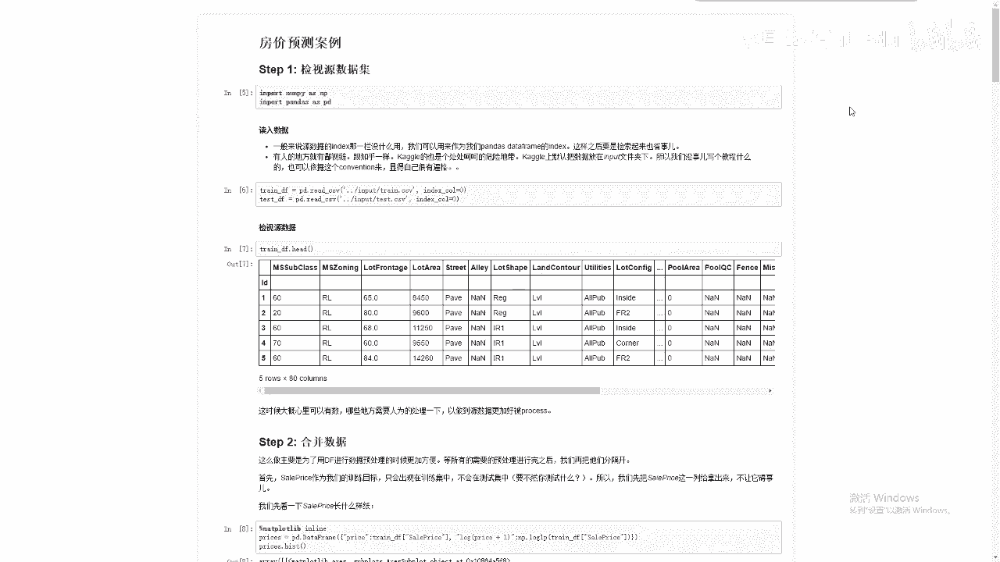
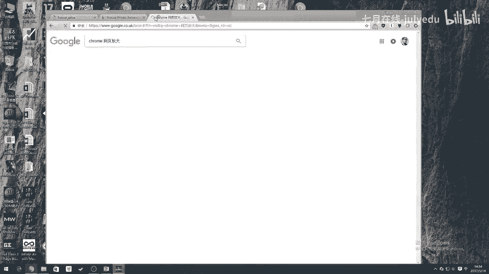
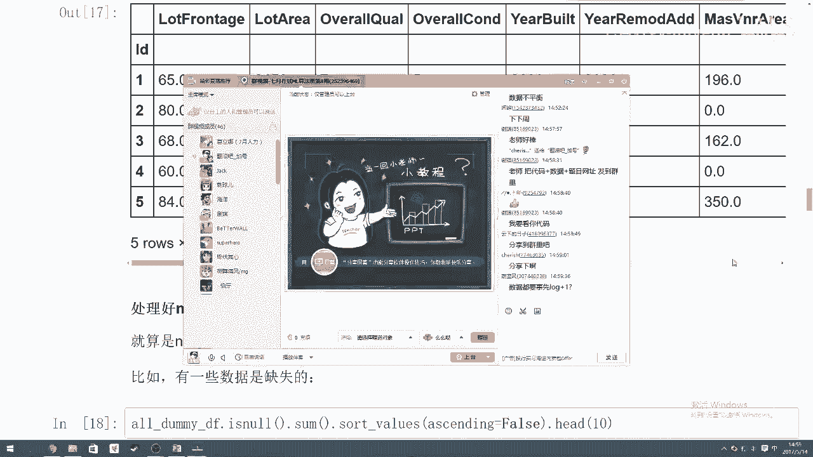

# 人工智能—kaggle实战公开课（七月在线出品） - P5：kaggle金融比赛实战：房价预测 - 七月在线-julyedu - BV1jh411y7Fh

我们这来讲一下，就是呃我们看一下，就是在呃开购这个平台，大家都知道吧，就是这样一个这样一个类似于我们讲怎么讲一个数据竞赛的平台，像国内相似的，比如说有叫天池这样的平台，对吧？都是做数据竞赛的啊。

有时候屏幕大一点啊好好好。我知道我知道我这哎，sorry，有时候屏幕要放大点，我知道我知道，稍等一下。

我这里卡小小卡机了。嗯。Okay。

응。什么什么什么什么什么。什么中面有个美女图片吗？没有吧，嗯，我们不会这么无聊吧。多大人了是吧？中面还有美女图片，天哪，这是这是大家小时候才会做的事情吧，呃，好，我们先说一下，就是对。

所以国内有类似的这样一个数据竞赛平台，对吧？就是像国内叫cago嘛？就是国内像比如说天池这样平台都会有这样的，有比如说有公司会上传自己的数据，上传一些呃无痛不痒的数据。

当然肯定是会上传一些就是核心数据吧，对？会上传一些无关痛痒的数据给你们，然后让你们去进行测试进行跑，然后看看这个效果怎么样看你能不能达到一个很好的效果，完成一个很好的事情，对吧？

以这里的话哎我们这里先看一个比较或者我们这里今天就看这样一个比较有趣的案例，是吧housepri就是说这个这个是某一个公司给提供在cago上提供了一个一个数据集。

这个数据集里面呢包含了美国的一些房子的一些呃一些一些一些客观信息，什么客观信息呢？比如说我看看da比如说比如说你们会告诉我们它的这个这个是它的售价值，这是唯一一个label。

告诉我们这个房子售价值是多少。然后同理会告诉我们，比如说这个building class就说这个房子属于什么级别，然后呢，包括这个房子的lo frontage，然后包括这个lo area是多大呃。

前面有没有前面是一个什么样的路，对吧？然后呢，就是个什么旁边的邻居有哪些什么condition怎么样然等等等各种信息，就说这么多这么多个信息，是关于一个房子，他收集这么多个所有的信息。

然后最终一个让我们求的东西，或者要我们做预测的东西是它的房价可以卖多少钱，这是一个非常直观的一个呃一个一个案例。然后这个案例上呢，我们是可以非常良好，或者说非常优美的运用我们今天所学的知识去进行解答的。

那么具体而言，怎么做呢？放放大。我靠，怎么又黑屏了，你能看到吗？我这么又黑屏了。能看到是吧？OK好好。😊，好，那么对于这样一个房价预测的案例。

我们应该怎么用这个呃东西来解就用用我们自己今天学的知识来做计算呢？首先啊因为今天时间关系第一时间关系第二，因为我们今天讲的主要内容不是数据清理。所以这里前面涉及这一大部分的数据清理的内容。

我会稍微略过的讲一下。大家如果有兴趣的话，我会把这个发到群里，大家可以仔细看一下这个教程里面所有的文字的解释。但是因为这个东西的话，呃我怎么讲就是如果要讲数据清理这件事的话，是可以讲一堂课的。

所以今天肯定没有这个时间给大家这样全部的讲数据清理这回事。但是我会给大家简单的过一遍，怎么这样完成怎么完成我们这样一个整体的这样一个呃比如说要做这样一个竞赛的话，拿到数据之后，你要怎么做。

然后怎么拿到一个非常好的结果再上传过去。O首先导入所需要的库啊，这个随便导入一下。当然注意点是我们最好在处理所有的这样一个竞赛里面的时候，竞赛题的时候，用我们的pada来进行我们的数据处理。

为什么为什么要。你可以用我们刚刚说的用n派导入我们的CSV吧，者可以用python自带的CSV这个库来做一些事情。但是这个程序员之间是有逼格的。嗯。

怎么讲就是就是程序员之间是有笔视链的用das的人是看不起任何其他东西的人因为本身是一个数据处理的库。他相当于是把我们非常呃非常怎么讲非常繁杂的数据处理变成了一个类似于像sql一样的数据库的处理形式。

所以说它类似于是把我们数据导入之后呢，你的你处理它的时候可以像我们 mergege啊，或者说把两个表conact或者把某某一个某一个Y给去除啊，把某个X给去除掉这样一个形式来进行处理。

可以像sql一样非常开心的来处理所有数据，所以说用das可以体现出你这个人的逼格会比较高。所以说在整个程序处理在整个数据处理或者竞赛圈这个圈子里面的话。

这个笔视链是用s会视所有其他用其他东西的人对这是我们是稍微提，所以大家可以。自学一下pas是什么。O然后呃呃另外一个啊这个这个这个是另外一个B格是关于这个在开里面，它这个文件储存形式。

是存在一个叫input的文件文件夹下面存一个V对吧？以大家在写比如说日后再写一些你们自己写一些教程给别人的时你以按照这样一个格式来的数据显你格你经常参加这一个国际赛？

你经常参加这样一个比行对这是另外一个关于B格的事情。所以这是开头先给大家讲两个B格如何安排的数据结构文档存储结构啊，如何使用如使用数据处理我们处理数据的时候呢，我们用自带来读进我们的数据。

并且告诉他我们的第个d这我们得一下们得到数据长这个一共有只点告诉是让我们只输出前五行前五行行前行他是会告诉我们前行这放那就会输出前十行1输前行。😊，没有意义。

我们读进来之后看一下的意义是在于就大概看一下我们读进来之后的数据的格式长什么样。所以大家看一下大概是长这个样子。那这里呢会发现有些问题。第一。

有一些NANnot a numbernot number就不是个数的意思。如这里可能是一个缺省值，或者可能是一些其他原因在在这里O那么接下来这时候我们是大概是心里有个数。

我们需要哪些地方需要进行一些人为的处理，就要一些人为的叫预处理这个预处理过程刚刚讲过是非常复杂，要讲可以讲一堂课，所以这里会会比较轻松的带过。如果客户大家有哪个部分不太了解的话，我们可以私聊好。

第二部分我们要做合并数据，为什么要做合并数据。我们之前如果有一些 learning基的话，大家肯定知道的话。😊，啊，这个方待会再讲，我先讲啊，我先讲另外一个事啊，在数据合并之前，我先讲另外一个事。

是关于这个我们salelespri这样一个叫平滑化处理。什么叫平滑化处理。我们知道在整个任何的数数学型的模型中的话，一个分布，如果是正态分布的话，是最能够最快的能够被进行拟合的，对不对？

因为正态分布符合了这样一个从中间点到两边的扩散的范围。如果说你的这样一个最终的Y是一个呃偏就偏左边这样一个分布的话，可能导致你的这样一个运算结果，你这样一个模型的计算结果到到最终是变成一个偏值的。

就是偏向一方的一个模型结构，怎么理解这个事。比如说如果我一个数据集中一共有99个是一只有一个值是0。那么我这样一个100个数据点的这样一个大数据集，对？我做ing的话。

我的这样一个模型可以就是一个输出等于一的这样模型，我依旧可以达到99%的正确率，对不对？因为我这里面本来就。99%的数值是等于1。所以说对于这种情况下，我们希望把我们的数据本身变行进行平滑化。

也就是正态化，使得我们的这个数据的分布，就是Y的分布可以更加的平滑，能够保证我们在进行模型的学习的时候，不会误入某一个偏执的区域里面去。所以这里面我会给它加上一个东西叫做。

叫做叫做叫做log加一为什么要加一呢？为了防止这个出现零的情况呢？对出现负负数的情况，所以我们这里把pri加上一这个一只是为了防止那个条件，就是边缘条件值的情况。

我们这里用log加一这也是体现一个逼格的体现。你在做这样一个数据处理的时啊，体你考虑一个叫极值情况。就是说你不用log而log加一的形式。

O那么这里面会出了这样一个方式叫log一也就是就是你这个值放进来之后给你自动加上一再给你log你log完之后，大家都知道log是一个平滑平滑数据处理器对吧？你做之后。

你所有的数据都会变成一个基于基于一个数据分布分布以内的一个正态分布，对吧？那么你做完这个log之后，也就是说我们把我们的这样一个spri进行的这个log加一处理之后，我们的最终我要面对那个结果。

从我们这样一个偏值的。比例的这样一个数据结构，变成一个比较正态分布的数据结构。所以这是第一步要做的事情。第二步呃呃，合并数据集，为什么要合并数据集呢？是为了让我们的的X。

就是让我们的训练集和测试集测试集都能都能经历相同的预处理的处理。也就是说有微胁数据啊，让我想有微胁数据处理经验的同学可能知道就是在进行测试和训练集这样分类的情分割的时候。

我们一定要确测试集不能被我们进行任何的燃指，对吧？但是在这里在进行竞赛的时候，我们要我们要做的是我们要确保我们的测试集跟我们的训练集用了相同的预处理的方式进行处理，这样才能保证我们把模型运用进去的时候。

我们的测试集和训练集用的是相同的概念，用了相同的尺度去进行衡量的。所以这里这是为什么我们在第一步的时候要把我们的剩下的部分给组合起来，把我们和组合起来。这个组合的这样作用。

不是为了让我们把这个让我们做cheing，让我们che吧？我们test和t给组合起来，是为了让我们可以一步到位的处理我们所有的。处理的方法。所以这里是为什么我们要把它们合起来？OK这是上面几步的过程。

接下来变量转化，也就是类似于一个特征工程的处理。什么意思？把一些。不该有的东西变成该有。把一个不该有的东西变成该有的。把一些就是呃比如说我们这这个是这个其实这个过程其实需要大家去注意关注我们的那个。

注意关注我们的我想想啊，注意关注我们的这样一个数据的解释。数据的描述。比如说这里呃MS subclass我们如果回到刚刚那个网页上会看到，就是这个东西其实是一个级别的代名词，它不是一个数字。

那么对于级别本身而言的话，我们不能够用数字来代表级别这个事，因为数字本身，比如说20和60之间有一个前后的20是小于60这个关系的。但是可能在我们整个这样一个级别的概念里面，20是一个级别。

60是一个级别，20和60这两个级别之间没有任何的没有任何的关系，它们只是两个不同的分类级别而已。所以我们根据我们的比如说我们根据我们的数据的呃descript。

我们知道MS subclassus是一个级别，而不是一个数字。那但是呢如果但是呢它因为它是一个数字的原数据形式被我们。被我们的这个s读进来的时候呢，会被默认为是我们的in64的格式。

那么这时候我们就会告诉大，哎，我们要把我们的里欧的所有的de frame里面的MS subclass变成一个train的形式。

然后再进行我value我看到我们是把所有的这样一个级不再是作为一个数字的表达是作为一个就是一个str的表达。我们做个统计，分为20级20这个级的一共1094个房子60这个级的。

一共50575个房子50这个级别变成287个，就是这是一步，就是把一些。格式错了的数据给变换成正确的格式，这是第一步。第二步。有一些呃我们所有的category的变量变成我们nu的表达形式，这什么意思？

就是说刚刚讲过，你不管是206050这样的处理这样的表达形式的话，它有一个自带的数据的大小关系在里面。那么我们为了想要表达我们这样一个category的形式的话。

我们用一个东西叫one hot来表达我们的category。也就是说假设我们这里呃，比如我们这里一共有呃，看看啊。

就假设我们比如说我们一个canlibry里面一共有class一共有1201234比如假设它一共有10个不同的级别，对吧？

那么我们用汪浩的表达式的意思就是说我们把这样一个con给它展开成10个con展开成10个列。这10个列里面呢，只有当我这个房子属于这其中这某一个某一个级别的时候，我才会被这里面值才会变成一。

其他情况下都是0，所以这是个零一表达的形式，我们称之为汪浩，就只有。它是这个分类的时候，它才会值等于一，其他不是时候值都等于0。那么在这里的话大家可以看到我们在进行这样一步叫ge处理之后。

我们可以把我们所有的MS subplus这个级别性的东西被我们转化成一个数据化的表达数字化的表达形式，它是变成一个0000000只有在哎比如说只有在60这个位置它是等于一其他地方都是通过这一个形式。

虽然说我们的变多了。我们把一个一个 column变成12个。但它这样一个表达形式会更加的合理化。这是这是其中的一种理的话我们其他各种各种各种各样跟级别有关，跟分类有关的数据的这样一个属性。

都要被我们话把它变成一个表达形式，使得我们的数据处理更加的直观直接。这是一部分这是上面这一部分就是关goical数据的处理。这是第一部分。

第二部分是关我们的 numerical变量变量就是我变量本身它就是个数字化的表达形式，但是它本身也会有出现它自己的问题。第一数据缺失对吧？如果这个数据是缺失的话，我们该怎么补全这个数据。

那么这个一般我们在。在主办方给你题目的时候会告诉你，一般会告诉你，就是说这个地方如果是缺失的话，我们用零表示，还是说是用平均值表示，还是说是用最大值及值中位数来表示。那你根据这样的审题之后。

你得到哎这个框一下这个这个fed下，就是如果说有缺审的话，我应该用什么值来代替，对吧？然后这里我们直接是用一个平均值来代替。这个没有什么道理。

我只是选取了一个平均值来代代替我们所有的这种填满我们所有的空缺，也就是说用这样一个命之后，把所有的这样一个空缺都填上去。然后填进去之后呢，我们我们标我们得到我们标准化的这样一个我们对对sorry。

就我们于是我们就能把我们所有的缺省值都给。填充完毕这个feel那就是feel进我们所有的nnot a number的地方，然后呢用我们的me columns把们它把它们那个平均数都给填进去。

这时我们看一下所有的是n的个数作为进行一个总结，看到是0。也就是说不再有任何的空档是零或者是缺绳值了。所以这是关于 numericalmer数据的处理。接下来关于 numerical数据的标准化。

有人刚问就是为什么就是log一下就变成正态分布了。我们不能说那是正态分布，我只能说那是一个平滑的分布。我我我刚刚讲的其实是一个叫正态化，就是把它近似变成一个正态化的一个分布。

因为log之后你值你大家可以看一下那个log y等于log X的那个那个图片图像分布。大家就知道就是任何数据的话，是在它这样一个loglog X之后分布是一个分行的，就是正值的分行形式。

那我们用这样一个方式的话，是为了把我们的数据给变得是归一化。O好，那么同理我们我们这样一个X本身也需要做做这样一个归一化的过程，就是做这样一个呃平滑化的过程。我们可以用什么呢？不光光可以用刚刚的那个。

我们还可以用这样一个东西这个叫标准分布对吧？把每一个X这个数值对吧？减上所有X的平均值再处以一个方差对吧？X减XX8，后处理方差。那这样的话我们的数据本身可以变得更平滑理跟刚刚到理一样Y需要更平滑一点。

更好更好便于计算处理那么X也希望可以把它变得更平滑一点，可以让我们更好进行数据处理对吧？以时候我们用同样的方式，把我们所有的X也进行这样一个平化。

这是一个opionalopional处理方式我们可以使用也可以不使用但是呢这显然是使用使用了以后呢，我们的数据计算会更好一点，举个简单例子。

如果说你的X里面有100个都是100100个99个值都是10只有一个值是对？那么你计算的时候，你这样一个距离差就是10。它这样一个计算，会使得你这样一个你的这样一个grad是非常大的。

它会使得你这样一个最终你这个图形在做最终呢就怎么讲，在拟合的时候会变得非常非常的容易跨入到一个过理合的区域中去刚刚讲过那个箭头要越小对？要经常有挫折，才能慢慢把它放到一个全局最优解里面去。

如果是一个过大的一个步伐的话，可以会让它过早的进入一个overfi的状态。那么在这种情况下，唉，如果我们把我们的所有的X也进行一个平方化处理的话。

可以保证我们所有的这样一个每一个X之间的距离变得比较可度量，就比较比较中比较中庸一点。那么这个数值的话，在我们进行处理的时候，就可以比较好的避免一些其他情况的极值情况的发生。

这是这是为什么把X要做一个简单的平方化处理。O接下来啊上面终于讲完了，这里讲的非常快，因为不是这一课的重点。那接下来我们开始正经的讲我们这一课的重点关于建立模型，对吧？

首先我们把这个我们的数据集分分割成这个测试和训练集两部分，对不？大家都知道合起来把分开就什么脱？接下来关于我们的rich regression。

就是比如说我们首先用一个最简单的 regression来跑一遍我们的这个模型怎么跑呢？我们用 model导入我们的对吧？并且用一下我们的做我们的我们的这样一个验证方案？

然后呢这个时候先把我们换成我们就是里面直接点value可以我们的D这样一个数据结构转成我们数据结构这个时我这样一套算法就这几行算法来进这里面什么叫们数分成几块？比如分成1块用一块进行我们的训练。😊。

然后用后面剩下的9块进行我们的测试是然后把所有的9块测试的平均值算出来错误率的平均值算出来，告诉我们这个我们这样一个套模型在不同的这样一个数据集结构中。

它的这样表现力有多好用这种方式可以极大的避可以极大避一是fi的模型看起来非常好，但其实在其他数据里面运用的不太好样一个效果那么这里这里就是每一次都新建一个的这样一个。

并且呢过所有的ri里面的阿尔法值尔法就是的一个参数对？把它每一个参数都一遍然后呢把每一次进一个新参数把们所有值计算一下。把计算的这个值输出出来。

这是我们画看下可以到当我们的尔法值大概右在10到20的时可以达到一个非常果概是0136右值这是我们用最简单的。呃呃，ri的方式来做这样一个。是这样一个数据分类的验证对吧？这是第一步。第二步。想想看，哎。

我们可以比如说再用其他一个呃分类器来做。比如说用random force来做对吧？我们在S learn里面导入我们的dom且呢同一遍我们所需要的各种各种各种这个参数这里参数就我只是选取其中一种参数对吧？

我们这里可以选很多种不同参数，也就是说你用一个 four几层的一个for循环，把所有的参数放起来。这这就有点像这之后你们可能会学到一个叫re search叫网格搜索这个是调参里面很重要的一个东西进行网格搜索的话。

可以确保我们的这个就是它的消耗量它的它怎么讲它的这个时间消耗量是很大。但是可以确保我们的每个参数都被我们给尝试到，且可以让我们。选取到最好的参数的组合啊，我们这里是只用了一个参数的调整来做我们的案例。

O然后把我们的regress放进来，然后把我们的所有的numberestim就这个东西呢其实告诉我们一共有几棵数，我们放200个大家可以回忆一下是什么意思呢？

是告诉我们每一棵能够最多看到之多少的属性所以这里我们放0。1还是1030%还是57999样用这样的形式进行记住下所有的呃那个错误率画出这个图我们看到在大概03左时候达到一个0。137的最优值，对吧？

大概是在就是每一个数能够看到30%的信息量的情况下可以达到一个比较好的值。这前面两个东西都是我们的呃最基础的算法。我们用了两个非常无聊的基础算法，算出了两个比较呃调试出了两个比较优的解，对不对？

这时候我们开始用我们的asseemble。有人看。韩老师后面会讲对吧？没关系，对，所以上面的内容黄老韩老师之后会讲，所以大家也不用现在听不懂，也不用太紧张。所以之后我们都会讲的这样一方面的内容。

O我们继续说好，那么接下来我要讲的主要是要结合这堂课的内容给大家讲解一下这里的作作用的重要性。那么这里我们刚刚已经有两个参数，并且有两个调出来参数，有两个调出来的算法是能够跑到一个比好的效果的。

一个叫尔法等于15的时候，一个叫在我们m等于3%或0。3的候达到一个比较好的效果。但这两个比较好的效果，怎样才能让我们呃怎么说我们怎样才能把他们两个的优势给结合起来呢？

那么这里可以用到我们刚刚上课讲的一个叫个思维，就是把这两个东西组合起来。投票的形式来看对吧？😊，与也就是说，我们同样会把我们的ridge和我们的renofor都进行一个feet，都进两个都进行fe之后。

记得这边还有一个重要事情，就是把我们穿上的衣服得脱下来。我们刚刚得到这个值，其实是一个被log之后的值，对吧？

这时候我们要要用一个叫exception minus来把这个log之后的值给返回成我们原始的最应该有的就是最原始价目表。这时我们会得到两个价目有两个模型分别决策出的两个价目表。

因为我们这是个regress的模型，我们不需要进行投票，我们需要进行就是平均化。因为他们有两个模型吧？两个型要做re的，们两个型之间就是我们怎么取们周值呢就是取两个模型的最优解就是平均解对吧？

那么就是这里我们的就等于我们的这个模型下取得的所有的房价预测的值加上Y这个模型下所有的房价预测值的平均值得到一我们最终的这一套过程就是用我们之前讲思维，就是把多个分类器组合在一起。

后呢都跑了一个比较好的结果之后呢，把他们一起相加求一个平均值得。最终的一个final的结果。这个final结果我们认为是一个asseemble以后的一个优化的结果。这个优化结果把它作我们的最终结果。

然后提交成提交上去就可以了。所以这里就是我们最终一个提交的结果的过程。所以整个这样一个案例从上到下。就是告诉我们如何对于一个真实的案例而言。

我们如何使用我们的呃今天所学的deciion tree以及asseemble的方式，把一个一些弱的分类器组合成一个高效的分类器，得到一个更很好的结果。这样一个过程。

然后这是我们今天想今天想给大家分享这样一个内容。唉呃感谢大家今天的收听，大概是这样，OK吧。然后这边如果有很多就是不太清晰，或者说听起来比较模糊的地方，大概应该都是前面那个数据处理那一部分。

所以大家不用紧张，因为这这个不是这堂课的重点，这堂课就会在我们第三阶段时候会给大家讲，所以大家就是耐心等到那个时候，大家可以再听一遍这部分内容。当然韩老师的案例可能跟我们不一样，这是我自己的一个案例。

韩老师可能有其他其他部分的案例，但是我们处理的这个整个过程都是一样的。也就是说不管遇到什么样的数据，我们的整理整个成处理的思路都是差不多的。我们都是要把一些。

呃呃分组的向量分级的向量变成一个数字化的向量，把一些数字化向量优化成一个更好的向量。呃，更好的数数数据。然后呢，最终的目的就是把我们的原始数据都变成一个数字化的表达形式，然后呢再把它带入到我们的模型中。

比如说弱分类各种弱分类器对吧？然后一堆弱分类，你可以做1000个弱分类器，对吧？然后给他们做一个bu，然后投票或者说做一个regression取平均值的形式，得到一个最最最优化的一个结果。

所以这是我们整体的这样一个呃取取值或者整体这样一个拿到一个真实的数据案例，么进行怎么进行怎么进行数据处理，并且进行我们的。弱分离器到强分离器的转化这样一个过程。O。这个东西我会分享到群里。OK好的。

没有问题。然后呃对，然后这堂课大概就讲到这里了，然后有什么问题我们可以私下讨论，然后根据那个根据老板那个指示啊，我们这个我们课上就是如果大家觉得这堂课讲的。

呃，蛮好的话，或者说有什么有什么心路历程想分享的话，大家可以在微博上或者在其他社交平台，就是艾特一下july，然后艾特一下我我加号。当然阿我也都可以了。然后表达一下这堂课的分享的心得。

可以得到什么200块500块这样的代金券，可以用来购买以后的课程。所以大家如果想要上其他课程的话，可以直接分享分享这样一个就是什么么上课心得就能得到这些钱，这个是啊老板吩咐我呃提醒大家的。嗯。

对老板说的话，我都要听对吧？好，大家就是这样，谢谢大家。然后我把这个东西分享到群里，所以大家可以可以仔细看一下。😊。

