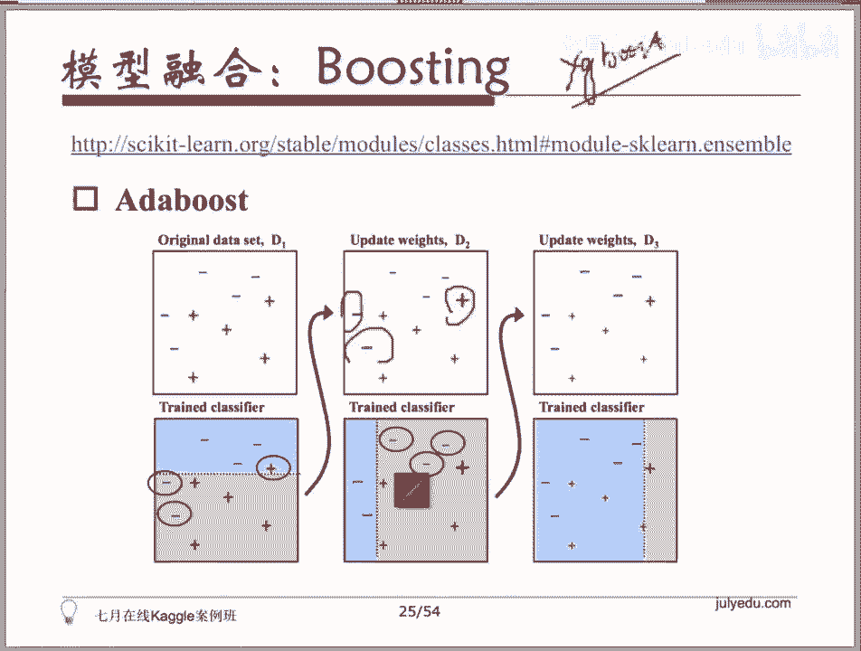

# 人工智能—kaggle实战公开课（七月在线出品） - P6：ML必备技巧：模型分析与模型融合 - 七月在线-julyedu - BV1jh411y7Fh

呃，所以你前面做的事情能够帮助你在你选定的特征上去完成你选定的这样一项特征上去完成模型的建模，对不对？而且你确信这个建模出来这个模型已经是我做过挑选的，应该是不错的一个模型。而且我又画了我的学习曲线。

对吧？我画完我学习曲线以后，我已经做过调优了。比如说它overfitting了，我已经把我的正则化的强度调高了一些，对吧所以。你现在已经有了一个你觉得还不错的模型，一个或者是几个你觉得还不错的模型。

那你可以去做下一步什么样的事情呢？一个模型往往是不够你不够帮助你去拿到最好的效果的。所以你可能要做的一个事情是你可能需要去完成模型的融合，通过几个模型去。通过好几个模型去sorry。通过好几个模型去。

共同给出的结果去判定最后的结果。那有三种方式的模型融合，你会看到最简单最常见到的方式叫做bagging。最简单最常见的方式叫做bagging。那back in的方式呢。一会儿大家看一眼就好了。

第二种方式叫做tacking。然后你会在ki的比赛的选手当中，频繁的看到他们用一个弱化的specing方式叫做bling。

第三种方式是类似于add boost或者是G呃grading boosting decision tree或者grading boosting regression tree这个增强数。

逐步增强数的这个方式啊。所以三种方式，第一种方式叫做baggingbagging是为他们解决的方式都是bagging解决的东西叫做过拟盒叫overfitting，对吧？

那如何缓解overfiing的这个问题呢？大家还记得我刚才给大家说的这个例子吗？我说如果你现在有1个1比10。你现在有一个。哎。😊，我没有选上嘛，抱歉。你有1个1比10的一个正负样本。

我刚才是不是给大家说了，我说这种比例情况下，我们可能可以做的一个事情是用把这十0份分成10个。这是1比10的十的这个负样本的。部分分成10份，每一份聚合正样本构建一个classify。

或者构建一个regressor。然后你去把这些classifier和reggressor的结果去做一个bagging。对吧十个分类器每一个都会有自己自己的主件会告诉你个结果。我去看哪个出现的频次最高嘛。

那如果现在它是一个regressor，一个回归。我这有10个，我这10个会给出来10个不同的回归的结果。我对它去求一个erage一个平均。不就好了吗？所以begging。的方式我给大家说明白了吗？

当然不需要你自己做，一定是有库帮你完成了这个事情的。所以。这个地方。大家可以看到s。好。地址又换了吗？G。哦，我没复制全。sorry。我们。取一个选择的工具吧。非ゃ水。像他那个不太智能。

所以大家可以看到这个地方我们提供。啊，有点慢O这有一个baggingclass是一个分类器的一个bagging。所以你可以告诉他，你选的基械的分类器是什么？

比如说是一个di decision进去一个决策数，那我需要。多少个estimator，对吧？然后他可以对这些estimator，他每他会每次有放回的去取样本，去有放回的去取样本去生成分类器。

然后根据这些分类器的结果去做一个综合的判定，做一个综合的判定。所以有现成的提供好给大家的这个back in class file。O所以我会对分类的结果去做一个vote。

我会对回归的结果去做一个erage做一个平均。然后做为最后的结果。大家都看到这个地方啊，back in class file对吧？这是第一种模型融合的方式。那backgging的话。

你看到的这是backgging的一个例子啊，如果你现在是所有的数据丢进来的话，做训练的话，它很可能会overfitting。但如果你举了100棵树，或者说你有100个分类器去做分类。

做最后结果的这么一个。这么它这100棵树，每一棵树都是由我的一个子集，我抽取出来的一个子集去建模生成的那我就生成一个class file一个分类器。我对这些class file的结果去。做一个投票。

或者求一个mamajority一个绝大多数的结果。作为最后的一个结果的话，你会看到平滑很多。那你刚才这几个样本点带来的离群点带来的这部分已经被我处理掉了。这是baggingtagging呢做的事情呢是。

king做的事情是我有很多个predor。我有很多个predor。我有很多个predor呢。🤧我做的事情是这样的，我的每一个分类器是不是会给出一个结果呀？比如说我的第一个分类器给出的结果是。

我的第一个分类器给出来的结果是result一。第二个分类器给出来的结果是result2。第三个分类器给出来的结果是result3，我可以在R1R2R3的基础上。再去构建一个新的分类器。

我把上一层多个分类器的结果当做feature，当做特征，去构建我下一轮的分类器。所以我不太清楚这个东西大家直观的理解有没有理解清楚啊，就是。我的第一个分类器是这样的我的第二个分类器是这样的。

我在这些分类器的基础上去构建了新的分类器，它是以这个F1的结果，F2的结果，F3的结果等等这些结果去作为输入去。完成这个事情的。所以。😊，其实大家一个直观的理解，神经网络很多时候做的不就是这个事情吗？

神经网络因为我每一层的结果我就输给下一层了。这个里头最简单的方式啊，刚才有同学在问blaning。你你的majority和linear的方式，linear的方式，线性的组合的方式去对最后的结果。去。

做一个加权的平均，这就是bling什么意思啊？如果你现在是一个回归类的问题，我要去预测房价，对吧？我的第一个regressor告诉我第一个reggressor告诉我说。😡，这个房价是呃是1个Y1。

第二个告诉我是Y2。第三个告诉我是Y3。我最后去预测这个东西，最简单的方式是我就用一个线性的组合，用Y1Y2Y3的一个线性的组合，一个 linear的组合去拟合最后的结果。

我知道了哪一个reggressor，它的结果是比较准的，我会多给它一点权重。另外一个regressor不是那么准。但他可能能帮我拉回来一些过拟盒，所以我给他一个小一点的权重。我不知道这个地方我说清楚吗？

blding很多时候他们用的blding是一个弱化的tacking，也就是你这个G我不取很复杂的G，我就取一个线性的组合，一个linear的一个组合。OK所以有同学会问说。

那这个那这个呃有没有方式可以做呢？呃，这个部分fiight could learn没有直接提供任何的，没有直接提供接口给你。但是这个事情大家是可做的。你大家大家想清楚这个东西啊呃，bling的话。

Bnding。我会给大家提供一个脚本，好吗？我。一会儿上完了课，我会给大家一个脚本，你们大家可以直接用呃，不在cyclcle里头封装的，但是大家可以直接用他做的事情非常的简单。

他是拿到这个output之后，把这些结果送到了一个linear的一个。Lar的一个or。啊，一个线性的一个regressor里头，然后你直接可以拿到对应的W1和W2和W3好吧，这就是一个bling。

我们就bnding就提到这好吗？然后最最最常见的叫做buosting啊，boosting的话，你可以用sd learn当中提供sekyd learn当中提供给你的这样一个un someble model啊模式去做。

当然这一头大家会看到啊。Sorry。这个看到吧？这个。所以我们可以去做一些模型的融合。大家看到所有SK认的模型的融合的方式啊，就是呃tking它没有ting或者叫bling，它这里头没有。

所以你看到其他的这个方式呢，在这里头都有有ad up。做做分类啊，你可以做分类或者做回归啊adbu。然后会有这个GBDTgring boosting class firegrreing boosting regressor对吧？

有这个 randomom forest。刚才大家看到的random forest其实是blackened的一种random forest。你可以理解成它是bagging的一种。

它是对数去做决策数或者是回归数去做bagging。所以都在这儿好吗？就是大家戳这个网址进去就能看得到这些。然后我我给大家的建议是，如果你要用GBDT不要用cycl learn。

因为它很慢去用chbook。或者是微软刚开源的lightGBM。lightGBM。呃，我的。get upub上应该有一个lightGBM的一个。

抱歉lightGBM的一个pyython的一个rappper一个封装。因为它原原生态不是给了pyython的，但是有一个python的封装啊，之之后有机会我们带大家看一下啊，目前用的比较多的还是叉us。

因为它比较用的人比较多，所以比较稳定啊，你出现任何的任何的。报错任何的问题你都可以找得到答案。好吧，所以bosin的话，我不想给大家细说，他做的事情无非就是我在做这份练习题的时候，我会不断的去。

我会先用最笨的方式去做这份题，然后做的不对的地方，我会把它的权重加大，然后我再去再去继续做。所以大家看到了这个地方我做一个最简单的二分类齐，我就是一条直线。这条直线会分成这样两类，对吧？

然后分这样两类以后，发现有有三个分错了，我把这三个分错的部分权重加大了，然后再分对吧？然后我再得到这个下一个结果，对吧？呃，大家需要的这些资料，我在课下会集中都发给大家。所以。大家。大家这个。呃。

不要着急好吗？这是buosting boostosing啊，就是有同学问到了说ad boost和grading boostosing的一个区别。那我。简单的说一下啊，因为这个属于原理类的原理类的东西。

ad boost做的事情是条样本的权重。调样本的权重。那grading boostinggrading呃这个grding boosting decision chain它做的不是调样本。他是在。

我的los function上去做的。然后。我们来看一些其他的东西带大家看一下所以SK论我们过了一遍啊，S论大家看到SK呢从最早最前面的这个大家可能会用到的啊，这个数据的清。

大家看到最简单的值填充的那个部分？特征工程各种各样的数据ature的这个pro里头是有的。然后特征的选择选择完了以后你可以去建模，然后注意这里头用到非常非常多的然后你可以去评估模型的状态。

我们给大家提供了学曲线画出来看模型现在怎么样然后去做处理好吧，然后你可以对模型做融合sing对对mod en sampleble的这样算一些方方式啊？我会给大家用ing？ing家如用的要用。

tree那个比较慢。好。

