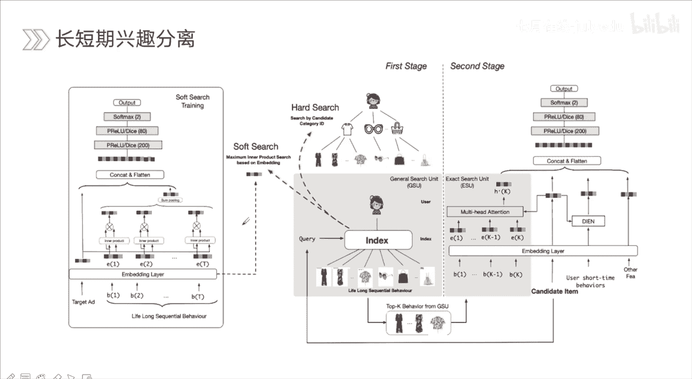
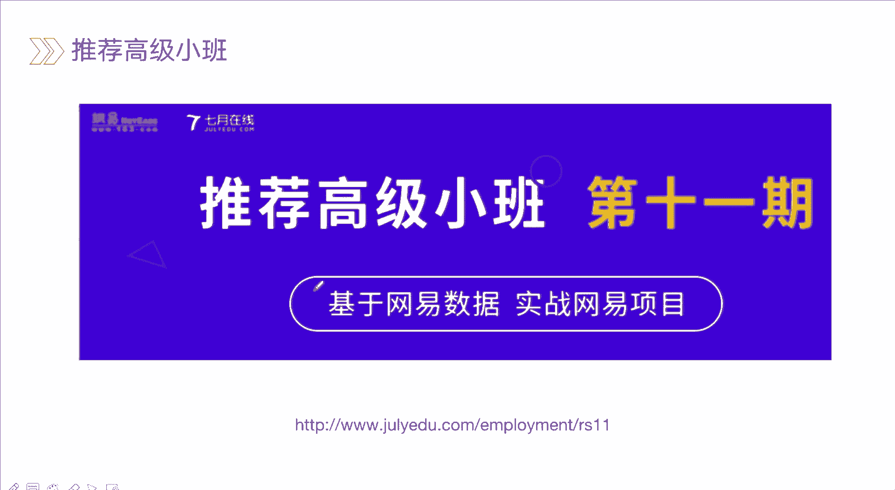
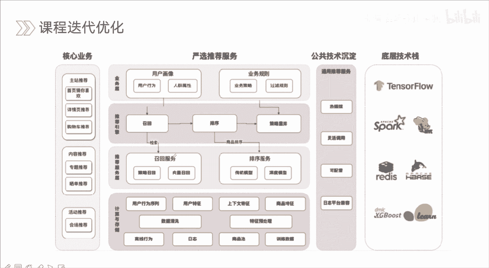
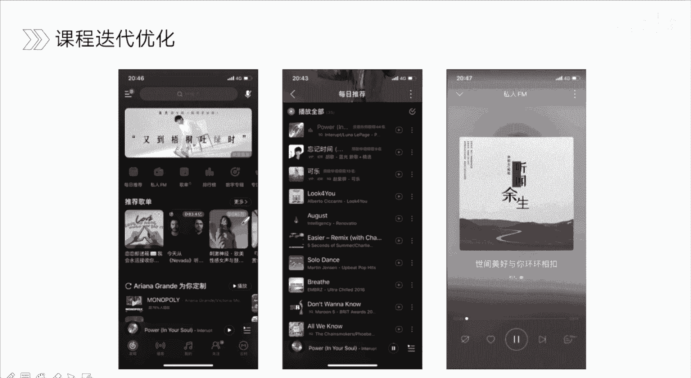
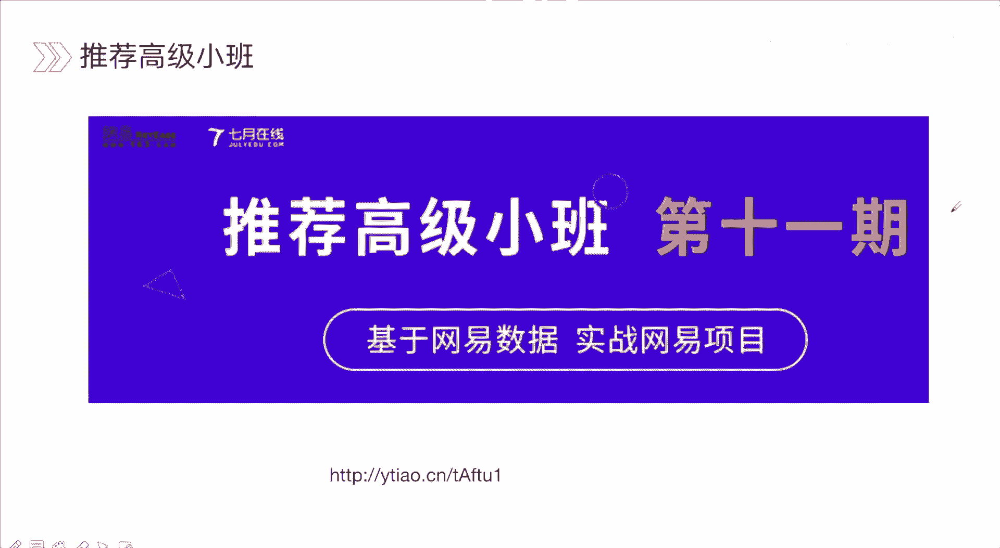

# 人工智能—推荐系统公开课（七月在线出品） - P12：【公开课】排序算法发展趋势 - 七月在线-julyedu - BV1Ry4y127CV

<该字幕由算法自动生成> 啊啊。

各位同学好啊，我们今天呢我们跟大家去分享cci预估的新趋势嗯，c家预估呢它是在推荐里面金牌的一个部分，就说我们已经给用户，那有了一部分召回的，这部分召回呢都是用户可能感兴趣的，然后呢我们经过排序的。

就是说ctrl预购这个模型来去将这些商品呃按一个概率进行排序，然后最后提取top n展示给用户，那这也是c t r与他的一个嗯在推荐里面它的一个主要的一个位置，那cpr的话他除了指代是点击的预估。

那其实它可指代场景还很多的，像转化率预估下载绿一锅呃，还有一些这些其实都是类似的啊，只是说可能本身的一个吸收程度啊，本身的一个抉择的一个呃抉择的一个位置是不一样的对，但是我们常用的一些模型。

还有常用的一些算法，那基本上都是差不多的，就是说可能会考虑一些其他的问题，比如像转化率估呢，我们可能会考虑一些转化延迟的问题啊，因为点击你是时时会去点击的，但是购买的话。

那你这个购买意图可能在你点击之后会停留一段时间，有的人可能会直接去发，直接去发生转化购买，但也有一些同学呢，他可能会去先加入购物车，再换上几天再去购买，就像最近双11 一样，你可能在10号的时候。

你把你的商品放到你的购物车里面，然后到11号的时候，那凌晨的时候你再进行转化，再进行购买，那其实就是这样一个道理了。

另外呢我们今天的打卡呢是有对应福利的，对一共是今日直播的，有两次打卡，有两次打卡，第一次呢是将现场的直播截图发到群里，第二次呢直播后期会有打卡页，将打卡页截图发到群里，那两次打卡完成的话。

私聊教的老师获得499的推荐系统实战课程，另外我们再去讲课的手段，有什么问题也可以在我们讨论群里面提出来，我也会时时的回答大家的问题啊，目前而言cci预估的一个发展趋势呢。

其实我觉得可以主要分成四个方向，这四个方向也是业界现在主要的一个去优化，去改进，去发论文的一个方向，那第一个呢是特征交互组合，就是说我们的模型里面啊，如何去获取到一些比较细致的更深层的思维一个信息啊。

这是特征交互组合会考虑的，比如说像最开始的在那个时代，那时候其实特征模型里面是没有这种特征交互的一个作用的，这样一个能力的，那到叉gb的时候，到fm的时候，那时候慢慢的那模型呢它有这种捕捉特征交叉信息。

的一个能力，再到现在，其实我们可以少获得一些更高阶，对这样的慢慢的也是开始流行开来了，第二个话是特征抽取，特征抽取的优化，就如何我如何去抽取特征呢，如何去呃用一些b样的方式对来去得到一些信息呢。

比如说像c n对它就可以来去抽取，就是一个特征的抽取器啊，比如说我们想要进行一些max poly啊，这操作这r n的话，那我们可以去用r n来去获取到一个序列，目前而言的话。

我们的一些输入很多可能是一些序列，这序列的话是反映用户它的一个行为的一个趋势，行为的一个轨迹，那这样的信息我们没有到rr里面的话，其实最后得到的白领其实对他这个序列的一个表达。

当然还有更深的一些特征抽取器对，也是慢慢的呃开始被提出来，或者说从不同的一些方向去用到推荐系统里面，再往下是多模态的融合，我们所看到的一些或者说一些比如电商场景对吧啊，像天猫啊，京东啊这些对吧。

我们所看到的不只是文字，那有的是它会展示一些音频展示视频展示一些图片给你，对这些信息他也会去影响到用户的抉择的，所以说我在去建模的时候，不仅是那些我们所构造的一些统计特征是i d特征。

或者说一些那种diss特征，那我们更多也会去考虑爱如何将他的一个诶图片的信息啊，或者文本信息啊，音频是信息也去，我有到我的我们的模型里面，或者说让模型能够从这种信息里面去捕捉到，提取到有用的信息。

第四个呢是长短期性取分离，或者说长短期兴趣建模用户的一个兴趣，那它可以划分成不一样的一个变化的一个节奏，或者说不一样的平台对吧，你的兴趣也会发生很大的一个变化的，比如说我们去听一些音乐的时候。

那我们一个人习惯的话，其实音乐的话可能变化并没那么大，对可能有人大家就喜欢听这种经典的怀旧的，那有人就喜欢听那种流行的乡村的，那如果是电商平台的话，那我们的兴趣是会发生很大的变化的，对我们不同的阶段啊。

我们的比如春夏秋冬啊，我们考虑的事情那就是不一样的，对那在双11再考虑事情也和平时也是不一样的，所以说嗯这种话可能是一个短期的一个信息，那还有的话就是说你的长期的信息，长期的兴趣。

那长期兴趣其实更稳定的，对你的一个人大概的一个兴趣，其实它不会发生太大变化的，另外一个就是短期的一个兴趣了啊，你短暂的一个时间，你可能你昨天和今天你去到电商平台，那你的兴趣就会发生一个变化的。

那我们会围绕这四个方向去介绍目前t2 它的一个趋势和变化，让大家去了解到目前最新的一些研究方向，特征交互组合，那这里我给到了两组模型，第一个是那种浅层的啊，呃浅层的一些特征交互对。

像fm f fm那可以发现这一部分它嗯统一都是没有，就是说像那种比较深层的对，有时候我们了解到像d c n呀，或者说叉d派m呢，或者dna这种话，他是能获得一些深层次的一个信息的。

对嗯像deep model的话，像d n c c p m y deep这些，那他都可以去捕捉那种深层的一个，不管是影视信息还是显示信息，那他们都是有这样的能力的，这是从beyond的，就是深浅程度。

那我们可以做一个区分，就比如说我给到这两个例子，一个是d c n，一个是dp fm，这两者呢他们有共同点，就是都有dna的部分，那dna的话他可以来去帮我们去获得隐藏的一个信息，是这两个部分呢。

这是两种模型它们共有的之处，那不同之处是在于他们另外一个部分对，然后第三的话它有一个cross network，这个部分就是个交叉网络，那我们可以去人为的去设定它所交叉的一个接触。

对这款模型呢它给到的是l一级，l一阶对，那我们可以通常来去设定，比如说三阶呀，四阶五阶，他这种交叉过程呢主要是围绕着下面这个公式来不断的来去进行，a交叉的，获取更深层次的交叉信息。

这种交叉是一种显示的交叉的，那fm的话它是能够获取到二阶的一个交叉信息，对那我们了解到ff m f fm的话就是说可能考虑到信息比fm会更细一些，因为fm它在去进行一些特征域交叉的时候。

那权重都是一样的对，但是f f m的话，f f m的话会考虑到不同特征域嗯，叫它的话权重应该是不一样的，就比如说天气对吧，天气和温度交叉，那天气和谐啊，这些东西交叉，那它重要性肯定是不一样的对啊。

这是一些关于最基本的一些特征的交叉的一些模型啊，当然这些模型的话也经常会作为嗯业界的一些base模型来去使用，对我们经常来说的话，会去将d盘fm或者说dc，所以我们的一个base模型。

然后呢再去考虑添加一些像transform，或者说像attention，或者是像其他的一些结构，嗯目前呢基于特征交互的模型可以大致分成三类，一类的话是聚合用户历史行为序列来获得ti预估的判别。

表示聚合用户的历史行为序列，那什么可以去聚合这种这样一个行为呢，对我们的序列表围绕模型里面这种聚合其实它就是一个特征，一个交叉过程的，我们将序列位到模型里面。

然后进行一个sampling max puling in puling，那这就是个聚合过程，当然我们也可以去加入什么呢，加入attention这种加权的聚合。

比如像经典的dna对他是考虑到呃用户的行为学里面对吧，和我们的候选集再去进行交互时，候那我们的行为序列里面的信息，那并不是一成不变，都是重要性是一致的。

这时候呢我们更多会考虑就说哪些信息与我们的候选集更有关联，这种关联信息它才是去帮助我们来去做预估的时候的一个关键信息的，第二个的话是基于graph的一个方式，我们将特征作为节点。

然后通过有效和无向图的方式，然后进行连接，这种话可能更加的高级一些，就特征，然后协同作用作为信息的呃，信息的一个沿边缘传播的一个边缘权重，就说我们先去构建好图，对这个话我们可以放在就是说线上的时候。

中端到端的形式截图之后呢，它其实这些边这边它其实都是一些这点，它其实都是一些特征，那这一点的话它可以有一种传播过程，或者说有一种聚合过程，好像我们了解到的像graph jc或者说graph s。

g cn，或者说下，这就是精英里面的一些经典的一些模型，对啊，那第三种的话是直接明显的特征组合特征的一些引领，那这种话就是我们可能见得更多一些了，就刚刚讲的那个d c d fm。

还有red and deep，如果说fm这些模型，下面呢是来自于阿里的ken，c a n的一个模型啊，这个模型呢它也是未来去获取这种特征，交叉的是一种新的一种特征，叫它一种方式对啊。

那这个里面的话它也是会去将我们用户行为的序列，那输入到我们的模型里面，然后我们可以看到它的输入部分，第一个话是用户优质，behave sequence，然后第二部分的话是他给艾特m d。

还有的话是user age，可以看到它的核心是proaction，就是一个collection的一个单元，这个单元的话是这个cn的一个核心指数，那我们看这个里面的话，每个单元里面它的收入是什么呢。

嗯我们可以看到第一个是cf，这个部分对吧，就是一个序列，一个是nose sequence，两个部分，第一个部分的话，它是将，每一个用户系列中，每一个em，每一个em和target塔特姆a进行了一个交互。

将这两部分信息，你看哎一个这是b一和我们target ok两个输入到我们的coaction out里面，那下一个也是一样的，都是按这种方式进行的，另外一种的话是将target和user部分。

这个就是说一个是用户历史行为，其实也是一种用户兴趣的表达，用户年龄的话其实也是表达这个用户实体的一个信息，所以他们都是有意义，都是有价值和我们target md进行交互的交叉的。

所以他们构造了一个no servants，no sergm这个部分，这个部分的话和eu这侧的一个位置，当然不只是指，那我们也可以数其他信息啊，地理位置这些信息也可以加入到里面啊。

作为我们的can action at这个部分的一个数了，那接下来我们看一下它的一个内部结构是什么样子的，核心是用户和商品的特征，对啊嗯这里分成两个两种方式。

一个是用户特征x user和商品特征x t m被编码成重启向量，然后使用也就是对应的embedding对进行contact，然后第二个使用x u和xm部分对吧，分别去映射，映射到参数pu的pm。

那就是这个部分了，验证完之后呢，然后再去a再去将其呃，说到最后对应的coaction这个单元被定义为hp usp，因为它里面有很多collection的一个单元的对。

所以说它每个单独部分的话会尽量定义的user就指的是user的一个sequence，user的一个序列，对啊并不只是单一的对你的序列其实有很多的啊，那我再看一下coaction and这里面它怎么做。

怎么进行操作，它其实里面就是一个简单的一个三层的mp层啊，然后呢他将先将psa对吧，然后分成了三个部分的相加，同时将pm也是分成了三个部分，然后receive转化它的一个转化它一个形状呃。

第一层输入部分呢，输入部分呢我们将三个部分输入起来，就是，这三个部分对吧，就pu的主要是三个部分，ok然后第一层的时候，他就和我们的p i t做了一个p i t做了一个交互。

那下一层的话是基于上一层隐藏的一个输入结果，作为我们的输入，以及以及我们另外就是pm它的这个它是分成三个部分模对啊，第二部分结构进行交互，我可以一直到最后一层，黄色部分的话，它是把它作为一个权重。

或者说一个b这是collection它里面那个部分，最后得到它最后那个输出结果，k呃，correction，网络，最终的结构就是一个可以看到它里面的一个主要是包含里面的一个呃，输入的一个是完整。

是个d n嘛，然后对应的话是ex m a user，还有对应的就是说诶转化成对应的呃，我们可以看到上面的部分就是嗯经过之前的，a collection单元定义为h这个部分以及我们的cn。

然后再去接上对应的一个dna啊，这是我们dna里面他所说的一个参数，那需要注意的话是cn的部分的话是绿化的一个参数集，dna的话是dna的一个参数集对，因为我们里面的话肯定要去有很多个参数的。

这些参数集的话都是我们再去经过摩托车反复迭代训练的时候，他会去进行更新的，最终的话我们通过最小化交叉商啊来去不断的来去嗯，训练我们的模型，ok这是对于cn这个模型我们大概的一个介绍。

那也是就是去大概去描述一下我们关于特征交互这个部分，那一个目前的一个进展，当然到后期的时候啊，其实这个部分可以发现，其实这个部分其实的一个进展可能会比较慢一些对啊。

因为可能更多的话会考虑一些那种序列化建模，我们在之前一节课会有讲到那块发展是比较快的，再往下是特征抽取的一个优化，我们讲到就是说你不同的一个输入对吧，你接不一样的一些结构，一不一样的抽取器。

那我们获得的信息也是不一样的，对像cn而rnn transformer，像transformer的话，他其实内部的核心就是进行了一个moi had several。

several attention的部分，这个部分的话它就是进行一个比如说我们有，我们有四个艾特姆，那它在进行moody had several tension的时候，那mod太的话。

他其实就是将我们的书上对吧，我们切分成了多头，然后每一头都进行了一个cf attention，都进行self attention，再去街上对应的ff n的前向反馈的网络。

嗯嗯在saftention里面的话，它会将每一个就是每一个向量对吧，都会和其他部分诶进行一个attention的一个操作，这种操作，然后进行聚合，就聚合是不是就类似于我们聊聊的。

就是嗯类似一种特征交互的一个作用嘛，对啊他其实也起到一个特征交叉的作用嘛，交互交叉的作用啊，就是说我们经过纯草木这种抽取器之后，我们可以获得这样一个信息，那经过r n之后呢，r r n之后。

那我们把它转过系列每个部分输入下一个部分的一个输出啊，输入输入输出这样的一个序列，最后得到最后的一个得到最终的一个embedding，就是说最终引领他其实对这个序列的一个描述，那cn的话。

cn它其实不只是我们可以在那种图的相图的信息上面来去提取，对嗯，其实我们对那种就是说一维的一维的，就是一维的卷积，其实也是可以的，就一维的那种那种那种那种那种对应的像序列呀。

那我们也是可以来去提取这个信息的，这是经典的，就是说cnn transform，那具体的那有哪些对应的一些模型呢，第一个比较经典的是behave sequence。

transform model是简称是bs，它的核心就是加入了一个transformer air这个部分，这是用了一个传送这样一个特征提取器，那这个部分的输入呢是分成两个部分。

第一个是user behasequence，就是用户行为序列，第二个是target im，将这部分输入到我们transform their时候，这flair是地方对吧，它都会进行。

ok我们看右边这个部分，这个图都会进行，就是说moon has tention，然后进行ff n这样的一些操作，这里面交互不仅是特征之间交互，它还能得到，就是说你这些特征对吧。

它和我们的候选里都target的目标，这个交互信息，这种交互信息是更直接的，因为我们最后要去评估用户，他对于这个目标的一个兴趣程度，或者说意向程度对，所以说与它进行交互是最直接的。

再往下就是美团那个路啊，是将bot bot的话，他也是在nlp里面的，都是属于特征抽取器对，然后再去用到推荐里面，可以看到word哈，其实就是由transformer来去来去构成的嗯。

他是这块分成四个图，第一个是transformer layer，也是帮助我们去了解，就是说bot它内部的一个结构，第二个的话是bt for because，就是用bt做推荐这个模型的一个框架，嗯。

c地方的话是呃用简单的一个全form对吧，这是全方面，但全貌他是那种单向的单向的，可以看到它的箭头都都是单上的，没有说就是说我们可以前后来进行这种交互，像bt for recogical这个部分。

对他不仅可以去哎进行网之后来去进行的调查，他也可以去往前啊，第一部分的话是一个r n那个结构，r n的结构对这种交互的话，你完全只能就是说一步一步的就是说串行的来去进行的，对它是可以进行。

它只能进行串行的，那我们其他结构的话，它就可以进行变身的，这也是他们结构所去塑造出来的一些嗯，我们再去优化的时候，或者说它本身的一个特性嗯，另外的话他们再去补录信息的时候，那bt本身来说的话。

他的能力可能是更强的，对的可以看到其实r p现在主要的解决问题对吧，那更多的话都是会用各种bt对，然后嗯出一系列一些方案，然后再做简单的一些融合就可以了，嗯但是常规情况下。

其实现在其实要将波尔特其实用在线上的话，其实还是比较比较困难的对啊，在遇到线上的话，其实更多的话我们可能会去考虑到一个嗯深度问题，成功的深度问题肯定不会太多对，就像我们来去做用trans猫二手对吧。

我们放在线上，其实我们是用的transform，但是我们从summer里面的话，你有樱桃的，樱桃的话，你也可以是多层的，但是我们只用了一层，这就是考虑到一个加上一个超时的问题对，因为超时时间一严重的话。

会影响到就是说整体的效果，因为超市一超时的话，这时候你的模型就不会起到什么效果了，而是选用一个基本的一个极限的一个方案，base方案对，然后也会影响到用户的体验，ok我们继续往下。

那再来一个文化是多模态的一个融合对嗯，比较常规的话，如果说我们想要将多模态信息对吧，融入到我们的模型里面，那像基本的像人工特征对动态信息它可能包含什么，像人工特征。

一般我们在构建c t r模型初期时候会花很多精力作用特征，比如说本身的id，这id的话可以试用户年龄性别地址嗯，职业，然后偏好各种一些信息，或者说关于商品的一些信息。

还有的话就是我们构造出来的一些统计类特征啊，这是一类，第二类的话是文本类特征，比如说我们再去做一个搜索推荐的时候对吧，我们可能会输入query，那query的话。

那其实只是我们可能会对query做一些分词，然后提取一些一些keyword啊，又或者说你在叙说到cy之后呢，可能会有一些候选的一些唉title这些title的话，那我们也会做相应的一些处理。

又或者是我们看到了一篇新呃，看到了啊，一个商品它有一些它的一个文本的一个描述，或者说一些评论信息啊，这就是文本特征，第三个的话是用户侧的一个特征啊，比如说用户的一些序列啊，或者说一些关系图。

这种就可以理解成一个序列特征或者国服这样的一个特征了，再往下是图像特征，对图像的话可能我们也会就是说不同针对吧来去提取这样的一个信息，然后也可能一般来说我们提取图形特征化，可能会一个是不同帧，然后展开。

然后输入到一个序列的一个模型里面，比如说说到cm对啊，又或者说我们将短暂针做一些聚合，当然还会有一些其他的音频类的呀，这些它也是属于多模态里面的一个信息，下面这个的话是一个是京东发的一个论文。

对c s c n n，就是说电商平台里面对吧，我们所第一眼看到的其实是一个图片，而图片信息是非常大的，所以说它很大某种程度上有很大的一个呃概率，会影响到用户是否会去点开哎这个信息。

因为你可能你所看到他比如说用模特穿个羽绒服，对，很大概率你不是看到这个文字上面写的羽绒服，而是看他穿的羽绒服，你点进去的对，所以说这个图像信息是非常能够去诶引导着用户产生点击啊，或者转化这样一个行为的。

那一般我们把这种信息加入到我们的模型里面，一个是我们进行一个离线的，来去得到诶这个图片的一个白点，但离线的话你的一个优化的一个目标对吧，其实和我们实际当中优化目标是不一样的，你在离线做的话。

你换目标可能是对应这个图片的一个分类，但是你在线上的时候，我们做cpr的时候，你的目标其实是是判断他是否去点击哎这个对应的一个类别啊，点击的是是否点击，而不是说它是哪个图像，对两个目标完全是不一样的。

所以说会有偏这样目标的一些偏差啊，所以说我们可以在我们的网络里面去加入像cnn或其他一些结构，来去将我们的图像的信息也作为一个输入哦，当然cc sn它在这个部分其实做的会更复杂一些。

那我们的核心呢就先了解到就是说动态怎么样加入到我们的模型里面，它与离线和线上有什么样的差别，这是关于图像的一个特征，下面一个的话是如何将图graph，这里的话是一个多模态知识图谱这样一个信息。

我们用于推荐知识图谱呢，大家有了解的话，知道它很里面有很多的一些实体和属性，对原本的很多一些实体对吧，它可能本身来说的话，如果说哎有实体对吧，它是一个新品，这个时候的话，我们的一个数据里面对吧。

其实关于这个属性，关于这个实体其实没有任何历史数据，这会造成一个就是一个冷气这样的问题的啊，那我怎么判断它是一个新品当中的一个热评呢，我们可能会借助一些属性这个属性，比如说像手机对吧。

那手机里面的话哎像小米手机还他刚一上市对吧，那它本身小米它就有一定热度的，只要反一上市，他必定是一个爆款的对啊，然后它是整一些配置，也是他的一些属性，那我们看可以将这些属性可以看到。

我们输入的话其实是一个graph的一个embedding啊，然后我们进行了一个实体的一个编码，然后对应的向量，这里的话他又经过了一个mk j的一个attention的二层部分attention，嗯。

大家知道attention它的关键点就是进行一个聚合，得到权重，然后进行聚合的，所以我们到达这个部分题来说，我们进行到达是很多的一个属性，间接属性，然后进行聚和区块之后，更新我们的embedding。

然后再去传入到我们推荐的哎这个结构里面了，这里面核心点就是说我们如何进行一个是进行我们motion model的，一个就是一个多模态，就是知识图谱的一个实体编码的一个过程，这是关键点。

第二个的话是我们如何进行attention layer这个部分的一个操作，这也是这个模型的一个关键，ok我们继续往下看，下一个部分呢是关于长短期兴趣的一个建模或者兴趣的分类。

对啊嗯我们最开始在去建模这种新技术对吧，或者这种超短期收，最开始的话我们可能会去用dn这种形式，可能最早之前的话很很就很常规来进行一些pulling操作对吧，这种简单句和操作就是一视同仁嘛，一视同仁对。

但实际情况下，我们这种序列其实里面信息的重要性是完全是不一样的，然，就说你里面有很多行为对吧，其实和我们的一个目标，那相关性其实并不高的，这种对于我的目标其实做推荐的时候，其实指导意义并不大对啊。

哪些意义比较大呢，与它相关性越高的，如果你用户历史，你的行为的信息对于我们这个ta的相关性比较高，那就说明我对这个target item对吧，我点击它的概率是非常大的。

所以他才要去考虑如何进行个真实的加和真实的一个加权啊，但是在进行dna的时候，他没有考虑到一个时序的一个作用，任何信息它都会存在这种时间衰减的一个因素的对啊，就是沿着时间。

你上个月的兴趣和这个月的兴趣你可能是不一样的，或者说会有一些微弱的变化，所以这个模型dna基础上它有一个升级版本，就是di e n对啊，就是考虑到就是说这种兴趣的一个进化的过程，兴趣一个变化的过程。

对这块它是加入了一个gu这样的一个操作，那还有呢就是说这些里面说的兴趣，其实序列其实可能只有几百比较短，对啊，再往下呢其实我们考虑更多的是一个长期的一个兴趣建模了。

比如像m i m n这个他首次是把建模行为对吧，建模行为首次是把建模行为的那个序列长度扩展到千级别嗯，对这个时候是首次换到全级别的对，但是呢，但是呢由于是将所有用户历史行为编码到一个固定大小的记忆中。

造成里面有很多的一些噪音，怎么说呢，我们将所有的哎，将所有所有就对应用户历史的编码到一个固定大小的记忆区域，当中你的长期兴趣里面并不是都是你的一个真实的，或者说是一个稳定的一个信息的。

它里面会有很多噪音的，你忽然间点了个东西，很误点呀，或者说错误点呢，对这样的信息其实也很多的，这里面的话我们需要考虑什么呢，需要考虑什么，他m i m n它将这些放到一个基因去这里面对。

所以说可能会受到这些噪音的影响，那我们可以考虑什么，可以考虑一些提取一些关键的一些点，过滤掉一些，我们可能就从上千上万里面对吧，学场论里面我们去提取那些重要的一些信息，把它从金组成一个序列啊。

这件事情也是已经有人去做过了，像s i m对啊，这个好像也是阿里的一个论文，对它会进行什么进行一个搜索过程，soft search就是软搜索这个过程，对。

这是我们从非常非常大的一个就是说这种这种这种序列里面，对我们进行一个就是说它是软硬结合的过程嘛，来去搜索搜索或者找到一些关键的一个信息啊，而不是全部都放到我们的一个固定的一个结局里面。

不做任何的一个丢弃，对这样肯定会造成一些信息上面的一些噪音，或者说影响到我们最终一个兴趣的一个表达的，ok具体的话我们在之后课程当中会去讲到啊。

下面呢应该聊一聊，就是说关于我们的推荐高级小班嗯，这次也是是网易和q在线去合作的一次啊，基于网易的数据实战，网易项目，那完全是来自于工业界的一个项目了。

对，那个亮点的话是分成四个部分的一个前沿技术，就像我们讲到的，就是说现在cpr它的一个发展趋势，那我们到时候再去讲的时候，可能会去更多的呃，这是一个合作的对，合作的对里面会有呃。

网易真实的一个实际的一个项目的对，联合开发的一个课程啊，一个前沿技术，那前技术都处在什么呢，刚才讲的只是一个关于cr的，那耗更多的我们召回这块儿是怎么来去做的，对教会现在并不是我们所了解到的。

只是协同过滤，或者说双塔，或者说dsm这种这种这样的一个结构，更多的话它也是考虑到这种序列的信息，或者说多兴趣建模，多兴趣找回，还有呢像知识图谱对，那如何去构建，还有像gta那如何去用。

在我们之前系统里面，这都是一些前沿的技术，也都是现在就是说那我们再去进行面试，或者在战场里面对吧，他们所用到的一些技术啊，第二个是工业级项目，就像这次就是说使用网易的数据，然后结合网易的项目啊。

就网易严选，还有网易啊，网易云音乐这样的一些数据，然后以结合他们的项目，是tensorflow，tensorflow，tensorflow 2的x，那就讲的，因为现在来说的话嗯可能拍摄对吧。

其实我们再去做科研，然后理解起来其实来说跟python其实更像一些对啊，但是其实在发现其实在供应链里面对吧，更多的还是用tf更多一些，包括像我去像我经历的一些厂对吧，都是用tf的，全程答疑。

对有助教老师的有什么问题，我们可以去实时的去交流沟通，还有就业辅导啊，这是主要的课程亮点，那对于网易的数据网页项目呢，那第一个的话就是严选的一个推荐，那会包含就是说我们所了解的不只是召回排序。

我们会把这些信息对吧，他的一个上下游这些信息，这些内容我们全部冲起来，matlab matlab是没有啊，matlab是没有的，my lab，现在大厂里面都不用这东西的，小厂也不用的。

这些你多去做一些分析呀，来去用的对啊，就说整个一个核心的业务和它整体的一个架构对啊。

下面的是网易云音乐的，像我刚刚说的，像这种兴趣建模对吧，像这种兴趣建模，那在网易云医院里面，那我们该怎么来去进行，是长期好呢，还是短期好，对，然后用户他听的音乐呢，它有没有一些明显的一些变化。

那我在进行推荐的时候，那该怎么去考虑呢，对音乐的话其实和电商还是有很大的一个差别的啊，就比如说我们购买了商品之后对吧，这个商品我们可能短时间内不会再去购买了，如果说系统上去推的话。

它一定要超过一个复购的一个周期的平均服务周期对啊，如果说你没超过服务周期，你给他推的话，那你这个系统肯定是不合格的，我都购买过，你再推给我，整体是非常差的，但是音乐就不一样了，那音乐就不一样了。

音乐我觉得是有一个是一个探索性的一个模块，对另外一个话其实是你用的风格的一个模块对啊，探索性的话也许就是说还是从相近的，慢慢的慢慢的往外去进行发散扩散对，但是原来听过的话，这样也会推的。

就像王音乐有每日为你推荐嘛，对吧啊，这样的里面有很多歌曲都是你的一个，他都是从你的一个喜欢里面诶去进行提取的，而且像这种音乐推荐的话，其实也是一个比较核心的对，因为推荐的话其实有时候就和那种视频呀。

像这种短视频其实有时候还比较像一些，还要考虑一些，如果说像这种音乐节里面对吧，你如果想考那种社交的一些属性的话，那我们有时候不仅是会考虑它顶级啊，还有它的一个收听，那这时候我们也会去结合一些关注。

或结合一些转发或者说评论，读评论，看评论，像相信大家如果说大家平时就是听网易云音乐的话，那大家肯定会有兴趣，就说通常会去看里面的一些评论的对啊，所以这个属性也是非常强的。

除了我们的一个实战项目以外呢，就是工业级的实验项目以外呢，我们还有一些实训项目，那其余项目的话，我们尽量也是从多个业务方向角度出发，对像因为我们所面的推荐不仅是简单的一些那种结构化数据的。

我们还有很多就是说像个文本呀，文本呀，还有对应的一些知识图谱这样的一些信息，那也是比较核心的，这些话我们都会在我们实训项目里面去讲到的，后端工程是不需要的对啊，后端工程有专门的人来去做的，后端工程师。

我们推荐系统，算法工程师是不需要做这些工作的嗯，ok目前呢是这也是我们这次一个福利，对我们这只是一个福利，也刚好双11了，对啊，那在双11的时候呢，我们现在课程是定价是19k对啊，这是19000，那。

双11呢我们来了一次特价对，就是减4000-4 k对，只需要付1500即可，但这个福利其实是有限制的，对限制的啊，需要我们先嗯，希望我们在今天对，就是在12点前完成扫码来去领券啊。

所以说这个优惠是仅此今天一天的，就仅此现在今天晚上的嗯，就是说我们去领了一个券，立马可以减4000，另外呢在课程在开课前到开课后，开课前的开课后七天对吧，这个时间段内是接受无理由退款的。

对所以说给大家一个视频的过程，大家去感受一下，就是说我们讲课的整体的一个呃内容，或者说老师的风格所讲的一个呃之前的内容对，是否能够达到自己的预期，所以这也是非常好的，非常就是说人性化点。

就是说我们可以七天内无理由退款，然后大家有什么问题，我们可以现在交流，大家关于推荐系统的，呃我觉得因为这个课的周期是比较长的，或者周各周期比较长的对啊，分成就说嗯内容是比较多的。

就是说贯穿推荐召回排序重排，然后前沿技术，然后是工程相关的对，也会有对应的一些事实的一个分布式啊，分布式，然后会有对应的称spark flink这些信息，最后我们会有对应的实训项目。

就是有时嗯就是会惊喜，就是说类似于就是说呃项目课那种形式的，那项目课的时候呢，那我们会去将我们之前的一些知识点再去结合啊，真实的一个工业地的项目，真实的比较大的一个项目，一共是分成一般分成四个项目的。

对大家可以去进行选择对，然后四个项目其实我们会包含不一样的一些知识点啊，然后呢每个项目呢又会去分成多个课，带大家去完成我们的一个项目的一个整体代码，那我们老师也会给大家代码，整个完整项目代码。

当然这只是第一步，那更重要的是在我们的原有代码基础上呢，我们去做优化，做改进对，去尝试不一样的一些模型，尝试不一样的一些实验，那去发现或是对比一样问题，其实我们在工作中也是一样的。

经常我们可能有一些点对吧，那我们还要经过很多实验来去确定好最终的唉一套方案，然后去上线，那我们的一个实训项目也是如此，我们的一个真实项目也是这样的去做的，每周的话都有，每周都有安排课的，每周都有安排课。

大家可以去到官网里面去看的啊，大家可以去到官网里面。

去官网里面来去看整体的一个安排，就是整体的一个课程的一个安排。

几天后下来也是需要几个月时间，其实算下来，另外是支持12期分期免息的，这样算下来，其实一个月就是1000多，但是如果说我们要去转行，对我们要去转行，然后或者说我们要是去嗯下一步的晋升。

那这些给我们带来的收益都是非常大的，像我们再去做推荐对吧，推荐其实它的一个收益对吧，在我们算法里面算公式，它是分成很多方向的，有c v有r p，还有一些像一些呃机器学习，数据挖掘风控，然后推荐推荐系统。

那推荐系统它这个平均的收入是平均薪资是最高的，声源的话我们是有一定的要求的，我们要是要经过简单的一个了解你的情况的对啊，因为我们对大家基础也是有要求的，因为之前的话之前学员里面对吧。

也是有一些已经是大厂的对想去就是说之前可能没有做推荐，但想去就说转到推荐这个这个方向，来对像之前的话有京东的对，然后还有百度的对，但都是想去转行到推荐这个领域，因为推荐这块的话确实相对比其他的数据挖掘。

积极学习，或者说金融这些风控整体的收入是肯定是高的哈，基本转行，然后或者说升个级，你一个月基本上刚好就是这个学费了，都有可能，大家看看还有什么问题吗，就关于推荐他的一个职业方向呀，或职业的发展。

或现在目前的一个情况啊，又或者说现在推荐的话，我们再去求职的时候需要注意什么问题，还有课程里面的一个内容啊，都是可以去问的，大数据会有呀，我们会有去讲到flink spark这样的一些。

因为我们再去处理数据的时候对吧，数据数据的时候，那我们就会可能就会去用到，就是说像spark这样的一些，或者说我们基本上可能会去用hive circle。

对另外的话会去用spark来去构建我们的一些特征啊，所以大数据的一些内容我们也会讲到的，大家可以具体看这个课程的页面了解，论文我们不会去论文去过论文的，不会去弄哈，我们会去提取论文里面的精华的。

比如说我们会专门有个课程的话，就去讲这种序列化推荐，那我们会去从呃d n b a n b s t e m p或者md这些哎讲下来，然后了解到现在序列化推荐是什么样的一个方向啊。

而不是说我们把这论文拿过来，就是说从摘要到后面讲，而是说我们我们其实讲的你也可以看到这种我们是讲的事实，大家去理解唉，这个算法理解它与其他算法的一个不同之处，它的架构是什么样子的，就是它的框架是什么样。

子的他为什么要这样设计，这个是我们的核心点，就是让大家去理解，就是说它这样发展还有什么样的方向，还有什么样的趋势，在基础上他有什么，就是说可能的一个优化点或者它的一些缺点在哪里啊，比如像dna对吧。

他虽然去改进了dna，不能考虑到时间的一个影响，对我们兴趣的一个影响，对于这种衰减的一个因素，但是呢你加入了就是说他有加入两次，进而又对，而且还是双向的这种对吧，序列化中这种序列化模型对吧。

它很大的像rng或者rtm混回是很会影响到我们整体的性能的啊，虽然g i o它是比i i i t m和r n效率高的对啊，但是还是会影响到的，嗯现在论文的话更多的是考虑就是说从其他方向的一些点子对吧。

拿到我们现在的一个诶推荐这个领域来，然后再去看能否去结合一下，然后去发一个论文，对啊，就像是在去做一些呃ccr概率校准这个部分，其实校准的方式，其实可以发现很多的都是一些那种呃那种工业制造的一些点。

对他们才会去去用校准，但是呢我们再去做c cv工作也需要校准，所以这时候呢就把那个领域的一些方法去用到我们现在这个领域了，对，肯定要歪，不好意思，ok我们再给几分钟时间带过问题可以讨论。

然后呢另外一点的话就是可以去了解一下我们这个课程，然后截止到今天12点前，我们是有一个4000的优惠，大家只要扫码，然后立马就是说会有得到我们这四天的一个券，同时呢是支持12期分期免息的。

所以这个我完全是没有什么压力的，对同时呢在这种情况下，也能够就是说为大家之后的一个晋升，就是职业的一个发展，或者说你想去换不一样的方向，跟你原来是搞工程的一些想去搞算法，工程和算法现在其实会差很多的。

这个工资这一块，包括你可能之前是做后端的，那都是可以考虑的，或者说之前是做数据挖掘啊，数据分析的那也是可以去唉去尝试去转到一个不一样的，或者说收入更高档的一些岗位啊，ok大家有问题可以提出来。

我们可以讨论啊，那另外呢大家尽快去领我们的优惠券，减4000元的优惠券，然后呢是支持12期免息下来，就是说一个月就付1000多嗯，这个优惠这个确实非常吸引人的，因为我们这个其实并不单是课程对。

更多的是我们会有就是说在大厂的老师对吧，进行全程答疑，然后会有就业辅导，而且还会有就是说我们这老师对吧，都是经常去面试的，对经常在大厂里面面试，所以说有这些经验和经历，所以大家也会去指导大家进行这种。

我们也会去模拟进行这样的一对一的面试的，大家看还有什么问题吗，我们继续交流，基本上在做推荐的话，我上面做推荐的话，其实薪资那基本上都是在30k30 k以上了。

基本上30k基本上12年的话都是30k以上了，但是做推荐我可以这样说，推荐我觉得他是对算法这个研究还是要求比较高的，你做完天之后，你如果不想做推荐，其实你这时候你转哈，再去做什么风控啊，再去做什么。

比如说营销算法呀，增幅增长呀，再去做一些数据挖掘，机器学习都是很有优势的，可以去看看那些做什么虚无，主要是继续这些的话，他们其实用的三把其实来说都比较简单的啊，推荐这个领域。

因为它毕竟哎适合我们的一个和论文比赛之类的，和论文比赛之类的，是什么意思呀，ok我们再到09：15，然后我们在三周时间，大家什么问题可以尽快问，需要有论文比赛经历的，嗯不需要的钱，有的不需要钱。

有的对啊，因为我们这个我们这个课程里面，我们有对应的项目，对应项目啊，而且我们也会讲到，就是说也有讲到比赛的对，像最近的像微信的视频号多目标的一个推荐啊。

这个话其实我们可以直接就是说大家去实操top选手的方案，这种话是完全也可以作为一个比赛的一个项目的，就说我们除了就是说有那个还有那种唉工业级项目以外，我们也有比赛的项目。

ok我们还有最后一封时间也没问题，可以讨论，然后呢我们这次呢是双11优惠，扫码立减4000元，课程立马立减4000元，截止到今天12点以前，对我们这个优惠是一直都在的。

另外呢我们这次课程是支持12期分期免息，你相当于一一个月就付少1000多，但是其实课程完之后给大家带来的收益是远比这个是高很多的，也许你到时候唉一转到推荐你的，可能你的薪资提升就比这个课程价格高。

可以说我们这个课程下来之后是足够大家去到就是说到嗯，在厂里面去工作的，对这个16我觉得是没有问题的，ok我们课程马上结束了，大家还有问题，没有问题的话，我们今天的课程就今天的分享就到此结束，工作太久。

也没有也没有也没有没有在这说这样嗯，基本上十点钟上班呀，然后晚上的话就是八点左右都还好，卷中卷，但是收入高雅是吧，好我们这次课程就到此结束。

