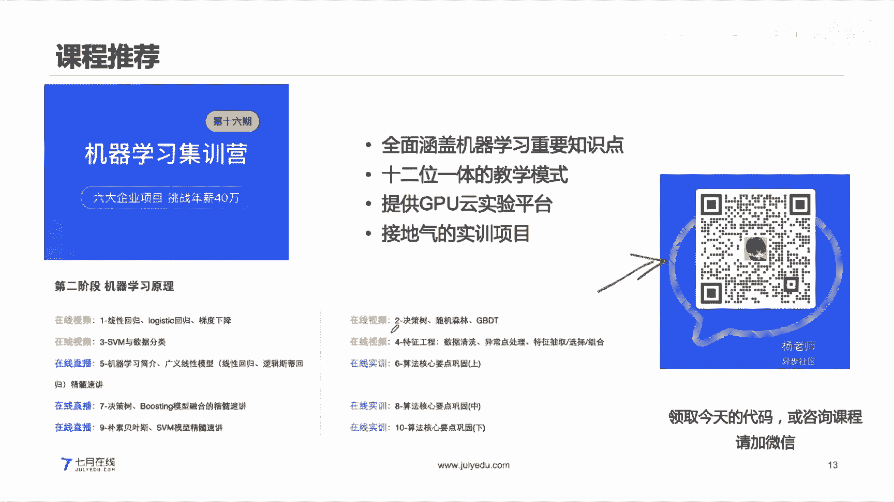
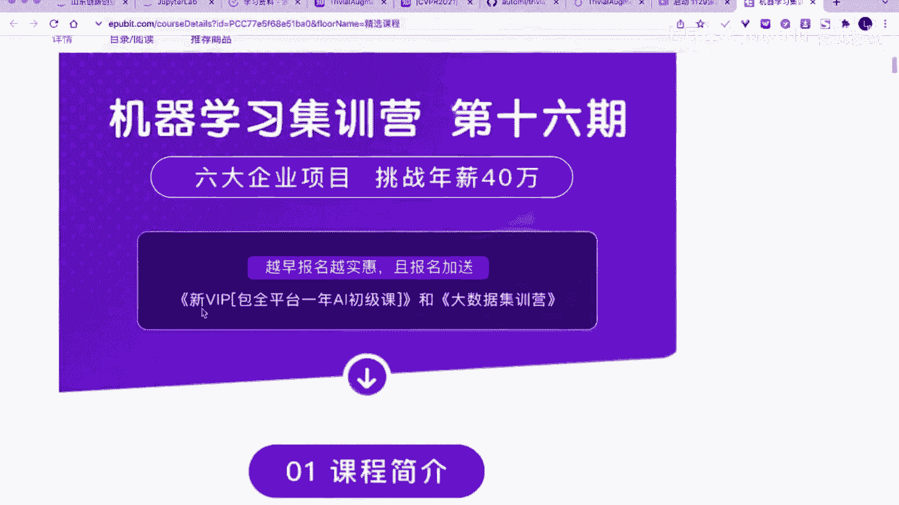
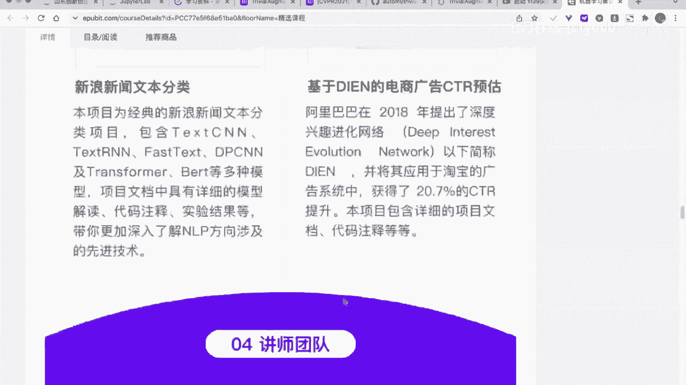
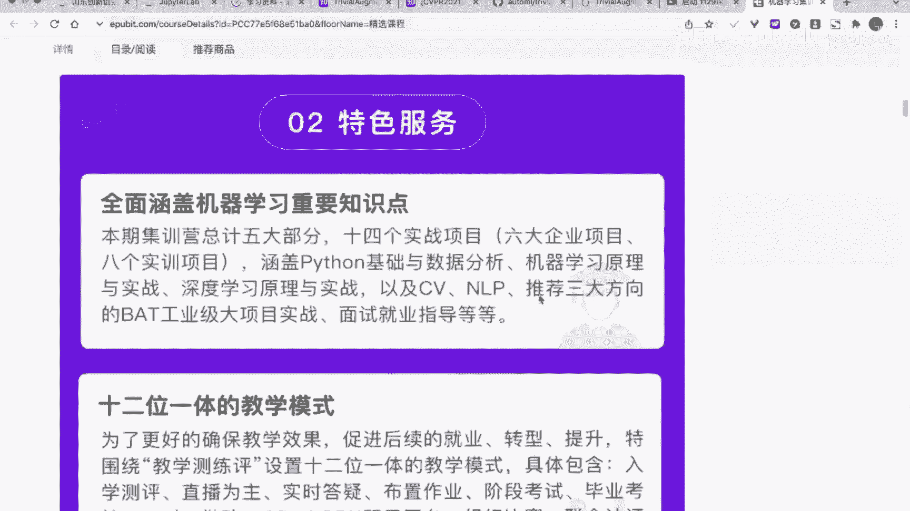
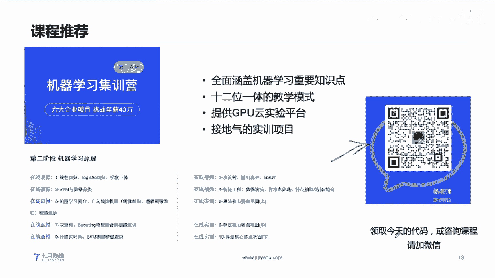
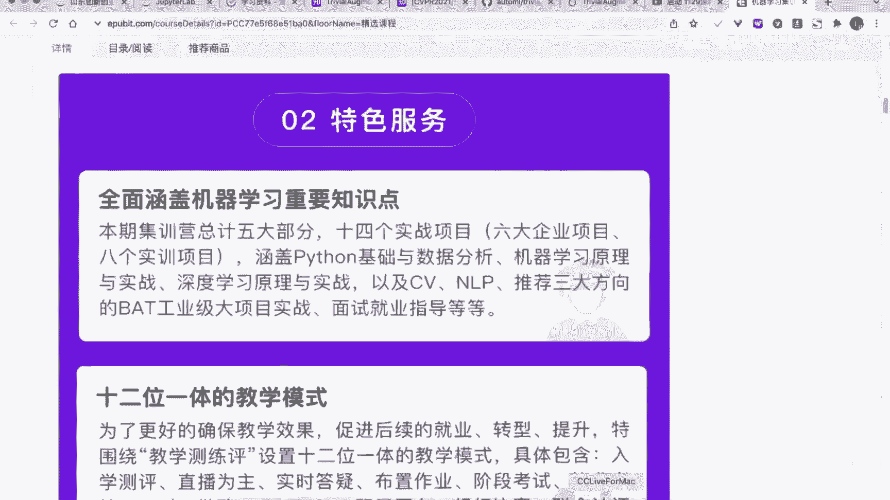
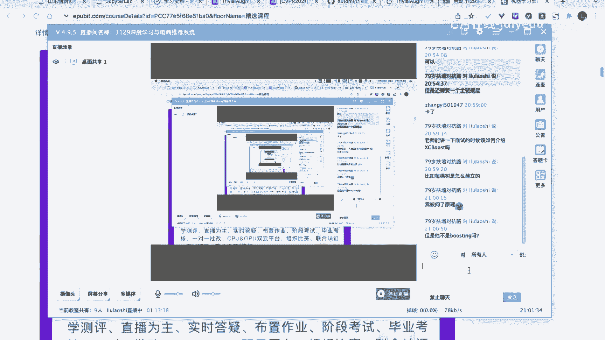
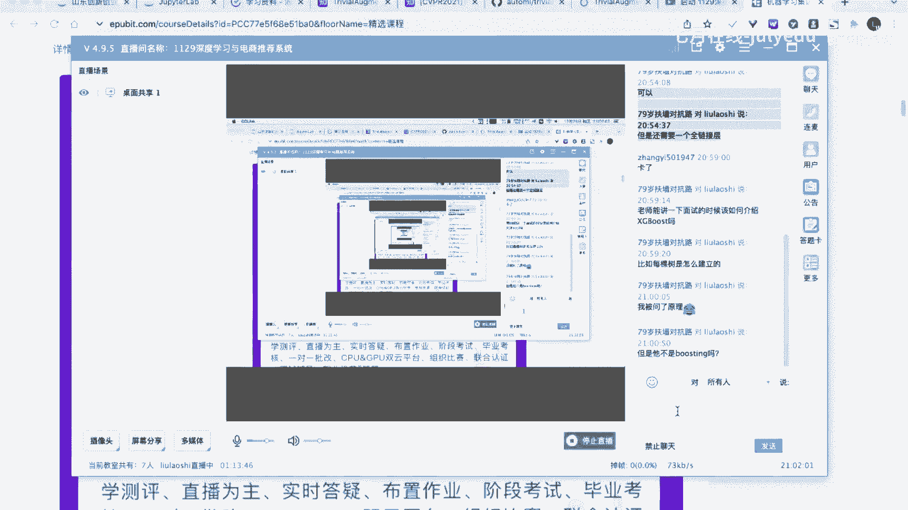

# 人工智能—推荐系统公开课（七月在线出品） - P14：2021.12.29深度学习与电商推荐系统 - 七月在线-julyedu - BV1Ry4y127CV

🎼。

好，呃，各位同学大家晚上好。然后我们今天呢给大家带来的直播是深度学习与电商推荐系统。呃，对于我们的一个这个主题而言呢，我们会介绍两部分啊。第一部分呢是介绍深度学习。第二部分呢会以深度学习的具体的模型呢。

然后搭建一个具体的一个电商推荐系统的一个啊就是说一个代码啊，一个小小的时间。然后我们今天呢也有具体的福利送给大家。首先呢是今天晚上我们在公开课中期间，如果有同学跟我们进行互动啊。

并且在我们的一个微信群里面进行就是说互动的同学呢可以啊领取我们的三本纸质书啊，三本纸质书。对，嗯，这是第一个第二个就是如果各位同学今天晚上报名我们的正式课程，也是有具体的一些免免检的啊。

就是说是直接免减3000元。然后报名的同学呢也可以领取到我们的500元的一个京东购物卡一张啊。这个其实是非常优惠的非常优惠的。好，我们继续啊。

我们今天的一个课程内容呢就是以声的学习和电商推荐系统两部分进行展开进行讲解。

啊，嗯，具体的一个内容呢就是分为这三部分啊，具体的内容就是分为这三部分嗯，就是深度学习基础推荐系统介绍以及电商推荐系统啊，分成这三部分。好，我们继续。嗯，首先呢来看一看这个深度学习的一个基础。

在我们的一个日常生活中呢，嗯我们或多或少都会遇到这个很多的一些深度学习的一些模型，对吧？深度学习呢其实在进行一个具体的建模过程中呢，它本质上是跟机忆学习其实是非常相似的。

深度学习其实跟记忆学习是非常相似的。这个地方的一个深度学习呢其实我们的深度学习deep learning。对吧其实它也是一种记忆学习的算法，也是我们的常见的一种记忆学习的算法。

那么这个地方为什么深度学习现在它这么火热呢？以及它为什么是能够就是说有这么多一些具体的应应用呢？首先呢深度学习它是一种具体的一些记忆是一种具体的记忆学习算法。但是呢深度学习跟记忆学习相比。

其实还是存在一定的区别的啊，存在一定的区别的。这个地方呢如果是以呃介绍深度学习呢，它一般情况下就是以这个神经神经元的结构来做一个介绍。就是我们的一个具体的一个神经元，它的一个具体的一个结构。

也就是说我们深度学习呢，它的网络结构啊是以我们的一个具体的一个神经元的组织来得到的。而且而且呢它整体的一个嗯结构啊是和这个人的大脑是非常类似的。深度学习它跟记忆学习相比有什么异同点呢？

首先深度学习它也是一种记忆学习的算法。就是说我们现在的机忆学习的算法里面有很多分支，对吧？各位同学现在也是嗯很多很多同学学了这个记忆学习的。嗯，继续学习里面有很多的一些算法分支，比如说线性模型对吧？

还有数模型，还有我们的KN。还有我们的SVM等等等等，对吧？那么这些呢除了这些还有一种深度学习，对吧？深度学习。所以说这个地方我们的一个深度学习，其实和上面的这几种算法其实是对等的对等的。

那么这个地方深度学习它跟其他的算法相比呢，它其实是一种特定的网络结构所组成的一种机学性模型。深度学习呢它有两个特点它有两个特点。第一个呢，深度学习它是一个就是说端到端的一个过程，端到端的一个过程啊。

嗯这个地方我们的一个端到端的过程呢是以指的是一个end to end的过程。And trend。end这个end to end呢其实本质就是我们在进行一个建模的过程中呢，我们有了一个具体的一个输入。

然后呢，我们有了对应的一个输出，有一个对应的输出啊，这个地方我们叫端到端端到端。也就是说我们的一个网络模型呢它是直接由我们的一个输入。然后通过模型。然后得到输出的。这个地方中间呢我们不需要做其他操作啊。

就是说它是一个端到端的过程，端到端的过程。好。对于深度学习模型而言呢，这是它的第一个特点。也就是我们不需要人工做特征工程。我们不需要人工做特征工程啊，这部分就是说它主要的跟技忆学习的区别。

就是说不需要做人工和人工工程。呃，我们在很多的一些建呃任务里面呢，就是说我们是需要人工做特征工程的。但是如果你使用深度学习呢，其实是不需要做特征工程啊，或者说不需要做很多特征工程，这是第一个特点。

第二个呢就是生度学习，它是一个有向的一个计算图。图的一个节点呢是表示的一个计算过程。我们再嗯看下面这个例子，对于我们的一个具体的一个网络模型而言呢。

其实我们是可以将我们的网络层分为输入层、隐含层和输入层。输入层隐含层和输出层这个地方的输入层就直接是我们的一个输入的一个数据啊。然后我们的一个隐含层呢。

就是我们的一个就是说中间的一个计算计算层以及中间的计算结果。输出层呢就是说我们最终的输出。啊，就是我们最终输出，这是我们的常见的层啊，需要注意的是，这个地方我们的输入层和输出层往往都是一层。

但是呢这个地方我们的隐含层呢可以是多层。它可以是多存的啊可以是多存的。这个地方我们左边这个图呢，它所示的是一个比较典型的一个全连接网络。全连接网络就是说英文名字叫MRP。MRP啊。

我们就是说多层感知机啊，多层感知机。这个地方我们的一个层与层之间呢，你会发现我们的输入层和我们的一个隐含层，它们之间的一个节点是全部连接到一起的对吧？这个节点和我们的隐含层的节点。

所有的全部都连接在一起。这个地方我们的1个MMP它所组成的是我们的一个就是。嗯，一个具体的一个嗯全连接层。

 fully connectedect layer fully connectedect layer，然后去得到的啊， fullyly connectedect layer得到的。然后这个地方呢。

我们的一个全连接层，这是一层全连接层。这是一项全链阶层。全连接网络呢就是由我们的一个全链阶层所组成的一个网，就是说网络结构网络结构。好，我们继续啊。这个地方呢就是说我们的一个网络。

其实它是有一个节点的对吧？输入的点到我们隐行层，然后我们的隐行层呢到我们输出层，这个地方它的每个边呢计算就是表示的我们的一个具体的一个数据流向。每个节点呢就是我们的一个计算过程。

对吧这个地方的一个节节点啊，节点表示计算过程边呢就行表示这个数据的流向。好，我们继续。那么我们刚才其实这个地方是说的深度学习的一些特点。在深度学习里面呢，其实我们刚才画的对吧？一个网络结构。

对吧全能阶层。然后你看它这个地方就是很典型的一个全连阶层啊，嗯两个全能阶层，然后得到欧文的一个网络。这个地方呢我们这你会发现它这个地方我们的有节点和边，对吧？

那么类似的我们能不能构建一些比较奇特的一些网络结构呢？我再给大家换一个啊。这个地方。能不能这样呢？对吧以此类推这个地方我们的一个网络结构，它不一定定不一不仅仅是一个就是说有节点和编色组成的。

它一般情况下呢是一个有向图，用有向图来表示。而且这个地方呢一个它有可能是带有环的啊，有可能是带有环的。所以说呢你在一个深度学习的一个建模的过程中呢，你的一个网络结构其实是也很有可能是有环的啊。

很有可能是有环的对，所以我们的一个具体的一个深度学习。对于深透学习而言啊，你的一个网络结构并不单纯的是一个。就是说从end end这个过程，它有可能是贷与还的。这个地方呢我们就需要去嗯根据这个环形啊。

然后计算我们相应的一个输入和输出。这样对于我们的一个深度学习模型而言，其实我们本质是需要做一个具体的一个呃就是说网络结构的一个搭建，对吧？

我们网络结构的搭建就是有我们的一个具体的一个这样的一个网络啊这样的一个网络。然后呢，我们的一个深度学习，其实它的一个在搭建这个网络的过程中，其实我们也需要关注我们具体的一个计算过程。这计算过程对吧？

我们现在的一个具体的一个嗯渗透计的模型呢都是使用我们的1个GPU的一个来进行训练，对吧？大部分情况下是用GPU的进行训练GPU呢它比较适合使用我们的就是说对我们的一个具体的一个呃就是矩阵啊。

非常方便对矩阵进行一个计算。然后呢，这个地方。如果你的一个具体的一个计算过程，如果能写成这种矩证相乘的过程，那么你的一个计算它的一个就是说呃效率啊就会大大的增加。如这个这个地方这张图所示啊。

这张图就是我们很典型的一个全连接的网络，它的一个计算过程。全连接网络的一个计算过程，也就是我们的一个具体的一个网络结构啊，我们来看一看。我们的一个输入它是有7个数值的啊，1234567。

然后和我们的对应的一个就是说1个W1W2W3一直到我们W7，然后进行元素元素级别的相乘。然后进行求和啊，元素级别的象征，然后进行求和。然后我们来看一看啊，我们来看一看这个地方的网络结构呢。

其实就是一个单个神经元的这种情况。对吧我们有一个神经元，我们有它有7个输入啊，12345啊，这个地方我缩写啊，略写了啊，1X12X3一直到X5X6。按着X7啊。这个地方我们有7个输入。

然后对于我们每个输入呢，我们在这个边上面有一个对应的权重WE日的W7跟它进行相乘。然后在这个地方呢，我们对它进行一个求和，对吧？求和这个的地方。

你有看到它的它的一个具体的计算过程是这一行和这一列进行一个乘法，得到一个数值。得到一个数值。这个数值呢再加上我们的偏值。对吧达到我们品质，得到我们输出。然后这个输出呢再通过我们的一个计划函数。

得到最终的输出，对吧？所以说你会发现这个。这一行和这一列的一个相乘对吧？也就是我们的一个行向量和列向量的一个具体的一个乘法，就得到我们的一个一个值的输出，然后再加上我们偏值啊，那么如果是我们的一个参数。

是一个矩阵的形式呢？如果我们的一个参数是一个矩阵的形式呢，这个地方我们的一个具体的一个取值就是说这是我们的第一个沉经元的参数。这是我们第二个神经元的参数，这是第三个神经元的参数啊，这是第四个。

第5个以此类推，这个地方我们是什么意思呢？就是说我们的一个有5个神经元。我们有7个输入。234567，这每个输入呢和我们的神经元都是连接到一起的啊，这地方我只画一个啊，你会发现这个地方的一个神经元。

它就是我们这个啊把它复制5份啊。复制5分，这是第一个神经元，它的一个计算过程，就是我们的一个具体的一个权重和我们数入进行相乘。如果是第二个神经元呢以此类推，第二个神经元以此类推啊，我们再把它连接到一起。

连接到一起。那么这个地方呢每多的7条边呢，就是由新的参数所组成的。这个地方是由我们的一个新的神经元的参数，我们可以把它放在在第二行，那么第三个神经元呢，它的参数可以放在我们的一个第三行，以此类推啊。

第四行第五行，这个地方我们的一个具体的一个神经元的个数和我们的这个地方的一个行的矩阵参数的行是相同的相同的。好。那么我们这个地方就是可以将我们的一个全连接的一个网络呢。

把它写成我们的一个具体的一个矩阵乘法啊，把我们的全连接的网络可以把它写成一个具体的一个矩阵乘法。那么写成这个矩阵乘法之后，我们就可以做一个并形的一个计算啊，变形的一个计算。好。

那么我们再进行一个具体的一个操作的过程中，不仅仅是全连接层，一些其他的层呢也都是可以呃使用一些方式把它写成这种矩阵乘法的这种形式啊。好。那么对于我们的一个具体的一个就是说在学习深度学习的时候呢。

千万不要把深度学习和记忆学习对立起来。因为这两者其实是很多时候都是一个包含的关系。只不过它的一个具体的一个模型和它的一个具体的一个就是说一些呃就是说侧重点是不一样的，侧重点是不一样的。呃。

只要深度学习能够完成的任务，其实用使用一些其他的一些记忆学习的模型也都是可行的，也都是可行的。这个地方呢就是说深度学习，它只是其中的啊其中的一个特定的一个特定的一个算法而已。好。

那么深度学习它是能够做什么呢？深度学习其实它是能够做一些具体的一个呃这种比较适合这种端到端的一个任务and to end的一个任务。and to end，也就是我们的一个输入。

到我们的一个输出的一个任务。输出一个任务。好，这个地方呢我们的一个输入。是什么？输出是什么呢？我们这个地方写了一些具体的一些案例。这个地方我们的一个案例就是说首先是这个人脸识别。给定人脸照片。

识别出人的一个具体姓名，车牌识别给定车牌，然后识别出车牌的一个字符。动物识别对吧？给定动物照片，识别出动物的种类，红绿灯检测，给定交通的照片，识别出红绿灯的位置，以此类推。

在这个地方你会发现我们的一个输入是什么？输入上面部分都是我们的一个输入的是图片。下半部分文字翻译输输入英呃输入中文，嗯，然后这个地方输入中文，然后输出英文翻译，客户对话机器人输入问题，输出对话文字。

对吧？这个地方下面两个问题都是我们输出的都是一个文字。深度学习它适合做什么？深度学习就适合做这种输入和输出比较规整的一种形式。而且你会发现这个地方不管是对于图片啊。

以及我们的一个具体的一个呃就是嗯文本而言，它都是一种非结构化的数据。非结构化数据。我们的深度学习模型呢比较适合用在一个非结构化数据里面啊，非结构化数据里。所以说呢大家在这一个具体的一个建模的过程中呢。

如果你遇到一个非结构化的数据集建模啊，那么就是比较适合啊就比较适合直接用深度学习啊，比较适合用深度学习好。那么接下来呢就给大家介绍一下这个在电商领域啊，这个具体的一个推荐系统，它是如何进行使用的。呃。

在我们的日常生活中啊，我看看大家聊天啊。对啊，大家如果有问题的话，也可以直接进行发言啊。大家如果有问题的话，也可以积极进行发言。嗯，这样我们的一个电商领域呢，其实有些时候呢这个推荐系统其实是非常关键的。

呃，这系统呢其实本质是需要将我们的一个商品给它推荐给我们的一个用户。啊，这个地方就是说我们有一个具体的一个user。以及我们的一个具体的一个item。我们是需要把两者进行一个搭配起来的啊。

user和iteom把它进行一个搭配起来的。这个地方呢就是说我们是想要给用户推荐一些商品。然后呢，这个推荐的商品，它有可能是用户他啊想要购买的，或者说它也可能是用户他可能未来会购买的啊。

可能未来会购买的。这个都有可能。所以说呢这个地方我们的一个具体的一个在进行一个建模的时候，推荐系统它它的一个作用啊，是推荐一些商品给用户，推荐给商品用户。在这个地方呢，就是说我们的一个深度学习啊。

对于我们的一个深度学习而言啊，我们。深度学习它比较适合用来做什么？深度学习比较适合用在我们的一个input和output这种直接建模的过程。对吧那么推荐系统呢。

它其实也是这种有我们的一个固定的一个输入和我们的一个固定的一个输出的过程。也也就是在这个地方，我们的一个推荐系统。它其实我们有用户他历史的购买数据，然后呢。基于用户历史的购买数据呢。

然后再把它作为一个具体的一个呃，就是我们的一个建模啊，对吧？如果用户他购买了这个数据，那么我们就把这个样嗯就是说我们的一个商品呢作为我们的一个质样本。如果是没有购买，那我们就是做一个副样本。

做一个副样本。那么对于我们的电商领域呢，这个具体的一个推荐的方法呢也是分为两类啊。第一类是这个积极学习的。第二类呢是基于我们的深度学习的。如果是基于这个经济学习的算法呢。

就是呃基于这种我们的一个具体的一个。嗯，就是呃人工的一个特征工程，然后呢再去做一个数据模型的一预建模。这个地方的人工特征工程呢，就是我们去说需要做一个呃人工的基于我们的一个就是说电商领域的数据啊。

然后去做一个特征的一个提取。人工的去做。好，可能大家就觉得这个地方你会。觉得很抽象。呃，这个地方其实是很具体的一个问题啊，就是说我们想要去用一些。特征。这个特征呢去刻画。用户的一个习惯。

用户的一个习惯啊，或者说去刻画用户的一个行为。这个呢是我们需要从一个具体的一个特征去做的啊，具体的特征来做的。那么比如我们去可以做这样一些啊做这样一些。然后我们来看看啊，比如说我们看第一个。呃。

用户浏览不同商品的一个心理指数，什么意思？我们再做一个具体的一个就是说建模的时候呢，有可能一个user。他在进行购买的时候，他肯定是。不就是说看各种的我们的一个就是呃就是说这种商品嘛，对吧？

然后呢他就会看这个商品一。商品二商品三商品4对吧？然后商品一商品二、商品三，商品5商品6，商品7，对吧？然后这个地方我们在做一个具体的建模的时候呢，这个地方是我们的一个用户他浏览的商品的一个序列啊。

那个就是商品一商品2商品3，然后这个地方你会发现呢我我们去如何去衡量。这个商品它是不是用户的一个就是说他比较喜欢的一个商品呢？你可以用比例来做一个具体的一个评价，或者说用一个激励指数来做评价。

对吧这个就是说我们就可以用的很评价一下这个用户是不是对某某批商品是有倾向性的，有倾向性的。嗯，以此类推呢，就是说我们可以看一看，就是说用户浏览最多的商品的转化率转化率。

这个转化率呢就是说我们在做一个具体的一个。一个商品的一个具体的一个推荐的时候，或者说商品呃用户在购买商品的时候，那肯定也是就是说对不同品牌它有一个具体的一个呃就是说行为啊，以及它的一个具体的一个呃偏好。

对吧？比如你在做大你在推荐一个大品牌的时候，用户它的一个具体的一个。嗯，用户它的一个具体的一个就是呃就是说它的一个信任程度就会高一些，对吧？所以说这个地方我们的不同商品的一个转换率。

也会影响到我们的一个具体的一个行为。这个地方呢我们就可以对我们的一个用户在浏览次数最多的商品计算一下它的一个品牌的转化率，它的品牌的转化率。这个也是非常关键的。

因为不同品牌它的一个平均的转化率是相差很大的啊，不同品牌它的一个呃就是说转化率其实是相差很大的啊，相差很大的。对，所以说你在做一个建模的时候，其实也是啊需要考虑到这一些。然后第三个呢。

就是说用户他最后一次操作的类型，就是说如果用户他在。之前的一个行为，它肯定就是大概率会影响到后后续的一个行为，对吧？所以说这个地方我们其实是可以针对用户的一个他的一个具体的行为啊。

然后完成一个具体的建模。就是说按照他最后的一个行为来做一个分类。好。然后这个地方我们在做一个人工特征工程的时候，其实能做的特征其实是非常非常多的。比如可以做如下的这些特征啊，就是说你可以来看看。

比如我们在做一个具体的一个特征的时候，你可以做用户的一个活跃的天数的一个分析，对吧？一个用户他肯定就是说想要购买一个商品的时候。或者说他有购买行为的时候，他往往都是一个活跃用户。

或者说他的一个用户的等级，对吧？这个可能是比较高的，我们都是可以来做一个具体的一个定义。然后如果你想要看用户他未来是不是购买某个类别，或者购买某某个商品，对吧？

那么你可以统计一下他历史是不是购买了这个商品。对吧那么如果他历史购买了之后，然后他很有可能未来也会继续购买，对吧？好。这个呢就是呃就是说我们的一个在电商里面的叫做回购。或者要复购。

就说你在做一个具体的一个购买的行为的生活中，你不是单次购买。你可能是可能有就是说会有你今天买的，今天买的，你下周呢还是会买啊，还是会买。好，然后呢我们还可以统计啊，用户他添加购物车的购物车的次数。

对吧这个其实也是非常关键的。比如有的用户他就是添加购物车。次数比较多，然后他就是不下单，他把购物车当做收收藏夹来用。他把购物车当做收藏夹来用，这个也是呃经常常见啊这种用户嗯。

大家不知道大家有没有这种习惯啊，就是说把这个购就是说很多商品我都是添加到我们的购物车里面。但是呢我就是不满，我就是不买。对，这个也其实也是很常见的，很常见的。好，然后呢我们在做一个具体建模的时候。

他们还可以统计什么？就是说它的一个具体的一个注册时间啊，以及它的一个具体的一个浏览品牌的一个转化率啊，以及它的一个商流就是说所浏览商品的一个就是具体的一个次数啊，这些都是我们可以统计的啊。

然后这些都是我们的一个人工特征工程，人工特征工程可以统计得到的一个结果。人工特征工程，人工统计到的结果。那么而且这些这这些特征啊，这每每个字段都是一个特征，对吧？然后它也是有意义的啊，它也是有意义的。

好，所以说呢我们在做一个具体建模的时候，其实我们也是可以参考如上的这种具体的一个呃这种特征啊，然后去做一个具体的一个啊就是说提取我们的一个想要的数据。嗯，待会儿呢也有一个具体时间的过程啊，大家不用担心。

这是我们的一个就是说人工去做一个特征工程，人工做一个特征工程。那么如果是呃假如说直接想要用深度信息来做，怎么做呢？其实如果直接用深度学习来做呢，其实也是可行的。对于深度学习模型而言呢。

其实深度学习模型它不需要做做很多的一个特征工程。它不需要做很多自通工程。就是我们在做一个具体建模的时候呢，我们可以基于直接呃用渗透型来完成一个呃商品和用户的一个匹配过程。

使用我们的一个具体的一个商品和用户的一个匹配过程啊。这个地方呢就是说我们在做建模的时候，我们直接将我们的一个user把它做一个嵌入。然后呢和我们的一个具体的一个嗯item两者也可以做一个嵌入。

然后嵌入之后呢，然后把它进行一个具体的一个就是说做一个匹配做一个匹配啊。这个匹配呢就是说我们把它类似的把它直接这部分。把它拼接到一起啊，假如说这个地方是32维，这个地方我们也是32维。

也就是我们的一个具体的一个商品。它所嵌入的一个维度是我们的一个32维。然后呢，我们的一个具体的一个用户，他所嵌入的一个维度也是32维。我们把这两者啊把它就是说拼接到一起拼接到一起得到一个向量。

然后来完成一个训练，这个地方我们是可以在这个过程中啊可以用我们的呃全连接层来完成。然后这个地方的一个训练过程啊，我们直接是。它的一个匹配啊。

就是说它可以匹配0或者10或者10呢就表明他这个用户对我们的这个商品有购买行为。如果是一的话呢，就是表明啊这个用户对这个商品啊没有购买行为啊，没有购买行为。对，那么以此类推啊。

就是说我们其实是可以搭建很复杂的深度学习模型啊。这个模这种类似的模型啊，我们叫做一个深度协同协同过滤啊，深度协同过滤，然后就可以做我们的一个具体的一个模型的训练模型的训练。呃。

这个地方呢有同学可能就会问到这个我们的一个具体的一个模型，我们的一个具体模型，这个地方的一个正负样本，它的正负样本的它的来源。正样本和副样本。这个呢其实需要做一个具体的定义啊，就是正样本是什么。

以及我们的一个负样本。正样本副样本啊，呃这个呢就根据我们的一个具体的一个任务啊，根据我们的具体任务其实是存跟我们具体任务是其实相关的。如果我们具体的任务不同啊。

我们得到的一就是我们呃就是说构成的一个正样本啊，其实也是呃不同的。我们来看一下。我们假如说是完成一个就是说用户商品点击用户与商品点击的。模型。啊，点击的模型。

这个地方就是很典很典型的1个CTR的类似的任务。那么这个地方的一个正样本是什么呢？这个地方的这样本就是我们的历史的用户已经点击的点击过的啊，click的一。一些商品。如果我们想要构建副样本呢。

就是说是用户没有点击的。没有点击的一些样本啊，就是我们的一个副样本。好，所以说呢我们的一个正负样本啊，正负样本其实是根据不同的一个任务啊，我们是有一个具体的划分的。根据我们具体不同任务啊。

有一个具体的划分的。好，然后我们来看一看我们的边的一个具体的一个代码啊。然我们来来看一看啊，我们具体一个代码。嗯，呃，这个通特征工程不对呃不对用户信息进行处理吗？比如说性别年龄等等。呃。

这个地方就是说特征工程啊，我这个地方。这个地方的特征工程呢就是说一般情况下啊一般情况下就是我们的一个。嗯，是这样的啊，你的一个特征工程呢，就比如说这个A。以及sex。这个地方呢就是说它是这些特征呢。

其实是可以直接送到送到模型的。我刚才那个PPT里面所列举到的呢，它是一些业务业务字段。业务字段它是需要重新提取的。它是需要重新做一个提取的。嗯，刚才嗯这位同学问的呢，这是是一些用户字段。

一般情况下啊就是说用户字段也重要。用户字段其实也重要。但是我刚才其实想要突出的是这个业务字段，就是说你如何去呃使用一些已有的一些嗯就是说数据啊，然后。提出就是提取一些业务跟业务相关的一些啊特征啊。

我其实侧重点不一样，你也可以直接。对，就是说用户的一些信息字段做为处理都是可以的。嗯嗯，其实购物车呃也可以当收藏家使用，可惜空间太小。呃，这个地方其实是这样的，呃。

就是说呃淘宝的淘宝的购物车和京东的购物车应该都是默认的大小，最大的一个大小是。999个商品啊999个商品。对，好嗯，这个所以说它的空间是有限的。嗯，深度运行模型有什么预训练模型吗？

这个其实是呃这个其实是这样的啊。对于深度学习模型而言，你会发现。你的一个网络结构，你整体的训练好之后，你都可以把它牵移到一个下其他的任务里面。比如说我们这个地方是一个用户与商品点击的一个任务。

你我们假如说这个模型训练好之后，我们可以把它用在于用户与商品。购买的。这个具体的一任务里面，就说这个模型其实是可以直接迁移到里面的。怎么迁移呢？就是说比如说这个地方的一个user它的一个嵌入过程。

以及这个商品的一个嵌入过程。其实这个都是我们可以做一个具体的一个嵌入的啊，可以就是说这个这些层啊，我们都可以直接把它就是说嗯就是呃。这些层都可以直接拿过去啊，拿过去直接用的啊，拿过去直直接用的。

我们继续啊。那么大家如果有问题的话，也可以及时提问啊。然后。嗯，我们就继续啊我们继续。呃，我们接下来呢就是用一个淘宝的呃淘宝的一个真实的数据集啊，来，然后呢来做一个尝试啊，淘宝的一个数据集。

然后做一个尝试啊。然后嗯我们来看一看代码。首先呢我们把这些常见的库啊，常见的库给它inport进来啊，常见的库给它inpo进来。这些库呢主要就是用来做画图啊和建模的这些库。然后呢。

我们看一看我们的一个数据集。呃，数据集呢它是淘宝的一个呃阿里巴巴淘宝的一个呃用户行为的数据集，然后主要是。用于这个影视反馈推荐的一个问题研究，也是一个真实的数据集。

这个数据集里面它所记录的是用户呃记录的数据呢是在2017年11月25日到2017年12月3日之间的一个具体的一个数据啊。在这个数据数据之间呢，大大概有100万的一个用户的一个行为。呃。

就是说用100万的用户啊，包括这个具体的一个用户行为，包括用户的一个点击购买加购，以及喜欢就喜欢这个喜欢就是这个加收收藏夹啊。

然后这个地方的一个数据集整体就是一1个CV的形式啊出现啊这个数据集的每一行表示的一条用户行为，每一行是一个用户行为。所以说我们整体的一个呃数据集。

它的一个形式就是由我们的用户ID商品ID以及商品内幕ID以及行为时间戳啊，行为类型以及时间戳啊，这样所组成的啊，这样所组成的这这就是我们的一个一条样本，一条样本啊，这是我们的一条样本。

一些样本它整体的而言就是我们的一个user。对一个item。一个具体的一个行为对吧？一个具体的一个行为。这action呢有我们的PV浏览by购买cart架构以及FAV喜欢对吧？

然后这个地方还有一个时间戳，整体而言，我们数据也就是这样啊，只是记录的一条啊记录的一条一个用户。一个用户对一个商品的一个具体行为，然后有了一个具体时间戳。呃。

这个具体的代码我们待会儿呃就是说待会儿有领取方式啊，大家不用着急不用着急。好，然后呢这个地方的一个具体的行为，这个地方啊PV嗯大以及cart啊以及FAV啊具体的含义。然后这个用用户及数量啊。

我们这个地方都给出了。呃，这个具体的一个数据集整体还是蛮大的啊啊，就是说数据呃对于这个用户而言，用户而言其实都是100接近100万。总体的一个行为就是总总共的行数啊应该是在嗯就是说一个亿啊。

一个亿就行数啊在一个亿，其实这个文件是挺大的啊。这个解压之后，这个文件，这个CV应该是在啊一个33到4个G啊，3到4个G之间其实是很大的，其实很大的。它压缩之后啊，压缩之后其实是800兆啊。好。嗯。

我们首先呢读取一下我们的一个样本啊，我们的一个样本，我们的CSV。这个地方呢我们只读取我们的一个前我们的1个500万行啊，前500万行。对嗯，都取得前500万行呢。

就是说它嗯比如说我们相当于是对数据集做一个采样啊，只使用我们的这500万行完成我们的一个建模。当然也可以用更多的数据啊，数据更多，我们的一个效果肯定会更好。

但是呢就是呃肯定呃它的一个训练周期啊也会更长啊也会更长。然后呢，我们的整体的一个数据类型啊，user是一个inter类型的item是一个in类型的category啊。

inter类型behavior它是一个字符串类型，然后time是一个inter类型。这个就是我们的一个数据集啊，这个就是我们数据集的一些样本啊，就是说五五行啊五行。对。

然后呢这个地方我们在做一个具体的一个嗯建模的时候，我们就是利用这个已有的一个数据啊，已有的一个数据完成一个建模。好，其实呢对于我们的这个数据集而言呢，其实你假如说想要把它做好啊，其实是需要尝试很多的。

需要尝试很多的。首先呢我们需要对我们的一个具体的数据集呢，把它做一个数据分析。嗯，就是说从我们的一个原始的一个这个时间戳，这个地方呢是一个unix time啊，unix time的一个时间戳。

我们需要提取出它的一个具体的一个时间。也就是提取它具体的一个年月日啊，年月日，然后把它提取出来啊。提取出来之后呢，这样我们的一个数据集它长得比较好看，对吧？

user对item以及嗯还有还有个category啊，这个地方的category呢。是我们的一个商品的一个类型啊，商品的类型，上面忘了写了啊，这个地方商面忘了写了啊，还有一个是商品的一个类型啊。

就是它的一个类目。嗯，然后呢我们这个地方就是说我们提取的这些列啊，这些列就是我们提取出来的一个用户的一个具体的一个时间戳啊，我们把它转变成了日期类型，日期类型。好。然后呢，我们继续啊。

然后我们可以看一下我们的每天的一个行为的日志的数量啊，我们每天行为日志的数量，它的一个具体的一个行为就是。这样的啊具体行为就是我们的一个每天的一个数量呢，基本上都是在50万行50万行万行左右啊。好。

然后呢，我们再可以看通过这个pandas的一个透视表啊，透视表就是说如果你大家对于这个透视表比较清楚的话，它就是。啊，这个地方是种交叉表，我们对于我们的一个交叉表呢，可以统计得到我们的每一个item。

它的具体的一些呃就是说所属的一个行为。比如对于iteom这个商品812879这个商品呢呃在我们的记录中，它总共被购买5次。被加购63次，被收藏是45次，被浏览1477次，对吧？

这是总总共的啊所有的用户对这个商品的行为，然后我们把它通过我们的crostable，我们的一个交叉表来完成我们的一个统计啊，这是我们所有的一个统计。然后我们统计的完成这样的之后呢。

我们就可以统计得到我们的一个商品，它对应的一个转化率，对吧？每个商品的一个转化率，这个地方的转化率就是我们直接是。用我们的一个by除以我们的1个PV，对吧？去做一个处发就行了。

那么你会以看到啊这个不同的商品，它的一个转化率是不一样的啊，其实是相差蛮大的相差蛮大的。好。然后呢，我们这个地方假如说我们想要预测一下呃用户第二天是不是有这个下单的行为。

或者说预测一下用户第二天有没有登录行为，或者说预测一下我们的用户，他第二天是不是对某个商品是不是有购买行为，对吧？类似的这些任务呢，就是说我们可以先。用这个深度学进来建模啊啊。

我们先用非深度学进来建模啊。我们比如说我们在构建我们的标签的时候，这个地方的一个标签我们怎么进行构建呢？假如说我们这个地方构建的任务是预测一下用户他第二天是不是下单的。就是说预根据用户他历史的一个行为。

预测一下这个用户他未来一天有没有下单的行为。有没有下单情况啊，这个下单呢，它我我不就是不关注他对什么商品下单，我们就是说只他只要有下单的，它就是标签是一。如果他在这一整天没有下单的啊，我们标签就是零。

好，这个地方是一类任务啊，就是说它第二天。第二天是不是下单？这个下单呢就是我们是根据这个bu啊。这个地方的by。来做我们的一个具体的一个标签啊，这个拜是我们的具体的标签。好，那么这个地方就是说你会发现。

我们在做一个具体的一个下单的时候呢。我们也可以。这是一类任务啊，第二天是不是下单，然后也可以判断也可以做。第二天他是不是对某个商品下单，这个地方更更加具体一些。这个地方的下单呢。是对某商品的一个。

就是针对某商品做。这样的会也可以啊也可以。那么这个任务跟。这是第一个任务，这是第二个任务。这两个任务其实是存在区分的，其实存在区分的啊。我们先看第一个任务。

那假如说预测了一下用户第二天是不是有下单行为呢，其实我们就可以直接把它的标签构建好，然后去做一些统计。比如说我们可以统计一下用户他在我们的一个。具体的一个行为日志里面，他的在某他每一天的一个浏览行为。

他的一个浏览的小时数量，它的一个所就是说浏览的商品的一个类别个数等等等等。这些行为我们都可以用来做一个统计。而且呢我们可以统计的就是得到这个商呃这个用户他具体的就是说历史的一些行为的一些记录。

比如他总共购买了多少次，下载量多少次，收藏了多少次，浏览了多少次，对吧？类似的，通过我们的这个呃不管是我们的一个透制表还是价值表都可以计算得到啊，都可以计算得到。提取完成之后呢。

我们就是可以把它所有的一个用户啊。所有的一个用户把它转变成一行，就是说把用户的一个多行。序列把它转变成一个单行的。这个地方的每行。他就是一个用户。那么这个地方的每列呢就是用户的一个行为。

用户的一个行为啊，或者说一个习惯。比如说他所。历史连续登录的一个次数。历史就是说有购买的一个具体的一个次数，对吧？这个地方有很多的一些特征。我们是可以统计得到的啊统计得到的。统计完成之后呢。

这个地方的单行就是我们的一个训练样本，就是我们的一个训练样本啊。我们的每个训练样本我们是根可以根据它。第二天是不是有购买，我们给他打一个标签，然后可以完成一个训练啊。

这个是我们的一个基于我们的一个机器学习的一个节目。它是利用我们的一个提取特征啊，提前人工提取特征。这些特征呢跟我们的APTPPT所示的一些特征，可能存在差异。但是呢其实是可以以此类推的啊。

可以以此类推的。好，我们看一看各位同学有什么问题。那么如果是使用我们的一个深度学习怎么做呢？其实如果是使用深度学习呢，其实它就会呃更加就是说简单一下，整体的网络结构跟我们的一个。哦。

PPT所示的这个地方其实是一样，基本上一样的。对于我们的一个就是user，我们把它做一个嵌入。然后对于我们的一个啊这个item，我们的一个商品呢也做一个嵌入，两者呢把它都嵌入啊都嵌入。然后呢。

通过我们的全年阶层完成一个分类操作，完成一个分类操作。怎么做呢？这个地方我们需要定义一个embedding。这个embedding呢就是我们的一个嵌入层，一个嵌入层啊。

我们将一个具体的一个user把它嵌入到1个32维的一个向量里面。一个具体 userer把它嵌入到一个向量里面。然后呢，我们的一个item呢也把它嵌入到一个向量里面。好。

然后呢我们再做一个具体建模的时候呢，我们把这嵌入的这是其实就是一层啊，我们对应每层。传入我们的一个useritem以及我们的category，这是我们的商品类型。这个就是我们的得到的具体的限量。

我们把它拼接到一起。我们把这些项链拼接到一起，然后再通过我们的全连阶层，然后再通过我们的全连阶层，对吧？我们的全连阶层，然后再通过我们的具体的这个分类啊，分类就可以得到我们的一个标签，得到我们的标签。

所以说这个地方其实跟我们的1个PPT是一致的啊，是一致的。也就是我们的一有的一个user。一个item。这个地方把它嵌入到32维，这个地方呢把它嵌入到32维，然后把它拼接到一起。3232。

然后呢再通过我们的全连阶层。然后完成一个零或者一的分类，对吧？网络结构啊是类似于这样的一种形式。那么这个地方其实你会发现我们的一个网络结构，它可以用来做。商用户对商品的一个具体的一个。购买的一个打分呢。

什么意思呢？我们这个地方其实是可以更进一步的可以更进一步的。就是说我这个地方呢可以更进一步的评价我们这个商品。在这个用户的下面，他有没有有没有这个购买的一个行为？有没有购买的个行为，什么意思呢？

也就是说这个地方我们不单纯的是输入了用户的一个信息，我们也输入了一个商品信息，对吧？如果一个用户。对一个商品。有一个具体的一购买行为，对吧？那么我们的一个具体的网络模型就是说user。以及一个item。

做了一个嵌入，然后把它拼离到一起，然后通过FCson，它输出的就是一。对吧一他有购买行为。那如果他没有购买行为呢，我们就让他这个网络输出0。注处零对吧？所以说呢我们的一个具体的一个网络模型。

其实在定义好之后，它就可以完成这种用户对于一个商品的一个打分的操作。这个打分呢你可以也就是说这个分数就是用户对于商品的购买的可能性。购买的一个可能性。好，那么这个地方我们来往下看啊。

你会发现呢我们的一个具体的一个就是说用户的一个标签，用户的一个标签就是啊用户对商品的标签，就是他具体有没有购买这个商品。有购买的个商品就是一没有购买的就是零。有购买就是一，没有购买就是零。好。

那么这个就是我们的一个很典型的把一个深度推荐模型，把它用于我们的一个商品推荐，用于我们的商品推荐。好，那么这个地方我们的一个训练的一个损失函数呢，是我们的二分类。二分之啊BC1好。

然后如果是做一个训练呢，就是将我们的一个已有的一些样本啊，把它转变成我们的一个具体的一个。有正样本和副样本的这种情况，然后再通过我们的一个训练过程。那么有同学就会说啊，老师这个地方这个网络模型它是一个。

一个user。对一个item。它的一个具体的一个打分啊，这个地方它是不是购买？对吧是不是购买？那么这个怎么能够用来做推荐呢？这个地方其实是这样的啊，推荐。我们是推荐一些代选的商品啊。

这个地方呢我们有一个item list。那么我们在实际做的过程中呢，我们推会对我们的待推荐的商品呢，每个都去做一个打分。也就是说有的item它的一个出售结果是0。37，有的人是0。65，有有的是0。

85，对吧？用户对这个商品的购买概率。那么我们肯定是说。推荐啊，用户他可能更可能购买的商品，对吧？推荐给用户，所以说这个地方其实你构建了一个模型呢，是用户对这个商品的一个打分。这个打分呢。

其实你可以理解就是说它具体。会购买的一个概率啊会购买的一个概率。好，所以说呢你会发现啊这个我们的一个网络模型虽然说看起来很简单，但是呢它可以既可以用在用户对这商品，是不是点击用户对这商品是不是购买啊。

这些具体的任务里面。好，那么这个具体的一个训练过程啊，也是呃就是说不管有没有GPU都是可以完成训练的啊，都是可以完成训练的。好，这个地方呢还有一个小小的一个细节啊，一个小小的一个细节就是。

我们再做一个具体的一个呃，就是嗯我往一下啊。我们在做一个具体的数据集的时候，我们其实是有正负样本的啊，我翻到这儿。用户对于一个商品。它啊这个商品类型以及它的一个具体的一个行为。

以及它label这个地方label为什么是零？就是说这个地方用户他对这个商品是没有购买的，label就是0。如果一个用户他对这个商品是有购买的，那么这个地方label就是一。

所以说这个地方其实我们的这个代码。这个春DF是我们上面啊这部分所构建的一个把我们的原始的数据集把它转变成了这种带有正负样本标签的一个数据集。对，所以说呢其实这个过程啊整体的过程就是你构建我们的一个。

首先呢就是说你知道我们的任务是什么。你知道了任务之后呢，然后去构建我们的一个标签。就是我们的label。然后呢，你再去构建模型。对吧模型这个地方我们是直接用一个类似于男生网络这个网络模型来做的。

所以说你会发现整体的过程啊其实是非常简单的，整体的过程是非常简单的。好。嗯，我们来看看大家有什么问题啊。嗯，老师为什么要做一个嵌入呢？嗯，这个地方其实是这样的啊。这个地方呢一个inbedding。嗯。

嵌入。其实是一种。它你可以理解它是一种它原始的是在NIRP领域的一种操作。NIRP领域操作其实是一个呃你可以理解就是一个特征转化，它是一个特征转化。比如说他把用户的1个ID为78的。

把它转变成32维的一个向量。用户ID55把55005600啊，也可以把它转变成1个32位的向量。这个地方我们呢不在乎它具体的一个取值是什么，我们都可以把它转变成一个实数。

而且这个地方是一个稠密的一个向量空间。因为原始的一个用户的一个输入啊，他是很难做特征工程的，很难做特征工程。就是说我假如说想要去。衡量一下用户78和用户5600啊，这是ID啊。

就编号78和编号5600的一个两个用户的一个相似度。其实我们是很难衡量的。但是如果我们是通过把它转变成一个向量空间之后，然后我们就去可以用这两个向量来去衡量这两个用户的一个相似度的。对。

然后这个地方的一个用户ID，其实它是一个高基数的特征，高基数的类别特征。高基数的类比特征。那么对于高基数的类比特征呢，我们是很常见的操作，就是把它做一个嵌入啊，把它做一个嵌入。对。嗯。

看看大家还有什么问题没有。呃，那在这里积续学习为什么就不需要呢？嗯，这个地方其实是这样的，这个地方其实是这样的。呃，因为我们的一个深度学习。深度学习它其实是能够做。

其实这个地方其实也是能够用机忆学习来做的。这个地方其实也是能够用技来做。比如我这个具体的做法啊，可以大家写大致写一下。就是我们可以提取user。的一些特征，然后提取我们的一个item的一个特征。

然后也可以提取user对iteom的一些具体的行为。然后构建一行。构建也行对吧？构建也行。这个地方呢就是说我们也可以参考就是说继忆学习的一些方法，统计一些用户的信息，统计一些ite信息。

统计一下用户对这个iteom的这些行为以及一些历史的行为。这个也行。但是呢你会发现你在做的时候呢，这个地方我们的数据集非常大的。我们数据级非常大的，你说像一些数模型，它在大数据集下面。

它的一个效率会很低。而且这个地方我们需要人工去做一些特征工程，其实是比较耗人力的。所以说这个地方我们在嗯一些实际落地的以及一些具体的一些大规模的一些推荐里面，其实还是深度学习会比较多。深度学习会比较多。

机器学习它也可以，但是呢它所耗费的一个人力成本和机器成本，其实远远大于深度学习的，远远大于深度学习。对。好嗯，然后我们接下来做一个抽奖好不好？我们接下来大家呢也可以我这个地方提一个小问题啊。

然后大家可以在我们的一个呃微信群里面进行提问啊。然后呃首先回答我们问题的三位同学可以领取我们的一个答案啊。嗯，这个地方我们的一个。😊，呃，这个网络结构。往上翻啊。

这个网络结构它能就是说它是能不能用卷积层呢？就是说在我们的这个部分，这一部分是不是能能不能用卷积层来做呢？就是我们再将我们的一个具体的一个iteus把它进行嵌入之后，以及我们的item嵌入之后。

这后面的一些操作能不能用卷基层或者其他的层来载替全连阶层呢？对，有没有想回答的同学的，以及把你的一个你觉得能你的一个理由可以说一下，在我们的微信群里面啊。如果你觉得不能，你可以把你的理由说一下。

然后我们最先回答的三位同学啊，嗯是可以领取到我们由呃一步社区所赠送的三本纸质书。对，大家可以在我们的微信群里面发啊，不要在我们就是不是在我们的一个直播软直播的这个呃地方。对，如果大家感兴趣的话啊。

可以回答一下可以回答一下。好，嗯，那么。有没有同学想想回答的啊，可以在我们的微信群里面回答一下。对呃，79岁扶强对扶强对抗路啊。可以，但是还需要一个全景计算啊，你可以把你的这个发到在微信群里面发一下。

好不好？你这个回答也是可以的，但是呢其实并不一定。其实并不一定要全年决行。就是你这个说法也并不一定对，其实全年阶层它可以用其他的层代代替。用卷积层代替也可以。对，所以说并不一定用全阶层啊。好。

那么我们接下来的时间呢，我们就给各位同学推荐一门课程啊。就是我们今天晚上如果报名呢也是有嗯满减活动啊，直接是优惠我们的3000元，而且是赠送我们的500元的一个京东卡。

我们这个具体的课程呢是由我们的签约家电和一步社区共同推出的继续学习集训营。第16期。第第16期集训营呢就是嗯内置了6个企业级项目，然后挑战年薪40万。我们的具体的机训营的课程呢其实是非常干货的啊。

我们提供了呃有24小时答疑的这个QQ群，以及我们的真实的1个GPU的一个平台啊，这个GPU的平台呢是嗯所有的同学可以来进行使用的，所有同学来进行使用的。然后呢也是由我们的老师和助教啊。

在我们的1个QQ群里面给大家进行一个辅导。然后呢，我们的这个机训营呢也是由我们的一个就业的一个辅导和推荐的啊，就业辅导和推荐的。我们的一个具体集训营的一些项目呢，主要是涵涵盖了这个CV方向和NRP方向。

比如我们的车段线检测智能问答机器人，以及我们的这个就是说比如我们今天所讲解的这个电商平台的嗯商品推荐系统啊，在我们的机集训营里面呢，我们都会展开的就给各位同学进行一个讲解啊。嗯。

如果大家对我们的这个集训云感兴趣的同学呢，也非常欢迎在我们的一个今天晚上啊，就是说来进行报名啊，我们的报名呢就是说在这个价格上可以做一个优惠啊，直接是优惠我们的3000元。

然后送我们的500块钱的京东卡。然后大家如果想要领取我们今天的一个课程代码，以及想要报名我们机器人的同学呢，都可以啊加一下我们的杨老师的微信，我们杨老师的微信啊，然后我们的课程代码和我们的PPT啊。

都是从我们的杨老师的微信这个地方领取。对，如果大家感兴趣啊，对我们的这个机器云感兴趣，也可以去跟我们的杨老师啊进行一个深入的沟通。对。好，呃，大家可以截图一下这个我们杨老师的微信啊，截图一下。好。嗯。

大家如果想要领取我们的代码啊，我们的课件以及对我们的机续运营有什么问题的，想要深入了解的啊，都可以啊，就是说加一下我们杨老师的微信啊。

好。

呃，我们的机器云呢其实是非常干货的，就是可以直接送我们的基约在线的一个联度的VIP以及我们的一年的1个GPU的使用的一个权啊。所以说也是在就是它具体的价格也是啊虽然说嗯就是说是一个大课。

但是呢它所包含的一个具体的一些课程服务啊，知识啊也都是非常干货，也非常优惠的。然后如果大家对机器云感兴趣啊，也可以通过我们的一个呃就是机器云的一个官网，然后去找到这个相关的一些项目介绍，以及相关的链接。

对，嗯，这个呢也是非常非常就是说实战的一门课程，也是讲解的。就是说我们来看一看这个具体的一个呃就是。

它是涵盖了这个机极学习以及这个深度学习，还有涵盖了深CVNRP和推荐的三个方向吧，其实是非常干货的啊非常干货的。

如果大家对极器云感兴趣，嗯，我可以非常推荐大家去加一下我们杨老师的微信啊。对。好。大家对我们今天的课程还有什么问题吗？对大家对我们今天的课程还有什么问题吗？好，如果有问题，现在可以提出来啊。

现在可以提出来。好，大家如果想要领取代码和课件的呢，可以加一下我们杨老师的微信啊。

大家有什么问题吗？美科书呃老师能嗯能讲一下面试里面叉级bu如何介绍吗？每科是如何建立的这个地方叉tbu的其实是一些面试，它有一些套路，它不会说直接让你去讲原理。

他可能就会让叉t boost和其他模型的一个区别。比如叉ge boost和呃letsBM的区别，叉ge boost和学习性念的区别。每棵树如何建立的，这个其实是树模型的一个基础。其其实数模型的一个基础。

就是数模型它是如何进行一个特征的一个选择，以及我们的一个节点分裂的。然后呢呃在这个具体的过程中，它其实你如果是问原理的话，那就你要去输这个就要深入一些。比如它的一个具体的一个梯度的一阶梯度的计算。

二阶梯度的计算，以及它的一个具体的一个就是说数的一个bagging的操作。对，就说你你可以先从数的一个构基础的构建过程，再加上随机森零的一个bagging的过程。

再加上它的一个一阶梯度啊二阶梯度的一个理和过程。这三步你可以接受。好，大家还有问题吗？好。大家如果有问题的话，可以提出来吗？它不是布斯汀吗？是啊它是布斯汀啊，但是它是计算的这个一阶梯度和二阶梯度的。对。

但是其实叉叉机bo里面也是有bagggging的，叉机bo里面也是有bagggging的操作。它。它里面是有也是有bagggging操作，它其实有随机森林的这种bagging操作。

也有这种bosting啊。对。好，大家还有问题吗？如果没有问题，我们今天的一个直播就到此结束了。大家一定要加一下我们的一个课程群啊，我们的一些资料呢，一些福利啊都是呃比如说在群里面进行分享的。

然后大家就是说通过加一下我们杨老师的微信啊，就可以加入到我们的课程群里面。

好。好，那么我们今天的一个直播啊就到此结束了。然后后续有什么问题呢，也可以在我们的一个群里面进行沟通。好的，谢谢大家。😊。

好，谢谢大家啊。😊。

