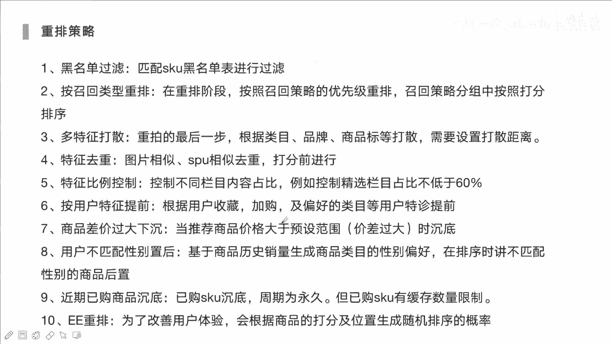
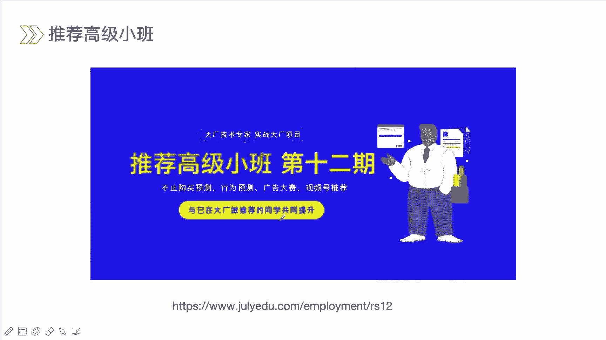
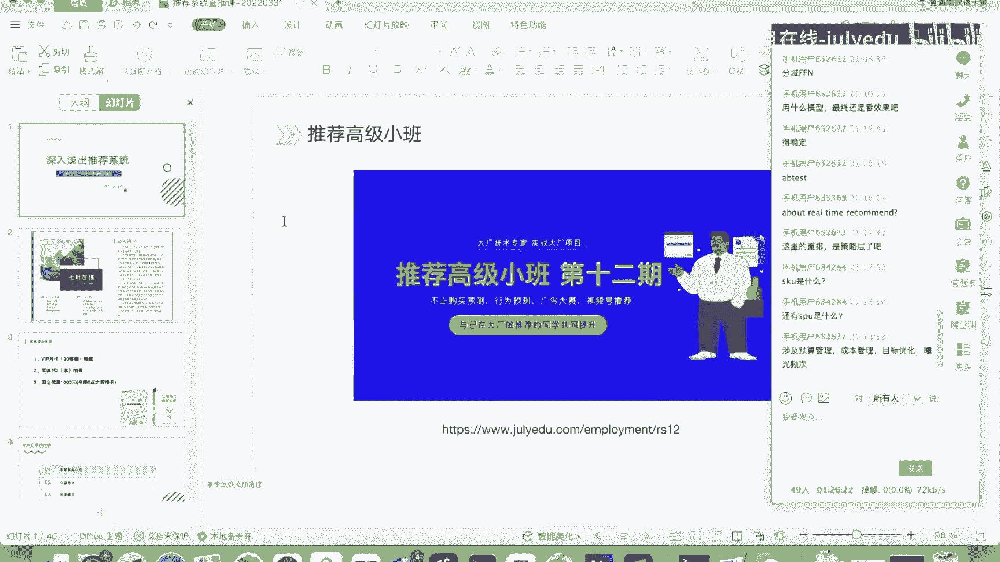
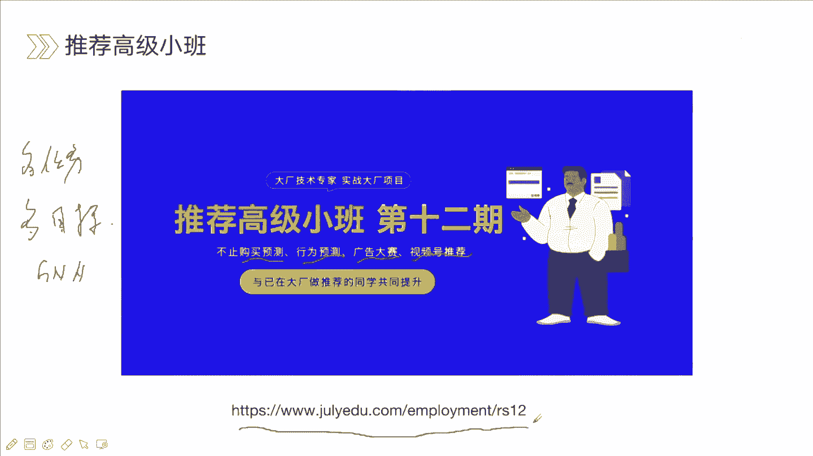

# 人工智能—推荐系统公开课（七月在线出品） - P15：22.3.31深入浅出推荐系统 - 七月在线-julyedu - BV1Ry4y127CV

🎼。🎼，各位同学好，我们的。我们的公开课呢是在8点钟正式开始啊。大家也可以去嗯拉上自己的小伙伴一起来听我们的公开课。大家有什么问题的话，我们都可以在聊天窗口进行互动啊，有什么问题啊，或者想聊的想问的。

嗯，时间的话大概应该会持续嗯一个半小时到2个小时之间吧。一个半小时左右。那如果大家问题多的话，可能时间还会久一些。嗯，强化学习这个我们的课里面没有准备的啊。对啊。因为强化学习线。

其实在推荐系统里面真正的落地的还是比较少的。啊，我们会去讲一些像。也是比较前沿的对啊，像嗯graph相关的对，就是图谱这些啊。GCN在推荐中还是有过。还是用过的对啊，一般来说的话，我们在用结因的话相关。

我们可能是。嗯，可以去构建一些特征。对，就是通过图来去构建的一些像那种嵌入向量。对，然后再去用到金牌模型里面。这种话是比较多的。DSSM啊双塔是有的，因为双塔也是一个比较经典的模型。对啊。

呃可能是我们再去做召回呀，或者说再去做出排的时候，那经常会去用到双塔。卡的厉害吗？其他同学听起来怎么样？啊，我这个直接用自己的热点来去连的，也没连。不卡okK okK卡同学的话。

要不然看看自己的网络是不是有问题啊。嗯嗯。嗯，OO看看来我这课应该是正常的对嗯，卡同学的话调一下自己的网络啊，看网络是没有问题啊。😊，那我们的课马上开始啊，大家可以。嗯，来行这些小伙伴一起来。

来听我们的公开课。能启动的话，这块比较核心的还是看能不能就是说做一些像数据的一些迁移。对啊啊我们能够去移植到别的一些数据啊。啊，比如说我们想要就是说嗯做一个新的一个推荐。对。

这时候可能数据来说的话就比较少一些用户的数据呀，或者说是像一些商品的数据。那这时候我们可以去借鉴一些其他平台的对啊，那一些数据看能不能应用在这个场景下面啊，这种解决是非常好的那如果说没有这样数据的话。

那我们可能会去考虑一些。像一些热点相关的一些呃推荐啊，对啊，就是这种冷启动的问题。对，有那么点意思啊，联邦学习。还有一分钟，我们马上开始。欢迎各位提问啊。对我们我们的所有提问啊都是有奖品的对。

我们最后会随机来从大家的提问当中去抽取一部分幸运的同学会发放我们的奖品。好的，我们现在正式开始。那我们这次的公开课内容呢是深入浅出推荐系统，那会围绕着召回排序重排呃三个模块来去给大家去做一个介绍。对啊。

嗯当然我们这次的课程时间是有限的，不会说去围绕着比较深的原理，对大家去做详细介绍，而是让大家去对推荐系统有一个呃整体性的认识。对啊。呃，那我是本次的老师啊。

呃讲师是啊呃那在介绍之前呢呃我先介绍一下7月在线。对啊，呃呃因为我们这次课程呢全部就是来源于就是7月在线的对啊，那7月在线呢也是成立的时间是比较久的，专注于智能时代的人才培养与企业服务。

呃像我们的推荐课程呢，已经呃已经迭代了12期了。对，就是推荐高级小班已经12期了。那每一次的话我们都会去对之前的进行一些总结，还有内容上面的优化调整。对啊，就不断的来去进行迭代优化。对。

到今天就是说肯定是一次比一次完备，一次比一次好的嗯。那除了推荐以外呢，那缺这些里面还会包含很多其他人工智能相关的一些课程，像自然源处理啊，还有像计算机试觉。嗯，自动驾驶也是现在比较火的。内容对啊。

还有一些像强化学习也是都包含的。OK那在我们这次课程当中的话，我们会进行直播的一些互动，小的互动，也给各位同学呢准备了一些礼品。对啊，那我们礼品呢是包含三个部分的。

第一个是7月在线的VIP月卡名额呢是30个名额啊。那第二个的话是呃我们的实体书抽奖。啊，那实体书呢是也是现在其实来说市面上呃比较热门的啊，一个是向量的推荐系统实战。

那另外的是王哲老师的深度学习推荐系统啊第三个呢是现金优惠1000元，是在今晚零点前，如果说我们去报名了我们的推荐课程，那我们会去优惠1000元的对啊，所以说大家多多去互动，能够去赢取我们第一项。

第二项的奖品。OK我们可以先攒些问题啊，等会儿一起来去回答。😊，那这是我们今天的主要的内容啊。那推荐系统呢，现在其实来说嗯也是我们去从事人工智能领域啊，比较火的一个子方向。

对啊啊一般的话就像是像LRP呀，然后是计算机视觉，啊后就是搜广推。对啊，啊搜索呀广告推荐。对他里面其实有很多共通的内容的啊，因为他们都会去包含像召回排序重排部分啊。

只是说可能涉及到的一些技术或者说业务上面存在一些差别。但他们其实共通的方向是非常多的啊，而且现在其实很多越来越多企业，他们也会去应用推荐系统的技术来去提升他们的用户体验。啊。

让用户能够感觉到就是说呃听他们的一个呃购物的一个体验啊，或者说他们。去嗯听音乐呀、看视频这样的能够捕捉到他们的兴趣啊，这种的话可能长时兴趣或短时兴趣。当然的话，我们推荐系统比较好，也会比较厉害推荐系统。

他们也会去挖掘一些潜在的兴趣啊。很多的一些公司，他们的一些收入啊，都是围绕着像广告呀，或者说是商品这样的一些推荐的。那推荐系统的话，我们可以去呃像电商推荐系统啊，我们可以去分成大概几个部分。对啊。

那首先呢我们是通过日志，对吧？嗯，然后日志里面我们可以去提取到用户的一些行为数据。啊，出嗯比如他嗯有点击，有浏览，有购买，有收藏、有加购啊，这些里面的话可以反映出用户他所感兴趣的一些点。

就他所对哪一些事物比较感兴趣一些，哪些商品比较感兴趣一些。Yes。就浏览购买，然后加购。然后呢，我们通过这样的一些序列或这样的一些数据，然后再去利用我们推荐系统技术。去挖掘出用户他潜在的。

购买的商品或他潜在的一些意图。那主要技术呢是召回排序，还有rerank，就是重排部分。那我们通过这三项模块，然后最后我们就可以去挖掘出用户他可能去可能感兴趣的。呃，一些一些商品。对啊。

比如说一些呃化妆品呀或者说一些衣物啊，因为他之前有浏览过一些化妆品这样的一些SKO这样一些商品，也去加购过衣服。对啊，那这些衣服的话，他可能会考虑到和他加购的衣服。呃，有很高的一些相似性。

那有这种相似性的话，他才有可能把这个商品给推给你。那这是电商场景下面它整体的一个流程。对啊。那具体来讲，是呃推荐系统它其实嗯。最主要的还是围绕着召回和排序。重排的话，其实他只是在后面阶段。

只是想更好能够提高啊我们整体的一个呃多样性，还有一个用户体验来去做一件事情。对啊，核心技术点还是围绕着召回和排序的。那我们可以去想一下，如果说我们想要去给用户做一些推荐的那我们的商品池。

像淘宝、京东、拼多多，他们的商品池是上亿上百亿这样的一个商品的那怎么样从里面去挖掘出来重要的一些商品呢？对啊，如果说我们对接商品进行建模，上亿商品进行建模，那其实也是非常耗费我们的资源。

耗费我们的时间的。很难去达到实时的给用户进行反馈推荐。所以说我们将推荐分成了两个部分先是进行召回，就是从这种上百亿上十亿上亿的商品里面，我们先去找到。用户他可能潜在感兴趣的。嗯，几千个或者几百个商品。

啊，这个时候的话我们可能不会去让模型啊变得非常复杂，也不会去构建很多的一些特征。因为复杂的模型，还有复杂的特征，只会让你的参数量，让你的模型变得非常的重。对啊。

所以说这个时候我们需要的是高效快速能够处理比较大的一个数据。那第二个阶段呢才到了我们的排序阶段，就是将原本的上亿几10亿的商品，我们去压缩到几百个商品。这个时候量级会急速的下降。对呀。

那这个时候的话我们就不用太去担心啊，我们模型能否处理这样的一些问题了。对我们可以去在原本的数据基础上，我们去构建很多的一些核心的一些特征。啊，对，其实做推荐的话，其实嗯模型是一点对。

特征也是非常关键的对啊，可能很多书上可能对于特征这块的一些构建讲的是比较少的对啊，特征的话，其实我们还要结合很多的业务点呀，上下文的一些信息。用户的信息。

商品的一些啊信息数据来去构建这个也是非常考察我们业务的理解，然后技术点的啊。然后最后经过排序之后，我们得到数十个哎嗯可能非常符合用户呃的兴趣点的一些商品，然后推荐给用户。那这是他的一个基本的流程。

Yeah。OK我们现在开始去找我们的召回模块啊，那召回模块的话，其实我们就是去做事情，就是来去缩小缩小我们的搜索范围。对，从多少亿缩短到几百个几千个啊。这是它的一个它的一个功能，对他能做的一个事情。

第二个呢，通过局部来去拟合整体。怎么理解呢？我们可以把它看作一个盲人摸象的一件事情。啊，那我们可以看这个图里面。对啊，一共有4个呃四个盲人队。他比如说他每个人只是去摸了哎其中一个部分。

大象的一个一个部分。嗯，那我们可以把它怎么理解呢？我们可以把大象可以理解成我们。理解成用户对他可能嗯感兴趣的一些，或者说呃。这个感兴趣它分成高和低的队啊。高和低的对，有的兴趣的话，你其实你能一眼看到的。

有的兴趣你是看不到的。因为有很多用户他冷不丁的到你的平台里面去直接下单了一个商品。你历史没有这样的一个商品的一个记录，或者说相同品类的记录。你是很难去get到的，或者说很难去覆盖到的对。

所以说我们尽量的去利用你看每一个盲人，他所关注点是一个部分。那其实每一个盲人我们可以把它。呃，看作一个呃召回的一个策略啊，或者说召回的一个模型。就说没有一个没有一个模型，对吧？他可以去。

关注到所有点的啊，比如说我们所要构建一个简单的热点的一个策略，就是来去将最近比较热点的商品。推荐给用户。那你既然选择是热点，那这时候可能这些热点商品并不是用户感兴趣的。

所以说兴趣点这个这个部分你是无法去。包含在内的啊，那另外呢你所构建一个根据用户他历史行为的来去这种序练。对我们来去挖掘出用户的。潜在的兴趣，那种潜在兴趣的话，也并不能包含这种热点的一些商品。啊。

所以说每一种召回它都是有自己短板的。所以说一般的我们公司里面都会构建呃几个。甚至十几个这种召回的不同的召回的策略。啊，就尽可能的去覆盖所有用户的这个用户的它的可能性。

那在评估阶段的时候呢呃呃我们并不简单的来去评估像它的1个CTR呀，或者说它的一个召回率啊，嗯这个并不像一般我们做一个比如说做一个销量预测呀，或者做一个就是说金融风控的这样一个问题。对啊。

因为这块要考虑到业务的，考虑到业务点，还要考虑到用户的一些体验的。所以说准确度哎，它是一个非常关键点。那我们还要考虑一些像时效性、多样多样性、覆盖度、交互体验、运行策略这些问题我们都需要去考虑到的。

对啊，嗯如果说你一味的去考虑它的一个用户点击率，对吧？啊，那像短视频，对吧？你一味的考虑他的点击率，那可能你给他推荐一些都是一些标题榜哦标题党的一些这样的一些这样这样的一些视频。那这个时候的话。

其实用户体验是非常差的对啊，因为它缺少一种多样性，还有一种的话是。用户的一个呃那种深入型，或者说就是说他看视频时间是非常短的。可能说进入之后感觉不感兴趣，立马就划掉了。对啊，所以体验是非常差的。啊。

所以呢我们会从多个角度来去进行哎进行评估。对啊，那另外的话我们也会进行我们真嗯实际的一个测试，那就分成可能离线阶段的话，我们更多的是考虑它的一个准确度和覆盖度。那线上的话测试的时候。

我们会去看它真实的1个CTRRCVR的提升。还有人均的阅读呀，人均的一些停留时长。或者说我们的呃GMV的一个收入啊，广告的一些收益啊，这是我们线上会考虑的。那接下来的话我们给大家聊一聊。

就是召回模块有哪些比较经典的啊一些策略啊，或者说模型。OK看到已经有不少同学提了一些问题了。对啊，大家可以踊跃来去提问题的。不管是技术问题、业务问题。

或者说推荐系统这方面的一些就业问题都是可以去提问的啊。呃，推荐系统工程师对于论文复现能力有要求吗？呃，这个话肯定是要有的对啊呃，当然其实来说，目前而言的话目前而言的话嗯。目前而言的话，其实嗯很多的一些。

模型对吧？很多一些模型大家其实大厂或者说小厂里面都还在用那些比较经典的一些。对啊啊，很少的话去用比较非常前沿的。就是说刚一出来的一些模型我们都会去用的。而是都在用那些比较经典的，像现在比较经典的。

像加入一些transformer这样的一个模块，或者说这种多任务多目标啊，这种是比较多的，或者说加入一些attention这样的一些结构。啊，但是我们基本的一些能力，复现能力我觉得还是要有的对啊。嗯。

目前相似度计算都是通过引白0后，通过内积来去求相似度的。对，这个是这个是对内机是一个对鱼弦相似鱼弦相似度也是可以的对啊，计缘相似度的话方法还是比较多的，这个可以去查一下啊。GBT加RR现在还是。呃。

比较少了比较少了。对啊，GPT加LR对，这是当时facebook他们就是啊主要GPT的话核心点还是帮助去构建这种特征的一些组合。它的组合体现在数的分叉的时候，数在分裂的时候，对。

每次分裂它会选择一个特征或者说合适的一个分裂点。嗯，那这个是多次分裂，其实就是体现了多次的一个特征交叉。嗯，LR它其实不具备这样的一个能力的啊，这个的话其实很多场其实。呃，不怎么用的对啊。

还不如直接就是用GBT或者说用LR这种模型。来的快一些，来的实际也行。呃，目前转到AI行业简历上写什么项目，及达到什么样深度比较好？AI行业AI行业。嗯。嗯，如果说你之前没有相关的。相关的就业经历的话。

那你就要去呃找一些项目，找一些项目。对啊，来去体现出你在这方面有一些实战。对，一个是有实战，另外一个是有相关的一些理论啊，这两点其实面试官都会去考虑的对啊，当然也有很多其他之前没有做过推荐的。

但是可能推荐这块的话，他嗯有比较好的一些理论。对，另外的话他也会找一些项目。然后进行一些实践。对啊，而不是他之前工作上面做的事情。那这块的话其实可以找一些相关的一些比赛。对。

像阿里、天池啊、卡go都是可以的。Yeah。okK我们继续讲课，等会儿我再去回答啊。那协同过滤是非常经典的非常经典的召回算法。对啊嗯。行过滤化，它同时使用user和ite之间的相似性来去进行推荐的对啊。

其实我们现在再去做一些。做召回的时候，那协同过滤userCFite CF也是必备的这是打底的模型。其实。呃，UCFite CF它其实并不比那些我们根据向量召回啊，或者说我们根据那些双塔啊召回呃效果差。

对啊，它其实来说效果是非常稳的对啊。啊，因为它其实可以捕捕捉到其实用户和iteom之间的他们之间的一些相似性关联性这样的一个信息。那我们给来看个例子啊呃，例如用户A对啊，和用户B类似。那并且用户。

用户必喜欢视频一。那这时候我们系统可以向用户A。哦，推荐视频仪啊。嗯，这种例子大家看看在哪种场景下，我们是见过的。大家有没有去关注过像那视频号，微信的视频号，还有抖音呀、快手。对啊，这个里面的话。

尤其是视频号，它里面存在比较强的。社交属性。对啊，他会优先去推荐用户，你的朋友，对吧？所关注的。或说点过赞的一些视频。啊。因为他会默认，其实两个用户之间兴趣比较相仿，因为我们是好友。

所以说我们其实有着志同道合这样的一个因素在里面的。所以这样的推荐其实是没有问题的。另外他也会提高。用户的之间的一个社交的一个关系强度。对啊。呃，包括像其他的一些短视频，他们都会考虑这样的因素的啊。

那这种话其实我们怎么样去做些计算呢？对啊，比如说我们有对于化妆品这块，对吧？呃，小美、小丽、小红，对他们对于不同化妆品都有自己的。喜好。对啊，那包括有一些打分，那每个人都对于不同化妆品有一些打分。

包括有一些是空的那我们就要想办法去计算，或者给这些空的一个比较合适的一个分数。嗯，那。我们先去先去先去构建向量。对啊，笑美的话就是第一个是4分零分、零分、5分、1分、零分零分。

那依此小丽小红也是一样的那然后借助鱼弦相似性，我们可以去计算出小美和小丽小美和小红他们的相似性分数，可以看到小美和小丽的分数是更加相近的是0。38。那这个时候的话，我们可以。可以就是大致去认为，对吧？

那小美的话，她对于这个粉底啊，就应该是粉底还是什么？可能喜好可能是在5分。那对于这个假睫毛的话是4分。对啊。因为他俩比较相似，所以说我们就可以将小丽喜欢过的商品哎推荐给她。因为我们通过这种计算。

我们可以看作哎小美喜欢这种商品。那这是协同过滤它的一个简单的一种方式。那我们细分的话，协同过滤分成两种方式。第一种的话是基于用户的协同过滤。第二种话是基于商品的系统过滤。那第一个userCF。

第二个item CF它们的一个适用点也是不一样的。但是虽然他们的适用点不一样，但是呢我们在。我们每一次两个都是同事会去用的对，不管是推荐传，不管是新闻推荐或者电商推荐啊啊。

即使UCF它更适用于新闻推荐啊那。我们也会去使用iteom CF的对，因为两者UCF和iteom CF它们之间，其实我们如果去实践过，其实可以发现两者的重叠度其实并没有那么高的对啊。

这可以理解成他们两者其实所关注的角度也是不一样的。那先看userCF它是怎么样来去做推荐呢？他就找到相似的用户，然后把某个用户喜欢的商品啊，然后推荐给。另外一个用户。啊，比如说用户A。

和用户C它两者是比较相似的。对，这个时候呢发现用户C喜欢用户D，但A没有。对应的一个箭头。那我们这时候可以把物品A推荐给物品。A，物品D推荐给用户A啊。那再看一看iteom CF来是怎么是怎么去做呢？

iteom CF它是找到物品的相似性。嗯。😊，物品的相似性的话是呃我们可以看到，其实通过就是说呃看物品A和物品C啊，他们所覆盖到的人群。啊，人群的一个相似性的一个情况。对，然后呢我们发现其实用户。

C没有和用户没有和物品C产生过关联，这时候就可以把物品C推荐给用户C了。啊，这是。iteom CF与和userCF它俩之间的一个差异。嗯，课程项目比如集训营高级班。OK对啊呃。呃。

模型部署的话嗯模型部署的话，这个话我们会在我们的就是正式的课里面对会去介绍到的对啊，如何来去部署模型，它的架构是什么样子的对啊。要求深度学习吗？深度学习肯定是要求的。啊，因为现在很多的一些模块对吧？嗯。

像召回的话，我们会去用到MND这种多兴趣的一个召回啊，还有像排序里面其实用到的更更多一些。对，像BST啊啊这样的一些模型。DFMDCN这比较经典的，还我或者说bert to re。

就呃就是用bert来去做推荐。对啊。这里面都是要求深度学习技术的。ok我们继续啊，那下面是关联召回啊，这个是也是一个比较经典的对啊，就是说我们如何去找到用户未来可能交互的商品。对啊。

这时候啊我们可以挖掘出商品的关联关系。啊，比如说用户A他买过一些商品，对吧？那这些商品的话，他都和他都有自己比较关联的比较强的一些商品啊，比如说用户他买了立时买个A和B，对吧？这两个商品。那A的话。

它可能和C关联性比较强。B的话他和D关联性比较强，那这时候的话，我们可以将C和D推荐给用户。啊，因为我们在历史书里面发现A和C。它俩同时出现的概率是非常高的。所以说买完A之后，那大概率都会买C啊。

这个是不是就像那个啥就是啤酒尿布这样的一个理论了？对啊。就是说我们买完啤酒之后，哎，大概率会去买尿布啊。对，所以说我们可以把尿布和啤酒放在同一个哎。😊，同一个货架上面。那也是这样的一个。这样一个点了。

对啊。那可以看具体来去怎么做，包括怎么样来去优化的对啊，因为这个点对吧？其实呃像王老师，我对吧之前经常去做一些竞赛。对啊，像KTDC，还有像WSDM这种国际性的一些比赛。

它都有推荐系统相关的一些赛道的啊，对啊，就是前段时间的话是参加WSDM。也是会议型比赛，还有KttytyC。啊，都是通过这种方式能够能够轻松的达到一个top10的一个名次啊，因为它只是召回。

然后我们再去结合排序。可以达到就是说top5。更好的成绩了。啊，所以说这个我觉得是一个放作为一个经典的一个case，我们可以去讲一讲的啊。那比如说小冯对吧？他他的一个行为序列里面有很多的一些商品啊。

我们。从前就从历史到最近，对吧？伊利牛奶旺仔牛奶到橙汁。对啊啊，这是他历史交互的一些商品。那这时候我们第一步做的事情呢，就是来去进对商品进行打分。来两个商品，它都有自己的一个关联分数的。啊。

那这时候的话我们打分可以先最基本的。如果说两个商品同时出现在一个序列里面。比如说。威化饼和奥利奥，它同时出现在小冯他这个序列里面，那这两个的分数我们可以给它记为一。包括奥利奥和饼干啊。

就说这这个系列里面所有的关系对橙汁和雪碧、橙汁和可乐、橙汁和奥利奥，他们的关联分数都是一。我们可以先去一视同仁啊，这种一视同仁。其实在实际当当中。呃，是会存在一些问题的对啊，会有哪些影响呢？

比如说时效性。还有就是正反，就是先后关系，或者说他购买的些距离。对。如果说两个商品它间隔的时间越近，那它俩之间的相关性应该是更高一些的。另外呢我们买商品时候对吧？先买完A再买C，或者说先买完C再去买A。

这两者出现的频率是不一样的。就比如说我们先买完手机之后再去买手机壳啊，这个是不是就是说我们基本上是按这种做法的，先买手机再去买手机壳。那先买手机壳再去买手机啊，也会出现，但它的出现概率是比较小的。啊。

所以说呢我们考虑这种先后关系，我们也会去。算到我们最后的关联性打分的里面的。No。比如第一个我们计算阿尔法I一和I2，对吧？这块我们考虑的是distance，考虑它的一个距离的。

就是I一和I2之间的一个前后距离啊，底数是0。8啊。那西塔部分的话，我们这个0。7可以去乘在后边乘一个西塔。0。7呢是怎么去考虑的呢？考虑到就是说两个商品它的一个前后关系啊，是I一前呢还是I2前？啊。

那如果是正向的话，那他们的分数就是一。那如果是逆向的话，分数就是0。7啊，这里面的一些参数啊，像0。8呀、0。7呀，这种话我们可以通过离线的实验啊来去。做测试来去选择最优的对啊。

那我们对每一个用户都通过这种公式来去计算好商品和商品之间对应的关系打分。对，比如说小冯，他威化饼干和奥利奥打分是0。6。那小王威化饼干和奥利奥打分是0。0。0。这是0。6和0。3。

那我们就会把两个份数加在一块，就是0。9了，这就是最后两个商品之间的关联性分数。那打完分之后呢，我们就开始去做召回了。召回的时候的话，我们就需要用到我们之前打分的一个结果。比如小陈对吧？

他历史购买了5个商品，那这时候的话，每个商品它都有对应的关联性的商品，就是我们前面打过分的商品。啊，然后每一个商品的话都有对应的一个关联性的分数。啊，我们可以将这种最后将这种分数呃进行排序。

取分数最高的来去推荐给小程。那这是我们关联召回它整个的一个流程。这是比较经典的一种召回方式啊。啊，刚才那种话我们可能更多的话是可以理解成这种协同过滤方式。

那接下来的话是对应的是单inbedding的一个向量召回。向量召回，那向召回他大致是怎么来去做的呢？啊，就说我们可以离线的可以去通过模型来去得到。啊，用户的ebedding。商品的inbedding啊。

这种模型可以是很多种方式，可以是很多种方式。啊，比如说那种d的方式，d的一些模型，或者也可以通过那种work to a，或者说deep work  deep work这种这种方式啊。

来去得到用户的和商品的inbedding。我们存储。啊，到我们的数据库里面。线上的时候呢线上的时候呢，我们用户A用户登录了。啊，然后我们可以去提取到从我们的数据库里面来去提取到用户的inbedding。

然后通过。一个近似查找的方式来去找到和这个用户inbedding最相近的top n个物品，然后推荐给用户。这里面用的是faceest的方式啊。faceest的话是facebook。

它所就是呃facebook所推的一种一个一个一个。近似最近灵的方式。这是一种AN的这种方式。对，因为我们再去计算余学相似性质或者计算内积的时候。这种计算是非常耗费时间的。

因为我们的商品和商品量是非常大的。你每次都去计算的话，可能上千万个商品都可能花费几个小时时间。但如果我们通过这种fice方式，对啊，它可能只花费十几分钟时间啊，就可以快速的哎找到。嗯。

它对应高相似的物品了。那其中比较经典的单影百的香召回呢是youtube的N啊，这个是youtube。他在好像是08年的时候，还是一年时候所推的啊所发表表发表的一个经典论文。对啊。哦。

那我们可以看它的一个整体结构，它的整体结构啊，可以我们可以把它分成嗯大体分成三个模块吧。对啊。或者说分成两个模块，对，先是一个特征模块。另外一个是训练模型这个部分。那其实它又分成一个线上。

就是一个train和serving阶段啊。那train的话是我们的一个离线，我们去训练好训练好模型了。serv的话是我们的一个线上的一个阶段了。特征部分的话嗯也是比较重点的对啊。

这块特征的话其实没有像现在来说呃，考虑到一些像那种比如说attention的一些结构，它是简单的进行一些那种呃poing的一些操作。对，或者说就是说就是计算平均嘛，就是mepoing操作。

将用户他所观看过的一些video，然后它的向量。这个向量的话，它是提前去构建好的。我们可以提前去构建好，也可以就是说呃进行随机初始化，然后来去呃。得到他的一个inbedding。对啊。

两种方式都是可以的。😊，啊，它一个是对应的一个观看的一个vector，另外一个是它搜索的一个vector。除了向量之外呢，还有一些呃。融化上的一些inbedding或对理相关的一些inbedding。

啊，比如说一些这个案例的一些年龄，这个可以就是对应的视频的一个年龄。就视频他是什么时候呃。在平台里面出现的对，到现在这个反映出用户呃反映出视频的一个新旧啊，因为我们可能有时候看的话，嗯经典是一个对啊。

热点也是非常关键的对，比较新的一个视频啊，它的一个嗯你把它推出来其实问题也不大。对啊，反映出它的一个时效性啊。还有的话是像一些年龄啊，性别这样的一些用户的一些信息。然后呢。

我们会去训练我的模型是嗯三层的。呃，瑞路三层的一个神经网络，就是MP层。啊，之后的话会去接oft max。那我们在去去的时候，我们可以去得到什么呢？去的时候我们可以去得到对应的。呃，我看一下去时候。

我们可以得到对应的vi6的一个向量，video就是我们对应的视频的一个向量啊，这是我们离线时候可以去得到的一个信息。对啊，它这块是怎么得到的？就是说soft max。啊，通过soft max。

它里面对应的话有嗯它对应的列向量部分，列向量部分每个列向量部分对应的话就是我们的vido的一个向量了。那user向量的话，虽然我们在train的时候也可以得到，就是我们最后一层MLP层。对嗯。

它的一个输出的一个向量，对应的就是我们的user的 vector。但这个部分的话我们。会在线上的时候会重新来去生成，这个是为什么呢？啊，为什么我们离线的时候可以先去保存我们的video向量啊。

而在线上的时候会重新生成我们的user向量的啊，因为是用户的兴趣，它其实是不断的去改变的啊，这种这种改变是通过什么反应的呢？通过他最近所看的视频。

最近所搜索的一些token还有它的一些相关的一些属性信息行为的一些数据，这些数据改变都会影响到用户兴趣的一个向量的一个变化的。但是微度的向量视频的向量其实非常稳定的。啊。这个其实。是非常好构建的对。

因为商品你不管。不管受什么样的数据的影响，它整体的一个向量，描述它的一个向量，对吧？它本质是不会发生改变的对啊。价值高啊，受欢迎啊，或者说它本身的一个热度呀这样的信息。对啊，是非常稳的嗯。

所以我们在去构建善量的时候，或者说来去做这种召回的时候，其实用户兴趣的挖掘是非常有挑战的。而商品的挖掘向量挖掘的是比较有稳定的，挑战性并没有那么的高的嗯。所以我们线上的时候线上serv的时候。

对会去来个请求，然后会去。重新对啊，然后来去预测好得到用户的向量，然后再去通过我们的那种fest的方式啊来去得到top n个商品，然后推荐给用户。啊，这个就是youtu BN召回模块它所做的一个事情了。

那再往下的话是。呃，DSSM这种经典的双塔召回了。Okay。这个双码召回呢，其实最早的话是在那种。嗯。呃，那种那种那种文本搜索呀，就是说我们去搜索信息，对吧？我们要去输入一个query啊。

输入query。然后我们的候选池里面有很多的一些呃title呀，很多的一些这种tle对应的话，我们就是反候选的一些一些一些文章呀，一些的一些一些信息。对啊。嗯，那这是我们的。

dooc vector啊 documentment vector。那另外一部分就是你说的 vector啊说的一些部分。对啊。那它这两部分的话都会做哈希的对啊，对里面词做做哈希的，然后得它对应的向量。啊。

然后表示层的话就是我们经过多层的MLP啊，然后最后加两个向量，我们可以进行。进行内基这样的一个计算，也可以计算它的一个余弦相似性啊，然后最后来去得到最后对应的概率结果啊，segmod。是的。

那这个是DSSM的一种一种方式。对啊啊另外一种的话就是说我们也可以就是说经过sofm来去得到结果啊，就是它可以是一个二分类的那也可以是一个多分类的对啊。这种话像在我们公司里面。

我们我们做的是一个二分类的一种方式。对啊，因为我们本身的一个候选级并没有那么多，我们可以我们就把它直接做到出牌里面了。okK那刚才的话是一个单inbedding向量召回啊。

但是现在的话其实技术发展是比较快的对啊，用户的兴趣啊，它并不能只用一个inbedding来去表示。大家可以去想一下，是不是我们经常可能会有多个意图或者多个兴趣来去逛。淘宝呀或者说来去刷一些视频呀。

可能你去刷抖音的时候，你同时对体育比较感兴趣，也对美食比较感兴趣啊。所以说你的兴趣应该是多个向量来去表示的，而不是单个向量来去表示的。那这个时候呢。😊，多引白里相召回啊，应运而生。对啊。

就是像经典的MNDMND对啊。嗯，它的做法呢其实嗯也是一种非常经典的一种方式啊。它借助的是嗯胶囊网络的方式。胶囊网络。对，这里面的话我们可以大体大大体的给大家大致的给大家讲一下。胶囊网络的话。

它其实我们分成了两个部分。对啊。😊，一个是行为胶囊。嗯。行为胶囊啊。😊，你可以把胶囊理呃理解成一个向量嘛，行为向量到兴趣向量的一个聚合啊。😊，这种聚合的话，其实呃。

比如说我们行为向量可能是用户历史所交互的那些商品，购买商品，它可能有100个。我们兴趣向量的话，可能要去生成10个或生成给它取一个倍数啊。取个对数个。对啊，这样的话其实我们得到就是多个向量的。😊。

多个项料啊多个新项链。然后生成这个多个兴趣向量的话，每个信趣向量我们都可以去召回top n。啊，比如说我们生成了呃对应的三个兴趣向量，每个兴趣向量的话，哎，它都可以再去召回5个。最后我们可以得到15个。

😊，对应的商品上聊，我们15个再去经过一些方式，再去排序。这样的话是不是同时可以包含三种兴趣类型的商品了？对啊。这里面的核心点呢啊呃它其实可以理解成它其实如果你不把它不做多in蔽这种方式的话。

它如果变成单in蔽ing的话，那它其实就可以类比类比是什么？类比成我们的youtube电那种那种方式。它分成同样会分成train和Cserving这两个阶段的对啊。它核心点呢是多兴趣提取层啊。

这个部分是MMMMD的一个核心部分。对，这块儿的话它是呃使用的是一个动态路由的方式，动态路由的方式啊来去呃动态路由算法。来去做这样的一个处理的啊，我们有兴趣的可以再去查一下。我们在之后的我们的。

推荐高级小班里面也会对这个部分详细介绍。OK这是多饮白领圣量召会。嗯，下面的话是一些graphphing的一种方式了，也是非常经典的。啊，聚合的话是通过动态路由的算法来去聚合的对啊。

内机的话呢又太简单了。对啊。动态录的话，它其实里面也是结合了那种。嗯，类似于attention software的这样的一个思想。对啊。嗯。我们继续往下啊，那graph em的话。

我们像经典的像有deep work node to a。对啊，它最后其实都会使用那个啥就是sscapegram这种这种这种这种这种算法，对来去得它的 embedding的。

只是说他在之前进行的一个随机游走。嗯，那什么是随机游走呢？我们可以先去从第一步看一下我们的A有behaci这个部分就我们有U一U2U3啊，有三个对应的一个行为向量行为序列啊，行为序列。

那这里面的话看它有打虚线部分。😊，这里话是怎么去理解呢？比如说FED对吧？啊，是我们今天下单的商品B和E呢？是昨天下单的商品，所以这两单的商品其实他们的距离离得比较远。所以我们可以理解它的相关性比较。

相关性比较小，所以说我们可以进行一个划分这样的一个切分，把它切分成两个序列了。而不像UEDAB离得比较近，它就是一个序列了啊，这种出发点是。间隔比较久啊，它们之间相关性就变得比较小了。对啊。

这就是进行一个session的一个划分了。我们会固定的一个切缝大小。对。啊，我们这样构建好之后的话，我们可以去构建生成我们对应的一个图了。这种图的话怎么去理解呢？你看对应的U一对吧？它不是嗯有D对吧？

D到A啊，买完D之后买A了，买完之A之后又买B了，我们是不是构建成这样的一个链路了。😊，那同样的我们看U2，那B和E是不是有关系了？😊，啊，那D和E也有关系，E和F有关系。通过这样的一种关系。

我们可以商品呢看作一个节点。那这种关系的话，我们看作它连接它的边，这样的话我们是第二步生成好了我们这样图结构。第三步，进行随机游走。那。随游走的话。

Dport和note actor它两者的随机游走方式是不一样的啊。像deppot work的话，它所考虑的是呃比较常规一些。对啊，是比如说到达一个A级点后，对吧？它的一个连接点可能只有B。那接下来走B。

啊，它只能到B这个部分了。那B的话有三个连节点，有A。有E有C那三个里面我们随机去选一个啊，那就3分之1，每一个都有3分之1的概率去被选到。嗯，可以看到嗯，我看看对，是这样的。

那note vector的话就不一样了啊，它在进行这种游走的时候，他会考虑到两个点。啊，一个是BFS，一个是DFS对啊，那BFS的话是广度优先优先便利。DFS的话是深度优先便利。

可以看到它的一个搜索的一种方式啊。那蓝蓝线的蓝箭头的话是深度的对我们不断去深入的来去进行扩散。那最后可以到就是US4S5S6啊。这种话能够探索到什么呢？探索到一个相似性。就是一个结构上的一个相似性。啊。

那BFS的话是广度优先搜索，对它更容易捕捉到对应一个点啊，它的一个结构是什么样子的？这两种方式啊对它会通过对应的一些计算方式来去计算它是该怎么样进行这种扩散的。okK呃，还有一种的话嗯。😊。

是EGES啊啊EGES这个也是比较经典的。呃，我们这节课的话是不会去细致的来去深入的来去讲解一些呃理论的对啊，我们会可能会在我们的一个我们会在我们的一个推荐高级班里面会去详细讲解这些理论。对。

包括结合论文来去讲的对啊。下面的话是EGES对啊呃，EGES的话是它其实是一个解决冷起的一种。一种方式。对啊啊一般来说新上个商品，对吧？啊，这个SKU新上商品的话，它对应的话是SKU对吧？是一个新的。

但SKU它本身有包含很多属性，它可能属于品类呃，不同的品类对吧？它可能一级品类啊、二级品类啊这样的一个信息。但这种品类信息并不是新的。啊，所以说我们经常再去描述个商品的时候。

会去考虑到它的一些其他的一些信息的。比如说呃SQ对应的就是ite embedding，那它的category embedding或者说它的品牌价格ebedding信息，这些的话都不是新的。😊，啊。

他是极大的去缓解了。能起这样的一个问题的对啊，如果你只是艾minmin的话，这个是完全是新的对啊，所以说这种新的信息的话，其实我们做起来是非常困难的。所以说我们可以使用EGES这种方式。

将这些信息哎呃比较简单的方式的话，我们可以将这些inbedding。😊，相加起来啊。那比较个省的高级灵活方式的话啊，我们通过这种模型，对吧？来去得到啊。来去将其通过模型将其聚合起来啊。

这个也是EGES的一个核心的一个点了。对啊，来去动态的，或者说来去经过模型来去学习到我们如何将呃S1S2SN，然后得到它对应的。A0A1AN这是它的权重啊，将其进行聚合。这是ETES。因为EDS论文。

他在讲到EDS算法之前的话，他也是讲了一些比较传统的方式。我们可以简单的一些加权，也可以根据它中要性进行一些加权的方式，也是可以的，是比较灵活的。OK我们再往下的话，来去看一看像知识图谱这种召回方式啊。

嗯，知识图谱的话，其实现在其实用的比较少。啊，可以告诉大家，其实可能只是在那些BATT厂里面。对bety街啊，或者说拼多多这些厂里面可能还可能可能会去用到知识图谱召回。对，但大多数那种二线场呀，三线场。

嗯，现在还没有去使用到制识图召回这种方式的。Oh。知徒谱召回的话，还可以解决什么样一个问题呢？😊，呃，像新品上架。时效热点，时效活动精准搭配这样一个问题啊。比如说我们嗯新上了一个手机，对吧？啊。

我们可能再去给手机推荐手机壳是没有问题的但我们先上个华为手机，然后给他推荐呃。先上个华为手机。嗯。包括用户他喜欢兴趣或者说是华为手机。但是我们给他推荐的是一个呃小米手机。

那这时候可能会去出现的一些问题了。对啊，那知识度的话，它可以构建一些实体相关的一些信息的对，而不是只考虑他很简单的一些SKU是什么的，而考虑到实体更多的它的一些品牌这样信息，也会包含在内的。

它可以去避免这样的一些问题的。另外呢，像比如说新上的一个小米手机，对它对应小米手机的话是一个新款手机。那么们如何去捕捉到它是否是一个爆品，是否是一个热品呢？这里时候也可以通过知识图谱。

因为我们构建了这种实体的一些关系。那实际关系呢不仅是这个SQ本身还有很多其他的一些属性，这种属性都可以反馈出小米手机它一上呃呃。刚一出这个单品，它肯定是一个爆品的对啊，这种信息我们就可以去捕捕捉到。

对啊，所以这这这图谱可以帮助我们去解决的一些问题啊，就是捕获时效的热点啊，完成这种精准搭配。那他具体构建的话是呃。我要两种方式啊，第一种话是商品多层次语义信息抽取啊，就我们构在构建的时候，我们可以去。

构建它的一些信息，处理它的一些信息啊，比如说它的一些呃实体的信息啊，它的一些概念概念信息、产品词，还有商品这些信息啊，来组合成这种这种层级化的这种图谱的一些关系啊。第二种的话是用户商品关系建模。嗯。

刚才只是说是商品本身之间这种层次语音信息。第二种的话，我们可以对于用户和商品关系建模来去构建这种知识图谱啊，那分成三种。第一种话是基于用户图谱交互的一些关系。

来去建模用户兴趣概念完成新品的一些推荐因为刚才我们有新品了，有小米，对吧？他上新款了，可能一般是一般的新款的新新品。它可能可能曝光次数并不是那么高。对啊。

但我们其实在通过这种一些图谱上面的一些信息的时候，我们能够发现它其实是一个爆款的时候。对啊。那我们会提高他的一个展现的次数的对啊。第二种话，基于用户图谱交互关系来去保证用户体验实现精准复购周期。

最后的话，基于图谱交互关系，实现用户兴趣演变建模啊，这个块的话就是商品知识图谱的构建。那下边我们具体来去看一下。呃，我们再去基于图谱概念识别用户的一些意图的时候。对啊，这块话是分成几种方式的对。

也是嗯我们在去构建用户序列的时候，经量要去考虑到的一些点啊。Yes。最基本的话我们是孤立行为建模啊，用户每一次行为之间都是孤立的，前后没有关系的。第二种的话是连续session的一种建模方式。

之前讲到了，就是说我们按照时间来去进行这种划分啊。第三种的话，我们基于用户意图的建模，我们不会考虑这么细的对啊，而是去构建用户可能对某个品类。啊，某种兴趣啊它更感兴趣一些。比如说E合剂对吧？它属于一类。

我们把它换成C2，D是C1啊，最后就上升到一个更高的一个层次了。对啊。就比如说我们先去经过图谱来去得到它每一个部分的一个向量。那有向量之后呢，我们就可以对于这些向量进行一些聚合。啊聚合完之后呢。

这块可能是一些它的一个关系之间的一个分类。对啊，那我们就可以按这种方式来去进行一个更高层次的一个转化啊，就是D就SKUCE的话就是我们刚才生成的向量。就是聚合后的一个划分的一个品类。对啊。嗯。

那更细的一些介绍，对我们还是在我们推荐班里面会讲到的。那接下来的话我们到了排序模块。🤧排序模块。那，可能讲了一个小时了。嗯，接下来我们OOP玩法。呃，对，现在其实呃RRP的话。

现在其实确实是在推荐里面是用比较多的对啊。呃，最普遍的话还是思索推荐。思索推荐。因为它的。你的输入信息啊，反馈信息都是和文本相关的对啊。然后我们做排序建模的时候，也会考虑像最开始的吧。

像真身啊啊这些或者说像STMNRNN这些它都是来源于啊。自然人处理的。RRP的或者像transformer Bt这些都是的。那排序模块的话，我们就需要考虑嗯更复杂的一些模型了。对啊。

那主要是包含像特征工程，还有模型部分。嗯，那我们今天主要还是围绕着模型来去讲啊，我们来讲一讲，就是说排序模块它的一个演变的发展吧。嗯，因为每一个阶段我们所使用的模型都是存在很大的差异的。啊。

比如说像发展初期，2010年前的时候，我们更多的是人工特征，然后结合线性模型。啊，来去来去进行构建的。这时候的话我们需要构建很多的一些特征。因为先进模型它并没有去没有那种就是说捕捉特征交叉信息。

或者说对于输入信息做很大的一个转换的这样的一个能力的。所以就需要我们人为的来去构建上百个上千个上万这样一个特征。因为模型简单，所以说我们可以特征这块构建的非常复杂。😊，但特征这块的话。

我们还需要做很多的一些处理。像连续特征，我们做规划。分段变换处理。后面话分段的话，我们就可能就是一个连续型转换成离散型的那离散型的话，我们需要进行oneho主呃，进行一个转换，就是变换成零一种形式。

还有构建一些交叉特征或组合特征，还有一些专家特征。这就是结合业务构建等等。然后最后AL模型。那加速发展期呢是2010年到2015年。这个时候的话我们更多的是自动特征交叉，然后加上线性。

模型阶段啊像FM啊FFM或者说是GBT加LRX几bot这样的一些模型。对啊。前面部分它都是有特征交叉的一种能特征交叉的一种能力的模型本身FM的话它实现的是一个二阶交叉。FFFFM的话。

它考虑到一个场的一种关系。对，交叉的时候，它又加入了一些参数啊，让交叉变得更加灵活。那GPT的话，它是在数分类的时候进行了一种特征交叉。因为我们在去做推荐的时候，我们是进行的是个性化精准的一个推荐。

所以说你所考虑到的信息力度越细越好。粗的信息你推荐的时候是不准确的对啊，细的信息化是帮助我们更好来去捕捉到用户兴趣的。嗯，这里的话我们给出了FM，还有FFFFM它的一个结构啊。呃，虽然FFM的话。

它引入了一个厂的一个概念，形成新的模型。对，但是它的参数量对。它的参数量。嗯，是比FM高的。这样就会导致FFFFM的话，它的整体的一个效率会更差一些。所以现在其实我们在工业场景当中，对吧？

更多的还是见到FMFM这样的一些结构的一些变化组合。就比如我们经常见到的deepFM。嗯。那下面的话是GBT加LR。那GPT的话，它就是来去得到。得到对应的叶子节点。啊，然后再去作为LR的一个输入。

那一为节点的话，它是怎么来去得到的话，怎么得到？比如说一棵树呃，比如说我们一个1个GPT对吧？它。呃，构建了两棵树，构建两棵树，我可以看到只有两棵树。那每棵树它都有对应的叶子节点。

就是我们最后最底处部分啊。😊，一共有5个夜节点，每个夜节点，它比如说我们第一棵树。😡，我们可以看到一个样本okK到第一棵树的时候，它落在了第一个叶节点里面，它就一其余两个就是零了。😊。

那到第二棵树的时候，它第一落在第二个叶子节点里面。但第二个叶子节点就是一，前面就是零，所以最后它得到的。😊，样本是什么呢？就是10001。这就对应它的一个。E的节点编号作为LR的一个输入了。

这个是D比体加LR的一个结构。再往后呢是深度发展期，就是2016年到现在啊为止。对，那这时候涌现出很多的一些深度学习模型。

像FNPNY and deepNFMAFM deepFM叉DFM这些结构呢其实它都是我们可以很好的去其实通过一些呃一些方式，其实很好能够理解的。对啊，它无非其实有几种方式来去进行演变的啊。

可以看到里面有一个比较核心点是FM对吧？FM。啊，那FM的话，那和FM进行一些组合的有哪些方式呢？比如说我们加入deep层啊，因为我们深度om母学习模型嘛，那可以dep。😊。

就是MRP加FM那AFM的话，A就是attention。那我们可以将attention结构和FM结合。那NFMNFM的话就是之前的话，depFM的话是呃分成两边的，一边是FM部分，一边是dep层。😊。

那NFF的话是一个串联的一种方式来去进行组合的对啊。还有像FNPN的话，PN的话它其实是一个对我们的一个输入向量会做一些内机的一些操作啊。readd deep的话，它其实和d盘FM比较类似。

只是把FM转变成了dep。转变成呃转变成了Y的部分嗯。这个阶段其实我们可以通过那种高维的一些映射。对啊，这种非线性的就通过这种激窝函数，对吧？我们可以去拟合或各种那种因为dep部分，对吧？

它是一个隐视的一个交叉的部分啊，像FM的话，这种是一个显示的交叉的对啊，两者都可以来去得到这种特征交叉的这样的一个信息嗯。还有像高维的这种映射的一种能力。当然，虽说深度学习模型它有这样的能力。

但是我们也要去构建很多一些特征啊，让这种的一个信息变得更加的丰富。那下面的话我们就选择一些部分，我们给大家去介绍一下。对啊，像FNN那它的一个结构的话。

就是说将FM的影像量作为inbedding的一个初始值。然后后面再去结合NN，就是我们LMLP层，或者说我们的一个全连接层。那PN的话。

它是在inbidding层和MLPinbitdding层的话就是我们输入信息，它会经过一个lookup embe部分。对啊，加了一个productctor层。这个部分的话它会进行一些。呃。

内接啊当然也可以进行一些外机的一些操作，都是可以的对啊，这个块的操作的话，它就是实现一种特征交叉的一个部分了。是我们右边这个图。对啊。FN的话是我们左边这个图。OK下面我觉得比较经典的，包括现在。

公司都在用的，因为刚才这两种的话其实用的是非常少的。对，核心还是在readd deep，还有deep FM啊。这两者的话是非常经典的，而且是沿用至今一直都还一直都还在在用的对啊。嗯。

呃两者好像都是16年17年。对啊，才出来的。16年17年。对啊，到现在其实也嗯也还好。对啊。Yd的话是谷歌的呃，D盘FM的话好像是华为的对啊。ロ文。那两者结构其实就很明显了。对。

都是分成了两个部分啊呃外的部分的话，w deep的话，它两个部分我们可以怎么理解呢？Y的部分我们可以理解成一个记忆的模块。啊，因为它的输入信息，对吧？是没有做任何的一个非线性的一些变换的。

直接到我们的一个输出单元的所以说信息很好的保留下来了。D部分的话，它是一种泛化的一种能力。对啊，我们对于原本的信息我们做了很多的一些调整，很多的一些变化。对啊，让它基于一种泛化的一种能力嗯。😊。

就是Y的 deep啊，那这时候的话又想了问题了，就是虽以说Y的部分它有记忆性。对，但是它并没有那种特征交叉的这种能力啊，我们能否升级一下，所以这时候的话就是非常取巧的一种方式了。

就是将Y的部分直接改变成了FM对啊，就直接将FM直接和d做了个拼接啊，就将两个论文拼一块了。对啊，所以这个其实嗯说有创新有创新。但这种创新其实还是比较简单的对啊。😊。

那个时候其实就是说哎我们将一些其他的一些模型的结构的拼接啊，或者说加入一些NRP的一些内容，那就是一个新的一个论文了。对啊。嗯，当然在那些技术之上的话，还有一些更加。深入的一些演变发展。对啊。

像阿里的DIN和DIEN啊，这是嗯兴趣模型这种这这种兴趣网络模型。对啊。DIEDN的话还是比较经典的对啊，DIEN刚出来的时候，其实。褒贬不一，对好评其实并没有那么高的啊。

包括一些它的引用数也没有那么高。因为它本身因为它考加入什么，加入了GRU，而且是两个部分都加入GRU了，导致它整体的一个效率变得非常的。呃，变得非常的慢。对啊，虽以说当时是阿里巴巴团队的。

他们其实已经啊使用了DIEN有提升。对，但是效率其实还是存在很大的一个问题的对啊，那DIEDN出来的时候，那确实不一样，因为它确实是一个很大的一个改变。对啊。

在原本的话我们可能只是呃进行了一个polling操作。对，但这个这个时候的话，他考虑到什么DIN考虑的是什么点呢？就是说。用户他立时购买商品对吧？其实这些商品和我们的候选商品啊之间有关系重要的。

也有关系比较差的，就是相关性高的，也有相关性低的对啊，我们更多的是想要把那些相关性比较高的信息我们所捕捉到。对啊。那他所使用的。什么样的操作呢？使用的是激活单元。啊，使用的是激活单元，就通过激活单元。

我们来去计算到计算出来啊候选商品和每一个商品之间的一个权重啊，这种计算方式它是借助了一个简单的一个呃FC层。对啊，权链A层来去得到的嗯。那输入部分的话嗯是。

用呃用户对应的历史浏览的是呃商品的SQ item的上量，以及候选的上量，以及他们之间的一个差值呀，或者说呃呃就是加减这样的一个交叉的一个结果。对啊，作为。这个激活单元的一个输入部分。

就或作为这个浅层网络的一个输入部分。得到W之后呢，就是它这个权重之后，然后我们再去和再去进行了一个加权操作。对啊。这里面的话V呃W的话是对应VI的一个。VI权重VI的话是对应商品，它的一个向量。对啊。

然后有我们有N个商品嘛，然后对行这个加权操作，最后得到就是说VU。他的一个兴趣了。那DIN的话，它就是因为这里面的话，他没有考虑到什么信息呢？持续这样一个信息。对啊。他一一视同仁了。

你不管你在一呃最近一天还是在最近半个月这样的一个商品啊，他没有考虑到这种时效性。所以呢DIEN里面他考虑到这样一个信息。又使用了GIU这样的一个结构。对啊。是的，呃。

确实用什么模型最终还是要看效果的对啊，而且说模型你用了还关键点还是需要配合各种调参。对，才能。最终才能体现出它的一个效果的好坏嗯。Yes。当然理论层面上，我们可以初步去判断一些。

哪些模型可能效果更好一些。对，肯定是越复杂的。他。达到比较好效果的可能性是更强一些。是。呃，稳定性的话，我们会通过多个阶段的个实验来去进行判定。对啊。Yes。那重排模块的话，我们可以简单的去聊一聊。

对啊，这块的话更多的是去考虑一个体验，用户的一个体验，更好的把这个东西去展示出来。比如说我们在淘宝里面去搜索一个连衣裙，那我们可以展示出并不是展示一个样式的连衣裙，而是多个样式的一个连衣裙体现出来。

对啊，如果说我们展示的都是第一个这种方式的这种这种花色的这种颜色的啊，那其实来说会去严重影影响用户兴趣或用户的一个体验啊，所以这个部分的话，我们注重。因为我们在去做手段，再去做推荐的时候。

我们可能得到的是用户可能对一个商品这一类商品感兴趣一些，可能钱。比如我们推top10个商品，对吧？可能前5个商品都是属于一个品类的。啊，那我们难道把前五个商品同时展示给用户吗？😡，这时候效果就比较差了。

我们可能会要去打伞，又要去每个品类都要回去抽一些商品。所以说我们有一些简单的一些策略啊，这个策略的话1到10个策略的话是我们内部嗯，我内部啊对，因为王老师之间是做电商的对啊，我们内部呃的一个策略。对。

一我们内部去整理的，一共是10个出牌策略。对啊。😊，像黑名单过滤按召回类型重排，多特征打散特征去重特征比例控制，按用户特征。来去提前调整嗯，商品差价过大下沉。对，因为用户他的购买能力也是不一样的。

所以说我们要考虑到用户差价价格这样的一个问题，还有用户不匹配的一些性别之后，呃，近期以购买商品成底意一重排啊，这是我们重排的时候，需要考虑的一些策略啊，大家可以着重的来去记一下。呃。

SPUSQU话是力度是不一样的对，是力度不一样的。SPU是更更细致的对啊，就是说我们对于这个SQU它的一些参数。对啊。同样是小米11，对吧？那小米十1里面你的一个内存啥的也是不一样的呀。对啊。

这就是到SPU了。OK这就是我们这个课程的一个，今天我给大家大概去聊的一个部分了。那最后部分的话呃，我看看其实很多同学都提了一个问题啊，也有很多同学比较活跃啊像。😊。

652632同学啊，还有684284同学都提了很多问题啊，大家现在也可以去提一些问题啊，或者说推荐一些就业的问题啊，也都可以聊聊的啊。

因为涉及到我们最后的一个抽奖部分的对啊，那接下来跟大家聊一聊，就是说关于推荐高一小班。对，现在已经到了。😊，到了第十二期了到了第十二期了。对啊，我们这块是会去结合会去结合呃一些企业的项目。

以及比较经典的一些比赛项目的呃啊，像嗯购买预测啊，电商里面的行为预测广告大赛啊嗯。还有视频号推荐啊，这些都是就是说呃有比赛，也有一些企业，都是一些经典的一些项目。那里面我们会去涉及到什么呢？

像现在比较经典的像多人物。夺目标。啊，还有JN这种这种图相关的，我们都会在项目里面去体现出来的。当然我们也不止这些项目，还有很多的一些进典项目，也是包大家可以去到我们的平台里面。

就是说我们嗯第十二期推荐课程的主页里面去看我们的课程的排期，以及包含的一些项目。

那我们。呃，除了课程以外呢，我们也是老师和助教全程答疑，就业辅导嗯。这也是我们当时我们的一个服务的一个亮点啊。呃，这些项目可以写到简历里面的，因为它是实实在在存在的一些项目的对啊，对于那些之前没有。

如果说之前没有做过推荐的同学，对吧？没有过推荐经历的同学，这些项目可以写在里面。对啊，那有过推荐项目同学的话，可以将里面的技术去转到你所做的项目里面去做一些移植，做一些呃实验，做一些改进。对啊。😊。

这该。I一些项目都是有竞争力的对，因为我们所包含的一些经典的多任务，多目标就一些transformer这些技术，这也是时下比较流行的技术点。呃，艾马题的话还是考的是主要是let code。对。

latelet code我觉得不管是推荐还是什么，都是let code的。嗯，代码题都是问这些的，它不会让你去现场去实现一个模型的，他只会去问一些这个模型的理论。你在用的时候遇到什么问题啊。

因为王老师之前也是在公司里面做过面试官的对啊，有大家小小面试过上百场对啊，也是呃基本上我都是围绕着 code上面的一些题来去问，然后会去再去结合，就是说你所用的推荐系统框架啊，t flow啊。

这些和这些是一些代码相关的一些问题的，其余的都是一些你做过的一些项目，对你对推荐的一些理解，你的理论相关的一些内容啊。😊，呃，我觉得hot100吧啊，比较热点的hot100。刷上个2到3遍吧啊。

就我觉得大部分题都涵盖了。另外呢我给大家强调一下，就是说我们这个课程的话是今天晚上报名的话，今天晚上0点前报名的话，我们会有1000元的优惠券的啊。😊，就是我们推荐高级小班。😊。

另外呢很多同学可能在机器学习深度学习方面，对吧？因为我们在推荐系统班里面，对吧？我们主要讲的还是围绕推荐系统，不会具体的给大家去讲什么MLP啊，或者说是RN这样的一些模型的比较深的理论。对啊。

我们只是会围绕推荐系统这个模型的理论啊，没有这方面或者说这方面就是说没有太多经验同学，我们可以去关注我们积器学习集训集训营里面会围绕着计算机视觉CV啊，因为我们不仅有机器学习集训营里面不仅有对应的理论。

机器学习理论，深度学习理论也有对应机器学习和深度学习的一些实战。😊，实力对啊，那里面也是包含很多丰富的一些案例，实战项目的七大企业级项目。对啊。大家都可以去关注的。

代码题会要白板写代码吗？一般都远程面试多一些。对，他们可能会有对应的游客平台，或者说他们对应自己的一个面试平台，你在里面去敲代码就可以了。嗯，当下场景的话，推荐系统还是一个非常热门的。

还是非常热门的对啊，因为怎么说，推荐系统它其实它要求你的算法、理论能力都要求比较高的对啊。是。推荐系统我觉得还是现在就是说机会是比较多的对啊，但其实还是围绕着那些12三线场里面机会多一些。对啊。

推荐广告岗差别大嘛，广告岗的话它会围绕着一些广告的业务。对啊，因为广告不仅是我们要完成，因为推荐纯粹生意的话，可能推荐一些自然量推荐。广告的话，它会考虑一些竞价的一些关系。对啊。业务点是非常多的。

但是你只要有推荐系统的啊理论呀、实战经历，你应聘广告算法，广告推荐也是没有问题的。啊，也是没有问题的对啊。😊，核心还是看你的模型做的好不好之后再去考虑其他的一些业务点的。我提到理论的话。

主要还是比如说像一些推荐深度学里面的一些优化算法，对激活函数，还有一些。呃，反正都是一些模型上面的一些点啊，参数啥的。嗯。还有RNR呃CN这样的一些结构。嗯，大家可以直接去到我们的官网里面去看啊。

然后今晚报名的话都是有1000元的优惠的。都是有有1000元优惠的。包括我们在后期的话也会进行面试。就会哦一对一的面试的面试的对啊。一对一的面试指导。对啊，像我之前也是给很多同学也是推荐的。推荐岗位。

对，也是推荐到呃有有像有的同学也推荐到我们公司了。对啊。小班讲的原理是围绕着推荐系统的一些原理啊，我们里面讲到的这些模型，那我们就是也会讲这个模型，它的一个架构，然后它的一个代码实战的都会有的。呃。

这个部分的话大家可以具体的去看我们的主页里面的介绍嗯。欢迎大家多提问题啊，我们最后都会有奖品的对，都有奖品的啊。包括就是说大家呃今晚报名的话都有有优惠的嗯。呃，在哪个厂对在哪个厂，这个我只能说是在。嗯。

大厂里面还好还好对啊。😊，🤧嗯哼。因为之前是做电商的对，电商的啊，国内top电商。对啊。然后之后的话是做。大肠卡卡学历吗？没有啊，我有看到过做推荐的对吧？是。呃，本科的对啊，本科的，然后。

本科一本对这种双非一本啊。但是像本科的三本或者说这样的，其实是就比较困难的三本二本。对啊。更多的话其实呃但这种人的话，他是本科，你想进入大厂里面，还是整体的实战能力是比较强的对啊。Yes。

普通一本是可以的，二本的话，除非你有比较好的一个经验实战能力，但是机会肯定比较小。对啊，嗯二本的话我还建议去考研的。一本的话还是可以拼一拼。🤧嗯嗯。研究生的话，你国外的话，如果不是野鸡的话。

那肯定没有问题啊。课程中的实战项目会如何讲解辅导？我们其实呃讲的非常细的。因为从业务点业务知识点对啊，然后到整体的一个优化思路，尝试的模型，然后改进方向都会讲到的。是。在职研究生呃是哪种是完全脱产的吗？

那种。神经网络，你看你们需要不需要神经网络了，这个不一定的啊，这个不一定的对啊，还有GPU对啊。😊，还是看你们的一个数据量级需求。嗯，周末完全上课这种不太了解。对啊。好的，我们再给上几封时间。

大家可以再提问啊。刚才有提到数据量，数据量肯定是非常大的对啊，数量是非常大的。我们数据处理的话是要看不同公司啊，比如公司的话可能但是实际上都是嗯要会sk的对sk对啊。

但如果说你是研究生毕业或者说刚一毕业应届生的话，你这方面不会是没有问题的对，但是我觉得像python的话，基本这种语言还是需要去掌握的。最基本是python对啊。😊，sk的话。

因为我们在读书的时候肯定这块儿还没有接触到，或接触比较少。对，flink的话可能更多的是做工程同学可能会去用到的。😊，嗯。scallar对呃，拍 spark也可以啊。呃。

因为我之前在公司里面用的是pipar，然后换个公司用scallar。对啊。😊，这是一定的一定的对啊，然后有一些公司可能要需要。但java的话，C加加就要看公司了，但我觉得这块儿嗯。呃，影响不太大。对。

核心的话还是spark这块要会一些的。😊，是是是，对啊。ok我们再给3分钟时间啊，3分钟时间啊，大家有问题可以提问的这块儿我们都会最后进行抽奖，然后给到大家礼物的。😊，VIP月卡以及我们的实体书。

就是向量的推荐系统时代，以及王哲的深度学习推荐系统。还有2分钟时间到35时候，我们就结束了。我们这次的公开课只是推荐系统里面的冰山一角。对啊，因为我们没有讲到太多的。没有讲到太多的一些模型啊。

一些知道吧？可以看到现在其实我们再去讲的时候也会结合到前沿的。我们会去讲现在比较新的一些理呃论文。对，结合论文来去讲。对啊。😊，时长还是比较久的，包括我们有很多的一个实战的部分，实战是比较多的。

本科机械嗯本科机械的话看你。是几本专业几本呀，几本这个这个也很重要的对啊。那肯定那还是有机会的。😡，呃，一般来说工科类的就可以啊，工科类的啊。😊，我看很多像做数学的做推荐，机械的也比较多呀。

自动化的都有。😊，很正常，现在。😊，工科都想往算法转。对啊，然后转算法的大多数都是要NRP要不CV，要不推荐系统，这三个为主啊。😊，还是有希望的，我觉得还是有很大希望的。😊，而且现在给应届生的薪薪资啊。

现在白菜价都很高了。对啊，都是在40以上了，总共。好了，我们的这次直播的分享。然后。😊，到此结束啊。大家有什么问题的话，都可以去啊跟我们的助教，然后或者说我们也可以去我们的主页里面，我们的课程主页里面。

然后来去做细致的了解。😊。

好的，呃，我们这次课程结束，各位同学再见。😊。

