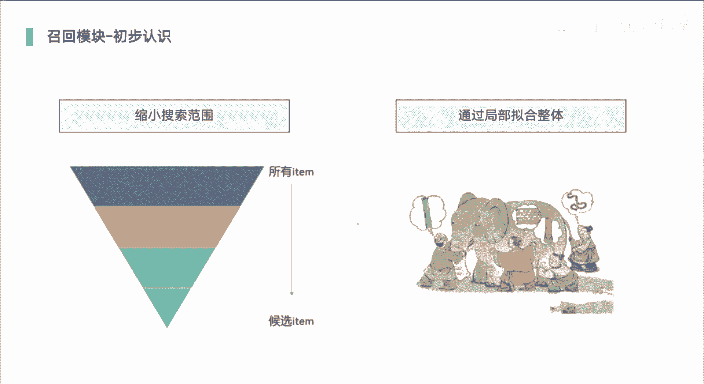
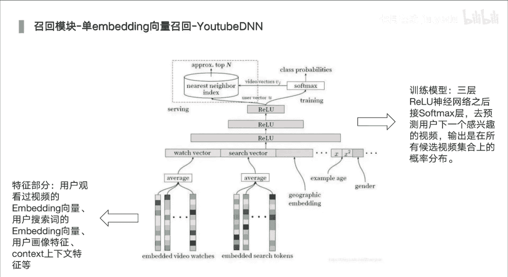

# 人工智能—推荐系统公开课（七月在线出品） - P16：快速入门推荐系统串讲 - 七月在线-julyedu - BV1Ry4y127CV

今天跟大家分享的是深入浅出推荐系统啊，然后我们会围绕着推荐系统，它的核心内容呃，想召回排序重排，这些核心模块进行展开介绍，那首先做下自我介绍。

我是7月在线推荐系统老师啊，ok。

推荐系统呢现在其实呃随着互联网发展，数据也越来越多，那我们如何去找到，或者说如何去推荐合适的一些，不管是商品音乐视频啊，我们平时刷的一些短视频呀，对我们看的一些文章对啊，那是海量的数据里面。

那如何快速去找到诶用户所感兴趣的，那这是一个非常具有挑战性的一个工作，那而且很多公司对吧，他们也是以这种推荐系统对吧，个性化推荐啊，来作为一个，也是一个比较高收入的一部分啊，因为这里面会涉及到一些呃。

如果说你给用户推，荐商品对吧，他的一个并不符合用户的预期，或他的一个兴趣，那你在相同的流量下对吧，你的整体的转化就变得非常低，那这样的话，我们的收入肯定会有所降低的嘛，那如果像一些广告对吧。

那广告也是一样的，广告主在平台里面去投放广告啊，这种广告的话它可以实现商品广告啊，也可以是一些app的一些广告，那这种话它是以用户的点击，或者说用户去点击或下载来去进行计费的，对啊。

同样的也是去找到用户的兴趣，推荐合适的广告，来去促使发生这样的一些交互啊。

那我们来去看一下推荐系统，它的一个结构啊，这里的话我们是以电商推荐，我们是以电商推荐系统啊，来作为我们的一个介绍的一个内容啊，因为我们经常会去像逛淘宝呀，逛京东，逛拼多多，那首先呢是用户行为日志。

就是说在我们平台里面啊，它所浏览的一些商品，点击商品购买的一些商品啊，那这就是我们的日志数据，那核心呢我们从日志数据里面来，去提取到用户的兴趣啊，比较简单，或者说直观的说就是说他最近对吧。

可能突然间将某个衣服啊，加入到他的购物车里面了，这种架构行为是非常强的，我们可以去思考一下，我们一般对吧去购买商品，那我们，可能不会直接去购买，而是先加入购物车，加购物车的话。

他最后的一个下单的概率可能是比较高的，那那也说明他对这个商品对吧，比较感兴趣，他也可能就是说先加入购物车，然后再去对比多家的啊，多个店铺的商品啊，那这时候的话，我们就可以根据这样的一个行为来去推荐。

和购物车里面比较相似的一些商品，让用户有更多的一个选择，或者说诶用户它加入购加入购物车之后，它还没有发生转化，那这时候的话也许用户它有一些犹豫，那这时候我们可以给用户推荐一些优惠券，不。

管是推荐商品也好，推荐优惠券也好，都是为了能够快速的来去，而使用户对或者促进用户去发生转化，当然呃可能很多用户他还没有加入购物车，他可能只是浏览了些商品，购买了一些商品啊，这种的话都可以从里面。

能够挖掘出用户的兴趣啊，他最近看到的商品比较多，或者说最近他去购买了一些商品，这些我们都可以考虑过滤掉，那有这样的一些数据，或者说有这样的思路之后呢，我们就开始利用推荐系统技术，帮助我们去解决问题啊。

那我们的商品池里面，可能有上千万或者上亿，个商品，那这个时候呢，那我们可能要去进行像呃，从这里面去筛选出几百个或几千个，这个所要求的一个基础点，就是说你的一个整体的效率，当然准确度也是一个对啊。

就是在比较准的情况下，尽量将用户感兴趣的商品全部筛选出来，那这就是一个召回的工作了，对我们尽量将用户可能感兴趣的全部找到，这是第一步啊，就是一个快速从大的物料池里面，商品池里面去做快速的一个筛选啊。

这第一步啊，这一步，其实我们可以借助一些专家的一些策略，那也可以去借助一些啊模型来去，解决，接下来的话，我们为了想更加准确的给用户做出推荐，那我们到了排序和重排阶段，那排序阶段的话。

就是我们的召回商品已经变得比较少了，可能就几百个，为了更加准确啊，那我们可以让我的模型变得更加复杂，或者说去增加很多的一些特征，这样的话会使得我们最终的一个准确率，得到提升。

或者说我们将用户出感兴趣商品，然后展现给用户，那rank的话是其实最前面，工作做了一个，我觉得做一个完善，做一个补充啊，因为很多的一些商品，它可能诶可能他比较感兴趣，但他之前也购已经购买过了对啊。

当然有的商品它可能是那种快销品啊，这种不影响对啊，可能短短时间内它可能会重复购买，但是有些商品的话它并不属于快消品啊，比如说像京东里面的一些3c家电对吧，你买完之后，你可能在等上很久啊，几年啊。

你才会再再去购买，那这时候他如果发生购买，发生转化之后呢，那我们要对这些商品给过滤掉，避免重复的推荐啊，这样的话啊，就会有所变差，同样呢我们要用户兴趣可能是单一的对啊，但是我们的推荐系统呢不能是单一的。

我们尽量要去挖掘用户它更多的潜在兴趣，用户可能近期有个短期兴趣，也可能有个长期兴趣啊，那我们今天的话，让我们推荐商品具有多样化，这也是我们再去体验一首，比如说我们平时去刷抖音对吧。

那可能你比你对那种美食商品，美食的一些短视频比较感兴趣，但是如果说系统一直给你推，一直给你推啊，也不替换一些其他的一些短视频内容，那你其实已经会变得非常的暴躁，其实哈，啊这也是很多的一些平台。

它是比较欠缺的，就是去挖掘用户潜在的兴趣啊，而不能完全依赖于用户的兴趣，而去推荐他兴趣类的一些拍视频呀，或者说一些商品啊，不管是哪种啊，哪种平台，我们都需要考虑这个问题，最后呢我们去筛选出合适的商品。

展给到用户啊，就是展示给用户，那我们有很多的一些广告位，或者说推荐位对吧，那就把这些商品展示到上面就可以了，这就是召回排序推荐，那整体的一个流程，从我们的行为日志到利用技术，最后推荐合适商品。

刚才我们已经讲过了，对，就是说推荐系统两个阶段，一个是召回，一个是排序，让大家再去想一下，对刚才我也提到了，召回是干什么的，排序又是干什么的，召回呢，我们处理大的数据，大的数据啊，我们可能百万千万对吧。

当然有的平台他可能后续机比较少，比如说a p p推荐，比如说像一些小说推荐啊，音乐推荐啊，那这时候的话，我们其实哎可以把召回可以做的，就像一个出牌一样啊，那同样呢用户他要去浏览我们的商品对吧。

那我们要快速给用户展示出来这样的结果，所以说你不管是召回还排序速度一定要快，一般都是在呃多少毫秒之内吧，我们就要去反馈到具体的一个商品，结果的召回阶段，你想快，那就模型不能太复杂，使用比较少少的特征。

排序阶段呢我们处理的数据量变少了，那这时候我们想要我们的准确性的提高，那我们就要模型变得复杂，而我们如果大家了解过排序模型对吧啊，那从最开始的l r到后面慢慢的复杂dn。

那更复杂的加入transformer，加入bot来去解决啊，那就是模型上面不断的进行优化，慢慢慢的变得非常的复杂，ok这是召回和排序两个部分。

接下来我们再去深入的去了解召回，对啊，缩小搜索范围，这样的一个啊，从几百万到几百个对啊，另外一个比较重要的是通过局部拟合整体，虽然我们缩小了范围啊，可能只是几十个几百个商品。

涵盖更多用户或者用户可能感兴趣的内容，这里面，其实召回能做的事情是非常非常多的，你其实有时候很难去考虑到，或很难去预测到用户他所购买的一些商品，这个怎么理解，呢用户他的行为比较少，力和行为比较少。

那数据一少的时候，我们就很难去挖掘到他的兴趣，还有一些用户呢他可能漫无目的啊，只是去逛一些对啊，那这时候的话，我们可能去考虑一些，最近比较热门的一些东西对吧，那有的用户他可能是爱跟兴趣结合，比较密切。

那这就要考虑从这方面进行进行，解决问题了，所以说我们需要从不同角度去进行召回啊，这也是很多的公司里面对吧，召回阶段可能有十几路召回，最后进行整合的，那每一路召回的话可能就是召回几十个啊，然后最后整合。

完之后到几百个，然后再去推到啊，排序阶段就像是盲人摸象一样对吧，那可能我摸到的是象鼻子，那另外一个人他可能摸到的是上推，那我们要尽量的去将这些每一个部位对吧，全部能够去你和它像的完整的一个部分。

评估阶段也是我们需要去考虑的对啊，除了cctr c ctr是什么呢，就是对应的一个嗯它的一个点击率啊，点击率预估啊，有c t r c vr对吧，cvr是转化率预估，那除了这种点击率和转化率。

我们去考虑一个问题的时候，大家再去思考一下，如果说我们再去看还是短视频啊，啊那或者说我们经常可能在群里面对吧，唉长辈给我们发来了一个视频，那我们点进去之后诶，可能因为他这个标题吸引了我们。

我们点进之后诶，它本身那个点击率是不变比较高了，但，是呢里面内容是完全没有关系的，可能我们点进去之后立马就退出来了，因为我看和标题完全没有关系啊，所以这个要考虑就是什么呢，点击率以及对应的一个停留时长。

对啊，这是在像类似于像文章呀这种啊，像视频啊这些对吧，这种这种这种类似于这种，非得流量的一个场景里面，我们需要去考虑的问题啊，不仅要考虑它的点击率，当然还有更多的，如果说我们的平台对吧。

像微信的视频号对吧，它里面会带有很多的一些社交属性，那我们除了考虑它的点击率啊，停留时长，那我们还会，考虑它是否会转转发，是否会进行关注啊，这也是像短视频它变得比较复杂的，可能考虑像多任务的建模啊。

然后结合这几个它点击关注转发哎，收藏啊，这些对应的都是一些二分类问题对吧，将这些对应的分数我们整合起来进行优化，这就变得比较复杂了，除此之外呢，还有像覆盖度啊，你能覆盖尽量覆盖到整体对交互体验。

运行运行策略，那我们离线评估呢，还是用lost或者人工评估它的准确度，开度线上a b test的话，那我们就要看他的ctrl c v r，或者人均的一个阅读，或者说是jj mv啊。

我，们的一个整体的一个收益情况，ok下面是一个比较经典的协同过滤，协同过滤的话是使用user和item的一个相似性，来进行推荐啊，比如如果用户a与用户b比较相似，然后并且呢用户也喜欢视频，一则系统呢。

我们可以向用户a推荐视频一样，那我们就可以去，这其实也可以理解成什么呢，像物以类聚，人以群分这一个意思啊，那你们两个走的比较近，那你们很肯定有很多的一些共同的喜好，对啊，比如说都喜欢去看电影啊。

都喜欢去旅行啊，那我知道了a它的一个喜好之后，那我们也可以去推测b的一个喜好，那这就是协同过滤啊，这里的话我们可以对我们这个矩阵对吧，哎小美这三个三个小朋友啊，小美小丽小红啊。

他们对应不同的一些化妆品的一些打分，当然有些是缺失的，这样的话我们可以构建出一个对应的向量，对吧，像小米的话是4005100啊，那有了销量之后呢，我们就可以计算两两用户之间的一个这块。

用的是余弦相似度的一个计算对啊，那小美小丽呢是0。38，小美小红的是0。32，这里的话我们想要看它对于某个化妆品的，一个喜好对吧，那我们发现其实这里面我们用零，有一些缺失的，比如说小米对吧。

它对这个这个是粉底啊，假睫毛对吧，这块是缺失的，用零来进行填充，这其实用零填充有点有点武断了对啊，我没有接触过，或者说我没有看过这个商品，没有看过这个视频啊，就不代表我不喜欢他，所以说你用零填充。

直接反映出用户不喜欢它，这样是不合适的啊，所以说我们可以考虑用一个均值，或者说用一些其他的一些手段，拿去进行填充啊，也是可以。

ok呃关于协同过滤的划分成两种啊，一种是基于用户的协同过滤啊，就是usc f它是有更强的社交属性的，那我们得到了就是说用户的一个相似之后，对啊，比如相似用户喜欢什么，那我们就推荐什么啊。

这种话他想发现热点，追踪热点趋势，虽然推荐是比较合适的，那第二个话是基于商品的协同过滤，就是item cf，用户兴趣变化的话是比较稳定的啊，就比如电商场景里面对吧，商品的性质它是很。

它可能变化并没有用户的性质变化更快，怎么理解呢，用户它是你购买完一个商品之后，你可能之后不会再去购买这个商品的，你的兴趣不断的发生变化，但是商品它的本质也好，或者说一些表现形式也好，就很难发生变化啊。

除非或者说他可能会当然也会变化对吧，只是相对来说更稳定一些啊，嗯会变化是因为什么呢，因为这种时间的一个衰减，对时间的一些因素的影响啊，比如说最近啊哪个手机对吧，新款的手机对吧，然后刚刚一上市对啊。

他就比较热门对啊，就他就是一个非常热门的商品的，但是过了12年之后或者半年，之后几个月之后他就没有那么热门了，可能被另外一个热门商品给替换掉了，但不管怎么样，他本身商品的性质是规范生变化的对啊。

这也是比用户的一个稳定之处啊，这个item cf嗯，一般两者的话，我们再去做召回的时候都会去用到的，对啊，不管你是电商推荐还是用推荐，因为这两者之前我们其实做过实验，这两者他们得到的结果对吧。

他们之间的一个重合度并没有那么高啊。

所以说我们可以都去使用的，下面的话是关联召回，他也是属于协同过滤的一种啊，那我们来去看看他怎么去，做的啊，嗯如果说我们要去找到用户，未来可能交互商品，那我们就可以挖掘商品的关联关系啊。

根据用户历史交互商品，找到这些商品的一个关联品啊，这个其实就呃比如说我们去超市里面对吧，那超市里面的话，他们再去做一些呃一些像一些物品的，或者说货品的一些摆放手对吧，他们会考虑这两者可能有一个强关系。

对你买买了商品a你就可能去买商品b啊，这类似于比较经典的一个问题啊，经典的一个呃数据分析问题就是啤酒尿布，对吧啊，那很多男人对吧，他们去买尿布说对，吧或者买啤酒的时候，他们实在会把尿布买。

那这两个就是有比较强的关系了，又或者说像手机和手机壳对吧，我们买了手机之后就大概率会买手机壳，那这就是这就是一个a到b的一个关系了，但是b到a的话就会变得比较弱，我们很少先买手机壳啊。

因为一个手机壳我们再去买一个手机，这种是不是概率是非常非常小的，对当然也是有的啊，这个话我们可以根据我们的一个历史行为，在日志里面来去做统计啊，是a到b的更多一些，还是b到a的更多一些。

这样的话其实就已经给，就是关联分数，这种分数的话，我们如果说用户他买完a之后对吧，那我们就可以将b推荐给他。

我们看下面，当然我们可以考虑一些更细的，比如说小冯对吧，他买了一些商品啊，呃一些牛奶啊，饼干啊这些饮料对吧，这里面的话它有一个正向和逆向，就是我们刚才说的从a到b，从b到a，正向的话。

就是其实我们按时间从远到近对吧，那远到近，那其实就是一个正向的关系，从近到远就是一个逆向的关系，这个画的话我们可以加上一个乘法项，正向的话它的，分数乘以一个一，那逆向的话我们乘以一个0。7啊。

这是只是一拍脑袋这样的一个设定，那是不是就是说明，正向他的一个分数更高一些啊，这是第一个第二个距离或者说时间啊，我买完商品为a之后对吧，我过了五六天才买商品b，那我买了商品a之后，过了一两天买商品c。

那这两个距离就是一个是二，一个是可能是五对吧，那是不是越近的，它的相关性更高一些，大家可以想一想，对啊，你近期去看的东西，他们之间相关因素比较高，再对比你去年啊，或者说几个月前看东西啊，是不是。

差异性就没有那么的就变得比较大了，这时候的话我们可以我们下面有公式对吧，距离哎也是一个作为我们的一个系数对啊，来去调节，最后去得到对应的两个商品的一个分数啊，得到分数之后呢，他最近买这些商品。

那每个商品它都有一些关联商品的，关于商品它的对应关联分数，就刚才我们这个公式打分得到的结果，那我们可以将这些分数进行一个排序，或者排在第一个位置啊，这就是关联召回它的一个流程，大家可以再去诶思考思考对。

看看能不能这块能不能这块能不能看懂，对啊。

ok那我们继续，下面刚才我们讲的是，像类似于协同过滤的那种方式对吧，那接下来的话我们再去看一下，基于向量的召回，下令召回的话也是一个比较经典的队，我们就是说将用户或商品转换成向量，有了向量之后。

那比如说我们看这个框架对吧，这框架划分成两个部分呃，第一个部分的话是离线部分，离线啊，离线的话，我们对应的是一个可以理解成，简单的一个dna的一个模型，那我们输入是有两个部分，一个是用户特征啊。

一个是物品特征，然后输到模型里面，我们可以去得到用户的in bedding，这in bean就是它隐藏层的输出结果了，以及物品的100点，我们可以将其存储起来啊，但这里有个问题。

用户的in bing对吧，它的兴趣会不断地发生变化的啊，所以这里面我们一般都是先去存储物品的，embedding，然后线上的时候呢，我们再去生成用户的embedding，然，后到我们的数据库里面对吧。

快速的来去进行查找与他相似度高的物品，这里面的话是用了一个方法啊，就是一个fast，就是一个呃facebook的一个呃，一个a n n的一个方式，就是呃近似最近零，就是进行一个快速查找的对吧。

快速搜索的一个算法啊，不然的话我们商品，而千万两具商品，你每个都去计算它的余弦相似性啊，那可是会非常费时间的，可能原本你需要三小时，但是你用这个fast之后对吧，它就缩短到了十几20分钟了。

还有的话像比较经典的有土地，嗯2018年的时候啊，是发表了一篇论文，分为排序，分为召回和排序两个部分啊，它的模式就跟刚才是一样的对啊，当然这里面并没有去，并没有去分成两个部分啊，两个什么部分。

一个用户特征，一个是那种商品特征那种双塔形式啊，他在提取用户隐bedding和商品引白灵，是分成两个部分啊，用户in bedding呢，是在最后一层的隐藏层去提取的，那商品的in bin的话。

是在soft max部分来去进行提取的啊，同样的也是经过那种a n n的方式来去，进行快速查找，啊我们先去保存商品的in bin，然后线上的时候来得到用户隐白点，然后快速去搜索，然后推荐给用户啊。

ok下面的话是一个典型的一个状态啊，d s m m d s s m啊，分成两个部分啊，最开始他是在那种信息检索的时候啊，会去用到的啊，一边是我们，比如说我们去做百度的搜索对吧，我们输入query啊。

然后他会去计算和很多的doo啊，抬头呀，去计算它们之间的相似性啊，将高相似的推荐给用户啊，但现在的话他也会用到这种电商啊，音乐中推荐里面也会去使用的啊，我们分成了两路啊，一个是我们的。

比如query的话是作为用户特征啊，darkle，wavector的话是作为我们商品的一个特征了，然后经过对应的表示层之后，来去得到对应的q和d，然后计算你可以计算它们的点击。

也可以计算两者的一个相似性，然后再去，输入到最后的soft max，得到最终的结果就是d s s m，它整体的一个结构啊。

那刚才我们讲的是比较简单的啊，或者考虑到用户的一个单一的一个兴趣，但是我们有没有想过，用户的兴趣其实非常多的，他可能在一个阶段对吧，有多个兴趣啊，可能啊我想看一些电电子产品啊，但是我的老婆对吧。

他又让我去哎买一些其他的，比如说家庭用品对吧，哎两个我都顺带一块看了对啊，那是不是用户的兴趣，它的向量当前是两个，而不是一个，所以呢慢慢的就会有类似的一些模型出现，就是m i n d啊。

这种多引bt向量推荐，这个，他再去得到多白领的一个核心的是，经过一个胶囊网络，它分成两个部分的一个胶囊，一个是你的行为胶囊，就是你的行为的一个embedding啊，一个是你的兴趣的胶囊。

就是你的兴趣的一个向量与白领啊，这是其实就是一个聚合过程，从多聚合到少的一个过程啊，然后最后对每一个兴趣我们都去召回，然后排序到最终的结果啊，这就是多in白点三辆，召回他大概的一个思路啊。

ok我们再去往下看，还有一些的话我们会考虑到像一些graph啊，结合图当然更复杂一些的话，会考虑到像g n这样的一些，或者说gcn图卷积网络，这里面的话就是为了去增加一些，图的属性或者说社交属性。

那上比较经典的像deep work对吧，depk的话它是分成两个部分的，或者说细分点分成三个部分，我们先去构建我们的图，构建图过程的话，就是根据用户它的一个行为日志，比如说我们先看对应的a这个图对吧。

我们有三个用户u1 u2 u3 ，他们分别都会去点击一些物品啊，比如说ue点击d a b对吧，那这时候的话，第1b它其实就是有这边的关系了啊，怎么理解呢，就是由d到a啊，是不是这种关系啊，看完d之后。

d完d之后点a那点完a之后点b是不是，这样的话，我们是不是构建出来了这样的一个边点，就是商品编就是他们之间的关系，他们之间的一个点击的关系啊，那u2 呢同样的话带到里面对啊，比如说b e啊。

然后像d e r e f u3 也是一样的，这里面中间它还有一个就是分段的部分啊，这是考虑到就是说你b e和d e f，这两个点击的一个群体的，它可能时间离得比较远一些，时间越远。

他们之间的相关性就比较高了，这时候他们之间可能就没有类似关系，你就没有必要把它去构建成我们的边和点，构建完之后呢，我们再去借助random work进行随机游走，从里面去生成对应的这种关系。

比如说a b e f，这是我们最后是右走完结果，这可以看作一个文本啊，然后将其输入到word tactor里面，就是这skyram这样的一些模型，最后去得到对应，每一个商品的一个向量表征。

当然更复杂一点，我们可以使用not not not to actor，对啊，这里面的话它是考虑两点啊，一个是b f s和d f s啊，一个是呃对应的广度唉，一个是广度呃，优先搜索一个深度，优先搜索对。

ok那再往下的话是已经e了啊，e d e s的话好像也是阿里的一个论文，对他所考虑的是，我们如果只是考虑商品本身的id信息的话，那会存在一些问题啊，有些商品它的行为比较稀疏，或者说是一个新品啊。

那这个点的话，它的意义就没有那么强了对吧，他是个人品，那这时候的话我们可以去添加一些什么呢，side information就是其他的一些信息，除了商品id以外，我们可以添加它对应的品类id对吧。

还有品牌id啊，一级品类，二级品类，三级品类这些都可以看的，这样的话这是这个eges里面的一个核心，也是很多的一些模型里面对吧，我们需要考虑的就说我们将这向量对吧，进行累加完之后，累压是最基本的。

当然这个模型里面，它会动态来去调整里面的权重啊，哪个装性高一些啊，对应就是a0 a1 a a2 打a n对啊，来进行这种自动化调整啊。

那再复杂一些的话，相对应的像知识普知识图谱的召回对啊，那基于商品知识图谱，它有效的建模新品啊，比如最近我们有新品了，小米手机啊，小米10但啊，小小米11 22这些的吧，这新品的话刚一出来。

他可能没有对应的一些行为，但是如果说我们构建了这种商品的图谱，之后啊，但我们可以有效地从里面提取出来，而小米刚一上市的手机对吧，它的热度可是非常高的，那这是不是就有效的去建模新品了。

或者是或者说一些活动这种一些新品呀，时尚热点呀，时效活动呀，精准搭配，这些都可以去借助知识图谱来去进行召回。

或者从里面来去生成对应的商品销量，这里的话是去，比如说我们如何去搭建知识图谱对啊，那一个是商品多层次与一息息抽取啊，商品啊，比如小米手机，小米手机对吧，那他要对应那些属性尺寸，内存空间颜色了。

那复购周期是多少，还有用户商品关系建模，基于用户图谱交互关系建模，用户兴趣概念完成新品推荐，然后基于用户图谱交互关系，实现精准复购周期预测，基于用户图谱交关系，实现用户兴趣演变呃这种graph对吧。

呃像，比较新的论文里面也有去讲到一些对啊，这种实体的关系，通过这种实体的关系，我们去生成向量啊，当然这个实体关系他可能描述比较多，然后再去结合attention，就是注意力机制啊。

将这些描述去聚合起来，然后的话我们还是要考虑一些细节，比如说像孤立行为建模，就是我们每个行为之间前后是没有关系的，还有连续的session啊，就是间隔半小时对吧，我们去切分一下，还有用户意图建模啊。

比如说原本的话，可能是具体到它对应的商品对吧，我们可以考虑这种c1 c2 c3 啊，对应到兴趣或者说品类啊，这样的话，我们能够了解到它大概的一个意图，而不是具体到某个商品，这样的话我们推推荐。

或者说可能更加具有一定的泛化性。

ok我们继续往下，下面呢就到了我们的排序模块了啊，这点也是非常重要的，那我们再去回忆一下，排序模块是干什么的啊，我们召回先是去筛选了商品对吧，从几千万个筛选到几百个排序呢，我们基于复杂的模型。

复杂的特征去进行对应的cpr，cvr的一个预测，然后做出对应的一个排序，这时候才真正的将那些商品从高到低，进行排序，这种概率分数啊，他可能对他的一个兴趣的概率来排序对啊，当然也有可能将多个分数整合起来。

进行排序对，所以说它主要是两个部分，特征工程和模型两，个部分啊。

ok那我们这里着重去讲模型模型的发展，模型的演变，让大家快速去了解推荐系统，它的一个大致的发展方向，以及之前是怎么做的，现在又是怎么做的，以后又该怎么去做，最初期呢是人工特征，再去结合线性模型。

国内做推荐对吧，比较早的是百度对吧，都是从百度过去的对啊，因为确实做的非常厉害，最开始对吧，可能在还是在一几年的时候，因为那时候其实还是会用l r模型，然后去结合百万亩百万特征啊，百万人工特征对。

因为你的人你的，特征已经做的非常非常的全了，因为特征它会影响到我们，如果说能够加上一些信息对吧，通过特征构建出来，那这时候模型也就没有什么事儿了，因为我们特征已经够多了，够大家复杂了对啊。

模型它只是从数据里面更好去训练，这些数据，提取出关键信息，但如果说我们特征，已经将这些信息呈现出来了，那模型是不是都可以变得非常简单了，那当然现在慢慢的有很多的，但这种只是一个假设对啊。

但这样需要这样做好的话，是变得非常非常困难的，你怎么样才能将所有特征，所有的一些点全部涵盖到呢，这个是消耗，成本消耗人力对啊是非常大的，而且特征我们需要做很多事情啊，所以说这是最开始的时候对吧。

当然那个时候对吧，我们的模型，我们的机器我的配置还跟不上对，所以说只能用这种线性模型。

再往后的话就是在20110年，到2015年，这个时候的话，我们可以去自动特征交叉加线，线性模型阶段精准推荐啊，就是我们要去能够精准，能够个性化的对啊，力度非常细的去得到，或者说去挖掘到用户的兴趣。

可能我们在扣过在构建特征的时候，我们就需要去构建很多的一些交叉特征，对啊，我们人工需要去做一个事情啊，但是如果说我们模型也能做这个事情的时，候，我们是不是可以减少一定的工作量呢，比如经典的fm fm。

它就可以实现这种特征的交叉啊，g b t t x t boost也可以实现特征交叉，它怎么实现呢，数在分裂的时候，第一棵树它选的是性别，ok分分成了左子树，右子树，下一棵树呢我们选择的是年龄，这是不是。

就实现了性别和年龄的一个交叉了，这就是在2010年到2015年，自动特征交叉加线性模型阶段。

ok这里的话是fm和f fm，这两个话现在其实也呃，fm其实用的比较多啊，为什么呢，因为fm的话，它里面引入了一个f一的厂的，这样一个概念，考虑到特征交叉时对吧，不同特征的交叉对吧。

他们之间的一个重要性应该是不一样的啊，比如说我们a和b交叉对吧，哎我们的我们的这个向量嗯，是等于a和c交叉的，但实际当中a碰见b和碰见c，这两个向量应该是有差异的，重要性应该是不一样的呀。

所以呢引入了一个厂对啊，这就看下面这个公式里面对吧，原本只是v i v g对吧啊，就说mv ok是对应的一个向量啊，g也是对应商量，就是商品i和g啊，或者特征i和g啊，但是呢。

但是呢考虑到我们刚才那个问题对吧，变得更加复杂了，对我们i里面它又分成了f1 f2 f3 ，他碰见摘的时候，他就用f2 啊，你碰见什么时候，你就用不同的，f设备的参数量又有所增加了。

原本的话可能是常数项哎，你就变成了二次项，时间变得更复杂了，成本唉，这时候我们可能就等不及了对啊，而且效果对比上说其实两者差不了多少的，所以后面才会有像deep fm这样的一些演变。

也有一些很多的一些结构对吧。

它叫fm作为其中的一个子结构来去使用，下面的话是gbt和rr的一个结合过程，怎么结合呢，这可能是facebook 2019年的手机版，他们使用的啊，当然我们也去用过，发现没什么效果对啊。

这个也是有很难去嗯，很难解释对啊，大家可能经常能看到一些论文对啊，像阿里系论文或其他一些论文对啊，那呃换长之后就没有效果了，那这个是为这个是为什么呢，我觉得这也是值得我们去深思的部分啊。

那我们来看一下gb t的话，他怎么和r r结合呢，d p它最后会有对应的页的节点对吧，有叶子节点就是落到每颗叶子上面的样本，你落到这个地点上，它就一没有落到，他就是零，那这些节点这些页页节点对吧。

它其实就是一个0101这样的一个结构，那我们0101这结构，它卖就可以下一步和l r进行一个结合，就将其输到rr里面，这就是g b t和rr的一个结合的过程，得到g p t它的e的节点。

然后将e的节点输入到r r里面就可以了。

再复杂一些也是很多一些变形，其实很多都没有用的，大家了解还是可以的，只要了解一些比较经典的就可以了，这里面我调了很多对吧，但比较经典的像什么呢，wide deep red，deep是谷歌的。

deep fm的话好像是华为的，这两个是比较经典的，而且用的比较多啊，我之前公司里面也都用这些模型的对啊，像fn呀，pn呀，n fm呀这种哎呀，那个时候这种论文特别多的，对各种结构的一些组合。

各种结构的一些变化啊，捣鼓捣鼓就发个论文了对啊，但很多其实都没有什么价值的，你看后面还用吗，没有用的对啊啊，当然很多人可能会写一些文章对吧，ok去对比一下这些效果啊。

我们只要去理解他的一个演变的一个过程，演变一个思路啊，怎么去演变呢，啊比如说像wide deep或者说deep fm，它就分成两个部分，一个是y的部分，一个是deep部分啊，一个是f，一个是fm部分。

一个是deep fi，一个是deep部分，对啊，两个部分，每个部分他们考虑的点是不一样的，y的话考虑什么呢，考虑一个记忆性，第一部分考虑是泛化性，那fm考虑什么呢，交叉不仅交叉，而且还有记性啊。

在原本的y的部分，是不是又添加了一个二阶交叉，二阶这样的项目啊，是不是可以理解deep fm它的发展啊，应该是在外deep之后的，因为考虑到更多点了，在基础上做优化了，那还有x d不fm。

刚才我们讲到的是二级交叉，那xd bim它里面的核心结构是c i n，可以实现高阶的一个交叉，深度卷积网络也是哎深度交叉网络哈，他也就是实现了一个高级交叉，我们可以自动来去设定三阶四阶这样的。

这里的话是fn和p n啊，ok这两个其实感觉也没什么作用对啊，fn的话是使用fm得到影向量，作为引bei的初始值，pn的话是在影ban层和m p层，加入一个啊product。

就是一个也是一个交叉的部分对，ok我们继续往下。

videep啊，我们刚刚提到了，以及deep fm都分成两个部分啊对吧，这也分两个部分啊，fm层啊，这是deep层，这是y的部分，这是deep部分，这两个的话，如果我们要去以后要去从事推荐段。

或者说我们想往这方向转的时候对吧，我觉得这两个模型是比较经典的对啊。

以及我们再往后看，想点网络点，点这个的话有没有效果，其实有时候还不好说对，有时候真的是不好说的嗯，因为我们这块也有去尝试过dn d i n，有时候换个场景确实是没有太高太多效果。

但它确实是确实是开创了一个，比较新的一个方向啊，就是在原本的排序模型里面加入了什么呢，对于序列的一个信息的一个提取啊，我们序列的话最后要帮要将其聚合，成一个序列，它是多个100对吧啊。

比如a b c d每个都有个in beding，那我们最后简单点的话，可能将这个in bedding全部求和求和平均，那这里面的话就考虑复杂了对啊，每个embedding，相关性是不一样的。

有的相关性高，有的相关性低，这里面的话它就是结合了attention，大家记住了的天使啊，这也是源自于rp，对啊，现在很多天使里面都会用rp的，也可以支持像attention transformer。

像bt这些都会去用到的，可能都结合这一点了，所以想去发论文的时候，你不妨就，是说去和其他领域或其他方向结合一下，考虑考虑，那dn的话考虑的时间的因素啊，前后的引前后的关系，那你要考虑时间的这种关系。

那你怎么加结构呢，大家想想这种时间对吧，这种时序啊，那是不是就是可以结合r n n或l s t m，g r u对吧啊，这就是无前后关系啊，所以说d i e n对吧，它就是添加了对应的这样的一个结构。

所以也是很好理解的对啊，刚开始我们现在考虑了不同的商品对吧，哎，商品的一个相关性，我们用tention，但这里面没有加入时间的因素考虑啊，所以说我们又融合了，融入了对应的rnn这样的一些结构，是不是。

所以说这些都是有前后因果关系的，我们都可以去不断的去深入去考虑的，所以说现在目前而言，都是那种序列化序列方向去发展，但是这个发展其实也差不多了，对啊，慢慢的结合图国服，还有看结合图。

这些都是不断的去和一些比较流行的，比较新的一些点去进行融合，因为到达瓶颈了，你接下来要考虑什么呢，那一个是你的模型的表征能力非常关键，对表达能力的话，就需要你能够对应不一样的数据。

提取到对应的一个信息啊，ok我们再往下这块。

我们也讲完了，接下来讲重排部分。

ok比如下面我们再去搜商品对吧，淘宝搜索啊和淘宝推荐对吧，我们再去搜索，比如说搜索连衣裙的时候啊，它其实就是会考虑什么多样性的，一个推荐的对啊。

这里的话是一些策略，大家可以可以记一下对啊，这个你如果现在是做推荐的对吧，我觉得这些都可以直接去使用的啊，或者说要去完善一些重牌策略，其实我们在从0~1手对吧，那时候最重要的并不是金牌啊。

最重要的是做召回和重排的一个策略，要保证我们推荐出来结果是正确的，并不是什么，整个屏幕下去全都是一个平a哈，这样的话肯定是影响非常不好的对啊，所以说我们要考虑到很多细节，比如黑名单过滤啊。

按照回类型重盘啊，多特征打散对吧，重拍最后一波，根据内幕品牌打散进行杀er对啊，去重啊，图片相似和sp u相似，打分前进行特征比例控制，不同的栏目它的内容占比对吧，按用户特征体现，根据用户收藏。

他最近有收藏架构，这些偏好，我们可以将其进行提现的，所以说排序完之后对吧，你只是完成一部分工作，后面还有很多事情需要靠，我们整体的一个框架对来去解决的，还有近期已够的，我们需要沉底对吧。

一一重盘来去改善用户的体验。

ok这次呢我们其实只是讲的，我觉得只是一个是让大家去了解，推荐它大体的一个框架，每个部分的一些内容啊，但还是不够深入，对啊啊，比如说模型之间的去对比，模型的优化如何去进行实践啊，不同的项目下面对吧。

针对企业项目对吧啊，电商场景项目啊，或者说一些嗯视频场景项目啊，我们该如何来去进行优化，以及更多的一些知识点，更细的一些知识点啊，比如说序列化推荐他这个演演演变啊，g n它的一个演变啊。

这些内容的话我们都会在呃，我们其实在线推荐高级小班，第13期里面去介绍到，会比今天讲的内容更加的深入，让大家对推荐有更加深入的理解，但是如果我想从事这个方向对啊，呃大家可以去了解一下我们的课程啊。

看看是不是和你所所想的对啊，是不是一样的，比如说很多很多这些诗真实的一些项目啊，代码的一些实现，对吧啊，我们的分布式一些大数据的一些工具啊，一些操作对吧。

工业级的项目，还有更加核心的队是全程答疑，大家遇到什么问题，项目的问题啊，或者说求职的一些问题啊，以及就业辅导对吧，我们都会a1 b对一的来去进行介绍的，对，ok这就是我们今天的所有内容了。

感兴趣的同时呢，我们可以进一步来去沟通交流啊，好的今天分享就到此结束啊。

