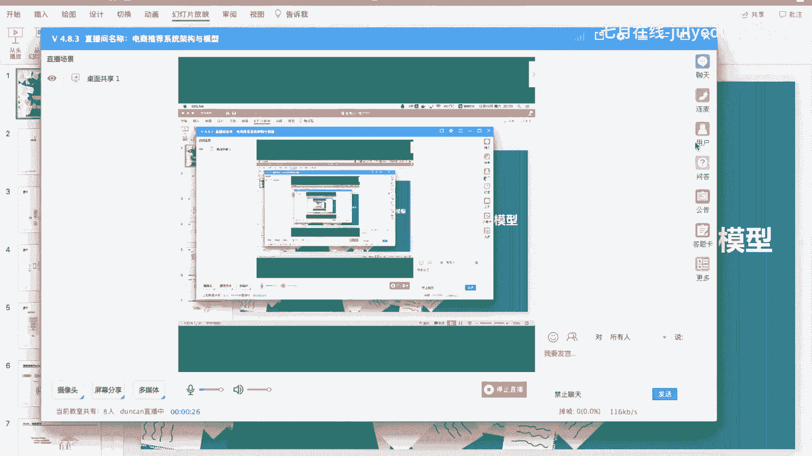
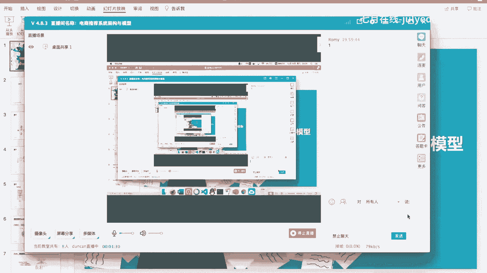
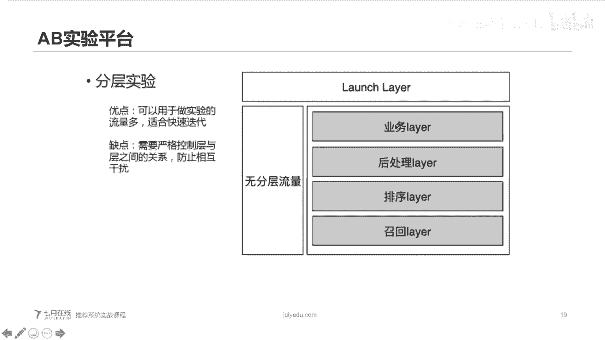
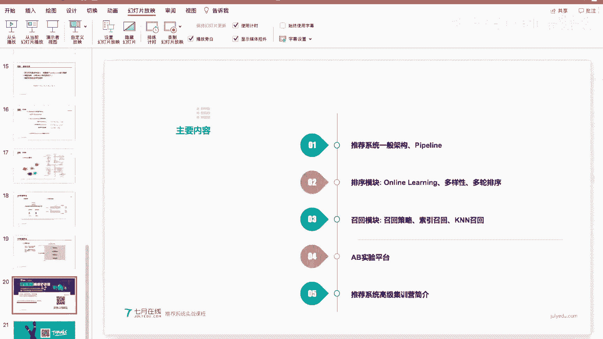
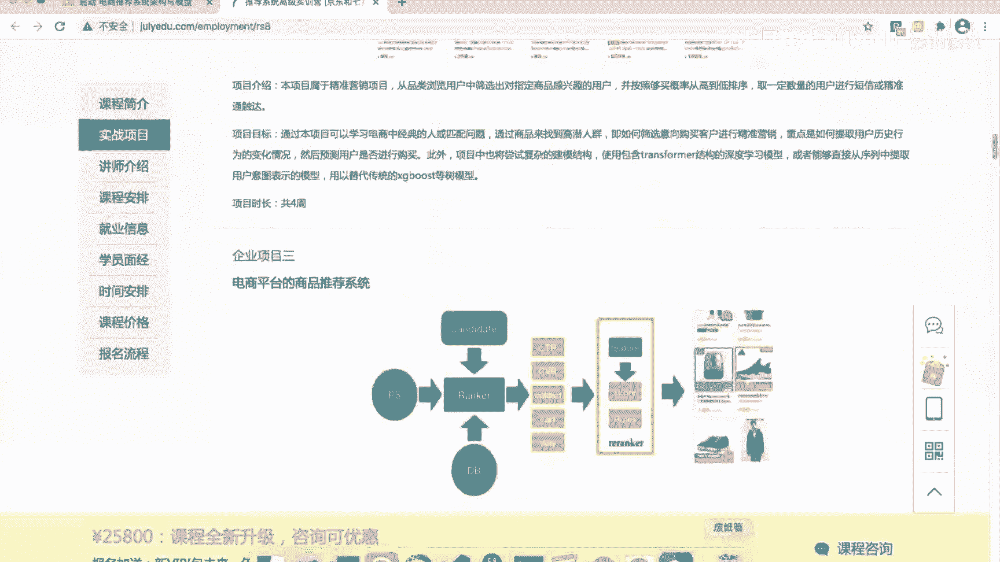
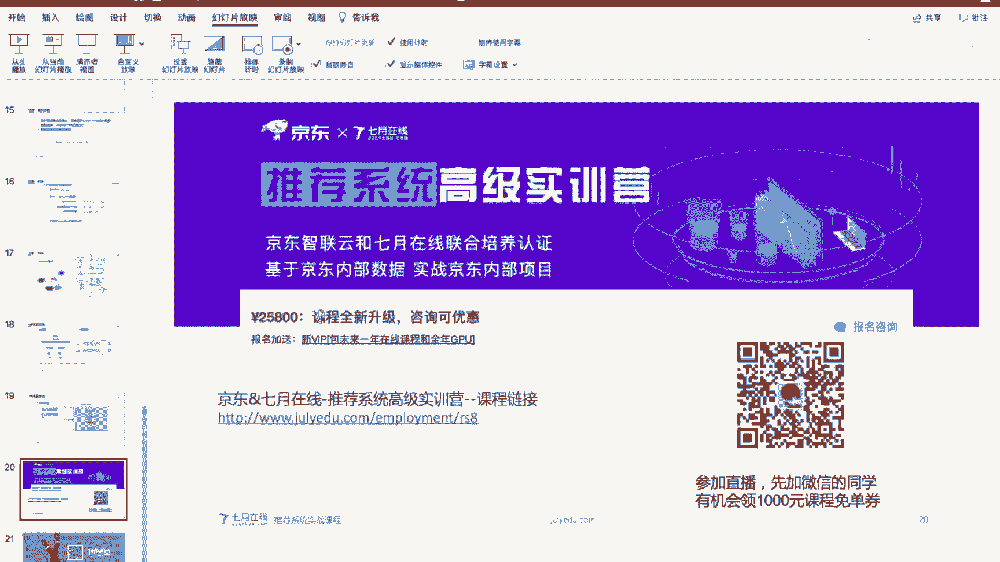
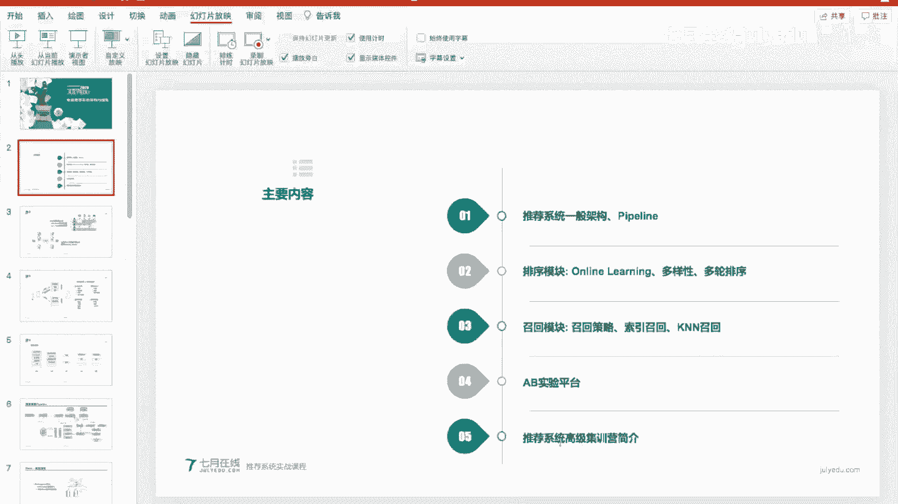
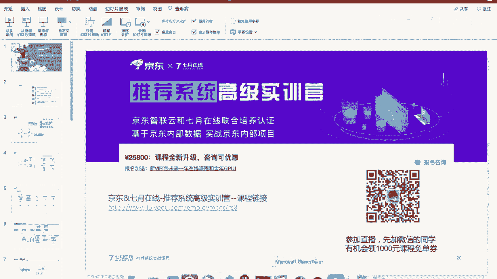

# 人工智能—推荐系统公开课（七月在线出品） - P4：电商推荐系统架构与模型 - 七月在线-julyedu - BV1Ry4y127CV

🎼。

喂，大家可以听到声音吗？可以听到声音，可以在直播间里面打个一。

行。啊，那我们就开始吧。

好，今天今天就是给大家做一个公开课，这个公开课主要是介绍电商推荐系统的架构与模型。然后在讲的过程中呢，就大家有什么问题可以在直播间里面啊留言，然后我会经常去看一看。

好，今天的主要内容呢主要是分成5个部分吧。第一块是推荐系统的一般架构啊，和它的一般推荐系统的pline是什么样的？呃，第二个呢就是第二个和第三个其实可以融在一起，就是在推荐系统内怎么去做召回和排序。

然后这里呢先介绍一下排序模块，然后再介绍一下召回模块。一般呃在电商推荐系统里面的一个实践是怎么去做的。第4块内容呢就是AB实验平台。怎么就是说怎线上怎么去做AB实验。呃。

然后第5块呢就跟大家介绍一下啊推进系统高级集集训营啊这个课程。好，就是这个到最后啊到最后呃直播的，今天我们大概一个小时的一个公开课的时间直播吧。那到后面呃今天的课程啊，后面的话。

比如说在四五十分钟的时候，会给大家一个小的一个福利啊，到后面再跟大家再讲。好。大概一个介绍，让我看一下直播间里面。好的。那我们就正式开始了。嗯，刚才讲了我们的主要内容主要是这么几块。

那我们就啊一块1块来看。首先就是拖建系统的一般的架构和它的pline是个什么样子的。啊，然后大家啊我觉得大家来听这个公开课，应该自己都有一些相关的推荐系统，多多少少都了解过。那一般提到推荐系统。

那必然就是最经典的就是协同过滤啊，协同过滤的就是这上面这张图啊，这里可分成两种，一种是基于用户的，就是us best的协同过滤，还有一种是基于item的ite based的协同过滤。呃。

具体协同过滤怎么做呢？其实也很简单，就是说呃构造一个临接矩阵。然后这里的每一行啊是一个用户，然后每一列是不同的商品。然后这时候如果是这个用户购买了，或者点击了这个商品就给大家打个一。

如果没有购买或者没有点击给他打个零啊，这样的话就可以构造这么一个啊连接矩阵。然后这样的话就是可以计算。啊，如果是user best的话，就可以计算两个用户之间的距离。

然后把啊比如说用户B如果和用户A比较相似，那就可以把用户A买的东西推荐给B了啊，就这么一个啊思路，然后具体就行同过滤本身就不跟大家再详细展开再介绍了。那其实现在呃突荐系统呢一般呃不会直接去做行动过滤了。

因为协动过滤啊相对比较呃。比较经典了。就是说我们现在呃电商里面做推荐系统，一般都是做啊都是使用lening to rank learningning to rank这种方法去做。啊基本的一个思路呢。

主要就是从一个无序的一个item列表，然后经过一轮排序，然后得到这么一个啊有序的一个文档列表，然后经过啊推荐系统，大家应该都比较了解，就经过我们这个lening to rank推荐完之后。

就是大家啊手机如果大家手机里面有装啊今日头条啊，或者说张淘宝，然后京东啊，这种app里面首页里面的信息流，就是我们推荐的落地场景啊，落地场景。然后对于。然后对于呃电商推荐这个领域来说。

其实额外想跟大家分享一下，就是说对于电商这里的话，它和新闻推荐。因为大家呃接触到了可能了解到了更多是一些资讯类的一些推荐的一些系统。呃，然后具体到这种电商领域的话，它和新闻还是有一些不同的啊。

比如说对于新闻推荐来说，优化新闻推荐系统，它的优化主要是优化啊，用户的点击，提升用户的点击率，提升用户的一个停留时长，提升用户的留存等等。然后推荐的内容呢主要是一些我文章啊或者视频啊或者公众号这些东西。

而对于电商呢，电商它的优化方向却是啊主要是销售额，就是说我能带来多少成交啊，当然也有一些偏用户测的东西，比如说点击留存这些东西。但是我们的呃可以说是核心指标吧，还是要优化用户的成交。

就希望用户能在我的呃平台，电商平台里面买东西，就大家去逛京东的时候，你刷京东的时候，可能呃在这个过程中，你可以呃。促使你就是或者说推荐给你更多你想买的东西啊，这是我们的优化目标。然后这里的推荐内容呢。

一般就是商品了。然后一些当然也有一些偏啊偏。呃，内容性的东西，比如说一些商品的一些介绍的一些文章啊，或者说视频啊啊活动啊等等，也有一些。不过我们的核心还是推荐商品。

那这样一个对于用户的一个交互的一个行为呢，其实就是很简单啊，就是用户打开手机，打开这个。啊，应用比如说打开淘宝或者京东。然后就是从实时在线部分就直接获取到推荐结果了。就这个这个流程。

这个过程其实是在呃很快的时间内，几百毫秒内其实就已经完成了。然后这在引擎在我们推荐引擎里面做的事情。然后在呃渲染部分就是大家可能在加载的时候，可能会因为网络什么东西有一些延迟。但是整个的这个实时部分啊。

是非常迅速的这么一个过程。然后这里的主要核心的模块其实就是呃两个模块吧，一个是排序，一个召回。呃，然后用户获取到这个推荐结果之后，就是当你打开京东，然后看到商品之后，你就会有一些行为。

比如说点了点击了某些商品，甚至于把每些商品放到购物车，或者说做了一些收藏加购这些浏览。根据用户的这个行为呢，每个用户的用户的这些操作行为都会记录到我们的日志服务器里面去，把它记录下来。

然后根据用户的这些行为特点，然后在离线的时候，我们会对他去做一些用户画像或者说商品画像的一些呃一些东西吧。包括我们的样本模型训练的一些样本的构建，其实都是在离线部分呃完成的。对于那种天级模型来说。好。

这是跟大家简单过了一下背景。那对于推荐系统啊，整个流程来说啊，就是大家现在看到的这张图这么几块主要的内容主要包括召回啊，过滤排序，然后再做过滤，然后再做调整。调整也可以呃成为重白剧，或者说其他一些叫法。

呃，然后主要核心就是第一个就召回。召回的话，这里主要是呃行同过滤啊，user baseiteem base的行同过滤。然后热门热门商品的召回策略，然后实时促销，然后KN召回等等。

然后过滤的话就是对于用户已经购买掉的商品。比如说我知道这个用户呃想买一台手机，但是说他已经买过了iphone，那这时候的话我就不会再去给他再做呃再过多的做手机这个类目下面的一个推荐了。嗯，这是在。

过滤这块，然后当然也包括一些呃敏感的商品，比如说一些呃色情擦边球，或者说一些呃涉及到政治政治因素的一些。一些商品都可能会给他做做完过滤，主要是考虑一些法律法规的一些合规啊。

当然还有一些其他的一些审核条件啊。然后在排序这一块的话，我们就是主要是做一些DN或者说GBT或者逻辑回归一些排序模型啊，主要是对呃用户的一些根据用户的优化，根据我们平台的这个优化目标。

然后对采用我们合适的模型去给这些商品做排序。排序完事之后，我们去做一些过滤。比如说一些相似商品，那其实提升提升那个商品的一个丰富度嘛，然后我们可能会做一些过滤啊，后续还有一些调整的一些操作。

然后其中主要核心部分啊就是涉及到我们算法核心部分啊，主要还是召回和排序这么2块。然后这个图呢是一个更更全的一个图啊，就是说对于推荐系统里面这个publine啊是怎么去工作的啊，我们从这边看起的话。

就是从用户的这个操作它会访问访问请求到推荐引擎，推荐引擎返回到结果啊这么一个过程。然后用户呢。呃，用户的这些对于返回结果推荐系统返回结果的这些操作都会记录到我们的日志收集服务器里面去。

然后根据日志收集上来的用户操作行为，呃，一个是我们可以做一些报表，就是你们看凭整体的这个大盘的营收怎么样，然后整体的购买率水平怎么样等等等等，这些信息啊这个报表系统其实也是很丰富的。啊。

收及到这个日志之后，我们也可以去构建我们的数据仓库。数据仓库里面去做人群和用户的这种画像。然后是用户呢，其实也这个日志也分成离线日志和实时日志。那实时日志这块的话，我们其实就可以做一些啊实时的一些计算。

然后实时的计算可以做一些实时的模型训练和实时的啊样本实时的特征的一些构建。然后放到用于更新我们的推荐模型啊，然后这是用户侧。然对于商品册呢，商品册商家会在他的店铺里面去更新。

更新商品更新商品我们这里称它为物料池，就是我们要推荐的商品，它是物料池。然后根据物根据要推荐的商品的信息，其实可以做一些。啊，商品的一些特征的一些提取。然后根据提取到的这些特征，其实。啊，包括用户特征。

包括商品的特征啊，我包括商用户的一些交互行为，我们就可以运用一些啊特征抽取特征工程的一些方法，然后去做一个训练样本的构建。然后得到一个模型的一个训练。然后训练完模型之后。

我们把它推送到啊预测服务器里面去。然后主要用于比如说用于召回或者用于金牌。但是不同的不同的模块的不同的模型啊，模型上会有不同的链路。但然这个东西它但是它底层的这个链路，其实啊大多数是可以公用的。啊。

主要是召回和排序啊，这么2块内容之后呢，啊然后再做1个AB线上的1个AB实验的一个分筒。就是说啊你处于不同的统的时候，我可以去请求不同的召回策略，或者说不同的呃排序模型啊把这个。实验结果。

然后把这个牌最终的这个结果给返回给用户，就这么一个pline。popline这个图。哈。这样很快啊，其实我们就主要是啊前面这这几块其实主要是给大家介绍了啊。推荐系统大概是一个什么样的啊。

然后它的一些呃和电商推荐和新闻推荐啊优化的方向和推荐内容其实是上面是有一些区别的。然后一般的推荐系统的流程，它的架构大概是个什么样的，其实啊。就主要做了这么一个介绍。应该是可以看到的。

就是同学如果呃直播间如果看不清楚的话，可以调整一下你的网络。好。前面呢其实就主要是跟大家啊对这个推荐系统的这个流程啊做了一个介绍。那我们这里就具体到每一个模块啊，主要其实刚才跟大家讲了，主要有三个模块。

一个是排序排序模块，也就是rank啊，第二个就是召回模块啊，召回模块呃，第三个呢就是AB实验的平台。那我们先看那个rank，就是排序这个这个模块。培序模块的话，对于电商平台啊。现在通用的还是。呃。

DNN的这种网络结构，这种呃NN的网络结构N网络结构呢就是主要是这张图里面画出来的这个样子，就下面呢主要是一些。embeding的一些操作啊embeddding的操作啊，然后把把每位特征的。

底层就是我们样本的输入嘛，样本的输入里面会有每每会有不同的特征。那不同的特征这里我们。啊，对每一位特征都会做一个inbedding，做inbedding。然后你这个inbedding的特征。

如果是列表型的那其实我会对这个特征里面的特征值。比如说这所谓的列表型的特征可以是。诶。比如说你这个用户的标签。用户的标签其实可能不止一个嘛。那这时候多个标签的时候，这这一位呃标签这维特征怎么做处理呢？

一般就是把每一每一个标签的inbedding做一个average或者说s的一个。一个对对那个特征的一个操作。然后这时候的话就可以把这一位特征也固定到一个。

比如说啊12位或者说是32位的这样一个呃向量里面去啊，这是每一位特征都这么做处理。处理完之后呢，其实我们对于每一位特征，比如说我们都能得到一个呃32维的这么一个向量。

然后我们再把这些向量给刚开ed到一起，就拼接到一起，作为模型的最底层的一个输入，直接把它拼到一起。然后大家可能会问，就是说嗯所有的特征都会做inbedding吗？其实啊也不是的，就是说。

我们做inbeddding的特征，其实大家呃有过背景的，都应该会了解到，就是主要还是对一些space的特征，就是说一些吸疏的特征做inbedding。

所谓的吸疏特征就是比如说用户的啊这个用户的ID用户的ID商品的ID它可能是几千万几甚至上亿维度的这么一个特征。就是说因为比如说我们对用户的ID做one heart的编码的话啊，做读日编码的话。

那可能用户用户量，对电商平台来说，用户量可能上亿级别的那这时候你得到的这个oneha的编码，它就是上亿级别的。啊，对于这种特征呢啊它就比较适合去做inbedding做一个降维。而对于一些实数值的特征。

比如说我去统计这个用户他历史的一个购买率，历史的统历史的一个点击率的水平。这种实数类的特征啊，一般情况下就当然也有一些其他工作会做一白领。就一般情况下来说的话，都是直接啊把它拼到我们的模型的输入里面去。

就是一般情况下不会做一个啊隐瞒这的一个操作了。这是呃输入这一块。输入这一块的话主要是inbedding呃，inbedding拼接完之后呢，我们比如说就过了三层全连接啊。

全连接层呢就是呃三层的1个NN网络。然后里面呢主要是用一些呃比如说re路或者说sigode的不同的机构函数。啊，然后这个模型呃训练完之后，就是直接就去可以去一方面我们在训练的时候。

主要是用嗯二分类去做训练。比如说当我们的训练目标是用户的点击率的时候，当我们的优化目标是点击率的时候，那我们模型的输出就是01的二分类，用户是否啊点击了。这个商品。主要是这是ranking model。

就主要是培序这块。培训这块的话呃，这是跟大家介绍一个很简单的一个。但是呢也是最常见，就现在现在这种业界，工业界啊最最常见的这种结构啊，之前呢就是说如果回到更早之前，比如说16年之前。

可能各个公司都是在用逻辑回归，逻辑回归在做一些啊人工的交叉特征来去做一个呃。推荐模型。那其实近现在呢基本基本上大家都基本上在做呃DNN的这种网络了。然后DNN网络跟最经典的。

或者说是呃也是应用广应用方面最广的这种应用最广泛的这种模型呢，就是现在跟大家介绍的这个模型，就是底层做inbedding。然后上面做全连接这么1个NA模型。嗯。

这个A模型它的啊大家可以看一下这个A模型呢，它的参数量啊，其实就是主要是集中在in白镜这一块。呃，就in白镜的lookup table这里的参数量是非常大的。因为我刚才跟大家讲了。

就是说比如说我们这里有一亿个维度的用户的话，用户量有1亿个。那我这里对于用户ID这一维特征就会有1亿乘以比如说32维，就有这么多这个参数。所以说引白钉的参数量是非常大的。啊。

相反呢像后面的全连接这些参数量啊，相对于隐白镜来说就非常非常小了。啊，一般情况下，比如说啊一个模型，比如说100G的一个模型啊，99%99。9%都是在啊隐白镜这一块。

这个这种AA模型它的呃主要的就是说工程上的一个难点啊，就是说一个是in白定的规模很大啊，非常大。另一个就是啊这种A模型的训练和上线其实都比较耗时。Yeah。所以针对这些啊模型。

就是这种A模型怎么去给它做落地的？怎么去落地到，比如说我电商推荐里面怎么去用啊，其实啊其实这个模型的推送这一个流程也是呃非常重要的。所以一般一般情况下就是说呃推荐推荐系统，他去做在线打分的时候。

一般的一个流程都会把啊都会把这个run就是打分这个服务，或者是要排序服务吧。都会把这个服务单独单独拎出来，单独拎出来。比如说推荐业务上，我可以有不同的策略啊，只不过我这个打分。

根据打分排序这一个策略只是其中一种。这时候的话其实。主要是用啊。拖进系统的主引擎主引擎去请求这个排序服务啊，请求这个排序服务可能会特带一些啊上下文信息。比如说当前是哪个用户在访问。啊。

当年是哪个用户在访问这个呃我们的平台？然后他的一些年龄性别啊，什么各种啊时间，就他访问的时间。然后他的他所在的。呃，地点，然后它的一些网络环境啊等等这些。这于上下文信息都会由主引擎传到呃推荐服务里面去。

然后推荐服务呢会根据啊模型训练平台，就这个这个模型训练平台可以是离线训练的，也可以是实时训练的。然后。推送上来的这个模型去做一个在线的打分啊，这是这这么一个流程。这在线的啥？然后在离线这一块呢。

其实就是主要是靠呃离线的呃用户的一个日志啊，这里的日志主要是点击和曝光日志啊，当然大家如果是做呃转化率预估，或者说是啊成交成交金额这种偏后链路的预估的话，这里可能就不是点击和曝光了，可能是用户的购买啊。

或者说用户的加加购物车这些行为日志。然后这里我们就以点击率预估为为。呃，为例的话，其实这里的话我们就会。把用户的点击和曝光这日志记录下来。然后结合呃用户的各种特征，然后商品的各种特征。

然后去构造一个训练样本，然后交由训练平台去做训练。然后这里呢这就是整个的这个呃。在线更新的这么一个流程。那其实其中呃主要主要的点，比如说呃我在线服务的时候，刚才讲了，就是说要为了达到更更快的一个效果。

就会把这个排序服务去做一个单独的部署。然后目前其实比较呃流行的这种排序的服务啊，其实也是terflow的那个TFserv就tflow的一个在线在线打分的那个平台。其实一般情况下会用那个平台去做。

然后当然也会做一些定制定制化的一些更新啊。啊，比如说如何更充分的去做啊并行训练，并行打分。啊。然后这里的话额外需要跟大家介绍的一个点，就是说这个过程，就是从啊模型训练平台啊把模型推送到排序服务这一块啊。

这里我们直接画了一个箭头，就是说直接把模型推送到培序服务。那其实这里的话在工程落地的过程中，并不是这么一个直接的过程。就是说不是所有的训练出来的模型都可以直接推到线上服务的。

不然的话呃这里的话就缺少一个质量保证的一个体系。就是说呃如果你把一个很烂的一个模型推到线上的话，那其实带来的一个直接结果，就是你线上的一个故障嘛。就是说你线上打分的效果不好。

那对于用户来说就是推荐的商品就这奇奇怪怪。用户根本就不想点，这时候直接带来的就是线上的一个成交量的一个下滑。那其实这就是一个线上的故障。所以说一般会在啊模型。呃，推荐模型推送的中间会加一个质量的把控。

这个质量的把控一般是由呃模型训练平台里面产出的啊一些验证级的一些数一些打分分布，就是会单独从离线样本中单独搞出来一批样本，作为验证级，然后啊当这个训练平台想要推模型的时候。

会先做一个呃验证级上的一个打分的一个验证。然后看验证级上的一些呃。打分指标。比如说我们这里去做点击率预估的话，那打分指标可能是AOC啊，它的log loss啊，它的打分分布等等这些信息。

然后做一个质量的一个把控。当质量验证O的时候，才会把它给啊推到在线服务里面去。啊，这是实践这块。嗯，然后刚才跟大家讲了，就是特征和模型这块的话，呃，一般呃呃都会做一个实时的一个链路。

就是说比如说我们一个模型的话，最基础的可能是。嗯，偏级别去更新一个模型，这个很好理解，就是说我每天训一个模型，然后推到线上去服务。但是说对于一些呃新的热点或者说新的商品，新上架的商品，或者说新来的用户。

那这时候的话，如果没有啊特征或者说模型的实时更新的话，其实是很难去实时的去捕捉用户的这种兴趣点啊，包括新的商品的一个冷启动问题的。所以说一般会去做特征和模型的啊实时更新。啊。

然这里的实时数据就包括一些啊用户的。用户的一些呃实时的一些兴趣，然后实时的一些反馈。比如用户呃今天就特别想呃买买一双篮球鞋。那他这时候的话可能会做一些篮球鞋的一些搜索啊，或者说是会倾向于地去点击篮球鞋。

那这时候的话我们就可以实时的去更新我们的特征啊，就发现用户在篮球鞋这个类目下面啊，会他的一个呃数据的一个统计量发生了变化。然后对于模型这块的话，一般我们比如说做一个模型的一个增量训练。

然后每隔一段时间去更新一个模型。然后更新前呢需要做一些校验啊，就是特征和模型的实时更新。然后具体的呃工程实践上的话，就是说我们一般是从实时的日流，然后做实时的用用画像，实时的召回实时的特征的一个统计。

然后更新到实时数据里面去来去做一个啊在线服务。啊，然后对于模型这块的话，就是呃根据用户的。呃，日志然后用户的。啊。实时的一些特征，包括李先的一些特征，也会做一个实时样本的一个生成。

然后实际样本的上成之后，也是呃在训练平台上做一个，比如说增量更新。然后更新到更新模型到线上服务。然后这个的话其实对于实时这样这里的话，其实我刚才讲了主要是实时的一个特征和实时的模型。

那这里实实这一块的话，一般比如说我们就用呃blink啊去做一个实时的一个样本或者实时的一个统计。嗯。然后这里呃大家就是刚才我们介绍了排序这个模块啊，那其实这里的话，大家听下来其实有没有一些思考。

就是说啊。我们做好，比如说我们单纯的就按照点击率去给这些商品排序啊，能解决什么能解决所有的问题吗？啊，其实呃不是答案是肯定是否定的嘛，就单纯的按照点进律排序肯定是不行的。它这里的话有可能会有几个问题。

比如说第一个呃排序出来的结果可能是非常相似的。哎，比比如说用我们推荐出来的结果，呃，用户这个用户呢确实很喜欢篮球鞋。那这时候的话我们推出来10个宝10个商品，然后全都是篮球鞋的话。

那其实对于用户来说是一个体验非常差的一个事情。啊，所以说我们第一个就是说。如何做一个呃多样性，如何做一个模型的推荐结果的一个多样性。第二个呢就是说啊当我们有多个优化目标的时候，怎么去做平衡啊。

一个就是比如说我们去优化点击率，优化订单金额，也要用户也同时要优化用户的交互市场。这时候我们怎么去做？然后第三个的话就是啊。因为我们在线的服务器的计算能力是有限的。如果是有呃无限的算力的话。

那其实可以直接对所有的候选级直接做一个排序。那其实呃但是呢实际情况是我们计算计算能力是有限的那这时候呢我们如何在有限的机器，有限的计算的物理条件下，怎么做一个更好的一个排序？这三个问题。

我们先休息个3分钟吧，休息个3分钟，然后再和大家一起去看一下这三个问题怎么去解。好，休息3分钟。好，我们现在继续。嗯，有同学我看有同学问PPT可以发给你们吗？这个我待会儿会把PPT发给助教。

然后看一下助教，就是我不知道助教有没有拉小群啊，那助教的话怎么同步出去，我这边是没有问题的，我待会会会把这个PPT发给助教的。好。啊，我们现在继续，就刚才就是我们前面讲了那个呃推荐系统的排序这个模块。

那刚才跟大家聊到一个问题，就是说做好排序，就只仅仅的或者说是只做排序啊，是足够的嘛啊，当然是不够的。然后这里的第一个问题就是说多样性的问题怎么去解决。呃，这里一般就是对于这个多样性。

就是说模型它的输出啊，一般比如说用户的兴趣点比较集中的时候，模型的输出一般啊很相似。所以说对于怎么去解决这种输出的结果很相似的这个问题啊，一个比较通用的解法就是在排序的这个模块这个分数啊，这个分数。啊。

就是用一个多样性的一个rank方法去去给它做。然后这里的分数就等于阿尔法乘以相关性分数，然后再加上一减阿尔法乘以它的noity。这个 novelty score呢。

就是候选商品的一个产品分布词和它还它还在这个商品之前的，就因为我们我们对这个分数本身CTR会有一个排序嘛。那在之前的N个商品啊，分母分母词之间的一个KL散度或者说KL距离吧。

这样的话其实呃就可以得到一个多样性的一个分数。啊，多样性的分数。这样的话，比如说我们就可以做一个贪心的算法，就是从第一个商品，就我们本来开始的一个排序排序的列表，从第一个商品开始选。

啊当选第二个商品的时候，会重新计算一下候选级的里面的这些。每个商品的sco。啊，然后再选择其中一个分数最高的作为我们的推荐结果。然后这里的话其实看到我们是给这个候选的商品的产品词分布。

然后做了1个KL距离。这么做的其实这么做的一个原因，还是想要去选出来和已经推荐的这个商品啊最不像的一个商品，其实也就是让它尽可能的多样嘛。嗯。然后这样的话。

纯如果说是我们直接就是纯的基于算法的这种多样性去做啊去做这个推荐的话，其实也是不够的。就是说因为因为就是大家大家平时如果是没有做过相关工作的，可能不太了解，就是说。我们单纯的研究模型或者是算法。

其实距离我们工业的应用还是有一些距离的。也就是说我们不能完全依靠这个模型。啊，比如说。诶。比如说一些呃这种推荐结果有可能会也会这种ra的这种模块，也可能出现出现一些呃ba case。

然后这时候的话就就需要我们基于这种规则去对那个推荐的结果做一个兜底。嗯，就是。这样的一个多样性的一个问题的解决。其实主要核心呢就是我们在工业的一个实践。电商领域的一个实践的话，还是用啊。

排序贪心的一个排序，然后做一个呃相关性分数的一个计算。他的一个。然后根据分数去选择尽量不像的商品。然后第二个问题，刚才和大家讨论的就是说第二个问题是如何解决多目标优化。比如说我们又要优化啊，用户的点击。

又要优优化用户的成交，然后又要优化用户的一个停留时长。这时候的话啊其实我们就可以一个最最直接的一个思路，就是直接去。做多个模型，比如说点击率做一个模型，转化率做一个模型，然后用户体验。

比如说用户的停留时长等等，也做一个模型。然后最后啊就是每个模型单独优化自己的目自己的目标。比如说CTR，我只预估点是否点击CVR，我只预估啊，是不是会购买。然后用户的停留市场也单独搞一个模型去预估。啊。

然后最后把每个模型的啊输出做一个。组合。做一个组合，这样的话其实就可以在一定程度上去解决多目标的一个优化问题的。然后当然我们也有一些其他的思路啊，比如说呃比如说大家可能呃做过一些读过一些paper的话。

他可能会有一些其他的一些。啊，怎么做这种多目标的协同优化的这样一些工作。那其实有些想法还是很有意思的。但是说在落地的在落如何落地到电商系统里面去啊，其实还是要有一些取舍的。啊。

现在我们就是工工程时间上啊的一个常见做法，还是说每个单独搞一个模型，每个模型需要不同目标，然后再把啊再把不同目标的分数做一个啊平均做一个那个加权。这样去解决多目标的问题。

然后第三个问题就是说刚才跟大家讲的，就是说我们计算资源有限，就在线的时候，因为我们的候选的商品级啊，可能是啊成千万上亿级别的商品。那这时候每来一个用户，我都要从这上千万的商品里面去给他啊全部过一遍模型。

然后做排序嘛，那是肯定是啊吃不了的嘛。就是这么多商品每来一次我都要重新算一遍。那肯定这对于对于系统来说，肯定是呃承受不了的。所以说呃但是呢你要是不对所有的所有的这个候选都去做打分计算的话。

那你的数据训练数据可能本身也是有偏的。就是说你只有当用户看到的这些商品，其实才是有label的。无论他是点了还是没点，才有这个观测信息。那如果是你连这个东西都没推荐给他。

你也不知道他最终的真实的情况是什么样的。所这里还有一个样本有偏的问题。那怎么去做，就是说怎么去做这种啊大规大规模的这种商品会选集的排呃排序呢？啊，一般我们的做法就是把它搞成多轮多轮排序。多轮排序。

比如说呃先做召回。召回的话，比如说我先从上亿的啊商品里面。啊，召回出来几亿几万个几万个候选商品啊，这个召回策略刚才和大家简单也聊了一下，比如说我用呃一些热门商品，或者说是用协同过滤。

或者说用in白定召回等等，我召回策略。召回召回到几万个候选集之后啊，再对。系。几万个里面做一轮排序，然后产出几千个，这里可以可以称之为一个粗排，就减粗粗略排排下序，然后产出top几千。

然后从top的1000里面再经过一段排序产出top100，然后从top100中再做一个最终的排序。比如说去top10。呃，这样呢为什么要做这种多轮排序呢？就是我们越往后其实做完这个漏斗。

其实大家可以看到，越往后的话需要排序的商品个数是越来越少的。这也就意味着越往后。啊，我们的模型可以做的越来越复杂了啊，这是然后是模型模型的准确度也需要也需要优化到更好。

因为越靠后越能直接影响到用户会看到什么东西。然后对于前面的模型呢，比如说召回召回，它其实召回和第一轮排序，其实都是一个取top key的问题。也就是说，我只要保证用户感兴趣的商品。

只要能排在我推荐的这几千个里面就就OK了。也就是说这个这个对于这个模型，第一轮的模型和第三类的模型，它的一个评估指标啊，它的评价标准其实还是不一样的。当然模型复杂度的话呃，也是也是越往靠后。

其实模型也是越复杂的。啊，这前面跟大家介绍的是呃突荐系统里面的第一大块内容就是排序。其实排序这块也是很重要的这块内容。它也还有很多东西要讲，就是说时间有限，不可能都跟大家做一个介绍。啊。

包括里面的一些细节也不太好展开去讲了啊，不过就是大面上就是大家知道培序模块是在做什么事情。那第2块主要内容呢就是召回啊，召回。

召回的话就是对应于我们刚才讲的呃怎么从这种上亿的商品集合里面去给它召回出来top key就是召回要做的事情。那。那召回的话一般就是啊做索引。那索引的话呃就是各种召回。不管你是做什么样的召回的策略。

其实一般都可以放在盗盘索引里面啊。盗牌索引里面。盗盘索引的话，大家如果是做了解过信息检索的话啊，其实也呃比较了解。然后就也不。太展开跟大家讲是怎么去做的了。就是说呃。做完盗白索引之后的一个结果。

就是说我可以直接根据用户，根据用户的这次请求。去把啊他所需所感兴趣的，或者说是我们想要推荐给他的这些商品给召回回来。嗯。然后这里的具体的召回的方式，然后可以是。嗯。基于比如说基于item的呃协同过滤啊。

也可以是产品词。也可以是呃热门的一些类目。这里热门的，比如说呃近期啊，比如说。苹果手机又刷新了，那我。苹果手机这一个类这一个商品，或者说这一个苹果品牌下面的东西其实都是可以做一个热门的一个召回的。

然后促销的产品词，哪些呃产品在打折，在促销，或者说在送券。那这时候的话也是可以做一个召回。然后招呼完之后再统一再做一轮排序啊。然后虽然虽然说呢就是召回。诶。可以很大幅度的缩减我们候选局的啊数量。

但是说呃召回的这个索业量依然是比较大的。所以说一般会基于。呃，质量分做一个阶断，做一个质量分做一个阶断。也就是我们刚才讲到的。啊，第一轮排序怎么去做？然后一般情况下我们会用一个比较简单的一个模型啊。

比如说用LR或者说GVT。啊，当然这个GPT也是特征比较少的这个GBTT啊，就这一块我们需要也需要对上万级别的这个召回结果做一个打分。那这时候的话我们选的模型注定不能太复杂。

因为要考虑到线上的1个RT啊，剩下有线上的延迟有多少。🤧嗯。这样的话其实我们就可以做第一轮排序，就是说用一个简单模型做一个第轮排序，然后结算。做完结算之后，同样我们也可以做一个多样性的一个处理啊。

多样性的处理。这里不和大家再再展开去介绍了。然后除了刚才讲的这种索引召回之外啊，也有现在也有一常见的方式是使用inbadding，或者说使用KN的方法啊去做召回。

那使用KN的话啊这里的问题就可以分成这么几块了，这块是如何产生inbedding，如何产生inbedding。当然说这里的产生inbadding的这个过程，我们比如说可以用一些图神经网络。

或者说是用一些啊端到端的训练，其实都可以获取引到inbadding。然后第2块的话就是怎么去定义与白定之间的距离。比如说用户和商品之间怎么去去算距离？

比如说我这里的用户的embedding是一个NV的一个向量，然后候选的商品的embedding也是一个NV的向量。那这时候的话我就可以去算这两个向量之间的欧式距离啊，比如说这里是用一个呃正则嘛。

就一个欧式距离。啊，当然你也可以做L一也可以的。就是说这里的距离函数也可以选择不同的距离函数。然后这这是第2块就是怎么去定义距离。第3块就是线上服务的时候，那我怎么去来了一个用户的inbedding。

我怎么快速的去检索到和他最接近的top k。这么几个问题。然后我们其实这前2块内容呢，其实也是。呃，展开讲也有很多工作去讲。那我们先呃这次公开课呢就主要是先介绍一下。啊，第3块就是说线上服务的时候。

怎么去快速的找到啊前一个商品。靠不。嗯ん。然KN的话就是这个。呃，因为KN的话。他不可能就是说我们去来了一个隐白镜之后，就直接去给候选。比如说候选的上亿的商品，每一个都去一对一的去计算他们之间的距离。

这样其实是不现实的那其实呃对于这种呃在线如何快速的去检索，一般会采取一种啊。啊，近似的算法这个近似的算法思想也比较简单，就是说我们会对先对这些商品做一个剧列。每一个类呢都会有一个自己的心，自己的置心。

自己的致新，然后通过这个致新新来一个用户之后，我只算他与致新的距离，只算它与致新的距离。这样的话其实就可以构建啊构建那个索引了。其实就是我们这里这里这个图也不和大家详细介绍了。

其实这是facebook的呃一个工作。他这里的话会对呃商品信息做一个两级索引，然后先去呃求一级索引的一个分数，然后做一个残差，残杀完了之后再做二二级索引。然后这个就也不去做详细的展开了。

其实就是一种对KN的一种金似算法。大家感兴趣的可以自己再去看一看。这是刚才跟大家介绍的就是第2块内容就是召回。那其实对于我们线上的服务来说，还有一个很重要的事情。

就是大家之前可能啊如果是没做过相关工作的，可能不太了解的，就是呃怎么去做AB实验。啊，AB实验的话最直接的一个应用就是说比如说我这里有两个模型，那我怎么怎么去评估两个模型，哪个模型更好呢？

就是这里就涉及到AB实验。一笔实验的话。呃，一般的做法就是。啊，我们会做一个分层啊，之所以做分层的原因，就是啊我们线上可能同时在跑啊几十甚至上百个分筒实验。

那这时候如果是啊如果是比如说我这里直接切成个100100个桶，每个桶使用不同的模型。那这样的话，你落在每个桶的流量都非常少啊，你的获取的的实验结果是不是还足够自信呢？其实这个东西就啊不好保证了。

所以说这里就引入一个分层的一个概念。比如说第一层我就去做啊召回模块召回模块的模型实验。然后第二层呢，我就去做排序模块的模型实验。然后这两个层使用不同的哈函数，比如说当用户来一个请求之后。

在第一个层它可能使用的是模型一。然后在第二个层它使用的可能是呃排序模块的模型2，啊，这样的话就可以保证两个层之间的一个呃独立性啊互就是说。互相之间是呃正交的，就不会呃对我们的模型结果。

对我们的实验结果有一个影响，就更方更科学的去评估呃我们的线上的一个效果。也就是这张图介绍的内容啊，就是说呃我们主要这里的主要思想还是去做分层。那做分层的话，其实就可以去可以一个最大的优点。

就是说每一层的流量其实都是百分百的流量。那我做模型实验的时候。都每一层里面都可以切出来比较多的流量啊，方便我们后续模型的一个快速迭代。那这里的缺点呢就是说我们需要严格的去啊把控每一个layer。

每个layer之间的关系啊，就是说我们的实验要有啊独立性，就不能说你业务上的layer，然后影响到了我后排后处理中laylayer中的一些分层，就说层与层之间不要相互干扰。然后如果是相互干扰了。

那你其实就你的实验结论就啊不是很科学了。一般我们。分层的一个具体做法呢，都是比如说分成啊召回，然后分成排序，然后排序，然后在后处理单做一个lay页，然后业务单做一个lay页。

好，这就是我们今天主要分享的一个内容了。其实刚才跟大家主要是再回顾一下，就是刚才和大家主要聊的一个东西，就是一个是推荐系统的一般架构和pline。然后第二个就是啊排序模块。然后第三个召回模块。

第四个是啊实验平台。那因为时间的关系，我们也不可能说太细节的去和大家讲。然后所以说这里啊给大家推荐一个课程啊，就是刚才。

就是在我们课程开始的时候，就这次公开课开始的时候，也和。啊，大家也讲了，就是说我们这里今天的这个公开课也会给大家发一个小的一个福利。就是右下方这里有一个二维码，这个二维码啊，大家可以用手机。

比如说你现在如果又是用手机看的直播，你可以先截个屏，截个屏，然后扫个扫个码，然后大家去加一下这个呃老师的一个微信，这个这个不是我的，这是我们负责这个课程的一个销售老师，然后可以加一下这个微信。

然后跟这个微信的老师呢，啊，最先就是说现在大家都可以去加了。就如果大家啊最先加到的，那就可以领取1个1000元的课程免单券，就是说呃1000块钱。

就在这个企约在线平台里面1000块钱以内的课程都可以啊随便看啊，不是不是就不是随便看，就是说一张券可以看一张券。好，这个这个微信大家可以扫一下。如果是用电脑看的，可以方便扫一下。如果手机看的。

可以截个屏去扫一下。好，那刚才跟大家讲了，就是说呃回到我们课程，这个这个可以大家可以去加一下。然后回到我们的课程的话，就是说呃。刚才和大家介绍的排序，然后出排，然后包括呃。排序，然后召回，然后出白。

然后包括呃这里的推荐系统的线上服务这块的话，前面和大家讲的也都是比较泛泛而谈的。然后具体的呃每一块怎么去工作的，包括模型上会有一些呃独特性的一些工作，怎么去做，特别是在呃比如说电商领域。

或者比如说京东怎么去做。啊，这个东西很也不是说很很容易在短期内就了解透的啊，所以说这里的话契约在堰河、京东去联合做了一个高级推荐系统的高级实训营。然后这个课程啊。就是说如果是大家有兴趣的。

可以去呃跟这个加微信的这个老师去做一个了解。然后我们现在呢也可以和大家一起，然后看一下这个课程里面主要有哪些东西啊。

嗯，这个课程首先就是给对大家就是不是说大家所有的同学都能。都能呃来来去报名的，就是说也会对大家的就是同学的一个报名条件，也会简单做一个。呃，审核啊就是说呃具体的这个条件大家可以再和老师再聊一聊。

然后主要和大家介绍的就是这个课程，主要是我们会啊拿到啊拿到这个企业的真实的数据，这个真实的数据。然后我们就可以做更多的啊一个模型的一个实战，就更贴近更贴近大家后续在工作的过程中可能遇到的这种场景。啊。

首先第一个项目呢就是。啊，京东蜂巢的一个智能推荐。这个项目呢主要是呃。这是一其实也是一个比较经典的一个推荐场景啊，就是大家会呃。需要在这个智能空间里面去给用户去推荐推荐那个产品。然后这是在业务上呢。

主要是三个智能品，然后去展示商品的图文信息。然后用户可以通过屏幕来去点击，然后收藏购买啊，购买这些动作，就蜂巢的话，大家应该都用过吧。就是说取快递的时候，然后这时候或者说是。其他的一些那个。

展示屏上面啊，然后大家可以去。或者说其他的一些那个呃平台就是交互的一些屏幕上面，其实都有这样的呃功能，就可以通过这些屏幕去做一个收藏架构。那这个商品这个场景其实还是比较经典的。然后这里的话。

大家可以在这个实践的过程中可以用真实的数据集，然后去做一个啊。那WDL或者说FMDPFM这些模型的一个事件。那比如说这个模型的话，本身其实只是做一个啊这样一个不同的模型的一个时间的话。

其实我们就需要大家去花比较长的时间去理解了。所以说今天的课程，今天公开课不可能详细俱到的面面俱到都跟大家介绍到。啊，然后第二个课程呢，第二个项目就是这个课程的第二个项目就是说。

用户京东的京东的一个高浅用户的一个预测。这个项目其实也是呃算是一种精准的营销吧。就是如何从品类的浏览中选出对指定商品感兴趣的用户，并且能够按照概率啊从高到低排序，然后取一定的数量或者。

取一定数量的用户做短信和精准的一个触达啊，这个用户就是这个项目呢，其实就是如何去识别出啊高浅用户，然后去怎么去给这些高浅用户推荐合适的商品。啊，这个也是我们电商领域非常经典的这个问题。

然后呃也是会有真实的数据集给大家去做的。然后第三个项目呢，就是说电商平台的一个商品推荐啊，商电商平台商品推荐。这里的话我们也是用那个公开的一个数据集，这里是用一个公开的数据集。然后根据用户在。

商品这个平台移动端的行闻数据和百万级别的这种候选的商品集合，怎么去构建推荐模型，来去预估。啊，在接下来一天商品子己的一个购买啊，这里涉及到一些功能，可能包括一些GBT啊WDL的一些模型啊。

这里也不详细跟大家再展开了，这是三个主要的一个项目，这是我们称之为企业项目嘛，主要是用一些真实的就是呃工业的一个数据集，然后帮助大家去了解真实的业务场景下怎么去做。当然说我们还有一些其他的项目。这里呃。

就是大家如果是报名这个课的话，后面这些项目都可以自己选，就是可以想去参加主攻，哪个项目都可以自己选的。然后当然也有其他的一些实战的一些项目，比如说三级几万他面怎么去做推荐。然后王飞推荐的这个比赛。

大家也可以去参加。然后具体的课程呢，其实大家可以看大家呃后面这个链接大家可以可以看一下，大家可以自己去看一看。这里涉及到的知识面就非常广了，就包括啊。前沿的这些召回，然后特征工程怎么去做？

然后这里主要是有实训呀，有那个实训，然后有视频，然后还有直播。让厂江的这些排序算吧。深度学习的排序算法怎么去做啊，然后在线怎么去做？

然后CTR预估这个事情CTR预估这个事情其实就被就够我们讲很多很多内容了，这个事情就就已经很多内容了。然后另外就是还有在线学习和实时化的这些工作啊。

怎么去做ODL就online deep learning怎么去做。然后还有一些最新的一些技术，比如说动目标排序啊，动目标排序怎么去做？啊，当然还有一些实战啊，就是实战的话，就主要是呃刚才讲了。

就是一些呃京东的一些真实的数据集，包括电商平台的一些公开的数据集。主要是工业界真实的一些数据集，我们会呃会给那个。大家去做一个很真实的这样一个业务场景的一个培训。啊。

具体的话大家就可以加一下刚才的PPT里面。

嗯。PD里面这个老师的这个微信啊。大家可以详细的咨询一下。然后刚才和大家讲了，就是刚才优先加老师微微信的这个同学是有机会去领取1000元的课程免单券的。

好，那我们今天的这个公开课就到这里了。就是说今天呢我们主要是介绍了啊突进系统的一般架构，然后介绍了排序模块，怎么去做啊多样性，怎么去做多轮排序。然后online的话在线是大概是一个什么样的流程。

然后召回模块的话召回策略啊，然后索引召回KN召回都大概是怎么去做的。然后AB实验平台，这个也是很重要的内容。大家啊平时比如说有些同学可能喜欢打比赛。那其实打比赛的过程中，你是接触不到这种东西的。

就是AB实验。

但是在业务中，在呃公司里面学实这个事情是非常重要的一个事情。就是说怎么去科学的做AB实验。好，然后另外呢就是跟大家推荐了一下啊推荐系统高级集训营啊，这个可以在那个7月的官网啊去做一个了解啊。

另外就是可以加一下。

啊，销售老师的这个微信，然后微信的话，先加微信的top3的这个呃同学都可以去领取。一张啊1000元以内的课程的一个免单券。然后另外呢，课程本身的一些东西呢，也可以去找老师去做一个了解。

然后这个PPT我待会儿会发给助教老师，然后看助教老师怎么同步给你们，好吧。

好。谢谢大家。😊。

