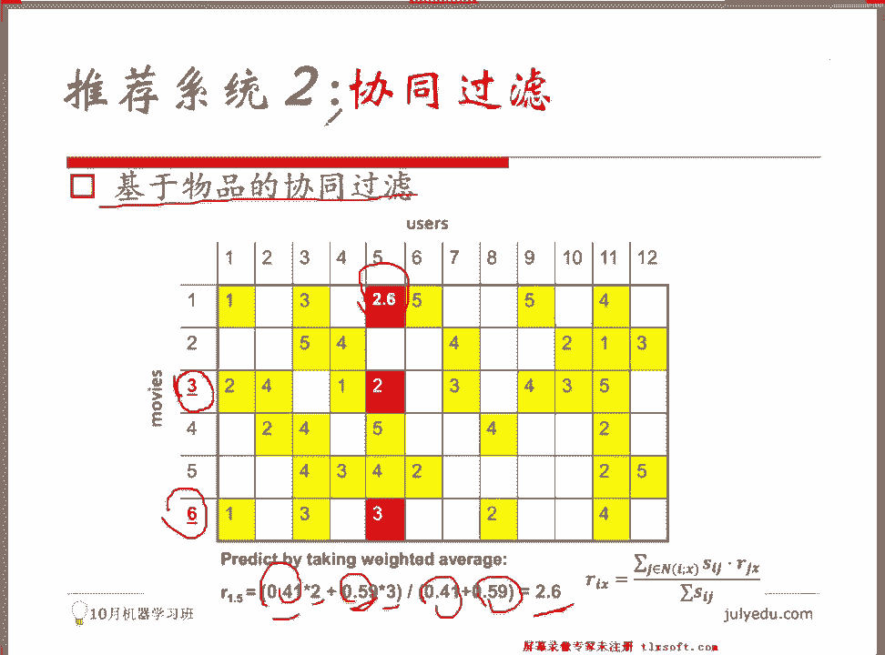

# 人工智能—推荐系统公开课（七月在线出品） - P6：基于内容和协同过滤的推荐系统 - 七月在线-julyedu - BV1Ry4y127CV

第一种方式叫做基于内容的方法，叫做content based recommendation。有很多同学。我在我讲这个算法的时候会跟我说，老师，你这个你这个算法有点过时，或者说我们看到大部分地方的话。

他们很很喜欢用很高级的算法。那这个算法很过时吗？实际上你会发现它有它自己独特的作用。你知道recommendation system很怕一个东西。

我们会很怕我们会很怕一个情况叫做人体动叫cod star。如果今天我让你去搭一个recommendation system，你你可能可以搭起来一个很好，你可以搭起来一个推荐系统啊。

那你这个推荐系统不一定work。原因是你根本就没有用户数据。淘宝之所以他能做到这么好，是因为每天有会有大量的人在上面有行为，对吧？你有大量的用户的历史行为，你有这个当当也是一样啊，今日头条也是一样。

网易新闻一样，如果你根本就没有这些数据，没有这些预先的大量的用户的，在你平台上的一些行为轨迹，你没有这个东西，你有很多算法是用不了的。你会很会有很明显的一个受限性。

会受这个冷启动codedstar的一个影响。但是基于内容的这样一种agorrithm。他是不太受这个东西影响。它依旧有很多地方在用，它一般会用于什么样的一个场景呢？

你看到很多地方我们会在文本相关text相关的这么一些呃product上面会会有会有些使用。它完全是基于用户喜欢的物品的一些属性，attribute和countant进行推荐的。

所以你需要做的事情是你需要做一些额外的工作，你需要去分析它的内容。比如说你分析这个okK周志华老师的西瓜书，这就是一个关于 machine型 learning的一一本书，OK里面有什么样的一些章节。

比如说他可能跟这个呃李航博士的这种这种。跟李航博士的一个。描述方式在某些章节描述方式就不一样，对吧？你会自己去加一些tap，加一些标签啊啊，李航博士没有提到这一类的算法。

他提到了okK所以你会在这里头你你这个。okK你会加一个额外的一个标签，所以需要你自己去分析这个内容，然后你就考虑用户的一个需求啊，就是用户和用户。啊无需去考虑用户和用户之间的关联。

你只需要考虑用户或当前这个item。哦当前这个商品之间的一个呃一个match程度，一个。关联程度就可以了。来说，现在我刚才说了是主要是在文本相关的产品上可以用啊。

但实际上你在电影上你可以试着去做这个事情。因为我说的不一定是内容是属性嘛，对吧？attribute有关系。比如说这个电影呢你可以说这个电影的题材包括爱情对吧？探险okK动作、喜剧悬疑。这是题材。

那如果标志性的一些特征呢，我们找直接找演员，对吧？这个宝宝okK这个小明好，然后他的年代可能是有历史感的上微一些年代，也有可能是很近的。比如说今年好，那关键词关键词就不说了，关键词没没有举例啊。

就是比如说阿凡达ok比如说其他的一些。关键词好，所以它是基于比对物品的内容进行推荐的。它是基于比对物呃这个物体物品的内容进行推荐的。那么简单来说是这么做这个事情。比如说你现在要搭建一个基于文本啊。

基于内容的这么一个remendation system推荐系统，你怎么会去你会怎么做这个事情呢？他需要一些工作。他需要你对每个要推荐的内容。构建一份资料。你需要去建立一份资料。呃。

大家熟悉这个TFIDF这这样一个。文本的特征吗？O term frequency啊，inverse这个doment frequencyO所以TFIDF啊呃我我O那个不熟，因为有同学不熟悉啊。

我简单的提一下，我只提一句啊，这个计算公式我没有放在上面。呃，你你同样的一份你看一篇新闻稿，同样的一篇新闻稿。因为做排做这个rank同学啊，如果有同学是做排序的话，做这个搜索检索的话。

你会对这个特征非常的熟悉。然后TFIDF呢是这样的一个特征。就是说如果你你现在有一篇新闻稿，你有两篇新闻稿。你这新闻稿里头会有很多很多的词，对吧？OK会有习大大OK你会看到有有有这个OK政府啊。

有电能呃，电源或者其他的一些一些word。那每一个词呢最简单的构建的方式啊，NLP这些NLP的一些基础啊。就之前做了今年的NLP相关的一些东西。

那最简单的方式叫word呃叫这个back of words，叫磁模型。OK那TFIDF可呢是在它基础上做了一些延延延伸，所以拿到的一个。模型我希望给这份资料，我给我这篇新闻稿。

我需要给我这篇新闻稿里头每一个词给一个权重。每一个词给一个权重啊。那我认为习大大应该有一个权重。OK这个电力部门。应该有一个权重。OK所以你会去统计习大大这个词到底现在在我的这篇新闻稿里头出现了多少次。

我认为他在我新闻稿里头出现的次数越。多它应该是越重要的一个词。同时他在所有的新闻稿里头，如果出现的次数非常非常多，那我认为它应该应是一个相对不重要的，不那么重要的词，因为它可能就是一个频繁出现的词。

比如说现在就是一个政治类的新闻专题，那里头习大大可能会频繁的出现啊，我不能说习大大不重要啊，这个可能会被查水表。好，我我们应该说这个电力部门换一个词。OK我们说这个电力部门的话。

可能在这篇新闻稿如果频繁出现的话，我们认为它是一个非常重要的词。但如果它是一个。在全局都非常非常重要的，就出现频次非常高的话，我认为它可能就没有那么重要了。所以它是由两个东西组成的。

这个一一个东西叫做term frequency，表示在我当前的doment当中的出现的频次。另外一个叫inverse document frequency，表示的是在全局的一个。

documents当中的一个频度。所以TF啊出在当前文本当中出现频次越高，最后这个结果值越高。在所有文本当中出现的频次越高，它最后的结果越低啊，成正比成反比啊，大概是这么一个东西啊。

具体公式我不给我不给大家列啊，你自己去查，好吧，这是一部分的 backgroundground知识。我已经简单的给大家，我已经简单的给大家啊解释过了，好吧。所以我通过这样一个方式呢。

我可以拿到习大大这个词在我当前的这个新闻稿当中的权重。大家听明白了吧？我我能拿到习大大权中，我也能拿到他有个W。OK电力部门也有个W。那你现在如果你对你你这个方式就对所有的doment。对于所有的文档。

我是不是都构建了一个权重向量啊？假如说我总共我的我的新华字典里头就只有这么多个字。O词海里头就只有这么多个词。我对所有这些词，我通过这样一个方式，在这边当前这篇新文稿里当中，我拿到了一个。权重向量。

对吧那我对于我的用户呢，用户会看很多很多的新闻，对吗？用户会换看很多很多的新闻，对吗？那我对所有的这些新闻去求一个平均啊，或者说或者说你你他所有看过这些新闻当中，你也可以去做一个统计吧。

看来某个词出现的频度，以及这个词在全局出现的一个频度，然后你也可以得到1个TFIDF的一个权重，对吗？所以你对这个用户而言，你也可以拿到一个权重向量，对不对？对于一和2有问题吗？这两点。

这些些NLP的基本的知识。所一做的事情是我去构建文档的这样的一个。重要度向量。二做的事情是用户看了很多的新闻。

所以我对用户通过这些新闻去构建一个这些词对于它的一个重要权重程权重向量一个重要度的一个权重向量。所以你现在有了两个向量。大家知道我们有什么方式可以去衡量两个向量之间的。相似度吗？OK所以大家都知道。

对吧？我们有很多很多的评判的标准啊，最最最常见的，比如说我们用cosine距离，用余弦相似度。对吧？OK别着急啊，一会儿我们会看到有其他的什么样标准。

所以他他做的事情是评估这两两个N维的向量在空间当中的一个夹角的余弦值，对吗？当它们方向越一致的时候，这个夹角越接近于0。这个cosine的值越接近于一。然后当它们的方向呈现非常非常相反的方向的时候。

这个cosine值应该是多少啊？A-一对吧？好，给它是一个-1到一之间的一个值，对吧？好，所以这有例子，这里有个例子啊，对吧？注意哦，这个例子只是帮助大家理解啊，不一定有实际的意义。所以刚才刚才这个。

有同学在问有同学在问说二不太理解，你看看这个例子你就明白了啊。有一个用户呢，他对这样一本书很感兴趣，叫building different mining application for CIM。

然后你你现在你有啊，我们我们简单一点啊，我们把这个例子说的非常简单，只对title只对书名，然后我们去做构建一个remendation system。所以你现在有下面一些书啊。

叫building data money application for CIM celebrating customer relationships using这个CIM and relationship technology blah bla b一堆书O。

你怎么做这个事情呢？我遍利了所有这里头的词。我便历了这个文本text，是不是可以把所有的words都取出来呀？我把所有的词放在左侧行不行？你们看到从A开始啊，我做了一个排序，一直到your。

OK所以所有的词在左边，这个没问题吧，只支是词每一本书是一列。所以在这里面这本书里面有这么些词出现了。对吗？所以这些位置是一，没有出现的位置是0，有问题吗？有问题吗？每一行是一个词，每一列是一本书。

当它出在这这个词在这本书里里面出现的时候是一，没有出现是0。没有问题，我们有这样一个。Mats。对吗？好，这个mtris呢不够，因为我这个地方只知道了每个词出现了还是没出现。

我并不知道他对于我这本书的重要程度有多高。OK所以我们会借助一些外部的语料，然后我们去看看它的一个权重。所以你刚才出现的过的词啊，没有出现的词是零，对吗？没有出现的词是零，对吧？出现的词本来是一。

但我现在会计算1个TFIDF的值，所以你会看到data同样是数据这样一个单词，data这个词。对于我这样一本mastering data miningthe art and science of customer relationship management这样一本书里头它的重要度就只有0。

178。因为这本书书名非常长，那这个data mining有 website就有0。316，这是合理的吧。我问大家，这个是合理的吗？这个TFIDF。因为data这个词在后，因为后面这个书名更短。

前面的书名更长嘛，我们直观的来理解data这个词应该在后面更重要，对吧？所以你现在拿到的每一个每一本书都通过TFIDF可以编码成一个向量一个vector。同时这个vector呢是一个稀疏的vector。

刚才有同学说到了，对，而且不稀疏的那些部分会有具体的权重，对吗？有问题吗？所以。没有问题的话，你现在每一本书都有一个向量了，对吗？对，每一本书都有一个向量，对用户用户的向量是不是就是第一本书的向量啊？

因为这个地方用户很简单啊，用户他只喜欢这一本书，如果他喜欢几本书的话，可能你需要去做一个平均或者做一个其他的一个处理。OK他只对这本书感兴趣。

那我就去算一下所有后面这些书和我用户感兴趣的那一本书之间的一个相似度就好了。所以如果你是一个top N的一个推荐啊，推荐top3只推荐三本书，那你就把所有的cosine距离都算一遍。

你会发现和我们原始那本书最接近的三本书分别是这样三本书。所以基于内容的推荐，大家还有问题吗？基于内容的content based recommendation，大家有问题。如果是在text上去做的话。

okK好好，所以没有问题的话，我们进到我们第二个算法叫做collaborate filter。它是一种 neighborhood based algorithm。

实际上neighborhood based algorithmor呢有有一些其他的类型啊，但最著名的是这种laor filter。他基于一个很一个常识。啊，我问大家一个问题啊。

如果如果你你这个今天啊呃OK你要你要出去相亲啊，一个女生出去相亲，然后啊有很多个男生。然后有你你想了解这个男生，他的收入状况大概是多少，但是呢你又你又你又怕他说说谎，对吧？

因为他有时候他不一定提供真实的信息。如果你想了解这个信息的话。你你可以去做什么样的事情呢？你可能会把他和他关系最好的那群的他的ok朋友狐朋狗友都找过来，然后或者是通过一些途径获取他们的一个薪资，对吧？

所以可能他周边的和他关系最好的10个朋友的平均薪资可能差不多everage一下，可能可以体现他的。一个状况对吗？所以呃neighborhood based algorithm基于一套逻辑。

就是说你跟谁玩的好，你跟这些朋友玩的好，你应该跟他们是有共同的兴趣的。应该有类似的兴趣的。所以你今天你想去看电影，你不知道看什么电影，你也不知道最近有什么电影。OK你你有最好的5个朋友，他们今天出去看。

他们最近出去看了一些电影。所以你会把他们找过来，你问他说。😡，OK小明，你给我推荐一下最近的5部电影啊，给我一个排序，给我一个打分，所以他给你。然后你找到小红，你说你你给我再推荐推荐5个建议。

他也推荐给你。OK所以你又有一个打分，所以你最后会会综合这5个人，综合这5个人啊，找过来的5个朋友给的一个结果，最后去综合得到一个得分。从最上层来说啊，最我们我们先不管他的算法一些细节。

它是基于这样一套逻辑来的。对吧就是大家有提到啊，有同学提到说物以类聚人以群分，近朱者赤，近墨者黑，或者说这个啊neighborhood based这个aririthm指的就是你你你和周边的这些人应该是会有一些simility关系最好的这些朋友对吧？

总会有一些共献。好，所以协同过滤是一种基于近年的这样一种推荐算法。还有两种一两种模式，一种叫iteem based collaborativeor filter，一种叫user based啊。

col filteringO其实是类似的想法啊。所以。😊，基于用户的协同过虑，或者叫user based collaborate filtering是什么样一种算法呢？O。😊，这个你回去计算。

你回去计算这个米老鼠。和这么几个朋友之间的一个相似度有多高，你会发现这个兔子和它的相似度是最高的。OK然后在兔子的基础上呢，它会这个这个兔子呢会提供这么三个食物，说我最喜欢吃这三个东西，披萨对吧？啊。

哈根达斯okK然后这个汉堡王okK那然后你现在你要是给他做推荐，他会给个打分，对吧？你会根据他给的这个打分去做这个决定，就这么简单。如果他现在要选两个朋友的话，选兔子和唐老鸭。

唐老鸭可能也会给他们几个打分，他会对这个打分去做一个简单的理解啊，做一个加权，或者做一个最简单的处理的一个avage平均。对吗？okK所以。😊，你会基于用户有共同行为的商品去计算用户的一个相近度啊。

这个一会儿我们再说。我们因为我们一直没有给大家提说，哎，你怎么知道米老鼠和这个这个唐老鸭和这个兔子是最接近的呢？OK这个一定是有共同行为的嘛，对吧？OK你怎么知道你跟这些这些人关系最好呢？

因为你经常出去吃火锅，对吧？OK啊，出去这个去去去大排档撸串，对吧？OK好。所以你找到静邻，在静邻上对新的物品去做加权和推荐。我们来看呃，这个是基于用户的协同过滤啊，所以最就是我最粗糙的这种描述方式。

大家能理解这个事情是怎么做的吗？有一个大致的一个印象吧，就是今天我跟米老鼠，我找到了兔子和唐老鸭，然后他们俩都会推荐一些食物，我会根据他俩共同推荐的这个食物呢去做一个计算。

做一个average或者做一个其他的一个加权打分。然后我再决定哎，我今天到底要去吃什么。对吧。😊，所以。啊。

协同过滤第二种item based呃 collaborate filter它是基于用户的行为去计算商品和商品之间的一个相似度。

比如说他计算出来的这个超人superman和这个蜘蛛侠OK之间相似度是很高的。所以如果有一个用户之前看了。看了这个超人，然后他给超人一个很高的打分，那我我也可以把蜘蛛侠推荐给他，对吧？

OK所以这是两种啊，一种叫user based collaborative filtering，一种叫item based collaborative filtering。这会涉及到一个概念。

我之前提到问了大家的，我说这里面会涉及到一个相似度的一个概念，或者叫business距离。我怎么就衡量这个东西呢？大家非常熟悉的有欧式距离，对吧？啊，严格意义上大家经常看到的欧式距离P取2，对吧？

所以是差值的平方，求和以后再开根号，对吧？这么一个差差距啊，这个是dsance注意啊，距离和similarity是相反的两个概念啊，距离越远，相似度相似度越小。距离越近，相似度越大，就是这个值越小。

它会越大，对吧？OK所以欧式距离是大家经常看到的恒估恒评估的指标。你会看到一个jaup similarity。那这ja similarity呢指的是如如果。呃，这个小明。OK看了5条新闻。

ABCDEO小红还有另外5条新闻OKA。啊，MC。NP那它们之间的相似度有多高呢？O他们共同看了A，他们共同看了C好，上面分子是2分母呢就是求一个并集，对吧？ABCDE啊，再加MNPO是8。

所以是4分之1，明白吧？这seity就是一个交集和一个并集这么做的。那余线相似度刚才也已经说过了，就是两向量，所以是向量的点乘，或者说向量的内积除以向量的磨长，对吧？它是一个cosine的角度，对吧？

那Parson相似度呢是我会去做一个平均的一个操作。我会先减掉这个所有这些向量的一个均值。减掉这个外向量的一个均值，然后再去做这样一的事情。我会先把它们拉到同样一条水平线上，然后再去做这样一的事情。

OK所以这样四个衡量的标准啊，similarity和dance一个衡量标准，大家能够理解吗？这个up similarity呢经常会用在top n推荐里头，因为你拿不到具体的得分。

我们只知道我们推荐了哪些东西，他点了哪些东西。OK这两个用户他们共同点了哪些东西，对吧？嗯，好，然后有问题吗？大家有问题吗？这四个衡量标准。度量标准。有问题吗？好像我这有点有有点延迟是吧？

大家一般好像看到我每次看到回的话都稍微有点晚。okK然后我们具体来看一下item based filtering啊，或者说okK基于这个物品的协同过滤是怎么来做的呢？所嘢。

我们现在会有一个得一个用户的序列啊，听清楚啊，有个用户序列对吧？这没问题，对吧？有个userok我有这个user一user2user3啊，一直到user n啊，有100个用户有有1I从1到100。

我们有个物品的一个序列，对吧？我们电商里头有1000物品，所以有P1P2，一直到P11000，对吧？好，我们有一个N乘以M的一个得分矩阵。得分矩阵，如果它是一个豆瓣电影的话。

那就是他对每一部电影的一个评分。这个有问题吗？N乘以M的一个得分矩阵。你。所以OK这是U1，这是U2O。然后右3好，然后每个每一个这个用户呢user呢都会有1000个商品，有一些有打分，有些没有打分啊。

听清楚，这只是一个得分矩阵，有些是有打分，有些是没有打分的。然后我们怎么去计算物品I和物品J之间的相似度呢？这是第。这是第I个物品，这是DJ个物品，它们之间的相似度怎么去计算呢？

实际上只是用这样一个向量和这样一个向量啊，有公共有公共行为的向量。听清楚啊，他们可能会同时在这个。这个用户同时看了超人，又看了蜘蛛侠，所以他给了打分啊。okK一个打了8分，一个打了7。8。能明白吗？

就是这一项这一行上，他们这个优子啊同时看过这两个，同时在这两个商品上有过打分的行为。或者说有过有过行为，你会取出来公共的这样一些部分，然后去计算它们之间的一个相似度。

计算相似度的方式会用我们前面提到的4种4种计算的含量标准。你可以用cosine距离，你可以用Parson的距离去算。然后你会选取top k做推荐，什么意思呢？我计算了所有的物品之间的一个相似度，对吗？

所以如果我现在要去计算这一部电影K到底值不值得被推荐，或者是被推荐的时候的推荐的得分应该是多少？我应该会计算K和I的一个相似度。K和J的一个相似度，K和M的一个相似度啊。

所有这些IGM是之前他看过的电影啊，一个相似度。然后我根据他们的一个相似度和他们的一起，他们的得分去做一个平均加权平均。这个地方我不知道我有给大家讲明白吗？这部电影K和超人的相似度是0。8。

这部电影和这个蜘蛛侠的相似度是0。9OK这部电影和这个。ok我要这个泰坦尼克号okK这这个呃。对，相似度是0。4。好，所以这个加权得分做的事情实际上就是0。8乘以8，对吧？相当于这个他用户他打的8分。

在这里头能够贡献0。8的权重。好，这个用户在蜘蛛侠上的7。8分能够贡献0。9的权重，对吧？然后这个用户在泰坦尼克号上，比如说他打打分是这个6分okK这6分能够贡献0。4的权重。

然后我再除以所有的这些权重。这个大家能明白吗？0。8再加0。9，再加0。4啊，除以这个东西表示我在这些电影上的一个平均的能够预测给我当前这个电影的一个贡献。最后我预测的一个得分，这个大家有问题吗？

这个大家有问题吗？OKO好呃，有几个问题是吧？说K静0如何确定呃，如果你现在这个事情是初次做的话，你需要去你需要把这个用户和有和他有关联的所有的商品都计算一遍。如果在电商这样的系统当中呢。

你要知道人人这种行为，人的这个品味或者是人的喜好，它并不并不会变化那么快。所以昨天我已经算好的东西，在今天可能还是有用的。所以。我们会有一些每一天每一天累积下来的有用的一些数据。OK这个意思啊。然后。

NIX如何确定啊？NIX就是。之前用户看过哪些电影？这些电影里头哪一部电影和我现在要推荐，要去计算推荐的这样一部电影K之间是有公共的。焦急的。对吧，所以这有个实际的一个例子啊。

这个例子是基于物品的先后过滤的一个实际的例子。那我现在要做的事情是，如果。我想去预测。给第五号用户推荐第一部电影时候的一个打分，看清楚吗？这个矩阵是一个严格意义上来说，它是一个稀疏的一个矩阵啊。

就是里面会有一些地方是打过电影，打过分的，有些是没有打过分的。原因很简单啊，你看电影的话，不会有土豪经常跑到电影院去把所有的烂片全都看一遍。所以大家能看过的这些电影的数量都是有限的。

所以如果你把整个电影的这个list拉出来做一个矩阵的话。做一个ms的话，你会发现有很多的位置都是没有没有分数的。都是没有分数的。所以你你有这样一个结果啊。

然后我们要做的事情是现在把这些没有分数的位置给它填上，对吗？所以我想想想填这个位置，我想看给第五个用户推荐第一部电影的得分应该是多少。我们来跟着这个item base的这个协同过律来做一下这个事情啊。

这是得分矩阵。所以你会去计算一个东西。item based的吗？基于物品嘛？okK那你会去计算第一部电影和第二部、第三部、第四部、第五部、第六部电影之间的一个相似性。一个相似性。

这个地方相似性计算是用的piarson相似度，所以你需要就先算计算一个均值啊，计算出来一真值以后再算这个值我不给大家算了，大家大家会算吗？这个地方3ok。4okK然后5一这是公共的部分，对吗？

这个是公共的部分，对吗？所以我会把这个向量先去减掉均值啊，减掉这个这个航向量的均值。这个航向量第一个航向量也会减掉它的均值之后，发现公共的部分是这个和这个。然后我去计算他们之间的一个cosine距离。

减掉均值之后的一个cosine距离有问题吗？我算出来的是负的0。18说明这部电影2这部电影和一这部电影不太相信，不太相近，这个是可理解的。你仔细看啊，我在上面这部电影上打了3分的时候，同样这个用户3。

我在下面这部电影头打了5分。OK同样的这个电这个人在上面这部电影里头打4分的时候，给下面这部分电影只打了一分。说明这两个电影之间的题材或者什么其他的一些属性差异度应该非常非常高，才会有这个差别，对吧？

对，这个地方是你负的0。18有问题吗？负的0。18。所以你用同样的方式啊计算这个pearson相 do，你可以算出来OK0。41负的1。0。1，负的0。310。59，就这么简单啊。

就刚才有同学说这个东西是每次都要算一遍吗？如果你之前有算的差不多的啊，就是。因为每个人的行为一天的行为是有限的嘛，所以你之前积累了两年的行为，你突然加了一天的行为，这个相似度不一定会变化非常大。

OK所以有些只是可以复用的。所以如果你现在要去填这个位置，很简单，你填这个位置。就是只有。我们选了最接近的两部电影啊，三和6。如果大家去看得分的话啊，三和6这两部电影的得分是最接近的，看到了吗？

我选了top two，所以找这两部电影以后，我去做一个加权，0。41乘以2，再加0。59乘以3，这这是相似度，对吗？这是相近度，对吗？然后就除以相近度的这个权重。得分的权重，最后得到了2。6，有问题吗？

这个基于物品的协同过滤，大家有问题吗？item base cobo。

