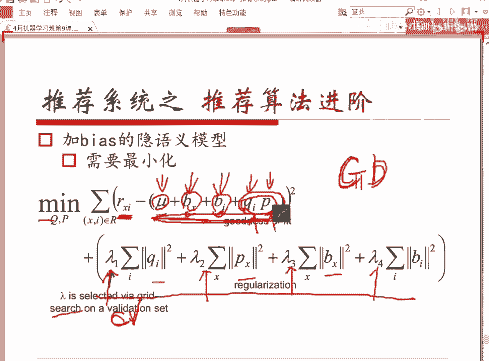
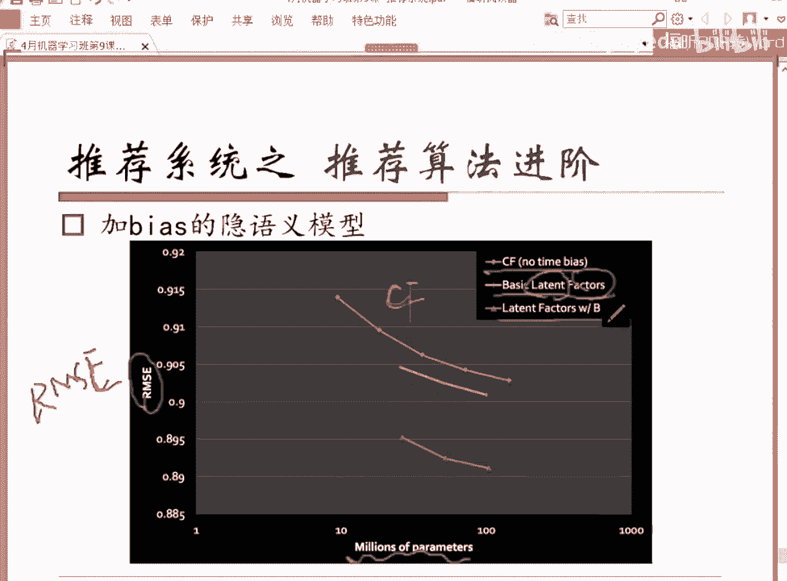
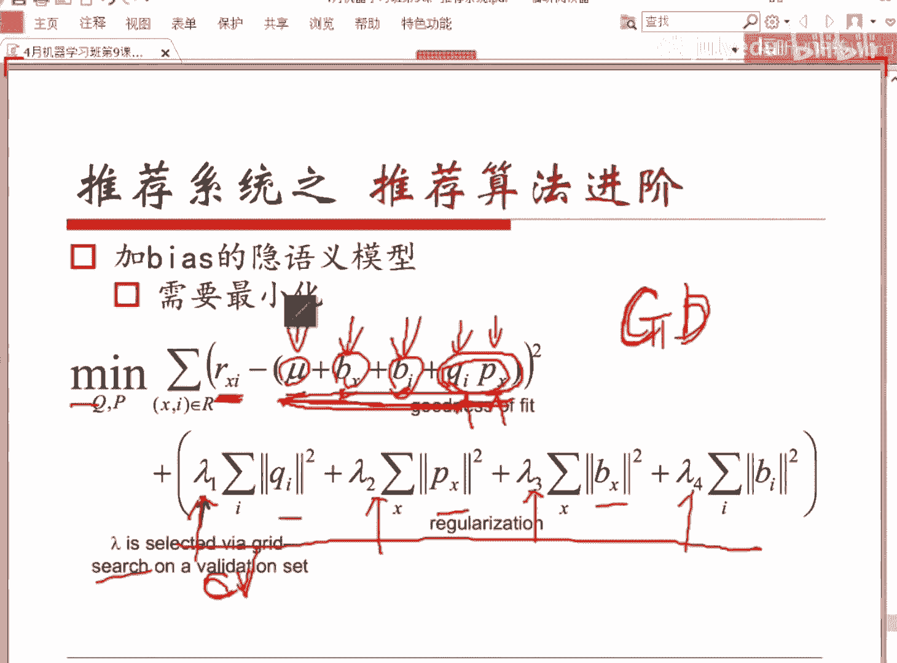
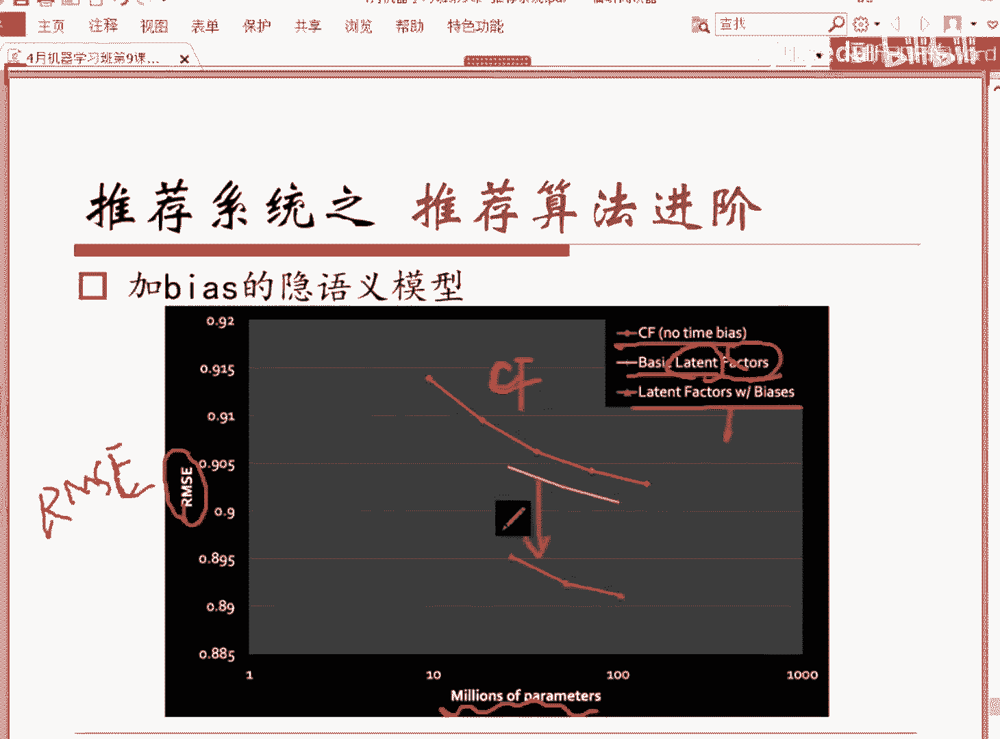
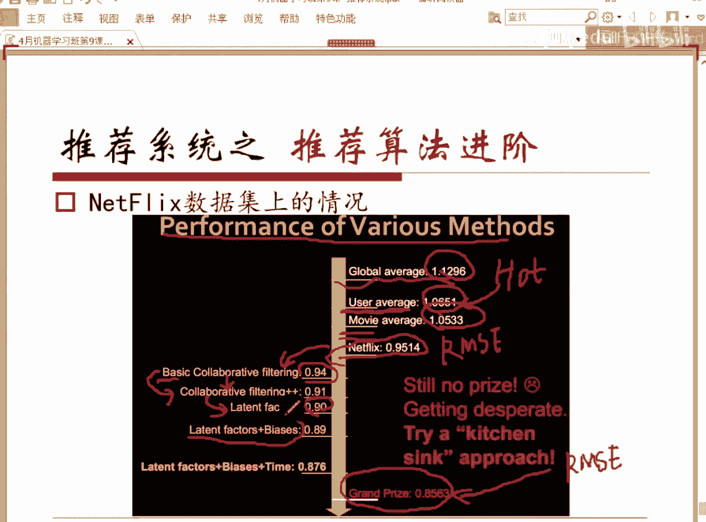
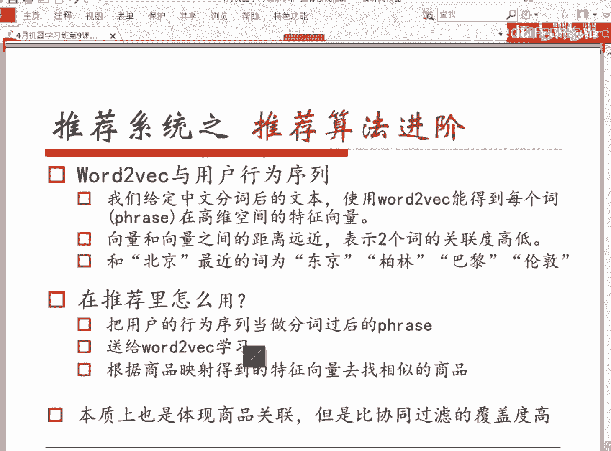
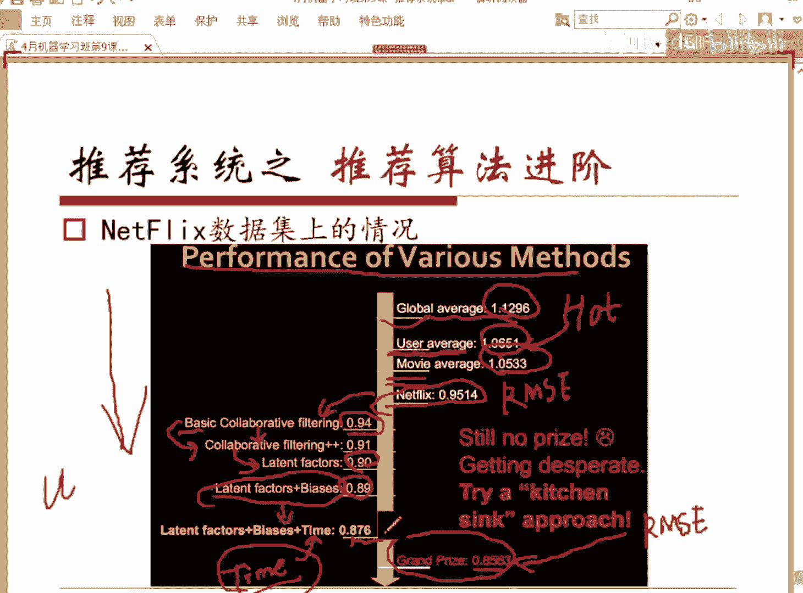
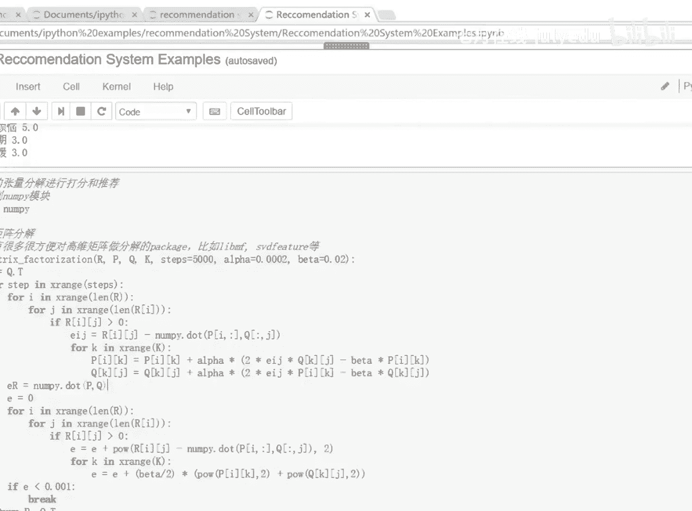

# 人工智能—推荐系统公开课（七月在线出品） - P9：推荐系统导论：从推荐算法到案例应用 - 七月在线-julyedu - BV1Ry4y127CV

。今天主要的内容呢，我们会从下面这些。从下面这些部分给大家介绍一下啊，一个是说为什么我们要有这个推荐系统，然后呢，一个推荐系统有了以后。我们先不管怎么做，我们需要有一个东西去对他做评估，对吧？

那我们会介绍它的结构、基本结构和和它评估的一些准则。呃，接着我们会给大家介绍一系列的推荐算法。这一类推进我今天介绍这些推类做推荐算法呢。都是工业界非常非常实用的。

当然它肯定涵盖不了现在所有的推荐系统用到的算法。但是目前我这里提到的这些推荐算法是。当年。Netfl。比赛第一名的那个对team里面用到的帮助他们team拿夺得第一。

然后达到那样一个好成绩的所有的算法我们都在这介绍了，包括比较基本的呃内容的推荐，协同过滤。包括我之后会讲到矩阵分解和这个引语意引语意的模型。啊，我后面会提一下我们最近电商在用的啊。

我们可以把它叫做和深度学习相关。但不是严格意义深度学习是一个what vector在用户行为序列上的一个应用。我们主要会给大家介绍这样一些方法。上面这两个方法的话，内容推荐和协同过滤呢是非常非常。

非常非用的非常非常广，而且很早就在使用的算法。而下面这个引语音模型呢和我待会会提到的word to vectorctor对用户的行为序列建模的这两个方式呢是近几年才用到的，但是效呃效果会比较好。

它能够给上面的这两个算法提供一些补充的作用。好，呃，先简单的说一下啊，推荐系统是什么是什么呢？我们先不说定义，大家每天都在接触到这个推荐系统，对吧？你打开一个呃。不管是网易新闻还是这个今日头条。

你会发现你你这种文本类的新闻阅读类的这些app，基本上在做的事情，就是根据你的一个阅读的历史去判断你的喜好，然后给你去推荐相关的。他觉得你会喜欢阅读的这些内容。电商当然是一很大的一块了。

基本上呃他们会有专门的方向，会有专门的team在做推荐这块。因为商品得卖出去嘛，你得更了解你的用户。那推荐系统是一个渠道去帮助你去定义你的用户去挖掘你用户的一个个人的倾向和喜好。然后最近的需求。

去把合适的东西推荐给他们。这个视频类的网站也在试图做这个事情了。包括像爱奇艺、优酷土豆，然后以及B站等等。呃，我们来看看它的一个数学定义啊，推荐系统的一个数学定义。数学定义是这样的。

我们我们先要给定几个东西，几个数学的标识。比如说我们设C这样一个东西是一个集合，它是我们全体用户的一个集合。我们是一个S，也是一个集合，它是我们全体的商品，或者或者我们把它叫做item，就是推荐的内容。

对吧？这个东西可以是如果对电商而言是一个商品，如果对于啊今日头条或者是网易新闻而言，它可能就是一个一个文本内容，对吧？一条新闻，对于视频网站来讲，是一个视频，对吧？我们会有一个评判标准。

就是待会我们会讲到的，我们需要一个评判标准。这个评判标准呢会判定你把一个。商品集合这个item这个seep这个集合当中的一个item。SI推荐给呃这个地方我们可以用用J啊，为了区分一下。

推荐给某一个用户CG的时候，你这个当前这个推荐是否好，对吧？我们我们有一个判定好坏的一个一个标准函数，判定函数。这个东西呢有点类似于我们之前给大家讲。罗辑斯的回归或者是其他的机器学习算法时候提到的一个。

我们需要有一个判ending标准，对吧？我们当时用的判定标准是ross function，叫做损失函数这个东西。当然，损失函数呢是越小，表明它和我们当前的这个。

推荐的这个呃表示他和我们当前给定的这个结果的吻合度是越高的。然后我们这个地方呢粗粗一点来讲，U这个东西它定义的是一个得分嘛，对吧？这个培分函数的话，可能得分越高是判定越好。

然后推荐在做的一件事情是什么呢？这时候我们用数学语言表示出来，是是这样的。我们。对于所有的。呃认对于C属于这个集合C。也就是说对于这里头的一个用户，你现在推荐要做的事情是什么呢？

你要从这些得分函数便历一下所有的S。对吧S属于我们我们现在可以推荐的这个集合商品集合或者是这个内容相关的一些一些东西啊，一些集合里面的元素。这个对于所有的这个S中的，你要便利一下这里头的每个商品。

然后去拿到这样一个。得分函数对吧？我们就要判定它好坏，判定这个推荐好坏的这样一个函数。然后在所有的这个函数的取值中。拿到让这个取值最大的那个。商品对吧？S推荐给他，这是这是我们推荐的一个定义啊。

数学定义。啊，前面那个是数学版本，如果要。表述的比较。呃，一懂一点呢，其实其实我们在做的事情就是我们会根据用户的一些历史的行为，社交的关系呃，一些兴趣点和当前所处的上下文环境。

去给他判定用户当前的一个需求，这个很重要啊，因为只有他现在需要这个东西，你给他推荐，他才会买，对吧？然后另外一方面很重要的是感兴趣的对吧？你推荐的东西必须是他的一个兴趣点所在。

他才可能会接受你的这个推荐做出相应的一些。行为对吧？比如说购买，比如说点击。那刚才上面提到这几个点不是随便提的啊，这个ABCD呢我列了一些这个ABCD4个点呢是我们在做推荐系统时候。

包括可以优化推荐系统的时候可以想到的东西。和我们我们可以去做的方向。这个呢大家都在用对吗？历史行为，因为我们去判定一个用户对什么东西感兴趣，对什么东西不感兴趣，或者是。可能会买什么可能会不买什么？

可能现在有什么样的需求，主要的数据来源于什么呀？来源于它在我们平台历史的一些行为嘛，对吧？那你呃即日头条或者网易新闻，就是你阅读过的这些这些新闻，对吧？

我可能会有一些有会有新闻具体的内容也会有新闻所属的这个话题或者所属的这个啊我我们的一个类别啊，对吧？哪一类的新闻等等。这个是大家都在做的历史行为。那第二点呢，我说的这个东西是一个补充。

就是有时候有时候历史行为并不一定那么好使。原因是什么？历史行为这个东西呢，只有当它丰富到一定程度的时候，它才没有那么高的随机性呢。而大有很多时候，比如说刚来没刚注册没多久的用户。

或者是很长时间没有登app，登登登录我们这个网站啊，或者app的这些用户。其实他们的这部分历史的信息呢要不就过于陈就了，要不然的话就没有多少。这个时候你你怎么办呢？你说第二个点叫社交关系。

有现在有很多的平台，很多的呃网站或者是app端，他都支持你用用QQ或者是微信登录，对吧？但是他会问你要一个东西，他会问你要你的QQ或者是微信的一些。关系对吗？关系网这个东西它是他是为了干嘛呢？

我们说当你不了解一个人的时候，你你可以通过什么样的途径去帮助自己了解他呢？你去看看他周边这些朋友，对吗？你不了解一个人的收入的时候，你怎么去判定他的收入呢？你看看他身边这些人赚多少钱呢，对吧？

所以呢这是推荐的第二个途径就是。我们可以通过社交关系，对吧？就涉及到待会我们会提到推荐系统，推荐系统里边非常非常。推荐系统里头非常非常严重的一个问题，就是经常会出现的一个问题。

然后我们需要解决的一个问题啊，叫做冷启动问题。在那个问题下，我们在A这个部分基本上是拿不到什么数据的。

所以我们要借助于B社交关系这个东西来缓解它的这个呃在初始初初始化和最新启动的时候的一些准确度等等的问题啊，CD一点呢，当然它和A是相关的了。兴趣点的话。

你挖掘的方式无非就是通过历史行为或者是用户在注册你现在的这个。app或者这个网站的时候所。填的一些个人的信息，对吧？你看你会你在登录很多东西的时候，很多网站或者是呃注册一些app的时候。

他总会问你说这个呃你感兴趣的话题是什么呀？或者是这个新闻类，你对你对军事类的新闻感不感兴趣啊，或者对哪类的新闻感不感兴趣啊，对吧？他就是试图在让你主动的告诉他一些兴趣点。

当然他之后会通过这个历史行为再去挖掘一些。你的兴趣点嘛对吧？第四个非常重要啊，基本上当你的推荐系统做到ABC这三个程度之后呢。就回到一个瓶颈。你看ABC上，你在不断的去挖掘它的历史行为的时候。

你就发现好像只有这么多数据可以学了，对吧？那如果我现在想让我的推荐更精准，我需要去做什么样的事情呢？这里有个东西叫做context在英文里头，对吧？它是表明当前用户的上下文，也许这个用户他确实对。

某一类的衣服很感兴趣，但他可能现在并不需要这个东西。上下文是什么呢？是指他当前在浏览的这个东西。比如说他也许对某一类的衬衫很感兴趣，你从历史行为头挖掘出来的对吧？但你会发现你发现。

当前他一直在浏览的都是牛仔裤。那你会猜测说他可能现在需求的去东西并不是衬衫，而是牛仔裤，对不对？所以这个东西是我们更精准，在以上ABC3个程度上更精准的去优化我们推荐系统里头非常要关注的一个东西啊。

就是当前用户他的需求是什么。这个是最重要的OK所以我我的目的是。用户的需求和兴趣点嘛，对吧？好，这个是我们说如果要通俗的说推荐系统是什么东西啊，然后我这个地方列的这些点呢是我们可以。去做的方向。好。😊。

推荐系统为什么会存在啊？为什么会现在有有如此多的这个互联网的公司都在招数据挖掘工程师，而且强调说我招的是推荐方向。原因是他发现越来越多的人有这个需求嘛。对吧一定是这样的。

因为这个社会是你你要有有这个商业需求才会有。才会有这样一些岗位出来啊。呃，因为互联网大爆炸，大家都知道数据量现在特别特别大。呃，大概一个人啊一个人一天的话接触到的文字信息。

各种各样的文字信息加在一起可能有20兆左右，这个是一个非常非常大的量级，20兆左右。可能你上网一直刷刷各种各样的东西啊，文本类的东西，所有加在一块的，大概是20兆左右。这是之前呃美国做的一个统计。

你听到的声音数据大概有600兆左右，你每一秒钟就会看到2002兆左右的图像信息。然后呢，大家知道每一天都会有这个量级的新闻出来。然后你你去看优酷独豆爱奇艺、搜狐啊、腾讯等等。

B站每每一秒钟都会多出很多很多的视频。电商更不用说了，淘宝、京东、亚马逊、当当等等，一天上架的商一天上架可能有上百万的商品。所以呢当这有这么多东西的时候，它会带来一个问题叫做信息过载。

也就是说我们每个人能承受的这个信息量其实是有限的对吧？那在这个情况下的话，你每天有这么多的新鲜的东西出来。我怎么知道哪个东西是我需要的，或者我感兴趣的我时间是有限的对吧？所以我们我们需要一些途径。

最早的时候解决这个途径的方法呢是雅虎做的，雅虎做的对吧？他做的东西非常简单。我那我每天把新增的这些东西整理一下嘛，对吧？所以他做了一个分类导航的页面，这个大概在90年代，可能那个时候是非常非常火的。

但后来出现了一些问题。比如说他们发现。量太大了。比如说他们发现一个用户，当他有主动需求的时候，其实我不太好把它分到某一类的时候，这个时候他提供不了帮助。于是呢在雅虎之后呢。有一系列的搜索引擎，对吧？

包括谷歌，包括be，包括度娘等等等等。这个东西叫搜索引擎，对吧？它需要你提供什么？你告诉他一个关键词，一个keyword。他能给你找到和你这个关键词最相关的一些东西返回来给你，对吧？

然后你从这个小的集合里头去找你需要的东西，这个节省你的时间，对吧？但是呢人呢人这种动物总是期待科技在随着科技的发展，总是期待计算机会给你更多的surprise，尽量的去服务你。于是呢人就已经退化。

已经懒到了，说我不愿意去主动想搜索词。我想每天睁开眼，打开这个app，看打开这个网站，看到的就是我喜欢的东西。至于说我喜欢看什么样的东西。你自己去发去挖掘。

去发现我不我不愿意绞尽脑汁去想去归纳和总结我看过的东西。我的行为轨迹。然后我归纳出来的东西告诉你，你再给我提供检索的结果。我我希望你主动去主动的去。帮我们发现我我可能有需求的搜索知势。

我可能的兴趣点在哪？而且有时候大家想想，每天的数据量有这么大，有这么多新鲜的东西出现，里面必然有一些东西是在这些茫茫的数据中数据中存在，但是我们不知道，但同时我们又很感兴趣的东西。

这个叫叫surprise，对吧？有些东西可能会让我们惊艳到，我们觉得这个东西哇太赞了，但是我们并不知道怎么找到这个东西，对不对？所以我们希望推荐系统能给我们。去挖掘这样一些surprise。

你去给我们找一些惊喜给我。当然现在有很多的互联网企业都在做这件事情了。比如我们说今日头条这个做的很大，他现在一天的广告的收入呃，大概在前前两周我问他们时候，应该是1一天的广告收入已经到了呃1000多万。

对，然后虾米音乐，对吧？有很多人愿意付费去去买他的服务。原因就是他觉得他能够帮我发现很多我不知道的音乐，但我听起来真的觉得很赞很爽。包括电商的猜你喜欢这个东西呢，大家也不用排斥啊。其实它确实能够帮助。

虽然它有时候准确度并不那么高，但它确实可以节省我们的一个，我们叫做节约我们的时间，帮助我们在我们的决策的这个路径缩短我们的决策路径，对吧？包括很多人沉迷的豆瓣，呃，现在呢知乎应该也在做相关的一些东西。

但是他们的推荐应该做的还还不太深。目前嗯。呃，然后我们刚才是我们刚才说的是对我们用户而言，对吧？用我们用户为什么需要这个东西？因为我们希望他给我给我们带来便捷，我希望他能够让我们节省利息。

我希望他能够带给我们surprise。那为什么那商家需不需要这个东西呢？当然需要了，这是一个一个推荐系统，是一个双赢的东西。比如说nflix，这是一个美国的一个电影，电影、电视剧租赁的一家公司。

他的呃他是美国最大的电影和和电视剧租赁的公司，他每一年3分之2的这个观看电影在他那里做的电影都是推荐得到的。然后我们说呃google news对吧？

google news可能大家觉得这种新闻类的东西也赚不到什么钱。但但大家要知道google news里头也有一些按点击收费的一些一些ad，一些广告as在在里面啊，所以它是还是能能带来一部分的营收的。

它的一个推荐系统能给它额外带来38%的点击。也就是说，如果他当你没有推荐系统的时候，你推荐的东西是什么呀？好的，对吧？我去把这个大家昨天关注大家昨天点击过的东西做一个统计，我把里面点击最多。

点击最频繁的东西拿出来告诉你说，这个是最最热的，但这个没有用。因为现在这个时代越来越趋于个性化。也就是大家喜欢看的东西，不一定是我喜欢看的东西。于是他有推荐系统存在，对吧？他现在推荐的不是热门的。

而是你关注的这个新闻的领域。你可能会关注的新闻，我推给你他能给他额外带来38%的点击。亚马逊呢大概每年有在35%的营业额都来源于它的推荐，35%的营业额，大家想一想这个这个对于电商而言是非常非常大的。

呃，头呃头条的话大概有半数以上的这个新闻和广告的点击都来源于推荐啊，京东一年的推荐和广告会带来几亿的一个营收。所以我们我们总结一下，对用户而言，他的帮助是我们可以找到更好玩的东西。我们可以帮助决策。

帮助发现新鲜的一个事物。而且对商家而言呢，可以提供更个性化的服务，对吧？这样的话，用户的粘值度会高，提高信任度和粘值度。然后呢。一可以增加营收，对吧？这是最主要的。推荐系统的系统结构。

其实这是一个非常粗的一个系统结构啊。一般情况下不仅是推荐我们在做 machine型 learningning做机器学习相关的一些项目的时候，都会有这两个部分，一个叫线下的部分offline的部分。

一个叫online的部分，对吧？那offline的部分在做的事情呢，实际上简单简单一点来说，就是建模online在部做的部分就是我根据我的模型去实时的做。预测这个地方的预测就是推荐嘛，对吧？

所以呢这地方offline做的部分是数据来了，做数据处理。呃，数据处理的话就包括我们之前说的啊，数据清洗数据的特征提取等等。然后这个拿到了这个比较好的比较干净的数据以后，丢到模型里头去学习，对吧？

我们会拿到一个model。这个model呢。在线上用起来了。所以他这个model装过来以后，是为了给推推荐去呃去推荐去做判定的对吧？然然后我们刚才提到了一个非常重要的东西啊，推荐不能乱推，对吧？

可能一个用户有非常非常多的兴趣点，但怎么推呢？要抓住一个东西叫上下文，对吧？可能当前的一个需求。比如说我可能喜欢很多很多东西，但我当前在看的东西是什么？那你可能这个时候给他推这些东西会更有效。嗯。

最后就会拿到一个推荐结果，这个东西就返回去了给用户了。一般来说online的部分最重要的是什么呀？最重要的当然一个准确度肯定是肯定是一部分了，对吧？你要你不准确的话，你这东西做了就没用啊。

另外一部分是我们说speed对吧？速度。因为你要你你打开淘宝的时候，他给你推的东西要等个一分钟可能才出来的话，你可能根本就不会用这个功能。offline的部分呢，线下的部分呢就是一个建模的过程嘛。

我刚才说了建模的过程比较重要的，当然是。优先考虑当然是准确度了，对吧？我们会不断的去最小化。我们说机器学习的问题，最小化lost function，或者是这个地方提高我们的一个accur啊，准确度对吧？

啊，当然我们一会会提到一个指标叫recoll召回召回，这个也非常重要。嗯，好，我们来看那刚才说的是我们的机器学习啊，不机推荐系统这个系统，它的一个系统的结构，这里面每上线上和线下部分最重要的东西是什么？

现在我们我们如果我们简我们先不管我们那一些推荐的算法。我们去假定我们已经有了一个推荐系统，线下已经训练完的一个推荐系统。那这个东西呢能不能上线，当然得评估一下它的好坏嘛，对吧？

我们有我们得有一个评定的标准。来确定。他好与坏。呃，这大家大家都在关注的一个东西叫准确度，对不对？因为你推的东西没有这个东西，没有准度在的话，没有人会看的。我喜欢的东西是这个啊动作片，你给我推动漫。

这个可能可能是不适合的对吧？所以呢准确度这个东西呢，在有我们说它是怎么来评定的呢？有两类系统推荐系统里头有两两种类型的系统，一种叫做打分系统。一种叫做打分系统。这个打分系统是什么样？

大家打开豆瓣电影去可以去看一下啊啊，不写了，豆瓣电影，大家可以去看一下，你会发现每一个分每一个电影都有一个评分，对吗？有有它可以是不同的形式啊，比如说有5颗星十0颗星星，对吧？你可以点里头的多少颗星星。

不不仅是这个，包括现在所有的这个啊外卖的app，这些这个各种各样的app都是在做这个东西，对吧？你给了你包括淘宝的这个反馈，你可以去打几颗星，对吧？这个东西，它其实是一个打分系统，啊。

当然也有一些让你手填的这个或者是一个一个滑滑动，这这当然是产品设计方面的一个问题吧。啊，有一些产品它设计的是你会有一个滑动条，你可以把它往这边拉，你如果觉得满意度越高。

可以拉到拉到这个一个跟右边的程程度。如果你觉得它不太好，停留在左边对吧？这是区别是这个东西是一个连续值，对不对？打星星这个东西是一个离散值。这个不重要重要的是我们来看这一类系统，打分系统。

我们怎么评判它的准确度。很简单，有两个东西，一个叫IMSE，一个叫MAE。他们两个东西是用来评估我们评我们推荐的这个东西的一个这和实际用户对这个东西的评判的一个差异性和我们之前说的这个los function是呃他你可以把它看作los function的一种。

对吧？我们说我们假设RUI这个东西下标是U和I啊，这个东西是我们用户U对这个I的一个实际的评分，对吧？啊，这个real real score对吧？real score真实的得分。

而我们这个上面给了一个more对吧？这个这个东西UI它是一个预测的得分，predic的一个得分。那我们怎么来评定评判这个RME呢？这个很这个大家都可以想到呢？和。呃，和就是一个差距的问题，对吧？

那这个东西的品呃，先说一下啊，我先提一下下面这个分母T是我们所有的测试的样本集的样本集。我们给它加这个东西，表明这个样本级的。啊，如果用pyython的话。啊，可能是test，对吧？

test samples等等。所以它是这个东西样本的一个长度，对吧？分母就是你有多少个测试样本，分子是什么呢？每一个样本上当前这个用户的真实得分和。预测的这个得分的一个平方之和所有加在一起，对吧？

这个这个叫做RMSE大家可以想到这个值如果越大的话，说明我们预测的得分和用户实预测的得分和用户实际的这个对对当前的这个物品的一个感兴趣程度或者是呃评价度差异是越大的。M一是类似的吧。

我把平方换成了一个绝对值而已，对不对？我们刚才说的是第一类，对吗？第一类叫做。打分的系统有另外一类系统叫top n推荐。它和分时分值无关。举个例子说。你的你你打开呃今日头条或者你打开淘宝的这个。

淘宝的购物频道里面给你推荐的东西，你只有两个行为点或者不点，对吧？啊，或者说你淘宝的场景下可能会买，对吧？我们会会把它视作不同强度的这个行为。所以用户他不会告诉你说我有多喜欢这个东西，他只会告诉你说哦。

这个东西在我接受范围内，我会画一条阈值，如果他超过了这条阈值，我可能就点了，你没有超过，我就不点，对吧？所以这个东西叫做top n推荐。top n推荐这一类推荐的话是。它的一个评评定标准是什么呢？

它有两个东西，它有两个件会有一个会有一个集合啊，这个集合是我我们训练完了之后呢，会在建立的模型上会对这个测试集。你现在要推荐的这些东西去。做一个推荐，他会从里头取出来若干个，对吧？

觉得这些东西是可以推荐给给这个remend，给给这些user的。而。这个测试集上呢有一些东西是不会推荐的对吧？但真实的情况下，用户可能会点一些，或者会对某一些会感兴趣。对某些趣。所以呢现在有有两个集合。

一个是我们。模型推荐出来的东西对吧？个recommend的这个set。另外一个是我的这个啊toe，就是test test集合上的这个用户的这个真实的选择的选择的这些set，对吧？

那这个东西意思它会有两个标准，非常非常重要的两个标准啊，其实我一个叫准确度，一个叫召回，对吧？那准确度是什么意思呢？准确度是这样的，我们现在来画两个集合。这个是上边这个。东西啊，我们不用这个形式吧。

我们我们我们画两个圆圈好了。这个方式。这个是我们推荐的部分在这儿。这个圈圈是用户真实感兴趣的部分。那我告诉大家准确度是什么呢？准确度是这一部分。除以。交集嘛对吧？两个集合的交集除以我推荐的这个。

部分也就是说我推荐的商品中有多少是。用户真正感兴趣的这叫准确度召回度是什么呢？用户真正感兴趣的这个集合中有多少被我找出来了，这个叫召回。呃，第于这两个东西原因非常简单，你要做到准确度很高的话。

你完全可以只只给他推一个东西，对吧？这个东西可能很有可能就是他会感兴趣，但这没有用。因为我们试我们在试图把更多的内容给用户。而召回能够召回能够帮助我们去评判这个东西，他找回来了多少，对吧？呃。

回答几个问题。有同学说一般的情况下，TU并不知道这个东西是这样的，你你。有一些用户的历史数据，对不对？你可以取举个例子啊，举个例子，你可以取前7天前前面八件的数据，然后用前前面7天的数据去做训练。

最后一天的数据做测试嘛。这个你是知道哪用哪些东西用户点了哪些没点了。就是下面有同学提到了说prosse validation对吧？调查验证。

OK你以为你以为准准确率和呃前面提到的准确率是这个拼我们的推荐系统的唯一优化的准则吗？并不是的。他有非常非常多其他东西。比如说第二个，我们电商。我们在电商这个系统里头非常非常关注的东西叫做覆盖率。

这个东西希望消除我们在推荐系统里头的一个效应叫马太效应。我们大致来说一下，我们在推荐这个系统里头有一个东西叫做长尾效应，也就是啊不仅是推荐这个东西啊，就是我们对各种各样东西的喜爱程度吧，是这样分布的。

是会最热门的这部分会有非常非常多的人喜欢。而越到后面它是一个非常非常常尾的这部分的东西呢非常非常的个性化，但是有人喜欢，只不过这个数量级会越来越少。这个叫做长尾效益。而推荐系统希望消灭掉这个长尾效益。

希他当然是希望啊，我们只能最大程度的去缓解这个东西。呃，所以希呃说错了，马太马太这个是常，这个是常尾，我们需要消除的是马太效应。马太效应是指的我们推荐的东西都是热门的东西。我我们希望消除这个这个状态。

因为大家想一想，你你在做推荐系统的时候，你推用户看到东西最先看到东西一定是你推荐给他的对吗？那他他在这个过程中，你推荐给他这个东西，他又看了。接着你拿你拿过来的做训练的这个数据呢。

又是你之前自己预测的这部分数据集里面的东西，它就会造成有一部分东西永远都出不来。就会有这样一个效应叫码太效应。我们会非常希望打破这个东西。我们希望能把更多的物品呈现给用户。

就是我们能把这条曲线尾部的这个成尾部分的东西也推荐给用户。我们希望这个东西，所以我们定义了一个评判标准叫覆盖率。我们来看看这个东西怎么定义啊，最简单的这个覆盖率是这样的。啊，最简单的覆盖率是。

我们去看一看总共的样总总共有多少种类型的商品嘛，对吧？要推的这个集合有多有多大，你推出去的东西有多大，对吧？有多少种除一下，这个叫colage，对吧？叫做覆盖率，但是这个不够，原因是什么呢？

大家想一个问题啊。我在推荐系统当中，我在淘宝的推荐系统当中，我去推荐给给这个用户推荐一个东西，你会发现。有时候他按照这个公式，它的覆盖度是够的。我我有一些商品有一些非常小众的一些游戏的账号。

一一些啊非常非常民族风的一些衣服，也许不是那么多人喜欢啊。但你在推荐的时候，你可能只给每一件都只给一个用户推荐了。你会发现这个coverage非常的高，但这个东西没有用。因为那些非常冷门的东西。

你只推荐给了非常非常少的这个用户。所以我们从信息商的角度定义了另外一个。东西来评价这个覆盖率，它是什么呢？你现在有100件东西。你推荐给用户以后。你的这个推荐系统。推荐分别推荐了多少次，除以总的次数。

你会拿到一个推荐的概率，对吗？呃，OK刚才刚才有同学提到问I是什么？有同学已经已经回答了啊，I是全集。就是我们现在商品库里头有举个例子啊，非常是如果某一个子类，子类下面有200万的商品。

那你看这个东西它推出去了多少。不同的对推出去了多少商品，就是你推荐出去的有多少种不同的类型。然后你也可能已经已经已有的就是2200万的类，所以就是用推出去的个数除以总的个数啊。我们这个快速的过一下。

然后我们说我们从信息商的角度去定义了一个东西。啊，这个东西就是商嘛，对吧？他刚才我说了PI怎么来的？DI个商品DI个商品推荐的这个次数除以这个总的次数。对吧会拿到一个概率，对不对？

然后我们把这个概率放进来，把所有的商品都过一遍，会求得这样一个东西。那这是一个商，对不对？商在什么时候取到最大？在所有的PI都相等的时候嘛，取到最大。所以你你仔细的想一想。

这个推荐系统它在覆盖率这个这个点上想做的事情是希望。我们推出去的商品都能都能推进出去一定的次数，而不是说非常冷门的东西推进推出去的次数非常的小。对吧。呃，这个地方我我们就讲完了啊，商这个东西。

所以信息商这个东西呢可以更精准的去定义我们的这个覆盖率，而不是只是说有多少东西推出去了。我们要看推出去的这个东西推出去了多少次，对不对？这个这个次数是不是呃不同的商品之间的这个次数的差异度是不是？

比较高，还是说他们推出去的次数实际是其实是差不多的。多样性。多样性呢和前前边我们提到的这个覆盖率呢好像有一些相关性，但其实是不一样。我们来解释一下这个东西啊，推荐性这个东西啊。

多样性这个东西我们之所以希望有多样性原因是。从电商的角度来考虑这个东西的话。呃，你给你你给他今天推荐的东西都是衬衫，他都很喜欢。Yeah。🤧但你给他推荐100件衬衫，他也只能买一件，对吗？

所以呢我们希望我们推去推出去的这100个啊，也许他看不了100个，我们就说推荐了20个商品，对吧？我们希望推出去的这20个商品里头能覆盖5种类型的东西。这样的话它购买的可能性是不是会高一些。

比你只推20件一模一样的东西？或者是推20件。比较类似的东西。是不是可能性要高一些？所以呢这个地方的话出于这种考虑，我们会引入另外一个品牌标准，叫做多样性。

这个多样性呢我们希望我们推出去的这个20件商品两两之间都不太相同。这样的话用户会觉得。可选择性很高，下单的可能性会更高。所以多样性它表真的就是推荐列表中物体两两之间的一个不相似性，评价了这样一个东西。

那我们如果用SIJ来表示物品I和J之间的一个相似度的话，这个东西是怎么计算得到的呢？这个diversity这个多样性呢它是这么得到的。用一减去注意啊。

这里头所有的你的这个推荐recommend这个se这个集合当中的商品任意取两件商品出来。比对一下他们的相似性。把它求一个和除以2分之1的。推荐的商品集合的个数乘以推荐的商品的集合个数减1。这么得到的。

这个我我可以粗的给大家解释一下这个东西啊。😊，大家想一想，你从这个总共有N件，你推荐了N件商品，对吧？你要去计算任意两件商品之间的一个相似度求和，它总共有多少种情况啊，CNR嘛对不对？能想不到吧。

CN2种选择对不对？排列组合里面的组合。那你的分母对应的不应该也是RU乘以RU减1吗？对吧是一个平方的1一个大概在平方级别的一个东西，对吧？所以我们定义这样一个diversity的话呃。

定定义了这个东西之后呢。我们要我们要除一个东西啊，要要除以除以一个。优子的个数。就是这个这个多样性呢，我们不能只停留在同一个，这是对一个用户，对吗？

对一个user我们评价了一下推荐给这一个用户的东西有有多大的一个多样性。但这个是不够的呀，我们要看看，也许你给你你恰巧给100个人里头的一个人。推荐的东西推荐的列表非常的好，有非常大的一个多样性。

但是不好意思，另外99个人推荐的东西都呃极端页点都完全一模一样。那那这个东西推荐的推荐算法的一个多样性也是不够的。所以呢我们要对所有的集合用户啊，理论上来说，数学上是这样定义的。

但实际上我们工业界不会这么做啊，因为用户实在太多了，你就会拿一部分的用户出来去去衡量一下这个东西啊。数学上是这样定义的，是我们要把所有的用户user，现在的这个user的集合都便利一遍。

每个user我都求一个多样性的这样一个diversity出来，然后再把它们求和以后，除以总类用户的个数。对吧。好好，我们来呃啊你告诉我我我们回答一下问题啊，我们来回答回答一下大家提到的这个这个不同。

这些问题，从上面到下提问一下。有同学问到说，那推荐的到底是相似还是不相似的东西呢？是这样的，我们评价这个东西，一个用户的需求是多样的吗？你你你喜欢你今天想买一一一件衬衫，想买一条牛仔裤，也想买一双鞋。

对吗？我我问你衣服和牛仔裤和鞋他们之间相似吗？他们不相似，对吧？这个东西叫多样性，但你牛衣服里头是不是也有用户最喜欢最最喜欢的衣服，牛仔裤里头是不是有他最喜欢的牛仔裤，鞋子里头是不是有他最喜欢的鞋子？

所以。这个时候。我们的刚才说的相似性相似性啊，推荐的东西是指的你推荐的这个衣服要跟他历史喜欢的这个衣服最接近。你推荐的牛仔裤要和他历史最喜欢的牛仔裤最接近。但这个多样性强调的是。

我们推荐出去的这个list，这个集合推荐remend出去的这个list里面东西不要尽量的都是衣服或者都是裤子，你要保证它的一个多样性。就是你今天给我衣服，裤子鞋子都推了，我可能就会买一件。

但你要推衣服的话，可能就不买了。这么个意思，明白吧？好，我们看看有同学问到这个东西，下面的东西啊，无忧的无忧同学问到说这个地方为什么要减一呢？呃，大家知道CNR怎么算吗？个数2分之N乘以N减1嘛。

所以你看这个地方的形式嘛，2分之1的全集乘以全集减一嘛，要和这个对应啊。你上面的选择的方式有这么多种嘛。啊，好，我看看大家还有大家的问题。有解。就是。O。呃，插一句插一句啊。

有同学提到说淘宝的话是看过了就会推。有些人会觉得这个推荐的算法。这个推荐算法非常2，就是。也许我买我我买过了这个。一个1一个电脑，你还给我推一个电脑，对吧？我是绝对不会再买它了。对。

现在在我电商在试图在这个方向做一些改善。比如说你买了一个电脑，希望给你推荐一个鼠标或者是一个键盘，对吧？然后呃但是他在试图做这件事情，但会会比较难。因为搭配类的推荐我自己做过啊，比箱似的推荐要难。啊。

但所以淘宝内部评估了一下，觉得这个好像如果如果冒特别大的风险去推荐相似呃推荐搭配的东西的话，似乎分了一些流量去做一下实验，发现效果并不如直接推荐相似的东西收益大。

所以目前的状况你会发现大部分的电商还是在推荐相似的东西啊。呃，我来看一下说。有同学。OK好，我们接着往下讲吧。😊，所以刚才提到了几个东西了，当然我们会评判一些其他的一些东西，但不太好评判。

但但是如果你你有任何的一个app，把这个东西做的非常好的话，我相信它会迅速的热起来。这个东西叫做新颖度，精细度有这么几个标准。😊，叫做新颖度清晰度。呃，信任度和实时性这两个下这个东西先先先不说了。

我们先说上面的这个东西，惊惊喜度就是我刚才提到的，大家听这个。这个。呃，很很多的这个音音虾米音乐或者是豆豆瓣儿的这个FM之类的。你听到歌有很多歌是你不知道的，但是你听到时候你就觉得哇这首歌真好听。

这个东西叫surprise，对吧？如果这如果一个app能给你带来这个东西的话，你一定你一定会充满期待，觉得他会在接下来的时间里。给你找到帮助你去找到越来越多你喜欢，但你不知道的东西。

所以这个东西会极大的提高用户的一个粘性呃，surprise啊惊喜度。然后新颖度呢是新颖度是。新颖度和清晰度有点像，但是不是那么严格的严格的等同的啊。

新颖度意思大概就是你你会给你推荐一些每一你每一次登录这个app的时候，推荐的东西都。不是那么的一样，不要你上次给我推荐电脑，现在还在给我继续的推荐。上次推荐的电脑。对。呃，亲人度的话亲人度的话。

现在的很多电商在我我不太清楚他有没有名着写啊。因为你如果去亚马逊买买东西的话，你会发现亚马逊的推荐上是会有这样的东西。他会告诉你说我为什么把这个推荐给你，比如说。你的某某某某某某朋友。

如果是基于社交社交关系来评判这个东西，他会告诉你你的某某某朋友现在最近。你最你的5个朋友最近有4个都在买这本书。你要不要看一下？或者是我发现你好像之前买过一本这个呃历史题材的书。

我现在有一本书和和它有一定的相似性，但刚好能够补充它的不足的地方，你要不要买一下这个东西叫做推荐理由，也就是你不要把结果光丢给我，你丢给我的话，你还就就是人懒嘛，你丢给我的话，我还得想一下，哎。

这个东西那个合不合理啊，是不是我需要的。你最好给我一个理由告诉我你怎么推的。你是基于我的历史东西推呢，还是基于我的这个社交人脉关系推的呢，还是其他原因推。好，我们接着就后后续的刚才我们提完了啊。

前面这些都是它的评判标准。所以推荐系统它不是一个单一化的评判的一个一个系统，它是一个多重标准的一个系统。我们要balance这些东西。当然最重要的东西当然是准确度了。

因为基本上啊基本上是呃大部分的公司在做这件事情的时候，互联网公司都会准确度作为一个呃重要的评判标准嘛。然后面这些东西可以帮助他更好的优化这个东西。好，我们来现在说一下推荐系统啊。呃。

我们这一次的这提到的这些算法呢，都是当年nettflix这个公司在举行他们这个这个recommendation的那个大赛，比赛的时候，第一名团队team里头用到的这个方法。

他们netflix呢用了6年的时间，积累了48万用户在。117770部电影稍等。1亿多个1亿多条打分和评论数据。然后他们举行了这样一个推荐大赛，有100万的这个美金的奖励。呃。

希他们希望他们希望你能做到准确率能比之前要提升10%。如果你做到了他给你100万，后来有一个team真的做到了，总共有2000那很火啊，当时大概有2700多支，2700多支队伍参加了这个东西啊。

这个当当然呢现在的系统非常非常的复杂，里面有各种渗透式，甚至是呃深度学习相关的一些一些去做补充。但当年当年获得这个比赛的这个这个算法，最底层用了切同过滤，在上面用了我们说的我们一会会提到的影引音子模型。

然后最上面做了一个全局数据上的一个调约g effects。最后结果是最好的OK。呃，对，有同学提到了说这个100万花的非常值。当然了。

因为对他们而言给包括现在的这个大家在会参加一些天使比赛或者其他的比赛啊，你会发现他也愿意拿出来一部分钱。原因是这些钱对他们而言就是某某雨。但你你这个你对于他准确率的提升。

能给他的经济上带来的收益远不止这个。所以。啊，他无所谓这些东西啊，我们说我们说推荐系统的最几典的算法啊。这个算法呢不在net fix的推荐的推荐算法里原因是什么？原因是这个你的。他的这个推荐的业务场景。

业务背景，它是推荐电影嘛，对吧？电影、电视剧视频类的东西呃，不太不太需要基于这个东西。所以基于内容的推荐，我先说一下前提啊，这个东西目前在文本相关的这个产品上还会有应用。文本内容。呃。

文本内容上用的比较多，然后我们我们非常粗的讲一下这样一个推荐，它其实是基于用户喜欢的这个item的。属性。和内容做推荐的。对吧他需要怎么样？他需要去分析内容，就这个算法它是需要去分析内容的。

需要呃你你去推荐一些新闻，我需要在新闻上做一些内内容的分析的。呃，但他不需要去考虑其他用户的一些行为。也就是说我现在就知道我推荐的东西是什么。我知道你这个人是谁就可以了。

至于说你和其他的人的一些一些交互的关行为的话，我不关注这个算法。他通过内容去做关联嘛，刚才说过了这个东西的话，你可能就如果你一定要在电影里头用的话，它的方式是我们会按照一些一些维度去切一下。

比如我们说的爱情探险、动作、喜剧悬疑等等，维度去做一个切分，他会有一些标志性的特征。比如说啊王宝强基本上是喜剧相关的对吧？有些人就爱看他的电影。呃，比如说这个这个教主对吧？等等。

然后然后不同的人因为年龄段不一样嘛，大家喜欢看的这个电影的年代可能也不同啊，会有。如果你要在电影上用这个东西的啊啊，年代的话可能是90年代的电影或者是最新的。呃。

然后它的方式是基于比对item的这个内容内容的一个一个相似度去做做一个推荐的。内容比比对这个item和这个之前分析的这个用户的在在这个在他的内容上的一个喜好，这个相似度去做一个推荐的。我们来说一下啊。

简单的说一下这个算法的话。他会对于每个要推荐的内容，每个要推荐的内容，我们需要建立一份资料，意思是什么呀？如果你现在手你有200万条新闻要推荐，你要用基于内容的推荐，你就必须给我把这200万的这个。

新闻。全都给我分析一遍，我需要拿到一份资料。最常用最常用的方式是什么呢？现在可能会有另外一些词向量的一些映射方式啊。但最早期而且。呃，不是说这个东西现在没有用了啊。

其然即即使是现在深度dep learning已经已经火到了这个这样一个程度。呃，即使dep learning现在已经火到了这样一个程度，也有很多其他的一些词向量的一些映射方式。

但依旧它依旧非常好使叫TFIDF对吧？这个东西呢DFIDF呢是以评价评价一个词，对于当前这份资料的一个准确度啊，不一个重要程度。比如说评价这个KKJ这个词在啊文件啊sorry这个下标不对啊。

KIKI这个词在这个文件DJ中的一个权重。这这样一种方法。这个方法呢我告诉大家，这个方法呢很很早就在用，尤其是在搜索引擎里面。如果大家有做搜索引擎的同学的话，应该会对这个非常熟铁FIF呃一直在用。

但是它比较麻烦的是。他其实需要手调很多很多东西，它跟你的数据集有关系。你生成这个东西的时候，所以呢。如果你的数据集调的恰好，你的权重调的恰好的话，你可以拿到一个非常非常好的结果。

甚至比word to vector之类的这呃word emdding方式拿到的这个词向量表征的效果还要好。所以TFIDF呢，它我刚才说了，它它它是一个东西，它是一一组。权重。

这个权重是每一个词KI在当前这个文件DJ中的权重。Okay。然后。😡，在这个情你因为我们我们有呃这个这个具体具体TFIDF怎么算的话，我们之前的特征工程那个部分给大家提过了，大家去看一看那个地方视频。

好吧，我不我在这里不赘述了啊，我们我们来说一下说这个它在拿到了每一个词的权重之后呢，我们会去建一个权重向量，对不对？你当前这个文章里头所有的词拿出来，每一个词都有一个重要度嘛。啊。

当然我们会去掉一些东西啊，我们把它叫做啊停用词对吧？stopworth没有用的这个停用词，比如说语气词之类的等等啊，去掉之后会拿到一个词向量。呃，紧接着这个词项量刚才说了WCI啊。

大家看清楚对对这个东西的一个啊，我们刚才说的这个东西是在资料的上面去做，就是这200万的新闻，我们需要去做这样的个事情。我们对用户也做了这样一个事情，对吧？我们会得到一个权重向量。

这个东西可能是基于统计拿到的，我们对于他历史阅读的这个所有的这个文章，所有的这个新闻都拿出来，我去做了一个统计，可能我能拿到在他阅读的这些文章里头，每每某一个词对他的一个重要度。

现在你是不是有两个向量嘛，上面会有一个词词项量，W这个。问document一W document2等等等等。然后下面呢是用户的向量，对不对？WC1WC2等等等等。好，这两个向量我们可以去计算一个距离。

这个距离叫余弦距离cosine距离它表征的是什么呢？这有两个向量，向量在这个高维空间一定是有方向的，对不对？所以它表征的是这两个方向的一个。方向的一一致性。如果非常一致的话，这个距离就会非常小。

如果非常不一致的话。距离就会非常大。预线相似度。所以。由这两个向量计算这样一相似度，你就知道把这当前这样一个文件推荐给当前这样一个user这样一个用户的。推荐度有多高，对不对？距离嘛预线距离嘛。好。

这个是一个简单的例子啊，我们简单给大家过一下。呃，这个例子没有没有太多的实际的这个意义。大家了理解一下这个东西它是怎么怎么在运作的就就行了啊。我们快速过一下，说有一个用户呢，对这样一本书，我们知道了。

我们根据他的历史行为，或者是根据他之前的这个提交的一些评论等等。我们知道了他对于呃这本书非常感兴趣。然后我们现在在图书馆里头找了。😊，123456788本书，我们来评价一下哪本书。

我们现在要做一个排序了。哪本书推荐给他最合适？有这么多本书，我们做的事情是什么呢？把这些书里头分呃，英文不需要分词啊，因为它天然是空格分开的，把所有的单词都拿出来。去掉停用词。啊。

这个地方它每次没具体用词啊，有有A在里面，把所有的拿出来建一个list。建一个词表。接着把每一本书映射到这个子表上，拿到一个稀疏项料。什么意思啊？这是一本书啊。

可能大家有点看不清这本书的词哪个位置上的词有是存在的，我们就标记为一不存在的就标记为0。所以这是一个很稀疏的一个向量。每一本书都这样有这样一个向量，对不对？不够。😡，我们刚才提了一个东西叫叫什么呀？

叫TFIDF对吧？所以呢我们会根据全部的这个书，全部的所有的书，所有的书。呃，这样一个dodo集合去生成一个东西。我们会知道不仅知道哪个词出现了。比如说这个地方这个词出现了。

而且我们知道这个词出现在当前的这本书里头，书名上它占有的重重要程度有多高。所以我们现在就拿到了这样一个向量，只不过这个向量之前的由之前的01变成了现在的零和这个词。如果出现了这个词的一个重要程度有多高。

比如说这个地方0。381。好，那所以你现在是每一本书都有一个向量，对吗？每一本书都有一个向量。然后你刚才用户不是已经喜欢一本书了吗？已经说了喜欢这本书嘛，我们对他以前一个向量嘛。

所以现在就有向量比去比对了嘛。你去比对一下这些向量的相似度。比如你用余弦相似度，那你会你自己可以去算一下，你会发现你的这本书是和他最接近的，然后是他，然后是他。所以他在做的一件事情就是。

把所有的资料建一个建建成一个向量，然后再把对这个用户再做一个建成一个向量，然后。我们我们去比对他们之间的相似度。啊，基于内容推荐，之所以现在很多地方还在用的原因是因为在文本文本这种大量的数据集。

大量文字的数据集上，如通过各种各样统计的方法拿到的东西，拿到的这个通过各种各样的统计方法啊，你拿到的最后的这个表真的这个向量其实效果还可以。呃，不一定完全用它，但是它可以作为一个辅助。前面没嗯。

这这个我没写在这儿，但是这个这个方法基于内容推荐的这个方法，呃，它的一个好处和坏处，大家大家其实。大家其实可以可以有有一个大体的一个印象啊。

就是好处不好的地方在于说你每一个文文本都要挖掘一下去建这样一个向量。所以它是一个相对也还挺耗时的一个过程。好处是这个东西其实不需要用户之间的一个一个交互信息。

也就是说你你这个用户B和这个C对于商品的一些行为，有没有一些共性或者怎么样。它是不关注这个东西的。我我不在乎我只在乎这个东西本身的一个。本身只在乎这这个东西本身这个内容本身的一个一个表示。

本身的一个相关性。呃，我们。我看看啊。咱们再讲几分钟，然后然后休息一下，好吧。我们说接下。接下来我们我们提。你基本上你去任何一家公司，如果他要做推荐系统这个事情。一开始就会考虑的方法叫协同过虑。

协同过滤呢有两种。首先啊先说有两种，一种叫做user based协同过滤colaabor filter，一种叫做iteem based collaborativela filter。区别是什么？区别是。

一个是基于用户做的。一个是基于item，基于商品做的。好，现在我们来说一下他大体的思路是什么呢？现在有这么一个人，我要给他做推荐啊。我发现去挖掘它历史。比如说在电影这种场景下，比如说在视频这种场景下。

你没有那么多文本信息让你去挖掘，你怎么办呢？OK啊没关系了，那我去我。想办法去找找找有没有其他的人。和他相近，可以做一些推荐。所以他在做的一件事情是什么呢？你今天想去看一部电影，你今天想去看一部电影。

你不你不百度，你你不去看各种就豆瓣电影的这个评价。你你想去看一部电影，但是你不知道最近有什么电影，你也你也没有看这个电影，不知道好不好看，于是你去找了4个啊，这有几个123455个最好的你的朋友过来。

对吧？这个呃小芳是吧？小明等等等等，你找他们5个人过来，你问问他们说，哎，最近看电影了没有？呃，那个有没有什么有没有有没有什么推荐的电影啊，当然当然有一个前提有一个前提，这5个人我刚才说了是你的好朋友。

呃，意味着我这里的好朋友指的是他们和他和你有相同的爱好，或者说和你的这个生活轨迹或者是这个兴趣爱好是比较吻合的。所以呢所以你很信任他们，对吧？你找这5个人过来，你问他们说最近有没有什么好看的电影。

于是他们给你推了一部电影，你发现这5个人里头有4个人都给你推了一部电影，都都极度的赞扬那部电影。那你可能说你就跑去买票了，对吧？所以协同过滤在做的事情就是我。利用用户的这个行为。

不其实他从最上层应该这么说，我们找到和他最接近的用户。根据他们的综合意见去做推荐。怎么找到和他最接近的用户呢？一会儿我们会说这个东西。就要基于历史的用户行为了。好，这个是。我们刚才说了啊。

找找到最接近的这些用户，然后根据这些用户的综推荐，综合的去打分，然后去推荐这个是user basedite based有什么区别呢？item based刚才说的是用户嘛，那现在是是什么呀？比如说是电影。

你发现一个人你发现一个人很喜欢看。超人。你要给他推荐一个电影，那你一定要那你可以做的事情。就是你去找还有哪些电影和超人，这个电影关联度非常非常的高，或者说非常非常的相近。你找到了这些电影之后。

你直接把这些电影推荐给他就好了。但至于说这个相似度，或者说你怎么去找到这个关联这个一会儿我们会提到这个东西依旧和刚才一样。我们基于的是同样一份数据集，叫做用户和商品的一个交互数据集。好，okK呃。

我这里简单的提了协同过滤，有user basedabcolaor filtering和item based collaborative filtering。然后之后内容一会儿我们再说，好吧。

我们中场休息这个。5分钟到10分钟。呃，大家可以提一些问题，我我会先我会那个给给大家回忆一下，好吧，一会儿。那就休息5分钟。嗯，好，我回答一下大家的问题吧，集中看一下啊，快速的回答一下。😊，呃。

有同学问到说图中的这个小数值，无忧的同学问到的说之前那个TFIDF怎么算出来的？这个关于TFIDF怎么算的话，你你回头去看一下我们特征工程那块讲的东西，好吧，这个地方我我具体讲了。然后。

有同学问到说马太效应是什么？马太效应就是相面有同学解释到了说越热的越火的东西。因为因为有越多的人看到你各种各样的评判的指标都会显示这个东西。非常非常的热门，所以会导致有更多人看到。

所以导致很小众那些东西永远都没有人看到。它是一个两极分化很严重的一个一个效应。呃，如果要问基于内容和iteon base的这个协同过滤有什么区别的话。

你会发现基于内容关内容的话是纯用内容去关联一个用户和你推荐的东西。而。item base的话计算这个相似度的话，它是。它不是计算这两部电影本身的这个题材或者各种东西相似度。

而是说这两部电影去看喜欢这两部的电影里头有有多少的人是。相同的。呃，好，这个我们接着往下讲啊，就是大大家能听得到我说话吗？我确认一下。好。刚才我们说了一下大体的思路，协同过滤。现在我们要介绍一个东西。

我们先说说这个哦我们在介绍我们在介绍这个我们的推荐算法，协同协同过滤之前呢，我们先要定义一个东西叫做相似度和距离。我们会对这样一个东西有定义。定义两个东西的相似度或者两个东西的距离。

这两个东西是相反的啊，就是如果两个东西越相似，那它们之间的距离。啊。一定呃一定是越近的对吧？也就是说这个值越小。其实这个值是越大的啊。好，我们来说一下，距从距离的角度来看的话，O式距离。

如果你有两个向量的话，对吧？欧式如果这一般情况下这个P会取2，对吧？P这个地方取2O式距离去表证两个向量之间的一个相似度啊，这个接卡的这个相似度呢，它对于有一类东西啊，有一类东西我们刚才说了，我们。

我们在有一类场景下，比如说新闻阅读的场景下，你是拿不到用户对这个新闻阅读这篇新闻的一个。感受度的你只知道他点了或者没点，所以所有的东西你都只有零或者是一的记录。这个时候呢，在这个向两个向量里头。

01向量，两个01向量。它比对的就是有多少是共同的，而有多少是不同的，去求一个并解，对吧？去比对一个相近度。然后余线相相近度，刚才我们说了对，这是比对两个向量之间的方向的一个一个接近程度了。在空间里面。

在它的基础上，刚才有同学提到了说pien相似度。和余线像素的区别在于，我会对每一个向量，对每一个向量都会先减掉。均值。呃，这个pearson相似度，一会儿我们会提到啊这个减掉均值的意义。

它的啊一会儿一会儿我们再提吧。接合相 to。刚才刚才我提到了，就是有一些场景下，我们我们拿不到给这个电影，不像给这个电影打分一样，能拿到3分4分5分，你只能拿不到这个这条新闻用户点了或者没点。

所以它是一个click or nonclick或者是这个01的一个一个数据集。01的数据集的话，1011。那下面这个可能是0001这种情况下交集不就是一个嘛，并级的话，有有几个大家数一下就好了，对吧？

呃，好，我们来提一下基于物品item based啊，这个是item based。这个CF。我们说我们现在有一个用户的注意听啊，这个地方有一个用户的一个一个序列。user的序列有N个用用户，对吧？

我有M个 item。我们这是我们我们的我们先假设有有的东西啊，实际上我们在各种场景上也能采集到这个数据。我们有一个N乘以M的矩证V。每一个元素VIJ表示这个用户。sorry，用户I对于J的一个对于这个。

itemJ的一个打分，也就是现在你有个矩阵，其实你每个每个矩阵每一行都是一个每一行都是一个打分，对吧？现在你这个这个地方是itemitem1item2，item3，这个是地方是userU1U2U3。

所以它对它每个地方都会有一个打分，有一个打分分数在这。啊，当然是他看过的这个地方，看过的这些东西是有打分的，要有一个分数。对吧。呃，VIJ不是一个经验值。VIJ是看完电影以后，你在豆瓣电影上的评分。

你这个人的一个评分，或者是你如果他像我刚才说的这个新闻阅读端的话，它的结果就是零或者是一，我点了或者没点，对吧？计算相似度，刚才我们说了，我们我们有有办法去计算相似度吗？有办法去计算我们计算的相似度。

用余弦相似度或者是这个。皮er的相似度，它计计算的一个东西是什么呢？看啊，现在我有一个矩证。这个是item一，这个是item2，这个是item3，这个是U1，这个是U2U3后面有例子啊。

我先简单的说一下，我们我们在这个上面会有得分，对吧？一分4分2分，这个是3分1分。5分，你看这有两个向量，对不对？一个向量是。用户给他打分的一个响量啊，对于IE这个。I一我们会有一个向量叫做142。

对吗？我们I2会有一个向量，对吗？I2有一个向量。315。然后我们在做的事情就是我们去看了一下这两个向量之间的一个相似度。这个是这个是。可理解的对吧？因为不同的用户，同一个用户，他对于。

他的喜好是估一般情况下，这个时候啊我们认为同一个用户他他是有一定的偏好的对吧？喜好的。所以如果他在两个东西上面打分都非常高的话，可能说明这两个东西在由这个用户透射出来的这个信息表明他们是接近的对吧？

如果打分偏差很大的话，说明可能会有一定的偏差，对吧？所以你现在得到了很多很多的。item的一个simity，对吧？相似度对不对？然后你刚才哦。这个地方说的不对，比如说这个位置是零，你没有打分。

我现在要预测这个user。第二个user对这个东西的一个打分。那我们怎么去做这个事情呢？你刚才不是求出来了这个I一和I2的一个相相近度吗？你可能这个地方还有还会有一个啊13，你求出来它和它的一个相近度。

对吧？它和它的一个相近度，对不对？那你会基于这两个东西。的。得分去做一个加权。呃，这个东西的话，这个公式的话，大家这个东西是我们之我们之前的一个一个得分啊。一个打分呃，sorry，这个公式里头应该是V。

不是R，这是另外一个地方。对，是这个公式是我们我们之前的打分。也就是说这个位置呢，现在他没有打分，我们要补上。但同样一个用户，他在别的电影上有打分的。所以我们会根据这个东西来计算，具体怎么算？

我们来看一个例子啊。呃，iteom based的协同顾虑是怎么做这个事情呢？基于物品的。现在你有这样一个东西，你有这么多用户，12个用户，你有6部电影对吧？所以他12个用户对这6部电影呢有些打分。

有一些位置是0，之所以我们把它设为零，是因为我们不知道，我们不知道这部电影多少分，因为他没有看，他根本没看，所以他没办法打。现在我有这么多的数据，我要去预测。

这个用户5第5号用户对于第一部电影的一个得分，因为他没打分嘛，我们现在要预测这个东西，我们现在怎么做呢？我们记住啊，我们现在用的是iteem based similarity。是什么意思呢？

就是说我们去。基于movie，基于电影这个东西去做做，根据相似度去做推荐。那怎么做呢？大家看在这一部电影第一部电影上是不是有得分呢？13554这样一个向量，对吗？13554对吗？

这样一个向量对于第二个电影是不是会有sorry，我应该把这些零都填上啊，我把我把零审了，就是它是103005005040，对吧？那第二个也一样，你补上0之后，你第一行这个东西可以拿到一个向量，对不对？

第二行这个东西你可以拿到一个向量，对不对？对吧我们会去计算一个东西，会去计算第二个电影和第一个电影的一个相近度。这个相近度大家注意啊，我们用我们完全没有用到电影的内容。

我们用的东西就是大家在它上面的打分，也就是它和用户的一个交互的行为。我们根据这个东西去计算它之间的一个相似度。这个地方用的相似度，我们用的pearson相似度是怎么来做这件事情的？

我们看看这个用户第一个第一第一个这个电影。有12个呃12345有5个人对他打分了，你会发现这5个打分呢，它会有一个均值。它会有一个均值，对吧？所以我们会先把这个均值。M。一的这个均值求出来。

求出来以后呢，会把每个每个每个向量都减掉均值，这样啊每个点都减掉均值。这样的话我们会拿到一个减去均值后的一个向量，对吧？那同样第二行也可以做这么一个事情，我们拿到M2均值。

把每个每一个地方都都减掉减掉这个均值，会拿到一个新的一个向量，对吧？那这两个向量之间你就可以去求余弦相似度了。这个时候的这个相似度就叫做pearson相似度。就是他在多做了一件事情。

是我把每一行都减掉了均值，之所以要减掉均值。是因为这样的，大家想想一个场景啊，同样一部电影的话，其实用户的这个倾向性是非常大非常大的。所以他会有不同的喜好。这个打分可能这一部电影呢。呃。

打分都很低或者都很高。这个这个是会对最后的结果是有影响的。所以我们需要需要减量均值之后去做一个。做一个相对的一个归一的。那么一个过程。所以呢你我刚才说过了，减掉均值之后。

上面可以拿到一个相似拿到一个向量，下面要拿到一个向量度啊，这个是pearing相似度，你完全可以不减均值。一一会儿我们在use the杯子，我们在用户进用户的协同过滤时候，我们来看，如果不减掉均值的话。

会有什么样的一个。一个影响啊，所以我我现在跟大家说pece的相似度是怎么算的？就是我们把均值减掉了，减掉完均值之后的这两个向量，我们去求了一个相似度，对吧？所以我你会发现，哎呦 oh my god。

就是这个第一个第二个这个电影和第一个这个电影的相似度居然是负的，这方向刚好反了。我们来看看我们仔细看看为什么会有这个情况，你会发现第11号的这个用户在第一个电影上打分打4分，在第二个电影上打了一分。

也就是他他觉得这部电影觉得这个一号这个电影好的时候，他发现我靠这22号电影是什么呀拍的。然后第一部电影他给了一个不太高的分儿，他在第二部电影上。这个这个用户在第一他不太喜欢第一部电影，他喜欢第二部电影。

那说明这两个东西，这两个电影它本身的这个题材和适用的用户应该是有一定的差别的对吧？所以我们算出来的这个东西是一个负的相关度，你发现。然后我们来看一看第三个。同样啊你可以对第三个。

item第三个这个movie也去做这个减掉均值之后，计算一下和第一个向量啊，它和第一个向量的pear的相似度。这个地方我们不给大家算了，大家可以去算一下啊，是0。41，再下面一个是你只有负的0。1。

这个是负的0。331，这个是0。59。紧接着我们要开始打分了，怎么打分呢？😊，呃，我们记住了。基于物品的协同过滤呢，它会参考和它比较接近的物品，但他不会参考所有的物品。

他会找找到和它比较接近的物品来做这个协同过滤的打分。比如说现在其实我算了几个数啊，12345，我算了算了5个数，对不对？那5个数是不是都要用呢？他不一定都会用。

比如说我这个地方取的是只取了最接近的两个电影去做这个打分。那你会发现。这部电影第三部电影的得分是多少？这个用户这第5号用户对第三部电影的打分是多少？是2，对吧？这个。

首先首先得分最最接近的得分最接近的是3号和5和6号，对吧？这个大家大家看到了，对吧？然后。3号电影我们在5号55号这个user给了他多少的得分啊，给了2分，对吗？6号这个电影给了3分，对吗？

那现在要求的是情，现在要做的东西怎么怎么算呢？其实它就是这么算的。哎，我看看我下一页PPT里面应该有刚才我们算出来了相似度，对不对？0。41。0。59对吗？用P2的相似度的话会减掉均值啊。0。41和0。

59又我们又发现0。41的这个打了分是2分，0。59的这个。相似度的这个和他相似度的这个电影被打的分是3分。那他做的事情实际上就是一个规划嘛，一个带权重的一个规划。呃，好。

刚才刚才有同学提到了说减均值觉得不合理啊。在这个item base里头的话，你你没有这么明显。我们我们看一下，我后面有提到。对，后面我们就提到了基于用户的user based和刚才这个有点类似。

然后我们先。优他为什么要减掉均值呢？大家想一想啊，有一些有一些优则。有一些用户，假如现在有两个用户user一。和优子2。他们天生打分的这个标准就是不一样的。有些人特别的苛刻。我给我打分。

我电影最高我就给到3分。那我那我问你这个时候如果他给了。如果他这个时候。给的得分是133。那后面两部电影告诉我，现在在他在这个user第一个用户上评价体系里，是不是他对这个电影评价已经很高了。非常高。

对吗？嗯，但对第二个用户而言，第二个用户可能打分就很随意。我三分起三分起打好吧，那我可能打了1个355，可能在他的评价体系里三分这个东西。只是非常差的一个标准。那这个时候你要衡量这两个东西的一个相似度。

如果你用cosine相似度的话，去求解这个东西的话，可能就会有一定的偏差。原因是什么呀？在于Uer一和U则2，本他们天本身对于电影打分这个东西就有不一样的标准。这个用户实在是太苛刻了，最高是给3分。

这个太随意了，我我不好意思打，比较低的分，我最低我都给了3分。所以我们减掉均值。大家来看一下，如果减掉均值以后，你会发现这两个向量，他们在同一个电影上的评价。在同一个电影上的评价，基本上是接近的分数。

所以我们需要做这样一个事情，减去均值，原因是因为不同人的标准不一样。啊，回到回到我们课程啊，我们我们这个地方讲user base的这个协同过滤。user base协同过滤和刚才过程几乎是一模一样的。

唯一的区别在于。我们不再是求这两个横的向量的一个相似度了，而是我们去看哪个用户和哪个用户最接近。比如说我现在要给第5号还是这个位置打分，我们会怎么去做这个事情呢？

我会一个一个向量竖的向量去求他们和这个东西的一个相似度。大家可以看到啊，现在有12个人，说明我会求出来11个相似度，对吧？每一列都会有一个相似度，对吧？和当前的5号这个user这个用户的一个相近度。

接着我把他们对于这部电影的得分。去做一个加权。权重是什么？就是刚才的相间度。权权重是基于权重就是他们的一个一个相近度，对吧？我们来看看这个公式啊，和刚才基本啊这个K大家大家先不用管啊。

K这个东西先不用管K它是可你可以理解成它是一个一个可调的这个强度，或者是你可以理解成它就是一个呃规划的一个因子，你不用管，实际上我们把它理解成一就好了，理解成一是最最最好理解的。就是你现在有些得分。

对吧？为这个打分，看看我们刚才这个里面。已经有一些用户，一号、3号、6号、9号、11号，这已经有这么5个人对于这个这部电影，第一部电影已经打过分了，对吧？我们要基于他们的标准去做这个事情。

所以我们用他们的一个相近度去做了一个加权。对分数做一个加权。然后这个K就是刚才我们说的这个呃分母的那个那个位置的这个这个东西。你要因为你要你要你要去呃。就是这个地方的话，它可以是一个有有一个系数。

或者是你你直接把它设为一的话，其实它的这个。影响是不大的啊。好，我们快速的过一下。我我这一块的话，因为刚才讲了，大家可以去看一下这个item base的这个协同过滤啊，基于物品的协同过滤。

用户的协同过滤和它基本是一样的。唯一的区别在于我现在是用了用户的关联度，对吧？去做的这件事情。而不是像刚才一样去用的是这个商品item，电影和电影之间的像素度去做这个事情。

所以我们来我们来比对一下说这个基基于用户和基于item的这个协同过滤啊，这两个算法呃，这是我从这个。错了，从向亮的那本这个推荐系统。是推荐系统。实战那本书里头截出来的啊，这是他的一些理解。

那大家可以看一下这个理解。我我说一下，在工业学我的一个理解，大部分情况下。在工业界大部分情况下，我们会用iteune based collect collective filter呃co filtering。

基于物品的这个协同过滤，原因是。用户太多了，绝大多数情况下，用户的个数是比商品的个数要多的。所以情况，所以我们会。用这个基于物品的这个协同过滤。然后呢。

基于物品的协同过滤的另外一个好处是相对而言啊相对而言它的稳定度会高一些。我我来给大家说一下这个东西，我们怎么来理解一下这个这个地方我提到这个叫稳定度的东西。

它的稳定度高的原因是一本书book一和第二本书book2之间的相似度，基本上你这本书在去年接不接近和今年接不接近，基本上是不会有很大的差别。对吧不管你是基于用户去算，还是基于什么东西，用户的观联去算。

还是自己的协同过率，计算相似度还是什么相似度。你两本书，因为这书里面的东西没有动嘛，对吧？所以喜欢他的人应该还是喜欢他，还是那还是喜欢这个题材的人还是会喜欢他，不喜欢这个题材人还是会不喜欢他。

所以这两个东西之间的相信度基本上是不会那么大的变动。而user base的协同过滤是会有变化的，原因是什么呀？人是一个会变的东西嘛。所以你有一个user，一有一个user2，这两个用户如果。

又今年非常的相近，对吧？很有可能今年两人都很喜欢打篮球，很喜欢看篮球比赛。在明年这个user一因为一些别的原因，他发现足球挺好看的。他兴趣点转到足足球上了，你会发现这两个用户他的相似度稳定度不高。

是会变的。因为人的兴趣爱好，人的这个倾向性和需求是会动的。所以你基于用户去做这个相相似度的匹配比比对的话呃，他每一次你都需要去做，基本上啊每一次你都需要去重复做一遍计算，去确认一下这个事情。

但是item呢商品的这个这个相似度的一个稳定度是比较高的。所以呢。相对而言。两两本书之间的相近度不太容易变化，但两个人人是会变的对吧？有者会变，这是呃我的理解。

因为因为目前我了解到大部分的地方都是都是在用item base的这个基于物品的这个协通过率啊。嗯。🤧呃，他这他有些别的一些解释，大家可以看一下，说这个user base刚才我说过了，时效性比较强。

因为用户的呃用户的这个就是当前的这个时效性是是是够的，是强的。然后这个。基于物品的这些同过滤呢常常尾物品会比较丰富一些。因为你能挖掘到更多的物品嘛。你基于用户的话，基于用户的话。

因为用户也没有看到那些那些商品的话，你可能去计算的时候，就会把他们忽略到，或者是照顾不到那个东西，对吧？嗯。呃，有同学问到说冷启动是什么？啥意思？一会儿我们就会提到冷启动呃。

这两个这两个比对呢大家有时间下去可以看一下。呃，我觉得可以参考一下，但我不确定他说的这个东西是不是。完全的正确啊，这是这因为对于推推荐系统这两个东西的比对的话，每个人都会有一些自己的一个看法。

我刚才提的两点呢还是相对而言，业界都比较统一的。就大家大家在这个问题上都会有比较统一的一个看法。一个是我刚才说的大部分地方在用iteom based的协同过滤。

原因是作为这个电商或者作为这个很多大用户量级的这个app的话，其实用户的量是非常大的。你要做用户相相关联的这个协同过滤的话，基用户的协同过滤的话，你要做大量的用户用和用户之间的相似度。

这个接算量是非常大的。而这个商品的话，就商品库那些商品，所以它是一个相对量级比较固定的。另外一个是稳定度高一些，对吧？呃，我们来看一下协同过滤的一个优优缺点啊，协同过滤的优缺点优点呢非常简单。

我我现在推电影，或者我现在推新闻，我根本不需要知道你的电影和新闻的具体的内容。你不告诉我是哪个电影都行。我只要去看大家在它上面的打分，在它上面的行为，对吧？如果是电影的话，可能打分。如果是新闻阅读的话。

可能是有没有点，有在里头在页面的停留时间，这个是上下文的这个数据啊。有可能是他点进去，他去做别的事情了。有有这个可能啊，我我们有时候会去做一些比较细的一些研究。

所以协同过滤的优点在于说我完全不需要知道这个东西，不需要对商品做挖掘。我不需要拿回来以后去看看这个电影，我就分析一下这里头有哪些演员，有哪些呃情节，故事是什么套路的。

不需要我只需要知道用户在上面做了什么。哪个用户打了多少分就可以了。我不需要相应知识。然后。对吧这个我说了只需要关联指证就可以了，对吧？不需要不需要显眼知识。呃，而另外一个东西呢，就大家在用的。

我我可以告诉你，即使现在有这么这么多的有这么这么多的推荐算法。但是当你的用户行为如果很丰富的情况下，协同过滤依旧是准确度最高的。算法。嗯，没就是工业界可用的实用的这些算法里头，它依旧是准确度最高的。

只要你有丰富的用户行为，它一定能做到这个。他的问题在于说他有时候的召回不够，一会我们来说啊嗯。协同过滤的一个缺点。协同过滤的缺点是说，如果他需要大量的这个用户行为嘛，对吧？这个询无行为可能是显性的。

可能是隐性的，显性的就是我们刚才说的，打个分，对吧？这个隐性的就可能是这个用户有没有点，甚至是用户在阅读这个东西的一个停在页面的一个停留时间等等，对吧？这个是不是他不是他主动的反馈。

而是我们根据他的这个数据去做分析得到的。所以他需要大量的这个隐性或者是显性或者是隐性的这个用户行为。然后它需要通过完全相同的商品去做关联，相似的不行，这个是什么意思呢？大家在淘宝买东西。

经常会发现有很多东西是同款，对吗？有很多东西是同款，如果有两个用户在在A这个商品和B这个商品上，这两个商品上都有有不都有打分或者是有行为的话，而AB两个商品不是完全相同的，但他们是同款。

这个时候如果你不主动去做关联。这个这两个行为是关联不上的。就是这两个用户在上面的打分，你是你在计算这个相似度的时候是关联不上的。所以它的一个问题就在于说在电商体系面啊，你会发现有大量的同款的商品。

所以只要它不是完全相同。那你现在这观念不上。啊，当然我们会做一些事情去保证这个东西啊，这这个保证它的一个关联关联度。第三点是我刚才说的，你假定你的用户行为完全取决于之前的行为。

因为你在用协同过滤做这个推荐的时候啊，至少你在后期如果没有做处理的话，你算出来的东西完全是基于它历史的这个打分或者是历史的这个点击行为做的对吧？和和和当前的他对当前的上下文的环境考虑不够。

所以有时候我们会在协同过滤的基础上再做一些事情。举个例子啊，举个例子啊，你用协同过滤，你计算到了这个用户喜欢什么牛仔裤，喜欢什么衬衫，喜欢什么裤子，但如果他现在在看的是牛仔裤，那你优先给他推牛仔裤。

对不对？虽然上衣你会发现某一件上衣和他之前的记录里头的相近度非常非常高。但你要做这用这个东西可以做一个微调嘛，上下文的环境。最后我们要说的是协同过滤这个算法，在数据稀疏的情况下是会受影响的。

所谓的系系数据系数是什么呢？今天我有。五部电影第七一部电影第一个用户有两个user，user一user2。我对于。前面三部电影都打分，后面两部我没看。第二个用户呢，前面三步我没看。后面两步我看了。

你告诉我这两个向量我怎么去求相似度？你发现你求不出来。所以呢。协同过滤这个算法呢。你有很多的用户行为，但如果他们不发生在同一个商品上，你会发现这个时候你关联不上了。

所以协同过滤它有一个我们之前在做在电商里面做这个事情的时候，我们发现他的一个问题是它的召回是不够的，就是它只能召回那些用户行为比较频繁的那些商品。而对于比较冷的一些东西，它它的覆盖度是非常非常低的。哦。

这个地方提了一个东西叫做二度关联。啊所谓二度关联是什么呢？就是呃你现在U则一和U则2关联不上，对吧？你没你没有这个你你现在U则一和U则2关联不上，你你没有这个直接的关联。那我们可以做一件事情。

我们可以把UZ一和第三个用户U则3关联上。原因是什么呀？因为他在第一步里头打分，他在。第四步和第五步里头也打了分。所以你U一和U3可以关联上，对吧？那你发现U3和U2也可以关联上。为什么呀？

因为他们在共同的这个。电影商业大分，所以你现在可以通过一个传递的关系，把这个详近度传递过去。但当然这个传递大家可以想象到，这个是一个网状的结构，对吧？你U1到U2可能有多条路径可以过来。

那这个东西就是呃另外一个话题了，就是你怎么去做这个二的观联，对吧？刚才有同学提到了冷启动问题，什么是冷启动问题呢？所有做推荐系统的。公司应用推荐系统的这个项目都可能会面临这样一个东西。

是我有新用户过来了，我怎么办？我我没有你任何的初始的用户行为，也没有你的记录怎么办？其实没其实没有办法，就就直到现在我们推都是先给他推荐非常热的商品，为什么呀？因为我们相信在在我们的理解中。

相信绝大多数人还是。呃，类似的嘛，对吧？大众可能可能喜好是差不多的，所以我会休先给他推非常热的东西，然后收集一些信息。如果这个人完全不点，我给他推的热门这些东西不买也不点。

那我们可能会猜测这个人也许是一个小众的东西。所以会再做一些调整，对吧？所以我们做的第一件事情是给他推荐热门的，然后看看他的反应怎么样。如果他也点了，那很好点了的话，那我可以关联上。如果他没点。

可能是小众的，我要考虑换一些策略。第二，在用户注册的时候，做注册的时候，我们会收集一些信息。大家回想一下，你在用很多app的时候，你刚进去的时候，他会问你一些东西。

比如说啊请选择一下你喜欢的新闻类的题材啊，或者是有些地方会给你一个小游戏啊，来看看这些这个新闻或者是这些衣服的款式，你喜不喜欢呢？你给一些勾或者是叉或者是什么样的东西。这个其实他在收集你的一些行为。

收集你的一些信息，希望能够采集的，采集到你相关的信息。就是我们说的互动游戏对吧？或者是注册的时候。做的这个录入的一些信息，性别呀，对吧？年龄啊。就A对吧？等等等等，有这样一些东西啊。

然后我们说对于新商品啊，刚才说的是对于新用户，如果有新的用户过来。如果是对于新商品呢，呃，这个的话刚才我们提到的东西就有用了。比如说它是书的话，其实你可以根据本身的属性嘛。

内容去和原来的商品去求一个相相似度，对吧？那即使这本书现在是新属，我也可以求解到一个相似度了，对吧？然后item base的这个协同过滤就是新的商品，你没点。总会有一些同学会点到，对吧？

一些好奇的同学可能会去点一点，会去看一看，给个评价或者怎么样。所以你可以基于iteom base的这个协同过滤，可以在一定程度上你可以把它推荐出去。你可以给他加一些权重嘛，电商经常做这件事情。

新款新的东西，新款的东西，我给他加一些权重嘛。今年最流行款，最新款，对吧？啊，因为它刚出现，你要去计算箱似做的话，肯定是比不过那些有很多的用户喜欢或者是有很多用户行为的一些商品。

所以我可以去做一些加权嘛，去做一些对比如说对比较 new的这些商品去做一些加权就经常做的一件事情。好，我们讲第二推荐系统里头。在协同过滤。刚才我们说了有问题嘛，对吧？结控里有这些问题之后呢。嗯。

然后我们就到了一个瓶颈。现天怎么做这个事情呢？大家去看那fiix那个那张图，你会发现那个比赛最底层用的是协通过率，对吧？上面他用了一个东西叫做。

factorate factorization machine啊，分解因子机啊相关，你也也也把它叫做矩证矩证分解，就是它它有很多的一个称呼。但是最如果最直观的去是去给它一个定义的话。

它名字应该叫做引语义模型。这个东西引语意的模型，这个模型呢是干嘛的呢？是说如果我们他也是用来做推荐的，但他思路不太一样。我们把用户的打分的这个东西，刚才说的是一个矩阵嘛，对吧？拿过来之后。

你会发现有一些位置是空着的。有些位置是空着的，就是没打分呗。那我们现在要做的事情不就是把它们填上嘛，所以这就变成了一个举胜填空的一个题目，对吧？

我们现在要做的事情就是我我们要填我们把这些坑都补上去填填填上这个空，对吧？我们的想法是什么呢？我有我有这样一个想法说，哎比如说电影推荐啊，我猜我猜这个用户去喜不喜欢一部电影一定是有原因的对吗？

也许是一些用户可以自己想一想可以告诉我的原因，就是物理可解释的原因。比如说演员，比如说题材，比如说主题，比如说年代，但也有一些不一定是人直观可以理解的因素，可能就是这几个东西搭在一起，我就喜欢了。

这可能是一个影响因子，但我不一定在。我不一定找得到它的物理含义，或者是在现实中可以直接解释，不一定是这样。但我我觉得用户喜欢一个电影，一定会比如说和四个因素有关系。我不管这四个因素是什么。

我觉得他一定会一定是基于这几个东西去做的判断，我喜欢还是不喜欢，我们要想个办法去找到这个隐含的因子。找到了之后呢。你就可以对user和ite去做关联了。呃，我们有些假定假定呢是这样的。

我们假定隐含隐藏的这个因子，隐含的这个因子的个数是要小于us和ite的。呃，不然的话你就没办法了。你你想想你现在总共也就。十部电影，你告诉我影盘的因子有16个因子。

那这件事情至少在呃在在我们用这个方法的时候就没办法处理了。每你甚至可以每个人喜欢一部电影，就是因为其中的一个因子非常你关联不上啊，所以我们会有些假定啊。

会事先做一些假定假假定这个隐藏的因子是小于这个us则个数和itm个数。然后。😊，啊，下面是一个解释啊，大家稍微看一眼就行。好，所以英语模型呢我画的图是这样的。这不是我们刚才的得分矩阵嘛。

你看用户一、用户2、用户3分别对这三个东西有一个打分嘛，但你会发现有个位置有有个位置他没打啊，我现在想把这个位置补上，所以呢我猜。我猜这个用户。是基于这三个因子。去对一个一个这个电影去评判的。

去盘评判这个电影或错了这个地方是书。这这三本书它的一个好坏的。然后呢，每一本书应该都和这几个因子有有一定的关联，对吧？你一本书，比如说也有自己的题材，有自己的年代，对不对？所以我希望去找到一个中间量。

1个F去把这个。Useer。是。user和这个呃这item是movie啊，和movie之间关联上。通过中间这个隐含变量。而它的另外一个好处是，你发现它由原来这个矩阵分拆成了两个矩阵。我把用户和。

用户和这个movie。把它隔开了。对吧我把它分离成两个部分了，我现在有隐含的因子，我用户总得和隐含因子之间有关联吧，他总得有自己对对于这个电影的年代，或者是对于主题。

或者是以前我们不知道物理含义的这个因子有有自己的倾向性吧。然后每一个电影总得有这些属性吧，所以所以你总会拿到这样。的两个向量的。然后你对他。拿到这样的一个列向量和这样的。

一个列向量吧那你对他们之间做一个。运算你就可以拿到最后得分。也就是我们在做的事情是什么呀？我们。把用户和引因子F1F2F3的关联度和。movie电影和他们之间的关联度的举深去做了一个成分嘛。

这注意这个地方要求有转制啊，就拿到了这个东西啊，当然一会儿我们会提到，我们的目的是把这个东西填上。我们一会儿的这个计算的方式呢，会保证这个东西不应不一定会得到0。刚才有同学提到了，说，如果盈余模型的话。

需要举证分解。大家首先想到的肯定是FVD对吧？这个在第一节数学课的时候，应该陈老师给大家讲了啊，就是SVD的话它。对于这样一个矩阵，我们希望把它分解成三个矩阵，M乘以N的矩阵，希望分解成一个M乘以R的。

然后R乘以R的这样一个方阵，再再乘以R乘以N的这样一个矩阵，对吧？我我们希望把它分开来了，然后再回去，它能补上我们原来的这个为零的这些位置。但SVD呢它有些问题。比如说它时间复杂度是非常高的啊。

当然有同学可能会跟我说，现在有些优化的办法会把这个东西降下去。但但不得不能否认的是它的时间复杂度确实是比较高的。然后原矩阵如果确认值太多的话，这个分解的时候会有些问题啊。呃。

所以呢有同学提到了我们这个地方，我们说的英语模型现在用的东西叫MF对吧？就是如果展开来说叫做矩分分解吧，mtrix。factorfization对吧？那。我们说协同过滤的可解释性非常强啊，原因是什么呢？

于是刚才我们说了，我们直接计算的就是用户和用户之间的关联度。你推一个东西给人家，你就告诉他说你你的这5个好友，你和你兴趣爱好最接近的这5个好友全都在看他，那就推出去了。用户可以理解这个东西。

或者你说因为这本书，这本书和另外一本书的相近度非常高。那就推出去了。但语云模型呢，它能更好的去挖掘用户和item之间的隐藏因子。因为有很多东西，你刚刚才我们说了有些问题嘛，CF它关联不上。

太稀疏或者怎么样，其他一些问题关联不上了。但是如果你你是基于他们之间的隐含隐藏的这个因子去。去做这个事情的话，你你有一个用户有一个这个呃。item应该你就可以拿到他们之间的一些关点，对吧？

所以你就可以做这个事情。啊，我们来看看他是怎么做的啊。举个例子来说，你现在有这么多user，123455个user，你有这么多个item，12344个item，对吧？这5个用户呢给他们会有些得打分。

但你会发现这有些杠杠，这杠表示说我这个人没有看过第三部电影，也没有给他打分。我这个用户没有看过这部电影，也没有给他打分。对吧然后我现在要去。把这些位置都填上，现在就没有我未知对吧？

这些位置那我们怎么做呢？我们想做一个矩证分解啊，刚才说了。我们想把原来这个矩阵，我们假设原来这个矩阵。R。打分矩阵嘛，刚才我们说的。这个矩阵我们假设有。K引因子就是我们刚才说的，就是隐含的那个音子个数。

如果假设是K的话，我们希望原来这个优优个 user则嘛。DDite嘛U乘以D的这个矩阵能够分解成两个矩阵的乘积，这两个矩阵分别是U乘以K和。D乘以K，当然这个地方要转置一下啊。

这个这个是需要在外面加入转置的啊。我们希望它能够分解成这样的两个矩阵去求乘积。也就是这个地方我说的对吧？P这个矩阵和Q这个矩阵成求乘积。然后大家来看一看啊这个。我们的矩阵运算大家都知道，对吧？

所以你的这个预测的这个得分啊，乘完以后得到这个矩证，不就是我们的这个predict的这个矩阵嘛，对吧？然后你这个东西呢。

预测的这个这个矩阵predict这个矩阵里头DI跟与DDI行天接个D接列的这个元素怎么得到的呀？就想一想，原来这个东西你要分解成两个矩阵啊，我们看最前面吧，这个地方这个值怎么得来的呀？

这个是怎么得来的呀？他不就是这个。一列转去以后变成一行，对吧？再乘以这一列得到了嘛，对不对？所以然后你这两个向量相乘的时候，做这个呃。内基的时候不就是逐个元素相相乘再相加嘛，所以你把它写出来。

实际上是这样一个形式啊，这个大家可以去回去看一下。就是我从我从我的第啊。它这里第I行DJ列对吧？所以应该是K等于一到到K，然后这个地方是PIK乘以PKJ对吧？去做这个东西。呃，刚才说了这个东西。

我们是希望我们能找到这样两个矩阵，对不对？所以呢你现在。也是用这两个矩阵的乘积去替代，去模拟去替代之前呢我们这个打分矩阵R，然后试图希望希望原来零的那些位置，我们能够填的填的上去，对吧？

所以呢我们现在要定义一个损失函数，大家记得所有的机器学习的问题，你如果。仔细去想，你会发现都能找到一个叫los function的东西。我们要最小化这个损失函数，对吧？这个地方怎么定义损失函数啊。

那不就是实际的得分和你预测的这个得分之间的差，然后给个平方嘛，对吧？DDDI在这当前的这个这个电影上的打分的一个一个损失嘛，对吧？那我们把这个预测的这个东西展开来。

不就是里头这两个矩阵里头一行和一列两个元素两两相乘，然后求和的这么一个一个东西嘛，对吧？说了这个函数，这个和我们在讲linear regression。线性回归的时候的这个损失函数是非常像的。

大家想一想，当时我们怎么最小化这个损失函数的呀。我们当时是这么算求求解的对吧？我们我们用的是什么呀？是梯度下降，对吧？GDbradian decentcentGD这个算法来做的那我先得求出来梯梯度啊。

所以EIJ这个lo在当前这语言说上，这个los对于。现在的这个这个东西，每一个你看这个矩阵嘛，每你现在是一行乘以一列转制以后啊，一行乘以一列。

去算的那你这里头每一个元素是不是都是我们要预估的一个一个参数啊，一个W啊，对吧？所以你要对它求一个偏导，这个地方大家可以去看一下啊，我把天导偏导求出来了。损失函这个地方我我补充一下。

因为有同学在问说这个要不要补零的问题，我们不关心这个问题。因为我们现在los function，我们的los function只只是。基于你已经打完分的这些，我们让这两个矩阵相乘的。

相乘之后得到的恢复的这个矩阵和原来这个打分矩阵里头已经打过的那些分的位置是最接近的就可以了。至于你没有打的那些，我不管一会儿我我我要做的事情，就是把它算出来。

所以我不管那个我的ro function里头涉及不到那个东西。所以我现在需要找到它，对吧？找到最找到它的方式是我们定义了一个损失函数。我们求解了一个梯度，那是不是就可以用梯度下这样去迭代了呀？对，所以。

和之前我们说的线性回归那块的东西，用的这个损失函数是非常接近的。然后优化的方式也非常的接近，就我们用的方法去叫做梯度下降，对吧？GD所以我们我们现在就是求解出来的梯度，然后沿着这个梯度的方向去最小化它。

对不对？说错了，沿着梯度的梯度是上升最快的方向。我们要沿着负梯度的方向去下降，对吧？所以呢但是这有个问题啊，我们提到机器学习的问题都会给大家提到说有一个东西叫政策化，对吗？呃，正则化的话。

我们这里用正则化是有原因的，原因是一个原因是什么呢？如果你刚才的那个矩阵刚好能够分解成这样的两个矩阵，它和它的转它和它的转值相乘，你会发现原来是零的位置，现在乘回去还是0。这个是一个很尴尬的事情。

就是你原本是想得到两个矩证乘回去把零补上，你发现这个矩阵太完美了，刚好能分成两个矩阵相乘。结果你乘回去后发现它是0。我们说过这个叫这个在机器学习当中啊，一个理解的角度啊，在机器学习当中这种东西叫什么呀？

叫做过拟合对吧？我们不喜欢这个过拟合这个东西，对吧？所以我们要我们要抑制它。太强的去靠接近我们之前的这个打分的这个矩阵R。我们只是让这两个举值相乘，去接近它，但是我们不允许他完全把这个分都记下来。

这个分数依旧有过拟合的问题，对吧？我我的理解方式是这样的啊，我是说这个东西和我们机器学习中的过拟合是对应的，所以我们要加一加一个东西叫做正则画像。我们把刚才的P和Q就是。这一些项对吧？

我们要预估的这个权重，他们的平方项都拿进来，对吧？这个贝塔大家不用管啊，是我们加了一个参数，可以控制控制你这个正则化的一个一个正就我们叫正则化系数嘛，对吧？控制它的一个强弱。

所以这个时候我们再来求它的梯度。和求它的这个偏导对吧？梯度就是求接就是求解偏导的过程嘛，再去更新这个迭代的公式，你就会发现这个时候。你再乘回去，它和原来语证非常的接近。但是。它和原来的矩人非常的接近。

但你会发现。原并不是完全相同的，而且原来位置为零的那些位置。他补上了。OK然后通常情况下，我我说一个我说一个东西啊，现在大家在市面上会看到这些库，比如说libFMF啊。

力libMF或者是你做分解因子基的那个两个东西有点像啊。呃，之类的这些库啊啊leaSVD。有一些库这些库呢，你会发现他去做这个矩证分解的时候，我们会保证我们拿到了两个矩阵。哎。

因为其实有很多的拟合的方式都都能保证它和原来的这个打分矩阵沉过去以后和原来的打分矩是非常接近啊，但是我们会有一个限定，我们会希望。矩阵P和矩阵Q的元素都是非负的。原因是这样的话。

我们我们结果在一定程度上是可以解释的，就是你和一个user和这个。user你的一个user和成引变量之间的这个这个分这个分解式我们举一个示例啊，一般情况下我们实际在做的时候不会有有负的啊。

一般情况下我们我们会保证这两个东西是它是一个非负矩阵的一个分解。所以这样的话，你能在一定程度上一定程度上你可以试图从物理的角度，物理含义的角度去分析它。因为它如果有负数出现的话。

有时候不是那么好不是那么好解释的。所以。我们会在一定程呃我们保证这个矩阵是非负的，在一定程度上可以对它做一个解释。因为不存在减法操作嘛，因为都是非负的，非复的话就是各种两个矩阵，一行和一列。

刚才我们说过了一行。y， sorry。一行和一列里头每个元元素逐个元素相乘，对吧？它可以看成是一个线性加权嘛，没有减法操作啊，这个事情就很好理解了，对吧？它是对引变量的一个特征的线性加权，而且只是加和。

不断的去累计。它在这个上面的一个影响程度。在下一个因子上的影响程度。在下一个因子上的理解程度。当你把所有的因子都遍历完的时候，你就知道整部电影。

的influence对这个user整部电影或者整个item，对这个user的一个一个影响度，或者说他们两个之间的一个匹配度有多高了。okK然后但这个没完，以引语音模型刚才我们说了。

只是呃这个一会儿我们会有例子啊，大家不用着急，我们会有一个例子去做这个事情啊，但我那个例子呢只做到了这一步，然后我会给大家再提供，我今天晚上会提供两两个ipad notebook book。

有一个是带数据集的，那个上面会有完整的。后面的这个部分优化的部分就是再再加上加上这个我们后面的一些项啊，然后我们接着往后讲。呃，引语域模型的话，刚才我们说了，我们求了方形的时候是到了这一步，对吗？

我们是这么定义的，加了一个正策画像。但他会有一些问题。后来啊研究人员去做这个事情的时候，你就发现说每个用户其实是有自己的偏好的对吗？打分的偏好，比如说优势打分的一个bios。

比如说movie的一个bias，就是这部电影的一个一个意思是什么呢？可能这个用户就像我刚才说的，这个用户就爱打高分，最低给3分，其他的都是555打了很多5。这个电影可能很多人就就就给了这个非常非常多的。

很高的分或者很很低的一个分，对吧？所以他们之他们其实是。他们其实是会对这个东西有影响的。对这个model。所以呢。我们。要把这两我们试图把这两个balas项目也拿进来。我们引入了几个东西。一个东西叫m。

这个东西是什么呢？是全体的这个打分的一个均值，是全体啊，不是不是说这个这个用户或者是谁一个打打分的打分的一一个打分，而是说在全体over的一个一个均值。

它表明了其实它表明了你所有的这个你的评价系统里头这个东西的一个一个偏差嘛，对吧？一个一个bios打分的一个bias是不是是不是从零开始的？也许你这个打分系统里头。

大家打分就不是不不它的一个一个均值的状况嘛，对吧？它就不是也许是偏上一点或偏下一点，不会那么均匀。我们会给定另外一个东西叫做由用户有这个userX产出的影一个影响一个bios，我们把它记做BX。我们会。

记录一个电影，当前这个电影自己带来的一一个影响，就当前这个电影上的影响，我们把它记作一个B。movie第I部mo上的一个影响BI我们把刚才的这个公公式呢去换一下。大家大家想一下，我们刚才这个得分的话。

啊，这是两这是两个向量啊。这两个向量。所以刚才这个得分的话，我们我们现在变了，我们注意啊，我们最早的时候得分是怎么得的，我们是怎么算的呀，是这么计算的对吗？所有的相乘对吧？一个横向量乘一个列向量。

所以呢现在呢我们不仅要把这个movie的一个一个user和用户和这个电影之间的这两个关联向量去做承接。而是我们还引入了一个。这个用户的一个一个倾向性，一个bios。再引入了这个电影的一个bios。

然后再加上一个全体得分的一个情况。举个例子说举个例子说，他这个地方举个例子说，呃，我我不知道他这个是在哪份数据集上拿到的啊，是不是net fixix，就是所有的打分。他求了一个平均发现是3点7分。

然后呢。你会他发现他发现你是一个非常非常严厉的一个一个打分的人，你非常非常苛刻。你打分的时候，你的打分比大家平均的打分要低负一分。然后他又发现星球大战这个电影呢比所有的电影的平均打分呢要高0点5分。

所以这就是我我们刚才说的，有用户的维度影响，电影维度的影响，我们把这些维度的影响都加上，这个是均值，对吗？均整个系统里头均值的一个状况，这个是你当前这个用户它的一个一个偏差度，对吧？

这个是我当前的这个movie这个电影相对于其他平均电影的一个偏差，对吧？所以你再去算这个东西的话，你就会发现呃你会把这几个东西加起来，你会有一个有一个偏差项在前面，对吧？大家很简单。

也就是我们现在拉进来了一个均值项，拉进来了一个。bios项这个bios项是由用户产生的，这个bios项是由由这个movie产生的，然后再加上最开始我们预估出来的这个东西，对吧？

那我现在去求我们最小化就不再是最小化刚才这个东西了，而是说这个是实际的得分。我们预测得分怎么预测呀？我们现在有这么多项组成，有均值，有这个用户的偏差，有这个电影的偏差，是吧？

然后还有这个我们原来两个矩阵，两个矩阵相乘的一个一个状况，拿到了一行和一列求内积把两个向量求内积拿到这样一个得分的结果，对吧？我们去拟和这个东西，别忘了别忘了，有真则画像，对吧？

刚既然你引入了这么多变量，那每一个变量它都是参数，对吧？参数你都要都要用正则画像去惩罚一下，对不对？所以呢呃这个地方你可以给不同的正则画像，不同的正则化系数，对不对？去约束他。所以呢这个地方的一个改善。

仅仅是有我刚才的这个东西。你看我是一步一步来的。首先是它，然后然后你发现哎我要是太努力的去记住原来的这个得分矩阵的话，我完全记下来了怎么办？返回去我就变成零了吗？就过拟合了吗？所以我加一个正则画像。

对吧？加一个正则画像以后发现哎，好像不太够。那如果用户的用户自己有自己的喜好有偏差。电影有自己的偏差的话，怎么办？好，那我再加几项，平均状况，用户偏差，电影偏差，然后再加上这个矩阵，对吧？

然后所以你现在要最小化的是。实际得分和你用这种方式加上了各种偏差项以后得分的这样一个。得到的得预分预测得分对吧？他别忘了啊，正则化。同时你给不同的政则化的这个参数，这个东西是可调的啊。

你可以用这个呃交叉验，在要交叉验证集上去去测一下这个东西啊，propiization。所以呢这个我没有我没有接着把这个东西非常细的给大家，把这个后续的这些求偏导梯度下降的过程写出来啊。

其实过程和之前的这个过程是是类似的。就是你按照刚才那个公式，你去对每一个每一个参数，你都求一个求一个偏导，对吧？然后我们用用这个梯度下降一基地，你就可以。我拿到近似的拿到最优的这样1个QP这两个矩阵。

以及这个这这个东西是其实是bios像是已知的嘛，对吧？其实我们要模拟的东西还是这个东西，对吧？

好，我们来看一下啊，这个是呃。netfl的这个他当时做的一些尝试啊。RRME刚才我们说了这个东西是什么呀？是它的一个。用来一个评估标准，对吧？准确率的一个评估标准。

准确率的一个评估标准那这个值显然是越小的话，准确度越高，对不对？因为你最小越小的话，表面偏差越小越小。你发现他最早的时候，最早的时候他们自己做了一个很粗的一个model。

就是协同过滤clab collaborativela filtering。这个协同过滤呢大概随着参数啊，这是参数。就是。这么多百万的参数，所以你看其实到这个程度已经有啊。10011亿了对吧？

1亿个参数1亿多个参数。所以它随着参数的增多呢，你用同一个用同一个这个算法，比如说协同过滤。这个算法随着参数增多呢，你会发现它会往下降。对不对？然后然后他们又加了一个最最初的这个影音子，对吧？

latein factors影音子发现这个这个模型比刚才那个模型要好一点，随着参数增加了，它也是下降的。这个IRMSE，而且效果呢比这个协同过滤要好一点。嗯，然后呢这个就是我们刚才说的。

我们后面是不是做了一个优化呀，做了优化，对不对？刚才大家看到了这里面我做了一个优化，我们加了3个bios项。

所以呢这个nettfiix他就加了几个项，你发现哇降了挺多，能能从这儿直接降到这，就是我把个性化的那些东西拉进来，对吧？因为用户他有自己个性化的一个打分的一个倾向性。

然后这个电影他也有一个比较个性化的一个也不是个性化，就是相对于相对于平均的状况，他有一个偏移嘛，对不对？他有自己的一个偏移，所以他把这个拉拉进来的话。这个是军方商务场。

军方跟牧场应该这么说。呃，好，然后我们来看一下nflix啊，这是它的一个全部的过程。我告诉你当时的那个团队，那个得奖的团队拿到的而。MSSE。是。这个。0。8563很小，我们来看一下啊嗯这个。

他这么做的，你你要是没有从从推荐系统有到无到有，然后再从有到细化嘛，对吧？不断的优化嘛。这个global average是什么意思呢？就是你你可以这么理解。热度。他就是统计了一下频度。

然后你直接用这个去推荐，你发现偏差有这么大。然后呢，他细化了一下热度，它。去看一看用户维度，用户的平均的一个热度。就是这个用户的他对他用户的这个历史看过这个东西去做统计。他并没有用推荐算法。

他是用了统计在用户维度做了统计，他把这个值降到这个位置。这着他对电影维度又做了一个统计，把它降到这个位置。然后呢，netfl最初最最初最初的一个base line大概是在这个这个程度。

就是基线的一个一个数值。RME大概是在0。9514。嗯接着他们就加了一个启同过率，对吗？启动过率以后就从0。95降到0。94。呃。

这个clab呃 collaborativeabor filter in加加呢就是做了一些调整啊，这个这个调整是一些那个。一些细节相当于更个性化一些的一些加入了一些偏移项等等啊。呃举个例子说。

就是base的方式。你很有可能你在比如说比如你举举个例子，你在这个user base的用户啊，基于用户的这协同过滤头，你用的是cosine距离。然后你把它改成了这个啊P尔森距离等等等等啊。

做了一些这种更更减掉了均值这样的一些细节的优化，你发现它降到了这个位置。后来就采用英语模型了嘛。做一些但是你你注意啊，没我们包括现在我们做推荐系统，没有一家公司说我只用一个算法。

我们都是用各种算法招回来。最后的结果拿到得分之后去做一个merge。去做了一个merge拿到的结果。所以盈余模型之后就降到0。9了。然后如果你再加上这个bias项，就刚才我们说的那几个东西。

这个这个对吧？刚才我们说到的这个UB2个B对吧？BX和BBI之后呢，你就发现。

靠。你就发现它降到了0。89。然后这个加time加time的意思是什么呢？加time的意思就是我刚才跟大家说的啊上下文信息。就是你要确定一下你的时间窗口取多长。比如说你训练数据。

你是把用户所有历史时间数数据都拿过来呢，还是说只用用户当前一个月的数据呢，还是说同时结合一下。同时结合一下。用户当前在浏览的东西就是和时间紧密的结合。

对吧。嗯，好，刚才那个是我们说是netflix对吧？netflix这个。

答的一个优化的过程。最后呢，当然从这个一定获奖的团队呢，最后还叠加了一些别的一些一些checks在里头。所以他把这个0。8876拉到了0。85这样一个位置。这个细节的话可能。我我们可以下去后再讨论啊。

但是基本上目前做到这样一个程度的话，很多地方是可以用的。

我我们来简单的提一下说what to vector这个东西怎么用？这个东西原本是在哪里产生的呀？大家很多同学知道它是在NLP在自然元处里面出现的对吧？它它可以把一个词，大家在这个我们我们之前的几个特征。

特征空产那个部分呢，可以回去看一下啊，他会把一个尺一个词会把它映射到一个高维空间。比如说啊他建议如果你数据量是扣的话，他会建议你在300位，至少在300位以上的。那500维左右差不多会会比较合适一些。

然后呢。他其实就是他做的就是一个把把短语，把词映射成一个特征向量。但他在它的这个映射是。它的这个映射是不是随机映射的，它能保证一些东西，它能保证向量和向量之间的一个远近的距离呢。

实际上是和这两个词的关联度是高低高低是相关的。所以和北京因为是首都嘛，对吧？他就知道和他关联最近的词是你当时他们举的例子是这样的，你会发现是东京、柏林、巴黎和伦敦。

你会发现北京和中国北京是一个向量对不对？一个500维的，比如说是500维的向量啊，1个1乘以500的一个vector，然后。中国也是1个1乘以500的一个 vector，对吧？

11乘以500的1个 vectorctor，你会发现这两个向量之间的dance，不管你是用欧式距离，还是用cosine距离，还是用pearson距离。

你会发现它们之间的距离和东京和日本两个向量之间的距离。是很近的，是这两个值是非常接近的，所以它能保证这个词和词之间的一个一个关联度。所以呢在推荐里面怎么用？我我跟你说。

我们当时用的时候的用的时候的最初的想法是什么？我们发现协同过滤的覆盖度不够。我们有很多新的商品，我们有很多 new new的一些商品，因为用户的点击次数并不是很够，导致协同过滤关联不上。导致用协同过滤。

你发现它关联不上。所以我们在想一个问题说。如果刚才你丢不进去训练的东西是文本分词后的文本，对吧？中文就是分词嘛，你说我我们对吧？我们是。中国人很大分完以后就是我们是中国人，对吧？

那我我们我们当时就有一个想法，有同学就提出来说，那能不能把这个因为他之所以能训练出这个东西，原因是什么？原因是他知道。北京的首都是呃中国的首都是北京和日本的首都，是东京这两个两句话的。出现以后。

他会发现对应的位置的东西应该是关联的对吧？他是通过这个方式学习到的。所以我们当时的想法是，那我们能不能把用户的这个行为序列。比如说用户以同一个用户，对吧？user一。

他现在先点了一个item一又点了ite2等等等等等，一直点了item200，这是一个行为序列，对吗？我们当时就想能不能把这个行为序列。里面的每一个商品看作分完词后的每一个freeze。

让他去学习商品和商品之间的关联度呢。后来我们就做了这件事情，把它丢进去了以后，我们发现。他他真的能学到你会发现喜欢同一类东西的人点的东西确实是很相近的，而且他们点的习惯也有一定的相似性。

所以你丢进去训练以后，你拿到的这个两个一，同样是1乘以500的这个向量啊。1乘以500的向量，你会发现你你的I1和J5可能它的这两个向量的相似度就非常非常的高。距那个similarity很高。

distance非常小，距离非常非常小。那他们之间我我没有时际把数据拿出来看就发现。这很惊人的相似。因为你如果要从像商品本身的一些材质，从它的这个颜色，从它的这个外观图像的外观去求这个相似度。

其实是非常费劲的一个事情。但现在有用户在帮我们做这个事情，对吧？所以我们把他的行为序列丢进去以后做学习以后，你可以拿同样可以拿到销量。然后你用这个销量去比对。我们实际做过这个比对，发现非常非常的接近。

就是几乎是颜色相近，款式相同的这个最接近的最接近他招回来的这个东西会做一个他可以根据相近度去做一个做一个排序嘛，对所有的商品，你发现排在最前面，基本上如果是衣服的话。

你会发现他的这个要颜色款式材质各个方面其实是非常非常接近的。就说明用户他在比对这个东西，说不定。你想想用户的行为序列以头，I一和I2接得很近，很有可能是他他现在在犹豫说我要买哪个东西，对吧？

所以他会做一些比较。从所以从这个角度的话，我们丢到work to里面学习出来的向量，你会发现用户的这个行为行为序列里头学出来的这些商品的映射，1乘以500的这两个向量的映射，它们之间的相似度是非常高的。

如果两个两个商品本身的相似度高的话。他解决的问题是CF召回不够，他的召回非常足。我们当时看基本上都能有一定程度的召回。呃，本质上体现的也是商品的一个关联。因为因为用户其实是有自己习惯的啊。

你你买东西的话应该是处于一个比对比对的一个状况。很多时候对吧？我现在想买一件衣服，我可能就会看各种各样的衣服去去做比对。而且我看到的都是我这个人认为我符合我现在目的的这个。对吧现在这个上线了。对。嗯。

OK那个所以我我们后来的这个 to这个东西是一部分，是我们整个sem的一部分在头辅助。然后我回答几个问题啊，有同学问到说这个呃举证分解是不是比协同过滤更好吗？为什么还用协同过滤啊？

因为你要给用户一个交代啊？你你推给用户了之后，你把这个东西推荐给用户，你就你就直接给他了。那他凭什么信任你。而解释这个东西是协同过滤最擅长做的对吗？所以当你用矩阵分解以后，拿到一个结果。

你你它的得分非常高。你可以通过前同过虑的角度，或者是别的角度去看一下，为什么它非常接近。你可以把这个东西解释给用户听。这个会提高信任度，他更有可能会买这个东西。如果你不给他解释，只是硬生真塞给他的话。

这个是啊有有可能啊。从从PM的角度，从产产品经理的角度，他会觉得这个东西可能是影响用户体验的。呃，同有同学问到，如果打分不只是一个维度，比如是这种环境服务口味等等等等。啊，你可以给唉。

这个是这个同学呃你说的是你在做的是这个POI相关的这个remendation吗？那那我我我觉得啊我觉得这个时候你要关注这个user的关注点是什么？就就是不不同的，你可以去分析。

你可以先分析一下这些user。他的关注点是什么？他可能会。我我这至少在我我的理解就是这几个东西，可能它有不同的权重，就是对每个 userer而言，它的这个关注度是不一样的。有些人呢很强调这个口味。

有些人很强调这个环境，你可以把它分拆开来去做这个事情，或者另外一个考虑是啊。你你可以把这几个东西。可以一定的程度组合起来，作为作为一个新的一个feature。啊，对，点屏网。

那应该就是你在你要你做的推荐应该是POI程度的。OK然后我看看同学问的说新闻的推荐需要注意什么，应该和电影的推荐不一样。对，新闻的推荐的话要注意实时性啊，因为电影的推荐的话。

一部一部电影如果是前年的电影的话，大前年的电影的话，应该是OK的。你你现在推给用户。如果他没有看过的话，但是这个新闻的话，它是一个实时性非常高的一个。对，所以你你需要去在在时间维度。

在上下文的这个context的维度多做一些相关的一些。分析啊呃，有同学问到分解后得到的PQ有什么用？一会儿一会儿有例子，我告诉你怎么用。你把PQ乘回去之后，我就会发现所有的坑都填上。对。😡，呃。

同学问的对啊，就是啊说的对啊，就是那个矩证分解的话，一般在这个稀疏的时候比协同过滤确实是要好的。这个是协同过滤的极大的弱点。因为协同过滤的话，它。协同因为协同过滤，它是通过用户行为管做关联的。

所以如果很稀疏的话，它很难关联上。但矩针分解的话，它分解完了之后，我就像我刚才说的，用户和item和这个user的话，一定和这些影因子会有一定的关联度。所以你总是能还原你你能近似的去还原回去。呃。

实时推荐怎么做的？实时推荐呃，这个东西的话，我我告诉你协同过滤一般是预先算好的，我们会算好一个东西，然后把它存到一个不管啊，也许是namemc。

也是也许是readdis这种这种keyKKV key value的这个库里头，然后会现查。然后嗯如果是如果是这个。Work director的话。也也可以预算一部分东西。

但也可以线上线算它这个速度还可以。对，然后矩证分解的话呃都都一样，就是你能线下算的都会尽量线下算。然后有尽量把线上计算的这个东西时间压缩到最低。对，预先算好是指线下离线离线的一个过程。对。

PQPQ可以降维可以降维。其实呃因为你其实是不知道这个有多少个影因子影响它了嘛，对吧？所以K的个数你是可以可以自己取地取可以自己取出来的。呃，影因子的话没不需要具体的物理含义。对，然后影因子的话。

我刚才说了，不然的话，你你用这个MF用矩阵分解的话，可能就完全替代掉这个协同过滤了。原因是因为以因子模型的话，有时候你找不到合适的这个物理定义去告去去做这个解释。好，这个不回答了。

我们就我们那个问题到先先到到一段了，我们先看看后面的说呃个性化的系呃推荐系统这个东西不仅是要你算法好，其实是产品设计非常重要啊。就是你你给你展出的方式要非常合适，要在恰当好处的位置给给用户。呃。

你可以按照不同的维度，比如说题材等展出就像我刚才说的啊，比如说题材，比如说这个呃商品的话类目。那你通过不同的维度去去做。比如说你给他推荐的东西，有有这个衣服，对吧？也有这个。鞋子对不对？

就是你按不同的维度去去展出来一行一行，可能看起来会会相对而言可能会丰富度高一些嘛，对吧？然后排序的结果呢，你你可以用到用到上下文的信息，也就是他当前在做的这个行为，他当前在看的东西相关的，你排到最前面。

对不对？你就把这个东西展也展示出来。然后呢，对结果我们尽量的去提供一个解释。当然如果你这个理由非常牵强的话，你就啊考虑一下。替换成一些比较。啊，大众化的一些一些方式啊。

如果如果你这个能够提供比较强的这个解释理由。比如我刚才说的，说你你的这些和你最接近的朋友都喜欢这个东西等等，那你就把这个理由提供给他呃，如果如何获得数据呢？我们说有显性的打分。对吧然后啊。说错了。

就是显信的话，有用户直接的以填的一些偏好等等，对吧？以及他打分的一个状况。这个这个地方写的有些问题。隐隐性的一些用户的一个反馈呢，拿到的数据呢，包括他最近在看的东西，对吧？最近在看的。

然后他浏览的这个东西，点击的这个东西，以及以及他在每一个东西下面的停留的时长，对不对？嗯，然后我们会综合我我们大家要知道刚才所有的算法，包括CF包括包括我们后面说的这个引音子模型。

这个矩阵分解MF包括我们说的word。然后呃如果大家有了解的话，我们还有一些别的方法，比如说learning to rank。running to rank等等这些东西所有拿回来的结果以后。

我们会对它做一个merch做一个合并，对吧？那你合并以后，其实你在最上层还可以再做一做用model去做一遍排序。这个排序呢，你可以综合考虑它的准确度、丰富度和新鲜度对吧？

因为这些模型呢都会拿拿回来一些结果，都有结果，但这个结果呢，你可能那不是哪一个模型的结果可以直接拿来用的，我可以对他们做一个做一个merch。但这个合并呢，我们会考虑到各个维度。这个是推荐可用的一些库。

啊，mahot呢mahot其实挺全的。它在早几年大概在5年前，我可能当时就就我我看过它的源码，就是读过读过一部分，还还比较好用，这个是啊java的。对，可以分布式的去做一些计算。嗯，然后。这个我没用过。

但但是据据说还可以。如果是大家用pyython的话，这个CR grabCRAAB呢是一个。我看了一下，基本上是协同过滤的CF的呃coabor filtering协同过滤的一个库。OK大概有这么一些。

大家可以看一下，以前以前就是公一大公司有用过这个apparache的阿帕奇的这个ha做过相关的一些东西。嗯，好，我们来看一个案例啊。这个案例比较简单。然后如果大家那个呃下去以后呢。

我会再给给另外一个那个案例呢里面有协同过滤，也有这个矩阵分因子，而且是优化过的，加上各种bios项的这个因子的啊模型以及数据会给大家。我们我们先一起来看简单的看一下这个例子啊。呃，先看协同过滤的。

我我们这个地方实际上呢是一个user base的一个基于用户的一个协同过滤啊。呃，我们有些这个地方为了简单的说明这个东西呢，我们直接的给了。我们直接的给出了这个得分，对吧？啊。

这个在pyython里面是一个dict一个一个。词典。小明这个人其这位同学在不同的这个电影上可能会有有不同的打分，对吧？然后小红也会有不同打分。小杨也有小小四六也是吧？

隔壁老王、林村小帮等等都都有一些打分。然后这些分数呢，我们怎么来做呢？你看啊，我们这些地方是手写的，大家可以去调用一些库，可能稳定性会高一些。手写的呢就是我们。定义了一下欧式距离。欧式具体怎么算呢？

如果现在有两个dict传进来的话，两个得分的这个read rating的这个dict传进来的话，我做的事情就是我便利一下，把里面。同时打过分。

你看for key in rating一for if key in rating2，意思就是这部电影如果记在第一个打分。打分的这个词典里，又在第二个打分词典里，意味着什么呀？

意味着这两个人对这个电影有同一个打分，对吧？那这个打分我们把这个分值做一个差值，然后再求一个平方，对吧？把这个distance加上。就刚才的公式嘛，对吧？把所有的平方和都加在一块儿。然后。这是。呃，开。

然后后面开了一开开根根号了啊，我们求出来。然后呃曼哈顿距离是一个简化的版本，就是我们取的绝对值，不是取的平方项。大家可以看啊，取得ABS跟刚才的方式完全一样。这个cosine相似度呢cosine距离。

distance啊注意这个地方是distance，我把这个相似度求出来了之后呢，我们我们其实是做了一个啊。减法。cosine的这个dance。大家可以看一眼，其实求的就是两个地，大家看。这个东西是内机。

对不对？也就是这两个向量，它的一个内接。呃，前可以看一下前面这个distance其实求的就是那积，后面这个东西呢，下面两个东西分别是他们的膜，所以是除以模。所以distance除以这个开。

除以这两个东西的磨磨长呢，得到的东西是一个cos的一个相似度，对吧？我们用一减掉它就是cosine的一个距离，一个dance。我们要。我们要统一化一下，因为前面求的既然都是距离的话。

我们现在这个cosine也应该要求个距离。然后皮尔森距离P尔森距离就是大家如果仔细去看一下，这个地方我们如果大家仔细去看一下的话，你会发现我们就是把均值解掉了。跟刚才的区别。

所以我们定义了我们先定义了这么几个东西是可选的。欧式距离，曼哈顿距离cosine距离和皮尔森距离是可选的。然后我们现在要做一件事情，要把找回来，对吧？找回来最近的这个和我最接近的这些用户，对不对？

所以呢。我在python里面做的就是。salt了一下嘛。我我首先我我求了一下，每两个user你看fo了一下嘛，对不对？fo在全全体的这个数据集，用户的数据集里头遍历了一遍，然后找到两个不同的用户。

紧接着我就求出来他们pepearson距离，对吧？pearson distance，然后把这个距离加到了原来这个加到了这个把它做了一个元组，加到了这个d distance里面，对吧？

这个dance是一个一个list。一个列表，然后我对他做了一个排序，排序是基于距离去做排序，对不对？那就返回回来了，我就知道哪个距离和它是最近的了。然后呢，我们来看一下。好，我们把这个框稍微放大一点。

有有同学说。嗯。Yeah。好。😊，OK我们我们找到，所以刚才这个东西大家听明白了吧？就是这个东西是基于我们刚才的距离，我们去把最近的这些用户都找回来。因为我做了一个排序嘛，sought。

拍送里头做这个list，做这个。列表的这个排序非常简单，你你给一个点儿，因为它是一个对象，对吧？给个点，然后给一个st，它就做了一个排序。基于什么排序啊，基于刚才的distance做了排序，对吧？

然后推荐怎么推荐啊？😊，推荐的话这个地方啊，因为我们人非常少，所以其实我们把所有的人都过了一遍，但我们实际情况下不会这么做，我们只会找最接近的那些用户去做推荐。我们看他做的事情实际上是什么呀？

是找到最近您看过，但是我们没有看过的电影，然后我们去计算一个相似度。所以呢。就。😡，找到一个artist，如果没有在当前用户打分的这个区列里。呃，我我插一句话，我这个地方是纯纯裸写的。

大家如果用n派的话，会有更高效的实现方式，确实是这样。所以这个地方我是我是纯裸写的，用for循环。一层一层叠起来的啊，所以这个地方你找了以后，你你你找到他没有看过这个电影，你就给他做一个评分，对吧？

刚才我们已经做过这个培训了。所以这个地方比如说给6页做了一个推荐，我们recommend这个函数，你看它接收的是一个user啊，接收的是一个呃user name，对吧？然后再把所有的user。

你当前要要预估的，就是你你你要给他多少个user去去做这个推荐，去最最靠前的这些user，对吧？给他全我这个地方是全集啊，都给他之后，他就算出来了三个得分，对吧？这个大家可以可以跑一下。Yeah。呃。

好，然后这个地方呢就是user base基于用户的这个协同过滤。具体呢具体的过程大家可以下去看一下，然后自己自己run一下。下面这个是我们说的这个矩阵分解啊，手写的矩阵分解手写矩阵分解是这样的。

就大家完全可以和刚才的公式对上P这个地方我们我们求了一个。我们刚才手动的把这个方把这个呃我们的梯度求出来了，对吧？把这个偏差呃偏呃把这个偏导求出来了。偏导求出来了以后，我们是减掉阿尔法倍的这个。

它的一个梯度就做梯度下降，对吧？大家可以回去对应一下啊，这个地方。和公式完全一样。然后。OK然后我们做了我们会定义一个做多少次的迭代。比如说做个式百件5000次的迭代。

然后我们这个梯度下降里头的这个呃阿尔法就是前面那个系数不止不那个系数的话，取0。0002，说明每次卖布置非常小，对吧？然后贝塔是我们的一个政策化的。OK是呃，说错了。贝塔是里面的一个一个参数。

我们看看贝塔啊。啊，对。贝塔是啊这个地方有这个地方这个后来我我我应该是加上政策画像了。对，然后贝塔是。正策画像的这个一个系数啊，取得0。02。是我上面说了，会有一些。

比如说libbFMMF或者是d啊SVT featureature这两个库呢是现在非常快的，可以做大矩阵分解的库。大家可以去看一下。它可以非常便捷的对对矩层做分解，而且是拿到的两个矩层应该都是非负的。呃。

我这个地方是手写的，用梯度下降去做的。然后这比如说这个地方我们定义了，我们跑一下，然后我们定义了一个矩阵，一个得得分矩阵，对吧？53014031，你会发现有些位置有0，对不对？呃。

我们这一条用了n派去把这个。数组这个L读进来了，然后我取了引音子，但我们这个地方取的非常小，我们只取了两个引音子。对吧然后我们调用了刚才我们这个自己手写的这个矩阵分解啊。得到了P和Q，然后问题就来了。

刚才有同学问说，你得到了这个P和Q有什么用，你会发现你把它乘回去了之后。刚才我们的举证是什么呀？5301对吗？你再来看现在这个矩阵，你拿到矩证是什么呀？5。15对吧？2。67。5301对吗？

第三个位置没有，对吗？他现在现在给我们打分打上了，说说这个位置应该是4点5分左右。你看R矩阵在这儿吗？5301现在是52。67，就是和原来的矩阵有数字的位置非常的接近，但是并没有完全一样。

而没有位置的这个数字，现在你就给它填上。一就是基于你给定的这个影因子个数，我去判定这个时候我可能会给他多少分。好，这个是两个简单的事例啊。然后咱们今天的事例就先讲到这儿，我会哎一会儿会把这个例子啊。

这个例子我已经上传到群里面了。我会把另外我们那个例子和这个数据集都。啊，给大家。嗯，我再来最后看一下大家问的几个东西。然后再把预测打分高的给推荐用户。对。可以根据什么决定，这个取决于你现在有的电影呃。

你要推荐的这个ite的量级和和这个user的一个量级。你就确定可以。比如说我举个例子说，你现在要推荐电影。如果你是net fix这样的公司的话，如果你取两个影因子，这个一定是不合适的啊。

没有具体明确的这个。没有这种明确的数学公式，就告诉你说K怎么算。所以基本上这个也是我们的一个一个search。一个我们我们用交叉验证或其他方式去找到最合适的这么一个过程。

最终的P和Q能保证所有值都是非负啊，我这个程序我这个程序里面不保证不了，你可以自己加一些限定。比如说如果这个时候迭代的是呃负的话，可能当前的这一次迭代，你就你就逆回去重新重你再重新做。做一次新的运算。

对你会发现我给你的这个我给你的这个。因为我们用梯度下降嘛，你会发现我给你的这个程序，如果你自己去运算的话，你会发现你做几次的话，拿到结果不一定是一样的。因为我只给了5000步，所以你走到的位置不一样。

而且能达到当前这个精度的矩阵的这个组合也是不一样的。大家可以试一下。但你如果你用呃libbMF或者是SVT featureature这个库的话，你会发现它它基本上做的都是非非负矩阵的一个分解。对。嗯。

好，那咱今天的课就啊先到这，好吧啊。

